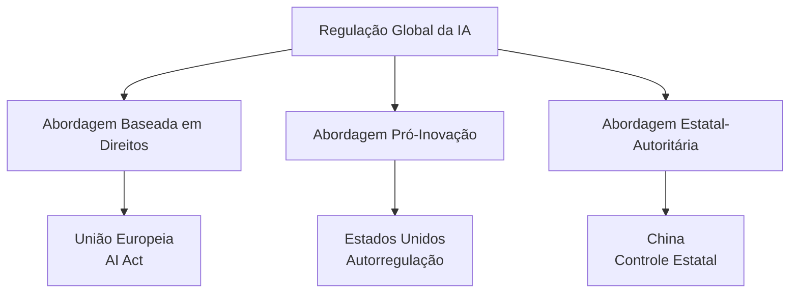

# Inteligência Artificial na Política Mundial: A Guerra Tecnológica, a Governança Global e a Posição do Brasil

A ascensão da **Inteligência Artificial (IA)** transformou-se em fator-chave na política internacional contemporânea. Tecnologias digitais e IA passaram a ser vistas como elementos estratégicos de poder, desencadeando **disputas geopolíticas pela supremacia tecnológica** e colocando desafios inéditos à governança global. De um lado, potências como Estados Unidos e China travam uma “guerra tecnológica” em frentes que vão dos semicondutores às redes 5G/6G e aplicações de IA avançada. De outro, a comunidade internacional busca formas de **regular a IA** de modo seguro e ético, porém enfrenta a fragmentação de modelos regulatórios e a ausência de um regime global unificado. Nesse contexto, o Brasil se vê diante de decisões cruciais: internamente, debate um **Marco Legal da IA** e implementa estratégias nacionais de fomento à IA; externamente, adota uma postura diplomática que privilegia o multilateralismo, a inclusão e a defesa dos direitos humanos – tudo enquanto procura manter autonomia estratégica na disputa tecnológica global. A seguir, examinamos esses eixos em detalhe, com foco nas implicações para a **Política Internacional**.

## A Guerra Tecnológica e a Geopolítica da IA (Contexto Global)

A IA e as tecnologias digitais emergiram como arena central da disputa de poder no sistema internacional. A capacidade de inovar e dominar setores de ponta – como algoritmos de IA, infraestrutura de telecomunicações e produção de microchips – passou a ser vista como sinônimo de **vantagem geopolítica e econômica**. Assim, na última década, tensões antes restritas ao comércio ou às questões militares passaram a incluir também a _tecnologia_ como eixo estratégico. A rivalidade _EUA–China_ tornou-se o caso mais emblemático, caracterizada por medidas de bloqueio tecnológico, investimentos maciços em inovação e uma retórica que enquadra a liderança tecnológica como questão de segurança nacional. Esse fenômeno reflete uma tendência mais ampla chamada de **“tecnonacionalismo”**, em que Estados adotam políticas para assegurar soberania tecnológica e evitar dependência externa, vendo na primazia tecnológica um pilar da força nacional. Abaixo, exploramos os principais fronts dessa guerra tecnológica – dos semicondutores às redes de comunicação e à própria corrida pela IA – bem como o conceito de tecnonacionalismo em maior detalhe.

### A Competição Estratégica EUA–China

A disputa estratégica entre Estados Unidos e China pela supremacia em tecnologia é hoje o **principal eixo da geopolítica da IA**. Ambos os países reconhecem que liderança em IA, computação avançada e infraestrutura digital se traduz em liderança econômica e militar no século XXI. De fato, analistas apontam que **a supremacia tecnológica tornou-se chave para o poder geopolítico e econômico**, e que EUA e China estão imersos em uma competição de longo prazo nesse terreno. Essa competição se manifesta em múltiplas áreas, dentre as quais destacam-se:

#### Semicondutores: a “guerra dos chips”

Um componente crítico é a chamada **guerra dos chips**, referente aos _semicondutores_. Microchips avançados são a base de praticamente todas as inovações digitais – de sistemas de IA a armamentos modernos – e seu domínio é considerado vital. Nos últimos anos, os EUA adotaram uma estratégia assertiva de **restringir o acesso da China a semicondutores de ponta**, visando atrasar o progresso tecnológico chinês. Em outubro de 2022, por exemplo, o governo Biden impôs um amplo conjunto de controles de exportação que **proíbem empresas chinesas de adquirir chips avançados e equipamentos de fabricação de chips** sem licença dos EUA. As medidas vão além: cidadãos e residentes nos EUA ficaram proibidos de apoiar fábricas chinesas na produção desses chips. Como resultado, **empresas chinesas foram cortadas dos insumos essenciais** para alcançar a fronteira tecnológica em microeletrônica – “os EUA cortaram os degraus” da escada tecnológica, segundo analistas. Washington justificou tais sanções em nome da **segurança nacional**, dada a importância dos chips em tudo, de smartphones a sistemas militares. Paralelamente, investiu pesado na re-localização da produção de semicondutores (vide a lei CHIPS Act), buscando reduzir a dependência de fábricas asiáticas. **Pequim, por sua vez, reagiu** com uma política de substituição de importações e investimento maciço para criar uma cadeia de suprimentos doméstica de chips de IA. A China também lançou sua **Lei de Controle de Exportação** e uma lista de entidades não confiáveis, sinalizando disposição de responder na mesma moeda. Essa “guerra dos chips” ilustra o tecnonacionalismo em ação: ambos os países adotam medidas protecionistas para garantir vantagem tecnológica – mesmo ao custo de fragmentar as cadeias globais de suprimentos.

> [!definition] **“Guerra dos Chips”** 
> Expressão que se refere à disputa entre potências pelo controle da produção e acesso a semicondutores avançados. Os **chips** são componentes fundamentais para IA, computação e armamentos modernos; controlá-los significa deter poder estratégico. No contexto atual, a “guerra dos chips” se manifesta em **embargos e sanções** – como as dos EUA contra a China – bem como em **subsídios bilionários** para construir fábricas domésticas. O objetivo de fundo é assegurar **autossuficiência tecnológica** e impedir que rivais acessem os processadores mais sofisticados, considerados essenciais para vantagens militares e econômicas.

#### Infraestrutura digital: a disputa pelo 5G/6G

Outro foco central é a **infraestrutura de telecomunicações de nova geração**, especialmente as redes _5G_ (e futuras _6G_). O 5G é visto como habilitador da próxima revolução digital – **internet das coisas**, cidades inteligentes, veículos autônomos – e por isso se tornou alvo de acirrada concorrência geopolítica. Nessa disputa, a chinesa **Huawei**, líder no fornecimento de equipamentos 5G, ganhou papel de pivô. Os EUA conduziram uma campanha global para barrar a Huawei, alegando riscos de espionagem e **ameaças à segurança nacional** caso países permitissem a empresa nas suas redes críticas. Aliados próximos, como Reino Unido, Austrália e Japão, seguiram em maior ou menor grau essa orientação, impondo restrições à Huawei. Já países europeus continentais buscaram diversificar fornecedores, enquanto hesitavam em banir totalmente os chineses. A disputa adquiriu tons de Guerra Fria Tecnológica: de um lado, Washington promovia alternativas ocidentais (Ericsson, Nokia, Samsung) e até financiamentos para competir com a Huawei; do outro, Pequim negava as acusações e ressaltava que a Huawei operava em 170 países sem comprovação de backdoors. O embate pelo 5G evidencia que **escolhas tecnológicas têm dimensão geoestratégica**. Como resumiu um ex-secretário do Ministério da Defesa do Brasil, _“é a guerra fria do século XXI porque se trata da escolha do padrão tecnológico de dados”_. Quem definir os padrões de 5G/6G e deter as patentes e empresas líderes terá influência significativa sobre a economia digital global. Além disso, controle sobre redes 5G implica controle (ou acesso privilegiado) sobre fluxos massivos de dados – um ativo tanto comercial quanto de inteligência. Dessa forma, _infraestrutura digital_ tornou-se área de contestação entre EUA e China, com impactos para todos os países que, como o Brasil, tiveram que calibrar sua posição nessa disputa ao realizar seus leilões de 5G.

#### A corrida pelo desenvolvimento de IA

A **liderança em pesquisa e aplicações de IA** completa o quadro da rivalidade tecnológica. Nos EUA, o ecossistema de IA é impulsionado por gigantes do Vale do Silício (Google, Microsoft, OpenAI, etc.), universidades de ponta e volumosos investimentos de capital privado e público. A China, por sua vez, adotou uma estratégia deliberada de Estado: lançou em 2017 o _Plano de Ação para Nova Geração de IA_, estabelecendo a meta de **tornar-se líder mundial em IA até 2030**. Para isso, mobilizou recursos estatais e privados, fomentou startups, e aproveitou sua abundância de dados e gradativa melhoria em chips para IA. Atualmente, China e EUA concentram a maior parte da _pesquisa de ponta, dos talentos e dos supercomputadores_ voltados à IA no mundo. A competição abrange desde algoritmos de _machine learning_, passando pela corrida do _deep learning_ generativo (como mostrado pelo frenesi global em torno do ChatGPT, de um lado, e de modelos chineses equivalentes, de outro), até aplicações militares de IA (como inteligência aplicada a drones, cibersegurança e análise de dados de inteligência). Autoridades americanas chegaram a afirmar que, **se os EUA não agirem rápido em IA, poderão “perder a competição tecnológica” para a China**. Do lado chinês, Xi Jinping frequentemente destaca a inovação tecnológica (IA inclusa) como central para os objetivos nacionais. Essa dinâmica alimenta discursos que comparam a corrida de IA a uma _nova corrida armamentista_, enfatizando a urgência de se alcançar (ou negar ao outro) qualquer _avanço disruptivo_ como a chamada IA geral. Diferentemente da corrida nuclear do século XX, entretanto, a corrida da IA envolve forte participação do setor privado e se dá em grande medida no mercado civil – o que complica tentativas de controle. Ainda assim, o efeito estratégico é semelhante: cada potência teme que a outra obtenha uma **supremacia em IA** capaz de desequilibrar o poder global, seja economicamente (por controlar inovações e plataformas futuras) ou militarmente (por aplicações bélicas superiores).

### O “Tecnonacionalismo”

A intensificação dessas disputas tecnológicas catalisou, em nível global, o fenômeno do **tecnonacionalismo**. Esse conceito descreve a postura de Estados que passam a tratar a _liderança tecnológica como questão de Estado e segurança nacional_, adotando políticas protecionistas e nacionalistas na área. Ou seja, governos privilegiam o desenvolvimento tecnológico **endógeno**, restringem transferências de tecnologia estratégica e **condicionam relações comerciais** aos imperativos da soberania tecnológica. Conforme definição clássica, tecnonacionalismo são _“as formas de protecionismo adotadas por políticas governamentais para manter a competitividade tecnológica”_ do país ou bloco. Na prática, ele se manifesta em medidas como: **controle de exportações sensíveis**, triagem de investimentos estrangeiros (vetando aquisições de empresas de alta tecnologia), restrições de vistos para pesquisadores (evitando fuga de conhecimento) e **subsídios maciços a indústrias estratégicas** (como semicondutores e IA). Tanto EUA quanto China exibem tecnonacionalismo nas suas agendas: Washington, ao barrar a Huawei e cortar chips da China; Pequim, ao erguer a Grande Firewall, exigir parcerias locais de empresas estrangeiras e investir pesadamente para eliminar pontos vulneráveis (chips, sistemas operacionais, etc.). A **União Europeia** também adota tinturas tecnonacionalistas ao falar em “soberania digital” – buscando reduzir dependência de tecnologia extra-bloco e desenvolver padrões próprios. Em suma, _tecnologia e poder nacional se entrelaçaram de forma inédita_. Se por décadas a globalização produziu cadeias de suprimento integradas e cooperação científica internacional, agora vemos uma tendência reversa: **fragmentação tecnológica por linhas geopolíticas**, com países erguiendo barreiras em nome de preservar autonomia e liderança. Analistas apontam que esse movimento dificilmente levará a um _desacoplamento total_ (dado o alto custo e interdependências profundas), mas que o conflito tecnológico EUA–China será prolongado e **alimentará o tecnonacionalismo global** nos próximos anos.

## O Desafio da Regulação da Inteligência Artificial

Paralelamente à competição por supremacia tecnológica, desponta outro dilema: **como regular a IA e mitigar seus riscos** em escala global. Diferente de áreas como não proliferação nuclear ou clima – onde existem regimes internacionais abrangentes – na governança da IA vive-se hoje um cenário de **fragmentação regulatória**. Não há consenso internacional sobre normas vinculantes para IA; em vez disso, vigoram abordagens distintas entre países e blocos, cada qual refletindo valores e prioridades próprias. Essa divergência é visível na comparação entre os modelos de regulação que emergem principalmente na **União Europeia, nos Estados Unidos e na China**. A UE busca liderar definindo padrões rígidos inspirados em direitos fundamentais, num típico “efeito Bruxelas” de exportação regulatória. Os EUA adotam, por ora, uma postura flexível, evitando lei geral e preferindo orientações setoriais e autorregulação, a fim de não tolher a inovação. A China, por seu turno, implementa um modelo estatal centralizador, combinando estímulo ao desenvolvimento com uso da IA para fins de _governança interna e controle social_. A ausência de um regime unificado cria **desafios de cooperação multilateral**: há risco de regras conflitantes, brechas exploráveis e até uma _corrida regulatória_ em que vencem padrões menos exigentes. A seguir, detalhamos os diferentes modelos (UE, EUA, China) e discutimos as tentativas de convergência em fóruns internacionais como ONU, UNESCO e OCDE.

### A Fragmentação da Governança Global

Em escala global, a governança da IA está fragmentada entre **diferentes modelos regulatórios concorrentes**, sem um arcabouço internacional único. Essa situação reflete tanto divergências filosóficas (por exemplo, sobre o peso da intervenção estatal vs. liberdade de mercado) quanto a própria rivalidade geopolítica (cada potência busca promover seu modelo como padrão). Os três paradigmas mais influentes hoje são: **(1)** o modelo regulatório da **União Europeia**, de caráter abrangente e baseado em direitos; **(2)** o modelo dos **Estados Unidos**, marcado por regulação setorial mínima e enfoque pró-inovação; e **(3)** o modelo da **China**, com forte centralização estatal e ênfase em segurança/controle. Abaixo, compararmos esses modelos:



```mermaid
flowchart TD
    A[Abordagens Regulatórias da IA]
    
    A --> B{Nível de Regulação}
    
    B -->|Alta| UE["🇪🇺 **União Europeia**<br/>✓ AI Act obrigatório<br/>✓ Multas até 7% do faturamento<br/>✓ Classificação por risco"]
    
    B -->|Média| US["🇺🇸 **Estados Unidos**<br/>• Guidelines voluntários<br/>• Regulação setorial<br/>• Executive Orders"]
    
    B -->|Específica| CN["🇨🇳 **China**<br/>⚠ Controle governamental<br/>⚠ Foco em segurança nacional<br/>⚠ Censura algorítmica"]
    
    style UE fill:#e1f5fe
    style US fill:#fff3e0
    style CN fill:#fce4ec
````

#### O Modelo da União Europeia (“Efeito Bruxelas”)

A União Europeia desponta como **pioneira na regulação abrangente da IA**, alavancando sua experiência prévia em proteção de dados (GDPR) e seu poder de mercado para tentar moldar padrões globais – fenômeno conhecido como _Brussels effect_ (efeito Bruxelas). Em 2021, a Comissão Europeia propôs o **AI Act (Lei de IA)**, primeiro marco legal amplo sobre inteligência artificial. O projeto adota uma **abordagem baseada em riscos**, classificando sistemas de IA em categorias (risco inaceitável, alto, limitado ou mínimo) e calibrando exigências conforme o potencial de dano. Por exemplo, aplicações de risco **“inaceitável”** – aquelas que ameaçam seriamente direitos fundamentais – seriam _proibidas_. Entram aí sistemas de **score social** (avaliação algorítmica de confiabilidade de indivíduos, nos moldes do que a China pratica) e possivelmente **IA para manipulação massiva ou que explore vulnerabilidades humanas**. Já sistemas de _alto risco_ (como IA em recrutamento de emprego, concessão de crédito, decisões judiciais, uso policial) teriam que cumprir requisitos estritos de transparência, **accountability** e segurança antes de entrar no mercado. O AI Act também mira _tecnologias sensíveis_ como **reconhecimento facial em tempo real em locais públicos** – tema de intenso debate. Há pressão do Parlamento Europeu para banir ou limitar fortemente essa prática (alguns países do bloco já a proíbem), dado o risco de vigilância em massa incompatível com privacidade e liberdades civis.

Em essência, o modelo europeu busca **equilibrar inovação em IA com a proteção de direitos fundamentais**. Ele parte do _princípio da precaução_: sem regras, a IA seria um “Velho Oeste” tecnológico; portanto, faz-se necessária intervenção legal ex ante. A UE enxerga a regulação como meio de _aumentar a confiança_ na IA e evitar abusos que minem valores democráticos. Esse arcabouço se ancora na tradição europeia de enfatizar dignidade humana, privacidade, não discriminação e segurança. Ao mesmo tempo, a UE espera que sua lei defina um **padrão global**: se for implementada com sucesso, outros países tenderão a adotá-la ou aderir a padrões semelhantes. Isso já ocorreu com a GDPR (proteção de dados) e a expectativa é que se repita na IA – consolidando um regime em que **empresas globais terão que seguir as regras europeias** para poder operar no grande mercado da UE. Inclusive, há cálculos geopolíticos: **alinhar-se à UE em princípios de IA** é visto pelos EUA como estratégico para contrabalançar o avanço chinês, dado que uma frente transatlântica coesa em valores poderia influir no futuro da economia digital. Naturalmente, o AI Act enfrenta desafios técnicos (ex.: exigir explicabilidade de certos algoritmos pode ser inviável) e resistência de big techs preocupadas com impacto em seus modelos de negócio. Ainda assim, a UE caminha para aprovar a lei em breve (previsão de vigência possivelmente em 2025-2026), reforçando sua posição de **“reguladora do mundo”** em tecnologia.

#### O Modelo dos Estados Unidos

Os Estados Unidos adotam até o momento uma abordagem mais **flexível e fragmentada** para a regulação de IA. Não há uma lei federal abrangente específica para IA – em parte devido à filosofia mais pró-mercado e ao lobby da indústria de tecnologia. Em vez disso, prevalece um **modelo setorial e de autorregulação guiada**: diferentes agências e setores desenvolvem diretrizes próprias, e o governo federal emite apenas orientações gerais ou normas voluntárias. Por exemplo, a Administração Biden lançou um _Blueprint for an AI Bill of Rights_ (Guia para uma Carta de Direitos da IA) em 2022, porém este documento tem natureza não vinculante, servindo mais como referência ética (defende princípios como não discriminação algorítmica, proteção de dados e auditoria de sistemas automatizados). Paralelamente, o **NIST** (Instituto Nacional de Padrões e Tecnologia) publicou um **Framework de Gerenciamento de Riscos em IA**, encorajando empresas a adotarem voluntariamente boas práticas de avaliação de risco e transparência. Setores específicos contam com regulação ad hoc – por exemplo, a FDA (agência de saúde) regulamenta algoritmos médicos com enfoque em segurança e eficácia; o Departamento de Transportes lida com IA veicular autônoma, etc. Assim, o mosaico regulatório americano é **setorial, fragmentado e baseado em _soft law_** até o momento.

Essa opção reflete a prioridade histórica dos EUA em **estimular a inovação e a liderança industrial**. A visão predominante é que regulação excessiva, prematura ou genérica poderia sufocar a competitividade das empresas americanas num campo em rápida evolução. Em lugar de regras rígidas impostas pelo Estado, privilegiam-se **padrões desenvolvidos em parceria com a indústria**, sandboxes regulatórios e incentivos à autorregulação responsável. Além disso, a cultura jurídica dos EUA tende a confiar em mecanismos pós-fato (responsabilidade civil, enforcement de órgãos de defesa do consumidor ou antidiscriminação) em vez de licenciamento prévio de tecnologias. Nos últimos anos, contudo, cresce a consciência sobre riscos da IA (viés algorítmico, impactos sociais, desinformação, etc.) e alguns estados americanos e cidades começaram a aprovar leis específicas – por exemplo, Nova York regulando o uso de algoritmos em contratação de emprego (para evitar discriminação). O Congresso também discute propostas, mas nenhuma de alcance geral foi aprovada ainda.

Em suma, o **modelo norte-americano** pode ser descrito como _“light-touch”_ (toque suave) e **“pro-inovação”**. Ele busca **evitar amarras regulatórias federais** que possam dar vantagem a competidores estrangeiros, preferindo confiar que o dinamismo do mercado produzirá as melhores soluções e que os riscos podem ser geridos com normas existentes (como leis de proteção ao consumidor, antitruste, direitos civis, etc.). Contudo, essa postura vem sendo questionada conforme a UE avança com sua lei e conforme a sociedade americana percebe os perigos de IA desregulada (por exemplo, interferência eleitoral via desinformação algorítmica, ou prejuízos de decisões automatizadas opacas). Há assim uma tensão interna entre, de um lado, **manter a liderança tecnológica global (não “atrasar” o Vale do Silício)** e, de outro, **acompanhar a necessidade de proteger cidadãos e valores democráticos** também no ambiente digital. Essa balança regulatória nos EUA permanece em evolução – possivelmente inclinando-se a mais regulação no futuro, mas ainda longe do ponto adotado pelos europeus.

#### O Modelo da China

A **China** apresenta uma abordagem distinta, marcada por forte **centralização estatal e integração entre política industrial e regulação**. Para Pequim, desenvolver IA é prioridade nacional tanto para impulsionar o crescimento econômico quanto para reforçar a _segurança do Estado_. Logo, sua estratégia busca o “duplo objetivo”: **supremacia tecnológica + controle social**. No front do desenvolvimento, o governo chinês investe pesado (subsídios, planos quinquenais, parques tecnológicos) para que empresas domésticas liderem em IA, e protege seu mercado interno de concorrência estrangeira direta – muitas big techs ocidentais são banidas ou limitadas, dando espaço para equivalentes chinesas (Baidu, Alibaba, Tencent etc.). Ao mesmo tempo, no front da **regulação e uso da IA**, a China impõe regras estritas alinhadas aos interesses do Partido-Estado. A lógica é: permitir a inovação, **porém sem perder a tutela sobre os efeitos sociais** da tecnologia.

Na prática, a China foi **um dos primeiros grandes mercados a lançar normas abrangentes de IA**. Entraram em vigor nos últimos anos regulações sobre: **algoritmos de recomendação**, exigindo que plataformas tornem públicos seus algoritmos e evitem promover vícios ou conteúdos “indesejados” (definidos pelo Estado); **deepfakes**, obrigando identificação clara de conteúdo sintético; e recentemente **modelos de IA generativa** (como chatbots), que devem aderir aos “valores socialistas centrais” e passar por avaliações de segurança se atingirem grande escala. Além disso, a China já proíbe anonimamente vários tipos de conteúdo online e implementa sistemas de vigilância de ponta: **reconhecimento facial em massa, câmeras inteligentes, o “crédito social”** que monitora comportamento cidadão. Esses instrumentos são impulsionados por IA e demonstram como **Pequim utiliza a tecnologia para reforçar o controle político e a estabilidade interna**. Leis chinesas obrigam empresas de tecnologia a **cooperar com o governo**, censurar informações “perigosas” e assegurar que seus produtos não ameacem a ordem pública. Diferentemente do Ocidente, onde a privacidade individual e limitações ao Estado são preocupações centrais, na China a ênfase recai em _soberania do Estado sobre os dados e tecnologias_. A **segurança nacional** é evocada para justificar amplos poderes de vigilância e filtragem.

Em síntese, o **modelo chinês de governança de IA** é _estatal-dominante_: o governo atua simultaneamente como **promotor da inovação** (via investimento e planejamento) e **árbitro do uso da tecnologia** (via regulação apertada do conteúdo e implementação). A meta declarada é colher os benefícios da IA para o desenvolvimento econômico e eficiência governamental, enquanto **se evitam os “efeitos desestabilizadores” da digitalização descontrolada** – como disse Xi Jinping, garantir que a tecnologia sirva à “harmonia social”. Esse modelo contrasta tanto com o europeu (que visa proteger o cidadão do Estado e das empresas) quanto com o americano (que visa liberar o potencial do mercado), mostrando uma terceira via onde a tecnologia está subordinada à supremacia do Estado e do partido governante. Por consequência, a China tende a apoiar nos fóruns internacionais princípios de “soberania digital” (cada país define suas regras para IA dentro de suas fronteiras) e se opõe a qualquer mecanismo externo que julgue seus usos domésticos de IA (por exemplo, críticas a sistemas como o crédito social). A exportação de elementos desse modelo – seja através do comércio de sistemas de vigilância chineses para outros países, seja via promoção de conceitos na ONU – é parte da atual disputa por valores na governança global da tecnologia.

### O Debate Multilateral

Diante da falta de um regime unificado e das diferenças entre modelos regionais, _como avançar numa governança global da IA?_ Vários **fóruns multilaterais e iniciativas internacionais** vêm tentando construir pontes e princípios comuns, embora com resultados ainda iniciais. Um marco importante foi estabelecido na **UNESCO**, que em novembro de 2021 aprovou por consenso a _Recomendação sobre a Ética da Inteligência Artificial_. Trata-se do **primeiro instrumento normativo global** em IA, acordado por 193 países incluindo EUA, China e Brasil. A Recomendação da UNESCO define princípios como transparência, justiça, privacidade, diversidade, não-maleficência e responsabilidade, e orienta os Estados a adotarem medidas para incorporar essas diretrizes eticamente no desenvolvimento e uso de IA. Embora não seja juridicamente vinculante, esse documento cria uma base ética comum e um compromisso político internacional em prol de uma IA centrada no ser humano e nos direitos humanos.

Outra frente relevante é a **OCDE (Organização para Cooperação e Desenvolvimento Econômico)**, que em 2019 lançou os _Princípios da OCDE sobre IA_. Esses princípios – posteriormente endossados pelo G20 – pregam o uso responsável da IA para crescimento inclusivo, respeito aos direitos humanos e valores democráticos, transparência e explicabilidade dos sistemas, robustez e segurança, e responsabilidade dos atores de IA. Além disso, a OCDE estabeleceu um _Observatório de Políticas de IA_ para acompanhar as evoluções globais e compartilhar boas práticas entre governos. Também nasceu no âmbito do G7/OCDE a **Global Partnership on AI (Parceria Global em IA)**, um grupo multistakeholder (governos, academia, sociedade civil) que promove pesquisas e recomendações sobre IA responsável – embora os grandes países envolvidos tenham visões distintas, este fórum busca encontrar convergências técnicas e éticas.

Na **ONU** mais ampla, o secretário-geral António Guterres tem sido voz ativa chamando atenção para riscos da IA desregulada e a necessidade de ação coletiva. Em 2023, Guterres apoiou a proposta (ventilada por alguns especialistas e pelo CEO da OpenAI) de criar uma espécie de **agência internacional para IA inspirada na AIEA** (Agência de Energia Atômica). Seria um órgão multilateral de _vigilância e promoção do uso seguro da IA_, capaz de estabelecer padrões globais e monitorar seu cumprimento – análogo ao papel da AIEA no monitoramento nuclear. O secretário-geral qualificou a ideia como “muito interessante”, mas reconheceu que apenas os Estados-membros da ONU poderiam viabilizá-la. Enquanto isso não ocorre, ele anunciou a criação de um **Órgão Consultivo de Alto Nível em IA**, para revisar periodicamente os arranjos de governança existentes e sugerir alinhamentos com direitos humanos, Estado de direito e o bem comum. Essa iniciativa deve apresentar relatórios que podem embasar futuras negociações intergovernamentais. Ainda no âmbito ONU, debates tomam lugar no **Conselho de Segurança** (por conta do uso potencial de IA em armas autônomas e cibersegurança) e planeja-se incluir o tema na **Cúpula do Futuro** (prevista para 2024), que trabalhará num possível _Pacto Digital Global_. Este pacto buscaria compromissos em áreas digitais amplas, incluindo IA, visando evitar a fragmentação da internet e assegurar que tecnologias sejam usadas de forma benéfica e alinhada à Carta da ONU.

Apesar dessas iniciativas, o panorama geral permanece desafiador. Há uma evidente **competição entre modelos regulatórios** – por exemplo, disputas _transatlânticas_ sobre privacidade de dados já ocorrem e podem se repetir com IA. Também existem clivagens _norte-sul_: muitos países em desenvolvimento preocupam-se que regulações muito rígidas (ditadas por países ricos) dificultem seu acesso à inovação e reforcem assimetrias globais. Por isso, países emergentes (como Índia, Brasil, Indonésia) defendem que qualquer governança global de IA seja **inclusiva e sensível às diferenças de desenvolvimento**, permitindo espaço para inovação local e transferência de tecnologia, ao mesmo tempo que protege direitos. Fóruns regionais também entram na discussão – por exemplo, na América Latina, a recente **Aliança Digital UE–ALC** envolve diálogos birregionais sobre IA centrada no ser humano.

Em resumo, o debate multilateral sobre IA está em ebulição, mas em estágio inicial. Há consenso sobre princípios gerais (vide UNESCO e OCDE) e concordância de que a IA **não pode ficar sem nenhum controle global**. Entretanto, há divergências quanto à forma (tratado vinculante vs. princípios voluntários), quanto à entidade que deve liderar (ONU, multi-stakeholders ou alianças entre “afinidades”) e quanto ao conteúdo exato das normas (por exemplo, banir ou não certas aplicações). É provável que nos próximos anos vejamos uma intensificação dessas negociações. Do ponto de vista diplomático, a capacidade de _conciliar inovação com valores éticos universais_ será crucial para legitimar um eventual regime global de IA. Caso contrário, persiste o risco de uma ordem fragmentada: com **esferas tecnológicas rivais**, cada qual com suas regras – um cenário que o próprio Brasil e outros países têm motivos para evitar.

## A Posição e as Iniciativas do Brasil (Foco Principal)

_Plenário do Senado Federal durante a votação do Marco Legal da IA, em 10 de dezembro de 2024._

Diante do panorama global descrito, o **Brasil** busca posicionar-se de forma a **aproveitar as oportunidades da IA para o desenvolvimento**, ao mesmo tempo em que **mitiga riscos e assegura valores democráticos**. Esse equilíbrio se reflete em três frentes interligadas: (1) o **debate interno sobre regulação da IA**, com a tramitação de um Marco Legal no Congresso Nacional; (2) a formulação de uma **Estratégia Nacional de IA** e planos de ação para fomentar a pesquisa, a inovação e a capacitação no tema; e (3) a **política externa brasileira**, que tradicionalmente defende uma governança internacional multilateral, inclusiva e centrada em direitos, além de prezar pela autonomia estratégica do país (evitando alinhamentos automáticos na disputa entre grandes potências). A seguir, examinamos cada uma dessas frentes em detalhe.

### O Debate Interno sobre Regulação (Marco Legal da IA)

O Brasil vem construindo gradualmente seu arcabouço regulatório doméstico para IA. O ponto central é o **Marco Legal da Inteligência Artificial**, discutido no Congresso desde 2020. A iniciativa começou com o _Projeto de Lei (PL) 21/2020_ na Câmara dos Deputados, de autoria do Dep. Eduardo Bismarck (PDT-CE), e evoluiu até o _PL 2338/2023_ no Senado Federal, apresentado pelo próprio Presidente do Senado, Rodrigo Pacheco, que consolidou diferentes contribuições. Em dezembro de 2024, o Senado aprovou simbolicamente o PL 2338/23 – que agora aguarda análise final na Câmara dos Deputados – marcando um passo significativo para estabelecer regras no uso da IA no Brasil.

**Conteúdo e Princípios:** O texto original do PL 21/2020 já delineava os **fundamentos e princípios** que orientam a regulação. Ficou estabelecido que a utilização de IA no Brasil deve ter como **fundamento o respeito aos direitos humanos, aos valores democráticos, à igualdade, à não-discriminação, à pluralidade, à livre iniciativa e à privacidade de dados**. Em outras palavras, a pessoa humana e seus direitos são centrais (“centralidade da pessoa humana” é termo usado na justificativa do projeto). Entre os **princípios** está também a **transparência** quanto ao uso e funcionamento de sistemas de IA – buscando evitar a opacidade algorítmica. O marco legal visará **estimular a inovação e proteger os cidadãos contra mau uso da IA** simultaneamente, numa abordagem balanceada. Para tanto, o PL define a figura dos **“agentes de IA”**, diferenciando o _agente desenvolvedor_ (quem cria ou treina o sistema) do _agente operador_ (quem implementa ou utiliza o sistema). Esses agentes terão deveres legais, como **responder pelas decisões tomadas pelo sistema de IA** (responsabilidade civil) e **assegurar conformidade com a Lei Geral de Proteção de Dados (LGPD)** na utilização de dados pessoais. Ou seja, busca-se evitar a ideia de “algoritmo sem culpado”: haverá sempre um ente humano ou empresarial responsável por prejuízos causados pela IA. Adicionalmente, prevê-se direitos às pessoas afetadas por sistemas de IA (_partes interessadas_), como o direito a informações sobre uso de seus dados, especialmente dados sensíveis.

> [!note] **Inovações regulatórias propostas** 
> O projeto brasileiro incorpora mecanismos inspirados em experiências internacionais, como a exigência de um **Relatório de Impacto de IA** – documento em que o agente de IA deve descrever a tecnologia, os objetivos e medidas de gerenciamento de riscos. Esse relatório, similar a avaliações de impacto algorítmico de outros países, poderá ser solicitado por autoridades públicas e servirá para avaliar se o sistema atende a padrões de transparência e segurança. O PL também orienta o **Poder Público** a adotar IA em serviços públicos (preferencialmente com código aberto), fomentando a pesquisa nacional e capacitando trabalhadores para a nova realidade tecnológica. Prevê ainda a criação de **mecanismos de governança** para coordenar as ações em IA no país, indicando a importância de uma instância responsável pela política de IA.

**Debates e Pontos Controversos:** Durante a tramitação, diversas questões geraram **debates entre os atores** (governo, setor privado, academia e sociedade civil). Um ponto sensível foi a discussão sobre **responsabilidade civil e penal**: como atribuir culpa quando uma IA causa dano? O consenso caminha para não se reconhecer personalidade jurídica à IA (a responsabilidade recai sobre desenvolvedores ou operadores), mas definir critérios claros de nexo causal ainda é um desafio. Outro debate se deu em torno do **modelo regulatório a adotar** – algumas propostas iniciais sugeriam uma lei mais principiológica (sem detalhar obrigações técnicas), enquanto outras, influenciadas pelo modelo europeu, pediam incorporar um **enfoque de riscos** com distinção de exigências conforme o tipo de sistema. O texto do Senado (PL 2338/2023) incluiu inspirações do AI Act europeu, mas adaptadas ao contexto brasileiro. Por exemplo, ganhou destaque a questão de **direitos autorais na era da IA generativa**: o PL aprovado no Senado trouxe dispositivos obrigando empresas de IA a divulgarem quais conteúdos protegidos por copyright foram usados no treinamento de modelos, dando aos autores o direito de **vetar ou negociar o uso de suas obras**. Isso reflete preocupação de artistas e criadores com ferramentas de IA que aprendem em cima de obras existentes (músicas, imagens, textos). O **Ministério da Cultura** apoiou ativamente essas cláusulas, argumentando ser essencial garantir remuneração justa aos artistas e transparência sobre o uso de seu trabalho. Já representantes do setor de tecnologia temiam que exigências muito rígidas, sobretudo para _startups_, pudessem inibir a inovação local ou tornar o Brasil pouco atraente para investimentos em IA. A solução buscada tem sido calibrar obrigações de acordo com porte e risco – possivelmente dispensando pequenas empresas de relatórios complexos, ou dando prazos para adequação.

Outro tópico discutido é o **órgão regulador**: o PL menciona a criação de um _Sistema Nacional de Regulação e Governança de IA_, mas não detalha se haverá uma agência nova ou se agências existentes (como a Autoridade de Proteção de Dados, ANPD) assumirão competências. Há quem defenda uma **agência específica para IA**, dada a transversalidade do tema, enquanto outros preferem aproveitar estruturas existentes (ANPD, Anatel, etc., conforme o setor) para evitar burocracia adicional. Esse desenho institucional segue em aberto durante a tramitação final na Câmara.

Em síntese, o **Marco Legal de IA do Brasil** busca: estabelecer princípios éticos e direitos (humanos, democráticos), dar segurança jurídica para inovação responsável, atribuir responsabilidades claras e incentivar o desenvolvimento benéfico da IA. Trata-se de conciliar o incentivo ao progresso tecnológico com salvaguardas contra abusos – um equilíbrio sintonizado com a tradição brasileira de buscar _via média_ regulatória. A aprovação definitiva da lei fará do Brasil um dos primeiros países fora da Europa a dotar-se de legislação abrangente sobre IA, o que poderá inclusive elevar a influência brasileira nas discussões internacionais sobre o tema.

### A Estratégia Nacional de IA (EBIA) e o Plano Brasileiro de IA

Paralelamente ao marco legal, o Brasil tem avançado em **políticas públicas para promoção da IA**. Em abril de 2021, foi publicada a **Estratégia Brasileira de Inteligência Artificial (EBIA)**, por meio da Portaria MCTI nº 4.617/2021. A EBIA é um documento de referência que **norteia as ações do Estado brasileiro** para desenvolver e utilizar IA de forma benéfica, ética e inclusiva. A estratégia foi construída a partir de estudos técnicos, consultas a especialistas (com apoio da UNESCO) e uma consulta pública que reuniu cerca de 1000 contribuições. Seu objetivo principal é _potencializar o desenvolvimento da IA no Brasil_, com vistas à inovação, ganhos econômicos e sociais, **sem negligenciar a segurança e valores éticos**.

A **EBIA estabelece seis objetivos estratégicos** principais:

- **Elaborar princípios éticos** para o desenvolvimento e uso responsável da IA, alinhados a direitos e valores (contribuindo à discussão global sobre _IA ética_).
    
- **Promover investimentos sustentados em P&D** em IA, fortalecendo pesquisa científica e capacidade de inovação no país.
    
- **Remover barreiras à inovação** em IA, aprimorando marcos regulatórios e ambiente de negócios para facilitar experimentação e adoção de novas tecnologias.
    
- **Capacitar e formar profissionais** para o ecossistema de IA, suprindo a demanda por especialistas e democratizando o conhecimento em IA.
    
- **Estimular a inovação e o desenvolvimento da IA brasileira em ambiente internacional**, incentivando a participação de instituições nacionais em redes e projetos globais, e atraindo talentos e empresas de fora.
    
- **Promover cooperação entre setores público, privado, academia e centros de pesquisa** para criar sinergias no desenvolvimento de IA (um ecossistema colaborativo).
    

Para concretizar esses objetivos, a EBIA define **nove eixos temáticos** (ou pilares), que incluem áreas como educação e capacitação em IA; fomentos a pesquisa científica; aplicação de IA em setores estratégicos (saúde, agricultura, indústria etc.); legislação, ética e regulação; e até cooperação internacional em IA. Cada eixo traz um diagnóstico da situação atual, desafios identificados e ações estratégicas propostas. Por exemplo, no eixo de **educação**, a EBIA aponta a necessidade de incluir conteúdos de IA nos currículos e ampliar programas de formação de profissionais de TI e ciência de dados. No eixo de **aplicações na indústria**, sugere estimular a adoção de IA em empresas, incluindo pequenas e médias, para aumentar a produtividade. No eixo de **ética e regulação**, enfatiza a importância de princípios (muito em linha com a UNESCO) e prepara terreno para o marco legal discutido acima.

Importante notar que a EBIA _não é um documento estático_: ela prevê revisão e atualização conforme a IA evolua. De fato, a implementação de seus objetivos ganhou reforço em 2023 com o lançamento do **Plano Brasileiro de Inteligência Artificial (PBIA) 2024-2027** pelo MCTI. O PBIA aprofunda as diretrizes da EBIA e aloca recursos: prevê **investimentos de até R$ 23 bilhões em quatro anos** para projetos de pesquisa, inovação e capacitação em IA. Trata-se de um plano ambicioso para transformar o país em referência em inovação em IA, incluindo metas como criação de centros de pesquisa aplicada, bolsas de estudo, desafios tecnológicos e adoção de IA em serviços públicos essenciais. O PBIA foi elaborado de forma colaborativa (governo, academia, setor produtivo) e reflete o compromisso brasileiro em desenvolver soluções de IA **alinhadas às demandas nacionais e características locais**. Entre suas diretrizes estão: fomentar pesquisa básica e aplicada; formar talentos em grande escala; assegurar segurança, transparência e proteção de dados nas soluções de IA; e incentivar uso de IA no setor público para políticas baseadas em evidências.

Em resumo, **Brasil tem direcionado esforços não apenas para regular, mas também para incentivar a IA** de forma estratégica. A EBIA fornece a visão de longo prazo e princípios, enquanto o PBIA traz a execução com recursos e programas concretos. Essa dupla abordagem é crucial: regula-se para proteger e dar confiança, e investe-se para não ficar para trás na revolução da IA. No contexto de um país em desenvolvimento, há consciência de que IA pode ser ferramenta para salto econômico e social – desde que haja preparo e políticas adequadas. Ao mesmo tempo, há cautela para que a IA não amplie desigualdades ou viole direitos no Brasil. Essa visão equilibrada permeia a estratégia brasileira.

### A Política Externa Brasileira para o Tema

No cenário internacional, o **Brasil atua de forma propositiva na governança global da IA**, coerente com sua tradição diplomática de defesa do multilateralismo, do desenvolvimento inclusivo e dos direitos humanos. A posição brasileira enfatiza que as discussões sobre IA **devem ocorrer em fóruns multilaterais legítimos (particularmente a ONU)** e com participação equilibrada de países desenvolvidos e em desenvolvimento – evitando que apenas um pequeno grupo de nações ou empresas privadas estabeleça as regras do jogo. Como afirmou o Ministro das Relações Exteriores, Mauro Vieira, _“as Nações Unidas não devem estar apenas no centro das discussões sobre IA, mas no centro de qualquer iniciativa de tomada de decisão”_. Isso reflete a visão de que a governança da IA precisa ser **democrática e inclusiva globalmente**, sob pena de aprofundar desigualdades e assimetrias de poder.

Do ponto de vista de princípios, o Brasil advoga por uma **abordagem centrada no ser humano**, que equilibre **inovação e desenvolvimento econômico com a proteção dos direitos humanos e dos valores democráticos**. Nos fóruns internacionais, a diplomacia brasileira tem sublinhado preocupações com fenômenos como _desinformação digital, discurso de ódio online e concentração de poder em plataformas_, e como estes podem minar democracias. Ao mesmo tempo, o Brasil reconhece o potencial transformador da IA para benefícios públicos – por exemplo, para reduzir assimetrias entre países desenvolvidos e em desenvolvimento, desde que haja transferência de conhecimento e capacitação. Dessa forma, a posição brasileira busca **garantir que a revolução digital não exclua os países do Sul Global**, mas sim os beneficie. Na presidência brasileira do G20 em 2024, um dos temas foi justamente como IA pode ajudar a diminuir lacunas de desenvolvimento e preservar a integridade da informação. O Brasil lançou iniciativas sobre _integridade da informação e mudanças climáticas_, trazendo a discussão tecnológica para agendas como a ambiental, numa perspectiva interdisciplinar.

Em termos práticos, o Brasil tem apoiado e participado ativamente de iniciativas como a **Recomendação da UNESCO sobre Ética da IA** – inclusive traduzindo-a e promovendo debates nacionais sobre sua implementação. Também aderiu aos princípios da OCDE e integra grupos de trabalho internacionais sobre IA. Ademais, o Brasil vem enfatizando a importância de um **Pacto Digital Global** (a ser discutido na ONU) que inclua orientações para IA, e apresentou no Conselho de Direitos Humanos iniciativas relativas a direitos na era digital. Outra arena de atuação é o **BRICS**: sob presidência brasileira em 2025, o governo indicou que traria a discussão de IA para esse agrupamento, de modo a assegurar que grandes emergentes tenham voz conjunta sobre padrões tecnológicos.

Um aspecto notável da política externa brasileira é a busca de **autonomia estratégica** na esfera tecnológica, evitando alinhamentos automáticos com qualquer superpotência. Isso significa que o Brasil quer **parceria com todos os atores relevantes** – coopera com a UE em regulações e projetos (há diálogo UE-América Latina sobre IA centrada no ser humano), mantém diálogo com os EUA (por exemplo, sob a Comissão Brasil-EUA de CT&I) e simultaneamente com a China. Um exemplo concreto foi a postura em relação à **rede 5G**: mesmo sob pressão intensa dos EUA para banir a Huawei, o governo brasileiro declarou que _“não entraria na guerra entre EUA e China”_, optando por uma solução própria – restringir a Huawei apenas na rede privativa governamental, mas não bani-la das redes comerciais. Como disse o ministro Fabio Faria em 2021, o Brasil acompanhava a disputa mas não ia “tomar partido” na guerra tecnológica, adotando critérios técnicos e de segurança pontuais. Essa decisão ilustra a tentativa do Brasil de **manter-se independente na disputa EUA-China**, focando em seu interesse nacional (no caso, implementar o 5G sem atrasos e com múltiplos fornecedores).

> [!example] **Exemplo – Neutralidade do Brasil na disputa do 5G** 
> Em 2021, durante os preparativos do leilão de 5G, o então Ministro das Comunicações Fabio Faria afirmou que o Brasil _“não vai entrar no meio dessa guerra (comercial) entre EUA e China”_. Ele explicou que o edital brasileiro teria **restrições à Huawei apenas na rede governamental privativa**, por questões de segurança, mas não na rede comercial ampla. Ou seja, o Brasil não baniu totalmente a empresa chinesa, diferentemente dos EUA, equilibrando assim relações com ambos os lados e priorizando sua própria infraestrutura. Esse caso demonstra a busca por autonomia e pragmatismo tecnológico na política externa brasileira.

No plano retórico-diplomático, o Brasil costuma sublinhar a necessidade de **colocar as tecnologias a serviço da humanidade**. Discurso recente do chanceler Mauro Vieira alertou que, se deixada sem controle nas mãos de poucos, a revolução da IA pode _“corroer sistemas democráticos, minar a base do direito internacional, da verdade e dos laços sociais”_. Daí a defesa de um **processo verdadeiramente inclusivo** de governança global, com justa representação de países em desenvolvimento e envolvendo múltiplos stakeholders. O Brasil preocupa-se especialmente com os impactos da IA sobre a _desinformação e a polarização_, fenômenos já vividos nas redes sociais, e advoga que _“o que é ilegal offline deve ser ilegal online”_, exigindo que grandes empresas de tecnologia respeitem as leis nacionais. Essa posição robustece iniciativas domésticas (como o recente projeto de regulamentação das plataformas online, o PL das Fake News) e confere autoridade moral ao Brasil nos debates globais de governança da internet e IA.

Em suma, **a política externa brasileira para IA** caracteriza-se por:

- **Defesa do multilateralismo** – as decisões sobre IA devem ser tomadas preferencialmente em âmbito ONU, com ampla participação; o Brasil apoia criar instâncias ou fortalecer as existentes (UNESCO, OCDE, ITU, etc.) para tratar do assunto.
    
- **Equilíbrio entre inovação e direitos humanos** – o Brasil promove marcos que permitam o desenvolvimento tecnológico, porém guiados por princípios éticos e de direitos (como privacidade, não discriminação, democracia).
    
- **Inclusão do Sul Global e redução de assimetrias** – insistência para que países em desenvolvimento tenham voz, acesso a tecnologias e capacitação; evitar uma nova divisão digital onde poucos países concentram os benefícios da IA.
    
- **Autonomia e pragmatismo** – engajamento com todas as potências e atores, mas mantendo independência de alinhamento. O Brasil procura _parcerias diversificadas_ (inclusive com países como Índia e África do Sul em posições similares) para aumentar seu poder de barganha e explorar oportunidades tecnológicas, sem cair em dependência extrema de um lado ou outro.
    
- **Visão humanista e democrática da IA** – buscando inserir na governança global valores que são caros à diplomacia brasileira, como direitos humanos, paz e desenvolvimento sustentável. Por exemplo, trazer a discussão de IA para a agenda do clima, ou para objetivos de desenvolvimento da ONU, numa perspectiva de que a IA deve servir para melhorar vidas e não agravar crises.
    

Essa postura confere ao Brasil certo destaque nas discussões internacionais: o país é visto como ator construtivo, capaz de dialogar tanto com EUA/UE (compartilhando preocupação com direitos e regulação) quanto com China/Rússia (compartilhando a ênfase em desenvolvimento e soberania, ainda que divergir no aspecto democrático). Para o diplomata em formação (CACD), compreender essa finesse é crucial: o Brasil tenta _navegar a competição tecnológica_ extraindo benefícios e minimizando riscos, sempre com o horizonte de uma ordem digital mais **cooperativa, menos fragmentada e centrada no ser humano**. Como resumiu Mauro Vieira, _“um mundo justo, pacífico e sustentável depende de sabermos aproveitar os benefícios das novas tecnologias, mas também restringir a exacerbação de poder que delas pode advir. Essas metas não são contraditórias – devem nos unir”_.

Em conclusão, a geopolítica da inteligência artificial coloca desafios complexos para todas as nações. A “guerra tecnológica” entre grandes potências redefine alianças e rivalidades, enquanto a ausência de um regime global de IA exige criatividade diplomática para se evitar um **vácuo normativo perigoso**. O Brasil, ciente da importância estratégica do tema, busca se posicionar como **ator equilibrado e influente**, tanto regulando internamente com visão humanista quanto contribuindo externamente para uma governança global que seja **multilateral, inclusiva e ética**. Esse posicionamento, além de responder aos valores tradicionais da política externa brasileira, visa garantir que o país possa colher as oportunidades da revolução da IA _sem abrir mão da proteção de sua democracia e dos direitos de seus cidadãos_ – um desafio crucial para os diplomatas e formuladores de políticas nas próximas décadas.

> [!question] **Perguntas para autoavaliação**
> 
> 1. Como a rivalidade tecnológica EUA–China se manifesta em diferentes setores (como semicondutores, 5G e IA) e de que forma o conceito de _tecnonacionalismo_ ajuda a explicar as políticas adotadas por esses países?
>     
> 2. Compare os modelos de regulação de IA da União Europeia, dos Estados Unidos e da China. Quais são os principais objetivos e premissas de cada um, e quais desafios essa fragmentação regulatória traz para a governança global da IA?
>     
> 3. Avalie a posição do Brasil na geopolítica da IA: quais estratégias o país adota para equilibrar inovação tecnológica, desenvolvimento econômico e preservação de direitos e valores democráticos, tanto nas políticas internas (como o Marco Legal da IA e a EBIA) quanto na sua atuação diplomática internacional?


