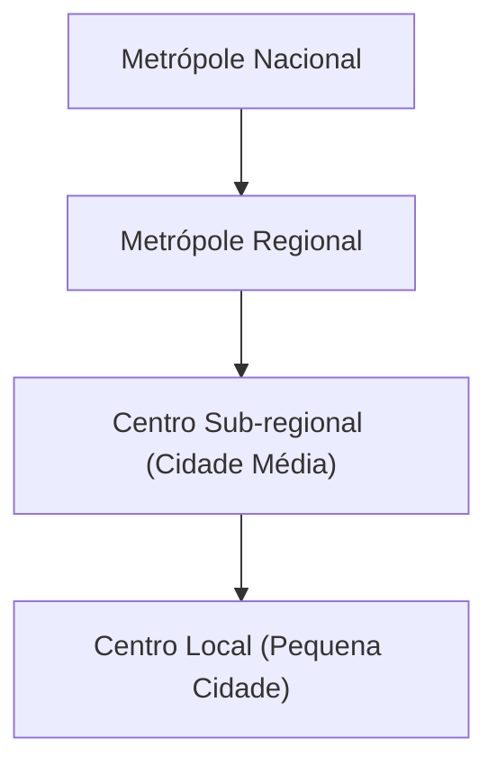

# Geografia Urbana: Processos de Urbanização, Dinâmicas Metropolitanas e o Papel das Cidades no Brasil e no Mundo

A organização do espaço urbano reflete processos históricos, econômicos e sociais em múltiplas escalas. Nesta nota de estudo, examinamos **processos de urbanização**, a formação de **redes de cidades**, fenômenos de **conurbação e metropolização**, o surgimento de **cidades globais**, as **dinâmicas intraurbanas** das metrópoles brasileiras (segregação socioespacial, periferização, mobilidade, etc.) e o **papel das cidades médias** no desenvolvimento regional. Os tópicos são abordados com foco analítico, integrando conceitos fundamentais, dados atualizados (incluindo o Censo 2022 do IBGE) e exemplos concretos no Brasil e no mundo.

## Processo de Urbanização e Formação de Redes de Cidades

> [!definition] **Urbanização**: processo de **crescimento da população urbana** em relação à rural, associado à expansão das cidades e à difusão de modos de vida urbanos. Envolve migrações campo-cidade, transformação econômica (industrialização/serviços) e mudanças sociais. **Não se resume** a aumento populacional absoluto, mas à **reorganização do espaço** com predomínio das cidades. A urbanização mundial intensificou-se a partir da Revolução Industrial e, no século XX, tornou-se global: hoje mais da **metade da população mundial vive em áreas urbanas** (em 2020, ~56%). Regiões como a **América Latina** alcançaram urbanização acima de 80%, superando proporcionalmente os países desenvolvidos, enquanto partes da África e Ásia ainda têm maioria rural, mas com rápida tendência de urbanização.

Historicamente, o Brasil passou de um país rural a **majoritariamente urbano em poucas décadas**. Em 1940, cerca de 31% dos brasileiros viviam em cidades; em 1970 já eram 56%, e em 2022 atingiu **87,4% da população em áreas urbanas** [agenciadenoticias.ibge.gov.br](https://agenciadenoticias.ibge.gov.br/en/agencia-news.html?ano=0&mes=11&start=20#:~:text=areas%20November%2014%2C%202024%20According,lived%20in%20urban%20areas%2C%20whereas). Esse salto ocorreu sobretudo entre 1950-1980, impulsionado pela industrialização e êxodo rural. Milhões migraram em direção às metrópoles (especialmente no Sudeste), em busca de trabalho e melhores condições de vida. O resultado foi um **crescimento urbano acelerado e concentrado**, muitas vezes desordenado, gerando metrópoles inchadas e periferias extensas. A geógrafa Ana Fani destaca que, no Brasil, o crescimento urbano recente **se dá principalmente nas periferias metropolitanas**, e **num ritmo muito maior do que nos países centrais do capitalismo**, aprofundando contrastes entre áreas globais integradas e imensas periferias marginalizadas.

Paralelamente ao crescimento das cidades, estrutura-se a **rede urbana** – isto é, o conjunto hierarquizado de centros urbanos interligados por **fluxos de pessoas, mercadorias, capitais e informações**. Numa rede urbana, **cidades menores conectam-se a centros maiores até convergirem em metrópoles**, organizando-se numa hierarquia funcional [ibge.gov.br](https://www.ibge.gov.br/apps/regic/pdf/03_rede_urbana.htm#:~:text=A%20rede%20urbana%20brasileira%20se,as%20Cidades%20n%C3%A3o%20sejam%2C%20a). Essas conexões formam **regiões de influência**, onde cidades maiores polarizam serviços avançados (universidades, alta complexidade médica, sedes corporativas) e cidades menores atuam como mercados regionais e núcleos de distribuição de bens.

> [!definition] **Rede Urbana**: conjunto de centros urbanos **articulados funcionalmente** no território, refletindo o desenvolvimento econômico, político e cultural de um país. Nessa rede, as cidades organizam a **circulação de mercadorias, pessoas e informações**, estabelecendo relações de dependência e complementaridade. Cada cidade ocupa um **lugar na hierarquia urbana** (desde metrópoles nacionais até centros locais), determinado pela oferta de bens/serviços e pela influência sobre seu entorno.

No contexto brasileiro, a rede urbana foi historicamente **concentrada e desigual**. Até meados do século XX, poucas cidades concentravam a maioria das funções econômicas (fenômeno da **macrocefalia urbana**). Por exemplo, **Rio de Janeiro e São Paulo** despontaram como metrópoles nacionais, assumindo funções que em outros países seriam distribuídas entre várias cidades. Isso comprometeu a articulação funcional da rede: uma metrópole dominante acabava por **centralizar atividades de níveis inferiores**, enfraquecendo centros regionais. A partir dos anos 1980, porém, observa-se certa **desconcentração**: o crescimento industrial e de serviços alcançou cidades interioranas (especialmente no Sudeste e Centro-Oeste), fortalecendo **cidades médias** e **centros regionais** em detrimento das capitais. Hoje a rede urbana brasileira é mais complexa e integrada, com **importantes cidades não-metropolitanas ganhando dinamismo**[Dropbox](https://www.dropbox.com/search?path=%2F&query=geografia.docx). Estudos do IBGE (Regiões de Influência das Cidades – REGIC) identificam **15 metrópoles principais** como nós da rede nacional. Em escala regional, há diferenças marcantes: a rede é **densa no Sudeste, Sul e litoral nordestino**, com muitas cidades próximas e interligadas, enquanto é **esparsa no interior do Nordeste e Centro-Oeste** e **muito dispersa na Amazônia**, onde poucos centros isolados polarizam vastos territórios. Por exemplo, no estado de São Paulo (rede bem estruturada), predominam **fluxos curtos** entre cidades próximas; já no Amazonas, Manaus exerce enorme centralidade e as viagens para acesso a serviços são **longuíssimas** (deslocamentos médios de ~295 km!). Em síntese, a formação da rede urbana brasileira acompanhou o processo de urbanização acelerada, primeiro concentrando e depois interiorizando o desenvolvimento urbano.

_Diagrama: Esquema simplificado da hierarquia urbana (centros locais subordinados a centros regionais, que por sua vez se subordinam a metrópoles maiores)._

## Conurbação, Metropolização e Cidades-Mundiais

> [!definition] **Conurbação**: fenômeno em que **duas ou mais cidades contíguas crescem até formar um contínuo urbano** único. O processo de expansão faz desaparecer os limites físicos entre municípios vizinhos, integrando-os em uma só mancha urbana. Apesar da continuidade espacial, cada cidade pode manter autonomia político-administrativa – o que gera uma dicotomia entre o espaço urbano unificado e as divisões municipais. Várias conurbações interligadas podem formar uma **megalópole**, como a gigantesca faixa urbana japonesa de **Tóquio a Fukuoka** ou a megalópole do **Nordeste dos EUA (Bos-Washington)**.

No Brasil, há exemplos clássicos de conurbação: a **Região Metropolitana de São Paulo** inclui 39 municípios integrados, onde São Paulo “encontra” cidades como Guarulhos, ABC Paulista (Santo André, São Bernardo, São Caetano) e Osasco, formando uma imensa mancha urbana contínua. No **Rio de Janeiro**, a mancha urbana da capital conecta-se a municípios vizinhos (Niterói, Duque de Caxias, São Gonçalo, etc.). Outros casos incluem **Belo Horizonte-Contagem-Betim (MG)**, **Recife–Olinda–Jaboatão (PE)** e **Porto Alegre–Canoas–Novo Hamburgo (RS)**. Em geral, a conurbação ocorre quando o crescimento populacional e físico da cidade extrapola seus limites originais, incorporando antigas áreas rurais e cidades-dormitório periféricas. Esse fenômeno esteve ligado à rápida urbanização brasileira de meados do século XX, marcada por expansão horizontal sem equivalente planejamento territorial.

> [!definition] **Região Metropolitana**: instituição administrativa que **agrupa municípios vizinhos integrados socioeconomicamente** (geralmente por conurbação) para planejamento conjunto. A criação de regiões metropolitanas no Brasil iniciou-se em 1973 (São Paulo, RJ, Belo Horizonte etc.), visando coordenar políticas públicas (uso do solo, transporte, saneamento) em aglomerações urbanas multi-municipais. Embora relacionadas, **RM e conurbação não são sinônimos** – pode haver metrópole institucional sem mancha urbana contínua estrita, e vice-versa.

> [!definition] **Metropolização**: processo pelo qual **grandes cidades tornam-se metrópoles**, concentrando população e atividades a nível regional ou nacional. Implica a formação de **metrópoles** (centros urbanos com alta centralidade, influenciando vastas áreas) e a **concentração urbana** em regiões metropolitanas. Nas décadas de 1960-1980, o Brasil vivenciou intensa metropolização: parcela crescente da população fixou-se em áreas metropolitanas, notadamente São Paulo, Rio de Janeiro, Belo Horizonte, Porto Alegre, Recife e Salvador. Em 1970, cerca de **1 em cada 3 brasileiros já residia nas nove principais metrópoles** do país. Esse movimento foi alimentado pela industrialização concentrada no Sudeste e pelo êxodo rural. A metropolização gerou polos dinâmicos de desenvolvimento, mas também **macrocefalia urbana**, com recursos e investimentos fortemente centrados nas capitais estaduais. A partir dos anos 1990, observa-se certa **desmetropolização relativa** – ou seja, taxas de crescimento menores nas metrópoles tradicionais e maior crescimento em cidades médias do interior – porém as regiões metropolitanas continuam desempenhando papel dominante na economia.

Enquanto metropolização refere-se à concentração interna em grandes cidades, a noção de **cidades mundiais** (ou **cidades globais**) conecta a hierarquia urbana à escala internacional.

> [!definition] **Cidade Global**: grande metrópole que atua como **centro de influência internacional** nos âmbitos econômico, financeiro, tecnológico e cultural. Essas cidades estão **no topo da hierarquia urbana** mundial, articulando redes globais de comércio e informação. Caracterizam-se por abrigar sedes de corporações transnacionais, mercados financeiros (bolsas de valores), serviços especializados (bancos de investimento, consultorias, mídia internacional), infraestrutura de transporte global (aeroportos internacionais de grande porte, hubs logísticos) e intensa conectividade. O termo foi popularizado por **Saskia Sassen (1991)** ao analisar Nova York, Londres e Tóquio – cidades cuja influência se estende muito além de seu país de origem. Uma **cidade global** difere de uma **megacidade**: esta última refere-se apenas ao tamanho populacional excepcional (>10 milhões de habitantes), enquanto a condição de global implica função estratégica na economia-mundo. Por exemplo, **Mumbai** e **Cidade do México** são megacidades populosas, mas **Nova York** e **Londres** são cidades globais pela concentração de comando econômico.

No Brasil, **São Paulo** é usualmente classificada como cidade global emergente – figura em rankings como o GaWC no nível “Alpha” (a mais alta categoria regional) devido ao seu peso financeiro e cosmopolita. São Paulo concentra a Bolsa B3, sedes de multinacionais latino-americanas, e é um hub aéreo internacional, integrando-se aos fluxos globalizados. **Rio de Janeiro**, embora economicamente secundário no cenário global, tem relevo internacional pelo turismo, indústria do petróleo e atividades culturais, podendo ser considerado uma metrópole mundial de porte médio. Em âmbito latino-americano, São Paulo e **Cidade do México** despontam como principais cidades globais, seguidas por **Buenos Aires**, **Santiago** e **Bogotá** em importância continental. A presença de cidades globais indica o grau de integração de um país na economia internacional; contudo, também evidencia contrastes internos – são “ilhas de modernidade” muitas vezes cercadas por desigualdades locais.

> [!example] **Exemplos de Cidades Globais:** _Nova York (EUA)_ – centro financeiro global (Wall Street), sede da ONU; _Londres (Reino Unido)_ – hub financeiro e de serviços, cidade mais conectada da Europa; _Tóquio (Japão)_ – maior economia urbana do mundo, líder em tecnologia; _Paris (França)_ – influência cultural e sede de empresas globais; _Hong Kong & Singapura_ – nós de comércio/finanças na Ásia; _São Paulo (Brasil)_ – maior cidade do hemisfério sul, polo financeiro e de negócios na América Latina.

## Dinâmica Intraurbana das Metrópoles Brasileiras

O rápido crescimento metropolitano no Brasil foi acompanhado de **transformações profundas no espaço intraurbano**, geralmente marcadas por **segregação socioespacial**, expansão periférica e desafios de planejamento. As metrópoles brasileiras exibem uma divisão nítida entre áreas centrais privilegiadas e periferias carentes – uma herança das formas desiguais de urbanização.

> [!definition] **Segregação Socioespacial**: padrão de organização urbana em que **grupos sociais distintos ocupam diferentes partes da cidade**, de forma desigual. Decorre de fatores econômicos (disparidade de renda), históricos (herança de segregação racial/sociaal) e das dinâmicas imobiliárias. Na prática, manifesta-se na **concentração de elites em bairros bem infraestruturados**, muitas vezes centrais ou em enclaves exclusivos, enquanto as populações de baixa renda ficam relegadas a **periferias distantes**, favelas ou loteamentos precários com menor acesso a serviços. Essa segregação aprofunda desigualdades de acesso ao emprego, educação, saúde e segurança, criando “cidades partidas”.

Nas grandes cidades do Brasil, especialmente São Paulo e Rio de Janeiro, a expansão urbana ocorreu via **periferização**: as camadas populares, sem conseguir arcar com o custo da terra urbana formal, ocuparam maciçamente as bordas das cidades ou áreas ambientalmente frágeis (morros, várzeas). Bairros inteiros surgiram sem planejamento, resultando em moradias informais (**favelas**, loteamentos clandestinos) desprovidos inicialmente de infraestrutura básica. Segundo o Censo 2022, existem mais de **12 mil favelas no país, abrigando 16,4 milhões de pessoas (8,1% da população)** – um aumento significativo em relação a 2010 (11,4 milhões, 6,0%). Esse crescimento das favelas indica a persistência do déficit habitacional urbano e da segregação: **34,7% da população do Amazonas** reside em assentamentos precários, assim como 24,4% no Amapá e 18,8% no Pará (percentuais alarmantes concentrados na periferia de Manaus e Belém). Nas metrópoles do Sudeste, favelas emblemáticas como **Rocinha (Rio)** com ~72 mil moradores e **Paraisópolis (São Paulo)** com ~58 mil evidenciam bolsões de pobreza inseridos no tecido urbano formal. Enquanto isso, no Distrito Federal, a comunidade do **Sol Nascente (periferia de Brasília)** já soma 70 mil habitantes, ilustrando que até mesmo a capital planejada apresenta periferias vulneráveis.

Do ponto de vista morfológico, as metrópoles brasileiras combinam **áreas centrais densas**, com arranha-céus e comércio/serviços intensivos, e **periferias extensas**, de ocupação horizontal e menor densidade (embora algumas periferias apresentem adensamento populacional elevado, porém em habitações precárias). Processos como a **verticalização** (construção de prédios altos) transformaram o skyline de cidades como São Paulo, mas de forma seletiva: a verticalização tende a se concentrar em zonas valorizadas (eixos centrais e bairros nobres), enquanto áreas periféricas mantêm perfil de moradia unifamiliar ou conjuntos habitacionais de baixa altura. A **especulação imobiliária** atua elevando os preços dos terrenos nas áreas bem localizadas, empurrando os mais pobres para regiões cada vez mais distantes ou ambientalmente impróprias. Esse fenômeno alimenta a **espiral de periferização**: conforme infraestruturas (avenidas, transporte) alcançam a fronteira urbana, o preço da terra sobe e grupos de maior renda ocupam novas áreas, expulsando pobres para a próxima fronteira. Assim se reproduz a segregação no espaço metropolitano.

A dinâmica intraurbana também envolve **padronização e diferenciação funcional** das áreas da cidade. Tradicionalmente, o **centro** desempenhava funções comerciais, financeiras e administrativas, concentrando empregos e equipamentos culturais, enquanto as **periferias** cumpriam função residencial (especialmente de baixa renda). Com o tempo, surgiram **novos sub-centros** e eixos de expansão econômica: por exemplo, em São Paulo, a Avenida Paulista e, mais recentemente, a região da Berrini/Faria Lima tornaram-se centros financeiros modernos fora do centro histórico; no Rio de Janeiro, a Barra da Tijuca emergiu como “novo centro” de negócios e moradia de elite distante do centro tradicional. Esses **eixos de crescimento heterogêneo** podem reduzir a monocentralidade da cidade, mas também criam **enclaves** socioeconômicos (cada subcentro cercado de áreas segmentadas por classe social).

> [!note] **Agentes e a Produção do Espaço Urbano:** A configuração urbana é resultado da interação de diversos **agentes sociais**:
> 
> - **Estado:** atua via políticas públicas, planos diretores e obras de infraestrutura. No Brasil, o Estado tem papel central histórico (e.g. remoções de favelas no passado, investimentos como o **PAC Urbanização de Favelas** na década de 2000, ou o programa **Minha Casa Minha Vida** de habitação popular). A implementação do **Estatuto da Cidade (Lei 10.257/2001)** forneceu ferramentas para combater a especulação (como IPTU progressivo, usucapião especial urbano, ZEIS), mas sua aplicação efetiva varia conforme a vontade política local.
>     
> - **Iniciativa Privada:** o **setor imobiliário e empresarial** direciona investimentos conforme a rentabilidade, tendendo a concentrá-los em áreas valorizadas. Incorporadoras constroem condomínios fechados e shopping centers voltados às elites, muitas vezes promovendo a segregação (ex.: **Alphaville**, comunidades muradas nos subúrbios nobres). Indústrias e negócios buscam locais com acesso logístico e mão de obra, podendo deslocar eixos econômicos (como fábricas saindo do centro para periferias ou cidades vizinhas). A especulação fundiária frequentemente antecipa obras públicas – compra terrenos baratos na periferia apostando em sua valorização futura com a expansão urbana.
>     
> - **Sociedade Civil e Movimentos Sociais:** exercem pressão por **direito à cidade** – conceito que engloba acesso equitativo à moradia, transporte, saneamento e participação nas decisões urbanas. Movimentos como o **MTST (Movimento dos Trabalhadores Sem-Teto)** organizam ocupações de terrenos ociosos para moradia popular, cobrando políticas habitacionais. Associações de moradores em favelas lutam por urbanização e regularização fundiária. Mobilizações por mobilidade, como o **Movimento Passe Livre**, pautaram melhorias no transporte público (e estiveram na origem dos protestos de junho de 2013 contra tarifas). Esses atores sociais, embora menos poderosos que o Estado ou o mercado, influenciam rumos do planejamento urbano e denunciam exclusões, resultando em conquistas como operações urbanas consorciadas com habitação social, ou travando despejos arbitrários.
>     

Um dos maiores desafios intraurbanos é a **mobilidade urbana**. A segregação residencial leva a **longos deslocamentos pendulares** (casa-trabalho) dos moradores das periferias até os centros de emprego. Em São Paulo, por exemplo, muitos trabalhadores enfrentam **viagens diárias de 2 a 3 horas** em cada sentido. Estudos indicam que alguns paulistanos chegam a passar **2,4 horas por dia em congestionamentos**, somando quase um mês por ano perdido no trânsito. O alto uso do automóvel particular (40% dos paulistanos possuem carro) em combinação com a falta de uma rede de transporte de massa abrangente resulta em engarrafamentos crônicos – a cidade já registrou picos de **180 km de vias congestionadas simultaneamente** em horário de pico. Situação similar ocorre em metrópoles como Rio de Janeiro, Belo Horizonte e Recife, onde o transporte público insuficiente e de baixa qualidade leva quem pode a optar pelo carro ou moto, agravando o tráfego.

Nos últimos anos, algumas iniciativas de transporte coletivo surtiram efeito positivo: **Curitiba** pioneiramente implementou um **BRT (Bus Rapid Transit)** integrado nos anos 1970, servindo de modelo mundial; **São Paulo** expandiu sua rede de metrô e trens metropolitanos (CPTM) e implementou corredores de ônibus; **Rio de Janeiro** construiu linhas de BRT e VLT para Olimpíada 2016. Contudo, a oferta ainda não acompanha a demanda. A falta de integração metropolitana também pesa – por exemplo, sistemas de transporte raramente são planejados a nível de toda a região metropolitana, resultando em descontinuidade nas ligações intermunicipais. Melhorar a mobilidade exige investimento maciço em transporte público de alta capacidade (metrôs, trens, corredores BRT) e políticas de desestímulo ao uso do carro (pedágios urbanos, restrição a estacionamentos), além de um planejamento urbano que **aproxime moradia e emprego** no espaço, reduzindo distâncias.

Outro problema crítico é a **violência urbana**. Cidades brasileiras sofreram, entre os anos 1980-2010, altas taxas de criminalidade, em especial homicídios, muitas vezes concentrados em **áreas periféricas com menor presença do Estado**. Fatores como desigualdade, desemprego e narcotráfico contribuíram para tornar regiões metropolitanas do Nordeste e Sudeste palcos de violência endêmica. Por exemplo, metrópoles como **Fortaleza, Recife, Salvador e Rio de Janeiro** figuraram em rankings de cidades mais violentas do mundo na última década. Políticas de segurança oscilaram entre ações repressivas (ocupações policiais de favelas, UPPs no Rio) e preventivas (projetos sociais, policiamento comunitário), com resultados mistos. A violência agrava a **fragmentação urbana**, gerando enclaves fortificados (condomínios fechados, shopping centers com segurança privada) e afastando investimentos de áreas degradadas.

Por fim, os **desafios de infraestrutura urbana** permanecem grandes. O saneamento básico é um ponto nevrálgico: apesar de avanços, ainda em 2022 apenas **62,5% da população residia em domicílios com coleta de esgoto via rede pública**. Considerando soluções como fossas sépticas, 75,7% tinham algum esgotamento adequado – ou seja, **um em cada quatro brasileiros carece de saneamento básico pleno**. A disparidade regional é enorme: municípios ricos do Sudeste têm cobertura próxima de 100%, ao passo que vastas áreas do Norte e Nordeste estão abaixo de 50%. Água tratada e coleta de lixo também mostram lacunas, embora mais universais (91% dos domicílios têm coleta de lixo regular). A insuficiência de saneamento resulta em rios urbanos poluídos (ex.: rios Tietê e Pinheiros em SP, quase mortos em trechos), proliferação de doenças (dengue, leptospirose) e impactos ambientais severos.

Adicionalmente, o crescimento desordenado leva à ocupação de **áreas de risco** – encostas sujeitas a deslizamentos, margens de córregos propensas a enchentes. Tragédias recorrentes, como deslizamentos em encostas urbanas de **Petrópolis (RJ)** e **encostas de Salvador**, ou enchentes em periferias de **São Paulo**, evidenciam a necessidade de integrar conhecimento de **Geografia Física** ao planejamento urbano. A impermeabilização excessiva do solo urbano intensifica enchentes e ilhas de calor; a supressão de vegetação e ocupação de morros aumenta o risco de desastres. Nessa interface urbano-ambiental, estratégias de ordenamento territorial tornam-se vitais: criação de parques lineares em fundos de vale, zoneamento que proteja encostas e mananciais, programas de habitação que retiram moradias de áreas de perigo, etc., são medidas que aliam geografia física e urbana para uma cidade mais resiliente.

Em síntese, as metrópoles brasileiras apresentam uma **dinâmica intraurbana complexa**, marcada por contrastes socioespaciais e problemas estruturais. Políticas integradas – envolvendo Estado, iniciativa privada e comunidade – são fundamentais para enfrentar **a desigualdade urbana**, garantindo cidades mais inclusivas, mobilidade sustentável e qualidade de vida. O conceito de **“direito à cidade”** resume essa visão: o urbano deve ser usufruído por todos os cidadãos, não apenas por aqueles com maior poder aquisitivo.

## O Papel das Cidades Médias na Modernização e Desenvolvimento do Brasil

Para além das metrópoles, as **cidades médias** desempenham papel estratégico na rede urbana e no desenvolvimento regional brasileiro.

> [!definition] **Cidade Média**: conceito variável, geralmente refere-se a cidades de **porte intermediário** entre metrópoles e pequenas cidades. Um critério demográfico comumente adotado no Brasil é considerar **população entre 100 mil e 500 mil habitantes** [repositorio.ipea.gov.br](https://repositorio.ipea.gov.br/bitstream/11058/12597/21/BRUA_30_Artigo_16_rede_urbana.pdf#:~:text=O%20trabalho%20definiu%20como%20crit%C3%A9rio,9), embora haja exceções e evoluções conceituais (alguns estudos incluem cidades até ~1 milhão como “médias” se não são capitais de grande influência). Mais que o número populacional, importa a **função regional**: cidades médias atuam como **centros sub-regionais**, provendo serviços (educação superior, hospitais, comércio especializado) e polos industriais/agroindustriais que irradiam desenvolvimento.

A partir da década de 1970, observou-se no Brasil uma **interiorização do desenvolvimento**, com muitas cidades médias crescendo acima da média nacional. Esse dinamismo teve diferentes motores: desconcentração industrial (fábricas buscando cidades menores com incentivos fiscais e menos custos), expansão do agronegócio em novas fronteiras agrícolas, investimentos em infraestrutura (rodovias, hidrelétricas) que criaram **novos eixos urbanos** no interior, e políticas públicas regionais. Como resultado, regiões antes dominadas por uma metrópole passaram a contar com **rede de centros médios mais equilibrada**. Por exemplo, no **interior de São Paulo**, cidades como **Campinas, São José dos Campos, Ribeirão Preto, Bauru, Sorocaba e São José do Rio Preto** se consolidaram como polos universitários e industriais, reduzindo a primazia da capital paulista no estado. No **Sul**, que historicamente já tinha colonização policêntrica, cidades médias (Joinville, Londrina, Caxias do Sul, Maringá, etc.) puxaram o crescimento ao lado das capitais, tornando a rede urbana menos concentrada. No **Centro-Oeste**, o avanço da fronteira agrícola (soja, algodão, pecuária) impulsionou cidades como **Uberlândia (MG)**, **Rondonópolis (MT)**, **Luís Eduardo Magalhães (BA)** e **Sinop (MT)**, que se tornaram hubs de agronegócio e logística. Até no Nordeste, onde a estrutura urbana era altamente concentrada nas capitais litorâneas, destacam-se hoje cidades médias emergentes: **Petrolina (PE)** no sertão do São Francisco, **Juazeiro do Norte (CE)** no Cariri, **Feira de Santana (BA)** no interior baiano, **Parnaíba (PI)** no litoral piauiense, entre outras.

> [!example] **Exemplo – Petrolina/Juazeiro:** A cidade de _Petrolina_, em Pernambuco (população ~360 mil na RM Petrolina-Juazeiro), ilustra o papel transformador de uma cidade média. Localizada no sertão semiárido, às margens do Rio São Francisco, Petrolina era historicamente pequena e isolada. A partir dos anos 1980, projetos de **irrigação e infraestrutura** (como a Barragem de Sobradinho e canais de irrigação) viabilizaram a fruticultura irrigada de exportação. Petrolina e sua vizinha baiana _Juazeiro_ tornaram-se **produtoras de frutas (uva, manga)** para o mercado externo, atraindo investimentos, empregando milhares de trabalhadores e dinamizando a economia regional. Hoje, Petrolina conta com universidade, aeroporto internacional de cargas e um IDH bem acima da média de sua região, funcionando como **polo de desenvolvimento** em pleno semiárido. Esse caso exemplifica como uma cidade média, com apoio de planejamento territorial e uso racional de recursos hídricos (geografia física aplicada), pode **modernizar** uma região antes estagnada e **reduzir as disparidades regionais**.

As cidades médias contribuem para a **desconcentração econômica** do Brasil. Elas **desempenham funções de ligação** entre o nível local e nacional: por exemplo, uma cidade média pode escoar produção agropecuária local para mercados maiores, sediar escolas técnicas que formam mão de obra para indústrias regionais, ou oferecer serviços de saúde de média complexidade evitando que pacientes tenham que viajar à metrópole. Isso melhora a **interiorização do bem-estar**, fixando população qualificada no interior e atenuando migrações massivas para as metrópoles. De fato, a migração interna brasileira nas últimas décadas mostra crescimento populacional significativo em certos médios polos no Centro-Oeste e Sudeste interiorano, atraindo migrantes em busca de melhor qualidade de vida que não conseguiriam nas já saturadas metrópoles costeiras.

Do ponto de vista da **modernização**, muitas cidades médias funcionam como **laboratórios de inovação urbana**. Por terem porte intermediário, conseguem implementar soluções com mais agilidade do que megacidades burocratizadas, e ainda assim em escala suficiente para serem relevantes. Há exemplos de cidades médias com ótimos indicadores de gestão: _Maringá (PR)_ destaca-se em planejamento urbano e áreas verdes; _Ji-Paraná (RO)_ inovou em logística intermodal no Norte; _Campinas (SP)_ tornou-se referência em tecnologia e pesquisa (com universidades e empresas de alta tecnologia), sendo peça-chave no desenvolvimento científico nacional. Além disso, essas cidades muitas vezes conseguem combinar **desenvolvimento econômico com qualidade de vida** superior à das metrópoles – menos tempo perdido em trânsito, menor criminalidade, custo de vida mais baixo – o que atrai investimentos e moradores, num ciclo virtuoso.

Entretanto, há desafios associados. Algumas cidades médias passam por **crescimento acelerado sem estrutura suficiente**, começando a enfrentar problemas típicos de metrópoles: trânsito carregado, surgimento de favelas, poluição local e demanda por serviços públicos complexos. O planejamento é crucial para que essas cidades **cresçam de forma sustentável**, evitando repetir os erros das metrópoles. Programas de **desenvolvimento urbano equilibrado** têm sido pensados: por exemplo, a criação de **zonas industriais** e **distritos logísticos** para gerar emprego local; investimentos em educação superior descentralizada (campi universitários em cidades médias, como a UNESP em diversos municípios paulistas ou a UFBA em Barreiras/BA); e fortalecimento de arranjos regionais (consórcios intermunicipais) para resolver problemas comuns (lixo, saneamento, saúde).

Em suma, o fortalecimento das cidades médias no Brasil é fundamental para uma **rede urbana policêntrica e inclusiva**. Essas cidades atuam como **eixos de modernização** espalhados pelo território, diminuindo a pressão sobre os grandes centros e promovendo um desenvolvimento mais balanceado entre regiões. Para o planejamento nacional, investir em cidades médias – em infraestrutura, capacitação e governança local – significa **impulsionar o desenvolvimento regional**, reduzir desigualdades espaciais e criar alternativas à concentração excessiva. Na preparação para o CACD, vale lembrar que esse tema pode ser cobrado sob a perspectiva de políticas públicas: por exemplo, avaliar o impacto de programas de incentivo a desconcentração industrial ou discutir o papel das cidades médias na integração nacional (e até na integração sul-americana, via eixos transfronteiriços).

---

**Autoavaliação (Questões para Active Recall):**

1. **Urbanização e Rede Urbana:** Explique o conceito de _rede urbana_ e descreva como o processo de urbanização brasileira contribuiu para conformar a atual hierarquia de cidades no país. Quais diferenças marcantes existem na estrutura urbana das regiões Sudeste/Sul em comparação com Norte/Nordeste?
    
2. **Conceitos Urbanos:** Qual a diferença entre _conurbação_ e _metropolização_? E entre uma _megacidade_ e uma _cidade global_? Exemplifique cada caso com cidades brasileiras ou mundiais.
    
3. **Desafios Metropolitanos:** Quais são os principais problemas socioespaciais enfrentados pelas metrópoles brasileiras contemporâneas (por exemplo, São Paulo e Rio de Janeiro) e como diferentes agentes (Estado, mercado, sociedade civil) influenciam essas dinâmicas intraurbanas? Cite medidas ou políticas que poderiam mitigar esses problemas.[agenciadenoticias.ibge.gov.br](https://agenciadenoticias.ibge.gov.br/agencia-sala-de-imprensa/2013-agencia-de-noticias/releases/13558-asi-ibge-mostra-a-nova-dinamica-da-rede-urbana-brasileira#:~:text=rede%20urbana%20brasileira%3A%20densa%20no,e%20bem%20dispersa%20no%20Norte)[agenciadenoticias.ibge.gov.br](https://agenciadenoticias.ibge.gov.br/en/agencia-news/2184-news-agency/news/41813-2022-census-16-4-million-persons-in-brazil-lived-in-favelas-and-urban-communities#:~:text=,AM%29%2C%20with%2055%2C821%20residents)