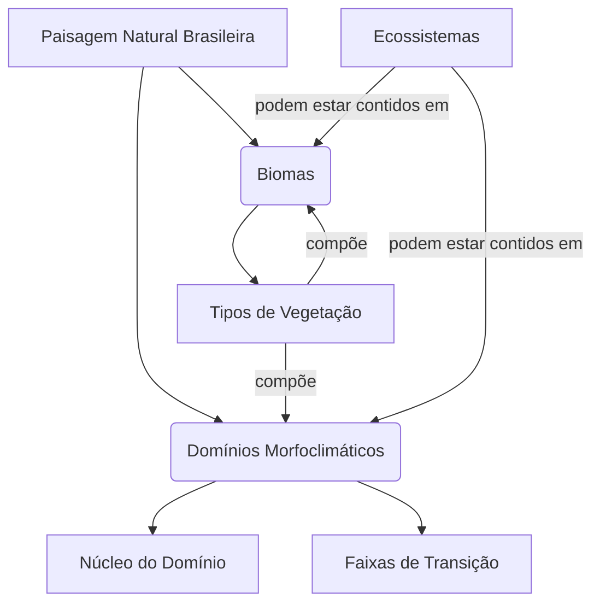
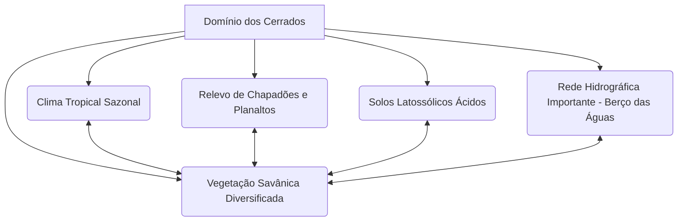

# Macrodivisão Natural do Espaço Brasileiro: Biomas, Domínios Morfoclimáticos e Ecossistemas – Uma Análise Integrada

> [!abstract] Síntese
> A regionalização do espaço natural brasileiro é essencial para compreender a diversidade de paisagens, recursos e desafios ambientais do país, utilizando conceitos como biomas (IBGE), domínios morfoclimáticos (Aziz Ab'Sáber) e ecossistemas. Os seis grandes biomas continentais do Brasil – Amazônia, Cerrado, Mata Atlântica, Caatinga, Pampa e Pantanal – são definidos por características de clima, vegetação e biodiversidade. Os domínios morfoclimáticos, como o Amazônico e o dos Cerrados, integram relevo, clima e vegetação em grandes unidades territoriais. Ecossistemas, por sua vez, abrangem interações entre elementos bióticos e abióticos em diferentes escalas. As faixas de transição, ou ecótonos, entre essas unidades são zonas de alta complexidade ecológica e biodiversidade, fundamentais para a gestão ambiental e o planejamento territorial.

## Compreendendo as Macrodivisões Naturais

> [!question] Questão-Chave: Quais são os principais critérios e conceitos utilizados para compartimentar o diversificado espaço natural brasileiro?

### Definições Essenciais

> [!definition] Bioma (Conceito IBGE)
> Unidade biológica ou espaço geográfico cujas características específicas são definidas pelo macroclima, fitofisionomia, solo e altitude, entre outros critérios. Abrange um conjunto de vida vegetal e animal, constituído pelo agrupamento de tipos de vegetação contíguos e identificáveis em escala regional, com condições geoclimáticas similares e história compartilhada de mudanças, resultando em uma diversidade biológica própria.

> [!definition] Domínio Morfoclimático (Conceito de Aziz Ab'Sáber)
> Conjunto espacial de certa ordem de grandeza territorial (centenas de milhares a milhões de km²) onde haja um esquema coerente de feições de relevo, tipos de solo, formas de vegetação e condições climático-hidrológicas. Enfatiza a interação dinâmica entre esses elementos e a existência de um "núcleo" característico e "faixas de transição".

> [!definition] Ecossistema
> Sistema onde os componentes vivos (bióticos) e não vivos (abióticos) de um ambiente interagem, formando um sistema funcional e interdependente. Pode ocorrer em diversas escalas, desde uma pequena lagoa até um grande bioma.

### Relação e Distinção entre os Conceitos

> [!note] Bioma vs. Domínio vs. Ecossistema
> Os conceitos de bioma, domínio morfoclimático e ecossistema se complementam, mas possuem enfoques distintos. Biomas, conforme a classificação do IBGE, priorizam a vegetação e a biodiversidade em escala regional, com ênfase no macroclima e fitofisionomias. Domínios morfoclimáticos, propostos por Aziz Ab'Sáber, integram relevo, clima, solos e vegetação, destacando processos geomorfológicos e faixas de transição. Ecossistemas, por outro lado, focam nas interações entre elementos bióticos e abióticos, podendo se aplicar a escalas menores dentro de biomas ou domínios. Enquanto biomas e domínios são usados para macrodivisões territoriais, ecossistemas permitem análises mais específicas de funcionamento ambiental.

## Os Seis Grandes Biomas Continentais do Brasil

### Amazônia

> [!note] Localização e Extensão Territorial
> Abrange cerca de 49% do território brasileiro, ocupando a região Norte e partes do Centro-Oeste e Nordeste, com aproximadamente 4,2 milhões de km², sendo o maior bioma do Brasil e a maior floresta tropical do mundo.

> [!important] Características Centrais: Clima, Relevo, Solos e Hidrografia Predominantes
> Clima equatorial úmido, com altas temperaturas e pluviosidade (média de 2.000 mm/ano). Relevo predominantemente de planícies e depressões. Solos pobres em nutrientes, mas ricos em matéria orgânica devido à decomposição rápida. Hidrografia dominada pela bacia do rio Amazonas, a maior do mundo em volume de água.

> [!example] Fitofisionomias Marcantes
> Floresta Ombrófila Densa (floresta alta e densa), Floresta Ombrófila Aberta, Campinaranas (vegetação arbustiva em solos arenosos) e Igapós (florestas inundadas sazonalmente).

> [!example] Biodiversidade: Fauna e Flora Representativas
> Fauna inclui onça-pintada, boto-cor-de-rosa, arara-azul e piranha. Flora destaca-se por espécies como açaí, castanheira-do-pará e seringueira, com altíssima diversidade de árvores e epífitas.

> [!warning] Principais Vetores de Pressão e Desafios de Conservação
> Desmatamento para agropecuária, mineração ilegal, queimadas, grilagem de terras e infraestrutura (estradas e hidrelétricas) ameaçam o bioma. A perda de floresta impacta o ciclo hidrológico global e a regulação climática.

> [!tip] Relevância para o CACD: Conhecer as particularidades e os problemas ambientais de cada bioma é crucial.

### Cerrado

> [!note] Localização e Extensão Territorial
> Ocupa cerca de 22% do território brasileiro (2 milhões de km²), predominante no Centro-Oeste, com extensões no Nordeste, Sudeste e Norte.

> [!important] Características Centrais: Clima, Relevo, Solos e Hidrografia Predominantes
> Clima tropical sazonal, com duas estações bem definidas (seca e chuvosa). Relevo de planaltos e chapadões. Solos ácidos e pobres (latossolos), mas com alta capacidade de drenagem. Hidrografia estratégica, sendo berço de importantes bacias (São Francisco, Tocantins-Araguaia, Paraguai).

> [!example] Fitofisionomias Marcantes
> Cerradão (floresta densa), Campo Cerrado (arbustos esparsos), Campo Limpo (gramíneas) e Veredas (oásis com buritis em áreas úmidas).

> [!example] Biodiversidade: Fauna e Flora Representativas
> Fauna inclui lobo-guará, tamanduá-bandeira e ema. Flora com espécies adaptadas à seca, como pequi, baru e jatobá.

> [!warning] Principais Vetores de Pressão e Desafios de Conservação
> Expansão agropecuária (soja e pecuária), queimadas frequentes e fragmentação de habitats. É o bioma mais ameaçado, com mais de 50% de sua área original convertida.

> [!tip] Relevância para o CACD: Conhecer as particularidades e os problemas ambientais de cada bioma é crucial.

### Mata Atlântica

> [!note] Localização e Extensão Territorial
> Cobre cerca de 13% do território brasileiro (1,1 milhão de km² originalmente), ao longo da costa leste, do Rio Grande do Norte ao Rio Grande do Sul.

> [!important] Características Centrais: Clima, Relevo, Solos e Hidrografia Predominantes
> Clima tropical úmido na costa e subtropical no sul. Relevo variado, com serras e escarpas (Serra do Mar, Serra da Mantiqueira). Solos diversificados, mas muitas vezes erodidos. Hidrografia com rios curtos e de alta energia devido ao relevo.

> [!example] Fitofisionomias Marcantes
> Floresta Ombrófila Densa, Floresta Estacional Semidecidual (perde folhas na seca) e Floresta de Araucária (no sul).

> [!example] Biodiversidade: Fauna e Flora Representativas
> Fauna com mico-leão-dourado, bugio e jacutinga. Flora inclui pau-brasil, jequitibá e orquídeas, com alta endemia.

> [!warning] Principais Vetores de Pressão e Desafios de Conservação
> Urbanização, agricultura e desmatamento histórico reduziram o bioma a cerca de 12% de sua área original. Fragmentação e espécies invasoras são grandes ameaças.

> [!tip] Relevância para o CACD: Conhecer as particularidades e os problemas ambientais de cada bioma é crucial.

### Caatinga

> [!note] Localização e Extensão Territorial
> Abrange cerca de 11% do território (850 mil km²), predominante no Nordeste, na região semiárida.

> [!important] Características Centrais: Clima, Relevo, Solos e Hidrografia Predominantes
> Clima semiárido, com chuvas escassas e irregulares (média de 300-800 mm/ano). Relevo de depressões e planaltos. Solos rasos e pedregosos, mas férteis em algumas áreas. Hidrografia intermitente, com rios sazonais (ex.: São Francisco como exceção perene).

> [!example] Fitofisionomias Marcantes
> Vegetação xerófila (adaptada à seca), com arbustos espinhosos, cactáceas e árvores de pequeno porte como mandacaru e juazeiro.

> [!example] Biodiversidade: Fauna e Flora Representativas
> Fauna inclui preá, tatu-peba e asa-branca. Flora com umbu, mandacaru e xique-xique, adaptadas à escassez hídrica.

> [!warning] Principais Vetores de Pressão e Desafios de Conservação
> Desertificação, uso insustentável para pecuária e corte de madeira para lenha. Apenas 8% do bioma está protegido em unidades de conservação.

> [!tip] Relevância para o CACD: Conhecer as particularidades e os problemas ambientais de cada bioma é crucial.

### Pampa

> [!note] Localização e Extensão Territorial
> Ocupa cerca de 2% do território (176 mil km²), restrito ao sul do Rio Grande do Sul.

> [!important] Características Centrais: Clima, Relevo, Solos e Hidrografia Predominantes
> Clima subtropical, com as quatro estações definidas e geadas no inverno. Relevo de coxilhas (colinas suaves). Solos férteis, ideais para agricultura. Hidrografia ligada à bacia do rio Uruguai e Lagoa dos Patos.

> [!example] Fitofisionomias Marcantes
> Campos naturais (gramíneas) com arbustos esparsos e matas de galeria ao longo dos rios.

> [!example] Biodiversidade: Fauna e Flora Representativas
> Fauna com capivara, veado-campeiro e quero-quero. Flora dominada por gramíneas e algumas árvores como pitangueira.

> [!warning] Principais Vetores de Pressão e Desafios de Conservação
> Conversão para agricultura (soja e arroz) e pecuária intensiva, além de introdução de espécies exóticas como o pinus, que alteram o ecossistema.

> [!tip] Relevância para o CACD: Conhecer as particularidades e os problemas ambientais de cada bioma é crucial.

### Pantanal

> [!note] Localização e Extensão Territorial
> Cobre cerca de 1,8% do território (150 mil km²), no Centro-Oeste (Mato Grosso e Mato Grosso do Sul), com extensões em países vizinhos.

> [!important] Características Centrais: Clima, Relevo, Solos e Hidrografia Predominantes
> Clima tropical continental, com inundações sazonais. Relevo de planície aluvial. Solos alagadiços e ricos em sedimentos. Hidrografia dominada pelo rio Paraguai e seus afluentes, formando a maior planície inundável do mundo.

> [!example] Fitofisionomias Marcantes
> Vegetação variada, com campos inundáveis, matas ciliares, cerradão e florestas sazonalmente alagadas.

> [!example] Biodiversidade: Fauna e Flora Representativas
> Fauna rica, com tuiuiú (ave-símbolo), jacaré-do-pantanal e sucuri. Flora inclui aguapés e vitórias-régias.

> [!warning] Principais Vetores de Pressão e Desafios de Conservação
> Pecuária extensiva, queimadas, assoreamento de rios e projetos de hidrovias ameaçam o equilíbrio hídrico e a biodiversidade.

> [!tip] Relevância para o CACD: Conhecer as particularidades e os problemas ambientais de cada bioma é crucial.

## Os Domínios Morfoclimáticos e as Faixas de Transição

> [!question] Questão-Chave: Como a proposta de Aziz Ab'Sáber contribui para uma visão integrada da paisagem natural brasileira?

### Domínio Amazônico

> [!note] Características Morfoclimáticas Integradas
> Dominado por clima equatorial úmido, relevo de planícies e depressões, solos pobres com alta decomposição orgânica, vegetação de floresta densa e hidrografia exuberante (bacia Amazônica).

> [!important] Área Nuclear e Processos Geomorfológicos Dominantes
> Núcleo centrado na vasta planície amazônica, com processos de sedimentação e erosão fluvial moldando a paisagem.

### Domínio dos Cerrados

> [!note] Características Morfoclimáticas Integradas
> Clima tropical sazonal, relevo de planaltos e chapadões, solos ácidos e drenáveis, vegetação savânica e hidrografia estratégica (berço de grandes bacias hidrográficas).

> [!important] Área Nuclear e Processos Geomorfológicos Dominantes
> Núcleo nos planaltos centrais, com processos de intemperismo químico e formação de chapadões.

### Domínio dos Mares de Morros

> [!note] Características Morfoclimáticas Integradas
> Clima tropical úmido, relevo de serras e colinas (Serra do Mar, Mantiqueira), solos erodidos, vegetação de Mata Atlântica e hidrografia de rios curtos e encachoeirados.

> [!important] Área Nuclear e Processos Geomorfológicos Dominantes
> Núcleo nas serras costeiras, com processos de erosão e movimentos tectônicos históricos.

### Domínio das Caatingas

> [!note] Características Morfoclimáticas Integradas
> Clima semiárido, relevo de depressões e planaltos, solos pedregosos, vegetação xerófila e hidrografia intermitente.

> [!important] Área Nuclear e Processos Geomorfológicos Dominantes
> Núcleo no sertão nordestino, com processos de desertificação e erosão hídrica sazonal.

### Domínio das Araucárias

> [!note] Características Morfoclimáticas Integradas
> Clima subtropical, relevo de planaltos basálticos, solos férteis (terra roxa), vegetação de Floresta de Araucária e hidrografia ligada à bacia do Paraná.

> [!important] Área Nuclear e Processos Geomorfológicos Dominantes
> Núcleo no planalto meridional, com processos de vulcanismo antigo e erosão.

### Domínio das Pradarias

> [!note] Características Morfoclimáticas Integradas
> Clima subtropical, relevo de coxilhas, solos férteis, vegetação campestre (Pampa) e hidrografia ligada ao rio Uruguai.

> [!important] Área Nuclear e Processos Geomorfológicos Dominantes
> Núcleo no sul gaúcho, com processos de sedimentação e formação de colinas suaves.

### As Faixas de Transição (Ecótonos)

> [!definition] Faixas de Transição (Ecótonos)
> Zonas de contato entre diferentes domínios morfoclimáticos, caracterizadas pela interpenetração de espécies e processos, resultando em paisagens complexas e muitas vezes de alta biodiversidade. Exemplos: Mata dos Cocais (entre Amazônia, Cerrado e Caatinga), Agreste (entre Zona da Mata e Sertão/Caatinga).

> [!example] Mata dos Cocais: Uma Faixa de Transição Emblemática
> Localizada entre os domínios Amazônico, dos Cerrados e das Caatingas, no Meio-Norte brasileiro, é marcada pela presença de palmeiras como babaçu e carnaúba, com vegetação mista que reflete características dos três domínios. É uma zona de alta importância econômica (extrativismo) e ecológica, mas sofre com desmatamento.

## Ecossistemas Costeiros e Outras Formações

> [!note] Além dos grandes biomas e domínios, o Brasil possui uma rica diversidade de ecossistemas específicos.

> [!definition] Manguezal
> Ecossistema costeiro de transição entre ambientes terrestre e marinho, caracterizado por solos salinos e alagados, vegetação adaptada (mangue-vermelho, mangue-branco) e alta produtividade biológica. Presente em estuários e deltas, como no litoral do Amapá e Maranhão.

> [!definition] Restinga
> Formação vegetal costeira sobre solos arenosos, com arbustos, herbáceas e árvores baixas adaptadas à salinidade e ventos. Ocorre em faixas litorâneas, como no Rio de Janeiro e Espírito Santo, sendo essencial para a proteção contra erosão costeira.

> [!definition] Campos de Altitude
> Ecossistemas de montanha, acima de 1.500 m, com vegetação herbácea e arbustiva, adaptada a climas frios e ventos fortes. Encontrados na Serra da Mantiqueira e Serra do Mar, com alta endemia.

> [!note] Ecossistemas Aquáticos
> Incluem recifes de coral (como os da costa nordestina, ex.: Abrolhos), grandes rios (Amazonas, São Francisco) e planícies de inundação (Pantanal), com funções ecológicas cruciais para a biodiversidade e regulação hídrica.

## Visualizando as Inter-relações Naturais

> [!example] Relação entre Conceitos (Mermaid)

> [!example] Componentes de um Domínio Morfoclimático (Mermaid - Domínio dos Cerrados)

## Por que Estudar a Macrodivisão Natural do Brasil?

> [!important] Relevância da Compartimentação Natural
> - **Planejamento Territorial e Ambiental**: Permite a formulação de políticas adaptadas às especificidades de cada região.
> - **Gestão de Recursos Naturais**: Identifica áreas prioritárias para conservação e uso sustentável.
> - **Potencialidades e Vulnerabilidades Socioeconômicas**: Orienta atividades econômicas como agricultura e turismo.
> - **Políticas Públicas**: Fundamenta zoneamentos ecológico-econômicos e criação de unidades de conservação.
> - **Identidade Nacional**: Reforça a compreensão da diversidade paisagística como parte do patrimônio cultural brasileiro.

## Conexões e Implicações Ampliadas

> [!info] Interconexões Relevantes para o CACD
> - **Legislação Ambiental**: A definição de biomas é crucial para a aplicação do Código Florestal (Reserva Legal), e os domínios/ecossistemas guiam a criação de Unidades de Conservação (SNUC).
> - **Política Agrícola e Uso da Terra**: A expansão das fronteiras agrícolas ocorre de forma diferenciada nos diversos biomas/domínios, gerando conflitos e impactos específicos.
> - **Mudanças Climáticas Globais**: Cada bioma/domínio possui vulnerabilidades distintas e contribui de forma diferente para as emissões/sequestro de carbono.
> - **Recursos Naturais Estratégicos**: A distribuição de água, minérios e potencial energético está intrinsecamente ligada à macrodivisão natural.
> - **Questões Socioambientais**: A relação de povos indígenas, quilombolas e comunidades tradicionais com seus territórios e os recursos naturais dos biomas onde vivem.
> - **Política Externa e Cooperação Internacional**: A conservação de biomas como a Amazônia e o Pantanal tem forte dimensão internacional.

## Questões para Revisão e Análise Crítica

> [!question] Para Refletir e Revisar
> 1. "Compare as abordagens de classificação do espaço natural brasileiro propostas pelo IBGE (Biomas) e por Aziz Ab'Sáber (Domínios Morfoclimáticos), destacando suas semelhanças, diferenças e complementaridades."
> 2. "Escolha dois biomas brasileiros contrastantes (e.g., Amazônia e Caatinga) e analise como suas características morfoclimáticas e fitofisionômicas condicionam os principais desafios para sua conservação e uso sustentável."
> 3. "Discuta a importância das faixas de transição (ecótonos) na paisagem brasileira, utilizando um exemplo para ilustrar sua relevância ecológica e os desafios para sua gestão."
> 4. "De que forma o conhecimento da macrodivisão natural do Brasil é fundamental para a formulação de políticas públicas eficazes nas áreas de meio ambiente, agricultura e desenvolvimento regional?"

## Dicas para o CACD

> [!tip] Ao abordar este tema na prova:
> É essencial não apenas memorizar os nomes dos biomas e domínios, mas compreender os critérios de cada classificação, as características distintivas de cada unidade (clima, relevo, vegetação, solos, hidrografia), sua localização no mapa do Brasil, os principais vetores de transformação e os desafios ambientais associados. Conecte este conhecimento com temas de política ambiental, desenvolvimento e a posição do Brasil no cenário internacional.
