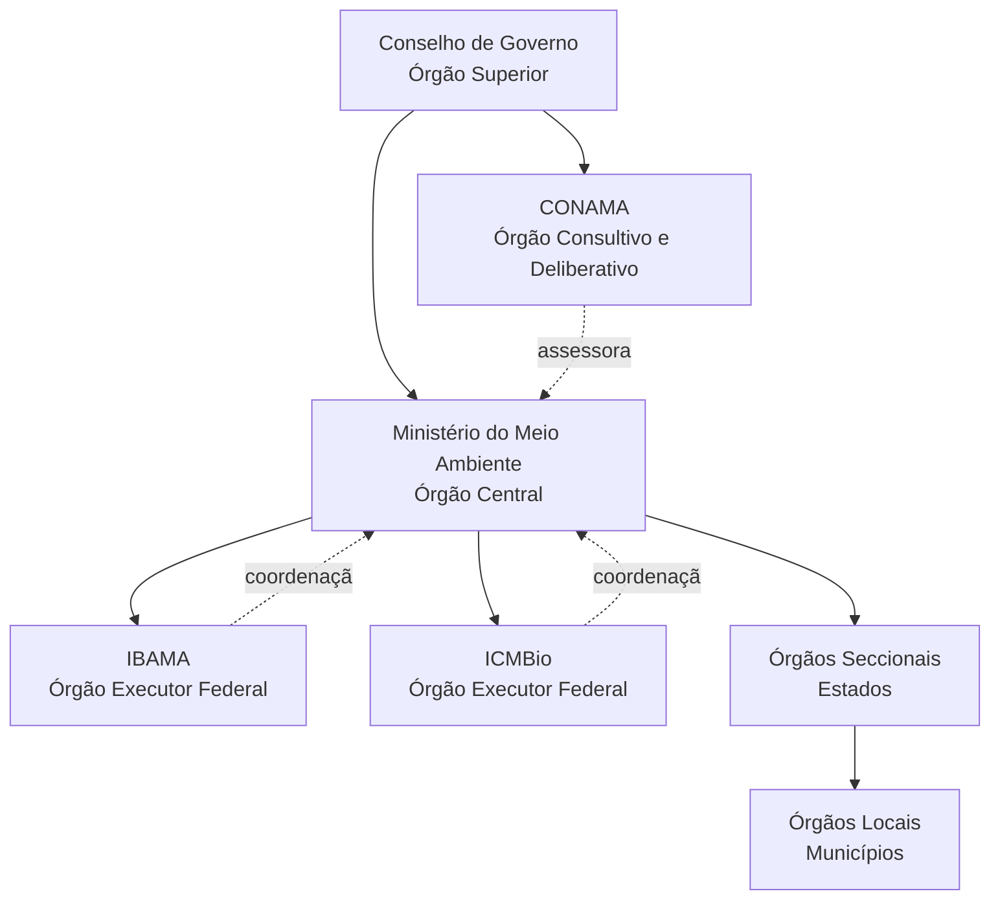
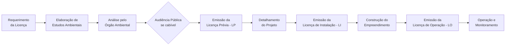

# Política e Gestão Ambiental no Brasil: Evolução, Arcabouço Legal-Institucional, Instrumentos e Desafios Contemporâneos

> [!abstract] Síntese
> A política ambiental brasileira evoluiu de uma perspectiva meramente exploratória colonial para um complexo sistema regulatório consolidado pela Constituição Federal de 1988. O marco fundamental foi a Política Nacional do Meio Ambiente (Lei 6.938/1981), que estabeleceu o SISNAMA como estrutura de gestão integrada. O artigo 225 da CF/88 consagrou o direito ao meio ambiente ecologicamente equilibrado como direito fundamental. Apesar dos avanços legais e institucionais significativos, o Brasil enfrenta desafios críticos na implementação efetiva das políticas ambientais, incluindo o desmatamento persistente, conflitos socioambientais e a necessidade de equilibrar desenvolvimento econômico com conservação ambiental.

## Breve Histórico da Política Ambiental Brasileira

> [!question] Questão-Chave: Como se deu a construção histórica do arcabouço de proteção ambiental no Brasil?

A trajetória da política ambiental brasileira reflete a evolução da própria relação da sociedade com o meio ambiente, partindo de uma visão puramente exploratória para uma perspectiva de desenvolvimento sustentável .

### Período Colonial e Primeiras Regulamentações (1500-1930)

O próprio nome "Brasil" deriva da exploração do pau-brasil, evidenciando a **visão mercantilista** que marcou os primeiros séculos de ocupação do território . Durante este período, identificam-se quatro posturas principais em relação à natureza:

- **Elogio retórico** ao meio natural, paradoxalmente conivente com a devastação
- **Exaltação da ação humana** em dimensão abstrata, ignorando consequências destrutivas
- **Crítica à destruição** com proposta de modernização urbano-industrial
- **Crítica à destruição** com modelo alternativo de desenvolvimento nacional

### Era Vargas e Centralização Administrativa (1930-1971)

> [!note] Marco Inicial: Código Florestal de 1965
> O primeiro Código Florestal brasileiro (Decreto 23.793/1934) foi substituído pela Lei 4.771/1965, estabelecendo as primeiras normas sistemáticas de proteção florestal, incluindo conceitos como Áreas de Preservação Permanente (APP) e Reserva Legal.

A partir de 1930, com a **centralização administrativa** do governo Vargas, inicia-se a construção de um repertório regulamentador sistemático . Este período caracteriza-se pela:

- Criação de órgãos específicos para gestão de recursos naturais
- Estabelecimento de penalizações para infrações ambientais
- Início da regulamentação setorial (águas, florestas, fauna)

### Período Desenvolvimentista e Intervenção Estatal (1972-1987)

> [!note] Divisor de Águas: Política Nacional do Meio Ambiente (Lei 6.938/1981)
> A PNMA representa o marco fundamental da política ambiental brasileira moderna, criando o SISNAMA e estabelecendo princípios, objetivos e instrumentos que permanecem vigentes até hoje.

Este período marca o **auge do estado intervencionista** em matéria ambiental , influenciado por:

- **Conferência de Estocolmo (1972)**: Pressão internacional para políticas ambientais
- **Criação da SEMA** (Secretaria Especial do Meio Ambiente) em 1973
- **Promulgação da PNMA** em 1981, estabelecendo as bases do sistema atual

### Redemocratização e Constitucionalização (1988-presente)

> [!important] Consagração Constitucional: Artigo 225 da CF/88
> A Constituição Federal de 1988 elevou o meio ambiente à categoria de direito fundamental, estabelecendo que "todos têm direito ao meio ambiente ecologicamente equilibrado, bem de uso comum do povo e essencial à sadia qualidade de vida".

> [!note] Impacto Internacional: Rio-92 e a internalização de compromissos
> A Conferência das Nações Unidas sobre Meio Ambiente e Desenvolvimento (Rio-92) consolidou o Brasil como protagonista nas discussões ambientais globais e impulsionou a criação de novas políticas e instituições ambientais.

O período pós-1988 caracteriza-se por :

- **Democratização** e **descentralização** dos processos decisórios
- Emergência do conceito de **desenvolvimento sustentável**
- Multiplicação de leis ambientais específicas
- Fortalecimento da participação social
- Criação do Ministério do Meio Ambiente (1992)
- Estabelecimento do SNUC (2000) e novo Código Florestal (2012)

## Bases Legais e Institucionais da Política Ambiental

### Constituição Federal de 1988

> [!important] Artigo 225 da CF/88: O Direito ao Meio Ambiente Ecologicamente Equilibrado
> O artigo 225 estabelece que o meio ambiente é **bem de uso comum do povo**, impondo ao Poder Público e à coletividade o **dever de defendê-lo e preservá-lo** para as presentes e futuras gerações.

Os principais elementos do Art. 225 incluem:

- **Direito fundamental difuso**: pertence a todos indistintamente
- **Princípio da equidade intergeracional**: preservação para futuras gerações
- **Responsabilidade compartilhada**: Estado e sociedade
- **Instrumentos específicos**: EIA/RIMA, espaços protegidos, controle de atividades perigosas

### Política Nacional do Meio Ambiente (PNMA - Lei 6.938/81)

> [!definition] Política Nacional do Meio Ambiente (PNMA)
> A PNMA constitui o marco regulatório fundamental da gestão ambiental brasileira, estabelecendo conceitos, princípios, objetivos, instrumentos e a estrutura institucional do SISNAMA.

**Objetivos principais da PNMA:**
- Compatibilização do desenvolvimento econômico-social com a preservação ambiental
- Definição de áreas prioritárias de ação governamental
- Estabelecimento de critérios e padrões de qualidade ambiental
- Desenvolvimento de pesquisas e tecnologias nacionais
- Difusão de tecnologias de manejo do meio ambiente
- Formação de consciência pública sobre preservação ambiental

**Princípios fundamentais:**
- **Poluidor-pagador**: responsabilização pelos danos causados
- **Usuário-pagador**: pagamento pelo uso de recursos naturais
- **Prevenção**: prioridade para medidas preventivas
- **Precaução**: ação antecipada diante de riscos
- **Participação**: envolvimento da sociedade nas decisões
- **Informação**: transparência e acesso a dados ambientais

### Sistema Nacional do Meio Ambiente (SISNAMA)

> [!definition] SISNAMA: A Estrutura de Gestão Ambiental
> O SISNAMA constitui a estrutura organizacional da gestão ambiental brasileira, integrando órgãos e entidades da União, Estados, Distrito Federal e Municípios responsáveis pela proteção e melhoria da qualidade ambiental.

**Estrutura do SISNAMA:**

- **Órgão Superior**: Conselho de Governo - assessora o Presidente da República na formulação de políticas e diretrizes
- **Órgão Consultivo e Deliberativo**: CONAMA (Conselho Nacional do Meio Ambiente) - estabelece normas e padrões ambientais
- **Órgão Central**: Ministério do Meio Ambiente e Mudança do Clima - coordena e supervisiona a política nacional
- **Órgãos Executores**: 
  - **IBAMA**: execução e fiscalização em nível federal
  - **ICMBio**: gestão das unidades de conservação federais
- **Órgãos Seccionais**: órgãos estaduais de meio ambiente
- **Órgãos Locais**: órgãos municipais de meio ambiente

> [!example] Diagrama da Estrutura do SISNAMA (Mermaid)

### Outras Leis e Sistemas Relevantes

> [!definition] SNUC - Sistema Nacional de Unidades de Conservação (Lei 9.985/2000)
> O SNUC estabelece critérios e normas para criação, implantação e gestão das unidades de conservação, divididas em dois grupos: **Proteção Integral** (uso indireto) e **Uso Sustentável** (uso direto compatível com conservação).

**Categorias de Unidades de Conservação:**
- **Proteção Integral**: Estação Ecológica, Reserva Biológica, Parque Nacional, Monumento Natural, Refúgio de Vida Silvestre
- **Uso Sustentável**: APA, ARIE, Floresta Nacional, Reserva Extrativista, Reserva de Fauna, RDS, RPPN

> [!note] Novo Código Florestal (Lei 12.651/2012)
> O novo Código Florestal estabelece normas gerais sobre proteção da vegetação, áreas de preservação permanente e reserva legal, além de criar instrumentos como o **CAR** (Cadastro Ambiental Rural) e o **PRA** (Programa de Regularização Ambiental).

**Principais instrumentos do Código Florestal:**
- **APP (Área de Preservação Permanente)**: margens de rios, topos de morros, encostas
- **Reserva Legal**: percentual mínimo de vegetação nativa na propriedade rural
- **CAR**: registro eletrônico obrigatório para imóveis rurais
- **PRA**: regularização de passivos ambientais

**Outras legislações fundamentais:**

- **Lei de Crimes Ambientais (Lei 9.605/98)**: tipifica crimes ambientais e estabelece sanções penais e administrativas
- **Política Nacional de Recursos Hídricos (Lei 9.433/97)**: gestão integrada e descentralizada dos recursos hídricos
- **Política Nacional de Resíduos Sólidos (Lei 12.305/2010)**: gestão integrada de resíduos e responsabilidade compartilhada
- **Lei da Mata Atlântica (Lei 11.428/2006)**: proteção específica do bioma
- **Política Nacional sobre Mudança do Clima (Lei 12.187/2009)**: metas e instrumentos para mitigação e adaptação

## Principais Instrumentos de Implementação

> [!question] Questão-Chave: Quais são as ferramentas utilizadas para efetivar a política ambiental no Brasil e como funcionam?

Os instrumentos da PNMA, estabelecidos no Art. 9º da Lei 6.938/81, constituem as ferramentas operacionais para implementação da política ambiental:

### 1. Estabelecimento de Padrões de Qualidade Ambiental

> [!definition] Padrões de Qualidade Ambiental
> Limites máximos de poluentes ou perturbações permitidos no ambiente, estabelecidos com base em critérios científicos para proteção da saúde humana e dos ecossistemas.

> [!example] Aplicação Prática dos Padrões de Qualidade
> - **Resolução CONAMA 491/2018**: padrões de qualidade do ar
> - **Resolução CONAMA 357/2005**: classificação e padrões para corpos d'água
> - **Resolução CONAMA 420/2009**: critérios para qualidade do solo

### 2. Zoneamento Ambiental (ZEE)

> [!definition] Zoneamento Ecológico-Econômico (ZEE)
> Instrumento de organização territorial que estabelece medidas e padrões de proteção ambiental para assegurar a qualidade ambiental e o desenvolvimento sustentável.

> [!example] Aplicação Prática do ZEE
> - Definição de zonas com diferentes graus de proteção e uso
> - Orientação para políticas públicas e investimentos
> - Base para licenciamento ambiental
> - Exemplos: ZEE da Amazônia Legal, ZEE costeiro

### 3. Avaliação de Impactos Ambientais (AIA)

> [!definition] Avaliação de Impacto Ambiental (AIA)
> Conjunto de procedimentos técnicos e administrativos para identificar, prever e valorar os impactos ambientais de projetos, planos e programas, incluindo o EIA (Estudo de Impacto Ambiental) e RIMA (Relatório de Impacto Ambiental).

> [!example] Aplicação Prática da AIA
> - **EIA/RIMA obrigatório** para: rodovias, ferrovias, portos, aeroportos, oleodutos, linhas de transmissão, barragens, aterros sanitários, complexos industriais
> - **Conteúdo mínimo**: diagnóstico ambiental, análise de impactos, medidas mitigadoras, programas de monitoramento
> - **Participação pública**: audiências públicas obrigatórias

### 4. Licenciamento Ambiental

> [!definition] Licenciamento Ambiental
> Procedimento administrativo pelo qual o órgão ambiental autoriza a localização, instalação, ampliação e operação de empreendimentos utilizadores de recursos ambientais ou potencialmente poluidores.

**Tipos de Licenças:**
- **LP (Licença Prévia)**: fase de planejamento, aprova localização e concepção
- **LI (Licença de Instalação)**: autoriza instalação conforme projeto aprovado
- **LO (Licença de Operação)**: autoriza operação após verificação do cumprimento das condicionantes

> [!example] Fluxograma Simplificado do Licenciamento Ambiental

### 5. Criação de Espaços Territoriais Especialmente Protegidos

> [!definition] Espaços Territoriais Especialmente Protegidos
> Áreas geográficas públicas ou privadas dotadas de atributos ambientais relevantes, legalmente instituídas pelo Poder Público, com objetivos e limites definidos, sob regime especial de administração.

> [!example] Aplicação Prática - Unidades de Conservação
> - **Federal**: 334 UCs federais cobrindo 791.000 km²
> - **Estadual e Municipal**: centenas de UCs adicionais
> - **Outras áreas**: APPs, Reserva Legal, Terras Indígenas, Territórios Quilombolas

### 6. Sistema Nacional de Informações sobre o Meio Ambiente (SINIMA)

> [!definition] SINIMA
> Sistema integrado de informações ambientais para subsidiar a tomada de decisão e a participação social na gestão ambiental.

> [!example] Aplicação Prática do SINIMA
> - Portal de dados ambientais integrados
> - Relatórios de qualidade ambiental
> - Indicadores ambientais nacionais
> - Base para políticas públicas

### 7. Cadastro Técnico Federal (CTF)

> [!definition] Cadastro Técnico Federal
> Registro obrigatório de pessoas físicas ou jurídicas que exercem atividades potencialmente poluidoras ou utilizadoras de recursos ambientais.

> [!example] Aplicação Prática do CTF
> - **CTF/APP**: atividades potencialmente poluidoras
> - **CTF/AIDA**: atividades de defesa ambiental
> - Base para cobrança da TCFA (Taxa de Controle e Fiscalização Ambiental)
> - Controle e fiscalização de atividades

### 8. Instrumentos Econômicos

> [!definition] Instrumentos Econômicos
> Mecanismos que utilizam sinais de mercado para induzir comportamentos ambientalmente adequados.

> [!example] Aplicação Prática de Instrumentos Econômicos
> - **ICMS Ecológico**: repasse diferenciado aos municípios com áreas protegidas
> - **Pagamento por Serviços Ambientais (PSA)**: remuneração por conservação
> - **Compensação Ambiental**: recursos de empreendimentos para UCs
> - **Cobrança pelo uso da água**: implementada em várias bacias

### 9. Penalidades

> [!definition] Penalidades Ambientais
> Sanções administrativas aplicadas por infrações à legislação ambiental, podendo incluir advertência, multa, embargo, suspensão, demolição e restritivas de direitos.

> [!example] Aplicação Prática das Penalidades
> - **Multas**: de R$ 50 a R$ 50 milhões (Lei 9.605/98)
> - **Embargo**: paralisação de obras ou atividades
> - **Apreensão**: produtos e instrumentos da infração
> - **Suspensão**: de vendas, licenças ou atividades

## Grandes Desafios da Gestão Ambiental Brasileira

### Desmatamento e Degradação dos Biomas

> [!warning] Desafio Crítico: Desmatamento na Amazônia e Cerrado
> O desmatamento continua sendo o principal desafio ambiental brasileiro, com a Amazônia perdendo cerca de 13.235 km² em 2020-2021 e o Cerrado enfrentando conversão acelerada para agropecuária.

**Fatores agravantes:**
- **Grilagem de terras** e especulação fundiária
- **Pecuária extensiva** e expansão da fronteira agrícola
- **Exploração ilegal de madeira**
- **Garimpo ilegal** em terras indígenas
- **Queimadas** descontroladas

### Implementação e Fiscalização Deficientes

> [!warning] Desafio Crítico: Capacidade Institucional Limitada
> A efetividade da política ambiental é comprometida por recursos humanos e financeiros insuficientes, resultando em baixa capacidade de fiscalização e controle.

**Problemas estruturais:**
- **Déficit de pessoal**: IBAMA e ICMBio com quadros reduzidos
- **Orçamento insuficiente**: cortes recorrentes no orçamento ambiental
- **Morosidade**: processos de licenciamento e fiscalização lentos
- **Corrupção**: casos de corrupção em órgãos ambientais
- **Judicialização**: excesso de disputas judiciais

### Conflitos Socioambientais

> [!warning] Desafio Crítico: Conflitos Fundiários e Sociais
> A sobreposição de interesses sobre o território gera conflitos envolvendo povos indígenas, comunidades tradicionais, agricultores, mineradores e o poder público.

**Principais conflitos:**
- **Terras indígenas**: invasões e pressões econômicas
- **Unidades de conservação**: populações residentes e entorno
- **Grandes projetos**: hidrelétricas, mineração, infraestrutura
- **Água**: disputas por recursos hídricos escassos
- **Reforma agrária**: assentamentos em áreas ambientalmente sensíveis

### Financiamento Inadequado

> [!warning] Desafio Crítico: Recursos Financeiros Insuficientes
> O subfinanciamento crônico da área ambiental compromete a implementação de políticas e a manutenção de estruturas de gestão.

**Questões financeiras:**
- **Orçamento federal**: menos de 0,5% do orçamento da União
- **Fundos ambientais**: Fundo Nacional do Meio Ambiente subutilizado
- **Fundo Amazônia**: paralisações e questionamentos
- **Compensação ambiental**: aplicação inadequada de recursos
- **Investimento privado**: baixo engajamento do setor privado

### Governança Fragmentada

> [!warning] Desafio Crítico: Desarticulação Institucional
> A multiplicidade de órgãos e níveis de governo envolvidos na gestão ambiental gera sobreposições, lacunas e conflitos de competência.

**Problemas de governança:**
- **Federalismo ambiental**: conflitos de competência entre União, Estados e Municípios
- **Setorialização**: falta de integração entre políticas setoriais
- **Participação social**: conselhos esvaziados ou pouco efetivos
- **Transparência**: dificuldade de acesso a informações
- **Accountability**: baixa responsabilização por resultados

### Pressões Econômicas

> [!warning] Desafio Crítico: Dilema Desenvolvimento vs. Conservação
> A pressão por crescimento econômico frequentemente se sobrepõe às considerações ambientais, gerando retrocessos normativos e institucionais.

**Tensões recorrentes:**
- **Agronegócio**: pressão por flexibilização ambiental
- **Mineração**: lobby por acesso a áreas protegidas
- **Infraestrutura**: grandes obras com impactos significativos
- **Energia**: conflitos entre matriz energética e conservação
- **Flexibilização normativa**: tentativas de enfraquecimento da legislação

### Mudanças Climáticas

> [!warning] Desafio Crítico: Impactos e Adaptação Climática
> O Brasil é simultaneamente grande emissor (principalmente por desmatamento) e vulnerável aos impactos das mudanças climáticas.

**Desafios climáticos:**
- **Mitigação**: redução de emissões por desmatamento e energia
- **Adaptação**: preparação para eventos extremos
- **NDC**: cumprimento dos compromissos internacionais
- **Financiamento climático**: acesso a recursos internacionais
- **Transição energética**: manutenção da matriz limpa

### Poluição e Saneamento

> [!warning] Desafio Crítico: Déficit de Saneamento e Gestão de Resíduos
> Apesar dos avanços legais, o Brasil ainda enfrenta graves problemas de saneamento básico e gestão de resíduos sólidos.

**Problemas persistentes:**
- **Esgoto**: 45% da população sem coleta adequada
- **Resíduos sólidos**: lixões ainda presentes em muitos municípios
- **Poluição hídrica**: rios urbanos altamente poluídos
- **Logística reversa**: implementação lenta e parcial
- **Educação ambiental**: baixa conscientização da população

## O Papel da Sociedade na Gestão Ambiental

> [!note] Importância da Participação Social
> A Constituição Federal e a legislação ambiental brasileira estabelecem múltiplos mecanismos de participação social, reconhecendo que a proteção ambiental é dever não apenas do Estado, mas de toda a coletividade.

### Mecanismos de Participação

**Conselhos de Meio Ambiente:**
- **CONAMA**: participação de entidades da sociedade civil
- **Conselhos estaduais e municipais**: representação local
- **Comitês de Bacia Hidrográfica**: gestão participativa da água
- **Conselhos de Unidades de Conservação**: gestão compartilhada

**Instrumentos de Participação Direta:**
- **Audiências públicas**: obrigatórias no licenciamento
- **Consultas públicas**: elaboração de normas e políticas
- **Ação civil pública**: instrumento judicial de defesa ambiental
- **Ação popular**: qualquer cidadão pode propor

### Atores Sociais Relevantes

**Ministério Público:**
- Titular da ação civil pública ambiental
- Fiscalização do cumprimento da legislação
- Termos de Ajustamento de Conduta (TAC)
- Inquéritos civis e recomendações

**Organizações Não-Governamentais:**
- Advocacy e pressão política
- Projetos de conservação
- Educação ambiental
- Monitoramento independente

**Movimentos Sociais:**
- Movimento dos Atingidos por Barragens (MAB)
- Movimento dos Trabalhadores Rurais Sem Terra (MST)
- Organizações indígenas e quilombolas
- Redes de agricultura familiar e agroecologia

**Academia e Pesquisa:**
- Produção de conhecimento científico
- Subsídios técnicos para políticas
- Formação de recursos humanos
- Inovação tecnológica

## Conexões e Implicações Ampliadas

> [!info] Interconexões Relevantes para o CACD
> A política ambiental brasileira não pode ser compreendida isoladamente, mas sim em suas múltiplas conexões com outras áreas do conhecimento e da atuação estatal.

### Direito Internacional Ambiental

**Principais Tratados e Convenções:**
- **Convenção sobre Diversidade Biológica (CDB)**: Protocolo de Nagoya, metas de Aichi
- **Convenção-Quadro sobre Mudança do Clima (UNFCCC)**: Acordo de Paris, NDCs brasileiras
- **Convenção de Ramsar**: proteção de zonas úmidas
- **CITES**: comércio internacional de espécies ameaçadas
- **Convenção de Basileia**: movimentos transfronteiriços de resíduos

**Responsabilidade Internacional:**
- Princípio das responsabilidades comuns mas diferenciadas
- Soberania sobre recursos naturais vs. patrimônio comum da humanidade
- Mecanismos de compliance e sanções
- Arbitragem ambiental internacional

### Economia Ambiental

**Instrumentos Econômicos:**
- **Valoração de serviços ecossistêmicos**: metodologias e aplicações
- **Mercados de carbono**: potencial brasileiro no mercado global
- **Pagamento por Serviços Ambientais (PSA)**: experiências e desafios
- **Economia circular**: oportunidades e barreiras
- **Finanças verdes**: green bonds, fundos sustentáveis

**Desenvolvimento Sustentável:**
- Agenda 2030 e ODS no Brasil
- Economia verde e transição justa
- Bioeconomia na Amazônia
- Ecoturismo e desenvolvimento local

### Geopolítica Ambiental

**Amazônia como Ativo Estratégico:**
- Pressões internacionais e soberania nacional
- Cooperação amazônica (OTCA)
- Fundo Amazônia e cooperação internacional
- Biopirataria e acesso a recursos genéticos
- Segurança ambiental e defesa nacional

**Cooperação Transfronteiriça:**
- Gestão de bacias hidrográficas compartilhadas
- Áreas protegidas transfronteiriças
- Combate ao tráfico de fauna e flora
- Integração regional e meio ambiente

### Política Externa Brasileira

**Diplomacia Ambiental:**
- Liderança histórica em foros ambientais
- Rio-92, Rio+10, Rio+20
- G20 e questões ambientais
- BRICS e cooperação ambiental
- Negociações climáticas (COPs)

**Cooperação Sul-Sul:**
- Transferência de tecnologia ambiental
- Capacitação técnica
- Projetos trilaterais
- Experiências em agricultura tropical

### Direitos Humanos e Meio Ambiente

**Direitos Ambientais como Direitos Humanos:**
- Direito ao meio ambiente saudável
- Justiça ambiental e equidade
- Refugiados e migrantes climáticos
- Direitos de povos indígenas e comunidades tradicionais

**Defensores Ambientais:**
- Proteção de ativistas ambientais
- Acordo de Escazú (não ratificado pelo Brasil)
- Violência no campo e conflitos ambientais
- Responsabilidade empresarial

## Questões para Revisão e Análise Crítica

> [!question] Para Refletir e Revisar

1. **"Analise criticamente a eficácia dos principais instrumentos da Política Nacional do Meio Ambiente na contenção do desmatamento ilegal na Amazônia, considerando os desafios de implementação e as limitações institucionais do SISNAMA."**

2. **"Discuta os principais avanços e retrocessos na política ambiental brasileira desde a Constituição de 1988, avaliando como as mudanças políticas e econôm
