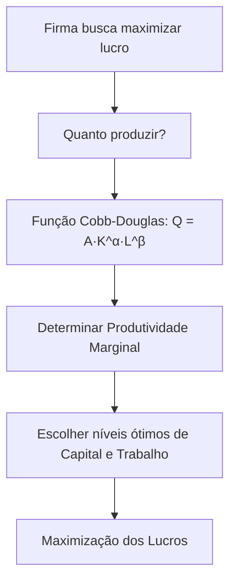

## 📊 **Interpretação econômica da Cobb-Douglas**

- Os parâmetros α\alpha e β\beta indicam a **contribuição relativa** do capital e do trabalho para a produção total.
    
    - Por exemplo, se α=0.3 = 0.3 e β=0.7, significa que o trabalho tem maior peso na geração do produto que o capital.
        
- A soma α+β\alpha + \beta indica os **retornos de escala** da função:
    
    - Se α+β=1, há **retornos constantes de escala**: dobrar ambos os fatores dobra a produção exatamente.
        
    - Se α+β>1, há **retornos crescentes de escala**: dobrar ambos os fatores aumenta a produção em mais que o dobro.
        
    - Se α+β<1, há **retornos decrescentes de escala**: dobrar ambos os fatores aumenta a produção em menos que o dobro.
        

---

## 📈 **Relação com a Teoria da Firma**

Na **Teoria da Firma**, o objetivo da firma é maximizar lucros, o que depende diretamente da função de produção e dos custos dos fatores. A função Cobb-Douglas é frequentemente utilizada por ser simples, realista e capaz de capturar características essenciais da produção:

1. **Elasticidade e Produtividade Marginal:**
    
    - Permite calcular claramente as produtividades marginais dos fatores de produção (quanto aumenta QQ ao adicionar mais uma unidade de KK ou LL).
        
    - As produtividades marginais decrescem conforme o fator aumenta, um princípio econômico essencial (**Lei dos rendimentos marginais decrescentes**).
        
2. **Tomada de decisão da firma:**
    
    - A firma utiliza a Cobb-Douglas para decidir quanto contratar de cada fator produtivo, buscando minimizar custos dado o nível desejado de produção.
        
    - Também é usada para determinar o nível ótimo de produção para maximizar lucros, considerando preços dos fatores e preço do produto no mercado.
        

---

## 🖥️ **Exemplo prático (numérico):**

Considere a função Cobb-Douglas:

$Q=10⋅K^0.5⋅L^0.5$

Suponha que a empresa tenha:

- Capital (K) = 4 unidades.
    
- Trabalho (L) = 9 unidades.
    

A produção total será:

$Q=10⋅(4)^0,5⋅(9)^0,5=10⋅2⋅3=60$

Neste exemplo, α=0,5 e β=0,5, indicando:

- Retornos constantes de escala, pois 0,5+0,5=1.
    
- Cada fator contribui igualmente para a produção.
    

---

## 🔗 **Visualização (Mermaid):**

Uma visualização simples e clara da aplicação Cobb-Douglas na decisão da firma pode ser:

---

## 💡 **Resumindo:**

A função Cobb-Douglas é essencial para entender como empresas combinam insumos produtivos (capital e trabalho) para produzir bens e serviços. É uma peça-chave da Teoria da Firma, pois permite análises concretas sobre produtividade, custos e decisões ótimas de produção.