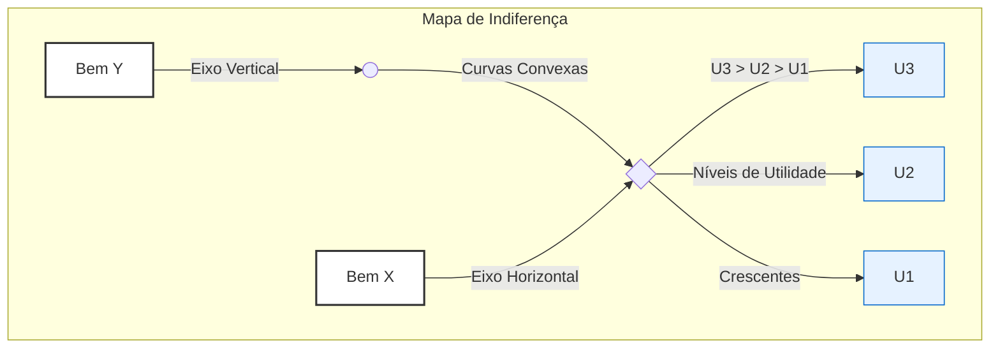
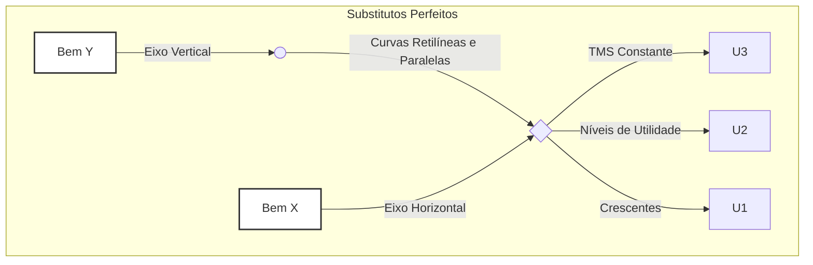

# Teoria do Consumidor: As Preferências, as Curvas de Indiferença e a Taxa Marginal de Substituição

## Introdução: O Problema da Escolha do Consumidor

A microeconomia neoclássica estuda como agentes econômicos (famílias, firmas) tomam decisões em um ambiente de escassez. A Teoria do Consumidor, pilar dessa análise, busca modelar o processo de escolha do indivíduo. Para entender como um consumidor escolhe a melhor cesta de bens e serviços que pode adquirir, dadas suas restrições orçamentárias, o primeiro passo é compreender e modelar suas **preferências**.

O modelo parte de uma premissa fundamental: os consumidores são **racionais**. A racionalidade, neste contexto, não é um julgamento de valor, mas sim uma suposição de que as escolhas dos indivíduos são consistentes e logicamente coerentes. Essa consistência é formalizada através de um conjunto de axiomas sobre as preferências.

---

## 1. Os Axiomas das Preferências: A Base do Comportamento Racional

Para que possamos construir um modelo robusto da escolha do consumidor, assumimos que suas preferências obedecem a certas regras lógicas, conhecidas como axiomas. São eles que garantem que o consumidor pode, de fato, fazer uma escolha ótima.

### 1.1. Axiomas Fundamentais

Estes três axiomas são a base mínima necessária para a existência de uma escolha racional.

> [!definition] Axioma 1: Completude (ou Comparabilidade)
> 
> Dadas quaisquer duas cestas de consumo, A e B, o consumidor é sempre capaz de compará-las e expressar uma preferência. Apenas uma das três seguintes relações é possível:
> 
> 1. A é preferível a B (AsuccB);
>     
> 2. B é preferível a A (BsuccA); ou
>     
> 3. O consumidor é indiferente entre A e B (AsimB).
>     
> 
> **Implicação Estratégica:** Este axioma elimina a possibilidade de o consumidor ficar paralisado por indecisão. Ele garante que, para qualquer par de opções, uma decisão (mesmo que seja de indiferença) pode ser tomada. Sem ele, a função de utilidade que representa as preferências não poderia ser construída.

> [!definition] Axioma 2: Reflexividade
> 
> Qualquer cesta de bens A é pelo menos tão boa quanto ela mesma (AsucceqA).
> 
> **Implicação Estratégica:** Este é um axioma puramente técnico e de consistência lógica. Ele assegura que as cestas são comparáveis consigo mesmas, o que é trivial, mas necessário para a formalização matemática completa do modelo de preferências.

> [!definition] Axioma 3: Transitividade
> 
> Dadas três cestas de consumo, A, B e C, se o consumidor prefere a cesta A à cesta B (AsuccB) e prefere a cesta B à cesta C (BsuccC), então ele necessariamente prefere a cesta A à cesta C (AsuccC).
> 
> **Implicação Estratégica:** A transitividade é o principal pilar da racionalidade no modelo. Ela garante a consistência interna das escolhas. Se as preferências não fossem transitivas, o consumidor poderia ser levado a escolhas cíclicas (preferir A a B, B a C, mas C a A), tornando impossível a identificação de uma cesta "ótima". Veremos que a transitividade é a razão pela qual as curvas de indiferença não podem se cruzar.

### 1.2. Propriedades Adicionais (Usualmente Assumidas)

Para que as preferências sejam "bem-comportadas" (_well-behaved_) e gerem curvas de indiferença com as propriedades que observamos nos manuais, adicionamos duas outras suposições sobre o comportamento do consumidor.

> [!note] Propriedade 4: Monotonicidade (ou "Mais é Melhor")
> 
> Assume-se que todos os bens são desejáveis (goods). Portanto, o consumidor sempre prefere ter mais de um bem a ter menos, mantendo a quantidade dos outros bens constante. Uma cesta com mais de pelo menos um bem, e não menos dos outros, será sempre estritamente preferida.
> 
> **Implicação Estratégica:** Esta propriedade garante que o consumidor sempre buscará consumir mais, o que está na base do problema econômico da escassez. Graficamente, a monotonicidade é a razão pela qual as **curvas de indiferença são negativamente inclinadas**. Se fossem positivamente inclinadas, significaria que o consumidor é indiferente entre uma cesta com menos de tudo e outra com mais de tudo, violando a ideia de que "mais é melhor".

> [!note] Propriedade 5: Convexidade (Estrita)
> 
> O consumidor prefere cestas de consumo diversificadas ("médias") a cestas especializadas ("extremas"). Formalmente, se o consumidor é indiferente entre as cestas A e B, então qualquer cesta C que seja uma combinação linear convexa de A e B (ex: uma média ponderada) será pelo menos tão boa (e geralmente estritamente preferida) quanto A e B.
> 
> **Implicação Estratégica:** A convexidade reflete uma preferência por variedade. É a propriedade mais importante para garantir a existência de um ponto de equilíbrio único e bem definido na teoria do consumidor. Graficamente, ela implica que as **curvas de indiferença são convexas em relação à origem**. Como veremos, isso leva diretamente a uma **Taxa Marginal de Substituição decrescente**.

---

## 2. As Curvas de Indiferença: A Representação Gráfica das Preferências

Com base nos axiomas, podemos agora visualizar as preferências de um consumidor.

> [!definition] Curva de Indiferença
> 
> Uma curva de indiferença é o lugar geométrico (o conjunto de pontos) que representa todas as cestas de consumo de bens que proporcionam ao consumidor o mesmo nível de satisfação (ou utilidade). O consumidor é, por definição, indiferente a qualquer cesta sobre a mesma curva.

Um conjunto de curvas de indiferença para um mesmo consumidor é chamado de **mapa de indiferença**.

### Propriedades das Curvas de Indiferença Bem-Comportadas

As cinco propriedades/axiomas das preferências determinam diretamente as quatro propriedades fundamentais das curvas de indiferença:

1. **Curvas de Indiferença são Negativamente Inclinadas:**
    
    - **Derivação:** Consequência direta da **Monotonicidade**. Para que o consumidor permaneça no mesmo nível de satisfação ao ganhar uma unidade do bem X, ele precisa abrir mão de alguma quantidade do bem Y. Se a curva fosse positivamente inclinada, mover-se ao longo dela para cima e para a direita resultaria em uma cesta com mais de ambos os bens, que deveria ser estritamente preferida (pela Monotonicidade), contradizendo a definição da curva de indiferença.
        
2. **Curvas de Indiferença Mais Altas (mais à direita) Representam Maior Satisfação:**
    
    - **Derivação:** Também é consequência da **Monotonicidade**. Qualquer cesta em uma curva mais alta contém mais de pelo menos um dos bens em comparação com uma cesta em uma curva mais baixa. Portanto, representa um nível de utilidade superior.
        
3. **Curvas de Indiferença Não se Cruzam:**
    
    - **Derivação:** Consequência direta da **Transitividade** e da **Monotonicidade**.
        
        - Suponha que duas curvas, U1 e U2, se cruzem no ponto A.
            
        - Seja B um ponto em U1 e C um ponto em U2.
            
        - Como A e B estão em U1, então AsimB.
            
        - Como A e C estão em U2, então AsimC.
            
        - Pela **Transitividade**, se BsimA e AsimC, então BsimC.
            
        - Contudo, o ponto C (na curva U2) está acima e à direita do ponto B (na curva U1), contendo mais de ambos os bens. Pela **Monotonicidade**, CsuccB.
            
        - Temos uma contradição: as preferências indicam ao mesmo tempo que BsimC e CsuccB. Isso é logicamente impossível. Portanto, as curvas de indiferença não podem se cruzar.
            

    > [!important] A impossibilidade do cruzamento das curvas de indiferença é a principal implicação gráfica do axioma da transitividade.
    
4. **Curvas de Indiferença são Convexas em Relação à Origem:**
    
    - **Derivação:** Consequência direta da suposição de **Convexidade** das preferências. Uma linha reta que une dois pontos quaisquer em uma curva de indiferença passará por cestas (as "médias") que estão em curvas de indiferença mais altas. Isso significa que as cestas diversificadas são preferidas às extremas.
        




_Interpretação do Diagrama: Um mapa de indiferença típico, com curvas convexas (U1, U2, U3). Qualquer ponto na curva U2 é preferível a qualquer ponto em U1. Todas as curvas são negativamente inclinadas e não se cruzam._

![[Pasted image 20250628153633.png]]

---

## 3. A Taxa Marginal de Substituição (TMS)

A inclinação da curva de indiferença em um determinado ponto tem um significado econômico fundamental.

> [!definition] Taxa Marginal de Substituição (TMS)
> 
> A Taxa Marginal de Substituição do bem Y pelo bem X (TMS_Y,X) mede a taxa à qual um consumidor está disposto a voluntariamente desistir do bem Y para obter uma unidade adicional do bem X, mantendo-se no mesmo nível de satisfação (na mesma curva de indiferença). É a medida da valoração subjetiva de um bem em termos do outro.
> 
> TMSY,X​=−ΔXΔY​
> 
> Graficamente, a TMS em um ponto é o **valor absoluto da inclinação da curva de indiferença** naquele ponto.


### TMS Decrescente

A consequência mais importante da **convexidade** das preferências é a **TMS Decrescente**.

> [!important] A Lei da Taxa Marginal de Substituição Decrescente
> 
> À medida que um consumidor se move ao longo de uma curva de indiferença, aumentando o consumo do bem X e diminuindo o do bem Y, a TMS (o valor absoluto da inclinação) diminui.
> 
> **Análise:**
> 
> - **Quando o consumidor tem muito Y e pouco X:** Ele está disposto a abrir mão de uma quantidade relativamente grande de Y para obter uma unidade de X. O bem X é subjetivamente muito valioso para ele, pois é escasso em sua cesta. A TMS é alta.
>     
> - **Quando o consumidor tem pouco Y e muito X:** Agora, ele possui muito X e o bem Y se tornou relativamente escasso. Ele só aceitará abrir mão de uma pequena quantidade de Y para obter mais uma unidade de X. A TMS é baixa.
>     
> 
> **Relação com a Convexidade:** É precisamente a forma convexa ("abaulada" para a origem) que faz com que a inclinação da curva se torne cada vez mais "plana" à medida que nos movemos para a direita, demonstrando a queda na TMS.

---

## 4. Casos Especiais de Preferências

A análise da forma das curvas de indiferença para bens que não seguem a regra da convexidade é um tópico clássico em provas.

### Substitutos Perfeitos

- **Definição:** Dois bens são substitutos perfeitos se o consumidor está disposto a substituí-los um pelo outro a uma **taxa constante**. A TMS é constante.
    
- **Exemplo Clássico:** Manteiga e margarina; canetas azuis e pretas (para um consumidor que não se importa com a cor).
    
- **Forma da Curva de Indiferença:** **Linhas retas** com inclinação negativa. A inclinação (e, portanto, a TMS) é constante ao longo de toda a curva.
    

![[Pasted image 20250628153827.png]]



### Complementares Perfeitos

- **Definição:** Dois bens são complementares perfeitos se são consumidos juntos em proporções fixas. O consumidor não obtém satisfação adicional ao consumir mais de um bem sem consumir mais do outro na proporção correta.
    
- **Exemplo Clássico:** Pé direito e pé esquerdo de um sapato; café e açúcar (para alguém que só toma café com uma quantidade fixa de açúcar).
    
- **Forma da Curva de Indiferença:** **Formato de "L"**. O vértice do "L" ocorre no ponto onde os bens são consumidos na proporção desejada. Adicionar mais de um bem, sem adicionar do outro, não aumenta a utilidade (move o consumidor para um ponto na parte horizontal ou vertical da curva, mas não para uma curva mais alta).
    

![[Pasted image 20250628153939.png]]

```mermaid
graph TD
    subgraph Complementares Perfeitos
        direction LR
        A[Bem Y] -- Eixo Vertical --> B(( ))
        B -- Curvas em "L" --> D{ }
        C[Bem X] -- Eixo Horizontal --> D
        D -- Proporção Fixa --> E[U3]
        D -- Níveis de Utilidade --> F[U2]
        D -- Crescentes --> G[U1]
    end

    style A fill:#fff,stroke:#333,stroke-width:2px
    style C fill:#fff,stroke:#333,stroke-width:2px
```

---

## Questões para Autoavaliação (Active Recall)

> [!question] Questão 1
> 
> Explique, utilizando os axiomas da teoria do consumidor, por que duas curvas de indiferença de um mesmo mapa de indiferença não podem se cruzar. Qual axioma seria violado e por quê?

> [!question] Questão 2
> 
> O que significa uma Taxa Marginal de Substituição (TMS) decrescente e qual propriedade das preferências do consumidor é responsável por essa característica? Descreva o comportamento do consumidor que essa propriedade representa.

> [!question] Questão 3
> 
> Um consumidor afirma que, para ele, suco de laranja e suco de tangerina são indiferentes, e ele sempre está disposto a trocar um copo de um pelo outro na proporção de 1 para 1. Como seria o mapa de indiferença desse consumidor para esses dois bens? Qual é o valor da sua TMS?.

