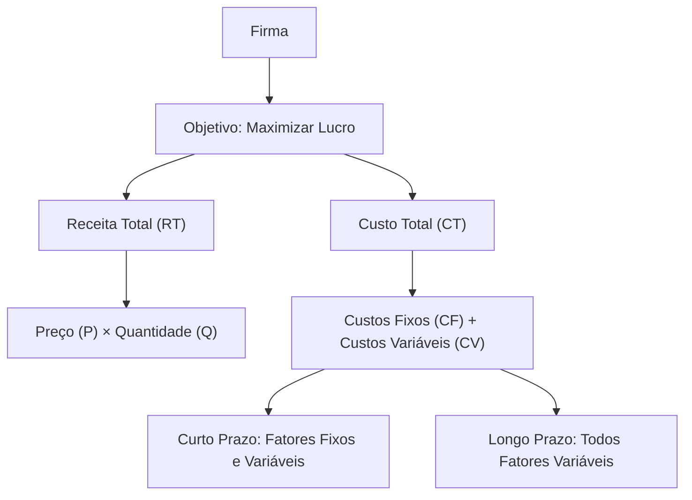
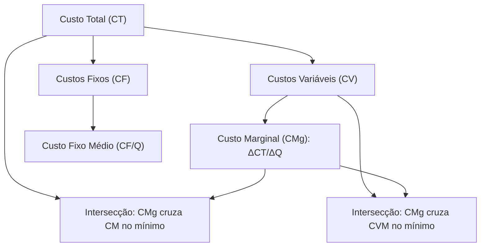
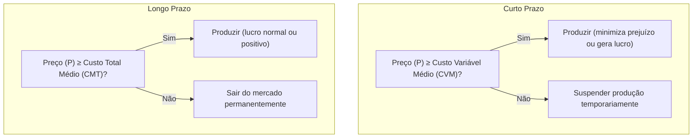
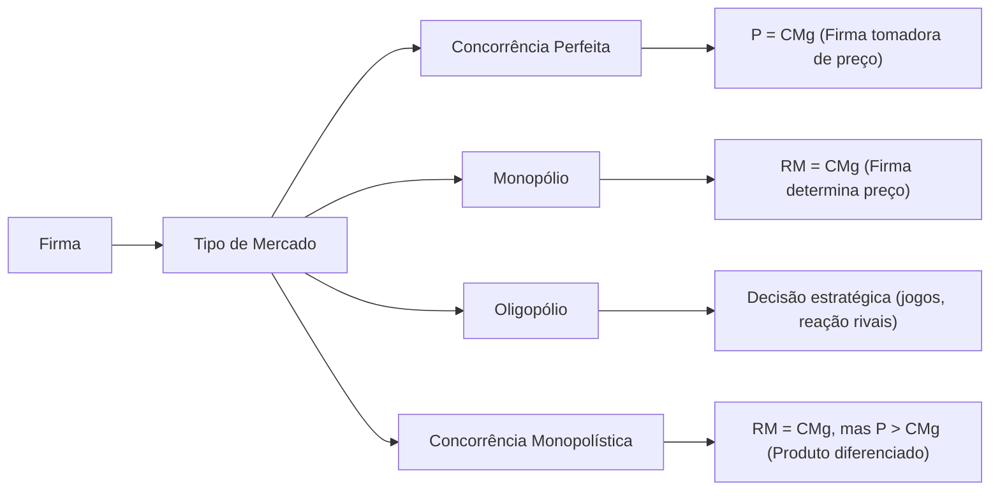
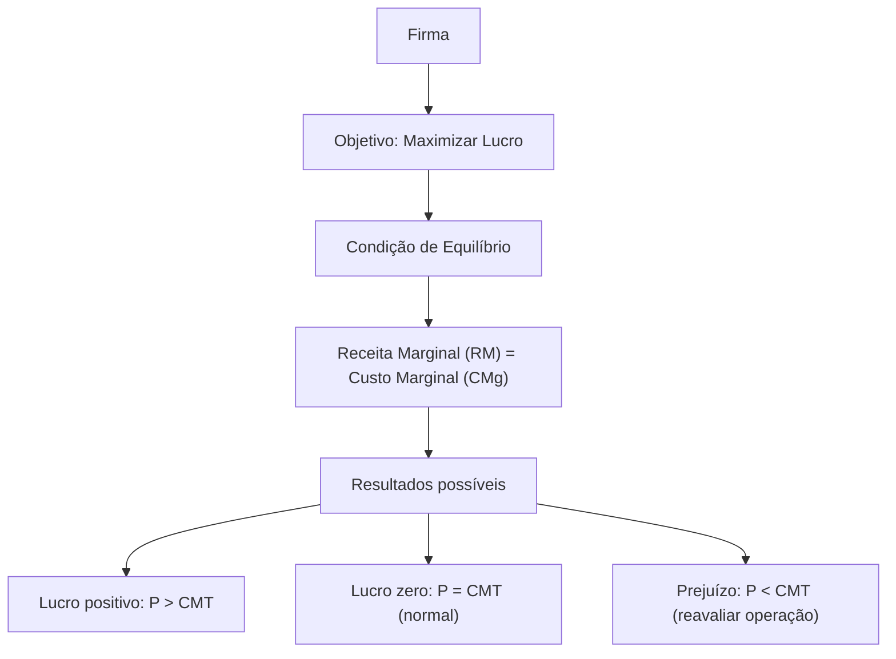
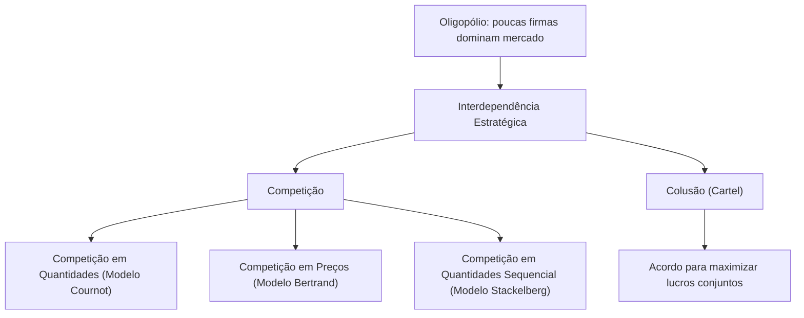
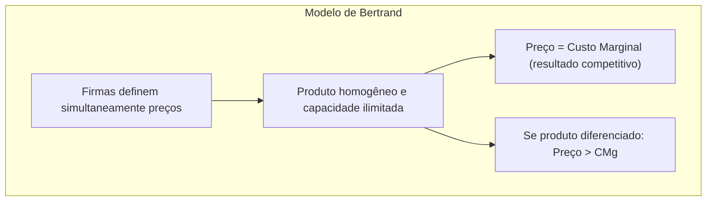
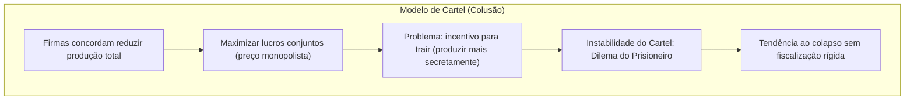
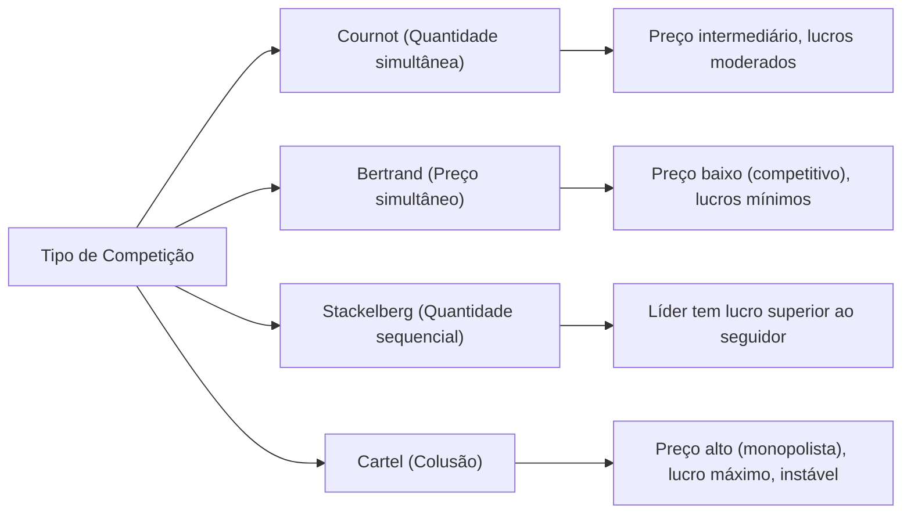

# Microeconomia – Nota de Estudo Avançado 

## Introdução à Microeconomia

A **Microeconomia** é o ramo da economia que estuda o comportamento de agentes individuais – consumidores, empresas, trabalhadores – e a forma como interagem em mercados. Seu foco central é **como alocar recursos escassos** diante de necessidades e desejos ilimitados. Essa condição de **escassez** implica que escolher **uma alternativa** normalmente envolve **abrir mão de outra**, conceito conhecido como **trade-off**. Decisões econômicas, portanto, exigem avaliar custos e benefícios de escolhas mutuamente excludentes. O **custo de oportunidade** de algo é o valor da melhor alternativa renunciada para obtê-lo – uma ideia fundamental que permeia toda a microeconomia.

> [!definition] **Escassez** 
> Em economia, **escassez** significa que os recursos disponíveis (terra, trabalho, capital, tempo) são limitados, enquanto os desejos ou necessidades de consumo são virtualmente ilimitados. Diante da escassez, cada escolha implica um **trade-off**, ou seja, sacrificar uma alternativa para realizar outra.

>[!quote] _“O custo de alguma coisa é aquilo de que você desiste para obtê-la.”_ – Gregory Mankiw. (Este princípio resume a ideia de **custo de oportunidade**, ou seja, o verdadeiro custo de uma decisão inclui o valor da melhor alternativa que precisou ser abandonada para realizá-la.)

A microeconomia analisa **como** os agentes tomam decisões e **como** essas decisões interagem nos mercados. Por exemplo, consumidores maximizam satisfação dadas suas restrições (como renda e preços), enquanto as firmas produzem visando maximizar lucros dados seus custos de produção. Essas escolhas individuais se coordenam via **preços de mercado**, que ajustam oferta e demanda. Um dos insights fundamentais, destacado já por Alfred Marshall no fim do século XIX, é que preços e quantidades são determinados simultaneamente pelos **dois lados do mercado** – demanda e oferta – atuando juntos em equilíbrio. Em outras palavras, nem apenas a utilidade dos consumidores (lado da demanda) nem apenas os custos de produção (lado da oferta) isoladamente explicam o valor de um bem, mas sim a interação de ambos. Marshall ilustrou essa ideia com sua famosa metáfora da **tesoura**:

>[!quote] _“Seria tão razoável discutir se a lâmina superior ou a inferior de uma tesoura é a responsável por cortar o papel, quanto discutir se o valor é determinado pela demanda ou pela oferta.”_ – Alfred Marshall.

Em suma, a introdução à microeconomia estabelece os conceitos básicos de **escassez**, **trade-offs**, **incentivos** e **custo de oportunidade**, preparando o terreno para teorias mais formais do comportamento do consumidor, da firma e da determinação de preços nos mercados.

**Exemplo ilustrativo – Fronteira de Possibilidades de Produção:** Uma forma simples de visualizar trade-offs é através da **Fronteira de Possibilidades de Produção (FPP)**. A FPP mostra as combinações máximas de dois bens que uma economia (ou empresa) pode produzir usando todos os recursos disponíveis de forma eficiente. Pontos sobre a fronteira implicam eficiência (não há recursos ociosos); pontos abaixo, ineficiência; pontos acima são inatingíveis dados os recursos atuais. O formato normalmente **côncavo** da FPP reflete custos de oportunidade crescentes – para produzir quantidades adicionais de um bem, sacrifica-se quantidades cada vez maiores do outro bem.

```chart
type: line
labels: [0,20,40,60,80,100]
series:
  - title: "Fronteira de Possibilidades de Produção"
    data: [100,98,92,80,60,0]
xTitle: "Quantidade do Bem A"
yTitle: "Quantidade do Bem B"
```

No gráfico acima, cada ponto na curva (FPP) representa uma escolha de produção entre dois bens (A e B). Movendo-se ao longo da fronteira, aumentar a produção do Bem A implica reduzir a do Bem B – evidenciando o trade-off e o custo de oportunidade (a quantidade do Bem B sacrificada). A inclinação da FPP em um ponto dado corresponde exatamente a esse custo de oportunidade marginal entre os dois bens.

**Exercícios – Introdução:**

1. (Dissertativa) Explique com suas palavras por que a existência de **escassez** obriga indivíduos e sociedades a fazerem **escolhas**. Como o conceito de **custo de oportunidade** auxilia na decisão entre alternativas?
    
2. (Múltipla escolha) Qual das situações abaixo **não** representa um **trade-off** econômico?  
    a. Um estudante decide usar seu tempo livre para estudar em vez de trabalhar.  
    b. Uma fábrica pode produzir carros ou caminhões com seus insumos disponíveis.  
    c. O governo imprime moeda para pagar dívidas, causando inflação.  
    d. Uma pessoa recebe um aumento salarial e decide gastar mais em lazer.
    

## Teoria do Consumidor

A teoria do consumidor procura compreender **como os indivíduos decidem o que consumir** dado seu orçamento limitado. Parte-se do pressuposto básico – exposto por Hal Varian e outros economistas – de que **“os consumidores escolhem a melhor cesta de bens que podem adquirir”** com sua renda disponível. Para dar conteúdo a essa ideia, é necessário definir o que significa _melhor cesta_ (as preferências do consumidor) e o que significa _poder adquirir_ (a restrição orçamentária).

- **Preferências e utilidade:** Supõe-se que cada consumidor possui preferências bem definidas sobre diferentes cestas de consumo. Podemos representá-las por meio de uma **função utilidade** $U(x,y,...)$ que atribui um número (nível de satisfação) a cada cesta de bens $(x,y,...)$. A utilidade permite ordenar as cestas do mais preferido para o menos preferido. Importante notar que, para a teoria básica, a utilidade é tratada como um conceito **ordinal** – interessa apenas a ordenação das preferências, não a intensidade absoluta da satisfação. Assim, se $U(A) > U(B)$, a cesta A é preferida à B, mas não é possível dizer _quanto_ a mais A é preferida. Os consumidores são assumidos racionais no sentido de que suas preferências são completas (podem comparar quaisquer cestas) e transitivas (consistentes na ordenação).
    
- **Curvas de indiferença:** Uma forma de visualizar preferências é através de **curvas de indiferença**. Cada curva de indiferença conecta todas as combinações de bens que proporcionam **o mesmo nível de utilidade** ao consumidor. Por exemplo, a curva de indiferença $U=100$ mostraria todas as cestas diferentes de dois bens que rendem utilidade exatamente 100. As propriedades típicas das curvas de indiferença incluem: (1) são decrescentes (se o consumidor tem **mais de um bem**, precisa ter menos do outro para permanecer igualmente satisfeito), (2) são convexas em relação à origem (prefere combinações balanceadas a extremos, refletindo uma **taxa marginal de substituição decrescente** entre os bens) e (3) curvas mais afastadas da origem indicam níveis de utilidade maiores (cestas preferidas).
    
- **Restrição orçamentária:** As escolhas do consumidor são limitadas por sua renda ($M$) e pelos preços dos bens. A **restrição orçamentária** para dois bens pode ser expressa como $P_X \cdot X + P_Y \cdot Y \le M$, onde $P_X$ e $P_Y$ são os preços dos bens $X$ e $Y$. O conjunto de consumo viável é composto pelas cestas $(X,Y)$ que o consumidor **pode pagar** com sua renda. Graficamente, a restrição orçamentária é uma **linha reta** no plano de bens: se todo o orçamento fosse gasto em $X$, poderia comprar $M/P_X$ unidades; se tudo fosse gasto em $Y$, poderia comprar $M/P_Y$ unidades. Esses são os interceptos da linha, e a inclinação da reta orçamentária é $-P_X/P_Y$, representando o trade-off de mercado entre $X$ e $Y$ (quanto de $Y$ deve-se renunciar para obter uma unidade extra de $X$, dado os preços).
    
- **Escolha ótima do consumidor:** Dadas preferências (curvas de indiferença) e restrição orçamentária, o consumidor racional escolherá a cesta de maior utilidade que caiba em seu orçamento – graficamente, a curva de indiferença **mais alta possível** que ainda toca a região orçamentária. Na situação típica (interior), a solução ótima ocorre no ponto em que uma curva de indiferença é **tangente** à linha de orçamento. Nesse ponto, a inclinação da curva de indiferença (Taxa Marginal de Substituição, ou $TMS$) é igual à inclinação da restrição orçamentária (razão de preços). Ou seja, no ótimo **$TMS = \frac{P_X}{P_Y}$**: a taxa à qual o consumidor está disposto a trocar $Y$ por $X$ (sacrifício subjetivo) coincide com a taxa à qual o mercado permite essa troca (custo objetivo). Se houvesse qualquer discrepância – por exemplo, o $TMS$ fosse maior que $P_X/P_Y$ – o consumidor poderia realocar gastos para aumentar sua satisfação total.
    

**Gráfico – Equilíbrio do Consumidor:** A figura abaixo ilustra uma situação de equilíbrio do consumidor com dois bens ($X$ e $Y$). A curva de indiferença apresentada reflete um nível de utilidade específico, e a linha orçamentária representa todas as combinações que o consumidor pode comprar com sua renda. O ponto de tangência entre elas indica a **cesta ótima**.

```chart
type: line
labels: [0,10,15,20,25,30,35,40]
series:
  - title: "Curva de Indiferença (U constante)"
    data: [null,40.0,26.67,20.0,16.0,13.33,11.43,10.0]
  - title: "Linha Orçamentária"
    data: [40,30,25,20,15,10,5,0]
xTitle: "Quantidade do Bem X"
yTitle: "Quantidade do Bem Y"
```

No gráfico, a **Linha Orçamentária** vai do ponto $(0,40)$ (toda renda gasta em $Y$) até $(40,0)$ (toda renda gasta em $X$), assumindo, por exemplo, renda $M=40$ e preços $P_X=P_Y=1$. A **Curva de Indiferença** mostrada é convexa e decrescente, representando todas as combinações de $X$ e $Y$ que dão ao consumidor um certo nível de utilidade (neste caso, o nível é tal que a tangência ocorre exatamente em $X=20, Y=20$). Observe que no ponto **$(20,20)$** as inclinações das duas curvas coincidem – é o equilíbrio do consumidor. Em quantidades menores de $X$ (mais $Y$), a inclinação da curva de indiferença era maior que a da restrição (TMS > $P_X/P_Y$), indicando que o consumidor valorizaria muito obter mais $X$ em troca de $Y$ e, de fato, poderia melhorar seu bem-estar deslocando-se nesse sentido. Em quantidades maiores de $X$ (menos $Y$) do que o ótimo, ocorre o oposto (TMS < razão de preços), e o consumidor preferiria trocar parte de $X$ por mais $Y$. Assim, somente no ponto de tangência não há incentivo para realocar o consumo – é a cesta _ótima_ dentro do orçamento.

**Demanda individual e de mercado:** A teoria do consumidor permite derivar a **curva de demanda** de um indivíduo para cada bem. Variando o preço de um bem $P_X$ e recalculando a escolha ótima (mantendo preferências, renda e outros preços constantes), obtemos diferentes quantidades consumidas de $X$ – essa relação $P_X \times Q_X$ é a **demanda individual** por $X$. A curva de demanda normalmente é **decrescente**: um preço menor leva a quantidade demandada maior (assumindo bens “normais”). Isso ocorre por dois efeitos combinados: (1) **efeito substituição** – com $X$ mais barato em relação a $Y$, o consumidor tende a substituir $Y$ por $X$; (2) **efeito renda** – a queda do preço de $X$ libera poder de compra (a restrição orçamentária se desloca para fora), permitindo alcançar curvas de indiferença mais altas. Para bens normais, ambos os efeitos aumentam $Q_X$. (Para bens **inferiores**, o efeito renda atua no sentido oposto ao de substituição; e em casos extremos de bens **Giffen**, um forte efeito renda negativo pode fazer a quantidade demandada **cair** quando o preço cai, violando a lei da demanda – embora esses casos sejam raros e teóricos.)

A **demanda de mercado** por um bem é simplesmente a soma horizontal das demandas individuais de todos os consumidores. Ela também tende a ser decrescente em função do preço, refletindo as preferências agregadas da sociedade. Autores como _Alfred Marshall_ desenvolveram a análise de excedentes (consumidor e produtor) a partir das curvas de demanda e oferta de mercado, tema que veremos adiante na seção de equilíbrio e bem-estar.

> [!note] **Demanda Marshalliana vs Hicksiana (avançado)** 
> Em nível avançado, distingue-se a demanda _Marshalliana_ (ordinária), derivada mantendo renda nominal fixa, da demanda _Hicksiana_ (compensada), derivada mantendo utilidade constante (ou seja, compensando variações de preço com ajuste de renda para permanecer na mesma indiferença). Essas distinções permitem definir conceitos como **efeito renda** e **efeito substituição** de forma precisa e introduzir medidas de variação de bem-estar (variação compensatória e equivalente). Embora relevantes em microeconomia avançada, para o entendimento fundamental da demanda basta a noção ordinária (Marshalliana) em que redução de preço normalmente eleva a quantidade consumida.

**Exercícios – Teoria do Consumidor:**

1. (Dissertativa) Defina **utilidade** e **curva de indiferença**. Explique por que as curvas de indiferença típicas são convexas em relação à origem. O que a convexidade indica sobre as preferências do consumidor?
    
2. (Múltipla escolha) Suponha que, para certo consumidor, **ambos** os bens $X$ e $Y$ sejam bens **normais**. Se o preço de $X$ diminuir (mantidas renda e preço de $Y$ constantes), podemos esperar que:  
    a. A quantidade demandada de $X$ aumente, e a demanda de $Y$ permaneça igual.  
    b. A quantidade demandada de $X$ aumente, e a de $Y$ **também** aumente.  
    c. A quantidade demandada de $X$ aumente, e a de $Y$ **diminua**.  
    d. A quantidade consumida de ambos os bens diminua (pois a renda real do consumidor caiu).
    
3. (Dissertativa) Explique o significado de **TMS (Taxa Marginal de Substituição)** entre dois bens. Como o TMS se relaciona com os preços na condição de ótimo do consumidor? Por que, no ponto de equilíbrio, o TMS é igual à razão entre os preços dos bens?
    

## Oferta e Demanda – Lei dos Mercados

A **oferta e demanda** são os componentes fundamentais que regem os mercados na microeconomia. A **Lei da Demanda** estabelece que, **ceteris paribus**, quanto **menor o preço** de um bem, **maior a quantidade** que os consumidores desejam comprar (demanda aumenta); inversamente, preços mais altos reduzem a quantidade demandada. Já a **Lei da Oferta** diz que, em geral, **preços mais altos** levam os produtores a ofertarem **maiores quantidades** do bem no mercado, enquanto preços baixos desestimulam a oferta. Essas leis refletem comportamento típico de consumidores (utilidade marginal decrescente) e produtores (custos marginais crescentes), respectivamente.

**Curvas de demanda e oferta:** Podemos representar graficamente essas relações por meio de curvas em um plano Preço (vertical) vs. Quantidade (horizontal). A **curva de demanda** $D(p)$ tem inclinação negativa, enquanto a **curva de oferta** $S(p)$ normalmente tem inclinação positiva. O ponto em que as duas curvas se interceptam determina o **equilíbrio de mercado** – isto é, o **preço de equilíbrio** $P^_$ e a **quantidade de equilíbrio** $Q^_$, tais que a quantidade que os consumidores desejam comprar ao preço $P^_$ é exatamente igual à quantidade que as firmas desejam vender a $P^_$. Em $P^*$ não há excesso de demanda (escassez) nem excesso de oferta (estoques sobrando): o mercado _limpa_.

```chart
type: line
labels: [0,1,2,3,4,5,6,7,8,9,10]
series:
  - title: "Demanda"
    data: [10,9,8,7,6,5,4,3,2,1,0]
  - title: "Oferta"
    data: [0,1,2,3,4,5,6,7,8,9,10]
xTitle: "Quantidade"
yTitle: "Pre\u00e7o"
beginAtZero: true
```

No gráfico acima, a interseção da **curva de demanda** (decrescente) com a **curva de oferta** (crescente) ocorre no ponto **$(Q^_=5,\ P^_=5)$**. Esse é o **equilíbrio competitivo** desse mercado simples – ao preço de 5 (unidades monetárias), os consumidores desejam comprar 5 unidades, e os ofertantes desejam vender 5 unidades. Se o preço de mercado estivesse **acima** de 5 (por exemplo 7), a oferta seria maior que a demanda, gerando **excedente** de produto (estoque não vendido); os vendedores tenderiam a reduzir o preço para desovar estoques, empurrando o mercado de volta ao equilíbrio. Se o preço estivesse **abaixo** (por exemplo 3), a quantidade demandada excederia a ofertada – haveria **escassez** –, levando compradores a competir e oferecer preços maiores, novamente pressionando o preço para cima em direção a $P^*$. Essa dinâmica incentiva que, ao longo do tempo, o preço converge para o nível de equilíbrio em mercados competitivos, desde que não haja intervenções.

> [!definition] **Equilíbrio de mercado** 
> Situação em que, a um dado preço, a **quantidade demandada** é igual à **quantidade ofertada**. Nesse preço de equilíbrio, não há tendência a variações, pois não existem forças de excesso de demanda ou oferta empurrando o preço para cima ou para baixo. Em equilíbrio competitivo, todos os agentes que desejam transacionar ao preço vigente conseguem fazê-lo – o mercado “limpa”, sem sobras ou faltas involuntárias.

**Deslocamentos (shifts) das curvas:** É crucial distinguir movimentos **ao longo** das curvas (causados pelo próprio preço do bem) de deslocamentos das curvas em si (causados por mudanças em outros fatores). Por exemplo, um **aumento na renda** dos consumidores (para um bem normal) desloca **toda** a curva de demanda para a direita (demanda cresce em todos os preços). Da mesma forma, uma inovação tecnológica que **reduz os custos de produção** desloca a **curva de oferta** para a direita (oferta maior a cada preço). Esses deslocamentos alteram o equilíbrio: p.ex., demanda maior eleva o preço e quantidade de equilíbrio; oferta maior reduz o preço de equilíbrio e aumenta a quantidade, e assim por diante. Analisar _comparativamente_ diferentes equilíbrios (antes e depois de choques) – o chamado **estática comparativa** – permite entender como fatores exógenos influenciam os mercados.

**Elasticidade-preço e sensibilidade:** Embora a direção das mudanças seja prevista pelas leis de oferta e demanda, a **magnitude** das respostas depende da **elasticidade** das curvas (tema da próxima seção). Por exemplo, diante de um aumento da demanda, se a oferta for muito inelástica (pouco responsiva), o efeito será um grande aumento de preço e pequeno aumento na quantidade. Já se a oferta for elástica (produtores ajustam quantidade facilmente), o aumento na quantidade será maior e o preço subirá menos.

Como mencionado, Alfred Marshall enfatizou que tanto a demanda quanto a oferta são necessárias para se entender a determinação de preços. Seu famoso exemplo comparava a demanda e oferta às duas lâminas de uma tesoura, trabalhando juntas. Assim, o preço de equilíbrio **$P^*$** é o ponto em que a avaliação marginal dos consumidores (refletida na demanda) iguala o custo marginal de produzir aquela unidade (refletido na oferta). Esse conceito de equilíbrio parcial, introduzido por Marshall, permanece um pilar da microeconomia para analisar mercados individuais.

**Interferências no equilíbrio:** Governos muitas vezes implementam políticas que afetam o equilíbrio de mercado, como **controles de preço**. Dois exemplos clássicos:

- **Preço-teto (controle de preços máximos):** É um limite legal abaixo do preço de equilíbrio (por exemplo, um teto para preço de alimentos básicos). Se fixado abaixo de $P^*$, resulta em **excesso de demanda** (escassez) – a quantidade demandada excede a ofertada ao preço controlado. Essa escassez pode levar a racionamento, filas ou mercados paralelos. Um exemplo é o controle de aluguéis, que visa proteger inquilinos, mas pode gerar falta de moradias no mercado formal.
    
- **Preço-piso (controle de preços mínimos):** É um limite acima do equilíbrio (por exemplo, salário mínimo no mercado de trabalho, ou preço mínimo agrícola). Se acima de $P^*$, provoca **excesso de oferta** – quantidade ofertada excede a demanda – resultando em desemprego (no caso de salário mínimo muito alto) ou estoques excedentes (no caso de produtos agrícolas que o governo às vezes compra para sustentar o preço).
    

No geral, tais intervenções criam **desequilíbrios persistentes** e geralmente uma **perda de eficiência** (analisada na seção de bem-estar).

> [!note] **Oferta e demanda agregadas (macroeconomia)** 
> Em contextos macroeconômicos, usamos termos “oferta agregada” e “demanda agregada” para nos referir ao nível geral de produção e demanda em toda a economia (associados a nível de preços global). Não confundir com as curvas de oferta e demanda microeconômicas de um mercado específico. Embora conceitualmente relacionados (ambos representam equilíbrios de mercado), os determinantes de oferta/demanda agregadas incluem fatores macro (política monetária, expectativas, etc.) e extrapolam o escopo da microeconomia parcial.

**Exercícios – Oferta e Demanda:**

1. (Múltipla escolha) Considere o mercado de gasolina. Se o preço internacional do petróleo **cair significativamente**, é esperado que no mercado doméstico de gasolina (supondo livre mercado):  
    a. A curva de oferta de gasolina se desloque para a direita, reduzindo o preço de equilíbrio.  
    b. A curva de demanda por gasolina se desloque para a direita, aumentando a quantidade de equilíbrio.  
    c. O preço de equilíbrio da gasolina suba, pois produtores reduzirão a oferta.  
    d. A quantidade de equilíbrio diminua, pois consumidores comprarão menos gasolina quando está mais barata.
    
2. (Dissertativa) Explique o que ocorre quando se fixa um **preço-teto** abaixo do preço de equilíbrio de mercado. Use um diagrama de oferta e demanda para apoiar sua resposta, identificando as consequências em termos de excesso de demanda e formas de racionamento que podem surgir.
    

## Elasticidades

**Elasticidade** é uma medida da **sensibilidade** da quantidade demandada ou ofertada às variações de preços, rendas ou outros fatores. A elasticidade mais comum é a **elasticidade-preço da demanda**, definida como a _variação percentual na quantidade demandada dividida pela variação percentual no preço_. Formalmente:

Ed=%ΔQd%ΔPE_{d} = \frac{\%\Delta Q_d}{\%\Delta P}

Esse coeficiente adimensional indica quão fortemente a quantidade $Q_d$ reage a mudanças em $P$. Por convenção, usa-se o valor absoluto (pois a variação em $Q_d$ é inversa à do preço pela lei da demanda).

- Se $E_d > 1$, diz-se que a demanda é **elástica** (a quantidade varia proporcionalmente mais que o preço – consumidores são muito responsivos às variações de preço).
    
- Se $E_d < 1$, a demanda é **inelástica** (quantidade varia proporcionalmente menos – consumidores relativamente insensíveis ao preço).
    
- Se $E_d = 1$, temos elasticidade **unitária** (variações percentuais iguais em preço e quantidade).
    
- Dois casos limite: demanda **perfeitamente inelástica** ($E_d = 0$, curva vertical – quantidade fixa independentemente do preço) e demanda **perfeitamente elástica** ($E_d \to \infty$, curva horizontal – ao menor aumento de preço, a quantidade cai a zero).
    

Vários fatores determinam a elasticidade da demanda: disponibilidade de **substitutos próximos** (mais substitutos, demanda mais elástica), se o bem é **necessidade ou supérfluo** (necessidades tendem a inelásticas), a **definição do mercado** (quanto mais específico o bem, mais elástico – ex: demanda por _marca X_ de refrigerante é mais elástica que por refrigerante genérico), a **proporção do gasto** com o bem no orçamento (bens que consomem grande parcela da renda tendem a ter demanda mais elástica) e o **horizonte de tempo** (no longo prazo, consumidores ajustam comportamento e demandas costumam ficar mais elásticas do que no curto prazo).

[!definition] **Elasticidades importantes:**

- _Elasticidade-preço da demanda ($E_d$):_ percentual $\Delta Q_d$ / percentual $\Delta P$. Indica a resposta da quantidade demandada à variação do próprio preço.
    
- _Elasticidade-preço da oferta:_ definida similarmente, $%\Delta Q_s / %\Delta P$. Mede a resposta da quantidade ofertada à mudança de preço. Depende da flexibilidade produtiva (capacidade de aumentar produção) e do horizonte de tempo (oferta é mais elástica no longo prazo quando fatores podem ser ajustados).
    
- _Elasticidade-renda da demanda:_ $%\Delta Q_d / %\Delta Renda$. Indica se um bem é **normal** ($E_r > 0$, demanda cresce com renda) ou **inferior** ($E_r < 0$, demanda cai quando a renda aumenta). Bens de luxo costumam ter $E_r > 1$, enquanto bens de primeira necessidade tendem a $E_r < 1$.
    
- _Elasticidade cruzada da demanda:_ $%\Delta Q_{d_bem_A} / %\Delta P_{bem_B}$. Se for positiva, os bens A e B são **substitutos** (ex: margarina e manteiga); se negativa, são **complementares** (ex: carros e combustível); se próxima de zero, os bens são independentes.
    

**Elasticidade e receita total:** Um uso prático da elasticidade da demanda é analisar o efeito de variações de preço na **receita total** (preço $\times$ quantidade) dos vendedores. Se a demanda é **elástica** ($E_d > 1$), uma redução de preço aumenta a receita total (pois o aumento percentual nas vendas supera a queda percentual do preço). Por outro lado, se a demanda é **inelástica** ($E_d < 1$), uma redução de preço diminui a receita (a quantidade vendida sobe pouco em relação à queda de preço). No caso unitário ($E_d = 1$), variações pequenas de preço não alteram a receita total. Esse conceito é importante, por exemplo, para governos ao definirem impostos (se desejam maximizar arrecadação, preferem tributar bens de demanda inelástica) e para empresas avaliarem políticas de preço.

**Exemplo numérico:** Suponha que uma companhia de transporte urbano considere aumentar o preço da passagem para elevar sua arrecadação. Se a demanda de passageiros for inelástica (digamos $E_d = 0.5$), isso significa que um aumento de 10% no preço gera apenas ~5% de queda na quantidade de passageiros – a receita (preço $\times$ quantidade) sobe. Contudo, se a demanda fosse elástica ($E_d = 1.5$), um aumento de 10% no preço causaria queda de ~15% no número de passageiros, reduzindo a receita total. Assim, conhecer a elasticidade é crucial para decisões de preço.

Vale notar que a **elasticidade não é constante ao longo da curva linear** – por exemplo, numa demanda linear simples, $E_d$ varia de valores altos (elástica) em preços altos/quantidades baixas, passando por unitária no ponto médio, até valores baixos (inelástica) em preços baixos/quantidades altas.

**Elasticidade da oferta:** De modo análogo, a oferta tem sua elasticidade, que depende principalmente da capacidade de ajuste dos produtores. Por exemplo, num horizonte curto, uma indústria pode ter dificuldade de expandir produção (oferta pouco elástica). No longo prazo, com possibilidade de investir em capital e contratar mais insumos, a oferta geralmente se torna mais elástica. Há casos de oferta perfeitamente inelástica no curto prazo – e.g., ingressos de um show (quantidade fixa) – e casos de oferta perfeitamente elástica – e.g., empresas em concorrência perfeita tomadoras de preço podem ofertar qualquer quantidade a um preço fixado de mercado (no modelo teórico, curva horizontal ao preço de mercado).

**Aplicações:** Elasticidades são aplicadas para prever impactos de políticas. Por exemplo, a **incidência de um imposto** – quem arca com o ônus, se consumidores ou produtores – depende das elasticidades relativas de oferta e demanda. O lado menos elástico do mercado suportará a maior parte do imposto (pois tem menor capacidade de resposta/escapatória). Também, nas relações internacionais, elasticidades importação/exportação influenciam resultados de desvalorizações cambiais (condição Marshall-Lerner). Em suma, elasticidade é um conceito versátil que quantifica _como_ e _quanto_ variáveis econômicas reagem a choques, enriquecendo muito as análises para além do simples sentido das variações.

**Exercícios – Elasticidades:**

1. (Dissertativa) Defina **elasticidade-preço da demanda** e explique a diferença entre demanda elástica, inelástica e unitária. Como a elasticidade está relacionada com a **receita total**? Dê um exemplo de bem com demanda elástica e outro com demanda inelástica, justificando.
    
2. (Múltipla escolha) Suponha que o preço de um bem X aumente 5% e, como resultado, a quantidade demandada caia 15%. Podemos afirmar que:  
    a. A demanda de X é inelástica e a receita total dos vendedores aumentará.  
    b. A demanda de X é elástica e a receita total dos vendedores diminuirá.  
    c. A elasticidade-preço da demanda de X é 0,33 (inelástica).  
    d. X é um bem inferior.
    
3. (Dissertativa) Explique por que a elasticidade da oferta de quartos de hotel pode ser baixa no curto prazo, mas bem mais alta no longo prazo. Quais fatores limitam o ajuste imediato da oferta e o que permite maior elasticidade conforme o horizonte de tempo se alonga?
    

## Teoria da Firma e Custos de Produção

Enquanto os consumidores maximizam utilidade sujeita a restrições orçamentárias, **as firmas maximizam lucros** sujeitas a seus custos de produção e às condições de mercado. O **lucro econômico** é a diferença entre a receita total (preço vezes quantidade vendida) e o custo total de oportunidade de todos os insumos utilizados (incluindo custos explícitos e implícitos). A condição de máximo lucro geralmente envolve decisões de **quanto produzir** (no curto prazo) e **se deve entrar ou sair do mercado** (no longo prazo).

Para entender as decisões da firma, precisamos analisar sua **tecnologia de produção** e os **custos** associados:

- **Função de produção:** Relaciona a quantidade produzida ($Q$) com as quantidades de insumos utilizados (trabalho $L$, capital $K$, etc.). Por exemplo, $Q = F(L,K)$ resume a tecnologia da firma. No **curto prazo**, define-se um fator fixo (digamos $K$ fixo) e outros variáveis ($L$ variável). **Retornos marginais decrescentes** costumam ocorrer: inicialmente, aumentar o insumo de trabalho eleva a produção de forma crescente (ganhos de especialização), mas além de certo ponto, acréscimos adicionais de trabalho geram incrementos cada vez menores no output (devido à sobreutilização do fator fixo). A **Produtividade Marginal** de um insumo é a variação na produção resultante de uma unidade adicional daquele insumo (mantendo os demais constantes). A hipótese de produtividade marginal decrescente implica que essa contribuição marginal tende a cair conforme mais unidades do insumo são empregadas (ceteris paribus).
    
- **Custos de produção:** Podem ser divididos em **custos fixos** (independentes do nível de produção, como aluguel, custo de máquinas já instaladas) e **custos variáveis** (que aumentam com o nível de produção, como matérias-primas, mão de obra variável). No curto prazo, os custos fixos são “afundados” – devem ser pagos mesmo se a produção for zero. No longo prazo, todos os custos podem se tornar variáveis (a firma pode ajustar todos os fatores).
    

> [!definition] **Tipos de custos:**
 **Custo Fixo (CF):** Despesa que independe da quantidade produzida ($Q$). Ex.: aluguel da fábrica, amortização de máquinas. É incorrido mesmo com $Q=0$.
**Custo Variável (CV):** Despesa que varia conforme o nível de produção. Ex.: insumos, salários de operários (se ajustáveis ao nível de output). Para $Q=0$, $CV=0$.
**Custo Total (CT):** Soma do custo fixo e variável para produzir $Q$: $CT(Q) = CF + CV(Q)$.
**Custo Médio (CM):** Custo total por unidade produzida: $CM = \frac{CT}{Q}$. Pode-se decompor em custo fixo médio ($CFM = CF/Q$) e custo variável médio ($CVM = CV/Q$). Em geral, $CFM$ diminui à medida que $Q$ cresce (diluindo o fixo).
**Custo Marginal (CMg):** O aumento no custo total para produzir **uma unidade adicional**: $CMg = \frac{\Delta CT}{\Delta Q}$. Equivale, aproximadamente, ao custo dos insumos adicionais necessários para expandir a produção de $Q$ para $Q+1$. O comportamento típico do $CMg$ decorre dos retornos marginais decrescentes: costuma **cair inicialmente** (ganhos de escala crescentes) e depois **subir acentuadamente** quando a capacidade instalada fica sobrecarregada.
 **Curvas de custo no curto prazo:** Uma firma típica apresenta uma curva de **Custo Médio Total (CMT)** em formato de “U”: para baixos níveis de produção, o CMT é elevado (pois os custos fixos são divididos por poucos unidades, e a produtividade dos fatores ainda cresce); conforme $Q$ aumenta, o CMT tende a **cair** (espalhamento do custo fixo e ganhos iniciais de eficiência) até atingir um **mínimo**; depois, eventualmente, $CMT$ volta a **subir** (efeitos de sobrecarga dos fatores fixos, produtividade marginal decrescente elevando custos). O **Custo Marginal (CMg)** geralmente corta a curva de custo médio exatamente em seu ponto mínimo. Para quantidades menores que o ótimo, $CMg < CM$ (o custo marginal de produzir mais é menor que o custo médio, puxando o médio para baixo); após o ponto ótimo, $CMg > CM$ (custo marginal acima do médio, puxando-o para cima). O **Custo Variável Médio (CVM)** também tem formato de U semelhante e fica abaixo do CMT (a diferença $CMT - CVM$ é o custo fixo médio).
**Curvas de custo no longo prazo:** No longo prazo, a firma pode ajustar todos os insumos, de modo que não há custos fixos irreversíveis – pode-se escolher a escala ótima de produção para cada nível de output. A **curva de Custo Médio de Longo Prazo (CMLP)** envolve o envoltório das curvas de curto prazo (representa o menor custo por unidade para cada nível de produção, escolhendo livremente a escala). Frequentemente, o CMLP também é em U ou **alongado/achatado**: para baixos níveis de produção, pode haver **economias de escala** (o custo médio de longo prazo cai conforme $Q$ aumenta, possivelmente devido a especialização, eficiência técnica, etc.); além de certo ponto, podem surgir **deseconomias de escala** (o CMLP volta a subir com $Q$, possivelmente devido a dificuldades gerenciais, saturação de fatores). Se a curva de longo prazo for horizontal em algum trecho, indica **retornos constantes de escala** (custo médio constante conforme expande a escala).
    

Abaixo, um gráfico típico de curvas de custo **no curto prazo**:

```chart
type: line
labels: [2,3,4,5,6,7,8,9,10,11,12,13,14,15,16,17,18,19,20]
series:
  - title: "Custo M\u00e9dio Total (CMT)"
    data: [28.0,20.17,16.5,14.5,13.33,12.64,12.25,12.06,12.0,12.05,12.17,12.35,12.57,12.83,13.12,13.44,13.78,14.13,14.5]
  - title: "Custo Marginal (CMg)"
    data: [4,5,6,7,8,9,10,11,12,13,14,15,16,17,18,19,20,21,22]
xTitle: "Quantidade (Q)"
yTitle: "Custo por unidade"
beginAtZero: true
```

No exemplo acima, o **Custo Médio Total** (CMT) cai rapidamente de 28 para cerca de 12 conforme a produção aumenta de 2 para 10 unidades (efeito da diluição do custo fixo e ganhos de eficiência iniciais). O ponto de mínimo do CMT ocorre próximo de $Q=10$ (no valor mínimo $\approx 12$). A partir daí, o CMT volta a subir lentamente (atingindo ~14.5 em $Q=20$), indicando deseconomias em níveis altos de produção na planta atual. A curva de **Custo Marginal (CMg)** começa abaixo do CMT para pequenas quantidades (CMg = 4 quando CMT=28, em $Q=2$) e vai aumentando conforme a produção cresce (devido à produtividade marginal decrescente do fator variável). Ela cruza a CMT exatamente em $Q \approx 10$ – para produção menor que 10, o CMg está abaixo do médio (puxando-o para baixo), para produção maior, o CMg fica acima do médio (puxando-o para cima). Essa intersecção indica o nível de produção de **menor custo médio**.

Para a firma maximizar lucro, ela compara o preço de venda com seus custos: no **curto prazo**, a condição de equilíbrio (em mercados competitivos) será produzir até o ponto onde **$P = CMg$** (desde que $P$ cubra pelo menos os custos variáveis). No longo prazo, o equilíbrio requer também que o preço cubra todos os custos (incluindo fixos) – caso contrário, a firma sairia do mercado.

>[!note] **Maximização de lucro e seleção natural (Alchian)** 
>Armen Alchian (1950) argumentou que, mesmo que nem todos os empresários sejam perfeitamente racionais ou informados para _intencionalmente_ maximizar lucros, no longo prazo os mercados tendem a apresentar **comportamento como se** as firmas maximizassem lucro. Isso porque firmas que persistentemente não cobrem seus custos tendem a falir ou ser expulsas pela concorrência, enquanto as mais eficientes sobrevivem. Ou seja, há um processo análogo à seleção natural: as empresas com lucros maiores (com melhores estratégias ou tecnologias) se mantêm e expandem, ao passo que as ineficientes desaparecem. Assim, a hipótese de maximização de lucro pode ser vista menos como uma suposição psicológica sobre empresários e mais como um **resultado evolutivo** dos mercados competitivos.

**Decisões de curto e longo prazos:** No **curto prazo**, dada uma estrutura de custos fixos, uma firma continuará operando desde que a receita cubra pelo menos os custos variáveis. Se o preço de mercado $P$ cai abaixo do **Custo Variável Médio (CVM)** mínimo, a firma minimiza seu prejuízo **suspendendo a produção** (fecha temporariamente), pois a receita não cobre nem os custos variáveis – nesse caso, é melhor produzir zero e arcar apenas com o custo fixo do que produzir e ter prejuízo adicional. Isso é chamado **condição de fechamento** no curto prazo: $P < CVM_{min}$. Já no **longo prazo**, todos os custos devem ser cobertos; se o preço ficar abaixo do **Custo Total Médio** mínimo, a firma terá prejuízo mesmo no melhor cenário e optará por **sair do mercado** permanentemente. No equilíbrio de longo prazo de um mercado competitivo, o preço se ajusta de forma que as firmas ativas operam sem lucro econômico (lucro zero, cobrindo exatamente todos os custos, incluindo retorno normal do capital).

**Economias de escala e escopo:** Uma firma pode experimentar **economias de escala** quando aumentar a escala de produção (todos insumos proporcionalmente) reduz o custo médio de longo prazo – por exemplo, devido a eficiência produtiva, divisão de trabalho, etc. **Deseconomias de escala** ocorrem quando expandir demais a escala eleva o custo médio (problemas gerenciais, gargalos). Há também **economias de escopo**, quando produzir **conjuntamente** dois ou mais produtos sai mais barato do que produzi-los separadamente (aproveitamento de insumos compartilhados, como um subproduto útil). Esses conceitos ajudam a explicar por que certas indústrias tendem a ter poucas firmas grandes (fortes economias de escala levando a concentrações maiores) e por que empresas diversificam portfólios de produtos.

**Exercícios – Firma e Custos:**

1. (Dissertativa) Explique a diferença entre **custos fixos** e **custos variáveis**, dando exemplos. Por que, no curto prazo, uma firma pode continuar operando mesmo com prejuízo contábil, desde que o preço de venda esteja acima de certo nível crítico relacionado aos custos?
    
2. (Múltipla escolha) Uma empresa apresenta os seguintes custos: custo fixo mensal de $1000; custo variável médio mínimo de $5 por unidade, atingido quando produz 200 unidades; o custo total médio mínimo é $8 por unidade, em 300 unidades. Sobre essa firma, é **correto** afirmar que:  
    a. No curto prazo, se o preço for $6, a empresa deve continuar produzindo, embora tenha prejuízo contábil.  
    b. No longo prazo, se o preço permanecer em $6, a empresa continuará operando normalmente, pois cobre o custo variável.  
    c. Se o preço subir para $9, a empresa terá lucro econômico positivo no longo prazo, atraindo novas firmas ao mercado.  
    d. $5 é o preço de fechamento de longo prazo dessa firma.
    
3. (Dissertativa) Uma firma enfrenta **economias de escala** para baixos níveis de produção e **deseconomias de escala** em níveis altos. Descreva como seriam as curvas de custo médio de longo prazo para essa firma e quais fatores podem explicar economias e deseconomias de escala.
    

## Estruturas de Mercado

A forma como as firmas interagem e competem varia conforme a **estrutura de mercado**. Os economistas clássicos e neoclássicos identificaram quatro modelos principais: **Concorrência Perfeita**, **Monopólio**, **Oligopólio** e **Concorrência Monopolística**. Cada estrutura tem características próprias quanto ao número de participantes, tipo de produto, existência de barreiras à entrada, poder de precificação das firmas e resultados em termos de eficiência e bem-estar. Abaixo resumimos os traços principais de cada estrutura:

|Característica|**Concorrência Perfeita**|**Monopólio**|**Oligopólio**|**Concorrência Monopolística**|
|---|---|---|---|---|
|**Número de firmas**|Muitas (atomizadas)|Uma única firma|Poucas firmas|Muitas firmas|
|**Tipo de produto**|Homogêneo (idêntico)|Único, sem substitutos próximos|Homogêneo ou diferenciado|Diferenciado (variedades)|
|**Poder de preço**|Nenhum – **tomadora de preço** (aceita $P^*$)|Alto – **fazedora de preço** (escolhe $P$ que maximiza lucro)|Interdependência estratégica; poder moderado (dependente de ações rivais)|Algum poder – cada firma é **fazedora de preço** na sua variedade, mas limit. pela concorrência de marcas substitutas|
|**Barreiras à entrada**|Nenhuma significativa|Elevadas (legais, tecnológicas ou de escala)|Moderadas a altas (economias de escala, acesso a tecnologia, cartelização)|Baixas (livre entrada de novas empresas e imitações)|
|**Demanda enfrentada**|Horizontal (perfeitamente elástica ao preço de mercado)|Descendente (toda demanda do mercado; ao reduzir $P$ vende mais)|Descendente, mas dependente de reação das rivais|Descendente (cada marca tem sua demanda própria)|
|**Maximização de lucro**|Produz onde $P = CMg$ (pois $P$ = receita marginal = CMg no ótimo)|Produz onde $RM = CMg$, estabelece preço acima do CMg|Equilíbrio de Nash em estratégias de preço/quantidade (Cournot, Bertrand, etc.)|Semelhante a monopólio no curto prazo; no longo prazo, lucro zero com $P = CMT$ > CMg|
|**Lucro econômico (LP)**|Zero (no longo prazo; lucro normal apenas)|Positivo **(lucros extraordinários)** podem persistir (pois não há entrada livre)|Possivelmente positivo se não houver comportamento competitivo acirrado; tendência a lucros positivos se barreiras sustentarem colusão ou inércia competitiva|Zero no longo prazo (entrada de novas empresas elimina lucros, mas persiste monopólio local de marca)|
|**Eficiência alocativa**|Alta – $P = CMg$, atinge eficiência de Pareto (exceto falhas ext.)|Baixa – $P > CMg$, quantidade menor que a ótima; gera perda de bem-estar (DWL)|Intermediária – depende do grau de competição; pode haver ineficiência se cartelização|Baixa – $P > CMg$ e produção não minimiza custo médio (excesso de capacidade), mas oferece variedade aos consumidores|
|**Exemplos típicos**|Produtos agrícolas, commodities, bolsas de valores|Empresa de água encanada local; patente farmacêutica (monopólio legal)|Indústria automobilística, mercados de óleo e gás, telecomunicações (em alguns países)|Restaurantes, marcas de roupa, produtos diferenciados (cosméticos, eletrônicos)|

### Concorrência Perfeita

É a estrutura de mercado idealizada com **maior grau de competição**. As condições clássicas para concorrência perfeita são:

- **Muitas empresas e muitos consumidores**, nenhum com participação suficientemente grande para influenciar o preço individualmente (cada um é “tomador de preço”).
    
- **Produto homogêneo**: as unidades do bem são indistinguíveis independentemente de quem produz – resultando em uma única curva de oferta e demanda de mercado.
    
- **Informação perfeita**: todos agentes conhecem os preços e características do produto, sem custos de transação significativos.
    
- **Livre entrada e saída**: não há barreiras que impeçam novas empresas de entrarem no mercado em busca de lucro, nem obstáculos para saírem se houver prejuízo.
    

Nessas condições, o **preço de mercado** se forma pelo equilíbrio entre oferta e demanda total. Cada firma individual enfrenta uma **demanda perfeitamente elástica** ao preço de mercado $P^_$ – pode vender qualquer quantidade ao preço vigente, mas nada acima dele (pois os compradores têm muitas outras opções idênticas) e não teria por que vender abaixo (poderia vender tudo a $P^_$). Assim, a receita marginal da firma é igual ao preço de mercado ($RM = P$).

A decisão ótima da firma competitiva é produzir a quantidade em que seu **custo marginal** iguala o preço ($CMg = P$). Isso determina sua oferta individual. No curto prazo, pode haver lucros econômicos positivos se o preço estiver acima do custo total médio; porém, esses lucros atraem **entrada de novas firmas** no longo prazo, deslocando a oferta de mercado para a direita até o preço cair ao nível de custo mínimo. O equilíbrio de longo prazo, portanto, ocorre com as firmas operando no tamanho de escala eficiente (menor custo médio) e lucro econômico zero (apenas remuneração normal do capital). Se o preço estiver abaixo do custo total médio, ocorre prejuízo e **saída de empresas** até que a oferta contraia e o preço suba ao ponto de equilíbrio sustentável. Esse mecanismo de entrada e saída leva a uma situação de eficiência: no longo prazo, $P = CMT_{min} = CMg$, de modo que os consumidores pagam um preço igual ao custo marginal de produzir a última unidade (eficiência alocativa) e as firmas produzem no mínimo do custo médio (eficiência produtiva).

Em concorrência perfeita, o **excedente total** (consumidor + produtor) é maximizado – é o benchmark de eficiência econômica. Qualquer desvio no preço ou quantidade reduziria o bem-estar total (como veremos em equilíbrio e bem-estar). Por isso, muitas análises de políticas públicas consideram o caso competitivo como referência ideal.

> [!definition] **Tomador de preços** 
> Uma firma (ou consumidor) é tomadora de preços quando não exerce influência perceptível sobre o preço de mercado – ele é dado externamente. Em concorrência perfeita, todas as firmas são tomadoras de preço. Uma firma individual ajusta sua produção de forma que $CMg = P^_$; se tentar cobrar mais, não venderá (dada a concorrência); se cobrar menos, não faz sentido, pois pode vender tudo a $P^_$. Assim, o mercado impõe o preço e as firmas ajustam quantidades.

Na prática, poucos mercados se aproximam totalmente da concorrência perfeita, mas muitos mercados agrícolas e de commodities apresentam alta concorrência e produtos padronizados (trigo, milho, café, minerais), tendendo a funcionar de forma semelhante ao modelo.

**Curva de oferta de mercado:** Em concorrência perfeita, a oferta de mercado é a soma das ofertas individuais das firmas, que por sua vez correspondem ao trecho do **CMg** de cada firma que está acima do custo variável médio. Se o preço cai abaixo de $CVM_{min}$ de uma firma, ela interrompe produção (no curto prazo). Isso traça a curva de oferta agregada como uma curva crescente, refletindo custos marginais crescentes entre diferentes empresas (as mais eficientes produzem primeiro, etc.). No longo prazo, a curva de oferta pode ser horizontal se as condições de custo não se alteram com a entrada (caso de indústria de custo constante), ou inclinada se houver economia ou deseconomia de escala em nível setorial.

**Exercícios – Concorrência Perfeita:**

1. (Múltipla escolha) Uma firma em concorrência perfeita maximiza seu lucro produzindo até o ponto em que:  
    a. Preço = Custo Fixo Médio.  
    b. Receita Marginal = Custo Marginal.  
    c. Custo Marginal = Custo Médio.  
    d. Preço = Custo Total Médio.
    
2. (Dissertativa) Explique por que, em concorrência perfeita de longo prazo, o lucro econômico tende a zero. O que aconteceria se as empresas do setor estivessem obtendo lucro positivo? E se estivessem incorrendo em prejuízo?
    

### Monopólio

No extremo oposto da concorrência perfeita está o **monopólio**, onde **existe apenas um vendedor** no mercado de determinado bem ou serviço, sem substitutos próximos. Essa firma monopolista **detém todo o poder de mercado**: ela é uma **formadora de preço** (price-maker), podendo escolher o preço ou a quantidade produzida (equivalentemente, já que a demanda do mercado vincula $P$ e $Q$). As razões para a existência de monopólios incluem:

- **Barreiras legais**: patentes, direitos autorais, concessões governamentais (por exemplo, uma companhia de eletricidade com concessão exclusiva).
    
- **Controle de recurso-chave**: se uma firma controla a totalidade (ou grande parte) de um insumo essencial (ex.: De Beers e diamantes historicamente).
    
- **Monopólio natural**: quando, devido a economias de escala muito fortes, uma única empresa consegue atender todo o mercado a um custo menor do que várias competidoras o fariam. Isso ocorre frequentemente com utilidades públicas (redes de água, energia, ferrovias) onde duplicar a infraestrutura seria ineficiente. Nesses casos, ter múltiplas firmas eleva demais o custo médio – a escala eficiente praticamente abrange todo o mercado.
    

A característica principal do monopólio é que a **curva de demanda do mercado é também a curva de demanda enfrentada pela firma** (pois ela _é_ o mercado). Para vender mais unidades, o monopolista precisa **reduzir o preço** – logo, sua **receita marginal (RM)** é menor que o preço: cada unidade adicional vendida barateia não só aquela unidade, mas também todas as anteriores (se cobra preço único para todos os clientes). Por isso, $RM$ cai mais rapidamente que o preço. Em um monopólio simples sobre um bem linear, se a demanda é linear $P(Q) = a - bQ$, então a receita marginal é $RM(Q) = a - 2bQ$ – mesma interseção no eixo preço, mas declive duas vezes maior.

O **equilíbrio monopolista** se dá quando a firma escolhe a quantidade $Q_m$ onde **$RM = CMg$**; então define o **preço monopolista $P_m$** que os consumidores estão dispostos a pagar por essa quantidade (na curva de demanda). Tipicamente, isso resulta em $P_m > CMg$ no equilíbrio e $Q_m$ menor do que o $Q_{cp}$ que ocorreria sob concorrência perfeita (onde $P = CMg$). Essa restrição de oferta para elevar preço beneficia o monopolista (lucro maior) às custas do consumidor e gera uma **perda de eficiência**: há consumidores que estariam dispostos a pagar um preço acima do custo marginal para obter o bem, mas não conseguem por causa da restrição na quantidade vendida (isso gera uma **perda seca** de bem-estar, ou **deadweight loss**, que veremos depois).

No gráfico a seguir, ilustra-se um monopólio com demanda linear, sua curva de receita marginal e um custo marginal constante para simplificar:

```chart
type: line
labels: [0,1,2,3,4,5,6,7,8,9,10]
series:
  - title: "Demanda (D)"
    data: [10,9,8,7,6,5,4,3,2,1,0]
  - title: "Receita Marginal (RM)"
    data: [10,8,6,4,2,0,-2,-4,-6,-8,-10]
  - title: "Custo Marginal (CMg)"
    data: [2,2,2,2,2,2,2,2,2,2,2]
xTitle: "Quantidade (Q)"
yTitle: "Pre\u00e7o / Custo"
beginAtZero: true
```

No exemplo, a demanda $P = 10 - Q$ (intercepta preço 10, intercepta quantidade 10). A receita marginal $RM = 10 - 2Q$ intercepta a quantidade em 5 (é zero nesse ponto) e torna-se negativa além disso. O custo marginal foi considerado constante em $2$ (linha horizontal). Para maximizar o lucro, o monopolista produz onde $RM = CMg$: aqui ocorre em **$Q_m = 4$** (pois $RM(4) = 10 - 2*4 = 2$, igual ao $CMg=2$). A essa quantidade, o monopolista cobra o **preço $P_m$ dado pela demanda em $Q=4$**, que é $P(4) = 6$. Comparativamente, num mercado competitivo, o equilíbrio se daria onde $Oferta = Demanda$; se considerássemos a oferta igual ao CMg ($P=2$), a quantidade seria **$Q_{cp} = 8$** (pois demanda $10-Q$ igual a 2 implica $Q=8$). Ou seja, o monopólio produz metade da quantidade do caso competitivo e cobra três vezes o preço do custo marginal. A área de **lucro** do monopolista seria o retângulo aproximadamente (6 - 4) * 4 = 8 (diferença entre preço e custo vezes quantidade), enquanto a **perda de bem-estar** resultante são os potenciais negócios não realizados nas unidades entre $Q=4$ e $Q=8$ que tinham valor para consumidores maior que o custo de produzi-las (o triângulo entre a demanda e o CMg de Q=4 a 8).

> [!definition] **Markup monopolista** 
> É comum expressar o poder de mercado de um monopolista pelo seu **markup** sobre o custo marginal. Em equilíbrio, a condição $RM = CMg$ pode ser escrita como $P \left(1 - \frac{1}{E_d}\right) = CMg$, onde $E_d$ é a elasticidade-preço da demanda do mercado no ponto de operação (lembrando que para um monopolista $RM = P \left(1 - \frac{1}{|E_d|}\right)$). Rearranjando: $\frac{P - CMg}{P} = \frac{1}{|E_d|}$. Essa expressão é conhecida como **índice de Lerner**, uma medida de poder de monopólio: quanto menor a elasticidade da demanda, mais o monopolista consegue elevar $P$ sobre o $CMg$. Em concorrência perfeita, $P=CMg$ e o índice de Lerner é zero (nenhum poder de mercado). Em monopólio, o índice é positivo, refletindo o grau de markup.

**Discriminação de preços:** Um monopolista, se puder, tentará extrair ao máximo o excedente dos consumidores. **Discriminar preços** significa cobrar preços diferentes de diferentes consumidores (ou grupos) de acordo com sua disposição a pagar. Existem graus de discriminação:

- **1º grau (perfeita):** cobrar a cada comprador exatamente o máximo que ele aceitaria pagar por cada unidade (o monopolista se apropria de todo excedente do consumidor). Teoricamente, o monopolista produziria até onde $P = CMg$ nesse caso (eficiente), mas todos os ganhos ficariam com ele. Na prática, é difícil implementar totalmente, mas barganhas individuais ou leilões se aproximam.
    
- **2º grau:** preços variam conforme a quantidade comprada (por exemplo, descontos para compras em volume, cupons, etc.), de forma a segmentar consumidores com diferentes intensidades de demanda.
    
- **3º grau:** preços diferentes para segmentos de mercado distintos, identificáveis por alguma característica (ex: descontos para estudantes ou idosos, preços diferenciados por região geográfica). O monopolista aloca menos quantidade ao segmento com demanda mais inelástica e cobra preço maior ali, e vice-versa.
    

A discriminação de preços pode aumentar tanto o lucro do monopolista quanto a quantidade total produzida (reduzindo a perda de peso morto) em relação ao monopólio simples de preço único – algumas trocas que antes não ocorriam podem ocorrer a preços diferenciados.

**Monopólio e inovação:** Um argumento clássico (associado a Joseph Schumpeter) é que a perspectiva de lucros monopolistas funciona como incentivo à inovação. Empresas investem em P&D para desenvolver produtos novos ou processos mais eficientes visando obter **poder de mercado** temporário (via patentes ou vantagem competitiva). Assim, embora monopólios tenham ineficiências estáticas, poderiam trazer benefícios dinâmicos em termos de progresso tecnológico. É um trade-off considerado em políticas de propriedade intelectual: conceder um monopólio temporário (patente) para estimular inovação, balanceando isso com difusão tecnológica futura.

**Políticas frente ao monopólio:** Por causa das ineficiências e transferência de excedente para produtores, governos implementam **políticas antitruste** (leis de concorrência) para prevenir a formação de monopólios e cartéis e **regular** monopólios naturais. Em monopólios naturais, a regulação pode impor preços próximos do custo marginal ou permitir apenas lucro normal (por exemplo, através de price caps ou taxas de retorno reguladas). Porém, regular é complexo, pois precisa equilibrar a viabilidade da empresa e os incentivos a investir versus proteção do consumidor.

**Exercícios – Monopólio:**

1. (Múltipla escolha) Diferentemente de uma firma competitiva, uma firma monopolista:  
    a. Pode escolher qualquer preço, independentemente da demanda do mercado.  
    b. Produz onde $P = CMg$ para maximizar seus lucros.  
    c. Tem receita marginal abaixo do preço e maximiza lucro onde $RM = CMg$.  
    d. Sempre obtém lucro econômico positivo, mesmo no longo prazo, porque não enfrenta concorrência.
    
2. (Dissertativa) Utilize um diagrama de demanda, receita marginal e custo marginal para explicar como um monopolista determina seu nível de produção e preço. Indique no gráfico a área de lucro do monopolista e a área de **perda de peso morto** gerada pelo monopólio (comparando com o excedente total sob concorrência).
    
3. (Dissertativa) Cite dois exemplos de monopólio natural e explique por que nesses casos pode ser mais eficiente ter apenas uma empresa atendendo o mercado. Quais são as formas pelas quais o governo pode controlar o comportamento de um monopólio natural em prol do bem-estar público?
    

### Oligopólio

O **oligopólio** caracteriza mercados em que **poucas empresas** dominam a oferta de um determinado bem ou serviço. Como existem poucos competidores, cada firma **tem poder de mercado**, mas ao mesmo tempo suas decisões estratégicas (de preço, quantidade, investimento) são **interdependentes** – cada uma deve considerar as reações prováveis das rivais. Esse aspecto estratégico diferencia o oligopólio: ele é o campo típico de aplicação da **teoria dos jogos** na economia.

Características comuns de oligopólios:

- **Concentração elevada:** poucas empresas respondem por grande parcela da produção (e frequentemente há barreiras moderadas/altas dificultando entrada de novos concorrentes, como altas necessidades de capital, tecnologias complexas, economias de escala consideráveis).
    
- **Produtos podem ser homogêneos ou diferenciados:** Por exemplo, oligopólio de commodities (aço, alumínio) oferece produto homogêneo, ao passo que oligopólio automotivo ou de smartphones envolve produtos diferenciados por marca e características.
    
- **Comportamento estratégico:** Cada firma ao definir seu preço/output considera como seus rivais podem ajustar os deles. Isso leva a múltiplos possíveis equilíbrios e cenários de competição.
    

**Modelos clássicos de oligopólio:**

- _Cournot (1838):_ As empresas competem em **quantidades** simultaneamente. Cada firma escolhe sua produção assumindo que a da rival é fixa (não será alterada). O equilíbrio de Nash resultante (equilíbrio de Cournot) determina quantidades e um preço de mercado conforme a demanda residual. Em duopólio (2 firmas) com custos simétricos, o equilíbrio de Cournot cai entre a situação de concorrência perfeita e monopólio: quantidade total maior que a monopolista, mas menor que a concorrente; preço entre $P_{cp}$ e $P_{m}$. À medida que se aumenta o número de empresas no modelo Cournot, o resultado se aproxima do competitivo.
    
- _Bertrand (1883):_ As empresas competem em **preços** simultaneamente (com capacidade produtiva suficiente). Nesse modelo, paradoxalmente, se os produtos são homogêneos e as empresas têm custos iguais, o equilíbrio de Nash é com preço igual ao custo marginal – ou seja, **competição em preço pode levar ao resultado competitivo** mesmo com poucas empresas (é a chamada “paradoxo de Bertrand”, pois dois competidores já bastam para eliminar margem, assumindo capacidade para atender demanda). Entretanto, se os produtos forem diferenciados (Bertrand com diferenciação), o preço de equilíbrio fica acima do custo marginal.
    
- _Stackelberg (1934):_ Considera competição em quantidade com movimentos sequenciais – há um **líder** que escolhe primeiro sua produção, e um seguidor que reage. O líder antecipa a reação do seguidor (que se comporta como Cournot) e escolhe a quantidade que maximiza seu lucro dado isso. O líder acaba produzindo mais e obtendo lucro maior que o seguidor. Esse modelo mostra a vantagem de mover primeiro (comprometimento) em certas situações estratégicas.
    
- _Cartel/Colusão:_ As empresas oligopolistas podem **cooperar explicitamente** (ilegal na maioria dos países) ou tacitamente para agir como um **monopólio conjunto**, restringindo produção para elevar preços e dividir os lucros. Um cartel estável maximiza o lucro conjunto produzindo $Q_{m}$ total e repartindo entre as firmas segundo algum acordo. No entanto, cartéis sofrem incentivo à trapaça (cada firma individual teria motivo para expandir secretamente sua produção e vender mais a preço mais alto enquanto as demais seguram produção). Esse dilema lembra o **“dilema do prisioneiro”**: a colusão é melhor para o grupo, mas trair (expandir produção além do combinado) é tentador para cada participante individualmente. Por isso, muitos cartéis desmoronam sem algum mecanismo enforcement forte. Exemplos: a OPEP, que tenta coordenar oferta de petróleo; cartéis de licitações etc.
    

Devido a essas diversas possibilidades, não há um único resultado para oligopólios – o **equilíbrio** pode variar de quase competitivo (se a rivalidade for intensa, tipo guerra de preços) a quase monopolista (se a colusão prevalecer). Em muitos mercados oligopolizados, observa-se uma _estabilidade de preços_ relativa, possivelmente explicada pelo modelo de **demanda quebrada (kinked demand)**: as firmas percebem que se aumentarem preço, os rivais não seguirão (perdendo vendas de forma elástica), mas se reduzirem preço, os rivais acompanham (o ganho de quantidade é pequeno). Isso levaria a um preço _sticky_ onde pequenas variações não são vantajosas – entretanto, esse modelo é mais descritivo do que um resultado de otimização, servindo para explicar rigidez de preços em certos mercados.

**Exemplos**: mercados de aviação comercial (poucas companhias aéreas dominantes), indústria de cimento, automobilística, refrigerantes (Coca vs Pepsi), entre outros, geralmente funcionam como oligopólios. As empresas nesses mercados por vezes competem agressivamente (ex.: reduções de preço temporárias, campanhas de marketing) e em outros momentos buscam evitar concorrência de preços, focando em diferenciação e publicidade para conquistar mercado.

>[!note] **Concentração de mercado** 
>Economistas usam indicadores como o **Índice Herfindahl-Hirschman (HHI)** para medir o grau de concentração e inferir estrutura de mercado. O HHI é a soma dos quadrados das participações de mercado (%) de cada firma. Num monopólio puro, HHI = 100^2 = 10.000 (máximo); em concorrência perfeita (muitas firmas pequenas), o HHI tende a zero. Em oligopólios, o HHI é alto, mas não máximo. Por exemplo, um duopólio equilibrado (50%-50%) tem HHI = $50^2 + 50^2 = 5.000$. Autoridades antitruste monitoram o HHI em fusões: um HHI acima de ~2.500 já indica alta concentração e fusões nesse contexto sofrem escrutínio pois podem reduzir concorrência.

**Exercícios – Oligopólio:**

1. (Múltipla escolha) Em um duopólio de Cournot (competição em quantidades), se aumentar o número de empresas para 3, 4, ... e assim por diante, espera-se que:  
    a. A quantidade total de equilíbrio diminua e o preço aumente, aproximando-se do monopólio.  
    b. A quantidade total de equilíbrio aumente e o preço caia, aproximando-se do nível de concorrência perfeita.  
    c. Os lucros de cada empresa aumentem, pois há mais concorrentes para dividir o mercado.  
    d. O resultado permaneça inalterado, já que a entrada de novas firmas não afeta o equilíbrio de Cournot.
    
2. (Dissertativa) Explique por que acordos de **cartel** em oligopólios são inerentemente instáveis. Qual é o incentivo individual de cada empresa participante do cartel e como isso se relaciona ao dilema do prisioneiro na teoria dos jogos?
    
3. (Dissertativa) Dê um exemplo real de mercado oligopolista e descreva evidências de comportamento estratégico entre as firmas (por exemplo, guerras de preço, segmentação de mercado, lançamento de produtos para competir com rivais, etc.). Como os consumidores podem ser afetados por essa dinâmica oligopolista?
    

### Concorrência Monopolística

A **concorrência monopolística** é uma estrutura que combina elementos de concorrência e monopólio. Há **muitas empresas** atuando (como na concorrência perfeita), porém cada uma oferece um produto **diferenciado** – seja por marca, qualidade, características, localização –, o que lhe dá **algum poder de mercado** sobre seu grupo de consumidores fiéis (semelhante a um mini-monopólio de sua variedade). Entretanto, como existem **produtos substitutos próximos** (outras marcas), o poder de mercado é limitado.

Características:

- **Muitas firmas**: não tão atomístico quanto concorrência perfeita, mas suficientes para que cada uma não se preocupe estrategicamente com reações de rivais específicas (diferente de oligopólio). A interação é mais difusa.
    
- **Livre entrada e saída**: não há barreiras significativas; novas empresas podem entrar lançando suas próprias versões diferenciadas do produto.
    
- **Produto diferenciado**: cada firma se esforça para tornar seu produto único aos olhos dos consumidores – por meio de design, branding, qualidade, funcionalidades. Isso cria fidelidade de certo público e torna a **demanda da firma inclinada para baixo** (pode aumentar vendas reduzindo preço, mas também pode ter margem acima do custo marginal sem perder todos clientes, pois alguns preferem sua marca).
    
- **Poder de mercado limitado**: Apesar de cada firma ser “monopolista” de seu produto, a presença de muitos substitutos próximos torna a demanda relativamente elástica. Se uma firma colocar preço muito acima das concorrentes, perderá grande parcela de clientes para as alternativas.
    

No **curto prazo**, a firma em concorrência monopolística se comporta similar a um monopolista: escolhe quantidade onde $RM = CMg$ e cobra um preço acima do custo marginal. Pode obter lucro econômico positivo se sua demanda for forte (por exemplo, um restaurante popular consegue cobrar mais que o custo das refeições e lotar mesas, obtendo lucros).

Porém, no **longo prazo**, a livre entrada faz com que lucros atraiam **novos entrantes**: surgem novas marcas, novas lojas, novos produtos competidores. Isso desloca a **demanda da firma incumbente para a esquerda** (os consumidores têm mais opções, a cota de mercado de cada firma existente tende a cair). A entrada continua até que os lucros econômicos sejam eliminados – isto é, até a curva de demanda tangenciar a curva de custo total médio da firma no ponto ótimo. Nesse equilíbrio de longo prazo:

- Cada firma ainda tem poder de mercado para cobrar $P > CMg$ (porque a demanda enfrenta é decrescente), mas $P$ se ajusta para ficar **igual ao Custo Total Médio** (como em concorrência perfeita, lucro econômico zero). Ou seja, $P = CMT$ > $CMg$ no equilíbrio.
    
- O resultado é que as firmas operam com **capacidade ociosa**: a quantidade produzida de equilíbrio não é aquela que minimiza seu custo médio (diferente da perf. conc.). As firmas poderiam, teoricamente, produzir mais a um custo médio menor, mas não o fazem porque seria necessário reduzir o preço, e isso não seria lucrativo dado o mercado disponível. Esse fenômeno é chamado de **excesso de capacidade** no longo prazo da concorrência monopolística – cada firma produz em uma escala menor do que a de custo mínimo.
    

Embora haja essa ineficiência (excesso de capacidade e markup $P>CMg$ implicando leve perda de eficiência alocativa), a concorrência monopolística traz um **benefício de variedade**: os consumidores valorizam ter muitas opções diferenciadas (sabores, estilos, localizações), e essa diversidade de produtos é justamente o que causa a escala não ótima de cada um. Há um trade-off entre **variedade e custo**: mais variedade significa menor escala média de cada firma e custos médios um pouco maiores, mas os consumidores podem encontrar produtos mais próximos de suas preferências. Em geral, enquanto a ineficiência da concorrência monopolística existe, ela é considerada um “custo” relativamente pequeno perto dos ganhos de diversidade, e tipicamente não se justifica intervenção antitruste nesses mercados, ao contrário de monopólios ou cartéis.

**Exemplos**: a maioria dos mercados de varejo e serviços nas cidades é de concorrência monopolística – restaurantes, hotéis, lojas de roupa, salões de beleza, confeitarias, todos competindo com produtos diferenciados. Marcas de produtos de consumo (pasta de dente, cervejas, celulares) também operam assim: muitas marcas, diferenças de características e marketing criando nichos, com fácil entrada de novas marcas (embora em alguns casos a publicidade e fidelidade atuem como leve barreira).

Vale notar que o modelo de concorrência monopolística foi formalizado independentemente por **Edward Chamberlin** e **Joan Robinson** em 1933. Joan Robinson, em especial, analisou como a existência de muitas firmas com produtos diferenciados implica que cada uma enfrenta uma curva de demanda própria inclinada e tem poder de monopólio sobre seu produto, mas que a livre entrada elimina seus lucros – apresentando o conceito de **excesso de capacidade** como ineficiência característica. Ela também introduziu o conceito de **monopsônio** (poder de mercado do lado do comprador, por exemplo, um empregador único no mercado de trabalho local), mas isso é outra faceta de poder de mercado.

> [!note] **Paul Krugman e a concorrência monopolística** 
> Paul Krugman, laureado com o Nobel em 2008, aplicou o modelo de concorrência monopolística para explicar padrões de comércio internacional (Nova Teoria do Comércio). Ele mostrou que mesmo países similares podem se beneficiar do comércio por causa de **economias de escala internas** e preferência por variedade: cada país pode especializar-se em algumas variedades de produto (por exemplo, diferentes marcas de automóveis) e trocar com outros, resultando em maior diversidade disponível e custos menores devido à produção em larga escala de cada variedade. Esse insight combina concorrência monopolística (variedade e poder de mercado de marcas) com ganhos de escala, explicando o comércio intraindústria observado entre países desenvolvidos. É um exemplo de como a teoria da concorrência monopolística tem aplicações além do mercado doméstico – no caso, entender fluxos comerciais e localização de indústrias (Krugman estendeu também à Economia Geográfica).

**Exercícios – Concorrência Monopolística:**

1. (Múltipla escolha) No equilíbrio de longo prazo de um mercado em concorrência monopolística, espera-se que:  
    a. As firmas produzam no mínimo do seu custo médio, tal como em concorrência perfeita.  
    b. O preço seja igual ao custo marginal, mas acima do custo médio.  
    c. O preço seja superior ao custo marginal, e igual ao custo médio total de cada firma.  
    d. Haja lucros econômicos positivos, porque cada firma detém poder de monopólio sobre seu produto.
    
2. (Dissertativa) Compare a situação de equilíbrio de uma firma em concorrência monopolística no **curto prazo** versus no **longo prazo**. Desenhe gráficos separados mostrando (i) curto prazo com lucro econômico positivo, e (ii) longo prazo após entrada de rivais, indicando a diferença na posição da curva de demanda da firma e o resultado em termos de preço, quantidade e lucro.
    
3. (Dissertativa) Explique o conceito de **excesso de capacidade** na concorrência monopolística. Por que os consumidores podem ainda assim apreciar esse tipo de mercado? Dê exemplos de setores onde existe grande variedade de marcas e produtos, e discuta se essa diversidade traz benefícios que compensam a possível ineficiência produtiva.
    

## Falhas de Mercado

Os modelos de equilíbrio competitivo demonstram que, sob certas condições, os mercados alocam recursos eficientemente (maximizando o bem-estar social). Entretanto, na realidade, diversas situações levam a **falhas de mercado**, onde a busca individual pelo interesse próprio **não** resulta em otimização coletiva. As principais falhas de mercado clássicas são: **externalidades**, **bens públicos** (e recursos comuns) e **informação assimétrica**. Nessas situações, a intervenção do governo ou soluções institucionais podem potencialmente melhorar a eficiência.

### Externalidades

**Externalidades** ocorrem quando as ações de consumo ou produção de um agente afetam direta e **involuntariamente** o bem-estar de terceiros, e esses efeitos **não são mediadas por preços de mercado**. Ou seja, há custos ou benefícios extras que não são levados em conta pelo agente que os causa.

- **Externalidade negativa:** impõe um **custo** a outros. Exemplo clássico: **poluição** ambiental de uma fábrica prejudica a saúde da população local ou contamina recursos, sem que esses prejuízos sejam pagos pela empresa (custo externo). Outro exemplo: congestionamento de trânsito – cada motorista adiciona atraso aos demais sem pagar por isso. Nesses casos, o mercado tende a produzir **mais** do que seria socialmente ótimo (a firma ou indivíduo poluidor decide com base em seu custo privado, ignorando parte do custo total que recai sobre a sociedade). O resultado é uma quantidade **excessiva** da atividade (ex.: poluição excessiva, tráfego em excesso) e bem-estar reduzido.
    
- **Externalidade positiva:** confere um **benefício** a terceiros. Exemplo: a educação de um indivíduo não só beneficia ele mesmo (salário futuro), mas também gera benefícios sociais (cidadãos mais engajados, inovação, menores taxas de criminalidade). Vacinação é outro exemplo – ao se vacinar, além de se proteger, o indivíduo reduz a probabilidade de transmissão para outros (imunidade de rebanho). Aqui, o mercado tende a produzir **menos** do que o nível socialmente ótimo, pois o indivíduo considera apenas seu benefício privado, não todo o ganho social. O resultado são atividades benéficas subofertadas do ponto de vista coletivo.
    

>[!definition] **Externalidade** 
>Quando **terceiros** são afetados (positiva ou negativamente) por uma transação alheia, e tais efeitos não são refletidos nos preços. Assim, existe um **custo social** ou **benefício social** adicional ao custo/benefício privado. Se $CMC$ é o custo marginal privado de produção e $CMC_{social}$ é o custo marginal para a sociedade, numa externalidade negativa $CMC_{social} = CMC + \text{custo externo}$; numa externalidade positiva, o **benefício marginal social** = benefício privado + benefício externo.

**Soluções para externalidades:**

- **Intervenção governamental:** Um meio é **taxar atividades com externalidades negativas** (Imposto Pigouviano), de forma que a empresa internalize o custo externo. Por exemplo, um imposto por unidade poluída igual ao dano marginal faria a firma reduzir produção até onde $CMC_{social} = \text{Benefício marginal social}$. Pigou propôs isso no início do século XX. No caso de externalidades positivas, o governo pode **subsidiar** a atividade (ex.: subsidiar educação, vacinas) para incentivar até o nível socialmente ótimo.
    
- **Regulamentação direta (comando e controle):** Impor limites ou padrões, como quantidade máxima de poluente emitido, ou exigir tecnologia antipoluição. Essa abordagem atinge o objetivo, mas pode ser menos eficiente se não considera diferenças de custo entre agentes para reduzir a externalidade.
    
- **Soluções de mercado e direitos de propriedade:** O _Teorema de Coase_ (Ronald Coase, 1960) argumenta que, se direitos de propriedade estiverem bem definidos e os custos de transação forem baixos, as partes privadas podem negociar acordos eficientes _por si só_, independentemente de quem detém o direito inicial. Por exemplo, moradores afetados pela poluição poderiam pagar a fábrica para poluir menos, ou a fábrica pagar aos moradores para aceitar certo nível de poluição – o resultado poderia ser eficiente desde que as partes possam negociar livremente. Em essência, o mercado “acha” a solução se pudermos atribuir direitos claros (direito de poluir vs direito a não ser poluído) e deixar que as partes transacionem. No mundo real, entretanto, custos de transação, problemas de coordenação (muitos afetados dispersos) e informação imperfeita dificultam essas barganhas, então Coase funciona melhor em casos simples. Ainda assim, inspirou mecanismos como **cap-and-trade** para poluição (o governo define um direito de emitir poluentes – cap – e permite que empresas negociem entre si esses direitos; assim, quem reduz mais poluição pode vender créditos, alocando redução onde é mais barato fazê-lo).
    
- **Atribuição de responsabilidade legal:** Legislação que torna o agente causador responsável financeiramente pelos danos (por exemplo, pagar indenizações, reflorestar áreas desmatadas). Isso também força internalizar custo.
    

**Exemplos adicionais:** Externalidades negativas incluem além de poluição: ruídos, antibióticos (uso excessivo cria bactérias resistentes, afetando outros), pesca predatória (depleta recursos comuns – ver recursos comuns abaixo). Positivas: controle de pragas por um agricultor beneficia vizinhos, embelezamento de propriedades vizinhas, inovações tecnológicas (conhecimento se espalha além do inventor – _spillovers_ tecnológicos).

### Bens Públicos e Recursos Comuns

Essa categoria relaciona-se à **não-exclusão** e **não-rivalidade** no consumo de certos bens, o que faz os mercados falharem em fornecê-los adequadamente.

- **Bem público puro:** É aquele que é **não-excludível** (não é possível ou é muito custoso impedir alguém de usar, uma vez produzido) e **não-rival** (o consumo por um indivíduo não diminui a disponibilidade para outros). Exemplos clássicos: defesa nacional, iluminação de ruas, ar limpo, um farol na costa. Se fornecido, todos se beneficiam, independentemente de pagar ou não – isso gera o problema do **carona** (_free rider_): indivíduos têm incentivo a não pagar e esperar que outros paguem, pois não podem ser excluídos do benefício. Assim, se dependesse do mercado privado, tais bens tenderiam a não ser produzidos ou subproduzidos, já que ninguém voluntariamente pagaria o bastante (cada um querendo ser carona). Por isso, bens públicos costumam ser fornecidos pelo governo, financiados por impostos compulsórios.
    
- **Recurso comum (bem comum):** É **não-excludível**, porém **rival**. Ou seja, todos podem acessar, mas o uso de um usuário reduz a disponibilidade para outros. Exemplos: peixes no oceano aberto, pastagem de uso comum, água de lençol freático, florestas sem dono definido, ar puro (a capacidade de absorver poluição é limitada). Aqui o problema é a **sobre-utilização** – conhecido como a **tragédia dos comuns** (Garrett Hardin): quando cada um age em interesse próprio, tende a explorar o máximo possível do recurso, levando à exaustão ou degradação do bem (pois o custo da extração é compartilhado por todos, mas o benefício individual fica com quem extrai). Não havendo propriedade definida ou coordenação, o recurso comum é consumido além do ótimo sustentável. Soluções envolvem estabelecer direitos de propriedade ou gestão coletiva: por exemplo, cotas de pesca reguladas, privatização de terras, criação de reservas ambientais, ou acordos comunitários (Elinor Ostrom documentou casos de comunidades gerindo recursos comuns com regras informais eficazes).
    

Entre os dois extremos, existem **bens club** (ou bens de monopólio natural): **excludíveis porém não-rivais** (até certo ponto). Ex: TV a cabo, algum serviço online (muitos podem usar sem congestionamento, mas a empresa pode excluir não pagantes). Esses podem ser fornecidos pelo mercado (via assinatura), embora como o custo marginal de um usuário extra é baixo, muitas vezes há tendência de monopólio natural.

[!definition] **Classificação de bens:** Podemos classificar bens e recursos pelas características de **exclusividade** (possibilidade de restringir uso somente a pagantes) e **rivalidade** (se o uso por um impede/diminui o uso por outro). Temos então:

- _Bens privados:_ Excludíveis e rivais (a maioria dos bens comuns de mercado, de alimentos a roupas e carros).
    
- _Bens públicos:_ Não-excludíveis e não-rivais.
    
- _Recursos comuns:_ Não-excludíveis mas rivais.
    
- _Bens de clube:_ Excludíveis mas não-rivais (pelo menos até certo ponto de saturação).
    

Exemplo de tabela:

||**Excludível?** SIM|**Excludível?** NÃO|
|---|---|---|
|**Rival?** **SIM**|**Bem privado:** ex: comida, roupas, automóvel (quem paga consome, e não sobra para outros)|**Recurso comum:** ex: peixes no mar, florestas abertas (todos podem usar, mas recursos se esgotam)|
|**Rival?** **NÃO**|**Bem de clube:** ex: TV por assinatura, estrada pedagiada sem congestionamento (pode-se excluir não pagantes, mas um usuário a mais não impede outros)|**Bem público:** ex: farol, ar puro, segurança nacional (todos desfrutam, e uso de um não afeta o de outro)|

**Políticas:** Para bens públicos, governos costumam fornecer diretamente (e.g., defesa, iluminação pública) ou financiar provisão por terceiros. A análise de **demanda por bem público** soma as disposições a pagar verticalmente (já que todos consomem a mesma quantidade do bem, pergunta-se quanto cada um pagaria por uma unidade adicional). O nível ótimo é quando o **benefício marginal social agregado** iguala o custo marginal de fornecer o bem. Já para recursos comuns, políticas incluem licenciamento, cotas, criação de direitos de propriedade (privatização ou comunitarização) ou impostos do tipo Pigou para moderar o uso (ex: pedágio urbano para “preço” no uso de via pública congestionada – tornando parcialmente excludível pelo preço).

**Exercícios – Falhas de Mercado:**

1. (Múltipla escolha) Qual das situações abaixo representa uma **externalidade positiva**?  
    a. Uma fábrica de cimento lança poluentes no ar, aumentando casos de asma na vizinhança.  
    b. Um apicultor cria abelhas ao lado de um pomar, aumentando a polinização das flores.  
    c. Um vizinho toca bateria alta durante a noite, perturbando o sono dos demais moradores.  
    d. Um indivíduo consome peixes em excesso de um lago comum, reduzindo o estoque para outros pescadores.
    
2. (Dissertativa) Explique por que **defesa nacional** é considerada um **bem público**. Aborde as características de não-exclusão e não-rivalidade e descreva o que ocorreria se esse bem fosse deixado inteiramente para a iniciativa privada fornecer.
    
3. (Dissertativa) Defina o “problema do carona” (_free rider_) e dê um exemplo concreto. Como governos ou comunidades podem superar esse problema para garantir a provisão adequada de um bem público ou quase-público?
    

## Equilíbrio de Mercado e Bem-Estar

Nesta seção, examinamos como medir o bem-estar gerado em mercados e como diferentes alocações podem ser comparadas em termos de eficiência econômica e equidade.

**Excedente do consumidor e do produtor:** Em um mercado, uma forma de quantificar os benefícios é através dos conceitos de **excedente**:

- O **excedente do consumidor** é a diferença entre o quanto os consumidores estariam dispostos a pagar (valor marginal que atribuem às unidades) e o quanto de fato pagam no mercado. Graficamente, é a área **abaixo da curva de demanda e acima do preço de mercado**, até a quantidade consumida. Representa o “ganho” dos consumidores por poderem comprar ao preço de equilíbrio em vez de pagar suas disposições máximas individuais.
    
- O **excedente do produtor** é a diferença entre o preço que os produtores recebem e o custo marginal (ou disposição a vender) para aquelas unidades. Graficamente, é a área **acima da curva de oferta (custo marginal) e abaixo do preço**, até a quantidade produzida. Equivale ao lucro bruto das empresas (receita menos custos variáveis, antes de custos fixos; se interpretarmos custos fixos já pagos como irrecuperáveis no curto prazo, excedente do produtor inclui a remuneração desses).
    

No equilíbrio competitivo (sem falhas), a soma **excedente total** = excedente do consumidor + excedente do produtor é **maximizada**. Qualquer quantidade menor que a de equilíbrio significaria algum valor para consumidores > custo marginal sem realização (perda de bem-estar), e qualquer quantidade maior significaria produzir unidades cujo custo excede o valor para consumidores (desperdício).

> [!definition] **Ótimo de Pareto** 
> Uma alocação de recursos é **eficiente no sentido de Pareto** se não é possível realocar recursos para **melhorar** a situação de pelo menos um indivíduo **sem piorar** a de outro. O equilíbrio competitivo em um mercado (sem falhas) atende a essa condição – é Pareto-eficiente: não há troca possível ou re-arranjo de produção que aumente o bem-estar de alguém sem reduzir de outro, pois já maximiza o excedente total.

O **Primeiro Teorema do Bem-Estar** formaliza que, sob certas condições (concorrência perfeita, ausência de externalidades, informação simétrica, etc.), o equilíbrio competitivo é Pareto-eficiente. Esse é um resultado notável, atribuído a economistas como Arrow e Debreu, que matematicamente demonstraram as condições em 1951. Em outras palavras, a “mão invisível” dos preços leva a uma alocação eficiente.

> [!note] **Primeiro Teorema do Bem-Estar** 
> _Quando todos os agentes são racionais e tomadores de preço, e os mercados são completos (incluindo todos bens relevantes) e competitivos, o equilíbrio resultante maximiza a eficiência de Pareto._ Ou seja, os mercados livres, nessas condições ideais, alocam recursos de forma que ninguém possa ser melhorado sem alguém piorar. Porém, se as premissas não são atendidas (presença de falhas de mercado), o resultado pode não ser eficiente – deixando espaço para intervenções corretivas.

**Perda de peso morto:** Quando uma intervenção ou distorção impede o mercado de chegar ao equilíbrio eficiente, ocorre uma **perda de bem-estar** – usualmente representada pelo triângulo de **deadweight loss** (DWL) entre a quantidade transacionada e a quantidade ótima. Exemplos:

- Um **imposto** por unidade (sobre vendas ou produção) elevará o preço pago pelos consumidores e reduzirá o preço recebido pelos produtores, diminuindo a quantidade negociada em relação ao equilíbrio sem imposto. Parte do excedente do consumidor e produtor é transferida para o governo (como receita de impostos), mas há uma parte que simplesmente **se perde** – as unidades que deixaram de ser transacionadas apesar de seu valor social superar o custo social (até o ponto de equilíbrio original). Essa é a perda de peso morto do imposto – um custo de ineficiência. A magnitude depende das elasticidades (mercados mais elásticos sofrem maior DWL com impostos, porque a redução de quantidade é maior). Note que impostos podem ser justificados por necessidades de arrecadação ou equidade, mas do ponto de vista de eficiência pura geram DWL (exceto impostos sobre coisas com oferta/demanda totalmente inelástica, que não distorcem quantidade).
    
- **Preço máximo (teto):** Se vinculativo (abaixo do equilíbrio), causa escassez – a quantidade efetivamente trocada é menor que a eficiente (porque oferta é insuficiente). Isso cria um DWL, além de transferir parte do excedente do produtor para consumidores (os que conseguem comprar a preço menor ganham, mas outros ficam sem o bem). Também leva a mecanismos não-preço de racionamento, possivelmente ineficientes (filas, sorteios, favorecimentos).
    
- **Preço mínimo (piso):** Se acima do equilíbrio, gera excedente de oferta – produtores não conseguem vender tudo. Quantidade vendida é menor que a de equilíbrio (limitada pela demanda). Há DWL similar. Por exemplo, um salário mínimo muito acima do salário de equilíbrio pode causar desemprego (excedente de oferta de trabalho), perdendo algumas contratações mutuamente benéficas.
    
- **Monopólio:** Como vimos, um monopólio restringe a quantidade para elevar preço, resultando também em uma quantidade menor que a eficiente. Os consumidores perdem excedente; parte vira lucro do monopolista (transferência), mas outra parte é perda seca de eficiência (unidades nunca produzidas/vendidas que teriam valor > custo).
    

Em resumo, sempre que $Q$ se desvia do $Q_{socialmente ótimo}$ onde benefício marginal = custo marginal social, há uma perda de eficiência representada pelo triângulo entre essas curvas do $Q$ real até $Q_{ótimo}$. A área desse triângulo quantifica a perda de excedente total devido à distorção.

**Equidade vs Eficiência:** Uma alocação eficiente de Pareto não implica necessariamente que seja **justa** ou desejável em termos distributivos. Por exemplo, um equilíbrio competitivo pode concentrar renda em alguns e deixar outros com muito pouco, mas ainda assim não haver maneira de realocar sem perda de eficiência. A sociedade muitas vezes está disposta a sacrificar um pouco de eficiência para ganhar em **equidade** (justiça distributiva). Políticas redistributivas (como impostos progressivos e transferências, subsídios direcionados, salário mínimo) visam melhorar a equidade, mas podem introduzir distorções (ineficiências). O **Segundo Teorema do Bem-Estar** afirma que, sob certas condições, qualquer alocação Pareto-eficiente (inclusive uma desejada distribuição de bem-estar) pode ser alcançada por algum equilíbrio competitivo, desde que se redistribuam adequadamente as dotações iniciais de recursos (por exemplo, via transferências lump-sum). Em termos práticos, isso sugere separar políticas de eficiência e de equidade: primeiro maximizar o “bolo” e depois redistribuir. Contudo, na prática, transferências não distorcivas (lump-sum) são difíceis, então muitas políticas envolvem trade-offs reais entre equidade e eficiência.

**Mercados e Bem-estar Social:** Além do excedente econômico, bem-estar inclui possivelmente fatores não capturados pelos mercados (externalidades, direitos, etc.). Mas dentro do arcabouço microeconômico tradicional, maximizar a soma de excedentes (ponderados igualmente) é critério de eficiência. Economistas também usam critérios como **Óptimo de Pareto** (já definido) e **Kaldor-Hicks** (uma mudança é desejável se os ganhos de uns poderiam em tese compensar as perdas de outros e ainda sobrar – mesmo que não haja compensação efetiva; é um critério menos estrito que Pareto). Ferramentas como **Curvas de utilidade social** ou **Box de Edgeworth** (especialmente para troca e equilíbrio geral) permitem avaliar distribuição e eficiência simultaneamente.

Vale lembrar que microeconomia avançada também aborda **Equilíbrio Geral**: considerando múltiplos mercados interligados simultaneamente (seguindo os trabalhos de Walras, Arrow-Debreu). O equilíbrio geral existe sob certas condições (teorema de existência) e os teoremas do bem-estar se aplicam a ele. Para estudo de CACD, é importante compreender qualitativamente que os mercados se interconectam (uma mudança em um pode afetar outros via renda, insumos, substituição) e que o equilíbrio geral amplia a análise de eficiência (envolvendo, por exemplo, trocas em uma economia de Robinson Crusoé e sexta de Edgeworth, ou produção em vários setores). Entretanto, para propósitos práticos, a análise parcial (um mercado de cada vez) muitas vezes é suficiente para intuições de bem-estar.

**Exercícios – Equilíbrio e Bem-Estar:**

1. (Múltipla escolha) Suponha um mercado competitivo em equilíbrio. Se for imposto um **tributo por unidade** sobre as vendas desse bem (ceteris paribus), podemos afirmar que:  
    a. A quantidade transacionada aumentará e o preço líquido recebido pelos produtores aumentará.  
    b. O excedente do consumidor e do produtor irão ambos diminuir, e haverá uma perda de peso morto a menos que a demanda ou oferta seja perfeitamente inelástica.  
    c. A receita de impostos do governo será igual exatamente à perda de peso morto imposta pela tributação.  
    d. Os produtores conseguem repassar 100% do imposto ao preço pago pelos consumidores, não importando as elasticidades.
    
2. (Dissertativa) Defina o conceito de **Ótimo (ou Eficiência) de Pareto**. Por que nem todas as situações eficientes em Pareto são necessariamente justas ou desejáveis do ponto de vista social? Ilustre com um exemplo simples onde uma alocação eficiente pode ser considerada injusta.
    
3. (Dissertativa) Considere que o governo deseja reduzir o consumo de um bem que gera externalidades negativas, por exemplo, cigarros. Ele estuda duas políticas: (i) impor um **imposto** significativo por maço; ou (ii) implementar uma **campanha educacional** massiva sobre os malefícios do fumo (que reduziria a demanda por cigarros). Discuta os **efeitos de bem-estar** de cada política: quem ganha ou perde excedente (consumidores, produtores, governo), e se há perda de peso morto ou correção de falha de mercado em cada caso. Qual política você avaliaria como mais eficiente e por quê?


🏭 **1. Estrutura Geral da Teoria da Firma**




📈 **2. Relações entre tipos de custos**



📊 **3. Processo Decisório da Firma no Curto e Longo Prazo**




🔄 **4. Decisão de Produção em Diferentes Estruturas de Mercado**




⚖️ **5. Decisão de Produção e Maximização do Lucro**




🏭 **1. Estruturas Gerais do Oligopólio**




📉 **3. Modelo de Bertrand**



📊 **4. Modelo de Stackelberg**


🔗 **5. Colusão e Cartéis**




🔄 **6. Comparativo dos Modelos de Oligopólio**



