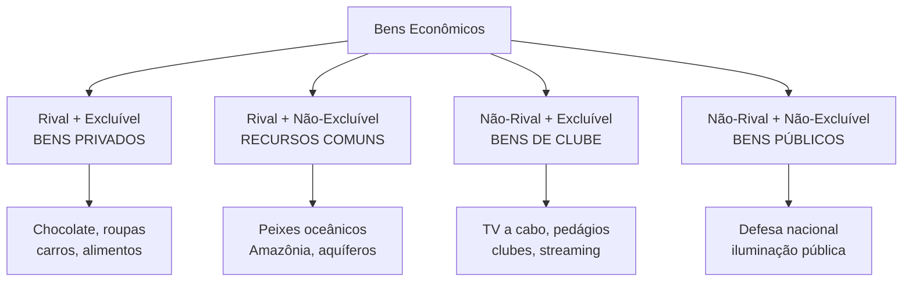

# Estruturas de Mercado, Tipos de Bens e Falhas de Mercado

## Introdução

As estruturas de mercado representam diferentes formas de organização econômica que determinam como preços são formados e recursos são alocados. **A compreensão das falhas de mercado é fundamental para justificar intervenções governamentais** e políticas públicas, tema central na formação diplomática. Este material analisa as principais estruturas competitivas, classifica bens econômicos e examina quando mercados falham em produzir resultados eficientes.

> [!info] Relevância para o CACD A análise de estruturas de mercado e falhas é essencial para compreender políticas econômicas nacionais e negociações comerciais internacionais, áreas centrais da atividade diplomática.

## Estruturas de Mercado e Determinação de Preços

### Concorrência perfeita

A concorrência perfeita representa o modelo teórico de máxima eficiência econômica. **As empresas são "tomadoras de preço"** porque individualmente não possuem poder para influenciar o preço de mercado, devendo aceitar o preço determinado pela interação entre oferta e demanda agregadas.

**Características fundamentais:**

- **Grande número de compradores e vendedores:** Nenhum agente individual possui participação significativa no mercado
- **Produtos homogêneos:** Bens perfeitamente substitutos, sem diferenciação
- **Informação perfeita:** Todos os agentes conhecem preços, qualidade e condições de mercado
- **Livre entrada e saída:** Ausência de barreiras econômicas, tecnológicas ou regulatórias

**Exemplos brasileiros:**

- Mercados de commodities agrícolas (soja, milho, café)
- Feiras livres de hortifrúti
- Mercado de câmbio

> [!note] Equilíbrio em Concorrência Perfeita **Preço = Custo Marginal** - A empresa maximiza lucro produzindo onde a receita marginal (igual ao preço) iguala o custo marginal.

### Monopólio

No monopólio, uma única empresa controla completamente a oferta de um produto sem substitutos próximos. **O poder de monopólio permite fixar preços acima do custo marginal**, resultando em perda de bem-estar social (peso morto).

**Características principais:**

- **Único vendedor no mercado**
- **Produto sem substitutos próximos**
- **Barreiras significativas à entrada:** Podem ser econômicas (altos custos de entrada), tecnológicas (patentes), regulatórias (licenças) ou estratégicas

**Exemplos brasileiros:**

- Petrobras (exploração de petróleo em águas profundas)
- B3 (intermediação no mercado de capitais)
- Correios (serviços postais básicos)
- Empresas regionais de saneamento

> [!warning] Ineficiência do Monopólio **Preço > Custo Marginal** - O monopolista restringe produção para maximizar lucros, gerando preços mais altos e quantidades menores que na concorrência perfeita.

### Oligopólio

O oligopólio caracteriza-se pela **interdependência estratégica entre empresas**. As decisões de preço, quantidade e investimento de uma empresa afetam diretamente os resultados das concorrentes, criando comportamento estratégico complexo.

**Características centrais:**

- **Poucas empresas dominam o mercado**
- **Produtos homogêneos ou diferenciados**
- **Barreiras significativas à entrada**
- **Possibilidade de formação de cartéis** (acordos explícitos ou tácitos sobre preços)

**Exemplos brasileiros:**

- Setor bancário: Itaú, Bradesco, Banco do Brasil, Caixa
- Telecomunicações: Vivo, Claro, TIM
- Aviação civil: GOL, LATAM, Azul
- Cervejeiro: Ambev (dominante), Heineken, Petrópolis

> [!info] Determinação de Equilíbrio em Oligopólio A **complexidade na determinação do equilíbrio** resulta da interdependência estratégica. Empresas devem antecipar reações dos concorrentes, utilizando conceitos da teoria dos jogos.

### Concorrência monopolística

Estrutura intermediária que combina elementos competitivos com poder monopolístico limitado. Empresas possuem **algum controle sobre preços devido à diferenciação de produtos**.

**Características distintivas:**

- **Muitos vendedores**
- **Produtos diferenciados mas substitutos próximos**
- **Entrada relativamente livre**
- **Poder de mercado limitado**

**Exemplos brasileiros:**

- Restaurantes e lanchonetes
- Salões de beleza
- Postos de gasolina
- Farmácias locais

## Tipos de Bens e Classificação Econômica

A classificação de bens baseia-se em dois critérios fundamentais que determinam como mercados funcionam e quando falham.

### Critérios de classificação

**Rivalidade no consumo:** Característica de bens cujo **consumo por uma pessoa reduz ou impede o consumo por outra**. Um sanduíche é rival porque se uma pessoa o consome, outra não pode consumir o mesmo sanduíche.

**Excludabilidade:** **Possibilidade técnica e economicamente viável de impedir que pessoas não-pagantes consumam o bem**. Geralmente operacionalizada através do sistema de preços ou controle físico de acesso.

### Matriz de classificação de bens

### Bens privados

**Rival e excluível** - Representam o caso padrão onde mercados funcionam eficientemente. O mecanismo de preços aloca recursos adequadamente porque consumidores pagam pelos benefícios recebidos.

**Exemplos:** Alimentos, roupas, automóveis, eletrônicos

### Bens públicos puros

**Não-rival e não-excluível** - Geram o **problema do carona (free-rider)**, principal falha de mercado associada. Uma vez provido, todos se beneficiam independentemente de contribuição, incentivando comportamento oportunista.

**Exemplos brasileiros:**

- Defesa nacional
- Segurança pública
- Iluminação pública
- Fogos de artifício do Réveillon de Copacabana

> [!warning] Problema do Carona Indivíduos têm incentivo para **consumir sem pagar**, pois não podem ser excluídos do benefício. Resulta em **subfinanciamento privado** de bens públicos, justificando provisão governamental.

### Recursos comuns

**Rival mas não-excluível** - Geram a **Tragédia dos Comuns**. Cada usuário tem incentivo individual para usar intensivamente o recurso, mas uso coletivo excessivo pode causar esgotamento.

**Exemplos brasileiros:**

- Pesca oceânica (sobrepesca no litoral)
- Desmatamento da Amazônia
- Aquífero Guarani
- Pastos comunais

> [!danger] Tragédia dos Comuns **Superexploração de recursos** ocorre porque benefícios do uso são apropriados individualmente, mas custos do esgotamento são socializados. Solução requer regulação ou definição de direitos de propriedade.

### Bens de clube (monopólios naturais)

**Não-rival mas excluível** - Uma vez produzidos, **custo marginal de atender consumidores adicionais é zero ou muito baixo**. Geram ineficiência quando preço é cobrado acima do custo marginal.

**Exemplos brasileiros:**

- TV a cabo e streaming
- Estradas pedagiadas
- Clubes recreativos
- Software

## Externalidades como Falha de Mercado

**Externalidades são impactos (custos ou benefícios) das ações de um agente sobre o bem-estar de outros que não participam diretamente dessa ação**. Representam divergência entre custos/benefícios privados e sociais.

### Externalidades negativas

Quando **custo marginal social > custo marginal privado**. O mercado produz quantidade excessiva porque agentes não internalizam todos os custos de sua atividade.

**Exemplos brasileiros:**

- Poluição industrial (caso histórico de Cubatão-SP)
- Desmatamento da Amazônia
- Poluição atmosférica em São Paulo
- Contaminação do Rio Doce (desastre de Mariana)

### Externalidades positivas

Quando **benefício marginal social > benefício marginal privado**. O mercado produz quantidade insuficiente porque agentes não capturam todos os benefícios sociais.

**Exemplos brasileiros:**

- Educação (benefícios além dos individuais)
- Vacinação (imunidade coletiva)
- Pesquisa e desenvolvimento
- Preservação ambiental

> [!info] Soluções para Externalidades **Taxas pigouvianas** (internalização de custos externos), **subsídios** (para externalidades positivas), **regulamentação direta** ou **definição de direitos de propriedade** (Teorema de Coase).

## Síntese das falhas de mercado

As três principais falhas analisadas - **problema do carona em bens públicos, tragédia dos comuns em recursos compartilhados, e externalidades em atividades com efeitos externos** - compartilham característica comum: **mercados falham quando direitos de propriedade são mal definidos ou inexistentes**.

Para bens públicos, ninguém pode ser "dono" do benefício; para recursos comuns, propriedade é coletiva e mal regulada; para externalidades, não há mercado para "direitos de poluir" ou "direitos ao ambiente limpo". **Intervenção governamental se justifica para corrigir essas ineficiências**, através de regulação, tributação, subsídios ou provisão direta.

A análise dessas estruturas e falhas é fundamental para diplomatas compreenderem políticas econômicas nacionais e negociações comerciais internacionais, especialmente em áreas como comércio, meio ambiente e regulação de setores estratégicos.

---

## Questões para Autoavaliação

1. **Compare os mecanismos de determinação de preços na concorrência perfeita versus monopólio. Por que o monopólio gera ineficiência alocativa?**
    
2. **Analise um recurso natural brasileiro (como a Amazônia) usando os conceitos de rivalidade, excludabilidade e tragédia dos comuns. Que soluções de política pública poderiam mitigar os problemas identificados?**
    
3. **Explique por que a vacinação gera externalidades positivas e o problema do carona simultaneamente. Como políticas públicas de saúde podem abordar ambos os aspectos?**
