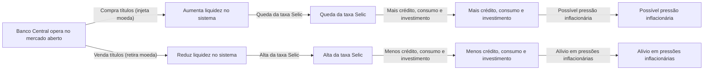

# A Política Monetária no Brasil: Instrumentos, o Papel do Banco Central e o Controle da Inflação

A **política monetária** refere-se ao conjunto de ações do Banco Central destinadas a controlar a **oferta de moeda** e as **taxas de juros**, com o objetivo de manter a estabilidade da moeda (controle da inflação) e propiciar o bom funcionamento da economia. No Brasil, sob o regime de metas de inflação, o Banco Central do Brasil (BCB) busca assegurar a estabilidade do poder de compra da moeda, atuando de forma autônoma para cumprir as metas estabelecidas pelo Conselho Monetário Nacional. Para entender como essas ações operam, é útil relembrar primeiro as funções básicas da moeda na economia e, em seguida, analisar detalhadamente os principais instrumentos de política monetária utilizados pelo BCB em prol da estabilidade de preços.

## As Funções Fundamentais da Moeda

A moeda desempenha **três funções clássicas** que explicam sua importância na economia e fundamentam a necessidade de estabilidade monetária:

1. **Meio de Troca:** a moeda funciona como intermediário de aceitação geral nas transações, ou seja, um ativo amplamente aceito para a aquisição de bens e serviços, eliminando as ineficiências do escambo e da "dupla coincidência de desejos". Em outras palavras, todos aceitam moeda em troca de mercadorias, facilitando as trocas indiretas em uma economia complexa.
    
2. **Unidade de Conta:** a moeda serve de **padrão de valor** para expressar e comparar os preços de bens e serviços. Ela fornece uma medida comum que permite calcular valores, fazer registros contábeis e cotar preços de forma uniforme. Sem uma unidade de conta estável, torna-se difícil para agentes econômicos planejarem e avaliarem custos, receitas e lucros.
    
3. **Reserva de Valor:** a moeda permite **armazenar poder de compra ao longo do tempo**, funcionando como um meio de **acumular riqueza** para uso futuro. Essa função pressupõe estabilidade: em condições de alta inflação, a moeda perde a capacidade de reter valor e os indivíduos buscam outros ativos para se proteger. Portanto, manter a inflação baixa é crucial para que a moeda continue sendo uma reserva de valor confiável.
    

> [!important] **Importância da Estabilidade Monetária** 
> Se a moeda não consegue cumprir adequadamente alguma dessas funções (por exemplo, em episódios de hiperinflação em que deixa de ser boa reserva de valor ou unidade de conta), toda a economia sofre. Por isso, **controlar a inflação** e garantir a confiança na moeda são objetivos centrais do Banco Central. A política monetária existe, em essência, para preservar essas funções da moeda e assegurar que ela continue desempenhando seu papel fundamental nas transações econômicas.

## Os Instrumentos da Política Monetária

Para alcançar a estabilidade de preços e influenciar as condições monetárias, o Banco Central dispõe de **diversos instrumentos de política monetária**. Os três principais mecanismos tradicionais são: as **operações de mercado aberto**, os **depósitos compulsórios** e a **taxa de redesconto**. Cada um atua por canais distintos, mas complementares, afetando a **liquidez do sistema financeiro** e, consequentemente, as **taxas de juros**, o **crédito** e o **nível de atividade econômica**. A seguir, examinamos em detalhe como cada instrumento funciona no contexto brasileiro, com ênfase especial na taxa Selic e no papel do Comitê de Política Monetária (Copom).

### 1. Operações de Mercado Aberto e a Taxa Selic

As **operações de mercado aberto (open market)** constituem o **principal instrumento** da política monetária cotidiana no Brasil. Elas envolvem a **compra e venda de títulos públicos federais** pelo Banco Central no mercado financeiro, com o objetivo de regular a quantidade de dinheiro (liquidez) na economia. Por meio dessas operações, o BCB consegue influenciar diretamente a taxa básica de juros, a **taxa Selic**, de forma a mantê-la próxima do valor desejado.

- O **Copom (Comitê de Política Monetária)** se reúne periodicamente (usual intervalo de 45 dias) e define a **meta para a taxa Selic** – isto é, o nível desejado para a taxa de juros básica da economia. Contudo, o Copom define apenas a meta; a taxa Selic efetiva resulta das operações de mercado interbancário. **Cabe ao Banco Central atuar diariamente no mercado aberto para que a taxa de juros de curto prazo fique **próxima à meta** estipulada pelo Copom.** Na prática, a Selic é a taxa de juros média dos empréstimos **overnight** entre instituições financeiras lastreados em títulos públicos. Controlando a oferta de reservas bancárias via open market, o BC consegue fazer com que essa taxa **Selic “over”** convirja para a **meta Selic** decidida pelo Copom.
    
- **Mecanismo de atuação:** quando o **Banco Central compra títulos públicos** no mercado aberto, ele **injeta moeda** na economia (pois paga os vendedores dos títulos em dinheiro/reservas bancárias). Esse aumento de **liquidez** faz com que haja mais recursos disponíveis no sistema bancário, tendendo a **reduzir a taxa de juros interbancária**. Por outro lado, ao **vender títulos públicos**, o BC **retira moeda em circulação** (os bancos pagam pelos títulos, drenando suas reservas), o que reduz a liquidez e pressiona **para cima** a taxa de juros. Desse modo, através de compras e vendas diárias de títulos (muitas vezes via operações **compromissadas**, isto é, acordos de recompra), o Banco Central **neutraliza os desequilíbrios de liquidez** e mantém a **taxa Selic efetiva muito próxima da meta** estabelecida.
    

> [!note] _Em resumo_: 
> a lógica das operações de mercado aberto é simples – **inject liquidity to push the interest rate down, or absorb liquidity to push it up** – de forma a alinhar a taxa **Selic over** à meta do Copom. A figura a seguir ilustra esse processo de forma esquemática:

Como mostra o diagrama, ao aumentar a liquidez (via compras de títulos), o BC **reduz os juros de curto prazo**, barateando o crédito e estimulando, em certa medida, a demanda agregada – o que pode gerar **pressões inflacionárias** se exceder a capacidade produtiva. No sentido oposto, ao contrair a liquidez (vendendo títulos e elevando os juros), o crédito encarece e a atividade econômica esfria, **contribuindo para conter a inflação**. Esse é o **princípio básico da política monetária**: juros mais altos tendem a desestimular consumo e investimentos (contendo a alta de preços), enquanto juros mais baixos têm efeito expansivo sobre a economia, mas podem pressionar a inflação.

> [!definition] **Taxa Selic** 
> É a **taxa básica de juros** da economia brasileira, calculada como a média das taxas negociadas diariamente nas operações interbancárias lastreadas em títulos públicos, com prazo de um dia (overnight). A **meta da Selic** é fixada pelo Copom e serve de **referência central** para a política monetária. O Banco Central utiliza as operações de mercado aberto para garantir que a **Selic efetiva (overnight)** permaneça **igual ou muito próxima à meta** definida, assegurando a transmissão da política monetária para as demais taxas de juros da economia (financiamentos, empréstimos, retornos de investimentos, etc.).

**Relevância no Brasil:** As operações de mercado aberto, centradas no controle da taxa Selic, são particularmente importantes porque o Brasil adota um **regime de metas de inflação** desde 1999. A taxa Selic é o instrumento operacional que o Banco Central manipula para influenciar a inflação futura: alterações na Selic afetam diversas variáveis (crédito, consumo, investimento, expectativas inflacionárias e até o câmbio, como veremos). Portanto, manter a **credibilidade** de que a autoridade monetária **alcançará a meta de inflação** depende de atuar de forma contundente via Selic. Historicamente, o open market tem se mostrado eficaz para ancorar a inflação, ainda que ao custo de taxas de juros relativamente altas em vários períodos. A autonomia formal do Banco Central, conquistada em 2021, reforça essa credibilidade ao blindar essas decisões técnicas de pressões político-eleitorais (tema retomado adiante).

### 2. Depósitos Compulsórios (Recolhimento Compulsório)

Os **depósitos compulsórios** são outro instrumento clássico de política monetária, atuando de forma mais estrutural sobre a liquidez e a capacidade de criação de moeda pelos bancos. Consistem na **exigência legal** para que os bancos comerciais depositem uma **fração de seus depósitos** junto ao Banco Central, não podendo utilizá-la para empréstimos. Ao alterar a alíquota do compulsório, o Banco Central muda a proporção de recursos que os bancos precisam reter imobilizados, afetando diretamente o **multiplicador bancário** de crédito.

> [!definition] **Depósito Compulsório** 
> Trata-se da parcela do dinheiro dos depositantes que as instituições financeiras são **obrigadas a manter depositada no Banco Central**. Esse mecanismo funciona como um **colchão de liquidez** para o sistema bancário e uma ferramenta para o BC influenciar a oferta de moeda. Em momentos de crise, por exemplo, a redução do compulsório libera recursos aos bancos, ajudando a evitar escassez de crédito, ao passo que aumentos do compulsório retiram liquidez da economia, auxiliando no combate à inflação.

**Efeitos na liquidez e no crédito:** Quando o Banco Central **eleva a alíquota do compulsório**, os bancos precisam reter uma fatia maior de seus depósitos como reserva obrigatória. Isso **reduz os recursos livres** para novas operações de crédito, **contraindo** a capacidade de criação de moeda pelo sistema bancário. Em termos simples, **a elevação do compulsório “trava” o multiplicador monetário**, retirando moeda em circulação, enquanto a **redução do compulsório libera moeda**, pois os bancos passam a poder emprestar uma porção maior de seus depósitos. Assim, aumentar o compulsório tende a **restringir a expansão do crédito** (ação contracionista, usada para conter inflação ou riscos sistêmicos), ao passo que reduzir o compulsório **estimula o crédito** ao injetar liquidez adicional no sistema (ação expansionista).

Vale notar que o **impacto prático** do compulsório depende também do comportamento dos bancos. Se as instituições já mantêm **reservas voluntárias** acima do mínimo exigido, pequenas variações no compulsório podem ser absorvidas sem grande efeito na oferta de crédito. Por outro lado, em situações de **mercado de crédito aquecido**, o compulsório se torna um instrumento poderoso: por exemplo, uma redução de alguns pontos percentuais em certos compulsórios pode liberar dezenas de bilhões de reais para empréstimos (como discutido em propostas recentes para estimular o crédito imobiliário). Contudo, **o Banco Central utiliza o compulsório com parcimônia** enquanto instrumento anticíclico, pois ele afeta de forma abrangente a liquidez de longo prazo, diferentemente do ajuste fino diário proporcionado pelas operações de mercado aberto.

### 3. Taxa de Redesconto (Assistência de Liquidez)

A **taxa de redesconto** é o terceiro instrumento tradicional de política monetária, embora seja acionado com menor frequência e geralmente em situações específicas. Refere-se à **taxa de juros cobrada pelo Banco Central nos empréstimos que ele concede aos bancos comerciais**, atuando como **emprestador de última instância**. Em outras palavras, se um banco enfrenta falta temporária de liquidez e não consegue empréstimos no mercado interbancário (por exemplo, no mercado overnight), ele pode recorrer ao Banco Central para obter recursos emergenciais – pagando, para isso, a taxa de redesconto estabelecida.

> [!definition] **Taxa de Redesconto** 
> É a taxa de juros aplicada pelo Banco Central nos **empréstimos de curto prazo a instituições financeiras**, típica do papel de **emprestador de última instância** desempenhado pelo BC. Geralmente, o redesconto é **fixado em nível superior ao da taxa Selic**, exatamente para desencorajar os bancos de recorrerem rotineiramente a essa facilidade. Assim, bancos só buscam o redesconto em último caso, quando esgotadas as alternativas de captação junto a outras instituições.

**Função e efeitos:** Por ser uma fonte de liquidez de emergência, a taxa de redesconto serve como **teto informal** para a taxa de juros no mercado interbancário: se os juros entre bancos subirem muito, os bancos preferirão tomar emprestado do Banco Central (desde que a taxa de redesconto seja mais baixa do que esse pico). **Alterar a taxa de redesconto** é mais uma alavanca disponível ao Banco Central: ao **reduzir a taxa de redesconto**, o BC **barateia o custo de empréstimo direto para os bancos**, encorajando as instituições a usar essa linha em momentos de aperto – o que **injeta moeda na economia** e expande a liquidez. Por outro lado, ao **elevar a taxa de redesconto**, impõe-se um **custo mais alto para socorros** aos bancos, desestimulando que recorram a essa facilidade e induzindo-os a serem mais cautelosos no gerenciamento de suas reservas, o que **diminui a criação de moeda** pelo sistema.

Um efeito indireto de manter a taxa de redesconto em patamar elevado é que os bancos passam a **evitar ao máximo ficar sem reservas no fim do dia**, já que o socorro do BC sairia caro. Por precaução, **voluntariamente eles manterão mais reservas excedentes**, reduzindo assim o **multiplicador monetário** e a oferta potencial de crédito na economia. Em suma, **uma taxa de redesconto alta torna a política monetária mais restritiva** (ao punir a falta de liquidez dos bancos), enquanto **uma taxa de redesconto baixa torna a política mais expansionista** (ao facilitar empréstimos de última instância, evitando quebradeiras e injetando recursos quando necessário). Na prática, o redesconto é utilizado sobretudo em contextos de crise financeira ou para instituições com dificuldades temporárias – seu uso rotineiro não é comum, mas sua existência assegura que o mercado tenha um **backstop** de liquidez, fundamental para a confiança no sistema bancário.

## O Papel do Banco Central e a Autonomia Formal

O **Banco Central do Brasil (BCB)** tem, por mandato legal, o **objetivo fundamental de assegurar a estabilidade de preços**, isto é, manter a inflação sob controle e, consequentemente, preservar o valor da moeda. Além disso, o BC também zela pela estabilidade do sistema financeiro. Desde 1999, a instituição opera sob o regime de **metas de inflação**: o Conselho Monetário Nacional (CMN) define, com anos de antecedência, uma meta quantitativa de inflação (por exemplo, 3% ao ano, com margem de tolerância), e **cabe ao Banco Central conduzir a política monetária para cumpri-la**. O principal instrumento para isso é, como vimos, a taxa Selic, definida pelo Copom.

Em **fevereiro de 2021**, foi sancionada a **Lei Complementar nº 179**, que conferiu **autonomia formal** ao Banco Central do Brasil. Essa lei estabeleceu o BC como uma **autarquia de natureza especial**, com **mandatos fixos e não coincidentes** para o presidente e diretores (mandatos de quatro anos, com possibilidade de recondução, intercalados ao ciclo do Poder Executivo). Na prática, isso significa que as decisões de política monetária devem ser tomadas com base em critérios **técnicos e de longo prazo**, **sem influência político-partidária direta**. Antes mesmo da lei, o BCB já operava com relativa independência, mas a formalização da autonomia trouxe **mais credibilidade e previsibilidade** para o mercado, ao separar a gestão da política monetária das mudanças de governo de curto prazo.

**Debate sobre autonomia e credibilidade:** A autonomia do Banco Central é amplamente defendida por economistas ortodoxos como um meio de **assegurar a credibilidade da política monetária**. Os defensores argumentam que um BC autônomo pode se **concentrar nos objetivos de estabilidade de preços de longo prazo**, tomando decisões muitas vezes impopulares (como manter juros altos) quando necessárias, **sem ceder a pressões políticas imediatas**. Isso contribui para ancorar as expectativas de inflação dos agentes econômicos, ou seja, para que empresas e consumidores acreditem que a inflação futura permanecerá sob controle. Um ambiente de expectativas bem ancoradas, por sua vez, torna a política monetária **mais eficaz** – o Banco Central consegue influenciar a inflação com ajustes de juros menores do que seria preciso caso sua credibilidade estivesse em xeque.

Por outro lado, a autonomia formal **não é isenta de controvérsias**. Críticos apontam que ela pode reduzir a **responsabilidade democrática** do Banco Central, uma vez que a cúpula da instituição não responde diretamente ao voto popular e suas decisões podem ter impacto profundo no nível de atividade e emprego. Uma **crítica central** é que um Banco Central autônomo demais poderia **se fixar unicamente no combate à inflação**, negligenciando outros objetivos econômicos, como o crescimento econômico e o pleno emprego. Ademais, governos eleitos podem sentir-se tolhidos em implementar medidas de estímulo (como baixar juros para aquecer a economia) se o Banco Central independente entender que a prioridade é conter preços. Essa tensão foi observada no Brasil recente: em 2023, por exemplo, membros do governo federal criticaram abertamente a manutenção da Selic em patamar elevado pelo BC autônomo, argumentando que isso prejudicava a atividade econômica. Ainda assim, a direção do Banco Central – amparada pela autonomia legal – **manteve a taxa básica alta enquanto julgou necessário**, sinalizando compromisso com a meta de inflação apesar das pressões políticas. Esse episódio ilustra tanto a **consolidação da autonomia** (decisões técnicas prevalecendo) quanto o desafio de **coordenação entre política monetária e política econômica do governo**.

> [!note] **Autonomia e confiança dos agentes** 
> Passados os primeiros anos da autonomia formal, a avaliação geral é que o Banco Central tem conseguido navegar por um ambiente desafiador sem comprometer sua missão principal. Segundo depoimento do indicado à presidência do BC para 2025, Gabriel Galípolo, o Banco Central atravessou seus primeiros anos de autonomia de forma **estável**, tomando decisões sem se deixar invadir por questões externas e cumprindo seu mandato. Em síntese, a autonomia contribuiu para blindar a política monetária de humores políticos de curto prazo, **reforçando a confiança** de que o combate à inflação está em boas mãos – embora o debate sobre os **limites do papel do BC** na economia persista, demandando equilíbrio entre **independência** e **accountability**.

## Política Monetária e a Taxa de Câmbio

Em economias abertas como a do Brasil, existe uma **estreita relação** entre a política monetária (especialmente a taxa de juros doméstica) e a **taxa de câmbio**. A taxa de câmbio é influenciada, entre outros fatores, pelos **fluxos de capitais internacionais**, os quais reagem aos diferenciais de juros entre os países. Assim, **alterações na taxa Selic** costumam desencadear um canal de transmissão via câmbio:

- **Juros mais altos e apreciação cambial:** Quando o Banco Central **eleva a taxa Selic**, o rendimento dos ativos em reais (títulos públicos, por exemplo) torna-se mais atraente em comparação aos rendimentos em outras moedas. Isso tende a **atrair investidores estrangeiros**, que buscam aproveitar o **diferencial de juros**. Para investir em títulos brasileiros, esses investidores precisam converter moeda estrangeira em reais, o que **aumenta a demanda pela moeda nacional** e leva à **valorização do real** (ou seja, queda da cotação do dólar frente ao real). Esse movimento é conhecido como parte do fenômeno de **carry trade**, no qual capital estrangeiro toma empréstimos em países de juros baixos e aplica em países de juros altos para lucrar com a diferença de taxas. Em resumo, **juros domésticos altos tendem a fortalecer a moeda local** – a não ser que fatores externos contrabalancem essa tendência.
    
- **Juros mais baixos e depreciação cambial:** Por outro lado, **quando a Selic é reduzida**, o diferencial de juros em relação a outras economias diminui, e o mercado brasileiro se torna relativamente menos atrativo para o capital estrangeiro. Investidores internacionais podem realocar recursos para mercados com retorno melhor, gerando uma **saída líquida de capitais**. Essa saída implica vender reais para comprar moedas estrangeiras, o que **pressiona para baixo o valor do real** (desvalorização cambial). Em termos práticos, dólares ficam relativamente mais caros (alta do dólar), reflexo da menor demanda por ativos denominados em reais.
    

Essa dinâmica mostra que o **câmbio é um importante canal de transmissão da política monetária**. Quando juros sobem e o real se valoriza, os preços de importados tendem a cair em reais, ajudando a conter a inflação (pois mercadorias importadas e insumos ficam mais baratos). Por outro lado, juros em queda e **depreciação do câmbio** podem **pressionar a inflação** via aumento do custo de produtos importados e matérias-primas cotadas em dólar. O Banco Central leva isso em conta: por exemplo, durante ciclos de alta de juros, é comum o real se fortalecer, o que auxilia no combate à inflação; já cortes de juros excessivos podem provocar forte desvalorização do câmbio, exigindo cautela pela autoridade monetária.

> [!important] **Fatores adicionais** 
> É válido destacar que a relação entre juros e câmbio, embora significativa, **não é mecânica nem isolada**. Fatores como o ambiente externo (taxas de juros internacionais, aversão global a risco) e a percepção de **risco-país** influenciam os fluxos de capitais. Por exemplo, uma alta da Selic em contexto de grave incerteza fiscal interna ou de fortes aumentos de juros nos EUA pode ter efeito limitado sobre a valorização do real. Ainda assim, de modo geral, o BC brasileiro monitora atentamente o canal cambial: ele faz parte da estratégia de controlar a inflação e preservar a competitividade da economia. Em situações de movimentos cambiais desordenados, o Banco Central pode também atuar diretamente no mercado de câmbio (via leilões de swap cambial, por exemplo), mas isso já é parte da chamada **política cambial** – que complementa a política monetária quando necessário.

---

> [!question] **Questões para Autoavaliação**
> 
> 1. **Operações de Mercado Aberto:** Como o Banco Central utiliza as operações de mercado aberto para **controlar a taxa Selic** e qual é o impacto desse controle sobre a oferta de crédito e a inflação? Explique o mecanismo envolvendo a compra e venda de títulos e a influência na liquidez do sistema bancário.
>     
> 2. **Autonomia do Banco Central:** Quais são os principais **argumentos a favor e contra a autonomia formal** do Banco Central do Brasil na condução da política monetária? Discuta como a autonomia pode afetar a **credibilidade** das metas de inflação e a possibilidade de **coordenação** com as políticas econômicas do governo eleito.
>     
> 3. **Política Monetária e Câmbio:** De que forma uma **elevação** ou **redução** da taxa Selic tende a influenciar a **taxa de câmbio** do real frente a outras moedas? Descreva o canal de transmissão cambial da política monetária e como as variações do câmbio podem realimentar o objetivo de controle da inflação no Brasil.
>