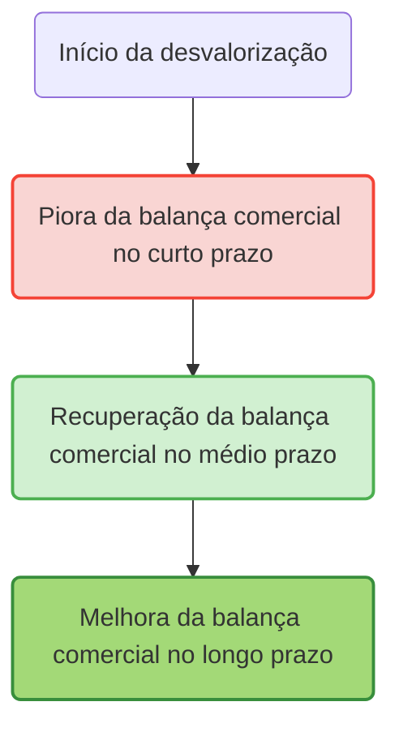

# 2.6 Política Monetária

## Sumário

A política monetária constitui um conjunto de medidas adotadas pela autoridade monetária de um país, tipicamente o Banco Central, com o propósito de controlar a oferta de moeda, as taxas de juros e as condições gerais de crédito na economia.1 Seu papel fundamental é o de instrumento de política econômica para a *estabilização macroeconômica*, buscando conciliar o crescimento econômico, a *manutenção de um elevado nível de emprego* e, de forma primordial, a *estabilidade de preços*. A eficácia da política monetária está intrinsecamente ligada à credibilidade da autoridade monetária e à sua coordenação com as demais políticas econômicas, notadamente a política fiscal. Uma política monetária crível, transparente e bem comunicada tende a ancorar as expectativas dos agentes econômicos, potencializando seus efeitos sobre a inflação e a atividade econômica.

O Banco Central (BC) é a instituição central na execução da política monetária.3 Suas funções tradicionais englobam a *emissão da moeda nacional*, a atuação como *banqueiro do governo* (administrando suas contas e realizando operações financeiras) e como *banco dos bancos* (provendo liquidez ao sistema bancário e atuando como emprestador de última instância).3 No Brasil, o Banco Central do Brasil (BCB) tem como objetivo fundamental assegurar a estabilidade de preços, ou seja, manter a inflação em níveis baixos e previsíveis.3 Objetivos secundários, como zelar pela estabilidade e eficiência do sistema financeiro, suavizar as flutuações do nível de atividade econômica e fomentar o pleno emprego, foram formalmente incorporados à sua missão pela Lei Complementar nº 179/2021, que também versa sobre a autonomia da instituição.3

Os principais instrumentos à disposição da autoridade monetária incluem a *taxa básica de juros* (no Brasil, a taxa Selic), o r*ecolhimento compulsório sobre os depósitos bancários* e as *operações de mercado aberto* (compra e venda de títulos públicos).1 A seleção e a calibragem desses instrumentos são cruciais e dependem do diagnóstico da conjuntura econômica e do regime de política monetária adotado, como o regime de metas para a inflação vigente no Brasil.

Paralelamente à condução da política monetária, a regulação e a supervisão do sistema financeiro são essenciais para a estabilidade macroeconômica.10 A regulação financeira estabelece as regras para o funcionamento das instituições e dos mercados, visando garantir sua solidez, eficiência e integridade, proteger os consumidores de serviços financeiros e prevenir crises sistêmicas. A supervisão financeira, por sua vez, consiste no monitoramento e na fiscalização contínuos para assegurar o cumprimento dessas regras e identificar potenciais vulnerabilidades.13 Um sistema financeiro instável ou mal regulado pode comprometer a eficácia dos canais de transmissão da política monetária e, em última instância, gerar crises econômicas que exigem respostas complexas e custosas da política monetária e fiscal.

## Conceitos Principais

- Política Monetária
    
    A Política Monetária compreende o conjunto de ações e decisões implementadas pela autoridade monetária de um país, usualmente o Banco Central, com o intuito de gerenciar a oferta de moeda, as taxas de juros e as condições gerais de crédito na economia. O objetivo primordial da política monetária, especialmente no contexto brasileiro contemporâneo, é a manutenção da estabilidade de preços, ou seja, o controle da inflação. Adicionalmente, a política monetária pode ter como objetivos secundários a promoção do pleno emprego, o estímulo ao crescimento econômico sustentado e a garantia da estabilidade do sistema financeiro.
    
- Banco Central (BC)
    
    O Banco Central é uma instituição pública, frequentemente dotada de autonomia em relação ao Poder Executivo, que detém a responsabilidade primária pela formulação e execução da política monetária, bem como pela regulação e supervisão do sistema financeiro nacional.3 No Brasil, o Banco Central do Brasil (BCB) tem como objetivo fundamental, estabelecido pela Lei Complementar nº 179/2021, assegurar a estabilidade de preços.3 Suas funções incluem ser o emissor da moeda, o banqueiro do governo, o banco dos bancos e o supervisor do sistema financeiro.3
    
- Taxa de Juros
    
    A taxa de juros representa o custo do dinheiro ao longo do tempo; é a remuneração paga pelo tomador de um empréstimo ao credor ou o custo de oportunidade de se manter moeda em sua forma líquida em vez de aplicá-la em ativos que gerem rendimento.18 A taxa básica de juros, como a Taxa Selic no Brasil, é o principal instrumento da política monetária, utilizada pelo Banco Central para influenciar as demais taxas de juros praticadas na economia (crédito, aplicações financeiras), afetando assim as decisões de consumo e investimento dos agentes econômicos e, por conseguinte, a demanda agregada e a trajetória da inflação.9
    
- Oferta de Moeda
    
    A oferta de moeda refere-se à quantidade total de ativos monetários disponíveis em uma economia em um dado momento.22 Essa quantidade não se restringe apenas ao papel-moeda em circulação e às moedas metálicas, mas abrange diferentes conceitos de liquidez, classificados como agregados monetários (M1, M2, M3, M4), que incluem desde os ativos mais líquidos (como depósitos à vista) até ativos menos líquidos (como depósitos de poupança e títulos públicos).22 O controle da oferta de moeda é um dos mecanismos pelos quais a política monetária busca atingir seus objetivos.
    
- Inflação
    
    A inflação é caracterizada por um aumento persistente e generalizado do nível de preços dos bens e serviços em uma economia, o que acarreta a diminuição do poder de compra da moeda.24 Suas causas podem ser diversas, incluindo o excesso de demanda agregada em relação à capacidade de oferta da economia (inflação de demanda), elevações nos custos de produção (inflação de custos ou de oferta), a incorporação da inflação passada nas expectativas futuras dos agentes (inflação inercial) ou desequilíbrios estruturais na economia.24 O controle da inflação é o objetivo central da política monetária na maioria dos países, incluindo o Brasil.
    
- Regulação Financeira
    
    A regulação financeira consiste no conjunto de leis, normas, regras e diretrizes estabelecidas pelas autoridades competentes (como o Banco Central e, no caso do mercado de capitais, a Comissão de Valores Mobiliários - CVM) para disciplinar o funcionamento das instituições financeiras, dos mercados e dos instrumentos financeiros.10 Seus objetivos precípuos são garantir a solidez, a eficiência e a integridade do sistema financeiro, proteger os depositantes, investidores e consumidores de serviços financeiros, assegurar a transparência das operações e prevenir a ocorrência de crises financeiras sistêmicas.10
    
- Supervisão Financeira
    
    A supervisão financeira é o processo contínuo de monitoramento, fiscalização e avaliação das atividades das instituições financeiras e dos mercados, com o intuito de assegurar o cumprimento da regulação financeira, identificar e mitigar riscos prudenciais e de conduta, e garantir a estabilidade do sistema.13 A supervisão pode adotar diferentes metodologias, como a supervisão baseada em risco, que concentra os esforços de fiscalização nas entidades e atividades que representam maior potencial de risco para a estabilidade financeira ou para a proteção dos consumidores.14
    
- Sistema Bancário
    
    O sistema bancário é um componente crucial do sistema financeiro, formado pelo conjunto de instituições financeiras – como bancos comerciais, bancos múltiplos, bancos de investimento, caixas econômicas e cooperativas de crédito – que desempenham a função primordial de intermediação financeira.13 Essas instituições captam recursos de agentes econômicos superavitários (poupadores) através de depósitos e outros instrumentos, e os direcionam para agentes deficitários (tomadores de empréstimos) por meio da concessão de crédito e financiamentos.32 O funcionamento eficiente e seguro do sistema bancário é vital para a alocação de recursos na economia, a facilitação de pagamentos e a transmissão dos impulsos da política monetária.
    
- Mercado de Capitais
    
    O mercado de capitais é o segmento do sistema financeiro onde são negociados valores mobiliários de médio e longo prazo, como ações, debêntures, bônus e outros títulos, permitindo que empresas (sociedades anônimas de capital aberto) e o governo captem recursos diretamente de investidores para financiar seus projetos e atividades.32 Ele se divide em mercado primário, onde ocorre a primeira emissão e venda dos títulos pelos emissores, e mercado secundário, onde os títulos já emitidos são negociados entre os investidores, como nas bolsas de valores.35 A regulação e supervisão do mercado de capitais no Brasil são exercidas principalmente pela Comissão de Valores Mobiliários (CVM).
    

A compreensão precisa desses conceitos é essencial, pois eles formam o alicerce para a análise da política monetária e de sua interação com a economia. Por exemplo, a distinção clara entre "oferta de moeda" (um estoque de ativos monetários) e "política monetária" (um conjunto de ações para influenciar esse estoque e outras variáveis) é fundamental. Similarmente, "regulação" refere-se ao arcabouço normativo, enquanto "supervisão" é a atividade de fiscalização do cumprimento dessas normas. Esses conceitos não são isolados; eles se interligam para formar o complexo panorama da gestão macroeconômica. A política monetária, por exemplo, ao ajustar a taxa de juros e a oferta de moeda, busca controlar a inflação. O Banco Central, ao executar essa política, também tem o papel de regular e supervisionar o sistema bancário e, em conjunto com a CVM, o mercado de capitais, para assegurar a estabilidade necessária à eficácia da própria política monetária.

## Análise Detalhada da Política Monetária

### 2.6.1 Papel do Banco Central

- Funções e objetivos do Banco Central:
    
    Os Bancos Centrais modernos desempenham um papel multifacetado na economia, sendo a estabilidade de preços o seu objetivo primordial na maioria dos casos, incluindo o Banco Central do Brasil (BCB).3 Este objetivo traduz-se na manutenção de uma inflação baixa, estável e previsível, condição essencial para a tomada de decisões de investimento e consumo e para a preservação do poder de compra da moeda.
    
    Além da estabilidade de preços, a **estabilidade financeira** é outro objetivo crucial, implicando zelar pela solidez e eficiência do sistema financeiro.3 Isso envolve a prevenção e mitigação de riscos sistêmicos que possam levar a crises financeiras com graves consequências para a economia real.
    
    A Lei Complementar nº 179/2021, que formalizou a autonomia do BCB, também estabeleceu como objetivos acessórios o fomento ao **pleno emprego** e a suavização das flutuações do nível de **crescimento econômico**.3 Estes objetivos devem ser perseguidos de forma a não comprometer o objetivo fundamental de estabilidade de preços.
    
    Outras funções essenciais do Banco Central incluem:
    
    - **Executor da política monetária:** Implementar as decisões de política monetária definidas pelo comitê de política monetária (Copom, no caso do Brasil).
    - **Banco dos bancos:** Atuar como emprestador de última instância, provendo liquidez ao sistema bancário em momentos de necessidade, e receber os depósitos compulsórios das instituições financeiras.
    - **Banqueiro do governo:** Administrar as contas do Tesouro Nacional e atuar como seu agente financeiro.
    - **Emissor de moeda:** Deter o monopólio da emissão de papel-moeda e moeda metálica.
    - **Supervisor do Sistema Financeiro:** Regular e fiscalizar as insituições financeiras para garantir sua solidez e o cumprimento das normas.3
    - **Executor da política cambial e gestor das reservas internacionais:** Implementar a política cambial definida pelo governo e administrar as reservas internacionais do país.
    
- Independência do Banco Central:
    
    A *independência do Banco Central (IBC)* refere-se ao grau de autonomia que a instituição possui em relação ao governo (Poder Executivo e Legislativo) para formular e executar a política monetária, livre de pressões políticas conjunturais. A Lei Complementar nº 179/2021 formalizou a autonomia do BCB, estabelecendo mandatos fixos para seus dirigentes, não coincidentes com o ciclo político.
    
    - **Argumentos a favor da independência** incluem a potencial redução do viés inflacionário, uma vez que decisões técnicas e de longo prazo seriam menos suscetíveis a manipulações com fins eleitorais.41 A maior credibilidade da política monetária, decorrente da independência, tenderia a ancorar as expectativas de inflação, tornando o controle inflacionário mais eficaz e menos custoso em termos de atividade econômica.41 A experiência internacional, especialmente em países desenvolvidos, sugere uma correlação entre IBC e taxas de inflação mais baixas e estáveis.41 Adicionalmente, a IBC pode impor maior disciplina fiscal ao governo, dificultando o financiamento de déficits via emissão monetária.41 A autonomia financeira e orçamentária, como proposta pela PEC 65/2023, buscaria alinhar o BCB às melhores práticas internacionais, permitindo maior eficiência na gestão de recursos e investimentos em tecnologia.44
        
    - **Argumentos contra ou ressalvas à independência** frequentemente apontam para um possível déficit democrático, já que uma autoridade não eleita passaria a deter um poder considerável sobre a política econômica.41 Há também o risco de um foco excessivo no controle da inflação em detrimento de outros objetivos macroeconômicos importantes, como o pleno emprego e o crescimento, e a potencial dificuldade de coordenação com a política fiscal.41 As evidências sobre os benefícios da IBC são, por vezes, consideradas menos robustas para economias emergentes.41
        
    - Existem **diferentes modelos de independência**. A distinção clássica é entre independência de objetivos (o governo define as metas, como a meta de inflação) e independência de instrumentos (o BC tem autonomia para escolher e utilizar os instrumentos para atingir essas metas). O modelo brasileiro, com a LC 179/2021, enquadra-se predominantemente no segundo tipo, onde o Conselho Monetário Nacional (CMN) define a meta de inflação, e o BCB tem autonomia para conduzir a política monetária.3 A autonomia pode também abranger as esferas operacional, administrativa e financeira, como detalhado na referida lei e na PEC 65/2023.3
        
- Responsabilidade (accountability) do Banco Central:
    
    Com maior autonomia, a necessidade de mecanismos de prestação de contas (accountability) torna-se ainda mais premente.8 O Banco Central deve ser responsável perante a sociedade e seus representantes eleitos pelas suas decisões e pelos resultados alcançados. No Brasil, a LC 179/2021 prevê que o Presidente do BCB apresente, semestralmente, em arguição pública no Senado Federal, relatórios de inflação e de estabilidade financeira, explicando as decisões tomadas.8 A transparência na comunicação das decisões, por meio da divulgação das atas das reuniões do Copom e de relatórios periódicos, é um componente fundamental da accountability.9
    
    A autonomia do Banco Central, embora possa contribuir para um controle inflacionário mais eficaz ao isolar a política monetária de pressões políticas de curto prazo, não é uma panaceia. Ela deve ser acompanhada por robustos mecanismos de transparência e accountability para assegurar que o BC atue em consonância com os interesses mais amplos da sociedade. A própria definição de "independência" pode ser matizada, pois mesmo um BC formalmente autônomo do governo pode sofrer influências, por exemplo, das expectativas e reações do mercado financeiro. Críticos argumentam que um foco excessivo na credibilidade junto aos mercados pode levar a políticas excessivamente conservadoras, com custos sociais em termos de crescimento e emprego, um debate particularmente relevante na análise da política monetária brasileira.42
    

### 2.6.2 Objetivos e Instrumentos de Política Monetária

- Objetivos da política monetária:
    
    Os Bancos Centrais ao redor do mundo operam sob diferentes regimes e com distintos arranjos de objetivos.
    
    - **Metas de inflação:** Este é o regime adotado pelo Brasil desde junho de 1999. Nele, o Conselho Monetário Nacional (CMN) estabelece uma meta numérica para a inflação (medida pelo IPCA) e um intervalo de tolerância. O Banco Central do Brasil (BCB) tem a responsabilidade de utilizar os instrumentos de política monetária para assegurar que a inflação efetiva convirja para essa meta.9 Historicamente, o Brasil teve períodos de cumprimento e descumprimento dessas metas, frequentemente justificados por choques econômicos internos ou externos.17 A partir de janeiro de 2025, a sistemática de acompanhamento da meta no Brasil passou a ser de horizonte contínuo, com verificação mensal da inflação acumulada em doze meses, e não mais apenas ao final do ano-calendário.9
    - **Metas de taxa de câmbio:** Neste regime, a autoridade monetária compromete-se a manter a taxa de câmbio em um nível fixo ou dentro de uma banda de flutuação em relação a uma moeda estrangeira de referência ou a uma cesta de moedas. Embora menos comum como regime principal atualmente, a taxa de câmbio permanece uma variável crucial monitorada pelos Bancos Centrais, inclusive no Brasil, devido ao seu impacto sobre a inflação e a balança de pagamentos.9
    - **Metas de agregados monetários:** Este regime foca no controle da quantidade de moeda em circulação na economia (M1, M2, etc.) como forma de influenciar o nível de preços. Sua popularidade diminuiu ao longo do tempo devido à crescente instabilidade da relação entre os agregados monetários e a inflação, dificultando a sua utilização como âncora nominal efetiva.9
    - **Outros regimes:** Podem existir regimes mais discricionários, onde o Banco Central não se compromete com metas explícitas, ou regimes mistos que combinam elementos de diferentes abordagens.
- Instrumentos da política monetária:
    
    Os Bancos Centrais dispõem de um conjunto de instrumentos para implementar suas decisões e alcançar seus objetivos.
    
    - **Taxa de juros (Selic, etc.):** No Brasil, a taxa Selic (Sistema Especial de Liquidação e de Custódia) é a taxa básica de juros da economia e o principal instrumento de política monetária.1 O Comitê de Política Monetária (Copom) do BCB define a meta para a taxa Selic. O BCB, então, atua no mercado aberto por meio da compra e venda de títulos públicos federais para garantir que a taxa Selic efetiva (a taxa média das operações interbancárias de um dia lastreadas em títulos públicos) permaneça próxima da meta definida.9
    - **Recolhimento compulsório (reservas bancárias):** Consiste na parcela dos depósitos captados pelos bancos comerciais que eles são obrigados a manter depositada no Banco Central, sem que possam utilizá-la para conceder crédito.1 Ao alterar as alíquotas do compulsório, o BCB afeta diretamente a liquidez do sistema bancário e sua capacidade de multiplicação da moeda e de concessão de empréstimos. Um aumento do compulsório tem efeito contracionista, enquanto uma redução tem efeito expansionista.55
    - **Operações de mercado aberto (compra e venda de títulos):** São o instrumento mais ágil e frequentemente utilizado para o controle diário da liquidez bancária e para manter a taxa de juros de curto prazo na meta estabelecida.1 A compra de títulos públicos pelo BCB injeta liquidez no sistema, pressionando as taxas de juros para baixo. A venda de títulos retira liquidez, pressionando as taxas para cima.
    - **Outros instrumentos (redesconto, etc.):**
        - **Operações de Redesconto:** São empréstimos de liquidez concedidos pelo Banco Central às instituições financeiras, geralmente para atender a necessidades de caixa de curtíssimo prazo ou em situações de estresse de liquidez, funcionando como um mecanismo de "emprestador de última instância".1 As condições dessas operações (taxas, prazos, garantias) podem ser ajustadas para influenciar o comportamento dos bancos. O regulamento e funcionamento detalhado dessas operações no Brasil são estabelecidos pelo BCB.59
    
    **Tabela 1: Instrumentos Convencionais de Política Monetária no Brasil**
    

|   |   |   |   |   |
|---|---|---|---|---|
|**Instrumento**|**Definição**|**Como funciona no Brasil (atuação do BCB/Copom)**|**Principal Objetivo do Instrumento**|**Impacto Típico (na liquidez, no crédito, na inflação)**|
|**Taxa Selic (Meta)**|Taxa básica de juros da economia.|Definida pelo Copom em suas reuniões periódicas. O BCB atua no mercado aberto para manter a taxa Selic efetiva próxima da meta. 9|Influenciar todas as taxas de juros da economia, as condições de crédito e as expectativas. 2|Aumento da Selic: Reduz liquidez, encarece crédito, desestimula consumo/investimento, contém inflação. Redução da Selic: Aumenta liquidez, barateia crédito, estimula consumo/investimento, pode pressionar inflação. 2|
|**Recolhimento Compulsório**|Percentual dos depósitos bancários que as instituições financeiras devem manter retido no Banco Central.|Alíquotas definidas pelo BCB sobre diferentes tipos de depósitos (à vista, a prazo, poupança). 55|Controlar a liquidez do sistema bancário e o multiplicador monetário, afetando a capacidade de concessão de crédito. 52|Aumento do compulsório: Reduz a liquidez disponível para os bancos emprestarem, contrai o crédito, pode ajudar a conter a inflação. Redução do compulsório: Aumenta a liquidez, expande o crédito, pode estimular a demanda. 55|
|**Operações de Mercado Aberto (Open Market)**|Compra e venda de títulos públicos federais pelo Banco Central no mercado secundário.|Realizadas diariamente pelo BCB para regular a liquidez do sistema bancário e manter a taxa Selic efetiva em torno da meta. 51|Ajuste fino e diário da liquidez do sistema bancário e da taxa de juros de curto prazo. 2|Compra de títulos pelo BCB: Injeta liquidez, pressiona juros para baixo. Venda de títulos pelo BCB: Retira liquidez, pressiona juros para cima. 51|
|**Operações de Redesconto**|Empréstimos de liquidez concedidos pelo Banco Central às instituições financeiras.|Linhas de assistência financeira para bancos com dificuldades de liquidez, atuando como emprestador de última instância. Condições (taxas, prazos) definidas pelo BCB. 59|Prover liquidez ao sistema bancário em situações específicas e evitar crises de liquidez. 59|Aumento da taxa de redesconto ou condições mais restritivas: Desestimula os bancos a recorrerem ao BCB, pode levar a uma postura mais cautelosa no crédito. Redução da taxa ou condições mais frouxas: Facilita o acesso à liquidez. 2|

- Transmissão da política monetária:
    
    A transmissão da política monetária é o processo complexo e multifacetado pelo qual as decisões da autoridade monetária, como uma alteração na taxa básica de juros, se propagam pela economia, afetando variáveis como a demanda agregada, o nível de produção, o emprego e, em última instância, a taxa de inflação.9 Este processo não é imediato e ocorre através de diversos canais interligados, com defasagens que podem ser longas, variáveis e incertas.9
    
    - **Canal da taxa de juros:** É o canal mais direto. Uma alteração na taxa básica de juros (Selic) pelo Banco Central influencia as taxas de juros de curto prazo do mercado interbancário. Essas, por sua vez, afetam as taxas de juros de empréstimos e financiamentos para consumidores e empresas, bem como a rentabilidade de aplicações financeiras. Taxas de juros mais altas encarecem o crédito e desestimulam o consumo e o investimento, reduzindo a demanda agregada. Taxas mais baixas têm o efeito oposto.60
    - **Canal do crédito:** Este canal foca não apenas no custo (taxa de juros), mas também na disponibilidade de crédito na economia. Uma política monetária contracionista pode levar os bancos a restringirem a oferta de crédito (*credit crunch*), seja por aumento da percepção de risco ou por redução da sua própria liquidez. Inversamente, uma política expansionista pode aumentar a disposição dos bancos a emprestar. Este canal é particularmente relevante em economias com imperfeições no mercado de crédito.60
    - **Canal do preço dos ativos:** As decisões de política monetária podem afetar os preços de diversos ativos financeiros (ações, títulos de renda fixa, imóveis). Por exemplo, uma queda na taxa de juros pode tornar os títulos de renda fixa menos atraentes, levando investidores a buscar ativos de maior risco, como ações, elevando seus preços. O aumento da riqueza financeira pode estimular o consumo (efeito riqueza). Para as empresas, a valorização de suas ações pode reduzir o custo de capital, incentivando o investimento.60
    - **Canal da taxa de câmbio:** Em economias abertas, a política monetária influencia a taxa de câmbio. Uma elevação da taxa de juros doméstica, _ceteris paribus_, tende a atrair capital estrangeiro, valorizando a moeda nacional. Uma valorização cambial pode baratear produtos importados e encarecer exportações, afetando a balança comercial e a demanda agregada. Além disso, a taxa de câmbio tem um impacto direto nos preços de bens comercializáveis internacionalmente (_tradables_), conhecido como efeito _pass-through_ cambial para a inflação.60
    - **Canal das expectativas:** As ações e, crucialmente, a comunicação do Banco Central moldam as expectativas dos agentes econômicos (empresas, consumidores, investidores) sobre a trajetória futura da inflação, das taxas de juros e da atividade econômica. Se o Banco Central demonstra credibilidade e um compromisso firme com suas metas (por exemplo, a meta de inflação), as expectativas tendem a se ancorar, tornando a política monetária mais eficaz. Por exemplo, se os agentes acreditam que a inflação será controlada, eles podem ser menos propensos a reajustar preços e salários de forma excessiva.48
- Efetividade e limitações da política monetária:
    
    A efetividade da política monetária em alcançar seus objetivos depende de uma série de fatores. A credibilidade da autoridade monetária é fundamental: se os agentes econômicos confiam que o Banco Central fará o necessário para cumprir suas metas, as expectativas se ancoram mais facilmente, potencializando os efeitos das políticas.9 A saúde e a eficiência do sistema financeiro também são cruciais para a transmissão dos impulsos monetários; um sistema fragilizado pode obstruir o canal do crédito, por exemplo. A ausência de dominância fiscal, ou seja, uma situação em que a política fiscal não impõe restrições indevidas à condução da política monetária, é outra condição importante.
    
    Contudo, a política monetária possui **limitações** significativas.9 As defasagens temporais entre a implementação de uma medida e seus plenos efeitos na economia são tipicamente longas, variáveis e incertas, dificultando a calibragem precisa da política. A política monetária é menos eficaz para combater choques de oferta (como aumentos abruptos nos preços internacionais de petróleo ou alimentos, ou quebras de safra) do que choques de demanda. Problemas estruturais da economia, como baixa produtividade ou infraestrutura deficiente, não são solucionáveis apenas com política monetária. Em situações de "*armadilha da liquidez*", quando as taxas de juros nominais já estão próximas de zero, a política monetária convencional perde grande parte de sua potência, exigindo o recurso a medidas não convencionais.64
    
    A escolha e a calibragem dos instrumentos de política monetária são, portanto, um exercício complexo que exige um diagnóstico acurado da conjuntura econômica, uma compreensão dos canais de transmissão e uma avaliação dos potenciais custos e benefícios de cada ação, tudo isso dentro do arcabouço do regime de política monetária adotado. No Brasil, os mecanismos de transmissão da política monetária são frequentemente objeto de debate, com alguns analistas argumentando que particularidades estruturais, como a elevada participação de crédito direcionado (cujas taxas não respondem diretamente à Selic) e a persistência de mecanismos de indexação em alguns setores, podem reduzir a eficácia dos canais tradicionais e exigir uma postura mais contracionista da política monetária para atingir os mesmos resultados inflacionários, comparativamente a economias com canais de transmissão mais fluidos.61

![[transmissao_politica_monetaria 1.png]]

### 2.6.3 Inflação e Taxa de Juros

- Relação entre inflação e taxa de juros:
    
    A relação entre inflação e taxa de juros é um dos pilares da política monetária contemporânea. Em geral, os bancos centrais utilizam a taxa de juros como principal instrumento para influenciar o nível de atividade econômica e, consequentemente, a taxa de inflação.2 Quando a inflação está acima da meta desejada ou há sinais de superaquecimento da demanda, a autoridade monetária tende a elevar a taxa básica de juros. Esse aumento encarece o custo do crédito para consumidores e empresas, desestimula o consumo e o investimento, e pode atrair capital estrangeiro (valorizando a moeda nacional), contribuindo para reduzir a pressão inflacionária. Por outro lado, em cenários de inflação baixa e atividade econômica fraca, o banco central pode reduzir a taxa de juros para baratear o crédito, estimular o consumo e o investimento e, assim, impulsionar a economia.
    
- Taxa de juros real vs. taxa de juros nominal:
    
    É fundamental distinguir entre a taxa de juros nominal e a taxa de juros real para analisar os efeitos da política monetária.
    
    - A **taxa de juros nominal (i)** é a taxa de juros expressa em unidades monetárias correntes, ou seja, é a taxa que observamos nos contratos de empréstimo ou na remuneração de aplicações financeiras, sem considerar o efeito da inflação.18
    - A **taxa de juros real (r)** é a taxa de juros nominal ajustada pela taxa de inflação (π). Ela representa o ganho (ou custo) real do poder de compra. Uma aproximação comum é r≈i−π.18 Para decisões de investimento e poupança, a taxa de juros real é a variável mais relevante.
    - O **Efeito Fisher**, postulado por Irving Fisher, estabelece que, *no longo prazo, a taxa de juros nominal se ajusta integralmente às variações na taxa de inflação esperada (πe), de modo a manter a taxa de juros real de equilíbrio (r∗) constante*. Formalmente, i=r∗+πe.66 Isso implica que, se a inflação esperada aumenta, a taxa de juros nominal também deve aumentar na mesma proporção para que a taxa real não se altere.
- Curva de Phillips:
    
    A Curva de Phillips descreve uma relação empírica, originalmente observada por A.W. Phillips para o Reino Unido, de uma *correlação negativa de curto prazo entre a taxa de inflação (ou a taxa de variação dos salários nominais) e a taxa de desemprego*.67 A ideia subjacente é que, quando a economia está aquecida e o desemprego é baixo, há maior pressão por aumentos salariais, que por sua vez podem levar a aumentos de preços.
    
    - **Versões da Curva de Phillips:** A curva original foi posteriormente modificada para incorporar o papel das **expectativas de inflação** (Curva de Phillips Aceleracionista ou Aumentada pelas Expectativas), argumentando-se que o _trade-off_ só existiria no curto prazo, enquanto as expectativas não se ajustassem. No longo prazo, a curva seria vertical na Taxa Natural de Desemprego (NAIRU - _Non-Accelerating Inflation Rate of Unemployment_).67 A **Curva de Phillips Novo-Keynesiana** (NKPC) deriva de fundamentos microeconômicos com rigidez de preços e salários, relacionando a inflação corrente às expectativas de inflação futura e a uma medida do hiato do produto (ou custo marginal real) e a choques de oferta.52
    - **Aplicabilidade no Brasil:** A aplicabilidade e a forma da Curva de Phillips para a economia brasileira são temas de intenso debate acadêmico. Diversos estudos empíricos buscaram estimar essa relação para o Brasil, com resultados variados, refletindo as particularidades da economia brasileira, como histórico de alta inflação, indexação, choques de oferta frequentes e mudanças de regime econômico.52 Alguns estudos encontram evidências do _trade-off_ no curto prazo, enquanto outros questionam sua estabilidade ou relevância para a condução da política monetária.67
- Modelos de determinação da taxa de juros (Regra de Taylor):
    
    A Regra de Taylor, proposta por John B. Taylor, é uma diretriz ou função de reação que sugere como um banco central deveria (ou como de fato o faz, em alguns casos) ajustar a taxa de juros nominal de curto prazo em resposta a desvios da inflação em relação à sua meta e do produto em relação ao seu nível potencial (o hiato do produto).52 A forma original da regra é: it​=r∗+πt​+α(πt​−π∗)+β(yt​−y∗), onde it​ é a taxa de juros nominal, r∗ é a taxa de juros real de equilíbrio, πt​ é a taxa de inflação corrente, π∗ é a meta de inflação, yt​ é o logaritmo do produto corrente, y∗ é o logaritmo do produto potencial, e α e β são coeficientes que medem a sensibilidade da política monetária aos desvios da inflação e do produto.
    
    - **Estimativas para o Brasil:** Pesquisadores têm estimado versões da Regra de Taylor para o Brasil, buscando entender a função de reação do BCB. Esses estudos frequentemente incorporam variáveis adicionais, como a taxa de câmbio real e índices de preços de commodities, para melhor capturar a complexidade da condução da política monetária em uma economia emergente e aberta como a brasileira.52 Os resultados indicam que o BCB, de fato, reage à inflação e ao hiato do produto, mas a magnitude e a significância dessas reações, bem como a influência de outras variáveis, são objeto de contínuo debate.
- Expectativas de inflação e taxa de juros:
    
    As expectativas dos agentes econômicos sobre a inflação futura desempenham um papel crucial na dinâmica inflacionária e na eficácia da política monetária.17 Se as empresas e os trabalhadores esperam uma inflação mais alta, eles tendem a reajustar seus preços e salários preventivamente, o que pode tornar a inflação autorrealizável. Os bancos centrais, especialmente aqueles que operam sob o regime de metas de inflação, buscam ativamente ancorar as expectativas de inflação na meta estabelecida. Uma política monetária crível, que sinaliza um compromisso firme com o controle da inflação, ajuda a manter as expectativas ancoradas. Quando as expectativas estão desancoradas (ou seja, significativamente acima da meta), o custo para o banco central reduzir a inflação, em termos de taxas de juros mais altas ou de uma desaceleração econômica mais pronunciada, tende a ser maior.24
    
    A inter-relação entre inflação, taxa de juros e expectativas é, portanto, central para a condução da política monetária. O Banco Central monitora de perto as expectativas de inflação (por exemplo, através de pesquisas com analistas de mercado, como o Relatório Focus do BCB) e ajusta a taxa de juros não apenas em resposta à inflação corrente, mas também para influenciar essas expectativas. A complexidade reside no fato de que a aplicabilidade de modelos como a Curva de Phillips e a Regra de Taylor no Brasil é desafiadora, dadas as especificidades estruturais e a história de instabilidade econômica do país. Isso exige uma análise cuidadosa e adaptada da teoria à realidade brasileira, um ponto de atenção para o CACD.
    

### 2.6.4 Política Monetária Não Convencional

- Causas e características da *política monetária não convencional (PMNC)*:
    
    A Política Monetária Não Convencional (PMNC) refere-se a um conjunto de ferramentas e estratégias adotadas por bancos centrais quando os instrumentos tradicionais de política monetária, principalmente a manipulação das taxas de juros de curto prazo, tornam-se ineficazes ou insuficientes para atingir os objetivos macroeconômicos.64 A principal causa para o recurso à PMNC é a situação conhecida como Zero Lower Bound (ZLB), onde as taxas de juros nominais de curto prazo já estão em zero ou muito próximas de zero, limitando a capacidade do banco central de prover estímulo adicional através de reduções convencionais de juros.64 Outra situação é a "armadilha da liquidez", onde mesmo com juros baixos, os agentes econômicos preferem reter moeda a investir, devido a expectativas pessimistas ou alta aversão ao risco.64
    
    As PMNCs buscam, então, influenciar as condições financeiras por outros canais, como as taxas de juros de longo prazo, as expectativas dos agentes, a liquidez nos mercados e o prêmio de risco dos ativos.64 Crises financeiras sistêmicas, como a de 2008, e choques econômicos de grande magnitude, como a pandemia de COVID-19, foram contextos que levaram à ampla utilização de PMNCs por bancos centrais de economias avançadas.64
    
- **Quantitative Easing (QE)**:
    
    O Quantitative Easing (Flexibilização Quantitativa) é uma das PMNCs mais proeminentes. Consiste na compra em larga escala de ativos financeiros de longo prazo (como títulos públicos e, em alguns casos, títulos privados, incluindo mortgage-backed securities) pelo Banco Central, diretamente nos mercados secundários.64 O objetivo principal é injetar liquidez no sistema financeiro, reduzir as taxas de juros de longo prazo (achatando a curva de juros), facilitar as condições de crédito e sinalizar o compromisso do banco central com uma política monetária acomodatícia por um período prolongado.75 Bancos centrais como o Federal Reserve (Fed) dos EUA, o Banco do Japão (BoJ) e o Banco Central Europeu (BCE) utilizaram o QE extensivamente.64
    
- **Forward Guidance (FG)**:
    
    O Forward Guidance (Orientação Futura ou Prescrição Futura) é uma ferramenta de comunicação explícita do Banco Central sobre suas intenções futuras de política monetária.64 O BC pode se comprometer a manter as taxas de juros em níveis baixos por um determinado período de tempo ("time-based FG") ou até que certas condições econômicas específicas sejam alcançadas, como uma determinada taxa de inflação ou nível de desemprego ("state-contingent FG").64 O objetivo é reduzir a incerteza, ancorar as expectativas dos agentes econômicos sobre a trajetória futura dos juros e, assim, influenciar as taxas de juros de médio e longo prazo e as decisões de investimento e consumo.64
    
- Taxas de juros negativas:
    
    Este instrumento não convencional envolve o Banco Central cobrar uma taxa dos bancos comerciais pelos depósitos que estes mantêm junto à autoridade monetária, em vez de remunerá-los.64 O intuito é desincentivar os bancos a manterem reservas ociosas e estimulá-los a conceder mais crédito à economia real. Alguns países da Zona do Euro, Suíça e Japão experimentaram taxas de juros negativas sobre as reservas bancárias.
    
- Outros instrumentos não convencionais:
    
    Além dos mencionados, outros instrumentos podem ser utilizados, como:
    
    - **Programas de empréstimos direcionados:** Facilidades de crédito oferecidas pelo Banco Central diretamente a bancos ou outros intermediários financeiros, muitas vezes com condições favoráveis e vinculadas ao direcionamento do crédito para setores específicos ou para pequenas e médias empresas.
    - **Intervenções cambiais específicas:** Compras ou vendas de moeda estrangeira com objetivos que vão além da simples suavização da volatilidade, podendo visar, por exemplo, combater pressões deflacionárias ou facilitar o ajuste externo.78
    - **Leilões de liquidez de longo prazo:** Provisão de liquidez aos bancos por prazos mais longos do que o usual nas operações de mercado aberto convencionais.80
- Efetividade e riscos da política monetária não convencional:
    
    A efetividade das PMNCs é um tema de intenso debate entre economistas. Alguns estudos sugerem que o QE, por exemplo, teve impacto na redução das taxas de juros de longo prazo e na estabilização dos mercados financeiros, mas seus efeitos sobre a inflação e o crescimento real da economia são menos consensuais e parecem depender do contexto específico de cada país e da magnitude das medidas.64 O forward guidance pode ser eficaz em ancorar expectativas, mas sua credibilidade é crucial.
    
    Os riscos associados às PMNCs incluem o potencial de gerar inflação excessiva no futuro, caso a liquidez injetada não seja devidamente drenada quando a economia se recuperar.64 Podem também surgir distorções nos preços dos ativos, com a formação de bolhas especulativas, e um aumento da desigualdade de riqueza. A "estratégia de saída" (exit strategy), ou seja, o processo de normalização da política monetária após um período de PMNC, é particularmente desafiador e pode gerar volatilidade nos mercados.64
    
- Experiência brasileira com PMNC:
    
    No Brasil, a discussão e utilização de PMNCs é mais recente e limitada em comparação com economias avançadas. O principal exemplo de aplicação foi o uso do forward guidance pelo Banco Central do Brasil durante a pandemia de COVID-19, entre agosto de 2020 e março de 2021.64 O Copom comunicou a intenção de não elevar a taxa Selic, desde que certas condições fiscais e inflacionárias fossem mantidas, visando prover estímulo adicional à economia em um contexto de taxas de juros já historicamente baixas.64 Estudos sobre os efeitos desse FG no Brasil apresentaram resultados mistos, com alguns indicando impacto limitado na curva de juros e na taxa de câmbio.64 O debate sobre a aplicabilidade e os riscos de outras PMNCs, como o QE, no contexto brasileiro, considera as particularidades da economia, como o histórico inflacionário, a estrutura da dívida pública e a sensibilidade a choques externos.17 Documentos do Tesouro Nacional e do IPEA também têm abordado os impactos fiscais e sobre a dívida pública de potenciais políticas monetárias não convencionais no Brasil.52
    

### 2.6.5 Conceitos Básicos da Regulação e Supervisão do Sistema Bancário, Financeiro e do Mercado de Capitais

- Regulação financeira:
    
    A regulação financeira consiste no conjunto de regras, normas e padrões estabelecidos por autoridades governamentais e órgãos reguladores para orientar e controlar as atividades das instituições financeiras e o funcionamento dos mercados financeiros.10
    
    - **Objetivos e justificativas:** Os principais objetivos da regulação financeira incluem:
        - Manter a estabilidade e a solidez do sistema financeiro, prevenindo crises sistêmicas.10
        - Proteger os depositantes, investidores e consumidores de serviços financeiros contra perdas indevidas, fraudes e práticas abusivas.10
        - Garantir a eficiência, a integridade e a transparência dos mercados financeiros.
        - Promover a concorrência leal entre as instituições financeiras.
        - Prevenir o uso do sistema financeiro para atividades ilícitas, como lavagem de dinheiro e financiamento ao terrorismo. A justificativa para a regulação reside nas falhas de mercado inerentes ao setor financeiro, como assimetria de informação, externalidades (risco sistêmico) e o potencial de comportamento de manada.
    - **Tipos de regulação:**
        - **Regulação Prudencial:** Focada na solidez e segurança das instituições financeiras individualmente (nível microprudencial).10 Inclui requisitos de capital mínimo (Acordos de Basileia), limites de exposição a riscos (crédito, mercado, liquidez, operacional), regras de governança corporativa e adequação de provisionamentos. No Brasil, o BCB e o CMN são os principais responsáveis pela regulação prudencial bancária.10
        - **Regulação de Conduta:** Visa disciplinar o relacionamento entre as instituições financeiras e seus clientes, garantindo tratamento justo, transparência na oferta de produtos e serviços, e proteção contra práticas abusivas ou enganosas.11 Abrange temas como publicidade, suitability (adequação do produto ao perfil do cliente) e tratamento de reclamações.
    - **Regulação Macroprudencial:** Tem como objetivo principal a estabilidade do sistema financeiro como um todo (nível macroprudencial), buscando prevenir e mitigar o risco sistêmico, que é o risco de que a falha de uma ou mais instituições, ou um choque em um segmento do mercado, possa se propagar e desestabilizar todo o sistema financeiro e a economia real.88 Os instrumentos macroprudenciais podem incluir limites para a relação empréstimo-valor (LTV), requerimentos de capital contracíclicos, limites para a exposição a determinados setores ou moedas, e o uso de recolhimentos compulsórios com finalidade prudencial.100 No Brasil, o CMN e o BCB são responsáveis pela política macroprudencial.108
- Supervisão financeira:
    
    A supervisão financeira é a atividade de acompanhamento, monitoramento e fiscalização exercida pelas autoridades competentes sobre as instituições e os mercados financeiros, para verificar o cumprimento das leis e regulamentos, avaliar a sua situação econômico-financeira, a gestão de riscos e a adequação de seus controles internos.13
    
    - **Papel do supervisor:** O supervisor (no Brasil, principalmente o BCB para bancos e a CVM para o mercado de capitais) tem o poder de exigir informações, realizar inspeções _in loco_ e _ex loco_, aplicar sanções administrativas em caso de descumprimento das normas, e determinar medidas corretivas para sanar irregularidades ou deficiências.13
    - **Métodos de supervisão:** Incluem a análise de dados e informações enviadas periodicamente pelas instituições (supervisão indireta ou _off-site_), a realização de inspeções e auditorias nas próprias instituições (supervisão direta ou _on-site_), reuniões com a administração das entidades e a utilização de testes de estresse para avaliar a resiliência das instituições a cenários adversos.14
    - **Supervisão baseada em risco (SBR):** Metodologia que foca os recursos de supervisão nas instituições e atividades que apresentam os maiores riscos para a estabilidade do sistema financeiro ou para os objetivos da regulação.14 A CVM, por exemplo, adota um Plano Bienal de Supervisão Baseada em Risco, identificando riscos prioritários e definindo ações de tratamento.14
- Sistema bancário:
    
    O sistema bancário é o conjunto de bancos e instituições financeiras assemelhadas que realizam a intermediação de recursos entre poupadores e tomadores, além de proverem serviços de pagamento e outros serviços financeiros essenciais.13
    
    - **Estrutura e funcionamento:** No Brasil, o sistema bancário é composto por bancos múltiplos, bancos comerciais, bancos de investimento, caixas econômicas, cooperativas de crédito, entre outros.15 Sua estrutura e funcionamento são regulados e supervisionados pelo BCB.
    - **Riscos bancários:** Os bancos estão expostos a diversos riscos, como risco de crédito (inadimplência dos tomadores), risco de mercado (variações nos preços de ativos, taxas de juros, câmbio), risco de liquidez (incapacidade de honrar obrigações de curto prazo) e risco operacional (falhas em processos, sistemas, pessoas ou eventos externos).38
    - **Regulação e supervisão:** A regulação prudencial (ex: Basileia III) e a supervisão contínua pelo BCB visam mitigar esses riscos e garantir a solidez do sistema bancário.10 O Fundo Garantidor de Créditos (FGC) oferece uma rede de segurança para os depositantes.10
- Mercado de capitais:
    
    O mercado de capitais é o ambiente onde empresas e o governo captam recursos de médio e longo prazo através da emissão e negociação de valores mobiliários, como ações e debêntures.15
    
    - **Estrutura e funcionamento:** Inclui o mercado primário (ofertas iniciais) e o mercado secundário (negociação em bolsa de valores e mercado de balcão organizado). No Brasil, a B3 é a principal infraestrutura de mercado.35
    - **Regulação e supervisão:** A Comissão de Valores Mobiliários (CVM) é a autarquia federal responsável por regular, desenvolver, controlar e fiscalizar o mercado de valores mobiliários no Brasil, protegendo os investidores e assegurando a transparência e o bom funcionamento do mercado.14

## Conexões

A Política Monetária não opera isoladamente, mas interage profundamente com diversas outras áreas da economia e da política econômica. Compreender essas conexões é vital para uma análise completa de seus efeitos e limitações.

- **Macroeconomia:** A política monetária é um dos principais instrumentos da política macroeconômica, juntamente com a política fiscal e a política cambial. Suas ações visam influenciar variáveis macroeconômicas agregadas como o nível geral de preços (inflação), o produto interno bruto (PIB), a taxa de desemprego e a taxa de juros. As teorias macroeconômicas, como os modelos IS-LM, a Curva de Phillips e a Teoria Quantitativa da Moeda, fornecem o arcabouço para entender como a política monetária afeta esses agregados.1
    
- **Inflação:** O controle da inflação é, reconhecidamente, o objetivo primordial da política monetária na maioria dos países atualmente, incluindo o Brasil.3 Alterações na taxa de juros e na oferta de moeda impactam a demanda agregada e as expectativas inflacionárias, que são determinantes cruciais da trajetória dos preços.24 A persistência inflacionária e os diferentes tipos de inflação (demanda, custos, inercial) condicionam a resposta da política monetária.
    
- **Sistema Financeiro:** O sistema financeiro, composto por bancos, mercados de capitais e outras instituições, é o principal canal de transmissão da política monetária.32 A saúde e a estrutura do sistema financeiro afetam a eficácia com que as decisões do Banco Central se traduzem em mudanças nas condições de crédito e investimento na economia real. Por outro lado, a própria política monetária e a regulação financeira influenciam o comportamento e a estabilidade do sistema financeiro.10
    
- **Política Fiscal:** A política fiscal (decisões sobre gastos públicos e tributação) tem uma interdependência crucial com a política monetária. Uma política fiscal expansionista (aumento de gastos ou redução de impostos) pode gerar pressões inflacionárias, exigindo uma política monetária mais contracionista para manter a estabilidade de preços. Por outro lado, uma política fiscal contracionista pode aliviar a pressão sobre a política monetária. A coordenação entre essas duas políticas é essencial para a estabilidade macroeconômica.16 A questão da dominância fiscal, onde a política monetária fica subordinada às necessidades de financiamento do governo, é um risco que pode comprometer o controle da inflação.
    
- **Economia Internacional:** Em um mundo globalizado, a política monetária de um país é influenciada e influencia os fluxos internacionais de capital, as taxas de câmbio e as condições econômicas globais. Decisões de política monetária em grandes economias, como os Estados Unidos, podem ter repercussões significativas em países emergentes como o Brasil, através do canal da taxa de câmbio e dos fluxos de investimento.60 A coordenação internacional de políticas monetárias, embora complexa, é por vezes discutida em fóruns como o G20.
    

## Pontos de Atenção

Para o Concurso de Admissão à Carreira de Diplomata (CACD), o tema "Política Monetária" exige atenção a diversos aspectos teóricos, práticos e contextuais, especialmente no que tange à realidade brasileira.

- **Tópicos de maior relevância para o CACD:**
    
    - **Objetivos e Instrumentos da Política Monetária:** Compreensão clara do que é política monetária, seus objetivos primordiais (estabilidade de preços) e secundários (estabilidade financeira, pleno emprego, crescimento), e o funcionamento dos instrumentos clássicos (taxa Selic, recolhimento compulsório, operações de mercado aberto, redesconto) no contexto brasileiro.1
    - **Regime de Metas de Inflação no Brasil:** Entendimento detalhado do funcionamento, histórico, sucessos, desafios e a nova sistemática a partir de 2025.9
    - **Papel e Autonomia do Banco Central do Brasil (BCB):** Funções, a questão da independência (LC 179/2021) e os mecanismos de _accountability_.3
    - **Mecanismos de Transmissão da Política Monetária:** Como as decisões do BCB afetam a economia real e a inflação, e as particularidades desses canais no Brasil.60
    - **Relação entre Política Monetária e Fiscal:** A importância da coordenação e os riscos da dominância fiscal.16
    - **Regulação e Supervisão do Sistema Financeiro Nacional (SFN):** Conceitos de regulação prudencial, de conduta e macroprudencial; papel do CMN, BCB e CVM.10
- **Possíveis questões discursivas e de estudo de caso:**
    
    - Análise da eficácia da política monetária brasileira no controle da inflação em diferentes períodos históricos.
    - Discussão sobre os prós e contras da autonomia do Banco Central do Brasil, à luz da experiência internacional e da LC 179/2021.
    - Exame dos desafios da coordenação entre política monetária e política fiscal no Brasil.
    - Avaliação da aplicabilidade da Curva de Phillips ou da Regra de Taylor para a economia brasileira.
    - Análise da resposta da política monetária brasileira a choques externos (ex: crises financeiras globais, pandemia).
    - O papel da política macroprudencial na promoção da estabilidade financeira no Brasil.
    - Impacto das inovações financeiras (como o Pix e as moedas digitais) na condução da política monetária.156
- **Principais controvérsias e debates teóricos e aplicados:**
    
    - **Independência do Banco Central:** Debate sobre o nível ótimo de autonomia e os mecanismos de accountability.41
    - **Coordenação versus Independência das Políticas Monetária e Fiscal:** Qual arranjo institucional produz melhores resultados macroeconômicos?.
    - **Eficácia dos Instrumentos de Política Monetária em Economias Emergentes:** As ferramentas tradicionais funcionam da mesma forma que em países desenvolvidos?.17
    - **Custo do Controle Inflacionário:** O _trade-off_ entre inflação e desemprego (Curva de Phillips) e o impacto de juros altos no crescimento e na dívida pública.67
    - **Política Monetária Não Convencional:** Limites, riscos e aplicabilidade no Brasil.17 Economistas como André Lara Resende têm questionado a ortodoxia monetária e a relação tradicional entre juros e inflação no Brasil.158
- **Aplicações da política monetária na economia brasileira:**
    
    - Combate à hiperinflação e estabilização pós-Plano Real.17
    - Resposta a crises internacionais (ex: 2008, COVID-19).64
    - Gestão das expectativas de inflação através da comunicação do Copom (atas e comunicados).9
- **O papel do Banco Central do Brasil (BCB):**
    
    - Implementação do regime de metas de inflação.3
    - Atuação no mercado de câmbio.3
    - Regulamentação e supervisão do SFN, incluindo o sistema bancário e, em conjunto com a CVM, o mercado de capitais.10
- **Relação entre política monetária e outras políticas econômicas:**
    
    - **Política Fiscal:** Interdependência crucial, necessidade de sustentabilidade fiscal para a eficácia da política monetária.16
    - **Política Cambial:** Impacto da taxa de câmbio na inflação e nas decisões de política monetária.16
    - **Políticas de Renda e Estruturais:** Podem afetar a inflação de custos e a taxa natural de desemprego, influenciando o ambiente em que a política monetária opera.
- **Principais autores e referências bibliográficas:**
    
    - **Manuais de Macroeconomia:** Blanchard 23; Mankiw.23
    - **Economia Brasileira e Política Monetária no Brasil:** Obras de Fernando Cardim de Carvalho 177, André Lara Resende 158, Luiz Gonzaga Belluzzo.180
    - **Publicações Institucionais:** Relatórios de Inflação e de Estabilidade Financeira do BCB [1

---

# Efeito Curva J: Dinâmica da Balança Comercial Após Desvalorização Cambial

## 1. Definição e Conceito Fundamental

> [!definition]  
> **Efeito Curva J:** fenômeno econômico pelo qual, após uma desvalorização da taxa de câmbio, a balança comercial de um país tende inicialmente a **piorar** antes de melhorar ao longo do tempo, formando um gráfico com o formato da letra "J".

Esse efeito descreve a evolução temporal da balança comercial em resposta a uma mudança cambial significativa.

---

## 2. Mecanismo Econômico do Efeito Curva J

### 2.1. Contexto Inicial

Considere que um país desvaloriza sua moeda em relação ao dólar (ou outra moeda de referência). Essa desvalorização implica que os preços das exportações em moeda estrangeira permanecem constantes, mas em moeda local o preço das importações **aumenta** (ficam mais caras para os consumidores domésticos).

---

### 2.2. Por que a balança comercial piora inicialmente?

- **Rigidez de curto prazo nos volumes comerciais:**  
    Imediatamente após a desvalorização, os volumes exportados e importados não se ajustam instantaneamente. Isso ocorre porque:
    
    - Contratos comerciais vigentes travam quantidades e preços para o curto prazo.
        
    - Consumidores e produtores precisam de tempo para mudar hábitos de consumo e produção.
        
    - A elasticidade-preço da demanda por importações e exportações costuma ser baixa no curto prazo.
        
- **Impacto no valor da balança comercial:**  
    Com a moeda mais fraca, o preço em moeda local das importações sobe imediatamente, elevando o valor total pago por importações — mesmo que o volume importe pouco no curto prazo.  
    Como o volume das exportações não aumenta imediatamente, a receita de exportação em moeda local varia pouco.  
    Portanto, o resultado líquido é um **aumento do déficit comercial ou piora da balança comercial** no curto prazo.
    

---

### 2.3. Ajuste e melhora da balança comercial no médio e longo prazo

Com o passar do tempo:

- **Exportações crescem:**  
    Produtos nacionais ficam relativamente mais baratos para compradores estrangeiros, aumentando as quantidades exportadas.
    
- **Importações caem:**  
    Consumidores domésticos reduzem a compra de produtos importados devido ao preço mais alto em moeda local.
    
- **Melhora líquida da balança comercial:**  
    O aumento das exportações e a redução das importações levam a uma melhora da balança comercial que pode superar o nível pré-desvalorização, fechando o gráfico no formato da letra “J”.
    

---

## 3. Representação Gráfica do Efeito Curva J

> [!note]  
> No eixo vertical está o saldo da balança comercial (superávit ou déficit), e no eixo horizontal o tempo. Após a desvalorização (ponto A), a balança comercial piora inicialmente (ponto B), mas depois começa a se recuperar (ponto C) até alcançar um patamar superior ao inicial (ponto D), formando o “J”.

---

## 4. Importância e Implicações do Efeito Curva J

- **Política cambial e comercial:**  
    Governos devem considerar que os efeitos positivos de uma desvalorização cambial na balança comercial não são imediatos, podendo haver uma fase inicial de deterioração que causa pressões políticas e econômicas.
    
- **Elasticidades-preço:**  
    O efeito Curva J está associado à elasticidade-preço das exportações e importações. Se essas elasticidades forem muito baixas, a recuperação será lenta ou pequena; se forem altas, a melhora será rápida e significativa.
    
- **Sustentabilidade do ajuste externo:**  
    A possibilidade de a balança comercial se ajustar e melhorar após a desvalorização é fundamental para a recuperação econômica em países com déficits externos crônicos.
    

---

## 5. Exemplo histórico ilustrativo

- **Brasil na crise da dívida dos anos 1980:**  
    Durante os anos 1980, o Brasil sofreu desvalorizações cambiais significativas. A balança comercial brasileira inicialmente piorou, pois o valor em moeda local das importações disparou, antes que a competitividade das exportações e a redução das importações levassem a uma melhora gradual no saldo comercial, em um padrão que refletia o efeito Curva J.
    

---

## 6. Resumo

|Ponto|Explicação Rápida|
|---|---|
|**Curto prazo**|Balança comercial piora após desvalorização|
|**Causa**|Preço das importações sobe em moeda local, volumes fixos|
|**Médio/Longo prazo**|Balança melhora à medida que exportações aumentam e importações caem|
|**Forma do gráfico**|Piora inicial seguida de melhora, formando a letra “J”|

---

## 7. Questões para Autoavaliação

> [!question] 1. Explique por que a balança comercial de um país normalmente piora logo após uma desvalorização cambial, antes de melhorar posteriormente.

> [!question] 2. Como a elasticidade-preço das exportações e importações influencia o formato e a intensidade do efeito Curva J?

> [!question] 3. Cite um exemplo histórico de um país que apresentou o efeito Curva J após uma desvalorização cambial e descreva brevemente o que ocorreu.

---

