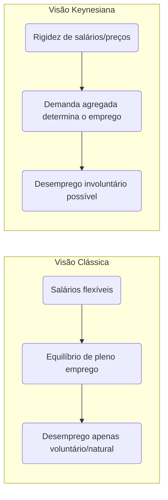

# Emprego, Renda e Mercado de Trabalho

## Conceitos Básicos: PIA, PEA, Ocupados, Desempregados e Inativos

No estudo do mercado de trabalho, dividimos a população em grupos para medir emprego e desemprego de forma consistente. Os principais conceitos são:

> [!definition] **Definições fundamentais:**
> 
> - **População em Idade Ativa (PIA)**: conjunto de pessoas em idade de trabalhar (no Brasil, geralmente com 14 anos ou mais). Corresponde à população total excluídos os muito jovens (abaixo da idade mínima) e, em algumas definições, os muito idosos.
>     
> - **População Economicamente Ativa (PEA)**: também chamada **força de trabalho**, inclui todas as pessoas da PIA que estão empregadas **ou** procurando emprego. Em outras palavras, é a soma de população **ocupada** + população **desocupada** (desempregada).
>     
> - **População Ocupada**: pessoas que, na semana de referência, exerceram algum trabalho remunerado (ou não remunerado, como trabalho familiar) por pelo menos 1 hora, **ou** tinham um emprego do qual estavam temporariamente afastadas.
>     
> - **População Desocupada (Desempregada)**: pessoas sem trabalho na semana de referência, que **estavam disponíveis** para trabalhar e **tomaram providência efetiva para encontrar trabalho** no período recente (por exemplo, nos últimos 30 dias), mas não conseguiram emprego. Essas atendem o critério de desemprego utilizado pelo IBGE (conforme normas da OIT).
>     
> - **População Fora da Força de Trabalho**: indivíduos da PIA que **não** estão nem ocupados nem procurando emprego (ou seja, não entram na PEA). Inclui, por exemplo, estudantes não empregados que não procuram trabalho, pessoas dedicadas a afazeres domésticos, aposentados que não trabalham etc. (também chamada de **população não economicamente ativa, PNEA**).
>     

**Relações importantes:** A PEA subdivide-se entre **empregados** (ocupados) e **desempregados**. Já a **taxa de desemprego** (ou **taxa de desocupação**) é definida como a razão entre o número de desempregados (desocupados) e a PEA  – indicador chave da condição do mercado de trabalho (detalhado adiante). Vale notar que o IBGE utiliza o termo _desocupação_ como sinônimo de desemprego.

> [!note] **Idade mínima considerada (Brasil)** 
> Nas pesquisas domiciliares, o IBGE define quem está em idade de trabalhar. Historicamente a **PNAD** considerava pessoas **de 10 anos ou mais** como PIA, mas a **PNAD Contínua** adotou, a partir de 2012, a idade mínima de **14 anos**. Assim, atualmente a taxa de desemprego oficial considera a população de **14 anos ou mais**. (Legalmente, o trabalho formal é permitido a partir de 16 anos na maioria dos casos, mas inclui-se 14–15 anos devido a aprendizes, etc.)

## Principais Indicadores do Mercado de Trabalho

Para avaliar emprego e renda, utilizamos vários **indicadores**, definidos a seguir (conforme a metodologia da PNAD Contínua do IBGE):

- **Taxa de Participação** (ou **taxa de atividade**): proporção da população em idade ativa que participa da força de trabalho, ou seja, $\frac{\text{PEA}}{\text{PIA}}\times 100$. Indica o grau de engajamento da população no mercado de trabalho (incluindo empregados e quem busca emprego). Por exemplo, em uma dada ocasião no Brasil, cerca de 62% da PIA integrava a PEA (participando do mercado de trabalho).
    
- **Taxa de Desemprego** (**taxa de desocupação**): parcela da força de trabalho que está desempregada. Formalmente, $\frac{\text{desempregados}}{\text{PEA}}\times 100$. Por exemplo, se a PEA é 110 milhões e 7 milhões estão desocupados, a taxa de desemprego é ~6,4%. Esse indicador reflete o grau de ociosidade imediata da força de trabalho.
    
- **Nível de Ocupação**: proporção da população em idade ativa que está ocupada, isto é, $\frac{\text{ocupados}}{\text{PIA}}\times 100$. Complementar à taxa de participação e desemprego, esse indicador mostra o percentual de pessoas em idade de trabalhar que efetivamente estão empregadas. (Equivale à **taxa de emprego** ou _employment-to-population ratio_.) Segundo dados recentes do IBGE, o nível da ocupação no Brasil ficou em **58,2%**, ou seja, pouco mais da metade da população em idade ativa estava ocupada.
    
- **Taxa de Subutilização** da força de trabalho: métrica mais ampla de **uso incompleto da força de trabalho**. Inclui os desempregados **mais** pessoas subempregadas (trabalhando menos horas do que poderiam e gostariam) **mais** aqueles disponíveis para trabalhar mas que desistiram de procurar (desalentados). A _taxa composta de subutilização_ é calculada como $\frac{\text{desocupados + subocupados + força de trabalho potencial}}{\text{PEA + força de trabalho potencial}}\times100$ (onde “força de trabalho potencial” abrange os disponíveis não engajados na busca de emprego). Esse indicador capta o desemprego oculto e a subocupação. No Brasil, por exemplo, a taxa de subutilização foi estimada em **15,4%** no trimestre até abril de 2025 – significativamente acima da taxa de desemprego estrita, refletindo subemprego em horas e desalento.
    
- **Taxa de Informalidade**: proporção dos trabalhadores ocupados que estão em ocupações informais (sem registro formal ou proteção trabalhista). Inclui empregados sem carteira assinada, conta-própria informais, trabalhadores familiares não remunerados etc. É um indicador importante de qualidade do emprego e acesso a direitos. No Brasil recente, a taxa de informalidade atingiu em torno de **37–38%** da população ocupada (ex.: 37,9% no início de 2025, equivalente a 39,2 milhões de trabalhadores informais).
    

> [!example] **Exemplo (Brasil, 2024–2025)** 
> No 4º trimestre de 2024, a taxa de desemprego caiu para **6,2%**, a menor desde 2014. No início de 2025, houve leve alta sazonal para **7,0%**. Ao mesmo tempo, a taxa de subutilização da força de trabalho ficou em torno de **15%**, revelando um contingente adicional de subempregados e desalentados. O nível de ocupação oscilou próximo de **58%** e a participação na força de trabalho em torno de **62%** da PIA. A informalidade manteve-se alta (entre **37–38%** dos ocupados), apesar do aumento do emprego formal – no início de 2025, o número de empregados com carteira assinada atingiu **39,6 milhões**, um recorde histórico . Esses números ilustram a recuperação do mercado de trabalho brasileiro pós-crise, porém com desafios de subutilização e informalidade persistentes.

## Tipos de Desemprego e Taxa Natural de Desemprego

Nem todo desemprego é igual em causa ou duração. A teoria econômica identifica **diferentes tipos de desemprego**:

- **Desemprego friccional:** resulta das transições e atritos no mercado de trabalho. Envolve pessoas **temporariamente desempregadas** porque estão **trocando de emprego**, mudando de carreira, ou **buscando o primeiro emprego**. Mesmo em uma economia saudável, há sempre um nível de desemprego friccional, pois leva tempo para trabalhadores encontrarem vagas adequadas e empresas preencherem posições. É geralmente de curto prazo e considerado _“desemprego voluntário”_ (o indivíduo está entre empregos por escolha ou circunstância natural de busca).
    
- **Desemprego estrutural:** causado por **mudanças estruturais** na economia, que podem tornar certas habilidades ou ocupações obsoletas. Surge quando há **desequilíbrio entre as qualificações dos trabalhadores e as demandas do mercado**, muitas vezes devido a progresso tecnológico (automatização) ou mudanças nos padrões de consumo. Exemplos: avanços tecnológicos que substituem trabalhadores (e.g. robôs industriais) ou declínio de indústrias tradicionais; trabalhadores cujas profissões deixam de ser demandadas enfrentam desemprego de longo prazo se não se requalificarem. Esse desemprego é **involuntário**, porém _não_ diminui apenas com a melhora cíclica da economia, exigindo políticas de requalificação ou tempo para realocação setorial.
    
- **Desemprego sazonal:** decorre de flutuações sazonais da atividade econômica. Certos setores contratam muito em determinadas épocas e pouco em outras, gerando variações previsíveis no emprego. Por exemplo, na **agricultura de safra**, no **turismo** ou comércio de fim de ano, é comum haver contrações temporárias seguidas de dispensas. Trabalhadores rurais migrantes no período de colheita e desempregados na entressafra são um caso típico. Esse desemprego tende a se repetir ciclicamente a cada ano conforme as estações ou eventos.
    
- **Desemprego cíclico (ou conjuntural):** resulta de **flutuações da demanda agregada** na economia ao longo do ciclo econômico. Em **recessões ou crises**, a queda na demanda por bens e serviços leva as empresas a reduzirem produção e cortarem postos de trabalho – aumentando o desemprego cíclico. Já em períodos de expansão econômica forte, a criação de vagas reduz o desemprego cíclico. Diferentemente dos tipos anteriores, este desemprego é diretamente ligado à **insuficiência de demanda**; é considerado _involuntário_ (trabalhadores perderam empregos devido à contração econômica, não por opção) e pode atingir muitos setores simultaneamente.
    

**Taxa Natural de Desemprego:** é o nível de desemprego que prevalece quando a economia está em **pleno emprego**, isto é, operando em seu potencial de longo prazo, sem pressões inflacionárias crescentes ou recessivas. Nessa situação, **todo o desemprego remanescente é friccional e estrutural** (ou seja, _natural_) – não há desemprego cíclico. Em outras palavras, a taxa natural corresponde ao desemprego **mínimo sustentável** mesmo em equilíbrio, pois sempre existirão indivíduos entre empregos ou incompatibilidades de habilidades. Importante destacar que _pleno emprego não significa desemprego zero_; significa desemprego na taxa natural, que é maior que zero. Por exemplo, se a taxa natural estimada for 5%, atingir pleno emprego implica manter o desemprego em ~5%. Qualquer desemprego abaixo disso possivelmente geraria inflação (segundo a teoria da Curva de Phillips aceleracionista). Conceitos relacionados incluem o NAIRU (_Non-Accelerating Inflation Rate of Unemployment_), que é basicamente a taxa de desemprego consistente com inflação estável – em geral alinhada à taxa natural.

> [!note] **Pleno emprego ≠ desemprego zero** 
> Um erro comum é pensar que “pleno emprego” significa nenhuma pessoa desempregada. Na verdade, mesmo em uma economia bem aquecida, haverá desemprego friccional e talvez algum estrutural. No CACD 2020 (TPS), por exemplo, uma questão cobrava justamente que, _se o PIB estiver igual ao potencial (hiato do produto nulo), a taxa de desemprego observada será igual à taxa natural de desemprego – ou seja, a economia está em pleno emprego, mas **ainda existe desemprego** (natural)_. A banca enfatizou que para efeitos de prova _“desemprego nunca é zero”_, mesmo no pleno emprego.

## Visões Clássica vs. Keynesiana sobre a Determinação do Emprego

A teoria macroeconômica oferece duas visões contrastantes sobre o que determina o nível de emprego e as causas do desemprego: a **visão clássica/neoclássica** versus a **visão keynesiana**.

- **Visão clássica (e neoclássica):** Defende que os mercados, inclusive o de trabalho, tendem naturalmente ao equilíbrio através de preços flexíveis. Em particular, **salários flexíveis** asseguram que a oferta e demanda de trabalho se igualem, alcançando o **pleno emprego** em equilíbrio. Qualquer excesso de trabalhadores (desemprego) pressionaria os salários para baixo, estimulando a demanda por mão de obra e eliminando o desemprego involuntário. Assim, no modelo clássico _não há desemprego de equilíbrio além do friccional_; todo indivíduo disposto a trabalhar pelo salário de equilíbrio consegue emprego. Nesse quadro, **desemprego observado decorre de fatores “friccionais” (transitórios) ou de intervenções/distorsões** que impeçam o ajuste de mercado (por exemplo, um salário mínimo alto ou sindicatos fortes poderiam fixar salários acima do equilíbrio, gerando desemprego **voluntário** para quem recusa baixar sua pretensão salarial, ou **desemprego clássico** por salários rígidos acima do ponto de equilíbrio). Em suma, para os clássicos, o desemprego é em grande parte voluntário ou fruto de rigidezes impostas; a política econômica deve focar em **remover barreiras** ao livre ajuste (mantendo mercados flexíveis) e não em estimular demanda para criar empregos.
    
- **Visão keynesiana:** Argumenta que o nível de emprego é primariamente determinado pela **demanda agregada** por bens e serviços. Empresas contratam trabalhadores em função de suas expectativas de vendas e produção necessária – logo, se a demanda for insuficiente, a economia pode estacionar com alta desocupação. Aqui, mesmo que os salários e preços pudessem diminuir, isso nem sempre garante o retorno ao pleno emprego, pois salários mais baixos podem **reduzir a renda e a demanda** ainda mais (_efeito perverso_). Além disso, Keynes destacou que salários nominais tendem a ser rígidos para baixo (por contratos, resistência dos trabalhadores etc.), o que impede ajustes rápidos. Assim, **desemprego involuntário** pode persistir: pessoas dispostas a trabalhar pelo salário vigente não conseguem vaga por falta de demanda pelos produtos. Nessa visão, o mercado de trabalho não se ajusta sozinho ao pleno emprego – o equilíbrio pode ocorrer **com desemprego**. Portanto, políticas ativas (estímulo fiscal, monetário) podem ser necessárias para elevar a demanda agregada e reduzir o desemprego. Em resumo, Keynes postulou que _“a demanda efetiva governa o emprego”_ e que é possível equilibrar a economia com desemprego elevado se a procura por bens for insuficiente.
    

Em termos gráficos, a distinção aparece no modelo oferta e demanda de trabalho: no clássico, a curva de oferta de trabalho e demanda se cruzam no pleno emprego (salário real de equilíbrio), enquanto para Keynes o emprego depende do cruzamento entre demanda agregada e oferta potencial – podendo ficar aquém do pleno emprego. Outra forma de comparar é lembrar: **clássicos enfatizam fatores de oferta** (flexibilidade de salários, preferências ao lazer vs. trabalho, produtividade) para explicar emprego, ao passo que **keynesianos enfatizam fatores de demanda** (gastos, investimento, expectativas) e **rigidezes de preço/salário**.

O diagrama a seguir resume, de forma simplificada, as diferenças de cada visão:

Em síntese, na visão clássica **o mercado de trabalho se autoequilibra**: o emprego é ofertado até o ponto em que o salário real iguala a produtividade marginal do trabalho, e qualquer pessoa que aceite esse salário será empregada – restando somente desemprego “natural” (gente em transição ou temporariamente desempregada por opção). Já na visão keynesiana, **podem existir equilíbrios de subemprego**, onde a falta de demanda por produtos leva a poucas contratações; mesmo pessoas dispostas a trabalhar pelos salários atuais podem não encontrar emprego, caracterizando _desemprego involuntário_. Por isso, as prescrições de política diferem: clássicos tendem a preconizar não-intervenção (ou apenas reformas pró-mercado, como flexibilização trabalhista), enquanto keynesianos defendem políticas de estímulo à demanda ou investimento público para alcançar o pleno emprego.

## Lei de Okun: Crescimento do PIB e Desemprego

A **Lei de Okun** descreve empiricamente uma relação inversa entre o crescimento econômico e as variações na taxa de desemprego. Proposta pelo economista **Arthur Okun** nos anos 1960, ela se baseia na observação de que, quando a economia cresce mais rápido do que seu potencial, o desemprego tende a cair, e vice-versa.

**Definição e formulação:** Em termos simples, Okun encontrou que para **reduzir o desemprego** é necessário um crescimento do PIB acima do _crescimento “normal”_ (de tendência) da economia. Uma versão bastante citada da lei diz que, aproximadamente, **para cada 1 ponto percentual de redução na taxa de desemprego**, o PIB real precisa crescer cerca de **2 pontos percentuais acima do crescimento potencial** ao longo de um ano. Por exemplo, se a taxa de crescimento potencial de longo prazo do PIB é 2% ao ano, seria preciso crescer cerca de **4%** num ano para baixar o desemprego em 1 p.p. (essa é uma regra empírica, válida para economias como a dos EUA). Inversamente, se o desemprego aumenta 1 p.p., isso está associado a um PIB cerca de 2% menor do que poderia ser. Outra formulação equivalente é em termos de hiato do produto: cada ponto de desemprego acima da taxa natural está associado a uma perda de ~2% do PIB em relação ao potencial (output gap negativo).

Matematicamente, uma forma da Lei de Okun é:

$Δu≈−β(g−gpotencial​)$

onde $\Delta u$ é a variação da taxa de desemprego, $g$ é o crescimento real do PIB e $g_{potencial}$ o crescimento de potencial; $\beta$ é a _elasticidade de Okun_ (valor empírico). Por exemplo, $\beta \approx 0,5$ implica que a cada 1 ponto de crescimento acima do potencial, o desemprego cai 0,5 p.p. (aproximando a regra 2-para-1 mencionada). Há também a formulação de _hiato_:

$Y∗Y−Y∗​≈−c(u−u∗)$

em que $Y$ é PIB real, $Y^_$ PIB potencial, $u$ desemprego observado e $u^_$ desemprego natural. Aqui $c$ seria ~2 (na economia dos EUA, historicamente). Em resumo, essas fórmulas capturam a mesma ideia: **crescimento acima do normal reduz desemprego; crescimento abaixo do normal eleva desemprego**.

**Implicações práticas:** A Lei de Okun serve como **regra de bolso** para prever mudanças no desemprego dada a taxa de crescimento do PIB. Policymakers usam-na para avaliar quanto a economia precisa crescer para absorver novos entrantes no mercado de trabalho e reduzir a desocupação. Por exemplo, se a força de trabalho cresce ~1% ao ano em um país, este talvez precise crescer pelo menos esse 1% (mais ganhos de produtividade) apenas para manter o desemprego estável. Para reduzir o desemprego, o crescimento deve superar esse patamar. De fato, conforme **Ben Bernanke** resumiu, _“um crescimento do PIB próximo ao potencial normalmente é necessário apenas para manter o desemprego estável; para reduzir o desemprego, o PIB deve crescer acima do potencial”_ .

Em termos de política econômica, isso significa que após uma recessão, conseguir **taxas de crescimento elevadas** por algum período é crucial para reverter o aumento do desemprego que a recessão causou. Governos costumam definir metas de crescimento justamente pensando em Okun: por exemplo, se o desemprego está alto, buscar um crescimento robusto (via estímulos) ajuda a fechar o hiato do produto e retornar o desemprego ao nível desejado.

> [!example] **Exemplo empírico (EUA)** 
> Historicamente nos EUA pós-1945, a lei de Okun apresentou coeficientes próximos aos previstos. Por volta dos anos 1960–1980, a cada 1% de queda no desemprego correspondia ~3% de aumento no PIB (versão original de Okun). Em décadas recentes, a relação ficou mais próxima de 2:1. Durante a crise de 2008-2009, porém, houve quebras na regularidade – o PIB dos EUA caiu fortemente sem aumento proporcional do desemprego inicial, e na recuperação seguinte o emprego voltou mais lentamente (produtividade oscilante). Ainda assim, no longo prazo, confirma-se a tendência: **períodos de crescimento robusto coincidem com quedas do desemprego**, enquanto recessões fazem o desemprego disparar. O Federal Reserve acompanha essa relação para calibrar a política monetária, lembrando que a lei de Okun não é exata mas fornece um _guia útil_ – desde que se estime corretamente a taxa natural de desemprego e o potencial de crescimento.

**Observações:** A Lei de Okun é **empírica**, não uma lei teórica fixa. Os coeficientes (2 para 1, ou 3 para 1, etc.) variam conforme o país e período, dependendo de fatores como produtividade do trabalho, variação da força de trabalho, horas trabalhadas, etc. No Brasil, por exemplo, a elasticidade pode ser diferente da dos EUA – economias emergentes tendem a ter uma relação menos estável. Além disso, curto-circuitos podem ocorrer: na crise da COVID-19, muitos países viram o PIB despencar sem aumento proporcional do desemprego oficial, devido a medidas de retenção de empregos e queda da participação. Portanto, Okun é um **padrão geral** mais do que uma regra rígida. Ainda assim, sua mensagem central permanece válida: _desemprego alto sinaliza que a economia está produzindo bem abaixo do seu potencial_, e recuperar o produto é chave para reduzir a desocupação. Como lembrado anteriormente, se o PIB efetivo se iguala ao PIB potencial, o desemprego tende ao nível natural – ponto de equilíbrio entre crescimento e emprego.

## Perguntas de Autoavaliação

> [!question] **1.** Explique a diferença entre **desemprego estrutural** e **desemprego cíclico**. 
> Que tipo de política econômica seria mais apropriada para combater cada um desses problemas?

> [!question] **2.** O que é **taxa natural de desemprego** e por que ela não é igual a zero? Relacione esse conceito com a ideia de **pleno emprego** na economia.

> [!question] **3.** De acordo com a **Lei de Okun**, o que aconteceria com a taxa de desemprego se o PIB crescesse exatamente na sua **taxa potencial** por vários anos? E o que seria necessário para reduzir significativamente o desemprego ao longo de um ano?

## Referências

- **IBGE – PNAD Contínua,** _“Taxa de desocupação é de 6,6% e taxa de subutilização é de 15,4% no trimestre encerrado em abril/2025”_. **Agência de Notícias IBGE**, 29/05/2025. Link[agenciadenoticias.ibge.gov.br](https://agenciadenoticias.ibge.gov.br/agencia-sala-de-imprensa/2013-agencia-de-noticias/releases/43501-pnad-continua-taxa-de-desocupacao-e-de-6-6-e-taxa-de-subutilizacao-e-de-15-4-no-trimestre-encerrado-em-abril#:~:text=A%20popula%C3%A7%C3%A3o%20ocupada%20,no%20ano%20%2857%2C3)[agenciadenoticias.ibge.gov.br](https://agenciadenoticias.ibge.gov.br/agencia-sala-de-imprensa/2013-agencia-de-noticias/releases/43501-pnad-continua-taxa-de-desocupacao-e-de-6-6-e-taxa-de-subutilizacao-e-de-15-4-no-trimestre-encerrado-em-abril#:~:text=ano).
    
- **Wikipédia (pt).** _“População em idade ativa”_. Última edição: 2022. Link[pt.wikipedia.org](https://pt.wikipedia.org/wiki/Popula%C3%A7%C3%A3o_em_idade_ativa#:~:text=Sendo%20que%20Popula%C3%A7%C3%A3o%20Economicamente%20Ativa,e%20nem%20est%C3%A3o%20procurando%20trabalho)[pt.wikipedia.org](https://pt.wikipedia.org/wiki/Popula%C3%A7%C3%A3o_em_idade_ativa#:~:text=No%20Brasil%2C%20o%20Instituto%20Brasileiro,2).
    
- **Brasil Escola – Sociologia.** _“Diferentes tipos de desemprego”_ (por Paulo S. Ribeiro). Link[brasilescola.uol.com.br](https://brasilescola.uol.com.br/sociologia/diferentes-tipos-desemprego.htm#:~:text=Uma%20das%20formas%20seria%20o,desempregados%2C%20como%20o%20seguro%20desemprego)[brasilescola.uol.com.br](https://brasilescola.uol.com.br/sociologia/diferentes-tipos-desemprego.htm#:~:text=O%20quarto%20e%20%C3%BAltimo%20tipo,seus%20funcion%C3%A1rios%20para%20cortar%20despesas).
    
- **Curso de Macroeconomia – ENAP.** _Módulo 2: Emprego, Mercado de Trabalho e Distribuição de Renda._ Brasília: ENAP. Link[repositorio.enap.gov.br](https://repositorio.enap.gov.br/bitstream/1/3012/1/MACROECONOMIA_MOD_2.pdf#:~:text=trabalho%20a%20capacidade%20de%20determinar,%C3%A0s%20decis%C3%B5es%20de%20produ%C3%A7%C3%A3o%20e)[repositorio.enap.gov.br](https://repositorio.enap.gov.br/bitstream/1/3012/1/MACROECONOMIA_MOD_2.pdf#:~:text=1.%20A%20PEA%20distribui,popula%C3%A7%C3%A3o%20desempregada%20e%20a%20PEA).
    
- **Investopedia.** _“Okun’s Law: Economic Growth and Unemployment”_ (Jan 2022). Link[investopedia.com](https://www.investopedia.com/articles/economics/12/okuns-law.asp#:~:text=pace%20above%20its%20potential)[investopedia.com](https://www.investopedia.com/articles/economics/12/okuns-law.asp#:~:text=The%20law%20has%20indeed%20evolved%C2%A0over,fall%20in%20GDP).
    
- **Blog IDEG (Marcello Bolzan).** _“A prova de Economia do TPS CACD 2020 – análise”_. Publicado em 14/06/2021. Link[ideg.com.br](https://ideg.com.br/estudar-para-a-prova-de-economia-do-tps-cacd-concurso-diplomata/#:~:text=a%20taxa%20de%20crescimento%20do,chamaria%20de%20exercito%20de%20reserva).

# A Lei de Okun: Compreendendo a Relação entre Desemprego e Crescimento Econômico

## Começando pelo essencial: O que é a Lei de Okun?

A Lei de Okun representa uma das relações empíricas mais importantes e duradouras da macroeconomia moderna. Desenvolvida pelo economista americano Arthur Okun em 1962, ela estabelece uma conexão sistemática entre duas variáveis fundamentais: a taxa de desemprego e o crescimento do produto interno bruto de um país.

Imagine que você seja um formulador de políticas tentando entender por que, quando a economia cresce rapidamente, o desemprego tende a cair, e vice-versa. A Lei de Okun fornece uma ferramenta quantitativa para compreender exatamente essa relação, permitindo prever mudanças no desemprego com base no crescimento econômico.

## A intuição econômica por trás da lei

Antes de mergulharmos nas fórmulas, é fundamental entender por que essa relação existe. Quando uma economia produz mais bens e serviços, as empresas geralmente precisam de mais trabalhadores para atender à demanda aumentada. Inversamente, quando a produção diminui, as empresas tendem a demitir funcionários ou reduzir as horas de trabalho.

Essa relação, embora intuitiva, não é perfeita nem automática. Existem vários fatores que podem influenciar sua intensidade, como mudanças na produtividade do trabalho, alterações na jornada de trabalho e variações na participação da força de trabalho. Arthur Okun reconheceu essas complexidades e desenvolveu sua lei como uma aproximação útil da realidade, não como uma lei física imutável.

## As duas formulações principais da Lei de Okun

A Lei de Okun pode ser expressa de duas maneiras distintas, cada uma oferecendo uma perspectiva diferente sobre a relação desemprego-produto.

### Versão das Diferenças (Difference Version)

A primeira formulação relaciona mudanças na taxa de desemprego com a taxa de crescimento do PIB real:

__Δu = -β(g - g_)

Onde Δu representa a mudança na taxa de desemprego, g é a taxa de crescimento real do PIB, g* é a taxa de crescimento necessária para manter o desemprego constante (geralmente chamada de taxa de crescimento de tendência), e β é o coeficiente de Okun.

Para compreender essa fórmula, pense no seguinte: se uma economia precisa crescer 3% ao ano apenas para absorver novos entrantes no mercado de trabalho e manter a produtividade, então qualquer crescimento acima disso reduzirá o desemprego, enquanto crescimento abaixo disso aumentará o desemprego.

### Versão do Hiato (Gap Version)

A segunda formulação relaciona o nível da taxa de desemprego com o hiato do produto:

__(Y - Y_)/Y_ = -β(u - u*)**

Aqui, Y representa o PIB real, Y* é o PIB potencial, u é a taxa de desemprego atual e u* é a taxa natural de desemprego. Esta versão nos permite entender quanto a economia está produzindo abaixo de seu potencial com base na diferença entre o desemprego atual e o natural.

## O Coeficiente de Okun: Interpretação e Variações

O parâmetro β, conhecido como coeficiente de Okun, merece atenção especial. Para os Estados Unidos, onde Okun desenvolveu originalmente sua lei, esse coeficiente era aproximadamente 0,3. Isso significa que cada ponto percentual de aumento no desemprego estava associado a uma redução de aproximadamente 3% no PIB em relação ao seu potencial.

É crucial entender que esse coeficiente não é universal nem constante. Diferentes países apresentam coeficientes distintos devido a variações nas instituições do mercado de trabalho, na flexibilidade do emprego, na estrutura produtiva e nas políticas macroeconômicas. Por exemplo, países com mercados de trabalho mais rígidos podem apresentar coeficientes menores, pois as empresas ajustam mais lentamente o emprego em resposta a mudanças na demanda.

## Fatores que influenciam a relação de Okun

Vários elementos podem alterar a intensidade da relação entre desemprego e crescimento econômico. A produtividade do trabalho desempenha um papel fundamental: quando a produtividade cresce rapidamente, é possível aumentar a produção sem necessariamente criar novos empregos na mesma proporção.

A participação da força de trabalho também afeta essa relação. Durante recessões, algumas pessoas podem se desencorajar e parar de procurar emprego, saindo da força de trabalho. Isso pode fazer com que a taxa de desemprego oficial não capture completamente o impacto real da recessão no mercado de trabalho.

As variações na jornada de trabalho representam outro fator importante. Em vez de demitir trabalhadores durante uma recessão, algumas empresas podem optar por reduzir as horas trabalhadas. Isso permite ajustar a produção sem alterar significativamente o número de empregados.

## Aplicações práticas em política econômica

A Lei de Okun tem aplicações práticas importantes para formuladores de políticas. Bancos centrais utilizam essa relação para avaliar o impacto de suas decisões de política monetária sobre o mercado de trabalho. Se um banco central sabe que uma determinada taxa de crescimento resultará em uma redução específica no desemprego, pode calibrar suas políticas para atingir objetivos de emprego.

Governos também usam a Lei de Okun para avaliar o custo social de diferentes políticas fiscais. Por exemplo, ao considerar medidas de austeridade que possam reduzir o crescimento econômico, os formuladores de políticas podem estimar o impacto resultante no desemprego usando a relação de Okun.

## Limitações e críticas da Lei de Okun

Embora útil, a Lei de Okun apresenta várias limitações importantes que devem ser reconhecidas. Primeiro, ela é uma relação empírica baseada em dados históricos, não uma lei econômica fundamental. Isso significa que mudanças estruturais na economia podem alterar ou até mesmo invalidar a relação.

A lei também assume que a relação entre desemprego e crescimento é linear e estável ao longo do tempo. Na realidade, essa relação pode variar dependendo do ciclo econômico, sendo potencialmente diferente durante recessões profundas comparadas a recessões moderadas.

Além disso, a Lei de Okun não considera explicitamente fatores como mudanças demográficas, transformações tecnológicas ou alterações na estrutura industrial da economia. Esses fatores podem influenciar significativamente a relação entre desemprego e crescimento.

## Evidências empíricas e variações internacionais

Estudos empíricos têm confirmado a validade geral da Lei de Okun em muitos países, mas com coeficientes que variam consideravelmente. Países europeus com mercados de trabalho mais regulamentados tendem a apresentar coeficientes menores que os Estados Unidos, refletindo menor flexibilidade no ajuste do emprego.

Economias em desenvolvimento podem apresentar padrões diferentes devido a fatores como maior informalidade no mercado de trabalho, diferentes estruturas produtivas e instituições menos desenvolvidas. Isso destaca a importância de estimar coeficientes específicos para cada país ao aplicar a Lei de Okun.

## Relevância para o Brasil e países em desenvolvimento

Para um futuro diplomata brasileiro, compreender a Lei de Okun é particularmente relevante ao analisar políticas econômicas domésticas e internacionais. O Brasil apresenta características únicas, como alto grau de informalidade no mercado de trabalho e maior volatilidade econômica, que podem afetar a aplicabilidade direta da lei.

Estudos sobre o Brasil sugerem que o coeficiente de Okun pode ser menor que o observado em países desenvolvidos, possivelmente devido à maior flexibilidade informal do mercado de trabalho. Durante crises, muitos trabalhadores podem migrar para o setor informal em vez de se tornarem oficialmente desempregados.

## Conexões com outras teorias macroeconômicas

A Lei de Okun se conecta intimamente com outras teorias macroeconômicas importantes. Ela complementa a Curva de Phillips, que relaciona inflação e desemprego, formando um triângulo de relações entre crescimento, desemprego e inflação que é fundamental para a compreensão das políticas macroeconômicas.

A lei também se relaciona com teorias de crescimento econômico, especialmente ao considerar como mudanças na força de trabalho afetam o produto potencial de longo prazo. Isso é particularmente relevante para países com mudanças demográficas significativas.

## Implicações para políticas de estabilização

Uma compreensão sólida da Lei de Okun permite aos formuladores de políticas avaliar melhor os trade-offs entre diferentes objetivos macroeconômicos. Se um governo sabe que determinada política fiscal resultará em um crescimento específico, pode usar a Lei de Okun para estimar o impacto correspondente no emprego.

Isso é especialmente importante durante recessões, quando os formuladores de políticas precisam equilibrar preocupações sobre déficits fiscais com a necessidade de manter o emprego. A Lei de Okun fornece uma ferramenta quantitativa para avaliar esses trade-offs.

Para consolidar sua compreensão, considere este exercício: se uma economia tem um coeficiente de Okun de 0,4 e precisa de 2,5% de crescimento para manter o desemprego estável, qual seria o impacto no desemprego de uma recessão que resultasse em crescimento de -1%? Usando a fórmula da versão das diferenças, o desemprego aumentaria em 1,4 pontos percentuais [0,4 × ((-1) - 2,5) = 1,4].

A Lei de Okun, portanto, representa uma ferramenta valiosa mas não infalível para compreender as dinâmicas do mercado de trabalho. Sua aplicação requer cuidadosa consideração das características específicas de cada economia e do contexto histórico e institucional relevante.