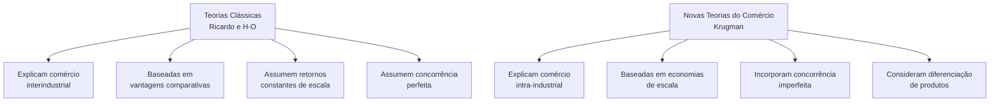
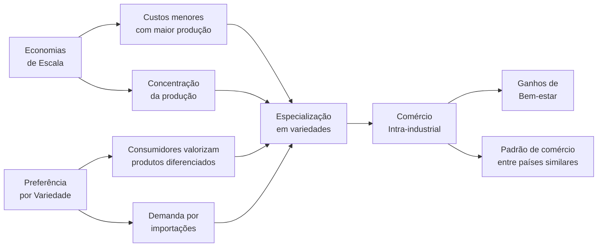
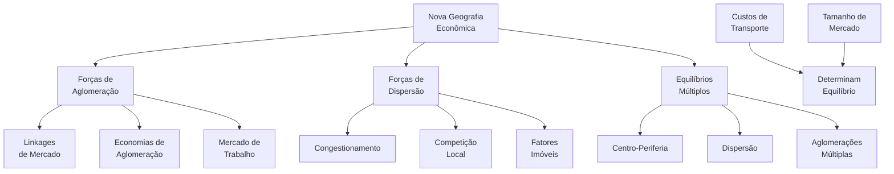

# Economias de Escala e Concorrência Imperfeita no Comércio Internacional

> [!abstract] Síntese
> As economias de escala e a concorrência imperfeita revolucionaram a teoria do comércio internacional ao explicar padrões que as teorias clássicas não conseguiam justificar. Quando há retornos crescentes de escala, países semelhantes comercializam produtos similares (comércio intra-industrial), pois a especialização permite produção em maior escala e menor custo unitário. Em mercados de concorrência imperfeita, o comércio internacional intensifica a competição, reduz o poder de mercado das empresas e amplia dramaticamente a variedade de produtos disponíveis aos consumidores, gerando ganhos de bem-estar além daqueles previstos pelas teorias tradicionais.

## 1. O Problema: Limitações das Teorias Clássicas

>[!question] Questão-Chave
>Por que países com dotações e tecnologias semelhantes (como Alemanha e França) comercializam intensamente produtos similares (como automóveis)? As teorias clássicas não explicam esse fenômeno.

### 1.1. Anomalias Empíricas não Explicadas

As teorias tradicionais de comércio internacional (Ricardo, Heckscher-Ohlin) enfrentam importantes limitações:

1. **Comércio entre países similares**: As teorias clássicas preveem comércio entre países diferentes (Norte-Sul), mas não explicam o grande volume de comércio entre países similares (Norte-Norte)

2. **Comércio intra-industrial**: Não justificam a troca simultânea de produtos similares (ex: França exporta e importa automóveis da Alemanha)

3. **Empresas multinacionais**: Não abordam o papel central das multinacionais e da produção fragmentada globalmente

4. **Aglomerações industriais**: Não explicam a concentração geográfica da produção

### 1.2. Pressupostos Limitantes das Teorias Clássicas

- **Retornos constantes de escala**: Assumem que duplicar os insumos duplica exatamente a produção
- **Concorrência perfeita**: Pressupõem mercados com muitos produtores sem poder de mercado
- **Produtos homogêneos**: Consideram produtos como commodities, sem diferenciação
- **Ausência de custos fixos**: Ignoram os custos iniciais significativos de muitas indústrias



## 2. Economias de Escala: Fundamentos Conceituais

>[!definition] Definição
>**Economias de escala** ocorrem quando o aumento da escala de produção resulta em redução do custo médio por unidade produzida. Matematicamente, o custo médio (CMe) é decrescente em relação à quantidade produzida.

### 2.1. Caracterização Formal

- **Função de produção**: $Y = f(K,L)$ com retornos crescentes de escala
- **Retornos crescentes**: $f(λK, λL) > λ·f(K,L)$ para λ > 1
- **Custo médio**: $CMe(q) = \frac{C(q)}{q}$ é decrescente em q
- **Elasticidade de escala** ($ε$): $ε = \frac{d\ln Y}{d\ln x} > 1$

>[!example] Exemplo Prático
>Imagine uma fábrica de aviões com custo fixo de $1 bilhão e custo variável de $50 milhões por avião:
>- Produzindo 10 aviões: custo médio = $150 milhões/avião
>- Produzindo 100 aviões: custo médio = $60 milhões/avião
>Esse é o motivo pelo qual a indústria aeronáutica é tão concentrada globalmente.

### 2.2. Tipos de Economias de Escala

#### 2.2.1. Economias de Escala Internas
Ocorrem **dentro da firma individual** - custos unitários caem com o aumento da produção da própria empresa.

**Fontes principais**:
- **Divisão do trabalho**: especialização de funções (princípio de Adam Smith)
- **Indivisibilidades técnicas**: equipamentos com escala mínima eficiente
- **Economias geométricas**: relação volume-área (tanques, navios, tubulações)
- **Economias financeiras**: custo de capital menor para empresas maiores
- **Diluição de P&D**: custos fixos de inovação distribuídos por mais unidades

**Implicação importante**: tendência à concentração de mercado e oligopolização

#### 2.2.2. Economias de Escala Externas
Ocorrem no **nível da indústria ou cluster** - custos unitários de cada empresa diminuem com o crescimento do setor como um todo.

**Fontes principais**:
- **Spillovers de conhecimento**: difusão de inovações entre empresas próximas
- **Mercado de trabalho especializado**: pool de trabalhadores com habilidades específicas
- **Fornecedores especializados**: acesso a insumos customizados e de alta qualidade
- **Infraestrutura dedicada**: logística, energia, comunicações especializadas
- **Serviços complementares**: consultoria técnica, laboratórios, certificadoras

**Implicação importante**: aglomeração geográfica (Silicon Valley, distritos industriais italianos)

#### 2.2.3. Economias de Escala Dinâmicas
Ocorrem ao **longo do tempo** pela acumulação de experiência produtiva.

**Mecanismos principais**:
- **Learning-by-doing**: produtividade aumenta com produção acumulada
- **Curva de aprendizado**: custos caem aproximadamente 20% a cada duplicação da produção acumulada
- **Inovação induzida**: escala incentiva esforço de P&D

**Formalização**: Curva de experiência $C(Q_t) = C(Q_0)·\left(\frac{Q_t}{Q_0}\right)^{-α}$, onde α é o parâmetro de aprendizado

>[!important] Implicações Fundamentais
>1. **Especialização benéfica**: Mesmo sem diferenças entre países, a especialização gera ganhos
>2. **Concentração industrial**: Produção tende a se concentrar em poucas localizações
>3. **Padrão de especialização arbitrário**: História e acidentes importam (path dependence)
>4. **Comércio intra-industrial explicado**: Países similares trocam produtos similares

## 3. Modelo Básico de Comércio com Economias de Escala

### 3.1. Pressupostos Simplificados do Modelo
- **Países idênticos**: mesmas preferências, tecnologia e dotação de fatores
- **Função de produção com custos fixos**: $C(q) = F + c·q$
- **Custo médio decrescente**: $CMe = \frac{F}{q} + c$
- **Consumidores valorizam variedade**: função utilidade CES (elasticidade de substituição constante)
- **Um único fator de produção**: trabalho
- **Custos de transporte insignificantes**

### 3.2. Equilíbrio em Autarquia vs. Comércio

>[!note] Autarquia (Sem Comércio)
>- Cada país produz todas as variedades para seu mercado
>- Número de variedades limitado pelo tamanho do mercado doméstico
>- Escala de produção por variedade relativamente pequena
>- Custos médios mais altos por unidade

>[!note] Com Comércio Internacional
>- Cada país se especializa em um subconjunto de variedades
>- Consumidores acessam variedades domésticas e importadas
>- Escala de produção por variedade aumenta
>- Custos médios diminuem com maior escala

### 3.3. Resultados e Implicações Teóricas

1. **Especialização incompleta**: cada país produz um subconjunto diferente de variedades
2. **Comércio intra-industrial**: países trocam variedades diferentes do mesmo setor
3. **Ganhos de comércio duplos**:
   - **Efeito escala**: produtos mais baratos (produção mais eficiente)
   - **Efeito variedade**: mais opções para consumidores (amor à diversidade)

4. **Bem-estar superior**: comparado à autarquia ou ao livre comércio sem economias de escala



### 3.4. Formalização Matemática Simplificada
- **Função utilidade do consumidor**: $U = \sum_{i=1}^{n} c_i^{\alpha}$ onde $0 < \alpha < 1$
- **Condição de maximização**: $p_i = \lambda \alpha c_i^{\alpha-1}$
- **Função custo da firma**: $C(q_i) = F + c \cdot q_i$
- **Condição de equilíbrio**: $p_i = \frac{c}{1-1/\varepsilon}$ onde $\varepsilon = \frac{1}{1-\alpha}$ é a elasticidade da demanda
- **Número de variedades**: $n = \frac{L}{\sigma F}$ em autarquia, $n = \frac{2L}{\sigma F}$ com comércio (dois países idênticos)

## 4. Concorrência Imperfeita no Comércio Internacional

>[!question] Questão-Chave
>Como a estrutura de mercado (monopólio, oligopólio, concorrência monopolística) afeta os padrões de comércio e seus benefícios?

### 4.1. Estruturas de Mercado e Comércio

#### 4.1.1. Monopólio e Comércio
- **Discriminação de preços internacional** (dumping):
  - **Definição jurídica**: venda abaixo do valor normal (preço doméstico)
  - **Definição econômica**: discriminação de preços entre mercados com elasticidades diferentes
  - **Condição necessária**: mercados segmentados (barreiras à arbitragem)
  
- **Quebra de monopólios nacionais**:
  - Importações como força disciplinadora da concorrência
  - Redução do poder de mercado doméstico
  - Diminuição de ineficiência-X (slack organizacional)

#### 4.1.2. Oligopólio e Comércio

>[!note] Modelos de Oligopólio Aplicados ao Comércio
>- **Cournot**: competição por quantidades
>  - Equilíbrio: $q_i = \frac{a-c}{b(n+1)}$
>  - Preço: $p = c + \frac{a-c}{n+1}$
>  - Comércio aumenta n, reduzindo preço e markup
>
>- **Bertrand**: competição por preços
>  - Com produtos homogêneos: $p = c$ (paradoxo de Bertrand)
>  - Com diferenciação: $p_i = c + \frac{t}{2}$ onde t é o grau de diferenciação
>
>- **Stackelberg**: liderança de mercado
>  - Líder: $q_L = \frac{a-c}{2b}$
>  - Seguidor: $q_F = \frac{a-c}{4b}$
>  - Abertura comercial pode alterar posições de liderança

#### 4.1.3. Política Comercial Estratégica
- **Modelo de Brander-Spencer (1985)**:
  - Subsídio à exportação pode alterar equilíbrio de Cournot
  - Transfere rendas de oligopólio para país doméstico
  - Justificativa teórica para intervenção governamental

- **Críticas e limitações**:
  - Informação imperfeita dos governos
  - Riscos de retaliação e guerras comerciais
  - Captura por grupos de interesse
  - Aplicação limitada na prática (restrições da OMC)

### 4.2. Concorrência Monopolística e Comércio

#### 4.2.1. Modelo de Dixit-Stiglitz-Krugman
Características essenciais:
- **Diferenciação horizontal**: cada firma produz variedade única do produto
- **Substitutibilidade imperfeita**: elasticidade de substituição constante (CES)
- **Livre entrada**: lucros zero no equilíbrio de longo prazo
- **Simetria**: todas as variedades entram simetricamente na utilidade

>[!example] Exemplo Intuitivo
>Imagine o mercado de cervejas artesanais:
>- Cada cervejaria produz uma variedade única (diferenciação)
>- Consumidores valorizam diversidade de sabores (preferência por variedade)
>- Custos fixos de operação + custos variáveis por litro (economias de escala)
>- Com comércio internacional, cervejarias produzem mais de seus tipos específicos (maior escala)
>- Consumidores acessam maior variedade de cervejas do mundo todo (ganho de variedade)

#### 4.2.2. Efeitos do Comércio Internacional

1. **Efeito Pró-competitivo**
   - Redução do markup sobre custo marginal
   - Aproximação do preço ao custo marginal
   - Redução do poder de monopólio das firmas domésticas
   - Pressão por eficiência e produtividade

2. **Efeito Escala**
   - Produção concentrada em menos variedades por país
   - Escala maior por variedade produzida
   - Custos médios menores pela diluição dos custos fixos
   - Aumento da eficiência produtiva

3. **Efeito Variedade**
   - Acesso a variedades estrangeiras
   - Aumento do índice de variedade consumida
   - Ganhos de bem-estar por "love of variety"
   - Aumento da utilidade do consumidor mesmo com preços constantes

4. **Efeito Seleção** (Melitz, 2003)
   - Apenas firmas mais produtivas exportam
   - Firmas menos eficientes saem do mercado
   - Aumento da produtividade média da indústria
   - Realocação de recursos para firmas mais eficientes

#### 4.2.3. Formalização dos Ganhos de Comércio
- **Ganho de variedade**: $\Delta W_{var} = n^{\frac{1}{\sigma-1}} - n_0^{\frac{1}{\sigma-1}}$
- **Ganho de escala**: $\Delta W_{esc} = \frac{p_0}{p} - 1 = \frac{q}{q_0} - 1$
- **Ganho total aproximado**: $\Delta W \approx \frac{1}{2}\left(n^{\frac{1}{\sigma-1}} - 1\right) + \frac{1}{2}\left(\frac{q}{q_0} - 1\right)$

## 5. Comércio Intra-industrial: Evidências e Medição

### 5.1. Medição do Comércio Intra-industrial

#### 5.1.1. Índice de Grubel-Lloyd (IGL)
```
IGL = 1 - |X - M|/(X + M)
```
Onde:
- X = exportações do setor i
- M = importações do setor i
- IGL ∈ [0,1]: quanto maior, mais intra-industrial

**Interpretação do IGL**:
- IGL = 0: Comércio puramente inter-industrial
- IGL = 1: Comércio puramente intra-industrial
- 0 < IGL < 1: Combinação de ambos os tipos

>[!tip] Como Calcular na Prática
>Para o setor automobilístico:
>- Exportações = $10 bilhões
>- Importações = $8 bilhões
>- IGL = 1 - |10-8|/(10+8) = 1 - 2/18 = 1 - 0,11 = 0,89
>Isso indica um comércio predominantemente intra-industrial (89%).

#### 5.1.2. Padrões Empíricos Observados
- **Alto entre países desenvolvidos**: IGL > 0.7 em manufaturados na UE e NAFTA
- **Correlação positiva com**:
  - Similaridade de renda per capita (hipótese de Linder)
  - Proximidade geográfica (custos de transporte)
  - Integração econômica (UE, NAFTA, Mercosul)
  - Tamanho das economias (mercados maiores)
- **Baixo em**: 
  - Commodities e produtos primários
  - Comércio Norte-Sul (países com diferentes dotações)
  - Setores intensivos em recursos naturais

### 5.2. Tipos de Comércio Intra-industrial

#### 5.2.1. Comércio Intra-industrial Horizontal
- **Definição**: Troca de produtos similares com diferentes atributos
- **Exemplos**: Carros de mesmo segmento (Golf vs Focus), chocolates, vinhos
- **Driver principal**: Preferência por variedade dos consumidores
- **Modelo teórico aplicável**: Krugman/Dixit-Stiglitz

#### 5.2.2. Comércio Intra-industrial Vertical
- **Definição**: Troca de produtos similares mas de diferentes qualidades
- **Exemplos**: Carros de luxo por compactos, têxteis finos por básicos
- **Medição**: Razão de valores unitários (unit value ratios) > 1.15 ou < 0.85
- **Driver principal**: Diferenças em dotação de fatores dentro da mesma indústria
- **Modelo teórico aplicável**: Falvey-Kierzkowski

#### 5.2.3. Comércio Intra-firma
- **Definição**: Comércio entre unidades da mesma empresa multinacional
- **Magnitude**: ≈1/3 do comércio mundial, >40% em países desenvolvidos
- **Motivação**: Fragmentação da produção, especialização vertical
- **Implicações**: Transfer pricing, evasão fiscal, controle de qualidade

### 5.3. Implicações Político-Econômicas

#### 5.3.1. Ajustes Menos Custosos
- **Realocação intra-setorial**: trabalhadores mudam entre firmas do mesmo setor
- **Menor desemprego estrutural**: habilidades permanecem relevantes e transferíveis
- **Menor resistência política**: lobbies setoriais menos mobilizados
- **Custos transitórios**: menores perdas de capital específico ao setor

#### 5.3.2. Facilitação da Integração Econômica
- **Acordos comerciais mais viáveis**: menos conflitos distributivos entre setores
- **Deepening vs widening**: aprofundamento antes de expansão geográfica
- **Convergência regulatória**: padrões técnicos comuns, reconhecimento mútuo
- **Complementaridade com IDE**: investimento e comércio como complementos

## 6. Nova Geografia Econômica

>[!definition] Definição
>A Nova Geografia Econômica estuda como a interação entre economias de escala, custos de transporte e mobilidade de fatores determina a distribuição espacial da atividade econômica, explicando a formação de aglomerações industriais e desigualdades regionais persistentes.

### 6.1. Fundamentos Teóricos

#### 6.1.1. Forças de Aglomeração (Centrípetas)
1. **Linkages de mercado**:
   - **Backward**: acesso a insumos intermediários
   - **Forward**: acesso a compradores/mercados finais
   - **Causalidade circular**: reforço mútuo dos efeitos

2. **Economias de aglomeração**:
   - **Spillovers tecnológicos**: difusão de conhecimento localizada
   - **Pooling de mão-de-obra**: mercado de trabalho especializado
   - **Infraestrutura compartilhada**: custos fixos diluídos
   - **Serviços especializados**: disponibilidade de serviços auxiliares

#### 6.1.2. Forças de Dispersão (Centrífugas)
1. **Custos de congestionamento**: 
   - Aluguéis e preços da terra
   - Transportes urbanos e commuting
   - Poluição e externalidades negativas

2. **Competição local**: 
   - Por trabalhadores (pressão salarial)
   - Por consumidores (mercados saturados)
   - Por insumos não-comercializáveis

3. **Fatores imóveis**: 
   - Recursos naturais localizados
   - Terra agrícola e uso do solo
   - Amenidades naturais específicas



### 6.2. Implicações para o Desenvolvimento Regional e Global

#### 6.2.1. Padrões Centro-Periferia
- **Causalidade cumulativa**: vantagens iniciais se amplificam ao longo do tempo
- **Path dependence**: história importa para localização industrial
- **Multiple equilibria**: diversas configurações possíveis dependendo de condições iniciais
- **Armadilhas de pobreza**: equilíbrios de baixo nível podem ser estáveis

>[!example] Exemplo Histórico
>O "Manufacturing Belt" nos EUA (região industrial do nordeste e meio-oeste) consolidou-se no século XIX e, apesar das mudanças econômicas e tecnológicas, manteve posição dominante por mais de um século. Este é um exemplo clássico de path dependence e equilíbrio centro-periferia.

#### 6.2.2. Políticas de Desenvolvimento Regional
1. **Big Push**: 
   - Investimentos coordenados para romper armadilhas
   - Coordenação de expectativas dos agentes
   - Mobilização simultânea de recursos complementares

2. **Infraestrutura estratégica**: 
   - Redução de custos de transporte e comunicação
   - Corredores de desenvolvimento e nós logísticos
   - Efeitos ambíguos de integração espacial

3. **Clusters industriais**: 
   - Políticas focalizadas em setores específicos
   - Especialização regional inteligente
   - Sistemas regionais de inovação

4. **Capital humano diferenciado**: 
   - Criação de vantagens comparativas dinâmicas
   - Formação adaptada às vocações regionais
   - Atração e retenção de talentos

## 7. Aplicações ao Brasil e ao Mercosul

### 7.1. Industrialização Brasileira e Economias de Escala

#### 7.1.1. Período ISI (1930-1980)
- **Estratégia**: Busca por escala no mercado protegido nacional
- **Mecanismos**: Reserva de mercado, tarifas elevadas, substituição de importações
- **Sucessos**: Industrialização ampla, complexo industrial integrado
- **Limitações**: 
  - Concentração de renda e mercado interno insuficiente
  - Falta de especialização e escala subótima
  - Baixa pressão competitiva e ineficiências

#### 7.1.2. Abertura Econômica (1990s)
- **Choque competitivo**: Reestruturação industrial forçada
- **Resultados mistos**: 
  - Ganhos de produtividade por racionalização
  - Desnacionalização de segmentos escala-intensivos
  - Especialização em nichos com vantagens comparativas
  - Desverticalização e inserção em cadeias globais

#### 7.1.3. Período Recente (2000-2025)
- **Tendências preocupantes**: 
  - Desindustrialização precoce
  - Especialização regressiva (reprimarização)
  - Perda de elos complexos nas cadeias de valor
- **Nichos de excelência**: 
  - Aeroespacial (Embraer)
  - Agronegócio de alta tecnologia
  - Petróleo e gás em águas profundas

### 7.2. Mercosul e Integração Regional

#### 7.2.1. Concepção Original e Evolução
- **Motivação inicial**: Ampliação de mercado para ganhos de escala
- **Objetivos**: Criar espaço econômico integrado de 200+ milhões de consumidores
- **Evolução do comércio intra-regional**:
  - Aumento do índice Grubel-Lloyd Brasil-Argentina: de 0.12 (1990) para 0.40+ (2000s)
  - Declínio relativo pós-2010 (expansão da China)

#### 7.2.2. Regime Automotivo: Caso Emblemático
- **Complementaridade produtiva**: Brasil-Argentina
- **Especialização por modelos**: Escala ampliada por plataforma
- **Comércio administrado**: Coeficientes de desvio e compensação
- **Resultados**: 
  - Comércio intra-industrial elevado (IGL > 0.8)
  - Racionalização produtiva regional
  - Limitações por instabilidade macroeconômica

#### 7.2.3. Desafios Contemporâneos
- **Assimetrias estruturais**: Concentração em poucos polos
- **Integração superficial**: Baixa convergência regulatória
- **Necessidade de modernização**: Revisão da TEC e simplificação
- **Tensão entre ampliação e aprofundamento**: Negociações externas vs. coesão interna

### 7.3. Inserção nas Cadeias Globais de Valor

#### 7.3.1. Posição Brasileira nas CGVs
- **Participação abaixo da média mundial**: ≈25% vs. 50+%
- **Concentração upstream**: Fornecedor de insumos básicos
- **Baixa integração em serviços de alto valor**: Design, P&D, marketing
- **Padrão distinto do México e Leste Asiático**: Inserção mais periférica

#### 7.3.2. Estratégias de Upgrading
- **Tipologia de upgrading**: Produto, processo, funcional, cadeia
- **Casos de sucesso brasileiro**: 
  - Embraer: integrador de sistemas aeroespaciais
  - WEG: motores elétricos e automação industrial
  - Inovação em agronegócio (Embrapa)

#### 7.3.3. Políticas para Melhor Inserção
- **Facilitação de comércio**: Redução de custos de transação
- **Capacitação tecnológica**: Sistema de inovação mais efetivo
- **Atração seletiva de IDE**: Em segmentos estratégicos das cadeias
- **Acordos comerciais modernos**: Cláusulas de facilitação e convergência

## 8. Desafios Contemporâneos: Economia Digital e Novas Fronteiras

### 8.1. Novas Economias de Escala na Era Digital

#### 8.1.1. Características Distintas
- **Custos marginais próximos de zero**: Bens informacionais e digitais
- **Economias de rede**: Valor aumenta com número de usuários (Lei de Metcalfe)
- **Efeitos de plataforma**: Mercados de múltiplos lados
- **Winner-takes-all markets**: Tendência à concentração extrema

>[!example] Plataformas Digitais e Comércio
>Amazon e Alibaba transformaram o comércio global criando economias de escala em:
>- Logística integrada global
>- Matching eficiente entre compradores e vendedores
>- Big data para previsão de demanda
>- Compartilhamento de reputação e confiança
>Isso permite que pequenas empresas acessem mercados globais com custos fixos drasticamente reduzidos.

#### 8.1.2. Implicações para o Comércio Internacional
- **Desmaterialização do comércio**: Serviços digitais substituindo bens físicos
- **Micro-multinacionais**: PMEs com acesso direto a mercados globais
- **Concentração de poder de mercado**: Big techs como gatekeepers
- **Desafios regulatórios transfronteiriços**: Tributação, privacidade, segurança

### 8.2. Tensões Geopolíticas e Comerciais Emergentes

#### 8.2.1. Competição Tecnológica EUA-China
- **Setores estratégicos**: Semicondutores, 5G, IA, computação quântica
- **Controles de exportação**: Restrições a tecnologias sensíveis
- **Subsídios massivos**: CHIPS Act (EUA), Made in China 2025
- **Implicações**: Possível fragmentação tecnológica global

#### 8.2.2. Transição Energética e Comércio Verde
- **Carbon Border Adjustment Mechanism** (CBAM): Ajustes de carbono na fronteira
- **Nova geografia das vantagens comparativas**: Acesso a energia limpa
- **Economias de escala em tecnologias verdes**: Custos decrescentes de renováveis
- **Corrida por cadeias de valor sustentáveis**: Minerais críticos, baterias, hidrogênio

#### 8.2.3. Resiliência vs. Eficiência nas Cadeias Globais
- **Reshoring e nearshoring**: Redução de vulnerabilidades
- **Redundância vs. just-in-time**: Custos de resiliência
- **Diversificação de fornecedores**: Gestão de risco geopolítico
- **Autonomia estratégica**: Setores críticos e segurança nacional

## 9. Estudos de Caso para o CACD

### 9.1. Embraer e Bombardier: Duopólio Global em Jatos Regionais

#### 9.1.1. Características do Setor
- **Economias de escala extremas**: Custos fixos elevados em P&D
- **Curva de aprendizado**: Redução de custos com experiência acumulada
- **Duopólio global**: Competição estratégica Embraer-Bombardier
- **Barreiras à entrada**: Tecnológicas, regulatórias, reputacionais

#### 9.1.2. Estratégias Competitivas
- **Famílias de aeronaves**: Compartilhamento de componentes e sistemas
- **Especialização em nicho**: Foco em jatos regionais (30-120 passageiros)
- **Internacionalização da cadeia**: Fornecedores globais
- **Inovação incremental**: Eficiência, conforto, alcance

#### 9.1.3. Dimensão Comercial e Geopolítica
- **Disputa Embraer-Bombardier na OMC** (2017): Subsídios canadenses
- **Tentativa de aquisição pela Boeing** (2018-2020): Bloqueada pela Comissão Europeia
- **Apoio estatal estratégico**: Financiamento à exportação (BNDES)
- **Reconversão para defesa**: Diversificação para reduzir ciclicidade

### 9.2. Indústria Automotiva no Mercosul: Integração Produtiva Regional

#### 9.2.1. Evolução do Comércio Intra-industrial
- **Antes da integração**: Comércio inter-industrial (IGL < 0.2)
- **Pós-Mercosul**: Aumento dramático do comércio intra-industrial (IGL > 0.8)
- **Concentração setorial**: Dominância do setor automotivo
- **Sensibilidade macroeconômica**: Volatilidade com crises cambiais

#### 9.2.2. Regime Automotivo Comum
- **Estabelecimento**: Acordo bilateral Brasil-Argentina (1996)
- **Mecanismos**: Coeficientes de desvio, compensação de comércio
- **Adaptações**: Flexibilizações em períodos de crise
- **Limitações**: Ausência de política industrial comum

#### 9.2.3. Desafios Contemporâneos
- **Transformação tecnológica**: Eletrificação, conectividade, autonomia
- **Competição asiática**: Pressão por escala global
- **Fragmentação regulatória**: Divergências em padrões técnicos
- **Transição energética**: Adaptação à economia de baixo carbono

### 9.3. Semicondutores: Economias de Escala Extremas e Geopolítica

#### 9.3.1. Estrutura da Indústria
- **Custos fixos gigantescos**: Fábricas (fabs) > US$20 bilhões
- **Lei de Moore**: Ritmo acelerado de inovação e obsolescência
- **Especialização geográfica**: Taiwan (TSMC), Coreia (Samsung), EUA (Intel)
- **Fragmentação vertical**: Design (fabless) vs. fabricação (foundries)

#### 9.3.2. Implicações Geopolíticas
- **Vulnerabilidade de cadeias**: Dependência de poucos fornecedores
- **Chokepoints estratégicos**: Taiwan, equipamentos litográficos (ASML)
- **Nacionalismo tecnológico**: Subsídios massivos para soberania
- **Controles de exportação**: Restrições a tecnologias avançadas

#### 9.3.3. Lições para Países em Desenvolvimento
- **Limitações de catching-up**: Escala mínima proibitiva em nós avançados
- **Estratégias de nicho**: Foco em segmentos específicos (design, encapsulamento)
- **Importância da capacitação**: Formação de capital humano especializado
- **Dilemas entre autonomia e integração**: Opções estratégicas limitadas

## 10. Questões Estratégicas para o CACD

>[!tip] Estratégia para Provas
>Para questões sobre economias de escala e comércio internacional no CACD, estruture sua resposta comparando as teorias clássicas com as novas teorias, use exemplos concretos (especialmente brasileiros), e mostre a evolução do pensamento econômico nesta área.

### 10.1. Economias de Escala Dinâmicas e Indústria Nascente

**Questão-tipo**: *Analise criticamente como o conceito de economias de escala dinâmicas (learning by doing) pode justificar políticas de proteção temporária a indústrias nascentes. Em que condições essa proteção geraria benefícios líquidos para a sociedade?*

**Pontos-chave para resposta**:
- **Fundamento teórico**: Curva de aprendizado e redução de custos com experiência
- **Externalidades positivas**: Spillovers de conhecimento não capturados pelo mercado
- **Condições para sucesso**:
  - Proteção temporária com sunset clauses
  - Benchmarks de performance para disciplinar empresas
  - Potencial de competitividade internacional futura
  - Capacidade institucional para evitar captura regulatória
- **Exemplos contrastantes**: Leste Asiático (sucesso) vs. América Latina (problemas)
- **Compatibilidade com regras da OMC**: Espaço de política limitado atualmente

### 10.2. Transformação Digital e Padrões de Comércio

**Questão-tipo**: *Discuta como a revolução digital e o comércio eletrônico estão alterando a importância relativa das economias de escala na produção física versus economias de rede nas plataformas digitais. Quais as implicações para países em desenvolvimento?*

**Pontos-chave para resposta**:
- **Transição de paradigmas**: Economias de escala físicas vs. digitais
- **Características distintas**: Network effects vs. custos fixos tradicionais
- **Oportunidades para países em desenvolvimento**:
  - Leapfrogging tecnológico
  - Inserção em nichos digitais
  - Democratização do acesso a mercados globais
- **Desafios estruturais**:
  - Divisão digital persistente
  - Concentração de poder em big techs do Norte Global
  - Infraestrutura digital insuficiente
- **Exemplos de sucesso**: Índia (serviços de TI), M-Pesa (Quênia), MercadoLibre (América Latina)

### 10.3. Resiliência vs. Eficiência nas Cadeias Globais

**Questão-tipo**: *Examine o trade-off entre os ganhos de eficiência derivados da concentração industrial global (mega-fábricas) e os riscos de vulnerabilidade nas cadeias de suprimento, como evidenciado na pandemia de COVID-19.*

**Pontos-chave para resposta**:
- **Tensão fundamental**: Eficiência alocativa vs. resiliência sistêmica
- **Lições da COVID-19**:
  - Vulnerabilidades em cadeias "lean" e just-in-time
  - Dependência excessiva de fornecedores únicos
  - Falta de redundância em produtos críticos
- **Tendências emergentes**:
  - Nearshoring e friend-shoring
  - Diversificação estratégica de fornecedores
  - Estoques de segurança em setores críticos
- **Custos da resiliência**: Trade-offs econômicos reais
- **Implicações para o Brasil**: Oportunidades em nearshoring para América do Norte

### 10.4. Transição Energética e Nova Geografia Econômica

**Questão-tipo**: *Como a transição para uma economia de baixo carbono pode alterar os padrões de economias de escala e localização industrial? Considere tanto as novas tecnologias quanto as políticas de ajuste de carbono na fronteira.*

**Pontos-chave para resposta**:
- **Economias de escala em tecnologias limpas**:
  - Curvas de aprendizado em renováveis (solar, eólica)
  - Descentralização vs. centralização da produção energética
  - Escala mínima em novas tecnologias (hidrogênio verde)
- **Políticas climáticas com impacto comercial**:
  - Carbon Border Adjustment Mechanism (CBAM) da UE
  - Impactos em indústrias intensivas em energia
  - Risco de carbon leakage
- **Nova geografia das vantagens comparativas**:
  - Acesso a energias renováveis como fator locacional
  - Potencial brasileiro (sol, vento, água, biomassa)
  - Minerais críticos para transição energética
- **Tensões Norte-Sul**:
  - Financiamento da transição
  - Transferência tecnológica
  - Justiça climática e responsabilidades diferenciadas

## 11. Síntese e Revisão

### 11.1. Pontos Fundamentais para o CACD

1. **Superação das Teorias Clássicas**
   - Limitações do modelo ricardiano e H-O em explicar comércio entre países similares
   - Comércio intra-industrial como fenômeno central do comércio contemporâneo
   - Conciliação entre novas e antigas teorias (complementaridade, não substituição)

2. **Ganhos Adicionais do Comércio**
   - Efeito escala: redução de custos médios com maior produção
   - Efeito variedade: expansão de opções para consumidores
   - Efeito pró-competitivo: redução de markups e poder de mercado
   - Efeito seleção: realocação para firmas mais produtivas

3. **Implicações para Política Comercial**
   - Justificativas estratégicas para intervenção (policy space)
   - Dilemas entre proteção e exposição à competição internacional
   - Políticas complementares (educação, infraestrutura, inovação)
   - Integração regional como estratégia intermediária

4. **Aplicações ao Brasil e Mercosul**
   - Desafios de escala no processo de industrialização
   - Comércio intra-industrial no Mercosul: potenciais e limitações
   - Inserção em cadeias globais: posição atual e estratégias de upgrading
   - Oportunidades na economia digital e transição energética

### 11.2. Bibliografia Essencial para o CACD

#### 11.2.1. Obras Fundamentais
- KRUGMAN, P. "Increasing Returns, Monopolistic Competition and International Trade". *Journal of International Economics*, 1979.
- HELPMAN, E.; KRUGMAN, P. *Market Structure and Foreign Trade*. MIT Press, 1985.
- KRUGMAN, P. *Geography and Trade*. MIT Press, 1991.
- MELITZ, M. "The Impact of Trade on Intra-Industry Reallocations and Aggregate Industry Productivity". *Econometrica*, 2003.

#### 11.2.2. Manuais Didáticos
- KRUGMAN, P.; OBSTFELD, M.; MELITZ, M. *Economia Internacional*. Pearson, última edição. (Capítulos 7 e 8)
- FEENSTRA, R. *Advanced International Trade: Theory and Evidence*. Princeton University Press, 2015.
- CAVES, R.; FRANKEL, J.; JONES, R. *Economia Internacional: Comércio e Transações Globais*. Saraiva.

#### 11.2.3. Contexto Brasileiro
- KUME, H.; PIANI, G.; MIRANDA, P. "Comércio Intra-industrial, Política Comercial e Ajuste Estrutural no Brasil". IPEA, 2006.
- VEIGA, P.M.; RIOS, S. "Inserção em Cadeias Globais de Valor e Políticas Públicas". IPEA, 2015.
- BAUMANN, R. (org.) *O Brasil e a Economia Global*. Campus, 1996.

#### 11.2.4. Artigos Recentes Relevantes
- BERNARD, A. et al. "Global Firms". *Journal of Economic Literature*, 2018.
- ANTRÀS, P. "Conceptual Aspects of Global Value Chains". *World Bank Economic Review*, 2020.
- BALDWIN, R. *The Great Convergence: Information Technology and the New Globalization*. Harvard University Press, 2016.

>[!success] Roteiro de Estudo
>1. Comece pelos capítulos 7 e 8 do Krugman-Obstfeld-Melitz para fundamentos
>2. Estude a evolução do comércio intra-industrial brasileiro nos artigos do IPEA
>3. Aprofunde com artigos recentes sobre cadeias globais de valor
>4. Conecte com aspectos de geopolítica comercial contemporânea
>5. Pratique questões dissertativas integrando diferentes dimensões do tema


> **Síntese Didática (Técnica de Feynman):**  
> O comércio intrafirma ocorre quando uma mesma empresa multinacional realiza transações entre suas unidades em diferentes países, como quando a matriz envia componentes para suas filiais ou vice-versa, buscando reduzir custos de transação e proteger tecnologia proprietária. Já o comércio intrassetorial acontece quando países trocam produtos do mesmo setor industrial, como quando a Alemanha exporta carros de luxo para a França enquanto importa carros populares franceses, refletindo a demanda dos consumidores por variedade e a busca das empresas por economias de escala. Esses padrões modernos de comércio desafiam as teorias tradicionais baseadas apenas em vantagens comparativas, mostrando que países podem comercializar intensamente mesmo quando possuem dotações de fatores similares, e que as empresas multinacionais criam seus próprios fluxos comerciais internos por razões estratégicas.

## Comércio Intrafirma (Intra-empresa)

### Definição e Características Essenciais

O comércio intrafirma refere-se às transações comerciais internacionais realizadas entre diferentes unidades de uma mesma empresa transnacional (ETN), sejam elas entre matriz e filiais, ou entre filiais localizadas em países distintos. Essas transações representam uma parcela significativa do comércio mundial contemporâneo, estimada entre 30% e 40% do total, sendo especialmente relevante em setores como eletrônicos, automobilístico, farmacêutico e de tecnologia da informação. O comércio intrafirma distingue-se do comércio entre empresas independentes (arm's length trade) por ocorrer dentro de uma estrutura hierárquica unificada, onde as decisões são tomadas considerando os objetivos globais da corporação, não apenas os interesses de cada unidade individual.

### Causas e Determinantes Principais

- **Redução de Custos de Transação**: Seguindo a teoria dos custos de transação de Ronald Coase e Oliver Williamson, as empresas internalizam operações quando os custos de coordenação interna são menores que os custos de transacionar no mercado aberto. Isso inclui custos de negociação, elaboração de contratos, monitoramento de qualidade e resolução de disputas.

- **Proteção de Ativos Intangíveis**: Tecnologias proprietárias, know-how técnico, segredos industriais e marcas são mais facilmente protegidos quando as transações ocorrem dentro da empresa. A transferência desses ativos para terceiros envolveria riscos de apropriação indevida ou imitação.

- **Aproveitamento de Vantagens Específicas de Localização**: As ETNs distribuem suas atividades globalmente para explorar vantagens comparativas locais - mão de obra qualificada na Índia para serviços de TI, custos baixos de produção na China, proximidade de mercados consumidores na Europa, incentivos fiscais em zonas econômicas especiais.

- **Gestão de Preços de Transferência**: As empresas podem ajustar os preços internos entre suas unidades para otimizar a carga tributária global, transferindo lucros de jurisdições com alta tributação para aquelas com menor carga fiscal, dentro dos limites legais e regulatórios.

- **Coordenação de Cadeias Globais de Valor**: A fragmentação internacional da produção requer coordenação precisa entre diferentes etapas produtivas. O comércio intrafirma facilita o just-in-time, o controle de qualidade e a sincronização de processos produtivos complexos.

- **Economias de Escala e Escopo**: A centralização de certas atividades (P&D, design, marketing) permite economias de escala, enquanto a produção descentralizada aproveita economias de escopo e flexibilidade operacional.

### Formas Comuns e Exemplos Ilustrativos

O comércio intrafirma manifesta-se de diversas formas:

- **Bens Intermediários**: Componentes eletrônicos produzidos na Malásia enviados para montagem final no México; peças automotivas fabricadas no Brasil exportadas para plantas na Argentina.

- **Produtos Acabados**: Smartphones montados na China distribuídos para subsidiárias de vendas na Europa e América; medicamentos produzidos na Irlanda enviados para filiais comerciais globalmente.

- **Serviços Especializados**: Serviços de P&D compartilhados entre centros de pesquisa na Califórnia e Bangalore; serviços financeiros centralizados em Luxemburgo para subsidiárias europeias.

- **Transferência de Tecnologia e Propriedade Intelectual**: Licenciamento interno de patentes, transferência de designs e especificações técnicas, compartilhamento de software proprietário.

Exemplo concreto: A Intel produz chips em fábricas nos EUA, Irlanda, Israel e China, que são então enviados para centros de teste e empacotamento na Malásia e Vietnã, antes de serem distribuídos globalmente - todo esse fluxo ocorre majoritariamente como comércio intrafirma.

### Métodos de Mensuração e Desafios

A mensuração precisa do comércio intrafirma enfrenta diversos obstáculos:

- **Disponibilidade de Dados**: Nem todos os países coletam sistematicamente dados sobre a propriedade das empresas envolvidas no comércio internacional. Os EUA são uma exceção, publicando regularmente estatísticas sobre comércio intrafirma.

- **Definição de Controle**: Determinar o que constitui "controle" pode ser complexo - geralmente usa-se o critério de propriedade de pelo menos 10% do capital votante, mas isso pode não capturar todas as formas de controle efetivo.

- **Preços de Transferência**: Os preços praticados no comércio intrafirma podem não refletir valores de mercado, dificultando comparações e análises de valor real.

- **Classificação Setorial**: Empresas diversificadas podem ter transações intrafirma que cruzam múltiplos setores, complicando a classificação.

Métodos utilizados incluem pesquisas diretas com empresas multinacionais, análise de dados aduaneiros com informações de propriedade, e estimativas baseadas em dados de investimento direto estrangeiro (IDE).

### Implicações Econômicas e Políticas

- **Impacto na Balança Comercial**: O comércio intrafirma pode distorcer as estatísticas tradicionais de comércio, já que os fluxos não respondem necessariamente a forças de mercado convencionais. Déficits ou superávits comerciais podem refletir estratégias corporativas internas mais do que competitividade nacional.

- **Difusão Tecnológica Seletiva**: Enquanto facilita a transferência de tecnologia dentro da empresa, pode limitar spillovers tecnológicos para empresas locais, reduzindo os benefícios potenciais do IDE para o país hospedeiro.

- **Desafios para Política Industrial**: Governos enfrentam dificuldades em implementar políticas industriais tradicionais quando uma parcela significativa do comércio está sob controle de decisões corporativas internas, não de forças de mercado.

- **Questões de Soberania Regulatória**: A manipulação de preços de transferência pode erodir bases tributárias nacionais. Iniciativas como o projeto BEPS (Base Erosion and Profit Shifting) da OCDE buscam combater práticas abusivas.

- **Resiliência e Vulnerabilidade**: Durante crises (como a pandemia de COVID-19), o comércio intrafirma pode ser mais resiliente devido ao controle centralizado, mas também pode transmitir choques rapidamente através das cadeias internas.

## Comércio Intrassetorial (Intra-indústria)

### Definição e Distinção de Tipos

O comércio intrassetorial refere-se ao intercâmbio internacional de produtos pertencentes ao mesmo setor ou indústria, conforme classificações padronizadas como a SITC (Standard International Trade Classification) ou o Sistema Harmonizado. Este fenômeno contrasta com o comércio intersetorial tradicional, onde países trocam produtos de setores diferentes (ex: manufaturas por commodities agrícolas).

Distinguem-se dois tipos principais:

- **Comércio Intrassetorial Horizontal**: Envolve a troca de produtos diferenciados mas de qualidade e preço similares. Exemplo: França exporta vinhos Bordeaux para a Itália enquanto importa vinhos Toscanos - produtos diferenciados por características específicas mas em faixas de preço comparáveis. Este tipo de comércio reflete principalmente a demanda por variedade (love of variety) dos consumidores.

- **Comércio Intrassetorial Vertical**: Caracteriza-se pela troca de produtos do mesmo setor mas com diferentes níveis de qualidade, sofisticação tecnológica ou preço. Exemplo: Alemanha exporta automóveis premium (BMW, Mercedes) para a Polônia enquanto importa carros mais básicos ou componentes de menor valor agregado. Reflete diferenças em capacidades tecnológicas, custos de produção e segmentação de mercado.

### Causas e Determinantes Principais

- **Economias de Escala**: A produção em larga escala de variedades específicas permite redução de custos unitários. Países especializam-se em nichos dentro de um mesmo setor para explorar essas economias, levando ao comércio de variedades.

- **Diferenciação de Produtos**: 
  - **Diferenciação Horizontal**: Produtos com características diferentes mas qualidade similar (cores, designs, sabores).
  - **Diferenciação Vertical**: Produtos com diferentes níveis de qualidade ou sofisticação tecnológica.
  - A diferenciação permite que empresas conquistem poder de mercado e atendam a preferências heterogêneas dos consumidores.

- **Estrutura de Mercado - Concorrência Monopolística**: Mercados com muitas empresas produzindo bens substitutos imperfeitos, cada uma com algum poder de mercado devido à diferenciação. Esta estrutura, teorizada por Edward Chamberlin e Joan Robinson, é prevalente em muitas indústrias modernas.

- **Preferências dos Consumidores por Variedade**: Consumidores valorizam a possibilidade de escolha entre diferentes variedades, mesmo que funcionalmente similares. Este "amor pela variedade" é formalizado em modelos como o de Dixit-Stiglitz.

- **Similaridade de Renda e Demanda**: A hipótese de Linder sugere que países com níveis de renda per capita similares terão estruturas de demanda parecidas, facilitando o comércio intrassetorial. Consumidores em países de renda similar demandam produtos de qualidade e sofisticação comparáveis.

- **Custos de Transporte e Proximidade Geográfica**: Menores custos de transporte facilitam o comércio de variedades, especialmente importante para produtos diferenciados horizontalmente onde as margens podem ser menores.

### Modelos Teóricos Explicativos

- **Modelo de Krugman (1979, 1980)**: Paul Krugman desenvolveu modelos seminais mostrando como economias de escala e diferenciação de produtos podem gerar comércio entre países idênticos. No modelo básico, cada firma produz uma variedade única com custos fixos e rendimentos crescentes de escala. O comércio permite que países se especializem em subconjuntos de variedades, aumentando a variedade disponível para consumidores em todos os países.

- **Modelo de Lancaster**: Baseado na "nova teoria do consumidor", onde produtos são valorizados por suas características. O comércio intrassetorial surge porque diferentes países se especializam em produtos com diferentes combinações de características.

- **Modelos de Helpman e Krugman**: Integram comércio intrassetorial (baseado em economias de escala) com comércio intersetorial (baseado em vantagens comparativas), mostrando como ambos podem coexistir.

- **Modelos de Qualidade Vertical (Falvey, Kierzkowski)**: Explicam o comércio intrassetorial vertical através de diferenças em dotações de capital, onde países mais ricos em capital produzem variedades de maior qualidade.

### Métodos de Mensuração

O principal indicador é o **Índice de Grubel-Lloyd (IGL)**:

IGL = 1 - [|Xi - Mi| / (Xi + Mi)]

Onde Xi representa exportações e Mi importações do setor i.

- **Interpretação**: 
  - IGL = 0: Comércio puramente intersetorial (apenas exporta ou apenas importa)
  - IGL = 1: Comércio puramente intrassetorial (exportações = importações)
  - 0 < IGL < 1: Combinação de comércio intra e intersetorial

- **Refinamentos do Índice**:
  - Ajustes para desequilíbrios comerciais agregados
  - Decomposição entre componentes horizontal e vertical
  - Análise em diferentes níveis de agregação (quanto mais desagregado, menor tende a ser o índice)

- **Limitações**:
  - Sensibilidade ao nível de agregação dos dados
  - Não distingue automaticamente entre comércio horizontal e vertical
  - Pode ser influenciado por reexportações e comércio de trânsito

### Implicações Econômicas

- **Ganhos de Comércio Ampliados**: Além dos ganhos tradicionais de especialização, o comércio intrassetorial gera ganhos de variedade (consumidores acessam maior diversidade de produtos) e ganhos de escala (produção mais eficiente).

- **Menores Custos de Ajuste**: A liberalização comercial em setores com alto comércio intrassetorial tende a gerar menores custos sociais, pois não requer realocação completa de recursos entre setores, apenas ajustes dentro do mesmo setor.

- **Efeitos sobre a Distribuição de Renda**: O comércio intrassetorial tende a ter efeitos distributivos menos severos que o comércio intersetorial, pois não altera drasticamente a demanda relativa por diferentes fatores de produção.

- **Inovação e Competitividade**: A competição em variedades incentiva inovação em design, qualidade e características dos produtos, podendo gerar ganhos dinâmicos de produtividade.

- **Integração Econômica Regional**: Blocos econômicos como a União Europeia apresentam altíssimos níveis de comércio intrassetorial, refletindo integração produtiva e convergência de padrões de consumo.

## Relações e Distinções Cruciais

### Intersecção Possível

O comércio intrafirma e intrassetorial frequentemente se sobrepõem na economia global contemporânea:

- **Exemplos de Sobreposição**: Uma montadora como a Toyota pode transferir diferentes modelos de veículos entre suas plantas no Japão, Tailândia e Brasil (intrafirma), sendo essas transferências classificadas como comércio intrassetorial no setor automobilístico.

- **Setores de Alta Sobreposição**: 
  - Eletrônicos: Samsung transferindo componentes e produtos acabados entre suas unidades globais
  - Farmacêutico: Laboratórios multinacionais distribuindo diferentes medicamentos entre subsidiárias
  - Automobilístico: Montadoras globais otimizando produção entre plantas

- **Implicações da Sobreposição**: Dificulta a análise separada dos fenômenos e pode amplificar tanto os benefícios (eficiência produtiva) quanto os desafios (poder de mercado, questões tributárias) de cada tipo de comércio.

### Diferenças Fundamentais na Lógica

- **Base de Classificação**:
  - Intrafirma: Definido pela **estrutura de propriedade** - quem controla as empresas envolvidas
  - Intrassetorial: Definido pela **natureza dos produtos** - o que está sendo comercializado

- **Forças Motivadoras**:
  - Intrafirma: Decisões estratégicas corporativas, minimização de custos de transação, proteção de ativos
  - Intrassetorial: Forças de mercado, preferências dos consumidores, economias de escala

- **Determinação de Preços**:
  - Intrafirma: Preços de transferência definidos internamente, podendo divergir de preços de mercado
  - Intrassetorial: Preços determinados por forças de mercado, mesmo que em concorrência imperfeita

- **Implicações para Política Pública**:
  - Intrafirma: Foco em regulação de preços de transferência, políticas de IDE, questões tributárias
  - Intrassetorial: Foco em política comercial, integração regional, competitividade setorial

## Importância no Comércio Global Contemporâneo

### Relevância Quantitativa

- **Comércio Intrafirma**: 
  - Representa aproximadamente 30-40% do comércio mundial total
  - Nos EUA, cerca de 48% das importações e 30% das exportações são intrafirma
  - Em setores específicos como eletrônicos e automóveis, pode ultrapassar 50%
  - Crescimento correlacionado com a expansão das cadeias globais de valor

- **Comércio Intrassetorial**:
  - Representa cerca de 25% do comércio mundial total, mas varia significativamente por região
  - Na União Europeia, atinge 60-70% do comércio intra-bloco
  - Entre países da OCDE, frequentemente supera 50%
  - Menor em comércio Norte-Sul, maior em comércio Norte-Norte

### Fatores Impulsionadores do Crescimento

- **Revolução nos Transportes e Comunicações**: Redução drástica nos custos de coordenação internacional e movimentação de bens, viabilizando tanto a fragmentação produtiva (intrafirma) quanto o comércio de variedades (intrassetorial).

- **Liberalização Comercial e de Investimentos**: Redução de tarifas e barreiras não-tarifárias, acordos de livre comércio, tratados de proteção de investimentos facilitam ambos os tipos de comércio.

- **Mudanças Tecnológicas**: Digitalização, automação e padronização de processos produtivos permitem maior fragmentação e especialização.

- **Convergência de Padrões de Consumo**: Globalização cultural leva à similaridade de preferências, especialmente entre países de renda similar, impulsionando o comércio intrassetorial.

- **Estratégias Corporativas**: Busca por eficiência global, acesso a mercados e recursos, e otimização fiscal direcionam a expansão do comércio intrafirma.

- **Acordos Regionais de Integração**: União Europeia, NAFTA/USMCA, ASEAN criam ambientes propícios para ambos os tipos de comércio através de harmonização regulatória e redução de barreiras.

## Conexões Interdisciplinares (Foco CACD)

### Conexões com Outros Temas do Edital

- **Globalização Econômica e Cadeias Globais de Valor**: O comércio intrafirma é o mecanismo central através do qual as CGVs operam, permitindo a coordenação de processos produtivos fragmentados globalmente, enquanto o comércio intrassetorial reflete a especialização flexível dentro das cadeias e a busca por nichos de mercado em uma economia globalizada.

- **Política Externa Brasileira e Estratégias de Desenvolvimento**: A análise da participação brasileira nesses fluxos revela desafios como a necessidade de atrair ETNs para setores estratégicos (aumentando o comércio intrafirma) e de desenvolver capacidades para competir em nichos de maior valor agregado (comércio intrassetorial vertical), influenciando políticas de atração de IDE e de apoio à internacionalização de empresas brasileiras.

- **Direito Internacional Econômico e Regulação**: O comércio intrafirma levanta questões complexas sobre preços de transferência (Arm's Length Principle da OCDE), erosão de bases tributárias (BEPS), e necessidade de cooperação internacional em matéria tributária, enquanto o comércio intrassetorial influencia negociações sobre regras de origem, padrões técnicos e medidas antidumping.

- **Desenvolvimento Tecnológico e Inovação**: O comércio intrafirma pode facilitar a transferência de tecnologia para filiais em países em desenvolvimento, mas também pode limitar spillovers para empresas locais, enquanto o comércio intrassetorial, especialmente o vertical, pode incentivar upgrading tecnológico e inovação em produtos para competir em segmentos de maior valor agregado.

- **Economia Política Internacional**: Ambos os tipos de comércio alteram as coalizões políticas domésticas em torno da política comercial - o comércio intrafirma cria interesses corporativos transnacionais que podem divergir de interesses nacionais, enquanto o comércio intrassetorial pode reduzir a oposição protecionista ao gerar menores custos de ajuste.

## Questões para Revisão

- Explique as principais razões pelas quais uma empresa multinacional optaria por realizar comércio intrafirma em vez de transacionar com empresas independentes no mercado aberto. Quais os desafios que esse tipo de comércio impõe aos formuladores de políticas públicas, especialmente em países em desenvolvimento?