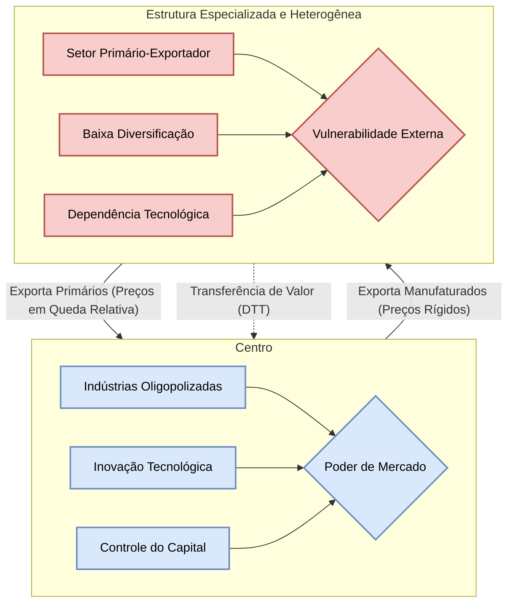

# A Crítica de Prebisch e da CEPAL: A Tese da Deterioração dos Termos de Troca e a Defesa da Industrialização

## Introdução: A Emergência de um Pensamento Econômico Periférico

O período que se seguiu à Segunda Guerra Mundial foi marcado pela consolidação de uma nova ordem econômica e política global, articulada em torno das instituições de Bretton Woods e da Organização das Nações Unidas (ONU). Nesse cenário, o pensamento econômico hegemônico, forjado nos grandes centros industriais do Atlântico Norte, gozava de um prestígio inconteste, apresentando suas teorias como universalmente válidas. Contudo, a realidade observada nos países da América Latina divergia frontalmente das previsões otimistas de convergência e ganhos mútuos emanadas da ortodoxia. Foi nesse contexto de dissonância entre teoria e realidade que emergiu a Comissão Econômica para a América Latina (CEPAL), criada em 1948 como uma das comissões regionais da ONU.

A CEPAL, sob a liderança intelectual do economista argentino Raúl Prebisch, rapidamente se converteu no epicentro de uma ruptura epistemológica sem precedentes. Em vez de aceitar passivamente as teorias importadas, a instituição propôs uma análise radicalmente nova, fundamentada no que Prebisch chamou de "uma interpretação autêntica da realidade latino-americana". Esta abordagem, que ficaria conhecida como o método histórico-estruturalista, rejeitava a "falsa pretensão de universalidade" das doutrinas clássicas e neoclássicas, argumentando que as leis econômicas não eram abstratas ou atemporais, mas sim condicionadas pela estrutura histórica e pela posição de cada país no sistema econômico mundial.

O marco fundador deste novo pensamento foi o documento de autoria de Prebisch intitulado "O Desenvolvimento Econômico da América Latina e seus Principais Problemas", publicado em 1949. Apresentado na Conferência de Havana, o texto rapidamente se tornou conhecido como o "Manifesto da CEPAL" e estabeleceu os pilares conceituais que orientariam a instituição por décadas. Nele, Prebisch introduziu sua análise seminal da economia mundial, dividida em um sistema assimétrico de **Centro-Periferia**, e lançou um ataque frontal à tradicional divisão internacional do trabalho, que, segundo ele, condenava a América Latina a uma condição de subdesenvolvimento crônico. A CEPAL, portanto, não nasceu como um mero órgão técnico, mas como um projeto intelectual revolucionário, representando a primeira grande iniciativa institucional do Sul Global para construir um paradigma próprio e desafiar a hegemonia cognitiva do Norte.

## A Crítica Estruturalista à Teoria Clássica do Comércio Internacional

A análise cepalina parte de uma crítica fundamental à aplicabilidade da teoria clássica do comércio internacional à realidade dos países subdesenvolvidos. O ponto de partida não é um ajuste de modelos, mas uma reinterpretação completa da dinâmica da economia mundial, baseada no conceito de sistema Centro-Periferia.

### O Contexto Histórico-Estrutural: O Sistema Centro-Periferia

O diagnóstico cepalino inicia-se com uma constatação empírica: o progresso técnico e o crescimento econômico dos países industrializados, o "centro", não se propagavam de maneira uniforme e benéfica para os países especializados na exportação de produtos primários, a "periferia". A economia mundial não era um espaço homogêneo de trocas entre iguais, mas um sistema hierárquico e estruturalmente desigual.

De um lado, o **centro** era caracterizado por uma estrutura produtiva diversificada e homogênea. A industrialização havia criado uma economia complexa, com fortes encadeamentos intersetoriais e capacidade de gerar e difundir internamente o progresso técnico. Do outro lado, a **periferia** possuía uma estrutura produtiva especializada e heterogênea. A especialização na produção de um ou poucos bens primários para exportação convivia com um vasto setor de subsistência de baixa produtividade, resultando em uma economia desarticulada. Nesse modelo, o setor primário-exportador, embora pudesse ser dinâmico, atuava como um enclave, incapaz de irradiar modernização para o restante da economia, de elevar a produtividade geral e, crucialmente, de sustentar o crescimento dos salários reais da população. O subdesenvolvimento, portanto, não era visto como uma "etapa" prévia ao desenvolvimento, mas como o resultado direto e persistente do modo de inserção da periferia na divisão internacional do trabalho.

### A Desconstrução da Teoria das Vantagens Comparativas

Armada com esse diagnóstico estrutural, a CEPAL dirigiu sua crítica mais contundente à teoria das vantagens comparativas de David Ricardo, a pedra angular da defesa do livre-comércio. A teoria ricardiana, em sua essência, postula que todos os países se beneficiam do comércio ao se especializarem na produção dos bens em que possuem um custo de oportunidade relativamente menor. A especialização e o livre intercâmbio levariam a uma alocação mais eficiente dos recursos globais, maximizando a produção e o bem-estar de todas as nações.

Prebisch ataca o pilar sobre o qual todo o edifício ricardiano se sustenta: a premissa, muitas vezes implícita, de que os frutos do progresso técnico são distribuídos equitativamente entre os parceiros comerciais. Para a CEPAL, esta premissa é "terminantemente negada pelos fatos". Devido às profundas assimetrias estruturais entre centro e periferia, a especialização em produtos primários, longe de ser uma via para a prosperidade, tornava-se uma armadilha. O que a teoria clássica apresentava como uma "vantagem" natural era, na verdade, uma desvantagem estrutural que aprisionava a periferia em um padrão de produção de baixo dinamismo tecnológico e a condenava a uma relação de dependência e subordinação. A divisão internacional do trabalho, assim, deixava de ser um arranjo técnico de eficiência para ser vista como um mecanismo político de reprodução da desigualdade global.

## A Tese Central: A Deterioração Secular dos Termos de Troca (DTT)

No coração da crítica cepalina reside sua contribuição teórica mais original e influente: a tese da tendência secular à deterioração dos termos de troca. Esta tese não apenas forneceu a principal evidência contra a teoria das vantagens comparativas, mas também explicou o mecanismo pelo qual o sistema Centro-Periferia se reproduzia e aprofundava a desigualdade.

### Definição Conceitual e Fundamento Empírico

> [!definition] **Termos de Troca (TdT):** A relação entre o índice de preços dos produtos de exportação (Px​) de um país e o índice de preços de seus produtos de importação (Pm​). A fórmula é expressa como TdT=(Px​/Pm​). Uma deterioração, ou queda no valor dos TdT, significa que o país precisa exportar um volume físico cada vez maior de seus produtos para conseguir importar a mesma quantidade de bens e serviços do exterior.

A hipótese, formulada de maneira independente e quase simultânea por Raúl Prebisch na CEPAL e por Hans Singer na ONU, ficou conhecida como a **tese Prebisch-Singer**. Ela postula que existe uma tendência de longo prazo (secular) para que os preços dos produtos primários (exportados pela periferia) caiam em relação aos preços dos produtos manufaturados (exportados pelo centro). O fundamento empírico inicial para esta tese veio da análise de séries estatísticas do comércio do Reino Unido, que, desde o final do século XIX até a década de 1940, mostravam uma clara tendência de melhora nos seus termos de troca, o que implicava uma deterioração para seus parceiros comerciais primário-exportadores. Embora a metodologia e os dados tenham sido objeto de intenso debate, a tese forneceu um poderoso ponto de partida para a investigação das causas estruturais do subdesenvolvimento.

### A Mecânica da Deterioração: Uma Análise das Assimetrias Estruturais

Prebisch e a CEPAL não se contentaram com a constatação empírica. Eles desenvolveram uma sofisticada explicação teórica para a DTT, baseada em duas assimetrias fundamentais entre as estruturas econômicas e sociais do centro e da periferia.

#### A Diferença na Elasticidade-Renda da Demanda

O primeiro mecanismo explicativo reside na natureza distinta dos bens produzidos e exportados pelos dois polos do sistema. A **elasticidade-renda da demanda** mede como a demanda por um bem reage a variações na renda dos consumidores.

- **Na Periferia:** Os produtos de exportação típicos — alimentos e matérias-primas — possuem uma **baixa elasticidade-renda da demanda**, geralmente menor que 1. Isso significa que, à medida que a renda mundial cresce, a demanda por esses produtos cresce em uma proporção menor. Este fenômeno está associado à Lei de Engel, que observa que as famílias gastam uma proporção decrescente de sua renda em alimentos à medida que enriquecem. Além disso, o progresso técnico no centro frequentemente leva à economia de matérias-primas ou à sua substituição por produtos sintéticos, deprimindo ainda mais a demanda.
    
- **No Centro:** Em contraste, os produtos manufaturados, especialmente os mais sofisticados e tecnologicamente avançados, possuem uma **alta elasticidade-renda da demanda**, maior que 1. À medida que a renda mundial aumenta, a demanda por esses bens cresce mais que proporcionalmente.
    

Essa assimetria fundamental gera uma tendência crônica ao desequilíbrio externo para a periferia. Como a demanda mundial por suas exportações cresce lentamente, enquanto sua demanda por importações (manufaturados) cresce rapidamente, os países periféricos enfrentam uma constante pressão sobre sua balança de pagamentos. Para manter o equilíbrio comercial sem endividamento, o crescimento econômico da periferia teria que ser sistematicamente mais lento que o do centro, o que perpetuaria a divergência de renda e o subdesenvolvimento.

#### A Apropriação Desigual dos Ganhos de Produtividade

> [!important] Este é o argumento mais profundo e original da análise cepalina. Ele transcende a análise de mercados de bens e penetra na estrutura social e de poder de cada polo, explicando por que o progresso técnico, que deveria beneficiar a todos, acaba por reforçar a desigualdade.

A tese central é que os ganhos de produtividade resultantes do avanço tecnológico são distribuídos de maneiras radicalmente diferentes no centro e na periferia.

- **No Centro:** Os ganhos de produtividade são **apropriados internamente** e se convertem em maiores rendas para os fatores de produção (trabalho e capital). Isso ocorre devido a duas características estruturais:
    
    1. **Mercados de Trabalho Organizados:** A presença de sindicatos fortes e um relativo baixo excedente de mão de obra conferem aos trabalhadores poder de barganha para reivindicar e obter aumentos salariais que acompanham os ganhos de produtividade.
        
    2. **Estruturas Industriais Oligopolizadas:** As indústrias nos países centrais operam em mercados de concorrência imperfeita. As empresas, em vez de repassar a totalidade dos ganhos de produtividade aos consumidores na forma de preços mais baixos, retêm uma parcela significativa como lucros mais elevados.
        
        O resultado é que os preços dos bens manufaturados são "pegajosos" para baixo (sticky downwards). O progresso técnico não leva a uma queda proporcional nos preços, mas sim a um aumento da renda nominal no centro.
        
- **Na Periferia:** Ocorre o processo inverso. Os ganhos de produtividade são **transferidos para o exterior** através da queda dos preços de exportação.
    
    1. **Mercados de Trabalho Desorganizados:** A existência de um vasto excedente de mão de obra no setor de subsistência (subemprego estrutural) e a fragilidade ou inexistência de sindicatos no setor primário-exportador impedem que os trabalhadores se apropriem dos ganhos de produtividade. Os salários permanecem estagnados em níveis de subsistência.
        
    2. **Estruturas de Mercado Competitivas:** O setor de produção de commodities opera em mercados que se aproximam da concorrência perfeita. Os produtores individuais são tomadores de preço. Quando o progresso técnico aumenta a produtividade (por exemplo, uma nova semente que aumenta a colheita), a oferta agregada se expande. Dada a demanda inelástica, a concorrência entre os inúmeros produtores força os preços para baixo.
        
        O resultado é um paradoxo trágico: o esforço de modernização e o aumento da eficiência na periferia não se traduzem em maior bem-estar interno. Em vez disso, beneficiam os consumidores e industriais do centro, que passam a adquirir alimentos e matérias-primas a preços relativamente mais baixos. A periferia, na prática, subsidia o desenvolvimento do centro.
        

A tabela a seguir sintetiza as assimetrias estruturais que fundamentam o argumento cepalino.

|Característica Estrutural|Centro (Países Industrializados)|Periferia (Países Agroexportadores)|
|---|---|---|
|**Estrutura Produtiva**|Diversificada e homogênea|Especializada e heterogênea|
|**Mercado de Trabalho**|Organizado (sindicatos fortes), baixo excedente de mão de obra|Desorganizado, alto subemprego estrutural|
|**Estrutura de Mercado (Setor Exportador)**|Oligopolista / Concorrência Monopolística|Próximo à concorrência perfeita|
|**Elasticidade-Renda da Demanda (Exportações)**|Alta (>1)|Baixa (<1)|
|**Apropriação dos Ganhos de Produtividade**|Internalizados como maiores salários e lucros|Externalizados como preços mais baixos|

### Consequências da DTT

A deterioração secular dos termos de troca impõe severos constrangimentos ao desenvolvimento da periferia:

1. **Armadilha do Crescimento e Transferência de Renda:** A periferia é forçada a um "crescimento empobrecedor". Para manter sua capacidade de importar os bens de capital e a tecnologia necessários para a modernização, ela precisa aumentar constantemente o volume físico de suas exportações, o que por sua vez pode pressionar ainda mais os preços para baixo. Configura-se uma transferência contínua de renda real da periferia para o centro.
    
2. **Obstáculo à Acumulação de Capital:** A DTT mina a capacidade da periferia de gerar poupança interna e acumular capital. O excedente econômico gerado pelo progresso técnico, em vez de ser reinvestido para diversificar a economia, é transferido para o exterior. Sem acumulação de capital robusta, o processo de desenvolvimento fica comprometido em sua raiz.
    
3. **Vulnerabilidade Externa:** A dependência de um ou poucos produtos primários, cujos preços não apenas tendem a cair no longo prazo, mas também são extremamente voláteis no curto prazo, torna as economias periféricas altamente vulneráveis a choques externos e aos ciclos de expansão e recessão dos países centrais.
    

## A Proposta Terapêutica: A Industrialização por Substituição de Importações (ISI)

Diante de um diagnóstico tão contundente, a inação não era uma opção. Se a especialização primária, ditada pela divisão internacional do trabalho, era a causa do problema, a solução teria que vir de uma mudança radical nessa especialização. A proposta terapêutica formulada pela CEPAL foi a **Industrialização por Substituição de Importações (ISI)**.

### A ISI como Resposta Lógica ao Diagnóstico Cepalino

A ISI não foi uma escolha arbitrária de política, mas a consequência lógica e direta da análise da DTT. Se a estrutura produtiva era a raiz do subdesenvolvimento, a única saída era promover uma deliberada e profunda **transformação estrutural**. O objetivo era romper com a armadilha da especialização primária e construir internamente um setor industrial dinâmico.

A industrialização era vista como a estratégia para atacar as causas da DTT em suas duas frentes. Primeiramente, ao produzir bens manufaturados, a periferia passaria a ter uma estrutura produtiva mais complexa e voltada para bens com **alta elasticidade-renda da demanda**. Em segundo lugar, e mais importante, a industrialização criaria as condições para a **internalização dos ganhos de produtividade**. A urbanização e a criação de empregos industriais poderiam absorver o excedente de mão de obra, fortalecer os sindicatos e, com o tempo, criar estruturas de mercado menos competitivas, permitindo que os aumentos de produtividade se traduzissem em maiores salários e lucros, alimentando um ciclo virtuoso de crescimento puxado pela demanda interna. O objetivo final não era a autarquia ou o fechamento ao comércio mundial, mas sim reconfigurar a inserção da periferia em bases mais equitativas e dinâmicas.

### O Papel do Estado e os Instrumentos de Política

A CEPAL argumentava que essa transformação estrutural jamais ocorreria de forma espontânea. As forças de mercado, deixadas a si mesmas, apenas reforçariam a especialização primária existente, pois as indústrias nascentes da periferia não teriam como competir com as indústrias maduras e eficientes do centro. Portanto, a industrialização exigia a ação deliberada e protagonista do **Estado**.

O Estado deveria liderar o projeto de desenvolvimento, utilizando um conjunto de instrumentos de política econômica para proteger e fomentar a indústria nacional:

- **Políticas Protecionistas:** A principal ferramenta era a proteção da "indústria nascente". Isso era feito através de políticas comerciais ativas, como a imposição de **altas tarifas de importação** sobre bens de consumo manufaturados e a utilização de **barreiras não-tarifárias**, como cotas de importação e complexos regimes de licenciamento e controle cambial.
    
- **Fomento e Financiamento:** A ação estatal ia além da proteção. Incluía a concessão de **subsídios e crédito direcionado** a juros baixos para os setores industriais prioritários, além de **investimentos públicos diretos** em infraestrutura (energia, transportes) e em indústrias de base (siderurgia, petroquímica), consideradas estratégicas e com alto custo de entrada para o capital privado.
    

Nesse arranjo, o setor primário-exportador não era abandonado, mas sua função estratégica era redefinida. Ele deixava de ser o motor do crescimento para se tornar o **gerador de divisas** (moeda estrangeira) necessárias para financiar a importação de bens de capital, insumos intermediários e tecnologia que a indústria nascente ainda não conseguia produzir.22 A ISI era, portanto, um projeto de engenharia estrutural, onde o Estado orquestrava uma complexa transferência de recursos do setor primário para o novo setor industrial.

## Síntese Estratégica e Legado

A contribuição da CEPAL representa um corpo teórico coerente, cuja lógica interna conecta de forma robusta a observação da realidade, o diagnóstico crítico, a formulação teórica e a proposta de política econômica.

### Diagrama da Dinâmica Centro-Periferia

O diagrama a seguir visualiza a lógica do sistema Centro-Periferia e o mecanismo da deterioração dos termos de troca.

### A Coerência Lógica do Argumento Cepalino: Uma Cadeia Causal

Para fins de revisão estratégica, a lógica do pensamento cepalino clássico pode ser resumida na seguinte cadeia causal:

- **Observação Empírica:** Constatação de um crescimento desigual entre as nações industrializadas e as agroexportadoras no pós-guerra.
    
- **Crítica Teórica:** A teoria das vantagens comparativas é inadequada para explicar essa divergência, pois sua premissa de distribuição equitativa dos ganhos do comércio é falsa.
    
- **Diagnóstico Estrutural:** A causa fundamental da desigualdade é a divisão da economia mundial no sistema **Centro-Periferia**.
    
- **Mecanismo Central:** O principal mecanismo de reprodução dessa desigualdade é a **Deterioração Secular dos Termos de Troca (DTT)**.
    
- **Causas da DTT:** A deterioração é explicada por duas assimetrias: (1) a diferença na **elasticidade-renda da demanda** e, mais profundamente, (2) a **apropriação desigual dos ganhos de produtividade**, decorrente de diferenças nas estruturas de mercado e de trabalho.
    
- **Proposta Terapêutica:** A única solução lógica é a **mudança estrutural** para romper com a especialização primária, implementada através da **Industrialização por Substituição de Importações (ISI)**, liderada ativamente pelo Estado.
    

### Perspectivas Críticas e a Evolução do Pensamento Cepalino

O pensamento cepalino e a política de ISI foram alvo de intensas críticas de diferentes vertentes ideológicas.

- **Críticas Neoclássicas ("Direita"):** Economistas ortodoxos questionaram a validade empírica da tese da DTT para todos os produtos e períodos. Criticaram duramente a ISI por gerar ineficiências alocativas, indústrias de alto custo e baixa qualidade, distorções de preços e por fomentar a corrupção e um Estado excessivamente interventor, que sufocaria a iniciativa privada.
    
- **Críticas da Teoria da Dependência ("Esquerda"):** Autores como Fernando Henrique Cardoso, embora partindo da análise cepalina, consideravam-na "reformista" e insuficiente. Argumentavam que a CEPAL não dava a devida centralidade à análise das classes sociais e ao papel do capital internacional. Para os dependentistas, a ISI não rompia a dependência, mas apenas a transformava: a dependência comercial e financeira do passado dava lugar a uma nova e mais profunda dependência tecnológica e financeira, consolidando um "desenvolvimento associado" e subordinado aos interesses do capital multinacional.
    

Apesar das críticas e dos problemas reais enfrentados pelos países que implementaram a ISI (como crises de balanço de pagamentos e inflação), o legado do pensamento cepalino é inegável. Ele inaugurou uma tradição de pensamento econômico original e autônomo na América Latina, colocou a questão do desenvolvimento e da desigualdade no centro do debate acadêmico e político, e influenciou gerações de economistas e formuladores de políticas na região e em todo o mundo em desenvolvimento.

## Questões para Autoavaliação (Active Recall)

> [!question] Questão 1: Explique detalhadamente o mecanismo de "apropriação desigual dos ganhos de produtividade" segundo a tese de Prebisch-Singer. Como as diferenças nas estruturas de mercado e de trabalho entre o centro e a periferia resultam na deterioração dos termos de troca?

> [!question] Questão 2: Discorra sobre a crítica da CEPAL à teoria das vantagens comparativas. Por que, na visão cepalina, a especialização em produtos primários constitui uma "armadilha" para o desenvolvimento e como a política de Industrialização por Substituição de Importações (ISI) foi proposta como uma solução lógica para essa armadilha?

> [!question] Questão 3: Analise a relação causal entre a tese da deterioração dos termos de troca e a diferença na elasticidade-renda da demanda por bens primários e manufaturados. Como essa assimetria impõe uma restrição estrutural ao crescimento dos países periféricos?