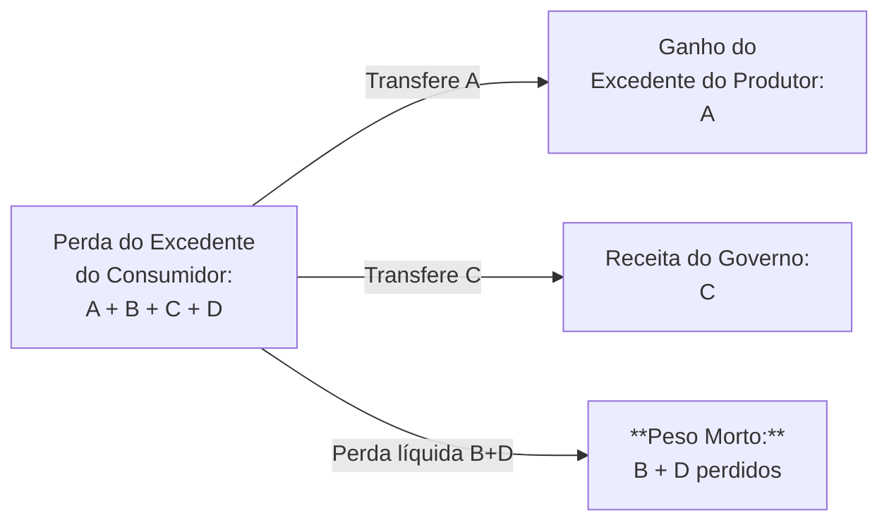

# Instrumentos de Política Comercial: Tarifas, Cotas, Subsídios e Barreiras Não-Tarifárias

## Introdução

A política comercial refere-se ao conjunto de medidas que um governo utiliza para regular o comércio exterior de bens e serviços. Esses **instrumentos de política comercial** podem ter caráter **liberalizante** (facilitando importações e exportações) ou **protecionista** (dificultando a entrada de produtos estrangeiros para favorecer produtores nacionais). Desde as políticas mercantilistas dos séculos XV-XVIII até as regras atuais da [[OMC e Comércio Internacional|Organização Mundial do Comércio (OMC)]], os países vêm alternando períodos de abertura e proteção comercial conforme seus objetivos econômicos e políticos. É fundamental compreender os principais instrumentos de política comercial – **tarifas**, **cotas**, **subsídios**, **barreiras não-tarifárias**, **medidas antidumping**, **exigências de conteúdo local**, entre outros – bem como seus mecanismos de funcionamento, efeitos econômicos (micro e macro), justificativas políticas, críticas teóricas e implicações para o bem-estar.

Em termos gerais, instrumentos como tarifas e cotas impactam diretamente a **oferta e demanda** de mercado, alterando preços e quantidades comercializadas. Já instrumentos como subsídios, regras técnicas ou conteúdo local atuam de forma indireta nos custos de produção e nas preferências do mercado. Cada ferramenta possui motivações políticas específicas – desde a proteção de indústrias nascentes até preocupações de segurança nacional – e todas tendem a gerar **ganhadores e perdedores internos**, levantando debates sobre eficiência econômica e distribuição de renda. Nos próximos tópicos, exploraremos em profundidade cada instrumento e seus impactos, traçando conexões com a experiência brasileira, o direito internacional econômico (OMC/GATT) e a história econômica e geopolítica.

_(Sugestão de gráfico: **Curva de oferta e demanda com livre-comércio vs. protecionismo**, ilustrando a diferença entre equilíbrio de mercado aberto e mercado com restrições. Por exemplo, representar a demanda e oferta domésticas de um bem, mostrando como a introdução de uma tarifa ou cota eleva o preço interno acima do preço mundial, reduzindo a quantidade importada.)_

## Tarifas de Importação

**Tarifas de importação** (ou tarifas alfandegárias) são impostos cobrados sobre produtos estrangeiros que entram no país. Trata-se do instrumento de política comercial mais tradicional e explícito: ao impor uma tarifa (ad valorem ou específica) sobre um bem importado, o governo eleva o preço desse bem no mercado interno, desestimulando seu consumo e tornando os produtos nacionais relativamente mais competitivos. As tarifas podem ter dupla finalidade – **fiscal** (gerar arrecadação para o Estado) ou **protetiva** (encarecer produtos externos para proteger a indústria doméstica). Historicamente, antes do estabelecimento de impostos de renda e consumo modernos, muitas nações obtinham parcela relevante de receita através de tarifas de importação; hoje, seu uso está mais associado a políticas protecionistas do que arrecadatórias.

**Mecanismo e efeitos microeconômicos:** Imagine um bem qualquer (por exemplo, calçados) cujo preço no mercado mundial é menor que o preço que seria praticado internamente sem comércio. Com livre-comércio, os consumidores domésticos podem adquirir esse produto importado a um preço baixo, importando a diferença entre o que a demanda interna deseja e a oferta doméstica consegue suprir. Ao impor uma tarifa, o governo adiciona um custo (por exemplo, 20%) sobre o preço do bem importado. Isso desloca para cima o **preço interno** do produto de importação – digamos que o preço suba de _P₁_ (livre-comércio) para _P₂_ (com tarifa). Com o preço mais alto, a **quantidade demandada** pelos consumidores nacionais cai, a **produção doméstica** aumenta (pois produtores locais conseguem competir melhor a _P₂_) e as **importações** encolhem substancialmente. Em termos gráficos, a tarifa _t_ eleva o preço doméstico e provoca um **novo equilíbrio** com menor consumo total e menor participação das importações. Os resultados distributivos imediatos são os seguintes:

- Os **produtores domésticos** do bem protegido obtêm um ganho de excedente (área correspondente ao aumento do preço vezes o aumento da produção doméstica) porque podem vender mais caro e expandir sua produção. Eles são favorecidos pela tarifa, que atua como “muralha” contra a concorrência externa.
    
- Os **consumidores domésticos** perdem, pois passam a pagar um preço maior pelo produto (seja nacional ou importado) e/ou consumir uma quantidade menor do bem. Há uma redução do **excedente do consumidor**, cujo montante é proporcional à elevação de preço e à contração do consumo.
    
- O **governo** obtém **receita tarifária** ao cobrar o imposto sobre cada unidade importada remanescente. Essa receita é calculada como _t_ vezes o volume importado após a tarifa. Trata-se de uma transferência do setor privado (consumidores) para o setor público.
    
- A sociedade, como um todo, tende a experimentar uma **perda líquida de bem-estar** (também chamada de _deadweight loss_ ou perda de eficiência). Essa perda advém das distorções introduzidas: parte do consumo é destruído (os consumidores que deixam de consumir porque o preço subiu, perda representada pelas áreas de triângulo no gráfico de oferta e demanda) e parte dos recursos são alocados em produção doméstica menos eficiente quando comparada à alternativa importada (custo maior para produzir internamente aquilo que antes era importado mais barato). No caso de um país pequeno, que não influencia o preço mundial, a soma dessas perdas de eficiência (perda de consumidores + perda de eficiência produtiva) representa o **custo líquido do protecionismo** para a economia doméstica.

![[Pasted image 20250528132517.png]]
_Figura: Diagrama conceitual de oferta e demanda ilustrando os efeitos de uma tarifa de importação em um país pequeno. P₁ representa o preço mundial (livre-comércio) e P₂ o preço interno após a tarifa. A área sombreada (1+2+3+4) indica a perda de excedente do consumidor devido à tarifa, enquanto a receita do governo corresponde à área 3 e o ganho do produtor doméstico à área 1. O triângulo (áreas 2+4) representa a **perda líquida de bem-estar** decorrente das ineficiências introduzidas pela proteção tarifária._

Em resumo, numa situação de pequena economia (sem poder de mercado internacional), uma tarifa gera **ganhos privados concentrados** (para produtores nacionais e eventualmente governo) e **custos dispersos** maiores (para consumidores), resultando em uma perda líquida de eficiência. Se o país for grande o suficiente para afetar os preços internacionais, entretanto, há uma possibilidade teórica de ganho nacional via tarifa: ao reduzir sua demanda de importação, o país grande força uma queda do preço mundial do bem importado, melhorando seus **termos de troca**. Nesse caso, parte do custo da tarifa recai sobre os produtores estrangeiros (que recebem menos pelo produto), e o governo do país grande pode capturar esse ganho externo. Essa é a chamada **tarifa ótima** em teoria – estabelecer um imposto de importação que maximize o bem-estar nacional explorando o poder de monopólio de importador. Porém, na prática, essa estratégia enfrenta retaliação de parceiros comerciais e é limitada pelas regras da OMC, além de só ser aplicável para economias muito influentes em determinados mercados.

**Efeitos macroeconômicos e setoriais:** No âmbito macro, *tarifas generalizadas* tendem a **reduzir as importações** e melhorar o saldo comercial de bens (pelo menos no curto prazo, se outros fatores mantidos constantes). Pode haver um impacto anti-inflacionário ou inflacionário dependendo do contexto: tarifar bens importados encarece o custo desses bens e de insumos importados, o que pressiona a inflação internamente; por outro lado, em certas situações de sobreoferta global, tarifas podem afastar choques externos de preços. Em termos de emprego e produção, a proteção tarifária pode **salvar empregos** nos setores protegidos ou estimular temporariamente a produção doméstica nesses ramos. Contudo, isso muitas vezes ocorre à custa de empregos em setores consumidores de insumos importados (que enfrentam custos maiores) ou no setor exportador (que pode ser retaliado por parceiros ou sofrer com realocação de recursos para setores ineficientes). Em longo prazo, um nível elevado de proteção tarifária pode desestimular ganhos de produtividade e inovações na indústria doméstica, já que as empresas passam a depender do mercado cativo interno e enfrentam menos concorrência para se atualizar tecnologicamente. *Assim, estudos econômicos frequentemente associam tarifas elevadas a menor crescimento de produtividade e menor poder de compra da população (devido a preços internos altos)*. Vale ressaltar também o efeito fiscal: em países de baixa capacidade tributária interna, a tarifa de importação é um meio fácil de arrecadação. Entretanto, se for bem-sucedida em reduzir importações, a base tributária acaba diminuindo, limitando a receita no longo prazo.

**Justificativas políticas:** Diversos argumentos são tradicionalmente evocados para justificar a imposição de tarifas. O mais célebre é o **argumento da indústria nascente** (_infant industry_): economistas como ==Friedrich List== no século XIX defenderam que economias em estágio inicial de industrialização não conseguem competir de imediato com indústrias estabelecidas de nações desenvolvidas, de modo que tarifas temporárias seriam necessárias para proteger e nutrir esses setores emergentes até que alcancem escala e eficiência. Esse argumento influenciou profundamente a política comercial de países como os Estados Unidos (no século XIX) e o Brasil (especialmente a partir da Era Vargas), e foi reconhecido no próprio texto do GATT 1947 como uma possível exceção para países em desenvolvimento poderem adotar alguma proteção. Outras justificativas comuns incluem:

- **Segurança nacional:** Proteger indústrias consideradas estratégicas (como defesa, energia ou alimentos) para que o país não fique vulnerável a potências estrangeiras em caso de conflito ou crise. Por exemplo, tarifas podem resguardar a produção doméstica de equipamentos militares ou abastecimento de certos alimentos. Recentemente, esse argumento foi invocado pelos EUA para tarifar importações de aço, alegando riscos à segurança nacional – embora com ceticismo de analistas.
    
- **Proteção de empregos e renda:** Tarifas são por vezes apresentadas como uma forma de salvar empregos domésticos ameaçados pela concorrência importada. Setores tradicionais com forte impacto regional (agrícola, têxtil, siderúrgico etc.) costumam pleitear tarifas para evitar perdas de postos de trabalho. Politicamente, governos respondem a essas pressões para evitar custos sociais de desemprego concentrado em certos setores.
    
- **Retaliação ou barganha comercial:** Uma tarifa elevada pode ser usada como moeda de troca em negociações – reduzida em troca de acesso a mercados externos – ou como retaliação caso outro país aplique medidas consideradas injustas. Por exemplo, em disputas comerciais, não é incomum anunciar tarifas de retaliação para pressionar a outra parte a voltar atrás em alguma barreira.
    
- **Melhora na balança de pagamentos:** Em contextos de crises externas (escassez de moeda estrangeira), alguns governos impuseram tarifas de emergência ou sobretaxas de importação para frear a saída de divisas. Embora a ortodoxia econômica ressalte que isso é paliativo e que a taxa de câmbio se ajusta endogenamente, na prática vários países já usaram tarifas temporárias com essa justificativa.
    
- **Arrecadação fiscal:** Como mencionado, apesar de hoje ser secundário em muitos países, ainda pode-se justificar tarifas moderadas em certos produtos simplesmente para obter receita pública, principalmente se incidem sobre bens de consumo supérfluos ou de luxo (uma espécie de “imposto seletivo” via comércio).
    

Politicamente, tarifas costumam ser atraentes porque seus benefícios (produtores, empregos preservados) são imediatamente visíveis e concentrados, enquanto os prejuízos (distribuídos entre milhões de consumidores pagando um pouco a mais) são difusos e menos percebidos. Essa assimetria explica por que, mesmo que o livre-comércio traga ganhos líquidos para a sociedade, governos frequentemente cedam ao lobby protecionista de indústrias específicas.

**Críticas e implicações no bem-estar:** A crítica econômica clássica às tarifas remonta a Adam Smith e David Ricardo, fundadores do ideário livre-cambista. Eles argumentavam que **tarifas distorcem a alocação eficiente de recursos**, forçando um país a produzir bens nos quais ele não é tão eficiente (perdendo os benefícios da **vantagem comparativa**) e privando os consumidores de acesso a produtos mais baratos. Em linguagem moderna, a tarifa cria **perdas de bem-estar** ao gerar **perdas secas** (deadweight losses) em forma de menor excedente do consumidor e custos produtivos adicionais não compensados por ganhos equivalentes. A única exceção teórica – a tarifa ótima de um país grande – é vista com ceticismo porque ignora a retaliação: se todos os países tentarem impor tarifas ótimas, o resultado é uma **guerra comercial** generalizada, na qual o comércio global retrai e todas as nações acabam em situação pior. Esse cenário ocorreu notoriamente nos anos 1930, quando a elevação de tarifas (ex.: tarifa Smoot-Hawley nos EUA, 1930) levou a retaliações em cascata, aprofundando a Grande Depressão e deteriorando o bem-estar global.

Do ponto de vista de bem-estar doméstico, as tarifas geram um **dilema distribuição vs. eficiência**: beneficiam grupos específicos (produtores e trabalhadores desses setores) e podem atender a objetivos não-econômicos (segurança, industrialização), porém impõem um custo econômico para a maioria dos consumidores e setores não protegidos. No longo prazo, protecionismo tarifário prolongado pode criar **indústrias “adolescentes” perpétuas**, viciadas em proteção e sem incentivo para alcançar competitividade, o que foi criticado por autores liberais e até por desenvolvimentistas moderados. Raúl Prebisch, por exemplo, embora defensor de proteção temporária para industrialização da periferia, reconheceu mais tarde que **excesso de proteção** pode ser prejudicial e defendeu integração regional e exportações para induzir eficiência. De fato, a experiência histórica da América Latina no pós-guerra mostrou que a **substituição de importações** via tarifas e cotas trouxe crescimento inicial, mas, ao se prolongar sem competitividade, resultou em setores pouco eficientes, inflacionários e dependentes de insumos importados caros, levando a crises nos anos 1980.

**Contexto e aspectos legais (OMC/GATT):** As tarifas alfandegárias são o instrumento de proteção **permitido** pelo GATT/OMC, porém dentro de limites negociados. Os países-membros acordaram **consolidações tarifárias**, ou seja, tetos de tarifa para cada produto na sua lista de compromissos. Aplicar tarifa acima do consolidado viola as regras, a menos que compensações sejam oferecidas. Ao longo de sucessivas Rodadas do GATT (Genebra, Tóquio, Uruguai etc.), as nações reduziram consideravelmente os níveis máximos de tarifas em geral, promovendo uma tendência de **tarifa decrescente** globalmente. No entanto, persistem **picos tarifários** em setores sensíveis (agricultura, têxteis, calçados, automóveis), mesmo em países desenvolvidos, e **escaladas tarifárias** (tarifas maiores para bens manufaturados do que para matérias-primas), o que desfavorece a industrialização de países exportadores de básicos. A OMC privilegia tarifas como instrumento porque elas são transparentes e previsíveis, ao contrário de barreiras não-tarifárias. Ademais, práticas tarifárias especiais como **tarifas sazonais**, **tarifas específicas** ou **tarifas combinadas** existem, mas estão submetidas às mesmas disciplinas de consolidação. Por fim, vale mencionar as **tarifas de exportação** – impostos sobre bens que saem do país – as quais alguns países utilizam em commodities (por exemplo, Argentina taxa exportação de soja, para obter receita e manter preços domésticos mais baixos). Tarifar exportações não é proibido pelo GATT (exceto em certos acordos regionais ou se usado para fins alheios, como restringir exportação de alimentos em crise), mas seu efeito é inverso: reduz o preço interno do bem (bom para consumidor local, ruim para produtor) e pode prejudicar a confiança de compradores externos. No contexto brasileiro atual, as tarifas de importação médias ainda são relativamente altas (comparadas a OCDE) em vários setores, reflexo de um legado protecionista e da Tarifa Externa Comum do Mercosul. Nos últimos anos, contudo, discutem-se reduções unilaterais e acordos comerciais (ex: Mercosul-UE) que implicariam cortes tarifários, em busca de maior integração e aumento de produtividade.

## Cotas de Importação

**Cotas de importação** (quotas) são limites quantitativos estabelecidos pelo governo para a quantidade (ou valor) de um determinado bem que pode ser importado em um dado período. Diferentemente das tarifas – que permitem importações livres porém cobrando um imposto –, as cotas **restringem diretamente a quantidade** que pode entrar no mercado doméstico. Por exemplo, um país pode estipular que apenas 10 mil automóveis de determinado tipo poderão ser importados no ano. Essa fixação de quantidade tem efeitos similares aos da tarifa em elevar o preço interno, porém com importantes diferenças em termos de distribuição e eficiência.

**Mecanismo e efeitos:** Sob livre-comércio, a oferta adicional proveniente das importações satisfaz a demanda doméstica até o ponto de equilíbrio ao preço mundial. Ao se impor uma cota de importação, cria-se artificialmente uma **escassez relativa** após atingido o volume máximo permitido de importação. Uma vez preenchida a cota, qualquer demanda adicional dos consumidores terá de ser atendida pela produção doméstica (mais cara) ou ficará não satisfeita. Em consequência, o **preço interno** sobe acima do preço mundial até o ponto em que a quantidade demandada se iguala à oferta doméstica somada ao volume da cota. Em outras palavras, a cota “desliga” o abastecimento externo após um limite, deslocando a curva de oferta total para a esquerda. O resultado imediato é que o preço interno atinge um patamar _P₂_ tal que a diferença entre demanda e oferta local seja exatamente o montante da cota.

Os **efeitos microeconômicos** de uma cota guardam semelhanças e diferenças em relação a uma tarifa equivalente:

- Assim como na tarifa, **consumidores domésticos** enfrentam preços maiores e menor disponibilidade do produto, sofrendo perda de bem-estar (redução do excedente do consumidor).
    
- **Produtores domésticos** são beneficiados, pois com a limitação da concorrência estrangeira podem expandir sua produção e vender a preços mais altos no mercado interno. Ganham assim excedente do produtor equivalente, em princípio, ao que ganhariam sob uma tarifa que elevasse o preço ao mesmo nível.
    
- A grande diferença está em **quem se apropria da renda gerada pela elevação do preço interno**. No caso da tarifa, parte do sobrepreço pago pelos consumidores vira receita do governo (imposto). No caso da cota, não há imposto – mas o preço interno ainda assim se eleva acima do mundial. Essa diferença _P₂ vs. P₁_ multiplicada pela quantidade importada (cota) constitui um **ágio** ou **renda de quota**. Alguém irá capturar esse ganho. Em geral, quem obtiver a licença de importação para operar dentro da cota poderá comprar o produto no exterior a preço mundial _P₁_ e revender internamente a _P₂_, embolsando a diferença. Ou seja, a cota cria um **direito de monopólio** sobre a importação até certo volume, gerando lucros extraordinários para os **detentores das licenças de importação**.
    
- A distribuição dessa “renda de quota” depende da política adotada: se o governo **leiloar** as licenças de importação, poderia converter essa renda em receita pública (similar a tarifa). Entretanto, muitas vezes as licenças são concedidas a empresas domésticas importadoras (que então lucram) ou mesmo a exportadores estrangeiros específicos (por exemplo, via acordos de restrição voluntária, os exportadores estrangeiros decidem quem exporta quanto). Em alguns casos, essa renda pode até ser dissipada em práticas de corrupção, clientelismo ou ineficiência (lobby feroz para obter licenças, etc.).
    
- Assim, do ponto de vista de **bem-estar nacional**, uma cota tende a ser **mais prejudicial que uma tarifa**, porque a perda dos consumidores não é compensada por receita para o governo (a não ser no caso de licitações transparentes). Se a renda de quota for para agentes domésticos (importadores locais), ela é uma transferência interna, atenuando a perda nacional – mas se vai para estrangeiros (digamos, exportadores estrangeiros conseguem elevar seus preços ou selecionar vendas para maximizar lucro sob a cota), então o país importador perde _mais_ do que na tarifa equivalente.
    
- Adicionalmente, as cotas têm um efeito colateral: **rigidez na resposta a choques de demanda ou oferta**. Por exemplo, se a demanda doméstica crescer além do esperado, a cota fixa impede que importações supram esse excesso, levando a aumentos de preço muito mais bruscos do que ocorreria com tarifa (que ao menos deixa entrar quantidades adicionais mediante pagamento do imposto). Essa inflexibilidade pode gerar ineficiências dinâmicas e prêmios ainda maiores ao detentor da cota.
    

Do ponto de vista **macroeconômico**, cotas físicas limitam o gasto com importações a um teto pré-determinado (podendo ajudar no curto prazo o balanço de pagamentos), mas não geram nenhuma arrecadação direta e podem estimular **práticas ilícitas** (contrabando) quando a demanda supera a cota. Além disso, uma cota não oferece incentivo para melhora de eficiência: se a demanda aumenta, o efeito é simplesmente subir o preço interno e aumentar o lucro de quem possui a licença, sem entrada de novos competidores. Com o tempo, isso pode alimentar **grupos de interesse poderosos** – os beneficiários das licenças – que passam a pressionar pela manutenção das cotas. Em termos de inflação, cotas podem ser mais inflacionárias que tarifas, pois a restrição quantitativa absoluta não permite atenuar pressões de demanda nem através do mecanismo de preço (a não ser que esse suba fortemente).

**Justificativas e usos políticos:** Governos usam cotas pelos mesmos motivos que utilizam tarifas – proteção industrial, segurança, etc. –, geralmente em casos em que desejam **certeza quanto ao resultado quantitativo**. Por exemplo, se o objetivo é garantir que _no máximo_ X unidades estrangeiras entrem (independentemente do preço), a cota traz essa garantia. Cotas também foram historicamente usadas em contextos de **acordos de “administração de comércio”**: um caso famoso foi o **Acordo Multifibras**, em que países desenvolvidos estabeleceram cotas para importação de têxteis e vestuário de países em desenvolvimento por décadas, protegendo suas indústrias. Outro caso são as **restrições voluntárias à exportação (VER)**, como quando o Japão “voluntariamente” limitou suas exportações de automóveis aos EUA nos anos 1980 sob pressão – embora a restrição fosse formalmente imposta pelo país exportador, na prática surgiu da ameaça de barreiras pelo importador, sendo equivalente a uma cota de importação disfarçada. Políticos às vezes preferem cotas porque seus efeitos são menos visíveis para o público em comparação a uma tarifa explícita; a elevação de preços pode ser atribuída ao “mercado” em vez de a um imposto governamental. Além disso, cotas podem ser setoriais e negociadas com parceiros (ex: acordos de cotas agrícolas em trocas de concessões).

**Críticas e aspectos legais:** As cotas são consideradas um instrumento mais distorcivo e menos transparente, motivo pelo qual o **GATT proíbe, como regra geral, restrições quantitativas** ao comércio (Artigo XI do GATT) – ou seja, cotas unilaterais são **vedadas**, salvo em situações excepcionais. As exceções incluem: *medidas para proteger balanço de pagamentos em crises externas (com critérios e supervisão)*, *quotas tarifárias decorrentes de acordos de liberação (ex: acesso mínimo a mercado agrícola)*, e *medidas de salvaguarda emergenciais (que podem assumir forma de cotas temporárias, veremos adiante)*. A Rodada Uruguai consolidou a eliminação de cotas agrícolas, convertendo-as em tarifas (processo de tarificação) justamente porque cotas eram vistas como mais protecionistas e menos claras. Portanto, hoje, fora casos excepcionais, um país membro da OMC não pode simplesmente fixar cotas de importação para proteger uma indústria – deve usar tarifas dentro dos limites consolidados. Essa disciplina reflete o consenso de que cotas geram maior perda de bem-estar. Afinal, a cota idealmente replicaria a tarifa se o governo leiloasse licenças (nesse caso ambos equivalentes), mas governos nem sempre o fazem; por isso, o resultado costuma ser ou **rent-seeking interno** (corrida por licenças) ou **transferência de renda a estrangeiros**, sem vantagem para o país importador.

Em termos práticos, cotas explícitas sobre produtos industriais caíram em desuso após os anos 1990 com as regras da OMC. Entretanto, **quotas tarifárias** (Tariff-Rate Quotas – TRQs) ainda existem: nessa modalidade “híbrida”, permite-se a importação de um volume _X_ com tarifa reduzida, e aplica-se tarifa mais alta às importações que excederem esse volume. As TRQs são comuns em agricultura, permitindo, por exemplo, que uma determinada quantidade de açúcar entre com tarifa baixa (quota fill) e, passado esse montante, aplica-se a tarifa cheia proibitiva. Embora melhorem o acesso inicial, mantêm a importação total controlada. Outra situação análoga a cota são **licenças de importação não automáticas** que alguns países utilizam para controlar volumes de importação de forma burocrática. No Brasil, durante o período de industrialização via substituição de importações (décadas de 1950-80), as cotas e licenças eram largamente empregadas – muitas vezes proibindo completamente certos bens (como automóveis no final dos anos 1980) – até serem abolidas com a abertura comercial dos anos 1990 e adesão às disciplinas da OMC. Desde então, o país não utiliza cotas de importação tradicionais, exceto aquelas acordadas internacionalmente (ex: cotas agrícolas em acordos ou regimes automotivos bilaterais em certos períodos).

Em suma, **cotas de importação** garantem um nível máximo de concorrência externa, mas ao custo de criar ineficiências maiores e favorecer esquemas de privilégio. Por isso, foram abandonadas como instrumento padrão, persistindo apenas em situações reguladas ou negociadas. A preferência internacional recai sobre tarifas, consideradas um mal menor frente às cotas.

## Subsídios

**Subsídios** no contexto de política comercial referem-se a **incentivos financeiros concedidos pelo governo** a produtores ou exportadores nacionais, de modo a fortalecê-los frente à concorrência internacional. Diferentemente de tarifas ou cotas, que prejudicam os concorrentes estrangeiros elevando o preço dos produtos importados, os subsídios **ajudam os produtores domésticos** reduzindo seus custos ou aumentando sua rentabilidade. Em termos amplos, subsídios podem assumir muitas formas: **subsídios à produção**, **subsídios à exportação**, **créditos com juros subsidiados**, **isenções fiscais** para setores específicos, **apoio a insumos** (como energia ou matéria-prima barata), entre outros. Aqui enfocaremos os subsídios relacionados ao comércio internacional de mercadorias, especialmente os subsídios à exportação e à produção voltada ao mercado interno, e suas consequências.

**Subsídios à produção interna:** O governo pode conceder um subsídio por unidade produzida de determinado bem, independentemente de seu destino (mercado interno ou exportação). Por exemplo, pagar R$ 5 por tonelada de aço produzida domesticamente. Esse incentivo desloca a **curva de oferta doméstica** para baixo (reduz custo efetivo), estimulando os produtores nacionais a ofertar mais a cada nível de preço. Em um mercado aberto, um subsídio à produção, se suficientemente alto, pode levar a indústria doméstica a aumentar sua participação de mercado **sem elevar o preço ao consumidor** – note que isso contrasta com a tarifa, na qual o preço interno sobe. Sob livre-comércio, o preço continua determinado pelo preço internacional (supondo país tomador de preços), mas agora os produtores locais produzem mais (pois recebem o preço de mercado mais o subsídio por unidade). O efeito microeconômico principal é: os **consumidores domésticos não são prejudicados**, pois continuam pagando P₁ (preço mundial); os **produtores domésticos** expandem produção e recebem por unidade P₁ + subsídio (melhorando sua rentabilidade); o **governo** arca com o custo fiscal de pagar o subsídio em cada unidade produzida. Assim, diferentemente de uma tarifa, o subsídio à produção **não cria um “sobrepreço” ao consumidor** nem contrai o consumo – ele atua somente do lado da oferta. Ainda assim, há uma **perda de eficiência**: o governo gasta recursos (oriundos de impostos gerais ou dívida) para apoiar uma produção que, em parte, está deslocando importações mais baratas. A **perda líquida de bem-estar** nacional corresponde ao custo fiscal menos o ganho dos produtores (que é o triângulo de eficiência desperdiçada por produzir localmente a um custo maior que o mundial). Em resumo, num país pequeno importador, um subsídio à produção tende a produzir menor distorção de consumo que uma tarifa equivalente, mas ainda incorre em custo fiscal e distorção produtiva. Em termos de bem-estar: consumidores neutros, produtores ganham, contribuinte/governo perde; podendo haver um saldo líquido negativo (pois o custo orçamentário geralmente supera a soma dos ganhos de produtores e consumidores – estes últimos nem ganham nem perdem diretamente, a não ser indiretamente via impostos futuros).

**Subsídios à exportação:** São incentivos dados por unidade exportada de um bem. Por exemplo, reembolsar impostos ao exportador, ou pagar 10% do valor exportado. Esse tipo de subsídio permite que os produtores nacionais vendam ao exterior a preços mais baixos que conseguiriam de outra forma, aumentando sua competitividade artificialmente. Sob livre-comércio, se o país é pequeno no mercado global, o subsídio à exportação não altera o preço internacional (tomado como dado), mas altera a **alocação doméstica**: os produtores, motivados pelo subsídio, passarão a direcionar mais produção ao mercado externo. Isso pode provocar **redução da oferta interna** do bem, o que por sua vez **eleva o preço doméstico** (os consumidores locais agora competem com a demanda externa subsidiada). Assim, paradoxalmente, um subsídio às exportações de um bem _prejudica os consumidores domésticos desse bem_, que veem o preço interno subir (aproximando-se do preço mundial mais subsídio, em alguns casos). Os **exportadores beneficiados** ampliam suas vendas e receitas (recebendo preço externo + subsídio por unidade). O **governo** paga o subsídio, incorrendo em gasto fiscal. E parte do benefício vai para os **consumidores estrangeiros**, que compram mais barato graças ao subsídio dado pelo país exportador (no limite, o preço mundial pode cair se o país tiver participação grande, beneficiando estrangeiros em geral). O efeito líquido em um país pequeno é claramente negativo: há um **transferência de bem-estar para fora** – o governo nacional gasta dinheiro para vender barato aos estrangeiros, enquanto os consumidores domésticos perdem excedente pois o bem encarece internamente; os únicos ganhadores nacionais são os produtores exportadores. Trata-se de um caso de “tiro no pé” econômico, a não ser que haja alguma razão estratégica ou externa para justificar. Num país grande, o subsídio à exportação pode reduzir o preço mundial do bem, melhorando a **termos de troca do importador estrangeiro** e piorando a do exportador (país que subsidia). Por isso mesmo, subsídios à exportação são vistos como práticas desleais de comércio – eles **concedem vantagem artificial** aos exportadores em detrimento de produtores estrangeiros e ainda prejudicam o país doador em termos financeiros.

**Outras formas de apoio:** Além dos subsídios diretos, há mecanismos como **crédito subsidiado à exportação** (empréstimos a juros baixos para compradores estrangeiros de bens domésticos), **seguros de crédito à exportação** com prêmios abaixo do mercado, **isenções tributárias** (não cobrar certos impostos se a produção for exportada, ou se usar insumos nacionais – que se cruza com conteúdo local), **subsídios a insumos ou infraestrutura** (fornecer eletricidade barata, transporte gratuito, terreno, etc., para setores exportadores ou estratégicos). Todos eles compartilham a característica de **socializar parte do custo de produção** daquele setor, aumentando sua rentabilidade ou reduzindo seu preço final.

**Justificativas políticas:** Por que um país subsidiaria voluntariamente seus produtores ou exportadores se isso pode causar perdas líquidas internas? Há várias motivações possíveis:

- **Promoção de indústrias estratégicas / nascentes:** Similar ao argumento da indústria nascente para tarifas, governos podem preferir subsidiar diretamente um setor em vez de elevar preços aos consumidores. Isso porque, como vimos, um subsídio à produção não encarece o bem internamente, evitando penalizar consumidores – ele atua via orçamento público. Se o país tem recursos fiscais, pode escolher esse instrumento “menos visível” e politicamente palatável para fomentar uma indústria nascente. Por exemplo, muitos países subsidiaram setores como o de alta tecnologia, energia renovável ou indústria bélica visando criar campeões nacionais.
    
- **Competição internacional e efeitos externos:** Em mercados oligopolísticos globais, existe o argumento da **política comercial estratégica**: um subsídio a uma empresa doméstica pode permitir que ela ganhe participação de mercado mundial às custas de rivais estrangeiros, potencialmente gerando lucro no longo prazo que compense o custo inicial. Teóricos (como Brander e Spencer) mostraram cenários em que, por exemplo, subsidiar um fabricante nacional de aviões poderia expulsar o concorrente estrangeiro e render lucros futuros. Essa lógica inspirou apoio governamental a empresas como Airbus (e do outro lado Boeing recebeu apoio militar e subsídios encobertos dos EUA). Contudo, se todos os países fazem o mesmo, gasta-se muito em uma competição de soma zero.
    
- **Política agrícola e segurança alimentar:** Um dos casos mais notórios de subsídios são os **subsídios agrícolas** em países desenvolvidos (EUA, União Europeia, Japão). Os governos subsidiam agricultores para assegurar renda no campo, garantir abastecimento interno e estabilizar preços. Politicamente, agricultores formam grupos de pressão influentes. Economicamente, esses subsídios muitas vezes geram excedentes exportáveis vendidos barato no mercado mundial (o chamado _dumping_ agrícola), prejudicando produtores de países sem subsídios (tema de grandes disputas na OMC). Países como o Brasil criticam fortemente essas práticas, argumentando que distorcem o comércio e reduzem o bem-estar global, já que produtores eficientes recebem preços menores devido aos competidores subsidiados.
    
- **Criação/manutenção de empregos:** Subsidiar indústrias em declínio pode ser uma medida defensiva para evitar demissões em massa (por exemplo, programas de subsídio a montadoras ou estaleiros). Ainda que pouco eficiente, governos por vezes julgam politicamente necessário.
    
- **Guerra comercial indireta:** Subsídios, por não aumentarem preços diretamente, às vezes escapam do radar do público e podem ser usados para retaliar parceiros de forma menos explícita. Em vez de tarifar o produto do outro (o que seria óbvio), subsidia-se o concorrente doméstico daquele produto.
    
- **Considerações de balanço de pagamentos:** Um subsídio à exportação, por aumentar as exportações, poderia melhorar temporariamente o balanço de pagamentos – mas essa é uma política arriscada e hoje inibida pelas regras financeiras e comerciais (além de possivelmente provocar retaliação).
    

**Impactos e críticas:** Do ponto de vista de **bem-estar nacional**, como analisado, subsídios tendem a causar **ineficiências alocativas** e **custos fiscais** significativos. Eles implicam tirar recursos de toda a sociedade (via impostos ou dívida pública) e concentrá-los em um setor. Caso esse setor não tenha **externalidades positivas** robustas (como aprendizado tecnológico, efeitos de encadeamento produtivo, criação de setores futuros competitivos), o subsídio pode ser simplesmente um **transporte de renda** para aquele grupo, com perda líquida para a sociedade. Economistas liberais criticam subsídios como fomentadores de “**empresas zumbis**” e **campeões nacionais artificiais**, que sobrevivem apenas pelo afago estatal. Ademais, no campo internacional, subsídios são vistos como prática desleal: um país beneficiando seus produtores prejudica os produtores equivalentes de outros países, distorcendo o princípio de vantagem comparativa. Isso alimenta tensões e retaliações. Em resposta a subsídios estrangeiros, um país pode impor **direitos compensatórios (countervailing duties)** – tarifas corretivas – para neutralizar o efeito sobre suas importações. Esse mecanismo está previsto na OMC assim como o antidumping, exigindo investigação para comprovar que o produto estrangeiro é subsidiado e causa dano à indústria doméstica.

**Regras internacionais (OMC):** O Acordo sobre Subsídios e Medidas Compensatórias da OMC disciplina os subsídios. Em suma, **subsídios à exportação** de produtos industrializados são _proibidos_ para todos os membros (com exceção de alguns países menos desenvolvidos ou situações especiais). No caso de produtos agrícolas, eles foram objeto do Acordo sobre Agricultura – que impôs reduções mas não eliminou totalmente inicialmente, embora haja compromisso posterior de eliminação total dos subsídios à exportação agrícola (decisão ministerial de Nairóbi 2015). **Subsídios domésticos** (não vinculados diretamente à exportação) não são necessariamente proibidos, mas são **acionáveis**: isto é, se causarem prejuízo a outro membro (por exemplo, ao baixar muito o preço de um produto no mercado internacional ou deslocar exportações de outro país), podem ser contestados na OMC e levar a sanções. Alguns subsídios de pequeno valor ou destinados a fins legítimos (pesquisa, desenvolvimento regional, meio ambiente) já foram tolerados em certas épocas (“caixa verde” ou “caixa amarela” na terminologia agrícola), mas em geral a tendência é restringir seu uso. Vale lembrar que **exigências de conteúdo local** atreladas a subsídios também os tornam ilegais – por exemplo, dar um benefício fiscal a montadoras condicionado a usarem 60% de partes nacionais é considerado um subsídio proibido (contingenciado a conteúdo nacional), violando tanto o Acordo de Subsídios quanto o Acordo TRIMs.

**Experiência brasileira e geopolítica:** O Brasil, como outros países, já usou subsídios em sua política industrial – como créditos do BNDES com juros baixos para exportadores, regimes especiais para indústria automobilística (desonerações em troca de investimentos locais), subsídios agrícolas pontuais (por exemplo, Prêmio para Escoamento de Produto – PEP, para exportar excedentes). Alguns desses foram alvo de disputas na OMC: a **disputa do algodão** (Brasil vs EUA) expôs os enormes subsídios dos EUA a seus cotonicultores; já a **disputa dos autos (Inovar-Auto)** levou a condenação de programas brasileiros que favoreciam conteúdo local. No cenário geopolítico, subsídios se tornaram parte das rivalidades: por exemplo, acusações mútuas de subsídios entre EUA e China (a China é criticada por pesados apoios estatais a setores como aço, painéis solares, tecnologia, enquanto contra-argumenta-se que EUA/EU fazem o mesmo de formas disfarçadas). Em 2022, os EUA aprovaram o **Inflation Reduction Act** com altos subsídios a tecnologias verdes nacionais, alarmando parceiros por possível discriminação. Ou seja, a tensão sobre subsídios persiste, pois envolvem interesses nacionais estratégicos.

**Conclusão sobre subsídios:** Quando há **falhas de mercado** (por exemplo, benefícios sociais maiores que os privados em certa atividade), um subsídio bem desenhado pode, teoricamente, aumentar o bem-estar. No entanto, a linha entre corrigir falhas de mercado e ceder a grupos de interesse é tênue. Muitas vezes, subsídios persistem por pressão política mesmo após sua justificativa (se houve) ter desaparecido. Por isso, instituições internacionais e economistas costumam exigir que subsídios sejam **transparentes e temporários**, e que se pese seu custo-benefício. No contexto do comércio, a posição brasileira histórica tem sido: defender a eliminação de subsídios à exportação (especialmente agrícola) globalmente, dada sua posição competitiva nesse setor, mas ao mesmo tempo reivindicar algum espaço para **política industrial** doméstica (subsídios horizontais a tecnologia, infraestrutura, crédito, que não sejam facilmente atacáveis como “distorção comercial”). O equilíbrio entre permitir desenvolvimento e coibir distorções é parte do debate contínuo na OMC.

## Barreiras Não-Tarifárias (BNTs)

Sob a expressão **barreiras não-tarifárias** agrupam-se todos os obstáculos ao comércio que **não envolvem tarifas aduaneiras explícitas** ou quotas formais, mas que na prática restringem ou encarecem as importações. São medidas de caráter regulatório, administrativo ou técnico que, intencionalmente ou não, acabam por dificultar a entrada de produtos estrangeiros. À medida que as tarifas foram caindo internacionalmente, muitos analistas observam que os países **substituíram tarifas por barreiras não-tarifárias** para proteger setores sensíveis. Entre as principais BNTs, podemos citar:

- **Requisitos técnicos e regulamentações (TBTs):** Normas técnicas, padrões de qualidade, requisitos de embalagem, etiquetagem, regras ambientais ou de segurança que os produtos devem cumprir. Embora muitas vezes motivados por objetivos legítimos (segurança do consumidor, proteção ambiental), esses padrões podem ser desenhados de forma a **excluir produtos importados** ou tornar seu custo de conformidade muito alto. Exemplo: uma regulamentação sanitária que exige um tratamento específico que só produtores locais conseguem realizar, atuando como barreira indireta.
    
- **Medidas sanitárias e fitossanitárias (SPS):** Regras de saúde pública e sanidade animal/vegetal que limitam importações sob risco de pragas, doenças ou contaminação. Também fundamentais em muitos casos (proteção da saúde é direito dos países), mas sujeitas a abusos – alegações científicas duvidosas para barrar, por exemplo, carne de certo país, ou exigências extremas de certificação que os exportadores estrangeiros não conseguem atender.
    
- **Licenças de importação e burocracia alfandegária:** Procedimentos complexos para autorizar importações, exigência de licenças especiais, atrasos deliberados na liberação aduaneira, documentação excessiva, entre outros. Esses entraves burocráticos podem não proibir a importação, mas elevam tanto o custo e o tempo que desestimulam o fornecedor estrangeiro. Em casos extremos, a licença de importação **não automática** funciona como uma cota oculta – só se aprova X pedidos por ano.
    
- **Valoração aduaneira arbitrária:** Inflar o valor aduaneiro declarado de mercadorias importadas para aumentar a base de cobrança de impostos ou aplicar sobretaxas. Se a alfândega define preços de referência muito acima do valor real de mercado, o importador paga mais impostos e pode perder competitividade (esta prática é coibida pelo Acordo de Valoração da OMC, que obriga seguir preços de transação reais, mas há margem às aduanas).
    
- **Controles cambiais e financeiros:** Dificultar o acesso a divisas para importadores, impor depósitos antecipados, restringir meios de pagamento internacional – medidas assim, embora não recaiam sobre o bem em si, limitam a capacidade de importação. Por exemplo, um país com escassez de dólares pode exigir que importadores obtenham autorização do banco central para cada pagamento externo, causando filas e atrasos.
    
- **Compras governamentais discriminatórias:** Preferência dada pelo Estado (compras públicas) a fornecedores nacionais em detrimento de estrangeiros. Embora governos tenham direito de definir critérios, isso significa que o produtor estrangeiro tem mercado limitado. Muitos países (incluindo o Brasil) praticam políticas de “Buy National” nas compras públicas de certos setores (fardamento militar, sistemas de TI, etc.). Essas preferências são excluídas das regras da OMC a menos que o país assine o Acordo de Compras Governamentais, mas representam uma barreira significativa.
    
- **Medidas de defesa comercial (antidumping, compensatórias e salvaguardas):** Embora tecnicamente instrumentos legais para combater práticas desleais ou surtos de importação, seu uso excessivo ou indevido acaba atuando como barreira não-tarifária. Uma tarifa antidumping, por exemplo, é tarifária em natureza, mas é **excepcional** e discriminatória (só contra certas origens), funcionando como barreira extra além das tarifas normais.
    
- **Outras medidas específicas:** Embargos comerciais (proibição total de comércio com certo país ou produto, normalmente por razões políticas), normas de conteúdo local (veremos adiante), exigências de rotulagem na língua local extremamente detalhadas, regras de origem complexas em acordos preferenciais (que dificultam a utilização do acordo pelos exportadores estrangeiros), entre outras.
    

**Impactos das BNTs:** As barreiras não-tarifárias podem ter impactos equivalentes ou até maiores que tarifas, mas são **mais difíceis de quantificar**. Um padrão técnico, por exemplo, pode excluir completamente certos fornecedores (impacto semelhante a uma cota zero), ou obrigá-los a modificar o produto com custo adicional (equivalente a um “imposto” escondido). Do ponto de vista microeconômico, uma BNT efetiva **reduz a oferta de importados** ou **eleva o custo de colocá-los no mercado**, levando a preços internos mais altos e/ou quantidades menores – portanto, prejudicando consumidores e favorecendo produtores domésticos, como um protecionismo clássico. Entretanto, por serem menos transparentes, os **ganhos e perdas distributivos** ficam camuflados: o consumidor pode nem saber que certa regulação elevou o preço de um produto pois restringiu importação. Em termos de bem-estar, barreiras não-tarifárias também geram perdas de eficiência semelhantes, com agravante de frequentemente implicarem custos de conformidade elevados (testes, certificações, papeis) que são desperdícios puros do ponto de vista social se motivados apenas por protecionismo.

**Justificativas e dilemas:** O grande dilema das BNTs é separar quando são **legítimas** (por exemplo, proteger a saúde, o meio ambiente, cumprir padrões culturais) e quando são **protecionismo disfarçado**. Países justificam-nas alegando, por exemplo, que estão **defendendo o consumidor** (no caso de um alimento importado com agrotóxicos não permitidos) ou **garantindo segurança** (exigindo certificações técnicas). Às vezes, de fato, existem diferenças de preferências regulatórias genuínas: a UE, por exemplo, proíbe hormônios na carne bovina por precaução sanitária, barrando importações de países que os usam – algo que gera controvérsia se é proteção a produtores europeus ou princípio de precaução legítimo. Politicamente, as BNTs oferecem uma maneira mais sutil de proteger interesses domésticos sem enfrentar imediatamente retaliações, já que é mais complexo provar intenção protecionista nelas. Muitos governos são pressionados por setores domésticos a adotar padrões “convenientes” que, sob o pretexto nobre, atendam ao objetivo protecionista.

**Críticas e resposta internacional:** Economistas apontam que BNTs, quando arbitrárias, violam a transparência e previsibilidade do comércio, podendo **anular os ganhos** obtidos com reduções tarifárias. Para enfrentar isso, a OMC possui o **Acordo de Medidas Sanitárias e Fitossanitárias (SPS)** e o **Acordo de Barreiras Técnicas ao Comércio (TBT)**, que estabelecem que regulamentos técnicos devem se basear em evidências científicas, não discriminar injustamente entre países e ser proporcional ao risco. Esses acordos incentivam o uso de padrões internacionais (ex: padrões Codex alimentarius para segurança alimentar) e criam mecanismos de consulta e resolução de disputas quando um país sente-se lesado pela regra do outro. Ainda assim, identificar se uma BNT é proteção disfarçada pode ser difícil – exige análise técnica profunda. Nos comitês da OMC, membros frequentemente levantam **“Preocupações Comerciais Específicas”** questionando regulações alheias. Por exemplo, o Brasil já questionou requisitos técnicos da UE que prejudicavam suas exportações agrícolas, ao passo que a UE questionou medidas brasileiras como demoras alfandegárias e exigências de documentação complicadas.

**Exemplos contemporâneos:** Nos anos recentes, exemplos de BNTs incluem: Rússia proibindo importação de carne suína da UE citando doença suína africana (mesmo de áreas não afetadas, considerada retaliação política), Índia impondo exigências estritas para eletrônicos importados sob justificativa de cibersegurança (favorecendo indústria local nascente), Argentina (pré-2015) exigindo importadores a equilibrar importações com exportações para liberar divisas (medida informal que travava importações), entre outros. O Brasil também tem suas BNTs: por exemplo, durante muito tempo manteve requisitos de homologação demorados para eletrônicos importados, políticas de conteúdo local em setor de óleo e gás (obrigando uso de fornecedores nacionais), licenciamento não automático em alguns setores sensíveis como brinquedos e têxteis nos anos 1990, etc.

**Implicações de bem-estar e respostas:** Assim como tarifas, as BNTs protecionistas **beneficiam produtores domésticos** (ou aliviam pressão concorrencial) e **prejudicam consumidores** e indústrias consumidoras de insumos importados. Além disso, podem atrapalhar a **competitividade da economia**: se uma indústria local se habitua a um mercado protegido por barreiras técnicas, pode não atingir padrões internacionais, e quando exposta, sofrer mais. No front diplomático, BNTs tendem a gerar irritação e **deterioração de confiança** entre países – dificultando negociações de acordos, pois uma parte teme que a outra compense a redução de tarifas com barreiras regulatórias. Por isso, acordos modernos de livre-comércio frequentemente têm capítulos específicos sobre harmonização de normas, reconhecimento mútuo e transparência regulatória, para mitigar esse problema.

Resumindo, **barreiras não-tarifárias** constituem um amplo espectro de medidas que complicam o livre fluxo comercial. Enquanto algumas são justificáveis por objetivos públicos legítimos, seu uso como **subterfúgio protecionista** é amplamente criticado. A frase “protecão disfarçada” descreve bem seu risco: sob aparência técnica, podem esconder os mesmos efeitos deletérios das velhas tarifas e cotas. Para candidatos diplomatas, é importante saber avaliar tanto o aspecto jurídico quanto econômico dessas medidas, e como conciliá-las (quando legítimas) com os compromissos internacionais.

## Medidas Antidumping e Defesa Comercial

Quando se discute política comercial, há um conjunto de instrumentos peculiares, chamados de **medidas de defesa comercial**, que incluem: **direitos antidumping**, **direitos compensatórios** (antissubsídios) e **salvaguardas**. Diferentemente das tarifas, cotas e BNTs tradicionais, essas medidas têm caráter _reativo_ e _excepcional_, visando neutralizar situações específicas de “injustiça” ou emergência no comércio. Aqui nos concentraremos no **antidumping**, dado que foi explicitamente mencionado, mas faremos breves referências às demais medidas de defesa para contexto.

**Dumping e medida antidumping:** _Dumping_, em termos comerciais, ocorre quando uma empresa exporta um produto a um preço **inferior ao valor normal** desse produto – em geral, abaixo do preço praticado em seu mercado interno ou abaixo do custo de produção – com o objetivo (suposto) de ganhar mercado no exterior de forma desleal. Essa prática pode prejudicar produtores do país importador, que não conseguem competir com o preço artificialmente baixo. As medidas antidumping são, portanto, tarifas adicionais impostas pelo país importador especificamente sobre as importações originárias do produtor/país que estaria praticando dumping, para **eliminar a margem de dumping** e restaurar um preço “justo”. Na prática, um direito antidumping (duty) é muito semelhante a uma tarifa, mas ele é direcionado a um país ou empresa, decorrente de uma investigação, e _teoricamente_ temporário até cessar o dumping.

**Mecanismo e requisitos legais:** Para aplicar uma medida antidumping legalmente, um país-membro da OMC deve conduzir uma investigação rigorosa conforme o **Acordo Antidumping**. Três elementos-chave precisam ser demonstrados:

1. Que está ocorrendo dumping – isto é, apurar o **valor normal** do produto (geralmente, o preço no mercado interno do exportador ou custo mais margem) e compará-lo ao preço de exportação para o país importador. Se o preço de exportação for menor, estabelece-se a **margem de dumping** (diferença percentual ou absoluta).
    
2. Que a **indústria doméstica** do produto similar no país importador sofreu **dano material** – usualmente queda de vendas, lucros, participação de mercado, etc., atribuível à concorrência das importações.
    
3. Que há **nexo causal** entre o dumping e o dano – ou seja, isolar o efeito do dumping de outros fatores (como queda de demanda, problemas internos dos produtores domésticos, importações de terceiros países não dumpings, etc.).
    

Se – e somente se – essas condições forem atendidas na investigação, o país pode impor um **direito antidumping** na magnitude necessária para eliminar a margem de dumping (por exemplo, se o dumping verificado é de 20% abaixo do valor normal, pode-se impor até 20% de tarifa extra). A duração típica de uma medida antidumping é de até **5 anos**, renovável mediante revisão que comprove que o dumping e dano persistiriam. Diferentemente de tarifas comuns, o antidumping **viola o princípio da nação mais favorecida (NMF)** pois discrimina por país de origem – mas a OMC o permite como exceção desde que siga as regras, entendendo tratar-se de **combate a prática desleal**.

**Efeitos econômicos do antidumping:** A aplicação de uma tarifa antidumping eleva o preço das importações específicas alvo da medida, assim como uma tarifa convencional faria. Com isso, os **produtores domésticos** recebem alívio competitivo (podem aumentar vendas ou preços), e os **consumidores domésticos** acabam pagando mais caro ou tendo oferta reduzida para aquele produto. Em suma, no curto prazo, a medida antidumping beneficia o setor produtor doméstico reclamante e prejudica consumidores (ou setores que usam aquele insumo). Contudo, a justificativa é que isso evita um mal maior: a eliminação de concorrentes domésticos por meio de dumping predatório e a posterior monopolização do mercado pelo exportador desleal. Na prática, há debate se a maioria dos casos de dumping corresponde a essa situação predatória (vender com prejuízo para depois abusar da posição dominante) ou se são apenas reflexo de diferenças estruturais de custo e políticas industriais distintas. De qualquer forma, **antidumping tornou-se o instrumento de “válvula de escape” favorito** dos países, por ser mais fácil politicamente de acionar do que salvaguardas (estas requerem compensação ou são multilaterais). Tanto que se diz que antidumping é “**o protecionismo permitido**” no sistema comercial.

**Uso e abuso do antidumping:** Originalmente dominado por EUA e UE, o uso de medidas antidumping se disseminou; hoje, economias emergentes como Índia, Brasil, China, Turquia também estão entre os maiores usuários. A crítica é que, muitas vezes, investigações antidumping são influenciadas por **pressão política** de indústrias locais e acabam por punir situações que nem sempre configuram dumping predatório. Por exemplo, em economias planificadas ou com forte intervenção estatal, determinar o “valor normal” é complexo – vários países classificam China como “economia não de mercado” e utilizam metodologias de cálculo que praticamente garantem achar dumping. Além disso, **consumidores não têm voz** nos processos antidumping – a análise de “interesse público” não é obrigatória, de modo que mesmo se os consumidores sofrem muito, a medida pode ser imposta desde que o produtor esteja sendo prejudicado. Isso faz com que alguns casos de antidumping gerem grandes aumentos de custo em indústrias a jusante (que utilizam o produto importado).

Outro ponto de crítica é a **duração** e **acumulação** de medidas. Embora nominalmente temporárias, muitas medidas antidumping são renovadas repetidamente, criando proteção de longa duração. Exemplo: os EUA mantiveram medidas antidumping contra o aço inoxidável de certos países por décadas. Com múltiplas medidas sobre diversos produtos, o efeito protecionista se soma, tornando o mercado bastante protegido de fato, mesmo com tarifas MFN baixas. Isso é visível na agricultura: mesmo após quotas e tarifas serem reduzidas, produtos agrícolas de países ricos ficaram protegidos por antidumping e medidas sanitárias.

**Procedimentos no Brasil:** O Brasil tem uma autoridade investigadora (atualmente a SDCOM, no Ministério da Economia) que conduz investigações antidumping a pedido da indústria. O país já aplicou medidas antidumping em produtos variados – aço chinês, brinquedos, químicos, leite em pó da UE, entre outros. Também já foi alvo – por exemplo, o Brasil sofreu antidumping dos EUA contra o suco de laranja, do México contra o aço, etc. A experiência brasileira mostra que as medidas antidumping, apesar de justificadas em alguns casos, também podem gerar retaliações informais e costumam beneficiar poucos produtores concentrados em detrimento de cadeias produtivas maiores (há casos de usuários de insumos pedindo para não aplicar antidumping pois o prejuízo a eles seria maior que o ganho aos produtores protegidos).

**Salvaguardas e medidas compensatórias:** Para completar, convém distinguir: **salvaguarda** é uma medida de emergência (tarifa ou cota temporária) para proteger a indústria doméstica de um **aumento imprevisto de importações** que cause prejuízo sério, sem alegação de prática desleal. Ao contrário do antidumping, tem de ser aplicada a todos os parceiros (não discriminatória) e costuma requerer compensações aos afetados ou estar sujeita a retaliação, por isso é menos usada. **Medidas compensatórias** são tarifas impostas para neutralizar subsídios concedidos pelo país exportador (casos comprovados de subsídio actionable). São similares em processo ao antidumping, mas tratam de subvenciones. Todas essas três – antidumping, compensatória, salvaguarda – formam as “trade remedies” que países podem usar legalmente em condições específicas.

**Visão crítica e bem-estar:** Embora **permitidas** e até necessárias para manter a disposição política em favor do livre-comércio (pois oferecem proteção se algo “der errado”), as medidas de defesa comercial enfrentam críticas de abuso. Como mencionado, estudos indicam que algumas economias usam antidumping e afins como **substitutos velados do protecionismo** tradicional, contornando os compromissos de liberalização. Isso pode levar a retaliações e enfraquecer o sistema multilateral se virar regra. Do ponto de vista de bem-estar, medidas antidumping trazem o mesmo dilema: **protegem produtores domésticos** de choques potencialmente injustos, mas **custam caro a consumidores** e setores usuários. Idealmente, deveriam ser acionadas apenas quando há risco de destruição de capacidade produtiva saudável por práticas desleais genuínas. Porém, definir isso empiricamente é complexo.

Em síntese, as **medidas antidumping** são um instrumento importante e legítimo contra concorrência desleal, mas seu uso excessivo ou distorcido transforma-as em mera **barreira protecionista discriminatória**. O candidato diplomata deve entender os critérios legais (dumping, dano, nexo) e também as controvérsias políticas em torno do tema – equilibrando a defesa de interesses nacionais com os princípios do livre-comércio.

## Exigências de Conteúdo Local

**Exigências de conteúdo local** (ECL), ou **requisitos de conteúdo nacional**, são políticas que exigem que uma parcela (em valor ou volume) de insumos, componentes ou mão-de-obra de um produto ou projeto seja originária do próprio país. Em outras palavras, para que um produto seja vendido ou um investimento realizado, deve-se **usar X% de conteúdo local**. Essa medida não é aplicada na fronteira como uma tarifa ou cota; ao contrário, atua **internamente**, condicionando investimentos e produção doméstica. No entanto, ela tem efeito direto sobre o comércio: ao obrigar o uso de insumos locais, **reduz-se a importação** daqueles insumos estrangeiros concorrentes, funcionando como uma barreira indireta.

**Mecanismo e objetivos:** Tipicamente, exigências de conteúdo local aparecem em setores como: petróleo e gás (contratos de exploração pedem certo % de equipamentos nacionais), energia (leilões para montar usinas eólicas ou solares exigem percentual de componentes locais), indústria automobilística (carros montados no país devem ter X% de peças nacionais para receber incentivos), eletrônicos (programas informáticos como o antigo “PPB – Processo Produtivo Básico” no Brasil definem etapas de fabricação local mínimas para dar isenção fiscal), e também em **acordos de compensação** em compras governamentais (offsets militares, por exemplo, onde compra-se armas mas exige produção local parcial). O objetivo declarado é **estimular o desenvolvimento da indústria doméstica fornecedora**, criando demanda cativa para ela, transferência de tecnologia e encadeamentos produtivos. Por exemplo, se estrangeiras vêm explorar petróleo, exigir plataformas e máquinas locais visa criar empregos e know-how no país em vez de importar tudo pronto.

**Efeitos econômicos:** As ECL funcionam como uma **“cota” sobre importação de insumos**: a parcela que deve ser local é, inversamente, a parcela máxima de importados permitidos. Se a regra diz 60% local, implica no máximo 40% de conteúdo importado. Isso força empresas a comprar domesticamente insumos mesmo que possam ser mais caros ou de menor qualidade que os importados. Em consequência:

- **Custos de produção aumentam** (caso os insumos nacionais sejam mais caros ou menos eficientes). A empresa obrigada ou absorve esse custo (reduzindo margem de lucro) ou repassa no preço final do produto. Assim, o **preço ao consumidor** do produto final pode subir, ou pelo menos não cair tanto quanto cairia usando os insumos globais mais baratos.
    
- **Eficiência potencialmente menor:** a obrigação pode levar ao uso de componentes subótimos só para bater a meta de % local. Isso reduz a eficiência técnica ou econômica do projeto. Alguns projetos podem até deixar de ser viáveis se o insumo local não atingir escala ou qualidade necessárias.
    
- Por outro lado, as empresas fornecedoras locais **ganham mercado garantido**. Elas podem aumentar produção e aprender com pedidos constantes. Em teoria, isso poderia gerar **economias de escala e aprendizado**, levando-as no futuro a serem competitivas sem obrigação (é o racional “infant industry” aplicado à cadeia de suprimentos).
    
- Entretanto, se a proteção via conteúdo local é muito elevada ou prolongada, fornecedores locais podem tornar-se **acomodados** e pouco inovadores (sabem que têm compra certa). Sem concorrência externa forte, a motivação para redução de custos e melhoria de qualidade diminui.
    
- Para o **investidor ou produtor final estrangeiro** que vem ao país, a ECL é uma forma de **transferir parte do negócio para o controle local**. Isso pode ou não ser aceitável: algumas multinacionais reclamam, outras se adaptam e localizam parte da produção. Pode haver casos em que a ECL desestimula o investimento externo, se este julgar inviável cumprir (ex: custos ficam altos demais).
    
- **Saldo de bem-estar:** similar a outras barreiras, há ganhadores – os produtores de insumos domésticos, possivelmente trabalhadores empregados neles – e perdedores – o produtor final (que tem custo maior), consumidores (se pagarem mais) e a eficiência econômica geral. No curto prazo, pode aumentar emprego local no setor beneficiado, mas à custa de preços mais altos ou menor competitividade do produto final.
    

**Justificativas e casos práticos:** Governos justificam ECLs frequentemente com o argumento de **desenvolvimento industrial**. Ao invés de gastar divisas importando tudo, usa-se o poder de compra (privado ou estatal) para criar indústrias locais. Um caso marcante foi a política de conteúdo local no setor de petróleo no Brasil na década de 2000: ao leiloar blocos de exploração, o governo exigiu percentuais crescentes de equipamentos e serviços nacionais, visando revitalizar a indústria naval e metalmecânica. Houve sucesso inicial em fomentar estaleiros e fornecedores, mas também ocorreram problemas de custos estourados e atrasos – muitos projetos da Petrobras encareceram significativamente devido à menor produtividade local. Posteriormente, a partir de 2017, o Brasil reduziu essas exigências ao constatar que algumas metas eram pouco realistas ou antieconômicas. Na indústria automobilística, o Brasil por muito tempo exigiu nível mínimo de nacionalização para montadoras usufruírem de reduções tarifárias; isso criou uma cadeia local de autopeças robusta, mas também encareceu carros e isolou o país de algumas inovações globais (modelos de carros exclusivos do mercado brasileiro, não competitivos fora).

Outro exemplo: países como a Índia e China usaram ECL em programas de energia solar e eólica para atrair fábricas de componentes; a União Europeia discute ECLs para baterias e veículos elétricos a fim de fortalecer sua base industrial na transição verde. Sempre há uma **tensão**: se muito rígidas, as exigências afugentam investidores ou resultam em produtos caros; se muito brandas, talvez não gerem impacto industrial significativo.

**Legalidade internacional:** Exigências de conteúdo local são **restritivas do comércio e do investimento**, e a OMC as proíbe em termos gerais. O **Acordo TRIMs** (Medidas Relacionadas ao Investimento e Comércio) lista expressamente os requisitos de conteúdo local como medidas incompatíveis com o Artigo III do GATT (tratamento nacional) e Artigo XI (proibição de restrições quantitativas). Ou seja, ao obrigar uso de produto local, o governo está discriminando contra similares importados (violando tratamento nacional) e limitando importações (restrição quantitativa). Assim, membros da OMC não devem impor tais exigências, exceto nas exceções de praxe (ex: compras governamentais para uso próprio do governo não caem totalmente no GATT, e países em desenvolvimento às vezes tentaram justificá-las sob Artigo XVIII do GATT para desenvolvimento, embora difícil). Vários casos em órgãos de disputa da OMC condenaram ECLs: por exemplo, Canadá teve sua política de conteúdo local para energia solar (província de Ontário) considerada ilegal; a Índia também perdeu disputa sobre conteúdo local em painéis solares; o Brasil, como mencionado, sofreu condenação no caso **Inovar-Auto** (painéis da OMC em 2017 decidiram que as isenções tributárias condicionadas a conteúdo local e a atividades domésticas violavam o princípio de não discriminação e o TRIMs). Assim, na era atual, exigir conteúdo local de empresas privadas pode levar a retaliações e litígios internacionais.

Uma **brecha** são as políticas de conteúdo local em **compras governamentais** ou **concessões públicas** (como no petróleo): se configuradas como parte de contrato do governo, ficam parcialmente fora das obrigações (a menos que o país tenha aderido ao Acordo de Compras Governamentais da OMC, que o Brasil não aderiu). Ainda assim, mesmo nelas há pressões – no acordo Mercosul-UE, por exemplo, discute-se compromissos de não impor ECLs nas licitações.

**Perspectivas de bem-estar e desenvolvimento:** Os defensores das ECLs argumentam que, se bem calibradas, elas podem criar **capacidades produtivas** novas no país e gerar **externalidades positivas** (transferência tecnológica, treinamento de trabalhadores, desenvolvimento regional). Citam que países hoje desenvolvidos, em suas trajetórias históricas, frequentemente usaram algum grau de conteúdo local ou exigências de produção doméstica (EUA no século XX com offsets militares, ou exigências em investimento estrangeiro). Já os críticos afirmam que ECLs costumam resultar em **ineficiências custosas**, protegendo indústrias incapazes de competir globalmente e onerando consumidores e contribuintes. No caso brasileiro, por exemplo, estudos mostraram que a política de conteúdo local no petróleo encareceu em demasia os projetos, fazendo alguns deixarem de ser viáveis ou reduzindo o investimento total no setor. Em setor automobilístico, o isolamento tecnológico é um risco – se forçamos conteúdo local, às vezes usamos tecnologia defasada localmente disponível em vez de importar a mais moderna.

Há também uma dimensão geopolítica: exigências de conteúdo local podem ser percebidas como **protecionismo industrial** e levar a atritos. Por outro lado, muitos países, mesmo desenvolvidos, buscam **relocalizar cadeias de valor** em setores críticos (como semicondutores) e acabam empregando condicionalidades similares a ECLs via subsídios – por exemplo, os EUA com sua lei de chips exigindo produção doméstica em troca de incentivos. Isso reacende o debate sobre ECLs sob outro rótulo.

**Em suma**, as **exigências de conteúdo local** são instrumentos poderosos de política industrial, porém com efeitos colaterais no comércio e eficiência. Elas exemplificam o conflito entre objetivos de desenvolvimento doméstico e regras do comércio internacional. Para o diplomata, é importante entender quando e como tais políticas foram usadas pelo Brasil (como parte de estratégias de desenvolvimento) e as limitações impostas pelos acordos internacionais que o país subscreve. Saber avaliar criticamente sua eficácia e seus custos é igualmente crucial.

## Políticas Comerciais, Política Externa Brasileira e Geopolítica

A política comercial de um país não opera no vácuo – ela é parte integral de sua **política externa** e frequentemente um reflexo de considerações geopolíticas e históricas. No caso do Brasil, e de muitos países, é possível traçar conexões importantes:

- **História econômica e política comercial:** O Brasil oscilou entre fases de maior liberalização e fases fortemente protecionistas, conforme seu projeto de desenvolvimento e o contexto internacional. No Império e Primeira República, tarifas eram fonte de renda mas também instrumento de barganha (por exemplo, Tratados de 1810 com a Inglaterra fixando tarifas preferenciais para produtos britânicos). A partir de 1930, o país adotou deliberadamente políticas protecionistas para industrializar – tarifas altas, proibição de importações (Lei de Defesa da Indústria Nacional, 1953), reserva de mercado (informática nos anos 1980), conteúdo local (era Vargas e depois no petróleo com Petrobras etc.). Essa **estratégia de substituição de importações** se relaciona com o pensamento da CEPAL (Prebisch e Furtado) que criticava a integração automática ao comércio internacional e advogava proteção para a industrialização periférica. Já a partir dos anos 1990, sob influência da liberalização global, o Brasil reduziu tarifas de forma drástica (abertura Collor), eliminou cotas e se integrou mais às cadeias globais, além de negociar no GATT/OMC e acordos regionais (Mercosul). Essa inflexão mostrou uma mudança na orientação de política externa: do nacional-desenvolvimentismo autárquico para uma busca de competitividade global e integração.
    
- **OMC e direito internacional econômico:** A participação ativa do Brasil na OMC (e antes no GATT) reflete uma estratégia de política externa de defesa de regras multilaterais que lhe beneficiem. O Brasil tradicionalmente liderou, junto com Índia e outros, a luta por redução de subsídios agrícolas e tarifas agrícolas nos países desenvolvidos, usando fóruns como o G20 comercial na Rodada Doha. Ao mesmo tempo, o país teve que adequar suas políticas internas às regras – por exemplo, desmontar subsídios proibidos, remover conteúdo local (após condenações), ajustar programas de incentivos (como substituir políticas que violavam TRIMs por outras formas mais aceitáveis). Os instrumentos de política comercial brasileiros passaram a ser calibrados para não ferir compromissos internacionais, mostrando como a **soberania em política comercial é mitigada por acordos**. Diplomatas brasileiros precisam negociar espaços para políticas de desenvolvimento (flexibilidades para países em desenvolvimento no uso de tarifas ou medidas de investimento) ao mesmo tempo em que exigem reciprocidade dos parceiros.
    
- **Mercosul e acordos regionais:** A criação do Mercosul (1991) foi tanto econômica quanto geopolítica – consolidar um mercado regional protegido (com Tarifa Externa Comum) para ganho de escala industrial, e simultaneamente ancorar alianças políticas entre vizinhos. Os instrumentos de política comercial dos membros foram parcialmente “cedidos” ao bloco (tarifa externa comum, coordenação de defesas comerciais). Isso atou as mãos do Brasil para, por exemplo, subir ou baixar tarifas unilateralmente (exceções existem, mas limitadas). O Mercosul provê preferências tarifárias intrabloco, então instrumentos como **regras de origem** tornaram-se importantes (para garantir que somente produtos com conteúdo regional gozem de tarifa zero intra-Mercosul, evitando triangulação). Essa integração regional mostrou o uso de política comercial como ferramenta de **integração política e econômica** regional.
    
- **Geopolítica e guerras comerciais:** Em âmbito global, instrumentos de política comercial são frequentemente usados como **armas geopolíticas**. Embargos e sanções (embora além do escopo clássico de política comercial) são impostos para objetivos políticos – e.g. embargo americano a Cuba por décadas, sanções comerciais à Rússia após 2022, etc. Tarifas punitivas também surgem em disputas de poder: o recente confronto comercial EUA–China, com elevação mútua de tarifas, não foi apenas por motivos econômicos, mas por disputa de liderança tecnológica e correção de práticas (os EUA acusam a China de subsídios e roubo de propriedade intelectual; a China viu as tarifas de Trump como tentativa de conter seu ascenso). Tais **guerras comerciais** têm impactos sistêmicos, criando redirecionamento de comércio (trade diversion) e forçando países terciários a ajustar-se.
    
- **Brasil entre liberalização e protecionismo:** A política externa brasileira, ao menos desde os anos 1990, retoricamente defende um **sistema multilateral aberto e justo**, pregando liberalização comercial global – especialmente em áreas de interesse exportador brasileiro (commodities agrícolas, por exemplo). Ao mesmo tempo, internamente o país manteve várias práticas protecionistas moderadas, ora por pressão de industriais, ora por estratégias de governo (por exemplo, elevar temporariamente tarifas de produtos quando importações disparavam – mecanismo da Lista de Exceções da TEC do Mercosul). Essa dicotomia às vezes criava tensões: parceiros desenvolvidos cobravam maior abertura do Brasil em manufaturas e serviços, enquanto o Brasil cobrava deles abertura em agricultura. Nas negociações, isso vira moeda de troca – vide acordo Mercosul-União Europeia: UE pedindo redução de tarifas industriais e acesso em compras governamentais, Mercosul exigindo corte de subsídios agrícolas e cotas maiores para carnes, açúcar, etanol.
    
- **Intersecção com políticas domésticas:** Instrumentos de política comercial também refletem prioridades domésticas setoriais. Por exemplo, a tarifa brasileira sobre bicicletas foi elevada nos anos 2010 para proteger a Zona Franca de Manaus (produção local), mostrando influência política regional. As exigências de conteúdo local no setor de óleo & gás foram parte de uma política industrial mais ampla (Programa de Mobilização da Indústria Nacional de Petróleo – PROMINP). Esses casos ilustram como **atores domésticos** (empresas, federações industriais, sindicatos) influenciam a definição de tarifas, quotas de importação (quando existiam) e defesa comercial. O Itamaraty, em coordenação com áreas econômicas, tem que equilibrar essas demandas com os objetivos maiores de política externa (por exemplo, não frustrar um parceiro estratégico negando acesso de mercado em demasia).
    
- **Iniciativas diplomáticas relacionadas:** A defesa ou crítica de instrumentos comerciais também se desdobra em iniciativas diplomáticas. O Brasil, historicamente crítico do protecionismo agrícola alheio, liderou a criação do contencioso na OMC como forma de resolver esses problemas (casos contra algodão dos EUA, açúcar da UE, etc., que acabou levando a reformas). Em contrapartida, teve que aceitar decisões contra seus programas. Em foros como o G20 (grupo político, não confundir com G20 comercial), o país se alinha a discursos contra guerras comerciais e por reforma da OMC para evitar medidas unilaterais arbitrárias (como se viu com EUA travando o Órgão de Apelação da OMC, o que enfraquece disciplinas antidumping/subsídios).
    

**Conclusão desta seção:** A política comercial é tanto uma **ferramenta de diplomacia econômica** quanto um objeto de **negociação internacional**. Tarifas, subsídios e barreiras podem gerar atritos entre países, mas também podem ser negociados para vantagens mútuas (acordos de livre-comércio reduzem-nos reciprocamente). A história brasileira demonstra uma caminhada de alto protecionismo autônomo para um engajamento cooperativo (sem abandonar totalmente proteções). Ao formular políticas hoje, considera-se não apenas o efeito interno, mas como parceiros (e concorrentes) reagirão – seja retaliando, seja movendo disputas jurídicas, ou ajustando investimentos.

Em termos geopolíticos amplos, comércio e poder andam juntos: quem domina padrões tecnológicos pode impor regras técnicas (BNTs) vantajosas; grandes mercados podem ditar termos (ex: UE exige de exportadores cumprimento de seus regulamentos ambientais, sob pena de não entrarem no mercado europeu). Já países em desenvolvimento, para não ficarem em desvantagem, atuam coletivamente (como no G77/OMC) buscando garantir **espaço para desenvolvimento** dentro das regras. O exame CACD espera que o candidato entenda essas dinâmicas – não apenas a teoria econômica dos instrumentos, mas seu papel na estratégia nacional e na ordem internacional.

## Implicações no Bem-Estar Econômico e Debates Teóricos

Após analisar cada instrumento, é útil sintetizar **como eles afetam o bem-estar econômico** de um país e quais são os principais **debates teóricos** em torno do protecionismo versus livre-comércio.

**Bem-estar e eficiência:** De maneira geral, tarifas, cotas, subsídios e restrições similares causam **desvios da eficiência de mercado**, gerando _perdas secas de bem-estar_. Na teoria neoclássica, sob condições ideais, o livre-comércio permite a cada país especializar-se conforme suas vantagens comparativas, maximizar a produção global e proporcionar ao consumidor a maior variedade ao menor preço. Qualquer barreira introduz uma **distorção** – consumidores pagando mais caro que o custo marginal mundial, produtores produzindo além do ponto eficiente ou com custos maiores, governos redistribuindo renda de forma não ótima. Os instrumentos analisados comumente criam **ganhos concentrados e perdas difusas**: produtores ou setores específicos podem ganhar (excedente do produtor maior, lucros, empregos preservados) e, eventualmente, o governo arrecada (tarifas) ou gasta (subsídios), enquanto _todos os consumidores_ daquele bem perdem um pouco (preços mais altos, menos oferta). Como consumidores estão presentes em toda a economia, costuma haver um **custo social maior** do que o benefício setorial privado – daí a perda líquida.

**Distribuição de renda:** Instrumentos de política comercial alteram a distribuição interna de renda. Protecionismo tipicamente **transfere renda dos consumidores (que tendem a ser de renda média e baixa, especialmente em bens de consumo massificados) para produtores** e seus funcionários (que podem ser grupos menores). Por exemplo, uma tarifa no arroz prejudica milhões de consumidores urbanos e beneficia alguns milhares de rizicultores. Isso tem implicações de equidade a considerar. Por outro lado, se os produtores beneficiados eram trabalhadores de baixa renda e os consumidores de alta renda, o julgamento distributivo pode ser diferente – mas em muitos casos, são indústrias relativamente organizadas politicamente (capital e trabalho) obtendo renda extra à custa da massa de consumidores.

**Interesse público vs. interesse setorial:** Um tema clássico é que, embora o **livre-comércio maximize o bem-estar agregado** no modelo simples, ele cria _perdedores setoriais_ (indústrias não competitivas encolhem, trabalhadores eventualmente perdem empregos que precisam ser realocados). Já o **protecionismo maximiza o bem-estar de certos grupos, mas reduz o bem-estar agregado** do país (exceto casos de grandes países ou falhas de mercado específicas). Este trade-off é central: _devemos sacrificar eficiência geral em nome de preservar certos empregos ou setores?_ Economistas em geral advogam que políticas de redistribuição e de transição (requalificação, rede de seguridade) seriam preferíveis a manter distorções indefinidamente. Mas politicamente, é difícil.

**Argumentos clássicos pró-livre comércio:** Além da eficiência estática, há argumentos de **eficiência dinâmica**: exposição à concorrência internacional força empresas domésticas a inovar, corta privilégios e rende acesso a insumos e tecnologias mais baratos, impulsionando produtividade a longo prazo. O livre-comércio também aumenta o **leque de escolha do consumidor**, melhora a qualidade via concorrência e tende a gerar **difusão de conhecimento**. Já tarifas prolongadas podem levar à complacência, “rent-seeking” (empresas gastando energia fazendo lobby por proteção em vez de inovar) e retaliações que fecham mercados externos para nossas exportações. Adam Smith já dizia que a defesa do consumidor é fundamental, e que protecionismo normalmente serve a produtores bem relacionados.

**Argumentos de justificativa do protecionismo:** Por outro lado, a literatura reconhece algumas situações onde intervenção comercial pode melhorar o resultado:

- **Indústria nascente (List/Prebisch):** Se um setor tem potencial de ganhos futuros (economias de escala, aprendizado) mas enfrenta concorrência estabelecida insuperável no curto prazo, proteção temporária pode levar a um resultado melhor no longo prazo – _desde que_ a indústria de fato amadureça. Aqui o bem-estar dinâmico futuro compensaria a perda estática atual. O desafio é amarrar temporariedade e escolher setores corretos (muitos países fracassaram nessa política, mas alguns apontam que a Coreia do Sul e Taiwan, por exemplo, protegeram e depois suas indústrias se tornaram competitivas globalmente).
    
- **Externalidades e bens estratégicos:** Se um setor protegido gera **benefícios externos** (por exemplo, setor de defesa gera tecnologia spillover para civis, ou setor cultural preserva identidade nacional), o bem-estar puramente econômico não captura isso. A sociedade pode deliberadamente preferir arcar com custo econômico para obter benefício extraeconômico. Exemplo: manter agricultura familiar em certas regiões por coesão social, ainda que não seja eficiente em custo – a UE usa esse tipo de argumento para sua Política Agrícola Comum.
    
- **Emprego de curto prazo:** Em recessões ou choques, alguns defendem proteção para segurar empregos temporariamente. Novamente, sacrifica-se eficiência por estabilidade social momentânea. O perigo é que temporário vire permanente.
    
- **Termos de troca e monopólio comprador:** Já citado, um país grande pode, teoricamente, impor tarifa ótima e extrair bem-estar de outros via melhoria nos termos de troca. Entretanto, se houver retaliação ou retorsão, todos perdem. A **OMC** encoraja cooperação justamente para evitar essa busca de ganho próprio às custas do vizinho (beggar-thy-neighbor).
    
- **Desigualdades globais:** Autores como Ha-Joon Chang argumentam que todos os países ricos usaram protecionismo para desenvolver-se e “chutaram a escada” ao promover livre-comércio quando lhes convinha. Assim, para países em desenvolvimento poderia ser necessário algum protecionismo para escapar de especialização em produtos de baixo valor e termos de troca decadentes (visão prebischiana). Nesse prisma, o bem-estar de longo prazo do país (industrialização, diversificação produtiva) justifica a perda de bem-estar de curto prazo. Esse é um debate de economia política internacional: eficiência estática vs. transformação estrutural.
    

**Experiência recente e bem-estar global:** O período pós-Guerra Fria viu amplo movimento de liberalização comercial (OMC 1995, diversas reduções tarifárias e eliminação de quotas). Isso foi associado a crescimento do comércio mundial e, argumentavelmente, a crescimento econômico em muitas regiões, barateamento de bens de consumo, etc. Contudo, também houve **vencedores e perdedores**: setores industriais em países desenvolvidos, por exemplo, sofreram competição de importações chinesas (fenômeno do “China shock”) que gerou perdas de emprego e renda regionais nos EUA e Europa. Isso reacendeu o debate político sobre até que ponto buscar o ganho agregado ignorando impactos locais. Como reação, na última década observamos **aumento de protecionismo** em alguns países (vide tarifas EUA-China, Brexit implicando novas barreiras, políticas “America First”, etc.). Isso sugere que a avaliação de bem-estar não é apenas econômica: inclui estabilidade social e percepções políticas. Governos estão reintroduzindo considerações geopolíticas (como reduzir dependência de cadeias estrangeiras) mesmo que haja custo econômico, numa busca de “bem-estar” entendido de forma mais ampla (autonomia, segurança).

**Perspectiva de bem-estar brasileiro:** Para o Brasil, integrar-se mais ao comércio mundial pode significar preços menores (bom para consumidores e controle da inflação) e acesso a tecnologias, mas também traz o desafio de competitividade para indústrias acostumadas a proteção. O bem-estar nacional óptimo talvez envolva liberalizar gradualmente com reformas internas para aumentar produtividade, de modo que consumidores ganhem sem um choque muito grande aos produtores. De toda forma, a maioria dos estudos aponta que redução de barreiras ampla tende a aumentar o PIB e bem-estar agregados, mas requer políticas de transição para realocar fatores de setores declinantes – tarefa de política pública difícil, porém crucial.

Em conclusão desta análise, os **instrumentos de política comercial** devem ser manejados com parcimônia e estratégia. Quando usados, é preciso clara justificativa econômica ou política, uma estratégia de saída (no caso de proteção temporária) e consideração pelos impactos internos (inclusive regionais) e externos (retaliações, conformidade jurídica). O **bem-estar econômico** não é maximizado pelo protecionismo salvo raras exceções; contudo, **políticas comerciais fazem parte de um tabuleiro maior**, envolvendo poder de negociação, desenvolvimento de longo prazo e objetivos nacionais que nem sempre se medem em eficiência econômica imediata. Cabe aos formuladores de política – e aos diplomatas que os representam – encontrar um balanço informado entre essas dimensões.

## Perguntas de Revisão

Para fixar os conceitos e fomentar a reflexão, responda às questões a seguir:

1. **Tarifas vs. Cotas:** Qual a diferença entre uma tarifa de importação e uma cota de importação em termos de mecanismos e efeitos sobre preços, quantidades importadas e bem-estar? Por que as cotas podem gerar perdas de bem-estar maiores que as tarifas equivalentes?
    
2. **Análise Gráfica da Tarifa:** Em um gráfico de oferta e demanda de um país importador pequeno, ilustre a introdução de uma tarifa de importação. Explique as áreas que correspondem ao ganho do produtor doméstico, à receita do governo e à perda de excedente do consumidor, indicando a perda líquida total de bem-estar resultante.
    
3. **Justificativas do Protecionismo:** Apresente pelo menos três justificativas clássicas para a adoção de políticas comerciais protecionistas. Exemplifique cada justificativa (por exemplo: indústria nascente, segurança nacional, retaliação comercial) e discuta brevemente em que circunstâncias elas são consideradas legítimas ou controversas.
    
4. **Subsídio à Produção vs. Subsídio à Exportação:** Explique as diferenças de impacto entre um subsídio governamental dado à produção doméstica (voltada ao mercado interno) e um subsídio concedido às exportações de um produto. Como cada um afeta consumidores domésticos, produtores domésticos, contribuintes e o comércio internacional? Qual deles é expressamente proibido pelas regras da OMC e por quê?
    
5. **Barreiras Não-Tarifárias Ocultas:** O que são barreiras não-tarifárias? Cite e descreva dois tipos de BNTs comuns. Por que é mais difícil quantificar e negociar a remoção de barreiras não-tarifárias em comparação com tarifas? Relacione com exemplos atuais ou históricos envolvendo o Brasil ou seus parceiros comerciais.
    
6. **Antidumping – Requisitos e Críticas:** Quais os critérios que precisam ser cumpridos para um país aplicar legalmente uma medida antidumping segundo as normas da OMC? Discuta as principais críticas ao uso excessivo de medidas antidumping. Em sua opinião, qual o papel dessas medidas para equilibrar a busca de livre-comércio com a proteção de indústrias nacionais?
    
7. **Conteúdo Local e TRIMs:** Defina exigência de conteúdo local e discuta seus potenciais efeitos positivos (do ponto de vista de política industrial) e negativos (do ponto de vista de eficiência e comércio). Por que o Acordo TRIMs da OMC proíbe explicitamente medidas de conteúdo local? Mencione um caso envolvendo o Brasil relacionado a conteúdo local e comércio internacional.
    
8. **Política Comercial Brasileira na História:** Descreva brevemente a evolução da política comercial brasileira desde meados do século XX até o presente, destacando um período de forte protecionismo e um período de maior liberalização. Quais instrumentos eram predominantes em cada fase (por exemplo, décadas de 1980 vs. década de 1990) e quais os resultados econômicos percebidos?
    
9. **Protecionismo e Bem-Estar Global:** Explique o paradoxo de que, embora a teoria econômica em geral conclua que o livre-comércio aumenta o bem-estar global, muitos países ainda adotam políticas protecionistas. Que fatores políticos, sociais ou estratégicos pesam nessa escolha? Você considera possível equilibrar ganhos de eficiência com outros objetivos por meio de acordos internacionais?
    
10. **Estudo de Caso:** Considere um país hipotético que importa a maior parte de seus alimentos básicos. O governo decide impor tarifas altas sobre alimentos para buscar autossuficiência e proteger agricultores locais, alegando segurança alimentar. Utilize os conceitos aprendidos para analisar os **trade-offs** dessa decisão em termos de bem-estar dos consumidores, produtores, eficiência econômica e segurança nacional. Qual política alternativa você sugeriria para alcançar o objetivo de segurança alimentar com menor custo de bem-estar?
    

---

**Gabarito comentado:** (respostas esperadas em linhas gerais, para autoavaliação do candidato)

1. Tarifas fixam um _sobrepreço_, cotas fixam uma _quantidade máxima_. Ambas elevam preço interno e reduzem importações; porém, a tarifa gera receita governamental enquanto a cota cria renda de monopólio para detentores de licença. Cotas podem gerar maior perda líquida sobretudo se a renda de quota for para estrangeiros ou não for capturada domesticamente. Além disso, cotas não se ajustam a mudanças de demanda, podendo ampliar ineficiências (ex.: se demanda cresce, preço interno explode acima do necessário). Por isso, cotas são consideradas mais distorcivas e o GATT as proíbe em geral.
    
2. (Descrição de gráfico com demanda e oferta domésticas, ver figura da resposta. Deve-se indicar: sem tarifa, preço = Pw (mundial), importações = diferença entre Qd (demanda) e Qs (oferta doméstica) nesse preço; com tarifa, preço sobe a Pw+t, oferta doméstica aumenta, demanda doméstica cai, importações contraem. Áreas: ganho do produtor = área entre Pw e Pw+t sobre produção doméstica adicional; receita do governo = retângulo = tarifa * novas importações; perda do consumidor = soma de todas as áreas acima de Pw e abaixo da demanda até a nova quantidade demandada; perda líquida = dois triângulos de perda de eficiência – um por consumo reduzido, outro por produção doméstica menos eficiente substituindo importação.)
    
3. Justificativas: (i) **Indústria nascente** – proteger setores iniciantes até que tenham escala para competir globalmente (ex.: proteções no Brasil pós-1930 para começar a industrialização). (ii) **Segurança nacional** – manter capacidades locais em setores-chave (ex.: tarifar equipamentos de defesa para ter indústria doméstica de armamentos). (iii) **Proteção do emprego** – evitar choque social de desemprego em setores tradicionais (ex.: tarifas para setor têxtil evitando demissões em massa). Outras possíveis: **retaliação** (resposta a protecionismo alheio para forçar negociação), **cultura** (protecionismo audiovisual para preservar cultura nacional), **ambiental** (tarifas “verdes” sobre produtos poluentes). Discutir que tais justificativas podem ser legítimas em certos casos, mas também abusadas. Por exemplo, “indústria nascente” requer plano de saída da proteção; segurança nacional não deve ser pretexto para protecionismo generalizado etc.
    
4. Subsídio à produção doméstica reduz custo interno de produção, aumentando oferta interna sem alterar preço internacional – consumidores se beneficiam de preço menor ou igual ao internacional, produtores produzem mais, governo paga. Já o subsídio à exportação incentiva direcionar produção ao exterior, possivelmente elevando preço interno (menos oferta local), beneficia produtores exportadores e consumidores externos, prejudica consumidores internos e pesa no orçamento público. A OMC proíbe subsídios à exportação (salvo exceções em agricultura e países muito pobres) porque eles distorcem diretamente o comércio internacional, dando vantagem artificial e prejudicando produtores de outros países. Subsídios domésticos não ligados à exportação não são automaticamente proibidos, pois podem ter objetivos legítimos, mas se causarem impacto significativo podem ser contestados. Em síntese: subsídio à exportação tem efeitos mais claramente perversos para o país concedente (desperdício fiscal e encarece internamente) e para a concorrência global, por isso é proibido; subsídio à produção tem efeito similar a uma tarifa ao inverso (menos prejudicial ao consumidor, mas com custo fiscal), sendo considerado menos nocivo, embora ainda sujeito a disciplinas.
    
5. Barreiras não-tarifárias são obstáculos ao comércio que não envolvem tarifas ou quotas formais – exemplos: **barreiras técnicas** (ex.: exigência de padrões de qualidade específicos que importados têm dificuldade em cumprir), **barreiras sanitárias** (ex.: proibição de importação de certos alimentos alegando pragas, sem base científica sólida), **licenciamento e burocracia** (ex.: demora deliberada na liberação de mercadorias importadas), **conteúdo local** (obrigar uso de insumos nacionais), **compras governamentais preferenciais**, **controles cambiais**, etc. É mais difícil quantificar porque muitas BNTs não se expressam em um número único (tarifa%); seu efeito depende de quão oneroso é cumprir a regulação, e isso varia. Além disso, elas estão embebidas em questões regulatórias legítimas – não dá para simplesmente “cortar 10% do padrão técnico”. Negociar BNTs envolve harmonização de regras, confiança mútua e prova científica, o que é complexo e sensível (envolve soberania regulatória). Exemplos: o Brasil já enfrentou barreiras sanitárias da UE à sua carne bovina (questões de rastreabilidade, casos isolados de febre aftosa) e, por sua vez, impôs barreiras técnicas a produtos estrangeiros (como exigências de certificado de conformidade do Inmetro demoradas). Cada caso requer análise técnica minuciosa, diferente de só discutir porcentagens tarifárias.
    
6. Critérios para antidumping: demonstrar (a) existência de dumping (preço de exportação inferior ao valor normal), (b) dano material à indústria doméstica, (c) nexo causal entre ambos. Sem cumprir esses, a medida é inconsistente com OMC. Críticas: muitas vezes o cálculo do valor normal é manipulado ou usa metodologia controversa (especialmente contra economias “não de mercado”), permitindo caracterizar venda como dumping mesmo que seja só eficiência maior do exportador. Além disso, antidumping ignora o bem-estar do consumidor – foca só no produtor reclamante. Também, empresas podem usar antidumping para cartelizar mercados domésticos barrando competidores externos eficientes (há estudos mostrando aumento de lucros e pouca evidência de “predação” real). Assim, antidumping pode virar protecionismo disfarçado. Entretanto, defensores dizem que sem essa ferramenta o apoio político ao livre-comércio ruiria, pois indústrias nacionais ficariam expostas a práticas potencialmente abusivas (ex.: dumping financiado por subsídios ocultos, etc.). O candidato deve notar esse equilíbrio: antidumping é uma exceção necessária, porém sujeita a distorções.
    
7. Exigência de conteúdo local: política que obriga produtores/investidores a adquirir certo % de insumos nacionais. Efeitos positivos pretendidos: desenvolver indústrias fornecedoras locais, gerar empregos e aprendizado, reduzir dependência de importações (pode no futuro até aumentar competitividade local se as firmas ganham expertise). Efeitos negativos: encarece produção, pode atrasar projetos, repassar custo ao consumidor, proteger fornecedores ineficientes indefinidamente, possivelmente afastar investidores estrangeiros. O Acordo TRIMs proíbe porque viola dois princípios do GATT – tratamento nacional (favorece produto doméstico sobre importado) e proibição de restrições quantitativas. Ou seja, é visto como medida distorciva clara do comércio. Caso brasileiro: o programa Inovar-Auto (2012-2017) tinha benefícios fiscais para montadoras que cumprissem etapas locais (investimento em pesquisa local, uso de componentes nacionais); foi contestado por UE e Japão na OMC e o Brasil perdeu a disputa, tendo que encerrá-lo. Outro caso foi a política de conteúdo local no setor de telecom e informática (Lei de Informática), também questionada. No setor de petróleo, as regras de conteúdo local chegaram a mais de 50%, mas foram flexibilizadas após pressão das empresas e resultados aquém do esperado.
    
8. Evolução no Brasil: **Décadas de 1950-80:** período de alto protecionismo – o governo usava tarifas elevadas (às vezes acima de 100%), quotas de importação (chegando a proibição total de certos bens), monopolizou importações em algumas áreas (estatais controlando insumos), reserva de mercado (ex.: informática nos 80). Resultado: forte industrialização interna (crescimento do parque fabril), porém com ineficiências, baixa competitividade, e consumidores enfrentando bens caros e defasados. Inflação e desequilíbrios externos também em parte ligados a isso (exportações pouco dinâmicas, indústria voltada só ao mercado interno). **Década de 1990:** abertura comercial e reforma – redução unilateral de tarifas (a média caiu de ~50% para ~10-15%), eliminação de cotas e licenças, fim da reserva de informática, adesão ao GATT/OMC, criação do Mercosul e TEC moderada. Resultado: importações cresceram, consumidores tiveram acesso a produtos mais baratos/melhores (ex.: eletrônicos, carros melhoraram de qualidade), houve ganhos de produtividade em empresas que sobreviveram à concorrência. Por outro lado, vários setores não aguentaram – houve desindustrialização em alguns ramos e emprego industrial caiu. Do ano 2000 em diante, o Brasil manteve proteção moderada (tarifas Mercosul medianas, uso de antidumping crescente, alguns esquemas de conteúdo local e preferência nacional), sem retornar ao isolamento anterior, mas buscando defender certos setores. Essa trajetória ilustra a busca do equilíbrio entre integrar-se (para crescer via exportações e tecnologia) e resguardar setores (para fins sociais/políticos).
    
9. Apesar do consenso teórico pró-livre comércio, países adotam protecionismo por: **pressões de interesse interno** (indústrias e trabalhadores específicos são muito vocalizados e politicamente influentes, enquanto os beneficiários do livre-comércio – consumidores dispersos – têm voz fraca), **soberania e segurança** (medo de ficar dependente de importações de itens estratégicos ou perder capacidades produtivas vitais), **considerações de desenvolvimento** (querer desenvolver indústria local, diversificar economia), **reação a concorrência desleal** (real ou percebida – ex.: acusar país X de manipular moeda, subsidiar, então ergue barreiras), e também **negociações recíprocas** (manter protecionismo para ter o que oferecer em acordos). Há fator psicológico e político: empregos perdidos por importação são visíveis e atribuíveis a políticas, enquanto ganhos difusos do livre-comércio raramente rendem manchetes (“preço do televisor cai 30%” não vira mobilização, mas “fábrica fecha por importados” sim). Equilibrar eficiência e outros objetivos é papel de acordos como a OMC (que permite exceções para segurança, medidas de desenvolvimento controladas etc.). Ferramentas complementares – políticas de apoio a perdedores do comércio, redistribuição – são importantes para que o livre-comércio seja sustentável politicamente. Sem elas, a reação protecionista ganha força, como se vê em algumas democracias recentemente.
    
10. (Resolução esperada: o candidato deve mencionar que tarifas sobre alimentos encarecerão comida para consumidores – possivelmente piorando o bem-estar sobretudo dos mais pobres, aumentando a inflação alimentar. Produtores locais ganharão com preços mais altos e podem expandir produção, melhorando renda agrícola. Há um trade-off entre segurança de oferta e custo de vida. Em eficiência, provavelmente o país terá que empregar mais recursos para produzir alimentos que antes importava mais barato – ou seja, desvio de recursos de atividades onde tinha vantagem para agricultura não competitiva, levando a perda de produtividade geral. Poderia citar risco de retaliação se o país tradicionalmente importava de vizinhos (embora alimentos geralmente não geram retaliação, mas se for um acordo violado, sim). Em suma, a segurança alimentar via autossuficiência tem um “prêmio de seguro” caro – estoque e capacidade ociosa custosos. Alternativas: diversificar fornecedores internacionais (acordos de importação preferencial, estoques estratégicos internacionais), seguro ou fundo financeiro para comprar em crises, ou ainda subsidiar produção doméstica ao invés de tarifar (menos impacto a consumidor, embora tenha custo fiscal). Mencionar a possibilidade de políticas horizontais: investir em tecnologia agrícola para aumentar produtividade local em vez de fechar mercado. Assim, gradualmente a autossuficiência aumenta sem penalizar tanto o consumidor. Política comercial raramente é melhor solução para segurança alimentar se vai contra custos comparativos; geralmente recomendam combinar comércio (para suprir déficits em anos ruins) com melhoria interna de produção e medidas de proteção social para acesso à alimentação.)

# Análise Econômica das Tarifas de Importação: Efeitos sobre o Bem-Estar e o Debate sobre Protecionismo

## 1. Definição e Tipos de Tarifas

> [!definition] **Tarifa de Importação:**  
> Uma **tarifa** é um imposto aplicado sobre bens importados por um governo, geralmente com os objetivos de arrecadar receita e **proteger a indústria doméstica**. Ao encarecer os produtos estrangeiros no mercado interno, as tarifas reduzem a concorrência externa e incentivam os consumidores a comprarem produtos locais. As tarifas de importação estão entre os instrumentos de **protecionismo** mais utilizados, ao lado de cotas e outras barreiras não-tarifárias.

As tarifas podem ser classificadas de acordo com sua forma de incidência no valor do bem:

- **Tarifa _ad valorem_:** Cobrança de uma porcentagem sobre o valor do bem importado. Por exemplo, uma tarifa de 10% implica que, para um bem avaliado em $100, paga-se $10 de imposto ao importá-lo. Esse tipo de tarifa acompanha as variações de preço do bem (quanto mais caro o produto, maior o imposto pago).
    
- **Tarifa **específica***: Cobrança de um valor fixo por unidade física do bem importado (por exemplo, $50 por tonelada do aço importado). Nesse caso, independentemente do valor comercial do bem, o imposto por unidade permanece constante.
    

_Observação:_ Existem ainda tarifas **mistas**, que combinam uma parcela _ad valorem_ e uma parcela específica, embora o essencial para nosso estudo sejam os dois tipos principais acima. Em todos os casos, **o efeito de uma tarifa é elevar o preço doméstico do bem importado**, desestimulando seu consumo interno.

## 2. Efeitos de uma Tarifa de Importação – Análise Gráfica de Equilíbrio Parcial

Nesta seção, examinamos detalhadamente os impactos de uma tarifa de importação sobre **preços, quantidades** e, principalmente, sobre o **bem-estar econômico** dos agentes, utilizando um modelo de **equilíbrio parcial** em um único mercado. Consideramos, para fins analíticos, uma economia pequena (tomadora de preços no mercado internacional), de modo que o país não influencia o preço mundial do bem.

### 2.1. Modelo de Equilíbrio Parcial para uma Pequena Economia Aberta

Em uma situação inicial de **livre comércio**, sem tarifa, o preço doméstico do bem ajusta-se ao **preço mundial (Pmundial)**, já que o país pode importar ou exportar livremente. Nesse cenário:

- Se $P_{mundial}$ ficar **abaixo** do preço que equilibraria oferta e demanda internamente (preço de autarquia), o país será **importador** do bem. Os consumidores domésticos consomem uma quantidade grande a esse preço baixo, enquanto os produtores domésticos só oferecem uma quantidade limitada; a diferença é suprida pelas importações. O **excedente total** da sociedade aumenta em relação à autarquia, pois consumidores se beneficiam do preço menor e podem consumir mais.
    
- (De forma análoga, se $P_{mundial}$ estivesse acima do preço de equilíbrio interno, o país se tornaria exportador e os produtores ganhariam mais, mas esse não é o caso que nos interessa aqui, já que uma tarifa só terá efeito se o país for importador do produto em questão.)
    

Suponhamos então que, a $P_{mundial}$ (um preço internacional dado e **fixo** para a pequena economia), a quantidade demandada internamente seja $Q_d$ e a quantidade ofertada pelos produtores nacionais seja $Q_s$. Sendo $Q_d > Q_s$, o país importa a diferença $(Q_d - Q_s)$ para suprir sua demanda. Nesse equilíbrio de livre comércio, os **consumidores** desfrutam de um grande **excedente do consumidor** (área sob a curva de demanda e acima do preço) devido ao preço baixo, enquanto os **produtores** locais têm um **excedente do produtor** menor (área acima da curva de oferta e abaixo do preço). O **excedente total** (soma dos excedentes privado dos consumidores e produtores) é maior do que seria sem comércio, refletindo um ganho líquido de bem-estar proporcionado pelas importações baratas.

### 2.2. Impacto de uma Tarifa sobre Preços e Quantidades

Agora, considere que o governo impõe uma **tarifa de importação** sobre esse bem. Para ilustrar, digamos que a tarifa seja de _t_ (um valor por unidade, ou equivalente _ad valorem_). Como o país é pequeno e tomador de preços, o preço dos importados sobe imediatamente de $P_{mundial}$ para **$P_{mundial} + t$** no mercado doméstico. O efeito direto é **elevar o preço interno** do bem taxado em relação ao cenário de livre comércio.

As mudanças no equilíbrio de mercado são evidentes no gráfico de oferta e demanda parcial:

_Diagrama de oferta e demanda para um país importador impondo uma tarifa. O preço mundial $P_{mundial}$ (linha horizontal azul) se eleva para $P_{mundial} + t$ (linha tracejada vermelha) devido à tarifa. Quantidade consumida cai de $C_1$ para $C_2$ e quantidade produzida internamente sobe de $Q_1$ para $Q_2$. As áreas coloridas representam: **A** – transferência de excedente do consumidor para produtores; **C** – receita do governo; **B** e **D** – perdas de bem-estar (peso morto)._

- **Preço Doméstico:** Sobe de $P_{mundial}$ para $P_{mundial} + t$. Os consumidores locais agora enfrentam um preço maior, incluindo o imposto, ao comprar o bem importado (ou seu equivalente nacional).
    
- **Produção Doméstica:** A um preço interno mais alto, **produtores domésticos aumentam a quantidade ofertada** (movimento ao longo da curva de oferta). No gráfico, a produção local se expande de $Q_1$ (antes da tarifa, ao preço mundial) para $Q_2$ unidades após a tarifa, pois produtores menos eficientes (que não produziam a $P_{mundial}$) passam a produzir agora que o preço interno subiu.
    
- **Consumo Doméstico:** **Consumidores domésticos reduzem a quantidade demandada** devido ao encarecimento do produto. A quantidade consumida cai de $C_1$ (antes, ao preço mundial) para $C_2$ após a tarifa, movimento ao longo da curva de demanda.
    
- **Importações:** Com mais produção interna e menos consumo, o **volume importado despenca**. Originalmente, importações = $C_1 - Q_1$. Após a tarifa, importações = $C_2 - Q_2$, uma quantidade bem menor. A tarifa literalmente "protege" parte do mercado doméstico da concorrência externa, substituindo importações por produção nacional.
    

Em suma, a tarifa cria um **novo equilíbrio** onde o preço interno é maior, a quantidade comercializada (consumida) é menor e a participação dos produtores domésticos nas vendas aumenta às custas das importações. Essa redistribuição de mercado entre fornecedores internos e externos vem acompanhada de importantes efeitos sobre o **bem-estar** de consumidores, produtores e sobre a eficiência econômica total, como veremos a seguir.

### 2.3. Análise de Bem-Estar: Excedentes e Peso Morto

A imposição de uma tarifa redistribui o bem-estar entre os agentes econômicos e resulta em perda de eficiência. A avaliação é geralmente feita medindo as variações nos **excedentes**:

- **Excedente do Consumidor (EC):** Diminui drasticamente. Os consumidores perdem uma parte do excedente porque agora pagam um preço mais alto por cada unidade comprada **e** porque consomem menos unidades (alguns consumidores deixam de comprar o bem devido ao aumento de preço). Graficamente, o EC _antes_ da tarifa era a área abaixo da curva de demanda e acima do preço $P_{mundial}$. _Após_ a tarifa, o EC passa a ser apenas a área abaixo da demanda e acima do novo preço $P_{mundial}+t$, até a nova quantidade $C_2$. Assim, a perda de EC equivale às áreas **A + B + C + D** no diagrama – uma área grande, indicando que os consumidores são os principais prejudicados.
    
- **Excedente do Produtor (EP):** Aumenta. Produtores domésticos ganham tanto um **preço maior** por unidade vendida quanto um **aumento nas vendas internas** (de $Q_1$ para $Q_2$ unidades). O EP, que antes era a área acima da curva de oferta e abaixo de $P_{mundial}$ até $Q_1$, agora se expande até $Q_2$ sob o preço $P_{mundial}+t$. Esse ganho adicional de EP corresponde à área **A** no gráfico, que nada mais é do que uma parcela do excedente transferida dos consumidores para os produtores graças à tarifa.
    
- **Receita do Governo:** Surge uma nova categoria de destinatário do excedente: o **Estado**. Cada unidade importada paga a tarifa _t_, logo o governo arrecada $t$ vezes o volume importado após a tarifa. Graficamente, a receita pública é representada pela área retangular **C** (altura = _t_, base = quantidade importada $= C_2 - Q_2$). Importante notar que essa receita vem, indiretamente, do bolso dos consumidores (que pagam $t$ a mais por unidade importada ou por unidades domésticas cujo preço subiu pela pressão da tarifa). No diagrama, a área **C** também fazia parte do excedente do consumidor antes da tarifa e agora é apropriada pelo governo.
    

Até aqui, temos que os **perdedores diretos** são os consumidores (perda de A+B+C+D) e os **ganhadores diretos** são os produtores (ganho A) e o governo (ganho C). No entanto, ao comparar ganhos e perdas, percebemos que **a perda total dos consumidores (A+B+C+D) supera a soma do ganho dos produtores (A) e da arrecadação do governo (C)**. A diferença **(B + D)** representa o **saldo negativo** em termos de bem-estar: partes do excedente que os consumidores perderam e **que não foram recuperadas por nenhum outro grupo**. Essa perda líquida de bem-estar é conhecida como **Peso Morto** (_Deadweight Loss_).

> [!important] **O Peso Morto da Tarifa – Ineficiências na Produção e no Consumo:**  
> A tarifa gera uma **distorção na alocação de recursos**, criando duas fontes de ineficiência econômica que correspondem aos dois “triângulos” de perda (áreas **B** e **D** no gráfico).
> 
> - **Perda de Eficiência no Consumo (Área D):** Devido ao preço artificialmente alto após a tarifa, alguns consumidores que valorizariam o bem **acima do seu custo real** (preço mundial) deixam de comprá-lo. Em outras palavras, **unidades que seriam consumidas em livre comércio** (quando $P = P_{mundial}$) **deixam de ser adquiridas** com a tarifa, **mesmo que seu valor para os consumidores ainda exceda o custo de produzi-las externamente**. Essa “subutilização do consumo” significa que se perde o benefício mútuo que tais trocas proporcionariam – é uma perda seca de bem-estar. No gráfico, corresponde ao triângulo à direita (entre $C_2$ e $C_1$): trata-se do excedente do consumidor que desaparece porque aquelas unidades $C_1 - C_2$ não são transacionadas mais.
>     
> - **Perda de Eficiência na Produção (Área B):** Com a proteção tarifária, **produtores domésticos ineficientes entram em cena**, produzindo localmente unidades que antes eram importadas mais baratas. Ou seja, **importações baratas são substituídas por produção doméstica de custo mais alto**. Isso implica um **desperdício de recursos**: a sociedade gasta mais recursos produtivos para obter internamente o que poderia ser obtido externamente a um custo menor. No gráfico, essa ineficiência é o triângulo à esquerda (entre $Q_1$ e $Q_2$): representa o custo adicional (acima do preço mundial) de produzir internamente aquelas unidades extras $Q_2 - Q_1$. É excedente do consumidor perdido que virou “custo” adicional de produção local – ninguém o absorve como ganho, sendo um prejuízo para a eficiência econômica.  
>     **Resumo:** As áreas **B + D** constituem o **peso morto da tarifa**, ou seja, a redução do **excedente total** da sociedade decorrente da distorção introduzida pela tarifa. Esse conceito é crucial: **o peso morto mede o quanto a perda do consumidor excede o que foi simplesmente transferido (a produtores ou governo)**. Em outras palavras, é o **custo da ineficiência** – o comércio mutuamente benéfico que deixou de ocorrer e os recursos extras desperdiçados em produção doméstica não competitiva.
>     

> [!definition] **Perda de Peso Morto:**  
> Chama-se **peso morto** à queda no excedente total da economia resultante de uma distorção de mercado (como um imposto ou tarifa). No caso da tarifa, é a parte da perda do consumidor **que não é compensada** pelos ganhos do produtor ou do governo – correspondendo às ineficiências no consumo e na produção explicadas acima. É a razão pela qual, do ponto de vista de bem-estar, **tarifas geram custos líquidos para a sociedade** importadora.

Em síntese, para uma pequena economia importadora, **a tarifa eleva o bem-estar de produtores nacionais e proporciona receita governamental, mas gera um prejuízo líquido ao bem-estar coletivo**. Os consumidores perdem mais do que os demais ganham, acarretando uma redução da eficiência econômica agregada. Essa conclusão embasa o consenso econômico de que barreiras tarifárias tendem a reduzir o bem-estar e a eficiência, ao passo que o livre comércio geralmente os aumenta.

> [!note] **Comparação numérica hipotética:** Suponha que, sem tarifa, o excedente do consumidor era 100, o excedente do produtor 20, e não havia receita governamental, totalizando 120. Após uma tarifa, imagine que o consumidor perca 50 de excedente. Desse total, 15 foram ganhos pelos produtores e 10 foram arrecadados pelo governo. Os 25 restantes constituem o peso morto – uma perda de bem-estar puro. O novo excedente total seria 95 (consumidores 50 + produtores 35 + governo 10), inferior aos 120 iniciais, ilustrando o impacto líquido negativo da tarifa.

### 2.4. Representação da Redistribuição de Excedentes

Para visualizar a redistribuição e a perda líquida causada por uma tarifa de importação, o diagrama de fluxo a seguir resume para uma pequena economia importadora quem ganha e quem perde excedente econômico:

_Neste fluxograma, a perda total de excedente dos consumidores (A+B+C+D) é decomposta em: ganho de excedente dos produtores (A), receita fiscal apropriada pelo Estado (C) e perda irrecuperável de bem-estar (B+D, peso morto)._

## 3. Argumentos em Favor do Protecionismo Tarifário

Se as tarifas implicam perda de bem-estar e eficiência para o país que as impõe, **por que então os governos recorrem a elas?** Há diversos argumentos clássicos utilizados para justificar políticas tarifárias **mesmo reconhecendo o peso morto envolvido**. A seguir, discutimos os principais **argumentos protecionistas** e em quais contextos eles são evocados:

- **Proteção à Indústria Nascente (Infant Industry):** Países em desenvolvimento ou setores industriais incipientes alegam precisar de proteção temporária contra a concorrência externa até se tornarem **competitivos**. A ideia, originalmente defendida por economistas como John Stuart Mill e Friedrich List no século XIX, é que novas indústrias enfrentam custos médios elevados no início e ainda não alcançaram economias de escala ou aprendizado produtivo. Uma tarifa proveria um “abrigo” do mercado internacional enquanto a indústria **amadurece** e reduz custos, após o que a proteção seria removida. **Exemplo histórico:** Os **Estados Unidos no século XIX** aplicaram altas tarifas para proteger sua nascente indústria manufatureira da concorrência britânica – política associada ao secretário do Tesouro Alexander Hamilton e que, arguivelmente, contribuiu para a industrialização dos EUA. **Outro exemplo:** No Brasil, a chamada _Lei de Informática_ (década de 1980) restringiu importações de produtos de informática visando desenvolver a indústria nacional de tecnologia. _Crítica:_ O argumento da indústria nascente requer um governo capaz de escolher _setores promissores_ e de retirar a proteção após certo tempo. Na prática, muitas vezes a proteção se perpetua e **indústrias “bebês” nunca crescem**, operando indefinidamente com ineficiência sob o amparo do Estado.
    
- **Segurança Nacional:** Certos setores são considerados estratégicos para a segurança ou soberania de um país – por exemplo, **indústria de defesa, energia, ou alimentos básicos**. Argumenta-se que depender de importações nesses setores poderia ser perigoso em caso de guerras, crises geopolíticas ou _choques_ no suprimento externo. Assim, tarifas (ou quotas) seriam justificáveis para garantir capacidade produtiva doméstica mínima desses bens essenciais. Este argumento tem apelo político, pois relaciona-se à **autonomia nacional**. _Exemplo:_ Os EUA já impuseram tarifas sobre aço e alumínio alegando ameaça à segurança nacional (usando a Seção 232 da lei de comércio), sob a justificativa de que uma indústria siderúrgica doméstica forte é vital para fins militares. Em geral, economistas reconhecem que, **em circunstâncias excepcionais**, a segurança nacional pode prevalecer sobre considerações estritamente econômicas de eficiência – porém, alertam que o critério deve ser aplicado de forma restrita (casos realmente críticos), caso contrário qualquer produto pode ser rotulado indevidamente como questão de segurança para fins protecionistas.
    
- **Geração de Receita Governamental:** Historicamente, tarifas alfandegárias foram uma das principais fontes de receita dos governos, especialmente antes da criação generalizada de impostos de renda e consumo internos. Para alguns países em desenvolvimento com estrutura tributária frágil, os impostos de importação ainda hoje representam um mecanismo relativamente **fácil de arrecadar** (cobrado na alfândega) para financiar gastos públicos. Nesses casos, a tarifa tem uma motivação fiscal, além da protecionista. _Exemplo histórico:_ No Brasil imperial e nas primeiras décadas republicanas, os tributos sobre importações constituíam parcela significativa da receita do orçamento. _Observação:_ Do ponto de vista do bem-estar, arrecadar via tarifa tem um **custo de eficiência** (o peso morto), que deve ser ponderado contra a necessidade de recursos do Estado. Muitos economistas defendem que, se a arrecadação é o objetivo, impostos amplos e neutrais internamente (como IVA/ICMS) são preferíveis a tarifas que distorcem o comércio – a menos que a capacidade de coletar outros impostos seja realmente limitada.
    
- **Proteção contra Práticas Desleais (Anti-_dumping_ e Subsídios Externos):** Governos podem impor tarifas para contrabalançar situações em que produtores estrangeiros vendem produtos **abaixo do custo** (_dumping_) ou recebem **subsídios** de seus países de origem, o que configura concorrência desleal. Nesses casos, a tarifa compensatória (“direitos anti-dumping” ou medidas de retaliação) é argumentada como uma forma de **nivelar o campo de jogo** e **defender a indústria doméstica** de preços artificialmente baixos. Por exemplo, a União Europeia e os EUA frequentemente aplicam tarifas anti-dumping sobre produtos como aço ou painéis solares provenientes de países onde há suspeita de subsídio ou dumping. _Vale notar:_ Diferentemente de uma tarifa puramente protecionista, uma tarifa anti-dumping é geralmente precedida de investigação formal e tem caráter **remediador** (visa eliminar apenas a margem de dumping ou subsídio). Ainda assim, do ponto de vista econômico, o efeito final para o país importador é semelhante – preços internos mais altos e potencial peso morto –, mas muitos consideram justo para evitar “corrida ao fundo” de preços artificialmente baixos.
    
- **Outros Argumentos Políticos e Sociais:** Embora os quatro acima sejam os mais citados em teoria econômica e política comercial, há ainda argumentos como: **proteção do emprego doméstico** (tarifas para salvar postos de trabalho em setores sujeitos à concorrência importada), **diversificação da economia** (evitar dependência excessiva de poucos setores, especialmente em países em desenvolvimento), **pressões de barganha** (usar tarifas como moeda de negociação para abertura de mercados externos), ou mesmo motivos ambientais ou sanitários (tarifas _verdes_ sobre bens cuja produção polui mais no exterior, etc.). Tais justificativas variam em aceitabilidade e muitas vezes encobrem interesses de grupos específicos (lobbies industriais, sindicatos) em detrimento do bem-estar agregado.
    

> [!example] **Exemplo Integrado – O Debate do Protecionismo nos EUA (2018-2020):**  
> Quando o governo Trump elevou tarifas de importação sobre uma série de produtos (aço, alumínio, bens chineses, etc.), diferentes argumentos protecionistas foram citados. Oficialmente, falou-se em **defesa da segurança nacional** (caso do aço/alumínio) e em respostas a práticas comerciais desleais da China (roubo de propriedade intelectual, subsídios). Por outro lado, o objetivo de **proteger empregos industriais** no meio-oeste americano foi amplamente discutido. Economistas projetaram os efeitos: consumidores americanos teriam prejuízos com preços maiores, algumas indústrias locais ganhariam fôlego temporário, mas outras que dependiam de insumos importados seriam prejudicadas, e surgiria peso morto da tarifa. O episódio ilustrou o clássico dilema: **benefícios concentrados** (produtores protegidos e eventualmente trabalhadores desses setores) **versus custos difusos** (milhões de consumidores pagando mais, ineficiências na economia) – ainda que politicamente os primeiros tenham voz mais ativa na defesa das tarifas.

**Em resumo**, apesar do **consenso econômico contrário às tarifas** (pela redução líquida de bem-estar que implicam), as considerações acima mostram por que governos, em certas situações, adotam medidas protecionistas. Os argumentos variam de casos **legítimos ou excepcionais** (segurança nacional, retaliação a dumping) a **motivações desenvolvimentistas** (indústria nascente) e **pressões políticas domésticas**. Ao estudante de economia e candidato do CACD, cabe entender tanto a análise crítica de bem-estar – que tende a condenar tarifas pela ineficiência – quanto as **racionalizações** e interesses práticos que explicam a persistência do protecionismo comercial ao longo da história.

## 4. Conclusão

A análise de equilíbrio parcial de uma tarifa de importação em uma economia pequena revela claramente seus efeitos: preços internos mais altos, queda no consumo, aumento da produção doméstica e redução de importações. Em termos de bem-estar, há uma **redistribuição de excedente** (dos consumidores para produtores e governo) acompanhada de uma **perda líquida** – o peso morto – devido a consumo e produção desviados do ótimo eficiente. Essa perda de eficiência é o **cerne da crítica econômica** às tarifas: no agregado, o país importador fica pior em termos de excedente total.

Apesar disso, tarifas continuam sendo utilizadas, apoiadas em argumentos que vão desde a proteção de setores nascentes ou estratégicos até considerações de receita e retaliação comercial. Tais justificativas refletem objetivos que **nem sempre são puramente econômicos** (ou que consideram outros aspectos, como desenvolvimento de longo prazo, segurança ou distribuição de renda).

Para o formulador de políticas – e para o candidato em um concurso como o CACD – é fundamental reconhecer essa dualidade: **o livre-comércio maximiza a eficiência e o bem-estar de curto prazo**, mas **o protecionismo pode servir a interesses específicos ou objetivos de longo prazo**, ainda que impondo um custo econômico. A decisão política envolve pesar esses custos e benefícios. Entender em profundidade os mecanismos por trás dos gráficos e áreas de excedente fornece as ferramentas analíticas para avaliar criticamente qualquer medida tarifária anunciada, seja no Brasil ou no contexto das relações comerciais internacionais.

---

## Questões para Autoavaliação

> [!question] **1.** Quais são os efeitos imediatos da imposição de uma tarifa de importação sobre o **preço doméstico**, a **produção interna**, o **consumo interno** e o **volume de importações** de um bem? Descreva a direção de cada mudança e explique por que elas ocorrem em uma economia pequena tomadora de preços.

> [!question] **2.** Em um gráfico de oferta e demanda de um bem importado, ilustre e identifique as áreas correspondentes ao **excedente do consumidor perdido**, **excedente do produtor ganho**, **receita do governo** e **peso morto** após a imposição de uma tarifa. Explique, em termos econômicos, a origem das duas parcelas de peso morto (perdas de eficiência) e por que elas representam um **custo irrecuperável** para a sociedade.

> [!question] **3.** Apresente um exemplo de argumento protecionista (como o da _indústria nascente_ ou _segurança nacional_) que possa **justificar politicamente** a adoção de uma tarifa mesmo sabendo-se que ela causa perda de bem-estar. Em sua resposta, discuta sob quais condições esse argumento poderia fazer sentido e quais são as possíveis limitações ou críticas a ele.