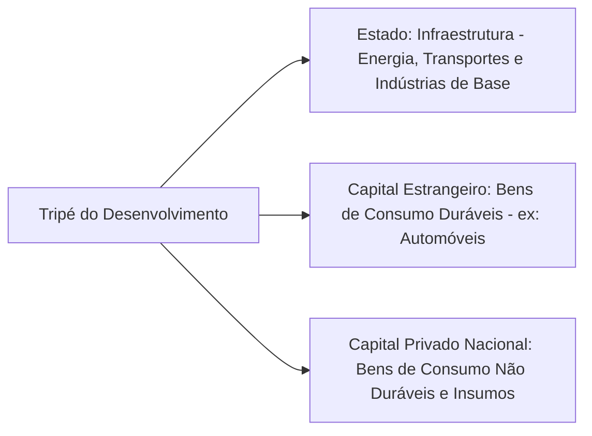

# O Plano de Metas (1956-1961): O Auge do Desenvolvimentismo e suas Consequências

## O Projeto Desenvolvimentista de JK: "50 anos em 5" e os Gargalos de Infraestrutura

Sob o lema **"50 anos em 5"**, o presidente **Juscelino Kubitschek (1956-1961)** lançou o Plano de Metas, a mais ambiciosa experiência de planejamento estatal para industrialização rápida no Brasil. Esse plano incluía **31 metas** (30 metas setoriais + a meta-síntese) e visava condensar cinquenta anos de progresso econômico em apenas cinco anos de governo. A iniciativa foi uma resposta direta aos **gargalos de infraestrutura** identificados no início dos anos 1950: diagnósticos do _Grupo Misto BNDE-CEPAL_ haviam mapeado estrangulamentos graves em **transporte, energia e alimentação**, bem como setores industriais com demanda reprimida que não podiam ser supridas por importações devido à escassez crônica de divisas. Com base nesse diagnóstico, o governo JK elaborou um amplo projeto desenvolvimentista para **superar esses estrangulamentos estruturais** e impulsionar a substituição de importações em níveis mais complexos da economia.

> [!important] **Prioridade à Industrialização Acelerada:** O Plano de Metas representou, segundo o historiador Carlos Lessa, **“a mais sólida decisão consciente em prol da industrialização na história econômica do país”**, dando **prioridade absoluta** à construção dos estágios superiores da **pirâmide industrial** (indústrias de bens duráveis e de capital) e do **capital social básico** (infraestrutura) necessários para sustentá-los. Em outras palavras, JK buscava completar rapidamente a estrutura industrial brasileira, atacando simultaneamente as deficiências em infraestrutura e incentivando novos ramos industriais (como a automobilística) para avançar o processo de desenvolvimento.

Do ponto de vista político e institucional, JK criou mecanismos para viabilizar esse esforço planejado. Logo no início de seu governo instituiu o **Conselho do Desenvolvimento** para assessoramento estratégico e, posteriormente, implementou **Grupos Executivos** específicos para coordenar projetos em setores-chave. Por exemplo, o **GEIA (Grupo Executivo da Indústria Automobilística)** foi formado para orquestrar a implantação da indústria de veículos, reunindo representantes do Estado e do setor privado. Essa estrutura de gestão compartilhada permitiu que as metas do plano fossem detalhadas e perseguidas de forma objetiva, integrando agentes públicos e privados em torno do projeto nacional-desenvolvimentista.

## A Estratégia do "Tripé do Desenvolvimento"

O modelo de desenvolvimento adotado por JK baseou-se em uma ação **conjunta e complementar de três fontes de capital**, frequentemente chamada de **“tripé do desenvolvimento”**. Esse tripé envolvia: **(1)** o investimento do **Estado**; **(2)** o **capital estrangeiro**; e **(3)** o **capital privado nacional**. Cada “pé” do tripé tinha um papel distinto e complementar na estratégia de industrialização acelerada:

### O Estado – Infraestrutura e Indústrias de Base

O Estado atuou como o **principal planejador e investidor** nos setores de **infraestrutura pesada** e **indústrias de base**. Ao governo coube dirigir recursos maciços para ampliar a oferta de **energia elétrica, transportes e matérias-primas industriais**. Não por acaso, os setores de **energia, transportes, siderurgia e refinarias de petróleo** receberam a maior parte dos investimentos públicos previstos no Plano de Metas. O objetivo era remover os obstáculos básicos ao crescimento: construir usinas hidrelétricas, estradas, portos, ferrovias, siderúrgicas e outras bases materiais sem as quais a industrialização não avançaria. Empresas estatais existentes (como a Petrobras na área de petróleo) foram fortalecidas, e outras foram criadas ou expandidas para liderar projetos estruturantes nesses campos. Em suma, o Estado assumiu os investimentos de **alto custo e longo prazo** que o setor privado dificilmente arcaria sozinho, pavimentando o caminho para a industrialização pesada.

### O Capital Estrangeiro – Bens de Consumo Duráveis

O segundo pilar do tripé foi o **capital privado estrangeiro**, ativamente **atraído para produzir bens de consumo duráveis** no Brasil, especialmente automóveis, autopeças, eletrodomésticos e outros bens de maior complexidade tecnológica. JK via as multinacionais como parceiras indispensáveis para dar um “salto” industrial no curto prazo, pois detinham capital, tecnologia e experiência na produção em massa desses bens. Para seduzir essas empresas a se instalarem no país, o governo lançou mão de incentivos cambiais e creditícios inovadores. O principal instrumento foi a **Instrução 113 da SUMOC** (Superintendência da Moeda e do Crédito), editada em janeiro de 1955 (ainda no fim do governo Café Filho), que permaneceu em vigor e foi crucial durante o governo JK.

> [!note] **Instrução 113 da SUMOC (1955):** Esse dispositivo **permitiu às empresas estrangeiras importarem máquinas e equipamentos sem cobertura cambial**, contabilizando-os como investimento direto. Na prática, a multinacional podia trazer suas linhas de produção para o Brasil sem gastar as escassas reservas em dólares do país, pois os equipamentos entravam sem exigir pagamento imediato em divisas. Além disso, a Instrução 113 assegurava um **câmbio favorável** na futura remessa de lucros e amortizações, tornando o investimento ainda mais atraente. Tal medida reduziu a burocracia e os custos de entrada de capitais externos e foi decisiva para a implantação da **indústria automobilística brasileira**, uma meta central do Plano. **Montadoras estrangeiras** como Volkswagen, Ford, General Motors e outras responderam ao ambiente amigável: entre 1957 e 1960, o país recebeu cerca de **US$ 363 milhões em investimento externo**, 73% de todo o IED do período 1955-1963, concentrado sobretudo na instalação de fábricas de veículos. Em resumo, a política cambial inaugurada pela Instrução 113 criou condições propícias para a formação do tripé, associando o capital estrangeiro ao projeto de industrialização nacional.

Com essas medidas, o capital estrangeiro passou a atuar principalmente na **produção de bens de consumo duráveis**, setor até então pouco desenvolvido internamente. A indústria automobilística tornou-se emblemática: ao final do governo JK, o Brasil já produzia seus próprios automóveis, algo impensável poucos anos antes. Outros setores de bens duráveis (tratores, eletrodomésticos, química fina, etc.) também receberam investimentos externos. O ingresso das multinacionais, porém, ocorreu em grande parte sob a forma de **financiamentos externos e empréstimos para projetos específicos** (cerca de 81,7% do total de capitais entrantes entre 1955-62) e não apenas via investimento direto tradicional. Isso significa que, além de fábricas, veio também **endividamento externo** atrelado a projetos – uma característica importante do modelo que traria consequências futuras.

### O Capital Privado Nacional – Bens Não Duráveis e Fornecedores

O **capital privado nacional** constituiu o terceiro elemento do tripé, atuando como **sócio menor** na coalizão desenvolvimentista. Os empresários brasileiros concentraram-se nos setores de **bens de consumo não duráveis** (têxteis, alimentos, bebidas, calçados etc.), que já formavam o núcleo tradicional da indústria desde o período Vargas, e também atuaram como **fornecedores de insumos, peças e serviços** para as novas indústrias de base e duráveis. Em outras palavras, o capital local ocupou nichos complementares: continuou produzindo os bens de consumo cotidiano para o mercado interno e passou a se integrar às cadeias produtivas lideradas pelo Estado e pelas multinacionais, fornecendo materiais de construção, componentes e subcontratando partes do processo produtivo. Embora em posição subordinada em termos de protagonismo e aporte de recursos, os empresários nacionais também se beneficiaram da expansão do mercado e dos investimentos públicos – muitas empresas nacionais tornaram-se **parceiras ou subsidiárias** de empresas estrangeiras, ou então supliram demandas geradas pelos grandes projetos de infraestrutura e pelas montadoras.

Esse arranjo **tripartite** – Estado, capital estrangeiro e capital nacional – caracterizou o modelo desenvolvimentista de JK. Autores como Peter Evans e a _“Escola de Campinas”_ (UNICAMP) identificam nesse período a formação de uma **aliança tripla** que consolidou uma nova etapa da internacionalização da economia brasileira. De fato, sem a predominância do **capital externo** em setores chave, dificilmente o Brasil teria conseguido implantar tão rapidamente o **Departamento II** da economia (indústrias de bens de consumo duráveis) e ampliar simultaneamente o **Departamento I** (indústrias de base) em apenas cinco anos. A escolha, contudo, não foi isenta de dilemas: implicou **sacrifícios na autonomia** do projeto nacional (ao se abrir mão de uma industrialização estritamente nacionalista) em favor de ganhos rápidos. Ainda assim, a “coligação desenvolvimentista” da época – que unia Estado, empresariado nacional e empresas internacionais – apostou que essa era a única via para superar o atraso, mesmo ciente de que **custos macroeconômicos** seriam incorridos no processo.

 

_Diagrama: Estrutura do "Tripé do Desenvolvimento" no Plano de Metas._ Os três pilares (Estado, capital estrangeiro e capital nacional) atuavam de forma coordenada para viabilizar a rápida industrialização entre 1956 e 1961. O **Estado** investia pesado em infraestrutura e setores básicos; o **capital estrangeiro** implantava fábricas de bens duráveis (protegido por incentivos cambiais, tarifas e crédito); e o **capital nacional** sustentava a produção de bens de consumo cotidiano e integrava as cadeias como fornecedor. Juntos, esses componentes impulsionaram o crescimento industrial, embora também gerassem desequilíbrios que seriam sentidos adiante.

## Os Setores do Plano e a Meta-Síntese (Brasília)

O Plano de Metas foi estruturado em **cinco grandes setores programáticos**, cada qual contendo várias metas específicas, totalizando **30 metas iniciais**. Os cinco setores eram: **Energia**, **Transportes**, **Indústrias de Base**, **Alimentação** e **Educação**. As metas nesses campos abrangiam projetos como: construção de usinas hidrelétricas e termoelétricas (Energia); abertura de rodovias, melhoria de portos e ferrovias (Transportes); instalação de novas siderúrgicas, fábricas de cimento, refinarias e mineração (Indústrias de Base); programas de aumento da produção agrícola e agronegócio (Alimentação); e expansão do ensino técnico e formação de mão de obra qualificada (Educação). Cada setor visava superar um conjunto de obstáculos ao desenvolvimento, e havia interdependência entre eles – por exemplo, os projetos de transporte estavam articulados às novas frentes agrícolas e à futura capital, e as indústrias de base forneceriam insumos para os demais setores.

Embora todos os campos fossem importantes, **Energia e Transportes tiveram prioridade destacada** nos investimentos públicos, pois eram vistos como pré-condições para viabilizar os demais (não se pode ter indústria sem energia elétrica confiável, nem integrar mercados sem estradas e ferrovias). Assim, JK canalizou recursos para grandes obras como a construção da usina de Furnas e Paulo Afonso (energia), e a abertura de estradas como a Via Dutra (Rio–São Paulo) e rodovias ligando o Centro-Oeste e Norte ao restante do país (transportes). Essa forte intervenção estatal era coerente com o papel do Estado no tripé do desenvolvimento, garantindo a infraestrutura necessária para que o capital privado (estrangeiro e nacional) pudesse expandir suas atividades produtivas.

Um elemento à parte – e altamente emblemático – do Plano de Metas foi a chamada **Meta 31, ou Meta-Síntese**: a **construção de Brasília**, a nova capital federal. Brasília condensou simbolicamente o espírito do plano "50 anos em 5". **Inaugurada em 1960** no centro do país, a cidade foi planejada para representar a _modernização_ e a _integração nacional_ promovidas pelo desenvolvimento. Ao transferir a capital do litoral (Rio de Janeiro) para o Planalto Central, JK buscou **impulsionar o desenvolvimento do interior** e reduzir o desequilíbrio regional histórico que privilegiava a faixa litorânea. Brasília nasceu em tempo recorde, povoada pelos **“candangos”** (trabalhadores migrantes de várias partes, principalmente do Nordeste), e sua arquitetura modernista e arrojada, assinada por Lúcio Costa e Oscar Niemeyer, tornou-se símbolo do otimismo desenvolvimentista. Em termos práticos, a construção da nova capital trouxe estradas, energia e telecomunicações para o coração do Brasil, conectando regiões antes isoladas. Brasília foi, portanto, a **síntese** das metas: englobava aspectos de todos os setores (energia para iluminar a nova cidade, transporte para ligá-la ao restante do país, mão de obra e alimentos para sustentar sua população, etc.) e personificava a ideia de um Brasil projetado rumo ao futuro.

## Resultados e Custos do Plano de Metas

### Sucessos: Crescimento Acelerado e Modernização Industrial

O Plano de Metas alcançou **resultados econômicos expressivos no curto prazo**. A economia brasileira experimentou **taxas de crescimento do PIB excepcionalmente altas** entre 1956 e 1961 – em torno de **8% ao ano**, em média –, enquanto a **renda per capita** aumentou cerca de 5% ao ano no período. O investimento maciço em infraestrutura e indústria pesada resultou em uma **diversificação significativa da estrutura industrial** brasileira. Novos setores produtivos ganharam forma: a **indústria automobilística** foi instalada, fábricas de bens de capital e equipamentos pesados entraram em operação, e as **indústrias de base** (aço, cimento, petroquímica) expandiram-se rapidamente. De fato, impulsionado pelo Plano de Metas, o setor industrial crescia a taxas superiores a 10% ao ano, com destaque para os segmentos de **bens de capital e bens de consumo duráveis**, que lideraram a expansão (Serra, 1983). Essa **rápida modernização** fez com que, ao início dos anos 1960, o Brasil tivesse uma economia muito mais complexa e integrada: produzia desde automóveis, caminhões e tratores até alumínio, navios, máquinas-ferramenta e eletrodomésticos, reduzindo a dependência de importações em muitos desses itens estratégicos.

Além do crescimento quantitativo, houve melhorias qualitativas na **infraestrutura** do país. A capacidade instalada de geração de energia elétrica aumentou substancialmente; a malha rodoviária federal dobrou de extensão, conectando regiões antes isoladas; a produção de aço e cimento atingiu patamares inéditos, fornecendo matéria-prima para a continuidade da industrialização. Grandes obras, como a construção de Brasília e de usinas hidrelétricas, deixaram um legado físico importante. Pode-se afirmar que o Plano de Metas cumpriu em boa medida seu objetivo de **“arrancar” o Brasil de um patamar econômico para outro superior**, lançando bases para o chamado “milagre econômico” da década seguinte. Em suma, os cinco anos de JK transformaram o Brasil em um **país mais urbano, industrial e moderno**, com o Estado desempenhando papel ativo de indutor do progresso.

### Custos e Consequências de Longo Prazo: Inflação, Dívida e Desigualdades

Por outro lado, os **custos do modelo desenvolvimentista** adotado por JK foram elevados e tiveram consequências duradouras nas décadas seguintes. O primeiro e mais evidente efeito colateral foi o **surto inflacionário**. Para financiar o grande volume de investimentos públicos (especialmente em infraestrutura) e estimular a economia, o governo recorreu pesadamente à **emissão monetária** e a déficits públicos – prática conhecida como **"desenvolvimentismo inflacionário"**. A própria meta do Plano era manter a inflação anual em torno de 13%, mas na realidade a inflação média do período JK atingiu cerca de **24,7% ao ano**, quase o dobro do previsto. Ou seja, o rápido crescimento veio acompanhado de uma forte **aceleração inflacionária**. JK e seus assessores viam a inflação moderada como um “preço a pagar” pelo desenvolvimento (atribuindo-a a desequilíbrios estruturais do subdesenvolvimento) e mostraram-se dispostos a tolerá-la em nome do progresso. De fato, JK chegou a romper negociações com o FMI em 1959 para não condicionar seu plano a políticas de austeridade anti-inflacionária, preferindo manter o ritmo das metas a seguir as duras exigências de estabilização do Fundo.

> [!important] **Desenvolvimentismo Inflacionário:** A opção de JK por financiar o crescimento via expansão da base monetária e gastos deficitários gerou inflação crescente. Esse mecanismo funcionou como uma forma de **“poupança forçada”**: a inflação corroía o poder de compra dos salários, transferindo recursos da população (especialmente dos trabalhadores) para sustentar o investimento. Em outras palavras, a classe trabalhadora, de menor poder de barganha política, arcou com grande parte do ônus do plano na forma de perda salarial real, enquanto o Estado e o empresariado direcionavam recursos para os projetos industriais. Tal processo agravou a **redistribuição regressiva de renda**, aumentando a concentração em favor dos setores vinculados ao capital e penalizando os assalariados.

Paralelamente, houve um **aumento expressivo do endividamento externo** brasileiro. Como as poupanças interna e receitas fiscais não bastavam para cobrir todos os investimentos, o governo buscou recursos no exterior. Além do investimento direto das multinacionais, o Plano de Metas foi financiado por **empréstimos de bancos e agências internacionais** (Eximbank, BIRD, etc.) e **créditos de fornecedores** para importação de máquinas. O resultado foi uma **explosão da dívida externa** ao final do período JK, excedendo em muito o crescimento das exportações. Indicadores da época mostram que a **relação dívida externa/exportações passou a superar 1 já a partir de 1956**, indicando forte desequilíbrio no setor externo. Em outras palavras, a dívida acumulada superava a capacidade anual de geração de divisas pelo país – um sinal de alerta para a solvência externa. Juscelino deixou para seus sucessores (Jânio Quadros e João Goulart) uma **pesada herança financeira**, consubstanciada em altos encargos da dívida e pressões inflacionárias não resolvidas. O início dos anos 1960 foi marcado pela necessidade de enfrentar esse duplo estrangulamento: inflação alta interna e crise cambial/externa devido ao endividamento, o que limitava a continuidade do mesmo modelo de crescimento.

Outro legado problemático foi o **aprofundamento das desigualdades sociais e regionais**. Apesar do crescimento agregado elevado, a prosperidade não beneficiou a todos por igual. O período JK não conseguiu resolver problemas de **desemprego e pobreza**; ao contrário, em alguns casos esses problemas se agravaram ou tornaram-se mais evidentes com o rápido êxodo rural e a urbanização desordenada. As regiões mais pobres, como o **Nordeste**, ficaram para trás em relação ao Centro-Sul industrializado, tanto que o governo sentiu necessidade de criar a **SUDENE (Superintendência de Desenvolvimento do Nordeste)** em 1959 para planejar ações específicas de estímulo àquela região. Dados históricos indicam que houve um **agravamento da concentração de renda** durante o Plano de Metas – a renda gerada pelo boom industrial ficou em grande parte com as camadas de alta renda e as empresas, enquanto as classes trabalhadoras lidavam com a inflação. Do ponto de vista regional, **as disparidades se mantiveram ou ampliaram**: o Sudeste (especialmente São Paulo e Rio de Janeiro) colheu os principais frutos da industrialização, enquanto regiões como o Norte e Nordeste pouco se beneficiaram diretamente das novas fábricas e infraestrutura. Em resumo, **as melhorias sociais e na distribuição de renda foram limitadas**, e o crescimento rápido veio acompanhado de **persistentes desigualdades regionais e sociais**. Esse quadro demonstra que o plano concentrou-se no objetivo do crescimento econômico, sem um equivalente esforço de políticas sociais redistributivas.

Por fim, os **desequilíbrios macroeconômicos gerados no governo JK deterioraram as bases do crescimento sustentável no longo prazo**. A economia brasileira saiu dos anos JK com uma estrutura industrial mais avançada, porém também com **inflação crônica, déficit externo e desequilíbrios fiscais** que minaram a estabilidade. Esses fatores contribuíram para um ambiente de crescente tensão econômica e política no início dos anos 1960. Alguns historiadores e economistas argumentam que as **contradições do modelo JK** – crescimento com inflação e dívida – prepararam o terreno para a crise que culminou na **ruptura institucional de 1964**. De fato, a necessidade de controlar a inflação e arrumar as contas externas tornou-se tema central dos governos pós-JK, gerando conflitos distributivos intensos e sucessivas tentativas de planos de estabilização que esbarraram em resistências políticas. A instabilidade política se agravou (greves, reformas de base propostas, reação de elites), até desembocar no golpe militar. Assim, embora JK não tenha sido a causa direta do golpe, **muitos de seus “problemas legados” – inflação alta, dívida, desigualdade – criaram um contexto de insatisfação e desordem econômica que enfraqueceu a jovem democracia**, facilitando a intervenção dos militares.

Em suma, o Plano de Metas legou ao Brasil um **paradoxo desenvolvimentista**: ao mesmo tempo em que promoveu um **salto de crescimento e modernização** sem precedentes, também **plantou sementes de desequilíbrio** que exigiriam correções difíceis nos anos seguintes. A experiência JK permanece, até hoje, como referência de planejamento bem-sucedido em termos de transformação estrutural rápida, mas também como alerta sobre os custos de se buscar desenvolvimento a qualquer preço.

## Questões para Autoavaliação

1. **Explique a lógica do "tripé do desenvolvimento" durante o Plano de Metas.** Como Estado, capital estrangeiro e capital nacional se complementaram nesse modelo e quais dilemas essa estratégia suscitou em termos de autonomia e financiamento do desenvolvimento?
    
2. **Analise os principais custos e consequências do Plano de Metas.** Em que medida a opção por um desenvolvimento rápido levou a desequilíbrios como a inflação e o endividamento externo? Como esses desequilíbrios afetaram a distribuição de renda e a estabilidade econômica e política nos anos posteriores?
    
3. **O Plano de Metas atingiu seus objetivos de “50 anos em 5”?** Avalie os resultados positivos alcançados em termos de crescimento e industrialização, contrapondo-os aos problemas estruturais gerados. Em sua opinião, o legado de JK foi predominantemente positivo ou negativo para o desenvolvimento de longo prazo do Brasil? Be sure to check sources for more details.