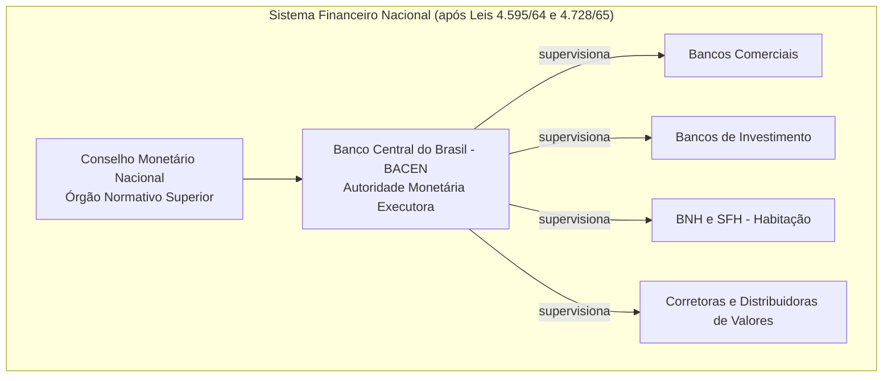

# As Reformas do PAEG (1964-1967): A Modernização Institucional da Economia Brasileira

## Contexto e Formulação do PAEG (1964-1967)

O **Programa de Ação Econômica do Governo (PAEG)** foi o plano econômico do primeiro governo do regime militar brasileiro, sob o presidente **Castello Branco**, elaborado em 1964 pela equipe de **Octávio Gouvêa de Bulhões** (Fazenda) e **Roberto Campos** (Planejamento). Lançado oficialmente em 1964, o PAEG tinha um duplo objetivo: **combater a inflação galopante** (que ameaçava superar 100% ao ano em 1964) e **modernizar as instituições econômicas** do país. O diagnóstico oficial atribuía a alta inflação sobretudo aos **déficits públicos**, à **expansão do crédito** e aos **reajustes salariais acima da produtividade** – problemas estes agravados pela política econômica permissiva do governo anterior e pela desorganização dos mercados de crédito e capitais. Assim, o PAEG combinou **medidas de estabilização de curto prazo** – cortes de gastos públicos, contenção do crédito, controle salarial – com um amplo programa de **reformas institucionais estruturais** para criar bases mais sólidas ao crescimento sustentado.

> [!note] **Estado e iniciativa privada no PAEG** 
> A equipe de Campos e Bulhões propunha redefinir o papel do Estado na economia, **abrindo espaço ao investimento privado** e removendo entraves do “populismo” anterior, mas **sem necessariamente reduzir** a atuação estatal no desenvolvimento. Em vez disso, o Estado seria reformado para atuar de forma **tecnocrática e planejada**, induzindo o desenvolvimento por meio de incentivos ao setor privado e de instituições modernas (como um banco central, mercado de capitais ativo, fundos de poupança compulsória etc.).

Entre agosto e dezembro de 1964, **diversas reformas estruturais** começaram a ser implementadas como parte do PAEG, transformando profundamente o arcabouço do capitalismo brasileiro. Essas reformas ocorreram em um contexto autoritário pós-1964, o que **facilitou sua aprovação** (muitas enfrentariam forte oposição sob regime democrático). Embora as políticas de estabilização do PAEG tenham tido **efeitos recessivos imediatos** – com redução drástica do déficit público e arrocho salarial, mas também falências de empresas e aumento do desemprego – as **mudanças institucionais** implantadas nesse período são amplamente reconhecidas como fundamentais para a recuperação e o **“Milagre Econômico” (1968-1973)** subsequente. A seguir, analisamos em detalhe as principais reformas do PAEG e seu legado modernizante.

## Principais Reformas Institucionais do PAEG

### 1. Reforma do Sistema Financeiro Nacional (Lei nº 4.595/64)

A **reforma bancária e financeira de 1964** foi central para o PAEG e é considerada sua **principal realização institucional**. Por meio da Lei nº 4.595, de 31 de dezembro de 1964, o governo **criou o Conselho Monetário Nacional (CMN)** e o **Banco Central do Brasil (BACEN)**, instituindo pela primeira vez um banco central de fato no país. O **CMN** tornou-se o órgão superior formulador das diretrizes da política monetária, cambial e de crédito, enquanto ao **Banco Central** coube a execução dessas diretrizes e o controle do sistema financeiro. Essa lei extinguiu a antiga Superintendência da Moeda e do Crédito (**SUMOC**), cujo papel regulador foi assumido pelas novas instituições. Com isso, profissionalizou-se e centralizou-se o controle da moeda e do crédito, alinhando o Brasil às melhores práticas internacionais de política monetária da época.

A reforma também estabeleceu novas **normas para as demais instituições financeiras**, públicas e privadas, reorganizando o Sistema Financeiro Nacional. **Segmentou-se o setor bancário** em diferentes categorias especializadas: a reforma **moldou a atuação dos bancos comerciais** (voltados a depósito à vista e crédito de curto prazo) e **criou a figura dos bancos de investimento**, dedicados a operações de longo prazo e mercado de capitais. Além disso, modernizou-se a regulamentação das **bolsas de valores**, **extinguindo o monopólio dos antigos corretores oficiais** e permitindo o surgimento de corretoras e distribuidoras privadas de títulos. Essas mudanças integraram-se ao esforço de **canalizar a poupança interna para investimentos produtivos**. Em suma, a Lei 4.595/64 instituiu uma arquitetura financeira mais moderna e funcional – um **CMN ativo, um Banco Central executor autônomo, e um sistema bancário adaptado ao desenvolvimento** – condição essencial para que a política monetária ganhasse eficácia e para que o crédito fluísse de forma ordenada na economia.

_Figura: Novo desenho institucional do Sistema Financeiro Nacional pós-reformas do PAEG. O CMN define diretrizes, o BACEN executa e supervisiona diversas instituições: bancos comerciais, bancos de investimento (criados em 1965), o Sistema Financeiro da Habitação (BNH e agentes de crédito imobiliário) e as corretoras de valores._

### 2. Reforma do Sistema Habitacional e Trabalhista: BNH e FGTS

Reconhecendo o **déficit habitacional** e a necessidade de estimular a construção civil (setor capaz de gerar empregos e crescimento com baixo conteúdo importado), o PAEG criou, em agosto de 1964, o **Sistema Financeiro da Habitação (SFH)** e seu órgão central, o **Banco Nacional da Habitação (BNH)**, através da Lei nº 4.380/64. O BNH tornou-se o principal **banco público de crédito habitacional**, responsável por financiar em grande escala a construção e aquisição da casa própria, especialmente para a classe média e baixa. Para alimentar esse sistema com recursos de longo prazo, a mesma lei instituiu **novos instrumentos de captação**, como a **caderneta de poupança** e a **letra imobiliária**, e previu a aplicação da **correção monetária** nos contratos habitacionais, protegendo-os da inflação. A construção civil foi deliberadamente estimulada pelo governo não só por sua função social (moradia) mas também porque _“disseminava a propriedade privada entre a classe média”_ – base social do novo regime – e por não pressionar o balanço de pagamentos (já que utiliza majoritariamente insumos nacionais).

Em paralelo, o governo endereçou a **rigidez do mercado de trabalho** herdada da legislação anterior. A **estabilidade decenal no emprego**, que garantia ao trabalhador do setor privado a manutenção no emprego após 10 anos na mesma empresa, era vista pelos formuladores do PAEG como um entrave à flexibilidade e à produtividade. Em substituição a esse regime, foi criado o **Fundo de Garantia do Tempo de Serviço (FGTS)**, pelo Lei nº 5.107, de 13 de setembro de 1966. O FGTS estabeleceu que as empresas passassem a depositar mensalmente o equivalente a **8% do salário** de cada empregado em uma conta vinculada, em nome do trabalhador. Em caso de demissão sem justa causa, o trabalhador poderia sacar o saldo acumulado, que também ficou acessível para **financiamento da casa própria** e outras finalidades definidas em lei.

> [!definition] **Fundo de Garantia do Tempo de Serviço (FGTS)** 
> Instituído em 1966 e em vigor a partir de 1967, o FGTS **substituiu a estabilidade no emprego após 10 anos**. Seu duplo objetivo era **facilitar a demissão de empregados** (reduzindo custos trabalhistas e aumentando a flexibilidade para o empregador) e **gerar um grande fundo de poupança compulsória** para **financiar habitações** via BNH. Cada trabalhador passou a ter uma conta de FGTS com depósitos mensais do empregador (8% do salário); os recursos, geridos pelo BNH, financiavam projetos habitacionais, **viabilizando políticas de moradia em larga escala**.

A criação do FGTS **eliminou gradualmente a “estabilidade decenal”** – que foi tornada letra morta e depois formalmente extinta – ao mesmo tempo em que **injetou recursos no SFH** a partir de 1967. Essa reforma trabalhista foi **polêmica**: inicialmente o FGTS era opcional (o empregado poderia escolher entre aderir ao fundo ou manter o regime antigo), mas na prática as novas contratações impuseram o FGTS como condição, e o projeto enfrentou resistência no Congresso, sendo aprovado somente graças a um **ato institucional** do regime militar que forçou sua promulgação. Apesar disso, o FGTS logo se tornou praticamente universal. **Do ponto de vista econômico**, essa medida cumpriu o papel de **flexibilizar o mercado de trabalho** – facilitando admissões e demissões e reduzindo encargos trabalhistas – e de **mobilizar uma poupança interna de longo prazo** que financiasse o desenvolvimento urbano (moradia e saneamento). Em conjunto, **BNH/SFH e FGTS** modernizaram as políticas habitacional e trabalhista no Brasil: ampliou-se o crédito imobiliário de longo prazo e alterou-se profundamente a relação capital-trabalho em favor da produtividade, ainda que às custas da perda de antigos direitos trabalhistas.

### 3. Reforma Tributária e Fiscal (1964-1966)

Outra frente crucial do PAEG foi a **modernização do sistema tributário brasileiro**, com vistas a **aumentar a capacidade financeira do Estado** e **corrigir distorções fiscais** que também alimentavam a inflação. Em 1964 e 1965 foram editadas medidas emergenciais, culminando na aprovação do **novo Código Tributário Nacional, em 1966**, que consolidou a reforma. Os objetivos principais eram **racionalizar a estrutura de impostos**, elevar a arrecadação e dar ao governo federal maior controle sobre as receitas, para financiar investimentos e reduzir déficits.

As mudanças tributárias abrangeram: **eliminação de impostos em cascata e obsoletos**, substituindo-os por tributos modernos do tipo valor-adicionado. Por exemplo, extinguiu-se o antigo _imposto sobre vendas e consignações_ e implementou-se o **Imposto sobre Produtos Industrializados (IPI)** e o **Imposto de Circulação de Mercadorias (ICM)**, este último de competência estadual – precursores do ICMS vigente posteriormente. No âmbito local, criou-se o **Imposto Sobre Serviços (ISS)** de competência municipal. Houve também **ampliação da base do Imposto de Renda** (especialmente de pessoas físicas) e melhoria nos mecanismos de arrecadação, como a **cobrança de tributos via rede bancária** e o fim de figuras arcaicas como o imposto do selo.

Importante inovação foi a **introdução da correção monetária no sistema tributário**, evitando que a inflação corroesse o valor real dos tributos entre o fato gerador e o recolhimento. Além disso, aumentaram-se tarifas públicas e preços administrados (energia, transporte etc.) para reduzir subsídios e recuperar financeiramente empresas estatais, mesmo ao custo de um impacto inflacionário imediato. **Redefiniu-se o pacto federativo fiscal**: a União passou a deter os impostos de maior base (IPI, Importação, Imposto de Renda e ITR rural), enquanto os estados ficaram com o ICM e os municípios com ISS e IPTU. Para compensar a centralização, parte da arrecadação do IPI e IR passou a ser distribuída aos estados e municípios via **Fundos de Participação (FPE e FPM)**.

Outra vertente foi a criação de **fundos parafiscais** vinculados, como o próprio FGTS e os novos **PIS/PASEP** (fundos de participação de trabalhadores do setor privado e público, respectivamente) – que funcionavam como _poupança compulsória_, elevando a taxa de investimento público/privado. Adotaram-se também **incentivos fiscais setoriais e regionais** (como isenções para investimentos no Nordeste via SUDENE, e estímulos à exportação) com o intuito de orientar o desenvolvimento conforme prioridades do governo.

Como resultado, a **carga tributária** do país aumentou substancialmente, passando de cerca de 16% do PIB em 1964 para **21% do PIB em 1967**. O Estado brasileiro passou a dispor de **maior poder financeiro** para realizar investimentos em infraestrutura e projetos de desenvolvimento. Em contrapartida, a reforma tributária reforçou o **caráter regressivo** do sistema, pois grande parte do incremento de arrecadação deu-se via impostos indiretos (como IPI e ICM), que pesam proporcionalmente mais sobre a renda dos mais pobres. Ainda assim, do ponto de vista institucional, a reforma fiscal de 64-66 **modernizou e centralizou** o sistema tributário, tornando-o mais eficiente e ampliando a capacidade do governo federal em conduzir política econômica – um alicerce importante para o financiamento do crescimento posterior do “milagre”.

### 4. Criação da Correção Monetária e Indexação da Economia

Diante de uma inflação persistente, o PAEG inovou ao **instituir oficialmente mecanismos de indexação**, permitindo à economia conviver com certa inflação remanescente sem desorganização completa dos contratos. A peça central foi a **correção monetária**, criada pela Lei nº 4.357 de 17 de julho de 1964. Essa lei introduziu as **Obrigações Reajustáveis do Tesouro Nacional (ORTN)**, títulos públicos cujos valores eram corrigidos periodicamente por um índice de inflação, garantindo assim remuneração real positiva aos investidores. **Pela primeira vez**, o governo passou a emitir dívida interna **corrigida pela inflação**, o que lhe permitiu financiar seu déficit de forma **não-inflacionária**, sem recorrer à emissão de moeda. Junto com as ORTNs, a lei estabeleceu o **mecanismo de correção monetária trimestral** para diversos contratos, com coeficientes fixados pelo Conselho Nacional de Economia (antecessor do CMN).

> [!note] **Importância da indexação** 
> A introdução da correção monetária _“tornou os títulos públicos atraentes, já que passaram a render juros reais positivos”_, permitindo ao governo se financiar sem emitir moeda. Em outras palavras, a indexação viabilizou **financiamento de longo prazo em meio à inflação**, ao proteger credores e investidores da perda inflacionária. Esse mecanismo foi estendido a financiamentos habitacionais (pela Lei 4.380/64) e depois a outros contratos privados, **minimizando distorções** causadas pela inflação e evitando a “repressão financeira” (fuga de recursos da economia formal devido à inflação).

A **monetização parcial da inflação via indexação** teve efeitos ambíguos: por um lado, **estabilizou expectativas** e permitiu a continuidade de investimentos de longo prazo (como habitação, infraestruturas) num ambiente de inflação moderada; por outro, ao proteger parcialmente os agentes econômicos da inflação, **poderia ter alimentado a inércia inflacionária** nos anos seguintes. No contexto do PAEG, contudo, a correção monetária foi vista como uma solução pragmática para **compatibilizar a luta contra a inflação com a manutenção do crédito de longo prazo**. De fato, foi graças a essa inovação que instrumentos como as ORTNs e as cadernetas de poupança ganharam confiança do público, **canalizando mais poupança** para o setor produtivo. A indexação passou a ser uma característica estrutural da economia brasileira pós-1964, compondo o chamado _“arcabouço de convivência com a inflação”_ que perduraria pelas décadas seguintes.

### 5. Reforma do Mercado de Capitais (Lei nº 4.728/65)

Completa esse elenco de reformas a reestruturação do **mercado de capitais**, formalizada pela Lei nº 4.728, de julho de 1965. Até então, o mercado acionário brasileiro era incipiente e disfuncional: poucas empresas de capital aberto, baixa proteção a acionistas minoritários, bolsas mal organizadas com **manipulação de cotações**, e predomínio de **corretores oficiais** herdados de práticas antigas. Além disso, a inflação crônica desestimulava investimentos em ações, levando a poupança privada a buscar ativos reais ou simplesmente a concentrar-se em depósitos bancários de curto prazo. Isso gerava um **hiato de financiamento**: empresas dependiam de empréstimos bancários (muitas vezes do Banco do Brasil ou externamente), já que não havia um canal robusto de financiamento via mercado de capitais.

A Lei 4.728/65 buscou **modernizar e dinamizar o mercado de ações brasileiro**. Para tal, a reforma **atacou os obstáculos estruturais**: _“modernizando as Bolsas, extinguindo o monopólio dos corretores públicos, etc.”_. Criou-se um novo **sistema de distribuição de valores mobiliários**, autorizando a operação de **sociedades corretoras e distribuidoras** privadas (no _varejo_ de ações) e instituindo os **bancos de investimento** como agentes _atacadistas_ do mercado de capitais. Esses bancos de investimento – uma novidade introduzida pela reforma – poderiam lançar e subscrever emissões de ações e debêntures, fomentando a ligação entre poupadores e empresas. A segregação entre bancos comerciais e de investimento visava evitar que o crédito de curto prazo se confundisse com operações de longo prazo e de maior risco, criando **instituições especializadas em financiar o desenvolvimento empresarial**.

A reforma também **aperfeiçoou o arcabouço legal societário** e **tributário** relativo ao mercado de capitais. Foram criados incentivos fiscais para investimento em ações e melhorias na proteção aos minoritários (embora a consolidação de uma Lei das S.A. mais robusta só viesse em 1976). Segundo depoimentos da época, a expectativa era que, _criando as condições institucionais necessárias_, fosse possível **mobilizar um fluxo significativo de poupança interna para capitalizar as empresas**. Como afirmou Bulhões de Freitas (um dos arquitetos da reforma), sem um mercado acionário ativo, **as empresas nacionais ficavam limitadas** – ou nasciam grandes já como estatais/estrangeiras, ou permaneciam pequenas – ao passo que um mercado de ações desenvolvido **permitiria que empresas médias se tornassem grandes** mediante abertura de capital e subscrição pública de ações.

Em suma, a Lei do Mercado de Capitais de 1965 criou os alicerces para um **capitalismo financeiro moderno** no Brasil: instituições intermediárias especializadas, bolsas mais transparentes e atrativas, e um começo de “democratização” do capital (com pequenos investidores acessando ações). Embora os resultados imediatos tenham sido modestos – o mercado acionário só decolou de fato no final da década, chegando a experimentar uma bolha especulativa em 1971 – o arcabouço legal implantado em 1965 foi **essencial para estruturar fontes alternativas de financiamento** para a industrialização brasileira, reduzindo a dependência de crédito bancário de curto prazo e de capital estrangeiro.

## O Legado das Reformas: Bases Institucionais para o “Milagre”

As reformas do PAEG (1964-67) configuraram um **marco de modernização institucional** da economia brasileira, cujos efeitos transcenderam o curto prazo. No imediato pós-1964, o país experimentou _estagnação econômica e custos sociais elevados_ em virtude da política anti-inflacionária rigorosa (salários reais em queda, falências de empresas menores, desemprego em alta). Entretanto, a médio e longo prazo, **as novas instituições e políticas lançadas pelo PAEG criaram os alicerces de um crescimento acelerado**. Conforme observa Fabrício de Oliveira, _“as mudanças ocorridas nesse período podem ser vistas como a gênese do aparato que seria crucial para a retomada do crescimento econômico”_ nos anos seguintes. De fato, a partir de 1968, com a economia mundial favorável e a estabilização interna encaminhada, o Brasil ingressou no seu período de crescimento mais rápido – o chamado **Milagre Econômico (1968-1973)** –, e grande parte desse desempenho só foi possível graças ao **arcabouço institucional mais moderno e funcional** herdado das reformas do PAEG.

Em termos concretos, o legado pode ser resumido assim:

- **Estabilidade monetária e financeira aprimorada:** A criação do Banco Central e do CMN profissionalizou a gestão da moeda e do crédito, permitindo controle mais eficaz da inflação e do sistema bancário. A existência de títulos indexados (ORTN) e a possibilidade de correção monetária evitaram rupturas financeiras em um contexto ainda inflacionário, garantindo confiança para investimentos de longo prazo.
    
- **Capacidade estatal reforçada:** A reforma tributária elevou significativamente a receita do Estado, fornecendo meios para investimentos maciços em infraestrutura (rodovias, energia, telecomunicações) durante o Milagre. A centralização fiscal no governo federal facilitou a coordenação de planos de desenvolvimento nacionais, enquanto os fundos compulsórios (FGTS, PIS/PASEP) e bancos públicos (BNH, depois BNDES reforçado) proveram capital de investimento de forma contínua.
    
- **Mercado de crédito e capitais diversificado:** O sistema financeiro nacional passou a contar com **novos canais de financiamento**: além dos bancos tradicionais, surgiram bancos de investimento, mercado de ações revitalizado e um sistema hipotecário sólido via BNH/SFH. Isso contribuiu para a expansão das empresas nacionais, muitas das quais aproveitaram os incentivos para abrir capital ou tomar financiamentos de longo prazo, viabilizando a formação de novos conglomerados privados durante os anos 70.
    
- **Flexibilização econômica e produtividade:** As reformas trabalhistas (FGTS) e a liberalização de preços/tarifas públicas removeram rígidas amarras que marcavam a economia pré-1964. As empresas passaram a ter mais **liberdade para ajustar seu quadro de funcionários** conforme o ciclo econômico, e a política salarial contida do PAEG, ainda que dura para os trabalhadores, **reduziu pressões inflacionárias de demanda**, permitindo ganhos de produtividade. Esse novo ambiente de negócios, somado à atração de capital externo (facilitada pela reforma da lei de remessa de lucros em 1964), estimulou a retomada do investimento privado.
    

Em perspectiva histórica, as reformas do PAEG representaram uma **inflexão do capitalismo brasileiro rumo à modernidade institucional**. Elas completaram – ainda que em contexto autoritário – muitas das agendas pendentes dos planos anteriores (como o **Plano Trienal** de Celso Furtado, que esbarrara em resistências políticas). O próprio Roberto Campos enfatizou posteriormente que o maior resultado do PAEG não foram metas de inflação ou crescimento de curto prazo, _“mas a importância do esforço dedicado a reformas institucionais e à modernização”_. As instituições criadas ou reformadas entre 1964 e 1967 demonstraram resiliência e permaneceram, em grande medida, operantes nas décadas seguintes – o Banco Central e o sistema bancário reformado, o FGTS, os impostos como IPI, e a própria mentalidade de planejamento tecnocrático estatal. Assim, o legado do PAEG transcende seu tempo: **ao modernizar o ambiente econômico**, pavimentou-se o caminho para quase uma década de crescimento extraordinário e lançou bases que influenciariam o desenvolvimento brasileiro subsequente.

> [!quote] **Roberto Campos sobre o PAEG:** 
> “O sucesso do PAEG não esteve na realização de objetivos específicos, mas na **importância do esforço dedicado a reformas institucionais e à modernização**”. _Sob essa ótica, a verdadeira conquista do plano foi dotar o Brasil de um conjunto de instituições econômicas modernas, capazes de sustentar o crescimento com estabilidade._

## Questões para Autoavaliação

> [!question] **1.** De que forma as reformas **financeira** (Lei 4.595/64) e **do mercado de capitais** (Lei 4.728/65) alteraram o papel do Estado e dos agentes privados no sistema financeiro brasileiro? Como essas mudanças contribuíram para viabilizar o desenvolvimento econômico nos anos do “Milagre Econômico”?

> [!question] **2.** Explique o duplo objetivo da criação do **FGTS** em 1966. Quais foram os efeitos dessa medida tanto para as relações trabalhistas quanto para o financiamento habitacional e o crescimento urbano no Brasil do período pós-1964?

> [!question] **3.** Avalie criticamente os **custos de curto prazo** das políticas de estabilização do PAEG em contraste com os **benefícios de longo prazo** gerados pelas reformas institucionais. Como essa dinâmica é interpretada pela historiografia econômica ao analisar o período 1964-1967?