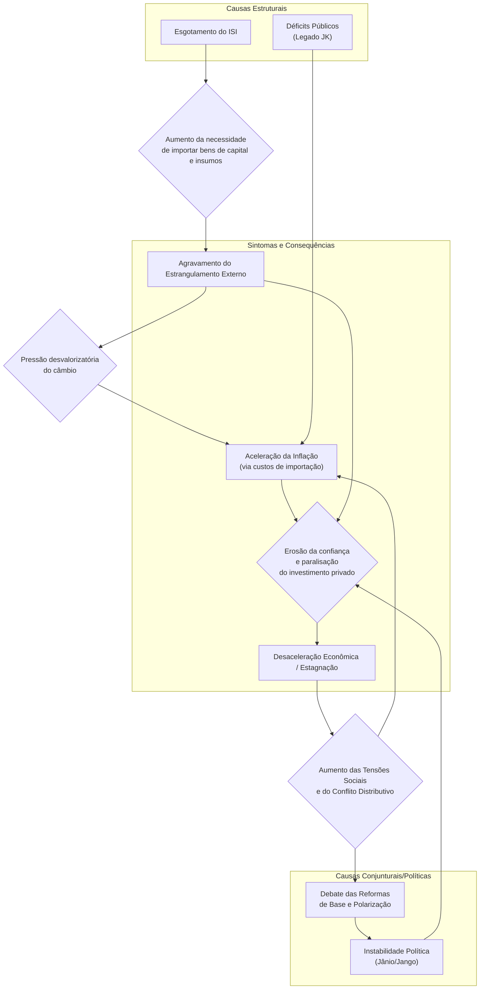

# Economia Brasileira (1962–1967): Crise do Desenvolvimentismo, Plano Trienal e PAEG

## 1. Desaceleração e Crise do Desenvolvimentismo (1962–1963)

No início dos anos 1960, a economia brasileira entrou em uma fase de **crise do modelo nacional-desenvolvimentista**. Após três décadas de industrialização por substituição de importações (1930–60), sinais de **esgotamento desse modelo** tornaram-se evidentes. O **Plano de Metas** do governo Juscelino Kubitschek (1956–61) impulsionara um crescimento acelerado com investimentos maciços em infraestrutura e indústria de base, porém deixou como legado um forte desequilíbrio macroeconômico: **inflação em alta e endividamento externo significativo**. A capacidade do país de seguir substituindo importações diminuía, e setores dinâmicos, como bens de capital e duráveis, já haviam sido implantados com forte participação de capital externo durante os anos 1950. Entretanto, esse avanço veio **acompanhado de pressões inflacionárias cada vez maiores** e deterioração nas contas externas.

A transição política pós-Juscelino agravou a instabilidade econômica. O presidente **Jânio Quadros (1961)** tentou brevemente um ajuste ortodoxo, mas sua renúncia repentina gerou uma crise política. Seu sucessor, **João Goulart (1961–64)**, assumiu num contexto conturbado: primeiro sob regime parlamentarista (1961-62) – fase marcada por **constantes trocas ministeriais** – e depois, restaurado o presidencialismo em 1963, enfrentando forte oposição de setores conservadores. A **poupança pública caía** devido a déficits orçamentários e crescente gasto estatal, minando a capacidade de investimento do governo. Simultaneamente, **a inflação disparou** de 34,7% em 1961 para ~50% em 1962, e o déficit externo ampliou-se (importações superando exportações). Em **1963**, o quadro era de **estagflação**: o PIB cresceu apenas 0,6%, enquanto a inflação anual aproximou-se de 80%. Esse **colapso econômico (1962–63)** é frequentemente atribuído à conjunção de fatores: **esgotamento da substituição de importações, perda de dinamismo exportador, descontrole fiscal-monetário (em parte herdado do desenvolvimentismo acelerado)**, além de **instabilidade política e conflito distributivo intenso** sob Goulart.

> [!note] **Crise de 1963 – sintoma do esgotamento**   
> No início de 1964, projeções indicavam inflação acima de **100% ao ano**, um dos sinais mais evidentes da crise gerada pelo esgotamento do modelo desenvolvimentista baseado na substituição de importações. A estagnação econômica, acompanhada de alta inflação e **conflitos político-sociais**, criou um ambiente de ruptura que antecedeu o golpe militar de 1964.

## 2. O Plano Trienal (1963–1965)

Diante do agravamento da crise, o governo João Goulart lançou, no final de 1962, o **Plano Trienal de Desenvolvimento Econômico e Social (1963–65)**. Idealizado pelo economista **Celso Furtado**, então Ministro do Planejamento, o Plano Trienal buscava **conciliar medidas ortodoxas de estabilização com reformas estruturais de inspiração cepalina**. Tratava-se de uma abordagem **“híbrida”**: por um lado, previa um período inicial de **austeridade** para domar a inflação (com **congelamento de salários e preços**, corte de gastos públicos e crédito restrito); por outro, colocava como essenciais as **“Reformas de Base”** – um conjunto de reformas estruturais (agrária, administrativa, bancária, fiscal, educacional e urbana) destinadas a remover **entraves institucionais ao desenvolvimento** de longo prazo. O plano almejava **reduzir a inflação para 25% em 1963 e 10% em 1965**, sem abrir mão do crescimento – projetava-se um **PIB crescendo ~7% ao ano** no triênio. A estratégia de Furtado era **gradualista**: combater a inflação passo a passo, evitando uma forte recessão, e ao mesmo tempo **redistribuir renda** e **retomar investimentos públicos** após a estabilização inicial.

> [!important] **Metas ambiciosas do Plano Trienal** 
> Reduzir a inflação de ~50% em 1962 para **10% até 1965**, mantendo o crescimento econômico anual em torno de **7%**. O plano combinava **ajuste fiscal-monetário** (para conter a alta de preços) com iniciativas de **reforma estrutural** (Reformas de Base) para sustentar o desenvolvimento no longo prazo.

**Conteúdo e contradições:** O Plano Trienal propunha medidas de ajuste típicas (corte de subsídios, equilíbrio orçamentário, restrição monetária) ao lado de políticas de desenvolvimento. Previa, por exemplo, **salário mínimo reajustado abaixo da inflação** num primeiro momento (para frear a espiral inflacionária), mas também uma política de distribuição de renda via investimentos sociais assim que a estabilidade fosse alcançada. Buscou-se ainda **gradualismo na substituição de importações**, incentivando a indústria nacional sem choques abruptos. Contudo, o plano enfrentou **dilemas**: algumas propostas soavam incoerentes – ex.: pretendia-se **atrair recursos externos** e ao mesmo tempo adotar retórica nacionalista contra capitais estrangeiros; ou ainda, **elevar salários reais a médio prazo**, mas inicialmente **aumentar impostos e conter ganhos salariais** para combater a inflação. Essas ambiguidades fragilizaram a credibilidade do programa.

**Fracasso e causas:** Na prática, o Plano Trienal **mal saiu do papel**. Vários fatores explicam seu insucesso: (a) **Falta de apoio político** – o país estava polarizado. As **esquerdas (sindicatos, CGT)** rechaçaram as medidas de austeridade, sobretudo o **arrocho salarial** proposto, enquanto **elites conservadoras** (empresários, latifundiários) opuseram-se às reformas estruturais e temiam a guinada “socialista” de Goulart. (b) **Isolamento do governo** – Goulart, sem maioria sólida no Congresso e pressionado por todos os lados, hesitou em bancar integralmente o plano. Conflitos entre Executivo e Legislativo e a proximidade das eleições de 1965 reduziram o engajamento do presidente nas medidas impopulares. (c) **Contexto socioeconômico adverso** – a inflação seguia alta (cerca de 80% em 1963) e as reservas cambiais eram baixas, exigindo resultados rápidos que o plano gradualista não conseguiu entregar. (d) **Falta de apoio externo** – o governo contava com ajuda financeira dos EUA (no âmbito da _Aliança para o Progresso_) para aliviar a restrição externa e viabilizar simultaneamente crescimento e estabilização. Entretanto, devido à desconfiança ideológica em relação a Goulart (visto por Washington como próximo da esquerda), os EUA **bloquearam recursos e crédito**, tornando impossível fechar as contas externas do triênio. Sem refinanciamento da dívida e novos empréstimos, faltou “fôlego” para o Brasil equilibrar combate à inflação com investimentos. (e) **Pressões inflacionárias inerciais** – mesmo com tentativas de controle, a inflação mostrou forte persistência, corroendo salários e gerando descontentamento popular contínuo.

Concretamente, já em meados de **1963 o Plano Trienal naufragara**: Goulart, pressionado pela base trabalhista, **concedeu reajustes salariais acima do previsto** e retomou subsídios (por exemplo, ao trigo e combustíveis) para aplacar empresários e consumidores. As metas fiscais e monetárias foram abandonadas. O resultado foi um **agravamento da crise**: 1963 fechou com crescimento pífio (~0%) e a inflação seguiu elevada; em **1964**, na véspera do golpe, a inflação ultrapassaria 90% ao ano. O **fracasso do Plano Trienal** minou a credibilidade do governo Goulart e contribuiu para a instabilidade que culminou em sua deposição em março de 1964.

> [!note] **Razões do fracasso do Plano Trienal:**
> 
> - **Oposição interna:** Sindicatos e movimentos de esquerda sabotaram as políticas de contenção (exigindo mais reajustes salariais), enquanto empresários e latifundiários bloquearam as Reformas de Base. Goulart ficou sem base política para implementar o plano.
>     
> - **Crise social e polarização:** Greves, manifestações e o acirramento ideológico dificultaram quaisquer consensos, num contexto em que _estabilidade econômica_ competia com _demandas por reformas sociais_.
>     
> - **Falta de suporte externo:** Os EUA condicionaram ajuda financeira a um rígido programa anti-inflacionário, mas ao mesmo tempo desconfiavam de Goulart. Na prática, **negaram o crédito** de que o Brasil necessitava, asfixiando o Plano Trienal.
>     
> - **Pressão do tempo:** Com a inflação corroendo salários rapidamente, faltou tempo hábil para a estratégia gradualista de Furtado produzir resultados – a impaciência dos diversos grupos levou ao abandono prematuro do plano em 1963.
>     

## 3. O PAEG (1964–1967)

Com o golpe militar de 31 de março de 1964, instalou-se o governo do general **Castello Branco (1964–67)**, que nomeou uma equipe econômica de perfil tecnocrático-liberal para enfrentar a crise. Os **ministros Octávio Gouvêa de Bulhões (Fazenda)** e **Roberto Campos (Planejamento)** formularam o **Programa de Ação Econômica do Governo (PAEG)**, lançado em novembro de 1964. Diferentemente do Plano Trienal, o PAEG adotou um **diagnóstico estritamente ortodoxo da crise** e perseguiu metas claras de estabilização de curto prazo, combinadas com **reformas institucionais profundas** para recolocar a economia nos trilhos do crescimento sustentado.

**Diagnóstico e objetivos:** Bulhões e Campos viam a economia brasileira atolada em **desequilíbrios múltiplos**: inflação alta e **inercial** (realimentada por expectativas e indexação informal), **déficit público crônico** (financiado via emissão de moeda), **setor externo frágil** (reservas escassas e dependência de capitais de curto prazo) e **sistema financeiro arcaico e desorganizado**. Além disso, identificavam a falta de incentivos à **poupança interna** e à formação de capital de longo prazo como entraves estruturais ao desenvolvimento. Em suma, a análise era de que a crise decorria de **excesso de demanda e descontrole fiscal-monetário**, agravados por um arcabouço econômico-institucional inadequado. Assim, o **PAEG** estabeleceu dois pilares: (1) **Estabilização imediata** – um _choque ortodoxo_ anti-inflacionário, com ajuste fiscal draconiano, controle da oferta de moeda e **política salarial rígida (arrocho)** para quebrar a espiral preços-salários; e (2) **Reformas estruturais** – um conjunto de medidas legislativas para modernizar a economia (sistema financeiro, mercado de capitais, sistema tributário, relações de trabalho e setor habitacional), visando lançar as bases de um crescimento sustentado com menores pressões inflacionárias no futuro.

**Medidas de estabilização (curto prazo):** De 1964 a 1966, a equipe econômica implementou um duro programa de ajuste. Houve um profundo **corte nas despesas públicas** e esforço de aumentar receitas (inclusive com criação de novos tributos em 1965–66), buscando equilibrar o orçamento. O Banco do Brasil restringiu drasticamente a expansão do crédito (**“enxugamento monetário”**), e as taxas de juros foram elevadas para conter a demanda. A taxa de câmbio foi **devaluada e unificada** (eliminando câmbios múltiplos) para incentivar exportações e equilibrar o balanço de pagamentos. A mais notória – e impopular – medida foi a **política salarial de arrocho**: em 1964, decretos limitaram os reajustes do funcionalismo; em 1965, a **Lei nº 4.725** estendeu a regra ao setor privado, estabelecendo que os salários seriam corrigidos apenas pela **média dos dois anos anteriores**, acrescida de uma parcela da inflação projetada. Na prática, isso significava **redução do salário real** ano após ano, pois a inflação efetiva superava a prevista, achatando o poder de compra dos trabalhadores. Além disso, proibiram-se acordos coletivos acima do índice oficial e, pela **Lei nº 4.923/65**, autorizou-se até redução nominal de salários em empresas em dificuldade. Esse **congelamento salarial**, aliado ao desemprego gerado pela recessão de 1965, foi o principal instrumento para desacelerar a inflação via contenção da demanda.

> [!definition] **“Arrocho salarial”** – Política de compressão dos salários aplicada pelo PAEG. Consistia em reajustar salários **abaixo da inflação**, via fórmula fixa anual (salário mínimo com base na média dos 24 meses anteriores + produtividade + metade da inflação futura projetada). Esse mecanismo, imposto por lei em 1965, **reduziu os salários reais em cerca de 25% entre 1965 e 1967**, quebrando a espiral inflacionária ao custo de forte perda de poder aquisitivo dos trabalhadores.

**Reformas estruturais (médio e longo prazo):** Paralelamente ao ajuste conjuntural, o PAEG promoveu um amplo pacote de **reformas institucionais** entre 1964 e 1967, mudando profundamente as “regras do jogo” da economia brasileira. As principais reformas implementadas foram:

1. **Reforma Financeira – Lei 4.595/1964:** Reconhecida como o eixo central do PAEG, a reforma do sistema financeiro criou o **Conselho Monetário Nacional (CMN)** e o **Banco Central do Brasil (Bacen)**, inaugurando um verdadeiro banco central no país. A autarquia assumiu funções antes exercidas pelo Banco do Brasil e pela SUMOC (Superintendência da Moeda e do Crédito, extinta pela nova lei). Ao **CMN** coube formular a política monetária e creditícia, enquanto o Bacen a executaria. A lei também **reestruturou o sistema bancário**, segmentando as instituições por especialidade: definiram-se bancos comerciais (curto prazo), **bancos de investimento** (médio/longo prazo, criados pela reforma), além de caixas econômicas, sociedades de crédito imobiliário, etc. O objetivo era **modernizar e controlar efetivamente o crédito**, dotando o governo de instrumentos mais eficazes de política monetária e ampliando a oferta de financiamento para setores produtivos específicos. **Importante:** a Lei 4.595 introduziu a **correção monetária** nos títulos públicos (_ORTNs_), protegendo-os da inflação. Com isso, o governo pôde passar a financiar seus déficits **via colocação de títulos no mercado**, ao invés de emitir moeda – já em 1965, mais da metade do déficit público foi coberta por venda de títulos; e em 1966, o Tesouro praticamente não dependia mais da “maquininha” do dinheiro. Essa mudança institucional foi crucial para **estancar a inflação**, ao atacar seu componente fiscal-monetário.
    
2. **Reforma do Mercado de Capitais – Lei 4.728/1965:** Complementando a reforma bancária, essa lei _“disciplinou o mercado de capitais e estabeleceu medidas para seu desenvolvimento”_. Incentivou a criação de **sociedades de investimento e fundos de investimento** (com benefícios fiscais para investidores), estimulando a captação de recursos privados para financiamento empresarial. Regulamentou e promoveu instrumentos como **debêntures** (títulos de dívida corporativa) e modernizou as práticas do mercado acionário, visando ampliar as fontes de financiamento de longo prazo para o setor privado. Também fixou bases legais para operações de crédito mais sofisticadas (como alienação fiduciária em garantias). Em suma, a Lei 4.728 buscou **desenvolver um mercado financeiro não bancário**, reduzindo a dependência das empresas do crédito público ou estrangeiro. Essa reforma, junto com a financeira, **segmentou o sistema financeiro**: instituições diferentes passaram a operar em faixas específicas de crédito (curto, médio e longo prazos), sob supervisão do CMN. Apesar das intenções, no curto prazo o mercado de capitais permaneceu incipiente – a popularização de certos instrumentos viria bem mais tarde. Porém, o arcabouço legal estava lançado para sustentar uma futura expansão do investimento privado doméstico.
    
3. **Reforma Tributária (1965–1966):** O PAEG empreendeu uma ampla modernização do **sistema tributário brasileiro**, aumentando a capacidade do Estado em arrecadar e gastar de forma racional. Em 1965 foi aprovada uma Emenda Constitucional (nº 18) redefinindo competências tributárias, seguida por leis complementares em 1966. As mudanças-chave incluíram: **eliminação de impostos “em cascata” e cumulativos** (típicos do antigo sistema) e sua substituição por tributos mais modernos. Criaram-se o **ICM (Imposto sobre Circulação de Mercadorias)**, de competência estadual, e o **IPI (Imposto sobre Produtos Industrializados)**, federal – ambos impostos não-cumulativos, cobrados no destino, que passaram a compor a espinha dorsal da arrecadação sobre consumo. O ICM substituiu o arcaico Imposto de Vendas e Consignações; já o IPI sucedeu o imposto de consumo. Também se unificaram e racionalizaram diversos tributos federais e municipais, **centralizando a arrecadação**. Houve melhorias na cobrança do **Imposto de Renda**, com atualização de bases e implantação gradual de retenção na fonte. Essa reforma aumentou significativamente a **carga tributária** e **reduziu a evasão**, permitindo que, a partir de 1967, o governo federal obtivesse **superávits primários** ou menores déficits, financiando investimentos sem recorrer à inflação. Como efeito colateral, porém, a estrutura tributária permaneceu **regressiva** (ênfase em tributos indiretos) e a maior carga incidiu proporcionalmente mais sobre consumo e salários, o que alguns autores criticam como **injustiça fiscal**. De todo modo, a reforma tributária de 1966 **restabeleceu a capacidade do Estado de investir em infraestrutura e impulsionar o desenvolvimento**, algo essencial para o _Milagre Econômico_ vindouro.
    
4. **Reforma Habitacional e Trabalhista (1964–1966):** Nessa frente, o governo reorganizou as políticas de habitação popular e alterou profundamente a legislação trabalhista para **flexibilizar as relações de emprego**. Em agosto de 1964 foi criado o **Banco Nacional de Habitação (BNH)**, gestor do novo **Sistema Financeiro da Habitação (SFH)**. A ideia era viabilizar crédito imobiliário em larga escala para construção de casas, estimulando a indústria da construção civil (setor escolhido como motor do crescimento urbano). Inicialmente, o SFH captaria recursos via cadernetas de poupança e fundos do próprio governo. Porém, percebeu-se que isso seria insuficiente para o volume de moradias pretendido. A solução veio com a criação do **FGTS (Fundo de Garantia do Tempo de Serviço)**, pela Lei nº 5.107 de setembro de 1966. O FGTS substituiu o antigo regime de _estabilidade decenal_ no emprego (pelo qual o trabalhador, após 10 anos na empresa, adquiria estabilidade ou indenização na demissão). Em vez disso, instituiu-se um **fundo de poupança compulsória do trabalhador**: os empregadores passaram a depositar mensalmente **8% do salário** de cada empregado em uma conta vinculada, que o trabalhador poderia sacar em caso de demissão sem justa causa ou para financiar casa própria, entre outras situações. Essa reforma **flexibilizou os contratos de trabalho** (facilitando admissões e demissões) e, ao mesmo tempo, **gerou uma massa de recursos de longo prazo** administrada pelo BNH para investimento em habitação e saneamento. O governo apresentava o FGTS como um **“colchão” para o trabalhador**, compensando parcialmente a perda salarial com um **patrimônio financeiro** que ele levaria de emprego a emprego. Também seria uma forma de realizar o “sonho da casa própria” – visto como um _salário indireto_ – ao permitir uso do saldo do FGTS na compra de imóveis populares. Na prática, o FGTS/BNH financiou principalmente moradias para a classe média-baixa urbana, dinamizando o setor de construção nos anos seguintes. Contudo, os mais pobres (renda de 1–3 salários mínimos) ficaram em grande parte excluídos dos financiamentos, revelando o **caráter excludente** do modelo habitacional criado. Ainda assim, a reforma habitacional-trabalhista do PAEG teve dois grandes efeitos: **reduziu custos trabalhistas para o empresariado** (fim da estabilidade onerosa) e **forneceu base para expansão urbana e do crédito imobiliário**, com impacto multiplicador no emprego e na indústria de materiais de construção.
    
5. **Política Salarial** e **Correção Monetária**: Além do arrocho já descrito, o governo instituiu mecanismos formais de **indexação na economia** para conviver melhor com a inflação remanescente. A **Lei 4.357/1964** introduziu a correção monetária em títulos públicos (ORTNs) e contratos de longo prazo, ajustando-os periodicamente pela variação de preços. Isso **protegeu a poupança financeira da corrosão inflacionária** e foi inovador mundialmente. Posteriormente, a correção monetária ampliou-se a diversos contratos privados (financiamentos imobiliários, por exemplo, passaram a ser reajustados). A lógica era **mitigar distorções da inflação**, incentivando agentes a manter investimentos no país. Entretanto, a própria indexação também **perpetuava a inflação** num patamar moderado, pois preços e salários passaram a incorporar expectativas de correção futura. No que tange aos salários, a política do PAEG foi completar o arcabouço legal do arrocho: em 1966, fixou-se uma **tabela oficial de reajustes** por categoria profissional, institucionalizando os aumentos salariais anuais conforme a fórmula predefinida e **vetando negociações coletivas livres**. Essa **disciplina salarial rígida** foi mantida até o início dos anos 1970, garantindo ganhos reais mínimos aos trabalhadores durante o período de estabilização. Simultaneamente, o governo revogou pontos da Lei de Remessa de Lucros (Lei 4.131/1962) – que limitava em 10% ao ano a remessa de dividendos por multinacionais. Em 1964, esse limite foi **eliminado**, atendendo a exigências dos EUA e do FMI. Isso **reabriu as portas ao investimento estrangeiro** e facilitou a entrada de capitais nos anos seguintes (ainda que ao custo de maior desnacionalização da economia).
    

> [!definition] **FGTS – Fundo de Garantia do Tempo de Serviço** 
> Criado em 1966, é um fundo compulsório onde empregadores depositam mensalmente uma porcentagem do salário de cada trabalhador (8%). Substituiu a estabilidade no emprego, permitindo às empresas maior flexibilidade nas demissões. Para os trabalhadores, o FGTS funciona como **poupança forçada**, acessível em situações especiais (demissão, compra da casa própria, aposentadoria, etc.). Os recursos do FGTS foram canalizados pelo BNH para financiar habitação popular, sendo apresentados pelo regime como um **“benefício social”** que compensaria parcialmente o arrocho salarial, ao possibilitar a aquisição da casa própria (salário indireto) e a constituição de um patrimônio portátil.

## 4. Avaliação do PAEG (1964–1967)

**Resultados econômicos:** As políticas do PAEG inicialmente aprofundaram a **desaceleração econômica** – um efeito esperado do ajuste. Em **1965**, o PIB cresceu apenas ~2,4%, chegando a haver **recessão industrial** (a produção manufatureira caiu cerca de 4,7% naquele ano). O desemprego urbano aumentou e várias empresas, sufocadas pela alta dos juros e contração do crédito, enfrentaram falência ou fusões forçadas. Porém, já em **1966** a economia começou a reagir: o PIB subiu 6,7%, puxado por recuperação industrial e investimentos estimulados pelas reformas. Em **1967**, o crescimento ficou em torno de 4%, consolidando uma **retomada gradual**. Do lado **inflacionário**, o PAEG obteve sucesso notável em **desacelerar a alta de preços**: partindo de quase 90% a.a. em 1964, a inflação caiu para ~34% em 1965, manteve-se em 1966 (39%) e recuou para **aprox. 25% em 1967**, o nível mais baixo em uma década. Ou seja, em três anos a inflação anual foi reduzida a cerca de **¼ do patamar pré-PAEG**. Essa **descompressão inflacionária** deve-se em grande medida ao **controle salarial e fiscal** exercido – a **política monetária austera** e o fim do financiamento inflacionário do déficit via emissão de moeda atacaram a raiz do processo. Além disso, a **melhora no setor externo** contribuiu: o ajuste cambial e a contração da demanda reduziram importações, e com algum apoio financeiro externo (acordo com FMI em 1965) o balanço de pagamentos estabilizou-se. Em 1967, o Brasil já apresentava **indicadores mais equilibrados**, preparando o terreno para a expansão que viria em seguida.

**Criação do arcabouço do “Milagre”:** Talvez o legado mais importante do PAEG tenha sido a **transformação institucional** que permitiu o chamado **“Milagre Econômico” (1968–1973)**. As reformas financeiras e fiscais criaram as condições para que, a partir de 1968, o país crescesse aceleradamente sem estrangular-se em inflação ou falta de recursos. Com o Banco Central operando, o governo passou a controlar melhor a liquidez e pôde inclusive adotar, a partir de 1968, políticas monetárias e creditícias expansionistas de forma coordenada. O **robusto sistema financeiro montado (1965)** canalizou uma explosão de crédito para o setor privado durante o Milagre – os empréstimos bancários ao setor produtivo cresceram **mais de 600% em termos reais entre 1966 e 1974**. A reforma tributária, por sua vez, assegurou **receitas crescentes ao Estado**, financiando investimentos públicos em infraestrutura (rodovias, energia, telecomunicações) que sustentaram a indústria durante o boom pós-67. Instrumentos como a correção monetária e o FGTS viabilizaram a manutenção de investimentos de longo prazo num ambiente de inflação moderada crônica, sem fuga massiva de capitais. Assim, **muitos analistas atribuem o sucesso do Milagre Econômico diretamente às bases lançadas pelo PAEG** – sem as quais o crescimento de 10% a.a. com inflação decrescente (abaixo de 20% após 1971) não teria ocorrido. Roberto Campos, retrospectivamente, apontou que _“o PAEG estabilizou a moeda e removeu as amarras institucionais que tolhiam nosso desenvolvimento, liberando as energias para o surto de crescimento dos anos 70”_ (discurso citado por diversos historiadores econômicos).

**Custos sociais e críticas:** Em contrapartida, os ganhos macroeconômicos do PAEG tiveram **elevado custo social**. A **política de arrocho** significou **expressiva perda salarial**: estima-se que os salários médios tiveram queda real acumulada de ~25% de 1964 a 1967. A participação dos salários na renda nacional diminuiu, enquanto a fatia dos lucros aumentou – em outras palavras, houve **concentração de renda** em favor do capital. **Indicadores de desigualdade** pioraram, com aumento da pobreza urbana em certas regiões devido ao desemprego e à alta no custo de vida (até que a inflação caísse). Além disso, os **juros altos** e o crédito escasso nos anos de ajuste penalizaram pequenas e médias empresas, muitas das quais não sobreviveram – o que **concentrou ainda mais o setor empresarial**, favorecendo grandes grupos econômicos. Autores como **Maria da Conceição Tavares** e **Carlos Lessa** destacam que o “modelo de 64” configurou um **padrão de desenvolvimento excludente**: estimulou-se o consumo de massas de bens duráveis (automóveis, eletrodomésticos) e a expansão urbana, mas **restrito à classe média** emergente, deixando as camadas populares à margem. Lessa (1981) argumenta que o PAEG lançou as bases de um crescimento concentrador, pois o Estado desenvolvimentista passou a **priorizar o capital privado aliado (nacional e estrangeiro)**, em detrimento de políticas distributivas mais amplas. Por outro lado, economistas liberais como **Mario Henrique Simonsen** – ele próprio discípulo de Campos e Bulhões – justificaram que o sacrifício salarial foi _temporário e necessário_: sem quebrar a espiral inflacionária, não haveria como retomar o crescimento; e o próprio Milagre dos anos 70 acabaria beneficiando indiretamente a população via mais empregos e queda da inflação. De qualquer forma, a expressão **“anos de chumbo, anos de ouro”** reflete essa dualidade: ouro para os indicadores econômicos agregados, chumbo para os trabalhadores e opositores políticos, reprimidos tanto economicamente (pelo arrocho) quanto politicamente (pela ditadura).

**Interpretações historiográficas:** A compreensão desse período varia conforme a perspectiva teórica. _Maria da Conceição Tavares_ enxergou a crise de 1962-63 como um **ponto de inflexão estrutural**: em seu clássico ensaio _“Auge e Declínio do Processo de Substituição de Importações”_, argumentou que o modelo anterior se exauriu ao esbarrar em estrangulamentos (externos e fiscais), exigindo um novo padrão de acumulação. Tavares interpreta o PAEG e o Milagre subsequente como a transição para um **“capitalismo associado e financeiro”**, no qual o crescimento se apoia em capital estrangeiro, concentração industrial e modernização financeira – mas aprofunda a dependência externa e a concentração de renda. _Luiz Carlos Bresser-Pereira_, por sua vez, analisou o período sob a ótica da **economia política**: ele caracteriza o PAEG como o fim do ciclo do **populismo desenvolvimentista** e o início de uma era de **tecnocracia autoritária**. Em _Desenvolvimento e Crise no Brasil_ (1984), Bresser destaca que os militares, ao assumirem, **romperam o pacto populista** (nacionalismo industrial + concessões trabalhistas) e optaram por um “**desenvolvimento conservador**”, onde a estabilidade monetária e a confiança do empresariado tinham prioridade sobre a distribuição de renda. Ainda assim, Bresser reconhece os **méritos técnicos do PAEG**: “colocou ordem na casa” ao controlar a inflação e criar instituições modernas, embora cobrando o preço de **aniquilar o ímpeto reformista social** do governo anterior. Já _Carlos Lessa_ enfatiza a **dimensão social e estratégica**: ele cunhou a expressão _“modelo brasileiro de contra-revolução do desenvolvimento”_ para descrever como o regime de 64 implantou mudanças econômicas profundas visando crescimento, porém **sem reformas sociais** – ao contrário, com **reversão de conquistas trabalhistas**. Lessa argumenta que o PAEG promoveu um crescimento “de alto custo social”, que mais tarde traria tensões (como a crise distributiva do fim dos anos 1970). Em sua obra _15 anos de política econômica_ (1972), Lessa detalha os resultados positivos em números (inflação, PIB) mas alerta para **“péssimos resultados sociais, por exemplo, concentração salarial e elevação da taxa de juros”**, concluindo que o “milagre” foi construído sob bases excludentes.

**Contexto latino-americano:** As experiências do Brasil entre 1962-67 inserem-se num contexto mais amplo da América Latina nos anos 60, marcado por tentativas de conciliar **estabilização econômica com reformas estruturais**. Sob a influência da **CEPAL** e do programa norte-americano **Aliança para o Progresso**, vários países buscaram modernizar suas economias e conter a inflação, em resposta tanto a crises internas quanto ao medo de convulsões sociais (no pós-Revolução Cubana). No **Chile**, por exemplo, o governo democrata-cristão de **Eduardo Frei Montalva (1964–70)** implementou a chamada _“Revolución en Libertad”_, que incluiu **reforma agrária**, **reforma tributária progressiva** e aumento do gasto social, combinados com acordos com o FMI para estabilização monetária. A inflação chilena foi reduzida de níveis superiores a 20% a.a. para cerca de 10% a.a. em meados da década, ao mesmo tempo em que se promoviam mudanças estruturais – embora o esforço tenha perdido fôlego próximo de 1970. No **México**, a fase conhecida como _“desarrollo estabilizador”_ (final dos 1950s até 1970) foi marcada por crescimento contínuo (~6% a.a.) com inflação baixa (abaixo de 5% a.a.), graças a uma política fiscal austera e câmbio fixo, enquanto o governo investia em industrialização – uma estratégia “ortodoxa” de sucesso relativo, embora acompanhada de alta concentração de renda. Esses exemplos ilustram que o Brasil não esteve só: **toda a região experimentou, de formas distintas, o dilema de equilibrar crescimento, estabilidade e demandas sociais**. A solução brasileira – via PAEG – foi das mais drásticas em termos de ajuste, mas criou um **modelo de desenvolvimento “pragmático-autoritário”** que influenciaria outros regimes militares sul-americanos posteriores. Aliás, economistas da CEPAL da época viam com ambivalência o caso brasileiro: por um lado, elogiaram as **reformas institucionais** (muitas coincidiam com propostas cepalinas, como reforma tributária e financeira); por outro, criticaram o **caráter regressivo** e a falta de reformas sociais (a CEPAL defendia fortemente a reforma agrária, por exemplo, que no Brasil de 64 foi abandonada). Em síntese, o PAEG combinou um receituário estabilizador similar ao de vários países (sob influência do FMI e do pensamento ortodoxo internacional) com um conjunto singular de reformas que moldaram a economia brasileira pelas décadas seguintes.

> [!important] **Balanço geral:** O PAEG (1964–67) conseguiu **estabilizar a economia brasileira**, domando a inflação galopante e superando a crise do início da década de 60, ao mesmo tempo em que **reestruturou profundamente o Estado e os mercados**. Suas reformas criaram as bases legais e institucionais para o **“Milagre Econômico”** dos anos seguintes – um período de crescimento acelerado com inflação moderada. Contudo, esse ajuste foi acompanhado por **sérios custos sociais**: compressão dos salários, aumento da concentração de renda e sacrifício das camadas mais pobres. A economia brasileira entrou nos anos 1970 mais dinâmica e integrada ao capitalismo global, porém **marcada por desigualdades** que continuariam desafiando os formuladores de políticas nas décadas seguintes.

## Questões para Autoavaliação

- **Q1.** Quais foram as principais causas da crise econômica brasileira no biênio 1962–1963 e por que esse período é considerado o esgotamento do ciclo desenvolvimentista?
    
- **Q2.** Em que consistia o Plano Trienal de Celso Furtado e quais fatores (domésticos e externos) explicam o fracasso dessa estratégia de estabilização e reforma?
    
- **Q3.** Cite as principais reformas estruturais implementadas pelo PAEG (1964–67) e explique como elas contribuíram para a estabilização econômica e a preparação do “Milagre Econômico”. Quais foram os impactos sociais dessas reformas no curto prazo?
    

**Resposta esperada (resumo):** _A crise de 62-63 decorreu do esgotamento do modelo de substituição de importações, evidenciado pela alta inflação (legado do Plano de Metas), desequilíbrio externo e perda de poupança pública, agravados pela instabilidade política no governo Goulart. O Plano Trienal buscou conciliar austeridade anti-inflacionária com reformas estruturais (Reformas de Base), mas fracassou pela falta de apoio político (pressões da esquerda e da direita), polarização social, persistência inflacionária e ausência de ajuda externa (EUA/FMI). Já o PAEG, formulado por Campos e Bulhões, adotou um diagnóstico ortodoxo da crise (combate à inflação e ao déficit) e implementou reformas de longo prazo: a reforma financeira (Lei 4.595/64) criou o Banco Central e o CMN; a reforma do mercado de capitais (Lei 4.728/65) estimulou investimentos privados; a reforma tributária modernizou a arrecadação (ICM, IPI, etc.); a reforma trabalhista/habitacional criou o FGTS e o BNH para fomentar habitação e flexibilizar o emprego; além da política salarial de arrocho e introdução da correção monetária. Essas medidas estabilizaram os preços (inflação caindo para ~25% em 1967) e estabeleceram bases institucionais para o surto de crescimento posterior, embora às custas de concentração de renda e redução dos salários reais._

**Fontes:** _Ver referências conectadas ao longo do texto, incluindo análises de Tavares, Bresser-Pereira, Lessa, e documentos históricos do período._
