# II Plano Nacional de Desenvolvimento (1974–1979) – Governo Geisel e Resposta ao Choque do Petróleo de 1973

## O Fim do “Milagre” e o Primeiro Choque do Petróleo (1973)

O **“Milagre Econômico” brasileiro** (1968–1973) chegou ao fim justamente quando ocorreu o **primeiro choque do petróleo, em 1973**. Durante o “milagre”, o PIB do Brasil crescera acima de 10% ao ano por seis anos consecutivos, impulsionado por investimento estatal e afluxo de capitais externos. Contudo, a partir de 1973-74 a conjuntura mudou drasticamente: a **OPEP quadruplicou o preço do barril de petróleo**, elevando-o de cerca de US$ 2,50 para mais de US$ 11. Como o Brasil era altamente dependente de petróleo importado – cerca de **80% do consumo nacional vinha do exterior** – o impacto na **balança de pagamentos** foi severo. A conta de importação de petróleo disparou, pressionando déficits externos e a inflação interna (que subiu a patamares superiores a 40% ao ano). O crescimento do PIB desacelerou abruptamente, caindo de **14% em 1973 para cerca de 8% em 1974**, rompendo a euforia do “milagre” e inaugurando um período de incerteza econômica.

Diante desse choque externo, o governo do general **Ernesto Geisel (1974–1979)** enfrentou um **dilema de política econômica** imediato. Havia duas opções principais:

- **Ajuste recessivo (conjuntural):** Adotar políticas contracionistas ortodoxas (contenção de crédito, corte de gastos, desaceleração deliberada) para reduzir importações e equilibrar as contas externas, ao custo de menor crescimento e possível recessão – tal como fizeram muitos países desenvolvidos em 1974-75. Essa opção “realista”, defendida por economistas como Delfim Netto e inicialmente cogitada pelo próprio governo, significaria “**atrelar o crescimento às condições internacionais**”, aceitando uma queda temporária do PIB.
    
- **Manutenção do crescimento via endividamento externo:** Buscar fontes de financiamento externas para sustentar o investimento e o nível de atividade, postergando o ajuste. Essa alternativa, apelidada de **“fuga para a frente”**, implicava arriscar o aumento temporário de déficits comerciais e da **dívida externa**, na expectativa de que investimentos estruturais permitiriam ao país superar a crise e o subdesenvolvimento futuramente. Em outras palavras, em vez de contrair a economia no curto prazo, promover **crescimento com endividamento** para resolver vulnerabilidades de forma estrutural.
    

> [!definition] **Crescimento com Endividamento:** 
> Estratégia na qual o país opta por **sustentar a expansão econômica financiando investimentos com empréstimos externos**, mesmo sob risco de endividar-se excessivamente. No caso brasileiro pós-1973, tratou-se de evitar a recessão obtendo crédito abundante dos bancos internacionais (os “**petrodólares**”) para financiar projetos de desenvolvimento, adiando o ajuste clássico. Essa “fuga para a frente” contrastou com a recomendação convencional de frear a economia e exemplifica o dilema entre **ajuste imediato vs. endividamento para investir visando crescimento futuro**.

Geisel inicialmente inclinou-se a um **ajuste ortodoxo moderado** sob orientação do ministro Mário Henrique Simonsen (Fazenda), incluindo contenção de demanda e algum controle de importações em 1974. Porém, essa política logo revelou custos políticos e sociais: a inflação permanecia alta e, nas eleições legislativas de 1974, o partido do governo sofreu reveses, sinalizando descontentamento. A legitimidade do regime autoritário, que em grande medida se apoiava no êxito econômico, estava em jogo. Como diagnosticou Bresser-Pereira à época, **sem crescimento acelerado a ditadura perdia sua principal fonte de legitimação** – o discurso de progresso econômico – tornando urgente redefinir estratégias para **“recuperar a legitimação perdida”**. Nesse contexto, Geisel e sua equipe (notadamente o ministro do Planejamento João Paulo dos Reis Velloso) optaram pela **segunda via: manter o crescimento a qualquer custo**, lançando mão de financiamento externo abundante. Essa decisão guiou a formulação do **II Plano Nacional de Desenvolvimento (II PND)**, concebido como resposta audaciosa à crise internacional de 1973 e instrumento para **reinventar o modelo de desenvolvimento brasileiro** sem recorrer à recessão imediata.

## O II Plano Nacional de Desenvolvimento (1975–1979)

Anunciado em setembro de 1974 e implementado a partir de 1975, o **II PND** foi um plano econômico governamental **ambicioso e abrangente**, último grande esforço do ciclo **nacional-desenvolvimentista** no Brasil. Seus principais **objetivos estratégicos** eram:

- **Completar e aprofundar a matriz industrial brasileira:** O plano priorizou investimentos em **insumos básicos** (matérias-primas industriais como aço, minerais, petroquímicos) e **bens de capital** (máquinas e equipamentos). A meta era permitir que o país dominasse **todo o ciclo produtivo industrial**, reduzindo dependência de importações de itens essenciais ao desenvolvimento industrial (por exemplo, fertilizantes, peças, equipamentos pesados). Em essência, o II PND visava concluir a substituição de importações iniciada nos anos 1930, alcançando a capacidade de produzir internamente desde insumos até produtos finais, e assim **diminuir a vulnerabilidade externa** da economia.
    
- **Diversificar a matriz energética e reduzir a dependência do petróleo importado:** Diante do choque de 1973, tornou-se prioridade nacional buscar **fontes alternativas de energia** e ampliar a oferta doméstica. O II PND canalizou recursos para grandes projetos no setor de **energia**, tais como: construção de enormes usinas hidrelétricas (notavelmente Itaipu Binacional, iniciada em 1975), lançamento do programa **Proálcool** em 1975 para produção de álcool combustível (etanol) como substituto da gasolina, investimento em pesquisa e exploração de petróleo interno (expansão da Petrobras, prospecção na Bacia de Campos) e um amplo **acordo nuclear com a Alemanha Ocidental** (1975) visando construir usinas nucleares e desenvolver tecnologia nuclear. Essas iniciativas buscavam tanto diminuir a importação de petróleo árabe quanto assegurar fontes próprias de energia (hidrelétrica, biomassa, nuclear) para sustentar o crescimento futuro.
    
- **Manutenção do crescimento econômico com forte investimento estatal:** O plano pretendia **evitar a estagnação** pós-choque fortalecendo o papel do Estado como indutor do desenvolvimento. Foram definidos **setores prioritários** para investimento maciço, muitos deles em **“projetos estruturantes”** de longo prazo. Entre os **principais projetos** do II PND destacaram-se: grandes empreendimentos siderúrgicos (expansão da Usiminas e Cosipa; criação da Açominas e da usina de Tubarão), pólos **petroquímicos** (Camaçari-BA e Triunfo-RS), ampliação da produção de **fertilizantes** e insumos agrícolas, projetos de **papel e celulose** (como a Celulose Aracruz), desenvolvimento da indústria de **bens de capital** (equipamentos pesados, turbinas, máquinas-ferramenta, reforço de empresas como Romi, Máquinas Piratininga etc.) e incentivos à indústria **aeronáutica e bélica** nascente (Embraer, ENGESA). Em síntese, o Estado atuou coordenando investimentos para _“desengargalar”_ setores-chave, visando preparar o Brasil para um novo patamar de industrialização integrada e autônoma.
    

> [!note] **Projetos Estruturantes:** 
> No contexto do II PND, referem-se a **grandes projetos de infraestrutura e industriais** com impacto de longo prazo na estrutura produtiva do país. Exemplos incluem a construção da hidrelétrica de **Itaipu** (vital para garantir oferta de energia elétrica em grande escala), o programa **Proálcool** (que estruturou um novo setor energético baseado em biocombustíveis), e os novos polos **petroquímicos** e usinas **siderúrgicas** integradas. Tais projetos, intensivos em capital e tecnologia, foram concebidos para **mudar qualitativamente a economia brasileira**, fornecendo bases materiais (energia, matérias-primas, maquinaria) para sustentar o crescimento futuro e reduzir dependências externas. Embora arriscados e de maturação lenta, eram vistos como indispensáveis para “reorganizar as bases da economia” (ajuste **estrutural**), distinguindo-se de meras medidas conjunturais de curto prazo.

**Financiamento do II PND:** Para viabilizar esse vasto programa de investimentos, o governo Geisel contou com uma conjuntura internacional peculiar. Após 1973, bancos comerciais internacionais estavam abarrotados de **“petrodólares”** – as reservas dos países exportadores de petróleo, recicladas no sistema financeiro global. Havia, portanto, ampla liquidez e disposição dos bancos em emprestar a países em desenvolvimento. O Brasil aproveitou essa oportunidade e **expandiu fortemente seu endividamento externo**: o Tesouro Nacional, estatais (como Petrobras, Eletrobrás) e grandes empresas contraíram empréstimos em dólar a juros flutuantes, ancorados na expectativa de que o crescimento futuro permitiria arcar com o serviço da dívida. Em paralelo, instituições domésticas como o **BNDES** (Banco Nacional de Desenvolvimento Econômico e Social) forneceram crédito de longo prazo em moeda nacional para complementar os recursos. Na prática, **a dívida externa tornou-se a principal fonte de financiamento do II PND**, marcando o período 1975-79 como o **segundo grande ciclo de endividamento externo da história brasileira**, depois do verificado nos anos 1960 (e seguido mais tarde pelo terceiro ciclo nos anos 1990).

É importante notar que o aumento da dívida foi visto, naquele momento, como um investimento no futuro: entre 1974 e 1979, a **dívida externa líquida triplicou** de tamanho, mas acreditava-se que os empréstimos estavam financiando a construção de capacidades que tornariam o Brasil menos dependente e mais competitivo. Essa lógica foi resumida pelos economistas Antônio Barros de Castro e Francisco Souza como uma estratégia de _“crescimento forçado”_: assumir déficits e dívida agora para erguer uma estrutura industrial avançada, em vez de aceitar a estagnação imposta pela crise. O próprio Geisel defendia que _“não se enfrenta uma crise de desenvolvimento abrindo mão de desenvolver”_ – justificando, assim, a ousadia do II PND frente à maré recessiva global.

## Análise Crítica dos Resultados e Legado do II PND

**Sucessos de curto/médio prazo:** Apesar das críticas iniciais e do ceticismo até de membros do governo (o ministro Simonsen chegou a ironizar que não “lia ficção” quando perguntado sobre o plano), o II PND logrou alguns êxitos importantes até 1979:

- **Manutenção do crescimento econômico:** O Brasil evitou a recessão em meados dos anos 1970, ao contrário de muitos países desenvolvidos. As taxas de crescimento do PIB, embora menores que as do “milagre”, permaneceram positivas e robustas – por exemplo, quase **10% em 1976** – sustentadas pelo gasto público e investimentos do plano. Assim, o governo Geisel conseguiu atravessar a década com crescimento médio anual em torno de 6-7%, adiando a estagnação para o início dos anos 1980.
    
- **Industrialização e modernização produtiva:** Vários projetos estruturantes do II PND foram implementados com sucesso parcial, **ampliando a capacidade industrial nacional**. Até 1980, o Brasil inaugurou novas siderúrgicas, complexos petroquímicos e fábricas de bens de capital, alcançando _“pela primeira vez na história, dominar todo o ciclo produtivo industrial”_ do país. A densidade industrial aumentou: setores como aço, alumínio, papel e celulose, fertilizantes, máquinas pesadas e até indústria aeronáutica ganharam escala. Essa diversificação **reduziu a dependência de importações** de bens intermediários e de capital em finais dos anos 1970, preparando terreno para futuros saldos comerciais positivos.
    
- **Diversificação da matriz energética:** Embora os resultados plenos só viessem na década seguinte, o II PND deu arranque a uma série de iniciativas que mitigaram a vulnerabilidade energética. O programa **Proálcool** elevou exponencialmente a produção de etanol a partir de 1975, de modo que nos anos 1980 mais de 30% dos carros nacionais já eram movidos a álcool. Grandes hidrelétricas (Itaipu, Tucuruí) iniciadas no período entraram em operação nos anos subsequentes, aumentando significativamente a oferta interna de energia elétrica. A produção doméstica de petróleo também cresceu (novos campos na Bacia de Campos foram desenvolvidos no final da década de 70), passando a suprir parte maior do consumo nacional. Essas mudanças, combinadas, **reduziram a parcela de petróleo importado na matriz energética** no longo prazo e fortaleceram a segurança energética brasileira.
    
- **Integração regional e efeitos colaterais:** O II PND também teve a preocupação de **descentralizar investimentos regionalmente**, promovendo polos industriais fora do eixo tradicional Rio-São Paulo (e.g., petroquímica na Bahia e Rio Grande do Sul, usina de Itaipu no Paraná, projetos agroindustriais no Centro-Oeste). Isso gerou encadeamentos econômicos em regiões menos desenvolvidas e **fortaleceu empresas nacionais** em associação com capital estrangeiro e estatal (o plano operava com um _“tripé”_ de capital estatal, privado nacional e privado externo). No curto prazo, esses investimentos criaram empregos, estimularam inovação local (transferência de tecnologia nuclear alemã, por exemplo) e ampliaram a infraestrutura econômica do país.
    

**Custos e consequências de longo prazo:** Se por um lado o II PND cumpriu a missão de evitar o estrangulamento imediato do crescimento, por outro **gerou desequilíbrios significativos que se manifestariam tragicamente na década de 1980**. Os principais legados negativos incluem:

- **Explosão da dívida externa (“crescimento a crédito”):** O financiamento via empréstimos internacionais, vantajoso no início (devido a juros baixos e excesso de liquidez), tornou-se um fardo pesado no final dos anos 1970. A dívida externa brasileira saltou de cerca de US$ 12 bilhões em 1973 para mais de US$ 50 bilhões em 1979, quadruplicando em seis anos. Além do volume, a composição dessa dívida – **denominada em dólares e a juros flutuantes** – criou grande vulnerabilidade. Quando, a partir de 1979, ocorreu o **segundo choque do petróleo** (nova alta brusca no preço do barril) e, simultaneamente, os **Estados Unidos elevaram agressivamente suas taxas de juros** (Política de Volcker no FED), o custo de serviço da dívida brasileira disparou. Com a economia mundial em desaceleração e os juros internacionais em níveis recordes (os empréstimos contratados a 6% ao ano passaram a custar 15-20% ao ano no início dos 80), o Brasil viu sua conta de juros externa se tornar impagável. Assim, o modelo de _“crescimento com endividamento”_ cobrou seu preço: em 1982, poucos anos após o término do II PND, o país enfrentou a **Crise da Dívida Externa** e foi forçado a declarar **moratória** parcial no pagamento dos compromissos em moeda estrangeira. A década de 1980, apelidada de “década perdida”, herdou esse passivo pesado.
    
- **Desequilíbrios macroeconômicos e inflação:** O impulso desenvolvimentista do II PND veio acompanhado de elevado **déficit público** e expansão monetária. Além da dívida externa, a dívida interna cresceu e a emissão de moeda para financiar estatais e projetos contribuiu para **pressões inflacionárias** persistentes. A inflação, que já era alta em 1974 (~40%), manteve-se elevada no final da década (em torno de 50-70% a.a.) e fugiu do controle nos anos 1980, exacerbada pela maxidesvalorização do cruzeiro pós-1982. Dessa forma, o legado do II PND incluiu também um quadro de **fragilidade fiscal** e inércia inflacionária, cuja estabilização só seria tentada (com insucessos iniciais) nos planos econômicos dos governos seguintes.
    
- **Vulnerabilidade externa e ajuste compulsório:** Ao postergar o ajuste nos anos 70, o Brasil teve que enfrentar um ajuste muito mais duro nos anos 80. Sem acesso a novos créditos após 1982, o país foi obrigado a gerar superávits comerciais gigantescos para pagar juros – o que foi obtido via contracção de importações e **recessão profunda**. Ironicamente, muitas das conquistas industriais do II PND acabaram servindo para isso: graças à expansão de setores exportáveis (mineração, aço, papel/celulose, alimentos industrializados) e à redução de importações (petróleo substituído por álcool, bens de capital produzidos localmente), o Brasil conseguiu saldo comercial recorde após 1983. Porém, esse ajuste “forçado” cobrou seu tributo em termos de crescimento pífio e queda de renda per capita nos anos 80. Em síntese, a opção da “fuga para frente” resolveu temporariamente a crise de 1973, mas **ampliou a vulnerabilidade** a choques posteriores – quando estes vieram, o país estava altamente endividado e teve pouca escolha senão contrair-se bruscamente.
    

> [!important] **“Herança Maldita” – o Legado do II PND:** 
> Assim foi rotulado o conjunto de problemas econômico-financeiros transmitidos pelos governos militares (especialmente Geisel e seu sucessor Figueiredo) à nova administração civil nos anos 1980. A expressão sintetiza a **pesada carga da dívida externa em dólares, inflação crônica e desequilíbrios estruturais** deixados pelo modelo de crescimento endividado. Para os formuladores do II PND, tratava-se do preço a pagar por realizar a modernização do país – argumentavam que, sem o plano, o Brasil teria caído em estagnação e não contaria com a base industrial que permitiu depois a geração de divisas. Ainda assim, do ponto de vista da década seguinte, essa “herança” foi maldita: limitou drasticamente as opções de política econômica, exigiu ajustes severos sob supervisão do FMI, culminou em hiperinflação e em anos de crescimento quase nulo. O termo evoca, portanto, a ideia de um **legado nefasto** – conquistas de um período que se converteram em fardo para o período seguinte.

**Interpretações analíticas de autores renomados:** O II PND e seus desdobramentos suscitaram intenso debate entre economistas e historiadores econômicos do Brasil, com avaliações distintas sobre sua racionalidade e consequências:

- **Maria da Conceição Tavares:** Para Tavares – ícone do pensamento desenvolvimentista crítico – o fiasco do II PND evidenciou os **limites do ciclo desenvolvimentista brasileiro**. Ela interpretou a desaceleração pós-1973 como parte de um **“ciclo descendente” inevitável**, resultado do esgotamento do modelo de substituição de importações diante de novas restrições internas e externas. Em dezembro de 1976, Tavares afirmava que _“o PND foi sendo paulatinamente abandonado como ideologia de desenvolvimento. Nunca passou disso. Não chegou a ser um plano propriamente dito e não há no momento alternativa alguma”_. Ou seja, na visão dela, o II PND não chegou a se concretizar plenamente: ficou no papel como uma espécie de ideologia (“Brasil Potência”) que não se traduziu em execução efetiva capaz de reverter a tendência de declínio. Tavares via a crise do início dos anos 80 como resultante não só de erros de condução, mas de um **esgotamento estrutural** do padrão de crescimento anterior. Seu ceticismo em 1976, quando muitos projetos do PND patinavam, antevia que o plano não lograria restaurar a dinâmica virtuosa do milagre.
    
- **Luiz Carlos Bresser-Pereira:** Bresser, que além de economista foi protagonista político (Ministro da Fazenda em 1987), oferece uma perspectiva centrada na **fragilidade financeira e na legitimação política**. Em sua análise da “grande crise” dos anos 1980, ele enfatiza que o crescimento dos anos 1970 foi **“artificialmente retomado pelo regime militar nos anos 70, financiado através do endividamento externo”**, o que levou ao **“colapso definitivo nos anos 80”**. Ou seja, na interpretação de Bresser, o milagre foi prolongado de forma não sustentável – a **explosão da dívida** seria a raiz dos graves desequilíbrios posteriores. Além disso, já em 1976 ele diagnosticava a motivação política por trás do II PND: a necessidade do governo autoritário de **reaver legitimidade via crescimento econômico**, uma vez que a desaceleração minava o discurso de progresso do regime. Bresser-Pereira classificou a crise dos 80 como uma combinação de **crise do modelo de substituição de importações** com **crise do Estado** (fiscal e de legitimidade) – e ambas têm conexão direta com as escolhas do II PND. Em suma, para esse autor, a “fuga para a frente” de Geisel foi compreensível politicamente, mas gerou uma **macroestrutura financeira perversa** (dívida alta, moeda fraca, Estado endividado) que inevitavelmente implodiu com as mudanças do cenário externo.
    
- **Carlos Lessa:** Economista de visão histórica e nacionalista, Lessa foi um **crítico contundente do II PND**, especialmente por seu caráter autoritário e centralizador. Em 1978, Lessa cunhou a expressão **“Estado-Príncipe”** para descrever o Estado tecnocrático que “majestosamente anuncia à sociedade o destino” sem diálogo, impondo um projeto de cima para baixo. Ele via o plano Geisel como expressão do ideário do _“Brasil Potência”_, um ufanismo militar que acreditava poder alçar o país à grandeza por meio de mega-projetos, mesmo em contexto adverso. Lessa reconhecia a intenção de _“montagem plena do modelo brasileiro de desenvolvimento”_ contida no II PND, porém questionava sua **pertinência conjuntural e democrática**. Para ele, acelerar investimentos estatais em meio à crise mundial era _extemporâneo_, além de reforçar traços de **patrimonialismo** e autoritarismo do Estado brasileiro. Em textos da época, Lessa chegou a elogiar a ambição de completar a industrialização, mas alertava que o plano pecava pelo _“voluntarismo”_ – acreditar que, “num último esforço”, o Brasil poderia enfim concretizar o sonho desenvolvimentista e virar potência industrial. Seu ceticismo provinha tanto da análise econômica (falta de financiamento sustentável, risco de inflação) quanto de uma crítica política: sem abertura e pactuação com a sociedade, o projeto estaria **destinado a enfrentar resistências e fracassos**.
    
- **Pedro Malan:** Economista que posteriormente seria Ministro da Fazenda nos anos 90, Malan analisou ainda nos anos 1970 os desafios do II PND, com foco especial no **setor externo e na viabilidade macroeconômica**. Junto de Regis Bonelli, Malan publicou em 1976 “Os limites do possível: notas sobre o balanço de pagamentos e indústria nos anos 70”, onde **questionava a racionalidade econômica do II PND** na intensidade proposta. Malan argumentava que o **desequilíbrio das contas externas não era conjuntural, mas sim estrutural**, refletindo limitações na capacidade de oferta do país. Para ele, enfrentar tal desequilíbrio exigia **mudanças de maior envergadura**, incluindo promover exportações e ajustar gradualmente o nível de atividade, em vez de simplesmente aprofundar a substituição de importações a qualquer custo. Em outras palavras, Malan concordava com a necessidade de reduzir a dependência externa, mas criticava **a “velocidade e intensidade” do esforço substitutivo do II PND**, sugerindo que o país talvez não tivesse fôlego financeiro para sustentar um pacote tão amplo de projetos simultâneos. Anos depois, já avaliando a crise da dívida, Malan enfatizou que o **endividamento acelerado dos 70 foi um fator determinante** da crise dos 80 – uma visão convergente com Bresser – mas com ênfase técnica: faltou compatibilizar o ímpeto desenvolvimentista com a **realidade dos constrangimentos externos** (isto é, a necessidade de divisas via exportações para pagar os empréstimos). Seu diagnóstico sublinha que a estratégia do II PND ampliou a capacidade produtiva interna, porém à custa de uma **exposição perigosa à volatilidade internacional**, problema que eclodiu no final daquela década.
    

Em suma, o **II Plano Nacional de Desenvolvimento (1974–79)** representou uma **encruzilhada na história econômica brasileira**, marcando o fim do período de crescimento fácil e barato e o início de escolhas difíceis. A **resposta de Geisel ao choque de 1973 – optar pelo crescimento financiado a crédito externo em vez do ajuste recessivo –** moldou a economia do país por décadas. No curto prazo, essa opção permitiu ganhos tangíveis: evitou-se o colapso imediato do crescimento e implantaram-se bases industriais e energéticas que frutificariam posteriormente. No longo prazo, entretanto, os **desequilíbrios gerados pavimentaram a crise da dívida externa dos anos 1980**, impondo elevados custos sociais e econômicos ao Brasil. Historicamente, o II PND é avaliado ora como **a mais ousada iniciativa do nacional-desenvolvimentismo**, que acelerou transformações estruturais imprescindíveis, ora como um **esforço imprudente**, movido por considerações políticas de curto prazo, cujo legado incluía a “herança maldita” da dívida e da crise. Entender esse episódio é fundamental para compreender as **virtuosas e viciosas espirais do desenvolvimento brasileiro**, bem como os desafios enfrentados pelos formuladores de política econômica ao tentarem equilibrar crescimento, estabilidade e soberania em um contexto de choques internacionais.

```mermaid
flowchart LR
    A["Choque do Petróleo de 1973<br/>(Preço quadruplicado)"] --> B{"Dilema de Política Econômica"}
    B -->|"Ajuste recessivo<br/>(cortar gasto, importar menos)"| C["Recessão de curto prazo<br/>+ Estagnação evitam dívida"]
    B -->|"**Fuga para a frente**<br/>(crescimento via dívida)"| D["**II PND (1975–1979)**"]
    D --> E["Metas do II PND:<br/>- Completar matriz industrial<br/>- Diversificar energia<br/>- Reduzir dependência externa"]
    E --> F["Investimentos Estruturais:<br/>Itaipu, Proálcool, Nuclear,<br/>Petroquímica, Siderurgia, etc."]
    F --> G["Financiamento:<br/>Empréstimos internacionais<br/>(petrodólares) + BNDES"]
    G --> H["Crescimento mantido<br/>1975–79 (sem recessão)"]
    H --> I["**Dívida Externa em alta**:<br/>Triplica entre 1974–79"]
    I --> J["Choques Futuros:<br/>2º choque petróleo 1979<br/>+ Juros EUA em alta"]
    J --> K["**Crise da Dívida 1982**:<br/>Moratória e \"década perdida\""]
```

> [!note] _Diagrama – Relação entre Choques, II PND e Consequências:_ 
> O fluxograma acima resume a sequência causal: o choque externo de 1973 impôs um dilema; a escolha do governo Geisel pela “fuga para a frente” materializou-se no II PND, com metas de desenvolvimento e projetos financiados por endividamento; isso garantiu crescimento no final dos anos 70, **mas** resultou em alta vulnerabilidade financeira que explodiu com os choques do final da década, desaguando na crise da dívida dos anos 80.

## Questões para Autoavaliação (Active Recall)

1. **Explique o dilema enfrentado pelo governo brasileiro após 1973 entre “ajuste recessivo” e “fuga para a frente”.** Quais razões levaram Geisel a optar por financiar o crescimento via endividamento externo, e quais riscos essa estratégia envolvia?
    
2. **Avalie os resultados do II PND em termos de objetivos alcançados e problemas gerados.** Em que medida o plano conseguiu modernizar a economia brasileira e manter o crescimento, e como isso se relaciona com a crise econômica dos anos 1980?
    
3. **Compare diferentes interpretações sobre o legado do II PND.** Por exemplo, o que argumentam autores desenvolvimentistas como Conceição Tavares ou Carlos Lessa, em contraste com analistas como Bresser-Pereira ou Pedro Malan, acerca do endividamento externo e do sucesso/fracasso do plano?
    

