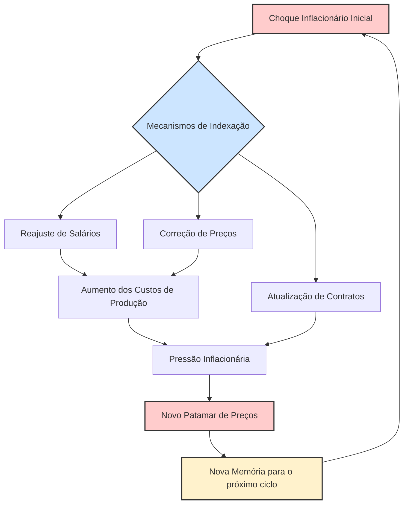

# A Natureza da Inflação no Brasil: O Debate entre Ortodoxia e a Tese da Inflação Inercial

---

## Parte I: O Contexto da Crise – A Hiperinflação na "Década Perdida"

### 1.1. A Gênese da Instabilidade: Crise Externa e Esgotamento do Modelo Econômico

A aceleração inflacionária que culminou na hiperinflação brasileira da década de 1980 não foi um evento súbito ou isolado. Ela representou o sintoma mais agudo do esgotamento de um modelo de desenvolvimento econômico que vigorou no país por décadas, precipitado por um cenário internacional adverso. O período, conhecido como a "Década Perdida", foi marcado por uma "tríplice crise" que entrelaçou os desequilíbrios externo, fiscal e inflacionário, mergulhando o Brasil em uma estagnação sem precedentes.

O gatilho fundamental da crise foi o superendividamento externo contraído durante os anos 1970, no período do chamado "Milagre Econômico". O crescimento acelerado daquela época foi amplamente financiado por empréstimos externos, uma estratégia que se mostrou vulnerável quando o cenário internacional mudou drasticamente. Dois choques externos foram decisivos: o segundo choque do petróleo em 1979, que elevou drasticamente o custo das importações, e o choque de juros nos Estados Unidos, que aumentou vertiginosamente o serviço da dívida externa brasileira, cujos juros eram flutuantes. Em 1982, com a crise da dívida mexicana, o fluxo de financiamento externo voluntário para a América Latina foi abruptamente interrompido, e o Brasil, temendo um calote, viu-se sem acesso a novos empréstimos do Fundo Monetário Internacional (FMI).

Essa crise externa expôs a fragilidade do modelo de desenvolvimento brasileiro, que era baseado em forte intervenção estatal e dependência de capital estrangeiro. Com o fim do financiamento externo, o Estado brasileiro perdeu sua principal fonte de recursos para investimento, o que levou a uma crise fiscal profunda e ao esgotamento de seu papel como principal promotor do crescimento. O resultado foi uma queda vertiginosa nos indicadores econômicos. O crescimento médio do Produto Interno Bruto (PIB), que fora robusto nas décadas anteriores, despencou de uma média de 7% nos anos 70 para cerca de 2% nos anos 80. A produção industrial sofreu uma retração agressiva, e a inflação, que já era alta, entrou em uma espiral ascendente, atingindo patamares anuais de 235% em 1985, 1.037% em 1988 e 1.782% em 1989. Esse cenário de estagnação econômica, combinado com a inflação galopante, consolidou a denominação de "Década Perdida".

### 1.2. Anatomia de uma Inflação Crônica e seu Impacto Social

A inflação dos anos 1980 era um fenômeno patológico. Diferente de processos inflacionários moderados, ela se caracterizava por ser crônica, persistente e por atingir taxas mensais de dois dígitos, o que desorganizava completamente a vida econômica e social. A moeda brasileira perdeu suas funções mais elementares: como unidade de conta, era instável; como meio de troca, insegura; e como reserva de valor, completamente deteriorada.

O impacto sobre a população foi devastador. A hiperinflação funcionava como um imposto perverso, corroendo diariamente o poder de compra dos salários. As famílias eram forçadas a uma corrida frenética aos supermercados no dia do pagamento para estocar produtos antes que os preços subissem novamente, muitas vezes no dia seguinte. Esse processo aprofundou dramaticamente a pobreza, a fome e a desigualdade social. Os mais pobres, que não tinham acesso a instrumentos financeiros sofisticados como as aplicações no mercado _overnight_ para proteger seu dinheiro, eram os mais penalizados. A instabilidade econômica impedia qualquer tipo de planejamento de longo prazo, tanto para as famílias quanto para as empresas, gerando um ambiente de incerteza e ineficiência generalizada.

Em um paradoxo notável, a mesma década que foi "perdida" para a economia foi "ganha" para a política.8 A crise econômica, ao minar a legitimidade do regime militar, foi um dos fatores que aceleraram o processo de redemocratização. Esse processo culminou com o fim da ditadura, a eleição de um governo civil em 1985 e a promulgação da Constituição de 1988, que ampliou direitos e consolidou a democracia.

Essa transição política, contudo, teve implicações diretas para a condução da política econômica. O novo governo democrático, liderado por José Sarney, herdou uma crise econômica profunda, mas operava sob novas restrições políticas. A sociedade, recém-saída de um regime autoritário e com movimentos sociais reorganizados, era avessa a políticas de austeridade ortodoxas, que inevitavelmente causariam uma recessão profunda e desemprego em massa. A inviabilidade política de um ajuste recessivo "clássico" abriu um espaço crucial para o debate e a eventual adoção de novas ideias. Foi nesse vácuo que as propostas heterodoxas, que prometiam uma estabilização "sem dor" e sem os custos sociais da recessão, ganharam proeminência e chegaram ao centro do poder, fornecendo a base intelectual para planos como o Cruzado. A crise política e a crise econômica, portanto, não foram eventos paralelos, mas fenômenos que se retroalimentaram, e o contexto da redemocratização foi um fator causal determinante para a ascensão do pensamento inercialista.

---

## Parte II: A Visão Ortodoxa e o Diagnóstico Monetarista

### 2.1. A Tese do Excesso de Demanda

Diante do caos inflacionário, a corrente de pensamento econômico ortodoxa, com forte inspiração monetarista, apresentava um diagnóstico que, em sua essência, era clássico: a inflação brasileira era um fenômeno de excesso de demanda. A máxima que resumia essa visão era a de que havia "muito dinheiro correndo atrás de poucos bens". Para os economistas ortodoxos, a inflação era, fundamentalmente, um fenômeno monetário, cuja causa primária não residia em mecanismos complexos de indexação, mas sim em desequilíbrios macroeconômicos fundamentais.

O motor desse excesso de demanda, segundo o diagnóstico ortodoxo, eram os déficits públicos crônicos e crescentes. O Estado gastava sistematicamente mais do que arrecadava, e a forma de financiar essa diferença era a emissão de moeda. Esse processo, conhecido como senhoriagem, injetava liquidez na economia sem uma contrapartida na produção de bens e serviços, o que inevitavelmente levava à desvalorização da moeda e ao aumento generalizado dos preços. A política fiscal expansionista do governo era, portanto, a raiz do problema inflacionário.

Nessa perspectiva, o papel das expectativas dos agentes econômicos era crucial, mas de uma natureza distinta daquela proposta pelos inercialistas. Para os ortodoxos, a persistência da inflação (sua "inércia") não derivava de uma memória mecânica do passado, mas de expectativas racionais sobre o futuro. Os agentes econômicos, observando a incapacidade ou a falta de vontade política do governo em controlar seus gastos, antecipavam que os déficits continuariam a ser financiados com mais emissão monetária. Essa expectativa de inflação futura levava-os a reajustar seus preços no presente, num comportamento de antecipação que validava e perpetuava o processo inflacionário.

### 2.2. A Terapia de Ajuste Convencional

Coerente com o diagnóstico de uma inflação de demanda causada por desequilíbrio fiscal, a solução proposta pela escola ortodoxa era direta e alinhada com o receituário tradicional de organismos como o FMI: era preciso contrair a demanda agregada para alinhá-la à capacidade de oferta da economia. A terapia consistia em um forte e rigoroso ajuste macroeconômico.

A medida central e inegociável era um **ajuste fiscal severo**. Isso implicava um corte drástico nos gastos públicos e um esforço para aumentar a arrecadação, com o objetivo de eliminar o déficit público e, consequentemente, cessar a necessidade de financiamento via emissão de moeda.2 Sem a "impressão de dinheiro" para cobrir os rombos do governo, a causa primária da inflação seria removida.

Paralelamente, o ajuste fiscal deveria ser acompanhado por uma **política monetária restritiva**. O Banco Central teria a tarefa de contrair a oferta de moeda na economia, principalmente através da elevação das taxas de juros. Juros mais altos encareceriam o crédito, desestimulando o consumo das famílias e o investimento das empresas, o que ajudaria a reduzir a pressão de demanda sobre os preços.

Os proponentes dessa abordagem reconheciam que a terapia de choque teria um custo social elevado no curto prazo, manifestado em recessão econômica e aumento do desemprego. No entanto, viam esse custo não como um erro, mas como um "remédio amargo" e necessário. A recessão era o preço a ser pago para "quebrar a espinha" da inflação, reverter as expectativas dos agentes e restaurar a credibilidade da política econômica, criando as bases para um crescimento futuro sustentável.

### 2.3. A Crítica Ortodoxa aos Planos Heterodoxos

Do ponto de vista da ortodoxia, os planos de estabilização heterodoxos, como o Plano Cruzado, estavam fadados ao fracasso desde sua concepção. A crítica central era que esses planos atacavam o sintoma (a alta dos preços) enquanto ignoravam completamente a doença (o excesso de demanda e o desequilíbrio fiscal).

A falha fundamental, segundo essa visão, foi a ausência de uma contrapartida fiscal e monetária robusta. Os formuladores do Plano Cruzado acreditaram que a desindexação, por si só, seria suficiente para estabilizar a economia. Para os ortodoxos, isso era um erro crasso. Sem um ajuste fiscal para conter os gastos do governo e uma política monetária para enxugar o excesso de liquidez, o congelamento de preços apenas represaria as pressões inflacionárias, que explodiriam com ainda mais força assim que os controles fossem removidos.

Além disso, o congelamento artificial de preços foi criticado por gerar profundas distorções na economia. Ao impedir que os preços relativos se ajustassem livremente segundo a oferta e a demanda, o congelamento criou desequilíbrios setoriais, que levaram ao desabastecimento de produtos nas prateleiras e ao surgimento de um mercado paralelo com cobrança de ágio.

O golpe final, na visão ortodoxa, foi o abono salarial concedido no início do Plano Cruzado. A medida, que representou um aumento real do poder de compra, foi vista como um estímulo adicional e irresponsável à demanda, exatamente o oposto do que a economia precisava. Ao invés de conter a demanda, o plano a expandiu, jogando "gasolina na fogueira" e acelerando o seu inevitável colapso.

---

## Parte III: A Teoria da Inflação Inercial – A Contribuição Brasileira

### 3.1. O Diagnóstico Estrutural e a "Memória Inflacionária"

Em oposição direta ao diagnóstico monetarista, emergiu no Brasil, durante a década de 1980, uma corrente de pensamento original e influente: a teoria da inflação inercial. Esta tese, que representa talvez a mais importante contribuição do pensamento econômico brasileiro ao debate internacional, partia de uma premissa radicalmente diferente. Embora não negasse a existência de desequilíbrios de demanda, argumentava que o principal motor da inflação brasileira não era o excesso de gastos, mas sim um poderoso componente autônomo e auto-reprodutivo, uma espécie de "memória inflacionária" que se perpetuava independentemente do estado da economia.

A tese central era surpreendentemente simples em sua formulação: a inflação de hoje era, em grande medida, determinada pela inflação de ontem. O processo inflacionário possuía uma dinâmica própria, uma inércia que o fazia persistir em patamares elevados mesmo durante períodos de profunda recessão e desemprego, um fato que as políticas ortodoxas de contração de demanda não conseguiam explicar nem resolver.

Esta visão implicava uma crítica frontal à terapia ortodoxa. Se a causa principal da inflação não era o excesso de demanda, então um ajuste puramente recessivo seria ao mesmo tempo ineficaz e socialmente custoso. Seria ineficaz porque a recessão, por mais severa que fosse, não teria o poder de quebrar a "memória" dos reajustes de preços e salários, que continuariam a ser repassados com base na inflação passada. E seria socialmente custoso porque imporia à sociedade um sacrifício imenso (desemprego em massa) para obter um resultado pífio no combate à inflação. Nessa lógica, variáveis como a oferta de moeda e o déficit público eram vistas como endógenas ao processo. Ou seja, elas não eram a causa primária da inflação, mas sim uma consequência, um mecanismo que "sancionava" ou validava a inflação já existente, fornecendo a liquidez necessária para que o ciclo de reajustes continuasse.

### 3.2. O Mecanismo da Inércia: Indexação, Sincronização e Conflito

Para compreender a teoria inercialista, é fundamental analisar os três pilares que sustentam seu mecanismo: a indexação generalizada, a assincronia dos reajustes e a interpretação da inflação como um conflito distributivo.

#### 3.2.1. O Ciclo de Retroalimentação via Indexação

O coração do diagnóstico inercialista reside no papel desempenhado pela indexação. Criada pelo regime militar na década de 1960 como uma forma de permitir a convivência com uma inflação moderada (através da correção monetária), a indexação se disseminou por toda a economia e, nos anos 1980, transformou-se no principal motor de perpetuação da inflação.

O mecanismo operava como um ciclo vicioso de retroalimentação. Contratos de todos os tipos — salários, aluguéis, mensalidades escolares, ativos financeiros — passaram a ser reajustados, formal ou informalmente, com base na inflação do período anterior. Isso criou uma "memória" que transmitia a inflação do passado para o futuro. A inflação observada no mês T-1 era usada como referência para calcular os reajustes de preços e salários no mês T. Esses reajustes, por sua vez, representavam um aumento de custos para outros setores da economia, que os repassavam para seus próprios preços no mês T+1. Dessa forma, a inflação se autoperpetuava, mesmo na ausência de novos choques de demanda ou de custos. A economia brasileira havia perdido o seu "zero" nominal, um ponto de referência estável para a formação de preços, tornando a inflação um processo puramente retrospectivo.

#### 3.2.2. Diagrama do Ciclo Inercial

A dinâmica de retroalimentação da inflação inercial pode ser visualizada através do seguinte fluxograma, que ilustra como a inflação passada se torna a causa da inflação presente, num ciclo contínuo.

Snippet de código

#### 3.2.3. A Inflação como "Conflito Distributivo"

A teoria inercialista possuía também uma dimensão sociopolítica profunda. A inflação não era vista apenas como um problema técnico-monetário, mas como a manifestação econômica de um **conflito distributivo** latente na sociedade brasileira.28

O mecanismo era agravado pelo fato de que os reajustes de preços e salários não ocorriam de forma sincronizada. Cada setor ou categoria profissional tinha sua própria data de reajuste. Nesse ambiente caótico, cada agente econômico (empresas, sindicatos, profissionais liberais) agia de forma defensiva. Ao reajustar seu preço ou reivindicar um aumento salarial, o objetivo não era necessariamente obter um ganho real, mas sim recompor o poder de compra que havia sido corroído pela inflação desde o último reajuste e se proteger contra a inflação futura.

Como nenhum agente confiava que os demais iriam cessar seus próprios reajustes, todos continuavam a remarcar, num comportamento racional do ponto de vista individual, mas desastroso do ponto de vista coletivo. Esse jogo não-cooperativo perpetuava a espiral inflacionária. A inflação, portanto, era o resultado de um impasse, de "reivindicações incompatíveis sobre a distribuição da renda nacional", onde cada grupo tentava manter sua fatia do bolo, e o resultado agregado era a contínua desvalorização da moeda.

### 3.3. Os Arquitetos da Teoria

A formulação da teoria da inflação inercial não foi obra de um único autor, mas o resultado de um intenso debate intelectual que envolveu alguns dos mais proeminentes economistas brasileiros da época, concentrados principalmente em duas instituições: a Pontifícia Universidade Católica do Rio de Janeiro (PUC-Rio) и a Fundação Getulio Vargas de São Paulo (FGV-SP).

Um precursor fundamental foi **Mário Henrique Simonsen**. Já em 1970, em sua obra "Inflação: Gradualismo x Tratamento de Choque", Simonsen desenvolveu o seu "modelo de realimentação", no qual decompunha a taxa de inflação em três componentes: um autônomo, um de demanda e um de "realimentação", que era explicitamente ligado à inflação do período anterior. Com isso, ele antecipou formalmente a ideia de que a inflação possuía um componente inercial que a propagava no tempo.

A teoria, no entanto, foi plenamente desenvolvida e consolidada no início dos anos 1980. Na PUC-Rio, um grupo de economistas conhecido como a "escola da Gávea" foi central nesse processo. Destacam-se os trabalhos de **Francisco Lopes**, **Pérsio Arida**, **André Lara Resende** e **Edmar Bacha**. Simultaneamente, na FGV-SP,

**Luiz Carlos Bresser-Pereira** e **Yoshiaki Nakano** também desenvolviam modelos e análises que chegavam a conclusões semelhantes sobre a natureza inercial e de conflito distributivo da inflação brasileira. Foi a convergência das ideias desses dois polos intelectuais que solidificou a teoria inercialista como o principal diagnóstico alternativo à ortodoxia e como a base para os planos de estabilização que se seguiriam.

---

## Parte IV: O Laboratório Heterodoxo e Suas Lições

### 4.1. A Lógica do "Choque Heterodoxo"

Se o diagnóstico apontava para uma inflação movida pela inércia e pela memória, a solução não poderia ser gradualista ou baseada apenas em instrumentos de mercado. A terapia proposta pela escola heterodoxa era, por natureza, intervencionista e drástica: o "choque heterodoxo". A lógica era que, para quebrar a psicologia inflacionária e o ciclo de reajustes automáticos, era necessária uma intervenção cirúrgica do Estado que interrompesse a propagação da inflação de uma só vez.

O principal instrumento desse choque era o **congelamento geral de preços e salários**. O objetivo do congelamento não era reprimir a inflação indefinidamente, mas sim atuar como um mecanismo de coordenação forçada. Ao proibir todos os reajustes simultaneamente, o governo visava quebrar a "memória" que ligava os preços presentes aos passados e "sincronizar" toda a economia em um "dia zero". Seria uma forma de romper o jogo não-cooperativo dos agentes, eliminando a justificativa para reajustes defensivos e estabelecendo um novo ponto de partida para a formação de preços em um ambiente de estabilidade.

Para reforçar simbolicamente essa ruptura com o passado inflacionário e facilitar a transição, o congelamento era frequentemente acompanhado de uma **reforma monetária**. Isso envolvia a criação de uma nova moeda, geralmente com o corte de zeros da moeda antiga, como ocorreu com a passagem do Cruzeiro para o Cruzado em 1986. A nova moeda deveria nascer "limpa" da memória inflacionária que contaminava a antiga.

### 4.2. Análise Comparada dos Planos

A segunda metade da década de 1980 transformou o Brasil em um verdadeiro laboratório de políticas anti-inflacionárias, com a implementação de sucessivos planos de estabilização que se basearam, em maior ou menor grau, na tese inercialista.

- **O Plano Cruzado (1986):** Foi a aplicação mais pura e famosa da teoria inercialista.9 Lançado em fevereiro de 1986, o plano promoveu um congelamento geral de preços e salários, instituiu o Cruzado como nova moeda e estabeleceu um gatilho salarial que previa reajustes automáticos caso a inflação atingisse 20%. O sucesso inicial foi espetacular: a inflação despencou, gerando uma onda de euforia popular e apoio ao governo.13 Contudo, o plano continha as sementes de seu próprio fracasso.
    
    **As principais causas do colapso foram:**
    
    1. **Ausência de Ajuste Fiscal e Monetário:** O plano ignorou completamente a necessidade de uma contrapartida ortodoxa. O governo não promoveu cortes de gastos nem contraiu a política monetária, permitindo que a demanda continuasse aquecida.
        
    2. **Explosão de Consumo:** O congelamento, combinado com um abono salarial inicial, gerou um aumento massivo do poder de compra. O resultado foi uma explosão de consumo que a oferta não conseguiu acompanhar, levando a filas, desabastecimento generalizado e ao surgimento de ágio.
        
    3. **Uso Político:** O governo Sarney, visando capitalizar a popularidade do plano nas eleições de novembro de 1986, adiou os ajustes necessários. A "festa do consumo" foi mantida por razões eleitorais, e logo após as eleições, com a economia em frangalhos, o plano foi abandonado e a inflação retornou com força ainda maior.
        
- **Os Planos Bresser (1987) e Verão (1989):** Foram tentativas de aprender com os erros do Cruzado. Ambos foram concebidos como planos "híbridos" ou "mistos", que buscavam combinar o congelamento de preços heterodoxo com medidas de austeridade ortodoxas. O Plano Bresser (junho de 1987) incluiu um congelamento mais curto e uma preocupação maior com o ajuste fiscal. O Plano Verão (janeiro de 1989) foi ainda mais longe na ortodoxia, combinando o congelamento com uma política de juros extremamente elevados para conter a demanda. Apesar das correções de rota, ambos os planos também fracassaram em estabilizar a economia. A inflação cedia temporariamente, mas logo retornava, evidenciando a profundidade da crise fiscal, a força avassaladora da inércia e a perda de credibilidade do governo em sustentar qualquer programa de ajuste.
    

### 4.3. O Debate Interno: Congelamento vs. Moeda Indexada

Dentro do próprio campo inercialista, existia uma divergência teórica fundamental sobre a melhor estratégia para quebrar a inércia, um ponto de grande sofisticação analítica. A controvérsia se dava entre a proposta de um choque abrupto via congelamento e uma reforma monetária mais gradualista.

- **Proposta do Congelamento (Francisco Lopes):** Esta vertente, que influenciou diretamente o Plano Cruzado, defendia que um choque direto e abrangente, com o congelamento de todos os preços e salários, era a única maneira eficaz de romper a inércia de forma rápida e sincronizada. A intervenção drástica seria necessária para impor a coordenação que o mercado não conseguia produzir.
    
- **Proposta da "Moeda Indexada" (Plano Larida - Pérsio Arida e André Lara Resende):** Este grupo de economistas da PUC-Rio era cético em relação ao congelamento. Argumentavam que congelar preços em uma economia com reajustes dessincronizados era administrativamente complexo e criaria distorções de preços relativos e perdas de renda insustentáveis, minando o apoio político ao plano. Em vez disso, propuseram uma reforma monetária mais sofisticada, que ficou conhecida como "Plano Larida". A ideia era criar uma "moeda indexada" — uma unidade de conta virtual, totalmente protegida da inflação (por exemplo, atrelada diariamente ao dólar) — que circularia em paralelo à moeda corrente e desvalorizada. O objetivo era que os agentes econômicos, de forma voluntária, passassem a usar essa "moeda boa" como referência para seus contratos e preços. Isso promoveria uma desindexação gradual e orientada pelo mercado, alinhando todos os preços relativos _antes_ da introdução definitiva da nova moeda, tornando o trauma do congelamento desnecessário.
    

A história dos planos de estabilização dos anos 80 acabou por validar, de forma indireta, a proposta da "moeda indexada". Os sucessivos fracassos dos planos baseados em congelamento (Cruzado, Bresser, Verão) demonstraram na prática as dificuldades e distorções apontadas por Arida e Resende. A proposta do Plano Larida, embora não implementada na década de 80, não foi esquecida. Em 1994, os formuladores do Plano Real, muitos dos quais participaram do debate inercialista, resgataram sua essência. A **Unidade Real de Valor (URV)** foi a implementação prática e genial da "moeda indexada": um indexador quase-moeda que serviu para alinhar todos os preços da economia de forma transparente e voluntária antes da introdução do Real.55 Portanto, o legado intelectual mais duradouro do debate dos anos 80 não foi a ideia do congelamento, que se provou falha, mas sim a proposta alternativa que, uma década depois, se tornaria a chave para o sucesso da estabilização brasileira.

---

## Parte V: Síntese e Legado para a Estabilidade Econômica

### 5.1. A Grande Lição dos Anos 1980

A tumultuada "Década Perdida" funcionou como um doloroso, porém indispensável, processo de aprendizado para a economia política brasileira. Ao final do período, um consenso havia se formado entre a maioria dos economistas e formuladores de política: nenhuma das duas grandes escolas de pensamento, ortodoxa ou heterodoxa, detinha, isoladamente, a solução completa para o problema da hiperinflação brasileira. A estabilidade duradoura exigiria uma síntese.

- **A Lição Heterodoxa:** A principal lição deixada pela escola inercialista foi o reconhecimento de que a inflação brasileira possuía, de fato, um componente inercial arraigado e poderoso, que não podia ser ignorado. A experiência demonstrou que políticas puramente recessivas, como as propostas pela ortodoxia, eram incapazes de debelar uma inflação dessa natureza e impunham um custo social proibitivo. Ficou claro que qualquer plano de estabilização bem-sucedido precisaria incorporar um mecanismo específico e eficaz para quebrar a memória inflacionária e desindexar a economia.
    
- **A Lição Ortodoxa:** Por outro lado, o fracasso retumbante dos planos heterodoxos, especialmente o Cruzado, ensinou uma lição igualmente crucial: quebrar a inércia era uma condição necessária, mas não suficiente. A desindexação e o congelamento de preços eram inúteis se não fossem sustentados por fundamentos macroeconômicos sólidos. Sem um ajuste fiscal rigoroso para estancar a fonte de desequilíbrio primário e sem uma política monetária consistente com a estabilidade, qualquer alívio seria temporário. A inflação, meramente reprimida, retornaria com força total assim que os controles fossem relaxados. A estabilidade de preços, concluiu-se, exigia responsabilidade fiscal e monetária.
    

### 5.2. O Caminho para o Plano Real: A Síntese Bem-Sucedida

O Plano Real, lançado em 1994, foi o herdeiro direto de todo esse legado intelectual. Seu sucesso notável em derrotar a hiperinflação deveu-se precisamente à sua capacidade de combinar, de forma engenhosa e pragmática, as lições aprendidas de ambas as correntes de pensamento. O Real não foi um plano puramente ortodoxo nem puramente heterodoxo; foi a síntese bem-sucedida das duas visões.

- **O Elemento Heterodoxo (Inercialista):** O coração do plano foi a criação da Unidade Real de Valor (URV). Inspirada diretamente na proposta da "moeda indexada" do Plano Larida, a URV funcionou como uma unidade de conta estável que conviveu com a moeda antiga (o Cruzeiro Real) por alguns meses. Ao obrigar a conversão de salários e, gradualmente, de todos os preços para a URV, o plano conseguiu desindexar a economia e alinhar os preços relativos de forma transparente, sem a necessidade de um congelamento traumático e distorcivo. Foi o mecanismo inteligente para quebrar a inércia.
    
- **O Elemento Ortodoxo:** A genialidade da URV não teria funcionado sem uma base sólida. O Plano Real só foi implementado após o governo ter promovido um rigoroso ajuste fiscal, notadamente com a criação do Fundo Social de Emergência (FSE), que deu ao governo a flexibilidade orçamentária necessária para equilibrar as contas públicas. Além disso, após a introdução da nova moeda, o Real, a estabilidade foi sustentada por políticas macroeconômicas consistentes, incluindo uma política monetária contracionista (juros altos) e o uso de uma âncora cambial nos primeiros anos. O Real funcionou porque atacou as duas frentes do problema: quebrou a inércia (lição heterodoxa) e corrigiu os desequilíbrios fundamentais (lição ortodoxa).
    

### 5.3. Tabela Comparativa: Ortodoxia vs. Inercialismo

A tabela a seguir resume as principais diferenças entre as duas correntes de pensamento, servindo como uma ferramenta de estudo e revisão para o candidato ao CACD.

|Eixo de Análise|**Visão Ortodoxa (Monetarista)**|**Visão Heterodoxa (Inercialista)**|
|---|---|---|
|**Diagnóstico Central**|Inflação de Demanda.|Inflação Inercial e de Custos.|
|**Causa Primária**|Déficits públicos crônicos financiados por emissão monetária.|Indexação generalizada da economia e conflito distributivo.|
|**Papel do Déficit Público**|Causa fundamental da inflação.|Fator secundário; sanciona a inflação, mas não a causa primária.|
|**Papel das Expectativas**|Racionais, formadas com base na política fiscal futura do governo.|Adaptativas, formadas com base na inflação passada ("memória").|
|**Mecanismo de Propagação**|Expansão contínua da base monetária para financiar o déficit.|Repasse automático e dessincronizado da inflação passada para os preços presentes.|
|**Solução Proposta**|Ajuste fiscal rigoroso e contração monetária (terapia de choque recessiva).|"Choque heterodoxo" (congelamento de preços) ou reforma monetária (moeda indexada) para quebrar a inércia.|
|**Custo Social**|A recessão e o desemprego são um custo inevitável e necessário para a estabilização.|A estabilização pode e deve ser alcançada sem recessão e com menor custo social.|
|**Crítica à Visão Oposta**|A heterodoxia ignora as causas fundamentais (fiscais) e ataca apenas os sintomas (preços).|A ortodoxia aplica um remédio ineficaz (recessão) para uma doença mal diagnosticada, com custo social proibitivo.|
|**Principais Nomes**|(Associados ao receituário do FMI e economistas como Delfim Netto no período)|M.H. Simonsen, F. Lopes, P. Arida, A.L. Resende, E. Bacha, L.C. Bresser-Pereira, Y. Nakano.|

---

## Parte VI: Questões Discursivas para Autoavaliação (Estilo CACD)

> [!question] Questão 1
> 
> Compare e contraste os diagnósticos das correntes ortodoxa e inercialista sobre as causas da hiperinflação brasileira na década de 1980. Discorra sobre como as diferentes interpretações a respeito do papel do déficit público e dos mecanismos de indexação levaram a propostas de política econômica radicalmente distintas.

> [!question] Questão 2
> 
> Analise o Plano Cruzado (1986) como uma aplicação da teoria da inflação inercial. Explique a lógica por trás do congelamento de preços e da reforma monetária como instrumentos de quebra da "memória inflacionária". Em seguida, discuta as principais razões para o seu fracasso, relacionando-as com a crítica da escola ortodoxa.

> [!question] Questão 3
> 
> O Plano Real (1994) é frequentemente considerado uma síntese bem-sucedida das lições aprendidas com os fracassos dos planos de estabilização da década de 1980. Discorra sobre como o Real incorporou elementos tanto da visão heterodoxa (inercialista) quanto da visão ortodoxa para alcançar a estabilidade de preços. Em sua resposta, detalhe o papel da Unidade Real de Valor (URV) como herdeira da proposta da "moeda indexada".