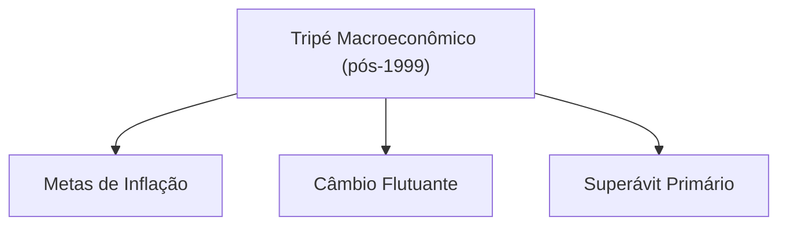

# Economia Brasileira na Década de 1990: Abertura, Estabilização e Transformações Estruturais

A década de 1990 marcou um **ponto de inflexão** na economia brasileira, combinando reformas liberalizantes com um audacioso plano de estabilização monetária. Após anos de hiperinflação, crise da dívida externa e esgotamento do modelo desenvolvimentista de substituição de importações, o país ingressou num ciclo de **transformação estrutural**. Esse ciclo envolveu a **abertura comercial e financeira parcial** do início da década – o chamado "choque de competitividade" – e, posteriormente, a implementação do **Plano Real**, que debelou a hiperinflação. Os anos 90 testemunharam, portanto, a transição de um Estado altamente intervencionista para políticas inspiradas no Consenso de Washington, com privatizações, liberalização e nova inserção global da economia. A seguir, analisam-se em detalhe esses dois eixos – abertura e estabilização – e suas inter-relações, incluindo os desafios (déficits gêmeos, crises externas) e legados (fim da hiperinflação, **tripé macroeconômico** pós-1999) desse período.

> [!definition] **Consenso de Washington** 
> Conjunto de medidas econômicas concebidas em 1989 por instituições sediadas em Washington D.C. (FMI, Banco Mundial e Tesouro dos EUA) para países emergentes em crise. Enfatizava disciplina fiscal, controle da inflação, **privatizações** de estatais e **abertura econômica** (comercial e financeira) como caminhos para retomada do crescimento. No caso brasileiro, tais recomendações balizaram as reformas dos anos 1990, incluindo a estabilização monetária (Plano Real) e a liberalização da economia.

## 1. Abertura Comercial e Financeira Parcial da Economia Brasileira

### Contexto: Hiperinflação e Esgotamento do Modelo de Substituição de Importações

Nas décadas anteriores, especialmente entre os anos 1930 e 1980, o Brasil desenvolveu-se sob um modelo de **industrialização por substituição de importações**, com forte intervenção estatal e proteção do mercado interno. Esse modelo, embora tenha proporcionado crescimento acelerado até os anos 1970, começou a dar sinais de esgotamento no fim daquele período. A crise da dívida externa de 1982, os choques do petróleo e a elevação dos juros internacionais expuseram vulnerabilidades: o país adentrou os anos 1980 com estagnação econômica, inflação galopante e endividamento elevado. A chamada "crise do Estado desenvolvimentista" manifestou-se na **explosão inflacionária** (que atingiu níveis de hiperinflação acima de 2000% ao ano no início dos 90) e na perda de capacidade de investimento público. Diversos planos heterodoxos de estabilização nos anos 1980 (Cruzado, Bresser, Verão, Collor I e II) fracassaram em conter a inércia inflacionária.

Diante desse quadro de esgotamento, a elite dirigente buscou uma **mudança de paradigma** na década de 1990. A resposta veio sob a forma de reformas liberalizantes inspiradas nas ideias do Consenso de Washington e na onda global de **globalização financeira** e abertura de mercados pós-Guerra Fria. O governo Fernando Collor de Mello (1990–1992) deu início a esse movimento com medidas drásticas para **redimensionar o papel do Estado** na economia e expor a produção doméstica à concorrência externa. Trata-se de uma reação de perfil liberal aos desequilíbrios acumulados, pondo fim ao longo período de economia fechada e intervencionista. Em resumo, no começo dos anos 90 o Brasil estava pronto para abandonar o **nacional-desenvolvimentismo** e tentar um novo ciclo orientado pela estabilidade monetária, abertura e _market-friendly reforms_.

### O "Choque de Competitividade" e a Abertura Comercial

Uma das primeiras e mais emblemáticas iniciativas de Collor foi promover um **“choque de competitividade”** na indústria nacional, via abertura comercial unilateral. Desde sua posse em 1990, Collor criticava a indústria brasileira como obsoleta e pouco competitiva, comparando-a a uma “carroça” frente aos produtos estrangeiros. Para **forçar a modernização** e baixar os preços internos, seu governo desmontou o arcabouço protecionista herdado do período de substituição de importações. Em 1990 foi lançada a **Nova Política Industrial e de Comércio Exterior**, que **eliminou a maior parte das barreiras não-tarifárias** (como licenças de importação, cotas e proibições) e estabeleceu um cronograma para **reduzir drasticamente as tarifas de importação**. Entre 1990 e 1994, as alíquotas foram sendo cortadas gradualmente: ao final, a tarifa máxima caiu para 40% (antes chegava a 85% nos anos 80), a tarifa média para cerca de 14% e a tarifa modal para 20%. Na prática, o governo **antecipou** parte das reduções – já em 1992 muitos cortes previstos para 1993-94 foram implementados de imediato, aprofundando a abertura.

- **Antes e Depois da Abertura:** No final dos anos 1980, o Brasil era uma das economias mais fechadas do mundo, com tarifa média acima de 50% e diversos mecanismos protecionistas. Após as reformas de Collor, a tarifa média desceu a patamar próximo de 14% e inúmeras **reservas de mercado** foram extintas. Por exemplo, setores automobilístico e de informática – antes altamente protegidos – viram suas alíquotas reduzidas para 20–35%. Produtos sem similar nacional passaram a ter tarifa zero, ao passo que mesmo bens de consumo antes considerados “supérfluos” (como eletroeletrônicos) tiveram suas barreiras significativamente reduzidas. Esse **choque de abertura** inundou o mercado interno com importados mais baratos, pressionando empresas nacionais a cortar custos, elevar a produtividade e atualizar tecnologias.
    

> [!important] **Impacto Imediato** 
> A abertura comercial de Collor teve efeitos ambíguos. Por um lado, contribuiu para **derrubar a inflação inercial** ao baratear produtos importados e criar concorrência (o que foi útil na estabilização posterior). Também beneficiou os consumidores com maior oferta e preços menores. Por outro lado, muitas indústrias nacionais, habituadas à proteção, sofreram com a concorrência externa e a valorização cambial subsequente – fenômeno que seria agravado pelo Plano Real. Esse ajuste brusco levou à **desindustrialização** de alguns segmentos e ao aumento do coeficiente de importação na economia. Autores como Luiz Gonzaga Belluzzo destacam que a abertura “com câmbio valorizado e juros altos” nos anos 90 acabou **eliminando elos das cadeias produtivas locais**, sem contrapartida em aumento de exportações, enfraquecendo a indústria nacional. Essa tensão entre ganho de eficiência e perda de setores industriais é central para entender os **custos do ajuste neoliberal** da década.

Paralelamente à abertura comercial, o Brasil buscou integrar-se em blocos regionais e acordos internacionais. Em 1991 firmou-se o Tratado de Assunção criando o **Mercosul** (com Argentina, Uruguai e Paraguai), que estabeleceu uma união aduaneira gradual na região. O Mercosul foi importante para redirecionar exportações industriais brasileiras aos vizinhos num momento em que a concorrência asiática crescia globalmente. Além disso, o país participou de negociações da Área de Livre Comércio das Américas (ALCA) e aproximou-se de acordos com a União Europeia. Ou seja, a abertura unilateral veio acompanhada de uma **estratégia de integração comercial** mais ampla, sinalizando que o Brasil abandonava de vez o isolamento econômico.

### Liberalização Financeira e Vulnerabilidade Externa

A abertura do início dos anos 90 não se restringiu ao comércio de bens: incluiu também a **liberalização financeira**, ainda que de forma parcial e gradual. Após o acordo da dívida Brady em 1992, que reestruturou a dívida externa, o Brasil voltou a ter acesso aos mercados internacionais de capital. O governo Collor e, em seguida, a gestão de Itamar Franco (1992–1994) tomaram medidas para **atrair investimento estrangeiro** e **liberar fluxos de capital**:

- Em 1991, regulamentou-se a entrada de **investidores de portfólio estrangeiros** na bolsa brasileira, através das contas **CELEBR** (Convênio de Custódia) no mercado acionário, o que facilitou a vinda de recursos para ações nacionais.
    
- A partir de 1992-93, com a estabilização iminente, houve maior confiança para entrada de **Investimento Estrangeiro Direto (IED)**, incluindo privatizações que abriram setores a multinacionais.
    
- O governo também flexibilizou controles cambiais, permitindo às empresas maior acesso a crédito externo e **emissões de títulos no exterior** (eurobônus, ADRs etc.). A Constituição de 1988 foi emendada em 1995 para permitir a entrada de bancos estrangeiros no país (mediante acordos de reciprocidade), sinalizando maior abertura do setor financeiro.
    

Como resultado, nos meados da década de 90 o Brasil experimentou uma onda de influxos de capitais externos – parte impulsionada pela fama do Plano Real e pelos **juros altos** que o país passou a pagar (atraindo capital especulativo de curto prazo). Essa liberalização financeira teve efeitos positivos, como o aumento das reservas internacionais e financiamento para o déficit em conta corrente. Contudo, também **elevou a vulnerabilidade externa** do país. A economia ficou mais exposta ao chamado _hot money_ (capitais voláteis), passando a oscilar conforme o humor dos investidores globais.

> [!note] **Vulnerabilidade Externa** 
> Com a conta capital mais aberta, o Brasil dos anos 90 passou a registrar **entradas maciças de recursos** em alguns períodos e fugas abruptas em outros. Isso criou um padrão de crescimento instável – o "voo da galinha" – marcado por expansões curtas financiadas por poupança externa seguidas de súbitas paradas (“sudden stops”) quando ocorria aversão a risco. A dependência de capitais externos para fechar as contas gerou **risco cambial**: se os investidores saíssem, o Banco Central precisava elevar juros ou queimar reservas para segurar o câmbio, sacrificando crescimento. Essa fragilidade ficou evidente nas crises financeiras internacionais da segunda metade da década (Tequila 1995, Ásia 1997, Rússia 1998), quando o Brasil sofreu intensas pressões cambiais. A **liberalização financeira** sem salvaguardas plenas expôs o país a choques externos e aprofundou o dilema entre manter a estabilidade conquistada e retomar o desenvolvimento sustentado.

Em resumo, a abertura financeira dos anos 90 fez parte do receituário liberal adotado: atrair capitais estrangeiros era visto como forma de _boost_ no investimento e integração à globalização financeira. Economistas alinhados à nova estratégia – notadamente o grupo da PUC-Rio (Edmar Bacha, Gustavo Franco, André Lara Resende, Pérsio Arida, etc.) – argumentavam que essa inserção financeiramente aberta, combinada à abertura comercial, elevaria a eficiência alocativa e o **dinamismo tecnológico**, pavimentando um novo ciclo de crescimento. **Edmar Bacha**, um dos formuladores do Plano Real, defendia explicitamente a abertura comercial e financeira como imprescindíveis para aumentar a produtividade e disciplinar a economia brasileira frente à competição internacional. Ao mesmo tempo, críticos da esquerda, como **Maria da Conceição Tavares**, viam esse movimento como **predatório** aos interesses nacionais, pois subjugava o país às flutuações do capital global e enfraquecia a capacidade do Estado em liderar o desenvolvimento.

### Programa Nacional de Desestatização (PND) e as Primeiras Privatizações

Integrante fundamental do pacote liberalizante foi o **Programa Nacional de Desestatização (PND)**, que inaugurou um ciclo de **privatizações** de empresas estatais. Logo em abril de 1990, Collor conseguiu aprovar a Lei nº 8.031/1990, que criou o PND e estabeleceu as diretrizes para vender ou transferir o controle de empresas públicas para o setor privado. A motivação oficial do programa era dupla: **reduzir o tamanho do Estado** – considerado ineficiente, um “paquiderme lento e desengonçado” na propaganda da época – e **atrair capitais externos** para modernizar a economia. Em outras palavras, as privatizações eram tidas como parte da reforma do Estado e, simultaneamente, como parte da **abertura econômica** do país ao mundo.

- **PND Fase Collor (1990-1992):** Nessa primeira fase, o governo listou 68 empresas para desestatização, englobando siderúrgicas, petroquímica, fertilizantes, setor aeronáutico, mineração, etc. Na prática, porém, apenas **18 empresas foram privatizadas** antes de Collor sair do poder. A estreia se deu com a venda da **USIMINAS** (Usinas Siderúrgicas de Minas Gerais) em outubro de 1991, arrematada pelo grupo privado (liderado pela Gerdau) num leilão que gerou controvérsia, pois a usina era lucrativa e simbolizava o auge do planejamento estatal dos anos 50. Seguiram-se outras vendas de siderúrgicas: Açominas, Cosipa, e a Embraer (fabricante aeronáutica) também foi privatizada em 1994, já no governo Itamar. Collor enfrentou resistências políticas e escândalos (como o caso da VASP) que atrasaram o PND, mas lançou as bases do processo.
    
- **Continuação sob Itamar (1992-94):** O presidente Itamar Franco, embora de perfil desenvolvimentista histórico, deu sequência moderada ao PND. Seu governo concluiu a privatização da **Companhia Siderúrgica Nacional (CSN)** em 1993, um marco simbólico (a CSN fora inaugurada em 1946 como emblema do nacional-desenvolvimentismo de Vargas). Também vendeu a **Aço Minas Gerais (Açominas)** e a **Companhia Siderúrgica Paulista (Cosipa)**, consolidando a saída do Estado do setor siderúrgico. A Embraer foi privatizada em 1994, marcando a transferência de uma empresa de alta tecnologia para controle privado. Itamar, contudo, não avançou em setores politicamente sensíveis como telecomunicações, petróleo ou bancos públicos – essas ficaram para a próxima gestão.
    
- **Ampliação sob FHC (1995-2002):** Eleito após o sucesso do Real, Fernando Henrique Cardoso abraçou a agenda privatizante como parte central de seu projeto de reformas. Em 1995, criou o Conselho Nacional de Desestatização e, aderindo às recomendações do FMI e do Consenso de Washington, anunciou um **amplo programa de privatizações** em nível federal e estadual. Nos anos seguintes, o governo FHC vendeu empresas de setores estratégicos: a **Companhia Vale do Rio Doce (CVRD)** em 1997 (mineração), o **Sistema Telebrás** em 1998 (telecomunicações), além de empresas de energia (Light, Gerasul), bancos estaduais e várias empresas estaduais de eletricidade e saneamento. Houve forte oposição de sindicatos, movimentos sociais e mesmo setores acadêmicos, com protestos durante os leilões na Bolsa do Rio de Janeiro. Ainda assim, o processo prosseguiu, financiado em parte pelo BNDES e com uso de moedas podres (títulos da dívida) pelos compradores – aspectos bastante criticados pelos analistas da época.
    

É importante notar que as privatizações dos anos 90 não apenas aliviaram o caixa do governo (reduzindo dívida pública com as receitas das vendas), mas também **redesenharam o papel do Estado** na economia brasileira. Ao final da década, a União já não controlava setores-chave como siderurgia, mineração, telecomunicações e parte do sistema financeiro. Essa **reforma estrutural** atendeu aos preceitos neoliberais de diminuir o Estado produtor e fortalecê-lo como regulador. Economistas liberais argumentavam que, ao transferir empresas ao setor privado, o Estado abriria espaço fiscal e aumentaria a eficiência global da economia. Já críticos (incluindo muitos diplomatas formados no old school desenvolvimentista) viam com receio a desnacionalização de patrimônios e a formação de oligopólios privados. Para o candidato bem preparado, compreender essas nuances e argumentos pró e contra as privatizações é fundamental, visto que esse tema tem sido recorrente em provas de Política Econômica.

## 2. O Plano Real: Estratégia, Âncora Cambial e Estabilização

### Concepção e Fases do Plano Real (1993-1994)

Frente ao colapso inflacionário do final dos anos 80/início dos 90, o **Plano Real** emergiu como a mais bem-sucedida estratégia de estabilização da história brasileira. Formulado em 1993 durante o governo Itamar Franco, sob liderança do então ministro da Fazenda **Fernando Henrique Cardoso** e uma equipe de economistas (Persio Arida, Edmar Bacha, André Lara Resende, Gustavo Franco, entre outros), o Plano Real foi concebido como um programa **gradual e heterodoxo dentro da ortodoxia**. Em vez de um congelamento abrupto, optou-se por uma sequência de etapas para desarmar a inércia inflacionária:

1. **Ajuste Fiscal Prévio:** Em 1993, o governo aprovou medidas para equilibrar as contas públicas antes da estabilização monetária. Criou-se o **Fundo Social de Emergência** (FSE) – depois chamado Fundo de Estabilização Fiscal – permitindo desvincular 15% das receitas orçamentárias e direcioná-las à redução do déficit. Houve cortes de gastos e elevação de alguns tributos, compondo um esforço fiscal inicial. A ideia era sinalizar compromisso com disciplina fiscal, atacando a raiz monetária da inflação (financiamento do déficit via emissão).
    
2. **Criação da Unidade Real de Valor (URV):** Lançada em março de 1994, a **URV** foi uma moeda escritural indexada, cujo valor era ajustado diariamente pela inflação. Salários, preços e contratos foram convertidos para URV, enquanto o cruzeiro real continuava sendo a moeda corrente inflacionária. Essa etapa inovadora funcionou como um **divisor de águas**: a URV serviu de **âncora psicológica** e mecanismo de transição, rompendo a memória inflacionária ao habituar agentes a pensar em valores estáveis. Durante quatro meses, a URV coabitou com a moeda antiga, servindo de denominador comum para reajustes de preços e salários, de modo que, ao final, os preços reais estavam praticamente estabilizados em URV.
    
3. **Lançamento do Real:** Em 1º de julho de 1994, entrou em circulação a nova moeda, o **Real (R$)**, com paridade inicial de **R$1,00 = US$1,00**. A conversão dos salários e preços da URV para o Real consolidou a estabilização: a inflação mensal, que chegara a 50% no início de 1994, caiu para menos de 2% no mês seguinte ao lançamento da nova moeda. A partir de então, o Real seria sustentado por um regime de câmbio administrado, altos juros e monitoramento fiscal – componentes da estratégia de manutenção da estabilidade.
    

> [!definition] **Âncora Cambial** 
> Política de controle do regime de câmbio para ajudar a estabilizar preços internos. No Plano Real, adotou-se uma **âncora cambial** através de um regime de banda cambial (câmbio semi-fixo) em que o Banco Central fixava um patamar-alvo para o dólar frente ao real e intervinha constantemente para mantê-lo. Em 1994, fixou-se aproximadamente **1 real ≈ 1 dólar**, permitindo leve flutuação dentro de bandas. Para sustentar essa paridade, o BC **vendeu reservas internacionais** sempre que a cotação ameaçava ultrapassar o teto da banda e **elevou a taxa de juros** doméstica para atrair capitais externos, equilibrando o balanço de pagamentos. O objetivo explícito dessa âncora era **baratear os produtos importados** (tornando-os mais competitivos no mercado interno) e assim forçar a queda dos preços domésticos, quebrando a espiral inflacionária. Com a âncora cambial, a taxa de câmbio valorizada tornou-se o **pilar anti-inflacionário** no período 1994-1998.

### A Âncora Cambial (1994–1998): Funcionamento, Objetivos e Efeitos

Sob o Plano Real, de 1994 até início de 1999, o Brasil adotou essencialmente um regime de câmbio fixo (oficialmente bandas cambiais deslizantes). O real teve seu valor **administrado pelo Banco Central**, resultando numa moeda **sobrevalorizada** em termos reais. Esse arranjo serviu a múltiplos propósitos:

- **Combate à Inflação:** Como mencionado, a ideia era usar o câmbio como **âncora nominal**. A valorização cambial barateava importações – desde bens de consumo até insumos – e criava uma pressão competitiva que impedia produtores locais de repassar aumentos de custos aos preços. Isso complementava o fim da indexação proporcionado pela URV. O resultado foi espetacular: a inflação, que havia sido de 2.477% em 1993, despencou para 916% em 1994 (a maior parte concentrada no primeiro semestre pré-Real) e chegou a apenas **22% em 1995**, consolidando-se em torno de 7% ao ano em 1997-98. Ou seja, a hiperinflação foi dominada, restaurando a **moeda estável** – um feito histórico comemorado amplamente pela população.
    
- **Estabilização das Expectativas:** A **paridade quase fixa com o dólar** serviu como um **símbolo de credibilidade**. Consumidores e investidores passaram a acreditar que o governo manteria o valor do real, o que ancorou expectativas de inflação baixa e encorajou a **retomada do crédito e do consumo de bens duráveis** (antes inviabilizados pela inflação diária). Itens como automóveis e eletrodomésticos tornaram-se acessíveis a prazo. O poder de compra da classe média se recuperou, e houve um **boom de consumo** em 1994-95 graças à moeda forte.
    
- **Reformas Complementares:** Para sustentar o câmbio valorizado e atrair os dólares necessários, o governo combinou a âncora com **juros altos** e continuidade da abertura. A taxa básica de juros (SELIC) foi mantida em patamar elevado – frequentemente acima de 20% ao ano em termos reais – tornando o país atraente ao capital financeiro internacional (o chamado _carry trade_). Adicionalmente, flexibilizou-se ainda mais a entrada de capitais e deu-se seguimento às privatizações, que trouxeram bilhões de dólares em IED. Essas políticas compensatórias ajudavam a fechar as contas externas e preservar as reservas cambiais, mas ao custo de endividamento público caro e valorização adicional do real.
    

**Impactos Positivos:** O **sucesso inicial do Plano Real foi incontestável** no quesito inflação. A hiperinflação crônica, que corroía salários e desorganizava a economia, foi debelada. Em poucos meses, a população readquiriu a confiança na moeda – algo inédito para toda uma geração acostumada a indexar preços diariamente. Houve ganhos sociais imediatos: os salários reais médios subiram com a estabilização, pois os reajustes passaram a superar a inflação; a pobreza teve uma redução de curto prazo, já que a chamada "taxa de inflação dos pobres" (que sofrem mais com carestia de alimentos) caiu drasticamente. O mercado interno expandiu, com aumento das vendas no varejo e do crédito imobiliário. O Plano Real também **fortaleceu a democracia**, no sentido de mostrar que políticas econômicas consistentes poderiam resolver problemas antes tidos como insolúveis – isso elevou a confiança nas instituições e pavimentou a reeleição de FHC em 1998. Em síntese, a estabilização monetária trouxe um **dividendo político e econômico** significativo: fim do imposto inflacionário, estímulo ao planejamento de longo prazo e integração do Brasil na onda de estabilidade macro que várias economias emergentes também colhiam nos anos 90.

No entanto, ao analisar a década de 90 como um todo, é crucial entender que a estabilização veio acompanhada de **custos e contradições** importantes. O regime da âncora cambial, ao mesmo tempo em que resolvia o problema inflacionário, gerou desequilíbrios macroeconômicos que eventualmente cobrariam seu preço.

### Sucessos vs. Contradições: Déficits Gêmeos, Desindustrialização e Crises (1995-1998)

**Déficits Gêmeos:** Uma contradição central do modelo 94-98 foi o surgimento dos **“déficits gêmeos”** – déficit fiscal e déficit em conta corrente simultaneamente. Apesar do ajuste inicial, o governo não conseguiu sustentar um rigor fiscal permanente: os gastos públicos (especialmente com pessoal, previdência e juros da dívida) continuaram elevados, resultando em **déficit fiscais** consideráveis na segunda metade da década. Ao mesmo tempo, a âncora cambial valorizada provocou um **déficit externo (conta corrente)** crescente. Com o real forte, as importações explodiram e as exportações perderam fôlego. O coeficiente importação/PIB subiu rapidamente, enquanto a participação das exportações na economia caiu, levando o déficit em transações correntes a ultrapassar 4% do PIB em 1998. Assim, o país gastava mais do que produzia em termos de divisas, financiando a diferença com entrada de capital financeiro e de privatizações.

Os **déficits gêmeos** indicavam uma macroeconomia desequilibrada: o setor público absorvia poupança demais (via déficit) e o país como um todo dependia da poupança externa. Essa condição tornava o Brasil vulnerável: qualquer choque que interrompesse o financiamento externo pressionaria o câmbio e a inflação, dada a fragilidade fiscal e externa. Economistas críticos, como **Luiz Carlos Bresser-Pereira**, apontaram já na época que o Plano Real vencera a inflação **à custa de um câmbio sobreapreciado e juros estratosféricos**, o que minava a saúde financeira do Estado e da indústria. Bresser – ex-ministro e colaborador de FHC no início – tornou-se um **ferrenho opositor da “populismo cambial”** que, em sua visão, a equipe econômica praticava (ou seja, usar câmbio barato para agradar consumidores e segurar preços, sacrificando a solvência de longo prazo).

**Desindustrialização e Crescimento Pífio:** Outro efeito colateral observado foi a **desindustrialização precoce**. A conjugação de abertura comercial + câmbio valorizado barrou a inflação, mas também tornou produtos estrangeiros muito competitivos internamente, levando fábricas nacionais à falência ou à redução drástica. Setores inteiros, como têxteis, brinquedos, eletrônicos de consumo, sofreram com a invasão de importados pós-94. A indústria de transformação viu sua participação no PIB declinar ao longo dos anos 90. **Maria da Conceição Tavares** criticou duramente essa consequência, afirmando que houve uma abertura "excessiva" e que a política cambial do Plano Real foi "um erro" do ponto de vista do desenvolvimento industrial. Para Conceição (de orientação cepalina), o Brasil dos anos 90 trocou uma inflação crônica por uma **quase-estagnação** econômica: crescimento medíocre (média ~2,5% a.a. entre 1995-1998) apelidado de "voo da galinha", dada a incapacidade de sustentar um ciclo longo de expansão. Belluzzo resumiu assim: “o sucesso no combate à inflação foi acompanhado de um processo **rápido e intenso de desindustrialização**”, comprometendo as bases do crescimento futuro.

> [!note] **"Stop and Go"** 
> O padrão de crescimento brasileiro pós-Real foi marcado por ciclos curtos de alta seguidos de freada – devido ao estrangulamento externo. Com a abundância de dólares nos mercados internacionais em meados dos 90 (e.g. capitais procurando emergentes), o Brasil crescia por alguns trimestres. Mas logo surgia um choque externo ou esgotava-se a confiança, capital fugia, o câmbio ficava sob ataque e o Banco Central era obrigado a subir juros às alturas, provocando recessão. Esse movimento cíclico de avanço e recuo – chamado de **dinâmica do "stop and go" ou "voo da galinha"** – foi observado nas crises de 1995, 1997 e 1998. O resultado foi um crescimento instável e abaixo do potencial, incapaz de reduzir as desigualdades ou o desemprego de forma duradoura.

**Crises Financeiras Internacionais:** Os problemas latentes do modelo brasileiro foram expostos pelas turbulências externas da década. A **Crise do México (1994-95)** – o "Efeito Tequila" – foi o primeiro teste: investidores estrangeiros, assustados com o calote mexicano, retiraram capitais de vários emergentes. O Brasil perdeu reservas e enfrentou uma minicrise cambial em início de 1995. O governo respondeu com um _mix_ de elevação violenta dos juros (a SELIC foi a ~45% a.a. em março de 1995) e um pacote de ajuste (contingenciamento de gastos e criação da CPMF) para acalmar os mercados. Conseguiu segurar o Real e passou pelo susto, mas ao preço de uma desaceleração naquele ano.

Em seguida veio a **Crise da Ásia (1997)**: a quebra de bancos e moedas na Tailândia, Indonésia, Coreia, etc. causou nova fuga de capitais de países emergentes. Novamente o Brasil foi afetado – pressão no câmbio e nas reservas – obrigando o BC a elevar juros (entre outubro 1997 e março 1998 a SELIC subiu de ~20% para 40% a.a.) e adotar medidas emergenciais. Houve uma sobretaxa temporária de importação e cortes no orçamento para conter o déficit externo e restaurar confiança. Apesar do grande susto, a âncora cambial sobreviveu a 1997.

A **gota d’água veio em 1998**, com a moratória da Rússia em agosto. Esse choque gerou pânico global ("Efeito Orloff" ou "vodca") e estrangulou de vez o financiamento dos déficits brasileiros. Nas semanas seguintes, saques de capital obrigaram o Brasil a negociar um **resgate financeiro multilateral**: em novembro de 1998, o FMI anunciou um pacote de ~US$ 41 bilhões para o Brasil, condicionado a um forte ajuste fiscal (meta de superávit primário ~3% do PIB). Mesmo com o colchão do FMI, a situação se tornou insustentável: as reservas internacionais foram drenadas rapidamente na defesa do Real (caindo para cerca de US$ 24 bilhões no início de 1999, menos da metade do nível de um ano antes). A dívida pública em alta (devido aos juros) e a fragilidade política pós-eleitoral minaram a credibilidade da paridade cambial.

### A Crise de 1999 e a Transição para o Tripé Macroeconômico

Em janeiro de 1999, poucas semanas após FHC iniciar seu segundo mandato, o regime cambial ruiu. No dia 13/01/1999 o BC – sob novo presidente, Francisco Lopes – ainda tentou uma devaluação controlada criando bandas diagonais móveis (banda cambial exógena). Mas o mercado não se conteve: o BC perdeu bilhões em questão de dias tentando segurar o teto. Em 15/01/1999, capitulou e anunciou que **deixaria o câmbio flutuar livremente**, abandonando a âncora. Nas semanas seguintes, o real sofreu **forte desvalorização** (perda de mais de 50% do valor frente ao dólar em duas semanas), levando a cotação para cerca de R$2 por US$1 no começo de fevereiro.

Paradoxalmente, esse colapso cambial representou também o **nascimento de um novo regime macroeconômico** no Brasil, o chamado **Tripé Macroeconômico**. Reconhecendo que não dava mais para o câmbio “tomar conta da inflação”, o governo reorganizou sua estratégia econômico-financeira em três pilares a partir de 1999:

- **Câmbio Flutuante:** Com o fim da paridade fixa, o real ficou livre para oscilar conforme oferta e demanda no mercado. O BC passou a intervir apenas para suavizar volatilidades excessivas, mas sem meta explícita de preço. Isso permitiu um ajuste automático do desequilíbrio externo: a maxi-desvalorização tornou exportações brasileiras mais baratas e importações mais caras, corrigindo rapidamente o déficit em conta corrente (que caiu de 4.3% do PIB em 1998 para ~2.4% em 1999 e foi a superávit em 2003). Em suma, o câmbio flutuante assumiu a função de equilibrar o balanço de pagamentos, em vez de ser âncora de preços.
    
- **Metas de Inflação:** Para não deixar a inflação escapar com o câmbio flutuando (de fato, a inflação chegou a 8.9% em 1999 e 6% em 2000 devido à pass-through da desvalorização, mas longe de uma hiper), o governo implementou formalmente um **regime de metas de inflação**. Em junho de 1999, um decreto instituiu que o Conselho Monetário Nacional fixaria anualmente uma meta de inflação (IPCA) a ser perseguida pelo Banco Central. A primeira meta foi de 8% para 1999 (com banda de tolerância), depois 6% para 2000, e gradualmente descendo. O BC, agora presidido por **Armínio Fraga** (a partir de março/99), passou a utilizar a taxa de juros como principal instrumento para atingir a meta inflacionária. Ou seja, invertendo a lógica anterior, agora os **juros tomariam conta da inflação** (política monetária ativa), enquanto o câmbio cuidaria do equilíbrio externo. Transparência e comunicação (atas do COPOM, cartas abertas se meta não cumprida) passaram a fazer parte do arranjo, ancorando as expectativas do mercado na meta anunciada.
    
- **Ajuste Fiscal (Superávit Primário):** O terceiro pilar do tripé foi a responsabilidade fiscal. Sob pressão do FMI e para recuperar a confiança dos credores, FHC promoveu em 1999–2000 um forte ajuste nas contas públicas. Estabeleceram-se metas de **superávit primário** do setor público (excluindo juros da dívida) em torno de 3% do PIB – suficientes para estabilizar e depois reduzir a dívida pública como proporção do PIB. Em 2000, aprovou-se a **Lei de Responsabilidade Fiscal (LRF)**, institucionalizando limites de gasto e endividamento para União, estados e municípios. A disciplina fiscal visava sinalizar solvência de longo prazo, reduzindo o risco país e permitindo que, com o tempo, os juros pudessem convergir a níveis mais civilizados. Em suma, a política fiscal ficou subordinada ao objetivo de gerar superávits para pagar parte dos juros, complementando o esforço anti-inflacionário e viabilizando o câmbio livre sem crises.
    

Esses três pilares – câmbio flutuante, metas de inflação e superávit fiscal – formam o **Tripé Macroeconômico** brasileiro, vigente (com maior ou menor rigor) desde 1999. Armínio Fraga explicou didaticamente a nova lógica: antes, no regime de câmbio fixo, pedia-se ao câmbio que controlasse a inflação e aos juros que financiassem o balanço de pagamentos (atraindo dólares); a partir de 1999, inverteu-se: pede-se ao câmbio que equilibre o balanço de pagamentos (via ajuste de preços externos) e aos juros que controlem a inflação (via demanda agregada), tudo isso sustentado por uma política fiscal responsável que dê suporte à confiança na moeda.

> [!important] **Legado do Tripé** 
> A adoção do tripé macroeconômico marcou a **superação definitiva da era de alta inflação** e instabilidade cambial. Com ele, o Brasil ingressou no século XXI com um arcabouço de políticas alinhado às melhores práticas internacionais pós-consenso neoliberal. O tripé trouxe credibilidade e previsibilidade à política econômica, contribuindo para a queda do risco-país e permitindo crescimento sob inflação controlada nos anos 2000 (até choques posteriores). Entretanto, críticos apontam que esse modelo também cristalizou **juros persistentemente altos** e certa rigidez fiscal que limitou o investimento público. De todo modo, o tripé é referência obrigatória para entender a era pós-Real.

Os três pilares podem ser visualizados esquematicamente no diagrama a seguir, como os “pés” que sustentam a política macroeconômica desde 1999:

## Conclusão: A Década de 1990 como Ciclo de Transformação Estrutural

A economia brasileira nos anos 90 passou por uma **metamorfose**. Saímos de um modelo estatizante, fechado e instável para outro liberalizante, aberto e com moeda estável. Esse ciclo completo – **abertura e estabilização** – teve aspectos complementares: a abertura comercial/financeira foi não só uma reforma estrutural em si, mas também parte integrante da estratégia de estabilização (ao viabilizar a âncora cambial e inserir o país na liquidez internacional). Autores frequentemente cobrados no CACD analisam essa inter-relação. **Edmar Bacha** e outros arquitetos do Real viam na abertura um mecanismo de disciplina econômica e aumento de eficiência, necessário para que a estabilização de preços fosse sustentável e para que o Brasil ingressasse num novo ciclo de crescimento orientado pela produtividade. Já críticos como **Bresser-Pereira** e **Conceição Tavares** argumentam que a estabilização monetária foi obtida com base em políticas neoliberais que fragilizaram o desenvolvimento industrial e a solvência do Estado – uma troca de mal que cobrou seu pedágio no final da década.

Fato é que a década de 90 foi um **período de inflexão**: encerrou-se a velha ordem inflacionária e intervencionista, e inaugurou-se uma nova era de estabilidade de preços, regras de mercado e integração global. O **Consenso de Washington**, ainda que adaptado às especificidades brasileiras, serviu de guia para muitas medidas – privatizações, abertura comercial, ajuste fiscal, liberalização financeira. Internamente, o país modernizou marcos legais (quebra de monopólios, leis de responsabilidade fiscal, criação de agências reguladoras). No cenário internacional, o Brasil reposicionou-se: deixou de ser visto como economia cronicamente desajustada para ser considerado um mercado emergente promissor (nos anos 90 integrou o grupo dos “BRICs” emergentes potenciais). Essa transformação estrutural, contudo, veio acompanhada de contradições e continuidades de antigos problemas (desigualdade persistente, baixo crescimento, vulnerabilidade externa) que seriam temas dos anos 2000 e adiante.

A principal lição da economia brasileira dos anos 90 é entender **equilíbrios delicados**: a arte de fazer estabilização e reformas estruturais simultaneamente. A década iniciou com um ousado experimento liberal (Collor) feito de forma atabalhoada, transitou pela pragmática construção do Real e terminou com a consolidação de um novo consenso macroeconômico. Trata-se de um **ciclo** em que abertura e estabilização andaram juntos – ora se reforçando (como no combate à inflação), ora gerando tensões (como na perda de competitividade industrial). Interpretar a década nesse contexto integrado – e com suporte de autores e conceitos-chave (âncora cambial, déficits gêmeos, voo da galinha, Washington Consensus, tripé macro etc.) – é fundamental para responder questões discursivas e objetivas sobre o período.

> [!note] **Autores em Destaque:**
> 
> - _Edmar Bacha_ – membro da equipe do Plano Real, defensor da abertura comercial como ferramenta de aumento de produtividade e crítico da demora do Brasil em convergir para padrões internacionais de eficiência.
>     
> - _Luiz Carlos Bresser-Pereira_ – ex-ministro da Fazenda, teórico do “novo desenvolvimentismo”; aponta que após o Real o Brasil entrou numa armadilha de câmbio apreciado e juros altos, advogando políticas cambiais ativas e industriais para retomar o crescimento.
>     
> - _Maria da Conceição Tavares_ – economista estruturalista, enfatiza os custos sociais e produtivos das reformas neoliberais; qualificou a abertura dos anos 90 como **excessiva** e a estratégia cambial de FHC como equivocada e subordinada aos interesses do capital financeiro internacional.
>     
> - _Gustavo Franco_ – presidente do BC no auge do Plano Real, representante do pensamento liberal da PUC-Rio; defendeu que sem as reformas e o choque de importação, o Brasil não quebraria a espinha inflacionária. Para ele, a estabilidade de preços era pré-condição para qualquer retomada do desenvolvimento.
>     
> - _Luiz Gonzaga Belluzzo_ – economista desenvolvimentista, alerta que a forma como a estabilização foi conduzida (câmbio valorizado, abertura abrupta) desarticulou cadeias produtivas domésticas e relegou o Brasil a um crescimento medíocre nos anos 90.
>     

Cada um desses autores oferece uma lente interpretativa para a década, e é recomendável ao candidato conhecê-los para citar em respostas e enriquecer análises.

### Questões para Autoavaliação

1. **Abertura e Estabilização:** De que maneira a abertura comercial e financeira iniciada no governo Collor contribuiu (ou conflitou) com a estratégia de estabilização do Plano Real? Discuta a inter-relação entre essas políticas na década de 1990.
    
2. **Âncora Cambial:** Explique o funcionamento da âncora cambial adotada entre 1994 e 1998 e analise seus efeitos positivos (no combate à inflação) e negativos (sobre a balança comercial e a indústria nacional) para a economia brasileira.
    
3. **Tripé Macroeconômico:** O que é o tripé macroeconômico implantado a partir de 1999 e por que ele foi adotado em resposta à crise cambial daquele ano? Descreva os três pilares e como eles buscavam corrigir os desequilíbrios do período anterior.
