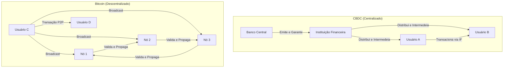
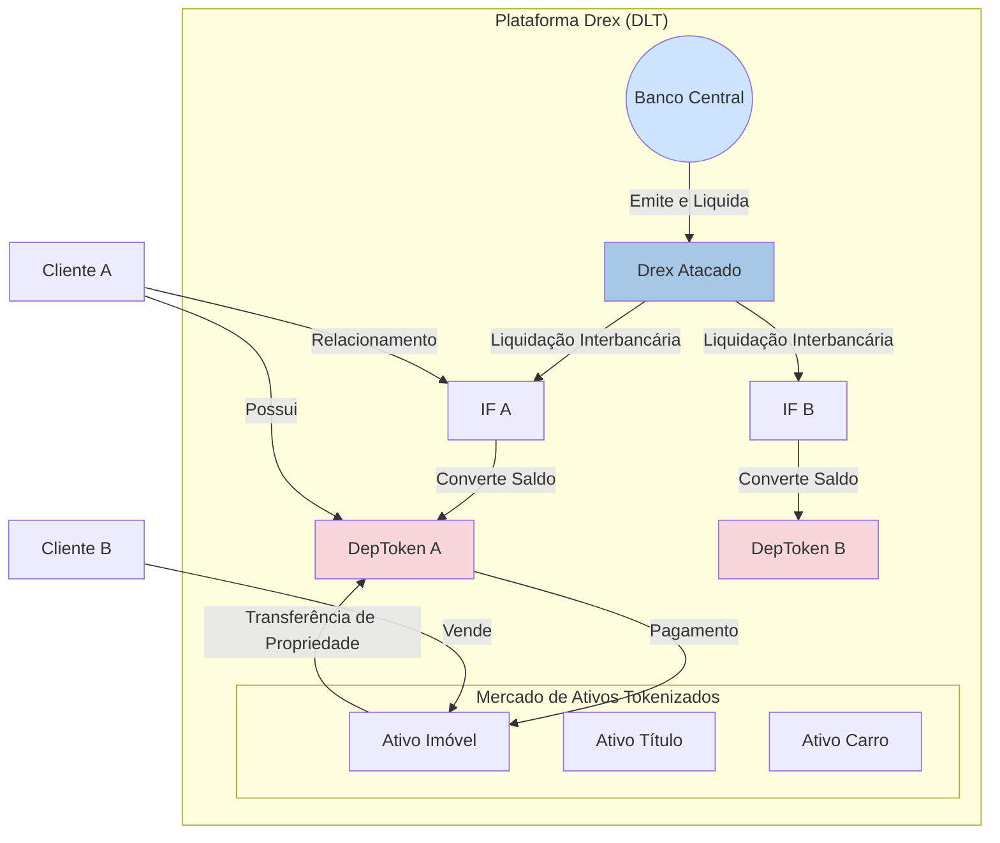
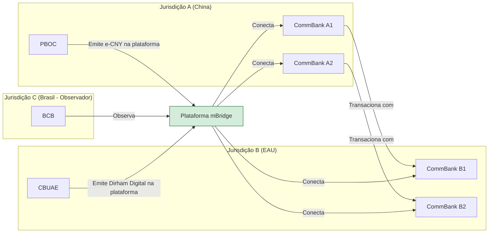

# A Revolução do Dinheiro Digital: As CBDCs, o Projeto Drex e o Futuro do Sistema Financeiro

## 1. Introdução: A Próxima Fronteira da Evolução Monetária

A história da moeda é a história da evolução da confiança, da tecnologia e do poder estatal. Desde as conchas e o sal, passando pelo metal cunhado, pelo papel-moeda garantido pelo soberano, até o dinheiro escritural nos livros contábeis dos bancos, cada transformação representou uma reconfiguração fundamental das relações econômicas e sociais. Estamos, no século XXI, testemunhando a mais recente e talvez mais profunda dessas transformações: a transição da mera digitalização de processos financeiros para a tokenização programável de ativos. Este não é um passo incremental; é uma mudança de paradigma que redefine a própria natureza do dinheiro e da soberania monetária.

O ponto de inflexão que catalisou a ação dos bancos centrais em todo o mundo não foi a emergência de criptomoedas descentralizadas como o Bitcoin. Embora inovadoras, sua volatilidade intrínseca as relegou, em grande medida, ao status de ativo especulativo, incapaz de cumprir plenamente as funções clássicas da moeda.1 O verdadeiro alarme soou com a proposta de _stablecoins_ privadas com potencial de alcance global, notadamente o projeto Libra (posteriormente renomeado para Diem) do Facebook.3 A perspectiva de uma corporação de tecnologia, com bilhões de usuários, emitir sua própria moeda digital atrelada a uma cesta de moedas fiduciárias representou uma ameaça direta e crível à soberania monetária dos Estados. O risco de uma "dolarização digital" ou de uma "privatização da moeda" em larga escala tornou-se palpável, forçando as autoridades monetárias a uma conclusão inevitável: se o Estado não oferecesse uma forma digital, segura e soberana de sua moeda, o setor privado ou uma potência estrangeira o faria, preenchendo um vácuo de poder com consequências imprevisíveis.

Nesse contexto, as Moedas Digitais de Banco Central (CBDCs) emergiram não apenas como uma modernização tecnológica, mas como uma resposta estratégica e, em muitos aspectos, defensiva. Elas representam o esforço do Estado para reafirmar seu papel central no sistema monetário, combinando a confiança e a estabilidade da moeda soberana com a eficiência e a programabilidade das novas tecnologias de registro distribuído (DLT).

Este relatório analisa a ascensão das CBDCs como a próxima fronteira da evolução monetária. A tese central é que o desenvolvimento desses instrumentos, com destaque para o ambicioso Projeto Drex do Brasil, transcende a simples criação de um novo meio de pagamento. Trata-se de uma reengenharia da infraestrutura do mercado financeiro, com implicações profundas e multifacetadas para a intermediação bancária, a inclusão social, a privacidade dos cidadãos e, crucialmente, para a geopolítica do sistema financeiro global. O Drex, em particular, com sua arquitetura inovadora, posiciona o Brasil na vanguarda desse debate, oferecendo um modelo que busca equilibrar inovação radical com a estabilidade do sistema financeiro existente.

## 2. O Espectro do Dinheiro Digital: Distinções Fundamentais

Para compreender a revolução em curso, é imperativo distinguir com precisão as diferentes formas de dinheiro digital que coexistem e competem no cenário atual. Embora compartilhem a base tecnológica, suas arquiteturas, filosofias e implicações são fundamentalmente distintas.

### 2.1. Criptomoedas Descentralizadas (Ex: Bitcoin)

As criptomoedas descentralizadas, inauguradas pelo Bitcoin em 2009, são ativos digitais nativos de redes que operam sem uma autoridade central de controle ou emissão.1 Sua filosofia subjacente é a da desintermediação radical e da resistência à censura, possibilitada pela tecnologia blockchain. As transações são validadas e registradas de forma distribuída por uma rede de participantes (nós), através de mecanismos de consenso como o _Proof-of-Work_.

Do ponto de vista econômico, suas características definem seu papel. A oferta de muitas criptomoedas, como o Bitcoin, é programaticamente escassa (limitada a 21 milhões de unidades), uma característica que, combinada com a demanda flutuante, resulta em altíssima volatilidade de preços.1 Isso compromete severamente sua função como unidade de conta e meio de troca estável, tornando-as mais adequadas como um ativo especulativo ou uma reserva de valor para um nicho de investidores. Em termos de privacidade, as transações são pseudônimas: registradas publicamente em um livro-razão imutável, mas associadas a endereços alfanuméricos, não a identidades civis. Contudo, técnicas de análise de blockchain podem, muitas vezes, rastrear e desanonimizar os usuários.

### 2.2. Stablecoins Privadas (Ex: Tether, USDC)

As _stablecoins_ surgiram como uma solução para a volatilidade das criptomoedas. São tokens digitais emitidos por entidades privadas que buscam manter uma paridade de valor (um "peg") com um ativo de referência, geralmente uma moeda fiduciária forte como o dólar americano.6 Elas atuam como uma ponte crucial entre o ecossistema cripto e o sistema financeiro tradicional. O mecanismo de estabilização depende do lastro, que pode ser _off-chain_ (reservas em depósitos bancários, títulos do tesouro ou outros ativos tradicionais) ou _on-chain_ (colateral em outros criptoativos).

Apesar de sua utilidade, as _stablecoins_ são uma fonte de grande preocupação para reguladores globais como o Fundo Monetário Internacional (FMI) e o Banco de Compensações Internacionais (BIS). Os riscos são múltiplos e sistêmicos:

- **Risco de "De-pegging" e Corridas:** A confiança em uma _stablecoin_ depende inteiramente da solvência e da transparência de seu emissor. Dúvidas sobre a qualidade ou a existência do lastro podem levar a uma perda de paridade com o ativo de referência, desencadeando corridas (saques em massa) e vendas forçadas (_fire sales_) dos ativos de reserva, com potencial de contágio para o sistema financeiro tradicional.
    
- **Risco à Soberania Monetária:** Em economias com moedas mais frágeis, a ampla adoção de _stablecoins_ lastreadas em dólar pode levar a um fenômeno de "dolarização digital". Cidadãos e empresas podem abandonar a moeda local, erodindo a base monetária do país e a capacidade do banco central de conduzir uma política monetária eficaz para gerir os ciclos econômicos.
    
- **Risco de Concentração de Poder:** A emissão de _stablecoins_ está concentrada em poucas grandes empresas, algumas delas gigantes da tecnologia ("Big Techs"). Isso cria novos centros de poder financeiro sistêmico que operam, em grande parte, fora do perímetro regulatório tradicional aplicado aos bancos, gerando preocupações sobre concorrência e estabilidade.
    

### 2.3. Moedas Digitais de Banco Central (CBDCs)

Uma CBDC é a forma digital da moeda soberana de um país. Sua característica definidora e mais importante é ser um **passivo direto do Banco Central**.14 Esta é a distinção fundamental que a separa de todas as outras formas de dinheiro digital. O dinheiro que a maioria das pessoas usa hoje, na forma de saldos em contas bancárias, é dinheiro de banco comercial – um passivo do banco privado onde a conta está depositada. As _stablecoins_ são passivos de seus emissores privados. Uma CBDC, por outro lado, carrega a mesma garantia, confiança e ausência de risco de crédito que o dinheiro físico (cédulas e moedas), pois é uma obrigação da autoridade monetária máxima do país.

A finalidade de uma CBDC é, portanto, combinar o melhor de dois mundos: a segurança e a estabilidade da moeda soberana com a inovação, a eficiência e a programabilidade que a tecnologia de registro distribuído possibilita.

Para visualizar essas diferenças estruturais, o diagrama a seguir ilustra a governança centralizada de uma CBDC em contraste com a rede descentralizada do Bitcoin.

A tabela a seguir resume as características essenciais de cada tipo de ativo digital, oferecendo uma referência clara para a análise.

|Característica|Criptomoedas (Bitcoin)|Stablecoins (USDC)|CBDC (Drex)|
|---|---|---|---|
|**Emissor**|Rede Descentralizada|Entidade Privada (e.g., Circle)|Banco Central do Brasil|
|**Natureza do Passivo**|Nenhum (ativo nativo da rede)|Passivo da entidade emissora|Passivo direto do Banco Central|
|**Estabilidade de Valor**|Alta Volatilidade|Estável (atrelada ao USD)|Estável (atrelada ao BRL)|
|**Governança**|Descentralizada (código, mineradores)|Centralizada (empresa emissora)|Centralizada (Banco Central)|
|**Finalidade Principal**|Reserva de valor especulativa|Meio de troca no ecossistema cripto|Meio de liquidação e plataforma para serviços financeiros tokenizados|
|**Confiança**|Baseada em criptografia e código|Baseada na solvência e transparência do emissor|Baseada na confiança no Estado e na autoridade monetária|

## 3. As CBDCs no Cenário Global: Motivações e Modelos

A exploração e o desenvolvimento de CBDCs tornaram-se um fenômeno global. Segundo o Atlantic Council, em meados de 2024, 137 países e uniões monetárias, representando 98% do PIB mundial, estavam explorando uma CBDC. Este movimento quase unânime não é coincidência, mas uma resposta a um conjunto de imperativos estratégicos que pressionam as autoridades monetárias em todo o mundo.

### 3.1. O Imperativo Estratégico dos Bancos Centrais

As motivações para a emissão de uma CBDC variam em prioridade de acordo com o contexto de cada país, mas podem ser agrupadas em quatro vetores principais:

- **Garantia da Soberania Monetária:** Esta é, sem dúvida, a motivação primordial para as grandes economias e um fator de crescente importância para as economias emergentes. A ascensão de _stablecoins_ privadas globais, predominantemente lastreadas em dólar, e a potencial circulação transfronteiriça de CBDCs de outras nações representam uma ameaça existencial ao controle monetário doméstico.4 A emissão de uma CBDC nacional é uma ferramenta proativa para competir nesse novo ambiente digital, assegurando que a moeda soberana continue a ser a unidade de conta e o meio de troca preferencial dentro de seu território, preservando assim a eficácia da política monetária e a capacidade do Estado de arrecadar impostos e financiar-se.
    
- **Modernização e Eficiência:** Os sistemas de pagamento legados, especialmente para transações transfronteiriças, são frequentemente lentos, caros e opacos, dependendo de uma complexa cadeia de bancos correspondentes. As CBDCs prometem superar essas ineficiências, permitindo liquidações mais rápidas e baratas. Adicionalmente, há uma busca pela redução dos custos associados à gestão do dinheiro físico (impressão, transporte, segurança, substituição), que, segundo algumas estimativas, podem consumir até 1.5% do PIB de um país.
    
- **Inclusão Financeira:** Este é um objetivo frequentemente destacado, em particular por bancos centrais de países emergentes e em desenvolvimento. Globalmente, cerca de 1,4 bilhão de pessoas permanecem fora do sistema financeiro formal. Uma CBDC bem projetada, com baixos custos de transação, requisitos de identificação simplificados para contas de baixo valor e potencial operação offline, poderia servir como uma porta de entrada para a economia formal, permitindo que populações desbancarizadas acessem serviços financeiros básicos.19 No entanto, como será analisado adiante, essa motivação enfrenta o paradoxo da exclusão digital.
    
- **Novas Ferramentas de Política Monetária:** Em um nível mais teórico e controverso, as CBDCs abrem a possibilidade de novas e mais diretas ferramentas de política monetária. Um banco central poderia, por exemplo, implementar remuneração direta (positiva ou negativa) sobre os saldos em CBDC, influenciando o consumo e a poupança de forma mais imediata. Essa capacidade, no entanto, é politicamente sensível, pois levanta debates profundos sobre o grau de controle do Estado sobre as finanças dos cidadãos e o potencial para vigilância financeira.
    

### 3.2. Arquiteturas Fundamentais: Varejo vs. Atacado

A decisão mais fundamental no desenho de uma CBDC diz respeito ao seu público-alvo, o que define duas arquiteturas principais:

- **CBDC de Varejo (Retail):** Seria uma forma de dinheiro digital emitida pelo banco central para uso direto do público em geral – pessoas físicas e jurídicas – em suas transações cotidianas. O modelo de varejo é o que mais se aproxima da ideia de um "dinheiro digital para todos". Contudo, ele carrega um risco sistêmico significativo: a **desintermediação bancária**. Em um cenário de crise financeira, os cidadãos poderiam converter massivamente seus depósitos em bancos comerciais para uma CBDC de varejo, que é um ativo livre de risco de crédito (um passivo do banco central). Tal movimento poderia provocar uma corrida bancária em escala sistêmica, minando a capacidade de captação dos bancos comerciais e, consequentemente, sua capacidade de conceder crédito, um pilar da economia moderna.
    
- **CBDC de Atacado (Wholesale):** Este modelo prevê uma moeda digital de uso restrito a instituições financeiras (bancos, cooperativas, etc.) e ao próprio banco central. Sua finalidade é a liquidação de pagamentos de alto valor, transações no mercado interbancário e liquidação de ativos financeiros. A CBDC de atacado é vista como uma evolução mais natural e menos disruptiva dos atuais Sistemas de Liquidação Bruta em Tempo Real (RTGS), como o STR no Brasil. Ela moderniza a infraestrutura do "encanamento" financeiro sem competir diretamente com os bancos comerciais na captação de depósitos do varejo.
    

A percepção dos riscos associados ao modelo de varejo tem levado a uma mudança na tendência global. Uma pesquisa recente do BIS revelou que a probabilidade de os bancos centrais emitirem uma CBDC de atacado nos próximos anos agora supera a de emitirem uma de varejo.22 Essa não é uma decisão meramente técnica, mas profundamente político-econômica. Ela reflete tanto a influência do setor bancário estabelecido quanto o receio justificado das autoridades monetárias em desestabilizar um sistema financeiro que, para o bem ou para o mal, depende da intermediação dos bancos comerciais. Modelos de atacado ou híbridos, como o que o Brasil está desenvolvendo com o Drex, surgem como uma solução estratégica para incorporar as inovações da tecnologia DLT sem provocar uma ruptura sistêmica imediata.

## 4. O Projeto Drex: A Vanguarda da Tokenização no Brasil (Análise Aprofundada)

O Brasil, que já demonstrou sua capacidade de inovação em pagamentos com o sucesso do Pix, está novamente na fronteira da transformação financeira com o Projeto Drex. Contudo, é um erro fundamental enxergar o Drex como uma mera evolução do Pix ou simplesmente como o "Real Digital". Sua ambição é muito maior e mais estrutural.

### 4.1. Mais que um "Real Digital": Uma Plataforma para a Nova Economia

O objetivo estratégico do Banco Central do Brasil (BCB) com o Drex não é criar um novo aplicativo de pagamentos, mas sim estabelecer uma **plataforma de infraestrutura para a tokenização da economia brasileira**. A palavra-chave aqui é **tokenização**, o processo de criar uma representação digital (um _token_) de um ativo – seja ele financeiro (uma ação, um título) ou real (um imóvel, um veículo, um crédito de carbono, uma safra agrícola) – em uma rede baseada em tecnologia de registro distribuído (DLT).

A tokenização permite que ativos tradicionalmente ilíquidos, indivisíveis e de difícil transação sejam fracionados, negociados e liquidados de forma programável, segura, transparente e quase instantânea. O Drex, nesse ecossistema, não é o fim, mas o meio. Ele será o **dinheiro programável** – o ativo de liquidação seguro e soberano – que permitirá que as transações com todos esses outros ativos tokenizados ocorram de forma eficiente e com finalidade de pagamento.27 A visão do BCB é que o Drex será o trilho sobre o qual a nova economia digital de ativos tokenizados irá correr.

### 4.2. A Arquitetura Híbrida e Inovadora do Drex

Para alcançar essa visão ambiciosa sem desestabilizar o sistema financeiro atual, o BCB desenhou uma arquitetura híbrida e engenhosa, composta por duas camadas distintas que operam de forma integrada na Plataforma Drex.

- **Camada de Atacado (Drex Atacado):** Esta é a CBDC em seu estado puro. O Drex Atacado é um passivo direto do Banco Central, emitido e controlado por ele, e de uso restrito às instituições financeiras e de pagamento autorizadas a operar no Sistema Financeiro Nacional (SFN) e no Sistema de Pagamentos Brasileiro (SPB). Sua função primordial é ser o **ativo de liquidação final** (_settlement asset_) para as transações que ocorrem na plataforma DLT, garantindo a liquidação interbancária com a segurança da moeda do banco central.
    
- **Camada de Varejo (Drex Varejo):** Aqui reside a grande inovação do modelo brasileiro. O dinheiro que o cidadão comum e as empresas utilizarão no dia a dia na plataforma não será uma CBDC direta. Será o **depósito bancário tokenizado**. Na prática, quando um cliente de um banco desejar realizar uma operação na Plataforma Drex, seu banco irá "tokenizar" o saldo correspondente de seu depósito à vista convencional. Ou seja, o banco criará um token que representa digitalmente aquele depósito na rede DLT. Crucialmente, este token continua sendo um **passivo do banco comercial**, não do Banco Central.
    

Esta arquitetura de duas camadas é a solução brasileira para o dilema "varejo vs. atacado". Ela permite que o público de varejo acesse todos os benefícios da nova tecnologia – como a programabilidade dos _smart contracts_ e a liquidação atômica – mas o faz **através da intermediação dos bancos e instituições de pagamento existentes**. Com isso, o BCB inova radicalmente na infraestrutura tecnológica, mas preserva a estrutura de intermediação do SFN, mitigando de forma eficaz o risco de uma desintermediação bancária em massa.

O diagrama a seguir ilustra a interação entre as diferentes camadas e participantes do ecossistema Drex.

### 4.3. O "Piloto Drex" em Ação: Casos de Uso e a Lógica do DvP

A fase de testes do projeto, o "Piloto Drex", não é um exercício acadêmico. Seu objetivo é testar a viabilidade técnica e de negócios da plataforma em cenários do mundo real, resolvendo problemas concretos da economia. O cerne tecnológico de quase todos os testes é a funcionalidade de **Entrega contra Pagamento (Delivery versus Payment - DvP)**, também conhecida como liquidação atômica.

Através de **contratos inteligentes** (_smart contracts_) – programas de computador autoexecutáveis que rodam na plataforma DLT – a transferência do ativo tokenizado (a "entrega") e a transferência do dinheiro tokenizado (o "pagamento") ocorrem de forma simultânea, interdependente e irrevogável. O contrato só se executa se ambas as condições forem cumpridas. Isso elimina o **risco de contraparte**, que é a possibilidade de uma das partes em uma transação não cumprir sua obrigação (por exemplo, pagar por um carro e não receber a transferência de propriedade). Este risco é hoje uma das maiores fontes de custo, burocracia e ineficiência em muitos mercados.

Os casos de uso selecionados para a segunda fase do piloto ilustram o potencial transformador dessa lógica:

|Caso de Uso 31|Problema Atual|Solução com Drex (via Smart Contract)|
|---|---|---|
|**Compra/Venda de Título Público Federal**|Risco de liquidação, processo lento e restrito ao horário comercial do sistema financeiro.|Liquidação atômica (DvP) instantânea, 24 horas por dia, 7 dias por semana. O token do título e o Drex Varejo trocam de propriedade no mesmo instante, sem risco.|
|**Compra/Venda de Imóvel/Veículo**|Processo extremamente caro, lento e burocrático, dependente de cartórios, reconhecimento de firmas e com alto risco de fraude e de contraparte.|O bem é tokenizado, e o pagamento é feito com Drex Varejo. O _smart contract_ garante que o dinheiro só seja liberado para o vendedor no exato momento em que o token de propriedade do bem é transferido para o comprador.|
|**Crédito Colateralizado**|Processo complexo e custoso para usar ativos (como CDBs, títulos do tesouro ou até imóveis) como garantia para obter empréstimos.|O ativo tokenizado é "travado" no _smart contract_ como garantia, e o crédito é liberado instantaneamente. Em caso de inadimplência, a execução da garantia (transferência do ativo para o credor) é automática, reduzindo o risco e o custo do crédito.|
|**Comércio Internacional (Trade Finance)**|Processo arcaico, intensivo em papel (conhecimentos de embarque, cartas de crédito), envolvendo múltiplos intermediários e grande desconfiança entre as partes.|_Smart contracts_ podem automatizar a liberação de pagamentos em Drex conforme as etapas da cadeia logística (embarque, transporte, recebimento) são cumpridas e verificadas de forma confiável na rede.|

## 5. Desafios Críticos e Implicações Estratégicas

Apesar de seu enorme potencial, o caminho para a implementação plena do Drex é repleto de desafios complexos de natureza tecnológica, regulatória, social e geopolítica. O sucesso do projeto dependerá da capacidade do Banco Central e da sociedade brasileira de navegar por esses obstáculos.

### 5.1. O Trilema do Drex: Privacidade, Programabilidade e Segurança

O próprio Banco Central, no relatório de conclusão da primeira fase do piloto, reconheceu a existência de um "trilema" fundamental no desenho da plataforma, um equilíbrio delicado entre **privacidade, programabilidade e controle/segurança**.

- **Privacidade vs. Transparência:** A tecnologia DLT, por padrão, oferece um alto grau de transparência, onde as transações podem ser visíveis aos participantes da rede. Isso entra em conflito direto com direitos fundamentais consagrados na legislação brasileira, em especial a **Lei Complementar 105/2001 (Lei do Sigilo Bancário)** e a **Lei 13.709/2018 (Lei Geral de Proteção de Dados - LGPD)**. O desafio monumental é criar uma arquitetura que garanta a confidencialidade das transações dos usuários perante terceiros (outros bancos, por exemplo), ao mesmo tempo em que permite a supervisão legítima pelo Banco Central e o combate a atividades ilícitas como lavagem de dinheiro e financiamento ao terrorismo.
    
- **Soluções e Limitações Atuais:** Para enfrentar esse desafio, o BCB e os participantes do piloto testaram diversas Tecnologias de Aprimoramento de Privacidade (PETs), com destaque para as **Provas de Conhecimento Zero (Zero-Knowledge Proofs - ZKP)**.34 As ZKPs permitem que uma parte prove a outra que uma declaração é verdadeira (ex: "eu tenho saldo suficiente para esta transação") sem revelar nenhuma informação além da validade da própria declaração. No entanto, o relatório da Fase 1 concluiu que as soluções tecnológicas testadas, embora promissoras, ainda estão imaturas. Elas apresentaram limitações que comprometem a "componibilidade" (a capacidade de diferentes _smart contracts_ interagirem entre si de forma complexa) e a capacidade de supervisão do regulador, sendo consideradas, no momento, inadequadas para uma implementação em larga escala.
    
- **Cibersegurança:** A Plataforma Drex, ao concentrar a representação digital de uma vasta gama de ativos da economia, se tornará um alvo de altíssimo valor para ciberataques de atores estatais e não estatais. Uma falha de segurança poderia ter consequências sistêmicas devastadoras. Portanto, a construção de uma arquitetura de cibersegurança robusta, com múltiplas camadas de defesa, criptografia avançada e monitoramento constante, é um pré-requisito absoluto e não negociável para o lançamento do sistema.
    

### 5.2. Impacto na Intermediação Financeira

A arquitetura do Drex foi cuidadosamente desenhada para **preservar o papel dos intermediários financeiros**, evitando a desintermediação em massa. Contudo, preservar não significa manter inalterado. O Drex irá redefinir profundamente o papel e o modelo de negócios dos bancos comerciais. A simples atividade de custodiar depósitos e intermediar pagamentos básicos, já comoditizada pelo Pix, se tornará ainda menos um diferencial.

Os bancos serão compelidos a evoluir de meros intermediários para **provedores de serviços de valor agregado em um novo ecossistema digital aberto**. Seu sucesso e sua lucratividade dependerão da capacidade de inovar sobre a infraestrutura do Drex, criando produtos e serviços sofisticados, como novos modelos de crédito programável, fundos de investimento em ativos tokenizados, serviços de custódia e gestão de carteiras de ativos digitais, e soluções financeiras integradas à Internet das Coisas (IoT). As instituições que não conseguirem se adaptar a essa nova realidade, focada em tecnologia e inovação, correm o risco de perder relevância e rentabilidade.

### 5.3. O Risco da Exclusão Digital

Apesar do discurso oficial de que o Drex visa democratizar o acesso a serviços financeiros 44, sua natureza intrinsecamente tecnológica e complexa acende um alerta vermelho para o risco de **aprofundar a exclusão social e criar um "apartheid financeiro"**. O sucesso do Pix na inclusão de milhões de brasileiros não é uma garantia de que o mesmo ocorrerá com o Drex. O Pix resolveu um problema simples e universal: a necessidade de transferir dinheiro de forma rápida e barata. O Drex, por sua vez, opera com conceitos muito mais abstratos e complexos, como tokenização, carteiras digitais e contratos inteligentes.

A realidade brasileira impõe um desafio estrutural. Dados da Pesquisa Nacional por Amostra de Domicílios (Pnad) de 2023 indicam que **22,4 milhões de brasileiros com 10 anos ou mais não utilizaram a internet**. A exclusão digital no Brasil é um reflexo direto e cruel das desigualdades sociais, econômicas e regionais, afetando desproporcionalmente os mais pobres, os mais velhos e os habitantes de áreas rurais e remotas. Sem um investimento público massivo e coordenado em infraestrutura de acesso (internet de qualidade e acessível) e, principalmente, em **letramento digital e financeiro**, o Drex corre o risco de se tornar uma ferramenta para os já incluídos, enquanto uma parcela significativa da população fica para trás, marginalizada e restrita ao uso do dinheiro físico e de sistemas legados. Para um diplomata, a análise dessa dimensão social é de importância crítica.

### 5.4. A Dimensão Internacional e Geopolítica

As CBDCs não são apenas um fenômeno doméstico; elas têm o potencial de reconfigurar a arquitetura financeira global. Um de seus maiores atrativos é a capacidade de revolucionar os **pagamentos transfronteiriços**, que hoje são um dos pontos mais ineficientes do sistema financeiro global.

A questão central, no entanto, é a **interoperabilidade**: como os sistemas de CBDC de diferentes países irão se comunicar e transacionar entre si. Vários projetos internacionais, muitos coordenados pelo BIS, estão explorando modelos para essa interação. Dentre eles, dois se destacam:

- **Projeto Dunbar:** Uma colaboração entre os bancos centrais da Austrália, Malásia, Singapura e África do Sul, que explorou a viabilidade técnica de uma plataforma única e compartilhada para liquidação com múltiplas CBDCs.
    
- **Projeto mBridge:** Um projeto muito mais avançado e geopoliticamente significativo, que evoluiu para um produto mínimo viável (MVP). Seus membros plenos incluem os bancos centrais da China, Hong Kong, Tailândia, Emirados Árabes Unidos e, mais recentemente, Arábia Saudita. O Brasil participa como um dos mais de 30 membros observadores.
    

O Projeto mBridge é muito mais do que um experimento técnico. Ele é a manifestação mais concreta de um esforço para construir uma **infraestrutura de pagamentos internacionais alternativa àquela centrada no dólar americano e no sistema de mensagens SWIFT**. A participação de potências econômicas do Sul Global e de grandes produtores de energia sinaliza a formação de um bloco tecnológico-financeiro com o potencial de promover uma ordem financeira mais multipolar. A recente discussão sobre um possível afastamento do BIS do projeto, deixando-o sob a liderança dos bancos centrais participantes, evidencia as tensões geopolíticas que ele suscita.

Para o Brasil, a posição de observador no mBridge é um movimento estratégico prudente e necessário. Permite ao país compreender por dentro a evolução dessa nova arquitetura, avaliar seus benefícios e riscos, e se posicionar para participar ativamente, se e quando for de seu interesse, da governança de um futuro sistema financeiro global potencialmente menos dependente de uma única moeda e infraestrutura.

O diagrama abaixo oferece uma visão simplificada da arquitetura do Projeto mBridge.

## 6. Conclusão: O Futuro do Dinheiro e o Papel do Brasil

O Projeto Drex representa muito mais do que uma simples modernização de pagamentos. Ele é uma iniciativa de infraestrutura estratégica, concebida para ser a espinha dorsal da economia digital brasileira no século XXI. Sua arquitetura híbrida, que combina uma CBDC de atacado com depósitos bancários tokenizados, é uma solução engenhosa e pragmática para os dilemas de disrupção sistêmica que desafiam outros países, buscando um delicado equilíbrio entre a promoção da inovação radical e a manutenção da estabilidade do sistema financeiro.

O sucesso do projeto, contudo, não está garantido. Ele dependerá da capacidade do Brasil de navegar por um complexo campo de forças, realizando um equilíbrio estratégico em múltiplas frentes. No campo tecnológico, será preciso resolver o "trilema" da privacidade, desenvolvendo ou adaptando soluções que garantam a confidencialidade das transações sem sacrificar a programabilidade e a segurança. No campo jurídico, a adequação plena à LGPD e à Lei do Sigilo Bancário é um pré-requisito inegociável para a confiança do público. No campo social, o desafio mais profundo é mitigar o risco de um apartheid digital, implementando políticas públicas robustas de inclusão e letramento que garantam que os benefícios do Drex alcancem toda a população. E, finalmente, no campo da política internacional, o Brasil deverá se posicionar ativamente nos debates sobre a governança da nova arquitetura financeira global, utilizando sua participação em fóruns como o mBridge para defender seus interesses e contribuir para a construção de um sistema mais equilibrado e multipolar.

O Drex é, em suma, uma aposta de alto risco e altíssima recompensa. Se bem-sucedido, tem o potencial de destravar trilhões de reais em valor ao tokenizar ativos ilíquidos, aumentar drasticamente a eficiência e a segurança dos mercados, e consolidar a posição do Brasil como líder global em inovação financeira. O fracasso em resolver seus desafios fundamentais, por outro lado, poderia levar a retrocessos em direitos como a privacidade, ao aprofundamento de desigualdades históricas e a uma perda de relevância estratégica no cenário internacional. O futuro do dinheiro está sendo escrito agora, e o Brasil escolheu ter um papel de protagonista nessa narrativa.

## 7. Questões para Autoavaliação (Active Recall)

> [!question] Questão 1
> 
> Analise criticamente a afirmação de que o Drex é primariamente uma plataforma de tokenização, e não uma moeda digital de varejo. Quais as implicações estratégicas (positivas e negativas) dessa escolha de arquitetura para o Sistema Financeiro Nacional e para o papel dos bancos comerciais?

> [!question] Questão 2
> 
> Discorra sobre o "trilema" enfrentado pelo Piloto Drex (privacidade, programabilidade e segurança), explicando como os requisitos da LGPD e da Lei de Sigilo Bancário, conforme detalhado no relatório da Fase 1 do piloto, representam o principal desafio técnico e regulatório para o projeto.

> [!question] Questão 3
> 
> Em uma perspectiva de política internacional, como projetos de interoperabilidade de CBDCs, a exemplo do mBridge, podem impactar a arquitetura financeira global, a hegemonia do dólar e o sistema SWIFT? Analise o posicionamento estratégico do Brasil como observador desse projeto no contexto da emergência de uma ordem financeira multipolar.
