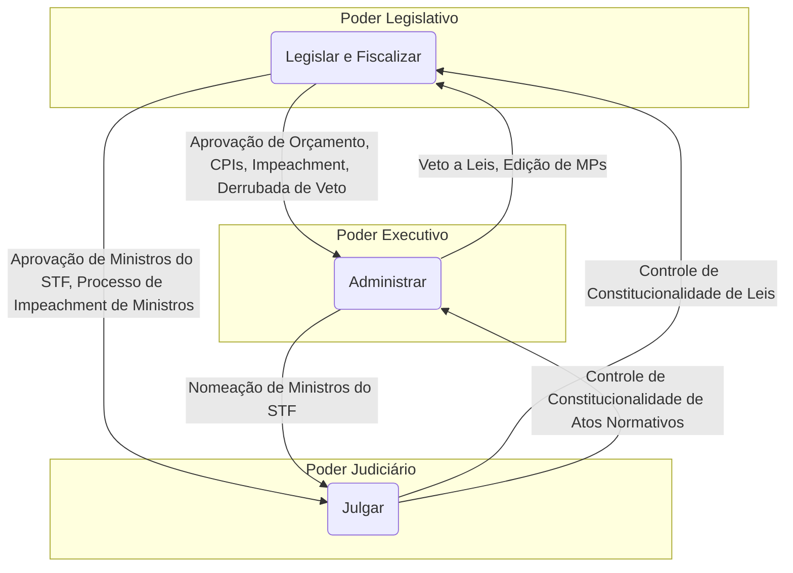

# A Organização dos Poderes no Brasil: Estrutura, Competências e o Sistema de Freios e Contrapesos

## I. O Princípio da Separação dos Poderes: A Matriz do Estado Constitucional

### A. Fundamentos Teóricos: De Montesquieu à Concepção Contemporânea

A arquitetura do Estado Democrático de Direito moderno é inseparável da teoria da separação dos poderes, um princípio fundamental para a limitação do poder e a garantia das liberdades individuais. Embora suas raízes possam ser rastreadas até a antiguidade clássica, com as reflexões de Aristóteles em "A Política" sobre as funções de deliberar, executar e julgar, e passando por formulações de pensadores como John Locke, que distinguiu os poderes Legislativo, Executivo e Federativo, foi na obra do filósofo iluminista francês Charles-Louis de Secondat, o Barão de Montesquieu, que a teoria ganhou sua formulação clássica e mais influente.

Em sua obra seminal, "O Espírito das Leis" (1748), Montesquieu, ao analisar o sistema constitucional britânico, desenvolveu a tese de que a concentração de poder nas mãos de uma única pessoa ou órgão é a semente da tirania. Para ele, a liberdade política só seria possível em governos moderados, nos quais o abuso de poder fosse contido. A chave para essa contenção residia em uma engenharia institucional precisa, resumida em sua máxima célebre: "é preciso que, pela disposição das coisas, o poder freie o poder". Montesquieu propôs, assim, a distribuição das funções estatais em três esferas distintas e autônomas: o Poder Legislativo, responsável por criar as leis; o Poder Executivo, encarregado de administrar e executar essas leis; e o Poder Judiciário, com a função de julgar os conflitos com base nas leis estabelecidas.2 O objetivo não era uma simples divisão de tarefas, mas a criação de um sistema de equilíbrio dinâmico para assegurar a segurança e a liberdade dos cidadãos.

A doutrina constitucional contemporânea, no entanto, aprimorou essa concepção. A ideia de uma "separação" rígida e absoluta foi suplantada pela noção de uma "distribuição de funções" de um Poder estatal que, em sua essência, é uno, indivisível e indelegável. O poder do Estado emana do povo e é soberano. O que se divide não é o poder em si, mas as suas funções especializadas, que são atribuídas a órgãos distintos e independentes para otimizar sua execução e, crucialmente, para permitir um controle recíproco. Portanto, quando a Constituição Federal de 1988 se refere aos "Poderes da União", ela adota a terminologia clássica, mas deve ser interpretada sob a ótica moderna de uma divisão funcional dentro de uma unidade de poder soberano.

### B. A Consagração no Direito Brasileiro: Análise do Art. 2º da CF/88

A Constituição da República Federativa do Brasil de 1988, promulgada sob o signo da redemocratização, elegeu a separação de poderes como um de seus pilares estruturantes. O princípio está consagrado de forma expressa e lapidar no Art. 2º: "São Poderes da União, independentes e harmônicos entre si, o Legislativo, o Executivo e o Judiciário".

A centralidade deste princípio é tamanha que ele foi alçado à condição de **cláusula pétrea**, conforme o Art. 60, § 4º, inciso III, da Constituição. Isso significa que nenhuma proposta de emenda constitucional que vise a abolir a separação de poderes pode ser sequer objeto de deliberação.1 Tal blindagem constitucional demonstra que, para o constituinte originário, não há Estado Democrático de Direito sem a existência de poderes autônomos e um sistema de controle mútuo.

A interpretação dos adjetivos "independentes" e "harmônicos" é crucial para a compreensão da dinâmica institucional brasileira:

- **Independência:** Refere-se à ausência de subordinação ou hierarquia entre os Poderes. Cada um possui autonomia orgânica, funcional e financeira para se organizar e exercer suas competências típicas sem sofrer interferência indevida dos demais. A independência é a garantia de que cada poder possa atuar como um contrapeso eficaz.
    
- **Harmonia:** Significa que a independência não pode ser absoluta a ponto de gerar o caos ou a paralisia do Estado. Os Poderes devem atuar de forma coordenada, colaborativa e com lealdade institucional, visando à realização dos objetivos fundamentais da República. A harmonia pressupõe o diálogo e o respeito às competências alheias.
    

Nesse contexto, os termos "independentes" e "harmônicos" não são meramente descritivos; eles estabelecem uma tensão dialética que define a vida política do país. A independência faculta a cada Poder agir conforme suas prerrogativas, enquanto a harmonia exige que essa ação seja coordenada para o bem comum. O sistema de **freios e contrapesos** (_checks and balances_) emerge, então, não como um adendo, mas como o mecanismo essencial projetado para gerenciar essa tensão intrínseca. É o conjunto de instrumentos constitucionais que permite a um poder "frear" os excessos do outro (assegurando a independência contra abusos) e, ao mesmo tempo, força a negociação e a cooperação (buscando a harmonia). A análise de crises institucionais, como conflitos entre o STF e o Congresso, frequentemente revela um embate de narrativas em que a afirmação da "independência" por um lado é percebida como uma quebra da "harmonia" pelo outro. A jurisprudência do Supremo Tribunal Federal em conflitos de atribuições é, em última análise, a tentativa de arbitrar e equilibrar essa tensão fundamental.

## II. O Poder Legislativo: A Casa do Povo e da Federação

### A. Estrutura e Representação: O Bicameralismo Federal

O Poder Legislativo federal no Brasil é exercido pelo **Congresso Nacional**, que adota uma estrutura bicameral, sendo composto por duas Casas: a Câmara dos Deputados e o Senado Federal. Essa dualidade não é aleatória, mas reflete a própria natureza federativa do Estado brasileiro.

- **Câmara dos Deputados:** É a casa de representação do povo. Seus membros, os deputados federais, são eleitos pelo sistema proporcional em cada Estado e no Distrito Federal, para um mandato de quatro anos. O número de deputados por unidade federativa é proporcional à sua população, com um piso de 8 e um teto de 70 representantes. A Câmara é, portanto, o locus da representação popular em sua diversidade de ideias e interesses.
    
- **Senado Federal:** É a casa de representação dos Estados e do Distrito Federal, as unidades da Federação. Sua composição é paritária: cada estado e o DF elegem três senadores pelo princípio majoritário, para um mandato de oito anos, com renovação de um terço e dois terços a cada quatro anos, alternadamente. O Senado assegura o equilíbrio federativo, conferindo igual poder de representação a todas as unidades, independentemente de sua população ou poderio econômico.
    

A principal justificativa para a adoção do bicameralismo é a busca por um processo legislativo mais qualificado e prudente. Ao exigir que as propostas legislativas sejam discutidas e votadas em duas casas distintas, com lógicas de representação diferentes, o sistema cria um mecanismo de revisão intrínseco. Uma casa atua como revisora da outra, o que tende a moderar os debates, aprofundar a análise das matérias e minimizar a aprovação de leis precipitadas ou que atendam a interesses excessivamente particularistas.

### B. Funções Típicas: Legislar e Fiscalizar

O Poder Legislativo possui duas funções precípuas, ou típicas, que definem sua essência no arranjo constitucional: a função de legislar e a de fiscalizar.

#### 1. A Função de Legislar

A mais visível das funções do Legislativo é a de criar o ordenamento jurídico, estabelecendo as normas gerais e abstratas que regem a vida em sociedade. Esse processo é formal e complexo, regido pela Constituição e pelos regimentos internos das Casas Legislativas. O processo legislativo ordinário, que resulta na criação das leis ordinárias, compreende, em linhas gerais, as seguintes etapas:

1. **Iniciativa:** A apresentação de um projeto de lei, que pode ser de autoria de parlamentares, comissões, do Presidente da República, do Judiciário, do Procurador-Geral da República ou por iniciativa popular.
    
2. **Discussão e Votação:** O projeto tramita nas comissões temáticas permanentes de cada Casa, onde é analisado, debatido e pode receber emendas. A maioria dos projetos é votada em caráter conclusivo nas comissões, mas os mais importantes seguem para deliberação do Plenário.15
    
3. **Revisão:** Aprovado em uma Casa (Casa Iniciadora), o projeto é enviado à outra (Casa Revisora). Se aprovado sem alterações, segue para a fase seguinte. Se alterado, retorna à Casa Iniciadora para que esta delibere exclusivamente sobre as modificações.
    
4. **Sanção ou Veto:** Após a aprovação final pelo Congresso, o projeto é enviado ao Presidente da República, que pode sancioná-lo (transformando-o em lei) ou vetá-lo, total ou parcialmente.
    

#### 2. A Função de Fiscalizar

Menos visível ao público, mas de igual importância para o sistema de freios e contrapesos, é a função fiscalizatória. O Congresso Nacional tem o dever de exercer o **controle externo** da Administração Pública, abrangendo os aspectos contábil, financeiro, orçamentário, operacional e patrimonial da União e de suas entidades, conforme o Art. 70 da Constituição. Para essa tarefa, o Legislativo conta com dois instrumentos principais: o Tribunal de Contas da União e as Comissões Parlamentares de Inquérito.

- **O Tribunal de Contas da União (TCU):**
    
> [!note] O TCU é um órgão de estatura constitucional que **auxilia** o Congresso Nacional na missão de controle externo.
- 
    Sua natureza institucional é complexa. Embora formalmente vinculado ao Legislativo, o TCU goza de ampla autonomia administrativa, financeira e funcional, com um corpo técnico altamente especializado. Suas decisões, baseadas em auditorias e análises técnicas, conferem-lhe um poder que transcende o de um mero órgão assessor. Na prática, o TCU opera como um ator institucional com agenda e poder próprios, um pilar técnico fundamental no sistema de freios e contrapesos. Suas competências, previstas no Art. 71 da CF/88, são vastas e incluem:
    
    - Apreciar as contas prestadas anualmente pelo Presidente da República, emitindo um **parecer prévio** que subsidiará o julgamento político pelo Congresso.
        
    - **Julgar** as contas dos administradores e demais responsáveis por recursos públicos federais. Uma decisão do TCU que imputa débito ou multa tem eficácia de título executivo.
        
    - Apreciar a legalidade dos atos de admissão de pessoal e de concessão de aposentadorias e pensões.
        
    - Realizar, por iniciativa própria ou por solicitação do Congresso, inspeções e auditorias de diversas naturezas.
        
    - Aplicar aos responsáveis, em caso de ilegalidade, as sanções previstas em lei, como multas e inabilitação para o exercício de cargos em comissão.
        
    
    A atuação do TCU, como no caso do parecer que apontou as "pedaladas fiscais" nas contas de 2014, pode ter um impacto político imenso, fornecendo a base fática e técnica para a ação de controle político do Congresso, inclusive em processos de impeachment.
    
- **As Comissões Parlamentares de Inquérito (CPIs):**
    
> [!info] As CPIs são instrumentos de investigação do Poder Legislativo, dotadas de "poderes de investigação próprios das autoridades judiciais", conforme o Art. 58, § 3º, da Constituição.
- 
    São criadas mediante requerimento de um terço dos membros de uma das Casas (ou de ambas, no caso da CPMI) para a apuração de um **fato determinado** e por **prazo certo**.21 Seus poderes são amplos, incluindo a convocação de testemunhas e autoridades, a requisição de documentos e a quebra de sigilos bancário, fiscal e de dados (telefônico), esta última mediante autorização judicial.
    
    Contudo, as CPIs possuem limites importantes: não podem determinar medidas de competência exclusiva do Judiciário, como prisões (salvo em flagrante de falso testemunho), mandados de busca e apreensão, ou interceptações telefônicas. Fundamentalmente, uma CPI **não julga nem pune**. Ao final de seus trabalhos, suas conclusões são encaminhadas ao Ministério Público, que tem a titularidade para promover a responsabilidade civil ou criminal dos eventuais infratores.
    

### C. Funções Atípicas: A Competência para Julgar

Embora a função de julgar seja típica do Poder Judiciário, a Constituição atribui ao Legislativo, de forma excepcional, a competência para processar e julgar determinadas autoridades por crimes de responsabilidade. O exemplo máximo dessa função atípica é o **processo de impeachment**.

O impeachment é um processo de natureza político-jurídica. É político porque a decisão final é tomada por parlamentares, com base em critérios de conveniência e oportunidade. É jurídico porque só pode ser instaurado com base em condutas previamente tipificadas como crime de responsabilidade na Constituição (Art. 85) e na Lei nº 1.079/1950.

O processo contra o Presidente da República se desenrola em duas fases distintas no Congresso Nacional:

1. **Juízo de Admissibilidade na Câmara dos Deputados:** A denúncia, que pode ser apresentada por qualquer cidadão, é analisada pelo Presidente da Câmara. Se acolhida, uma comissão especial é formada para emitir um parecer. A autorização para a instauração do processo depende do voto favorável de, no mínimo, **dois terços (342) dos deputados**.
    
2. **Processo e Julgamento no Senado Federal:** Uma vez autorizado pela Câmara, o Presidente da República é afastado de suas funções por até 180 dias. O Senado, sob a presidência do Presidente do Supremo Tribunal Federal, assume a função de tribunal de julgamento. A condenação, que resulta na perda definitiva do cargo e na inabilitação para o exercício de função pública por oito anos, exige o voto de **dois terços (54) dos senadores**.
    

## III. O Poder Executivo: A Chefia de Estado e de Governo no Presidencialismo

### A. Estrutura: O Presidente da República e a Administração Pública

No sistema presidencialista adotado pelo Brasil, a figura do Presidente da República concentra uma dualidade de funções que define sua posição proeminente na estrutura do Estado. Ele é, simultaneamente, **Chefe de Estado** e **Chefe de Governo**.

- **Como Chefe de Estado**, o Presidente é o representante máximo da República Federativa do Brasil em suas relações internacionais. Ele personifica a nação, celebra tratados, declara guerra e paz, e credencia representantes diplomáticos.
    
- **Como Chefe de Governo**, o Presidente é o comandante supremo da administração pública federal. Ele exerce a direção da política interna, nomeia ministros, sanciona leis e é o responsável pela execução das políticas públicas e do orçamento.
    

Essa concentração de poder na figura presidencial é uma característica estrutural do sistema brasileiro, frequentemente descrita como uma "hipertrofia presidencial". O Presidente detém não apenas o comando da vasta máquina administrativa e das Forças Armadas, mas também prerrogativas legislativas significativas, como a iniciativa de leis cruciais (orçamento, criação de cargos) e o poderoso instrumento da Medida Provisória. Essa assimetria de poder em relação a um Legislativo politicamente fragmentado e a um Judiciário que, por natureza, é reativo, cria uma força expansiva inerente ao Executivo. Consequentemente, muitos dos mecanismos de freios e contrapesos podem ser entendidos como reações do Legislativo e do Judiciário a essa tendência do Executivo de testar os limites de suas competências constitucionais.

### B. Função Típica: Administrar e Executar

A função precípua do Poder Executivo é a de administrar a coisa pública e executar as leis e as decisões judiciais. Isso se materializa na gestão cotidiana do Estado, na prestação de serviços públicos, na implementação de programas governamentais e na execução do orçamento aprovado pelo Legislativo. É a função de dar concretude às normas e aos planos de governo.

### C. Funções Atípicas: Legislar e Julgar

A Constituição permite que o Poder Executivo, em situações específicas, exerça funções que, em sua natureza, são típicas de outros Poderes.

#### 1. A Função de Legislar: A Medida Provisória (MP)

O mais notável exemplo da função legislativa atípica do Executivo é a edição de Medidas Provisórias (MPs).

> [!definition] A Medida Provisória é um ato normativo, com força de lei, editado pelo Presidente da República em casos de **relevância e urgência**, conforme o Art. 62 da Constituição.

A MP produz efeitos jurídicos imediatos a partir de sua publicação, mas tem caráter precário. Sua vigência é de 60 dias, prorrogável uma única vez por igual período. Para se converter definitivamente em lei ordinária, precisa ser aprovada pelo Congresso Nacional. Caso não seja apreciada em até 45 dias, a MP entra em regime de urgência, sobrestando (trancando) a pauta de votações da Casa em que estiver tramitando.

- **Requisitos e Controle:** Os pressupostos de "relevância" e "urgência" são conceitos jurídicos indeterminados, cuja avaliação inicial é discricionária do Presidente. O controle sobre esses requisitos é, primariamente, de natureza política, exercido pelo Congresso Nacional, que pode rejeitar a MP por entender que não estão presentes. Contudo, o Supremo Tribunal Federal (STF) tem admitido o controle judicial desses pressupostos de forma excepcional, em casos de abuso flagrante do poder de legislar ou de desvio de finalidade.
    
- **Jurisprudência do STF sobre Reedição:** Um ponto de alta relevância para o CACD é a interpretação do STF sobre a vedação à reedição de MPs. O § 10 do Art. 62 da CF/88 proíbe a reedição, na mesma sessão legislativa, de MP que tenha sido rejeitada ou que tenha perdido sua eficácia por decurso de prazo. Em julgamento paradigmático (ADI 5727), o STF firmou a tese de que a revogação de uma MP pelo próprio Presidente, seguida pela edição de uma nova MP com conteúdo idêntico ou similar na mesma sessão legislativa, constitui uma **burla à vedação constitucional**. Esse vício de origem, segundo a Corte, contamina a totalidade do novo ato normativo, não sendo sanado nem mesmo pela sua eventual conversão em lei.
    

#### 2. A Função de Julgar: O Contencioso Administrativo

O Poder Executivo também exerce uma função materialmente jurisdicional quando decide em processos administrativos, nos quais são assegurados o contraditório e a ampla defesa. Isso ocorre, por exemplo, em:

- **Processos Administrativos Disciplinares (PAD):** Instaurados para apurar a responsabilidade de servidores públicos por infrações funcionais, regidos pela Lei nº 8.112/1990 e por manuais da Controladoria-Geral da União (CGU).
    
- **Processos Punitivos:** Em que a Administração aplica sanções a particulares, como multas de trânsito ou ambientais.
    

A Lei nº 9.784/1999 estabelece as normas gerais para o processo administrativo no âmbito federal, garantindo uma série de direitos aos administrados. O limite fundamental dessa função de julgar é que a decisão administrativa **não faz coisa julgada material**. Ou seja, a questão pode sempre ser submetida à apreciação do Poder Judiciário, em obediência ao princípio da inafastabilidade da jurisdição (Art. 5º, XXXV, da CF/88).

## IV. O Poder Judiciário: O Guardião da Constituição e das Leis

### A. Estrutura Organizacional

O Poder Judiciário brasileiro possui uma estrutura complexa e diversificada, delineada a partir do Art. 92 da Constituição Federal.9 Ele se organiza em Justiças Especializadas (Trabalho, Eleitoral e Militar) e Justiça Comum (Federal e Estadual). No topo dessa estrutura, encontram-se os tribunais superiores, com destaque para o Supremo Tribunal Federal e o Superior Tribunal de Justiça, cujas competências distintas são de fundamental compreensão.

- **Supremo Tribunal Federal (STF):** É o órgão de cúpula do Judiciário e sua missão primordial, definida no Art. 102 da CF/88, é a de ser o **"guardião da Constituição"**. Sua competência principal envolve o julgamento de questões constitucionais, seja em sede de controle concentrado (ADI, ADC, ADO, ADPF), seja em recurso extraordinário. Ele detém a palavra final sobre a interpretação da Carta Magna.
    
- **Superior Tribunal de Justiça (STJ):** Criado pela Constituição de 1988, o STJ é conhecido como o **"guardião da lei federal"** ou o "Tribunal da Cidadania". Sua principal atribuição, conforme o Art. 105 da CF/88, é uniformizar a interpretação da legislação infraconstitucional em todo o território nacional, principalmente por meio do julgamento de recursos especiais. O STJ garante que a mesma lei federal seja aplicada de maneira isonômica por todos os tribunais do país, pacificando divergências e assegurando a segurança jurídica. A distinção clara entre a competência do STF (matéria constitucional) e a do STJ (matéria infraconstitucional federal) é um pilar da organização judiciária brasileira.
    

### B. Função Típica: A Jurisdição

A função típica do Poder Judiciário é a **jurisdição**, que consiste em dizer o direito (_juris dictio_) no caso concreto. Através do processo judicial, o Judiciário aplica a lei para resolver conflitos de interesses, pacificando as relações sociais e proferindo decisões que, ao transitarem em julgado, tornam-se imutáveis e de cumprimento obrigatório.

### C. O Controle de Constitucionalidade

O principal instrumento de que dispõe o Poder Judiciário para atuar como um freio sobre os demais Poderes é o **controle de constitucionalidade**. Trata-se do mecanismo de verificação da compatibilidade vertical das leis e dos atos normativos com a Constituição Federal, que ocupa o ápice do ordenamento jurídico. Esse controle é essencial para garantir a supremacia da Constituição e a estabilidade do sistema. No Brasil, o controle de constitucionalidade se manifesta por duas vias principais:

- **Controle Difuso (ou Incidental):** Inspirado no modelo norte-americano do caso _Marbury v. Madison_ (1803), o controle difuso pode ser exercido por **qualquer juiz ou tribunal** no julgamento de um caso concreto. A inconstitucionalidade não é o objeto principal da ação, mas uma questão incidental (_causa de pedir_) que precisa ser resolvida para o julgamento do mérito. A decisão, em regra, produz efeitos apenas entre as partes do processo (_inter partes_).
    
- **Controle Concentrado (ou Principal):** Neste modelo, a inconstitucionalidade da lei ou do ato normativo é o objeto principal da ação. A competência para exercê-lo é concentrada em um único órgão: o **Supremo Tribunal Federal**, no plano federal (e os Tribunais de Justiça, no plano estadual, em face das Constituições estaduais). É realizado por meio de ações específicas, como a Ação Direta de Inconstitucionalidade (ADI), a Ação Declaratória de Constitucionalidade (ADC), a Ação Direta de Inconstitucionalidade por Omissão (ADO) e a Arguição de Descumprimento de Preceito Fundamental (ADPF). A decisão proferida em controle concentrado tem eficácia contra todos (_erga omnes_) e efeito vinculante em relação aos demais órgãos do Poder Judiciário e à Administração Pública.
    

## V. O Sistema de Freios e Contrapesos em Ação (Foco Analítico Principal)

A dinâmica entre os Poderes, marcada pela tensão entre independência e harmonia, é operacionalizada por um complexo sistema de controles recíprocos. Cada Poder, no exercício de suas funções, dispõe de mecanismos para limitar e fiscalizar os outros, garantindo que nenhum se sobreponha aos demais e que o equilíbrio institucional seja mantido.

### A. Diagrama da Interdependência

O diagrama a seguir ilustra visualmente os principais fluxos de controle entre os três Poderes da União, evidenciando a teia de interdependência que caracteriza o sistema de freios e contrapesos.

### B. Tabela Consolidada: Funções Típicas e Atípicas

A distribuição de funções entre os Poderes não é estanque. O exercício de funções atípicas é a própria essência do sistema de freios e contrapesos, pois permite que um poder participe, de forma limitada, da esfera de competência de outro. A tabela abaixo sintetiza essa distribuição funcional.

|Poder|Função Típica (Preponderante)|Funções Atípicas (Exercício Secundário)|
|---|---|---|
|**Legislativo**|**Legislar** (criar leis) e **Fiscalizar** (TCU, CPIs)|**Julgar:** Crimes de responsabilidade (impeachment). **Administrar:** Organização interna, provimento de cargos.|
|**Executivo**|**Administrar** (executar políticas e leis)|**Legislar:** Edição de Medidas Provisórias, leis delegadas. **Julgar:** Decisões em processos administrativos.|
|**Judiciário**|**Julgar** (aplicar a lei aos casos concretos)|**Legislar:** Elaboração de seus regimentos internos. **Administrar:** Gestão de pessoal, orçamento e organização interna.|

### C. Análise dos Mecanismos de Controle Recíproco

A seguir, são detalhados os exemplos mais emblemáticos de como os Poderes se controlam mutuamente na prática constitucional brasileira.

#### 1. Controle do Executivo sobre o Legislativo

- **Veto Presidencial:** O Presidente da República possui o poder de vetar, total ou parcialmente, os projetos de lei aprovados pelo Congresso Nacional. O veto pode ser **jurídico**, por inconstitucionalidade, ou **político**, por contrariedade ao interesse público. Este é um freio direto e poderoso sobre a principal função do Legislativo, impedindo que uma lei entre em vigor.
    

#### 2. Controle do Legislativo sobre o Executivo

- **Derrubada do Veto:** Como contrapeso ao poder de veto, o Congresso Nacional pode rejeitá-lo. Para tanto, é necessário o voto da **maioria absoluta** dos Deputados (257) e dos Senadores (41), em sessão conjunta. Se o veto for derrubado, o projeto é promulgado e se torna lei, superando a objeção do Presidente.
    
- **Aprovação do Orçamento:** O Poder Executivo não pode gastar recursos públicos sem a prévia autorização do Legislativo, consubstanciada na Lei Orçamentária Anual (LOA). O processo de discussão e aprovação do orçamento (que inclui o PPA e a LDO) confere ao Congresso um imenso poder de barganha e de direcionamento das políticas governamentais.
    
- **Fiscalização via TCU e CPIs:** Como já detalhado, o controle financeiro e investigativo exercido com o auxílio do TCU e por meio de CPIs são ferramentas cruciais de fiscalização dos atos do Executivo.
    
- **Processo de Impeachment:** É o mecanismo de controle mais drástico, que pode levar à destituição do Chefe do Executivo por crimes de responsabilidade, representando a sanção política máxima do Legislativo.
    

#### 3. Controle do Judiciário sobre o Executivo e o Legislativo

- **Controle de Constitucionalidade:** Este é o freio jurídico por excelência. O STF pode, provocado, declarar a inconstitucionalidade de leis aprovadas pelo Congresso e sancionadas pelo Presidente, bem como de atos normativos do Executivo (como Medidas Provisórias e decretos). Tal decisão retira o ato viciado do ordenamento jurídico, impedindo sua aplicação e desfazendo seus efeitos (em regra, desde a origem, _ex tunc_).
    

#### 4. Controle do Legislativo e do Executivo sobre o Judiciário

A independência do Judiciário não o torna imune ao controle dos outros Poderes, o que garante sua responsividade democrática.

- **Nomeação de Ministros do STF:** A composição da mais alta corte do país é um ato complexo que envolve dois Poderes. O **Presidente da República indica** o nome, mas a nomeação só se efetiva após o candidato ser submetido a uma sabatina na Comissão de Constituição e Justiça e ter seu nome **aprovado pela maioria absoluta do Senado Federal**. Esse processo assegura que a escolha dos guardiões da Constituição tenha a chancela dos representantes eleitos do povo e dos estados.
    
- **Impeachment de Ministros do STF:** Assim como o Presidente, os Ministros do STF também podem ser processados e julgados por crimes de responsabilidade. A competência para esse julgamento é do **Senado Federal**, configurando um poderoso instrumento de controle político sobre a cúpula do Judiciário.
    
- **Fixação de Subsídios:** Compete ao Congresso Nacional, por meio de lei de sua iniciativa, fixar os subsídios dos Ministros do STF, o que representa uma forma de controle financeiro sobre o Judiciário.
    

## VI. Tensões e Debates Contemporâneos: A Separação de Poderes na Prática

### A. O Ativismo Judicial e a Judicialização da Política

Nas últimas décadas, observa-se no Brasil um fenômeno crescente de **judicialização da política**, no qual questões de grande relevância política, moral e social, que tradicionalmente seriam resolvidas na arena do Legislativo ou do Executivo, são levadas à decisão final do Poder Judiciário, especialmente do STF. Em muitos casos, isso ocorre por uma omissão dos Poderes políticos em lidar com temas sensíveis. Uma consequência desse processo é o chamado **ativismo judicial**, em que o Judiciário, ao interpretar a Constituição para dar resposta a essas demandas, adota posturas mais proativas, por vezes em decisões que têm efeitos análogos aos de uma lei. Esse fenômeno gera constantes tensões e acusações de que o Judiciário estaria extrapolando suas funções e invadindo a competência dos outros Poderes, reaquecendo o debate sobre os limites da interpretação constitucional.

### B. Conflitos entre Poderes: A Jurisprudência do STF como Árbitro

A dinâmica do sistema de freios e contrapesos inevitavelmente gera conflitos de atribuições entre os Poderes. O STF tem sido cada vez mais provocado a atuar como um árbitro nessas disputas, definindo os limites da competência de cada um. Decisões sobre o rito de tramitação de Medidas Provisórias, os poderes de investigação de CPIs, a possibilidade de controle judicial de atos do processo legislativo ou os limites da atuação presidencial são exemplos de como a jurisprudência da Corte se tornou uma fonte normativa crucial para a compreensão da separação de poderes na prática. O STF, ao mediar esses embates, não apenas resolve casos concretos, mas molda o equilíbrio e a relação de forças entre as instituições da República.

## VII. Questões para Autoavaliação (Active Recall)

> [!question] Questão 1
> 
> Considerando a jurisprudência do STF sobre a vedação à reedição de Medidas Provisórias (Art. 62, § 10, CF/88), analise a seguinte situação hipotética: O Presidente da República edita a MP nº 1, que trata de matéria tributária. Diante de forte resistência no Congresso, o Presidente revoga formalmente a MP nº 1 e, na mesma sessão legislativa, edita a MP nº 2, com texto substancialmente idêntico. A MP nº 2 é convertida na Lei nº X. Um partido político com representação no Congresso Nacional pode questionar a constitucionalidade da Lei nº X perante o STF? Com base em que fundamentos e qual seria a provável decisão da Corte?

> [!question] Questão 2
> 
> Discorra sobre o papel do Tribunal de Contas da União (TCU) como um instrumento de controle do Poder Legislativo sobre o Executivo. Em sua análise, explique como a natureza técnica do TCU se articula com o controle político do Congresso e como essa relação se manifesta, por exemplo, no processo de julgamento das contas presidenciais.

> [!question] Questão 3
> 
> O processo de nomeação de um Ministro do STF envolve a participação do Presidente da República e do Senado Federal. Descreva as etapas desse processo e analise-o sob a ótica do sistema de freios e contrapesos, explicando como ele representa um mecanismo de controle recíproco entre os Poderes Executivo, Legislativo e Judiciário.

# Organização Político-Administrativa

## 1. Teoria Geral do Estado

A doutrina tradicional considera que os elementos constitutivos do Estado são o **território**, o **povo** e o **governo** soberano. O território é a dimensão física sobre a qual o Estado exerce seus poderes; é o domínio espacial (material) onde vigora uma determinada ordem jurídica estatal. O povo é a dimensão pessoal do Estado, são os seus nacionais. 

O governo, por sua vez, é a dimensão política; ele deve ser soberano, ou seja, sua vontade não se subordina a nenhum outro poder, seja no plano interno ou no plano internacional. 

Sintetizando o conceito de Estado, Manoel Gonçalves Ferreira Filho afirma que “ *o Estado é uma associação humana (povo), radicada em base espacial (território), que vive sob o comando de uma autoridade (poder) não sujeita a qualquer outra (soberana)*.”

Os Estados possuem diferentes maneiras de se organizar, isto é, existem diferentes formas de
Estado. Forma de estado, ressalte-se, é a maneira pela qual o poder está distribuído no interior
do Estado; em outras palavras, ela ilustra a distribuição territorial do poder.
Três pilares são fundamentais para a estruturação política de uma nação: a **forma de Estado**, a **forma de Governo** e o **sistema de Governo**. Atualmente, nosso país adota a **Federação**, a **República** e o **Presidencialismo** em cada um desses eixos. Em acréscimo, adotamos a **democracia** como regime de governo.

- **Forma de Estado**: Federação.
- **Forma de Governo**: República.
- **Sistema de Governo**: Presidencialismo. 

### 1.1 Estado Unitário
No Estado unitário, existe um único centro de poder político no país. Esse poder central pode optar por exercer suas atribuições de maneira *centralizada* (*Estado unitário puro*), ou *descentralizada* (*Estado unitário descentralizado administrativamente*). Vale lembrar que mesmo nos unitários descentralizados não haverá a autonomia na amplitude como ocorre com a Federação.

### 1.2 Estado Federado

No Estado federado, *o poder político é repartido entre diferentes esferas de governo*. Ocorre, assim, uma **descentralização política**, a partir da **repartição de competências** (repartição de poder). Há igualmente repartição de receitas, como se vê na definição de tributos federais (ex.: IOF), estaduais (ex.: IPVA) e municipais (ex.: IPTU).

Na Federação, existe um *órgão central* e *órgãos regionais* (os estados). Em alguns países,
como no nosso, há também órgãos locais, que são os municípios. Ressalto que todos *os entes federados possuem autonomia, mas nenhum deles possui soberania*. Em razão disso, *não se permite o direito de separação (secessão)*. A Federação pode ser formada **por agregação** ou **por desagregação/segregação**.

>**Federação por agregação**: estados independentes e soberanos se juntam para a formação de um único Estado federal. É mais conhecida como *Federação centrípeta*. Nesse caso, as colônias, que eram soberanas, independentes, abriram mão dessa independência passando a ser apenas autônomas. O exemplo clássico é o que aconteceu quando as 13 colônias se uniram para a formação dos Estados Unidos da América.

>**Federação por desagregação ou segregação**: havia um Estado unitário, que se reparte em unidades federadas, dotadas de autonomia em maior ou menor grau. É a chamada *Federação centrífuga*, sendo exemplo a República Federativa do Brasil, que deixou de ser unitário com a Constituição de 1891. Uma importante consequência prática dessa distinção: nos países formados por agregação, boa parte das competências é mantida nas mãos dos estados/colônias, que abriram mão de uma pequena parcela de poder em prol da formação da nova nação. Em contrapartida, quando uma Federação nasce por desagregação, *a parcela maior de competências (poder) fica nas mãos do órgão central*. Exemplificando, basta você se lembrar de que em alguns lugares dos EUA há a pena de morte, enquanto noutros, não. Isso acontece porque cabe aos estados legislar sobre Direito Penal. Já no Brasil, a competência para legislar sobre Direito Penal é privativa da União. Aliás, é comum aparecer nas provas a afirmação segundo a qual legislar sobre esse ou aquele assunto caberia aos estados, DF ou municípios, o que normalmente é incorreto, exatamente por conta da excessiva concentração de competência nas mãos da União (art. 22 da CF/1988).

![[Pasted image 20250107191824.png]]

> A passagem do sistema dual para o sistema cooperativo caracteriza a evolução do federalismo no Brasil.
Gabarito oficial: item certo

A federação tem como característica central a **descentralização do poder político**. Os entes federativos são dotados de **autonomia política**, que se manifesta por meio de 4 (quatro) aptidões:
	a) **Auto-organização**: os entes federativos têm competência para se auto-organizar. Os estados auto-organizam-se por meio da elaboração das Constituições Estaduais, exercitando o Poder Constituinte Derivado Decorrente. Os municípios também se auto-organizam, por meio da elaboração das suas *Leis Orgânicas*. O Prof. Paulo Gonet chama o poder de auto-organização dos estados de capacidade de autoconstituição.
	b) **Autolegislação**: muitos autores entendem que a capacidade de autolegislação estaria compreendida dentro da capacidade de auto-organização.2 No entanto, podemos considerá-la uma capacidade diferente. Autolegislação é a capacidade de os entes federativos editarem suas próprias leis. Em razão dessa característica é que podemos dizer que, em uma federação, há diferentes centros produtores de normas e, em consequência, pluralidade de ordenamentos jurídicos.
	c) **Autoadministração**: é o poder que os entes federativos têm para exercer suas atribuições de natureza administrativa, tributária e orçamentária. Assim, os entes federativos elaboram seus próprios orçamentos, arrecadam seus próprios tributos e executam políticas públicas, dentro da esfera de atuação de cada um, segundo a repartição constitucional de competências.
	d) **Autogoverno**: os entes federativos têm poder para *eleger seus próprios representantes*. É com base nessa capacidade que os Estados elegem seus Governadores e os municípios, os seus Prefeitos.

Podemos afirmar que uma federação deve possuir as seguintes características:
	a) **Repartição constitucional de competências**: para que a ação estatal seja o mais eficaz possível, cada ente federativo é dotado de uma gama de atribuições que lhe são próprias.
	A repartição de competências entre os entes federativos é definida pela Constituição.
	Ressalte-se que, no Estado federal, existe também uma repartição de rendas. Nesse sentido, a CF/88 estabelece regras sobre o repasse aos Estados e Municípios de receitas oriundas dos impostos federais. Segundo a doutrina, há que existir um equilíbrio entre competências e rendas, de modo que não seria possível, aos entes federativos, executar suas atribuições sem recursos financeiros suficientes para tanto.
	b) **Indissolubilidade do vínculo federativo**: em uma federação, não existe direito de
	secessão; em outras palavras, os entes federativos estão ligados por um vínculo
	indissolúvel.
	c) **Nacionalidade única**: os cidadãos dos estados da federação possuem uma nacionalidade única; não há nacionalidades parciais. Aquele que nasce em Minas Gerais, São Paulo ou Pernambuco terá a nacionalidade brasileira.
	d) **Rigidez constitucional**: em um Estado federal, é necessário que exista uma Constituição
	escrita e rígida, que proteja o pacto federativo. Isso decorre do fato de que é a Constituição que estabelece o funcionamento da federação, logo ela somente poderá ser modificada por um procedimento mais dificultoso e solene. Ressalte-se que, no Brasil, o princípio federativo é uma cláusula pétrea, portanto não pode ser objeto de deliberação emenda constitucional que tenda a aboli-lo. Como decorrência da rigidez constitucional, existirá, em um Estado federal, um mecanismo de controle de constitucionalidade das leis. Com isso, busca-se evitar que um ente federativo invada a esfera de competência de outro.
	e) **Existência de mecanismo de intervenção**: conforme já estudamos, não há direito de secessão em uma federação. Assim, atos que contrariem o pacto federativo darão ensejo à utilização dos mecanismos de intervenção (intervenção federal ou estadual, dependendo do caso). Por meio desse mecanismo, fica suprimida, temporariamente, a autonomia política de um ente federativo.
	f) **Existência de um Tribunal Federativo**: é necessário que exista um Tribunal com a
	competência para solucionar litígios envolvendo os entes federativos. No Brasil, o STF atua
	como Tribunal federativo ao processar e julgar, originariamente, as causas e os conflitos
	entre a União e os Estados ou entre os Estados. Cabe destacar que o STF não julga os
	conflitos envolvendo Municípios.
	g) **Participação dos entes federativos na formação da vontade nacional**: nas federações, deve existir um órgão legislativo representante dos poderes regionais. No Brasil, esse órgão é o Senado Federal, que representa os Estados e o Distrito Federal. Destaque-se que, na federação brasileira, os Municípios não participam da vontade nacional.

Há também a distinção entre **federalismo simétrico** e **assimétrico**. 

>**Federalismo Simétrico**: ocorre quando existe homogeneidade em aspectos ligados à cultura, ao desenvolvimento e à língua. Novamente lembro o modelo norte-americano.

>**Federalismo Assimétrico**: apresenta divergências ligadas à cultura ou ao idioma. No Canadá, por exemplo, há dois idiomas oficiais, inglês e francês.

**NO BRASIL**: A doutrina fala em “**erro de simetria**”, lembrando que temos um mesmo idioma e
pretende-se tratar os Estados-membros de forma igualitária – ex.: número de senadores.
Porém, é certo que o mundo real escancara assimetrias, peculiaridades. 

>**Federalismo Orgânico**: é marcado por uma *concepção centralizadora*, na qual *os Estados-membros são fragilizados pelo poder central*. Isso foi verificado em alguns regimes ditatoriais ao longo da história. Aqui no Brasil, entre idas e vindas, vimos maior ou menor grau de autonomia atribuída aos entes federados.

>**Federalismo por Integração**: nele há igualmente preponderância do governo central sobre os outros entes federados, mas a busca pela integração nacional minimiza essa concentração de poder. É um modelo de Estado mais parecido com o Estado unitário descentralizado.

>**Federalismo de Equilíbrio**: busca harmonia entre os entes federados, que atuariam cada um em sua esfera de competência, mas reafirmando laços por meio da criação de regiões metropolitanas, zonas de desenvolvimento etc.

### 1.3 Estado Confederado

Sua característica principal é ser *formada pela união dissolúvel* (possibilidade de separação – secessão) de estados soberanos. Essas nações se vinculam, normalmente, por meio de tratados internacionais.

![[Pasted image 20250107193205.png]]

![[Pasted image 20250107193255.png]]

## 2. A Federação Brasileira

A *República Federativa do Brasil* possui soberania, enquanto os entes que a compõem (**União**, **estados**, **Distrito Federal** e **municípios**) gozam apenas de *autonomia*. O *Presidente da República* acumula as funções de *chefe de Estado* e de *chefe de Governo*, no plano federal.

Nesse contexto, é ele quem comanda o Poder Executivo da União e quem representa o Brasil internacionalmente, celebrando tratados e convenções sobre temas variados. No entanto, não se pode dizer que a União possui ou detém soberania, mesmo quando representa o Brasil no exterior. 

A União, os estados, o DF e os municípios contam com a tríplice autonomia: **financeira**, **administrativa** e **política** (autonomia FAP).

A autonomia do DF é parcialmente tutelada pela União. Isso é verdade, porque cabe à União organizar e manter o TJDFT, o MPDFT, a PCDF, a PMDF e o CBMDF – incisos XIII e XIV do artigo 21 da CF.

Por sua vez, os **territórios federais**, acaso sejam criados (atualmente não existe nenhum), não serão dotados de autonomia. Ao contrário, eles pertencerão à União, integrando a sua Administração indireta, na condição de autarquias.

**Força Nacional** é fruto da chamada *cooperação federativa*, sendo que os servidores recebem treinamento do Ministério da Justiça, capacitando-se para atuação conjunta entre integrantes das polícias federais e dos órgãos de segurança pública. Então, na verdade, a Força Nacional não tem pessoal próprio, reunindo representantes das polícias e é responsável pelo policiamento ostensivo. A mobilização da tropa depende de solicitação expressa do Governador de Estado, do DF ou ainda de Ministro de Estado. Só fique atento a um detalhe: *ela só pode ser enviada a algum Estado caso haja pedido do respectivo governador*. Do contrário, o envio violaria o **princípio da autonomia municipal** (STF, ACO n. 3.427).

Ainda sobre autonomia, preste atenção num julgado que tem grande impacto para as
provas, até por envolver legislação de interesse de toda a população brasileira, que sofre
com o saneamento básico deficiente. O STF validou a lei federal que criou o **Marco Legal do Saneamento Básico (Lei n. 1.026/2020)**. A norma visa aumentar a eficácia da prestação dos serviços de água potável e esgoto tratado, buscando sua universalização, reduzindo as desigualdades sociais e regionais. Porém, havia questionamentos relativos à violação ao pacto federativo e de violação à autonomia municipal. Ambos foram afastados pelo STF, ao entendimento de que não havia ofensa ao modelo federativo na atribuição de competência à Agência Nacional de Águas e Saneamento Básico (ANA) para criar normas sobre regulamentação tarifária e padronização dos instrumentos negociais; além do que a previsão legal para que os estados instituam normas para a integração compulsória de regiões metropolitanas, visando ao planejamento e à execução de serviços de saneamento básico, não violaria a autonomia municipal. Prevaleceu a compreensão segundo a qual *o interesse comum justifica a formação de microrregiões e regiões metropolitanas para a transferência de competências para estado* (STF, ADI n. 6.492). O STF decidiu que as normas estabelecidas pelo novo marco legal são compatíveis com a Constituição, enfatizando que o processo de saneamento deve ser orientado para a **efetividade dos direitos fundamentais**, especialmente o direito à saúde e ao meio ambiente equilibrado. 

Até 1988, o Brasil adotava o chamado Federalismo de segundo grau (repartição de
competência entre a União e os estados). A Constituição atual também conferiu aos municípios a tríplice autonomia (financeira, administrativa e política). Assim, prevalece a orientação de que hoje possuímos uma **Federação de terceiro grau**.

> **Federação de Terceiro Grau**: União, Estados e municípios possuem a tríplice autonomia (financeira, administrativa e política).

Como decorrência da escolha da forma federativa de Estado, a Constituição estabelece
que os entes da Federação (União, estados, DF e municípios) *não podem recusar fé a*
*documentos públicos*.

Igualmente, os entes federados também *não podem criar distinções entre brasileiros ou preferências entre si*. Com base nesse dispositivo que se entendeu pela *inconstitucionalidade de duas leis estaduais ligadas a licitações*, tema recorrente em provas de concursos. Na primeira, a norma estadual previa, como condição de acesso à disputa, que a empresa tivesse fábrica ou sede naquele estado (**STF, ADI n. 3.583**). Já na segunda, havia a cláusula segundo a qual, na análise da proposta mais vantajosa, um dos itens a serem considerados era o montante de impostos pagos pela empresa à Fazenda Pública daquele Estado-membro (**STF, ADI n. 3.070**). O STF entendeu, também,  ser *inconstitucional lei do estado da Bahia que, em caso de empate, dava preferência ao candidato que contasse com mais tempo de serviço àquele estado*. Entendeu-se pela violação dos artigos 5º e 19 da CF (**STF, ADI 5.776**).

O **RE 668.810** julgado pelo Supremo Tribunal Federal (STF) *aborda a constitucionalidade de uma lei municipal de São Paulo que exige que os veículos utilizados em contratos com a Administração Municipal sejam licenciados no próprio município. A justificativa para essa exigência é que, embora o IPVA seja um imposto estadual, metade da arrecadação é destinada ao município onde o veículo está registrado*. *O STF decidiu que a norma municipal é válida, pois não viola a autonomia dos municípios nem a livre concorrência*. A Corte argumentou que a exigência visa garantir que os recursos do IPVA sejam revertidos em benefícios para a população local, promovendo a eficiência administrativa. Assim, a decisão reafirma a capacidade dos municípios de legislar sobre questões que impactam diretamente sua arrecadação e a prestação de serviços, respeitando os princípios constitucionais e o pacto federativo.

*É inconstitucional lei estadual que preveja cota reservada na universidade local*
*apenas a candidatos que tenham cursado o ensino médio integralmente em instituições*
*da mesma unidade federativa*. Haveria afronta ao princípio da isonomia e à proibição de
distinções entre brasileiros, prevista no artigo 19 da CF (STF, RE n. 614.873).

O **RE n. 1.067.086**, julgado pelo Supremo Tribunal Federal (STF), trata da **inscrição de entes federados em cadastros de inadimplentes** e a condicionalidade da entrega de recursos financeiros aos municípios. A decisão estabelece diretrizes importantes sobre como a União e os Estados podem exigir que os municípios regularizem suas pendências financeiras para receber transferências voluntárias de recursos.

#### Tese Fixada

A tese fixada pelo STF determina que a **inscrição de entes federados em cadastro de inadimplentes** deve respeitar os seguintes princípios e procedimentos:

1. **Respeito ao contraditório e à ampla defesa**: É necessário garantir que o ente federado tenha a oportunidade de se defender antes de ser considerado inadimplente.
2. **Devido processo legal**: A inscrição só pode ocorrer após a realização de um julgamento em uma tomada de contas especial ou procedimento análogo, nos casos de descumprimento de convênios, prestação de contas rejeitada ou débitos contratuais.
3. **Notificação prévia**: O ente federado deve ser notificado sobre a irregularidade, com um prazo para regularização, antes de ser inscrito como inadimplente.

**Implicações**

Essa decisão é crucial para as carreiras de controle e gestão, pois assegura que os princípios do devido processo legal sejam observados nas relações entre a União, os Estados e os Municípios. Ao enfatizar a necessidade de notificação e a possibilidade de defesa, o STF protege os direitos dos entes federados, promovendo um ambiente mais justo e transparente na administração pública e no uso de recursos financeiros.

#### Resumo das Decisões do STF sobre Estado Laico

Atualmente, a **Constituição Federal de 1988** estabelece um **Estado laico**, que implica a separação entre o Estado e as instituições religiosas, não reconhecendo uma religião oficial. Isso não significa que o Estado seja ateu, mas sim que ele não deve favorecer ou discriminar nenhuma religião.

#### Inconstitucionalidade da Lei de Rondônia (ADI 5.257)

O **STF declarou a inconstitucionalidade de uma lei do Estado de Rondônia** que oficializava a **Bíblia Sagrada** como livro-base para fundamentar princípios de comunidades e igrejas, reconhecendo esta ação como uma violação ao artigo 19 da Constituição. Esse artigo proíbe a União, os Estados, o Distrito Federal e os Municípios de estabelecer cultos religiosos ou igrejas, subvencioná-los ou embaraçar seu funcionamento. A decisão reafirma o princípio da neutralidade do Estado em relação às religiões.

#### Inconstitucionalidade da Constituição do Estado do Rio de Janeiro (ADI 3.478)

O STF também declarou a **inconstitucionalidade de um dispositivo da Constituição do Estado do Rio de Janeiro** que designava pastores evangélicos para atuar nas corporações militares do Estado. Essa norma foi considerada incompatível com a **neutralidade religiosa** e com o direito à **liberdade de religião**, pois demonstrava uma preferência por uma orientação religiosa específica (no caso, a evangélica) em detrimento de outras.

Essas decisões do STF são fundamentais para reforçar a **neutralidade do Estado** em questões religiosas e garantir que todos os cidadãos tenham liberdade para praticar sua fé sem discriminação ou favorecimento por parte das instituições públicas.

## 3. União

 União possui dupla personalidade jurídica, tendo em vista que assume um papel interno e outro internacional. Isso se deve ao fato de o Presidente da República ser, ao mesmo tempo, chefe do Governo Federal e chefe de Estado.

No plano doméstico, a União é uma pessoa jurídica de direito público interno, compondo a República Federativa do Brasil – RFB juntamente com os estados, o DF e os municípios. Nesse “papel”, ela tem autonomia financeira, administrativa e política.

Já no âmbito internacional, é a União quem representa a RFB. Assim, age em nome
de toda a Federação.

Um exemplo que representa bem essa distinção acontece com a proibição da concessão de isenções heterônomas. Isso porque *um ente da Federação não pode conceder isenções de tributos pertencentes a outro ente (art. 151, III, da Constituição)*. Nessa linha, um Estado não poderia conceder isenção de IPTU, imposto pertencente aos municípios.

Contudo, nenhuma restrição haverá nas hipóteses em que a União agir em nome da
República Federativa do Brasil, no âmbito internacional.

Para ficar mais fácil a percepção, imagine um tratado internacional celebrado entre o
Brasil e a Bolívia, acerca da importação de gás natural.

Por ser derivado de petróleo, haveria nessa operação a incidência de ICMS, imposto
próprio dos estados. No entanto, visando baratear os custos desse produto, a União pode
prever a isenção desse tributo. Isso é possível, porque a União está agindo em nome do
Brasil (STF, RE n. 543.943).

##### Limites para Isenções Tributárias

Existem **limites para as isenções tributárias**, que são estabelecidos tanto pela Constituição quanto pela legislação infraconstitucional. Aqui estão alguns dos principais limites:

- **Competência Legislativa**: A isenção tributária deve ser instituída por **lei**. Isso significa que apenas o poder público competente para exigir o tributo pode conceder a isenção. A União, por exemplo, não pode criar isenções para tributos que são de competência dos Estados ou Municípios.
- **Finalidade e Justificativa**: As isenções devem ter uma **justificativa clara** e estar alinhadas com o interesse público. Elas não podem ser concedidas de forma arbitrária ou sem um propósito que beneficie a sociedade, como a promoção do desenvolvimento econômico ou a proteção de setores vulneráveis.
- **Limitações Constitucionais**: A Constituição Federal estabelece princípios que limitam a concessão de isenções, como a **igualdade tributária**. Isso significa que a isenção não pode criar desigualdades entre contribuintes, favorecendo um grupo em detrimento de outro sem uma justificativa adequada.
- **Requisitos Legais**: A concessão de isenções pode estar sujeita a **requisitos específicos** estabelecidos em leis, como a necessidade de cumprimento de certas condições por parte do contribuinte. Por exemplo, a isenção pode ser condicionada à realização de atividades que atendam a objetivos sociais ou econômicos.
- **Controle e Fiscalização**: As isenções estão sujeitas a **controle e fiscalização** por parte das autoridades competentes. Isso garante que as isenções sejam aplicadas corretamente e que não haja abusos ou fraudes.

### 3.1 Bens da União

Quando cair na sua prova alguma questão sobre bens da União, a primeira coisa que deve vir à sua mente é a ideia de que o *rol do art. 20 da Constituição é meramente exemplificativo*.

Art. 20. São bens da União:

I - os que *atualmente lhe pertencem e os que lhe vierem a ser atribuídos*;

II - as *terras devolutas indispensáveis à defesa das fronteiras*, *das fortificações e construções militares*, *das vias federais de comunicação e à preservação ambiental*, definidas em lei;

III - os lagos, rios e quaisquer correntes de água em terrenos de seu domínio, ou que banhem mais de um Estado, sirvam de limites com outros países, ou se estendam a território estrangeiro ou dele provenham, bem como os terrenos marginais e as praias fluviais;

IV - *as ilhas fluviais e lacustres nas zonas limítrofes com outros países*; as praias marítimas; as ilhas oceânicas e as costeiras, excluídas, destas, as que contenham a sede de Municípios, exceto aquelas áreas afetadas ao serviço público e a unidade ambiental federal, e as referidas no art. 26, II;                 [(Redação dada pela Emenda Constitucional nº 46, de 2005)](https://www.planalto.gov.br/ccivil_03/constituicao/Emendas/Emc/emc46.htm#art1)

V - os *recursos naturais da plataforma continental e da zona econômica exclusiva*;

VI - o *mar territorial*;

VII - os *terrenos de marinha* e seus acrescidos;

VIII - os *potenciais de energia hidráulica*;

IX - os *recursos minerais, inclusive os do subsolo*;

X - as *cavidades naturais subterrâneas* e os *sítios arqueológicos e pré-históricos*;

XI - as *terras tradicionalmente ocupadas pelos índios*.

O art. 231 da CF/1988 dispõe que as *terras tradicionalmente ocupadas pelos índios se destinam a sua posse permanente*, *cabendo-lhes o usufruto exclusivo das riquezas do solo, dos rios e dos lagos nelas existentes*. Essas terras são **inalienáveis** e **indisponíveis**, além do que os direitos sobre elas são **imprescritíveis**. Outro ponto importantíssimo para as provas é que *não pertencem à União os aldeamentos extintos, ainda que ocupados por indígenas em tempos remotos* (**STF, Súmula n. 650**). Aqui, no entanto, entra a grande discussão acerca da existência ou não de um marco temporal para a definição do que seria terra indígena. O STF definiu que o reconhecimento de terras indígenas não deve se limitar ao marco temporal.

Insurgindo-se contra a decisão do STF, o Congresso Nacional aprovou o “PL do Marco
Temporal”, ou seja, um projeto de lei definindo exatamente o oposto. Assim, *só poderia*
*ser reconhecida como terra indígena aquela que estivesse sendo por eles ocupadas em*
*5.10.1988*.

Esse movimento é chamado de *reação legislativa* (ou **ativismo congressual** ou **efeito backlash**) e tende a acontecer em outros temas sensíveis, como a possibilidade da interrupção da gestação nas primeiras 12 semanas. A reação legislativa também foi vista, por exemplo, quando o STF declarou a inconstitucionalidade de lei estadual que regulamentava a prática de vaquejada.
Aprovado no Legislativo, o projeto seguiu para deliberação executiva (sanção/veto). O Presidente Lula sancionou em partes o projeto, vetando o trecho mais importante: a definição do marco temporal. Tudo indica que haverá derrubada pelo Congresso, seguindo para a promulgação.

No âmbito infraconstitucional, o Decreto-Lei nº 9.760, de 5 de setembro de 1946,
dispõe sobre os bens imóveis da União. Nessa norma, estão *incluídos, entre os*
*bens imóveis da União, aqueles localizados em zonas sob a influência das marés*.
O STF, ao julgar a **ADPF 1.008/DF** (Rel. Min. Cármen Lúcia, julgamento finalizado
em 19.05.2023), decidiu que é compatível com a atual ordem constitucional a
norma que inclui entre os bens imóveis da União as zonas onde se faça sentir a
influência das marés.
Os bens pertencentes à União na data da promulgação da Constituição Federal
de 1988 foram mantidos em sua titularidade e as zonas de influência das marés
são consideradas como terrenos de marinha, os quais integram o patrimônio da
União.
***
#### Características dos Bens Públicos

Os **bens públicos** são aqueles que pertencem à Administração Pública e são utilizados para a realização das funções do Estado. De acordo com a doutrina e a **Constituição Federal (CF)** de 1988, os bens públicos possuem características específicas que os diferenciam dos bens privados. Aqui estão as principais características:

1. **Impenhorabilidade**:
    - Os bens públicos são **impenhoráveis**, ou seja, não podem ser utilizados como garantia em dívidas ou obrigações. Essa característica protege o patrimônio público e assegura que os bens destinados ao interesse coletivo não sejam desviados para fins particulares.
2. **Inalienabilidade**:
    - Os bens públicos, em regra, não podem ser **alienados**, ou seja, vendidos ou transferidos a terceiros, salvo em situações excepcionais previstas em lei, como a venda de bens que não são mais necessários ao interesse público.
3. **Indisponibilidade**:
    - Os bens públicos são **indisponíveis**, o que significa que a Administração Pública não pode dispor deles livremente. Qualquer ato que envolva a utilização ou a transferência de bens públicos deve seguir os trâmites legais e atender ao interesse público.
4. **Uso Comum**:
    - Os bens públicos são destinados ao **uso comum** da população, permitindo que todos os cidadãos tenham acesso a eles. Essa característica é especialmente evidente em bens como praças, ruas e parques.
5. **Utilidade Pública**:
    - Os bens públicos devem atender à **utilidade pública**, ou seja, sua utilização deve ser voltada para o bem-estar da sociedade. Isso inclui a prestação de serviços essenciais, como saúde, educação e segurança.
6. **Classificação**:
    - A Constituição Federal classifica os bens públicos em diferentes categorias, como:
        - **Bens de uso comum do povo**: praças, ruas, estradas, etc.
        - **Bens de uso especial**: imóveis utilizados para a prestação de serviços públicos, como escolas e hospitais.
        - **Bens dominiais**: bens que pertencem ao Estado, mas que não têm uma destinação específica, podendo ser utilizados para diversos fins administrativos.

**Considerações Finais**

As características dos bens públicos garantem que o patrimônio público esteja protegido e que sua utilização seja feita em benefício da sociedade. A gestão desses bens deve sempre respeitar os princípios da legalidade, moralidade e eficiência, assegurando que os recursos públicos sejam utilizados de forma responsável e transparente. A compreensão dessas características é fundamental para a atuação da Administração Pública e para a defesa dos direitos dos cidadãos.
***

## 4. Territórios

Embora atualmente não exista nenhum, *podem ser criados por lei complementar federal*.

Os Territórios Federais integram a União, sendo considerados meras descentralizações administrativas; a doutrina chama-os, por isso, de **autarquias territoriais** da União. Portanto, eles não são entes federativos e não possuem autonomia política.

***

Art. 33. A lei disporá sobre a organização administrativa e judiciária dos Territórios.

§ 1º Os Territórios poderão ser divididos em Municípios, aos quais se aplicará, no
que couber, o disposto no Capítulo IV deste Título.

§ 2º As contas do Governo do Território serão submetidas ao Congresso
Nacional, com parecer prévio do Tribunal de Contas da União.

§ 3º Nos Territórios Federais com mais de cem mil habitantes, além do Governador nomeado na forma desta Constituição, haverá órgãos judiciários de primeira e segunda instância, membros do Ministério Público e defensores públicos federais; a lei disporá sobre as eleições para a Câmara Territorial e sua competência deliberativa.

***

O nascimento de um novo Estado-membro pode ser feito de duas formas: a primeira é feita diretamente, por meio de uma das formatações previstas na Constituição: **fusão**,
**incorporação**, **anexação** ou **desmembramento**.

Foi o que aconteceu com o Estado de Tocantins, criado na própria Constituição de 1988 (art. 13 do ADCT), a partir do desmembramento de parte do Estado de Goiás. A segunda, mais cautelosa, leva em consideração um receio quanto à viabilidade político-econômica do novo ente. Para evitar ter de “voltar atrás”, o legislador opta por formar inicialmente um território. Usando um linguajar popular, se “vingar”, vira Estado; se não, retorna à situação anterior. Para você entender melhor, vou lembrar que, na época da promulgação de nossa Constituição de 1988, havia três territórios federais: Roraima, Amapá e Fernando de Noronha

Ao contrário do que ocorre com os entes federados (U, E, DF e M), *os territórios não gozam de autonomia política*, pois o seu governador será nomeado pelo Presidente da República, após aprovação prévia, por voto secreto, do Senado Federal. *Compete privativamente à União legislar sobre a organização administrativa dos Territórios (art. 22, XVII)*.

Como são um “projeto de Estado”, *os territórios podem ser divididos em municípios*. caso haja a necessidade de intervenção em município situado dentro de Território Federal, quem atuará será a União, que é “a dona” do território. Nessa hipótese, a União agirá fazendo função de um Estado.

o Tribunal de Justiça e o Ministério Público do Distrito Federal carregam a letra t no final de suas siglas (TJDFT e MPDFT) porque são os responsáveis por atuar em um Território Federal, caso ele venha a ser criado. Já a fiscalização (controle externo) no âmbito do DF é feita pela Câmara Legislativa (CLDF), com o auxílio do Tribunal de Contas do DF ([TCDF]()). Veja que não apareceu a letra t na sigla do TCDF, o que afasta a sua atribuição para a análise de contas nos territórios. Mas, então, quem é o responsável por fazer a fiscalização (e quem é o TC auxiliar)?
Indo direto ao ponto, a fiscalização de contas dos Territórios Federais caberá ao Congresso Nacional, após prévio parecer do TCU.

Avançando, se possuir mais de 100 mil habitantes, o território terá Poder Judiciário de 1ª e 2ª instâncias, além de Ministério Público e Defensoria Pública Federal.

Território conta com representantes no Congresso Nacional?
Primeiro, eu acho necessário lembrar que um Estado-membro conta com três senadores
(número fixo), além de número de deputados federais que varia entre 8 a 70, a depender
da população local.

Dito isso, e considerando que o território é um projeto de Estado, nada mais natural do que ele contar com metade do número mínimo de representantes na *Câmara dos Deputados a que um Estado faria jus – quatro integrantes (metade de oito)*.

Já *no Senado Federal, o território não possuirá nenhum representante*, assim como acontece com os Municípios.
## 5. Estados

A Constituição trata especificamente dos estados nos arts. 25 a 27. Já no início dispõe que eles também *serão regidos por Constituição*. No entanto, destaco que a Constituição Federal é fruto do **Poder Constituinte Originário**, enquanto a Estadual é obra do **Poder Constituinte Derivado Decorrente**.

Aliás, é exatamente por ser obra do **Poder Constituinte Derivado** (ou, Poder Constituído),
que a Constituição Estadual deve observar as limitações previstas na CF/1988.
Mas quais limitações seriam essas?

A doutrina cita três espécies de princípios:
1. **Princípios constitucionais sensíveis**: são assim chamados (sensíveis) porque, se forem violados, *gerarão intervenção federal*. Preste atenção, pois estão no art. 34, VII, da CF/1988, mas não são considerados cláusulas pétreas pelo simples fato de poderem gerar intervenção.
2. **Princípios constitucionais estabelecidos (organizatórios)**: limitam, vedam ou proíbem a ação indiscriminada do Poder Constituinte Decorrente, funcionando como balizas reguladoras da auto-organização dos estados (Uadi Lamego Bulos). Nessa categoria estariam, por exemplo, as regras que limitam a criação de novos municípios e aquelas que proíbem recusar fé a documentos de outros entes federados.
3. **Princípios constitucionais extensíveis**: tratam de normas relacionadas à *estrutura da Federação brasileira*, abrangendo a forma de investidura em cargos eletivos (art. 77), o processo legislativo (arts. 59 a 69), os orçamentos (arts. 165 e seguintes) e os preceitos ligados à Administração Pública (art. 37)

Art. 34. A União não intervirá nos Estados nem no Distrito Federal, exceto para:
(...)
VII - assegurar a observância dos seguintes princípios constitucionais:

	a) forma republicana, sistema representativo e regime democrático;
	
	b) direitos da pessoa humana;
	
	c) autonomia municipal;
	
	d) prestação de contas da administração pública, direta e indireta;
	
	e) aplicação do mínimo exigido da receita resultante de impostos estaduais, compreendida a proveniente de transferências, na manutenção e desenvolvimento do ensino e nas ações e serviços públicos de saúde

Muita atenção para um ponto já julgado pelo STF e que tem dominado o noticiário
político nos últimos tempos: *as regras sobre reeleição de membros da Mesa Diretora*
*das Casas Legislativas*.

Eu falei ainda agora que é proibida a recondução dos parlamentares para as Mesas das Casas Legislativas na mesma legislatura. Até aí, tudo bem. 

Acontece que o regimento interno da Câmara dos Deputados (artigo 5º, § 1º) previa que, tratando-se de legislaturas diferentes, nada impediria a recondução para o mesmo cargo (usando os dois últimos anos de uma legislatura e os dois primeiros da próxima). 

No âmbito do Senado, seguia-se a mesma orientação, com base em um parecer da CCJ. Isso porque o artigo 59 do RISF apenas citava que “os membros da Mesa serão eleitos para mandato de dois anos, vedada a reeleição para o período imediatamente subsequente”. Então, houve o ajuizamento da ADI 6.524 no STF, questionando o citado dispositivo do RICD, o qual, nesse ponto, seria um ato normativo primário. O pedido formulado pelo PTB era no sentido de que fosse proibida a reeleição seja para eleições ocorridas na mesma legislatura ou em legislaturas diferentes. Ao apreciar o caso, o Plenário do STF, em votação majoritária, julgou parcialmente procedente a ação. *De um lado, confirmou a regra do artigo 57, § 4º, vedando a reeleição na mesma legislatura; de outro lado, possibilitou a continuidade da orientação que já vinha sendo adotada, no sentido de admitir a reeleição para legislaturas diferentes.*

Mas, voltando ao ponto que eu queria tratar, *seria possível que normas estaduais*
*possibilitassem a reeleição na mesma legislatura, ou a proibição constitucional se*
*estenderia, exigindo aplicação em simetria?*

*A resposta é afirmativa. No entender do STF, a proibição existente na CF não seria norma de repetição obrigatória, pois não se enquadra entre os princípios constitucionais estabelecidos* (**STF, ADI n. 793**).

>No mesmo dia seriam realizadas eleições concomitantes para o primeiro e o segundo biênios.
Pode isso, Arnaldo?
Claro que não!
O STF entendeu que a realização de eleições simultâneas violava os princípios
republicano e democrático.

Os Estados-membros ou Estados federados, assim como a União, são entes autônomos, apresentando personalidade jurídica de direito público interno. São dotados de autonomia política, por isso apresentam capacidade de auto-organização, autolegislação, autoadministração
e autogoverno.

A preservação da autonomia dos estados-membros embasou a decisão do *STF que impediu a convocação de governadores por Comissão Parlamentar de Inquérito (CPI) instaurada pelo Senado Federal*. Segundo o Supremo, " caracteriza excesso de poder a ampliação do poder investigativo das CPIs para atingir a esfera de competência dos estados federados ou as atribuições exclusivas — competências autônomas — do Tribunal de Contas da União". O art. 25 da CF/88 dispõe sobre a capacidade de auto-organização e autolegislação dos Estados-membros

> Art. 25. Os Estados organizam-se e regem-se pelas Constituições e leis que adotarem, observados os princípios desta Constituição.

Segundo o STF, é inconstitucional norma de Constituição estadual que preveja quórum diverso de 3/5 (três quintos) dos membros do Poder Legislativo para aprovação de emendas constitucionais. Ou seja, qualquer alteração no texto da Constituição Estadual deve ser aprovada por 3/5 (três quintos) dos Deputados Estaduais.

>Art. 27. O número de Deputados à Assembleia Legislativa corresponderá ao
triplo da representação do Estado na Câmara dos Deputados e, atingido o
número de trinta e seis, será acrescido de tantos quantos forem os Deputados
Federais acima de doze.
[...]
	§ 2º O subsídio dos Deputados Estaduais será fixado por lei de iniciativa da
	Assembléia Legislativa, na razão de, no máximo, setenta e cinco por cento
	daquele estabelecido, em espécie, para os Deputados Federais, observado o
	que dispõem os arts. 39, § 4º, 57, § 7º, 150, II, 153, III, e 153, § 2º, I.
	§ 3º Compete às Assembléias Legislativas dispor sobre seu regimento interno,
	polícia e serviços administrativos de sua secretaria, e prover os respectivos
	cargos.
	§ 4º A lei disporá sobre a iniciativa popular no processo legislativo estadual

O número de deputados estaduais será, então, o triplo dos deputados federais. Se um Estado-membro possuir 10 deputados federais, ele terá, por consequência, 30 deputados estaduais (3 x 10). Se um Estado tiver 11 deputados federais, ele terá 33 deputados estaduais (3 x 11). No entanto, uma vez atingido o número de 36, serão acrescidos tantos quantos forem os Deputados Federais acima de 12. Assim, caso um estado tenha 20 deputados federais, fazemos a conta (3 x 12) + (20-12), o que totaliza 44 deputados estaduais. No entendimento do Supremo Tribunal Federal, o subsídio dos deputados estaduais deve ser fixado por lei em sentido formal (CF, art. 27, § 2º). Além disso, a vinculação do valor do subsídio dos deputados estaduais ao quantum estipulado pela União aos deputados federais é incompatível com o princípio federativo e com a autonomia dos entes federados (CF/88, art. 18,caput).

