# O Sistema das Nações Unidas: Órgãos Principais e a Família de Agências Especializadas

## Introdução: A Arquitetura do Multilateralismo Contemporâneo

A Organização das Nações Unidas (ONU), estabelecida em 1945 sobre os escombros da Segunda Guerra Mundial, representa o mais ambicioso projeto de governança global da história. Concebida para "preservar as gerações vindouras do flagelo da guerra" e "promover o progresso social e melhores condições de vida", sua estrutura transcende a de uma organização singular.1 A ONU deve ser compreendida como um vasto e complexo "sistema", uma arquitetura multifacetada de órgãos, fundos, programas e agências que, juntos, formam o epicentro do multilateralismo contemporâneo. A Carta das Nações Unidas, seu tratado constitutivo, delineia os propósitos e princípios que servem como o fundamento normativo para toda a sua estrutura e ação, visando "manter a paz e a segurança internacionais" e "promover o progresso econômico e social".

Esta nota de estudo, elaborada com foco estratégico para o Concurso de Admissão à Carreira de Diplomata (CACD), oferece uma análise aprofundada dessa arquitetura. A análise está dividida em três partes: a estrutura central dos órgãos principais, a galáxia de entidades da "Família ONU" e os desafios sistêmicos de governança e reforma. O objetivo é desvendar não apenas o que cada componente faz, mas como eles interagem, se sobrepõem e, por vezes, entram em conflito, moldando a resposta da comunidade internacional aos desafios globais.

## Parte I: A Estrutura Central – Os Órgãos Principais da ONU

A Carta da ONU estabeleceu, em 1945, seis órgãos principais que constituem o núcleo decisório e administrativo da Organização. A dinâmica de poder entre esses órgãos é marcada por uma tensão fundamental entre o princípio da igualdade soberana dos Estados, personificado na Assembleia Geral, e o realismo político, consagrado no poder de veto dos membros permanentes do Conselho de Segurança. A Assembleia Geral opera sob a lógica de "um país, um voto", refletindo a igualdade jurídica de seus 193 membros, mas suas resoluções são, em sua maioria, recomendações sem força vinculante. Em contrapartida, o Conselho de Segurança foi desenhado para refletir o balanço de poder do pós-guerra, outorgando a cinco potências o poder de impedir qualquer ação substantiva, mas dotando suas decisões sob o Capítulo VII de força obrigatória para todos os Estados-Membros. A ONU, portanto, funciona sob uma dualidade intrínseca: um "parlamento" de vocação democrática e um "diretório" de grandes potências. A eficácia da Organização em seus mandatos mais críticos depende, em última instância, do consenso nesse diretório, o que frequentemente subordina a vontade da maioria universal aos interesses estratégicos de poucos, alimentando os debates sobre legitimidade e reforma.

### A Assembleia Geral (AGNU): O "Parlamento do Mundo"

> [!note]
> 
> Órgão Plenário, Universal e Deliberativo
> 
> A Assembleia Geral é o único órgão principal da ONU com representação universal. É o principal fórum para o debate multilateral sobre toda a gama de questões internacionais cobertas pela Carta.

**Composição e Votação:** A AGNU é composta por todos os 193 Estados-Membros da ONU, cada um com direito a um voto, consagrando o princípio da igualdade soberana. As decisões sobre "questões importantes" — como recomendações sobre paz e segurança, aprovação do orçamento e eleição de membros para outros órgãos — exigem uma maioria de dois terços dos membros presentes e votantes. Outras questões são decididas por maioria simples.

**Competências e Funções:**

- **Função Deliberativa:** Como principal órgão deliberativo, pode discutir quaisquer questões ou assuntos dentro dos limites da Carta, com uma exceção notável: não pode fazer recomendações sobre uma disputa ou situação que esteja sendo tratada pelo Conselho de Segurança, a menos que este o solicite (Art. 12 da Carta).
    
- **Função Orçamentária:** Detém o poder exclusivo e vinculante de aprovar o orçamento bienal da Organização e de fixar a escala de contribuições dos Estados-Membros.
    
- **Função Eleitoral:** Eleige os dez membros não permanentes do Conselho de Segurança, os 54 membros do ECOSOC, os juízes da Corte Internacional de Justiça (em paralelo com o CSNU) e nomeia o Secretário-Geral, por recomendação do Conselho de Segurança.
    
- **Função Normativa (Soft Law):** As resoluções da AGNU, embora geralmente não vinculantes, possuem imenso peso político e moral. Elas podem codificar ou impulsionar o desenvolvimento do direito internacional consuetudinário, ao expressarem a _opinio juris_ da comunidade internacional.
    

### O Conselho de Segurança (CSNU): O Epicentro do Poder Coercitivo

> [!important]
> 
> Responsabilidade Primordial pela Paz e Segurança Internacionais
> 
> O CSNU é o único órgão da ONU cujas decisões são vinculantes para todos os Estados-Membros (Art. 25 da Carta). Ele detém o monopólio do uso legítimo da força no sistema internacional.

**Composição e Processo Decisório:** O Conselho é composto por 15 membros: cinco permanentes (P5) — China, França, Federação Russa, Reino Unido e Estados Unidos — e dez não permanentes, eleitos pela AGNU para mandatos de dois anos, sem reeleição imediata, com base em critérios de contribuição para a paz e segurança e de distribuição geográfica equitativa.10 As decisões sobre questões de procedimento requerem nove votos afirmativos. Todas as outras matérias, ditas substantivas, exigem nove votos afirmativos, incluindo os "votos concorrentes dos membros permanentes".

O Poder de Veto: Origem, Funcionamento e Implicações Políticas

O poder de veto é a consequência prática da exigência de "votos concorrentes" do P5, conforme o Artigo 27(3) da Carta. Um único voto negativo de um membro permanente em uma questão substantiva impede a adoção de uma resolução, independentemente do apoio dos outros 14 membros. A prática consolidou que a abstenção ou a ausência de um membro permanente não constitui um veto.

Historicamente, o veto foi concebido como uma garantia para que as grandes potências do pós-guerra permanecessem engajadas na Organização, evitando que a ONU pudesse tomar ações coercitivas contra seus interesses vitais — uma lição aprendida com o fracasso da Liga das Nações.16 Contudo, na prática contemporânea, o veto é amplamente criticado como um instrumento anacrônico que reflete a geopolítica de 1945, paralisa a ação do Conselho em crises graves e protege os interesses do P5 e de seus aliados, minando a credibilidade e a eficácia do órgão. O uso do veto em crises humanitárias recentes, como na Síria, na Ucrânia e em Gaza, exemplifica essa paralisia, impedindo respostas coletivas a atrocidades e violações do direito internacional.

Poderes Coercitivos sob o Capítulo VII da Carta

O Capítulo VII confere ao CSNU seus poderes mais robustos, permitindo-lhe tomar medidas de cumprimento obrigatório para manter ou restaurar a paz e a segurança internacionais. A ativação desses poderes segue uma sequência lógica:

1. **Artigo 39: A Determinação da Ameaça:** Este é o "portal" do Capítulo VII. O Conselho deve primeiro determinar formalmente a "existência de qualquer ameaça à paz, ruptura da paz ou ato de agressão". O conceito de "ameaça à paz" tem sido interpretado de forma evolutiva, expandindo-se de conflitos entre Estados para incluir terrorismo internacional, proliferação de armas de destruição em massa, pirataria e graves crises humanitárias internas com repercussões internacionais.
    
2. **Artigo 41: Medidas Não Militares:** Uma vez feita a determinação do Artigo 39, o Conselho pode decidir por medidas que não envolvam o uso da força armada. Estas são as sanções, que podem variar de embargos econômicos e comerciais abrangentes a medidas mais direcionadas (targeted sanctions), como embargos de armas, congelamento de ativos financeiros e proibições de viagem contra indivíduos ou entidades específicas.24 O CSNU também pode, sob este artigo, criar órgãos subsidiários, como os tribunais penais internacionais para a ex-Iugoslávia e para Ruanda.
    
3. **Artigo 42: Autorização do Uso da Força:** Se o Conselho considerar que as medidas do Artigo 41 seriam ou se provaram inadequadas, ele pode autorizar "a ação por ar, mar ou terra, que se torne necessária para manter ou restaurar a paz e a segurança internacionais".24 A Carta previa, em seu Artigo 43, a criação de forças armadas à disposição da ONU, mas os acordos para tal nunca foram concluídos. Portanto, na prática, o Artigo 42 funciona como uma delegação de autoridade, permitindo que Estados-Membros, agindo individualmente ou através de "coalizões de vontades" ou organizações regionais, utilizem "todos os meios necessários" para implementar as decisões do Conselho.
    

### Conselho Econômico e Social (ECOSOC): O Hub de Coordenação

O ECOSOC é composto por 54 membros eleitos pela AGNU para mandatos de três anos.4 Conforme a Carta, ele é a plataforma central para a reflexão, o debate e a formulação de recomendações sobre as questões econômicas, sociais, culturais, educacionais, de saúde e ambientais.5 Sua principal função sistêmica é a de coordenação. É responsável por coordenar o trabalho da vasta "Família ONU", incluindo suas próprias comissões funcionais (ex: sobre o Status da Mulher, sobre Desenvolvimento Sustentável) e comissões regionais (ex: CEPAL, ECA).29 Crucialmente, é o ECOSOC que, sob os Artigos 57 e 63 da Carta, negocia os acordos de relacionamento que trazem as agências especializadas para a órbita do Sistema ONU e recebe seus relatórios, buscando harmonizar suas atividades. Além disso, é o portão de entrada para a participação da sociedade civil, sendo o órgão que concede o status consultivo a organizações não governamentais (ONGs).

### Corte Internacional de Justiça (CIJ): O Principal Órgão Judicial

Com sede no Palácio da Paz em Haia, Países Baixos, a CIJ é composta por 15 juízes independentes eleitos para mandatos de nove anos pela AGNU e pelo CSNU, que votam simultaneamente, mas de forma independente. Seu Estatuto, que é parte integrante da Carta da ONU, estabelece uma dupla competência:

- **Competência Contenciosa:** Resolve disputas jurídicas submetidas a ela _apenas por Estados_. Sua jurisdição depende do consentimento dos Estados envolvidos, que pode ser expresso de forma _ad hoc_ para um caso específico, por meio de cláusulas em tratados ou por uma declaração unilateral de aceitação da jurisdição obrigatória da Corte (a "cláusula opcional"). Suas sentenças são finais e vinculantes para as partes no litígio.
    
- **Competência Consultiva:** Emite pareceres (opiniões consultivas) sobre qualquer questão jurídica a pedido da AGNU, do CSNU ou de outras agências e órgãos da ONU autorizados pela AGNU. Esses pareceres não são juridicamente vinculantes, mas possuem grande autoridade moral e legal.
    

### Secretariado e o Secretário-Geral (SG)

O Secretariado é o órgão administrativo da ONU, composto por dezenas de milhares de funcionários internacionais que realizam o trabalho cotidiano da Organização em todo o mundo.5 É liderado pelo Secretário-Geral, que personifica um duplo papel fundamental:

- **Papel Administrativo (Art. 97):** É o "principal funcionário administrativo da Organização", responsável pela gestão do Secretariado e pela implementação dos mandatos decididos pelos outros órgãos.
    
- **Papel Político (Art. 99):** A Carta confere ao SG o poder de "chamar a atenção do Conselho de Segurança para qualquer assunto que em sua opinião possa ameaçar a manutenção da paz e da segurança internacionais". Este artigo é a base jurídica para sua atuação política, diplomática e de mediação. Ele permite ao SG usar seus "bons ofícios", agindo como um mediador imparcial para prevenir o surgimento, a escalada ou a disseminação de disputas internacionais.
    

### Conselho de Tutela

Este órgão foi criado para supervisionar a administração dos "territórios sob tutela" — colônias ou territórios dependentes — e garantir que fossem tomadas as medidas adequadas para prepará-los para a autonomia ou independência. Com a independência de Palau em 1994, o último território sob tutela, o Conselho cumpriu seu mandato histórico. Em 1º de novembro de 1994, suspendeu formalmente suas operações. Embora inativo, ele continua a existir formalmente, pois sua dissolução exigiria uma emenda à Carta da ONU, um processo politicamente complexo que ilustra a rigidez institucional da Organização.

## Diagrama do Sistema ONU

```mermaid
flowchart TD
    %% ========= Carta =========
    Charter["Carta das Nações Unidas"]:::charter

    %% ========= ÓRGÃOS PRINCIPAIS =========
    subgraph "Estrutura Central – Órgãos Principais"
        direction TB
        GA["Assembleia Geral"]:::principal
        SC["Conselho de Segurança"]:::principal
        ECOSOC["ECOSOC"]:::principal
        ICJ["Corte Internacional<br>de Justiça"]:::principal
        Secretariat["Secretariado (SG)"]:::principal
        TC["Conselho de Tutela<br>(‑suspenso‑)"]:::principal
    end

    Charter --> GA
    Charter --> SC
    Charter --> ECOSOC
    Charter --> ICJ
    Charter --> Secretariat
    Charter --> TC

    %% ========= FAMÍLIA ONU =========
    subgraph "Família ONU"
        direction TB
        %% Fundos‑Programas
        subgraph "Fundos & Programas  ↦  órgãos subsidiários da AG"
            UNICEF["UNICEF – Infância"]:::fundos
            WFP["PMA/WFP – Alimentação Humanitária"]:::fundos
            UNDP["PNUD/UNDP – Desenvolvimento"]:::fundos
            UNHCR["ACNUR/UNHCR – Refugiados"]:::fundos
        end

        %% Agências
        subgraph "Agências Especializadas  ↦  organizações autônomas"
            WHO["OMS/WHO – Saúde"]:::agencia
            FAO["FAO – Alimentação & Agricultura"]:::agencia
            UNESCO["UNESCO – Educação, Ciência & Cultura"]:::agencia
            ILO["OIT/ILO – Trabalho"]:::agencia
            IMF["FMI/IMF – Finanças"]:::agencia
            WB["Banco Mundial"]:::agencia
        end
    end

    %% ========= RELAÇÕES DE GOVERNANÇA =========
    %% Eleições / Nomeações
    GA -- "elege" --> ECOSOC
    GA -- "elege juízes" --> ICJ
    GA -- "elege 10 membros<br>não permanentes" --> SC
    SC -- "recomenda SG" --> Secretariat

    %% Fundos & Programas
    GA -- "cria / supervisiona" --> UNICEF
    GA -- "cria / supervisiona" --> WFP
    GA -- "cria / supervisiona" --> UNDP
    GA -- "cria / supervisiona" --> UNHCR

    ECOSOC -- "coordena / recebe relatórios" --> UNICEF
    ECOSOC --> WFP
    ECOSOC --> UNDP
    ECOSOC --> UNHCR

    %% Agências Especializadas (Art. 63 da Carta)
    ECOSOC -- "acordos de relação" --> WHO
    ECOSOC --> FAO
    ECOSOC --> UNESCO
    ECOSOC --> ILO
    ECOSOC --> IMF
    ECOSOC --> WB

    %% ========= ESTILOS =========
    classDef charter   fill:#fff2cc,stroke:#333,stroke-width:2px;
    classDef principal fill:#dae8fc,stroke:#333,stroke-width:1px;
    classDef fundos    fill:#d5e8d4,stroke:#497a3a,stroke-width:1px;
    classDef agencia   fill:#ffe6cc,stroke:#b36a00,stroke-width:1px;

    class Charter charter;
    class GA,SC,ECOSOC,ICJ,Secretariat,TC principal;
    class UNICEF,WFP,UNDP,UNHCR fundos;
    class WHO,FAO,UNESCO,ILO,IMF,WB agencia;
```

## Parte II: A "Família da ONU" – A Galáxia de Entidades Vinculadas

O termo "Família da ONU" refere-se à vasta rede de entidades que, embora não sejam órgãos principais, estão ligadas à Organização e são essenciais para a implementação de seus mandatos nas áreas de desenvolvimento, assistência humanitária e cooperação técnica. Compreender a distinção jurídica e funcional entre os diferentes tipos de entidades é crucial.

### A Distinção Conceitual Crítica

A diferença fundamental entre "Fundos e Programas" e "Agências Especializadas" reside em sua origem jurídica, o que, por sua vez, determina seu grau de autonomia em relação ao núcleo político da ONU (AGNU e CSNU).

- **Fundos e Programas** são, na essência, órgãos subsidiários criados por resoluções da Assembleia Geral. Eles não possuem um tratado constitutivo próprio nem uma membresia de Estados soberanos. Sua governança é exercida por conselhos executivos cujos membros são eleitos pelo ECOSOC ou pela própria AGNU, e seu financiamento depende majoritariamente de contribuições voluntárias de governos e outros doadores. Eles são, efetivamente, "braços" operacionais da ONU.
    
- **Agências Especializadas**, por outro lado, são organizações internacionais de pleno direito, cada uma com seu próprio tratado constitutivo, seus próprios Estados-membros, seus próprios órgãos de governança e seus próprios orçamentos (financiados por contribuições obrigatórias e voluntárias). Elas são entidades autônomas que _escolhem_ se associar ao Sistema ONU por meio de "acordos de relacionamento" negociados com o ECOSOC e aprovados pela AGNU, conforme os Artigos 57 e 63 da Carta. Elas são "parceiras" da ONU, não suas subordinadas.
    

Essa distinção tem implicações diretas na governança global. A autonomia das agências, especialmente das Instituições de Bretton Woods (FMI e Banco Mundial), explica por que suas políticas e condicionalidades podem, por vezes, divergir dos objetivos de desenvolvimento social e direitos humanos promovidos por resoluções da AGNU ou por outras partes do Sistema ONU.

> [!definition]
> Tabela Comparativa: Fundos/Programas vs. Agências Especializadas
>
> | Critério            | Fundos e Programas (Ex: UNICEF)             | Agências Especializadas (Ex: OMS)                 |
> |---------------------|---------------------------------------------|----------------------------------------------------|
> | Base Jurídica       | Resolução da Assembleia Geral               | Tratado internacional próprio (Constituição OMS)  |
> | Membresia           | Não possui membresia de Estados             | Composta por seus próprios Estados-Membros        |
> | Governança          | Conselho Executivo eleito pelo ECOSOC/AGNU   | Assembleia própria (Assembleia Mundial da Saúde)  |
> | Financiamento       | Principalmente contribuições voluntárias     | Contribuições obrigatórias (quotas) e voluntárias |
> | Relação com a ONU   | Órgão subsidiário, reporta-se à AGNU         | Organização autônoma, ligada por acordo com ECOSOC|

### Análise de Fundos e Programas Chave

- **PNUD (Programa das Nações Unidas para o Desenvolvimento):** É a agência líder da ONU para o desenvolvimento internacional. Seu mandato central é ajudar os países a erradicar a pobreza e a reduzir as desigualdades e a exclusão. Atuando em cerca de 170 países, o PNUD foca em três áreas principais: desenvolvimento sustentável, governança democrática e construção de resiliência a crises. É também responsável pela publicação do influente Relatório de Desenvolvimento Humano (RDH).
    
- **UNICEF (Fundo das Nações Unidas para a Infância):** Com um mandato derivado da Convenção sobre os Direitos da Criança, o UNICEF trabalha em mais de 190 países para salvar a vida das crianças, defender seus direitos e ajudá-las a realizar seu potencial.53 Suas áreas de atuação abrangem saúde, nutrição, água e saneamento, educação e proteção contra a violência e a exploração.
    
- **PMA (Programa Mundial de Alimentos):** Reconhecido com o Prêmio Nobel da Paz de 2020, o PMA é a maior organização humanitária do mundo. Seu duplo mandato consiste em fornecer assistência alimentar para salvar vidas em emergências (conflitos, desastres naturais) e usar essa assistência para construir a paz, a estabilidade e a prosperidade em contextos de recuperação.
    
- **ACNUR (Alto Comissariado das Nações Unidas para Refugiados):** Criado para liderar e coordenar a ação internacional para a proteção de refugiados e a resolução de seus problemas em todo o mundo. Seu mandato, fundamentado na Convenção de 1951 sobre o Estatuto dos Refugiados, estende-se a refugiados, solicitantes de asilo, retornados, deslocados internos e apátridas.
    

### Análise de Agências Especializadas Chave

- **OMS (Organização Mundial da Saúde):** É a autoridade diretora e coordenadora em saúde internacional dentro do Sistema ONU. Seu objetivo é a conquista por todos os povos do mais alto nível possível de saúde. A OMS lidera respostas a emergências de saúde pública, estabelece normas e padrões, e promove políticas baseadas em evidências científicas.
    
- **UNESCO (Organização das Nações Unidas para a Educação, a Ciência e a Cultura):** Seu mandato, expresso em sua constituição, é o de que "como as guerras nascem na mente dos homens, é na mente dos homens que as defesas da paz devem ser construídas". Para isso, busca fomentar a paz através da cooperação internacional em educação, ciências, cultura e comunicação.59 O Brasil tem uma participação historicamente ativa na UNESCO, sendo reeleito para seu Conselho Executivo e participando de diversos comitês, como o do Patrimônio Mundial e o do Patrimônio Cultural Imaterial.
    
- **FAO (Organização das Nações Unidas para a Alimentação e a Agricultura):** Lidera os esforços internacionais para erradicar a fome, alcançar a segurança alimentar e garantir que as pessoas tenham acesso regular a alimentos de alta qualidade. O Brasil desenvolveu uma parceria estratégica com a FAO, formalizada no Programa de Cooperação Internacional Brasil-FAO, que se tornou um veículo importante para a Cooperação Sul-Sul Trilateral, compartilhando experiências brasileiras bem-sucedidas em segurança alimentar e agricultura familiar com países da América Latina, Caribe e África.
    
- **Instituições de Bretton Woods (FMI e Banco Mundial):** Embora sejam agências especializadas da ONU, operam com um grau de autonomia significativamente maior. O Fundo Monetário Internacional (FMI) visa garantir a estabilidade do sistema monetário internacional, fornecendo assistência financeira e supervisão macroeconômica. O Grupo Banco Mundial foca no desenvolvimento econômico e na redução da pobreza, oferecendo empréstimos e assistência técnica para projetos de desenvolvimento. Sua relação com o resto do Sistema ONU é complexa; embora colaborem em objetivos como os ODS, suas políticas de condicionalidade econômica já foram criticadas por entrarem em conflito com as agendas de direitos humanos e desenvolvimento social de outros órgãos da ONU.
    

## Parte III: Governança, Desafios e Reformas do Sistema

A complexa arquitetura do Sistema ONU enfrenta desafios intrínsecos de governança, marcados pela dificuldade de coordenação, pela fragmentação de mandatos e por uma constante pressão por reformas que o tornem mais coerente, eficaz e representativo da realidade global do século XXI.

### A Coordenação do Sistema

O ECOSOC é, por mandato da Carta, o principal órgão de coordenação das atividades econômicas e sociais do sistema, abrangendo cerca de 70% dos recursos humanos e financeiros da ONU. Ele busca cumprir essa função recebendo relatórios das agências, realizando revisões ministeriais anuais e promovendo o diálogo entre as diversas entidades. No entanto, sua capacidade de impor uma agenda unificada é limitada pela autonomia das agências especializadas e pela natureza voluntária de grande parte da cooperação. Para complementar o papel do ECOSOC, existem mecanismos inter-agências, como o _UN System Chief Executives Board for Coordination (CEB)_, presidido pelo Secretário-Geral, que reúne os chefes de todas as organizações para promover coerência estratégica, e o _UN Sustainable Development Group (UNSDG)_, que foca na coordenação das atividades de desenvolvimento no nível dos países.

### Desafios Estruturais: Fragmentação e Sobreposição

Um dos maiores desafios do Sistema ONU é a sua fragmentação. Ao longo de mais de 75 anos, novos órgãos, programas e mandatos foram criados em resposta a novos desafios globais, mas raramente os antigos foram extintos. Isso resultou em uma "colcha de retalhos" institucional com considerável sobreposição de mandatos e duplicação de esforços. Essa fragmentação é exacerbada pela competição entre as agências por financiamento voluntário e visibilidade, o que pode levar a abordagens incoerentes e a um aumento dos custos de transação para os países parceiros, que precisam navegar por uma miríade de regras e procedimentos distintos.

### A Iniciativa de Reforma "Delivering as One" (Unidos na Ação)

A iniciativa "Delivering as One" (DaO), lançada em 2006, foi uma resposta direta ao problema da fragmentação. A proposta central é que as diferentes entidades da ONU presentes em um país atuem de forma unificada, sob o guarda-chuva de "Quatro Uns":

1. **Um Líder:** Um Coordenador Residente da ONU fortalecido, representando todo o sistema.
    
2. **Um Programa:** Um único plano de assistência ao desenvolvimento, alinhado com as prioridades nacionais.
    
3. **Um Orçamento:** Um quadro orçamentário comum que mostre os recursos de todas as agências.
    
4. **Um Escritório:** Onde apropriado, escritórios comuns para reduzir custos administrativos.
    

As avaliações independentes dos oito países-piloto iniciais (como Vietnã, Cabo Verde e Moçambique) indicaram que a abordagem DaO melhorou a coerência programática, o alinhamento com as prioridades dos governos e a relevância da ONU no país. Contudo, a iniciativa enfrenta desafios persistentes, como a resistência de algumas agências em ceder autonomia e harmonizar suas práticas de negócios, e a dificuldade em atrair financiamento flexível e não-fragmentado (_pooled funding_), que é essencial para o sucesso do modelo.

> [!example]
> 
> A Doutrina da Responsabilidade de Proteger (R2P) e a Tensão Sistêmica
> 
> A doutrina da Responsabilidade de Proteger (R2P), adotada na Cúpula Mundial de 2005, representa uma das mais significativas evoluções conceituais na ONU, redefinindo a soberania não como um privilégio absoluto, mas como uma responsabilidade. Ela estipula que cada Estado tem a responsabilidade primária de proteger sua população de quatro crimes atrozes: genocídio, crimes de guerra, limpeza étnica e crimes contra a humanidade (Pilar 1). Se um Estado "manifestamente falha" nessa responsabilidade, a comunidade internacional tem a responsabilidade de agir, usando meios pacíficos e, como último recurso, autorizando "ação coletiva, de maneira oportuna e decisiva, através do Conselho de Segurança, de acordo com a Carta, incluindo o seu Capítulo VII" (Pilar 3).
> 
> A operacionalização da R2P, no entanto, expõe a tensão central do Sistema ONU. A sua aplicação depende da autorização do CSNU, o que a torna sujeita ao veto e aos interesses geopolíticos do P5. A intervenção na Líbia em 2011, autorizada pela Resolução 1973 com base na R2P, é citada tanto como um sucesso na prevenção de um massacre iminente quanto como um exemplo de abuso da doutrina, pois a intervenção evoluiu para uma operação de mudança de regime.84 Em forte contraste, na Síria, apesar de atrocidades em massa documentadas, o veto repetido da Rússia e da China impediu qualquer ação coercitiva do Conselho, evidenciando a aplicação seletiva e politizada da norma.84 Para o diplomata, é essencial compreender a R2P como um campo de batalha político e jurídico, onde a norma da proteção de civis colide diretamente com a estrutura de poder anacrônica do Conselho de Segurança.

### O Debate sobre a Reforma do Conselho de Segurança

A questão mais intratável e politicamente sensível da reforma da ONU é a do Conselho de Segurança. Sua composição, que reflete a distribuição de poder de 1945, é amplamente considerada anacrônica e carente de legitimidade e representatividade no mundo multipolar do século XXI.13 O debate se concentra em cinco questões-chave: categorias de membros, o poder de veto, a representação regional, o tamanho de um Conselho ampliado e seus métodos de trabalho. As principais posições são:

- **G4 (Brasil, Alemanha, Índia e Japão):** Defende a expansão do Conselho nas categorias de membros permanentes e não permanentes. Os quatro países apoiam mutuamente suas candidaturas a novos assentos permanentes, argumentando que sua inclusão tornaria o órgão mais representativo e legítimo.37
    
- **União pelo Consenso (UfC ou "Coffee Club"):** Liderado por rivais regionais dos candidatos do G4 (como Itália, Paquistão, Argentina e México), este grupo se opõe veementemente à criação de novos assentos permanentes, que consideram antidemocrático. Propõem a expansão apenas na categoria de membros não permanentes, possivelmente com mandatos mais longos ou com possibilidade de reeleição imediata.88
    
- **União Africana (Consenso de Ezulwini):** A posição africana exige a alocação de pelo menos dois assentos permanentes para o continente, com todas as prerrogativas dos membros atuais, incluindo o poder de veto, além de cinco assentos não permanentes.88
    

A **posição do Brasil** é uma prioridade de longa data de sua política externa. O Itamaraty argumenta que o país possui as credenciais para um assento permanente devido ao seu peso demográfico e econômico, sua vocação para a solução pacífica de controvérsias, sua tradição de participação em operações de paz da ONU (com mais de 55.000 pessoas enviadas a mais de 50 missões) e a necessidade de corrigir a sub-representação da América Latina e do Caribe na categoria de membros permanentes.89

## Conclusão: Tensões e Relevância da ONU no Século XXI

O Sistema das Nações Unidas é, em sua essência, um reflexo das contradições da ordem internacional. Ele é definido por uma tensão persistente entre os ideais universalistas e os princípios de cooperação consagrados na Carta, e as realidades brutas da política de poder, mais evidentes na paralisia frequente do Conselho de Segurança. Esta paralisia em crises agudas, como as da Síria, Ucrânia e Gaza, onde o veto impede a ação coletiva, contrasta fortemente com o trabalho vital e indispensável realizado diariamente pela "Família ONU" no terreno. São os fundos, programas e agências que traduzem os mandatos da Organização em assistência humanitária, programas de desenvolvimento, proteção de refugiados, vacinação de crianças e promoção de direitos humanos, muitas vezes em circunstâncias extremamente difíceis.

Apesar de suas falhas estruturais e da necessidade premente de reformas — especialmente a do Conselho de Segurança — a ONU continua a ser o único fórum global com legitimidade universal e alcance verdadeiramente global. Sua existência é indispensável para a formulação de respostas coordenadas a desafios transnacionais que nenhum Estado pode resolver sozinho, como pandemias, mudanças climáticas, a regulação da inteligência artificial e a promoção de um desenvolvimento sustentável. Para a diplomacia, e em particular para a diplomacia brasileira, que se pauta pelo multilateralismo, dominar a complexa engrenagem do Sistema ONU não é apenas um requisito técnico, mas uma necessidade estratégica fundamental para a projeção dos interesses nacionais e a construção de uma ordem internacional mais justa e pacífica.

---

### Questões para Autoavaliação (Active Recall)

> [!question]
> 
> Questão 1: Analise criticamente a afirmação: "A eficácia do Sistema ONU em suas três áreas de atuação (paz e segurança, desenvolvimento, direitos humanos) é inversamente proporcional ao envolvimento dos interesses diretos de um membro permanente do Conselho de Segurança". Utilize exemplos concretos da atuação do CSNU e da "Família ONU" para fundamentar sua resposta.

> [!question]
> 
> Questão 2: Discorra sobre o papel do ECOSOC como principal órgão de coordenação do Sistema ONU. Em sua análise, confronte as competências que lhe são atribuídas pela Carta com os desafios práticos da fragmentação e da sobreposição de mandatos, avaliando em que medida a iniciativa "Delivering as One" representa uma solução viável para esses problemas.

> [!question]
> 
> Questão 3: Compare e contraste a base jurídica, a estrutura de governança e o grau de autonomia do Programa das Nações Unidas para o Desenvolvimento (PNUD) e da Organização Mundial da Saúde (OMS). Explique como essas diferenças impactam sua relação com os órgãos políticos da ONU e sua capacidade de atuação no terreno.