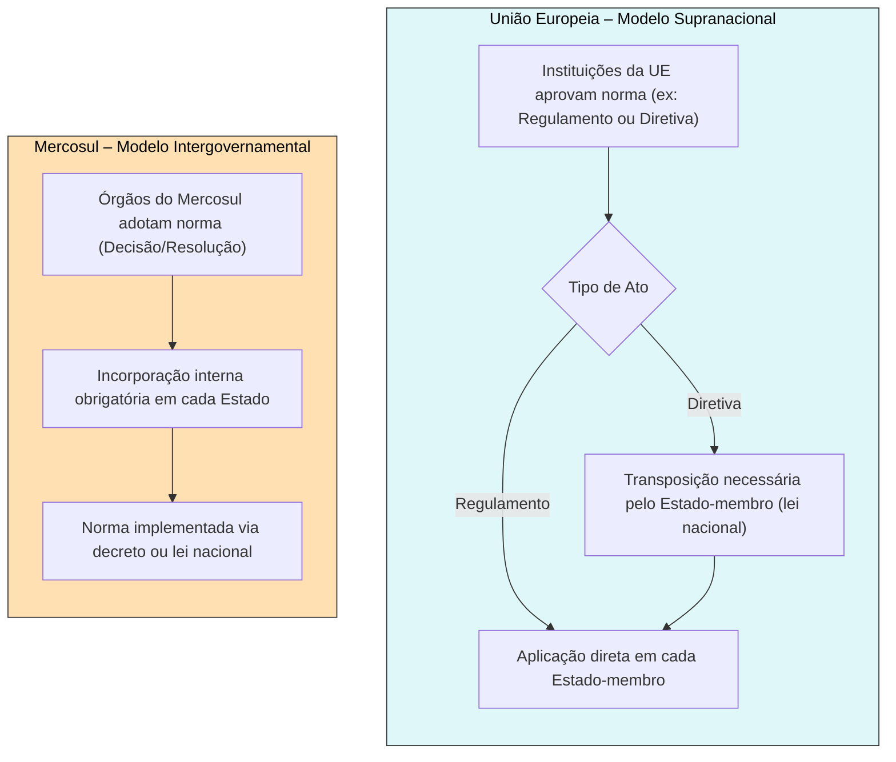

# A Dinâmica das Organizações Internacionais: Incorporação de Atos no Brasil e Análise Comparativa

## Incorporação de Atos de Organizações Internacionais no Direito Brasileiro

A incorporação de normas internacionais no ordenamento interno brasileiro depende do tipo de ato em questão e possui procedimentos distintos conforme sua natureza. É fundamental diferenciar a incorporação de **tratados constitutivos de Organizações Internacionais (OIs)** – como a Carta da ONU ou o Tratado de Assunção do Mercosul – da incorporação de **atos normativos derivados** emitidos por essas organizações (como resoluções, decisões e diretrizes adotadas por seus órgãos). Esta seção examina essa distinção e explora, em especial, o caso das resoluções do Conselho de Segurança da ONU e das normas do Mercosul no contexto brasileiro.

### Tratados Constitutivos vs. Atos Normativos Derivados

No Brasil, **tratados internacionais** (incluindo tratados constitutivos de OIs) seguem o rito estabelecido na Constituição Federal. Em regra, tais tratados são assinados pelo Poder Executivo e **dependem de aprovação do Congresso Nacional** (mediante decreto legislativo) antes de serem ratificados e internalizados via decreto de promulgação presidencial. A Constituição de 1988 determina que _“tratados, acordos ou atos internacionais que acarretem encargos ou compromissos gravosos ao patrimônio nacional”_ sejam submetidos ao Congresso (CF/1988, art. 49, I). Assim, a **adesão a uma OI por meio de seu tratado constitutivo** requer o escrutínio parlamentar, equiparando-se à incorporação de qualquer tratado internacional.

Por outro lado, **atos normativos derivados de OIs** – isto é, decisões, resoluções e regulamentos produzidos pelos órgãos da organização após sua constituição – apresentam um desafio peculiar. Essas normas derivam de obrigações assumidas no tratado constitutivo e frequentemente visam implementar ou detalhar compromissos internacionais em nível regional ou global. No entanto, dado que o Brasil adota um regime de _**dualist**a moderado em matéria de direito internacional_, tais atos **não têm efeito automático no ordenamento interno**. Em princípio, cada ato internacional que imponha obrigações novas exigiria algum procedimento de internalização conforme a legislação brasileira. A forma dessa internalização pode variar: em alguns casos, bastará um ato normativo do Poder Executivo (como um decreto regulamentar), enquanto em outros será necessária nova aprovação legislativa, dependendo da matéria e do grau de delegação prévia autorizada pelo Congresso.

> [!note] **Dualismo e Necessidade de Incorporação:** O Supremo Tribunal Federal já enfatizou que _“o sistema constitucional brasileiro não consagra o princípio do efeito direto e nem o postulado da aplicabilidade imediata dos tratados ou convenções internacionais”_, de modo que, **enquanto não concluído o ciclo de incorporação interna**, acordos internacionais (inclusive os de integração) **não podem ser invocados por particulares nem aplicados diretamente no âmbito doméstico**. Em outras palavras, sem a devida incorporação, a norma internacional não surte efeitos jurídicos internamente.

Portanto, há uma **diferença fundamental**: tratados constitutivos de OIs passam pelo crivo legislativo e se tornam norma interna por decreto de promulgação; já os atos normativos derivados dessas OIs, por não serem em si tratados autônomos, usualmente **seguem procedimentos abreviados de internalização** – muitas vezes via decretos ou portarias do Executivo – _desde que_ não contrariem a exigência constitucional de aprovação legislativa para atos que acarretem novos encargos gravosos.

### Resoluções do Conselho de Segurança da ONU (Capítulo VII) – Procedimento Brasileiro

As resoluções do Conselho de Segurança da ONU adotadas sob o Capítulo VII da Carta das Nações Unidas (isto é, aquelas que determinam medidas coercitivas vinculantes para manter ou restaurar a paz e segurança internacionais) representam um caso emblemático de incorporação de atos de OIs no Brasil. Por força do Artigo 25 da Carta da ONU, os Estados-membros _“concordam em aceitar e executar as decisões do Conselho de Segurança”_. Tais decisões têm caráter **obrigatório no plano internacional** imediatamente após sua adoção.

No Brasil, a prática consolidada tem sido **internalizar essas resoluções vinculantes do Conselho de Segurança por meio de um Decreto presidencial**, **sem submissão prévia ao Congresso Nacional**. Ou seja, o Presidente da República edita um decreto dando _publicidade oficial e executoriedade interna_ ao conteúdo da resolução, de forma análoga a um regulamento que executa compromisso já existente. Essa prática se apoia na competência privativa do Presidente prevista na Constituição (art. 84, IV), de _“expedir decretos e regulamentos para a fiel execução das leis”_ – entendendo-se aqui por “leis” tanto a legislação interna quanto tratados já incorporados (como a própria Carta da ONU). Como resultado, **não há participação direta do Poder Legislativo** nesse processo específico de incorporação das resoluções do CSNU, uma vez que se considera que o fundamento legal originário (a Carta da ONU) já foi aprovado pelo Parlamento, cabendo ao Executivo apenas cumprir as obrigações decorrentes desse tratado.

> [!important] **Execução Interna das Resoluções do CSNU:** No Brasil, resoluções do Conselho de Segurança da ONU sob Capítulo VII (vinculantes) são implementadas **via decreto presidencial**, com base no art. 84, IV, da Constituição Federal, **sem necessidade de aprovação pelo Congresso Nacional**. Esse decreto torna a resolução executória no território nacional, assegurando seu cumprimento imediato.

Essa forma célere de incorporação busca evitar atrasos no cumprimento de sanções internacionais urgentes (como embargos, congelamento de ativos, restrições de viagem etc.) e prevenir lacunas jurídicas internas que permitam a particulares escapar às medidas. De fato, doutrinadores ressaltam que cada Estado deve encontrar meios formais e materiais, conforme sua Constituição, para dar efeito doméstico às resoluções, sob pena de violar obrigações internacionais. **O Brasil tem seguido essa linha**, tendo editado diversos decretos ao longo das décadas para recepcionar resoluções do CSNU – por exemplo, o Decreto nº 99.441/1990 incorporou a Resolução 661 (1990) que impôs sanções ao Iraque, fundamentando-se no art. 84, IV, da CF/88.

Vale notar que essa prática foi **recentemente reforçada em nível infralegal**. A Lei nº 13.810, de 8 de março de 2019, dispôs sobre o cumprimento de sanções impostas por resoluções do CSNU, em especial no tocante à indisponibilidade de ativos de indivíduos e entidades designados. O Art. 6º dessa lei estabelece expressamente que _“as resoluções sancionatórias do Conselho de Segurança das Nações Unidas e as designações de seus comitês de sanções são dotadas de executoriedade imediata na República Federativa do Brasil”_. Em outras palavras, as sanções decididas pelo CSNU produzem efeito automático em solo brasileiro, dispensando qualquer ato legislativo adicional – uma confirmação legal daquilo que já se praticava via decretos presidenciais.

Essa dinâmica evidencia o **compromisso do Brasil em cumprir prontamente decisões do CSNU**, ao mesmo tempo em que levanta interessantes questões constitucionais e doutrinárias. Há quem observe que certas resoluções podem impor encargos significativos (como sanções econômicas abrangentes) e arguam que, em tese, enquadrar-se-iam na exigência do art. 49, I da Constituição (aprovação legislativa) – o que ensejaria debate sobre a fronteira entre execução de tratado em vigor e inovação jurídica. Até o momento, porém, **predomina o entendimento pragmático** de que as resoluções do CSNU derivam de obrigação preexistente do tratado constitutivo (Carta da ONU) já aprovado pelo Congresso, podendo o Executivo dar-lhes execução direta para honrar os compromissos internacionais urgentes do Brasil.

### Decisões do Mercosul e o Processo de Internalização

No contexto do **Mercado Comum do Sul (Mercosul)**, bloco de integração regional do qual o Brasil é membro fundador, a incorporação de normas também requer ação de cada Estado em nível interno. Diferentemente da União Europeia (como veremos adiante), o Mercosul adota um modelo **predominantemente intergovernamental**, sem autoridade supranacional capaz de emitir normas autoaplicáveis diretamente aos cidadãos. Assim, as normas emanadas de seus órgãos decisórios – tais como **Decisões do Conselho do Mercado Comum (CMC)**, **Resoluções do Grupo Mercado Comum (GMC)** e **Diretrizes da Comissão de Comércio do Mercosul (CCM)** – integram o chamado _direito derivado do Mercosul_ e **precisam ser incorporadas nos ordenamentos internos** para produzirem efeitos domésticos.

O arcabouço jurídico do Mercosul foi delineado pelo **Tratado de Assunção (1991)** e, principalmente, pelo **Protocolo de Ouro Preto (1994)**. Este último confirmou a obrigatoriedade das normas adotadas pelos órgãos do bloco e definiu procedimentos para sua entrada em vigor nos Estados-partes. O Artigo 42 do Protocolo de Ouro Preto dispõe que as normas emanadas dos órgãos do Mercosul _“terão caráter obrigatório e deverão, **quando necessário**, ser incorporadas aos ordenamentos jurídicos nacionais mediante os procedimentos previstos pela legislação de cada país”_. A cláusula **“quando necessário”** sugere que **nem todas as normas mercosulinas exigem um ato formal de incorporação** – haveria casos em que a aplicação é imediata, por já estar coberta na legislação nacional ou por se tratar de matéria interna do bloco.

> **Exemplificando**: Uma diretriz do Mercosul que apenas organiza o funcionamento interno de um comitê regional poderia não requerer incorporação, por não afetar diretamente direitos ou deveres dentro dos países. Já uma decisão que fixa normas comuns de comércio ou exige mudança regulatória **precisará ser incorporada**, seja por decreto ou por lei, conforme a natureza da matéria.

Para esclarecer em quais hipóteses dispensa-se a incorporação formal, o Conselho do Mercado Comum aprovou a **Decisão CMC nº 23/2000**, estabelecendo que não necessitarão de medidas internas as normas cujo conteúdo _refira-se apenas ao funcionamento interno do Mercosul_ ou _já esteja contemplado na legislação nacional do Estado Parte_. Fora dessas situações excepcionais, a regra geral é que **cada norma do Mercosul deve ser recepcionada pelo procedimento cabível em cada país**.

Na prática brasileira, isso significa que muitas decisões do Mercosul **passam por análise e atos internos caso a caso**. Existem **duas categorias principais**:

- **Normas do Mercosul que não requerem aprovação legislativa**: São aquelas compatíveis com a legislação vigente ou de natureza administrativa. Nesses casos, a incorporação pode se dar **via decreto presidencial ou portarias ministeriais**, conferindo publicidade oficial e execução doméstica à norma regional. De fato, buscando agilizar esse trâmite, um decreto presidencial brasileiro instituiu um grupo de trabalho interministerial para desenvolver procedimentos de integração das normas do Mercosul que não exigem aprovação do Congresso.
    
- **Normas que requerem aprovação legislativa**: Se a norma implicar criação ou alteração de direitos e obrigações não previstos em lei brasileira, ou introduzir encargos novos, ela deverá ser enviada ao Congresso Nacional como projeto de decreto legislativo (no caso de decisão já acordada no Mercosul, equiparando-se a um tratado interno) ou mesmo projeto de lei, conforme a matéria. **Exemplo**: Protocolos adicionais ao Tratado de Assunção (como o Protocolo de Olivos sobre solução de controvérsias) ou acordos celebrados no âmbito do Mercosul costumam ser submetidos à aprovação parlamentar, seguindo o rito de tratados internacionais.
    

Importante frisar que, **até a conclusão da incorporação**, as normas do Mercosul **não produzem efeitos perante terceiros no Brasil**. Um precedente marcante foi o _Agravo Regimental na Carta Rogatória nº 8.279 (STF, 1998)_: uma empresa argentina buscou a execução de medidas com base no **Protocolo de Medidas Cautelares do Mercosul**, mas o STF negou o exequatur, alegando que tal protocolo **ainda não fora incorporado ao direito brasileiro**. Nesse julgamento, o Supremo reafirmou que **não há “efeito direto” de normas de integração no Brasil** sem a devida incorporação interna, conforme já citado acima. Assim, **nenhum ato derivado do Mercosul é automaticamente válido no plano interno brasileiro**: exige-se a conclusão do “ciclo de transposição” – aprovação (quando devida) e publicação oficial – para que a norma do Mercosul ingresse na ordem jurídica nacional.

Em síntese, o modelo mercosulino mantém a **soberania legislativa de cada país**. Embora o Mercosul produza normas obrigatórias internacionalmente, **cada Estado Parte deve lhes dar eficácia por meio de seus procedimentos internos**, o que pode gerar defasagens e assimetrias. A consequência prática é que o direito do Mercosul carece de uniformidade e **celeridade** na aplicação: uma decisão pode vigorar em um Estado e ainda não ter efeito em outro, até que todos completem seus trâmites. Essa característica reflete a opção política original dos fundadores do Mercosul por evitar estruturas supranacionais robustas, valorizando a cooperação intergovernamental. Não por acaso, a doutrina aponta que o Mercosul, em seu estágio atual, _“não traz traço algum de supranacionalidade”_, enfrentando desafios justamente pela falta de mecanismos jurídicos integrados e automáticos.

> [!important] **Implicação Constitucional:** Alterações para acelerar a incorporação de normas de integração enfrentam limites constitucionais no Brasil. Alguns juristas defendem ser necessária uma Emenda Constitucional para consagrar **efeitos diretos** às normas de blocos como o Mercosul, removendo a exigência de incorporação caso a caso. Autores como Celso Duvivier de Albuquerque Mello e Pedro Dallari já aventaram essa possibilidade, visando aproximar o Mercosul de um modelo mais automatizado. Até o presente, porém, tais mudanças não se materializaram, e o **STF mantém a posição clássica**: sem incorporação interna, a norma internacional não vale domesticamente.

## Modelos de Integração Regional: Supranacionalidade vs. Intergovernamentalismo

A forma como as organizações internacionais regionais se estruturam juridicamente varia em um **espectro que vai do supranacional ao intergovernamental**. Essa variação determina o **grau de autonomia** das instituições internacionais em relação aos Estados e a **maneira como suas normas incidem nos ordenamentos internos**. Nesta seção, comparamos dois modelos contrastantes:

- A **União Europeia (UE)** – expoente do modelo **supranacional**, com instituições capazes de produzir normas de aplicação direta nos Estados-membros.
    
- A **Organização dos Estados Americanos (OEA)** e o **Mercosul** – representativos do modelo **intergovernamental**, onde a soberania nacional permanece predominante e as decisões coletivas requerem implementação por cada país.
    

### União Europeia: O Modelo Supranacional de Integração

A União Europeia é amplamente considerada o exemplo mais avançado de integração supranacional. Nesse modelo, os Estados-membros **transferiram parcelas de sua soberania** para instituições comunitárias (como a Comissão Europeia, o Parlamento Europeu e o Tribunal de Justiça da UE), que podem legislar e decidir em certos âmbitos _acima_ do nível estatal. As normas emanadas da UE podem ter **aplicabilidade direta** e **supremacia** sobre o direito interno, distinguindo-se fundamentalmente de uma cooperação meramente diplomática.

> [!definition] **Supranacionalidade:** No contexto da integração europeia, supranacionalidade significa que os países membros **cedem autoridade** em determinadas matérias a uma instância superior (instituições da UE), a qual pode adotar decisões **vinculantes diretamente aos Estados e aos indivíduos**, independentemente de aprovação posterior pelos parlamentos nacionais. Diferentemente de um arranjo intergovernamental, aqui _as decisões não dependem das estruturas nacionais_ para sua validade.

Duas pedras angulares do direito da UE ilustram bem esse caráter: o **princípio do efeito direto** e o **princípio da primazia (prevalência)**. Desde os anos 1960, a jurisprudência do Tribunal de Justiça da UE estabeleceu que muitas normas europeias **possuem efeito direto**, isto é, geram direitos e obrigações invocáveis nos tribunais nacionais sem necessidade de ato interno de incorporação. No célebre caso _Van Gend en Loos_ (1963), decidiu-se que a legislação adotada pelas instituições da UE pode criar direitos jurídicos exigíveis por indivíduos nos foros internos – _“O direito da UE tem, por conseguinte, efeito direto”_. Pouco depois, em _Costa contra ENEL_ (1964), firmou-se que os objetivos dos tratados seriam frustrados se o direito da União pudesse ser sobreposto pelo direito nacional; ao aderirem à comunidade, os Estados **limitaram seus poderes soberanos** em certas áreas, de modo que o direito da UE deve **prevalecer sobre quaisquer disposições internas conflitantes, inclusive constitucionais**. Daí emergiu o princípio da **supremacia do direito comunitário** sobre o direito dos Estados-membros, garantindo a uniformidade e efetividade da aplicação das normas europeias.

> [!important] **Princípios-Chave na UE – Efeito Direto e Primazia:** No ordenamento da UE, muitos atos legislativos têm **efeito direto**, permitindo que cidadãos acionem diretamente dispositivos do direito da União em cortes nacionais. Além disso, vigora a **primazia** do direito da UE: em caso de conflito, a norma europeia prevalece sobre a norma interna, obrigando as autoridades nacionais a afastar a lei doméstica incompatível. Esses princípios asseguram que a integração europeia funcione como um verdadeiro **sistema jurídico sui generis**, acima dos ordenamentos estatais em matérias de competência transferida.

Na prática, o direito derivado da UE apresenta diferentes graus de exigibilidade direta. **Regulamentos europeus** – atos gerais com força obrigatória – são **imediatamente aplicáveis** em todos os Estados-membros após sua publicação, sem necessidade de qualquer medida de incorporação nacional. Já as **Diretivas europeias** fixam objetivos ou parâmetros a serem atingidos, porém usualmente **dependem de transposição**: cada Estado deve editar normas internas (leis ou regulamentos) para implementar a diretiva no prazo estipulado. Ainda assim, mesmo as diretivas podem ter efeito direto _vertical_ em certos casos (quando prazo de implementação expirou e o Estado falhou em cumprir, por exemplo).

Outro aspecto da supranacionalidade é a existência de um poder judiciário comunitário forte: o **Tribunal de Justiça da União Europeia (TJUE)** interpreta o direito da UE e pode, via mecanismos como o reenvio prejudicial, assegurar sua aplicação uniforme em todos os membros. Decisões do TJUE vinculam os juízes nacionais na resolução de casos envolvendo direito europeu. Há também instâncias executivas independentes (como a Comissão) que fiscalizam o cumprimento das obrigações pelos Estados, podendo propor sanções em caso de descumprimento continuado.

Em suma, **a UE atingiu um patamar quase “federal” em termos jurídicos**: dentro de suas competências, atua como **ordem jurídica autônoma**, na qual as normas produzidas coletivamente incidem nos países _sem necessidade de intermédio legislativo nacional_. Essa arquitetura visou garantir a eficácia e a profundidade da integração (por exemplo, do mercado comum e da união econômica e monetária), evitando que cada país filtrasse ou atrasasse a implementação das decisões conjuntas.

### OEA e Mercosul: Modelos Intergovernamentais nas Américas

Em contraste com a UE, as principais experiências de integração e cooperação nas Américas – representadas aqui pela Organização dos Estados Americanos e pelo Mercosul – **seguem o paradigma intergovernamental**, no qual os Estados enfatizam a manutenção de sua soberania plena e a atuação por consenso, limitando a autonomia dos organismos internacionais.

**A Organização dos Estados Americanos (OEA)**, fundada em 1948, é sobretudo uma organização de cooperação política e jurídica entre os países do hemisfério. Seu próprio documento fundador, a _Carta da OEA_, consagra com destaque os princípios da **soberania estatal** e da **não-intervenção nos assuntos internos**. Não surpreende, portanto, que **a OEA não possua caráter supranacional**: suas resoluções e declarações não têm efeito direto automático nos países membros. As decisões da Assembleia Geral da OEA ou do seu Conselho Permanente dependem, para terem força obrigatória, da anuência de cada Estado conforme seus procedimentos (muitas vezes são recomendações políticas). Quando a OEA patrocina tratados multilaterais (por exemplo, Convenções Interamericanas de direitos humanos, combate à corrupção, terrorismo etc.), cada instrumento **só vincula os Estados que o ratificam individualmente** segundo seus trâmites constitucionais. Ou seja, a OEA funciona em base **estritamente intergovernamental**: decisões conjuntas precisam ser internalizadas país por país, não havendo **órgão central que possa impor legislação diretamente** sobre os cidadãos dos Estados-membros.

No caso do **Mercosul**, como detalhado na seção anterior, também prevalece o intergovernamentalismo. Apesar de ser um projeto de integração econômica (mercado comum), o Mercosul deliberadamente evitou, em seu desenho institucional, criar entidades com autoridade supranacional. As normas derivadas do Mercosul **obrigam os Estados-partes no plano internacional**, mas **não dispensam a incorporação interna**. Todas as decisões relevantes do bloco – seja na redução de tarifas, padronização de regras comerciais, ou coordenação de políticas – precisam ser transformadas em atos internos de cada país. Ademais, a estrutura decisória do Mercosul opera por **consenso entre os governos** e não por maioria qualificada como na UE, reforçando o caráter horizontal da cooperação.

> [!note] **Modelo Intergovernamental:** Em arranjos intergovernamentais puros, os governos **negociam e aprovam decisões conjuntamente**, porém **sem ceder sua competência decisória final** a um organismo independente. Assim, qualquer norma internacional depende de _ratificação ou implementação por cada Estado_ para produzir efeitos domésticos. No Mercosul e na OEA, isso significa que a soberania legislativa de cada país é resguardada: **não há “lei mercosulina” ou resolução da OEA automaticamente válida internamente**. O benefício é a preservação do controle nacional; a contrapartida é um processo decisório mais lento e, muitas vezes, menos eficaz, sujeito a atrasos e à falta de uniformidade na aplicação das medidas acordadas.

Como vimos, o STF brasileiro explicitou que **acordos de integração regional não gozam de aplicabilidade imediata no Brasil** – posicionamento que se aplica às normas do Mercosul e, de forma geral, a quaisquer decisões da OEA ou de outros organismos regionais. Em última instância, se o Brasil se compromete numa organização intergovernamental, ele o faz **sem abdicar da etapa de incorporação interna**. Isso assegura conformidade com a Constituição, mas também limita a velocidade com que obrigações internacionais entram em vigor domesticamente.

Ainda que o Mercosul tenha instituído um Parlamento regional (Parlasul) e tribunais arbitrais para controvérsias (Protocolo de Olivos), o **déficit de supranacionalidade** permanece: o Parlasul não detém poder legislativo real e as decisões arbitrais vinculam somente os Estados após procedimentos interestatais. Não existe uma Corte de Justiça ao estilo europeu capaz de uniformizar a interpretação das normas do bloco perante todos os juízes nacionais. Dessa forma, **a política tende a prevalecer sobre o direito**: quando há descumprimento de obrigações do Mercosul, a solução passa mais pela negociação diplomática do que por sanções jurídicas imediatas. Este arranjo reflete o “caminho intergovernamental” escolhido pelos países sul-americanos, em que a **integração avança até onde a soberania de cada um permita**.

Em suma, **OEA e Mercosul ilustram a face intergovernamental da cooperação regional**: a soberania nacional é a peça central, e os organismos internacionais atuam principalmente por coordenação e consenso. Não há criação direta de um **“direito comunitário” superior ao nacional**, como na UE; em vez disso, produz-se um **direito internacional derivado** que requer internalização. Enquanto isso, a **UE representa o modelo supranacional**, no qual um **corpo de normas supranacionais** incide simultaneamente em todos os Estados membros, mediado por instituições próprias com poderes independentemente do aval caso a caso de cada governo.

A tabela a seguir resume as diferenças de modo esquemático:

_No diagrama:_ À esquerda, o fluxo **supranacional** da UE: um Regulamento europeu entra em vigor simultaneamente nos países (**efeito direto**), enquanto uma Diretiva exige que cada país edite normas internas (legislação) para implementá-la; em ambos os casos, a norma da UE tem primazia sobre disposições nacionais contrárias. À direita, o fluxo **intergovernamental** do Mercosul: uma decisão tomada pelos órgãos do bloco **não produz efeitos por si só** – cada Estado deve tomar medidas internas (seja um decreto presidencial, seja encaminhando a matéria ao Legislativo) para que a norma tenha vigência doméstica.

## O Direito Comparado como Método de Análise

Diante das diferenças acima exploradas, evidencia-se o valor do **Direito Comparado** como ferramenta metodológica para compreender os diversos arranjos jurídicos existentes no plano internacional. Aplicar o direito comparado neste contexto significa **colocar lado a lado soluções jurídicas e institucionais adotadas por diferentes países ou organizações** para enfrentar desafios semelhantes – no caso, o desafio de **conciliar ordem jurídica interna e compromissos assumidos em organizações internacionais**.

Ao comparar, por exemplo, a **integração europeia** com a **integração regional nas Américas**, podemos extrair lições e avaliar vantagens e desvantagens de cada modelo. Essa análise comparativa enriquece o estudo de Direito Internacional Público de várias formas:

- **Entendimento de Conceitos e Práticas:** Conceitos como _supranacionalidade_, _efeito direto_, _primazia do direito comunitário_ ou _soberania estatal_ ganham contornos mais claros quando contrastados entre sistemas distintos. Observa-se, por exemplo, como o princípio da supremacia do direito da UE revolucionou as relações entre direito internacional e doméstico na Europa, enquanto nas Américas prevaleceu a tradição clássica de supremacia do direito nacional (salvo disposição em tratado incorporado).
    
- **Identificação de Soluções Alternativas:** O direito comparado permite verificar diferentes soluções jurídicas para o mesmo problema. Por exemplo, frente ao problema de garantir cumprimento eficaz de obrigações internacionais, a UE optou por instituir órgãos próprios e outorgar-lhes poderes diretos, ao passo que o Mercosul manteve o controle estatal sobre a implementação. Entender essas escolhas ajuda a avaliar quão eficaz é cada modelo: **a UE obteve maior uniformidade e coercitividade**, porém às custas de abrir mão de parcela de soberania; **o Mercosul preservou a autonomia nacional**, porém sacrificou agilidade e efetividade na aplicação das normas comuns.
    
- **Contextualização Histórica e Política:** A comparação também leva em conta _por que_ determinados modelos foram adotados. Muitas vezes, razões históricas, culturais e políticas explicam as diferenças. O método comparado evidencia, por exemplo, que a UE nasceu em contexto pós-guerra com forte propósito de integração e paz, facilitando a aceitação de um direito supranacional, enquanto na América Latina e no pós-guerra fria havia reticências maiores em ceder poderes a entidades internacionais (marcadas por tradição de não-intervenção). Conhecer esses contextos aprimora a compreensão crítica do direito internacional vigente.
    
- **Aperfeiçoamento e Reforma:** Por fim, o estudo comparado pode inspirar reformas e melhorias. No Brasil, acadêmicos e diplomatas estudam a experiência europeia para pensar caminhos de aprofundar a integração regional sul-americana – por exemplo, discutindo se no futuro seria viável conferir **maior autonomia jurídica ao Mercosul** (quem sabe, uma corte regional efetiva ou adoção parcial de efeito direto para certas normas). Da mesma forma, comparar ordenamentos auxilia o país a **preparar sua atuação diplomática** e ajustar a legislação interna para cumprir obrigações internacionais de modo eficiente.
    

Em sede de concurso de diplomacia (CACD), espera-se que o candidato consiga **transitar entre diferentes sistemas jurídicos internacionais**, extraindo paralelo e contraste. O direito comparado, nesse sentido, é não apenas um método acadêmico, mas um instrumento prático de análise: ao enfrentar um problema de direito internacional, o diplomata-jurista bem preparado lembrará de experiências estrangeiras e modelos alternativos, enriquecendo suas opções de solução.

Em conclusão, a **dinâmica das organizações internacionais e seu entrelaçamento com o direito brasileiro** requer uma abordagem analítica aprofundada. Compreender os procedimentos de incorporação dos atos de OIs – seja via decretos presidenciais para resoluções do Conselho de Segurança da ONU, seja via tramitação legislativa para tratados e decisões do Mercosul – é essencial para garantir a conformidade do Brasil às suas obrigações internacionais **sem violar os ditames constitucionais internos**. Paralelamente, **comparar modelos regionais de integração** ilumina os pontos fortes e fracos de cada arranjo, oferecendo insights valiosos tanto para a prática diplomática quanto para a evolução do Direito Internacional Público.

> [!quote] _“O Direito Internacional e o Direito Interno não são inimigos, mas parceiros que dialogam. Cabe ao jurista e ao diplomata harmonizá-los, usando a técnica (como a incorporação normativa) e a ciência (como o direito comparado) para transformar compromissos internacionais em realidade doméstica, sem romper a ordem constitucional.”_ – (Paráfrase inspirada no pensamento de Antônio Augusto Cançado Trindade)

## Questões para Autoavaliação

> [!question] **1.** Qual a diferença de procedimento entre a incorporação, no Brasil, de um **tratado constitutivo** de organização internacional e a incorporação de um **ato normativo derivado** dessa organização? Explique comparando, por exemplo, a **Carta da ONU** e uma **resolução do Conselho de Segurança**, ou o **Tratado de Assunção** e uma **decisão do Mercosul**.

> [!question] **2.** Compare os modelos de integração da **União Europeia** e do **Mercosul** no que tange à aplicação de suas normas no direito interno dos Estados-membros. O que significa dizer que a UE adota um **modelo supranacional** com efeito direto e primazia do direito comunitário, enquanto o Mercosul segue um **modelo intergovernamental**? Quais são as implicações práticas dessas diferenças?

> [!question] **3.** Por que o **Direito Comparado** é uma ferramenta importante para analisar a relação entre direito internacional e direito interno? Como a comparação de diferentes sistemas (por exemplo, a UE vs. OEA/Mercosul) pode ajudar a identificar soluções jurídicas e compreender melhor os desafios do Direito Internacional Público no contexto brasileiro?