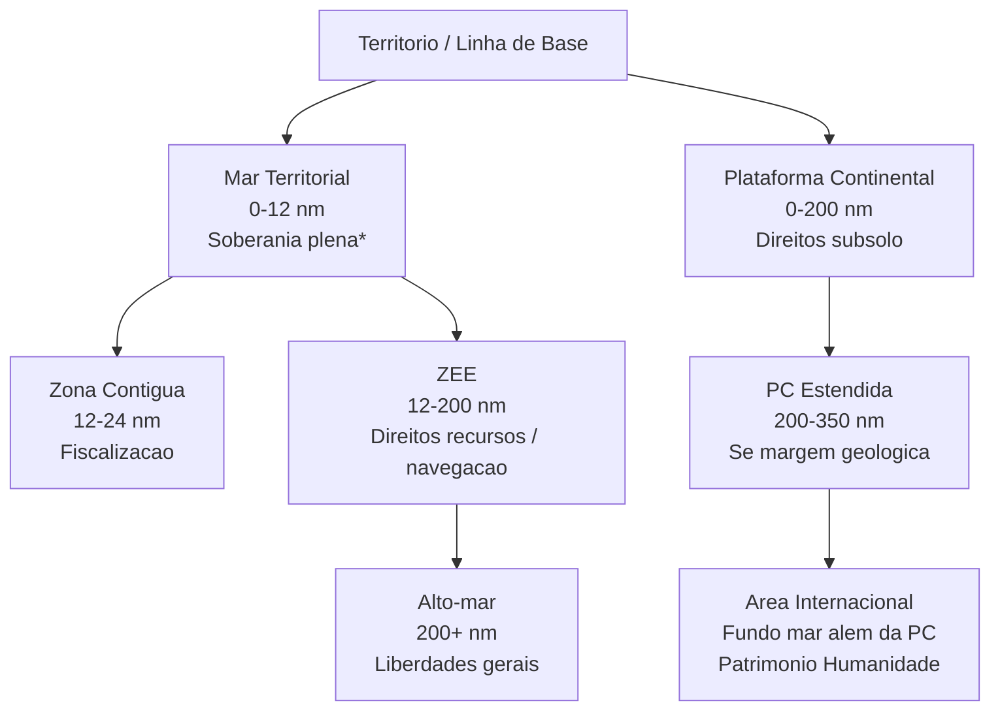

# Regimes Jurídicos Internacionais do Mar, Espaço Exterior e Antártida: Princípios, Normas e Desafios Atuais

Os **espaços globais** – o mar, o espaço exterior e a Antártida – são regidos por regimes jurídicos internacionais específicos, desenvolvidos para garantir seu uso pacífico e cooperativo, evitando disputas de soberania e promovendo o interesse comum da humanidade. Cada um desses domínios possui tratados multilaterais e normas consuetudinárias próprias, princípios fundamentais compartilhados (como o uso para fins pacíficos) e mecanismos de governança internacional. A seguir, examinam-se **analiticamente** os regimes do **Direito do Mar**, do **Direito do Espaço Exterior** e do **regime da Antártida**, abordando suas fontes normativas, princípios, instituições, direitos e deveres dos Estados, desafios contemporâneos, a participação do Brasil e jurisprudência relevante. Por fim, destaca-se a importância desses regimes para a ordem jurídica internacional e a prevenção de conflitos.

## Regime Jurídico Internacional do Mar (Direito do Mar)

O **Direito do Mar** regula os espaços marítimos e as atividades dos Estados nesses espaços. Ele evoluiu de séculos de costume (p.ex. a tradição da _liberdade dos mares_) para um extenso regime codificado na **Convenção das Nações Unidas sobre o Direito do Mar (CNUDM)** de 1982, também conhecida como **UNCLOS** ou **Convenção de Montego Bay**. A convenção de 1982 estabeleceu um **quadro legal abrangente** para os mares e oceanos, conciliando a liberdade de uso com direitos soberanos limitados e mecanismos de cooperação internacional.

### Principais Fontes Normativas do Direito do Mar

- **Tratados multilaterais:** A CNUDM (1982) é a pedra angular do regime jurídico do mar, contando atualmente com mais de 160 Estados Partes (o Brasil ratificou em 1988). A CNUDM substituiu os quatro tratados de Genebra de 1958 sobre direito do mar, que eram mais limitados em abrangência). Além da CNUDM, acordos complementares incluem, por exemplo, o **Acordo de 1995 sobre Populações de Peixes** (UN Fish Stocks Agreement) e, muito recentemente, o **Tratado sobre Biodiversidade além da Jurisdição Nacional (BBNJ)** de 2023, voltado à conservação da vida marinha em alto-mar.
    
- **Normas consuetudinárias:** Diversas regras da CNUDM consagram costumes prévios ou adquiriram força costumeira posteriormente. Exemplos incluem a liberdade de navegação em alto-mar, o conceito de mar territorial de 12 milhas náuticas e o princípio de uso pacífico dos oceanos. Decisões da **Corte Internacional de Justiça (CIJ)**, como o caso _Plataforma Continental do Mar do Norte_ (1969), reconheceram que critérios equitativos e a regra da linha média para delimitação da plataforma continental poderiam refletir o direito consuetudinário emergente.
    

> [!note] **Brasil e a Extensão do Mar Territorial (costume emergente)**  
> Já na década de 1970, antes da conclusão da CNUDM, o Brasil e outros países em desenvolvimento passaram a **reivindicar 200 milhas marítimas** como mar territorial ou zona econômica, influenciando o costume internacional. Em 1970, o Brasil decretou mar territorial de 200 milhas, prática que contribuiu para a formação do conceito de **Zona Econômica Exclusiva (ZEE)** na CNUDM.

### Princípios Fundamentais do Direito do Mar

Diversos princípios norteiam o regime do mar, equilibrando a soberania dos Estados costeiros com os interesses da comunidade internacional:

- **Liberdade dos Mares:** Em áreas fora da jurisdição nacional (alto-mar), todos os Estados desfrutam das liberdades clássicas: **navegação**, **sobrevoo**, **instalação de cabos e dutos submarinos**, **construção de ilhas artificiais** e **pesca e pesquisa científica**. Essas liberdades são exercidas com devido respeito aos direitos de outros Estados e a objetivos comuns (ex.: conservação marinha).
    
- **Soberania Relativa nas Águas Costeiras:** Os Estados costeiros têm **soberania plena** no seu **Mar Territorial** (até 12 milhas náuticas), embora condicionada pelo direito de **passagem inocente** de navios estrangeiros pacificamente. Em zonas como a **Contígua** (até 24 milhas) exercem controles aduaneiros/sanitários, e na **ZEE** (200 milhas) gozam de **direitos soberanos para explorar recursos**, não soberania plena, devendo permitir liberdades de navegação e sobrevoo de outros Estados.
    
- **Uso Pacífico e Cooperação:** O mar deve ser utilizado **exclusivamente para fins pacíficos**, princípio enfatizado na CNUDM, implicando proibição de reivindicações de domínio para propósitos bélicos e obrigação de resolver disputas de forma pacífica. Também há dever geral de cooperação entre Estados na conservação de recursos marinhos e na pesquisa científica marinha.
    
- **Patrimônio Comum da Humanidade:** Os recursos do **fundo do mar internacional** (a _Área_, que abrange leito e subsolo além dos limites da plataforma continental nacional) são declarados _“patrimônio comum da humanidade”_, não podendo qualquer Estado exercer soberania ou explorá-los sem autorização internacional. Esse princípio inédito da CNUDM busca assegurar compartilhamento equitativo dos benefícios da mineração em águas profundas em prol de toda a humanidade.
    
- **Equidade na Delimitação:** Em delimitações de fronteiras marítimas entre Estados com costas adjacentes ou opostas, prevalece o princípio de alcançar uma **solução equitativa**, sem método único obrigatório (a equidistância serve de ponto de partida, ajustada por circunstâncias especiais, conforme jurisprudência da CIJ).
    

### Estrutura Institucional e Mecanismos de Governança

O regime do mar conta com instituições criadas pela CNUDM ou vinculadas a ela:

- **Autoridade Internacional dos Fundos Marinhos (ISA)**: Sediada na Jamaica, é responsável por regular e autorizar atividades de exploração mineral no fundo do mar internacional (Área). A Autoridade emite regras e contratos para exploração de nódulos polimetálicos, sulfetos etc., visando partilha de benefícios. Possui um Conselho (Estados) e uma Secretaria; litígios envolvendo atividades na Área podem ser dirimidos pela Câmara de Contencioso dos Fundos Marinhos do TIDM.
    
- **Tribunal Internacional do Direito do Mar (TIDM)**: Sediado em Hamburgo, criado pela CNUDM, composto de 21 juízes, com jurisdição sobre disputas da interpretação/aplicação da Convenção. O TIDM julga casos entre Estados (p.ex. delimitações marítimas, liberação de embarcações apreendidas) e pode emitir pareceres consultivos. Desde 1996, sempre houve juízes brasileiros no TIDM, refletindo o engajamento do Brasil.
    
- **Comissão de Limites da Plataforma Continental (CLPC)**: Órgão técnico formado por especialistas, avalia os pleitos dos Estados para estender legalmente sua plataforma continental para além de 200 milhas (até no máximo 350 milhas, se houver prolongamento geológico). A CLPC emite recomendações vinculantes sobre os limites externos; com base nelas, Estados podem fixar seu limite final de plataforma continental.
    
- **Outros mecanismos:** A CNUDM prevê também **arbitragem internacional** como meio de solução de controvérsias (Anexo VII) e **conciliação obrigatória** para certas disputas (Anexo V). Além disso, organizações especializadas como a **Organização Marítima Internacional (OMI)** regulam aspectos específicos (segurança da navegação, poluição por navios), complementando o regime.
    

> [!important] **BBNJ – Novo Tratado para o Alto-Mar (2023)**  
> Em 2023, após longas negociações, foi adotado o **Acordo de Biodiversidade em Áreas Além da Jurisdição Nacional (BBNJ)**, também chamado de “Tratado do Alto-Mar”. Esse acordo, sob a égide da CNUDM, **estabelece regras para a conservação e uso sustentável da biodiversidade marinha no alto-mar**, incluindo a criação de áreas marinhas protegidas, repartição de benefícios de recursos genéticos marinhos, avaliações de impacto ambiental e capacitação científica). O BBNJ consagra que os recursos genéticos do alto-mar são _patrimônio comum da humanidade_, reforçando a cooperação científica. O Brasil participou ativamente das negociações e assinou o acordo em 2023, alinhado à sua política de conservação oceânica.

### Direitos e Deveres dos Estados no Mar

Os direitos e obrigações dos Estados variam conforme a zona marítima considerada, segundo a CNUDM:

- **Mar Territorial (0–12 nm):** O Estado costeiro exerce **soberania completa** sobre águas, leito, subsolo e espaço aéreo nessa faixa, similar ao seu território terrestre. Deve, porém, permitir **passagem inocente** de navios estrangeiros, isto é, trânsito rápido e não prejudicial à paz ou à segurança do costeiro. Pode suspender temporariamente a passagem inocente em casos especiais (segurança, armas).
    
- **Zona Contígua (12–24 nm):** Zona adjacente ao mar territorial, onde o Estado costeiro pode **fiscalizar e punir infrações** a leis alfandegárias, sanitárias, migratórias e fiscais cometidas em seu território ou mar territorial. É uma zona de controle preventivo, não de soberania plena.
    
- **Zona Econômica Exclusiva – ZEE (12–200 nm):** O Estado costeiro tem **direitos soberanos exclusivos para explorar, gerenciar e conservar os recursos naturais** (vivos e não-vivos) das águas sobrejacentes, do leito e subsolo nesta faixa. Pode portanto explorar pesca, petróleo, minerais, energia marinha etc. Em contrapartida, **outros Estados** conservam liberdades de **navegação e sobrevoo** na ZEE, bem como de instalar cabos e dutos submarinos, devendo respeitar leis costeiras compatíveis com a Convenção. O uso militar (ex.: exercícios navais) na ZEE alheia é assunto sensível: a CNUDM não o proíbe expressamente, mas exige uso pacífico do mar – muitos países (inclusive o Brasil) requerem notificação ou consentimento para manobras militares estrangeiras em sua ZEE, enquanto outros (EUA) alegam liberdade para tanto.
    
- **Plataforma Continental Jurídica:** Abrange o leito e subsolo marinho até 200 nm da costa _ou além_, até o limite da margem continental geológica (máximo de 350 nm ou 100 nm além da isóbata de 2.500m). O Estado costeiro tem **direitos exclusivos de exploração dos recursos do subsolo e leito** (petróleo, minerais, espécies sedentárias) na plataforma continental. Esses direitos existem _ipso facto_, independentemente de proclamação. Se a plataforma estende-se além de 200 nm, o Estado deve submeter dados à CLPC para validar o novo limite. Outros Estados podem colocar cabos e dutos através da plataforma continental, desde que sem atrapalhar direitos costeiros.
    
- **Alto-mar (além da ZEE) – Águas Internacionais:** Nenhum Estado pode reivindicar soberania; todos usufruem das liberdades do alto-mar mencionadas (navegação, sobrevoo, pesca, etc.), com dever de cooperação para conservação dos recursos vivos. Aplica-se o princípio da **bandeira**: navios estão sob jurisdição exclusiva do Estado cuja bandeira arvoram, exceto em casos excepcionais (pirataria, escravidão, rádio pirata, direito de visita em suspeita). Em alto-mar vale o **princípio do uso pacífico**, vedando, por exemplo, exercícios militares abusivos ou testes de armas que afetem outros usuários.
    
- **Área do Fundo do Mar Internacional:** Nenhum Estado pode apropriar-se de partes do leito oceânico fora das jurisdições nacionais. A exploração mineral na Área (além da plataforma continental estendida de qualquer país) só pode ocorrer sob contrato e supervisão da Autoridade Internacional dos Fundos Marinhos, em benefício da humanidade como um todo. Os Estados patrocinadores de empresas exploradoras têm dever de **devida diligência** em assegurar que essas cumpram normas ambientais e financeiras internacionais (conforme Parecer Consultivo de 2011 da Câmara de Contencioso do TIDM).
    

Além desses direitos zonais, **todos os Estados têm dever geral de proteger o meio marinho** (prevenir e controlar poluição, conservar espécies) e de **cooperar regional ou globalmente** para esse fim (CNUDM Parte XII). Há também obrigação de **resolver disputas pacificamente**; a Convenção institui procedimentos obrigatórios de solução de controvérsias (TIDM, CIJ ou arbitragem) caso negociações não bastem.

### Desafios Contemporâneos e Perspectivas no Regime do Mar

Apesar do quadro jurídico consolidado pela CNUDM, diversos desafios atuais exigem evolução do regime:

- **Mudanças Climáticas e Elevação do Mar:** A elevação do nível do mar ameaça submergir pequenas ilhas e litorais, pondo em questão a persistência de linhas de base e limites marítimos fixados. A comunidade internacional discute se países-ilha poderiam manter suas zonas marítimas mesmo se suas terras desaparecessem, evitando perda de recursos e potenciais conflitos territoriais.
    
- **Disputas Marítimas Persistentes:** Conflitos por delimitação marítima ainda ocorrem, como no _Mar do Sul da China_, onde reivindicações expansivas (como a “linha de nove traços” da China) afrontam princípios da CNUDM. Em 2016, tribunal arbitral (Anexo VII da CNUDM) decidiu em favor das Filipinas contra a China, rejeitando bases históricas chinesas na região – contudo a China não reconheceu o resultado, criando impasse. Outras disputas envolvem recursos transfronteiriços (petróleo, pesca) e demandam mecanismos de cooperação para evitar crises.
    
- **Exploração Mineral Internacional:** A perspectiva de mineração nos fundos marinhos (por minerais como cobalto, níquel) gera debate entre Estados desenvolvidos (interessados na exploração comercial em breve) e países em desenvolvimento (que exigem regime rigoroso de partilha de benefícios segundo o princípio do patrimônio comum). A Autoridade dos Fundos Marinhos trabalha em um código de mineração, mas há pressões para suspender qualquer mineração até mais pesquisas sobre impactos ambientais.
    
- **Poluição Marinha e Pesca Predatória:** A poluição por plásticos, vazamentos de óleo e outras formas de degradação marinha desafiam a implementação efetiva das normas existentes. Igualmente, a **sobrepesca** e pesca ilegal ameaçam estoques pesqueiros globais. Instrumentos adicionais (como o Acordo BBNJ e iniciativas regionais de manejo pesqueiro) são necessários para fortalecer a governança dos _global commons_ oceânicos.
    
- **Novas Tecnologias:** A mineração de nódulos via robôs submarinos, a bioprospecção de recursos genéticos marinhos e o surgimento de navios autônomos colocam questões legais inéditas. O regime terá de se adaptar para regular tais atividades (p.ex., estabelecendo regras sobre propriedade intelectual de recursos genéticos do alto-mar, ou responsabilidades em caso de acidentes com embarcações não tripuladas).
    

### Inserção e Interesses do Brasil no Direito do Mar

O Brasil, com seus mais de 7.000 km de costa, exerce papel ativo no regime do mar, alinhando-o a seus interesses nacionais:

- **Amazônia Azul:** O conceito de _“Amazônia Azul”_ destaca a vasta extensão de **águas jurisdicionais brasileiras**, ricas em biodiversidade e recursos (petróleo do pré-sal, pesca). Com a CNUDM, o Brasil consolidou uma ZEE de 200 milhas e busca estender sua plataforma continental além disso. Em 2004, apresentou à CLPC um pleito original reivindicando +960.000 km² de plataforma continental além das 200 milhas; **81% foi aprovado em 2007**, e partes remanescentes foram submetidas em novas propostas. Em 2019, a CLPC aprovou integralmente a área ao sul; outras áreas (Margem Equatorial e Oriental) aguardam avaliação. Se aprovadas, o Brasil acrescentará cerca de **2 milhões de km²** de leito marinho sob seus direitos, reforçando a noção de Amazônia Azul.
    
- **Proteção de Recursos Marinhos:** O Brasil aderiu a acordos para conservação marinha (como a Comissão Internacional da Baleia) e atua contra a pesca ilegal em suas águas. Participa ativamente em organizações regionais de ordenamento pesqueiro, buscando proteger espécies migratórias como atuns e tubarões. No cenário multilateral, o país liderou, com a ONU, a criação da **Década da Ciência Oceânica (2021-2030)** e apoiou o tratado BBNJ, visando garantir que países em desenvolvimento possam se beneficiar de eventuais usos de recursos genéticos marinhos.
    
- **Soberania e Defesa:** A Marinha do Brasil mantém projetos de monitoramento e presença naval na Amazônia Azul (Projeto SisGAAz, por exemplo) para afirmar jurisdição e coibir ilícitos (pesca ilegal, tráfico). O Brasil tradicionalmente defende posições de _maximizar_ sua autoridade nas 200 milhas – por exemplo, foi contra dispositivos que permitissem passagem de navios militares estrangeiros sem consentimento na ZEE durante a III Conferência do Direito do Mar, embora a convenção final não tenha essa exigência.
    
- **Participação Institucional:** O Brasil já serviu no Conselho da Autoridade dos Fundos Marinhos, contribui com juízes no TIDM (ex.: _Vladimir_ e _Manuel Pastor_ foram juízes brasileiros notáveis) e integra a Comissão de Limites com especialistas próprios. Essa participação assegura voz na interpretação e evolução do regime do mar.
    
- **Implementação Doméstica:** Internamente, a Lei nº 8.617/1993 adaptou as definições de mar territorial, ZEE e plataforma continental aos parâmetros da CNUDM, revogando pretensões anteriores (como o decreto-lei 1.098/1970 que fixara 200 milhas de mar territorial). Também foi instituída a **Comissão Interministerial para os Recursos do Mar (CIRM)**, coordenando políticas marítimas (pesquisa científica, PROARR (Programa Antártico e Recursos do Mar), etc.).
    

### Jurisprudência Relevante em Direito do Mar

A aplicação do Direito do Mar produziu vasta **jurisprudência internacional**, contribuindo para esclarecer normas:

- **Corte Internacional de Justiça (CIJ):** A CIJ decidiu casos emblemáticos de delimitação marítima, como _Plataforma Continental do Mar do Norte (1969)_ – afirmando que a regra equidistante não é obrigatória, devendo-se buscar solução equitativa – e _Líbia x Malta (1985)_ – onde reconheceu pertinência de geologia para extensão de plataforma continental. Outros casos como _Nicarágua x Colômbia (2012)_ delimitaram extensas áreas no Caribe, e _Somália x Quênia (2021)_ tratou da divisão na costa leste da África. Em _Peru x Chile (2014)_, a CIJ traçou fronteira marítima combinando linha paralela e projeção equitativa, mostrando abordagem casuística.
    
- **Tribunal Internacional do Direito do Mar (TIDM):** O TIDM proferiu decisões influentes, como no caso _Baía de Bengala (Bangladesh x Mianmar, 2012)_, onde delimitou mar territorial e ZEE aplicando método equidistante/circunstâncias relevantes, harmonizando com jurisprudência da CIJ. No caso _M/V Saiga (São Vicente e Granadinas x Guiné, 1999)_, reforçou a liberdade de navegação e direitos de navios petroleiros em ZEE alheia, condenando apreensão indevida. Em parecer consultivo (2011), a Câmara dos Fundos Marinhos do TIDM esclareceu as obrigações de **devida diligência** de Estados que patrocinam empresas na Área (caso _Responsabilidades e Deveres dos Estados na Área_).
    
- **Outras Instâncias:** Árbitros internacionais também contribuíram, como no _caso Ilhas Chagos (Maurício x Reino Unido, arbitragem 2015)_, que invalidou uma zona de proteção marinha britânica por violar direitos mauricianos, ou no _caso da “Rainbow Warrior” (1987)_ em que um tribunal arbitral tratou de violações de soberania e direito do mar envolvendo a França e a Nova Zelândia. Além disso, a Organização Mundial do Comércio (OMC) atualmente lida com subsídios à pesca que levam à sobrepesca, tocando aspectos de direito do mar no contexto do comércio.
    

> [!note] **Prevenção de Conflitos Marítimos**  
> Muitos litígios marítimos são solucionados via **negociação ou mediação**, antes de se agravarem. Por exemplo, Brasil e Uruguai delimitaram amigavelmente sua fronteira marítima nos anos 1970. A própria CNUDM, ao clarificar direitos de cada Estado no mar, tem sido instrumento de **estabilidade**: evita sobreposições de reivindicações e provê fóruns legais para contestação pacífica, como demonstrado pela busca de Bangladesh e Mianmar do TIDM para resolver sua disputa de ZEE em vez de um confronto direto.

**Mermaid – Zonas Marítimas (CNUDM):** A figura abaixo representa esquematicamente as principais zonas marítimas definidas pela Convenção da ONU sobre Direito do Mar, em relação à costa de um Estado:




_Obs:_ _No mar territorial, vigora soberania do Estado costeiro, ressalvado o direito de passagem inocente de terceiros._

## Regime Jurídico do Espaço Exterior

O **Direito do Espaço Exterior** foi construído no contexto da Guerra Fria e da corrida espacial, com o objetivo de impedir a militarização do cosmos e assegurar benefícios coletivos da exploração espacial. O regime baseia-se fortemente no **Tratado do Espaço Exterior** de 1967 (Tratado sobre Princípios Reguladores das Atividades dos Estados na Exploração e Uso do Espaço Cósmico, inclusive a Lua e demais Corpos Celestes)[Dropbox](https://www.dropbox.com/search?path=%2F&query=aula%205%20%E2%80%93%20meio%20ambiente%20e%20desenvolvimento%20sustent%C3%A1vel.pdf), complementado por acordos posteriores. Trata-se de um arcabouço jurídico que, similar ao da Antártida, busca prevenir **apropriação nacional de territórios** e promover usos pacíficos e cooperativos.

### Principais Fontes Normativas do Direito Espacial

- **Tratado do Espaço Exterior (1967):** É o tratado-mãe do regime espacial, formulado no âmbito da ONU e em vigor desde 1967. O Brasil o assinou em 1967 e ratificou em 1969[Dropbox](https://www.dropbox.com/search?path=%2F&query=aula%205%20%E2%80%93%20meio%20ambiente%20e%20desenvolvimento%20sustent%C3%A1vel.pdf). Este tratado estabelece os princípios fundamentais (ver adiante) para toda atividade além da atmosfera terrestre.
    
- **Acordos e Convenções Derivados:** Quatro instrumentos complementam o Tratado de 1967: (1) **Acordo sobre Salvamento de Astronautas** (1968) – obriga assistência a astronautas em perigo e devolução de astronautas e objetos espaciais ao Estado de lançamento; (2) **Convenção sobre Responsabilidade Internacional por Danos Causados por Objetos Espaciais** (1972) – define responsabilidade objetiva do Estado lançador por danos causados por seus objetos espaciais; (3) **Convenção sobre o Registro de Objetos Lançados ao Espaço** (1975) – requer que Estados mantenham e forneçam à ONU registros de objetos espaciais lançados; e (4) **Acordo que Governa as Atividades dos Estados na Lua e Corpos Celestes (Tratado da Lua)** de 1979 – busca expandir os princípios do regime à exploração de recursos lunares. Todos estão formalmente em vigor, porém o Tratado da Lua tem baixa adesão (apenas ~18 Estados e **nenhuma grande potência espacial** é parte).
    
- **Resoluções da ONU e Normas Consuetudinárias:** A Assembleia Geral da ONU aprovou resoluções com princípios para guiar usos do espaço, como a Res. 1962 (XVIII) de 1963 (_Declaração de Princípios_ precursor do Tratado de 1967) e outras sobre telecomunicações via satélite, uso de fonte nuclear em satélites, etc. Alguns princípios do Tratado de 1967, como a _não-apropriação_ e uso pacífico, são amplamente aceitos e considerados costume internacional vinculante. Além disso, diretrizes voluntárias, como as **Diretrizes de Mitigação de Detritos Espaciais** (2007, atualizadas em 2010) e as **Diretrizes de Sustentabilidade de Longo Prazo das Atividades Espaciais** (2019), adotadas no Comitê da ONU, refletem consenso sobre comportamentos responsáveis (embora não sejam tratados vinculantes).
    

### Princípios Fundamentais do Regime Espacial

Os princípios-chave consagrados no Tratado do Espaço Exterior de 1967 moldam todo o direito espacial:

- **Exploração e Uso para Fins Pacíficos:** O espaço exterior, incluindo a Lua e demais corpos celestes, **só pode ser usado para fins pacíficos**. O tratado proíbe expressamente a colocação de **armas nucleares ou de destruição em massa** em órbita da Terra, na Lua, em qualquer corpo celeste ou estacionadas no espaço. Ademais, **qualquer uso militar** de corpos celestes (como a Lua) é vedado – não se podem estabelecer bases, testar armas ou conduzir manobras militares nesses locais. (_Nota:_ O tratado não proíbe o uso militar _não agressivo_ do espaço, como satélites de comunicações militares ou de observação. A controvérsia reside em saber se armas convencionais em órbita seriam permitidas – ver abaixo).
    
- **Não-Apropriação Nacional:** Nenhum Estado pode **reivindicar soberania**, ocupar ou apropriar-se de partes do espaço exterior, da Lua ou de outros corpos celestes, seja por declaração, ocupação ou uso. Este princípio de **não-apropriação** garante que o espaço permaneça um domínio internacional aberto a todos, evitando a corrida por “terras” espaciais.
    
- **Liberdade de Exploração e Pesquisa:** Todos os países têm igual liberdade para explorar o espaço, inclusive a Lua e corpos celestes, **sem discriminação**, em condições de igualdade e de acordo com o direito internacional. Isso abrange lançar satélites, sondas, estabelecer estações de pesquisa em corpos celestes etc., contanto que não haja reivindicação de posse. A exploração deve ser realizada de modo a **beneficiar toda a humanidade**, refletindo o conceito do espaço como “província da humanidade”.
    
- **Cooperação Internacional e Assistência:** Os Estados devem conduzir atividades espaciais de forma a **promover cooperação e compreensão internacional**. Astronautas são considerados “enviados da humanidade” e os Estados têm a obrigação de **assistir astronautas em perigo** ou em caso de pouso forçado, bem como de **devolvê-los** com segurança ao país lançador (desenvolvido mais no Acordo de 1968). Há também o dever de notificar o público e a comunidade internacional sobre quaisquer fenômenos que representem perigo no espaço (ex.: riscos de contaminação).
    
- **Responsabilidade dos Estados:** Cada Estado é internacionalmente responsável por atividades espaciais realizadas **por si, por suas agências ou por entidades não-governamentais sob sua jurisdição**. Deve haver autorização e supervisão contínua de atividades privadas pelo Estado nacional. Caso um objeto espacial cause danos na Terra ou a aeronaves em voo, o Estado lançador **assume responsabilidade absoluta** pelos prejuízos (pela Convenção de 1972). Se danos ocorrerem a outro objeto no espaço, aplica-se responsabilidade relativa (por culpa).
    
- **Jurisdição e Controle sobre Objetos Lançados:** Os objetos lançados ao espaço permanecem sob **jurisdição e controle** do Estado de registro. Isso significa que um satélite, módulo ou estação espacial obedece à lei do país que o registrou. Além disso, **os Estados retêm a propriedade** dos objetos que lançam, e devem recuperá-los ou aceitá-los de volta caso retornem à Terra (por exemplo, destroços caídos em território estrangeiro).
    
- **Prevenção da Contaminação Nociva:** Os Estados devem evitar a **contaminação prejudicial** de corpos celestes e do espaço (ex.: proteger planetas de microrganismos da Terra que possam desequilibrar ecossistemas extraterrestres) e igualmente não trazer de volta para a Terra materiais extraterrestres de forma contaminante. Esse princípio ambiental ante litteram visa proteger ambientes tanto terrestre quanto espacial.
    

> [!important] **Militarização vs. Armas Convencionais em Órbita**  
> O Tratado do Espaço proíbe armas nucleares e de destruição em massa no espaço, mas **não menciona armas convencionais**. Isso gerou debate: alguns argumentam que essa omissão é uma brecha que permitiria, por exemplo, armas cinéticas ou lasers orbitais; outros ressaltam que a insistência do tratado em usos pacíficos sugere uma **proibição ampla de qualquer tipo de arma ou atividade bélica no espaço**. Até hoje, não há consenso sobre a interpretação. Certo é que **sistemas armados ofensivos no espaço representam sério desafio atual**, com potências testando mísseis anti-satélite e protótipos de armas orbitais, o que impulsiona discussões na ONU sobre um novo tratado banindo testes de ASAT (anti-satellites) e prevenindo uma corrida armamentista no espaço.

### Estrutura Institucional e Governança do Espaço Exterior

Diferentemente do Direito do Mar, o regime espacial não criou uma agência internacional gestora dos “bens comuns” do espaço (não há equivalente da Autoridade dos Fundos Marinhos). A governança do espaço se dá através de fóruns internacionais e cooperação entre agências:

- **Comitê das Nações Unidas para Uso Pacífico do Espaço Exterior (COPUOS):** Principal foro multilateral, estabelecido em 1959, subordinado à Assembleia Geral da ONU. Compõe-se de 100+ Estados que se reúnem anualmente (Subcomitê Jurídico e Científico) para discutir desenvolvimento do direito espacial, emitir diretrizes (ex.: mitigação de detritos) e promover a cooperação. O COPUOS foi responsável pela elaboração dos cinco tratados espaciais mencionados e continua debatendo novos temas (ex.: regulação de atividades lunares, gestão de tráfego espacial).
    
- **Escritório das Nações Unidas para Assuntos do Espaço Exterior (UNOOSA):** Sediado em Viena, atua como secretaria do COPUOS, auxilia países em capacitação espacial e mantém o **Registro de Objetos Espaciais** da ONU, onde os lançamentos reportados por Estados são catalogados em cumprimento à Convenção de 1975.
    
- **União Internacional de Telecomunicações (UIT-ITU):** Agência da ONU que aloca espectro de radiofrequência e posições de órbita (particularmente órbitas geoestacionárias) aos Estados para uso por satélites de comunicação. A UIT desempenha papel técnico crucial para evitar interferências e congestionamento orbital, o que tangencia o direito espacial (ex.: controvérsia do “Arco de Clarke”, onde países equatoriais reivindicaram direitos sobre a órbita geoestacionária na década de 1970, sem sucesso, levando a um acordo mediado na UIT).
    
- **Agências Espaciais e Cooperação Internacional:** A governança também ocorre por meio de parcerias entre agências espaciais nacionais (NASA, Roscosmos, ESA, CNSA, JAXA, e a Agência Espacial Brasileira – AEB). Projetos como a **Estação Espacial Internacional (ISS)** são regidos por acordos específicos (a ISS tem um marco legal próprio via acordos intergovernamentais). Atualmente, coalizões como os **Acordos Artemis** (liderados pelos EUA para cooperação na exploração lunar) estabelecem regras de conduta entre países parceiros, complementando a estrutura formal da ONU, porém gerando debates sobre sua relação com o Tratado da Lua e o princípio de benefício comum.
    
- **Ausência de Tribunal Espacial:** Não há corte internacional especializada em espaço. Disputas poderiam ir à CIJ ou arbitragem, mas até hoje **nenhuma foi judicializada**. Questões de indenização por danos, como o satélite soviético _Cosmos 954_ que caiu no Canadá em 1978 espalhando material nuclear, resolveram-se por negociação baseada na Convenção de 1972 (o Canadá recebeu compensação da URSS). Essa lacuna de jurisprudência deixa muitas interpretações do direito espacial em aberto, a serem definidas por eventual prática dos Estados ou novos instrumentos.
    

### Direitos e Deveres dos Estados no Espaço Exterior

No regime espacial, os **Estados** (e, indiretamente, os atores não-estatais sob sua supervisão) têm os seguintes direitos e obrigações principais:

- **Liberdade de Lançamento e Exploração:** Qualquer Estado pode desenvolver programas espaciais, lançar objetos (satélites, naves), estabelecer órbitas, pousar na Lua e planetas, **desde que** em bases pacíficas e não-exclusivas. Nenhum país pode impedir outro de realizar atividades legítimas no espaço, ainda que seja uma potência espacial preponderante.
    
- **Propriedade e Recurso Financeiro:** Estados e empresas podem, em princípio, **usar recursos do espaço** (por exemplo, extrair amostras de solo lunar para pesquisa). Contudo, o **status jurídico da exploração comercial de recursos** (mineração de asteroides, água lunar, etc.) é controverso: o Tratado do Espaço e o da Lua proíbem apropriação territorial, mas não deixam claro se a apropriação de recursos consumíveis é permitida. Alguns países (EUA, Luxemburgo) aprovaram leis nacionais conferindo a empresas direitos sobre recursos que extraírem, o que levanta discussões sobre conformidade com o direito internacional.
    
- **Dever de Registro e Controle:** Ao lançar um objeto, o Estado deve **registrá-lo nacionalmente e informar a ONU** (UNOOSA) para inclusão no Registro Internacional. Com isso, fica identificado como Estado de lançamento responsável. Deve exercer **controle contínuo** sobre seus objetos e _desorbitá-los_ de forma segura ao término da missão (prática ainda não mandatória por tratado, mas incentivada para reduzir detritos).
    
- **Responsabilidade por Danos:** Se um satélite ou artefato espacial de um Estado cair e causar danos a outro Estado ou cidadãos, o Estado de lançamento tem responsabilidade de indenizar. Isso se aplica tanto a danos na Terra (responsabilidade objetiva ilimitada) quanto no espaço (responsabilidade por culpa). Esse regime foi testado no incidente _Cosmos 954_ (1978), em que o satélite soviético com reator nuclear caiu no Canadá; a URSS pagou ~$3 milhões ao Canadá com base na Convenção de 1972.
    
- **Assistência e Salvamento:** Os Estados têm o dever de **prestar assistência** a astronautas em perigo, incluindo pousos de emergência em seu território ou alto-mar, e de cooperar nas operações de salvamento. Astronautas e veículos devem ser devolvidos ao Estado lançador. Isso reforça a ideia de solidariedade humana no espaço.
    
- **Prevenção de Interferências Nocivas:** Cada lançamento ou operação deve ser conduzido de modo a **não interferir danosamente** nas atividades espaciais de outros Estados. Por exemplo, um Estado deve evitar causar intencionalmente colisão com satélite alheio (o que também é problema de segurança espacial atual, vide testes de mísseis anti-satélite criando detritos). Na Lua ou órbita, surge a ideia de “zonas de segurança” para evitar que missões distintas entrem em conflito – conceito trazido pelos Acordos Artemis, mas que ainda carece de reconhecimento universal.
    
- **Cumprimento do Direito Internacional Geral:** O espaço não é um vácuo legal fora do resto do direito: Estados devem conduzir atividades espaciais em conformidade com o **direito internacional** geral, inclusive a Carta da ONU (paz e segurança) e tratados especiais como a **Tratado de Proibição de Armas Nucleares** (o qual proíbe explosões nucleares, complementando a proibição espacial).
    

### Desafios Contemporâneos e Perspectivas no Regime Espacial

As rápidas mudanças tecnológicas e a entrada de múltiplos atores tornaram o espaço um domínio cheio de **desafios atuais**:

- **Satélites e Detritos Espaciais:** Há mais de 8.000 satélites em órbita e milhões de fragmentos de lixo espacial. O risco de **colisões** em cascata (Síndrome de Kessler) cresce. O regime atual depende de diretrizes voluntárias de mitigação; discute-se a necessidade de **regras obrigatórias** para remoção de detritos e coordenação de tráfego espacial, talvez por um novo tratado ou emendas.
    
- **Nova Corrida Espacial e Militarização:** A competição por avanços tecnológicos e estratégicos reacendeu. Testes de destruição de satélites por mísseis (realizados por China, EUA, Índia, Rússia) espalharam detritos perigosos, evidenciando a urgência de acordos para banir tais testes. O desenvolvimento de armas hipersônicas e possíveis plataformas de ataque orbital desafiam o princípio de uso pacífico. A ausência de proibição total de armas convencionais permite ambiguidades exploradas pelas grandes potências. Um grande desafio é negociar um **Tratado de Prevenção de Armas no Espaço** – propostas existem desde 2008 (Rússia-China) mas enfrentam resistência.
    
- **Exploração de Recursos Celestes:** Com planos de retornar à Lua (Programa Artemis dos EUA, projeto chinês-russo de base lunar) e missões visando asteroides ricos em metais, surge pressão para clarificar o regime de **mineração espacial**. O Tratado da Lua de 1979 previa que os recursos lunares são patrimônio comum da humanidade e exigiriam um regime internacional antes da exploração econômica, porém como grandes players não aderiram, essa visão ficou dormente. Agora, para evitar confrontos ou _corridas do ouro_ espaciais, debates ocorrem se se deve criar uma autoridade internacional (à la Autoridade dos Fundos Marinhos) ou adotar acordos voluntários entre as potências para gerir a exploração de minerais extraterrestres de forma equitativa.
    
- **Participação do Setor Privado:** A era do _NewSpace_ (SpaceX, Blue Origin, empresas de nanosatélites etc.) trouxe dezenas de novos atores não-estatais. Os Estados têm dificuldade em monitorar e regular todas as atividades privadas (lançamentos comerciais, constelações massivas de satélites de comunicação, turismo espacial). Há risco de “ocupação de fato” de órbitas ou espectro por quem chegar primeiro (ex.: constelação Starlink preenchendo órbitas baixas). Será preciso fortalecer mecanismos de coordenação global e supervisão estatal efetiva para acomodar a inovação privada sem violar os princípios de acesso equitativo.
    
- **Governança da órbita Geoestacionária:** Países em desenvolvimento próximos ao equador argumentam que a órbita geoestacionária (35.786 km altitude, usada para satélites de telecom) é recurso limitado natural que deveria ter acesso equitativo. A UIT atualmente distribui posições orbital-espectro por ordem de solicitação, o que historicamente beneficiou países ricos. Em 1976, alguns países equatoriais (incluindo Brasil, através do **Acordo de Bogotá**) declararam soberania sobre faixas da órbita geoestacionária, mas tal reivindicação não foi reconhecida pela comunidade internacional. O tema persiste como desafio de acesso justo.
    
- **Proteção Planetária e Ética Espacial:** Missões planejadas para retornar amostras de Marte ou explorar oceanos sob o gelo de luas (Europa, Encélado) levantam questões de biossegurança. Como garantir que não contaminaremos outros ecossistemas ou traremos contaminantes? Além disso, questões éticas e legais emergentes incluem propriedade intelectual de descobertas espaciais, direitos de uso de solo para bases e até reflexões sobre proteção de patrimônio cultural (ex.: sítios de pouso das Apollo na Lua).
    

### Inserção e Interesses do Brasil no Regime Espacial

O Brasil, embora não seja ainda um grande ator espacial, tem interesses claros e participação ativa no regime:

- **Adesão aos Tratados Espaciais:** O Brasil é parte de todos os principais tratados espaciais, exceto o Tratado da Lua (não assinou). Ratificou o Tratado do Espaço em 1969, Acordo de Salvamento (1973), Convenção de Responsabilidade (1973) e Registro (2006), demonstrando compromisso com a ordem jurídica espacial. Também apoia as resoluções pertinentes da ONU e participa regularmente do COPUOS.
    
- **Cooperação Sul-Sul e Norte-Sul:** Tradicionalmente, a política espacial brasileira valoriza a cooperação internacional. O Brasil mantém parcerias com **Argentina** (projeto satélite SABIA-Mar, compartilhamento de dados), **China** (programa CBERS de satélites de sensoriamento remoto conjuntos), **Rússia** (ciência microgravidade) e **Estados Unidos** (treinamento de engenheiros, uso de instalações). Até 2015, o Brasil tinha um programa conjunto com a **Ucrânia** para lançamento do foguete Cyclone-4 a partir da base de Alcântara, cancelado devido a custos e mudanças de mercado. Em 2019, firmou-se um **Acordo de Salvaguardas Tecnológicas** com os EUA para viabilizar o uso comercial de Alcântara, garantindo proteção de tecnologias americanas nos foguetes lançados da base.
    
- **Base de Alcântara:** Localizada no Maranhão, próxima à linha do Equador (o que economiza até 30% de combustível em lançamentos), a **Base de Alcântara (CLA)** é o trunfo brasileiro para entrar no mercado espacial. O Brasil busca torná-la um centro de lançamentos internacionais comerciais. Após anos de negociações, o acordo com os EUA (2019) removeu obstáculos para empresas lançarem de Alcântara foguetes contendo componentes tecnológicos de origem americana. Isso abre caminho para contratos de lançamento, inserindo o Brasil na economia espacial global. **Desafios internos:** há questões sociais pendentes – comunidades quilombolas deslocadas desde a instalação da base nos anos 1980 reivindicam direitos, tema em análise pela Corte Interamericana de Direitos Humanos.
    
- **Programa Espacial e Satélites Brasileiros:** A Agência Espacial Brasileira (AEB) coordena iniciativas nacionais. O Brasil já lançou satélites de coleta de dados, meteorológicos e de comunicação (família de satélites **Amazonia-1**, **SGB** etc.), geralmente com auxílio de foguetes estrangeiros. Há ambição de desenvolver lançadores nacionais (Veículo Lançador de Microssatélites – VLM em desenvolvimento). O país investe no uso pacífico do espaço para desenvolvimento – por ex., dados de satélites para monitorar desmatamento (Programa PRODES/INPE) e telecomunicações para inclusão digital.
    
- **Diplomacia Espacial:** O Brasil historicamente defende o **uso pacífico e democrático do espaço**. Nos anos 1970, participou do Movimento dos Não Alinhados exigindo que o espaço beneficie toda a humanidade. Atualmente, apoia discussões sobre prevenir corrida armamentista espacial e sobre garantir acesso equitativo aos recursos orbitais. Também propõe mais cooperação em _space debris_ e sustentabilidade espacial. Não aderiu formalmente aos Acordos Artemis até 2021, mas em junho de 2021 tornou-se o primeiro país da América Latina a assiná-los, visando se envolver na próxima fase de exploração lunar – isso sem abandonar a posição de que qualquer exploração deve ser regida por marco multilateral que assegure benefício comum.
    

### Jurisprudência e Casos Relevantes no Direito Espacial

O direito espacial tem **pouca jurisprudência formal**, mas alguns casos e incidentes servem de referência prática:

- **Caso Cosmos 954 (1978):** Satélite soviético com reator nuclear caiu no Canadá. O Canadá invocou a Convenção de Responsabilidade de 1972, apresentando conta de CAD$6 milhões pelos custos de limpeza radioativa. Em 1981, URSS e Canadá firmaram acordo pelo pagamento de CAD$3 milhões, num arranjo diplomático que ilustrou a aplicação concreta da responsabilidade internacional sem arbitragem formal.
    
- **Caso Satellites IntelSat vs. Filasat (hipotético):** Nunca levado a termo, mas serve de exemplo típico: disputas de órbita/espectro geralmente são resolvidas via negociações mediadas pela UIT. Em uma hipotética disputa se um satélite de um país interferir nas comunicações de outro (ex.: jamming deliberado de sinal de satélite), o lesado poderia acionar mecanismos internacionais. Houve incidentes de **interferência de satélites estatais** em sinais de radiodifusão (denúncias na UIT contra Irã e outros por bloquear sinais), resolvidos politicamente.
    
- **Litígios Domésticos:** Alguns tribunais nacionais julgaram casos envolvendo empresas espaciais. Ex.: a empresa americana SpaceX teve disputas contratuais e de patentes, enquanto na Rússia houve casos de seguro por lançamentos fracassados. Embora não criem jurisprudência internacional, esses casos internos podem influenciar práticas e responsabilidade das partes em nível global.
    
- **Pareceres e Doutrina:** Na ausência de contenciosos judiciais, a interpretação do direito espacial se apoia em relatórios e opiniões de especialistas. O Instituto de Direito Internacional e o Comitê Jurídico do COPUOS periodicamente emitem comentários sobre temas como propriedade de recursos espaciais ou uso da força no espaço, guiando os Estados. Um exemplo é a discussão doutrinária robusta sobre se um Estado poderia invocar **legítima defesa** no espaço exterior (Art. 51 da Carta da ONU) caso um satélite seu seja atacado – questão não testada, mas relevante diante de possíveis conflitos espaciais.
    

> [!note] **Tendências: Direito Espacial em Evolução**  
> Espera-se um aumento de disputas legais à medida que o espaço se torna mais lotado e estratégico. A comunidade internacional pode recorrer a fóruns existentes (CIJ, arbitragem PCA) para solucionar conflitos espaciais. Há propostas para um **Tribunal Internacional do Espaço**, mas ainda embrionárias. Enquanto isso, iniciativas de _soft law_ – como os _Princípios de Haia sobre Recursos Espaciais_ (2019), elaborados por juristas – tentam prover bases para futuros regimes de exploração de recursos, mostrando que o direito espacial **segue em construção** para enfrentar os desafios do século XXI.

## Regime Jurídico Internacional da Antártida

A **Antártida** – continente e mares ao sul do paralelo 60°S – possui um regime único, conhecido como **Sistema do Tratado da Antártida (STA)**, que internacionalizou a gestão do continente gelado. A Antártida, antes disputada por reivindicações territoriais de vários países, tornou-se a partir de 1959 um espaço dedicado à **paz e à ciência**, com soberania congelada. O regime da Antártida é muitas vezes citado como exemplo bem-sucedido de **zona desmilitarizada e cooperativa**.

### Principais Fontes Normativas do Regime Antártico

- **Tratado da Antártida (1959):** Assinado por 12 países com presença no continente à época (incluindo Argentina, Chile, Reino Unido, EUA, URSS, entre outros), entrou em vigor em 1961. É o documento central que define o status jurídico da Antártida. O Brasil aderiu ao Tratado em 1975 e tornou-se Parte Consultiva (com direito a voto) em 1983. O tratado se aplica a toda área ao sul de 60°S (excluindo o alto-mar).
    
- **Protocolo ao Tratado da Antártida sobre Proteção ao Meio Ambiente (1991):** Também conhecido como **Protocolo de Madri**, em vigor desde 1998, este protocolo ambiental reforçou o regime, declarando a Antártida “reserva natural, consagrada à paz e à ciência”. Proíbe atividades mineratórias e estabelece princípios e obrigações ambientais abrangentes. O Brasil assinou em 1991 e ratificou em 1995.
    
- **Convenções do STA:** Duas convenções específicas integram o sistema: a **Convenção para a Conservação das Focas Antárticas** (CCAS, 1972, em vigor 1978) e a **Convenção para a Conservação dos Recursos Vivos Marinhos Antárticos** (CCAMLR, 1980, em vigor 1982). A CCAMLR, da qual o Brasil é parte (desde 1986), regula a pesca e conservação de ecossistemas marinhos no Oceano Austral (ao sul da Convergência Antártica), complementando o Tratado. A CCAS tem adesão mais limitada e foca em proteger focas para evitar extinção por caça excessiva.
    
- **Medidas e Decisões das Reuniões Consultivas (ATCM):** As Partes Consultivas reúnem-se anualmente nas **Antarctic Treaty Consultative Meetings (ATCM)** para discutir a implementação do Tratado e adotar decisões consensuais (_Measures, Decisions, Resolutions_). Muitas dessas medidas, uma vez aprovadas e implementadas por todos, tornam-se parte do acervo normativo do regime (por exemplo, regras sobre gestão de resíduos, áreas especialmente protegidas, turismo responsável, etc.). Embora tecnicamente sejam atos _intra partes_, na prática moldam o comportamento de todos os atores na Antártida.
    
- **Direito Consuetudinário:** O Tratado da Antártida criou uma situação singular não exatamente replicada fora dele, portanto poucos elementos viraram costume geral. No entanto, princípios como a **desmilitarização** do continente e a **liberdade de pesquisa científica** ali são hoje expectativas consolidadas internacionalmente. A ideia de Antártida como “patrimônio da humanidade” é frequentemente mencionada politicamente, embora juridicamente o tratado não empregue esse termo (diferentemente de “patrimônio comum” do Direito do Mar).
    

### Princípios Fundamentais do Regime da Antártida

O Tratado da Antártida e instrumentos associados se fundamentam em princípios cardeais que garantem a estabilidade e cooperação:

- **Uso Pacífico e Desmilitarização:** A Antártida deve ser utilizada **exclusivamente para fins pacíficos**. O tratado proíbe **quaisquer medidas de natureza militar**, incluindo estabelecimento de bases militares, fortificações, testes de armas e manobras militares no continente ou nas plataformas de gelo. Também **proíbe explosões nucleares e descarte de resíduos radioativos** na região. Isso criou a primeira **zona livre de armas nucleares** do mundo (antecipando tratados similares em outros continentes). O princípio assegura que nenhuma atividade bélica ou preparatória ocorra no continente, afastando rivalidades estratégicas.
    
- **Liberdade de Pesquisa Científica e Cooperação:** O tratado consagra a **liberdade de investigação científica na Antártida** e a promoção da cooperação internacional em pesquisa. Troca de informações e pessoal científico é incentivada. Programas como o _Ano Geofísico Internacional_ (1957-58) inspiraram essa cooperação. Até hoje, projetos científicos multinacionais e compartilhamento de dados (por exemplo, sobre mudanças climáticas) são pilares do regime. Todo membro consultivo deve manter atividade científica substancial na Antártida.
    
- **Suspensão das Reivindicações de Soberania:** Talvez o aspecto mais singular: o tratado **“congela” as disputas territoriais** existentes. Sete países haviam feito reivindicações de partes da Antártida (algumas sobrepostas) antes de 1959; o tratado estipula que nada nele representa renúncia ou aceitação dessas pretensões passadas, **mas proíbe qualquer nova reivindicação ou ampliação das antigas enquanto o tratado vigorar**. Assim, fica **vedado a qualquer país apresentar novas pretensões territoriais** na Antártida. Os reclamantes originais (Reino Unido, Chile, Argentina, Austrália, Nova Zelândia, França, Noruega) mantêm seu _status quo_ (congelado), e os não reclamantes (EUA, URSS/Rússia, etc.) mantêm posição de não reconhecer nenhuma soberania. Essa fórmula engenhosa permitiu que na prática a questão territorial ficasse em segundo plano, removendo uma potencial fonte de conflito.
    
- **Decisões por Consenso:** As regras e políticas para a Antártida são tomadas **por consenso** entre as Partes Consultivas nas ATCM. Cada Parte Consultiva (hoje 29 países, incluindo o Brasil) tem direito a voz e voto, mas nenhuma medida importante é adotada sem acordo unânime. Esse princípio força negociação e soluções mutuamente aceitáveis, reforçando a coesão do regime, embora às vezes cause impasses em temas sensíveis (p.ex., criação de novas áreas marinhas protegidas, bloqueada nos últimos anos por falta de consenso).
    
- **Proteção Ambiental Rigorosa:** Com o Protocolo de Madri (1991), a proteção do meio ambiente antártico tornou-se princípio fundamental. O protocolo exige que **consideração ambiental seja prioridade** em todas as atividades. Estabelece a proibição **indefinida** de atividades minerais exploratórias (salvo para pesquisa científica), e impõe obrigações de avaliação de impacto ambiental para quaisquer novos projetos, gestão adequada de resíduos, prevenção de poluição, proteção de flora e fauna nativas, etc. Cria-se assim um _santuário ambiental_. Esse princípio de precaução ambiental se junta aos originais de paz e ciência, completando a tríade moderna do regime.
    
- **Inspeções e Transparência:** Para reforçar confiança, o tratado permite que qualquer Parte Consultiva designe observadores para **inspecionar todas as estações, instalações e equipamentos na Antártida a qualquer momento**. Essa medida inédita para 1959 visava assegurar que ninguém violasse a desmilitarização de forma clandestina. As inspeções (feitas até hoje) e a obrigação de notificar previamente qualquer expedição ou estabelecimento de base contribuem para transparência e evitam suspeitas entre países operando no continente.
    

### Estrutura Institucional e Governança do Sistema Antártico

O Sistema do Tratado da Antártida funciona por coordenação entre os países participantes, sem criar uma autoridade supranacional forte, mas com órgãos consultivos:

- **Reuniões das Partes Consultivas (ATCM):** Órgão central deliberativo, reúne anualmente representantes dos países consultivos (e observadores de países não consultivos e organizações). Nas ATCM são debatidas questões de implementação do Tratado e Protocolos, novas medidas e recomendações são adotadas e relatórios científicos são compartilhados. Desde 2004 existe um **Secretariado da ATCM**, sediado em Buenos Aires, que organiza reuniões, mantém registro de documentos e facilita comunicação entre as partes.
    
- **Comitê para Proteção Ambiental (CEP):** Estabelecido pelo Protocolo de Madri, é um órgão assessor que se reúne paralelamente às ATCM. Composto por especialistas dos países membros, ele avalia questões científicas e ambientais, revisa avaliações de impacto de atividades e faz recomendações para melhorar a proteção ambiental na Antártida.
    
- **Secretariados das Convenções:** A CCAMLR tem sua própria estrutura – uma Comissão que se reúne anualmente em Hobart (Austrália) com todos os membros (inclusive alguns que não são do Tratado, como pescadores comerciais), um Comitê Científico que avalia o estado do ecossistema marinho e uma Secretaria que monitora as pescas e compilação de dados. A CCAMLR toma decisões também por consenso, incluindo fixação de cotas de captura para diferentes espécies. A Convenção de Focas tem reuniões esporádicas devido à diminuta atividade de caça de focas atualmente.
    
- **Conexão com o Sistema ONU:** Formalmente, o Tratado da Antártida não foi feito sob a ONU, mas mantém relação: os tratados sobre armas nucleares e meio ambiente da ONU reconhecem a Antártida como zona especial (ex: o Tratado de Proibição Completa de Testes Nucleares reforça a proibição já existente no Tratado da Antártida). Na ONU, há uma tendência de reconhecer a Antártida como área de interesse global; porém, os membros do STA zelam para manter as decisões dentro do sistema próprio, evitando “interferência” da Assembleia Geral.
    
- **Partes Consultivas vs. Não-Consultivas:** Hoje o Tratado da Antártida tem 54 Partes. Destas, 29 são Consultivas (têm direito a voto porque demonstraram empenho científico significativo na Antártida) e as demais 25 são Não-Consultivas (partes do tratado, mas sem participação nas decisões). O Brasil tornou-se consultivo em 1983 após estabelecer seu programa científico (PROANTAR) e a Estação Antártica Comandante Ferraz. Essa distinção cria um núcleo dirigente comprometido com o continente, enquanto permite a adesão de qualquer país interessado (a China, por exemplo, aderiu em 1983 e rapidamente se tornou consultiva em 1985, o que ajudou a legitimar o regime face a potências emergentes).
    

> [!info] **Antarctic Treaty System (ATS) – Estrutura em Mermaid**  
> A figura a seguir resume, em diagrama, os principais instrumentos e órgãos do Sistema do Tratado da Antártida (STA), ilustrando como o Tratado de 1959 está conectado aos protocolos e convenções subsequentes, bem como às reuniões consultivas que governam o regime:

```mermaid
flowchart TD
    A[Tratado da Antártida (1959)] --> B((Reuniões Consultivas<br>(ATCM) anuais))
    B -->|Assessoria| C[Comitê p/ Proteção Ambiental (CEP)]
    A --> D[Protocolo de Madri (Proteção Ambiental, 1991)]
    A --> E[Conv. Focas Antárticas (CCAS, 1972)]
    A --> F[Conv. Recursos Marinhos (CCAMLR, 1980)]
    classDef treaty fill:#9fc,stroke:#333;
    classDef organ fill:#cff,stroke:#333;
    A,D,E,F class treaty;
    B,C class organ;
```

> _Obs:_ _Além desses, o STA inclui medidas e resoluções adotadas nas ATCM, e coopera com entidades científicas como o Scientific Committee on Antarctic Research (SCAR)._

### Direitos e Deveres dos Estados na Antártida

No regime antártico, os direitos e obrigações aplicam-se principalmente às Partes do Tratado quando atuando ao sul de 60°S:

- **Direito de Acesso e Pesquisa:** Qualquer Parte do Tratado pode **acessar livremente a Antártida** para fins pacíficos e conduzir pesquisas científicas. Podem estabelecer estações de pesquisa, expedições e instalações, desde que notificadas previamente aos outros (um dever do tratado). Nenhum visto ou autorização de outro país é exigido, pois não há soberania exclusiva de ninguém ali.
    
- **Dever de Preservar o Ambiente:** Conforme o Protocolo de Madri, todas as atividades devem ser planejadas e executadas de modo a **evitar impactos ambientais significativos**. Há obrigação de realizar **Avaliação de Impacto Ambiental (AIA)** antes de atividades novas (construção de bases, perfuração geológica, etc.), com revisão pelos demais membros. Poluição deve ser prevenida: por exemplo, lixo das bases tem de ser removido do continente, a introdução de espécies alienígenas é proibida, e há regras estritas para gestão de combustíveis e proteção de fauna (é proibido perturbar, alimentar ou matar animais, salvo estritamente para pesquisa autorizada).
    
- **Proibição de Atividades Minerais:** Nenhum Estado (nem seus nacionais) pode realizar **mineração ou exploração de recursos minerais** na Antártida, exceto se objetivo científico. Essa moratória tem vigência por tempo indefinido desde 1998; pode ser revista após 50 anos (2048) se houver consenso para abrir negociação sobre mineração, mas qualquer mudança exigiria acordo unânime e um regime alternativo em vigor – o que torna **bastante improvável** a abertura da Antártida à exploração de petróleo/minérios no curto ou médio prazo.
    
- **Cooperação Logística e Científica:** Os países devem cooperar na logística antártica para eficiência e segurança – isso inclui compartilhar meios de transporte em missões de resgate, coordenação em caso de emergências (incêndios em bases, por ex.), intercâmbio de dados meteorológicos e de pesquisa. Há um sistema de comunicações conjunto e procedimentos SAR (search and rescue) sob a Convenção Marítima Internacional para navios e aviões na região. Cientistas trocam informações em conferências e via SCAR (Comitê Científico internacional).
    
- **Respeito às Regras do STA:** Os Estados devem obedecer todas as medidas em vigor adotadas nas ATCM (que eles tenham aprovado). Por exemplo, se há uma área especialmente protegida declarada em certa região, todas as expedições devem respeitar as restrições de entrada ali. Para membros da CCAMLR, há obrigação de não exceder as quotas de pesca estabelecidas e de reportar dados de captura e avistamento de aves marinhas (para evitar pesca incidental).
    
- **Jurisdição sobre Nacionais:** Como não há soberania territorial plena, eventuais infrações ou crimes cometidos na Antártida são punidos pelo Estado de nacionalidade do infrator ou do navio. Cada país tem legislação que estende sua jurisdição à Antártida para seus cidadãos e expedicionários. Por exemplo, se um cientista brasileiro comete um delito numa estação, ele pode ser processado segundo a lei brasileira. Em caso de incidentes envolvendo pessoas de diferentes nacionalidades, os países envolvidos cooperam para resolver de forma amistosa ou aplicar convenções (ex.: em caso de colisão de navios, aplica-se direito marítimo internacional).
    

### Desafios Contemporâneos e Perspectivas do Regime Antártico

Embora a Antártida permaneça pacífica e cooperativa desde 1959, surgem **novos desafios** que testam a robustez do STA:

- **Mudança Climática:** A Península Antártica é uma das áreas de aquecimento mais rápido do planeta. O derretimento de geleiras e perda de plataformas de gelo não só impacta ecossistemas (pinguins, focas) mas também tem implicações globais (elevação do nível do mar). O regime enfrenta o desafio de reforçar monitoramento climático e adaptar regras para proteger espécies vulneráveis ou áreas expostas. Além disso, a mudança climática pode facilitar acesso a áreas antes isoladas, **aumentando interesse humano e potencial perturbação ambiental**.
    
- **Pressão por Recursos Marinhos:** Embora mineração terrestre esteja proibida, os mares antárticos contêm recursos vivos valiosos (pesca de krill, austromerluza _“Chilean Sea Bass”_). A CCAMLR tem conseguido controlar capturas para sustentar populações, mas há tensão entre objetivos de conservação e interesses de pesca comercial. Nos últimos anos, propostas para criar grandes **Áreas Marinhas Protegidas** no Mar de Ross e na região do Mar de Weddell esbarraram na oposição de alguns membros (China e Rússia), impedindo consenso. A exploração **biotecnológica** (bioprospecção de compostos em organismos antárticos) também carece de regras claras, podendo virar foco de disputa.
    
- **Crescente Presença de Novos Atores:** Quando o tratado foi firmado, predominavam poucos países ocidentais e a URSS. Hoje, potências emergentes como **China e Índia** investem pesado em programas antárticos, construindo novas bases e navios quebra-gelo. A China, por exemplo, estabeleceu 5 bases e planeja mais, levantando questionamentos sobre seus objetivos de longo prazo (científicos ou estratégicos). Outros países asiáticos (Coreia do Sul) e até de outras regiões (Turquia, Irã) manifestam interesse. Esse alargamento do clube antártico é bem-vindo para ciência, mas traz o desafio de integrar visões e manter a mesma **confiança e transparência** entre todos, especialmente num contexto geopolítico mais tenso.
    
- **Turismo e Atividades Privadas:** O turismo na Antártida, inexistente em 1959, hoje envolve ~50 mil visitantes por ano (pré-pandemia) em cruzeiros e aviões. Embora regulado voluntariamente pela Associação Internacional de Operadores de Turismo Antártico (IAATO) e por diretrizes das ATCM (limites de pessoas por local, proibição de certas áreas, etc.), o volume crescente de turistas aumenta risco de acidentes (naufrágios, como o do MV Explorer em 2007) e impacto ambiental local. Debates emergem sobre se é preciso um **instrumento jurídico vinculante para turismo**, para prevenir danos e garantir resgate efetivo em emergências.
    
- **Futuro da Moratória Mineral (2048):** O Protocolo de Madri, ao proibir mineração, estipulou que após 50 anos de sua vigência (ou seja, em 2048) qualquer parte poderá pedir uma conferência para revisá-lo. Embora seja incerto se alguém o fará – e mesmo se fizer, precisaria de consenso unânime para mudar a proibição – alguns observadores especulam que, caso recursos naturais tornem-se escassos no resto do mundo, pressões para explorar petróleo ou minérios antárticos poderiam surgir. O maior **desafio futuro** do regime será resistir a essas pressões e manter a Antártida livre de exploração comercial destrutiva. Preparativos diplomáticos para reafirmar a validade indefinida do banimento podem ocorrer nas próximas décadas.
    
- **Cooperação vs. Geopolítica:** A invasão da Ucrânia pela Rússia em 2022 teve repercussões até nas salas da ATCM: pela primeira vez, a reunião anual de 2022 terminou sem declaração consensual, devido a impasse político com Rússia e China. Se tensões internacionais maiores contaminarem a cooperação antártica, o processo decisório por consenso pode ficar paralisado. Será crucial blindar o STA de disputas externas e continuar promovendo a ciência neutra como ponte de diálogo. O fato de que até durante Guerra Fria EUA e URSS colaboraram na Antártida dá esperança de resiliência, mas exige esforço contínuo.
    

### Inserção e Interesses do Brasil na Antártida

O Brasil considera a Antártida como parte de seus interesses estratégicos e científicos desde os anos 1980, mantendo presença constante:

- **Programa Antártico Brasileiro (PROANTAR):** Lançado em 1982, o PROANTAR coordena as atividades de pesquisa e logística do Brasil no continente. O país estabeleceu a **Estação Antártica Comandante Ferraz** em 1984 na Ilha Rei George (Arquipélago das Shetland do Sul). A estação original sofreu um incêndio em 2012, sendo completamente reconstruída e reinaugurada em 2020 com instalações modernas para pesquisa. Por meio do PROANTAR, o Brasil conduz estudos em climatologia, biologia marinha, glaciologia e outras áreas – contribuindo para ciência global e justificando seu status consultivo no STA.
    
- **Compromisso com o Tratado:** O Brasil aderiu ao Tratado da Antártida visando afirmar-se como participante ativo do regime polar, mesmo sem reivindicação territorial. Tornar-se Parte Consultiva em 1983 foi uma vitória diplomática, significando que o Brasil _“sentou-se à mesa”_ das decisões sobre o futuro do continente. Desde então, o Brasil tem apoiado firmemente os princípios do Tratado, incluindo a moratória mineral e a liberdade da ciência.
    
- **Estação Criosfera 1:** Além da base principal costeira, o Brasil instalou em 2012 a **Estação Criosfera 1**, um módulo científico autônomo no interior do continente antártico, no alto da placa de gelo. Serve para pesquisas atmosféricas e climáticas de longo prazo. Isso elevou o perfil brasileiro, mostrando capacidade de operar também no interior remoto, embora em pequena escala.
    
- **Interesse Geopolítico e Ambiental:** O Brasil considera a Antártida importante para entender e mitigar mudanças climáticas que o afetam (por ex., correntes oceânicas originárias da região influenciam o Atlântico Sul e o clima brasileiro). Há também interesse econômico indireto: recursos marinhos antárticos, como o krill, podem ser importantes para a pesca e indústria (óleo de krill). Assim, o Brasil atua na CCAMLR defendendo quotas sustentáveis e pesquisa sobre essas espécies. Estratégicamente, manter presença evita ser excluído de futuras deliberações, já que o Tratado privilegia quem está efetivamente ativo lá.
    
- **Apoio Militar na Logística:** A Marinha do Brasil desempenha papel fundamental no PROANTAR, operando o navio de apoio oceanográfico _Almirante Maximiano_ e outros, que anualmente transportam equipes e suprimentos. Essa estrutura assegura autonomia logística. Embora militares participem logisticamente, o Brasil respeita a desmilitarização (os militares atuam como pesquisadores ou suporte, sem armamentos nem funções militares tradicionais).
    
- **Diplomacia Antártica:** O Brasil costuma mediar entre posições de países desenvolvidos e em desenvolvimento no STA, buscando equilíbrio entre conservação ambiental e possibilidade de uso sustentável. Trabalha também para ampliar cooperação com outros países latino-americanos no continente (Chile, Argentina, Uruguai têm parcerias com o Brasil). No âmbito doméstico, difunde-se a importância da Antártida para a população (ex.: programas educativos, exposição “Antártica: Casa da Ciência” no Rio) para justificar o investimento público na pesquisa polar.
    

### Jurisprudência e Precedentes Relevantes no Regime Antártico

O regime antártico se orgulha de **não ter conflitos judiciais**: diferendos são resolvidos politicamente. Ainda assim, alguns episódios e acordos merecem menção:

- **Arbitragem sobre Estações Científicas (1977):** Único procedimento arbitral formalmente iniciado sob o Tratado foi _Reino Unido vs. Argentina/Chile (Plataforma de Gelo)_, referente a incidentes de instalações sobrepostas. Porém, ele foi abandonado quando as partes negociaram bilateralmente. Essa quase-arbitragem mostrou que, havendo boa fé, as Partes preferem acomodar disputas de reivindicações congeladas via diplomacia, sem romper a harmonia do Tratado.
    
- **Caso do _Polar Shriener_ (1979):** Um navio pesqueiro soviético foi apreendido por pescar ilegalmente próximo à Geórgia do Sul (área britânica ao norte da zona do Tratado, mas relevante). A URSS contestou a jurisdição britânica. O impasse foi resolvido com diálogo nas ATCM subsequentes reforçando a cooperação contra pesca ilegal e levando depois à criação da CCAMLR em 1980, para cobrir essa lacuna.
    
- **Caso do _Sea Shepherd_ (2000s):** Navios de ONG ambiental interferiram em atividades baleeiras do Japão no Oceano Antártico, levando a confrontos. O Japão alegou violação de liberdade de navegação; a Austrália (onde a ONG era registrada) teve que intervir para moderar. O assunto não foi a tribunal internacional, mas internamente a Austrália e Nova Zelândia lidaram com processos contra ativistas. Internacionalmente, a **Comissão Baleeira Internacional** e ATCM discutiram aumentar a segurança marítima. Em 2014, a CIJ julgou que o programa baleeiro do Japão no Antártico não era científico genuíno (caso _Austrália vs. Japão_), ordenando sua suspensão – decisão baseada no direito de tratados de conservação, tangente ao regime antártico.
    
- **Antarctic Climate Change Report (2010):** Não um caso jurídico, mas um relatório conjunto das Partes Consultivas reconheceu formalmente as mudanças climáticas como ameaça à Antártida, instando por redução de emissões globalmente. Embora não vinculante, esse consenso científico-político dentro do STA sinaliza disposição de enfrentar o problema cooperativamente.
    
- **Flexibilização do Turismo (2009 ATCM Measure):** As Partes adotaram um **instrumento vinculante limitando desembarques turísticos** (máx. 100 pessoas em terra por vez, e navios com >500 passageiros não podem desembarcar ninguém). Essa medida, implementada voluntariamente antes, foi formalizada após incidentes. Mostra que o regime pode criar _quase-regulação_ para atores privados através de consenso, sem litígio.
    

> [!note] **Antártida: um continente sem dono e sem conflitos armados**  
> O sucesso do Tratado da Antártida em **prevenir conflitos** é notável: durante mais de 60 anos, nenhum confronto militar ou disputa jurídica séria ocorreu no continente gelado. O tratado atingiu seu objetivo de evitar que a Antártida se tornasse “objeto de discórdia internacional”[Dropbox](https://www.dropbox.com/search?path=%2F&query=aula%205%20%E2%80%93%20meio%20ambiente%20e%20desenvolvimento%20sustent%C3%A1vel.pdf). Países com históricos de rivalidade (ex: Argentina e Reino Unido) cooperam cientificamente lado a lado em estações vizinhas. A Antártida permaneceu um **símbolo de paz e colaboração**, a despeito de guerras e tensões em outras partes do globo.

## Importância dos Regimes Globais para a Ordem Internacional e Prevenção de Conflitos

Os regimes jurídicos internacionais do Mar, do Espaço Exterior e da Antártida desempenham papel crucial na **manutenção da paz e na cooperação global**, servindo como verdadeiros pilares da ordem internacional em áreas fora da soberania nacional plena:

- **Evitar a “Corrida por Conquista” e Rivalidades:** Esses regimes estabeleceram que vastas áreas – cobrindo a maior parte do planeta (oceanos) e além (espaço, continente antártico) – **não podem ser apropriadas unilateralmente**. Isso remove o incentivo à competição territorial e previne conflitos armados por posse. Sem tais regimes, provavelmente teríamos disputas bélicas por ilhas no alto-mar, confrontos pela Lua ou conflitos por recursos na Antártida. Em vez disso, estabeleceu-se uma **mentalidade de bem público global**, na qual a exploração deve beneficiar a todos e ser regulada coletivamente.
    
- **Foro para Solução Pacífica de Disputas:** A existência de **mecanismos institucionais** (como o TIDM, as ATCM, o COPUOS) e de obrigações de solucionar controvérsias pacificamente fornece canais diplomáticos e judiciais para resolver desentendimentos, evitando escalada. Por exemplo, contenciosos marítimos complexos vão à CIJ ou ao TIDM em vez de virar enfrentamentos navais. Na Antártida, qualquer desacordo é discutido em reuniões multilaterais, mantendo o diálogo aberto. Isso fortalece o princípio da primazia do direito sobre a força.
    
- **Estabilidade Jurídica e Previsibilidade:** Os regimes criam um **ambiente jurídico estável e previsível** que dá segurança para Estados planejarem suas ações (sejam investimentos em pesca, programas espaciais ou pesquisa polar) sem temer que regras mudem arbitrariamente ou que potências imponham vontades pela força. A previsibilidade reduz atritos e constrói confiança mútua, importante especialmente em cenários de crescente multipolaridade.
    
- **Cooperação Científica e Cultural:** Em todos os três domínios, a ciência foi utilizada como ponte diplomática. Cooperação na pesquisa oceanográfica, intercâmbio de dados de satélite, programas científicos conjuntos na Antártida – tudo isso gera **laços de interdependência positiva**. Tais iniciativas servem para reduzir desconfianças entre países e gerar **diplomacia científica**, que frequentemente abre caminho para entendimentos políticos mais amplos.
    
- **Desenvolvimento Sustentável e Proteção Comum:** Ao consagrarem princípios como proteção do meio ambiente marinho, uso equitativo do espaço radioelétrico ou preservação do ecossistema antártico, os regimes contribuem para **objetivos globais de sustentabilidade**. Isso diminui potencial de conflitos causados por degradação de recursos (ex.: disputas por peixes escassos) e engaja Estados numa governança compartilhada dos comuns globais, reforçando a ideia de uma comunidade internacional cooperativa.
    
- **Inserção do Brasil e Liderança Responsável:** Para países como o Brasil, fazer parte ativa desses regimes aumentou seu **soft power** e o envolvimento construtivo nos assuntos globais. O Brasil, ao defender o patrimônio comum e o uso pacífico em foros internacionais, ajuda a moldar normas benéficas à paz. Essa participação também garante que seus interesses sejam resguardados de forma pacífica (p.ex., ao delimitar sua plataforma continental via CLPC e não por imposição unilateral).
    

Em suma, os regimes do Mar, Espaço e Antártida ilustram o potencial do **Direito Internacional Público** de regular racionalmente as relações entre Estados em esferas críticas, evitando a competição anárquica e **minimizando riscos de conflito**. Servem de modelo para novos desafios (como governança do ciberespaço, clima global) onde igualmente nenhum país pode ter domínio exclusivo e a cooperação é imperativa. A constante atualização e fortalecimento desses regimes – incluindo a incorporação de novos atores e tecnologias – será fundamental para que continuem cumprindo seu papel de **garantir a paz, promover a cooperação e preservar os interesses da humanidade**.

## Questões de Autoavaliação

1. **Quais são as principais zonas marítimas definidas pela Convenção da ONU sobre o Direito do Mar e que direitos o Estado costeiro exerce em cada uma delas?** _(Explique brevemente: Mar Territorial, Zona Contígua, ZEE, Plataforma Continental e Alto-mar.)_
    
2. **Que princípios fundamentais do Tratado do Espaço Exterior (1967) visam impedir a militarização e a apropriação do espaço?** _(Dica: pense em armas de destruição em massa, uso pacífico e não-soberania.)_
    
3. **Como o Tratado da Antártida conseguiu “congelar” as disputas territoriais no continente e quais medidas asseguram que a Antártida seja usada apenas para fins pacíficos?** _(Mencione a cláusula de reivindicações, proibições militares e o papel das inspeções.)_
