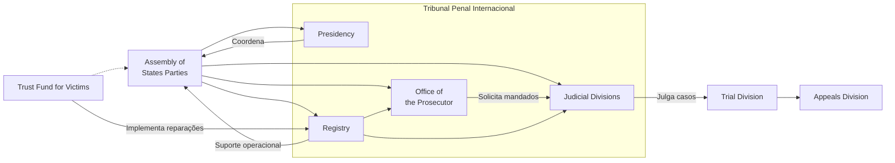

# O Direito Penal Internacional: Dos Tribunais Ad Hoc ao Tribunal Penal Internacional Permanente

**Direito Penal Internacional (DPI)** é o ramo do Direito Internacional Público que busca responsabilizar penalmente o indivíduo (e não apenas os Estados) pela prática dos crimes mais graves de relevância global. Após um século marcado por atrocidades que “chocam profundamente a consciência da humanidade”, a comunidade internacional afirmou o propósito de **não deixar impunes** os delitos que abalam a paz e a segurança mundiais. A seguir, traça-se a evolução histórica da justiça penal internacional – desde os tribunais de exceção no pós-guerra até a criação de um tribunal penal permanente – destacando seus princípios fundamentais, especialmente o **princípio da complementaridade** do Tribunal Penal Internacional, e a interação do **Estatuto de Roma** com a ordem jurídica brasileira.

## Surgimento e Fundamentos do Direito Penal Internacional

### Precedentes Históricos: Tribunais de Nuremberg e Tóquio

No rescaldo da Segunda Guerra Mundial, as potências Aliadas vitoriosas estabeleceram os primeiros tribunais penais internacionais para julgar **indivíduos** por atrocidades de guerra. O **Tribunal Militar Internacional de Nuremberg (1945-46)** e seu equivalente no Extremo Oriente, em Tóquio (1946-48), representaram marcos iniciais do DPI ao processar líderes políticos e militares de alto escalão por crimes que incluíram **crimes contra a paz**, **crimes de guerra** e **crimes contra a humanidade**. Esses julgamentos inovaram ao afirmar que certas violações flagrantes do direito internacional – como agressão, massacres de civis, genocídio e outros atos desumanos – **geram responsabilidade penal individual**, transcendendo a noção tradicional de que apenas Estados respondem por violações internacionais. Nas palavras memoráveis do juiz Robert Jackson em Nuremberg, “crimes sempre são cometidos por pessoas” – isto é, indivíduos podem ser responsabilizados diretamente perante a lei internacional, mesmo ocupando as mais altas posições de comando.

Apesar de seu caráter paradigmático, esses tribunais pioneiros não escaparam a duras críticas. Observou-se, por exemplo, que Nuremberg e Tóquio foram tribunais de exceção formados _ad hoc_ (isto é, **retroativamente** para fatos já ocorridos), aplicando uma “**justiça dos vencedores**” somente contra os derrotados, além de violarem o princípio da legalidade ao punir condutas (como **crimes contra a paz**) tipificadas somente após cometidas. Tais críticas aludiam à ausência de base jurídica preexistente clara para alguns crimes julgados e ao desequilíbrio de não submeter eventuais atrocidades dos Aliados ao mesmo escrutínio. Ainda assim, os Tribunais de Nuremberg e Tóquio estabeleceram precedentes essenciais: demonstraram ser possível realizar julgamentos justos com respeito ao **devido processo**, e afirmaram que certos delitos (os “**crimes que abalam a consciência humana**”) violam valores universais e, portanto, podem ser reprimidos por tribunais internacionais, lançando as bases para o desenvolvimento posterior do Direito Penal Internacional.

### Os Crimes Internacionais Centrais (Estatuto de Roma)

No pós-Guerra Fria, a codificação dos **“core crimes”** do Direito Penal Internacional consolidou-se no **Estatuto de Roma (1998)**, tratado que criou o Tribunal Penal Internacional (TPI). O Estatuto define quatro categorias centrais de crimes internacionais, que refletem décadas de evolução normativa e jurisprudencial:

> [!definition] **Genocídio:** Consiste em qualquer ato cometido com **intenção de destruir, no todo ou em parte, um grupo nacional, étnico, racial ou religioso**, enquanto tal. Inclui matar membros do grupo, causar-lhes danos físicos ou mentais graves, subjugar deliberadamente o grupo a condições de vida calculadas para provocar sua destruição física, impor medidas para impedir nascimentos ou **transferir à força crianças** do grupo para outro. O genocídio, definido inicialmente na Convenção de 1948, foca na _dolo especial_ (intent to destroy) contra coletividades protegidas, sendo considerado o “crime dos crimes” dado seu propósito de aniquilação de grupos inteiros.

> [!definition] **Crimes contra a Humanidade:** São **atos desumanos** especificados em lei (assassinato, extermínio, escravidão, deportação, tortura, estupro, perseguição, apartheid etc.), **cometidos como parte de um ataque generalizado ou sistemático contra uma população civil**, **com conhecimento** desse ataque. Diferentemente dos crimes de guerra, os crimes contra a humanidade **não exigem vínculo com conflito armado**, podendo ocorrer tanto em tempos de guerra quanto de paz, desde que perpetrados em larga escala ou de forma organizada contra civis. O elemento chave é a dimensão coletiva do ataque (abrangente ou metodicamente dirigido), que eleva essas violações a uma ofensa não apenas às vítimas diretas, mas à humanidade em geral.

> [!definition] **Crimes de Guerra:** São as **graves violações do Direito Internacional Humanitário** – isto é, das Convenções de Genebra de 1949 e do costume internacional aplicável a conflitos armados. Incluem, por exemplo, assassinato, tortura ou tratamento desumano de **prisioneiros de guerra** ou civis, deportação de populações, tomada de reféns, ataques deliberados contra **civis** ou bens protegidos (hospitais, monumentos históricos, instalações humanitárias), uso de crianças-soldados, estupro e escravidão sexual, entre outros. Tais atos, quando cometidos em contexto de conflito armado internacional ou não-internacional, violam as leis e costumes da guerra e geram responsabilidade individual. O Estatuto de Roma enumera extensivamente as condutas que constituem crimes de guerra (art. 8º), abrangendo tanto conflitos internacionais quanto internos, reforçando a obrigação de respeito à dignidade humana mesmo em tempos de guerra.

> [!definition] **Crime de Agressão:** De acordo com a definição incorporada ao Estatuto de Roma, agressão é o **uso da força armada por um Estado contra a soberania, integridade territorial ou independência política de outro Estado**, em violação à Carta da ONU. Exemplos incluem invasão, bombardeio ou bloqueio naval não justificados. Notavelmente, a competência do TPI para julgar a agressão foi ativada apenas em **2018**, após a definição do crime ter sido acordada pelas emendas de Kampala (2010). Desde então, o TPI pode exercer jurisdição sobre agressão de duas formas principais: (1) mediante **denúncia do Conselho de Segurança da ONU**, caso em que independe de os Estados envolvidos serem partes do Estatuto; ou (2) por iniciativa de um Estado Parte ou do próprio Procurador, _observadas condições estritas_: é necessário aguardar se o Conselho de Segurança reconhece o ato de agressão e, na ausência de tal reconhecimento em seis meses, obter autorização da Câmara Preliminar para prosseguir. Além disso, nessa via, o TPI **não poderá julgar agressões envolvendo Estados não membros ou Estados Partes que não aceitaram a emenda** de Kampala, o que na prática exclui da jurisdição atos de agressão cometidos por/contra países fora do tratado. Em suma, o crime de agressão – antes chamado “crime contra a paz” em Nuremberg – passou a ser justiciável internacionalmente, mas sob salvaguardas políticas e jurisdicionais que refletem a sensibilidade desse delito.

## Os Tribunais Penais Internacionais _Ad Hoc_ (Anos 1990)

Após quase cinco décadas sem tribunais penais internacionais, os conflitos dos anos 1990 levaram o Conselho de Segurança da ONU a retomar a justiça penal internacional em bases _ad hoc_. Em 1993, diante dos crimes cometidos nos conflitos dos Bálcãs, o CSNU criou o **Tribunal Penal Internacional para a ex-Iugoslávia (TPII ou _ICTY_, na sigla em inglês)** mediante a Resolução 827. Já em 1994, em resposta ao genocídio em Ruanda, estabeleceu-se o **Tribunal Penal Internacional para Ruanda (TPIR ou _ICTR_)** pela Resolução 955. Ambos os tribunais foram instaurados com fundamento no Capítulo VII da Carta da ONU, vinculando juridicamente todos os Estados membros quanto à obrigação de cooperação. Tratavam-se, porém, de cortes _ad hoc_, temporárias e com competência restrita a situações específicas: crimes ocorridos em determinado conflito e período (a ex-Iugoslávia, a partir de 1991; e Ruanda, apenas em 1994).

Os tribunais da ex-Iugoslávia e de Ruanda desempenharam papel crucial no desenvolvimento do DPI e no combate à impunidade. Pela primeira vez desde Nuremberg, indivíduos – inclusive altos líderes – foram processados internacionalmente por **genocídio, crimes contra a humanidade e crimes de guerra** em tribunais multilaterais. O TPII indiciou e julgou figuras de alto escalão, como chefes militares e até um chefe de Estado em exercício (Slobodan Milošević), afirmando que mesmo governantes não estão imunes à justiça internacional. O TPIR, por sua vez, foi pioneiro ao **condenar o genocídio** no *caso Akayesu (1998)* – primeira condenação mundial por genocídio – e ao reconhecer o **estupro como instrumento de genocídio e crime contra a humanidade**, estabelecendo jurisprudência vital sobre violência sexual em massa. Ambos os tribunais produziram vasta jurisprudência clarificando definições de crimes (por exemplo, delimitando os elementos de _ataque sistemático_ contra civis, ou definindo dolosamente a intenção genocida) e incorporando princípios de direito humanitário ao direito penal.

Contudo, como mecanismos _ad hoc_, esses tribunais enfrentaram também limitações e críticas. Em primeiro lugar, ainda que estabelecidos sob autorização do Conselho de Segurança, foram percebidos por alguns como fruto da vontade de um grupo seleto de países, e não do consenso universal obtido via tratado multilateral. Em segundo lugar, repetiu-se a problemática da retroatividade: as cortes julgavam crimes cometidos antes de sua criação, o que suscitou alegações de violação ao princípio da _nullum crimen sine lege_ semelhante às críticas aos tribunais pós-Segunda Guerra. Por fim, a própria **natureza temporária** desses tribunais gerou preocupações – uma vez concluídos os julgamentos previstos, as cortes seriam dissolvidas, não permanecendo para outros casos. De fato, o TPII e o TPIR encerraram suas atividades (em 2017 e 2015, respectivamente) após cumprirem seus mandatos, deixando eventuais casos remanescentes a cargo de mecanismos residuais da ONU.

Mesmo com tais percalços, os tribunais penais _ad hoc_ legaram importante contribuição. Eles **romperam o sentimento de impunidade** então prevalecente, ao demonstrar que a comunidade internacional estava disposta a julgar os responsáveis por atrocidades recentes. Além disso, funcionaram como precursor do modelo de justiça penal permanente: suas lições – tanto acertos (como garantir julgamentos justos, registro histórico dos crimes, proteção a vítimas) quanto dificuldades (selecionar casos, obter cooperação dos Estados, altos custos) – fundamentaram o projeto de criação de um **Tribunal Penal Internacional permanente**, com base em um tratado plurilateral, para abarcar crimes de qualquer conflito futuro. Esse anseio se concretizou no final da década de 1990 com a negociação do Estatuto de Roma.

## O Tribunal Penal Internacional (TPI) – Criação, Complementaridade e Jurisdição

### Criação e Natureza do TPI (Estatuto de Roma de 1998)

O **Tribunal Penal Internacional (TPI)** foi estabelecido em 1998 pelo Estatuto de Roma como o primeiro tribunal penal internacional **permanente e independente**. Diferentemente dos julgamentos de Nuremberg/Tóquio (impostos pelos vencedores da guerra) e dos tribunais _ad hoc_ dos anos 90 (criações pontuais do CSNU), o TPI nasce de um **tratado multilateral** adotado por ampla coalizão de Estados de todas as regiões. O Estatuto de Roma foi aprovado em uma conferência diplomática em Roma (1998) e entrou em vigor em 1º de julho de 2002, após atingir 60 ratificações. O Tribunal tem sede em Haia, Países Baixos, e estrutura própria (Presidência, Juízos, Procuradoria e Secretaria) para cumprir seu mandato de julgar os crimes internacionais mais graves listados no Estatuto (genocídio, crimes contra a humanidade, crimes de guerra e agressão).

Em termos institucionais, o TPI distingue-se por ser **estabelecido pelos próprios Estados Partes**, e não por órgão da ONU – embora coopere estreitamente com as Nações Unidas e possa receber _remissões_ do Conselho de Segurança. Essa natureza contratual lhe confere legitimidade reforçada, pois seu poder jurisdicional advém do consentimento soberano dos Estados que aderiram ao tratado. Ainda assim, o TPI busca conciliar duas demandas: por um lado, evitar a impunidade de crimes que “afetam a comunidade internacional como um todo”; por outro, respeitar a soberania e as competências dos sistemas judiciais nacionais. Esse equilíbrio é alcançado por meio de seu **princípio basilar da complementaridade**, analisado a seguir.

> [!important] **Princípio da Complementaridade:** O Estatuto de Roma consagra que a jurisdição do TPI é **complementar**, e não substitutiva, em relação às jurisdições penais nacionais. Em outras palavras, cabe primariamente a cada Estado julgar os crimes internacionais cometidos em seu território ou por seus nacionais; o TPI atuará apenas se o Estado em questão **não quiser** ou **não puder** levar adiante a perseguição penal de forma genuína. Esse princípio está positivado no art. 17 do Estatuto, que torna um caso inadmissível no TPI se estiver sendo investigado ou processado por um Estado competente, **a menos que** tal Estado esteja **inabilitado ou sem disposição** para conduzir o processo de modo efetivo e imparcial. Ser “_unwilling_” implica, por exemplo, a investigação meramente simulada para proteger o suspeito da justiça (_sham trials_), ou um processo viciado por falta de independência; já a incapacidade (“_unable_”) refere-se a colapso do sistema judiciário nacional, impossibilitando a responsabilização (como em situações de Estado falido). O TPI, portanto, funciona como um **foro de último recurso** (_court of last resort_): intervém somente quando as instâncias domésticas falham em promover a justiça. Esse desenho evita conflitos com a soberania estatal e incentiva os países a realizarem eles mesmos os julgamentos, deixando a atuação internacional subsidiária para os casos de verdadeira necessidade. A complementaridade é considerada uma “válvula de segurança” do sistema do TPI, assegurando que o Tribunal não se torne um tribunal onipresente sobrepujando cortes nacionais, mas sim um **garantidor contra a impunidade** quando a justiça interna for omissa ou inviável.

### Jurisdição e Mecanismos de Acionamento do TPI

O alcance da jurisdição do TPI é bem delimitado no Estatuto de Roma, tanto em termos de **matéria**, **pessoas** e **tempo**, quanto dos **gatilhos processuais** que permitem iniciar casos. Em termos materiais, como visto, a competência restringe-se aos quatro core crimes definidos no art. 5º do Estatuto, considerados “os crimes mais graves de preocupação da comunidade internacional no seu conjunto”. Temporalmente, o TPI não possui retroatividade: somente crimes cometidos **a partir de 1º de julho de 2002** (data da entrada em vigor do Estatuto) podem ser julgados. No plano pessoal e espacial, a regra geral é que o Tribunal alcança indivíduos acusados de crimes ocorridos no **território de um Estado Parte** ou cometidos por **nacionais de um Estado Parte**, em conformidade com os princípios da jurisdição internacional. Essa cláusula de adesão implica que, na maioria dos casos, pelo menos um dos Estados vinculados ao crime (Estado do local dos fatos ou da nacionalidade do acusado) deve ter aderido ao Estatuto de Roma para que haja jurisdição – a menos que haja uma exceção via Conselho de Segurança.

Com efeito, o Estatuto prevê **três meios de acionamento** da jurisdição do TPI, capazes de deflagrar investigações (art. 13):

1. **Remessa por um Estado Parte:** Qualquer Estado Parte pode **submeter** ao Procurador do TPI uma “situação” em que haja notícia de crimes do Estatuto praticados em seu território ou por seus nacionais. Vários casos no TPI iniciaram-se por _autorreferência_ – por exemplo, Uganda, República Democrática do Congo e República Centro-Africana referenciaram ao Tribunal conflitos internos ocorridos em seus territórios. Essa via reforça a cooperação dos Estados Partes com o TPI, permitindo que governos solicitem ajuda internacional para julgar crimes que não conseguem ou não desejam processar sozinhos (por motivos de incapacidade institucional ou para dar maior legitimidade a julgamentos delicados internamente).
    
2. **Remessa pelo Conselho de Segurança da ONU:** O CSNU, agindo sob o Capítulo VII da Carta (matéria de paz e segurança), pode **encaminhar** ao TPI situações em que aparentem ter sido cometidos crimes internacionais, independentemente da nacionalidade ou do local dos fatos. Esse mecanismo permite ao TPI atuar mesmo sobre países não membros do Estatuto, contornando a ausência de jurisdição consentida nesses casos. Foi o ocorrido com Darfur (Sudão) e a Líbia – situações remetidas ao Tribunal por resoluções do Conselho de Segurança em 2005 e 2011, respectivamente. Nesses cenários, todos os Estados membros da ONU (mesmo não Partes do Estatuto) ficam obrigados a cooperar com o TPI, em virtude dos poderes vinculantes do Conselho. A possibilidade de _referrals_ pelo CSNU foi pensada para garantir que crimes graves não fiquem impunes devido a lacunas de jurisdição, embora dependa da conjuntura política e dos votos das grandes potências (que podem vetar remessas envolvendo seus aliados ou a si próprias).
    
3. **Iniciativa _proprio motu_ do Procurador:** O Procurador do TPI pode, por conta própria, **abrir investigações** sobre situações em Estados Partes (ou em Estados não membros que aceitem jurisdição caso a caso), sem necessidade de provocação externa. Contudo, essa iniciativa autônoma é cercada de salvaguardas: o Procurador deve conduzir um **Exame Preliminar** para avaliar se há fundamento razoável (notícias de crimes sob jurisdição do TPI, de gravidade suficiente e ausência de procedimentos nacionais genuínos). Se os critérios forem atendidos, o Procurador solicita autorização de uma Câmara Preliminar (composta de juízes do TPI) para iniciar a investigação formal. Somente com a anuência dessa Câmara – que funciona como um filtro jurisdicional – a investigação _proprio motu_ prossegue (conforme art. 15(4) do Estatuto). Esse mecanismo visa equilibrar a independência da Procuradoria com controles que previnam atuações temerárias. Várias situações recentes foram abertas via _proprio motu_, como Quênia (violência pós-eleitoral de 2007-08) e, mais recentemente, crimes no Afeganistão e Venezuela, demonstrando a importância desse expediente para a atuação do TPI mesmo quando Estados relutam em se auto-investigar.
    

Em qualquer caso de atuação, vale ressaltar que o TPI depende fundamentalmente da **cooperação dos Estados** para ser efetivo. Como o Tribunal **não possui força policial própria**, o cumprimento de mandados de prisão, coleta de provas e entrega de acusados depende da vontade e ação dos países. Essa característica impõe desafios práticos: sem colaboração, mesmo investigações autorizadas podem não resultar em julgamentos, pois acusados podem permanecer foragidos em territórios não cooperantes. O TPI tem buscado firmar acordos e construir relacionamento com Estados (Partes e não-Partes) para facilitar prisões, transferência de custodiados e execução de sentenças, mas a ausência de um poder coercitivo direto frequentemente é citada como um ponto fraco do sistema.

### O Brasil e o Tribunal Penal Internacional

O Brasil participou ativamente das negociações do Estatuto de Roma e figura entre os países que aceitaram prontamente a jurisdição do TPI. O tratado foi aprovado pelo Congresso Nacional por meio do Decreto Legislativo nº 112, de 6 de junho de 2002, e promulgado internamente pelo Decreto presidencial nº 4.388, de 25 de setembro de 2002. Para assegurar total compatibilidade do Estatuto de Roma com a Constituição de 1988 – em especial diante da vedação constitucional à extradição de brasileiros – o Brasil adotou uma solução robusta: a Emenda Constitucional nº 45, de 2004, introduziu o **§4º no art. 5º da CF**, estabelecendo que _“O Brasil se submete à jurisdição de Tribunal Penal Internacional a cuja criação tenha manifestado adesão”_. Esse dispositivo confere **status constitucional** à cooperação brasileira com o TPI, dissipando quaisquer dúvidas sobre a supremacia do compromisso internacional. Em suma, o próprio texto constitucional reconhece e aceita a jurisdição de um Tribunal Penal Internacional (no caso, o de Haia) do qual o Brasil seja parte, o que significa que as obrigações decorrentes do Estatuto de Roma são, para o Brasil, obrigações de nível constitucional.

Um ponto que gerou debates à época da adesão brasileira foi a questão da **“entrega” de nacionais ao TPI** versus a **extradição** tradicional. A Constituição Federal, em seu art. 5º, inciso LI, **veda a extradição de brasileiros natos**, permitindo a de naturalizados apenas em situações excepcionais (crime comum anterior à naturalização ou envolvimento comprovado com tráfico de entorpecentes). À primeira vista, isso levantou a dúvida: se um brasileiro nato fosse acusado de crime internacional, poderia o Brasil enviá-lo ao TPI sem ferir a Constituição? A resposta majoritária – refletida na inclusão do §4º no art. 5º – é que **sim, é possível a entrega de brasileiros natos ao TPI**, pois trata-se de procedimento distinto da extradição. Na extradição clássica, um Estado entrega uma pessoa a outro Estado para julgamento; no caso do TPI, não se entrega o indivíduo a um país estrangeiro específico, mas sim a um **tribunal internacional** do qual o Brasil participa soberanamente. Portanto, entregar alguém ao TPI não configura extradição proibida, mas cumprimento de uma obrigação jurisdicional internacional aceita pelo Brasil. Ademais, o próprio §4º deixa claro que o Brasil reconhece essa jurisdição internacional – logo, não haveria violação da soberania ou das garantias do acusado, já que o TPI assegura direitos processuais equivalentes aos dos tribunais nacionais. Em síntese, a “entrega” ao TPI é considerada um mecanismo sui generis, permitido pela Constituição, distinto da extradição (instituto de cooperação interestatal vedado para nacionais natos). Essa interpretação garante que, se um cidadão brasileiro cometer, por exemplo, genocídio, e o caso for da alçada do TPI (por inação das autoridades brasileiras), ele **poderá ser entregue** a Haia para responder, sem afronta à CF/88. Até o presente, nenhum brasileiro foi acusado perante o TPI, mas o arcabouço normativo interno está apto a cooperar plenamente caso venha a ser necessário.

## Desafios Contemporâneos do TPI: Eficácia e Legitimidade em Xeque

Duas décadas após sua criação, o Tribunal Penal Internacional alcançou importantes feitos, mas também enfrenta desafios significativos que condicionam sua eficácia e legitimidade no cenário internacional. Dentre os principais desafios, destacam-se:

- **Ausência de grandes potências no Estatuto de Roma:** Alguns dos países de maior peso geopolítico **não são Partes do TPI**, incluindo **Estados Unidos, China e Rússia**, além de Índia, Israel, entre outros. Atualmente, 125 Estados integram o TPI, mas dezenas de governos permanecem de fora, notadamente as potências mencionadas. Isso cria lacunas relevantes: grandes porções do globo e potenciais situações de crimes internacionais (envolvendo essas potências ou seus aliados) escapam da jurisdição do Tribunal, a menos que o Conselho de Segurança decida intervir. A não participação de EUA, Rússia e China – todos membros permanentes do CSNU com poder de veto – também significa que essas potências podem bloquear remessas de situações ao TPI que as incomodem, minando a universalidade e o alcance da justiça internacional penal. As razões para a resistência variam: os EUA, por exemplo, embora tenham contribuído na criação do TPI, não ratificaram o Estatuto alegando temores de perseguições políticas contra seus nacionais (chegaram inclusive a adotar legislações restritivas e sanções contra o Tribunal no passado); já China e Rússia expressam preocupações com soberania e potencial ingerência em questões de segurança internas. O fato é que a ausência dessas potências enfraquece a autoridade global do TPI e gera críticas de que o Tribunal opera sem a adesão dos países mais poderosos – o que alguns veem como reflexo de desequilíbrio político nas regras do jogo internacional.
    
- **Acusações de seletividade e viés regional:** O TPI tem sido acusado de concentrar excessivamente seus casos no continente **africano**, alimentando uma narrativa de que seria um “tribunal para julgar africanos” imposto pelo Ocidente. De fato, nas primeiras duas décadas, **a maioria esmagadora dos investigados e denunciados pelo TPI era de nacionalidade africana**. Em 2016, por exemplo, todos os 8 casos em andamento envolviam países da África, e, até 2024, dos 54 indivíduos indiciados pelo Tribunal, 47 eram africanos. Lideranças da União Africana chegaram a denunciar o que chamaram de “justiça seletiva” ou mesmo “neocolonialismo jurídico” – apontando que nenhuma autoridade de países desenvolvidos havia sido acusada pelo TPI, apesar de conflitos e alegados crimes envolvendo potências ocidentais (por exemplo, no Iraque, Afeganistão ou Palestina) terem ocorrido. Embora muitos desses argumentos partam de governantes tentando **evadir sua própria responsabilização** (vários indiciados africanos alegam perseguição política), o impacto na percepção pública foi considerável. Países como Quênia e África do Sul ameaçaram se retirar do Estatuto de Roma em certo momento, e Burundi efetivou sua saída em 2017, em protesto contra a atuação do TPI em casos africanos. Em resposta, o Tribunal e seus apoiadores enfatizam que a maioria das situações africanas chegaram ao TPI _a pedido dos próprios Estados africanos_ (autorreferências), ou via Conselho de Segurança, não por iniciativa arbitrária do Procurador. Ainda assim, o TPI vem buscando ampliar seu escopo geográfico: nos últimos anos, abriu investigações preliminares ou plenas em contextos fora da África (Geórgia, Bangladesh/Myanmar, Filipinas, Ucrânia, Palestina, entre outros), sinalizando esforço para afirmar uma imparcialidade universal. Superar a percepção de viés é crucial para a legitimidade do Tribunal, pois a ideia de uma justiça internacional **imparcial e equitativa** é pilar do DPI.
    
- **Falta de cooperação e limitações de enforcement:** Conforme já salientado, o TPI **não dispõe de meios próprios de fazer cumprir suas decisões** – depende dos Estados para realizar prisões, coletar evidências e efetivar penas. Quando os Estados se recusam a cooperar, a ação do Tribunal fica paralisada. Casos emblemáticos incluem mandados de prisão do TPI que **permanecem sem cumprimento por anos**, porque os acusados encontram refúgio em países que não os prendem. O exemplo do ex-Presidente sudanês Omar al-Bashir é ilustrativo: ele foi indiciado pelo TPI em 2009 por genocídio em Darfur, mas viajou a diversos países (inclusive Estados Partes do Estatuto) sem ser preso, devido a considerações políticas e conflitos de obrigações internacionais. Essa _lacuna de enforcement_ enfraquece a efetividade do Tribunal e transmite uma mensagem de impunidade quando suspeitos notórios conseguem evitar o banco dos réus. Ademais, investigações do TPI podem ser frustradas por falta de acesso a locais de crimes ou a testemunhas, especialmente se autoridades nacionais optam por obstruir a justiça internacional. Em paralelo, algumas grandes potências não cooperantes foram além: os Estados Unidos, por exemplo, chegaram a impor sanções contra funcionários do TPI e ameaçar usar meios coercitivos caso cidadãos americanos fossem detidos a pedido do Tribunal (lei apelidada de “Hague Invasion Act”) – embora essas medidas tenham sido revertidas em parte, ilustram o grau de resistência possível. Diante disso, o TPI tem buscado maior engajamento diplomático para **assegurar cooperação**: firmando acordos de entrega voluntária de suspeitos, recebendo apoio financeiro e logístico de Estados, e trabalhando junto a organizações internacionais para implementar mandados. Contudo, **a cooperação permanece voluntária** (fora situações do CSNU), o que significa que fatores políticos frequentemente ditam o nível de assistência ao Tribunal. A falta de um braço policial próprio continua sendo um calcanhar de Aquiles – um dilema já identificado na concepção do TPI – e a superação desse desafio requer um aumento do compromisso dos Estados com o ideal da justiça internacional.
    

Em conclusão, o Tribunal Penal Internacional representa um avanço histórico na luta contra a impunidade dos piores crimes, mas seu sucesso a longo prazo depende de reforçar sua **universalidade**, **imparcialidade** e **autoridade prática**. A inclusão das grandes potências no sistema do Estatuto de Roma (ou ao menos sua não hostilidade), a distribuição geográfica equilibrada de casos e o aprimoramento dos mecanismos de cooperação são fatores críticos para consolidar o TPI como uma instituição eficaz e legítima. Para candidatos do CACD e internacionalistas, o estudo do TPI envolve não apenas conhecer sua estrutura e normas (como o princípio da complementaridade), mas também compreender os desafios político-jurídicos que permeiam a aplicação do Direito Penal Internacional em um mundo de Estados soberanos.

> [!question] **Perguntas para autoavaliação:**
> 
> 1. Explique o princípio da **complementaridade** no contexto do Tribunal Penal Internacional e como ele equilibra a soberania dos Estados com a luta contra a impunidade.
>     
> 2. Em que difere a **entrega de um nacional brasileiro ao TPI** da extradição comum? Como a Constituição Federal brasileira foi adaptada para possibilitar a cooperação com o Tribunal Penal Internacional?
>     
> 3. Quais são os principais obstáculos enfrentados atualmente pelo TPI em termos de **participação dos Estados e cooperação internacional**, e de que forma esses desafios podem afetar a legitimidade e a eficácia da justiça penal internacional?
>

# O Tribunal Penal Internacional e o Conflito Israel-Palestina: Jurisdição, Controvérsias e o Futuro do Direito Penal Internacional

## Contextualização: Os Pedidos de Mandados de Prisão (2024)

Em 7 de outubro de 2023, o grupo Hamas lançou um ataque de grande escala contra Israel, matando cerca de **1.200 pessoas** (a maioria civis) e fazendo dezenas de reféns. Este ato desencadeou uma resposta militar maciça de Israel na Faixa de Gaza, com bombardeios intensivos ao longo dos meses seguintes. O conflito resultou em **devastação humanitária**: até o final de 2024 estimava-se que **dezenas de milhares de palestinos** (incluindo grande número de mulheres e crianças) haviam morrido em Gaza. A magnitude dos ataques – os massacres de civis israelenses pelo Hamas e a destruição em Gaza pela ofensiva israelense – colocou imediatamente em foco possíveis **crimes de guerra e crimes contra a humanidade**, atraindo a atenção de organismos internacionais de justiça.

_Civis palestinos procuram sobreviventes nos escombros de um edifício destruído por bombardeio israelense em Khan Yunis, sul da Faixa de Gaza (outubro de 2023). A ofensiva militar israelense após 7/10/2023 causou destruição generalizada e um número alarmante de baixas civis, levantando alegações de graves violações do direito internacional humanitário._

Diante desses acontecimentos, o TPI – que desde 2021 já havia autorizado a abertura de investigação sobre a _“Situação na Palestina”_ – intensificou sua atuação. Em **20 de maio de 2024**, o Procurador do TPI, Karim A. A. Khan, anunciou ter solicitado à Câmara Preliminar mandados de prisão contra **cinco indivíduos**: o primeiro-ministro de Israel **Benjamin Netanyahu**, o ministro da Defesa **Yoav Gallant**, e três líderes do Hamas (Yahya Sinwar, Mohammed Deif e Ismail Haniyeh). Esses mandados foram requeridos com base em alegações de _crimes de guerra_ e _crimes contra a humanidade_ cometidos durante o conflito deflagrado em outubro de 2023.

As acusações são contundentes. Do lado do **Hamas**, o Procurador apontou que **Sinwar, Deif e Haniyeh** teriam responsabilidade criminal por atrocidades perpetradas no ataque de 7 de outubro e dias subsequentes. Entre os crimes listados estão extermínio e assassinato de civis (crimes contra a humanidade), _tomada de reféns_ (crime de guerra), além de _estupro, tortura e outros atos desumanos_ cometidos contra civis israelenses. Esses crimes teriam sido parte de um **ataque generalizado e sistemático** contra a população civil de Israel, conduzido de acordo com a política organizacional do Hamas. Já do lado de **Israel**, as acusações miram o nível mais alto de comando: **Netanyahu** e **Gallant** são apontados como responsáveis por _crimes de guerra_ como **uso da fome contra civis** como método de combate, _homicídios deliberados_ e _ataques intencionais contra a população civil_, bem como por _crimes contra a humanidade_ como **assassinato, perseguição e outros atos desumanos** contra os civis de Gaza. Segundo a Procuradoria, esses atos fariam parte de uma política de Estado destinada a **punir coletivamente** a população de Gaza e eliminar o Hamas, mediante cerco total, bombardeios e interrupção de suprimentos essenciais – o que teria causado sofrimento extremo, fome e milhares de mortes de civis palestinos, incluindo crianças.

Após alguns meses de análise, em **21 de novembro de 2024** os juízes da Câmara Preliminar I do TPI concordaram que havia **indícios suficientes** (_reasonable grounds_) para respaldar essas alegações e **emitiram mandados de prisão** internacionais contra Netanyahu, Gallant e Mohammed Deif. (Os pedidos contra Sinwar e Haniyeh foram retirados após evidências indicarem que ambos foram mortos durante a guerra, tornando suas prisões desnecessárias.) Com isso, o TPI formalizou, pela primeira vez em sua história, ordens de captura contra líderes em exercício de um Estado não membro (Israel) e de uma organização armada não estatal (Hamas). Esse desfecho inédito elevou o conflito Israel-Palestina ao centro de um debate global sobre justiça internacional, suscitando questionamentos complexos sobre **jurisdição**, **complementaridade** e as **implicações político-diplomáticas** de processar simultaneamente um primeiro-ministro de país democrático e comandantes de um grupo rotulado como terrorista.

## Os Grandes Debates Jurídicos e Controvérsias

_Sede do Tribunal Penal Internacional em Haia, Países Baixos. A atuação do TPI no conflito Israel-Palestina reacendeu debates sobre os limites de sua jurisdição, a relação com os tribunais nacionais e a percepção de imparcialidade da justiça internacional._

A iniciativa do TPI de responsabilizar atores de ambos os lados do conflito expôs **tensões jurídicas e políticas profundas**. Três pontos de controvérsia sobressaem: **(1)** a disputa em torno da **jurisdição** do Tribunal sobre crimes cometidos no território palestino; **(2)** a aplicação do **princípio da complementaridade**, dado que Israel possui um sistema judicial próprio e o Hamas governa de facto Gaza; e **(3)** a acusação de que o TPI teria incorrido em uma **"falsa equivalência"** moral entre as condutas de Israel e do Hamas. A seguir, examinamos cada um desses tópicos em detalhe, apresentando os diferentes argumentos e contextos.

### 1. A questão da jurisdição do TPI

O ponto mais contencioso diz respeito à **jurisdição do TPI** para investigar e julgar crimes no contexto Israel-Palestina. A **argumentação pró-jurisdição**, defendida pelo próprio Tribunal e por diversos juristas, baseia-se no fato de a **Palestina ser Parte do Estatuto de Roma desde 2015**. Em janeiro daquele ano, a Autoridade Palestina aderiu formalmente ao tratado fundador do TPI, depositando seu instrumento de adesão na ONU. Isso conferiu ao Tribunal competência sobre crimes internacionais ocorridos _no território da Palestina_ ou _praticados por seus nacionais_ a partir de 2014 (data indicativa aceita pela Palestina). Em fevereiro de 2021, após consultas jurídicas extensas, a Câmara Preliminar I do TPI confirmou, por maioria, que **“a Corte pode exercer sua jurisdição criminal na Situação do Estado da Palestina”**, e decidiu que o **âmbito territorial** dessa jurisdição **“se estende a Gaza e à Cisjordânia, incluindo Jerusalém Oriental”**. Em outras palavras, para fins do Estatuto de Roma, a Palestina é tratada como um Estado soberano capaz de delegar jurisdição ao TPI sobre delitos cometidos em _seu_ território. Consequentemente, mesmo **indivíduos de nacionalidade israelense** (Israel não é membro do TPI) podem ser indiciados, desde que os supostos crimes tenham ocorrido em Gaza, Cisjordânia ou Jerusalém Oriental – áreas que compõem o território palestino reconhecido pelo TPI. Essa lógica jurídica é a mesma aplicada, por exemplo, no caso da Ucrânia: embora a Rússia não seja parte do TPI, os crimes cometidos em território ucraniano (que aderiu ao Estatuto) podem ser alcançados pelo Tribunal.

Ademais, o próprio Procurador Khan ressaltou que o mandato de investigação na Palestina **abrange a escalada de violência iniciada em 7 de outubro de 2023**, deixando claro que os eventos da guerra recente estão cobertos pela jurisdição já estabelecida. Em novembro de 2024, ao emitir os mandados de prisão, os juízes do TPI reafirmaram implicitamente essa competência, chegando a **rejeitar uma impugnação formal apresentada por Israel**, por considerá-la prematura e infundada. Ou seja, do ponto de vista do Tribunal, a legalidade da jurisdição sobre o caso palestino já havia sido dirimida em 2021 e foi reafirmada com o prosseguimento das ordens de prisão em 2024.

Do lado oposto, temos o **argumento contrário à jurisdição**, sustentado por **Israel e por países aliados (como os EUA)**, que recusam o reconhecimento da Palestina como Estado pleno para efeitos internacionais. Israel **não é parte** do Estatuto de Roma e historicamente contestou a tentativa palestina de acionar o TPI, alegando que a Palestina _“não atende aos critérios de um Estado soberano”_. Assim, na visão israelense, a Autoridade Palestina **não teria legitimidade jurídica para aderir ao Estatuto de Roma ou para delegar jurisdição penal internacional** que Israel não concedeu. Essa posição fundamenta-se no fato de que a soberania palestina é limitada e objeto de disputa: a Palestina não controla integralmente seu território, carece de reconhecimento unânime (alguns países, incluindo potências ocidentais, não a reconhecem como Estado), e questões de fronteiras permanecem indefinidas pendentes de acordo de paz. Além disso, **Israel argumenta que não consentiu** em se submeter ao TPI – e, como o Tribunal é baseado num tratado multilateral, um Estado que não aderiu não poderia, em tese, ser por ele obrigado. Em 2020, quando a então Procuradora Fatou Bensouda buscou confirmação sobre a jurisdição em Gaza/Cisjordânia, diversos países apresentaram opiniões divergentes à Câmara Preliminar. Alguns (como _Alemanha, Hungria, Austrália_) manifestaram reservas quanto ao status estatal da Palestina, enquanto outros (como _França, Espanha, Irlanda_) apoiaram a posição da Procuradoria de que a adesão palestina ao Estatuto é válida. Israel, por sua vez, optou por não participar daquele debate jurisdicional, mantendo a rejeição categórica ao processo.

A contestação de Israel ganhou novos contornos após os mandados de 2024. Autoridades israelenses denunciaram o TPI em termos veementes: Netanyahu classificou a decisão da Corte como _“antissemita”_ e um _“ataque tendencioso”_ contra Israel, comparando-a ao infame Caso Dreyfus (em que um oficial judeu foi injustamente condenado na França). Em setembro de 2024, Israel chegou a submeter ao TPI um documento formal desafiando sua jurisdição e pedindo o arquivamento dos pedidos de prisão contra Netanyahu e Gallant. Entretanto, conforme mencionado, os magistrados de Haia **rechaçaram essa impugnação** no próprio dia 21 de novembro de 2024, permitindo que os mandados seguissem em frente.

> [!note] **Palestina como Estado Parte do TPI:** Desde **1º de abril de 2015**, a Palestina é oficialmente um Estado membro do TPI. Em fevereiro de 2021, o Tribunal confirmou que essa condição lhe permite exercer jurisdição sobre **crimes ocorridos em Gaza, Cisjordânia e Jerusalém Oriental**, territórios palestinos ocupados. Essa decisão foi fundamental para habilitar a investigação de eventos como a guerra de 2023, mesmo sem Israel ter aderido ao Estatuto de Roma.

Em resumo, a **questão da jurisdição** contrapõe duas visões: de um lado, a ordem jurídica do TPI, que ao aceitar a Palestina como membro a equipara a um Estado para fins do Estatuto (permitindo-lhe acionar a justiça internacional dentro de seu território); de outro, a posição de Israel e aliados, que negam essa premissa estatal e acusam o Tribunal de extrapolar seus poderes ao tentar julgar nacionais de país não integrante. Trata-se de um debate complexo, pois envolve tanto aspectos técnico-jurídicos (definição de Estado, interpretação do tratado) quanto dimensões políticas da não resolução do status palestino. Apesar das controvérsias, o **fato consumado** é que a investigação do TPI prossegue amparada pela decisão soberana de sua Câmara Preliminar. Assim, **no âmbito do direito internacional vigente para os Estados Partes do TPI, não há dúvida de que a Palestina pode acionar a jurisdição do Tribunal** – embora **na esfera diplomática** muitos questionem essa base. A consequência prática é que os mandados de prisão estão ativos e **125 países** (todos os Estados Parte do Estatuto de Roma) têm obrigação de cooperar em sua execução, a menos que uma contestação futura (por ora improvável) reverta a situação.

### 2. O princípio da complementaridade em foco

Outro eixo central da discussão é o **princípio da complementaridade**, um pilar do Estatuto de Roma que define a relação entre o TPI e as jurisdições nacionais. De acordo com esse princípio (artigo 17 do Estatuto), o TPI atua apenas **como última instância**, isto é, quando os sistemas nacionais **não podem ou não querem** investigar e julgar genuinamente os crimes internacionais alegados. Em termos simples, se um país leva a sério a apuração e responsabilização dos perpetradores em seu próprio judiciário, o caso torna-se _inadmissível_ em Haia. O TPI **complementa**, e não substitui, os tribunais domésticos.

> [!definition] **Princípio da complementaridade:** O TPI só intervirá caso as jurisdições nacionais relevantes se mostrem **incapazes** (_unable_) ou **sem disposição** (_unwilling_) para conduzir investigações e processos penais **genuínos** sobre os fatos em questão. Em outras palavras, o Tribunal funciona como uma rede de segurança: se o sistema judicial do Estado interessado falha em fornecer justiça, o TPI pode assumir o caso; caso contrário, prevalece a justiça local.

No contexto Israel-Palestina, a complementaridade tem implicações importantes, pois **Israel possui um sistema judicial estabelecido** e costuma argumentar que é capaz de apurar eventuais abusos de suas forças, enquanto **em Gaza o Hamas exerce controle** e, obviamente, não se espera que acuse a si próprio. Assim, duas perguntas-chave emergem: _Israel está conduzindo (ou pretende conduzir) investigações sérias sobre as alegações de crimes de guerra em Gaza?_ E _as autoridades palestinas (ou o Hamas) têm alguma capacidade ou intenção de responsabilizar membros do Hamas pelos ataques de 7 de outubro?_

Até o momento, os sinais apontam para uma resposta negativa em ambos os casos, o que justifica a atuação do TPI. O Procurador Karim Khan enfatizou que o Tribunal **atua como “último recurso”** e que _“não se viu nenhum esforço real por parte de Israel”_ para investigar os atos sob suspeita. Em janeiro de 2025, ele afirmou publicamente que **Israel não apresentou, até então, nenhuma investigação genuína sobre os mesmos suspeitos e condutas** visados pelo TPI. Essa constatação sugere uma **falta de disposição** (_unwillingness_) de Israel em processar seus altos líderes por possíveis crimes relacionados à campanha de Gaza. De fato, integrantes do governo israelense negam que tenham ocorrido violações deliberadas – o que implica que não consideram haver crimes a investigar. Apesar de Israel ter tribunais militares que ocasionalmente apuram abusos de soldados, **dificilmente esses mecanismos alcançam decisões de alto nível político ou estratégico**, especialmente quando se trata de políticas aprovadas pela liderança (como o cerco a Gaza ou regras de engajamento em bombardeios). Nesse sentido, a alegação israelense de que “puniria qualquer excesso” não convenceu a Procuradoria do TPI. Khan observou que, para que a complementaridade barrasse Haia, seria preciso **investigações nacionais sobre os _mesmos indivíduos e fatos_** – o que não está ocorrendo. Ele inclusive frisou que **Israel ainda pode, mesmo após a emissão dos mandados, demonstrar vontade de investigar e julgar internamente**, o que poderia levar o caso a ser _“devolvido”_ à jurisdição israelense. Mas acrescentou: _“até agora, não vimos esforço real”_ nessa direção.

No tocante ao **Hamas e às autoridades de Gaza**, a situação de complementaridade é ainda mais clara. Gaza não é um Estado reconhecido e seu aparato jurídico está sob controle do próprio Hamas – o qual jamais admitiria investigar seus líderes pelo ataque de 7 de outubro (o Hamas celebrou esses atos como vitória militar, não como crimes). Portanto, **não existe a menor possibilidade de uma ação penal doméstica autônoma contra figuras como Sinwar, Deif ou Haniyeh em território palestino**. As autoridades palestinas da Cisjordânia tampouco teriam capacidade de processá-los, já que o Hamas governa Gaza de facto e, além disso, tais líderes ou estão mortos (caso de Sinwar e Haniyeh) ou foragidos. Assim, **há uma evidente incapacidade e falta de vontade local** para lidar com os crimes atribuídos ao Hamas – condição que satisfaz plenamente os requisitos para a intervenção do TPI.

Em suma, o princípio da complementaridade, longe de ser um obstáculo, aparece **como uma justificativa central para a ação do TPI** nesse caso. Os **sistemas nacionais falharam ou não têm condições de oferecer justiça efetiva** diante das gravíssimas violações alegadas. A Procuradoria do TPI deixou claro que manteve **“a porta da complementaridade aberta”** o tempo todo – ou seja, se Israel mostrasse disposição genuína de investigar Netanyahu e Gallant pelos eventos em Gaza, o Tribunal reavaliaria a necessidade de prosseguir. Porém, na ausência de tal iniciativa, o TPI considera seu dever atuar. Como afirmou Khan: _“Estamos aqui como corte de último recurso e, até o momento, não vimos nenhum esforço real por parte do Estado de Israel que atendesse à jurisprudência estabelecida – ou seja, investigações sobre os mesmos suspeitos pelos mesmos atos”_. Essa avaliação indica que, aos olhos do TPI, **Israel se enquadra na categoria de “unwilling” (não disposto)** a perseguir esses crimes em particular, apesar de **“ter expertise jurídica muito boa”**, como o próprio Khan reconheceu. O Procurador questionou: _“Esses juízes, promotores e instrumentos legais (israelenses) foram usados para escrutinar adequadamente as alegações que vimos nos territórios palestinos ocupados? Creio que a resposta foi 'não'.”_.

Vale mencionar que Israel, ao mesmo tempo em que nega ilícitos, **invoca a complementaridade em sua defesa retórica** – argumentando que possui robustos mecanismos internos e que a intervenção do TPI seria indevida. Autoridades israelenses e alguns aliados alegam que o Tribunal estaria se politizando ao ignorar o fato de Israel ser uma democracia com Judiciário atuante. Entretanto, para fazer jus à complementaridade, não basta ter um sistema judicial funcionando; é necessário _demonstrar_ ações penais concretas sobre os fatos em questão, o que claramente não ocorreu no caso das decisões estratégicas da guerra de Gaza.

Por fim, destaca-se que Khan, em sua declaração após os mandados, reafirmou que **“a porta para a complementaridade permanece aberta”** e que continuará avaliando **qualquer iniciativa doméstica de investigação** “aos mesmos indivíduos pelos mesmos fatos”. Isso ressalta que o TPI não busca substituir a justiça nacional, mas **atuar quando esta falha** – uma premissa especialmente relevante neste conflito, em que **as duas partes em causa não providenciaram responsabilização credível até o momento**. De fato, o _status quo_ é que **nem Israel nem Hamas julgaram ninguém por possíveis crimes relacionados a 7 de outubro e suas consequências**, deixando um **“vácuo de responsabilização”** que o TPI se sente compelido a preencher.

### 3. A acusação de "falsa equivalência"

No terreno político, uma das críticas mais vocais feitas à atuação do TPI é que, ao solicitar mandados contra líderes de Israel _e_ do Hamas simultaneamente, o Tribunal estaria criando uma **"falsa equivalência"** – isto é, equiparando moralmente as ações de um **Estado democrático** (que alega agir em legítima defesa) às de um **grupo armado considerado terrorista**. Vários governos e comentaristas levantaram essa preocupação, argumentando que, embora ambas as partes possam ter cometido violações, **não se deveria colocá-las no mesmo patamar**. A ideia de fundo é que Israel, sendo um Estado que responde a um ataque terrorista, teria uma legitimidade e um _status_ distintos dos do Hamas, e portanto tratá-los de forma análoga seria indevido.

Essa posição foi expressa de forma contundente pelo presidente dos EUA, **Joe Biden**, logo após o anúncio dos pedidos de mandados. Biden classificou a iniciativa contra os dirigentes israelenses como _“ultrajante”_ e enfatizou que **“não há equivalência – nenhuma – entre Israel e o Hamas”**, reiterando seu total apoio ao direito de Israel se defender. Na Europa, que em geral apoia o TPI, houve também cuidado em abordar essa questão: o porta-voz do governo francês advertiu que os mandados simultâneos **“não devem estabelecer uma equivalência”** entre os atos do Hamas e os de Israel. _“De um lado você tem um grupo terrorista que se gabou dos ataques de 7 de outubro... do outro lado há uma democracia, Israel, que precisa respeitar o direito internacional ao conduzir uma guerra que não iniciou”_, afirmou um representante francês, delineando a diferença que Paris enxerga entre os envolvidos. Ou seja, para muitos, **Hamas é um agressor terrorista**, ao passo que **Israel é um Estado legítimo** – ainda que deva observar limites legais em sua resposta. Essa distinção narrativa alimenta a crítica de “falsa equivalência”: temem que o TPI, ao imputar crimes a líderes israelenses, estaria _colocando em pé de igualdade_ o agressor e o agredido, ou a **democracia e o terrorismo**.

Israel naturalmente ecoa essa crítica. Além de rejeitar a jurisdição, o governo israelense denunciou o que considera uma tentativa de deslegitimar seu direito de defesa. Netanyahu, como citado, chamou a ação do TPI de **“além de ultrajante”**, acusando o Procurador Khan de estar **“demonizando Israel”** e realizando uma espécie de _“acerto de contas”_ político (_hit job_) contra seu país. Sob essa ótica, punir líderes israelenses seria equivalente a punir a própria defesa da população israelense contra o terrorismo – algo inadmissível para Israel e alguns aliados. Um comunicado do governo argentino (liderado pelo presidente Javier Milei, alinhado a Israel) capturou bem esse sentimento ao afirmar que os mandados _“ignoram o direito legítimo de Israel de se defender... Criminalizar a legítima defesa de uma nação, ao mesmo tempo omitindo atrocidades (do Hamas), é um ato que **distorce o espírito da justiça internacional**”_. Essa declaração explicitamente acusa o TPI de _dupla injustiça_: penalizar quem estaria exercendo autodefesa e não dar igual peso aos crimes do lado terrorista. (Cabe notar, contudo, que no caso concreto o TPI também emitiu mandado contra o líder do Hamas responsável pelo ataque – algo que o comunicado argentino parece desconsiderar. Mesmo assim, a percepção de desequilíbrio permaneceu entre alguns críticos.)

Diante dessa narrativa de falsa equivalência, o **TPI e seus defensores refutam a acusação**, argumentando que o Tribunal _não_ faz julgamentos políticos ou morais sobre quem são os “mocinhos” ou “vilões” do conflito – sua função é aplicar a lei. **Crimes de guerra e contra a humanidade, por definição, devem ser investigados independentemente de quem os pratique**, seja um Estado ou um grupo insurgente. Ao **indiciar ambos os lados**, o TPI alega estar simplesmente seguindo o princípio da **imparcialidade legal**: ninguém está acima da lei. Como declarou Karim Khan, _“a lei existe para todos, para vindicar os direitos de todas as pessoas”_, sejam elas israelenses ou palestinas. O Tribunal enfatiza que **respeita o direito de Israel se defender**, mas que esse direito _não exime_ o cumprimento do direito internacional humanitário. Em outras palavras, **não há contradição** em reconhecer a legitimidade da luta contra o terrorismo e, simultaneamente, exigir responsabilidade por métodos ilícitos usados nessa luta. _“Israel, como todos os Estados, tem o direito de agir para defender sua população. Esse direito, porém, não absolve Israel – ou qualquer Estado – da obrigação de respeitar o direito humanitário”_, disse o Procurador Khan, acrescentando que _“seja qual for a meta militar, os meios escolhidos em Gaza – causar intencionalmente morte, fome e sofrimento à população civil – são criminosos”_.

> [!important] **Imparcialidade jurídica ≠ equivalência moral:** Para o TPI e organizações de direitos humanos, **responsabilizar ambos os lados** do conflito por possíveis atrocidades **não significa equipará-los moralmente**. Trata-se de aplicar as leis de guerra de forma igual para todos, sem “lados preferidos” – postura necessária para manter a _credibilidade_ da justiça internacional. A crítica de _falsa equivalência_, portanto, é vista como uma confusão entre a imparcialidade **jurídica** (todos respondem pelos atos ilícitos) e a equivalência **política** ou moral (que o TPI não está proclamando).

Renomados juristas argumentam que criar uma espécie de **“exceção para democracias”** frente ao TPI seria perigoso, pois consagraria um **duplo padrão** na aplicação da lei internacional. Afinal, até mesmo países democráticos podem cometer violações graves – e se o TPI se abstivesse automaticamente nesses casos, a própria ideia de justiça internacional imparcial ficaria prejudicada. Nesse caso particular, a emissão concomitante de mandados para um líder de Israel e um do Hamas **“rompe a percepção de que certos indivíduos estão fora do alcance da lei”**, nas palavras de Balkees Jarrah, diretora de justiça internacional da Human Rights Watch. Jarrah salienta que isso é especialmente importante _“dadas as tentativas descaradas de obstruir o curso da justiça na Corte”_, e completa: _“O quão efetivamente o TPI cumprirá seu mandato dependerá da disposição dos governos de apoiar a justiça, **não importa onde os abusos sejam cometidos e por quem**.”_. Ou seja, a legitimidade do Tribunal reside em não fazer distinção entre _tipos_ de perpetradores – aplicação que deve transcender considerações de regime político ou alianças.

Em conclusão, a acusação de “falsa equivalência” reflete mais uma **tensão política e narrativa** do que um argumento jurídico válido. No campo político-emocional, é compreensível que muitos vejam uma diferença fundamental entre **massacrar civis deliberadamente (caso do Hamas)** e **causar mortes civis colaterais ao atacar combatentes (caso alegado por Israel)**. Contudo, **do ponto de vista do direito internacional**, ambas as situações _podem configurar crimes_, guardadas as devidas proporções e contextos. O TPI não julga “quem tem razão” no conflito, mas sim _se certas condutas violaram as leis da guerra ou os direitos humanos fundamentais_. E, a esse respeito, tanto atos do Hamas _quanto_ de Israel **merecem escrutínio** se houver indícios de crimes graves – sem que isso implique dizer que suas causas ou objetivos sejam moralmente equivalentes. Trata-se de afirmar um **princípio de universalidade da lei**, ainda que politicamente isso desagrade aqueles que prefeririam uma justiça seletiva. Como observou Josep Borrell, Alto Representante da UE, a decisão do TPI _“não é política. É a decisão de um tribunal... e deve ser respeitada e aplicada por todos”_, pois _“ninguém está acima da lei”_. Essa visão encapsula a resposta à crítica: a **lei internacional humanitária vale para todos os lados**, e aplicá-la não confunde vítimas e algozes, mas sim evita a impunidade de qualquer crime internacional – seja cometido sob a bandeira que for.

## As Reações Internacionais e o Impacto Político

A iniciativa do TPI de emitir mandados de prisão ligados ao conflito Israel-Palestina gerou **repercussões imediatas e polarizadas** na arena internacional. As **respostas dos Estados** evidenciaram divisões profundas, cruzando linhas geopolíticas e ideológicas. Enquanto muitos países **apoiaram o Tribunal** em nome da responsabilização e da ordem jurídica internacional, outros **condenaram a decisão** e até ameaçaram retaliações contra a Corte. As posições variaram desde aplausos discretos até duras críticas – com o caso se tornando um verdadeiro **teste diplomático** sobre o compromisso das nações com a justiça penal internacional frente a considerações políticas. Abaixo, resumimos as principais reações por grupos de países e avaliamos o impacto político dessas posturas:

- **🕊️ Apoio ao TPI (Estados pró-justiça internacional):** Diversos países europeus e aliados tradicionais do Tribunal manifestaram respaldo à sua atuação. **França** foi uma das primeiras – seu Ministério das Relações Exteriores declarou apoio à **“independência do TPI e à luta contra a impunidade em todas as situações”**. O governo francês, embora cuidadoso em não endossar equivalências indevidas, reiterou suas **condenações tanto aos massacres do Hamas em 7/10 quanto às possíveis violações do direito humanitário por Israel**. **Alemanha**, **Bélgica**, **Espanha** e outros membros da UE emitiram declarações afirmando a **legitimidade do TPI** e o dever de cumprir suas decisões. A **União Europeia** como bloco, por meio do alto representante Josep Borrell, enfatizou que os mandados do TPI são **“vinculativos”** e _“devem ser implementados”_ por todos os Estados partes do Estatuto de Roma. Borrell fez questão de frisar que _“não se trata de uma decisão política, e sim de um tribunal de justiça... que deve ser respeitada”_, reafirmando o princípio de que **ninguém está acima da lei internacional**. Vale notar que mesmo países europeus que haviam demonstrado reservas sobre a jurisdição (como a **Hungria** do então premiê Orbán) mantiveram discrição pública, enquanto nos bastidores buscavam uma posição comum do **G7** sobre o tema. De forma geral, o bloco ocidental liberal equilibrou sua resposta: **apoio ao TPI e ao primado do direito**, combinado com reafirmações da **aliança com Israel** e da condenação do terrorismo do Hamas. Essa dualidade ficou evidente no discurso francês já citado, alertando contra “equivalências” ao mesmo tempo em que sustenta o trabalho imparcial da Corte. Em síntese, os aliados do TPI defenderam o mandato da instituição mesmo diante do constrangimento diplomático de potencialmente ter que lidar com mandados contra líderes israelenses. Isso indica um compromisso de princípio com a justiça internacional, embora _na prática_ a disposição de prender, por exemplo, um primeiro-ministro israelense em visita seja duvidosa. Ainda assim, a **mensagem política de apoio** foi importante para contrabalançar as pressões contrárias.
    
- **⚔️ Críticas e oposição (Estados contrários ou céticos):** De outro lado, houve reações de forte **repúdio** à iniciativa do TPI, sobretudo de países alinhados a Israel ou céticos quanto à Corte. **Israel**, como era esperado, rejeitou frontalmente a decisão. Além das declarações indignadas de Netanyahu – chamando o TPI de enviesado e antissemita – o governo israelense mobilizou esforços diplomáticos para **deslegitimar o Tribunal**. Israel instou seus parceiros a não cooperarem e muitos políticos israelenses compararam a ação a uma “caça às bruxas” contra Israel. Nos **Estados Unidos**, que não são parte do TPI, a reação política foi contundente: o presidente **Joe Biden** qualificou os mandados contra israelenses como _“ultrajantes”_, e deixou claro que os EUA _“rejeitam completamente”_ a iniciativa de responsabilizar Israel desta forma. A oposição foi além da retórica: em janeiro de 2025, a Câmara dos Representantes (de maioria republicana) aprovou uma lei apelidada de **“Illegitimate Court Counteraction Act”**, visando **impor sanções ao TPI** em resposta aos mandados. Essa legislação (não endossada pelo governo Biden, mas indicativa do clima no Congresso) sinaliza possíveis **restrições de visto, congelamento de ativos ou outras penalidades** contra funcionários do TPI caso prossigam contra aliados dos EUA. Trata-se de uma reprise da postura adotada pelo governo Trump em 2020, quando o então Secretário de Estado Mike Pompeo sancionou a Procuradora Fatou Bensouda por investigar militares americanos no Afeganistão – sanções que incluíram congelamento de bens e proibição de entrada nos EUA. Embora Biden tenha revertido essas medidas em 2021, a nova iniciativa do TPI reacendeu o ressentimento nos círculos pró-Israel em Washington, a ponto de **12 senadores dos EUA ameaçarem sancionar pessoalmente Karim Khan** se ele avançasse contra líderes israelenses. Essa pressão política ilustra o **choque entre o TPI e interesses de grandes potências**: para muitos nos EUA, o Tribunal é visto como intruso quando toca nos seus aliados. **Outros países aliados de Israel** também se opuseram: a **Hungria** (único Estado da UE que explicitamente criticou a decisão, alinhada a Israel), e países fora da órbita ocidental, como a **Índia** (que, embora silenciosa oficialmente, tende a apoiar Israel e não é membro do TPI). Um caso notável foi a **Argentina**, onde o recém-eleito presidente **Javier Milei** – abertamente pró-Israel – **rejeitou os mandados**, afirmando que Israel é _“vítima de agressões brutais”_ e que o TPI estava punindo quem se defende do terrorismo. O comunicado argentino, já mencionado, acusou o Tribunal de distorcer a justiça ao **“omitir as atrocidades do Hamas”** e **“criminalizar a legítima defesa”** de Israel. Essa visão alinha-se com a de setores conservadores nos EUA e Israel, reforçando a narrativa de parcialidade invertida (como se o TPI estivesse, na prática, passando pano para terroristas e punindo uma democracia).
    
- **🌐 Perspectivas do Sul Global:** As reações entre países do **Sul Global** (América Latina, África, Ásia não-ocidental) **não foram monolíticas**, mas muitos viram no movimento do TPI uma validação de demandas históricas de justiça para o povo palestino. **Países de maioria muçulmana** e membros da OCI (Organização de Cooperação Islâmica) naturalmente acolheram favoravelmente a notícia dos mandados contra líderes israelenses. Um destaque é a **Turquia**, aliada da causa palestina: o chanceler turco Hakan Fidan celebrou publicamente a decisão do TPI, chamando-a de _“passo extremamente importante para levar à justiça as autoridades israelenses que cometeram genocídio contra os palestinos”_. A palavra “genocídio” usada pela Turquia indica quão forte é a acusação política vinda de Ancara e outros países muçulmanos – eles veem o TPI finalmente agindo onde acreditam que crimes atrozes vinham sendo cometidos impunemente. No mundo **árabe**, houve apoio implícito: embora muitos governos árabes sejam discretos devido a relações com os EUA, a ideia de responsabilizar Israel no plano internacional é popular nas sociedades árabes. **África do Sul** emergiu como um ator-chave: o país, presidido por Cyril Ramaphosa, **liderou uma iniciativa na ONU para acionar a Corte Internacional de Justiça (CIJ)** sobre a legalidade das ações israelenses em Gaza (alegando possível genocídio). E, em paralelo, a África do Sul _e outros quatro países africanos e asiáticos (Bangladesh, Comores, Djibouti)_ submeteram, em 17 de novembro de 2023, um **referimento conjunto ao Procurador do TPI** instando-o a investigar os crimes na Palestina relativos à guerra. Esse movimento dos países do Sul Global reforçou o mandato de Khan, demonstrando **apoio político ativo à atuação do Tribunal**. Posteriormente, em janeiro de 2024, **Chile e México** (nações latino-americanas de médio porte) também apresentaram referimentos ao TPI apoiando a investigação na Palestina. Essa convergência de vozes do Sul Global – engajando-se formalmente com o TPI – é significativa: contraria a noção de que a justiça internacional é apenas uma imposição ocidental, mostrando países em desenvolvimento se apropriando dela para suas causas (no caso, a palestina). **Brasil**, por sua vez, adotou uma postura diplomática equilibrada. O governo brasileiro (sob o Presidente Lula) condenou prontamente o terrorismo do Hamas em 7/10, reconhecendo o direito de Israel à legítima defesa dentro dos parâmetros da legalidade internacional. Ao mesmo tempo, o Brasil se destacou na ONU por exigir o **fim das hostilidades em Gaza e respeito ao direito humanitário**, criticando duramente o cerco e os bombardeios contra civis (inclusive convocando e presidindo uma reunião do Conselho de Segurança que aprovou uma resolução humanitária, vetada pelos EUA). Em relação ao TPI especificamente, o Brasil – que é Estado Parte do Estatuto de Roma e tradicional defensor do multilateralismo – **tende a apoiar o trabalho do Tribunal**. Embora não tenha feito declaração oficial específica sobre os mandados de 2024, o **Ministro das Relações Exteriores Mauro Vieira** escreveu um artigo defendendo a iniciativa sul-africana de buscar justiça internacional (na CIJ) para proteger os palestinos, rechaçando acusações de que isso fosse ato “antissemita” ou ilegítimo. Vieira enfatizou que _“organizações internacionais e peritos independentes têm ressaltado com veemência inédita a possibilidade de graves violações do direito internacional em Gaza”_, citando o enorme número de civis mortos e obstáculos à ajuda humanitária. O chanceler questionou tentativas de desqualificar essas ações legais, lembrando a história de luta anti-apartheid da África do Sul e o dever de prevenir genocídio. Essa posição indica que o Brasil, alinhado a muitos no Sul Global, **vê o recurso à justiça internacional como coerente com sua política externa de defesa do direito e dos direitos humanos**, e não como um ato de parcialidade. Em síntese, **países do Sul Global majoritariamente acolheram a atuação do TPI como um passo rumo à responsabilização de um ator poderoso (Israel) que, na visão de muitos, vinha escapando à justiça**. Ao mesmo tempo, há exceções notáveis (além da já citada Argentina sob Milei, países como Guatemala ou Hungria, embora não se encaixem exatamente no Sul Global, alinharam-se mais à oposição). Também é importante notar que países muçulmanos não membros do TPI, como **Indonésia** ou **Malásia**, elogiaram o avanço, e o **Mundo Islâmico** em geral interpretou os mandados como uma vitória simbólica contra a impunidade israelense. Já **Colômbia**, sob governo de Gustavo Petro, teve possivelmente a reação mais entusiasmada na América Latina: Petro chamou a decisão de _“lógica”_ e bradou que _“Netanyahu é um genocida... o tribunal de justiça do mundo diz isso e sua decisão deve ser obedecida”_. Ele chegou a afirmar que se o Ocidente ignorar a ordem do TPI, estará “levando o mundo à barbárie”. Essa retórica hiperbólica de Petro não é compartilhada por todos, mas exemplifica como em parte do Sul Global o caso foi visto como **um acerto de contas histórico**.
    

As **consequências políticas** dessas reações são múltiplas. Em primeiro lugar, elas **escancaram a divisão** na comunidade internacional quanto ao papel do TPI: de um lado, uma coalizão de países (principalmente Europa Ocidental, alguns da América Latina, África e Ásia) _reforça o mandato_ do Tribunal; de outro, potências e aliados de Israel _tentam minar_ ou ignorar a decisão. Isso levanta dúvidas sobre a **efetividade prática** dos mandados. Líderes israelenses, como Netanyahu e Gallant, provavelmente não viajarão para países onde correm risco de prisão – mas se o fizerem, muitos Estados Partes podem enfrentar dilemas diplomáticos e internos entre cumprir suas obrigações legais ou agradar um aliado político. Alguns países já indicaram que **não cumpririam**: por exemplo, **Itália** disse que _“apoia o TPI, mas lembra que o Tribunal deve ter um papel jurídico e não político”_, sugerindo que aguardará consultas com aliados para decidir como reagir. Essa hesitação de certos governos ocidentais contrasta com as declarações firmes de Borrell e da **Espanha**, que afirmou respeitar a decisão e cumprir suas obrigações internacionais. Dentro do próprio **G7**, buscou-se uma postura unificada, e sabe-se que **Alemanha** chegou a cogitar maneiras de **não ter que prender** Netanyahu se ele pisasse em solo alemão, possivelmente alegando imunidades ou questionando se sua visita seria “previsível” (condição que Berlim levantou). Isso indica que, apesar do apoio de princípio, há **reticências práticas**: ninguém quer ser o país a deter um primeiro-ministro de Israel.

No que tange aos **Estados Unidos**, a oposição institucional (particularmente se Donald Trump retornasse à presidência, como sinalizado pela Reuters) poderia levar a **novas sanções diretas contra o TPI**, prejudicando financiamento, logística e pessoal da Corte. O TPI já experimentou isso no passado – Bensouda e colegas tiveram contas bancárias congeladas e restrições de viagem impostas pelos EUA – e tal enfrentamento pode se repetir em escala maior caso a questão de Israel avance. A **ameaça à sustentabilidade do TPI** não é desprezível: se os EUA (e possivelmente Israel) pressionarem outros países a cortar cooperação ou se o Congresso americano aprovar sanções amplas, isso **dificultará investigações** (testemunhas podem ficar receosas, recursos podem minguar etc.). O próprio TPI expressou preocupação de que esses atos dos EUA possam _“privar as vítimas de atrocidades de justiça e esperança”_. Por outro lado, a reação negativa de Washington _isolou os EUA de seus aliados europeus_ neste tema, e possivelmente reforçou a determinação de alguns atores do Sul Global em defender o TPI como contrapeso à influência americana.

Para o **Brasil e outros países emergentes**, o caso colocou-os em posição de navegar com cautela entre princípios e pragmatismo. Até agora, o Brasil optou por enfatizar princípios (respaldo à legalidade internacional, apoio humanitário aos palestinos) sem confrontar diretamente Israel (Lula chegou a trocar farpas públicas com autoridades israelenses, mas manteve canais abertos). Não houve, por exemplo, anúncio de que o Brasil adotaria sanções individuais contra Israel ou líderes israelenses (diferentemente de Colômbia, que chegou a cortar relações e comércio militar). Isso mostra que, embora **simpatizem com a busca de justiça**, países como Brasil pretendem **preservar alguma neutralidade diplomática**, possivelmente visando um papel de diálogo futuro. Ainda assim, o Brasil sendo Estado Parte do TPI, tem obrigação legal de cooperar; caso um suspeito vinculado ao mandado entrasse no território brasileiro, Brasília enfrentaria uma decisão delicada. Situações assim serão um termômetro importante da **autoridade real do TPI** pós-mandados.

Em síntese, as reações internacionais ao caso revelam um **mundo dividido**: **muitos Estados reafirmando os valores do direito internacional**, e **outros priorizando alianças políticas e narrativas de segurança**. Essa clivagem traz impacto direto no **futuro do caso e do próprio TPI**, como discutiremos adiante – pois a eficácia da justiça internacional depende, em última instância, do apoio (ou pelo menos da não sabotagem) dos Estados.

## Implicações para o Direito Internacional e o Futuro do TPI

A confrontação entre o Tribunal Penal Internacional e o conflito Israel-Palestina configura um verdadeiro **ponto de inflexão** para o direito internacional e para o próprio TPI no século XXI. Trata-se de um **caso de alto risco e alta visibilidade** que simultaneamente testa os limites jurídicos da instituição e a solidez do apoio político global à ideia de justiça penal internacional imparcial. Várias implicações de longo prazo podem ser extraídas desse cenário complexo:

**1. "Estresse" institucional e a universalidade da justiça:** Este caso funciona como um **teste de estresse** para a credibilidade do TPI. Nunca antes a Corte havia emitido um mandado contra um líder governante de um país tão influente geopoliticamente sem respaldo do Conselho de Segurança (diferentemente do caso do Sudão, por exemplo, que foi por resolução da ONU). Ao **alcançar um primeiro-ministro de Israel**, aliado próximo dos EUA, o TPI demonstrou disposição de _romper o tabu_ de que certos atores são intocáveis. Isso, por si só, **quebra a percepção de impunidade seletiva** que frequentemente pairava sobre o Tribunal. Organizações de direitos humanos celebraram o fato de que os mandados **“rompem a percepção de que certos indivíduos estão além do alcance da lei”**. Se essa lógica prevalecer, reforça-se o princípio fundamental de Nuremberg de que _ninguém_ – nem chefes de governo de democracias, nem líderes insurgentes – está isento de responder por atrocidades. Em outras palavras, a atuação do TPI no caso Israel-Palestina **pode fortalecer a universalidade do direito penal internacional**, mostrando que _nem alianças políticas, nem narrativas de segurança nacional devem servir de escudo absoluto contra investigações de crimes de guerra_.

**2. Riscos de enfraquecimento e reação adversa:** Entretanto, há um **lado sombrio** possível: caso a oposição de países poderosos resulte em boicotes, retaliações ou desobediência generalizada, o TPI pode sair **politicamente enfraquecido**. Se, por exemplo, nenhum Estado se dispuser a cumprir os mandados (deixando Netanyahu e outros viajarem impunes) ou se o próximo governo dos EUA impuser sanções devastadoras, a autoridade do Tribunal sofre. A história recente oferece lições – quando o TPI tentou investigar americanos e israelenses, enfrentou fortes contra-ataques políticos. Agora, com mandados formalizados, a **pressão sobre o Tribunal é inédita**: autoridades americanas e israelenses tentam isolar a instituição, qualificando-a de ilegítima e politizada. Isso pode levar a **erosão de cooperação internacional**: alguns Estados que apoiam o TPI em princípio podem hesitar em cooperar neste caso específico para não comprar briga com Washington ou Jerusalém. Essa seletividade de cooperação (coopera-se em uns casos, em outros não) corrói o ideal de um sistema universal de justiça. Além disso, no campo doméstico de certos países, podem surgir movimentos para retirar ou suspender adesão ao Estatuto de Roma caso o Tribunal seja visto como agindo contra interesses nacionais vitais. Por exemplo, já houve vozes nos EUA advogando que aliados (como Israel ou outros) pressionem por mudanças no TPI ou saiam de tratados relacionados. Embora Israel não seja membro (logo não pode “sair” do TPI), outros países simpáticos a Israel dentro do TPI poderiam, hipoteticamente, repensar seu engajamento se considerarem a Corte tendenciosa. Esse _backlash_ político é uma ameaça real: o TPI precisa navegar com muita perícia para **manter a percepção de imparcialidade e profissionalismo**, evitando dar qualquer pretexto adicional para ataques à sua legitimidade.

**3. Percepção de seletividade vs. imparcialidade consolidada:** Por muito tempo, o TPI foi acusado de **seletividade** – notadamente por se concentrar quase exclusivamente em casos de países africanos em seus primeiros anos. Isso gerou ressentimento especialmente no Sul Global. Nos últimos anos, porém, o Tribunal abriu investigações fora da África (Afeganistão, Geórgia, Bangladesh/Mianmar, Ucrânia) e agora este caso de Israel/Palestina. Se o TPI conseguir levar adiante investigações e possivelmente processos contra **todos os lados** (um líder palestino do Hamas _e_ líderes israelenses), isso poderá **melhorar sua imagem de imparcialidade**. Mostraria que **não há “intocáveis” por serem do Norte ou aliados do P5**, nem há apenas acusados do Sul Global ou de países marginalizados. Essa evolução já é percebida: comentaristas observaram que os mandados contra israelenses, somados ao mandado contra **Vladimir Putin** (expedido pelo TPI em março de 2023 por deportação de crianças ucranianas), indicam que o Tribunal está atingindo figuras de alto escalão fora do tradicional escopo africano. Para muitos países em desenvolvimento, isso é **bem-vindo** e pode gerar maior confiança no Tribunal enquanto guardião imparcial da justiça. Entretanto, para críticos ocidentais (e Israel), o movimento desperta a acusação inversa: a de _“viés político”_ do TPI contra democracias ou aliados ocidentais (daí a retórica de “tribunal ilegítimo” nos EUA). Em última instância, a **percepção pública** do TPI – como equilibrado ou não – dependerá de **como o caso se desenrola**. Se ficar claro que o Tribunal reuniu evidências robustas, agiu dentro do estrito mandato legal e tratou Hamas e Israel proporcionalmente aos seus atos, então sua **reputação de integridade sai fortalecida**. Isso pode inclusive atrair maior cooperação futura de Estados Partes que antes eram céticos, ao verem que o TPI não se acovarda diante de pressões políticas e cumpre seu papel técnico-jurídico.

**4. Cooperação internacional: fator-chave do sucesso ou fracasso:** Conforme sublinhou a HRW, a capacidade do TPI de **“cumprir seu mandato”** neste caso dependerá essencialmente **da vontade dos governos de apoiar a justiça, independentemente de quem comete abusos**. Isto coloca os Estados Partes diante de sua responsabilidade: cumprir as obrigações do Estatuto de Roma, mesmo quando politicamente desconfortáveis. Alguns já declararam que o farão (Espanha, por exemplo, disse que _cumprirá seus compromissos de cooperação_). Outros, como visto, hesitam. Se prevalecer o compromisso, e _caso haja uma oportunidade concreta_ (por exemplo, um dos procurados viaje a um país cooperante e seja preso), seria um marco histórico para o TPI. Mostraria que suas ordens não são meramente simbólicas. Porém, se nenhum governo se dispuser a executar os mandados, estes podem pairar **indefinidamente sem cumprimento**, o que fragilizaria a imagem do Tribunal (a semelhança do que ocorreu com mandados como o de Omar al-Bashir, do Sudão, que viajou a vários países sem ser preso por anos). Um possível efeito desse impasse seria o TPI passar a depender mais de **apoio da sociedade civil e pressão internacional** para isolar os acusados. Já se vislumbra ONGs e ativistas pedindo a seus governos que _não recebam_ Netanyahu ou que, se ele puser os pés, seja detido. Houve precedentes: quando o presidente do Sudão, Bashir, visitou a África do Sul em 2015, grupos civis acionaram a justiça local para forçar sua prisão (o governo sul-africano acabou permitindo sua fuga, violando suas obrigações, o que gerou uma crise interna e críticas judiciais domésticas). Situação semelhante poderia ocorrer se, por exemplo, Netanyahu tentar comparecer a alguma conferência internacional em país membro do TPI – a pressão da opinião pública e das próprias **leis internas de implementação do Estatuto** em alguns países podem criar surpresas. Em suma, a **cooperação (ou falta dela)** ditará se os mandados culminarão em processos efetivos ou ficarão no limbo. Isso tem implicações para o **futuro do TPI**: uma operação de prisão bem-sucedida seria um triunfo sem precedentes, ao passo que uma recusa global em cooperar seria um revés que encorajaria futuros perpetradores a ignorar Haia contando com apoios políticos.

**5. Relações entre grandes potências e a justiça internacional:** O caso evidenciou – mais uma vez – o dilema da justiça internacional quando esbarra nos interesses de **grandes potências**. Com Putin e Netanyahu alvos do TPI em 2023-24, duas potências nucleares (Rússia e EUA, via Israel) se viram desafiadas. Isso poderá incitar uma reflexão maior na ONU e em fóruns globais sobre o papel do TPI. Pode-se esperar que os países do **P5 (EUA, Rússia, China)** reforcem sua tendência de **não reconhecer jurisdição** quando lhes contraria, investindo talvez mais no **Conselho de Segurança** como foro preferencial (onde têm poder de veto). Por outro lado, países médios e pequenos podem ver no TPI uma ferramenta crucial justamente para **conter abusos de poderosos**. Essa divisão pode **aprofundar a clivagem Norte-Sul** em temas de direito internacional: já se viu, por exemplo, África do Sul e países em desenvolvimento insistindo que _todos_ devem cumprir o direito humanitário (condenando Israel na ONU), enquanto EUA e alguns europeus tentaram abrandar resoluções. O **futuro do TPI** pode depender de como essas tensões se acomodem. Se o Tribunal for percebido como eficiente e necessário para equilibrar as contas em conflitos como o palestino, talvez ganhe mais adesões e suporte financeiro de uma base diversa (quem sabe países árabes ou asiáticos hoje de fora considerem aderir para reforçar a instituição). Por outro lado, se potências hostis pressionarem demais, o TPI pode ter de se contentar em atuar apenas onde tem apoio, evitando confrontos diretos com superpotências. Isso seria uma limitação estratégica ao seu alcance. Resta ver se a comunidade internacional conseguirá chegar a um **consenso mínimo**: que, independentemente da política, crimes graves (massacres de civis, limpeza étnica, genocídio, etc.) demandam alguma forma de responsabilização judicial – seja no TPI, seja em instâncias nacionais ou ad hoc. Nesse sentido, a **complementaridade** volta à cena: se Israel, por exemplo, vislumbrar que a pressão do TPI é inevitável, poderia optar por realizar investigações nacionais mais sérias para _recuperar a primazia do foro_. Isso talvez satisfaça alguns aliados e reduza o ímpeto do TPI sobre certos pontos. Da mesma forma, uma mudança política no conflito (digamos, um cessar-fogo duradouro, negociações de paz) poderia influenciar o curso dos procedimentos – já que o Tribunal opera num mundo político, apesar de seu mandato técnico.

**6. Justiça para as vítimas e confiança no Direito Internacional:** Em última instância, a relevância deste caso se mede também pelo impacto sobre as **vítimas** e sobre a **opinião pública global** quanto à ideia de justiça internacional. Para muitas vítimas – tanto israelenses (familiares de massacrados ou reféns) quanto palestinas (familiares de civis mortos em Gaza) – o fato de uma instância internacional independente ter **reconhecido os crimes que sofreram e emitido ordens contra os supostos responsáveis** já representa um **sinal de esperança e validação**. Uma representante de famílias de vítimas israelenses declarou, sobre o mandado contra Deif, que _“é um sinal de que as vozes das vítimas foram ouvidas”_ e que isso era extremamente importante para elas. Do lado palestino, organizações de direitos humanos comemoraram os mandados como uma chance de, finalmente, ver alguma justiça pelas milhares de vidas perdidas e abusos documentados. Esses mandados reacenderam, nas palavras da Human Rights Watch, a _“esperança há muito adiada por justiça”_ na Palestina. Se o processo prosperar, pode **fortalecer a confiança** de populações vulneráveis de que o Direito Internacional não é apenas teoria – ele pode, de fato, alcançar os poderosos que os vitimizaram. Isso é um legado intangível mas crucial: o TPI foi criado para dar voz e reparação a vítimas de atrocidades quando os sistemas falham, e aqui ele está tentando cumprir esse papel num conflito central há décadas. Por outro lado, se o processo **fracassar ou for bloqueado** politicamente, o efeito pode ser **catastrófico para a credibilidade do sistema**. Vítimas palestinas se sentiriam mais uma vez abandonadas por uma comunidade internacional que cede a pressões; vítimas israelenses poderiam ver confirmada a narrativa de que o TPI “não serve para democracias” e não entregar justiça tangível (afinal, líderes do Hamas como Deif provavelmente continuarão na clandestinidade). Assim, há muito em jogo também em termos de **pedagogia do direito internacional**. O sucesso do caso – medido não apenas por punições, mas pelo devido processo e registro histórico de verdades – poderia estabelecer um _referencial para futuros conflitos_, demonstrando que mesmo em disputas carregadas de política, a justiça pode ter seu lugar. Por isso, muitos enxergam esse caso como potencialmente definidor do **futuro do próprio Direito Internacional Humanitário**: se não for possível impor limites jurídicos num conflito tão acompanhado e chocante quanto este, onde mais será? Em contraste, se for possível aqui, consolida-se um precedente moral e legal forte para outros cenários (dissuasão).

Em conclusão, o enfrentamento jurídico do TPI com a situação Israel-Palestina configura **um divisor de águas**. No melhor cenário, ele **fortalecerá o Tribunal**, mostrando que a justiça internacional pode ser aplicada sem distinção, e talvez leve a reformas positivas (como maior compromisso dos Estados em cumprir suas obrigações legais, ou ainda debates para melhorar a interação entre TPI e sistemas nacionais). No pior cenário, pode **agravar a politização e a polarização** em torno do TPI, enfraquecendo-o através de desobediência e ataques institucionais. É provável, contudo, que o desenlace fique em algum ponto intermediário: _mandados mantidos, mas pendentes_, com um TPI resiliente porém sob fogo. Essa ambivalência já traduz o mundo atual – onde o Direito Internacional avança, mas não sem resistência.

Para candidatos e estudiosos de **Direito Internacional Público**, fica evidente que este caso encapsula alguns dos **maiores desafios contemporâneos** da disciplina: a definição de **estado e soberania** (Palestina), o alcance de **jurisdições internacionais**, a relação entre **justiça e política**, o equilíbrio entre **segurança nacional e responsabilidade por violações**, e a dinâmica de **poder global** frente a instituições jurídicas emergentes. Independentemente do resultado final, o conflito Israel-Palestina sob escrutínio do TPI será estudado como um **marco** – seja de afirmação da justiça penal internacional, seja de seus limites perante a realpolitik. A próxima década dirá se esse marco foi de triunfo ou de frustração, mas por ora ele já cumpre um papel crucial: o de _obrigar o mundo a confrontar a tensão entre os horrores da guerra e a promessa da justiça_.

> [!question] **Questões para Autoavaliação**
> 
> 1. Quais são os principais argumentos jurídicos em disputa sobre a **jurisdição do TPI** nos territórios palestinos, e como o TPI justificou sua competência para julgar crimes ligados ao conflito Israel-Palestina?
>     
> 2. Explique o **princípio da complementaridade** no âmbito do Estatuto de Roma e analise de que forma ele foi aplicado (ou alegado) no caso do TPI relativo a Israel e Hamas. Os sistemas judiciais locais foram considerados "incapazes" ou "não dispostos" de agir? Por quê?
>     
> 3. Por que alguns atores acusaram o TPI de estabelecer uma **"falsa equivalência"** ao emitir mandados de prisão contra líderes de Israel e do Hamas? Qual a lógica dessa crítica e como o Tribunal e seus defensores respondem a ela no contexto do dever de imparcialidade da justiça internacional?
>
