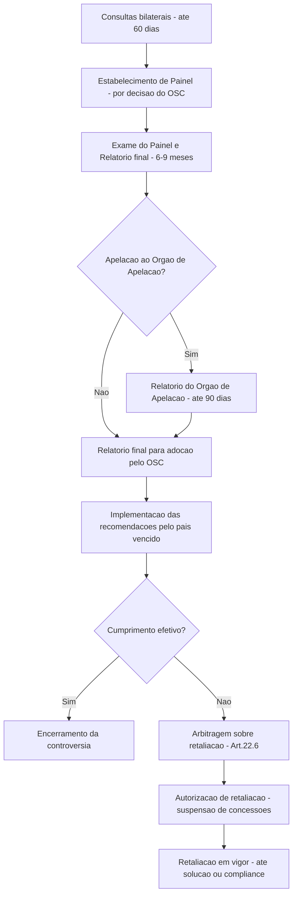

# O Direito do Comércio Internacional: A OMC, seus Acordos e o Sistema de Solução de Controvérsias

## Arquitetura da OMC e Princípios Basilares

A **Organização Mundial do Comércio (OMC)**, estabelecida em 1995 ao final da Rodada Uruguai, é a instituição central do direito do comércio internacional. Sua criação consolidou em um só organismo diversos acordos comerciais multilaterais que antes estavam dispersos (como o antigo GATT) e expandiu as disciplinas do comércio global para novas áreas (serviços e propriedade intelectual). A OMC possui **164 membros**, cobrindo cerca de 98% do comércio mundial. Em linhas gerais, as funções da OMC incluem: **fornecer um fórum de negociação** de acordos comerciais, **estabelecer e administrar regras de comércio** (a partir dos acordos em vigor), **monitorar e revisar políticas comerciais nacionais** para garantir transparência e **solucionar disputas comerciais** entre membros de forma pacífica e estruturada. Esses elementos buscam assegurar condições equitativas e previsíveis de comércio, considerando as diferenças de desenvolvimento entre os países.

> [!note] **Funções e Estrutura da OMC**  
> A OMC atua como fórum de negociação para redução de barreiras comerciais, administra os acordos multilaterais existentes e monitora o cumprimento das regras, inclusive revisando periodicamente as políticas comerciais dos membros (Mecanismo de Exame de Políticas Comerciais). Possui uma estrutura organizacional que inclui a **Conferência Ministerial** (órgão máximo de tomada de decisão, composta pelos ministros dos países, reunida a cada ~2 anos) e o **Conselho Geral**, que conduz as funções regulares em Genebra e se desdobra em órgãos especializados – dentre eles, o **Órgão de Solução de Controvérsias (OSC)**, responsável por gerir as disputas, e o **Órgão de Revisão de Políticas Comerciais**.

### Princípio da Não Discriminação: NMF e Tratamento Nacional

O arcabouço jurídico da OMC apoia-se em princípios basilares, **sendo o principal o da não discriminação**. Ele se desdobra em **dois pilares clássicos**: (i) a **Cláusula de Nação Mais Favorecida (NMF)** e (ii) o **Princípio do Tratamento Nacional (TN)**. Esses conceitos estão consagrados já nos artigos iniciais do Acordo Geral de Tarifas e Comércio (GATT 1994) e reaparecem nos demais acordos.

> [!definition] **Cláusula da Nação Mais Favorecida (NMF)** 
> Obriga que qualquer vantagem comercial concedida a um país membro seja estendida **imediatamente e incondicionalmente** a todos os outros membros da OMC. Em outras palavras, não se pode discriminar entre diferentes parceiros comerciais. Por exemplo, se um país reduzir a tarifa de importação de um produto para um parceiro, deve aplicar a mesma tarifa reduzida a todos os membros da OMC. A NMF garante igualdade de oportunidades entre nações e previne acordos preferenciais exclusivos – salvo exceções previstas, como acordos regionais ou o *Sistema Geral de Preferências para países em desenvolvimento* (permitidos pela chamada Cláusula de Habilitação).

> [!definition] **Princípio do Tratamento Nacional (TN)** 
> Exige que produtos, serviços e investidores estrangeiros, **uma vez dentro do mercado doméstico**, recebam tratamento não menos favorável do que o dado aos produtos nacionais equivalentes. Ou seja, após a importação (vencida a etapa alfandegária), o país não pode adotar tributos internos, regulamentações ou práticas que discriminem o item importado em benefício do similar nacional. Esse princípio evita protecionismo disfarçado em normas domésticas, assegurando condições leais de concorrência entre o produto importado e o doméstico no mercado interno.

Esses dois pilares – NMF (não discriminar entre parceiros externos) e TN (não discriminar em favor do produto nacional) – **consubstanciam o ideal de “condições justas” no comércio**. A não discriminação visa **garantir previsibilidade e confiança** nas concessões comerciais: os membros sabem que reduções tarifárias ou vantagens acordadas serão universalizadas (pelo NMF) e não serão anuladas por discriminações internas (pelo TN). Junto a eles, outros princípios básicos complementam o sistema multilateral, tais como a **transparência** (publicação de políticas e medidas comerciais), a **previsibilidade e estabilidade** das concessões (manutenção de tarifas dentro de tetos consolidados) e a busca de **concorrência leal** (combatendo práticas desleais como dumping e subsídios abusivos). Também há o princípio do **tratamento especial e diferenciado** para países em desenvolvimento, que reconhece flexibilidades e assistência técnica para esses membros (por exemplo, prazos maiores para implementar acordos, menores exigências de reciprocidade).

## Os Acordos da OMC: Os "Três Pilares" (Bens, Serviços e Propriedade Intelectual)

A estrutura jurídica da OMC é composta por um conjunto de acordos multilaterais anexados ao ==Acordo de Marraqueche== (tratado constitutivo da OMC). Entre eles, destacam-se três acordos centrais – frequentemente chamados de **“os três pilares”** – que estabelecem disciplinas nas três grandes áreas do comércio internacional moderno: **bens, serviços e propriedade intelectual**. São eles:

- **GATT 1994 (General Agreement on Tariffs and Trade)** – Acordo Geral sobre Tarifas e Comércio (para **bens**);
    
- **GATS (General Agreement on Trade in Services)** – Acordo Geral sobre o Comércio de **Serviços**;
    
- **TRIPS (Agreement on Trade-Related Aspects of Intellectual Property Rights)** – Acordo sobre os Aspectos dos Direitos de Propriedade Intelectual Relacionados ao Comércio (**propriedade intelectual**).
    

Esses acordos, negociados na Rodada Uruguai, passaram a vigorar em 1995 e **formam a base do direito substantivo da OMC**, definindo as obrigações principais dos membros em cada área. Em conjunto, cobrem praticamente todos os temas relevantes do comércio internacional, do agronegócio à alta tecnologia. A seguir, exploramos brevemente cada um:

### GATT 1994: Comércio de Bens

O GATT é o pilar mais antigo, com origem no Acordo Geral de 1947, que foi incorporado ao GATT 1994 na criação da OMC. Ele estabelece as regras fundamentais para o comércio de **mercadorias**. Seus princípios-chave incluem justamente a não discriminação (Art. I NMF, Art. III TN), além de outros como: **proteção apenas via tarifas** (ou seja, proibição de restrições quantitativas – Art. XI – privilegiando tarifas que são mais transparentes); compromisso de **consolidar tarifas** (cada membro lista tarifas máximas “consolidadas” que não pode elevar sem negociar); e disciplinas para coibir práticas desleais – o GATT remete a acordos específicos contra **dumping** (venda abaixo do valor de mercado com fins predatórios) e **subsídios** prejudiciais, desenvolvidos posteriormente.

O GATT 1994 também contém exceções importantes, como o **Artigo XX**, que permite medidas que contrariem as obrigações se necessárias para objetivos legítimos (por exemplo, proteção da moral pública, vida e saúde, conservação de recursos naturais, etc.), desde que não sejam usadas de forma arbitrária ou protecionista disfarçada. Essa possibilidade de exceção controlada é fundamental para equilibrar comércio com outras políticas públicas.

Com a Rodada Uruguai, além do texto principal do GATT 1994, foram firmados vários acordos setoriais sobre comércio de bens, anexos ao GATT: *Acordo de Agricultura, Acordo de Têxteis (que já expirou)*, *Acordo de Medidas Sanitárias e Fitossanitárias (SPS)*, *Acordo de Barreiras Técnicas (TBT)*, *Acordo de Salvaguardas*, *Acordo Antidumping*, *Acordo de Subsídios e Medidas Compensatórias (SCM)*, entre outros. Assim, o “GATT” hoje é parte de um **pacote abrangente** de regras que visam gradualmente liberalizar o comércio de bens, reduzindo tarifas e disciplinando subsídios e outras barreiras.

### GATS: Comércio de Serviços

O GATS foi uma inovação da Rodada Uruguai, **primeiro acordo multilateral de comércio de serviços** da história. Antes dele, serviços (como bancos, telecomunicações, transporte, turismo, etc.) não eram cobertos pelas regras do GATT. O GATS estabelece disciplinas para que os membros liberalizem gradualmente seus mercados de serviços, mas de forma **flexível e progressiva**. Diferentemente do comércio de bens, em que as tarifas consolidadas se aplicam erga omnes, no GATS cada país assumiu **compromissos específicos por setor** listados em sua Lista de Compromissos (Schedule). Somente nos setores e modos de fornecimento listados é que o país concede acesso ao mercado e tratamento nacional.

Um conceito-chave do GATS são os **quatro modos de fornecimento de serviços**: (1) **comércio transfronteiriço** (serviço prestado de um país a outro, e.g. serviços online), (2) **consumo no exterior** (consumidor se desloca, e.g. turismo), (3) **presença comercial** (fornecedor estabelece filial no outro país, e.g. banco estrangeiro abrindo agência) e (4) **movimentação temporária de pessoas físicas prestadoras** (profissionais que vão ao país prestar o serviço temporariamente). Essas categorias ajudam a definir o escopo das obrigações.

No GATS, o princípio da **NMF se aplica de forma geral** (Art. II), ou seja, um país não pode discriminar entre serviços/fornecedores de diferentes países (salvo exceções transitórias notificadas). Já o **Tratamento Nacional e o acesso a mercados** não são obrigações automáticas para todos os setores: cada país define em sua lista onde concede tratamento nacional e elimina restrições de acesso, e pode manter limitações em setores não liberalizados. Em suma, o GATS combina obrigações gerais (como transparência, NMF) com compromissos específicos negociados setor a setor.

Apesar dessa flexibilidade, o GATS representou uma **mudança significativa** ao submeter atividades de serviços às disciplinas multilaterais. Princípios como transparência regulatória e reconhecimento mútuo de qualificações também aparecem no acordo. Há, igualmente, exceções gerais (Art. XIV do GATS, análogo ao Art. XX do GATT) que permitem medidas para objetivos como proteção da privacidade, prevenção de fraudes, saúde pública etc.

### TRIPS: Propriedade Intelectual Relacionada ao Comércio

O Acordo TRIPS trouxe a **propriedade intelectual** para dentro do regime da OMC – área antes tratada principalmente em foros especializados (como a OMPI). Sob o TRIPS, todos os membros da OMC passam a ter **padrões mínimos de proteção** a direitos de propriedade intelectual que devem observar em suas legislações internas. O acordo abrange patentes, direitos autorais, marcas, indicações geográficas, desenhos industriais, segredos comerciais e outros.

Entre suas disposições, destacam-se: patentes com validade mínima de 20 anos para quaisquer invenções em todos os campos tecnológicos (com poucas exceções), proteção de marcas registradas, observância de direitos autorais (incluindo programas de computador equiparados a obras literárias), e mecanismos de enforcement (medidas judiciais e administrativas eficazes contra violações). Também prevê **cláusulas de flexibilização**, como as licenças compulsórias de patentes em casos de emergência nacional ou uso público não-comercial, algo relevante para acesso a medicamentos.

O TRIPS foi um acordo controverso, pois impôs obrigações rigorosas a países em desenvolvimento em matéria de PI (muitos tiveram que elevar significativamente seus níveis de proteção, especialmente em patentes farmacêuticas). Em contrapartida, incorporou salvaguardas como a **Declaração de Doha sobre TRIPS e Saúde Pública** (2001), que reafirmou o direito dos países usarem as flexibilidades do TRIPS para proteger a saúde (por exemplo, emitindo licença compulsória para medicamentos essenciais).

Importante notar que o TRIPS, sendo parte do “pacote único” da OMC, vincula todos os membros (não é opcional). E, diferentemente da OMPI, possui à disposição o poderoso mecanismo de disputas da OMC para assegurar seu cumprimento. **Isso internacionalizou as disputas de propriedade intelectual**, permitindo, por exemplo, que um país acione outro por falhas em proteger patentes ou pirataria de software sob as regras TRIPS.

**Em síntese**, GATT, GATS e TRIPS formam a espinha dorsal normativa da OMC, garantindo que as principais esferas do comércio global – bens tangíveis, serviços e ativos intangíveis – sejam regidas por disciplinas multilaterais. Juntos com os demais acordos especializados e compromissos específicos dos membros, criam um **sistema jurídico complexo e integrado**, cuja coerência e efetividade é garantida, sobretudo, pelo **mecanismo de solução de controvérsias** da organização, a seguir analisado.

## O Sistema de Solução de Controvérsias (OSC) da OMC – A "Jóia da Coroa"

Entre as inovações trazidas pela fundação da OMC, o **Entendimento de Solução de Controvérsias (ESC)** – acordo que institui o **Órgão de Solução de Controvérsias (OSC)** – é amplamente reconhecido como uma das mais significativas. De fato, o mecanismo de disputas da OMC é frequentemente chamado de “**jóia da coroa**” do sistema multilateral, pela eficácia com que consegue assegurar o cumprimento das obrigações assumidas pelos países. Diferente do sistema do GATT de 1947 (que dependia de consenso inclusive para adoção de decisões, permitindo fácil bloqueio pelo réu), o OSC da OMC opera com **decisões quase automáticas e vinculantes**, tornando-o um **mecanismo quase-judicial** robusto.

### Estrutura e Importância do Mecanismo de Disputas

O OSC (formado por todos os membros da OMC, atuando coletivamente) administra as fases do procedimento contencioso e é responsável por **adotar os relatórios** dos painéis e do Órgão de Apelação, tornando-os decisões obrigatórias. Seu funcionamento baseia-se no **princípio do “consenso inverso”**: um relatório de painel ou apelação é adotado a menos que haja consenso de _todos_ os membros para rejeitá-lo – o que significa que o país derrotado não pode por si só bloquear a adoção. Igualmente, um painel é estabelecido automaticamente na segunda reunião do OSC após um pedido, não podendo o réu vetá-lo indefinidamente. Esses elementos corrigiram as falhas do GATT anterior e garantem celeridade e compulsoriedade às decisões.

O resultado é que o sistema de controvérsias da OMC se tornou **único no direito internacional**, permitindo que países, independentemente de seu poder econômico, tenham um meio de fazer valer direitos pactuados. **Pequenos países podem, e de fato conseguiram, obrigar grandes potências comerciais a modificar leis ou práticas ilegais, graças às decisões da OMC**. Não é exagero dizer que o OSC da OMC é o mecanismo de solução de disputas mais desenvolvido e eficaz de todo o direito internacional contemporâneo, dadas sua abrangência, tecnicidade e taxa de conformidade relativamente alta. Em 25 anos, mais de 500 disputas foram iniciadas, muitas resultando em mudança de políticas nacionais ou acordos mutuamente satisfatórios na fase de consultas.

> [!important] **Eficácia do Sistema de Disputas**  
> A efetividade do OSC reflete-se no alto nível de cumprimento voluntário das decisões. As recomendações do OSC quase sempre são implementadas, total ou parcialmente, pelos membros condenados – às vezes após negociação de compensações ou ajustes legislativos. Em casos extremos, o sistema prevê retaliação autorizada (suspensão de concessões comerciais pelo vencedor) para incentivar a conformidade, mas retaliações têm sido raras e geralmente de duração temporária. Essa eficácia confere **credibilidade** às regras da OMC: os países sabem que violações podem ser desafiadas e que as decisões serão respaldadas pela comunidade. Assim, o OSC promove segurança jurídica e previsibilidade no comércio internacional.

### Etapas do Procedimento de Solução de Controvérsias

O procedimento de disputa na OMC desenrola-se em **fases bem definidas**, com prazos estabelecidos no ESC. Abaixo, um panorama das etapas principais em formato de fluxograma para melhor visualização:

**1. Consultas:** o reclamante solicita consultas diplomáticas com o país alegadamente infrator, abrindo um espaço de negociação direta. Essa fase (obrigatória) dura no mínimo 60 dias. Se não houver solução amigável nesse prazo (ou se o requerido se recusar a consultar), o reclamante pode pedir o estabelecimento de um painel.

**2. Estabelecimento do Painel:** consiste na criação de um **grupo especial** de especialistas (geralmente três) que atuará como tribunal de primeira instância. O painel é estabelecido pelo OSC. Na primeira reunião em que o pedido aparece, o requerido pode bloquear, mas na segunda reunião o painel é criado automaticamente (consenso negativo). Depois discute-se a composição (painelistas geralmente são diplomatas ou especialistas selecionados de uma lista da OMC, não devem ser nacionais das partes salvo acordo em contrário).

**3. Fase do Painel:** uma vez composto, o painel define um calendário e analisa o caso. As partes apresentam **memoriais escritos**, participam de audiências e respondem a perguntas. Terceiros interessados podem fazer parte (se declararem interesse comercial substancial na disputa). O painel examina os fatos e a compatibilidade das medidas contestadas com os acordos relevantes. Ao final, emite um **Relatório do Painel** com suas constatações e conclusões jurídicas. Antes de finalizado, há uma etapa de relatório intermediário (confidencial às partes) para comentários. Todo o processo de painel deve durar cerca de 6 a 9 meses em casos normais (pode estender-se mais em casos complexos). O relatório conclui se a medida fere (ou não) as obrigações OMC e faz recomendações (tipicamente, que o membro traga a medida em conformidade com os acordos).

**4. Adoção/Apelação:** após circulado aos membros, o relatório do painel é considerado pelo OSC. **Dentro de 60 dias** da circulação, se nenhuma parte apelar, o relatório é colocado para adoção pelo OSC (torna-se decisão vinculante). Se **houver apelação**, a adoção fica suspensa até o Órgão de Apelação (OA) emitir sua decisão. A apelação deve ser limitada a questões de direito (interpretação jurídica) e apreciada por **três membros do Órgão de Apelação**, que é um corpo permanente de sete membros (mandatos de 4 anos renováveis uma vez). O OA pode manter, reverter ou modificar as conclusões do painel. O prazo padrão é de 60 dias (até 90 dias no máximo) para a decisão. Após a emissão do **Relatório do Órgão de Apelação**, ele deve ser automaticamente adotado pelo OSC junto com o do painel (conforme modificado) em no máximo 30 dias.

**5. Implementação:** uma vez adotada a decisão, se a parte demandada for considerada violadora, ela deve **cumprir as recomendações**, usualmente modificando ou revogando a medida inconsistente. Se a conformidade não puder ser imediata, o membro tem direito a um “prazo razoável” para implementar – negociado entre as partes ou arbitrado (geralmente em torno de 8 a 15 meses, dependendo do caso).

**6. Fiscalização e Conformidade:** durante e após o prazo de implementação, a controvérsia pode ter desdobramentos: o país condenado deve informar medidas tomadas e pode-se discutir se há cumprimento adequado. Caso o vencedor discorde das ações do perdedor, pode pedir um **Painel de Implementação (art. 21.5)** para avaliar se a medida nova (ou inação) ainda descumpre as obrigações. Esse painel de compliance atua rápido (90 dias) e seu relatório também pode ser apelado ao OA.

**7. Retaliação (Suspensão de Concessões):** se passado o prazo razoável o membro condenado não implementou a decisão, e não há acordo de compensação voluntária, o membro vencedor pode solicitar ao OSC autorização para retaliar – isto é, **suspender concessões ou outras obrigações** em relação ao infrator, equivalente ao prejuízo causado. Normalmente isso significa elevar tarifas sobre produtos do país inadimplente (ou outras medidas comerciais) até o valor autorizado. O nível e forma de retaliação podem ser objeto de arbitragem (Art. 22.6 do ESC) se houver discordância. Em certas situações, a retaliação pode ocorrer em setores diferentes do objeto da disputa (e.g. retaliar em propriedade intelectual por infração em bens), especialmente se a retaliação no mesmo setor não for eficaz; foi o caso do algodão, discutido adiante, em que se autorizou **retaliação cruzada** envolvendo propriedade intelectual.

**8. Encerramento:** a fase de retaliação costuma ser último recurso; idealmente, a pressão leva ao cumprimento e a retirada da retaliação. A disputa formalmente se encerra quando as partes chegam a um acordo ou quando o OSC reconhece que o membro violador cumpriu as recomendações.

### A "Jóia da Coroa" em Crise: Paralisação do Órgão de Apelação desde 2019

Apesar do histórico de sucesso, o sistema de solução de controvérsias da OMC enfrenta, desde o final de 2019, sua **maior crise** já registrada, decorrente da **paralisia do Órgão de Apelação**. Essa crise foi causada pelo bloqueio, principalmente pelos Estados Unidos, da nomeação de novos membros do Órgão de Apelação (OA), impedindo a reposição de vagas conforme os mandatos dos membros expiravam. O OA, previsto para ter sete membros, precisa de pelo menos três para apreciar um recurso. Em 11 de dezembro de 2019, o número de membros ativos caiu para apenas um, tornando **impossível formar as divisões de três julgadores** requeridas. Desde então, **não há funcionamento do OA**, ou seja, **não é possível concluir formalmente nenhuma apelação**.

Os EUA justificaram o bloqueio alegando diversas **insatisfações com a atuação do OA**. Entre as críticas: a alegação de que o OA teria _ultrapassado seu mandato_, interpretando as regras além do acordado pelos membros e assim “criando novas obrigações” não pactuadas; que suas decisões teriam se tornado uma espécie de **jurisprudência vinculante de facto** (os EUA contestam a ideia de “precedentes” no OSC, entendendo que painéis não deveriam sentir-se obrigados a seguir relatórios passados do OA); e reclamações procedimentais, como o descumprimento do prazo de 90 dias para apelações e a continuidade de membros em casos mesmo após expirado seu mandato (sob uma regra interna do OA). Além disso, os EUA apontaram casos em que, a seu ver, o OA teria desrespeitado fatos ou excedido seu papel, prejudicando interesses norte-americanos em litígios (por exemplo, em matérias antidumping, subsídios e interpretação de exceções de segurança nacional).

Embora a maioria dos demais membros discorde da forma de protesto (bloquear indicações), há um reconhecimento geral de que **reformas no sistema de disputas** podem ser necessárias para acomodar preocupações como as dos EUA. Em 2019, um processo de discussão foi lançado sob a condução do embaixador David Walker, da Nova Zelândia, com propostas de emendas procedimentais para dar resposta a alguns pontos levantados. Contudo, até o momento não houve acordo para destravar as nomeações.

As consequências da paralisia são severas: um país que perca uma disputa pode **“apelar para o vazio”** (appeal into the void), isto é, notificar um apelo sabendo que o OA não pode analisá-lo – e assim impede legalmente a adoção do relatório do painel. O caso fica em suspenso indefinidamente, sem solução final nem autorização de retaliação, pois o processo não se conclui. Isso mina o principal alicerce do OSC, que é a resolução definitiva e obrigatória das controvérsias. Várias disputas desde 2020 já enfrentam esse limbo, e teme-se que _qualquer país derrotado inevitavelmente use essa tática_, o que colocaria a credibilidade do sistema em xeque.

Para mitigar o problema temporariamente, um grupo de membros liderados pela União Europeia articulou um arranjo alternativo: o **Acordo de Apelação Provisório Multilateral**, conhecido pela sigla em inglês **MPIA (Multi-Party Interim Appeal Arbitration Arrangement)**. Estabelecido em abril de 2020 por 25 membros (número que depois se expandiu, chegando a cerca de 57, incluindo Brasil, UE, China, Canadá, Austrália, México e outros), o MPIA baseia-se no Artigo 25 do ESC (que permite arbitragem como forma de solução de controvérsia) para replicar informalmente um “OA provisório” entre os participantes. Os membros do MPIA concordam em não usar o direito de apelo ao OA nas disputas entre si, comprometendo-se em vez disso a recorrer a um **painel arbitral de apelação** nos mesmos moldes do antigo OA, cujas decisões seriam acatadas. Esse mecanismo já foi acionado em algumas disputas recentes entre participantes do acordo e tem funcionado de modo satisfatório (com decisões arbitrais de apelação emitidas dentro de prazos similares, preservando a segurança jurídica). **Entretanto, o MPIA não envolve todos os membros** – notadamente, os EUA (principal crítico) ficaram de fora, assim como Índia e outros. Logo, disputas envolvendo países fora do MPIA continuam sem solução em caso de apelo ao vácuo.

A crise do OA desencadeou debates mais amplos sobre o futuro do sistema de disputas. Na Conferência Ministerial da OMC de junho de 2022 (MC12), os ministros concordaram em buscar até 2024 um caminho para restabelecer um sistema de solução de controvérsias plenamente funcional e acessível a todos os membros. Esse prazo (2024) reflete a esperança de que se consiga convencer os EUA a desobstruir o OA mediante algumas reformas e compromissos. **Até o momento (2025)**, contudo, **o impasse persiste**, ainda que discussões técnicas continuem em Genebra para forjar consenso. A incerteza sobre o OSC preocupa especialmente países médios e pequenos, que veem nele um guardião contra práticas abusivas de grandes players. Muitos analistas alertam que, sem um mecanismo confiável de aplicação das regras, o sistema multilateral pode enfraquecer, dando lugar a soluções unilaterais ou acordos preferenciais regionais. Resolver a crise do OA, portanto, é crucial para a própria sobrevivência da OMC enquanto fórum de regras.

### Jurisprudência e a Atuação do Brasil no OSC: Casos Paradigmáticos

Desde 1995, o Brasil tem sido um **usuário ativo e bem-sucedido do OSC da OMC**, estando envolvido em **diversos casos contenciosos de grande relevância** – seja como reclamante, seja como demandado ou terceiro interessado. A experiência brasileira é frequentemente destacada como exemplo do empoderamento que o sistema multilateral confere a países em desenvolvimento na defesa de seus interesses comerciais. A seguir, examinamos _quatro casos paradigmáticos_ envolvendo o Brasil, que ilustram aspectos importantes da jurisprudência da OMC:

- **Subsídios dos EUA ao Algodão (DS267)** – _Brasil vs. EUA_
    
- **Subsídios da UE ao Açúcar (DS266)** – _Brasil (e outros) vs. União Europeia_
    
- **Setor de Aeronaves: Embraer vs. Bombardier (vários casos)** – _Brasil vs. Canadá e vice-versa_
    
- **Importação de Pneus Remoldados (DS332)** – _União Europeia vs. Brasil_
    

Cada disputa, resumida a seguir, levantou questões jurídicas centrais (de subsídios agrícolas, subsídios industriais e exceções ambientais) e teve desdobramentos importantes tanto para a economia brasileira quanto para a evolução do sistema da OMC.

#### Caso do Algodão (Brasil vs. EUA) – DS267

Este contencioso tornou-se um **marco histórico** na OMC, representando uma vitória significativa do Brasil contra um subsídio agrícola de uma grande potência. Em 2002, o Brasil abriu disputa contra os Estados Unidos alegando que uma série de **subsídios domésticos e apoios à exportação concedidos aos produtores americanos de algodão** violavam os compromissos dos EUA sob o Acordo de Agricultura e o Acordo de Subsídios e Medidas Compensatórias (SCM). Em particular, o Brasil atacou os enormes pagamentos do governo americano aos cotonicultores, que deprimiam os preços internacionais, e um programa de garantias de crédito à exportação (GSM-102) que funcionava como subsídio disfarçado à exportação.

Após um painel e apelação bastante técnicos, **em 2005 o Órgão de Apelação deu razão ao Brasil**, determinando que vários subsídios americanos (alguns dos quais classificados como “proibidos”, como certos subsídios à exportação) violavam as regras. Os EUA foram instados a retirar ou modificar esses programas. Como os EUA _não_ cumpriram totalmente (especialmente por inação do Congresso em relação aos subsídios domésticos do Farm Bill), o Brasil prosseguiu para a fase de retaliação. Em 2009, um arbitramento autorizou o Brasil a retaliar aproximadamente **US$ 830 milhões anuais** em bens, serviços e até propriedade intelectual dos EUA. Importante, o Brasil obteve o direito de **retaliação cruzada** – poderia, por exemplo, suspender obrigações de patentes e royalties de propriedade intelectual norte-americanos – dado que a magnitude dos subsídios era tal que retaliação apenas em tarifas sobre bens seria insuficiente. Essa possibilidade (prevista no ESC para casos envolvendo países de menor desenvolvimento relativo) foi a primeira vez que seria usada, o que criou forte pressão política.

A perspectiva de retaliação robusta – incluindo quebra de patentes farmacêuticas dos EUA, algo sensível – levou os EUA finalmente à mesa de negociação. Em 2010, firmou-se um **acordo provisório**: os EUA concordaram em **pagar compensações anuais de US$ 147,3 milhões** ao setor algodoeiro brasileiro (fundos destinados a um instituto de apoio à cotonicultura nacional) enquanto não reformassem seus programas na próxima lei agrícola. Esse pagamento manteve-se por alguns anos. Em paralelo, nas discussões da Rodada Doha, a “questão do algodão” tornou-se emblemática da necessidade de cortes mais profundos em subsídios agrícolas de países ricos.

Finalmente, em outubro de 2014, Brasil e EUA assinaram um **Memorando de Entendimento encerrando a disputa** do algodão de forma negociada. Pelos termos do acordo, os EUA realizaram **ajustes no programa de crédito às exportações (GSM-102)**, tornando-o compatível com as regras (encurtando prazos e eliminando certas concessões). Além disso, os EUA efetuaram um **pagamento final de US$ 300 milhões** ao Brasil (direcionado ao Instituto Brasileiro do Algodão) como parte da solução. Em troca, o Brasil encerrou o caso e comprometeu-se a não contestar outros programas do Farm Bill vigente – mas _preservou o direito_ de abrir novos casos se subsídios em outras commodities voltarem a exceder compromissos.

O **resultado** do contencioso do algodão foi saudado como uma **vitória histórica para o Brasil** e outros exportadores agrícolas. O caso demonstrou que mesmo políticas agrícolas politicamente sensíveis nos EUA podem ser questionadas e derrubadas na OMC. Também foi a primeira vez que um país em desenvolvimento efetivamente _forçou_ uma grande potência a compensá-lo financeiramente para evitar retaliação – evidência do poder do OSC. O legado do caso incluiu ainda maior conscientização sobre os efeitos nefastos dos subsídios em países pobres (particularmente na África Ocidental, onde o algodão sustenta milhões de agricultores). Do ponto de vista jurídico, o caso estabeleceu parâmetros sobre o que constitui subsídio à exportação camuflado (p.ex., a decisão deixou claro que garantias de crédito em termos favoráveis configuram subsídio e devem respeitar limites). E politicamente, o Brasil ganhou reputação de negociador hábil e assertivo, utilizando o sistema multilateral para promover seus interesses.

#### Caso do Açúcar (Brasil & outros vs. União Europeia) – DS266

Outra importante vitória brasileira no campo agrícola foi a disputa contra os **subsídios da União Europeia ao açúcar**. Em 2002, Brasil, Austrália e Tailândia (maiores exportadores globais de açúcar) acionaram a UE na OMC, alegando que o bloco estava excedendo os limites de subsídios à exportação de açúcar estabelecidos em seus compromissos da Rodada Uruguai. Em essência, a Política Agrícola Comum europeia garantia aos produtores de açúcar preços internos muito acima do mercado mundial, gerando excedentes que eram exportados com pesados subsídios (diretos e indiretos). A UE havia se comprometido a limitar a **quantidade** de açúcar subsidiado exportado e o **gasto** anual com esses subsídios, mas os reclamantes demonstraram que, por manobras contábeis (como realocar açúcar de diferentes categorias) e altos reembolsos à exportação, a UE ultrapassava essas cotas, prejudicando os concorrentes.

O painel da OMC analisou profundamente as regras do Acordo de Agricultura e os detalhes da OCM (Organização Comum de Mercado) do açúcar na UE. **Concluiu que de fato a UE violava suas obrigações**, exportando volumes muito além do permitido com ajuda de subsídios. Em 2005, o Órgão de Apelação confirmou a ilegalidade da prática europeia. A recomendação foi para que a UE trouxesse seu regime em conformidade, cortando o excedente de subsídios.

Esse caso teve repercussão direta na política europeia: para cumprir a decisão, a **UE promoveu em 2006 uma profunda reforma em sua política açucareira**, reduzindo o preço garantido interno em cerca de 36% e eliminando gradualmente o chamado “excedente C” de açúcar (que era exportado com subsídio implícito). Também limitou as quantidades de produção com apoio. Como consequência, a UE diminuiu drasticamente suas exportações subsidiadas de açúcar – convertendo-se, nos anos seguintes, de grande exportadora em importadora líquida em alguns períodos. Essa abertura de mercado beneficiou **países competitivos como o Brasil**, que puderam exportar mais para mercados antes dominados pelo excedente subsidiado europeu.

Do ponto de vista sistêmico, o caso do açúcar reforçou a mensagem de que os tetos negociados de subsídios **têm de ser respeitados estritamente** – tentou-se usar uma brecha (uma nota de rodapé nos compromissos da UE) para justificar a superação dos limites, mas os painelistas e o OA negaram essa interpretação. Foi afirmada a primazia do texto dos compromissos e do Acordo de Agricultura sobre intenções políticas. Além disso, evidenciou a importância das disciplinas agrícolas da OMC para países em desenvolvimento: o Brasil não só ganhou acesso a mercados, como ajudou a _nivelar o campo de jogo_ em um setor onde disputava com produtores altamente subsidiados.

Em síntese, o contencioso do açúcar consolidou o papel da OMC na **promoção de concorrência leal** também na agricultura – área historicamente distorcida por políticas protecionistas de nações ricas. A reforma açucareira da UE pós-OMC frequentemente é citada como exemplo de política pública alterada em função direta de uma decisão multilateral. Isso reforça a confiança de exportadores agrícolas de que o sistema multilateral pode, de fato, reduzir distorções e criar oportunidades de comércio mais justas.

#### Caso Embraer vs. Bombardier (Brasil vs. Canadá) – Subsídios a Aeronaves

As disputas envolvendo a brasileira **Embraer** e a canadense **Bombardier** formam um capítulo à parte na história do OSC, dado o ineditismo de **duas países simultaneamente se acusando mutuamente de subsídios industriais ilegais**. Nos **fins dos anos 1990 e início dos 2000**, Brasil e Canadá travaram uma verdadeira batalha jurídica na OMC em torno de programas de apoio governamental à exportação de aeronaves regionais – um setor de alta tecnologia e grande valor agregado.

- Do lado brasileiro, o Canadá contestou o **PROEX**, programa de financiamento de exportações do Brasil que concedia equalização de taxas de juros a compradores estrangeiros de aviões da Embraer. Esse caso, DS46, levou em 1999 o Órgão de Apelação a decidir que as parcelas de equalização de juros do PROEX configuravam **subsídios à exportação proibidos** sob o Acordo SCM, determinando sua retirada. O Brasil teve que adequar o PROEX (surgiu o chamado Proex III) para tentar torná-lo consistente, mas um painel de implementação em 2000 ainda considerou que o Brasil não havia cumprido completamente a decisão, forçando cortes adicionais no programa. Essa foi uma decisão marcante pois deixou claro que subsídios governamentais, mesmo via bancos públicos, destinados a sustentar artificialmente exportações, seriam alvo de **tolerância zero** na OMC.
    
- Do lado canadense, o Brasil moveu disputas (DS70, DS71, DS222) alegando que o Canadá, em nível federal e provincial (principalmente pela província do Québec), oferecia **créditos, empréstimos e investimentos públicos favorecidos à Bombardier** (como através do programa Technology Partnerships Canada e outras iniciativas) que configuravam subsídios ilegais, tanto _proibidos_ quanto _acionáveis_ com efeitos de distorção. Em 1999, o Órgão de Apelação confirmou que certos aportes canadenses eram subsídios à exportação proibidos, dando vitória ao Brasil em vários pontos. O Canadá também foi instado a retirar esses subsídios. Posteriormente, em 2001-2002, novas decisões continuaram a escrutinar outras formas de apoio canadense (garantias de empréstimo, etc.), encontrando violações em alguns casos.
    

Em suma, tanto Brasil quanto Canadá ganharam e perderam pontos – ambos tiveram que **ajustar ou eliminar programas de incentivo à sua indústria aeronáutica**. Nenhum dos dois chegou a retaliar, pois as partes acabaram implementando (ou cessando) os subsídios condenados, e também porque as disputas dos anos 90/2000 foram ofuscadas pela dinâmica do mercado (a Embraer diversificou produtos e o Canadá criou mecanismos alternativos de apoio dentro dos conformes).

Avançando uma década, o **conflito se reascendeu** sob nova forma: em 2017, o Brasil abriu o caso DS522 contra o Canadá, questionando um **massivo pacote de subsídios (mais de US$ 3 bilhões)** oferecido pelos governos canadense e de Québec para o desenvolvimento da nova linha de jatos C-Series da Bombardier. O Brasil argumentou que essa injeção de recursos permitiu à Bombardier ofertar aeronaves a preços artificialmente baixos, prejudicando a Embraer no mercado global. O caso DS522 progrediu com estabelecimento de painel, porém **aconteceu durante a crise do Órgão de Apelação** e também num contexto de mudanças no setor: a Bombardier, em dificuldade financeira, vendeu o programa C-Series para a europeia Airbus em 2018, deixando praticamente o mercado de aviação comercial. Com isso, parte da produção dos jatos passou a ocorrer nos EUA (Airbus rebatizou o modelo como A220). Esses fatos complicaram tanto a análise do nexo de prejuízo quanto a utilidade prática do litígio.

Em 2020, o painel em DS522 finalmente emitiu seu relatório, mas **antes que qualquer apelação ocorresse, o Brasil decidiu encerrar unilateralmente a disputa em 2021**, sem prosseguir. Em nota diplomática, o Itamaraty explicou que apesar da convicção na legitimidade das reclamações, _“o contencioso na OMC mostrou-se ineficaz para remediar os efeitos da concessão de subsídios em tão larga escala”_. Ou seja, dada a mudança estrutural (saída da Bombardier, entrada da Airbus) e a falta de um OA funcionando que garantisse uma decisão final célere, não valia a pena insistir. O Brasil passou a focar em **negociações plurilaterais** para estabelecer regras mais duras contra subsídios aeronáuticos globalmente, inspirado pelo acordo setorial de aviação civil vigente na OCDE (que disciplina financiamento à exportação). Essa estratégia visa um resultado mais efetivo de longo prazo: criar um código internacional contra subsídios industriais amplos, evitando disputas caso a caso.

No balanço, as disputas Embraer vs. Bombardier legaram lições importantes: i) consolidaram jurisprudência de que **subsídios à exportação são proibidos independentemente do setor**, seja agrícola ou industrial (a regra vale tanto para soja quanto para aviões); ii) mostraram os limites da OMC em lidar com subsídios de desenvolvimento tecnológico (_apesar_ de ter disciplinado esses também, ainda faltam regras mais claras para subsídios “acionáveis” que causam prejuízo); e iii) evidenciaram que, sem um sistema de disputa funcional (como no caso de 2017-2020, agravado pela crise do OA), _certas disputas complexas podem ficar sem solução satisfatória_.

Para o Brasil, esses casos reafirmaram sua capacidade de enfrentar países desenvolvidos juridicamente. A Embraer seguiu competitiva e a Bombardier acabou saindo do ramo de jatos comerciais, mas novas frentes podem surgir, por exemplo com outros países (China entrando no setor de aviação). Assim, o tema de **subsídios industriais de alta tecnologia** permanece em pauta, e o Brasil defende ativamente na OMC a atualização de disciplinas para evitar corridas deletérias por subsídios.

#### Caso dos Pneus Remoldados (União Europeia vs. Brasil) – DS332

O contencioso **EC – Tyres (DS332)** opôs, de maneira interessante, a União Europeia como reclamante e o Brasil como parte demandada, num debate sobre **comércio vs. meio ambiente**. Em 2005, a UE contestou uma medida brasileira que proibia a importação de **pneus remoldados/reformados** (pneus usados que passam por recapagem) por razões de saúde pública e proteção ambiental. O Brasil desde 2000 mantinha essa proibição para evitar a geração de resíduos de pneus usados, que representam risco ambiental (acúmulo de lixo não biodegradável, criadouro de mosquitos transmissores de doenças, etc.). A polêmica residia no fato de que o Brasil, por obrigações no Mercosul, permitia a importação de pneus remoldados vindos de países vizinhos (após decisão de um tribunal arbitral do Mercosul em favor do Uruguai), e também havia influxo de pneus usados via liminares judiciais que empresas brasileiras obtinham para importar carcaças e remoldá-las aqui. A UE alegou que a proibição brasileira, sendo seletiva, violava regras da OMC – em especial, as proibições do GATT Art. XI (restrições quantitativas à importação) e a não discriminação (pois pneus da UE eram barrados enquanto de outros países do Mercosul entravam).

O painel e posteriormente o Órgão de Apelação analisaram o caso sob o prisma do **Artigo XX(b) do GATT 1994** (exceção para medidas necessárias à proteção da vida e saúde). O Brasil defendeu que a proibição era _necessária_ para reduzir riscos de doenças (dengue, malária) e poluição gerados por acúmulo e descarte de pneus, e trouxe estudos mostrando a relação de pneus com criadouros de mosquitos e substâncias tóxicas liberadas em queimadas de pneus. A UE não contestou a seriedade desses objetivos, mas focou na incoerência da aplicação da medida.

No desfecho, a decisão da OMC teve nuances: **reconheceu-se que a política brasileira buscava um objetivo legítimo de saúde pública e meio ambiente, e que a proibição de pneus remoldados, em si, podia ser justificada pelo Art. XX(b)** como necessária para reduzir riscos. Foi enfatizado que evitar a geração adicional de resíduos (impedindo importação de pneus perto do fim da vida útil) é uma estratégia válida de gestão ambiental. **Contudo,** avaliou-se que as _exceções dentro da própria política brasileira_ comprometiam sua coerência e aplicação equitativa, levando à conclusão de violação ao _chapeau_ do Artigo XX (isto é, aplicação de forma arbitrária ou injustificavelmente discriminatória). Em particular, duas coisas: (1) as **importações via Mercosul** – embora decorrentes de um litígio internacional, criavam uma brecha por onde entravam pneus recauchutados do Uruguai e Paraguai, minando a eficácia ambiental da proibição; (2) as **importações permitidas por liminares judiciais** – milhões de pneus usados entravam por decisões da justiça brasileira, suprindo reformadores domésticos, o que na ótica do painel/AB configurava discriminação em favor da indústria local em detrimento dos exportadores estrangeiros de pneus remoldados. Em suma, a _exceção Mercosul_ e a _falta de controle das liminares_ significavam que o Brasil não aplicava uniformemente a medida, e isso foi julgado como “discriminação injustificável” que desqualificava o amparo do Artigo XX.

Interessantemente, o Órgão de Apelação tratou diferentemente as duas brechas: entendeu que a exceção concedida aos membros do Mercosul não era arbitrária por si – pois o Brasil tinha se esforçado para proibir geral, mas foi obrigado por decisão arbitral Mercosul a aceitá-la, o que indica que não era protecionismo deliberado contra outros, mas cumprimento de outra obrigação internacional. Já as liminares judiciais foram criticadas como **incompatíveis** com a necessidade alegada: se pneus usados entram por via judicial, isso contradiz o objetivo de saúde e cria discriminação, então Brasil deveria resolver essa contradição para poder validar a medida.

Ao final, o relatório (circulado em 2007) recomendou que o Brasil ajustasse a aplicação da proibição. O Brasil _não recorreu_ do painel, por considerá-lo majoritariamente favorável na sustentação do direito de proteção ambiental – sobretudo porque a OMC **não mandou o Brasil revogar a proibição**, apenas fechar as brechas. Nos anos seguintes, o governo brasileiro tomou providências: editou normas proibindo explicitamente a importação de **pneus usados** (resolvendo a questão das carcaças) e levou a disputa jurídica interna ao Supremo Tribunal Federal. Em 2009, o STF decidiu a Arguição de Descumprimento de Preceito Fundamental (ADPF 101) a favor do governo, derrubando as liminares e **tornando ilegal de vez qualquer importação de pneus usados/remoldados, inclusive de Mercosul** – essencialmente, alinhando a prática à legislação ambiental e às obrigações da OMC.

O caso dos pneus remoldados é frequentemente citado como **precedente importante de conciliação entre regras comerciais e políticas ambientais**. Ficou demonstrado que a OMC permite, sim, que países adotem medidas rigorosas para proteger saúde e meio ambiente, _desde que_ não o façam de forma discriminatória ou protecionista disfarçada. É similar, em relevância, ao caso _Comunidades Europeias vs. França – Amianto_, onde a França justificou banimento do amianto. No caso brasileiro, a OMC validou praticamente toda a argumentação ambiental (reconhecendo os perigos reais dos pneus usados e a razoabilidade da proibição). A condenação parcial deveu-se apenas à consistência incompleta da aplicação. Em termos práticos, após ajustar essas inconsistências, o Brasil **manteve a proibição de pneus remoldados** e essa medida vigora até hoje, contribuindo para a política de resíduos sólidos no país.

Para o CACD e o Direito Internacional Econômico, esse caso exemplifica a aplicação do Artigo XX do GATT (exceções gerais) e o escrutínio do _chapeau_ desse artigo (que exige não discriminar arbitrariamente nem ser proteção disfarçada). Mostra como **tribunais da OMC equacionam comércio e não-comercial**, permitindo flexibilidade regulatória quando há genuíno interesse público, ao mesmo tempo exigindo coerência e boa-fé do país regulador. Foi, assim, uma _vitória diplomática parcial_ para o Brasil: ganhou em princípio (direito de proteger saúde ambiental), mas teve que acatar ajustes para fazê-lo de modo compatível com as obrigações comerciais.

---

**Considerações finais:** Os tópicos abordados – arquitetura da OMC, princípios de não discriminação, os acordos fundamentais e o sistema de controvérsias com seus desafios atuais – compõem um panorama robusto do Direito do Comércio Internacional contemporâneo. Para os candidatos à carreira diplomática (CACD), dominar esses conteúdos é imprescindível: a OMC permanece um eixo central da política comercial brasileira e global. As negociações travadas em Genebra, as jurisprudências estabelecidas e mesmo as crises institucionais (como a do Órgão de Apelação) têm impacto direto na capacidade do Brasil defender seus interesses e promover uma ordem comercial baseada em regras. A trajetória brasileira nos contenciosos citados reforça a importância de conhecimento técnico aliado à estratégia diplomática – lições que certamente informam a atuação presente e futura do Itamaraty na área econômica internacional.

> [!question] **Questões para Autoavaliação**
> 
> - Como funcionam os princípios da Nação Mais Favorecida e do Tratamento Nacional na OMC, e de que forma eles se complementam para garantir a não discriminação no comércio internacional? Exemplifique como cada princípio atua na prática.
>     
> - Analise criticamente os efeitos da paralisação do Órgão de Apelação desde 2019. Quais são as principais preocupações dos membros da OMC em relação a essa crise e que soluções (temporárias ou permanentes) têm sido propostas para restaurar um sistema efetivo de solução de controvérsias?
>     
> - Considerando os casos do algodão, açúcar, aeronaves e pneus remoldados, avalie o papel do sistema de solução de controvérsias da OMC para países em desenvolvimento como o Brasil. Em que medida esse mecanismo tem auxiliado na correção de distorções comerciais impostas por países desenvolvidos e na defesa de políticas públicas domésticas legítimas?
>

## O Acordo TRIMs (Trade-Related Investment Measures) da OMC

O **Acordo sobre Medidas de Investimento Relacionadas ao Comércio (TRIMs)** foi negociado durante a Rodada Uruguai (1986-1994) e entrou em vigor com a criação da OMC, em 1995. Embora menos conhecido do que os três pilares principais (GATT, GATS e TRIPS), o TRIMs é um instrumento crucial dentro do sistema multilateral, especialmente no que diz respeito à regulação do **investimento estrangeiro direto (IED)**, quando este envolve requisitos comerciais.

> [!definition] **O que são TRIMs?**  
> As **medidas de investimento relacionadas ao comércio** (Trade-Related Investment Measures – TRIMs) são regras ou exigências impostas por governos nacionais a investidores estrangeiros que condicionam ou restringem a atividade econômica com efeitos sobre o comércio internacional. Exemplos comuns incluem exigências de conteúdo nacional, restrições ao uso de insumos importados, ou condicionantes para exportações.

### Objetivo e Estrutura do Acordo TRIMs

O TRIMs busca garantir que os membros da OMC não utilizem regras de investimento que gerem efeitos restritivos ou distorcidos sobre o comércio internacional. Em essência, o acordo tem por objetivo principal a **eliminação gradual de medidas discriminatórias ou restritivas ao comércio internacional que sejam aplicadas a investidores estrangeiros**, visando assegurar igualdade de tratamento e oportunidades econômicas.

O TRIMs está estruturado de forma relativamente simples, contendo poucos artigos substantivos, porém estabelece uma ligação direta com o GATT 1994. De fato, o acordo determina explicitamente que nenhuma medida de investimento dos membros pode violar os princípios básicos do GATT, especialmente:

- **Artigo III (Tratamento Nacional)**: As TRIMs não podem discriminar produtos importados favorecendo produtos nacionais semelhantes.
    
- **Artigo XI (Proibição de Restrições Quantitativas)**: Não são permitidas medidas de investimento que estabeleçam limites quantitativos ao uso ou importação de bens.
    

Essas duas disposições do GATT são centrais na estrutura normativa do TRIMs, que as incorpora por referência direta.

### Exemplos de Medidas Proibidas sob o TRIMs

O acordo TRIMs inclui, em anexo, uma lista ilustrativa (não exaustiva) das medidas proibidas, consideradas incompatíveis com o GATT:

- **Exigências de Conteúdo Local**: Regras que exigem uma determinada proporção de conteúdo doméstico em produtos manufaturados ou comercializados dentro do país.
    
- **Exigências de Balança Comercial**: Regras que impõem ao investidor limites às importações vinculados ao seu volume de exportações (e.g. exigências para exportar o equivalente ao valor importado).
    
- **Restrições quantitativas sobre importações relacionadas ao investimento**.
    

> [!example] **Exemplo Prático de TRIM proibido:**  
> Um país exige que fabricantes estrangeiros de automóveis instalados em seu território utilizem ao menos 40% de peças nacionais na montagem dos veículos. Esta é uma exigência de conteúdo local, expressamente proibida pelo TRIMs.

### Obrigações e Exceções no TRIMs

O TRIMs estabelece uma obrigação clara para os países membros: eles devem notificar suas TRIMs existentes quando aderem ao acordo e **eliminá-las dentro de prazos específicos** (geralmente dois anos para países desenvolvidos, cinco para países em desenvolvimento e sete anos para países menos desenvolvidos, embora negociações posteriores tenham flexibilizado alguns prazos).

Entretanto, existem algumas exceções importantes que permitem aos países manter certas medidas temporariamente. Uma delas é o uso de **medidas transitórias de salvaguarda** em situações críticas de balanço de pagamentos (Art. XVIII do GATT). Contudo, mesmo as exceções são rigorosamente monitoradas pela OMC e devem ser eliminadas tão logo as condições que as justifiquem desapareçam.

### Casos Importantes envolvendo o TRIMs

Alguns casos importantes já foram levados ao sistema de solução de controvérsias da OMC envolvendo o acordo TRIMs, o que contribuiu para sua jurisprudência:

- **Caso Indonésia – Automóveis (DS54, DS55, DS59 e DS64)**: Em 1997-98, o painel da OMC concluiu que as exigências da Indonésia de conteúdo local para montagem de automóveis violavam o acordo TRIMs e o Artigo III do GATT (Tratamento Nacional). A decisão reforçou claramente a incompatibilidade de exigências de conteúdo local com a OMC.
    
- **Caso Canadá – Energia Renovável (DS412)**: Em 2012, Japão e UE contestaram requisitos canadenses (Ontário) de conteúdo local para projetos de geração de energia renovável. O painel e o Órgão de Apelação confirmaram que essas exigências violavam TRIMs e o Artigo III do GATT.
    

Esses casos reforçaram a jurisprudência contra exigências de conteúdo local e contribuíram para uma interpretação restritiva sobre as permissões dadas pelo TRIMs, garantindo maior previsibilidade aos investidores estrangeiros e segurança jurídica no comércio internacional.

### Importância do TRIMs para o Brasil

Para o Brasil, país que tradicionalmente utiliza políticas industriais e de desenvolvimento econômico, o TRIMs tem relevância especial. O Brasil já aplicou no passado regras relacionadas a conteúdo local (setor automotivo, eletrônico, petróleo e gás), muitas das quais foram revisadas ou abandonadas em função dos compromissos internacionais assumidos.

Recentemente, programas de incentivo como o **Inovar-Auto (setor automotivo)** foram questionados na OMC (pela UE e Japão, DS472 e DS497), justamente sob a alegação de exigências de conteúdo local e outras medidas discriminatórias. Em dezembro de 2018, o painel e o Órgão de Apelação decidiram contra o Brasil, concluindo que o programa violava o TRIMs e o Tratamento Nacional do GATT, levando o país a adequar-se às regras internacionais.

Este caso demonstrou ao Brasil a importância de balancear cuidadosamente políticas domésticas de desenvolvimento industrial com suas obrigações internacionais, e destacou a relevância estratégica do TRIMs no planejamento das políticas econômicas e industriais nacionais.

---

> [!question] **Questão de Autoavaliação Adicional**  
> Considerando as regras estabelecidas pelo TRIMs, quais desafios e limitações o Brasil enfrenta ao desenvolver políticas públicas industriais baseadas em exigências de conteúdo local? Avalie criticamente como o Brasil poderia alinhar seus objetivos de desenvolvimento econômico com as obrigações assumidas no acordo TRIMs.

---

