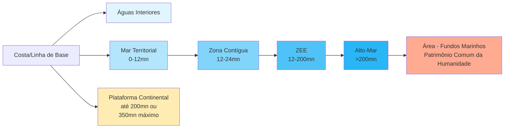

# A Convenção da ONU sobre o Direito do Mar (UNCLOS): A "Constituição dos Oceanos" e seus Desafios

## Introdução: A Codificação Revolucionária dos Oceanos

A Convenção das Nações Unidas sobre o Direito do Mar de 1982 (UNCLOS) representa uma das conquistas mais monumentais da diplomacia multilateral do século XX, estabelecendo um regime jurídico abrangente e integrado para todos os espaços oceânicos que cobre aproximadamente 71% da superfície terrestre. Frequentemente denominada de "Constituição dos Oceanos", esta convenção transcende a mera codificação de normas preexistentes, constituindo-se como um instrumento revolucionário que redefiniu fundamentalmente as relações entre Estados no ambiente marítimo e criou uma arquitetura jurídica sofisticada para governar os usos múltiplos e frequentemente conflitantes dos oceanos.

> [!important] **Significado Estratégico da UNCLOS no Direito Internacional** A UNCLOS representa um marco na evolução do direito internacional público, estabelecendo não apenas um regime jurídico específico para os oceanos, mas criando precedentes importantes para codificação de direito costumeiro, desenvolvimento progressivo do direito internacional, e estabelecimento de regimes jurídicos para espaços comuns da humanidade.

A complexidade e abrangência da UNCLOS refletem não apenas a diversidade de interesses estatais envolvidos em sua negociação, mas também a natureza multifacetada dos oceanos como espaço geográfico, econômico, estratégico e ambiental. Diferentemente de tratados internacionais que abordam questões específicas ou setoriais, a UNCLOS estabelece um marco regulatório holístico que integra aspectos de soberania territorial, exploração de recursos naturais, navegação comercial e militar, proteção ambiental, pesquisa científica, e solução de controvérsias, criando um sistema normativo de complexidade sem precedentes no direito internacional.

Do ponto de vista da teoria do direito internacional, a UNCLOS demonstra a capacidade do sistema jurídico internacional de evoluir através de processos de codificação que combinam direito costumeiro existente com desenvolvimento progressivo de novas normas. A Convenção incorpora princípios fundamentais do direito internacional público, incluindo soberania estatal, igualdade soberana, não-interferência, e solução pacífica de controvérsias, ao mesmo tempo em que desenvolve conceitos inovadores como patrimônio comum da humanidade, direitos soberanos funcionais, e jurisdição compartilhada sobre espaços transnacionais.

A relevância contemporânea da UNCLOS é amplificada pela crescente importância econômica e estratégica dos oceanos, que abrigam recursos energéticos massivos, constituem rotas comerciais vitais para o comércio global, e representam fronteiras críticas para a segurança nacional de Estados costeiros. A exploração de recursos marinhos, desde a pesca tradicional até a mineração de nódulos polimetálicos nos fundos oceânicos, opera dentro do framework jurídico estabelecido pela UNCLOS, enquanto questões geopolíticas contemporâneas, como as disputas no Mar do Sul da China, são fundamentalmente moldadas pelas disposições da Convenção.

Para o estudante do CACD, a compreensão profunda da UNCLOS é absolutamente essencial não apenas como conhecimento de direito internacional público, mas como ferramenta analítica para compreender dinâmicas geopolíticas contemporâneas, questões de desenvolvimento econômico, e a política externa brasileira em suas dimensões marítimas. A "Amazônia Azul" brasileira, conceito que encapsula a zona econômica exclusiva e plataforma continental do país, deriva sua significação jurídica e econômica diretamente das disposições da UNCLOS, tornando este conhecimento indispensável para qualquer diplomata brasileiro.

## Contexto Histórico: Da Liberdade dos Mares ao Package Deal Global

A evolução do direito do mar desde o princípio clássico da "liberdade dos mares" até a codificação abrangente representada pela UNCLOS constitui uma das transformações mais significativas na história do direito internacional, refletindo mudanças profundas na tecnologia marítima, na economia global, e na natureza do sistema internacional. Esta evolução também exemplifica processos fundamentais de formação do direito internacional costumeiro e sua subsequente codificação através de tratados multilaterais.

O princípio tradicional da liberdade dos mares, articulado classicamente por Hugo Grotius no século XVII em sua obra "Mare Liberum", baseava-se na premissa de que os oceanos constituíam um bem comum da humanidade, não suscetível de apropriação nacional e aberto ao uso livre de todas as nações. Este princípio dominava o direito internacional marítimo desde o século XVII, com Estados exercendo soberania apenas sobre uma faixa estreita de mar territorial (tradicionalmente três milhas náuticas, correspondente ao alcance de um canhão da época) e reconhecendo liberdade completa de navegação, pesca, e outras atividades no restante dos oceanos.

A teoria grotiana da liberdade dos mares refletia tanto limitações tecnológicas da época quanto a estrutura do sistema internacional westfaliano emergente, onde poucos Estados possuíam capacidades navais significativas e os oceanos serviam primariamente como meio de comunicação e transporte entre territórios nacionais claramente delimitados. Esta concepção liberal dos oceanos também servia interesses das potências marítimas dominantes, que podiam explorar livremente recursos marinhos globais e manter supremacia naval sem restrições jurisdicionais significativas.

Entretanto, as transformações tecnológicas e econômicas do século XX criaram pressões crescentes sobre este regime tradicional, demonstrando como mudanças materiais podem necessitar evolução correspondente no direito internacional. O desenvolvimento de tecnologias de pesca industrial permitiu a explotação extensiva de recursos pesqueiros em águas distantes, levando a conflitos sobre direitos de pesca e preocupações com a sustentabilidade dos estoques. A descoberta de recursos petrolíferos submarinos, particularmente após a Segunda Guerra Mundial, gerou reivindicações nacionais sobre plataformas continentais para exploração de hidrocarbonetos. O crescimento exponencial do comércio marítimo internacional criou necessidades de regulamentação mais sofisticada da navegação, enquanto preocupações ambientais emergentes exigiam normas para controle da poluição marinha.

A Proclamação Truman de 1945, pela qual os Estados Unidos reivindicaram direitos soberanos sobre os recursos naturais de sua plataforma continental, marca um momento paradigmático na evolução do direito do mar, demonstrando como ações unilaterais de Estados poderosos podem catalisar mudanças no direito internacional costumeiro. Esta proclamação, seguida por reivindicações similares de outros Estados costeiros, estabeleceu precedente para extensão da jurisdição nacional além do mar territorial tradicional, criando pressões para codificação de novos princípios através de tratados multilaterais.

A inadequação do direito internacional costumeiro para enfrentar estes desafios levou a tentativas de codificação através de conferências diplomáticas especializadas, refletindo o papel crescente de organizações internacionais na elaboração do direito internacional. A Primeira Conferência das Nações Unidas sobre o Direito do Mar (UNCLOS I), realizada em Genebra em 1958, produziu quatro convenções setoriais que codificaram aspectos específicos do direito do mar, mas falharam em resolver questões fundamentais sobre a extensão do mar territorial e a criação de zonas de pesca exclusivas. A Segunda Conferência (UNCLOS II) em 1960 fracassou completamente em alcançar consenso sobre estas questões críticas, evidenciando a necessidade de uma abordagem mais abrangente e integrada.

A Terceira Conferência das Nações Unidas sobre o Direito do Mar (UNCLOS III), iniciada em 1973 e concluída em 1982, representou a mais longa e complexa negociação multilateral da história diplomática moderna, envolvendo mais de 160 Estados e durando nove anos de negociações intensivas. A complexidade destas negociações derivava não apenas da diversidade de interesses nacionais envolvidos, mas também da necessidade de equilibrar demandas frequentemente contraditórias de diferentes grupos de Estados, refletindo a estrutura heterogênea do sistema internacional pós-descolonização.

> [!definition] **O Conceito de Package Deal no Direito Internacional** 
> O "package deal" da UNCLOS refere-se à estratégia negociadora que tratou todas as questões de direito do mar como um conjunto integrado e indivisível, onde os Estados aceitariam o acordo completo mesmo contendo disposições individualmente desfavoráveis, em troca de benefícios em outras áreas. Esta abordagem representa inovação importante na técnica de negociação multilateral e formação de tratados complexos.

As potências marítimas tradicionais, lideradas pelos Estados Unidos e pela União Soviética, priorizavam a manutenção da liberdade de navegação e sobrevoo, especialmente para fins militares, e resistiam a extensões excessivas da jurisdição costeira que pudessem restringir suas capacidades navais globais. Os Estados costeiros em desenvolvimento, particularmente aqueles com extensas costas mas capacidades marítimas limitadas, buscavam maximizar suas jurisdições nacionais para controlar e explorar recursos marinhos adjacentes, vendo a extensão da jurisdição costeira como mecanismo de desenvolvimento econômico e afirmação soberana.

Estados arquipelágicos enfrentavam desafios únicos de conectividade territorial e controle sobre águas interiores entre suas ilhas, enquanto Estados sem litoral demandavam garantias de acesso aos oceanos e participação nos benefícios dos recursos marinhos. Estados com tecnologia avançada de exploração marinha buscavam regimes que permitissem aproveitamento de suas capacidades técnicas, enquanto países em desenvolvimento temiam exclusão dos benefícios da exploração de recursos marinhos de alto valor.

A genialidade do approach do package deal foi reconhecer que estas demandas aparentemente irreconciliáveis poderiam ser equilibradas através de um sistema integrado de concessões mútuas, demonstrando princípios fundamentais de reciprocidade e equidade que caracterizam o direito internacional. As potências marítimas aceitariam extensões significativas da jurisdição costeira em troca de garantias de liberdade de navegação e sobrevoo em zonas econômicas exclusivas. Os Estados costeiros aceitariam limitações em sua capacidade de restringir a navegação em troca de direitos soberanos sobre recursos econômicos em zonas extensas. Todos os Estados se beneficiariam de um regime previsível e estável que reduziria conflitos e incertezas jurídicas.

Este processo negociador também introduziu inovações importantes na diplomacia multilateral, incluindo o uso extensivo de grupos de negociação regionais e funcionais, procedimentos de consenso que evitavam votações divisivas, e um approach de "single undertaking" que impedia acordos parciais e mantinha pressão para compromissos abrangentes. O resultado foi uma convenção que, apesar de não satisfazer completamente nenhum Estado individual, oferecia benefícios suficientes para justificar aceitação pelo conjunto da comunidade internacional, demonstrando como o direito internacional pode evoluir através de processos inclusivos de criação normativa.

## A Arquitetura da Zonificação Marítima: Um Sistema Integrado de Jurisdições

A contribuição mais fundamental da UNCLOS para o direito internacional foi a criação de um sistema sofisticado e integrado de zonificação dos espaços marítimos que estabelece regimes jurídicos diferenciados baseados na distância da costa e na natureza dos interesses estatais envolvidos. Esta zonificação representa uma síntese elegante entre o princípio tradicional da soberania territorial e o princípio da liberdade dos mares, criando uma gradação de jurisdições que equilibra direitos soberanos com interesses da comunidade internacional.

A lógica subjacente a esta zonificação baseia-se no reconhecimento de que diferentes áreas oceânicas requerem regimes jurídicos distintos que reflitam tanto a proximidade geográfica da jurisdição costeira quanto a natureza dos interesses e atividades envolvidas. À medida que a distância da costa aumenta, a intensidade da jurisdição costeira diminui progressivamente, enquanto aumentam as liberdades disponíveis para outros Estados, culminando na liberdade completa do alto-mar e no regime especial de patrimônio comum da humanidade aplicável aos fundos marinhos internacionais.

Do ponto de vista teórico do direito internacional, esta zonificação representa uma aplicação sofisticada do princípio da proporcionalidade, pelo qual a extensão da jurisdição estatal deve ser proporcional aos interesses legítimos do Estado e aos impactos sobre outros sujeitos de direito internacional. A gradação de jurisdições também reflete o princípio da subsidiariedade, concentrando controle regulatório no nível mais próximo dos interesses afetados enquanto preserva espaços para cooperação internacional onde interesses transcendem capacidades estatais individuais.

### Águas Interiores: Soberania Plena e Controle Absoluto

As águas interiores, situadas entre a costa e as linhas de base a partir das quais se mede o mar territorial, constituem o espaço marítimo onde o Estado costeiro exerce soberania mais completa e absoluta, equiparável àquela exercida sobre seu território terrestre. Este regime de soberania plena deriva do reconhecimento de que estas águas estão mais intimamente conectadas com o território nacional e servem funções essenciais de segurança nacional, controle fronteiriço, e atividades econômicas domésticas.

A delimitação das águas interiores depende fundamentalmente do conceito de linhas de base, que constituem as linhas a partir das quais são medidas todas as zonas marítimas subsequentes. A UNCLOS estabelece dois sistemas principais de linhas de base: as linhas de base normais, que seguem a linha de baixa-mar ao longo da costa tal como indicada nas cartas náuticas oficiais do Estado costeiro, e as linhas de base retas, que podem ser empregadas em circunstâncias específicas onde a costa é profundamente recortada ou há presença de ilhas ao longo da costa.

O sistema de linhas de base retas, originalmente desenvolvido pela Corte Internacional de Justiça no caso das Pescarias Anglo-Norueguesas (1951), permite que Estados com geografias costeiras complexas estabeleçam linhas que conectam pontos apropriados da costa, criando áreas de águas interiores mais extensas. Esta jurisprudência da CIJ demonstra o papel das decisões judiciais internacionais no desenvolvimento do direito internacional costumeiro e sua subsequente codificação em tratados multilaterais.

Entretanto, a UNCLOS estabelece limitações importantes para prevenir abusos na aplicação do sistema de linhas de base retas: as linhas não podem se desviar sensivelmente da direção geral da costa, e a delimitação de águas interiores através deste método não pode resultar em fechamento de áreas que tradicionalmente eram consideradas alto-mar ou zona econômica exclusiva de outro Estado. Estas limitações refletem o princípio fundamental do direito internacional de que reivindicações unilaterais de jurisdição não podem prejudicar direitos adquiridos de terceiros Estados.

Nas águas interiores, o Estado costeiro possui autoridade completa para regular todas as atividades, incluindo navegação, pesca, exploração de recursos, proteção ambiental, e aplicação de sua legislação nacional. Não existe direito de passagem inocente nas águas interiores, permitindo ao Estado costeiro controlar completamente o acesso e trânsito destas águas. Esta autoridade estende-se tanto às águas quanto ao leito marinho e subsolo subjacentes, permitindo exploração completa de recursos naturais sem limitações internacionais.

A soberania sobre águas interiores também permite ao Estado costeiro estabelecer portos e infraestrutura marítima, regular atividades de pesca e aquacultura, implementar medidas de proteção ambiental, e exercer jurisdição penal e civil sobre eventos ocorridos nestas águas. Esta jurisdição é particularmente importante para Estados com extensos sistemas de baías, estuários, e águas costeiras protegidas que servem funções econômicas e ambientais críticas.

### Mar Territorial: Soberania com Liberdade de Passagem Inocente

O mar territorial representa um dos conceitos mais tradicionais e bem estabelecidos do direito do mar, embora sua configuração moderna sob a UNCLOS reflita compromissos significativos entre demandas de soberania costeira e necessidades de liberdade de navegação internacional. A UNCLOS estabelece que todo Estado tem direito de estabelecer mar territorial com extensão máxima de doze milhas náuticas, medidas a partir das linhas de base, consolidando uma evolução histórica que viu extensões progressivas desde as três milhas tradicionais.

Esta evolução na extensão do mar territorial exemplifica como o direito internacional costumeiro pode mudar através da prática estatal consistente acompanhada de opinio juris, mesmo quando contradiz normas anteriormente estabelecidas. A aceitação gradual de mares territoriais mais extensos refletiu mudanças nas capacidades tecnológicas militares e necessidades de segurança nacional, demonstrando a capacidade adaptativa do direito internacional a circunstâncias materiais mudadas.

A soberania do Estado costeiro sobre o mar territorial é análoga àquela exercida sobre seu território terrestre e águas interiores, abrangendo não apenas a coluna d'água mas também o leito marinho, subsolo, e espaço aéreo sobrejacente. Esta soberania permite ao Estado costeiro regular todas as atividades que ocorrem no mar territorial, incluindo exploração de recursos naturais, proteção ambiental, segurança nacional, e aplicação de legislação nacional. O Estado costeiro pode estabelecer leis e regulamentos relativos à navegação, conservação de recursos vivos, preservação do ambiente, e pesquisa científica marinha.

> [!important] **Passagem Inocente: Equilíbrio Fundamental no Direito Internacional** O direito de passagem inocente representa o compromisso central da UNCLOS entre soberania costeira e liberdade de navegação, permitindo que navios de todos os Estados atravessem o mar territorial desde que sua passagem seja contínua, rápida, e não prejudicial aos interesses do Estado costeiro. Este conceito demonstra como o direito internacional equilibra reivindicações soberanas competitivas através de limitações funcionais específicas.

Entretanto, a soberania sobre o mar territorial está sujeita à limitação fundamental representada pelo direito de passagem inocente, que constitui um dos pilares do direito internacional marítimo e reflete o reconhecimento de que a conectividade marítima global requer certas limitações à autoridade soberana costeira. A passagem é considerada inocente quando é contínua e rápida, e não é prejudicial à paz, boa ordem ou segurança do Estado costeiro.

A UNCLOS define detalhadamente as atividades que tornam uma passagem não-inocente, incluindo qualquer ameaça ou uso da força contra a soberania, integridade territorial ou independência política do Estado costeiro; exercícios ou práticas com armas; coleta de informações prejudiciais à defesa ou segurança; propaganda visando afetar a defesa ou segurança; lançamento, pouso ou recebimento de aeronaves; lançamento, pouso ou recebimento de dispositivos militares; embarque ou desembarque de mercadorias, moedas ou pessoas em violação às leis aduaneiras, fiscais, de imigração ou sanitárias; poluição intencional e grave; atividades de pesca; atividades de pesquisa ou levantamento; e atos visando interferir com sistemas de comunicação ou outras facilidades ou instalações do Estado costeiro.

O Estado costeiro pode tomar medidas em seu mar territorial para impedir passagem que não seja inocente, e pode exigir que navios estrangeiros utilizem rotas de tráfego marítimo e esquemas de separação de tráfego designados para garantir segurança da navegação. Em áreas onde a geografia torna necessário, o Estado costeiro pode estabelecer rotas marítimas e regras de tráfego, particularmente para navios-tanque, navios com propulsão nuclear, e navios transportando substâncias nucleares ou perigosas.

A questão da passagem inocente de navios de guerra constitui uma das áreas mais sensíveis do direito do mar territorial, com diferentes interpretações sobre se tais navios requerem autorização prévia ou mera notificação. A UNCLOS não distingue entre navios mercantes e navios de guerra para fins de passagem inocente, mas alguns Estados costeiros mantêm requisitos de autorização prévia baseados em considerações de segurança nacional, criando tensões com potências navais que consideram tais requisitos incompatíveis com a liberdade de navegação. Esta divergência interpretativa demonstra como ambiguidades em tratados podem gerar disputas persistentes que requerem resolução através de jurisprudência ou negociação diplomática.

### Zona Contígua: Poderes de Fiscalização Especializados

A zona contígua representa uma inovação importante do direito do mar moderno que reconhece necessidades legítimas dos Estados costeiros de exercer controles especializados além de seu mar territorial, particularmente para prevenção e punição de violações de suas leis nacionais. Esta zona pode estender-se até vinte e quatro milhas náuticas das linhas de base, criando um espaço intermediário onde o Estado costeiro não possui soberania plena mas detém competências funcionais específicas.

Do ponto de vista teórico do direito internacional, a zona contígua exemplifica o conceito de jurisdição funcional ou ratione materiae, onde a competência estatal é limitada a matérias específicas rather than território geográfico completo. Esta abordagem permite extensão seletiva da autoridade estatal onde interesses legítimos justificam tal extensão, sem conferir competência geral que poderia interferir excessivamente com direitos de outros Estados.

Os poderes do Estado costeiro na zona contígua são limitados a quatro áreas específicas de controle: aduaneiro, fiscal, de imigração, e sanitário. Esta limitação funcional reflete o reconhecimento de que, embora o Estado costeiro tenha interesses legítimos em prevenir violações de sua legislação nacional, a extensão destes controles além do mar territorial deve ser cuidadosamente circunscrita para evitar interferência excessiva com a liberdade de navegação e outras atividades marítimas legítimas.

O controle aduaneiro na zona contígua permite ao Estado costeiro tomar medidas para prevenir e punir violações de suas leis aduaneiras que ocorram em seu território ou mar territorial, incluindo interdição de navios suspeitos de contrabando e outras atividades de comércio ilegal. Esta competência é particularmente importante para Estados que enfrentam desafios significativos de contrabando marítimo, incluindo drogas, armas, e outras mercadorias ilegais ou não declaradas.

O controle fiscal estende a capacidade do Estado costeiro de fazer cumprir suas leis tributárias e de receita, permitindo medidas contra evasão fiscal e outras violações de regulamentações econômicas nacionais. Esta competência pode incluir inspeção de navios suspeitos de transportar mercadorias não declaradas para fins tributários e enforcement de regulamentações sobre importação e exportação.

Os controles de imigração na zona contígua são cruciais para Estados que enfrentam pressões migratórias irregulares via marítima, permitindo interdição de embarcações transportando migrantes ilegais e aplicação de medidas de controle fronteiriço. Esta competência deve ser exercida em conformidade com obrigações internacionais relativas a proteção de refugiados e direitos humanos, mas oferece ferramentas importantes para gestão de fluxos migratórios.

O controle sanitário permite ao Estado costeiro tomar medidas para prevenir violações de suas leis de saúde pública, incluindo quarentena de navios e prevenção da introdução de doenças, pragas, ou outros riscos sanitários. Esta competência assumiu importância renovada no contexto de pandemias globais e ameaças biológicas transnacionais.

Crucialmente, os poderes na zona contígua são limitados à prevenção e punição de violações que ocorram no território ou mar territorial do Estado costeiro, não permitindo enforcement primário de legislação nacional contra atividades que ocorram inteiramente dentro da própria zona contígua. Esta limitação preserva o caráter transitório da zona contígua e evita extensão excessiva da jurisdição penal costeira.

### Zona Econômica Exclusiva: Direitos Soberanos Funcionais

A Zona Econômica Exclusiva representa talvez a inovação mais significativa e transformadora da UNCLOS, criando uma categoria jurídica inteiramente nova que equilibra de forma sofisticada os interesses econômicos dos Estados costeiros com as necessidades de liberdade de navegação e outras atividades marítimas da comunidade internacional. Esta zona pode estender-se até duzentas milhas náuticas das linhas de base, cobrindo áreas oceânicas vastas que frequentemente excedem a área terrestre dos Estados costeiros.

> [!definition] **Natureza dos Direitos Soberanos na ZEE: Inovação Conceitual** 
> Os direitos soberanos na ZEE são funcionalmente específicos, abrangendo exploração, explotação, conservação e gestão de recursos naturais (vivos e não-vivos) das águas, leito marinho e subsolo, bem como atividades econômicas relacionadas como energia derivada da água, correntes e ventos. Esta formulação representa inovação conceitual importante no direito internacional, distinguindo direitos soberanos de soberania plena.

A natureza dos direitos do Estado costeiro na ZEE difere fundamentalmente da soberania plena exercida no mar territorial, constituindo-se como "direitos soberanos" para fins específicos relacionados à exploração e aproveitamento de recursos econômicos. Esta distinção conceitual é crucial para compreensão do direito internacional contemporâneo: o Estado costeiro não possui soberania geral sobre a ZEE, mas direitos soberanos funcionalmente delimitados que coexistem com liberdades importantes mantidas por outros Estados.

Esta formulação de direitos soberanos funcionais representa desenvolvimento importante na teoria do direito internacional, demonstrando como conceitos jurídicos podem evoluir para acomodar realidades geopolíticas e econômicas complexas que não se enquadram em categorias tradicionais de soberania territorial absoluta ou liberdade completa. A ZEE constitui uma forma de jurisdição sui generis que permite alocação eficiente de competências regulatórias enquanto preserva interesses essenciais da comunidade internacional.

Os direitos soberanos do Estado costeiro na ZEE abrangem todos os recursos naturais vivos e não-vivos das águas sobrejacentes ao leito marinho, do leito marinho e seu subsolo, bem como outras atividades econômicas relacionadas com a exploração e aproveitamento da zona para fins econômicos, como a produção de energia derivada da água, das correntes e dos ventos. Esta formulação ampla permite ao Estado costeiro controlar não apenas atividades tradicionais como pesca e exploração petrolífera, mas também tecnologias emergentes como parques eólicos offshore, aquacultura marinha, e outras formas de aproveitamento dos recursos marinhos.

A gestão dos recursos vivos na ZEE constitui uma das responsabilidades mais complexas e importantes do Estado costeiro, exigindo equilibrio entre exploração econômica e conservação sustentável. O Estado costeiro deve determinar a captura permissível dos recursos vivos em sua ZEE, baseada em melhor evidência científica disponível, e quando não tem capacidade de pescar toda a captura permissível, deve dar acesso ao excedente a outros Estados através de acordos ou arranjos apropriados. Esta disposição reflete o reconhecimento de que os recursos marinhos são finitos e devem ser utilizados de forma ótima para benefício da humanidade.

A UNCLOS impõe obrigações específicas aos Estados costeiros para conservação e gestão dos recursos vivos, incluindo medidas para prevenir sobre-exploração e manter ou restaurar populações de espécies capturadas a níveis que possam produzir rendimento máximo sustentável. Estas obrigações são qualificadas por fatores econômicos e ambientais relevantes, incluindo as necessidades econômicas das comunidades pesqueiras costeiras e as necessidades especiais dos Estados em desenvolvimento.

Para recursos altamente migratórios como atum, marlin, e tubarões, que transcendem as ZEEs de múltiplos Estados, a UNCLOS estabelece obrigações de cooperação entre o Estado costeiro e outros Estados cujos nacionais pesquem essas espécies na região. Esta cooperação deve visar assegurar conservação e promover o objetivo de utilização ótima de tais espécies em toda a região, tanto dentro quanto fora da ZEE. Esta disposição reconhece que certos recursos marinhos requerem gestão coordenada que transcende jurisdições nacionais individuais.

As atividades de exploração e explotação de recursos não-vivos na ZEE, particularmente hidrocarbonetos e minerais marinhos, estão sujeitas exclusivamente à jurisdição do Estado costeiro, que pode outorgar licenças, estabelecer regulamentações ambientais, e capturar rendas através de royalties e impostos. Esta competência exclusiva oferece aos Estados costeiros oportunidades significativas de desenvolvimento econômico, particularmente para países em desenvolvimento com extensas plataformas continentais ricas em recursos.

Simultaneamente, a UNCLOS preserva liberdades fundamentais para outros Estados na ZEE, incluindo liberdade de navegação e sobrevoo, liberdade de colocação de cabos e dutos submarinos, e outros usos do mar internacionalmente legítimos relacionados com essas liberdades. Estas liberdades são compatíveis com as disposições da UNCLOS e devem ser exercidas com devida consideração pelos direitos e deveres do Estado costeiro.

A questão da navegação militar na ZEE constitui uma das áreas mais controvertidas do direito do mar contemporâneo, com diferentes interpretações sobre se atividades militares como exercícios navais, coleta de inteligência, e operações de reconhecimento são compatíveis com as liberdades preservadas na ZEE. Potências navais argumentam que a liberdade de navegação inclui todas as atividades navais legítimas, enquanto muitos Estados costeiros contendm que atividades militares na ZEE requerem consentimento ou notificação prévia. Esta divergência interpretativa reflete tensões fundamentais entre conceitos de soberania e liberdade que caracterizam o direito internacional.

### Plataforma Continental: Direitos Soberanos sobre o Leito Marinho

O conceito de plataforma continental representa uma das contribuições mais importantes do direito do mar para a exploração de recursos marinhos, estabelecendo direitos soberanos dos Estados costeiros sobre o leito marinho e subsolo das áreas submarinas adjacentes às suas costas. A UNCLOS adota uma definição dupla de plataforma continental que combina critérios de distância e critérios geológicos, permitindo que Estados costeiros reivindiquem direitos sobre áreas que se estendem significativamente além da ZEE em certas circunstâncias.

Esta abordagem dual reflete compromisso sofisticado entre princípios geológicos científicos e necessidades de certeza jurídica, demonstrando como o direito internacional pode incorporar critérios técnicos objetivos em estruturas normativas. A definição legal da plataforma continental não depende inteiramente de características geológicas naturais, mas estabelece critérios jurídicos que podem divergir da realidade geológica para assegurar previsibilidade e evitar disputas sobre interpretação de dados científicos complexos.

Sob a definição básica da UNCLOS, a plataforma continental de um Estado costeiro compreende o leito marinho e subsolo das áreas submarinas que se estendem além de seu mar territorial, em toda a extensão do prolongamento natural de seu território terrestre, até o bordo exterior da margem continental, ou até uma distância de duzentas milhas náuticas das linhas de base quando o bordo exterior da margem continental não se estende até essa distância.

> [!important] **Plataforma Continental Estendida: Expansão da Jurisdição Nacional** 
> Estados costeiros podem reivindicar plataforma continental além das 200 milhas náuticas até um máximo de 350 milhas náuticas das linhas de base ou 100 milhas náuticas da isóbata de 2.500 metros, desde que demonstrem que a área constitui prolongamento natural de sua massa terrestre. Esta disposição permite extensões significativas da jurisdição nacional sobre recursos submarinos, mas está sujeita a revisão científica internacional através da Comissão de Limites da Plataforma Continental.

Para Estados cuja margem continental estende-se além de duzentas milhas náuticas, a UNCLOS permite reivindicação de plataforma continental estendida, sujeita a critérios científicos rigorosos e procedimentos de revisão internacional. O bordo exterior da plataforma continental não pode exceder trezentas e cinquenta milhas náuticas das linhas de base ou cem milhas náuticas da isóbata de dois mil e quinhentos metros. Estes limites máximos refletem compromissos entre interesses dos Estados costeiros em maximizar suas áreas de jurisdição e interesses da comunidade internacional em preservar áreas significativas de fundos marinhos como patrimônio comum da humanidade.

Os direitos soberanos sobre a plataforma continental são ipso facto e ab initio, não dependendo de ocupação efetiva, proclamação expressa, ou qualquer ato específico de apropriação. Esta formulação estabelece que os direitos soberanos existem automaticamente em virtude da soberania do Estado costeiro sobre sua território terrestre, sem necessidade de atos constitutivos adicionais. Esta característica distingue os direitos sobre a plataforma continental de outras formas de aquisição territorial que requerem atos específicos de apropriação ou reconhecimento.

Esta formulação de direitos automáticos representa desenvolvimento importante no direito internacional, criando forma de título territorial que não depende de atos volitivos ou manifestações expressas de soberania. Os direitos ipso facto e ab initio refletem reconhecimento de que certas extensões da jurisdição estatal são tão intimamente conectadas com a soberania territorial que sua existência não pode depender de formalidades adicionais.

Os direitos soberanos sobre a plataforma continental são exclusivos no sentido de que, se o Estado costeiro não explora a plataforma continental ou não explota os seus recursos naturais, ninguém pode empreender essas atividades sem o consentimento expresso desse Estado. Esta exclusividade permite aos Estados costeiros controlar completamente a exploração de recursos em suas plataformas continentais, incluindo estabelecimento de regimes regulatórios, outorga de licenças, e captura de rendas através de royalties e impostos.

Os recursos naturais da plataforma continental incluem recursos minerais e outros recursos não-vivos do leito marinho e subsolo, bem como organismos vivos que pertencem a espécies sedentárias, definidas como organismos que, na época de captura, estão imóveis no leito marinho ou no seu subsolo, ou só se podem mover em constante contato físico com o leito marinho ou subsolo. Esta definição permite aos Estados costeiros controlar recursos como crustáceos, moluscos, e outras espécies bentônicas, mas exclui peixes e outras espécies pelágicas que estão sujeitas ao regime da ZEE.

A exploração da plataforma continental está sujeita a obrigações ambientais importantes, incluindo prevenção, redução e controle da poluição do meio marinho resultante de atividades no leito marinho. Estados costeiros devem também respeitar direitos de outros Estados relativos à colocação de cabos e dutos submarinos na plataforma continental, desde que não interfiram injustificadamente com a exploração da plataforma ou a exploração dos seus recursos naturais.

Para plataformas continentais estendidas além de duzentas milhas náuticas, a UNCLOS estabelece um sistema especial de pagamentos ou contribuições em espécie relacionados com a exploração de recursos não-vivos. Estes pagamentos são feitos através da Autoridade Internacional dos Fundos Marinhos e distribuídos aos Estados Partes numa base equitativa, levando em consideração os interesses e necessidades dos Estados em desenvolvimento, particularmente os menos desenvolvidos e sem litoral. Este mecanismo representa uma forma limitada de redistribuição internacional de rendas derivadas de recursos marinhos.

### Alto-Mar: Preservação das Liberdades Tradicionais

O alto-mar constitui a maior área oceânica sob a UNCLOS, compreendendo todas as partes do mar não incluídas na zona econômica exclusiva, mar territorial, ou águas interiores de um Estado, bem como no mar territorial de um Estado arquipelágico. Esta área oceânica vasta continua sendo governada pelo princípio fundamental da liberdade do alto-mar, embora as liberdades tradicionais tenham sido modernizadas e sujeitas a novas obrigações relacionadas com conservação e proteção ambiental.

A preservação do regime de liberdade do alto-mar na UNCLOS representa continuidade importante com princípios fundamentais do direito internacional clássico, demonstrando como inovações normativas podem coexistir com conceitos tradicionais onde estes continuam servindo interesses legítimos da comunidade internacional. O alto-mar permanece como res communis, não suscetível de apropriação nacional, mas sujeito a regulamentação internacional crescente que reflete preocupações contemporâneas com sustentabilidade e proteção ambiental.

A UNCLOS reafirma as liberdades clássicas do alto-mar, incluindo liberdade de navegação, liberdade de sobrevoo, liberdade de colocação de cabos e dutos submarinos, liberdade de construção de ilhas artificiais e outras instalações permitidas pelo direito internacional, liberdade de pesca, e liberdade de pesquisa científica. Estas liberdades são exercidas por todos os Estados, sejam costeiros ou sem litoral, em conformidade com as disposições da UNCLOS e outras normas do direito internacional.

> [!note] **Princípio da Não-Apropriação no Direito Internacional** 
> O alto-mar não pode ser submetido à soberania de qualquer Estado, mantendo-se como espaço comum da humanidade onde todos os Estados gozam de direitos iguais de uso, sujeito às obrigações estabelecidas pela UNCLOS. Este princípio representa aplicação do conceito de res communis no direito internacional, distinguindo-se de conceitos de patrimônio comum da humanidade por não estabelecer mecanismos institucionais específicos de gestão coletiva.

A liberdade de navegação no alto-mar inclui tanto navegação comercial quanto militar, sem necessidade de autorização ou consentimento de qualquer Estado. Esta liberdade é fundamental para a conectividade global e o comércio internacional, permitindo que navios de qualquer bandeira transitem livremente pelo alto-mar. Entretanto, a UNCLOS impõe obrigações importantes relacionadas com segurança da navegação, incluindo prevenção de abalroamento, assistência marítima, e prevenção da poluição por navios.

A liberdade de pesca no alto-mar está sujeita a limitações importantes relacionadas com conservação de recursos marinhos vivos e direitos de outros Estados. A UNCLOS exige que Estados cuja nacionalidade pesquem no alto-mar adotem medidas de conservação e cooperem com outros Estados para assegurar conservação e gestão dos recursos vivos do alto-mar. Esta cooperação é particularmente importante para espécies altamente migratórias e estoques transfronteiriços que são explorados por múltiplos Estados.

A jurisdição no alto-mar baseia-se fundamentalmente no princípio da bandeira, pelo qual os navios estão sujeitos à jurisdição exclusiva do Estado de bandeira, exceto em casos especiais previstos pela UNCLOS ou outras normas do direito internacional. O Estado de bandeira deve exercer efetivamente sua jurisdição e controle em questões administrativas, técnicas e sociais sobre navios que arvoram sua bandeira, incluindo segurança da navegação, competência e condições de trabalho das tripulações, e prevenção da poluição.

A UNCLOS estabelece exceções importantes ao princípio da jurisdição exclusiva da bandeira, permitindo que navios de guerra de qualquer Estado abordem navios estrangeiros no alto-mar em circunstâncias específicas, incluindo suspeita de pirataria, tráfico de escravos, transmissões não autorizadas, ou quando o navio não possui nacionalidade. O direito de perseguição permite que um Estado costeiro continue perseguição de um navio estrangeiro que violou suas leis no mar territorial ou ZEE, desde que a perseguição seja contínua e iniciada enquanto o navio estava na zona de jurisdição do Estado costeiro.

A pirataria no alto-mar está sujeita a jurisdição universal, permitindo que qualquer Estado capture navios ou aeronaves piratas e prenda as pessoas e apreenda os bens a bordo. A UNCLOS define pirataria como atos ilegais de violência, detenção, ou depredação cometidos para fins privados pela tripulação ou passageiros de um navio privado contra outro navio ou aeronave no alto-mar, ou contra pessoas ou bens a bordo de tal navio ou aeronave. Esta definição representa codificação de conceitos de direito internacional costumeiro sobre jurisdição universal para crimes internacionais.

### A "Área": Patrimônio Comum da Humanidade

A "Área", definida pela UNCLOS como o leito marinho e subsolo além dos limites da jurisdição nacional, representa uma das inovações mais ambiciosas e philosophicamente revolucionárias do direito internacional moderno. Declarada como "patrimônio comum da humanidade", a Área e seus recursos são governados por um regime jurídico único que busca assegurar que os benefícios da exploração dos fundos marinhos sejam compartilhados equitativamente por toda a humanidade, com atenção particular às necessidades dos países em desenvolvimento.

> [!definition] **Patrimônio Comum da Humanidade: Conceito Revolucionário** 
> O conceito de patrimônio comum da humanidade aplicado à "Área" significa que esta não pode ser submetida à apropriação nacional, que atividades na Área devem ser conduzidas para benefício da humanidade como um todo, e que deve haver compartilhamento equitativo de benefícios. Este conceito representa inovação fundamental no direito internacional, transcendendo conceitos tradicionais de soberania e propriedade para criar regimes de gestão coletiva de recursos globais.

O conceito de patrimônio comum da humanidade incorpora vários princípios fundamentais que distinguem a Área de outros espaços internacionais e representam desenvolvimento revolucionário na teoria do direito internacional. Primeiro, a Área não pode ser submetida à apropriação por qualquer Estado, pessoa física ou jurídica, estabelecendo um regime de não-apropriação mais absoluto que aquele aplicável ao alto-mar. Segundo, todas as atividades na Área devem ser conduzidas para o benefício da humanidade como um todo, irrespectivamente da localização geográfica dos Estados, com consideração particular para os interesses e necessidades dos Estados em desenvolvimento. Terceiro, deve haver compartilhamento equitativo dos benefícios financeiros e outros benefícios econômicos derivados das atividades na Área.

Este conceito representa tentativa ambiciosa de aplicar princípios de justiça distributiva global através do direito internacional, criando mecanismos institucionais para redistribuição de recursos naturais baseada em considerações de equidade rather than poder ou proximidade geográfica. O patrimônio comum da humanidade vai além de conceitos tradicionais de res communis ao estabelecer não apenas proibições de apropriação, mas obrigações positivas de gestão coletiva e compartilhamento de benefícios.

A Autoridade Internacional dos Fundos Marinhos (ISBA), estabelecida pela UNCLOS como uma organização internacional autônoma, possui competência para organizar e controlar as atividades na Área, particularmente com vistas à administração dos recursos da Área. A ISBA possui poderes regulatórios abrangentes, incluindo adoção de regras, regulamentos e procedimentos para exploração e explotação dos recursos da Área, proteção do meio marinho, e distribuição equitativa de benefícios.

A estrutura institucional da ISBA reflete os compromissos políticos complexos da UNCLOS entre países desenvolvidos e em desenvolvimento, criando sistema de governance que equilibra representação universal com consideração para diferentes capacidades e interesses. A Assembleia, composta por todos os Estados Partes, funciona como o órgão supremo que estabelece políticas gerais. O Conselho, com composição limitada mas representativa de diferentes grupos de interesses (incluindo maiores consumidores e importadores de minerais, maiores investidores em mineração dos fundos marinhos, maiores exportadores terrestres, Estados em desenvolvimento com necessidades especiais, e distribuição geográfica equitativa), toma decisões executivas específicas sobre aprovação de planos de trabalho para exploração e explotação.

Os recursos minerais da Área incluem principalmente nódulos polimetálicos, sulfetos polimetálicos, e crostas de cobalto ricos em ferro-manganês, que contêm metais estratégicos como manganês, níquel, cobalto, e cobre essenciais para tecnologias modernas incluindo baterias, eletrônicos, e energias renováveis. A crescente demanda por estes metais, combinada com o desenvolvimento de tecnologias de mineração de águas profundas, tornou a exploração comercial da Área uma possibilidade cada vez mais realista.

O sistema de exploração da Área baseia-se numa combinação de atividades por entidades privadas e estatais, sujeitas a controle rigoroso da ISBA, e atividades diretas conduzidas pela "Empresa", o braço operacional da ISBA. Cada área aprovada para exploração é dividida em duas partes: uma é atribuída ao requerente para exploração, enquanto a outra é reservada para atividades da Empresa ou de Estados em desenvolvimento. Este sistema de "dupla reserva" visa assegurar que países em desenvolvimento não sejam excluídos dos benefícios da mineração dos fundos marinhos.

A UNCLOS estabelece obrigações ambientais rigorosas para atividades na Área, exigindo que a ISBA adote regras apropriadas para assegurar proteção eficaz do meio marinho contra efeitos nocivos que possam resultar de tais atividades. Estas obrigações incluem avaliação de impacto ambiental, monitoramento contínuo, e aplicação do princípio da precaução. A crescente conscientização sobre a fragilidade dos ecossistemas de águas profundas tem intensificado debates sobre se e como a mineração dos fundos marinhos pode ser conduzida de forma ambientalmente sustentável.

## As Instituições da Convenção: Arquitetura Complexa de Governança Internacional

A UNCLOS estabelece uma arquitetura institucional sofisticada para implementação de suas disposições e resolução de disputas que possam surgir de sua aplicação, reconhecendo que um regime jurídico tão abrangente e complexo requer mecanismos institucionais especializados para sua operacionalização efetiva. Esta arquitetura inclui tanto instituições judiciais para resolução de controvérsias quanto instituições técnicas para aspectos específicos da implementação da Convenção, bem como uma estrutura operacional única para gestão comercial de recursos comuns da humanidade.

### Tribunal Internacional do Direito do Mar: Jurisdição Especializada

O Tribunal Internacional do Direito do Mar (TIDM/ITLOS), com sede em Hamburgo, Alemanha, constitui uma das instituições mais importantes criadas pela UNCLOS, oferecendo um foro judicial especializado para resolução de disputas relacionadas com a interpretação e aplicação da Convenção. O TIDM foi estabelecido como um tribunal permanente composto por vinte e um juízes independentes, eleitos pelas Estados Partes da UNCLOS entre pessoas que gozem da mais alta reputação pela imparcialidade e integridade e que possuam reconhecida competência no campo do direito do mar.

A estrutura e competência do TIDM representam inovação importante na arquitetura judicial internacional, criando primeira instância judicial permanente especializada ratione materiae em área específica do direito internacional. Esta especialização permite desenvolvimento de jurisprudência consistente e expertise técnica em questões complexas de direito do mar, contrastando com tribunais de competência geral que podem carecer de familiaridade com nuances técnicas específicas do direito marítimo.

A competência do TIDM abrange todas as controvérsias e pedidos que lhe forem submetidos de acordo com a UNCLOS, bem como todas as questões especificamente previstas em qualquer outro acordo que confira competência ao Tribunal. Esta competência inclui interpretação de disposições da UNCLOS, determinação de limites marítimos, disputas sobre direitos de navegação e sobrevoo, questões relativas à conservação e gestão de recursos marinhos vivos, e controvérsias sobre proteção e preservação do meio marinho.

Uma das características mais inovadoras do TIDM é sua competência para medidas provisórias, permitindo que o Tribunal prescreva medidas provisórias para preservar os direitos respectivos das partes em disputa e prevenir danos graves ao meio marinho enquanto um caso está pendente. Esta competência tem sido utilizada em casos importantes envolvendo conservação de espécies marinhas ameaçadas e prevenção de danos ambientais irreversíveis, demonstrando papel crescente de considerações ambientais na jurisprudência internacional.

O TIDM também possui competência especializada sobre questões relacionadas com a pronta liberação de navios e tripulações detidos por Estados costeiros sob alegação de violação de leis pesqueiras ou outras regulamentações na ZEE. Esta competência visa equilibrar direitos legítimos de enforcement dos Estados costeiros com necessidades de minimizar custos econômicos e humanitários de detenções prolongadas de navios e tripulações. O procedimento de pronta liberação representa inovação processual importante que permite resolução expedita de disputas que requerem ação imediata.

A Câmara de Controvérsias dos Fundos Marinhos do TIDM possui competência especializada sobre disputas relacionadas com atividades na Área, incluindo controvérsias entre Estados Partes sobre interpretação ou aplicação da Parte XI da UNCLOS, disputas entre Estados Partes e a Autoridade Internacional dos Fundos Marinhos, e controvérsias entre partes de contratos de exploração ou explotação. Esta competência especializada reconhece a natureza técnica e comercial complexa das atividades de mineração dos fundos marinhos e a necessidade de expertise jurídica específica em questões de patrimônio comum da humanidade.

### Sistema Alternativo de Solução de Controvérsias

A UNCLOS estabelece um sistema inovador de solução de controvérsias que oferece múltiplas opções aos Estados Partes, refletindo reconhecimento de que diferentes tipos de disputas podem se beneficiar de diferentes abordagens procedimentais e que Estados podem ter preferências distintas sobre foros internacionais. Este sistema representa uma das contribuições mais importantes da UNCLOS para o desenvolvimento de mecanismos de solução pacífica de controvérsias no direito internacional.

**Arbitragem Tradicional:** Estados podem submeter disputas a um tribunal arbitral constituído conforme o Anexo VII da UNCLOS, que estabelece procedimentos detalhados para constituição de tribunais arbitrais, condução de procedimentos, e enforcement de laudos. Este mecanismo oferece flexibilidade na seleção de árbitros e adaptação de procedimentos às necessidades específicas das partes, enquanto mantém estrutura institucional sofisticada através da Corte Permanente de Arbitragem.

**Arbitragem Especial:** Para certas categorias de disputas técnicas, incluindo pesca, proteção e preservação do meio marinho, pesquisa científica marinha, e navegação, a UNCLOS estabelece procedimentos de arbitragem especial que utilizam listas especializadas de árbitros com expertise técnica específica. Esta modalidade reconhece que certas disputas requerem conhecimento técnico especializado que pode não estar disponível em tribunais de competência geral.

**Submissão à Corte Internacional de Justiça:** Estados podem optar por submeter disputas à CIJ, aproveitando-se da expertise estabelecida e jurisprudência desenvolvida desta corte principal do sistema das Nações Unidas. Esta opção permite integração da jurisprudência sobre direito do mar com desenvolvimento mais amplo do direito internacional geral.

**Flexibilidade Processual:** Estados podem fazer declarações escolhendo um ou mais destes procedimentos para diferentes categorias de disputas, permitindo customização de abordagens baseada na natureza específica das controvérsias. Esta flexibilidade representa reconhecimento de que solução eficaz de disputas requer adaptação às características particulares de cada caso.

### Comissão de Limites da Plataforma Continental: Expertise Científica

A Comissão de Limites da Plataforma Continental (CLPC) representa uma inovação institucional importante que combina expertise científica e técnica com funções quasi-judiciais para implementação das disposições da UNCLOS sobre plataforma continental estendida. Composta por vinte e um peritos em geologia, geofísica, hidrografia, ou outras disciplinas pertinentes, eleitos pelos Estados Partes dentre seus nacionais, a CLPC examina submissões de Estados costeiros sobre limites de suas plataformas continentais quando estas se estendem além de duzentas milhas náuticas.

A função principal da CLPC é examinar os dados e outros materiais submetidos pelos Estados costeiros sobre limites exteriores de suas plataformas continentais quando estas se estendem além de duzentas milhas náuticas, e fazer recomendações de acordo com o artigo 76 da UNCLOS. Estas recomendações são baseadas em critérios científicos rigorosos estabelecidos pela UNCLOS, incluindo demonstração de que a área reivindicada constitui prolongamento natural da massa terrestre do Estado costeiro através de evidências geológicas e geomorfológicas.

O processo de submissão à CLPC é complexo e tecnicamente demandante, requerendo que Estados costeiros compilem vastas quantidades de dados batimétricos, geológicos, geofísicos, e outros dados científicos para demonstrar que suas reivindicações atendem aos critérios estabelecidos pela UNCLOS. Este processo pode levar anos ou décadas para completar e frequentemente requer cooperação internacional significativa para coleta de dados em áreas oceânicas remotas.

As recomendações da CLPC não são juridicamente vinculantes no sentido tradicional, mas possuem autoridade científica significativa e são consideradas definitivas para fins de estabelecimento dos limites exteriores da plataforma continental. Limites da plataforma continental estabelecidos por um Estado costeiro com base em recomendações da CLPC são finais e obrigatórios, criando uma forma única de quasi-judicial decision making baseada em expertise científica.

A CLPC também enfrenta desafios significativos relacionados com disputas territoriais e marítimas que podem afetar a delimitação de plataformas continentais. A Comissão não faz recomendações em casos onde existem disputas territoriais ou marítimas não resolvidas, a menos que todos os Estados envolvidos concordem com o processamento da submissão. Esta limitação reconhece que questões de soberania territorial são distintas de questões técnicas sobre prolongamento natural da plataforma continental.

### A Empresa: Braço Operacional Inovador da Autoridade dos Fundos Marinhos

A Empresa (Enterprise) constitui uma das inovações institucionais mais ambiciosas e únicas da UNCLOS, representando tentativa sem precedentes de criar uma entidade operacional internacional com mandato comercial direto para exploração de recursos comuns da humanidade. Como órgão da Autoridade Internacional dos Fundos Marinhos, a Empresa foi concebida para conduzir diretamente atividades de mineração na "Área", operando ao lado de entidades privadas e estatais sob supervisão da ISBA.

> [!important] **A Empresa como Inovação no Direito Internacional Econômico** 
> A Empresa representa tentativa única de criar uma "empresa pública internacional" com personalidade jurídica operacional própria, capacidade de celebrar contratos comerciais, adquirir propriedade, e conduzir operações de mineração em competição com entidades privadas, enquanto serve objetivos públicos de benefício da humanidade como um todo.

**Natureza Jurídica Singular:** A Empresa possui status legal complexo que combina características de órgão de organização internacional com capacidades operacionais de entidade comercial. Embora seja parte integral da ISBA, a Empresa possui personalidade jurídica operacional que lhe permite celebrar contratos, adquirir e dispor de propriedade, iniciar procedimentos legais, e conduzir operações comerciais de forma relativamente autônoma. Esta estrutura híbrida representa tentativa de reconciliar objetivos públicos internacionais com necessidades de eficiência comercial e competitividade no mercado global de mineração.

**Mandato Operacional:** A função primária da Empresa é conduzir atividades de exploração, explotação, e comercialização dos recursos minerais da "Área" diretamente, rather than meramente regular tais atividades conduzidas por terceiros. Este mandato operacional distingue a Empresa de outras organizações internacionais que tipicamente exercem funções regulatórias, de coordenação, ou de assistência técnica. A Empresa deve operar nas áreas "reservadas" do sistema de dupla reserva estabelecido pela UNCLOS, que assegura que metade de cada área aprovada para mineração seja disponibilizada para atividades diretas da comunidade internacional através da Empresa.

**Estrutura de Governance:** A Empresa é governada por um Conselho de Administração composto por quinze membros eleitos pela Assembleia da ISBA, representando diferentes grupos geográficos e funcionais. Este Conselho deve incluir representantes qualificados em questões relacionadas com mineração, gestão de recursos naturais, comércio internacional, e questões financeiras. O Diretor-Geral da Empresa é nomeado pela Assembleia e serve como chief executive officer responsável pela gestão operacional diária.

**Capital e Financiamento:** Uma das questões mais problemáticas para a operacionalização da Empresa tem sido a questão do capital inicial e financiamento contínuo. A UNCLOS original previa que Estados Partes forneceriam capital inicial através de contribuições obrigatórias, mas muitos Estados desenvolvidos, particularmente os Estados Unidos, consideraram estas disposições economicamente inviáveis e politicamente inaceitáveis. O Acordo de Implementação de 1994 modificou substancialmente estas disposições, tornando o financiamento da Empresa dependente de sua viabilidade comercial e acesso a capital privado.

**Joint Ventures e Technology Transfer:** A Empresa é autorizada a celebrar joint ventures com entidades privadas e estatais, permitindo acesso a capital, tecnologia, e expertise necessários para operações de mineração de águas profundas. A UNCLOS também estabelece obrigações de transferência de tecnologia para assegurar que a Empresa tenha acesso às tecnologias mais avançadas disponíveis, embora estas obrigações tenham sido significativamente modificadas pelo Acordo de Implementação.

**Status Atual e Desafios:** A Empresa permanece largamente inoperante desde a criação da ISBA, enfrentando desafios significativos relacionados com falta de capital inicial, acesso limitado a tecnologia avançada de mineração de águas profundas, e questões sobre viabilidade comercial em mercado dominado por empresas multinacionais com décadas de experiência e recursos substanciais. A crescente proximidade de mineração comercial na "Área" torna estas questões cada vez mais urgentes e relevantes para a implementação efetiva do conceito de patrimônio comum da humanidade.

### Organizações Complementares e Interface Institucional

A implementação efetiva da UNCLOS também depende de cooperação com outras organizações internacionais que possuem mandatos complementares em áreas cobertas pela Convenção, criando necessidade de coordenação institucional complexa e interface entre diferentes regimes jurídicos internacionais.

**Organização Marítima Internacional (OMI):** A UNCLOS reconhece explicitamente o papel da OMI na adoção de normas internacionais sobre segurança da navegação, prevenção de poluição por navios, e outras questões marítimas. Esta interface é crucial porque a UNCLOS estabelece obrigações gerais mas delega à OMI a tarefa de desenvolver normas técnicas específicas através de convenções especializadas como SOLAS (Safety of Life at Sea), MARPOL (prevenção de poluição), e outras.

**Organizações Regionais de Pesca:** A implementação das disposições da UNCLOS sobre conservação e gestão de recursos vivos frequentemente ocorre através de organizações regionais de pesca que possuem competência para estabelecer medidas de conservação específicas para espécies e áreas particulares. Estas organizações, como a Comissão Internacional para Conservação do Atum Atlântico (ICCAT), operam dentro do framework estabelecido pela UNCLOS mas desenvolvem regulamentações detalhadas baseadas em avaliações científicas específicas.

**Convenção sobre Diversidade Biológica e Instrumentos Ambientais:** A interface entre a UNCLOS e instrumentos ambientais globais como a Convenção sobre Diversidade Biológica cria questões complexas sobre competência e coordenação, particularmente no contexto de conservação de biodiversidade marinha em áreas além da jurisdição nacional. As negociações atuais sobre um novo instrumento para conservação da biodiversidade marinha visam complementar a UNCLOS com disposições específicas sobre áreas marinhas protegidas e recursos genéticos marinhos.

## O Brasil e a Dimensão Marítima: A "Amazônia Azul" no Contexto do Direito Internacional

A perspectiva brasileira sobre o direito do mar e a UNCLOS reflete tanto as características geográficas únicas do país quanto suas aspirações de desenvolvimento como potência regional e global, demonstrando como Estados específicos podem utilizar o framework jurídico internacional para promover seus interesses nacionais enquanto contribuem para o desenvolvimento do direito internacional. Com uma costa de aproximadamente 7.400 quilômetros e uma das maiores zonas econômicas exclusivas do mundo, o Brasil possui interesses marítimos substanciais que são fundamentalmente moldados pelas disposições da UNCLOS e pela evolução do direito internacional do mar.

> [!example] **A Dimensão da Amazônia Azul: Quantificação da Soberania Marítima** 
> O conceito de "Amazônia Azul" engloba aproximadamente 4,5 milhões de km² de área marítima sob jurisdição brasileira (equivalente a cerca de 52% do território terrestre nacional), incluindo mar territorial, zona econômica exclusiva, e plataforma continental, com potencial de extensão significativa através do pleito junto à Comissão de Limites da Plataforma Continental.

O conceito de "Amazônia Azul", desenvolvido pela Marinha do Brasil e progressivamente adotado nas políticas governamentais brasileiras, representa uma visão estratégica integrada dos espaços marítimos brasileiros que enfatiza tanto o potencial econômico quanto a necessidade de proteção ambiental e exercício efetivo da soberania nacional. Esta concepção equipara a importância dos recursos e biodiversidade marinhos àqueles da Amazônia terrestre, destacando a necessidade de políticas nacionais abrangentes para exploração sustentável e proteção dos espaços oceânicos brasileiros.

Esta abordagem conceitual reflete aplicação sophisticated dos princípios da UNCLOS ao contexto nacional brasileiro, demonstrando como Estados podem desenvolver narrativas estratégicas que integram considerações de soberania, desenvolvimento econômico, e proteção ambiental dentro do framework jurídico internacional. A "Amazônia Azul" não é meramente uma designação geográfica, mas uma construção político-jurídica que mobiliza conceitos de patrimônio nacional, responsabilidade ambiental, e soberania territorial para justificar políticas públicas específicas e investimentos em capacidades marítimas.

A zona econômica exclusiva brasileira, com aproximadamente 3,5 milhões de quilômetros quadrados, constitui uma das maiores do mundo e abriga recursos pesqueiros significativos, extensas reservas petrolíferas offshore, e potencial substancial para energia renovável marinha incluindo eólica offshore e energia das ondas e marés. A plataforma continental brasileira contém algumas das descobertas petrolíferas mais importantes do mundo, incluindo os campos do pré-sal que transformaram o Brasil em um dos maiores produtores de petróleo globais e demonstraram a importância econômica prática dos direitos soberanos estabelecidos pela UNCLOS.

A descoberta das reservas do pré-sal nas águas profundas da costa brasileira representa caso paradigmático de como os direitos soberanos sobre a plataforma continental estabelecidos pela UNCLOS podem gerar benefícios econômicos transformadores para Estados costeiros. Estas descobertas, localizadas em profundidades de água superiores a 2.000 metros e camadas geológicas de sal de milhões de anos, requereram tecnologias avançadas de exploração offshore que só se tornaram viáveis nas últimas décadas, demonstrando como inovações tecnológicas podem realizar o potencial econômico latente dos regimes jurídicos estabelecidos pela UNCLOS.

### O Pleito Brasileiro na Comissão de Limites da Plataforma Continental

O pleito brasileiro para extensão de sua plataforma continental representa um dos casos mais significativos e tecnicamente complexos submetidos à Comissão de Limites da Plataforma Continental, demonstrando tanto as oportunidades quanto os desafios inerentes ao sistema estabelecido pela UNCLOS para extensão da jurisdição nacional sobre recursos submarinos. O Brasil submeteu sua proposta inicial em 2004, reivindicando uma extensão de aproximadamente 960.000 quilômetros quadrados além do limite de duzentas milhas náuticas em várias áreas, incluindo o Cone do Rio Grande, a Cadeia Vitória-Trindade, a Margem Continental Norte, e a região da Foz do Amazonas.

**Fundamentação Científica:** A proposta brasileira baseou-se em décadas de pesquisa científica e levantamentos geológicos e geofísicos conduzidos por instituições brasileiras, incluindo a Petrobras, universidades, e institutos de pesquisa, em cooperação com instituições internacionais. Os dados submetidos incluíram batimetria detalhada, perfis sísmicos, análises sedimentológicas, e outras evidências científicas para demonstrar que as áreas reivindicadas constituem prolongamento natural da massa terrestre brasileira conforme os critérios estabelecidos pela UNCLOS.

Este processo de compilação de dados científicos demonstra como a implementação da UNCLOS requer não apenas expertise jurídica, mas capacidades científicas e tecnológicas substanciais que podem não estar igualmente disponíveis para todos os Estados costeiros. O caso brasileiro ilustra tanto as oportunidades para Estados com capacidades técnicas avançadas quanto os desafios para países em desenvolvimento que podem carecer de recursos para conduzir levantamentos científicos comparáveis.

**Recomendações da CLPC:** A CLPC, após revisão técnica rigorosa que durou vários anos, fez recomendações em 2007 que reconheceram a legitimidade de uma extensão significativa da plataforma continental brasileira, embora menor que a área inicialmente reivindicada. As recomendações aprovaram extensões em várias áreas, incluindo partes do Cone do Rio Grande, da Cadeia Vitória-Trindade, e da Margem Continental Norte, resultando numa adição de aproximadamente 712.000 quilômetros quadrados à plataforma continental brasileira.

**Região da Foz do Amazonas:** A região da Foz do Amazonas não foi incluída nas recomendações iniciais devido a dados insuficientes sobre a composição sedimentar da região, levando o Brasil a conduzir levantamentos adicionais e submeter dados suplementares. Esta região é particularmente importante devido ao seu potencial petrolífero significativo e sua relevância para a conectividade entre a plataforma continental brasileira e outras áreas oceânicas do Atlântico Sul. O Brasil finalmente recebeu recomendações favoráveis para esta área em 2019, após submissão de dados científicos adicionais.

**Implicações Jurídicas e Econômicas:** A aprovação das recomendações da CLPC para extensão da plataforma continental brasileira cria direitos soberanos automáticos sobre recursos do leito marinho e subsolo nas áreas aprovadas, potencialmente incluindo depósitos de hidrocarbonetos, minerais, e outros recursos submarinos de valor econômico significativo. Estes direitos são ipso facto e ab initio, conforme estabelecido pela UNCLOS, e não dependem de atos adicionais de apropriação ou reconhecimento internacional.

### Políticas Públicas para a "Amazônia Azul"

A gestão da "Amazônia Azul" requer políticas públicas integradas que abordem questões de defesa nacional, desenvolvimento econômico sustentável, proteção ambiental, pesquisa científica, e cooperação internacional, demonstrando como a implementação nacional da UNCLOS transcende questões puramente jurídicas para abranger considerações amplas de política pública e desenvolvimento nacional.

**Capacidades de Defesa e Monitoramento:** O Brasil tem desenvolvido capacidades navais e de monitoramento para exercer soberania efetiva sobre seus espaços marítimos, incluindo sistemas de monitoramento por satélite, patrulhamento naval, e cooperação com outros países da região. O Sistema de Monitoramento da Amazônia Azul (SisGAAz) representa investimento significativo em tecnologias de vigilância marítima que permite monitoramento contínuo de atividades em águas brasileiras.

**Exploração Sustentável de Recursos:** A exploração dos recursos da "Amazônia Azul" apresenta desafios ambientais significativos que requerem aplicação rigorosa de princípios de desenvolvimento sustentável. A exploração petrolífera offshore, particularmente em águas profundas e ultra-profundas, requer tecnologias avançadas e protocolos ambientais rigorosos para prevenir acidentes e minimizar impactos ambientais. A conservação da biodiversidade marinha, incluindo espécies endêmicas e ecossistemas únicos, é fundamental para manutenção dos serviços ecossistêmicos dos oceanos brasileiros.

**Pesquisa Científica Marinha:** O Brasil tem investido significativamente em pesquisa científica marinha através de instituições como o Instituto Oceanográfico da USP, a COPPE/UFRJ, e outros centros de excelência que conduzem pesquisas sobre oceanografia, biologia marinha, geologia submarina, e tecnologias marítimas. Esta capacidade científica é crucial tanto para fundamentar reivindicações de extensão da plataforma continental quanto para gestão sustentável dos recursos marinhos.

**Cooperação Internacional:** A dimensão internacional da "Amazônia Azul" inclui participação ativa do Brasil em organizações e iniciativas regionais e globais relacionadas com o direito do mar, conservação marinha, e exploração sustentável de recursos oceânicos. Esta participação inclui cooperação no âmbito da Organização Marítima Internacional, organizações regionais de pesca, e iniciativas de conservação marinha no Atlântico Sul.

## Desafios Contemporâneos e Evolução do Direito Internacional do Mar

A UNCLOS, apesar de sua idade de mais de quarenta anos, continua enfrentando desafios significativos relacionados com desenvolvimentos tecnológicos, mudanças ambientais, e evolução das relações geopolíticas que testam a adequação de suas disposições para governar os oceanos do século XXI. Estes desafios requerem interpretação evolutiva, desenvolvimento de direito costumeiro complementar, e potencialmente reformas institucionais para manter a relevância e efetividade da "Constituição dos Oceanos", demonstrando a natureza dinâmica do direito internacional e sua capacidade de adaptação a circunstâncias mudadas.

### Mudanças Climáticas e Estabilidade dos Limites Marítimos

As mudanças climáticas apresentam um dos desafios mais fundamentais para a UNCLOS, com elevação do nível do mar, acidificação oceânica, e mudanças nos padrões de correntes oceânicas afetando tanto os limites físicos dos espaços marítimos quanto a viabilidade de atividades econômicas tradicionais. A elevação do nível do mar pode alterar linhas de base a partir das quais são medidas as zonas marítimas, criando incertezas sobre a estabilidade dos limites marítimos estabelecidos e levantando questões complexas sobre continuidade de direitos adquiridos.

Pequenos Estados insulares enfrentam ameaças existenciais relacionadas com perda de território terrestre e zonas marítimas, levantando questões complexas sobre continuidade estatal e direitos adquiridos que transcendem o escopo original da UNCLOS. A possibilidade de "Estados submersos" que perdem completamente seu território terrestre mas mantêm reivindicações sobre espaços marítimos previamente estabelecidos cria precedentes sem paralelo na história do direito internacional.

A Comissão de Direito Internacional das Nações Unidas iniciou estudos sobre "Elevação do nível do mar em relação ao direito internacional" que abordam estas questões complexas, incluindo a estabilidade das linhas de base e limites marítimos, a continuidade da condição de Estado, e a proteção de pessoas afetadas pela elevação do nível do mar. Estes estudos representam tentativa de desenvolver princípios jurídicos para situações não antecipadas pelos redatores da UNCLOS.

### Tecnologias Emergentes e Lacunas Regulatórias

O desenvolvimento de tecnologias de exploração de recursos marinhos, incluindo mineração de águas profundas, aquacultura marinha avançada, exploração de energia renovável offshore, e biotecnologia marinha, requer interpretação e aplicação de disposições da UNCLOS que foram redigidas antes da viabilidade comercial destas tecnologias. A mineração dos fundos marinhos na Área, em particular, apresenta desafios ambientais e regulatórios que testam a capacidade da Autoridade Internacional dos Fundos Marinhos de desenvolver regulamentações adequadas para proteção ambiental enquanto permite exploração comercial.

A exploração de recursos genéticos marinhos em áreas além da jurisdição nacional representa lacuna significativa na UNCLOS, que não aborda especificamente o status jurídico destes recursos ou mecanismos para compartilhamento de benefícios derivados de sua utilização. As negociações em curso para um novo instrumento internacional sobre conservação e uso sustentável da biodiversidade marinha em áreas além da jurisdição nacional (frequentemente referido como "BBNJ treaty") visam complementar a UNCLOS com disposições específicas sobre recursos genéticos marinhos, áreas marinhas protegidas, avaliação de impacto ambiental, e transferência de tecnologia marinha.

A questão da cibersegurança marítima também emerge como um desafio novo e complexo, com infraestruturas marítimas críticas incluindo cabos submarinos, plataformas petrolíferas, e sistemas de navegação sendo vulneráveis a ataques cibernéticos que podem ter consequências econômicas e ambientais significativas. A UNCLOS não aborda especificamente questões de cibersegurança, requerendo desenvolvimento de normas complementares e mecanismos de cooperação internacional.

### Tensões Geopolíticas e Interpretação da UNCLOS

As tensões geopolíticas crescentes entre grandes potências manifestam-se frequentemente em disputas sobre interpretação e aplicação da UNCLOS, particularmente relacionadas com navegação militar em zonas econômicas exclusivas, delimitação de espaços marítimos em áreas contestadas, e exercício de jurisdição por Estados costeiros. O caso do Mar do Sul da China exemplifica como disputas territoriais podem complicar a aplicação da UNCLOS e testar a efetividade de seus mecanismos de solução de controvérsias.

As operações de "liberdade de navegação" conduzidas por potências navais em resposta a reivindicações marítimas consideradas excessivas refletem tensões fundamentais sobre interpretação das liberdades preservadas na zona econômica exclusiva e outros espaços marítimos. Estas operações visam manter precedentes favoráveis sobre liberdade de navegação, mas podem ser percebidas por Estados costeiros como violações de sua soberania ou direitos soberanos.

A questão da "lawfare" ou uso estratégico de procedimentos jurídicos para objetivos geopolíticos também complica a implementação da UNCLOS, com Estados utilizando mecanismos de solução de controvérsias não apenas para resolver disputas específicas, mas para estabelecer precedentes favoráveis e exercer pressão política sobre adversários. O caso das Filipinas contra a China sobre disputas no Mar do Sul da China exemplifica tanto o potencial quanto as limitações dos mecanismos arbitrais quando confrontados com resistência de grandes potências.

### Enforcement e Capacidades Institucionais

O enforcement das disposições da UNCLOS permanece um desafio persistente, particularmente para Estados com capacidades limitadas de monitoramento e patrulhamento de suas extensas zonas marítimas. A pesca ilegal, não declarada e não regulamentada (INN), a poluição marinha, e outras atividades ilegais em áreas oceânicas remotas requerem cooperação internacional intensificada e desenvolvimento de tecnologias de monitoramento mais eficazes.

A capacidade limitada de muitos Estados em desenvolvimento de implementar efetivamente suas obrigações sob a UNCLOS cria disparidades na aplicação da Convenção que podem minar sua efetividade global. Programas de assistência técnica e capacity building são essenciais para assegurar implementação uniforme, mas requerem recursos e compromissos políticos sustentados que frequentemente são inadequados.

## Questões para Autoavaliação e Consolidação Analítica

A masterização dos conceitos fundamentais da UNCLOS requer não apenas memorização de disposições específicas, mas compreensão profunda da lógica subjacente ao sistema de zonificação marítima, das inter-relações entre diferentes regimes jurídicos, e da capacidade de aplicar princípios da Convenção a situações concretas e hipotéticas que podem surgir na prática diplomática.

> [!question] **1. Análise Comparativa de Regimes Jurídicos e Teoria do Direito Internacional** 
> Compare e contraste detalhadamente os regimes jurídicos aplicáveis ao mar territorial e à zona econômica exclusiva, analisando especificamente: (a) a natureza e extensão dos direitos do Estado costeiro em cada zona, incluindo diferenciação entre soberania e direitos soberanos; (b) as liberdades e direitos preservados para outros Estados e os fundamentos teóricos para estas limitações; (c) as obrigações do Estado costeiro em relação a terceiros e sua base no direito internacional geral; (d) os mecanismos de enforcement disponíveis e sua compatibilidade com princípios de proporcionalidade e não-interferência. Ilustre sua análise com exemplos específicos de como estes regimes diferentes podem gerar conflitos ou complementaridades na prática, e discuta como disputas interpretativas refletem tensões mais amplas entre soberania nacional e interesses da comunidade internacional.

> [!question] **2. Patrimônio Comum da Humanidade: Teoria, Implementação, e Desafios Institucionais** 
> Analise criticamente o conceito de "patrimônio comum da humanidade" aplicado à "Área" dos fundos marinhos internacionais, discutindo: (a) os fundamentos filosóficos e jurídicos deste conceito e sua relação com teorias de justiça distributiva global; (b) os mecanismos institucionais estabelecidos pela UNCLOS para sua implementação através da Autoridade Internacional dos Fundos Marinhos, incluindo análise detalhada do papel da "Empresa" como inovação no direito internacional econômico; (c) os desafios práticos enfrentados na operacionalização deste conceito, incluindo questões de financiamento, acesso a tecnologia, proteção ambiental, e competição com entidades privadas; (d) as tensões entre o ideal de benefício comum da humanidade e os interesses de Estados e empresas com capacidades técnicas para exploração de recursos; e (e) as implicações desta experiência para futuros regimes de patrimônio comum em outras áreas como espaço exterior, Antártica, ou recursos genéticos marinhos.

> [!question] **3. A "Amazônia Azul" e Implementação Nacional da UNCLOS: Estudo de Caso Integral** 
> Avalie a estratégia brasileira da "Amazônia Azul" como estudo de caso da aplicação da UNCLOS por um país em desenvolvimento com aspirações de potência regional, analisando: (a) como o conceito integra considerações de soberania, desenvolvimento econômico, e proteção ambiental dentro do framework jurídico da UNCLOS; (b) os desafios técnicos, científicos, e políticos enfrentados no pleito de extensão da plataforma continental junto à CLPC, incluindo análise dos critérios científicos aplicados e sua interface com considerações jurídicas; (c) as implicações da descoberta de recursos petrolíferos do pré-sal para a política marítima brasileira e para a compreensão dos direitos soberanos sobre a plataforma continental; (d) como a gestão efetiva da "Amazônia Azul" requer capacidades institucionais, tecnológicas, e de cooperação internacional que refletem os desafios mais amplos de implementação da UNCLOS por países em desenvolvimento; e (e) as lições que a experiência brasileira oferece para outros Estados costeiros na utilização do framework da UNCLOS para promoção de seus interesses nacionais de desenvolvimento.

---

> [!important] **Síntese Estratégica para o CACD: A UNCLOS como Framework Jurídico-Político Global** 
> A UNCLOS representa não apenas um tratado de direito internacional, mas um sistema de governança oceânica que equilibra soberania nacional com interesses comunitários globais, estabelecendo precedentes importantes para codificação de direito costumeiro, desenvolvimento progressivo do direito internacional, e criação de regimes de gestão para espaços comuns. Sua compreensão é fundamental para análise de questões geopolíticas contemporâneas, política externa brasileira, evolução do direito internacional no século XXI, e desenvolvimento de capacidades diplomáticas para navegação de tensões entre reivindicações soberanas nacionais e necessidades de cooperação internacional. A capacidade de aplicar seus princípios a situações concretas e de compreender suas limitações e potencialidades é essencial para qualquer diplomata moderno operando em um mundo caracterizado por crescente importância dos oceanos para segurança, economia, e sustentabilidade global.

____
# A Convenção da ONU sobre o Direito do Mar (UNCLOS): A "Constituição dos Oceanos" e seus Desafios

## Introdução: A Codificação Revolucionária dos Oceanos

A Convenção das Nações Unidas sobre o Direito do Mar de 1982 (UNCLOS) representa uma das conquistas mais monumentais da diplomacia multilateral do século XX, estabelecendo um regime jurídico abrangente e integrado para todos os espaços oceânicos que cobre aproximadamente 71% da superfície terrestre. Frequentemente denominada de "Constituição dos Oceanos", esta convenção transcende a mera codificação de normas preexistentes, constituindo-se como um instrumento revolucionário que redefiniu fundamentalmente as relações entre Estados no ambiente marítimo e criou uma arquitetura jurídica sofisticada para governar os usos múltiplos e frequentemente conflitantes dos oceanos.

> [!important] **Significado Estratégico da UNCLOS** 
> A UNCLOS estabelece um regime jurídico único que equilibra interesses divergentes de potências marítimas tradicionais e Estados costeiros em desenvolvimento, criando um sistema integrado de zonificação oceânica que define direitos e obrigações específicos para cada espaço marítimo.

A complexidade e abrangência da UNCLOS refletem não apenas a diversidade de interesses estatais envolvidos em sua negociação, mas também a natureza multifacetada dos oceanos como espaço geográfico, econômico, estratégico e ambiental. Diferentemente de tratados internacionais que abordam questões específicas ou setoriais, a UNCLOS estabelece um marco regulatório holístico que integra aspectos de soberania territorial, exploração de recursos naturais, navegação comercial e militar, proteção ambiental, pesquisa científica, e solução de controvérsias, criando um sistema normativo de complexidade sem precedentes no direito internacional.

A relevância contemporânea da UNCLOS é amplificada pela crescente importância econômica e estratégica dos oceanos, que abrigam recursos energéticos massivos, constituem rotas comerciais vitais para o comércio global, e representam fronteiras críticas para a segurança nacional de Estados costeiros. A exploração de recursos marinhos, desde a pesca tradicional até a mineração de nódulos polimetálicos nos fundos oceânicos, opera dentro do framework jurídico estabelecido pela UNCLOS, enquanto questões geopolíticas contemporâneas, como as disputas no Mar do Sul da China, são fundamentalmente moldadas pelas disposições da Convenção.

Para o estudante do CACD, a compreensão profunda da UNCLOS é absolutamente essencial não apenas como conhecimento de direito internacional público, mas como ferramenta analítica para compreender dinâmicas geopolíticas contemporâneas, questões de desenvolvimento econômico, e a política externa brasileira em suas dimensões marítimas. A "Amazônia Azul" brasileira, conceito que encapsula a zona econômica exclusiva e plataforma continental do país, deriva sua significação jurídica e econômica diretamente das disposições da UNCLOS, tornando este conhecimento indispensável para qualquer diplomata brasileiro.

## Contexto Histórico: Da Liberdade dos Mares ao Package Deal Global

A evolução do direito do mar desde o princípio clássico da "liberdade dos mares" até a codificação abrangente representada pela UNCLOS constitui uma das transformações mais significativas na história do direito internacional, refletindo mudanças profundas na tecnologia marítima, na economia global, e na natureza do sistema internacional.

O princípio tradicional da liberdade dos mares, articulado classicamente por Hugo Grotius no século XVII em sua obra "Mare Liberum", baseava-se na premissa de que os oceanos constituíam um bem comum da humanidade, não suscetível de apropriação nacional e aberto ao uso livre de todas as nações. Este princípio dominava o direito internacional marítimo desde o século XVII, com Estados exercendo soberania apenas sobre uma faixa estreita de mar territorial (tradicionalmente três milhas náuticas, correspondente ao alcance de um canhão da época) e reconhecendo liberdade completa de navegação, pesca, e outras atividades no restante dos oceanos.

Entretanto, as transformações tecnológicas e econômicas do século XX criaram pressões crescentes sobre este regime tradicional. O desenvolvimento de tecnologias de pesca industrial permitiu a explotação extensiva de recursos pesqueiros em águas distantes, levando a conflitos sobre direitos de pesca e preocupações com a sustentabilidade dos estoques. A descoberta de recursos petrolíferos submarinos, particularmente após a Segunda Guerra Mundial, gerou reivindicações nacionais sobre plataformas continentais para exploração de hidrocarbonetos. O crescimento exponencial do comércio marítimo internacional criou necessidades de regulamentação mais sofisticada da navegação, enquanto preocupações ambientais emergentes exigiam normas para controle da poluição marinha.

A inadequação do direito internacional costumeiro para enfrentar estes desafios levou a tentativas de codificação através de conferências diplomáticas especializadas. A Primeira Conferência das Nações Unidas sobre o Direito do Mar (UNCLOS I), realizada em Genebra em 1958, produziu quatro convenções setoriais que codificaram aspectos específicos do direito do mar, mas falharam em resolver questões fundamentais sobre a extensão do mar territorial e a criação de zonas de pesca exclusivas. A Segunda Conferência (UNCLOS II) em 1960 fracassou completamente em alcançar consenso sobre estas questões críticas, evidenciando a necessidade de uma abordagem mais abrangente e integrada.

A Terceira Conferência das Nações Unidas sobre o Direito do Mar (UNCLOS III), iniciada em 1973 e concluída em 1982, representou a mais longa e complexa negociação multilateral da história diplomática moderna, envolvendo mais de 160 Estados e durando nove anos de negociações intensivas. A complexidade destas negociações derivava não apenas da diversidade de interesses nacionais envolvidos, mas também da necessidade de equilibrar demandas frequentemente contraditórias de diferentes grupos de Estados.

> [!definition] **O Conceito de Package Deal** 
> O "package deal" da UNCLOS refere-se à estratégia negociadora que tratou todas as questões de direito do mar como um conjunto integrado e indivisível, onde os Estados aceitariam o acordo completo mesmo contendo disposições individualmente desfavoráveis, em troca de benefícios em outras áreas.

As potências marítimas tradicionais, lideradas pelos Estados Unidos e pela União Soviética, priorizavam a manutenção da liberdade de navegação e sobrevoo, especialmente para fins militares, e resistiam a extensões excessivas da jurisdição costeira que pudessem restringir suas capacidades navais globais. Os Estados costeiros em desenvolvimento, particularmente aqueles com extensas costas mas capacidades marítimas limitadas, buscavam maximizar suas jurisdições nacionais para controlar e explorar recursos marinhos adjacentes, vendo a extensão da jurisdição costeira como mecanismo de desenvolvimento econômico e afirmação soberana.

Estados arquipelágicos enfrentavam desafios únicos de conectividade territorial e controle sobre águas interiores entre suas ilhas, enquanto Estados sem litoral demandavam garantias de acesso aos oceanos e participação nos benefícios dos recursos marinhos. Estados com tecnologia avançada de exploração marinha buscavam regimes que permitissem aproveitamento de suas capacidades técnicas, enquanto países em desenvolvimento temiam exclusão dos benefícios da exploração de recursos marinhos de alto valor.

A genialidade do approach do package deal foi reconhecer que estas demandas aparentemente irreconciliáveis poderiam ser equilibradas através de um sistema integrado de concessões mútuas. As potências marítimas aceitariam extensões significativas da jurisdição costeira em troca de garantias de liberdade de navegação e sobrevoo em zonas econômicas exclusivas. Os Estados costeiros aceitariam limitações em sua capacidade de restringir a navegação em troca de direitos soberanos sobre recursos econômicos em zonas extensas. Todos os Estados se beneficiariam de um regime previsível e estável que reduziria conflitos e incertezas jurídicas.

Este processo negociador também introduziu inovações importantes na diplomacia multilateral, incluindo o uso extensivo de grupos de negociação regionais e funcionais, procedimentos de consenso que evitavam votações divisivas, e um approach de "single undertaking" que impedia acordos parciais e mantinha pressão para compromissos abrangentes. O resultado foi uma convenção que, apesar de não satisfazer completamente nenhum Estado individual, oferecia benefícios suficientes para justificar aceitação pelo conjunto da comunidade internacional.

## A Arquitetura da Zonificação Marítima: Um Sistema Integrado de Jurisdições

A contribuição mais fundamental da UNCLOS para o direito internacional foi a criação de um sistema sofisticado e integrado de zonificação dos espaços marítimos que estabelece regimes jurídicos diferenciados baseados na distância da costa e na natureza dos interesses estatais envolvidos. Esta zonificação representa uma síntese elegante entre o princípio tradicional da soberania territorial e o princípio da liberdade dos mares, criando uma gradação de jurisdições que equilibra direitos soberanos com interesses da comunidade internacional.

A lógica subjacente a esta zonificação baseia-se no reconhecimento de que diferentes áreas oceânicas requerem regimes jurídicos distintos que reflitam tanto a proximidade geográfica da jurisdição costeira quanto a natureza dos interesses e atividades envolvidas. À medida que a distância da costa aumenta, a intensidade da jurisdição costeira diminui progressivamente, enquanto aumentam as liberdades disponíveis para outros Estados, culminando na liberdade completa do alto-mar e no regime especial de patrimônio comum da humanidade aplicável aos fundos marinhos internacionais.

### Águas Interiores: Soberania Plena e Controle Absoluto

As águas interiores, situadas entre a costa e as linhas de base a partir das quais se mede o mar territorial, constituem o espaço marítimo onde o Estado costeiro exerce soberania mais completa e absoluta, equiparável àquela exercida sobre seu território terrestre. Este regime de soberania plena deriva do reconhecimento de que estas águas estão mais intimamente conectadas com o território nacional e servem funções essenciais de segurança nacional, controle fronteiriço, e atividades econômicas domésticas.

A delimitação das águas interiores depende fundamentalmente do conceito de linhas de base, que constituem as linhas a partir das quais são medidas todas as zonas marítimas subsequentes. A UNCLOS estabelece dois sistemas principais de linhas de base: as linhas de base normais, que seguem a linha de baixa-mar ao longo da costa tal como indicada nas cartas náuticas oficiais do Estado costeiro, e as linhas de base retas, que podem ser empregadas em circunstâncias específicas onde a costa é profundamente recortada ou há presença de ilhas ao longo da costa.

O sistema de linhas de base retas, originalmente desenvolvido pela Corte Internacional de Justiça no caso das Pescarias Anglo-Norueguesas (1951), permite que Estados com geografias costeiras complexas estabeleçam linhas que conectam pontos apropriados da costa, criando áreas de águas interiores mais extensas. Entretanto, a UNCLOS estabelece limitações importantes para prevenir abusos: as linhas de base retas não podem se desviar sensivelmente da direção geral da costa, e a delimitação de águas interiores através deste método não pode resultar em fechamento de áreas que tradicionalmente eram consideradas alto-mar ou zona econômica exclusiva de outro Estado.

Nas águas interiores, o Estado costeiro possui autoridade completa para regular todas as atividades, incluindo navegação, pesca, exploração de recursos, proteção ambiental, e aplicação de sua legislação nacional. Não existe direito de passagem inocente nas águas interiores, permitindo ao Estado costeiro controlar completamente o acesso e trânsito destas águas. Esta autoridade estende-se tanto às águas quanto ao leito marinho e subsolo subjacentes, permitindo exploração completa de recursos naturais sem limitações internacionais.

A soberania sobre águas interiores também permite ao Estado costeiro estabelecer portos e infraestrutura marítima, regular atividades de pesca e aquacultura, implementar medidas de proteção ambiental, e exercer jurisdição penal e civil sobre eventos ocorridos nestas águas. Esta jurisdição é particularmente importante para Estados com extensos sistemas de baías, estuários, e águas costeiras protegidas que servem funções econômicas e ambientais críticas.

### Mar Territorial: Soberania com Liberdade de Passagem Inocente

O mar territorial representa um dos conceitos mais tradicionais e bem estabelecidos do direito do mar, embora sua configuração moderna sob a UNCLOS reflita compromissos significativos entre demandas de soberania costeira e necessidades de liberdade de navegação internacional. A UNCLOS estabelece que todo Estado tem direito de estabelecer mar territorial com extensão máxima de doze milhas náuticas, medidas a partir das linhas de base, consolidando uma evolução histórica que viu extensões progressivas desde as três milhas tradicionais.

A soberania do Estado costeiro sobre o mar territorial é análoga àquela exercida sobre seu território terrestre e águas interiores, abrangendo não apenas a coluna d'água mas também o leito marinho, subsolo, e espaço aéreo sobrejacente. Esta soberania permite ao Estado costeiro regular todas as atividades que ocorrem no mar territorial, incluindo exploração de recursos naturais, proteção ambiental, segurança nacional, e aplicação de legislação nacional. O Estado costeiro pode estabelecer leis e regulamentos relativos à navegação, conservação de recursos vivos, preservação do ambiente, e pesquisa científica marinha.

> [!important] **Passagem Inocente: Equilíbrio Fundamental** 
> O direito de passagem inocente representa o compromisso central da UNCLOS entre soberania costeira e liberdade de navegação, permitindo que navios de todos os Estados atravessem o mar territorial desde que sua passagem seja contínua, rápida, e não prejudicial aos interesses do Estado costeiro.

Entretanto, a soberania sobre o mar territorial está sujeita à limitação fundamental representada pelo direito de passagem inocente, que constitui um dos pilares do direito internacional marítimo e reflete o reconhecimento de que a conectividade marítima global requer certas limitações à autoridade soberana costeira. A passagem é considerada inocente quando é contínua e rápida, e não é prejudicial à paz, boa ordem ou segurança do Estado costeiro.

A UNCLOS define detalhadamente as atividades que tornam uma passagem não-inocente, incluindo qualquer ameaça ou uso da força contra a soberania, integridade territorial ou independência política do Estado costeiro; exercícios ou práticas com armas; coleta de informações prejudiciais à defesa ou segurança; propaganda visando afetar a defesa ou segurança; lançamento, pouso ou recebimento de aeronaves; lançamento, pouso ou recebimento de dispositivos militares; embarque ou desembarque de mercadorias, moedas ou pessoas em violação às leis aduaneiras, fiscais, de imigração ou sanitárias; poluição intencional e grave; atividades de pesca; atividades de pesquisa ou levantamento; e atos visando interferir com sistemas de comunicação ou outras facilidades ou instalações do Estado costeiro.

O Estado costeiro pode tomar medidas em seu mar territorial para impedir passagem que não seja inocente, e pode exigir que navios estrangeiros utilizem rotas de tráfego marítimo e esquemas de separação de tráfego designados para garantir segurança da navegação. Em áreas onde a geografia torna necessário, o Estado costeiro pode estabelecer rotas marítimas e regras de tráfego, particularmente para navios-tanque, navios com propulsão nuclear, e navios transportando substâncias nucleares ou perigosas.

A questão da passagem inocente de navios de guerra constitui uma das áreas mais sensíveis do direito do mar territorial, com diferentes interpretações sobre se tais navios requerem autorização prévia ou mera notificação. A UNCLOS não distingue entre navios mercantes e navios de guerra para fins de passagem inocente, mas alguns Estados costeiros mantêm requisitos de autorização prévia baseados em considerações de segurança nacional, criando tensões com potências navais que consideram tais requisitos incompatíveis com a liberdade de navegação.

### Zona Contígua: Poderes de Fiscalização Especializados

A zona contígua representa uma inovação importante do direito do mar moderno que reconhece necessidades legítimas dos Estados costeiros de exercer controles especializados além de seu mar territorial, particularmente para prevenção e punição de violações de suas leis nacionais. Esta zona pode estender-se até vinte e quatro milhas náuticas das linhas de base, criando um espaço intermediário onde o Estado costeiro não possui soberania plena mas detém competências funcionais específicas.

Os poderes do Estado costeiro na zona contígua são limitados a quatro áreas específicas de controle: aduaneiro, fiscal, de imigração, e sanitário. Esta limitação funcional reflete o reconhecimento de que, embora o Estado costeiro tenha interesses legítimos em prevenir violações de sua legislação nacional, a extensão destes controles além do mar territorial deve ser cuidadosamente circunscrita para evitar interferência excessiva com a liberdade de navegação e outras atividades marítimas legítimas.

O controle aduaneiro na zona contígua permite ao Estado costeiro tomar medidas para prevenir e punir violações de suas leis aduaneiras que ocorram em seu território ou mar territorial, incluindo interdição de navios suspeitos de contrabando e outras atividades de comércio ilegal. Esta competência é particularmente importante para Estados que enfrentam desafios significativos de contrabando marítimo, incluindo drogas, armas, e outras mercadorias ilegais ou não declaradas.

O controle fiscal estende a capacidade do Estado costeiro de fazer cumprir suas leis tributárias e de receita, permitindo medidas contra evasão fiscal e outras violações de regulamentações econômicas nacionais. Esta competência pode incluir inspeção de navios suspeitos de transportar mercadorias não declaradas para fins tributários e enforcement de regulamentações sobre importação e exportação.

Os controles de imigração na zona contígua são cruciais para Estados que enfrentam pressões migratórias irregulares via marítima, permitindo interdição de embarcações transportando migrantes ilegais e aplicação de medidas de controle fronteiriço. Esta competência deve ser exercida em conformidade com obrigações internacionais relativas a proteção de refugiados e direitos humanos, mas oferece ferramentas importantes para gestão de fluxos migratórios.

O controle sanitário permite ao Estado costeiro tomar medidas para prevenir violações de suas leis de saúde pública, incluindo quarentena de navios e prevenção da introdução de doenças, pragas, ou outros riscos sanitários. Esta competência assumiu importância renovada no contexto de pandemias globais e ameaças biológicas transnacionais.

Crucialmente, os poderes na zona contígua são limitados à prevenção e punição de violações que ocorram no território ou mar territorial do Estado costeiro, não permitindo enforcement primário de legislação nacional contra atividades que ocorram inteiramente dentro da própria zona contígua. Esta limitação preserva o caráter transitório da zona contígua e evita extensão excessiva da jurisdição penal costeira.

### Zona Econômica Exclusiva: Direitos Soberanos Funcionais

A Zona Econômica Exclusiva representa talvez a inovação mais significativa e transformadora da UNCLOS, criando uma categoria jurídica inteiramente nova que equilibra de forma sofisticada os interesses econômicos dos Estados costeiros com as necessidades de liberdade de navegação e outras atividades marítimas da comunidade internacional. Esta zona pode estender-se até duzentas milhas náuticas das linhas de base, cobrindo áreas oceânicas vastas que frequentemente excedem a área terrestre dos Estados costeiros.

> [!definition] **Natureza dos Direitos Soberanos na ZEE** 
> Os direitos soberanos na ZEE são funcionalmente específicos, abrangendo exploração, explotação, conservação e gestão de recursos naturais (vivos e não-vivos) das águas, leito marinho e subsolo, bem como atividades econômicas relacionadas como energia derivada da água, correntes e ventos.

A natureza dos direitos do Estado costeiro na ZEE difere fundamentalmente da soberania plena exercida no mar territorial, constituindo-se como "direitos soberanos" para fins específicos relacionados à exploração e aproveitamento de recursos econômicos. Esta distinção conceitual é crucial: o Estado costeiro não possui soberania geral sobre a ZEE, mas direitos soberanos funcionalmente delimitados que coexistem com liberdades importantes mantidas por outros Estados.

Os direitos soberanos do Estado costeiro na ZEE abrangem todos os recursos naturais vivos e não-vivos das águas sobrejacentes ao leito marinho, do leito marinho e seu subsolo, bem como outras atividades econômicas relacionadas com a exploração e aproveitamento da zona para fins econômicos, como a produção de energia derivada da água, das correntes e dos ventos. Esta formulação ampla permite ao Estado costeiro controlar não apenas atividades tradicionais como pesca e exploração petrolífera, mas também tecnologias emergentes como parques eólicos offshore, aquacultura marinha, e outras formas de aproveitamento dos recursos marinhos.

A gestão dos recursos vivos na ZEE constitui uma das responsabilidades mais complexas e importantes do Estado costeiro, exigindo equilibrio entre exploração econômica e conservação sustentável. O Estado costeiro deve determinar a captura permissível dos recursos vivos em sua ZEE, e quando não tem capacidade de pescar toda a captura permissível, deve dar acesso ao excedente a outros Estados através de acordos ou arranjos apropriados. Esta disposição reflete o reconhecimento de que os recursos marinhos são finitos e devem ser utilizados de forma ótima para benefício da humanidade.

A UNCLOS impõe obrigações específicas aos Estados costeiros para conservação e gestão dos recursos vivos, incluindo medidas para prevenir sobre-exploração e manter ou restaurar populações de espécies capturadas a níveis que possam produzir rendimento máximo sustentável. Estas obrigações são qualificadas por fatores econômicos e ambientais relevantes, incluindo as necessidades econômicas das comunidades pesqueiras costeiras e as necessidades especiais dos Estados em desenvolvimento.

Para recursos altamente migratórios como atum, marlin, e tubarões, que transcendem as ZEEs de múltiplos Estados, a UNCLOS estabelece obrigações de cooperação entre o Estado costeiro e outros Estados cujos nacionais pesquem essas espécies na região. Esta cooperação deve visar assegurar conservação e promover o objetivo de utilização ótima de tais espécies em toda a região, tanto dentro quanto fora da ZEE.

As atividades de exploração e explotação de recursos não-vivos na ZEE, particularmente hidrocarbonetos e minerais marinhos, estão sujeitas exclusivamente à jurisdição do Estado costeiro, que pode outorgar licenças, estabelecer regulamentações ambientais, e capturar rendas através de royalties e impostos. Esta competência exclusiva oferece aos Estados costeiros oportunidades significativas de desenvolvimento econômico, particularmente para países em desenvolvimento com extensas plataformas continentais ricas em recursos.

Simultaneamente, a UNCLOS preserva liberdades fundamentais para outros Estados na ZEE, incluindo liberdade de navegação e sobrevoo, liberdade de colocação de cabos e dutos submarinos, e outros usos do mar internacionalmente legítimos relacionados com essas liberdades. Estas liberdades são compatíveis com as disposições da UNCLOS e devem ser exercidas com devida consideração pelos direitos e deveres do Estado costeiro.

A questão da navegação militar na ZEE constitui uma das áreas mais controvertidas do direito do mar contemporâneo, com diferentes interpretações sobre se atividades militares como exercícios navais, coleta de inteligência, e operações de reconhecimento são compatíveis com as liberdades preservadas na ZEE. Potências navais argumentam que a liberdade de navegação inclui todas as atividades navais legítimas, enquanto muitos Estados costeiros contendm que atividades militares na ZEE requerem consentimento ou notificação prévia.

### Plataforma Continental: Direitos Soberanos sobre o Leito Marinho

O conceito de plataforma continental representa uma das contribuições mais importantes do direito do mar para a exploração de recursos marinhos, estabelecendo direitos soberanos dos Estados costeiros sobre o leito marinho e subsolo das áreas submarinas adjacentes às suas costas. A UNCLOS adota uma definição dupla de plataforma continental que combina critérios de distância e critérios geológicos, permitindo que Estados costeiros reivindiquem direitos sobre áreas que se estendem significativamente além da ZEE em certas circunstâncias.

Sob a definição básica da UNCLOS, a plataforma continental de um Estado costeiro compreende o leito marinho e subsolo das áreas submarinas que se estendem além de seu mar territorial, em toda a extensão do prolongamento natural de seu território terrestre, até o bordo exterior da margem continental, ou até uma distância de duzentas milhas náuticas das linhas de base quando o bordo exterior da margem continental não se estende até essa distância.

> [!important] **Plataforma Continental Estendida** 
> Estados costeiros podem reivindicar plataforma continental além das 200 milhas náuticas até um máximo de 350 milhas náuticas das linhas de base ou 100 milhas náuticas da isóbata de 2.500 metros, desde que demonstrem que a área constitui prolongamento natural de sua massa terrestre.

Para Estados cuja margem continental estende-se além de duzentas milhas náuticas, a UNCLOS permite reivindicação de plataforma continental estendida, sujeita a critérios científicos rigorosos e procedimentos de revisão internacional. O bordo exterior da plataforma continental não pode exceder trezentas e cinquenta milhas náuticas das linhas de base ou cem milhas náuticas da isóbata de dois mil e quinhentos metros. Estes limites máximos refletem compromissos entre interesses dos Estados costeiros em maximizar suas áreas de jurisdição e interesses da comunidade internacional em preservar áreas significativas de fundos marinhos como patrimônio comum da humanidade.

Os direitos soberanos sobre a plataforma continental são ipso facto e ab initio, não dependendo de ocupação efetiva, proclamação expressa, ou qualquer ato específico de apropriação. Esta formulação estabelece que os direitos soberanos existem automaticamente em virtude da soberania do Estado costeiro sobre sua território terrestre, sem necessidade de atos constitutivos adicionais. Esta característica distingue os direitos sobre a plataforma continental de outras formas de aquisição territorial que requerem atos específicos de apropriação ou reconhecimento.

Os direitos soberanos sobre a plataforma continental são exclusivos no sentido de que, se o Estado costeiro não explora a plataforma continental ou não explota os seus recursos naturais, ninguém pode empreender essas atividades sem o consentimento expresso desse Estado. Esta exclusividade permite aos Estados costeiros controlar completamente a exploração de recursos em suas plataformas continentais, incluindo estabelecimento de regimes regulatórios, outorga de licenças, e captura de rendas através de royalties e impostos.

Os recursos naturais da plataforma continental incluem recursos minerais e outros recursos não-vivos do leito marinho e subsolo, bem como organismos vivos que pertencem a espécies sedentárias, definidas como organismos que, na época de captura, estão imóveis no leito marinho ou no seu subsolo, ou só se podem mover em constante contato físico com o leito marinho ou subsolo. Esta definição permite aos Estados costeiros controlar recursos como crustáceos, moluscos, e outras espécies bentônicas, mas exclui peixes e outras espécies pelágicas que estão sujeitas ao regime da ZEE.

A exploração da plataforma continental está sujeita a obrigações ambientais importantes, incluindo prevenção, redução e controle da poluição do meio marinho resultante de atividades no leito marinho. Estados costeiros devem também respeitar direitos de outros Estados relativos à colocação de cabos e dutos submarinos na plataforma continental, desde que não interfiram injustificadamente com a exploração da plataforma ou a exploração dos seus recursos naturais.

Para plataformas continentais estendidas além de duzentas milhas náuticas, a UNCLOS estabelece um sistema especial de pagamentos ou contribuições em espécie relacionados com a exploração de recursos não-vivos. Estes pagamentos são feitos através da Autoridade Internacional dos Fundos Marinhos e distribuídos aos Estados Partes numa base equitativa, levando em consideração os interesses e necessidades dos Estados em desenvolvimento, particularmente os menos desenvolvidos e sem litoral. Este mecanismo representa uma forma limitada de redistribuição internacional de rendas derivadas de recursos marinhos.

### Alto-Mar: Preservação das Liberdades Tradicionais

O alto-mar constitui a maior área oceânica sob a UNCLOS, compreendendo todas as partes do mar não incluídas na zona econômica exclusiva, mar territorial, ou águas interiores de um Estado, bem como no mar territorial de um Estado arquipelágico. Esta área oceânica vasta continua sendo governada pelo princípio fundamental da liberdade do alto-mar, embora as liberdades tradicionais tenham sido modernizadas e sujeitas a novas obrigações relacionadas com conservação e proteção ambiental.

A UNCLOS reafirma as liberdades clássicas do alto-mar, incluindo liberdade de navegação, liberdade de sobrevoo, liberdade de colocação de cabos e dutos submarinos, liberdade de construção de ilhas artificiais e outras instalações permitidas pelo direito internacional, liberdade de pesca, e liberdade de pesquisa científica. Estas liberdades são exercidas por todos os Estados, sejam costeiros ou sem litoral, em conformidade com as disposições da UNCLOS e outras normas do direito internacional.

> [!note] **Princípio da Não-Apropriação** 
> O alto-mar não pode ser submetido à soberania de qualquer Estado, mantendo-se como espaço comum da humanidade onde todos os Estados gozam de direitos iguais de uso, sujeito às obrigações estabelecidas pela UNCLOS.

A liberdade de navegação no alto-mar inclui tanto navegação comercial quanto militar, sem necessidade de autorização ou consentimento de qualquer Estado. Esta liberdade é fundamental para a conectividade global e o comércio internacional, permitindo que navios de qualquer bandeira transitem livremente pelo alto-mar. Entretanto, a UNCLOS impõe obrigações importantes relacionadas com segurança da navegação, incluindo prevenção de abalroamento, assistência marítima, e prevenção da poluição por navios.

A liberdade de pesca no alto-mar está sujeita a limitações importantes relacionadas com conservação de recursos marinhos vivos e direitos de outros Estados. A UNCLOS exige que Estados cuja nacionalidade pesquem no alto-mar adotem medidas de conservação e cooperem com outros Estados para assegurar conservação e gestão dos recursos vivos do alto-mar. Esta cooperação é particularmente importante para espécies altamente migratórias e estoques transfronteiriços que são explorados por múltiplos Estados.

A jurisdição no alto-mar baseia-se fundamentalmente no princípio da bandeira, pelo qual os navios estão sujeitos à jurisdição exclusiva do Estado de bandeira, exceto em casos especiais previstos pela UNCLOS ou outras normas do direito internacional. O Estado de bandeira deve exercer efetivamente sua jurisdição e controle em questões administrativas, técnicas e sociais sobre navios que arvoram sua bandeira, incluindo segurança da navegação, competência e condições de trabalho das tripulações, e prevenção da poluição.

A UNCLOS estabelece exceções importantes ao princípio da jurisdição exclusiva da bandeira, permitindo que navios de guerra de qualquer Estado abordem navios estrangeiros no alto-mar em circunstâncias específicas, incluindo suspeita de pirataria, tráfico de escravos, transmissões não autorizadas, ou quando o navio não possui nacionalidade. O direito de perseguição permite que um Estado costeiro continue perseguição de um navio estrangeiro que violou suas leis no mar territorial ou ZEE, desde que a perseguição seja contínua e iniciada enquanto o navio estava na zona de jurisdição do Estado costeiro.

A pirataria no alto-mar está sujeita a jurisdição universal, permitindo que qualquer Estado capture navios ou aeronaves piratas e prenda as pessoas e apreenda os bens a bordo. A UNCLOS define pirataria como atos ilegais de violência, detenção, ou depredação cometidos para fins privados pela tripulação ou passageiros de um navio privado contra outro navio ou aeronave no alto-mar, ou contra pessoas ou bens a bordo de tal navio ou aeronave.

### A "Área": Patrimônio Comum da Humanidade

A "Área", definida pela UNCLOS como o leito marinho e subsolo além dos limites da jurisdição nacional, representa uma das inovações mais ambiciosas e philosophicamente revolucionárias do direito internacional moderno. Declarada como "patrimônio comum da humanidade", a Área e seus recursos são governados por um regime jurídico único que busca assegurar que os benefícios da exploração dos fundos marinhos sejam compartilhados equitativamente por toda a humanidade, com atenção particular às necessidades dos países em desenvolvimento.

> [!definition] **Patrimônio Comum da Humanidade** 
> O conceito de patrimônio comum da humanidade aplicado à "Área" significa que esta não pode ser submetida à apropriação nacional, que atividades na Área devem ser conduzidas para benefício da humanidade como um todo, e que deve haver compartilhamento equitativo de benefícios.

O conceito de patrimônio comum da humanidade incorpora vários princípios fundamentais que distinguem a Área de outros espaços internacionais. Primeiro, a Área não pode ser submetida à apropriação por qualquer Estado, pessoa física ou jurídica, estabelecendo um regime de não-apropriação mais absoluto que aquele aplicável ao alto-mar. Segundo, todas as atividades na Área devem ser conduzidas para o benefício da humanidade como um todo, irrespectivamente da localização geográfica dos Estados, com consideração particular para os interesses e necessidades dos Estados em desenvolvimento. Terceiro, deve haver compartilhamento equitativo dos benefícios financeiros e outros benefícios econômicos derivados das atividades na Área.

A Autoridade Internacional dos Fundos Marinhos (ISBA), estabelecida pela UNCLOS como uma organização internacional autônoma, possui competência para organizar e controlar as atividades na Área, particularmente com vistas à administração dos recursos da Área. A ISBA possui poderes regulatórios abrangentes, incluindo adoção de regras, regulamentos e procedimentos para exploração e explotação dos recursos da Área, proteção do meio marinho, e distribuição equitativa de benefícios.

A estrutura institucional da ISBA reflete os compromissos políticos complexos da UNCLOS entre países desenvolvidos e em desenvolvimento. A Assembleia, composta por todos os Estados Partes, funciona como o órgão supremo que estabelece políticas gerais. O Conselho, com composição limitada mas representativa de diferentes grupos de interesses (incluindo maiores consumidores e importadores de minerais, maiores investidores em mineração dos fundos marinhos, maiores exportadores terrestres, Estados em desenvolvimento com necessidades especiais, e distribuição geográfica equitativa), toma decisões executivas específicas sobre aprovação de planos de trabalho para exploração e explotação.

Os recursos minerais da Área incluem principalmente nódulos polimetálicos, sulfetos polimetálicos, e crostas de cobalto ricos em ferro-manganês, que contêm metais estratégicos como manganês, níquel, cobalto, e cobre essenciais para tecnologias modernas incluindo baterias, eletrônicos, e energias renováveis. A crescente demanda por estes metais, combinada com o desenvolvimento de tecnologias de mineração de águas profundas, tornou a exploração comercial da Área uma possibilidade cada vez mais realista.

O sistema de exploração da Área baseia-se numa combinação de atividades por entidades privadas e estatais, sujeitas a controle rigoroso da ISBA, e atividades diretas conduzidas pela "Empresa", o braço operacional da ISBA. Cada área aprovada para exploração é dividida em duas partes: uma é atribuída ao requerente para exploração, enquanto a outra é reservada para atividades da Empresa ou de Estados em desenvolvimento. Este sistema de "dupla reserva" visa assegurar que países em desenvolvimento não sejam excluídos dos benefícios da mineração dos fundos marinhos.

A UNCLOS estabelece obrigações ambientais rigorosas para atividades na Área, exigindo que a ISBA adote regras apropriadas para assegurar proteção eficaz do meio marinho contra efeitos nocivos que possam resultar de tais atividades. Estas obrigações incluem avaliação de impacto ambiental, monitoramento contínuo, e aplicação do princípio da precaução. A crescente conscientização sobre a fragilidade dos ecossistemas de águas profundas tem intensificado debates sobre se e como a mineração dos fundos marinhos pode ser conduzida de forma ambientalmente sustentável.

## As Instituições da Convenção: Governança e Implementação

A UNCLOS estabelece uma arquitetura institucional sofisticada para implementação de suas disposições e resolução de disputas que possam surgir de sua aplicação, reconhecendo que um regime jurídico tão abrangente e complexo requer mecanismos institucionais especializados para sua operacionalização efetiva. Esta arquitetura inclui tanto instituições judiciais para resolução de controvérsias quanto instituições técnicas para aspectos específicos da implementação da Convenção.

### Tribunal Internacional do Direito do Mar: Jurisdição Especializada

O Tribunal Internacional do Direito do Mar (TIDM/ITLOS), com sede em Hamburgo, Alemanha, constitui uma das instituições mais importantes criadas pela UNCLOS, oferecendo um foro judicial especializado para resolução de disputas relacionadas com a interpretação e aplicação da Convenção. O TIDM foi estabelecido como um tribunal permanente composto por vinte e um juízes independentes, eleitos pelas Estados Partes da UNCLOS entre pessoas que gozem da mais alta reputação pela imparcialidade e integridade e que possuam reconhecida competência no campo do direito do mar.

A competência do TIDM abrange todas as controvérsias e pedidos que lhe forem submetidos de acordo com a UNCLOS, bem como todas as questões especificamente previstas em qualquer outro acordo que confira competência ao Tribunal. Esta competência inclui interpretação de disposições da UNCLOS, determinação de limites marítimos, disputas sobre direitos de navegação e sobrevoo, questões relativas à conservação e gestão de recursos marinhos vivos, e controvérsias sobre proteção e preservação do meio marinho.

Uma das características mais inovadoras do TIDM é sua competência para medidas provisórias, permitindo que o Tribunal prescreva medidas provisórias para preservar os direitos respectivos das partes em disputa e prevenir danos graves ao meio marinho enquanto um caso está pendente. Esta competência tem sido utilizada em casos importantes envolvendo conservação de espécies marinhas ameaçadas e prevenção de danos ambientais irreversíveis.

O TIDM também possui competência especializada sobre questões relacionadas com a pronta liberação de navios e tripulações detidos por Estados costeiros sob alegação de violação de leis pesqueiras ou outras regulamentações na ZEE. Esta competência visa equilibrar direitos legítimos de enforcement dos Estados costeiros com necessidades de minimizar custos econômicos e humanitários de detenções prolongadas de navios e tripulações.

A Câmara de Controvérsias dos Fundos Marinhos do TIDM possui competência especializada sobre disputas relacionadas com atividades na Área, incluindo controvérsias entre Estados Partes sobre interpretação ou aplicação da Parte XI da UNCLOS, disputas entre Estados Partes e a Autoridade Internacional dos Fundos Marinhos, e controvérsias entre partes de contratos de exploração ou explotação. Esta competência especializada reconhece a natureza técnica e comercial complexa das atividades de mineração dos fundos marinhos.

### Comissão de Limites da Plataforma Continental: Expertise Científica

A Comissão de Limites da Plataforma Continental (CLPC) representa uma inovação institucional importante que combina expertise científica e técnica com funções quasi-judiciais para implementação das disposições da UNCLOS sobre plataforma continental estendida. Composta por vinte e um peritos em geologia, geofísica, hidrografia, ou outras disciplinas pertinentes, eleitos pelos Estados Partes dentre seus nacionais, a CLPC examina submissões de Estados costeiros sobre limites de suas plataformas continentais quando estas se estendem além de duzentas milhas náuticas.

A função principal da CLPC é examinar os dados e outros materiais submetidos pelos Estados costeiros sobre limites exteriores de suas plataformas continentais quando estas se estendem além de duzentas milhas náuticas, e fazer recomendações de acordo com o artigo 76 da UNCLOS. Estas recomendações são baseadas em critérios científicos rigorosos estabelecidos pela UNCLOS, incluindo demonstração de que a área reivindicada constitui prolongamento natural da massa terrestre do Estado costeiro através de evidências geológicas e geomorfológicas.

O processo de submissão à CLPC é complexo e tecnicamente demandante, requerendo que Estados costeiros compilem vastas quantidades de dados batimétricos, geológicos, geofísicos, e outros dados científicos para demonstrar que suas reivindicações atendem aos critérios estabelecidos pela UNCLOS. Este processo pode levar anos ou décadas para completar e frequentemente requer cooperação internacional significativa para coleta de dados em áreas oceânicas remotas.

As recomendações da CLPC não são juridicamente vinculantes no sentido tradicional, mas possuem autoridade científica significativa e são consideradas definitivas para fins de estabelecimento dos limites exteriores da plataforma continental. Limites da plataforma continental estabelecidos por um Estado costeiro com base em recomendações da CLPC são finais e obrigatórios, criando uma forma única de quasi-judicial decision making baseada em expertise científica.

A CLPC também enfrenta desafios significativos relacionados com disputas territoriais e marítimas que podem afetar a delimitação de plataformas continentais. A Comissão não faz recomendações em casos onde existem disputas territoriais ou marítimas não resolvidas, a menos que todos os Estados envolvidos concordem com o processamento da submissão. Esta limitação reconhece que questões de soberania territorial são distintas de questões técnicas sobre prolongamento natural da plataforma continental.

## O Brasil e a Dimensão Marítima: A "Amazônia Azul"

A perspectiva brasileira sobre o direito do mar e a UNCLOS reflete tanto as características geográficas únicas do país quanto suas aspirações de desenvolvimento como potência regional e global. Com uma costa de aproximadamente 7.400 quilômetros e uma das maiores zonas econômicas exclusivas do mundo, o Brasil possui interesses marítimos substanciais que são fundamentalmente moldados pelas disposições da UNCLOS e pela evolução do direito internacional do mar.

> [!example] **A Dimensão da Amazônia Azul** 
> O conceito de "Amazônia Azul" engloba aproximadamente 4,5 milhões de km² de área marítima sob jurisdição brasileira (equivalente a cerca de 52% do território terrestre nacional), incluindo mar territorial, zona econômica exclusiva, e plataforma continental, com potencial de extensão significativa.

O conceito de "Amazônia Azul", desenvolvido pela Marinha do Brasil e adotado nas políticas governamentais, representa uma visão estratégica integrada dos espaços marítimos brasileiros que enfatiza tanto o potencial econômico quanto a necessidade de proteção ambiental e soberania nacional. Esta concepção equipara a importância dos recursos e biodiversidade marinhos àqueles da Amazônia terrestre, destacando a necessidade de políticas nacionais abrangentes para exploração sustentável e proteção dos espaços oceânicos brasileiros.

A zona econômica exclusiva brasileira, com aproximadamente 3,5 milhões de quilômetros quadrados, constitui uma das maiores do mundo e abriga recursos pesqueiros significativos, extensas reservas petrolíferas offshore, e potencial substancial para energia renovável marinha incluindo eólica offshore e energia das ondas e marés. A plataforma continental brasileira contém algumas das descobertas petrolíferas mais importantes do mundo, incluindo os campos do pré-sal que transformaram o Brasil em um dos maiores produtores de petróleo globais.

O pleito brasileiro para extensão de sua plataforma continental representa um dos casos mais significativos e tecnicamente complexos submetidos à Comissão de Limites da Plataforma Continental. O Brasil submeteu sua proposta inicial em 2004, reivindicando uma extensão de aproximadamente 960.000 quilômetros quadrados além do limite de duzentas milhas náuticas em várias áreas, incluindo o Cone do Rio Grande, a Cadeia Vitória-Trindade, a Margem Continental Norte, e a região da Foz do Amazonas.

A proposta brasileira baseou-se em décadas de pesquisa científica e levantamentos geológicos e geofísicos conduzidos por instituições brasileiras, incluindo a Petrobras, universidades, e institutos de pesquisa, em cooperação com instituições internacionais. Os dados submetidos incluíram batimetria detalhada, perfis sísmicos, análises sedimentológicas, e outras evidências científicas para demonstrar que as áreas reivindicadas constituem prolongamento natural da massa terrestre brasileira conforme os critérios estabelecidos pela UNCLOS.

A CLPC, após revisão técnica rigorosa que durou vários anos, fez recomendações em 2007 que reconheceram a legitimidade de uma extensão significativa da plataforma continental brasileira, embora menor que a área inicialmente reivindicada. As recomendações aprovaram extensões em várias áreas, incluindo partes do Cone do Rio Grande, da Cadeia Vitória-Trindade, e da Margem Continental Norte, resultando numa adição de aproximadamente 712.000 quilômetros quadrados à plataforma continental brasileira.

Entretanto, a região da Foz do Amazonas não foi incluída nas recomendações devido a dados insuficientes sobre a composição sedimentar da região, levando o Brasil a conduzir levantamentos adicionais e submeter dados suplementares. Esta região é particularmente importante devido ao seu potencial petrolífero significativo e sua relevância para a conectividade entre a plataforma continental brasileira e outras áreas oceânicas do Atlântico Sul.

A gestão da "Amazônia Azul" requer políticas públicas integradas que abordem questões de defesa nacional, desenvolvimento econômico sustentável, proteção ambiental, pesquisa científica, e cooperação internacional. O Brasil tem desenvolvido capacidades navais e de monitoramento para exercer soberania efetiva sobre seus espaços marítimos, incluindo sistemas de monitoramento por satélite, patrulhamento naval, e cooperação com outros países da região.

A exploração dos recursos da "Amazônia Azul" também apresenta desafios ambientais significativos que requerem aplicação rigorosa de princípios de desenvolvimento sustentável. A exploração petrolífera offshore, particularmente em águas profundas e ultra-profundas, requer tecnologias avançadas e protocolos ambientais rigorosos para prevenir acidentes e minimizar impactos ambientais. A conservação da biodiversidade marinha, incluindo espécies endêmicas e ecossistemas únicos, é fundamental para manutenção dos serviços ecossistêmicos dos oceanos brasileiros.

A dimensão internacional da "Amazônia Azul" também é significativa, com o Brasil participando ativamente em organizações e iniciativas regionais e globais relacionadas com o direito do mar, conservação marinha, e exploração sustentável de recursos oceânicos. Esta participação inclui cooperação no âmbito da Organização Marítima Internacional, organizações regionais de pesca, e iniciativas de conservação marinha no Atlântico Sul.

## Desafios Contemporâneos e Perspectivas Futuras

A UNCLOS, apesar de sua idade de mais de quarenta anos, continua enfrentando desafios significativos relacionados com desenvolvimentos tecnológicos, mudanças ambientais, e evolução das relações geopolíticas que testam a adequação de suas disposições para governar os oceanos do século XXI. Estes desafios requerem interpretação evolutiva, desenvolvimento de direito costumeiro complementar, e potencialmente reformas institucionais para manter a relevância e efetividade da "Constituição dos Oceanos".

As mudanças climáticas apresentam um dos desafios mais fundamentais para a UNCLOS, com elevação do nível do mar, acidificação oceânica, e mudanças nos padrões de correntes oceânicas afetando tanto os limites físicos dos espaços marítimos quanto a viabilidade de atividades econômicas tradicionais. A elevação do nível do mar pode alterar linhas de base a partir das quais são medidas as zonas marítimas, criando incertezas sobre a estabilidade dos limites marítimos estabelecidos. Pequenos Estados insulares enfrentam ameaças existenciais relacionadas com perda de território terrestre e zonas marítimas, levantando questões complexas sobre continuidade estatal e direitos adquiridos.

O desenvolvimento de tecnologias de exploração de recursos marinhos, incluindo mineração de águas profundas, aquacultura marinha avançada, e exploração de energia renovável offshore, requer interpretação e aplicação de disposições da UNCLOS que foram redigidas antes da viabilidade comercial destas tecnologias. A mineração dos fundos marinhos na Área, em particular, apresenta desafios ambientais e regulatórios que testam a capacidade da Autoridade Internacional dos Fundos Marinhos de desenvolver regulamentações adequadas para proteção ambiental enquanto permite exploração comercial.

As tensões geopolíticas crescentes entre grandes potências manifestam-se frequentemente em disputas sobre interpretação e aplicação da UNCLOS, particularmente relacionadas com navegação militar em zonas econômicas exclusivas, delimitação de espaços marítimos em áreas contestadas, e exercício de jurisdição por Estados costeiros. O caso do Mar do Sul da China exemplifica como disputas territoriais podem complicar a aplicação da UNCLOS e testar a efetividade de seus mecanismos de solução de controvérsias.

A proteção da biodiversidade marinha em áreas além da jurisdição nacional representa outro desafio significativo que a UNCLOS não aborda adequadamente. As negociações para um novo instrumento internacional sobre conservação e uso sustentável da biodiversidade marinha em áreas além da jurisdição nacional (frequentemente referido como "BBNJ treaty") visam complementar a UNCLOS com disposições específicas sobre áreas marinhas protegidas, avaliação de impacto ambiental, recursos genéticos marinhos, e transferência de tecnologia marinha.

> [!important] **Desafios de Implementação** 
> A efetividade da UNCLOS depende fundamentalmente da vontade política dos Estados de implementar suas obrigações em boa fé, cooperar em questões transfronteiriças, e utilizar mecanismos pacíficos de solução de controvérsias para resolver disputas.

A questão da cibersegurança marítima também emerge como um desafio novo e complexo, com infraestruturas marítimas críticas incluindo cabos submarinos, plataformas petrolíferas, e sistemas de navegação sendo vulneráveis a ataques cibernéticos que podem ter consequências econômicas e ambientais significativas. A UNCLOS não aborda especificamente questões de cibersegurança, requerendo desenvolvimento de normas complementares e mecanismos de cooperação internacional.

O enforcement das disposições da UNCLOS permanece um desafio persistente, particularmente para Estados com capacidades limitadas de monitoramento e patrulhamento de suas extensas zonas marítimas. A pesca ilegal, não declarada e não regulamentada (INN), a poluição marinha, e outras atividades ilegais em áreas oceânicas remotas requerem cooperação internacional intensificada e desenvolvimento de tecnologias de monitoramento mais eficazes.

A evolução futura da UNCLOS provavelmente ocorrerá através de uma combinação de interpretação judicial e arbitral de suas disposições, desenvolvimento de direito costumeiro complementar, acordos implementação específicos, e potencialmente protocolos ou emendas formais em áreas onde deficiências sejam identificadas. A flexibilidade inerente na linguagem da UNCLOS permite certa adaptação a circunstâncias mudadas, mas questões fundamentalmente novas podem requerer instrumentos jurídicos adicionais.

## Questões para Autoavaliação e Consolidação Analítica

A masterização dos conceitos fundamentais da UNCLOS requer não apenas memorização de disposições específicas, mas compreensão profunda da lógica subjacente ao sistema de zonificação marítima, das inter-relações entre diferentes regimes jurídicos, e da capacidade de aplicar princípios da Convenção a situações concretas e hipotéticas que podem surgir na prática diplomática.

> [!question] **1. Análise Comparativa de Regimes Jurídicos** 
> Compare e contraste detalhadamente os regimes jurídicos aplicáveis ao mar territorial e à zona econômica exclusiva, analisando especificamente: (a) a natureza e extensão dos direitos do Estado costeiro em cada zona; (b) as liberdades e direitos preservados para outros Estados; (c) as obrigações do Estado costeiro em relação a terceiros; e (d) os mecanismos de enforcement disponíveis. Ilustre sua análise com exemplos específicos de como estes regimes diferentes podem gerar conflitos ou complementaridades na prática.

> [!question] **2. Patrimônio Comum da Humanidade: Teoria e Prática** 
> Analise criticamente o conceito de "patrimônio comum da humanidade" aplicado à "Área" dos fundos marinhos internacionais, discutindo: (a) os fundamentos filosóficos e jurídicos deste conceito; (b) os mecanismos institucionais estabelecidos pela UNCLOS para sua implementação através da Autoridade Internacional dos Fundos Marinhos; (c) os desafios práticos enfrentados na operacionalização deste conceito, incluindo questões de financiamento, tecnologia, e proteção ambiental; e (d) as tensões entre o ideal de benefício comum da humanidade e os interesses de Estados e empresas com capacidades técnicas para exploração de recursos.

> [!question] **3. A "Amazônia Azul" no Contexto Global** 
> Avalie a estratégia brasileira da "Amazônia Azul" como estudo de caso da aplicação da UNCLOS por um país em desenvolvimento com aspirações de potência regional, analisando: (a) como o conceito integra considerações de soberania, desenvolvimento econômico, e proteção ambiental; (b) os desafios técnicos e políticos enfrentados no pleito de extensão da plataforma continental junto à CLPC; (c) as implicações da descoberta de recursos petrolíferos do pré-sal para a política marítima brasileira; e (d) como a gestão efetiva da "Amazônia Azul" requer capacidades institucionais, tecnológicas, e de cooperação internacional que refletem os desafios mais amplos de implementação da UNCLOS por países em desenvolvimento.

---

> [!important] **Síntese Estratégica para o CACD** 
> A UNCLOS representa não apenas um tratado de direito internacional, mas um sistema de governança oceânica que equilibra soberania nacional com interesses comunitários globais. Sua compreensão é fundamental para análise de questões geopolíticas contemporâneas, política externa brasileira, e evolução do direito internacional no século XXI. A capacidade de aplicar seus princípios a situações concretas e de compreender suas limitações e potencialidades é essencial para qualquer diplomata moderno.
> 