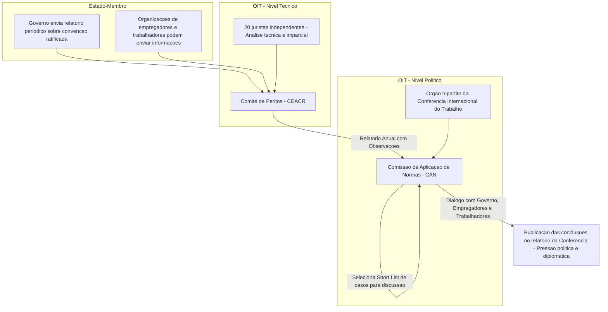

# O Direito Internacional do Trabalho e a OIT: Convenções, Supervisão e a Busca pela Justiça Social

## I. Fundamentos e Estrutura Singular da OIT: A Arquitetura da Justiça Social

A Organização Internacional do Trabalho (OIT) representa uma das mais duradouras e inovadoras experiências do multilateralismo. Sua relevância para o Direito Internacional Público e para as relações internacionais transcende o campo estritamente laboral, oferecendo um modelo único de governança global. Para o concursando da carreira diplomática, compreender a OIT não é apenas memorizar sua estrutura, mas analisar criticamente os pilares que garantem sua resiliência e legitimidade há mais de um século.

### A. Gênese Histórica e Mandato Constitucional

A OIT nasceu das cinzas da Primeira Guerra Mundial, sendo formalmente criada em 1919 pela Parte XIII do Tratado de Versalhes. Seu surgimento não foi um mero ato burocrático, mas uma resposta direta a um contexto de profundas agitações sociais, condições de trabalho desumanas e a crescente percepção de que a injustiça social era uma semente para conflitos internacionais. Os líderes da época, incluindo os redatores do tratado, reconheceram que a paz não poderia ser sustentada apenas por acordos políticos e territoriais entre Estados; ela exigia um fundamento social.

Essa convicção foi consagrada no preâmbulo da Constituição da OIT, que enuncia seu lema fundamental, considerado radical para a época: **"a paz universal e permanente só pode basear-se na justiça social"**. Essa máxima estabeleceu uma conexão causal direta e inédita no direito internacional entre as condições sociais internas de um país e a estabilidade do sistema internacional. A OIT foi, portanto, concebida como um instrumento para promover um mundo onde governos, empregadores e trabalhadores pudessem cooperar para construir essa paz duradoura.

A evolução institucional da OIT demonstra sua notável resiliência. Enquanto sua organização-mãe, a Liga das Nações, sucumbiu às pressões que levaram à Segunda Guerra Mundial, a OIT sobreviveu e, em 1946, tornou-se a primeira agência especializada do recém-criado sistema das Nações Unidas. Um momento crucial em sua consolidação foi a adoção da **Declaração de Filadélfia** em 1944, que foi anexada à sua Constituição e reafirmou seus princípios basilares para o mundo pós-guerra. A Declaração aprofundou o mandato da Organização com postulados como "o trabalho não é uma mercadoria", "a liberdade de expressão e de associação é uma condição indispensável para um progresso ininterrupto" e a célebre frase "a pobreza, em qualquer lugar, constitui um perigo para a prosperidade de todos". Esses princípios não são meras declarações de intenção; eles formam o núcleo filosófico e jurídico que orienta toda a ação normativa e de cooperação técnica da OIT.

### B. O Tripartismo como Pilar Institucional: A Singularidade da OIT

A característica mais distintiva e a principal fonte da força da OIT é sua **estrutura tripartite**. Em um sistema internacional tradicionalmente centrado nos Estados como únicos sujeitos plenos de direito, a OIT é a única agência da ONU que concede voz e voto a atores não estatais como parte integrante de sua estrutura de governança.

> [!definition] Estrutura Tripartite
> 
> A estrutura tripartite da OIT consiste na participação, em pé de igualdade, de representantes de governos, de organizações de empregadores e de organizações de trabalhadores em todos os seus órgãos decisórios. Esse diálogo social institucionalizado é o motor para a formulação de políticas e normas internacionais do trabalho.

O funcionamento prático do tripartismo é mais evidente na **Conferência Internacional do Trabalho**, o órgão máximo da OIT, que se reúne anualmente e funciona como uma espécie de "parlamento mundial do trabalho". Cada Estado-Membro envia uma delegação quadripartite, composta por:

- Dois delegados do governo;
    
- Um delegado representando os empregadores;
    
- Um delegado representando os trabalhadores.
    

O ponto crucial, que garante o equilíbrio de poder, é que cada um desses quatro delegados tem direito a voto independente sobre todas as questões submetidas à Conferência. Isso significa que os delegados dos trabalhadores de um país podem votar contra a posição de seu próprio governo, um mecanismo que assegura a autonomia dos grupos e a representação genuína de seus interesses.

Essa arquitetura tripartite permeia todos os órgãos principais da Organização:

1. **A Conferência Internacional do Trabalho:** Adota as convenções e recomendações, aprova o orçamento e serve como fórum global para a discussão de questões sociais e laborais.
    
2. **O Conselho de Administração:** É o órgão executivo. Define a agenda da OIT, adota o projeto de orçamento para submissão à Conferência e elege o Diretor-Geral. Sua composição também é tripartite.
    
3. **A Repartição Internacional do Trabalho (BIT):** Funciona como o secretariado permanente da Organização, responsável por atividades de pesquisa, administração e cooperação técnica, sob a supervisão do Conselho de Administração e a liderança do Diretor-Geral.
    

O tripartismo é mais do que uma mera curiosidade organizacional; é a chave para a legitimidade e a eficácia das normas da OIT. Ao envolver os próprios atores que serão responsáveis pela implementação das normas no nível nacional (governos, empresas e sindicatos) em sua criação, a OIT gera um consenso prévio. Uma convenção adotada em Genebra não é um texto estranho imposto por diplomatas; ela carrega consigo o selo de aprovação dos parceiros sociais. Isso confere às normas da OIT uma "aderência" política e uma relevância prática que muitos outros tratados internacionais não possuem, dificultando que um governo simplesmente ignore uma norma que seus próprios representantes de empregadores e trabalhadores ajudaram a construir. Essa legitimidade intrínseca é um fator fundamental que explica a longevidade e a influência contínua da Organização.

## II. A Arquitetura Normativa do Direito Internacional do Trabalho

A principal função da OIT é a produção de normas internacionais do trabalho, que servem como um guia para os países-membros na formulação de suas políticas e legislações. Essa produção normativa se manifesta principalmente em dois tipos de instrumentos: as Convenções e as Recomendações. A distinção entre eles é fundamental do ponto de vista do Direito Internacional Público e possui implicações diretas para as obrigações dos Estados.

### A. A Distinção Crucial: Convenções vs. Recomendações

Embora ambos os instrumentos possam tratar dos mesmos temas, sua natureza jurídica e suas consequências para os Estados-Membros são fundamentalmente diferentes.

> [!important] **A Distinção Fundamental**
> 
> - **Convenções:** São tratados internacionais multilaterais. Quando um país as ratifica, elas se tornam **juridicamente vinculantes** (_legally binding_). O Estado assume a obrigação de aplicar suas disposições na legislação e na prática nacionais e de se submeter ao sistema de supervisão da OIT.
>     
> - **Recomendações:** São instrumentos **não vinculantes** (_non-binding_). Elas não estão sujeitas à ratificação e servem como diretrizes ou guias para orientar a ação nacional. Muitas vezes, uma Recomendação complementa uma Convenção, oferecendo sugestões mais detalhadas sobre como implementá-la, ou aborda temas sobre os quais ainda não há consenso suficiente para a adoção de um tratado vinculante.
>     

Apesar dessa diferença, a Constituição da OIT (Artigo 19) estabelece uma obrigação comum para ambos os instrumentos. Todo Estado-Membro, independentemente de sua intenção de ratificar (no caso de uma Convenção) ou de seguir (no caso de uma Recomendação), tem a obrigação de, em um prazo de 12 a 18 meses, **submeter o instrumento à sua autoridade nacional competente** – geralmente o Poder Legislativo. O objetivo não é forçar a ratificação, mas garantir que haja um debate democrático interno sobre as normas recém-adotadas. Além disso, os Estados devem informar a OIT sobre as medidas tomadas a esse respeito e sobre o estado de sua legislação e prática em relação aos temas abordados, mesmo que não tenham ratificado a convenção em questão.

A tabela a seguir sintetiza as diferenças essenciais para fins de estudo estratégico:

|Característica|Convenções Internacionais do Trabalho|Recomendações|
|---|---|---|
|**Natureza Jurídica**|Tratado internacional multilateral|Instrumento não vinculante (guia/diretriz)|
|**Força Vinculante**|Juridicamente vinculante para os Estados que a ratificam|Nenhuma força vinculante|
|**Ato do Estado**|Sujeita à ratificação|Não é passível de ratificação|
|**Obrigação Principal**|Aplicar as normas na lei e na prática e submeter-se à supervisão|Considerar as diretrizes para a política nacional|
|**Função Principal**|Estabelecer padrões sociais mínimos e criar obrigações legais|Fornecer orientação detalhada, complementar uma convenção|
|**Exemplo**|Convenção nº 182 sobre as Piores Formas de Trabalho Infantil|Recomendação nº 190, que complementa a C. 182 com medidas práticas|

### B. As Convenções Fundamentais e a Declaração de 1998

Dentro do vasto corpo normativo da OIT, um conjunto de convenções adquiriu um status especial. Em 1998, em meio aos debates sobre a globalização e o temor de uma "corrida para o fundo" (_race to the bottom_) em matéria de direitos trabalhistas, a OIT adotou a **Declaração sobre os Princípios e Direitos Fundamentais no Trabalho**.

Este documento é um marco do constitucionalismo social internacional. Ele estabelece que todos os 187 Estados-Membros, **pelo simples fato de sua filiação à OIT**, têm a obrigação de respeitar, promover e realizar, de boa-fé, um conjunto de princípios fundamentais, mesmo que não tenham ratificado as convenções correspondentes. A Declaração funciona como um "piso social" mínimo, cujos princípios são considerados tão essenciais que sua obrigatoriedade deriva da própria Constituição da OIT e da Declaração de Filadélfia.

Originalmente, a Declaração consagrou quatro princípios, associados a oito convenções consideradas "fundamentais":

1. **A liberdade de associação e o reconhecimento efetivo do direito de negociação coletiva** (Convenções nº 87 e nº 98).
    
2. **A eliminação de todas as formas de trabalho forçado ou obrigatório** (Convenções nº 29 e nº 105).
    
3. **A abolição efetiva do trabalho infantil** (Convenções nº 138 e nº 182).
    
4. **A eliminação da discriminação em matéria de emprego e ocupação** (Convenções nº 100 e nº 111).
    

O Direito Internacional do Trabalho, no entanto, é dinâmico. Reconhecendo a evolução das preocupações globais, a Conferência Internacional do Trabalho, em junho de 2022, emendou a Declaração de 1998 para incluir **um ambiente de trabalho seguro e saudável** como o quinto princípio e direito fundamental no trabalho. A este novo princípio foram associadas as Convenções nº 155 (Segurança e Saúde dos Trabalhadores) e nº 187 (Quadro Promocional para a Segurança e Saúde no Trabalho).

A existência desses princípios fundamentais eleva o debate a um patamar superior. Eles funcionam, dentro do sistema da OIT, de maneira análoga ao conceito de _jus cogens_ (normas imperativas) no direito internacional geral. A obrigação de respeitá-los é devida a toda a comunidade de membros da OIT (_erga omnes partes_), e não apenas às partes de uma convenção específica. Isso confere aos órgãos de supervisão da OIT uma poderosa ferramenta, permitindo-lhes examinar a situação de um país em relação a, por exemplo, trabalho infantil ou discriminação, mesmo que esse país não tenha ratificado as convenções específicas sobre esses temas.

## III. O Sistema de Supervisão Normativa: A Garantia da Efetividade

A mera produção de normas, por mais avançadas que sejam, teria pouco valor sem mecanismos para monitorar sua aplicação. Nesse aspecto, a OIT se destaca por possuir um dos sistemas de supervisão mais robustos e eficazes do direito internacional. Sua força não reside em sanções militares ou econômicas, mas em um sofisticado processo que combina análise técnica, diálogo político e pressão reputacional. O sistema se divide em mecanismos regulares e mecanismos especiais.

### A. Os Mecanismos de Supervisão Regular (Regular System of Supervision)

Este é o sistema central e contínuo de monitoramento, baseado nos relatórios que os governos são obrigados a submeter periodicamente sobre a aplicação das convenções que ratificaram. O processo se desenrola em duas etapas principais, envolvendo dois órgãos distintos e complementares.

#### Etapa 1: O Comitê de Peritos na Aplicação de Convenções e Recomendações (CEACR)

O ponto de partida do sistema regular é o **Comitê de Peritos (CEACR)**. Este é um órgão independente, composto por 20 juristas de renome internacional, provenientes de diferentes sistemas jurídicos, econômicos e sociais. Seus membros são nomeados a título pessoal pelo Conselho de Administração e atuam com total independência e imparcialidade, não representando seus países de origem. O papel do CEACR é estritamente **técnico-jurídico**.

Sua função é examinar, à luz das convenções da OIT, os relatórios enviados pelos governos e os comentários apresentados por organizações de empregadores e de trabalhadores. O resultado de seu trabalho é um **relatório anual**, que contém dois tipos de comentários:

- **Observações:** Publicadas no relatório, tratam de discrepâncias mais graves ou persistentes entre a legislação ou prática de um país e as disposições de uma convenção ratificada.
    
- **Pedidos Diretos:** Não são publicados, mas enviados diretamente ao governo e às organizações sociais, tratando de questões mais técnicas ou solicitando informações adicionais.
    

O relatório do CEACR é a pedra angular do sistema de supervisão. Sua credibilidade técnica e imparcialidade tornam suas conclusões difíceis de serem descartadas como "politicamente motivadas", servindo de base para a etapa seguinte do processo.

#### Etapa 2: A Comissão de Aplicação de Normas da Conferência (CAN)

O relatório técnico do CEACR é então submetido à **Comissão de Aplicação de Normas da Conferência (CAN)**. Diferentemente do Comitê de Peritos, a CAN é um órgão **político e tripartite**, criado anualmente durante a Conferência Internacional do Trabalho. Ela é composta por representantes de governos, empregadores e trabalhadores.

A função da CAN é discutir publicamente o relatório do CEACR. Seu momento mais aguardado é a seleção e publicação de uma lista de cerca de 24 casos individuais (a chamada _"short list"_) para um exame aprofundado durante a Conferência. Os governos dos países incluídos nessa lista são convidados a comparecer perante a Comissão para prestar esclarecimentos, responder a perguntas e dialogar com os representantes dos grupos de empregadores e de trabalhadores. Essa discussão é pública e suas conclusões são incluídas no relatório final da Conferência. A inclusão de um país na "lista curta" é um evento de grande repercussão política e midiática, exercendo uma considerável pressão sobre o governo em questão para que ajuste sua conduta, um mecanismo frequentemente descrito como "mobilização da vergonha" (_mobilization of shame_).

### B. Diagrama do Fluxo de Supervisão Regular

O fluxograma abaixo ilustra a interação entre os níveis técnico e político do sistema de supervisão regular.

Snippet de código

### C. Os Mecanismos Especiais (Baseados em Queixas)

Além do sistema regular, a Constituição da OIT prevê procedimentos especiais que podem ser ativados por meio de queixas ou reclamações específicas.

1. **Reclamações (Artigo 24 da Constituição da OIT):** Este procedimento pode ser iniciado por uma **organização profissional de empregadores ou de trabalhadores** (nacional ou internacional) que alegue que um Estado-Membro não está assegurando de forma satisfatória a aplicação de uma convenção que tenha ratificado. A reclamação é examinada por um comitê tripartite do Conselho de Administração, que pode decidir torná-la pública junto com a eventual resposta do governo, gerando pressão política.
    
2. **Queixas (Artigo 26 da Constituição da OIT):** Este é o procedimento mais formal e solene do sistema da OIT. Uma queixa pode ser apresentada por um **Estado-Membro** contra outro Estado-Membro, por um **delegado à Conferência** ou pelo próprio **Conselho de Administração** _ex officio_. Se o assunto não for resolvido por vias diplomáticas, o Conselho de Administração pode estabelecer uma **Comissão de Inquérito**, o mais alto nível de investigação da OIT. O relatório de uma Comissão de Inquérito é um documento detalhado e contundente, e suas recomendações podem, em última instância, ser submetidas à apreciação da **Corte Internacional de Justiça**, cuja decisão é inapelável.
    

A eficácia do sistema de supervisão da OIT, portanto, não deriva da força, mas da persuasão. A combinação de uma análise jurídica imparcial (CEACR) com um debate político tripartite (CAN) transforma constatações técnicas em diálogo diplomático e pressão reputacional, criando fortes incentivos para que os Estados alinhem suas legislações e práticas com as obrigações internacionais que voluntariamente assumiram.

## IV. O Brasil na OIT: Protagonismo, Desafios e Casos Paradigmáticos

O Brasil possui uma relação histórica e complexa com a OIT. Como um dos países mais influentes do Sul Global, sua atuação na organização é um tema de alta relevância para a política externa brasileira.

### A. Um Ator Histórico e Relevante

A participação do Brasil na OIT remonta à sua fundação. O país é **membro fundador**, tendo participado da Conferência de Washington de 1919 que deu início aos trabalhos da Organização. Esse engajamento precoce se consolidou ao longo das décadas.

> [!note] Posição de Destaque na Governança
> 
> O Brasil ocupa um dos dez assentos não eletivos (permanentes) no Conselho de Administração da OIT, na qualidade de um dos "Estados de maior importância industrial". Essa posição confere ao país um papel de liderança contínua na definição da agenda e das políticas da Organização, um status compartilhado com potências como Estados Unidos, China, Rússia, Alemanha, Japão, entre outros.

Historicamente, o Brasil tem sido um ator ativo, ratificando um número expressivo de convenções (mais de 90 em vigor) e sediando, em 1950, o primeiro escritório de campo da OIT na América Latina. Mais recentemente, o país se destacou por seu protagonismo na **Cooperação Sul-Sul**, estabelecendo parcerias com a OIT para transferir boas práticas em áreas como o combate ao trabalho infantil e ao trabalho escravo para países da África e da América Latina.

### B. Status de Ratificação das Convenções Fundamentais pelo Brasil

O compromisso formal do Brasil com o "piso social" da OIT é robusto. O país ratificou quase todas as convenções fundamentais. No entanto, a análise desse status revela um dos pontos mais sensíveis e recorrentes do debate sobre a relação entre o direito brasileiro e as normas internacionais do trabalho.

A grande exceção é a **Convenção nº 87, sobre a Liberdade Sindical e a Proteção do Direito de Sindicalização**. A não ratificação deste instrumento é um tema clássico em provas de direito. A principal razão apontada pela doutrina e por sucessivos governos é a aparente incompatibilidade de suas disposições com o modelo sindical previsto no Artigo 8º da Constituição Federal de 1988. Enquanto a C. 87 prega a **pluralidade sindical** (a liberdade para trabalhadores e empregadores constituírem as organizações que julgarem convenientes, sem autorização prévia), a Constituição brasileira adota o princípio da **unicidade sindical** (a proibição da criação de mais de uma organização sindical, em qualquer grau, representativa de categoria profissional ou econômica, na mesma base territorial).

A tabela abaixo detalha o status de ratificação das dez convenções hoje consideradas fundamentais:

|Princípio Fundamental|Convenção|Status no Brasil|
|---|---|---|
|**Liberdade Sindical e Negociação Coletiva**|C. 87 - Liberdade Sindical (1948)|**Não Ratificada**|
||C. 98 - Negociação Coletiva (1949)|Ratificada|
|**Trabalho Forçado**|C. 29 - Trabalho Forçado (1930)|Ratificada|
||C. 105 - Abolição do Trabalho Forçado (1957)|Ratificada|
|**Trabalho Infantil**|C. 138 - Idade Mínima (1973)|Ratificada|
||C. 182 - Piores Formas de Trabalho Infantil (1999)|Ratificada|
|**Discriminação**|C. 100 - Igualdade de Remuneração (1951)|Ratificada|
||C. 111 - Discriminação (Emprego e Ocupação) (1958)|Ratificada|
|**Ambiente de Trabalho Seguro e Saudável**|C. 155 - Segurança e Saúde dos Trabalhadores (1981)|Ratificada|
||C. 187 - Quadro Promocional para a SST (2006)|Ratificada|

### C. Estudo de Caso (Foco CACD): A Reforma Trabalhista (Lei 13.467/2017) e a Supervisão da OIT

O caso da análise da reforma trabalhista brasileira pelos órgãos da OIT é um exemplo paradigmático de como o sistema de supervisão funciona na prática e das tensões inerentes à governança global. Ele ilustra perfeitamente a interação entre legislação doméstica, atores sociais, normas internacionais e os mecanismos de monitoramento.

- **As Alegações:** Logo após a promulgação da Lei nº 13.467/2017, centrais sindicais brasileiras apresentaram reclamações formais à OIT. O argumento central era que a nova legislação violava a **Convenção nº 98**, sobre o direito de organização e negociação coletiva, um tratado que o Brasil ratificou em 1952.
    
- **Os Pontos Críticos:** As críticas internacionais e domésticas se concentraram, principalmente, em dois aspectos da reforma:
    
    1. **A prevalência do "negociado sobre o legislado"**: A nova lei permitia que acordos coletivos prevalecessem sobre a legislação, mesmo para reduzir direitos. Os críticos argumentaram que isso subvertia a própria finalidade da negociação coletiva, que, segundo o espírito da C. 98, deve ser um instrumento para _melhorar_ as condições de trabalho, e não para rebaixá-las.
        
    2. **O enfraquecimento da ação coletiva**: A lei também introduziu a possibilidade de acordos individuais se sobreporem a convenções coletivas em certos casos e criou figuras como o "autônomo exclusivo", que, na prática, poderiam retirar trabalhadores da proteção de acordos coletivos e do escopo da representação sindical.
        
- **A Atuação dos Órgãos de Supervisão:** O sistema da OIT foi ativado em sua plenitude.
    
    - O **Comitê de Peritos (CEACR)**, em seu relatório anual de 2018, analisou as alegações e expressou sérias preocupações. Os peritos consideraram que a nova lei poderia, de fato, ser incompatível com as obrigações assumidas pelo Brasil ao ratificar a C. 98 e solicitaram ao governo que reexaminasse a legislação em consulta com os parceiros sociais.
        
    - Com base nesse relatório técnico, a **Comissão de Aplicação de Normas (CAN)**, em sua reunião de junho de 2018, tomou a medida de alto impacto político de incluir o **Brasil na "lista curta"** (_short list_) dos 24 casos mais graves a serem discutidos publicamente na Conferência.
        
- **Reação Brasileira e Desdobramentos:** A inclusão na lista gerou intensa repercussão no Brasil e no exterior. O governo brasileiro da época compareceu à CAN para defender a reforma, argumentando que ela modernizava as relações de trabalho e estava em conformidade com a Constituição. A delegação governamental também criticou o que considerou ser uma politização dos órgãos de supervisão, um argumento que evidencia a clássica tensão entre a defesa da soberania legislativa nacional e o cumprimento de obrigações internacionais. Independentemente do mérito das posições, o caso demonstrou cabalmente a capacidade do sistema da OIT de pautar o debate doméstico, mobilizar atores internacionais e colocar um país-membro sob os holofotes da comunidade internacional por suas políticas internas. É um microcosmo perfeito do funcionamento, dos desafios e da eficácia do Direito Internacional do Trabalho.
    

## V. Questões para Autoavaliação (Active Recall)

> [!question] Questão 1
> 
> Discorra criticamente sobre a afirmação de que a estrutura tripartite é o principal fator que explica a resiliência e a eficácia da OIT em comparação com outras organizações internacionais. Como essa estrutura influencia a legitimidade e a aplicação de suas normas?

> [!question] Questão 2
> 
> Analise o sistema de supervisão regular da OIT, contrastando o papel do Comitê de Peritos (CEACR) com o da Comissão de Aplicação de Normas da Conferência (CAN). Por que a interação entre esses dois órgãos é considerada a chave para a eficácia do sistema, mesmo na ausência de sanções coercitivas tradicionais?

> [!question] Questão 3
> 
> Com base no caso da análise da reforma trabalhista brasileira de 2017 pelos órgãos da OIT, explique como as normas internacionais do trabalho, especificamente a Convenção 98, podem impactar a soberania legislativa de um Estado-Membro. Quais os mecanismos que os atores domésticos e internacionais utilizaram nesse processo?
