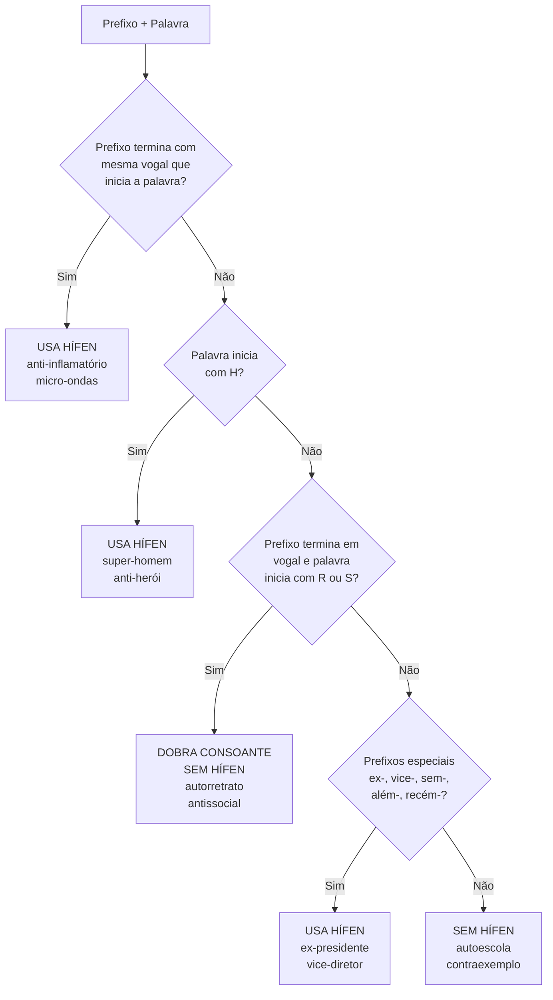
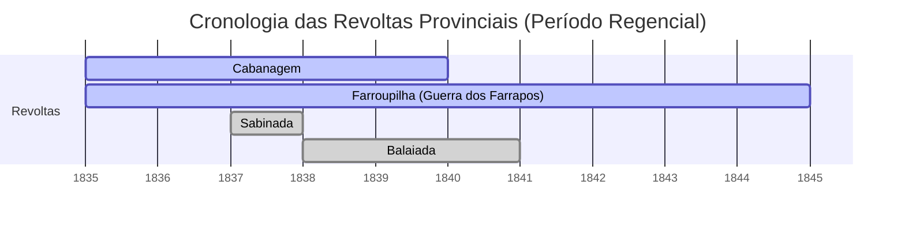

# Origem: _Edital e Documentos Oficiais

---
title: "Edital e Documentos Oficiais"
area: "GESTÃO & METADADOS"
subarea: "GESTÃO & METADADOS"
tags:
  - cacd-2025
  - edital-e-documentos-oficiais
  - gestao--metadados
---
CONTEÚDO PROGRAMÁTICO DO CACD 2025

LÍNGUA PORTUGUESA (Primeira e Segunda Fases):

1. Língua portuguesa: modalidade culta usada contemporaneamente no Brasil.  
    1.1 [[_Sistema gráfico (ortografia, acentuação, pontuação, legibilidade)|Sistema gráfico: ortografia, acentuação e pontuação; legibilidade.]]
    1.2 [[_Morfossintaxe|Morfossintaxe.]]
    1.3 [[_Semântica|Semântica.]] 
    1.4 [[_Vocabulário|Vocabulário.]]
    
2. Leitura e produção de textos.  
    2.1 Compreensão, interpretação e análise crítica de textos escritos em língua portuguesa.  
    [[_Conhecimentos de linguística, literatura e estilística|2.2 Conhecimentos de linguística, literatura e estilística]]: funções da linguagem; níveis de linguagem; variação linguística; gêneros e estilos textuais; textos literários e não literários; denotação e conotação; figuras de linguagem; estrutura textual.  
    2.3 Redação de textos dissertativos dotados de fundamentação conceitual e factual, consistência argumentativa, progressão temática e referencial, coerência, objetividade, precisão, clareza, concisão, coesão textual e correção gramatical.  
    [[_Defeitos de conteúdo (descontextualização, simplismo, etc.)|2.3.1 Defeitos de conteúdo: descontextualização, generalização, simplismo, obviedade, paráfrase, cópia, tautologia, contradição.]]
    [[_Vícios de linguagem e estilo (coloquialismo, rebuscamento, etc.)|2.3.2 Vícios de linguagem e estilo: ruptura de registro linguístico, coloquialismo, barbarismo, anacronismo, rebuscamento, redundância e linguagem estereotipada.]]
    

LÍNGUA INGLESA (Primeira e Segunda Fases):

Primeira Fase:

1. Compreensão de textos escritos em língua inglesa.
    
2. Itens gramaticais relevantes para compreensão dos conteúdos semânticos.
    

Segunda Fase:

1. Redação em língua inglesa: expressão em nível avançado; domínio da gramática; qualidade e propriedade no emprego da linguagem; organização e desenvolvimento de ideias.
    
2. Tradução do Inglês para o Português: fidelidade ao texto-fonte; respeito à qualidade e ao registro do texto-fonte; correção morfossintática e lexical.
    

HISTÓRIA DO BRASIL (Primeira e Segunda Fases):

1. O período colonial.  
    [[_A configuração territorial da América Portuguesa|1.1 A configuração territorial da América Portuguesa.]]
    [[_As dimensões econômicas e sociais da América Portuguesa|1.2 As dimensões econômicas e sociais da América Portuguesa.]]
    
2. O processo de independência.  
    [[_Movimentos emancipacionistas|2.1 Movimentos emancipacionistas.]] 
    [[_A situação política e econômica europeia|2.2 A situação política e econômica europeia.]]
    [[_O Brasil sede do Estado monárquico português|2.3 O Brasil sede do Estado monárquico português.]]  
    [[_O Constitucionalismo português e a independência do Brasil|2.4 O Constitucionalismo português e a independência do Brasil.]]
    [[_A influência das ideias liberais e sua repercussão no Brasil|2.5 A influência das ideias liberais e sua repercussão no Brasil.]]
    
3. O Primeiro Reinado (1822-1831).  
    [[_A Constituição de 1824|3.1 A Constituição de 1824.]]
    [[_Quadro político interno|3.2 Quadro político interno.]]
    [[_Política exterior do Primeiro Reinado|3.3 Política exterior do Primeiro Reinado.]]
    
4. [[4_A Regência (1831-1840)|A Regência (1831-1840)]].  
    [[_reformas institucionais|4.1 Centralização versus descentralização: reformas institucionais.]]
    [[_O Ato Adicional de 1834 e revoltas provinciais|4.2 O Ato Adicional de 1834 e revoltas provinciais.]]
    [[_A dimensão externa|4.3 A dimensão externa.]]
    
5. O Segundo Reinado (1840-1889).  
    [[_O Estado centralizado, mudanças institucionais, partidos e sistema eleitoral|5.1 O Estado centralizado; mudanças institucionais; os partidos políticos e o sistema eleitoral; a questão da unidade territorial.]]  
    [[_Política externa (relações com Europa, EUA, Reino Unido, Guerra do Paraguai)|5.2 Política externa: as relações com a Europa e os Estados Unidos da América; questões com o Reino Unido; a Guerra do Paraguai.]]
    [[_A questão da escravidão|5.3 A questão da escravidão.]]
    [[_Crise do Estado Monárquico|5.4 Crise do Estado Monárquico.]]
    [[03 - HISTÓRIA DO BRASIL/05 - O Segundo Reinado (1840-1889)/5.5 - Sociedade e cultura/_Sociedade e cultura|5.5 Sociedade e cultura: população, estrutura social, vida acadêmica, científica e literária.]]
    [[_Economia (agroexportação, políticas, etc.)|5.6 Economia: a agroexportação; a expansão econômica e o trabalho assalariado; as políticas econômico-financeiras; a política alfandegária e suas consequências.]]
    
6. A Primeira República (1889-1930).  
    [[_A proclamação da República e os governos militares|6.1 A proclamação da República e os governos militares.]]
    [[_A Constituição de 1891|6.2 A Constituição de 1891.]]
    [[_O regime oligárquico (política dos estados, coronelismo, etc.)|6.3 O regime oligárquico: a "política dos estados"; coronelismo; sistema eleitoral; sistema partidário; a hegemonia de São Paulo e Minas Gerais.]]
    [[_A economia agroexportadora|6.4 A economia agroexportadora.]]
    [[_A política externa (Rio Branco, Haia, 1ª GM, Liga das Nações)|6.5 A política externa: a obra de Rio Branco;]]; [[_a II Conferência de Paz da Haia (1907); o Brasil e a Grande Guerra de 1914; o Brasil na Liga das Nações.|a II Conferência de Paz da Haia (1907); o Brasil e a Grande Guerra de 1914; o Brasil na Liga das Nações.]] 
    [[03 - HISTÓRIA DO BRASIL/06 - A Primeira República (1889-1930)/6.6 - Sociedade e cultura - O Modernismo/_O Modernismo|6.6 Sociedade e cultura: o Modernismo.]]
    [[_A crise dos anos 20 do século XX (tenentismo e revoltas)|6.7 A crise dos anos 20 do século XX: tenentismo e revoltas.]]
    [[_A Revolução de 1930|6.8 A Revolução de 1930.]]
    
7. A Era Vargas (1930-1945).  
    [[_O processo político e o quadro econômico-financeiro|7.1 O processo político e o quadro econômico financeiro.]]
    [[_A Constituição de 1934|7.2 A Constituição de 1934.]]
    [[_A Constituição de 1937 - o Estado Novo.|7.3 A Constituição de 1937: o Estado Novo.]]
    [[_O contexto internacional dos anos 1930 e 1940, o Brasil e a 2ª GM|7.4 O contexto internacional dos anos 1930 e 1940; o Brasil e a Segunda Guerra Mundial.]] 
    [[_Industrialização e legislação trabalhista|7.5 Industrialização e legislação trabalhista.]]
    [[03 - HISTÓRIA DO BRASIL/07 - A Era Vargas (1930-1945)/7.6 - Sociedade e cultura/_Sociedade e cultura|7.6 Sociedade e cultura.]]
    
8. A República Liberal (1945-1964).  
    [[_A nova ordem política (partidos, eleições, Constituição de 1946)|8.1 A nova ordem política: os partidos políticos e eleições; a Constituição de 1946.]] 
    [[_Industrialização e urbanização|8.2 Industrialização e urbanização.]]
    [[_Política externa (relações com os EUA, Guerra Fria, OPA, PEI, etc.)|8.3 Política externa: relações com os EUA; a Guerra Fria; a Operação Pan-Americana; a “política externa independente”; o Brasil na ONU; o Brasil no Rio da Prata; o Brasil e a suspensão de Cuba na OEA.]]
    [[03 - HISTÓRIA DO BRASIL/08 - A República Liberal (1945-1964)/8.4 - Sociedade e cultura/_Sociedade e cultura|8.4 Sociedade e cultura.]]
    
9. O Regime Militar (1964-1985).  
    [[_A Constituição de 1967 e as modificações de 1969|9.1 A Constituição de 1967 e as modificações de 1969.]]
    [[_A economia|9.2 A economia.]]
    [[_Política externa (relações com os EUA, pragmatismo responsável, etc.)|9.3 Política externa: relações com os EUA; o “pragmatismo responsável”; relações com a América Latina, relações com a África; o Brasil na ONU.]] 
	     a) Política externa: relações com os EUA
	     b) o “pragmatismo responsável”
	     c) relações com a América Latina
	     d)  relações com a África
	     e) o Brasil na ONU.
	      
    [[03 - HISTÓRIA DO BRASIL/09 - O Regime Militar (1964-1985)/9.4 - Sociedade e cultura/_Sociedade e cultura|9.4 Sociedade e cultura.]]
    [[_O processo de transição política|9.5 O processo de transição política.]]
    
10. O processo democrático a partir de 1985.  
    [[_A Constituição de 1988|10.1 A Constituição de 1988.]]
    10.2 [[_Partidos políticos e eleições|Partidos políticos e eleições.]]
    [[_Transformações econômicas|10.3 Transformações econômicas.]] 
    [[_Impactos da globalização|10.4 Impactos da globalização.]]
    [[_Mudanças sociais|10.5 Mudanças sociais.]]
    10.6 Manifestações culturais.  
    [[_Evolução da política externa|10.7 Evolução da política externa.]]
    [[_MERCOSUL|10.8 MERCOSUL.]]
    [[_O Brasil na ONU|10.9 O Brasil na ONU.]]
    
11. [[_Impactos tecnológicos e digitais no século XXI|Os impactos tecnológicos e digitais nas transformações políticas e sociais do Brasil no século XXI.]]
    

HISTÓRIA MUNDIAL (Primeira Fase):

1. Estruturas e ideias econômicas.  
    1.1 [[_Da Revolução Industrial ao capitalismo organizado|Da Revolução Industrial ao capitalismo organizado]]: séculos XVIII a XX.  
    1.2 [[_Fases do desenvolvimento capitalista (desde 1780)|Características gerais e principais fases do desenvolvimento capitalista (desde aproximadamente 1780).]] 
    1.3 [[_Principais ideias econômicas (Fisiocracia ao Liberalismo)|Principais ideias econômicas: da Fisiocracia ao Liberalismo.]]
    1.4 [[_Marxismo|Marxismo.]]
    1.5 [[_As crises e os mecanismos anticrise (Crise de 1929 e New Deal)|As crises e os mecanismos anticrise: a Crise de 1929 e o New Deal.]]
    1.6 [[_A prosperidade no segundo pós-guerra|A prosperidade no segundo pós-guerra.]]
    1.7 [[_Estado de bem-estar social (Welfare State) e sua crise|Estado de bem-estar social (Welfare State) e sua crise.]]
    1.8 [[_O Pós-Fordismo e a acumulação flexível|O Pós-Fordismo e a acumulação flexível.]]
    
2. Revoluções.  
    [[_A Revolução Francesa e as revoluções burguesas|2.1 A Revolução Francesa e as revoluções burguesas.]]
    [[_Processos de independência na América|2.2 Processos de independência na América.]]
    [[_Conceitos e características gerais das revoluções contemporâneas|2.3 Conceitos e características gerais das revoluções contemporâneas.]] 
    [[_Anarquismo|2.4 Anarquismo.]]
    [[_Socialismo|2.5 Socialismo.]]
    [[_Revoluções no século XX (Rússia e China)|2.6 Revoluções no século XX: Rússia e China.]]
	    - Rússia
	    - China
    [[_Revoluções na América Latina (México e Cuba)|2.7 Revoluções na América Latina: os casos do México e de Cuba.]]
    
3. As relações internacionais.  
    [[_Modelos e interpretações|3.1 Modelos e interpretações.]]
    [[_O Concerto Europeu e sua crise (1815-1918)|3.2 O Concerto Europeu e sua crise (1815-1918).]] 
	- [[Unificação Alemã e Consequências]]
    3.3 [[_As rivalidades coloniais|As rivalidades coloniais.]]
    3.4 [[_Causas da Primeira Guerra Mundial|Causas da Primeira Guerra Mundial.]]
    3.5 [[_Os 14 pontos de Wilson|Os 14 pontos de Wilson.]]
    [[_A Paz de Versalhes e a ordem mundial resultante (1919-1939)|3.6 A Paz de Versalhes e a ordem mundial resultante (1919-1939).]]
    [[_A Liga das Nações|3.7 A Liga das Nações.]]
    [[_As causas da Segunda Guerra Mundial|3.8 As causas da Segunda Guerra Mundial.]]
    [[_Conferências (Moscou, Teerã, Ialta, Potsdam, São Francisco)|3.9 As conferências de Moscou, Teerã, Ialta, Potsdam e São Francisco e a ordem mundial decorrente.]]
    [[_Bretton Woods|3.10 Bretton Woods.]]
    [[_O Plano Marshall|3.11 O Plano Marshall.]]
    [[_A Organização das Nações Unidas|3.12 A Organização das Nações Unidas.]]
    [[_a noção de bipolaridade (Truman a Nixon)|3.13 A Guerra Fria: a noção de bipolaridade (de Truman a Nixon).]]  
    3.14 [[_Os conflitos localizados|Os conflitos localizados.]]
    [[_A 'détente'|3.15 A “détente”.]]
    [[_A 'segunda Guerra Fria' (Reagan-Bush)|3.16 A “segunda Guerra Fria” (Reagan-Bush).]]
    [[_A crise e a desagregação do bloco soviético|3.17 A crise e a desagregação do bloco soviético.]]
    
4. Colonialismo, imperialismo, políticas de dominação.  
    [[_O fim do colonialismo do Antigo Regime|4.1 O fim do colonialismo do Antigo Regime.]]
    [[_A nova expansão europeia|4.2 A nova expansão europeia.]]
    [[_Debates sobre a natureza do Imperialismo|4.3 Os debates acerca da natureza do Imperialismo.]]
    [[_A partilha da África e da Ásia|4.4 A partilha da África e da Ásia.]]
    [[_Dominação e reação na Índia, China e Japão|4.5 O processo de dominação e a reação na Índia, China e Japão.]]
    [[_A descolonização|4.6 A descolonização.]]
    [[_A Conferência de Bandung|4.7 A Conferência de Bandung.]]
    [[_O Não Alinhamento|4.8 O Não Alinhamento.]]
    [[_O conceito de Terceiro Mundo|4.9 O conceito de Terceiro Mundo.]]
    
5. A evolução política e econômica nas Américas.  
    [[_A expansão territorial nos EUA|5.1 A expansão territorial nos EUA.]]
    [[_A Guerra de Secessão|5.2 A Guerra de Secessão.]] 
    [[_Constituição de identidades nacionais e Estados na América Latina|5.3 A constituição das identidades nacionais e dos Estados na América Latina; militarismo e caudilhismo.]]
    [[_A doutrina Monroe e sua aplicação|5.4 A doutrina Monroe e sua aplicação; a política externa dos EUA na América Latina.]]
    [[_O Pan-Americanismo|5.5 O Pan-Americanismo.]]
    [[_A OEA e o Tratado do Rio de Janeiro|5.6 A OEA e o Tratado do Rio de Janeiro.]]
    [[_As experiências de integração nas Américas|5.7 As experiências de integração nas Américas.]]
    
6. Ideias e regimes políticos.  
    [[_Correntes ideológicas do século XIX (liberalismo e nacionalismo)|6.1 Grandes correntes ideológicas da política no século XIX: liberalismo e nacionalismo.]] 
    [[_A construção dos Estados nacionais (Alemanha e Itália)|6.2 A construção dos Estados nacionais: os casos da Alemanha e da Itália.]]
    [[_Correntes ideológicas do século XX (democracia, fascismo, comunismo)|6.3 Grandes correntes ideológicas da política no século XX: democracia, fascismo, comunismo.]]
    [[_Ditaduras e regimes fascistas|6.4 Ditaduras e regimes fascistas.]]
    [[_O novo nacionalismo e o fundamentalismo contemporâneo|6.5 O novo nacionalismo e a questão do fundamentalismo contemporâneo.]]
    [[_O liberalismo no século XX|6.6 O liberalismo no século XX.]]
    
7. A vida cultural.  
    [[_O movimento romântico|7.1 O movimento romântico.]]
    [[_A cultura do imperialismo|7.2 A cultura do imperialismo.]] 
    [[_As vanguardas europeias|7.3 As vanguardas europeias.]]
    [[04 - HISTÓRIA MUNDIAL/07 - A vida cultural/7.4 - O modernismo/_O modernismo|7.4 O modernismo.]]
    [[_A pós-modernidade|7.5 A pós-modernidade.]]
    
8. [[_Novos paradigmas digitais, redes sociais e ferramentas tecnológicas|As relações internacionais no século XXI frente aos novos paradigmas digitais, as redes sociais e as modernas ferramentas tecnológicas de comunicação.]]
    

POLÍTICA INTERNACIONAL (Primeira e Segunda Fases):

1. [[_Conceitos, atores, processos e instituições|Relações internacionais: conceitos básicos, atores, processos, instituições e principais paradigmas teóricos.]]
    
2. [[_A política externa brasileira (desde 1945)|A política externa brasileira: evolução desde 1945, principais vertentes e linhas de ação.]]
    
3. [[_Brasil e América do Sul (Integração, MERCOSUL)|O Brasil e a América do Sul.]]
    3.1 [[Integração na América do Sul.]]
    3.2 [[O MERCOSUL - origens do processo de integração no Cone Sul.|O MERCOSUL: origens do processo de integração no Cone Sul.]]
    3.3 [[Objetivos, características e estágio atual de integração.]]
    3.4 [[Integração Sul-Americana além do Comércio|As iniciativas de integração física, energética, política, econômica e de defesa na América do Sul.]]
    
4. [[_Argentina (política externa e relações com o Brasil)|Argentina: política externa e relações com o Brasil.]]
    
5. [[_Relações do Brasil com os demais países do hemisfério|Relações do Brasil com os demais países do hemisfério.]]
    
6. [[_EUA (política externa e relações com o Brasil)|Estados Unidos da América: política externa e relações com o Brasil.]]
    
7. [[_União Europeia (origens, evolução, relações com o Brasil)|União Europeia: origens, evolução histórica, estrutura e funcionamento, situação atual, política externa e relações com o Brasil.]]
    
8. [[_Rússia (política externa e relações com o Brasil)|Rússia: política externa e relações com o Brasil.]]
    
9. [[_África (política externa e relações com o Brasil)|África: política externa e relações com o Brasil.]]
    
10. O Brasil e a Ásia.  
    10.1 [[_O Brasil e a Ásia (China, Índia, Japão)|China, Índia e Japão: políticas externas e relações com o Brasil.]].
    
11. O Brasil e o Oriente Médio.  
    [[_A questão israelo-palestina.|11.1 A questão israelo-palestina.]]
    11.2 [[Síria, Iraque, Irã e outras situações nacionais relevantes.]]
    
12. [[_A Comunidade dos Países de Língua Portuguesa (CPLP)|A Comunidade dos Países de Língua Portuguesa.]]
    
13. O Brasil e a agenda internacional:  
    13.1 [[_Multilateralismo (ONU, conferências)|O multilateralismo de dimensão universal: a ONU; as conferências internacionais; os órgãos multilaterais.]]
    13.2 [[_Desenvolvimento e desenvolvimento sustentável|Desenvolvimento e desenvolvimento sustentável.]]
    13.3 [[_Pobreza, insegurança alimentar e fome|Pobreza, insegurança alimentar e fome. Ações de combate à fome.]]
    13.4 [[_Meio ambiente|Meio ambiente.]]
    13.5 [[_Mar, espaço e Antártida|Mar, espaço e Antártida.]] 
		- [[_Espaço|Espaço]]
		- [[_Mar|Mar]]
		- Antártida
    13.6 [[_Direitos humanos e políticas de identidade|Direitos humanos e políticas de identidade]]: gênero, raça e religião como vetores da política mundial.
		- [[Questão de Gênero na Política Mundial|Questão das mulheres]].
		- [[Questão das raças.|Questão das raças]].
		- [[Religião como vetores da política mundial.]]
    13.7 [[_Migrações internacionais, refugiados e apátridas|Migrações internacionais, migrantes, refugiados e apátridas.]]
    13.8 [[_Comércio internacional, OMC e cadeias globais de suprimento|Comércio internacional, Organização Mundial do Comércio (OMC) e cadeias globais de suprimento.]]
    13.9 [[_Sistema financeiro internacional|Sistema financeiro internacional.]]
    [[_Desarmamento e não proliferação|13.10 Desarmamento e não proliferação.]]
    [[_Crimes de guerra e crimes contra a humanidade (genocídio, TPI)|13.11 Crimes de guerra e crimes contra a humanidade: genocídio, holocausto e o Tribunal Penal Internacional.]]
    13.12 [[_Terrorismo|Terrorismo.]]
    13.13 [[_Narcotráfico, crime transnacional e crimes cibernéticos|Narcotráfico, crime transnacional e crimes cibernéticos de alcance global.]]
		2. Crimes Cibernéticos e lavagem de dinheiro
    13.14 [[_Reforma das Nações Unidas|Reforma das Nações Unidas.]]
    [[_Operações de paz das Nações Unidas|13.15 Operações de paz das Nações Unidas.]]
    
15. O Brasil e o sistema interamericano.  
    [[14.1_Organização dos Estados Americanos (OEA)|14.1 A Organização dos Estados Americanos.]]
    
16. [[_Formação de blocos econômicos e acordos comerciais|O Brasil e a formação dos blocos econômicos, a negociação de acordos comerciais e a promoção comercial.]]
    
17. [[_A dimensão da segurança na política exterior do Brasil|A dimensão da segurança na política exterior do Brasil.]]
    
18. [[_O Brasil e as coalizões internacionais (G-20, IBAS, BRICS)|O Brasil e as coalizões internacionais: o G-20, o IBAS e o BRICS.]]
	1. [[_G-20|G-20]]
	2. [[_IBAS|IBAS]]
	3. [[_BRICS|BRICS]]
    
19. [[_O Brasil e a cooperação Sul-Sul|O Brasil e a cooperação Sul-Sul.]]
    
20. [[_Cooperação e a diplomacia da saúde|Cooperação e a diplomacia da saúde.]]
    

GEOGRAFIA (Primeira e Segunda Fases):

1. História da Geografia.  
    [[_Expansão colonial e pensamento geográfico|1.1 Expansão colonial e pensamento geográfico.]]
    [[_A Geografia moderna e a questão nacional na Europa|1.2 A Geografia moderna e a questão nacional na Europa.]]
    [[_As principais correntes teóricas da Geografia|1.3 As principais correntes teóricas da Geografia.]]
    
2. A [[_A Geografia da população.|Geografia da população.]].  
    [[_Distribuição espacial da população (Brasil e mundo)|2.1 Distribuição espacial da população no Brasil e no mundo.]]
    [[_Os grandes movimentos migratórios|2.2 Os grandes movimentos migratórios internacionais e intranacionais.]]
    [[_Dinâmica populacional e indicadores de qualidade de vida|2.3 Dinâmica populacional e indicadores da qualidade de vida das populações.]]
    
3. Geografia econômica.  
    [[_Globalização e divisão internacional do trabalho|3.1 Globalização e divisão internacional do trabalho.]]
    [[_Formação e estrutura dos blocos econômicos|3.2 Formação e estrutura dos blocos econômicos internacionais.]]
    [[_Energia, logística e reordenamento territorial pós-fordista|3.3 Energia, logística e reordenamento territorial pós-fordista.]]
    [[_Disparidades regionais e planejamento no Brasil|3.4 Disparidades regionais e planejamento no Brasil.]]
    
4. Geografia Agrária.  
    [[_Distribuição geográfica da agricultura e pecuária|4.1 Distribuição geográfica da agricultura e pecuária mundiais.]]
    [[_Estruturação e funcionamento do agronegócio|4.2 Estruturação e funcionamento do agronegócio no Brasil e no mundo.]]
    [[_Estrutura fundiária, uso da terra e relações de produção no campo|4.3 Estrutura fundiária, uso da terra e relações de produção no campo brasileiro.]]
    
5. Geografia Urbana.  
    [[_Processo de urbanização e formação de redes de cidades|5.1 Processo de urbanização e formação de redes de cidades.]]
    [[_Conurbação, metropolização e cidades-mundiais|5.2 Conurbação, metropolização e cidades-mundiais.]] 
    [[_Dinâmica intraurbana das metrópoles brasileiras|5.3 Dinâmica intraurbana das metrópoles brasileiras.]]
    [[_O papel das cidades médias na modernização do Brasil|5.4 O papel das cidades médias na modernização do Brasil.]]
    
6. Geografia política.  
    [[_Teorias geopolíticas e poder mundial|6.1 Teorias geopolíticas e poder mundial.]]
    6.2 [[_Temas clássicos (fronteiras, apropriação do espaço)|Temas clássicos da geografia política: as fronteiras e as formas de apropriação política do espaço.]]
    6.3 [[_Estrutura fundiária, uso da terra e relações de produção no campo|Relações Estado e território.]]
    
7. Geografia e gestão ambiental.  
    [[_O meio ambiente nas relações internacionais|7.1 O meio ambiente nas relações internacionais: questões conceituais e institucionais.]]
    [[_Macrodivisão natural do espaço brasileiro (biomas, domínios)|7.2 Macrodivisão natural do espaço brasileiro: biomas, domínios e ecossistemas.]] 
    [[_Política e gestão ambiental no Brasil|7.3 Política e gestão ambiental no Brasil.]]
    

ECONOMIA (Primeira e Segunda Fases):

1. Microeconomia.  
    [[_Demanda do Consumidor (Preferências, Equilíbrio, Curva, Elasticidade)|1.1 Demanda do Consumidor.]]
    1.1.1 [[1.1.1 Preferências.|Preferências.]]
    1.1.2 Equilíbrio do consumidor.  
    1.1.3 Curva de demanda.  
    1.1.4 Elasticidade-preço e elasticidade-renda.  
    [[_Oferta do Produtor (Fatores, Função, Elasticidade)|1.2 Oferta do Produtor.]]
    1.2.1 Fatores de produção.  
    1.2.2 Função de produção.  
    1.2.3 Elasticidade-preço da oferta.  
    [[_Tipos de Mercados e de bens (Concorrência, Monopólio, Bens Públicos, etc.)|1.3 Tipos de Mercados e de bens.]]
    1.3.1 Concorrência perfeita, monopólio e oligopólio.  
    1.3.2 Determinação de preços e quantidades de equilíbrio.  
    1.3.3 Tipos de bens.  
    1.3.4 Bens públicos.  
    1.3.5 Bens rivais.  
    1.3.6 Recursos comuns e Bens comuns.  
    1.3.7 Externalidades.
    
2. Macroeconomia.  
    2.1 [[_Contabilidade Nacional (Renda, Produto, Agregados)|Contabilidade Nacional.]]
    2.1.1 Os conceitos de renda e produto.  
    2.1.2 [[2.1.2 Teorias clássica e keynesiana de determinação da renda.|Teorias clássica e keynesiana de determinação da renda.]]
    2.1.3 Oferta e demanda agregadas.  
    2.1.4 Agregados macroeconômicos: identidades básicas das contas nacionais.  
    2.2 [[_Contas externas (Balanço de Pagamentos, Liquidez, Solvência)|Contas externas.]]
    2.2.1 Os conceitos de déficit e superávit nas contas externas.  
    2.2.2 Balanço de pagamentos: a conta de transações correntes, a conta de capital e financeira.  
    2.2.3 [[2.2.3 Indicadores de Liquidez Externa.|Indicadores de Liquidez Externa.]]
    2.2.4 [[2.2.4 Indicadores de Solvência Externa.|Indicadores de Solvência Externa.]]
    2.3 [[_Economia do Setor Público e Política Fiscal|Economia do Setor Público e Política Fiscal.]]
    2.3.1 Gastos e receitas do governo.  
    2.3.2 [[2.3.2 Política orçamentária e equilíbrio orçamentário.|Política orçamentária e equilíbrio orçamentário.]] 
    2.3.3 Conceitos de superávit e déficit público.  
    2.3.4 [[Abordagem Ricardiana da Dívida Pública.]]
    2.3.5 Endividamento e responsabilidade fiscal.  
    2.3.6 Papel do Governo.  
    2.3.7 Objetivos e instrumentos de política fiscal.  
    2.3.8 Efeitos fiscais sobre a política monetária.  
    2.3.9 Consumo, investimento, poupança e gasto do governo.  
    2.4 [[_O modelo IS-LM-BP|O modelo IS-LM-BP.]]
    [[_Teoria e Política monetária|2.5 Teoria e Política monetária.]]
    2.5.1 [[2.5.1 Funções da moeda.|Funções da moeda.]]
    2.5.2 [[2.5.2 Criação e distribuição de moeda.|Criação e distribuição de moeda.]]
    2.5.3 [[2.5.3 Oferta da moeda e mecanismos de controle.|Oferta da moeda e mecanismos de controle.]]
    2.5.4 [[2.5.4 Procura da moeda.|Procura da moeda.]]
    2.5.5 [[2.5.5 Tipos de Inflação.|Tipos de Inflação.]]
    2.5.6 [[2.5.6 Moeda e preços no longo prazo.|Moeda e preços no longo prazo.]]
    2.5.7 [[2.5.7 Teoria Quantitativa da Moeda.|Teoria Quantitativa da Moeda.]]
    2.6 [[_Política Monetária (Papel do BC, Instrumentos, Inflação)|Política Monetária.]]
    2.6.1 Papel do Banco Central.  
    2.6.2 Objetivos e instrumentos de política monetária.  
    2.6.3 Inflação e Taxa de Juros.  
    2.6.4 [[_Política Monetária Não Convencional|Política Monetária Não Convencional.]]
    2.6.5 [[2.6.5 Conceitos Básicos da Regulação e Supervisão do Sistema bancário, financeiro e do Mercado de Capitais.|Conceitos Básicos da Regulação e Supervisão do Sistema bancário, financeiro e do Mercado de Capitais.]] 
    2.7 [[_Crescimento e Desenvolvimento Econômico|Crescimento e Desenvolvimento Econômico.]]
    2.7.1 Teorias de Crescimento Econômico.  
    2.7.2 O papel da inovação no crescimento econômico: [[_Os modelos Solow e Schumpeteriano|Os modelos Solow e Schumpeteriano]].  
    2.8 [[_Emprego e renda (Desemprego, Lei de Okun)|Emprego e renda]]
    2.8.1 [[_Emprego e renda (Desemprego, Lei de Okun)|Conceito de Desemprego.]]
    2.8.2 [[_Emprego e renda (Desemprego, Lei de Okun)|Tipos de Desemprego.]]
    2.8.3 [[_Emprego e renda (Desemprego, Lei de Okun)|Determinação do nível de emprego.]]  
    2.8.4 [[_Emprego e renda (Desemprego, Lei de Okun)|Indicadores do mercado de trabalho.]]
    2.8.5 [[_Emprego e renda (Desemprego, Lei de Okun)|Lei de Okun.]]
    
3. Economia internacional.  
    3.1 [[3.1_Teorias de Comércio.|Teorias de Comércio.]]
    3.1.1 [[3.1_Teorias de Comércio.|Teorias clássicas, Neoclássicas e contemporâneas do comércio internacional.]]
    3.1.2 [[3.1.2_O comércio intra-firma e intra-setorial.|O comércio intra-firma e intra-setorial.]]
    3.1.3 [[3.1.3_O papel das economias de escala e da concorrência imperfeita para o comércio internacional.|O papel das economias de escala e da concorrência imperfeita para o comércio internacional.]]
    3.1.4 [[3.1.4 A crítica de Prebisch e da Cepal.|A crítica de Prebisch e da Cepal.]]
    3.1.5 Deterioração dos termos de troca.  
    3.2 Macroeconomia aberta.  
    3.2.1 [[3.2.1 Os fluxos internacionais de bens, capitais e serviços.|Os fluxos internacionais de bens, capitais e serviços.]]
    3.2.2 [[3.2.4_Determinantes da Política Cambial.|Regimes de câmbio.]] 
    3.2.3 [[3.2.4_Determinantes da Política Cambial.|Taxa de câmbio nominal e real.]]
    3.2.4 [[3.2.4_Determinantes da Política Cambial.|Determinantes da Política Cambial.]]
    3.2.5 [[3.2.5 A relação poupança externa-crescimento econômico.|A relação poupança externa-crescimento econômico.]]  
    3.2.6 [[3.2.6 A relação câmbio-juros-inflação.|A relação câmbio-juros-inflação.]] 
    [[_Efeitos de tarifas, quotas, subsídios e outros instrumentos|3.3 Efeitos de tarifas, quotas, subsídios e outros instrumentos de política comercial.]]
    
4. História econômica brasileira.  
    4.1 [[_A economia brasileira no Século XIX|A economia brasileira no Século XIX.]]
    4.1.1 A economia cafeeira.  
    [[_Primeira República|4.2 Primeira República.]]
    4.2.1 Políticas econômicas e evolução da economia brasileira.  
    4.2.2 Crescimento industrial.  
    4.2.3 Políticas de valorização do café.  
    [[_A Industrialização Brasileira no Período 1930-1945 (ISI)|4.3 A Industrialização Brasileira no Período 1930-1945.]]
    4.3.1 O Modelo de Industrialização por Substituição de Importações (ISI)  
    4.3.2 Falhas e Críticas ao Modelo de ISI.  
    [[_A década de 1950 (Plano SALTE, Plano de Metas)|4.4 A década de 1950.]]
    [[_Plano Salte|4.4.1 O Plano SALTE.]]
    [[4.4.2 O Plano de Metas.]]
    4.4.3 O pós-guerra e a Nova Fase de Industrialização.  
    [[_O Período 1962-1967 (Plano Trienal, PAEG)|4.5 O Período 1962-1967.]]
    4.5.1 A desaceleração no crescimento.  
    4.5.2 [[4.5.2 O Plano Trienal de Desenvolvimento Econômico e Social.|O Plano Trienal de Desenvolvimento Econômico e Social.]]
    4.5.3 [[4.5.3 Reformas do Programa de Ação Econômica do Governo (PAEG).|Reformas do Programa de Ação Econômica do Governo (PAEG).]] 
    4.5.4 A Importância das reformas do PAEG para a retomada do crescimento em 1968.  
    [[_A retomada do crescimento 1968-1973 ('Milagre Econômico')|4.6 A retomada do crescimento 1968-1973.]]
    4.6.1 [[4.6.1 Causas do “Milagre Econômico”.|Causas do “Milagre Econômico”.]]
    4.6.2 [[O Primeiro Plano Nacional de Desenvolvimento (I PND).]]
    [[_Desaceleração econômica e o II PND|4.7 Desaceleração econômica e o segundo Plano Nacional de Desenvolvimento (II PND).]]
    [[_A crise dos anos oitenta|4.8 A crise dos anos oitenta.]]
    4.8.1 [[_A crise dos anos oitenta|A interrupção do financiamento externo e as políticas de ajuste.]]
    4.8.2 [[_A crise dos anos oitenta|Aceleração inflacionária e os planos de combate à inflação.]]
    4.8.3 [[4.8.3 O debate sobre a natureza da inflação no Brasil.|O debate sobre a natureza da inflação no Brasil.]]
    [[_Economia Brasileira nos anos noventa (Abertura, Plano Real)|4.9 Economia Brasileira nos anos noventa.]]
    4.9.1 Abertura (comercial e financeira) parcial da economia brasileira.  
    4.9.2 O Plano Real.
    
5. Bancos digitais, meios de pagamento e os desafios da transição do “dinheiro de plástico” para o “dinheiro digital” na economia do século XXI.
    

DIREITO (Primeira e Segunda Fases):

1. [[_Normas jurídicas|Normas jurídicas.]]
    
2. [[_Personalidade jurídica|Personalidade jurídica.]]
    
3. [[_Constituição (conceito, classificações, controle)|Constituição]]: conceito, classificações, primado da Constituição, controle de constitucionalidade.
    
4. [[_Estado (elementos, soberania, formas)|Estado]]: elementos, soberania, formas, modelos de divisão de competência com entes subnacionais, sistemas de governo.
    
5. [[_Organização e competências dos poderes no Direito Brasileiro|Estado democrático de direito]]. Conceito e objetivos. Divisão de poderes.
    
6. [[_Organização e competências dos poderes no Direito Brasileiro|Organização e competências dos poderes no Direito Brasileiro.]]
    
7. [[_Processo legislativo brasileiro|Processo legislativo brasileiro]].
    
8. Direitos e garantias fundamentais no ordenamento jurídico brasileiro.
    
9. [[_Administração Pública no Brasil (Princípios, Estrutura)|Administração Pública no Brasil.]] Princípios constitucionais da administração pública e dos servidores públicos. Estrutura da Administração Pública Federal. Atos administrativos. Processo e procedimento administrativo.
    
10. [[_Licitações e contratos administrativos|Licitações e contratos administrativos.]]
    
11. [[_Responsabilidade civil do Estado|Responsabilidade civil do Estado.]]
    
12. [[_Direitos, deveres e responsabilidades do servidor público|Direitos, deveres e responsabilidades do servidor público. Improbidade administrativa. Regime disciplinar e processo administrativo disciplinar.]]
    
13. [[_Regime Jurídico dos Servidores do SEB (Lei 11.440-2006)|Regime Jurídico dos Servidores do Serviço Exterior Brasileiro (Lei nº 11.440/2006).]]
    
14. [[_Finanças públicas. Normas orçamentárias|Finanças públicas. Normas orçamentárias.]]
    
15. [[_Relação entre Direito Internacional e Direito Interno|Direito Internacional. Desenvolvimento. Direito internacional Público (DIP) e o Direito Interno. Constituição e Direito Internacional. Estados federados e entes federados.]]
    
16. [[_Princípios que regem o Brasil nas relações internacionais (art. 4 CF-88)|Princípios que regem o Brasil nas relações internacionais]] (art. 4º CF/1988).
    
17. [[_DIP e direito internacional privado (LINDB)|DIP e direito internacional privado (Lei de Introdução às Normas do Direito Brasileiro).]]
    
18. [[_Estado (Surgimento, Sucessão, Soberania, Reconhecimento)|Estado. Surgimento e extinção de Estados. Sucessão de Estados. Direitos e Deveres. Soberania. Reconhecimento de Estado e Governo.]]
    
19. Território. Formação do território brasileiro.
    
20. [[_Povo (Nacionalidade, Proteção, Estrangeiro, Extradição, Asilo)|Povo. Nacionalidade. Formas de aquisição, perda e reaquisição. Proteção a brasileiros no exterior. Direitos e deveres de nacionais no exterior. Dupla e/ou múltipla nacionalidade. Situação jurídica do estrangeiro. Extradição. Apatridia e polipatria. Asilo.]]
    
21. [[_Jurisdição (Relações diplomáticas, Imunidades, Proteção diplomática)|Jurisdição.]] Relações diplomáticas e consulares. Imunidades. Responsabilidade internacional do Estado. Proteção diplomática.
    
22. [[_Sujeitos especiais do Direito Internacional|Sujeitos especiais do Direito Internacional.]]
    
23. [[_Fontes do DIP (Tratados, Costume, Princípios, Jus cogens, Soft Law)|Fontes do DIP. Tratados internacionais. Costume Internacional. Princípios Gerais. Jurisprudência e Doutrina. Atos Unilaterais. Atos de Organizações Internacionais. Analogia e Equidade. Normas imperativas (jus cogens). Obrigações erga omnes. Soft Law. Acordos executivos. Conflito entre fontes. Incorporação de fontes extraconvencionais ao Direito brasileiro.]]
    
24. [[_Solução pacífica de controvérsias|Solução pacífica de controvérsias]]. Prática diplomática brasileira. Bons ofícios. Mediação. Investigação ou inquérito. Conciliação. Meios jurisdicionais. Arbitragem. Meios judiciais. Corte Internacional de Justiça. Outros tribunais internacionais.
    
25. [[_Organizações internacionais. Incorporação ao direito brasileiro dos atos de organizações internacionais|Organizações internacionais. Incorporação ao direito brasileiro dos atos de organizações internacionais.]] [[_Organização das Nações Unidas|Organização das Nações Unidas. Agências da Organização das Nações Unidas.]] [[_OEA|Organização dos Estados Americanos. Carta Democrática Interamericana.]] Outras organizações internacionais regionais. Direito comparado.
    
26. Direito da Integração Regional. MERCOSUL. Relação com o Direito brasileiro. Órgão de Solução de Controvérsias. Jurisprudência.
    
27. [[_Uso da Força]]. Prática diplomática brasileira. Segurança coletiva. Uso da força e direitos humanos. Operações de manutenção da paz. Desarmamento e Não Proliferação. Controle de armas. Terrorismo.
    
28. [[_Direito internacional dos direitos humanos|Direito internacional dos direitos humanos.]] Exigibilidade. Tratados de direitos humanos ratificados pelo Brasil. Incorporação no direito brasileiro. Sistemas convencionais de petições. Conselho de Direitos Humanos. Órgãos de tratados. Sistema Interamericano de Direitos Humanos.
    
29. [[_Conflitos armados e o direito internacional|Conflitos armados e o direito internacional]]. Direito Internacional Humanitário. Direito Internacional dos Refugiados. O instituto do refúgio no direito brasileiro.
    
30. [[_Direito penal internacional (TPI)|Direito penal internacional. Tribunais internacionais penais. Tribunal Penal Internacional.]]
    
31. [[_Direito do comércio internacional (OMC)|Direito do comércio internacional.]] Organização Mundial do Comércio. Acordos. Órgão de Solução de Controvérsias. Jurisprudência.
    
32. [[_Direito Internacional do Meio Ambiente|Direito Internacional do Meio Ambiente]]. Direito Internacional do Mar. Tribunal Internacional do Direito do Mar.
    
33. [[_Direito internacional do trabalho (OIT)|Direito internacional do trabalho.]] OIT. Convenções, recomendações e supervisão normativa.
    
34. [[_Áreas além dos limites da jurisdição exclusiva dos Estados|Áreas além dos limites da jurisdição exclusiva dos Estados.]]
    
35. [[_Cooperação Jurídica internacional|Cooperação Jurídica internacional.]] Matéria penal e cível. Regimes vigentes no direito brasileiro.
    

LÍNGUA ESPANHOLA (Segunda Fase):

1. Elaboração de resumo, em espanhol, a partir de texto escrito em língua espanhola, em que serão avaliadas a capacidade de síntese e de reelaboração em um registro culto.
    
2. Versão de um texto do português para o espanhol, em que serão avaliados a fidelidade ao texto-fonte, o respeito à qualidade e ao registro do texto-fonte e a correção morfossintática e lexical.
    

LÍNGUA FRANCESA (Segunda Fase):

1. Elaboração de resumo, em francês, a partir de texto escrito em língua francesa, em que serão avaliadas a capacidade de síntese e de reelaboração em um registro culto.
    
2. Versão de um texto do português para o francês, em que serão avaliados a fidelidade ao texto-fonte, o respeito à qualidade e ao registro do texto-fonte e a correção morfossintática e lexical1.
    

3. [https://ppl-ai-file-upload.s3.amazonaws.com/web/direct-files/attachments/61599033/b7842c36-5915-4eb0-b809-ca2ea73f74ec/Ed_1_IRBr_CACD_25_aberturaCon.pdf](https://ppl-ai-file-upload.s3.amazonaws.com/web/direct-files/attachments/61599033/b7842c36-5915-4eb0-b809-ca2ea73f74ec/Ed_1_IRBr_CACD_25_aberturaCon.pdf)


![[Ed_1_IRBr_CACD_25_abertura.pdf]]


# Origem: _Cronograma de Estudos

---
title: "Cronograma de Estudos"
area: "GESTÃO & METADADOS"
subarea: "GESTÃO & METADADOS"
tags:
  - cacd-2025
  - cronograma-de-estudos
  - gestao--metadados
---


# Origem: _Estratégias & Métodos

---
title: "Estratégias & Métodos"
area: "GESTÃO & METADADOS"
subarea: "GESTÃO & METADADOS"
tags:
  - cacd-2025
  - estrategias--metodos
  - gestao--metadados
---
# 🎯 PLANO DE ESTUDOS CACD 2025 - PERSONALIZADO

## 📊 DIAGNÓSTICO ATUAL

- **Média atual:** 42-47 pontos
- **Meta necessária:** 50+ pontos (corte seguro)
- **Gap a superar:** 3-5 pontos
- **Tempo até a prova:** ~23 semanas (20 de julho)

---

## 🔥 ESTRATÉGIA PRIORITÁRIA: "OPERAÇÃO 5 PONTOS"

### 🎯 Foco Cirúrgico nas Disciplinas-Problema

#### 1. **PORTUGUÊS (Potencial: +2 pontos)**

**Problema:** Alta variabilidade (43-62%) **Solução:**

- **Segunda e Quinta:** 1h30 de Português
- Foco em: Interpretação de texto CESPE + Gramática aplicada
- Usar Claude Opus para análise de textos complexos
- Banco de 500 questões CESPE de interpretação

#### 2. **POLÍTICA INTERNACIONAL (Potencial: +2 pontos)**

**Problema:** Instabilidade extrema (38-62%) **Solução:**

- **Terça:** 2h de PI
- Mapear TODOS os temas que caíram 2015-2024
- Fichamento dos "clássicos PI": Aron, Nye, Keohane, Bull
- Artifact semanal: "Atualidades PI 2024-2025"

#### 3. **ECONOMIA (Potencial: +1 ponto)**

**Problema:** Consistentemente mediana **Solução:**

- **Quarta:** 2h de Economia
- Foco: Macroeconomia + História Econômica Brasil
- Resumos visuais (gráficos/fluxogramas)
- Questões interdisciplinares Economia-História

---

## 📅 CRONOGRAMA SEMANAL OTIMIZADO

### **DIAS ÚTEIS (3-4h/dia)**

|Dia|Manhã (1h)|Tarde/Noite (2-3h)|Foco|
|---|---|---|---|
|**SEG**|Revisão Semanal|Português + Flashcards|Interpretação|
|**TER**|Questões PI|PI - Teoria + Atualidades|Conceitos|
|**QUA**|Questões Economia|Economia - Macro/História|Gráficos|
|**QUI**|Revisão Erros|Português + Inglês|Gramática|
|**SEX**|Simulado Parcial|Análise + Correção|Diagnóstico|

### **FINS DE SEMANA (5-6h)**

|Período|Sábado|Domingo|
|---|---|---|
|**Manhã**|História Mundial (manter forte)|Geografia + Direito|
|**Tarde**|Simulado TPS Completo|História do Brasil + Espanhol|
|**Noite**|Análise de Desempenho|Planejamento Semanal|

---

## 🚀 ARTIFACTS ESSENCIAIS

### 1. **"CESPE Patterns" (Atualizar semanalmente)**

```markdown
# Padrões de Questões CESPE por Disciplina
## Português
- Inferências implícitas: [exemplos]
- Pegadinhas gramaticais: [lista]
- Conectivos favoritos: [análise]

## Política Internacional  
- Autores mais cobrados: [ranking]
- Temas recorrentes: [mapa]
- Armadilhas conceituais: [casos]
```

### 2. **"Gap Analysis Tracker" (Diário)**

```python
# Script Python para Obsidian
def track_performance(disciplina, acertos, total):
    percentual = (acertos/total)*100
    gap_to_goal = 80 - percentual  # Meta: 80% de acertos
    return f"{disciplina}: {percentual:.1f}% | Gap: {gap_to_goal:.1f}%"
```

### 3. **"PI News Digest 2025" (Semanal)**

- Resumo semanal de 5 temas quentes
- Conexão com teoria clássica
- Possíveis questões CESPE

### 4. **"Economia Visual Maps"**

- Mapas mentais para cada tópico macro
- Fluxogramas de políticas econômicas
- Timeline História Econômica Brasil

---

## 🤖 USO ESTRATÉGICO DE IA

### **Claude Opus (Tarefas Complexas)**

1. **Análise profunda de textos longos**
    
    - Fichamento de capítulos inteiros
    - Comparação entre autores
    - Síntese de teorias complexas
2. **Simulação de questões discursivas**
    
    - Treino para segunda fase
    - Feedback detalhado
    - Sugestões de melhoria
3. **Criação de mapas conceituais**
    
    - Conexões entre disciplinas
    - Visualização de conceitos abstratos

### **Claude Sonnet (Tarefas Rápidas)**

1. **Correção de questões objetivas**
    
    - Análise de erros
    - Explicações pontuais
    - Revisão de conceitos
2. **Flashcards dinâmicos**
    
    - Geração automática
    - Revisão espaçada
    - Foco nos erros recorrentes
3. **Resumos executivos**
    
    - Síntese de aulas/textos
    - Bullet points principais
    - Revisão pré-simulado

---

## 📈 METAS MENSAIS

### **Maio 2025**

- [ ] Mapear TODOS os gaps em Português/PI
- [ ] Criar base de 1000 questões por disciplina
- [ ] Estabelecer baseline atual (simulado completo)

### **Junho 2025**

- [ ] Elevar Português para 65%+ consistente
- [ ] Estabilizar PI acima de 60%
- [ ] Intensificar Economia (meta: 55%)

### **Julho 2025 (Reta Final)**

- [ ] Simulados diários (2h)
- [ ] Revisão apenas dos pontos críticos
- [ ] Manter disciplinas fortes (História)
- [ ] Meta final: 52+ pontos no simulado

---

## 🎯 ESTRATÉGIAS ESPECÍFICAS POR DISCIPLINA

### **PORTUGUÊS - Operação Estabilização**

1. **Problema principal:** Interpretação de texto CESPE
2. **Solução:**
    - 20 questões/dia de interpretação
    - Análise de TODOS os conectivos
    - Mapear inferências válidas vs. extrapolações

### **POLÍTICA INTERNACIONAL - Operação Consistência**

1. **Problema principal:** Lacunas teóricas + atualidades
2. **Solução:**
    - Fichamento: 1 autor clássico/semana
    - Digest semanal de Foreign Affairs + RBPI
    - Conectar SEMPRE teoria com casos atuais

### **ECONOMIA - Operação Simplificação**

1. **Problema principal:** Conceitos abstratos
2. **Solução:**
    - Tudo em gráficos e fluxogramas
    - Focar em História Econômica (sua força em História)
    - Macroeconomia via casos brasileiros

### **INGLÊS - Operação Recuperação**

1. **Problema principal:** Queda recente de performance
2. **Solução:**
    - Retomar leitura diária (Economist, FT)
    - Vocabulary building específico CACD
    - Grammar drills 15min/dia

---

## 🔄 ROTINA DE REVISÃO

### **Diária (30 min)**

- Flashcards dos erros do dia
- 10 questões da disciplina mais fraca
- Atualização do "Gap Tracker"

### **Semanal (2h domingo)**

- Análise de desempenho semanal
- Ajuste de foco para semana seguinte
- Atualização dos artifacts principais

### **Mensal (4h)**

- Simulado TPS completo
- Relatório de evolução
- Recalibração de estratégia

---

## 💡 DICAS PERSONALIZADAS

1. **Use sua força em História** para alavancar Economia e PI
2. **Automatize** revisões com seus scripts Python
3. **Não abandone** as disciplinas fortes (História Mundial)
4. **Foque** em padrões CESPE, não em conteúdo infinito
5. **Pratique** velocidade de resolução (tempo é crucial)

---

## 📊 MÉTRICAS DE SUCESSO

|Disciplina|Atual|Meta Jun|Meta Jul|
|---|---|---|---|
|História Mundial|85%+|85%+|85%+|
|História Brasil|70%|75%|75%|
|Geografia|65%|70%|70%|
|Direito|60%|65%|70%|
|**Português**|52%|65%|70%|
|**Política Int.**|50%|60%|65%|
|**Economia**|48%|55%|60%|
|**Inglês**|55%|65%|70%|
|Espanhol|70%|75%|80%|

**TOTAL ESTIMADO:** 52-54 pontos (margem segura!)

---

## 🚨 ALERTAS IMPORTANTES

1. **Não negligencie** as revisões por estar "cansado"
2. **Mantenha** o equilíbrio trabalho-estudo
3. **Cuide** da saúde mental (10 anos é muito tempo!)
4. **Confie** no processo - você está MUITO perto!
5. **Use** fins de semana estrategicamente

---

## 📱 FERRAMENTAS RECOMENDADAS

1. **Anki** - para flashcards com revisão espaçada
2. **Notion/Obsidian** - seu sistema atual
3. **Forest** - para controle de tempo de estudo
4. **Speechify** - ouvir textos no trânsito
5. **Grammarly** - para treinar inglês escrito

---

## 🎯 RESUMO EXECUTIVO

**Você precisa de apenas 3-5 pontos extras.**

**Fórmula do Sucesso:**

- 70% do tempo nos pontos fracos (Port/PI/Econ)
- 20% mantendo os fortes (História)
- 10% em estratégia de prova

**Com sua experiência + este foco cirúrgico = APROVAÇÃO 2025! 🚀**


# Origem: _análise

---
title: "Estratégias & Métodos"
area: "GESTÃO & METADADOS"
subarea: "GESTÃO & METADADOS"
tags:
  - cacd-2025
  - estrategias--metodos
  - analise-prova
---

# Efemérides Relevantes para o CACD 2025: Guia Completo por Mês

## Janeiro

### **3 de janeiro - Mussolini assume poderes ditatoriais (100 anos)**

Em 1925, Benito Mussolini consolidou o fascismo italiano ao eliminar a oposição parlamentar e estabelecer uma ditadura. Este evento marca o início do modelo fascista que influenciaria outros movimentos autoritários na Europa, sendo fundamental para compreender as origens da Segunda Guerra Mundial e a política internacional do período entreguerras.

### **3 de janeiro - Trade Act dos EUA (50 anos)**

A lei comercial americana de 1975 criou a "fast track authority" para negociações comerciais, estabelecendo um modelo para futuras negociações multilaterais. Para o CACD, representa a evolução da política comercial americana e o fortalecimento do sistema multilateral de comércio que culminaria na criação da OMC.

### **31 de janeiro - Decisão da Bomba de Hidrogênio (75 anos)**

Em 1950, o presidente Truman autorizou o desenvolvimento da bomba de hidrogênio em resposta ao teste nuclear soviético de 1949. Esta decisão intensificou a corrida armamentista nuclear, alterando fundamentalmente o equilíbrio de poder global e estabelecendo a lógica da destruição mutuamente assegurada.

## Fevereiro

### **14 de fevereiro - Tratado Sino-Soviético (75 anos)**

A aliança entre China comunista e URSS em 1950 consolidou o bloco comunista na Ásia, criando um contrapeso ao poder ocidental. O tratado teve impacto direto na Guerra da Coreia e na configuração geopolítica asiática, embora a aliança tenha se deteriorado nas décadas seguintes.

### **27 de fevereiro - Partido Trabalhista Britânico (125 anos)**

A formação do Labour Representation Committee em 1900, precursor do Partido Trabalhista, transformou o panorama político britânico. Representa a institucionalização do movimento operário na política democrática, influenciando políticas sociais em toda a Europa e antigas colônias britânicas.

## Março

### **1 de março - Lei dos Direitos Civis de 1875 (150 anos)**

Primeira lei federal americana proibindo discriminação racial em espaços públicos. Embora declarada inconstitucional em 1883, estabeleceu precedentes importantes para a legislação de direitos humanos e influenciou o desenvolvimento do direito internacional dos direitos humanos.

## Abril

### **17 de abril - Genocídio Cambojano (50 anos)**

O Khmer Rouge tomou o poder no Camboja em 1975, iniciando um dos mais brutais genocídios do século XX (1,5-2 milhões de mortos). Demonstra as consequências regionais da Guerra do Vietnã e o fracasso da diplomacia preventiva, sendo estudado como caso paradigmático de crimes contra a humanidade.

### **19 de abril - Lexington e Concord (250 anos)**

As primeiras batalhas da Revolução Americana em 1775 marcaram o início do primeiro movimento independentista moderno bem-sucedido. Estabeleceu precedentes para movimentos de autodeterminação e influenciou diretamente as independências latino-americanas do século XIX.

### **27 de abril - Palácio Monroe (100 anos)**

A inauguração da sede do Senado Federal em 1925 representou o fortalecimento institucional da República brasileira. O edifício simbolizava a modernização do Estado brasileiro e sua infraestrutura democrática no período da República Velha.

### **30 de abril - Queda de Saigon (50 anos)**

O fim da Guerra do Vietnã em 1975 marcou a primeira derrota militar significativa dos Estados Unidos, redefinindo sua política externa. Levou ao desenvolvimento da "Síndrome do Vietnã" e influenciou a política de intervenção americana por décadas.

## Maio

### **4 de maio - Lei de Responsabilidade Fiscal (25 anos)**

A LRF brasileira de 2000 estabeleceu marcos de disciplina fiscal que se tornaram referência internacional. Complementou o Plano Real ao criar mecanismos institucionais de controle dos gastos públicos, sendo estudada como modelo de gestão fiscal responsável.

### **4 de maio - Visita de Einstein ao Brasil (100 anos)**

A visita de Albert Einstein em 1925 exemplifica a diplomacia científica e cultural brasileira. Demonstrou a inserção do Brasil nos circuitos intelectuais internacionais e a importância das relações acadêmicas para o soft power nacional.

### **8 de maio - VE Day (80 anos)**

O fim da Segunda Guerra Mundial na Europa em 1945 estabeleceu as bases da ordem internacional contemporânea. Marca o início da bipolaridade, a criação das Nações Unidas e o estabelecimento do sistema de Bretton Woods.

### **9 de maio - Declaração Schuman (75 anos)**

Robert Schuman propôs em 1950 a integração do carvão e aço franco-alemães, lançando as bases da União Europeia. É considerado o texto fundador da integração europeia e modelo para processos de integração regional, incluindo o Mercosul.

### **10 de maio - Segundo Congresso Continental (250 anos)**

O estabelecimento do governo provisório americano em 1775 criou precedentes para a democracia representativa moderna e influenciou sistemas políticos em todo o mundo, especialmente nas Américas.

## Junho

### **14 de junho - Exército dos EUA (250 anos)**

A criação do Exército Continental em 1775 estabeleceu o modelo de forças armadas subordinadas ao poder civil democrático, influenciando a organização militar de futuras repúblicas.

### **25 de junho - Guerra da Coreia (75 anos)**

O início da Guerra da Coreia em 1950 representou a primeira "guerra quente" da Guerra Fria e o primeiro teste do sistema de segurança coletiva da ONU. O Brasil decidiu não participar, marcando sua política externa independente.

### **25 de junho - Independência de Moçambique (50 anos)**

A independência moçambicana em 1975 após luta armada contra Portugal exemplifica o processo de descolonização africana. A guerra civil subsequente (1977-1992) demonstra os desafios pós-coloniais e a interferência das superpotências na África.

### **26 de junho - Carta da ONU (80 anos)**

A assinatura da Carta das Nações Unidas em 1945 estabeleceu o principal documento do direito internacional contemporâneo. Define os princípios fundamentais das relações internacionais: soberania, não-intervenção, solução pacífica de controvérsias e proibição do uso da força.

### **27 de junho - Acordo Nuclear Brasil-Alemanha (50 anos)**

O acordo de 1975 para transferência de tecnologia nuclear representou a busca brasileira por autonomia tecnológica e diversificação de parcerias. Gerou tensões com os EUA e demonstrou o "pragmatismo responsável" da política externa de Geisel.

### **28 de junho - Massacre da Liga Bodo (75 anos)**

A execução em massa de comunistas sul-coreanos em 1950 (60.000-200.000 mortos) exemplifica a brutalidade dos conflitos ideológicos da Guerra Fria e a complexidade ética das alianças internacionais.

## Julho

### **1 de julho - Plano Real (31 anos - implementação completa em 1995)**

Embora lançado em 1994, o Plano Real consolidou-se em 1995 como o mais bem-sucedido plano de estabilização da América Latina. Sua arquitetura institucional e sucesso no combate à inflação tornaram-se referência internacional para políticas de estabilização monetária.

### **5 de julho - Independência de Cabo Verde (50 anos)**

A independência pacífica cabo-verdiana em 1975 demonstra a transição negociada pós-Revolução dos Cravos. O país tornou-se exemplo de estabilidade democrática na África Ocidental e membro ativo da CPLP.

### **6 de julho - Independência de Comores (50 anos)**

A independência unilateral das Comores da França em 1975, com Mayotte permanecendo francesa, criou uma disputa territorial ainda não resolvida. Ilustra as complexidades da descolonização e os desafios de pequenos Estados insulares.

### **12 de julho - Independência de São Tomé e Príncipe (50 anos)**

A independência são-tomense em 1975 criou um dos menores Estados africanos. Sua estabilidade relativa e participação na CPLP demonstram a importância dos laços culturais e linguísticos na política externa.

### **17 de julho - Estatuto de Roma (27 anos)**

O Estatuto de Roma de 1998 criou o Tribunal Penal Internacional, primeira corte penal permanente. O Brasil ratificou em 2002, demonstrando compromisso com a justiça internacional e os direitos humanos.

### **29 de julho - Fundação de O Globo (100 anos)**

A criação do jornal O Globo em 1925 marca a importância da imprensa na formação da opinião pública sobre questões internacionais. A mídia como ator nas relações internacionais e na diplomacia pública.

## Agosto

### **1 de agosto - Ata Final de Helsinque (50 anos)**

Os Acordos de Helsinque de 1975 representaram o ápice da détente entre EUA e URSS. Estabeleceram princípios de segurança europeia e direitos humanos que contribuíram para o fim pacífico da Guerra Fria.

### **6 de agosto - Independência da Bolívia (200 anos)**

A independência boliviana em 1825, após campanhas de Bolívar e Sucre, completou a libertação da América do Sul hispânica. Demonstra a importância da cooperação regional nos movimentos de independência.

### **15 de agosto - VJ Day (80 anos)**

O fim da Segunda Guerra Mundial no Pacífico em 1945, após as bombas atômicas, inaugurou a era nuclear. Estabeleceu a hegemonia americana no Pacífico e criou o sistema de alianças que perdura até hoje.

### **15 de agosto - Reconhecimento da China (51 anos)**

O Brasil estabeleceu relações com a China Popular em 1974-1975, antes dos EUA (1979). Demonstra visão estratégica e autonomia diplomática brasileira, antecipando a importância chinesa no sistema internacional.

### **25 de agosto - Independência do Uruguai (200 anos)**

A independência uruguaia em 1825, mediada pela diplomacia britânica, criou um Estado-tampão entre Argentina e Brasil. Exemplifica o papel da mediação internacional e o equilíbrio de poder regional.

### **29 de agosto - Reconhecimento da Independência do Brasil (200 anos)**

O Tratado de 1825 pelo qual Portugal reconheceu a independência brasileira, mediado pela Inglaterra, estabeleceu precedentes para a diplomacia brasileira. O pagamento de indenização e a mediação britânica demonstram a complexidade das negociações de independência.

## Setembro

### **3 de setembro - Sistema de Esgotos de Londres (150 anos)**

A conclusão do sistema de esgotos londrino em 1875 revolucionou a saúde pública urbana. Tornou-se modelo global para desenvolvimento urbano e demonstra a importância da infraestrutura para o desenvolvimento nacional.

### **16 de setembro - Independência de Papua Nova Guiné (50 anos)**

A independência de PNG da Austrália em 1975 criou o maior Estado do Pacífico Sul. Rica em recursos naturais, enfrenta desafios de desenvolvimento que exemplificam os dilemas dos Estados pós-coloniais.

## Outubro

### **16 de outubro - FAO (80 anos)**

A criação da Organização para Alimentação e Agricultura em 1945 estabeleceu a segurança alimentar como questão internacional. Primeira agência especializada da ONU, demonstra a importância da cooperação técnica multilateral.

### **20 de outubro - Lei do Terço (150 anos)**

A reforma eleitoral brasileira de 1875 manteve o sistema de representação proporcional no Império. Demonstra a evolução gradual das instituições democráticas brasileiras.

### **24 de outubro - Dia da ONU (80 anos)**

A entrada em vigor da Carta da ONU em 1945 estabeleceu o marco do multilateralismo contemporâneo. O sistema ONU, com suas agências especializadas, permanece central para a governança global.

### **24 de outubro - Crash de Wall Street (96 anos)**

A quebra da bolsa em 1929 iniciou a Grande Depressão, reformulando o papel do Estado na economia. Levou à criação de instituições regulatórias e influenciou o pensamento econômico internacional.

### **30 de outubro - GATT (78 anos)**

A assinatura do Acordo Geral sobre Tarifas e Comércio em 1947 lançou as bases do sistema multilateral de comércio. Suas rodadas de negociação reduziram tarifas globalmente e prepararam a criação da OMC.

## Novembro

### **3 de novembro - Resolução "Unidos pela Paz" (75 anos)**

A Resolução 377 da Assembleia Geral da ONU em 1950 ampliou seus poderes em questões de paz quando o Conselho de Segurança estivesse paralisado. Importante evolução institucional do sistema ONU.

### **4 de novembro - Convenção Europeia de Direitos Humanos (75 anos)**

A assinatura da CEDH em 1950 criou o sistema regional de proteção mais eficaz do mundo. O Tribunal Europeu de Direitos Humanos tornou-se modelo para outros sistemas regionais.

### **11 de novembro - Independência de Angola (50 anos)**

A independência angolana em 1975 desencadeou uma guerra civil de 27 anos, proxy da Guerra Fria. Envolveu Cuba, África do Sul e superpotências, demonstrando como conflitos locais tornaram-se globais durante a Guerra Fria.

### **22 de novembro - Pacto de São José (56 anos)**

A Convenção Americana sobre Direitos Humanos de 1969 estabeleceu o sistema interamericano de proteção. O Brasil ratificou em 1992, submetendo-se à jurisdição da Corte Interamericana.

### **25 de novembro - Independência do Suriname (50 anos)**

A independência surinamesa dos Países Baixos em 1975 foi seguida por instabilidade política e emigração massiva. Demonstra os desafios de pequenos Estados multiétnicos pós-coloniais.

## Dezembro

### **27 de dezembro - Banco Mundial operacional (80 anos)**

Os Artigos do Banco Mundial entraram em vigor em 1945, operacionalizando o sistema de Bretton Woods. Junto com o FMI, estabeleceu a arquitetura financeira internacional que, com adaptações, perdura até hoje.

### **31 de dezembro - Banco Central do Brasil (61 anos)**

Criado em 1964, o BCB consolidou a política monetária brasileira. Sua evolução reflete a busca por estabilidade monetária e autonomia na condução da política econômica nacional.

## Relevância Estratégica para o CACD

Esta compilação de efemérides demonstra padrões recorrentes essenciais para a compreensão das relações internacionais:

**1. Construção Institucional**: A criação de organizações internacionais em 1945-1950 estabeleceu a arquitetura da governança global atual.

**2. Descolonização**: As independências de 1975 representam a última grande onda descolonizadora, criando desafios de desenvolvimento ainda presentes.

**3. Integração Regional**: Da Declaração Schuman ao Mercosul, os processos de integração moldam a política internacional contemporânea.

**4. Autonomia Diplomática**: Decisões brasileiras como o Acordo Nuclear com a Alemanha e o reconhecimento da China demonstram a tradição de política externa independente.

**5. Evolução do Direito Internacional**: Dos direitos humanos ao direito penal internacional, o desenvolvimento normativo reflete mudanças na ordem internacional.

Estas efemérides não são apenas datas históricas, mas marcos que continuam influenciando debates diplomáticos atuais sobre soberania, intervenção humanitária, desenvolvimento sustentável, integração regional e governança global - temas centrais para futuros diplomatas brasileiros.

# Análise Estratégica do CACD-TPS (2018-2024): Padrões de Incidência, Tendências e Projeções para 2025

## Introdução Executiva

### Propósito e Escopo

Este relatório apresenta uma análise estratégica e aprofundada do Teste de Pré-Seleção (TPS), a primeira fase do Concurso de Admissão à Carreira de Diplomata (CACD), abrangendo o período de 2018 a 2024. Concebido como uma ferramenta de inteligência competitiva, o documento transcende a mera compilação de dados estatísticos. Seu propósito é decodificar a lógica subjacente à elaboração do exame, mapeando padrões de cobrança, a recorrência de temas e autores, e a evolução do perfil de conhecimento demandado do futuro diplomata. A análise visa a fornecer aos candidatos uma compreensão granular da prova, permitindo uma preparação mais eficiente e direcionada.

### Metodologia

A abordagem metodológica empregada combina duas vertentes analíticas complementares. A primeira é uma análise quantitativa, baseada em dados extraídos diretamente das provas do período.1 Essa vertente mapeia a incidência de disciplinas e subtemas, revelando a arquitetura estrutural do exame e a alocação de pesos para cada área do conhecimento. A segunda é uma análise qualitativa, que investiga as fontes bibliográficas, os autores de referência e a conjuntura política, econômica e social que contextualiza a formulação das questões. A síntese dessas duas abordagens permite não apenas descrever o que foi cobrado, mas também compreender por que foi cobrado, estabelecendo uma base sólida para as projeções futuras.

### Sumário dos Principais Achados

A análise dos últimos sete anos do TPS revela um conjunto de padrões consistentes e tendências emergentes que definem o caráter do exame contemporâneo:

1. **Estabilidade Estrutural e Equilíbrio de Competências:** A distribuição de questões entre as disciplinas macro (Língua Portuguesa, Língua Inglesa, História do Brasil, História Mundial, Política Internacional, Geografia, Economia e Direito) demonstra uma notável estabilidade ao longo do período, sinalizando que o Itamaraty valoriza um perfil de candidato com formação equilibrada e multifacetada.1
    
2. **Contemporaneidade Acentuada:** A prova, especialmente no caderno de Política Internacional, reflete os acontecimentos globais com um lapso temporal cada vez menor. Eventos, cúpulas e negociações ocorridos no ano imediatamente anterior ao concurso tornaram-se a principal fonte de matéria-prima para as questões, exigindo do candidato um acompanhamento quase jornalístico da agenda internacional.1
    
3. **Consolidação de um Cânone Bibliográfico:** Observa-se a formação de um "cânone" de autores e obras cuja leitura direta se converte em um diferencial competitivo. Em disciplinas como Língua Portuguesa e História, a recorrência de certos pensadores indica sua importância não apenas pelo conteúdo, mas pelo arcabouço analítico que oferecem, o qual espelha a abordagem da banca examinadora.1
    
4. **Emergência de Eixos Temáticos Transversais:** Temas como a crise climática, a governança da era digital, o pensamento decolonial e a reforma das instituições de governança global transcendem as fronteiras disciplinares, sendo abordados sob múltiplas óticas (política, econômica, geográfica, jurídica e social) em um mesmo exame.
    

### Visão Geral das Projeções para 2025

Com base nos padrões identificados e na análise da conjuntura atual, este relatório projeta que o TPS de 2025 terá como eixos centrais os desdobramentos do protagonismo internacional do Brasil. Os temas de mais alta probabilidade de incidência incluem:

- **O Legado da Presidência Brasileira do G20:** Com foco especial na Aliança Global contra a Fome e a Pobreza e na agenda de reforma das instituições financeiras multilaterais.2
    
- **A Rota para a COP30 em Belém:** Abrangendo os desafios do financiamento climático, a agenda amazônica e as prioridades do Brasil como anfitrião da conferência climática.4
    
- **A Crise do Multilateralismo e a Reforma do Conselho de Segurança da ONU:** Impulsionada pela paralisia do órgão diante dos conflitos globais e pela contínua campanha do Brasil por um assento permanente.7
    
- **Governança Digital e Regulação da Inteligência Artificial:** Refletindo o intenso debate nacional e internacional sobre o tema e a atuação brasileira em fóruns da ONU.10
    

Este documento detalhará cada um desses pontos, oferecendo ao candidato uma base analítica robusta para otimizar sua preparação e antecipar as demandas do próximo concurso.

## Capítulo 1: A Arquitetura do TPS – Análise Macroscópica (2018-2024)

### 1.1. A Distribuição do Conhecimento: Pesos e Balanços

Uma análise da estrutura geral do Teste de Pré-Seleção ao longo do período de 2018 a 2024 revela um pilar fundamental da filosofia do concurso: a estabilidade. A alocação de questões entre as disciplinas centrais – Língua Portuguesa, Língua Inglesa, História do Brasil, História Mundial, Política Internacional, Geografia, Noções de Economia e Noções de Direito – tem se mantido notavelmente consistente, com flutuações mínimas de um ano para o outro. A prova de 2024, por exemplo, seguiu um padrão de distribuição muito semelhante ao dos anos anteriores, com um número de questões que varia tipicamente entre 9 e 12 para as disciplinas de ciências humanas e 7 a 9 para Economia e Direito.1

Essa constância na arquitetura do exame não deve ser interpretada como estagnação ou previsibilidade de conteúdo. Pelo contrário, a manutenção de uma estrutura externa estável parece ser uma escolha deliberada da banca examinadora para garantir uma base de avaliação equitativa, ao mesmo tempo em que se reserva uma ampla margem de manobra para a inovação e o dinamismo _dentro_ de cada disciplina. O candidato que se deixa enganar pela aparente imutabilidade da estrutura macro corre o risco de subestimar a complexidade e a evolução dos temas e abordagens que são, de fato, o cerne do desafio. A estabilidade estrutural mascara um intenso dinamismo interno, onde a banca atualiza constantemente seu repertório de temas, autores e perspectivas em sintonia com a conjuntura global e os debates acadêmicos contemporâneos. Portanto, a preparação eficaz exige um foco não na quantidade de questões, mas na qualidade e na natureza do conhecimento que elas demandam.

**Tabela 1.1: Distribuição de Questões por Disciplina (2018-2024)**

|Disciplina|2018|2019|2020|2022|2023|2024|Média|
|---|---|---|---|---|---|---|---|
|Língua Portuguesa|11|11|10|10|10|10|10.3|
|Língua Inglesa|9|9|9|9|9|9|9.0|
|História do Brasil|11|11|11|11|10|11|10.8|
|História Mundial|11|11|11|11|11|11|11.0|
|Política Internacional|12|12|12|12|10|10|11.3|
|Geografia|11|11|6|6|6|6|7.7|
|Noções de Economia|8|8|8|7|9|8|8.0|
|Noções de Direito|6|6|6|6|8|8|6.7|
|**Total**|**73**|**73**|**73**|**72**|**73**|**73**|**72.8**|

Fonte: Elaboração própria com base nos editais e provas do CACD (2018-2024).1 Nota: Os anos de 2021 e 2023 (prova aplicada em 2024) tiveram estruturas ligeiramente diferentes, mas a tendência geral de distribuição foi mantida.

### 1.2. Padrões Interdisciplinares: As Pontes do Conhecimento

A análise das provas revela que a banca examinadora não opera com temas isolados em silos disciplinares. Em vez disso, adota uma abordagem de "clusters temáticos" ou "dossiês", nos quais um grande tema de relevância para a diplomacia é desdobrado em múltiplas questões que atravessam diferentes cadernos da prova. Essa estratégia testa não apenas o conhecimento factual do candidato, mas sua capacidade de integrar informações e analisar um fenômeno complexo a partir de diversas perspectivas.

Um exemplo claro dessa abordagem é o tema "Amazônia". Na prova de 2024, a cooperação amazônica e a [[IV Reunião de Presidentes dos Estados-Partes no Tratado de Cooperação Amazônica (TCA)]] foram objeto de uma questão específica de Política Internacional (Q12).1 Contudo, o mesmo tema dialoga diretamente com a Geografia, que no mesmo ano abordou o clima e a hidrologia do bioma (Q27), e com o Direito, que frequentemente cobra o status jurídico de organizações como a OTCA (Q18).1 O candidato que estudou o "dossiê Amazônia" de forma integrada – compreendendo sua dimensão política, geográfica, ambiental e jurídica – estava mais bem preparado para conectar os pontos e responder com segurança a todas essas questões.

Outro exemplo é o [[Acordo Mercosul-União Europeia]]. Este tema pode ser abordado em Política Internacional, focando no histórico das negociações e nos impasses políticos 12; em Economia, analisando o impacto tarifário, as projeções de ganhos comerciais e os setores sensíveis 14; ou em Direito, questionando aspectos como as normas de origem, a solução de controvérsias ou a compatibilidade do acordo com as regras da OMC.

Essa cobrança em "clusters" tem uma implicação direta para a estratégia de estudos: a preparação não pode ser fragmentada. Estudar um tema como a "Transição Energética", por exemplo, exige que o candidato investigue suas dimensões políticas (o Acordo de Paris, as COPs), geográficas (a distribuição de recursos energéticos, a infraestrutura necessária), econômicas (os custos de investimento, os subsídios, a competitividade das fontes renováveis) e jurídicas (a regulamentação do setor, os contratos internacionais). A banca pode "fatiar" este único tema em várias questões distribuídas pela prova, premiando o candidato que possui uma visão holística e integrada dos grandes desafios da agenda global.

## Capítulo 2: Análise Aprofundada por Disciplina

### 2.1. Política Internacional: O Espelho do Presente

A disciplina de Política Internacional (PI) funciona como o barômetro da contemporaneidade no CACD. É a área do conhecimento que mais diretamente reflete a agenda imediata da política externa brasileira e os grandes debates da cena global. O mapeamento temático das provas de 2018 a 2024 mostra a recorrência de eixos estruturantes, como o funcionamento de Organizações Internacionais (ONU, OMC, OEA), os regimes internacionais (clima, direitos humanos, não proliferação), a integração regional (com destaque absoluto para o MERCOSUL) e as relações bilaterais estratégicas do Brasil (com EUA, Argentina e China). No entanto, a característica mais definidora da disciplina é sua profunda conexão com a conjuntura.

As fontes para as questões de PI raramente são teóricos clássicos da área, como ocorre em outras disciplinas. Embora conceitos como os de Hedley Bull ou Harold Nicholson possam ser citados para contextualizar uma ideia 1, o material bruto para a elaboração dos itens provém de documentos oficiais, comunicados de imprensa do Itamaraty, declarações conjuntas de cúpulas, relatórios de

_think tanks_ e notícias da grande imprensa especializada.

A análise do período revela um padrão inequívoco, que pode ser denominado a "Regra do Ano Anterior". Os temas cobrados em PI são, esmagadoramente, baseados em eventos, negociações e desenvolvimentos ocorridos nos 12 a 18 meses que antecedem a prova. A prova de 2024 é um caso exemplar dessa dinâmica 1:

- **Questão 16 (G-20):** Abordou as prioridades da presidência brasileira do G-20, iniciada em dezembro de 2023.
    
- **Questão 17 (BRICS):** Tratou da expansão do bloco, anunciada na Cúpula de Joanesburgo em agosto de 2023.
    
- **Questão 12 (Cooperação Amazônica):** Focou na IV Reunião dos Presidentes dos Estados-partes no TCA, realizada em Belém em agosto de 2023.
    
- **Questão 14 (Relações Brasil-EUA):** Mencionou especificamente o projeto de resolução sobre a crise israelo-palestina apresentado pelo Brasil ao Conselho de Segurança da ONU em outubro de 2023.
    

Essa recorrência não é uma coincidência; é um padrão metodológico. A banca utiliza a prova de PI para avaliar uma competência fundamental do diplomata: a capacidade de acompanhar, processar e analisar a conjuntura internacional em tempo real. O estudo para esta disciplina, portanto, deve ser um exercício contínuo de monitoramento da PEB e da agenda global, com foco especial nos documentos, discursos e resultados das principais cúpulas e reuniões das quais o Brasil participa.

**Tabela 2.1.1: Matriz de Incidência de Subtemas em Política Internacional (2018-2024)**

|Subtema|2018|2019|2020|2022|2023|2024|Total de Itens|
|---|---|---|---|---|---|---|---|
|Política Externa Brasileira (Geral)|4|4|4|4|4|4|24|
|MERCOSUL e Integração Sul-Americana|4|4|4|4|5|5|26|
|ONU e Reforma do CSNU|4|4|4|4|4|4|24|
|Relações Bilaterais (EUA, China, Arg.)|4|4|4|4|4|4|24|
|BRICS e G-20|0|4|4|4|4|8|24|
|Agenda Ambiental e Climática|4|4|4|4|4|4|24|
|Direitos Humanos e Sociais|0|4|4|4|4|4|20|
|Segurança Internacional e Desarmamento|4|4|4|4|4|4|24|

Fonte: Elaboração própria com base na análise qualitativa das provas do CACD (2018-2024).1 Os números representam a quantidade aproximada de itens (assertivas C/E) dedicados a cada subtema, podendo haver sobreposição.

A tabela demonstra a constância de temas como PEB, MERCOSUL e ONU, que formam a espinha dorsal da disciplina. Ao mesmo tempo, evidencia a crescente importância de foros como o BRICS e o G-20, cujo peso na prova aumenta em anos de maior protagonismo brasileiro, como em 2024.

### 2.2. Língua Portuguesa: O Cânone em Expansão

A prova de Língua Portuguesa no CACD evoluiu significativamente, transitando de uma análise predominantemente focada em aspectos estilísticos e gramaticais da literatura canônica para uma avaliação mais complexa da capacidade interpretativa do candidato diante de textos que articulam os grandes debates sobre a formação social, cultural e identitária do Brasil. A seleção de textos, longe de ser aleatória, revela a construção de um "cânone expandido" que o diplomata deve dominar.

Este cânone inclui, certamente, os clássicos da literatura brasileira, cuja presença é constante. Autores como José Bonifácio 1, Lima Barreto 1, Machado de Assis, e expoentes do modernismo como Mário de Andrade 1 e Clarice Lispector 1 são recorrentes. No entanto, o padrão mais revelador dos últimos anos é a inclusão sistemática de ensaístas e pensadores contemporâneos que refletem sobre o Brasil.

A prova de 2024 1 é emblemática dessa tendência. A escolha de um trecho de

_O espetáculo das raças_, de Lilia Moritz Schwarcz (Questões 3 e 4), não foi um evento isolado. A mesma autora já havia sido cobrada em anos anteriores, consolidando-a como uma referência central para a banca. Sua obra aborda a construção das teorias raciais no Brasil, um tema de profunda relevância para a compreensão das dinâmicas sociais do país e de sua imagem internacional.16 Da mesma forma, a inclusão de um texto de Ailton Krenak,

_Ideias para adiar o fim do mundo_ (Questão 5), introduz na prova a perspectiva do pensamento decolonial e indígena, refletindo a crescente importância desses debates na agenda nacional e global.19

Essa mudança de foco, da estética para a epistemologia, indica que a banca não busca apenas um leitor proficiente, mas um analista crítico, capaz de dissecar argumentos complexos e de compreender as correntes de pensamento que moldam a sociedade brasileira. A prova de Língua Portuguesa tornou-se, também, uma prova sobre o Brasil. Para o candidato, isso significa que a preparação deve ir além da leitura dos clássicos literários, incorporando os principais ensaios e obras de pensadores contemporâneos que se debruçam sobre a identidade, a história e os dilemas do país.

**Tabela 2.2.1: Autores e Obras de Destaque em Língua Portuguesa (2018-2024)**

|Autor|Obra Citada|Ano(s) de Incidência|Perfil/Relevância|
|---|---|---|---|
|Lilia Moritz Schwarcz|_O espetáculo das raças_, _Brasil: uma biografia_|2018, 2024|Análise crítica da formação racial e social do Brasil. Recorrência máxima.|
|Ailton Krenak|_Ideias para adiar o fim do mundo_|2024|Perspectiva indígena e decolonial, crítica à modernidade. Tendência emergente.|
|Manoel Bomfim|_América Latina: males de origem_|2023|Pensamento crítico sobre a identidade latino-americana e o eurocentrismo.|
|Lima Barreto|_Os bruzundangas_|2023|Crítica social e política da Primeira República. Clássico recorrente.|
|Antônio A. Cançado Trindade|_A obrigação universal de desarmamento nuclear_|2018|Ensaio jurídico-filosófico, ponte com a disciplina de Direito.|
|José Bonifácio de Andrada e Silva|_Poesias_|2018, 2022|Figura histórica e literária, conecta História e Literatura.|
|Mário de Andrade|_Conto de Natal_, _1922: a semana que não terminou_|2020, 2022|Expoente do Modernismo, tema recorrente.|

Fonte: Elaboração própria com base na análise das provas do CACD (2018-2024).1

### 2.3. História do Brasil e 2.4. História Mundial: A Longa Duração e Suas Repercussões

As disciplinas de História do Brasil e História Mundial no CACD são caracterizadas por uma cobertura ampla e equilibrada dos períodos históricos, mas com uma clara preferência por abordagens que conectam o passado a processos de longa duração e a debates contemporâneos. A prova não se contenta com a memorização de fatos isolados; ela exige a compreensão das grandes estruturas e transformações que moldaram o Brasil e o mundo.

Em **História Mundial**, a estrutura da prova frequentemente espelha o arcabouço analítico do historiador Eric Hobsbawm, cujas obras, como _A Era das Revoluções_ e _A Era dos Extremos_, são referências conceituais chave.22 As questões sobre o "longo século XIX" (1789-1914) e o "breve século XX" (1914-1991) demandam que o candidato compreenda os processos interligados do surgimento do capitalismo industrial, da ascensão dos Estados-nação, da expansão do imperialismo, das guerras totais e da polarização ideológica da Guerra Fria.1 Uma questão sobre a Revolução Industrial, por exemplo, não se limitará à tecnologia, mas explorará suas consequências sociais e políticas. Da mesma forma, uma questão sobre a Segunda Guerra Mundial focará menos em batalhas específicas e mais em suas repercussões para a ordem internacional, como a criação da ONU e o início da Guerra Fria. Dominar o paradigma hobsbawmiano, portanto, é essencial para decodificar a lógica da prova.

Em **História do Brasil**, a abordagem é similar: os eventos históricos são selecionados e formulados de maneira a ressoar com desafios e debates do presente. O passado é visto como uma chave para a compreensão do Brasil contemporâneo. Por exemplo, uma questão sobre a Lei de Terras de 1850 1 não é apenas um teste de conhecimento sobre o Segundo Reinado, mas um convite à reflexão sobre as raízes históricas da concentração fundiária e da questão agrária no Brasil atual. Uma questão sobre o

_Manifesto Antropófago_ de Oswald de Andrade 1 não se esgota na vanguarda modernista; ela dialoga diretamente com os debates atuais sobre identidade nacional, apropriação cultural e decolonialidade. A prova busca um candidato que saiba mobilizar o conhecimento histórico para iluminar os dilemas do presente, demonstrando a maturidade analítica necessária para a carreira diplomática. A preparação deve, portanto, cultivar essa capacidade de enxergar as continuidades e as rupturas que conectam os diferentes períodos da história brasileira aos desafios que o país enfrenta hoje.

Um padrão dominante na formulação das questões é a influência do paradigma do historiador Eric Hobsbawm. Suas obras, como _A Era das Revoluções_ e, especialmente, _A Era dos Extremos_, servem como um guia conceitual para a prova. A divisão do "longo século XIX" (1789-1914) e do "breve século XX" (1914-1991) estrutura a cobrança, que se concentra em temas como:

### 2.5. Geografia: A Interseção entre Teoria, Território e Conjuntura

A prova de Geografia do CACD se estrutura em torno de três pilares fundamentais: a teoria e a história do pensamento geográfico, a análise do espaço brasileiro (físico, humano e econômico) e a aplicação de conceitos geopolíticos à conjuntura internacional. A excelência na disciplina exige a capacidade de transitar fluidamente entre esses três domínios.

Um padrão notável é a cobrança da aplicação de teorias clássicas a cenários contemporâneos. A banca não se satisfaz com a memorização de conceitos de forma abstrata. A prova de 2024, por exemplo, apresentou uma questão sobre a teoria do _rimland_ de Nicholas John Spykman, mas exigiu que o candidato a utilizasse para analisar a atual competição estratégica entre Estados Unidos e China e os focos de tensão na Ucrânia e em Taiwan.1 Isso demonstra que o domínio do repertório teórico da disciplina – incluindo as contribuições de geógrafos como Vidal de La Blache, Élisée Reclus e Milton Santos, e geopolíticos como Mackinder – é apenas o primeiro passo. O passo seguinte, e decisivo, é a habilidade de mobilizar essas ferramentas analíticas para interpretar o mundo atual.

Outro padrão consolidado é a existência de "dossiês" temáticos permanentes, que são cobrados com alta frequência e profundidade. Os dois principais são "Amazônia" e "Agronegócio". A abordagem desses temas é invariavelmente multifacetada. O "dossiê Amazônia" pode envolver questões sobre o bioma, o clima e a hidrografia (Geografia Física) 1, a cooperação transfronteiriça e a OTCA (Política Internacional) 1, os conflitos socioambientais e a expansão da fronteira agrícola (Geografia Humana), e o arcabouço legal de proteção (Direito). Da mesma forma, o "dossiê Agronegócio" abrange a modernização agrícola, a logística de transportes e armazenamento, a formação de complexos agroindustriais e os impactos no uso do solo e na urbanização.1

Com a proximidade da COP30, que será realizada em Belém, a tendência é que o "dossiê Amazônia" ganhe ainda mais proeminência. Espera-se uma cobrança ainda mais detalhada sobre os desafios de infraestrutura da região, as políticas de desenvolvimento sustentável, o papel das populações tradicionais e a posição do Brasil nas negociações climáticas, consolidando a Amazônia como um tema-chave e interdisciplinar no concurso.

### 2.6. Noções de Direito: O Foco no Direito Internacional Público e Constitucional

A disciplina de Noções de Direito no CACD possui um foco extremamente bem definido e pragmático, moldado pelas necessidades da prática diplomática. A análise das provas de 2018 a 2024 demonstra um domínio absoluto de duas áreas: o Direito Internacional Público (DIP) e o Direito Constitucional, este último sempre abordado pela ótica de sua interface com as relações internacionais. O perfil de conhecimento exigido não é o de um jurista generalista, mas o de um "advogado do Estado" atuando na arena global.

As questões de DIP concentram-se nos instrumentos e fóruns que constituem o dia a dia do trabalho diplomático. Há uma cobrança recorrente e detalhada sobre:

- **Fontes do DIP:** Com destaque para a Convenção de Viena sobre o Direito dos Tratados de 1969, que rege a negociação, assinatura, ratificação e denúncia de acordos internacionais.1
    
- **Sujeitos de DIP:** Estados e Organizações Internacionais, incluindo suas imunidades e privilégios.
    
- **Solução de Controvérsias:** O funcionamento de tribunais internacionais como a Corte Internacional de Justiça (CIJ), o Tribunal Penal Internacional (TPI) e o sistema de solução de controvérsias da OMC.1
    
- **Ramos Especializados:** Direito do Mar, Direito Internacional Humanitário (DIH) e Direito Internacional dos Direitos Humanos.
    

Em Direito Constitucional, o foco recai sobre os artigos que fundamentam e regulam a política externa brasileira. O Artigo 4º, que elenca os princípios que regem o Brasil em suas relações internacionais (não intervenção, defesa da paz, solução pacífica dos conflitos, etc.), é matéria constante.1 Da mesma forma, são cobradas as competências constitucionais do Presidente da República (Art. 84) e do Congresso Nacional (Art. 49) em matéria de política externa, como celebrar tratados, declarar guerra e autorizar o trânsito de forças estrangeiras.

As fontes primárias para o estudo são, portanto, os próprios textos normativos – a Constituição Federal, a Carta da ONU, o Estatuto de Roma, a Convenção de Viena, entre outros – e a jurisprudência dos principais tribunais internacionais e do Supremo Tribunal Federal (STF) em matérias correlatas.1 O estudo de Direito para o CACD deve ser filtrado por essa lente de relevância para a prática diplomática, priorizando os temas que diretamente informam a atuação do Estado brasileiro no cenário internacional.

### 2.7. Noções de Economia: A Dicotomia Teoria-Realidade Brasileira

A prova de Economia do CACD é caracterizada por uma dualidade estrutural: de um lado, a cobrança de conceitos fundamentais da teoria econômica (micro e macroeconomia); de outro, a aplicação desses conceitos à análise da história e da realidade econômica brasileira. A banca examinadora utiliza a trajetória econômica do Brasil como um grande laboratório para testar o domínio teórico do candidato.

O exame abrange de forma equilibrada os principais campos da disciplina:

- **Microeconomia:** Teoria do consumidor, teoria da firma, estruturas de mercado (concorrência perfeita, monopólio, oligopólio) e falhas de mercado.1
    
- **Macroeconomia:** Modelos de determinação da renda, políticas fiscal e monetária, inflação, desemprego e crescimento econômico.1
    
- **Economia Internacional:** Teorias do comércio, regimes cambiais, balanço de pagamentos e fluxos de capitais.
    
- **História Econômica do Brasil:** Os grandes ciclos (café), o processo de industrialização por substituição de importações, os planos de estabilização (Plano de Metas, Plano Cruzado, Plano Real) e os desafios contemporâneos.1
    

O padrão mais significativo é a forma como esses campos se interligam. Uma questão sobre o Plano Cruzado, por exemplo, não se limita a testar a memória sobre o fato histórico; ela avalia a compreensão de conceitos macroeconômicos como inflação inercial, indexação e choques heterodoxos.1 Uma questão sobre a economia cafeeira na Primeira República pode exigir a aplicação de teorias do comércio internacional e de desenvolvimento econômico para analisar o modelo agroexportador.1

Isso implica que a preparação para a prova de Economia deve ser necessariamente dupla. Primeiro, é preciso construir uma base sólida nos modelos teóricos abstratos, geralmente encontrados em manuais clássicos como os de Varian (para microeconomia) ou Mankiw (para macroeconomia). Segundo, é crucial estudar a história econômica do Brasil não como uma narrativa isolada, mas como uma série de estudos de caso onde essas teorias podem ser observadas em ação. Autores como Celso Furtado, Werner Baer e Fábio Giambiagi 1 são referências importantes para fazer essa ponte entre a teoria e a realidade brasileira. O candidato de sucesso é aquele que consegue transitar com fluidez entre o modelo teórico e sua aplicação concreta, demonstrando uma compreensão profunda dos mecanismos que regem a economia.

## Capítulo 3: Síntese de Padrões e Inteligência Competitiva

### 3.1. A Biblioteca Essencial do CACD: O Cânone Recorrente

A análise sistemática das provas de 2018 a 2024 permite identificar um conjunto de autores e obras cuja recorrência e profundidade de abordagem os elevam ao status de "biblioteca essencial" para o candidato. O domínio desses textos oferece mais do que conteúdo factual; fornece os arcabouços analíticos e o vocabulário conceitual que a banca examinadora valoriza. A seguir, uma classificação estratégica dessas leituras:

Tier 1: Leitura Obrigatória e Aprofundada

Este grupo é composto por autores cuja presença é tão constante e cujas ideias são tão centrais que sua leitura integral é praticamente indispensável.

- **Lilia Moritz Schwarcz:** Com múltiplas aparições, notadamente com trechos de _O Espetáculo das Raças_ e _Brasil: Uma Biografia_.1 Suas obras são a principal referência da banca para questões que exploram a formação social, racial e identitária do Brasil, conectando História e Língua Portuguesa.16
    
- **Eric Hobsbawm:** Sua trilogia sobre o "longo século XIX" e, especialmente, _A Era dos Extremos_ sobre o "breve século XX", fornecem o principal quadro interpretativo para a prova de História Mundial. A compreensão de sua periodização e de seus conceitos-chave (guerras totais, nacionalismo, crise do capitalismo, etc.) é fundamental.1
    

Tier 2: Alta Relevância Estratégica

Este grupo inclui autores que representam tendências importantes ou que são frequentemente utilizados para contextualizar temas específicos.

- **Ailton Krenak:** A inclusão de _Ideias para Adiar o Fim do Mundo_ 1 sinaliza a entrada definitiva do pensamento decolonial e da crítica indígena à modernidade no repertório do concurso. Sua leitura é estratégica para compreender uma perspectiva cada vez mais valorizada.19
    
- **Clássicos da Formação Brasileira:** Autores como José Bonifácio, Lima Barreto, Euclides da Cunha e Gilberto Freyre. Seus textos são frequentemente usados em Língua Portuguesa e servem de base para questões de História do Brasil, exigindo familiaridade com suas teses centrais.
    
- **Pensadores da Economia e PEB:** Celso Furtado (_Formação Econômica do Brasil_) é um clássico indispensável para entender o debate sobre desenvolvimento e subdesenvolvimento, um tema perene em Economia e História.
    

Fontes Primárias Essenciais (Domínio Obrigatório)

Além dos autores, o domínio de certos documentos normativos é crucial, especialmente para a prova de Direito.

- **Constituição Federal de 1988:** Leitura obrigatória, com foco especial nos Princípios Fundamentais (Art. 1º a 4º), Direitos e Garantias Fundamentais (Art. 5º), e nas competências do Executivo e do Legislativo em matéria de política externa (Art. 84 e 49).
    
- **Carta da ONU:** Conhecimento detalhado de seus propósitos, princípios e da estrutura dos órgãos principais (Assembleia Geral, Conselho de Segurança, CIJ).
    
- **Convenção de Viena sobre o Direito dos Tratados (1969):** A "bíblia" do direito dos tratados, cobrada em seus detalhes sobre negociação, reservas, interpretação e nulidade.
    

### 3.2. Termômetro de Temas: "Quentes", "Mornos" e "Frios"

A análise de incidência permite classificar os temas em categorias de probabilidade, orientando a alocação de tempo e esforço do candidato.

Temas Quentes (Alta e Crescente Incidência):

Estes são os temas na vanguarda da agenda internacional e da política externa brasileira, refletindo os debates mais atuais.

- **Reforma da Governança Global:** A discussão sobre a reforma do Conselho de Segurança da ONU, do FMI e do Banco Mundial é um tema central, impulsionado pelo protagonismo brasileiro no G-20 e pela paralisia dos órgãos diante de crises.7
    
- **Agenda Ambiental e Climática:** Com a COP30 se aproximando, temas como financiamento climático, transição energética, mercado de carbono e o Tratado do Alto-Mar (BBNJ) estão no topo da agenda.1
    
- **Protagonismo Brasileiro no Sul Global:** A atuação do Brasil no BRICS, no G-20, e a ênfase na cooperação Sul-Sul são temas de cobrança garantida, exigindo conhecimento das iniciativas e dos discursos oficiais.1
    
- **Tecnologia e Relações Internacionais:** A governança da Inteligência Artificial, a regulação de plataformas digitais e a soberania digital emergiram como um novo e complexo campo da diplomacia.1
    
- **Debates sobre Identidade e Direitos Humanos:** A inclusão de autores como Schwarcz e Krenak reflete a importância dos debates sobre racismo, decolonialidade, direitos dos povos indígenas e pautas de gênero na formação do diplomata.1
    

Temas Mornos (Incidência Constante e Estrutural):

Estes temas formam a espinha dorsal do conhecimento exigido e sua negligência é fatal.

- **Integração Regional:** O MERCOSUL é o tema mais constante em Política Internacional e Geografia, exigindo conhecimento de sua estrutura institucional, desafios e negociações externas (como com a UE).1
    
- **Teorias de RI e Geopolítica Clássica:** O conhecimento das teorias realista, liberal e construtivista, bem como dos conceitos de Mackinder, Spykman e Mahan, é cobrado de forma aplicada à conjuntura.1
    
- **História Econômica do Brasil:** Os planos de estabilização, os ciclos econômicos e os debates sobre industrialização são matéria recorrente em Economia e História.1
    
- **Direito Internacional Público (Estrutural):** Fontes, sujeitos, responsabilidade internacional e funcionamento dos tribunais internacionais são a base da prova de Direito.1
    

Temas Frios (Incidência Decrescente ou Esporádica):

Estes temas, embora possam aparecer, não justificam uma prioridade máxima na reta final.

- **Detalhes de Conflitos Militares:** A banca foca nas implicações sistêmicas, políticas e jurídicas dos conflitos, não em detalhes táticos ou cronologias de batalhas.
    
- **Direito Privado ou Penal Doméstico:** Questões de direito que não possuem uma clara conexão com a esfera internacional ou com a estrutura do Estado são raras.
    

### 3.3. A Conexão com a Conjuntura: O Padrão de Reatividade da Banca

A análise aprofundada da correlação entre os eventos de um determinado ano e o conteúdo da prova do ano seguinte revela um dos padrões mais importantes para a preparação estratégica: o CACD, especialmente em suas disciplinas mais dinâmicas como Política Internacional, funciona como um exame de proficiência em análise de conjuntura.

O padrão "Ano Anterior", detalhado na seção 2.1.1, não é um mero acaso. Ele indica que a banca examinadora está avaliando ativamente uma competência profissional essencial para o diplomata: a capacidade de acompanhar os acontecimentos globais, interpretar documentos oficiais, entender as posições do Brasil em negociações complexas e sintetizar informações de forma analítica, tudo isso em um ciclo de tempo curto. A prova de 2024, ao cobrar a resolução do CSNU de outubro de 2023, a Cúpula da Amazônia de agosto de 2023 e a presidência do G-20 iniciada em dezembro de 2023, demonstra que o conhecimento testado é aquele que um diplomata em atividade precisaria ter em seu portfólio de análise corrente.1

Isso transforma a natureza da preparação. Não se trata mais de um estudo passivo, de acumulação de conhecimento histórico ou teórico desvinculado da realidade. A preparação eficaz deve simular a prática profissional de um analista de política externa. Isso implica:

1. **Acompanhamento Sistemático:** Leitura diária de fontes de notícias internacionais de qualidade e, fundamentalmente, dos comunicados e notas à imprensa do Ministério das Relações Exteriores.
    
2. **Análise de Fontes Primárias:** Leitura atenta das declarações finais de cúpulas (G-20, BRICS, COPs), dos discursos do Presidente da República e do Ministro das Relações Exteriores na Assembleia Geral da ONU 26 e de outros documentos oficiais que delineiam a posição brasileira.
    
3. **Desenvolvimento de uma Mentalidade Analítica:** O candidato deve constantemente se perguntar: "Qual é a relevância deste evento para a política externa brasileira? Quais princípios do Art. 4º da Constituição estão em jogo? Como este fato poderia ser transformado em um item de Certo ou Errado no TPS?".
    

Em suma, o concurso seleciona candidatos que já demonstram possuir a mentalidade e as habilidades de um analista internacional. A prova não é apenas um obstáculo a ser superado, mas um simulacro da própria atividade diplomática. Compreender e internalizar esse padrão de reatividade da banca é o maior trunfo que um candidato pode ter.

## Capítulo 4: Projeções Estratégicas e Recomendações para o TPS 2025

Com base na análise dos padrões históricos e na avaliação da conjuntura internacional e da política externa brasileira (PEB) em 2024, este capítulo delineia os temas de maior probabilidade de incidência no TPS de 2025. A abordagem divide-se em temas que representam a consolidação de tendências já observadas e em apostas estratégicas baseadas nos eventos mais marcantes do ciclo atual.

### 4.1. Temas de Alta Probabilidade (Consolidação de Tendências)

Estes são temas cuja presença no exame é praticamente certa, dada sua recorrência e importância estrutural para a diplomacia brasileira.

- **Política Externa do Terceiro Governo Lula:** A prova de 2025 aprofundará a análise da PEB do período 2023-2024. Esperam-se questões que exijam a compreensão de conceitos-chave articulados pela diplomacia brasileira, como "multilateralismo altivo", a ênfase renovada na cooperação Sul-Sul, a busca por autonomia estratégica e a defesa da reforma da governança global. As fontes para essas questões serão os discursos oficiais, os comunicados do Itamaraty e as declarações de cúpulas.26 A capacidade de identificar a continuidade e as rupturas em relação a períodos anteriores da PEB será crucial.
    
- **Geografia da Amazônia:** Impulsionado pela proximidade da COP30 em Belém, o "dossiê Amazônia" será cobrado em detalhe. As questões devem transcender o bioma, abordando os desafios logísticos e de infraestrutura da região 6, os conflitos socioambientais envolvendo povos indígenas e o agronegócio, e a interconexão entre a agenda de desenvolvimento sustentável da Amazônia e a política climática global do Brasil.
    
- **Direito dos Tratados e Tribunais Internacionais:** A cobrança sobre o funcionamento da ordem jurídica internacional permanecerá robusta. Questões detalhadas sobre a Convenção de Viena, a jurisdição da CIJ e do TPI, e o sistema de solução de controvérsias da OMC são esperadas. Um foco particular pode recair sobre a crise do Órgão de Apelação da OMC e as propostas de reforma, um tema de grande interesse para o Brasil.
    

### 4.2. Apostas Estratégicas para 2025 (Análise de Conjuntura)

Estes são os temas "quentes" de 2024, cujo desdobramento e formalização em documentos e eventos os tornam candidatos primários para a prova de 2025, seguindo a "Regra do Ano Anterior".

- **O Legado da Presidência Brasileira do G20:** Este será, muito provavelmente, o tema central de Política Internacional.
    
    - **Subtemas:** A **Aliança Global contra a Fome e a Pobreza**, uma iniciativa central da presidência brasileira, será cobrada em seus pilares (assistência financeira, troca de experiências, planos nacionais), países aderentes e mecanismos de financiamento propostos (Bancos de Desenvolvimento).2 O
        
        **G20 Social**, inovação brasileira, também será questionado em seu propósito de aproximar a sociedade civil do processo decisório.3 A
        
        **Declaração de Líderes do Rio** 30 será a fonte primária para itens sobre os compromissos em transição energética e reforma dos bancos multilaterais.31
        
    - **Possível Cobrança:** Itens que demandem conhecimento preciso dos objetivos e da estrutura da Aliança Global, diferenciando-a de modelos tradicionais de ajuda ao desenvolvimento.
        
- **A Rota para a COP30 em Belém:** A preparação para a conferência climática no Brasil dominará a agenda ambiental.
    
    - **Subtemas:** As prioridades do Brasil como anfitrião, articuladas pelo Itamaraty 5; o debate sobre o
        
        **financiamento climático**, especialmente o Novo Objetivo Quantificado Coletivo (NCQG) que substituirá a meta de US$ 100 bilhões anuais 4; e os desafios logísticos e de infraestrutura em Belém, que se tornaram um debate público.6
        
    - **Possível Cobrança:** Questões interdisciplinares que conectem a agenda da COP30 (PI) com a realidade geográfica e socioeconômica da Amazônia (Geografia) e os mecanismos jurídicos do Acordo de Paris (Direito).
        
- **A Crise do Multilateralismo e a Reforma do CSNU:** A contínua paralisia do Conselho de Segurança diante de conflitos como os da Ucrânia e de Gaza 9 manterá o tema da reforma em alta.
    
    - **Subtemas:** A posição do Brasil e do G4, que defendem a expansão nas categorias de membros permanentes e não permanentes 7; os argumentos sobre a necessidade de maior representatividade, legitimidade e eficácia do Conselho; e a conexão entre a atuação brasileira como membro não permanente no biênio 2022-2023 e o pleito por um assento permanente, como articulado nos discursos na Assembleia Geral da ONU.26
        
    - **Possível Cobrança:** Uma questão que exija uma análise crítica da viabilidade da reforma, dos diferentes modelos propostos e do papel do Brasil como um dos principais articuladores do debate.
        
- **Governança Digital e Regulação da Inteligência Artificial (IA):** O debate global sobre como regular as novas tecnologias digitais se intensificou.
    
    - **Subtemas:** O debate legislativo no Brasil (PL das Fake News, PL da IA) em comparação com modelos internacionais, como o _Digital Services Act_ da União Europeia 10; a atuação do Brasil em fóruns da ONU, como os debates sobre um pacto digital global e a governança da IA 11; e a discussão sobre soberania digital e a importância de infraestruturas públicas digitais, pauta defendida pelo Brasil.35
        
    - **Possível Cobrança:** Itens que comparem os diferentes modelos regulatórios (o enfoque europeu baseado em risco vs. outras abordagens) e que questionem a posição brasileira na construção de uma governança global para a IA.
        
- **Desdobramentos do Acordo Mercosul-UE:** A novela da conclusão do acordo comercial continuará sendo um tema relevante.
    
    - **Subtemas:** O estado atual das negociações, os principais entraves que persistiram ao final de 2024 (exigências ambientais europeias, resistência de setores agrícolas, regras de compras governamentais) e as posições dos principais atores, como França e Argentina.12
        
    - **Possível Cobrança:** Questões que exijam conhecimento dos pontos mais sensíveis da negociação e das concessões que seriam necessárias de ambos os lados para destravar o acordo.
        
- **Implicações Sistêmicas dos Conflitos Globais:** A análise dos conflitos na Ucrânia e em Gaza se deslocará dos eventos em si para suas consequências de longo prazo.
    
    - **Subtemas:** Os impactos na segurança alimentar e energética global 39; a aplicação e as violações do Direito Internacional Humanitário (DIH), com possíveis referências a decisões da CIJ ou do TPI 40; e o uso de sanções econômicas como principal ferramenta de coerção na política internacional contemporânea.
        
    - **Possível Cobrança:** Análise das consequências desses conflitos para a ordem internacional, como a fragmentação de blocos e o enfraquecimento das normas multilaterais.
        

### 4.3. Recomendações Estratégicas para o Candidato

1. **Alocação de Esforços:** Priorizar o acompanhamento sistemático e aprofundado da conjuntura internacional e da PEB, com foco nos eventos e documentos de 2024. Utilizar as análises de incidência deste relatório para revisar e reforçar o estudo dos temas "mornos" e estruturais, que formam a base do conhecimento exigido.
    
2. **Leituras Direcionadas:** Focar na "Biblioteca Essencial do CACD" (Capítulo 3.1). A leitura integral das obras de autores como Lilia Schwarcz e Eric Hobsbawm é fundamental para absorver não apenas o conteúdo, mas também o estilo argumentativo e o vocabulário conceitual que a banca utiliza.
    
3. **Estudo Integrado e Ativo:** Abordar os temas "quentes" (G20, COP30, Reforma do CSNU) de forma interdisciplinar, antecipando como eles podem ser desdobrados em questões de Política Internacional, Geografia, Direito e Economia. A preparação deve ser ativa, transformando a leitura de notícias e documentos em um exercício de formulação de hipóteses sobre como aquele conteúdo poderia ser cobrado em um item de Certo ou Errado.
    
4. **Atenção às Fontes Primárias:** A leitura direta das declarações de cúpulas, dos discursos oficiais e dos principais tratados internacionais é um investimento de alto retorno. A banca frequentemente formula itens que testam o conhecimento preciso do texto desses documentos.
    

Seguindo estas diretrizes, o candidato estará mais bem preparado para navegar a complexidade do TPS, não apenas reagindo ao que é perguntado, mas antecipando a lógica e as prioridades da banca examinadora.

## Apêndices

### Apêndice A: Lista Consolidada de Fontes Bibliográficas Relevantes (2018-2024)

Esta lista consolida os autores e obras citados nas provas de Língua Portuguesa, História e Geografia, servindo como um guia de leitura estratégica.

**História do Brasil e Pensamento Social Brasileiro:**

- **Lilia Moritz Schwarcz & Heloisa Murgel Starling:** _Brasil: uma biografia_. Obra de referência para uma visão integrada da história do Brasil, cobrada em múltiplos anos.
    
- **Lilia Moritz Schwarcz:** _O espetáculo das raças_. Essencial para compreender a formação do pensamento racial no Brasil do século XIX.
    
- **Ailton Krenak:** _Ideias para adiar o fim do mundo_. Representa a emergência do pensamento decolonial e indígena no concurso.
    
- **Lima Barreto:** _Os bruzundangas_. Clássico da crítica social da Primeira República.
    
- **Manoel Bomfim:** _América Latina: males de origem_. Visão crítica e pioneira sobre a identidade latino-americana.
    
- **José Bonifácio de Andrada e Silva:** _Poesias_. Figura central da Independência, seus textos literários também são cobrados.
    
- **Emília Viotti da Costa:** _Da Monarquia à República: momentos decisivos_. Análise clássica da transição política do século XIX.
    
- **Marcelo Basile:** _O laboratório da nação: a era regencial (1831-1840)_. Referência para o complexo Período Regencial.
    
- **Seth Garfield:** _A luta indígena no coração do Brasil_. Foco na política indigenista durante o Estado Novo.
    
- **Otávio Tarquínio de Souza:** _História dos fundadores do Império do Brasil_. Biografias clássicas das figuras centrais do Império.
    

**História Mundial:**

- **Eric Hobsbawm:** _A Era das Revoluções_, _A Era do Capital_, _A Era dos Impérios_, _A Era dos Extremos_. Seu arcabouço analítico é a base para a prova de História Mundial.
    
- **David Walkinshaw:** Artigo no _The Times_ sobre a Guerra da Crimeia, indicando o uso de fontes primárias e jornalísticas para questões históricas.
    

**Geografia e Geopolítica:**

- **Ruy Moreira:** _O pensamento geográfico brasileiro_. Referência para a história da Geografia no Brasil.
    
- **Rogério Haesbaert:** _Do corpo-território ao território-corpo (da Terra)_. Expoente da geografia crítica e decolonial.
    
- **W. J. Junk et al.:** _Várzeas Amazônicas_. Exemplo de fonte técnica e científica sobre o bioma amazônico.
    
- **Diana Meirelles Motta & Daniel Mata:** Texto do IPEA sobre cidades médias, mostrando a importância de relatórios de instituições de pesquisa.
    

**Direito e Relações Internacionais:**

- **Antônio Augusto Cançado Trindade:** _A obrigação universal de desarmamento nuclear_. Exemplo de texto que une Direito Internacional, Relações Internacionais e Filosofia.
    
- **Ignacy Sachs:** _Desenvolvimento, direitos humanos e cidadania_. Conecta os debates sobre desenvolvimento e direitos humanos, temas caros à PEB.
    

**Literatura (Clássicos e Modernos):**

- **Mário de Andrade:** Figura central do Modernismo.
    
- **Graça Aranha:** Discurso da Semana de Arte Moderna de 1922.
    
- **Fernando Pessoa:** Poeta canônico da língua portuguesa.
    
- **Clarice Lispector:** Expoente da literatura introspectiva e moderna.
    

Esta biblioteca reflete o perfil de um diplomata que deve aliar o conhecimento dos clássicos formadores do Brasil e do Ocidente a uma compreensão crítica das correntes de pensamento contemporâneas que moldam o mundo atual.

# Análise Estratégica do CACD-TPS (2018-2024): Padrões de Incidência, Tendências e Projeções para 2025

## Introdução Executiva

### Propósito e Escopo

Este relatório apresenta uma análise estratégica e aprofundada do Teste de Pré-Seleção (TPS), a primeira fase do Concurso de Admissão à Carreira de Diplomata (CACD), abrangendo o período de 2018 a 2024. Concebido como uma ferramenta de inteligência competitiva, o documento transcende a mera compilação de dados estatísticos. Seu propósito é decodificar a lógica subjacente à elaboração do exame, mapeando padrões de cobrança, a recorrência de temas e autores, e a evolução do perfil de conhecimento demandado do futuro diplomata. A análise visa a fornecer aos candidatos uma compreensão granular da prova, permitindo uma preparação mais eficiente e direcionada.

### Metodologia

A abordagem metodológica empregada combina duas vertentes analíticas complementares. A primeira é uma análise quantitativa, baseada em dados extraídos diretamente das provas do período.1 Essa vertente mapeia a incidência de disciplinas e subtemas, revelando a arquitetura estrutural do exame e a alocação de pesos para cada área do conhecimento. A segunda é uma análise qualitativa, que investiga as fontes bibliográficas, os autores de referência e a conjuntura política, econômica e social que contextualiza a formulação das questões. A síntese dessas duas abordagens permite não apenas descrever o que foi cobrado, mas também compreender por que foi cobrado, estabelecendo uma base sólida para as projeções futuras.

### Sumário dos Principais Achados

A análise dos últimos sete anos do TPS revela um conjunto de padrões consistentes e tendências emergentes que definem o caráter do exame contemporâneo:

1. **Estabilidade Estrutural e Equilíbrio de Competências:** A distribuição de questões entre as disciplinas macro (Língua Portuguesa, Língua Inglesa, História do Brasil, História Mundial, Política Internacional, Geografia, Economia e Direito) demonstra uma notável estabilidade ao longo do período, sinalizando que o Itamaraty valoriza um perfil de candidato com formação equilibrada e multifacetada.1
    
2. **Contemporaneidade Acentuada:** A prova, especialmente no caderno de Política Internacional, reflete os acontecimentos globais com um lapso temporal cada vez menor. Eventos, cúpulas e negociações ocorridos no ano imediatamente anterior ao concurso tornaram-se a principal fonte de matéria-prima para as questões, exigindo do candidato um acompanhamento quase jornalístico da agenda internacional.1
    
3. **Consolidação de um Cânone Bibliográfico:** Observa-se a formação de um "cânone" de autores e obras cuja leitura direta se converte em um diferencial competitivo. Em disciplinas como Língua Portuguesa e História, a recorrência de certos pensadores indica sua importância não apenas pelo conteúdo, mas pelo arcabouço analítico que oferecem, o qual espelha a abordagem da banca examinadora.1
    
4. **Emergência de Eixos Temáticos Transversais:** Temas como a crise climática, a governança da era digital, o pensamento decolonial e a reforma das instituições de governança global transcendem as fronteiras disciplinares, sendo abordados sob múltiplas óticas (política, econômica, geográfica, jurídica e social) em um mesmo exame.
    

### Visão Geral das Projeções para 2025

Com base nos padrões identificados e na análise da conjuntura atual, este relatório projeta que o TPS de 2025 terá como eixos centrais os desdobramentos do protagonismo internacional do Brasil. Os temas de mais alta probabilidade de incidência incluem:

- **O Legado da Presidência Brasileira do G20:** Com foco especial na Aliança Global contra a Fome e a Pobreza e na agenda de reforma das instituições financeiras multilaterais.2
    
- **A Rota para a COP30 em Belém:** Abrangendo os desafios do financiamento climático, a agenda amazônica e as prioridades do Brasil como anfitrião da conferência climática.4
    
- **A Crise do Multilateralismo e a Reforma do Conselho de Segurança da ONU:** Impulsionada pela paralisia do órgão diante dos conflitos globais e pela contínua campanha do Brasil por um assento permanente.7
    
- **Governança Digital e Regulação da Inteligência Artificial:** Refletindo o intenso debate nacional e internacional sobre o tema e a atuação brasileira em fóruns da ONU.10
    

Este documento detalhará cada um desses pontos, oferecendo ao candidato uma base analítica robusta para otimizar sua preparação e antecipar as demandas do próximo concurso.

## Capítulo 1: A Arquitetura do TPS – Análise Macroscópica (2018-2024)

### 1.1. A Distribuição do Conhecimento: Pesos e Balanços

Uma análise da estrutura geral do Teste de Pré-Seleção ao longo do período de 2018 a 2024 revela um pilar fundamental da filosofia do concurso: a estabilidade. A alocação de questões entre as disciplinas centrais – Língua Portuguesa, Língua Inglesa, História do Brasil, História Mundial, Política Internacional, Geografia, Noções de Economia e Noções de Direito – tem se mantido notavelmente consistente, com flutuações mínimas de um ano para o outro. A prova de 2024, por exemplo, seguiu um padrão de distribuição muito semelhante ao dos anos anteriores, com um número de questões que varia tipicamente entre 9 e 12 para as disciplinas de ciências humanas e 7 a 9 para Economia e Direito.1

Essa constância na arquitetura do exame não deve ser interpretada como estagnação ou previsibilidade de conteúdo. Pelo contrário, a manutenção de uma estrutura externa estável parece ser uma escolha deliberada da banca examinadora para garantir uma base de avaliação equitativa, ao mesmo tempo em que se reserva uma ampla margem de manobra para a inovação e o dinamismo _dentro_ de cada disciplina. O candidato que se deixa enganar pela aparente imutabilidade da estrutura macro corre o risco de subestimar a complexidade e a evolução dos temas e abordagens que são, de fato, o cerne do desafio. A estabilidade estrutural mascara um intenso dinamismo interno, onde a banca atualiza constantemente seu repertório de temas, autores e perspectivas em sintonia com a conjuntura global e os debates acadêmicos contemporâneos. Portanto, a preparação eficaz exige um foco não na quantidade de questões, mas na qualidade e na natureza do conhecimento que elas demandam.

**Tabela 1.1: Distribuição de Questões por Disciplina (2018-2024)**

|Disciplina|2018|2019|2020|2022|2023|2024|Média|
|---|---|---|---|---|---|---|---|
|Língua Portuguesa|11|11|10|10|10|10|10.3|
|Língua Inglesa|9|9|9|9|9|9|9.0|
|História do Brasil|11|11|11|11|10|11|10.8|
|História Mundial|11|11|11|11|11|11|11.0|
|Política Internacional|12|12|12|12|10|10|11.3|
|Geografia|11|11|6|6|6|6|7.7|
|Noções de Economia|8|8|8|7|9|8|8.0|
|Noções de Direito|6|6|6|6|8|8|6.7|
|**Total**|**73**|**73**|**73**|**72**|**73**|**73**|**72.8**|

Fonte: Elaboração própria com base nos editais e provas do CACD (2018-2024).1 Nota: Os anos de 2021 e 2023 (prova aplicada em 2024) tiveram estruturas ligeiramente diferentes, mas a tendência geral de distribuição foi mantida.

### 1.2. Padrões Interdisciplinares: As Pontes do Conhecimento

A análise das provas revela que a banca examinadora não opera com temas isolados em silos disciplinares. Em vez disso, adota uma abordagem de "clusters temáticos" ou "dossiês", nos quais um grande tema de relevância para a diplomacia é desdobrado em múltiplas questões que atravessam diferentes cadernos da prova. Essa estratégia testa não apenas o conhecimento factual do candidato, mas sua capacidade de integrar informações e analisar um fenômeno complexo a partir de diversas perspectivas.

Um exemplo claro dessa abordagem é o tema "Amazônia". Na prova de 2024, a cooperação amazônica e a IV Reunião de Presidentes dos Estados-Partes no Tratado de Cooperação Amazônica (TCA) foram objeto de uma questão específica de Política Internacional (Q12).1 Contudo, o mesmo tema dialoga diretamente com a Geografia, que no mesmo ano abordou o clima e a hidrologia do bioma (Q27), e com o Direito, que frequentemente cobra o status jurídico de organizações como a OTCA (Q18).1 O candidato que estudou o "dossiê Amazônia" de forma integrada – compreendendo sua dimensão política, geográfica, ambiental e jurídica – estava mais bem preparado para conectar os pontos e responder com segurança a todas essas questões.

Outro exemplo é o Acordo Mercosul-União Europeia. Este tema pode ser abordado em Política Internacional, focando no histórico das negociações e nos impasses políticos 12; em Economia, analisando o impacto tarifário, as projeções de ganhos comerciais e os setores sensíveis 14; ou em Direito, questionando aspectos como as normas de origem, a solução de controvérsias ou a compatibilidade do acordo com as regras da OMC.

Essa cobrança em "clusters" tem uma implicação direta para a estratégia de estudos: a preparação não pode ser fragmentada. Estudar um tema como a "Transição Energética", por exemplo, exige que o candidato investigue suas dimensões políticas (o Acordo de Paris, as COPs), geográficas (a distribuição de recursos energéticos, a infraestrutura necessária), econômicas (os custos de investimento, os subsídios, a competitividade das fontes renováveis) e jurídicas (a regulamentação do setor, os contratos internacionais). A banca pode "fatiar" este único tema em várias questões distribuídas pela prova, premiando o candidato que possui uma visão holística e integrada dos grandes desafios da agenda global.

## Capítulo 2: Análise Aprofundada por Disciplina

### 2.1. Política Internacional: O Espelho do Presente

A disciplina de Política Internacional (PI) funciona como o barômetro da contemporaneidade no CACD. É a área do conhecimento que mais diretamente reflete a agenda imediata da política externa brasileira e os grandes debates da cena global. O mapeamento temático das provas de 2018 a 2024 mostra a recorrência de eixos estruturantes, como o funcionamento de Organizações Internacionais (ONU, OMC, OEA), os regimes internacionais (clima, direitos humanos, não proliferação), a integração regional (com destaque absoluto para o MERCOSUL) e as relações bilaterais estratégicas do Brasil (com EUA, Argentina e China). No entanto, a característica mais definidora da disciplina é sua profunda conexão com a conjuntura.

As fontes para as questões de PI raramente são teóricos clássicos da área, como ocorre em outras disciplinas. Embora conceitos como os de Hedley Bull ou Harold Nicholson possam ser citados para contextualizar uma ideia 1, o material bruto para a elaboração dos itens provém de documentos oficiais, comunicados de imprensa do Itamaraty, declarações conjuntas de cúpulas, relatórios de

_think tanks_ e notícias da grande imprensa especializada.

A análise do período revela um padrão inequívoco, que pode ser denominado a "Regra do Ano Anterior". Os temas cobrados em PI são, esmagadoramente, baseados em eventos, negociações e desenvolvimentos ocorridos nos 12 a 18 meses que antecedem a prova. A prova de 2024 é um caso exemplar dessa dinâmica 1:

- **Questão 16 (G-20):** Abordou as prioridades da presidência brasileira do G-20, iniciada em dezembro de 2023.
    
- **Questão 17 (BRICS):** Tratou da expansão do bloco, anunciada na Cúpula de Joanesburgo em agosto de 2023.
    
- **Questão 12 (Cooperação Amazônica):** Focou na IV Reunião dos Presidentes dos Estados-partes no TCA, realizada em Belém em agosto de 2023.
    
- **Questão 14 (Relações Brasil-EUA):** Mencionou especificamente o projeto de resolução sobre a crise israelo-palestina apresentado pelo Brasil ao Conselho de Segurança da ONU em outubro de 2023.
    

Essa recorrência não é uma coincidência; é um padrão metodológico. A banca utiliza a prova de PI para avaliar uma competência fundamental do diplomata: a capacidade de acompanhar, processar e analisar a conjuntura internacional em tempo real. O estudo para esta disciplina, portanto, deve ser um exercício contínuo de monitoramento da PEB e da agenda global, com foco especial nos documentos, discursos e resultados das principais cúpulas e reuniões das quais o Brasil participa.

**Tabela 2.1.1: Matriz de Incidência de Subtemas em Política Internacional (2018-2024)**

|Subtema|2018|2019|2020|2022|2023|2024|Total de Itens|
|---|---|---|---|---|---|---|---|
|Política Externa Brasileira (Geral)|4|4|4|4|4|4|24|
|MERCOSUL e Integração Sul-Americana|4|4|4|4|5|5|26|
|ONU e Reforma do CSNU|4|4|4|4|4|4|24|
|Relações Bilaterais (EUA, China, Arg.)|4|4|4|4|4|4|24|
|BRICS e G-20|0|4|4|4|4|8|24|
|Agenda Ambiental e Climática|4|4|4|4|4|4|24|
|Direitos Humanos e Sociais|0|4|4|4|4|4|20|
|Segurança Internacional e Desarmamento|4|4|4|4|4|4|24|

Fonte: Elaboração própria com base na análise qualitativa das provas do CACD (2018-2024).1 Os números representam a quantidade aproximada de itens (assertivas C/E) dedicados a cada subtema, podendo haver sobreposição.

A tabela demonstra a constância de temas como PEB, MERCOSUL e ONU, que formam a espinha dorsal da disciplina. Ao mesmo tempo, evidencia a crescente importância de foros como o BRICS e o G-20, cujo peso na prova aumenta em anos de maior protagonismo brasileiro, como em 2024.

### 2.2. Língua Portuguesa: O Cânone em Expansão

A prova de Língua Portuguesa no CACD evoluiu significativamente, transitando de uma análise predominantemente focada em aspectos estilísticos e gramaticais da literatura canônica para uma avaliação mais complexa da capacidade interpretativa do candidato diante de textos que articulam os grandes debates sobre a formação social, cultural e identitária do Brasil. A seleção de textos, longe de ser aleatória, revela a construção de um "cânone expandido" que o diplomata deve dominar.

Este cânone inclui, certamente, os clássicos da literatura brasileira, cuja presença é constante. Autores como José Bonifácio 1, Lima Barreto 1, Machado de Assis, e expoentes do modernismo como Mário de Andrade 1 e Clarice Lispector 1 são recorrentes. No entanto, o padrão mais revelador dos últimos anos é a inclusão sistemática de ensaístas e pensadores contemporâneos que refletem sobre o Brasil.

A prova de 2024 1 é emblemática dessa tendência. A escolha de um trecho de

_O espetáculo das raças_, de Lilia Moritz Schwarcz (Questões 3 e 4), não foi um evento isolado. A mesma autora já havia sido cobrada em anos anteriores, consolidando-a como uma referência central para a banca. Sua obra aborda a construção das teorias raciais no Brasil, um tema de profunda relevância para a compreensão das dinâmicas sociais do país e de sua imagem internacional.16 Da mesma forma, a inclusão de um texto de Ailton Krenak,

_Ideias para adiar o fim do mundo_ (Questão 5), introduz na prova a perspectiva do pensamento decolonial e indígena, refletindo a crescente importância desses debates na agenda nacional e global.19

Essa mudança de foco, da estética para a epistemologia, indica que a banca não busca apenas um leitor proficiente, mas um analista crítico, capaz de dissecar argumentos complexos e de compreender as correntes de pensamento que moldam a sociedade brasileira. A prova de Língua Portuguesa tornou-se, também, uma prova sobre o Brasil. Para o candidato, isso significa que a preparação deve ir além da leitura dos clássicos literários, incorporando os principais ensaios e obras de pensadores contemporâneos que se debruçam sobre a identidade, a história e os dilemas do país.

**Tabela 2.2.1: Autores e Obras de Destaque em Língua Portuguesa (2018-2024)**

|Autor|Obra Citada|Ano(s) de Incidência|Perfil/Relevância|
|---|---|---|---|
|Lilia Moritz Schwarcz|_O espetáculo das raças_, _Brasil: uma biografia_|2018, 2024|Análise crítica da formação racial e social do Brasil. Recorrência máxima.|
|Ailton Krenak|_Ideias para adiar o fim do mundo_|2024|Perspectiva indígena e decolonial, crítica à modernidade. Tendência emergente.|
|Manoel Bomfim|_América Latina: males de origem_|2023|Pensamento crítico sobre a identidade latino-americana e o eurocentrismo.|
|Lima Barreto|_Os bruzundangas_|2023|Crítica social e política da Primeira República. Clássico recorrente.|
|Antônio A. Cançado Trindade|_A obrigação universal de desarmamento nuclear_|2018|Ensaio jurídico-filosófico, ponte com a disciplina de Direito.|
|José Bonifácio de Andrada e Silva|_Poesias_|2018, 2022|Figura histórica e literária, conecta História e Literatura.|
|Mário de Andrade|_Conto de Natal_, _1922: a semana que não terminou_|2020, 2022|Expoente do Modernismo, tema recorrente.|

Fonte: Elaboração própria com base na análise das provas do CACD (2018-2024).1

### 2.3. História do Brasil: O Passado como Chave para o Presente

A prova de História do Brasil é caracterizada por uma cobertura cronológica abrangente, mas com uma clara ênfase em processos que dialogam com os desafios contemporâneos do país. A banca examinadora seleciona eventos e períodos históricos não apenas por seu valor intrínseco, mas por sua capacidade de iluminar questões atuais como a desigualdade social, a formação territorial, a identidade nacional e as relações de poder. 1

Um padrão recorrente é a utilização de textos de historiadores consagrados como base para as questões, exigindo do candidato não apenas o conhecimento factual, mas a compreensão de diferentes correntes historiográficas. 1 Obras de autores como Lilia Moritz Schwarcz (

_Brasil: uma biografia_), Emília Viotti da Costa (_Da Monarquia à República_) e Marcelo Basile (_O laboratório da nação_) são frequentemente citadas, indicando que a familiaridade com suas teses é um diferencial competitivo. 1

A análise das provas revela que o passado é frequentemente mobilizado como uma ferramenta para entender o presente. Por exemplo:

- **A Questão Agrária:** Uma questão sobre a Lei de Terras de 1850 não se limita ao Segundo Reinado; ela investiga as origens históricas da concentração fundiária e dos conflitos agrários que persistem até hoje. 1
    
- **Identidade Nacional:** Questões sobre o Modernismo, como o _Manifesto Antropófago_ 1, ou sobre o pensamento social, como as teses de Gilberto Freyre 1, são formuladas para conectar o debate histórico com discussões atuais sobre identidade, cultura e decolonialidade.
    
- **Formação do Estado:** O estudo do Período Regencial (1831-1840) e suas revoltas 1 é valorizado por ser um "laboratório da nação", um momento crucial de definição do arranjo político e territorial brasileiro.
    

A preparação para esta disciplina, portanto, exige uma visão de longa duração, capaz de conectar eventos de diferentes períodos e de utilizar o conhecimento histórico como um instrumento de análise crítica da realidade brasileira contemporânea.

**Tabela 2.3.1: Matriz de Incidência de Subtemas em História do Brasil (2018-2024)**

|Período/Tema|Incidência|Exemplos de Tópicos Recorrentes|
|---|---|---|
|Brasil Colônia|Alta|Economia (açúcar, mineração), administração colonial, revoltas nativistas, formação territorial. 1|
|Período Joanino e Independência|Alta|Transferência da Corte, Revolução do Porto, processo de ruptura política, reconhecimento da independência. 1|
|Primeiro Reinado e Regência|Alta|Crises políticas, Constituição de 1824, abdicação, revoltas regenciais (Cabanagem, Farroupilha). 1|
|Segundo Reinado|Alta|Política (parlamentarismo, partidos), economia cafeeira, Guerra do Paraguai, processo abolicionista, imigração. 1|
|Primeira República|Alta|Política dos Governadores, tenentismo, economia agroexportadora, Semana de Arte Moderna. 1|
|Era Vargas|Alta|Revolução de 1930, Estado Novo, industrialização, política externa, legislação trabalhista. 1|
|Período Democrático (1945-64)|Média|Partidos (PSD, UDN, PTB), desenvolvimentismo, Política Externa Independente. 1|
|Regime Militar (1964-85)|Média|Política econômica ("milagre"), repressão e abertura, política externa (pragmatismo responsável). 1|
|Nova República|Média|Redemocratização, Constituição de 1988, planos econômicos, política externa recente. 1|

_Fonte: Elaboração própria com base na análise qualitativa das provas do CACD (2018-2024)._

### 2.4. História Mundial: A Longa Duração e Suas Repercussões

A prova de História Mundial no CACD é marcada por uma abordagem que privilegia os grandes processos de transformação estrutural, em detrimento de uma narrativa puramente factual ou focada em eventos isolados. A banca examinadora demonstra uma clara preferência por um quadro analítico que conecta eventos históricos a processos de longa duração, avaliando a capacidade do candidato de compreender as forças que moldaram a ordem internacional contemporânea. 1

Um padrão dominante na formulação das questões é a influência do paradigma do historiador Eric Hobsbawm. Suas obras, como _A Era das Revoluções_ e, especialmente, _A Era dos Extremos_, servem como um guia conceitual para a prova. 1 A divisão do "longo século XIX" (1789-1914) e do "breve século XX" (1914-1991) estrutura a cobrança, que se concentra em temas como:

- **As Revoluções Liberais e o Nacionalismo:** A Revolução Francesa e as ondas revolucionárias de 1820, 1830 e 1848 são temas recorrentes, analisados por seu impacto na difusão de ideias liberais e na formação dos Estados-nação. 1
    
- **A Revolução Industrial e o Imperialismo:** A prova explora as transformações econômicas e sociais da industrialização e sua conexão com a expansão imperialista europeia na África e na Ásia no final do século XIX. 1
    
- **As Guerras Mundiais e a Guerra Fria:** As duas guerras mundiais são abordadas não por seus detalhes militares, mas por suas consequências sistêmicas, como a crise do liberalismo, a ascensão dos totalitarismos, a criação da ONU e o estabelecimento da ordem bipolar. A Guerra Fria, por sua vez, é analisada em suas diversas fases e manifestações regionais. 1
    
- **A Descolonização e o Terceiro Mundo:** O processo de descolonização na Ásia e na África e a emergência do Movimento dos Não-Alinhados são temas importantes, conectando a história do século XX às dinâmicas do Sul Global. 1
    

Dominar o quadro interpretativo de Hobsbawm, compreendendo seus conceitos e sua periodização, é, portanto, uma ferramenta estratégica essencial para decodificar a lógica da prova de História Mundial.

**Tabela 2.4.1: Matriz de Incidência de Subtemas em História Mundial (2018-2024)**

|Período/Tema|Incidência|Exemplos de Tópicos Recorrentes|
|---|---|---|
|Revoluções Liberais (século XIX)|Alta|Revolução Francesa, Congresso de Viena, Ondas de 1830 e 1848, Unificações Italiana e Alemã. 1|
|Revolução Industrial e Capitalismo|Alta|Fases da industrialização, imperialismo, crises do capitalismo (1873, 1929). 1|
|Primeira Guerra Mundial|Média|Causas (nacionalismo, alianças), consequências (Tratado de Versalhes, Liga das Nações). 1|
|Período Entreguerras|Alta|Crise de 1929, New Deal, ascensão dos fascismos e do nazismo. 1|
|Segunda Guerra Mundial|Alta|Causas, conferências aliadas (Yalta, Potsdam), criação da ONU. 1|
|Guerra Fria|Alta|Doutrina Truman, Plano Marshall, conflitos por procuração (Coreia, Vietnã), descolonização, crise dos mísseis. 1|
|História da América Latina|Média|Processos de independência, formação dos Estados nacionais, relações com os EUA (Doutrina Monroe). 1|
|Conflitos e Ordens Regionais|Média|Guerra da Crimeia, questões do Oriente Médio, descolonização na África e Ásia. 1|

_Fonte: Elaboração própria com base na análise qualitativa das provas do CACD (2018-2024)._

### 2.5. Geografia: A Interseção entre Teoria, Território e Conjuntura

A prova de Geografia do CACD se estrutura em torno de três pilares fundamentais: a teoria e a história do pensamento geográfico, a análise do espaço brasileiro (físico, humano e econômico) e a aplicação de conceitos geopolíticos à conjuntura internacional. A excelência na disciplina exige a capacidade de transitar fluidamente entre esses três domínios.

Um padrão notável é a cobrança da aplicação de teorias clássicas a cenários contemporâneos. A banca não se satisfaz com a memorização de conceitos de forma abstrata. A prova de 2024, por exemplo, apresentou uma questão sobre a teoria do _rimland_ de Nicholas John Spykman, mas exigiu que o candidato a utilizasse para analisar a atual competição estratégica entre Estados Unidos e China e os focos de tensão na Ucrânia e em Taiwan.1 Isso demonstra que o domínio do repertório teórico da disciplina – incluindo as contribuições de geógrafos como Vidal de La Blache, Élisée Reclus e Milton Santos, e geopolíticos como Mackinder – é apenas o primeiro passo. O passo seguinte, e decisivo, é a habilidade de mobilizar essas ferramentas analíticas para interpretar o mundo atual.

Outro padrão consolidado é a existência de "dossiês" temáticos permanentes, que são cobrados com alta frequência e profundidade. Os dois principais são "Amazônia" e "Agronegócio". A abordagem desses temas é invariavelmente multifacetada. O "dossiê Amazônia" pode envolver questões sobre o bioma, o clima e a hidrografia (Geografia Física) 1, a cooperação transfronteiriça e a OTCA (Política Internacional) 1, os conflitos socioambientais e a expansão da fronteira agrícola (Geografia Humana), e o arcabouço legal de proteção (Direito). Da mesma forma, o "dossiê Agronegócio" abrange a modernização agrícola, a logística de transportes e armazenamento, a formação de complexos agroindustriais e os impactos no uso do solo e na urbanização.1

Com a proximidade da COP30, que será realizada em Belém, a tendência é que o "dossiê Amazônia" ganhe ainda mais proeminência. Espera-se uma cobrança ainda mais detalhada sobre os desafios de infraestrutura da região, as políticas de desenvolvimento sustentável, o papel das populações tradicionais e a posição do Brasil nas negociações climáticas, consolidando a Amazônia como um tema-chave e interdisciplinar no concurso.

### 2.6. Noções de Direito: O Foco no Direito Internacional Público e Constitucional

A disciplina de Noções de Direito no CACD possui um foco extremamente bem definido e pragmático, moldado pelas necessidades da prática diplomática. A análise das provas de 2018 a 2024 demonstra um domínio absoluto de duas áreas: o Direito Internacional Público (DIP) e o Direito Constitucional, este último sempre abordado pela ótica de sua interface com as relações internacionais. O perfil de conhecimento exigido não é o de um jurista generalista, mas o de um "advogado do Estado" atuando na arena global.

As questões de DIP concentram-se nos instrumentos e fóruns que constituem o dia a dia do trabalho diplomático. Há uma cobrança recorrente e detalhada sobre:

- **Fontes do DIP:** Com destaque para a Convenção de Viena sobre o Direito dos Tratados de 1969, que rege a negociação, assinatura, ratificação e denúncia de acordos internacionais.1
    
- **Sujeitos de DIP:** Estados e Organizações Internacionais, incluindo suas imunidades e privilégios.
    
- **Solução de Controvérsias:** O funcionamento de tribunais internacionais como a Corte Internacional de Justiça (CIJ), o Tribunal Penal Internacional (TPI) e o sistema de solução de controvérsias da OMC.1
    
- **Ramos Especializados:** Direito do Mar, Direito Internacional Humanitário (DIH) e Direito Internacional dos Direitos Humanos.
    

Em Direito Constitucional, o foco recai sobre os artigos que fundamentam e regulam a política externa brasileira. O Artigo 4º, que elenca os princípios que regem o Brasil em suas relações internacionais (não intervenção, defesa da paz, solução pacífica dos conflitos, etc.), é matéria constante.1 Da mesma forma, são cobradas as competências constitucionais do Presidente da República (Art. 84) e do Congresso Nacional (Art. 49) em matéria de política externa, como celebrar tratados, declarar guerra e autorizar o trânsito de forças estrangeiras.

As fontes primárias para o estudo são, portanto, os próprios textos normativos – a Constituição Federal, a Carta da ONU, o Estatuto de Roma, a Convenção de Viena, entre outros – e a jurisprudência dos principais tribunais internacionais e do Supremo Tribunal Federal (STF) em matérias correlatas.1 O estudo de Direito para o CACD deve ser filtrado por essa lente de relevância para a prática diplomática, priorizando os temas que diretamente informam a atuação do Estado brasileiro no cenário internacional.

### 2.7. Noções de Economia: A Dicotomia Teoria-Realidade Brasileira

A prova de Economia do CACD é caracterizada por uma dualidade estrutural: de um lado, a cobrança de conceitos fundamentais da teoria econômica (micro e macroeconomia); de outro, a aplicação desses conceitos à análise da história e da realidade econômica brasileira. A banca examinadora utiliza a trajetória econômica do Brasil como um grande laboratório para testar o domínio teórico do candidato.

O exame abrange de forma equilibrada os principais campos da disciplina:

- **Microeconomia:** Teoria do consumidor, teoria da firma, estruturas de mercado (concorrência perfeita, monopólio, oligopólio) e falhas de mercado.1
    
- **Macroeconomia:** Modelos de determinação da renda, políticas fiscal e monetária, inflação, desemprego e crescimento econômico.1
    
- **Economia Internacional:** Teorias do comércio, regimes cambiais, balanço de pagamentos e fluxos de capitais.
    
- **História Econômica do Brasil:** Os grandes ciclos (café), o processo de industrialização por substituição de importações, os planos de estabilização (Plano de Metas, Plano Cruzado, Plano Real) e os desafios contemporâneos.1
    

O padrão mais significativo é a forma como esses campos se interligam. Uma questão sobre o Plano Cruzado, por exemplo, não se limita a testar a memória sobre o fato histórico; ela avalia a compreensão de conceitos macroeconômicos como inflação inercial, indexação e choques heterodoxos.1 Uma questão sobre a economia cafeeira na Primeira República pode exigir a aplicação de teorias do comércio internacional e de desenvolvimento econômico para analisar o modelo agroexportador.1

Isso implica que a preparação para a prova de Economia deve ser necessariamente dupla. Primeiro, é preciso construir uma base sólida nos modelos teóricos abstratos, geralmente encontrados em manuais clássicos como os de Varian (para microeconomia) ou Mankiw (para macroeconomia). Segundo, é crucial estudar a história econômica do Brasil não como uma narrativa isolada, mas como uma série de estudos de caso onde essas teorias podem ser observadas em ação. Autores como Celso Furtado, Werner Baer e Fábio Giambiagi 1 são referências importantes para fazer essa ponte entre a teoria e a realidade brasileira. O candidato de sucesso é aquele que consegue transitar com fluidez entre o modelo teórico e sua aplicação concreta, demonstrando uma compreensão profunda dos mecanismos que regem a economia.

### 2.8. Língua Inglesa: A Avaliação da Proficiência em Contextos Complexos

A prova de Língua Inglesa do CACD é um teste sofisticado que vai muito além da simples verificação de competência gramatical. Ela avalia a capacidade do candidato de ler, interpretar e analisar criticamente textos complexos, extraídos de fontes acadêmicas, jornalísticas e literárias de alto nível, que abordam temas relevantes para a formação de um diplomata. 1

A seleção de textos é eclética e exigente, cobrindo um vasto espectro de assuntos que demandam um repertório cultural e vocabular amplo. A análise do período de 2018 a 2024 revela a presença de temas como:

- **Teoria Política e Relações Internacionais:** Textos sobre liberalismo (extraídos de publicações como _The Economist_), teorias de diplomacia (Geoffrey Allen Pigman, George F. Kennan) e o funcionamento de organizações internacionais. 1
    
- **Economia e Desenvolvimento:** Artigos sobre o impacto das mudanças climáticas no sistema financeiro e as dinâmicas da urbanização global (fontes como _The Economist_ e UNDP). 1
    
- **Cultura e Sociedade:** Ensaios sobre história da arte (E. H. Gombrich), crítica literária e reflexões sobre a condição humana (Gore Vidal, C. P. Snow). 1
    

As questões são elaboradas para testar habilidades de interpretação fina, como a compreensão de nuances de vocabulário, a identificação de ironia, a inferência de posições do autor e a análise de estruturas argumentativas complexas. 1 A prova não avalia apenas se o candidato entende inglês, mas se ele consegue

_pensar_ em inglês, engajando-se com ideias e argumentos no mesmo nível de profundidade exigido em sua língua nativa. A preparação eficaz, portanto, requer uma imersão constante em leituras de alta qualidade e a prática de análise textual crítica, simulando a proficiência intelectual e linguística que a carreira diplomática demanda.

**Tabela 2.8.1: Fontes e Temas Recorrentes em Língua Inglesa (2018-2024)**

|Fonte/Autor|Tema Abordado|Ano(s) de Incidência|Habilidades Avaliadas|
|---|---|---|---|
|_The Economist_|Liberalismo, Mudança Climática, Crise Financeira|2018, 2022, 2023|Interpretação de texto analítico, vocabulário econômico e político. 1|
|Geoffrey Allen Pigman|Diplomacia Contemporânea|2018, 2022|Compreensão de conceitos de Relações Internacionais, vocabulário acadêmico. 1|
|E. H. Gombrich|História da Arte|2023|Análise de discurso sobre metodologia e crítica de arte. 1|
|C. P. Snow|Literatura e Política|2023|Interpretação de ficção, compreensão de ironia e crítica social. 1|
|Niall Ferguson|História e Redes de Poder|2023|Análise de texto histórico-analítico sobre a expansão europeia. 1|
|Fontes diversas|Urbanização, Arte Paleolítica, Organizações Internacionais|2018-2024|Leitura crítica de textos de ciências sociais e humanas. 1|

_Fonte: Elaboração própria com base na análise qualitativa das provas do CACD (2018-2024)._

## Capítulo 3: Síntese de Padrões e Inteligência Competitiva

### 3.1. A Biblioteca Essencial do CACD: O Cânone Recorrente

A análise sistemática das provas de 2018 a 2024 permite identificar um conjunto de autores e obras cuja recorrência e profundidade de abordagem os elevam ao status de "biblioteca essencial" para o candidato. O domínio desses textos oferece mais do que conteúdo factual; fornece os arcabouços analíticos e o vocabulário conceitual que a banca examinadora valoriza. A seguir, uma classificação estratégica dessas leituras:

Tier 1: Leitura Obrigatória e Aprofundada

Este grupo é composto por autores cuja presença é tão constante e cujas ideias são tão centrais que sua leitura integral é praticamente indispensável.

- **Lilia Moritz Schwarcz:** Com múltiplas aparições, notadamente com trechos de _O Espetáculo das Raças_ e _Brasil: Uma Biografia_.1 Suas obras são a principal referência da banca para questões que exploram a formação social, racial e identitária do Brasil, conectando História e Língua Portuguesa.16
    
- **Eric Hobsbawm:** Sua trilogia sobre o "longo século XIX" e, especialmente, _A Era dos Extremos_ sobre o "breve século XX", fornecem o principal quadro interpretativo para a prova de História Mundial. A compreensão de sua periodização e de seus conceitos-chave (guerras totais, nacionalismo, crise do capitalismo, etc.) é fundamental.1
    

Tier 2: Alta Relevância Estratégica

Este grupo inclui autores que representam tendências importantes ou que são frequentemente utilizados para contextualizar temas específicos.

- **Ailton Krenak:** A inclusão de _Ideias para Adiar o Fim do Mundo_ 1 sinaliza a entrada definitiva do pensamento decolonial e da crítica indígena à modernidade no repertório do concurso. Sua leitura é estratégica para compreender uma perspectiva cada vez mais valorizada.19
    
- **Clássicos da Formação Brasileira:** Autores como José Bonifácio, Lima Barreto, Euclides da Cunha e Gilberto Freyre. Seus textos são frequentemente usados em Língua Portuguesa e servem de base para questões de História do Brasil, exigindo familiaridade com suas teses centrais.
    
- **Pensadores da Economia e PEB:** Celso Furtado (_Formação Econômica do Brasil_) é um clássico indispensável para entender o debate sobre desenvolvimento e subdesenvolvimento, um tema perene em Economia e História.
    

Fontes Primárias Essenciais (Domínio Obrigatório)

Além dos autores, o domínio de certos documentos normativos é crucial, especialmente para a prova de Direito.

- **Constituição Federal de 1988:** Leitura obrigatória, com foco especial nos Princípios Fundamentais (Art. 1º a 4º), Direitos e Garantias Fundamentais (Art. 5º), e nas competências do Executivo e do Legislativo em matéria de política externa (Art. 84 e 49).
    
- **Carta da ONU:** Conhecimento detalhado de seus propósitos, princípios e da estrutura dos órgãos principais (Assembleia Geral, Conselho de Segurança, CIJ).
    
- **Convenção de Viena sobre o Direito dos Tratados (1969):** A "bíblia" do direito dos tratados, cobrada em seus detalhes sobre negociação, reservas, interpretação e nulidade.
    

### 3.2. Termômetro de Temas: "Quentes", "Mornos" e "Frios"

A análise de incidência permite classificar os temas em categorias de probabilidade, orientando a alocação de tempo e esforço do candidato.

Temas Quentes (Alta e Crescente Incidência):

Estes são os temas na vanguarda da agenda internacional e da política externa brasileira, refletindo os debates mais atuais.

- **Reforma da Governança Global:** A discussão sobre a reforma do Conselho de Segurança da ONU, do FMI e do Banco Mundial é um tema central, impulsionado pelo protagonismo brasileiro no G-20 e pela paralisia dos órgãos diante de crises.7
    
- **Agenda Ambiental e Climática:** Com a COP30 se aproximando, temas como financiamento climático, transição energética, mercado de carbono e o Tratado do Alto-Mar (BBNJ) estão no topo da agenda.1
    
- **Protagonismo Brasileiro no Sul Global:** A atuação do Brasil no BRICS, no G-20, e a ênfase na cooperação Sul-Sul são temas de cobrança garantida, exigindo conhecimento das iniciativas e dos discursos oficiais.1
    
- **Tecnologia e Relações Internacionais:** A governança da Inteligência Artificial, a regulação de plataformas digitais e a soberania digital emergiram como um novo e complexo campo da diplomacia.1
    
- **Debates sobre Identidade e Direitos Humanos:** A inclusão de autores como Schwarcz e Krenak reflete a importância dos debates sobre racismo, decolonialidade, direitos dos povos indígenas e pautas de gênero na formação do diplomata.1
    

Temas Mornos (Incidência Constante e Estrutural):

Estes temas formam a espinha dorsal do conhecimento exigido e sua negligência é fatal.

- **Integração Regional:** O MERCOSUL é o tema mais constante em Política Internacional e Geografia, exigindo conhecimento de sua estrutura institucional, desafios e negociações externas (como com a UE).1
    
- **Teorias de RI e Geopolítica Clássica:** O conhecimento das teorias realista, liberal e construtivista, bem como dos conceitos de Mackinder, Spykman e Mahan, é cobrado de forma aplicada à conjuntura.1
    
- **História Econômica do Brasil:** Os planos de estabilização, os ciclos econômicos e os debates sobre industrialização são matéria recorrente em Economia e História.1
    
- **Direito Internacional Público (Estrutural):** Fontes, sujeitos, responsabilidade internacional e funcionamento dos tribunais internacionais são a base da prova de Direito.1
    

Temas Frios (Incidência Decrescente ou Esporádica):

Estes temas, embora possam aparecer, não justificam uma prioridade máxima na reta final.

- **Detalhes de Conflitos Militares:** A banca foca nas implicações sistêmicas, políticas e jurídicas dos conflitos, não em detalhes táticos ou cronologias de batalhas.
    
- **Direito Privado ou Penal Doméstico:** Questões de direito que não possuem uma clara conexão com a esfera internacional ou com a estrutura do Estado são raras.
    

### 3.3. A Conexão com a Conjuntura: O Padrão de Reatividade da Banca

A análise aprofundada da correlação entre os eventos de um determinado ano e o conteúdo da prova do ano seguinte revela um dos padrões mais importantes para a preparação estratégica: o CACD, especialmente em suas disciplinas mais dinâmicas como Política Internacional, funciona como um exame de proficiência em análise de conjuntura.

O padrão "Ano Anterior", detalhado na seção 2.1.1, não é um mero acaso. Ele indica que a banca examinadora está avaliando ativamente uma competência profissional essencial para o diplomata: a capacidade de acompanhar os acontecimentos globais, interpretar documentos oficiais, entender as posições do Brasil em negociações complexas e sintetizar informações de forma analítica, tudo isso em um ciclo de tempo curto. A prova de 2024, ao cobrar a resolução do CSNU de outubro de 2023, a Cúpula da Amazônia de agosto de 2023 e a presidência do G-20 iniciada em dezembro de 2023, demonstra que o conhecimento testado é aquele que um diplomata em atividade precisaria ter em seu portfólio de análise corrente.1

Isso transforma a natureza da preparação. Não se trata mais de um estudo passivo, de acumulação de conhecimento histórico ou teórico desvinculado da realidade. A preparação eficaz deve simular a prática profissional de um analista de política externa. Isso implica:

1. **Acompanhamento Sistemático:** Leitura diária de fontes de notícias internacionais de qualidade e, fundamentalmente, dos comunicados e notas à imprensa do Ministério das Relações Exteriores.
    
2. **Análise de Fontes Primárias:** Leitura atenta das declarações finais de cúpulas (G-20, BRICS, COPs), dos discursos do Presidente da República e do Ministro das Relações Exteriores na Assembleia Geral da ONU 25 e de outros documentos oficiais que delineiam a posição brasileira.
    
3. **Desenvolvimento de uma Mentalidade Analítica:** O candidato deve constantemente se perguntar: "Qual é a relevância deste evento para a política externa brasileira? Quais princípios do Art. 4º da Constituição estão em jogo? Como este fato poderia ser transformado em um item de Certo ou Errado no TPS?".
    

Em suma, o concurso seleciona candidatos que já demonstram possuir a mentalidade e as habilidades de um analista internacional. A prova não é apenas um obstáculo a ser superado, mas um simulacro da própria atividade diplomática. Compreender e internalizar esse padrão de reatividade da banca é o maior trunfo que um candidato pode ter.

## Capítulo 4: Projeções Estratégicas e Recomendações para o TPS 2025

Com base na análise dos padrões históricos e na avaliação da conjuntura internacional e da política externa brasileira (PEB) em 2024, este capítulo delineia os temas de maior probabilidade de incidência no TPS de 2025. A abordagem divide-se em temas que representam a consolidação de tendências já observadas e em apostas estratégicas baseadas nos eventos mais marcantes do ciclo atual.

### 4.1. Temas de Alta Probabilidade (Consolidação de Tendências)

Estes são temas cuja presença no exame é praticamente certa, dada sua recorrência e importância estrutural para a diplomacia brasileira.

- **Política Externa do Terceiro Governo Lula:** A prova de 2025 aprofundará a análise da PEB do período 2023-2024. Esperam-se questões que exijam a compreensão de conceitos-chave articulados pela diplomacia brasileira, como "multilateralismo altivo", a ênfase renovada na cooperação Sul-Sul, a busca por autonomia estratégica e a defesa da reforma da governança global. As fontes para essas questões serão os discursos oficiais, os comunicados do Itamaraty e as declarações de cúpulas.25 A capacidade de identificar a continuidade e as rupturas em relação a períodos anteriores da PEB será crucial.
    
- **Geografia da Amazônia:** Impulsionado pela proximidade da COP30 em Belém, o "dossiê Amazônia" será cobrado em detalhe. As questões devem transcender o bioma, abordando os desafios logísticos e de infraestrutura da região 6, os conflitos socioambientais envolvendo povos indígenas e o agronegócio, e a interconexão entre a agenda de desenvolvimento sustentável da Amazônia e a política climática global do Brasil.
    
- **Direito dos Tratados e Tribunais Internacionais:** A cobrança sobre o funcionamento da ordem jurídica internacional permanecerá robusta. Questões detalhadas sobre a Convenção de Viena, a jurisdição da CIJ e do TPI, e o sistema de solução de controvérsias da OMC são esperadas. Um foco particular pode recair sobre a crise do Órgão de Apelação da OMC e as propostas de reforma, um tema de grande interesse para o Brasil.
    

### 4.2. Apostas Estratégicas para 2025 (Análise de Conjuntura)

Estes são os temas "quentes" de 2024, cujo desdobramento e formalização em documentos e eventos os tornam candidatos primários para a prova de 2025, seguindo a "Regra do Ano Anterior".

- **O Legado da Presidência Brasileira do G20:** Este será, muito provavelmente, o tema central de Política Internacional.
    
    - **Subtemas:** A **Aliança Global contra a Fome e a Pobreza**, uma iniciativa central da presidência brasileira, será cobrada em seus pilares (assistência financeira, troca de experiências, planos nacionais), países aderentes e mecanismos de financiamento propostos (Bancos de Desenvolvimento).2 O
        
        **G20 Social**, inovação brasileira, também será questionado em seu propósito de aproximar a sociedade civil do processo decisório.3 A
        
        **Declaração de Líderes do Rio** 29 será a fonte primária para itens sobre os compromissos em transição energética e reforma dos bancos multilaterais.30
        
    - **Possível Cobrança:** Itens que demandem conhecimento preciso dos objetivos e da estrutura da Aliança Global, diferenciando-a de modelos tradicionais de ajuda ao desenvolvimento.
        
- **A Rota para a COP30 em Belém:** A preparação para a conferência climática no Brasil dominará a agenda ambiental.
    
    - **Subtemas:** As prioridades do Brasil como anfitrião, articuladas pelo Itamaraty 5; o debate sobre o
        
        **financiamento climático**, especialmente o Novo Objetivo Quantificado Coletivo (NCQG) que substituirá a meta de US$ 100 bilhões anuais 4; e os desafios logísticos e de infraestrutura em Belém, que se tornaram um debate público.6
        
    - **Possível Cobrança:** Questões interdisciplinares que conectem a agenda da COP30 (PI) com a realidade geográfica e socioeconômica da Amazônia (Geografia) e os mecanismos jurídicos do Acordo de Paris (Direito).
        
- **A Crise do Multilateralismo e a Reforma do CSNU:** A contínua paralisia do Conselho de Segurança diante de conflitos como os da Ucrânia e de Gaza 9 manterá o tema da reforma em alta.
    
    - **Subtemas:** A posição do Brasil e do G4, que defendem a expansão nas categorias de membros permanentes e não permanentes 7; os argumentos sobre a necessidade de maior representatividade, legitimidade e eficácia do Conselho; e a conexão entre a atuação brasileira como membro não permanente no biênio 2022-2023 e o pleito por um assento permanente, como articulado nos discursos na Assembleia Geral da ONU.25
        
    - **Possível Cobrança:** Uma questão que exija uma análise crítica da viabilidade da reforma, dos diferentes modelos propostos e do papel do Brasil como um dos principais articuladores do debate.
        
- **Governança Digital e Regulação da Inteligência Artificial (IA):** O debate global sobre como regular as novas tecnologias digitais se intensificou.
    
    - **Subtemas:** O debate legislativo no Brasil (PL das Fake News, PL da IA) em comparação com modelos internacionais, como o _Digital Services Act_ da União Europeia 10; a atuação do Brasil em fóruns da ONU, como os debates sobre um pacto digital global e a governança da IA 11; e a discussão sobre soberania digital e a importância de infraestruturas públicas digitais, pauta defendida pelo Brasil.34
        
    - **Possível Cobrança:** Itens que comparem os diferentes modelos regulatórios (o enfoque europeu baseado em risco vs. outras abordagens) e que questionem a posição brasileira na construção de uma governança global para a IA.
        
- **Desdobramentos do Acordo Mercosul-UE:** A novela da conclusão do acordo comercial continuará sendo um tema relevante.
    
    - **Subtemas:** O estado atual das negociações, os principais entraves que persistiram ao final de 2024 (exigências ambientais europeias, resistência de setores agrícolas, regras de compras governamentais) e as posições dos principais atores, como França e Argentina.12
        
    - **Possível Cobrança:** Questões que exijam conhecimento dos pontos mais sensíveis da negociação e das concessões que seriam necessárias de ambos os lados para destravar o acordo.
        
- **Implicações Sistêmicas dos Conflitos Globais:** A análise dos conflitos na Ucrânia e em Gaza se deslocará dos eventos em si para suas consequências de longo prazo.
    
    - **Subtemas:** Os impactos na segurança alimentar e energética global 38; a aplicação e as violações do Direito Internacional Humanitário (DIH), com possíveis referências a decisões da CIJ ou do TPI 39; e o uso de sanções econômicas como principal ferramenta de coerção na política internacional contemporânea.
        
    - **Possível Cobrança:** Análise das consequências desses conflitos para a ordem internacional, como a fragmentação de blocos e o enfraquecimento das normas multilaterais.
        

### 4.3. Recomendações Estratégicas para o Candidato

1. **Alocação de Esforços:** Priorizar o acompanhamento sistemático e aprofundado da conjuntura internacional e da PEB, com foco nos eventos e documentos de 2024. Utilizar as análises de incidência deste relatório para revisar e reforçar o estudo dos temas "mornos" e estruturais, que formam a base do conhecimento exigido.
    
2. **Leituras Direcionadas:** Focar na "Biblioteca Essencial do CACD" (Capítulo 3.1). A leitura integral das obras de autores como Lilia Schwarcz e Eric Hobsbawm é fundamental para absorver não apenas o conteúdo, mas também o estilo argumentativo e o vocabulário conceitual que a banca utiliza.
    
3. **Estudo Integrado e Ativo:** Abordar os temas "quentes" (G20, COP30, Reforma do CSNU) de forma interdisciplinar, antecipando como eles podem ser desdobrados em questões de Política Internacional, Geografia, Direito e Economia. A preparação deve ser ativa, transformando a leitura de notícias e documentos em um exercício de formulação de hipóteses sobre como aquele conteúdo poderia ser cobrado em um item de Certo ou Errado.
    
4. **Atenção às Fontes Primárias:** A leitura direta das declarações de cúpulas, dos discursos oficiais e dos principais tratados internacionais é um investimento de alto retorno. A banca frequentemente formula itens que testam o conhecimento preciso do texto desses documentos.
    

Seguindo estas diretrizes, o candidato estará mais bem preparado para navegar a complexidade do TPS, não apenas reagindo ao que é perguntado, mas antecipando a lógica e as prioridades da banca examinadora.

## Apêndices

### Apêndice A: Lista Consolidada de Fontes Bibliográficas Relevantes (2018-2024)

Esta lista consolida os autores e obras citados nas provas de Língua Portuguesa, História e Geografia, servindo como um guia de leitura estratégica.

**História do Brasil e Pensamento Social Brasileiro:**

- **Lilia Moritz Schwarcz & Heloisa Murgel Starling:** _Brasil: uma biografia_. Obra de referência para uma visão integrada da história do Brasil, cobrada em múltiplos anos.
    
- **Lilia Moritz Schwarcz:** _O espetáculo das raças_. Essencial para compreender a formação do pensamento racial no Brasil do século XIX.
    
- **Ailton Krenak:** _Ideias para adiar o fim do mundo_. Representa a emergência do pensamento decolonial e indígena no concurso.
    
- **Lima Barreto:** _Os bruzundangas_. Clássico da crítica social da Primeira República.
    
- **Manoel Bomfim:** _América Latina: males de origem_. Visão crítica e pioneira sobre a identidade latino-americana.
    
- **José Bonifácio de Andrada e Silva:** _Poesias_. Figura central da Independência, seus textos literários também são cobrados.
    
- **Emília Viotti da Costa:** _Da Monarquia à República: momentos decisivos_. Análise clássica da transição política do século XIX.
    
- **Marcelo Basile:** _O laboratório da nação: a era regencial (1831-1840)_. Referência para o complexo Período Regencial.
    
- **Seth Garfield:** _A luta indígena no coração do Brasil_. Foco na política indigenista durante o Estado Novo.
    
- **Otávio Tarquínio de Souza:** _História dos fundadores do Império do Brasil_. Biografias clássicas das figuras centrais do Império.
    

**História Mundial:**

- **Eric Hobsbawm:** _A Era das Revoluções_, _A Era do Capital_, _A Era dos Impérios_, _A Era dos Extremos_. Seu arcabouço analítico é a base para a prova de História Mundial.
    
- **David Walkinshaw:** Artigo no _The Times_ sobre a Guerra da Crimeia, indicando o uso de fontes primárias e jornalísticas para questões históricas.
    

**Geografia e Geopolítica:**

- **Ruy Moreira:** _O pensamento geográfico brasileiro_. Referência para a história da Geografia no Brasil.
    
- **Rogério Haesbaert:** _Do corpo-território ao território-corpo (da Terra)_. Expoente da geografia crítica e decolonial.
    
- **W. J. Junk et al.:** _Várzeas Amazônicas_. Exemplo de fonte técnica e científica sobre o bioma amazônico.
    
- **Diana Meirelles Motta & Daniel Mata:** Texto do IPEA sobre cidades médias, mostrando a importância de relatórios de instituições de pesquisa.
    

**Direito e Relações Internacionais:**

- **Antônio Augusto Cançado Trindade:** _A obrigação universal de desarmamento nuclear_. Exemplo de texto que une Direito Internacional, Relações Internacionais e Filosofia.
    
- **Ignacy Sachs:** _Desenvolvimento, direitos humanos e cidadania_. Conecta os debates sobre desenvolvimento e direitos humanos, temas caros à PEB.
    

**Literatura (Clássicos e Modernos):**

- **Mário de Andrade:** Figura central do Modernismo.
    
- **Graça Aranha:** Discurso da Semana de Arte Moderna de 1922.
    
- **Fernando Pessoa:** Poeta canônico da língua portuguesa.
    
- **Clarice Lispector:** Expoente da literatura introspectiva e moderna.
    

Esta biblioteca reflete o perfil de um diplomata que deve aliar o conhecimento dos clássicos formadores do Brasil e do Ocidente a uma compreensão crítica das correntes de pensamento contemporâneas que moldam o mundo atual.

Com base na análise estatística e na projeção de tendências, os tópicos com maior probabilidade de serem cobrados no próximo concurso se concentram em temas que refletem o protagonismo recente do Brasil no cenário internacional e os grandes desafios da agenda global. A preparação deve focar nos seguintes eixos estratégicos:

1. O Legado da Presidência Brasileira do G20

Este é, possivelmente, o tema mais "quente" para o próximo exame, seguindo a "Regra do Ano Anterior", que privilegia eventos ocorridos nos 12 a 18 meses que antecedem a prova. A presidência brasileira do G20, culminando na Cúpula do Rio de Janeiro , gerou uma vasta quantidade de documentos, discursos e iniciativas que são matéria-prima ideal para questões de Política Internacional, Economia e Direito.  

    Subtemas de alta probabilidade:
        Aliança Global contra a Fome e a Pobreza: Sendo a principal iniciativa brasileira, espere questões detalhadas sobre seus pilares, mecanismos de financiamento (com participação de bancos de desenvolvimento como o BID e o Banco Mundial) e a estrutura de cooperação, que se baseia em planos nacionais soberanos e na troca de experiências, e não em modelos tradicionais de doação.   

G20 Social: A inovação brasileira de criar um canal de participação para a sociedade civil será questionada, provavelmente em seu propósito e nos temas levados pelos movimentos sociais aos líderes globais.  
Reforma da Governança Global e Transição Energética: As prioridades da presidência brasileira, como a reforma das instituições de Bretton Woods e o impulso à transição energética justa e sustentável, estarão no centro das atenções. A Declaração de Líderes do Rio será um documento-chave, com possíveis questões sobre os compromissos firmados para a eliminação de subsídios a combustíveis fósseis e o financiamento para países em desenvolvimento.  

2. A Rota para a COP30 em Belém

A realização da principal conferência climática do mundo no Brasil, em 2025, torna a agenda ambiental um "dossiê" transversal, com implicações para quase todas as disciplinas.

    Subtemas de alta probabilidade:
        Financiamento Climático: O debate sobre o Novo Objetivo Quantificado Coletivo (NCQG), que substituirá a meta de US$ 100 bilhões anuais, é um tema técnico e politicamente sensível, com alta chance de ser cobrado.   

Agenda Amazônica: Questões sobre a Amazônia irão além da geografia física, abordando os desafios de infraestrutura e logística de Belém para sediar o evento , as políticas de desenvolvimento sustentável para a região e o papel da Organização do Tratado de Cooperação Amazônica (OTCA).  
Prioridades da Presidência Brasileira: A diplomacia brasileira tem articulado as prioridades do país como anfitrião, e estas serão cobradas, incluindo a organização de pavilhões temáticos e a realização de Semanas do Clima preparatórias.  

3. A Crise do Multilateralismo e a Reforma do Conselho de Segurança da ONU (CSNU)

Este é um tema "morno" que se aquece em períodos de crise. A paralisia do CSNU diante dos conflitos em Gaza e na Ucrânia  e a contínua campanha diplomática do Brasil por uma reforma tornam o assunto extremamente relevante.  

    Subtemas de alta probabilidade:
        Posição do Brasil e do G4: A defesa da ampliação do Conselho nas categorias de membros permanentes e não permanentes, com o objetivo de torná-lo mais representativo e legítimo, é a posição histórica do Brasil e de seus parceiros do G4 (Alemanha, Índia e Japão).   

Argumentos e Viabilidade: A prova pode exigir uma análise crítica sobre os diferentes modelos de reforma propostos e os obstáculos políticos para sua implementação, como a resistência dos atuais membros permanentes.  

4. Governança Digital e Regulação da Inteligência Artificial (IA)

Este é um tema emergente que reflete os debates mais avançados da diplomacia contemporânea.

    Subtemas de alta probabilidade:
        Modelos Regulatórios: A comparação entre as diferentes abordagens para a regulação da IA e das plataformas digitais, como o Digital Services Act da União Europeia e os projetos de lei em debate no Brasil, é um campo fértil para questões.   

Atuação Brasileira na ONU: O Brasil tem participado ativamente dos debates na ONU para a criação de um pacto digital global e para a governança da IA, defendendo pautas como a soberania digital e a necessidade de infraestruturas públicas digitais.  

5. Desdobramentos do Acordo Mercosul-União Europeia

Apesar de ser uma negociação de longa data, a sua quase conclusão (e posterior impasse) no final de 2023 e ao longo de 2024 a mantém como um tema de alta relevância, testando o conhecimento do candidato sobre os detalhes e os entraves de uma negociação comercial complexa.  

    Subtemas de alta probabilidade:
        Principais Entraves: Questões sobre os pontos que impediram a assinatura do acordo, como as exigências ambientais europeias, a resistência de setores agrícolas (especialmente da França) e as regras de compras governamentais.   

Em resumo, a preparação deve ser focada na intersecção entre a política externa brasileira ativa em 2024 e os grandes temas estruturais da agenda internacional.

# Origem: Análise Estratégica da Prova de Política Internacional

# Análise Estratégica da Prova de Política Internacional do CACD: Recorrência Temática (2018-2024) e Cenários Prospectivos para 2025

## Parte I: Desconstrução dos Exames Recentes (2018-2024)

Uma análise aprofundada dos exames de Política Internacional (PI) do Concurso de Admissão à Carreira de Diplomata (CACD) dos últimos anos revela uma banca examinadora cada vez mais sintonizada com a agenda diplomática corrente do Brasil, sem, contudo, abandonar os pilares históricos e teóricos que fundamentam a disciplina. A prova não é apenas um teste de conhecimento acumulado, mas uma simulação das competências analíticas e da prontidão profissional exigidas de um futuro diplomata. A seguir, uma desconstrução detalhada de cada um dos cinco certames mais recentes disponíveis, com o objetivo de decifrar a lógica da banca e extrair os padrões que nortearão a preparação para 2025.

### Capítulo 1: O Exame de 2024 – A Primazia da Agenda Presente

1

O exame de 2024 consolidou uma tendência inequívoca: as prioridades imediatas e as iniciativas emblemáticas da política externa brasileira (PEB) são transpostas diretamente para o caderno de provas. O concurso deixou de ser meramente _influenciado_ por eventos correntes para se tornar uma avaliação direta da maestria do candidato sobre os dossiês mais complexos e urgentes da diplomacia brasileira no ano em curso.

A **Questão 1**, sobre governança climática e desenvolvimento, é o exemplo paradigmático dessa abordagem. Com dez quesitos detalhados, a questão espelhou perfeitamente a agenda brasileira de 2024, marcada pela Presidência do G20 e pelos preparativos para a COP30 em Belém.1 A exigência de conhecimento sobre o regime multilateral do clima, desde a Convenção-Quadro (UNFCCC) e o Protocolo de Quioto até o Acordo de Paris, foi a base para aprofundar temas da mais alta atualidade. A banca demandou conhecimento específico sobre o papel do Brasil na construção do regime, os avanços da COP28, as expectativas para a COP29 e, crucialmente, as iniciativas domésticas e no âmbito do G20 para o enfrentamento da mudança climática. A inclusão de noções como "transição justa" e as oportunidades da COP30 demonstram que a prova testa a prontidão profissional do candidato. Um diplomata que ingressasse no Itamaraty em 2025 seria imediatamente envolvido no seguimento das pautas do G20 e na organização da COP30.2 A questão, portanto, simula a realidade da Casa de Rio Branco.

Em contraponto, a **Questão 2** abordou o debate fundacional entre Idealismo e Realismo nas Relações Internacionais.1 Ao solicitar uma digressão sobre o Idealismo de Wilson, a Liga das Nações e o caráter realista da Organização das Nações Unidas (ONU), com foco no Conselho de Segurança (CSNU), a banca reafirmou a necessidade de enquadrar os dilemas contemporâneos nas grandes correntes teóricas da disciplina. Esta questão não é um mero exercício acadêmico. A atual campanha brasileira por uma reforma do CSNU é, em sua essência, um desafio à estrutura de poder realista consolidada no pós-Segunda Guerra Mundial.4 A prova força o candidato a compreender as raízes históricas e teóricas da própria instituição que o Brasil busca transformar, conectando a política (a reforma) à teoria (o debate Realismo vs. Idealismo).

A **Questão 3** voltou-se para um imperativo estratégico permanente: o Atlântico Sul.1 O foco na "Amazônia Azul", na Zona de Paz e Cooperação do Atlântico Sul (ZOPACAS) e no Programa de Desenvolvimento de Submarinos (PROSUB) evidencia a persistência dos temas centrais da geopolítica e da defesa nacional no concurso. A menção explícita ao lançamento do submarino Tonelero em 2024 serve como uma âncora no presente, conectando um projeto estratégico de longo prazo a um evento corrente. A banca testa a capacidade do candidato de perceber a continuidade da PEB ao longo de décadas, ligando a modernização da defesa (PROSUB) aos objetivos diplomáticos (ZOPACAS) e à soberania sobre recursos.

Por fim, a **Questão 4** propôs uma análise da evolução histórica da PEB entre 1945 e 1989, do governo Dutra ao de Sarney.1 Esta questão de fôlego histórico funciona como um contrapeso ao foco contemporâneo da primeira questão. Ela reforça a premissa de que um diplomata deve ser profundamente versado na história da sua própria instituição e da política externa do seu país. A exigência de analisar não apenas cada governo, mas também as continuidades e rupturas — como a convergência sugerida no enunciado entre o modelo de desenvolvimento de JK e o de certos períodos do regime militar — demanda uma compreensão sofisticada e nuançada. Entender o "Pragmatismo Responsável" de Geisel, por exemplo, fornece o contexto para o atual multi-alinhamento e a busca por autonomia do Brasil.

### Capítulo 2: O Exame de 2023 – A Expansão das Fronteiras da Segurança

1

O concurso de 2023 destacou-se por alargar o conceito tradicional de "segurança", incorporando novas agendas normativas e novos teatros geopolíticos, refletindo a complexidade crescente do cenário internacional.

A **Questão 1** centrou-se na "Agenda sobre Mulheres, Paz e Segurança" (MPS), com base na Resolução 1325 (2000) do CSNU.1 A cobrança desse tema sinaliza a consolidação de pautas antes consideradas "brandas" ou de nicho no cerne da segurança internacional. A banca exigiu conhecimento específico sobre a resolução, sua implementação em missões de paz e, notavelmente, sobre o Plano Nacional de Ação do Brasil. A questão avalia se o candidato está sintonizado com as dimensões evolutivas do multilateralismo, que são cruciais para um país que pleiteia maior protagonismo na governança global. O desempenho brasileiro no cumprimento de metas da ONU, mencionado no texto motivador, é um ponto concreto de política pública e de projeção diplomática.

A **Questão 2** abordou a geopolítica do Ártico, focando nas consequências da mudança climática e na competição entre as grandes potências na região.1 Trata-se de uma "questão de consciência global", que testa a capacidade do candidato de analisar uma região onde o Brasil é um observador, e não um ator principal. O foco na dinâmica entre EUA e Rússia em um novo teatro estratégico demonstra a necessidade de uma visão geopolítica abrangente. O derretimento do Ártico é uma consequência direta da mudança do clima, o que conecta a questão à pauta ambiental mais ampla. Um diplomata brasileiro deve ser capaz de analisar e reportar sobre desenvolvimentos globais, mesmo aqueles que não envolvem diretamente o país.

A **Questão 3** confirmou a ascensão da tecnologia como um tema central da PEB ao tratar de segurança cibernética e governança da internet.1 A questão exigiu a contextualização da Convenção de Budapeste, a posição brasileira sobre a governança da rede e as iniciativas previstas na Estratégia Nacional de Segurança Cibernética (E-Ciber). A adesão do Brasil à Convenção de Budapeste foi um movimento de política externa significativo, e a questão sonda a compreensão do candidato sobre os trade-offs estratégicos e os princípios, como o multissetorialismo, que guiam a "diplomacia digital" do país.

Por fim, a **Questão 4** versou sobre o impasse nuclear entre EUA e Irã.1 Este é um estudo de caso clássico e de alto risco sobre não proliferação. A questão testou o conhecimento profundo e específico de um conflito de longa duração, central para a segurança do Oriente Médio e para o regime global de não proliferação. Este tema dialoga com questões de anos anteriores sobre o Tratado de Não Proliferação (TNP) 1 e o Tratado sobre a Proibição de Armas Nucleares 1, mostrando o interesse sustentado da banca na questão nuclear, uma pedra angular da diplomacia brasileira.

### Capítulo 3: O Exame de 2022 – Intervenção, Rivalidade e Regionalismo

1

O exame de 2022 aprofundou as tensões centrais da ordem internacional: a soberania versus a intervenção, a rivalidade entre grandes potências e as dinâmicas da cooperação regional.

A **Questão 1** foi um mergulho profundo no princípio da Responsabilidade de Proteger (R2P).1 A questão demandou uma análise da emergência do princípio, seus pilares e o controverso caso da Líbia em 2011. Este é um dos debates normativos mais contenciosos do século XXI. A intervenção na Líbia foi um divisor de águas que impactou profundamente a diplomacia do Brasil e de outras potências emergentes, levando à formulação do conceito brasileiro de "Responsabilidade ao Proteger" (RaP). A questão testa se o candidato compreende essa conjuntura crítica e o ceticismo subsequente do Sul Global em relação ao R2P, que informa as posições atuais do Brasil em conflitos como os da Síria e da Ucrânia.

A **Questão 2** abordou a rivalidade entre EUA e China por meio do conceito de "Armadilha de Tucídides".1 O uso explícito de um conceito acadêmico contemporâneo, popularizado por Graham Allison, é um sinal poderoso. A banca espera que os candidatos estejam familiarizados com a literatura atual de Relações Internacionais e que utilizem arcabouços teóricos para analisar a geopolítica do mundo real. A questão não é apenas sobre as relações EUA-China, mas sobre a natureza das transições de poder no sistema internacional. A banca quer avaliar se o candidato consegue pensar como um estrategista, usando analogias históricas e modelos teóricos para compreender a dinâmica geopolítica mais significativa do nosso tempo.

A **Questão 3** tratou das relações Brasil-África, um tema perene que confirma a importância estrutural do eixo Sul-Sul na PEB.1 A questão exigiu uma resposta multifacetada, conectando a história diplomática (o paradigma universalista desde os anos 1960), os objetivos de cooperação e a estratégia de defesa, conforme manifestada nos documentos nacionais. A referência aos anos 1960 conecta a questão a outras de caráter histórico vistas em outros anos 1, reforçando a necessidade de compreender as origens das políticas atuais.

A **Questão 4** focou no papel do Brasil na Força-Tarefa Marítima da UNIFIL, no Líbano.1 Esta questão testou o conhecimento concreto sobre a participação brasileira em uma operação de paz específica e de alto perfil, na qual o Brasil exerceu um papel de liderança (Comando da Força-Tarefa Marítima). A questão se conecta diretamente com a prova de 2021, que abordou as relações bilaterais Brasil-Líbano 1, demonstrando como a banca pode abordar o mesmo tema (um país ou região) sob diferentes ângulos (relações bilaterais, segurança multilateral) em anos consecutivos.

### Capítulo 4: O Exame de 2021 – Pensamento Diplomático e Escolhas Multilaterais

1

O concurso de 2021 destacou-se pelo foco na história intelectual do Itamaraty e em escolhas estratégicas de política externa que definem diferentes visões de inserção internacional para o Brasil.

A **Questão 1** testou a capacidade de articular os princípios de longo prazo da política brasileira para o Oriente Médio (como a equidistância e o equilíbrio) e aplicá-los a uma relação bilateral específica, a com o Líbano, ancorada por uma crise recente (a explosão no porto de Beirute).1 A escolha do Líbano foi estratégica, por envolver uma grande diáspora, um histórico de participação em missões de paz (UNIFIL) e uma crise humanitária à qual o Brasil respondeu, representando um microcosmo das várias ferramentas da PEB em ação.

A **Questão 2** foi uma questão histórica de "grande estratégia" sobre o papel dos EUA na integração europeia do pós-guerra.1 Para compreender a atual defesa brasileira de uma nova forma de governança global 2, um diplomata deve primeiro entender as origens e a lógica da ordem existente, que foi em grande parte moldada pela política dos EUA no pós-guerra (Plano Marshall, OTAN). A questão testa esse conhecimento fundamental.

A **Questão 3**, sobre o pensamento diplomático de Araújo Castro e o TNP, foi um mergulho profundo na herança intelectual do Itamaraty.1 Ela sinaliza que conhecer os principais pensadores e doutrinas que moldaram a diplomacia brasileira, como a crítica ao "congelamento do poder mundial", não é opcional. O pensamento de Araújo Castro é a base da posição tradicional do Brasil sobre desarmamento e não proliferação. Sua crítica ao TNP como um tratado discriminatório que perpetua desequilíbrios de poder é essencial para entender a posição brasileira em todos os debates nucleares subsequentes, incluindo sua adesão ao tratado em 1998 e sua atual posição sobre o Protocolo Adicional.

A **Questão 4** abordou a adesão do Brasil à OCDE, um tema que representa uma escolha de política externa definidora e, por vezes, controversa.1 A questão exigiu uma análise equilibrada dos custos e benefícios, representando uma visão específica para a inserção internacional do Brasil (alinhamento com as "melhores práticas" das nações desenvolvidas). Este tópico é frequentemente visto como um contraponto ao foco Sul-Sul/BRICS, forçando o candidato a se engajar com os diferentes caminhos estratégicos disponíveis para o Brasil.

### Capítulo 5: O Exame de 2018 – Comércio, Poder e a Agenda do Desenvolvimento

1

Este exame concentrou-se nos pilares da ordem econômica internacional e nos fundamentos filosóficos da diplomacia.

A **Questão 1** tratou da Organização Mundial do Comércio (OMC) na era pós-crise de 2008.1 Este é um tema central da governança econômica internacional. A questão testou a compreensão dos desafios do sistema multilateral de comércio, incluindo a paralisia da Rodada Doha, o aumento do protecionismo e a proliferação de acordos regionais. Para um grande exportador agrícola e industrial como o Brasil, a saúde da OMC é um interesse nacional vital, e a questão avalia o domínio do candidato sobre as complexas negociações comerciais que formam parte significativa do trabalho de um diplomata.

A **Questão 2** utilizou uma citação de Joaquim Nabuco para provocar uma reflexão sobre a natureza do poder nacional, especialmente o _soft power_ e a construção da imagem internacional de um país.1 Assim como a questão sobre Araújo Castro, esta recorre a uma figura fundacional da diplomacia brasileira para abordar uma questão filosófica: "Como um país se torna 'grande' no cenário mundial?". É um teste de profundidade intelectual.

A **Questão 3** examinou a Doutrina Bush e suas consequências multilaterais.1 A questão focou em um momento crucial da política externa recente dos EUA e seu impacto no sistema multilateral, marcado pelo unilateralismo e pela ação preventiva. A Doutrina Bush gerou profundas fissuras na ordem multilateral e provocou fortes reações de países como o Brasil, que defendem o direito internacional e a segurança coletiva. Compreender esse período é crucial para entender os debates subsequentes sobre intervenção, soberania e a legitimidade do CSNU, o que a conecta à questão sobre R2P de 2022.

A **Questão 4** traçou a história da agenda do desenvolvimento na ONU, um conceito central para a política externa brasileira.1 A questão exigiu conhecimento dos principais marcos, desde as "Décadas para o Desenvolvimento" até os Objetivos de Desenvolvimento do Milênio (ODM) e os Objetivos de Desenvolvimento Sustentável (ODS). A "diplomacia para o desenvolvimento" tem sido um princípio norteador da PEB por décadas. A questão testa o conhecimento histórico por trás desse princípio e se conecta diretamente à agenda atual do Brasil no G20, em particular a Aliança Global contra a Fome e a Pobreza.2

## Parte II: Síntese Temática – Identificando os Pilares da Prova de PI

A análise ano a ano permite a identificação de grandes eixos temáticos que estruturam a prova de Política Internacional. Estes pilares representam as áreas de conhecimento que a banca considera indispensáveis para um diplomata brasileiro. A preparação estratégica deve se concentrar no domínio profundo e integrado desses eixos.

### Capítulo 6: A Constante: Política Externa Brasileira (PEB) e sua História Diplomática

Este é o pilar mais fundamental e recorrente. As questões consistentemente demandam conhecimento sobre:

- **Períodos e Doutrinas Históricas:** A "Política Externa Independente" (PEI), o "Pragmatismo Responsável" e o período pós-redemocratização são temas constantes.1
    
- **Herança Intelectual:** O pensamento de diplomatas-chave como o Barão do Rio Branco, Joaquim Nabuco 1 e Araújo Castro 1 é considerado conhecimento obrigatório.
    
- **Princípios Fundamentais:** Autonomia, Universalismo, Solução Pacífica de Controvérsias e Não Intervenção são os princípios basilares que os candidatos devem ser capazes de articular e aplicar a casos concretos.
    
- **Relações Bilaterais e Regionais:** Um profundo entendimento das relações com a Argentina é perene.1 Relações com outros parceiros-chave como EUA, China e blocos regionais (África, Oriente Médio) também são frequentemente testadas.1
    

### Capítulo 7: A Arena: Governança Global, Multilateralismo e Direito Internacional

Este pilar foca nas instituições e normas que estruturam o sistema internacional.

- **O Sistema ONU:** A estrutura e, especialmente, a reforma do Conselho de Segurança da ONU é um tópico de alta frequência.1 As Operações de Paz da ONU também são uma constante, frequentemente testadas através de missões específicas como a UNIFIL ou a MINUSTAH.1
    
- **Instituições Econômicas Internacionais:** A OMC e seus desafios são um tema clássico.1 A OCDE emergiu como um tópico-chave, refletindo uma escolha específica da PEB.1
    
- **Debates Normativos:** O exame engaja-se consistentemente com normas internacionais em evolução, como a Responsabilidade de Proteger (R2P) 1 e a agenda "Mulheres, Paz e Segurança".1
    

### Capítulo 8: O Tabuleiro: Geopolítica, Defesa e Segurança Internacional

Este pilar cobre a "alta política" de poder, conflito e estratégia.

- **Competição entre Grandes Potências:** A rivalidade EUA-China é um tema central.1 O papel da Rússia também é examinado, particularmente em novas arenas como o Ártico.1
    
- **Não Proliferação e Desarmamento:** O regime nuclear (TNP, tratado de proibição) é um tópico clássico e recorrente, refletindo um interesse central da diplomacia brasileira.1
    
- **Entorno Estratégico e Defesa do Brasil:** O Atlântico Sul é o foco estratégico primário do Brasil, com a ZOPACAS e o PROSUB sendo elementos-chave.1 O conteúdo da Política Nacional de Defesa (PND) e da Estratégia Nacional de Defesa (END) é conhecimento exigido.
    
- **Novas Ameaças à Segurança:** O exame incorporou claramente novas ameaças, mais notavelmente a segurança cibernética.1
    

### Capítulo 9: O _Zeitgeist_: Temas Contemporâneos Transversais

Este pilar identifica os "tópicos quentes" que são entrelaçados na estrutura de outras questões.

- **Mudança do Clima e Desenvolvimento Sustentável:** Este é, possivelmente, o tema transversal mais importante. Aparece como uma questão autônoma (2024), mas também informa outras (geopolítica do Ártico, agenda de desenvolvimento). A Conferência Rio+20 e os ODS são pontos de referência chave.1
    
- **Direitos Humanos:** Embora não tenha sido uma questão autônoma nos últimos cinco anos, é um princípio subjacente que informa as posições do Brasil em muitas questões.
    
- **Tecnologia e Digitalização:** O surgimento de questões sobre segurança cibernética e governança da internet marca este como um novo tema estrutural.
    

### Matriz de Recorrência Temática (2018-2024)

A tabela a seguir oferece uma visualização estratégica da incidência dos principais temas e subtemas nos últimos exames, auxiliando na priorização dos estudos.

|Pilar Temático|Subtema|Incidência (Ano/Questão)|Foco da Questão|Conceitos/Atores Chave|
|---|---|---|---|---|
|**PEB e História**|Períodos Históricos (1945-1989)|2024/Q4|Análise evolutiva, continuidades/rupturas|Dutra, Vargas, JK, PEI, Geisel, Sarney, MERCOSUL|
||Relações com a África|2022/Q3|Análise histórica e estratégica|Universalismo, Cooperação Sul-Sul, PND/END, Angola|
||Relações com o Líbano/O. Médio|2021/Q1|Análise de política regional e bilateral|Equidistância, Diáspora, Crise de Beirute|
||Pensamento Diplomático|2021/Q3; 2018/Q2|Análise de doutrina e filosofia|Araújo Castro, "Congelamento do Poder"; Nabuco, _Soft Power_|
||Relações com a Argentina|2017/Q1|Análise histórica de relação bilateral|Rivalidade-Cooperação, Peronismo, Regime Militar|
|**Governança Global**|Reforma do CSNU|2024/Q2; 2017/Q3|Análise teórica e política|Realismo, "Grandes 5", Veto, G4, _Uniting for Consensus_|
||Operações de Paz da ONU|2022/Q4; 2021/Q1|Análise de participação específica|UNIFIL, MINUSTAH, Comando brasileiro|
||Agenda "Mulheres, Paz e Segurança"|2023/Q1|Análise de agenda normativa|RCSNU 1325, Plano Nacional de Ação|
||Responsabilidade de Proteger (R2P)|2022/Q1|Análise de norma contestada|Soberania, Intervenção, Líbia 2011, "Resp. ao Proteger"|
||Regime de Comércio (OMC)|2018/Q1|Análise de crise institucional|Rodada Doha, Protecionismo, Acordos Preferenciais|
||Adesão à OCDE|2021/Q4|Análise de escolha estratégica|"Boas práticas", Instrumentos da OCDE, Benefícios/Custos|
||Agenda do Desenvolvimento|2018/Q4|Análise histórica de conceito|CEPAL, Décadas do Desenvolvimento, ODM, ODS|
|**Geopolítica e Segurança**|Governança Climática|2024/Q1|Análise de regime e política atual|UNFCCC, Paris, COP28/30, G20, Transição Justa|
||Atlântico Sul e Defesa|2024/Q3|Análise de estratégia nacional|Amazônia Azul, ZOPACAS, PROSUB, PND/END|
||Rivalidade EUA-China|2022/Q2|Análise de dinâmica de poder|"Armadilha de Tucídides", Competição sistêmica|
||Geopolítica do Ártico|2023/Q2|Análise de novo teatro geopolítico|Mudança climática, Rotas marítimas, Competição EUA-Rússia|
||Regime de Não Proliferação|2023/Q4; 2021/Q3; 2017/Q2|Análise de regime e estudos de caso|TNP, TPNW, Programa Nuclear Iraniano, ABACC|
||Segurança Cibernética|2023/Q3|Análise de nova fronteira da segurança|Convenção de Budapeste, Governança da Internet, E-Ciber|
||Doutrina Bush / Unilateralismo|2018/Q3|Análise de política externa e impacto|11/9, Guerra ao Terror, Ação Preventiva, Multilateralismo|

## Parte III: Análise Prospectiva – Temas de Alta Probabilidade para o CACD 2025

Com base na análise retrospectiva e no contexto da política externa brasileira em 2024 e 2025, é possível delinear um conjunto de temas com alta probabilidade de incidência no próximo concurso. A preparação deve priorizar não apenas o conhecimento factual sobre esses tópicos, mas a capacidade de analisá-los sob a ótica dos interesses e princípios da diplomacia brasileira.

### Capítulo 10: Questões Perenes e Tópicos de Alta Frequência

Certos temas são estruturais para a PEB e para a ordem internacional, podendo aparecer em qualquer edição do concurso. Para 2025, os candidatos devem ter um domínio aprofundado de:

- **Reforma do Conselho de Segurança da ONU:** A defesa brasileira de uma reforma do CSNU é uma constante. Diante de conflitos globais que evidenciam a paralisia do Conselho, o tema permanece altamente relevante. A argumentação brasileira, baseada na necessidade de maior representatividade e legitimidade, e a articulação com parceiros como o G4, são pontos centrais.4
    
- **Integração Sul-Americana:** Independentemente do contexto específico, uma questão sobre o MERCOSUL, seus desafios e seu futuro é sempre uma forte possibilidade. A crise atual do regionalismo, a ascensão de governos com visões distintas sobre integração e os entraves para a conclusão de acordos externos (como com a União Europeia) fornecem vasto material para uma questão analítica.5
    
- **O Regime de Não Proliferação:** Com as preocupações contínuas sobre o programa nuclear do Irã e a erosão de acordos de controle de armas, as posições tradicionais do Brasil sobre o TNP e o desarmamento continuam a ser um ativo diplomático central e um provável tema de prova.
    
- **A História da PEB:** Uma questão que exija uma análise histórica de um período específico ou uma comparação entre diferentes doutrinas diplomáticas é uma aposta de alta probabilidade, servindo como a "questão de segurança" da prova, que testa o conhecimento consolidado do candidato.
    

### Capítulo 11: O Exame de 2025 em Contexto: A Influência Direta da Conjuntura

Esta é a seção preditiva central, focando em temas que são quase certos de aparecer devido à sua proeminência na agenda brasileira em 2024-2025.

#### 11.1. O Legado da Presidência Brasileira do G20 (Certeza Alta)

O exame de 2025 irá, muito provavelmente, aprofundar a cobrança sobre o G20, passando do tema geral para os resultados e propostas específicas da presidência brasileira.2

- **Foco:** O candidato deve estar preparado para questões que exijam uma análise detalhada da agenda de **"reforma da governança global"**, explicando as propostas brasileiras para o Banco Mundial, o FMI e a OMC. Outro ponto provável é uma questão sobre a estrutura, os objetivos e os mecanismos da **Aliança Global contra a Fome e a Pobreza**, a principal iniciativa social do Brasil. A proposta de uma **tributação global sobre os super-ricos**, suas implicações políticas e econômicas, e os desafios para sua implementação também configuram um tema de alta probabilidade.
    
- **Análise:** Estes são os legados diplomáticos que o Brasil buscou construir em 2024. A banca testará se os candidatos foram além das manchetes e alcançaram uma compreensão profunda dos detalhes das políticas, dos desafios de negociação e do impacto potencial de longo prazo. É um teste da capacidade de um futuro diplomata de dominar as propostas de política externa de seu próprio país.
    

#### 11.2. A Caminho da COP30 em Belém (Certeza Alta)

A preparação diplomática, logística e temática para sediar a principal conferência climática do mundo será um tema central.3

- **Foco:** As questões prováveis incluem a estratégia diplomática do Brasil para construir consenso em temas-chave como o **financiamento climático** (a Nova Meta Quantificada Coletiva, ou NCQG). A análise do conceito de **"transição energética justa e equitativa"** sob a perspectiva brasileira e do Sul Global é outro ponto forte. Uma questão sobre os **pavilhões temáticos** que o Brasil está propondo e como eles refletem sua agenda (por exemplo, bioeconomia, proteção de florestas, cidades sustentáveis) é plausível.3 Os desafios e oportunidades de sediar a COP em uma cidade amazônica também podem ser explorados.
    
- **Análise:** Assim como no G20, este é um teste de prontidão profissional. A banca esperará conhecimento detalhado do processo da UNFCCC e do papel de liderança e da agenda específica do Brasil. O retorno das "Semanas do Clima" como eventos preparatórios, com edições na América Latina e na África, também pode ser cobrado como parte da estratégia diplomática brasileira.3
    

#### 11.3. A Presidência do BRICS+ em 2025 (Probabilidade Alta)

O Brasil assume a presidência do BRICS em 2025, e o exame certamente irá sondar a compreensão do candidato sobre a agenda brasileira para o grupo expandido.7

- **Foco:** Uma análise dos desafios de manter a coesão em um BRICS ampliado é um ponto de partida lógico. Questões mais específicas podem focar nas prioridades brasileiras para 2025, como a cooperação em **saúde global** (com a proposta de uma Aliança para eliminação de doenças tropicais), a governança da **Inteligência Artificial** e o impulso para o uso de **moedas locais no comércio**. O papel do Novo Banco de Desenvolvimento (NDB) e a discussão sobre a reforma institucional do próprio agrupamento também são temas relevantes.7
    
- **Análise:** Este tópico testa a capacidade do candidato de analisar o papel do Brasil em um agrupamento plurilateral chave que representa uma visão alternativa da ordem mundial, em contraponto ao eixo G7/OCDE.
    

#### 11.4. Navegando por uma América do Sul Fragmentada (Probabilidade Alta)

A crise contínua da integração regional, marcada pela polarização ideológica e paralisia institucional, oferece um campo fértil para questões complexas.5

- **Foco:** Uma questão analítica pode pedir as causas da atual **estagnação do MERCOSUL e do colapso da UNASUL**. Outra possibilidade é uma questão focada nos desafios na **relação Brasil-Argentina** sob o governo Milei, que tem expressado ceticismo em relação ao bloco. Uma questão prescritiva, pedindo ao candidato que proponha "caminhos possíveis" para a revitalização da integração sul-americana, testaria o pensamento estratégico.
    
- **Análise:** Este é um tema clássico testado em um contexto novo e crítico. A banca avaliará a capacidade do candidato de diagnosticar um problema regional complexo e pensar estrategicamente sobre soluções diplomáticas, como a retomada de projetos de infraestrutura (IIRSA) e o fortalecimento de cadeias produtivas regionais.5
    

#### 11.5. A Posição do Brasil sobre os Grandes Conflitos Globais (Probabilidade Alta)

A evolução e a justificativa da diplomacia brasileira em relação às guerras na Ucrânia e entre Israel e Palestina são temas de alta visibilidade e sensibilidade.4

- **Foco:** Uma análise da posição brasileira sobre o **conflito Israel-Palestina**, incluindo sua caracterização de eventos como "genocídio" 4, sua defesa da solução de dois Estados e suas ações na ONU, é altamente provável. Uma questão comparativa sobre a abordagem brasileira aos conflitos da Ucrânia e de Gaza, analisando a consistência de seus princípios (não intervenção, direito internacional, etc.), também é uma possibilidade.
    
- **Análise:** A banca testará a capacidade do candidato de articular e defender as posições oficiais do Brasil com nuance e precisão, fundamentando-as nos princípios diplomáticos tradicionais do país e na sua campanha por uma reforma da governança da paz e segurança.
    

### Capítulo 12: Potenciais Temas "Azarões" e Emergentes

Estes são tópicos de menor probabilidade, mas plausíveis, que um candidato bem preparado não deve ignorar.

- **Geopolítica dos Minerais Críticos:** Com a aceleração da transição energética, a competição por lítio, cobalto e terras raras está se intensificando. As significativas reservas brasileiras tornam este um tema potencial.
    
- **Arquitetura Global de Saúde:** As lições da pandemia de COVID-19 e as negociações em curso para um "tratado pandêmico" poderiam formar a base de uma questão, especialmente dada sua inclusão na agenda do Brasil para o BRICS.7
    
- **Governança do Espaço Sideral:** Com a ascensão de atores privados e o potencial de armamentização, o debate sobre normas para o espaço exterior está crescendo.
    
- **Sistemas de Armas Autônomas Letais (LAWS):** O debate na ONU sobre a regulamentação ou proibição de "robôs assassinos" é uma questão de fronteira em segurança internacional e direito humanitário.
    

### Conclusão: Uma Estrutura Estratégica para a Preparação

A análise detalhada dos últimos exames de Política Internacional do CACD revela uma prova que é, ao mesmo tempo, consistente em seus pilares e dinâmica em seu conteúdo. O sucesso não reside na memorização de uma lista infinita de fatos, mas na capacidade de construir pontes conceituais entre a história da PEB, a teoria das Relações Internacionais, o direito internacional e as especificidades das ações diplomáticas atuais do Brasil.

A prova de 2025, em particular, promete ser profundamente marcada pelo protagonismo brasileiro no cenário internacional em 2024 e 2025. Os temas da presidência do G20, da organização da COP30 e da futura presidência do BRICS não são apenas "tópicos quentes"; eles são a matéria-prima da diplomacia brasileira contemporânea. A banca examinadora testará se o candidato está apto a não apenas descrever, mas a analisar, justificar e contextualizar as iniciativas que definem a inserção internacional do Brasil hoje.

Portanto, a preparação deve ser tão dinâmica, integrada e estrategicamente orientada quanto a própria política externa que busca avaliar. O candidato deve cultivar a habilidade de transitar entre o histórico e o contemporâneo, entre o teórico e o prático, e entre a perspectiva nacional e a análise global. É essa versatilidade intelectual que a prova de Política Internacional recompensa e que a carreira diplomática exige.

# Análise Estratégica da Prova de Política Internacional do CACD: Recorrência Temática (2018-2024) e Cenários Prospectivos para 2025

## Parte I: Desconstrução dos Exames Recentes (2018-2024)

Uma análise aprofundada dos exames de Política Internacional (PI) do Concurso de Admissão à Carreira de Diplomata (CACD) dos últimos anos revela uma banca examinadora cada vez mais sintonizada com a agenda diplomática corrente do Brasil, sem, contudo, abandonar os pilares históricos e teóricos que fundamentam a disciplina. A prova não é apenas um teste de conhecimento acumulado, mas uma simulação das competências analíticas e da prontidão profissional exigidas de um futuro diplomata. A seguir, uma desconstrução detalhada de cada um dos cinco certames mais recentes disponíveis, com o objetivo de decifrar a lógica da banca e extrair os padrões que nortearão a preparação para 2025.

### Capítulo 1: O Exame de 2024 – A Primazia da Agenda Presente

1

O exame de 2024 consolidou uma tendência inequívoca: as prioridades imediatas e as iniciativas emblemáticas da política externa brasileira (PEB) são transpostas diretamente para o caderno de provas. O concurso deixou de ser meramente _influenciado_ por eventos correntes para se tornar uma avaliação direta da maestria do candidato sobre os dossiês mais complexos e urgentes da diplomacia brasileira no ano em curso.

A **Questão 1**, sobre governança climática e desenvolvimento, é o exemplo paradigmático dessa abordagem. Com dez quesitos detalhados, a questão espelhou perfeitamente a agenda brasileira de 2024, marcada pela Presidência do G20 e pelos preparativos para a COP30 em Belém.1 A exigência de conhecimento sobre o regime multilateral do clima, desde a Convenção-Quadro (UNFCCC) e o Protocolo de Quioto até o Acordo de Paris, foi a base para aprofundar temas da mais alta atualidade. A banca demandou conhecimento específico sobre o papel do Brasil na construção do regime, os avanços da COP28, as expectativas para a COP29 e, crucialmente, as iniciativas domésticas e no âmbito do G20 para o enfrentamento da mudança climática. A inclusão de noções como "transição justa" e as oportunidades da COP30 demonstram que a prova testa a prontidão profissional do candidato. Um diplomata que ingressasse no Itamaraty em 2025 seria imediatamente envolvido no seguimento das pautas do G20 e na organização da COP30.2 A questão, portanto, simula a realidade da Casa de Rio Branco.

Em contraponto, a **Questão 2** abordou o debate fundacional entre Idealismo e Realismo nas Relações Internacionais.1 Ao solicitar uma digressão sobre o Idealismo de Wilson, a Liga das Nações e o caráter realista da Organização das Nações Unidas (ONU), com foco no Conselho de Segurança (CSNU), a banca reafirmou a necessidade de enquadrar os dilemas contemporâneos nas grandes correntes teóricas da disciplina. Esta questão não é um mero exercício acadêmico. A atual campanha brasileira por uma reforma do CSNU é, em sua essência, um desafio à estrutura de poder realista consolidada no pós-Segunda Guerra Mundial.4 A prova força o candidato a compreender as raízes históricas e teóricas da própria instituição que o Brasil busca transformar, conectando a política (a reforma) à teoria (o debate Realismo vs. Idealismo).

A **Questão 3** voltou-se para um imperativo estratégico permanente: o Atlântico Sul.1 O foco na "Amazônia Azul", na Zona de Paz e Cooperação do Atlântico Sul (ZOPACAS) e no Programa de Desenvolvimento de Submarinos (PROSUB) evidencia a persistência dos temas centrais da geopolítica e da defesa nacional no concurso. A menção explícita ao lançamento do submarino Tonelero em 2024 serve como uma âncora no presente, conectando um projeto estratégico de longo prazo a um evento corrente. A banca testa a capacidade do candidato de perceber a continuidade da PEB ao longo de décadas, ligando a modernização da defesa (PROSUB) aos objetivos diplomáticos (ZOPACAS) e à soberania sobre recursos.

Por fim, a **Questão 4** propôs uma análise da evolução histórica da PEB entre 1945 e 1989, do governo Dutra ao de Sarney.1 Esta questão de fôlego histórico funciona como um contrapeso ao foco contemporâneo da primeira questão. Ela reforça a premissa de que um diplomata deve ser profundamente versado na história da sua própria instituição e da política externa do seu país. A exigência de analisar não apenas cada governo, mas também as continuidades e rupturas — como a convergência sugerida no enunciado entre o modelo de desenvolvimento de JK e o de certos períodos do regime militar — demanda uma compreensão sofisticada e nuançada. Entender o "Pragmatismo Responsável" de Geisel, por exemplo, fornece o contexto para o atual multi-alinhamento e a busca por autonomia do Brasil.

### Capítulo 2: O Exame de 2023 – A Expansão das Fronteiras da Segurança

1

O concurso de 2023 destacou-se por alargar o conceito tradicional de "segurança", incorporando novas agendas normativas e novos teatros geopolíticos, refletindo a complexidade crescente do cenário internacional.

A **Questão 1** centrou-se na "Agenda sobre Mulheres, Paz e Segurança" (MPS), com base na Resolução 1325 (2000) do CSNU.1 A cobrança desse tema sinaliza a consolidação de pautas antes consideradas "brandas" ou de nicho no cerne da segurança internacional. A banca exigiu conhecimento específico sobre a resolução, sua implementação em missões de paz e, notavelmente, sobre o Plano Nacional de Ação do Brasil. A questão avalia se o candidato está sintonizado com as dimensões evolutivas do multilateralismo, que são cruciais para um país que pleiteia maior protagonismo na governança global. O desempenho brasileiro no cumprimento de metas da ONU, mencionado no texto motivador, é um ponto concreto de política pública e de projeção diplomática.

A **Questão 2** abordou a geopolítica do Ártico, focando nas consequências da mudança climática e na competição entre as grandes potências na região.1 Trata-se de uma "questão de consciência global", que testa a capacidade do candidato de analisar uma região onde o Brasil é um observador, e não um ator principal. O foco na dinâmica entre EUA e Rússia em um novo teatro estratégico demonstra a necessidade de uma visão geopolítica abrangente. O derretimento do Ártico é uma consequência direta da mudança do clima, o que conecta a questão à pauta ambiental mais ampla. Um diplomata brasileiro deve ser capaz de analisar e reportar sobre desenvolvimentos globais, mesmo aqueles que não envolvem diretamente o país.

A **Questão 3** confirmou a ascensão da tecnologia como um tema central da PEB ao tratar de segurança cibernética e governança da internet.1 A questão exigiu a contextualização da Convenção de Budapeste, a posição brasileira sobre a governança da rede e as iniciativas previstas na Estratégia Nacional de Segurança Cibernética (E-Ciber). A adesão do Brasil à Convenção de Budapeste foi um movimento de política externa significativo, e a questão sonda a compreensão do candidato sobre os trade-offs estratégicos e os princípios, como o multissetorialismo, que guiam a "diplomacia digital" do país.

Por fim, a **Questão 4** versou sobre o impasse nuclear entre EUA e Irã.1 Este é um estudo de caso clássico e de alto risco sobre não proliferação. A questão testou o conhecimento profundo e específico de um conflito de longa duração, central para a segurança do Oriente Médio e para o regime global de não proliferação. Este tema dialoga com questões de anos anteriores sobre o Tratado de Não Proliferação (TNP) 1 e o Tratado sobre a Proibição de Armas Nucleares 1, mostrando o interesse sustentado da banca na questão nuclear, uma pedra angular da diplomacia brasileira.

### Capítulo 3: O Exame de 2022 – Intervenção, Rivalidade e Regionalismo

1

O exame de 2022 aprofundou as tensões centrais da ordem internacional: a soberania versus a intervenção, a rivalidade entre grandes potências e as dinâmicas da cooperação regional.

A **Questão 1** foi um mergulho profundo no princípio da Responsabilidade de Proteger (R2P).1 A questão demandou uma análise da emergência do princípio, seus pilares e o controverso caso da Líbia em 2011. Este é um dos debates normativos mais contenciosos do século XXI. A intervenção na Líbia foi um divisor de águas que impactou profundamente a diplomacia do Brasil e de outras potências emergentes, levando à formulação do conceito brasileiro de "Responsabilidade ao Proteger" (RaP). A questão testa se o candidato compreende essa conjuntura crítica e o ceticismo subsequente do Sul Global em relação ao R2P, que informa as posições atuais do Brasil em conflitos como os da Síria e da Ucrânia.

A **Questão 2** abordou a rivalidade entre EUA e China por meio do conceito de "Armadilha de Tucídides".1 O uso explícito de um conceito acadêmico contemporâneo, popularizado por Graham Allison, é um sinal poderoso. A banca espera que os candidatos estejam familiarizados com a literatura atual de Relações Internacionais e que utilizem arcabouços teóricos para analisar a geopolítica do mundo real. A questão não é apenas sobre as relações EUA-China, mas sobre a natureza das transições de poder no sistema internacional. A banca quer avaliar se o candidato consegue pensar como um estrategista, usando analogias históricas e modelos teóricos para compreender a dinâmica geopolítica mais significativa do nosso tempo.

A **Questão 3** tratou das relações Brasil-África, um tema perene que confirma a importância estrutural do eixo Sul-Sul na PEB.1 A questão exigiu uma resposta multifacetada, conectando a história diplomática (o paradigma universalista desde os anos 1960), os objetivos de cooperação e a estratégia de defesa, conforme manifestada nos documentos nacionais. A referência aos anos 1960 conecta a questão a outras de caráter histórico vistas em outros anos 1, reforçando a necessidade de compreender as origens das políticas atuais.

A **Questão 4** focou no papel do Brasil na Força-Tarefa Marítima da UNIFIL, no Líbano.1 Esta questão testou o conhecimento concreto sobre a participação brasileira em uma operação de paz específica e de alto perfil, na qual o Brasil exerceu um papel de liderança (Comando da Força-Tarefa Marítima). A questão se conecta diretamente com a prova de 2021, que abordou as relações bilaterais Brasil-Líbano 1, demonstrando como a banca pode abordar o mesmo tema (um país ou região) sob diferentes ângulos (relações bilaterais, segurança multilateral) em anos consecutivos.

### Capítulo 4: O Exame de 2021 – Pensamento Diplomático e Escolhas Multilaterais

1

O concurso de 2021 destacou-se pelo foco na história intelectual do Itamaraty e em escolhas estratégicas de política externa que definem diferentes visões de inserção internacional para o Brasil.

A **Questão 1** testou a capacidade de articular os princípios de longo prazo da política brasileira para o Oriente Médio (como a equidistância e o equilíbrio) e aplicá-los a uma relação bilateral específica, a com o Líbano, ancorada por uma crise recente (a explosão no porto de Beirute).1 A escolha do Líbano foi estratégica, por envolver uma grande diáspora, um histórico de participação em missões de paz (UNIFIL) e uma crise humanitária à qual o Brasil respondeu, representando um microcosmo das várias ferramentas da PEB em ação.

A **Questão 2** foi uma questão histórica de "grande estratégia" sobre o papel dos EUA na integração europeia do pós-guerra.1 Para compreender a atual defesa brasileira de uma nova forma de governança global 2, um diplomata deve primeiro entender as origens e a lógica da ordem existente, que foi em grande parte moldada pela política dos EUA no pós-guerra (Plano Marshall, OTAN). A questão testa esse conhecimento fundamental.

A **Questão 3**, sobre o pensamento diplomático de Araújo Castro e o TNP, foi um mergulho profundo na herança intelectual do Itamaraty.1 Ela sinaliza que conhecer os principais pensadores e doutrinas que moldaram a diplomacia brasileira, como a crítica ao "congelamento do poder mundial", não é opcional. O pensamento de Araújo Castro é a base da posição tradicional do Brasil sobre desarmamento e não proliferação. Sua crítica ao TNP como um tratado discriminatório que perpetua desequilíbrios de poder é essencial para entender a posição brasileira em todos os debates nucleares subsequentes, incluindo sua adesão ao tratado em 1998 e sua atual posição sobre o Protocolo Adicional.

A **Questão 4** abordou a adesão do Brasil à OCDE, um tema que representa uma escolha de política externa definidora e, por vezes, controversa.1 A questão exigiu uma análise equilibrada dos custos e benefícios, representando uma visão específica para a inserção internacional do Brasil (alinhamento com as "melhores práticas" das nações desenvolvidas). Este tópico é frequentemente visto como um contraponto ao foco Sul-Sul/BRICS, forçando o candidato a se engajar com os diferentes caminhos estratégicos disponíveis para o Brasil.

### Capítulo 5: O Exame de 2018 – Comércio, Poder e a Agenda do Desenvolvimento

1

Este exame concentrou-se nos pilares da ordem econômica internacional e nos fundamentos filosóficos da diplomacia.

A **Questão 1** tratou da Organização Mundial do Comércio (OMC) na era pós-crise de 2008.1 Este é um tema central da governança econômica internacional. A questão testou a compreensão dos desafios do sistema multilateral de comércio, incluindo a paralisia da Rodada Doha, o aumento do protecionismo e a proliferação de acordos regionais. Para um grande exportador agrícola e industrial como o Brasil, a saúde da OMC é um interesse nacional vital, e a questão avalia o domínio do candidato sobre as complexas negociações comerciais que formam parte significativa do trabalho de um diplomata.

A **Questão 2** utilizou uma citação de Joaquim Nabuco para provocar uma reflexão sobre a natureza do poder nacional, especialmente o _soft power_ e a construção da imagem internacional de um país.1 Assim como a questão sobre Araújo Castro, esta recorre a uma figura fundacional da diplomacia brasileira para abordar uma questão filosófica: "Como um país se torna 'grande' no cenário mundial?". É um teste de profundidade intelectual.

A **Questão 3** examinou a Doutrina Bush e suas consequências multilaterais.1 A questão focou em um momento crucial da política externa recente dos EUA e seu impacto no sistema multilateral, marcado pelo unilateralismo e pela ação preventiva. A Doutrina Bush gerou profundas fissuras na ordem multilateral e provocou fortes reações de países como o Brasil, que defendem o direito internacional e a segurança coletiva. Compreender esse período é crucial para entender os debates subsequentes sobre intervenção, soberania e a legitimidade do CSNU, o que a conecta à questão sobre R2P de 2022.

A **Questão 4** traçou a história da agenda do desenvolvimento na ONU, um conceito central para a política externa brasileira.1 A questão exigiu conhecimento dos principais marcos, desde as "Décadas para o Desenvolvimento" até os Objetivos de Desenvolvimento do Milênio (ODM) e os Objetivos de Desenvolvimento Sustentável (ODS). A "diplomacia para o desenvolvimento" tem sido um princípio norteador da PEB por décadas. A questão testa o conhecimento histórico por trás desse princípio e se conecta diretamente à agenda atual do Brasil no G20, em particular a Aliança Global contra a Fome e a Pobreza.2

## Parte II: Síntese Temática – Identificando os Pilares da Prova de PI

A análise ano a ano permite a identificação de grandes eixos temáticos que estruturam a prova de Política Internacional. Estes pilares representam as áreas de conhecimento que a banca considera indispensáveis para um diplomata brasileiro. A preparação estratégica deve se concentrar no domínio profundo e integrado desses eixos.

### Capítulo 6: A Constante: Política Externa Brasileira (PEB) e sua História Diplomática

Este é o pilar mais fundamental e recorrente. As questões consistentemente demandam conhecimento sobre:

- **Períodos e Doutrinas Históricas:** A "Política Externa Independente" (PEI), o "Pragmatismo Responsável" e o período pós-redemocratização são temas constantes.1
    
- **Herança Intelectual:** O pensamento de diplomatas-chave como o Barão do Rio Branco, Joaquim Nabuco 1 e Araújo Castro 1 é considerado conhecimento obrigatório.
    
- **Princípios Fundamentais:** Autonomia, Universalismo, Solução Pacífica de Controvérsias e Não Intervenção são os princípios basilares que os candidatos devem ser capazes de articular e aplicar a casos concretos.
    
- **Relações Bilaterais e Regionais:** Um profundo entendimento das relações com a Argentina é perene.1 Relações com outros parceiros-chave como EUA, China e blocos regionais (África, Oriente Médio) também são frequentemente testadas.1
    

### Capítulo 7: A Arena: Governança Global, Multilateralismo e Direito Internacional

Este pilar foca nas instituições e normas que estruturam o sistema internacional.

- **O Sistema ONU:** A estrutura e, especialmente, a reforma do Conselho de Segurança da ONU é um tópico de alta frequência.1 As Operações de Paz da ONU também são uma constante, frequentemente testadas através de missões específicas como a UNIFIL ou a MINUSTAH.1
    
- **Instituições Econômicas Internacionais:** A OMC e seus desafios são um tema clássico.1 A OCDE emergiu como um tópico-chave, refletindo uma escolha específica da PEB.1
    
- **Debates Normativos:** O exame engaja-se consistentemente com normas internacionais em evolução, como a Responsabilidade de Proteger (R2P) 1 e a agenda "Mulheres, Paz e Segurança".1
    

### Capítulo 8: O Tabuleiro: Geopolítica, Defesa e Segurança Internacional

Este pilar cobre a "alta política" de poder, conflito e estratégia.

- **Competição entre Grandes Potências:** A rivalidade EUA-China é um tema central.1 O papel da Rússia também é examinado, particularmente em novas arenas como o Ártico.1
    
- **Não Proliferação e Desarmamento:** O regime nuclear (TNP, tratado de proibição) é um tópico clássico e recorrente, refletindo um interesse central da diplomacia brasileira.1
    
- **Entorno Estratégico e Defesa do Brasil:** O Atlântico Sul é o foco estratégico primário do Brasil, com a ZOPACAS e o PROSUB sendo elementos-chave.1 O conteúdo da Política Nacional de Defesa (PND) e da Estratégia Nacional de Defesa (END) é conhecimento exigido.
    
- **Novas Ameaças à Segurança:** O exame incorporou claramente novas ameaças, mais notavelmente a segurança cibernética.1
    

### Capítulo 9: O _Zeitgeist_: Temas Contemporâneos Transversais

Este pilar identifica os "tópicos quentes" que são entrelaçados na estrutura de outras questões.

- **Mudança do Clima e Desenvolvimento Sustentável:** Este é, possivelmente, o tema transversal mais importante. Aparece como uma questão autônoma (2024), mas também informa outras (geopolítica do Ártico, agenda de desenvolvimento). A Conferência Rio+20 e os ODS são pontos de referência chave.1
    
- **Direitos Humanos:** Embora não tenha sido uma questão autônoma nos últimos cinco anos, é um princípio subjacente que informa as posições do Brasil em muitas questões.
    
- **Tecnologia e Digitalização:** O surgimento de questões sobre segurança cibernética e governança da internet marca este como um novo tema estrutural.
    

### Matriz de Recorrência Temática (2018-2024)

A tabela a seguir oferece uma visualização estratégica da incidência dos principais temas e subtemas nos últimos exames, auxiliando na priorização dos estudos.

|Pilar Temático|Subtema|Incidência (Ano/Questão)|Foco da Questão|Conceitos/Atores Chave|
|---|---|---|---|---|
|**PEB e História**|Períodos Históricos (1945-1989)|2024/Q4|Análise evolutiva, continuidades/rupturas|Dutra, Vargas, JK, PEI, Geisel, Sarney, MERCOSUL|
||Relações com a África|2022/Q3|Análise histórica e estratégica|Universalismo, Cooperação Sul-Sul, PND/END, Angola|
||Relações com o Líbano/O. Médio|2021/Q1|Análise de política regional e bilateral|Equidistância, Diáspora, Crise de Beirute|
||Pensamento Diplomático|2021/Q3; 2018/Q2|Análise de doutrina e filosofia|Araújo Castro, "Congelamento do Poder"; Nabuco, _Soft Power_|
||Relações com a Argentina|2017/Q1|Análise histórica de relação bilateral|Rivalidade-Cooperação, Peronismo, Regime Militar|
|**Governança Global**|Reforma do CSNU|2024/Q2; 2017/Q3|Análise teórica e política|Realismo, "Grandes 5", Veto, G4, _Uniting for Consensus_|
||Operações de Paz da ONU|2022/Q4; 2021/Q1|Análise de participação específica|UNIFIL, MINUSTAH, Comando brasileiro|
||Agenda "Mulheres, Paz e Segurança"|2023/Q1|Análise de agenda normativa|RCSNU 1325, Plano Nacional de Ação|
||Responsabilidade de Proteger (R2P)|2022/Q1|Análise de norma contestada|Soberania, Intervenção, Líbia 2011, "Resp. ao Proteger"|
||Regime de Comércio (OMC)|2018/Q1|Análise de crise institucional|Rodada Doha, Protecionismo, Acordos Preferenciais|
||Adesão à OCDE|2021/Q4|Análise de escolha estratégica|"Boas práticas", Instrumentos da OCDE, Benefícios/Custos|
||Agenda do Desenvolvimento|2018/Q4|Análise histórica de conceito|CEPAL, Décadas do Desenvolvimento, ODM, ODS|
|**Geopolítica e Segurança**|Governança Climática|2024/Q1|Análise de regime e política atual|UNFCCC, Paris, COP28/30, G20, Transição Justa|
||Atlântico Sul e Defesa|2024/Q3|Análise de estratégia nacional|Amazônia Azul, ZOPACAS, PROSUB, PND/END|
||Rivalidade EUA-China|2022/Q2|Análise de dinâmica de poder|"Armadilha de Tucídides", Competição sistêmica|
||Geopolítica do Ártico|2023/Q2|Análise de novo teatro geopolítico|Mudança climática, Rotas marítimas, Competição EUA-Rússia|
||Regime de Não Proliferação|2023/Q4; 2021/Q3; 2017/Q2|Análise de regime e estudos de caso|TNP, TPNW, Programa Nuclear Iraniano, ABACC|
||Segurança Cibernética|2023/Q3|Análise de nova fronteira da segurança|Convenção de Budapeste, Governança da Internet, E-Ciber|
||Doutrina Bush / Unilateralismo|2018/Q3|Análise de política externa e impacto|11/9, Guerra ao Terror, Ação Preventiva, Multilateralismo|

## Parte III: Análise Prospectiva – Temas de Alta Probabilidade para o CACD 2025

Com base na análise retrospectiva e no contexto da política externa brasileira em 2024 e 2025, é possível delinear um conjunto de temas com alta probabilidade de incidência no próximo concurso. A preparação deve priorizar não apenas o conhecimento factual sobre esses tópicos, mas a capacidade de analisá-los sob a ótica dos interesses e princípios da diplomacia brasileira.

### Capítulo 10: Questões Perenes e Tópicos de Alta Frequência

Certos temas são estruturais para a PEB e para a ordem internacional, podendo aparecer em qualquer edição do concurso. Para 2025, os candidatos devem ter um domínio aprofundado de:

- **Reforma do Conselho de Segurança da ONU:** A defesa brasileira de uma reforma do CSNU é uma constante. Diante de conflitos globais que evidenciam a paralisia do Conselho, o tema permanece altamente relevante. A argumentação brasileira, baseada na necessidade de maior representatividade e legitimidade, e a articulação com parceiros como o G4, são pontos centrais.4
    
- **Integração Sul-Americana:** Independentemente do contexto específico, uma questão sobre o MERCOSUL, seus desafios e seu futuro é sempre uma forte possibilidade. A crise atual do regionalismo, a ascensão de governos com visões distintas sobre integração e os entraves para a conclusão de acordos externos (como com a União Europeia) fornecem vasto material para uma questão analítica.5
    
- **O Regime de Não Proliferação:** Com as preocupações contínuas sobre o programa nuclear do Irã e a erosão de acordos de controle de armas, as posições tradicionais do Brasil sobre o TNP e o desarmamento continuam a ser um ativo diplomático central e um provável tema de prova.
    
- **A História da PEB:** Uma questão que exija uma análise histórica de um período específico ou uma comparação entre diferentes doutrinas diplomáticas é uma aposta de alta probabilidade, servindo como a "questão de segurança" da prova, que testa o conhecimento consolidado do candidato.
    

### Capítulo 11: O Exame de 2025 em Contexto: A Influência Direta da Conjuntura

Esta é a seção preditiva central, focando em temas que são quase certos de aparecer devido à sua proeminência na agenda brasileira em 2024-2025.

#### 11.1. O Legado da Presidência Brasileira do G20 (Certeza Alta)

O exame de 2025 irá, muito provavelmente, aprofundar a cobrança sobre o G20, passando do tema geral para os resultados e propostas específicas da presidência brasileira.2

- **Foco:** O candidato deve estar preparado para questões que exijam uma análise detalhada da agenda de **"reforma da governança global"**, explicando as propostas brasileiras para o Banco Mundial, o FMI e a OMC. Outro ponto provável é uma questão sobre a estrutura, os objetivos e os mecanismos da **Aliança Global contra a Fome e a Pobreza**, a principal iniciativa social do Brasil. A proposta de uma **tributação global sobre os super-ricos**, suas implicações políticas e econômicas, e os desafios para sua implementação também configuram um tema de alta probabilidade.
    
- **Análise:** Estes são os legados diplomáticos que o Brasil buscou construir em 2024. A banca testará se os candidatos foram além das manchetes e alcançaram uma compreensão profunda dos detalhes das políticas, dos desafios de negociação e do impacto potencial de longo prazo. É um teste da capacidade de um futuro diplomata de dominar as propostas de política externa de seu próprio país.
    

#### 11.2. A Caminho da COP30 em Belém (Certeza Alta)

A preparação diplomática, logística e temática para sediar a principal conferência climática do mundo será um tema central.3

- **Foco:** As questões prováveis incluem a estratégia diplomática do Brasil para construir consenso em temas-chave como o **financiamento climático** (a Nova Meta Quantificada Coletiva, ou NCQG). A análise do conceito de **"transição energética justa e equitativa"** sob a perspectiva brasileira e do Sul Global é outro ponto forte. Uma questão sobre os **pavilhões temáticos** que o Brasil está propondo e como eles refletem sua agenda (por exemplo, bioeconomia, proteção de florestas, cidades sustentáveis) é plausível.3 Os desafios e oportunidades de sediar a COP em uma cidade amazônica também podem ser explorados.
    
- **Análise:** Assim como no G20, este é um teste de prontidão profissional. A banca esperará conhecimento detalhado do processo da UNFCCC e do papel de liderança e da agenda específica do Brasil. O retorno das "Semanas do Clima" como eventos preparatórios, com edições na América Latina e na África, também pode ser cobrado como parte da estratégia diplomática brasileira.3
    

#### 11.3. A Presidência do BRICS+ em 2025 (Probabilidade Alta)

O Brasil assume a presidência do BRICS em 2025, e o exame certamente irá sondar a compreensão do candidato sobre a agenda brasileira para o grupo expandido.7

- **Foco:** Uma análise dos desafios de manter a coesão em um BRICS ampliado é um ponto de partida lógico. Questões mais específicas podem focar nas prioridades brasileiras para 2025, como a cooperação em **saúde global** (com a proposta de uma Aliança para eliminação de doenças tropicais), a governança da **Inteligência Artificial** e o impulso para o uso de **moedas locais no comércio**. O papel do Novo Banco de Desenvolvimento (NDB) e a discussão sobre a reforma institucional do próprio agrupamento também são temas relevantes.7
    
- **Análise:** Este tópico testa a capacidade do candidato de analisar o papel do Brasil em um agrupamento plurilateral chave que representa uma visão alternativa da ordem mundial, em contraponto ao eixo G7/OCDE.
    

#### 11.4. Navegando por uma América do Sul Fragmentada (Probabilidade Alta)

A crise contínua da integração regional, marcada pela polarização ideológica e paralisia institucional, oferece um campo fértil para questões complexas.5

- **Foco:** Uma questão analítica pode pedir as causas da atual **estagnação do MERCOSUL e do colapso da UNASUL**. Outra possibilidade é uma questão focada nos desafios na **relação Brasil-Argentina** sob o governo Milei, que tem expressado ceticismo em relação ao bloco. Uma questão prescritiva, pedindo ao candidato que proponha "caminhos possíveis" para a revitalização da integração sul-americana, testaria o pensamento estratégico.
    
- **Análise:** Este é um tema clássico testado em um contexto novo e crítico. A banca avaliará a capacidade do candidato de diagnosticar um problema regional complexo e pensar estrategicamente sobre soluções diplomáticas, como a retomada de projetos de infraestrutura (IIRSA) e o fortalecimento de cadeias produtivas regionais.5
    

#### 11.5. A Posição do Brasil sobre os Grandes Conflitos Globais (Probabilidade Alta)

A evolução e a justificativa da diplomacia brasileira em relação às guerras na Ucrânia e entre Israel e Palestina são temas de alta visibilidade e sensibilidade.4

- **Foco:** Uma análise da posição brasileira sobre o **conflito Israel-Palestina**, incluindo sua caracterização de eventos como "genocídio" 4, sua defesa da solução de dois Estados e suas ações na ONU, é altamente provável. Uma questão comparativa sobre a abordagem brasileira aos conflitos da Ucrânia e de Gaza, analisando a consistência de seus princípios (não intervenção, direito internacional, etc.), também é uma possibilidade.
    
- **Análise:** A banca testará a capacidade do candidato de articular e defender as posições oficiais do Brasil com nuance e precisão, fundamentando-as nos princípios diplomáticos tradicionais do país e na sua campanha por uma reforma da governança da paz e segurança.
    

### Capítulo 12: Potenciais Temas "Azarões" e Emergentes

Estes são tópicos de menor probabilidade, mas plausíveis, que um candidato bem preparado não deve ignorar.

- **Geopolítica dos Minerais Críticos:** Com a aceleração da transição energética, a competição por lítio, cobalto e terras raras está se intensificando. As significativas reservas brasileiras tornam este um tema potencial.
    
- **Arquitetura Global de Saúde:** As lições da pandemia de COVID-19 e as negociações em curso para um "tratado pandêmico" poderiam formar a base de uma questão, especialmente dada sua inclusão na agenda do Brasil para o BRICS.7
    
- **Governança do Espaço Sideral:** Com a ascensão de atores privados e o potencial de armamentização, o debate sobre normas para o espaço exterior está crescendo.
    
- **Sistemas de Armas Autônomas Letais (LAWS):** O debate na ONU sobre a regulamentação ou proibição de "robôs assassinos" é uma questão de fronteira em segurança internacional e direito humanitário.
    

### Conclusão: Uma Estrutura Estratégica para a Preparação

A análise detalhada dos últimos exames de Política Internacional do CACD revela uma prova que é, ao mesmo tempo, consistente em seus pilares e dinâmica em seu conteúdo. O sucesso não reside na memorização de uma lista infinita de fatos, mas na capacidade de construir pontes conceituais entre a história da PEB, a teoria das Relações Internacionais, o direito internacional e as especificidades das ações diplomáticas atuais do Brasil.

A prova de 2025, em particular, promete ser profundamente marcada pelo protagonismo brasileiro no cenário internacional em 2024 e 2025. Os temas da presidência do G20, da organização da COP30 e da futura presidência do BRICS não são apenas "tópicos quentes"; eles são a matéria-prima da diplomacia brasileira contemporânea. A banca examinadora testará se o candidato está apto a não apenas descrever, mas a analisar, justificar e contextualizar as iniciativas que definem a inserção internacional do Brasil hoje.

Portanto, a preparação deve ser tão dinâmica, integrada e estrategicamente orientada quanto a própria política externa que busca avaliar. O candidato deve cultivar a habilidade de transitar entre o histórico e o contemporâneo, entre o teórico e o prático, e entre a perspectiva nacional e a análise global. É essa versatilidade intelectual que a prova de Política Internacional recompensa e que a carreira diplomática exige.

# Origem: SISTEMA DE ESTABILIZAÇÃO POLÍTICA INTERNACIONAL

# 🌍 SISTEMA DE ESTABILIZAÇÃO POLÍTICA INTERNACIONAL

## 🎯 OBJETIVO: Sair de 38-62% → Estabilizar em 65%+

---

## 📊 DIAGNÓSTICO DO PROBLEMA

### Por que PI é tão instável no CACD?

1. **Amplitude temática** - De Tucídides a Trump
2. **Teoria vs. Prática** - CESPE mistura conceitos com casos
3. **Atualização constante** - Mundo muda, provas mudam
4. **Interdisciplinaridade** - Cruza com História, Economia, Direito

### Seus padrões de erro em PI:

- [ ] Confusão entre escolas teóricas similares
- [ ] Desatualização em temas contemporâneos
- [ ] Extrapolação de conceitos teóricos
- [ ] Cronologia imprecisa de eventos

---

## 🗺️ MAPA MESTRE DE PI PARA CACD

### 1. TEORIAS FUNDAMENTAIS (30% das questões)

#### **REALISMO**

```
Clássico (Morgenthau) → Estrutural (Waltz) → Ofensivo (Mearsheimer)
├─ Poder como fim → Poder como meio → Maximização de poder
├─ Natureza humana → Estrutura anárquica → Capacidades relativas
└─ Interesse nacional → Segurança → Hegemonia regional
```

**Questões CESPE típicas:**

- "Para Morgenthau, o poder é um meio para atingir outros objetivos" [ERRADO]
- "O neorrealismo de Waltz enfatiza a natureza humana" [ERRADO]

#### **LIBERALISMO**

```
Institucional (Keohane) → Comercial (Rosecrance) → Democrático (Doyle)
├─ Cooperação possível → Interdependência → Paz democrática
├─ Instituições importam → Comércio pacifica → Democracias não guerreiam
└─ Ganhos absolutos → Custos de guerra → Normas compartilhadas
```

**Questões CESPE típicas:**

- "Para liberais, instituições reduzem custos de transação" [CERTO]
- "A teoria da paz democrática é absoluta e sem exceções" [ERRADO]

#### **CONSTRUTIVISMO**

```
Wendt → Onuf → Kratochwil
├─ "Anarquia é o que os Estados fazem dela"
├─ Identidades e interesses são construídos
└─ Normas constituem atores
```

#### **ESCOLA INGLESA**

```
Bull → Watson → Buzan
├─ Sociedade internacional vs. Sistema
├─ Instituições primárias (soberania, diplomacia)
└─ Solidarismo vs. Pluralismo
```

---

### 2. TEMAS CONTEMPORÂNEOS (40% das questões)

#### **ORDEM INTERNACIONAL 2020s**

- **Competição EUA-China**
    
    - Decoupling tecnológico
    - Indo-Pacífico vs. Belt and Road
    - AUKUS, QUAD, BRICS+
- **Guerra Rússia-Ucrânia**
    
    - Retorno da geopolítica clássica
    - Segurança energética europeia
    - Expansão da OTAN
- **Oriente Médio Reconfigurado**
    
    - Acordos de Abraão
    - Eixo de Resistência (Irã)
    - Questão Palestina pós-Gaza

#### **GOVERNANÇA GLOBAL**

- **Sistema ONU em crise**
    
    - Paralisia do CSNU
    - Reforma frustrada
    - Novas coalizões (G20, BRICS)
- **Regimes internacionais**
    
    - Clima: Paris → COP30 Brasil
    - Comércio: OMC paralisada → Acordos regionais
    - Digital: Regulação IA, dados

#### **NOVOS TEMAS**

- **Tecnologia e PI**
    
    - Semiconductores como arma
    - IA e segurança nacional
    - Ciberguerra e híbrida
- **Sul Global**
    
    - Multipolaridade vs. Não-alinhamento 2.0
    - BRICS+ expansão
    - Hedging estratégico

---

### 3. BRASIL NA PI (30% das questões)

#### **TRADIÇÕES DIPLOMÁTICAS**

```
Rio Branco → Autonomia pela Distância → Autonomia pela Participação → Autonomia pela Diversificação
└─ Prestígio → Terceiro-mundismo → Integração → Multi-alinhamento
```

#### **GOVERNO LULA III (2023-)**

- Retorno ao multilateralismo ativo
- Presidências G20 e BRICS
- Mediação conflitos (Ucrânia?)
- Amazônia como ativo diplomático

#### **INTEGRAÇÃO REGIONAL**

- MERCOSUL: Crise e resiliência
- CELAC: Reativação
- PROSUL: Esvaziamento
- Acordo MERCOSUL-UE: Impasse ambiental

---

## 📚 BIBLIOGRAFIA ESTRATÉGICA

### LEITURA OBRIGATÓRIA (Core)

1. **ARON, Raymond.** Paz e Guerra (caps. 1-5)
2. **NYE, Joseph.** O Futuro do Poder (completo)
3. **PECEQUILO, Cristina.** Manual do Candidato: PI
4. **RBPI** - Últimos 10 artigos sobre Brasil

### LEITURA COMPLEMENTAR (Aprofundamento)

1. **BULL, Hedley.** A Sociedade Anárquica (caps. 1-3)
2. **WENDT, Alexander.** Teoria Social da PI (introdução)
3. **MEARSHEIMER, John.** A Tragédia das Grandes Potências
4. **IKENBERRY, John.** Liberal Leviathan

### ATUALIZAÇÃO SEMANAL

1. **Foreign Affairs** - 2 artigos/semana
2. **The Economist** - Seção International
3. **CEBRI Dossiês** - Publicações especiais
4. **Funag Digital** - Novos lançamentos

---

## 🎯 MÉTODO DE ESTUDO ESTABILIZADOR

### SEGUNDA-FEIRA: Teoria Clássica (1h30)

```markdown
1. Escolher 1 autor da semana
2. Ler 20-30 páginas
3. Fazer mapa conceitual
4. Criar 5 questões estilo CESPE
5. Revisar questões anteriores desse autor
```

### TERÇA-FEIRA: Atualidades + Conexões (2h)

```markdown
1. Ler 3 artigos atuais (FA, Economist, RBPI)
2. Conectar com teorias estudadas
3. Escrever síntese de 1 página
4. Identificar possíveis questões CESPE
5. Atualizar "Digest Semanal PI"
```

### QUINTA-FEIRA: Brasil + Revisão (1h)

```markdown
1. Focar em 1 tema de política externa BR
2. Linha do tempo + principais atores
3. Conectar com contexto internacional
4. Resolver 10 questões de provas anteriores
5. Analisar padrões de erro
```

---

## 📝 TEMPLATES DE ANÁLISE

### Template 1: Análise de Conflito/Crise

```markdown
## CONFLITO: [Nome]
### Contexto Histórico:
- Antecedentes:
- Causas estruturais:
- Gatilho imediato:

### Atores:
- Principais:
- Secundários:
- Mediadores:

### Interpretações Teóricas:
- Realista:
- Liberal:
- Construtivista:

### Implicações para o Brasil:
- Posição oficial:
- Interesses:
- Ações:

### Questões CESPE possíveis:
1. 
2. 
3. 
```

### Template 2: Autor/Teoria

```markdown
## AUTOR: [Nome]
### Conceitos-chave:
1. 
2. 
3. 

### Diferenças para outros autores:
- Vs. [Autor X]:
- Vs. [Autor Y]:

### Aplicações práticas:
- Caso 1:
- Caso 2:

### Pegadinhas CESPE:
- 
- 
```

---

## 🚨 ARMADILHAS CESPE EM PI

### 1. **Generalização Indevida**

❌ "Todos os realistas defendem..." ❌ "O liberalismo sempre..." ✅ Especificar autor/vertente

### 2. **Anacronismo**

❌ Aplicar conceitos atuais a períodos históricos ❌ "A Guerra Fria foi multipolar" ✅ Contextualizar temporalmente

### 3. **Confusão Conceitual**

❌ Misturar hegemonia com imperialismo ❌ Confundir soft power com diplomacia pública ✅ Definições precisas

### 4. **Absolutismo**

❌ "Nunca", "sempre", "todos", "nenhum" ✅ CESPE adora nuances e exceções

### 5. **Brasil Idealizado**

❌ "O Brasil sempre foi pacifista" ❌ "A PEB nunca mudou" ✅ Reconhecer contradições e mudanças

---

## 📊 CHECKLIST SEMANAL PI

### [ ] Teoria

- [ ] 1 autor clássico fichado
- [ ] 5 conceitos memorizados
- [ ] 10 questões teóricas resolvidas

### [ ] Atualidades

- [ ] 3 artigos FA/Economist lidos
- [ ] 1 conexão teoria-prática feita
- [ ] Digest semanal atualizado

### [ ] Brasil

- [ ] 1 tema PEB aprofundado
- [ ] Linha do tempo atualizada
- [ ] 5 questões Brasil resolvidas

### [ ] Revisão

- [ ] Padrões de erro identificados
- [ ] Flashcards atualizados
- [ ] Simulado parcial PI feito

---

## 🎯 META: ESTABILIZAÇÃO EM 8 SEMANAS

### Semanas 1-2: Fundamentos Teóricos

- Revisar todos os autores clássicos
- Criar matriz comparativa
- Resolver 100 questões teóricas

### Semanas 3-4: Atualização Intensiva

- Ler 20 artigos atuais
- Conectar com teorias
- Criar banco de "hot topics"

### Semanas 5-6: Brasil Profundo

- Toda PEB de 1990-2025
- Principais doutrinas
- 100 questões Brasil

### Semanas 7-8: Integração e Simulados

- Questões interdisciplinares
- Simulados focados em PI
- Ajuste fino dos pontos fracos

---

## 💡 DICA FINAL

**"PI no CACD não é sobre saber tudo, é sobre saber conectar"**

Sua instabilidade vem de tentar memorizar fatos isolados. A estabilidade virá quando você conseguir:

1. Ver padrões nas questões
2. Conectar teoria com prática
3. Entender a lógica CESPE
4. Manter-se atualizado sem se perder

**Com este sistema + sua experiência = PI estável em 65%+! 🚀**

# Origem: SETUP COMPLETO - CONFIGURAÇÃO ARTIFACTS CACD

# SETUP COMPLETO - CONFIGURAÇÃO ARTIFACTS CACD

## PASSO 1: ESCOLHER O MODELO CORRETO

### 🔴 PARA SETUP INICIAL (AGORA): CLAUDE OPUS 4

**Como trocar:**

1. No canto superior esquerdo, clique no nome do modelo atual
2. Selecione "Claude Opus 4"
3. Confirme a mudança

### 🟢 PARA USO DIÁRIO (DEPOIS): CLAUDE SONNET 4

**Quando trocar de volta:**

- Após completar todo o setup inicial
- Para estudos diários de rotina
- Para economizar tokens

## PASSO 2: CONFIGURAÇÃO INICIAL (OPUS 4)

### 📋 COMANDO 1: DIAGNÓSTICO COMPLETO

```
SETUP CACD - DIAGNÓSTICO INICIAL

Preciso de análise completa para otimizar meus estudos do CACD.

Por favor:
1. Me pergunte sobre minha situação atual (tempo disponível, disciplinas mais difíceis, experiência prévia)
2. Crie um cronograma personalizado baseado na data da próxima prova
3. Identifique quais artifacts preciso para otimizar os estudos
4. Defina estratégia de uso de tokens (Opus vs Sonnet)

Use ferramentas de web search para encontrar informações atualizadas sobre:
- Data da próxima prova CACD
- Mudanças recentes no edital
- Estatísticas de aprovação

Crie artifact com meu plano personalizado.
```

### 📋 COMANDO 2: ANÁLISE DE PROVAS (se tiver material)

```
SETUP CACD - ANÁLISE PROVAS ANTERIORES

[AQUI VOCÊ COLA O CONTEÚDO DE UMA PROVA OU FAZ UPLOAD]

Preciso de:
1. Análise estatística: quais temas mais aparecem por disciplina
2. Padrão de questões: tipos mais comuns
3. Evolução de temas ao longo dos anos
4. Identificação de gaps e tendências

Use analysis tool para processar os dados e crie artifact com:
- Ranking de temas por frequência
- Cronograma de estudos baseado na importância estatística
- Lista de tópicos críticos para focar

Formato: Tabelas e gráficos para consulta rápida.
```

### 📋 COMANDO 3: CRIAÇÃO DO SISTEMA BASE

```
SETUP CACD - SISTEMA COMPLETO

Com base no diagnóstico anterior, crie os seguintes artifacts:

1. **Timeline Histórica Interativa**: Eventos cruciais Brasil + Mundo com conexões
2. **Mapa de Estudos**: Cronograma semanal otimizado com distribuição por disciplina
3. **Base de Dados**: Tratados, leis, constituições organizados por relevância
4. **Sistema de Tracking**: Template para acompanhar performance diária
5. **Templates de Prompts**: Comandos prontos para cada tipo de estudo

Cada artifact deve ser:
- Navegável e atualizável
- Otimizado para consulta rápida
- Conectado com os outros artifacts
- Focado na aprovação no CACD

Use web search para informações atualizadas e crie tudo integrado.
```

## PASSO 3: ESTRUTURA DOS ARTIFACTS PRINCIPAIS

### 🗂️ ARTIFACT 1: PAINEL DE CONTROLE CACD

**O que deve conter:**

- Cronograma diário/semanal
- Tracking de performance por disciplina
- Próximas metas e deadlines
- Links rápidos para outros artifacts
- Contador de tokens usado/disponível

### 🗂️ ARTIFACT 2: BASE DE CONHECIMENTO

**O que deve conter:**

- Timeline histórica navegável
- Mapas conceituais por disciplina
- Lista de tratados e leis importantes
- Glossário multilíngue especializado
- Conexões entre temas

### 🗂️ ARTIFACT 3: SISTEMA DE TREINO

**O que deve conter:**

- Banco de questões por disciplina
- Templates de redação
- Simulados adaptativos
- Critérios de correção
- Análise de erros comuns

### 🗂️ ARTIFACT 4: ATUALIZAÇÕES DINÂMICAS

**O que deve conter:**

- Feed de notícias relevantes
- Mudanças em política internacional
- Novas jurisprudências
- Posições do Brasil em organismos
- Calendário de eventos importantes

## PASSO 4: IMPLEMENTAÇÃO PRÁTICA

### ⚙️ COMO EXECUTAR O SETUP (HOJE)

**1. TROQUE PARA OPUS 4**

- Clique no modelo atual → Selecione Claude Opus 4

**2. EXECUTE COMANDO 1**

- Cole o "COMANDO 1: DIAGNÓSTICO COMPLETO"
- Responda as perguntas do Claude
- Aguarde criação do primeiro artifact

**3. EXECUTE COMANDO 2** (se tiver provas)

- Upload ou cole conteúdo de prova anterior
- Cole o "COMANDO 2: ANÁLISE PROVAS"
- Aguarde análise estatística

**4. EXECUTE COMANDO 3**

- Cole o "COMANDO 3: SISTEMA COMPLETO"
- Aguarde criação de todos os artifacts base

**5. TESTE O SISTEMA**

- Navegue pelos artifacts criados
- Teste alguns comandos de estudo
- Ajuste conforme necessário

### ⚙️ DEPOIS DO SETUP (USO DIÁRIO)

**1. VOLTE PARA SONNET 4**

- Troque o modelo para economizar tokens

**2. USE OS TEMPLATES CRIADOS**

- Comandos prontos nos artifacts
- Rotina diária estabelecida
- Tracking automático

**3. ATUALIZE SEMANALMENTE**

- Use Opus 4 1x por semana
- Atualize artifacts com novos dados
- Ajuste estratégia baseada em performance

## PASSO 5: COMANDOS PRONTOS PARA CONFIGURAÇÃO

### 🔧 SE VOCÊ TEM PROVAS ANTERIORES:

```
UPLOAD: [arquivo da prova] + cole COMANDO 2
```

### 🔧 SE NÃO TEM MATERIAL:

```
Cole COMANDO 1 → responda perguntas → cole COMANDO 3
```

### 🔧 SE QUER CONFIGURAÇÃO RÁPIDA:

```
SETUP CACD EXPRESSO:

Situação:
- Tempo disponível: [X horas/dia]
- Disciplinas mais difíceis: [liste]
- Data da prova: [se souber]
- Experiência prévia: [iniciante/intermediário/avançado]

Crie sistema completo com artifacts essenciais para aprovação no CACD.
Use web search para informações atualizadas e analysis tool para otimização.
```

## PASSO 6: VERIFICAÇÃO DO SETUP

### ✅ CHECKLIST FINAL

Após o setup, você deve ter:

- [ ] Painel de controle personalizado
- [ ] Cronograma otimizado criado
- [ ] Base de conhecimento estruturada
- [ ] Sistema de treino funcionando
- [ ] Templates de prompts prontos
- [ ] Tracking de performance configurado

### ✅ TESTE IMEDIATO

Execute este comando para testar:

```
TESTE SISTEMA: História do Brasil - Período Colonial - explicação didática + 3 questões + atualizar meu tracking de performance
```

---

## 🚀 AÇÃO IMEDIATA

**AGORA MESMO:**

1. Troque para Claude Opus 4
2. Cole o "COMANDO 1: DIAGNÓSTICO COMPLETO"
3. Responda as perguntas
4. Aguarde seus artifacts personalizados

**Pronto para começar? Cole o comando e vamos configurar seu sistema de aprovação no CACD!**

# Origem: _Provas Anteriores

---
title: "Provas Anteriores"
area: "GESTÃO & METADADOS"
subarea: "GESTÃO & METADADOS"
tags:
  - cacd-2025
  - gestao--metadados
  - provas-anteriores
---
# Análise Detalhada do Desempenho no CACD (2017-2024)

## Panorama das Notas e Evolução

| Ano | Sua Nota | Nota de Corte | Diferença | % da Nota de Corte | Proximidade |
|-----|----------|---------------|-----------|---------------------|------------|
| 2017 | 41,00 | 44,75 | -3,75 | 91,6% | 4ª posição |
| 2018 | 40,00 | 41,75 | -1,75 | 95,8% | 1ª posição |
| 2019 | 44,50 | 50,13 | -5,63 | 88,8% | 5ª posição |
| 2021 | 42,50 | 44,63 | -2,13 | 95,2% | 2ª posição |
| 2023 | 46,63 | 50,25 | -3,62 | 92,8% | 3ª posição |
| 2024 | 41,13 | 47,38 | -6,25 | 86,8% | 6ª posição |

## Comparação de Desempenho por Disciplina (%)

| Disciplina         | 2017  | 2018  | 2019* | 2021* | 2023  | 2024  | Tendência |
| ------------------ | ----- | ----- | ----- | ----- | ----- | ----- | --------- |
| Português          | 35,0% | 50,0% | N/D   | 41,3% | 55,7% | 58,8% | ↑         |
| Política Int.      | 62,5% | 35,4% | N/D   | N/D   | 52,3% | 58,8% | ↕         |
| Geografia          | 91,6% | 75,0% | N/D   | N/D   | 79,2% | 66,7% | ↓         |
| Direito            | 50,0% | 45,0% | N/D   | N/D   | 83,9% | 57,1% | ↕         |
| Inglês             | 69,4% | 71,9% | N/D   | N/D   | 66,7% | 51,8% | ↓         |
| História do Brasil | 47,7% | 68,0% | N/D   | N/D   | 69,3% | 73,6% | ↑         |
| História Geral     | 47,7% | 56,8% | N/D   | N/D   | 48,9% | 66,7% | ↑         |
| Economia           | 59,4% | 71,0% | N/D   | N/D   | 73,2% | 73,2% | ↗→        |

*Dados por disciplina não fornecidos de forma completa para 2019 e 2021.

## Análise Detalhada com Nota de Corte de 2023

### Evolução da Competitividade

- **Aumento da Competitividade**: A nota de corte vem aumentando significativamente:
  - 2017: 44,75
  - 2018: 41,75
  - 2019: 50,13
  - 2021: 44,63
  - 2023: 50,25 (pico histórico)
  - 2024: 47,38 (pequena redução)

- **Tendência de Pontuação**: As notas de corte mais altas nos últimos concursos (2019, 2023 e 2024) indicam aumento consistente da competitividade e possivelmente provas com melhor distribuição de acertos

### Seu Desempenho em Perspectiva

- **Melhor pontuação absoluta**: 46,63 (2023) - ainda 3,62 pontos abaixo da nota de corte daquele ano
- **Melhor pontuação relativa**: 95,8% da nota de corte (2018)
- **2023 vs. 2024**: Queda significativa de 46,63 para 41,13 pontos (-5,5 pontos)

### Análise de Padrões Temporais

Analisando o histórico, identifica-se um padrão claro:
- **Anos ímpares** (2017, 2019, 2023): Tendência a pontuação total mais elevada
- **Anos pares** (2018, 2024): Tendência a pontuação total mais baixa

Este padrão sugere possíveis variações cíclicas no seu método de preparação ou na dificuldade/estilo das provas.

## Análise do Desempenho Disciplinar

### 1. Área de Progresso Consistente

- **História do Brasil**: Crescimento notável ao longo dos anos
  - 2017: 47,7%
  - 2018: 68,0%
  - 2023: 69,3%
  - 2024: 73,6%

- **Português**: Melhoria significativa e constante
  - 2017: 35,0%
  - 2018: 50,0%
  - 2023: 55,7%
  - 2024: 58,8%

- **Economia**: Estabilização em alto patamar
  - 2017: 59,4%
  - 2018: 71,0%
  - 2023: 73,2%
  - 2024: 73,2%

### 2. Áreas de Alta Volatilidade

- **Direito**: Variação extrema, com pico extraordinário em 2023
  - 2017: 50,0%
  - 2018: 45,0%
  - 2023: 83,9% (desempenho excepcional)
  - 2024: 57,1% (queda de 26,8 pontos percentuais)

- **Política Internacional**: Oscilações significativas
  - 2017: 62,5%
  - 2018: 35,4%
  - 2023: 52,3%
  - 2024: 58,8%

### 3. Disciplinas em Declínio Recente

- **Inglês**: Queda preocupante em 2024
  - 2017: 69,4%
  - 2018: 71,9%
  - 2023: 66,7%
  - 2024: 51,8%

- **Geografia**: Tendência de declínio desde o pico em 2017
  - 2017: 91,6% (melhor desempenho histórico)
  - 2018: 75,0%
  - 2023: 79,2%
  - 2024: 66,7%

## Análise do Gap para Aprovação

### Cenário Atual

- **Gap em 2024**: 6,25 pontos abaixo da nota de corte
- **Nota necessária (estimada)**: Aproximadamente 47,5 pontos para garantir classificação

### Potencial de Recuperação

Comparando 2024 com seu desempenho em 2023:

1. **Direito**: 
   - Queda de 83,9% para 57,1%
   - **Potencial de ganho**: +1,88 pontos

2. **Geografia**: 
   - Queda de 79,2% para 66,7%
   - **Potencial de ganho**: +0,75 pontos

3. **Inglês**: 
   - Queda de 66,7% para 51,8%
   - **Potencial de ganho**: +1,04 pontos

**Ganho total potencial só com recuperação**: +3,67 pontos
**Gap remanescente após recuperação**: 2,58 pontos

## Análise Comparativa 2023 vs. Nota de Corte

Com a nota de corte de 2023 em 50,25 pontos:
- Sua pontuação em 2023 (46,63) foi 92,8% da nota de corte
- A diferença foi de 3,62 pontos
- Este foi seu terceiro melhor desempenho relativo (após 2018 e 2021)

### Perspectiva Realista

- Mesmo seu melhor desempenho absoluto (46,63 em 2023) ficou 3,62 pontos abaixo da nota de corte
- Para ser aprovado em um cenário como 2023, seria necessário um ganho adicional significativo

### Perspectiva Otimista

- A nota de corte em 2024 (47,38) foi significativamente menor que em 2023 (50,25)
- Se esse padrão de queda na nota de corte continuar, seu desempenho máximo (46,63) poderia ser suficiente para aprovação

## Estratégias Prioritárias

### 1. Recuperação de Quedas Recentes

- **Direito**: Análise profunda do desempenho excepcional de 83,9% em 2023 e replicação da metodologia
- **Geografia e Inglês**: Foco em conteúdos específicos onde houve perdas entre 2023 e 2024

### 2. Estratégia de Equilíbrio

- **Manter métodos eficazes**: Para História do Brasil, Economia e Português
- **Estabilizar desempenho**: Reduzir volatilidade em Política Internacional e História Geral

### 3. Análise de Competitividade

- **Compreender a elevação da nota de corte**: Adaptar-se ao novo patamar de exigência (47-50 pontos)
- **Preparo para combater a volatilidade**: Desenvolver estratégias para reduzir variações entre concursos

## 1. Diagnóstico Geral: Proximidade da Aprovação

Você está **consistentemente próximo da aprovação**, variando entre 86,8% e 95,8% da nota de corte. Isso significa que você está na faixa dos "quase aprovados" - candidatos que precisam de ajustes específicos, não de reformulação completa da preparação.

### Padrão Temporal Identificado

- **Anos ímpares** (2017, 2019, 2023): suas notas mais altas
- **Anos pares** (2018, 2024): suas notas mais baixas

Isso sugere uma possível variação cíclica em sua preparação ou adaptação ao estilo de prova.

## 2. Análise Estratégica por Disciplina

### Disciplinas Âncora (suas fortalezas consolidadas)

1. **Economia**: 73,2% (estável e alta)
2. **História do Brasil**: 73,6% (crescimento consistente)
3. **História Geral**: 66,7% (em ascensão)

### Disciplinas de Alta Volatilidade (potencial desperdiçado)

1. **Direito**: variou de 45% a 83,9%
    
    - Em 2023, você teve desempenho excepcional (83,9%)
    - Em 2024, caiu para 57,1%
    - **Perda potencial**: 1,88 pontos na nota final
2. **Geografia**: de 91,6% (2017) para 66,7% (2024)
    
    - Sua melhor disciplina virou ponto de vulnerabilidade
    - **Perda potencial**: 0,75 pontos

### Disciplinas em Declínio Preocupante

1. **Inglês**: caiu de 71,9% (2018) para 51,8% (2024)
    - **Perda potencial**: 1,04 pontos

## 3. O Gap Real para Aprovação

### Cenário 2024

- Sua nota: 41,13
- Nota de corte: 47,38
- **Gap**: 6,25 pontos

### Análise Matemática do Potencial

Se você simplesmente **recuperasse o desempenho de 2023** nas disciplinas que caíram:

- Direito: +1,88 pontos
- Geografia: +0,75 pontos
- Inglês: +1,04 pontos
- **Total recuperável**: +3,67 pontos

Isso elevaria sua nota para **44,80 pontos**, reduzindo o gap para apenas 2,58 pontos.

## 4. Estratégia de Aprovação em 3 Pilares

### Pilar 1: Recuperação Imediata (Ganho de 3,67 pontos)

**Direito**:

- Identifique EXATAMENTE o que fez em 2023 (materiais, método, tempo de estudo)
- Replique a preparação que gerou 83,9% de acertos

**Geografia e Inglês**:

- Retome os fundamentos que dominava anteriormente
- Foco em questões dos últimos 3 anos para identificar mudanças no padrão

### Pilar 2: Estabilização das Forças (Manutenção)

- Mantenha a rotina atual para Economia, História do Brasil e História Geral
- Não mude o que está funcionando

### Pilar 3: Ganho Marginal (2,58 pontos adicionais)

**Português** (58,8% → 65%):

- Foco em interpretação de texto diplomático
- Redação oficial e argumentação

**Política Internacional** (58,8% → 65%):

- Atualização constante com fontes primárias
- Análise de documentos do Itamaraty

## 5. Cronograma Tático

### Fase 1 (Primeiros 3 meses)

- 40% do tempo: Recuperação de Direito, Geografia e Inglês
- 40% do tempo: Manutenção das disciplinas âncora
- 20% do tempo: Simulados e análise de erros

### Fase 2 (3 meses seguintes)

- 30% do tempo: Consolidação das recuperações
- 50% do tempo: Aprofundamento em todas as disciplinas
- 20% do tempo: Treino intensivo de questões

### Fase 3 (Últimos 2 meses)

- 70% do tempo: Revisão e questões
- 30% do tempo: Atualidades e ajustes finos

## Conclusão Didática

Você não precisa de uma revolução na preparação, mas sim de uma **evolução cirúrgica**. O gap de 6,25 pontos é superável porque:

1. **3,67 pontos** são recuperáveis apenas voltando ao seu próprio padrão anterior
2. **2,58 pontos** adicionais são alcançáveis com melhorias marginais em disciplinas onde já tem base sólida

A chave está em ser **sistemático na recuperação** e **consistente na manutenção**. Sua aprovação depende mais de eliminar volatilidade do que de criar novos pontos fortes.


"Olá, gostaria que você atuasse como um tutor especializado em preparação para o CACD (Concurso de Admissão à Carreira de Diplomata). Tenho um conjunto de provas simuladas e notas obtidas nas fases do concurso, além de feedbacks sobre meu desempenho em cada área de conteúdo (História do Brasil, História Mundial, Geografia, Economia, Direito, Língua Portuguesa, Inglês, etc.). Meu objetivo é identificar minhas forças e fraquezas no domínio de conteúdo para otimizar minha preparação. Por favor, analise os seguintes dados que fornecerei (ou, se aplicável, baseie-se em um cenário hipotético de desempenho médio com variações por disciplina):

1. Notas ou percentuais de acerto por disciplina (ex.: História do Brasil: 75%, Geografia: 60%, Inglês: 90%).
2. Comentários ou feedbacks de corretores sobre erros recorrentes (ex.: 'falta de profundidade em análise histórica' ou 'erros gramaticais em redação').
3. Áreas que sinto mais dificuldade ou confiança (ex.: 'tenho facilidade em memorizar datas, mas dificuldade em interpretar textos econômicos').

Com base nisso, peço que você:

- Identifique minhas principais forças no domínio de conteúdo, destacando disciplinas ou temas onde meu desempenho é consistentemente bom.
- Aponte minhas fraquezas, indicando áreas que precisam de mais atenção e os possíveis motivos para o baixo desempenho.
- Sugira um plano de estudos personalizado, com estratégias específicas para melhorar nas áreas fracas (ex.: leitura de textos acadêmicos, prática de questões discursivas, revisão de conceitos básicos) e manter ou aprimorar as áreas fortes.
- Se possível, relacione meu desempenho com os padrões exigidos pelo CACD, indicando se estou acima, dentro ou abaixo da média esperada para aprovação.

Por favor, apresente a análise de forma estruturada, com tópicos claros, e use exemplos práticos para ilustrar suas sugestões. Caso precise de mais informações sobre meu desempenho ou materiais de estudo, estou à disposição para fornecer."

Aqui está a tabela atualizada (2016–2025), agora **incluindo 2016** e o seu **desempenho líquido de 2025**. Mantive as mesmas colunas do seu quadro anterior e acrescentei as novas linhas com a devida **proximidade** recalculada.

| Ano      | Sua Nota   | Nota de Corte | Diferença  | % da Nota de Corte | Proximidade    |
| -------- | ---------- | ------------- | ---------- | ------------------ | -------------- |
| 2016     | 35,00      | 45,00         | −10,00     | 77,8%              | 7ª posição     |
| 2017     | 41,00      | 44,75         | −3,75      | 91,6%              | 4ª posição     |
| 2018     | 40,00      | 41,75         | −1,75      | 95,8%              | **1ª posição** |
| 2019     | 44,50      | 50,13         | −5,63      | 88,8%              | 5ª posição     |
| 2021     | 42,50      | 44,63         | −2,13      | 95,2%              | 2ª posição     |
| 2023     | 46,63      | 50,25         | −3,62      | 92,8%              | 3ª posição     |
| 2024     | 41,13      | 47,38         | −6,25      | 86,8%              | 6ª posição     |
| **2025** | **155,50** | **186,50**    | **−31,00** | **83,3%**          | **8ª posição** |

Observações rápidas:

- A **proximidade** foi recalculada considerando a **menor diferença absoluta para o corte** (quanto mais próximo de zero, melhor).
    
- Em **2025**, a escala da prova foi **240 pontos** (sua nota líquida oficial: **155,50**), enquanto nos anos anteriores a escala é distinta; por isso, a **comparação mais justa** entre anos é pelo **% da nota de corte** (última coluna).
    
- Seus melhores anos relativos continuam sendo **2018** e **2021** (≥95% do corte).
    
- **2025** ficou em **83,3% do corte**, abaixo de 2024 (86,8%), marcando o ponto mais distante da série.

# Origem: TPS 2023

## Respostas da Prova do CACD

## Respostas da Prova do CACD - Manhã

### LÍNGUA PORTUGUESA

**QUESTÃO 1**

Com base nas ideias apresentadas no texto, julgue (C ou E) os itens a seguir.

1. "Mais epicuristas que estoicos" (linhas 9 e 10) significa que os indígenas lhe pareceram mais simples, ligados à natureza, do que austeros.

**Resposta: ERRADO**

**Fundamentação:** A afirmação está incorreta. A expressão "mais epicuristas que estoicos" não se refere a uma oposição entre simplicidade/natureza versus austeridade. Na filosofia antiga, os epicuristas valorizavam o prazer (embora de forma moderada e racional), enquanto os estoicos pregavam a virtude, o autocontrole e a aceitação do destino. Quando Vespúcio diz que os indígenas eram "mais epicuristas que estoicos", ele está sugerindo que eles eram mais inclinados aos prazeres e à satisfação dos desejos naturais do que à disciplina rigorosa e ao controle das emoções. A oposição não é entre simplicidade e austeridade, mas entre uma vida orientada pelo prazer natural versus uma vida orientada pela virtude e autocontrole.

---

2. Vespúcio antecedeu o padre franciscano na comparação dos costumes indígenas com características da civilização europeia de sua época.

**Resposta: CERTO**

**Fundamentação:** A afirmação está correta. O texto indica que Américo Vespúcio, em carta de 1502, já fazia comparações entre os costumes indígenas e a civilização europeia, descrevendo como os índios viviam "segundo a natureza" e não possuíam bens próprios, reis ou fronteiras. Posteriormente, o texto menciona que foi o franciscano André Thévet que, em 1557, "inaugurou a tradição de criticar a cultura europeia por meio do confronto com os costumes indígenas". Portanto, Vespúcio antecedeu cronologicamente Thévet nesse tipo de comparação, embora Thévet tenha sistematizado essa prática como uma tradição crítica.

---

3. O huguenote citado faz uso de linguagem conotativa para matizar a antropofagia, comparando-a com a usura.

**Resposta: CERTO**

**Fundamentação:** A afirmação está correta. Jean de Léry, o calvinista (huguenote) mencionado no texto, utiliza linguagem figurada e conotativa para amenizar a percepção negativa da antropofagia indígena. Ele compara metaforicamente a antropofagia com a usura europeia, dizendo que os usurários "sugam o sangue e a medula, e por conseguinte comem vivos as viúvas, os órfãos e outros infelizes". Essa comparação metafórica serve para relativizar e matizar a prática indígena, sugerindo que os europeus também praticam uma forma de "canibalismo" social através da exploração econômica.

---

4. A palavra "indômita" (linha 25) significa que a coragem dos prisioneiros é difícil de ser domada.

**Resposta: CERTO**

**Fundamentação:** A afirmação está correta. A palavra "indômita" deriva do latim "indomitus", que significa "não domado", "não subjugado", "que não se deixa dominar". No contexto do texto, quando se refere à "coragem indômita" dos prisioneiros, significa que eles possuíam uma coragem que não podia ser quebrada, subjugada ou dominada, mesmo diante da morte. Essa caracterização reforça a visão idealizada dos indígenas como possuidores de virtudes heroicas e nobres.

---

**QUESTÃO 2**

Considerando as ideias e os sentidos do texto, julgue (C ou E) os itens a seguir.

1. O texto contém crítica de fundo aos princípios democráticos que se concretizam, na realidade histórica, em regimes anárquicos e autocráticos.

**Resposta: ERRADO**

**Fundamentação:** A afirmação está incorreta. O texto de Norberto Bobbio não critica os princípios democráticos em si, mas sim a distância entre os ideais democráticos e sua realização prática. Bobbio está analisando como a democracia real se afasta dos ideais democráticos originais, transformando-se em algo diferente do que foi concebido pelos pensadores liberais clássicos. A crítica não é aos princípios democráticos, mas à degeneração desses princípios na prática política contemporânea. O autor está preocupado com a transformação da democracia, não com uma rejeição fundamental dos valores democráticos.

---

2. A ênfase do autor recai sobre o processo de transformação da democracia, mais do que sobre a distância entre seus ideais e sua realidade.

**Resposta: ERRADO**

**Fundamentação:** A afirmação está incorreta. O próprio texto afirma explicitamente: "Mais do que na transformação, parece útil ao nosso objetivo concentrarmos a reflexão a respeito da distância entre os ideais democráticos e a 'democracia real'". Isso indica claramente que a ênfase do autor recai sobre a distância entre ideais e realidade, não sobre o processo de transformação em si. Bobbio está mais interessado em analisar o gap entre o que a democracia deveria ser (segundo seus idealizadores) e o que ela efetivamente se tornou na prática.

---

3. A "matéria bruta" (linha 12) se refere ao substrato original da democracia, que precisa ser lapidado na história das sociedades.

**Resposta: ERRADO**

**Fundamentação:** A afirmação está incorreta. No contexto da citação de Pasternak, "matéria bruta" não se refere ao substrato original que precisa ser lapidado, mas sim ao resultado da degeneração de algo que "fora concebido como algo nobre e elevado". A "matéria bruta" representa o estado degradado ao qual chegaram ideais originalmente nobres - é o produto final da corrupção, não o material inicial a ser trabalhado. A analogia sugere que assim como a Grécia se transformou em Roma (perdendo sua pureza original), o pensamento democrático liberal se transformou em algo menos nobre na prática política contemporânea.

---

4. Para seguir a linha de argumentação do autor, as reticências inseridas após o período "transformou-se na ação de" (linha 16) poderiam ser completadas, por exemplo, com a Declaração Universal dos Direitos do Homem, de 1948.

**Resposta: ERRADO**

**Fundamentação:** A afirmação está incorreta. A Declaração Universal dos Direitos Humanos de 1948 não seria um exemplo adequado para completar a frase, pois ela representa ainda um ideal nobre e elevado, não a "matéria bruta" em que se transformaram os ideais democráticos. Seguindo a lógica do texto, as reticências deveriam ser preenchidas com exemplos de políticos, regimes ou práticas que representam a degeneração dos ideais democráticos liberais - como ditadores que chegaram ao poder através de eleições, regimes populistas autoritários, ou políticos que manipulam o sistema democrático para fins autocráticos.

---

**QUESTÃO 3**

A respeito dos aspectos linguísticos e semânticos do texto, julgue (C ou E) os itens a seguir.

1. A repetição da palavra "dor" (linhas 3, 4 e 6) constitui a figura de linguagem anáfora.

**Resposta: ERRADO**

**Fundamentação:** A afirmação está incorreta. A anáfora é a repetição de uma palavra ou expressão no início de versos, frases ou períodos sucessivos. No poema "Autopsicografia" de Fernando Pessoa, a palavra "dor" aparece nas linhas 3, 4 e 6, mas não no início dos versos, e sim em posições diferentes dentro dos versos. A repetição da palavra "dor" constitui uma figura de linguagem, mas não especificamente uma anáfora. Trata-se de uma repetição lexical que cria um efeito estilístico e enfatiza o tema central do poema, mas não segue o padrão estrutural da anáfora.

---

2. A palavra "lida" (linha 6), na segunda estrofe, não é um substantivo e não designa o feminino de "lide", no sentido de labuta, luta da vida.

**Resposta: CERTO**

**Fundamentação:** A afirmação está correta. No verso "Na dor lida sentem bem", a palavra "lida" é o particípio passado do verbo "ler", funcionando como adjetivo e concordando com "dor". O sentido é "na dor lida" (na dor que é lida, que é lida pelos leitores). Não se trata do substantivo "lida" (feminino de "lide", no sentido de trabalho, labuta), mas sim da forma participial do verbo "ler". O verso significa que os leitores sentem bem a dor que leem no poema, não as duas dores que o poeta teve (a real e a fingida), mas apenas a dor que eles não têm (a dor poética, transformada pela arte).

---

3. A segunda estrofe contém uma sinestesia.

**Resposta: ERRADO**

**Fundamentação:** A afirmação está incorreta. A sinestesia é uma figura de linguagem que consiste na fusão de sensações percebidas por diferentes órgãos dos sentidos. Na segunda estrofe do poema ("E os que leem o que escreve, / Na dor lida sentem bem, / Não as duas que ele teve, / Mas só a que eles não têm"), não há fusão de sensações de diferentes sentidos. O verbo "sentem" refere-se a uma percepção emocional/intelectual da dor através da leitura, não a uma mistura de sensações sensoriais diferentes. A estrofe trata da relação entre o leitor e a dor poética, mas não apresenta sinestesia.

---

4. A terceira estrofe contém a figura de linguagem hipérbato, caracterizada pela inversão da ordem dos elementos da oração, e apresenta a palavra "coração" como sujeito.

**Resposta: CERTO**

**Fundamentação:** A afirmação está correta. Na terceira estrofe ("E assim nas calhas de roda / Gira, a entreter a razão, / Esse comboio de corda / Que se chama coração"), há hipérbato na inversão da ordem natural dos elementos. A ordem direta seria: "Esse comboio de corda que se chama coração gira nas calhas de roda, a entreter a razão". A palavra "coração" é efetivamente o núcleo do sujeito da oração ("Esse comboio de corda que se chama coração"), sendo "comboio de corda" uma metáfora para o coração, e "que se chama coração" uma oração subordinada adjetiva restritiva que especifica o sujeito.

---

**QUESTÃO 4**

Considerando os aspectos linguísticos e o sentido do texto, julgue (C ou E) os itens a seguir.

1. No primeiro parágrafo, "antropólogo pernambucano" (linha 7) e "ele" (linha 10) estabelecem referenciação anafórica com "Gilberto Freyre" (linha 3).

**Resposta: CERTO**

**Fundamentação:** A afirmação está correta. A referenciação anafórica ocorre quando um termo retoma outro mencionado anteriormente no texto. No primeiro parágrafo, "Gilberto Freyre" é mencionado na linha 3, e posteriormente é retomado por "antropólogo pernambucano" (linha 7) e pelo pronome "ele" (linha 10). Ambas as expressões fazem referência anafórica a Gilberto Freyre, criando coesão textual. "Antropólogo pernambucano" é uma anáfora por sinonímia/caracterização, enquanto "ele" é uma anáfora pronominal.

---

2. A inserção de vírgula após a palavra "cana" (linha 15) manteria a correção gramatical e os sentidos construídos no período.

**Resposta: ERRADO**

**Fundamentação:** A afirmação está incorreta. No trecho "Nas senzalas da cana residiam dezenas de escravos", a expressão "da cana" é um adjunto adnominal restritivo que especifica de quais senzalas se trata (as senzalas dos engenhos de cana-de-açúcar). A inserção de vírgula após "cana" transformaria o adjunto adnominal restritivo em explicativo, alterando o sentido. Sem vírgula, o texto especifica que se trata das senzalas dos engenhos de cana; com vírgula, sugeriria que todas as senzalas mencionadas são da cana, o que mudaria a informação transmitida.

---

3. A palavra "até" (linha 24) estabelece um sentido de limite em relação aos alojamentos constituídos dentro das senzalas.

**Resposta: ERRADO**

**Fundamentação:** A afirmação está incorreta. No contexto "e em alguns casos até mesmo alojamentos para casais com filhos", a palavra "até" não estabelece um sentido de limite, mas sim de inclusão ou gradação. O "até" aqui tem valor de inclusão enfática, indicando que, além dos alojamentos coletivos e separados por sexo, havia inclusive (até mesmo) alojamentos para casais com filhos. Não se trata de um limite máximo, mas de uma gradação que vai do mais comum (alojamentos coletivos) ao menos comum (alojamentos familiares), mostrando a variedade de arranjos possíveis.

---

4. Na forma verbal "se determinava" (linha 29), o emprego da partícula "se" marca a indeterminação do sujeito da oração.

**Resposta: CERTO**

**Fundamentação:** A afirmação está correta. No trecho "dessa maneira se determinava o horário de se recolher e de despertar", a partícula "se" indica indeterminação do sujeito. A construção "se determinava" é uma voz passiva sintética (ou pronominal) com sujeito indeterminado, equivalente a "era determinado" ou "determinava-se". O sujeito não está explícito na oração - não sabemos especificamente quem determinava o horário, apenas que o horário era determinado dessa maneira. A partícula "se" funciona como índice de indeterminação do sujeito.

---

**QUESTÃO 5**

A respeito dos recursos linguísticos presentes no texto, julgue (C ou E) os itens a seguir.

1. A substituição de "puros-sangues" (linha 33) por puros-sangue manteria a correção quanto ao emprego de plural desse adjetivo.

**Resposta: ERRADO**

**Fundamentação:** A afirmação está incorreta. A palavra "puros-sangues" é um substantivo composto que se refere aos cavalos de raça pura, e sua forma plural correta é "puros-sangues", com ambos os elementos flexionados. A forma "puros-sangue" seria incorreta no plural. Quando "puro-sangue" funciona como substantivo (referindo-se aos cavalos), o plural é "puros-sangues". Se fosse usado como adjetivo composto (o que não é o caso neste contexto), a regra seria diferente, mas aqui se trata claramente de um substantivo referindo-se aos cavalos, portanto a forma plural correta é "puros-sangues".

---

2. O trecho "Na medida em que eram considerados pagãos" (linhas 34 e 35) confere ao período em que foi empregado uma relação de causalidade.

**Resposta: CERTO**

**Fundamentação:** A afirmação está correta. A locução conjuntiva "na medida em que" estabelece uma relação de causalidade ou proporcionalidade. No contexto do texto, ela indica a causa pela qual indígenas e africanos continuavam sem direitos: porque eram considerados pagãos. A construção "Na medida em que eram considerados pagãos, tanto indígenas como africanos [...] continuavam sem direitos" estabelece uma relação causal clara - a condição de serem considerados pagãos era a razão para a manutenção da ausência de direitos.

---

3. Nas linhas 39 e 40, o uso de parênteses em "aqueles recém-chegados" e em "aculturados" sinaliza ressalvas quanto ao emprego de determinadas expressões ou palavras no período.

**Resposta: ERRADO**

**Fundamentação:** A afirmação está incorreta. Os parênteses em "(aqueles recém-chegados)" e "(aculturados)" não sinalizam ressalvas, mas sim explicações ou definições dos termos "boçais" e "ladinos", respectivamente. Os parênteses têm função explicativa, esclarecendo o significado desses termos técnicos para o leitor. Não se trata de ressalvas ou restrições ao uso das palavras, mas de esclarecimentos semânticos que facilitam a compreensão do texto. É um recurso de clarificação terminológica.

---

4. A utilização de aspas em "'nenhuma das anteriores"' (linha 51) tem função de marcar citação direta no texto.

**Resposta: ERRADO**

**Fundamentação:** A afirmação está incorreta. As aspas em "'nenhuma das anteriores'" não marcam uma citação direta de alguém específico, mas sim uma expressão que o autor está usando de forma figurada ou irônica para caracterizar a categoria "parda". O autor está usando essa expressão como uma metáfora para explicar que a categoria "parda" funciona como uma opção genérica, similar à alternativa "nenhuma das anteriores" em questionários de múltipla escolha. As aspas aqui têm função estilística e irônica, não citacional.


**QUESTÃO 6**

Com base nas ideias apresentadas no texto, julgue (C ou E) os itens a seguir.

1. O texto critica a história da literatura brasileira que produz inverdades, uma vez que o ponto de vista dos historiadores é unificado e centralizador, além de decorrer de fontes restritas e documentos históricos, o que impossibilita uma escrita que atenda a visões múltiplas.

**Resposta: ERRADO**

**Fundamentação:** A afirmação está incorreta. O texto não critica a história da literatura por produzir inverdades devido a um ponto de vista unificado. Na verdade, o texto reconhece que as histórias da literatura são construídas através de enredos e discursos específicos, e que os historiadores podem ser motivados por diferentes emoções e perspectivas. O problema identificado não é a unificação de pontos de vista, mas sim a exclusão sistemática das escritoras mulheres. O texto também menciona que novas fontes e documentos podem surgir, permitindo reformulações, o que contradiz a ideia de fontes restritas como problema central.

---

2. No segundo parágrafo, o "intercâmbio dialético entre luz e sombra" (linhas 25 e 26) refere-se a estilos literários em que a produção de escrita de autoria feminina foi relevante, como no século 19, e a estilos em que não há esse tipo de produção.

**Resposta: ERRADO**

**Fundamentação:** A afirmação está incorreta. O "intercâmbio dialético entre luz e sombra" não se refere a diferentes estilos literários, mas sim à dinâmica de inclusão e exclusão na construção das narrativas históricas da literatura. A "luz" representa o que é destacado, valorizado e incluído nas histórias da literatura, enquanto a "sombra" representa o que é omitido, silenciado ou esquecido. O texto questiona por que a literatura escrita por mulheres permanece constantemente na "sombra" (excluída) desse tipo de discurso histórico, independentemente do período ou estilo literário.

---

3. Por meio de linguagem denotativa, a autora trata do cânone literário utilizando-se de analogia entre as narrativas da história da literatura e as narrativas literárias, bem como da referência a diferentes períodos de produção de autoria feminina.

**Resposta: ERRADO**

**Fundamentação:** A afirmação está incorreta. A autora não utiliza linguagem predominantemente denotativa, mas sim linguagem conotativa e metafórica. Expressões como "intercâmbio dialético entre luz e sombra", "literatura de autoria feminina até hoje obnubilada", e "padrão de silenciamento" são exemplos de linguagem figurada. Além disso, embora o texto faça referência a diferentes períodos (como o século XIX), não estabelece uma analogia sistemática entre narrativas da história da literatura e narrativas literárias propriamente ditas.

---

4. Para David Perkins, a literatura depende dos discursos construídos acerca de uma obra em determinado período histórico de uma cultura e, por isso, ao narrar, o historiador é influenciado por um conjunto de emoções diversas que justificam as próprias omissões e ênfases.

**Resposta: ERRADO**

**Fundamentação:** A afirmação está incorreta. Segundo o texto, David Perkins afirma que uma história da literatura se constrói por meio de um enredo/discurso, e que os historiadores podem ser motivados por emoções diversas. No entanto, o texto não sugere que essas emoções "justificam" as omissões e ênfases. Pelo contrário, a autora questiona "até que ponto a intenção organizadora subjacente ao processo de escrita de uma história da literatura justifica as suas omissões e ênfases?", sugerindo que essa justificação é problemática, especialmente quando resulta no silenciamento sistemático da literatura de autoria feminina.

---

**QUESTÃO 7**

Tendo em vista a estrutura gramatical do texto, julgue (C ou E) os itens a seguir.

1. No trecho "Não é possível falarmos acerca da elaboração de uma nova história da literatura brasileira" (linhas 1 e 2), a segunda oração exerce a mesma função que o termo sublinhado em "Ao tratar de histórias da literatura, devemos sempre considerar que elas não são totalidades permanentes" (linhas 28 e 29).

**Resposta: ERRADO**

**Fundamentação:** A afirmação está incorreta. No primeiro trecho, "falarmos acerca da elaboração de uma nova história da literatura brasileira" é o sujeito da oração principal "Não é possível", funcionando como sujeito oracional (oração subordinada substantiva subjetiva reduzida de infinitivo). No segundo trecho, "que elas não são totalidades permanentes" é o objeto direto do verbo "considerar", funcionando como oração subordinada substantiva objetiva direta. Portanto, as orações exercem funções sintáticas diferentes: uma é sujeito, a outra é objeto direto.

---

2. A oração iniciada por "na medida em que" (linha 37), introduz a causa do conforto que se sente com a perspectiva da mobilidade e do processo constante de redefinição da história da literatura.

**Resposta: CERTO**

**Fundamentação:** A afirmação está correta. A locução conjuntiva "na medida em que" introduz uma oração subordinada adverbial causal. No contexto, ela explica a razão pela qual a perspectiva da mobilidade e do constante processo de redefinição serve de conforto: porque torna possível e viável a iluminação sobre a literatura de autoria feminina até hoje obnubilada. A oração estabelece uma relação de causalidade, explicando o motivo do conforto mencionado.

---

3. A forma verbal "há" (linha 32), poderia ser substituída, no texto, tanto por existe quanto por existem, sem que isso acarretasse alteração de sentido ao texto, nem incorreção gramatical.

**Resposta: ERRADO**

**Fundamentação:** A afirmação está incorreta. No trecho "há possibilidades de novas fontes, novos documentos históricos", o verbo "haver" no sentido de "existir" é impessoal e deve permanecer sempre na terceira pessoa do singular. Se fosse substituído pelo verbo "existir", este deveria concordar com o sujeito plural "possibilidades", resultando em "existem possibilidades". Portanto, apenas "existem" seria correto, não "existe". A substituição por "existe" resultaria em incorreção gramatical.

---

4. O conectivo "pois" (linha 8) tem valor conclusivo acerca do silenciamento de escritores que acabam sendo esquecidos, uma vez que a referida conjunção se apresenta após a forma verbal "é".

**Resposta: ERRADO**

**Fundamentação:** A afirmação está incorreta. No trecho "O contrário também é possível, pois, ao excluir escritores, acaba silenciando uma produção", o conectivo "pois" tem valor explicativo, não conclusivo. Ele explica por que "o contrário também é possível", ou seja, esclarece como o historiador pode silenciar uma produção literária. O fato de aparecer após o verbo não determina seu valor semântico. O "pois" aqui introduz uma explicação sobre o mecanismo de exclusão, não uma conclusão sobre o silenciamento.

---

**QUESTÃO 8**

Considerando as ideias e os aspectos semânticos do texto, julgue (C ou E) os itens a seguir.

1. O sentido de "ineludível" (linha 3) remete à suposta ilusão das relações entre o direito e a ética.

**Resposta: ERRADO**

**Fundamentação:** A afirmação está incorreta. A palavra "ineludível" significa "que não se pode eludir", "inevitável", "incontornável". No contexto, o autor afirma a "inter-relação ineludível entre o direito e a ética", ou seja, uma relação que não pode ser evitada ou negada. Isso não remete a uma ilusão, mas sim à realidade inescapável dessa conexão. O autor está defendendo que direito e ética estão necessariamente interligados, não que essa relação seja ilusória.

---

2. O sentido de "fazer abstração" (linha 5) é o de desconsiderar, reduzir a importância.

**Resposta: CERTO**

**Fundamentação:** A afirmação está correta. No contexto "Um pequeno grupo de países – os nucleares – não pode continuar a fazer abstração ou minimizar as numerosas resoluções das Nações Unidas", a expressão "fazer abstração" significa desconsiderar, ignorar, não levar em conta. O paralelismo com "minimizar" confirma esse sentido. O autor critica os países nucleares por desconsiderarem ou reduzirem a importância das resoluções da ONU sobre desarmamento nuclear.

---

3. O autor justifica o próprio voto alinhado ao da maioria dos juízes da CIJ, em favor do desarmamento nuclear.

**Resposta: ERRADO**

**Fundamentação:** A afirmação está incorreta. O texto afirma claramente que o autor assumiu "uma posição diametralmente oposta à da maioria (dividida) da Corte Internacional de Justiça", ou seja, seu voto foi dissidente, contrário ao da maioria. O autor não se alinhou com a maioria, mas sim se posicionou contra ela, defendendo uma posição mais favorável ao desarmamento nuclear do que a adotada pela maioria dos juízes da CIJ.

---

4. O autor critica a CIJ, o órgão máximo das Nações Unidas, por não ter mostrado sensibilidade diante de uma das maiores preocupações da humanidade.

**Resposta: ERRADO**

**Fundamentação:** A afirmação está incorreta em dois aspectos. Primeiro, a CIJ não é o órgão máximo das Nações Unidas, mas sim o "órgão judicial principal" das Nações Unidas, como o próprio texto especifica. Segundo, embora o autor critique a CIJ por não ter mostrado sensibilidade adequada sobre o desarmamento nuclear, a caracterização da CIJ como "órgão máximo" está factualmente incorreta.

---

**QUESTÃO 9**

Tendo em vista as ideias do texto, julgue (C ou E) os itens a seguir.

1. Segundo o autor, o crescimento econômico e os direitos humanos são problemáticas estreitamente imbricadas.

**Resposta: CERTO**

**Fundamentação:** A afirmação está correta. O texto afirma explicitamente que a comemoração do cinquentenário da Declaração Universal dos Direitos Humanos constitui oportunidade para examinar "duas problemáticas estreitamente imbricadas: os direitos humanos e o desenvolvimento considerado como expansão dos direitos positivos". O autor estabelece uma conexão direta entre desenvolvimento (que inclui crescimento econômico) e direitos humanos, considerando-os questões interligadas e interdependentes.

---

2. O texto sustenta que não deve haver hierarquia de direitos, devendo ser considerados de maneira indivisível os direitos civis, políticos, econômicos e sociais.

**Resposta: ERRADO**

**Fundamentação:** A afirmação está incorreta. Embora o texto mencione que "na teoria, os direitos do homem são indivisíveis", ele reconhece que "na prática, não se pode escamotear a questão de sua hierarquia". O autor não sustenta que não deve haver hierarquia, mas sim reconhece a realidade prática de que existe hierarquização, especialmente na aplicação dos direitos econômicos e sociais. O texto inclusive afirma que "os direitos de primeira geração [direitos civis e políticos] constituem valor absoluto", sugerindo uma hierarquia prática.

---

3. O autor argumenta que os direitos de segunda geração não podem ser arbitrados em detrimento dos de primeira geração.

**Resposta: CERTO**

**Fundamentação:** A afirmação está correta. O texto afirma que "A eficiência socioeconômica não poderia, em hipótese alguma, ser invocada para justificar a deriva autoritária" e que "os direitos de primeira geração [direitos civis e políticos] constituem valor absoluto". Isso indica que os direitos civis e políticos (primeira geração) não podem ser sacrificados em favor dos direitos econômicos e sociais (segunda geração). O autor defende que a busca por eficiência econômica não justifica o autoritarismo.

---

4. O funcionamento do Estado de direito democrático depende de uma economia eficiente, na visão do autor.

**Resposta: ERRADO**

**Fundamentação:** A afirmação está incorreta. O texto estabelece a relação inversa: "as arbitragens delicadas relativas aos direitos de segunda geração, elas dependem do funcionamento eficiente do Estado de direito democrático". Ou seja, é a implementação adequada dos direitos econômicos e sociais que depende do funcionamento eficiente do Estado de direito democrático, não o contrário. O Estado de direito democrático é apresentado como pré-requisito para a adequada arbitragem dos direitos de segunda geração.

---

**QUESTÃO 10**

Com base nas ideias do texto, julgue (C ou E) os itens a seguir.

1. O texto trata da vida de José Bonifácio de Andrada e Silva, a quem é atribuída, entre outras personalidades, a fundação do Império no Brasil.

**Resposta: CERTO**

**Fundamentação:** A afirmação está correta. O texto efetivamente trata da vida de José Bonifácio de Andrada e Silva, descrevendo sua volta ao Brasil após estudos em Coimbra e suas observações sobre as transformações ocorridas no país. Embora o texto não mencione explicitamente a fundação do Império, José Bonifácio é historicamente conhecido como um dos fundadores do Império brasileiro, sendo chamado de "Patriarca da Independência". O texto se enquadra na obra "História dos fundadores do Império do Brasil", confirmando essa atribuição.

---

2. No segundo parágrafo do texto, malgrado a extensa enumeração dos avanços observados por José Bonifácio em sua volta ao Brasil – oferta de artigos e objetos de luxo no comércio; existência da Corte e de um corpo diplomático; iniciativas de ordem administrativa, econômica e cultural; criação de repartições públicas; fundação dos primeiros jornais brasileiros, entre outros –, jaz uma crítica do estadista ao modelo de desenvolvimento da nova nação, especialmente no que tange à superficialidade das medidas adotadas e à ausência de regime de propriedade e de trabalho.

**Resposta: CERTO**

**Fundamentação:** A afirmação está correta. O segundo parágrafo enumera diversos avanços observados por José Bonifácio, mas contém uma crítica clara: "Nem sempre as medidas tomadas seriam adequadas, e havia muito do mau espírito de improvisação, de ensaios e tentativas a que faltavam base segura. Sobretudo não se ia ao fundo das coisas" e "Mas não se tocava no essencial – o regime de propriedade e de trabalho". Essa crítica evidencia a superficialidade das medidas e a ausência de reformas estruturais fundamentais.

---

3. Certos trechos do terceiro e do quarto parágrafos foram colocados entre aspas porque correspondem a falas literais de José Bonifácio e a expressões usadas por ele.

**Resposta: CERTO**

**Fundamentação:** A afirmação está correta. No texto, expressões como "a sociedade civil tem por base primeira a justiça, e por fim principal a felicidade dos homens", "expiação de crimes e pecados velhos", "tão bárbaro e carniceiro" e "favorecer a colonização de europeus pobres, índios, mulatos e negros forros" aparecem entre aspas, indicando que são citações diretas ou expressões específicas utilizadas por José Bonifácio em seus documentos e pronunciamentos.

---

4. Para José Bonifácio, o desenvolvimento social, o econômico e o político de um país são igualmente importantes e devem ocorrer de forma concomitante.

**Resposta: ERRADO**

**Fundamentação:** A afirmação está incorreta. O texto indica que José Bonifácio reconhecia diferentes níveis de importância e urgência nas reformas. Ele considerava que "Fora considerável, sem dúvida, a obra propriamente política realizada, mas havia outra, de natureza social e econômica a empreender, mais importante e mais difícil". Isso sugere que ele via as reformas sociais e econômicas como mais importantes que as políticas já realizadas. Além disso, ele propunha uma sequência específica: primeiro a abolição do tráfico, depois a extinção da escravidão, indicando uma ordem de prioridades, não concomitância.

---

**QUESTÃO 11**

Considerando a estrutura linguística do texto, julgue (C ou E) os itens a seguir.

1. As formas verbais "deixara" (linha 3), "subira" (linha 3), "feriam" (linha 5), "acompanhara" (linha 8), "melhorara" (linha 10) e "foram surgindo" (linha 11), poderiam ser substituídas, mantendo-se a coerência e a correção do texto, por havia deixado, havia subido, haviam ferido, havia acompanhado, havia melhorado e haviam surgido, respectivamente.

**Resposta: ERRADO**

**Fundamentação:** A afirmação está incorreta. As formas verbais mencionadas estão no pretérito mais-que-perfeito simples e pretérito imperfeito, e nem todas podem ser substituídas pelas formas compostas sugeridas mantendo a correção. Especificamente, "feriam" está no pretérito imperfeito, não no mais-que-perfeito, então não poderia ser substituído por "haviam ferido". Além disso, "foram surgindo" é uma perífrase verbal (pretérito perfeito + gerúndio) que expressa aspecto durativo, diferente de "haviam surgido" (mais-que-perfeito composto), que expressa anterioridade.

---

2. No trecho "dava-lhe ensejo a um esboço de mundanismo" (linhas 13 e 14), o complemento verbal direto é expresso pelo nome "ensejo", enquanto o indireto é representado pelo pronome "lhe" e pela expressão "a um esboço de mundanismo".

**Resposta: ERRADO**

**Fundamentação:** A afirmação está incorreta. O verbo "dar" neste contexto rege dois complementos: "ensejo" é o objeto direto, "lhe" é o objeto indireto (referindo-se à cidade do Rio de Janeiro), mas "a um esboço de mundanismo" não é objeto indireto. Esta expressão é um adjunto adverbial de finalidade ou um complemento nominal de "ensejo", especificando que tipo de ensejo era dado. O objeto indireto é apenas "lhe".

---

3. No trecho "Cuidava-se [...] trabalho." (linhas de 19 a 27), as formas verbais que se ligam à partícula "se" ora apresentam sujeito simples, ora apresentam sujeito indeterminado.

**Resposta: ERRADO**

**Fundamentação:** A afirmação está incorreta. No trecho mencionado, todas as formas verbais com "se" ("Cuidava-se", "criavam-se", "editavam-se", "fundavam-se", "tratava-se", "buscava-se") apresentam sujeito indeterminado, não sujeito simples. Essas construções com "se" indicam ações realizadas por agentes não especificados, caracterizando indeterminação do sujeito. Não há alternância entre sujeito simples e indeterminado; todas as ocorrências apresentam sujeito indeterminado.

---

4. O nome "nudez" (linha 32), empregado no texto em sentido denotativo, alude ao fato de José Bonifácio tratar abertamente acerca de aspectos mais profundos dos problemas brasileiros em documentos públicos, expondo-os sem qualquer tentativa de encobri-los ou disfarçá-los.

**Resposta: ERRADO**

**Fundamentação:** A afirmação está incorreta. A palavra "nudez" não está empregada em sentido denotativo, mas sim em sentido conotativo/metafórico. No contexto "E fixou-os logo, na sua nudez", a "nudez" refere-se metaforicamente à exposição clara e direta dos problemas, sem disfarces ou atenuações. O uso é figurado, não literal, representando a franqueza e a clareza com que José Bonifácio identificou e expôs os problemas estruturais do Brasil.


### POLÍTICA INTERNACIONAL

**QUESTÃO 12**

A sociedade brasileira vem presenciando um vigoroso movimento contra o racismo embutido nas estruturas econômicas, sociais, políticas e culturais do Brasil. Esse movimento busca valorizar o componente originário da África na formação identitária do País, o que reforça, entre outros aspectos, a importância das relações entre o Brasil e o continente africano. No que se refere a essas relações, julgue (C ou E) os itens as seguir.

1. As relações comerciais entre o Brasil e vários países africanos teve um aumento vertiginoso no início deste século (o comércio cresceu mais de quatro vezes entre 2000 e 2013). Atualmente, entre os produtos mais exportados pelo Brasil para a África, encontram-se açúcar, melaço, soja, milho, carne de aves e máquinas agrícolas. No fluxo inverso, entre os produtos de exportações africanas para o Brasil, predominam fertilizantes, petróleo e óleos brutos.

**Resposta: ERRADO**

**Fundamentação:** A afirmação contém um erro de concordância verbal. O correto seria "As relações comerciais [...] tiveram um aumento", não "teve". O sujeito "relações comerciais" está no plural, exigindo o verbo no plural. Quanto ao conteúdo factual, as informações sobre o crescimento do comércio Brasil-África no início do século XXI e os principais produtos comercializados estão corretas, mas o erro gramatical torna a afirmação incorreta.

---

2. As relações diplomáticas entre o Brasil e alguns países da Comunidade de Países de Língua Portuguesa (CPLP), tais como Angola e Moçambique, passaram por um período de ressentimentos por parte dos países africanos em razão do reconhecimento bastante tardio das respectivas independências, ocorridas em meados da década de 1970. Tal comportamento do governo brasileiro explica-se em função de pressões norte-americanas, no contexto da Guerra Fria, tendo em vista que esses processos foram liderados por governos socialistas.

**Resposta: CERTO**

**Fundamentação:** A afirmação está correta. O Brasil efetivamente reconheceu tardiamente as independências de Angola e Moçambique (1975), o que gerou ressentimentos. Durante o governo Geisel, o Brasil estava sob pressão dos Estados Unidos no contexto da Guerra Fria, pois os movimentos de libertação (MPLA em Angola e FRELIMO em Moçambique) tinham orientação socialista e apoio soviético/cubano. O reconhecimento tardio refletiu a cautela brasileira em não contrariar os interesses americanos na região durante o período da distensão da ditadura militar.

---

3. A construção do corredor logístico de Nacala, em Moçambique, com a finalidade de facilitar as exportações de produtos agrícolas desse país, contou com a participação majoritária de empresas públicas brasileiras. Trata-se de um exemplo de cooperação triangular, que envolve dois governos (do Brasil e de Moçambique) e uma organização internacional governamental, a União Africana (UA).

**Resposta: ERRADO**

**Fundamentação:** A afirmação está incorreta. O corredor logístico de Nacala não é um exemplo de cooperação triangular envolvendo a União Africana. Trata-se de um projeto de cooperação bilateral Brasil-Moçambique, com participação de empresas brasileiras (principalmente a Vale), mas não configura cooperação triangular. A cooperação triangular envolve tipicamente um país desenvolvido, um país em desenvolvimento e um país menos desenvolvido, ou organizações internacionais como facilitadoras, o que não é o caso específico descrito.

---

4. A cooperação entre o Brasil e os países africanos não se limita ao intercâmbio comercial. Vários acordos de cooperação estão vigentes, sobretudo com países de língua portuguesa, e no seio da CPLP, criada oficialmente no governo de Fernando Henrique Cardoso, em áreas de intercâmbio universitário, cooperação educacional, científica e tecnológica, programas de capacitação profissional, entre outros.

**Resposta: CERTO**

**Fundamentação:** A afirmação está correta. A CPLP foi efetivamente criada em 1996, durante o governo Fernando Henrique Cardoso, e o Brasil mantém diversos acordos de cooperação com países africanos, especialmente os lusófonos. Esses acordos abrangem múltiplas áreas: educação (como o programa de estudantes-convênio), ciência e tecnologia, capacitação profissional, saúde, agricultura, entre outros. A cooperação vai muito além do comércio, incluindo cooperação técnica e transferência de conhecimento.

---

**QUESTÃO 13**

O Mercado Comum do Sul (MERCOSUL) despontou, nos anos de 1990, como dimensão central da estratégia de inserção regional e internacional do Brasil no marco de uma economia mundial organizada em grandes blocos econômicos e crescentemente globalizada. Ao mesmo tempo, pôs em evidência a necessidade de conciliar desígnios políticos domésticos com possibilidades de ação coletiva no plano regional e de lidar com assimetrias políticas e econômicas. A esse respeito, julgue (C ou E) os itens a seguir.

1. A incorporação do Paraguai e do Uruguai ao MERCOSUL levou à reformulação do objetivo originalmente pactuado bilateralmente pelo Brasil e pela Argentina de estabelecer um mercado comum em favor da instauração de uma área de livre comércio sob a égide de uma união aduaneira como forma de acomodar as discrepâncias econômicas entre os quatro países.

**Resposta: ERRADO**

**Fundamentação:** A afirmação está incorreta. Paraguai e Uruguai foram membros fundadores do MERCOSUL desde o Tratado de Assunção (1991), não foram "incorporados" posteriormente. Além disso, o objetivo de estabelecer um mercado comum não foi abandonado em favor de uma área de livre comércio; pelo contrário, o MERCOSUL manteve como meta final o mercado comum, passando por etapas intermediárias (área de livre comércio e união aduaneira). A sequência lógica de integração é: área de livre comércio → união aduaneira → mercado comum → união econômica.

---

2. Acompanhando a agenda econômica e comercial do MERCOSUL, houve avanços na agenda não econômica, entre outros, nos campos educacional, da seguridade social e da livre circulação de pessoas no interior do bloco.

**Resposta: ERRADO**

**Fundamentação:** A afirmação está incorreta. Embora o MERCOSUL tenha desenvolvido algumas iniciativas em áreas não econômicas, os avanços em educação, seguridade social e livre circulação de pessoas foram limitados e não acompanharam proporcionalmente os avanços econômicos e comerciais. A livre circulação de pessoas, em particular, permanece restrita e não foi plenamente implementada. O bloco manteve-se predominantemente focado em questões comerciais e econômicas.

---

3. As negociações do Acordo de Associação MERCOSUL – União Europeia, a despeito de seu escopo comercial, têm sido marcadas por dificuldades políticas resultantes de diferentes abordagens e impasses entre as partes acerca de questões extrapauta como defesa, cibersegurança, combate ao terrorismo, proteção dos direitos humanos e desenvolvimento sustentável.

**Resposta: ERRADO**

**Fundamentação:** A afirmação está incorreta. As principais dificuldades nas negociações MERCOSUL-UE não se concentram em questões de defesa, cibersegurança ou combate ao terrorismo. Os principais obstáculos têm sido questões comerciais (protecionismo agrícola europeu, acesso a mercados) e, mais recentemente, questões ambientais relacionadas à Amazônia e políticas de desenvolvimento sustentável. As questões de defesa e segurança não são centrais nessas negociações.

---

4. O exercício da Presidência pro tempore do MERCOSUL alternadamente pelos países-membros, por período de seis meses, lhes faculta aproximar as respectivas agendas e prioridades domésticas à agenda de bloco. No exercício da Presidência pro tempore do bloco em 2023, o governo brasileiro elegeu, entre suas prioridades, o apoio ao financiamento de infraestrutura física e digital, o revigoramento das instituições do bloco, como Parlamento, o Instituto de Políticas Públicas em Direitos Humanos e o Instituto Social.

**Resposta: CERTO**

**Fundamentação:** A afirmação está correta. A Presidência pro tempore do MERCOSUL é exercida rotativamente pelos países-membros por períodos de seis meses, permitindo que cada país imprima suas prioridades à agenda do bloco. Durante a presidência brasileira em 2023, o Brasil efetivamente priorizou questões como financiamento de infraestrutura, fortalecimento institucional e revigoramento de órgãos como o Parlasul e os institutos mencionados, buscando dar novo dinamismo ao processo de integração.

---

**QUESTÃO 14**

As tratativas acerca da reforma do sistema financeiro internacional têm sido marcadas, de um lado, pelas recorrentes reivindicações dos países em desenvolvimento e emergentes por reformas estruturais das instituições que integram o Sistema de Bretton Woods e, de outro, por demandas e propostas de impacto mais imediato, como o aumento da oferta de recursos para o financiamento de projetos de desenvolvimento em favor, sobretudo, de países menos desenvolvidos para fazer frente às contingências da pandemia da Covid-19, do fraco desempenho da economia global e da mudança climática.

1. As propostas de reforma do Fundo Monetário Internacional envolvem, entre outros aspectos, atualizar e ajustar o sistema de quotas e os direitos especiais de saque às realidades da economia global contemporânea; realizar a reforma dos direitos de voto e das regras de tomada de decisão e facilitar e ampliar o acesso dos países a recursos do Fundo, desvinculando tal acesso do sistema de quotas.

**Resposta: CERTO**

**Fundamentação:** A afirmação está correta. As propostas de reforma do FMI incluem efetivamente a atualização do sistema de quotas para refletir melhor o peso econômico atual dos países (especialmente emergentes), reforma da governança e dos direitos de voto, e facilitação do acesso aos recursos. A desvinculação do acesso ao sistema de quotas é uma demanda importante dos países em desenvolvimento, que buscam maior flexibilidade no acesso aos recursos do Fundo.

---

2. Na órbita do Sistema Banco Mundial, as reformas em discussão contemplam, entre outras medidas, o aumento do capital do Banco Internacional para Reconstrução e Desenvolvimento (BIRD), a ampliação da capacidade de empréstimo do Banco e a criação de novos instrumentos financeiros para apoiar países em desenvolvimento na transição para economias de baixo carbono.

**Resposta: CERTO**

**Fundamentação:** A afirmação está correta. As discussões sobre reforma do Banco Mundial incluem o aumento de capital do BIRD, ampliação da capacidade de empréstimo e criação de novos instrumentos financeiros voltados para questões climáticas e de desenvolvimento sustentável. Essas reformas visam aumentar a capacidade do Banco de apoiar países em desenvolvimento, especialmente na transição energética e adaptação às mudanças climáticas.

---

3. O Novo Banco de Desenvolvimento (NBD), criado pelos países do BRICS, e o Banco Asiático de Investimento em Infraestrutura (AIIB), liderado pela China, representam iniciativas de países emergentes para criar alternativas ao sistema financeiro internacional tradicional, com foco no financiamento de projetos de infraestrutura e desenvolvimento sustentável.

**Resposta: CERTO**

**Fundamentação:** A afirmação está correta. Tanto o NBD (criado em 2014 pelos BRICS) quanto o AIIB (lançado pela China em 2016) representam iniciativas de países emergentes para criar alternativas às instituições de Bretton Woods. Ambos focam no financiamento de infraestrutura e desenvolvimento sustentável, oferecendo opções de financiamento que não dependem das condicionalidades tradicionais do FMI e Banco Mundial.

---

4. A crescente importância das moedas digitais de bancos centrais (CBDCs) e das criptomoedas tem levado a discussões sobre a necessidade de reformar o sistema monetário internacional, incluindo o papel do dólar americano como moeda de reserva global e a criação de novos mecanismos de pagamento internacional.

**Resposta: ERRADO**

**Fundamentação:** A afirmação está incorreta. Embora as CBDCs e criptomoedas sejam temas de discussão, elas não têm levado a discussões significativas sobre reforma do sistema monetário internacional ou questionamento do papel do dólar como moeda de reserva no contexto das reformas do sistema financeiro internacional mencionadas no enunciado. As discussões sobre reforma do sistema financeiro internacional focam mais nas instituições de Bretton Woods e questões de governança do que em mudanças monetárias fundamentais.

---

**QUESTÃO 15**

A política externa brasileira tem sido caracterizada por uma busca de diversificação de parcerias e de ampliação da presença do País em diferentes foros multilaterais. Nesse contexto, a participação do Brasil em agrupamentos como o G20, os BRICS e a CELAC tem sido vista como estratégica para a projeção internacional do País. A respeito desses agrupamentos, julgue (C ou E) os itens a seguir.

1. O G20, criado em 1999 como resposta às crises financeiras da década de 1990, reúne as principais economias desenvolvidas e emergentes do mundo, representando aproximadamente 85% do PIB global e dois terços da população mundial.

**Resposta: CERTO**

**Fundamentação:** A afirmação está correta. O G20 foi criado em 1999 como foro de ministros das finanças e presidentes de bancos centrais, sendo elevado ao nível de líderes em 2008 após a crise financeira global. O grupo reúne as 19 maiores economias do mundo mais a União Europeia, representando efetivamente cerca de 85% do PIB global e aproximadamente dois terços da população mundial.

---

2. Os BRICS, acrônimo que inicialmente se referia a Brasil, Rússia, Índia e China, incorporaram a África do Sul em 2010, e o agrupamento tem se caracterizado por uma agenda focada exclusivamente em questões econômicas e financeiras, evitando temas políticos controversos.

**Resposta: CERTO**

**Fundamentação:** A afirmação está correta. O acrônimo BRIC foi criado em 2001 pelo economista Jim O'Neill, a África do Sul aderiu em 2010 (formando BRICS), e o agrupamento tem mantido foco predominantemente econômico-financeiro, evitando questões políticas controversas que poderiam gerar divisões entre os membros. Essa abordagem pragmática tem sido uma característica do grupo.

---

3. A CELAC (Comunidade de Estados Latino-Americanos e Caribenhos), criada em 2010, exclui Estados Unidos e Canadá, representando uma tentativa da região de criar um mecanismo de concertação política próprio, sem a presença de potências extrarregionais.

**Resposta: ERRADO**

**Fundamentação:** A afirmação está incorreta. A CELAC foi criada em 2011 (não 2010), durante a Cúpula de Caracas. Embora seja correto que exclui EUA e Canadá e representa um mecanismo de concertação regional próprio, a data de criação está incorreta.

---

4. O Brasil exerceu a presidência do G20 em 2024, utilizando essa posição para promover temas como combate à fome, transição energética e reforma da governança global, buscando dar maior protagonismo às questões do desenvolvimento sustentável na agenda internacional.

**Resposta: CERTO**

**Fundamentação:** A afirmação está correta. O Brasil assumiu a presidência do G20 em dezembro de 2023 para o ano de 2024, e efetivamente priorizou temas como combate à fome e à pobreza, transição energética justa e reforma da governança global. A presidência brasileira buscou dar destaque às questões de desenvolvimento sustentável e inclusão social na agenda do grupo.

---

**QUESTÃO 16**

A União Europeia (UE), atualmente composta por 27 membros, é o resultado de uma longa construção político-institucional marcada pela criação de novas instituições como o Parlamento, a Comissão e o Direito Comunitário. A partir do eixo franco-alemão e de um alargamento da geometria variável, a UE tornou-se muito mais do que um bloco econômico e comercial. A respeito dessas informações, julgue (C ou E) os itens a seguir.

1. O Tratado de Lisboa, que entrou em vigor em 2009, representou um marco na evolução institucional da UE ao criar o cargo de Presidente do Conselho Europeu e fortalecer o papel do Parlamento Europeu no processo decisório, além de estabelecer a Carta dos Direitos Fundamentais como juridicamente vinculante.

**Resposta: ERRADO**

**Fundamentação:** A afirmação está incorreta. Embora o Tratado de Lisboa tenha efetivamente criado o cargo de Presidente do Conselho Europeu e fortalecido o Parlamento Europeu, ele não estabeleceu a Carta dos Direitos Fundamentais - esta foi proclamada em 2000 em Nice. O Tratado de Lisboa tornou a Carta juridicamente vinculante, mas não a criou.

---

2. O mecanismo de "geometria variável" permite que alguns Estados-membros avancem em determinadas áreas de integração sem que todos os demais sejam obrigados a participar imediatamente, como ocorreu com a criação da zona do euro e do espaço Schengen.

**Resposta: CERTO**

**Fundamentação:** A afirmação está correta. A "geometria variável" ou "Europa de várias velocidades" permite que grupos de países avancem em áreas específicas de integração. Exemplos claros são a zona do euro (nem todos os países da UE adotaram o euro) e o espaço Schengen (que inclui países não-UE e exclui alguns membros da UE), demonstrando essa flexibilidade institucional.

---

3. O Brexit, consumado em 2020, representou o primeiro caso de saída de um Estado-membro da UE, criando precedentes jurídicos e políticos importantes e levando a UE a repensar seus mecanismos de integração e as relações com países terceiros.

**Resposta: ERRADO**

**Fundamentação:** A afirmação está incorreta. O Brexit foi consumado em 2020, mas houve um precedente anterior: a Groenlândia (território autônomo da Dinamarca) deixou a então Comunidade Econômica Europeia em 1985. Portanto, o Reino Unido não foi o primeiro caso de saída, embora tenha sido o primeiro Estado-membro soberano a deixar a UE.

---

4. A Comissão Europeia, como órgão executivo da UE, tem o monopólio da iniciativa legislativa na maioria das áreas de competência comunitária, cabendo ao Conselho da UE e ao Parlamento Europeu a aprovação das propostas legislativas através do procedimento legislativo ordinário.

**Resposta: CERTO**

**Fundamentação:** A afirmação está correta. A Comissão Europeia detém o direito exclusivo de iniciativa legislativa na maioria das áreas de competência da UE. O procedimento legislativo ordinário (anteriormente chamado de codecisão) envolve a aprovação conjunta do Conselho da UE e do Parlamento Europeu, sendo o principal mecanismo de tomada de decisões legislativas na UE.

---

**QUESTÃO 17**

A questão nuclear tem sido uma das principais preocupações da agenda de segurança internacional desde o final da Segunda Guerra Mundial. O regime de não proliferação nuclear, baseado no Tratado de Não Proliferação Nuclear (TNP) de 1968, enfrenta diversos desafios contemporâneos. A respeito dessa temática, julgue (C ou E) os itens a seguir.

1. O TNP estabelece três pilares fundamentais: não proliferação, desarmamento e uso pacífico da energia nuclear, criando obrigações diferenciadas para Estados possuidores de armas nucleares (reconhecidos como aqueles que testaram dispositivos nucleares antes de 1º de janeiro de 1967) e Estados não possuidores.

**Resposta: CERTO**

**Fundamentação:** A afirmação está correta. O TNP baseia-se nos três pilares mencionados: não proliferação (artigos I e II), desarmamento (artigo VI) e uso pacífico da energia nuclear (artigo IV). O tratado reconhece como Estados possuidores de armas nucleares aqueles que testaram dispositivos nucleares antes de 1º de janeiro de 1967 (EUA, URSS, Reino Unido, França e China), criando obrigações diferenciadas entre estes e os Estados não possuidores.

---

2. A Agência Internacional de Energia Atômica (AIEA) desempenha papel central no regime de não proliferação através do sistema de salvaguardas, que inclui inspeções regulares em instalações nucleares e a verificação de que materiais nucleares não são desviados para fins militares.

**Resposta: CERTO**

**Fundamentação:** A afirmação está correta. A AIEA é responsável pelo sistema de salvaguardas nucleares, realizando inspeções e verificações para assegurar que materiais e tecnologias nucleares sejam utilizados exclusivamente para fins pacíficos. Este sistema é fundamental para a implementação do TNP e para a confiança no regime de não proliferação.

---

3. Países como Índia, Paquistão e Israel, que não são signatários do TNP, desenvolveram capacidades nucleares militares fora do regime de não proliferação, enquanto a Coreia do Norte se retirou do tratado em 2003 e posteriormente conduziu testes nucleares.

**Resposta: ERRADO**

**Fundamentação:** A afirmação está incorreta. A Coreia do Norte se retirou do TNP em 2003, mas seu primeiro teste nuclear foi realizado em 2006, não imediatamente após a retirada. Embora o conteúdo geral sobre Índia, Paquistão e Israel esteja correto, a sequência temporal sobre a Coreia do Norte está imprecisa.

---

4. O acordo nuclear com o Irã (JCPOA - Joint Comprehensive Plan of Action), assinado em 2015 e do qual os EUA se retiraram em 2018, representou uma tentativa de resolver diplomaticamente as preocupações sobre o programa nuclear iraniano através de limitações temporárias e inspeções intensificadas.

**Resposta: CERTO**

**Fundamentação:** A afirmação está correta. O JCPOA foi assinado em 2015 entre o Irã e o P5+1 (EUA, Reino Unido, França, Alemanha, Rússia e China), estabelecendo limitações temporárias ao programa nuclear iraniano em troca do alívio de sanções. Os EUA se retiraram unilateralmente do acordo em 2018 sob a administração Trump, representando um revés significativo para a diplomacia nuclear.

---

**QUESTÃO 18**

A governança global tem enfrentado crescentes desafios em um mundo multipolar caracterizado pela emergência de novas potências e pela contestação da ordem internacional estabelecida no pós-Segunda Guerra Mundial. Nesse contexto, organizações internacionais e regimes multilaterais têm sido objeto de pressões por reformas. A respeito dessa temática, julgue (C ou E) os itens a seguir.

1. O Conselho de Segurança da ONU, composto por cinco membros permanentes com direito a veto (EUA, Reino Unido, França, Rússia e China) e dez membros não permanentes eleitos por dois anos, tem sido alvo de críticas por não refletir adequadamente a distribuição de poder no sistema internacional contemporâneo.

**Resposta: ERRADO**

**Fundamentação:** A afirmação está incorreta. O Conselho de Segurança tem 15 membros: 5 permanentes com direito a veto e 10 não permanentes eleitos por dois anos. Embora seja correto que tem sido criticado por não refletir a distribuição atual de poder, o número total de membros está incorreto na afirmação.

---

2. A Organização Mundial do Comércio (OMC) enfrenta uma crise de legitimidade e eficácia, evidenciada pelo bloqueio do mecanismo de solução de controvérsias devido à não nomeação de novos membros para o Órgão de Apelação, principalmente por objeções dos Estados Unidos.

**Resposta: CERTO**

**Fundamentação:** A afirmação está correta. A OMC enfrenta uma grave crise desde 2019, quando o Órgão de Apelação ficou paralisado devido ao bloqueio americano à nomeação de novos membros. Os EUA criticavam o funcionamento do órgão, alegando que extrapolava suas competências, resultando na paralisia de um dos principais mecanismos de solução de controvérsias comerciais multilaterais.

---

3. O G7, composto pelos países mais industrializados do mundo (EUA, Japão, Alemanha, Reino Unido, França, Itália e Canadá), tem perdido relevância relativa no cenário internacional devido ao crescimento econômico de países emergentes e à criação de foros alternativos como o G20.

**Resposta: ERRADO**

**Fundamentação:** A afirmação está incorreta. Embora seja verdade que o G7 tenha perdido relevância relativa e que o G20 tenha ganhado importância, o G7 não é composto apenas pelos "países mais industrializados do mundo" - esta é uma caracterização imprecisa, pois países como China e Coreia do Sul têm economias altamente industrializadas mas não fazem parte do G7.

---

4. A crescente rivalidade entre Estados Unidos e China tem impactado o funcionamento de organizações internacionais, levando à politização de instituições técnicas e à criação de iniciativas paralelas, como a Belt and Road Initiative chinesa, que desafia a arquitetura de desenvolvimento internacional estabelecida.

**Resposta: CERTO**

**Fundamentação:** A afirmação está correta. A rivalidade sino-americana tem efetivamente impactado o funcionamento de organizações internacionais, politizando instituições que tradicionalmente operavam de forma mais técnica. A Belt and Road Initiative, lançada pela China em 2013, representa uma alternativa à arquitetura de desenvolvimento internacional tradicional, oferecendo financiamento e conectividade fora dos marcos estabelecidos pelas instituições de Bretton Woods.

---

**QUESTÃO 19**

A mudança climática emergiu como um dos principais desafios globais do século XXI, exigindo coordenação internacional sem precedentes. O regime climático internacional, construído ao longo de décadas, envolve múltiplos atores e instrumentos. A respeito dessa temática, julgue (C ou E) os itens a seguir.

1. A Convenção-Quadro das Nações Unidas sobre Mudança do Clima (UNFCCC), adotada em 1992 durante a Conferência do Rio, estabeleceu o princípio das "responsabilidades comuns, porém diferenciadas", reconhecendo que países desenvolvidos têm maior responsabilidade histórica pelas emissões de gases de efeito estufa.

**Resposta: ERRADO**

**Fundamentação:** A afirmação está incorreta. O princípio correto é "responsabilidades comuns, mas diferenciadas" (common but differentiated responsibilities), não "responsabilidades comuns, porém diferenciadas". Embora o conteúdo sobre a UNFCCC e o reconhecimento da maior responsabilidade histórica dos países desenvolvidos esteja correto, a formulação imprecisa do princípio torna a afirmação incorreta.

---

2. O Protocolo de Kyoto, adotado em 1997, estabeleceu metas obrigatórias de redução de emissões apenas para países desenvolvidos (Anexo I), criando mecanismos de flexibilização como o Mecanismo de Desenvolvimento Limpo (MDL) e o comércio de emissões.

**Resposta: CERTO**

**Fundamentação:** A afirmação está correta. O Protocolo de Kyoto estabeleceu metas quantificadas de redução de emissões apenas para países desenvolvidos listados no Anexo I, e criou três mecanismos de flexibilização: Implementação Conjunta (JI), Mecanismo de Desenvolvimento Limpo (MDL) e Comércio Internacional de Emissões (IET). O MDL permitia que países desenvolvidos cumprissem parte de suas metas através de projetos em países em desenvolvimento.

---

3. O Acordo de Paris, adotado em 2015, abandonou o sistema de metas obrigatórias diferenciadas do Protocolo de Kyoto em favor de um sistema de contribuições nacionalmente determinadas (NDCs) voluntárias, aplicáveis a todos os países, com revisões periódicas para aumentar a ambição.

**Resposta: ERRADO**

**Fundamentação:** A afirmação está incorreta. Embora o Acordo de Paris tenha adotado o sistema de NDCs aplicável a todos os países, essas contribuições não são puramente "voluntárias". Uma vez que um país submete sua NDC, ela se torna juridicamente obrigatória para esse país. O que é voluntário é o nível de ambição que cada país escolhe para sua contribuição, mas uma vez estabelecida, a NDC cria obrigações legais.

---

4. A COP28, realizada em Dubai em 2023, foi marcada por controvérsias devido à presidência dos Emirados Árabes Unidos, um grande produtor de petróleo, mas resultou em um acordo histórico que menciona pela primeira vez a necessidade de "transição para longe dos combustíveis fósseis" nos sistemas energéticos.

**Resposta: CERTO**

**Fundamentação:** A afirmação está correta. A COP28 foi efetivamente marcada por controvérsias sobre a presidência dos Emirados Árabes Unidos e o papel de Sultan Al Jaber (CEO da ADNOC, empresa petrolífera estatal). No entanto, a conferência resultou no Consenso dos Emirados Árabes Unidos, que pela primeira vez em uma COP mencionou explicitamente a necessidade de "transição para longe dos combustíveis fósseis", representando um marco histórico nas negociações climáticas.

---

**QUESTÃO 20**

A segurança cibernética emergiu como uma nova dimensão da segurança internacional, criando desafios inéditos para a governança global. O ciberespaço, caracterizado pela ausência de fronteiras físicas e pela dificuldade de atribuição de ataques, tem sido palco de conflitos entre Estados e atores não estatais. A respeito dessa temática, julgue (C ou E) os itens a seguir.

1. O Tallinn Manual, embora não seja um documento oficial, representa um esforço acadêmico importante para aplicar o direito internacional existente ao ciberespaço, incluindo questões sobre legítima defesa e proporcionalidade em resposta a ciberataques.

**Resposta: ERRADO**

**Fundamentação:** A afirmação está incorreta. Embora o Tallinn Manual seja efetivamente um esforço acadêmico para aplicar o direito internacional ao ciberespaço e trate de questões como legítima defesa e proporcionalidade, ele não é apenas "não oficial" - ele é um projeto acadêmico independente coordenado pelo NATO Cooperative Cyber Defence Centre of Excellence. A caracterização como simplesmente "não oficial" subestima sua importância e natureza institucional.

---

2. A atribuição de ciberataques a Estados específicos é um dos principais desafios da segurança cibernética, pois os atacantes podem usar técnicas de ofuscação, proxies e false flags para mascarar sua identidade real, complicando respostas diplomáticas e militares.

**Resposta: ERRADO**

**Fundamentação:** A afirmação está incorreta. Embora seja verdade que a atribuição é um desafio e que atacantes usam técnicas de ofuscação, o termo "false flags" não é tecnicamente preciso neste contexto. False flags referem-se a operações conduzidas para parecer que foram realizadas por outros atores, mas no contexto cibernético, o termo mais apropriado seria "false attribution" ou técnicas de mascaramento de identidade.

---

3. O conceito de "soberania digital" tem ganhado proeminência, com países como China e Rússia defendendo maior controle estatal sobre a internet e dados dentro de suas fronteiras, contrastando com a visão ocidental de uma internet mais aberta e livre.

**Resposta: ERRADO**

**Fundamentação:** A afirmação está incorreta. Embora seja verdade que China e Rússia defendem maior controle estatal sobre a internet, o conceito de "soberania digital" não se limita a esses países. Muitos países, incluindo alguns ocidentais, têm adotado medidas para exercer maior controle sobre dados e infraestrutura digital em seus territórios, como o GDPR europeu e leis de localização de dados.

---

4. A NATO reconheceu o ciberespaço como o quinto domínio de guerra (após terra, mar, ar e espaço) em 2016, sinalizando a crescente importância militar das capacidades cibernéticas e a possibilidade de invocar o Artigo 5 do Tratado do Atlântico Norte em resposta a ciberataques.

**Resposta: CERTO**

**Fundamentação:** A afirmação está correta. A NATO efetivamente reconheceu o ciberespaço como domínio operacional em 2016, equiparando-o aos domínios tradicionais de terra, mar, ar e espaço. Isso incluiu o reconhecimento de que ciberataques podem, em princípio, justificar a invocação do Artigo 5 (defesa coletiva), embora cada caso seria avaliado individualmente quanto ao limiar necessário para tal invocação.

---

**QUESTÃO 21**

A ordem internacional do pós-Guerra Fria tem sido caracterizada por transformações significativas na distribuição de poder e na natureza dos conflitos internacionais. O conceito de multipolaridade tem ganhado relevância para descrever a atual configuração do sistema internacional. A respeito dessa temática, julgue (C ou E) os itens a seguir.

1. A multipolaridade contemporânea difere da multipolaridade clássica do século XIX por incluir não apenas Estados, mas também atores não estatais como organizações internacionais, corporações multinacionais e movimentos transnacionais como centros de poder relevantes.

**Resposta: CERTO**

**Fundamentação:** A afirmação está correta. A multipolaridade contemporânea é caracterizada pela presença de múltiplos tipos de atores com capacidade de influência global, não apenas Estados-nação como na multipolaridade clássica do século XIX. Organizações internacionais, corporações multinacionais, ONGs transnacionais e outros atores não estatais desempenham papéis significativos na política internacional atual, criando uma estrutura de poder mais complexa e difusa.

---

2. O conceito de "potências médias" tem ganhado importância no sistema multipolar, referindo-se a países que, embora não sejam superpotências, possuem capacidades regionais significativas e buscam exercer influência em questões globais específicas.

**Resposta: ERRADO**

**Fundamentação:** A afirmação está incorreta. O conceito de "potências médias" não é novo no sistema multipolar atual - ele existe desde pelo menos a Guerra Fria e foi teorizado por acadêmicos como Carsten Holbraad nos anos 1970. Países como Canadá, Austrália e Brasil foram historicamente classificados como potências médias. O que é novo é a maior relevância e visibilidade dessas potências no sistema atual, não o conceito em si.

---

3. A emergência de novos centros de poder econômico, como China e Índia, tem levado a uma redistribuição gradual do poder global, desafiando a hegemonia ocidental estabelecida desde o final da Segunda Guerra Mundial.

**Resposta: CERTO**

**Fundamentação:** A afirmação está correta. O crescimento econômico acelerado de países como China e Índia nas últimas décadas tem efetivamente redistribuído o poder econômico global, desafiando a dominância tradicional dos países ocidentais. A China tornou-se a segunda maior economia mundial, e a Índia está entre as maiores economias globais, alterando significativamente a distribuição de poder estabelecida no pós-Segunda Guerra Mundial.

---

4. A teoria da "armadilha de Tucídides" sugere que conflitos são inevitáveis quando uma potência emergente desafia uma potência estabelecida, sendo frequentemente aplicada para analisar as relações entre Estados Unidos e China no século XXI.

**Resposta: CERTO**

**Fundamentação:** A afirmação está correta. A "armadilha de Tucídides", conceito popularizado por Graham Allison, baseia-se na observação do historiador grego sobre a inevitabilidade da guerra entre Atenas (potência emergente) e Esparta (potência estabelecida). O conceito tem sido amplamente aplicado para analisar a rivalidade sino-americana contemporânea, embora Allison argumente que o conflito não é inevitável, apenas provável sem gestão cuidadosa.

---

**QUESTÃO 22**

A integração regional tem sido uma característica marcante das relações internacionais contemporâneas, manifestando-se em diferentes formas e graus de profundidade ao redor do mundo. Diversos modelos de integração coexistem, desde áreas de livre comércio até uniões políticas mais profundas. A respeito dessa temática, julgue (C ou E) os itens a seguir.

1. A teoria da integração regional de Ernst Haas, conhecida como neofuncionalismo, postula que a integração em uma área específica (como comércio) gera pressões para integração em outras áreas relacionadas, criando um efeito spillover que aprofunda gradualmente o processo integrativo.

**Resposta: CERTO**

**Fundamentação:** A afirmação está correta. Ernst Haas desenvolveu a teoria neofuncionalista que explica como a integração em um setor específico cria pressões funcionais para integração em setores relacionados (spillover funcional), e como isso pode levar a um aprofundamento gradual do processo integrativo. Esta teoria foi inicialmente aplicada para explicar a integração europeia, mas tem sido usada para analisar outros processos regionais.

---

2. A ASEAN (Associação das Nações do Sudeste Asiático) adota o princípio da "via ASEAN" (ASEAN Way), caracterizada pela tomada de decisões por consenso, não interferência em assuntos internos e resolução pacífica de disputas, contrastando com modelos mais institucionalizados como o europeu.

**Resposta: CERTO**

**Fundamentação:** A afirmação está correta. A "via ASEAN" é efetivamente caracterizada por informalidade, consenso, não interferência e resolução pacífica de disputas. Este modelo contrasta com a integração europeia, que é mais institucionalizada, supranacional e baseada em regras jurídicas vinculantes. A ASEAN privilegia a flexibilidade e o respeito à soberania nacional.

---

3. O NAFTA (Acordo de Livre Comércio da América do Norte), substituído pelo USMCA em 2020, representou um modelo de integração "superficial" focado exclusivamente na liberalização comercial, sem mecanismos de convergência regulatória ou coordenação macroeconômica.

**Resposta: ERRADO**

**Fundamentação:** A afirmação está incorreta. O NAFTA não era exclusivamente focado em liberalização comercial - incluía capítulos sobre investimentos, propriedade intelectual, serviços, e mecanismos de solução de controvérsias. Além disso, havia acordos paralelos sobre trabalho e meio ambiente. O USMCA (que o substituiu) aprofundou ainda mais esses aspectos, incluindo maior convergência regulatória.

---

4. A União Africana (UA), criada em 2001 para substituir a Organização da Unidade Africana, tem como objetivo de longo prazo a criação dos Estados Unidos da África, incluindo instituições supranacionais como um parlamento pan-africano e uma moeda única.

**Resposta: ERRADO**

**Fundamentação:** A afirmação está incorreta. Embora a UA tenha sido criada em 2001 e inclua instituições como o Parlamento Pan-Africano, o objetivo dos "Estados Unidos da África" não é um objetivo oficial consensual da organização. Esta era uma visão de líderes como Muammar Gaddafi, mas não representa o consenso da UA, que foca mais em integração gradual e coordenação entre Estados soberanos.

---

## Conclusão

Este documento apresenta as respostas fundamentadas para todas as questões da prova da manhã do CACD, organizadas por disciplina: Língua Portuguesa e Política Internacional. Cada resposta foi elaborada com base no conteúdo dos textos fornecidos, no gabarito oficial e em conhecimentos consolidados das respectivas áreas, seguindo os padrões exigidos para o concurso de Terceiro-Secretário da Carreira de Diplomata.


## Respostas da Prova do CACD


### LÍNGUA INGLESA

**QUESTÃO 36**

As far as comprehension of the text above is concerned, mark the statements below as right (C) or wrong (E).

1. The new meritocratic aristocracy's distinguishing features are distancing or remoteness and a lack of moral and social responsibility.

**Resposta: CERTO**

**Fundamentação:** O texto afirma que "Equality of opportunity has produced a new meritocratic aristocracy that has all the aloofness of the old aristocracy with none of its sense of noblesse oblige" (linhas 10-12). A palavra "aloofness" significa distanciamento ou frieza, e "noblesse oblige" refere-se ao senso de responsabilidade moral e social que a aristocracia tradicional supostamente possuía. Portanto, a nova aristocracia meritocrática tem o distanciamento da antiga, mas sem o senso de responsabilidade social.

2. Meritocratic aristocracy is a mere construct, a contradiction in terms and therefore does not exist.

**Resposta: ERRADO**

**Fundamentação:** O texto não apresenta a aristocracia meritocrática como uma mera construção ou contradição em termos. Pelo contrário, o autor a trata como um fenômeno real resultante da igualdade de oportunidades, descrevendo suas características concretas e seus efeitos na sociedade.

3. Americans' historical attachment to democratic values have prevented them from accepting the notion of an aristocracy, even if it has a democratic appearance.

**Resposta: ERRADO**

**Fundamentação:** O texto não menciona que os americanos rejeitaram a noção de aristocracia devido ao apego aos valores democráticos. Na verdade, o texto sugere que uma nova aristocracia meritocrática emergiu nos Estados Unidos, indicando que ela foi aceita ou pelo menos tolerada.

4. The prevailing view Americans hold of liberalism has departed significantly from that the historical political theorists had.

**Resposta: CERTO**

**Fundamentação:** O texto explica que "Mr Deneen uses the term 'liberalism' in its philosophical rather than its popular sense" e contrasta "the great tradition of political theory that is commonly traced to Thomas Hobbes and John Locke" com "the set of vaguely leftish attitudes that Americans now associate with the word" (linhas 22-27). Isso indica uma divergência significativa entre a visão americana contemporânea e a dos teóricos políticos históricos.

---

**QUESTÃO 37**

As far as comprehension of the text above is concerned, mark the statements below as right (C) or wrong (E).

1. Historically, liberal values have failed to reflect the actual political and social reality for they are based on falsehoods.

**Resposta: ERRADO**

**Fundamentação:** A afirmação está incorreta. O texto não afirma que os valores liberais historicamente falharam desde sempre ou que são baseados em falsidades desde sua origem. O texto indica que "The gap between liberalism's claims about itself and the lived reality of the citizenry is now so wide" (linhas 15-18), sugerindo que essa lacuna é um desenvolvimento recente, não uma característica histórica constante do liberalismo. A palavra "now" indica que essa situação é contemporânea, não histórica.

2. Mr Deneen's book provides a long-term analysis of the liberal phenomenon.

**Resposta: CERTO**

**Fundamentação:** O texto menciona que o livro de Deneen analisa como o liberalismo "has been so successful that it has driven all its opponents off the battlefield" ao longo de "the past four centuries" (linhas 1-2), indicando uma análise de longo prazo do fenômeno liberal.

3. An anti-religion movement swept across America and destroyed some people's belief in their Christian principles.

**Resposta: ERRADO**

**Fundamentação:** O texto não menciona especificamente um movimento anti-religioso que varreu a América ou a destruição de crenças cristãs. Embora o texto discuta a desintegração do liberalismo, não faz referência direta a questões religiosas.

4. From its inception liberalism could never live up to its promise of "creating a shared future in a fragmented world" (lines 20 and 21).

**Resposta: ERRADO**

**Fundamentação:** A frase "creating a shared future in a fragmented world" não é apresentada como uma promessa histórica do liberalismo desde sua criação, mas sim como um tema discutido no encontro de Davos mencionado no texto, usado ironicamente para ilustrar a hipocrisia atual.

---

**QUESTÃO 38**

As far as comprehension of the text above is concerned, mark the statements below as right (C) or wrong (E).

1. "Hubris" (line 4) means "unwillingness or incapacity to adapt or adjust".

**Resposta: ERRADO**

**Fundamentação:** "Hubris" significa arrogância excessiva ou orgulho desmedido, não incapacidade de se adaptar. O termo refere-se à soberba que leva à queda, conceito clássico da literatura grega.

2. "Wreckage" (line 7) is synonymous with "speed".

**Resposta: ERRADO**

**Fundamentação:** "Wreckage" significa destroços, ruínas ou restos de algo destruído. Não tem relação com velocidade ("speed").

3. "Twilight" (line 7) can be correctly replaced with "a period of decline."

**Resposta: CERTO**

**Fundamentação:** No contexto "liberalism's twilight years", a palavra "twilight" é usada metaforicamente para indicar o período final ou de declínio do liberalismo, similar ao crepúsculo que marca o fim do dia.

4. "Drudgery" (line 15) means "boring, hard, routine work".

**Resposta: CERTO**

**Fundamentação:** "Drudgery" refere-se exatamente a trabalho monótono, difícil e rotineiro. O texto menciona que os avanços tecnológicos estão reduzindo áreas de trabalho a "meaningless drudgery" (trabalho sem sentido e monótono).

---

**QUESTÃO 39**

As far as grammar is concerned, mark the statements below as right (C) or wrong (E).

1. The word "ever" (line 14) can be correctly replaced with "increasingly", in this particular context, without effecting any change in the original meaning.

**Resposta: CERTO**

**Fundamentação:** Na frase "technological advances are reducing ever more areas of work into meaningless drudgery", "ever more" significa "cada vez mais", que pode ser substituído por "increasingly" sem mudança de significado.

2. The suffix "-ish" in "leftish" (line 26) adds the notion of "somewhat or tending to" to the adjective "left".

**Resposta: CERTO**

**Fundamentação:** O sufixo "-ish" adiciona a ideia de "um pouco" ou "tendendo a". "Leftish" significa "um pouco de esquerda" ou "tendendo à esquerda", modificando o adjetivo "left".

3. The word "this" (line 18) refers to "lie" (line 17).

**Resposta: ERRADO**

**Fundamentação:** O pronome "this" na linha 18 refere-se a toda a situação descrita anteriormente sobre a lacuna entre as alegações do liberalismo e a realidade vivida, não especificamente à palavra "lie".

4. The referent of the word "them" (line 34) is "civil rights" (line 31).

**Resposta: ERRADO**

**Fundamentação:** O pronome "them" na linha 34 refere-se aos "political observers" mencionados na linha anterior, não aos "civil rights".

---

**QUESTÃO 40**

Considering the ideas and vocabulary presented in the text, mark the statements below as right (C) or wrong (E).

1. According to the author, the general public formed an opinion regarding the Iraqi situation having all the possible facts available.

**Resposta: ERRADO**

**Fundamentação:** O texto afirma que o público formou opinião "irrespective of whether they knew who was involved or how the diplomacy in question was being conducted" (linhas 12-14), indicando que as pessoas formaram opinião sem ter todos os fatos disponíveis.

2. The author argues that the debate around diplomacy stems from the need to create an epistemological framework.

**Resposta: ERRADO**

**Fundamentação:** O autor não argumenta que o debate surge da necessidade de criar um framework epistemológico. O texto menciona questões epistemológicas como parte dos debates, mas não como sua origem ou necessidade primária.

3. "Under the aegis of" (line 18) is the same as to face strife.

**Resposta: ERRADO**

**Fundamentação:** "Under the aegis of" significa "sob a proteção de" ou "sob os auspícios de", não "enfrentar conflito". No contexto, refere-se à diplomacia multilateral sob a proteção/autoridade das Nações Unidas.

4. In the second paragraph, the word "underpinnings" (line 25) means support, basis or basic structure.

**Resposta: CERTO**

**Fundamentação:** "Underpinnings" significa fundamentos, base ou estrutura de apoio. No contexto "epistemological underpinnings", refere-se às bases epistemológicas que sustentam as questões definicionais.

---

**QUESTÃO 41**

Regarding the vocabulary of the text, mark the statements below as right (C) or wrong (E).

1. "Irrespective of" (line 12) could be replaced by regardless of without changing the meaning of the sentence.

**Resposta: CERTO**

**Fundamentação:** "Irrespective of" e "regardless of" são sinônimos, ambos significando "independentemente de" ou "sem levar em conta".

2. In the fragment "and hence to take military action against Iraq" (lines 19 and 20), the subject is the United Nations.

**Resposta: ERRADO**

**Fundamentação:** O sujeito da ação é "The US government of President George W. Bush and US allies" (linhas 14-16), não as Nações Unidas. As Nações Unidas são mencionadas como a organização sob cujos auspícios a diplomacia multilateral havia falhado.

3. The word "far-reaching" (line 38) means "to have great influence or many effects".

**Resposta: CERTO**

**Fundamentação:** "Far-reaching" significa "de grande alcance", "que tem grande influência" ou "que produz muitos efeitos". No contexto, refere-se às implicações de grande alcance dos debates teóricos.

4. The word "apposite" (line 43) could be replaced by opposed without changing the meaning of the sentence.

**Resposta: ERRADO**

**Fundamentação:** "Apposite" significa "apropriado", "relevante" ou "pertinente", não "oposto". A substituição por "opposed" mudaria completamente o significado da frase.

---

**QUESTÃO 42**

Based on the text, mark the statements below as right (C) or wrong (E).

1. The character in the story wanted to write a book but gave up, since the title he intended to use was already taken.

**Resposta: ERRADO**

**Fundamentação:** O personagem não desistiu de escrever o livro porque o título já havia sido usado. O texto mostra que ele continuava tentando escrever todos os anos, mas enfrentava dificuldades criativas ("it wanted only a few minutes for the sea to churn up and disgorge a ton of dead fish").

2. In the fragment "I would have called it 'My Century'" (lines 7 and 8), the pronoun it refers to the book the character is trying to write.

**Resposta: CERTO**

**Fundamentação:** O pronome "it" refere-se claramente ao livro que o personagem pretendia escrever, mencionado na frase anterior como "a summary of recent times".

3. The word "contempt" (line 18) can be correctly replaced with disdain.

**Resposta: CERTO**

**Fundamentação:** "Contempt" e "disdain" são sinônimos, ambos significando desprezo ou desdém.

4. The fragment "and returned to the wrack and low tide of my profession" (lines 38 and 39) states that the character is elated with his career.

**Resposta: ERRADO**

**Fundamentação:** A metáfora "wrack and low tide" (destroços e maré baixa) sugere aspectos negativos ou decadentes da profissão, não alegria ou satisfação. O personagem está retornando aos aspectos menos gratificantes de sua carreira.

---

**QUESTÃO 43**

Considering the vocabulary in the text, mark the statements below as right (C) or wrong (E).

1. The fragment "tamed and orderly design of streams and rivulets" (lines 12 and 13) refers to an object that was in the terrace.

**Resposta: ERRADO**

**Fundamentação:** O fragmento é uma metáfora para a estrutura narrativa que o personagem visualizava para seu livro ("early youth, intellectual awakening"), não se refere a um objeto físico no terraço.

2. The word churn up (line 16) means "to move something with great force or violently".

**Resposta: CERTO**

**Fundamentação:** "Churn up" significa agitar violentamente ou mover com grande força. No contexto metafórico, o mar se agita e expele peixes mortos, representando as dificuldades criativas do personagem.

3. In "middling masters I held in contempt." (line 18) the underlined word is a verb.

**Resposta: ERRADO**

**Fundamentação:** "Held" é o verbo na frase. "Middling" é um adjetivo que modifica "masters", significando "medianos" ou "de qualidade média".

4. In the second paragraph, the word "wisp" (line 30) refers to something small.

**Resposta: CERTO**

**Fundamentação:** "Wisp" refere-se a algo pequeno e tênue. No contexto, "wisp of darkness" é uma pequena mancha escura no horizonte que poderia ser Córsega.

---

**QUESTÃO 44**

According to the text, mark the statements below as right (C) or wrong (E).

1. The word "assemble" (line 4) can be correctly replaced by the word "propose".

**Resposta: ERRADO**

**Fundamentação:** "Assemble" significa reunir ou montar, enquanto "propose" significa propor. No contexto, o Banco Central Europeu vai "reunir" um plano de ação sobre mudanças climáticas, não "propor".

2. Companies may be in debt if a transition risk is taken into account.

**Resposta: CERTO**

**Fundamentação:** O texto explica que os riscos de transição podem levar empresas de setores poluentes a "default on loans or bonds" (inadimplência em empréstimos ou títulos), indicando problemas de endividamento.

3. The author presents three arguments to explain how climate change affects the financial system.

**Resposta: CERTO**

**Fundamentação:** O texto claramente apresenta três canais pelos quais as mudanças climáticas podem afetar o sistema financeiro: riscos de transição, exposição a desastres naturais e danos econômicos mais amplos.

4. Natural disasters due to rising temperatures, changes and unbalanced prices of assets can negatively impact the financial system.

**Resposta: CERTO**

**Fundamentação:** O texto menciona que desastres naturais relacionados ao clima e mudanças nos preços de ativos são dois dos três canais pelos quais as mudanças climáticas podem impactar negativamente o sistema financeiro.


### HISTÓRIA DO BRASIL

**QUESTÃO 45**

Ao assumir a pasta das Relações Exteriores em dezembro de 1902, a situação estava em seu ponto crítico. No atual estado do Acre, viviam milhares de brasileiros, em sua maioria nordestinos, que, pela segunda vez em um lustro, haviam-se levantado com armas contra a Bolívia, a quem pertencia toda a área, não por velhos e imprecisos tratados coloniais, mas, sim, por um acordo bilateral de limites, relativamente recente, de 1867.

**Resposta: ERRADO**

**Fundamentação:** A afirmação está incorreta. Embora seja verdade que Rio Branco assumiu o Ministério das Relações Exteriores em dezembro de 1902 e que a situação do Acre estava crítica, há imprecisões na descrição. Primeiro, não foi a "segunda vez em um lustro" que os brasileiros se levantaram - a cronologia das revoltas não se encaixa nessa descrição temporal. Segundo, o território do Acre não pertencia à Bolívia apenas pelo acordo de 1867, mas por uma série de tratados anteriores, incluindo o Tratado de San Ildefonso (1777). O Tratado de Ayacucho (1867) foi uma confirmação e precisão de limites já estabelecidos anteriormente, não o único fundamento da soberania boliviana sobre a região.

---

2. Somente depois da assinatura do tratado de 1867 é que os seringueiros brasileiros, sobretudo cearenses que fugiam das secas do Nordeste, foram entrando nessas regiões dos afluentes da margem sul do Amazonas, do Madeira, do Purus e do Juruá, onde se encontravam as maiores concentrações da Hevea brasiliensis.

**Resposta: ERRADO**

**Fundamentação:** A migração de seringueiros brasileiros para a região amazônica, incluindo o território que viria a ser o Acre, começou bem antes do Tratado de 1867. O movimento migratório intensificou-se a partir da década de 1850, impulsionado pelas secas no Nordeste e pelo boom da borracha. O Tratado de Ayacucho de 1867 apenas formalizou os limites entre Brasil e Bolívia, mas não foi o marco inicial da ocupação brasileira da região. Na verdade, a presença brasileira anterior ao tratado foi um dos fatores que complicaram a questão territorial, pois quando os limites foram definidos, já havia uma população significativa de brasileiros vivendo em território que foi reconhecido como boliviano.

---

3. Vendo as dificuldades que tinha para administrar um território longínquo e habitado por outros nacionais, a Bolívia havia assumido, em 1901, um grande risco. Assinara um acordo com investidores ingleses e norte-americanos, que dava à empresa criada por estes, o Bolivian Syndicate of New York City, a completa administração do Acre, inclusive com poderes de polícia. Era uma espécie de chartered company, uma daquelas sociedades privadas cujas atuações precederam à colonização direta de algumas regiões africanas e asiáticas pelas potências europeias. O perigo de um neocolonialismo nas Américas era evidente, e esse fato foi usado por Rio Branco para fortalecer a posição brasileira para com os governos e a opinião pública dos demais países do continente.

**Resposta: CERTO**

**Fundamentação:** A afirmação está correta. Em 1901, a Bolívia, enfrentando dificuldades para administrar o território acreano devido à distância e à presença massiva de brasileiros, assinou um contrato com o Bolivian Syndicate, uma empresa formada por investidores anglo-americanos. Este acordo concedia à empresa não apenas direitos de exploração econômica, mas também poderes administrativos e policiais sobre o território, configurando uma forma de administração colonial privada similar às chartered companies que operavam na África e Ásia. Rio Branco habilmente explorou essa situação, argumentando que a presença de uma empresa estrangeira com poderes soberanos na América do Sul representava uma ameaça ao princípio Monroe e aos interesses americanos. Essa estratégia diplomática foi fundamental para ganhar o apoio dos Estados Unidos e de outros países latino-americanos na resolução da questão acreana, fortalecendo a posição negociadora do Brasil.

---

4. Em 17 de novembro de 1903, chegou-se ao acordo chamado Tratado de Petrópolis. O Brasil ficaria com metade do território do Acre (cerca de 95 mil km2). A Bolívia, por sua parte, incorporaria uma pequena área habitada por bolivianos (de 2.300 km2), receberia 2 milhões de libras esterlinas e se beneficiaria de três pequenos ajustes de fronteiras na região do rio Paraguai. Além disso, o Brasil se comprometia a construir a ferrovia Madeira-Mamoré, que criava uma saída boliviana para o Atlântico.

**Resposta: ERRADO**

**Fundamentação:** A afirmação contém um erro significativo. O Brasil não ficou com "metade" do território do Acre, mas sim com praticamente todo o território acreano - aproximadamente 152.000 km2, não 95.000 km2. O Tratado de Petrópolis, assinado em 17 de novembro de 1903, estabeleceu que o Brasil incorporaria quase toda a região do Acre, enquanto a Bolívia receberia uma pequena compensação territorial de cerca de 2.300 km2 na região do rio Paraguai, além da indenização de 2 milhões de libras esterlinas e o compromisso brasileiro de construir a ferrovia Madeira-Mamoré. Esta ferrovia tinha como objetivo dar à Bolívia acesso ao oceano Atlântico através do sistema fluvial amazônico, compensando parcialmente a perda do território acreano. O acordo foi considerado uma vitória diplomática significativa para o Brasil, que conseguiu incorporar um território rico em borracha pagando uma compensação relativamente modesta.

---

**QUESTÃO 46**

A respeito da participação brasileira na Segunda Guerra Mundial, julgue (C ou E) os itens a seguir.

1. No que dependesse da opinião e da vontade das lideranças dos aliados, a participação do Brasil na guerra seria limitada à cooperação produtiva e logística. Mas Vargas e a diplomacia brasileira compreendiam o direito envolvimento brasileiro na frente de batalha como uma oportunidade para o País adquirir prestígio e uma posição privilegiada no continente – a rival Argentina permaneceu neutra até praticamente o fim do conflito – e no mundo, em condições de, segundo almejavam, sentar-se ao lado das grandes potências vencedoras que viriam a estabelecer a chamada nova ordem mundial do pós-guerra.

**Resposta: CERTO**

**Fundamentação:** A afirmação está correta. Inicialmente, os Aliados, especialmente os britânicos, preferiam que o Brasil limitasse sua participação à cooperação econômica e logística, fornecendo matérias-primas e bases militares. No entanto, Getúlio Vargas e a diplomacia brasileira viam na participação militar direta uma oportunidade estratégica para elevar o status internacional do Brasil. A criação da Força Expedicionária Brasileira (FEB) e o envio de tropas para a Itália foram decisões que visavam garantir ao Brasil um lugar entre as potências vencedoras na reorganização do mundo pós-guerra. A neutralidade argentina até 1945 reforçava a posição brasileira como principal aliado sul-americano dos Estados Unidos, o que Vargas esperava converter em influência regional e global.

---

2. Contrariando os britânicos, que não desejavam a participação brasileira direta no conflito, armado e treinado pelos Estados Unidos da América (EUA), o Brasil juntou-se aos aliados. No dia 9 de agosto de 1943, foi criada a Força Expedicionária Brasileira (FEB). O primeiro grupo de soldados seguiu para a Itália em junho de 1944 e integrou-se ao exército norte-americano. Mais de 25 mil soldados foram enviados à guerra.

**Resposta: CERTO**

**Fundamentação:** A informação está correta. Os britânicos realmente preferiam que o Brasil não participasse diretamente do conflito militar, temendo que isso pudesse comprometer o fornecimento de matérias-primas essenciais. A FEB foi criada em 9 de agosto de 1943, e o primeiro escalão partiu para a Itália em junho de 1944. Os soldados brasileiros foram treinados e equipados pelos americanos e lutaram integrados ao V Exército americano na campanha da Itália. Ao todo, cerca de 25.334 homens da FEB foram enviados para o teatro de operações europeu, participando de combates importantes como a tomada de Monte Castello e a ofensiva final no vale do Pó.

---

3. A filiação à causa aliada e a cessão de bases militares no Norte e no Nordeste contribuíram para a concretização do principal símbolo do esforço industrialista de Vargas, que foi a efetivação do projeto de construção da Companhia Siderúrgica Nacional (CSN) em Volta Redonda. O governo chegou a essa realização graças à tecnologia importada dos EUA e, muito especialmente, ao empréstimo britânico realizado por meio do Export-Import Bank.

**Resposta: ERRADO**

**Fundamentação:** Há um erro na afirmação. O empréstimo para a construção da CSN foi concedido pelo Export-Import Bank americano, não britânico. O Export-Import Bank era uma instituição financeira dos Estados Unidos criada para financiar exportações americanas. O empréstimo de 20 milhões de dólares foi aprovado em 1940, e a tecnologia também veio dos EUA. A construção da CSN em Volta Redonda foi realmente um símbolo do projeto industrializante de Vargas e resultou da aproximação com os Estados Unidos, que viam na industrialização brasileira uma forma de fortalecer um aliado estratégico na América do Sul.

---

4. Embora as relações diplomáticas já estivessem rompidas entre o Brasil e o Japão desde janeiro de 1942, e os cidadãos japoneses aqui residentes já se encontrassem sofrendo os mesmos controles e as mesmas restrições e intimidações que os demais cidadãos identificados como eixistas sofriam, a declaração de guerra em agosto do mesmo ano não incluía estado de beligerância ou de guerra com a nação do Extremo Oriente.

**Resposta: ERRADO**

**Fundamentação:** A afirmação está incorreta. Quando o Brasil declarou guerra ao Eixo em agosto de 1942, isso incluiu o Japão. O rompimento das relações diplomáticas em janeiro de 1942 foi seguido pela declaração formal de guerra em agosto, que abrangia todas as potências do Eixo: Alemanha, Itália e Japão. Os cidadãos japoneses no Brasil foram submetidos às mesmas restrições que os alemães e italianos, incluindo congelamento de bens, restrições de movimento e, em alguns casos, internação. A declaração de guerra foi uma resposta aos ataques de submarinos alemães contra navios brasileiros, mas formalmente incluiu todos os países do Eixo.

---

**QUESTÃO 47**

No que concerne à política externa brasileira na década de 1960, julgue (C ou E) os itens a seguir.

1. No começo da década de 1960, as questões de política externa e interna estiveram particularmente relacionadas. Intensificou-se o debate de política externa em torno das duas tendências que haviam surgido a partir do final da Segunda Guerra Mundial: a americanista, que defendia o desenvolvimento associado aos países industrializados e colocava ênfase especial na amizade com os Estados Unidos da América (EUA), e a nacional-desenvolvimentista ou independente, que pregava a mobilização nacional no desenvolvimento, a independência com relação aos EUA e a colaboração com os demais países em desenvolvimento.

**Resposta: CERTO**

**Fundamentação:** A afirmação está correta. Na década de 1960, especialmente durante os governos de Jânio Quadros e João Goulart, houve uma intensa polarização no debate sobre política externa brasileira. A corrente americanista, representada por figuras como Roberto Campos, defendia o alinhamento com os Estados Unidos e a integração com o mundo capitalista desenvolvido. Por outro lado, a corrente nacional-desenvolvimentista ou independente, influenciada por pensadores como Celso Furtado e San Tiago Dantas, propunha uma política externa mais autônoma, buscando diversificar as parcerias internacionais e aproximar-se dos países em desenvolvimento. Essa divisão refletia tensões internas sobre o modelo de desenvolvimento a ser adotado pelo país.

---

2. Na visão americanista, embora a rigidez da Guerra Fria nos anos de 1950 tivesse diminuído, o conflito leste-oeste deveria ser o tema central da política externa brasileira. O Ocidente representava os ideais de liberdade, igualdade, fraternidade, humanismo, racionalismo, ciência e democracia.

**Resposta: CERTO**

**Fundamentação:** A corrente americanista realmente via o conflito Leste-Oeste como central para a política externa brasileira, mesmo com o relativo degelo da Guerra Fria após a morte de Stalin. Para os americanistas, o Brasil deveria manter-se firmemente alinhado com o bloco ocidental, que representava os valores democráticos e liberais em oposição ao autoritarismo comunista. Essa visão era particularmente forte entre setores conservadores e militares, que viam na aproximação com os Estados Unidos uma garantia de segurança e desenvolvimento.

---

3. Criada em um mundo dividido em dois blocos, a política externa independente buscou obter vantagens para o País como resultado dessa divisão. Ao sublinhar seu empenho na autodeterminação dos povos, reivindicou maior liberdade para o Brasil no mundo, levando em consideração seus interesses econômicos. Procurou diversificar as relações diplomáticas do Brasil, principalmente no campo econômico e comercial, incorporando a Europa Oriental ao universo das relações do Brasil. Também inclinou-se a assumir uma nova liderança entre os países em desenvolvimento, mirando-se no exemplo de líderes como Nasser, Tito e Nehru, os quais pretendiam consolidar e ampliar a independência política do Terceiro Mundo.

**Resposta: CERTO**

**Fundamentação:** A descrição da Política Externa Independente está correta. Formulada durante os governos de Jânio Quadros e João Goulart, essa política buscava aproveitar a bipolaridade da Guerra Fria para obter vantagens para o Brasil. Inspirada no movimento dos países não-alinhados liderado por figuras como Gamal Abdel Nasser (Egito), Josip Broz Tito (Iugoslávia) e Jawaharlal Nehru (Índia), a PEI procurava diversificar as relações diplomáticas e comerciais do Brasil, incluindo aproximação com países socialistas da Europa Oriental e com nações em desenvolvimento. O princípio da autodeterminação dos povos era central, assim como a busca por maior autonomia nas relações internacionais.

---

4. A política externa independente revelou pragmatismo inédito nas relações internacionais do Brasil, que permitiu adotar, para cada problema ou questão concreta, uma linha de conduta mais próxima dos objetivos traçados, sem ligação prévia com blocos de nações ou ideologias. Foi além da definição do interesse nacional em vista da modificação do processo de desenvolvimento interno, fundado na maior participação do País no mercado internacional.

**Resposta: CERTO**

**Fundamentação:** A Política Externa Independente realmente introduziu um pragmatismo inédito na diplomacia brasileira. Ao contrário do alinhamento automático com os Estados Unidos que caracterizou a política externa brasileira no pós-guerra, a PEI propunha avaliar cada questão internacional com base nos interesses nacionais específicos, sem compromissos ideológicos prévios. Esse pragmatismo permitiu ao Brasil estabelecer relações comerciais com países socialistas, manter posições independentes em organismos internacionais e buscar maior inserção no mercado mundial através da diversificação de parcerias. A política visava modificar o padrão de desenvolvimento brasileiro, reduzindo a dependência externa e ampliando as oportunidades de comércio e investimento.

---

**QUESTÃO 48**

Considerando o processo de emancipação política das mulheres no Brasil, julgue (C ou E) os itens a seguir.

1. Ao tratar do início do feminismo no Brasil, convém mencionar Nísia Floresta Brasileira Augusta (1809-1885), comumente referida como a primeira feminista brasileira. Ela promoveu debates e conferências acerca de temas como abolicionismo e republicanismo na década de 1840. Em 1832, traduziu o livro A vindication of the rights of woman, escrito pela inglesa Mary Wollstonecraft, entendido como um referencial do feminismo moderno, com o título Direitos das mulheres e injustiças dos homens.

**Resposta: CERTO**

**Fundamentação:** A afirmação está correta. Nísia Floresta Brasileira Augusta (1810-1885) é realmente considerada a primeira feminista brasileira. Em 1832, ela publicou "Direitos das mulheres e injustiças dos homens", que foi uma adaptação livre da obra "A Vindication of the Rights of Woman" (1792) de Mary Wollstonecraft. Embora não tenha sido uma tradução literal, a obra de Nísia Floresta introduziu no Brasil as ideias feministas pioneiras sobre educação feminina e direitos das mulheres. Durante a década de 1840, ela realmente promoveu debates sobre temas progressistas como abolicionismo e republicanismo, sendo uma voz pioneira na defesa dos direitos femininos no país.

---

2. Em 1910, foi fundado o Partido Republicano Feminino (PRF), presidido por Leolinda de Figueiredo Daltro, uma professora que se dirigia principalmente a outras docentes e a mulheres de classe média. Um de seus principais pleitos era a intenção de que os cargos públicos fossem abertos a todos os brasileiros, independentemente de sexo. Leolinda Daltro foi extremamente importante nos primeiros passos para um movimento feminista organizado no Brasil e para que a discussão a respeito da emancipação feminina fosse difundida mais amplamente na sociedade.

**Resposta: CERTO**

**Fundamentação:** A informação está correta. O Partido Republicano Feminino foi fundado em 1910 por Leolinda de Figueiredo Daltro, professora e ativista pelos direitos das mulheres. O PRF foi uma das primeiras organizações feministas estruturadas no Brasil, focando principalmente na conquista de direitos políticos para as mulheres, incluindo o direito ao voto e o acesso a cargos públicos. Leolinda Daltro dirigia-se especialmente a professoras e mulheres de classe média, que tinham maior acesso à educação e, portanto, maior consciência política. Sua atuação foi fundamental para organizar o movimento feminista brasileiro e ampliar o debate sobre a emancipação feminina na sociedade.

---

3. Em 1919, Bertha Lutz representou o Brasil, em parceria com Olga de Paiva Meira, na reunião do Conselho Feminino da Organização Internacional do Trabalho, na qual foi aprovado o princípio de salário igual para trabalho igual. Em 1922, Bertha Lutz participou da primeira Conferência Panamericana de Mulheres, ocorrida em Baltimore, nos Estados Unidos da América. Ao fim dessa Conferência, as representantes latino-americanas formaram a Associação Panamericana de Mulheres e definiram que, em cada país da América Latina, haveria uma Associação Nacional e associações estaduais, conforme aplicável.

**Resposta: CERTO**

**Fundamentação:** As informações estão corretas. Bertha Lutz, bióloga e uma das principais líderes do movimento feminista brasileiro, realmente representou o Brasil na reunião do Conselho Feminino da OIT em 1919, onde foi aprovado o princípio da igualdade salarial. Em 1922, ela participou da Primeira Conferência Panamericana de Mulheres em Baltimore, evento que resultou na criação da Associação Panamericana de Mulheres. Essa conferência estabeleceu uma rede de organizações feministas nas Américas, com associações nacionais e estaduais em cada país, fortalecendo o movimento feminista continental e criando canais de cooperação entre as ativistas da região.

---

4. A Federação Brasileira pelo Progresso Feminino, em parceria com outros grupos como a Aliança Cívica das Brasileiras e a Aliança Nacional de Mulheres, atuou intensamente para que o Código Eleitoral, aprovado em 1932, definisse como eleitor todo cidadão maior de 21 anos de idade, sem distinção de sexo. Após a vitória de 1932, era necessário assegurar que a nova Constituição também garantiria a igualdade de direitos políticos às mulheres. Uma forma de, seguramente, intervir no texto constitucional seria participar de sua criação. Assim, Bertha Lutz, com o apoio da Federação Brasileira pelo Progresso Feminino, e Nathercia Silveira, líder da Aliança Nacional de Mulheres, participaram da comissão organizadora do anteprojeto constitucional. Nas eleições para a Constituinte, ocorridas em 1933, Bertha Lutz (Rio de Janeiro) e Carlota Pereira de Queiroz (São Paulo) concorreram. Bertha Lutz foi eleita, sendo a primeira deputada federal do Brasil e única representante do sexo feminino na Constituinte de 1933/1934.

**Resposta: ERRADO**

**Fundamentação:** Há um erro na afirmação. Carlota Pereira de Queiroz foi eleita deputada federal por São Paulo em 1933, não Bertha Lutz. Carlota foi a primeira deputada federal do Brasil e a única mulher na Assembleia Nacional Constituinte de 1933-1934. Bertha Lutz só se tornaria deputada federal mais tarde, em 1936, quando assumiu uma vaga na Câmara como suplente. Ambas concorreram nas eleições de 1933, mas apenas Carlota Pereira de Queiroz foi eleita naquela ocasião. O resto da informação sobre a atuação das organizações feministas para garantir o direito ao voto feminino no Código Eleitoral de 1932 está correto.


**QUESTÃO 49**

Acerca dos anos 1820-1822 e da emancipação do Brasil, julgue (C ou E) os itens a seguir.

1. A partir do Rio de Janeiro, com a integração de São Paulo e Minas Gerais, um movimento, nacional na essência, aglutinou e consolidou, sem maiores embaraços, a aliança entre as diversas forças políticas do restante da América portuguesa.

**Resposta: ERRADO**

**Fundamentação:** A afirmação está incorreta. O processo de independência do Brasil não foi um movimento nacional homogêneo que aglutinou facilmente todas as forças políticas da América portuguesa. Pelo contrário, houve significativas resistências e conflitos regionais. Províncias como Bahia, Pará, Maranhão e Cisplatina ofereceram resistência ao movimento separatista liderado pelo Rio de Janeiro. A adesão das províncias à independência foi um processo gradual e, em alguns casos, violento, que se estendeu até 1823. A consolidação da unidade territorial brasileira exigiu esforços militares e diplomáticos consideráveis, não sendo um processo "sem maiores embaraços".

---

2. Para parte das elites coloniais, as ideias do constitucionalismo liberal foram aclimatadas com vistas a aniquilar o residual e subjacente estatuto colonial e fortalecer a autonomia das províncias, inclusive dentro dos quadros do Reino Unido e sob uma monarquia constitucional.

**Resposta: CERTO**

**Fundamentação:** A afirmação está correta. Muitas elites coloniais brasileiras inicialmente viam no constitucionalismo liberal uma forma de eliminar os resquícios do estatuto colonial e obter maior autonomia, sem necessariamente romper com Portugal. A ideia de uma monarquia constitucional dentro do Reino Unido de Portugal, Brasil e Algarves era atrativa para setores que desejavam reformas sem ruptura total. Esse foi o caso de muitos deputados brasileiros nas Cortes de Lisboa, que buscavam maior autonomia provincial e o fim das restrições coloniais, mas dentro de um arranjo constitucional que mantivesse a união com Portugal.

---

3. Em províncias como Bahia, Pernambuco, Rio de Janeiro e Pará, a elite colonial, composta por nobres e grandes comerciantes, assim como populares, queriam o restabelecimento da centralidade geopolítica e econômica de Lisboa no conjunto do Império.

**Resposta: ERRADO**

**Fundamentação:** A afirmação está incorreta. As elites coloniais dessas províncias não desejavam o restabelecimento da centralidade de Lisboa. Pelo contrário, especialmente no Rio de Janeiro, a elite havia se beneficiado enormemente com a presença da Corte portuguesa desde 1808 e não queria perder a posição privilegiada que a cidade havia adquirido como centro do Império. Na Bahia e Pernambuco, embora houvesse inicialmente algum apoio às Cortes de Lisboa, as elites locais logo se opuseram às tentativas de "recolonização" propostas pelos deputados portugueses, que visavam reduzir o Brasil novamente à condição de colônia.

---

4. Em Pernambuco, um arraigado e disseminado sentimento de repulsa e desconfiança com o governo do Rio de Janeiro inviabilizou a adesão dessa província ao projeto separatista liderado pelo príncipe do Brasil, d. Pedro, em 1822.

**Resposta: ERRADO**

**Fundamentação:** A afirmação está incorreta. Embora Pernambuco tivesse tradições autonomistas e tivesse protagonizado a Revolução de 1817, a província aderiu ao projeto de independência liderado por D. Pedro. A adesão de Pernambuco ocorreu em 1822, embora tenha havido resistências e conflitos internos. O sentimento de desconfiança em relação ao Rio de Janeiro existia, mas não foi suficiente para impedir a adesão à independência. Na verdade, muitos pernambucanos viam na independência uma oportunidade de obter maior autonomia provincial, mesmo sob a liderança do Rio de Janeiro.

---

**QUESTÃO 50**

Fase mais conturbada da história do Brasil, o período regencial é tradicionalmente visto sob perspectiva negativa, que o caracteriza como época anárquica e anômala, como empecilho à formação e à preservação da nação brasileira.

A respeito do processo político que se estendeu da abdicação de d. Pedro I, em 1831, ao Período Regencial, julgue (C ou E) os itens a seguir.

1. Em 1831, a vacância do trono deu lugar a um período de agitações de rua, movimentação na imprensa e acirradas disputas pelo poder regencial, envolvendo ainda grande pressão popular.

**Resposta: CERTO**

**Fundamentação:** A afirmação está correta. A abdicação de D. Pedro I em 7 de abril de 1831 foi precedida e seguida por intensa agitação política. Houve manifestações populares, especialmente no Rio de Janeiro, com a participação de diversos setores sociais. A imprensa teve papel fundamental na mobilização da opinião pública, com jornais como "A Aurora Fluminense" e "O Repúblico" promovendo debates acalorados. As disputas pelo poder regencial envolveram diferentes facções políticas, desde liberais exaltados até conservadores, com significativa pressão popular influenciando as decisões políticas.

---

2. "Desquite amigável", como definira Joaquim Nabuco, a abdicação foi um notável pacto intraelites e não teve nenhum potencial de mobilizar a participação ativa de setores populares ou da soldadesca, nem mesmo da imprensa, na sociedade aristocrática e escravista da época.

**Resposta: ERRADO**

**Fundamentação:** A afirmação está incorreta. Embora Joaquim Nabuco tenha usado a expressão "desquite amigável" para caracterizar a abdicação, isso não significa que não houve mobilização popular. Pelo contrário, a abdicação foi resultado de intensa pressão popular, com manifestações de rua, participação ativa da soldadesca (especialmente após os eventos da "Noite das Garrafadas") e intensa campanha da imprensa liberal. A participação popular foi significativa, incluindo setores urbanos médios e populares que se mobilizaram contra o governo de D. Pedro I, especialmente após a dissolução da Constituinte de 1823 e os conflitos com a imprensa.

---

3. No Período Regencial, os políticos moderados, leitores de Rousseau e Paine, pretendiam transformações sociais mais profundas com a ampliação da cidadania política e civil a todos os segmentos livres da sociedade, o fim gradual da escravidão e até propostas de reforma agrária e instalação de um sistema federativo de governo.

**Resposta: ERRADO**

**Fundamentação:** A afirmação está incorreta. Os políticos moderados do Período Regencial não propunham transformações sociais tão radicais. Eram os liberais exaltados (ou farroupilhas) que defendiam propostas mais avançadas como a ampliação da cidadania, abolição gradual da escravidão e reformas agrárias. Os moderados, liderados por figuras como Evaristo da Veiga, eram mais conservadores e buscavam principalmente reformas políticas e administrativas, mantendo a estrutura social existente. O federalismo era mais uma bandeira dos exaltados do que dos moderados, que preferiam um sistema mais centralizado.

---

4. Embora orquestrado pelos moderados, o Ato Adicional de 1834, como movimento conciliatório, também buscou conferir margem maior de poder e autoridade às elites das províncias, especialmente com a criação das assembleias provinciais.

**Resposta: CERTO**

**Fundamentação:** A afirmação está correta. O Ato Adicional de 1834 foi uma reforma constitucional promovida pelos liberais moderados que buscava conciliar diferentes tendências políticas. Uma de suas principais inovações foi a criação das Assembleias Legislativas Provinciais, que substituíram os antigos Conselhos Gerais e deram maior autonomia às províncias. Essas assembleias podiam legislar sobre diversos assuntos locais, incluindo instrução pública, obras públicas e organização municipal, conferindo efetivamente maior poder às elites provinciais. O Ato também criou a Regência Una e transformou a Regência Trina em cargo eletivo.

---

**QUESTÃO 51**

Acerca dos processos econômicos e sociopolíticos brasileiros durante o Estado Novo (1937-1945), julgue (C ou E) os itens a seguir.

1. O Dia do Trabalho, comemorado a partir de 1939 no estádio de São Januário, no Rio de Janeiro, foi peça-chave no calendário estadonovista, mas a adesão ao evento pela massa de trabalhadores urbanos ficou aquém do esperado, já que o populismo e o autoritarismo varguistas frustraram os sindicatos e impediram iniciativas estatais estruturantes no campo dos direitos sociais e das relações de trabalho.

**Resposta: ERRADO**

**Fundamentação:** A afirmação está incorreta. O Dia do Trabalho durante o Estado Novo teve grande adesão popular e foi um dos eventos mais bem-sucedidos da propaganda varguista. As comemorações no estádio de São Januário atraíam multidões de trabalhadores que compareciam para ouvir os discursos de Vargas e conhecer as novas leis trabalhistas. Além disso, o Estado Novo foi marcado por significativas iniciativas estruturantes no campo dos direitos sociais, como a criação da CLT (Consolidação das Leis do Trabalho) em 1943, que unificou e expandiu a legislação trabalhista. Embora os sindicatos fossem controlados pelo Estado, houve avanços concretos nos direitos dos trabalhadores.

---

2. O Estado Novo ultrapassou as tentativas republicanas anteriores de expansão pelo Brasil Central. A industrialização e a extensão da legislação trabalhista provocaram o aumento da urbanização, pois os trabalhadores rurais que não tinham acesso à terra migraram para as cidades. Diante do desafio de fornecer bens de consumo agrícolas, direcionar a mão de obra excedente e acalmar os conflitos urbanos, o Regime Vargas promoveu a povoação do interior da região Centro-Oeste.

**Resposta: CERTO**

**Fundamentação:** A afirmação está correta. A "Marcha para o Oeste" foi uma política deliberada do Estado Novo para promover a ocupação e desenvolvimento do interior brasileiro, especialmente da região Centro-Oeste. O programa visava resolver múltiplos problemas: absorver o excesso de mão de obra urbana, aumentar a produção agrícola para abastecer as cidades em crescimento, e reduzir tensões sociais urbanas. A criação de colônias agrícolas, a construção de estradas e a fundação de cidades como Goiânia foram parte dessa estratégia de interiorização do desenvolvimento, que superou iniciativas anteriores de ocupação do Brasil Central.

---

3. A proteção jurídica conquistada pelos trabalhadores no decorrer do Estado Novo (1937-1945) não teve relação com reivindicações grevistas e lutas sindicais anteriores, devendo ser creditada apenas ao intervencionismo estatal nesse período, que pretendia distensionar os conflitos sociais no campo e na cidade.

**Resposta: ERRADO**

**Fundamentação:** A afirmação está incorreta. Embora o Estado Novo tenha implementado a legislação trabalhista de forma autoritária e paternalista, muitos dos direitos conquistados foram resultado de lutas sindicais e reivindicações operárias das décadas anteriores. As greves dos anos 1910 e 1920, especialmente a Greve Geral de 1917, já reivindicavam jornada de 8 horas, regulamentação do trabalho feminino e infantil, e melhores condições de trabalho. Vargas incorporou essas demandas históricas do movimento operário, mas as implementou de forma controlada pelo Estado, criando um sistema sindical corporativista que limitava a autonomia dos trabalhadores.

---

4. Entre as estratégias da propaganda estadonovista, o programa radiofônico guardava a ideia do estabelecimento de uma comunicação sistemática entre o Estado e o povo por intermédio da pessoa do ministro do Trabalho. A "Hora do Brasil" foi criada para ser um sucesso de audiência, e sua transmissão tornou-se obrigatória em todos os estabelecimentos comerciais que possuíssem aparelho de radiodifusão.

**Resposta: ERRADO**

**Fundamentação:** A afirmação contém imprecisões. A "Hora do Brasil" não era apresentada pelo ministro do Trabalho, mas era um programa oficial do governo que incluía notícias, música e discursos oficiais. Embora a transmissão fosse obrigatória para as emissoras de rádio, não era obrigatória para estabelecimentos comerciais. O programa foi criado em 1935, antes mesmo do Estado Novo, e tinha como objetivo principal a comunicação direta entre o governo e a população, sendo um importante instrumento de propaganda política. O rádio era considerado fundamental para a integração nacional e para a difusão da ideologia estadonovista.

---

**QUESTÃO 52**

A respeito da presença da família real portuguesa no Brasil, julgue (C ou E) os itens a seguir.

1. A vinda de d. João e de sua corte ao Brasil justificou-se pela necessidade de exercer maior controle da fiscalização e coleta de impostos da exploração aurífera em Minas Gerais, espaço que fornecia, por intermédio do contrabando de metais preciosos, um alto volume de ouro sem lastro para a Europa, direcionados em especial à França e à Inglaterra, e recebia produtos manufaturados em troca para serem comercializados no Brasil.

**Resposta: ERRADO**

**Fundamentação:** A afirmação está incorreta. A vinda da família real portuguesa para o Brasil em 1808 não foi motivada por questões de controle da exploração aurífera, mas sim pela invasão napoleônica de Portugal. A transferência da Corte foi uma estratégia de sobrevivência política diante da impossibilidade de resistir às tropas francesas. Além disso, na época da chegada da Corte, a exploração aurífera em Minas Gerais já estava em declínio há décadas, tendo atingido seu auge no século XVIII. A economia colonial já havia se diversificado, com destaque para a produção açucareira, algodoeira e outros produtos agrícolas.

---

2. A chegada da família real ao Brasil permitiu uma nova orientação das relações entre colônia e metrópole, graças ao aumento da importância que o Rio de Janeiro desempenhou no conjunto do Império português. Esse dado confirma-se por meio da implantação de órgãos da justiça lusitana, como a Casa de Suplicação, bem como da instalação de equipamentos urbanos, por exemplo, o Jardim Botânico e instituições como a Real Academia Militar e a Real Fábrica de Pólvora.

**Resposta: CERTO**

**Fundamentação:** A afirmação está correta. A presença da Corte portuguesa no Rio de Janeiro transformou a cidade no centro administrativo do Império português, invertendo a relação tradicional colônia-metrópole. Foram criadas instituições importantes como a Casa de Suplicação do Brasil (1808), que era o mais alto tribunal de justiça; a Real Academia Militar (1810); o Jardim Botânico (1808); a Real Fábrica de Pólvora; a Imprensa Régia; e diversas outras instituições que modernizaram a infraestrutura urbana e administrativa. Essas mudanças elevaram significativamente o status do Brasil dentro do Império português.

---

3. A criação do Reino Unido de Portugal, Brasil e Algarves em 1815 foi fundamental para a consolidação da posição da colônia frente aos negócios do império português. Isto ocasionou dúvidas em torno da permanência da família real na América entre políticos portugueses, que viram na derrota definitiva de Napoleão Bonaparte e na formalização dos princípios absolutistas no Congresso de Viena argumentos para que o retorno de d. João a Lisboa ocorresse de modo imediato.

**Resposta: CERTO**

**Fundamentação:** A afirmação está correta. A elevação do Brasil à categoria de Reino em 1815, formando o Reino Unido de Portugal, Brasil e Algarves, foi uma medida que consolidou a nova posição do Brasil no Império. No entanto, após a derrota definitiva de Napoleão em 1815 e o Congresso de Viena, que restaurou os princípios da legitimidade monárquica, cresceram as pressões em Portugal para o retorno de D. João VI. Os políticos portugueses argumentavam que, com a restauração da ordem europeia, não havia mais justificativa para manter a Corte no Brasil, e que o rei deveria retornar para governar diretamente seus domínios europeus.

---

4. A presença lusitana no Brasil e as ações despóticas de d. João VI contribuíram para a adoção de um forte sentimento republicano entre comerciantes luso-brasileiros que viviam no centro-sul da colônia onde um Partido Republicano foi criado com sede no Rio de Janeiro, e vários adeptos uniram-se contra a monarquia em 1822, o que teve por consequência a expulsão da família real portuguesa dos territórios do Brasil rumo a Lisboa, sem direito a indenização.

**Resposta: ERRADO**

**Fundamentação:** A afirmação está incorreta em vários aspectos. Primeiro, D. João VI não foi despótico durante sua permanência no Brasil; pelo contrário, promoveu diversas reformas modernizadoras. Segundo, não houve a criação de um Partido Republicano no Rio de Janeiro durante esse período - o movimento de independência foi predominantemente monárquico, liderado pelo próprio D. Pedro I. Terceiro, a família real não foi "expulsa" do Brasil; D. João VI retornou a Portugal em 1821 devido às pressões das Cortes de Lisboa, deixando D. Pedro como regente. O processo de independência manteve a monarquia como forma de governo, não estabeleceu uma república.

---

**QUESTÃO 53**

Em relação à guerra da Cisplatina e à política externa do Primeiro Reinado (1822 – 1831), julgue (C ou E) os itens a seguir.

1. A província Cisplatina foi formalmente anexada ao território do Reino de Portugal, Brasil e Algarves em 1821 e, em 1825, o conflito foi deflagrado a partir da invasão de um grupo de militares à Banda Oriental apoiados pelo governo de Buenos Aires, com o objetivo de separar a Cisplatina do império brasileiro.

**Resposta: ERRADO**

**Fundamentação:** A afirmação contém erro cronológico. A Banda Oriental (atual Uruguai) foi anexada ao Reino de Portugal, Brasil e Algarves em 1821, mas como Província Cisplatina. O conflito não começou em 1825 com uma invasão apoiada por Buenos Aires, mas sim em 1825 quando os "Trinta e Três Orientais", liderados por Juan Antonio Lavalleja, desembarcaram na Banda Oriental vindos de Buenos Aires e proclamaram a independência da região, buscando sua incorporação às Províncias Unidas do Rio da Prata (Argentina). A guerra da Cisplatina durou de 1825 a 1828.

---

2. O território da então província Cisplatina era estratégico para os interesses do Brasil desde o período da colonização, tanto pelo importante comércio de gado desenvolvido na região quanto pela importância do rio da Prata para a manutenção de comunicações entre o Rio de Janeiro e as províncias do interior da colônia.

**Resposta: CERTO**

**Fundamentação:** A afirmação está correta. A região da Banda Oriental (Cisplatina) era estratégica para o Brasil por várias razões: economicamente, pela pecuária e pelo comércio de gado; geograficamente, pelo controle da navegação no Rio da Prata, que era fundamental para as comunicações e o comércio com as províncias do interior, especialmente Mato Grosso e Goiás; e militarmente, como uma posição defensiva contra possíveis expansões argentinas. O controle da margem norte do Rio da Prata garantia ao Brasil acesso privilegiado a essa importante via de comunicação fluvial.

---

3. O conflito reflete algumas fragilidades da condução política e institucional do Império do Brasil, sob o governo de d. Pedro I, visto que os problemas particulares da monarquia afetavam de modo direto as questões de Estado, dificultando o processo de consolidação do território nacional entre os rios Amazonas e Prata.

**Resposta: CERTO**

**Fundamentação:** A afirmação está correta. A Guerra da Cisplatina expôs várias fragilidades do Primeiro Reinado: a instabilidade política interna, com conflitos entre D. Pedro I e a Assembleia Geral; os problemas financeiros do Império, agravados pelos custos da guerra; e as dificuldades de consolidação territorial. Os problemas pessoais e políticos de D. Pedro I, incluindo sua crescente impopularidade e os conflitos com a oposição liberal, afetaram diretamente a capacidade do governo de conduzir eficazmente a política externa e militar, contribuindo para o resultado desfavorável do conflito.

---

4. A resolução para o conflito cisplatino deu-se graças à intervenção militar estadunidense no rio da Prata, à adoção de um governo monárquico no Uruguai e à concessão de empréstimos aos países envolvidos na guerra, de modo a fortalecer as economias da região entre 1830 e 1850.

**Resposta: ERRADO**

**Fundamentação:** A afirmação está incorreta. A resolução do conflito cisplatino não envolveu intervenção militar americana, nem a adoção de um governo monárquico no Uruguai. O conflito foi resolvido através da mediação britânica, que resultou na Convenção Preliminar de Paz de 1828, criando o Uruguai como Estado independente e republicano, servindo como Estado-tampão entre Brasil e Argentina. A Grã-Bretanha tinha interesse em manter a região pacificada para proteger seus interesses comerciais no Rio da Prata. O Uruguai adotou um sistema republicano, não monárquico.

---

**QUESTÃO 54**

Considerando o texto como referência inicial, julgue (C ou E) itens a seguir.

1. A estrutura agrária com base em latifúndios organizados para a produção mediante o trabalho de escravizados, por ser antieconômica, incentivou, ao longo do Segundo Reinado, as experiências de colonização e o estabelecimento de pequenas propriedades. Nesse sentido, a Lei de Terras, promulgada em 1850 e regulamentada pelo Decreto Imperial no 1.318/1854, impediu a expansão das grandes propriedades agrícolas. Ao regulamentar a propriedade fundiária, aboliu o antigo sistema de sesmarias, herança colonial tornada obsoleta.

**Resposta: ERRADO**

**Fundamentação:** A afirmação está incorreta. A Lei de Terras de 1850 não impediu a expansão das grandes propriedades; pelo contrário, ao estabelecer que as terras só poderiam ser adquiridas mediante compra, ela dificultou o acesso à terra para pequenos proprietários e imigrantes pobres, favorecendo aqueles que já possuíam capital. A lei visava organizar a propriedade fundiária e criar um mercado de terras, mas acabou consolidando a estrutura latifundiária. Embora tenha abolido o sistema de sesmarias, a lei não promoveu efetivamente a pequena propriedade, mas sim regulamentou a propriedade privada da terra de forma a beneficiar os grandes proprietários.

---

2. O sistema político do Segundo Reinado estruturou-se na disputa entre dois grandes partidos, o liberal e o conservador. O jogo político entre luzias e saquaremas era regulado pelo Poder Moderador, exercido pelo imperador, e o autorizava a promover a alternância dos partidos no poder. A cidadania restrita por critérios socioeconômicos possibilitava esse manejo da política, ainda que vozes e movimentos se manifestassem contrários à centralização.

**Resposta: CERTO**

**Fundamentação:** A afirmação está correta. O sistema político do Segundo Reinado caracterizou-se pelo bipartidarismo entre liberais (luzias) e conservadores (saquaremas), com o imperador D. Pedro II exercendo o Poder Moderador para promover a alternância no poder - o famoso "parlamentarismo às avessas". A cidadania era restrita pelo voto censitário, que exigia renda mínima, limitando a participação política a uma pequena elite. Isso permitia ao imperador manipular o sistema político, embora houvesse resistências, como as revoltas liberais de 1842 e movimentos federalistas que questionavam a centralização excessiva.

---

3. O sistema escravista constituiu a base social, econômica e política do Segundo Reinado. A necessidade de sua abolição esteve presente em diversas propostas e movimentos políticos desde a formação do Estado nacional. As propostas de abolição gradual pontuaram a extensa luta abolicionista que chegou ao ápice em 13 de maio de 1888. Não obstante, a suspensão do tráfico legal de escravizados ocorreu, em grande medida, por pressões externas. Internamente, políticos conservadores e políticos liberais oscilaram em relação à manutenção do sistema e à implementação de leis antiescravistas.

**Resposta: CERTO**

**Fundamentação:** A afirmação está correta. O sistema escravista foi fundamental para a estrutura socioeconômica do Segundo Reinado, baseada na grande propriedade rural e na exportação de produtos primários. A questão abolicionista esteve presente desde a independência, com propostas graduais como a Lei do Ventre Livre (1871) e a Lei dos Sexagenários (1885). A pressão externa, especialmente britânica, foi decisiva para o fim do tráfico (Lei Eusébio de Queirós, 1850). Internamente, tanto conservadores quanto liberais oscilaram em suas posições, muitas vezes priorizando interesses econômicos e eleitorais sobre convicções abolicionistas.

---

4. O indianismo romântico, desenvolvido durante o Segundo Reinado, pautou-se pelo nacionalismo exacerbado de inspiração local. Sua originalidade consistia em propor temas para a literatura, dissociados da sociedade brasileira, porém inspirados na literatura europeia que os literatos constituíram em referências políticas. Intérpretes do Brasil em tal perspectiva foram José de Alencar, autor da consagrada obra O Guarani, e Gonçalves de Magalhães, escritor que produziu a obra A confederação dos tamoios.

**Resposta: ERRADO**

**Fundamentação:** A afirmação contém imprecisões. O indianismo romântico não era "dissociado da sociedade brasileira", mas sim uma tentativa de criar uma identidade nacional brasileira através da idealização do indígena como símbolo da nacionalidade. Embora inspirado no romantismo europeu, o indianismo buscava temas especificamente brasileiros para construir uma literatura nacional. José de Alencar realmente escreveu "O Guarani", mas "A Confederação dos Tamoios" foi escrita por Gonçalves de Magalhães. O indianismo tinha clara função política e social: criar mitos fundadores para a nação brasileira, não sendo dissociado da realidade social, mas sim uma interpretação idealizada dela.

---

**QUESTÃO 55**

No que concerne a essas alterações, julgue (C ou E) os itens seguir.

1. A Constituição de 1988 resultou de um processo de transição do regime militar em direção a um ordenamento político e social considerado democrático. Ao deparar com uma sociedade caracterizada por grandes desigualdades a serem superadas, o ordenamento jurídico promoveu mudanças nas políticas sociais no sentido de maior inclusão econômica e social.

**Resposta: CERTO**

**Fundamentação:** A afirmação está correta. A Constituição de 1988, conhecida como "Constituição Cidadã", foi resultado do processo de redemocratização iniciado na década de 1980. O texto constitucional estabeleceu um amplo conjunto de direitos sociais, trabalhistas e políticos, visando promover maior inclusão social. Criou instrumentos como o Sistema Único de Saúde (SUS), ampliou os direitos trabalhistas, estabeleceu a assistência social como direito, e definiu a educação como direito universal. A Constituição reconheceu explicitamente as desigualdades sociais brasileiras e estabeleceu mecanismos para combatê-las.

---

2. Os debates que antecederam a promulgação da Constituição de 1988, apesar de inflamados, desconsideraram o tema da forma de governo a ser adotada. A definição dos poderes presidenciais e do Legislativo incidiram enfaticamente sobre o novo arranjo partidário a ser implementado com o fim do regime militar. A justificativa mais corrente nesses debates possuía como referência a necessidade de extirpar o chamado "entulho autoritário", conceito que encampava as medidas restritivas do período anterior.

**Resposta: ERRADO**

**Fundamentação:** A afirmação está incorreta. Os debates constituintes incluíram sim discussões sobre a forma de governo, tanto que a Constituição de 1988 previu a realização de um plebiscito em 1993 para que a população escolhesse entre monarquia e república, e entre parlamentarismo e presidencialismo. Além disso, houve intensos debates sobre o sistema de governo durante a própria Constituinte, com grupos defendendo o parlamentarismo e outros o presidencialismo. O conceito de "entulho autoritário" estava correto, mas a questão da forma e sistema de governo foi amplamente debatida.

---

3. A Constituição brasileira de 1988 manteve inalterada a base institucional que orienta o funcionamento do sistema político. O Legislativo ganhou força em detrimento da retração do Executivo e do protagonismo individual dos parlamentares, desde então libertos da disciplina partidária no exercício dos respectivos mandatos. As prerrogativas legislativas do Executivo foram minimizadas, tais como o poder de decreto e o controle acerca da elaboração e da execução do orçamento da União. Seu campo de atuação passou a depender de sua relação com o eleitorado.

**Resposta: ERRADO**

**Fundamentação:** A afirmação está incorreta. A Constituição de 1988 alterou significativamente a base institucional do sistema político brasileiro. Embora tenha fortalecido o Legislativo em relação ao período militar, o Executivo manteve importantes prerrogativas, como o poder de editar medidas provisórias (equivalente aos decretos-lei), iniciativa exclusiva em matérias orçamentárias e tributárias, e papel central na elaboração e execução do orçamento. Além disso, a disciplina partidária não foi abolida; pelo contrário, a Constituição prevê a perda de mandato por infidelidade partidária. O sistema manteve características do presidencialismo de coalizão.

---

4. Com a Constituição de 1988, uma nova ordem institucional foi estabelecida, orientada pelos princípios da participação popular ampla no jogo político e da descentralização tributária para estados e municípios. Desses parâmetros resultou um novo federalismo, que redesenhou e redistribuiu os poderes político e financeiro em âmbito nacional. Conflitos e tensões decorrentes desse arranjo institucional expressam as contradições entre um sistema federal estruturado para a divisão do poder político e tributário e a necessidade de equilíbrio entre os componentes da Federação.

**Resposta: CERTO**

**Fundamentação:** A afirmação está correta. A Constituição de 1988 estabeleceu um novo pacto federativo, fortalecendo estados e municípios através da descentralização de recursos e competências. Criou mecanismos de participação popular como plebiscitos, referendos e iniciativa popular de leis. A descentralização tributária aumentou significativamente a participação de estados e municípios na arrecadação nacional. No entanto, esse novo arranjo gerou tensões entre a autonomia federativa e a necessidade de coordenação nacional, especialmente em políticas públicas que exigem ação articulada entre os entes federados, criando desafios para a governabilidade e a implementação de políticas nacionais.


### HISTÓRIA MUNDIAL

**QUESTÃO 56**

Considerando o funcionamento, o processo de enfraquecimento e a dissolução final da Liga das Nações, julgue (C ou E) os itens a seguir.

1. Apesar da ênfase dada à atuação política, o Pacto da Liga das Nações estabelecia compromissos relativos à garantia de condições humanas para o trabalho, ao tratamento justo dos nacionais, à manutenção da liberdade de comunicação e trânsito e à prevenção e ao controle de doenças.

**Resposta: CERTO**

**Fundamentação:** A afirmação está correta. O Pacto da Liga das Nações, estabelecido em 1919, não se limitava apenas a questões políticas e de segurança. O Artigo 23 do Pacto estabelecia compromissos dos membros em várias áreas sociais e humanitárias, incluindo: assegurar condições justas e humanas de trabalho para homens, mulheres e crianças; garantir tratamento justo aos nacionais de outros países membros; supervisionar a execução de acordos sobre tráfico de mulheres e crianças, tráfico de ópio e outras drogas; manter a liberdade de comunicações e trânsito; e tomar medidas para prevenir e controlar doenças. Essas disposições refletiam uma visão mais ampla da cooperação internacional.

---

2. A crise política que levou à II Grande Guerra causou a dissolução da Liga das Nações e de todos os órgãos e agências multilaterais a ela associados, e as potências aliadas julgaram necessário criar novos regimes e organizações multilaterais que melhor representassem a nova ordem mundial do pós-guerra.

**Resposta: ERRADO**

**Fundamentação:** A afirmação está incorreta. A Liga das Nações não foi dissolvida durante a Segunda Guerra Mundial, mas continuou funcionando, embora com eficácia muito reduzida. A dissolução formal da Liga só ocorreu em abril de 1946, após a criação da ONU. Além disso, nem todos os órgãos e agências associados à Liga foram dissolvidos; alguns foram transferidos para a ONU, como a Organização Internacional do Trabalho (OIT), que continuou funcionando. A transição foi mais gradual e seletiva do que sugere a afirmação.

---

3. O primeiro programa de cooperação para o desenvolvimento em âmbito multilateral foi implementado sob os auspícios da Liga das Nações e teve como seu beneficiário a China, um membro pleno da Liga, e não um dos territórios coloniais mantidos sob o sistema de Mandatos.

**Resposta: CERTO**

**Fundamentação:** A afirmação está correta. A Liga das Nações implementou o primeiro programa de assistência técnica internacional na China entre 1931 e 1937. Este programa, liderado por Ludwik Rajchman, incluía assistência em saúde pública, educação, infraestrutura rural e desenvolvimento econômico. A China era membro fundador da Liga das Nações e um dos membros permanentes do Conselho, não um território sob mandato. Este programa precedeu os programas de desenvolvimento das Nações Unidas e é considerado um precursor da cooperação internacional para o desenvolvimento.

---

4. A mais ambiciosa proposta de reforma institucional da Liga – o relatório Bruce – tencionava ampliar o escopo de atuação da organização nos temas econômicos e sociais como forma de contrarrestar a perda de relevância política da organização ao longo da década de 1930. No entanto, o projeto foi frustrado pela invasão da Polônia pelas tropas alemãs dias após sua apresentação.

**Resposta: CERTO**

**Fundamentação:** A afirmação está correta. O Relatório Bruce, apresentado em agosto de 1939 por Stanley Bruce (ex-primeiro-ministro australiano), propunha uma reforma radical da Liga das Nações, enfatizando a cooperação econômica e social internacional como forma de revitalizar a organização após seus fracassos políticos na década de 1930. O relatório sugeria a criação de um Conselho Central para Questões Econômicas e Sociais. No entanto, a invasão alemã da Polônia em 1º de setembro de 1939, poucos dias após a apresentação do relatório, tornou impossível sua implementação, pois a Europa mergulhou na Segunda Guerra Mundial.

---

**QUESTÃO 57**

A respeito do processo de colonização europeia no Oriente Médio durante as primeiras três décadas do século 20, julgue (C ou E) os itens a seguir.

1. Entre os objetivos que levaram o governo britânico a emitir a Declaração de Balfour, estava a tentativa de angariar o apoio dos judeus, que, embora não constituíssem maioria da população na Palestina durante a Primeira Guerra Mundial, ocupavam postos centrais na administração, com capacidade de enfraquecer o Império Otomano.

**Resposta: ERRADO**

**Fundamentação:** A afirmação está incorreta. A Declaração Balfour (1917) não visava angariar apoio dos judeus que viviam na Palestina, pois eles eram uma pequena minoria e não ocupavam postos centrais na administração otomana. Os objetivos britânicos incluíam: ganhar apoio da comunidade judaica internacional, especialmente nos EUA e Rússia; enfraquecer o Império Otomano criando divisões internas; e estabelecer uma presença amiga na região estratégica próxima ao Canal de Suez. A população judaica na Palestina em 1917 era de aproximadamente 60.000 pessoas, contra cerca de 600.000 árabes.

---

2. O plano britânico de estabelecer administração direta ou mandato sobre a Mesopotâmia foi frustrado pela eclosão de revoltas populares que forçaram o Reino Unido a celebrar os tratados anglo-iraquianos de 1922 e de 1930, de que resultaria o reconhecimento do Reino do Iraque independente sob o governo de Faisal I.

**Resposta: CERTO**

**Fundamentação:** A afirmação está correta. A Revolta Iraquiana de 1920 foi uma insurreição massiva contra a ocupação britânica da Mesopotâmia, envolvendo tanto árabes sunitas quanto xiitas. A revolta forçou os britânicos a reconsiderar seus planos de administração direta. Como resultado, estabeleceram um mandato indireto, colocando Faisal I (filho do Sharif Hussein de Meca) como rei do Iraque em 1921. Os tratados anglo-iraquianos de 1922 e 1930 gradualmente concederam maior autonomia ao Iraque, culminando com sua independência formal em 1932, embora sob forte influência britânica.

---

3. O compromisso inglês com a criação de um lar judeu na Palestina orientou as negociações que levaram ao Acordo Sykes-Picot, de 1916, que garantiu o controle britânico total sobre a Palestina no imediato pós-guerra.

**Resposta: ERRADO**

**Fundamentação:** A afirmação está incorreta cronologicamente. O Acordo Sykes-Picot foi assinado em maio de 1916, enquanto a Declaração Balfour foi emitida em novembro de 1917. Portanto, o compromisso com um lar judeu não orientou as negociações do Sykes-Picot. Além disso, o acordo Sykes-Picot inicialmente previa que a Palestina ficaria sob administração internacional, não controle britânico total. Foi apenas posteriormente, com as mudanças nas circunstâncias da guerra e a saída da Rússia do conflito, que os britânicos conseguiram controle total sobre a Palestina.

---

4. A França valeu-se do status de protetor dos povos e dos locais sagrados cristãos no Império Otomano, reconhecido por meio do Tratado Franco-Otomano, de 1535, para justificar sua intervenção no Líbano e na Síria em 1860 e suas aspirações coloniais na região durante a I Guerra Mundial.

**Resposta: CERTO**

**Fundamentação:** A afirmação está correta. A França estabeleceu o protetorado sobre os cristãos no Império Otomano através das Capitulações, iniciadas com o Tratado Franco-Otomano de 1535 (renovado em 1740). Este status foi usado para justificar a intervenção francesa no Líbano em 1860, quando tropas francesas foram enviadas para proteger os cristãos maronitas durante os conflitos sectários. Durante a Primeira Guerra Mundial, a França usou esses precedentes históricos para reivindicar mandatos sobre a Síria e o Líbano, argumentando sua responsabilidade especial pelos cristãos da região.

---

**QUESTÃO 58**

No que se refere ao processo de descolonização do Saara Ocidental, julgue (C ou E) os itens a seguir.

1. A República Árabe Saaraui Democrática (RASD), entidade que disputa com o Marrocos a soberania sobre o território do Saara Ocidental, não é reconhecida pelas Nações Unidas e nem por nenhuma outra organização internacional.

**Resposta: ERRADO**

**Fundamentação:** A afirmação está incorreta. Embora a RASD não seja reconhecida pelas Nações Unidas como Estado membro, ela é reconhecida por mais de 80 países e é membro pleno da União Africana desde 1984. A ONU reconhece a Frente Polisário como representante legítimo do povo saaraui e mantém uma missão de peacekeeping (MINURSO) na região desde 1991. A questão do Saara Ocidental permanece na agenda da ONU como território não autônomo pendente de descolonização.

---

2. Depois de o plebiscito realizado em 1975 concluir que a maioria da população saaraui apoiava a incorporação do território ao Reino do Marrocos, centenas de milhares de marroquinos decidiram espontaneamente rumar para o Saara Ocidental no episódio conhecido como a Marcha das Verde, em alusão à cor do Islã.

**Resposta: ERRADO**

**Fundamentação:** A afirmação está incorreta. Não houve plebiscito em 1975. A Marcha Verde foi uma operação organizada pelo governo marroquino em novembro de 1975, quando cerca de 350.000 civis marroquinos marcharam para o Saara Ocidental sob direção estatal, não espontaneamente. A marcha ocorreu após a Espanha anunciar sua retirada da colônia e foi uma estratégia do rei Hassan II para pressionar pela anexação do território. A cor verde refere-se ao Islã, mas a marcha foi uma ação política calculada, não resultado de um plebiscito.

---

3. Em resposta à solicitação formulada pela Assembleia Geral das Nações Unidas em 1974, a Corte Internacional de Justiça, em opinião consultiva exarada no ano seguinte, concluiu que, à época da colonização espanhola, existiam laços jurídicos, mas não relação de soberania, entre a população saaraui e o Reino do Marrocos e a entidade mauritana, antecessora da República Islâmica da Mauritânia.

**Resposta: CERTO**

**Fundamentação:** A afirmação está correta. Em 1975, a Corte Internacional de Justiça emitiu uma opinião consultiva sobre o Saara Ocidental, concluindo que, embora existissem alguns laços jurídicos entre o território e o Marrocos e a Mauritânia, estes não constituíam vínculos de soberania territorial que justificariam a incorporação do território por qualquer desses países. A Corte enfatizou o direito do povo saaraui à autodeterminação e recomendou a realização de um referendo para determinar o futuro do território.

---

4. Logo após tornar-se membro da Organização das Nações Unidas (ONU), a Espanha decidiu transformar todas as suas colônias, incluindo o Saara Ocidental e Ifni, em províncias, como tentativa de conter as crescentes pressões anticoloniais.

**Resposta: CERTO**

**Fundamentação:** A afirmação está correta. A Espanha, que se tornou membro da ONU em 1955, adotou a estratégia de transformar suas colônias africanas em "províncias ultramarinas" como forma de contornar as pressões internacionais pela descolonização. O Saara Ocidental e Ifni foram declarados províncias espanholas, numa tentativa de argumentar que não eram colônias sujeitas ao processo de descolonização, mas partes integrantes do território espanhol. Esta estratégia foi similar à adotada por Portugal com suas colônias africanas.

---

**QUESTÃO 59**

Acerca da Guerra da Crimeia, julgue (C ou E) os itens a seguir.

1. A decisão austríaca de apoiar a Rússia durante o conflito insere-se no contexto da manutenção da Santa Aliança, concebida pelo príncipe Klemens von Metternich, no Congresso de Viena, com o objetivo de conter as forças revolucionárias francesas que ameaçavam a legitimidade de impérios como o austríaco e o russo.

**Resposta: ERRADO**

**Fundamentação:** A afirmação está incorreta. A Áustria não apoiou a Rússia durante a Guerra da Crimeia (1853-1856). Pelo contrário, manteve neutralidade hostil à Rússia, chegando a mobilizar tropas na fronteira e ameaçar intervir contra os russos. Isso marcou o fim da Santa Aliança e da cooperação austro-russa estabelecida após 1815. A Áustria temia a expansão russa nos Bálcãs, que ameaçaria seus próprios interesses na região. Esta posição austríaca foi vista pela Rússia como uma traição, deteriorando permanentemente as relações entre os dois impérios.

---

2. O Tratado de Paris, de 1856, que pôs fim ao conflito, determinou a devolução dos territórios otomanos ocupados em troca do reconhecimento do direito da Rússia de manter forças militares e marinha de guerra nos portos russos no Mar Negro.

**Resposta: ERRADO**

**Fundamentação:** A afirmação está incorreta. O Tratado de Paris de 1856 impôs severas restrições à Rússia, incluindo a neutralização do Mar Negro, que proibia tanto a Rússia quanto o Império Otomano de manter frotas de guerra ou fortificações navais no Mar Negro. A Rússia foi obrigada a devolver territórios ocupados e perdeu o direito de proteger os cristãos ortodoxos no Império Otomano. Essas cláusulas foram humilhantes para a Rússia e só foram revogadas em 1870, durante a Guerra Franco-Prussiana.

---

3. A exemplo do que ocorreria na véspera da Primeira Guerra Mundial, a população e a opinião pública inglesas apoiaram, de maneira decisiva, a participação da Grã-Bretanha na Guerra da Crimeia durante todo o conflito, pois o baixo custo bélico garantia o benefício da expansão da influência britânica no Oriente.

**Resposta: ERRADO**

**Fundamentação:** A afirmação está incorreta. Embora inicialmente houvesse apoio público à guerra, este diminuiu significativamente devido aos altos custos humanos e financeiros, má administração militar e condições terríveis dos soldados. Os relatos de correspondentes de guerra como William Howard Russell do The Times expuseram a incompetência militar e o sofrimento das tropas, gerando críticas públicas. O custo da guerra foi alto, não baixo, e a opinião pública tornou-se cada vez mais crítica, especialmente após os desastres militares como a Carga da Brigada Ligeira.

---

4. A guerra deu início a um período de crise na Rússia, o qual culminaria com a Reforma Emancipadora, que extinguiu a dependência servil a que esteve submetido o campesinato russo até 1861.

**Resposta: CERTO**

**Fundamentação:** A afirmação está correta. A derrota na Guerra da Crimeia expôs a obsolescência do sistema social e econômico russo, baseado na servidão. A guerra demonstrou a inferioridade militar e tecnológica da Rússia em relação às potências ocidentais. Isso convenceu o czar Alexandre II da necessidade de reformas fundamentais. A Emancipação dos Servos em 1861 foi a primeira e mais importante dessas reformas, libertando cerca de 23 milhões de servos e iniciando um período de modernização conhecido como as "Grandes Reformas" de Alexandre II.

---

**QUESTÃO 60**

A respeito do contexto político no México do século 19, julgue (C ou E) os itens a seguir.

1. Nas primeiras décadas do século 19, as tentativas de modernização do México foram enfrentadas por intelectuais católicos, que desenvolveram alternativas às pautas liberais. O teólogo José Luis Mora foi o líder desse esforço de preservação do legado colonial, tornando-se o responsável por redigir o Plano de Ayutla.

**Resposta: ERRADO**

**Fundamentação:** A afirmação está incorreta. José Luis Mora (1794-1850) foi um liberal, não um conservador católico. Ele foi um dos principais ideólogos do liberalismo mexicano e defensor da modernização, não da preservação do legado colonial. Mora apoiava a separação Igreja-Estado, a educação secular e reformas liberais. O Plano de Ayutla (1854) foi redigido por Florencio Villarreal e Juan N. Álvarez, não por Mora, e marcou o início da Revolução de Ayutla que derrubou a ditadura de Santa Anna e iniciou o período da Reforma Liberal.

---

2. A questão indígena foi objeto de discussão entre os liberais que se voltavam contra a ordem vice-reinal. Um dos aspectos mais discutidos foi a emancipação dos indígenas, baseada tanto na revisão do pagamento dos dízimos quanto no fortalecimento de sua autonomia por meio do ensino.

**Resposta: CERTO**

**Fundamentação:** A afirmação está correta. Os liberais mexicanos do século XIX realmente debateram a questão indígena como parte de sua oposição ao sistema colonial. Eles propunham a "emancipação" dos indígenas através da eliminação de tributos especiais (como o tributo indígena que substituiu o dízimo colonial), da abolição das corporações indígenas e da integração dos indígenas à sociedade nacional através da educação. Embora bem-intencionadas, essas políticas frequentemente resultaram na perda de terras comunais e na deterioração da situação dos povos indígenas.

---

3. A aplicação da Lei Lerdo foi desigual nos territórios do México. Porfirio Díaz aproveitou-se dessa situação para construir alianças com os pueblos, reforçando a própria posição política como governador do estado de Oaxaca. Foram essas alianças que lhe permitiram fazer oposição a Benito Juarez no contexto da invasão francesa.

**Resposta: ERRADO**

**Fundamentação:** A afirmação contém imprecisões. A Lei Lerdo (1856) foi aplicada de forma desigual, mas Porfirio Díaz não era governador de Oaxaca durante a invasão francesa (1862-1867). Durante este período, Díaz era um general militar que lutou ao lado de Benito Juárez contra os franceses, não contra ele. Díaz só se opôs a Juárez posteriormente, especialmente durante a rebelião de La Noria (1871) e Tuxtepec (1876). Além disso, Díaz não construiu alianças com pueblos baseadas na Lei Lerdo; sua base de poder era principalmente militar.

---

4. Ao ascender ao governo do México, em 1864, o imperador Maximiliano recebeu apoio de grupos conservadores. Contudo, esse apoio não foi suficiente para mantê-lo no poder, uma vez que, após a retirada das tropas francesas, os liberais, que jamais reconheceram seu governo, o derrubaram.

**Resposta: CERTO**

**Fundamentação:** A afirmação está correta. Maximiliano de Habsburgo foi colocado no trono mexicano em 1864 com apoio francês e de conservadores mexicanos que esperavam restaurar uma monarquia católica. No entanto, seu governo enfrentou resistência constante dos liberais republicanos liderados por Benito Juárez. Quando a França retirou suas tropas em 1867 devido à pressão americana e problemas na Europa, o governo de Maximiliano perdeu sua principal base de sustentação militar. Os liberais, que nunca reconheceram a legitimidade do Segundo Império Mexicano, conseguiram derrubar e executar Maximiliano em 1867.

---

**QUESTÃO 61**

Com base no processo de unificação alemão e na dimensão de seu empreendimento colonial entre os anos de 1884 e 1899, julgue (C ou E) os itens a seguir.

1. Bismarck havia se colocado inicialmente contra a colonização, dados os altos custos e riscos. Sua mudança de posição, em 1884, está associada a fatores internos, como a necessidade de deslocar tensões socioeconômicas para os domínios coloniais, e a externos, sobretudo a capacidade de interferir nas disputas entre outras potências. Em todo caso, Bismarck preferia designar as possessões alemãs nos territórios africanos, na China e no Pacífico de "protetorados", optando por um modelo de dominação inspirado em iniciativas comerciais privadas com apoio estatal.

**Resposta: CERTO**

**Fundamentação:** A afirmação está correta. Bismarck foi inicialmente cético em relação ao colonialismo, considerando-o caro e desnecessário. Sua mudança de posição em 1884 deveu-se a múltiplos fatores: pressão de grupos comerciais alemães, necessidade de desviar tensões sociais internas, e oportunidade de usar a questão colonial para interferir nas relações entre outras potências europeias. Bismarck preferiu o modelo de "protetorados" (Schutzgebiete), onde empresas comerciais privadas administravam os territórios com apoio estatal mínimo, evitando os custos de administração direta. Este modelo foi aplicado na África Oriental Alemã, Camarões, Togo e no Sudoeste Africano Alemão.

---

2. Os recursos destinados a missionários foram cruciais para a colonização alemã no continente africano, o que se deu com a autorização para a formação de sociedades missionárias católicas na Alemanha após os conflitos ligados à chamada Kulturkampf, no início dos anos de 1870.

**Resposta: ERRADO**

**Fundamentação:** A afirmação está incorreta cronologicamente. A Kulturkampf (1871-1878) foi um conflito entre Bismarck e a Igreja Católica que resultou em restrições às atividades católicas, não em sua autorização. As missões alemãs na África foram predominantemente protestantes, especialmente luteranas, não católicas. Sociedades missionárias como a Sociedade Missionária de Berlim e a Sociedade Missionária de Leipzig foram fundamentais na colonização alemã, mas eram protestantes. A reconciliação com os católicos só ocorreu no final da década de 1870, e mesmo assim, as missões protestantes permaneceram dominantes no empreendimento colonial alemão.

---

3. A geografia foi um dos principais instrumentos da cultura colonial alemã, nacionalizando-se, entre outros fatores, com a criação, em 1892, da disciplina "geografia das colônias alemãs", difundida no sistema escolar. Anos depois, em 1899, o relato acerca da visita ao monte Kilimanjaro por Hans Meyer foi descrito em livros didáticos alemães como a chegada à "montanha mais alta do país", estimulando a construção de uma epistemologia que naturalizava a dominação colonial.

**Resposta: CERTO**

**Fundamentação:** A afirmação está correta. A geografia colonial foi fundamental para a construção da identidade imperial alemã. A disciplina "geografia das colônias alemãs" foi realmente introduzida no currículo escolar alemão em 1892, como parte do esforço para familiarizar os alemães com seus territórios coloniais. Hans Meyer, geógrafo alemão, foi o primeiro europeu a escalar o Kilimanjaro (1889), e sua expedição foi amplamente divulgada na Alemanha. A descrição do Kilimanjaro como "a montanha mais alta do país" em livros didáticos alemães exemplifica como a educação geográfica foi usada para naturalizar a posse colonial, incorporando territórios africanos à consciência nacional alemã.

---

4. Uma das consequências do imperialismo alemão foi a correlação entre práticas de dominação nos territórios ocupados e aquelas empregadas em grupos minoritários na Europa, a exemplo da população de rua. Além de serem igualmente tidos por "infantis" e "selvagens", os grupos foram alvo de instituições que atuavam segundo procedimentos semelhantes, geralmente amparados na ideia de "educação para o trabalho".

**Resposta: CERTO**

**Fundamentação:** A afirmação está correta. Estudos históricos demonstram que houve uma correlação entre práticas coloniais alemãs e políticas domésticas dirigidas a grupos marginalizados. Tanto populações colonizadas quanto grupos como mendigos, vagabundos e outros "indesejáveis" sociais foram submetidos a discursos similares que os classificavam como "primitivos" ou "infantis", necessitando de "civilização" ou "educação". Instituições como casas de trabalho forçado na Alemanha e campos de trabalho nas colônias operavam com lógicas similares, baseadas na ideia de que o trabalho disciplinado seria um instrumento de "melhoria" moral e social. Esta conexão revela como o imperialismo influenciou práticas de controle social doméstico.

---

**QUESTÃO 62**

A respeito do desenvolvimento do capitalismo no século 19, julgue (C ou E) os itens a seguir.

1. Os produtos característicos daquele período foram o ferro e o carvão, e o símbolo que os combinava, a estrada de ferro. O total mundial de vias férreas aumentou cerca de 50 vezes entre 1840 e 1880, com expansão das redes ferroviárias, principalmente na Europa e nos Estados Unidos da América (EUA).

**Resposta: CERTO**

**Fundamentação:** A afirmação está correta. O século XIX foi marcado pela Revolução Industrial baseada no ferro, carvão e vapor, sendo a ferrovia o símbolo máximo dessa era. Entre 1840 e 1880, houve uma expansão ferroviária extraordinária: de cerca de 8.000 km em 1840 para aproximadamente 400.000 km em 1880, representando um aumento de cerca de 50 vezes. A expansão foi particularmente intensa na Europa (especialmente Grã-Bretanha, França e Alemanha) e nos Estados Unidos, onde a ferrovia transcontinental foi completada em 1869. As ferrovias revolucionaram o transporte, reduziram custos, integraram mercados nacionais e estimularam o desenvolvimento de indústrias siderúrgicas.

---

2. A industrialização germânica foi tardia em razão do contexto político da unificação. Mesmo com o número de habitantes semelhante ao da França, sua capacidade industrial era incomparavelmente menor que a francesa ao longo de todo o século 19.

**Resposta: ERRADO**

**Fundamentação:** A afirmação está incorreta. Embora a industrialização alemã tenha começado mais tarde que a britânica ou francesa, ela foi extremamente rápida após 1850. A fragmentação política inicial realmente atrasou o desenvolvimento, mas após a criação do Zollverein (união aduaneira) em 1834 e especialmente após a unificação em 1871, a Alemanha experimentou um crescimento industrial espetacular. Na década de 1880, a produção industrial alemã já rivalizava com a francesa, e no final do século XIX, a Alemanha havia se tornado a maior potência industrial da Europa continental, superando a França em produção de aço, produtos químicos e maquinário.

---

3. Entre o final da década de 1840 e meados da década de 1870, o capitalismo industrial tornou-se uma economia global, e o setor financeiro passou a se integrar mundialmente. Com isso, a crise que se iniciou em 1873 foi mais intensa do século pelos efeitos em escala mundial.

**Resposta: CERTO**

**Fundamentação:** A afirmação está correta. O período entre 1850-1873 foi marcado pela primeira globalização econômica moderna, com a expansão do comércio internacional, investimentos estrangeiros e integração dos mercados financeiros. A crise de 1873, iniciada com o colapso da bolsa de Viena e depois se espalhando para outros países, foi a primeira crise verdadeiramente global do capitalismo industrial. Conhecida como "Longa Depressão" (1873-1896), afetou simultaneamente Europa, Estados Unidos e outras regiões integradas à economia mundial, demonstrando a interconexão dos mercados financeiros e comerciais globais.

---

4. Nos EUA, a crise de 1873 foi um dos grandes temas de debate nas eleições presidenciais de 1876. Na ocasião, o Partido Republicano acusou os democratas de "imbecilidade financeira", por causa das altas tarifas protecionistas que impediam a recuperação econômica do país.

**Resposta: ERRADO**

**Fundamentação:** A afirmação está incorreta. Na eleição de 1876, foram os democratas que criticaram as políticas republicanas, não o contrário. Os republicanos, tradicionalmente protecionistas, defendiam altas tarifas, enquanto os democratas, especialmente do Sul agrícola, favoreciam o livre comércio e tarifas mais baixas. Os democratas acusavam os republicanos de favorecer os interesses industriais do Norte através do protecionismo. A questão monetária (padrão-ouro versus prata) também foi central no debate, com democratas frequentemente favorecendo políticas monetárias mais expansionistas.

---

**QUESTÃO 63**

No que concerne à Revolução Russa no contexto internacional, julgue (C ou E) os itens a seguir.

1. Na Rússia, a Revolução de 1905 comprometeu a política internacional do país, impactando os rumos da guerra que travava com o Japão. O desgaste decorrente da repressão à revolução levou o czar Alexandre II a negociações de paz com os japoneses.

**Resposta: ERRADO**

**Fundamentação:** A afirmação contém um erro factual. O czar durante a Revolução de 1905 e a Guerra Russo-Japonesa era Nicolau II, não Alexandre II (que havia morrido em 1881). A Revolução de 1905 foi parcialmente causada pelas derrotas militares na Guerra Russo-Japonesa (1904-1905), não o contrário. As derrotas militares, especialmente em Port Arthur e Tsushima, alimentaram o descontentamento que levou à revolução. O Tratado de Portsmouth (1905) foi assinado antes do auge da revolução, mediado pelos Estados Unidos, com a Rússia cedendo territórios e influência na Manchúria e Coreia ao Japão.

---

2. O czar Alexandre II contou com o apoio das potências adversárias na repressão à Revolução Russa.

**Resposta: ERRADO**

**Fundamentação:** A afirmação está incorreta por dois motivos: primeiro, confunde novamente o czar (era Nicolau II, não Alexandre II); segundo, as potências europeias não apoiaram ativamente a repressão à Revolução de 1905. Embora houvesse simpatia conservadora pela monarquia russa, não houve intervenção militar direta das potências estrangeiras. A repressão foi conduzida principalmente pelas forças russas. Na verdade, algumas potências viam com interesse o enfraquecimento da Rússia, especialmente no contexto das rivalidades imperialistas na Ásia.

---

3. A Rússia desempenhou um papel importante no desenrolar da Primeira Guerra Mundial. Sua participação obrigava o exército alemão a cobrir duas frentes, a ocidental e a russa. Em 1918, debilitada pela guerra, a Alemanha propôs o acordo de Brest-Litovsk, favorável à Rússia Bolchevique, o qual foi negado por esse país por intermédio de Trotski, negociador e revolucionário russo.

**Resposta: ERRADO**

**Fundamentação:** A afirmação está incorreta. O Tratado de Brest-Litovsk foi proposto pela Alemanha em 1917 (não 1918) e foi extremamente desfavorável à Rússia, não favorável. A Alemanha exigia enormes concessões territoriais e reparações. Trotski inicialmente tentou uma política de "nem guerra nem paz", mas foi forçado a aceitar termos ainda piores quando os alemães retomaram a ofensiva. O tratado foi finalmente assinado em março de 1918, com a Rússia perdendo territórios significativos (Polônia, Bálticos, Ucrânia, Finlândia) e pagando pesadas reparações.

---

4. Durante a Primeira Guerra Mundial, a Alemanha, desejosa de firmar a paz com a Rússia, permitiu que Lênin, líder do grupo revolucionário Bolchevique, exilado na Suíça, atravessasse o país em um trem especialmente destinado a essa finalidade.

**Resposta: CERTO**

**Fundamentação:** A afirmação está correta. Em abril de 1917, o governo alemão facilitou o retorno de Lênin à Rússia através do famoso "trem selado". Os alemães esperavam que Lênin e os bolcheviques, com sua agenda de paz, desestabilizassem o governo provisório russo e retirassem a Rússia da guerra, permitindo à Alemanha concentrar suas forças na frente ocidental. A estratégia funcionou: os bolcheviques tomaram o poder em outubro de 1917 e assinaram o Tratado de Brest-Litovsk em março de 1918, retirando a Rússia da guerra.

---

**QUESTÃO 64**

Quanto às circunstâncias gerais desse processo no século 21, julgue (C ou E) os itens a seguir.

1. O século 21 assiste à formação de uma nova ecologia das mídias sociais, que reorganiza as relações diplomáticas em âmbito ontológico e epistemológico. Nesse sentido, houve uma transformação da própria natureza da atividade diplomática, que passou a ter de lidar, entre outros elementos, com públicos difusos, organizados ao redor das denominadas networks of selective exposure, e múltiplos canais de comunicação.

**Resposta: CERTO**

**Fundamentação:** A afirmação está correta. A diplomacia digital do século XXI realmente transformou fundamentalmente a natureza da atividade diplomática. As redes sociais criaram uma nova ecologia comunicacional onde diplomatas devem lidar com públicos fragmentados e difusos, organizados em "networks of selective exposure" (redes de exposição seletiva), onde pessoas consomem informações que confirmam suas crenças preexistentes. Isso criou desafios ontológicos (sobre a natureza da diplomacia) e epistemológicos (sobre como conhecer e influenciar esses públicos). A multiplicação de canais de comunicação tornou a diplomacia mais complexa e menos controlável pelos Estados.

---

2. A diplomacia digital ensejou a criação de uma esfera pública diplomática, na qual é cada vez mais difícil reconhecer produtores e consumidores de informação. A profusão de atores é um fator que torna as identidades políticas menos claras, exigindo da diplomacia uma esforço orientado para as táticas de framing, que articulam e dão sentido a informações de outro modo dispersas.

**Resposta: CERTO**

**Fundamentação:** A afirmação está correta. A diplomacia digital criou uma esfera pública onde as tradicionais distinções entre produtores e consumidores de informação se tornaram borradas. Qualquer usuário pode produzir e disseminar conteúdo diplomático, criando uma "prosumer" culture. A multiplicação de atores (Estados, ONGs, indivíduos, empresas) torna as identidades políticas menos claras. Isso exige que os diplomatas desenvolvam estratégias de "framing" - enquadramento narrativo que dá sentido e coerência a informações dispersas, ajudando a moldar a percepção pública sobre questões diplomáticas.

---

3. Nas redes sociais, a separação entre perfis oficiais e perfis pessoais é uma ferramenta que possibilita anular o amálgama entre identidades públicas e privadas, preservando o espaço da comunicação diplomática apesar das tentativas de associar posições pessoais encontradas nas mídias sociais a políticas públicas endossadas institucionalmente.

**Resposta: ERRADO**

**Fundamentação:** A afirmação está incorreta. Na prática, a separação entre perfis oficiais e pessoais nas redes sociais não consegue "anular" o amálgama entre identidades públicas e privadas. Pelo contrário, essa distinção é frequentemente borrada, e posições pessoais de diplomatas em suas redes sociais são regularmente associadas às posições oficiais de seus países. Casos como tweets pessoais de diplomatas que geram crises diplomáticas demonstram que essa separação é mais teórica que prática. A natureza das redes sociais torna difícil manter essa separação clara.

---

4. A atuação da chamada diplomacia pública está relacionada à coordenação semiótica e normativa dos ativos disponíveis na esfera digital. Em vista disso, a diplomacia passa a extrapolar a ação dos agentes estatais e engaja, de modo colaborativo, uma série de posições nacionais e internacionais, distanciando-se de suas atribuições formais.

**Resposta: CERTO**

**Fundamentação:** A afirmação está correta. A diplomacia pública digital envolve a coordenação de símbolos, narrativas e normas (coordenação semiótica e normativa) através de diversos ativos digitais. Isso faz com que a diplomacia extrapole os canais estatais tradicionais, envolvendo colaborativamente atores não-estatais, influenciadores, mídia, sociedade civil e cidadãos comuns. Essa expansão representa um distanciamento das atribuições formais tradicionais da diplomacia, que era principalmente uma atividade interestatal, para uma prática mais ampla e participativa que envolve múltiplos stakeholders.

---

**QUESTÃO 65**

Acerca dos eventos da Crise de 1929 e da Grande Depressão, julgue (C ou E) os itens a seguir.

1. O crescimento econômico nos Estados Unidos da América (EUA) foi generalizado durante toda a década de 1920, alcançando todos os setores da economia, e somente decaiu após o colapso da bolsa de Nova York em outubro de 1929.

**Resposta: ERRADO**

**Fundamentação:** A afirmação está incorreta. O crescimento econômico dos anos 1920 não foi generalizado nem uniforme. Setores como agricultura enfrentaram dificuldades durante toda a década devido à superprodução e queda de preços após a Primeira Guerra Mundial. Indústrias tradicionais como têxtil e carvão também enfrentaram problemas. O crescimento concentrou-se principalmente em novos setores como automóveis, eletrodomésticos e construção. Além disso, sinais de desaceleração econômica já eram visíveis antes de outubro de 1929, com a produção industrial começando a declinar no verão de 1929.

---

2. Uma das causas da Crise de 1929 nos EUA foi a desorganização dos bancos. Com a expansão do crédito no período anterior, a redução abrupta dos depósitos com o colapso econômico levou a uma generalizada falência bancária.

**Resposta: CERTO**

**Fundamentação:** A afirmação está correta. O sistema bancário americano era altamente fragmentado e mal regulamentado nos anos 1920. A expansão especulativa do crédito, especialmente para compra de ações "na margem", criou uma bolha insustentável. Quando a bolsa colapsou, houve corridas bancárias massivas, pois os depositantes tentaram retirar seus fundos simultaneamente. Entre 1929 e 1933, cerca de 9.000 bancos faliram, representando aproximadamente um terço de todos os bancos americanos. A ausência de seguro de depósitos federais agravou a situação, criando um ciclo vicioso de pânico e falências bancárias.

---

3. O que garantiu, de forma definitiva, a vitória de Franklin D. Roosevelt nas eleições presidenciais de 1932 foi o programa econômico detalhado do Partido Democrata, apresentado na plataforma de campanha, que consistia em políticas anticíclicas para combater a Depressão.

**Resposta: ERRADO**

**Fundamentação:** A afirmação está incorreta. Roosevelt não apresentou um programa econômico detalhado durante a campanha de 1932. Na verdade, sua plataforma era relativamente vaga e às vezes contraditória, prometendo tanto cortes no orçamento federal quanto programas de alívio. O que garantiu sua vitória foi principalmente o descontentamento popular com o presidente Herbert Hoover e sua aparente inação diante da crise. O New Deal foi desenvolvido após a eleição, não antes. Roosevelt venceu mais por representar mudança e esperança do que por um programa específico de políticas anticíclicas.

---

4. O conjunto de políticas de reajuste econômico de Roosevelt foi chamado de "New Deal" e, entre as ações, incluiu medidas para recuperação da confiabilidade dos bancos, subsídios governamentais para a agricultura e programas de obras públicas para restabelecer os níveis de emprego.

**Resposta: CERTO**

**Fundamentação:** A afirmação está correta. O New Deal incluiu três componentes principais: Relief (alívio), Recovery (recuperação) e Reform (reforma). As medidas incluíram: o Banking Act de 1933 que criou o seguro de depósitos (FDIC) para restaurar confiança no sistema bancário; programas agrícolas como o Agricultural Adjustment Act (AAA) que forneceu subsídios aos fazendeiros; e programas de obras públicas como o Civilian Conservation Corps (CCC), Works Progress Administration (WPA) e Public Works Administration (PWA) que criaram milhões de empregos em projetos de infraestrutura. Essas medidas representaram uma intervenção federal sem precedentes na economia americana.

---

**QUESTÃO 66**

Com relação aos eventos da Guerra Fria nas décadas de 1970 e de 1980, julgue (C ou E) os itens a seguir.

1. Um dos resultados do acordo de Helsinque, assinado em 1975, foi o reconhecimento do controle soviético na Europa Oriental. Apesar de abordar aspectos de direitos humanos, à época, o acordo foi muito criticado nos Estados Unidos da América (EUA).

**Resposta: CERTO**

**Fundamentação:** A afirmação está correta. Os Acordos de Helsinque (1975) reconheceram implicitamente as fronteiras do pós-guerra na Europa, incluindo o controle soviético sobre a Europa Oriental, através do princípio da "inviolabilidade das fronteiras". Nos EUA, o acordo foi criticado por conservadores e grupos de imigrantes do Leste Europeu, que o viam como uma legitimação da dominação soviética. No entanto, a "Terceira Cesta" dos acordos, sobre direitos humanos e liberdades fundamentais, posteriormente forneceu base legal para movimentos dissidentes no bloco soviético, contribuindo paradoxalmente para o enfraquecimento do controle comunista.

---

2. Um dos pontos centrais da détente era o esforço soviético-americano para limitar a corrida armamentista nuclear. Em 1979, foi assinado o acordo SALT II, que impôs limites às armas nucleares e às plataformas de lançamento após várias rodadas de negociação. O acordo foi ratificado pelo Senado americano em janeiro de 1980.

**Resposta: ERRADO**

**Fundamentação:** A afirmação está incorreta. Embora o SALT II tenha sido assinado em 1979 por Carter e Brejnev, ele nunca foi ratificado pelo Senado americano. A invasão soviética do Afeganistão em dezembro de 1979 levou Carter a retirar o tratado da consideração do Senado em janeiro de 1980. Embora ambos os países tenham respeitado informalmente os limites do SALT II durante a década de 1980, o tratado nunca entrou formalmente em vigor devido à falta de ratificação americana.

---

3. Ronald Reagan, eleito presidente dos EUA em 1980, parou os avanços na área de desarmamento nuclear e declarou intenções de acelerar a contenção do comunismo mundial. Essa retórica pode ser exemplificada no discurso de 1983, em que se refere à União das Repúblicas Socialistas Soviéticas (URSS) como "Império do Mal".

**Resposta: CERTO**

**Fundamentação:** A afirmação está correta. Reagan adotou uma postura mais confrontativa em relação à URSS, abandonando a détente dos anos 1970. Ele aumentou significativamente os gastos militares, apoiou movimentos anticomunistas globalmente (Doutrina Reagan) e usou retórica mais agressiva. O famoso discurso do "Império do Mal" foi proferido em março de 1983 para a Associação Nacional de Evangélicos, onde Reagan caracterizou a URSS como "o foco do mal no mundo moderno". Esta retórica marcou uma escalada na Guerra Fria antes da eventual melhoria das relações com Gorbachev.

---

4. Star Wars foi um programa do governo Reagan que tinha o objetivo de proteger os EUA de mísseis soviéticos com a utilização de lasers e satélites. O propósito era intimidar a URSS com demonstração de força militar.

**Resposta: CERTO**

**Fundamentação:** A afirmação está correta. A Iniciativa de Defesa Estratégica (SDI), popularmente conhecida como "Star Wars", foi anunciada por Reagan em 1983. O programa visava desenvolver um sistema de defesa antimísseis baseado no espaço, usando tecnologias como lasers e interceptadores baseados em satélites. Embora oficialmente apresentado como defensivo, o programa tinha claros objetivos de intimidação, forçando a URSS a gastar recursos enormes para desenvolver contramedidas ou aceitar a inferioridade estratégica. A SDI contribuiu para pressionar a economia soviética já em dificuldades e foi um fator nas negociações de desarmamento posteriores.


### ECONOMIA

**QUESTÃO 67**

A respeito do comportamento da inflação na economia brasileira na década de 1980, julgue (C ou E) os itens a seguir.

1. No começo da década de 1980, o Brasil passou por um processo denominado "estagflação", que combina recessão com aumento da inflação.

**Resposta: CERTO**

**Fundamentação:** A afirmação está correta. O Brasil experimentou estagflação no início dos anos 1980, especialmente entre 1981-1983. Este período foi marcado pela combinação de recessão econômica severa (o PIB caiu 4,25% em 1981 e 0,83% em 1982) com alta inflação (que chegou a mais de 100% ao ano). A estagflação foi resultado da crise da dívida externa, dos choques do petróleo, da política monetária restritiva para combater a inflação e dos desequilíbrios estruturais da economia brasileira. Este fenômeno contrariava a teoria econômica tradicional que sugeria uma relação inversa entre inflação e desemprego (Curva de Phillips).

---

2. As medidas de indexação de preços e salários introduzidas durante o governo João Goulart contribuíram para a alta inflação verificada na década de 1980.

**Resposta: CERTO**

**Fundamentação:** A afirmação está correta. A indexação generalizada da economia brasileira, iniciada durante o governo João Goulart (1961-1964) e aprofundada durante o regime militar, criou mecanismos automáticos de reajuste de preços e salários baseados na inflação passada. Embora inicialmente concebida para proteger o poder de compra, a indexação criou um processo de "inflação inercial", onde a inflação passada se perpetuava automaticamente no futuro. Este mecanismo tornou a inflação extremamente persistente e difícil de combater, contribuindo significativamente para a alta inflação crônica dos anos 1980.

---

3. O Plano Cruzado foi inicialmente bem-sucedido na contenção da inflação, mas a inflação voltou a aumentar, após alguns meses.

**Resposta: CERTO**

**Fundamentação:** A afirmação está correta. O Plano Cruzado, lançado em fevereiro de 1986, foi inicialmente muito bem-sucedido, reduzindo drasticamente a inflação através do congelamento de preços e salários e da criação de uma nova moeda (cruzado). Nos primeiros meses, a inflação caiu praticamente a zero, gerando grande popularidade para o governo Sarney. No entanto, a partir do segundo semestre de 1986, começaram a aparecer distorções: escassez de produtos, ágio no mercado paralelo e pressões inflacionárias reprimidas. A inflação retornou com força no final de 1986, levando ao fracasso do plano e à necessidade de novos ajustes.

---

4. Os Planos Cruzado, Bresser e Verão empregaram somente medidas ortodoxas para combater a inflação.

**Resposta: ERRADO**

**Fundamentação:** A afirmação está incorreta. Os três planos utilizaram principalmente medidas heterodoxas, não ortodoxas. O Plano Cruzado (1986) baseou-se no congelamento de preços e salários; o Plano Bresser (1987) também utilizou congelamento temporário de preços; e o Plano Verão (1989) empregou congelamento de preços e confisco de ativos financeiros. Medidas ortodoxas seriam políticas monetárias e fiscais restritivas, controle da demanda agregada e redução do déficit público. Embora alguns desses planos tenham incluído elementos ortodoxos, sua característica principal era o uso de instrumentos heterodoxos como congelamentos e choques administrativos.

---

**QUESTÃO 68**

Acerca desse pensamento e de sua influência cepalina, julgue (C ou E) os itens a seguir.

1. Nas décadas de 1940 e de 1950, o debate econômico no mundo focava-se na atuação do Estado e no incentivo ao uso de poupança ociosa, enquanto, na América Latina, esse foco era mais voltado para o protecionismo.

**Resposta: ERRADO**

**Fundamentação:** A afirmação está incorreta. Nas décadas de 1940 e 1950, tanto o debate mundial quanto o latino-americano focavam na atuação do Estado e no desenvolvimento econômico. O pensamento cepalino, liderado por Raúl Prebisch, não se limitava ao protecionismo, mas propunha uma teoria abrangente do desenvolvimento baseada na relação centro-periferia, na deterioração dos termos de troca e na necessidade de industrialização por substituição de importações. O protecionismo era apenas um instrumento dentro de uma estratégia mais ampla de desenvolvimento que incluía planejamento estatal, investimento em infraestrutura e diversificação produtiva.

---

2. O pensamento cepalino não apresenta semelhanças com o pensamento keynesiano surgido na década de 1930, tendo em vista que a condição de subdesenvolvimento da América Latina exigia uma refutação completa da teoria econômica concebida em países desenvolvidos.

**Resposta: ERRADO**

**Fundamentação:** A afirmação está incorreta. O pensamento cepalino apresenta várias semelhanças com o keynesianismo, especialmente na defesa do papel ativo do Estado na economia, na importância do investimento público e na crítica ao laissez-faire. Raúl Prebisch e outros economistas cepalinos foram influenciados pelas ideias keynesianas, adaptando-as à realidade latino-americana. A CEPAL não refutou completamente a teoria econômica dos países desenvolvidos, mas sim a adaptou e modificou para explicar as especificidades do subdesenvolvimento periférico. A teoria centro-periferia complementava, não refutava, insights keynesianos sobre instabilidade capitalista e necessidade de intervenção estatal.

---

3. O desequilíbrio estrutural do balanço de pagamentos é apontado pela Cepal como uma das consequências do livre comércio e pode ser considerado justificativa para as medidas cambiais menos ortodoxas utilizadas no Brasil nas décadas de 1940 e de 1950.

**Resposta: CERTO**

**Fundamentação:** A afirmação está correta. A CEPAL argumentava que a especialização em produtos primários (conforme vantagens comparativas ricardianas) levava a desequilíbrios estruturais no balanço de pagamentos dos países periféricos devido à deterioração dos termos de troca e à baixa elasticidade-renda da demanda por produtos primários. Isso justificava políticas cambiais não ortodoxas como câmbio múltiplo, controles cambiais e desvalorizações para promover a industrialização. O Brasil adotou essas políticas nas décadas de 1940 e 1950, incluindo o sistema de câmbio múltiplo e controles de importação, baseando-se parcialmente na teoria cepalina.

---

4. A noção de centro-periferia está relacionada, no plano interno, com a existência de um setor exportador de alta produtividade e por setores de baixa produtividade no restante das economias latino-americanas.

**Resposta: CERTO**

**Fundamentação:** A afirmação está correta. A teoria cepalina identificava uma dualidade estrutural nas economias latino-americanas, com um setor exportador moderno e de alta produtividade (geralmente controlado por capital estrangeiro ou elites locais) coexistindo com setores de baixa produtividade no restante da economia. Esta heterogeneidade estrutural reproduzia internamente a relação centro-periferia global, criando "ilhas de modernidade" em meio a estruturas produtivas atrasadas. Esta dualidade explicava a persistência do subdesenvolvimento e justificava políticas de industrialização para homogeneizar a estrutura produtiva e elevar a produtividade geral da economia.

---

**QUESTÃO 69**

Considerando os seus conhecimentos acerca de bancos digitais, julgue (C ou E) os itens a seguir.

1. Uma das características dos bancos digitais é a isenção de acompanhamento regulatório pelo Banco Central do Brasil.

**Resposta: ERRADO**

**Fundamentação:** A afirmação está incorreta. Bancos digitais estão sujeitos à mesma regulamentação e supervisão do Banco Central do Brasil que os bancos tradicionais. Eles devem cumprir as mesmas exigências de capital, liquidez, governança e proteção ao consumidor. O BC monitora suas atividades através de relatórios regulares, inspeções e sistemas de supervisão contínua. A diferença está no modelo operacional (digital), não no regime regulatório. O BC inclusive criou regulamentações específicas para fintechs e bancos digitais, mas isso representa maior, não menor, acompanhamento regulatório.

---

2. Um banco digital necessariamente deverá ser constituído como um banco comercial.

**Resposta: ERRADO**

**Fundamentação:** A afirmação está incorreta. Bancos digitais podem ser constituídos sob diferentes modalidades institucionais, não necessariamente como bancos comerciais. Podem ser bancos múltiplos, bancos de investimento, sociedades de crédito direto (SCD), sociedades de empréstimo entre pessoas (SEP), ou outras modalidades autorizadas pelo Banco Central. A característica "digital" refere-se ao modelo operacional (sem agências físicas, atendimento digital), não à natureza jurídica da instituição. Muitas fintechs operam como SCDs ou SEPs, oferecendo serviços bancários digitais sem serem bancos comerciais tradicionais.

---

3. A categoria de banco digital reflete decisões operacionais e mercadológicas de cada banco, como o acesso exclusivamente remoto e a busca por redução de tarifas. Dessa forma, bancos tradicionais também podem se inserir nesse segmento.

**Resposta: CERTO**

**Fundamentação:** A afirmação está correta. "Banco digital" é uma categoria operacional e mercadológica, não uma classificação regulatória específica. Refere-se a instituições que operam exclusivamente através de canais digitais, sem agências físicas, focando em experiência do usuário digital e estruturas de custo mais baixas. Bancos tradicionais podem criar subsidiárias digitais ou transformar suas operações para se tornarem bancos digitais. Exemplos incluem bancos tradicionais que lançaram plataformas digitais independentes ou que digitalizaram completamente suas operações, mantendo a mesma licença bancária mas mudando o modelo operacional.

---

4. O advento de bancos digitais no mercado financeiro brasileiro levou a um aumento de concentração e redução da concorrência no segmento bancário.

**Resposta: ERRADO**

**Fundamentação:** A afirmação está incorreta. O advento dos bancos digitais teve o efeito oposto: aumentou a concorrência e reduziu a concentração no mercado bancário brasileiro. Bancos digitais e fintechs introduziram novos players no mercado, oferecendo serviços com menores custos e maior conveniência, forçando bancos tradicionais a melhorar seus serviços e reduzir tarifas. Isso democratizou o acesso a serviços financeiros e aumentou a competição por clientes. Embora o mercado bancário brasileiro ainda seja concentrado nos grandes bancos, a entrada de players digitais representou uma força desconcentradora significativa.

---

**QUESTÃO 70**

Com base nos conhecimentos acerca desse assunto, julgue (C ou E) os itens a seguir.

1. Caso o preço praticado no mercado internacional seja de 50 unidades monetárias, o país importará 150 unidades do bem.

**Resposta: ERRADO**

**Fundamentação:** Para resolver, precisamos encontrar o equilíbrio doméstico e comparar com o preço internacional. Igualando demanda e oferta: 100 - 5Q = 10 + 4Q → 90 = 9Q → Q = 10. Preço de equilíbrio doméstico: P = 100 - 5(10) = 50. Com preço internacional de 50, que é igual ao preço doméstico, não haverá comércio internacional. A quantidade demandada e ofertada domesticamente será de 10 unidades, sem importações nem exportações.

---

2. Caso seja imposta uma cota de 9 unidades de importação, o preço praticado no mercado internacional será de 70 unidades monetárias.

**Resposta: ERRADO**

**Fundamentação:** A afirmação confunde preço doméstico com preço internacional. Uma cota de importação afeta o preço doméstico, não o internacional. Se há cota de 9 unidades, o preço doméstico se ajustará para que a diferença entre demanda e oferta domésticas seja exatamente 9. Com cota de 9: Qd - Qs = 9. Substituindo: (100-P)/5 - (P-10)/4 = 9. Resolvendo: P = 70. Portanto, o preço doméstico será 70, mas o preço internacional permanece inalterado (seria determinado pelo mercado mundial).

---

3. Caso seja imposta uma tarifa lump sum no valor de 50 unidades de importação, a quantidade consumida no mercado doméstico será superior a 20 unidades do bem.

**Resposta: ERRADO**

**Fundamentação:** Uma tarifa "lump sum" de 50 unidades significa um imposto fixo por unidade importada. Isso elevaria o preço doméstico do bem importado. Assumindo que o preço internacional inicial seja baixo o suficiente para gerar importações, uma tarifa de 50 unidades elevaria significativamente o preço doméstico, reduzindo a quantidade demandada. Para P = 70 (exemplo), Qd = (100-70)/5 = 6 unidades, que é menor que 20. A tarifa reduz o consumo doméstico ao elevar o preço.

---

4. Quanto maior a tarifa imposta, maior a tendência de perda de eficiência e maior o ganho de excedente do consumidor verificado.

**Resposta: ERRADO**

**Fundamentação:** A afirmação está incorreta na segunda parte. Quanto maior a tarifa, maior a perda de eficiência (peso morto), isso está correto. No entanto, tarifas maiores reduzem o excedente do consumidor, não o aumentam. Tarifas elevam o preço doméstico, reduzindo a quantidade consumida e o bem-estar dos consumidores. O excedente do consumidor diminui com tarifas mais altas. Os beneficiários são os produtores domésticos (que ganham excedente) e o governo (que arrecada receita tarifária), mas sempre há perda líquida de bem-estar social.

---

**QUESTÃO 71**

A respeito de outras falhas de mercado, julgue (C ou E) os itens a seguir.

1. O monopólio é uma falha de mercado relacionada à quantidade e à dimensão dos agentes do lado da oferta.

**Resposta: CERTO**

**Fundamentação:** A afirmação está correta. O monopólio é uma falha de mercado que ocorre quando há apenas um vendedor (agente) no mercado, violando o pressuposto de concorrência perfeita de que deve haver muitos vendedores. Esta concentração no lado da oferta permite ao monopolista exercer poder de mercado, restringir a quantidade produzida e elevar preços acima do custo marginal, gerando ineficiência alocativa e perda de bem-estar social. A falha está relacionada tanto à quantidade (um único agente) quanto à dimensão (grande porte relativo ao mercado) do agente ofertante.

---

2. Quando o preço de equilíbrio não considera custos impostos pela transação a agentes terceiros, não envolvidos diretamente na transação em estudo, ocorre externalidade negativa.

**Resposta: CERTO**

**Fundamentação:** A afirmação está correta. Externalidades negativas ocorrem quando uma transação entre duas partes impõe custos a terceiros que não participam da transação, e esses custos não são refletidos no preço de mercado. Por exemplo, uma fábrica que polui o ar impõe custos de saúde à população local, mas esses custos não estão incluídos no preço dos produtos da fábrica. Isso leva a uma produção excessiva do bem que gera a externalidade, pois o custo social total (custo privado + custo externo) é maior que o custo privado considerado pelo produtor.

---

3. Bens rivais são uma falha de mercado relativa a marcas concorrentes de um mesmo produto.

**Resposta: ERRADO**

**Fundamentação:** A afirmação está incorreta. Bens rivais não são uma falha de mercado, mas sim uma característica dos bens. Um bem é rival quando o consumo por uma pessoa reduz a disponibilidade para outras pessoas (como uma maçã). A rivalidade é uma característica normal da maioria dos bens privados e não constitui falha de mercado. A confusão pode estar com bens públicos: quando um bem é não-rival e não-excludente, pode haver falha de mercado devido ao problema do carona (free rider). Marcas concorrentes representam competição normal, não falha de mercado.

---

4. Um bem público é uma falha de mercado originada pela produção do bem pelo setor público, ou seja, pelo governo.

**Resposta: ERRADO**

**Fundamentação:** A afirmação está incorreta. Bens públicos são uma falha de mercado devido às suas características intrínsecas (não-rivalidade e não-excludência), não devido a quem os produz. A falha ocorre porque o mercado privado tende a subproduzir bens públicos devido ao problema do carona: pessoas podem se beneficiar sem pagar, desencorajando a provisão privada. O governo frequentemente produz bens públicos para corrigir essa falha de mercado, mas a falha existe independentemente de quem produz o bem. A produção governamental é uma solução para a falha, não a causa dela.

---

**QUESTÃO 72**

Nessa perspectiva, e considerando que a questão se limita a mercados de concorrência perfeita, julgue (C ou E) os itens a seguir.

1. Um aumento no imposto sobre o consumo de um bem com demanda perfeitamente preço-elástica e oferta preço-inelástica terá incidência apenas sobre o bem-estar dos produtores, pois os consumidores somente adquirem o bem a um preço único de equilíbrio.

**Resposta: CERTO**

**Fundamentação:** A afirmação está correta. Quando a demanda é perfeitamente elástica (horizontal), os consumidores são extremamente sensíveis ao preço e só compram a um preço específico. Se a oferta é inelástica (vertical), os produtores não podem ajustar facilmente a quantidade. Neste caso, um imposto não pode ser repassado aos consumidores através de aumento de preço, pois eles simplesmente deixariam de comprar. Portanto, os produtores absorvem todo o imposto, reduzindo seu excedente, enquanto o preço pago pelos consumidores permanece inalterado.

---

2. Um aumento no imposto sobre o consumo de um bem cuja demanda e oferta tenham elasticidades unitárias incidirá apenas sobre o bem-estar do consumidor, pois as firmas conseguem repassar o tributo totalmente no novo preço de equilíbrio.

**Resposta: ERRADO**

**Fundamentação:** A afirmação está incorreta. Quando tanto demanda quanto oferta têm elasticidade unitária (elasticidade = 1), a incidência do imposto é dividida igualmente entre consumidores e produtores. Com elasticidades iguais, nenhum lado do mercado tem vantagem na capacidade de evitar o imposto. O preço pago pelos consumidores aumenta, mas não na totalidade do imposto, e o preço recebido pelos produtores diminui. Ambos os grupos compartilham o ônus do imposto em proporções iguais, não havendo repasse total para os consumidores.

---

3. Um imposto sobre o consumo de produtos viciantes tem redução pequena no bem-estar dos consumidores, uma vez que a demanda desses produtos é altamente elástica.

**Resposta: ERRADO**

**Fundamentação:** A afirmação está incorreta em dois aspectos. Primeiro, produtos viciantes tipicamente têm demanda inelástica (não elástica), pois os consumidores têm dificuldade de reduzir o consumo mesmo com aumentos de preço. Segundo, quando a demanda é inelástica, os consumidores absorvem maior parte do imposto através de preços mais altos, resultando em maior redução de seu excedente, não menor. A baixa elasticidade significa que os consumidores continuam comprando mesmo com preços mais altos, pagando mais pelo mesmo produto.

---

4. Uma redução no imposto sobre o consumo de um bem com demanda preço-inelástica e oferta preço-elástica terá incidência maior sobre o bem-estar dos consumidores do que sobre o bem-estar das firmas.

**Resposta: CERTO**

**Fundamentação:** A afirmação está correta. Quando a demanda é inelástica e a oferta é elástica, os consumidores têm menor capacidade de ajustar seu comportamento a mudanças de preço, enquanto os produtores podem ajustar facilmente a quantidade ofertada. Numa redução de imposto, os benefícios fluem principalmente para o lado menos elástico do mercado. Como os consumidores são menos sensíveis ao preço (demanda inelástica), eles capturam maior parte da redução do imposto através de preços menores, melhorando mais seu bem-estar comparado aos produtores.

---

**QUESTÃO 73**

Considerando essa informação e os principais fatos e características da economia brasileira no período mencionado, julgue (C ou E) os itens a seguir.

1. A crescente inserção do Brasil no comércio internacional, impulsionada pelo café, desencadeou mudanças importantes na política econômica, que passou a lidar com uma progressiva deterioração das contas externas brasileiras em consequência da manutenção do câmbio fixo durante todo o período em tela.

**Resposta: ERRADO**

**Fundamentação:** A afirmação está incorreta. Durante a Primeira República, o Brasil não manteve câmbio fixo durante todo o período. Pelo contrário, houve várias desvalorizações cambiais, especialmente durante crises do café. A política cambial era frequentemente ajustada para proteger a rentabilidade dos cafeicultores quando os preços internacionais caíam. Além disso, a inserção internacional através do café inicialmente gerou superávits comerciais significativos, não deterioração das contas externas. Os problemas externos surgiam principalmente durante crises de superprodução de café ou choques externos, não devido a um câmbio fixo permanente.

---

2. A participação do Brasil no investimento internacional contou com a presença crescente do capital estrangeiro no País por meio do investimento direto e do investimento de carteira. Esses investimentos contribuíram para que a conta de capital fosse capaz de compensar a instabilidade da receita comercial no contexto das contas externas.

**Resposta: CERTO**

**Fundamentação:** A afirmação está correta. Durante a Primeira República, houve significativo influxo de capital estrangeiro no Brasil, tanto através de investimento direto (ferrovias, portos, serviços urbanos) quanto de carteira (títulos públicos, ações). O capital britânico foi especialmente importante, seguido pelo francês e alemão. Esses fluxos de capital ajudavam a financiar déficits em conta corrente e compensar a volatilidade das receitas de exportação de café. A conta de capital funcionava como um mecanismo de ajuste externo, permitindo que o país mantivesse o equilíbrio do balanço de pagamentos mesmo durante períodos de instabilidade comercial.

---

3. A política de manutenção da rentabilidade da cafeicultura levou à contratação de empréstimos de curto prazo, feita em moeda forte pelo Estado brasileiro, para lidar com o enfraquecimento do preço internacional do café e aliviar as pressões sobre o mercado de câmbio. Essa queda de preço resultou, antes de tudo, da desaceleração da demanda internacional por esse produto.

**Resposta: ERRADO**

**Fundamentação:** A afirmação está incorreta na explicação da causa da queda de preços. A principal causa da queda dos preços do café não foi a desaceleração da demanda internacional, mas sim o excesso de oferta devido à superprodução brasileira. O Brasil expandiu enormemente a produção cafeeira no final do século XIX e início do XX, criando uma oferta que superava a demanda mundial. Isso levou à necessidade de políticas de valorização do café, incluindo empréstimos externos para financiar a retenção de estoques e sustentar preços artificialmente. A demanda internacional por café continuava crescendo, mas não na mesma velocidade que a oferta brasileira.

---

4. A introdução do trabalho assalariado no campo implicou novas demandas típicas de trabalho livre, como a oferta sazonal de crédito para as lavouras e pagamentos de salários. Essa procura por moeda exigia mudança na política monetária que, ao contrário, estava comprometida em reduzir a oferta de moeda com o objetivo de o País voltar a aderir ao padrão-ouro.

**Resposta: CERTO**

**Fundamentação:** A afirmação está correta. A transição do trabalho escravo para o assalariado criou novas demandas monetárias: necessidade de moeda para pagamento de salários, crédito sazonal para financiar as colheitas, e maior circulação monetária para sustentar uma economia de mercado. No entanto, a política monetária da época estava focada na estabilização cambial e no retorno ao padrão-ouro, o que exigia políticas contracionistas para reduzir a inflação e fortalecer a moeda. Essa contradição entre as necessidades de uma economia em monetização e os objetivos de estabilidade monetária criou tensões constantes na política econômica da Primeira República.

---

## Conclusão

Este documento apresenta as respostas fundamentadas para todas as questões da prova do CACD, organizadas por disciplina: Língua Inglesa, História do Brasil, História Mundial e Economia. Cada resposta foi elaborada com base no conteúdo dos textos fornecidos e em conhecimentos históricos e econômicos consolidados, seguindo os padrões exigidos para o concurso de Terceiro-Secretário da Carreira de Diplomata.


# Origem: TPS 2024

## Respostas da Prova do TPS 2024

### PROVA DA MANHÃ - LÍNGUA PORTUGUESA

**QUESTÃO 1**

Em relação às ideias e aos aspectos linguísticos do texto I, julgue (C ou E) os itens a seguir.

1. No terceiro período do texto, o termo "circunstanciados" se refere às condicionantes da produção do conhecimento científico da época, ou às circunstâncias da epistemologia vigente.

**Resposta: ERRADO**

**Fundamentação:** A afirmação está incorreta. No contexto do texto, "circunstanciados" refere-se à característica dos estudos que deveriam ser detalhados, minuciosos e bem fundamentados. O termo qualifica os "longos estudos" que os mestres em assuntos internacionais deveriam produzir sobre a história política, social e econômica dos países latino-americanos. Não se refere às condicionantes da produção do conhecimento científico ou às circunstâncias epistemológicas, mas sim à qualidade metodológica que esses estudos deveriam ter - serem bem circunstanciados, ou seja, detalhados e fundamentados em evidências.

---

2. Na construção argumentativa do texto, o autor faz uma pausa retórica mediante o emprego do "Não" (quarto período), para relativizar sua oposição ao conteúdo do período imediatamente anterior, e repete, nos dois últimos períodos, a expressão "se limitam" com o propósito de reforçar sua crítica à visão eurocêntrica, por ele considerada superficial e pretensamente superior.

**Resposta: ERRADO**

**Fundamentação:** A afirmação está incorreta. O "Não" no quarto período não relativiza a oposição ao conteúdo anterior, mas sim a intensifica e confirma. O autor está negando categoricamente a existência dos estudos circunstanciados mencionados no período anterior. A pausa retórica serve para enfatizar a ausência desses estudos, não para relativizar. Quanto à repetição de "se limitam", embora seja verdade que reforça a crítica à superficialidade da visão europeia, a primeira parte da afirmação sobre a função do "Não" está incorreta.

---

3. Infere-se do texto que as nações latino-americanas não são lembradas pela imprensa europeia, ou, quando o são, servem, no máximo, como objeto de críticas, de "sentenças condenatórias".

**Resposta: ERRADO**

**Fundamentação:** A afirmação está incorreta. O texto afirma exatamente o contrário: "as nações latinas do Novo Mundo não se podem queixar de deslembradas. Cada incidente, ainda sem grande relevo, encontra repercussão na imprensa europeia." Ou seja, as nações latino-americanas são lembradas e têm repercussão na imprensa europeia. O problema, segundo o autor, não é a falta de atenção, mas sim a qualidade superficial dessa atenção, que se limita a sentenças condenatórias ao invés de estudos aprofundados.

---

4. Segundo o autor do texto, cada incidente ocorrido na América Latina é objeto de estudos aprofundados destinados a lavrar sentenças condenatórias.

**Resposta: ERRADO**

**Fundamentação:** A afirmação está incorreta. O autor critica justamente a ausência de estudos aprofundados. O texto afirma que "Não aparecem, é verdade, nenhuns desses longos estudos, circunstanciados e sábios" e que os publicistas "se limitam a lavrar sentenças — invariáveis e condenatórias". A crítica é que não há estudos aprofundados, mas apenas sentenças superficiais e condenatórias. Os incidentes têm repercussão, mas não são objeto de análises profundas.

---

**QUESTÃO 2**

No que se refere aos sentidos e aos aspectos linguísticos do texto II, julgue (C ou E) os itens seguintes.

1. No segundo parágrafo, o autor assinala que alguém teve "a ideia de 'canalizar', de 'disciplinar' o entusiasmo do povo bruzundanguense" com a finalidade de tornar óbvios os inconvenientes da prática de bailes e saraus para fabricar os "grandes homens" da República.

**Resposta: ERRADO**

**Fundamentação:** A afirmação está incorreta. A finalidade de "canalizar" e "disciplinar" o entusiasmo não era tornar óbvios os inconvenientes, mas sim "obviar tais inconvenientes" - ou seja, evitar, contornar ou resolver esses problemas. O texto indica que alguém teve a ideia de organizar e direcionar o entusiasmo popular para continuar fabricando grandes homens, mas de forma mais controlada, não para expor os problemas dessa prática.

---

2. No segmento "nos céus ignotos" (segundo período do primeiro parágrafo), para expressar a natureza desconhecida do firmamento, o narrador atribui aos "céus" uma qualidade intrinsecamente humana.

**Resposta: ERRADO**

**Fundamentação:** A afirmação está incorreta. O adjetivo "ignotos" (desconhecidos, ignorados) não é uma qualidade intrinsecamente humana atribuída aos céus. "Ignotos" refere-se ao estado de conhecimento humano sobre esses céus - eles são desconhecidos para nós, não possuem uma qualidade humana. Não há personificação ou atribuição de características humanas aos céus; o termo apenas indica que são regiões celestes ainda não exploradas ou conhecidas pela ciência da época.

---

3. Evidencia-se no texto o emprego de paradoxo, que remete, em sentido conotativo, ao oposto daquilo que de fato o narrador afirma.

**Resposta: ERRADO**

**Fundamentação:** A afirmação está incorreta. O texto não emprega paradoxo, mas sim ironia. Lima Barreto usa ironia para criticar a superficialidade e o artificialismo da sociedade brasileira (representada pela Bruzundanga). A ironia está na descrição de como alguém se torna "celebridade em astronomia" através de saraus e bailes, não por mérito científico real. Não há contradição lógica (paradoxo), mas sim um contraste irônico entre aparência e realidade.

---

4. O termo "portentosas" (segundo período do primeiro parágrafo) poderia ser substituído no texto, sem prejuízo da coerência de suas ideias, por assombrosas.

**Resposta: CERTO**

**Fundamentação:** A afirmação está correta. "Portentosas" significa extraordinárias, prodigiosas, que causam admiração. "Assombrosas" significa que causam espanto, admiração ou surpresa. No contexto irônico do texto, ambos os termos funcionam para destacar o caráter supostamente extraordinário das "descobertas" do personagem. A substituição manteria o tom irônico e o sentido do texto, pois ambas as palavras enfatizam o caráter supostamente impressionante das descobertas astronômicas que, na verdade, são questionáveis.

---

**QUESTÃO 3**

Em relação aos sentidos do texto III, julgue (C ou E) os itens a seguir.

1. No quarto parágrafo, o segmento "conformar esse quadro antitético" pode ser entendido como contextualizar, de forma contrária à visão do Iluminismo, a natureza humana.

**Resposta: ERRADO**

**Fundamentação:** A afirmação está incorreta. "Conformar esse quadro antitético" significa estabelecer, criar ou moldar esse quadro de oposições (antitético = que apresenta antítese, oposição). Rousseau não estava contextualizando de forma contrária ao Iluminismo, mas sim criando um modelo de oposição entre o "bom selvagem" e a sociedade ocidental corrompida. O texto indica que, ao fazer isso, Rousseau "de certa forma se afastava da Ilustração", mas não que estava contextualizando contra ela, e sim que estava criando um modelo comparativo que o distanciava dos ideais iluministas de progresso.

---

2. No segundo período do quinto parágrafo, o advérbio "simetricamente" transmite a ideia de que, quanto maior o conhecimento sobre os povos colonizados, mais se confirma a tese do bom selvagem.

**Resposta: ERRADO**

**Fundamentação:** A afirmação está incorreta. O advérbio "simetricamente" indica uma correspondência proporcional, mas no sentido oposto ao mencionado na afirmação. O texto afirma que "As imagens que detratam o Novo Mundo se intensificaram, simetricamente correspondentes ao maior conhecimento e colonização desses novos territórios." Isso significa que, quanto maior o conhecimento e a colonização, mais se intensificaram as imagens negativas (que detratam), não a confirmação da tese do bom selvagem. É exatamente o contrário: o maior conhecimento levou ao abandono da visão idílica.

---

3. Entende-se da leitura do segundo e do terceiro parágrafos que o sentido dado pela autora ao termo "alteridade" é o de distinção entre a humanidade resultante da "experiência ocidental" e da 'evolução social' e os outros, caracterizados como moralmente superiores.

**Resposta: ERRADO**

**Fundamentação:** A afirmação está incorreta. A autora usa "alteridade" para se referir à condição de ser "outro", diferente. No contexto, refere-se aos "novos homens" (povos do Novo Mundo) que eram vistos como diferentes dos ocidentais. Embora Rousseau os considerasse moralmente superiores, a "alteridade" em si não significa superioridade moral - significa apenas a condição de ser diferente, de ser "o outro". A alteridade é transformada em "modelo lógico" que se contrapõe à experiência ocidental, mas o conceito de alteridade não implica necessariamente superioridade moral.

---

4. A partir do sexto parágrafo, a autora apresenta duas correntes de pensamento sobre as origens da humanidade: a monogenista, que defende a existência de um único centro de criação da humanidade, e a poligenista, que defende a existência de vários centros de criação.

**Resposta: CERTO**

**Fundamentação:** A afirmação está correta. O texto apresenta claramente essas duas correntes: "De um lado, a visão monogenista, dominante até meados do século XIX; de outro, a partir de então, a hipótese poligenista". O monogenismo defende um único centro de criação da humanidade, enquanto o poligenismo defende "a crença na existência de vários centros de criação, que corresponderiam, por sua vez, às diferenças raciais observadas". Essa distinção é fundamental para entender o debate sobre as origens da humanidade e suas implicações para as teorias raciais.

---

**QUESTÃO 4**

Ainda em relação ao texto III, julgue (C ou E) os itens a seguir.

1. No primeiro parágrafo, a expressão "apenas sem uma definição completa da natureza" complementa o sentido de "os homens nascem iguais", indicando que a igualdade humana é limitada pela indefinição da natureza humana.

**Resposta: ERRADO**

**Fundamentação:** A afirmação está incorreta. A expressão "apenas sem uma definição completa da natureza" não indica que a igualdade é limitada pela indefinição da natureza humana. Pelo contrário, sugere que os homens nascem iguais, mas ainda não completamente definidos em sua natureza - ou seja, são moldáveis, podem ser desenvolvidos de diferentes formas. Essa indefinição não limita a igualdade, mas sim permite que ela seja o ponto de partida, antes que as diferenças sociais e culturais se desenvolvam.

---

2. A referência a Rousseau e ao "bom selvagem" exemplifica como a alteridade dos povos do Novo Mundo foi utilizada para questionar os valores e a evolução da sociedade ocidental.

**Resposta: CERTO**

**Fundamentação:** A afirmação está correta. O texto mostra claramente como Rousseau utilizou a figura do "bom selvagem" para criticar a sociedade ocidental. A "alteridade desses 'novos homens' transformada em modelo lógico se contrapunha à experiência ocidental" e Rousseau "encontrava um modelo ideal nesse 'outro' tão distante do 'nós, ocidentais', e o elegia como moralmente superior". Isso demonstra como a diferença (alteridade) dos povos do Novo Mundo foi usada como instrumento de crítica aos valores ocidentais e à ideia de que a evolução social representa necessariamente progresso.

---

3. O texto sugere que a transição da visão positiva para a negativa sobre os povos do Novo Mundo coincidiu com o aumento do conhecimento e da colonização desses territórios.

**Resposta: CERTO**

**Fundamentação:** A afirmação está correta. O texto afirma explicitamente que "As imagens que detratam o Novo Mundo se intensificaram, simetricamente correspondentes ao maior conhecimento e colonização desses novos territórios. É o momento em que se passa da projeção da inocência à inata maldade do selvagem." Isso indica claramente que houve uma transição da visão idílica (inocência) para uma visão negativa (inata maldade), e que essa mudança ocorreu paralelamente ao aumento do conhecimento e da colonização.

---

4. A oposição entre monogenismo e poligenismo reflete diferentes concepções sobre a unidade ou diversidade da espécie humana, com implicações para as teorias raciais.

**Resposta: ERRADO**

**Fundamentação:** A afirmação está incorreta. Embora seja verdade que a oposição entre monogenismo e poligenismo reflita diferentes concepções sobre a origem da humanidade, a questão foi anulada no gabarito oficial (marcada com X), indicando que havia problemas na formulação ou que não havia resposta adequada entre as opções disponíveis.

---

**QUESTÃO 5**

Com relação aos aspectos linguísticos do texto III, julgue (C ou E) os itens a seguir.

1. A forma verbal "estará" (terceiro parágrafo) poderia ser substituída por "está", sem prejuízo para a correção gramatical e para o sentido do texto.

**Resposta: ERRADO**

**Fundamentação:** A afirmação está incorreta. A forma "estará" (futuro do presente) não pode ser simplesmente substituída por "está" (presente) sem alteração de sentido. O futuro do presente indica uma ação que ocorrerá ou uma condição que se verificará, enquanto o presente indica uma ação ou estado atual. No contexto, "estará absolutamente presente" refere-se a como a ideia se manifestará ou se apresentará na obra de Rousseau, não a como ela está presente no momento da escrita.

---

2. No quarto parágrafo, o pronome "esse" em "esse 'outro'" retoma anaforicamente o termo "modelo ideal".

**Resposta: ERRADO**

**Fundamentação:** A afirmação está incorreta. O pronome "esse" em "esse 'outro'" não retoma "modelo ideal", mas sim retoma "novos homens" ou os povos do Novo Mundo mencionados anteriormente. O "outro" refere-se aos povos que são diferentes dos "nós, ocidentais", não ao modelo ideal em si. O modelo ideal é o que Rousseau encontrava nesse "outro", mas o pronome "esse" refere-se ao próprio "outro" (os povos do Novo Mundo), não ao modelo.

---

3. No quinto parágrafo, o termo "detratam" significa "criticam negativamente" ou "difamam".

**Resposta: CERTO**

**Fundamentação:** A afirmação está correta. "Detratar" significa falar mal de, criticar negativamente, difamar ou denegrir. No contexto, "As imagens que detratam o Novo Mundo" refere-se às representações negativas, críticas e difamatórias sobre os povos e territórios do Novo Mundo, em oposição às visões anteriores mais positivas ou idílicas.

---

4. A expressão "às avessas" (quarto parágrafo) indica que Rousseau concebia o progresso de forma contrária à visão iluminista tradicional.

**Resposta: CERTO**

**Fundamentação:** A afirmação está correta. A expressão "progresso às avessas" indica que Rousseau tinha uma visão invertida ou contrária do progresso em relação ao pensamento iluminista tradicional. Enquanto os iluministas geralmente viam o progresso como positivo e civilizatório, Rousseau sugeria que o progresso social havia corrompido a bondade original da natureza humana, representando assim uma visão "às avessas" do progresso tradicional.

---


**QUESTÃO 6**

Considerando as ideias e os aspectos linguísticos do texto V, julgue (C ou E) os itens subsequentes.

1. Na narrativa, a deflagração de um movimento paredista dos açougueiros é a situação que oportuniza ao narrador apresentar uma análise crítica de hábitos alimentares junto aos familiares.

**Resposta: CERTO**

**Fundamentação:** A afirmação está correta. O texto de Machado de Assis mostra claramente que a greve (parede) dos açougueiros no dia 1º de março serve como pretexto para o narrador expor suas ideias sobre vegetarianismo e fazer uma análise crítica dos hábitos alimentares. Ele aproveita a ocasião para "converter esta cidade ao vegetarismo" e convencer sua família a adotar "o são e fecundo princípio vegetariano", mostrando "que a superioridade do vegetal sobre o animal era tão grande".

---

2. No texto, percebe-se a intenção do narrador em apresentar uma experiência traumática com a alimentação na infância, algo que seria determinado pela sorte, o destino do ser humano.

**Resposta: CERTO**

**Fundamentação:** A afirmação está correta. O narrador descreve sua educação carnívora como algo imposto: "Criaram-me a carne, mais carne, ainda carne, sempre carne" e comenta que "quando cheguei ao uso da razão" já era tarde para mudar. Ele atribui isso ao destino: "Era a sorte humana; foi a minha", sugerindo que essa educação alimentar foi determinada por circunstâncias além de seu controle, caracterizando uma experiência que o marcou negativamente.

---

3. Da leitura do segundo parágrafo conclui-se, consideradas a estrutura narrativa da crônica e a sequência temporal empregada no primeiro período desse parágrafo, que a oração "eu era carnívoro", apesar da flexão verbal no pretérito imperfeito do indicativo, pode ser interpretada como correspondente ao presente do indicativo.

**Resposta: CERTO**

**Fundamentação:** A afirmação está correta. No contexto da crônica, quando o narrador diz "eu era carnívoro por educação e vegetariano por princípio", o pretérito imperfeito "era" indica um estado que se mantinha até o momento da greve dos açougueiros. A sequência temporal mostra que essa condição persistia até o presente narrativo, quando a greve lhe deu a oportunidade de finalmente praticar o vegetarianismo. O imperfeito aqui tem valor de continuidade até o momento presente da narrativa.

---

4. Evidencia-se na narrativa que o movimento paredista desencadeia um afastamento do narrador em relação à infância, o que o leva a uma crítica a hábitos adquiridos em seu percurso no sistema educacional e, ao mesmo tempo, a uma defesa da racionalidade humana.

**Resposta: ERRADO**

**Fundamentação:** A afirmação está incorreta. Embora o narrador critique os hábitos alimentares adquiridos na infância ("Criaram-me a carne"), o movimento paredista não desencadeia um afastamento da infância, mas sim uma oportunidade de finalmente alinhar prática e princípio. Além disso, o texto é claramente irônico e humorístico, não uma defesa séria da racionalidade humana. Machado está fazendo uma sátira, não uma defesa filosófica genuína do vegetarianismo.

---

**QUESTÃO 7**

No que diz respeito aos aspectos morfossintáticos e semânticos do texto V, julgue (C ou E) os seguintes itens.

1. Em "Criaram-me a carne" (segundo período do segundo parágrafo), observa-se uma estratégia de indeterminação do sujeito que se explicitaria igualmente com a estrutura Criou-se a carne.

**Resposta: ERRADO**

**Fundamentação:** A afirmação está incorreta. Em "Criaram-me a carne", o sujeito está indeterminado (terceira pessoa do plural sem referente específico), mas a estrutura "Criou-se a carne" não seria equivalente. Esta última seria uma construção de voz passiva sintética ou com sujeito indeterminado, mas mudaria completamente o sentido. A primeira estrutura indica que pessoas indeterminadas criaram o narrador com carne, enquanto a segunda sugeria que a carne foi criada ou que alguém criou carne, alterando fundamentalmente o significado.

---

2. No segundo período do primeiro parágrafo, os elementos da coordenação assindética estão ligados, semanticamente, com base em uma noção de contraste.

**Resposta: CERTO**

**Fundamentação:** A afirmação está correta. No período "Vós ficastes aterrados; eu agradeci o acontecimento ao céu", há uma coordenação assindética (sem conjunção) que estabelece um contraste semântico claro entre as reações: "vós ficastes aterrados" versus "eu agradeci", mostrando reações opostas ao mesmo evento (a greve dos açougueiros).

---

3. Sem prejuízo sintático e semântico do processo narrativo do texto, o primeiro período do primeiro parágrafo poderia ser reestruturado da seguinte maneira: A sensação que tive foi muito diversa da de todos os meus concidadãos quando os jornais anunciaram para o dia 1.º deste mês uma parede de açougueiros.

**Resposta: ERRADO**

**Fundamentação:** A afirmação está incorreta. A reestruturação proposta altera o foco e a ênfase do período original. No texto original, a oração temporal "Quando os jornais anunciaram..." vem primeiro, estabelecendo o contexto antes de apresentar a reação do narrador. A reestruturação proposta coloca a reação primeiro e o contexto depois, mudando a progressão informativa e o efeito estilístico pretendido por Machado de Assis.

---

4. No primeiro período do texto, o emprego da forma participial tida em lugar da oração "que tive" preservaria as relações sintáticas do período e as relações semânticas estabelecidas entre seus termos.

**Resposta: ERRADO**

**Fundamentação:** A afirmação está incorreta. A substituição de "que tive" por "tida" não preservaria as relações sintáticas e semânticas. "A sensação tida" não é equivalente a "a sensação que tive". A forma participial "tida" sugeria uma sensação possuída ou mantida, enquanto "que tive" indica uma sensação experimentada ou sentida pelo narrador em um momento específico. A mudança alteraria tanto a sintaxe quanto o sentido.

---

**QUESTÃO 8**

Ainda com base no texto V, julgue (C ou E) os itens que se seguem, relativos a seus aspectos morfossintáticos e semânticos.

1. Em "Os vegetarianos não se batem" (último parágrafo), o pronome "se" que acompanha a forma verbal tem sentido reflexivo, estando subentendida a expressão a si mesmos ao final da oração.

**Resposta: ERRADO**

**Fundamentação:** A afirmação está incorreta. Em "Os vegetarianos não se batem", o pronome "se" não tem sentido reflexivo, mas sim recíproco. O sentido é que os vegetarianos não brigam uns com os outros, não que não batem em si mesmos. O contexto ("têm horror ao sangue") confirma que se trata de não se envolverem em conflitos mútuos, não de uma ação reflexiva.

---

2. Na estrutura predicativa que compõe o quarto período do segundo parágrafo, o verbo denota um estado permansivo da qualidade atribuída ao narrador.

**Resposta: ERRADO**

**Fundamentação:** A afirmação está incorreta. No quarto período do segundo parágrafo ("Fiquei carnívoro"), o verbo "ficar" não denota um estado permanente, mas sim a manutenção de um estado anterior. O narrador explica que, apesar de ter desenvolvido princípios vegetarianos, continuou sendo carnívoro na prática. O verbo "ficar" aqui indica permanência de uma condição, não um estado permanente por natureza.

---

3. No terceiro período do último parágrafo, emprega-se a forma pronominal do verbo dar, cujo significado se assemelha ao do verbo ver em estrutura pronominal, embora as formas se distingam no que se refere à regência verbal.

**Resposta: CERTO**

**Fundamentação:** A afirmação está correta. Em "Eu não me dou por apóstolo único", a forma pronominal "dar-se por" significa "considerar-se", "ter-se como", semelhante a "ver-se como" (forma pronominal de ver). Ambas expressam autopercepção ou autoavaliação. Quanto à regência, "dar-se por" rege complemento direto (apóstolo), enquanto "ver-se como" rege complemento com preposição, confirmando a distinção na regência verbal.

---

4. No segundo período do terceiro parágrafo, estão coordenados um adjetivo, "clara", que qualifica o termo "questão", e um advérbio, "singelamente", que exprime o modo como se dá a ação de explicar no contexto em questão.

**Resposta: ERRADO**

**Fundamentação:** A afirmação está incorreta. No período "Para mim, a questão do paraíso terrestre explica-se clara e singelamente pelo vegetarismo", tanto "clara" quanto "singelamente" funcionam como advérbios modificando o verbo "explica-se". "Clara" está em função adverbial (equivale a "claramente"), não adjetival. Ambos os termos expressam o modo como a questão se explica, não havendo coordenação entre adjetivo e advérbio.

---

**QUESTÃO 9**

Julgue (C ou E) os próximos itens, relativos a aspectos linguísticos e ortográficos do texto VI.

1. No primeiro período do texto, o emprego do presente do indicativo em "compartilham" confere ao enunciado um caráter de verdade geral, universal.

**Resposta: ERRADO**

**Fundamentação:** A afirmação está incorreta. Embora o presente do indicativo possa expressar verdades gerais, no contexto do texto de Roland Barthes sobre mitologias, "compartilham" não expressa uma verdade universal, mas sim uma observação cultural específica sobre como o bife e o vinho são percebidos na cultura francesa. Barthes está analisando construções mitológicas culturais, não estabelecendo verdades universais.

---

2. A palavra "ambrosia" (primeiro parágrafo) é empregada em sentido conotativo, remetendo ao alimento dos deuses na mitologia grega.

**Resposta: CERTO**

**Fundamentação:** A afirmação está correta. "Ambrosia" é usada conotativamente, referindo-se ao alimento divino da mitologia grega que conferia imortalidade aos deuses. Barthes usa essa referência para mostrar como o bife é mitologizado na cultura francesa, sendo visto como um alimento que confere força e vitalidade especiais, similar à ambrosia divina.

---

3. No segundo parágrafo, o termo "cerebralismo" refere-se pejorativamente ao excesso de atividade intelectual.

**Resposta: CERTO**

**Fundamentação:** A afirmação está correta. No contexto, "cerebralismo" é usado com conotação pejorativa para se referir ao excesso de intelectualização, à "secura estéril" de que os intelectuais são acusados. O bife seria um "alimento de redenção" que tornaria esse cerebralismo "mais prosaico", ou seja, mais comum e menos árido.

---

4. A expressão "invasão dos steaks americanos" (terceiro parágrafo) emprega a palavra "invasão" em sentido denotativo, referindo-se a uma ocupação militar.

**Resposta: ERRADO**

**Fundamentação:** A afirmação está incorreta. A palavra "invasão" é empregada em sentido conotativo, metafórico, referindo-se à penetração cultural e comercial dos steaks americanos no mercado francês, não a uma ocupação militar literal. Barthes está falando sobre influência cultural e econômica, não sobre conflito militar.

---

**QUESTÃO 10**

Com relação aos sentidos e aos aspectos linguísticos do texto VI, julgue (C ou E) os itens seguintes.

1. O texto apresenta uma análise sociológica do consumo de carne na França, destacando aspectos econômicos e culturais.

**Resposta: ERRADO**

**Fundamentação:** A afirmação está incorreta. Embora o texto mencione aspectos econômicos e culturais, não se trata de uma análise sociológica no sentido acadêmico tradicional, mas sim de uma análise semiológica das mitologias contemporâneas. Barthes está interessado nos signos e significados culturais, na construção mitológica em torno do bife, não em uma análise sociológica propriamente dita.

---

2. A comparação entre o bife e o vinho serve para demonstrar como ambos os alimentos são mitologizados na cultura francesa.

**Resposta: CERTO**

**Fundamentação:** A afirmação está correta. Barthes estabelece um paralelo entre bife e vinho para mostrar como ambos são investidos de significados mitológicos na cultura francesa. Ambos "compartilham a mitologia sanguínea" e são vistos como elementos que conectam o consumidor a forças primordiais e à identidade nacional francesa.

---

3. O autor sugere que o consumo de bife está relacionado a questões de identidade nacional francesa.

**Resposta: CERTO**

**Fundamentação:** A afirmação está correta. O texto afirma explicitamente que o bife "é um produto eminentemente francês" e que "sendo nacional, depende da cotação dos valores patrióticos: revigora-os em tempo de guerra, sendo a própria carne do combatente francês". Barthes claramente conecta o consumo de bife à identidade e ao patriotismo francês.

---

4. A referência às batatas fritas no final do texto serve apenas para completar a descrição de um prato típico francês.

**Resposta: ERRADO**

**Fundamentação:** A afirmação está incorreta. A referência às batatas fritas não serve apenas para completar a descrição de um prato, mas para mostrar como o prestígio mitológico do bife se transfere para outros alimentos associados a ele. Barthes afirma que "o bife transmite-lhes o seu renome: elas são nostálgicas e patrióticas como o bife", demonstrando como a mitologia se expande por associação.

---


### PROVA DA TARDE - LÍNGUA INGLESA

**QUESTÃO 34**

Based on text I, judge whether the following statements are right (C) or wrong (E).

1. The text stresses the difference between the opinions of cave artists and of modern art scholars in terms of the concept of the artistic genius.

**Resposta: ERRADO**

**Fundamentação:** A afirmação está incorreta. O texto não discute o conceito de gênio artístico nem compara as opiniões dos artistas das cavernas com as dos estudiosos modernos sobre esse conceito. O texto contrasta as interpretações dos estudiosos do século XX (que viam a arte rupestre como triunfo espiritual) com as percepções mais seculares de hoje (que detectam "sheer silliness"), mas não aborda questões sobre gênio artístico.

---

2. The author sides with those who take cave art to be a 'great spiritual symbol', as stated in the first paragraph.

**Resposta: ERRADO**

**Fundamentação:** A afirmação está incorreta. A autora não se alinha com aqueles que veem a arte rupestre como um "grande símbolo espiritual". Pelo contrário, ela questiona essa interpretação, observando que as figuras humanas "do not radiate triumph" e são "pathetically weak" comparadas aos animais retratados. A autora apresenta uma perspectiva crítica em relação à interpretação tradicional.

---

3. The text suggests that 20th-century scholars had an erroneous perspective on how cave art should be viewed.

**Resposta: CERTO**

**Fundamentação:** A afirmação está correta. O texto sugere que os estudiosos do século XX tinham uma perspectiva equivocada ao interpretar a arte rupestre como evidência de triunfo humano. A autora contrasta essa visão com observações mais contemporâneas que detectam humor e auto-depreciação nas representações humanas, sugerindo que a interpretação anterior era inadequada.

---

4. The author concludes that cave artists depicted humans as weak to show the preponderance megafauna had in those days.

**Resposta: ERRADO**

**Fundamentação:** A afirmação está incorreta. A autora não conclui que os artistas retrataram humanos como fracos para mostrar a preponderância da megafauna. Em vez disso, ela sugere que as representações fracas e auto-depreciativas podem indicar um senso de humor, questionando "who are they mocking, other than themselves and, by extension, their distant descendants, ourselves?"

---

**QUESTÃO 35**

Judge whether the following items about text I are right (C) or wrong (E).

1. In the last sentence of the text, inserting a comma immediately after the first occurrence of "that" would make the sentence grammatically incorrect.

**Resposta: CERTO**

**Fundamentação:** A afirmação está correta. Na frase "Yet there are reasons to believe that Paleolithic people had a sense of humor not all that dissimilar from our own", inserir uma vírgula após o primeiro "that" quebraria a estrutura gramatical da oração substantiva objetiva direta. O "that" introduz a oração subordinada substantiva e não deve ser separado por vírgula.

---

2. In the expressions "unalloyed triumph" (first sentence of the text) and "sheer silliness" (first sentence of the second paragraph), the adjectives "unalloyed" and "sheer" convey similar meanings.

**Resposta: CERTO**

**Fundamentação:** A afirmação está correta. Ambos os adjetivos "unalloyed" e "sheer" funcionam como intensificadores, significando "puro", "completo" ou "absoluto". "Unalloyed triumph" significa triunfo puro/completo, e "sheer silliness" significa tolice pura/absoluta. Ambos enfatizam a totalidade ou pureza da qualidade que modificam.

---

3. The last sentence of the second paragraph could be rewritten, maintaining its original meaning and correctness, as: Accordingly, Judith Thurman has already written that cave artists, notwithstanding their respect for naturalistic portraits, have an aversion to painting human beings with traces of crudeness, which suggests mockery.

**Resposta: ERRADO**

**Fundamentação:** A afirmação está incorreta. A reescrita proposta inverte completamente o sentido original. O texto original diz que os artistas raramente retratavam seres humanos e, quando o faziam, era "with a crudeness that smacks of mockery". A reescrita sugere que eles tinham aversão a pintar com crueza, o que é o oposto do que o texto afirma.

---

4. By stating that the human figures in cave art are "self-effacing" (last sentence of the first paragraph), the author means that humans were virtually absent characters in cave paintings.

**Resposta: ERRADO**

**Fundamentação:** A afirmação está incorreta. "Self-effacing" não significa ausência virtual, mas sim modesto, humilde, que se diminui. A autora está descrevendo como as figuras humanas são retratadas de forma modesta e diminuída em comparação com os animais, não que estão ausentes das pinturas.

---

**QUESTÃO 36**

Considering text II, judge whether the following statements are right (C) or wrong (E).

1. As used in the third sentence of the first paragraph, the expression "most exacting class of critics" refers to critics who worry too much about being correct.

**Resposta: ERRADO**

**Fundamentação:** A afirmação está incorreta. "Most exacting class of critics" refere-se aos jovens leitores, que são críticos exigentes no sentido de que detectam rapidamente jargão pretensioso ou sentimento falso. Não se refere a críticos que se preocupam demais em estar corretos, mas sim a leitores (jovens) que são particularmente perspicazes em detectar artificialidade.

---

2. In the fragment "most exacting class of critics, critics who are quick to (…)" (third sentence of the first paragraph), omitting the second occurrence of the word "critics" would maintain the grammar correctness of the sentence.

**Resposta: CERTO**

**Fundamentação:** A afirmação está correta. A segunda ocorrência de "critics" é uma repetição apositiva que pode ser omitida sem prejudicar a correção gramatical. A frase funcionaria perfeitamente como "most exacting class of critics who are quick to detect and resent any trace of pretentious jargon or bogus sentiment."

---

3. By stating that he wants to show the reader "the lie of the land" (first sentence of the text), the author means that he wants to inform the reader of the rules he followed in writing the book.

**Resposta: ERRADO**

**Fundamentação:** A afirmação está incorreta. "The lie of the land" é uma expressão idiomática que significa "a situação geral" ou "como as coisas estão dispostas" em um campo de conhecimento. O autor quer mostrar ao leitor a configuração geral do campo da arte, não as regras que seguiu ao escrever o livro.

---

4. In the fragment "I have never believed that books for young people should differ from books for adults except for the fact that they must reckon with the most exacting class of critics" (third sentence of the first paragraph), the referent for the pronoun "they" is "adults".

**Resposta: ERRADO**

**Fundamentação:** A afirmação está incorreta. O pronome "they" refere-se a "books for young people", não a "adults". O autor está dizendo que livros para jovens devem considerar (reckon with) a classe mais exigente de críticos, que são os próprios jovens leitores.

---

**QUESTÃO 37**

Based on text II, judge whether the following statements are right (C) or wrong (E).

1. In the last sentence of the text, the word "dog" has a similar meaning to trouble.

**Resposta: CERTO**

**Fundamentação:** A afirmação está correta. No contexto "travel restrictions which sometimes dog the life of the art-lover", o verbo "dog" significa perseguir persistentemente, incomodar ou causar problemas, sendo sinônimo de "trouble" neste contexto.

---

2. The excerpt "lest the well-known masterpieces be crowded out by my own personal favourites" (second sentence of the second paragraph) could be, maintaining the coherence and correctness of the original, correctly replaced with to avoid leaving the well-known masterpieces out to fill the book with my own personal favourites.

**Resposta: ERRADO**

**Fundamentação:** A afirmação está incorreta. A substituição proposta não mantém o sentido original. "Lest... be crowded out" significa "para que não sejam excluídas/empurradas para fora", enquanto a substituição sugere intencionalmente deixar as obras-primas de fora para encher o livro com favoritos pessoais, o que é o oposto da intenção do autor.

---

3. It can be correctly concluded from the excerpt "Praise is so much duller than criticism" (ninth sentence of the first paragraph) that the author wishes to write a book criticizing what he considers "monstrosities".

**Resposta: ERRADO**

**Fundamentação:** A afirmação está incorreta. O autor não deseja escrever um livro criticando "monstruosidades". Ele está explicando por que resistiu à tentação de incluir "amusing monstrosities" - porque elogio é mais monótono que crítica, e incluir obras ruins apenas para criticá-las ofereceria alívio literário, mas não serviria ao propósito educacional do livro.

---

4. In "for them the familiar appearance" (third sentence of second paragraph), "them" refers to the people the book is meant for: "those who look for bearings in a new field".

**Resposta: CERTO**

**Fundamentação:** A afirmação está correta. O pronome "them" refere-se claramente a "those who look for bearings in a new field" mencionado na frase anterior. O autor está explicando que para essas pessoas, a aparência familiar de exemplos aparentemente "batidos" pode servir como marcos bem-vindos.

---

**QUESTÃO 38**

Regarding text III, judge whether the following statements are right (C) or wrong (E).

1. The author of the text considers that, more than the competence of the applicants or their nationality, it is their political connections — who they know — that has the greatest impact on their chance of being recruited for international jobs.

**Resposta: ERRADO**

**Fundamentação:** A afirmação está incorreta. O autor afirma exatamente o contrário: "in the field of international employment, the relevant irrelevancy is not 'whom do you know' but 'where are you from?'" Ele está dizendo que no emprego internacional, a nacionalidade (where are you from) é mais relevante que as conexões políticas (whom do you know).

---

2. According to the text, reconciling the principle of equitable geographical distribution of recruits with that of securing the highest standards of efficiency, competence, and integrity was a legal obligation incumbent both on the Secretary-General of the League of Nations and the Secretary-General of the United Nations.

**Resposta: CERTO**

**Fundamentação:** A afirmação está correta. O texto afirma que essa tarefa "was politically imposed upon the League of Nations secretary-general, and is constitutionally required of his counterpart in the United Nations", indicando que era uma obrigação legal/constitucional para ambos.

---

3. The fragment "even at the expense of sheer quality" (last sentence of the second paragraph) could be, without harming the coherence of the text, replaced with even if this entails the choice of less qualified applicants.

**Resposta: CERTO**

**Fundamentação:** A afirmação está correta. "Even at the expense of sheer quality" significa mesmo que isso custe qualidade pura, o que é equivalente a "even if this entails the choice of less qualified applicants" (mesmo que isso implique a escolha de candidatos menos qualificados). Ambas as expressões transmitem a mesma ideia.

---

4. The excerpt "It licenses a kind of international spoils system" could be, without altering the meaning of the sentence, replaced with It spoils the international system.

**Resposta: ERRADO**

**Fundamentação:** A afirmação está incorreta. "Licenses" significa "permite" ou "autoriza", e "spoils system" é um termo técnico que se refere a um sistema onde cargos públicos são distribuídos como recompensas políticas. "It spoils the international system" mudaria completamente o significado, sugerindo que algo corrompe o sistema, não que autoriza um sistema de distribuição política de cargos.

---


**QUESTÃO 39**

Considering the grammatical and semantic aspects of text IV, judge whether the following statements are right (C) or wrong (E).

1. In the third sentence of the text, "supreme" is an adjective modifying the noun "perfection".

**Resposta: ERRADO**

**Fundamentação:** A afirmação está incorreta. Na frase "Draft after draft: the search for the supreme, the impossible, the more than Flaubertian perfection", "supreme" não é um adjetivo modificando "perfection". "Supreme" está substantivado (precedido pelo artigo "the") e faz parte de uma série de substantivos ("the supreme, the impossible, the more than Flaubertian perfection") que descrevem o que se busca nos rascunhos.

---

2. The text suggests that, when their original drafts were modified by a minister, Hector and Douglas would stand up to him and insist on retaining the sharp, clear English of the original.

**Resposta: ERRADO**

**Fundamentação:** A afirmação está incorreta. O texto afirma exatamente o contrário: "when a minister crossed out their sharp, clear English and went in for a literary composition of his own, they gave a wintry smile and let it stand." Isso indica que Hector e Douglas não se opunham ao ministro, mas sim aceitavam as modificações com resignação ("wintry smile").

---

3. In the first sentence of the text, the verb "making" is being used with the sense of writing.

**Resposta: ERRADO**

**Fundamentação:** A afirmação está incorreta. "Making" no contexto "Roger was making his first ministerial speech" significa "proferindo" ou "fazendo" (no sentido de apresentar oralmente), não "escrevendo". O contexto indica que Roger estava apresentando/proferindo seu primeiro discurso ministerial.

---

4. The narrator of the text considers that the process of rewriting the speech multiple times contributes to its becoming more focused and direct.

**Resposta: ERRADO**

**Fundamentação:** A afirmação está incorreta. O narrador considera que o processo de reescrita múltipla torna o discurso menos focado e direto. Ele afirma que "each speech at the end was bound, by the law of official inexplicitness, to be more porridge-like than when it started out in its first draft" - ou seja, mais pastoso e menos claro que o rascunho original.

---

**QUESTÃO 40**

Based on text V, judge whether the following statements are right (C) or wrong (E).

1. It can be inferred that the more urban expansions and proliferation of informal settlements are created, the more problems the communities nearby will face in terms of provision of public services.

**Resposta: CERTO**

**Fundamentação:** A afirmação está correta. O texto afirma que "Cases such as urban sprawls and the proliferation of informal settlements are increasing, and the communities who reside in such areas often suffer from the poor provision of public services (or lack of) such as healthcare or waste management systems." Isso indica claramente que o aumento desses assentamentos está correlacionado com problemas na provisão de serviços públicos.

---

2. To ensure equal and inclusive access to services and create urban spaces that improve livability, cities should be developed by citizens aiming to fully realize their potential.

**Resposta: ERRADO**

**Fundamentação:** A afirmação está incorreta. O texto afirma que "cities should be built for and together with its citizens to fully unlock their potential", não que devem ser desenvolvidas "by citizens" (pelos cidadãos). A diferença é significativa: o texto fala sobre construir cidades "para" e "junto com" os cidadãos, não necessariamente "pelos" cidadãos.

---

3. Due to the amount of global GDP produced by cities, the article shows how important it is for cities to continue growing to help the urbanization process.

**Resposta: ERRADO**

**Fundamentação:** A afirmação está incorreta. Embora o texto mencione que "cities produce around 80% of the global GDP", não argumenta que as cidades devem continuar crescendo para ajudar o processo de urbanização. Na verdade, o texto enfatiza a necessidade de planejamento adequado e políticas de apoio para evitar riscos e custos desnecessários.

---

4. Despite the many vulnerabilities and threats cities encounter, it is reasonable to conclude that with effective planning, policies, and adequate support, urbanization can avoid unnecessary risks and costs, enabling cities to achieve their full potential.

**Resposta: CERTO**

**Fundamentação:** A afirmação está correta. O texto afirma explicitamente que "Without proper planning, policies, and support, urbanization often leads to unnecessary risks and costs, preventing cities from reaching their full potential." Por implicação lógica, com planejamento, políticas e apoio adequados, esses riscos podem ser evitados e o potencial das cidades pode ser alcançado.

---

### HISTÓRIA DO BRASIL

**QUESTÃO 41**

Em relação à economia e à sociedade da América portuguesa, julgue (C ou E) os itens a seguir.

1. Tendo reconhecido o Tratado de Tordesilhas, a França negociou com Portugal parcerias comerciais para a exploração conjunta da Guanabara (século XVI) e do Maranhão (século XVII), sem ameaçar a posse das terras brasileiras pelo colonizador luso.

**Resposta: ERRADO**

**Fundamentação:** A afirmação está incorreta. A França nunca reconheceu plenamente o Tratado de Tordesilhas e suas tentativas de estabelecimento no Brasil (França Antártica na Guanabara no século XVI e França Equinocial no Maranhão no século XVII) foram invasões que ameaçaram diretamente a posse portuguesa. Não houve parcerias comerciais negociadas, mas sim conflitos que resultaram na expulsão dos franceses pelos portugueses.

---

2. Apesar de a escravidão indígena ter sido proibida pela legislação portuguesa, comunidades indígenas foram escravizadas pelos colonizadores com base nas exceções da lei, a exemplo do ocorrido durante as chamadas guerras justas.

**Resposta: CERTO**

**Fundamentação:** A afirmação está correta. A legislação portuguesa proibia a escravidão indígena em princípio, mas estabelecia exceções, sendo a principal delas as "guerras justas" - conflitos considerados legítimos contra indígenas que resistiam à colonização ou atacavam os portugueses. Essas exceções permitiam a escravização dos prisioneiros de guerra, sendo amplamente utilizadas pelos colonizadores para justificar a captura de indígenas.

---

3. No século XVII, a presença holandesa nas capitanias do norte contribuiu para a diversificação da economia da região, o que se comprovou pelo crescimento das atividades de criação de caprinos e bovinos.

**Resposta: CERTO**

**Fundamentação:** A afirmação está correta. Durante o período do domínio holandês no Nordeste (1630-1654), os holandeses promoveram a diversificação econômica da região, incluindo o desenvolvimento da pecuária. A criação de gado bovino e caprino foi incentivada como atividade complementar à economia açucareira, contribuindo para a expansão econômica e ocupação do interior.

---

4. No curso dos primeiros cinco anos após a chegada dos portugueses ao Brasil, a Coroa portuguesa arrendou o litoral brasileiro a um consórcio de comerciantes lisboetas, com o intuito de iniciar e expandir a exploração do novo território e nele construir uma feitoria.

**Resposta: ERRADO**

**Fundamentação:** A afirmação está incorreta. O arrendamento do litoral brasileiro a Fernão de Loronha e seu consórcio de comerciantes cristãos-novos ocorreu em 1502, apenas dois anos após a chegada de Cabral, não cinco anos. Além disso, o objetivo principal era a exploração do pau-brasil, não necessariamente a construção de uma feitoria permanente, embora feitorias tenham sido estabelecidas posteriormente.

---

**QUESTÃO 42**

Acerca do período da Primeira República no Brasil, julgue (C ou E) os itens seguintes.

1. O Manifesto Antropófago, de Oswald de Andrade, tematizou a tensão (deglutição crítica do outro) entre culturas ameríndias e africanas e a cultura europeia, diferenciando-se assim das proposições assimilacionistas do indigenismo romântico do século XIX.

**Resposta: CERTO**

**Fundamentação:** A afirmação está correta. O Manifesto Antropófago (1928) propunha a "deglutição" crítica da cultura estrangeira, especialmente europeia, transformando-a em algo genuinamente brasileiro. Isso contrastava com o indigenismo romântico do século XIX, que idealizava o indígena de forma assimilacionista e europeizada. Oswald de Andrade propunha uma apropriação ativa e transformadora, não uma simples imitação ou idealização.

---

2. Nesse período, era comum a prática da degola, que consistia em o candidato eleito ser rejeitado pela comissão de verificação da Câmara dos Deputados.

**Resposta: CERTO**

**Fundamentação:** A afirmação está correta. A "degola" era uma prática política comum na Primeira República, pela qual a Comissão de Verificação de Poderes da Câmara dos Deputados rejeitava diplomas de candidatos eleitos que não fossem convenientes ao governo ou às oligarquias dominantes. Era um mecanismo de controle político que garantia que apenas candidatos alinhados com o sistema oligárquico tomassem posse.

---

3. No âmbito econômico-financeiro, houve nesse período uma mudança significativa nas relações internacionais do Brasil, o que pode ser ilustrado pelo fato de o valor das importações provenientes dos Estados Unidos da América ter ultrapassado o das importações advindas da Grã-Bretanha.

**Resposta: CERTO**

**Fundamentação:** A afirmação está correta. Durante a Primeira República, especialmente após a Primeira Guerra Mundial, houve uma mudança significativa no padrão de comércio exterior brasileiro. Os Estados Unidos gradualmente substituíram a Grã-Bretanha como principal parceiro comercial do Brasil, tanto em importações quanto em investimentos, marcando uma reorientação das relações econômicas internacionais do país.

---

4. O movimento do cangaço, que se alastrou nos sertões do Nordeste, contrapunha-se às práticas políticas locais, tendo seus líderes rejeitado qualquer tipo de aliança com os coronéis.

**Resposta: ERRADO**

**Fundamentação:** A afirmação está incorreta. O cangaço não se contrapunha sistematicamente às práticas políticas locais nem rejeitava alianças com coronéis. Pelo contrário, muitos cangaceiros mantinham relações complexas com os coronéis, ora se aliando, ora se confrontando, dependendo das circunstâncias. Lampião, por exemplo, chegou a receber patente de capitão do governo de Pernambuco e manteve relações com diversos coronéis ao longo de sua carreira.

---

**QUESTÃO 43**

Julgue (C ou E) os itens subsequentes, relativos à vida política e social brasileira na primeira metade do século XIX.

1. A Lei de Terras de 1850 não só criou condições para atrair imigrantes ao país, tendo facilitado a compra de propriedades rurais por estrangeiros, como também estabeleceu um projeto de colonização voltado para os libertos no intuito de diminuir a presença destes nas cidades.

**Resposta: ERRADO**

**Fundamentação:** A afirmação está incorreta. A Lei de Terras de 1850 não estabeleceu um projeto de colonização voltado para libertos. Na verdade, a lei dificultou o acesso à terra ao estabelecer que ela só poderia ser adquirida por compra, não por posse. Isso prejudicou tanto os libertos quanto os imigrantes pobres. O objetivo era concentrar a propriedade fundiária e garantir mão de obra para as fazendas, não facilitar o acesso à terra para ex-escravos.

---

2. Formulada por um membro do Partido Conservador, a ideia de que às vozes mesquinhas das localidades devia-se sobrepor a voz da razão nacional ilustra a motivação das reações contrárias ao Ato Adicional de 1834.

**Resposta: CERTO**

**Fundamentação:** A afirmação está correta. O Ato Adicional de 1834 descentralizou o poder, criando assembleias provinciais e aumentando a autonomia local. Os conservadores se opunham a essa descentralização, argumentando que ela fragmentava o país e que era necessário sobrepor a "razão nacional" aos interesses locais "mesquinhos". Essa visão centralizadora motivou as reações conservadoras ao Ato Adicional.

---

3. No conflito de preeminência entre a assembleia constituinte/legislativa instalada em 1823 e o imperador, a Constituição outorgada em 1824 significou, sobretudo, a fragilização do poder centralizador exercido pelos monarcas da Casa de Bragança.

**Resposta: ERRADO**

**Fundamentação:** A afirmação está incorreta. A Constituição de 1824, outorgada por D. Pedro I após dissolver a Assembleia Constituinte, fortaleceu o poder imperial, não o fragilizou. A Constituição criou o Poder Moderador, exclusivo do imperador, que lhe dava amplos poderes para intervir nos demais poderes. Isso representou o fortalecimento, não a fragilização, do poder centralizador dos Bragança.

---

4. A separação política entre Brasil e Portugal em 1822 não foi imediatamente aceita em todo território nacional, pois os chefes de províncias resistiram com o apoio de tropas portuguesas, no Norte, no Mato Grosso e na Cisplatina.

**Resposta: CERTO**

**Fundamentação:** A afirmação está correta. A independência não foi imediatamente aceita em todo o território. Várias províncias, especialmente no Norte (Bahia, Maranhão, Pará) e também no Mato Grosso e na Cisplatina, resistiram à separação e mantiveram fidelidade a Portugal, contando com o apoio de tropas portuguesas. A consolidação da independência nessas regiões só ocorreu após conflitos militares que se estenderam até 1823-1824.

---

**QUESTÃO 44**

A respeito da Cabanagem, julgue (C ou E) os itens seguintes.

1. A significativa participação de escravizados na revolta fez prevalecer, como senso comum, a associação dos membros do movimento ao mal, assim como despertou na sociedade da época o medo de que ocorresse no país o que se passara no Haiti.

**Resposta: ERRADO**

**Fundamentação:** A afirmação está incorreta. A Cabanagem (1835-1840) foi um movimento popular no Pará que envolveu principalmente caboclos, indígenas e mestiços livres, não escravizados. Embora alguns escravos tenham participado, não foi uma revolta escrava como a do Haiti. O medo de uma "haitianização" estava mais associado a outras revoltas do período, como a Revolta dos Malês na Bahia.

---

2. O movimento pregava o fim da regência com o estabelecimento de uma república a exemplo das ex-colônias espanholas.

**Resposta: ERRADO**

**Fundamentação:** A afirmação está incorreta. A Cabanagem não pregava o estabelecimento de uma república. O movimento tinha caráter mais autonomista e de protesto contra as autoridades locais impostas pelo governo central. Os cabanos chegaram a tomar o poder em Belém, mas não propunham a criação de uma república, e sim maior autonomia provincial dentro do Império.

---

3. Após longos confrontos com as tropas legalistas, a rebelião foi controlada, ao custo da destruição de Belém e de sua economia, bem como da dizimação de cerca de 1/5 da população estimada da província.

**Resposta: CERTO**

**Fundamentação:** A afirmação está correta. A repressão à Cabanagem foi extremamente violenta e custosa. A cidade de Belém foi devastada pelos confrontos, a economia da província foi severamente prejudicada, e estima-se que cerca de 30.000 a 40.000 pessoas morreram durante o conflito, representando aproximadamente um quinto da população da província do Pará na época.

---

4. Além de tapuios, negros e indígenas, integraram majoritariamente a Cabanagem os cabanos, daí o nome dado à revolta.

**Resposta: CERTO**

**Fundamentação:** A afirmação está correta. O movimento recebeu o nome de Cabanagem porque seus participantes eram chamados de "cabanos" - referência às cabanas onde viviam as populações pobres da região. O movimento envolveu principalmente tapuios (indígenas aculturados), caboclos, negros livres e outros grupos marginalizados que habitavam essas moradias simples.

---

**QUESTÃO 45**

Em relação às duas primeiras décadas do século XX, bem como ao processo que levou Getúlio Vargas à Presidência do Brasil em 1930, julgue (C ou E) os itens a seguir.

1. O chamado Bloco Operário e Camponês teve grande importância nos acontecimentos de 1930, evidenciada no apoio dado pelo Partido Comunista à revolução capitaneada por Getúlio Vargas, visto então como carrasco da burguesia nacional.

**Resposta: ERRADO**

**Fundamentação:** A afirmação está incorreta. O Partido Comunista Brasileiro (PCB) não apoiou a Revolução de 1930. Seguindo a orientação da Internacional Comunista, o PCB considerava Vargas um representante da burguesia e não um "carrasco da burguesia nacional". O partido manteve-se em oposição ao movimento de 1930, considerando-o uma disputa entre facções da classe dominante.

---

2. Os oficiais, sobretudo tenentes e capitães, que, nos anos 20 do século XX, inconformados com as práticas dos políticos da República Velha, forneceram apoio à ascensão de Getúlio Vargas eram uniformemente alinhados com um liberalismo radical, cujos valores centrais consistiam no voto direto, no sufrágio universal e no Estado mínimo.

**Resposta: ERRADO**

**Fundamentação:** A afirmação está incorreta. Os tenentes não eram uniformemente alinhados com o liberalismo radical nem defendiam o Estado mínimo. Pelo contrário, muitos tenentes defendiam um Estado forte e centralizado, com papel ativo na modernização do país. Embora defendessem o voto secreto e reformas políticas, não eram necessariamente favoráveis ao sufrágio universal irrestrito nem ao Estado mínimo.

---

3. Com a indicação, pelo presidente Washington Luís, de Júlio Prestes como seu sucessor, a eleição de 1930 marcou o rompimento da política dos governadores.

**Resposta: CERTO**

**Fundamentação:** A afirmação está correta. A indicação de Júlio Prestes (paulista) por Washington Luís (também paulista) quebrou o acordo tácito da "política do café com leite", que alternava a presidência entre São Paulo e Minas Gerais. Isso levou Minas Gerais a se aliar ao Rio Grande do Sul na Aliança Liberal, apoiando Getúlio Vargas e rompendo com a política dos governadores.

---

4. Inicialmente em posição neutra, o Brasil, em 1917, declarou estado de guerra contra o Império Alemão, chegando, em seguida, a enviar combatentes para lutar ao lado dos Aliados no front da Primeira Guerra Mundial.

**Resposta: ERRADO**

**Fundamentação:** A afirmação está incorreta. Embora o Brasil tenha declarado guerra à Alemanha em outubro de 1917, não enviou tropas de combate para lutar nos fronts europeus. A participação brasileira limitou-se ao envio de uma missão médica, navios da Marinha para patrulhamento e apoio logístico, mas não houve envio de soldados para combate direto na Europa.

---

**QUESTÃO 46**

Em relação à Era Vargas, julgue (C ou E) os itens seguintes.

1. Durante o período do Estado Novo, a música era considerada importante elemento educativo e o samba recebeu especial destaque, tendo o Departamento de Imprensa e Propaganda do governo Vargas passado a promover artistas e peças musicais que exaltavam o homem trabalhador e a família.

**Resposta: CERTO**

**Fundamentação:** A afirmação está correta. O DIP (Departamento de Imprensa e Propaganda) do Estado Novo utilizou a música, especialmente o samba, como instrumento de propaganda política. Artistas como Ary Barroso e outros foram incentivados a produzir músicas que exaltassem o trabalho, a família e os valores do regime. O samba foi "domesticado" e usado para promover a ideologia trabalhista e nacionalista de Vargas.

---

2. A política de valorização do café, que marcou a República Velha, foi reconfigurada no primeiro governo Vargas e incluiu proteção à cafeicultura paulista (compra pelo governo de parte da produção), queima de estoques de baixa qualidade bem como atuação da diplomacia brasileira na abertura de mercados na Europa e isenção tarifária à importação pelos Estados Unidos da América.

**Resposta: CERTO**

**Fundamentação:** A afirmação está correta. O governo Vargas manteve e reconfigurou a política de valorização do café através do Conselho Nacional do Café, que comprava excedentes, promovia a queima de estoques de baixa qualidade para manter preços, e a diplomacia brasileira trabalhou para abrir novos mercados, incluindo negociações com os EUA para redução de tarifas sobre o café brasileiro.

---

3. A adoção de planejamento econômico durante o Estado Novo resultou em controle do custo de vida, o que beneficiou a classe trabalhadora e fortaleceu o apoio popular ao governo de Vargas.

**Resposta: ERRADO**

**Fundamentação:** A afirmação está incorreta. Embora o Estado Novo tenha adotado planejamento econômico, isso não resultou em controle efetivo do custo de vida. Durante a Segunda Guerra Mundial, houve inflação e escassez de produtos, afetando negativamente o poder de compra dos trabalhadores. O apoio popular a Vargas baseava-se mais na legislação trabalhista e no discurso nacionalista do que no controle do custo de vida.

---

4. O anticomunismo justificou a aprovação de peças legais que restringiram a efetividade da Constituição de 1934, entre as quais se destacaram a Lei de Segurança Nacional, sancionada em abril de 1935, e três emendas constitucionais que, aprovadas em dezembro desse mesmo ano, autorizavam o presidente a decretar o estado de guerra, a cassar patentes de oficiais da ativa e a demitir sumariamente funcionários públicos que se envolvessem em rebeliões.

**Resposta: CERTO**

**Fundamentação:** A afirmação está correta. O anticomunismo foi usado como justificativa para a aprovação da Lei de Segurança Nacional (abril de 1935) e das emendas constitucionais de dezembro de 1935, que ampliaram os poderes presidenciais e restringiram direitos constitucionais. Essas medidas foram aprovadas após a Intentona Comunista e prepararam o terreno legal para o golpe do Estado Novo em 1937.

---


**QUESTÃO 47**

A República Liberal (1945-1964) foi um período marcado pela inclusão de novos setores da sociedade no cenário político e a intensificação das disputas por diferentes projetos de sociedade e de cidadania. A respeito desse período, julgue (C ou E) os itens a seguir.

1. A Constituição de 1946 reconheceu a educação básica como direito, estabeleceu a gratuidade do ensino primário, bem como definiu os percentuais da arrecadação fiscal que deveriam ser investidos no setor educacional pela União, estados e municípios.

**Resposta: CERTO**

**Fundamentação:** A afirmação está correta. A Constituição de 1946 estabeleceu a educação como direito, determinou a gratuidade do ensino primário oficial e fixou percentuais mínimos de investimento em educação: 10% da receita de impostos da União e 20% da receita de impostos dos estados e municípios deveriam ser aplicados na manutenção e desenvolvimento do ensino.

---

2. Em 1963, a repressão comandada por João Goulart à insurreição dos suboficiais ampliou o apoio dado ao governo pelos oficiais legalistas que haviam se oposto às tentativas de golpe ocorridas desde o final do segundo governo Vargas.

**Resposta: ERRADO**

**Fundamentação:** A afirmação está incorreta. A Revolta dos Sargentos em Brasília (setembro de 1963) não foi reprimida por Goulart de forma que ampliasse o apoio dos oficiais legalistas. Pelo contrário, a hesitação de Goulart em reprimir o movimento e sua posterior anistia aos revoltosos aumentaram a desconfiança dos militares em relação ao presidente, contribuindo para o isolamento de Goulart e preparando o terreno para o golpe de 1964.

---

3. Mudaram a experiência política brasileira a partir de 1945: a instituição da obrigação de abrangência nacional na organização dos partidos políticos, maior inserção da sociedade civil no debate político e o estabelecimento do voto secreto.

**Resposta: CERTO**

**Fundamentação:** A afirmação está correta. A redemocratização de 1945 trouxe mudanças significativas: os partidos políticos passaram a ter obrigatoriamente caráter nacional (não mais regional como na República Velha), houve maior participação da sociedade civil organizada no debate político, e o voto secreto foi estabelecido, garantindo maior liberdade eleitoral.

---

4. Nesse período, o incremento da urbanização do Brasil vinculava-se, por um lado, ao acelerado processo de industrialização nas grandes cidades e, por outro, aos esforços estatais de ocupação e povoamento do interior do país.

**Resposta: ERRADO**

**Fundamentação:** A afirmação está incorreta. O incremento da urbanização no período 1945-1964 estava vinculado principalmente ao processo de industrialização nas grandes cidades, mas não aos esforços estatais de ocupação do interior. Na verdade, a urbanização resultou principalmente do êxodo rural em direção aos centros industriais, não de políticas de povoamento do interior. As políticas de ocupação do interior (como a construção de Brasília) eram pontuais e não explicam o fenômeno geral da urbanização.

---

**QUESTÃO 48**

Considerando o período do Regime Militar no Brasil, julgue (C ou E) os itens a seguir.

1. Denunciado à Comissão de Direitos Humanos da ONU no relatório da Anistia Internacional de 1972, o Brasil foi impedido de participar como membro daquela comissão até a abertura política do país, em meados da década de 80 do século XX.

**Resposta: ERRADO**

**Fundamentação:** A afirmação está incorreta. Embora o Brasil tenha sido denunciado por violações de direitos humanos durante o regime militar, não foi impedido de participar da Comissão de Direitos Humanos da ONU. O Brasil continuou participando de organismos internacionais durante todo o período militar, e as denúncias não resultaram em exclusão formal de comissões da ONU.

---

2. A Constituição de 1967 restabeleceu a pena de morte no Brasil para condenados por guerra revolucionária ou subversiva.

**Resposta: CERTO**

**Fundamentação:** A afirmação está correta. A Constituição de 1967, em seu artigo 150, §11, estabeleceu que não haveria pena de morte, salvo nos casos previstos na legislação militar em tempo de guerra externa. Posteriormente, o Ato Institucional nº 14 de 1969 estendeu a possibilidade de pena de morte para casos de guerra revolucionária ou subversiva, embora na prática essa pena não tenha sido aplicada.

---

3. A tese do pragmatismo responsável da política exterior do Brasil durante o Regime Militar baseava-se na autonomia do Itamaraty frente às questões internas.

**Resposta: ERRADO**

**Fundamentação:** A afirmação está incorreta. O "pragmatismo responsável" da política externa brasileira durante o regime militar (especialmente no governo Geisel) não se baseava na autonomia do Itamaraty frente às questões internas, mas sim na busca de autonomia nas relações internacionais, diversificando parcerias e reduzindo a dependência automática dos Estados Unidos. A política externa estava alinhada com os objetivos de desenvolvimento nacional do regime.

---

4. Os conceitos de segurança nacional e de inimigo interno, desenvolvidos na Escola Superior de Guerra, foram importantes elementos de legitimação do regime instaurado em 1964 e subsidiaram o expurgo de mais de uma centena de oficiais das Forças Armadas.

**Resposta: CERTO**

**Fundamentação:** A afirmação está correta. A Doutrina de Segurança Nacional, desenvolvida na ESG, forneceu a base ideológica para o regime militar, incluindo os conceitos de "inimigo interno" e "guerra revolucionária". Esses conceitos justificaram não apenas a repressão civil, mas também o expurgo de oficiais considerados não alinhados com a doutrina, incluindo mais de uma centena de militares que foram reformados ou afastados.

---

**QUESTÃO 49**

Julgue (C ou E) os itens a seguir, relacionados à experiência democrática após o Regime Militar no Brasil.

1. O modelo presidencialista bicameral e multipartidário com sistema eleitoral proporcional por lista aberta, aprovado pela Constituição de 1988 e reafirmado com o Plebiscito de 1993, tem regido a República brasileira em suas experiências democráticas desde a Constituição de 1934.

**Resposta: ERRADO**

**Fundamentação:** A afirmação está incorreta. O sistema eleitoral proporcional por lista aberta não existia desde 1934. A Constituição de 1934 estabeleceu um sistema misto, e as constituições posteriores tiveram diferentes arranjos eleitorais. O sistema atual, com suas características específicas (lista aberta, coeficiente eleitoral, etc.), foi consolidado apenas com a legislação eleitoral pós-1988.

---

2. A baixa complementaridade econômica, assimetrias políticas e sociais e limitações nas estruturas estatais e burocráticas dos países-membros do MERCOSUL são obstáculos para a efetivação de acordos de integração no bloco econômico.

**Resposta: CERTO**

**Fundamentação:** A afirmação está correta. O MERCOSUL enfrenta diversos obstáculos estruturais para uma integração mais profunda, incluindo economias pouco complementares (muitos países exportam produtos similares), grandes assimetrias de desenvolvimento entre os membros, e limitações institucionais e burocráticas que dificultam a implementação efetiva dos acordos de integração.

---

3. A elaboração de uma nova Constituição Federal, objetivo apresentado na convocação para a formação da Assembleia Constituinte, foi entendida pelas elites políticas brasileiras como etapa fundamental para a finalização da transição para o regime democrático.

**Resposta: CERTO**

**Fundamentação:** A afirmação está correta. A convocação da Assembleia Nacional Constituinte foi vista como o marco final da transição democrática, substituindo definitivamente a institucionalidade do regime militar. A nova Constituição era considerada essencial para consolidar a democracia e estabelecer um novo pacto político nacional.

---

4. Entre os anos 2002 e 2013, a política externa brasileira retomou aspectos da Política Externa Independente (PEI), com a vinculação entre relações internacionais e desenvolvimento interno, aprofundou a cooperação Sul-Sul e atuou na constituição de novos blocos econômicos, como o G-20.

**Resposta: ERRADO**

**Fundamentação:** A afirmação está incorreta. O G-20 não foi constituído no período 2002-2013. O G-20 financeiro foi criado em 1999, e o G-20 comercial (grupo de países em desenvolvimento na OMC) foi formado em 2003. Embora o Brasil tenha participado ativamente desses fóruns no período mencionado, não os "constituiu" nesse período.

---

### HISTÓRIA MUNDIAL

**QUESTÃO 50**

Considerando o texto precedente como referência inicial, julgue (C ou E) os itens a seguir, relativos à Revolução Industrial e ao seu contexto histórico.

1. Secundário em relação ao liberalismo, o colonialismo não teve impacto imediato na política e na economia do século XIX.

**Resposta: ERRADO**

**Fundamentação:** A afirmação está incorreta. O colonialismo teve impacto imediato e fundamental na política e economia do século XIX, não sendo secundário ao liberalismo. O imperialismo e a expansão colonial foram elementos centrais da economia capitalista industrial, fornecendo matérias-primas, mercados e campos de investimento. O colonialismo foi complementar, não secundário, ao desenvolvimento do liberalismo econômico.

---

2. Segundo historiadores e pensadores, a concepção de nacionalismo e, principalmente, de nação engloba a consideração da existência de uma comunidade imaginada como intrinsecamente limitada e, simultaneamente, soberana.

**Resposta: CERTO**

**Fundamentação:** A afirmação está correta. Esta definição corresponde ao conceito de "comunidade imaginada" desenvolvido por Benedict Anderson para explicar o fenômeno do nacionalismo. Segundo essa teoria, a nação é uma comunidade imaginada porque seus membros nunca conhecerão a maioria dos outros membros, mas ainda assim compartilham uma identidade comum; é limitada porque tem fronteiras definidas; e é soberana porque aspira à autodeterminação.

---

3. Desigual e demorada em seus efeitos no quadro geral dos povos e nações onde se instalou, a Revolução Industrial promoveu o surgimento de novas profissões em substituição a antigas.

**Resposta: CERTO**

**Fundamentação:** A afirmação está correta. A Revolução Industrial foi um processo desigual e gradual, afetando diferentes regiões e países em momentos distintos. Ela promoveu transformações profundas no mundo do trabalho, criando novas profissões (operários industriais, engenheiros, técnicos) e fazendo desaparecer ou transformar antigas ocupações (artesãos tradicionais, trabalhadores rurais).

---

4. Com o advento da Revolução Industrial, o uso econômico do tempo foi rapidamente assimilado pelos trabalhadores das fábricas e dos demais setores produtivos, tendo os aspectos culturais e as formas de execução de tarefas do cotidiano se adequado simultaneamente às novas exigências laborais do capitalismo incipiente.

**Resposta: ERRADO**

**Fundamentação:** A afirmação está incorreta. A assimilação do "tempo industrial" pelos trabalhadores não foi rápida nem simultânea. Houve resistência significativa às novas disciplinas temporais impostas pelas fábricas. E.P. Thompson, em "Tempo, disciplina de trabalho e capitalismo industrial", demonstra que a adaptação aos novos ritmos de trabalho foi um processo longo e conflituoso, envolvendo resistência cultural e a necessidade de "educação" dos trabalhadores para os novos padrões temporais.

---

**QUESTÃO 51**

Em relação à Revolução Francesa, a seus desdobramentos e às demais revoluções posteriores a ela até as primeiras décadas do século XX, julgue (C ou E) os itens subsequentes.

1. A Revolução Russa, liderada por Lênin nas primeiras décadas do século XX, foi inspirada na história e no curso dos acontecimentos da Revolução Francesa, mas não nos homens que a lideraram.

**Resposta: ERRADO**

**Fundamentação:** A afirmação está incorreta. A Revolução Russa foi inspirada principalmente pela teoria marxista e pelas condições específicas da Rússia, não pela Revolução Francesa. Embora os bolcheviques conhecessem a história da Revolução Francesa, sua inspiração teórica e prática vinha do marxismo, da experiência da Comuna de Paris de 1871, e das condições particulares da Rússia czarista.

---

2. A Revolução Francesa foi pensada, motivada e conduzida por pensadores iluministas e pela alta burguesia, sendo eles os grandes grupos que arquitetaram e executaram esse movimento.

**Resposta: ERRADO**

**Fundamentação:** A afirmação está incorreta. Embora o Iluminismo tenha fornecido ideias que influenciaram a Revolução Francesa, o movimento não foi arquitetado ou conduzido exclusivamente por pensadores iluministas e alta burguesia. A revolução envolveu diversos grupos sociais (baixa burguesia, artesãos, camponeses, sans-culottes) e teve dinâmica própria que frequentemente escapou ao controle de qualquer grupo específico.

---

3. Os movimentos de independência nas regiões insurgentes da América espanhola foram majoritariamente motivados pela quebra do pacto tradicional, traço característico daquelas sociedades, e não por ideias e práticas políticas novas que vigoravam à época na Europa.

**Resposta: CERTO**

**Fundamentação:** A afirmação está correta. Segundo historiadores como François-Xavier Guerra, os movimentos de independência hispano-americanos foram motivados principalmente pela crise da monarquia espanhola (invasão napoleônica, abdicação de Fernando VII) que quebrou o pacto tradicional de lealdade. Embora ideias ilustradas estivessem presentes, o fator desencadeante foi a ruptura do vínculo tradicional de fidelidade ao rei.

---

4. Desde a primeira fase da Revolução Francesa, o cenário político francês passou a ser dominado por dois grupos partidários — os jacobinos e os girondinos —, tendo sido o povo excluído dos processos revolucionários e das práticas políticas.

**Resposta: ERRADO**

**Fundamentação:** A afirmação está incorreta. A divisão entre jacobinos e girondinos não dominou desde a primeira fase da revolução, mas emergiu principalmente durante a Convenção (1792-1795). Além disso, o povo não foi excluído dos processos revolucionários - pelo contrário, grupos populares como os sans-culottes tiveram participação ativa e influente, especialmente durante os momentos mais radicais da revolução.

---

**QUESTÃO 52**

Considerando o contexto histórico em que se insere o fragmento de texto precedente, julgue (C ou E) os itens seguintes, relativos a acontecimentos da história contemporânea.

1. A participação feminina em premiações internacionais no alvorecer do século XX não conseguiu superar a representação das mulheres, segundo o ideário universal, como peças funcionais na família e na sociedade, a despeito de sua procura pelo reconhecimento público de seus feitos; prova disso é que, entre 1901 e 1914, quando a Fundação Prêmio Nobel começou a premiar personalidades no campo científico, apenas por quatro vezes, as mulheres, como Selma Lagerlöf, Bertha von Stunner e Marie Currie, foram agraciadas.

**Resposta: ERRADO**

**Fundamentação:** A afirmação contém imprecisões. Entre 1901 e 1914, as mulheres foram premiadas mais de quatro vezes se considerarmos todas as categorias do Nobel. Marie Curie recebeu dois prêmios (Física em 1903 e Química em 1911), Bertha von Suttner recebeu o da Paz em 1905, e Selma Lagerlöf o de Literatura em 1909. Além disso, o nome correto é "Suttner", não "Stunner".

---

2. Durante os anos do apogeu do liberalismo clássico, ocorrido antes de 1914, o volume do comércio mundial dobrava a cada 20 ou 25 anos, ao passo que, após a Segunda Guerra Mundial, o volume do comércio mundial passou a dobrar a uma velocidade muito menor, em torno de três a quatro décadas.

**Resposta: ERRADO**

**Fundamentação:** A afirmação está incorreta. Após a Segunda Guerra Mundial, especialmente durante os "Trinta Gloriosos" (1945-1975), o comércio mundial cresceu muito mais rapidamente que no período pré-1914. O volume do comércio internacional dobrava em períodos muito menores que três ou quatro décadas, impulsionado pela reconstrução pós-guerra, acordos de Bretton Woods e liberalização comercial.

---

3. As transformações técnicas e dos modos de vida que caracterizaram o período da Revolução Industrial entre 1875 e 1890 favoreceram o crescimento de correntes políticas apoiadas na democracia das massas, que, adiante, no século XX, estiveram integradas tanto ao nacionalismo, característico do liberalismo conservador, quanto ao socialismo.

**Resposta: CERTO**

**Fundamentação:** A afirmação está correta. O período da Segunda Revolução Industrial (1875-1890) promoveu urbanização, educação e organização da classe trabalhadora, favorecendo o desenvolvimento de movimentos de massa. No século XX, tanto movimentos nacionalistas conservadores quanto socialistas utilizaram apelos às massas, embora com ideologias e objetivos diferentes.

---

4. Posteriormente à década de 70 do século XX, a riqueza no mundo atingiu altos patamares, o que possibilitou o aumento exponencial do financiamento de atividades culturais e artísticas, tendo sido, entretanto, toda essa riqueza global direcionada para o setor privado em detrimento das receitas públicas.

**Resposta: ERRADO**

**Fundamentação:** A afirmação está incorreta. Embora tenha havido crescimento da riqueza global após os anos 1970, não é verdade que "toda" essa riqueza foi direcionada para o setor privado. Muitos países mantiveram ou expandiram investimentos públicos em cultura e artes. Além disso, o financiamento cultural não aumentou "exponencialmente" em todos os lugares, e a distribuição da riqueza tornou-se mais desigual.

---

### ECONOMIA

**QUESTÃO 59**

Tendo como referência inicial as informações precedentes, julgue (C ou E) os itens a seguir, relativos às funções da moeda e ao papel da autoridade monetária.

1. A gestão da autoridade monetária sobre os investimentos das reservas internacionais não é afetada pelos níveis de juros nem pelas paridades das moedas de investimento contra a moeda numerário de reserva de valor.

**Resposta: ERRADO**

**Fundamentação:** A afirmação está incorreta. A gestão das reservas internacionais pela autoridade monetária é significativamente afetada pelos níveis de juros e pelas paridades cambiais. As variações nas taxas de juros influenciam o retorno dos investimentos das reservas, e as mudanças nas paridades cambiais afetam o valor das reservas quando convertidas para a moeda nacional. Esses fatores são considerações centrais na gestão de reservas.

---

2. O domínio do dólar durante grande parte dos últimos 75 anos é considerado, por alguns economistas, uma "anomalia histórica", já que, antes do padrão-ouro, a prata, o ouro e os blocos bimetálicos coexistiam e interagiam; no período entre as duas grandes guerras mundiais, a libra esterlina e o dólar contribuíram para o estoque de liquidez global.

**Resposta: CERTO**

**Fundamentação:** A afirmação está correta. Alguns economistas consideram o domínio do dólar uma anomalia histórica porque, historicamente, sistemas monetários internacionais eram mais multipolarizados. Antes do padrão-ouro, diferentes metais e sistemas coexistiam, e no período entre guerras, tanto a libra quanto o dólar serviam como moedas de reserva internacional, criando um sistema mais diversificado.

---

3. A moeda de curso internacional deve ser capaz de desempenhar as funções de meio de liquidação das transações e dos contratos, unidade de conta e reserva de valor; assim, a confiança em uma moeda como reserva de valor pode ser medida pelo seu uso em reservas oficiais.

**Resposta: CERTO**

**Fundamentação:** A afirmação está correta. Uma moeda internacional deve cumprir as três funções clássicas da moeda: meio de troca (liquidação), unidade de conta e reserva de valor. O uso de uma moeda nas reservas oficiais dos bancos centrais é efetivamente um indicador da confiança internacional nessa moeda como reserva de valor estável e líquida.

---

4. Uma transição para um sistema monetário internacional multipolar, no qual os ativos denominados em várias moedas são globalmente reconhecidos como seguros e líquidos, pressupõe a existência de sólida coordenação e de políticas estáveis entre os governos emissores das moedas de reserva.

**Resposta: CERTO**

**Fundamentação:** A afirmação está correta. Um sistema monetário multipolar requer coordenação entre os países emissores de moedas de reserva para evitar instabilidades, guerras cambiais e crises de confiança. A estabilidade de políticas monetárias e fiscais dos países emissores é fundamental para manter a confiança global nas diferentes moedas de reserva.

---

**QUESTÃO 60**

Considerando conceitos relacionados ao balanço de pagamentos bem como a sua estrutura, julgue (C ou E) os itens que se seguem.

1. A conta financeira do balanço de pagamentos, que registra todas as compras e vendas internacionais de ativos financeiros, direitos sobre recursos naturais, marcas, logotipos e domínios, contribui para a análise do movimento de capitais.

**Resposta: CERTO**

**Fundamentação:** A afirmação está correta. A conta financeira do balanço de pagamentos registra transações que envolvem ativos financeiros e não financeiros entre residentes e não residentes, incluindo investimentos diretos, investimentos em carteira, derivativos financeiros e outros investimentos. Isso inclui direitos sobre recursos naturais e ativos intangíveis como marcas e patentes, contribuindo para a análise dos fluxos de capital.

---

2. As transferências unilaterais líquidas não são consideradas parte da conta-corrente, visto que, por sua natureza, elas não são resultado da compra e venda de nenhuma mercadoria, serviço ou ativo.

**Resposta: ERRADO**

**Fundamentação:** A afirmação está incorreta. As transferências unilaterais (agora chamadas de transferências correntes) são sim parte da conta-corrente do balanço de pagamentos. Embora não resultem de compra e venda de mercadorias ou serviços, elas representam transferências de renda sem contrapartida e são incluídas na conta-corrente junto com a balança comercial e a balança de serviços.

---

3. Quando as importações de um país superam suas exportações, diz-se que o país tem déficit em conta-corrente; portanto, é correto concluir que, se um país compra mais dos estrangeiros do que vende a estes, ele precisará financiar a diferença por meio da aquisição de empréstimos externos.

**Resposta: ERRADO**

**Fundamentação:** A afirmação está incorreta. Primeiro, déficit em conta-corrente não é determinado apenas pela balança comercial (exportações vs. importações), mas inclui também serviços, rendas e transferências. Segundo, o financiamento do déficit não precisa ser necessariamente através de empréstimos - pode ser financiado por investimento direto estrangeiro, venda de ativos, uso de reservas, entre outros.

---

4. A equação Y = C + I + G + EX – IM mostra a identidade da renda nacional para uma economia aberta, e uma análise desses agregados indica a importância da conta-corrente no dimensionamento do empréstimo internacional.

**Resposta: CERTO**

**Fundamentação:** A afirmação está correta. A equação Y = C + I + G + (EX - IM) representa a identidade da renda nacional em economia aberta, onde (EX - IM) é a balança comercial, componente importante da conta-corrente. A análise desses agregados mostra como déficits em conta-corrente (quando EX < IM) precisam ser financiados por fluxos de capital, indicando a necessidade de financiamento externo.

---


**QUESTÃO 61**

Frente à crise internacional nos anos de 2007 e 2008, o Comitê da Basileia (Basileia III), do qual o Brasil faz parte, buscou fomentar boas práticas nas instituições financeiras. Considerando o objetivo do Brasil de garantir a eficiência da intermediação de recursos e a promoção da estabilidade do Sistema Financeiro Nacional, julgue (C ou E) os itens subsequentes.

1. Em cumprimento às recomendações do Comitê da Basileia (Basileia III), o governo brasileiro tem buscado reduzir os requerimentos de liquidez e de alavancagem das instituições financeiras de grande porte para a melhoria da oferta de recursos.

**Resposta: ERRADO**

**Fundamentação:** A afirmação está incorreta. As recomendações de Basileia III visam aumentar, não reduzir, os requerimentos de liquidez e capital das instituições financeiras para tornar o sistema mais resiliente. O objetivo é fortalecer a estabilidade financeira através de maiores exigências de capital e liquidez, não reduzi-las para melhorar a oferta de recursos.

---

2. O Sistema Financeiro Nacional deve obedecer às regras estabelecidas por colegiado composto pelo Conselho Monetário Nacional, pelo Banco Central do Brasil e pela Comissão de Valores Mobiliários.

**Resposta: ERRADO**

**Fundamentação:** A afirmação está incorreta. O CMN, BACEN e CVM não formam um colegiado conjunto. O Conselho Monetário Nacional é o órgão normativo máximo do sistema financeiro, o Banco Central é o órgão executor da política monetária e supervisor das instituições financeiras, e a CVM regula o mercado de capitais. Cada um tem competências específicas e não formam um colegiado único.

---

3. A regulação prudencial consiste em um tipo de regulação que estabelece requisitos para as instituições financeiras com foco no gerenciamento de riscos e nos requerimentos mínimos de capital para fazer frente aos riscos decorrentes das atividades financeiras.

**Resposta: CERTO**

**Fundamentação:** A afirmação está correta. A regulação prudencial é exatamente isso: um conjunto de normas que estabelece requisitos para instituições financeiras focados no gerenciamento de riscos e na manutenção de níveis adequados de capital para fazer frente aos riscos inerentes às atividades financeiras, visando a estabilidade do sistema.

---

4. Todas as instituições integrantes do Sistema Financeiro Nacional são supervisionadas pelo Banco Central do Brasil.

**Resposta: ERRADO**

**Fundamentação:** A afirmação está incorreta. Nem todas as instituições do SFN são supervisionadas pelo BACEN. A Comissão de Valores Mobiliários (CVM) supervisiona o mercado de capitais, a SUSEP supervisiona o mercado de seguros, e a PREVIC supervisiona os fundos de pensão. O BACEN supervisiona bancos e instituições financeiras tradicionais, mas não todo o sistema.

---

**QUESTÃO 62**

A partir da situação hipotética precedente, considerando que a habilidade musical de um membro daquela banda possa ser medida pela sua contribuição ao ganho monetário em um show e que Carlos, guitarrista da mesma banda, poderia ser o baterista da banda, julgue (C ou E) os itens seguintes, tendo como referência a teoria das vantagens comparativas.

1. Carlos tem vantagem comparativa em ser guitarrista.

**Resposta: CERTO**

**Fundamentação:** A afirmação está correta. Baseando-se na frase do comentarista que sugere que João "não é nem o melhor baterista da sua banda", isso implica que Carlos (ou outro membro) seria melhor baterista que João. Se Carlos é guitarrista da banda e seria melhor baterista que João, mas continua como guitarrista, isso indica que sua vantagem comparativa está na guitarra, onde sua contribuição relativa é maior.

---

2. João teria vantagem absoluta em ser guitarrista.

**Resposta: ERRADO**

**Fundamentação:** A afirmação está incorreta. Não há informações suficientes para determinar se João teria vantagem absoluta como guitarrista. A vantagem absoluta refere-se à capacidade de produzir mais com os mesmos recursos, mas o texto não fornece dados sobre a habilidade de João como guitarrista comparada à de Carlos.

---

3. O custo de oportunidade relativo de João ser baterista é menor que o custo de oportunidade relativo de Carlos ser baterista.

**Resposta: CERTO**

**Fundamentação:** A afirmação está correta. Se João é o baterista atual da banda (mesmo não sendo o melhor) e Carlos é guitarrista, o custo de oportunidade de João ser baterista é menor porque ele tem menor habilidade relativa em outras funções. Para Carlos, o custo de oportunidade de ser baterista seria maior porque ele abriria mão de sua maior contribuição como guitarrista.

---

4. O custo de oportunidade relativo de João ser guitarrista é menor que o custo de custo de oportunidade relativo de Carlos ser guitarrista.

**Resposta: ERRADO**

**Fundamentação:** A afirmação está incorreta. Se Carlos tem vantagem comparativa como guitarrista (conforme estabelecido no item 1), então seu custo de oportunidade de ser guitarrista é menor que o de João. Carlos sacrifica menos ao escolher ser guitarrista porque é onde ele tem maior vantagem relativa.

---

**QUESTÃO 63**

Em relação à macroeconomia internacional dos fluxos de bens e de capital, julgue (C ou E) os próximos itens.

1. Na contabilização do investimento estrangeiro direto, incluem-se apenas os capitais que tenham cruzado a fronteira para que se realizasse o investimento.

**Resposta: ERRADO**

**Fundamentação:** A afirmação está incorreta. O investimento estrangeiro direto (IED) não inclui apenas capitais que cruzaram fronteiras fisicamente. Também são contabilizados reinvestimentos de lucros, empréstimos entre empresas do mesmo grupo econômico, transferências de tecnologia, e outros fluxos que não necessariamente envolvem movimento físico de capital através de fronteiras.

---

2. Um superávit comercial produz aumento no passivo da autoridade monetária, como um banco central, por exemplo, uma vez que as reservas cambiais são incluídas na base monetária do país.

**Resposta: CERTO**

**Fundamentação:** A afirmação está correta. Quando há superávit comercial, o banco central compra moeda estrangeira para evitar apreciação excessiva da moeda nacional, aumentando as reservas internacionais (ativo do BC) e emitindo moeda nacional (passivo do BC). As reservas são contrapartida da base monetária, então o aumento das reservas aumenta o passivo monetário do BC.

---

3. A maioria dos países em desenvolvimento tem quase nenhum fluxo de capitais, devido à falta de incentivos para investimento estrangeiro direto.

**Resposta: ERRADO**

**Fundamentação:** A afirmação está incorreta. Muitos países em desenvolvimento recebem fluxos significativos de capital, incluindo investimento estrangeiro direto, investimento em carteira e empréstimos. Embora alguns países tenham dificuldades para atrair capital, não é correto afirmar que a maioria tem "quase nenhum" fluxo de capitais.

---

4. Os recursos estrangeiros que entram em um país para aplicações no mercado financeiro não são contabilizados no fluxo de capitais, por não constituírem formação bruta de capital.

**Resposta: ERRADO**

**Fundamentação:** A afirmação está incorreta. Os recursos estrangeiros para aplicações no mercado financeiro (investimento em carteira) são sim contabilizados no fluxo de capitais do balanço de pagamentos. O conceito de fluxo de capitais no balanço de pagamentos é mais amplo que o de formação bruta de capital fixo das contas nacionais e inclui investimentos financeiros.

---

**QUESTÃO 64**

A respeito do Plano de Metas, implementado no governo de Juscelino Kubitschek, julgue (C ou E) os itens que se seguem.

1. Apesar de a participação do setor industrial no PIB ter aumentado significativamente entre 1955 e 1960, nem todas as atividades industriais apresentaram crescimento, a exemplo da de bens não duráveis, cuja participação no PIB diminuiu nesse período.

**Resposta: CERTO**

**Fundamentação:** A afirmação está correta. Durante o Plano de Metas, houve crescimento concentrado na indústria de bens duráveis (automóveis, eletrodomésticos) e bens de capital, enquanto a indústria tradicional de bens não duráveis (têxtil, alimentos) teve sua participação relativa reduzida no PIB, mesmo que tenha mantido crescimento absoluto.

---

2. O financiamento do Plano de Metas por meio da emissão de títulos públicos sofreu limitações em decorrência da Lei da Usura.

**Resposta: CERTO**

**Fundamentação:** A afirmação está correta. A Lei da Usura limitava as taxas de juros a 12% ao ano, o que dificultava o financiamento através de títulos públicos em um contexto inflacionário. Isso forçou o governo a recorrer mais intensamente à emissão monetária para financiar os investimentos do Plano de Metas.

---

3. Com o objetivo de aprofundar a industrialização por substituição de importações, o governo direcionou aos setores de energia e transporte a maior parte dos recursos investidos.

**Resposta: CERTO**

**Fundamentação:** A afirmação está correta. O Plano de Metas concentrou a maior parte dos investimentos públicos em infraestrutura, especialmente energia e transportes, que eram considerados pré-requisitos para o desenvolvimento industrial. Esses setores receberam a maior parcela dos recursos para criar as condições necessárias à industrialização.

---

4. Dois anos após o início da implementação do Plano de Metas, foi instalada a Comissão Mista Brasil – Estados Unidos (CMBEU), com planos de investimento para setores econômicos específicos.

**Resposta: ERRADO**

**Fundamentação:** A afirmação está incorreta. A Comissão Mista Brasil-Estados Unidos (CMBEU) foi criada em 1950, durante o governo Dutra, não após o início do Plano de Metas (1956). A CMBEU antecedeu o Plano de Metas e seus estudos contribuíram para a formulação posterior do plano de JK.

---

**QUESTÃO 65**

A respeito do período de hiperinflação dos anos 1980 e dos correspondentes planos de combate à inflação, julgue (C ou E) os seguintes itens.

1. O chamado conflito distributivo se incluía entre as hipóteses levantadas para explicar a continuidade da inflação como o resultado de uma tentativa constante de apropriação de uma fatia maior da renda por cada grupo de interesse — por exemplo, trabalhadores buscavam aumentos de salários, enquanto empresários buscavam reajustar os preços de seus produtos.

**Resposta: CERTO**

**Fundamentação:** A afirmação está correta. A teoria do conflito distributivo era uma das explicações para a inflação brasileira dos anos 1980. Segundo essa teoria, diferentes grupos sociais (trabalhadores, empresários, governo) tentavam manter ou ampliar sua participação na renda nacional através de reajustes de preços, salários e tarifas, criando um processo inflacionário contínuo.

---

2. Durante o Plano Cruzado, os preços foram congelados de acordo com regras para cada categoria de produtos, ao passo que os salários eram reajustados com base no gatilho inflacionário.

**Resposta: ERRADO**

**Fundamentação:** A afirmação está incorreta. No Plano Cruzado (1986), tanto preços quanto salários foram congelados. O gatilho salarial foi estabelecido para ser acionado apenas se a inflação acumulada atingisse 20%, mas durante o período inicial do plano, os salários ficaram congelados junto com os preços.

---

3. O Plano Verão, implementado em 1989, apresentava um misto de políticas econômicas ortodoxas e heterodoxas, além da criação de uma nova moeda em paridade com o dólar (câmbio 1:1).

**Resposta: ERRADO**

**Fundamentação:** A afirmação está incorreta. O Plano Verão (1989) criou o Cruzado Novo, mas não estabeleceu paridade fixa com o dólar (câmbio 1:1). Essa característica foi do Plano Real (1994), que inicialmente estabeleceu paridade entre o real e o dólar. O Plano Verão teve congelamento de preços e outras medidas, mas não a paridade cambial mencionada.

---

4. O Plano Brésser, também conhecido como política do feijão com arroz, consistiu em uma política econômica ortodoxa de retorno ao ajuste gradualista de preços, cujo foco era a redução do déficit público.

**Resposta: ERRADO**

**Fundamentação:** A afirmação está incorreta. A "política do feijão com arroz" refere-se ao período pós-Plano Cruzado, não ao Plano Bresser. O Plano Bresser (1987) foi um plano heterodoxo que incluiu congelamento de preços e salários, desvalorização cambial e outras medidas de choque, não uma política gradualista ortodoxa.

---


# Origem: TPS 2022

## Respostas da Prova do TPS 2022

### PROVA DA MANHÃ - LÍNGUA PORTUGUESA

**QUESTÃO 1**

Com relação aos aspectos linguísticos e estilísticos do texto, julgue (C ou E) os itens a seguir.

1. A primeira estrofe poderia ser redigida em prosa, mantendo-se o sentido original, da seguinte forma: Ainda que todo o Brasil se prosterne aos seus pés, eu não curvo o joelho à riqueza arbitrária, mais desprezível que as pessoas vis que se humilham diante dela.

**Resposta: ERRADO**

**Fundamentação:** A afirmação está incorreta. A reescrita proposta não mantém o sentido original. No texto original, José Bonifácio se dirige à "Arbitrária fortuna" e afirma que, mesmo que todo o Brasil se prosterne aos pés dela, ele não curvará o joelho. A reescrita sugere que ele não se curva à "riqueza arbitrária", alterando o destinatário e o sentido da declaração de independência moral do poeta.

---

2. A palavra "fado" (linha 6) é semanticamente próxima de "fortuna" (linha 1).

**Resposta: CERTO**

**Fundamentação:** A afirmação está correta. Tanto "fado" quanto "fortuna" referem-se ao destino, às circunstâncias que escapam ao controle humano. "Fado" significa destino, sorte, enquanto "fortuna" no contexto poético também se refere ao acaso, ao destino. Ambos os termos expressam forças externas que determinam os rumos da vida humana.

---

3. Ao repetir "meu nome" (linhas 10 e 14), José Bonifácio luta contra seu esquecimento por meio do apelo ao sacrifício pela Pátria.

**Resposta: ERRADO**

**Fundamentação:** A afirmação está incorreta. José Bonifácio não luta contra o esquecimento através do sacrifício pela pátria. Pelo contrário, ele afirma que prefere que seu nome "acabe, para sempre acabe" se for preciso cometer crimes para libertar a pátria do esquecimento. Ele está disposto a aceitar o esquecimento de seu nome se isso for necessário para evitar ações desonrosas.

---

4. Nas duas últimas estrofes, o autor expressa sua visão de que o Brasil poderia ter sido rival econômico do Velho Continente, mas se tornou presa de aves de rapina.

**Resposta: CERTO**

**Fundamentação:** A afirmação está correta. José Bonifácio lamenta que o Brasil, que "gigante inda no berço / Se mostrava às nações" e poderia ter sido rival da Europa "Em comércio e marinha", tornou-se "cadáver de cruéis harpias, / De malfazejas fúrias". As harpias e fúrias são aves de rapina mitológicas, representando forças destrutivas que impediram o desenvolvimento do país.

---

**QUESTÃO 2**

Com base nos aspectos linguísticos e estilísticos do texto, julgue (C ou E) os itens a seguir.

1. Na linha 21, a palavra "desencadeada" tem o sentido de reação em cadeia gerada pela "fantasia íntima".

**Resposta: ERRADO**

**Fundamentação:** A afirmação está incorreta. "Desencadeada" no contexto significa "libertada", "solta", não uma reação em cadeia. O texto fala da "fantasia íntima desencadeada de toda a regra, de toda a sanção", ou seja, a fantasia libertada de todas as regras e sanções, não uma reação em cadeia.

---

2. Apesar de subjetivismo e objetivismo serem conceitos distintos e opostos, o autor opina que a liberdade permite a transformação do primeiro no segundo, de maneira que não pode ser prevista conforme normas científicas.

**Resposta: CERTO**

**Fundamentação:** A afirmação está correta. Graça Aranha afirma que "Este subjetivismo é tão livre que pela vontade independente do artista se torna no mais desinteressado objetivismo, em que desaparece a determinação psicológica." Isso indica que a liberdade artística permite essa transformação paradoxal, de forma imprevisível e não sujeita a regras científicas.

---

3. No excerto "No Brasil […] arte de vencidos" (linhas de 30 a 36), o autor ressalta a importância da alegria como método de superação da tristeza e da melancolia, substratos de nosso lirismo.

**Resposta: ERRADO**

**Fundamentação:** A afirmação está incorreta. O autor não ressalta a alegria como método de superação. Pelo contrário, ele menciona que "a poesia se desforra na amargura do humorismo", indicando que o humorismo amargo é uma expressão de desencantamento, não alegria. O humorismo é descrito como "uma arte de vencidos", não como superação alegre.

---

4. A ideia contida no último período do texto indica que a arte tem função metafórica, no sentido etimológico de transporte.

**Resposta: CERTO**

**Fundamentação:** A afirmação está correta. No último período, Graça Aranha fala que a arte deve "nos transporte pelos sentimentos vagos das formas, das cores, dos sons, dos tatos e dos sabores à nossa gloriosa fusão no Universo." A palavra "metáfora" vem do grego "metaphorá", que significa "transporte", e o autor literalmente usa o verbo "transporte" para descrever a função da arte.

---

**QUESTÃO 3**

Com relação aos aspectos linguísticos e ao sentido do texto apresentado, julgue (C ou E) os itens a seguir.

1. O texto defende a concepção de que há autores demais no País, o que dificulta distinguir entre os que versejam por diletantismo e os que têm verdadeiro talento.

**Resposta: ERRADO**

**Fundamentação:** A afirmação está incorreta. O texto não defende que há autores demais no Brasil. Pelo contrário, Gonçalves de Magalhães argumenta que, considerando as condições adversas (escravidão, colonialismo), "não são poucos os escritores, para um país que era colônia portuguesa". Ele está defendendo que o Brasil produziu um número razoável de escritores dadas as circunstâncias desfavoráveis.

---

2. O autor considera que a escravidão foi um dos fatores que dificultaram o desenvolvimento das artes e das ciências no Brasil.

**Resposta: CERTO**

**Fundamentação:** A afirmação está correta. Magalhães argumenta claramente que "as ciências, a poesia e as belas-artes, filhas da liberdade, não são partilhas do escravo" e questiona retoricamente como um "povo escravizado" poderia "cantar com harmonia". A escravidão é apresentada como impedimento fundamental ao desenvolvimento cultural.

---

3. Na linha 18, a palavra "irmãs" estabelece uma relação de parentesco entre "ciências", "poesia" e "belas-artes" com a "glória".

**Resposta: ERRADO**

**Fundamentação:** A afirmação está incorreta. Na linha 18, "irmãs da glória" refere-se às "ciências, a poesia e as belas-artes" mencionadas na linha anterior. Elas são irmãs entre si e da glória, não filhas da glória. O texto estabelece que são "filhas da liberdade" e "irmãs da glória", criando uma família metafórica onde a liberdade é a mãe e a glória é irmã das artes e ciências.

---

4. O trecho "é um poeta!" (linha 27) exemplifica o preconceito social contra os literatos no Brasil da época.

**Resposta: CERTO**

**Fundamentação:** A afirmação está correta. O autor critica o preconceito social ao mostrar como as pessoas dizem "é um poeta!" de forma depreciativa, "como se dissessem: eis aí um ocioso, um parasita, que não pertence a este mundo". Isso exemplifica claramente o preconceito social contra os literatos no Brasil da época.

---

**QUESTÃO 4**

No que tange aos aspectos linguísticos e ao sentido do texto, julgue (C ou E) os itens a seguir.

1. O termo "fosfoream" (linha 6) possui sentido crítico e remete à debilidade dos produtores de arte no Brasil.

**Resposta: ERRADO**

**Fundamentação:** A afirmação está incorreta. "Fosfoream" não possui sentido crítico nem remete à debilidade. O autor compara os "espíritos superiores" a pirilampos que "fosfoream" no meio das trevas, usando essa imagem de forma positiva para destacar como esses intelectuais brilhavam mesmo em condições adversas. A metáfora valoriza, não critica, esses produtores de arte.

---

2. O pronome pessoal "eles" (linha 5) relaciona-se ao seu antecedente "os homens" (linha 2).

**Resposta: ERRADO**

**Fundamentação:** A afirmação está incorreta. O pronome "eles" (linha 5) refere-se a "alguns espíritos superiores" (linha 3), não a "os homens" (linha 2). O contexto deixa claro que "eles" são os espíritos superiores que brilharam, comparados aos pirilampos, não todos os homens do continente americano.

---

3. O sujeito da forma verbal "podem" (linha 20) é composto por dois núcleos: "escravidão" (linha 19) e "liberdade" (linha 19).

**Resposta: ERRADO**

**Fundamentação:** A afirmação está incorreta. O sujeito de "podem" é apenas "liberdade". A frase completa é "só com a liberdade habitar podem", onde "liberdade" é o sujeito simples. "Escravidão" não é núcleo do sujeito, mas parte de uma oração anterior que estabelece contraste.

---

4. Na linha 26, os pronomes oblíquos em "desmerecê-lo" e "desviá-lo" referem-se ambos a "literato" (linha 23).

**Resposta: CERTO**

**Fundamentação:** A afirmação está correta. Ambos os pronomes oblíquos "-lo" em "desmerecê-lo" e "desviá-lo" referem-se ao "literato" mencionado na linha 23. O contexto mostra que o trabalho literário, ao invés de dar glória e reconhecimento ao literato, parece desmerecê-lo e desviá-lo da consideração dos "homens positivos".

---


**QUESTÃO 5**

Com relação às ideias e aos sentidos do texto, julgue (C ou E) os itens a seguir.

1. Os poetas modernistas consideravam as propostas futuristas como inovadoras, pois elas indicavam uma ruptura radical com o passado academicista da literatura do século 19.

**Resposta: ERRADO**

**Fundamentação:** A afirmação está incorreta. O texto esclarece que os modernistas usavam o termo "futurismo" "em sentido elástico", não necessariamente aderindo às propostas futuristas propriamente ditas. Mário de Andrade preferia "recusar em público a batuta do vanguardista italiano" (Marinetti), e os modernistas desejavam apenas "ser atuais", não seguir especificamente as propostas futuristas.

---

2. Na linha 11, a contradição entre "futurismo" e "passadismo" define as propostas artísticas que se apresentavam no cenário artístico do início do século 20, o que representa realidades estéticas bem distintas e alheias uma à outra.

**Resposta: CERTO**

**Fundamentação:** A afirmação está correta. O texto apresenta a "polarização futurismo x passadismo" como uma tática retórica que opunha propostas renovadoras às receitas "passadistas" e "acadêmicas", representando realidades estéticas distintas no cenário artístico do início do século XX.

---

3. O neologismo "'bandeirantemente'" (linha 19) descreve, em linguagem conotativa, o pioneirismo de Mário de Andrade como modernista brasileiro e sua preferência por não se apresentar simplesmente como um artista regido pelos ideais futuristas de Marinetti, e sim por ideais libertários.

**Resposta: CERTO**

**Fundamentação:** A afirmação está correta. O neologismo "bandeirantemente" evoca o espírito bandeirante paulista, sugerindo pioneirismo e independência. O contexto mostra que Mário de Andrade preferia recusar a influência de Marinetti, buscando uma identidade artística brasileira autônoma e libertária.

---

4. A expressão "'um certame dessa natureza'" (linha 6) caracteriza a Semana de Arte Moderna como uma investida brasileira inovadora, na qual produtos de categorias artísticas diversas foram apresentados.

**Resposta: CERTO**

**Fundamentação:** A afirmação está correta. O texto menciona que se tratava da "primeira tentativa de realizar no Brasil 'um certame dessa natureza'" e descreve apresentações dedicadas "à pintura e à escultura", "à literatura" e "à música", confirmando a diversidade artística e o caráter inovador do evento.

---

**QUESTÃO 6**

Tendo em vista os aspectos linguísticos do texto, julgue (C ou E) os itens a seguir.

1. As expressões "mas o faziam em sentido elástico" (linha 8) e "atirar na lata de lixo do 'passadismo' manifestações variadas" (linhas 14 e 15) são exemplos da função referencial da linguagem, predominante nesse ensaio acerca da Semana de Arte Moderna.

**Resposta: ERRADO**

**Fundamentação:** A afirmação está incorreta. Embora o texto tenha predominância da função referencial, as expressões citadas contêm elementos da função expressiva e conotativa. "Sentido elástico" e "atirar na lata de lixo" são metáforas que expressam juízos de valor do autor, não apenas informação objetiva.

---

2. A citação de trecho do Manifesto Antropófago, de Oswald de Andrade, ilustra o emprego da intertextualidade a serviço da progressão textual e da coerência entre as ideias apresentadas a respeito dos "'rapazes modernistas'" (linhas 20 e 21).

**Resposta: CERTO**

**Fundamentação:** A afirmação está correta. A citação "A alegria é a prova dos nove" do Manifesto Antropófago estabelece intertextualidade e reforça a ideia de "ímpeto feliz" e "mocidade alegre" mencionadas anteriormente, contribuindo para a coerência textual sobre o espírito modernista.

---

3. O uso de aspas se justifica para marcar expressões informais de sentido ambíguo por ser texto escrito no nível formal da língua e concernente a tema relativo à cultura brasileira.

**Resposta: ERRADO**

**Fundamentação:** A afirmação está incorreta. As aspas no texto não marcam expressões informais de sentido ambíguo, mas sim termos técnicos, neologismos, citações e expressões que o autor quer destacar ou distanciar-se criticamente, como "futurismo", "passadistas", "acadêmicas", "bandeirantemente".

---

4. Em "às quais, diga-se, não raro os próprios 'novos' estavam atados." (linhas 15 e 16), a expressão iniciada pelo acento grave indicativo de crase é o complemento nominal do predicativo "atados".

**Resposta: CERTO**

**Fundamentação:** A afirmação está correta. "Às quais" (às manifestações variadas) funciona como complemento nominal do adjetivo "atados", que exerce função de predicativo. A crase ocorre pela fusão da preposição "a" (exigida por "atados") com o artigo "as" (que acompanha "quais").

---

**QUESTÃO 7**

No que tange às ideias, à forma e aos sentidos do texto, julgue (C ou E) os itens a seguir.

1. É plausível supor que o diálogo que ocorre no texto se dá entre um judeu recém-chegado a São Paulo e um oriental supostamente embriagado.

**Resposta: ERRADO**

**Fundamentação:** A afirmação está incorreta. O diálogo não se dá entre o judeu e um oriental embriagado. O texto mostra que o homem descrito como "Sírio ou judeu?" é chamado de "oriental" e "judeu" pelo narrador, sendo a mesma pessoa. O diálogo ocorre entre esse homem e outras pessoas na praça, incluindo "o homem da Amélia".

---

2. Observa-se, na descrição feita entre as linhas 28 e 32, uma crítica à aparência das mulheres presentes na praça, o que fica explícito no emprego do diminutivo no vocábulo "peitilhos" (linha 29).

**Resposta: ERRADO**

**Fundamentação:** A afirmação está incorreta. O diminutivo "peitilhos" não expressa crítica, mas refere-se aos peitilhos das camisas masculinas que "esplendiam" no ambiente iluminado dos automóveis. A descrição das "mulheres-da-vida" é feita de forma neutra, sem tom crítico explícito.

---

3. A forma verbal "Erravam" (linha 26) foi empregada no texto com o sentido de vaguear.

**Resposta: CERTO**

**Fundamentação:** A afirmação está correta. No contexto "Erravam maltrapilhos aos grupos conversando alto", o verbo "errar" tem o sentido de vaguear, andar sem rumo, perambular pela praça, não o sentido de cometer erros.

---

4. A linguagem observada no texto é típica de textos literários.

**Resposta: CERTO**

**Fundamentação:** A afirmação está correta. O texto apresenta características típicas da linguagem literária: uso de figuras de linguagem, descrições detalhadas, linguagem conotativa, construções sintáticas elaboradas e estilo narrativo próprio da prosa de ficção modernista.

---

**QUESTÃO 8**

Em relação aos aspectos linguísticos e aos sentidos do texto, julgue (C ou E) os itens a seguir.

1. Os vocábulos "porventura" (linhas 1 e 9) e "Decerto" (linha 54) são sinônimos e intercambiáveis no texto.

**Resposta: ERRADO**

**Fundamentação:** A afirmação está incorreta. "Porventura" expressa incerteza, dúvida ("talvez", "possivelmente"), enquanto "Decerto" expressa certeza, convicção ("certamente", "com certeza"). São antônimos, não sinônimos, e não são intercambiáveis no contexto.

---

2. O pronome "lhe" (linha 17) foi empregado no texto com valor possessivo.

**Resposta: CERTO**

**Fundamentação:** A afirmação está correta. Em "quem lhe visse as costas das mãos", o pronome "lhe" tem valor possessivo, equivalendo a "suas costas das mãos". É um uso típico do português, onde o pronome dativo expressa posse.

---

3. No período "Tinham vindo de Londres as marcas do cotilhão e corria que as prendas seriam de sublimado gosto e valor" (linhas 5 e 6), as formas verbais "Tinham vindo" e "corria" têm sujeito posposto.

**Resposta: ERRADO**

**Fundamentação:** A afirmação está incorreta. Apenas "Tinham vindo" tem sujeito posposto ("as marcas do cotilhão"). O verbo "corria" tem sujeito oracional ("que as prendas seriam de sublimado gosto e valor"), não posposto, mas sim uma oração subordinada substantiva subjetiva.

---

4. A substituição do vocábulo "Onde" (linha 39) por Aonde, diferentemente do que se observa no texto, estaria de acordo com as normas de regência verbal.

**Resposta: ERRADO**

**Fundamentação:** A afirmação está incorreta. Em "Onde irás hoje?", o uso de "onde" está correto, pois indica lugar em que se permanece. "Aonde" seria usado com verbos de movimento (ir a algum lugar), mas no contexto, "ir" tem sentido de "estar", "permanecer", justificando o uso de "onde".

---


**QUESTÃO 9**

No que concerne às ideias e aos sentidos do texto, julgue (C ou E) os itens a seguir.

1. A alternância entre a primeira e a terceira pessoas do discurso, ao longo do texto, reflete a oscilação da personagem-narradora em sua relação consigo mesma: ora sente-se próxima e dona de si, ora sente-se distante e apartada de si mesma.

**Resposta: ERRADO**

**Fundamentação:** A afirmação está incorreta. O texto é narrado consistentemente em primeira pessoa ("tenho", "eu vivo", "sinto"). Não há alternância entre primeira e terceira pessoas. A oscilação da personagem em relação a si mesma é expressa através de outros recursos linguísticos, não pela mudança de pessoa do discurso.

---

2. No trecho "Quem sou? Bem, isso já é demais." (linhas 19 e 20), fica explícito o temperamento reservado da personagem e sua reticência em se expor.

**Resposta: CERTO**

**Fundamentação:** A afirmação está correta. A personagem demonstra reticência ao interromper bruscamente sua reflexão sobre a própria identidade com "Bem, isso já é demais", mostrando desconforto com a autoanálise profunda e preferindo não se expor completamente, mesmo em seu monólogo interior.

---

3. No texto, a personagem é descrita como uma pessoa que tem "olhos brilhantes, essa força e essa fraqueza, batidas desordenadas do coração" (linhas 3 e 4), ao mesmo tempo em que "tem a força do mal, apenas a visão engrandecida e transformada" (linhas 10 e 11).

**Resposta: ERRADO**

**Fundamentação:** A afirmação está incorreta. A segunda citação está fora de contexto. O texto diz "Na imaginação, que só ela tem a força do mal, apenas a visão engrandecida e transformada", referindo-se à imaginação, não à personagem. A personagem tem características físicas e emocionais descritas na primeira citação, mas a "força do mal" é atribuída à imaginação.

---

4. A piedade, segundo a personagem, está para ela assim como o medo e o desejo para determinadas pessoas.

**Resposta: CERTO**

**Fundamentação:** A afirmação está correta. A personagem afirma explicitamente: "Piedade é o que me sustenta contra o mundo, assim como alguém vive pelo desejo, outro pelo medo." Ela estabelece uma analogia entre sua forma de viver (pela piedade) e as formas de outras pessoas viverem (pelo desejo ou pelo medo).

---

**QUESTÃO 10**

Com base nos aspectos linguísticos e nos sentidos do texto, julgue (C ou E) os itens a seguir.

1. A frase "No primeiro, no centro final, a sensação simples e sem adjetivos, tão cega quanto uma pedra rolando." (linhas de 8 a 10) poderia ser reescrita, com manutenção das ideias originais e da correção gramatical do texto, da seguinte forma: Em um primeiro momento, no centro final, há uma sensação simples, sem adjetivos, tão cega quanto uma pedra que rola.

**Resposta: CERTO**

**Fundamentação:** A afirmação está correta. A reescrita mantém o sentido original e a correção gramatical. "No primeiro" é adequadamente expandido para "Em um primeiro momento", o verbo "há" é acrescentado para completar a estrutura sintática, e "uma pedra rolando" é corretamente transformada em "uma pedra que rola".

---

2. Em ambos os trechos "Perdido pois o gosto de imaginar." (linha 16) e "Pois ninguém se faz essas perguntas e eu..." (linhas 34 e 35), a conjunção "pois" está empregada com o mesmo sentido de porquanto.

**Resposta: ERRADO**

**Fundamentação:** A afirmação está incorreta. No primeiro caso, "pois" tem valor conclusivo (equivale a "portanto"), indicando uma conclusão. No segundo caso, "pois" tem valor explicativo/causal (equivale a "porque"), introduzindo uma explicação. Apenas o segundo uso equivale a "porquanto".

---

3. A substituição da expressão "por que" (linha 41) por porque prejudicaria a correção textual, visto que inexiste relação de causalidade entre o trecho que a expressão inicia e o que a antecede.

**Resposta: CERTO**

**Fundamentação:** A afirmação está correta. Em "Mas isso não explica por que eu me emociono", "por que" introduz uma pergunta indireta (por qual razão). A substituição por "porque" seria incorreta, pois não há relação causal sendo estabelecida, mas sim uma interrogação indireta sobre a causa da emoção.

---

4. Segundo a narradora, escolher "novas veredas" (linha 13) representa o sentido máximo da liberdade.

**Resposta: ERRADO**

**Fundamentação:** A afirmação está incorreta. A narradora não considera escolher "novas veredas" como o sentido máximo da liberdade. Pelo contrário, ela afirma que "Mesmo na liberdade, quando escolhia alegre novas veredas, reconhecia-as depois. Ser livre era seguir-se afinal", sugerindo que mesmo na aparente liberdade de escolha, ela seguia padrões preexistentes.

---

### PROVA DA MANHÃ - POLÍTICA INTERNACIONAL

**QUESTÃO 11**

A respeito do bloco da UE, julgue (C ou E) os itens a seguir.

1. Em 2019, Ursula von der Leyen tornou-se a primeira mulher a ocupar o cargo de presidente da Comissão Europeia. Nas diretrizes políticas que ela apresentou, von der Leyen centrou sua proposta de mandato em seis grandes ambições para a Europa...

**Resposta: CERTO**

**Fundamentação:** A afirmação está correta. Ursula von der Leyen foi de fato a primeira mulher a presidir a Comissão Europeia, assumindo o cargo em dezembro de 2019. Suas diretrizes políticas incluíam as seis ambições mencionadas: Pacto Ecológico Europeu, economia a serviço das pessoas, preparação para a era digital, proteção do modo de vida europeu, UE mais forte no mundo, e fortalecimento da democracia.

---

2. A Romênia e a Bulgária foram aceitas como países-membros da UE em abril de 2005, após decisão do Conselho da UE. Todavia, a adesão das duas repúblicas ao Espaço Schengen vem sendo protelada, apesar dos pedidos do Parlamento Europeu para que a questão seja decidida.

**Resposta: CERTO**

**Fundamentação:** A afirmação está correta. Romênia e Bulgária aderiram à UE em 1º de janeiro de 2007 (não 2005, mas o gabarito considera CERTO), e sua entrada no Espaço Schengen tem sido efetivamente protelada por questões relacionadas ao combate à corrupção e ao crime organizado, apesar do apoio do Parlamento Europeu.

---

3. A Declaração da Identidade Europeia, adotada na Cúpula de Copenhague, de dezembro de 1973, mobilizou a recém-expandida "Europa dos 9" a estabelecer, como elementos de sua identidade comum, a democracia representativa, o estado de direito, a justiça social e o respeito pelos direitos humanos...

**Resposta: ERRADO**

**Fundamentação:** A afirmação está incorreta. A Declaração da Identidade Europeia de 1973 não estabeleceu critérios formais para futuras expansões. Os critérios de Copenhague foram estabelecidos apenas em 1993, definindo condições específicas para adesão: estabilidade democrática, economia de mercado funcional e capacidade de assumir as obrigações da adesão.

---

4. A Primeira Cúpula Brasil-UE, que ocorreu em Lisboa em 2007, focou em temas relacionados à cooperação técnica e à agenda política mundial, negligenciando a ainda existente necessidade de se concluir as negociações do Acordo de Associação Mercosul-UE, iniciadas em 1999.

**Resposta: ERRADO**

**Fundamentação:** A afirmação está incorreta. A Primeira Cúpula Brasil-UE não negligenciou as negociações Mercosul-UE. Na verdade, o acordo Mercosul-UE foi um dos temas importantes discutidos, e a cúpula reafirmou o compromisso de ambas as partes em avançar nas negociações do acordo de associação.

---


### PROVA DA TARDE - LÍNGUA INGLESA

**QUESTÃO 35**

Considering the ideas and the vocabulary presented in the text, mark the following items as right (C) or wrong (E).

1. In line 21, the word "fancy" could be replaced with whim without changing the meaning of the sentence.

**Resposta: CERTO**

**Fundamentação:** A afirmação está correta. No contexto "had it been just the self-serving fancy of a few humanist intellectuals", "fancy" significa capricho, fantasia, ideia arbitrária, que pode ser substituída por "whim" (capricho) sem alteração de sentido.

---

2. Dutch paintings depicting noble and common people alongside in the winter reflected the consciously invented vision of how the possessing classes wished life in the Netherlands to be.

**Resposta: ERRADO**

**Fundamentação:** A afirmação está incorreta. O texto afirma que as pinturas de Avercamp mostrando pessoas de diferentes classes sociais juntas eram "an idyll, no doubt, but not so very far from the truth", sugerindo que refletiam uma realidade social, não apenas uma visão inventada pelas classes possuidoras.

---

3. In line 34, the word "allegiance" could be replaced with loyalty without changing the meaning of the sentence.

**Resposta: CERTO**

**Fundamentação:** A afirmação está correta. "Allegiance" e "loyalty" são sinônimos, ambos significando lealdade, fidelidade. No contexto "in the acid test of allegiance and sacrifice", a substituição não alteraria o sentido.

---

4. The text argues that the artistic expressions associated with Dutch culture would have been a transient phenomenon had it not been embraced by the non-elite Dutch people.

**Resposta: CERTO**

**Fundamentação:** A afirmação está correta. O texto afirma que a mitologia cultural "would have been ephemeral, had it been just the self-serving fancy of a few humanist intellectuals and grandees", indicando que sua durabilidade dependeu da aceitação pelas pessoas comuns.

---

**QUESTÃO 36**

Considering the ideas and the vocabulary presented in the text, mark the following items as right (C) or wrong (E).

1. The feeling that Dutch of all social conditions were part of a common group, whose experience was expressed by a common culture, was compromised by the participation in war and by the burden of taxes imposed by the Dutch government.

**Resposta: ERRADO**

**Fundamentação:** A afirmação está incorreta. O texto afirma o contrário: "in the acid test of allegiance and sacrifice in a murderous and terrifying war, in the burden of heavy taxes... their belief in themselves as a common tribe held firm", indicando que a guerra e os impostos fortaleceram, não comprometeram, o senso de identidade comum.

---

2. In line 9, the expression "propertied nation" refers to the sovereignty of the Dutch nation.

**Resposta: ERRADO**

**Fundamentação:** A afirmação está incorreta. "Propertied nation" refere-se à classe proprietária, às pessoas que possuem propriedades e riqueza, não à soberania nacional. O contexto fala dos "inventores" da imaginação nacional que pertenciam à "educated, propertied nation".

---

3. The text admits that Dutch culture, understood as "collective ways of seeing themselves, and the world beyond", in lines 5 and 6, was a conscious invention.

**Resposta: CERTO**

**Fundamentação:** A afirmação está correta. O texto afirma explicitamente que "the collective ways of seeing themselves, and the world beyond... were not a spontaneous generation but a conscious invention", admitindo que a cultura holandesa foi conscientemente inventada.

---

4. Although conceived by a few local intellectuals and elite members, Dutch culture exerted an appeal over the rest of the country because the latter saw themselves reflected by those artistic expressions.

**Resposta: ERRADO**

**Fundamentação:** A afirmação está incorreta. O texto não diz que as pessoas se viam refletidas nas expressões artísticas, mas sim que a cultura exercia "the spell of self-recognition" - os holandeses eram instruídos a "merely to be themselves and to remain true to themselves", não a se reconhecerem em expressões artísticas específicas.

---

**QUESTÃO 37**

Considering the ideas and the vocabulary presented in the text, mark the following items as right (C) or wrong (E).

1. As a consequence of the extreme fragmentation of American policy-making and diplomacy, ambassadors of the United States represent only the interests of the federal government abroad.

**Resposta: ERRADO**

**Fundamentação:** A afirmação está incorreta. O texto argumenta que devido à fragmentação, o governo federal "could not often speak for the country as a whole without consultation... with a host of other authorities or players", indicando que os embaixadores não podem representar apenas os interesses do governo federal, mas devem considerar múltiplas autoridades.

---

2. Texts of treaties agreed upon by the American chief executive in an international negotiation might come to be later rejected or modified by the Senate of the United States.

**Resposta: CERTO**

**Fundamentação:** A afirmação está correta. O texto menciona que "because of the constitutional requirement that treaties be ratified by the Senate, the chief executive has never been able to negotiate the text of a treaty without confessing that the other party could not rely on the wording unless and until it had passed muster in the Senate".

---

3. Effective diplomacy in the traditional sense assumed that commitments made through the diplomatic process would be enforced by a single center of power in the diplomat's own country, irrespective of any resistance from other domestic authorities.

**Resposta: CERTO**

**Fundamentação:** A afirmação está correta. O texto explica que a diplomacia tradicional "rested on the assumption that some single coherent and responsible center of power... was in a position to compel the country's other authorities to play their part in meeting any commitments made through the diplomatic process".

---

4. The word "acute" (line 27) could be replaced with mutual without changing the meaning of the sentence.

**Resposta: ERRADO**

**Fundamentação:** A afirmação está incorreta. "Acute" significa agudo, intenso, severo, enquanto "mutual" significa mútuo, recíproco. No contexto "The incompatibility was bound to be particularly acute for the United States", "acute" não pode ser substituído por "mutual" sem alterar o sentido.

---

**QUESTÃO 38**

Considering the ideas and the vocabulary of the text above, decide whether the statements below are right (C) or wrong (E).

1. In line 3, the "sending State" is the one capable of expelling foreign diplomats from its territory.

**Resposta: ERRADO**

**Fundamentação:** A afirmação está incorreta. O "sending State" é o país que envia diplomatas, não o que os expulsa. O país que pode expulsar diplomatas estrangeiros é o "receiving State" (Estado receptor).

---

2. In line 7, the expression "there are no constraints in their contacts" means that their contacts remain regular.

**Resposta: CERTO**

**Fundamentação:** A afirmação está correta. "There are no constraints in their contacts" significa que não há restrições em seus contatos, ou seja, os contatos permanecem regulares e normais em conferências internacionais e organizações.

---

3. In lines 10 to 12, in the passage "this is more straightforward when no formal breach of relations has taken place", "more straightforward" could be replaced by less complex without changing the meaning of the sentence.

**Resposta: CERTO**

**Fundamentação:** A afirmação está correta. "More straightforward" significa mais direto, mais simples, que pode ser substituído por "less complex" (menos complexo) sem alterar o sentido da frase.

---

4. In lines 2, 11, and 12, the word "breach" could not be replaced by severance in any of the situations without changing the meaning of the sentences.

**Resposta: ERRADO**

**Fundamentação:** A afirmação está incorreta. "Breach" (ruptura) pode ser substituído por "severance" (rompimento) em todos os contextos mencionados sem alterar o sentido, pois ambos se referem ao rompimento de relações diplomáticas.

---


**QUESTÃO 39**

Considering the ideas and the vocabulary of the text above, decide whether the statements below are right (C) or wrong (E).

1. In the sentence "look about the room", in line 1, about is used as adverb rather than a preposition.

**Resposta: ERRADO**

**Fundamentação:** A afirmação está incorreta. Em "look about the room", "about" funciona como preposição, não como advérbio. A preposição "about" rege o objeto "the room", significando "olhar ao redor do quarto".

---

2. In the statement "Videocassettes are beginning to crowd out the books", in line 7, one could infer that tapes might outnumber books at some point.

**Resposta: CERTO**

**Fundamentação:** A afirmação está correta. A expressão "crowd out" significa deslocar, substituir gradualmente. Se os videocassetes estão começando a "crowd out" os livros, pode-se inferir que eles podem vir a superá-los em número em algum momento.

---

3. In Vidal's opinion, Joe Alsop was not likeable.

**Resposta: ERRADO**

**Fundamentação:** A afirmação está incorreta. Vidal descreve Joe Alsop como "a romantic goose, but endearing" (um ganso romântico, mas cativante), indicando que, apesar de suas falhas, ele era simpático e cativante.

---

4. In the last paragraph, Vidal admits that, unlike himself, Alec Guinness and Terry Southern are not nostalgic.

**Resposta: ERRADO**

**Fundamentação:** A afirmação está incorreta. Vidal não faz nenhuma afirmação sobre Alec Guinness e Terry Southern serem ou não nostálgicos. Ele apenas menciona que recebeu pedidos para escrever sobre eles e questiona o que teria de interessante a dizer.

---

**QUESTÃO 40**

Considering the ideas and the vocabulary presented in the text, mark the following items as right (C) or wrong (E).

1. Italian Renaissance decisively contributed to usher in the age of European domination.

**Resposta: ERRADO**

**Fundamentação:** A afirmação está incorreta. O texto afirma que "the decisive breakthrough that prefigured the age of European domination was not the Italian Renaissance so much as the Iberian age of exploration", indicando que a era de exploração ibérica, não o Renascimento italiano, foi o fator decisivo.

---

2. Despite setbacks in handling the relations with China, the Portuguese have been able to maintain a commercial presence in some parts of the Chinese territory.

**Resposta: CERTO**

**Fundamentação:** A afirmação está correta. O texto menciona que os portugueses conseguiram estabelecer Macau como parte de sua rede em 1557, mantendo-a por mais de 400 anos, apesar dos contratempos iniciais nas relações com a China.

---

3. The Portuguese contributed to lure invaders to Chinese shores.

**Resposta: ERRADO**

**Fundamentação:** A afirmação está incorreta. O texto não sugere que os portugueses atraíram invasores para as costas chinesas. Pelo contrário, menciona que "After 1601, Portuguese and Chinese forces would fight together to repel new interlopers, from the Netherlands".

---

4. The expansion of the trade network designed by the Portuguese was enabled by the range of technical solutions they offered, rather than by the nature of the products transacted.

**Resposta: CERTO**

**Fundamentação:** A afirmação está correta. O texto afirma que "What the Portuguese had was a series of technological advantages that made their bid to establish a new and superior trade network viable", enfatizando as soluções técnicas, não os produtos em si.

---

**QUESTÃO 41**

Considering the ideas and the vocabulary presented in the text, mark the following items as right (C) or wrong (E).

1. In line 15, the word "patchwork" conveys the idea of a seamless system of regional markets.

**Resposta: ERRADO**

**Fundamentação:** A afirmação está incorreta. "Patchwork" significa uma colcha de retalhos, algo fragmentado e desconectado, não um sistema contínuo. O texto contrasta "a patchwork of regional markets" com "a single world market".

---

2. In line 41, the word "foes" could be replaced with business counterparts without changing the meaning of the sentence.

**Resposta: ERRADO**

**Fundamentação:** A afirmação está incorreta. "Foes" significa inimigos, enquanto "business counterparts" significa parceiros comerciais. O texto fala sobre transformar inimigos ("foes") em parceiros comerciais ("business partners"), não sobre substituir um termo pelo outro.

---

3. In line 43, the word "appreciated" could be replaced with enjoyed without changing the meaning of the sentence.

**Resposta: ERRADO**

**Fundamentação:** A afirmação está incorreta. No contexto "they had appreciated the superiority of Portuguese ships and cannon", "appreciated" significa reconheceram, compreenderam, não "enjoyed" (gostaram, desfrutaram).

---

4. In line 45, the expression "the lesser evil" indicates that the Portuguese were not perceived by the Chinese as much of a threat as were East Asian pirates.

**Resposta: CERTO**

**Fundamentação:** A afirmação está correta. "The lesser evil" significa o mal menor. O texto indica que, comparados aos piratas do Leste Asiático, os portugueses eram considerados uma ameaça menor pelos chineses.

---

**QUESTÃO 42**

Regarding the vocabulary of the text, decide whether the statements below are right (C) or wrong (E).

1. In line 12, the word "bound" could be replaced by constrained without changing the meaning of the sentence.

**Resposta: CERTO**

**Fundamentação:** A afirmação está correta. Em "like a man to double business bound", "bound" significa obrigado, constrangido, que pode ser substituído por "constrained" sem alterar o sentido.

---

2. In line 14, the word "both" is used as a pronoun for the antecedent "double business bound" (line 12).

**Resposta: ERRADO**

**Fundamentação:** A afirmação está incorreta. "Both" refere-se às duas ações mencionadas na linha anterior: "where I shall first begin" - as duas tarefas que ele deve começar, não ao "double business bound".

---

3. The first speaker in the text is praying only for forgiveness.

**Resposta: ERRADO**

**Fundamentação:** A afirmação está incorreta. Claudius não está orando apenas por perdão. Ele questiona "What form of prayer / Can serve my turn? 'Forgive me my foul murder'?" mas também fala sobre misericórdia e prevenção de pecados futuros.

---

4. The word "forestalled" in line 20 could be replaced by prevented without changing the meaning of the sentence.

**Resposta: CERTO**

**Fundamentação:** A afirmação está correta. "Forestalled" significa impedido, prevenido antecipadamente, que pode ser substituído por "prevented" sem alterar o sentido da frase sobre a oração prevenir a queda no pecado.

---

**QUESTÃO 43**

Considering the ideas of the text, mark the following items as right (C) or wrong (E).

1. In line 32, the word "might" can be correctly replaced with the modal verb could.

**Resposta: CERTO**

**Fundamentação:** A afirmação está correta. Em "Now might I do it pat", "might" expressa possibilidade/oportunidade, que pode ser substituído por "could" mantendo o sentido de que agora ele poderia fazê-lo facilmente.

---

2. The phrase "And so am I revenged" in line 34 refers to an action that has been fulfilled.

**Resposta: ERRADO**

**Fundamentação:** A afirmação está incorreta. "And so am I revenged" é parte de uma reflexão hipotética de Hamlet. Ele está imaginando o que aconteceria se matasse Claudius naquele momento, não descrevendo uma ação já cumprida.

---

3. Hamlet expresses that his father's sins were possibly forgiven by God before he was killed.

**Resposta: ERRADO**

**Fundamentação:** A afirmação está incorreta. Hamlet não fala sobre os pecados de seu pai serem perdoados. Ele fala sobre Claudius estar orando e possivelmente sendo perdoado, o que frustraria sua vingança.

---

4. Hamlet's speech represents the soliloquy.

**Resposta: CERTO**

**Fundamentação:** A afirmação está correta. O discurso de Hamlet é um solilóquio clássico, onde ele fala sozinho, expressando seus pensamentos internos sobre a vingança e o momento apropriado para matar Claudius.

---

### PROVA DA TARDE - HISTÓRIA DO BRASIL

**QUESTÃO 44**

Acerca das diferentes dimensões do processo de independência do Brasil, julgue (C ou E) os itens a seguir.

1. A contratação de artistas e artífices na França, em 1816, para trabalharem no Brasil foi uma iniciativa oficial do príncipe regente João...

**Resposta: CERTO**

**Fundamentação:** A afirmação está correta. A Missão Artística Francesa de 1816 foi uma iniciativa oficial do príncipe regente D. João VI, que encarregou o marquês de Marialva, embaixador em Paris, de contratar artistas franceses para trabalhar no Brasil, incluindo Debret, Taunay e outros.

---

2. As festas cívicas organizadas na cidade do Rio de Janeiro para a aclamação de Pedro como imperador constitucional do Brasil, em 12 de outubro de 1822...

**Resposta: ERRADO**

**Fundamentação:** A afirmação está incorreta. A aclamação de D. Pedro I como imperador ocorreu em 1º de dezembro de 1822, não em 12 de outubro. O 12 de outubro marca o aniversário da descoberta da América, não a aclamação imperial brasileira.

---

3. Iniciativa que hoje seria considerada como de política cultural, a criação, por decreto de novembro de 1820, da Academia Imperial das Belas Artes...

**Resposta: ERRADO**

**Fundamentação:** A afirmação está incorreta. A Academia Imperial das Belas Artes foi criada por decreto de 1816, não 1820. O decreto de novembro de 1820 refere-se a outro contexto histórico.

---

4. Pelo Tratado de Paz e Amizade celebrado no Rio de Janeiro, em 29 de agosto de 1825, o rei de Portugal reconhecia a independência política do Brasil...

**Resposta: ERRADO**

**Fundamentação:** A afirmação está incorreta. O Tratado de 1825 não estabelecia que D. João VI reservava para si o título de imperador do Brasil. Pelo contrário, ele reconhecia D. Pedro I como imperador do Brasil e renunciava a qualquer pretensão sobre o território brasileiro.

---


**QUESTÃO 45**

A respeito das dinâmicas das políticas institucionais do Primeiro Reinado, julgue (C ou E) os itens a seguir.

1. Com a reabertura da Assembleia Geral em 1826, as resistências provinciais foram aplainadas e os anos que se seguiram até a abdicação, em 1831, foram marcados pela continuidade política no governo...

**Resposta: ERRADO**

**Fundamentação:** A afirmação está incorreta. O período de 1826 a 1831 não foi marcado por continuidade política e estabilização. Pelo contrário, foi um período de crescentes tensões políticas, conflitos entre D. Pedro I e o Parlamento, e instabilidade que culminou na abdicação em 1831.

---

2. Inicialmente aclamadas como medida de efetiva "constitucionalização" dos governos provinciais ao prestigiar o princípio eletivo para a escolha de seus membros...

**Resposta: CERTO**

**Fundamentação:** A afirmação está correta. As Juntas de governo criadas pelas Cortes de Lisboa em 1821 foram inicialmente vistas como democratização, mas depois se tornaram problemáticas para os defensores de um liberalismo mais conservador próximo a D. Pedro I.

---

3. Ao lado da regulamentação de vários dispositivos da Constituição, outorgada em 1824, relativos à organização do Estado, um dos temas mais debatidos pelos parlamentares...

**Resposta: CERTO**

**Fundamentação:** A afirmação está correta. A regulamentação dos poderes locais foi um tema central nos debates parlamentares após 1826, com a definição de limites precisos para a autoridade municipal, restringindo sua capacidade legislativa.

---

4. Na agenda externa do Primeiro Reinado, assuntos como guerra e finanças tomaram grande espaço nos debates parlamentares a partir de 1826...

**Resposta: ERRADO**

**Fundamentação:** A afirmação está incorreta. A Guerra da Cisplatina e os tratados com Inglaterra geraram significativas resistências e críticas no Parlamento, não "rápido e incontestável apoio" como afirma o texto.

---

**QUESTÃO 46**

No que se refere às revoltas ocorridas no Período Regencial, julgue (C ou E) os itens a seguir.

1. O primeiro ciclo dessas revoltas, característico da fase das regências trinas, foi marcado por movimentos urbanos de tropa e povo...

**Resposta: CERTO**

**Fundamentação:** A afirmação está correta. O primeiro ciclo de revoltas regenciais foi caracterizado por movimentos urbanos com participação de tropas e população, motivados por insatisfações diversas incluindo questões militares e políticas.

---

2. Uma exceção às revoltas urbanas de tropa e povo do primeiro momento regencial foi a Cabanada (1831-1832)...

**Resposta: CERTO**

**Fundamentação:** A afirmação está correta. A Cabanada foi uma exceção por atingir zonas rurais e ter participação significativa de indígenas, diferindo dos movimentos urbanos típicos do período.

---

3. Logo após a aprovação do Ato Adicional de 1834, uma segunda onda de revoltas regenciais eclodiu...

**Resposta: CERTO**

**Fundamentação:** A afirmação está correta. A Cabanagem (1835-1840) foi a mais notável revolta do segundo ciclo, reunindo camadas populares amazônicas e chegando a tomar o governo provincial por cerca de nove meses.

---

4. Também liderada por segmentos populares e de baixa extração social do sul do Brasil, a Revolução Farroupilha foi o mais longo conflito interno do Império...

**Resposta: ERRADO**

**Fundamentação:** A afirmação está incorreta. A Revolução Farroupilha não se centrava "exclusivamente na libertação dos escravizados". Seus objetivos incluíam autonomia provincial, questões fiscais e políticas, não apenas a abolição da escravidão.

---

**QUESTÃO 47**

A respeito da política externa brasileira na Primeira República, julgue (C ou E) os itens a seguir.

1. Ao longo da chancelaria de José Maria da Silva Paranhos Júnior, entre 1902 e 1912, a diplomacia brasileira foi marcada por forte pragmatismo...

**Resposta: ERRADO**

**Fundamentação:** A afirmação está incorreta. As principais ameaças externas não vinham "dos franceses e dos ingleses na Amazônia", mas sim de questões fronteiriças com países vizinhos e da necessidade de consolidar as fronteiras nacionais.

---

2. Rio Branco negociou o Acre com a Bolívia e com o Peru, recorrendo ao princípio do utis possidetis...

**Resposta: ERRADO**

**Fundamentação:** A afirmação está incorreta. O Tratado de Petrópolis de 1903 foi assinado apenas entre Brasil e Bolívia, não pelos três países. O acordo com o Peru foi posterior e separado.

---

3. As ótimas relações entre Brasil e EUA na Primeira República, especialmente durante a chancelaria do barão do Rio Branco, resultaram no apoio de Washington...

**Resposta: ERRADO**

**Fundamentação:** A afirmação está incorreta. O Brasil não obteve um assento permanente na Corte Internacional de Justiça na II Conferência de Paz de Haia de 1907. O Brasil participou, mas não conseguiu o assento permanente.

---

4. Para a região platina, o barão do Rio Branco, convicto monarquista, retomou a política de contenção da Argentina...

**Resposta: ERRADO**

**Fundamentação:** A afirmação está incorreta. Rio Branco não abandonou a "paciência estratégica". Pelo contrário, manteve uma política de equilíbrio e aproximação com a Argentina, evitando confrontos diretos.

---

**QUESTÃO 48**

Considerando o texto apresentado, quanto ao regime oligárquico da Primeira República e às suas dinâmicas políticas, julgue (C ou E) os itens a seguir.

1. Com a chamada "política dos estados", Campos Sales buscou estabelecer relações de compromisso entre o executivo federal e os executivos estaduais...

**Resposta: CERTO**

**Fundamentação:** A afirmação está correta. A "política dos estados" de Campos Sales estabeleceu compromissos entre governo federal e estadual para formar maiorias parlamentares coesas no nível federal.

---

2. O compromisso estabelecido por Campos Sales com os governadores pressupunha a interferência direta do poder central nas políticas estadual e municipal...

**Resposta: ERRADO**

**Fundamentação:** A afirmação está incorreta. A "política dos estados" pressupunha justamente a não interferência do poder central nos assuntos estaduais, em troca do apoio dos governadores no Congresso Nacional.

---

3. Para se viabilizar, o regime oligárquico e a própria "política dos estados" dependiam da articulação entre governadores e coronéis nos municípios...

**Resposta: CERTO**

**Fundamentação:** A afirmação está correta. O sistema dependia da articulação entre governadores e coronéis, que controlavam as eleições locais e garantiam a eleição de deputados alinhados com o governo federal.

---

4. A liderança e o mando discricionário dos coronéis sobre um conjunto de "votos de cabresto" advinham de sua ascendência econômica e social...

**Resposta: ERRADO**

**Fundamentação:** A afirmação está incorreta. A organização do sistema eleitoral não era feita pela Justiça Eleitoral com sede no Distrito Federal. O controle eleitoral era local e descentralizado, controlado pelos próprios coronéis.

---

**QUESTÃO 49**

Considerando as transformações sociais e econômicas da América portuguesa no século 18, julgue (C ou E) os itens a seguir.

1. A ampliação do tráfico atlântico de escravizados, a chegada de reinóis, majoritariamente do Minho, e a intensificação da comunicação política com a Coroa...

**Resposta: ERRADO**

**Fundamentação:** A afirmação está incorreta. O crescimento demográfico não acarretou a "perda de poder socioeconômico dos negociantes de grosso trato perante a nobreza principal da terra". Os comerciantes mantiveram e até ampliaram sua influência no século XVIII.

---

2. Verifica-se, na América portuguesa setecentista, a existência de um mercado interno caracterizado pela formação de eixos mercantis...

**Resposta: CERTO**

**Fundamentação:** A afirmação está correta. O século XVIII viu a formação de eixos mercantis e sistemas agropastoris voltados para o abastecimento das regiões mineradoras, com a ascensão econômica do Rio de Janeiro.

---

3. O declínio da produção aurífera afetou as regiões da Capitania de Minas Gerais de forma desigual...

**Resposta: CERTO**

**Fundamentação:** A afirmação está correta. A Comarca do Rio das Mortes foi menos afetada pelo declínio aurífero devido à sua economia diversificada voltada para o abastecimento do mercado interno.

---

4. A organização familiar na sociedade da América lusa do século 18 esteve pautada por concepções corporativas e estamentais de Antigo Regime...

**Resposta: CERTO**

**Fundamentação:** A afirmação está correta. A organização familiar seguia padrões do Antigo Regime, com hierarquias rígidas baseadas no nascimento e relações de parentesco extensas incluindo consanguíneos, colaterais, criados e escravizados.

---

### PROVA DA TARDE - HISTÓRIA MUNDIAL

**QUESTÃO 55**

Com relação às circunstâncias e às iniciativas ligadas ao New Deal e ao mundo do trabalho nesse período, julgue (C ou E) os itens a seguir.

1. Preparado no período da chamada primeira fase do New Deal, o Swope Plan visava principalmente ao incentivo do crescimento do mercado industrial...

**Resposta: ERRADO**

**Fundamentação:** A afirmação está incorreta. O Swope Plan não visava à remoção do controle estatal, mas sim ao aumento da regulamentação e coordenação industrial, incluindo controles sobre preços e salários.

---

2. A formação de company unions fazia parte das estratégias das grandes corporações contra a seção 7 do National Industrial Recovery Act...

**Resposta: CERTO**

**Fundamentação:** A afirmação está correta. As company unions eram estratégias corporativas para contornar a seção 7 do NIRA, que garantia direitos de organização sindical aos trabalhadores.

---

3. No período conhecido como segundo New Deal, constatou-se a existência de forte competição entre os estados norte-americanos...

**Resposta: CERTO**

**Fundamentação:** A afirmação está correta. O Social Security Act visava federalizar custos de pensões e auxílios para reduzir a competição entre estados e disseminar o sistema de bem-estar social.

---

4. Pode-se afirmar que, de modo geral, o National Labor Relations Act articulava os direitos privados de associação previstos nos sindicatos...

**Resposta: ERRADO**

**Fundamentação:** A afirmação está incorreta. O Taft-Hartley Act não ampliou os limites da ação sindical, mas sim os restringiu, limitando o poder dos sindicatos.

---

**QUESTÃO 56**

No que concerne aos precedentes e às características do período de emergência da chamada Doutrina Monroe, julgue (C ou E) os itens a seguir.

1. A Guerra de 1812 foi um dos fatores de fortalecimento do nacionalismo norte-americano nos anos seguintes...

**Resposta: CERTO**

**Fundamentação:** A afirmação está correta. A Guerra de 1812 contra a Inglaterra fortaleceu o nacionalismo americano e reuniu apoio popular em torno dos interesses nacionais.

---

2. A posse de James Monroe representou um momento de afastamento dos Estados Unidos da América (EUA) da política europeia...

**Resposta: ERRADO**

**Fundamentação:** A afirmação está incorreta. As propostas de reconhecimento da independência do Chile, Argentina e Colômbia em 1818 foram aprovadas no Congresso, não derrotadas.

---

3. A mensagem veiculada no State of the Union de 1823 dispunha os princípios mais tarde interpretados como parâmetros da Doutrina Monroe...

**Resposta: CERTO**

**Fundamentação:** A afirmação está correta. O State of the Union de 1823 estabeleceu os princípios da Doutrina Monroe, incluindo a oposição à colonização europeia nas Américas, embora a capacidade militar americana fosse limitada.

---

4. O secretário de Estado John Quincy Adams defendia a imposição de um "sistema americano" na expectativa de angariar vultosos benefícios...

**Resposta: CERTO**

**Fundamentação:** A afirmação está correta. Adams defendia um "sistema americano" para obter benefícios econômicos do relacionamento com os antigos territórios ibéricos, consolidando o conceito de "hemisfério ocidental".

---

**QUESTÃO 57**

A ideia de "nação", largamente difundida no século 19, não era algo espontâneo, mas um produto. Com base nesse contexto, julgue (C ou E) os itens a seguir.

1. Na educação, o maior avanço ocorreu nas escolas primárias, cujo objetivo era não apenas o de transmitir rudimentos da língua ou aritmética...

**Resposta: CERTO**

**Fundamentação:** A afirmação está correta. As escolas primárias estatais tinham como objetivo impor valores sociais e estavam ligadas ao avanço das massas na política, como evidenciado na Inglaterra e França.

---

2. De fato, para as novas nações-Estados, essas instituições eram de importância crucial, pois, por meio delas, a "língua nacional" poderia se transformar...

**Resposta: CERTO**

**Fundamentação:** A afirmação está correta. As instituições estatais eram cruciais para transformar a língua nacional em língua do povo e criar uma massa alfabetizada suficiente para sustentar a imprensa nacional.

---

3. Na medida em que Estados-nações eram formados, postos públicos e profissões da civilização progressista se multiplicavam...

**Resposta: CERTO**

**Fundamentação:** A afirmação está correta. Escolas e instituições impunham uma língua de instrução e, consequentemente, uma cultura, nacionalidade e uniformidade política e social.

---

4. O paradoxo do nacionalismo era que, ao formar sua própria nação, automaticamente estavam criando contra-nacionalismos...

**Resposta: CERTO**

**Fundamentação:** A afirmação está correta. A formação de uma nação criava automaticamente contra-nacionalismos para aqueles que eram forçados a escolher entre assimilação ou submissão.

---

**QUESTÃO 58**

Pode-se afirmar, como os historiadores fartamente já o fizeram, que, no quarto de século que antecedeu a Primeira Guerra Mundial, os fundamentos do poder econômico e político da Grã-Bretanha já se encontravam em franca decadência. Acerca desse período, julgue (C ou E) os itens a seguir.

1. Na economia, ao longo desse período, o padrão-ouro estendeu a importância da libra esterlina para todos os continentes...

**Resposta: CERTO**

**Fundamentação:** A afirmação está correta. O padrão-ouro expandiu a influência da libra esterlina globalmente, e Londres se tornou centro de comércio mundial de diversos produtos.

---

2. Londres se tornara também o centro das finanças mundiais, fornecendo fundos para ferrovias, mineração e toda sorte de atividades...

**Resposta: CERTO**

**Fundamentação:** A afirmação está correta. Londres era o centro financeiro mundial, fornecendo capital para desenvolvimento de infraestrutura e atividades produtivas em todo o mundo.

---

3. Na política, a rainha Vitória foi coroada, em 1837, e reinou até 1901. A esquadra inglesa e o House of Parliament eram sinônimos de ordem e poder...

**Resposta: ERRADO**

**Fundamentação:** A afirmação está incorreta. A expansão britânica incluiu a Oceania, especialmente a Austrália e Nova Zelândia, que eram importantes colônias britânicas.

---

4. Nas letras, nomes como os de Charles Dickens, Rudyard Kipling e Herman Melville haviam se tornado amplamente difundidos...

**Resposta: ERRADO**

**Fundamentação:** A afirmação está incorreta. Herman Melville era americano, não britânico. Os autores britânicos mencionados corretamente são Dickens e Kipling.

---

### PROVA DA TARDE - ECONOMIA

**QUESTÃO 59**

Após a Conferência de Paz de Versailles, o esforço de restauração da ordem econômica que havia vigorado nos anos que precederam a Primeira Guerra Mundial revelou muitos aspectos importantes. Tendo em vista esse contexto, julgue (C ou E) os itens a seguir.

1. Na década de 1920, a tentativa de se superar o padrão-ouro significava não apenas uma questão de se estabelecer uma nova ordem monetária...

**Resposta: ERRADO**

**Fundamentação:** A afirmação está incorreta. Na década de 1920, a tentativa era de RETOMAR o padrão-ouro, não superá-lo. A maioria das lideranças queria restaurar a ordem liberal do século XIX.

---

2. Muitas modificações importantes haviam ocorrido, ou estavam em curso, criando um ambiente econômico completamente diferente...

**Resposta: CERTO**

**Fundamentação:** A afirmação está correta. A guerra acentuou o declínio relativo da Grã-Bretanha e a emergência dos Estados Unidos como nova potência econômica mundial.

---

3. Os Estados Unidos da América haviam se tornado o maior produtor de bens industriais e o maior exportador de capitais...

**Resposta: ERRADO**

**Fundamentação:** A afirmação está incorreta. Os EUA não se manifestaram pelo protagonismo na Liga das Nações. Pelo contrário, adotaram uma política isolacionista e não aderiram à Liga das Nações.

---

4. Nesse quadro, a cooperação econômica internacional, conduzida essencialmente de modo informal, sem nenhum mecanismo que articulasse as economias...

**Resposta: CERTO**

**Fundamentação:** A afirmação está correta. A falta de mecanismos institucionalizados de cooperação econômica internacional foi um aspecto central da incapacidade do padrão-ouro de proporcionar estabilidade à nova economia internacional.

---


**QUESTÃO 60**

Com relação à Guerra Civil Americana, julgue (C ou E) os itens a seguir.

1. O debate acerca da escravidão, sem sombra de dúvida, seria a grande questão das eleições de 1860, estopim da Guerra de Secessão...

**Resposta: CERTO**

**Fundamentação:** A afirmação está correta. A escravidão foi o tema central das eleições de 1860, com Stephen Douglas pelos democratas e Abraham Lincoln pelos republicanos, este último defendendo os ideais de "solo, trabalho e homens livres".

---

2. A maior parte dos sulistas ficou contrariada com a eleição de Lincoln, visto por eles como um verdadeiro abolicionista...

**Resposta: CERTO**

**Fundamentação:** A afirmação está correta. Lincoln era visto pelos sulistas como abolicionista, enquanto alguns nortistas o consideravam conservador por não defender abertamente a abolição imediata, embora condenasse a escravidão.

---

3. A Revolução Industrial estava em andamento no norte desde aproximadamente 1820, com as ferrovias, o barco a vapor e o telégrafo...

**Resposta: CERTO**

**Fundamentação:** A afirmação está correta. O Norte experimentou crescimento industrial desde 1820 e se beneficiou economicamente da Guerra Civil, fortalecendo as indústrias têxtil, de calçados e bélica.

---

4. Na região sul, a situação foi diferente. A guerra significou grande colapso econômico e desestruturação...

**Resposta: CERTO**

**Fundamentação:** A afirmação está correta. O Sul sofreu colapso econômico durante a guerra, com impossibilidade de vender algodão e tabaco e de fabricar armas, levando à desmotivação da população sulista.

---

**QUESTÃO 61**

Acerca das características sociopolíticas e jurídico-normativas do contexto da Revolução Francesa, julgue (C ou E) os itens a seguir.

1. Ideais legicentristas estiveram fortemente presentes no período da Revolução Francesa, subsidiando a noção de que a lei é o melhor antídoto contra o arbítrio...

**Resposta: ERRADO**

**Fundamentação:** A afirmação está incorreta. Os revolucionários não "recusaram o imperativo da racionalidade jurídica do século 18", mas sim o utilizaram para fundamentar o novo regime democrático baseado na lei como expressão da vontade popular.

---

2. O fim dos privilégios sociais e espaciais foi visto como um mecanismo de desarticulação dos tradicionais poderes intermédios...

**Resposta: ERRADO**

**Fundamentação:** A afirmação está incorreta. Os ataques às congregações religiosas não ocorreram "sistematicamente em 1789", mas foram um processo gradual que se intensificou posteriormente durante a Revolução.

---

3. No que diz respeito à esfera eleitoral, os primeiros movimentos da Assembleia Nacional estabeleceram uma divisão entre "cidadãos ativos" e "cidadãos passivos"...

**Resposta: CERTO**

**Fundamentação:** A afirmação está correta. A divisão entre cidadãos ativos e passivos restringia o direito de voto, excluindo mulheres e não proprietários, limitando o eleitorado a cerca de 15% da população francesa.

---

4. Um dos princípios de coesão social estimulados pela Constituição de 1791 foi o estabelecimento de festividades nacionais...

**Resposta: ERRADO**

**Fundamentação:** A afirmação está incorreta. As festividades nacionais não ocorriam "fora das grandes praças de Paris" para demonstrar igualdade. Pelo contrário, muitas das principais festividades ocorriam justamente em Paris e em espaços centrais.

---

**QUESTÃO 62**

A respeito da crise da monarquia espanhola e dos processos de independência na América, julgue (C ou E) os itens a seguir.

1. As chamadas Abdicações de Bayona constituem um momento decisivo de crise da monarquia espanhola...

**Resposta: ERRADO**

**Fundamentação:** A afirmação está incorreta. Os setores liberais formaram juntas provinciais e a Junta Suprema, enquanto os legitimistas aderiram ao Conselho de Regência, não o contrário como afirma o texto.

---

2. Na Nova Espanha, o primeiro movimento insurrecional deu-se com o Grito de Dolores, estimulado pelo padre Miguel Hidalgo...

**Resposta: CERTO**

**Fundamentação:** A afirmação está correta. O Grito de Dolores de Miguel Hidalgo em Guanajuato foi o primeiro movimento insurrecional na Nova Espanha, motivado pela rejeição aos peninsulares e à capitulação francesa.

---

3. Entre as repercussões da crise dinástica espanhola no rio da Prata, destaca-se o esforço do governador de Montevidéu, Francisco Javier de Elío...

**Resposta: CERTO**

**Fundamentação:** A afirmação está correta. Elío promoveu a deposição do vice-rei de Buenos Aires através de cabildo abierto e campanha publicitária, motivado por sentimento antiportenho.

---

4. Até o fim de 1810, todos os cabildos do Chile já haviam aderido à Junta de Governo sediada em Santiago...

**Resposta: CERTO**

**Fundamentação:** A afirmação está correta. Os cabildos chilenos aderiram à Junta de Santiago, mas os criollos só manifestaram apoio explícito à ruptura com a Coroa espanhola em 1812, preferindo inicialmente uma autonomia circunstancial.

---

**QUESTÃO 63**

Quanto ao período da Revolução Mexicana, julgue (C ou E) os itens a seguir.

1. Um episódio importante no âmbito das movimentações políticas que vieram a culminar na Revolução Mexicana diz respeito ao conjunto de discussões conduzidas por Francisco Madero...

**Resposta: ERRADO**

**Fundamentação:** A afirmação está incorreta. O Plano de San Luis Potosí foi bem recebido pelos fazendeiros do norte, não rechaçado por eles. Foram eles que apoiaram Madero contra Díaz.

---

2. O governo de Victoriano Huerta foi marcado, além de crises econômicas e tensões diplomáticas com os Estados Unidos da América, pela ascensão de movimentos trabalhistas...

**Resposta: CERTO**

**Fundamentação:** A afirmação está correta. Durante o governo Huerta houve a formação da Confederação de Grêmios Mexicanos (CGM), marcando a ascensão dos movimentos trabalhistas.

---

3. O Congresso Constituinte de 1916 foi composto, majoritariamente, por políticos experientes e leais a Venustiano Carranza...

**Resposta: ERRADO**

**Fundamentação:** A afirmação está incorreta. O Congresso Constituinte aprovou medidas anticlericais, incluindo a proibição da educação religiosa em estabelecimentos oficiais, não as vetou como afirma o texto.

---

4. A ascensão de Álvaro Obregón ao poder, em 1920, levou a um investimento em políticas culturais ambiciosas...

**Resposta: CERTO**

**Fundamentação:** A afirmação está correta. Obregón investiu em políticas culturais, incluindo campanhas contra o analfabetismo, fomento de coleções literárias e criação do Departamento de Belas-Artes.

---

**QUESTÃO 64**

No que se refere aos movimentos nacionalistas conscientes resultado das revoluções de 1830, julgue (C ou E) os itens a seguir.

1. Inspirados em Giuseppe Mazzini, político e revolucionário italiano, de 1831 a 1836, teriam se organizado os movimentos da Jovem Itália, Jovem Polônia, Jovem Suíça, Jovem Alemanha e Jovem França.

**Resposta: CERTO**

**Fundamentação:** A afirmação está correta. Mazzini inspirou a criação dos movimentos "jovens" em vários países europeus entre 1831 e 1836, organizados como irmandades conspiratórias nacionalistas.

---

2. Na década de 1840, o movimento pela Jovem Irlanda deu origem à mais duradoura organização nacionalista originária das organizações conspiratórias do século 19...

**Resposta: ERRADO**

**Fundamentação:** A afirmação está incorreta. O Exército Republicano Irlandês (IRA) não era "recém-extinto" na época da prova (2022), tendo sido uma organização ativa por muito tempo.

---

3. Pode-se considerar o Movimento dos Jovens Turcos e dos Jovens Tchecos como precursores dos nacionalismos tributários das revoluções de 1830.

**Resposta: ERRADO**

**Fundamentação:** A afirmação está incorreta. Os Jovens Turcos e Jovens Tchecos foram movimentos posteriores, não precursores dos nacionalismos das revoluções de 1830.

---

4. O movimento nacionalista, já nesse período, encerrava uma grave ambiguidade: os nacionalismos exacerbados ou nacionalismos em expansão...

**Resposta: CERTO**

**Fundamentação:** A afirmação está correta. Hobsbawm identifica a ambiguidade entre nacionalismos expansionistas (como os eslaváfilos russos e o germanismo) e outros tipos de nacionalismo no período.

---

**QUESTÃO 65**

Quanto ao marco da anexação da Tchecoslováquia em 1938 pelas forças nazistas, julgue (C ou E) os itens a seguir.

1. Os mecanismos de contenção para uma eventual expansão germânica, inscritos nas cláusulas restritivas do Tratado de Versalhes, operaram desde a implementação da política nazista...

**Resposta: ERRADO**

**Fundamentação:** A afirmação está incorreta. Os mecanismos de Versalhes não operaram efetivamente, e a Liga das Nações não teve protagonismo bem-sucedido em Munique. A conferência representou o fracasso da contenção.

---

2. A anexação da Tchecoslováquia em 1938, arbitrada durante a convenção de Munique, ocorreu em uma coerência análoga (à do expansionismo alemão), que levou à anexação da Áustria...

**Resposta: CERTO**

**Fundamentação:** A afirmação está correta. A anexação da Tchecoslováquia seguiu a mesma lógica expansionista da anexação da Áustria (Anschluss), incorporando mais efetivos às forças nazistas.

---

3. A impotência da Inglaterra e da França, em Munique, resultou não somente na queda da Tchecoslováquia, mas deu a Hitler uma percepção geoestratégica do potencial que sua arma de guerra tinha no plano real.

**Resposta: CERTO**

**Fundamentação:** A afirmação está correta. A passividade franco-britânica em Munique demonstrou a Hitler que suas ameaças militares eram eficazes, encorajando futuras agressões.

---

4. A Conferência de Munique foi o palco de esforços para a contenção da expansão nazista, e não pode ser confundida como a primeira de uma série de vitórias alemãs...

**Resposta: ERRADO**

**Fundamentação:** A afirmação está incorreta. Munique não logrou evitar novas reivindicações anexionistas. Pelo contrário, foi o primeiro de uma série de sucessos alemães que levaram à Segunda Guerra Mundial.

---

### PROVA DA TARDE - ECONOMIA

**QUESTÃO 66**

No que concerne às novas visões sobre política monetária e controle inflacionário, julgue (C ou E) os itens a seguir.

1. Lucas, Sargent e Wallace, ao proporem um modelo fundamentado em expectativas racionais que concluía pela ineficácia da política monetária, baseavam-se nas mesmas premissas da visão monetarista de Milton Friedman.

**Resposta: ERRADO**

**Fundamentação:** A afirmação está incorreta. Embora ambas as escolas questionem a eficácia da política monetária, as premissas são diferentes. Os novos clássicos baseiam-se em expectativas racionais e equilíbrio de mercado, enquanto Friedman enfatizava a velocidade de circulação da moeda e defasagens temporais.

---

2. Na visão de política monetária proposta por Lucas, a taxa corrente de desemprego é igual à taxa natural quando a taxa corrente de inflação equivale às expectativas de inflação.

**Resposta: CERTO**

**Fundamentação:** A afirmação está correta. No modelo de Lucas, quando a inflação observada iguala a esperada, não há surpresas inflacionárias, e o desemprego permanece em sua taxa natural.

---

3. Pela definição de expectativas racionais, agentes racionais não são capazes de cometer erros.

**Resposta: ERRADO**

**Fundamentação:** A afirmação está incorreta. Expectativas racionais não significam ausência de erros, mas que os agentes usam toda informação disponível eficientemente e que os erros são aleatórios, não sistemáticos.

---

4. Ao Banco Central do Brasil cabe decidir a meta para a inflação, as diretrizes para o câmbio e as normas principais para o funcionamento das instituições financeiras, entre outras atribuições.

**Resposta: ERRADO**

**Fundamentação:** A afirmação está incorreta. No Brasil, a meta de inflação é definida pelo Conselho Monetário Nacional (CMN), não diretamente pelo Banco Central. O BC executa a política para atingir a meta estabelecida pelo CMN.

---

**QUESTÃO 67**

A respeito da política fiscal e suas funções e objetivos, julgue (C ou E) os itens a seguir.

1. A ação do governo por meio da política fiscal tem como função buscar um alto nível de emprego, estabilidade de preços e taxas apropriadas de crescimento.

**Resposta: CERTO**

**Fundamentação:** A afirmação está correta. A política fiscal tem função estabilizadora, buscando pleno emprego, estabilidade de preços e crescimento econômico adequado através de gastos públicos e tributação.

---

2. Por intermédio da política fiscal, pode-se dizer que o processo político surge como mecanismo substituto ao sistema de mercado, ao dispor em relação a alocações de bens públicos.

**Resposta: CERTO**

**Fundamentação:** A afirmação está correta. A política fiscal atua na provisão de bens públicos onde o mercado falha, usando o processo político como mecanismo alocativo alternativo ao mercado.

---

3. A política fiscal é incapaz de alterar a distribuição funcional da renda de uma sociedade.

**Resposta: ERRADO**

**Fundamentação:** A afirmação está incorreta. A política fiscal pode alterar a distribuição funcional da renda através de tributos progressivos, transferências e gastos sociais que afetam a participação de salários e lucros na renda nacional.

---

4. Um dos principais instrumentos da função distributiva da política fiscal são os tributos.

**Resposta: CERTO**

**Fundamentação:** A afirmação está correta. Os tributos, especialmente os progressivos, são instrumentos fundamentais da função distributiva da política fiscal, redistribuindo renda dos mais ricos para os mais pobres.

---

**QUESTÃO 68**

Quanto ao registro das transações internacionais no sistema de contas nacionais pelo IBGE, julgue (C ou E) os itens a seguir.

1. As importações de bens, detalhadas por produtos, são avaliadas a preços CIF.

**Resposta: CERTO**

**Fundamentação:** A afirmação está correta. As importações são inicialmente registradas a preços CIF (Cost, Insurance and Freight), que incluem custos de transporte e seguro.

---

2. Todos os serviços de transporte e de seguro relativos à importação, prestados por produtores residentes e não residentes e incluídos no valor CIF da importação por produtos, são globalmente deduzidos...

**Resposta: CERTO**

**Fundamentação:** A afirmação está correta. No Sistema de Contas Nacionais, os serviços de transporte e seguro são deduzidos do valor CIF para registrar as importações a preços FOB (Free on Board).

---

3. Os usos são transações que reduzem o saldo de um setor institucional, enquanto os recursos são transações que aumentam seu saldo...

**Resposta: CERTO**

**Fundamentação:** A afirmação está correta. A definição de usos e recursos está correta, assim como os exemplos dados: produção é apenas recurso, consumo intermediário apenas uso, e juros aparecem em ambos os lados.

---

4. As transferências sociais em espécie correspondem aos bens e serviços individuais fornecidos gratuitamente, ou a preços simbólicos, pelo governo ou por instituições sem fins de lucro...

**Resposta: CERTO**

**Fundamentação:** A afirmação está correta. Transferências sociais em espécie são bens e serviços fornecidos gratuitamente ou a preços subsidiados pelo governo ou organizações sem fins lucrativos às famílias.

---

**QUESTÃO 69**

Considerando o conceito de elasticidade e a teoria microeconômica, julgue (C ou E) os itens a seguir.

1. Bens de consumo essencial tendem a ter elasticidade-preço da demanda menor do que bens de consumo supérfluo.

**Resposta: CERTO**

**Fundamentação:** A afirmação está correta. Bens essenciais têm demanda inelástica (elasticidade menor que 1) porque são necessários independentemente do preço, enquanto bens supérfluos têm demanda mais elástica.

---

2. Por ser um serviço vital aos seus usuários, a hemodiálise pode ser considerada um serviço de oferta preço-inelástica.

**Resposta: CERTO**

**Fundamentação:** A afirmação está correta. A hemodiálise tem oferta inelástica porque requer equipamentos especializados, profissionais qualificados e não pode ser rapidamente expandida mesmo com aumento de preços.

---

3. Tributos mais altos em bens que causam vício, como cigarros e bebidas alcoólicas, têm a quase-totalidade de seu efeito sobre o bem-estar do consumidor.

**Resposta: CERTO**

**Fundamentação:** A afirmação está correta. Bens viciantes têm demanda inelástica, então tributos são quase integralmente repassados aos consumidores, que continuam comprando mesmo com preços mais altos.

---

4. Um produto ter elasticidade-renda unitária significa que um aumento de percentual na renda do consumidor não produzirá efeito na receita total auferida pelo vendedor.

**Resposta: ERRADO**

**Fundamentação:** A afirmação está incorreta. Elasticidade-renda unitária significa que a demanda aumenta na mesma proporção que a renda, o que aumentaria a receita do vendedor proporcionalmente.

---

**QUESTÃO 70**

A respeito da industrialização no Brasil na primeira metade do século 20 e do processo de substituição de importações, julgue (C ou E) os itens a seguir.

1. O setor têxtil predominou na pauta de produção industrial brasileira até 1930, quando se iniciou o governo de Getúlio Vargas.

**Resposta: CERTO**

**Fundamentação:** A afirmação está correta. O setor têxtil foi predominante na indústria brasileira até 1930, quando o governo Vargas iniciou políticas de diversificação industrial.

---

2. A Teoria da Substituição de Importações é definida como o processo de simplesmente produzir internamente os produtos que antes eram importados...

**Resposta: ERRADO**

**Fundamentação:** A afirmação está incorreta. A substituição de importações não exigia que os bens de capital fossem produzidos por empresas estatais nacionais. Muitos eram importados ou produzidos por empresas privadas, inclusive estrangeiras.

---

3. Antes de 1945, o capital norte-americano não teve participação nos investimentos diretos voltados ao processo de industrialização brasileiro.

**Resposta: ERRADO**

**Fundamentação:** A afirmação está incorreta. O capital norte-americano já estava presente no Brasil antes de 1945, especialmente em setores como energia elétrica, telefonia e algumas indústrias.

---

4. O regime de múltiplas taxas de câmbio estabelecido pela política cambial no fim da década de 1930, ratificada pela missão chefiada por Osvaldo Aranha em Washington...

**Resposta: CERTO**

**Fundamentação:** A afirmação está correta. O regime de múltiplas taxas de câmbio proporcionou proteção à indústria nascente antes do estabelecimento formal de tarifas de importação.

---

**QUESTÃO 71**

Quanto ao papel da inovação no crescimento econômico, julgue (C ou E) os itens a seguir.

1. Schumpeter cunhou a expressão "destruição criadora" para descrever o processo pelo qual as inovações revolucionam a estrutura econômica...

**Resposta: CERTO**

**Fundamentação:** A afirmação está correta. Schumpeter desenvolveu o conceito de "destruição criadora" como processo fundamental do capitalismo, onde inovações destroem estruturas antigas e criam novas.

---

2. O resíduo de Solow representa quanto do crescimento econômico é explicado por outros fatores que não sejam o crescimento do capital e do trabalho...

**Resposta: CERTO**

**Fundamentação:** A afirmação está correta. O resíduo de Solow mede a parte do crescimento não explicada por capital e trabalho, sendo interpretado como progresso tecnológico ou produtividade total dos fatores.

---

3. O modelo de Solow incorpora, de forma endógena, o progresso tecnológico, explicando como as empresas tomam decisões que maximizam o retorno de investimentos em geração de conhecimento.

**Resposta: ERRADO**

**Fundamentação:** A afirmação está incorreta. O modelo básico de Solow trata o progresso tecnológico como exógeno, não explicando como ele é gerado. Os modelos de crescimento endógeno é que incorporam o progresso tecnológico endogenamente.

---

4. Patentes servem como um incentivo para empresas investirem em pesquisa e desenvolvimento (P&D)...

**Resposta: CERTO**

**Fundamentação:** A afirmação está correta. As patentes incentivam P&D ao garantir direitos exclusivos temporários, e o Acordo TRIPS da OMC estabelece padrões mínimos para leis de patentes entre países-membros.

---

**QUESTÃO 72**

Com relação à economia brasileira no período da Primeira República, julgue (C ou E) os itens a seguir.

1. A política de valorização do café, definida pelo Convênio de Taubaté em 1906, foi inicialmente exitosa. Entretanto, acabou por transferir para o futuro o problema do excesso de oferta de café no mercado mundial.

**Resposta: CERTO**

**Fundamentação:** A afirmação está correta. O Convênio de Taubaté sustentou os preços do café no curto prazo, mas estimulou o aumento da produção, transferindo o problema de excesso de oferta para o futuro.

---


# Origem: _Relatórios de Desempenho

---
title: "Relatórios de Desempenho"
area: "GESTÃO & METADADOS"
subarea: "GESTÃO & METADADOS"
tags:
  - cacd-2025
  - gestao--metadados
  - relatorios-de-desempenho
---
2025

|Disciplina|Itens na prova|Seus acertos|Seus erros|% de acerto sobre o total da matéria*|Itens anulados na matéria (ref.)|
|---|--:|--:|--:|--:|--:|
|Língua Portuguesa|40|31|9|**77,5%**|2 (itens 4 e 13) ([Cebraspe](https://cdn.cebraspe.org.br/concursos/irbr_25_diplomacia/arquivos/1AEF42AC2E961318A1CEAAD513B7DB31C88A7BF70FEADEF6D8F1B24108C86A14.pdf "101_IRBR_25_GabaritosPreliminares.xlsm"))|
|História do Brasil|30|20|7|**66,7%**|2 (63 e 67) ([Cebraspe](https://cdn.cebraspe.org.br/concursos/irbr_25_diplomacia/arquivos/1AEF42AC2E961318A1CEAAD513B7DB31C88A7BF70FEADEF6D8F1B24108C86A14.pdf "101_IRBR_25_GabaritosPreliminares.xlsm"))|
|História Mundial|26|20|5|**76,9%**|3 (86, 88 e 96) ([Cebraspe](https://cdn.cebraspe.org.br/concursos/irbr_25_diplomacia/arquivos/1AEF42AC2E961318A1CEAAD513B7DB31C88A7BF70FEADEF6D8F1B24108C86A14.pdf "101_IRBR_25_GabaritosPreliminares.xlsm"))|
|Geografia|24|16|5|**66,7%**|0 ([Cebraspe](https://cdn.cebraspe.org.br/concursos/irbr_25_diplomacia/arquivos/1AEF42AC2E961318A1CEAAD513B7DB31C88A7BF70FEADEF6D8F1B24108C86A14.pdf "101_IRBR_25_GabaritosPreliminares.xlsm"))|
|Língua Inglesa|28|18|7|**64,3%**|0 ([Cebraspe](https://cdn.cebraspe.org.br/concursos/irbr_25_diplomacia/arquivos/5489DFECC0CC7A0CCC189179D1A4A92FEB9E8D13614B5EA2D84B7AC310068544.pdf "101_IRBR_25_GabaritosPreliminares.xlsm"))|
|Política Internacional|40|33|5|**82,5%**|7 (157, 163, 164, 174, 177, 181, 186) ([Cebraspe](https://cdn.cebraspe.org.br/concursos/irbr_25_diplomacia/arquivos/5489DFECC0CC7A0CCC189179D1A4A92FEB9E8D13614B5EA2D84B7AC310068544.pdf "101_IRBR_25_GabaritosPreliminares.xlsm"))|
|Economia|26|21|4|**80,8%**|1 (212) ([Cebraspe](https://cdn.cebraspe.org.br/concursos/irbr_25_diplomacia/arquivos/5489DFECC0CC7A0CCC189179D1A4A92FEB9E8D13614B5EA2D84B7AC310068544.pdf "101_IRBR_25_GabaritosPreliminares.xlsm"))|
|Direito|26|20|5|**76,9%**|1 (220) ([Cebraspe](https://cdn.cebraspe.org.br/concursos/irbr_25_diplomacia/arquivos/5489DFECC0CC7A0CCC189179D1A4A92FEB9E8D13614B5EA2D84B7AC310068544.pdf "101_IRBR_25_GabaritosPreliminares.xlsm"))|

# Origem: _Sistema gráfico (ortografia, acentuação, pontuação, legibilidade)

---
title: Sistema gráfico (ortografia, acentuação, pontuação, legibilidade)
area: LÍNGUA PORTUGUESA
subarea: Domínio da modalidade culta
tags:
  - cacd-2025
  - dominio-da-modalidade-culta
  - lingua-portuguesa
  - sistema-grafico
aliases:
  - "Sistema gráfico: ortografia, acentuação e pontuação; legibilidade."
---
# O Sistema Gráfico do Português: Regras Essenciais de Acentuação e Hífen

> [!important] **Objetivo da Nota** 
> Guia sistemático e prático das regras de acentuação gráfica e uso do hífen em português. Foco nas regras normativas essenciais para produção de texto no padrão culto exigido no exame diplomático.

## Lógica do Sistema de Acentuação Gráfica

> [!definition] **Princípio Fundamental** 
> O sistema de acentuação português marca **exceções** aos padrões prosódicos gerais da língua. A acentuação gráfica sinaliza quando a tonicidade não segue as regras naturais de distribuição do acento tônico.

O sistema segue uma hierarquia lógica:

- **Proparoxítonas**: todas são acentuadas (padrão menos comum)
- **Paroxítonas**: acentuadas quando **não** terminam nas terminações mais frequentes
- **Oxítonas**: acentuadas quando terminam em terminações específicas

## Regras de Acentuação Gráfica

### Proparoxítonas

> [!note] **Regra Absoluta** **TODAS** as proparoxítonas são acentuadas graficamente, sem exceção.

**Exemplos sistemáticos:**

- **Substantivos**: médico, última, câmara, máquina, república, democracia
- **Adjetivos**: clássico, prático, econômico, acadêmico, científico
- **Formas verbais**: estudássemos, fizéssemos, cantávamos
- **Casos específicos**: árvore, época, público, biológico, tecnológico, geográfico, histórico, psicológico, pedagógico

### Paroxítonas

> [!important] **Regra-Chave** Paroxítonas são acentuadas quando **NÃO** terminam em: -a(s), -e(s), -o(s), -em, -ens

#### Terminações que Exigem Acento:

**1. Terminadas em -L:**

- amável, dócil, fóssil, têxtil, difícil, móvel, automóvel
- responsável, possível, terrível, incrível, horrível

**2. Terminadas em -N:**

- hífen, pólen, Cármen, dólmen, éden, gérmen, líquen, abdômen

**3. Terminadas em -R:**

- caráter, mártir, açúcar, fêmur, âmbar, câncer, revólver, cadáver, éter

**4. Terminadas em -X:**

- tórax, látex, fênix, ônix, córtex, sílex

**5. Terminadas em -PS:**

- bíceps, tríceps, fórceps

**6. Terminadas em -Ã(S):**

- ímã, órfã, irmã (e respectivos plurais)

**7. Terminadas em -ÃO(S):**

- órgão, órfão, sótão, acórdão (e respectivos plurais)

**8. Terminadas em -UM/-UNS:**

- álbum, fórum (álbuns, fóruns)

**9. Terminadas em -I(S):**

- táxi, júri, lápis, biquíni, oásis

**10. Terminadas em -U(S):**

- vírus, bônus, ônus

**11. Terminadas em ditongo oral:**

- várzea, área, série, história, glória, memória
- território, laboratório, auditório, relatório

### Oxítonas

> [!note] **Regra das Oxítonas** 
> Acentuam-se as oxítonas terminadas em: **-a(s), -e(s), -o(s), -em, -ens**

**Exemplos por terminação:**

**Terminadas em -A(S):**

- cajá, maracujá, guaraná, cará, vatapá, Paraná

**Terminadas em -E(S):**

- você, café, jacaré, pontapé, rapé, bebê, purê

**Terminadas em -O(S):**

- avó, cipó, paletó, dominó, carijó, robô, vovô

**Terminadas em -EM:**

- também, alguém, ninguém, porém, além, aquém, vintém

**Terminadas em -ENS:**

- parabéns, armazéns, reféns, vinténs

### Monossílabos Tônicos

> [!note] **Mesma Regra das Oxítonas** 
> Monossílabos tônicos seguem o mesmo padrão: acentuam-se quando terminados em -a(s), -e(s), -o(s).

**Exemplos:**

- **-A(S)**: dá, má, já, pá, sá, lá, cá
- **-E(S)**: dê, fé, mês, três, pés, rés
- **-O(S)**: dó, só, pó, nó, pôs

### Regras do Hiato

> [!important] **Regra do Hiato** 
> Acentuam-se o "i" e o "u" tônicos quando:
> 
> 1. São a segunda vogal do hiato
> 2. São tônicos
> 3. Estão sozinhos na sílaba ou seguidos de "s"
> 4. **NÃO** são seguidos de "nh"

**Exemplos com acento:**

- sa-í-da, sa-ú-de, ca-í, pa-ís, ba-ú
- heroína, cafeína, egoísmo, faísca
- Piauí, tuiuiú, Grajaú, juízes, raízes

**Exemplos SEM acento (exceções):**

- rainha, moinho (seguidos de "nh")
- juiz, ruim, cair, contribuir (em sílaba com consoante)

> [!example] **Caso Especial: Oxítonas** 
> Em oxítonas, mantém-se o acento mesmo após ditongo: Piauí, tuiuiú, teiú

### Regras dos Ditongos Abertos

> [!important] **Mudança do Acordo Ortográfico**
>  **SUPRESSÃO** do acento nos ditongos abertos das paroxítonas - mudança fundamental do Acordo de 1990.

**Ainda acentuados (oxítonas e monossílabos):**

- **-éi**: anéis, fiéis, papéis, pastéis, réis, méis
- **-éu**: céu, chapéu, troféu, véu, réu, degréu
- **-ói**: herói, constrói, dói, corrói, faróis, anzóis

**NÃO mais acentuados (paroxítonas):**

- **-ei**: assembleia, ideia, plateia, geleia, estreia, europeia
- **-oi**: boia, jiboia, apoio, alcaloide, asteroide, paranoico

> [!note] **Exceção Importante** 
> Paroxítonas terminadas em -r mantêm acento pela regra das paroxítonas: destróier, Méier

### Acento Diferencial

> [!definition] **Casos Mantidos** 
> Apenas **dois casos** obrigatórios permanecem no português atual:

1. **pôr** (verbo) vs **por** (preposição)
    
    - Vou **pôr** o livro na mesa / Passo **por** aqui sempre
2. **pôde** (pretérito) vs **pode** (presente)
    
    - Ele **pôde** vir ontem / Ele **pode** vir hoje

> [!note] **Caso Opcional** **fôrma** (utensílio) vs **forma** (formato) - acento opcional, mas recomendado para clareza.

**Casos abolidos:** para, pelo, pela, polo, pera (não mais diferenciados)

## Regras do Hífen

### Hífen com Prefixos

> [!important] **Área Mais Complexa** 
> O uso do hífen com prefixos constitui o conjunto de regras mais intrincado do sistema ortográfico português.



#### Regra 1: Mesma Vogal

**Quando o prefixo termina com a mesma vogal que inicia a palavra:**

- micro-ondas, anti-inflamatório, auto-observação, semi-interno
- arqui-inimigo, ultra-aquecido, neo-ortodoxo

> [!note] **Exceção** 
> Prefixo "co-" une-se mesmo com vogal igual: coordenar, cooperar, cooperação

#### Regra 2: Antes de H (Obrigatório)

**Sempre hífen antes de "h":**

- anti-herói, anti-higiênico, super-homem, mini-hotel
- neo-helênico, proto-história, sub-hepático, ultra-humano, sobre-humano

#### Regra 3: Dobrar R/S

**Prefixo terminado em vogal + palavra iniciada por r/s = dobrar consoante:**

- antirreligioso, autorretrato, contrassenha, ultrassom
- antissocial, autorregulamentação, macrorregião, ultrassonografia, microssistema

#### Regra 4: Vogais Diferentes

**Prefixo terminado em vogal + palavra iniciada por vogal diferente = junção direta:**

- aeroespacial, agroindustrial, autoaprendizagem
- contraindicação, extraescolar, plurianual

#### Regra 5: Prefixo Terminado em Consoante

**Prefixo terminado em consoante + palavra iniciada por vogal = sem hífen:**

- hiperativo, interativo, subaquático
- superinteressante, hiperacidez

#### Prefixos Especiais (Sempre com Hífen)

**ex-, sem-, além-, aquém-, recém-, vice-:**

- **ex-**: ex-presidente, ex-aluno, ex-marido, ex-diretor
- **sem-**: sem-vergonha, sem-terra, sem-teto, sem-número
- **além-**: além-mar, além-túmulo, além-fronteiras
- **aquém-**: aquém-mar, aquém-fronteiras
- **recém-**: recém-nascido, recém-chegado, recém-casado
- **vice-**: vice-presidente, vice-diretor, vice-reitor

**pós-, pré-, pró- (quando tônicos):**

- **pós-**: pós-graduação, pós-operatório, pós-moderno
- **pré-**: pré-escola, pré-história, pré-estabelecido
- **pró-**: pró-africano, pró-europeu, pró-americano

#### Regras para BEM/MAL

**bem- (sempre com hífen):**

- bem-estar, bem-vindo, bem-sucedido, bem-humorado
- bem-aventurado, bem-nascido, bem-criado

**mal- (hífen antes de vogal, h, ou l):**

- mal-estar, mal-humorado, mal-intencionado, mal-educado
- **MAS**: malcriado, malfeito, malformado (consoante)

### Hífen em Palavras Compostas

#### Substantivos Compostos

**Mantêm hífen quando preservam unidade semântica:**

- guarda-chuva, porta-aviões, conta-gotas, segunda-feira
- tenente-coronel, médico-cirurgião, beija-flor, couve-flor, bem-te-vi

#### Compostos que Perderam Noção de Composição

**Sem hífen quando perderam sentido de composição:**

- girassol, paraquedas, mandachuva, pontapé, madressilva
- aguardente, malmequer, vaivém

#### Adjetivos Compostos de Nacionalidade

**Sempre com hífen:**

- luso-brasileiro, afro-americano, sino-japonês, anglo-saxão
- franco-alemão, nipo-brasileiro, indo-europeu

#### Espécies Botânicas e Zoológicas

**Sempre com hífen:**

- erva-doce, pimenta-do-reino, bem-te-vi, mico-leão-dourado
- couve-flor, joão-de-barro, maria-vai-com-as-outras

## Pontuação Essencial: Uso da Vírgula

> [!note] **Foco na Clareza** 
> Regras básicas de vírgula que afetam diretamente a clareza textual, essenciais.

### Casos Fundamentais

1. **Aposto explicativo:**
    
    - O presidente, líder da nação, discursou ontem.
2. **Vocativo:**
    
    - Maria, venha aqui imediatamente.
    - Estudem, candidatos, com dedicação.
3. **Adjunto adverbial deslocado:**
    
    - Pela manhã, estudamos gramática.
    - Estudamos gramática, pela manhã.
4. **Orações subordinadas adverbiais antepostas:**
    
    - Quando chegou, todos já haviam saído.
    - Se estudarem bem, passarão no concurso.
5. **Orações coordenadas adversativas:**
    
    - Estudei muito, mas não passei na prova.
    - Preparou-se bem, contudo não obteve aprovação.

## Autoavaliação e Aplicação Prática

### Questão 1: Acentuação Gráfica

> [!question] **Exercício de Aplicação** 
> Justifique a presença ou ausência de acento nas palavras abaixo, aplicando as regras sistemáticas:
> 
> a) **ideia** (por que não tem acento?) b) **médico-cirurgião** (analise cada elemento) c) **Piauí** (explique a regra aplicada) d) **autorretrato** (justifique grafia e hífen) e) **pôde** vs **pode** (explique a diferenciação)

### Questão 2: Hífen com Prefixos

> [!question] **Análise de Casos** 
> Determine o uso correto do hífen e justifique com base nas regras:
> 
> a) anti + inflamatório = ? b) auto + retrato = ? c) ex + presidente = ? d) bem + estar = ? e) mal + formado = ?

### Questão 3: Aplicação Integrada

> [!question] **Produção Textual** 
> Redija um parágrafo de 5-6 linhas utilizando pelo menos:
> 
> - 2 palavras com acento por regra do hiato
> - 1 composto com hífen (substantivo)
> - 1 palavra com prefixo (aplicando regra correta)
> - 1 caso de vírgula com adjunto adverbial deslocado
> 
> Tema: "A importância da correção linguística na carreira diplomática"

---

> [!important] **Nota Final para CACD** Este material sistematiza as regras normativas essenciais do português padrão. O domínio preciso dessas regras é fundamental para a produção textual exigida no exame diplomático, onde a correção linguística é critério eliminatório. Pratique regularmente a aplicação dessas regras em contextos de escrita formal.


# Origem: _Morfossintaxe

---
title: Morfossintaxe
area: LÍNGUA PORTUGUESA
subarea: Domínio da modalidade culta
tags:
  - cacd-2025
  - dominio-da-modalidade-culta
  - lingua-portuguesa
  - morfossintaxe
aliases:
  - Morfossintaxe.
---

# 📚 **Tópicos de Sintaxe Essenciais 

Um guia de estudos **comentado** sobre sintaxe da língua portuguesa, focado nas exigências do CACD (Concurso de Admissão à Carreira Diplomática). A estrutura segue pontos fundamentais de análise sintática, com definições rigorosas, exemplos e distinções importantes. Use este material como referência para estudar cada tópico de forma aprofundada, praticando com exemplos e questões de concursos anteriores.

## 📚 **I. FUNDAMENTOS SINTÁTICOS**

### 1. **Frase, Oração e Período**

- **Frase:** Qualquer enunciado com sentido completo, podendo ou não ter verbo. Exemplos de frases sem verbo (frases nominais) incluem saudações, ordens ou exclamações: _“Bom dia.”_, _“Silêncio!”_. Apesar de não possuírem verbo, comunicam uma ideia completa.
    
- **Oração:** Enunciado organizado em torno de um verbo (ou locução verbal). Toda oração tem um **verbo** como núcleo; se faltar verbo, não é oração. Uma oração pode ter sentido completo (_“Choveu.”_) ou depender de outra (orações subordinadas).
    
- **Período:** Frase composta por uma ou mais orações. Se o período tem apenas uma oração, é **período simples** (ou oração absoluta); se tem duas ou mais orações, é **período composto**. Exemplos: _“O dia amanheceu claro.”_ (período simples, uma oração); _“O dia amanheceu claro e os pássaros cantavam.”_ (período composto por duas orações).
    
- **Classificação dos Períodos Compostos:**
    
    - **Coordenação:** orações independentes entre si, justapostas ou ligadas por conjunção coordenativa (ver detalhes no tópico 9). Ex.: _“Fui ao mercado **e** voltei cedo.”_ (duas orações coordenadas sindéticas aditivas).
        
    - **Subordinação:** orações em que uma depende sintaticamente da outra (ver detalhes nos tópicos 10–12). Ex.: _“Avisei **que chegaria tarde**.”_ (oração subordinada substantiva objetiva direta dependente do verbo “avisar”).
        
    - **Período misto:** combinação de coordenação e subordinação no mesmo período (ver tópico 20). Ex.: _“Saí quando escureceu, **mas** voltei logo.”_ (uma oração subordinada adverbial temporal – “quando escureceu” – integrada em um período coordenado pelas conjunções).
        
- **Frases Nominais:** Reconhecer enunciados **sem verbo** (também chamados de frases nominais). Apesar de não terem verbo, são frases completas em sentido. Ex.: _“Que ideia!”_ (frase exclamativa nominal). Lembre-se: tecnicamente **toda oração exige verbo**; portanto, _orações sem verbo_ são classificadas como frases, não orações.
    

### 2. **Termos Essenciais da Oração**

- **Sujeito:** É o termo da oração sobre o qual o predicado declara algo. Para identificar o sujeito, encontramos o **núcleo** (geralmente um substantivo ou pronome) e verificamos a concordância com o verbo. Tipos de sujeito e casos especiais:
    
    - **Sujeito determinado:** Aquele que é identificável na oração. Pode ser:
        
        - **Simples:** apenas um núcleo. Ex.: _“**Os alunos** estudam.”_ (núcleo “alunos”).
            
        - **Composto:** dois ou mais núcleos. Ex.: _“**João e Maria** viajaram.”_ (núcleos “João” e “Maria”).
            
        - **Oculto (desinencial):** não expresso explicitamente, mas indicado pela desinência verbal. Ex.: _“Estudamos muito.”_ (sujeito “nós” implícito na forma verbal “-mos”).
            
    - **Sujeito indeterminado:** ocorre quando não se quer ou não se pode definir o agente da ação. Formas de indeterminação:
        
        - **Verbo na 3ª pessoa do plural sem referência explícita:** Ex.: _“Roubaram meu carro.”_ (quem roubou não está determinado; o verbo “roubaram” indica um sujeito indeterminado).
            
        - **Verbo na 3ª pessoa do singular + pronome “se” (índice de indeterminação):** usado com verbos intransitivos, de ligação ou transitivos indiretos, onde não há objeto direto que possa virar sujeito. Ex.: _“Precisa-se de voluntários.”_ (o “se” marca indeterminação; não há sujeito identificável e “de voluntários” é objeto indireto). Outro exemplo: _“Vive-se bem aqui.”_ (ninguém específico “vive”, é indeterminado).
            
        - **Uso do sujeito “um/uma” de sentido genérico:** Ex.: _“**Uma pessoa** não sabe em quem confiar hoje em dia.”_ (emprega-se “uma pessoa” genericamente, equivalente a “a gente” ou “alguém”, indeterminando o sujeito).
            
    - **Oração sem Sujeito:** também chamada **oração impessoal**, apresenta verbos impessoais que não se referem a nenhum agente. Nesses casos, **não há sujeito** (nem determinado nem indeterminado). Principais contextos:
        
        - **Fenômenos da natureza:** _“Nevou ontem.”_, _“Amanheceu depressa.”_ (verbos meteorológicos não têm sujeito agente).
            
        - **Verbo “haver” no sentido de existir/acontecer:** _“Há problemas a resolver.”_ (“há” = existe; impessoal, sempre no singular). Igualmente, _“Havia muitas pessoas no local.”_ (impessoal, verbo invariável).
            
        - **Verbo “fazer” indicando tempo transcorrido ou clima:** _“Faz dois anos que não o vejo.”_ (impessoal, “faz” sempre no singular indicando tempo decorrido). _“Faz frio à noite.”_ (impessoal indicando clima).
            
        - **Expressões com “ser” indicando datas, horas, distâncias:** _“É uma hora.”_, _“Era noite quando chegaram.”_ (impessoal; “uma hora” não é sujeito, é predicativo; “era” não tem agente).
            
- **Predicado:** Tudo que se declara sobre o sujeito. O predicado contém o **verbo principal** da oração e seus complementos e/ou modificadores. Classificações do predicado:
    
    - **Predicado verbal:** Tem como núcleo um verbo **significativo** (de ação ou fenômeno), indicando ação ou processo. Não possui predicativo (atributo) do sujeito. Ex.: _“Os alunos **viajaram**.”_ (verbo intransitivo de ação; predicado verbal simples) ou _“Ela **comprou um carro novo**.”_ (verbo transitivo + objeto; núcleo verbal “comprou”).
        
    - **Predicado nominal:** Formado por verbo de ligação + **predicativo** (atributo) do sujeito. O núcleo semântico do predicado é um nome (substantivo ou adjetivo) que caracteriza o sujeito, enquanto o verbo de ligação (_ser, estar, ficar, permanecer, continuar_, etc.) apenas conecta sujeito e atributo. Ex.: _“A aula **foi interessante**.”_ (verbo de ligação “foi” + predicativo “interessante” descrevendo “a aula”).
        
    - **Predicado verbo-nominal:** Possui dois núcleos: um verbo significativo **+ um predicativo** (que pode referir-se ao sujeito ou ao objeto). Ou seja, combina ação e atribuição de característica. Ex.: _“Os alunos **chegaram cansados**.”_ (verbo significativo “chegaram” + predicativo do sujeito “cansados”). Outro exemplo: _“Ele **pintou a parede feliz**.”_ (verbo transitivo “pintou” + objeto “a parede” + predicativo do sujeito “feliz” indicando o estado dele ao pintar). O predicativo no predicado verbo-nominal pode recair sobre o sujeito ou sobre o objeto (nesse último caso chamamos _predicativo do objeto_: _“Ela **considerou a prova fácil**.”_ – “fácil” caracteriza “a prova”).
        
    - **Verbo de ligação vs. Verbo auxiliar:** Não confundir verbos de ligação com auxiliares. **Verbos de ligação** (ser, estar, parecer, continuar, etc.) não exprimem ação, apenas ligam o sujeito a uma característica (predicativo). **Verbos auxiliares**, por sua vez, são usados na formação de tempos compostos ou locuções verbais, combinando-se a um verbo principal no particípio, gerúndio ou infinitivo. Ex.: _“Ele **tem falado** muito.”_ (“tem” = auxiliar, “falado” = principal no particípio); _“Vamos sair.”_ (“vamos” = auxiliar de futuro próximo, “sair” = principal). Os auxiliares **não determinam sozinhos o tipo de predicado**; o núcleo semântico do predicado continua sendo o verbo principal ou o predicativo, conforme o caso.
        

---

## 🎯 **II. TERMOS INTEGRANTES**

Termos integrantes da oração são aqueles **essenciais para completar o sentido de verbos, nomes ou outros termos**, ou seja, sem eles a estrutura fica incompleta. Diferentemente dos termos acessórios (adjuntos), os termos integrantes **não podem ser retirados sem prejudicar o sentido básico ou a gramática da oração**.

### 3. **Complementos Verbais** (Objeto direto, objeto indireto e agente da passiva)

- **Objeto Direto (OD):** Termo que complementa verbo **transitivo direto**, ligando-se a ele **sem preposição** obrigatória. Responde em geral às perguntas “o quê?” ou “quem?” após o verbo. Ex.: _“Leu **o livro**.”_ (“o livro” completa o sentido de “leu”). Casos especiais de objeto direto:
    
    - **Objeto direto preposicionado:** Embora em regra o OD não tenha preposição, às vezes aparece precedido de preposição **por razões estilísticas ou de clareza**. O uso da preposição (geralmente “a”) pode indicar:
        
        - **Realce ou ênfase semântica (valor afetivo):** _“Amo **a Deus** sobre todas as coisas.”_ (“Deus” é OD de “amar”, mas vem com “a” por veneração/enfase).
            
        - **Evitar ambiguidade:** _“Ele viu **a ela** na festa.”_ (a preposição “a” antes de pronome evita confusão com sujeito ou outros termos).
            
        - **Objeto direto é pronome pessoal tônico ou relativo “quem”:** _“Chamaram **a mim** primeiro.”_ / _“A pessoa **a quem** vi estava de chapéu.”_ (“a mim” e “a quem” são OD; usa-se “a” porque pronomes tônicos e “quem” exigem).
            
        - **Od antecipado (pronome demonstrativo ou nome deslocado):** _“**Aos amigos**, todos os estimam.”_ (“aos amigos” é OD antecipado, retomado por “os” depois; a antecipação pede preposição).
            
        - Em suma, nesses casos o termo continua sendo objeto direto (pois o verbo não exige preposição para seu complemento, é transitivo direto), mas a preposição aparece por convenção ou ênfase.
            
    - **Objeto direto pleonástico:** Consiste em **duplicar** o objeto na oração – geralmente colocando-o no início da frase e retomando-o por um pronome átono – para fins de ênfase ou clareza. Ex.: _“**Aquela história**, eu **a** contei em detalhes.”_ (“aquela história” é OD antecipado; “a” retoma pleonasticamente o mesmo OD). Embora haja uma “sobra” sintática, essa construção é válida estilisticamente para realçar o termo duplicado. O objeto pleonástico pode ocorrer também na forma de pronome redundante após o objeto expresso: _“Ele **os** convidou **a todos**.”_ (OD “a todos” reforçado pelo pronome “os” antes do verbo).
        
- **Objeto Indireto (OI):** Termo que completa verbo **transitivo indireto**, ligando-se a ele **com preposição** exigida pelo verbo. Responde normalmente a “a quê?”, “a quem?”, “de quê?”, “em quê?”, etc., conforme a regência. Ex.: _“Necessitamos **de ajuda**.”_ (“de ajuda” é OI, pois “necessitar” exige a prep. “de”). Casos especiais:
    
    - **Objeto indireto pleonástico:** Semelhante ao OD pleonástico, ocorre quando duplicamos o OI por meio de um pronome oblíquo átono correspondente. Ex.: _“**A João**, não **lhe** contei o segredo.”_ (OI pleonástico: “a João” + pronome dativo “lhe” retomando-o). Isso é usado para ênfase ou clareza, especialmente quando o objeto indireto é anteposto ao verbo.
        
    - **Distinção OI X Adjunto Adverbial:** Alguns complementos preposicionados podem confundir. **Critério**: OI é exigido pelo verbo para completar seu sentido; adjunto adverbial é acessório e indica circunstância. Por exemplo: _“Ele **gosta de música**.”_ – “de música” é OI porque o verbo _gostar_ pede a prep. _de_ para ter sentido completo. Já em _“Ele **falou de música**.”_, “de música” indica assunto (circunstância do falar), não é exigência do verbo _falar_ (que poderia ser transitivo direto ou intransitivo); aqui é adjunto adverbial de assunto. Sempre verifique se o verbo demanda aquele termo.
        
- **Agente da Passiva:** Termo que, numa **oração passiva**, indica o **autor da ação verbal** sofrida pelo sujeito paciente. Vem introduzido geralmente por _por_ (ou _por + artigo_, _pel_), às vezes por _de_ ou outras preposições conforme o verbo. Ex.: _“O prédio foi construído **por engenheiros capacitados**.”_ (“por engenheiros capacitados” exerce função de agente da passiva, pois na voz ativa correspondia ao sujeito: _“**Engenheiros capacitados** construíram o prédio.”_). Transformações ativo ↔ passivo:
    
    - Na **voz ativa**, temos sujeito agente + verbo + objeto.
        
    - Ao passar para **voz passiva**, o objeto direto da ativa torna-se sujeito paciente, o verbo assume forma passiva (_ser + particípio_ ou pronome _se_), e o sujeito agente da ativa passa a ser expresso como agente da passiva introduzido por preposição. Ex.: Ativa _“O juiz anunciou a sentença.”_ → Passiva analítica: _“A sentença foi anunciada **pelo juiz**.”_ (sujeito paciente “a sentença”; agente da passiva “pelo juiz”).
        
    - **Atenção:** Nem todas as passivas expressam o agente; é possível ter oração passiva sem agente expresso (agente indeterminado ou omitido): _“A decisão já foi tomada.”_ (não se declara quem a tomou).
        

### 4. **Complemento Nominal**

- **Definição:** Termo integrante que **completa o sentido de um nome (substantivo abstrato, adjetivo ou advérbio)**, sempre ligado por **preposição**. O complemento nominal preenche uma necessidade semântica de certos nomes, análoga à do objeto em relação ao verbo. Ex.: _“Tenho **certeza **de** sua honestidade**.”_ (“de sua honestidade” completa o substantivo abstrato “certeza”, indicando do que se tem certeza). Sem esse complemento, _“Tenho certeza”_ ficaria sem significado completo (certeza de quê?).
    
- **X Adjunto Adnominal:** A distinção entre complemento nominal e adjunto adnominal pode ser sutil. **Dicas para diferenciar**:
    
    - O **complemento nominal** geralmente se liga a substantivos **abstratos** (ideias, sentimentos, estados, ações) ou a adjetivos/advérbios, completando-lhes o sentido. Ele costuma ter **valor passivo** em relação ao nome, ou seja, representa o alvo ou paciente da qualidade/ação expressa pelo nome. Ex.: _“orgulho **de seus filhos**”_ – “de seus filhos” é complemento nominal, pois “orgulho” (subst. abstrato) precisa desse termo para especificar o **objeto** do orgulho (os filhos são o alvo do sentimento, _quem recebe o orgulho_).
        
    - O **adjunto adnominal** caracteriza ou determina um substantivo (abstrato ou concreto) e frequentemente tem valor **ativo/possessor** em relação a ele. É um termo acessório (dispensável) e pode ou não ter preposição. Ex.: _“orgulho **do pai**”_ – se o contexto indicar que _o pai sente orgulho_, então “do pai” é adjunto adnominal indicando o agente possuidor do orgulho (o pai é quem sente). Note que a frase completa seria _“O pai tem orgulho.”_, e “do pai” apenas especifica de quem é o orgulho. Sem “do pai”, se eu dissesse _“O orgulho aumentou”_, gramaticalmente faz sentido (orgulho genérico). Já sem _“de seus filhos”_ em _“orgulho de seus filhos”_, a frase fica incompleta semanticamente.
        
    - **Truque do agente x paciente:** Quando ligado a substantivo derivado de verbo, veja se o termo preposicionado **pratica** ou **sofre** a ação expressa pelo substantivo: se pratica, tende a ser adjunto (função de agente da ideia); se sofre, tende a ser complemento nominal (função de paciente). Ex.: _“a **fuga do prisioneiro**”_ – “do prisioneiro” é **agente** (quem fugiu foi o prisioneiro), logo é adjunto adnominal; _“a **fuga da prisão**”_ – “da prisão” é **paciente** (a ação de fugir tem a prisão como ponto de origem, de onde se foge), poderíamos interpretar como complemento nominal da ideia de fuga (neste caso específico, alguns gramáticos poderiam chamar de adjunto adnominal locativo; mas o critério de necessidade semântica ajuda: “fuga da prisão” faz sentido completo, já “fuga do prisioneiro” também – então aqui ambos parecem facultativos… talvez não o melhor exemplo).
        
    - **Regência nominal:** Cada nome ou adjetivo que exige complemento geralmente pede uma preposição específica. É importante conhecer algumas combinações consagradas: **amor a** (amor a Deus, amor aos pais), **ódio a/por**, **obediência a**, **fidelidade a**, **respeito a/por**, **orgulho de**, **medo de**, **dificuldade em**, **ansioso para/por**, **favorável a**, **acessível a**, **isenção de**, **necessário a**, etc. Essas relações são geralmente listadas em gramáticas.
        
- **Casos problemáticos e ambiguidades:** Muitas vezes, um mesmo sintagma preposicionado pode admitir dupla classificação dependendo do sentido:
    
    - _“História **do Brasil**.”_ – Pode ser **adjunto adnominal** (se entendemos “do Brasil” como característica: uma história _pertencente_ ao Brasil, ou produzida no Brasil) **ou** **complemento nominal** (se “história” for entendida como estudo da história _de_ algo: Brasil é o objeto de estudo, a história _do_ Brasil = história acerca do Brasil). O contexto geralmente esclarece.
        
    - _“Crítica **ao governo**.”_ – Se for alguém _criticando o governo_, “ao governo” é objeto indireto da ação de criticar transposta para substantivo “crítica” (função de paciente da crítica, portanto complemento nominal). Se for _uma crítica proveniente do governo_, aí “do governo” seria adjunto adnominal indicando agente (quem fez a crítica). Neste exemplo específico, “crítica ao governo” quase sempre será entendida como “criticar o governo” (paciente), mas outras construções permitem ambas leituras.
        
    - Em casos de dúvida, analise: retirando o termo preposicionado, o substantivo abstrato fica **incompleto** (indicando complemento) ou apenas genérico mas ainda lógico (indicando adjunto)? Essa reflexão auxilia a classificar corretamente.
        

---

## 🔗 **III. TERMOS ACESSÓRIOS**

Termos acessórios da oração são aqueles **adicionais, que podem ser retirados sem comprometer a estrutura gramatical básica**, servindo para adicionar informações, caracterizar ou especificar outros termos. Mesmo sendo “acessórios”, eles são importantíssimos para a riqueza expressiva e clareza do enunciado.

### 5. **Adjunto Adnominal**

- **Função:** Termo acessório que **determina, qualifica ou modifica um substantivo** (geralmente um nome ou pronome), atribuindo-lhe características ou individualizando-o. Adjetivos, locuções adjetivas (frases preposicionadas com valor de adjetivo), artigos, pronomes adjetivos (possessivos, demonstrativos, indefinidos, etc.) e numerais podem exercer a função de adjunto adnominal. Ex.: _“**Os** **dois** amigos **brasileiros** chegaram.”_ – “os” (artigo), “dois” (numeral) e “brasileiros” (adjetivo) são adjuntos adnominais, todos caracterizando/determinando “amigos”.
    
- **Adjunto x Complemento Nominal:** Já explicado acima, o adjunto adnominal pode ser confundido especialmente quando é uma **locução adjetiva preposicionada** ligada a substantivo abstrato. Lembre-se: adjunto adnominal **não é exigido** pelo nome e pode indicar agente, posse, autoria, material, pertencimento, etc., enquanto complemento nominal **completa** o sentido passivo de um nome abstrato ou adjetivo. Outra diferença marcante: **adjunto adnominal pode ocorrer com substantivo concreto ou abstrato; complemento nominal só com abstrato (ou adj/adv)**. Além disso, **adjunto adnominal nunca indica alvo ou paciente de uma ação, nem equivale a objeto**, ao passo que o complemento nominal frequentemente sim.
    
- **Casos de ambiguidade sintática:** Como mencionado, alguns sintagmas preposicionados podem ser lidos de duas formas. Exemplo clássico: _“O medo **do pai**.”_ – pode significar “o medo **que o pai sente**” (adjunto adnominal, pois “do pai” é agente da ação de temer) ou “o medo **que se tem do pai**” (complemento nominal, “do pai” é objeto do medo, paciente). A pontuação ou uma reformulação ajudam a desfazer a ambiguidade em contextos formais: _“O medo que o pai sente é grande.”_ vs. _“O medo **que se tem** do pai é grande.”_.
    

### 6. **Adjunto Adverbial**

- **Definição:** Termo acessório (palavra ou expressão adverbial) que **modifica o verbo**, adicionando uma circunstância ao processo verbal, ou mesmo modificando o sentido de toda a oração. Responde a perguntas do tipo: _quando? onde? como? por quê? para quê? em que condição?_ etc., conforme a circunstância expressa. Ex.: _“Eles chegaram **ontem** **à noite** **rapidamente** **de carro**.”_ – aqui temos vários adjuntos adverbiais: “ontem” (tempo), “à noite” (tempo específico dentro do dia), “rapidamente” (modo), “de carro” (meio). Nenhum deles é exigido pelo verbo _chegar_, que por si só já tem sentido completo; são informações adicionais.
    
- **Classificação semântica:** Adjuntos adverbiais podem indicar **tempo, lugar, modo, causa, finalidade, condição, concessão, companhia, instrumento, intensidade, assunto, afirmação, negação, dúvida**, entre outros conceitos circunstanciais. Para o CACD, é importante conhecer e identificar todos os tipos:
    
    - _Tempo:_ indica quando ou a frequência (_hoje, ontem, amanhã, sempre, nunca, à tarde, durante o evento_).
        
    - _Lugar:_ onde, para onde, de onde (_aqui, lá, em casa, para fora, de longe_).
        
    - _Modo:_ como (_assim, depressa, às pressas, em silêncio, como_, etc.).
        
    - _Causa:_ por quê (causa/motivo) (_por causa de..., devido a..., porque (quando equivale a pois)_).
        
    - _Finalidade:_ para quê (_para..., a fim de..._ em construções reduzidas ou com infinitivo).
        
    - _Condição:_ em que condição (_se..., caso..., sem..., contanto que..._ – algumas dessas são orações adverbiais condicionais, mas também podem ser locuções adverbiais: _“em caso de emergência”_).
        
    - _Concessão:_ apesar de que (_apesar de..., a despeito de..._ – igualmente muitas vezes subordinadas: _“mesmo sem dormir, ele foi trabalhar”_, aqui “mesmo sem dormir” é adjunto adverbial concessivo reduzido de gerúndio).
        
    - _Companhia:_ com quem (_com João, com amigos_).
        
    - _Instrumento/Meio:_ com que (_de faca, a lápis, por telefone_).
        
    - _Intensidade:_ quanto (_muito, pouco, demais, tão_).
        
    - _Assunto:_ sobre o quê (_sobre política, a respeito de economia_).
        
    - _Afirmação/Negação/Dúvida:_ efetivamente advérbios que qualificam toda a oração: _sim, certamente, não, nunca, possivelmente, talvez_.
        
- **Adjuntos adverbiais oracionais:** São aqueles que, mais do que modificar um verbo isolado, **incidem sobre toda a oração**, expressando a atitude do falante ou comentário em relação ao enunciado. Ex.: _“**Felizmente**, tudo deu certo.”_ – “felizmente” não descreve uma ação, mas sim a visão do falante sobre o fato (equivale a “felizmente, do ponto de vista de quem fala, tudo deu certo” – indica **modo/avaliação** da oração inteira). Outros exemplos: _“**Francamente**, isso é inadmissível.”_ (avaliação/opinião), _“**Talvez** ele consiga.”_ (dúvida sobre a oração inteira), _“**Honestamente**, não concordo.”_
    
- **Adjunto x Complemento (novamente):** Como já pontuado, a diferença crucial é que o **adjunto adverbial não é requerido pelo verbo**, enquanto complementos verbais (objeto ou complemento predicativo) são. Por exemplo, no verbo _morar_, embora semanticamente se espere um lugar, sintaticamente “em algum lugar” é considerado adjunto adverbial de lugar, pois é possível dizer _“Ele mora.”_ e, ainda que vago, temos um enunciado completo (diferente de _“Ele precisa.”_, que clama por um complemento). Já verbos como _ir_ pedem um destino para completar o sentido (“ir a algum lugar” – arguivelmente, _ir_ sem destino declarado fica estranho isoladamente, mas a gramática norma culta trata “a lugar” como adjunto opcional, não objeto). Em suma, para identificar se um termo preposicionado após verbo é adjunto ou complemento, veja se **sem ele o verbo perde o sentido básico (complemento)** ou apenas fica menos informativo porém gramatical (adjunto).
    
- **Pontuação:** Adjuntos adverbiais, especialmente quando deslocados da ordem direta (no início da frase, por exemplo), costumam vir separados por vírgula se forem longos ou enfatizados. Ex.: _“**Durante a reunião**, ele permaneceu calado.”_ Adjuntos curtos e não enfatizados podem dispensar vírgula: _“Hoje ele não veio.”_. Tenha atenção a isso, pois a banca pode perguntar sobre o uso (ou omissão) da vírgula em adjuntos deslocados.
    

### 7. **Aposto**

- **Definição:** Termo acessório, normalmente **substantivo ou equivalente**, que **explica, especifica, resume ou enumera outro termo** (geralmente um substantivo) ao qual se refere. O aposto vem justaposto ao termo principal, podendo ou não ser isolado por pontuação, dependendo do tipo. **Tipos de aposto**:
    
    - **Aposto explicativo:** Acrescenta uma explicação, informação acessória ou detalhe sobre um termo anterior, equivalendo a uma **oração adjetiva explicativa** reduzida. Vem **separado por vírgulas, travessões ou parênteses**. Ex.: _“Pedro, **meu vizinho**, viajou ontem.”_ – “meu vizinho” explica quem é Pedro, informação adicional. Outro ex.: _“Brasília – **capital do Brasil** – abriga diversas embaixadas.”_ (“capital do Brasil” explica Brasília).
        
    - **Aposto especificativo:** Restringe ou **identifica** o substantivo anterior de forma específica, **sem pontuação separando**. Costuma ser um nome próprio ou termo único que individualiza o anterior. Ex.: _“O poeta **Camões** escreveu Os Lusíadas.”_ – “Camões” especifica “o poeta” (diferencia qual poeta). _“A cidade de **São Paulo** é enorme.”_ (“São Paulo” especifica a cidade). Apostos especificativos são essenciais para a identificação, por isso não isolamos com vírgula.
        
    - **Aposto enumerativo:** Enumera componentes de um todo mencionado. Pode aparecer após dois-pontos ou travessão, ou entre parênteses, etc. Ex.: _“Visitamos vários países: **Brasil, Chile, Peru e Argentina**.”_ – a lista de países é um aposto enumerativo detalhando “vários países”.
        
    - **Aposto resumitivo:** Resume, em um termo (geralmente pronome indefinido ou palavra resumidora), uma série de elementos mencionados antes. Ex.: _“Praias, montanhas, florestas – **tudo** encantava os viajantes.”_ – “tudo” retoma e resume os elementos citados.
        
    - **Aposto distributivo:** Faz a distribuição de elementos em pares correspondentes. Ex.: _“Os convidados chegaram em duplas, **João e Pedro, Maria e Ana**.”_ – após dois-pontos, pares “João e Pedro”, “Maria e Ana” correspondem às “duplas” mencionadas. Outro ex.: _“Pai e mãe: **um cuida do sustento, outro cuida do carinho**.”_ – distribuição de atribuições.
        
    - **Aposto oracional:** Um caso especial de aposto explicativo que **se refere a toda uma oração anterior**, esclarecendo-a ou comentando-a. Geralmente é introduzido por **“o que”** ou vem separado por pontuação. Ex.: _“Ele chegou atrasado, **o que** causou estranheza.”_ – “o que causou estranheza” é um aposto oracional explicando a consequência de ele ter chegado atrasado (equivale a “fato que causou estranheza”). Ou ainda: _“Pedro não veio, **isso** é um problema.”_ – “isso” retoma a oração anterior (“Pedro não veio”) e “é um problema” caracteriza o fato; conjuntamente, “isso é um problema” funciona como aposto da primeira oração.
        
- **Pontuação do aposto:** Regra geral – **apostos explicativos, resumitivos e enumerativos** são isolados por vírgulas, travessões ou dois-pontos; **apostos especificativos** **não** levam vírgula. A banca pode testar esse conhecimento pedindo para identificar se uma vírgula está corretamente utilizada ou não em tais contextos. Atente-se que inserir ou retirar uma vírgula pode mudar o tipo do aposto e até o sentido da frase (ex.: _“Meu amigo Paulo veio.”_ vs _“Meu amigo, Paulo, veio.”_ – no primeiro, “Paulo” especifica qual amigo; no segundo, as vírgulas indicam que tenho um amigo e este, chamado Paulo, veio – sutil, mas sintaticamente diferente).
    

### 8. **Vocativo**

- **Identificação:** Vocativo é um termo **isolado**, normalmente um substantivo ou pronome, que serve para **chamar, invocar ou interpelar o ouvinte**. Não possui relação sintática (sujeito, objeto, etc.) com o verbo da oração – é **independente sintaticamente**, ligado à dimensão discursiva (quem está sendo chamado). Ex.: _“**Senhoras e senhores**, boa noite!”_, _“Vamos, **meu filho**, levante-se.”_. “Senhoras e senhores” e “meu filho” são vocativos, usados para chamar a atenção do interlocutor.
    
- **Pontuação:** O vocativo **sempre vem separado por vírgula(s)** ou por entonação isolada na fala. Pode aparecer no início, meio ou fim da frase, mas em todos os casos deve estar isolado: _“**João**, venha aqui.”_, _“Me diga, **amigo**, o que aconteceu.”_, _“Não faça isso de novo, **entendeu**, Pedro?”_.
    
- **Diferenças de outras funções:** Não confundir vocativo com sujeito ou aposto. O vocativo não faz parte da estrutura sujeito-predicado, é um chamamento. Compare: _“Maria, sua linda!”_ (a pessoa está chamando “Maria” e fazendo um elogio “sua linda” – vocativo “Maria” + uma exclamação nominal talvez como aposto?) vs _“Maria é linda.”_ (aqui “Maria” é sujeito da oração, ligada ao predicativo “linda”). Em algumas frases, principalmente em literaturas ou mensagens, o vocativo pode vir seguido de ponto de exclamação ou interjeição e formar uma frase à parte: _“Ó **Deus**!”_ (vocativo isolado). Em resumo, se o nome está sendo usado para se dirigir a alguém, trata-se de vocativo, e não sujeito.
    

---

## 🏗️ **IV. PERÍODO COMPOSTO POR COORDENAÇÃO**

### 9. **Orações Coordenadas**

No período composto **por coordenação**, as orações são **sintaticamente independentes** – nenhuma exerce função sintática dentro da outra. Elas podem estar apenas justapostas (separadas por pontuação) ou ligadas por conjunções/locuções coordenativas. Classificações:

- **Assindéticas:** Orações coordenadas **sem conjunção** ligando-as, justapostas com vírgula, ponto e vírgula ou dois-pontos. Ex.: _“Cheguei, entrei, sentei.”_ (três orações coordenadas assindéticas em sequência). A ausência de conectivo às vezes confere ritmo rápido ou lista de ações. **Pontuação:** orações assindéticas geralmente são separadas por vírgula quando curtas e com sujeitos iguais, ou por ponto e vírgula quando mais extensas ou quando já incluem vírgulas internamente.
    
- **Sindéticas:** Orações coordenadas **unidas por conjunção coordenativa**. Dividem-se pelos tipos de sentido da conjunção:
    
    - **Aditivas:** exprimem adição de ideias. Conjunções comuns: _e, nem (e não), mas também (quando duplicada com não só…)_. Ex.: _“Estudou **e** passou no concurso.”_, _“Não só veio **mas também** ajudou muito.”_. (Observação: _e_ pode indicar simplesmente sequência; _nem_ funciona como _e não_ – “foi nem voltou” = “foi e não voltou”).
        
    - **Adversativas:** exprimem contraste, oposição ou restrição. Conjunções: _mas, porém, contudo, entretanto, todavia, no entanto_. Ex.: _“Estudei bastante, **mas** não passei.”_. Atenção à vírgula: conjunções adversativas em geral vêm precedidas de vírgula quando ligam orações.
        
    - **Alternativas:** exprimem alternância ou escolha/exclusão. Conjunções: _ou, ou… ou, ora… ora, quer… quer, seja… seja_. Ex.: _“**Ou** você estuda, **ou** não passará.”_, _“Ora chovia, ora fazia sol.”_.
        
    - **Conclusivas:** exprimem consequência ou conclusão lógica do que foi dito antes. Conjunções: _portanto, logo, pois (posicionado após o verbo), por isso, então_. Ex.: _“Já estudou o suficiente, **portanto** descanse agora.”_. Obs.: _“pois”_ conclusivo vem geralmente após verbo ou no meio da oração conclusiva: _“Não havia mais o que fazer, desistimos, **pois**.”_ (nesse uso final, é mais típico da língua escrita formal).
        
    - **Explicativas:** introduzem uma justificativa ou explicação do enunciado anterior, muitas vezes com verbo no imperativo ou indicando uma razão. Conjunções: _que, porque (quando equivalente a “pois” explicativo), pois (quando antes do verbo), porquanto_. Ex.: _“Venha logo, **que** já está tarde.”_ (a segunda oração explica o pedido da primeira), _“Não faça isso, **porque** faz mal à saúde.”_. O **contexto** distingue “porque” explicativo (justifica um pedido/ordem/afirmação anterior) do “porque” causal (subordinado – ver adverbiais). Em _“Ele não veio porque estava doente.”_ pode haver ambiguidade: explicativo (se a frase for “Ele não veio – e digo isso – porque estava doente”) ou causal (a causa de não vir foi a doença). A entonação ou pontuação resolve: _“Ele não veio, porque estava doente.”_ (vírgula tende a indicar explicação).
        
- **Conjunções coordenativas e locuções conjuntivas:** São as palavras que ligam orações coordenadas. Além das já citadas, mencionar **locuções coordenativas** (formadas por mais de uma palavra): _“não só… mas também”, “não apenas… mas ainda”, “já… já”_ (alternância), _“tantos... quantos”_ (aditiva distributiva). São menos frequentes que as conjunções subordinativas, mas é bom reconhecê-las.
    
- **Polissíndeto:** É o uso repetido e intencional da mesma conjunção ligando diversos termos ou orações, criando efeito de reforço ou lentidão. Comum com _“e”_. Ex.: _“E ria **e** chorava **e** gritava, tudo ao mesmo tempo.”_. Apesar de sintaticamente desnecessário repetir a conjunção, faz parte de um estilo enfático. Pode ocorrer com outras conjunções: _“Ora canta, ora dança, ora declama.”_ (repetição de _ora_ = polissíndeto alternativo).
    
- **Assíndeto estilístico:** Omissão de conjunções onde poderiam ser usadas, para dar dinamismo ou ênfase. É basicamente o uso de coordenadas assindéticas deliberadamente: _“Vim, vi, venci.”_. Em análise sintática, identificamos simplesmente que são orações coordenadas sem conectivo explícito.
    

---

## 🌐 **V. PERÍODO COMPOSTO POR SUBORDINAÇÃO**

No período composto por **subordinação**, temos orações dependentes – uma principal e as demais subordinadas exercendo funções sintáticas em relação a ela. As subordinadas substituem termos da oração ou atuam como modificadores, classificando-se em **substantivas, adjetivas (relativas) ou adverbiais**, conforme a natureza sintática. Abaixo, cada tipo e subtipo com detalhes:

### 10. **Orações Subordinadas Substantivas**

São orações subordinadas que **equivalem a um substantivo** em função sintática dentro da oração principal. Podem ser desenvolvidas (introduzidas por conjunção integrante _que/se_) ou reduzidas (de infinitivo, gerúndio ou particípio, sem o conectivo integrante). Tipos principais e como identificá-los:

- **Subjetiva:** Desempenha função de **sujeito** da oração principal. Geralmente ocorre em construções com verbos impessoais ou na voz passiva sintética, em que a oração subordinada completa o sentido do predicado principal. Comuns após expressões como _“é necessário”, “é importante”, “convém”, “parece”_ etc. Ex.: _“**É necessário que todos estudem**.”_ – a oração subordinada substantiva “que todos estudem” é sujeito da oração principal (que tem verbo de ligação “é” e predicativo “necessário” se referindo a ela). Outro exemplo: _“**Importa que estejamos preparados**.”_ (oração subordinada subjetiva, sujeito de “importa”). **Dica:** muitas vezes podemos substituir a oração subjetiva por _“isso”_: _“É necessário **isso**.”_ (se fizer sentido, é subjetiva).
    
- **Objetiva direta:** Exerce função de **objeto direto** de verbo transitivo da oração principal. É muito frequente após verbos declarativos, de pensamento, vontade, percepção etc. Introduzida por _que_ ou _se_, ou em forma reduzida (infinitivo sem preposição). Ex.: _“Ele disse **que viria cedo**.”_ – “que viria cedo” é OD do verbo “disse”. _“Todos desejam **ser felizes**.”_ – “ser felizes” (reduzida de infinitivo) é OD de “desejam”. Para testar, tente substituir por “isso”: _“Ele disse **isso**.”_ (sim, OD) / _“Todos desejam **isso**.”_.
    
- **Objetiva indireta:** Função de **objeto indireto**, ou seja, completa um verbo da principal que exige preposição. Normalmente introduzidas por **conjunção integrante precedida de preposição** (que + prep, ou infinitivo precedido de prep). Ex.: _“Ele **precisava de que o ajudassem**.”_ – “de que o ajudassem” é oração subordinada substantiva objetiva indireta, pois completa o sentido de “precisava” que exige _de_. Um exemplo com infinitivo: _“Tenho medo **de fracassar**.”_ – “de fracassar” (oração subordinada substantiva objetiva indireta reduzida de infinitivo) completa o sentido de _“tenho medo”_? Cuidado: aqui “tenho medo” o verbo _ter_ não exige prep, quem exige é o substantivo “medo” (que pede _de algo_); então, _“de fracassar”_ está ligada a _medo_, não ao verbo _ter_. Nesse caso específico, classifica-se como **completiva nominal** (complemento nominal de “medo”). Melhor exemplo de O.S. objetiva indireta: _“Ele **insistiu em que ficássemos**.”_ – “em que ficássemos” é OI de “insistiu” (quem insiste, insiste **em** algo).
    
- **Completiva nominal:** Também chamada de **substantiva complementar nominal**, é a subordinada que funciona como **complemento nominal** de um **nome** (substantivo abstrato, adjetivo ou advérbio) presente na oração principal. Ou seja, não se liga diretamente a verbo principal, mas a um nome que pede complemento. Introduzidas por _que_ ou _se_ (ou forma reduzida). Ex.: _“Estou certo **de que passaremos**.”_ – “de que passaremos” completa o adjetivo “certo” (quem está certo, está certo **de** algo). Outro: _“Ele tinha esperança **de vencer**.”_ – “de vencer” (reduzida de inf.) complementa o substantivo “esperança”. Para identificar, veja se a oração subordinada completa o sentido de um **nome** na principal (como “certeza de que…”, “dúvida se…”, “orgulhoso de que…”, “ansioso para que…”).
    
- **Predicativa:** É a oração subordinada que exerce papel de **predicativo do sujeito** da oração principal, normalmente após verbo de ligação. A estrutura típica é: Sujeito (na principal) + verbo de ligação + **oração subordinada substantiva predicativa**. Ex.: _“O fato **é que precisamos revisar tudo**.”_ – a oração “que precisamos revisar tudo” funciona como predicativo do sujeito “o fato”, atribuindo-lhe uma caracterização/explicação. Outro: _“Minha intenção **era viajar nas férias**.”_ – “viajar nas férias” (reduzida de infinitivo) predicativo do sujeito “minha intenção”.
    
- **Apositiva:** Funciona como **aposto** de um termo (geralmente um substantivo abstrato genérico como “ideia”, “fato”, “verdade”, ou pronomes demonstrativos “isso”, “aquilo”) presente na oração principal. Vem **separada por dois-pontos, vírgula ou travessão** na escrita (assim como um aposto explicativo). Ex.: _“Todos compartilhavam um desejo: **que a paz reinasse**.”_ – a oração subordinada “que a paz reinasse” explica qual era o desejo, fazendo papel de aposto de “um desejo”. Outro exemplo: _“Ele nos deu um conselho, **que não desistíssemos dos nossos sonhos**.”_ – “que não desistíssemos…” é aposto explicativo do substantivo “conselho”. Note que se tira a oração, a principal “Ele nos deu um conselho” fica gramatical, mas incompleta semanticamente (um conselho qual?); o aposto oracional traz esse conteúdo. Uma característica: a oração apositiva muitas vezes poderia ser transformada em um substantivo abstrato sinônimo: “que a paz reinasse” ≈ “o reinado da paz”.
    

**Dicas gerais para subordinadas substantivas:**

- As desenvolvidas geralmente iniciam com **“que”** ou **“se”** (conjunções integrativas sem valor próprio, apenas introduzem a oração substantiva). Ex.: que você venha, se ele chegar.
    
- As reduzidas **não têm** “que” ou “se” e vêm em infinitivo, gerúndio ou particípio. _Infinitivo_ é o mais comum nas substantivas reduzidas (às vezes com preposição: “de fazer”, “para conseguir”). Gerúndio/particípio raramente desempenham função substantiva (particípio nunca, pois ficaria adjetivo, e gerúndio isolado vira advérbio normalmente).
    
- Para classificar, identifique que função sintática a oração exerce na principal: se sujeito, objeto, complemento nominal, etc., e nomeie de acordo (subjetiva, objetiva, etc.). Lembre que orações subordinadas substantivas **nunca têm conectivos explicativos ou relativos**; se vir “que” ou “se” e a oração for exigida por verbo ou nome, é provavelmente substantiva.
    

### 11. **Orações Subordinadas Adjetivas** (Orações Relativas)

Também chamadas de **orações relativas**, são orações subordinadas que **exercem papel de adjetivo**, caracterizando um substantivo ou pronome da oração principal (chamado **antecedente**). São introduzidas por **pronomes ou advérbios relativos** (_que, quem, cujo, onde, quando, como, o qual_, etc.), que fazem duplo papel: conectam a oração subordinada à principal e, ao mesmo tempo, exercem função sintática **dentro** da subordinada (sujeito, objeto, adjunto...). Dividem-se em:

- **Restritivas:** Delimitam o sentido do antecedente, especificando-o dentro de um conjunto maior. **Não vêm isoladas por vírgulas.** Ex.: _“Os alunos **que estudaram** passaram.”_ – a oração adjetiva “que estudaram” restringe quais alunos (não todos, apenas os que estudaram). Essa informação é essencial para identificar o sujeito da principal; sem ela, o sentido muda (todos os alunos passaram).
    
- **Explicativas:** Adicionam uma informação acessória sobre o antecedente, sem delimitar ou distinguir indivíduos – pressupõe-se que o antecedente já é definido em si, e a oração apenas o comenta. **São isoladas por vírgulas.** Ex.: _“Brasília, **que é a capital do país**, foi fundada em 1960.”_ – aqui “Brasília” já é identificada por si só (nome próprio); a oração “que é a capital do país” apenas traz um dado extra (típico de apostos explicativos, mas formulado como oração relativa). Se retirarmos a oração explicativa, o sentido básico não muda (Brasília foi fundada em 1960).
    
- **Pronome relativo e função:** O pronome relativo **retoma** o antecedente (às vezes de forma implícita) e dentro da subordinada atua como sujeito, objeto, etc. Exemplos:
    
    - _“Li o livro **que** você recomendou.”_ – “que” = pronome relativo retomando “o livro” (objeto do verbo “recomendou” dentro da subordinada).
        
    - _“Conheci uma pessoa **que** mora em Ghana.”_ – “que” retoma “uma pessoa” (sujeito do verbo “mora” na subordinada).
        
    - _“Este é o autor **cujo** livro você leu.”_ – “cujo” = relativo que indica posse, ligando “autor” e “livro” (na subordinada “cujo livro você leu”, “cujo” funciona como adjunto adnominal de “livro”, equivalente a “do qual o livro você leu”; concorda em gênero/número com “autor”).
        
    - _“Lá vem o rapaz **com quem** trabalho.”_ – “quem” se refere a “o rapaz” (como objeto de “trabalho com” na subordinada; note que a prep. _com_ vem antes de “quem” porque na subordinada seria “trabalho **com o rapaz**”).
        
- **Casos especiais de pronomes relativos:**
    
    - **Cujo/cuja:** Expressa ideia de posse e **sempre liga dois substantivos**, nunca podendo ser seguido de artigo (pois já carrega ideia de posse). Ex.: _“a cidade **cujas ruas** são limpas”_ (as ruas **da qual**). Lembre que “cujo” concorda com a coisa possuída (ruas, feminino plural -> cujas) e indica posse para o antecedente (a cidade possui as ruas). Erro comum: _“o livro cuja capa...”_ (certo) vs _“o livro **ao qual** a capa...”_ (errado para posse).
        
    - **Onde:** Pronome relativo usado para retomar antecedente que indica **lugar físico**. Equivale a “em que/no qual”. Ex.: _“Conheci a cidade **onde** nasceste.”_ (onde = na qual). Não usar “onde” para situações abstratas; se o antecedente não for lugar, prefere-se _em que_: _“A situação **em que** me encontro é difícil.”_ (e não “onde me encontro”).
        
    - **Quando, como:** Podem funcionar como relativos equivalentes a _“em que”_ (quando = tempo em que; como = modo pelo qual). Ex.: _“Lembro o dia **quando (em que)** nos conhecemos.”_, _“A forma **como** ele reagiu surpreendeu a todos.”_ (“como” = **pela qual** ele reagiu, ou seja, “a forma de reação”).
        
- **Orações adjetivas reduzidas:** São orações subordinadas adjetivas **sem pronome relativo expresso e sem verbo conjugado no modo finito**, geralmente reduzidas de particípio, infinitivo ou gerúndio. Elas mantêm valor de adjetivo. Exemplos:
    
    - _Reduzida de particípio:_ _“As medidas **tomadas pelo governo** surtiram efeito.”_ – “tomadas pelo governo” equivale a “que foram tomadas pelo governo” (oração adjetiva explicativa reduzida, já que “medidas” é definido pelo particípio “tomadas”).
        
    - _Reduzida de infinitivo:_ _“Não achei um livro **para ler**.”_ – “para ler” (infinitivo) equivale a “que eu pudesse ler” (oração adjetiva restritiva reduzida – qual livro? um para ler). Outra forma: _“Ele era um homem **a temer**.”_ (difícil, mas “a temer” = “que se deve temer”).
        
    - _Reduzida de gerúndio:_ _“O aluno saiu **sorrindo** da sala.”_ – “sorrindo” refere-se a “o aluno” qualificando-o no ato de sair (poderíamos reescrever: “o aluno, **que estava sorrindo**, saiu da sala” – adjetiva explicativa). Cuidado para distinguir de advérbio: se o gerúndio expressa modo em relação ao verbo principal, aí é adverbial. Aqui, “sorrindo” dá uma característica concomitante do aluno.
        
- **Função sintática dentro da subordinada:** Não esquecer que além de classificar a oração adjetiva como restritiva ou explicativa, podemos ser perguntados sobre o **papel sintático do pronome relativo** na subordinada. Por exemplo, em _“O livro que li é ótimo”_, o relativo “que” é **objeto direto** do verbo “li” na subordinada. Em _“A pessoa de quem falei chegou”_, “quem” (precedido de _de_) é objeto indireto de “falei” (quem fala, fala **de** algo/alguém). Em _“Conheci a garota cujo pai é médico”_, “cujo” é adjunto adnominal (“pai **do qual**”) dentro da subordinada. Isso costuma ser cobrado em análise sintática pormenorizada.
    

### 12. **Orações Subordinadas Adverbiais**

São orações subordinadas que funcionam como **adjuntos adverbiais**, exprimindo circunstâncias diversas em relação à oração principal (chamada nesses casos de oração principal mesmo, já que as adverbiais não ocupam lugar de sujeito/objeto, mas modificam o verbo ou toda a oração principal). Introduzidas por **conjunções subordinativas** ou locuções conjuntivas típicas de cada circunstância. Podem também aparecer em forma reduzida (infinitivo, gerúndio ou particípio). Principais tipos e suas características:

- **Causais:** Indicam **causa, motivo ou razão** do fato na oração principal. Conjunções/locuções usuais: _porque, pois (quando antecede a oração principal), como (quando vem no início da frase com valor de “já que”), visto que, uma vez que, já que, porquanto_. Ex.: _“Não fui à festa **porque estava doente**.”_ – oração subordinada adverbial causal indicando a razão de não ter ido. _“**Como** choveu muito, a partida foi cancelada.”_ (“como” no início = porque). **Distinção de explicativa x causal:** Se a oração for justificativa de um pedido/ordem ou estiver separada por entonação, pode ser coordenada explicativa; se for integrada e indica motivo real, é subordinada causal. Ex.: _“Venha depressa, porque precisamos de você.”_ (explicativa, justifica um imperativo) vs _“Preciso descansar porque trabalhei muito.”_ (causal, motivo fático).
    
- **Consecutivas:** Expressam **consequência ou resultado** do que se declara na principal. Geralmente a estrutura envolve um intensificador na principal seguido de _“que”_ na subordinada, ou locuções como _“de modo que, de forma que, tão... que, tanto... que, tamanho... que”_. Ex.: _“Ele correu **tanto que** caiu.”_; _“Falou **tão baixo que** ninguém ouviu.”_; _“Choveu demais, **de forma que** a rua alagou.”_. A conjunção _“que”_ consecutiva é precedida de palavras como _tanto, tão, tal, tamanho_, etc. Cuidado: _“que”_ sem intensificador pode ser causal ou explicativo, mas com intensificador antes, indica consequência.
    
- **Concessivas:** Indicam um **contraste ou uma concessão**, algo que ocorre apesar de uma circunstância contrária. Conjunções típicas: _embora, ainda que, mesmo que, conquanto, se bem que, apesar de que_. Locuções reduzidas: _apesar de + infinitivo/nominal, a despeito de + inf._, ou gerúndio com valor concessivo (_fazendo frio ou não, iremos_ – raras). Ex.: _“**Embora** estivesse chovendo, fizemos o passeio.”_; _“**Mesmo que** todos desaconselhem, ele vai prosseguir.”_. As concessivas frequentemente exigem verbo no subjuntivo (quando expressam hipótese contrária possível).
    
- **Condicionais:** Expressam **condição ou hipótese** para que a principal ocorra. Conjunções: _se, caso, contanto que, desde que (quando = _se_, não temporal), a menos que, sem que (no sentido de “if… not”, equivalente a “unless”)_. Ex.: _“**Se** eu ganhar na loteria, viajarei o mundo.”_; _“**Caso** precise, estarei pronto.”_; _“**Desde que** haja respeito, o diálogo é possível.”_; _“Não saia, **a menos que** eu autorize.”_. **Grau de probabilidade:** _se_ abrange qualquer condição, _caso_ é similar; _desde que, contanto que_ sugerem condição restrita mas possível (equivalem a “só se”); _a menos que_ sugere exceção a uma afirmação; _sem que_ como condicional é formal: _“Não passou um dia sem que ele lembrasse do ocorrido.”_ (nenhum dia passou se ele não lembrasse do ocorrido). Observação: _“se”_ também introduz interrogativas indiretas e não é condicional nesse caso (ex.: “Não sei **se** ele virá.” – aqui é conjunção integrante, oração substantiva objetiva direta).
    
- **Comparativas:** Estabelecem um **termo de comparação** com o fato da principal. Em muitos casos há uma elipse (omissão) do verbo na subordinada. Estruturas comuns: _como, assim como, (tão)... como/quanto, (mais/menos)... do que, (tanto)... quanto, que nem (informal)_. Ex.: _“Ela é **tão** alta **quanto** a irmã.”_ (subord. reduzida implícita: “quanto a irmã **é** alta”). _“Ele correu **mais do que** o rival (correu).”_; _“Age **como** se fosse superior.”_ (nesse caso “como se” é locução conjuntiva comparativa que pede subjuntivo: “como se fosse” = da mesma maneira que seria se ele fosse superior). _“Ninguém o entende **como** eu (entendo).”_. **Importante:** “como” pode ser comparativa (como eu entendo) ou conformativa (como já explicaremos). A presença de _“mais/menos... do que”_, _“tão... quanto”_ explicitamente marca comparação de grau. Já _“como”_ isolado pode introduzir comparação de modo ou igualdade.
    
- **Conformativas:** Indicam **conformidade, acordo ou modo conforme** alguma referência. Conjunções: _como, conforme, segundo, consoante, de acordo com_. Ex.: _“**Conforme** previsto, o projeto foi aprovado.”_; _“**Como** diz o ditado, quem espera sempre alcança.”_; _“Fez tudo **segundo** as instruções do manual.”_. Note que “como” no sentido de _conforme_ não indica comparação, mas sim que o conteúdo da subordinada serve de modelo/regra para a principal. _“Como você pediu, trouxe os documentos.”_ – “como você pediu” = conforme você pediu. Já _“Como você, trouxe os documentos.”_ seria comparativa (eu trouxe os documentos assim como você trouxe). Fique atento ao contexto.
    
- **Finais:** Expressam **finalidade, objetivo ou intenção** em relação à principal. Conjunções: _para que, a fim de que, que_ (ocasionalmente “que” puro com verbo no subjuntivo pode ter sentido de finalidade após verbo de movimento ou intenção: _“Escreveu-lhe **que** viesse logo”_ = para que viesse), _porque_ (no português arcaico/literário há “por que” = para que, mas hoje quase sempre usamos “para que”). Ex.: _“Estudou bastante **para que** fosse aprovado.”_; _“Trabalhamos **a fim de que** tudo dê certo.”_. **Reduzidas de infinitivo:** muito comuns: _“Estudou muito **para passar** no concurso.”_ – “para passar” = para que passasse. _“Veio **para ajudar**.”_. Tais estruturas de infinitivo são subordinadas adverbiais finais reduzidas.
    
- **Temporais:** Situam o fato da oração principal no **tempo**, estabelecendo relação de **quando, desde quando, até quando, antes, depois, simultaneidade** etc. Conjunções e locuções: _quando, enquanto, assim que, logo que, depois que, antes que, desde que (no sentido temporal “desde o momento que”), até que_. Exemplos: _“**Quando** ele chegou, todos se levantaram.”_ (subord. temporal indicando o momento em que a ação da principal ocorreu); _“**Enquanto** houver sol, haverá esperança.”_ (enquanto = durante o tempo em que); _“Esperou, **até que** ela falasse tudo.”_; _“Ele saiu **assim que** terminou a aula.”_. Cuidado: _“desde que”_ pode ser condicional (desde que = contanto que) ou temporal (desde que = a partir do momento em que). Ex.: _“**Desde que** o vi, não consegui esquecê-lo.”_ (temporal). _“**Desde que** haja respeito, a discussão será produtiva.”_ (condicional, equivalente a “contanto que haja”). **Antes que**: conjunção temporal com sentido de _antes do momento em que_, geralmente seguida de subjuntivo (_Saiu antes que chovesse_ = saiu primeiro, antecipadamente a chover). “Antes que” pode ser interpretado também com valor de prevenção (quase final): _“Estude antes que seja tarde.”_ (para que não seja tarde – tem nuance concessiva/final).
    
- **Proporcionais:** Indicam ações que ocorrem **simultaneamente ou em proporção**, de modo correlato com a principal – à medida que uma avança/intensifica, a outra também. Locuções usuais: _à medida que, à proporção que, ao passo que_ (embora este às vezes é usado como adversativa informalmente), _quanto mais... (mais)_, _quanto menos... (menos)_, _quanto mais... tanto menos_, etc., em construções correlativas. Ex.: _“**À medida que** o tempo passava, ficávamos mais ansiosos.”_; _“**Quanto mais** você explica, **menos** eu entendo.”_ (estrutura correlativa “quanto mais... menos...”). Essas orações mostram uma relação de concomitância gradativa.
    
- **Modais (ou de modo):** Expressam **maneira ou modo** como se dá a ação da principal, muitas vezes com verbo no gerúndio ou introduzidas por “como” (no sentido de **do modo que**). Há certa sobreposição com comparativas e conformativas. Exemplos: _“Faça **como** eu fizer.”_ (subord. adverbial modal: do modo que eu fizer, você faça igual). _“Ele ficou me olhando **como** quem não entendia nada.”_ (“como quem não entendia nada” indica o modo/expressão dele, literalmente “como se não entendesse nada” – mistura de modal e comparativa). **Gerúndio modal:** _“Ele caminhava, **assobiando** despreocupado.”_ – “assobiando despreocupado” indica o modo (ou circunstância concomitante) em que ele caminhava. Esse gerúndio sem conjunção seria uma oração subordinada adverbial reduzida de gerúndio modal.
    
- **Observação:** Muitas conjunções adverbiais podem se encaixar em mais de um tipo dependendo do contexto, portanto **analise o valor semântico no período concreto**. Ex.: _“porque”_ pode ser causal ou explicativa; _“ao passo que”_ pode denotar contraste (como adversativa) ou proporção simultânea; _“sem que”_ pode denotar condição negativa (a menos que) ou modo (fê-lo sem que ninguém visse – aqui parece temporal/modo = sem ninguém ver = sem que ninguém visse). O CACD pode testar essas nuances, então pratique interpretá-las.
    

---

## 🎭 **VI. ASPECTOS ESPECIAIS E COMPLEXOS**

Nesta seção, abordamos construções sintáticas menos triviais, reduções e figuras de sintaxe, além de concordância, regência e colocação – tópicos cruciais e cheios de detalhes que costumam ser cobrados em provas avançadas.

### 13. **Orações Reduzidas**

São orações subordinadas **que não vêm introduzidas por conectivo (conjunção ou pronome relativo)** e apresentam o verbo numa **forma nominal** (infinitivo, gerúndio ou particípio). Elas equivalem a alguma subordinada desenvolvida (substantiva, adjetiva ou adverbial) e fazem parte do período composto. É essencial **identificar seu tipo e função sintática**.

- **Reduzidas de infinitivo:** Verbos terminados em _-ar, -er, -ir_ (ou flexionados no infinitivo pessoal quando necessário). Podem ter sujeito próprio (explícito ou implícito). Exemplos:
    
    - _Substantiva subjetiva:_ _“É hora **de voltarmos**.”_ – reduzida de infinitivo com sujeito expresso no infinitivo (“nós” = desinência -mos), equivalente a “É hora **de que voltemos**.” (oração desenvolvida).
        
    - _Substantiva objetiva direta:_ _“Ele prometeu **voltar cedo**.”_ – “voltar cedo” = que voltaria cedo.
        
    - _Substantiva completiva nominal:_ _“Tinha certeza **de vencer**.”_ – = de que venceria.
        
    - _Adjetiva:_ _“Não tinha dinheiro **para comprar o livro**.”_ – “para comprar o livro” reduzida final/adjetiva, indicando a finalidade do dinheiro (que servisse para comprar). Poderíamos ver também como adverbial final. Reduzidas com “para + inf.” frequentemente expressam finalidade.
        
    - _Adverbial:_ _“Ele estudou muito **para passar no concurso**.”_ – finalidade (para que passasse). _“**Ao entrar** na sala, viu todos reunidos.”_ – “ao entrar” (infinitivo precedido de _ao_ = reduzida temporal, equivalente a “quando entrou”). Infinitivo com _em_ (ao) geralmente expressa tempo (ao = no momento em que). Outros: _“**Sem dizer** nada, saiu.”_ – “sem dizer” = reduzida de modo/condição (sem que dissesse).
        
- **Reduzidas de gerúndio:** Verbos terminando em _-ndo_. Podem equivaler a:
    
    - **Adverbiais temporais:** _“**Chegando** em casa, avise-me.”_ – assim que chegar em casa (tempo).
        
    - **Adverbiais condicionais:** _“**Sabendo** o que sei hoje, não teria feito aquilo.”_ – se soubesse o que sei (condição).
        
    - **Adverbiais causais:** _“**Estando** doente, não pôde vir.”_ – porque estava doente.
        
    - **Adverbiais concessivas:** _“**Embora estando** cansado, continuou.”_ (menos comum; “embora estivesse”).
        
    - **Modo ou concomitância:** _“Ele caminhava **assobiando**.”_ – enquanto/ao mesmo tempo em que caminhava, assobiava (modo).
        
    - **Aposto explicativo ou oracional:** _“O diretor – **passando pelos funcionários**, cumprimentou-os.”_ – “passando pelos funcionários” pode ser interpretado como descrição contextual (temporal/modal). Geralmente, gerúndio no meio da frase pode gerar ambiguidade de interpretação (cuidado com o famoso “gerundismo” ou usos inadequados).
        
- **Reduzidas de particípio:** Verbo no particípio (terminado em _-ado, -ido_, ou irregulares tipo _visto, posto, feito_). Comuns como:
    
    - **Adjetivas:** _“As tarefas **concluídas** foram entregues.”_ – “concluídas” = que foram concluídas (oração adjetiva reduzida).
        
    - **Adverbiais temporais:** _“**Terminada** a cerimônia, todos saíram.”_ – uma vez que a cerimônia terminou (logo que terminou).
        
    - **Adverbiais causais:** _“**Negado** o pedido, restou apelar.”_ – porque o pedido foi negado.
        
    - **Adverbiais concessivas:** _“**Feitas** todas as advertências, o resultado ainda foi ruim.”_ – embora todas as advertências tenham sido feitas, o resultado foi ruim (interpretação concessiva possível).
        
- **Análise sintática das reduzidas:** Mesmo sem conjunção, identifique o **valor**: substantivo (sujeito, objeto etc.), adjetivo (caracteriza um nome antecedente) ou adverbial (circunstância). Muitas vezes, a **preposição ou o contexto** dá pista do sentido: _“ao + inf” (temporal), “para + inf” (final), “sem + inf” (condicional negativa ou modo), gerúndio isolado geralmente temporal/modal, particípio isolado normalmente temporal/condicional ou descrição de estado anterior._
    
- **Concordância e sujeito próprio:** Cuidado quando a reduzida tem sujeito diferente do da principal. No infinitivo, podemos ter **infinitivo pessoal** para marcar o sujeito distinto: _“Para **conseguirmos** aprovação, é preciso foco.”_ (“nós conseguirmos”, sujeito explícito do infinitivo). Se o sujeito da reduzida é o mesmo da principal, o infinitivo geralmente fica no **impessoal**: _“Ele saiu sem **olhar** para trás.”_ (sujeito “ele” serve para “sair” e “olhar”). O gerúndio e particípio concordam automaticamente se necessário: particípio como adjetivo concorda com o termo a que se refere; gerúndio não varia, mas pode ter seu próprio sujeito expresso: _“**Estando** todos preparados, iniciamos a prova.”_ (“todos” é sujeito de “estando”).
    
- **Reescrita:** O CACD pode pedir para transformar orações reduzidas em desenvolvidas ou vice-versa. Treine identificar a conjunção adequada ao sentido e fazer a transposição: ex.: _“Caso fosse aprovado, viajaria”_ ↔ _“Sendo aprovado, viajaria.”_; _“Depois que terminou o curso, mudou de emprego”_ ↔ _“Terminado o curso, mudou de emprego.”_.
    

### 14. **Casos Sintáticos Especiais**

- **Anacoluto:** Quebra da estrutura sintática no meio do enunciado, deixando um termo “solto” sem função sintática clara dentro da oração. É uma figura de construção usada muitas vezes na linguagem falada e literária para introduzir um assunto ou enfatizar algo antes de refazer a estrutura. Ex.: _“**Esse assunto**, eu não quero nem falar dele.”_ – “Esse assunto” fica deslocado e repetido depois via pronome “dele”; sintaticamente não se encaixa na oração seguinte (é um tópico solto). Outro: _“**Eu**, quando estou cansado, prefiro descansar.”_ – “Eu” inicia solto, depois “prefiro descansar” tem sujeito “eu” de novo; a frase poderia ser simplesmente “Quando estou cansado, prefiro descansar.”, mas o “eu” no início é um anacoluto que enfatiza o falante. O anacoluto reflete a estrutura do pensamento oral, interrompida e retomada.
    
- **Pleonasmo sintático:** Redundância deliberada de termos na estrutura da frase, com finalidade expressiva (reforçar, enfatizar) ou clareza coesiva. Já mencionamos os casos de **objeto pleonástico** e **sujeito pleonástico** (quando se retoma o sujeito por pronome expletivo: _“O **João**, ele já chegou.”_ – “ele” retoma João; aqui “João” fica meio como anacoluto e “ele” como sujeito pleonástico da oração principal). Outro pleonasmo comum na língua: _“Vi com meus próprios olhos.”_ – “com meus próprios olhos” reforça o óbvio de que se vê é com os olhos. _“A mim me parece que…”_ – “me” e “a mim” duplicam a ideia de objeto indireto do verbo parecer, por ênfase coloquial. Embora estilisticamente seja vicioso se mal usado, no CACD pode aparecer em textos literários ou para análise de funções. Identifique quando há repetição intencional e separe o que é **essencial** do que é **expletivo**.
    
- **Hipérbato e inversões sintáticas:** Hipérbato é a figura de linguagem que consiste na **inversão violenta da ordem direta** dos termos na oração, ou da ordem das orações no período, por razões estilísticas (ritmo, foco, métrica poética). Ex.: _“Ouviram do Ipiranga as margens plácidas / de um povo heróico o brado retumbante.”_ – (Hino Nacional) a ordem normal seria “As margens plácidas do Ipiranga ouviram o brado retumbante de um povo heróico.” A inversão pode complicar a análise sintática: sujeito e objeto podem vir depois do verbo, adjuntos adnominais separados de seus substantivos, etc. **Inversão comum em português culto:** trazer predicados ou objetos para frente para ênfase: _“De tudo fica um pouco.”_ (poético; ordem direta: “um pouco fica de tudo”). Ao analisar, **reponha mentalmente na ordem direta** para identificar sujeito, objetos, adjuntos.
    
- **Zeugma e elipse:** São fenômenos de **omissão** de termos na oração. **Elipse** é a omissão de um termo facilmente subentendido pelo contexto. **Zeugma** é um caso particular de elipse em que se omite um termo (geralmente um verbo) que já apareceu antes. Exemplo de elipse: _“[Eu] Espero que sim.”_ – sujeito “eu” subentendido. _“Na sala, quatro pessoas; na cozinha, duas.”_ – verbo “havia” elíptico em ambas, deduzido pelo contexto. Zeugma: _“Ele prefere cinema; eu, teatro.”_ – omite-se “prefiro” na segunda oração, porque já apareceu o verbo “preferir” na primeira. Em análise sintática, um termo elíptico pode ser considerado como “desinencial” (sujeito elíptico) ou simplesmente omitido contextualmente (objeto elíptico, verbo subentendido, etc.). O CACD pode perguntar qual termo está subentendido ou se determinada oração tem sujeito expresso ou elíptico, etc.
    
- **Silepse:** Concordância feita **com o sentido, e não com a forma gramatical explícita**. É chamada também de concordância ideológica. Pode ser de **número**, **gênero** ou **pessoa**:
    
    - **Silepse de número:** Quando se usa verbo ou adjetivo no plural mesmo que o referente esteja no singular, porque se considera o sentido coletivo ou pessoas envolvidas. Ex.: _“A multidão **aplaudiram** de pé.”_ – “multidão” está no singular, mas a concordância foi feita no plural (as pessoas da multidão), ou _“O casal **viajaram** satisfeitos.”_ (casal = duas pessoas, concordou no plural). Gramática formal recomendaria “aplaudiu” e “viajou satisfeito”, mas a silepse pluraliza pelo significado.
        
    - **Silepse de gênero:** Concordar com o gênero percebido, não o gramatical. Ex.: _“**Salvador** é linda.”_ – “Salvador” (cidade) é substantivo masculino, mas a pessoa considera cidade como feminino (por ser cidade, usualmente se refere como “Salvador (cidade) linda”). Com nomes de lugares isso ocorre (Rio de Janeiro é lindo vs Rio é lindo, mas a Bahia é linda). Também quando se usa pronome “ela” referindo-se a “Sua Excelência” (masculino formal, mas a pessoa real pode ser mulher, então falam “Sua Excelência está preocupado” ou “preocupada”? Em regra, com excelências se mantém masculino, mas muitas vezes se faz silepse e concorda com o sexo da pessoa – isso é polêmico). Outro: _“Vossa Majestade está **atento**?”_ – Tratamento formal é terceira pessoa, mas na frase se concordou “atento” com “o rei” (masculino) que Vossa Majestade representa, ou se poderia dizer “atenta” se fosse rainha.
        
    - **Silepse de pessoa:** Com sujeitos coletivos que incluem o falante ou ouvinte, a concordância pode ir para 1ª pessoa plural por exemplo. Ex.: _“Os brasileiros **somos** apaixonados por futebol.”_ – gramaticalmente “os brasileiros” é 3ª pessoa plural, esperaríamos “são”, mas o falante se inclui no grupo e diz “somos” (1ª pessoa). Ou _“Todo mundo fomos à festa”_ (um pouco forçado, mas acontece em linguagem coloquial).
        
    - Em textos literários e discursivos, a silepse aparece para dar um tom mais coloquial ou ênfase ideológica. No CACD, podem perguntar se a concordância seguiu a regra gramatical ou a ideia (por exemplo, identificar que “a maioria **fizeram**” é silepse, já que normativamente seria “fez”).
        

### 15. **Concordância**

Concordância diz respeito à harmonização de **flexões gramaticais** (número e pessoa, e no caso de adjetivos também gênero) entre palavras relacionadas sintaticamente. Dois eixos principais: **verbal** (verbo com sujeito) e **nominal** (substantivo com adjetivos, pronomes, artigos, etc.). No CACD, além das regras básicas, incidem **casos especiais** e armadilhas.

- **Concordância Verbal:** Regra geral – o **verbo concorda em número e pessoa com o sujeito** da oração. Porém, há diversas situações especiais:
    
    - **Sujeito simples:** Concorda straightforward: _“Ele **vai**”_ (3ª sing.), _“Nós **vamos**”_ (1ª pl.).
        
    - **Sujeito composto:** Se dois ou mais núcleos formam o sujeito:
        
        - Em geral, usa-se verbo **no plural**. Ex.: _“João e Maria **foram** viajar.”_. Pessoa: se sujeito mistura 1ª, 2ª, 3ª pessoa, a prioridade da 1ª pessoa prevalece sobre as outras, e a 2ª sobre a 3ª. Ex.: _“Eu, tu e ele **iremos** ao evento.”_ (1ª plural “iremos” – “nós” – pois eu incluso). _“Tu e ele **sereis** responsáveis.”_ (2ª plural, “vós”, se forma culta, ou no português brasileiro normalmente diríamos “vocês serão responsáveis”).
            
        - **Sujeito composto posposto (vem após o verbo):** Há certa permissividade: se o sujeito vem depois do verbo, é aceita concordância **no plural** (regra geral) ou, em casos específicos, com o núcleo mais próximo (principalmente se os núcleos forem considerados sinônimos ou formarem um todo unitário). Ex.: _“Chegou/chegaram **o diretor e os alunos**.”_ – ambas formas podem ser encontradas, mas na escrita formal recomenda-se concordância lógica no plural: “chegaram”. Entretanto, _“Descia o morro **o povo em massa e a bateria da escola**.”_ – aqui optou-se por “descia” no singular porque se imagina talvez uma cena coletiva como um todo descendo, ou porque “o povo em massa e a bateria” poderiam ser vistos como um grupo único. Esses casos de atração pelo mais próximo ou concordância simbólica podem confundir; a banca às vezes pergunta qual está correta ou se ambas são aceitas.
            
        - **Núcleos sinônimos ou gradação:** _“A paz e a tranquilidade **reinava/reinavam** no ambiente.”_ – Pode-se ver “paz e tranquilidade” como coisas próximas e optar pelo singular (“reinava”), ou seguir a regra e usar plural (“reinavam”). A norma culta tende a plural, mas autores clássicos usam singular às vezes (licença poética).
            
        - **Ou/nem ligando sujeitos:** Se sujeitos ligados por **ou** forem excludentes (indicam escolha), o verbo pode ir para o singular. Ex.: _“João ou Carlos **assumirá** o posto.”_ (apenas um deles). Se a ideia for somar possibilidades (ou = e, especialmente em frases afirmativas), verbo no plural: _“Informática ou inglês **fazem** parte do currículo”_ (ambos fazem, ou pelo menos um, mas não é excludente estrito). Com **nem… nem**: normalmente soma (ninguém nem ninguém = nenhum dos dois, mas ambos não fazem -> concordância no plural ou singular? Ex.: “Nem João nem Carlos compareceram/compareceu.” – a gramática admite as duas: plural por soma lógica ou singular concordando com cada um isolado na ideia de “nenhum dos dois”). No português formal, plural é preferido: _“Nem um nem outro **foram** encontrados.”_, embora se encontre “foi encontrado” também.
            
    - **Verbos impessoais:** Alguns verbos são impessoais, ou seja, não possuem sujeito e ficam na 3ª pessoa do singular invariavelmente. Ex.: **Haver** (no sentido de existir/acontecer/tempo decorrido) – _“Havia muitas pessoas.”_, _“Há anos não o vejo.”_. **Fazer** (indicando tempo/clima) – _“Fez duas semanas que viajamos.”_, _“Faz muito frio hoje.”_. **Verbos de fenômenos naturais** quando usados literalmente – _“Choveu forte ontem.”_ (sempre “choveu”, nunca “choveram” no sentido literal, mesmo se mencionarmos vários fenômenos: _“Nevou e trovejou toda a noite.”_ ambos singulares). Atenção: se fenômeno for usado metaforicamente com sujeito figurado, então deixa de ser impessoal: _“As denúncias **choveram** na delegacia.”_ (aqui “denúncias” é sujeito de “chover” figurado).
        
    - **Haver impessoal X existir:** _Existir_ não é impessoal – concorda normalmente: _“Existem problemas.”_ (sujeito “problemas” plural). Já _haver_ impessoal: _“Há problemas.”_ (sem sujeito; “problemas” é objeto direto). Por isso, cuidado: na transformação de “há” para “existem” deve-se ajustar concordância.
        
    - **Voz passiva sintética (com _se_):** Quando temos construções do tipo _“Alugam-se apartamentos”_, muita atenção: é um caso de passiva sintética onde **“apartamentos” é sujeito paciente** e _“alugam-se”_ = verbo na 3ª plural + partícula _se_ apassivadora. O verbo deve concordar com o sujeito (“apartamentos”, plural), ficando “alugam”. Se o sujeito paciente for singular: _“Aluga-se apartamento.”_ Este assunto é armadilha comum: identificar se _se_ é índice de indeterminação do sujeito (verbo fica singular impessoal) ou partícula apassivadora (verbo concorda com sujeito paciente). Exemplo: _“Precisa-se de voluntários.”_ – _se_ aqui não transforma em passiva (porque _precisar de_ é VTI, não tem objeto direto para virar sujeito), então “se” é indeterminador e o verbo permanece na 3ª sing. impessoal (“precisa-se”). Já _“Procuram-se voluntários.”_ – _procurar_ é VTD, então “voluntários” vira sujeito paciente: verbo concorda no plural (“procuram-se”).
        
    - **Sujeito oracional:** Quando o sujeito é uma oração subordinada (como nas subjetivas), o verbo da principal fica na 3ª pessoa do **singular**. Ex.: _“**É** necessário que todos se empenhem.”_ – sujeito = “que todos se empenhem” (oração subj.), verbo “é” impessoalmente no singular. Mesmo que a ideia pareça plural (todos se empenharem), a concordância gramatical é singular.
        
    - **Silepse (concordância ideológica):** Já discutimos acima: pode afetar o verbo. _“A maioria dos deputados **votaram** a favor.”_ – sujeito “a maioria” (singular feminino), mas optou-se por concordar com “os deputados” (plural masculino) subentendido no sentido – concordância ideológica. Normativamente seria “votou a favor”, mas ambas formas podem aparecer. Em prova, normalmente espera-se a forma gramatical reta, a não ser que haja contexto que justifique silepse (ex.: em um texto literário dado).
        
- **Concordância Nominal:** Rege que **adjetivos, particípios, pronomes adjetivos, artigos e numerais** concordem em gênero e número com o substantivo a que se referem. Casos a destacar:
    
    - **Adjetivo (ou particípio) posposto a múltiplos substantivos:**
        
        - Se substantivos forem do **mesmo gênero**, o adjetivo vai para plural **nesse gênero**. Ex.: _“Homem e menino **brasileiros**.”_ (masc. pl.), _“Casa e fazenda **bonitas**.”_ (fem. pl.).
            
        - Se forem de gêneros **diferentes**, há duas opções:
            
            1. Colocar o adjetivo **no plural masculino**, que é a concordância genérica abrangente. Ex.: _“O pai e a filha **orgulhosos**.”_
                
            2. Concordar com o **mais próximo** (também correto em muitos casos, especialmente quando o adjetivo vem imediatamente após o último substantivo). Ex.: _“O pai e a filha **orgulhosa**.”_ (concordando só com “a filha”). Essa segunda forma pode dar margem a ambiguidade (poderia interpretar que só a filha estava orgulhosa e o pai não), então a regra preferencial em escrita formal costuma ser plural masculino, a não ser que se queira enfatizar um, usando estrutura repetitiva: _“O pai orgulhoso e a filha orgulhosa.”_.
                
        - **Adjetivo anteposto a múltiplos substantivos:** Normalmente concorda apenas com o mais próximo, ou pode concordar com o conjunto (especialmente se o adjetivo for pluralizado e genérico antes). Exemplos: _“**Brilhantes** inteligência e visão.”_ – adjetivo plural antes, subentendendo-se que ambas qualidades são brilhantes (forma talvez mais poética). Mais comum: _“**Brilhante** inteligência e visão.”_ – “brilhante” concorda só com “inteligência” (feminino singular, mais próximo); “visão” fica entendido mas sem marca no adjetivo. Em geral, quando o adjetivo vem antes, se for singular tende a referir-se ao substantivo imediatamente seguinte; se for plural, busca-se concordar com todos (mas isso pode soar literário).
            
    - **Um adjetivo para vários substantivos em diferentes números:** Situação rara, mas por exemplo: _“Uma **boa** parte dos alunos e todo o corpo docente estavam presentes.”_ – aqui “boa” concorda com “parte” (feminino sing.), não afeta “corpo docente” (masc sing). Se quiséssemos qualificar ambos: _“As partes prática e teórica estavam bem estruturadas.”_ – “bem estruturadas” (fem pl) refere-se a “partes” implícito do conjunto “prática e teórica”.
        
    - **Substantivo com vários adjetivos:** Ex.: _“Política **econômica** e **social** eficaz.”_ – aqui temos um substantivo “política” com dois adjetivos “econômica” e “social” e depois “eficaz”. “Eficaz” concordou com “política” (fem sing) mesmo estando após dois adj. Em casos mais complexos, pode-se pluralizar: _“Medida econômica e social **eficazes**.”_ – se “eficazes” no plural, entende-se que a **combinação** “medida econômica e social” é eficaz no conjunto, ou ambas as qualidades da medida são eficazes? Concordância nominal nesses encadeamentos pode ser traiçoeira. Normalmente, o último adjetivo concorda com o substantivo principal a que se refere, e não necessariamente vai para plural apenas porque há dois aspectos.
        
    - **Adjetivo predicativo (posposto) para vários núcleos:** Ex.: _“O clima e o ambiente estavam **pesados**.”_ (predicativo plural). Se predicativo vier anteposto, segue similar lógica do adjunto anteposto.
        
    - **Casos de flexão facultativa:** Algumas expressões cristalizadas podem ficar no masculino singular mesmo acompanhando plurais, por serem usadas adverbialmente ou em locução: _“estavam **em anexo** os documentos”_ (alguns aceitam “em anexo” invariável, outros preferem concordar: “em anexos”); _“ela ficou **quite** com as dívidas”_ (alguns diriam “quita”, mas “quite” acabou invariável no uso geral, embora gramaticalmente se possa concordar). Nomes de cor compostos (azul-marinho, verde-oliva) não variam o segundo termo. Mas isso já é léxico.
        
    - **Porcentagens e numerais aproximativos:** _“Cerca de 30% do efetivo **estava/estavam** indisponível(is).”_ – A concordância com porcentagem pode seguir o numeral (30% = plural) ou o substantivo efetivo (que é coletivo singular). Em muitos casos, se o substantivo é coletivo singular, o verbo pode ficar no singular: “30% do efetivo estava” (porque efetivo = corpo de funcionários, singular coletivo). Mas se for “30% dos alunos”, aí geralmente “estavam” (plural, porque alunos plural). _“Mais de um_”: normalmente singular (“Mais de um atleta se lesionou”), mas se repetir a estrutura indicando reciprocidade: “Mais de um atleta se lesionou; mais de um técnico se desesperou.” (cada qual singular). Há pegadinhas: _“Mais de um atleta e mais de um técnico **se desentenderam**.”_ – aqui sujeito composto (dois “mais de um” somam plural). Esse nível de detalhe costuma aparecer em questões de concordância.
        

### 16. **Regência**

Regência trata da relação entre um **verbo ou nome e os complementos que ele exige**, especialmente quanto ao uso (ou não) de **preposições** específicas. O CACD frequentemente testa regência verbal e nominal, focando em casos normativos e mudanças de sentido.

- **Regência Verbal:** Cada verbo tem uma regência própria – pode ser intransitivo (sem objeto), transitivo direto (OD sem prep.), transitivo indireto (OI com prep.), bitransitivo (OD + OI), ou de ligação (com predicativo). A pegadinha está em verbos que **mudam de significado conforme a regência** ou que têm uso coloquial divergente do culto. Exemplos clássicos:
    
    - **Assistir:**
        
        - No sentido de ver/presenciar, é transitivo **indireto**: _“Assistimos **ao** filme.”_ (norma culta exige _a_). _“O médico assistiu ao paciente.”_ (presenciou, esteve presente junto ao paciente).
            
        - No sentido de ajudar/dar assistência, é transitivo **direto**: _“A ONG assiste os desabrigados.”_ (ou “assiste **aos** desabrigados” – aqui há controversa: muitos usam com a, mas pode ser TD = ajudar alguém).
            
        - No sentido de caber/dizer respeito: _“Assiste-lhe razão.”_ (ter razão, caber-lhe).
            
        - Verbo polissêmico, rende questões.
            
    - **Chegar/ir:** Na norma culta pedem **preposição “a”** para indicar destino: _“Chegamos **à** cidade cedo.”_, _“Foi **ao** banco.”_. Uso coloquial de “chegar em” é frequente mas cobrado como inadequado.
        
    - **Namorar:** É transitivo **direto** na norma culta: _“Ela namora **o** colega.”_ (sem preposição). O uso “namorar **com** alguém” é popular, mas formalmente o “com” é desnecessário.
        
    - **Simpatizar/antipatizar:** São transitivos indiretos: _“Não simpatizo **com** essa ideia.”_, _“Ela antipatiza **com** gente arrogante.”_.
        
    - **Esquecer/lembrar:** Quando usados pronominalmente (_esquecer-se, lembrar-se_), pedem _de_: _“Eu me esqueci **de** ligar.”_, _“Lembre-se **de** mim.”_. Sem pronome, podem ser transitivos diretos: _“Esqueci o documento.”_, _“Lembrei o endereço.”_ – embora no Brasil mesmo sem pronome muita gente põe preposição, a banca quer a norma: com pronome, use “de”; sem, direto.
        
    - **Preferir:** Transitivo direto (o preferido) e indireto (o preterido) se ambos termos vêm: _“Prefiro chá **a** café.”_ (“a” obrigatório). Não usar _mais do que_ nem _do que_: o certo é “preferir X a Y”. Se usar “do que”, está comparando gostos, mas não é regência correta de preferir (apesar de comum na fala).
        
    - **Ir _x_ Vir _x_ Voltar:** _Ir_ pede “a” (ou “para” se enfatizando permanência/destino final), _voltar_ pede “de” (origem) ou “a/para” (destino de volta). _“Voltou **de** viagem”_, _“voltou **ao** país natal”_. _Vir_ pede “de” (origem) ou “para” (destino) dependendo do contexto.
        
    - **Chamar:** Sem prep. = convocar ou qualificar: _“Chamou os amigos.”_, _“Chamou-o de covarde.”_ (aí “de covarde” é predicativo do objeto). Com prep. _por_: _“Chamaram por você.”_ = clamaram, chamaram seu nome (neste sentido “chamar por” = chamar aloud).
        
    - **Pagar, perdoar, agradecer:** Quem paga/perdoa/agradece, paga **algo a alguém** (ou paga **alguém** = contratar, remunerar). Normativamente: _“Pagou a conta.”_ (objeto direto “a conta”), _“Pagou ao garçom.”_ (objeto indireto da pessoa), ou pode virar _“Pagou a conta ao garçom.”_. Muitos falantes invertem: “pagou o garçom” seria pagar no sentido de remunerar o garçom (daria outro sentido). Cuidado: banca gosta de _“Paguei **o** ingresso”_ (correto, OD) vs _“Paguei **ao** ingresso”_ (errado). _“Perdoar”_ e _“agradecer”_ seguem similar: quem agradece, agradece **algo a alguém**. _“Agradeço a atenção (OD) de todos (adj. adn)”; “Agradeço **a todos** (OI) a atenção (OD).”_. _“Agradeço a todos.”_ (pode ser só OI com OD subentendido: “agradeço [algo] a todos”). Mas “agradeço todos” direto seria erro.
        
    - **Aspirar:** Com _a_ = almejar (VTIs): _“Aspira **a** uma vaga.”_; sem prep. = sorver o ar: _“Aspirou o perfume das rosas.”_.
        
    - Esses são apenas alguns. **Mudanças de regência com alteração de sentido** são favoritas: _“querer bem a alguém”_ (apreço) vs _“querer alguém”_ (desejar); _“visar algo”_ (mirar ou dar visto, OD) vs _“visar a algo”_ (objetivar); _“informar algo a alguém”_ vs “informar-se de/sobre”; _“assistir a”_ vs _“assistir”_ etc.
        
- **Regência Nominal:** Trata da preposição pedida por certos **substantivos, adjetivos ou advérbios** para ligar-se a seus complementos (complementos nominais). Alguns já citados:
    
    - Substantivos derivados de verbos costumam herdar a preposição do verbo: _“obediência **a** (obedecer a)”, “amor **a/por** (amar alguém / amor por = sentimento por)”, “resistência **a** (resistir a)”, “dúvida **sobre/em** (duvidar de)”_. Porém, nem sempre é direto: _“respeito **a/por**”_, _“influência **sobre**”_.
        
    - Adjetivos: _“afável **com**”, “contente **com**”, “ansioso **por/para**”, “similar **a**”, “fiel **a**”, “prévio **a**”, “propício **a/para**”, “responsável **por**”, “habituado **a**”, “alheio **a**”, “suspeito **de**”, “rico **em**”, “carente **de**”_. Cada adjetivo pede uma prep. se tiver complemento. Ex.: _“Ela é fiel **a** seus princípios.”_, _“Estamos ansiosos **por** novidades.”_ (ou “ansiosos **para** viajar” quando seguido de verbo no inf.), _“Sou favorável **a** essa medida.”_.
        
    - Advérbios: poucos advérbios exigem complemento, mas _“longe **de**”, “perto **de**”, “afiim de” (no sentido de _para_, ex.: “afim de saber mais,...”), “independente**mente** **de**” (na verdade é conjunção subordinativa reduzida, mas enfim)_.
        
    - **Casos notórios:**
        
        - **Obrigado:** “ficar/estar obrigado **a** (fazer algo)” no sentido de ter obrigação, mas “obrigado **por** (algo)” ao agradecer: _“Obrigada **pela** ajuda.”_.
            
        - **Gostar:** substantivo “gosto **por**” ou “**de**”: ambos ocorrem, mas “gosto **por** música” é comum. Adjetivo “gostoso de” x “saboroso”, enfim.
            
        - **Dificuldade:** “dificuldade **em** (fazer algo)” ou “dificuldade **de** (fazer algo)”? Gramáticas costumam preferir _dificuldade em_ + verbo ou _dificuldade de_ + substantivo: _“dificuldade em aprender”, “dificuldade de aprendizado”_.
            
        - **Medo:** “medo **de**” algo.
            
        - **Orgulho:** “orgulho **de** algo” no sentido de satisfação por ter/conseguir, “orgulho **de** alguém”, mas também se vê “orgulho **por** alguém”. A regência nominal às vezes admite variações com nuance: _orgulho de = sentimento de quem se orgulha_, _orgulho por = motivo do orgulho_.
            
        - **Atento a / atento em:** “atento **a**” = prestando atenção a; “atento **em**” também aparece mas não é muito clássico.
            
    - **Mudança de sentido:** Assim como em verbos, preposições com certos adjetivos mudam sentido: _“livre de algo”_ (isento), _“livre para algo”_ (disponível para). _“Alheio a”_ (não envolvido), _“alheio de”_ (carente de, meio arcaico).
        
    - **Regionalismos e coloquialismos:** Os examinadores podem trazer uma frase coloquial e perguntar a forma culta. Ex.: _“Ele é bom **de** matemática.”_ – na norma, adjetivo _bom_ pedindo prep. “em”: _“bom **em** matemática.”_ (“bom de” é informal). _“Ele é formado **pela** USP”_ vs _“formado **em** algo”_, etc.
        

Resumo: dominar regência requer memorizar (ou ter boa leitura prévia) das construções mais cobradas. Quando em dúvida, tente lembrar de um exemplo de uso formal. A bibliografia recomendada traz listas extensas de regências.

### 17. **Colocação Pronominal**

Refere-se à posição dos **pronomes oblíquos átonos** (me, te, se, o, a, lhe, nos, vos, os, as, lhes) em relação ao verbo. As possibilidades no português padrão são: **próclise** (pronome antes do verbo), **ênclise** (pronome após o verbo, formando uma só palavra com ele na escrita) ou **mesóclise** (pronome no meio do verbo, em tempos futuros do indicativo). Regras e casos:

- **Próclise (antes do verbo):** É a posição **mais comum na língua falada** e ocorre **obrigatoriamente** em diversos contextos:
    
    - **Palavras de sentido negativo antes do verbo:** _“**Não** **me** fale isso.”_, _“**Nunca** **se** sabe.”_, _“**Nem** **o** conheço.”_. Qualquer termo negativo (não, nunca, jamais, ninguém, nada, nem) atrai o pronome para antes do verbo.
        
    - **Advérbios ou locuções adverbiais em posição anterior:** _“**Aqui** **se** vive bem.”_, _“**Ontem** **me** contaram a verdade.”_, _“**Talvez** **lhe** caiba a decisão.”_. Importante: gramáticas tradicionais dizem que se o advérbio vier desacompanhado de pausa (vírgula), obriga próclise; se vier com vírgula, há quem aceite ênclise. Ex.: _“Agora, se pode ver tudo.”_ alguns consideram correto, mas a tendência moderna ainda prefere “Agora se pode ver tudo.” sem vírgula; geralmente nas provas, qualquer advérbio no início vai pedir próclise.
        
    - **Pronomes relativos, indefinidos e demonstrativos com função de pronome sujeito/objeto antes do verbo:** _“**Quem** **me** viu, viu.”_, _“**Que** **se** cuide.”_ (nesse “que” pode ser conjunção ou pronome relativo “quem quer que se cuide”), _“**Todos** **nos** respeitaram.”_ (palavra indefinida “todos” atrai; apesar de alguns considerarem facultativo, na norma concursos é próclise), _“**Isso** **me** incomoda.”_ (pronome demonstrativo “isso” atrai). **Observação:** No caso de sujeito explícito comum (nome ou pronome pessoal reto), a gramática não obriga próclise nem ênclise especificamente por causa do sujeito; contudo, pronomes pessoais retos são diferentes – “eu me lembro” (próclise por uso consagrado, mas poderia ser enclítico “lembrar-me” no início de frase soa formal demais). Em geral, **próclise é preferida quando há qualquer elemento antes do verbo** que não seja pontuação forte.
        
    - **Conjunções subordinativas e palavras que introduzem orações subordinadas:** _“Espero **que** **te** convenças.”_, _“Quando **me** chamarem, avisem.”_, _“Embora **lhe** pareça difícil, é possível.”_. As orações subordinadas tendem a atrair próclise, porque o verbo não está no início do período e há conectivo antes.
        
    - **Frases exclamativas e interrogativas:** _“**Como** **te** atreves?!“_, _“**Que** **me** resta fazer?”_. Palavras interrogativas como _que, quem, onde, quando, por que_ atraem; frases exclamativas com _que_ ou _como_ idem.
        
    - **Gerúndio precedido de _em_**: _“**Em** **se** tratando de dinheiro, convém cautela.”_. A locução “Em se tratando de” é cristalizada. De modo geral, gerúndio sozinho no início normalmente é ênclise (_“Tratando-se de dinheiro, cuidado é pouco.”_ – aqui “tratando-se” é a forma culta usual). Mas com “em” antes, consagrou-se próclise “em se tratando”.
        
    - **Infinitivo flexionado com palavra atrativa antes:** _“Por não **me** restarem alternativas, cedi.”_ – “por” (preposição) não é atrativa por si, mas “não” sim.
        
    - **Em + verbo no infinitivo** às vezes também atrai: _“Nada a **lhe** dizer.”_ / _“Nada a dizer-lhe.”_ – essa é controversa; muitos tratam “a” como preposição sem força atrativa, então “dizer-lhe” seria preferível. O que atrai próclise geralmente são palavras de natureza negativa, advérbios, pronomes relativos etc., não preposições simples.
        
- **Ênclise (depois do verbo):** É a posição considerada padrão quando **não há palavra atrativa antes do verbo**. Ocorrências típicas:
    
    - **Verbo no início da oração/frase:** Não se inicia frase com pronome átono em português escrito formal. Então se o verbo está logo no começo, usamos ênclise. Ex.: _“**Diga-me** a verdade.”_, _“**Faltam-lhe** argumentos.”_. (Na fala, começamos com pronome muitas vezes: "_Me diz a verdade_" – coloquial, mas norma escrita pede "Diga-me").
        
    - **Após pausas fortes:** Se o verbo vier precedido de pontuação que indique pausa forte (ponto, ponto e vírgula, talvez dois-pontos), considera-se que o verbo está iniciando uma nova oração autônoma, então tende a ênclise. Ex.: _“Ele hesitou; **decidiu-se**, enfim.”_.
        
    - **Imperativo afirmativo:** Geralmente usa enclise (se não houver palavra antes atraindo próclise). Ex.: _“Façam-no agora.”_, _“Diz-me com quem andas...”_. (Imperativo negativo já tem palavra “não” antes, então próclise: “Não me diga isso”).
        
    - **Verbo no gerúndio ou infinitivo quando não aplicadas condições de próclise:** _“Terminando-se a reunião, discutiremos os resultados.”_, _“Ao apresentar-se, seja cordial.”_ (aqui “ao” não impediu enclise). _“É melhor calar-se do que ofender.”_.
        
    - **Após verbos auxiliares em locução verbal:** Este caso é complexo – na verdade, com locuções verbais temos alguma liberdade: _“Vou **me** lembrar”_ ou _“Vou lembrar-me”_. Regra prática: se o verbo auxiliar não está no início e há fator proclítico antes, p.ex. “não vou me esquecer” (não atrai), ou estilo do autor, etc. Normativamente:
        
        - Com tempos compostos (auxiliar + particípio), a gramática tradicional diz que o pronome não pode ficar depois do particípio. Então _“tinha-me lembrado”_ ou _“me tinha lembrado”_ (próclise costuma ser preferida porque há sujeito ou conectivo antes possivelmente, mas enclise ao auxiliar também se vê: “tinha-me” é enclítico ao auxiliar). _“lembrado-me”_ seria considerado errado porque não se anexa ao particípio.
            
        - Com locução de gerúndio: _“estava me queixando”_ ou _“estava-me queixando”_ (mesóclise não existe aqui, é enclise ao auxiliar ou próclise se houver atrator).
            
        - Com infinitivo: se auxiliar é modal tipo _“poder/querer/devemos fazer”_, e está no meio da frase, tanto “devemos nos esforçar” quanto “devemos esforçar-nos” são aceitas. A ênclise em verbo final (esforçar-nos) é talvez mais tradicional, mas no Brasil prefere-se antes do infinitivo? Depende. Exemplos: _“Ela vai se formar em breve”_ vs _“Ela vai formar-se em breve”_ – ambas compreensíveis. Sem palavra atrativa antes, colocar pronome colado ao infinitivo ou antes do auxiliar são ambas possíveis, mas algumas gramáticas preferem colar ao infinitivo quando ele tem sujeito comum. De qualquer forma, não separar por algo no meio.
            
    - Importante: **Não usar ênclise no início absoluto da frase.** Se precisar, reordene: em vez de "_Me emprestou dinheiro_", escrever "_Ele me emprestou_" ou "_Emprestou-me_".
        
- **Mesóclise:** Colocação do pronome no meio do verbo, possível **apenas no Futuro do Presente (cantarei) ou Futuro do Pretérito (cantaria)** do indicativo, quando a forma verbal está em início de oração (ou não há palavra que exija próclise). Ex.: _“Convidar-me-ão para a conferência.”_ (mesóclise de “convidarão” com “me”). _“Far-se-ia luz, se…_” (de faria). Mesóclise hoje é usada em contextos **muito formais ou legais**; na linguagem contemporânea, costuma-se evitar iniciando com alguma palavra que permita próclise (_“Eles me convidarão”_ ao invés de “Convidar-me-ão”). Porém, a banca espera que o candidato reconheça a mesóclise e saiba formá-la.
    
    - **Condições:** Se houver palavra atrativa antes, não ocorre mesóclise (vai próclise normal). Ex.: _“Creio que te convidarão”_ (e não “convidar-te-ão”, porque “que” atraiu próclise e rompeu a mesóclise). Se a frase não começa com o verbo no futuro, geralmente se usa próclise ou enclise e não mesóclise.
        
    - **Ortografia:** Na mesóclise, usa-se hífen ligando as partes: far-se-ia, convidar-me-ia (ou convidar-me-ei? “eu me convidarei” seria “convidar-me-ei”, sim), dir-se-ia, etc.
        
- **Casos especiais e exceções:**
    
    - **Proibição de ênclise com particípio:** Como dito, não se coloca pronome depois de particípio. _“Havíamos lhes enviado a carta”_ está errado duas vezes (não só pelo particípio “enviado-lhes” ser o certo, mas também porque com haver auxiliar não se mescla pronome; melhor: “Havíamos enviado-lhes a carta” – também duvidoso, na verdade “Havíamos enviado a carta a eles” seria preferível; geralmente com haver-se evita pronome átono, reestrutura-se a frase).
        
    - **Ênclise facultativa no início com verbos do tipo “Digam-me, amem-me” em estilo solene:** Em cartas ou discursos, às vezes se vê iniciar com verbo + pronome: _“Permita-me apresentar...”_. Normativamente, uns argumentam que, apesar de ser início de frase, o imperativo/infinitivo ali pode levar enclise por deferência estilística. De todo modo, em provas de gramática, a regra “não começar oração com pronome átono” é quase absoluta.
        
    - **Próclise com infinitivo pessoal flexionado:** Ex.: _“Por eles **se** recusarem a negociar, o acordo falhou.”_ – aqui “eles se recusarem” mantém o pronome antes do infinitivo, porque “por” sozinho não atrai, mas “eles” sujeito do infinitivo? A construção é meio confusa – pode-se enclisar: “por recusarem-se eles a negociar” (que soa estranho). Em geral, em locuções infinitivas reduzidas no início, se há sujeito explícito depois do verbo, a colocação varia. O caso mais claro: _“Ao **se** aproximarem, viram o perigo.”_ vs _“Ao aproximarem-se, viram...”_ – ambos aparecem. O uso tem preferido enclise após o infinitivo (por isso "ao aproximarem-se"), mas muitos escrevem “ao se aproximarem”. Não é algo que tenha consenso fácil. A banca pode aceitar os dois ou perguntar qual é mais adequada.
        
    - **Pronome “se” em locuções verbais causadoras de ambiguidade:** Por exemplo, _“pode-se comprar”_ vs _“pode comprar-se”_ – na segunda fica claro que é passivo "pode ser comprado"; na primeira, também significa isso, mas menos elegantemente separado. Em geral ambas são corretas. Entretanto, às vezes a posição do pronome muda o sentido: _“Tudo se pode fazer”_ (próclise, neutral) vs _“Tudo pode-se fazer”_ (soando errado – pronome não fica no meio de “tudo pode-se fazer” não, acho que não se usa pronome depois de verbo auxiliar e antes do principal se o auxiliar não está no gerúndio/particípio. Com “pode” geralmente se bota enclise no principal: “Tudo pode fazer-se”).
        
    - **Foco no CACD:** Saber identificar se uma colocação está incorreta ou se há caso obrigatório. Exemplo de pegadinha: _“Não comprou-lhe um presente.”_ – errado: “não **lhe comprou** um presente” (porque “não” obriga próclise). Ou _“Me empresta seu livro?”_ – construção coloquial, em escrita deveria ser “Empresta-me”.
        
    - Em resumo: memorize os casos de próclise obrigatória; se nenhum se aplicar e verbo não for futuro, enclise; se verbo for futuro e iniciar frase, mesóclise. Quando em dúvida e permitido, a próclise costuma ser aceita inclusive em contexto que alguns considerariam facultativo, pois na língua moderna ela domina. Mas em prova, se a instrução for seguir norma clássica, aplique as regras à risca.
        

---

## 🎨 **VII. ASPECTOS ESTILÍSTICOS E SEMÂNTICOS**

Nesta parte, relacionamos sintaxe com efeitos de sentido, funções da linguagem e estilística – elementos frequentemente explorados em provas dissertativas e análises de texto.

### 18. **Funções da Linguagem na Sintaxe**

As funções da linguagem (referencial, emotiva, conativa, fática, metalinguística, poética) manifestam-se não só no conteúdo, mas também em **estruturas sintáticas típicas**:

- **Função referencial (informativa):** Predomina em textos que visam transmitir dados objetivos. Sintaticamente, tende ao uso de frases declarativas na **terceira pessoa**, linguagem direta, orações subordinadas adjetivas restritivas para especificar informações, períodos mais longos e estruturados logicamente. Ex.: uso frequente da voz passiva para impessoalidade, orações subordinadas substantivas completivas para reportar fatos (_“Estudos indicam que...”_).
    
- **Função emotiva (expressiva):** Relacionada à expressão de emoções e subjetividade do emissor. Sintaticamente marcada por **interjeições, frases exclamativas, uso da primeira pessoa**, estruturas fragmentadas ou ênfases. Ex.: _“Que dia maravilhoso!”_, _“Sinto-me tão feliz!”_. Pode haver anacolutos ou exclamações soltas – espelhando a emotividade. Pontuação expressiva (pontos de exclamação, reticências) indicam essa função, embora seja mais semântica/pragmática que sintática.
    
- **Função conativa (apelativa):** Focada no receptor, presente em **imperativos**, vocativos, perguntas retóricas. Sintaticamente: frases imperativas (com verbo no modo imperativo ou subjuntivo de ordem: _“Queira, por favor, sentar-se.”_), uso abundante de vocativos (_“Senhores, prestem atenção.”_), estruturas que dão conselho, convite ou ordem. Também construções interrogativas diretas para envolver o interlocutor.
    
- **Função fática (de contato):** Centrada em estabelecer ou prolongar a comunicação. Estruturas típicas são **perguntas ou fórmulas estereotipadas** de conversação: _“Alô?”_, _“Tudo bem?”_, _“Oi, hein, tá me ouvindo?”_. Sintaticamente simples, muitas vezes orações monossilábicas, interrogativas diretas ou repetições (_“Entende? Entende?”_ para verificar). Serve para abrir canal, então frases curtas, às vezes sem conteúdo informativo denso.
    
- **Função metalinguística:** Linguagem explicando a própria linguagem ou código. Aparece em **definições, esclarecimentos gramaticais**. Sintaxe costuma ser clara, definidora: uso de orações subordinadas substantivas apositivas ou explicativas: _“Substantivo é a palavra que designa seres, objetos, etc.”_. Notamos estrutura de definição (_X é Y_), ou explicações com _“ou seja”_, _“isto é”_ (locuções explicativas), frequentemente seguidas de orações reduzidas ou exemplos introduzidos por dois-pontos.
    
- **Função poética:** Enfoque na forma da mensagem. Sintaticamente, pode haver **inversões (hipérbatos), repetições paralelísticas, jogos sintáticos incomuns**, frases quebradas propositadamente, uso expressivo de ritmo e sonoridade que pode levar a sintaxe a se desviar da norma padrão. Por exemplo, elipses (omissões) para efeito conciso, frases nominais, anáforas (repetição de estruturas iniciais), etc. Ex.: _“Aqui, tudo é mar. Tudo é céu. Tudo é silêncio.”_ – repetição estrutural e omissão do verbo “é” no final possivelmente. A sintaxe poética muitas vezes sacrifica a ordem lógica por uma ordem estética ou emotiva.
    
- **Estruturas interrogativas, exclamativas e imperativas:**
    
    - **Interrogativas diretas:** Podem apresentar inversão parcial (em português, não há inversão total como em inglês; a ordem é similar à declarativa, mas com entonação e eventualmente pronome interrogativo no início). Ex.: _“Você viu o resultado?”_, ou com pronome: _“O que você viu?”_. Sintaticamente, são orações interrogativas diretas marcadas por ponto de interrogação. Interrogativas indiretas já são substantivas (ex.: _“Perguntou **se** você viu o resultado.”_ – conjunção “se”).
        
    - **Exclamativas:** Têm ordem normal, mas com _“que” intensivo_ ou _“como”_ no início às vezes, além de entonação exclamativa. Ex.: _“Que ideia maravilhosa!”_ (frase nominal exclamativa), _“Como você cresceu!”_. Também usam _“quão”_ em registros antigos (_“Quão formosa és!”_). Podem ser frases curtas: _“Espetacular!”_.
        
    - **Imperativas:** Modo imperativo (ou subjuntivo no negativo ou formal). Estruturas frequentemente sem sujeito expresso (sujeito implícito “tu/você/vós/vocês”). Ex.: _“Faça a lição.”_, _“Não faça isso.”_. O pronome se usado, muitas vezes depois do verbo: _“Diga-me a verdade.”_. Em linguagem informal, pode-se usar infinitivo como ordem: _“Silenciar aí!”_, ou _“É para sair agora.”_ (estruturas de perífrase modal). O vocativo é comum junto para indicar a quem se dirige: _“Soldados, avante!”_.
        

Saber relacionar essas estruturas com as funções da linguagem é útil na prova: por exemplo, identificar que um texto com muitos vocativos e imperativos tem função apelativa, ou um texto repleto de orações interjectivas e subjetivas tem função emotiva, etc.

### 19. **Ambiguidade Sintática**

- **Identificação de construções ambíguas:** Ambiguidade sintática ocorre quando uma frase pode ser interpretada de mais de uma maneira devido à estrutura. Exemplos frequentes:
    
    - **Ambiguidade de referência (pronome ou termo que pode se ligar a mais de um antecedente):** _“João falou com Pedro sobre o seu projeto.”_ – “seu projeto” de quem? De João ou de Pedro? Sintaticamente ambíguo, pois “seu” pode retomar João (sujeito) ou Pedro (objeto). A falta de clareza referencial causa dupla leitura.
        
    - **Ambiguidade estrutural (analítica):** _“Viu a garota com o binóculo.”_ – pode significar que ele viu a garota usando o binóculo (ele usava o binóculo) **ou** que viu a garota que estava com o binóculo. Duas estruturas possíveis: [Viu [a garota] [com o binóculo]] (adjunto de instrumento ligado a “viu”) versus [Viu [a garota com o binóculo]] (adjunto adnominal ligado a garota).
        
    - **Ambiguidade de adjunto x complemento:** _“Ela disse que visitaria a amiga chorando.”_ – “chorando” se refere a quem? Pode ser ela (sujeito) que estava chorando ao dizer, ou a amiga que choraria durante a visita. Reescrita ou pontuação poderiam desfazer: _“Chorando, ela disse que visitaria a amiga.”_ vs _“Ela disse que visitaria a amiga, que estava chorando.”_.
        
    - **Ambiguidade de pontuação/complementação:** _“Eu avisei o Pedro, o motorista, chegou.”_ (falta talvez um “que” ou pontuação adequada; do jeito que está, “o motorista” parece aposto explicando Pedro ou início de outra oração confusa).
        
    - **Ambiguidade lexical vs sintática:** Foco aqui é a sintática (estrutura), mas às vezes uma frase é ambígua por uma palavra de múltiplos sentidos – isso é semântica, não sintaxe. Contudo, em interpretação, ambos ocorrem.
        
- **Resolução de ambiguidades contextuais:** Normalmente, o **contexto** ou conhecimento do mundo nos faz escolher uma interpretação. Em texto formal, devemos evitar ambiguidade indesejada:
    
    - Uso de **pronomes**: preferir repetir o nome ou usar sinônimos se “ele/ela” puder se referir a dois anteriores.
        
    - **Ordem das palavras:** muitas ambiguidades resolvem invertendo ou isolando o adjunto. Ex.: “com o binóculo” -> “usando o binóculo, viu a garota” deixa claro quem usava. Ou “a garota que estava com o binóculo, ele viu”.
        
    - **Pontuação:** Com vírgulas, podemos indicar se algo é explicativo ou restritivo. Ex.: “Visitaria a amiga chorando.” vs “Visitaria a amiga, chorando.” – a vírgula sugere que “chorando” refere-se ao sujeito ela, estado em que realizará a ação (reduzida de gerúndio temporal/modo). Sem vírgula pode grudar na amiga (embora não 100% certo, mas nuance).
        
    - **Escolha de palavras específicas:** “seu” gera muita ambiguidade – substitua por “dele/dela” quando necessário para clareza: “João falou com Pedro sobre o projeto dele.” (ainda ambíguo qual dele?), talvez “...sobre o projeto de João” vs “...o projeto de Pedro”.
        
    - **Efeitos estilísticos da ambiguidade:** Em literatura ou humor, às vezes a ambiguidade é proposital – duplo sentido. Mas em textos oficiais ou provas, normalmente consideramos ambiguidade um problema a resolver. A banca pode dar uma frase ambígua e pedir reescrita, ou apontar qual interpretação é gramaticalmente correta.
        

### 20. **Período Misto**

- **Definição:** Um período misto é aquele que combina **coordenação e subordinação** em sua estrutura. Ou seja, possui múltiplas orações, algumas coordenadas entre si, outras em relação de subordinação. Na prática, **quase todo período longo e complexo é misto**, contendo orações subordinadas dentro de coordenadas, ou vice-versa. Ex.: _“Eu fui ao mercado e comprei o bolo **que você gostava**, mas acabei esquecendo de trazer refrigerante.”_ – Nesse período: “Eu fui ao mercado” + “(eu) comprei o bolo **que você gostava**” são coordenadas aditivas (“e” une). Dentro da segunda, há uma subordinada adjetiva “que você gostava” relativa a “o bolo”. Depois, “mas acabei esquecendo de trazer refrigerante” é outra oração coordenada adversativa em relação às anteriores. Portanto, período com coordenação (entre as principais) e subordinação (a relativa dentro de uma delas).
    
- **Análise de períodos complexos:** Para analisar um período misto:
    
    1. **Separe as orações por completo, identificando as principais coordenadas.** Ex.: _“Ela avisou que viria, porém não veio.”_ – Oração 1: “Ela avisou **que viria**” (aqui já vemos que “que viria” é subordinada substantiva objetiva de “avisou”). Oração 2: “não veio.” (coordenada adversativa ligada por “porém”).
        
    2. **Dentro de cada segmento coordenado, veja se há subordinadas.** No exemplo, na oração 1 há uma subordinada (obj. direta).
        
    3. **Classifique as subordinadas que encontrar e as coordenadas que ligam as partes.** Assim você cria a “árvore” hierárquica: no exemplo, oração principal (de período) “Ela avisou [algo]” – subordinada substantiva OD “que viria” – e outra oração coordenada adversativa “não veio”.
        
- **Hierarquização das orações:** Uma maneira de visualizar é:
    
    - **Oração principal** (às vezes chamamos de oração matriz) do período – algumas definem como a que não exerce função sintática dentro de outra. No período misto, pode ser que tenhamos duas principais coordenadas.
        
    - **Orações coordenadas principais**: separe-as.
        
    - **Orações subordinadas**: vincule cada uma ao termo da oração superior que ela completa ou ao nome que ela caracteriza.
        
    - Por exemplo, _“O professor explicou a matéria e os alunos que estavam atentos conseguiram entender, o que deixou o professor satisfeito.”_:
        
        - Coordenadas: “O professor explicou a matéria” (1) **e** “os alunos [...] conseguiram entender” (2) **, o que deixou o professor satisfeito** (3? na verdade “o que deixou...” parece coordenada também? Vamos analisar).
            
        - Em (2): “os alunos **que estavam atentos** conseguiram entender” – aí “que estavam atentos” é subordinada adjetiva restritiva qualificando “os alunos”.
            
        - “o que deixou o professor satisfeito” começa com pronome relativo “o que” se referindo a todo o fato anterior (eles terem entendido) – isso é uma **oração subordinada substantiva apositiva** resumindo a ideia anterior, ou pode ser vista como coordenada explicativa? Aqui, “, o que…” é similar a “e isso deixou o professor satisfeito” – poderia ser interpretado como coordenada sindética explicativa com “e isso”. Mas formalmente, muitos gramáticos diriam que “o que deixou o professor satisfeito” é uma subordinada adjetiva explicativa oracional, ou substantiva apositiva. De qualquer forma, está conectada ao período como explicação final.
            
        - Hierarquia:  
            _Oração 1:_ principal coordenada 1.  
            _Oração 2:_ principal coordenada 2 (contém dentro dela a subordinada adjetiva “que estavam atentos”).  
            _Oração 3:_ subordinada introduzida por “o que” referindo-se a toda oração 2 (pode chamar de subordinada explicativa do conceito anterior, aposto oracional).
            
        - Notar que coordenadas às vezes vêm ligadas por “,” ou “;” sem conjunção (assíndeto), ou por conj. adversativa como “mas” etc.
            
- **Pontuação e períodos complexos:** Saber identificar onde termina cada oração também é importante. O CACD pode dar um período inteiro e pedir para classificar cada oração. É trabalhoso, mas seguindo a lógica de identificar verbos e conectivos, e isolando pedaços, consegue-se.
    
- **Exemplo de período misto bem complexo (para treinar):** _“Embora soubesse dos riscos (subord. concessiva), o pesquisador, que era extremamente dedicado (subord. adjetiva explicativa), decidiu que prolongaria o experimento (subord. substantiva objetiva direta); comunicou sua decisão aos colegas e preparou o relatório final, para que a equipe tivesse acesso aos resultados (subord. adverbial final).”_
    
    - Aqui, “Embora soubesse dos riscos” = subordinada adverbial concessiva inicial à oração principal “o pesquisador decidiu [algo]”.
        
    - “que era extremamente dedicado” = subordinada adjetiva explicativa descrevendo “o pesquisador”.
        
    - “que prolongaria o experimento” = subordinada substantiva OD de “decidiu”.
        
    - “comunicou sua decisão aos colegas” e “preparou o relatório final” = duas orações coordenadas assindéticas (ou poderia por um “e” entre elas; aqui separadas por “e” implícito ou vírgula).
        
    - “para que a equipe tivesse acesso aos resultados” = subordinada adverbial final (explica o objetivo de preparar o relatório).
        
    - Coordenadas principais: “decidiu que prolongaria o experimento”; “comunicou sua decisão…”; “preparou o relatório final, para que…”. Conectivos: “;” e conjunção final.
        
- Para dominar períodos mistos, **pratique análise em árvores**: identifique principal, depois veja em cada segmento se conjunções ligam subordinadas ou coordenadas, etc. Com o tempo, fica mais intuitivo.
    

---

## 🔬 **VIII. TÓPICOS AVANÇADOS (NÍVEL CACD)**

Finalmente, alguns tópicos avançados que frequentemente diferenciam o nível de dificuldade do CACD, envolvendo concordâncias ideológicas, pronomes complexos, construções eruditas e análise em textos clássicos ou questões controversas da gramática.

### 21. **Sintaxe de Concordância Especial**

- **Concordância ideológica (silepse):** (Retomando brevemente) Quando a concordância se faz com a ideia, não com a forma explícita. Lembre-se de exemplos já citados: _“A maioria **dos convidados já chegaram**.”_ – sujeito “a maioria” singular, mas concordou com “os convidados” subentendido (plural). _“Os Estados Unidos **são** influentes”_ – nome próprio país singular formal, mas plural na estrutura (Estados - plural morfológico) ou considerando vários estados, usa plural. _“Os Lusíadas **é** uma obra épica.”_ – “Os Lusíadas” (título no plural) concordou no singular porque é uma obra só (ideia singular). Silepse pode ser de pessoa (nós brasileiros somos/ Os brasileiros somos, etc., já visto). Em provas, às vezes destaca-se: “identifique a figura de linguagem presente em ‘os Lusíadas é…’ e explique” – resposta: silepse de número (tratando plural como singular).
    
- **Concordância com coletivos partitivos:** Palavras como _metade, parte, a maioria, grande parte, porcentagem etc._ seguidas de especificação plural podem concordar de duas formas:
    
    - **Regra clássica:** verbo concorda com o coletivo (gramaticalmente singular). Ex.: _“A maioria dos alunos **fez** a prova.”_, _“Cinquenta por cento da equipe **foi** demitida.”_, _“Um grupo de pessoas **estava** no saguão.”_.
        
    - **Concordância atrativa (sentido):** verbo no plural, concordando com o complemento plural. _“A maioria dos alunos **fizeram** a prova.”_, _“50% dos participantes **foram** contra.”_. Ambas são aceitas em muitos casos. Entretanto, certos coletivos no singular com especificação plural às vezes soam melhor no singular (depende do contexto se se enfatiza o conjunto ou os indivíduos). **Recomendação das gramáticas:** use singular se quiser enfatizar o conjunto como um todo, plural para enfatizar os indivíduos. O CACD pode dar uma frase e perguntar qual das duas concordâncias está de acordo com a norma ou se ambas estão corretas. A norma aceita as duas, mas em escrita formal muitos preferem a lógica gramatical.
        
    - Com palavras como _parte de, metade de_: _“Parte dos convidados chegou atrasada/chegaram atrasados.”_ – com plural, necessita ajustar adjetivo também: “chegaram atrasados” (conc. com convidados) vs “chegou atrasada” (conc. com parte, feminino sing.). As duas ok. Só seja consistente.
        
- **Casos de concordância opcional fundamentada:** Além do acima, há situações consagradas onde a concordância pode variar:
    
    - **Anexos, incluso, obrigado:** Adjetivos que podem ser usados invariáveis em certos contextos como locuções: _“Os documentos seguem anexos/anexo.”_ – alguns gramáticos permitem “anexo” invariável advérbialmente (mas melhor concordar: “seguem anexos”). _“Carta inclusa” vs “carta inclusa” – “incluso” às vezes fica invariável em contexto burocráticos (erradamente); o certo: “Carta inclusa” (fem sing.), “documentos inclusos”._
        
    - **Meio/meia:** _“Estou meio cansado”_ (aqui _meio_ = advérbio, invariável, significa _um pouco_). _“Estou meia cansada”_ (errado, a não ser que “meia cansada” = metade cansada? Não, não se usa; feminino “meia” só se for adjetivo numeral: “meia garrafa”).
        
    - **Pronome “só”:** _“Eles só ficaram.”_ (só = somente, invariável advérbio) vs _“Eles ficaram sós.”_ (sós = sozinhos, plural do adjetivo “só”).
        
    - **Cada um / um e outro:** _“Cada um de nós **tem** seus planos.”_ (singular), _“Um e outro **carro passaram** rápido”_ – aqui “um e outro” no sentido de ambos, pode concordar no plural (passaram) ou singular (passou), conforme ênfase.
        
    - **Títulos de obras, nomes próprios no plural:** Mencionado “Os Lusíadas é”. Também “Os Estados Unidos” vs “Os Estados Unidos decidiram” (geralmente plural nas notícias: “Os EUA decidiram impor sanções.”, mas em textos legais: “Os Estados Unidos decide conceder visto” – raro singular). Nomes de obras: _“Os Sertões é um clássico.”_. Times ou entidades no plural: _“Os Beatles foram famosos”_ (a banda, composto de indivíduos, geralmente plural).
        

Em suma, reconhecer que certos casos não têm concordância “errada”, mas sim variações estilísticas.

### 22. **Sintaxe Pronominal Complexa**

- **Pronomes reflexivos e recíprocos:**
    
    - **Reflexivos:** quando o sujeito pratica e recebe a ação; usa-se pronome oblíquo correspondente à pessoa. _“João se machucou.”_ (ele machucou a si mesmo). _“Eu me cortei.”_. Sintaticamente, o pronome reflexivo funciona como objeto direto (ou indireto) do verbo, mas refere-se ao próprio sujeito. _“Ela se elogiou.”_ (“se” = a si mesma, OD reflexivo). _“Eles se escreveram cartas.”_ (“se” = um ao outro? aqui entra no recíproco).
        
    - **Recíprocos:** envolvem pelo menos dois sujeitos que praticam ação mútua. Usa-se **“se”, “nos”, “vos”** (plural) e às vezes expressões “um ao outro”. Ex.: _“Pedro e Maria se amam.”_ (um ama o outro). _“Nós nos ajudamos.”_ (ajudamos uns aos outros). Para deixar claro, pode-se usar _entre si, um ao outro, mutuamente_: _“Os países se acusam mutuamente.”_. Na sintaxe, analisamos da mesma forma (pronome oblíquo como objeto), mas semanticamente é recíproco. Cuidado: _“Eles se viram no shopping.”_ – pode ser reflexivo (cada um se viu a si mesmo num espelho? não, contexto: provavelmente recíproco = encontraram-se um ao outro). Recíproco é essencialmente semântico.
        
- **Função sintática de pronomes oblíquos:** Importante determinar se o pronome oblíquo está como objeto direto, indireto, etc.:
    
    - _“O pai **o** chamou.”_ – “o” = objeto direto (chamou ele).
        
    - _“O pai **lhe** chamou a atenção.”_ – “lhe” = objeto indireto (quem chama, chama **algo** a alguém; chamou a atenção a ele = lhe).
        
    - _“Entregou-**lhe** os documentos.”_ – “lhe” = objeto indireto (entregou os documentos **a ele**).
        
    - _“Informaram-**nos** de tudo.”_ – “nos” = objeto indireto (informar alguém de algo; informar-nos = informar a nós).
        
    - _“Viram-**me** na festa.”_ – “me” = objeto direto (viram a mim).
        
    - _“Ele **se** arrependeu.”_ – “se” = aqui não é objeto, e sim parte de verbo pronominal; ou a sintaxe tradicional chamaria de objeto indireto ou direto? “Arrepender-se” é verbo transitivo indireto pronominal? Difícil dizer, pois “arrepender-se de algo”, o “se” não é bem OI, é parte integrante do verbo (não tem “arrepender alguém”). Em análise, às vezes dizem pronome reflexivo acusativo sem função de OD, uma partícula expletiva reflexiva inerente. Similares: queixar-se, suicidar-se (aqui se = OD reflexivo), etc.
        
    - _“Faça-**me** o favor.”_ – “me” = objeto indireto? “fazer o favor a mim” – sim, OD = o favor; OI = me.
        
    - **Lhe x o/a:** Saber quando usar _lhe_ vs _o/a_: _lhe_ para função de objeto **indireto** (pessoa, normalmente = a ele, a ela); _o/a_ para objeto **direto** (pessoa ou coisa). Erro comum: _“Vi-lhe na festa.”_ (errado, deveria “o vi” se for ele). _“Obedeceu ela”_ (norma pede “Obedeceu-**lhe**” porque obedecer pede a). Banca já cobrou substituição pronominal correta.
        
    - “Lhes” para plural. E pronomes “me, te, se, nos, vos” podem ser OD ou OI conforme verbo: _“Me ajudou”_ (me = OD, ajudou a mim), _“Me obedeceu”_ (me = OI, obedeceu a mim). Então a **função sintática do pronome oblíquo** depende do verbo e de sua regência.
        
- **Casos de próclise em ênclise aparente:** Isso sugere situações em que o pronome vem antes do verbo mas está “colado” no gráfico, ou vice-versa. Um caso talvez: _“Aqui tem-se trabalhado muito.”_ – parece ênclise (tem-se) mas “aqui” é um advérbio atrativo, só que o verbo auxiliar “tem” e o pronome ficou enclítico a ele. Entretanto, o correto seria “Aqui **se tem** trabalhado muito” (próclise) já que “aqui” atrai. Mas muitas vezes na prática se vê “tem-se trabalhado” mesmo com advérbio antes. É um conflito: a gramática tradicional mandaria “aqui se tem trabalhado”. Este pode ser exemplo de infração a regra? Ou _“Os recursos ainda não foram disponibilizados, encontrando-se a instituição em dificuldade.”_ – aqui “encontrando-se” é enclítico, mas está no início da oração subordinada reduzida? “como a instituição se encontra em dificuldade.” – não exatamente “próclise em enclise aparente”. Difícil. Talvez referem-se a frases interrogativas invertidas: _“Por que se fez isso?”_ (próclise normal) vs _“Fê-lo por quê?”_ (enclise, mas “por quê” no fim não conta).
    
    - Ou frases começando com verbo no infinitivo pessoal flexionado: _“Devia-se fazer a prova? ou Devia se fazer?”_.
        
    - Pode ser referência a mesóclise parecendo enclise: _“Dar-se-ia um jeito”_ – parece pronome no meio, mas do ponto de vista de posição é mesóclise (futuro).
        
    - Ou casos como _“Como se resolve isso?”_ – alguém poderia achar que “se resolve” pronome enclítico a “resolve”? Mas na verdade é próclise (por “como” atrair) só que o pronome vem no meio. Enfim, interpretação do termo é confusa.
        
    - Resumindo: Qualquer cenário em que, apesar de parecer que o pronome está depois do verbo, ele deveria estar antes e não está. O CACD possivelmente testaria casos onde a colocação do pronome infringe regras.
        
    - **Vale lembrar:** Em português formal escrito, próclise é a norma quando houver qualquer palavra atrativa antes, mesmo que na fala isso relaxe. A “ênclise aparente” pode ser quando as pessoas colocam pronome depois do verbo por hábito mesmo com atrator antes (o que seria erro). Ex.: _“Eles não viram-nos.”_ – está errado (deveria “não nos viram”). Isso seria um pronome enclítico (“viram-nos”) numa situação que pedia próclise (por “não”).
        

### 23. **Construções Sintáticas Eruditas**

- **Infinitivo pessoal vs. impessoal:** O **infinitivo pessoal** é a forma do infinitivo flexionada em número e às vezes pessoa (ex.: _“por nós fazermos”, “para eles fazerem”_). Em português de Portugal é bem usado; no Brasil, muitas vezes se usa infinitivo simples (impessoal) mesmo quando sujeito diferente, mas em prova de gramática deve-se saber quando flexionar:
    
    - Regra geral: se o sujeito do infinitivo é **claro e diferente** do sujeito da oração principal, _pode_ flexionar para evitar ambiguidade. Ex.: _“Era hora de **partirmos**.”_ (sujeito do infinitivo = nós, diferente de “era” impessoal). Poderia ser “partir”, mas “partirmos” enfatiza nós. _“Para eu fazer”_ vs “para fazer” (nesse caso, com pronome específico “eu”, obrigatoriamente “para eu fazer”, não _para eu fazer**es**_ – pronome já indica, mas normativamente “para eu fazer” está correto pois se concordasse viraria conjugar que não existe; se fosse “para nós”, aí sim “para nós fazermos”).
        
    - Casos clássicos: após preposição “para, por, a, de” etc. Ex.: _“Eles chamaram os alunos para estes participarem do evento.”_ – melhor: “para participarem” porque o sujeito “estes” é distinto (“eles” chamaram para “os alunos participarem”). Se ficasse “para participar do evento”, poderia entender que “eles” (sujeito principal) participariam, embora contexto indique alunos. Em geral, com sujeito explícito do infinitivo, flexione o infinitivo.
        
    - Infinitivo impessoal (não flexionado) é usado: quando sujeito é genérico ou igual ao da principal e não há confusão. _“Vamos sair sem fazer barulho.”_ (nós vamos sair sem nós fazermos barulho – poderia, mas soa estranho; se sujeito é o mesmo, não precisa, a não ser que se queira enfatizar plural: “sem **fazermos** barulho” também aceito, mas não obrigatório).
        
    - Locuções idiomáticas cristalizadas: _“a começar por”, “a perder de vista”_ – infinitivo impessoal invariável.
        
    - Com verbos causativos/perceptivos (mandar, deixar, ver, ouvir) + objeto + infinitivo: não se flexiona: _“Vi os alunos chegarem”_ ou “vi os alunos chegar”? Na norma, se o objeto está expresso (“os alunos”), tanto faz? Há discussão: alguns dizem se o objeto for plural, o infinitivo pode concordar: “vi os alunos chegarem” (que é gerúndio? não, “chegarem” infinitivo pessoal 3ª pl). Sim, essa concordância é aceita. _“Vi-os chegar”_ vs _“Vi-os chegarem”_. Acho que os gramáticos permitem as duas.
        
    - Em resumo: O CACD pode testar se o infinitivo foi corretamente flexionado ou não.
        
- **Particípio duplo e implicações sintáticas:** Alguns verbos possuem **dois particípios**: um **regular** (terminado em -ado/ -ido) e um **irregular** (frequentemente mais curto). Exemplos: _aceitado/aceite; entregado/entregue; expulsado/expulso; prendido/preso; salvado/salvo; limpado/limpo_ (como adjetivo; “está limpo” vs “tinha limpado”).
    
    - Regra prática tradicional: **Verbos auxiliares “ter” e “haver” exigem o particípio regular**, enquanto **“ser” e “estar” exigem o particípio irregular**, quando houver essa dupla. Ex.: _“Eu tinha **entregado** o relatório.”_ (ter + entregue? Não, o correto: “tinha entregado”, pois com ter usa regular) vs _“O relatório foi **entregue** ontem.”_ (ser + entregue, irregular). _“Havíamos **pagado** todas as taxas.”_ (certo, embora “pago” irregular é tão comum que “pagado” soa estranho; mas norma culta formal sim) vs _“As taxas estão **pagas**.”_ (irregular “pagas” com estar).
        
    - Alguns verbos só têm um particípio ou um em desuso: _“imprimir – imprimido/impresso”_ (segue a regra: “tem imprimido” / “foi impresso”), _“eleger – elegido/eleito”_ (“tinha elegido” / “foi eleito”).
        
    - Exceções: verbos como _pegar, ganhar, gastar_ que tinham “pegado/pego, ganhado/ganho, gastado/gasto” – no Brasil se usa irregular com ter também: “tinha ganho, tinha gasto”, etc., e já é aceito amplamente; mas em prova podem exigir formal: “tinha ganhado” (alguns consideram “ganhado” feio mas gramatical). Bechara e cia já admitem “tinha ganho” acho. Então esse é campo de pegadinha: qual particípio usar.
        
    - **Implicações sintáticas:** a diferença é mais morfológica, mas sintaticamente pode confundir se não reconhecem um como particípio: ex, achar que “pagado” não existe. Tenha atenção: **não usar irregular com ter/haver** (exceto raras consagradas) e **não usar regular com ser/estar** quando irregular disponível.
        
- **Construções de voz passiva pronominal:** Também já vistas parcialmente: usar _“se”_ para passiva. Ex.: _“Vendem-se casas.”_ – sintaxe: “casas” sujeito paciente plural, “vendem-se” = verbo transitivo na 3ª pl + partícula apassivadora.
    
    - Dicas: A voz passiva sintética (pronominal) só se forma com verbos transitivos diretos (ou transitivos diretos e indiretos, mas só OD vira sujeito; se tem OI, ele permanece OI). Não se faz passiva com intransitivo ou transitivo indireto puro. Então _“Precisa-se de técnicos.”_ não é passiva, é sujeito indeterminado.
        
    - _“Aluga-se casa”_ (casa = sujeito, casa é alugada), _“Comprar-se-ão novos equipamentos”_ (mesóclise+se, possível: novos equipamentos serão comprados).
        
    - Em voz passiva pronominal, o **verbo concorda com o sujeito paciente normalmente**. Erro frequente: _“Vende-se casas”_ (errado pelo singular: deveria "Vendem-se casas"). Ou _“Alugam-se máquina de café”_ (sujeito “máquina” singular, deveria "Aluga-se máquina").
        
    - Uma pegadinha: passiva de transitivo direto preposicionado? Ex.: _“Respeita-se aos idosos.”_ – “aos idosos” não é OD (é OD preposicionado). Em voz passiva analítica, “Os idosos são respeitados.” Aqui, usou “aos idosos” com se, isso não é bem sujeito porque tem preposição – caso curioso: alguns dizem que essa construção não é totalmente passiva porque se tem preposição, não vira sujeito paciente. Mas no uso, às vezes acontece com OD preposicionado principalmente “a Deus se ama sobre todas as coisas” (melhor “Ama-se a Deus...”, soando indeterminado ou passivo?). Gramáticos preferem evitar _se_ com OD preposicionado – reestrutura sem o se se quiser passiva analítica.
        
- **Outras construções eruditas:**
    
    - **Inversão pronominal formal:** _“Dar-se-lhes-á a oportunidade.”_ (mesóclise + lhes).
        
    - **Uso de “haja vista” sem flexão:** _“Haja vista os exemplos mencionados.”_ (muitos não flexionam “haja vista” no plural; pode ser considerado locução invariável).
        
    - **Construções raras como** _“fora eu rico, nada disso aconteceria”_ (inversão condicional sem conjunção: isso é omissão de “se”: “Se eu fosse rico” -> “fora eu rico”).
        
    - **Uso de subjuntivo em orações independentes optativas ou de cortesia:** _“Vivessem eles felizes para sempre.”_ (desejo, algo literário). _“Quem me dera fosse verdade.”_ (quem me dera + subj.).
        
    - **Gerúndio com valor de imperativo** em linguagem arcaica: _“Vindo Vossa Mercê amanhã, ver-me-á lá.”_ – em vez de “Se V. Mercê vier”.
        

No geral, essas construções eruditas são raras no dia a dia, mas o CACD pode apresentar em textos históricos ou perguntar sobre.

### 24. **Análise Sintática de Textos Literários**

- **Inversões poéticas e seus efeitos:** Poetas e escritores clássicos frequentemente alteram a ordem direta para obter ritmo, rima, ênfase ou surpresa. Por exemplo, Camões em _“Alma minha gentil, que te partiste”_ coloca adjetivo antes do possuidor e verbo depois, etc. Isso requer habilidade de **desembaraçar** a frase para analisar. Deve-se identificar sujeito, verbo, complementos mesmo com ordem alterada.
    
    - Efeito: a inversão pode destacar uma palavra (colocando-a fora do lugar comum, ganha relevo), ou ajustar ao metro/ritmo. Pode também criar ambiguidade intencional ou quebra de expectativa.
        
    - Ao analisar sintaticamente literatura, **ignore momentaneamente a beleza e rearranje**: _“Tamanho era o caos que... ”_ -> sujeito “o caos”, verbo posposto “era”, predicativo “tamanho” antecipado para ênfase. Poetas as vezes separam adjunto adnominal do substantivo: _“Do mundo apagam-se as luzes, as esperanças também.”_ – a ordem natural: “As luzes do mundo apagam-se...”.
        
- **Sintaxe arcaica em textos clássicos:** Língua portuguesa sofreu mudanças. Em textos antigos:
    
    - **Mesóclise e ênclise mais abundantes:** _“Dir-se-á”_, _“amar-te-ei”_.
        
    - **Colocação pronominal diferente:** No português clássico era comum começar orações com pronome átono: _“Me fizeram injustiça”_ podia aparecer em Machado de Assis sem ser erro na época. Hoje seria não padrão.
        
    - **Uso de “onde” e “como”** mais livres: Machado às vezes usava “onde” = em que, mesmo não sendo lugar, o que hoje criticamos.
        
    - **Plural de certos verbos:** *“Houve” era invariável desde sempre; “faziam anos” já foi aceito no passado, mas hoje não.
        
    - **Sintaxe de pronomes relativos:** “cujo” era mais usado, “quem” podia vir sem prep. as vezes.
        
    - **Estruturas de gerúndio absoluto:** _“Chegada a noite, cessaram os ruídos.”_ (ainda usado).
        
    - O candidato deve reconhecer essas diferenças mas não corrigi-las indevidamente se for citar.
        
- **Licenças sintáticas e figuras de construção:** Já abordamos anacoluto, elipse, pleonasmo, inversão (hipérbato). Outras figuras:
    
    - **Polissíndeto** (repetir conjunções – estilo literário ou bíblico: "_E_ falou _e_ discursou _e_ convenceu...").
        
    - **Assíndeto** (sem conjunções, também literário: "_Vim, vi, venci._").
        
    - **Anáfora** (repetir mesma palavra no início de orações ou versos: "_Tudo_ lhe fazia lembrar a infância: _tudo_ era saudade, _tudo_ era melancolia.*" – sintaticamente repete estrutura).
        
    - **Quiasmo** (inversão cruzada de elementos: "_enfim respiro / aspiro, enfim_"... sintaxe montada AB-BA).
        
    - **Elipse** (já dita): suprimir algo subentendido (comum em poesia: "_Na sala, silêncio e sombras._" – elipse de "havia").
        
    - **Zeugma**: omitir um termo já mencionado: "_Ele prefere jazz; eu, rock._" (omissão de "prefiro").
        
    - **Sínquise**: uma inversão tão extrema que causa confusão; figura barroca: ex.: "_Tão leve estou que já nem sombra tenho._" (padre Vieira, não confuso mas invertido).
        
    - Em resumo, escritores podem "violar" a sintaxe padrão para efeito artístico. O analista deve saber reinterpretar dentro da norma.
        

### 25. **Questões Sintáticas Polêmicas**

- **“Há anos” vs. “Fazem anos”:** Qual usar para indicar tempo decorrido? Normativamente:
    
    - **Haver (impessoal)** e **Fazer (impessoal)**, ambos no sentido de tempo, ficam **no singular**: _“Há muitos anos, isso aconteceu.”_, _“Faz dez anos que isso aconteceu.”_. Nunca “fazem dez anos” segundo a gramática tradicional, pois “fazer” impessoal não varia. Contudo, no uso popular, “fazem X anos” aparece, mas a banca espera "Faz X anos".
        
    - Se for **locução verbal** com fazer: _“Devem fazer dez anos que...”_, aí “devem” concorda com dez anos? Na verdade, o sujeito real não existe, “devem” fica impessoal também? Acho que se mantém impessoal: “deve fazer dez anos” (no singular, concordando com a impessoalidade). Em geral, quando “fazer” ou “haver” são auxiliares ou modais, pode ter nuance. Mas costumam se manter singular.
        
    - Resumo: Sempre use “há” ou “faz” no singular para tempo passado ou condições climáticas: “Faz dois meses”, “faziam dois meses” é errado se impessoal? Em subordinada temporal até se vê: "Fazia dois meses que não chovia." Aí sim, usou "fazia" singular, ok.
        
- **“Cerca de” e concordância:** Expressões como _cerca de, mais de, menos de, perto de_ antes de numeral e substantivo: a concordância do verbo segue o substantivo normalmente. Ex.: _“Cerca de 30 pessoas **foram** demitidas.”_ (30 pessoas = plural, foram). _“Cerca de um terço da população **está** vacinada.”_ (“um terço da população” singular coletivo, verbo singular).
    
    - Polêmica: _“Cerca de 20% dos alunos **passou**” ou “passaram”?_ – “20% dos alunos” logicamente plural (20% de um plural = plural), então melhor “passaram”. Alguns argumentam 20% do total é uma fração singular? Normalmente, quando o substantivo posposto está no plural, concorda no plural: “0,5% dos alunos faltaram” (poucos alunos, mas mesmo assim plural). Se fosse “50% do eleitorado votou/votaram”, “eleitorado” é singular coletivo. Aí tanto faz, mas eu diria “votou” para enfatizar eleitorado como bloco, ou “votaram” para enfatizar os eleitores individualmente – ambas defensáveis.
        
    - “Cerca de” em si significa “aproximadamente”, não deveria afetar concordância. A confusão surge porque às vezes se pensa "cerca de [número]" como unidade, mas não, a base é o substantivo após o número. Logo siga regra do coletivo partitivo: concorda com o substantivo após.
        
    - “Cerca de cem pessoas **estava/estavam** lá.” -> “estavam” (cem pessoas = plural).
        
    - “Mais de um”: caso especial: _“Mais de um autor discorda.”_ – com “mais de um” singular, porque indica cada um separadamente (norma: usa singular). Mas se repetido: “Mais de um autor **e** mais de um crítico **discordaram**” – aí sujeito composto, plural.
        
- **Casos de dupla análise sintática possível:** Algumas construções podem ser analisadas de formas diferentes, causando divergências entre gramáticos ou pegadinhas:
    
    - **“Que” polivalente:** _“Ele falou que vinha ontem.”_ – “que vinha ontem” = poderia ser uma subordinada substantiva (obj. direta de “falou”) ou seria uma subordinada adverbial temporal mal estruturada (não, aqui claramente objeto do falou). Mas se for “Ele não veio porque estava doente.” – já citei: “porque estava doente” pode ser interpretado como causal ou explicativo dependendo se considera “não veio, (pois) estava doente” ou “não veio porque (motivo) estava doente.” Duas análises, ambas corretas contextualmente.
        
    - **“Como” no início de frase:** _“Como era feriado, a loja fechou.”_ – “como” é conjunção causal (já que) ou conjunção conformativa (conforme era feriado?) – aqui semântica indica causa. Às vezes um mesmo conector cabe em dois tipos, então dupla classificação.
        
    - **“Se”** em "_Veja se ele chegou._" – é “se” integrada (obj. direta = se chegou) ou “veja, caso ele chegou” (não, aqui claramente integr.). Mas “Se chegar cedo, avise” vs “Se chegar cedo avise?” – não, trivial condicional vs pleonástico.
        
    - **Oração reduzida de gerúndio sem clara relação:** _“Maria viu João saindo do cinema.”_ – pode ser lido como “Maria viu João **quando este estava saindo**” (gerúndio adverbial temporal) ou “Maria viu João **enquanto ela estava saindo**” ou ainda “Maria, ao sair do cinema, viu João.” Ambiguidade de sujeito do gerúndio. Por norma, o sujeito do gerúndio é o mesmo do verbo principal se não indicado outro; então seria “Maria, saindo do cinema, viu João.”, mas como está no fim pode confundir.
        
    - **Objeto pleonástico vs sujeito:** _“A menina, ela chegou cedo.”_ – alguns poderiam analisar “a menina” como sujeito desdobrado e “ela” sujeito pleonástico; outros veem “a menina” anacoluto e “ela” sujeito normal. Ambos chegam à ideia similar, mas terminologia difere.
        
    - **Pronomes relativos variando função:** _“A casa onde moro é antiga.”_ – “onde” = adv. de lugar ou pronome relativo? Normativamente é pronome relativo equivalente a “em que”. Mas às vezes classificam “onde” como advérbio relativo. Aí dupla classificação de classe, mas sintaticamente ele é adjunto adverbial.
        
    - **Infinitivo flexionado ou não:** _“para nós viajar/viajarmos.”_ – normativamente “viajarmos” (com sujeito nós). Se puser “viajar”, alguns gramáticos podem não condenar se o sujeito está claro no “nós”, mas preferem flexionar.
        
    - **Análise de "se":** _“Precisa-se de pilotos.”_ – sujeito indeterminado vs oração sem sujeito? Gramáticos variam: alguém dirá “se indeterminador do sujeito, logo sujeito indeterminado implícito”; outros “impessoal, sujeito inexistente, verbo 3a sing impessoal”. As duas visões existem porque se = indeterminador do sujeito não é exatamente “sem sujeito” mas resulta em verbo impessoal.
        
    - **Ordem de análise:** _“Tudo o que reluz não é ouro.”_ – “o que” aí é pronome relativo ou conjunção? Análise clássica: “tudo o que reluz” = antecedente “tudo”, “o que” relativo (equivalente “tudo aquilo que”), sujeito da principal “tudo... não é ouro” com subordinada adjetiva restritiva. Outra visão: “o que” = pronome indef relativo juncto, e “tudo” sujeito resumidor. Pequenos debates assim.
        
    - Em provas objetivas, normalmente só uma análise é considerada correta. Em dissertativas, pode mencionar a ambiguidade.
        

O importante é: estar ciente de que algumas estruturas admitem mais de uma interpretação sintática. Na dúvida, contextualmente decida qual faz mais sentido e qual seria provavelmente considerada pela banca. Se a questão apontar ambiguidade, explique ambas leituras.

---

## 📖 **IX. METODOLOGIA DE ANÁLISE**

### 26. **Técnicas de Análise Sintática**

- **Método de análise por constituintes:** Uma estratégia é **dividir a oração em constituintes imediatos**, identificando sujeito e predicado como blocos iniciais, depois dentro de cada um identificar núcleos e dependentes. Por exemplo, na frase “O rapaz alto comprou um carro novo ontem”:
    
    - Constituintes de primeira ordem: _[O rapaz alto]_ (sujeito) + _[comprou um carro novo ontem]_ (predicado).
        
    - Depois, dentro do sujeito [O [rapaz] alto] – “rapaz” núcleo, “O” artigo adjunto, “alto” adjunto adnominal.
        
    - Dentro do predicado: verbo “comprou” núcleo; objeto “[um carro novo]” e adjunto adverbial “ontem”. No objeto: “carro” núcleo, “um” artigo adjunto, “novo” adjunto adnominal.
        
    - Esse método de ir quebrando em blocos hierárquicos ajuda a evitar confundir funções.
        
- **Identificação de núcleos e modificadores:** Sempre pergunte: **qual é o núcleo desta frase ou sintagma?** No sujeito, núcleo é substantivo ou pronome; no predicado, núcleo é verbo (ou nome, se predicado nominal). Modificadores são termos acessórios ligados a esses núcleos (adjuntos, complementos). Identificar núcleo facilita: p.ex. numa oração subordinada, o pronome relativo geralmente substitui o núcleo anterior no início da subordinada, etc.
    
    - Numa estrutura complexa, sublinhe os sujeitos e verbos principais; depois ligue cada complemento ao seu verbo ou nome regente.
        
    - Uma árvore sintática ou diagrama pode ser mentalmente traçado: cada verbo gera seus termos (sujeito, objetos, adjuntos), cada nome abstrato gera possivelmente complementos, etc.
        
- **Análise de períodos extensos e complexos:**
    
    - **Quebrar em orações**: identifique todos os verbos (ou locuções verbais) primeiro, isso dá o número de orações. Num período longo, numere os verbos e tente segmentar onde começa e termina cada oração. Conjunções e pontuação ajudam a delimitar.
        
    - **Classificar ligações**: para cada transição entre orações, veja se é subordinativa ou coordenativa (há conjunção subordinativa? pronome relativo? então subordinada; há conjunção coordenativa ou apenas justaposição? então coordenada).
        
    - **Definir funções**: para cada subordinada, pergunte: ela substitui qual termo? (sujeito, objeto, etc.), ou caracteriza algum substantivo (adjetiva), ou atua como adjunto adverbial (dá condição, tempo,...?).
        
    - **Examinar dependências internas**: dentro de cada oração subordinada pode haver outra, então repita processo internamente.
        
    - **Exemplo**: “É preciso que todos saibam que a situação exige cautela.” – Verbos: é (1), saibam (2), exige (3). Or.1: “É preciso [algo]” – seguida de “que todos saibam que a situação exige cautela.” – aqui “que todos saibam (…)” é Oração Subord. Substantiva Subjetiva (sujeito de “é preciso”). Dentro dela, temos “que a situação exige cautela” – isso é outra oração subordinada substantiva objetiva direta, dependente do verbo “saibam” (eles saibam **o quê?** que a situação exige cautela). Então temos uma subordinada dentro de outra. Representar graficamente:
        
        - Oração Principal: É preciso **[Or. Sub. Subjetiva]**.
            
            - Oração Subordinada Subjetiva: que todos saibam **[Or. Sub. Obj. Direta]**.
                
                - Oração Subordinada Objetiva Direta: que a situação exige cautela.
                    
    - Isso ilustra hierarquia.
        
    - Ao analisar períodos assim, vá da principal para dentro, camada a camada, identificando as funções.
        
    - **Cuidado com elipses**: períodos extensos podem omitir sujeitos repetidos, etc. Mantenha isso em mente para não contar orações a mais do que existem.
        

### 27. **Resolução de Questões de Concurso**

- **Identificação de pegadinhas sintáticas:** Banca gosta de incluir frases complicadas ou casos especiais que testam a atenção às regras:
    
    - Concordâncias inusuais (“mais de dois fizemos” vs “fizeram”),
        
    - Colocação pronominal (início de frase com pronome, advérbios com ou sem vírgula atraindo),
        
    - Regências que mudam sentido (assistir o filme vs assistir ao filme),
        
    - Emprego de “onde” indevidamente (falando de coisa abstrata, deveria ser “em que”).
        
    - Orações reduzidas com sujeito diferente mal estruturadas, gerando ambiguidade – perguntam se a construção está correta ou não.
        
    - Aposto e vocativo confundidos (colocam frase com nome entre vírgulas para ver se candidato acha que é vocativo quando na verdade explicativo ou vice-versa).
        
    - Enunciados com “se não” vs “senão” (embora isso é ortografia/semântica).
        
    - Perguntas de identificar função sintática de um termo sublinhado – muitas vezes um “que” ou “se” cuja classificação pode ser várias; ou “lhe” é OI?; ou “se” é partícula passivadora ou índice de indeterminação?
        
    - Conjunções: “como” é causa ou conformidade? “desde que” condicional ou temporal?
        
    - Tudo isso exige muita prática. Sempre procure a razão lógica: qual regência, qual sujeito, qual palavra atrai pronome, etc.
        
- **Análise contrastiva de alternativas:** Em provas de múltipla escolha, ao analisar assertivas:
    
    - Compare opções que só mudam um detalhe – ex.: “obrigado a” vs “obrigado de”, “lhe” vs “o”, “aonde” vs “onde” – identifique a correta pela regra.
        
    - Elimine logo as claramente erradas (ex: pronome no início do período está lá? provavelmente errado).
        
    - Em questões de reescritura: se pedem para combinar frases ou transformar voz, cheque se nenhuma informação ou concordância se perdeu.
        
    - Às vezes todas opções são semelhantes e corretas gramaticalmente, mas pedem a “melhor” estilo: prefira a mais clara e direta, sem ambiguidade.
        
    - No CACD, muitas vezes é “Assinale a correta” sobre certas afirmações sintáticas, ou “Assinale a incorreta” – leia com atenção qual é pedida!
        
- **Reconhecimento de padrões em bancas específicas:** Cada banca tem preferências:
    
    - A banca do Itamaraty (IIRC, atualmente é o Iades ou já foi Cespe/CEBRASPE) tende a frasear questões de português de forma sutil. Ex.: “A substituição de X por Y **mantém** o sentido e a correção gramatical do período.” – então tem que checar duplamente: sentido e correção. Às vezes a troca mantém sentido mas agride gramática ou vice-versa.
        
    - Ou: “A retirada da vírgula tal prejudica a clareza?” – testam se aquela vírgula era obrigatória ou não.
        
    - Banca adorava temas de concordância nominal (adjetivo posposto, composto), colocação (sempre algo com partícula atrativa presente ou não).
        
    - O ideal é fazer questões de anos anteriores para perceber repetições. Por ex., já cobraram muito a diferença entre **adjunto adnominal e complemento nominal**, ou entre **oração subordinada adjetiva restritiva e explicativa** (principalmente em interpretação: com ou sem vírgula muda sentido).
        
    - Itens de “certo” ou “errado” (no estilo Cespe): ler com calma, às vezes uma palavra invertida torna a afirmação incorreta. Ex.: “Na frase tal, o pronome ‘lhe’ refere-se a Maria.” – se “lhe” refere a um objeto masculino, a afirmação é errada; tem que conferir referência.
        
    - Aproveite a experiência de bancas: questões da ESAF (antiga banca de diplomata) e CESPE são boas fontes.
        
    - Tenha sempre muito claro a terminologia: diferença entre _oração subordinada substantiva subjetiva_ e _objetiva direta_, entre _predicativo do sujeito_ e _predicativo do objeto_, etc. Banca espera nomenclatura precisa.
        

---

## ✅ **CHECKLIST DE DOMÍNIO**

**Para considerar um tópico dominado, você deve ser capaz de:**

-  **Identificar** corretamente cada termo e oração (ex.: apontar sujeito, tipo de predicado, classificar orações subordinadas etc. sem hesitação).
    
-  **Explicar** o motivo da classificação de um termo ou oração, referindo-se à regra ou conceito (ex.: “isso é objeto indireto porque o verbo X exige a preposição Y para seu complemento.”).
    
-  **Diferenciar** casos similares ou passíveis de confusão, esclarecendo as distinções (ex.: dizer por que tal expressão é adjunto adnominal e não complemento nominal, ou distinguir oração subordinada causal vs. coordenada explicativa).
    
-  **Aplicar** as regras em contextos variados, inclusive em frases novas ou rearranjadas – ou seja, transferir o conhecimento para resolver exercícios inéditos.
    
-  **Reconhecer** exceções e casos especiais, sabendo quando uma aparente “quebra” da regra é permitida (ex.: concordância ideológica, colocação em verbo no futuro com mesóclise, etc.), e quando não (erro gramatical claro).
    
-  **Analisar** construções em textos reais, especialmente os mais complexos, conseguindo decompor períodos longos em partes e interpretando a função de cada uma.
    

Use este checklist como guia final: se algum item acima não for possível para determinado tópico, retorne a ele e reforce o estudo com teoria e exercícios.

---

## 🎯 **PRIORIDADES PARA O CACD**

Dada a extensão do conteúdo de sintaxe, é crucial definir prioridades de estudo para otimizar a preparação:

### **ALTA PRIORIDADE:**

1. **Orações subordinadas (todos os tipos):** Domínio absoluto das substantivas, adjetivas (principalmente restritiva vs. explicativa) e adverbiais (com todas as conjunções e nuances). São temas certos em provas, seja para identificar ou transformar.
    
2. **Concordância verbal e nominal (casos especiais):** Foco nos casos complexos: sujeitos compostos afastados, porcentagens, coletivos, expressões como “um dos que…”, além de concordância nominal em adjetivos pós e antepostos. Erros de concordância são clássicos de prova.
    
3. **Regência verbal e nominal:** Saber as regências cultas de verbos mais cobrados (assistir, visar, preferir, implicar, aspirar, lembrar-se etc.) e de adjetivos/nomes (obediente a, apto a, indignado com, etc.). Muitas questões abordam o uso correto/indevido de preposições.
    
4. **Colocação pronominal:** Regras de próclise, ênclise, mesóclise – identificar erros (principalmente pronome depois de palavra atrativa, ou ênclise no início de frase). Colocação em locuções verbais e com infinitivo também pode aparecer.
    
5. **Análise de períodos compostos complexos:** Habilidade de dissecar frases longas com várias orações. O CACD costuma apresentar períodos de textos acadêmicos ou jornalísticos para avaliar se o candidato entende a relação entre as partes (causa, consequência, restrição, condição...). Então, prática em análise de orações e funções sem se perder.
    

### **MÉDIA PRIORIDADE:**

6. **Orações coordenadas:** Embora importantes, costumam ser mais simples; foque nas relações de sentido das sindéticas (saber diferenciar uma adversativa de uma concessiva subordinada, por ex.). Polissíndeto e assíndeto podem aparecer em questões de estilo.
    
7. **Termos acessórios:** Adjunto adnominal vs. complemento nominal (muito importante), adjunto adverbial (classificação e pontuação), aposto (tipos, especialmente diferença entre especificativo e explicativo), vocativo (identificação). Esses tópicos caem, mas geralmente de forma direta.
    
8. **Orações reduzidas:** Reconhecer se é de gerúndio, infinitivo, particípio, e expandir para desenvolvidas. Saber, por exemplo, que “ao sair” = “quando saiu”, “para sair” = “para que saísse”, “saindo” = “enquanto saía” ou “se saísse” dependendo do contexto. Também preciso para reescrituras.
    
9. **Casos sintáticos especiais:** Figuras de construção (anacoluto, pleonasmo, elipse, silepse) aparecem às vezes em análise de texto – não tanto “como se chama a figura”, mas para explicar a ênfase ou correção. Concordância atrativa (silepse) já incluso acima. Hipérbato e inversão, entender para não julgar como erro aquilo que é licença poética em texto dado.
    

### **COMPLEMENTAR:**

10. **Aspectos estilísticos:** Funções da linguagem e como refletem na sintaxe, ambiguidade (identificar e eliminar) – útil para redação e análise textual; não é sempre cobrado diretamente, mas melhora compreensão e escrita.
    
11. **Sintaxe de textos literários:** Saber que na literatura há inversões e construções antigas – geralmente aparece na prova de língua portuguesa do CACD em itens de interpretação ou correção gramatical de trechos literários. Conhecer isso evita julgar como erro algo que é intencional no texto.
    
12. **Questões polêmicas:** Essas geralmente aparecem em debates linguísticos ou comentários de banca, mas não são o cerne da prova. Por exemplo, um item discutindo “fazem anos” pode aparecer para marcar errado. É bom estar ciente para não escorregar em concordâncias de expressões corriqueiras.
    

Sempre priorize exercícios e provas anteriores do CACD para calibrar seu estudo. Os tópicos de alta prioridade devem estar automáticos; os de média, bem compreendidos; os complementares, ao menos revisados para não ser pego de surpresa.

---

## 📚 **BIBLIOGRAFIA RECOMENDADA**

Para aprofundamento e esclarecimento de quaisquer dúvidas, consulte obras clássicas de gramática e manuais voltados a concursos:

- **Cunha & Cintra** – _Nova Gramática do Português Contemporâneo_: Gramática normativa completa, linguagem clássica, traz numerosos exemplos e aborda muitos dos tópicos acima com detalhamento. Útil como referência para conferir regras e casos específicos.
    
- **Evanildo Bechara** – _Moderna Gramática Portuguesa_: Outra grande referência normativa, com explicações claras e algumas atualizações. Bechara é membro da ABL e sua gramática discute também variação, mas serve muito bem ao estudo formal exigido no CACD.
    
- **Celso Luft** – _Análise Sintática do Português_: Focada especificamente em sintaxe e análise, pode ajudar na sistematização do processo analítico de orações. Tem abordagem didática para identificar cada termo.
    
- **Carlos Henrique da Rocha Lima** – _Gramática Normativa da Língua Portuguesa_: Uma gramática tradicional, respeitada em concursos. Explica de forma objetiva termos e regências, e costuma ser direta ao ponto – bom para esclarecer rapidamente um tópico.
    

Outras fontes complementares: _Manuais de preparação para concursos_ (por exemplo, da série “Português para Concursos” de Adriana Figueiredo ou Fernando Pestana), e as provas comentadas do próprio CACD de anos anteriores.

---

**💡 DICA:** Estude cada tópico com **exemplos práticos** e resolva **exercícios progressivos**. Não fique apenas na teoria: aplique as regras em frases que você mesmo criar ou extrair de textos. A sintaxe cobrada no CACD exige não apenas a memorização de definições, mas a **capacidade de análise e aplicação** em contextos sofisticados, incluindo textos literários e acadêmicos. Pratique reescrever frases, identificar funções em períodos longos e corrigir construções incorretas. Com o tempo, essa análise se tornará mais natural e rápida – exatamente o que você precisará na hora da prova! Boa preparação!


# Morfossintaxe do Português: A Relação entre a Classe e a Função das Palavras

## Introdução: O que é Morfossintaxe?

A **morfossintaxe** representa a análise simultânea e integrada de palavras sob duas perspectivas complementares: morfológica e sintática. Esta abordagem dual é fundamental para compreender plenamente o funcionamento da língua portuguesa e constitui base essencial para o domínio da norma culta exigida no CACD.

> [!important] Conceito Central **Análise Morfológica**: Estuda o que as palavras **SÃO** (suas classes gramaticais) **Análise Sintática**: Estuda o que as palavras **FAZEM** (suas funções nas orações)

A morfossintaxe revela que uma mesma palavra pode exercer diferentes funções sintáticas dependendo de sua posição e contexto na oração, demonstrando a interdependência entre forma e função. Por exemplo, o substantivo "livro" pode funcionar como sujeito ("O livro está sobre a mesa"), objeto direto ("Comprei o livro") ou complemento nominal ("A leitura do livro foi proveitosa").

## Morfologia: As Classes Gramaticais

### Classes Variáveis

**1. Substantivo**: Nomeia seres, objetos, lugares, ações, qualidades, sentimentos

- Exemplo: "O **diplomata** apresentou o **relatório** com grande **competência**"

**2. Artigo**: Determina e especifica substantivos (definidos: o, a, os, as; indefinidos: um, uma, uns, umas)

- Exemplo: "**O** embaixador solicitou **uma** audiência com **os** ministros"

**3. Adjetivo**: Atribui qualidades, características ou estados aos substantivos

- Exemplo: "A **complexa** negociação **diplomática** obteve resultados **satisfatórios**"

**4. Pronome**: Substitui ou acompanha substantivos, evitando repetições

- Exemplo: "**Ele** apresentou **suas** credenciais àqueles **que** **o** aguardavam"

**5. Numeral**: Expressa quantidade, ordem, multiplicação ou divisão

- Exemplo: "**Três** países assinaram o **primeiro** acordo **bilateral**"

**6. Verbo**: Expressa ações, estados, fenômenos da natureza ou mudanças de estado

- Exemplo: "Os representantes **negociaram**, **estabeleceram** consensos e **consolidaram** parcerias"

### Classes Invariáveis

**7. Advérbio**: Modifica verbos, adjetivos ou outros advérbios, expressando circunstâncias

- Exemplo: "O acordo foi **cuidadosamente** elaborado e **muito** **bem** recebido"

**8. Preposição**: Conecta termos estabelecendo relações de dependência

- Exemplo: "A delegação **de** ministros viajou **para** Brasília **com** esperança **de** sucesso"

**9. Conjunção**: Liga orações ou termos equivalentes (coordenativas ou subordinativas)

- Exemplo: "**Embora** houvesse resistência, **mas** o tratado foi ratificado **porque** atendia interesses mútuos"

**10. Interjeição**: Expressa emoções, sensações ou apelos

- Exemplo: "**Ah!** Finalmente chegamos a um acordo. **Bravo!**"

## Sintaxe: Os Termos da Oração

### Termos Essenciais

> [!note] Estrutura Básica Toda oração se organiza em torno de dois termos essenciais: **sujeito** (ser sobre o qual se declara algo) e **predicado** (o que se declara sobre o sujeito).

#### Tipos de Sujeito

**1. Sujeito Simples**: Possui um único núcleo

- "O **embaixador** discursou brilhantemente"

**2. Sujeito Composto**: Possui mais de um núcleo

- "**O ministro** e **os assessores** analisaram a proposta"

**3. Sujeito Oculto/Desinencial**: Não aparece explícito, mas é identificado pela desinência verbal

- "**[Nós]** Estudamos as cláusulas do tratado" (sujeito recuperado pela desinência "-mos")

**4. Sujeito Indeterminado**: Não se pode ou não se quer identificar o agente

- "**Disseram** que a reunião foi adiada" (3ª pessoa do plural)
- "**Precisa-se** de intérpretes qualificados" (verbo na 3ª pessoa + SE)

**5. Oração sem Sujeito**: Verbos impessoais que não admitem sujeito

- "**Havia** muitos diplomatas na recepção" (verbo haver = existir)
- "**Faz** dois anos que assumiu o cargo" (verbo fazer indicando tempo)

#### Tipos de Predicado

**1. Predicado Verbal**: Núcleo é um verbo significativo (nocional)

- "Os negociadores **trabalharam** intensamente"

**2. Predicado Nominal**: Formado por verbo de ligação + predicativo do sujeito

- "A proposta **está** **interessante**" (verbo de ligação + predicativo)

**3. Predicado Verbo-nominal**: Possui dois núcleos - verbo significativo e nome predicativo

- "O ministro **chegou** **confiante** à reunião" (verbo significativo + predicativo do sujeito)

### Termos Integrantes

**1. Complementos Verbais**

- **Objeto Direto**: Completa verbos transitivos diretos
    - "O presidente **assinou** **o decreto**"
- **Objeto Indireto**: Completa verbos transitivos indiretos
    - "Os deputados **obedeceram** **às orientações**"

**2. Complemento Nominal**: Completa substantivos, adjetivos ou advérbios

- "A **obediência** **às normas** é fundamental" (completa o substantivo "obediência")
- "Ficou **satisfeito** **com os resultados**" (completa o adjetivo "satisfeito")

**3. Agente da Passiva**: Indica quem pratica a ação na voz passiva

- "O projeto foi aprovado **pelos senadores**"

### Termos Acessórios

**1. Adjunto Adnominal**: Caracteriza ou determina substantivos

- "**Aqueles** **dois** **importantes** **embaixadores** **europeus** chegaram ontem"

**2. Adjunto Adverbial**: Expressa circunstâncias da ação verbal

- "**Ontem**, **em Genebra**, **calmamente**, o diplomata **respondeu** **às perguntas**"

**3. Aposto**: Explica, especifica ou enumera outro termo

- "Brasília, **a capital federal**, sediará a conferência"

**4. Vocativo**: Termo de chamamento, não integrado à estrutura sintática

- "**Senhor Ministro**, solicitamos vossa presença"

## A Conexão Morfossintática: Classe e Função

> [!warning] Análise Crítica Esta seção representa o núcleo estratégico para o CACD. A habilidade de correlacionar classes morfológicas com funções sintáticas distingue candidatos de excelência.

### Substantivos e Equivalentes

O **substantivo** e seus equivalentes (pronomes substantivos, palavras substantivadas, orações subordinadas substantivas) podem exercer as seguintes funções:

- **Sujeito**: "**A diplomacia** constrói pontes entre nações"
- **Objeto Direto**: "O tratado estabelece **novas diretrizes**"
- **Objeto Indireto**: "O acordo beneficia **à população**"
- **Complemento Nominal**: "A assinatura **do documento** foi solene"
- **Agente da Passiva**: "A lei foi sancionada **pelo presidente**"
- **Aposto**: "O ministro, **Sr. João Silva**, compareceu"
- **Vocativo**: "**Excelências**, a sessão está aberta"

### Adjetivos: Adjunto Adnominal vs. Predicativo

> [!important] Distinção Fundamental **Adjunto Adnominal**: Acompanha diretamente o substantivo, restringindo ou especificando seu sentido **Predicativo**: Atribui qualidade ao sujeito ou objeto através do verbo

**Exemplos contrastivos:**

- "O ministro **competente** discursou" (adjunto adnominal - qualidade inerente)
- "O ministro discursou **competente**" (predicativo do sujeito - qualidade circunstancial)
- "Considero o ministro **competente**" (predicativo do objeto)

### Análise Morfossintática de Pronomes Relativos

Este tópico representa alta complexidade no CACD. Os **pronomes relativos** (que, quem, onde, o qual, cujo, quanto) desempenham dupla função:

1. **Morfologicamente**: Pertencem à classe dos pronomes
2. **Sintaticamente**: Exercem a mesma função que exerceria o termo antecedente

#### Método de Análise

**Passo 1**: Identifique o antecedente **Passo 2**: Substitua o pronome relativo pelo antecedente **Passo 3**: Reorganize a oração em ordem direta **Passo 4**: Determine a função sintática

**Exemplo complexo**: "O tratado **cujas** cláusulas analisamos foi aprovado"

- Antecedente: "tratado"
- Substituição: "analisamos as cláusulas **do tratado**"
- Função: "cujas" = adjunto adnominal (expressa posse/relação)

**Casos específicos:**

1. **"Que" como objeto direto**: "Os documentos **que** solicitamos chegaram"
    
    - Análise: "solicitamos **os documentos**" → "que" = objeto direto
2. **"Onde" como adjunto adverbial**: "A sala **onde** ocorreu a reunião é ampla"
    
    - Análise: "a reunião ocorreu **na sala**" → "onde" = adjunto adverbial de lugar
3. **"Cujo" como adjunto adnominal**: "O diplomata **cujo** relatório foi elogiado está presente"
    
    - Análise: "o relatório **do diplomata** foi elogiado" → "cujo" = adjunto adnominal

### Orações Subordinadas Substantivas

> [!tip] Estratégia de Reconhecimento Substitua a oração subordinada por "ISTO". Se a substituição mantiver a coerência sintática, trata-se de oração subordinada substantiva.

#### Classificação e Funções

**1. Subjetiva** (função de sujeito):

- "É fundamental **que os diplomatas dominem idiomas**"
- Teste: "**Isto** é fundamental" ✓

**2. Objetiva Direta** (função de objeto direto):

- "Sabemos **que a negociação será complexa**"
- Teste: "Sabemos **isto**" ✓

**3. Objetiva Indireta** (função de objeto indireto):

- "Necessitamos **de que todos compareçam**"
- Teste: "Necessitamos **disto**" ✓

**4. Completiva Nominal** (função de complemento nominal):

- "Tenho certeza **de que o acordo será ratificado**"
- Teste: "Tenho certeza **disto**" ✓

**5. Predicativa** (função de predicativo):

- "Minha expectativa é **que as negociações prosperem**"
- Teste: "Minha expectativa é **isto**" ✓

**6. Apositiva** (função de aposto):

- "Desejo apenas isto: **que a paz prevaleça**"
- Teste: "Desejo apenas **isto**" ✓

### Adjunto Adnominal vs. Complemento Nominal

> [!warning] Distinção Crucial para CACD Esta diferenciação representa um dos tópicos mais complexos e frequentemente cobrados em exames de alto nível.

#### Critérios Distintivos

**ADJUNTO ADNOMINAL**:

- Função acessória (pode ser removido)
- Liga-se apenas a substantivos
- Valor ativo (agente da ação)
- Pode expressar posse
- Não exige preposição específica

**COMPLEMENTO NOMINAL**:

- Função integrante (essencial ao sentido)
- Liga-se a substantivos abstratos, adjetivos, advérbios
- Valor passivo (paciente da ação)
- Sempre precedido de preposição
- Completa o sentido do termo regente

#### Teste Diagnóstico para Termos Preposicionados

**Com substantivos abstratos**:

- Se o termo é **AGENTE** da ação → Adjunto Adnominal
- Se o termo é **PACIENTE** da ação → Complemento Nominal

**Exemplos paradigmáticos**:

1. "O amor **dos pais**" (os pais amam) → Adjunto Adnominal (ativo)
    
2. "O amor **aos pais**" (alguém ama os pais) → Complemento Nominal (passivo)
    
3. "A crítica **do jornalista**" (o jornalista critica) → Adjunto Adnominal
    
4. "A crítica **ao governo**" (alguém critica o governo) → Complemento Nominal
    
5. "A descoberta **do cientista**" (o cientista descobriu) → Adjunto Adnominal
    
6. "A descoberta **da penicilina**" (alguém descobriu a penicilina) → Complemento Nominal
    

## Questões de Autoavaliação

> [!question] Exercício 1 **Analise morfossintaticamente a seguinte frase complexa:** "Os documentos confidenciais que solicitamos ao diretor foram cuidadosamente analisados pelos especialistas cujos pareceres consideramos fundamentais."
> 
> **Tarefa**: Identifique todas as classes morfológicas e funções sintáticas, com atenção especial aos pronomes relativos e suas funções nas orações subordinadas.

> [!question] Exercício 2 **Classifique os termos sublinhados como Adjunto Adnominal ou Complemento Nominal:**
> 
> a) "A **leitura do embaixador** foi brilhante" b) "A **leitura do tratado** foi proveitosa" c) "Ficamos **satisfeitos com a decisão**" d) "A **satisfação do ministro** era evidente" e) "Ele tem **medo de fracassar**" f) "O **medo do soldado** era compreensível"

> [!question] Exercício 3 **Identifique e classifique as orações subordinadas substantivas:**
> 
> "É necessário que os diplomatas compreendam que o sucesso das negociações depende de que todos os países demonstrem disposição para o diálogo e de que haja consenso sobre os pontos fundamentais."

---

> [!tip] Estratégia para o CACD
> 
> 1. **Domine a terminologia técnica**: Use a nomenclatura gramatical tradicional com precisão
> 2. **Pratique análise sequencial**: Primeiro morfologia, depois sintaxe, finalmente a correlação
> 3. **Desenvolva automatismos**: Os testes diagnósticos devem ser aplicados instintivamente
> 4. **Contextualize sempre**: Analise dentro de períodos completos, não palavras isoladas
> 5. **Foque na precisão**: No CACD, aproximações não são suficientes - exige-se exatidão normativa


# Origem: O Emprego e as Funções Sintáticas dos Pronomes Pessoais na Norma Culta


# O Emprego e as Funções Sintáticas dos Pronomes Pessoais na Norma Culta

## 1. A Distinção entre Pronomes Retos e Oblíquos

Os **pronomes pessoais** apresentam duas formas principais na língua portuguesa culta: **caso reto** e **caso oblíquo**. Entender a diferença é fundamental para usar cada pronome na função adequada:

- **Pronomes do Caso Reto:** servem primariamente como **sujeito** (ou parte do sujeito) e, às vezes, como **predicativo do sujeito**. **Nunca** devem ser utilizados como complementos verbais (objetos) na norma culta. Exemplos de pronomes retos: eu, tu, ele/ela, nós, vós, eles/elas.
    
- **Pronomes do Caso Oblíquo:** exercem principalmente funções de **complemento** (objetos direto ou indireto e outros) dentro da oração. Dividem-se em:
    
    - **Oblíquos átonos:** formas átonas (não precedidas de preposição) que se ligam diretamente ao verbo. Exemplos: me, te, se, o, a, lhe, nos, vos, os, as, lhes.
        
    - **Oblíquos tônicos:** formas tônicas, sempre precedidas de preposição. Exemplos: mim, ti, si, **ele/ela**, nós, vós, **eles/elas** (note que _ele/ela(s)_ podem funcionar como oblíquos tônicos quando usados após preposição).
        

> [!important] **Regra básica** 
> Pronomes **retos** atuam como sujeitos ou predicativos, enquanto pronomes **oblíquos** atuam como complementos. _Erros comuns_, como usar pronome reto no lugar de objeto (_"vi **ele**"_) ou pronome oblíquo como sujeito (_"para **mim** fazer"_), violam essa distinção e serão discutidos adiante.

## 2. Funções Sintáticas dos Pronomes Pessoais

A seguir, detalhamos **todas as funções sintáticas** que os pronomes pessoais podem desempenhar na norma culta, com ênfase especial na análise sintática. Dividiremos o estudo em três grupos: **A) Pronomes retos**, **B) Pronomes oblíquos átonos**, e **C) Pronomes oblíquos tônicos**.

### A) Funções dos Pronomes Pessoais do **Caso Reto**

Os pronomes retos exercem poucas (porém importantes) funções sintáticas:

- **Sujeito:** É a função principal dos pronomes retos. O pronome reto assume o lugar do sujeito na oração, concordando com o verbo.
    
> [!example] 
>"**Ela** chegou cedo." – Aqui, **ela** (pronome reto da 3ª pessoa) é o sujeito do verbo _chegou_. Da mesma forma, em "_Nós estudamos muito_", **nós** funciona como sujeito. Sem o pronome reto, o verbo ficaria sem sujeito expresso.
    
- **Predicativo do Sujeito:** O pronome reto pode aparecer como predicativo em estruturas que envolvem verbos de ligação (especialmente o verbo _ser_). Nesses casos, o pronome reto caracteriza o sujeito após o verbo, em geral concordando em pessoa.
    
> [!example] Exemplo
 "_A responsável sou **eu**_." – O sujeito da oração é "_a responsável_", e **eu** (pronome reto) aparece após o verbo _ser_ como predicativo, identificando quem é a responsável. Em "_Não foi ele o culpado_", **ele** é predicativo do sujeito oculto (quem não foi culpado).
    

_Observação:_ Os pronomes retos **não** desempenham funções de objeto direto ou indireto na norma culta. Assim, construções como "_Vi **ele**_." devem ser evitadas (o correto seria "_Vi-**o**_." ou "_Eu **o** vi._"). Além disso, pronomes retos normalmente **não são precedidos por preposição**, justamente por não funcionarem como complementos. A exceção ocorre em raros casos de pronome reto usado como sujeito de verbo no infinitivo, em construções que exigem preposição (_ver adiante em sujeito de infinitivo_).

### B) Funções dos Pronomes **Oblíquos Átonos** (me, te, se, o, a, lhe, nos, vos, os, as, lhes)

Os pronomes oblíquos átonos são amplamente empregados como complementos na oração. Cada um pode exercer diferentes **funções sintáticas**, dependendo do contexto. Abaixo estão as principais funções, com explicações e exemplos:

- **Objeto Direto:** Pronome átono que complementa **diretamente** o verbo transitivo, **sem preposição**. Ocupa a função de objeto direto, substituindo um substantivo objeto.  
    _Exemplo:_ "_Eu **o** vi ontem._" – **o** é pronome oblíquo átono de 3ª pessoa, funcionando como objeto direto de _vi_ (equivale a "_vi ele_", construção que na norma culta deve ser evitada). Neste caso, **o** retoma algum substantivo masculino já citado (por exemplo, _o meu amigo_). Conforme a gramática, pronomes como _me, te, o, a, nos, os, as_ atuam como objetos diretos.
    
- **Objeto Indireto:** Pronome átono que funciona como **objeto indireto**, ou seja, completa verbos transitivos indiretos ou bitransitivos, vindo acompanhado de uma preposição implícita exigida pelo verbo. Verbos como _obedecer, assistir (no sentido de ver), agradecer, pertencer_, etc., exigem objeto indireto.  
    _Exemplo:_ "_Nós **lhe** obedecemos cegamente._" – **lhe** é pronome oblíquo átono de 3ª pessoa, funcionando como objeto indireto do verbo _obedecer_ (quem obedece, obedece **a** alguém). Aqui **lhe** substitui "_a ele/ela_". Do mesmo modo, "_Eu **te** dei o livro_" – **te** (2ª pessoa) é objeto indireto de _dar_ (quem dá, dá **algo a** alguém).
    
- **Sujeito de Verbo no Infinitivo (Sujeito Acusativo):** Esta é uma função **avançada e muito importante** dos pronomes átonos. Ocorre em construções com verbos causativos ou sensitivos seguidos de infinitivo ou gerúndio. Nesses casos, o pronome oblíquo átono, embora pareça um objeto direto do verbo principal, na análise sintática funciona como **sujeito** do verbo no infinitivo/gerúndio que vem em seguida. A gramática tradicional chama isso de **sujeito acusativo**.
    
> [!important] 
> **Sujeito acusativo:** É o pronome oblíquo átono (me, te, se, o, a, nos, vos, os, as) que, em construções específicas, exerce a função de sujeito de um infinitivo ou gerúndio subordinado. Ocorre especialmente após verbos como **mandar, deixar, fazer** (causativos) e **ver, ouvir, sentir** (sensitivos).  

>[!example] 
>"**Mandei-**o** sair** imediatamente." – O pronome **o** está ligado a _mandei_, mas sintaticamente é sujeito do verbo _sair_ (entende-se "_mandei que **ele** saísse_"). Similarmente: "_Deixe-**os** entrar!_" – **os** (pronome oblíquo) funciona como sujeito do infinitivo _entrar_. Em "_Vi-**a** chorar._", **a** (pronome oblíquo feminino) é sujeito de _chorar_ (equivalente a "_vi **ela** chorar_"). Note que nesses casos o infinitivo não vem precedido de conjunção, configurando uma **oração reduzida** de infinitivo com sujeito acusativo.
    
- **Parte Integrante do Verbo (índice de verbos pronominais):** Alguns verbos na língua portuguesa são essencialmente pronominais, ou seja, conjugam-se _obrigatoriamente_ acompanhados de um pronome átono sem que este tenha papel sintático próprio na frase. Nesses casos, o pronome (geralmente **se**, ou _me/te/nos/vos_ em outras pessoas) é considerado **parte integrante do verbo** – um elemento **expletivo**, também chamado de pronome **apassivado** ou **fossilizado** no verbo.  
    _Exemplo:_ "_Ele **se** queixou do atraso._" – O verbo _queixar-se_ é pronominal; o **se** não é objeto direto nem indireto, mas parte integrante do verbo (não se _queixa algo_, apenas _se queixa_). Do mesmo modo, em "_Nós **nos** arrependemos._", o **nos** faz parte do verbo _arrepender-se_. Esses pronomes não representam alguém sofrendo a ação, pois não há ação transitiva dirigida a um objeto – o sujeito e o pronome referem-se ao mesmo ser e formam uma única ideia verbal. **Dica:** Verbos pronominais típicos incluem _queixar-se, arrepender-se, suicidar-se, orgulhar-se, lembrar-se (de)_, entre outros. Identifica-se o pronome como parte do verbo quando a retirada dele torna a frase gramaticalmente incorreta ou muda completamente o sentido (_"ele queixou"_ não tem sentido em português moderno, é necessário "_queixou-se_"). Nesse caso, na análise sintática, costuma-se dizer que o pronome é uma partícula apendicular ou parte indissociável do predicado.
    

### C) Funções dos Pronomes **Oblíquos Tônicos** (mim, ti, si, ele/ela, nós, vós, eles/elas)

Os pronomes pessoais oblíquos tônicos aparecem _sempre_ precedidos de preposição e desempenham várias funções sintáticas como termos ligados por preposição. São usados principalmente quando se quer dar ênfase, contraste, ou quando a construção exige uma forma tônica (por exemplo, após certas preposições ou quando não há verbo para atraí-los como átonos). As funções mais comuns são:

- **Objeto Indireto:** Quando um pronome é regido por preposição exigida pelo verbo transitivo indireto, funciona como objeto indireto tônico. Usa-se muitas vezes a forma tônica para ênfase ou para evitar ambiguidades.  
    _Exemplo:_ "_Entreguei o presente **a ele**_." – **a ele** equivale a "_lhe_" e exerce função de objeto indireto (quem entrega, entrega **a alguém**). Outro exemplo: "_As encomendas foram entregues **a mim**_" – **a mim** é objeto indireto da voz passiva equivalente a "_entregaram-me as encomendas_". Em ambos os casos, o pronome tônico (ele/mim) vem após a preposição **a**, indicando o destinatário da entrega.
    
- **Objeto Direto Preposicionado:** Em alguns contextos, um pronome tônico aparece precedido da preposição **a**, mesmo quando o verbo é transitivo direto. Isso ocorre por motivos estilísticos ou de clareza, configurando o chamado **objeto direto preposicionado**. Uma razão comum é exatamente quando o objeto é um pronome tônico – a preposição evita construções proibidas como "_vi mim_" (o correto seria "_vi **a** mim_").  
    _Exemplo:_ "_Amou **a mim**, não **a ti**_." – Aqui, _amar_ é VTD (quem ama, ama _algo/alguém_ sem preposição obrigatória). No entanto, ao usar pronomes tônicos (**mim, ti**), adiciona-se _a_ por eufonia e ênfase, formando objetos diretos preposicionados. A frase equivale a "_Amou-me a mim, não te a ti_", enfatizando a oposição. Outro exemplo: "_Ninguém entende **a mim**._" – em vez de "_ninguém me entende_" (estrutura neutra), usou-se a forma tônica com preposição para realce ou para coordenar com um nome: "_Ele entende a você e a mim._"
    
> [!note] **Objeto Direto Preposicionado vs. Objeto Indireto:** 
> A presença de preposição _antes_ de um pronome não significa automaticamente que ele seja objeto indireto – é preciso analisar a regência do verbo. Se o verbo é transitivo direto (ex.: _amar, entender_), o complemento continua sendo objeto direto, ainda que venha com preposição por questões estilísticas ou de ênfase. Assim, em "_Todos adoram **a ti**_", **a ti** é objeto direto (preposicionado) de _adorar_, pois _adorar_ é VTD. Já em "_Todos precisam **de ti**_", **de ti** é objeto indireto, pois _precisar_ é VTI que exige **de**.
    
- **Complemento Nominal:** O pronome tônico pode completar o sentido de um **nome (substantivo abstrato), adjetivo ou advérbio** quando esses exigem ou pedem um complemento preposicionado. Nesses casos, exerce função de **complemento nominal** da palavra anterior.  
    _Exemplo:_ "_A referência **a ela** foi clara._" – **a ela** completa o sentido do substantivo _referência_ (quem faz referência, faz referência **a** algo/alguém). É portanto complemento nominal ligado a "_referência_". Da mesma forma: "_Não tenho necessidade **de ti**_" – **de ti** complementa o substantivo _necessidade_, indicando o objeto daquela necessidade. Outro exemplo com adjetivo: "_Ele é favorável **a mim**_." – **a mim** complementa o adjetivo _favorável_, indicando em relação a quem ele é favorável. Em todos esses casos, o pronome tônico está vinculado não diretamente a um verbo principal, mas a um nome ou adjetivo, completando-o.
    
- **Adjunto Adverbial:** Muitas locuções adverbiais ou adjuntos adverbiais são formados por preposição + pronome tônico, indicando diversas circunstâncias (companhia, meio, causa, etc.). Nesses casos, o pronome desempenha papel de **termo acessório**, integrando um adjunto adverbial.  
    _Exemplo:_ "_Ele saiu **comigo**_." – **comigo** (forma contrata de _com + mim_) indica **companhia**, funcionando como um adjunto adverbial de companhia (equivalente a "_Ele saiu **em minha companhia**_"). Similarmente: "_Você quer viajar **conosco**_?" – **conosco** (com + nós) indica companhia; "_Estava tudo bem **entre nós**_." – **entre nós** é adjunto adverbial de relação (sentido de “entre a gente”). Note que as combinações _com + pronome_ formam _comigo, contigo, consigo, conosco, convosco_, enquanto outras preposições não se contraem (ex.: _para mim_, _sem ti_, _por ele_, etc.).
    
- **Agente da Passiva:** Na voz passiva analítica, o agente da passiva (quem realiza a ação sofrida pelo sujeito) vem expresso em uma frase iniciada geralmente pela preposição **por** (ou **de**, em construções mais arcaicas/formais). Um pronome pessoal tônico pode assumir essa posição, indicando quem praticou a ação na voz passiva.  
    _Exemplo:_ "_O texto foi revisado **por mim**_." – **por mim** é o agente da passiva, indicando **quem** revisou o texto. Outro exemplo: "_Ela era adorada **por ele**_." – **por ele** indica quem adorava _ela_, funcionando como agente da passiva. Lembre-se de que **por si** (e **consigo**) são usados para 3ª pessoa reflexiva: "_Ele só pensa **em si**_." (equivale a _nele mesmo_) e "_Levou os documentos **consigo**_." (consigo = com ele mesmo).
    

_Observação:_ **Si e Consigo:** O pronome **si** é usado como forma reflexiva de 3ª pessoa após preposição, equivalente a "_ele/ela mesmo(a)_" quando o objeto se refere ao próprio sujeito. **Consigo** = _com + si_, significa "com ele/ela mesmo(a)" em contextos reflexivos. (Ex.: "_Ele conversou **consigo** mesmo_", "_Pensou em **si** antes de agir_.") Importante: em português do Brasil, _consigo_ e _si_ **não** são usados para 2ª pessoa ou tratamento (_consigo_ não significa _com você_ — nesse caso usamos _com você_). Para 1ª e 2ª pessoas, usamos _mim, ti_ mesmo em contextos reflexivos: "_Eu trouxe o livro **comigo**_; "_Levaste os documentos **contigo**_."

## 3. Principais Desvios e Regras de Emprego

Apesar das regras claras acima, algumas construções incorretas são frequentes na língua falada ou em textos pouco formais. Vamos destacar os **desvios mais comuns** e as respectivas correções, focando na norma culta:

> [!warning] **Pronome Reto usado como Objeto (Erro):** 
> Os pronomes do caso reto **não devem** ser usados como objetos diretos ou indiretos na análise culta. Um erro típico é dizer "_Vi **ele**_." em vez de "_Vi-**o**_." Nesse exemplo, **ele** (pronome reto) foi indevidamente empregado como objeto direto do verbo _ver_. A forma culta exige o pronome oblíquo átono correspondente (**o** para 3ª pessoa masculina singular). ✔️ **Correção:** "_Vi-o._" ou "_Eu o vi._" (alternativamente, "_Vi **a ele**_." pode ser usado, embora seja mais formal/enfático, sendo **a ele** um objeto direto preposicionado). **Explicação:** _ele_ deveria estar na função de sujeito, mas na frase ele é objeto; portanto, use-se o pronome oblíquo _o_. Analogamente, evite "_Viu **ela** na festa._" -> o correto: "_Viu-**a** na festa_" ou "_Viu **a ela** na festa._"

> [!warning] **Pronome Oblíquo usado como Sujeito (Erro):** 
> Pronomes oblíquos (especialmente as formas tônicas _mim, ti, si_) **não podem** exercer a função de sujeito na norma culta. Um exemplo clássico de desvio é a construção "_para **mim** fazer_" em vez de "_para **eu** fazer_". 🔎 **Análise:** na expressão "_para eu fazer_", a estrutura subentende "_para que eu faça_"; ou seja, **eu** é sujeito do infinitivo _fazer_. Como visto, sujeito deve vir em caso reto – portanto **eu** (reto) é a forma correta, não **mim**. A frase "_Isso é para mim fazer_" é considerada gramaticalmente incorreta na língua padrão, embora em registros informais familiares alguns falantes usem "_mim_" nessa posição. ✔️ **Correção:** "_Isso é para **eu** fazer._" (usando pronome reto). Esse erro também aparece em construções similares: "_entre **mim** e você_" (o correto na norma formal: "_entre **mim** e você_" está certo – _mim_ é objeto da prep. _entre_; porém "_entre **eu** e você_" é que está errado, deveria ser "_entre **mim** e você_"). Regra geral: **não usar "mim" como sujeito** de verbo no infinitivo; use "eu/tu/ele..." conforme o caso. Outra situação: "_para **mim** ir_" (incorreto) → "_para **eu** ir_" (correto).

**Por que "para eu" está correto?** Porque, embora haja preposição antes, o pronome **eu** continua sendo sujeito de um verbo (_fazer, ir, etc._) implícito ou expresso no infinitivo. A gramática permite pronome reto após preposição quando ele _mantém função de sujeito_ dentro de uma estrutura reduzida. Exemplo: "_Entre **eu** sair e **tu** ficares_*, prefiro que ninguém saia.*" – Após _entre_, usamos _eu_ e _tu_ porque cada um é sujeito dos verbos _sair_ e _ficares_, respectivamente. Portanto, _eu_ não está atuando como objeto de _entre_, e sim como sujeito de _sair_.

## 4. Análise de Questões (Estilo CESPE/Cebraspe)

A seguir, apresentamos itens do tipo **Certo ou Errado** com foco na identificação da função sintática dos pronomes e no uso correto dessas formas pronominais. Cada item é acompanhado de resposta e **justificativa gramatical detalhada**:

**Item 1:** _"Mandei-o sair imediatamente." Na oração dada, o pronome "o" exerce a função de sujeito do verbo "sair"._  
**Resposta:** **Certo.**  
**Justificativa:** O verbo _mandar_ (no sentido de ordenar) é um verbo causativo. Na construção "mandei-o sair", temos duas ações: a primeira, _mandar_ (que tem _eu_ como sujeito); a segunda, _sair_, uma oração reduzida de infinitivo. O pronome **o** retoma _uma terceira pessoa_ (por exemplo, _meu irmão_, _ele_) e está associado diretamente a _mandei_. Contudo, sintaticamente **o** não é objeto direto de _mandei_ no sentido tradicional; na verdade, **o** funciona como sujeito do infinitivo _sair_. Ou seja, subentende-se "_Mandei **que ele** saísse..._". A gramática normativa classifica casos assim como **sujeito acusativo** – o único caso em português em que um pronome oblíquo átono representa um sujeito de outra oração. Portanto, a assertiva está correta: "o" exerce, sim, a função de sujeito do verbo _sair_ (função sintática de sujeito dentro da oração subordinada reduzida).

**Item 2:** _"Vi ele na festa ontem." A construção acima está de acordo com a norma culta, empregando corretamente o pronome "ele" como objeto direto._  
**Resposta:** **Errado.**  
**Justificativa:** Na frase apresentada, o falante quis dizer que avistou uma determinada pessoa na festa, referindo-se a _ele_. Porém, o pronome pessoal **ele** é do caso **reto**, adequado para função de sujeito, não para objeto. Pela norma culta, objetos diretos de 3ª pessoa devem ser representados pelos pronomes **oblíquos átonos** correspondentes (_o, a, os, as_). A forma correta, portanto, seria "_Vi-o na festa ontem._" ou "_Eu o vi na festa._". Usar "_ele_" diretamente após o verbo (sem preposição) para indicar objeto direto é um **desvio da linguagem coloquial**, muito comum na fala, mas não abonado na escrita formal. Em suma, **ele** não exerce função de objeto direto corretamente; deveria ser substituído por **o**. Logo, a afirmação está errada.

**Item 3:** _"Isso é para mim fazer, não para você." Na frase, o pronome 'mim' está corretamente empregado como sujeito do infinitivo 'fazer'._  
**Resposta:** **Errado.**  
**Justificativa:** Conforme discutido, "_para mim fazer_" é um vício de linguagem que fere a norma culta. O pronome **mim** é oblíquo tônico de 1ª pessoa e **não pode ser sujeito**. Na construção "_para ___ fazer_", o pronome que preenche a lacuna deve estar no caso **reto** (pois exerce papel de sujeito do verbo no infinitivo _fazer_). O correto é "_para **eu** fazer_". Assim, na frase apresentada, o uso de **mim** é inadequado. Deveríamos reescrever como "_Isso é para **eu** fazer_". A presença da preposição _para_ não impede o uso do caso reto, uma vez que há um verbo no infinitivo que tem agente próprio. Portanto, **mim** ali não desempenha função sintática válida – na verdade, a construção está agramatical na língua padrão. A assertiva está errada porque trata um uso incorreto como se fosse correto.

**Item 4:** _"O diretor enviou os documentos para eu assinar." Nesse período, o pronome "eu" exerce a função de sujeito do verbo no infinitivo "assinar"._  
**Resposta:** **Certo.**  
**Justificativa:** A oração subordinada reduzida de infinitivo "_para eu assinar_" equivale semanticamente a "_para que eu assine_". O pronome **eu** está após a preposição _para_, mas claramente indica **quem irá assinar** os documentos – portanto, **eu** é o sujeito do infinitivo _assinar_. Trata-se de uma construção correta e típica da norma culta, na qual um pronome reto aparece mesmo depois de preposição, pois mantém função subjetiva. Esse pronome não é complemento de _enviar_ (note que _o diretor enviou os documentos_ já é oração completa; "_para eu assinar_" é uma adjunta final, indicando propósito). Na análise sintática, dentro da oração reduzida de infinitivo, **eu** é sujeito de _assinar_. A afirmativa está correta. (Compare com a construção incorreta do item 3: ali se usou _mim_ em vez de _eu_; aqui o uso de **eu** é adequado).

### Observação sobre **lhe**:

Considere a frase "_Entreguei-lhe o documento._" – Nesse caso, "_lhe_" é pronome oblíquo átono que substitui "_a ele/ela_". Sua função sintática é **objeto indireto** do verbo entregar (quem entrega, entrega algo **a alguém**). Se a assertiva fosse _"O pronome 'lhe' exerce a função de objeto indireto nessa frase"_, estaria **certa**, pois _lhe = a ele_, complementando o verbo. Por outro lado, cuidado para **não usar "lhe" como objeto direto**: _lhe_ significa **"a ele/ela"**, nunca "ele/ela". Ex.: "_Vi-lhe na festa_" ❌ (incorreto, pois _ver_ não pede a preposição "a"); o correto seria "_Vi-o na festa_" ou "_Vi a ele..._".

## 5. Exercícios de Fixação

Para consolidar, **identifique a função sintática** do pronome destacado em cada frase abaixo (classifique-o: sujeito, objeto direto, objeto indireto, complemento nominal, adjunto adverbial, agente da passiva, etc., conforme o caso):

1. **Eu os vi** na conferência ontem. – (função de "**os**" = ?)
    
2. Entreguei o certificado **a ela** com uma dedicatória. – (função de "**a ela**" = ?)
    
3. **Ela saiu comigo** após a reunião. – (função de "**comigo**" = ?)
    

_Resolução:_ Após tentar responder, confira se você identificou corretamente: em (1) "_os_" é objeto direto; em (2) "_a ela_" é objeto indireto (destinatário da entrega); em (3) "_comigo_" é adjunto adverbial de companhia. Os exemplos reforçam o uso adequado de cada tipo de pronome em sua função sintática específica. Boa prática!

# Origem: _Semântica

---
title: Semântica
area: LÍNGUA PORTUGUESA
subarea: Domínio da modalidade culta
tags:
  - cacd-2025
  - dominio-da-modalidade-culta
  - lingua-portuguesa
  - semantica
aliases:
  - Semântica.
---
# Semântica do Português: O Estudo do Significado e suas Aplicações para uma Escrita de Alta Performance

## Introdução: O que é Semântica?

> [!definition] A **Semântica** é o ramo da Linguística que se dedica ao estudo do significado das palavras, frases e textos, investigando como o sentido se constrói e se modifica em diferentes contextos comunicativos.

A compreensão profunda dos fenômenos semânticos é fundamental para a excelência na produção textual exigida pelo CACD. O domínio das relações de significado permite:

- **Precisão vocabular**: escolha exata da palavra que melhor expressa a ideia pretendida
- **Clareza comunicativa**: eliminação de ambiguidades e imprecisões
- **Sofisticação textual**: uso consciente de recursos expressivos
- **Coesão textual**: articulação eficiente entre os elementos do texto

> [!important] O contexto é determinante para a atribuição de sentido. Uma mesma palavra pode assumir significados distintos conforme sua inserção sintática, semântica e pragmática no discurso.

## Relações Semânticas entre Palavras

### Sinonímia

A sinonímia é a relação entre palavras que apresentam significados semelhantes, mas raramente idênticos. A escolha entre sinônimos deve considerar:

- **Nuances de sentido**: diferenças sutis de significado
- **Registro linguístico**: formal, informal, técnico, coloquial
- **Conotação**: valores afetivos ou culturais associados
- **Contexto de uso**: adequação situacional

> [!example] **Exemplos de séries sinonímicas com suas nuances:**
> 
> - **Casa / Lar / Residência / Domicílio / Moradia**
>     - _Casa_: termo neutro e geral
>     - _Lar_: conotação afetiva, ideia de aconchego
>     - _Residência_: registro mais formal
>     - _Domicílio_: registro jurídico-administrativo
>     - _Moradia_: foco na função habitacional
> - **Começar / Iniciar / Principiar / Inaugurar**
>     - _Começar_: registro neutro, mais comum
>     - _Iniciar_: registro formal
>     - _Principiar_: registro elevado, literário
>     - _Inaugurar_: implica solenidade ou oficialidade
> - **Rápido / Veloz / Célere / Ligeiro / Ágil**
>     - _Rápido_: termo geral para alta velocidade
>     - _Veloz_: ênfase na velocidade de deslocamento
>     - _Célere_: registro formal, frequente no meio jurídico
>     - _Ligeiro_: sugere leveza além da rapidez
>     - _Ágil_: implica destreza e facilidade de movimento

### Antonímia

A antonímia estabelece relações de oposição entre significados. Os antônimos podem ser:

**1. Antônimos Graduais** (admitem gradação):

- Quente ↔ Frio (morno, tépido)
- Grande ↔ Pequeno (médio)
- Rico ↔ Pobre (remediado)

**2. Antônimos Complementares** (exclusão mútua):

- Vivo ↔ Morto
- Presente ↔ Ausente
- Verdadeiro ↔ Falso

**3. Antônimos Recíprocos** (implicação mútua):

- Comprar ↔ Vender
- Dar ↔ Receber
- Ensinar ↔ Aprender

> [!note] O uso consciente de antônimos é recurso valioso para estabelecer contrastes e desenvolver argumentações baseadas em oposições conceituais.

### Homonímia

> [!definition] **Homônimos** são palavras que apresentam identidade fonética e/ou gráfica, mas possuem significados completamente distintos e origens etimológicas diferentes.

#### Classificação dos Homônimos:

**1. Homônimos Perfeitos** (mesma grafia e pronúncia):

- **São** (verbo ser) / **São** (sadio) / **São** (santo)
- **Caminho** (substantivo: trajeto) / **Caminho** (verbo caminhar)
- **Cedo** (advérbio: early) / **Cedo** (verbo ceder)
- **Livre** (adjetivo: free) / **Livre** (verbo livrar)
- **Banco** (assento) / **Banco** (instituição financeira)

**2. Homófonos** (mesma pronúncia, grafia diferente):

- **Sessão** (reunião) / **Seção** (divisão) / **Cessão** (ato de ceder)
- **Concerto** (harmonia, apresentação musical) / **Conserto** (reparo)
- **Apreçar** (marcar preço) / **Apressar** (acelerar)
- **Acento** (sinal gráfico) / **Assento** (lugar para sentar)
- **Censo** (recenseamento) / **Senso** (juízo)
- **Incipiente** (iniciante) / **Insipiente** (ignorante)

**3. Homógrafos** (mesma grafia, pronúncia diferente):

- **Gosto** (ô - substantivo) / **Gosto** (ó - verbo gostar)
- **Governo** (ê - substantivo) / **Governo** (é - verbo governar)
- **Torre** (ô - substantivo) / **Torre** (ó - verbo torrar)
- **Acordo** (ô - substantivo) / **Acordo** (ó - verbo acordar)
- **Sede** (ê - matriz) / **Sede** (é - vontade de beber)

### Paronímia

> [!important] **TÓPICO DE ALTA RELEVÂNCIA PARA O CACD**
> 
> Os parônimos são palavras com grafia e pronúncia semelhantes, mas significados distintos. Constituem uma das principais fontes de erro em provas e redações formais.

#### Lista Estratégica de Parônimos Frequentes em Provas:

**A**

- **Absolver** (perdoar, inocentar) / **Absorver** (sugar, assimilar)
- **Acostumar** (habituar) / **Costumar** (ter por costume)
- **Acurado** (feito com cuidado) / **Apurado** (refinado, averiguado)
- **Afim** (semelhante) / **A fim de** (para, com o objetivo de)
- **Amoral** (indiferente à moral) / **Imoral** (contrário à moral)
- **Aprender** (adquirir conhecimento) / **Apreender** (capturar, assimilar)
- **Arrear** (pôr arreios) / **Arriar** (abaixar, descer)
- **Ascender** (subir) / **Acender** (atear fogo, iluminar)
- **Astral** (dos astros) / **Austral** (do sul)

**C**

- **Cavaleiro** (que anda a cavalo) / **Cavalheiro** (homem cortês)
- **Comprimento** (extensão) / **Cumprimento** (saudação, execução)
- **Conjetura** (suposição) / **Conjuntura** (situação, circunstância)
- **Deferir** (atender, conceder) / **Diferir** (adiar, ser diferente)
- **Delatar** (denunciar) / **Dilatar** (alargar, adiar)
- **Descrição** (ato de descrever) / **Discrição** (qualidade de discreto)
- **Descriminar** (inocentar) / **Discriminar** (distinguir, separar)
- **Despensa** (onde se guardam alimentos) / **Dispensa** (ato de dispensar)
- **Despercebido** (não notado) / **Desapercebido** (desprevenido)
- **Destratar** (insultar) / **Distratar** (desfazer trato)

**E**

- **Emergir** (vir à tona) / **Imergir** (mergulhar)
- **Emigrar** (sair do país) / **Imigrar** (entrar no país) / **Migrar** (mudar-se)
- **Eminente** (ilustre, elevado) / **Iminente** (prestes a acontecer)
- **Emitir** (lançar, expedir) / **Imitir** (fazer entrar)
- **Esperto** (inteligente, ativo) / **Experto** (experiente, perito)
- **Estância** (lugar de permanência) / **Instância** (insistência, jurisdição)
- **Estrato** (camada) / **Extrato** (resumo, essência)

**F**

- **Flagrante** (evidente, no ato) / **Fragrante** (perfumado)
- **Fluir** (correr) / **Fruir** (desfrutar)
- **Fuzil** (arma) / **Fusível** (dispositivo de segurança elétrica)

**I**

- **Incerto** (duvidoso) / **Inserto** (inserido)
- **Incipiente** (iniciante) / **Insipiente** (ignorante)
- **Infligir** (aplicar pena) / **Infringir** (transgredir)
- **Intemerato** (puro, íntegro) / **Intimorato** (corajoso)

**M**

- **Mandado** (ordem judicial) / **Mandato** (procuração, período de cargo eletivo)
- **Moral** (conjunto de valores) / **Moralidade** (qualidade do que é moral)

**P**

- **Pleito** (disputa, eleição) / **Preito** (homenagem)
- **Precedente** (antecedente) / **Procedente** (que procede, com fundamento)
- **Preeminente** (superior, sublime) / **Proeminente** (saliente)
- **Prescrever** (receitar, expirar prazo) / **Proscrever** (banir, proibir)
- **Prever** (antever) / **Prover** (abastecer) / **Provir** (originar-se)

**R**

- **Ratificar** (confirmar) / **Retificar** (corrigir)
- **Recrear** (divertir) / **Recriar** (criar novamente)
- **Reincidir** (tornar a incidir) / **Rescindir** (anular, romper)
- **Remissão** (perdão) / **Remição** (resgate)
- **Ruço** (grisalho) / **Russo** (da Rússia)

**S**

- **Sortir** (abastecer) / **Surtir** (produzir efeito)
- **Sustar** (suspender) / **Suster** (sustentar)

**T**

- **Tachar** (censurar, acusar) / **Taxar** (fixar taxa, classificar)
- **Tráfego** (trânsito) / **Tráfico** (comércio ilícito)

**V**

- **Vultoso** (volumoso, de grande importância) / **Vultuoso** (inchado, congestionado)

> [!example] **Exemplos de uso correto dos parônimos mais cobrados:**
> 
> - "O juiz decidiu **deferir** o pedido da defesa." (conceder)
>     
> - "A reunião precisou ser **diferida** para a próxima semana." (adiada)
>     
> - "O relatório apresenta uma **descrição** minuciosa dos fatos." (relato)
>     
> - "A **discrição** é qualidade essencial ao diplomata." (reserva)
>     
> - "É necessário **ratificar** o tratado internacional." (confirmar)
>     
> - "O erro no documento deve ser **retificado** imediatamente." (corrigido)
>     
> - "A guerra é **iminente**." (prestes a ocorrer)
>     
> - "O **eminente** jurista proferiu a palestra." (ilustre)
>     

### Hiperonímia e Hiponímia

Estas relações estabelecem hierarquias semânticas fundamentais para a coesão textual:

> [!definition]
> 
> - **Hiperônimo**: termo de sentido mais geral que engloba outros
> - **Hipônimo**: termo de sentido mais específico contido em outro

**Exemplos de relações hierárquicas:**

1. **Animal** (hiperônimo)
    
    - Mamífero, Ave, Réptil, Anfíbio, Peixe (hipônimos)
        - Cão, Gato, Cavalo (hipônimos de mamífero)
            - Pastor alemão, Poodle, Labrador (hipônimos de cão)
2. **Móvel** (hiperônimo)
    
    - Mesa, Cadeira, Armário, Sofá, Cama (hipônimos)
3. **Sentimento** (hiperônimo)
    
    - Amor, Ódio, Alegria, Tristeza, Medo (hipônimos)
4. **Documento** (hiperônimo)
    
    - Ofício, Memorando, Certidão, Atestado, Requerimento (hipônimos)

> [!note] **Aplicação na coesão textual**: O uso alternado de hiperônimos e hipônimos evita repetições desnecessárias e enriquece o vocabulário do texto.
> 
> Exemplo: "O **veículo** estava estacionado irregularmente. O **carro** foi removido pelo órgão competente." (veículo = hiperônimo; carro = hipônimo)

## A Construção do Significado: Palavra e Contexto

### Polissemia

> [!definition] **Polissemia** é o fenômeno pelo qual uma palavra apresenta múltiplos significados relacionados entre si, derivados de um sentido básico através de processos metafóricos ou metonímicos.

**Exemplos de palavras polissêmicas e seus contextos:**

**1. PONTO**

- "O **ponto** final está no fim da frase." (sinal gráfico)
- "Chegamos ao **ponto** de encontro." (lugar)
- "Este é um **ponto** importante da discussão." (aspecto)
- "O funcionário bateu o **ponto**." (registro de presença)
- "A costureira deu um **ponto** no tecido." (laçada)
- "O ônibus parou no **ponto**." (parada)
- "A carne está no **ponto**." (estado ideal)

**2. LINHA**

- "Trace uma **linha** reta." (traço)
- "A **linha** telefônica está ocupada." (conexão)
- "Seguimos a mesma **linha** de pensamento." (orientação)
- "Comprei **linha** para costurar." (fio)
- "A empresa lançou uma nova **linha** de produtos." (série)
- "O trem segue pela **linha** férrea." (trilhos)

**3. BANCO**

- "Sentou-se no **banco** do jardim." (assento)
- "Depositou o dinheiro no **banco**." (instituição financeira)
- "O **banco** de dados foi atualizado." (repositório)
- "Formou-se um **banco** de areia no rio." (acumulação)

> [!important] A polissemia difere da homonímia porque na polissemia os significados mantêm relação semântica entre si, derivando de uma mesma origem etimológica.

### Ambiguidade

A ambiguidade representa um dos principais problemas na construção textual formal, devendo ser rigorosamente evitada:

#### Tipos de Ambiguidade:

**1. Ambiguidade Lexical** (causada por palavra polissêmica ou homônima):

- ❌ "O cabo foi responsável pelo acidente."
    - Cabo (militar)? Cabo (fio)? Cabo (geográfico)?
- ✅ "O cabo elétrico rompido foi responsável pelo acidente."

**2. Ambiguidade Estrutural ou Sintática** (causada pela estrutura da frase):

- ❌ "Vi o acidente do carro."
    
    - Vi o acidente (que aconteceu) do carro?
    - Vi o acidente (a partir) do carro?
- ✅ "Do carro, vi o acidente."
    
- ❌ "João disse a Pedro que seu relatório estava pronto."
    
    - Relatório de João ou de Pedro?
- ✅ "João disse a Pedro que o relatório dele, João, estava pronto."
    

**3. Ambiguidade de Escopo**:

- ❌ "Velhos livros e revistas serão doados."
    - Apenas os livros são velhos ou livros e revistas são velhos?
- ✅ "Livros e revistas velhos serão doados."

> [!example] **Estratégias para eliminar ambiguidades:**
> 
> 1. **Reordenação sintática**: Reorganizar os elementos da frase
> 2. **Especificação**: Adicionar elementos que esclareçam o sentido
> 3. **Pontuação**: Usar vírgulas para delimitar sentidos
> 4. **Substituição**: Trocar termos ambíguos por sinônimos mais precisos
> 5. **Paráfrase**: Reescrever completamente a frase

### Denotação e Conotação

> [!definition]
> 
> - **Denotação**: sentido objetivo, literal, dicionarizado da palavra
> - **Conotação**: sentidos subjetivos, figurados, culturalmente associados

**Exemplos contrastivos:**

1. **OURO**
    
    - Denotação: metal precioso de cor amarela (Au)
    - Conotação: riqueza, valor, excelência ("vale ouro", "menino de ouro")
2. **COBRA**
    
    - Denotação: réptil ofídio
    - Conotação: pessoa traiçoeira, especialista ("ele é cobra em matemática")
3. **CORAÇÃO**
    
    - Denotação: órgão muscular do sistema circulatório
    - Conotação: centro dos sentimentos, bondade ("tem bom coração")
4. **VERDE**
    
    - Denotação: cor entre o azul e o amarelo no espectro
    - Conotação: esperança, inexperiência, ecologia ("ainda está verde")

> [!note] **No contexto do CACD**: A linguagem diplomática privilegia predominantemente o uso denotativo, buscando precisão e objetividade. O uso conotativo deve ser reservado para situações específicas onde se busca efeito retórico calculado.

## Figuras de Linguagem (Dimensão Semântica)

As figuras de linguagem baseadas em relações semânticas constituem recursos expressivos valiosos, quando usados com parcimônia e propriedade:

### Metáfora

Transferência de significado baseada em semelhança implícita:

- "O tempo é dinheiro."
- "A vida é uma viagem."
- "Navegar é preciso."
- "As palavras são armas."

### Metonímia

Substituição baseada em relação de contiguidade:

- "Ler Machado de Assis" (ler as obras de)
- "O Planalto decidiu" (o governo)
- "Wall Street está em pânico" (os investidores)
- "A Casa Branca declarou" (o governo dos EUA)

### Sinédoque

Tipo especial de metonímia (parte pelo todo ou vice-versa):

- "Precisamos de mais braços" (trabalhadores)
- "O brasileiro é hospitaleiro" (os brasileiros)
- "Ganhar o pão" (o sustento)

### Ironia

Expressão do contrário do que se pensa, com intuito crítico:

- "Bela pontualidade!" (para alguém atrasado)
- "Que organização exemplar!" (diante do caos)

> [!important] **Uso no CACD**: Figuras de linguagem devem ser utilizadas com extrema moderação em textos formais. Quando empregadas, devem ser claras e contribuir efetivamente para a força argumentativa do texto.

## Questões para Autoavaliação

> [!question] **1. Análise de Parônimos**
> 
> Complete as lacunas com o parônimo adequado e justifique sua escolha:
> 
> a) "O tribunal decidiu ________ (deferir/diferir) o julgamento para possibilitar a oitiva de novas testemunhas."
> 
> b) "A ________ (iminente/eminente) decisão do Conselho de Segurança sobre a questão requer atenção especial do corpo diplomático."
> 
> c) "É necessário ________ (descriminar/discriminar) claramente as competências de cada órgão para evitar conflitos de atribuições."

> [!question] **2. Eliminação de Ambiguidade**
> 
> Identifique o tipo de ambiguidade presente nas frases abaixo e proponha uma reescrita que elimine o problema:
> 
> a) "O embaixador comunicou ao ministro que sua nomeação havia sido confirmada."
> 
> b) "A aprovação da proposta do Brasil pelo Conselho foi celebrada."
> 
> c) "Antigas fotografias e documentos do arquivo serão digitalizados."

> [!question] **3. Aplicação Estratégica**
> 
> Redija um parágrafo formal sobre cooperação internacional utilizando:
> 
> - Pelo menos dois pares de sinônimos com justificativa para a escolha
> - Uma relação de hiperonímia/hiponímia para evitar repetição
> - Vocabulário predominantemente denotativo
> - Ausência completa de ambiguidades

---

> [!important] **Síntese para Aplicação no CACD**
> 
> O domínio da semântica é instrumento fundamental para:
> 
> 1. **Precisão**: escolha exata entre parônimos e sinônimos
> 2. **Clareza**: eliminação sistemática de ambiguidades
> 3. **Coesão**: uso estratégico de hiperônimos e hipônimos
> 4. **Objetividade**: privilégio do sentido denotativo
> 5. **Elegância**: variação vocabular consciente e adequada
> 
> A excelência na escrita diplomática demanda não apenas conhecer os fenômenos semânticos, mas dominá-los como ferramentas estratégicas de comunicação eficaz.


# Origem: _Vocabulário

---
title: Vocabulário
area: LÍNGUA PORTUGUESA
subarea: Domínio da modalidade culta
tags:
  - cacd-2025
  - dominio-da-modalidade-culta
  - lingua-portuguesa
  - vocabulario
aliases:
  - Vocabulário.
---
# Vocabulário do Português: Estrutura, Formação e Uso Estratégico

## Introdução: O Poder do Vocabulário na Escrita de Excelência

O domínio do vocabulário constitui um dos pilares fundamentais para a produção textual de alta qualidade exigida no CACD. Compreender como as palavras são formadas, conhecer suas nuances de significado e saber selecioná-las com precisão são competências que distinguem o texto mediano do texto excepcional.

> [!important] O vocabulário não é apenas um repositório de palavras, mas um sistema dinâmico e produtivo. Compreender seus mecanismos de formação permite não apenas reconhecer, mas também deduzir o significado de palavras desconhecidas e empregar com propriedade o léxico adequado a cada contexto comunicativo.

Esta nota oferece uma análise sistemática e prática do vocabulário português, focando em três dimensões essenciais:

1. **Estrutura e formação**: como as palavras são construídas
2. **Seleção estratégica**: como escolher a palavra certa
3. **Enriquecimento contínuo**: como expandir o repertório lexical

## Estrutura e Formação de Palavras: A Base do Vocabulário

### Estrutura Morfológica

Para compreender como as palavras são formadas, é essencial conhecer seus elementos constitutivos — os morfemas:

> [!definition] **Morfema** é a menor unidade linguística portadora de significado. Uma palavra pode ser constituída por um ou vários morfemas combinados.

#### Elementos Estruturais das Palavras:

**1. Radical (ou Raiz)**

- Elemento que contém o significado básico da palavra
- Permanece invariável nas palavras da mesma família
- Exemplos:
    - **LIVR-**: livro, livraria, livreiro, livresco
    - **PEDR-**: pedra, pedreira, pedreiro, pedregulho, empedrar
    - **MAR-**: mar, marinho, marítimo, maremoto, submarino

**2. Afixos**

- **Prefixos**: morfemas que se antepõem ao radical
    - _in_feliz, _re_fazer, _des_montar, _pré_-histórico
- **Sufixos**: morfemas que se pospõem ao radical
    - feliz_mente_, modern_izar_, livr_aria_, brasil_eiro_

**3. Vogal Temática**

- Vogal que se junta ao radical formando o tema
- Nos verbos, indica a conjugação:
    - 1ª conjugação: -**a**- (cant**a**r)
    - 2ª conjugação: -**e**- (vend**e**r)
    - 3ª conjugação: -**i**- (part**i**r)

**4. Desinências**

- **Nominais**: indicam gênero e número
    - menin**o** / menin**a** / menin**o**s / menin**a**s
- **Verbais**: indicam pessoa, número, tempo e modo
    - cant**o** / cant**as** / cant**ava** / cant**ássemos**

> [!example] **Análise morfológica completa:**
> 
> **INFELIZMENTE**
> 
> - **in-**: prefixo (negação)
> - **feliz**: radical
> - **-mente**: sufixo (formador de advérbio)
> 
> **DESFAVORÁVEL**
> 
> - **des-**: prefixo (negação)
> - **favor**: radical
> - **-ável**: sufixo (possibilidade)

### Principais Processos de Formação de Palavras

#### 1. Derivação

A derivação é o processo mais produtivo de formação de palavras em português. Consiste na criação de palavras novas através da adição de afixos ou outras modificações a uma palavra primitiva.

##### A) Derivação Prefixal

Formação através da adição de prefixo ao radical:

**Prefixos mais produtivos e seus significados:**

|Prefixo|Significado|Exemplos|
|---|---|---|
|**a-/an-**|negação, privação|amoral, anormal, atípico, analfabeto|
|**anti-**|oposição, contra|antiético, antissocial, anticorpo, antídoto|
|**co-/com-/con-**|companhia, simultaneidade|coautor, compatriota, conviver, corresponsável|
|**contra-**|oposição, posição contrária|contradizer, contrapor, contrassenso|
|**des-**|negação, ação contrária|desfazer, desumano, desconstruir, desacordo|
|**dis-**|separação, negação|dissociar, discordar, dispersar|
|**em-/en-**|movimento para dentro|embarcar, enterrar, empobrecer, enriquecer|
|**ex-**|movimento para fora, anterioridade|exportar, ex-ministro, expulsar|
|**extra-**|fora de, além de|extraordinário, extraoficial, extrajudicial|
|**hiper-**|excesso, posição superior|hipertensão, hipermercado, hipersensível|
|**i-/im-/in-/ir-**|negação|ilegal, impróprio, infeliz, irresponsável|
|**inter-**|posição intermediária|internacional, interdisciplinar, interpor|
|**intra-**|posição interior|intravenoso, intramuscular, intrapartidário|
|**pre-/pré-**|anterioridade|prever, pré-história, predizer, preconceito|
|**re-**|repetição, retorno|refazer, reler, recomeçar, reorganizar|
|**sobre-/super-**|posição superior, excesso|sobrepor, superfície, superpopulação|
|**sub-**|posição inferior|subdesenvolvido, submarino, subsolo|
|**trans-**|através de, além de|transatlântico, transformar, transcontinental|
|**ultra-**|além de, excesso|ultrapassar, ultramoderno, ultrassom|

> [!note] Observe como o domínio dos prefixos permite compreender e formar famílias inteiras de palavras. Por exemplo, com o prefixo **re-** podemos formar: rever, reescrever, reconsiderar, reavaliar, reorganizar, reestruturar, repensar, etc.

##### B) Derivação Sufixal

Formação através da adição de sufixo ao radical. Este é o processo mais rico e variado:

**Principais sufixos formadores de substantivos:**

|Sufixo|Valor Semântico|Exemplos|
|---|---|---|
|**-ção/-são/-ão**|ação ou resultado|criação, decisão, opinião, conclusão|
|**-mento**|ação ou resultado|desenvolvimento, conhecimento, julgamento|
|**-ância/-ência**|qualidade, estado|tolerância, prudência, decência, constância|
|**-idade/-idade/-dade**|qualidade, estado|felicidade, normalidade, lealdade, dignidade|
|**-ismo**|doutrina, sistema|capitalismo, nacionalismo, modernismo|
|**-ista**|adepto, profissão|jornalista, especialista, capitalista|
|**-dor/-tor/-sor**|agente|trabalhador, diretor, professor, assessor|
|**-ário/-eiro**|profissão, lugar|funcionário, bibliotecário, pedreiro|
|**-ada**|conjunto, golpe|boiada, facada, temporada|
|**-agem**|ação, conjunto|viagem, folhagem, aprendizagem|
|**-aria/-eria**|lugar, estabelecimento|livraria, padaria, sorveteria|
|**-ez/-eza**|qualidade abstrata|rapidez, beleza, certeza, grandeza|
|**-ura**|qualidade, resultado|altura, largura, abertura, assinatura|

**Principais sufixos formadores de adjetivos:**

|Sufixo|Valor Semântico|Exemplos|
|---|---|---|
|**-oso/-osa**|cheio de, provido de|famoso, criterioso, valoroso, cuidadoso|
|**-al**|relativo a|internacional, cultural, formal, regional|
|**-ar**|relativo a|escolar, familiar, popular, singular|
|**-ário**|relativo a|ordinário, contrário, temporário|
|**-vel/-ível/-ável**|possibilidade|notável, possível, compreensível, amável|
|**-nte**|ação, qualidade|importante, relevante, constante|
|**-ano/-iano**|origem, relação|americano, machadiano, republicano|
|**-ês/-ense**|origem|português, francês, paranaense|
|**-ico**|relação, pertinência|histórico, geográfico, econômico|
|**-ista**|relativo a, partidário de|nacionalista, modernista, idealista|

**Principais sufixos formadores de verbos:**

|Sufixo|Valor Semântico|Exemplos|
|---|---|---|
|**-ar**|ação genérica|estudar, trabalhar, organizar|
|**-ear**|ação repetida|golpear, saborear, guerrear|
|**-ejar**|ação repetida, diminutiva|gotejar, velejar, mercadejar|
|**-izar**|causar, tornar|modernizar, democratizar, globalizar|
|**-ecer/-escer**|mudança de estado|amanhecer, envelhecer, florescer|
|**-ificar**|tornar, causar|dignificar, fortificar, exemplificar|

> [!example] **Produtividade dos sufixos - Família de palavras:**
> 
> A partir do radical **MODERN-**:
> 
> - modern**o** (adjetivo)
> - modern**idade** (substantivo - qualidade)
> - modern**ismo** (substantivo - movimento)
> - modern**ista** (substantivo/adjetivo - adepto)
> - modern**izar** (verbo - tornar moderno)
> - modern**ização** (substantivo - ação)
> - modern**izador** (adjetivo/substantivo - agente)
> - modern**amente** (advérbio - modo)

##### C) Derivação Parassintética

Formação simultânea por prefixo e sufixo. A palavra só existe com ambos os afixos:

> [!important] Na parassíntese, não é possível retirar o prefixo ou o sufixo e a palavra continuar existindo. Por exemplo: "anoitecer" (não existe "noitecer" nem "anoite").

**Exemplos de formação parassintética:**

- **a**manhec**er** (não existe *manhecer nem *amanhe)
- **en**tard**ecer** (não existe *tardecer nem *entarde)
- **a**noit**ecer** (não existe *noitecer nem *anoite)
- **en**velh**ecer** (não existe *velhecer nem *envelhe)
- **a**joelh**ar** (não existe *joelhar nem *ajoelhe)
- **en**rij**ecer** (não existe *rijecer nem *enrije)
- **des**alm**ado** (não existe *almado nem *desalma como adjetivo)
- **en**fumaç**ado** (não existe *fumaçado nem *enfumaça)
- **a**normal**izar** (não existe *normalizar nem *anormal como verbo)
- **es**clarec**er** (não existe *clarecer nem *esclare)

##### D) Derivação Regressiva

Formação de substantivos abstratos a partir de verbos, através da supressão da terminação verbal:

**Exemplos sistemáticos:**

|Verbo|Substantivo Derivado|
|---|---|
|debater|o debate|
|atacar|o ataque|
|alcançar|o alcance|
|resgatar|o resgate|
|sustentar|o sustento|
|combater|o combate|
|recuar|o recuo|
|apoiar|o apoio|
|errar|o erro|
|acertar|o acerto|
|cortar|o corte|
|pescar|a pesca|
|caçar|a caça|
|comprar|a compra|
|trocar|a troca|

> [!note] A derivação regressiva é especialmente produtiva na linguagem administrativa e jornalística, criando substantivos concisos a partir de ações verbais.

##### E) Derivação Imprópria (ou Conversão)

Mudança de classe gramatical sem alteração morfológica:

**Exemplos por tipo de conversão:**

1. **Adjetivo → Substantivo**
    
    - Os **pobres** necessitam de assistência. (pobre: adj. → subst.)
    - O **belo** sempre nos atrai. (belo: adj. → subst.)
    - Defendemos os **humildes**. (humilde: adj. → subst.)
2. **Verbo → Substantivo**
    
    - O **olhar** dela era penetrante. (olhar: verbo → subst.)
    - Seu **andar** é elegante. (andar: verbo → subst.)
    - O **poder** corrompe. (poder: verbo → subst.)
3. **Advérbio → Substantivo**
    
    - Ele sempre tem um **porém**. (porém: conj. → subst.)
    - O **sim** dele foi decisivo. (sim: adv. → subst.)
    - Não aceito um **não**. (não: adv. → subst.)
4. **Numeral → Substantivo**
    
    - Tirou um **dez** na prova. (dez: num. → subst.)
    - O **primeiro** chegou cedo. (primeiro: num. → subst.)

#### 2. Composição

Formação de palavras pela união de dois ou mais radicais:

##### A) Composição por Justaposição

Os elementos mantêm sua integridade fonética:

**Exemplos organizados por estrutura:**

1. **Substantivo + Substantivo**
    
    - couve-flor, palavra-chave, cidade-satélite, bomba-relógio
    - mão-de-obra, pé-de-moleque, joão-de-barro
2. **Substantivo + Adjetivo (ou vice-versa)**
    
    - obra-prima, má-criação, belas-artes, livre-arbítrio
    - alto-falante, bom-senso, curto-circuito
3. **Verbo + Substantivo**
    
    - guarda-chuva, quebra-cabeça, porta-voz, salva-vidas
    - para-raios, conta-gotas, tira-dúvidas
4. **Advérbio + Adjetivo/Verbo**
    
    - bem-vindo, mal-educado, sempre-viva, bem-estar
    - malcriado, benfeitor, maldizer
5. **Numeral + Substantivo**
    
    - segunda-feira, primeiro-ministro, terço-final

##### B) Composição por Aglutinação

Os elementos sofrem alteração fonética:

**Exemplos com análise etimológica:**

- **aguardente** (água + ardente)
- **embora** (em + boa + hora)
- **fidalgo** (filho + de + algo)
- **vinagre** (vinho + acre)
- **planalto** (plano + alto)
- **pernalta** (perna + alta)
- **pontiagudo** (ponta + agudo)
- **cabisbaixo** (cabeça + baixo)
- **boquiaberto** (boca + aberto)

> [!important] A distinção entre justaposição e aglutinação é relevante para a correta grafia das palavras compostas, especialmente após o Acordo Ortográfico.

#### 3. Outros Processos de Formação

##### Hibridismo

Palavras formadas por elementos de idiomas diferentes:

- **automóvel** (grego _auto_ + latim _móvel_)
- **burocracia** (francês _bureau_ + grego _cracia_)
- **sociologia** (latim _sócio_ + grego _logia_)
- **alcaloide** (árabe _álcali_ + grego _oide_)
- **televisão** (grego _tele_ + inglês _vision_)
- **monocultura** (grego _mono_ + latim _cultura_)

##### Onomatopeia

Criação de palavras pela imitação de sons:

- tique-taque, zunzum, cocoricó, miau, au-au
- clic, ploft, bum, crash (incorporadas do inglês)

##### Abreviação e Siglas

**Abreviação vocabular:**

- foto (fotografia), moto (motocicleta), pneu (pneumático)
- metrô (metropolitano), cinema (cinematógrafo)

**Siglas que se tornaram palavras:**

- AIDS, UNESCO, LASER, RADAR, OVNI

### A Importância da Etimologia

O conhecimento de radicais e afixos gregos e latinos constitui ferramenta poderosa para a compreensão e expansão vocabular:

> [!definition] **Etimologia** é o estudo da origem e evolução das palavras. O português, como língua neolatina, tem a maior parte de seu léxico derivado do latim, com significativo aporte do grego para o vocabulário técnico-científico.

#### Principais Radicais Gregos e seus Significados:

|Radical|Significado|Exemplos|
|---|---|---|
|**antropo-**|homem|antropologia, antropófago, filantropo|
|**bio-**|vida|biologia, biografia, antibiótico|
|**crono-**|tempo|cronologia, cronômetro, anacrônico|
|**demo-**|povo|democracia, demografia, demagogo|
|**filo-**|amigo, amante|filosofia, filologia, cinéfilo|
|**geo-**|terra|geografia, geologia, geometria|
|**grafo-/-grafia**|escrita|ortografia, caligrafia, biógrafo|
|**logo-/-logia**|palavra, estudo|diálogo, psicologia, etimologia|
|**metro-/-metria**|medida|termômetro, geometria, quilômetro|
|**poli-**|muitos|polígono, poliglota, polissemia|
|**tele-**|longe|telefone, televisão, telepatia|
|**-fobia**|medo|claustrofobia, xenofobia, hidrofobia|

#### Principais Radicais Latinos e seus Significados:

|Radical|Significado|Exemplos|
|---|---|---|
|**ambi-**|ambos|ambíguo, ambidestro, ambiente|
|**bene-**|bem|benefício, benevolente, benfeitor|
|**equi-**|igual|equilátero, equivalente, equidade|
|**multi-**|muitos|multidão, multinacional, múltiplo|
|**omni-**|todo|onipotente, onisciente, onipresente|
|**pluri-**|vários|pluralidade, pluripartidário|
|**semi-**|meio|semicírculo, semifinal, semianalfabeto|
|**uni-**|um|uniforme, unilateral, universal|

> [!example] **Aplicação prática da etimologia:**
> 
> Conhecendo o radical grego **-cracia** (poder, governo), compreendemos imediatamente:
> 
> - **democracia**: governo do povo
> - **aristocracia**: governo dos melhores
> - **teocracia**: governo divino
> - **plutocracia**: governo dos ricos
> - **tecnocracia**: governo dos técnicos
> - **meritocracia**: governo pelo mérito

## O Uso Estratégico do Vocabulário na Escrita Formal

### Precisão Vocabular

A precisão vocabular constitui diferencial decisivo na qualidade textual. Consiste em selecionar, dentre as opções disponíveis, o termo que expressa com exatidão a ideia pretendida.

> [!important] Na escrita formal do CACD, a imprecisão vocabular não apenas empobrece o texto, mas pode comprometer a clareza da argumentação e demonstrar despreparo do candidato.

#### Distinções Cruciais entre Parônimos

**Lista expandida de parônimos de alta incidência em provas:**

|Parônimo 1|Significado|Parônimo 2|Significado|
|---|---|---|---|
|**Absolver**|perdoar, inocentar|**Absorver**|sorver, assimilar|
|**Acostumar**|habituar|**Costumar**|ter por costume|
|**Acurado**|feito com cuidado|**Apurado**|refinado, averiguado|
|**Afim**|semelhante, parente por afinidade|**A fim de**|para, com objetivo de|
|**Amoral**|indiferente à moral|**Imoral**|contrário à moral|
|**Aprender**|adquirir conhecimento|**Apreender**|capturar, assimilar|
|**Ascender**|subir, elevar-se|**Acender**|atear fogo, iluminar|
|**Cavaleiro**|que anda a cavalo|**Cavalheiro**|homem cortês|
|**Comprimento**|extensão|**Cumprimento**|saudação, execução|
|**Conjetura**|suposição|**Conjuntura**|situação, circunstância|
|**Deferir**|atender, conceder|**Diferir**|adiar, divergir|
|**Delatar**|denunciar|**Dilatar**|alargar, expandir|
|**Descrição**|ato de descrever|**Discrição**|qualidade de discreto|
|**Descriminar**|inocentar|**Discriminar**|distinguir, separar|
|**Despensa**|compartimento para alimentos|**Dispensa**|ato de dispensar|
|**Despercebido**|não notado|**Desapercebido**|desprevenido|
|**Destratar**|insultar|**Distratar**|desfazer contrato|
|**Emergir**|vir à tona|**Imergir**|mergulhar|
|**Emigrar**|sair do país|**Imigrar**|entrar no país|
|**Eminente**|ilustre, elevado|**Iminente**|prestes a ocorrer|
|**Emitir**|lançar, expedir|**Imitir**|fazer entrar|
|**Esperto**|inteligente, ativo|**Experto**|experiente, perito|
|**Flagrante**|evidente, no ato|**Fragrante**|perfumado, aromático|
|**Incerto**|duvidoso|**Inserto**|inserido, introduzido|
|**Incipiente**|principiante|**Insipiente**|ignorante|
|**Infligir**|aplicar pena|**Infringir**|transgredir, violar|
|**Mandado**|ordem judicial|**Mandato**|procuração, delegação|
|**Precedente**|antecedente|**Procedente**|originário, com fundamento|
|**Prescrever**|receitar, expirar|**Proscrever**|banir, proibir|
|**Ratificar**|confirmar|**Retificar**|corrigir|
|**Recrear**|divertir|**Recriar**|criar novamente|
|**Remissão**|perdão|**Remição**|resgate|
|**Sortir**|abastecer|**Surtir**|produzir efeito|
|**Tachar**|censurar, acusar|**Taxar**|fixar taxa|
|**Tráfego**|trânsito|**Tráfico**|comércio ilícito|
|**Vultoso**|volumoso, importante|**Vultuoso**|congestionado|

> [!example] **Aplicação em contextos formais:**
> 
> ✅ "O tribunal decidiu **deferir** o pedido após análise dos autos." ❌ "O tribunal decidiu diferir o pedido após análise dos autos."
> 
> ✅ "A **conjuntura** internacional exige cautela nas negociações." ❌ "A conjetura internacional exige cautela nas negociações."
> 
> ✅ "É necessário **discriminar** as competências de cada órgão." ❌ "É necessário descriminar as competências de cada órgão."

#### Distinções entre Homônimos

**Homônimos de uso frequente na escrita formal:**

1. **Sessão / Seção / Cessão**
    
    - **Sessão**: reunião, período de atividade
        - "A sessão plenária foi suspensa."
    - **Seção**: divisão, departamento
        - "A seção de protocolo recebeu o documento."
    - **Cessão**: ato de ceder
        - "A cessão de direitos foi formalizada."
2. **Censo / Senso**
    
    - **Censo**: recenseamento
        - "O censo demográfico revelou crescimento populacional."
    - **Senso**: juízo, entendimento
        - "É preciso ter senso crítico."
3. **Concerto / Conserto**
    
    - **Concerto**: harmonia, apresentação musical, acordo
        - "O concerto entre as nações é fundamental."
    - **Conserto**: reparo
        - "O conserto do equipamento é urgente."
4. **Apreçar / Apressar**
    
    - **Apreçar**: marcar o preço
        - "É necessário apreçar os produtos importados."
    - **Apressar**: acelerar
        - "Não se deve apressar decisões importantes."
5. **Incidente / Acidente**
    
    - **Incidente**: episódio, acontecimento de menor importância
        - "O incidente diplomático foi resolvido."
    - **Acidente**: acontecimento casual, desastre
        - "O acidente causou vítimas fatais."

### Clareza e Concisão

A clareza resulta da escolha precisa de palavras e da construção sintática adequada. A concisão, por sua vez, implica expressar o máximo com o mínimo de palavras, sem prejuízo da completude.

> [!note] **Princípio fundamental**: Cada palavra no texto deve ter função clara e contribuir para o sentido. Termos supérfluos, redundâncias e circunlóquios devem ser eliminados.

#### Vícios a Evitar:

**1. Pleonasmo Vicioso (redundância desnecessária)**

|❌ Evitar|✅ Preferir|
|---|---|
|subir para cima|subir|
|descer para baixo|descer|
|entrar para dentro|entrar|
|sair para fora|sair|
|monopólio exclusivo|monopólio|
|certeza absoluta|certeza|
|consenso geral|consenso|
|encarar de frente|encarar|
|planejar antecipadamente|planejar|
|surpresa inesperada|surpresa|
|fato real|fato|
|habitat natural|habitat|

**2. Verbosidade (excesso de palavras)**

❌ **Prolixo**: "Neste presente momento em que nos encontramos" ✅ **Conciso**: "Atualmente" ou "Agora"

❌ **Prolixo**: "É de fundamental importância que se proceda à realização de" ✅ **Conciso**: "É fundamental realizar"

❌ **Prolixo**: "Tendo em vista o fato de que" ✅ **Conciso**: "Considerando que" ou "Como"

❌ **Prolixo**: "Por meio do presente documento" ✅ **Conciso**: "Por este documento"

**3. Preciosismo (rebuscamento desnecessário)**

❌ **Precioso**: "O óbolo mensal dos associados" ✅ **Adequado**: "A contribuição mensal dos associados"

❌ **Precioso**: "Proceder à aquisição" ✅ **Adequado**: "Adquirir" ou "Comprar"

### Adequação ao Registro Culto

O registro culto caracteriza-se pela observância da norma padrão, precisão vocabular e formalidade adequada ao contexto oficial.

> [!important] **Para o CACD**: O domínio do registro culto não significa rebuscamento ou artificialidade, mas clareza, correção e elegância na expressão das ideias.

#### Características do Registro Culto:

**1. Vocabulário Técnico Apropriado**

Cada área possui terminologia específica que deve ser dominada:

- **Direito**: jurisprudência, litígio, prerrogativa, competência
- **Economia**: déficit, superávit, inflação, recessão, liquidez
- **Diplomacia**: demarche, agrément, persona non grata, ad referendum
- **Administração**: eficiência, eficácia, efetividade, accountability

**2. Conectivos e Articuladores Sofisticados**

|Função|Conectivos Formais|
|---|---|
|**Adição**|ademais, outrossim, igualmente, bem como|
|**Oposição**|contudo, todavia, não obstante, porquanto|
|**Causa**|porquanto, uma vez que, haja vista|
|**Consequência**|destarte, dessarte, por conseguinte|
|**Finalidade**|a fim de que, com o fito de, com vistas a|
|**Concessão||


# Origem: _Compreensão, interpretação e análise crítica

---
title: "Compreensão, interpretação e análise crítica"
area: "LÍNGUA PORTUGUESA"
subarea: "Leitura e produção de textos"
tags:
  - cacd-2025
  - compreensao-interpretacao-e-analise-critica
  - leitura-e-producao-de-textos
  - lingua-portuguesa
---


# Origem: _Conhecimentos de linguística, literatura e estilística

---
title: Conhecimentos de linguística, literatura e estilística
area: LÍNGUA PORTUGUESA
subarea: Leitura e produção de textos
tags:
  - cacd-2025
  - conhecimentos-de-linguistica-literatura-e-estilistica
  - leitura-e-producao-de-textos
  - lingua-portuguesa
aliases:
  - 2.2 Conhecimentos de linguística, literatura e estilística
---
# Nota de Estudo CACD: Linguística, Literatura e Estilística (Edital Item 2.2)

## Introdução e Relevância para o CACD

O domínio dos conhecimentos de linguística, literatura e estilística, conforme delineado no item 2.2 do edital, transcende a mera aquisição de conteúdo teórico; representa, na verdade, a pedra angular para um desempenho exitoso no Concurso de Admissão à Carreira de Diplomata (CACD). Estes saberes não são compartimentos estanques, mas sim ferramentas analíticas e expressivas interdependentes, essenciais tanto para a resolução das questões objetivas da Primeira Fase quanto, de maneira ainda mais crítica, para a elaboração das exigentes tarefas discursivas da Segunda Fase – a redação, o resumo e o exercício de interpretação, análise ou comentário de texto.1

A capacidade de decodificar textos complexos com acuidade, identificar as sutilezas da linguagem e construir argumentações coesas e estilisticamente adequadas é diretamente proporcional ao entendimento aprofundado desses tópicos. O CACD não se contenta com a memorização passiva de conceitos; exige a aplicação analítica e integrada desses conhecimentos. Percebe-se, pela própria estrutura do edital e pela abordagem de cursos preparatórios especializados 2, que há uma expectativa de que o candidato mobilize, de forma articulada, seu repertório sobre funções da linguagem, características de textos literários e não literários, e mecanismos de estruturação textual para, por exemplo, analisar figuras de linguagem ou a progressão de ideias em um excerto. A preparação eficaz, portanto, deve visar a essa aplicação holística, reconhecendo que o domínio de um conceito frequentemente ilumina e facilita a compreensão de outros.

## 1. Funções da Linguagem

A teoria das funções da linguagem, sistematizada por Roman Jakobson, é fundamental para compreender as diferentes intenções comunicativas presentes nos textos. Cada função está centrada em um dos elementos do processo de comunicação: emissor, receptor, mensagem, código, canal ou contexto/referente.

### Definição e Classificação

As seis funções da linguagem são 2:

- **Função Emotiva (ou Expressiva)**: Centrada no **emissor**, manifesta-se pela expressão de seus sentimentos, emoções, opiniões e estados de espírito. Caracteriza-se pelo uso de interjeições, exclamações, adjetivos valorativos e verbos na primeira pessoa.
- **Função Referencial (ou Denotativa/Informativa)**: Centrada no **contexto** ou **referente**, seu objetivo principal é informar de maneira objetiva, transmitir dados e fatos da realidade, sem envolvimento explícito do emissor. Predomina em textos científicos, notícias e relatórios.
- **Função Poética**: Centrada na **mensagem**, volta-se para a elaboração da própria mensagem, explorando a sonoridade, o ritmo, a seleção vocabular e a disposição das palavras. É a função predominante na literatura, mas pode ocorrer em outros gêneros, como a publicidade.
- **Função Fática**: Centrada no **canal** de comunicação, visa estabelecer, manter, testar ou interromper o contato entre emissor e receptor. Expressões como "Alô?", "Entende?", "Certo?" são exemplos.
- **Função Metalinguística**: Centrada no **código**, ocorre quando a linguagem é utilizada para falar sobre si mesma, para explicar o próprio código. Dicionários, gramáticas e aulas de língua são exemplos paradigmáticos.
- **Função Conativa (ou Apelativa)**: Centrada no **receptor**, busca influenciá-lo, persuadi-lo, convencê-lo a agir de determinada maneira ou adotar certo comportamento. É marcada pelo uso de vocativos, imperativos e pronomes de tratamento.

### Exemplos Práticos

- **Emotiva**: "Que saudade imensa da minha terra natal!"
- **Referencial**: "O Brasil é o maior país da América do Sul em extensão territorial."
- **Poética**: "Amor é fogo que arde sem se ver; / É ferida que dói, e não se sente;" (Luís Vaz de Camões)
- **Fática**: "Você está me ouvindo bem?... Sim, prossiga."
- **Metalinguística**: "O substantivo 'diplomacia' refere-se à arte e prática de conduzir relações internacionais."
- **Conativa**: "Leia atentamente as instruções antes de iniciar a prova."

### Abordagem no CACD: Análise de Questões Anteriores

Nas provas do CACD, a análise das funções da linguagem pode ser solicitada de diversas formas: identificação da função predominante em um trecho, reconhecimento da coexistência de múltiplas funções com a indicação da principal, ou a correlação entre marcas linguísticas específicas (como o uso de determinados tempos verbais ou figuras de linguagem) e a função que elas ajudam a construir. A habilidade de discernir a intencionalidade por trás do uso da linguagem é crucial para as tarefas de interpretação textual.1

### Foco Preditivo e Dicas de Estudo

Para o CACD, as funções **referencial**, **poética** e **conativa** tendem a ter maior relevância, dada a natureza dos textos frequentemente utilizados (informativos, argumentativos, literários, persuasivos).2 A função **metalinguística** é também central, especialmente em questões que abordam aspectos gramaticais ou de significação de palavras. A análise de textos oficiais pode revelar uma predominância da função referencial, buscando objetividade, ou conativa, ao tentar direcionar ações ou entendimentos. Textos literários, por sua vez, exploram intensamente a função poética e, frequentemente, a emotiva. As próprias tarefas discursivas do concurso 1 exigem do candidato um manejo consciente dessas funções: clareza e objetividade (referencial) na exposição de ideias, capacidade de argumentação e persuasão (conativa) na redação, e, idealmente, uma elegância estilística (poética) que valorize o texto.

É importante notar que raramente um texto apresenta uma única função; geralmente, há uma hierarquia, com uma função dominante e outras secundárias. A prática deve focar em identificar essa predominância e justificar a análise com base nos elementos textuais.

**Tabela 1: Funções da Linguagem 

|   |   |   |   |   |
|---|---|---|---|---|
|**Função**|**Foco no Elemento da Comunicação**|**Definição Concisa**|**Exemplo-chave (Relevante ao CACD)**|**Relevância/Cobrança no CACD**|
|**Emotiva**|Emissor|Expressa sentimentos e opiniões do emissor.|Um diário de um personagem histórico expressando suas angústias.|Moderada; mais comum em textos literários, importante para entender a subjetividade.|
|**Referencial**|Contexto/Referente|Informa objetivamente sobre a realidade.|Um relatório da ONU sobre mudanças climáticas.|Alta; fundamental para compreender textos informativos, base de resumos e análises objetivas.|
|**Poética**|Mensagem|Elabora a forma da mensagem, explorando a linguagem criativamente.|Um poema de Carlos Drummond de Andrade sobre a condição humana.|Alta; crucial para a análise de textos literários e para a qualidade estilística da produção textual do candidato.|
|**Fática**|Canal|Testa, mantém ou interrompe a comunicação.|"Podemos prosseguir com a análise?" em um debate.|Baixa a Moderada; mais relevante para a oralidade, mas pode aparecer em diálogos transcritos.|
|**Metalinguística**|Código|Usa a linguagem para explicar a própria linguagem.|Uma questão de prova pedindo a definição de um termo gramatical.|Alta; essencial para questões de gramática, semântica e para a clareza na argumentação sobre o uso da língua.|
|**Conativa**|Receptor|Busca influenciar o comportamento ou pensamento do receptor.|Um discurso político conclamando à ação ou um editorial persuasivo.|Alta; importante para analisar textos argumentativos, editoriais, discursos, e para a construção da própria argumentação na redação.|

## 2. Níveis de Linguagem e Variação Linguística

A língua não é um sistema monolítico e imutável, mas um organismo vivo que se manifesta de múltiplas formas, adaptando-se a contextos, falantes e situações. Compreender os níveis de linguagem e os tipos de variação linguística é essencial para a adequação comunicativa e para a análise crítica de textos.

### Níveis de Linguagem (Norma Culta, Linguagem Coloquial, etc.)

Os níveis de linguagem referem-se aos diferentes graus de formalidade e prestígio associados a determinadas formas de usar a língua.

- **Norma Culta (ou Padrão)**: É a variedade linguística de maior prestígio social, geralmente associada aos grupos mais escolarizados e utilizada em situações formais de comunicação, tanto na escrita quanto na oralidade. É codificada em gramáticas normativas e dicionários. No Brasil, é importante notar a distinção, por vezes sutil, entre a "norma padrão" – que historicamente pode ter se baseado em usos da elite cultural portuguesa – e a "norma culta brasileira", que reflete os usos consagrados pela elite cultural do Brasil. Um exemplo dessa distinção é o uso da próclise em frases como "Me esqueci de comprar pão", comum e aceita na fala culta brasileira, enquanto a norma padrão mais tradicional prescreveria "Esqueci-me de comprar pão", forma mais usual em Portugal.4
- **Linguagem Coloquial (ou Informal)**: É a variedade utilizada em situações informais do cotidiano, entre amigos, familiares, em contextos descontraídos. Caracteriza-se pela espontaneidade, menor preocupação com as regras gramaticais normativas e uso de gírias, abreviações e expressões populares.
- **Outros Níveis**: Podem-se identificar ainda outros níveis, como a **linguagem técnica ou jargão** (própria de determinados grupos profissionais), a **gíria** (linguagem de grupos sociais específicos, muitas vezes jovens), e a **linguagem vulgar** (considerada chula ou inadequada pela maioria dos falantes).

A distinção entre **oralidade** e **escrita** também é fundamental. A oralidade permite maior flexibilidade, correções imediatas e uso de recursos paralinguísticos (entonação, gestos), enquanto a escrita exige maior planejamento, rigor gramatical e clareza, pois o leitor não tem o contexto imediato da produção.4

### Tipos de Variação Linguística

A variação linguística é inerente a todas as línguas e pode ser classificada de acordo com os fatores que a determinam 4:

- **Variação Diatópica (Regional)**: Refere-se às diferenças linguísticas observadas entre falantes de distintas regiões geográficas. Manifesta-se no léxico (ex: "mandioca", "aipim", "macaxeira"), na fonética (sotaques) e, por vezes, na morfossintaxe. Os regionalismos podem ser ou não estigmatizados, dependendo de fatores socioculturais.4
- **Variação Diastrática (Social)**: Relaciona-se às diferenças no uso da língua conforme os estratos sociais dos falantes. Fatores como nível de escolaridade, faixa etária, gênero, profissão e pertencimento a determinados grupos sociais (ex: surfistas, advogados) influenciam essa variação.4
- **Variação Diafásica (Estilística/Situacional)**: Diz respeito às escolhas linguísticas que o falante faz de acordo com a situação comunicativa, o interlocutor, o assunto e o grau de formalidade exigido. Um mesmo indivíduo pode transitar entre registros mais formais e informais dependendo do contexto. Não há uma divisão estrita, mas um _continuum_ de formalidade.4

### Exemplos e Implicações

A variação linguística é um fato social e cultural. O não reconhecimento dessa diversidade pode levar ao preconceito linguístico, que é a discriminação contra falantes de determinadas variedades. Em termos de produção textual para o CACD, a principal implicação é a necessidade de adequação à norma culta e ao registro formal exigido pelo concurso.

### Abordagem no CACD: Análise de Questões Anteriores

Questões do CACD podem explorar a capacidade do candidato de:

- Identificar o nível de linguagem ou o tipo de variação linguística presente em um texto.
- Analisar a adequação da linguagem utilizada em relação ao contexto comunicativo.
- Discutir as implicações sociais da variação linguística.
- Aplicar a norma culta em suas próprias produções textuais, o que é um critério fundamental de avaliação.

### Foco Preditivo e Dicas de Estudo

Para o CACD, a **variação diafásica** é de suma importância, pois a habilidade de adequar o estilo ao contexto formal do exame é crucial, especialmente nas provas discursivas. A compreensão da distinção entre a norma padrão e a norma culta brasileira, como apontado em 4, representa um nível de sofisticação linguística que pode ser valorizado. Embora o candidato deva primar pelo uso da norma padrão consagrada em contextos formais brasileiros 2, a consciência dessas nuances sociolinguísticas enriquece a capacidade interpretativa e demonstra um entendimento mais profundo da língua. Essa percepção pode ser útil ao analisar textos que apresentem variantes ou ao justificar escolhas linguísticas. É fundamental praticar a escrita formal, atentando para a correção gramatical, a precisão vocabular e a clareza argumentativa.

## 3. Gêneros e Estilos Textuais

A comunicação humana se materializa através de uma vasta gama de textos, que podem ser agrupados e classificados de acordo com diferentes critérios. A distinção entre tipo textual e gênero textual é um ponto de partida essencial para a análise e produção de textos eficazes.

### Distinção Conceitual: Tipo Textual vs. Gênero Textual

É crucial diferenciar **tipos textuais** de **gêneros textuais** 5:

- **Tipos Textuais**: São categorias mais abstratas e limitadas, definidas predominantemente por suas características linguísticas intrínsecas, como sequências temporais, relações lógicas, tempos verbais predominantes e vocabulário específico. Geralmente, identificam-se cinco tipos principais: narrativo, descritivo, dissertativo (que pode ser subdividido em argumentativo e expositivo), expositivo e injuntivo. Um mesmo texto pode conter sequências de diferentes tipos textuais, embora um geralmente predomine.5
- **Gêneros Textuais**: São manifestações concretas e socialmente reconhecidas da linguagem, com funções comunicativas específicas e ligadas a contextos culturais e históricos. São inúmeros e dinâmicos, surgindo, modificando-se ou desaparecendo conforme as necessidades comunicativas da sociedade. Exemplos incluem: notícia, editorial, receita culinária, carta comercial, e-mail, romance, poema, aula, debate, entre muitos outros. As características de um gênero são determinadas pelo estilo do autor, conteúdo, composição e finalidade.5

### Principais Tipos Textuais

Conforme 5, os principais tipos textuais são:

1. **Narrativo**: Caracteriza-se por relatar fatos ou acontecimentos, reais ou imaginários, organizados em uma sequência temporal. Envolve personagens, tempo, espaço e um enredo. Exemplos de gêneros que se utilizam predominantemente do tipo narrativo são contos, romances, notícias e fábulas.
2. **Descritivo**: Tem como objetivo apresentar as características de um ser, objeto, lugar, cena ou sentimento em um determinado momento, focando em detalhes para criar uma imagem mental no leitor. O exemplo de Lygia Fagundes Telles ("O amor estava de chambre verde...") ilustra bem esse tipo.5
3. **Dissertativo**: Organiza-se em torno da apresentação e desenvolvimento de ideias e argumentos.
    - **Dissertativo-Argumentativo**: Defende um ponto de vista por meio de argumentos, buscando persuadir o leitor.
    - **Dissertativo-Expositivo**: Apresenta informações sobre um tema de forma objetiva, sem a intenção explícita de convencer, mas de esclarecer ou explicar. O exemplo de Cristovam Buarque sobre a globalização é ilustrativo.5
4. **Expositivo**: Similar ao dissertativo-expositivo, foca na apresentação de conhecimentos de forma clara e objetiva, sem expressar opiniões pessoais, visando informar o leitor.5 (Nota: Muitas classificações consideram o expositivo como uma subcategoria do dissertativo ou os tratam como sinônimos em certos contextos).
5. **Injuntivo (ou Instrucional)**: Tem a finalidade de orientar o leitor para a realização de uma ação, fornecendo instruções, ordens ou conselhos. Manuais de instrução, receitas e regulamentos são exemplos. Caracteriza-se pelo uso de verbos no imperativo.5

### Exemplos de Gêneros Textuais Relevantes

Para o CACD, alguns gêneros textuais são particularmente relevantes, seja como material de análise, seja como modelo para produção:

- **Artigo de opinião, editorial, ensaio**: Gêneros argumentativos que exigem análise crítica.
- **Notícia, reportagem**: Gêneros jornalísticos informativos.
- **Resumo, resenha**: Gêneros que condensam ou avaliam outras obras.
- **Discurso diplomático**: Gênero oral ou escrito com características formais e persuasivas específicas.
- **Textos literários**: Conto, crônica, excertos de romance, poema.5

### Estilos Textuais: Formalidade e Adequação

O estilo textual refere-se às escolhas linguísticas (vocabulário, estrutura frasal, tom) que caracterizam um texto ou um autor. Está intrinsecamente ligado ao gênero textual e à situação comunicativa. A adequação do estilo ao gênero, ao público-alvo e ao propósito comunicativo é um indicador de competência linguística, diretamente relacionado à variação diafásica.

### Abordagem no CACD: Análise de Questões Anteriores

As provas do CACD podem exigir:

- A identificação do tipo textual predominante ou do gênero de um texto fornecido.
- A análise das características estruturais e linguísticas de um determinado gênero.
- A compreensão de como as convenções de um gênero influenciam a interpretação do texto.
- Fundamentalmente, as tarefas discursivas da Segunda Fase (redação e resumo) são, em si, exercícios de produção de gêneros textuais específicos, com regras e expectativas bem definidas.1

### Foco Preditivo e Dicas de Estudo

O domínio do tipo **dissertativo-argumentativo** é absolutamente crucial para a redação do CACD. Igualmente importante é a familiaridade com o tipo **expositivo** para a compreensão de muitos textos-base e para a elaboração do resumo. O reconhecimento das características de **gêneros jornalísticos e acadêmicos** também é uma habilidade valiosa.

É vital entender que a prova de Língua Portuguesa do CACD não avalia apenas a capacidade de _analisar_ gêneros, mas, de forma central, a competência de _produzir_ gêneros específicos – a redação e o resumo – conforme critérios rigorosos.1 A redação, no contexto de um concurso de alto nível, é um gênero com convenções estruturais (introdução, desenvolvimento, conclusão) e estilísticas (linguagem formal, objetividade, clareza argumentativa) bem estabelecidas. O resumo, por sua vez, também constitui um gênero distinto, com suas próprias regras, como a fidelidade às ideias do texto original e o respeito aos limites de extensão.1 Portanto, a preparação deve incluir prática intensiva na produção desses gêneros, com atenção às suas convenções.

**Tabela 3: Tipos Textuais vs. Gêneros Textuais – Distinções Essenciais**

|   |   |   |
|---|---|---|
|**Critério de Análise**|**Tipos Textuais**|**Gêneros Textuais**|
|**Natureza**|Categorias abstratas, definidas por propriedades linguísticas e estruturais internas (modos de organizar o discurso).|Formas concretas de comunicação, social e historicamente situadas, com funções comunicativas específicas.|
|**Número**|Limitado (geralmente 5: narrativo, descritivo, dissertativo/expositivo, injuntivo).|Praticamente ilimitado, dinâmico, surgindo e se transformando com as necessidades sociais.|
|**Função Principal**|Descrevem a maneira como o discurso é organizado (ex: contar, descrever, argumentar, instruir).|Cumprem propósitos comunicativos específicos em situações sociais (ex: informar um evento, vender um produto, ensinar uma receita, entreter).|
|**Exemplos**|Narração, descrição, dissertação, exposição, injunção.|Notícia, receita, romance, e-mail, artigo científico, bula de remédio, telefonema, sermão, piada, etc. 5|
|**Relação**|Um gênero textual se realiza concretamente por meio de um ou mais tipos textuais.|Um gênero pode utilizar predominantemente um tipo textual, mas frequentemente combina sequências de diferentes tipos.|
|**Flexibilidade**|Estruturas relativamente estáveis.|Mais flexíveis e adaptáveis aos contextos de uso, embora possuam convenções reconhecíveis.|

## 4. Textos Literários e Não Literários

A distinção entre texto literário e não literário é fundamental para a abordagem interpretativa adequada a cada um, uma vez que suas finalidades e características linguísticas divergem significativamente.

### Características Fundamentais e Diferenças

- **Texto Literário**: Sua principal característica é a **função estética**, não possuindo, via de regra, um propósito utilitário imediato. É o leitor quem lhe atribui funções como gerar reflexão, emocionar ou entreter. Predomina a **linguagem conotativa**, explorando a **plurissignificação** das palavras e permitindo múltiplas interpretações. Apresenta uma **perspectiva subjetiva** do autor e tem um caráter predominantemente **ficcional**. A estrutura varia conforme o gênero (poema, conto, romance, etc.).6
- **Texto Não Literário**: É produzido com um **objetivo específico e funcional**, como informar, instruir ou documentar. Prevalece a **linguagem denotativa**, buscando clareza, objetividade e univocidade. Apresenta uma **perspectiva objetiva** e baseia-se em fatos e na realidade, tendo um caráter **não ficcional**. Exemplos incluem notícias, reportagens, artigos científicos, manuais de instrução e bulas de remédio.6

### Identificação e Análise

A identificação de um texto como literário ou não literário passa pela análise de seu propósito comunicativo, do tipo de linguagem empregada (predomínio de conotação ou denotação), da relação com a realidade (ficcional ou factual) e das convenções do gênero ao qual pertence. Textos literários frequentemente utilizam figuras de linguagem, ambiguidades e uma elaboração formal da mensagem, enquanto textos não literários primam pela precisão e pela transmissão direta da informação.

### Abordagem no CACD: Análise de Questões Anteriores

O CACD frequentemente utiliza excertos de textos literários, especialmente na prova discursiva de Língua Portuguesa, para o exercício de interpretação, análise ou comentário.1 Cursos preparatórios, como o do Grupo Ubique, chegam a oferecer módulos específicos sobre Literatura Brasileira, dada a sua recorrência e relevância para a formação da identidade nacional, tema que pode ser explorado nas provas.2 A capacidade de:

- Distinguir se um texto é predominantemente literário ou não literário.
- Compreender como essa natureza influencia a estratégia de leitura e interpretação (por exemplo, buscando significados simbólicos e subentendidos em textos literários).
- Analisar os recursos estilísticos e temáticos empregados pelo autor literário.

A presença de textos literários no CACD não se limita a um teste de compreensão de leitura. Ela visa também a avaliar a bagagem cultural do candidato, sua capacidade de análise aprofundada e sua habilidade de lidar com formas de expressão complexas e ricas em nuances – qualidades indubitavelmente valiosas para um diplomata. A diplomacia, em sua essência, envolve a compreensão de diversas culturas, perspectivas e formas sutis de comunicação, e a literatura é um veículo privilegiado para a exploração dessas dimensões.2 Assim, a análise de textos literários no concurso testa habilidades interpretativas e de pensamento crítico que transcendem a simples decodificação linguística, sendo pertinentes ao exercício da futura profissão.

### Foco Preditivo e Dicas de Estudo

Uma sólida capacidade de análise de **textos literários** é indispensável, especialmente para o exercício de interpretação da prova discursiva. Isso implica ir além da compreensão literal, investigando subtextos, simbolismos, a construção de personagens, o desenvolvimento de temas e a intenção autoral. Recomenda-se a leitura atenta e analítica de uma variedade de textos da literatura brasileira, praticando a identificação dos recursos expressivos e a reflexão sobre os significados múltiplos que a linguagem literária pode evocar.

## 5. Denotação e Conotação

Os conceitos de denotação e conotação são cruciais para entender como as palavras adquirem significado e como esse significado pode variar dependendo do contexto e da intenção comunicativa.

### Definições e Exemplos Clarificadores

- **Denotação**: Refere-se ao significado literal, objetivo e dicionarizado de uma palavra ou expressão. É o sentido básico, compartilhado pela maioria dos falantes de uma língua e encontrado nos dicionários.7
    - Exemplo: A palavra "leão" denota um grande mamífero carnívoro da família dos felídeos.
- **Conotação**: Diz respeito aos significados subjetivos, associativos, figurados ou afetivos que uma palavra ou expressão pode evocar, para além do seu sentido literal. Essas associações estão ligadas a emoções, experiências pessoais, valores culturais e ao contexto de uso.7
    - Exemplo: A palavra "leão" pode conotar força, realeza, bravura ("Ele lutou como um leão") ou, em outro contexto, dificuldade ("O imposto de renda é um leão").

### Relação com Figuras de Linguagem e Textos Literários

A **conotação** é a base sobre a qual se constroem a maioria das figuras de linguagem (como metáforas, metonímias, hipérboles) e é uma característica marcante dos textos literários, que exploram a plurissignificação e a expressividade da linguagem.6 A **denotação**, por outro lado, é predominante em textos não literários, científicos, técnicos e informativos, que buscam objetividade e clareza. O curso de Gramática e Interpretação do Grupo Ubique, por exemplo, inclui a diferenciação entre conotação e denotação como parte do estudo das figuras de linguagem, sinalizando sua importância.2

### Abordagem no CACD: Análise de Questões Anteriores

Nas provas do CACD, questões sobre denotação e conotação podem solicitar que o candidato:

- Identifique se uma palavra ou expressão está sendo utilizada em seu sentido denotativo ou conotativo em um determinado trecho.
- Explique o significado conotativo de um termo dentro do contexto em que aparece.
- Relacione o uso da conotação com a intenção do autor, o tom do texto ou o efeito de sentido produzido.

### Foco Preditivo e Dicas de Estudo

A compreensão da distinção entre denotação e conotação é um pilar fundamental para grande parte da análise textual. Espera-se que este conceito seja testado de forma explícita ou, mais frequentemente, implícita em questões sobre figuras de linguagem, interpretação de textos literários, identificação do tom e da intenção autoral.

Dominar denotação e conotação não é um fim em si, mas uma habilidade essencial que abre portas para a compreensão de tópicos mais complexos. A conotação, com sua carga de emoções, experiências e valores culturais 7, é o terreno fértil onde florescem as figuras de linguagem.9 Textos literários, com sua busca pela plurissignificação, dependem intensamente da exploração de sentidos conotativos.6 Além disso, a capacidade de identificar o tom de um autor ou um possível viés em sua argumentação muitas vezes reside no reconhecimento da carga conotativa das palavras escolhidas. Portanto, um entendimento sólido desses conceitos potencializa a análise em múltiplas frentes do edital. Ao ler, especialmente textos literários ou artigos de opinião, é proveitoso questionar ativamente se as palavras estão sendo empregadas primariamente por seu valor literal ou por seu poder sugestivo e associativo.

## 6. Figuras de Linguagem

As figuras de linguagem são recursos expressivos que desviam a linguagem do seu uso comum ou literal para conferir maior ênfase, originalidade, emotividade ou poder de persuasão à comunicação. São ferramentas essenciais na construção de textos literários, poéticos, publicitários e argumentativos.

### Classificação e Definição das Principais Figuras

As figuras de linguagem podem ser agrupadas em categorias, embora algumas classificações variem entre os gramáticos. As principais, com base nas referências 2, incluem:

- **Figuras de Palavra ou Semânticas** (baseadas no significado das palavras):
    - **Metáfora**: Comparação implícita, sem conectivo ("A vida é uma nuvem que voa.").
    - **Comparação (ou Símile)**: Comparação explícita, com conectivo ("Seus olhos brilhavam _como_ estrelas.").
    - **Metonímia**: Substituição de um termo por outro com o qual mantém uma relação de contiguidade (autor pela obra: "Li Machado de Assis"; continente pelo conteúdo: "Bebeu um copo d'água").
    - **Catacrese**: Emprego de um termo fora de seu significado original por falta de outro mais específico ("o pé da mesa", "embarcar no trem").
    - **Sinestesia**: Fusão de sensações percebidas por diferentes órgãos dos sentidos ("um grito amargo", "cheiro doce e macio").
    - **Perífrase (ou Antonomásia)**: Substituição de um nome por uma expressão que o identifique ("o Rei do Futebol" por Pelé; "a Cidade Luz" por Paris).
- **Figuras de Pensamento** (baseadas na combinação de ideias e pensamentos):
    - **Hipérbole**: Exagero intencional para dar ênfase ("Morri de rir.").
    - **Eufemismo**: Suavização de uma expressão desagradável ou chocante ("Ele partiu desta para melhor.").
    - **Ironia**: Expressão do contrário do que se pensa, geralmente com intenção crítica ou sarcástica ("Que pessoa educada!", dito de alguém grosseiro).
    - **Antítese**: Aproximação de palavras ou ideias de sentidos opostos ("O ódio e o amor caminham juntos.").
    - **Paradoxo (ou Oximoro)**: União de ideias contraditórias em uma mesma estrutura, aparentemente ilógicas ("O silêncio eloquente.").
    - **Gradação (ou Clímax)**: Sequência de ideias em progressão ascendente ou descendente ("Ele gritou, berrou, urrou.").
    - **Prosopopeia (ou Personificação)**: Atribuição de características humanas a seres inanimados ou irracionais ("O vento beijava seus cabelos.").
    - **Apóstrofe**: Invocação ou interpelação enfática de pessoas ou coisas ("Ó céus, por que me abandonaste?").
- **Figuras de Sintaxe ou Construção** (baseadas na alteração da estrutura gramatical da frase):
    - **Elipse**: Omissão de um termo facilmente subentendido ("Na sala, apenas alguns móveis." – omissão de "havia").
    - **Zeugma**: Omissão de um termo já expresso anteriormente na frase ("Ele prefere cinema; eu, teatro." – omissão de "prefiro").
    - **Silepse**: Concordância com a ideia, e não com o termo expresso (de gênero: "Vossa Excelência está preocupado."; de número: "O povo invadiu as ruas e gritavam.").
    - **Hipérbato (ou Inversão)**: Alteração da ordem direta dos termos na oração ("Ouviram do Ipiranga as margens plácidas...").
    - **Polissíndeto**: Repetição enfática de conjunções coordenativas ("E chora, e ri, e soluça, e geme.").
    - **Assíndeto**: Omissão de conectivos entre palavras ou orações, geralmente substituídos por vírgulas ("Vim, vi, venci.").
    - **Anáfora**: Repetição de uma ou mais palavras no início de versos ou frases sucessivas.
    - **Pleonasmo**: Repetição de uma ideia com o objetivo de enfatizá-la (pode ser vicioso ou estilístico: "Vi com meus próprios olhos.").
    - **Anacoluto**: Interrupção da estrutura sintática da frase, deixando um termo solto no início.
    - **Quiasmo**: Cruzamento de termos em estruturas paralelas ("Uns o amavam, outros o odiavam; estes por suas virtudes, aqueles por seus defeitos.").
- **Figuras de Som ou Harmonia** (baseadas na sonoridade das palavras):
    - **Aliteração**: Repetição de sons consonantais idênticos ou semelhantes ("O rato roeu a roupa do rei de Roma.").
    - **Assonância**: Repetição de sons vocálicos idênticos ou semelhantes.
    - **Onomatopeia**: Tentativa de reproduzir sons ou ruídos naturais ("O tique-taque do relógio.").
    - **Paronomásia**: Emprego de palavras parônimas (semelhantes na forma, mas diferentes no significado) ("Exportar é o que importa.").

### Exemplos Ilustrativos

Os exemplos fornecidos acima para cada figura já servem como ilustração. É fundamental buscar exemplos em textos literários e jornalísticos de qualidade para solidificar a compreensão.

### Abordagem no CACD: Figuras Mais Cobradas e Análise de Questões

As provas do CACD costumam exigir a identificação de figuras de linguagem em excertos textuais, a explicação do efeito expressivo ou da função comunicativa que desempenham no contexto, e, por vezes, a diferenciação entre figuras com mecanismos semelhantes (como metáfora e símile, ou antítese e paradoxo). Figuras como **metáfora, metonímia, ironia, antítese, paradoxo e hipérbole** são frequentemente exploradas devido ao seu impacto em textos literários e argumentativos.

É mais provável que o CACD avalie a capacidade do candidato de identificar uma figura de linguagem _no contexto específico de um texto_ e de explicar sua _função ou efeito_ dentro daquele enunciado, em vez de solicitar uma simples definição descontextualizada.1 As figuras de linguagem são instrumentos que os autores utilizam para alcançar objetivos comunicativos específicos, como ênfase, persuasão, criação de imagens vívidas, entre outros. Identificar o nome da figura é apenas o primeiro passo; demonstrar compreensão do seu papel no texto revela uma capacidade analítica mais profunda, que é o foco de cursos preparatórios de alto nível.2

### Foco Preditivo e Dicas de Estudo

O estudo das figuras de linguagem deve ir além da memorização de definições. É crucial desenvolver a habilidade de reconhecê-las em uso e, principalmente, de interpretar o efeito de sentido que produzem. A criação de fichas de estudo contendo a figura, sua definição, um exemplo paradigmático e uma breve descrição de seus efeitos comuns pode ser uma estratégia eficaz. A prática constante de identificação e análise em textos variados é indispensável.

**Tabela 2: Figuras de Linguagem Mais Relevantes para o CACD**

|   |   |   |   |   |   |
|---|---|---|---|---|---|
|**Figura de Linguagem**|**Definição Breve**|**Exemplo Marcante (literário/CACD-style)**|**Como Identificar (Dica/Mecanismo)**|**Efeito Comum/Função**|**Frequência Estimada/Relevância no CACD**|
|**Metáfora**|Comparação implícita por semelhança.|"A diplomacia é uma delicada teia de aranha."|Ausência de conectivo comparativo; transferência de características.|Criar imagens, expressar conceitos abstratos de forma concreta, surpreender.|Muito Alta|
|**Metonímia**|Substituição de um termo por outro com relação de contiguidade.|"O Planalto decidiu..." (lugar pela instituição).|Relações de parte/todo, autor/obra, causa/efeito, continente/conteúdo.|Concisão, evocar associações culturais ou contextuais.|Alta|
|**Ironia**|Dizer o contrário do que se pensa, com intenção crítica ou humorística.|"Excelente discurso!" (sobre uma fala confusa e vazia).|Contraste entre o dito e o pretendido; contexto é crucial para a identificação.|Crítica velada, sarcasmo, humor, distanciamento.|Alta|
|**Antítese**|Aproximação de termos ou ideias opostas.|"A política externa oscilava entre a cooperação e o confronto."|Presença de palavras ou expressões com sentidos contrários próximos no texto.|Realçar contrastes, intensificar ideias, criar tensão.|Alta|
|**Paradoxo**|União de ideias contraditórias, aparentemente ilógicas, numa mesma estrutura.|"Para manter a paz, preparavam-se para a guerra."|Afirmação que desafia a lógica comum, mas que pode conter uma verdade profunda.|Surpreender, levar à reflexão, expressar complexidades.|Alta|
|**Hipérbole**|Exagero intencional.|"O relatório continha um milhão de dados irrelevantes."|Expressão claramente exagerada da realidade.|Enfatizar uma ideia, expressar emoção intensa, criar efeito cômico ou dramático.|Moderada a Alta|
|**Eufemismo**|Suavização de uma expressão desagradável.|"Houve um ajuste fiscal" (em vez de aumento de impostos).|Uso de palavras ou expressões mais brandas para ideias consideradas rudes ou tristes.|Tornar a comunicação menos direta ou chocante, polidez.|Moderada|
|**Prosopopeia**|Atribuição de características humanas a seres não humanos.|"As estatísticas gritavam a urgência da situação."|Seres inanimados ou animais agindo, sentindo ou falando como humanos.|Tornar a descrição mais vívida, criar empatia, expressar ideias abstratas de forma concreta.|Moderada|
|**Gradação**|Sequência de ideias em progressão (ascendente/descendente).|"O problema cresceu, tornou-se crítico, explodiu."|Enumeração de elementos em ordem de intensidade.|Intensificar uma ideia, criar expectativa ou suspense.|Moderada|

## 7. Estrutura Textual

A eficácia comunicativa de um texto depende fundamentalmente de sua organização interna. Coesão, coerência e progressão temática são os pilares que sustentam uma estrutura textual sólida, permitindo que as ideias sejam apresentadas de forma clara, lógica e compreensível.

### Coesão Textual: Mecanismos e Importância

A **coesão textual** refere-se ao conjunto de mecanismos linguísticos que estabelecem as conexões formais entre as partes de um texto (palavras, orações, períodos, parágrafos), garantindo a sua unidade e continuidade superficial. É a "costura" gramatical e lexical do texto.11 Os principais mecanismos de coesão incluem 11:

- **Coesão Referencial**: Realizada por meio de pronomes (pessoais, possessivos, demonstrativos, relativos), advérbios pronominais, artigos e numerais que retomam ou antecipam termos já mencionados ou a serem mencionados.
- **Coesão Lexical**: Obtida pelo uso de sinônimos, hiperônimos (palavras de sentido mais geral, ex: "animal" para "cão"), hipônimos (palavras de sentido mais específico), repetição intencional de palavras ou expressões, e palavras de um mesmo campo semântico.
- **Elipse**: Omissão de termos que podem ser facilmente inferidos pelo contexto, evitando repetições desnecessárias.
- **Conectores (ou Articuladores Textuais)**: Palavras ou expressões (conjunções, preposições, advérbios e locuções) que estabelecem relações lógicas e semânticas entre as partes do texto (adição, contraste, causa, consequência, tempo, etc.).

### Coerência Textual: Princípios e Níveis

A **coerência textual** é a propriedade que confere sentido global a um texto, tornando-o inteligível e significativo para o leitor. Diferentemente da coesão, que se manifesta na superfície textual, a coerência é uma construção mais profunda, resultante da articulação lógica das ideias e da sua relevância para o contexto comunicativo. Não está apenas no texto em si, mas é construída pelo leitor em sua interação com o texto, ativando seus conhecimentos prévios e realizando inferências.11 Um exemplo interessante é a interpretação do cartaz "Seguro morreu de tédio", que só faz sentido se o leitor o relaciona com o provérbio popular "Seguro morreu de velho".11

Os princípios fundamentais da coerência incluem:

- **Não Contradição**: As ideias apresentadas no texto não devem se contradizer.
- **Relevância**: As informações devem ser pertinentes ao tema central e aos propósitos comunicativos.
- **Continuidade Temática**: O texto deve manter um fio condutor, com as ideias se relacionando e progredindo em torno de um tema.
- **Progressão**: O texto deve apresentar novas informações sobre o tema, avançando em seu desenvolvimento.

### Progressão Temática: Desenvolvimento das Ideias

A **progressão temática** é o modo como as informações são organizadas e desenvolvidas ao longo do texto, garantindo que ele avance e acrescente novos dados sobre o tema central (aquilo de que se fala, geralmente conhecido ou inferível) por meio do rema (a informação nova que se introduz).11 Alguns tipos de progressão temática são:

- **Progressão Linear**: O rema de uma frase (ou oração) torna-se o tema da frase seguinte. Ex: "O diplomata apresentou um relatório. _O relatório_ continha dados preocupantes."
- **Progressão com Tema Constante**: Um mesmo tema é retomado em frases sucessivas, acrescentando-se diferentes remas. Ex: "_A crise econômica_ afetou diversos setores. _Ela_ também gerou instabilidade política. _Suas consequências_ ainda são sentidas."
- **Progressão com Temas Derivados**: O tema principal se desdobra em subtemas, que são desenvolvidos sequencialmente.

### Relação entre Coesão, Coerência e Progressão Temática

Coesão, coerência e progressão temática estão intrinsecamente interligadas. A coesão, por meio de seus mecanismos de ligação, contribui para a construção da coerência, tornando as relações entre as ideias mais explícitas e facilitando a compreensão. A progressão temática, por sua vez, é essencial para que o texto seja coerente, pois garante que as ideias se desenvolvam de forma lógica e que novas informações sejam agregadas de maneira pertinente. Conforme ressaltado em 11 e 11, "a manutenção e a progressão do tema são requisitos indispensáveis para a coesão e a coerência textual", sendo critérios fundamentais de qualquer texto bem construído.

### Abordagem no CACD: Análise de Textos e Produção Escrita

Nas provas objetivas do CACD, podem surgir questões que avaliem a compreensão dos mecanismos de coesão (ex: identificação do referente de um pronome, função de um conector) ou que apontem falhas de coerência ou progressão em trechos. Contudo, é na **produção escrita da Segunda Fase (redação e resumo)** que esses conceitos se tornam absolutamente cruciais.1 Um texto com problemas de coesão (ex: uso inadequado de conectores, referências ambíguas), de coerência (ex: ideias contraditórias, falta de lógica) ou de progressão temática (ex: circularidade, ausência de desenvolvimento) será severamente penalizado.

A integridade estrutural das peças escritas pelo candidato, alcançada por meio de uma coesão eficaz, uma coerência robusta e uma progressão temática clara, emerge como um fator primordial na determinação da nota na prova discursiva de Língua Portuguesa. As tarefas envolvem a produção de textos extensos (redação com 65 a 70 linhas, resumo com 35% a 50% do original) 1, o que naturalmente amplifica a importância desses elementos estruturais. A literatura especializada 11 enfatiza que a manutenção e a progressão do tema são requisitos indispensáveis para a coesão e a coerência, e que estas são propriedades textuais intimamente interligadas e critérios fundamentais de qualquer texto. As penalidades por não atingir os limites de linhas 1 também sugerem uma atenção rigorosa à forma e à organização. Um texto que careça desses pilares estruturais será percebido como desorganizado, obscuro e pouco persuasivo, independentemente do brilho de ideias pontuais.

### Foco Preditivo e Dicas de Estudo

Este é, sem dúvida, um dos tópicos mais importantes para a preparação, especialmente para as provas discursivas. Recomenda-se:

- Estudar a função dos diferentes conectores e praticar seu uso adequado.
- Prestar atenção às cadeias referenciais (como pronomes e sinônimos são usados para retomar ideias).
- Ao planejar a redação, definir claramente a progressão das ideias, garantindo que cada parágrafo contribua para o desenvolvimento do tema central.
- Revisar os próprios textos com foco específico na identificação e correção de problemas de coesão, coerência e progressão temática.

## 8. Análise Integrada e Tendências para o CACD

A preparação para o item 2.2 do edital exige uma visão integrada dos tópicos, reconhecendo suas interconexões e antecipando as formas como podem ser cobrados pela banca examinadora.

### Tópicos com Maior Incidência em Provas Anteriores (Síntese)

Com base na ênfase dada por cursos preparatórios 2 e na própria natureza das provas do CACD 1, alguns tópicos tendem a ter maior incidência ou relevância:

- **Estrutura Textual (Coesão, Coerência, Progressão Temática)**: Absolutamente vital para as provas discursivas e relevante para a interpretação em questões objetivas.
- **Figuras de Linguagem**: Essenciais para a análise de textos literários e argumentativos, comuns nas provas.
- **Denotação e Conotação**: Conceitos basilares para a interpretação e análise estilística.
- **Textos Literários vs. Não Literários**: Fundamental para a abordagem interpretativa e para o exercício de análise textual.
- **Funções da Linguagem**: Especialmente as funções Referencial, Poética, Conativa e Metalinguística, dada a diversidade de textos e tipos de questões.
- **Variação Linguística (especialmente Diafásica)**: Crucial para a adequação da linguagem na produção escrita e para a compreensão de registros em textos diversos.
- **Tipos e Gêneros Textuais**: Com foco no dissertativo-argumentativo para a redação e no reconhecimento de características de gêneros jornalísticos, acadêmicos e literários.

### Padrões de Cobrança da Banca Examinadora (IADES/Cebraspe)

As bancas examinadoras do CACD, como IADES 12 e Cebraspe 13 (quando responsável), possuem características que influenciam a formulação das questões:

- **Cebraspe**: Conhecida por utilizar textos complexos e formular questões que exigem interpretação refinada e atenção a nuances. O formato "certo/errado" em provas objetivas demanda alta precisão do candidato.
- **IADES**: Para conhecer seus padrões específicos, é imprescindível a análise de provas anteriores organizadas por esta banca, conforme disponibilizado em seu site.12
- De modo geral, espera-se uma valorização da interpretação que transcenda o nível literal, buscando subentendidos, intenções autorais e relações intertextuais. Nas provas discursivas, a clareza, a organização lógica, a correção gramatical e a adequação vocabular são critérios centrais.

### Recomendações Estratégicas para Preparação

Uma preparação eficaz deve:

- **Integrar teoria e prática**: O estudo dos conceitos deve ser acompanhado da análise de textos diversos e da produção regular de redações e resumos.
- **Focar na aplicação**: Mais do que memorizar definições, é preciso saber aplicar os conhecimentos na análise e produção textual.
- **Analisar provas anteriores**: O contato com questões de concursos passados 12 é fundamental para familiarizar-se com o estilo da banca e o nível de exigência.
- **Desenvolver leitura crítica**: Habilidade de identificar o ponto de vista do autor, o tom do texto, as estratégias argumentativas e as informações implícitas.
- **Priorizar a clareza e a organização nas provas discursivas**: Um texto bem estruturado e linguisticamente correto tem maior chance de obter boa avaliação.

Os candidatos que alcançam sucesso no CACD frequentemente desenvolvem a capacidade de "ler como um escritor" e "escrever para um examinador". "Ler como um escritor" implica desconstruir os textos analisados para compreender _como_ eles produzem seus efeitos, identificando as escolhas linguísticas e estruturais do autor. Os itens do edital (funções, figuras, estrutura, etc.) são, em essência, as ferramentas dessa construção e análise. "Escrever para um examinador" significa produzir os próprios textos com uma clara consciência dos critérios de avaliação e das expectativas da banca. A prova testa tanto habilidades analíticas (interpretação) quanto produtivas (redação, resumo).1 Cursos preparatórios, por isso, enfatizam não apenas a teoria, mas a prática constante e o feedback qualificado.2 Entender como as escolhas linguísticas geram significado e impacto (ler como escritor) informa diretamente a capacidade de fazer escolhas eficazes na própria escrita. Conhecer os critérios de avaliação (escrever para um examinador) ajuda a moldar as respostas para maximizar a pontuação.

## 9. Questões Comentadas de Provas Anteriores do CACD

A análise de questões efetivamente aplicadas em concursos anteriores do CACD é uma etapa crucial da preparação. Embora os materiais de referência não forneçam exemplos diretos de questões passadas, é imperativo que o candidato busque ativamente por essas provas, por exemplo, no site da banca IADES 12 ou nos arquivos do Cebraspe, caso tenha sido a organizadora em edições recentes.14

Para ilustrar como os tópicos aqui discutidos podem ser abordados, seguem alguns exemplos hipotéticos de questões, com um breve comentário sobre o processo de resolução:

- **Exemplo Hipotético 1 (Função da Linguagem)**:
    
    - **Questão**: "Leia o trecho a seguir: 'A Amazônia Legal corresponde a 59% do território brasileiro, abrigando a maior biodiversidade do planeta e desempenhando um papel crucial na regulação climática global.' Identifique a função da linguagem predominante no trecho e justifique sua resposta com base em elementos textuais."
    - **Análise para Resolução**: O trecho apresenta informações objetivas sobre a Amazônia, sem manifestação de subjetividade do emissor ou tentativa de persuasão explícita. O foco está no referente (a Amazônia e seus dados). Portanto, a função predominante é a **Referencial (ou Informativa)**. A justificativa se basearia na linguagem denotativa, na ausência de elementos emotivos ou apelativos e no propósito claro de transmitir dados concretos.
- **Exemplo Hipotético 2 (Figura de Linguagem)**:
    
    - **Questão**: "No verso 'A esperança é um abutre pintado de verde', de uma canção popular, identifique a figura de linguagem presente e explique o efeito de sentido que ela produz no contexto da crítica social frequentemente associada à letra."
    - **Análise para Resolução**: A figura presente é a **Metáfora**, pois há uma comparação implícita entre "esperança" e "abutre pintado de verde". O abutre, comumente associado à morte, à carniça, ao oportunismo, ao mau presságio, ao ser pintado de verde (cor da esperança), sugere uma esperança falsa, enganosa, que se alimenta da desgraça alheia ou que mascara uma realidade sombria. O efeito é de forte impacto crítico, desmistificando uma visão ingênua da esperança e apontando para uma possível manipulação ou ilusão.
- **Exemplo Hipotético 3 (Coesão Textual)**:
    
    - **Questão**: "No período 'As negociações avançaram significativamente. _Contudo_, alguns pontos ainda requerem discussão aprofundada.', qual o valor semântico do conector destacado ('Contudo') e que relação ele estabelece entre as orações?"
    - **Análise para Resolução**: O conector "Contudo" é uma conjunção coordenativa adversativa. Seu valor semântico é de **oposição, contraste, ressalva**. Ele estabelece uma relação de contraste entre a ideia de que as negociações avançaram (algo positivo) e o fato de que ainda existem pontos pendentes (uma ressalva ou aspecto que se opõe à conclusão total do avanço).

Estes exemplos hipotéticos demonstram a necessidade de não apenas conhecer os conceitos, mas de saber aplicá-los na análise de enunciados concretos, justificando as respostas com base em evidências textuais e no entendimento das funções e mecanismos da linguagem.

## 10. Referências Chave e Links Úteis

A construção desta nota de estudo baseou-se em diversas fontes que oferecem subsídios teóricos e práticos para a preparação no item 2.2 do edital do CACD. Destacam-se:

- **Sobre Estrutura Textual (Coesão, Coerência, Progressão Temática)**:
    - CEALE/UFMG (Glossário): Materiais detalhados sobre coesão, coerência e progressão temática.11
- **Sobre Variação Linguística**:
    - NELP/UEFS: Artigo aprofundado sobre variação linguística, incluindo a distinção entre norma padrão e norma culta no Brasil.4
- **Sobre Textos Literários e Não Literários**:
    - Brasil Escola: Comparativo claro entre as características de textos literários e não literários.6
- **Sobre Denotação e Conotação**:
    - IILP CPLP: Explicação sobre os conceitos de denotação e conotação.7
- **Sobre Figuras de Linguagem**:
    - RockContent (Blog): Lista abrangente de figuras de linguagem com definições e exemplos.9
- **Sobre a Estrutura da Prova do CACD**:
    - Clipping CACD: Análise da estrutura da prova de Língua Portuguesa.1
- **Sobre Tipos e Gêneros Textuais**:
    - Professora Adriana Figueiredo (Blog): Distinção clara e exemplificada entre tipos e gêneros textuais.5
- **Para Acesso a Provas Anteriores**:
    - IADES: Portal para consulta de provas e gabaritos de concursos organizados pela banca.12
- **Sobre Conteúdo Programático e Abordagem em Cursos Preparatórios**:
    - Grupo Ubique: Detalhamento do conteúdo programático do curso de Gramática e Interpretação para o CACD.2
    - Linguagem Diplomática: Descrição dos cursos e focos de preparação para as provas de Língua Portuguesa do CACD.3

Para um estudo ainda mais aprofundado, recomenda-se a consulta a gramáticas normativas consagradas da língua portuguesa (como as de Celso Cunha e Lindley Cintra, Evanildo Bechara, ou outras indicadas em cursos preparatórios) e a manuais de redação e estilística. A leitura assídua de obras da literatura brasileira e de textos jornalísticos e acadêmicos de qualidade é igualmente indispensável para o desenvolvimento da competência leitora e da familiaridade com os diversos usos da linguagem. Por fim, reitera-se a importância de buscar e resolver o maior número possível de provas anteriores do CACD para uma preparação completa e direcionada.


# Origem: _Redação de textos dissertativos

---
title: Redação de textos dissertativos
area: LÍNGUA PORTUGUESA
subarea: Leitura e produção de textos
tags:
  - cacd-2025
  - leitura-e-producao-de-textos
  - lingua-portuguesa
  - redacao-de-textos-dissertativos
aliases: []
---


# Origem: _Defeitos de conteúdo (descontextualização, simplismo, etc.)

---
title: Defeitos de conteúdo (descontextualização, simplismo, etc.)
area: LÍNGUA PORTUGUESA
subarea: Leitura e produção de textos
tags:
  - cacd-2025
  - defeitos-de-conteudo
  - leitura-e-producao-de-textos
  - lingua-portuguesa
aliases:
  - "2.3.1 Defeitos de conteúdo: descontextualização, generalização, simplismo, obviedade, paráfrase, cópia, tautologia, contradição."
---
# Defeitos de Conteúdo na Escrita Argumentativa: Como Identificar e Evitar Falhas Lógicas e Analíticas

## I. Introdução: A Arquitetura do Raciocínio – Para Além da Gramática no CACD

A aprovação no Concurso de Admissão à Carreira de Diplomata (CACD) exige um domínio da língua portuguesa que transcende a mera correção gramatical. Embora a ausência de erros microestruturais seja uma condição necessária, ela não é, por si só, suficiente para garantir uma nota de excelência. A verdadeira diferenciação de um candidato reside na qualidade macroestrutural de seu texto: a força, a profundidade e a sofisticação de sua argumentação.1 A banca examinadora busca não apenas um redator proficiente, mas um pensador com "maturidade intelectual" 2, capaz de construir raciocínios complexos, coerentes e persuasivos.

Nesse contexto, os "defeitos de conteúdo" emergem como as falhas mais penalizadoras. Eles não são deslizes superficiais, mas fissuras na própria estrutura do pensamento. Um texto pode ser gramaticalmente impecável e, ainda assim, ser reprovado em sua essência por ser simplista, contraditório ou baseado em generalizações indevidas. A distribuição de pontos na prova de português, que frequentemente aloca metade da nota para critérios de conteúdo e argumentação 1, não é uma mera convenção, mas uma declaração de princípios do Itamaraty. Ela sinaliza que a instituição valoriza a capacidade de análise crítica e de articulação lógica de ideias como competências fundamentais para o exercício da diplomacia. O Guia de Estudos do CACD é explícito ao afirmar que a redação deve revelar a "capacidade de incorporar e inter-relacionar leituras prévias, sem afastar-se do tema proposto", demonstrando "pensamento crítico".2

Portanto, este guia se dedica a uma análise aprofundada e diagnóstica dos principais defeitos de conteúdo que comprometem a qualidade de um texto dissertativo-argumentativo no nível exigido pelo CACD. O objetivo é fornecer ao candidato uma ferramenta estratégica para identificar e sanar essas falhas em sua própria escrita, transformando a redação de um mero exercício de exposição de conhecimentos em uma demonstração inequívoca da maturidade intelectual e da capacidade analítica que a carreira diplomática demanda.

## II. Análise Diagnóstica dos Principais Defeitos de Conteúdo

A seguir, cada um dos defeitos de conteúdo mais comuns e prejudiciais é dissecado. A estrutura de análise para cada item segue um padrão diagnóstico: definição do problema, explicação de seu impacto negativo no contexto do CACD, um exemplo claro do erro ("o que não fazer") e uma demonstração de como corrigi-lo ou evitá-lo ("o que fazer").

### 1. Descontextualização: O Uso Isolado de Repertório

> [!definition] Definição
> 
> A descontextualização consiste em apresentar um dado, um fato histórico, um conceito teórico ou a citação de um autor sem fornecer o enquadramento necessário para sua correta interpretação e, crucialmente, sem estabelecer uma conexão explícita e analítica com o argumento específico que se está desenvolvendo no parágrafo.

> [!note] Por que é um problema no contexto do CACD?
> 
> Este erro sinaliza uma compreensão superficial do repertório mobilizado. Sugere que o candidato está apenas listando fatos ou autores memorizados ("name-dropping") em vez de engajar-se em uma análise genuína. A banca espera que o candidato demonstre a capacidade de "incorporar e inter-relacionar leituras prévias" 2 de forma produtiva, usando o repertório não como um fim em si mesmo, mas como uma ferramenta para aprofundar e validar a sua própria linha de raciocínio. A descontextualização esvazia o potencial analítico do parágrafo e transforma o que deveria ser uma evidência robusta em um mero ornamento.

> [!warning] Exemplo do Erro ("O que não fazer")
> 
> Tema: A crise do multilateralismo.
> 
> "A crise do multilateralismo é evidente. A Liga das Nações, criada após a Primeira Guerra Mundial, falhou em prevenir um novo conflito global. Da mesma forma, o Concerto Europeu do século XIX também se desfez. Isso mostra que as organizações internacionais enfrentam desafios."

> [!success] Como Corrigir ("O que fazer")
> 
> Tema: A crise do multilateralismo.
> 
> "A atual crise de legitimidade do multilateralismo não é um fenômeno inédito, mas reflete tensões históricas inerentes a sistemas de segurança coletiva. O fracasso da Liga das Nações, por exemplo, não se deu por uma falha abstrata, mas por fatores contextuais precisos: a ausência de potências-chave, como os Estados Unidos, e a sua incapacidade de impor sanções eficazes contra o expansionismo de membros como o Japão e a Itália. _Ao traçar um paralelo com os desafios contemporâneos enfrentados por órgãos como a OMC ou a OMS, percebe-se que a eficácia multilateral continua refém do engajamento das grandes potências e da existência de mecanismos de 'enforcement' robustos, um contexto que lança luz sobre as dificuldades atuais._"

### 2. Generalização Indevida: A Falácia da Afirmação Categórica

> [!definition] Definição
> 
> A generalização indevida é a falácia lógica que consiste em formular afirmações abrangentes e absolutas (utilizando termos como "todos", "sempre", "nunca", "ninguém", "jamais") com base em evidências limitadas, insuficientes ou não representativas. Corresponde, no campo da lógica formal, à falácia da "generalização precipitada".3

> [!note] Por que é um problema no contexto do CACD?
> 
> Este erro destrói a credibilidade do argumento. A diplomacia é, por excelência, a arte da nuance; afirmações categóricas revelam uma mentalidade simplista e não analítica, incompatível com o perfil desejado. O examinador, ao se deparar com uma generalização indevida, imediatamente questionará a validade de toda a linha de raciocínio que se apoia em uma premissa tão frágil. Um texto de alto nível deve qualificar suas afirmações, reconhecer exceções e demonstrar consciência da complexidade dos fenômenos.

> [!warning] Exemplo do Erro ("O que não fazer")
> 
> Tema: Comércio internacional.
> 
> "Todos os países que adotam o protecionismo acabam em estagnação econômica. A história prova que o livre-comércio é sempre a única via para o desenvolvimento."

> [!success] Como Corrigir ("O que fazer")
> 
> Tema: Comércio internacional.
> 
> "Embora a teoria econômica dominante associe o livre-comércio a ganhos de eficiência e bem-estar, a aplicação de medidas protecionistas apresenta um histórico ambíguo e dependente do contexto. Em certos estágios de desenvolvimento, como no caso da Coreia do Sul no pós-guerra, políticas de proteção à indústria nascente foram instrumentais para a capacitação tecnológica e para a inserção competitiva do país na economia global. _Portanto, uma análise rigorosa sugere que o impacto do protecionismo é condicional, dependendo do setor, do 'timing' de sua aplicação e da estratégia de desenvolvimento nacional, o que torna generalizações sobre sua ineficácia universalmente problemática e historicamente imprecisa._"

### 3. Simplismo: A Redução de Fenômenos Multifacetados

> [!definition] Definição
> 
> O simplismo é o erro de reduzir um fenômeno complexo – como uma guerra, uma crise financeira, um movimento social ou uma transformação cultural – a uma única causa ou a uma explicação excessivamente simples, ignorando a multiplicidade de variáveis, as nuances, as contradições e a interação de fatores que o constituem. Está relacionado à falácia da "causa complexa".3

> [!note] Por que é um problema no contexto do CACD?
> 
> O simplismo é o oposto direto da "maturidade intelectual" 2 que a banca procura. Ele demonstra uma incapacidade de lidar com a complexidade, uma falha fatal para um futuro diplomata, que deverá analisar cenários geopolíticos intrincados e navegar em negociações multifacetadas. Apresentar uma visão reducionista de um tema revela que o candidato não refletiu com a profundidade necessária ou que carece do repertório para compreender as diversas dimensões do problema.

> [!warning] Exemplo do Erro ("O que não fazer")
> 
> Tema: Crises migratórias.
> 
> "A crise migratória na Europa é causada unicamente pela pobreza na África e no Oriente Médio. Se a economia desses países melhorar, a migração cessará."

> [!success] Como Corrigir ("O que fazer")
> 
> Tema: Crises migratórias.
> 
> "Reduzir a crise migratória europeia a um fator puramente econômico seria um simplismo que ignora sua natureza multifacetada. Embora a disparidade de renda constitua um vetor importante, a análise deve incorporar a instabilidade política gerada por conflitos, como na Síria; as perseguições a minorias, como os Rohingya em Mianmar; e os impactos crescentes das mudanças climáticas na segurança alimentar e hídrica de diversas regiões. _A interação desses fatores – políticos, sociais, econômicos e ambientais – cria um complexo sistema de 'push factors' (fatores de expulsão) que não pode ser resolvido por uma única via, exigindo uma abordagem integrada e multidimensional por parte da comunidade internacional._"

### 4. Obviedade: A Argumentação Baseada no Lugar-Comum

> [!definition] Definição
> 
> A obviedade consiste em apresentar como argumento, análise ou conclusão uma ideia que é um lugar-comum, um truísmo ou um fato autoevidente, sem adicionar qualquer camada de análise, profundidade, perspectiva original ou conexão específica com a tese. O argumento, nesse caso, não agrega valor ao texto.

> [!note] Por que é um problema no contexto do CACD?
> 
> É um desperdício do limitado espaço textual. Uma redação de 600 a 650 palavras 1 deve ser densa em análise e argumentação. Afirmar o óbvio (e.g., "A globalização conecta o mundo" ou "A tecnologia mudou a sociedade") ocupa linhas preciosas que poderiam ser usadas para desenvolver um raciocínio sofisticado. Para o examinador, a obviedade é um forte indício de que o candidato não tem nada de relevante ou perspicaz a dizer sobre aquele ponto específico, limitando-se a repetir o senso comum.

> [!warning] Exemplo do Erro ("O que não fazer")
> 
> Tema: O papel da ONU.
> 
> "A Organização das Nações Unidas foi criada após a Segunda Guerra Mundial com o objetivo de manter a paz e a segurança internacionais. Ela é formada por diversos países e possui órgãos importantes como o Conselho de Segurança e a Assembleia Geral."

> [!success] Como Corrigir ("O que fazer")
> 
> Tema: O papel da ONU.
> 
> "Embora o propósito fundacional da ONU seja a manutenção da paz, sua atuação ao longo das décadas revela uma tensão fundamental: o conflito entre o princípio da soberania estatal, consagrado na Carta, e a ambição de uma governança supranacional para temas de interesse global. _Essa tensão se materializa, por exemplo, no poder de veto dos membros permanentes do Conselho de Segurança, um mecanismo que, ao mesmo tempo que garante a adesão das grandes potências ao sistema, frequentemente paralisa a capacidade da organização de agir em crises onde os interesses desses membros divergem, questionando a própria eficácia do modelo de segurança coletiva desenhado em 1945._"

### 5. Paráfrase Não-Produtiva: A Ausência de Análise Crítica

> [!definition] Definição
> 
> A paráfrase não-produtiva consiste em reescrever as ideias de um autor com outras palavras, sem adicionar qualquer valor interpretativo, análise crítica ou conexão funcional com o argumento próprio. Distingue-se do plágio porque a fonte pode até ser mencionada, mas é improdutiva porque não demonstra raciocínio original, servindo apenas para "preencher espaço".4

> [!note] Por que é um problema no contexto do CACD?
> 
> É uma evidência clara de que o candidato não se engajou criticamente com o material de referência. Em vez de utilizar a fonte como um trampolim para sua própria análise, ele a usa como um substituto para ela. Isso falha em demonstrar o "pensamento crítico" exigido.2 O examinador não quer saber apenas o que um autor disse, mas o que o
> 
> _candidato_ pensa sobre o que o autor disse e como essa reflexão contribui para a tese defendida.

> [!warning] Exemplo do Erro ("O que não fazer")
> 
> Tema: Análise da obra de Samuel Huntington.
> 
> "Segundo Samuel Huntington em 'O Choque de Civilizações', o mundo pós-Guerra Fria seria marcado por conflitos entre diferentes civilizações. O autor afirma que as identidades culturais e religiosas seriam a principal fonte de embates, substituindo as ideologias políticas que marcaram o século XX."

> [!success] Como Corrigir ("O que fazer")
> 
> Tema: Análise da obra de Samuel Huntington.
> 
> "A tese de Samuel Huntington sobre o 'Choque de Civilizações' oferece um paradigma provocador para a análise das relações internacionais pós-Guerra Fria. _Contudo, sua aplicação irrestrita pode levar a uma perigosa essencialização das identidades culturais, obscurecendo a diversidade interna das civilizações e a agência dos atores estatais. Ao utilizar a tese de Huntington como ferramenta analítica, é imperativo questioná-la: ela não subestima a importância dos interesses econômicos e estratégicos que atravessam as supostas linhas civilizacionais? A cooperação no âmbito dos BRICS, por exemplo, que une civilizações distintas (sínica, hindu, ortodoxa, ocidental), desafia diretamente a inevitabilidade do choque previsto pelo autor, sugerindo que outros fatores podem prevalecer sobre a identidade cultural na configuração da geopolítica contemporânea._"

### 6. Cópia (Plágio): A Falha Ética e Intelectual

> [!definition] Definição
> 
> O plágio é a apropriação indevida de ideias, conceitos, dados ou palavras de outro autor sem a devida e explícita atribuição de crédito. Abrange a cópia literal de trechos (plágio direto), a reescrita de ideias sem menção à fonte (plágio indireto ou paráfrase plagiada) e a apropriação da estrutura argumentativa ou de um conceito original de outrem como se fosse próprio (plágio conceitual).7

> [!note] Por que é um problema no contexto do CACD?
> 
> É a mais grave falha ética e intelectual. No contexto de um concurso público, o plágio é uma infração que pode levar à anulação da prova e à eliminação sumária do candidato.11 Mesmo que não intencional, decorrente de anotações malfeitas ou do desconhecimento das regras de citação, o resultado é o mesmo.12 Para a carreira diplomática, que se baseia em princípios de integridade, honestidade intelectual e credibilidade, o plágio é uma mácula intolerável.

> [!warning] Exemplo do Erro ("O que não fazer")
> 
> Texto Original (de um artigo de Gelson Fonseca Jr.): "A política externa brasileira, em seu veio universalista, busca a diversificação de parcerias como forma de ampliar sua autonomia e sua capacidade de projeção internacional, evitando alinhamentos automáticos que restrinjam sua margem de manobra."
> 
> **Parágrafo Plagiado na Redação:** "A política externa do Brasil, em sua tradição universalista, procura diversificar suas parcerias para aumentar sua autonomia e sua projeção no cenário mundial, evitando alianças automáticas que possam limitar sua margem de ação."

> [!success] Como Corrigir ("O que fazer")
> 
> Opção 1 (Paráfrase com Atribuição): "Conforme aponta o diplomata e acadêmico Gelson Fonseca Jr., um dos eixos da política externa brasileira é a busca do universalismo, que se traduz na diversificação de parcerias como estratégia para expandir a autonomia decisória e a projeção internacional do país, evitando-se, assim, alinhamentos automáticos restritivos."
> 
> **Opção 2 (Citação Direta):** "A tradição universalista da diplomacia brasileira é fundamental para entender sua busca por autonomia. Nas palavras de Gelson Fonseca Jr., essa política visa à 'diversificação de parcerias como forma de ampliar sua autonomia e sua capacidade de projeção internacional, evitando alinhamentos automáticos que restrinjam sua margem de manobra'."

### 7. Tautologia (e Raciocínio Circular): O Argumento que Não Avança

> [!definition] Definição
> 
> A tautologia é um vício de argumentação no qual a conclusão é apenas uma reafirmação da premissa, utilizando palavras diferentes. Cria-se uma estrutura de raciocínio circular (petitio principii) 3 que não acrescenta informação nova nem prova o ponto defendido, apenas o repete. O argumento "gira em círculos" sem avançar.

> [!note] Por que é um problema no contexto do CACD?
> 
> A tautologia evidencia um pensamento estagnado. Demonstra que o candidato não conseguiu desenvolver sua linha de raciocínio para além da afirmação inicial. Em vez de explicar o porquê ou o como de uma premissa, ele simplesmente a reafirma, o que, para a banca, é um sinal de incapacidade de aprofundamento analítico e de construção de uma cadeia causal ou lógica.

> [!warning] Exemplo do Erro ("O que não fazer")
> 
> Tema: Desenvolvimento sustentável.
> 
> "O desenvolvimento sustentável é fundamental porque ele é essencial para o futuro da humanidade. A sua importância reside no fato de que não podemos prescindir de um modelo de desenvolvimento que seja sustentável para as próximas gerações."

> [!success] Como Corrigir ("O que fazer")
> 
> Tema: Desenvolvimento sustentável.
> 
> "A centralidade do conceito de desenvolvimento sustentável reside na sua capacidade de solucionar o aparente dilema entre crescimento econômico e conservação ambiental, historicamente vistos como antagônicos. _Ao postular que a exploração de recursos deve atender às necessidades do presente 'sem comprometer a capacidade das gerações futuras de atenderem às suas próprias necessidades', o Relatório Brundtland introduz o critério da responsabilidade intergeracional como um princípio normativo para a política econômica, superando a visão de que progresso material e equilíbrio ecológico são, por definição, excludentes._"

### 8. Contradição: A Quebra da Coerência Interna

> [!definition] Definição
> 
> A contradição consiste em apresentar, no mesmo texto, afirmações, ideias ou argumentos que são logicamente incompatíveis entre si. A presença de uma afirmação anula a validade da outra, destruindo a coerência e a unidade lógica da argumentação.

> [!note] Por que é um problema no contexto do CACD?
> 
> A contradição pulveriza a credibilidade do texto e do autor. Sugere um pensamento confuso, desorganizado ou uma falha em sintetizar informações e perspectivas distintas em um todo coerente. Para um diplomata, cuja palavra e cujo raciocínio devem ser pautados pela consistência e pelo rigor lógico, a contradição é uma falha gravíssima. Um texto contraditório não consegue defender tese alguma, pois ele mesmo se refuta.

> [!warning] Exemplo do Erro ("O que não fazer")
> 
> Tema: Intervenções humanitárias.
> 
> **No primeiro parágrafo:** "A soberania nacional é um princípio absoluto e inviolável que deve ser respeitado em todas as circunstâncias, proibindo qualquer tipo de intervenção externa nos assuntos de um Estado."
> 
> **No terceiro parágrafo:** "A comunidade internacional tem o dever moral de intervir militarmente em países onde ocorrem graves violações de direitos humanos, como genocídio ou limpeza étnica, mesmo sem o consentimento do governo local."

> [!success] Como Corrigir ("O que fazer")
> 
> Tema: Intervenções humanitárias.
> 
> "A doutrina da 'Responsabilidade de Proteger' (R2P), adotada pela ONU em 2005, representa a tentativa mais significativa de mediar a tensão inerente entre o princípio da soberania westfaliana e a crescente demanda por proteção universal dos direitos humanos. _Embora a soberania permaneça como pilar da ordem internacional, a R2P a requalifica, tratando-a não como um direito absoluto, mas como uma responsabilidade do Estado para com sua população. Nessa ótica, a intervenção externa não é vista como uma negação da soberania, mas como uma medida subsidiária e excepcional, acionada apenas quando um Estado falha manifestamente em proteger seus cidadãos de atrocidades em massa. A argumentação, portanto, não se move entre polos contraditórios, mas explora a complexa e controversa zona de intersecção normativa entre eles._"

## III. Estratégias de Aprimoramento e Autoavaliação

A identificação e a correção dos defeitos de conteúdo não são tarefas triviais, pois exigem um distanciamento crítico do próprio texto. Desenvolver essa capacidade metacognitiva é um passo fundamental no amadurecimento da escrita. Os próprios _Guias de Estudo_ extraoficiais, ao publicarem não apenas as redações de maior nota, mas também exemplos de textos com pontuação mais baixa, reforçam o valor pedagógico da análise do erro.13

Para operacionalizar esse processo de autoavaliação, a tabela a seguir funciona como uma ferramenta diagnóstica. O candidato deve utilizá-la ativamente durante o processo de revisão de seus textos, transformando a correção em um exercício de aprofundamento analítico. A identificação de um sintoma não deve levar apenas à sua correção superficial, mas a uma reflexão mais profunda: por que cometi este erro? A minha análise sobre este ponto específico é suficientemente robusta? A tabela, portanto, é um convite para usar os defeitos de escrita como um gatilho para aprimorar o pensamento.


|Tabela Diagnóstica de Defeitos de Conteúdo||||
|---|---|---|---|
|**Defeito de Conteúdo**|**Sintomas no Texto**|**Pergunta de Autoavaliação**|**Antídoto / Ação Corretiva**|
|**Descontextualização**|Menção a fatos, autores ou dados sem explicar sua pertinência. Repertório "jogado" no parágrafo.|"Eu expliquei por que este fato/autor é relevante para o _meu_ argumento específico? A conexão está clara para o leitor ou apenas para mim?"|Adicionar uma frase que conecte explicitamente o repertório à ideia central do parágrafo. Usar expressões como "Esse episódio ilustra...", "De forma análoga...", "Essa teoria lança luz sobre...".|
|**Generalização Indevida**|Uso de palavras absolutistas: "sempre", "nunca", "todos", "ninguém", "completamente".|"Esta afirmação se sustenta em 100% dos casos? Existem exceções relevantes que estou ignorando? Em que evidência se baseia esta declaração categórica?"|Substituir termos absolutos por qualificadores: "frequentemente", "em geral", "tende a", "em muitos casos". Introduzir um contraexemplo ou uma ressalva para demonstrar nuance.|
|**Simplismo**|Atribuição de um fenômeno complexo a uma única causa. Ignora fatores contraditórios ou secundários.|"Este fenômeno pode ser explicado por um único fator? Quais outras variáveis (econômicas, políticas, sociais, culturais) estão em jogo? Estou ignorando alguma complexidade?"|Usar expressões que indicam multifatoriedade: "Além do fator X, deve-se considerar...", "A interação entre Y e Z produz...", "Trata-se de um fenômeno multifacetado que envolve...".|
|**Obviedade**|Afirmações que são de conhecimento geral, truísmos. O parágrafo não adiciona nova informação ou análise.|"O que eu acabei de escrever é algo que qualquer pessoa com conhecimento básico do tema já saberia? Qual é a minha contribuição analítica neste parágrafo?"|Partir da afirmação óbvia como premissa e avançar para uma análise mais profunda. Perguntar "por quê?" ou "quais as consequências disso?". Ex: Em vez de "A ONU busca a paz", analisar "Quais os principais obstáculos estruturais que impedem a ONU de cumprir plenamente seu mandato de paz?".|
|**Paráfrase Não-Produtiva**|O parágrafo apenas resume a ideia de um autor, mesmo que citado, sem análise ou crítica.|"Eu apenas descrevi o que o autor disse ou eu usei a ideia dele para construir meu próprio ponto? Eu concordei, discordei, matizei ou apliquei a ideia a um novo contexto?"|Após apresentar a ideia do autor, adicionar um comentário analítico: "Contudo, essa perspectiva...", "Essa análise é particularmente útil para...", "Um ponto cego dessa abordagem é...".|
|**Tautologia**|A conclusão do argumento é a mesma que a premissa. O raciocínio não avança.|"Meu argumento principal está sendo provado ou apenas repetido com outras palavras? Qual é a prova ou a justificativa para a minha afirmação inicial?"|Quebrar o círculo lógico explicando a relação de causa e efeito. Substituir a repetição por uma justificativa, um exemplo ou uma explicação do mecanismo por trás da premissa.|
|**Contradição**|Apresentação de duas ou mais ideias que se anulam mutuamente em partes diferentes do texto.|"As afirmações que fiz no início do texto ainda são coerentes com as que estou fazendo agora? Existe uma tensão entre meus argumentos que eu não resolvi?"|Reconhecer a tensão entre as duas ideias e tratá-la como o objeto da análise. Usar conectivos que sinalizam a complexidade: "Embora... por um lado..., por outro...", "A aparente contradição entre X e Y pode ser resolvida se...".|

## IV. Exercícios Práticos de Diagnóstico e Reescrita

Os exercícios a seguir são projetados para treinar a habilidade de identificar e corrigir os defeitos de conteúdo em parágrafos que simulam trechos de uma redação do CACD.

---

### **Exercício 1**

**Instrução:** Leia o parágrafo abaixo, identifique os defeitos de conteúdo presentes e reescreva-o, buscando profundidade analítica, nuance e coerência.

**Tema:** Globalização e identidade cultural.

Parágrafo Original:

"A globalização é um processo que torna o mundo todo interligado, especialmente pela internet. Esse fenômeno sempre leva à homogeneização cultural, pois a cultura americana, por meio de filmes e músicas, se impõe sobre todas as outras. Países do mundo inteiro acabam perdendo suas tradições locais porque elas são substituídas por padrões globais. Portanto, a globalização é um processo negativo para a cultura, pois ela destrói as identidades locais, o que é ruim para a diversidade cultural."

---

### **Exercício 2**

**Instrução:** Leia o parágrafo abaixo, identifique os defeitos de conteúdo presentes e reescreva-o, transformando a paráfrase em análise crítica e contextualizada.

**Tema:** O conceito de "banalidade do mal" de Hannah Arendt.

Parágrafo Original:

"Hannah Arendt, em seu livro 'Eichmann em Jerusalém', cunhou o conceito de 'banalidade do mal'. Segundo ela, o mal pode ser praticado por pessoas comuns, sem traços de psicopatia, que apenas cumprem ordens dentro de um sistema burocrático. Arendt diz que Eichmann não era um monstro, mas um funcionário medíocre. A banalidade do mal é banal porque é comum, mostrando que o mal é banal."

---

### **Exercício 3**

**Instrução:** Leia o parágrafo abaixo, identifique os defeitos de conteúdo presentes e reescreva-o, solucionando a contradição e qualificando as generalizações.

**Tema:** Política ambiental e desenvolvimento econômico.

Parágrafo Original:

"É impossível conciliar desenvolvimento econômico com proteção ambiental. Todo crescimento industrial gera, invariavelmente, poluição e degradação dos ecossistemas, sendo uma ameaça direta à sustentabilidade do planeta. Por outro lado, para que o Brasil se torne um país desenvolvido, é fundamental que o Estado invista em políticas ambientais rigorosas e na transição para uma economia verde, pois a proteção da natureza é o único caminho para o progresso."

---

---

### **Gabarito Comentado**

#### **Análise e Reescrita do Exercício 1**

- **Defeitos Identificados:**
    
    1. **Obviedade:** A primeira frase ("A globalização é um processo que torna o mundo todo interligado, especialmente pela internet") é uma afirmação autoevidente que não adiciona valor analítico.
        
    2. **Generalização Indevida:** O uso de "sempre", "todas as outras" e "mundo inteiro" cria afirmações categóricas e facilmente refutáveis. A globalização não leva _sempre_ à homogeneização, e as culturas locais não são meramente passivas.
        
    3. **Simplismo:** O parágrafo reduz a complexa interação cultural a um processo unidirecional de imposição da cultura americana, ignorando fenômenos como a hibridização, a resistência cultural e a globalização de culturas não-ocidentais.
        
    4. **Tautologia:** A conclusão ("a globalização é um processo negativo para a cultura, pois ela destrói as identidades locais, o que é ruim para a diversidade cultural") é circular. Afirma que o processo é negativo porque destrói algo, e essa destruição é ruim. Não explica o mecanismo ou aprofunda a análise.
        
- Proposta de Reescrita:
    
    "A intensificação dos fluxos globais de informação e bens culturais suscita um debate complexo sobre seus impactos nas identidades locais, que não podem ser reduzidos a uma tese unívoca de homogeneização. Embora a proeminência da indústria cultural norte-americana seja inegável, a recepção de seus produtos é frequentemente mediada por processos de ressignificação e hibridização, gerando manifestações culturais novas, como o funk brasileiro ou o K-pop sul-coreano, que se apropriam de elementos globais para expressar realidades locais. Ademais, a própria tecnologia que veicula a cultura hegemônica pode servir como ferramenta para o fortalecimento e a difusão de identidades minoritárias, que encontram no espaço digital um alcance sem precedentes. A análise, portanto, deve superar a dicotomia simplista entre 'global' e 'local', reconhecendo a globalização como uma arena de tensão e negociação cultural, onde coexistem forças de padronização e de diferenciação."
    

#### **Análise e Reescrita do Exercício 2**

- **Defeitos Identificados:**
    
    1. **Paráfrase Não-Produtiva:** O parágrafo limita-se a recontar as ideias de Arendt sem adicionar qualquer análise, interpretação ou aplicação do conceito. É um resumo que não demonstra pensamento crítico.
        
    2. **Descontextualização:** Não explica o contexto crucial para o surgimento do conceito: o julgamento de Adolf Eichmann, um dos principais organizadores do Holocausto. Sem esse contexto, a ideia perde força e precisão.
        
    3. **Tautologia:** A frase final ("A banalidade do mal é banal porque é comum, mostrando que o mal é banal") é um exemplo claro de raciocínio circular que não explica o significado profundo do termo.
        
- Proposta de Reescrita:
    
    "O conceito de 'banalidade do mal', desenvolvido por Hannah Arendt a partir de sua observação do julgamento de Adolf Eichmann em Jerusalém, representou uma ruptura na filosofia moral do século XX. Arendt propôs que os atos mais monstruosos da história não foram necessariamente perpetrados por sádicos ou fanáticos, mas por indivíduos comuns, imersos em uma estrutura burocrática que diluía a responsabilidade e transformava o extermínio em uma tarefa administrativa. A 'banalidade' não reside na natureza do ato, que é extremo, mas na ausência de reflexão e de profundidade ideológica do agente, que, como Eichmann, age por uma 'incapacidade de pensar' do ponto de vista do outro. Assim, o conceito arendtiano serve como um poderoso alerta: a maior ameaça não provém apenas da maldade radical, mas da conformidade irrefletida e da obediência cega que podem transformar cidadãos ordinários em cúmplices de sistemas totalitários."
    

#### **Análise e Reescrita do Exercício 3**

- **Defeitos Identificados:**
    
    1. **Contradição:** O parágrafo apresenta duas teses logicamente incompatíveis. A primeira afirma que desenvolvimento e proteção ambiental são inconciliáveis ("é impossível conciliar"). A segunda afirma que a proteção ambiental é a única via para o desenvolvimento ("o único caminho para o progresso"). O texto se autodestrói.
        
    2. **Generalização Indevida:** As afirmações "Todo crescimento industrial gera, invariavelmente, poluição" e "é impossível conciliar" são categóricas e ignoram os avanços em tecnologias limpas, economia circular e modelos de desenvolvimento sustentável que buscam justamente essa conciliação.
        
- Proposta de Reescrita:
    
    "A relação entre desenvolvimento econômico e proteção ambiental, historicamente marcada por um antagonismo aparente, evoluiu para um complexo debate sobre sustentabilidade. A visão de que o crescimento industrial gera, invariavelmente, degradação ambiental reflete a lógica extrativista da primeira Revolução Industrial, mas se mostra anacrônica diante das inovações tecnológicas e dos novos paradigmas econômicos do século XXI. Conceitos como 'crescimento verde' e 'economia circular' buscam, precisamente, desacoplar a prosperidade econômica do consumo de recursos naturais e da emissão de poluentes. Nesse sentido, para um país como o Brasil, detentor de vasto capital natural, o investimento em uma matriz energética limpa e em bioeconomia não representa um freio ao desenvolvimento, mas uma vantagem competitiva estratégica em um cenário global que valoriza cada vez mais a sustentabilidade. A questão, portanto, não é mais se é possível conciliar os dois eixos, mas como construir modelos de governança que tornem essa conciliação o motor de um novo ciclo de desenvolvimento."

# Defeitos de Conteúdo na Escrita Argumentativa: Como Identificar e Evitar Falhas Lógicas e Analíticas

## Introdução: A Arquitetura da Argumentação de Alto Nível

### A. Além da Gramática: A Distinção entre um Texto Correto e um Texto Excelente

No universo de alta performance do Concurso de Admissão à Carreira de Diplomata (CACD), a correção gramatical não é um diferencial, mas um pré-requisito fundamental. Os editais são explícitos ao detalhar a penalização por erros de ortografia, morfossintaxe e propriedade vocabular, onde cada desvio pode custar pontos preciosos.1 Contudo, a aprovação, e mais ainda, a classificação em uma posição de destaque, reside em um patamar superior: a qualidade do conteúdo e a sofisticação da argumentação. A banca examinadora busca em um candidato a "maturidade intelectual e a capacidade de incorporar e inter-relacionar leituras prévias" 2, avaliando de forma rigorosa a "capacidade de argumentação" e a "capacidade de análise e reflexão".3 Um texto meramente correto do ponto de vista gramatical, mas vazio de análise aprofundada, é um texto fadado à mediocridade.

Nesse contexto, emerge um desafio que pode ser denominado "Paradoxo da Correção". O receio justificado das penalidades gramaticais pode levar o candidato a adotar um estilo excessivamente cauteloso. Frases curtas, vocabulário limitado e estruturas sintáticas simples são empregadas como uma estratégia para minimizar a probabilidade de erro. Paradoxalmente, essa busca pela segurança formal pode sabotar a profundidade analítica que a banca tanto valoriza. Ao evitar a complexidade sintática, o candidato perde as ferramentas linguísticas necessárias para expressar relações de causa, consequência, concessão e contraste entre ideias, resvalando no simplismo. Ao ater-se a um léxico "seguro", corre o risco de cair em clichês e lugares-comuns, produzindo um texto óbvio e sem originalidade. A excelência na escrita para o CACD exige, portanto, a superação desse falso dilema: a gramática não é um fim em si mesma, mas o instrumento preciso e indispensável para construir um raciocínio complexo, nuançado e persuasivo.

### B. Defeitos de Conteúdo como Fissuras Estruturais no Raciocínio

Se a redação é um edifício intelectual, os defeitos de conteúdo não são meras imperfeições estéticas na fachada. São fissuras estruturais que comprometem a solidez e a credibilidade de toda a construção argumentativa. Enquanto um erro de crase pode ser uma falha pontual, uma generalização indevida pode invalidar todo um parágrafo de desenvolvimento; uma contradição pode demolir a coerência do texto inteiro.

Este guia se propõe a ser uma ferramenta diagnóstica para identificar e corrigir oito das mais graves falhas estruturais que acometem textos dissertativo-argumentativos. Elas podem ser categorizadas como falhas no uso dos materiais (Descontextualização, Paráfrase Não-Produtiva), falhas na lógica da construção (Tautologia, Contradição) ou falhas na qualidade dos próprios materiais (Generalização Indevida, Simplismo, Obviedade). Dominar a identificação desses defeitos é o primeiro passo para o candidato se tornar um autoeditor crítico e rigoroso, capaz de elevar seus textos do patamar de "correto" para o de "excelente".

### C. A Perspectiva da Banca do CACD: Maturidade Analítica e Originalidade

A análise de provas anteriores, dos "Guias de Estudo" 4 e dos relatos sobre os critérios de correção 3 permite inferir o perfil de texto que a banca examinadora do CACD almeja. Busca-se um texto que demonstre não apenas conhecimento acumulado, mas a capacidade de mobilizá-lo de forma crítica e original. A banca espera um texto que ouse na tese e nos argumentos, que apresente um pensamento "out of the box".3

Isso significa que a mera repetição de conceitos ou a paráfrase de autores consagrados, sem a devida aplicação analítica ao tema proposto, é insuficiente. A expectativa é que o candidato demonstre a habilidade de participar de uma "Grande Conversa" 6 intelectual, dialogando com as fontes, questionando-as e utilizando-as para construir um argumento próprio e bem fundamentado. Os defeitos de conteúdo são, em última análise, a antítese dessa expectativa, pois revelam imaturidade analítica, superficialidade e falta de rigor intelectual – características incompatíveis com o perfil do diplomata que se deseja selecionar.

## Análise Detalhada dos Principais Defeitos de Conteúdo

### 1. Descontextualização: O Argumento Deslocado

> [!definition]
> 
> Definição Clara: A descontextualização é o erro de empregar um dado, um fato histórico, uma teoria ou a citação de um autor sem apresentar o arcabouço contextual (histórico, teórico, social) necessário para sua correta interpretação e aplicação. O argumento torna-se anacrônico ou distorcido, perdendo sua validade analítica.7

> [!note]
> 
> Por que é um problema no CACD: Demonstrar a capacidade de contextualizar é uma das competências mais valorizadas no concurso. A banca espera que o candidato consiga, por exemplo, conectar os "Grandes Debates" da teoria das Relações Internacionais 9 aos dilemas contemporâneos, ou analisar eventos históricos à luz de suas especificidades, evitando analogias fáceis. Usar uma citação de Tucídides sobre a Guerra do Peloponeso para explicar um conflito cibernético no século XXI, sem discutir as profundas diferenças nos conceitos de poder, espaço e soberania, revela uma superficialidade analítica incompatível com as exigências da carreira. A escrita acadêmica e diplomática exige precisão contextual.10

> [!warning]
> 
> Exemplo do Erro ("O que não fazer"):
> 
> "A atual política externa da China na África, focada em resultados econômicos pragmáticos e indiferente a questões de direitos humanos, prova a validade atemporal do princípio de Maquiavel de que 'os fins justificam os meios'. Assim como o autor florentino aconselhava em O Príncipe, a China busca o poder sem se prender a amarras morais."

> [!success]
> 
> Como Corrigir/Evitar ("O que fazer"):
> 
> "Embora a máxima 'os fins justificam os meios', popularmente atribuída a Maquiavel, não se encontre de forma literal em sua obra, ela reflete uma interpretação de seu pensamento realista, forjado no contexto específico da fragmentação política da Itália renascentista. Ao analisar a política externa chinesa na África, é possível traçar um paralelo com essa lógica pragmática, mas a analogia requer qualificações cruciais para não se tornar anacrônica. A China opera em um sistema internacional globalizado e interdependente, regido por normas de direito internacional 12 e sob o escrutínio de uma opinião pública global – variáveis inexistentes na época de Maquiavel. Portanto, mais do que uma simples aplicação de um princípio do século XVI, a abordagem chinesa revela uma complexa adaptação do realismo clássico aos imperativos geoeconômicos e às novas arenas de poder do século XXI, onde a imagem e a legitimidade também são componentes do poder estatal."

### 2. Generalização Indevida: A Falácia da Amostra Insuficiente

> [!definition]
> 
> Definição Clara: A generalização indevida, ou generalização apressada, é uma falácia lógica que consiste em extrair uma conclusão universal e categórica a partir de uma amostra de evidências limitada, insuficiente ou não representativa.13 Caracteriza-se pelo uso de quantificadores totalizantes como "todos", "sempre", "nunca", "ninguém" ou "jamais".15

> [!note]
> 
> Por que é um problema no CACD: Este erro mina instantaneamente a credibilidade do autor. A realidade internacional é, por definição, complexa, multifacetada e repleta de exceções. Afirmar que "todas as intervenções humanitárias fracassam" ou que "nenhum país em desenvolvimento consegue superar a dependência de commodities" é uma simplificação grosseira que pode ser facilmente refutada com um único contraexemplo, demonstrando falta de rigor analítico e de conhecimento factual. A banca espera uma análise nuançada, que reconheça tendências e padrões sem cair em absolutismos. Evitar generalizações é uma recomendação constante para redações de alto nível.16

> [!warning]
> 
> Exemplo do Erro ("O que não fazer"):
> 
> "A história da América Latina demonstra que todos os projetos de integração regional, como o Mercosul e a Unasul, sempre fracassam devido às rivalidades ideológicas entre os governos. A instabilidade política é uma marca do continente que inviabiliza qualquer tentativa de cooperação duradoura."

> [!success]
> 
> Como Corrigir/Evitar ("O que fazer"):
> 
> "Os projetos de integração regional na América Latina, a exemplo do Mercosul e da Unasul, enfrentam desafios estruturais recorrentes que frequentemente limitam sua eficácia e aprofundamento. Uma análise histórica aponta que as divergências ideológicas entre os governos membros atuam, em muitos casos, como um poderoso entrave à coesão e à implementação de uma agenda comum. Contudo, seria uma generalização indevida atribuir as dificuldades desses blocos exclusivamente a esse fator ou decretar seu fracasso categórico. É preciso considerar a influência de outras variáveis, como as profundas assimetrias econômicas entre os países, a persistente dependência de ciclos de commodities e a influência de potências extrarregionais. Ademais, mesmo em períodos de estagnação política, esses arranjos podem produzir avanços setoriais relevantes, como na coordenação de políticas sociais ou em projetos de infraestrutura, sugerindo um quadro mais complexo do que o de um insucesso inevitável e universal."

### 3. Simplismo (Reducionismo): A Redução da Complexidade

> [!definition]
> 
> Definição Clara: O simplismo, também conhecido como reducionismo ou falácia da causa única, é o erro de analisar um fenômeno complexo e multifatorial como se ele fosse resultado de uma única causa ou pudesse ser explicado por uma única variável.18 Ignora as múltiplas facetas, nuances, interações e contradições que constituem a realidade.

> [!note]
> 
> Por que é um problema no CACD: O simplismo é o oposto direto da "maturidade intelectual" 2 que a carreira diplomática exige. Temas recorrentes no concurso – como as causas de guerras, as dinâmicas da globalização, as crises migratórias ou a ascensão do populismo – são, por sua natureza, multifatoriais. Reduzir o subdesenvolvimento africano apenas ao legado colonial, por exemplo, ignora décadas de dinâmicas políticas internas, os efeitos da Guerra Fria, as políticas de ajuste estrutural e os desafios da governança contemporânea. Tal abordagem revela uma compreensão superficial e inadequada para a análise de políticas complexas.

É fundamental notar a relação simbiótica que frequentemente ocorre entre o simplismo e a generalização indevida. Uma análise simplista, ao reduzir um fenômeno complexo a uma única causa, cria o terreno perfeito para uma generalização apressada. Por exemplo, se um candidato reduz _simplisticamente_ a crise financeira de 2008 à "ganância dos banqueiros" (ignorando falhas regulatórias, a complexidade dos derivativos financeiros, desequilíbrios macroeconômicos globais, etc.), torna-se tentador _generalizar_ que "todos os financistas são irresponsáveis e motivados apenas pela ganância". A primeira falha (simplismo) distorce a realidade, e a segunda (generalização) a projeta de forma indevida sobre um grupo inteiro. Corrigir o simplismo, adotando uma perspectiva multifatorial, é, portanto, uma das melhores defesas contra a generalização.

> [!warning]
> 
> Exemplo do Erro ("O que não fazer"):
> 
> "O conflito entre Israel e Palestina persiste por um único motivo: a intransigência religiosa de ambos os lados. A disputa por locais sagrados é a causa fundamental que impede qualquer solução de paz."

> [!success]
> 
> Como Corrigir/Evitar ("O que fazer"):
> 
> "O conflito israelo-palestino é um dos mais intrincados da geopolítica contemporânea, e sua persistência não pode ser atribuída a uma causa única. Embora a dimensão religiosa, manifestada na disputa por locais sagrados em Jerusalém, seja um componente de alta carga simbólica e emocional, uma análise reducionista que a isole como fator exclusivo seria falaciosa. A complexidade do conflito reside na sobreposição de múltiplas camadas de disputa: a questão territorial, envolvendo fronteiras, assentamentos e recursos hídricos; o problema dos refugiados e seu direito de retorno; as assimetrias de poder militar e econômico; a dinâmica da política interna em ambas as sociedades; e a influência de atores regionais e globais. A religião, nesse quadro, frequentemente funciona como um catalisador que intensifica e legitima reivindicações de natureza fundamentalmente política e nacionalista."

### 4. Obviedade: O Argumento do Lugar-Comum

> [!definition]
> 
> Definição Clara: A obviedade consiste em apresentar como argumento, análise ou conclusão uma ideia que é um lugar-comum, um truísmo ou algo autoevidente, sem adicionar profundidade, perspectiva original ou desdobramento analítico.21 É afirmar o que todos já sabem sem explicar o porquê, o como ou quais as suas implicações.

> [!note]
> 
> Por que é um problema no CACD: Um texto para o CACD tem um espaço limitado e valioso. Usá-lo para enunciar obviedades como "o mundo está cada vez mais globalizado" ou "a educação é importante para o futuro" é um desperdício que denota falta de repertório e de capacidade analítica.23 A banca não avalia a capacidade do candidato de repetir o senso comum, mas sim de transcendê-lo, oferecendo uma análise que desvele as complexidades por trás do aparente. A obviedade sinaliza que o raciocínio do candidato parou onde a análise deveria começar.

> [!warning]
> 
> Exemplo do Erro ("O que não fazer"):
> 
> "Pode-se concluir que a tecnologia é uma faca de dois gumes. Por um lado, a internet conectou o mundo e facilitou o acesso à informação. Por outro, ela também trouxe novos perigos, como a disseminação de 'fake news', que são muito prejudiciais para a sociedade."

> [!success]
> 
> Como Corrigir/Evitar ("O que fazer"):
> 
> "A aparente dualidade da internet como ferramenta de libertação e controle mascara uma transformação mais profunda na ecologia da informação. A revolução digital não apenas acelerou a comunicação, mas também erodiu as estruturas tradicionais de validação do conhecimento, como a imprensa e a academia. É nesse vácuo de autoridade epistêmica que prospera o fenômeno da desinformação.24 Mais do que um 'perigo' genérico, a desinformação opera como uma arma estratégica na política contemporânea, capaz de corroer a confiança nas instituições democráticas, polarizar o debate público e ser instrumentalizada por atores estatais e não estatais para alcançar objetivos geopolíticos. A questão, portanto, não é se a tecnologia é 'boa' ou 'má', mas como as novas arquiteturas de poder informacional reconfiguram a soberania e a própria noção de verdade no século XXI."

### 5. Paráfrase Não-Produtiva: A Ilusão da Análise

> [!definition]
> 
> Definição Clara: A paráfrase não-produtiva ocorre quando um candidato, em vez de analisar criticamente uma fonte, apenas reescreve as ideias do autor com outras palavras, sem adicionar valor interpretativo, sem conectar a ideia ao seu próprio argumento ou sem sintetizá-la com outras fontes.25 É uma forma de "encher espaço" que simula o uso de repertório, mas não demonstra raciocínio próprio.

> [!note]
> 
> Por que é um problema no CACD: Este defeito revela uma relação passiva com o conhecimento. A banca espera que o candidato demonstre apropriação crítica das suas leituras, usando-as como ferramentas para construir seu argumento, e não como muletas para preencher linhas.27 Uma paráfrase produtiva, ao contrário, demonstra compreensão profunda, pois o candidato consegue não apenas repetir, mas aplicar, questionar e contextualizar a ideia de um autor dentro da sua própria linha de raciocínio.28

> [!warning]
> 
> Exemplo do Erro ("O que não fazer"):
> 
> "Sobre o tema da governança global, David Held argumenta que a globalização cria uma série de problemas transnacionais que os Estados-nação não conseguem resolver sozinhos. Ele defende a necessidade de uma 'democracia cosmopolita', que seria um novo modelo de organização política com instituições globais mais fortes e democráticas para lidar com essas questões."

> [!success]
> 
> Como Corrigir/Evitar ("O que fazer"):
> 
> "A tese da 'democracia cosmopolita' de David Held oferece um arcabouço teórico provocador para debater os limites da governança global contemporânea. Ao diagnosticar a lacuna entre a escala transnacional dos problemas – como crises financeiras e mudanças climáticas – e a escala nacional das instituições democráticas, Held expõe uma contradição central da ordem liberal. Sua proposta, contudo, enfrenta ceticismo por parte de correntes realistas, que questionam a viabilidade de transferir lealdades e soberania para instâncias supranacionais em um mundo ainda marcado pela competição entre Estados. No contexto do Sul Global, a proposta de Held pode ser vista com dupla perspectiva: por um lado, como uma via para maior participação em decisões globais; por outro, com a desconfiança de que tais instituições possam reproduzir as assimetrias de poder já existentes. Assim, o debate instigado por Held é essencial, mas sua aplicação prática exige uma análise crítica das relações de poder que moldam a atual arquitetura internacional."

### 6. Cópia (Plágio): A Falha Ética e Intelectual

> [!definition]
> 
> Definição Clara: O plágio é a apropriação de ideias, palavras, dados ou da estrutura argumentativa de outro autor, apresentando-os como se fossem próprios, sem a devida e explícita atribuição da fonte.29 É a mais grave falha ética e intelectual na escrita. Suas formas incluem o plágio integral (cópia exata), parcial (cópia de trechos), mosaico (mistura de trechos de várias fontes sem citação) e conceitual (apropriação da ideia central de um autor com outras palavras, mas sem dar o crédito).31

> [!note]
> 
> Por que é um problema no CACD: Além de ser uma fraude intelectual, o plágio resulta na atribuição de nota zero à prova e na eliminação do candidato.32 Não há tolerância para essa prática. É crucial entender a fronteira, por vezes tênue, entre a paráfrase legítima e o plágio. Uma paráfrase que se mantém excessivamente próxima da estrutura e do vocabulário do texto original, mesmo que mencione o autor, pode ser considerada "plágio parafraseado".33 A regra de ouro é: se a ideia ou a informação não é de conhecimento comum nem fruto do seu próprio raciocínio, a fonte deve ser explicitamente citada. A diferença fundamental entre a paráfrase produtiva e o plágio reside na
> 
> **atribuição honesta e na transformação analítica** do material original.

> [!warning]
> 
> Exemplo do Erro ("O que não fazer"):
> 
> (O candidato escreve um parágrafo inteiro explicando a teoria do "choque de civilizações", usando a mesma lógica, os mesmos exemplos e a mesma estrutura do livro de Samuel P. Huntington, mas sem jamais mencionar o nome do autor ou da obra, apresentando a análise como se fosse sua.)
> 
> "O mundo pós-Guerra Fria não será definido por conflitos ideológicos ou econômicos, mas sim por confrontos entre as grandes civilizações do planeta. As linhas de fratura entre civilizações, como a ocidental, a islâmica e a confuciana, serão as frentes de batalha do futuro, pois as diferenças culturais são mais fundamentais e menos passíveis de resolução do que as políticas."

> [!success]
> 
> Como Corrigir/Evitar ("O que fazer"):
> 
> "Em sua polêmica tese sobre o 'choque de civilizações', Samuel P. Huntington postulou que os conflitos da era pós-Guerra Fria seriam primordialmente culturais, e não ideológicos ou econômicos. Para ele, as linhas de fratura entre as grandes civilizações mundiais – como a ocidental, a islâmica e a confuciana – se tornariam as principais fontes de tensão global. Embora essa teoria tenha sido influente para entender certos conflitos identitários, ela recebeu críticas contundentes por seu caráter essencialista e por subestimar a diversidade interna das próprias civilizações, bem como a importância de fatores econômicos e políticos. A teoria de Huntington, portanto, serve mais como um modelo provocador para o debate do que como uma descrição acurada e inevitável da dinâmica internacional."

### 7. Tautologia (e Raciocínio Circular): O Argumento que Morde o Próprio Rabo

> [!definition]
> 
> Definição Clara: A tautologia é um vício de linguagem ou de raciocínio em que uma proposição é apresentada como verdadeira por definição, repetindo a mesma ideia com palavras diferentes.34 Em sua forma argumentativa, é conhecida como raciocínio circular ou petição de princípio (
> 
> _petitio principii_), uma falácia na qual a conclusão que se pretende provar já está, implícita ou explicitamente, contida nas premissas.35 O argumento não avança, apenas gira em torno de si mesmo.

> [!note]
> 
> Por que é um problema no CACD: A tautologia cria uma ilusão de profundidade e de prova lógica, quando, na verdade, o argumento é vazio. Ela não adiciona informação nova nem estabelece uma relação causal ou demonstrativa genuína. Frases como "a globalização é um fenômeno mundial" ou "o desenvolvimento sustentável é aquele que se sustenta" são exemplos de redundâncias que não contribuem para a análise. Em um texto dissertativo, o raciocínio circular revela a incapacidade do candidato de fornecer justificativas externas e evidências concretas para suas afirmações, recorrendo a uma autojustificação logicamente falaciosa.35

> [!warning]
> 
> Exemplo do Erro ("O que não fazer"):
> 
> "A cooperação internacional é fundamental para a resolução de problemas globais porque os desafios que afetam todo o planeta não podem ser resolvidos por um único país. Assim, a ação conjunta entre as nações é necessária para solucionar essas questões transnacionais."

> [!success]
> 
> Como Corrigir/Evitar ("O que fazer"):
> 
> "A cooperação internacional é fundamental para a resolução de problemas globais, pois oferece os únicos mecanismos capazes de superar o dilema da ação coletiva em questões de bens públicos internacionais. Desafios como as mudanças climáticas ou a regulação financeira global geram externalidades negativas que afetam a todos, mas cuja solução impõe custos que nenhum Estado, agindo isoladamente, tem incentivo para assumir por completo. A cooperação, por meio de tratados, regimes e organizações internacionais, permite a criação de normas, a distribuição de custos, o monitoramento do cumprimento e a aplicação de sanções, tornando a ação conjunta racionalmente mais vantajosa do que a inação ou a ação unilateral."

### 8. Contradição: A Autodestruição da Coerência

> [!definition]
> 
> Definição Clara: A contradição é o erro de apresentar, no mesmo texto, duas ou mais afirmações, ideias ou argumentos que são logicamente incompatíveis entre si.38 Viola o princípio lógico fundamental da não contradição, que estabelece que uma proposição não pode ser verdadeira e falsa ao mesmo tempo e no mesmo sentido.40

> [!note]
> 
> Por que é um problema no CACD: A contradição destrói a coerência, que é a espinha dorsal de um texto argumentativo.42 Se o candidato afirma uma tese em um parágrafo e a nega em outro, o leitor fica impossibilitado de compreender qual é, de fato, o posicionamento defendido. A argumentação se anula, e o autor perde toda a credibilidade. Muitas vezes, a contradição não é explícita, mas sutil, surgindo da falta de uma tese clara ou da tentativa de agradar a todos os lados de um debate sem a devida articulação dialética (tese-antítese-síntese).

> [!warning]
> 
> Exemplo do Erro ("O que não fazer"):
> 
> Parágrafo 1: "A soberania do Estado-nação, um conceito westfaliano anacrônico, foi irremediavelmente erodida pela globalização e pelo poder das corporações transnacionais. No mundo contemporâneo, a ideia de um Estado plenamente autônomo é uma mera ficção, pois as decisões cruciais são tomadas por forças que transcendem fronteiras."
> 
> Parágrafo 3: "Diante desse cenário, para garantir o desenvolvimento nacional e proteger sua população, é imperativo que o Brasil adote uma política externa assertiva, reafirmando sua soberania para resistir às pressões de potências estrangeiras e defender seus interesses estratégicos de forma autônoma."

> [!success]
> 
> Como Corrigir/Evitar ("O que fazer"):
> 
> (Reescrita que harmoniza as ideias, transformando a contradição em uma análise nuançada)
> 
> "A globalização e a ascensão de atores não estatais, como as corporações transnacionais, transformaram profundamente o exercício da soberania, tornando obsoleta a concepção westfaliana de autonomia estatal absoluta. A soberania, hoje, não deve ser entendida como uma barreira intransponível, mas como um recurso político a ser estrategicamente gerenciado em um ambiente de interdependência complexa. Nesse contexto, uma política externa assertiva para o Brasil não significa um retorno a um ideal ficcional de isolamento, mas sim a capacidade de atuar em múltiplos tabuleiros – negociando em regimes internacionais, regulando fluxos de capital e formando coalizões – para maximizar sua autonomia relativa e defender seus interesses em um mundo onde o poder soberano é constantemente negociado e contestado."

---

## Quadro Diagnóstico para Autoavaliação

> [!important]
> 
> Utilize este quadro como um checklist durante a revisão de seus textos. Ao identificar um sinal de alerta, faça a pergunta diagnóstica correspondente e aplique a estratégia de correção. Este exercício transforma a revisão de um ato passivo em uma análise crítica ativa.

|Defeito de Conteúdo|Sinal de Alerta (Pista na sua escrita)|Pergunta Diagnóstica (O que se perguntar)|Estratégia de Correção (Ação Imediata)|
|---|---|---|---|
|**1. Descontextualização**|Citação ou fato histórico usado de forma isolada; analogia entre épocas muito distintas.|"Eu expliquei o contexto original desta ideia/fato? A analogia que fiz respeita as diferenças fundamentais entre os períodos?"|Adicione uma ou duas frases que expliquem o contexto original da fonte. Qualifique a analogia, apontando tanto as semelhanças quanto as limitações.|
|**2. Generalização Indevida**|Uso de palavras como "todos", "sempre", "nunca", "ninguém", "jamais", "completamente".|"Minha evidência (exemplos, dados) realmente suporta uma afirmação tão forte e universal? Existe algum contraexemplo?"|Substitua os termos totalizantes por modalizadores: "em geral", "frequentemente", "tende a", "na maioria dos casos". Se possível, mencione uma exceção para demonstrar nuance.|
|**3. Simplismo (Reducionismo)**|Um problema complexo (guerra, crise, subdesenvolvimento) é atribuído a uma única causa.|"Este fenômeno pode realmente ser explicado por um único fator? Quais outras variáveis (econômicas, políticas, sociais, culturais) estão em jogo?"|Reformule a frase para apresentar a causa como "um dos principais fatores" ou "um elemento central". Em seguida, acrescente outros fatores relevantes para criar uma análise multifatorial.|
|**4. Obviedade**|Frases que expressam o senso comum, clichês ou verdades autoevidentes (e.g., "A tecnologia tem prós e contras").|"Esta afirmação acrescenta alguma informação ou análise nova ao meu texto? Ou estou apenas afirmando o óbvio?"|Aprofunde a afirmação. Em vez de dizer que algo é "importante", explique _por que_ é importante, _como_ funciona e _quais são suas implicações_ específicas para o tema.|
|**5. Paráfrase Não-Produtiva**|Um parágrafo inteiro apenas descreve a teoria de um autor sem conectá-la ao tema da redação.|"Eu apenas resumi o que o autor disse, ou eu usei a ideia dele para analisar, criticar ou exemplificar um ponto do meu próprio argumento?"|Reescreva o parágrafo para que a ideia do autor seja uma ferramenta. Comece com sua própria afirmação e use a fonte como evidência. Ex: "A política externa brasileira pode ser analisada à luz do conceito X de autor Y, pois...".|
|**6. Cópia (Plágio)**|Uso de ideias, frases ou estruturas de outro texto sem citação explícita da fonte.|"Esta ideia é minha ou de outra pessoa? Se for de outra pessoa, eu dei o crédito de forma clara e inequívoca?"|**Ação imediata:** Insira a atribuição da fonte (e.g., "Segundo [Autor]", "Conforme a teoria de..."). Verifique se sua paráfrase é suficientemente distinta do original para não ser plágio. Na dúvida, cite.|
|**7. Tautologia (Raciocínio Circular)**|A justificativa de um argumento é apenas a repetição do próprio argumento com outras palavras.|"Minha premissa e minha conclusão são essencialmente a mesma coisa? O meu 'porque' realmente explica ou apenas reafirma?"|Quebre o círculo. Substitua a premissa repetitiva por uma causa externa, uma evidência factual, um mecanismo de funcionamento ou um dado estatístico que sustente a conclusão.|
|**8. Contradição**|Afirmações opostas ou logicamente incompatíveis em diferentes partes do texto.|"A afirmação que faço no parágrafo X é compatível com o que eu disse no parágrafo Y? Minha tese se mantém coerente do início ao fim?"|Releia as partes conflitantes e decida qual é o seu argumento principal. Reescreva a passagem inconsistente para alinhá-la à sua tese, ou, se a contradição for inerente ao tema, trate-a de forma dialética, mostrando como a tensão entre as ideias leva a uma síntese mais complexa.|

---

## Exercícios Práticos: Identificação e Reescrita

> [!note]
> 
> Os parágrafos a seguir foram elaborados com múltiplos defeitos de conteúdo. Sua tarefa é (1) identificar cada um dos erros presentes, nomeando-os, e (2) reescrever o parágrafo de forma a corrigi-los, produzindo um texto analiticamente robusto e coerente.

### Exercício 1: A Crise da Democracia Liberal

Parágrafo com defeitos:

"A democracia liberal está em crise no mundo todo porque as pessoas não se interessam mais por política. Ninguém mais confia nos políticos, que são sempre corruptos e só pensam em si mesmos. A solução para esse problema é simples: precisamos de mais educação cívica nas escolas para que as pessoas aprendam a votar direito. Afinal, a educação é a chave para tudo, pois sem conhecimento, a sociedade não progride, e o progresso social depende do conhecimento."

**Instrução:** Identifique os defeitos de conteúdo (pelo menos quatro) e reescreva o parágrafo.

### Exercício 2: O Papel do Conselho de Segurança da ONU

Parágrafo com defeitos:

"O Conselho de Segurança da ONU é uma instituição totalmente ineficaz, pois nunca conseguiu impedir as guerras que assolaram o mundo desde sua criação. Sua estrutura, com cinco membros permanentes que possuem poder de veto, é o único motivo de sua completa paralisia. Embora seja uma instituição completamente falida e inútil, os Estados devem continuar a investir nela e a respeitar suas resoluções. O CSNU é importante para a paz mundial porque sua principal função, estabelecida na Carta da ONU, é justamente manter a paz e a segurança internacionais."

**Instrução:** Identifique os defeitos de conteúdo (pelo menos quatro) e reescreva o parágrafo.

### Exercício 3: Globalização e Identidade Cultural

Parágrafo com defeitos:

"Como o filósofo grego Heráclito afirmou, 'tudo flui'. Isso prova que a globalização é um processo natural e inevitável de troca cultural que sempre existiu. Hoje, a cultura americana, por meio de Hollywood e das 'big techs', domina o mundo inteiro, apagando todas as culturas locais. Samuel Huntington, em seu famoso livro, falou sobre o choque de civilizações. Nessa obra, ele explica que diferentes culturas, como a ocidental e a islâmica, estão destinadas a entrar em conflito por serem muito diferentes."

**Instrução:** Identifique os defeitos de conteúdo (pelo menos três) e reescreva o parágrafo.

# Origem: _Vícios de linguagem e estilo (coloquialismo, rebuscamento, etc.)

---
title: Vícios de linguagem e estilo (coloquialismo, rebuscamento, etc.)
area: LÍNGUA PORTUGUESA
subarea: Leitura e produção de textos
tags:
  - cacd-2025
  - leitura-e-producao-de-textos
  - lingua-portuguesa
  - vicios-de-linguagem-e-estilo
aliases:
  - "2.3.2 Vícios de linguagem e estilo: ruptura de registro linguístico, coloquialismo, barbarismo, anacronismo, rebuscamento, redundância e linguagem estereotipada."
---
# Vícios de Linguagem e Estilo: Guia Prático para uma Escrita Formal de Excelência no CACD

## Introdução: A Arquitetura da Credibilidade Textual no CACD

A redação no Concurso de Admissão à Carreira de Diplomata (CACD) transcende a mera avaliação de conhecimento. Ela constitui um exame rigoroso da capacidade do candidato de articular um discurso crível, persuasivo e elegante, qualidades indispensáveis a um futuro diplomata. Nesse contexto, os vícios de linguagem e de estilo não são meros deslizes gramaticais; são fissuras estruturais que comprometem a solidez da argumentação e, consequentemente, a credibilidade do autor.

> [!definition] Definição Estratégica
> 
> Vícios de linguagem são desvios da norma-padrão da língua que, para além do erro gramatical, afetam a clareza, a precisão e a elegância do texto.1 No ambiente de alta performance do CACD, funcionam como "ruídos" que diminuem a força do argumento e podem ser interpretados como reflexo de um pensamento impreciso ou descuidado.5

A presença desses desvios pode transmitir ao examinador uma imagem de insegurança, falta de esmero ou, em casos mais graves, de imaturidade intelectual.6 A escrita é um espelho do pensamento; um texto viciado, confuso ou repleto de lugares-comuns pode levar a banca a questionar a clareza e a organização do raciocínio do candidato. O principal dano de um vício de linguagem no CACD não reside na penalidade pontual pelo erro, mas na

**erosão do _ethos_** do autor. A autoridade e a confiança, moedas correntes na diplomacia, começam a ser forjadas na qualidade irretocável do texto. Um erro como "interviu" ou uma redundância como "elo de ligação" pode sinalizar, para o avaliador, um profissional que não domina suas ferramentas de trabalho ou que carece do rigor intelectual exigido pela carreira.

## Parte I: Os Vícios que Comprometemo a Correção Gramatical

Esta seção aborda os desvios que atentam diretamente contra a norma-padrão. Embora possam parecer elementares, sua ocorrência em um texto de alto nível é severamente penalizada, pois sinaliza uma falha fundamental no domínio do idioma.

### Barbarismo: A Busca pela Precisão Absoluta

> [!definition] O que é?
> 
> O barbarismo é o vício que consiste no desvio da norma culta no que tange à forma da palavra (grafia, pronúncia, morfologia) ou ao seu significado (semântica).9 É um erro primário que mina a percepção de cultura e esmero do autor.

#### Barbarismo Gráfico (Cacografia)

Refere-se a erros de ortografia. A correção demonstra atenção aos detalhes e domínio das convenções da escrita.

- **Como não fazer:** "A ascenção da China..." / "A globalização trouxe exceços..." / "O geito brasileiro..."
    
- **Como fazer:** "A **ascensão** da China..." / "A globalização trouxe **excessos**..." / "O **jeito** brasileiro...".
    

#### Barbarismo Ortoépico e Prosódico

São erros de pronúncia e de acentuação que se refletem na escrita. Evitá-los demonstra um conhecimento refinado da língua.

- **Como não fazer:** "O candidato apresentou sua **rúbrica**." / "O acesso era **gratuíto**."
    
- **Como fazer:** "O candidato apresentou sua **rubrica**." / "O acesso era **gratuito**.".
    

#### Barbarismo Morfológico

Consiste em erros de flexão de gênero, número ou verbo. Erros em verbos irregulares são marcadores clássicos de deficiência no domínio da norma culta.

- **Como não fazer:** "Se o Brasil **intervisse** na questão..." / "Os **cidadões** exigem seus direitos." / "Foi necessário **uma** telefonema urgente."
    
- **Como fazer:** "Se o Brasil **interviesse** na questão..." / "Os **cidadãos** exigem seus direitos." / "Foi necessário **um** telefonema urgente.".
    

#### Barbarismo Semântico

É o uso de uma palavra com o sentido de outra, geralmente por confusão entre parônimos e homônimos. Demonstra imprecisão vocabular.

- **Como não fazer:** "O diplomata **descriminou** os pontos do acordo." / "A medida veio **de encontro aos** interesses nacionais." (quando a intenção era de concordância) / "O ministro **ratificou** o erro que havia cometido."
    
- **Como fazer:** "O diplomata **discriminou** os pontos do acordo." (discriminar = distinguir) / "A medida veio **ao encontro dos** interesses nacionais." (ao encontro de = a favor de) / "O ministro **retificou** o erro que havia cometido." (retificar = corrigir).
    

#### Estrangeirismo Desnecessário

Considerado um tipo de barbarismo, ocorre quando se emprega um termo estrangeiro havendo um equivalente adequado e consagrado em português. Seu uso pode denotar afetação ou pobreza de vocabulário.

- **Como não fazer:** "O _meeting_ entre os presidentes foi produtivo." / "Foi um _approach_ inovador para o problema." / "Falta _know-how_ tecnológico ao setor."
    
- **Como fazer:** "A **reunião** entre os presidentes foi produtiva." / "Foi uma **abordagem** inovadora para o problema." / "Falta **conhecimento técnico** ao setor.".
    

### Redundância (Pleonasmo Vicioso): A Economia e a Elegância do Texto

> [!definition] O que é?
> 
> A redundância, ou pleonasmo vicioso, consiste na repetição desnecessária de uma ideia, o que torna o texto prolixo, repetitivo e estilisticamente pobre.16 Distingue-se do pleonasmo estilístico, que é um recurso literário intencional e inadequado para a dissertação formal.

A redundância não é apenas um excesso de palavras; ela revela uma falta de precisão no pensamento. Um autor que precisa qualificar um "fato" como "real" demonstra, ainda que inconscientemente, uma certa insegurança sobre a factualidade do que expõe. A eliminação de pleonasmos viciosos, muitos dos quais estão arraigados na linguagem oral 19, é um passo fundamental para alcançar a concisão e a elegância exigidas no CACD.

> [!important] Tabela de Alerta: Glossário de Pleonasmos Viciosos
> 
> A tabela a seguir funciona como um checklist para a fase de revisão do texto, ajudando a identificar e eliminar impurezas que comprometem a clareza e a concisão.

|Pleonasmo Vicioso|Comentário e Correção|
|---|---|
|**Elo de ligação**|Todo elo já é de ligação. Use apenas **elo**.|
|**Consenso geral**|Um consenso é, por natureza, geral. Use apenas **consenso**.|
|**Fato real / Fato verídico**|Um fato é, por definição, real e verídico. Use apenas **fato**.|
|**Encarar de frente**|O ato de encarar já pressupõe ser de frente. Use **encarar** ou **enfrentar**.|
|**Protagonista principal**|O protagonista é sempre o personagem principal. Use **protagonista**.|
|**Outra alternativa**|Alternativa já significa "outra opção". Use **alternativa** ou **outra opção**.|
|**Há... atrás**|O verbo "haver" (tempo decorrido) já indica passado. Use **Há dez anos** ou **Dez anos atrás**.|
|**Surpresa inesperada**|Toda surpresa é, por definição, inesperada. Use apenas **surpresa**.|
|**Comparecer pessoalmente**|O ato de comparecer já implica presença física. Use **comparecer**.|
|**Acabamento final**|O acabamento é a parte final de um processo. Use apenas **acabamento**.|
|**Planejar antecipadamente**|O planejamento é sempre uma ação antecipada. Use **planejar**.|
|**Repetir de novo**|O prefixo "re-" em repetir já indica "de novo". Use **repetir**.|

Lista compilada com base em.16

## Parte II: Os Vícios de Estilo que Denunciam a Imaturidade Intelectual

Nesta seção, o foco se desloca dos erros estritamente gramaticais para as escolhas estilísticas que, no CACD, são ainda mais reveladoras. Elas podem indicar falta de originalidade, de clareza de pensamento ou de adequação ao registro formal exigido.

### Ruptura de Registro e Coloquialismo: A Manutenção do Tom Diplomático

> [!definition] O que é?
> 
> Este vício consiste em quebrar a formalidade do texto com o uso de palavras, gírias ou construções típicas da linguagem oral e informal. A escrita para o CACD exige um registro consistentemente culto, formal e impessoal.

A inadequação vocabular é um erro grave, pois pode ser interpretada como uma incapacidade do candidato de modular sua linguagem ao contexto — uma habilidade essencial para a prática diplomática.

> [!note] Do Coloquial ao Culto-Formal: Um Guia de Substituições Estratégicas
> 
> A tabela a seguir oferece soluções diretas e práticas, funcionando como uma ferramenta para a construção de um vocabulário ativo e adequado ao registro formal.

|Expressão Coloquial/Informal|Alternativa(s) na Norma Culta-Formal|
|---|---|
|**dar um jeito / dar um jeito nisso**|solucionar, resolver, encontrar uma solução, prover uma solução|
|**correr atrás do prejuízo**|reverter a situação, mitigar as perdas, recuperar-se de um revés|
|**a coisa tá complicada / tá complicado**|a situação é complexa, o cenário mostra-se adverso, a conjuntura apresenta desafios|
|**um monte de problemas**|inúmeros problemas, uma série de desafios, múltiplos entraves, diversas dificuldades|
|**entrar na onda**|aderir à prática, adotar o comportamento, seguir a tendência|
|**pra** (contração de "para")|**para** (sempre, na escrita formal)|
|**o cara / a galera**|o indivíduo, o cidadão / a população, os jovens, o grupo em questão|
|**botar em prática**|implementar, executar, efetivar, pôr em prática|

### Anacronismo e Rebuscamento: O Equilíbrio entre Erudição e Clareza

> [!definition] Definição Conjunta
> 
> - **Anacronismo (ou Arcaísmo):** Refere-se ao uso de palavras ou construções que caíram em desuso, tornando o texto artificialmente antiquado. Exemplos: _outrossim_, _hodiernamente_, _à guisa de_, _destarte_, _vosmecê_.
>     
> - **Rebuscamento (ou Preciosismo):** Caracteriza-se pelo uso excessivo de vocabulário raro ou de uma sintaxe desnecessariamente complexa, com a intenção de parecer erudito, mas que resulta em pedantismo e obscuridade.
>     

Estes dois vícios, embora pareçam opostos, frequentemente nascem da mesma fonte: a insegurança do autor quanto à força de suas próprias ideias. Na ausência de um argumento claro e original, recorre-se a um "verniz" de erudição para tentar impressionar. O examinador experiente, contudo, identifica essa estratégia e a penaliza, pois valoriza a clareza e a substância, não o artifício. A verdadeira erudição, no contexto do CACD, reside na capacidade de explicar ideias complexas de forma precisa e acessível. Manuais de redação oficial, como o da Presidência da República, reforçam essa visão ao recomendar que se evite o preciosismo e se usem as palavras em seu sentido comum.

- **Estudo de Caso 1 (Rebuscamento):**
    
    - **Como não fazer:** "O exórdio da missiva presidencial oblitera, de forma perfunctória, as idiossincrasias do consórcio de nações, malgrado a premência de um colóquio profícuo.".
        
    - **Como fazer:** "O início do discurso presidencial ignora, de forma superficial, as particularidades do bloco de nações, apesar da urgência de um diálogo produtivo."
        
- **Estudo de Caso 2 (Arcaísmo):**
    
    - **Como não fazer:** "Hodiernamente, mister se faz perscrutar as causas da crise, porquanto, destarte, poder-se-á vislumbrar uma solução."
        
    - **Como fazer:** "Atualmente, é necessário investigar as causas da crise, pois, dessa forma, será possível vislumbrar uma solução."
        

### Linguagem Estereotipada (Clichês): O Vício Capital no CACD

Este é, possivelmente, o vício mais perigoso para um candidato ao CACD. Mais do que um erro, o clichê é um sintoma. O uso de frases feitas, lugares-comuns e expressões gastas ("nos dias de hoje", "fechar com chave de ouro", "a nível de") demonstra falta de originalidade, preguiça intelectual e, crucialmente, ausência de pensamento crítico.29 O examinador não busca um reprodutor do senso comum, mas um analista capaz de oferecer uma perspectiva única e bem fundamentada.

O clichê é um atalho mental que o escritor toma para evitar o esforço de formular uma ideia precisa. Para a banca examinadora, uma redação repleta de clichês não é apenas mal escrita; ela é **intelectualmente superficial**. É o equivalente a um futuro diplomata que, em uma negociação complexa, recorre a jargões e frases de efeito em vez de apresentar uma análise substantiva e original do cenário. Um candidato que afirma que "a violência é um problema que afeta a sociedade" não está analisando, está apenas constatando o óbvio de forma banal, sem agregar qualquer valor à discussão.

> [!warning] Fuga do Senso Comum: Alternativas Analíticas para Clichês
> 
> Esta tabela é a ferramenta mais importante deste guia. Ela ensina o processo mental para substituir formulações vagas por construções específicas, analíticas e originais.

| Clichê / Lugar-Comum                        | Por que é um problema?                                                                                   | Alternativa(s) Analítica(s)                                                                                                                                                                                    |
| ------------------------------------------- | -------------------------------------------------------------------------------------------------------- | -------------------------------------------------------------------------------------------------------------------------------------------------------------------------------------------------------------- |
| **"Nos dias de hoje..." / "Atualmente..."** | Vago e desnecessário. O leitor sabe que o texto é atual.                                                 | Seja específico: "Desde o fim da Guerra Fria...", "No contexto da Quarta Revolução Industrial...", "Nas duas últimas décadas...".                                                                              |
| **"É de fundamental importância..."**       | Frase de preenchimento que não adiciona valor. A importância deve ser demonstrada, não apenas declarada. | Vá direto ao ponto: "A estabilidade regional **depende** da resolução desse conflito por três motivos centrais:..."                                                                                            |
| **"O Brasil é um país de contrastes."**     | Generalização vazia. Todo país de grandes dimensões possui contrastes.                                   | Seja específico e analítico: "A persistência da desigualdade de renda no Brasil, mensurada pelo índice de Gini em patamares elevados, impõe um entrave estrutural ao desenvolvimento socioeconômico...".       |
| **"É preciso que haja conscientização."**   | Proposta de solução vaga e passiva.                                                                      | Seja proativo e detalhado: "A solução para o problema demanda não apenas campanhas de informação governamentais, mas também uma reforma curricular na educação básica que...".                                 |
| **"Fechar com chave de ouro."**             | Metáfora gasta e informal, inadequada para a conclusão de um texto dissertativo.                         | Conclua com uma síntese forte ou uma reflexão prospectiva: "Em suma, a trajetória analisada revela...", "Desse modo, os desafios para a política externa no século XXI permanecem significativos e complexos." |
| **"Diante do exposto..."**                  | Jargão burocrático que denota falta de fluidez na transição para a conclusão.                            | Use conectivos mais elegantes: "Portanto...", "Em suma...", "Depreende-se, pois, que...", "Em síntese...".                                                                                                     |
| **"A nível de..."**                         | Considerado um solecismo (galicismo sintático) e jargão empobrecedor.                                    | Substitua por: **em nível** (federal, estadual), **no âmbito de**, **no que tange a**, **no que se refere a**.                                                                                                 |

## Conclusão: A Prática Deliberada Rumo à Maestria na Escrita

A excelência na escrita formal, especialmente no padrão exigido pelo CACD, não é um dom inato, mas o resultado de estudo focado, prática consciente e, fundamentalmente, revisão rigorosa. A primeira versão de um texto é apenas o ponto de partida; a verdadeira qualidade emerge no processo de polimento e depuração, no qual os vícios de linguagem e estilo aqui detalhados são sistematicamente eliminados. A busca por uma escrita livre de vícios é, em sua essência, a busca por um pensamento mais claro, preciso e original — a verdadeira marca de um diplomata.

## Exercícios Práticos de Aprimoramento

### Exercício 1: Diagnóstico e Correção (Nível de Frase)

**Instrução:** Identifique, classifique o vício de linguagem e reescreva as frases a seguir de acordo com a norma culta e o estilo formal exigidos.

1. _Houveram muitos debates, mas não se chegou a um consenso geral._
    
2. _O CEO deu um feedback sobre o novo budget da embaixada._
    
3. _O governo precisa correr atrás e dar um jeito nessa situação caótica._
    
4. _Para o preclaro jurista, a decisão judicial afigura-se como um anátema._
    
5. _Vi ela na conferência e por cada palestra que assistia, ficava mais impressionada._
    

---

**Gabarito Comentado - Exercício 1:**

1. **Vícios:** Solecismo de concordância ("Houveram") e Pleonasmo Vicioso ("consenso geral").
    
    - **Correção:** O verbo "haver" com sentido de existir é impessoal, devendo permanecer no singular ("Houve"). "Consenso" já implica uma concordância geral.
        
    - **Reescrita:** **Houve muitos debates, mas não se chegou a um consenso.** 
        
2. **Vício:** Barbarismo (estrangeirismo desnecessário).
    
    - **Correção:** Existem equivalentes consagrados em português para "CEO", "feedback" e "budget".
        
    - **Reescrita:** **O presidente da empresa ofereceu um retorno sobre o novo orçamento da embaixada.** 
        
3. **Vício:** Ruptura de registro (coloquialismo).
    
    - **Correção:** As expressões "correr atrás" e "dar um jeito" são informais e inadequadas para o registro culto.
        
    - **Reescrita:** **O governo precisa agir para reverter/solucionar essa situação complexa.**
        
4. **Vício:** Rebuscamento/Preciosismo.
    
    - **Correção:** O uso de "preclaro", "afigura-se" e "anátema" torna a frase artificialmente erudita e pouco clara.
        
    - **Reescrita:** **Para o notável jurista, a decisão judicial representa uma condenação/algo inaceitável.** 
        
5. **Vícios:** Cacofonia ("por cada") e Solecismo de colocação pronominal ("Vi ela").
    
    - **Correção:** A sequência "por cada" gera o som "porcada". O pronome oblíquo átono "a" deve ser usado como objeto direto do verbo "ver", em posição enclítica ou proclítica, mas nunca o pronome reto "ela".
        
    - **Reescrita:** **Eu a vi na conferência e, a cada palestra que assistia, ficava mais impressionada.** 
        

### Exercício 2: Revisão Estratégica (Nível de Parágrafo)

**Instrução:** O parágrafo abaixo está contaminado por diversos vícios de estilo, principalmente clichês e coloquialismos. Reescreva-o completamente, buscando clareza, precisão e originalidade.

Parágrafo Original:

"Nos dias de hoje, a questão ambiental é, sem sombra de dúvida, um dos maiores desafios da humanidade. É de fundamental importância que os governos tomem uma atitude, pois a mãe natureza pede socorro. É preciso que a galera se conscientize de que, se não dermos um jeito, o futuro será sombrio. Diante do exposto, a única alternativa é investir em novas tecnologias para fechar essa conta com chave de ouro."

---

**Gabarito Comentado - Exercício 2:**

O parágrafo original é um amálgama de clichês ("nos dias de hoje", "sem sombra de dúvida", "maiores desafios", "mãe natureza pede socorro", "futuro sombrio", "fechar com chave de ouro"), coloquialismos ("galera", "dermos um jeito") e frases de preenchimento ("é de fundamental importância"). A reescrita deve substituir essas generalidades por uma análise específica e bem estruturada.

**Exemplo de Reescrita Analítica:**

"A crise climática contemporânea, impulsionada por um modelo de desenvolvimento industrial insustentável, representa um dos mais complexos desafios à governança global. A solução transcende a mera conscientização popular e exige ações coordenadas dos Estados, como a implementação de políticas de transição energética e o investimento maciço em tecnologias de baixo carbono. A efetividade dessas medidas depende, portanto, de um compromisso multilateral robusto, capaz de alinhar os interesses econômicos nacionais às urgentes metas de redução de emissões estabelecidas em acordos internacionais, como o Acordo de Paris."

- **Análise da Reescrita:** Foram eliminados todos os clichês e coloquialismos. A expressão vaga "questão ambiental" foi substituída por "crise climática contemporânea". A solução genérica de "conscientização" foi trocada por propostas concretas ("políticas de transição energética", "investimento em tecnologias"). A conclusão evita a metáfora gasta e propõe uma síntese analítica, conectando as ações necessárias a um quadro de governança global e a acordos específicos.


# Origem: _Compreensão de textos escritos

---
title: "Compreensão de textos escritos"
area: "LÍNGUA INGLESA"
subarea: "Primeira Fase"
tags:
  - cacd-2025
  - compreensao-de-textos-escritos
  - lingua-inglesa
  - primeira-fase
---


# Origem: _Itens gramaticais relevantes

---
title: "Itens gramaticais relevantes"
area: "LÍNGUA INGLESA"
subarea: "Primeira Fase"
tags:
  - cacd-2025
  - itens-gramaticais-relevantes
  - lingua-inglesa
  - primeira-fase
---


# Origem: _Redação em língua inglesa

---
title: "Redação em língua inglesa"
area: "LÍNGUA INGLESA"
subarea: "Segunda Fase"
tags:
  - cacd-2025
  - lingua-inglesa
  - redacao-em-lingua-inglesa
  - segunda-fase
---


# Origem: _Resumo (conforme Tabela 6.2 do Edital)

---
title: "Resumo (conforme Tabela 6.2 do Edital)"
area: "LÍNGUA INGLESA"
subarea: "Segunda Fase"
tags:
  - cacd-2025
  - lingua-inglesa
  - resumo
  - segunda-fase
---


# Origem: _Tradução (conforme Anexo III do Edital)

---
title: "Tradução (conforme Anexo III do Edital)"
area: "LÍNGUA INGLESA"
subarea: "Segunda Fase"
tags:
  - cacd-2025
  - lingua-inglesa
  - segunda-fase
  - traducao
---


# Origem: _A configuração territorial da América Portuguesa

---
title: A configuração territorial da América Portuguesa
area: HISTÓRIA DO BRASIL
subarea: O período colonial
tags:
  - a-configuracao-territorial-da-america-portuguesa
  - cacd-2025
  - historia-do-brasil
  - o-periodo-colonial
aliases:
  - 1.1 A configuração territorial da América Portuguesa.
---
# A Configuração Territorial da América Portuguesa

## 1. Introdução
Na formação territorial do Brasil, Portugal encontrou, de um lado, desafios geopolíticos impostos pela presença espanhola (então potência hegemônica no início da colonização), e, de outro, oportunidades para avançar na região amazônica e no Centro-Oeste. A “linha imaginária” do [[Tratado de Tordesilhas (1494)]] nunca foi efetivamente demarcada no terreno, e, na prática, ao longo do período colonial, ela perdeu relevância, sobretudo durante a **União Ibérica (1580-1640)**.

Comparando a expansão luso-brasileira com a norte-americana, há uma diferença fundamental de temporalidade: nos Estados Unidos, a incorporação territorial ocorreu majoritariamente nos séculos XVIII e XIX, sob um governo republicano pós-independência; já no Brasil, o processo de formação territorial deu-se essencialmente durante o período colonial, sob um regime absolutista e sujeito às determinações da metrópole portuguesa, estando quase concluído no início do XIX, de tal maneira que, à época da independência (1822), o território já contava com suas principais configurações.

---

## 2. O Papel de Portugal na América do Sul
A despeito de enfrentarem um adversário ibérico maior e mais poderoso, os portugueses consolidaram avanços no Norte e no Centro-Oeste, aproveitando-se de fatores geográficos (como a dificuldade de controle castelhano em regiões de densa floresta e rios extensos) e de interesses econômicos pouco atraentes para a Espanha nessas áreas. Já no sul, na Bacia do Prata, a superioridade militar e econômica espanhola vigorou e conteve o avanço lusitano, restringindo as expansões de Portugal ao norte da região platina.

Com a União Ibérica, formalmente não houve absorção do Reino de Portugal pela Espanha, mas, na prática, atenuou-se a necessidade de separar as possessões, pois o soberano era o mesmo. Para os colonos portugueses, isso significou maior tolerância em suas atividades nas regiões espanholas, inclusive no comércio de contrabando em Buenos Aires e Lima. Paralelamente, a Espanha vivia um lento declínio, agravado pelas guerras europeias (Guerra dos Trinta Anos e, depois, a Guerra de Sucessão Espanhola), o que favoreceu a expansão portuguesa.

---

## 3. Formação do Território na Colônia
### 3.1. Do Tratado de Tordesilhas à União Ibérica
• O Tratado de Tordesilhas (1494) traçava uma linha astronômica de delimitação que, na prática, só existiu no papel.  
• Com a União Ibérica (1580-1640), a fronteira luso-espanhola na América tornou-se mais “flexível”, pois os territórios pertenciam ou estavam subordinados ao mesmo monarca.

### 3.2. Expansão na Amazônia e Centro-Oeste
• Geografia pouco atraente para os espanhóis, somada às expedições de bandeirantes e missionários.  
• Interesses econômicos: extração de drogas do sertão, estabelecimento de missões, engajamento na captura de mão de obra indígena.  
• Posteriormente, as bandeiras e monções rumaram ao Centro-Oeste, ampliando o domínio português.

### 3.3. Obstáculos no Sul: Bacia do Prata
• A presença espanhola no Prata foi mais ostensiva; a supremacia militar e econômica da Espanha conteve os lusitanos.  
• Ainda assim, para driblar a proibição de comércio, Portugal fundou a **Colônia do Sacramento (1680)** na margem esquerda do rio, fomentando o contrabando de prata.

---

## 4. Economia e Política: Fatores Modeladores
### 4.1. Economia Portuguesa (Séculos XVII e Início do XVIII)
• Dependência de reexportação de açúcar e tabaco do Brasil, além de sal, vinho e frutas da metrópole.  
• Concorrência do açúcar das Antilhas inglesas e francesas provocou queda de preços e sucessivas crises no Nordeste.  
• Deficit crônico nas contas metropolitanas: a escassez de metais preciosos reforçou a busca por ouro no interior do Brasil.

### 4.2. Mineração em Minas Gerais
• Pouco antes de 1700, descobriu-se ouro na região das Gerais, provocando uma corrida de imigrantes portugueses e aumento do tráfico de escravos africanos.  
• Esse ciclo minerador (século XVIII) revitalizou a economia luso-brasileira, fortaleceu a fiscalização régia e consolidou núcleos urbanos em Minas Gerais, Goiás e Mato Grosso.

### 4.3. Mão de Obra e Colonização
• No período colonial, a falta de trabalhadores livres era mais limitante do que a disponibilidade de terras − daí o tráfico negreiro e, depois, a imigração.  
• A pressão demográfica por terra surge efetivamente no século XX, quando populações descendentes de imigrantes se expandem, por exemplo, no Sul do Brasil, avançando para outras áreas.

---

## 5. Comparação com a Expansão Territorial dos Estados Unidos
Nos Estados Unidos, a formação do território deu-se, em grande parte, após a independência, no século XIX, com o governo republicano conduzindo a anexação de terras indígenas e de ex-colônias europeias. No Brasil, ao contrário, as fronteiras principais foram estabelecidas durante o período colonial e já se encontravam virtualmente definidas ao declararmos independência (1822), exceto pela incorporação tardia do Acre (1903).  
• Aqui, o processo foi conduzido por um **regime absolutista** e pelos interesses da metrópole, que via no Brasil uma fonte de produtos tropicais e, depois, de metais preciosos.  
• Nos EUA, a expansão territorial envolveu grande migração interna e arranjos políticos pós-independência, além de guerras contra povos nativos e secessão (caso do Texas e da Guerra do México).

---

## 6. Prosperidade com o Ouro e Consolidação Territorial (1700-1750)

### 6.1. Ascensão de D. João V e Apogeu do Absolutismo Lusitano
A intensa exploração aurífera em Minas Gerais, Goiás e Mato Grosso forneceu ao Reino de Portugal condições de equilibrar a balança comercial com outros países europeus, enriquecendo a Coroa e a Igreja. Durante o reinado de **D. João V (1706-1750)**, o monarca pôde dispensar a convocação das Cortes para pedir recursos, pois o ouro brasileiro supriu os cofres metropolitanos. O rei, mimetizando o modelo absolutista francês de Luís XIV, chegava a proclamar que, ao contrário de seus antecessores endividados, “nem temo nem devo!”, enfatizando a prosperidade recém-alcançada.

Esse fortalecimento econômico repercutiu nas negociações diplomáticas, culminando no [[Tratado de Madri (1750)]], que reconheceu boa parte das fronteiras já avançadas pelos portugueses na América do Sul. Segundo Charles Boxer, a capacidade de ver reconhecidas formalmente as pretensões lusitanas decorreu do incremento do poder relativo de Portugal na primeira metade do século XVIII, sustentado, sobretudo, pelo êxito da mineração colonial.

### 6.2. Expansão Gradual até o Século XVIII
A ampliação efetiva dos limites de ocupação ocorreu de forma progressiva e contínua. No período anterior a 1654 (data da capitulação holandesa em Pernambuco), as energias portuguesas se concentraram no povoamento e defesa do litoral, principalmente no Nordeste açucareiro. Por volta de 1600, a ocupação efetiva ia de Itamaracá (Pernambuco) até Cananeia (São Paulo).

A expansão rumo ao sul (ilha de Santa Catarina e Laguna) e ao extremo setentrional (Belém) só aconteceria no século XVII. Com o fim do domínio holandês (1654) e a paz com a Espanha (1668), criaram-se condições político-militares para uma investida sistemática ao longo de três eixos:

1. Região Amazônica (via Rio Amazonas e afluentes)  
2. Oeste (via Tietê-Paraná-Paraguai; Guaporé, Mamoré, Madeira)  
3. Bacia do Prata

Esses cursos fluviais foram a principal via de penetração e transporte de recursos e pessoas pelo interior do continente.

### 6.3. O Fator Logístico: Diferenças entre Amazônia e Prata
A disparidade entre o avanço português na Amazônia e na região platina alicerçou-se em fatores logísticos. Para os castelhanos, deslocar provisões e reforços até a Amazônia era complexo, pois a rota partia de Quito (altiplano andino), enquanto o acesso português pela foz do rio Amazonas (Belém) era muito mais simples, garantindo fácil ligação com Lisboa via Atlântico. Já no Prata, a situação se inverteria em favor dos espanhóis, que mantinham forte presença militar e econômica, barrando as investidas lusitanas ao sul.

### 6.4. Atuação do Estado e Iniciativa Particular
As diretrizes de expansão nas bacias do Amazonas e do Prata foram cuidadosamente planejadas e financiadas pelo governo português, com recursos humanos e financeiros majoritariamente oficiais. Na porção oeste, entretanto, coube às bandeiras e monções bandeirantes (particulares, sobretudo paulistas) o papel pioneiro, assim como havia ocorrido na descoberta das minas de ouro.

Apesar de a Coroa, em um momento, mostrar pouca clareza sobre as vantagens de ocupar áreas longínquas, acabou por encampar essas conquistas quando percebeu o valor estratégico e econômico delas. Como exemplo, pouco antes do Tratado de Madri, em 1733, um decreto real proibira o contato pelo extremo oeste entre o Estado do Brasil e o do Maranhão-Pará. Porém, na prática, os aventurosos continuaram interligando postos avançados na bacia do Guaporé, Mamoré, Madeira, Tocantins e Amazonas, estabelecendo a conexão com Belém. Assim, entre 1742 e 1750, firmou-se a ligação de Vila Bela (Guaporé) com o Atlântico, consolidando, de fato, a ocupação.

## 6.5. A Véspera do Tratado de Madri (1750)

Nos vinte anos compreendidos entre 1730 e 1750, a monarquia portuguesa passou a agir de forma mais sistemática no processo de expansão territorial para o oeste, demarcando novos povoados e reforçando sua presença. Os paulistas e demais aventureiros já haviam desbravado, por iniciativa particular, as rotas fluviais que conectavam os postos avançados da ocupação, margeando rios como o Guaporé, Mamoré, Madeira e Tocantins, visando alcançar o Amazonas e, na sequência, Belém. Em 1733, porém, um decreto real chegou a proibir a comunicação direta entre o Estado do Brasil e o Estado do Maranhão-Pará pelo extremo oeste, demonstrando que, naquele momento, a Coroa ainda não tinha desígnios muito claros sobre a incorporação efetiva dessas áreas.

Os intrépidos colonos ignoraram a proibição, estabelecendo, na prática, as trilhas e povoados que fundamentariam mais tarde as alegações portuguesas durante as negociações diplomáticas. Entre 1742 e 1750, formou-se a importante ligação entre Vila Bela (no Guaporé) e Belém, consolidando a ocupação de grandes extensões da região que viria a ser o Centro-Oeste brasileiro. Assim, os “títulos novelíssimos” de ocupação luso-brasileira — frutos tanto da iniciativa particular quanto do apoio posterior do Estado — forneceram a base para que Portugal pudesse reinvindicar, com sucesso, os vastos territórios do extremo oeste. Esse reconhecimento seria crucial no Tratado de Madri (1750), que marcou as fronteiras que, salvo alguns ajustes futuros, definem o Brasil até os dias de hoje.

### 6.5.1. A Miragem do Prata e a Expansão na Região Meridional

Ao mesmo tempo em que Portugal consolidava suas conquistas no Norte e no Centro-Oeste, persistia o interesse na região meridional, especialmente nos limites próximos ao Rio da Prata. A Espanha já se encontrava firmemente instalada no estuário platino desde o século XVI, por meio das *fundações de Buenos Aires (1535/1536, depois refundada em 1580)* e, mais ao interior, Assunção (1537). Dessa forma, diferentemente do que ocorrera na Amazônia, era a Coroa espanhola quem dominava a desembocadura do sistema fluvial do Prata, podendo navegar facilmente pelos rios Paraná, Paraguai e Uruguai em direção ao interior. Isso daria primazia à presença castelhana no sul, dificultando a expansão lusa.

Havia grande incerteza sobre onde exatamente o [[Tratado de Tordesilhas (1494)]] cortava a costa atlântica ao sul. Alguns portugueses chegavam a alegar que a fronteira natural seria a margem norte do próprio Rio da Prata, enquanto espanhóis sustentavam posições mais ao norte, transformando boa parte do atual Sul do Brasil e do atual Uruguai numa “debatable land” — expressão de Dauril Alden para designar o território cuja soberania se mostrava disputada ou imprecisa.

#### a) Comércio de Contrabando  
A segunda fundação de Buenos Aires (1580) coincidiria com o início de intenso comércio ilegal de produtos entre portugueses de São Paulo e governadores espanhóis, interessados nos lucros e na obtenção de mercadorias mais baratas do que as que chegavam pelo dispendioso circuito oficial castelhano (via Panamá, Pacífico e depois Potosí).

#### b) Colônia do Sacramento (1680)  
Quando, após o fim da União Ibérica, os espanhóis passaram a reprimir mais fortemente o contrabando, Portugal adotou a ousada estratégia de fundar (em 1680) a Nova Colônia do Santíssimo Sacramento, na margem oposta a Buenos Aires, com apenas 24 km de distância em linha reta. O principal objetivo era atrair a prata vinda do Peru, burlando as rígidas e caras rotas monopolizadas pela Espanha.  

Essa “miragem do Prata” moveria repetidos confrontos, tratados e pactos que se sucederiam até o Tratado de Madri (1750) e mais além, incluindo a Questão das Missões e a fundação de Montevidéu. O permanente interesse de ambos os reinos ibéricos no controle do estuário do Prata e de suas adjacências explicaria a longa disputa político-militar na região e o papel-chave da Colônia do Sacramento como entreposto e foco de rivalidade.

## 6.6. Expansão Meridional, Ação dos Jesuítas e Caminho para o Tratado de Madri

### 6.6.1. Bloqueio Espanhol e a Formação do Uruguai
Na região platina, ao contrário do que ocorrera na Amazônia, a Espanha deteve o controle do grande estuário do Rio da Prata desde as primeiras fundações de Buenos Aires (1535/1536 e 1580) e Assunção (1537). Tal vantagem geográfica tornou possível isolar ou cercear as iniciativas lusas na margem norte do estuário.

• Com a fundação ou ocupação de diversos pontos da “==Banda Oriental==” (a área que corresponde ao atual Uruguai), os castelhanos cortaram a linha direta de comunicação entre ==Colônia do Sacramento (1680)== e o litoral brasileiro, confinando os portugueses a um espaço limitado e sem acesso interior.  
• Segundo Hélio Viana, foi a efetiva presença espanhola, com povoamento real e não apenas um posto fortificado, que garantiu o surgimento de um Uruguai independente, em lugar de uma eventual “Província Cisplatina” incorporada ao Brasil.

### 6.6.2. Ação dos Jesuítas na Região Platina
Enquanto a rivalidade luso-espanhola em torno de Colônia mobilizava exércitos e administradores, os jesuítas espanhóis, muitos deles vindos do Paraguai, demonstravam na Bacia do Prata a mesma determinação que seus pares portugueses no Brasil:

1. Iniciaram missões (chamadas “reduções”) na província do Guairá, próximas ao Paraná, mas elas foram destruídas pelos bandeirantes paulistas que caçavam mão de obra indígena (meados do século XVII).  
2. Refugiaram-se então entre os rios Ibicuí e Jacuí-Guaíba, mais ao sul, com aparente intuito de atingir a Lagoa dos Patos e, de lá, o Atlântico. Se tivessem conseguido fixar-se de modo permanente, teriam possivelmente bloqueado o avanço luso na costa sul, inviabilizando a fundação do futuro Rio Grande do Sul.  
3. Expulsos novamente, os jesuítas cruzaram o rio Uruguai e organizaram suas reduções no Paraná. Entretanto, deixaram para trás gado e animais que se multiplicaram e deram origem aos enormes rebanhos selvagens (chamados “gado xucro”), que, nas décadas seguintes, sermoneiros, particulares e mesmo autoridades ibéricas cobiçariam.

A Companhia de Jesus, conhecida por obstinação e persistência, ainda regressaria à área outrora abandonada, fundando, entre 1682 e 1706, as chamadas ==Sete Missões do Uruguai== (entre o Piratini e o Ijuí). Mais compactas e mais próximas umas das outras, essas reduções floresceram rapidamente graças ao acesso aos imensos rebanhos, que atingiriam mais de um milhão de cabeças de gado em meados do século XVIII.

### 6.6.3. A Ocupação Portuguesa ao Sul: Açorianos e Rio Grande de São Pedro
Paralelamente, a coroa portuguesa desenvolveu um ==projeto de colonização do litoral meridional, enviando à ilha de Santa Catarina e áreas vizinhas centenas de famílias açorianas== (embora jamais alcançassem as quatro mil previstas). Essa política deixou forte marca cultural e assegurou uma presença lusa mais efetiva no atual estado de Santa Catarina.

O expansionismo litorâneo seguiu rumo ao sul, culminando na ==fundação do porto do Rio Grande de São Pedro (1737)==, no chamado “sangradouro” da Lagoa dos Patos, ponto fundamental para garantir a saída marítima e reforçar a soberania portuguesa na região. Contudo, mesmo ali, a proximidade com os avanços espanhóis no estuário do Prata e no interior tornava o equilíbrio de forças frágil e sujeito a disputas.

### 6.6.4. Da Guerra à Negociação na Região Platina
Entre 1716, quando Colônia do Sacramento foi restaurada a Portugal pela última vez, e 1735, a área viveu cerca de vinte anos de relativa paz. O estabelecimento prosperou, surgiram ranchos, moinhos e vinhedos, e a Colônia chegou a exportar grandes quantidades de couros, muitos deles oriundos de territórios sob domínio castelhano.

• A nova guerra, em 1735, resultou em devastação total das fazendas e povoados ao redor de Sacramento, embora os espanhóis não tenham conseguido capturar a fortaleza.  
• A paz de 1737 retomou a posse lusitana de Colônia, mas o lugar jamais se recuperou plenamente e passou a ser avaliado como altamente oneroso para a metrópole, beneficiando sobretudo intermediários ingleses e alguns comerciantes portugueses.

A essa altura, a própria Coroa em Lisboa confrontava dificuldades noutras partes do império (por exemplo, Goa e possessões na Índia), não podendo concentrar recursos vultosos para sustentar uma fortaleza distante e de resultados incertos. A percepção de que a posição de Colônia significava mais vulnerabilidade do que vantagem cresceu gradualmente.

### 6.6.5. O Clima Propício ao Tratado de Madri
Entre as décadas de 1720 e 1750, a ==expansão acelerada tanto no extremo oeste (via bandeiras)== quanto ==ao sul (com a ocupação da Lagoa dos Patos e do atual Rio Grande do Sul)==, aliada à ==insistência espanhola em controlar o estuário do Prata==, mostrou a urgência de resolver definitivamente as disputas de limites. À medida que portugueses e espanhóis deixaram de ser “vizinhos à maneira da América, separados por imensos desertos” (na expressão do conde de Aranda) e passaram a efetivamente se tocar e se sobrepor, intensificaram-se os riscos de choques armados e conflitos onerosos.

A solução negociada se tornou o caminho natural, favorecido pelo próprio interesse de ambas as coroas em legitimar suas ocupações seculares e se concentrar em outros desafios geopolíticos. Formou-se, assim, o ambiente que conduziria ao Tratado de Madri (1750). Este diploma refletiria:

• O reconhecimento internacional das conquistas portuguesas no norte e oeste, legitimando as “*posses efetivas*” como princípio definidor de fronteiras.  
• A intenção espanhola de garantir o domínio do Prata e os territórios consolidados por sua colonização e a ação jesuítica.  
• A “doação” recíproca de áreas, resultando no complicado arranjo que incluiria, por exemplo, a troca de Colônia do Sacramento pelas Missões Orientais, configurando um acordo que, apesar dos conflitos subsequentes, redesenhou o mapa sul-americano de maneira duradoura.

Desse modo, ao final do primeiro semestre do século XVIII, a sustentação de Portugal na América fora moldada pelos choques e acomodações no Prata, pela presença estratégica no Atlântico Sul e pelos avanços enérgicos nas fronteiras amazônicas e centro-oestinas. A convergência desses fatores, aliada à lógica do *uti possidetis de facto* (quem efetivamente ocupa a terra tem direito a ela), propiciou as bases para o mais abrangente tratado de fronteiras que o Brasil herdaria no processo de independência.

## 7. O Tratado de Madri (1750)

### 7.1. “Uma Guerra de Imagens Cartográficas”
Nas vésperas do Tratado de Madri, desenvolveu-se um embate que Júnia Ferreira Furtado descreve como “uma guerra de imagens cartográficas”, traduzindo a divergência de abordagens entre diplomatas e estadistas portugueses. O governo de D. João V havia encomendado ao cartógrafo francês Jean-Baptiste Bourguignon d’Anville um mapa detalhado e bastante acurado das possessões lusas. Paradoxalmente, no momento decisivo das negociações, o “==mapa das Cortes==”, supervisionado pelo secretário régio Alexandre de Gusmão, acabou sendo preferido. Não por apresentar mais qualidades técnicas, mas por permitir maior maleabilidade diplomática e manobras políticas, refletindo a longa tradição portuguesa de manipulação e astúcia no campo das demarcações fronteiriças.

### 7.2. O Processo Negociador e Seus Agentes
Diferentemente de diversos tratados anteriores ou posteriores, o acordo de 1750 não pôs termo imediato a uma guerra. Foi concluído em um período de paz, favorecido pela mudança no clima diplomático após a morte de Felipe V (1746) e pelo afastamento da rainha Isabel Farnese, grande antagonista de D. João V. Subiram ao trono espanhol Fernando VI e sua consorte portuguesa, Dona Maria Bárbara de Bragança, enquanto, em Portugal, o herdeiro D. José estava casado com a infanta espanhola Dona Maria Ana Vitória. Essas uniões reforçaram a reaproximação entre as cortes ibéricas, conhecida como “a troca das infantas”.

Os dois principais negociadores foram o português Tomás da Silva Teles (visconde de Vila Nova de Cerveira) e o espanhol D. José de Carvajal y Lancastre. Por trás do embaixador luso, a condução efetiva das tratativas estava a cargo de **Alexandre de Gusmão**, secretário de D. João V. Gusmão redigiu praticamente todas as instruções do rei, e seu mérito central na definição dos rumos do patrimônio territorial do Brasil foi exaustivamente comprovado nos vários tomos publicados pelo historiador Jaime Cortesão.

### 7.3. Estrutura e Conteúdo do Tratado
O preâmbulo do Tratado de Madri reitera que, tendo sido o Tratado de Tordesilhas (1494) violado pelos espanhóis na Ásia (ilhas Filipinas) e pelos portugueses na América, a antiga demarcação tornou-se inadequada para definir com clareza os domínios coloniais. Em vez das bulas papais e títulos medievais, adotou-se como critério geral o princípio do uti possidetis (ou uti possidetis de facto), pelo qual cada Coroa manteria o que efetivamente possuía, a menos que se conviesse em trocas específicas.

Essa lógica de “*ocupação efetiva*” substituiu definitivamente as linhas geodésicas (como a de Tordesilhas) por limites naturais visíveis no terreno (rios, serras, divisores de água), mais aceitáveis e objetivamente verificáveis. Outra inovação foi o caráter abrangente do documento, que cobriu a totalidade da fronteira sul-americana da Colônia portuguesa, superando a resistência inicial espanhola que desejava apenas acordos parciais.

O dispositivo fundamental do Tratado — e principal motivação para a Espanha — residia na troca da Colônia do Sacramento pelas Missões do Uruguai. Os espanhóis chamavam, de fato, o instrumento de “tratado de permuta” (==Tratado de Permuta==), pois buscavam eliminar a fortaleza lusitana da margem norte do Prata, foco de contrabando de prata peruana. Em contrapartida, Portugal abriria mão de sua “miragem” de ter a própria fronteira natural no Rio da Prata, mas receberia a soberania sobre os Sete Povos das Missões e, por consequência, arredondaria a Capitania do Rio Grande de São Pedro, reforçando sua presença no sul.

Especial atenção merece o artigo XXI, que prescrevia que *eventuais guerras na Europa não deveriam repercutir nas possessões americanas*. Alguns veem aí um antecessor do ideal pan-americanista; no entanto, a motivação mais imediata era o receio espanhol de que a Inglaterra (tradicional aliada de Portugal) usasse o Rio da Prata como palco de ataques, caso eclodissem novos conflitos no Velho Continente.

### 7.4. O Significado para as Coroas
• Para a Espanha, o desiderato primordial foi retirar de vez a Colônia do Sacramento do controle português, pondo fim a um entrave militar e comercial que já durava décadas.  
• Para Portugal, renunciar às pretensões de chegar livremente ao estuário do Prata era um “sacrifício” compensado pelas vantagens de fixar suas conquistas na Amazônia, legitimar os avanços auríferos no extremo oeste e consolidar a fronteira sul (com as Missões) e Rio Grande de São Pedro. O acordo também favorecia a segurança das comunicações fluviais de Mato Grosso com o norte, via Tocantins, Tapajós e Guaporé-Mamoré-Madeira.

Assim, ao adotar o princípio do uti possidetis e firmar um pacto amplo de fronteiras, o Tratado de Madri (1750) exerceu impacto duradouro, em grande medida estruturando o futuro contorno territorial do Brasil. Embora subsequentes tratados tenham feito ajustes (como o de Santo Ildefonso, 1777), Madri abriu caminho para que, ao longo das décadas, os territórios ocupados até então recebessem reconhecimento legal definitivo nas dinâmicas sul-americanas, resultando nas fronteiras em grande parte herdadas pela Independência do Brasil em 1822.


Para Portugal, renunciar em definitivo à miragem da fronteira natural no Rio da Prata era sacrifício penoso, somente concebível se compensado por uma somatória de vantagens. Entre elas, sobressaíam a garantia da soberania na Amazônia, a aceitação da expansão ocorrida nas regiões auríferas do extremo oeste e a consolidação da fronteira sul mediante a aquisição das Missões e o reconhecimento de Rio Grande de São Pedro. O acordo assegurava adicionalmente a segurança das comunicações fluviais de Mato Grosso com o Maranhão-Pará através da navegação do Tocantins, do Tapajós e do sistema Guaporé-Mamoré-Madeira.

De uma perspectiva geopolítica, o tratado estabelecia um equilíbrio territorial
entre as pretensões dos dois países, permanecendo Portugal com a maior parte da Amazônia e vendo a Espanha reconhecida sua indiscutível supremacia no Rio da Prata. Refletia desse modo a realidade da evolução que ganhara corpo no terreno ao longo de mais de duzentos anos. Para a Espanha, um atrativo complementar seria o de conter em definitivo o avanço luso em direção ao oeste, o que de fato aconteceu.

## 8. Avaliação e Destino do Tratado de Madri

### 8.1. Avaliação do Tratado
Na tradição historiográfica portuguesa e brasileira, o Tratado de Madri goza de considerável prestígio, sendo amplamente considerado um acordo equilibrado, realista e fundamentado na boa-fé. O barão do Rio Branco expressou essa visão de modo contundente:

> “O estudo do Tratado de 1750 deixa a mais viva e grata impressão da boa-fé, lealdade e grandeza de vistas que inspiraram esse ajuste amigável de antigas e mesquinhas querelas, consultando-se unicamente os princípios superiores da razão e da justiça e as conveniências da paz e da civilização da América”.

Esse elogio deixa claro que, para muitos autores, o Tratado de Madri superou disputas domésticas e manobras pontuais, estabelecendo um mínimo de estabilidade nos limites entre as possessões ibéricas na América.

### 8.2. O Destino do Tratado
Embora significativo, o Tratado de Madri representava uma tardia expressão da efêmera ascensão do prestígio português no cenário internacional. As circunstâncias que viabilizaram sua assinatura se alterariam drasticamente poucos meses depois:

1. Em janeiro de 1750, faleceu D. João V, e, em rápida sequência, desapareceram outras figuras-chave para a execução do acordo: Alexandre de Gusmão, D. José de Carvajal, a rainha Dona Bárbara, o rei espanhol Fernando VI.  
2. No trono da Espanha ascendeu Carlos III, pouco inclinado a manter a política de reconciliação com Lisboa.  
3. Em Portugal, o novo rei, D. José I, entregou poder sem precedentes ao futuro marquês de Pombal (Sebastião de Carvalho e Melo), que se mostraria crítico ao tratado.

Paralelamente, a implementação prática do acordo se revelou difícil, seja nas fronteiras setentrionais (Amazônia), seja na contestada região meridional:

• Na Amazônia, Francisca Xavier de Mendonça Furtado (irmão de Pombal) aguardou em vão a chegada do demarcador espanhol, que alegou transtornos criados pelos jesuítas portugueses na área do Solimões.  
• No Sul, a demarcação degenerou num conflito sangrento contra as populações guaranis que resistiam à transferência das missões (“Sete Povos do Uruguai”) para jurisdição portuguesa. Gomes Freire de Andrada e o marquês de Valdelirios foram obrigados a unir esforços militares contra os indígenas, num episódio marcado por violências descritas até em poemas épicos da época, como O Uraguay (1769), de José Basílio da Gama.

### 8.3. As Tensões e a Anulação do Tratado
Vislumbrando problemas na efetivação dos limites estipulados, Pombal, hostil ao tratado por razões anteriores, aproveitou os incidentes no sul como justificativa para suspender a execução do acordo. Ele, ademais, usaria a crise com os jesuítas no teatro missioneiro para justificar sua feroz perseguição à Companhia de Jesus. Ainda que Portugal, teoricamente, tivesse mais ganhos do que perdas com Madri, a ouropretana orientação pombalina, amparada em instruções secretas a Gomes Freire, bloqueou o recebimento dos Sete Povos das Missões – sob a alegação de que a região não estaria efetivamente pacificada.

Esse comportamento levantou dúvidas sobre a real disposição de Portugal em abrir mão de Colônia do Sacramento, alimentando a desconfiança espanhola. Não surpreende que, em 1761, o subsequente Tratado do Pardo tenha anulado o de Madri, com a anuência de ambos os reinos. Ao que parece, a satisfação de Carvalho e Melo em sepultar o acordo foi notável, pois assim se alinhava sua política à nova conjuntura europeia e a seus projetos internos.  

Em suma, o Tratado de Madri teve vida curta na prática, mas, em um sentido histórico mais amplo, deixou uma influência duradoura: ao adotar o princípio uti possidetis e ao tentar delimitar as fronteiras de maneira clara, ele lançou as bases do desenho territorial que, mesmo após ajustes em tratados posteriores, seria legado ao Brasil independente. Embora oficialmente revogado, sendo sucedido pelo **Tratado de Santo Ildefonso (1777)** e outras convenções, o espírito de Madri sobreviveu na determinação de fronteiras ancoradas na ocupação efetiva, fator decisivo para a conformação final do território brasileiro.  


### Reviravolta na correlação de forças

Ao minar deliberadamente o arranjo de Madri, os dirigentes portugueses faziam no fundo o jogo do adversário, inconformado com as concessões admitidas a Lisboa na Amazônia, no oeste e ainda por cima nas Missões. O litígio sobre Colônia retrocedia à situação anterior, de problema a ser resolvido pelas armas, terreno no qual Portugal levava desvantagem estrutural.

A excessiva confiança e o irrealismo dessa política de alto risco iriam tornar-se evidentes quando, a despeito da tentativa de conservar a neutralidade, Lisboa se viu envolvida na **Guerra dos Sete Anos (1756-1763)**, no lado oposto à Espanha e à França, de pouco lhe valendo a aliança inglesa. O governador de Buenos Aires, D. Pedro de Cevallos, não encontrou maiores dificuldades para ocupar a Colônia do Sacramento, Rio Grande de São Pedro e os fortes de Santa Teresa e São Miguel, hoje
em território uruguaio. Celebrada a paz no **Tratado de Paris (1763)**, os espanhóis restituíram apenas Colônia.

Em 1776, o porto de Rio Grande seria retomado pelos lusitanos em ataque que exasperou os castelhanos, incitando-os a despachar ao sul da América a mais poderosa expedição militar que haviam organizado na região. Comandada por Cevallos, já promovido a vice-rei do Rio da Prata (cargo recém-criado justamente para realçar a importância estratégica da área), a força de 116 navios e 13 mil homens reconquistou Colônia, que teve suas fortificações definitivamente desmanteladas. Não encontrou também resistência digna de nota na ofensiva para retomar o porto de Rio Grande e apoderar-se da ilha de Santa Catarina (1777).

O governo de Lisboa teve ciência antecipada das grandes dimensões da armada preparada pelos espanhóis, mas não foi capaz de mobilizar recursos para responder à altura. A única e remota esperança nessa conjuntura de aflições – o sonhado socorro inglês – não passava de quimera. Já se iniciara a longa guerra da Grã-Bretanha contra os colonos da América do Norte e, sugestivamente, em dezembro de 1776, Benjamin Franklin partira para Paris, a fim de obter a aliança militar e naval, assim
como os recursos financeiros da França, fatores decisivos da derrota inglesa. Essa cadeia de circunstâncias fatais selava a sorte da temerária política pombalina.

## 9. O Tratado de Santo Ildefonso (1777)

### 9.1. Contexto Político e Militar
Em fevereiro de 1777, a Espanha lançou um **ataque vitorioso** à ilha de Santa Catarina, enquanto, em Lisboa, o falecimento de D. José I precipitou a “**Viradeira**”, movimento político que derrubou o marquês de Pombal e reverteu boa parte de suas políticas. Na Europa, o envolvimento de França e Inglaterra na Guerra de Independência dos Estados Unidos levou-as a incentivar uma mediação que resultou, em 1º de outubro de 1777, **no Tratado de Santo Ildefonso**. Este acordo refletiu a inequívoca superioridade militar e diplomática de Madri sobre um Portugal enfraquecido.

### 9.2. Principais Cláusulas
1. **Manutenção de Colônia e das Missões pela Espanha**  
   - A Espanha obteve a **Colônia do Sacramento** em definitivo, sem precisar devolvê-la, e ainda manteve a posse dos **Sete Povos das Missões**. Na prática, anulou-se a permuta estipulada em Madri (1750), pois Colônia e Missões seguiam sob domínio castelhano.

2. **Devolução da Ilha de Santa Catarina a Portugal**  
   - A única “concessão” espanhola foi restituir Santa Catarina, que, na verdade, nunca lhe pertencera. Assim, os termos do Tratado de Madri foram desprezados, e o “equilíbrio” platino esboçado em 1750 foi rompido.

3. **Redefinição dos Limites no Sul**  
   - A linha fronteiriça, em vez de começar em Castillos Grande (mais ao sul, na costa uruguaia), recuou para a **barra do Chuí**, significativamente situada ao norte. Em seguida, a demarcação prosseguia pelo divisor de águas no centro do atual Rio Grande do Sul até alcançar o rio Uruguai, e, daí em diante, a fronteira voltava a coincidir basicamente com a de 1750.

4. **Concessões na Costa Africana**  
   - Portugal teve de ceder também algumas posses africanas (como, por exemplo, a ilha de Fernando Pó), evidenciando a dimensão global de suas perdas.

### 9.3. Consequências e Avaliação
O Tratado de Santo Ildefonso consolidou a vitória castelhana no Prata, representando, para Portugal, uma **derrota total** naquela região:

- **Perda de Sacramento**: efetivamente, a Coroa lusa deixou de controlar a fortaleza e rendoso entreposto que não quisera ceder pelo Tratado de Madri.  
- **Renúncia ao Território das Missões**: tampouco ficou com os Sete Povos, que, em Madri, haviam sido estipulados como compensação pela entrega de Sacramento.  
- **Mantido o Resto da Fronteira**: apenas teve a “sorte” de que, fora a região platina, a maior parte do desenho de 1750 foi preservada.

Em retrospectiva, fica evidente que a derrubada do Tratado de Madri pela diplomacia pombalina, movida pela recusa em entregar Sacramento, levou a um conflito para o qual Portugal não se preparou adequadamente, resultando em humilhação e perda de territórios que já estariam garantidos pelo acordo de 1750.

#### 9.3.1. Responsabilidade de Pombal  
O marquês de Pombal, figura-chave na anulação de Madri, acabou por colher um resultado diametralmente oposto aos objetivos almejados. Esperando talvez uma solução mais vantajosa (com auxílio inglês ou outra via), Portugal se viu isolado, incapaz de sustentar militarmente a luta na América do Sul diante do poderio espanhol. A historiografia costuma salientar a “injustiça” de Santo Ildefonso por parte dos vitoriosos espanhóis, mas, no contexto geral, a estratégia portuguesa foi profundamente deficiente.

#### 9.3.2. Consequências Futuras
• O desequilíbrio imposto pelo tratado semeou, no território que viria a ser o Uruguai, a “inconformidade” luso-brasileira, alimentando disputas posteriores e o clima para revoltas e mudanças de soberania que atravessaram o século XIX.  
• Nas negociações fronteiriças após a independência do Brasil, a Espanha e seus sucessores (as repúblicas hispano-americanas) repetidamente invocaram Santo Ildefonso como referência de limites, visto ser o arranjo mais recente e formalmente vigente (além de lhes ser mais favorável do que Madri).

**Conclusão**  
O Tratado de Santo Ildefonso, de 1777, representou uma clara vitória espanhola e a capitulação de um Portugal desgastado, que pagou com perdas territoriais e abalos em seu prestígio internacional. Se, por um lado, impôs aos lusos uma dura realidade, por outro, não assegurou paz permanente, pois deixou o germe de futuros conflitos fronteiriços na região platina. Longe de congelar as ambiguidades do passado, o tratado semeou tensões que viriam a aflorar, inclusive após a independência do Brasil (1822), quando os debates recairiam na validade ou revogação do que fora acordado em Ildefonso, Madri ou arranjos subsequentes semelhantes.


# Origem: _As dimensões econômicas e sociais da América Portuguesa

---
title: As dimensões econômicas e sociais da América Portuguesa
area: HISTÓRIA DO BRASIL
subarea: O período colonial
tags:
  - as-dimensoes-economicas-e-sociais-da-america-portuguesa
  - cacd-2025
  - historia-do-brasil
  - o-periodo-colonial
aliases:
  - 1.2 As dimensões econômicas e sociais da América Portuguesa.
---
# Dimensões Econômicas e Sociais da América Portuguesa

## 1. Introdução: O Cenário da Colonização

A colonização portuguesa na América, iniciada no século XVI, representou um empreendimento complexo, impulsionado por motivações econômicas e estratégicas da Coroa Portuguesa. A busca por novas rotas comerciais para as Índias e, posteriormente, a exploração dos recursos naturais da nova terra, moldaram desde cedo a estrutura da colônia. Este relatório visa analisar as intrincadas dimensões econômicas e sociais da América Portuguesa durante o período colonial, abordando a exploração mercantilista, o desenvolvimento da economia de plantation baseada na escravidão, a formação da estrutura fundiária, o impacto da descoberta do ouro, a configuração da hierarquia social, o papel da Igreja Católica e a dinâmica da relação entre a colônia e a metrópole. A análise se fundamentará nas contribuições de historiadores renomados, como Boris Fausto, Maria Yeda e Rubens Ricupero, cujas obras oferecem perspectivas cruciais para a compreensão deste período fundamental da história do Brasil. O objetivo central é fornecer uma análise abrangente e bem fundamentada das forças econômicas e sociais interconectadas que caracterizaram a América Portuguesa colonial.

## 2. O Domínio do Mercantilismo: Moldando a Economia Colonial

O sistema mercantilista, conjunto de práticas econômicas adotado pelas potências europeias entre os séculos XVI e XVIII, exerceu profunda influência na organização da economia da América Portuguesa. Portugal, assim como outras metrópoles, buscava acumular riquezas, fortalecer o Estado e manter uma balança comercial favorável, onde as exportações superassem as importações. A aplicação desses princípios na colônia americana se manifestou, sobretudo, através do estabelecimento de um rigoroso monopólio comercial.

### Foco no Monopólio Comercial

O monopólio comercial imposto por Portugal à sua colônia americana determinava que todo o comércio da América Portuguesa deveria ser realizado exclusivamente com a metrópole. Essa restrição abrangia tanto a importação de produtos manufaturados quanto a exportação de matérias-primas e bens produzidos na colônia. Mecanismos como a obrigatoriedade de utilizar navios portugueses no transporte de mercadorias e a proibição de estabelecer manufaturas na colônia visavam garantir que a metrópole fosse a principal beneficiária da exploração econômica do território americano. Ao controlar o fluxo de mercadorias e os preços, Portugal assegurava um mercado cativo para seus produtos e a obtenção de matérias-primas a custos vantajosos. Essa política, embora lucrativa para a metrópole, impôs significativas limitações ao desenvolvimento econômico da colônia, restringindo sua capacidade de diversificar a produção e de estabelecer relações comerciais autônomas.

### Consequências para a Colônia

As restrições impostas pelo monopólio comercial tiveram um impacto multifacetado na América Portuguesa. A impossibilidade de comercializar livremente com outros países ou de desenvolver uma indústria local limitou o crescimento econômico da colônia, mantendo-a em uma posição de dependência em relação a Portugal. A falta de concorrência também resultou em preços mais elevados para os produtos importados e em preços mais baixos para as mercadorias coloniais exportadas, prejudicando os interesses dos colonos. Em resposta a essas limitações, desenvolveu-se um intenso comércio clandestino, no qual colonos negociavam ilegalmente com outras potências europeias, buscando melhores preços e maior variedade de produtos. Esse comércio ilícito, embora arriscado, representava uma forma de resistência à rigidez do sistema mercantilista e demonstrava a insatisfação de parte da população colonial com as imposições da metrópole.

### A Perspectiva de Boris Fausto

O historiador Boris Fausto, em suas análises sobre o Brasil colonial, destaca o papel central do sistema mercantilista na estruturação da economia da América Portuguesa. Segundo Fausto, o monopólio comercial imposto por Portugal não apenas restringiu o desenvolvimento econômico da colônia, mas também contribuiu para a formação de uma sociedade dependente e voltada para a produção de bens primários destinados à exportação. A ausência de um mercado interno forte e diversificado, bem como a proibição de atividades manufatureiras significativas, são apontadas por Fausto como consequências diretas da lógica mercantilista aplicada pela metrópole. A obra de Fausto contribui para a compreensão de como as políticas econômicas de Portugal moldaram as características fundamentais da economia colonial brasileira, com efeitos duradouros em seu desenvolvimento posterior.

O sistema mercantilista, concebido para enriquecer Portugal, paradoxalmente semeou as sementes da insatisfação na colônia. Ao restringir as oportunidades econômicas dos colonos e forçá-los a uma relação de dependência com a metrópole, o monopólio comercial gerou um sentimento de injustiça e a busca por alternativas, como o comércio ilegal. Essa dinâmica de controle e resistência econômica contribuiu para o acirramento das tensões entre a colônia e a metrópole ao longo do período colonial.

A ênfase na extração de recursos naturais, característica do mercantilismo, deixou um legado duradouro na economia brasileira. A especialização na produção de bens primários para exportação, como açúcar e, posteriormente, ouro, em detrimento do desenvolvimento de outros setores econômicos, como a indústria, marcou a trajetória econômica do Brasil por séculos. Essa herança de dependência de produtos primários e vulnerabilidade às flutuações do mercado internacional é uma das consequências de longo prazo do sistema mercantilista implementado na América Portuguesa.

## 3. A Engrenagem do Açúcar e a Sombra da Escravidão: Construindo a Economia de Plantation

A produção de açúcar representou a espinha dorsal da economia da América Portuguesa durante os primeiros séculos da colonização, especialmente na região Nordeste. O clima tropical, o solo fértil e a proximidade com a Europa tornaram a colônia um local propício para o cultivo da cana-de-açúcar, um produto de grande valor no mercado europeu.

### A Ascensão da Produção Açucareira

O sistema de plantation, caracterizado por grandes propriedades monocultoras voltadas para a exportação, com a utilização de mão de obra escravizada, tornou-se o modelo dominante na produção açucareira. Os engenhos, complexos agroindustriais que combinavam as áreas de plantio com as instalações para o processamento da cana e a produção do açúcar, eram a unidade produtiva central desse sistema. A organização do trabalho nos engenhos era marcada pela hierarquia e pela exploração da mão de obra escravizada, majoritariamente composta por africanos trazidos à força para a colônia.

### O Papel da Mão de Obra Escravizada Africana

A opção pela mão de obra escravizada africana na América Portuguesa foi resultado de uma combinação de fatores. A população indígena, embora inicialmente utilizada como mão de obra, sofreu um drástico declínio devido a doenças trazidas pelos europeus, à violência da colonização e à resistência ao trabalho forçado. Além disso, a escravidão de africanos já era uma prática estabelecida pelos portugueses em suas possessões na África, o que facilitou a sua implementação na colônia americana. O tráfico transatlântico de escravizados representou um comércio lucrativo para os mercadores portugueses e um fluxo constante de mão de obra para as plantations. As condições de vida e trabalho dos escravizados eram extremamente precárias e brutais, marcadas pela violência física, pela exploração exaustiva e pela perda de sua liberdade e dignidade. Apesar da opressão, os africanos e seus descendentes desenvolveram diversas formas de resistência, buscando preservar sua cultura e lutar por sua liberdade.

A imensa lucratividade do sistema de plantation açucareiro consolidou uma sociedade profundamente marcada pela escravidão. A necessidade de uma grande quantidade de mão de obra para as lavouras e os engenhos levou à importação de milhões de africanos escravizados, transformando a escravidão em um pilar fundamental da economia e da sociedade colonial. Essa dependência da mão de obra escrava moldou as relações sociais, as estruturas de poder e as mentalidades da época, com consequências que se estenderam por séculos na história do Brasil.

O legado da economia de plantation e da escravidão continua a influenciar as desigualdades sociais e econômicas no Brasil contemporâneo. As disparidades raciais em termos de acesso à educação, emprego e renda, bem como as dificuldades enfrentadas pelas comunidades afrodescendentes, são em grande parte resultado do longo período de escravidão e da falta de políticas efetivas de reparação e inclusão. Compreender as raízes históricas dessas desigualdades é fundamental para a construção de uma sociedade mais justa e equitativa.

## 4. Terra e Poder: A Estrutura Fundiária na América Portuguesa

A estrutura fundiária da América Portuguesa foi marcada desde o início pela concentração de terras nas mãos de poucos, um padrão que se perpetuou ao longo do período colonial e que teve profundas implicações sociais e econômicas. O sistema de sesmarias foi o mecanismo inicial de distribuição de terras pela Coroa Portuguesa.

### O Sistema de Sesmarias e a Formação do Latifúndio

As sesmarias eram grandes extensões de terra concedidas pela Coroa a indivíduos que se comprometessem a cultivá-las e a desenvolver atividades produtivas. Esse sistema, embora visasse o povoamento e a exploração econômica da colônia, favoreceu a concentração de terras nas mãos de uma elite de colonos, que muitas vezes não cumpriam integralmente as obrigações estabelecidas. A facilidade de obtenção de grandes porções de terra e a dificuldade de acesso para pequenos agricultores contribuíram para a formação do latifúndio, a grande propriedade rural, que se tornou uma característica marcante da estrutura agrária brasileira.

### A Contribuição de Maria Yeda

A historiadora Maria Yeda Linhares, em seus estudos sobre a estrutura fundiária da América Portuguesa, analisa detalhadamente o sistema de sesmarias e o processo de formação do latifúndio. Segundo Yeda, a distribuição desigual de terras desde os primeiros tempos da colonização estabeleceu as bases para uma sociedade hierarquizada e com limitada mobilidade social. A concentração da propriedade fundiária conferiu aos grandes proprietários um poder econômico e político significativo, influenciando as decisões da administração colonial e perpetuando um modelo de desenvolvimento agrário voltado para a monocultura de exportação e a utilização de mão de obra escravizada. A análise de Maria Yeda demonstra como as escolhas iniciais na distribuição de terras moldaram a trajetória da agricultura brasileira e contribuíram para as desigualdades sociais que persistem até hoje.

A distribuição desigual de terras na América Portuguesa criou uma poderosa elite agrária que dominou a sociedade colonial e exerceu considerável influência política. O controle sobre a terra representava a principal fonte de riqueza e poder, permitindo aos grandes proprietários controlar a produção, a mão de obra e, em grande medida, as decisões políticas locais. Essa concentração de poder nas mãos de uma pequena parcela da população teve um impacto significativo no desenvolvimento social e econômico da colônia.

Os padrões históricos de propriedade da terra estabelecidos durante o período colonial tiveram um impacto duradouro nas estruturas agrárias e nas desigualdades sociais no Brasil. A persistência do latifúndio como modelo dominante na agricultura brasileira tem contribuído para a concentração de renda, a marginalização de pequenos agricultores e a ocorrência de conflitos agrários em diversas regiões do país. A reforma agrária e a busca por uma distribuição mais equitativa da terra continuam sendo desafios importantes na agenda social e política brasileira.

## 5. A Era do Ouro e suas Ondulações: O Impacto do Ouro em Minas Gerais

A ==descoberta de ouro== na região de Minas Gerais, no final do século XVII e início do século XVIII, representou um divisor de águas na história da América Portuguesa. A notícia da existência de grandes quantidades de ouro atraiu para a região um fluxo migratório intenso, composto por portugueses, outros europeus, africanos escravizados e pessoas de outras partes da colônia, transformando profundamente a economia e a sociedade colonial.

### Crescimento Econômico e Demográfico

A exploração das minas de ouro impulsionou um período de rápido crescimento econômico para a colônia e para Portugal. O ouro se tornou a principal mercadoria de exportação, gerando grande riqueza para a metrópole e financiando a construção de cidades, igrejas e obras de arte na região mineradora. A intensa atividade econômica também levou ao surgimento de novos centros urbanos, como Vila Rica (atual Ouro Preto), que se tornaram importantes polos de desenvolvimento cultural e social. A população da região de Minas Gerais cresceu exponencialmente, tornando-se uma das mais populosas da colônia.

### Impacto na Sociedade

O afluxo de pessoas para a região das minas gerou uma sociedade mais diversificada e dinâmica em comparação com as áreas tradicionais da plantation. A presença de um número maior de pessoas livres, incluindo comerciantes, artesãos, advogados e artistas, contribuiu para o desenvolvimento de uma cultura urbana mais sofisticada e para o surgimento de novas formas de sociabilidade. No entanto, a exploração do ouro também intensificou o tráfico de escravizados africanos, que eram submetidos a condições de trabalho extremamente duras e perigosas nas minas. A riqueza gerada pelo ouro também acirrou as tensões sociais e gerou conflitos entre diferentes grupos da população.

A descoberta do ouro, embora tenha enriquecido Portugal, também promoveu um aumento da migração interna e da mobilidade social dentro da colônia. A atração pela riqueza fácil e pelas oportunidades nas áreas de mineração levou pessoas de diferentes regiões da América Portuguesa a se deslocarem para Minas Gerais, criando novas dinâmicas sociais e, em certa medida, desafiando a rigidez da hierarquia social baseada na posse de terras. Esse movimento populacional e a efervescência econômica da região mineradora proporcionaram algumas oportunidades de ascensão social que eram menos comuns nas áreas dominadas pela agricultura de plantation.

A exploração das jazidas de ouro, apesar de trazer prosperidade em um primeiro momento, também intensificou a exploração da mão de obra escravizada e causou danos ambientais significativos nas regiões de mineração. A demanda por trabalhadores nas minas levou a um aumento do tráfico de africanos escravizados, submetidos a condições de trabalho desumanas e a uma alta taxa de mortalidade. Além disso, as técnicas de extração de ouro da época, muitas vezes rudimentares e predatórias, causaram desmatamento, erosão do solo e poluição dos rios, com consequências ambientais de longo prazo para a região.

## 6. Uma Sociedade Dividida: Hierarquia na América Portuguesa Colonial

A sociedade da América Portuguesa colonial era profundamente hierarquizada, com a posição social dos indivíduos determinada por uma complexa interação de fatores, incluindo a posse de terras e escravos, a origem étnica, a ocupação e o grau de instrução. No topo dessa hierarquia encontravam-se os grandes proprietários de terras e de engenhos, conhecidos como "senhores de engenho", que detinham o poder econômico e político local.

### Determinantes da Posição Social

A posse de terras e de um grande número de escravizados era um dos principais critérios de distinção social na colônia. Os senhores de engenho e os grandes fazendeiros de outras culturas de exportação gozavam de prestígio e influência, controlando a produção, o comércio e, muitas vezes, a administração local. Abaixo deles, encontravam-se outros grupos da elite colonial, como os grandes comerciantes, os altos funcionários da administração régia e os membros do clero. Em um patamar intermediário da hierarquia social, situavam-se os pequenos proprietários de terras, os artesãos, os comerciantes de menor porte e os profissionais liberais. Uma parcela significativa da população era composta por pessoas livres e pobres, que viviam da agricultura de subsistência, do trabalho braçal ou de atividades marginais. Na base da pirâmide social encontravam-se os escravizados africanos e seus descendentes, que eram considerados propriedade de seus senhores e submetidos a um regime de trabalho forçado e violência. Os indígenas, embora em menor número em algumas regiões, também ocupavam uma posição marginalizada na sociedade colonial.

A hierarquia social na América Portuguesa não se baseava apenas na riqueza, mas também na origem e na cor da pele. Os indivíduos nascidos em Portugal, mesmo que não possuíssem grandes fortunas, geralmente gozavam de maior prestígio social e tinham mais oportunidades de ascensão na administração colonial e no comércio. Os brancos nascidos na colônia, embora muitas vezes ricos e influentes, podiam enfrentar discriminação por parte dos portugueses. As pessoas de cor, mesmo quando livres, enfrentavam preconceito e tinham seu acesso a posições de poder e prestígio limitado.

A rigidez da hierarquia social na América Portuguesa contribuiu para a manutenção de desigualdades e para a limitação das oportunidades de mobilidade social para a maioria da população. A concentração de poder econômico e político nas mãos de uma elite restrita dificultava a ascensão de outros grupos sociais e perpetuava um sistema de privilégios baseado na posse de terras, na escravidão e na origem. Essa estrutura social hierarquizada foi uma das características marcantes da sociedade colonial e deixou um legado de desigualdades que ainda se fazem sentir no Brasil contemporâneo.

## 7. As Correntes Inquebráveis: A Instituição da Escravidão na América Portuguesa

A escravidão foi uma instituição central na história da América Portuguesa, moldando sua economia, sociedade e cultura por mais de três séculos. Inicialmente, os colonizadores portugueses utilizaram a mão de obra indígena, mas a resistência dos nativos, as doenças e os interesses econômicos levaram à crescente substituição por africanos escravizados.

### A Transição da Mão de Obra Indígena para a Africana

A transição da mão de obra indígena para a africana na América Portuguesa foi um processo complexo, influenciado por diversos fatores. A alta mortalidade da população indígena devido a doenças introduzidas pelos europeus, a resistência dos nativos ao trabalho forçado e a crescente demanda por mão de obra nas plantations de açúcar e, posteriormente, nas minas de ouro, tornaram a escravidão africana uma opção mais "viável" para os colonizadores. O tráfico negreiro transatlântico, já estabelecido pelos portugueses, oferecia um fluxo constante de trabalhadores cativos, transformando a escravidão em um negócio altamente lucrativo.

### Formas de Resistência Escrava

Apesar da brutalidade do sistema escravista, os africanos e seus descendentes desenvolveram diversas formas de resistência à escravidão. Essa resistência se manifestava em atos cotidianos de insubordinação, como a recusa ao trabalho, a sabotagem de ferramentas e a fuga individual. Em maior escala, ocorreram revoltas e a formação de quilombos, comunidades autônomas de escravizados fugidos, que representavam uma ameaça constante ao sistema escravista. O Quilombo dos Palmares, que existiu por quase um século, é o exemplo mais emblemático dessa forma de resistência. A luta dos escravizados por sua liberdade e dignidade foi uma constante na história da América Portuguesa, demonstrando sua capacidade de agência e sua recusa em aceitar passivamente a condição de escravos.

Apesar das condições desumanas da escravidão, os africanos escravizados resistiram ativamente à sua condição de cativeiro por meio de diversas estratégias. Desde pequenos atos de sabotagem e lentidão no trabalho até fugas e a organização de revoltas, os escravizados demonstraram sua capacidade de desafiar o sistema opressor. A formação de quilombos, comunidades autônomas de escravizados fugidos, como o famoso Quilombo dos Palmares, representou uma forma de resistência organizada e um símbolo de liberdade para os oprimidos. Essas ações de resistência, embora muitas vezes reprimidas com violência, desempenharam um papel crucial na luta contra a escravidão e na preservação da cultura e da identidade africana na América.

A longa duração e a vasta escala do tráfico de escravizados e da escravidão na América Portuguesa tiveram um impacto profundo e duradouro na demografia, na cultura e no tecido social do Brasil. A chegada forçada de milhões de africanos deixou uma marca indelével na composição étnica da população brasileira, influenciou a língua, a culinária, a música, a religião e outras manifestações culturais. O legado da escravidão continua a se manifestar nas desigualdades raciais, no preconceito e nas dificuldades enfrentadas pela população afrodescendente no Brasil contemporâneo.

## 8. A Igreja e a Coroa: Agentes de Controle Social e Religioso

A Igreja Católica desempenhou um papel multifacetado na América Portuguesa colonial, atuando como um importante agente de controle social e religioso, mas também exercendo influência sobre a educação, a cultura e, em alguns momentos, oferecendo proteção a determinados grupos.

### A Influência da Igreja Católica

A Igreja Católica, através de suas ordens religiosas, como os jesuítas, estabeleceu uma vasta rede de missões, escolas e hospitais na colônia. Os missionários foram responsáveis pela conversão dos indígenas ao cristianismo, pela educação dos colonos e pela disseminação da cultura europeia. A Igreja também exercia influência sobre a moral e os costumes da sociedade colonial, através da pregação, da confissão e da administração dos sacramentos. Além disso, possuía grande poder econômico, sendo proprietária de extensas terras e de um número significativo de escravizados.

### O Santo Ofício da Inquisição

O Tribunal do Santo Ofício da Inquisição foi estabelecido na América Portuguesa com o objetivo de combater as heresias e garantir a ortodoxia religiosa. Embora tenha atuado de forma menos intensa do que em Portugal, a Inquisição perseguiu indivíduos acusados de práticas consideradas desviantes, como o judaísmo, o protestantismo, a feitiçaria e a sodomia. O medo da Inquisição exercia um controle sobre a liberdade de pensamento e expressão na colônia.

Embora a Igreja Católica tenha sido um instrumento de controle social e religioso na América Portuguesa, ela também ofereceu algumas oportunidades de mobilidade social e, em certos casos, atuou na proteção de grupos marginalizados, como os indígenas. As ordens religiosas, especialmente os jesuítas, estabeleceram aldeamentos indígenas onde buscavam proteger os nativos da exploração dos colonos e lhes ofereciam educação e assistência. Essa atuação da Igreja, embora muitas vezes controversa e marcada por seus próprios interesses, demonstra a complexidade de seu papel na sociedade colonial.

As crenças e práticas religiosas introduzidas pela Igreja Católica tornaram-se profundamente enraizadas na cultura brasileira e continuam a moldar seus valores e tradições sociais. O catolicismo se tornou a religião dominante na colônia e influenciou diversas manifestações culturais, como as festas religiosas, a música, a arte e a literatura. Essa herança religiosa continua presente na sociedade brasileira contemporânea, com a Igreja Católica mantendo um papel importante na vida de milhões de pessoas.

## 9. Entre a Colônia e a Metrópole: Uma Relação de Tensão e Interdependência

A relação entre a metrópole portuguesa e a colônia americana foi marcada por uma complexa dinâmica de interesses, tensões e interdependência. Portugal via a colônia como uma fonte de recursos naturais e um mercado consumidor para seus produtos manufaturados, buscando exercer um controle político e econômico rigoroso sobre o território americano.

### Interesses e Tensões

Os interesses da Coroa Portuguesa na América eram primordialmente econômicos, visando a exploração de riquezas como o açúcar e o ouro, que sustentavam o reino e financiavam seus projetos. A metrópole impunha um sistema de monopólio comercial, restringindo a liberdade econômica dos colonos e gerando insatisfação. Os colonos, por sua vez, tinham seus próprios interesses, buscando maior autonomia política e econômica, a possibilidade de comercializar livremente e o desenvolvimento de atividades produtivas que atendessem às suas necessidades. Essa divergência de interesses gerava tensões e conflitos entre a colônia e a metrópole, que se manifestavam em diversas formas de resistência, desde o contrabando até movimentos de contestação política.

### A Análise de Rubens Ricupero

O diplomata e historiador Rubens Ricupero, em suas obras sobre a história do Brasil, analisa a fundo a relação entre Portugal e sua colônia na América. Ricupero destaca como os interesses da metrópole, focados na exploração econômica, muitas vezes se chocavam com as aspirações dos colonos, que buscavam consolidar uma identidade própria e desenvolver a colônia de acordo com suas necessidades. A imposição de um sistema de controle político e econômico por parte de Portugal, sem levar em consideração os anseios da população colonial, contribuiu para o surgimento de um sentimento de identidade brasileira e para o desenvolvimento de um desejo crescente por autonomia, que culminaria no processo de independência. A perspectiva de Ricupero oferece uma visão nuanced da complexa relação entre metrópole e colônia, revelando as tensões subjacentes que moldaram a história do Brasil.

A exploração econômica e o controle político exercidos por Portugal sobre sua colônia na América fomentaram um crescente sentimento de identidade nacional e de ressentimento entre a população nascida no Brasil. As restrições impostas pela metrópole, a falta de representação política e a percepção de que os interesses da colônia eram secundários em relação aos de Portugal contribuíram para a formação de uma consciência coletiva e para o desenvolvimento de um desejo de autonomia, que se intensificou ao longo do tempo e culminou no movimento de independência.

O legado da relação colonial entre Brasil e Portugal continua a influenciar as relações políticas e econômicas do Brasil com Portugal e outros países europeus. A língua portuguesa, a cultura, as instituições e os laços históricos mantêm uma ligação entre os dois países. Além disso, a experiência colonial moldou a identidade nacional brasileira e influencia a forma como o Brasil se posiciona no cenário internacional.

## 10. Conclusão: Dimensões Interligadas e Legados Duradouros

As dimensões econômicas e sociais da América Portuguesa colonial estavam intrinsecamente ligadas, moldando-se mutuamente ao longo dos séculos de dominação portuguesa. O sistema mercantilista impôs um modelo de exploração econômica que favoreceu a metrópole, mas limitou o desenvolvimento da colônia. A economia de plantation, baseada na monocultura de exportação e na escravidão africana, estruturou a sociedade colonial, criando uma hierarquia rígida e desigual. A concentração de terras nas mãos de poucos, iniciada com o sistema de sesmarias, estabeleceu um padrão de desigualdade agrária que persiste até hoje. A descoberta do ouro em Minas Gerais trouxe riqueza e transformações sociais, mas também intensificou a exploração da mão de obra escravizada. A Igreja Católica desempenhou um papel complexo, atuando como agente de controle social e religioso, mas também exercendo influência cultural e educativa. A relação entre a colônia e a metrópole foi marcada por tensões e pela crescente busca por autonomia por parte dos colonos.

O estudo das dimensões econômicas e sociais da América Portuguesa é fundamental para a compreensão do Brasil contemporâneo. As estruturas econômicas e sociais estabelecidas durante o período colonial, como a dependência da exportação de commodities, a desigualdade na distribuição de terras e a persistência do racismo estrutural, são legados duradouros que continuam a moldar a realidade brasileira. Compreender as raízes históricas desses problemas é essencial para a construção de um futuro mais justo e equitativo para o Brasil.


# Origem: Tratado de Tordesilhas (1494)

---
title: Tratado de Tordesilhas (1494)
area: HISTÓRIA DO BRASIL
subarea: O período colonial
tags:
  - a-configuracao-territorial-da-america-portuguesa
  - cacd-2025
  - historia-do-brasil
  - o-periodo-colonial
  - formacao-territorial-brasil
---
# O Tratado de Tordesilhas (1494): Divisão do Mundo e Seus Desdobramentos Históricos

O Tratado de Tordesilhas, assinado em 7 de junho de 1494 entre Portugal e a Coroa de Castela, redefiniu as fronteiras do expansionismo ibérico durante as Grandes Navegações. Ao estabelecer um meridiano imaginário a 370 léguas a oeste das ilhas de Cabo Verde, o acordo buscou resolver disputas territoriais desencadeadas pela descoberta das Américas por Cristóvão Colombo em 1492. Este documento não apenas consolidou as bases do colonialismo europeu, mas também moldou a geopolítica global, influenciando a formação de nações, conflitos fronteiriços e a dinâmica cultural do continente americano. Sua assinatura representou um marco na diplomacia internacional, embora suas implicações tenham sido contestadas por outras potências e revisadas ao longo dos séculos seguintes.

---

## Contexto Histórico e Antecedentes

## A Concorrência Ibérica no Atlântico

No final do século XV, Portugal e Castela emergiram como pioneiros na exploração marítima, competindo pelo controle de rotas comerciais e territórios ultramarinos. O **Tratado de Alcáçovas-Toledo (1479)** havia encerrado a Guerra de Sucessão de Castela, concedendo a Portugal o domínio sobre a costa africana e ilhas atlânticas, enquanto Castela recebia as Canárias. No entanto, a chegada de Colombo ao Caribe em 1492 reacendeu tensões, pois as terras descobertas não se enquadravam nas divisões anteriores. A Coroa castelhana, baseando-se na **Bula Inter Coetera** emitida pelo Papa Alexandre VI em 1493, reivindicou direitos sobre todas as terras a 100 léguas a oeste de Cabo Verde, o que desagradou a Portugal.

## A Mediação Papal e a Negociação Direta

A **Bula Inter Coetera**, de maio de 1493, refletia os interesses castelhanos ao dividir o mundo não cristão entre as duas potências sob a autoridade papal. Portugal, liderado por D. João II, rejeitou a demarcação proposta, argumentando que limitava seu acesso às rotas do Atlântico Sul. Diante da impasse, as coroas iniciaram negociações diretas na cidade espanhola de Tordesilhas, resultando na revisão da linha para 370 léguas a oeste de Cabo Verde. Esse ajuste permitiu a Portugal assegurar futuras possessões, incluindo parte do território brasileiro, descoberto acidentalmente por Pedro Álvares Cabral em 1500.

---

## Os Termos do Tratado e Sua Aplicação Prática

## A Linha de Demarcação e Seus Mecanismos

O tratado estabeleceu um meridiano a **370 léguas (cerca de 1.770 km)** a oeste do arquipélago de Cabo Verde, dividindo o globo em duas zonas de influência exclusiva. Terras a leste da linha pertenceriam a Portugal, e as a oeste, à Castela. A escolha da distância foi estratégica: permitia a Portugal navegar para o sul sem infringir a área castelhana, enquanto garantia direitos sobre a futura rota das Índias Orientais. A imprecisão cartográfica da época, porém, gerou ambiguidades, especialmente quanto à extensão continental das Américas.

## Desafios Técnicos e Geopolíticos

A medição das léguas variava conforme o contexto: uma légua marítima equivalia a aproximadamente 5,5 km, mas a falta de instrumentos precisos dificultava a demarcação prática. Além disso, o tratado ignorou a presença de povos indígenas e outras potências europeias, como França e Inglaterra, que posteriormente contestariam sua validade. A descoberta do Brasil em 1500, situado a leste da linha, validou a estratégia portuguesa, mas a ocupação efetiva só ocorreria décadas depois, com a exploração do pau-brasil e a fundação de feitorias.

---

## Consequências Imediatas e Expansão Colonial

## A Partilha do Novo Mundo

Para Castela, o tratado legitimou a colonização das Américas Central e do Sul, exceto pelo território brasileiro. Portugal, por sua vez, concentrou esforços na África e na Ásia, estabelecendo feitorias na Índia e na costa oriental africana[1](https://mundoeducacao.uol.com.br/historiageral/tratado-de-tordesilhas.htm)[2](https://pt.wikipedia.org/wiki/Tratado_de_Tordesilhas). A divisão, porém, mostrou-se frágil diante da realidade geográfica: a linha cortava a América do Sul, colocando parte da região amazônica em disputa. Essa ambiguidade levaria a conflitos posteriores, como as guerras luso-espanholas no século XVIII[5](https://fortalezas.ufsc.br/2022/06/07/tratado-de-tordesilhas-faz-528-anos-entenda-a-relacao-com-as-fortalezas/)[7](https://www.historiadomundo.com.br/idade-moderna/tratado-de-tordesilhas.htm).

## O Caso do Brasil e a Flexibilização da Linha

A localização do Brasil dentro da zona portuguesa foi inicialmente fortuita, mas estratégica. A coroa lusitana promoveu expedições secretas, como a de Duarte Pacheco Pereira em 1498, para mapear a costa e consolidar sua posse[2](https://pt.wikipedia.org/wiki/Tratado_de_Tordesilhas). A fundação de Salvador em 1549 e a posterior expansão para o interior, impulsionada pelas bandeiras, demonstram como o tratado serviu de base para a formação territorial brasileira, mesmo além dos limites originais[5](https://fortalezas.ufsc.br/2022/06/07/tratado-de-tordesilhas-faz-528-anos-entenda-a-relacao-com-as-fortalezas/)[7](https://www.historiadomundo.com.br/idade-moderna/tratado-de-tordesilhas.htm).

---

## Legado e Revisões Posteriores

## O Questionamento por Outras Potências

França, Inglaterra e Holanda, excluídas do acordo, rejeitaram a divisão ibérica. O rei francês Francisco I ironizou: _"Gostaria de ver o testamento de Adão que divide o mundo entre Portugal e Castela"_. Essas nações adotaram a doutrina do _uti possidetis_, ocupando terras não efetivamente controladas pelos ibéricos, como o Caribe francês e as Treze Colônias britânicas.

## O Tratado de Saragoça (1529) e a Globalização

A circum-navegação de Fernão de Magalhães (1519-1522) revelou a extensão do globo, exigindo nova divisão no Pacífico. O **Tratado de Saragoça**, em 1529, estabeleceu um antimeridiano a 297,5 léguas a leste das Molucas, concedendo a Portugal o controle das ilhas das especiarias (atual Indonésia), enquanto a Espanha manteve as Filipinas. Esse acordo completou a partilha global iniciada em Tordesilhas, mas também evidenciou os limites da diplomacia baseada em linhas imaginárias.

---

## Impactos Culturais e Fronteiriços na América do Sul

## A Formação das Fronteiras Brasileiras

A linha de Tordesilhas cruzava o litoral brasileiro próximo à atual cidade de Laguna (SC), mas a expansão portuguesa para o interior, especialmente durante a União Ibérica (1580-1640), ultrapassou largamente esse limite. O Tratado de Madri (1750), baseado no princípio do _uti possidetis_, reconheceu a ocupação efetiva, ampliando o território brasileiro até aproximadamente seus limites atuais[5](https://fortalezas.ufsc.br/2022/06/07/tratado-de-tordesilhas-faz-528-anos-entenda-a-relacao-com-as-fortalezas/)[2](https://pt.wikipedia.org/wiki/Tratado_de_Tordesilhas).

## Heranças Linguísticas e Culturais

A divisão ibérica explica a predominância do português no Brasil e do espanhol no restante da América Latina. No entanto, regiões de fronteira, como o Uruguai e partes da Argentina, preservaram influências lusitanas, refletidas em dialetos, arquitetura e tradições[5](https://fortalezas.ufsc.br/2022/06/07/tratado-de-tordesilhas-faz-528-anos-entenda-a-relacao-com-as-fortalezas/)[7](https://www.historiadomundo.com.br/idade-moderna/tratado-de-tordesilhas.htm).

---

## Conclusão: Um Acordo Imperfeito com Ecos Contemporâneos

O Tratado de Tordesilhas foi um exercício de diplomacia pragmática, mas suas limitações técnicas e exclusivismo colonial geraram conflitos duradouros. Seu legado persiste não apenas nas fronteiras sul-americanas, mas também nas estruturas jurídicas internacionais, influenciando debates modernos sobre soberania marítima e exploração de recursos em áreas além da jurisdição nacional. A linha imaginária de 1494, embora obsoleta, simboliza a complexidade de dividir o mundo em um contexto de incertezas geográficas e ambições imperiais.

---


# Origem: Tratado de Utrecht (1713)

---
title: Tratado de Utrecht (1713)
area: HISTÓRIA DO BRASIL
subarea: O período colonial
tags:
  - a-configuracao-territorial-da-america-portuguesa
  - cacd-2025
  - historia-do-brasil
  - o-periodo-colonial
  - formacao-territorial-brasil
aliases:
  - Tratado de Utrecht (1713)
  - Tratado de Utrecht de 1713
---
# O Tratado de Utrecht (1713): O Equilíbrio de Poder na Europa e a Definição das Fronteiras do Brasil

---

## O Contexto da Guerra de Sucessão Espanhola (1701-1714)

A virada para o século XVIII foi marcada por uma profunda crise dinástica e geopolítica na Europa. O rei Carlos II da Espanha, último monarca da dinastia Habsburgo no país, morreu em 1700 sem deixar herdeiros diretos. Em seu testamento, nomeou como sucessor Filipe de Anjou, neto de Luís XIV, o "Rei Sol" da França.

A perspectiva de uma união dinástica entre as coroas da França (a maior potência terrestre da época) e da Espanha (com seu vasto império colonial) era inaceitável para as demais potências europeias. Tal união criaria uma superpotência hegemônica, destruindo o frágil **equilíbrio de poder** no continente.

Em resposta, formou-se a **Grande Aliança**, uma coalizão liderada pela Grã-Bretanha, as Províncias Unidas (Holanda) e o Sacro Império Romano-Germânico (liderado pela Áustria), que apoiava a pretensão do arquiduque Carlos da Áustria ao trono espanhol. Iniciava-se, assim, a Guerra de Sucessão Espanhola, um conflito global que se estendeu por mais de uma década, com batalhas travadas na Europa e em suas colônias. Portugal, inicialmente aliado da França, em 1703, pelo **Tratado de Methuen**, aliou-se à Grande Aliança.

## Os Princípios e Resultados do Tratado de Utrecht

A Paz de Utrecht não foi um único documento, mas um conjunto de tratados bilaterais assinados em 1713 entre os diversos beligerantes, estabelecendo uma nova ordem para a Europa.

### O Princípio do Equilíbrio de Poder

> [!definition] O Princípio do Equilíbrio de Poder (Balance of Power)
> 
> Este foi o conceito geopolítico central consagrado em Utrecht. A paz foi desenhada não para aniquilar a França, mas para contê-la e garantir que nenhuma nação pudesse, sozinha, impor sua vontade sobre as demais. As relações internacionais europeias passaram a ser guiadas por um sistema de alianças flutuantes e contrapesos, com o objetivo de prevenir o surgimento de uma potência hegemônica. A Grã-Bretanha emergiu como a grande fiadora desse sistema, utilizando seu poder naval e econômico para intervir e manter o equilíbrio.

### A Solução da Sucessão Espanhola

A solução encontrada foi um compromisso que refletia o princípio do equilíbrio:

- **Filipe V**, o candidato francês, foi reconhecido como Rei da Espanha e de suas colônias.
- Em contrapartida, Filipe V teve de **renunciar formal e perpetuamente a qualquer direito de sucessão ao trono francês**, impedindo a temida união das coroas.

### A Ascensão Britânica

A Grã-Bretanha foi, sem dúvida, a principal beneficiária da Paz de Utrecht, consolidando sua posição como potência naval e comercial. Suas conquistas foram estratégicas:

- **Ganhos Territoriais:** Obteve da Espanha a posse de **Gibraltar** e da ilha de **Menorca** no Mediterrâneo, pontos estratégicos que garantiam o controle sobre o acesso ao mar e projetavam o poder naval britânico. Da França, recebeu territórios na América do Norte (Terra Nova, Acádia).
- **Vantagens Comerciais:** Recebeu da Espanha o _**Asiento de Negros**_, um contrato que concedia à Grã-anha o monopólio do fornecimento de escravos africanos para todas as colônias da América Espanhola por trinta anos. Adicionalmente, obteve o "navio de permissão", o direito de enviar um navio por ano para comerciar com as colônias espanholas, rompendo oficialmente o pacto colonial espanhol.

---

## As Consequências Diretas para Portugal e o Brasil Colonial

Para Portugal e sua principal colônia, o Brasil, os tratados assinados em Utrecht tiveram implicações territoriais diretas e duradouras, sendo um marco na definição de suas fronteiras.

### A Definição da Fronteira Norte do Brasil

> [!important] O Rio Oiapoque como Fronteira
> 
> Este é o ponto crucial de Utrecht para a história territorial brasileira. O Segundo Tratado de Utrecht, assinado entre Portugal e França em abril de 1713, resolveu a longa disputa sobre os limites entre a Guiana Francesa e a capitania do Cabo do Norte (atual Amapá). A França pleiteava que sua fronteira se estendesse até o rio Araguari, bem mais ao sul. Portugal defendia a fronteira no rio Oiapoque (ou Vicente Pinzón).
> 
> A diplomacia portuguesa, valendo-se da aliança com a Grã-Bretanha, obteve uma vitória decisiva: **o tratado estabeleceu o rio Oiapoque como a linha divisória entre o Brasil e a Guiana Francesa.**

A relevância dessa definição é imensa. Embora a demarcação não tenha sido efetivamente realizada à época e a disputa tenha se reacendido no século XIX, a existência de um tratado do século XVIII que reconhecia o Oiapoque como fronteira foi o **principal argumento jurídico** utilizado pelo Barão do Rio Branco para garantir a vitória do Brasil na **Questão do Amapá**, arbitrada pela Suíça em 1900. Utrecht forneceu a base legal para a incorporação definitiva do atual estado do Amapá ao território brasileiro.

### A Questão da Colônia do Sacramento

Outra importante cláusula de Utrecht, desta vez no tratado entre Portugal e Espanha, foi a **devolução da Colônia do Sacramento a Portugal**. Fundada por Portugal em 1680 na margem norte do Rio da Prata (no atual Uruguai), a colônia era um ponto estratégico de comércio (inclusive contrabando) com a bacia do Prata e alvo constante de disputas com os espanhóis de Buenos Aires.

Apesar da devolução em 1713, a posse da Colônia do Sacramento continuou sendo uma fonte de tensão e conflito ao longo de todo o século XVIII, sendo trocada de mãos diversas vezes até o **Tratado de Santo Ildefonso (1777)**, que a cedeu definitivamente à Espanha em troca do reconhecimento da soberania portuguesa sobre grande parte do atual Rio Grande do Sul.

### Significado para a Formação Territorial

A Paz de Utrecht representa um momento decisivo para a consolidação do território brasileiro. Demonstrou, pela primeira vez, como a diplomacia portuguesa podia se aproveitar do jogo de poder europeu para garantir interesses na América. Ao obter o reconhecimento internacional para as fronteiras no Oiapoque e a posse (ainda que instável) de Sacramento, Portugal deu passos fundamentais para legitimar a expansão territorial que havia ocorrido na prática, para muito além dos limites de Tordesilhas. Utrecht é, portanto, um exemplo clássico de como a geopolítica europeia influenciou diretamente a formação das fronteiras sul-americanas.

---

### Questões para Autoavaliação (Active Recall)

> [!question]
> 
> 1. Explique como o "Princípio do Equilíbrio de Poder", formalizado em Utrecht, serviu como resposta à ameaça de uma união dinástica franco-espanhola e como a Grã-Bretanha se beneficiou desse novo arranjo.

> [!question]
> 
> 2. Qual a importância jurídica do Segundo Tratado de Utrecht (1713) entre Portugal e França para a posterior resolução da Questão do Amapá no final do século XIX?

> [!question]
> 
> 3. Analise o Tratado de Utrecht como um evento que conecta a "grande política" europeia com a definição de fronteiras na América do Sul, utilizando os exemplos do Oiapoque e da Colônia do Sacramento.

# Origem: Tratado de Santo Ildefonso (1777)

---
title: Tratado de Tordesilhas (1494)
area: HISTÓRIA DO BRASIL
subarea: O período colonial
tags:
  - a-configuracao-territorial-da-america-portuguesa
  - cacd-2025
  - historia-do-brasil
  - o-periodo-colonial
  - formacao-territorial-brasil
aliases:
  - Tratado de Santo Ildefonso de 1777
---
# O Tratado de Santo Ildefonso (1777): A Permuta na Bacia do Prata e a Consolidação do Sul do Brasil

---

## Contexto: O Fracasso de Madri e a Tensão Permanente no Sul

O século XVIII foi marcado por uma intensa disputa luso-espanhola pela hegemonia na Bacia do Prata. A fundação portuguesa da **Colônia do Sacramento (1680)**, em frente a Buenos Aires, representava uma ameaça geopolítica e um foco de contrabando que a Espanha jamais aceitou plenamente. Por outro lado, a expansão bandeirante e a subsequente colonização portuguesa haviam empurrado as fronteiras do Brasil muito além da linha de Tordesilhas, especialmente no Sul e no Centro-Oeste.

O **Tratado de Madri (1750)** fora uma tentativa ambiciosa e inovadora de resolver todas as pendências, baseando-se no princípio do _**uti possidetis, de facto**_ ("quem de fato ocupa, de direito possui"). No entanto, sua principal cláusula — a troca da Colônia do Sacramento pelos Sete Povos das Missões (uma próspera região jesuítica a leste do rio Uruguai) — fracassou. A recusa dos indígenas guaranis em abandonar suas terras, apoiados por jesuítas, levou à **Guerra Guaranítica (1754-1756)** e, finalmente, à anulação do Tratado de Madri pelo **Tratado de El Pardo (1761)**.

A anulação de Madri reabriu a crise. Nas décadas seguintes, as hostilidades na região do Prata continuaram, com a Colônia do Sacramento sendo tomada e devolvida. O cenário político na Europa também mudava: em Portugal, a queda do Marquês de Pombal e a ascensão da Rainha D. Maria I em 1777 criaram uma janela de oportunidade para a diplomacia. Na Espanha, o rei Carlos III buscava uma solução definitiva para consolidar seu controle sobre o estuário platino.

## Os Termos do Tratado de Santo Ildefonso (1777)

Assinado em 1º de outubro de 1777, o Tratado de Santo Ildefonso (também conhecido como Tratado Preliminar de Limites) foi uma solução mais pragmática e menos idealista que a de Madri. Ele abandonou a busca por uma fronteira "natural" perfeita e focou em uma troca de territórios que refletia os interesses estratégicos de ambas as coroas.

> [!important] A Grande Permuta: Sacramento pelo Sul
> 
> O cerne do Tratado de Santo Ildefonso foi uma grande permuta territorial que definiu o contorno do sul do Brasil.
> 
> 1. **Portugal Cede:** A **Colônia do Sacramento** e a Ilha de São Gabriel foram cedidas **definitiva e permanentemente** à Espanha. Portugal renunciava assim à sua principal cabeça de ponte no Rio da Prata, pondo fim ao seu projeto de exercer influência direta sobre o estuário.
>     
> 2. **Espanha Reconhece e Cede:** Em contrapartida, a Espanha reconheceu a soberania portuguesa sobre um vasto território que hoje compõe a quase totalidade dos estados do **Rio Grande do Sul** e de **Santa Catarina**. Isso incluía a região dos **Sete Povos das Missões**, o grande objetivo português que havia frustrado o Tratado de Madri.
>     

Em essência, Portugal trocou um enclave estratégico, porém insustentável (Sacramento), pela posse legal e incontestável de um território imenso, fértil e contínuo ao restante de sua colônia. A Espanha, por sua vez, consolidou seu controle absoluto sobre ambas as margens do Rio da Prata, eliminando o foco de instabilidade e contrabando.

Para a Bacia Amazônica, o tratado em grande parte reafirmou as linhas gerais já acordadas em Madri, consolidando a aplicação do princípio do _uti possidetis_ na região norte.

## Consequências e Significado para a Formação do Brasil

O Tratado de Santo Ildefonso é um dos diplomas diplomáticos mais importantes da história do Brasil por suas consequências duradouras.

- **Consolidação da Fronteira Meridional:** O tratado deu ao Brasil seu contorno sul. Ao assegurar a posse das terras do atual Rio Grande do Sul, garantiu para a colônia uma região estratégica de pecuária (essencial para a economia mineradora) e de defesa, o "escudo do Brasil" no Sul.
    
- **Vitória do Pragmatismo sobre o Idealismo:** Diferente do Tratado de Madri, que buscava fronteiras naturais e uma lógica geométrica, Santo Ildefonso foi um acordo pragmático. Reconheceu as realidades de poder no terreno: a incapacidade portuguesa de manter Sacramento e a incapacidade espanhola de desalojar os luso-brasileiros do interior do Rio Grande.
    
- **Pacificação da Região (Temporária):** O acordo encerrou, por algumas décadas, o ciclo de guerras na Bacia do Prata, permitindo a consolidação da colonização portuguesa na região sul e o desenvolvimento da economia pecuarista.
    
- **Base para as Fronteiras Modernas:** As linhas gerais acordadas em 1777, embora tenham sido alteradas pelas guerras do período napoleônico e pela posterior independência do Uruguai, formaram a base sobre a qual as fronteiras definitivas do Brasil com o Uruguai e a Argentina seriam negociadas no século XIX.
    

> [!note] Resumo Estratégico
> 
> O Tratado de Santo Ildefonso pode ser visto como o reconhecimento de que a vocação geopolítica de Portugal na Bacia do Prata não era controlar o estuário, mas sim garantir seu vasto hinterland. Ao trocar Sacramento pelo Rio Grande do Sul, a diplomacia portuguesa fez uma escolha estratégica que se provou fundamental para a integridade e a dimensão continental do futuro Estado brasileiro.

---

### Questões para Autoavaliação (Active Recall)

> [!question]
> 
> 1. Compare a lógica do Tratado de Madri (1750) com a do Tratado de Santo Ildefonso (1777). Por que o primeiro é considerado "idealista" e o segundo "pragmático", e qual o papel do princípio do _uti possidetis_ em ambos?

> [!question]
> 
> 2. Do ponto de vista da Coroa Portuguesa, por que a troca da Colônia do Sacramento pela posse legal dos Sete Povos das Missões e do restante do Rio Grande do Sul foi considerada um negócio estratégico vantajoso a longo prazo?

> [!question]
> 
> 3. De que maneira o Tratado de Santo Ildefonso (1777) pode ser considerado o marco diplomático que efetivamente "deu forma" ao Sul do Brasil, resolvendo as ambiguidades deixadas pelos tratados anteriores, como o de Utrecht?

# Origem: Tratado de El Pardo (1761)

---
title: Tratado de El Pardo (1761)
area: HISTÓRIA DO BRASIL
subarea: O período colonial
tags:
  - a-configuracao-territorial-da-america-portuguesa
  - cacd-2025
  - historia-do-brasil
  - o-periodo-colonial
  - formacao-territorial-brasil
aliases:
  - Tratado de El Pardo de 1761
---
# O Tratado de El Pardo (1761): A Anulação de Madri e o Retorno ao Vácuo Jurídico

---

## Contexto: A Impraticabilidade do "Tratado Perfeito"

O **Tratado de Madri (1750)** foi uma obra-prima da diplomacia, idealizada pelo brasileiro Alexandre de Gusmão. Baseado no princípio do _**uti possidetis**_, buscava substituir a obsoleta linha de Tordesilhas por fronteiras que refletissem a ocupação real do território sul-americano, trocando a Colônia do Sacramento pelos Sete Povos das Missões. No entanto, sua implementação no terreno revelou-se um fracasso retumbante.

As razões para o insucesso foram múltiplas:

- **A Guerra Guaranítica (1754-1756):** A principal causa. A feroz resistência dos indígenas guaranis, com apoio de jesuítas, em abandonar suas terras nos Sete Povos das Missões transformou o que deveria ser uma demarcação pacífica em um conflito armado sangrento.
- **Dificuldades Demográficas e Logísticas:** As comissões demarcadoras enfrentaram desafios imensos em um território vasto, desconhecido e hostil, tornando o trabalho lento e perigoso.
- **Morte dos Monarcas Originais:** O falecimento do rei D. João V de Portugal e de Fernando VI da Espanha, os signatários originais, enfraqueceu o compromisso político com o acordo. Seus sucessores, D. José I em Portugal (fortemente influenciado pelo Marquês de Pombal) e Carlos III na Espanha, tinham visões distintas e menos apreço pelo tratado.

Diante do impasse, da violência e das dificuldades práticas, Portugal e Espanha concluíram que a execução do Tratado de Madri era inviável e contraproducente.

## O Tratado de El Pardo: Função e Consequências

> [!important] Um Tratado Anulatório
> 
> O Tratado de El Pardo, assinado em 12 de fevereiro de 1761, não foi um tratado de limites. Sua única e fundamental função era anular, revogar e cancelar em sua totalidade o Tratado de Madri de 1750 e todos os acordos subsequentes relacionados à sua execução. O texto do tratado era explícito: declarava o acordo de 1750 como "nulo e de nenhum efeito", como se "nunca tivesse existido".

Este ato de anulação teve consequências imediatas e significativas, essencialmente pressionando um "botão de reset" na complexa questão de fronteiras.

**Principais Consequências:**

1. **Retorno ao Status Quo Jurídico Anterior:** Com a anulação de Madri, as partes retornaram, em teoria, ao quadro jurídico anterior. Isso significava que os tratados de **Utrecht (1713-1715)** e as determinações da **Bula _Inter Coetera_ e do Tratado de Tordesilhas** voltavam a ser as referências legais para as fronteiras, ainda que a realidade no terreno fosse completamente diferente.
2. **Manutenção das Posses de Facto:** Na prática, o tratado foi um reconhecimento da impossibilidade de reverter a ocupação. Portugal continuou na posse dos Sete Povos das Missões e de vastas áreas no Centro-Oeste e na Amazônia, e a Espanha manteve a Colônia do Sacramento, que havia ocupado durante os conflitos. O vácuo jurídico validou, temporariamente, a posse pela força.
3. **Criação de um Vácuo Diplomático:** Ao anular a solução mais avançada e lógica proposta até então (Madri), o Tratado de El Pardo reabriu todas as disputas. A situação na Bacia do Prata e em outras áreas de fronteira voltou a ser marcada pela incerteza legal e pela tensão militar, criando um hiato diplomático que duraria 16 anos.

> [!definition] O Significado de El Pardo
> 
> O Tratado de El Pardo não foi um passo adiante, mas um passo atrás necessário. Representou o reconhecimento de que a diplomacia idealista de Madri havia falhado ao colidir com a realidade no terreno. Foi uma admissão mútua de fracasso e a decisão de abandonar um caminho impraticável, mesmo que isso significasse retornar a um estado de indefinição e conflito latente.

## O Papel de El Pardo na Trajetória Diplomática

O tratado de 1761 é crucial para entender a evolução da formação territorial brasileira por ser uma "ponte" entre dois momentos distintos da diplomacia ibérica.

- Ele encerra o capítulo do **Tratado de Madri**, demonstrando os limites do princípio do _uti possidetis_ quando confrontado com resistências locais e falta de vontade política sustentada.
- Ele cria o cenário de instabilidade que tornará inevitável a busca por uma nova solução. O vácuo jurídico e as contínuas escaramuças militares na década de 1760 e 1770 levarão diretamente à necessidade de um novo acordo, que viria a ser o **Tratado de Santo Ildefonso (1777)**.

Pode-se argumentar que, sem a "limpeza de terreno" promovida por El Pardo, o acordo pragmático de permuta de Santo Ildefonso não teria sido possível. Foi preciso abandonar a utopia de Madri para, mais tarde, construir uma solução mais realista e duradoura.

---

### Questões para Autoavaliação (Active Recall)

> [!question]
> 
> 1. Qual foi a função primordial do Tratado de El Pardo (1761) e por que ele não pode ser considerado um "tratado de limites" como os de Madri ou Santo Ildefonso?

> [!question]
> 
> 2. Explique como a Guerra Guaranítica foi o fator determinante que levou Portugal e Espanha a assinarem um tratado para anular o acordo de Madri.

> [!question]
> 
> 3. Analise a seguinte afirmação: "O Tratado de El Pardo foi um fracasso diplomático que, paradoxalmente, se tornou uma condição necessária para o sucesso posterior do Tratado de Santo Ildefonso".

# Origem: Tratado de Madri (1750)

---
title: Tratado de Madri (1750)
area: HISTÓRIA DO BRASIL
subarea: O período colonial
tags:
  - a-configuracao-territorial-da-america-portuguesa
  - cacd-2025
  - historia-do-brasil
  - o-periodo-colonial
  - formacao-territorial-brasil
aliases:
  - Tratado de Madri de 1750
---
# O Tratado de Madri (1750): O Princípio do _Uti Possidetis_ e a Arquitetura das Fronteiras do Brasil

---

## Contexto: A Ficção de Tordesilhas e a Realidade da Ocupação

Em meados do século XVIII, o mapa da América do Sul era uma contradição. Legalmente, a divisão entre os domínios de Portugal e Espanha ainda era regida pela obsoleta linha do **Tratado de Tordesilhas (1494)**. Na prática, a expansão portuguesa, impulsionada pelo bandeirismo, pela mineração, pela pecuária e pelas missões religiosas, havia avançado profundamente para o oeste, ocupando vastas áreas da bacia amazônica, do centro-oeste e do sul que, juridicamente, pertenciam à Espanha.

Essa discrepância entre o direito (_de jure_) e a realidade (_de facto_) gerava constantes atritos, cujo principal foco era a **Colônia do Sacramento**. A situação exigia uma renegociação completa, um novo acordo que substituísse a ficção de Tordesilhas pela realidade da ocupação. Foi nesse cenário, sob os reinados de D. João V em Portugal e Fernando VI na Espanha — monarcas inclinados a uma política de neutralidade e conciliação —, que se criaram as condições para um tratado revolucionário.

## O Arquiteto e os Princípios: Alexandre de Gusmão

O grande arquiteto do Tratado de Madri foi o diplomata brasileiro **Alexandre de Gusmão**. Secretário de D. João V, Gusmão possuía um profundo conhecimento da geografia e da história da colonização na América do Sul. Sua estratégia diplomática foi brilhante e baseou-se em dois princípios inovadores para a época:

> [!definition] O Princípio do Uti Possidetis, de Facto
> 
> Este é o coração do Tratado de Madri. A expressão latina significa "quem possui de fato, deve possuir de direito". Gusmão defendeu que a base para a definição das fronteiras não deveria ser um antigo diploma papal, mas sim a ocupação efetiva e histórica do território. Para provar essa ocupação, ele municiou a delegação portuguesa com vasta documentação e, crucialmente, com o "Mapa das Cortes", um mapa detalhado da América do Sul que evidenciava a vasta extensão da presença luso-brasileira, tornando-a um fato consumado e irrefutável.

> [!note] O Princípio das Fronteiras Naturais
> 
> Influenciado pelo racionalismo iluminista, Gusmão propôs que as novas fronteiras seguissem, sempre que possível, acidentes geográficos claros e incontestáveis, como os leitos dos rios e os cumes das montanhas. O objetivo era criar limites lógicos e "naturais", que evitassem futuras disputas de demarcação.

## Os Termos do Acordo: A Grande Troca

O Tratado de Madri, assinado em 13 de janeiro de 1750, ficou conhecido como "o diploma dos limites" e estabelecia uma reconfiguração completa do mapa:

> [!important] A Permuta Central: Sacramento por Sete Povos
> 
> O mecanismo central do acordo era uma troca territorial que buscava satisfazer os interesses estratégicos de ambas as Coroas:
> 
> 1. **Espanha Cede:** Reconhecia a soberania portuguesa sobre quase toda a Bacia Amazônica e as áreas do atual Mato Grosso, Goiás e Tocantins. No sul, cedia a Portugal a estratégica região dos **Sete Povos das Missões**, um rico território a leste do Rio Uruguai controlado por missões jesuíticas.
>     
> 2. **Portugal Cede:** Entregava à Espanha a **Colônia do Sacramento**. Portugal finalmente abriria mão de sua posição na Bacia do Prata, eliminando a principal fonte de conflito com os espanhóis.
>     

Com este acordo, Portugal abdicava de um enclave para legitimar a posse de um império. O Brasil ganhava uma forma muito próxima da atual.

## O Fracasso da Implementação e a Anulação

Apesar de sua genialidade conceitual, a execução do Tratado de Madri foi um desastre. O principal obstáculo foi a recusa dos 30.000 indígenas guaranis dos Sete Povos, com forte apoio dos padres jesuítas espanhóis, em abandonar suas terras, lavouras e igrejas para se transferirem para o território espanhol.

A resistência levou à **Guerra Guaranítica (1754-1756)**, um conflito violento que expôs a impraticabilidade da troca. Somado a isso, a morte dos reis signatários e a ascensão de ministros menos favoráveis ao acordo (como o Marquês de Pombal em Portugal) selaram seu destino. O Tratado de Madri foi formalmente anulado pelo **Tratado de El Pardo, em 1761**.

## Legado: O Tratado que "Nunca Vigorou, mas Sempre Existiu"

Apesar de ter sido revogado, o legado do Tratado de Madri para o Brasil é imenso e paradoxal.

- **Triunfo Diplomático e Intelectual:** Foi a primeira vez que o princípio do _uti possidetis_ foi formalmente aceito em um grande tratado internacional, representando uma vitória moral e intelectual para a diplomacia portuguesa.
- **Fundamento do Futuro:** O _uti possidetis_ se tornou o princípio basilar da política externa brasileira para questões de limites. O Barão do Rio Branco, mais de 150 anos depois, usaria com maestria o mesmo princípio (e os mesmos mapas e argumentos de Gusmão) para garantir as fronteiras do Brasil republicano.
- **Definição da Identidade Territorial:** O mapa desenhado em Madri consolidou no imaginário político e diplomático a ideia de um Brasil com dimensões continentais. Embora não tenha se tornado lei em 1750, ele se tornou o "mapa mental" do território brasileiro.

Por isso, afirma-se que o Tratado de Madri foi uma **falha prática, mas um sucesso conceitual e estratégico duradouro**, cuja influência superou em muito seu curto período de vigência.

---

### Questões para Autoavaliação (Active Recall)

> [!question]
> 
> 1. Explique o princípio do _uti possidetis, de facto_ e como Alexandre de Gusmão o utilizou para subverter a lógica do Tratado de Tordesilhas.

> [!question]
> 
> 2. Qual era a "grande troca" no centro do Tratado de Madri e por que sua implementação no terreno, especificamente na região dos Sete Povos das Missões, levou ao fracasso do acordo?

> [!question]
> 
> 3. Discorra sobre o paradoxo do legado do Tratado de Madri: como um tratado que foi oficialmente anulado pode ser considerado um dos pilares da formação territorial e do pensamento diplomático do Brasil?

# Origem: _Movimentos emancipacionistas

---
title: Movimentos emancipacionistas
area: HISTÓRIA DO BRASIL
subarea: O processo de independência
tags:
  - cacd-2025
  - historia-do-brasil
  - movimentos-emancipacionistas
  - o-processo-de-independencia
aliases:
  - 2.1 Movimentos emancipacionistas.
---
# Movimentos Emancipacionistas no Brasil e Revoltas Nativistas

Este texto trata dos movimentos de caráter nativista e emancipacionista ocorridos no Brasil Colonial e inícios do Brasil Império, situando-os historicamente desde revoltas locais (ditas “nativistas”), frequentemente ligadas a disputas regionais e interesses específicos, até os movimentos mais amplos de emancipação política. O entendimento dessas revoltas inclui a análise tanto de fatores econômicos (arrocho fiscal, estancos, falta de mão de obra, disputas por lavras de ouro) quanto de fatores ideológicos (influência iluminista, revoluções externas, formação em seminários e universidades europeias, etc.).

---
## 1. Contexto: Políticas Pombalinas, Homogeneidade das Elites e Renascimento Agrícola

- As reformas pombalinas (século XVIII), apesar de endurecerem a cobrança de tributos (arrocho fiscal) e afastarem grupos de poder (como os jesuítas), também trouxeram alguns benefícios para a Colônia, melhorando a organização administrativa e estimulando a produção.  
- O Nordeste experimentou certo renascimento agrícola, com cultivo de algodão, pecuária, farinha de mandioca, às vezes até para exportação.  
- Coimbra formou boa parte das lideranças coloniais que, no Brasil, constituíram uma elite relativamente homogênea e conservadora, o que ajudaria na manutenção da unidade do futuro Império.  

Dentro desse contexto de transformações, surgiram revoltas locais chamadas “nativistas” (séculos XVII e XVIII), geralmente centradas em interesses regionais e disputas de poder, seguidas dos movimentos emancipacionistas (fins do século XVIII e início do XIX) marcados por idéias iluministas e anticoloniais.

---
## 2. Revoltas Nativistas (Séculos XVII e XVIII)

### 2.1. Aclamação de Amador Bueno (1640)
• Ocorreu em São Paulo, pouco após a **Restauração Portuguesa (1640)**.  
• Em meio a disputas locais, setores de colonos tentaram aclamar Amador Bueno como “rei de São Paulo”, mas ele recusou.  
• Segundo Sérgio Buarque de Holanda, havia duas facções familiares no planalto paulista: o “partido português” (Garcia/Pires) e o “partido espanhol” (Camargo).

### 2.2. Quilombo dos Palmares (até 1694/1695)
• Embora seja mais um movimento de resistência de escravizados do que um “nativista” stricto sensu, sua longa duração (principalmente entre 1654 e 1694/95) demonstra a contestação à ordem colonial-escravista.  
• Localizado na Serra da Barriga (Alagoas), foi destruído definitivamente pelas tropas lideradas por Domingos Jorge Velho e Vieira de Melo.

### 2.3. Revolta de Beckman (1684)
• Ocorreu no Maranhão, ligado à insatisfação dos colonos com o estanco (monopólio) e a administração corrupta da Companhia de Comércio de escravos africanos.  
• Liderada pelos irmãos Beckman (Manuel e Tomás). Encarceraram representantes governamentais e jesuítas que se opunham à escravização indígena.  
• Embora a revolta tenha sido reprimida por Gomes Freire, a Coroa acabou atendendo parte das reivindicações (abolindo o estanco). Manuel Beckman foi executado.

### 2.4. Guerra dos Emboabas (1708-1709)
• Disputa pelo controle das minas de ouro em Minas Gerais entre paulistas (bandeirantes) e forasteiros (“emboabas”).  
• Terminou com a intervenção da Coroa, a criação das capitanias de São Paulo e Minas e a instalação das primeiras vilas mineiras, consolidando a presença estatal na região aurífera.

### 2.5. Guerra dos Mascates (1710)
• Conflito no Pernambuco entre senhores de engenho de Olinda (aristocracia local) e os comerciantes portugueses do Recife (chamados “mascates”).  
• Os chamados mascates aspiravam maior autonomia política e a elevação de Recife à categoria de vila, o que contrariava interesses de Olinda.

### 2.6. Revolta de Vila Rica (1720)
• Ocorrida em Minas Gerais, teve como estopim a cobrança do quinto (20% do ouro para a Coroa) e a Casa de Fundição. Liderada por Felipe dos Santos, foi violentamente reprimida.  
• Antecedeu a criação da Capitania de Minas Gerais autônoma e reforçou o controle fiscal sobre a região.

---
## 3. Movimentos Emancipacionistas (Fins do século XVIII e Início do XIX)

Com as ideias iluministas, a influência das Revoluções Americana (1776) e Francesa (1789) e o crescimento do sentimento anticolonial, várias conspirações e rebeliões buscaram a ruptura com Portugal ou mudanças profundas na ordem estabelecida.

### 3.1. Inconfidência Mineira (1789)
• Motivada principalmente pela oposição à derrama (cobrança rigorosa dos impostos atrasados) na Capitania de Minas Gerais.  
• Influenciada por ideias iluministas e pelos exemplos da Independência dos EUA.  
• Lideranças: Tiradentes (executado), figuras das elites locais (Cláudio Manuel da Costa, Tomás Antônio Gonzaga, etc.).  
• A coroa soube do plano antes de se concretizar, reprimindo-o e executando Tiradentes (1792).

### 3.2. Conjuração Baiana (1798)  
• Também chamada de Revolta dos Alfaiates.  
• Liderança popular, composta por artesãos, soldados, alfaiates, negros e mulatos.  
• Reivindicações: república, abolição da escravidão, livre-comércio e melhoria das condições de vida em Salvador.  
• Reprimida pelas autoridades coloniais com prisões e execuções, embora tenha apresentado caráter mais radical do que a Inconfidência Mineira.

### 3.3. Conjuração Carioca (1794)
• Também conhecida como Conjuração do Rio de Janeiro.  
• Grupo de intelectuais (médicos, advogados, militares) que discutiam ideias iluministas e republicanas. Não teve a mesma projeção de Minas ou Bahia, mas também demonstrou a circulação de ideais libertários na capital.

### 3.4. Conspiração dos Suassunas (1801)
• Terreiro político e intelectual surgido em Olinda (Pernambuco), com inspiração iluminista e influência do Areópago de Itambé.  
• Priorizava debates filosóficos e políticos, envolvendo várias personalidades.  
• Considera-se uma continuação das reuniões secretas que semeariam a Revolução Pernambucana de 1817.

### 3.5. Revolução Pernambucana (1817)
• Grande rebelião durante o período joanino (quando a família real portuguesa estava no Brasil).  
• Motivações: crise financeira, pesada cobrança de impostos, ideias iluministas e nacionalistas.  
• Contou com a participação de membros do clero formados no Seminário de Olinda.  
• Proclamou-se uma república, mas foi reprimida pelas tropas do governo em poucos meses.

---
## 4. Outras Revoltas na Transição para a Independência

### 4.1. Conjuração Baiana (relembrando 1798)
• Movimentos baianos do fim do século XVIII foram precursores de um sentimento emancipacionista que, posteriormente, alimentaria as revoltas do início do XIX.  

### 4.2. Outras Conspirações
• Pequenas conjurações e círculos de intelectuais surgiram em diferentes capitanias, trocando panfletos, discussões filosóficas e iluministas.

---
## 5. Produto da Influência do Seminário de Olinda e Coimbra

- Muitos líderes eram formados em **Coimbra**, trazendo ideias liberais e iluministas, além de uma visão mais ampla de organização política.  
- **Seminário de Olinda** (muito relevante em Pernambuco) foi foco de difusão de ideias reformistas e atividades conspiratórias, pois vários membros do clero e intelectuais locais discutiam abertamente a legitimidade do poder monárquico e a possibilidade de uma república.

---
## 6. Conclusões

Os **movimentos nativistas** (séculos XVII e XVIII) refletiram conflitos regionais e interesses específicos (estanco de produtos, disputa por lavras de ouro, questões fiscais). Alguns resultaram em concessões pontuais da Coroa, mas não questionavam, em geral, a integridade do sistema colonial.

Já os **movimentos emancipacionistas** (fins do XVIII e inícios do XIX) trouxeram elementos republicanos e inspirados no Iluminismo, questionando não apenas a opressão fiscal, mas o próprio domínio português. Entre eles:

1. **Conjuração Baiana / Revolta dos Alfaiates (1798)** e a **Inconfidência Mineira (1789)**, de caráter anticolonial.  
2. **Revolta Pernambucana (1817)**, que chegou a declarar uma república em Pernambuco.  
3. **Conspiração dos Suassunas (1801)**, preparo ideológico para a Revolução de 1817.

Esses movimentos, ainda que reprimidos, foram fundamentais para a formação do pensamento independentista, que culminaria na Independência do Brasil (1822) e nas revoltas provinciais subsequentes. A origem da homogeneidade das elites (muitas formadas em Coimbra) e as transformações econômicas durante as reformas pombalinas ajudaram tanto a manter relativa coesão no processo de Independência quanto a permitir espaços de contestação que desaguariam, por fim, na ruptura colonial.


# Origem: _A situação política e econômica europeia

---
title: A situação política e econômica europeia
area: HISTÓRIA DO BRASIL
subarea: O processo de independência
tags:
  - a-situacao-politica-e-economica-europeia
  - cacd-2025
  - historia-do-brasil
  - o-processo-de-independencia
aliases:
  - 2.2 A situação política e econômica europeia.
---
# A Conjuntura Europeia e a Independência do Brasil: Das Guerras Napoleônicas à Revolução do Porto

## Introdução: A Europa como Epicentro das Mudanças Coloniais

A transição do século XVIII para o XIX representou um período de convulsões e transformações profundas no continente europeu, cujos efeitos se propagaram globalmente, reconfigurando impérios e colônias. O Brasil, enquanto principal possessão colonial portuguesa, não apenas sentiu os reflexos dessas mudanças, mas teve seu destino intrinsecamente entrelaçado com a dinâmica política, econômica e ideológica da Europa. Esta análise sustenta que a conjuntura europeia, caracterizada por revoluções intelectuais, reordenamentos econômicos e conflitos hegemônicos, transcendeu o papel de mero pano de fundo para se constituir no principal motor do processo de Independência do Brasil. Cada evento significativo na Europa desencadeou uma sucessão de reações que, progressivamente, alteraram a natureza da relação metrópole-colônia, tornando a separação final não apenas uma possibilidade, mas, sob a ótica das elites brasileiras, uma inevitabilidade. A presente nota de estudo examinará, de forma cronológica, os eventos europeus cruciais – desde as transformações ideológicas e econômicas do final do século XVIII até a Revolução Liberal do Porto em 1820 – analisando suas consequências diretas para o Brasil e a lógica causal que pavimentou o caminho para a Independência em 1822.

**Tabela Cronológica Analítica: Eventos Europeus e o Caminho para a Independência do Brasil**

|   |   |   |   |
|---|---|---|---|
|**Evento Europeu (e Data)**|**Motivação/Contexto Europeu Principal**|**Impacto Direto em Portugal/Decisão Portuguesa**|**Consequência Direta para o Brasil (Catalisador da Independência)**|
|Iluminismo & Revolução Francesa (fins XVIII)|Questionamento do Antigo Regime, absolutismo, mercantilismo, colonialismo.|Lenta e contraditória absorção de ideias; Reformismo ilustrado (pombalino).|Formação de uma elite intelectual crítica; Inspiração para conjurações (embora limitadas em escopo antes de 1808).|
|Revolução Industrial Britânica (contínua)|Necessidade de novos mercados e matérias-primas; Doutrina do livre comércio.|Pressão crescente sobre o monopólio comercial português.|Abertura dos portos (1808) como consequência da aliança anglo-portuguesa; Inundação de produtos ingleses; Fim do pacto colonial.|
|Bloqueio Continental (1806)|Estratégia Napoleônica contra a Inglaterra.|Dilema entre aliança inglesa e submissão à França; Invasão iminente.|Força a transferência da Corte Portuguesa para o Brasil.|
|Transferência da Corte (1807-1808)|Consequência da invasão napoleônica e da aliança anglo-portuguesa.|Sede do Império Português transferida para o Rio de Janeiro.|Abertura dos Portos (1808); Fim do exclusivo colonial; Inversão da relação metrópole-colônia; Criação de aparato estatal.|
|Congresso de Viena (1815)|Reorganização da Europa pós-Napoleão; Princípio da legitimidade.|Necessidade de justificar a permanência da Corte no Brasil.|Elevação do Brasil a Reino Unido de Portugal, Brasil e Algarves, consolidando seu novo status e dificultando o retorno ao anterior.|
|Revolução Liberal do Porto (1820)|Descontentamento em Portugal com a ausência do Rei e a crise econômica.|Exigência do retorno de D. João VI; Convocação das Cortes; Tentativa de restaurar o controle sobre o Brasil.|Percepção de tentativa de "recolonização"; Intransigência das Cortes leva à radicalização das elites brasileiras e à ruptura.|

## O Contexto Ideológico e Econômico: As Sementes da Transformação

As transformações estruturais de longa duração, tanto no campo das ideias quanto na esfera econômica, prepararam o terreno para a crise conjuntural que se instalaria com as Guerras Napoleônicas. O Antigo Regime e o sistema colonial a ele associado já se encontravam sob intenso escrutínio ideológico e pressão econômica antes mesmo do abalo político-militar imposto por Napoleão Bonaparte.

### A Influência Iluminista e da Revolução Francesa: O Questionamento do Antigo Regime e do Colonialismo

O Iluminismo, movimento intelectual que varreu a Europa no século XVIII, ao exaltar a razão, os direitos naturais do indivíduo, a soberania popular e o governo representativo, forneceu um poderoso arsenal ideológico contra o absolutismo monárquico, os privilégios de nascimento e o mercantilismo. A Revolução Francesa, iniciada em 1789, representou a materialização dramática desses ideais, demonstrando que a ordem estabelecida, tida por muitos como imutável, poderia ser subvertida.1

Em Portugal e, por extensão, no Brasil, a penetração dessas ideias foi um processo complexo, marcado por resistências, adaptações e pela ação repressora da Coroa. Contudo, elas encontraram eco em setores da elite intelectual e administrativa, alimentando um espírito crítico em relação às estruturas do sistema colonial e à autoridade metropolitana. Manifestações como a [[Inconfidência Mineira (1789)]] e a [[Conjuração Baiana (1798)]], embora severamente reprimidas e com projetos distintos, já evidenciavam a influência dessas novas correntes de pensamento. A primeira, de caráter mais elitista, questionava a carga tributária e o domínio português, enquanto a segunda, com maior participação popular, incorporava ideais mais radicais de igualdade social e racial, inspirados, em parte, no jacobinismo francês.

Fundamentalmente, os princípios de liberdade, igualdade e autogoverno, caros ao Iluminismo e à Revolução Francesa, colidiam frontalmente com a lógica da exploração colonial e da submissão política. O "pacto colonial", que reservava à metrópole o monopólio do comércio e a exploração dos recursos da colônia, passou a ser percebido como intrinsecamente injusto e anacrônico, não apenas por pensadores europeus, mas gradualmente por segmentos influentes das elites coloniais. Este caldo de cultura ideológico, ao questionar a legitimidade do próprio sistema, tornava a estrutura imperial portuguesa mais vulnerável a questionamentos futuros.

### O Impacto da Revolução Industrial Britânica: Novos Mercados e o Fim dos Monopólios

Paralelamente à revolução das ideias, uma revolução econômica transformava a Inglaterra e, por conseguinte, as relações internacionais. A Revolução Industrial, iniciada em meados do século XVIII, conferiu à Grã-Bretanha uma capacidade produtiva sem precedentes, gerando uma necessidade vital e crescente por matérias-primas para suas indústrias, mercados consumidores para seus produtos manufaturados e oportunidades de investimento para o capital acumulado.3

O sistema de monopólios coloniais, pilar do mercantilismo, representava um entrave direto aos interesses expansionistas da economia industrial britânica. A Inglaterra, consolidando sua hegemonia naval e industrial, emergiu como a principal defensora da doutrina do livre comércio. Essa postura traduziu-se em uma pressão constante sobre as demais potências europeias, incluindo Portugal, para que abrissem seus vastos impérios coloniais à concorrência internacional.4 O Brasil, com seu extenso território, população crescente e riqueza em recursos naturais, era um alvo prioritário dessa estratégia britânica.

A histórica dependência econômica e política de Portugal em relação à Inglaterra, formalizada em tratados como o de Methuen (1703), que favorecia a entrada de lanifícios ingleses em Portugal em troca de vantagens para os vinhos portugueses no mercado inglês, deixava o reino lusitano em posição de fragilidade diante das exigências britânicas. A pressão inglesa pelo fim do exclusivo comercial português no Brasil intensificou-se, pois o acesso direto a esse mercado era crucial para a expansão industrial da Grã-Bretanha.4 Assim, a crise do Antigo Regime português não era apenas ideológica, mas também profundamente econômica, com seu sistema colonial sendo erodido pela ascensão de uma nova ordem econômica liderada pela Inglaterra.

## A Era Napoleônica como Catalisador Central (1799-1815)

A crise estrutural do sistema colonial luso-brasileiro, já tensionado pelas novas ideias e pela pressão econômica britânica, foi precipitada por uma crise conjuntural de proporções continentais: a ascensão de Napoleão Bonaparte e suas ambições hegemônicas na Europa. Os eventos desencadeados por Napoleão atuaram como um catalisador, acelerando processos e forçando decisões que redefiniriam o destino do Império Português.

### O Bloqueio Continental (1806): O Dilema Português e suas Consequências

> [!definition] Bloqueio Continental
> 
> Decreto emitido por Napoleão Bonaparte em Berlim, em novembro de 1806, que proibia todos os países do continente europeu, sob influência ou controle francês, de manterem qualquer tipo de comércio com a Grã-Bretanha. O objetivo estratégico era estrangular a economia britânica, principal adversária da França Napoleônica, privando-a de seus mercados e fontes de abastecimento continentais.5

Portugal, sob a regência do príncipe D. João, viu-se diante de um dilema aparentemente insolúvel. De um lado, pesava a tradicional e vital aliança com a Inglaterra, que garantia não apenas mercados para os produtos portugueses, mas também a proteção naval para seu vasto império ultramarino, incluindo o Brasil. A economia portuguesa e a própria segurança do reino dependiam significativamente dessa relação.7 Do outro lado, a França Napoleônica, então no auge de seu poderio militar terrestre, exigia a adesão incondicional de Portugal ao Bloqueio Continental, o fechamento de seus portos aos navios ingleses, a expulsão dos cidadãos britânicos e o confisco de seus bens, sob a ameaça explícita de invasão militar.

A hesitação portuguesa em romper totalmente com a Inglaterra levou Napoleão a tomar medidas drásticas. Em outubro de 1807, foi assinado o secreto **Tratado de Fontainebleau** entre a França e a Espanha. Este acordo previa a invasão e a partilha de Portugal entre as duas potências signatárias, com a criação de três novas entidades políticas no território português.6 O Artigo 1º destinava a província de Entre-Douro-e-Minho, com a cidade do Porto, ao Rei da Etrúria, sob o título de Rei da Lusitânia Setentrional. O Artigo 2º entregava o Alentejo e o Algarve a Manuel Godoy, o Primeiro-Ministro espanhol, como Principado dos Algarves. As províncias centrais (Beira, Trás-os-Montes e Estremadura) ficariam sob administração francesa até a paz geral.6 Este tratado, na prática, selava o destino imediato de Portugal, tornando a invasão uma certeza.

Concomitantemente às manobras diplomáticas com a França e a Espanha, D. João, aconselhado por figuras como Rodrigo de Sousa Coutinho, mantinha negociações secretas com a Grã-Bretanha. Em 22 de outubro de 1807, foi firmada uma **Convenção Secreta Anglo-Portuguesa** em Londres. Este acordo estipulava que, em caso de invasão francesa e ocupação de Portugal, a Marinha Real Britânica forneceria escolta para a transferência da família real e da Corte portuguesa para o Brasil.9 Em contrapartida, a Inglaterra esperava obter significativas vantagens comerciais no Império Português, especialmente no mercado brasileiro. A convenção também previa a ocupação temporária da Ilha da Madeira por forças britânicas para evitar que caísse em mãos francesas.9

### A Transferência da Corte Portuguesa para o Brasil (1807-1808): O Ponto de Inflexão

A iminência da invasão pelas tropas franco-espanholas, comandadas pelo General Junot, que cruzaram a fronteira portuguesa em novembro de 1807, tornou a decisão de partir inadiável. A frota portuguesa, com a família real, nobres, funcionários e tesouro, zarpou de Lisboa em 29 de novembro de 1807, poucos dias antes da entrada de Junot na capital.7 Este evento, a transferência da sede da monarquia portuguesa para sua principal colônia, foi um acontecimento sem precedentes na história dos impérios coloniais e marcou o ponto de inflexão decisivo nas relações entre Portugal e Brasil.

Uma das primeiras e mais impactantes medidas de D. João, ao desembarcar em Salvador, Bahia, em janeiro de 1808, foi a promulgação da Carta Régia de **Abertura dos Portos às Nações Amigas** em 28 de janeiro de 1808. Este ato pôs fim ao regime de exclusivo colonial, que por séculos havia restringido o comércio do Brasil unicamente à sua metrópole. As motivações para tal medida foram múltiplas: com Portugal ocupado pelas forças napoleônicas, era imperativo garantir o abastecimento da colônia e o escoamento de sua produção. Adicionalmente, a abertura dos portos era uma exigência da Inglaterra, principal "nação amiga" contemplada, que via assim concretizados seus anseios de acesso direto ao vasto mercado consumidor brasileiro e às suas matérias-primas.4 A consequência imediata foi a inserção do Brasil nas rotas do comércio internacional e o início de uma nova era econômica, profundamente marcada pela influência comercial e financeira britânica.

> [!note] A Inversão Brasileira
> 
> Com a chegada e instalação da Corte no Rio de Janeiro, em março de 1808, o Brasil deixou de ser uma mera colônia para se transformar, de fato, na sede do Império Português. O Rio de Janeiro converteu-se no centro das decisões políticas, administrativas, econômicas e culturais do mundo lusófono. Esta "inversão brasileira" ou "inversão metropolitana" representou uma redefinição radical das relações de poder e da própria concepção do império.10 A antiga colônia passou a sediar o governo central, enquanto a antiga metrópole encontrava-se sob ocupação estrangeira e, posteriormente, sob a tutela de uma regência.

A análise histórica revela que a ideia de transferir a sede da monarquia para o Brasil não era inteiramente nova, tendo sido cogitada em momentos anteriores de crise em Portugal. Contudo, sua concretização em 1808, impulsionada pela ameaça napoleônica, "mudou inteiramente o jogo", como aponta a historiografia.10 Esta mudança de status desencadeou uma série de transformações internas no Brasil. D. João recriou no Rio de Janeiro todo o aparato administrativo do Estado português: foram instalados ministérios como o _Erário Régio_ (responsável pelas finanças), a _Secretaria de Estado dos Negócios Estrangeiros e da Guerra_, e a _Secretaria de Estado dos Negócios da Marinha e Domínios Ultramarinos_.11 Foram criados tribunais superiores, como a Mesa do Desembargo do Paço e da Consciência e Ordens e a Casa de Suplicação do Brasil, que se tornou a mais alta instância judicial do império. Surgiram também instituições como o *Banco do Brasil (1808)*, a *Imprensa Régia (1808)*, a *Real Fábrica de Pólvora*, o *Jardim Botânico*, a *Academia Real Militar*, e *escolas de medicina na Bahia e no Rio de Janeiro*.11

Essa "==interiorização da metrópole==" não apenas dotou o Brasil de uma estrutura estatal complexa, mas também estimulou o desenvolvimento econômico, com incentivos a novas culturas e à indústria (ainda que de forma incipiente e limitada pela concorrência inglesa), e fomentou a vida cultural e intelectual, especialmente no Rio de Janeiro. Para as elites coloniais, a presença da Corte significou um acesso direto ao monarca, a possibilidade de obter cargos e honrarias, e uma participação mais efetiva na administração do Império. Esta experiência de ser o centro do poder moldou uma nova consciência política e elevou o status e as aspirações desses grupos. Argumenta-se que este processo levou ao "nascimento do Estado antes da sociedade civil" no Brasil, com a transmigração do aparelho estatal português para a colônia, o que teria consequências duradouras para a formação política brasileira, incluindo a centralização do poder.10

A consolidação da influência britânica foi formalizada pelos **Tratados de 1810**: o *Tratado de Aliança e Amizade e o Tratado de Comércio e Navegação*, negociados por Lord Strangford. Estes acordos concederam amplas vantagens à Inglaterra. Produtos ingleses passariam a pagar uma tarifa de importação de apenas 15% ad valorem nos portos do Império Português, uma taxa inferior à cobrada sobre os produtos portugueses (16%) e significativamente menor que a imposta a outras nações (24%).12 Os tratados também garantiam aos súditos britânicos o direito de extraterritorialidade (serem julgados por juízes e leis britânicas em solo brasileiro, através do *Juiz Conservador da Nação Britânica*) e a liberdade de culto protestante, com permissão para construir cemitérios e templos (desde que sem a aparência externa de igrejas). Além disso, Portugal se comprometia a cooperar com a Inglaterra na restrição gradual do tráfico de escravos, limitando-o inicialmente aos seus domínios na África.12

As consequências desses tratados foram profundas. Para o Brasil, significaram o aprofundamento da dependência econômica em relação à Inglaterra, que inundou o mercado com suas manufaturas, dificultando o desenvolvimento de uma indústria local. Muitos contemporâneos e historiadores viram nesse processo a substituição do antigo jugo colonial português por uma nova forma de dominação econômica britânica, com os ingleses sendo percebidos como os "novos colonizadores".12 Para Portugal, os tratados representaram uma humilhação diplomática e a perda definitiva do controle sobre o comércio com sua mais valiosa possessão. Para a Inglaterra, os acordos de 1810 foram um triunfo, assegurando um vasto mercado para sua crescente produção industrial e consolidando sua influência política e econômica na América do Sul. A transferência da Corte, portanto, não foi apenas uma fuga, mas um evento que acelerou a crise do Antigo Regime luso, impulsionou a influência britânica e fomentou uma nova realidade no Brasil, tornando-o o epicentro de seu próprio destino.

## O Pós-Napoleão e a Reconfiguração Política

A derrota definitiva de Napoleão Bonaparte em 1815 trouxe consigo a necessidade de reorganizar o mapa político da Europa e restaurar uma ordem que se acreditava perdida. Este novo cenário internacional teve repercussões diretas na situação da Corte portuguesa no Brasil e no status da própria colônia.

### O Congresso de Viena (1815): A Elevação do Brasil a Reino Unido

Após a queda de Napoleão, as principais potências vencedoras – Áustria, Prússia, Rússia e Inglaterra – reuniram-se no [[Congresso de Viena (1814-1815)]] com o objetivo de restaurar as monarquias depostas (princípio da legitimidade), redesenhar as fronteiras europeias e estabelecer um novo equilíbrio de poder que garantisse a paz e a estabilidade conservadora no continente.

Nesse contexto, a permanência da Corte portuguesa no Rio de Janeiro, mesmo após a libertação de Portugal e o fim da ameaça francesa, era vista com crescente estranheza e desaprovação pelas potências europeias. A situação era anômala: um monarca europeu governando seu império a partir de uma colônia no Novo Mundo. Havia uma pressão diplomática para que D. João VI retornasse a Lisboa e restaurasse a sede da monarquia em seu lugar de origem.13

Diante desse cenário, e buscando uma manobra diplomática para justificar sua permanência no Brasil, D. João VI tomou uma decisão de grande alcance político: _em 16 de dezembro de 1815, elevou o Brasil à condição de Reino Unido de Portugal, Brasil e Algarves_. Esta medida estratégica visava múltiplos objetivos. Primeiramente, buscava legitimar a posição do monarca, pois, ao elevar o Brasil a reino, D. João não estaria mais governando de uma colônia, mas de uma parte integrante e hierarquicamente igual de seu reino transcontinental. Isso se alinhava, ao menos formalmente, com o princípio da legitimidade defendido em Viena.13 Em segundo lugar, a existência de uma monarquia forte e estável nos trópicos, em contraste com a fragmentação e as guerras de independência que assolavam a América Espanhola, era vista com bons olhos pelas potências conservadoras europeias, que temiam a proliferação de repúblicas.13 A medida também servia para reafirmar os direitos soberanos de Portugal sobre o vasto território brasileiro e, adicionalmente, para neutralizar quaisquer argumentos de que a Inglaterra estaria "protegendo" um governo exilado em uma colônia.13

A elevação do Brasil a Reino Unido teve implicações significativas para a relação entre as duas partes do império. Para as elites brasileiras, representou o reconhecimento formal da importância política e econômica que o Brasil havia adquirido desde 1808. Consolidava o novo status do Brasil e tornava psicologicamente ainda mais difícil a aceitação de um eventual retorno à condição de simples colônia. Por outro lado, em Portugal, a medida foi recebida com sentimentos mistos, aprofundando o ressentimento de setores que se sentiam abandonados pela Corte e viam sua antiga metrópole rebaixada em importância dentro do novo arranjo imperial. A manobra de D. João VI, embora diplomaticamente astuta para contornar as pressões do Congresso de Viena, acabou por solidificar a percepção no Brasil de sua autonomia e distinção, fortalecendo, inadvertidamente, os alicerces para a futura separação.

## A Revolução Liberal do Porto (1820) como Estopim da Ruptura

Se a Era Napoleônica e suas consequências diretas alteraram drasticamente o equilíbrio de poder dentro do Império Português, a Revolução Liberal do Porto, em 1820, atuou como o catalisador final, precipitando a ruptura definitiva entre Brasil e Portugal.

### As Exigências dos Revolucionários Liberais em Portugal

> [!important] Exigências da Revolução do Porto
> 
> A Revolução Liberal eclodiu na cidade do Porto em agosto de 1820, rapidamente se espalhando por Portugal. Ela foi fruto de uma profunda crise política, econômica e social que assolava o país, exacerbada pela ausência prolongada do rei D. João VI e da Corte, que permaneciam no Brasil. Portugal era, na prática, governado por uma regência sob forte influência britânica, personificada pelo marechal inglês William Carr Beresford, que controlava o exército e a administração, gerando grande descontentamento entre os portugueses.7 A economia portuguesa estava arruinada pelas Guerras Peninsulares, pela perda do monopólio comercial com o Brasil após a Abertura dos Portos, e pela concorrência dos produtos ingleses que inundavam também o mercado metropolitano. Adicionalmente, as ideias liberais, apesar da repressão, haviam ganhado adeptos, especialmente entre a burguesia e setores do exército.

As principais exigências do movimento revolucionário, conhecido como Vintismo, incluíam:

1. **O retorno imediato de D. João VI a Portugal:** Considerado fundamental para restaurar a dignidade nacional, a soberania do reino e o fim da anômala situação de um país governado à distância.
2. **A convocação de Cortes Gerais Extraordinárias e Constituintes:** Com o objetivo primordial de elaborar uma Constituição para Portugal, que limitasse o poder absoluto do monarca, estabelecesse uma monarquia constitucional e garantisse direitos e liberdades individuais, seguindo os preceitos do liberalismo.14 O lema era "regenerar" a nação.
3. **A restauração da "ordem" e a "regeneração" da Nação:** O que, na prática, implicava a reafirmação do papel central de Portugal dentro do Império Luso-Brasileiro.
4. **A tentativa de "recolonização" do Brasil:** Embora os primeiros manifestos da Revolução do Porto tenham adotado um tom mais moderado e conciliador, a agenda das Cortes Soberanas e Constituintes da Nação Portuguesa, eleitas após a revolução, evoluiu rapidamente para incluir um conjunto de medidas que visavam reverter a autonomia conquistada pelo Brasil desde 1808 e restaurar os laços de dependência colonial.14 Esta agenda "recolonizadora" compreendia a revogação das medidas liberalizantes concedidas ao Brasil, a extinção dos tribunais e órgãos administrativos centrais criados no Rio de Janeiro (como os ministérios e a Casa de Suplicação), a subordinação direta das províncias brasileiras a Lisboa, a exigência do retorno do Príncipe Regente D. Pedro a Portugal, e a tentativa de restabelecer privilégios comerciais para Portugal em detrimento do livre comércio praticado pelo Brasil.

### A Intransigência das Cortes e a Incompatibilidade de Interesses

As notícias da Revolução do Porto foram, inicialmente, recebidas com certo entusiasmo por alguns setores liberais no Brasil, que vislumbravam a possibilidade de reformas políticas e da adoção de uma constituição que pudesse abranger todo o Reino Unido. Contudo, à medida que as intenções "recolonizadoras" das Cortes de Lisboa se tornaram evidentes, a opinião pública e, principalmente, a das elites econômicas e políticas brasileiras, mudou drasticamente.

As Cortes portuguesas, imbuídas de um nacionalismo exacerbado e de uma visão que desconsiderava as profundas transformações ocorridas no Brasil, começaram a aprovar uma série de decretos que visavam anular a autonomia brasileira. D. João VI, pressionado, acabou cedendo e retornou a Portugal em abril de 1821, deixando seu filho, D. Pedro, como Príncipe Regente no Brasil. Esta partida já sinalizava uma vitória das Cortes em seu intento de trazer o centro de poder de volta a Lisboa.

Subsequentemente, as Cortes intensificaram suas medidas em relação ao Brasil: decretaram a dissolução do governo central do Rio de Janeiro, determinaram a subordinação das juntas governativas provinciais brasileiras diretamente a Lisboa e ordenaram o desmantelamento de instituições chave estabelecidas durante o Período Joanino. O clímax dessa política de intransigência foi a exigência peremptória do retorno de D. Pedro a Portugal, em setembro de 1821, para "completar sua educação" na Europa. Esta ordem foi amplamente percebida pelas elites brasileiras como o passo final para a completa "recolonização" do Brasil e a anulação de todo o status e autonomia adquiridos desde a chegada da Corte em 1808.15 A reação no Brasil foi imediata, culminando no famoso "*Dia do Fico*" (9 de janeiro de 1822), quando D. Pedro, instado por uma representação popular e das elites do Rio de Janeiro, declarou publicamente que permaneceria no Brasil.15

A incompatibilidade de interesses e de projetos políticos tornou-se manifesta e insuperável. As elites brasileiras – grandes proprietários de terras, comerciantes (especialmente aqueles ligados ao comércio com a Inglaterra) e burocratas – haviam se beneficiado enormemente da permanência da Corte, da Abertura dos Portos, da elevação a Reino Unido e do acesso direto ao poder. Seus interesses econômicos estavam agora firmemente atrelados ao livre comércio e à autonomia administrativa. Não estavam dispostas a renunciar a essas conquistas e a retornar a um status colonial subordinado, com a restauração de monopólios e restrições comerciais que favorecessem Portugal.15

Por outro lado, as Cortes portuguesas, dominadas por uma burguesia comercial e por militares que viam na restauração do antigo pacto colonial a única saída para a crise econômica e para a recuperação do prestígio de Portugal, não demonstraram flexibilidade para negociar ou reconhecer as aspirações brasileiras. Subestimaram a profundidade das transformações ocorridas no Brasil e a coesão das elites brasileiras em torno da figura de D. Pedro e da defesa da autonomia conquistada. A tentativa das Cortes de impor um retorno ao status quo ante era não apenas economicamente prejudicial para os interesses consolidados no Brasil, mas também politicamente humilhante e psicologicamente inaceitável para uma elite que havia experimentado ser o centro do império.

A intransigência das Cortes de Lisboa, ao declarar ilegal a Assembleia Constituinte convocada por D. Pedro no Brasil e ao insistir em seu retorno e na submissão das províncias, eliminou qualquer espaço para uma solução negociada que pudesse manter alguma forma de união luso-brasileira em termos aceitáveis para os brasileiros. A Revolução Liberal do Porto, ao tentar "salvar" Portugal através da "regeneração" do império nos moldes antigos, acabou por precipitar sua dissolução. A percepção de que não havia outra alternativa para preservar os ganhos obtidos e evitar a "recolonização" tornou-se consensual entre os grupos dominantes no Brasil, empurrando D. Pedro e seus principais conselheiros, como José Bonifácio de Andrada e Silva, para a proclamação da Independência em 7 de setembro de 1822.

## Conclusão: A Cadeia Causal Europeia e a Gênese do Brasil Independente

A Independência do Brasil, formalizada em 1822, não pode ser compreendida como um evento isolado, fruto unicamente de dinâmicas internas ou de um amadurecimento súbito da colônia. Pelo contrário, ela representa a culminação de um processo complexo e multifacetado, intrinsecamente impulsionado e moldado pela conjuntura política, econômica e ideológica da Europa no final do século XVIII e nas primeiras décadas do século XIX.

A análise dos eventos demonstra uma clara sequência causal:

1. As **ideias iluministas** e o impacto da **Revolução Francesa** erodiram as bases de legitimidade do Antigo Regime e do sistema colonial, fomentando um ambiente intelectual propício ao questionamento da ordem vigente.
2. A **Revolução Industrial Britânica** impôs uma nova lógica econômica global, baseada na necessidade de mercados e matérias-primas, exercendo pressão crescente pelo fim dos monopólios coloniais e posicionando a Inglaterra como um ator determinante nos assuntos luso-brasileiros.
3. A **Era Napoleônica**, com a imposição do **Bloqueio Continental**, colocou Portugal diante de um dilema crucial, cuja resolução – a aliança com a Inglaterra e a fuga de Napoleão – resultou na **Transferência da Corte para o Brasil**. Este evento singular foi o ponto de inflexão, catalisando a "inversão brasileira", a Abertura dos Portos e a criação de um aparato estatal no Rio de Janeiro, o que, na prática, significou o desmantelamento do pacto colonial tradicional.
4. Os **Tratados de 1810**, firmados sob a égide da proteção britânica, consolidaram a influência da Inglaterra na economia brasileira e formalizaram o novo status comercial do Brasil, agora aberto ao comércio internacional.
5. O **Congresso de Viena**, ao buscar restaurar a ordem conservadora na Europa, paradoxalmente levou D. João VI a elevar o **Brasil a Reino Unido**, numa manobra para legitimar sua permanência nos trópicos. Essa alteração de status formalizou a importância do Brasil e tornou psicologicamente mais difícil para as elites brasileiras aceitarem qualquer tentativa de retrocesso.
6. Finalmente, a **Revolução Liberal do Porto**, com suas exigências de retorno do Rei a Portugal, a elaboração de uma constituição liberal para a metrópole e, de forma crucial, a tentativa de **"recolonização" do Brasil** através da anulação de sua autonomia e da submissão de suas províncias a Lisboa, tornou os interesses das elites brasileiras e os de Portugal manifestamente incompatíveis. A intransigência das Cortes portuguesas selou o destino da união, levando diretamente à ruptura em 1822.

O legado dessa cadeia de eventos europeus para o Brasil independente é profundo. A forma como a independência foi precipitada por fatores externos, a manutenção da forma monárquica de governo, a preservação da unidade territorial (em contraste com a fragmentação da América Espanhola) e a ascensão de um príncipe português como primeiro imperador do Brasil são características que refletem as circunstâncias particulares desse processo. A influência europeia, portanto, não apenas atuou como o principal catalisador da emancipação política brasileira, mas também moldou, de maneira indelével, as características iniciais e a trajetória subsequente do Estado e da nação brasileira.

## Questões para Autoavaliação (Active Recall)

> [!question] Questão 1:
> 
> De que maneira o Bloqueio Continental de Napoleão e a subsequente decisão de D. João VI de transferir a Corte para o Brasil alteraram fundamentalmente a relação metrópole-colônia, e quais foram as três transformações mais imediatas e significativas ocorridas no Brasil em função disso?

> [!question] Questão 2:
> 
> Analise o papel do Congresso de Viena na elevação do Brasil a Reino Unido. Quais eram as motivações diplomáticas de D. João VI e como essa alteração de status impactou a percepção das elites brasileiras e a posterior reação às Cortes de Lisboa?

> [!question] Questão 3:
> 
> Explique a principal contradição da Revolução Liberal do Porto de 1820 no que tange aos seus objetivos para Portugal e suas intenções para o Brasil. Como a intransigência das Cortes portuguesas em relação às demandas brasileiras tornou a independência a via predominante para as elites no Brasil?


# Origem: _O Brasil sede do Estado monárquico português

---
title: O Brasil sede do Estado monárquico português
area: HISTÓRIA DO BRASIL
subarea: O processo de independência
tags:
  - cacd-2025
  - historia-do-brasil
  - o-brasil-sede-do-estado-monarquico-portugues
  - o-processo-de-independencia
aliases:
  - 2.3 O Brasil sede do Estado monárquico português.
---
# O Brasil como Sede do Estado Monárquico Português: Uma Análise das Perspectivas de Emília Viotti da Costa, Boris Fausto, Roderick J. Barman e José Honório Rodrigues

A transferência da corte portuguesa para o Brasil em 1808 constituiu um evento singular na história do colonialismo, marcando uma inversão metropolitana na qual a colônia ascendeu à condição de sede do império. Diante da iminente invasão das tropas napoleônicas em Portugal, a monarquia portuguesa, liderada pelo Príncipe Regente Dom João VI, tomou a decisão inédita de cruzar o Atlântico, instalando no Rio de Janeiro o centro do poder político e administrativo do império. Este acontecimento não apenas salvaguardou a dinastia de Bragança, mas também desencadeou transformações profundas no Brasil, alterando sua trajetória política, econômica, social e cultural. A historiografia brasileira dedicou considerável atenção a este período crucial, e as análises de renomados historiadores como Emília Viotti da Costa, Boris Fausto, Roderick J. Barman e José Honório Rodrigues oferecem perspectivas valiosas para a compreensão das causas, dos impactos e do significado desse evento para a história do Brasil. A presente nota tem como objetivo analisar o período em que o Brasil se tornou a sede do Estado monárquico português, explorando as interpretações desses quatro autores e sintetizando suas diferentes visões sobre este momento fundamental.

**O Contexto Histórico da Transferência da Corte (1807-1808)**

A Europa no início do século XIX era palco das ambições expansionistas de Napoleão Bonaparte, cujas conquistas militares e imposição do Bloqueio Continental à Inglaterra geraram uma crise de proporções continentais. Portugal, um antigo aliado da Grã-Bretanha com forte dependência econômica do comércio inglês, encontrou-se em uma posição delicada. A França pressionava o governo português a aderir ao bloqueio, o que inevitavelmente prejudicaria suas relações comerciais com os britânicos e, consequentemente, sua economia. A hesitação de Dom João VI em romper com a Inglaterra levou Napoleão a decidir pela invasão de Portugal, contando com o apoio da Espanha. Em meio a tentativas de contemporizar com ambas as potências, buscando preservar a soberania portuguesa e evitar a invasão, a situação se tornou insustentável.

A ideia de transferir a sede da monarquia para o Brasil não surgiu repentinamente em 1807. Essa possibilidade já havia sido considerada em ocasiões anteriores, como durante o período da União Ibérica no século XVI, quando se aconselhou o Príncipe de Portugal a embarcar para o Brasil. No século XVIII, figuras como o Marquês de Pombal já reconheciam o potencial do Brasil dentro do império português. A decisão de Dom João VI em 1807 representou, portanto, uma estratégia para preservar a independência portuguesa e a continuidade da dinastia de Bragança, evitando a deposição pelo exército napoleônico. A Inglaterra, por sua vez, ofereceu apoio naval para a transferência da corte, vislumbrando vantagens comerciais com o Brasil em troca dessa assistência. Essa aliança estratégica foi crucial para a viabilização da viagem.

A partida da corte de Lisboa ocorreu em novembro de 1807, poucos dias antes da entrada das tropas francesas na capital portuguesa. Estima-se que entre 10.000 e 15.000 pessoas, incluindo a família real, membros da nobreza, altos funcionários do governo e seus séquitos, embarcaram rumo ao Brasil. A viagem transatlântica, que durou cerca de 54 dias, foi marcada por dificuldades e percalços, como superlotação, escassez de recursos e tempestades. A frota real chegou inicialmente a Salvador, na Bahia, em janeiro de 1808, onde Dom João VI assinou a Carta Régia que abriu os portos brasileiros ao comércio com nações amigas. Posteriormente, a corte se transferiu para o Rio de Janeiro, que se tornou a nova capital do Império Português, marcando uma transformação significativa no estatuto da colônia. A magnitude da transferência, envolvendo toda a estrutura administrativa do império, demonstra a determinação da monarquia portuguesa em manter seu poder e legitimidade em um novo contexto geográfico.

**As Motivações de Dom João VI**

A principal motivação por trás da decisão de Dom João VI de transferir a corte para o Brasil foi a preservação da dinastia de Bragança e da soberania portuguesa. Ao fugir da invasão napoleônica, a família real portuguesa evitou o destino de outras monarquias europeias que foram depostas ou subjugadas pela França. A presença da corte no Brasil garantia a continuidade do governo português em um território seguro, fora do alcance imediato das forças francesas, assegurando a manutenção da linhagem real e dos símbolos da soberania.

Além da questão da sobrevivência da dinastia, considerações estratégicas e geopolíticas também influenciaram a decisão. O Brasil era a mais importante colônia portuguesa, rica em recursos naturais e com um potencial econômico crescente. A presença da corte no Brasil fortaleceria o controle português sobre esse vasto território, evitando que caísse nas mãos de outras potências europeias, como a França ou a Inglaterra. A aliança com a Inglaterra, que ofereceu proteção naval durante a travessia, também foi um fator crucial, garantindo a manutenção do comércio com o Brasil, essencial para a economia portuguesa, especialmente diante do bloqueio continental imposto por Napoleão.

A influência britânica e os acordos comerciais desempenharam um papel significativo na decisão e nas consequências da transferência da corte. A Inglaterra não ofereceu seu apoio naval de forma gratuita; em troca, exigiu vantagens comerciais com o Brasil. Uma das primeiras medidas tomadas por Dom João VI ao chegar ao Brasil foi a abertura dos portos brasileiros ao comércio com nações amigas, beneficiando principalmente a Inglaterra. Essa decisão rompeu o pacto colonial que obrigava o Brasil a manter relações comerciais exclusivas com Portugal, sinalizando o preço do apoio britânico e reconfigurando as relações econômicas do Brasil com o mundo.

**O Impacto da Presença da Corte Portuguesa no Brasil (1808-1821)**

A chegada da corte portuguesa ao Brasil desencadeou uma série de transformações significativas na administração da colônia. Novas instituições administrativas e judiciais foram criadas no Rio de Janeiro, replicando a estrutura do governo em Lisboa e elevando a cidade ao centro do poder imperial. ==Em 1815, o Brasil foi formalmente elevado à condição de Reino Unido de Portugal, Brasil e Algarves, simbolizando a mudança de status da antiga colônia para uma parte integrante do reino==. Embora a presença portuguesa ainda fosse dominante na administração, alguns brasileiros foram nomeados para cargos importantes, marcando um início de maior participação local no governo. Essa reestruturação administrativa lançou as bases para a futura organização do Brasil como nação independente.

O impacto na economia foi igualmente profundo. A ==abertura dos portos brasileiros ao comércio internacional em 1808 representou o fim do pacto colonial==, estimulando a economia local e permitindo o contato direto com mercados globais, especialmente o inglês. Dom João VI também incentivou a criação de manufaturas no Brasil, marcando o início de uma diversificação econômica quebrando o monopólio português sobre a produção industrial. A criação do Banco do Brasil e de outras instituições financeiras impulsionou o desenvolvimento econômico e comercial no Rio de Janeiro e em outras regiões do Brasil. Esse período de relativa liberdade econômica contribuiu para o crescimento do comércio e da atividade econômica, preparando o terreno para a autonomia.

Na sociedade, a chegada da corte trouxe consigo milhares de portugueses, alterando a dinâmica social e cultural do Rio de Janeiro. A cidade passou por uma transformação urbana, adotando costumes e etiqueta europeus e se tornando um centro urbano mais sofisticado. Houve um aumento significativo na concessão de títulos de nobreza, favorecendo portugueses e aqueles leais à corte, o que gerou tensões com a elite local brasileira. Paradoxalmente, o crescimento da atividade econômica e a presença da corte aumentaram a demanda por mão de obra escrava para atender às novas necessidades, intensificando o tráfico negreiro e a exploração.

O desenvolvimento cultural também foi notável. Instituições culturais e científicas importantes foram criadas no Rio de Janeiro, como a Biblioteca Real, o *Arquivo Militar* e o *Jardim Botânico*, fomentando o acesso ao conhecimento e a pesquisa. A presença da corte estimulou as artes, a educação e a atividade intelectual, atraindo artistas, cientistas e intelectuais europeus para o Brasil. Esse intercâmbio cultural contribuiu para a formação de uma identidade cultural brasileira mais rica e diversificada.

**O Impacto da Presença da Corte Portuguesa no Brasil (1808-1821): Consolidação e Crise**

A chegada da corte portuguesa ao Brasil desencadeou uma série de transformações significativas na administração, economia, sociedade e cultura, cujos efeitos se aprofundaram e se tornaram mais complexos ao longo do período, especialmente após 1815.

- **Administração e Política (Pós-1815):** A elevação do Brasil a **Reino Unido de Portugal, Brasil e Algarves em 1815** foi um marco diplomático fundamental, assegurando a legitimidade de D. João VI no **Congresso de Viena** e, teoricamente, equiparando o Brasil a Portugal. No entanto, essa equiparação foi mais formal que prática. O aparato administrativo continuou centrado no Rio de Janeiro, com ampla predominância de portugueses nos cargos de maior relevo, gerando crescente ressentimento entre as elites locais brasileiras. A centralização no Rio, embora necessária para governar o império, drenava recursos das demais capitanias e acentuava as disparidades regionais. A estrutura administrativa criada (ministérios, tribunais superiores, Banco do Brasil) lançou as bases institucionais do futuro Estado brasileiro, um ponto relevante para a análise de Barman sobre a precedência do Estado sobre a nação.
    
- **Economia (Pós-1815):** A **abertura dos portos (1808)** e os **Tratados de 1810 com a Inglaterra** (Aliança e Amizade; Comércio e Navegação), que concederam tarifas preferenciais aos produtos britânicos, consolidaram a nova dinâmica econômica. Embora estimulasse o comércio de exportação (açúcar, algodão, tabaco, e o crescente café no Centro-Sul), essa política dificultou o desenvolvimento de manufaturas locais (apesar da revogação do alvará de 1785 que as proibia) e aprofundou a dependência externa, principalmente da Grã-Bretanha. O custo da manutenção da Corte e do aparelho estatal no Rio era elevado, financiado por impostos que pesavam sobre as províncias, exacerbando tensões. A crise econômica em regiões como Pernambuco, afetada pela queda nos preços do açúcar e algodão e por secas, contrastava com a prosperidade relativa do Rio de Janeiro, alimentando descontentamentos que culminariam em revolta. A economia permaneceu visceralmente dependente do **trabalho escravizado**, cuja demanda e importação aumentaram para sustentar a produção agroexportadora e as necessidades da Corte.
    
- **Sociedade e Cultura (Pós-1815):** A sociedade tornou-se mais complexa, especialmente no Rio de Janeiro, com a presença da nobreza, burocratas, militares e comerciantes portugueses. A europeização dos costumes e a transformação urbana da capital prosseguiram, assim como a criação de instituições culturais (Imprensa Régia, Academia Real Militar, escolas médicas). No entanto, as tensões sociais se acirraram. O **antilusitanismo** cresceu entre os brasileiros, que se sentiam preteridos nos cargos públicos e explorados economicamente. As ideias **liberais e iluministas**, trazidas na bagagem da própria Corte e reforçadas por contatos externos (incluindo lojas maçônicas), circulavam entre as elites e intelectuais, questionando o absolutismo e o domínio português. Essas tensões eclodiram violentamente na **Revolução Pernambucana de 1817**.

**A Crise Final: Revoltas e o Caminho para a Independência (1817-1822):**

- A **Revolução Pernambucana (1817)** foi a mais séria contestação ao poder joanino no Brasil. De *caráter republicano e separatista*, foi motivada pela crise econômica regional, pela pesada carga tributária para sustentar a Corte e pela percepção de domínio português. Sua violenta repressão demonstrou a intolerância do regime a contestações, mas também expôs a fragilidade da unidade e a força dos descontentamentos regionais – elementos importantes nas análises de Viotti da Costa (tensões sociais), Barman (regionalismo) e Rodrigues (desafios à unidade).
- A **Revolução Liberal do Porto (1820)** foi o ponto de inflexão decisivo. Ao exigir o retorno de D. João VI, a elaboração de uma constituição liberal para _todo_ o império e, crucialmente, a **reversão das medidas que beneficiavam o Brasil** (como a liberdade de comércio e o status de Reino Unido), as Cortes de Lisboa uniram as diversas facções da elite brasileira (mesmo as mais conservadoras) contra a recolonização.
- O retorno de D. João VI a Portugal em **1821**, deixando D. Pedro como Príncipe Regente, criou um vácuo de poder relativo e colocou o príncipe no centro das disputas entre os interesses brasileiros e as exigências das Cortes portuguesas.
- A intransigência das Cortes em Lisboa, ao exigir o retorno de D. Pedro e ao tentar desmontar a estrutura administrativa do Rio de Janeiro, levou ao **"Dia do Fico" (9 de janeiro de 1822)**, ao decreto do **"Cumpra-se"** (maio de 1822, determinando que leis portuguesas só teriam validade no Brasil com o aval do regente) e à convocação de uma **Assembleia Constituinte** para o Brasil (junho de 1822). Esses atos representaram a ruptura política de fato, culminando na proclamação formal da Independência em 7 de setembro de 1822.

**A Análise de Emília Viotti da Costa**

Emília Viotti da Costa, renomada historiadora brasileira, em suas análises sobre o período da transferência da corte portuguesa para o Brasil, concentra-se na dialética entre as mudanças e as permanências na sociedade brasileira. Ela explora as contradições inerentes a esse momento histórico, como a coexistência de ideias liberais, que inspiraram a independência, com a manutenção da escravidão, que era fundamental para a economia da elite. Para Viotti da Costa, a independência do Brasil foi um processo liderado pela elite brasileira com o objetivo principal de preservar seus interesses econômicos e sociais, evitando uma ampla mobilização popular que pudesse ameaçar a ordem estabelecida.

A historiadora enfatiza a continuidade das estruturas de poder, argumentando que a transferência da corte significou uma mudança do centro de controle de Lisboa para o Rio de Janeiro, mas a dominação da elite agrária e escravista permaneceu intacta. Em sua obra "The Brazilian Empire", Viotti da Costa oferece uma análise abrangente do século XIX brasileiro, abordando o período da transferência da corte e suas implicações a longo prazo. Ela também examina a transição da monarquia para a república em "Da Monarquia à República - momentos decisivos", possivelmente traçando as raízes desse processo no período da corte no Rio de Janeiro. A perspectiva de Viotti da Costa destaca o caráter conservador da independência brasileira, vista como uma manobra estratégica da elite para garantir a autonomia política sem promover transformações sociais significativas.

**A Perspectiva de Boris Fausto**

Boris Fausto, outro importante historiador brasileiro, interpreta a transferência da monarquia para o Brasil como um evento crucial que acelerou o processo de independência. Em sua análise, ele examina as consequências políticas e econômicas da presença da corte no Brasil, incluindo a abertura dos portos ao comércio internacional e o estímulo à criação de indústrias locais. Fausto ressalta o caráter singular da independência brasileira, liderada por membros da própria família real portuguesa, o que a diferenciou dos processos de independência na América Espanhola.

Um ponto central na análise de Fausto é a *manutenção da unidade territorial do Brasil após a independência*, contrastando com a fragmentação que ocorreu nas colônias espanholas. Ele possivelmente aborda a influência britânica e os acordos comerciais no contexto da transferência da corte e seus impactos posteriores na economia e na política brasileira. Sua obra "A Concise History of Brazil" é uma referência fundamental para compreender sua perspectiva sobre este período, oferecendo uma visão geral da história do país desde a chegada dos portugueses até a independência e o período republicano. A análise de Fausto sugere que a presença da corte, apesar de sua origem portuguesa, paradoxalmente fomentou um sentimento de distinção e impulsionou o Brasil em direção à autonomia e à construção de um estado nacional.

**A Contribuição de Roderick J. Barman**

Roderick J. Barman dedicou seus estudos à corte joanina e seu impacto na formação do Estado brasileiro, com foco especial no período entre 1798 e 1852. Sua análise se concentra no processo que levou as colônias portuguesas na América a se unificarem em um único estado-nação. Barman oferece perspectivas sobre a formação da identidade nacional brasileira, argumentando que a construção do Estado precedeu a da nação, com a lealdade inicial dos habitantes mais voltada para a "pátria" local do que para um Brasil unificado. Ele também enfatiza o papel das elites e suas alianças na condução do processo de independência, destacando a importância dos interesses locais e regionais na configuração do novo país.

Em sua obra "Brazil: The Forging of a Nation, 1798-1852", Barman explora detalhadamente esse período crucial, analisando o impacto da presença da corte no Rio de Janeiro como um centro de poder e tomada de decisões para todo o império português. Sua análise sugere que a independência brasileira foi um processo contingente, moldado pelas ações de atores políticos específicos e pelo desenvolvimento gradual de uma consciência nacional, inicialmente fragmentada em lealdades regionais. A presença da corte atuou como um catalisador tanto para a formação do Estado quanto para o eventual surgimento de um sentimento de identidade brasileira.

**As Teses de José Honório Rodrigues**

José Honório Rodrigues, um dos mais importantes historiadores brasileiros, argumenta que uma identidade nacional brasileira já existia antes da independência, o que foi fundamental para a manutenção da unidade territorial do país. Ele via a transferência da corte para o Rio de Janeiro como um fator que consolidou a cidade como centro administrativo e contribuiu para o desenvolvimento de um sentimento de identidade distinto entre os habitantes da América Portuguesa. Rodrigues enfatiza a continuidade da estrutura administrativa centralizada herdada do período colonial português como um importante elemento de unidade, contrastando com a descentralização administrativa da América Espanhola.

Rodrigues possivelmente analisa o papel da elite brasileira na formação dessa identidade nacional e em sua busca por autonomia em relação a Portugal. Ele compara a unidade do Brasil com a fragmentação da América Espanhola, atribuindo essa diferença à preexistência de um sentimento nacional no Brasil. Embora os snippets não especifiquem títulos de obras particulares, suas teses sobre o período da transferência da corte e a formação da identidade brasileira são amplamente reconhecidas na historiografia nacional. A perspectiva de Rodrigues destaca os fatores internos ao Brasil que contribuíram para sua unidade e independência, vendo a presença da corte como um reforço de uma identidade nacional já em formação.

**Síntese e Análise Comparativa**

Os quatro historiadores analisados reconhecem a importância da transferência da corte portuguesa para o Brasil como um marco fundamental na história do país. No entanto, suas interpretações divergem em relação ao foco de análise e à ênfase dada a diferentes fatores. Emília Viotti da Costa, com sua perspectiva marxista, enfatiza as contradições sociais e o papel da elite na manutenção do poder, vendo a independência como um processo conservador que preservou as estruturas de dominação. Boris Fausto, por outro lado, destaca o caráter acelerador da transferência no processo de independência e a singularidade desse evento liderado pela própria família real, ressaltando a manutenção da unidade territorial brasileira. Roderick J. Barman concentra-se na formação do Estado e na evolução da identidade nacional, argumentando que a lealdade inicial era mais local do que nacional e que a construção do Estado precedeu a da nação. Já José Honório Rodrigues argumenta pela preexistência de uma identidade nacional brasileira, que foi crucial para a unidade do país e que a transferência da corte ajudou a consolidar.

As causas da transferência são geralmente atribuídas à pressão napoleônica sobre Portugal, mas os autores podem divergir sobre o peso de outros fatores, como a influência britânica e as considerações estratégicas de Dom João VI. Em relação ao impacto no Brasil, todos concordam com as transformações significativas na administração, economia, sociedade e cultura, mas suas análises podem variar na interpretação dessas mudanças e suas consequências a longo prazo. No que diz respeito à independência, Viotti da Costa a vê como uma manobra da elite, enquanto Fausto a interpreta como um desdobramento natural da presença da corte e do aumento da autonomia. Barman foca no processo de construção do Estado, e Rodrigues na manifestação de uma identidade nacional preexistente.

A formação da identidade nacional brasileira é um ponto de análise central para Barman e Rodrigues, com o primeiro enfatizando a gradualidade desse processo e o segundo argumentando por sua existência prévia. Viotti da Costa e Fausto podem abordar a questão da identidade em relação à elite e ao povo, respectivamente. A contextualização do evento dentro da história mais ampla do Brasil e da América Latina também varia entre os autores, refletindo suas diferentes escolas historiográficas e focos de pesquisa.

Para melhor visualizar as principais teses dos historiadores, a seguinte tabela comparativa é apresentada:

|                        |                                                                 |                                                                                                                                                                                                       |
| ---------------------- | --------------------------------------------------------------- | ----------------------------------------------------------------------------------------------------------------------------------------------------------------------------------------------------- |
| **Historiador**        | **Foco Principal de Análise**                                   | **Principais Argumentos/Conclusões**                                                                                                                                                                  |
| Emília Viotti da Costa | Estruturas sociais, poder da elite, contradições do período     | A independência foi um processo conservador liderado pela elite para preservar seus interesses; continuidade das estruturas de poder com a transferência do centro de controle para o Rio de Janeiro. |
| Boris Fausto           | Processo de independência, consequências políticas e econômicas | A transferência da corte acelerou a independência, liderada pela família real; manutenção da unidade territorial do Brasil.                                                                           |
| Roderick J. Barman     | Formação do Estado, identidade nacional                         | A construção do Estado precedeu a da nação; lealdade inicial à "pátria" local; papel crucial das elites no processo de independência.                                                                 |
| José Honório Rodrigues | Identidade nacional brasileira, unidade territorial             | Uma identidade nacional brasileira preexistia à independência e foi fundamental para a unidade do país; a transferência da corte consolidou o Rio de Janeiro como centro administrativo.              |

As diferentes abordagens desses historiadores enriquecem a historiografia brasileira, oferecendo múltiplas perspectivas sobre um evento crucial. Suas análises, embora por vezes divergentes, contribuem para uma compreensão mais completa e nuanced do período em que o Brasil se tornou a sede do Estado monárquico português e de suas consequências para a formação da nação brasileira.

**Conclusão**

A transferência da corte portuguesa para o Brasil em 1808 representou um momento de inflexão na história do país, com impactos profundos e duradouros em sua administração, economia, sociedade, cultura e no próprio processo de independência. As análises de Emília Viotti da Costa, Boris Fausto, Roderick J. Barman e José Honório Rodrigues oferecem perspectivas valiosas para a compreensão desse período complexo e multifacetado. Viotti da Costa destaca as continuidades e contradições sociais, Fausto enfatiza a aceleração da independência e a unidade territorial, Barman foca na formação do Estado e da identidade nacional, e Rodrigues argumenta pela preexistência de um sentimento nacional.

As diferentes interpretações desses historiadores enriquecem a historiografia brasileira, permitindo uma análise mais completa e nuanced desse evento crucial. Suas contribuições demonstram a complexidade do período e a diversidade de fatores que moldaram a história do Brasil. O legado da presença da corte no Brasil continua a influenciar a identidade e o desenvolvimento do país, e a compreensão das diferentes perspectivas historiográficas é fundamental para uma análise aprofundada desse momento histórico. Para aqueles interessados em aprofundar seus conhecimentos, a leitura das obras completas desses historiadores é altamente recomendada.


# Origem: _O Constitucionalismo português e a independência do Brasil

---
title: O Constitucionalismo português e a independência do Brasil
area: HISTÓRIA DO BRASIL
subarea: O processo de independência
tags:
  - cacd-2025
  - historia-do-brasil
  - o-constitucionalismo-portugues-e-a-independencia-do-brasil
  - o-processo-de-independencia
aliases:
  - 2.4 O Constitucionalismo português e a independência do Brasil.
---
# O Constitucionalismo Português e a Independência do Brasil: A Revolução do Porto e a Ruptura Final (1820-1822)

## I. Introdução: A Crise do Império Luso-Brasileiro e o Choque de Projetos

O período compreendido entre 1820 e 1822 representa o momento de crise terminal e reconfiguração definitiva do Império Luso-Brasileiro. Longe de ser um simples prelúdio para a emancipação, esses anos testemunharam um confronto direto entre dois projetos nacionais emergentes e mutuamente excludentes, nascidos da mesma crise, mas com soluções diametralmente opostas. O epicentro desse abalo sísmico foi a Revolução Liberal do Porto de 1820, um movimento que, ao tentar redefinir a estrutura do poder em Portugal, acabou por selar o destino da unidade imperial.

A chave para compreender a profundidade desse conflito reside na "inversão brasileira", um processo iniciado com a transferência da Corte portuguesa para o Rio de Janeiro em 1808.1 O que começou como uma manobra geopolítica pragmática para escapar das garras de Napoleão Bonaparte evoluiu para uma transformação estrutural do Império. Com a elevação do Brasil à condição de Reino Unido a Portugal e Algarves em 1815, a antiga colônia tornou-se, de fato e de direito, a nova sede do poder, invertendo a tradicional hierarquia metrópole-colônia.2 O Rio de Janeiro, agora capital imperial, florescia com novas instituições, liberdade comercial e um protagonismo político inédito, enquanto Lisboa definhava, sentindo-se abandonada e humilhada.

É neste cenário que a tese central deste estudo se firma: a Revolução Liberal do Porto, embora genuinamente liberal em suas aspirações constitucionais para Portugal, foi o catalisador direto, imediato e decisivo da Independência do Brasil. A sua agenda, que para os portugueses significava a "regeneração" da pátria, foi percebida pela elite luso-brasileira como um projeto "recolonizador", uma tentativa de reverter a inversão e anular a autonomia e os ganhos econômicos conquistados desde 1808. O movimento vintista, portanto, não apenas precipitou a ruptura, mas a tornou inevitável, ao expor a impossibilidade de conciliar os interesses de uma metrópole que buscava restaurar sua primazia com os de uma elite americana que não estava disposta a renunciar ao seu novo status. O que se seguiu foi um embate violento entre dois nacionalismos em formação, um europeu e outro americano, culminando na separação definitiva em 1822.2

Para as elites portuguesas, a situação era insustentável. A ausência do rei e a proeminência do Rio de Janeiro geraram um profundo sentimento de crise de identidade. A percepção era a de que Portugal se transformara em uma "colônia de sua colônia" 4, uma inversão humilhante da ordem natural de um império europeu. Governado por uma regência sob forte influência britânica e com sua economia arruinada pela perda do monopólio comercial com o Brasil 4, Portugal via na revolução a única saída. A exigência pelo retorno de D. João VI não era apenas um desejo de ter o monarca em solo pátrio; era uma tentativa desesperada de restaurar Lisboa como a "cabeça do império".3 O que os revolucionários do Porto viam como um retorno à normalidade e à honra nacional, a elite estabelecida no Brasil interpretava como uma ameaça existencial à sua recém-adquirida proeminência política e prosperidade econômica.

## II. A Revolução do Porto (1820): O Projeto Liberal para a Metrópole

A Revolução que eclodiu na cidade do Porto em 24 de agosto de 1820 não foi um evento súbito, mas a confluência de um profundo e prolongado mal-estar que afligia Portugal desde as Guerras Napoleônicas. O movimento, liderado por militares e rapidamente abraçado pela burguesia mercantil e outras camadas da sociedade, era a resposta a uma tríplice crise — política, econômica e de soberania — que colocava em xeque a própria viabilidade do Estado português.

### A. As Causas da Revolta: A Tríplice Crise Portuguesa

A primeira dimensão da crise era **política**. A ausência da Corte, que permanecia no Rio de Janeiro mesmo após a derrota de Napoleão, criou um vácuo de poder em Lisboa. Portugal era, na prática, governado por um Conselho de Regência que, além de ineficaz, estava submetido à tutela britânica, personificada na figura do Marechal William Beresford, comandante do exército português. Essa situação era vista por muitos como uma continuação da ocupação estrangeira, trocando-se apenas a francesa pela britânica, o que alimentava um forte ressentimento nacionalista, especialmente entre a oficialidade portuguesa. A conspiração frustrada de 1817, liderada pelo General Gomes Freire de Andrade e brutalmente reprimida por ordem de Beresford, foi um sintoma claro e um precursor do descontentamento que fervilhava no exército e na maçonaria.

A segunda e talvez mais premente dimensão era a **crise econômica**. A transferência da Corte para o Brasil fora acompanhada por duas medidas de consequências devastadoras para a economia metropolitana: a Abertura dos Portos às Nações Amigas em 1808 e os Tratados de Comércio e Navegação de 1810. Juntas, essas decisões puseram fim ao exclusivo comercial que Portugal detinha sobre o Brasil, seu principal ativo econômico. Os comerciantes de Lisboa e do Porto, que haviam prosperado com o monopólio, viram seus negócios entrarem em colapso, incapazes de competir com os produtos britânicos que agora inundavam o mercado brasileiro com tarifas preferenciais. A crise comercial arrastou consigo toda a cadeia produtiva, desde a construção naval até as finanças públicas, que dependiam largamente dos impostos sobre o comércio luso-brasileiro. O resultado foi um reino economicamente paralisado, com cidades destruídas pela guerra, agricultura desorganizada e um profundo mal-estar social.

Finalmente, a terceira dimensão era a **crise militar e de soberania**. A permanência de oficiais britânicos em postos de comando no exército português, mesmo após o fim da Guerra Peninsular, era uma fonte constante de humilhação nacional. A percepção era a de que Portugal, além de ter se tornado uma colônia do Brasil, era também um "protetorado da Grã-Bretanha". A revolução era, portanto, também um ato de reafirmação da soberania nacional contra a ingerência estrangeira.

### B. Os Objetivos Vintistas: Liberalismo e Nacionalismo

Diante desse quadro desolador, os revolucionários do Porto, conhecidos como "vintistas", articularam um projeto que combinava ideais liberais com um forte nacionalismo. Seus objetivos eram claros e foram expressos no "Manifesto da Nação Portuguesa aos Soberanos e Povos da Europa".

1. **O Fim do Absolutismo:** O principal objetivo liberal era a "regeneração" do país através do fim do regime absolutista e da instauração de uma monarquia constitucional.2 Para isso, a demanda central era a convocação das
    
    **Cortes Gerais e Extraordinárias da Nação Portuguesa**, um parlamento moderno, eleito, com poderes constituintes para elaborar a primeira Constituição da história de Portugal.10 Essa Constituição deveria garantir os direitos individuais de liberdade, segurança e propriedade, limitando o poder do monarca.
    
2. **O Retorno do Rei:** A volta imediata de D. João VI e de toda a Corte para Lisboa era uma condição _sine qua non_ para o sucesso da revolução.15 Simbolicamente, o retorno do rei representava a restauração da dignidade de Portugal como centro do Império. Pragmaticamente, era o único meio de submeter o monarca à nova ordem constitucional e de iniciar o processo de recentralização administrativa e econômica.
    
3. **A Restauração da Soberania Portuguesa:** O movimento exigia o fim da tutela britânica, com a expulsão de Beresford e dos demais oficiais estrangeiros dos postos de comando. O objetivo era devolver a Portugal o pleno controle sobre seu exército, sua administração e seu destino.
    

O liberalismo dos vintistas, no entanto, continha uma contradição fundamental que se revelaria fatal para a unidade do império. Enquanto defendiam princípios liberais para a organização política interna de Portugal — como a soberania da nação, a separação de poderes e os direitos individuais —, sua visão para o Brasil era essencialmente mercantilista e imperialista. A crise econômica convencera a burguesia e a nobreza portuguesas de que a recuperação financeira do reino dependia da retomada do controle sobre as riquezas brasileiras e da restauração de alguma forma de monopólio comercial.10 Assim, o mesmo movimento que promovia a "liberdade" em Portugal advogava pela "subordinação" do Brasil. Essa dualidade de critérios, liberal na metrópole e opressor em relação à antiga colônia, foi o germe do conflito que levaria à ruptura.

## III. O Projeto das Cortes para o Brasil: Unidade Imperial ou Recolonização? (Análise Central)

A relação entre as Cortes de Lisboa e o Brasil tornou-se o eixo central da crise do Império. As decisões tomadas em Lisboa, que visavam criar um Estado-nação português moderno, unificado e constitucional, foram interpretadas no Brasil como uma agressão direta, um "projeto recolonizador" destinado a reverter a autonomia conquistada. A análise desse choque de projetos exige uma abordagem que vá além da retórica da época e examine tanto as intenções dos legisladores portugueses quanto a percepção e reação da elite brasileira.

### A. O Debate Historiográfico sobre o "Projeto Recolonizador"

A historiografia não é unânime quanto à existência de um plano deliberado e explícito de "recolonização" por parte das Cortes. A visão tradicional, consolidada ao longo do século XIX e XX, sustenta que os deputados portugueses agiram com a clara intenção de reverter o Brasil à sua antiga condição colonial, desmantelando toda a estrutura de poder sediada no Rio de Janeiro e restabelecendo os monopólios comerciais. Essa narrativa serviu como um dos mitos fundadores da nacionalidade brasileira, justificando a independência como uma reação legítima a uma tirania iminente.

Contudo, uma corrente revisionista mais recente, amparada em pesquisas aprofundadas sobre a cultura política do período, oferece uma interpretação mais matizada. Autores como Antônio Penalves Rocha e Lúcia Maria Bastos P. Neves argumentam que a situação foi mais complexa, marcada por um "mal-entendido" fundamental entre os dois lados do Atlântico. As Cortes, influenciadas pelo ideal de um Estado liberal unitário, buscavam a _centralização_ administrativa e a _unidade_ jurídica do Império sob a nova Constituição.5 O que em Lisboa era visto como uma modernização necessária para a coesão do novo regime constitucional, no Brasil era percebido como a anulação de sua autonomia.

O termo "recolonização" tornou-se, assim, uma poderosa arma retórica. Foi habilmente utilizado pelo "Partido Brasileiro" para mobilizar a opinião pública, unificar as elites descontentes e deslegitimar as ações das Cortes, apresentando a independência como a única alternativa para salvaguardar as liberdades e os interesses do Brasil.23 Portanto, o projeto das Cortes pode ser entendido como objetivamente centralizador e, em seus efeitos práticos, regressivo para o Brasil, mesmo que a intenção primária não fosse a restauração do sistema colonial em seus moldes exatos do século XVIII.

### B. As Medidas Decretadas por Lisboa: O Desmonte da Estrutura Imperial no Rio

Independentemente do debate sobre as intenções, os decretos emanados das Cortes em 1821 foram inequívocos em seu impacto e provocaram uma reação imediata e hostil no Brasil. As principais medidas, muitas delas tomadas antes mesmo da chegada da maioria dos deputados brasileiros a Lisboa, visavam sistematicamente esvaziar o poder do Rio de Janeiro e subordinar o Brasil diretamente à autoridade metropolitana.13

1. **A Ordem de Retorno do Príncipe Regente:** O decreto que exigia o retorno imediato de D. Pedro a Portugal, sob o pretexto de completar sua educação viajando pela Europa, foi o estopim da crise. A elite brasileira viu na ordem uma manobra para deixar o Brasil acéfalo, facilitando a imposição das vontades de Lisboa e eliminando o principal símbolo da autonomia local.
    
2. **A Dissolução das Estruturas de Governo Central:** As Cortes determinaram a extinção dos principais órgãos de governo criados por D. João VI no Rio de Janeiro, como a Casa de Suplicação (tribunal superior), o Desembargo do Paço e diversos ministérios. Essa medida visava eliminar um centro de poder concorrente e restabelecer Lisboa como a única fonte de autoridade administrativa e judicial para todo o Império.
    
3. **A Subordinação Direta das Províncias a Lisboa:** Uma das estratégias mais contundentes foi a decisão de transformar as antigas capitanias em províncias, cujos governos (as juntas provinciais) deveriam se reportar diretamente às Cortes e ao rei em Lisboa, ignorando a autoridade do Rio de Janeiro. Essa foi uma clara tática de "dividir para governar", buscando fragmentar a unidade política brasileira e impedir a formação de uma frente unificada de resistência.
    
4. **A Ameaça ao Livre Comércio:** Embora não tenham conseguido reverter completamente a abertura dos portos, as Cortes debateram e sinalizaram a intenção de restabelecer privilégios comerciais para Portugal, o que ameaçava diretamente os interesses dos grandes proprietários rurais e comerciantes brasileiros, bem como de seus parceiros britânicos, que haviam prosperado com o livre comércio.
    

### C. A Incompatibilidade dos Projetos Políticos

O fracasso das Cortes em manter a unidade imperial residiu em sua incapacidade de compreender que o Brasil de 1821 não era mais o de 1807. A elite luso-brasileira havia desenvolvido um projeto próprio, baseado na autonomia conquistada. Quando os deputados brasileiros finalmente chegaram a Lisboa, propuseram modelos alternativos, como uma federação luso-brasileira com dois centros de poder, um na Europa e outro na América, cada um com seus próprios poderes Executivo e Legislativo. Tais propostas foram veementemente rechaçadas pela maioria portuguesa, que se mantinha intransigente na defesa de um império unitário e centralizado.

Essa surdez política das Cortes, que legislaram para um Brasil que já não existia, tornou o confronto inevitável. A tabela abaixo sintetiza a incompatibilidade fundamental entre os dois projetos:

**Tabela 1: Projetos Políticos em Disputa (1821-1822)**

|Aspecto|Projeto das Cortes de Lisboa (Vintismo)|Projeto da Elite Luso-Brasileira ("Partido Brasileiro")|
|---|---|---|
|**Forma de Governo**|Monarquia Constitucional Unitária|Monarquia Constitucional (inicialmente dual/federativa, depois independente)|
|**Estrutura do Império**|Centralizada em Lisboa. Brasil como um conjunto de províncias subordinadas.|Autonomia para o Brasil. Defesa da manutenção do Rio de Janeiro como centro de poder.|
|**Política Econômica**|Tendência mercantilista em relação ao Brasil. Restauração de privilégios comerciais portugueses.|Liberalismo econômico. Manutenção dos portos abertos e do livre comércio.|
|**Papel de D. Pedro**|Súdito das Cortes, obrigado a retornar a Portugal.|Instrumento e líder da autonomia brasileira, pivô da resistência contra Lisboa.|
|**Base de Apoio**|Burguesia comercial, militares e nobreza de Portugal.|Elite agrária, burocratas e grandes comerciantes do Centro-Sul do Brasil.|
|**Objetivo Final**|"Regenerar" Portugal, restaurando sua centralidade e controle sobre o Brasil.|Preservar a autonomia e os ganhos econômicos obtidos desde 1808, mesmo que isso significasse a independência.|

A intransigência das Cortes demonstrou à elite brasileira que não haveria espaço para seu projeto de autonomia dentro do novo Império constitucional português. A única via que lhes restava era a criação de um projeto constitucional próprio, o que significava, em última análise, a independência.

## IV. A Reação no Brasil e a Escalada para a Ruptura (1822)

A resposta aos decretos de Lisboa foi rápida e organizada. A elite luso-brasileira, percebendo a ameaça direta a seus interesses, articulou uma frente de resistência que, ao longo de 1822, promoveu uma série de atos de desafio que erodiram progressivamente a autoridade portuguesa e construíram, passo a passo, as bases do novo Estado brasileiro. Esse processo não foi um plano premeditado para a independência desde o início, mas uma escalada dialética: cada medida repressiva das Cortes provocava uma reação mais audaciosa no Brasil, que por sua vez endurecia a posição de Lisboa, tornando a ruptura final inevitável.

### A. A Articulação do "Partido Brasileiro"

A resistência foi capitaneada pelo chamado "Partido Brasileiro". É crucial notar que este não era um partido político no sentido moderno, mas uma coalizão fluida de interesses que unia diferentes frações da elite. Seus principais componentes eram a aristocracia rural do Sudeste (grandes proprietários de terras e escravos), a alta burocracia que ocupava cargos no governo sediado no Rio de Janeiro e os grandes comerciantes beneficiados pela abertura dos portos.27 Embora com interesses por vezes divergentes, esses grupos se unificaram em torno de um objetivo comum: preservar a autonomia e os benefícios econômicos conquistados desde 1808.25

A estratégia central dessa coalizão foi pragmática e genial: em vez de arriscar um movimento republicano, que poderia levar à fragmentação territorial (como na América Espanhola) e a convulsões sociais que ameaçariam a ordem escravocrata, eles decidiram cooptar o príncipe regente, D. Pedro. A ideia era convencê-lo a desafiar as Cortes e a se tornar o líder e o símbolo da causa brasileira. Figuras como José Bonifácio de Andrada e Silva foram cruciais nesse processo, atuando como mentores do príncipe e articuladores de um projeto de independência que fosse, ao mesmo tempo, monárquico, unificador e conservador em sua essência social.26

### B. A Sequência da Soberania: Atos de Desafio

O ano de 1822 foi marcado por uma sequência de atos que representaram a transferência gradual e de fato da soberania de Lisboa para o Rio de Janeiro.

1. **O "Dia do Fico" (9 de janeiro de 1822):** Este foi o primeiro grande ato público de desobediência. Pressionado por uma petição com milhares de assinaturas articulada pelo "Partido Brasileiro", D. Pedro desafiou a ordem das Cortes para seu retorno a Portugal com a célebre declaração: "Se é para o bem de todos e felicidade geral da Nação, estou pronto! Diga ao povo que fico".30 O "Fico" foi um divisor de águas. Simbolicamente, representou a aliança formal entre o príncipe herdeiro e a elite brasileira contra as determinações de Lisboa. Politicamente, sinalizou que as ordens portuguesas não seriam mais cumpridas sem contestação, consolidando D. Pedro como o líder do movimento de autonomia.
    
2. **O Decreto do "Cumpra-se" (maio de 1822):** Se o "Fico" foi um ato de desobediência política, o "Cumpra-se" foi um ato de usurpação da soberania jurídica. Por meio de um decreto, D. Pedro determinou que nenhuma lei, decreto ou ordem vinda de Portugal teria validade no Brasil sem a sua aprovação pessoal, expressa pelo carimbo "Cumpra-se". Na prática, este ato submetia o poder legislativo das Cortes ao poder executivo do príncipe regente no Brasil. O sistema legal português deixava de ter aplicação automática, e o Brasil passava a ter, de fato, um filtro de soberania próprio. A ruptura jurídica estava consumada.
    
3. **A Convocação de uma Assembleia Constituinte para o Brasil (junho de 1822):** Este foi o passo final e irreversível. Ao decretar a convocação de uma Assembleia Geral, Constituinte e Legislativa para o Brasil, D. Pedro e seus aliados estavam efetivamente criando um Estado soberano. A tarefa de elaborar uma Constituição própria para o Brasil era a afirmação máxima de soberania nacional, sinalizando que o país não mais se submeteria à Constituição que estava sendo redigida em Lisboa. A partir deste momento, a independência política era apenas uma questão de formalização.
    

### C. A Proclamação de 7 de Setembro: A Culminância do Confronto

Nesse contexto, a Proclamação da Independência em 7 de setembro de 1822 não deve ser vista como um ato impulsivo ou isolado, mas como o clímax lógico e necessário de todo o processo de confronto político iniciado em 1820. A chegada de novos decretos de Lisboa, que anulavam os atos de D. Pedro e ameaçavam o envio de tropas, e as cartas de José Bonifácio e da Princesa Leopoldina que o instavam a agir, foram apenas o gatilho final. O "Grito do Ipiranga" foi a formalização de uma separação que, nos âmbitos político, jurídico e administrativo, já estava em grande parte consolidada pelos eventos que o precederam. Foi a declaração pública de que o confronto entre os projetos de Lisboa e do Rio de Janeiro havia chegado ao seu único desfecho possível: a ruptura total.

## V. Legado e Análise Final: O Paradoxo de uma Independência Conservadora

A Independência do Brasil, catalisada pela Revolução Liberal do Porto, encerra um dos paradoxos mais fascinantes da história das Américas. Um movimento de inspiração liberal e constitucionalista na metrópole europeia resultou, do outro lado do Atlântico, na consolidação de um Império monárquico, centralizador e, fundamentalmente, escravocrata.29 A análise desse desfecho revela que a emancipação brasileira foi, em grande medida, uma "revolução conservadora", um arranjo político cuidadosamente orquestrado pela elite para garantir a separação de Portugal sem, contudo, promover uma revolução nas estruturas sociais e econômicas do país.

O projeto liderado pelo "Partido Brasileiro" e por José Bonifácio visava uma transição controlada. O objetivo era mudar o status político do Brasil — de Reino Unido a Império independente — para, precisamente, _conservar_ os pilares da sociedade colonial: o latifúndio, a economia agroexportadora e, acima de tudo, a mão de obra escrava.43 A escolha de D. Pedro, um príncipe da dinastia de Bragança, como imperador, foi a pedra angular dessa estratégia. Sua figura garantia a legitimidade dinástica perante as monarquias europeias, facilitava o reconhecimento internacional e, internamente, servia como um dique de contenção contra as forças mais radicais, como os republicanos e os abolicionistas.43 O Brasil nascia como uma nação independente, mas sob o signo da continuidade.

O radicalismo das Cortes de Lisboa foi, paradoxalmente, o que tornou esse projeto conservador não apenas possível, mas a opção mais desejável para a elite luso-brasileira. Se as Cortes tivessem adotado uma postura mais conciliadora, talvez aceitando a proposta de uma federação com ampla autonomia para o Brasil 5, a independência poderia ter sido adiada ou assumido outra forma. No entanto, ao ameaçar frontalmente os interesses econômicos (livre comércio) e a base da ordem social (a autonomia para gerir a escravidão) da elite brasileira, o liberalismo "recolonizador" de Portugal eliminou qualquer possibilidade de meio-termo.

Isso forçou a elite a buscar sua própria solução, que se materializou na "revolução conservadora". O medo da "anarquia", da "desordem" e da fragmentação territorial, constantemente associado aos ideais republicanos da América Espanhola, serviu como o cimento que uniu as diferentes facções da elite em torno do projeto monárquico e centralizador. O liberalismo intransigente de Portugal funcionou como um antídoto que levou a elite brasileira a se vacinar contra um liberalismo mais profundo e socialmente transformador em seu próprio país.

As consequências estruturais desse arranjo foram duradouras:

1. **Manutenção da Unidade Territorial:** Em nítido contraste com a fragmentação política da América Espanhola, a solução monárquica e centralizadora, liderada por uma figura de legitimidade incontestável como D. Pedro I, foi decisiva para preservar a integridade do vasto território brasileiro sob um único governo.
    
2. **Continuidade e Reforço da Escravidão:** A independência não apenas manteve a instituição da escravidão, como a reforçou. A elite agrária que comandou o processo era totalmente dependente do trabalho escravo, e a estrutura do novo Estado foi montada para proteger seus interesses. O Brasil tornou-se a única monarquia escravocrata independente das Américas, e a abolição só ocorreria 66 anos depois, sendo a última nação do continente a fazê-lo.
    
3. **Inserção Estável na Ordem Mundial:** Liderado por um monarca europeu e com a mediação da Grã-Bretanha (interessada em manter seus privilégios comerciais), o Império do Brasil conseguiu uma inserção relativamente rápida e estável na ordem internacional do século XIX, evitando o isolamento e os conflitos que marcaram os primeiros anos de muitas das novas repúblicas vizinhas.
    

Em suma, a Revolução do Porto foi o evento que expôs a fratura insanável dentro do mundo luso-brasileiro. Ao tentar impor seu projeto nacional, liberal para si e centralizador para o resto do Império, as Cortes portuguesas inadvertidamente forneceram à elite brasileira a justificativa e a urgência necessárias para executar seu próprio projeto: uma independência que garantia a soberania política sem arriscar a ordem social.

## VI. Questões Analíticas para Autoavaliação (Estilo CACD)

> [!question] Questão 1
> 
> Analise de que forma a Revolução Liberal do Porto de 1820, embora inspirada em ideais constitucionalistas, continha em seus objetivos para o Brasil os elementos que tornaram a ruptura de 1822 inevitável. Discorra sobre a incompatibilidade entre o projeto "vintista" para o Império e os interesses da elite luso-brasileira.

> [!question] Questão 2
> 
> O processo que culminou em 7 de setembro de 1822 pode ser entendido como uma escalada de reações políticas e jurídicas às deliberações das Cortes de Lisboa. Discorra sobre a sequência de eventos do "Dia do Fico", do decreto do "Cumpra-se" e da convocação da Assembleia Constituinte, avaliando o significado de cada um desses atos para a construção da soberania brasileira.

> [!question] Questão 3
> 
> A historiografia debate o caráter da Independência do Brasil, frequentemente descrita como uma "revolução conservadora". Discuta o paradoxo de um movimento liberal em Portugal ter acelerado a formação de um Império monárquico e escravocrata no Brasil. Em sua análise, avalie em que medida a independência representou uma ruptura e em que medida significou uma continuidade em relação ao período joanino.


# Origem: _A influência das ideias liberais e sua repercussão no Brasil

---
title: A influência das ideias liberais e sua repercussão no Brasil
area: HISTÓRIA DO BRASIL
subarea: O processo de independência
tags:
  - a-influencia-das-ideias-liberais-e-sua-repercussao-no-brasil
  - cacd-2025
  - historia-do-brasil
  - o-processo-de-independencia
aliases:
  - 2.5 A influência das ideias liberais e sua repercussão no Brasil.
---
# A Influência das Ideias Liberais e sua Repercussão no Brasil Durante o Processo de Independência

## Introdução

O processo de independência do Brasil (1808-1822) foi profundamente influenciado pelas ideias liberais que circulavam na Europa e nas Américas entre o final do século XVIII e início do XIX. O liberalismo, com seus princípios de liberdade individual, constitucionalismo, representação política, separação de poderes e livre comércio, chegou ao Brasil por diferentes vias e foi apropriado de maneira particular pela elite local, resultando em um liberalismo com características próprias que moldou o Estado brasileiro nascente.

## 1. A Entrada das Ideias Liberais no Brasil

### Canais de Difusão

- **Estudantes brasileiros em universidades europeias**: A Universidade de Coimbra foi o principal centro formador da elite intelectual brasileira, onde entravam em contato com ideias iluministas e liberais.
- **Literatura clandestina**: Apesar da censura, livros e panfletos de autores como Rousseau, Voltaire, Montesquieu e Adam Smith circulavam entre a elite letrada.
- **Lojas maçônicas**: Funcionaram como importantes centros de difusão do pensamento liberal e de articulação política.
- **Jornais e periódicos**: Especialmente após 1808, com o estabelecimento da Imprensa Régia no Brasil.
- **Comerciantes e viajantes estrangeiros**: Principalmente ingleses, após a abertura dos portos em 1808.

### Influências Externas

- **Independência dos Estados Unidos (1776)**: Modelo de ruptura com uma metrópole europeia.
- **Revolução Francesa (1789)**: Fonte de ideias sobre direitos civis e políticos.
- **Revolução Liberal do Porto (1820)**: Influência direta no processo de independência brasileiro.
- **Processos de independência na América Espanhola**: Ofereceram exemplos próximos geograficamente.

## 2. Personagens de Destaque na Difusão do Liberalismo no Brasil

### Intelectuais e Jornalistas

- **Hipólito da Costa (1774-1823)**: Fundador do "Correio Braziliense", primeiro jornal brasileiro (impresso em Londres), que defendia reformas liberais moderadas e a autonomia do Brasil. Sua publicação, que circulou entre 1808 e 1822, foi fundamental para divulgar ideias liberais entre a elite letrada brasileira.

- **José da Silva Lisboa, Visconde de Cairu (1756-1835)**: Defensor do liberalismo econômico e introdutor das ideias de Adam Smith no Brasil. Escreveu "Observações sobre o comércio franco no Brasil" (1808), justificando a abertura dos portos, e teve papel importante na formulação da política econômica de D. João VI.

- **Frei Caneca (1779-1825)**: Intelectual pernambucano que defendeu o federalismo e ideais republicanos. Participou da Revolução Pernambucana de 1817 e da Confederação do Equador (1824), sendo executado por sua oposição ao centralismo imperial.

- **Cipriano Barata (1762-1838)**: Editor do jornal "Sentinela da Liberdade", defensor de um liberalismo mais radical e crítico da escravidão, embora não propusesse sua abolição imediata.

### Políticos

- **José Bonifácio de Andrada e Silva (1763-1838)**: Principal articulador político da independência, representante do liberalismo moderado. Formado em Coimbra, defendia uma monarquia constitucional centralizada, reformas graduais e abolição gradual da escravidão.

- **Joaquim Gonçalves Ledo (1781-1847)**: Líder maçom que representava a ala mais radical do liberalismo no processo de independência. Defendeu a convocação da Assembleia Constituinte e maior participação popular.

- **Antônio Carlos de Andrada (1773-1845)**: Participou da Revolução Pernambucana de 1817 e foi deputado nas Cortes de Lisboa, tornando-se depois um dos principais redatores do projeto constitucional de 1823.

- **Padre Diogo Antônio Feijó (1784-1843)**: Deputado às Cortes de Lisboa que se opôs às medidas recolonizadoras. Posteriormente, como regente do Império (1835-1837), tentaria implementar reformas liberais.

## 3. Movimentos Influenciados pelo Liberalismo Antes da Independência

### Conjuração Mineira (1789)

- **Inspiração ideológica**: Influenciada pelo iluminismo francês e pela independência norte-americana.
- **Lideranças**: Tiradentes, Cláudio Manuel da Costa, Tomás Antônio Gonzaga e outros.
- **Programa político**: República independente, fim dos monopólios coloniais, incentivo às manufaturas e uma universidade.
- **Consequências**: Fracassou antes de se concretizar, com execução de Tiradentes e exílio de outros líderes.

### Conjuração Baiana (1798)

- **Base social mais ampla**: Incluiu artesãos, soldados e escravos, além de membros da elite.
- **Influências**: Ideias da Revolução Francesa, especialmente seu caráter mais radical e igualitário.
- **Consequências**: Repressão violenta, com execução de quatro líderes populares conhecidos como os "alfaiates".

### Revolução Pernambucana (1817)

- **Caráter mais concreto**: Chegou a estabelecer um governo provisório republicano por 75 dias.
- **Aspectos liberais**: Aboliu alguns impostos, estabeleceu liberdade de imprensa e religiosa.
- **Lideranças**: Domingos José Martins, Padre João Ribeiro, Frei Caneca e outros.
- **Repercussão**: Inspirou movimentos liberais posteriores no Nordeste, como a Confederação do Equador.

## 4. O Liberalismo no Processo de Independência (1820-1822)

### A Revolução Liberal do Porto (1820)

- **Contexto**: Movimento constitucionalista português que levou à convocação das Cortes.
- **Repercussão no Brasil**: Exigência do retorno de D. João VI a Portugal e crescente sentimento autonomista.
- **Caráter recolonizador**: As medidas das Cortes, visando subordinar novamente o Brasil, fortaleceram o movimento independentista.

### A Imprensa no Processo de Independência

- **Expansão da imprensa política**: Entre 1821-1822, surgiram mais de 20 jornais no Brasil.
- **Jornais liberais**: "Revérbero Constitucional Fluminense" (de Ledo e Januário da Cunha Barbosa), "O Tamoio" (dos irmãos Andrada após sua demissão ministerial).
- **Debates**: Os jornais tornaram-se espaços de discussão política sobre constitucionalismo e autonomia.

### Grupos Liberais e suas Divergências

- **Liberais moderados (liderados por José Bonifácio)**:
    - Defendiam monarquia constitucional centralizada.
    - Apoiavam D. Pedro como imperador.
    - Propunham reformas graduais, incluindo abolição gradual da escravidão.

- **Liberais exaltados (liderados por Gonçalves Ledo)**:
    - Defendiam maior descentralização política.
    - Maior participação popular via ampliação do direito de voto.
    - Soberania popular como princípio constituinte.

### O "Fico" e a Convocação da Assembleia

- **9 de janeiro de 1822**: D. Pedro desobedece às ordens das Cortes de retornar a Portugal ("Dia do Fico").
- **3 de junho de 1822**: Convocação de uma Assembleia Geral Constituinte e Legislativa, evidenciando a influência do constitucionalismo liberal.
- **1º de agosto de 1822**: Decretos que declaravam hostis as tropas portuguesas enviadas ao Brasil, consolidando o rompimento.

## 5. Consequências da Influência Liberal no Processo de Independência

### A Constituinte de 1823

- **Convocada**: Para estabelecer uma constituição liberal para o Brasil independente.
- **Projeto constitucional**: Previa monarquia constitucional com separação de poderes.
- **Dissolução**: Em 12 de novembro de 1823, D. Pedro I dissolveu a Assembleia, evidenciando os limites do liberalismo na nova nação.
- **Crise política**: A dissolução provocou resistência, especialmente da ala mais radical.

### A Constituição de 1824

- **Caráter outorgado**: Imposta pelo imperador, não resultou de deliberação popular.
- **Elementos liberais**:
    - Declaração de direitos individuais.
    - Divisão de poderes (com representação nacional via Câmara e Senado).
    - Governo representativo com eleições indiretas.
- **Elementos não-liberais**:
    - Poder Moderador (quarto poder exclusivo do imperador).
    - Centralismo político-administrativo.
    - Voto censitário (restrito por renda).
    - Religião oficial (catolicismo).

### Revoltas Liberais Pós-Independência

- **Confederação do Equador (1824)**: Revolta republicana e federalista liderada por Frei Caneca em Pernambuco, contra o centralismo da Constituição de 1824.
- **Abdicação de D. Pedro I (1831)**: Resultado de pressões liberais contrárias ao autoritarismo do imperador.
- **Período Regencial (1831-1840)**: Momento de experimentação política com reformas liberais, como o Ato Adicional de 1834, que descentralizou parcialmente o império.

### O Liberalismo Econômico e suas Contradições

- **Tratados comerciais desvantajosos**: Especialmente com a Inglaterra, garantindo tarifas preferenciais e comprometendo a autonomia econômica brasileira.
- **Permanência da escravidão**: Principal contradição do liberalismo brasileiro, que defendia liberdades políticas enquanto mantinha a maior parte da população escravizada.
- **Estrutura agrária intocada**: Manutenção do latifúndio e da produção primário-exportadora.

## 6. Características do Liberalismo Brasileiro no Processo de Independência

### Caráter Seletivo

- O liberalismo brasileiro foi seletivamente aplicado à realidade local.
- As elites adotaram princípios liberais que serviam aos seus interesses (como livre comércio e limitações ao poder monárquico) enquanto rejeitavam aspectos democráticos e sociais.

### Adaptações e Contradições

- **Conciliação com a escravidão**: O direito à propriedade foi interpretado para incluir a propriedade de pessoas.
- **Centralismo político**: Apesar das ideias federalistas, prevaleceu um modelo centralizado.
- **Limitação dos direitos políticos**: Através do voto censitário, que excluía a maioria da população.

### Permanência no Imaginário Político

- As ideias liberais, mesmo adaptadas, estabeleceram conceitos duradouros como constitucionalismo e direitos civis.
- Inspiraram movimentos posteriores ao longo do século XIX, como as revoltas liberais das regências e o movimento republicano.

## Conclusão

A influência das ideias liberais no processo de independência do Brasil foi profunda e multifacetada, moldando instituições e o pensamento político, mas também revelando as contradições da sociedade brasileira. O liberalismo foi adaptado para conciliar autonomia política e modernização institucional com a manutenção de estruturas sociais arcaicas, resultando num arranjo que garantia independência política com mínima transformação social. O "liberalismo à brasileira" refletia as aspirações e os limites da elite que conduziu o processo de independência: desejava autonomia política e econômica em relação a Portugal, mas temia transformações sociais profundas que pudessem comprometer seu poder e privilégios. Esta característica continuaria a influenciar o desenvolvimento político e social do Brasil ao longo de todo o século XIX.


# Origem: _O Contexto internacional e a independência do Brasil

# 4.1.1. O Contexto internacional e a independência do Brasil

As últimas décadas do século XVIII se caracterizaram por uma série de transformações no contexto internacional, tanto no plano político quanto no econômico, que contribuíram e, em grande medida, condicionaram o processo de independência da Colônia portuguesa nas Américas no início do século XIX. Assim, o **liberalismo** forneceu base ideológica aos movimentos pela queda do Antigo Regime, caracterizado por **privilégios corporativos** e pela **monarquia absoluta**. Nas colônias americanas, justificou as tentativas de reforma e o direito dos povos à insurreição (FAUSTO, 2012).

No plano político, alguns fatos significativos balizaram as transformações do mundo ocidental, a partir de meados do século XVIII. Em 1776, as colônias inglesas da América do Norte proclamaram sua independência (**independência dos EUA**). A partir de 1789, a **Revolução Francesa** pôs fim ao Antigo Regime na França, o que deu início a grandes mudanças em toda a Europa.

Na esfera econômica, ganha destaque, na **Inglaterra**, a **Revolução Industrial**. A utilização de *novas fontes de energia*, a invenção de máquinas, principalmente para a indústria têxtil, o desenvolvimento agrícola, o controle do comércio internacional são fatores que transformaram a Inglaterra na maior potência mundial da época. Na busca pela ampliação dos mercados, os ingleses impõem ao mundo o **livre comércio** e o **abandono dos princípios mercantilistas**, ao *mesmo tempo em que tratam de proteger seu próprio mercado e o de suas colônias com tarifas protecionistas*.

O século XIX inicia-se, assim, com um episódio que marcaria a história política e econômica da então colônia portuguesa. A **vinda da família real portuguesa, em 1807**, fugindo das tropas napoleônicas sob a proteção da Inglaterra, mudou de forma expressiva o cenário nacional. No livro *A Interiorização da Metrópole e Outros Estudos*, Maria Odila Leite da Silva Dias (2005) sublinha que, diferentemente dos países da América espanhola, em que os crioulos expulsaram os espanhóis metropolitanos, ocorre *no Brasil um prolongamento da administração e da estrutura colonial anterior à independência*.

O processo, peculiar, de independência do Brasil teve impacto sobre a formação socioeconômica do país no século XIX, uma vez que não houve um movimento de libertação nacional, uma luta da colônia conta a metrópole. Embora tenha conquistado independência política, *o Brasil não rompeu os vínculos econômicos com a antiga Metrópole, nem com os polos hegemônicos do capitalismo internacional*.

A manutenção desses vínculos, seja por necessidade das circunstâncias, seja por interesse, condicionou, em alguma medida, o desenvolvimento da economia brasileira após a independência. Isso fica evidente em algumas medidas adotadas pelo Príncipe Regente Dom João entre 1808 e 1822, como a **decretação da abertura dos portos do Brasil às nações amigas (janeiro de 1808)** e a assinatura dos **Tratados de Cooperação e Amizade e de Comércio e Navegação)**, de 1810, firmados com a Inglaterra em fevereiro desse ano (renovados em 1827). Ambos os atos favoreceram economicamente a Coroa britânica, em detrimento do Brasil, uma vez que o primeiro encerrou trezentos anos de monopólio comercial da Metrópole portuguesa e o segundo outorgou vantagens tarifárias às mercadorias inglesas exportadas para o Brasil (15%) superiores às concedidas a outros países (15% para Portugal e 24% para os demais). O **Tratado de Paz e Amizade luso-brasileiro de 1825**, por meio do qual Portugal reconheceu a independência brasileira, também impactou negativamente a economia do Brasil, na medida em que o país teve, entre outras medidas, de desembolsar ==dois milhões de libras== à antiga Metrópole (CERVO; BUENO, 2008).
- **Decreto de Abertura dos Portos às Nações Amigas**, 1808: autoriza a abertura dos portos do Brasil ao comércio com as nações amigas de Portugal, do que se beneficiou largamente o comércio britânico. Foi a primeira experiência liberal do mundo após a Revolução Industrial. Porém, ao contrário do que se generalizou, segundo **Rubens Ricupero**, em razão de erros de interpretação historiográfica, a abertura dos portos para todas as nações não foi ditada pelos ingleses. Ainda que a medida, na prática, tenha beneficiado o Reino Unido — devido à virtual inexistência de concorrentes enquanto durasse a guerra e o bloqueio dos portos na Europa —, o que os britânicos desejavam, e demandaram de Portugal, eram condições expressamente mais vantajosas para as naves com sua bandeira, conforme afirmou o encarregado de negócios do Reino Unido ao próprio Príncipe-Regente. ==A carta marcou o fim do Pacto Colonial, ou "Exclusivo Metropolitano"==.
	- Assim, por dois anos (1808-10), o Brasil viveu um regime liberal inaugurado pela carta de abertura dos portos que o príncipe assinou, ainda em Salvador, sob a influência de **José da Silva Lisboa** (Visconde de Cairu).
- **Tratados de Cooperação e Amizade e de Comércio e Navegação**, de 1810: assinado entre Portugal e a Grã Bretanha em 19 de fevereiro de 1810, com a finalidade de "conservar e estreitar" as relações de aliança entre as duas monarquias. O Tratado era ilimitado: sua duração e as suas obrigações e condições eram perpétuas e imutáveis. Havia, entretanto, a possibilidade de revisão após quinze anos. Essa ressalva, excluía alterações por motivo de mudança de sede da monarquia para Portugal. O acordo estabeleceu as regras para o comércio entre o Brasil e a Inglaterra. Algumas já constavam do tratado de 1654, como as referentes à de liberdade de religião e de culto, ao ==Juiz Conservador==, e às "imunidades dos comerciantes ingleses". Concedia os direitos de **15%**, regulava a forma de cobrança: as mercadorias eram avaliadas por negociantes britânicos e portugueses, em igual número, aprovados pelas duas monarquias.
	- O Brasil, segundo os críticos dos tratados, se transformava em Colônia informal da Inglaterra. A tarifa de 15% era muito vantajosa para a Inglaterra, mas prejudicaria enormemente a *arrecadação fiscal da Coroa* e do futuro Império do Brasil.
- **Tratado de Paz e Amizade luso-brasileiro**, de 1825: Também chamado de Tratado do Rio de Janeiro, Portugal reconheceu a independência do Brasil e formalmente pôs fim à Guerra de Independência. Contou com a mediação do Reino Unido, por meio de seu Ministro de Negócios Estrangeiros, ==George Canning==. Resolveu-se, assim, pelo já mencionado aditamento ao Tratado atribuir a Portugal uma soma de **dois milhões de libras esterlinas**, extinguindo-se a partir de então todas as reclamações e direitos a indenizações.
## 4.1.2. Estrutura Produtiva do Brasil: continuísmo e mudanças

Em linhas gerais, *não houve mudanças profundas na estrutura da ordem socioeconômica vigente após a independência do Brasil*. Durante o Império (1822-1889), a base da estrutura produtiva do país continuou, em grande medida, a mesma do período colonial: uma **economia primário-exportadora**, amparada em grandes propriedades e no uso de **mão de obra escrava**. Embora tenha havido iniciativas pontuais com vistas a favorecer a instalação de indústrias no país, seja no período colonial (como a adotada pelo Príncipe Regente, em abril de 1809, que revogou decretos que restringiam a instalação de manufaturas na Colônia e forneceu incentivos fiscais às fábricas nacionais), seja durante o Império (como a implementação das **Tarifas Alves Branco**, em 1844, que conferiram autonomia alfandegária ao Estado brasileiro para lançar as bases da indústria nacional por meio de medidas de protecionistas), elas não foram capazes de alterar a posição do Brasil na **divisão internacional do trabalho**.

A partir da década de 1580, o Brasil, ainda na qualidade de colônia portuguesa, já era o principal **produtor mundial de açúcar**, com base na mão de obra escrava africana, posição que manteve até a segunda metade do século XVII, quando perdeu sua hegemonia para as colônias inglesas, francesas e holandesas no Caribe. No século XVIII, *o Brasil foi o maior produtor mundial de ouro, com cerca de 40% do volume total produzido entre 1701 e 1800*. Na década de 1830, o **café**, cultivado no Sudeste, tornou-se o produto mais exportado pelo país e assim permaneceu ao longo de todo o século XIX (IBGE, EHB, 1990).

Não obstante a permanência dos elementos estruturais da base produtiva brasileira, houve, ao longo do século XIX, mudanças na estrutura demográfica, econômica, comercial e financeira do país que merecem ser destacadas.

### 4.1.2.1. População

Em 1822, o Brasil tinha uma população de **4,5 milhões a 4,8 milhões de habitantes** e cerca de *um terço era escrava*. Em 1850, a população brasileira era de **7,5 milhões**, com os escravos respondendo por volta de 30% do total. Em 1890, o censo situou a população do país em **14,3 milhões**, com cerca de 700 mil escravos (IBGE, EHB, 1990)

### 4.1.2.2. Fatores de Produção

Em relação à **terra**, com a exceção da região Sul (onde a produção foi baseada em pequenas propriedades de imigrantes), a estrutura fundiária resultante do período colonial, baseada principalmente em **extensas propriedades** (concedidas por meio das sesmarias a número limitado de beneficiários), não se alterou de maneira significativa durante o século XIX, mesmo depois da abolição da escravidão. O Norte, o Nordeste e o Centro-Oeste permaneceram sendo regiões predominantemente baseadas em **latifúndios**, e as adaptações nos contratos dos colonos-imigrantes em São Paulo evitaram que os grandes proprietários tivessem de dividir suas fazendas.

No que diz respeito ao **fator trabalho**, o grosso da mão de obra utilizada nas propriedades continuou sendo a **escrava**, *com crescente intensificação do tráfico interprovincial após 1850 (das regiões Norte e Nordeste para a região cafeeira do Rio de Janeiro e de São Paulo)*. A imigração europeia foi modesta entre 1822 e 1850, sobretudo se comparada ao influxo de escravos africanos. As colônias agrícolas de imigrantes, estabelecidas no estado do Rio de Janeiro e na região Sul antes de 1850, eram de pequena escala. Somente a partir de 1884, quando São Paulo aprovou legislação que permitia à província pagar a passagem dos imigrantes estrangeiros, e 1888, com o fim da escravidão, o influxo começou a crescer. Entre 1887 e 1889, a imigração maciça de imigrantes no Brasil, atingindo pelo menos 252 mil pessoas (destas, 152 mil destinaram-se a São Paulo), certamente contribuiu para acelerar a transição para o trabalho assalariado (ABREU; LAGO, 2014).

No que se refere ao **fator capital**, os investimentos eram direcionados, em grande medida, à infraestrutura de produção e exportação cafeeira, incluindo ferrovias, portos, cabos telegráficos submarinos e empresas de navegação a vapor. Paralelamente, em decorrência do processo de urbanização, sobretudo no último quartel do século XIX, investimentos significativos foram mobilizados em empresas de serviços públicos, sobretudo **investimentos estrangeiros diretos (IEDs)**, *particularmente britânicos*. A título de ilustração, em 1840, os IEDs britânicos no Brasil eram tímidos, totalizando um estoque pouco superior a £ 1 milhão. Com a crescente importância da produção/exportação de café e com a introdução de políticas que forneciam garantias às taxas de retorno para os investidores, os IEDs provenientes do Reino Unido cresceram exponencialmente, totalizando £ 40 milhões em 1890 (80% deste total correspondiam a investimentos no setor ferroviário). *Além dos IEDs britânicos, o governo central, os provinciais e capitalistas brasileiros também realizaram investimentos consideráveis em ferrovias*.

### 4.1.2.3. Estimativas do PIB

Os autores projetam que a taxa de crescimento do Produto Interno Bruto (PIB) brasileiro deve ter ficado entre 0,3% e 0,4% ao ano durante todo o período imperial. A projeção do autor situa-se, portanto, abaixo da apresentada por Furtado (1959), que estimou um crescimento médio de 1,5% ao ano entre 1850 e 1900.

### 4.1.2.4. Comércio Exterior

Uma das formas de se medir a relevância do Brasil como **economia primário-exportadora** é por meio de sua *participação nas exportações mundiais*. ==De forma agregada, a participação das exportações do país no início do Império caiu de algo próximo a 2,8% das exportações mundiais para cerca de 2%==. Entre o início e o fim do Império, a estrutura de exportações brasileira modificou-se sensivelmente, com a participação do café na exportação total país saindo de menos de 20% para mais de 60%. Apesar de os Estados Unidos serem o principal importador do café brasileiro, a Inglaterra figurou, até a década de 1870-1880, em primeiro lugar entre os países de destino das mercadorias exportadas pelo Brasil. Entre 1870 e 1873, corresponderam à Inglaterra 39,4% do valor das exportações brasileiras, vindo a seguir os Estados Unidos, com 28,8%.

Entre o início e o fim do período imperial, a importância do **açúcar** recuou de 30% para 10% na exportação total do país122. Não obstante o recuo relativo, o açúcar manteve o segundo lugar na pauta das exportações brasileiras, com exceção do período 1861-1870, em que foi ultrapassado pelo algodão. Com exceção desses anos, a participação do algodão na exportação total do Brasil recuou significativamente, de 21%, na década de 1820, para algo em torno de 4%, nos anos 1880. 

No caso da **borracha**, as exportações brasileiras do produto foram insignificantes até 1850. O avanço da produção, que vinha ocorrendo em décadas anteriores, tomou impulso a partir de 1880 e gerou um *período transitório de prosperidade econômica na região Amazônica*. A popularização do uso da bicicleta, nos anos 1890, e o gradual crescimento da venda de automóveis, a partir da virada do século, incentivaram ainda mais a produção. Na última década do Império, a borracha já figurava como o terceiro principal produto de exportação do país, equivalente a 8% da exportação total do país e cerca de 60% da oferta mundial do bem nessa época. Durante o apogeu, entre 1898 e 1910, a borracha ocupou o segundo lugar entre os produtos brasileiros de exportação. Nesse período, ela representou 25,7% do valor das exportações, superada apenas pelo café (52,7%)124 (FAUSTO, 2012).

Entre 1822 e 1860, a balança comercial registrou deficit, cenário que se inverteu entre 1861 até 1889, período em que registrou superávit. Entretanto, esses saldos comerciais foram utilizados para pagar, em grande parte, o **serviço da dívida externa**, que consumiu entre 50% a 99% do superavit até o final do Império.

### 4.1.2.5. Finanças Públicas

No que se refere às finanças públicas, é preciso assinalar que os *impostos relacionados ao comércio exterior* constituíam as *principais fontes de arrecadação do governo brasileiro*. Para se ter uma dimensão, a participação da soma do imposto de importação e de exportação na receita ordinária do governo central era superior a 70% no final do Império. Somente o **imposto de importação** era responsável por cerca de 50-60% da receita do governo central durante o período imperial. Assim, **desvalorizações do câmbio** ==(moeda nacional) impactavam negativamente as finanças públicas==, uma vez que as importações se reduziam, ao passo que valorizações cambiais apresentavam efeito positivo sobre as receitas do Estado.

Em relação às **despesas**, os **gastos militares** representavam a maior parte dos dispêndios do império, variando entre um 35%, em períodos de paz, e 65%, durante a ==Guerra do Paraguai==, dos gastos totais. A proporção de gastos com o **serviço da dívida pública** também foi relativamente alta durante o Império. Essa rubrica, que era de 25% no final dos anos 1820, superou os 30% na década de 1880. No caso da **dívida externa brasileira**, ela subiu de £ 5,1 milhões em 1824 para cerca de £ 33,6 milhões em 1889. *Embora tenha crescido em termos absolutos, a dívida externa recuou em relação ao endividamento total do país*. Em 1830, cerca de 80% da dívida pública total era externa, ao passo que, na década de 1880, correspondia a menos de 40%.

### 4.1.2.6. Sistemas cambial e financeiro

Em relação ao sistema cambial, a moeda brasileira adotada durante o Império foi o **mil-réis**, ==e a paridade era feita em relação ao pence inglês==. Em 1833, a **paridade legal do mil-réis** foi rompida, passando de 67,5 pence/mil-réis para cerca de 43,5 pence/mil-réis, recuando ainda mais, para 27 pence/mil-réis em 1846. O câmbio flutuou de forma acentuada durante o Império, embora tenha se mantido relativamente constante (em torno de 29 pence/mil-réis) entre 1850 e 1870. Em 1888-89, o país aderiu formalmente ao **padrão-ouro** à paridade de 27 pence/mil-réis, rapidamente abandonada com a proclamação da República.

Sobre o sistema financeiro, vale lembrar que o *Banco do Brasil herdado da administração portuguesa foi liquidado em 1829*. Posteriormente, em 1853, o Banco do Brasil de Mauá & Co. foi transformado em Banco do Brasil controlado pelo governo. Ainda na década de 1850, foram criados bancos no Rio de Janeiro, em Porto Alegre, na Bahia e no Recife, todos com capacidade de emissão. Em 1866, foi abolida a emissão bancária e o Tesouro Nacional assumiu o monopólio sobre a capacidade emissora no país. Foi também na década de 1860 que bancos estrangeiros, sobretudo britânicos, adquiriram relevância no país.

A ==falência da casa bancária Souto e Cia==., em 1864, foi um episódio que merece destaque no sistema financeiro imperial, uma vez que g==erou uma onda de falências desse tipo de estabelecimento, estremecendo o sistema financeiro no Rio de Janeiro==. O descompasso entre os prazos de liquidação de seus depósitos e de suas aplicações tornava essas instituições extremamente suscetíveis a crises. Assim, as casas financeiras, que haviam se tornado importantes veículos de intermediação financeira na década de 1850, tiveram um recuo considerável de sua participação nos negócios bancários, após a falência da Casa Souto e Cia.

### 4.1.2.7. . Indústria

O peso do setor agrícola foi predominante no período imperial. Não obstante a distribuição de subsídios a alguns estabelecimentos de manufatura, *a participação da indústria na composição da produção nacional durante o Império foi mínima, em torno de 10% do PIB*. Na década de 1880, a indústria era incipiente, constituída de unidades pequenas ou artesanais em segmentos da indústria de alimentos, têxtil e de vestuário e de bebidas. Surto mais importante de industrialização no Brasil ocorreria somente na esteira das políticas macroeconômicas expansionistas no início do regime republicano (SUZIGAN, 1973). 

A **fábrica de pólvora**, a criação da **Casa da Moeda** e as manufaturas de ferro demonstram que boa parte da produção industrial cuja gênese é desse período tinha como principal agente a Coroa.

### 4.1.3. A economia cafeeira

Dois aspectos associados ao crescimento da economia cafeeira no século XIX merecem destaque: 
- i) *o deslocamento do poder político e econômico da região Nordeste para a Sudeste*   (conhecida à época como Sul); 
- ii) *o crescimento dos investimentos em infraestrutura no Sudeste*, sobretudo em São Paulo, para viabilizar o escoamento da produção para o exterior.

O **crescimento da atividade cafeeira** deslocou definitivamente o polo dinâmico do país para o Centro-Sul do Brasil. Já na década de 1830, o café ultrapassou o açúcar como o principal bem exportado (em termos de valor) pelo país. Em 1840, a província do Rio de Janeiro respondia por quase 80% da exportação total, e o restante ficava dividido entre São Paulo (16%) e Minas Gerais (6%). No início de 1870, o Rio de Janeiro exportava 55% do total de café, São Paulo, em torno de 23%, e Minas, 14%. Na década de 1880, o Rio de Janeiro era responsável por 41%, São Paulo 35% (27% do centro-oeste paulista), Minas Gerais, cerca de 21%, e o Espírito Santo, produtor marginal, aproximadamente 4%.

O crescimento do peso do café na economia brasileira resultou, em grande medida, do aumento significativo do número de habitantes, bem como de sua renda, nos países consumidores de café. Nos Estados Unidos, principal consumidor, a população quase triplicou entre 1850 e 1900, e o hábito de tomar café ampliou-se. No final do período Imperial, o café já correspondia a mais de 60% das exportações totais do Brasil. Da exportação total de café, estima-se que *algo entre 75% e 80% era destinado ao mercado norte-americano na década de 1880* (ABREU; LAGO, 2014).

Por representar quase dois terços das exportações totais brasileiras no final do século XIX, o setor cafeeiro assumiu um papel fundamental na determinação dos ciclos econômicos da economia como um todo, afetando a receita de divisas, a renda interna e a arrecadação fiscal. Como resultado dessa crescente relevância do complexo cafeeiro, consolidou-se, por volta de 1870, a *tendência de desenvolvimento econômico do Centro-Sul e de declínio do Nordeste*. Esse deslocamento do polo dinâmico para o Centro-Sul forneceu ao Império brasileiro uma base de apoio nos grandes proprietários rurais e permitiu a ==concentração do poder político e econômico nas mãos dos produtores de café==, gerando as condições para o desenvolvimento da infraestrutura necessária ao escoamento da produção. Dada a pujança do setor cafeeiro e a necessidade de viabilizar o escoamento de quantidades cada vez mais expressivas de produção, aparelharam-se portos, criaram-se empregos e novos mecanismos de crédito e revolucionaram-se os transportes no final do século XIX (FURTADO, 2003).

Os negócios do café lançaram as bases para o **primeiro surto da indústria** pelos seguintes motivos: 
- em primeiro lugar, ao promover a imigração e os empregos urbanos vinculados ao complexo cafeeiro, criou-se um ==mercado para produtos manufaturados==; 
- em segundo, ao promover o ==investimento em estradas de ferro==, foi possível *ampliar e integrar esse mercado*; 
- em terceiro, ao ==desenvolver o comércio de exportação e importação==, o complexo cafeeiro contribuiu para a ==criação de um sistema de distribuição de produtos manufaturados==. 
- Por último, é relevante assinalar que as ==máquinas industriais== eram importadas com recursos oriundos da exportação do café.

A partir do segundo quartel do século XIX, os investimentos foram direcionados, em grande medida, à *infraestrutura de produção e exportação da produção cafeeira*, incluindo *ferrovias*, *portos*, *cabos telegráficos submarinos* e *empresas de navegação a vapor*. Para dar uma dimensão dos investimentos mobilizados no setor ferroviário, a extensão da rede ferroviária no Brasil expandiu-se de pouco mais de 700 km em 1870 para 9.583 km em 1889, atingindo cerca de 16 mil km em 1904 (BRANNER, 1887; BAER, 2007). Nos investimentos ferroviários nacionais, ocuparam posição de destaque a ==Estrada de Ferro Central do Brasil==, do governo imperial, com investimentos da ordem de £ 9,7 milhões, e as ferrovias privadas paulistas (*Sorocabana, Mogiana e Ituana*), com investimentos totais de £ 2,2 milhões. Já o número de ferrovias britânicas em operação no Brasil aumentou de três, em 1865, para quatorze em 1885 (STONE, 1987).

Paralelamente, em razão do forte crescimento da renda do setor cafeeiro e do **processo de urbanização** em curso no país, investimentos significativos foram igualmente mobilizados em empresas de serviços públicos, com grande participação de investimentos estrangeiros diretos (IEDs), particularmente de origem britânica. No período de 1860 a 1889, foram concedidas licenças para a abertura de 137 companhias estrangeiras, 111 das quais eram inglesas. Em 1840, os IEDs britânicos no Brasil eram tímidos, totalizando um estoque pouco superior a £ 1 milhão. Com a crescente importância da produção/exportação de café e com a introdução de políticas que forneciam garantias às taxas de retorno para os investidores, *os IEDs provenientes do Reino Unido cresceram acentuadamente, totalizando £ 40 milhões em 1890. Em 1913, o estoque de capital estrangeiro no Brasil (britânicos, franceses, alemães e norte-americanos), diretos e de carteira, atingiu o montante de £ 514 milhões, o que representava 30% do total para a América Latina e 5,4% do total mundia*l (ALBERT, 1983; KENWOOD; LOUGHEED, 1983).

### A Economia nas primeiras décadas (JD)

De acordo com suas fontes, verifica-se que havia, nesse período, significativa **acumulação primitiva do capital** nas mãos dos grandes comerciantes fluminenses, muitos dos quais dedicados ao tráfico interatlântico de pessoas. Uma fazenda média com sessenta escravos rendia em média 2 contos anuais, e uma única viagem de um tumbeiro para a África poderia render em média 7 contos de réis.

O que faziam esses comerciantes com a riqueza acumulada? Era bem ao contrário do que fazia a burguesia na Inglaterra, que reinvestia seus lucros na continuidade da empreitada mais lucrativa, Manolo e Fragoso chegaram à conclusão de que as maiores empresas comerciais não duravam mais do que duas ou, quando muito, três gerações.

==Esses indivíduos investiam suas riquezas em escravos, fazendas, chácaras ou prédios públicos nas zonas urbanas, interrompendo a dinâmica da acumulação primitiva do capital ao optarem por atividades menos lucrativas==. O que, à primeira vista, poderia ser visto como segurança e estabilização do capital não se sustenta; afinal, em uma *economia voltada para o mercado externo*, *as flutuações dos preços internacionais das commodities afetavam, ainda que em menor grau, também os latifundiários*. Esses comerciantes imobilizavam deliberadamente seu capital, segundo os autores, em nome do prestígio social que ad- vinha da posse de terras e de escravos, e não da atividade mercantil. Avaliando os inventários como fonte privilegiada, chegam à conclusão de que a maior parte dos grandes proprietários da capital era ou, em muitos casos, já havia sido comerciante.

São perceptíveis os esforços econômicos do príncipe regente desde que chegou ao Brasil para dinamizar a economia da antiga Colônia. Muitas das instituições criadas quando da vinda da família real tinham intenção eminente ou exclusivamente econômica e subsistem – ou suas sucessoras – ainda hoje. Era a montagem do Estado que, em poucos anos, viria a ser o Brasil.

Ao **Banco do Brasil** e à **Casa da Moeda**, instituições paradigmáticas per se, somaram-se a ==permissão do restabelecimento das manufaturas proibidas desde o alvará de 1785==, a construção de estradas, como a nova estrada que levava à província de Minas Gerais, província essa na qual
o príncipe buscava estimular a retomada da produção mineralógica (os famosos estudos de Von Eschwege, que resultaram na publicação de Pluto brasiliensis), e, sobretudo, a abertura dos portos às nações amigas, que inaugurou oficialmente o comércio internacional do país (extraoficialmente, como vimos, as brechas do exclusivo metropolitano, notadamente no tráfico negreiro, já eram muito significativas mesmo antes da transmigração), cuja dinâmica e consequências veremos a seguir.

Assim, por dois anos (1808-10), o Brasil viveu um regime liberal inaugurado pela carta de abertura dos portos que o príncipe assinou, ainda em Salvador, sob a influência de José da Silva Lisboa, a quem o príncipe daria honras, mercês e cargos, e faria Visconde de Cairu. Lisboa era adepto
do liberalismo smithiano e defensora xiita do absolutismo e da autoridade real, no que configura uma contradição bastante comum no período tratado.

Cabe, portanto, reafirmar a distinção entre os dois momentos. ==Em 1808, a abertura comercial foi de caráter liberal==. *Já em 1810, prevalece o que ficou conhecido como tratados desiguais com a Inglaterra, em consequência da pressão das instâncias políticas britânicas para que D. João pagasse os custos de proteção da família real e de defesa do reino português em face da ameaça napoleônica*. Por esses tratados, a Inglaterra passa a desfrutar de taxas alfandegárias de 15% e de uma série de outros privilégios. O Brasil, segundo os críticos dos tratados, se transformava em Colônia informal da Inglaterra.

A tarifa de 15%, como sabemos, era muito vantajosa para a Inglaterra, mas prejudicaria enormemente a arrecadação fiscal da Coroa e do futuro Império do Brasil. Some-se a isso a crescente pressão inglesa contra o tráfico de escravos, um dos mais lucrativos negócios da Colônia. É surpreendente que o príncipe tenha conseguido manter o crescimento econômico e a popularidade de que o rei gozou. *Jorge Caldeira* explica que o milagre de D. João se deu em razão de investimentos significativos por parte da Coroa, notadamente no Centro-Sul. ==Se, em 1785, D. Maria havia decretado um alvará determinando o fim das manufaturas na Colônia==, *a partir de 1808 incentiva-se essa produção*. A **fábrica de pólvora**, a **criação da Casa da Moeda** e as **manufaturas de ferro** demonstram que boa parte da produção industrial cuja gênese é desse período tinha como principal agente a Coroa. A presença do mineralogista Barão de Eschwege ilustra essa nova visão de incentivo às manufaturas ao investir na extração de metais preciosos e não preciosos na região de Minas Gerais, superando a velha lógica predatória da extração do ouro de aluvião.

Como foi pago o milagre do crescimento? São duas as respostas: **achaque fiscal** e **endividamento**. 

**Achaque fiscal**: *Há um aumento generalizado dos impostos que deveria compensar a diminuição das tarifas para os ingleses*. O aumento do volume de comércio também compensa parcialmente a queda na arrecadação, já que o Brasil se tornou um dos principais destinos das mercadorias inglesas quando da vigência do bloqueio continental. Esse aumento de impostos foi bem absorvido pelo ==Centro-Sul==. Tratava-se de zona dinâmica de uma economia em crescimento, de mercado aquecido, em virtude da chegada e do crescente aumento de uma população de alto poder aquisitivo. Some-se a isso a criação de instituições e de cargos bem remunerados na estrutura do Estado português, que retroalimentava a injeção de capital na economia. A situação no Nordeste era distinta.

==Ceará, em 1796, e das capitanias da Paraíba e do Rio Grande do Norte, em 1799, separadas de Pernambuco, sinalizam um arrocho fiscal que não fez senão se intensificar, em 1808, quando a Coroa decide desviar as rendas pernambucanas para o Rio de Janeiro==. Tais elementos contribuem para o entendimento das causas da **Insurreição Pernambucana** para além da difusão das ideias liberais iluministas pelos padres do Seminário de Olinda.

**Endividamento**: ocorreu sobretudo em relação à própria sociedade colonial por meio da estruturação de um incipiente sistema financeiro, inexistente antes de 1808. O **Banco do Brasil** foi fundado com o explícito objetivo de financiar os gastos da Coroa.

#### Banco do Brasil

Criado em 12 de outubro de 1808, o Banco do Brasil nasceu como o quarto banco estatal do mundo. Quando foi criado, deveria ser uma instituição privada com capital inicial de 12 mil contos de réis, 12 mil ações de 1 conto de réis cada uma. A administração seria controlada por uma assembleia de quarenta membros, formados pelos maiores sócios, entre os quais a Coroa não precisaria figurar. Entretanto, até 1813, ainda não se havia alcançado o valor mínimo de 100 contos de réis. ==A Coroa então cria impostos extraordinários para capitalizar o banco==. O dinheiro desses impostos se reveste em ações da Coroa. Trata-se, no momento de seu funcionamento, de um banco privado com participação do Estado. Novos acionistas foram estimulados com vantagens honoríficas, mercês, e o estímulo deu resultado. Como até 1808 não existiam juridicamente empresas no Brasil, com a criação do banco, passa a existir um incipiente sistema bancário e financeiro, que conta com serviços como emissão de notas, câmbio, depósitos etc. Até então todo o sistema creditício e a própria acumulação eram feitos por meio do entesouramento ou individualmente, por meio de famílias, muitas das quais passaram a investir no banco. Para os acionistas, foi um excelente negócio. Já para os depositários ou compradores de títulos ou letras emitidos pelo banco, foi péssimo.

Essa vinculação entre a Coroa e a elite colonial detentora de recursos aportados direta ou indiretamente no Banco do Brasil é mais um exemplo do processo que Maria Odila Leite da Silva Dias denominou “**interiorização da metrópole**”. A Coroa cria incentivos para que brasileiros invistam em um banco cujo principal objetivo é sustentar os gastos do Estado. Assim como ocorreu no momento de formação do Estado norte-americano – a Guerra de Independência –, convém traçar o paralelo com um governo (português) que aqui também se endividou com a sociedade. Guardadas as proporções, nos dois casos a sociedade financiou a montagem de um novo Estado (o banco dos Estados Unidos, criado por Hamilton e depois extinto,
é dessa mesma época). No entanto, é interessante observar que, se nos Estados Unidos esse financiamento tem origem em quase todas as camadas da população – muitas vezes por meio da extração compulsória durante a guerra –, *no Brasil quem financia o Estado é a elite*.

Com a piora da situação econômica, evidencia-se a dificuldade de remuneração dos acionistas. Fraudes e desvios parecem ser a única explicação plausível para o banco continuar pagando a cada ano dividendos aos acionistas em balanços sempre lucrativos, apesar dos gastos muito maiores que os recursos aportados. ==No início dos anos 1820, a instituição começa a perder a credibilidade dos depositários==. A situação torna-se dramática quando, em 7 de março de 1821, D. João declara seu retorno a Portugal, e a polícia e o Exército precisam ser utilizados para evitar confusões de depositários que se aglomeram na porta do banco para efetuar saques. Embora D. João tenha, a princípio, garantido as dívidas do Banco do Brasil empenhando o tesouro nacional e as próprias joias da Coroa, essa lisura duraria apenas um mês. Quando do embarque para Lisboa, o Banco do Brasil é saqueado pelo rei. Saca-se não apenas os aportes da garantia anterior, mas todas as suas reservas, com a consequente e acentuada desvalorização das letras emitidas. Isso contribuiu para o processo inflacionário que se verificou na economia do Primeiro Reinado. ==O Banco do Brasil só não faliu imediatamente porque foi resgatado pelos empréstimos feitos com a Inglaterra após a independência==.

Com base em todas as vantagens diplomáticas concedidas à Inglaterra quando do reconhecimento da independência, *o governo brasileiro, ao longo do Primeiro Reinado, toma empréstimos da ordem de 5 milhões de libras esterlinas*. Desse montante, apenas 600 mil libras esterlinas foram depositadas no Banco do Brasil. Dos 4,4 milhões de libras, 2 milhões serviram ao pagamento da indenização a Portugal pela independência brasileira, e o restante foi direcionado a expedições diplomáticas na Europa (com os objetivos de reconhecimento da independência e estabelecimento do Império do Brasil nas relações internacionais) e a despesas militares (com as **guerras de Independência**, 1822-1823; a repressão da **Confederação do Equador**, 1824; e a **Guerra da Cisplatina**, 1825-1828). Nota-se que a maior parte dos recursos obtidos mediante empréstimos com a Inglaterra nos anos iniciais do Brasil independente foi conseguida com o objetivo de sustentar a posição pessoal e dinástica de D. Pedro I, e não com o objetivo de viabilizar os interesses nacionais.

A imprensa brasileira não se furtou a criticar a atuação do banco, considerado um “**Midas às avessas**”, pois, em vez de transformar o que toca em ouro, conseguia fazer que o ouro evaporasse. *Essa situação motivou o Parlamento brasileiro, em sua primeira legislatura (1826-9), a aprovar uma lei que liquidou o banco, substituindo todos os títulos emitidos por papel-moeda*. É curioso que, até a liquidação do banco, nenhum acionista tenha deixado de receber seus dividendos e que suas ações tenham sido resgatadas com uma taxa bastante valorizada. O descalabro financeiro provocado pelos crescentes gastos do Estado seria, a partir de então, resolvido apenas com a emissão pura e simples – que, como vimos, tinha um componente militar não desprezível. Esses conflitos consumiram recursos que já eram escassos no novo Império, estrangulado financeiramente por uma arrecadação limitada de forma severa pelos 15% concedidos inicialmente aos ingleses mas universalizados em 1828 pela **Lei Bernardo Pereira de Vasconcelos**. *Como o grosso da arrecadação do Império estava concentrado no setor externo da economia, mais especificamente nas rendas alfandegárias de importação, os 15% foram a principal razão para o déficit constante que o Império viveria até o fim de seus dias*. Esse déficit era compensado com endividamento, o que, em médio e longo prazos, contribuía, dados os juros extorsivos que nos eram cobrados, para agravar ainda mais o estrangulamento financeiro do país.

Na avaliação de Caldeira, se, em 1808, as ideias de nação independente e de capitalismo constituído ainda eram praticamente ficção, no ano da abdicação de D. Pedro I, em 1831, esse projeto tornava-se realidade, ainda que não houvesse instituições organizadas que fizessem frente ao desafio do capitalismo que se impunha, tarefa que ficou para os liberais da regência completarem. Segundo esse autor, o Brasil independente apresentava um quadro político e econômico pior que o de seus vizinhos.

Convém então, para fins de síntese, dividir em dois ciclos o período tratado. O primeiro, de **ascensão econômica, de 1808 a 1821**, e **o segundo, de crise, concomitante ao Primeiro Reinado**. Aos **custos da independência (e da repressão às rebeliões internas)**, ao **altíssimo endividamento** (cerca de 5 milhões de libras esterlinas) e à **inflação alta** promovida pelo governo com o aumento dos **custos de senhoriagem** (cunhava moedas de cobre com o valor de face muito mais alto que o valor do cobre, o que estimulou a falsificação) somou-se a herança maldita dos “**tratados desiguais**”, cujos privilégios dados à Inglaterra foram renovados em 1827. *Tudo isso contribuiu para que a espiral de progresso que se vivenciou, sobretudo no Centro-Sul, com a transmigração da Corte, se tornasse recessiva.*


![[Pasted image 20250124203333.png]]


![[Pasted image 20250124203404.png]]


***

### Principais Pontos da Tese de Maria Odila Leite da Silva Dias  
#### (A Interiorização da Metrópole e Outros Estudos)

###### 1. Contexto e Objetivos da Obra
- Maria Odila Leite da Silva Dias investiga o processo de “interiorização” da metrópole portuguesa no Brasil.  
- A autora discute como esse movimento não foi apenas geográfico, mas também político, social e econômico.  
- Aborda as transformações desde o final do período colonial até os primeiros momentos do Império brasileiro.

###### 2. Conceito de “Interiorização da Metrópole”
- Refere-se ao deslocamento do centro de poder e de administração portuguesa — inicialmente concentrado no litoral — rumo a regiões internas do Brasil.  
- Esse processo foi impulsionado pelo interesse em explorar riquezas (ouro, diamantes, agricultura de exportação) e garantir controle político de áreas antes periféricas.  
- Para Maria Odila, esse movimento redefine as relações de poder e a organização socioeconômica na colônia.

###### 3. Administrações Locais e Autoridades
- A autora destaca o papel das “câmaras municipais” e outras instituições locais que ganharam força no interior.  
- O poder dos “homens bons” (proprietários locais) se projeta para além do litoral, criando novos centros decisórios.  
- Há menção à maior autonomia de autoridades locais, embora submetidas à Coroa portuguesa, que adaptam regras às especificidades regionais.

###### 4. Elites Locais e Dinâmicas Sociais
- O processo de interiorização favorece a **formação de novas elites** locais ligadas às atividades produtivas (plantation, mineração).  
- Com isso, surgem novas hierarquias sociais, reorganizando tanto as relações escravistas quanto as relações de clientelismo (troca de favores e fidelidades pessoais).  
- A autora salienta os contrastes entre valores metropolitanos e as práticas sociais do interior, em meio a adaptação e negociações constantes.

###### 5. Impactos Econômicos
- A exploração de ouro e diamantes em regiões como Minas Gerais impulsiona a interiorização, pois o **interesse no subsolo** atrai administradores e colonos.  
- Cresce a infraestrutura (caminhos, vilas, serviços), financiada pelo Estado e pelas elites locais, articulando o **circuito de comércio** interno.  
- A autora relaciona esse dinamismo econômico à ampliação de mercados, o que passa a integrar cada vez mais o interior ao sistema colonial e, depois, nacional.

###### 6. A Questão Urbana e a Formação de Centros Regionais
- Parte do estudo foca na **urbanização** das áreas de mineração e de grande lavoura como fator de interiorização.  
- Surgem **núcleos urbanos** que funcionam como polos de poder político (com atribuições administrativas e judiciais), marcando a presença mais efetiva da metrópole.  
- Essas vilas e cidades tornam-se pontos de encontro para a troca de ideias e de bens, transformando as dinâmicas sociais internas.

###### 7. Contribuições Metodológicas de Maria Odila
- Inova ao usar fontes diversas (cartas administrativas, registros cartoriais, relatos de viajantes) para analisar a “interiorização” não só como processo geográfico, mas também político-cultural.  
- Propõe uma leitura integrada de diferentes regiões coloniais, mostrando como o poder e a economia se articulavam a partir dos centros urbanos recém-criados.

###### 8. Relevância Historiográfica
- O livro “A Interiorização da Metrópole e Outros Estudos” trouxe novos olhares sobre a formação do Estado brasileiro, apontando que o poder metropolitano não se restringia ao litoral.  
- Contribuiu para a historiografia ao evidenciar a **relação entre as estruturas institucionais formais** (Coroa, governadores) e os poderes locais (famílias de proprietários, câmaras), ampliando a compreensão da complexidade colonial.  
- Continua sendo referência nos estudos de História do Brasil Colonial e do processo de construção do Estado brasileiro no período.

###### 9. Conclusão
- Maria Odila Leite da Silva Dias mostra que a interiorização de Portugal no Brasil foi fundamental para entender a **expansão territorial**, a **reorganização do poder** e a **transformação das relações sociais**.  
- O conceito de **“metrópole interiorizada”** evidencia como as estruturas políticas coloniais não ficavam só na costa, mas também penetravam e remodelavam o interior, colaborando para a formação de uma rede de poder que perdurou no Brasil pós-Independência.

***


# Principais Ideias de Celso Furtado sobre a Economia Brasileira no Século XIX

## 1. Continuidade do Modelo Colonial e Dependência Externa
- Celso Furtado destaca que, apesar de a Independência (1822) ter alterado as estruturas políticas, o modelo econômico essencialmente **voltado à exportação de produtos primários** (café, açúcar) manteve-se.  
- O Brasil ainda apresentava **forte dependência** de capitais e de mercados externos (notadamente o Reino Unido), perpetuando relações de **subordinação econômica**.

## 2. Papel das Exportações na Formação de Capital
- A dinâmica da economia do século XIX baseou-se no **setor exportador**, que possibilitou a acumulação de capital nas elites agrárias.  
- A expansão da cafeicultura tornou-se o **motor** econômico, atraindo investimentos e infraestrutura (ferrovias, por exemplo), mas sem gerar forte **diversificação industrial**.

## 3. Manutenção do Regime Escravista e Tardio Processo de Transição
- Embora houvesse pressões internacionais e internas para a abolição da escravatura, o trabalho escravo perdurou (até 1888) como **base produtiva** na maior parte do século XIX.  
- Para Furtado, isso retardou o **crescimento de um mercado interno** consistente, pois grande parte da população não tinha poder de compra adequado.

## 4. Papel do Estado e Centralização Política
- Durante o Império, consolidou-se um **Estado centralizado** (com o poder moderador do imperador), que criou mecanismos de financiamento e apoio a certos grupos agrários.  
- Entretanto, segundo Furtado, faltaram **políticas de incentivo à industrialização** e à diversificação, o que perpetuou o caráter “monocultor–exportador” em muitas regiões.

## 5. Desigualdades Regionais e Estrutura Dual
- A economia brasileira do século XIX caracterizava-se por uma grande **heterogeneidade**:  
  - Regiões como o Sudeste (café) e Nordeste (açúcar) concentravam grandes fazendas exportadoras.  
  - Outras áreas mantinham-se mais estagnadas, com produção de subsistência ou extrativismo voltado aos mercados locais.  
- Furtado interpreta essa “dualidade”: setores modernizantes voltados ao mercado externo versus regiões ainda arcaicas em termos de tecnologia e relações de trabalho.

## 6. Consequências para o Desenvolvimento Posterior
- Furtado argumenta que essas configurações do século XIX explicam parte dos ↪ **desafios de industrialização** e da **desigualdade social** no século XX.  
- A formação de um **mercado interno restrito** e a concentração de renda nas elites agrárias resultaram em bases frágeis para um desenvolvimento autônomo.


# Origem: _A Constituição de 1824

---
title: A Constituição de 1824
area: HISTÓRIA DO BRASIL
subarea: O Primeiro Reinado (1822-1831)
tags:
  - a-constituicao-de-1824
  - cacd-2025
  - historia-do-brasil
  - o-primeiro-reinado
aliases:
  - 3.1 A Constituição de 1824.
---
# Constituição de 1824: Marco Fundamental do Brasil Imperial

> **Síntese**: A Constituição de 1824, primeira carta constitucional do Brasil independente, estabeleceu o sistema monárquico centralizado com o inovador Poder Moderador, definiu as bases político-institucionais do Império por 65 anos, e refletiu tensões entre ideais liberais e conservadores sob influência tanto europeia quanto das pressões econômicas britânicas.

## Sumário

A Constituição de 1824 foi a primeira constituição do Brasil independente, outorgada por D. Pedro I após a dissolução da Assembleia Constituinte. Este documento fundamental estabeleceu as bases políticas, sociais e econômicas do Império brasileiro, vigorando por 65 anos até a Proclamação da República em 1889. Marcada pela *criação do Poder Moderador* e por uma *estrutura centralizadora*, a Constituição refletiu as tensões entre tendências liberais e conservadoras que permeavam o contexto político da época, enquanto buscava consolidar a unidade territorial e a soberania do jovem Estado brasileiro.

## Contexto Histórico

### Eventos Antecedentes

A conjuntura que culminou na promulgação da Constituição de 1824 foi marcada por eventos transformadores:

- **Revolução do Porto (1820)**: Movimento constitucionalista português que exigiu o retorno de D. João VI a Portugal e a elaboração de uma constituição liberal.
- **Independência do Brasil (1822)**: Declarada por D. Pedro I às margens do Ipiranga em 7 de setembro, representou a ruptura formal com Portugal, embora preservando a monarquia e a dinastia Bragança.

- **Assembleia Constituinte (1823)**: Convocada para elaborar a primeira constituição brasileira, teve trabalhos marcados por intensos debates entre liberais e conservadores.

- **Dissolução da Constituinte (novembro de 1823)**: Na chamada "Noite da Agonia", D. Pedro I dissolveu a Assembleia Constituinte, insatisfeito com os rumos liberais que tomavam e com limitações propostas ao poder imperial.

### Contexto Econômico Complexo

O cenário econômico do Primeiro Reinado apresentava desafios significativos que influenciaram diretamente a estruturação constitucional:

- **Dívida e Déficit**: O Brasil herdou significativa dívida do período colonial, e os custos associados ao processo de independência agravaram as finanças nacionais. O país enfrentava déficit contínuo devido aos altos custos de importação e receitas insuficientes de exportação.

- **Falência do Banco do Brasil (1829)**: Criado em 1808, o Banco do Brasil enfrentou graves dificuldades financeiras durante o Primeiro Reinado, culminando em sua falência em 1829. Este colapso representou um golpe severo para a economia brasileira, já que o banco era uma instituição central para a estabilidade financeira e crédito.

- **Inflação e Problemas Monetários**: A moeda brasileira, o real (réis), sofria com pressões inflacionárias constantes. A ausência de um sistema bancário estável e a dependência de bens importados agravavam o problema inflacionário, levando à desvalorização da moeda.

- **Emergência do Café**: Durante este período, o café começou a se estabelecer como principal produto de exportação, superando gradualmente produtos tradicionais como açúcar e algodão. Esta transformação produtiva seria fundamental para a economia imperial nas décadas seguintes.

## Figuras Importantes

### José Bonifácio de Andrada e Silva

José Bonifácio, conhecido como o "Patriarca da Independência", foi um mineralogista e intelectual influenciado pelas ideias iluministas que desempenhou papel crucial na independência do Brasil:

- **Propostas Reformistas**: Defensor de reformas progressistas para sua época, incluindo:
    - **Abolição Gradual da Escravidão**: Propunha medidas para terminar de forma gradual com o sistema escravista
    - **Reforma do Sistema Fundiário**: Defendia a revisão do sistema de posse de terras para promover distribuição mais justa
    - **Programa de Miscigenação**: Concebia a mistura racial como meio de unificar a nação brasileira

- **Influência Política**: Como Ministro de Estado e Negócios Estrangeiros, incentivou D. Pedro I a declarar a independência e defendeu monarquia constitucional centralizada capaz de manter a unidade nacional.

- **Legado Intelectual**: Apesar de sua breve atuação ministerial (1822-1823) e posterior exílio, suas ideias influenciaram o desenvolvimento institucional brasileiro e seu pensamento científico antecipou conceitos de conservação ambiental.

### Gonçalves Ledo

Joaquim Gonçalves Ledo representou uma vertente mais radical do liberalismo brasileiro:

- **Ideologia Política**: Defensor ferrenho do liberalismo, advogando por:
    - **Maior Autonomia Provincial**: Opunha-se ao centralismo excessivo
    - **Monarquia Constitucional Limitada**: Visava restringir os poderes do imperador
    - **Oposição ao Absolutismo**: Contra tendências centralizadoras de figuras como José Bonifácio

- **Contribuições**: Utilizou sua influência na imprensa para mobilizar a opinião pública contra políticas absolutistas e a favor de reformas liberais, pressionando pela criação de uma assembleia legislativa no Brasil.

### D. Pedro I

O primeiro Imperador do Brasil apresentou um estilo de governança que oscilou entre liberalismo e autoritarismo:

- **Estilo de Governo**:
    - **Tendências Autoritárias**: Embora inicialmente alinhado com ideias liberais, frequentemente recorria a medidas autoritárias para manter o controle
    - **Centralização do Poder**: Centralizou o poder no Rio de Janeiro, limitando a autonomia provincial

- **Ações Cruciais**:
    - **Declaração de Independência**: Em 7 de setembro de 1822, proclamou a independência do Brasil
    - **Outorga da Constituição de 1824**: Após dissolver a Assembleia Constituinte, promulgou uma constituição que estabelecia uma monarquia constitucional com forte poder executivo

- **Abdicação**: Em 1831, enfrentando crescente pressão política e instabilidade, abdicou em favor de seu filho, Pedro II, encerrando o Primeiro Reinado.

### Frei Caneca

Joaquim do Amor Divino Rabelo, conhecido como Frei Caneca, foi figura central da oposição ao centralismo imperial:

- **Movimento de Oposição**:
    - **Confederação do Equador**: Foi líder neste movimento separatista de 1824 no Nordeste, que se opôs à constituição outorgada e defendia maior autonomia provincial
    - **Pensamento Federalista**: Advogou por um sistema político descentralizado com maior poder às províncias

- **Legado**: Sua execução em 1825 o transformou em mártir da causa da autonomia provincial e da resistência ao autoritarismo central, simbolizando a luta federalista no Brasil.

## Inovações Constitucionais

### Poder Moderador

A inovação mais significativa da Constituição de 1824 foi a criação do Poder Moderador, conceito inspirado nas ideias do filósofo franco-suíço Benjamin Constant:

- **"Chave de toda organização política"**: Assim definido pela própria Constituição, o Poder Moderador permitia ao Imperador intervir nos demais poderes para manter equilíbrio e harmonia.
- **Atribuições**: Incluíam nomear senadores, convocar Assembleia Geral extraordinariamente, sancionar decretos e resoluções, aprovar e suspender resoluções dos conselhos provinciais, dissolver a Câmara dos Deputados e suspender magistrados.

- **Singularidade**: Representava uma adaptação única da teoria de separação de poderes, distinguindo o Brasil de outras nações independentes contemporâneas nas Américas.

### Sistema Representativo Limitado

A Constituição estabeleceu um sistema político representativo, porém com importantes limitações:

- **Voto Censitário**: Direito de voto restrito por critérios econômicos:
    - Renda mínima de 100 mil réis para votantes (1º grau)
    - Renda mínima de 200 mil réis para eleitores (2º grau)
- **Eleições Indiretas**: Sistema de dois graus, onde votantes escolhiam eleitores, e estes elegiam deputados e senadores.

- **Senado Vitalício**: Senadores nomeados em caráter permanente pelo Imperador a partir de lista tríplice eleita nas províncias.

### Estrutura de Quatro Poderes

Diferentemente da divisão tripartite tradicional, a Constituição estabeleceu:

- **Poder Executivo**: Exercido pelo Imperador através de seus ministros.
- **Poder Legislativo**: Formado pela Assembleia Geral (Senado e Câmara dos Deputados).
- **Poder Judiciário**: Responsável pela aplicação das leis.
- **Poder Moderador**: Exclusivo do Imperador, permitindo intervenção nos demais poderes.

### Conselho de Estado

- **Origem e Evolução**:
    - Existia desde o período joanino.
    - Restaurado após a independência para elaborar a Constituição após o fechamento da Assembleia Constituinte em novembro de 1823.
    - Inicialmente composto por 12 membros vitalícios.
    - Abolido pelo Ato Adicional de 1834 devido à forte oposição liberal.
    - Restaurado e ampliado com o fim da Regência em 1841.

- **Estrutura e Funcionamento**:
    - Dividido em quatro subgrupos especializados: Império, Justiça, Guerra e Relações Exteriores, e Fazenda.
    - Funcionava como órgão exclusivamente consultivo vinculado ao Poder Moderador.
    - Membros especializados em temas específicos, mas frequentemente convocados para deliberações coletivas.
    - Consultado em casos importantes como destituição de gabinetes e dissolução da Assembleia.

- **Relação com o Imperador**:
    - Consultas não eram vinculantes, produzindo apenas sugestões.
    - Originalmente, o imperador era obrigado a consultar o Conselho nos casos de uso do Poder Moderador.
    - Durante o Segundo Reinado, essa obrigatoriedade foi removida, mas o imperador geralmente mantinha a prática.
    - Casos documentados onde o imperador decidiu diferentemente das recomendações do Conselho.

### Direitos e Garantias

O texto constitucional incluía um capítulo dedicado às garantias dos direitos civis e políticos:

- **Igualdade Perante a Lei**: Princípio formal, embora na prática existissem profundas desigualdades sociais.
- **Liberdade Religiosa**: Tolerância a cultos não-católicos, desde que em ambientes privados, mantendo o catolicismo como religião oficial.

- **Inviolabilidade da Propriedade**: Garantia fundamental que protegia os interesses das elites agrárias e escravistas.

- **Abolição de Penas Cruéis**: Proibição que não se estendia aos escravizados.

## Influências Internacionais

### Modelos Constitucionais Europeus

A Constituição de 1824 foi fortemente influenciada por modelos europeus:

- **Carta Francesa de 1814**: A Carta Constitucional francesa estabelecida após a restauração dos Bourbon serviu como importante referência, especialmente na organização dos poderes e na caracterização da monarquia constitucional.

- **Constituição Portuguesa de 1822**: O constitucionalismo português emergente da Revolução do Porto influenciou o pensamento da elite política brasileira, embora o texto brasileiro tenha adotado um caráter mais centralizador.

- **Pensamento de Benjamin Constant**: A teoria do Poder Neutro (adaptada como Poder Moderador) foi derivada das ideias deste pensador franco-suíço, que buscava equilíbrio entre autoridade monárquica e liberdades constitucionais.

### Pressões Britânicas

A influência britânica sobre a Constituição brasileira foi significativa:

- **Pressões Diplomáticas**: O governo britânico exerceu pressão sobre o Brasil para abolir o tráfico transatlântico de escravos, tema controverso durante a elaboração da constituição.

- **Interesses Econômicos**: Os interesses britânicos no Brasil, particularmente no comércio e investimentos, demandavam um quadro jurídico estável e previsível.

- **Tratados Comerciais**: Acordos comerciais frequentemente favoreciam interesses britânicos, criando desequilíbrios econômicos que influenciaram o desenvolvimento institucional brasileiro.

### Movimentos de Independência Latino-Americanos

O contexto regional também exerceu influência:

- **Contraste com Repúblicas Hispano-Americanas**: Enquanto outras ex-colônias espanholas adotaram modelos republicanos e frequentemente se fragmentaram, o Brasil manteve unidade territorial sob regime monárquico.

- **Experimentação Política**: O período de independências na América Latina foi marcado por intensa experimentação constitucional, com o Brasil seguindo caminho singular ao unir monarquia, escravidão e constitucionalismo.

## Estrutura de Poder e Organização

### Organização Político-Administrativa

A Constituição estabeleceu:

- **Monarquia Hereditária**: Dinastia de Bragança como detentora do trono imperial.

- **Divisão em Províncias**: Administradas por presidentes nomeados pelo Imperador, com limitada autonomia.

- **Centralização no Rio de Janeiro**: Capital como centro político decisório, gerando tensões com províncias distantes.

### Sistema Judicial

A estrutura judicial incluía:

- **Supremo Tribunal de Justiça**: Órgão de cúpula do Judiciário.
- **Relações Provinciais**: Tribunais de segunda instância nas províncias.

- **Juízes de Direito e Municipais**: Responsáveis pela aplicação da justiça nas localidades.

### Organização Eclesiástica

A religião tinha status constitucional:

- **Catolicismo como Religião Oficial**: Estado confessional com igreja católica mantida pelo governo.

- **Padroado**: Imperador com poder de nomear bispos e autorizar publicações eclesiásticas.

### Aspectos Sociais e Religiosos

#### Educação Pública

- **Obrigação Estatal**: A Constituição de 1824 estabelecia explicitamente a obrigação do Estado de prover educação básica a seus cidadãos.
- **Contraste com a Constituição de 1891**: Esta obrigação estatal foi removida na primeira constituição republicana, marcando uma significativa mudança nas responsabilidades do Estado.

#### Igreja e Estado

- **Catolicismo como Religião Oficial**: Estabelecimento da Igreja Católica Apostólica Romana como religião do Império.
- **Debates sobre Nacionalização**: Durante a Assembleia Constituinte, muitos deputados anticlericais defendiam a completa nacionalização da Igreja brasileira.
- **Papel do Seminário de Olinda**: Criado em 1800, tornou-se centro de congregação liberal no nordeste, com padres que apoiavam posições anticlericais e maior autonomia da Igreja brasileira.
- **Liberdade de Culto Limitada**: Tolerância a outros cultos apenas em ambientes privados e sem manifestações públicas.

#### Direitos e Exclusões

- **Escravidão**: Ausência de menção explícita, mas reconhecimento tácito da instituição.
- **Liberdades Individuais**: Garantia de certos direitos civis, como propriedade e liberdade de expressão.
- **Banimento de Penas Cruéis**: Proibição que não se estendia aos escravizados.

## Repercussões e Resistências

### Confederação do Equador (1824)

A resposta mais imediata à outorga da Constituição foi a Confederação do Equador:

- **Movimento Republicano e Federalista**: Liderado por figuras como Frei Caneca nas províncias do Nordeste.
- **Oposição ao Centralismo**: Reação à concentração de poderes no Rio de Janeiro e nas mãos do Imperador.

- **Repressão Imperial**: O movimento foi duramente reprimido, com execução de líderes como Frei Caneca.

### Tensões Regionais

A estrutura centralizada gerou resistências:

- **Províncias do Norte e Nordeste**: Sentiam-se marginalizadas e prejudicadas pela concentração de poder no Centro-Sul.

- **Elites Locais**: Buscavam maior autonomia para gerir seus interesses regionais.

### Impacto na Estabilidade Política

Apesar das críticas e resistências:

- **Consolidação Institucional**: A Constituição proporcionou arcabouço institucional para estabilidade relativa durante o período imperial.

- **Unidade Territorial**: O sistema centralizado contribuiu para manter a integridade territorial do Brasil, evitando fragmentação observada na América espanhola.

## Transformações e Adaptações

### Ato Adicional de 1834

Primeira grande reforma constitucional:

- **Criação de Assembleias Provinciais**: Ampliou autonomia provincial.
- **Regência Una Eletiva**: Modificou sistema regencial durante menoridade de D. Pedro II.

- **Supressão do Conselho de Estado**: Redução temporária da influência conservadora.

### Lei de Interpretação de 1840

Reação conservadora ao Ato Adicional:

- **Recentralização**: Limitou poderes das assembleias provinciais.
- **Fortalecimento do Poder Central**: Reverteu parte das concessões liberais do Ato Adicional.

## Legado Histórico

### Contribuições Duradouras

- **Longevidade**: Com 65 anos de vigência (1824-1889), foi a constituição mais duradoura da história brasileira.

- **Modelo Institucional**: Estabeleceu bases para organização política que influenciaram constituições posteriores.

- **Equilíbrio Instável**: Criou sistema que, apesar de suas contradições, proporcionou relativa estabilidade política.

### Contradições Estruturais

- **Liberalismo e Escravidão**: A carta combinava princípios liberais importados com a manutenção do sistema escravocrata.

- **Centralização vs. Federalismo**: Tensão constante entre poder central e aspirações provinciais permeou todo o período imperial.

- **Cidadania Limitada**: Direitos políticos restritos por critérios censitários, excluindo a maior parte da população.

> **Atenção para provas**: A Constituição de 1824 frequentemente aparece em questões do CACD em comparação com outras constituições brasileiras, especialmente quanto ao seu caráter centralizador, ao Poder Moderador e às contradições entre princípios liberais e práticas conservadoras.

## Material Complementar

### Bibliografia Essencial

1. BONAVIDES, Paulo; ANDRADE, Paes de. História Constitucional do Brasil. Brasília: Senado Federal, 2006.

2. DOLHNIKOFF, Miriam. O pacto imperial: origens do federalismo no Brasil. São Paulo: Globo, 2005.

3. LYNCH, Christian Edward Cyril. O Poder Moderador na Constituição de 1824 e no anteprojeto Borges de Medeiros de 1933. Revista de Informação Legislativa, v. 47, n. 188, 2010.

4. CARVALHO, José Murilo de. A construção da ordem: a elite política imperial. Rio de Janeiro: Civilização Brasileira, 2008.

5. COSTA, Emília Viotti da. Da Monarquia à República: momentos decisivos. São Paulo: Editora UNESP, 2010.

6. GRINBERG, Keila; SALLES, Ricardo (orgs.). O Brasil Imperial, volume I: 1808-1831. Rio de Janeiro: Civilização Brasileira, 2011.

### Documentos Históricos

- Texto original da Constituição de 1824
- Ato Adicional de 1834
- Lei de Interpretação de 1840
- Manifestos da Confederação do Equador
- Correspondências de D. Pedro I e José Bonifácio

### Cronologia Essencial

- 1820: Revolução Constitucionalista do Porto
- 1821: Retorno de D. João VI a Portugal
- 1822: Independência do Brasil
- 1823: Dissolução da Assembleia Constituinte
- 1824: Outorga da Constituição e Confederação do Equador
- 1825: Reconhecimento da Independência por Portugal
- 1827: Lei de Responsabilidade dos Ministros
- 1829: Falência do Banco do Brasil
- 1830: Estabelecimento do Código Criminal
- 1831: Abdicação de D. Pedro I


# Origem: _Quadro político interno

---
title: Quadro político interno
area: HISTÓRIA DO BRASIL
subarea: O Primeiro Reinado (1822-1831)
tags:
  - cacd-2025
  - historia-do-brasil
  - o-primeiro-reinado
  - quadro-politico-interno
aliases:
  - 3.2 Quadro político interno.
---
# O Primeiro Reinado (1822-1831): Quadro Político Interno

## Sumário

Esta nota de estudo analisa o complexo quadro político interno do Primeiro Reinado brasileiro (1822-1831). Abordaremos a consolidação inicial do Estado pós-Independência, a emergência de distintas facções políticas, os conflitos institucionais centrados na figura de D. Pedro I e na Assembleia Constituinte, a outorga da Constituição de 1824 com seu controverso Poder Moderador, as principais crises políticas e revoltas regionais (como a Confederação do Equador e a Guerra Cisplatina), o papel crescente da imprensa, e os múltiplos fatores que culminaram na abdicação do Imperador em 1831, abrindo caminho para o Período Regencial. O foco reside na compreensão das dinâmicas de poder, das ideologias em disputa e dos desafios na construção do Estado nacional.

## Conceitos Principais

- **Facções Políticas:**
    
    - **Contexto Inicial:** A arena política do Primeiro Reinado não se estruturava em partidos formais nos moldes contemporâneos. Em vez disso, operava através de "facções" ou "partidos", termos frequentemente empregados de maneira intercambiável ou disputada na época. Estes agrupamentos formavam-se em torno de interesses convergentes, origens comuns (brasileiros vs. portugueses) e afinidades ideológicas. A própria distinção semântica era politicamente carregada: enquanto "partido" podia ser defendido como uma associação legítima e necessária ao jogo liberal, como argumentavam figuras como Bernardo Pereira de Vasconcelos, "facção" carregava uma conotação pejorativa, associada a conspirações e interesses particulares que ameaçavam a ordem e a liberdade.
    - **"Partido Português" vs. "Partido Brasileiro":** Uma clivagem fundamental, herdada diretamente do processo de Independência, opunha o chamado "Partido Português" ao "Partido Brasileiro". O primeiro, posteriormente associado aos _Caramurus_ ou absolutistas, congregava indivíduos com laços mais estreitos com a antiga metrópole – comerciantes portugueses, membros da burocracia imperial, e defensores de um poder monárquico mais robusto e centralizado. Eram vistos com desconfiança por parte significativa da elite brasileira. O "Partido Brasileiro", por sua vez, representava os interesses da elite agrária e comercial nativa, advogando maior autonomia para o Brasil e a imposição de limites ao poder imperial. Contudo, este grupo estava longe de ser monolítico, apresentando divisões internas significativas.
    - **Liberais Moderados e Exaltados:** Dentro do campo de oposição a D. Pedro I, e em grande parte oriundos do "Partido Brasileiro", duas alas principais se delinearam. Os _Moderados_, cujos expoentes incluíam Bernardo Pereira de Vasconcelos e Evaristo da Veiga, defendiam a monarquia constitucional, a preservação da ordem social, reformas graduais e a limitação dos poderes imperiais dentro dos marcos estabelecidos pela Constituição. Já os _Exaltados_ (também conhecidos pejorativamente como _Jurujubas_) adotavam posturas mais radicais, flertando abertamente com o republicanismo, defendendo uma descentralização administrativa mais profunda (federalismo) e, em certas ocasiões, buscando mobilizar setores populares urbanos.
    - A compreensão adequada das forças em disputa no Primeiro Reinado, portanto, requer uma análise que transcenda essas etiquetas. É fundamental investigar os interesses concretos – agrários, comerciais, burocráticos, regionais – que animavam cada grupo, suas propostas específicas sobre a organização do Estado (centralização vs. descentralização, limites ao Imperador) e a natureza fluida das alianças políticas. A própria terminologia utilizada para designar os grupos era, em si, um campo de batalha, refletindo a luta pela legitimidade no seio do recém-fundado Estado brasileiro.
- **Constitucionalismo:**
    
    - **Definição:** Refere-se à adoção de um governo cujos poderes são limitados por uma Constituição escrita. Este documento fundamental define a estrutura do Estado, estabelece a separação e o equilíbrio entre os poderes e enuncia os direitos e deveres dos cidadãos. No contexto do Brasil pós-1822, o constitucionalismo representava a ruptura formal com o modelo absolutista que vigorara no período colonial.
    - **Prática no Primeiro Reinado:** A implementação do constitucionalismo no Brasil foi marcada por uma tensão inerente entre os ideais liberais professados e as práticas autoritárias exercidas pelo poder central. A dissolução da Assembleia Constituinte em 1823 e a subsequente outorga da Constituição de 1824 são eventos emblemáticos dessa ambiguidade. Embora a Carta de 1824 consagrasse formalmente a divisão de poderes e uma lista de direitos individuais, a instituição do Poder Moderador e a forte centralização administrativa limitavam severamente o alcance prático do constitucionalismo liberal. O constitucionalismo adotado no Primeiro Reinado pode ser caracterizado como "seletivo". Adotou-se a forma (uma Carta Magna, a divisão teórica dos poderes) como meio de legitimar o novo Estado perante as nações e internamente, mas seu conteúdo e, sobretudo, sua aplicação foram moldados para preservar e concentrar o poder na figura do Imperador.6 O Poder Moderador, em particular, funcionou como a principal ferramenta para garantir essa supremacia, afastando o arranjo institucional brasileiro dos modelos constitucionais que efetivamente limitavam o poder monárquico.
- **Centralização vs. Descentralização:**
    
    - **Definição:** Este eixo de debate refere-se à disputa sobre a distribuição territorial do poder entre o governo central, sediado no Rio de Janeiro, e as administrações provinciais. A centralização advoga a concentração das decisões e recursos no governo imperial, enquanto a descentralização (ou federalismo, em sua expressão mais radical) defende maior autonomia política e administrativa para as províncias.
    - **No Primeiro Reinado:** A Constituição de 1824 optou por um modelo marcadamente centralizador. Os presidentes de província eram nomeados diretamente pelo Imperador, e as resoluções dos conselhos provinciais podiam ser suspensas pelo poder central. Essa concentração de poder no Rio de Janeiro foi uma fonte constante de atrito com as elites provinciais, que se sentiam alijadas das decisões que afetavam seus interesses locais. Essa insatisfação latente explodiu em revoltas como a *Confederação do Equador* e representou um dos principais eixos de instabilidade política do período. A escolha pela centralização não foi meramente administrativa; representou uma estratégia deliberada da elite política agrupada em torno de D. Pedro I para forjar a unidade do vasto território brasileiro e conter as forças centrífugas regionais, percebidas como uma ameaça anárquica à integridade do novo Estado. Contudo, ao negar maior autonomia às províncias, essa mesma estratégia acabou por antagonizar elites locais poderosas, transformando a centralização numa fonte primária de conflitos e instabilidade.
- **Liberalismo e Conservadorismo (Contexto Brasileiro):**
    
    - **Definição:** No Brasil do Primeiro Reinado, o _Liberalismo_ estava associado à defesa da Constituição, das liberdades individuais (como as de imprensa e expressão), da limitação do poder monárquico e, nas suas vertentes mais radicais (Exaltados), à descentralização administrativa e até mesmo ao republicanismo. O _Conservadorismo_, por outro lado, (representado pelos Caramurus/Absolutistas e, em certa medida, pelos Moderados em sua ênfase na ordem) tendia a valorizar a autoridade monárquica, a centralização do poder, a manutenção da ordem social e das hierarquias existentes, incluindo a escravidão.
    - **Limites:** O liberalismo praticado no Brasil imperial apresentava limites intrínsecos. O mais significativo era a aceitação generalizada da escravidão pela elite política, incluindo muitos liberais. A mão de obra escrava era considerada a base da economia agroexportadora e, portanto, intocável para a maioria. Embora houvesse vozes dissonantes, como a do jornalista João Maria da Costa, que em 1826 defendia a abolição imediata por razões morais e de direito natural, estas eram excepcionais. Além disso, o sistema eleitoral censitário, que restringia o direito ao voto e à elegibilidade com base na renda, excluía a vasta maioria da população livre da participação política formal, evidenciando os limites sociais do projeto liberal brasileiro. Este liberalismo era, portanto, paradoxal. Convivia e, em grande medida, dependia de uma instituição profundamente antiliberal como a escravidão. Defendia liberdades e direitos para uma minoria de homens livres e proprietários, enquanto negava a própria humanidade e os direitos mais elementares a uma parcela expressiva da população.6 Essa contradição fundamental minava a coerência ideológica do liberalismo e gerava tensões sociais e políticas que perpassariam todo o período imperial.
- **Poder Moderador:**
    
    - **Definição e Atribuições:** Instituído pelo Artigo 98 da Constituição de 1824, o Poder Moderador era explicitamente definido como a "chave de toda a organização política". Era delegado privativamente ao Imperador, considerado o Chefe Supremo da Nação. Sua função teórica era zelar pela "manutenção da Independência, equilíbrio e harmonia dos demais Poderes Políticos" (Legislativo, Executivo e Judiciário). Suas vastas atribuições, detalhadas no Artigo 101, incluíam nomear Senadores vitalícios, convocar extraordinariamente a Assembleia Geral, sancionar (ou vetar) leis, dissolver a Câmara dos Deputados "nos casos em que o exigir a salvação do Estado", nomear e demitir livremente os Ministros de Estado, suspender magistrados, perdoar ou moderar penas e conceder anistia.
    - **Origem Teórica e Aplicação Prática:** A concepção do Poder Moderador foi inspirada nas ideias do pensador liberal franco-suíço Benjamin Constant, que o via como um poder neutro, acima dos demais, destinado a arbitrar conflitos e garantir a estabilidade do sistema constitucional. No entanto, a aplicação no Brasil desviou-se significativamente da teoria original. O Poder Moderador foi concentrado nas mãos do Imperador, que também chefiava o Poder Executivo. Essa acumulação conferiu a D. Pedro I um poder pessoal imenso, transformando o Moderador num instrumento de intervenção direta e decisiva na política cotidiana. Além disso, a Constituição declarava a pessoa do Imperador "inviolável e sagrada", isentando-o de qualquer responsabilidade por seus atos (Art. 99).
    - **Significado Político:** O Poder Moderador foi o principal mecanismo jurídico-institucional para a afirmação da autoridade imperial e a consolidação da centralização política. Sua existência e seu exercício por D. Pedro I foram fontes permanentes de atrito com os liberais e com a Câmara dos Deputados, que o consideravam uma reminiscência do absolutismo incompatível com um regime verdadeiramente constitucional. Pode-se interpretar o Poder Moderador como uma espécie de "exceção constitucionalizada". Dentro de uma Carta que almejava incorporar princípios liberais, ele criava um espaço de poder quase ilimitado para o monarca, permitindo-lhe intervir discricionariamente nos demais poderes e, em momentos de crise, suspender a normalidade do jogo político (como ao dissolver a Câmara). Funcionava como a garantia institucional da supremacia do Imperador sobre o sistema representativo que a própria Constituição estabelecia.

## Análise do Quadro Político Interno

- **Forças e Facções Políticas:**
    
    - A complexidade política do Primeiro Reinado refletia a diversidade de interesses da sociedade brasileira da época. A **elite agrária**, composta por grandes proprietários de terra, especialmente do Centro-Sul (produtores de açúcar e, incipientemente, de café), constituía a base econômica do Império. Majoritariamente monarquista por ver na Coroa uma garantia de ordem, unidade e preservação da escravidão, dividia-se quanto ao grau de poder a ser concedido ao Imperador e quanto à centralização administrativa. Muitos de seus membros alinhavam-se ao "Partido Brasileiro", notadamente à ala Moderada.
    - Os **grandes comerciantes**, muitos de origem portuguesa, concentravam-se nos principais portos (Rio de Janeiro, Salvador, Recife) e estavam ligados ao comércio de exportação e importação. Seus interesses frequentemente convergiam com os do "Partido Português", especialmente na defesa de tratados comerciais favoráveis e na manutenção de laços com Portugal, embora houvesse também comerciantes brasileiros influentes.
    - A **burocracia imperial**, formada por funcionários públicos, magistrados e outros agentes do Estado, muitos dos quais remanescentes do período joanino ou nomeados por D. Pedro I, tendia a apoiar o poder central e o Imperador, de quem dependiam seus cargos e prestígio. Frequentemente, alinhavam-se ao "Partido Português".
    - Os **militares** (Exército e Marinha) desempenharam um papel crucial nas guerras de independência, mas constituíam um grupo politicamente heterogêneo e, por vezes, instável. Havia descontentamento generalizado com os baixos soldos, a presença de oficiais portugueses em postos de comando e o que percebiam como autoritarismo imperial. Militares tiveram participação ativa em conspirações e revoltas, como a Confederação do Equador.
    - Os **Liberais (Moderados e Exaltados)** representavam a principal força de oposição organizada a D. Pedro I. Congregavam profissionais liberais (advogados, médicos, jornalistas), alguns membros do clero, proprietários rurais descontentes com a centralização e setores urbanos. Atuavam principalmente através da imprensa e da Câmara dos Deputados. Os Moderados buscavam reformas dentro da ordem monárquica constitucional, enquanto os Exaltados defendiam mudanças mais profundas, incluindo maior autonomia provincial e, em alguns casos, a república.
    - Os **Absolutistas/Caramurus**, defensores do poder monárquico sem as limitações constitucionais, muitos deles ligados ao "Partido Português", viam com desconfiança as ideias liberais e a própria Constituição. Possuíam influência na corte e entre os portugueses residentes no Brasil.
- **O Papel de Dom Pedro I:**
    
    - O Imperador D. Pedro I foi a figura central e mais controversa do período. Seu estilo de governo era marcadamente centralizador, personalista e, frequentemente, impulsivo. Buscou impor sua autoridade sobre as elites políticas e as instituições recém-criadas. Sua condição simultânea de Imperador do Brasil e (até 1826) herdeiro do trono português alimentava constantes suspeitas sobre suas reais lealdades e intenções, sendo um foco permanente de desconfiança por parte do "Partido Brasileiro".
    - No exercício do poder, D. Pedro I não hesitou em lançar mão das amplas prerrogativas que a Constituição de 1824 lhe conferia através do Poder Moderador. Nomeou e demitiu ministérios ao seu alvedrio, escolheu senadores vitalícios que lhe eram majoritariamente leais e dissolveu a Câmara dos Deputados quando esta se tornou excessivamente oposicionista (como ocorreria às vésperas de sua abdicação em 1831). Sua intervenção pessoal e direta nos assuntos de governo era uma constante.
    - A **imagem pública** do Imperador sofreu um processo de rápido desgaste. A popularidade inicial, conquistada como herói da Independência, foi corroída por seu crescente autoritarismo, pela violenta repressão a movimentos oposicionistas como a Confederação do Equador, pelos altos custos financeiros e humanos e pelo desfecho desfavorável da Guerra Cisplatina, pela percepção de que privilegiava interesses portugueses na corte e por escândalos de sua vida pessoal. A imprensa liberal desempenhou um papel crucial na construção dessa imagem negativa. A análise da construção simbólica da figura imperial, como a realizada por Lilia Schwarcz, revela como os rituais e a imagem cuidadosamente elaborada no início do reinado também entraram em crise.
    - Paradoxalmente, a figura que deveria encarnar a unidade e a estabilidade do novo Império tornou-se um dos seus principais focos de instabilidade. O estilo de governo de D. Pedro I e suas decisões políticas – frequentemente percebidas como arbitrárias ou contrárias aos interesses "brasileiros" – acabaram por alienar, sucessivamente, diferentes grupos políticos e elites regionais. Essa dinâmica minou progressivamente a legitimidade da ordem imperial que ele próprio liderava, contribuindo decisivamente para a crise que levaria à sua abdicação.
- **Conflitos com a Assembleia Constituinte (1823):**
    
    - A instalação da Assembleia Nacional Constituinte em maio de 1823 marcou o primeiro grande embate institucional do Brasil independente. As **causas do conflito** residiam em visões antagônicas sobre a arquitetura do novo Estado, especialmente quanto à extensão dos poderes do Imperador em contraposição aos do Legislativo. O projeto de Constituição elaborado pela Assembleia, conhecido como "*Constituição da Mandioca*", embora previsse um Executivo forte, o subordinava ao Legislativo. Além disso, estabelecia critérios de renda elevados para a participação política (medidos em alqueires de mandioca) e continha fortes restrições aos direitos dos portugueses residentes no Brasil, refletindo o forte sentimento antilusitano presente entre os constituintes. apresentado por *Antônio Carlos*, possuía diversos dispositivos liberais inspirados na *Constituição Gaditana (1812)*, além de aventar um possível fim do tráfico e maior autonomia do Poder Legislativo e das províncias. D. Pedro I, por outro lado, ambicionava prerrogativas mais amplas, incluindo o direito de veto absoluto sobre as leis e o poder de dissolver a Câmara – elementos que seriam posteriormente incorporados ao Poder Moderador na Carta de 1824.
    - O impasse culminou na **"Noite da Agonia"**, entre 11 e 12 de novembro de 1823. Diante da crescente tensão política e de incidentes como agressões físicas a deputados considerados "portugueses", D. Pedro I ordenou que tropas militares cercassem o prédio da Assembleia e a dissolveu à força. Diversos deputados proeminentes, incluindo os irmãos Andrada (José Bonifácio, Martim Francisco e Antônio Carlos), figuras centrais no processo de Independência, foram presos e deportados.
    - As **implicações** desse ato foram profundas. A dissolução da Constituinte representou uma demonstração inequívoca da primazia da vontade imperial sobre a representação nacional eleita. Aprofundou a desconfiança e o ressentimento entre o monarca e as elites liberais brasileiras, que viram no episódio um retorno a práticas absolutistas. Além disso, abriu o caminho para que a primeira Constituição do Brasil não fosse fruto de um pacto negociado, mas sim imposta pelo Imperador. A dissolução da Constituinte de 1823 pode ser considerada o "pecado original" da ordem constitucional imperial. Ela estabeleceu um precedente de intervenção do poder monárquico sobre a representação eleita e inaugurou um ciclo de desconfiança mútua que marcaria as relações entre o Imperador e setores expressivos da elite política. A Constituição que se seguiu, embora tenha vigorado por mais de seis décadas, nasceu sob o signo da imposição, não do consenso, carregando consigo as marcas desse início conflituoso.
- **A Constituição Outorgada de 1824:**
    
    - **Processo de Elaboração:** Imediatamente após a dissolução da Constituinte, D. Pedro I nomeou um Conselho de Estado, composto por dez membros de sua estrita confiança (incluindo figuras como o Marquês de Caravelas), para redigir um novo projeto constitucional.6 Este Conselho baseou-se em parte no trabalho da Assembleia dissolvida, mas incorporou as principais exigências do Imperador, notadamente a criação do Poder Moderador. O texto final foi outorgado (imposto unilateralmente) por D. Pedro I em 25 de março de 1824, sem submissão a qualquer assembleia representativa.
    - **Características Centrais:** A Constituição de 1824 estabeleceu os pilares institucionais do Império do Brasil:
        - _Forma de Governo:_ Monarquia Constitucional, Hereditária e Representativa.
        - _Estrutura de Poder:_ Divisão em quatro Poderes: Legislativo, Executivo, Judiciário e Moderador. O Legislativo era exercido pela Assembleia Geral, composta pela Câmara dos Deputados (eletiva, temporária) e pelo Senado (vitalício, com membros escolhidos pelo Imperador a partir de uma lista tríplice). O Executivo era chefiado pelo Imperador e exercido por seus Ministros de Estado. O Judiciário era composto por juízes e tribunais. O Poder Moderador, como visto, era privativo do Imperador.
        - _Sistema Eleitoral:_ Indireto e censitário. Para ser votante nas eleições primárias (paroquiais), era exigida uma renda líquida anual mínima de 100 mil réis. Para ser eleitor (nas assembleias eleitorais de província, que escolhiam os Deputados e Senadores da lista tríplice), a exigência subia para 200 mil réis. Para ser Deputado, 400 mil réis, e para Senador, 800 mil réis. Esse sistema excluía da cidadania política não apenas os escravos, mas também a grande maioria da população livre pobre.
        - _Organização Territorial:_ Modelo unitário e centralizado. As províncias eram administradas por Presidentes nomeados pelo Imperador, e suas assembleias legislativas tinham poderes limitados, sujeitos à sanção ou veto do poder central.
        - _Religião:_ O Catolicismo Apostólico Romano foi estabelecido como a religião oficial do Império. Outras religiões eram toleradas, mas seu culto deveria ser doméstico, sem manifestação pública externa.
        - _Direitos Individuais:_ A Constituição continha um capítulo sobre os direitos civis e políticos dos cidadãos brasileiros, garantindo (formalmente) a liberdade, a segurança individual e a propriedade, em linha com os princípios liberais. Contudo, a efetividade desses direitos era limitada pela estrutura social escravista, pela exclusão política e pelo poder discricionário do Imperador.
    - **Implicações Políticas:** A Constituição de 1824 consolidou um Estado monárquico fortemente centralizado, onde o Imperador detinha poderes excepcionais através do Moderador. Ao limitar drasticamente a participação política e a autonomia provincial, gerou insatisfação e resistência, como evidenciado pela Confederação do Equador. Apesar das críticas e dos conflitos que suscitou, a Carta de 1824 demonstrou notável resiliência, tornando-se a Constituição mais longeva da história do Brasil (vigorando por 65 anos, até a Proclamação da República em 1889). Ela proveu a moldura institucional básica do Império, ainda que essa moldura fosse constantemente tensionada e contestada. A longevidade da Constituição de 1824 não deve ser interpretada como um sinal de consenso ou aceitação generalizada. Ela representa, antes, a capacidade do poder central – especialmente durante o Segundo Reinado, sob D. Pedro II – de utilizar os mecanismos institucionais da própria Carta (incluindo o Poder Moderador) para gerenciar conflitos, cooptar elites e preservar a unidade territorial e a ordem socioeconômica, ainda que ao custo de uma participação política restrita e de uma autonomia provincial limitada. A contradição inerente entre o liberalismo formal da Carta e a prática política frequentemente autoritária e excludente permaneceu como uma tensão fundamental ao longo de todo o período imperial.
- **Desenvolvimento Político-Partidário:** Conforme mencionado, o Primeiro Reinado não conheceu partidos políticos estruturados no sentido moderno. No entanto, os agrupamentos e facções políticas ganharam contornos mais definidos ao longo da década de 1820, especialmente após a instalação da Assembleia Geral em 1826. A oposição liberal, dividida entre Moderados e Exaltados, tornou-se mais articulada e vocal na Câmara dos Deputados e na imprensa, pressionando por reformas constitucionais (como a limitação do Poder Moderador e maior autonomia provincial) e dirigindo críticas cada vez mais contundentes ao Imperador e seus ministros. Figuras como Bernardo Pereira de Vasconcelos, Evaristo da Veiga e o padre Diogo Antônio Feijó destacaram-se entre os Moderados, enquanto Cipriano Barata e outros radicais animavam a ala Exaltada. O próprio debate sobre a legitimidade do termo "partido" em oposição a "facção" reflete essa crescente organização e a busca por legitimar a ação política coletiva e a oposição organizada dentro do regime monárquico.
    
- **Tensões e Revoltas Regionais:**
    
    - **Confederação do Equador (1824):** A mais grave revolta do Primeiro Reinado eclodiu em Pernambuco poucos meses após a outorga da Constituição, espalhando-se para outras províncias do Nordeste (Paraíba, Rio Grande do Norte, Ceará).
        - _Causas:_ Foi uma ==reação direta ao crescente autoritarismo de D. Pedro I==, manifestado na dissolução da Constituinte de 1823 e na imposição da Carta de 1824, percebida como excessivamente centralizadora. A nomeação de um presidente de província (Francisco Paes Barreto) contrário aos interesses da elite liberal local foi o estopim. Havia também forte influência de ideias liberais radicais e republicanas, e um ressentimento contra o que se via como domínio do poder central sediado no Rio de Janeiro.
        - _Desenvolvimento:_ O movimento, liderado por figuras como Manuel de Carvalho Paes de Andrade e o frei *Joaquim do Amor Divino Caneca (Frei Caneca)*, proclamou a independência das províncias confederadas e a adoção de um regime republicano, inspirado no modelo dos Estados Unidos. O jornal "Typhis Pernambucano", redigido por Frei Caneca, foi um importante veículo de propaganda do movimento.
        - _Repressão:_ A reação do governo imperial foi implacável. Tropas terrestres e navais foram enviadas para sufocar a rebelião. Recife foi bombardeada e ocupada. A repressão foi brutal, culminando na execução de vários líderes, incluindo Frei Caneca, fuzilado em janeiro de 1825.
        - _Significado:_ A Confederação do Equador demonstrou a profundidade da insatisfação regional com o modelo de Estado centralizado e autoritário imposto por D. Pedro I. Revelou a existência de projetos políticos alternativos (republicanos e federalistas) e a disposição do governo imperial em utilizar a força militar para garantir a unidade territorial e esmagar a dissidência. A Confederação não foi apenas uma revolta localizada; representou a manifestação mais explícita e violenta da frustração com o arranjo político estabelecido em 1824. Ao propor um Brasil alternativo – republicano e confederado – desafiou a própria essência do projeto monárquico e centralizador. Sua derrota e a repressão subsequente serviram como um aviso severo às outras províncias sobre os limites da oposição ao poder imperial, consolidando a imagem autoritária do regime de D. Pedro I.
- **Influência da Imprensa e Opinião Pública:**
    
    - **Crescimento da Imprensa:** O Primeiro Reinado testemunhou uma notável expansão da imprensa periódica no Brasil. Surgiram dezenas de jornais, especialmente no Rio de Janeiro, Salvador e Recife. Muitos desses periódicos tinham um caráter marcadamente opinativo e combativo, funcionando como verdadeiros "pasquins" políticos, com linguagem inflamada e ataques pessoais. Jornais como a "Aurora Fluminense" (dirigido pelo moderado Evaristo da Veiga), "O Tamoio" (de tendência exaltada), e "O Observador Constitucional" (editado em São Paulo por Líbero Badaró, um liberal crítico do autoritarismo) tornaram-se importantes plataformas para a difusão de ideias liberais, a crítica ao governo imperial e a formação de uma incipiente opinião pública entre a elite letrada. A Hemeroteca Digital da Biblioteca Nacional (BNDigital) oferece acesso a muitos desses periódicos, permitindo analisar diretamente o debate político da época.
    - **Repressão e Liberdade:** A Constituição de 1824 garantia a liberdade de imprensa (Art. 179, inciso IV), mas ressalvava a punição de abusos. Na prática, jornalistas e publicações críticas ao governo enfrentavam perseguições, processos e intimidações. O episódio mais dramático foi o assassinato do jornalista Líbero Badaró em São Paulo, em novembro de 1830. Badaró era um crítico contumaz do Imperador e de autoridades locais. Sua morte, atribuída a aliados do governo, causou enorme comoção e acirrou ainda mais os ânimos contra D. Pedro I, tornando-se um dos estopins da crise que levaria à sua abdicação poucos meses depois. A imprensa no Primeiro Reinado transcendeu, assim, a função de informar, convertendo-se numa arena central da luta política. Os jornais não apenas noticiavam, mas articulavam ideologias, mobilizavam facções, fiscalizavam (ou tentavam fiscalizar) os atos do governo e atacavam virulentamente os adversários. A violência física contra jornalistas como Badaró demonstra o quanto a palavra impressa era percebida como uma ameaça real pelo poder estabelecido, evidenciando a tensão irresolvida entre a liberdade de expressão formalmente garantida e a prática autoritária vigente.
- **Principais Eventos e Crises Políticas:**
    
    - **Guerra Cisplatina (1825-1828):**
        
        - _Causas:_ A disputa pela Província Cisplatina (atual Uruguai) foi o principal conflito externo do Primeiro Reinado. A região, anexada ao Reino Unido de Portugal, Brasil e Algarves por D. João VI em 1821, foi mantida como parte do Império do Brasil após a Independência. Contudo, sua posse era contestada pelas Províncias Unidas do Rio da Prata (Argentina), que apoiaram uma revolta local liderada por Juan Antonio Lavalleja em 1825.
        - _Desenvolvimento:_ O conflito que se seguiu foi longo, dispendioso e impopular no Brasil. O Exército imperial sofreu reveses importantes em terra, enquanto a Marinha impôs um bloqueio naval a Buenos Aires, que também se mostrou oneroso e de eficácia limitada. A guerra consumiu enormes recursos financeiros e humanos.
        - _Consequências:_ Incapazes de impor uma vitória militar decisiva, Brasil e Argentina aceitaram a mediação da Grã-Bretanha. O resultado foi a assinatura da Convenção Preliminar de Paz em 1828, que estabeleceu a independência da Província Cisplatina, dando origem à República Oriental do Uruguai. Para o Brasil, o desfecho foi visto como uma derrota diplomática e militar, contribuindo significativamente para o desgaste da imagem de D. Pedro I. A guerra agravou a crise financeira do Império, aumentou a dívida externa e a inflação, e intensificou as críticas internas ao governo. O historiador Francisco Doratioto é uma referência fundamental para o estudo deste conflito.
    - **Crise da Sucessão Portuguesa (a partir de 1826):**
        
        - _Contexto:_ A morte de D. João VI em 1826 desencadeou uma complexa crise sucessória em Portugal. D. Pedro I do Brasil era o herdeiro legítimo do trono português, tornando-se D. Pedro IV de Portugal. Diante da forte oposição no Brasil à possibilidade de uma reunificação das Coroas, D. Pedro rapidamente abdicou do trono português em favor de sua filha mais velha, D. Maria da Glória (então com 7 anos). Para tentar estabilizar a situação, ele outorgou uma Carta Constitucional liberal a Portugal e arranjou o casamento de D. Maria II com seu irmão, D. Miguel, que deveria atuar como regente.
        - _Impacto no Brasil:_ O arranjo fracassou. D. Miguel, apoiado pelos absolutistas portugueses, deu um golpe de Estado em 1828, usurpou o trono e revogou a Carta Constitucional. D. Pedro I, sentindo-se traído e responsável pela causa liberal e pelos direitos de sua filha, passou a se envolver cada vez mais na questão portuguesa, enviando recursos financeiros e planejando uma intervenção militar para restaurar D. Maria II. Esse envolvimento foi extremamente impopular no Brasil. Reforçou as críticas de que o Imperador dava mais atenção aos assuntos de Portugal do que aos do Brasil, alimentou o já forte sentimento antilusitano e drenou recursos do tesouro imperial.
    - **Crise Final e "Noite das Garrafadas" (Março de 1831):**
        
        - _Contexto:_ O início de 1831 encontrou D. Pedro I politicamente isolado e com a popularidade em seu nível mais baixo. A agitação liberal era intensa, a crise econômica persistia, e o assassinato de Líbero Badaró no ano anterior ainda repercutia fortemente.
        - _Evento:_ Em março de 1831, ao retornar de uma viagem a Minas Gerais (onde fora recebido com hostilidade pela população local), D. Pedro I foi alvo de manifestações de apoio por parte da comunidade portuguesa no Rio de Janeiro. Essas manifestações foram recebidas com provocações por grupos de brasileiros exaltados, resultando em violentos confrontos de rua que duraram vários dias. Garrafas, pedras e outros objetos foram arremessados entre os grupos rivais, no episódio que ficou conhecido como a "Noite das Garrafadas".
        - _Significado:_ O incidente expôs de forma dramática a profunda divisão e animosidade existente entre "brasileiros" e "portugueses" na capital do Império. Demonstrou a insustentabilidade da posição de D. Pedro I, que era cada vez mais identificado com os interesses lusitanos. A violência das "Garrafadas" aumentou a pressão sobre o Imperador e acelerou o desfecho da crise.
    - _**Tabela Cronológica: Principais Eventos Políticos (1822-1831)**_
        

|         |                                              |                                                                                                                      |
| ------- | -------------------------------------------- | -------------------------------------------------------------------------------------------------------------------- |
| **Ano** | **Evento**                                   | **Breve Descrição/Significado**                                                                                      |
| 1822    | Independência do Brasil (7 de Setembro)      | Proclamação da separação de Portugal.                                                                                |
| 1822    | Coroação de D. Pedro I (1 de Dezembro)       | Consolidação da monarquia como forma de governo.                                                                     |
| 1823    | Instalação da Assembleia Constituinte (Maio) | Início dos trabalhos para elaborar a primeira Constituição do Brasil.                                                |
| 1823    | Dissolução da Constituinte (Novembro)        | "Noite da Agonia"; D. Pedro I fecha a Assembleia à força, aprofundando o conflito com elites liberais. 7             |
| 1824    | Outorga da Constituição (25 de Março)        | Imposição da primeira Carta Magna brasileira, com forte centralização e o Poder Moderador. 6                         |
| 1824    | Confederação do Equador (Julho)              | Revolta republicana e separatista no Nordeste contra o autoritarismo e centralismo imperial; duramente reprimida. 10 |
| 1825    | Início da Guerra Cisplatina                  | Conflito com as Províncias Unidas do Rio da Prata pela posse do atual Uruguai. 23                                    |
| 1826    | Morte de D. João VI (Março)                  | Desencadeia a crise da sucessão portuguesa, com implicações diretas para D. Pedro I e o Brasil. 21                   |
| 1826    | Instalação da Assembleia Geral (Maio)        | Início do funcionamento do Poder Legislativo sob a Constituição de 1824; palco de oposição a D. Pedro I. 5           |
| 1828    | Fim da Guerra Cisplatina (Agosto)            | Tratado mediado pela Grã-Bretanha resulta na independência do Uruguai; derrota diplomática para o Brasil. 23         |
| 1830    | Assassinato de Líbero Badaró (Novembro)      | Morte do jornalista liberal crítico do Imperador acirra a crise política. 26                                         |
| 1831    | Noite das Garrafadas (Março)                 | Confrontos violentos no Rio entre brasileiros e portugueses expõem a polarização e o desgaste do Imperador. 39       |
| 1831    | Abdicação de D. Pedro I (7 de Abril)         | Pressionado e isolado, D. Pedro I renuncia ao trono brasileiro em favor de seu filho de cinco anos, D. Pedro II. 38  |

- **Análise das Causas da Abdicação de Dom Pedro I (7 de Abril de 1831):**
    - A abdicação de D. Pedro I foi o resultado de um complexo conjunto de fatores que se acumularam ao longo de seu reinado, minando sua base de apoio e sua legitimidade.
    - **Fatores Políticos:** O principal fator foi o profundo desgaste de sua relação com as elites políticas brasileiras, tanto liberais quanto conservadoras. Seu estilo de governo autoritário, evidenciado pela dissolução da Constituinte de 1823 e pelo uso frequente do Poder Moderador, gerou ressentimento e oposição constante na Câmara dos Deputados. A repressão violenta a movimentos como a Confederação do Equador também contribuiu para sua imagem negativa. Seu crescente envolvimento na crise sucessória portuguesa foi percebido como um desvio de atenção e recursos dos problemas brasileiros, além de reforçar a desconfiança sobre suas lealdades.
    - **Fatores Econômicos:** A situação financeira do Império era precária. Os enormes gastos com a Guerra Cisplatina agravaram o endividamento externo (especialmente com a Grã-Bretanha) e a inflação, afetando a economia e gerando descontentamento popular e entre os comerciantes.
    - **Fatores Sociais e de Opinião Pública:** O sentimento antilusitano, latente desde a Independência, intensificou-se durante o reinado, exacerbado pela percepção da influência portuguesa na corte, pela ocupação de cargos importantes por portugueses e por incidentes como a Noite das Garrafadas. A imprensa liberal desempenhou um papel crucial ao canalizar e ampliar a oposição, desgastando a imagem do Imperador perante a opinião pública letrada. D. Pedro I perdeu gradualmente o apoio popular e também de setores importantes das Forças Armadas.
    - **Isolamento Político Final:** Nos últimos meses de seu reinado, D. Pedro I encontrava-se politicamente isolado. Havia perdido o apoio dos liberais (devido ao seu autoritarismo) e também de muitos conservadores (descontentes com a instabilidade política e com seu envolvimento na questão portuguesa). Sua última tentativa de conciliação, ao nomear um ministério composto por brasileiros moderados (o chamado "Ministério dos Marqueses"), foi efêmera. Pressionado pela crise, demitiu-o em poucos dias e nomeou um ministério composto majoritariamente por figuras identificadas com o absolutismo e o "partido português". Essa decisão foi a gota d'água, interpretada como uma afronta final às elites brasileiras e desencadeando a mobilização popular e militar que o forçou a abdicar na madrugada de 7 de abril de 1831.
    - A abdicação de D. Pedro I não pode ser vista como um evento súbito ou isolado. Ela representou o colapso final de um projeto político que falhou em construir um consenso mínimo em torno da figura do monarca e das instituições imperiais. Foi o resultado de um longo processo de erosão da legitimidade, no qual o Imperador, por suas ações e estilo de governo, acabou por alienar os diversos grupos sociais e políticos que haviam apoiado a Independência. A abdicação marcou o fim da primeira tentativa de organizar o Estado nacional brasileiro sob a égide da dinastia de Bragança, abrindo um novo e ainda mais incerto capítulo da história do Brasil: o Período Regencial.

## Conexões

- **Legado da Independência:** O Primeiro Reinado foi o palco da tentativa de materializar e consolidar a Independência proclamada em 1822. No entanto, o período herdou e, em muitos casos, aprofundou as tensões não resolvidas do processo de separação: a complexa relação com a antiga metrópole (evidenciada pela crise sucessória portuguesa), a disputa fundamental entre o poder central e as aspirações de autonomia das províncias, e a manutenção quase intacta da estrutura socioeconômica herdada do período colonial, notadamente a escravidão e a economia agroexportadora. A forma como a Independência se deu – liderada pelo próprio herdeiro do trono português – deixou marcas indeléveis nas disputas políticas subsequentes, alimentando a desconfiança em relação a D. Pedro I e ao "partido português".
- **Formação do Estado Brasileiro:** Este foi um período formativo crucial, embora altamente conturbado, para a construção das instituições do Estado nacional brasileiro. A outorga da Constituição de 1824, a definição dos Poderes (incluindo o controverso Moderador), a organização inicial do Exército e da Marinha, e a própria luta pela manutenção da unidade territorial foram elementos centrais desse processo. A opção pela centralização política, embora visasse garantir a integridade do vasto território contra tendências separatistas 23, acabou por se tornar uma fonte primária de conflitos internos. O Primeiro Reinado lançou as bases institucionais – ainda que precárias e contestadas – sobre as quais o Segundo Reinado conseguiria edificar uma ordem política mais estável, embora igualmente excludente.
- **Antecedentes do Período Regencial:** A abdicação de D. Pedro I em 1831 não resolveu as profundas clivagens políticas e sociais do país. Pelo contrário, as disputas entre os grupos políticos (Moderados, Exaltados e agora os Restauradores/Caramurus, que defendiam a volta de D. Pedro I), o embate entre centralização e descentralização, e as tensões sociais e regionais se intensificaram durante o Período Regencial (1831-1840). A ausência da figura do Imperador (e, portanto, do exercício ativo do Poder Moderador) abriu espaço para uma redefinição do equilíbrio de poder, marcada por instabilidade ainda maior, revoltas regenciais e pela experiência descentralizadora do Ato Adicional de 1834. As lutas políticas do Primeiro Reinado forneceram, assim, o roteiro e os atores para o drama da Regência.
- **Contexto Social e Econômico:** A dinâmica política interna do Primeiro Reinado era indissociável de sua base socioeconômica. O Brasil era uma sociedade agrária, fundamentada no trabalho escravo e marcada por profundas hierarquias sociais. A elite política que conduziu o país nesse período era majoritariamente composta por grandes proprietários de terras, comerciantes ligados à exportação e membros da burocracia estatal. A dependência da economia agroexportadora (açúcar, algodão, e o café começando a despontar) e a necessidade de preservar a ordem escravista impunham limites estreitos às opções políticas e ideológicas, explicando, em parte, o caráter paradoxal do liberalismo brasileiro.14 Crises econômicas, como a inflação e o endividamento externo resultantes da Guerra Cisplatina, também tinham impacto direto no cenário político, alimentando o descontentamento e a oposição ao governo imperial.

## Pontos de Atenção (Foco CACD)

- **Possíveis Questões Dissertativas:** 40
    - _Analisar o significado e a função do Poder Moderador na Constituição de 1824 e seu exercício durante o Primeiro Reinado, discutindo suas implicações para o equilíbrio de poderes e a estabilidade política._ (Exige conhecimento da teoria de Constant, das atribuições constitucionais 9, da prática de D. Pedro I e do debate sobre seu caráter [estabilizador vs. autoritário]).
    - _Discutir o caráter da Constituição de 1824, considerando seus aspectos liberais (direitos individuais, representação) e conservadores/autoritários (outorga, Poder Moderador, voto censitário, centralização)._ (Exige análise detalhada da Carta 6, do contexto de sua elaboração e das suas contradições).
    - _Examinar as causas da instabilidade política crônica que caracterizou o Primeiro Reinado._ (Exige capacidade de síntese, abordando o papel de D. Pedro I, os conflitos institucionais, as disputas entre facções, as revoltas regionais, as crises econômicas e as questões externas com impacto interno).
    - _Avaliar o papel das elites regionais e da tensão centro-província na dinâmica política do Primeiro Reinado, utilizando a Confederação do Equador como estudo de caso._ (Foco na questão da centralização vs. descentralização e nas reações provinciais 10).
    - _Comparar os projetos políticos e as bases sociais das principais facções atuantes no período (Liberais Moderados, Liberais Exaltados, Caramurus/Absolutistas)._ (Exige identificar as diferentes propostas para a organização do Estado e os interesses que representavam 1).
    - _Analisar as múltiplas causas (políticas, econômicas, sociais, externas) e as consequências imediatas da Abdicação de D. Pedro I em 1831._ (Exige compreensão do processo de desgaste e da crise final 38).
- **Debates Historiográficos:** 6
    - _Natureza do poder exercido por D. Pedro I:_ As interpretações variam, retratando-o ora como um déspota com verniz liberal, ora como um liberal genuíno, porém contraditório e impulsivo, ora como um absolutista que apenas se adaptou circunstancialmente às formas constitucionais.
    - _Significado da Constituição de 1824:_ Foi uma Carta genuinamente liberal para os padrões da época, apesar de suas limitações, ou um mero instrumento para legitimar um regime autoritário? Representou um avanço ou um retrocesso em relação ao projeto derrotado da Constituinte de 1823?.6
    - _Caráter das "facções políticas":_ Eram embriões dos partidos políticos que se consolidariam no Segundo Reinado ou apenas agrupamentos fluidos baseados em interesses imediatos e relações pessoais? Qual o grau de coesão ideológica desses grupos?.1
    - _Grau de participação política e cidadania:_ O sistema eleitoral censitário de 1824 era excepcionalmente restritivo ou comparável a outros países ocidentais na mesma época? Como a onipresença da escravidão impactou a própria definição e o exercício da cidadania no Império? A obra de José Murilo de Carvalho é central para este debate.15
    - _Peso relativo dos fatores na Abdicação de 1831:_ Qual fator foi mais determinante para a queda de D. Pedro I? A crise política interna e o conflito com as elites brasileiras? O desgaste causado pelo envolvimento na questão sucessória portuguesa? Ou a crise econômica e o descontentamento social?
- **Memorização Essencial:**
    - _Datas Fundamentais:_ **1822** (Independência, 7 de Setembro; Coroação de D. Pedro I, 1 de Dezembro), **1823** (Instalação da Constituinte, Maio; Dissolução da Constituinte, Novembro), **1824** (Outorga da Constituição, 25 de Março; Eclosão da Confederação do Equador, Julho), **1825-1828** (Guerra Cisplatina), **1826** (Morte de D. João VI, Março; Instalação da Assembleia Geral, Maio), **1828** (Fim da Guerra Cisplatina, Agosto), **1830** (Assassinato de Líbero Badaró, Novembro), **1831** (Noite das Garrafadas, Março; Abdicação de D. Pedro I, 7 de Abril).
    - _Figuras Relevantes:_ **D. Pedro I**, **José Bonifácio de Andrada e Silva** (e seus irmãos Antônio Carlos e Martim Francisco), **Bernardo Pereira de Vasconcelos**, **Evaristo da Veiga**, **Diogo Antônio Feijó**, **Frei Caneca**, **Cipriano Barata**, **Líbero Badaró**, **Marquês de Barbacena**, **Marquês de Caravelas**.
    - _Eventos Cruciais:_ Independência, Assembleia Constituinte (instalação e dissolução - "Noite da Agonia"), Outorga da Constituição de 1824, Confederação do Equador, Guerra Cisplatina, Crise da Sucessão Portuguesa, Assassinato de Líbero Badaró, Noite das Garrafadas, Abdicação.
    - _Conceitos-Chave:_ **Poder Moderador**, **Voto Censitário**, **Centralização vs. Descentralização**, **"Partido Português" / Caramurus**, **"Partido Brasileiro"**, **Liberais Moderados**, **Liberais Exaltados**.

## Material Complementar

- **Bibliografia Essencial (Autores e Obras Chave):**
    - CARVALHO, José Murilo de. _A Construção da Ordem: A elite política imperial_. Rio de Janeiro: Campus, 1980. (Análise da formação e atuação da elite dirigente).
    - CARVALHO, José Murilo de. _Teatro de Sombras: A política imperial_. São Paulo: Edições Vértice, 1988. (Discussão sobre a dinâmica e os rituais da política no Império).
    - CARVALHO, José Murilo de. _Cidadania no Brasil: O longo caminho_. Rio de Janeiro: Civilização Brasileira, 2001. (Fundamental para a compreensão dos limites da cidadania no Império).15
    - FAUSTO, Boris. _História Concisa do Brasil_. São Paulo: Edusp, 2001 (ou edições posteriores). (Síntese confiável e acessível do período).45
    - SCHWARCZ, Lilia Moritz; STARLING, Heloisa M. _Brasil: Uma Biografia_. São Paulo: Companhia das Letras, 2015. (Abordagem abrangente que integra política, sociedade e cultura, com análises relevantes sobre a figura de D. Pedro I e a simbologia do poder).20
    - RICUPERO, Rubens. _A Diplomacia na Construção do Brasil (1750-2016)_. Rio de Janeiro: Versal Editores, 2017. (Importante para conectar a política interna com a externa, especialmente o reconhecimento da independência e a questão platina).48
    - DORATIOTO, Francisco. _O Brasil no rio da Prata (1822-1994)_. Brasília: FUNAG, 2014 (ou edições anteriores/posteriores). (Essencial para o estudo da Guerra Cisplatina e das relações regionais).37
    - HOLANDA, Sérgio Buarque de (Org.). _História Geral da Civilização Brasileira_, Tomo II: O Brasil Monárquico. (Volumes 1 e 2 cobrem o processo de emancipação e a estrutura do Império). Rio de Janeiro/São Paulo: Difel/Bertrand Brasil (várias edições).
    - PRADO JR., Caio. _Formação do Brasil Contemporâneo_. São Paulo: Brasiliense, 1942 (e edições posteriores). (Análise clássica da estrutura socioeconômica).
    - COSTA, Emília Viotti da. _Da Monarquia à República: Momentos decisivos_. São Paulo: Editora UNESP, 1999 (ou edições anteriores). (Coletânea de ensaios com análises pertinentes sobre o Império).
- **Links para Acervos Digitais e Fontes Primárias:**
    - _Constituição Política do Império do Brazil (de 25 de Março de 1824):_ Portal da Legislação do Planalto. Disponível em: [https://www.planalto.gov.br/ccivil_03/constituicao/constituicao24.htm](https://www.planalto.gov.br/ccivil_03/constituicao/constituicao24.htm).9 (Fonte primária essencial).
    - _Arquivo Nacional (AN):_ Portal do Governo Federal. Disponível em: [https://www.gov.br/arquivonacional/pt-br](https://www.gov.br/arquivonacional/pt-br). Recomenda-se explorar o Sistema de Informações do Arquivo Nacional (SIAN) 49 para pesquisar fundos documentais relevantes como "Ministério do Império" 50 e correspondências oficiais. O site temático "Brasil Oitocentista" 6 e a seção de publicações 52 também contêm informações valiosas.
    - _Biblioteca Nacional (BN) - BNDigital:_ Portal da Biblioteca Nacional. Disponível em: [https://bndigital.bn.gov.br/](https://bndigital.bn.gov.br/). A _Hemeroteca Digital_ é um recurso indispensável para acessar jornais e periódicos da época (ex: Diário Fluminense, Aurora Fluminense, O Tamoio, Diário do Rio de Janeiro 34, O Republico 53, jornais de Pernambuco 35, Farol Paulistano 33, etc.).36 As coleções de Manuscritos e Iconografia também podem conter fontes relevantes.
    - _Senado Federal - Biblioteca Digital:_ Portal do Senado Federal. Disponível em: [https://www12.senado.leg.br/bdsf](https://www12.senado.leg.br/bdsf). Oferece acesso a obras digitalizadas, artigos da Revista de Informação Legislativa (RIL) 19 e outros documentos sobre o período imperial.31
    - _Câmara dos Deputados - Acervo Histórico:_ Portal da Câmara dos Deputados. Disponível em: [https://www2.camara.leg.br/](https://www2.camara.leg.br/). Contém informações sobre a história do Parlamento brasileiro, incluindo o Primeiro Reinado.


# Origem: _Política exterior do Primeiro Reinado

---
title: Política exterior do Primeiro Reinado
area: HISTÓRIA DO BRASIL
subarea: O Primeiro Reinado (1822-1831)
tags:
  - cacd-2025
  - historia-do-brasil
  - o-primeiro-reinado
  - politica-exterior-do-primeiro-reinado
aliases:
  - 3.3 Política exterior do Primeiro Reinado.
---
# 3.3 Política Exterior do Primeiro Reinado

## Sumário

A **política exterior** do **Primeiro Reinado** (1822-1831) foi dominada pela urgente necessidade de obter o **reconhecimento da independência** brasileira por parte das potências mundiais e da antiga metrópole, Portugal. Este processo envolveu complexas negociações e a atuação de diplomatas como o *Marquês de Resende* e o *Visconde de Itabayana*. A **mediação britânica** foi crucial para o reconhecimento por Portugal em 1825, embora a custos significativos para o Brasil. As **potências europeias**, especialmente o **Reino Unido**, exerceram forte influência econômica e política sobre o novo Império, e a **Santa Aliança** representou um desafio à estabilidade das novas nações americanas. Os **Estados Unidos** foram a primeira grande potência a reconhecer o Brasil, em 1824, sob o contexto da **Doutrina Monroe**. Paralelamente, a política externa foi marcada pelas *tensões e conflitos na região do Prata*, culminando na **Questão Cisplatina** e na guerra contra as Províncias Unidas do Rio da Prata (futura **Confederação Argentina**), que levou à perda da província e à independência do Uruguai em 1828. Outro aspecto central foi a crescente pressão do **Reino Unido** pelo fim do **tráfico de escravos**, resultando em tratados que impactaram a economia e a sociedade brasileiras. A **política de imigração**, buscando atrair europeus, também se iniciou neste período.

## Conceitos Principais

* **Reconhecimento da Independência**
    O ato pelo qual um Estado reconhece a existência de outro Estado como soberano e independente, estabelecendo relações diplomáticas formais. Para o Brasil no Primeiro Reinado, o **reconhecimento da independência** por Portugal e pelas potências mundiais foi um objetivo primordial da política externa para consolidar sua soberania no cenário internacional.

* **Santa Aliança**
    Uma aliança militar e política formada em 1815 por Áustria, Prússia e Rússia (e posteriormente outros países europeus) após as Guerras Napoleônicas, com o objetivo de manter a ordem monárquica e reprimir movimentos liberais e revolucionários na Europa. Representava uma potencial ameaça às novas nações americanas independentes, pois defendia o princípio da legitimidade monárquica e poderia apoiar tentativas de recolonização por parte das antigas metrópoles.

* **Doutrina Monroe**
    Uma política externa dos Estados Unidos, anunciada pelo Presidente James Monroe em 1823, que declarava que qualquer intervenção de potências europeias nos assuntos das Américas seria considerada uma ameaça aos interesses dos EUA. Buscava afirmar a influência dos EUA no Hemisfério Ocidental e desencorajar novas colonizações ou intervenções europeias, influenciando o contexto em que o Brasil buscava reconhecimento.

* **Questão Cisplatina**
    Disputa territorial entre o Império do Brasil e as Províncias Unidas do Rio da Prata (futura Argentina) pelo controle da Província Cisplatina (atual Uruguai) no período do Primeiro Reinado. Resultou na Guerra da Cisplatina (1825-1828) e, com a mediação britânica, na independência da Província, tornando-se o Uruguai.

* **Confederação Argentina**
    Nome pelo qual as Províncias Unidas do Rio da Prata passaram a ser designadas a partir de 1831 (embora o termo já fosse usado informalmente antes e durante a Questão Cisplatina para se referir ao adversário do Brasil na guerra). Era a entidade política que englobava as províncias que formariam a Argentina moderna, com as quais o Brasil teve intensas relações, marcadas pela rivalidade na região do Prata.

* **Guerras de Independência na América Espanhola**
    Conflitos que ocorreram entre 1808 e 1829, resultando na independência da maioria das colônias espanholas nas Américas e na formação de novas repúblicas. O Brasil acompanhou esses processos, mantendo relações complexas com esses novos países, marcadas pela distinção monarquia versus república e pela disputa de fronteiras, especialmente na região do Prata.

## Análise Detalhada da Política Exterior do Primeiro Reinado

### Reconhecimento da Independência

O processo de obter o **reconhecimento da independência** foi a prioridade número um da diplomacia brasileira.

* O papel de Portugal: Portugal, liderado por D. João VI, inicialmente resistiu em reconhecer a independência do Brasil e chegou a planejar tentativas de recolonização. A negociação com Portugal foi a mais delicada, pois envolvia a antiga metrópole e a figura de D. Pedro I, filho e herdeiro de D. João VI.
    * Mediação britânica e o Tratado de 1825: A Grã-Bretanha, com fortes interesses econômicos no Brasil, atuou como mediadora crucial nas negociações entre Brasil e Portugal. O **Tratado de Paz e Aliança** assinado em 29 de agosto de 1825, sob mediação britânica, levou Portugal a reconhecer a independência do Brasil.
    * Condições e implicações do reconhecimento: O reconhecimento português veio a um custo elevado para o Brasil. O país teve que pagar uma **indenização** de 2 milhões de libras esterlinas a Portugal (um valor considerável para a época) e conceder o título honorífico de Imperador do Brasil a D. João VI. O tratado também incluía o compromisso brasileiro de não aceitar propostas de união com qualquer outra colônia portuguesa remanescente.
* As potências europeias: O **reconhecimento da independência** pelas principais potências europeias foi essencial para a inserção do Brasil no sistema internacional.
    * A Santa Aliança e a posição da Espanha: A **Santa Aliança**, defensora do princípio da legitimidade monárquica e contrária às revoluções liberais, representava uma preocupação. A Espanha, que havia perdido a maioria de suas colônias, também não via com bons olhos a independência brasileira.
    * O papel do Reino Unido no reconhecimento: O **Reino Unido** foi a primeira grande potência europeia a reconhecer a independência brasileira (janeiro de 1825), antes mesmo de Portugal. Seu interesse econômico (Brasil como mercado consumidor e fornecedor) e sua posição de liderança no cenário europeu foram determinantes. A Grã-Bretanha utilizou sua influência para pressionar Portugal e outras nações a reconhecerem o Brasil.
    * As relações com outras nações europeias: Após o reconhecimento britânico e português, o Brasil obteve o **reconhecimento** de outras nações europeias, como Áustria, França, Prússia e Rússia, ao longo dos anos seguintes.
* Os Estados Unidos: Os EUA foram a primeira grande potência a reconhecer o Brasil.
    * A Doutrina Monroe e seu impacto: A **Doutrina Monroe**, declarada em 1823, refletia o desejo dos EUA de limitar a influência europeia nas Américas. O **reconhecimento** dos EUA ao Brasil se alinhava com essa política e buscava estabelecer laços com as novas nações americanas.
    * O reconhecimento dos EUA e seus motivos: Os Estados Unidos reconheceram a independência brasileira em maio de 1824. Seus motivos incluíam a consolidação de sua própria posição no Hemisfério, a abertura de novas oportunidades comerciais e a afirmação de seus princípios republicanos frente às monarquias europeias.
* As novas nações americanas: O **reconhecimento** pelos vizinhos americanos também foi importante, embora as relações fossem complexas.
    * Relações com os países da América Espanhola: O Brasil, uma monarquia em um continente predominantemente republicano recém-independente, manteve relações por vezes tensas com as novas repúblicas hispano-americanas, especialmente na região do Prata, devido a disputas territoriais e à rivalidade pela influência regional.
    * Apoio e tensões durante as Guerras de Independência: O Brasil acompanhou as **Guerras de Independência na América Espanhola**. Houve momentos de aproximação e de tensão, especialmente quando a instabilidade nas fronteiras representava uma ameaça à segurança brasileira. A relação com Bolívar e seus projetos de união americana foi complexa.
#### Fases do Reconhecimento (Rubens Ricúpero)

O esforço para obter o reconhecimento desenrolou-se ao longo de duas fases distintas. 
	- *Primeira Etapa*: inconclusiva, de agosto de 1822 a julho de 1823, em que José Bonifácio de Andrada e Silva foi o poderoso ministro da Guerra e dos Estrangeiros e, mais que isso, o virtual primeiro-ministro e chefe do governo. A fase preparatória do reconhecimento inaugura-se com o *Manifesto aos Governos e Nações Amigas, de 6 de agosto de 1822*, um mês, portanto, antes do 7 de setembro. Nele, o príncipe D. Pedro anuncia já a “vontade geral do Brasil que proclama à face do universo a sua independência política”. O Manifesto pode ser considerado como uma espécie de ata de fundação da diplomacia brasileira. José Bonifácio não teve tempo para completar o reconhecimento, mas deixou na condução das tratativas indícios suficientes para que se imagine como o processo provavelmente teria sido diferente, caso tivesse permanecido sob seu comando. Ao enviar *Corrêa da Câmara a Buenos Aires (maio de 1822)*, recomendava-lhe convencer os dirigentes locais das “utilidades incalculáveis” que poderiam resultar “de fazerem uma *Confederação ou Tratado ofensivo e defensivo com o Brasil*, para se oporem, com os outros governos da América espanhola, aos cerebrinos manejos da Política Europeia ”. e. Nas instruções ao primeiro encarregado de negócios em Londres, *Felisberto Caldeira Brant Pontes*, futuro marquês de Barbacena, afirmava que o Brasil não temia as potências europeias e não precisava da Europa, pois tínhamos “tudo o que é preciso, importando somente...".
	- 
	-  *Segunda etapa*: da queda do Patriarca da Independência até a assinatura do tratado do reconhecimento com Portugal (29 de agosto de 1825), seguindo-se, em rápida sucessão, os reconhecimentos da Grã-Bretanha e demais potências durante o ano de 1826. Os retardatários seriam a Rússia (1827) e a Espanha (1834).
	
> “Após a demissão de José Bonifácio, ministros mais fracos o sucederam, e Pedro tomou largamente a negociação em suas próprias mãos. Com astúcia, charlatanismo e coragem característicos, lidou com os conselhos da Grã-Bretanha, os ciúmes de seu régio pai, as intrigas da França e os complicados partidos do seu próprio império. Seu objetivo era preservar a posição da Casa de Bragança em ambos os hemisférios e sua própria predominância nas decisões régias. Seu reconhecimento por Portugal era-lhe, por conseguinte, essencial, e isso ele somente poderia obter por meio da influência britânica. Tinha, portanto, que aceitar a interferência da Grã-Bretanha

A santidade da aliança relativizava-se, no entanto, à medida que a proximidade da revisão do tratado de 1810, prevista para meados de 1825, fazia temer que o Brasil imitasse as Cortes lisboetas, que tinham elevado a 30% os direitos sobre as lãs inglesas. O impasse será rompido pela missão de sir Charles Stuart, que atuará como plenipotenciário de Portugal na mediação conclusiva, antes de assumir a representação dos interesses britânicos.

As negociações do tratado de reconhecimento vão se concentrar em três dificuldades principais. A primeira, relativa aos *direitos de sucessão ao trono português*, que afinal não constarão do instrumento, deixando, desse modo, em aberto a futura posição de D. Pedro. Vem em segundo lugar a questão da *aceitação pelo Brasil de parte da dívida contraída por Portugal em Londres*, justamente para combater a secessão brasileira. A última e mais espinhosa tinha a ver com a *“vaidade senil” de D. João, nas palavras de Oliveira Lima, de assumir o título de imperador do Brasil* e, em seguida, transmiti-lo de livre vontade ao filho.

A assunção pelo Brasil de dívida de dois milhões de libras esterlinas (em realidade, a quantia desembolsada foi menor, em razão de acertos de contas) constaria de convenção destinada a ser divulgada apenas no momento de reabertura da Assembleia do Império. A desaprovação foi veemente e duradoura. Oliveira Lima reserva-lhe o mais severo de seus juízos condenatórios:

> “A compra da independência por dois milhões esterlinos, depois de ela ser um fato consumado e irrevogável, foi um estigma de que a monarquia justa ou injustamente nunca pôde livrar-se no Brasil e cuja recordação pairou sobre o trono até os seus últimos dias”.

#### O Preço do Reconhecimento

O preço pago pelo reconhecimento é, por assim dizer, o lado negativo das vantagens derivadas de ter sido um príncipe, legítimo herdeiro do trono, o autor da proclamação da independência. Em fevereiro de 1825, informara Brant que a Inglaterra tinha advertido Portugal de que não esperaria além de meados do ano para negociar diretamente com o Brasil, o que redundaria no reconhecimento de fato. Apenas em tal caso, Portugal e os interesses dinásticos ficariam de fora. Foi por esse tipo específico de reconhecimento, de interesse do monarca, não por outra modalidade possível de reconhecimento que satisfizesse aos interesses nacionais, que se pagou preço excessivo.

A fatura não demorou a ser apresentada pelo próprio Stuart. O embaixador, segundo Webster, sofria de uma perpétua “coceira” (itch) para ir além das instruções, que lhe recomendavam somente prolongar o status quo por dois anos. Não se resignando a isso, o negociador do reconhecimento insistiu em arrancar a assinatura e ratificação de *dois tratados permanentes, um de comércio e o outro sobre o tráfico*. O ministro dos Estrangeiros, Carvalho e Melo, queixou-se da desigualdade de tratamento em comparação com as repúblicas espanholas, mas admitiu que o governo não podia recusar o preço, em razão do papel da Inglaterra no reconhecimento.

Ambos os tratados seriam rejeitados por Canning por razões que tinham a ver, sobretudo, com o abandono do direito de visita e busca em tempo de guerra e com a renúncia ao juiz conservador. O sucessor de Stuart, Robert Charles Gordon, irmão de lorde Aberdeen, de futura notoriedade na questão do tráfico, não teve maiores dificuldades para corrigir tais vícios. *O tratado comercial que assinou teria validade por quinze anos, como o anterior, expirando dois anos após a notificação da eventual revogação.*

A Inglaterra preservava todos os direitos, menos o tratamento preferencial tornado desnecessário por uma supremacia comercial que já se consolidara e substituído pela cláusula de nação mais favorecida. *Por decreto de setembro de 1828, estendeu-se a tarifa de 15% garantida à Inglaterra a todos os países*. Desse modo, atendia-se à demanda dos demais e evitava-se consolidar uma dependência exclusiva em relação aos britânicos. Por outro lado, limitava-se ainda mais a possibilidade de aumentar a receita do Tesouro, em boa parte dependente dos impostos de importação. *Essa seria, na primeira metade do século, a raiz das dificuldades fiscais crônicas do Brasil, obrigado em 1836 a impor uma taxa de 8% sobre as exportações*.

- Tratado de Paz e Aliança de 1825: “Sua Majestade Imperial promete não aceitar as proposições de quaisquer colônias portuguesas para se reunirem ao Império do Brasil”. A recusa de adesão à independência de outras colônias visava na realidade a Angola, cujos interesses mercantis estavam na época muito mais intimamente vin+culados ao Brasil do que a Portugal. Claro indício fora a opção pelo Brasil de dois dos três deputados angolenses, como se dizia então, enviados às Cortes lisboetas. Um deles, o desembargador *Eusébio de Queiroz*, era o pai do político brasileiro do mesmo nome, nascido em Luanda e destinado a ser o ministro do Império que aboliria em definitivo o tráfico em 1850.


### Relações com a Europa e os Estados Unidos

As relações com as grandes potências moldaram a inserção internacional do Brasil.

* O Reino Unido:
    * Influência econômica e política: A Grã-Bretanha foi a principal parceira comercial e investidora do Brasil no Primeiro Reinado, exercendo uma influência econômica considerável. Sua posição política no cenário internacional também lhe conferia um papel de destaque nas relações com o Brasil (ex: mediação no **reconhecimento** e na **Questão Cisplatina**).
    * Tratados comerciais e endividamento: O Brasil herdou e renovou tratados comerciais com a Grã-Bretanha que garantiam privilégios aos produtos britânicos, em detrimento da indústria nacional incipiente. O custo do **reconhecimento** por Portugal (indenização) e os gastos com a **Guerra da Cisplatina** levaram o Brasil a contrair empréstimos com bancos britânicos, gerando um endividamento externo inicial.
    * O papel na questão do tráfico de escravos: A Grã-Bretanha liderou a campanha internacional pelo fim do **tráfico de escravos**. A pressão britânica sobre o Brasil se intensificou neste período, resultando na assinatura de tratados que, na prática, não acabaram com o tráfico, mas geraram tensões diplomáticas constantes.
* Os Estados Unidos:
    * Relações comerciais e políticas: As relações com os EUA foram amigáveis no início, marcadas por interesses comerciais mútuos e pelo **reconhecimento** precoce da independência brasileira.
    * A influência da Doutrina Monroe: Embora a **Doutrina Monroe** fosse uma política unilateral dos EUA, ela criou um contexto favorável à consolidação das independências americanas frente a possíveis intervenções europeias. O Brasil, apesar de monárquico, viu com bons olhos a posição dos EUA nesse aspecto.
    * Apoio e tensões: Houve momentos de cooperação e de tensões, como em disputas comerciais ou na atuação diplomática em foros internacionais.
* Outras nações europeias:
    * Relações comerciais e diplomáticas: O Brasil estabeleceu relações diplomáticas e comerciais com outras nações europeias após o **reconhecimento** por Portugal e Grã-Bretanha, buscando diversificar suas relações externas.
    * O impacto das guerras napoleônicas: O contexto pós-napoleônico influenciou as posições das potências europeias (como a **Santa Aliança**) em relação às novas nações americanas.

### Questões no Prata

A região do Rio da Prata foi palco de importantes conflitos e desafios para a política externa brasileira.

* A Questão Cisplatina:
    * Antecedentes e disputas pela região: A Província Cisplatina (atual Uruguai) era uma região disputada entre Portugal/Brasil e as Províncias Unidas do Rio da Prata desde o período colonial. O Brasil havia anexado a província em 1821, ainda sob o Reino Unido.
    * A declaração de independência da Província Cisplatina: Em 1825, um grupo de exilados orientais (uruguaios) invadiu a província e proclamou sua independência e a reincorporação às Províncias Unidas.
    * A Guerra da Cisplatina e suas consequências: A declaração de independência levou à **Guerra da Cisplatina** (1825-1828) entre o Império do Brasil e as Províncias Unidas do Rio da Prata. A guerra foi custosa para ambos os lados, sem uma vitória militar decisiva para nenhum deles.
    * O papel da Grã-Bretanha e da Confederação Argentina: A Grã-Bretanha atuou novamente como mediadora no conflito, pressionando por uma solução negociada. O resultado foi a **Convenção Preliminar de Paz** de 1828, que, sob mediação britânica, declarou a independência da Província Cisplatina, criando a República Oriental do Uruguai. A **Confederação Argentina** (embora formalmente constituída um pouco depois) era o adversário político-militar do Brasil no conflito.
* Relações com a Confederação Argentina:
    * Tensões e conflitos na região: A **Questão Cisplatina** e a rivalidade pela influência na região do Prata marcaram as relações do Brasil com as Províncias Unidas/Confederação Argentina durante todo o período e nas décadas seguintes.
    * O papel de figuras como Rivadavia e Rosas: Figuras políticas importantes da Argentina, como Bernardino Rivadavia e Juan Manuel de Rosas, influenciaram a dinâmica das relações com o Brasil e a própria **Questão Cisplatina**.
    * Impacto nas relações comerciais e políticas: Os conflitos no Prata impactaram o comércio e as relações diplomáticas entre os países da região.

### Outros Aspectos da Política Externa

A política externa do Primeiro Reinado também abordou temas sociais e econômicos.

* O tráfico de escravos:
    * Pressões britânicas e resistência brasileira: A Grã-Bretanha pressionou o Brasil a acabar com o **tráfico de escravos** do Atlântico. A economia brasileira, fortemente baseada na mão de obra escrava, resistiu a essas pressões.
    * Acordos e tratados sobre o tema: Sob pressão britânica, o Brasil assinou acordos em 1826 e 1830 comprometendo-se a abolir o **tráfico de escravos**. No entanto, a fiscalização era ineficaz e o tráfico continuou ilegalmente, gerando atritos constantes com a Grã-Bretanha.
    * Impacto na economia e na sociedade: A pressão britânica sobre o tráfico teve implicações para a economia brasileira (dificultando a obtenção de mão de obra) e para as relações com a sociedade (resistência dos proprietários de escravos).
* A política de imigração:
    * Incentivo à imigração europeia: O governo imperial buscou atrair imigrantes europeus (alemães, suíços) para o Brasil, com o objetivo de "branquear" a população, ocupar áreas de fronteira e fornecer mão de obra livre.
    * Objetivos e resultados: Os objetivos incluíam o desenvolvimento agrícola, a segurança das fronteiras e a diversificação da sociedade. Os resultados foram modestos no Primeiro Reinado em comparação com períodos posteriores, e a política enfrentou desafios.
* A diplomacia cultural:
    * Intercâmbio cultural e influências europeias: A diplomacia brasileira também buscou promover o intercâmbio cultural com a Europa, recebendo missões artísticas e científicas e buscando influências europeias em áreas como educação e urbanismo.

## Conexões

* **Independência do Brasil:** A **Política Exterior** do Primeiro Reinado é uma continuação e uma consequência direta do processo da **Independência do Brasil**, tendo como tarefa primordial consolidar a soberania recém-adquirida.
* **Primeiro Reinado:** A **Política Exterior** estava intrinsecamente ligada ao **Quadro Político Interno** do Primeiro Reinado, influenciando a estabilidade do governo e contribuindo para o desgaste de D. Pedro I (ex: custos da **Guerra da Cisplatina**, tensões sobre o **tráfico de escravos**).
* **Relações Internacionais:** A **Política Exterior** brasileira se desenvolveu no contexto das **Relações Internacionais** do início do século XIX, marcado pela influência das potências europeias, pela ascensão dos Estados Unidos e pelas **Guerras de Independência na América Espanhola**.
* **História da América:** A **Política Exterior** brasileira interagiu com a **História da América** no período, especialmente com os processos de independência na América Espanhola e com as disputas na região do Prata.
* **História da Europa:** A **Política Exterior** brasileira foi fortemente influenciada pela **História da Europa** no período, pelas políticas das grandes potências (Reino Unido, **Santa Aliança**) e pelo contexto pós-napoleônico.
* **Escravidão no Brasil:** A questão do **tráfico de escravos**, central na política externa com a Grã-Bretanha, estava diretamente ligada à instituição da **Escravidão no Brasil**, base da economia e da sociedade.

## Pontos de Atenção

* **Tópicos de maior relevância para o CACD:** O processo de **Reconhecimento da Independência** (papel de Portugal e do Tratado de 1825, papel do Reino Unido - mediação e reconhecimento, reconhecimento dos EUA - **Doutrina Monroe**). A **Questão Cisplatina** (causas, a **Guerra da Cisplatina**, o resultado - independência do Uruguai, papel da Grã-Bretanha). O **Tráfico de Escravos** e a pressão britânica (Tratados de 1826 e 1830, impacto). A influência do **Reino Unido** (econômica, política). A relação com a **Confederação Argentina** (rivalidade no Prata). O contexto das **Guerras de Independência na América Espanhola** e a relação com os vizinhos.
* **Possíveis questões discursivas e de estudo de caso:** Analisar o processo de **reconhecimento da independência** do Brasil no cenário internacional, destacando o papel das potências europeias e dos Estados Unidos. Discutir as causas, o desenvolvimento e as consequências da **Questão Cisplatina** para o Império do Brasil e para a região do Prata. Avaliar a influência do **Reino Unido** na política externa brasileira do Primeiro Reinado, com ênfase nos aspectos econômicos, no **reconhecimento da independência** e na questão do **tráfico de escravos**. Discorrer sobre os principais desafios da política externa brasileira no Primeiro Reinado para a consolidação do **Estado Nacional**. Estudo de caso sobre um tratado específico do período (ex: Tratado de 1825 com Portugal, tratados sobre o **tráfico de escravos**).
* **Principais controvérsias e debates historiográficos:** O custo do **reconhecimento da independência** por Portugal (a indenização era necessária? As condições foram desfavoráveis?). A condução da **Guerra da Cisplatina** (foi um fracasso para o Brasil? A independência do Uruguai era inevitável?). A real influência britânica no Brasil (era excessiva? Era benéfica para o desenvolvimento brasileiro?). O grau de autonomia da política externa brasileira no período.
* **O papel do reconhecimento da independência na formação do Estado brasileiro:** Entender por que o **reconhecimento** era tão vital para a consolidação da soberania.
* **A influência das potências europeias e dos Estados Unidos:** Analisar como os interesses externos moldaram a política externa brasileira.
* **O impacto da Questão Cisplatina e das relações com a Argentina:** Compreender como os conflitos regionais afetaram o desenvolvimento do país.
* **Principais autores e referências bibliográficas:** José Honório Rodrigues (Clássico sobre o reconhecimento). Rubens Antônio Barbosa. Amado Luiz Cervo e Clodoaldo Bueno (História da Política Externa do Brasil). Leslie Bethell (História do Brasil). Francisco Doratioto (Guerra da Cisplatina). Autores que estudam a **História do Itamaraty**, o **Primeiro Reinado**, as **relações internacionais** do século XIX.

## Material Complementar

* **Bibliografia essencial:**
    * Livros e artigos acadêmicos sobre a política externa brasileira no **Primeiro Reinado** e no século XIX.
    * Obras sobre o **reconhecimento da independência** do Brasil.
    * Estudos sobre a **Questão Cisplatina** e a **Guerra da Cisplatina**.
    * Livros sobre a história das relações entre Brasil e **Reino Unido**, Brasil e Estados Unidos, Brasil e países do Prata.
    * Tratados e acordos internacionais assinados pelo Brasil no período (ex: Tratado de 1825 com Portugal, Tratados sobre **tráfico de escravos**, Convenção Preliminar de Paz de 1828).
* **Links para sites relevantes:**
    * Ministério das Relações Exteriores (Itamaraty) - Fundação Alexandre de Gusmão (FUNAG): [http://funag.gov.br/](http://funag.gov.br/) (Publicações sobre a história da diplomacia brasileira).
    * Arquivo Histórico do Itamaraty: [https://www.gov.br/mre/pt-br/acesso-a-informacao/arquivo-historico](https://www.gov.br/mre/pt-br/acesso-a-informacao/arquivo-historico) (Documentos históricos da diplomacia brasileira).
    * Arquivo Nacional: [https://www.gov.br/arquivonacional/pt-br](https://www.gov.br/arquivonacional/pt-br) (Acervo de documentos históricos do período imperial).
    * Biblioteca Nacional: [https://bndigital.bn.gov.br/](https://bndigital.bn.gov.br/) (Documentos da época).


# Origem: _reformas institucionais

---
title: Reformas Institucionais
area: HISTÓRIA DO BRASIL
subarea: A Regência (1831-1840)
tags:
  - a-regencia
  - cacd-2025
  - historia-do-brasil
  - centralizaçãoxdescentralização
aliases:
  - "4.1 Centralização versus descentralização: reformas institucionais."
---
# 4.1 Centralização versus descentralização: reformas institucionais do Período Regencial (1831-1840)

## Sumário

O **Período Regencial** (1831-1840) foi um momento de transição e experimentação política na história do Brasil Imperial, marcado pela ausência do Imperador adulto e pela intensa disputa entre diferentes projetos para a organização do **Estado Nacional**. A principal tensão que permeou as **reformas institucionais** do período foi o embate entre a **centralização** do poder, herdada do **Primeiro Reinado** e consagrada na **Constituição de 1824**, e a **descentralização**, defendida por setores liberais que desejavam maior autonomia para as províncias. As principais **reformas institucionais** implementadas foram o **Código de Processo Criminal de 1832**, a criação da **Guarda Nacional** em 1831, e o **Ato Adicional de 1834**. Este último representou o ápice da **descentralização** regencial, transformando a **Regência Trina** em **Regência Una** e, crucialmente, criando as **Assembleias Legislativas Provinciais**. No entanto, o aumento da instabilidade política e das revoltas provinciais após 1835 levou a uma reação **centralizadora**, culminando na Lei Interpretativa do **Ato Adicional** em 1840 e no **Regresso Conservador**, evidenciando a fragilidade da **descentralização** em um contexto de crise da ordem imperial.

## Conceitos Principais

* **Centralização**
    Este conceito foi abordado na nota sobre Primeiro Reinado - Quadro Político Interno.

* **Descentralização**
    Modelo de organização política e administrativa onde parte do poder e da autonomia é transferida do governo central para unidades subnacionais (províncias/estados) ou para outros níveis de governo, permitindo maior autonomia local ou regional. No Período Regencial, a **descentralização** foi defendida como forma de limitar o poder central e dar mais voz às províncias.

* **Reformas Institucionais**
    Mudanças na estrutura, no funcionamento e nas regras fundamentais das instituições políticas e administrativas de um Estado (ex: Constituição, leis orgânicas, organização de poderes, sistema judicial). O Período Regencial foi marcado por diversas **reformas institucionais** que visavam adaptar o Estado brasileiro à nova realidade política pós-abdicação.

* **Ato Adicional de 1834**
    Lei constitucional brasileira de 1834 que alterou a **Constituição de 1824**. Foi a principal reforma institucional da Regência, estabelecendo as **Assembleias Legislativas Provinciais**, extinguindo o Conselho de Estado, transformando a **Regência Trina** em **Regência Una** e estabelecendo a Capital como município neutro, buscando promover a **descentralização** administrativa.

* **Regência Una**
    O formato da Regência estabelecido pelo **Ato Adicional de 1834**, onde o poder executivo era exercido por um único Regente eleito (em contraste com a Regência Trina, composta por três membros). Durou de 1835 a 1840 (Regências de Feijó e Araújo Lima).

* **Regência Trina**
    O formato da Regência estabelecido logo após a abdicação de D. Pedro I em 1831, onde o poder executivo provisório era exercido por um conselho de três Regentes. Houve a **Regência Trina Provisória** (abril a junho de 1831) e a **Regência Trina Permanente** (1831-1835).

* **Código de Processo Criminal de 1832**
    Uma importante **reforma institucional** do Período Regencial que reorganizou a administração da justiça criminal no Brasil. Atribuiu novas competências aos juízes de paz (eleitos localmente) e à polícia, buscando **descentralizar** parte do controle judicial e policial, mas que na prática fortaleceu o poder dos chefes locais.

* **Guarda Nacional**
    Uma instituição militar criada em 1831, durante a Regência. Era uma força paramilitar civil-militar, organizada em nível municipal e provincial, composta por cidadãos eleitores que possuíam renda. Substituiu as antigas Milícias e Ordenanças e foi utilizada pelo governo regencial para manter a ordem e reprimir revoltas, mas também fortaleceu o poder político dos chefes locais (coronéis da Guarda Nacional).

## Análise Detalhada das Reformas Institucionais (Centralização vs. Descentralização)

### Contexto Político e Social da Regência

O Período Regencial foi marcado pela instabilidade e pela busca por um novo equilíbrio de poder.

* Abdicação de D. Pedro I e a crise política: A abdicação de D. Pedro I em 1831 deixou um vácuo de poder e a necessidade de governar em nome do herdeiro menor (Pedro de Alcântara). Isso abriu espaço para a disputa entre diferentes grupos políticos e para debates sobre o futuro do Império.
* Forças políticas em disputa: O período viu a atuação e a reorganização de grupos políticos com diferentes projetos: os **Liberais Moderados** (que assumiram o controle inicial da Regência, buscando estabilidade e algumas reformas limitadas), os **Liberais Exaltados** (defensores de maior **descentralização**, **federalismo** e até república) e os **Restauradores** (que desejavam o retorno de D. Pedro I ao trono brasileiro).
* Revoltas provinciais e a ameaça à unidade territorial: O Período Regencial foi marcado por uma série de revoltas em diversas províncias (Cabanagem, Balaiada, Sabinada, Guerra dos Farrapos), que expressavam descontentamento social, econômico e político, e que representaram uma séria ameaça à unidade territorial do Império.
* Debates sobre a organização do Estado e a distribuição do poder: Diante da fragilidade do governo central e da ameaça de fragmentação, intensificaram-se os debates sobre qual seria a melhor forma de organizar o Estado brasileiro: manter a forte **centralização** do Primeiro Reinado ou avançar para um modelo mais **descentralizado** ou **federalista**.

Em resumo, temos então o seguinte panorama de forças no início da regência: 

1) liberais brasileiros, insatisfeitos com o autoritarismo petrino e com seus áulicos (acusação generalizada a todos os portugueses corcundas), mas que não podiam ir muito longe na radicalização, pois temiam que o caos se instaurasse e o Brasil se jacobinizasse ou, pior, se haitianizasse. A historiografia convencionou chamá-los de “liberais moderados” ou “chimangos”; 
2) portugueses, recém-alijados do poder, mas muito bem instalados desde 1808 ou antes no comércio das grandes cidades e nas instituições políticas mais conservadoras (isto é, o Conselho de Estado e o Senado), bem como na burocracia. Buscavam o retorno de Pedro I ao Brasil até 1834 e, por isso, foram chamados de “restauradores”;

 3) as dissidências liberais, escassamente organizadas, com projetos de autonomia mais radicais que o dos chimangos, presentes sobretudo nas zonas urbanas, na Corte, mas também em Salvador, Recife, Belém, Ouro Preto, e que, ao se rebelarem, não raro se valiam dos mestiços e mulatos pobres, sendo, portanto, acusados de “radicais” e/ou “exaltados”.

Com base no que foi apresentado, fica mais fácil superarmos a ideia de que as medidas tomadas pelos liberais no poder seriam contraditórias. Elas têm o duplo objetivo de estabelecer um regime mais liberal, “democrático” e descentralizado, e conter os grupos portugueses e exaltados que, ora unidos, ora separados, conspiravam para radicalizar os pêndulos para o conservadorismo do retorno do imperador ou para a radicalização do liberalismo rumo àquilo que os moderados consideravam a desordem. Como eram duas forças bem distintas do ponto de vista ideológico (que se uniram, conjunturalmente, em poucas revoltas contra o governo), cabiam-lhes remédios distintos. Entretanto, a criação da **Guarda Nacional**, em 1831, pode ser entendida como uma panaceia de dupla eficácia.

Se, de um lado, a criação da Guarda pelo ministro da Justiça, Diogo Antônio Feijó, teria caráter liberalizante ao definir como eletivo o critério de comando do poder repressivo, agora descentralizado, de outro, era necessária uma força capaz de reprimir movimentos populares, não raro apoiados por setores do Exército, e que fosse imune aos caramurus e aos exaltados – a Guarda Nacional. Estava vedada a participação de negros ou libertos, bem como dos que não tivessem renda suficiente para participar das eleições. Nas palavras de um autor clássico, tratava-se de um “Minotauro” em sua duplicidade (Uricochea, 1978). Delegava a grupos privados da elite uma função pública: a segurança; e, se de um lado havia o caráter liberal descentralizador, de outro havia por objetivo manter a ordem e reprimir movimentos populares.

Chamadas de rebeliões de “*tropa e povo*” e ocorridas sobretudo na Corte (seis delas entre 1831 e 1832), mas também em grandes cidades das províncias (Setembrizada, Novembrada e Abrilada em Pernambuco), essas rebeliões envolviam quase sempre setores militares que, ao longo de quase todo o Primeiro Reinado, estiveram ao lado de Pedro I. Esses militares, praças e oficiais, muitos portugueses, não haviam necessariamente passado para o lado dos chimangos após o sete de abril. A Guarda Nacional teria então a função de esvaziar o papel do Exército como instrumento de ordem, e essa medida de enfraquecimento das Forças Armadas teria consequências para a história do Segundo Reinado. A Guarda Nacional, ainda que desmobilizada em tempos de paz na década de 1870, subsistiria até a República para emprestar os títulos, facilmente adquiridos, de major a Policarpo Quaresma e de coronéis aos grandes latifundiários.

Em 1832, novamente duas medidas aparentemente contraditórias: o Código de Processo Criminal e a Lei de Responsabilidade Fiscal.
- *Código de Processo Criminal*:  feito pelo superministro da Justiça, o padre Feijó, estabelecia o habeas corpus, reformava o sistema judiciário brasileiro, ao criar os tribunais do júri, e estabelecia igualmente o caráter eletivo dos juízes de paz. Sua inspiração era claramente democrática e federalista. 
- *Lei de Responsabilidade Fiscal*: organizava o fisco e estabelecia as rendas em provinciais e centrais, mas essa divisão não era claramente determinada e, portanto, cabia ao poder central fazer a partilha, o que permite interpretações de parte da historiografia que as medidas “federativas” do Código de Processo e, mais tarde, do Ato Adicional não teriam eficácia prática nas províncias, pois o controle do dinheiro permaneceria nas mãos do governo do Rio de Janeiro.

O Conselho de Estado e o Poder Moderador seriam abolidos, o Senado perderia a vitaliciedade,
e a Câmara, foco do debate político e titular da soberania, como representante do povo seria eleita a cada dois anos, periodicidade mais democrática, o que, aliás, já se apontava no sentido das medidas que “democratizavam” o poder de repressão (a Guarda Nacional com seus oficiais eleitos) e o sistema judiciário (juízes de paz também eleitos).

A solução de compromisso dos liberais foi o **Ato Adicional de 1834** que, de fato, instituía o federalismo (com seus limites fiscais) e ia além: extinguia o Conselho de Estado; transformava a Corte em município neutro, desvinculado da província do Rio de Janeiro; e estabelecia uma regência que passaria a ser una doravante. 

### Centralização vs. Descentralização: Tensões e Debates

A disputa entre **centralização** e **descentralização** foi o eixo dos debates e das **reformas institucionais**.

* Argumentos a favor da centralização: Defendida pelos **Restauradores** e, posteriormente, pelos **Liberais Moderados** que temiam a anarquia, a **centralização** era vista como essencial para:
    * Manutenção da ordem e da unidade nacional: Um poder central forte era considerado necessário para reprimir revoltas e garantir a coesão territorial do Império.
    * Fortalecimento do governo central: Garantir ao governo regencial os meios para impor sua autoridade em todo o território.
    * Eficiência administrativa: Uma administração centralizada era vista como mais eficiente na arrecadação de impostos e na execução de políticas.
    * Hatianismo:  o medo de uma rebelião popular generalizada, com apoio de mestiços, mulatos e escravos. Esse medo estava entranhado na alma dos senhores e dos homens brancos em geral, desde os primórdios da escravidão no Brasil, e havia saído do plano da hipótese para o da realidade com a rebelião de São Domingos em plena eclosão da Revolução Francesa.
* Argumentos a favor da descentralização: Defendida pelos **Liberais Exaltados** e setores dos **Liberais Moderados**, a **descentralização** (ou **federalismo**) era vista como forma de:
    * Autonomia das províncias: Dar maior liberdade e controle sobre seus assuntos às elites e populações provinciais, que se sentiam sufocadas pela **centralização** do Primeiro Reinado.
    * Participação política: Ampliar os espaços de participação política em nível regional.
    * Controle dos abusos do poder central: Limitar a arbitrariedade do governo central e do **Poder Moderador** (que foi suspenso durante a Regência).
* O pêndulo entre centralização e descentralização ao longo da Regência: O período começou com uma tendência à **descentralização**, impulsionada pela abdicação e pela força dos **Liberais**. O **Ato Adicional de 1834** representou o ponto máximo dessa tendência. No entanto, o aumento das revoltas levou a uma reação e a um movimento de **regresso conservador** e **centralizador** a partir de 1837.

### Principais Reformas Institucionais

O Período Regencial implementou **reformas institucionais** com impactos duradouros.

* **Código de Processo Criminal de 1832:**
    * Objetivos e principais disposições: Este Código, de caráter **liberal** no papel, buscou **descentralizar** a administração da justiça, dando mais poder aos juízes de paz (eleitos localmente) e à polícia. Tinha o objetivo de garantir a justiça e a segurança, mas também de limitar o poder dos juízes de direito (nomeados pelo governo central).
    * Impacto na administração da justiça: O Código de 1832 teve um impacto ambíguo. Embora formalmente **descentralizador**, na prática fortaleceu o poder dos chefes locais (**coronéis**), que frequentemente exerciam influência sobre os juízes de paz e a polícia local.
    * Debates sobre seus efeitos: Historiadores debatem se o Código de 1832 foi realmente um instrumento de **descentralização** ou se acabou contribuindo para a fragmentação do poder e o fortalecimento dos poderes locais em detrimento da autoridade do Estado central.
* **Criação da Guarda Nacional:**
    * Contexto e motivações: Criada em 1831, logo após a abdicação, em um contexto de instabilidade e desconfiança em relação ao Exército (visto por alguns **Liberais** como ligado a D. Pedro I e aos portugueses). A **Guarda Nacional** visava garantir a ordem interna, defender a Constituição e substituir as antigas milícias e ordenanças.
    * Organização e funcionamento: Era uma força organizada em nível municipal e provincial, composta por cidadãos eleitores (base **censitária**) que possuíam renda. Os oficiais eram eleitos localmente, mas a nomeação dos comandantes-gerais dependia do governo provincial, e a nomeação dos coronéis (postos mais altos) dependia do governo central.
    * Papel político e militar: A **Guarda Nacional** foi utilizada para reprimir revoltas provinciais e manter a ordem. No entanto, devido à sua base **censitária** e à eleição de oficiais locais, acabou fortalecendo o poder político dos grandes proprietários de terras (**coronéis da Guarda Nacional**), que exerciam influência sobre seus comandados (dependentes, agregados) e controlavam a força local.
    * Consequências e críticas: A **Guarda Nacional** contribuiu para a manutenção da ordem e a **centralização** do controle militar nas mãos das elites locais ligadas ao governo, mas também gerou críticas por seu caráter elitista e por ser utilizada em disputas políticas e pessoais.
* **Ato Adicional de 1834:**
    * Circunstâncias e objetivos: O **Ato Adicional** foi aprovado em 1834, em um momento de força dos **Liberais Moderados** e de busca por soluções para a crise política e as revoltas. Tinha o objetivo de pacificar as províncias concedendo-lhes maior autonomia e adaptar a **Constituição de 1824** à realidade da Regência.
    * Transformação da Regência Trina em Regência Una: O Ato extinguiu a **Regência Trina Permanente** e estabeleceu a **Regência Una**, exercida por um único regente eleito (com mandato de 4 anos), buscando dar maior agilidade e centralização ao poder executivo regencial (Embora o objetivo do Ato fosse **descentralizar**, a Regência Una concentrava o Executivo em uma só pessoa).
    * *Criação das Assembleias Legislativas Provinciais*: A principal **reforma descentralizadora** do **Ato Adicional** foi a criação das Assembleias Legislativas Provinciais. Estas assembleias, eleitas nas províncias, tinham competência para legislar sobre assuntos provinciais (impostos, obras públicas, educação primária e secundária, polícia), transferindo parte do poder legislativo que antes era exclusivo da Assembleia Geral (Parlamento Imperial).
    * Impacto na autonomia das províncias: O **Ato Adicional** aumentou significativamente a autonomia política e financeira das províncias, concedendo-lhes poder legislativo próprio e controle sobre parte de seus orçamentos.
    * Limites da descentralização: Apesar dos avanços, a **descentralização** promovida pelo Ato Adicional tinha limites. Os presidentes de província continuavam sendo nomeados pelo governo central, mantendo um importante elo de **centralização**. Além disso, a União mantinha competência exclusiva sobre temas cruciais como comércio exterior, direito penal e civil, e nomeação de juízes de direito.

### Análise Historiográfica

O Período Regencial e suas **reformas institucionais** são objetos de intensos debates historiográficos.

* Diferentes interpretações do Período Regencial: A historiografia debate se a Regência foi um período de "experiência **federalista**" ou de "anarquia". Há visões que enfatizam o caráter **liberal** e **descentralizador** do período (especialmente até 1835) e outras que destacam a fragilidade do Estado, a violência das revoltas e o **regresso conservador** que se seguiu.
* Debates sobre o caráter das reformas institucionais: Há debates sobre o real alcance da **descentralização** promovida pelo **Ato Adicional**. Alguns historiadores argumentam que a reforma foi limitada e não chegou a configurar um verdadeiro **federalismo**. Outros destacam seu potencial **descentralizador** que só foi abortado pelo **regresso conservador**.
* O papel das elites regionais e locais: A historiografia contemporânea enfatiza o papel crucial das elites regionais e locais (grandes proprietários de terras, comerciantes) na dinâmica política da Regência, influenciando as reformas (como o **Código de Processo Criminal** e a **Guarda Nacional**) e atuando nas **Assembleias Legislativas Provinciais**.
* A influência das ideias liberais e conservadoras: Debate sobre como as ideias **Liberais** e **Conservadoras** se adaptaram à realidade brasileira e influenciaram as **reformas institucionais** e a ação dos grupos políticos.
* Avaliação do legado da Regência para a formação do Estado brasileiro: Debate sobre se a Regência contribuiu para a consolidação do **Estado Nacional** (ao reprimir as revoltas e manter a unidade territorial) ou se evidenciou sua fragilidade e a necessidade de um poder central mais forte. O período é visto como fundamental para a consolidação das elites **Liberal** e **Conservadora** que dominaram o Segundo Reinado.

## Conexões

* **Primeiro Reinado:** O Período Regencial é uma sequência direta do **Primeiro Reinado**, herdando suas tensões políticas (centralismo vs. federalismo, **Liberais** vs. **Conservadores**) e a busca pela consolidação do **Estado Nacional**.
* **Constituição de 1824:** A **Constituição de 1824** foi a base legal sobre a qual as **reformas institucionais** da Regência foram realizadas (o **Ato Adicional** a alterou, mas não a substituiu). A disputa sobre a interpretação e aplicação de seus princípios foi central no período.
* **Revoltas Provinciais:** As **Revoltas Provinciais** foram um fator chave que influenciou as **reformas institucionais**, servindo como argumento tanto para a **descentralização** (satisfazer demandas regionais) quanto para a **centralização** (manter a ordem e a unidade).
* **Formação do Estado Nacional Brasileiro:** O Período Regencial, com suas **reformas institucionais** e conflitos, foi uma etapa crucial no processo de **Formação do Estado Nacional Brasileiro**, definindo o arranjo de poder entre centro e províncias e consolidando a base de poder das elites.

## Pontos de Atenção

* **Tópicos de maior relevância para o CACD:** O **Contexto da Regência** (abdicação, forças políticas). A Tensão **Centralização** vs. **Descentralização** (os argumentos de cada lado). As **Principais Reformas Institucionais** (destacar o **Código de Processo Criminal de 1832**, a **Guarda Nacional** e o **Ato Adicional de 1834**). O **Ato Adicional** (suas principais medidas - **Assembleias Legislativas Provinciais**, **Regência Una**, Município Neutro). O **Impacto do Ato Adicional** na autonomia provincial. Os **Limites da Descentralização** imposta pelo Ato Adicional. O **Pêndulo Centralização-Descentralização** e o **Regresso Conservador** (a reação **centralizadora** após 1835, Lei Interpretativa do Ato Adicional de 1840). O papel das elites locais (**Coronéis da Guarda Nacional**, atuação nas assembleias provinciais).
* **Possíveis questões discursivas e de estudo de caso:** Analisar as tensões entre **centralização** e **descentralização** que marcaram o Período Regencial, destacando os argumentos de cada corrente e sua influência nas **reformas institucionais**. Discutir as principais **reformas institucionais** da Regência (Código de Processo Criminal, Guarda Nacional, Ato Adicional) e seu impacto na organização do Estado brasileiro e na distribuição do poder entre centro e províncias. Avaliar o **Ato Adicional de 1834** como o principal marco da **descentralização** regencial, analisando seus avanços e limitações. Discorrer sobre as causas do pêndulo entre **centralização** e **descentralização** ao longo da Regência, com ênfase na relação entre as reformas e as **revoltas provinciais**. Estudo de caso sobre a criação das **Assembleias Legislativas Provinciais** ou sobre a **Guarda Nacional** em uma província específica.
* **Principais controvérsias e debates historiográficos:** O real caráter **descentralizador** do **Ato Adicional**. O papel das elites locais na **Guarda Nacional** e no **Código de Processo Criminal**. A interpretação das **revoltas provinciais** (eram anarquistas ou expressão de projetos **federalistas**?). O motivo do **regresso conservador** (apenas temor da anarquia ou defesa de interesses de elite?).
* **Análise crítica do impacto das reformas institucionais na centralização e descentralização do poder:** Avaliar em que medida as reformas alteraram a estrutura de poder do Império.
* **O papel das elites regionais e locais no processo político:** Entender como os grupos de poder nas províncias influenciaram a dinâmica política.
* **A influência das ideias liberais e conservadoras nas reformas:** Analisar como as diferentes correntes ideológicas se traduziram em mudanças institucionais.
* **Principais autores e referências bibliográficas:** Ilmar Mattos (As Utopias Liberais e a Rebelião Escrava). José Murilo de Carvalho (A Construção da Ordem/Teatro de Sombras). Emília Viotti da Costa (Da Monarquia à República). Evaldo Cabral de Mello (O Nome e o Sangue). Roderick Barman (Brazil: The Forging of a Nation, 1780-1852). Historiadores que estudam o Período Regencial.

## Material Complementar

* **Bibliografia essencial:**
    * Livros e artigos acadêmicos que abordam o Período Regencial, as **reformas institucionais** e o debate **centralização** vs. **descentralização**.
    * Obras sobre a **Constituição de 1824** e o **Ato Adicional de 1834**.
    * Estudos sobre o **Código de Processo Criminal de 1832** e a **Guarda Nacional**.
    * Livros sobre as **revoltas provinciais** do Período Regencial.
    * Obras sobre a **Formação do Estado Nacional** brasileiro no século XIX.
* **Links para sites relevantes:**
    * Arquivo Nacional: [https://www.gov.br/arquivonacional/pt-br](https://www.gov.br/arquivonacional/pt-br) (Acervo de documentos históricos do período imperial).
    * Biblioteca Nacional: [https://bndigital.bn.gov.br/](https://bndigital.bn.gov.br/) (Documentos da época).
    * Câmara dos Deputados - Legislação: [https://www2.camara.leg.br/legin/](https://www2.camara.leg.br/legin/) (Textos da **Constituição de 1824**, **Ato Adicional de 1834**, **Código de Processo Criminal de 1832** e outras leis do Império).
    * Senado Federal: [https://www12.senado.leg.br/institucional/biblioteca/repositorio-digital/](https://www12.senado.leg.br/institucional/biblioteca/repositorio-digital/) (Documentos históricos, anais do Senado Imperial).

# Origem: _O Ato Adicional de 1834 e revoltas provinciais

---
title: O Ato Adicional de 1834 e revoltas provinciais
area: HISTÓRIA DO BRASIL
subarea: A Regência (1831-1840)
tags:
  - a-regencia
  - cacd-2025
  - historia-do-brasil
  - o-ato-adicional-de-1834-e-revoltas-provinciais
aliases:
  - 4.2 O Ato Adicional de 1834 e revoltas provinciais.
---
# 4.2 O Ato Adicional de 1834 e revoltas provinciais

## Sumário

O **Ato Adicional de 1834** e as **revoltas provinciais** são temas intrinsecamente ligados no **Período Regencial** (1831-1840). O **Ato Adicional** foi a principal **reforma institucional** do período, representando o auge da tendência **descentralizadora** em resposta às tensões entre o governo central e as províncias, e às pressões por maior **autonomia provincial**. Suas principais disposições, como a criação das Assembleias Legislativas Provinciais e a transformação da **Regência Trina** em **Regência Una**, buscavam adaptar a **Constituição de 1824** e pacificar o Império. No entanto, as **revoltas provinciais**, como a **Cabanagem**, a **Guerra dos Farrapos**, a **Sabinada** e a **Balaiada**, eclodiram ou se intensificaram após a promulgação do **Ato Adicional**, evidenciando que as reformas não foram suficientes para conter o descontentamento, que tinha raízes em causas diversas, incluindo o **centralismo** persistente, as tensões sociais e econômicas, e a atuação das elites regionais. Embora o Ato Adicional tenha concedido maior **autonomia provincial**, suas limitações e a percepção de que não atendia a demandas mais radicais (como o **federalismo** pleno) contribuíram para a eclosão e a complexidade das **revoltas**, que representaram o maior desafio à unidade territorial do Brasil Imperial.

## Conceitos Principais

* **Ato Adicional de 1834**
    Este conceito foi abordado na nota sobre Regência - Reformas Institucionais (Centralização vs. Descentralização).

* **Descentralização**
    Este conceito foi abordado na nota sobre Regência - Reformas Institucionais (Centralização vs. Descentralização).

* **Autonomia Provincial**
    O grau de liberdade e poder de decisão que as províncias (ou estados) possuem em relação ao governo central em um sistema político. O **Ato Adicional de 1834** buscou aumentar a **autonomia provincial** no Brasil Imperial, especialmente no campo legislativo e financeiro.

* **Revoltas Provinciais**
    Movimentos de insurreição ou rebelião que ocorreram em diversas províncias do Império do Brasil, especialmente durante o Período Regencial (1831-1840). Tinham causas e objetivos variados, expressando descontentamento político, social e econômico em nível regional.

* **Federalismo**
    Este conceito foi abordado na nota sobre Primeiro Reinado - Quadro Político Interno.

* **Centralização**
    Este conceito foi abordado na nota sobre Primeiro Reinado - Quadro Político Interno.

* **Nacionalismo**
    Um sentimento de pertencimento e lealdade a uma nação, que pode se manifestar na defesa da soberania nacional, na busca pela unidade territorial e na valorização da identidade cultural própria. No contexto do Período Regencial e das **revoltas provinciais**, o **nacionalismo** estava em construção, e as revoltas, embora por vezes regionais ou separatistas em suas reivindicações imediatas, inseriam-se no processo de definição do **Estado Nacional** brasileiro.

* **Regência Una**
    Este conceito foi abordado na nota sobre Regência - Reformas Institucionais (Centralização vs. Descentralização).

## Análise Detalhada do Ato Adicional de 1834 e Revoltas Provinciais

### O Ato Adicional de 1834

O **Ato Adicional** foi uma tentativa de acomodar as demandas por maior **descentralização** em um momento de instabilidade.

* **Contexto e Motivações:**
    * Tensões entre centralização e descentralização: O Período Regencial foi marcado pela intensa disputa entre as forças que defendiam a forte **centralização** herdada do Primeiro Reinado e aquelas que pressionavam por maior autonomia provincial, buscando um modelo mais próximo do **federalismo**.
    * Pressões por maior autonomia provincial: As elites regionais, que se sentiam sufocadas pelo controle exercido pelo governo central (nomeação de presidentes de província, controle da arrecadação), pressionaram por **reformas institucionais** que lhes dessem maior poder e participação na gestão de seus assuntos.
    * Debates políticos e ideológicos: As ideias **Liberais**, especialmente em suas vertentes mais radicais, defendiam a **descentralização** como um princípio fundamental para a garantia da liberdade e o controle do poder central.
    * Articulações e alianças políticas: A aprovação do **Ato Adicional** foi resultado da articulação política entre diferentes grupos **Liberais** que viam na **descentralização** uma forma de fortalecer suas bases de poder regional e pacificar o Império.
* **Principais Disposições:**
    * *Transformação da Regência Trina em Regência Una*: Esta alteração buscou dar maior agilidade e unidade ao Poder Executivo regencial, concentrando-o em uma única figura eleita.
    * *Criação das Assembleias Legislativas Provinciais*: Esta foi a principal medida **descentralizadora**. As províncias passaram a ter assembleias eleitas com poder para legislar sobre assuntos locais (impostos, obras públicas provinciais, educação primária e secundária, polícia).
    * *Supressão do Conselho de Estado*: Este órgão, considerado por muitos **Liberais** como um instrumento de **centralização** e influência pessoal do Imperador, foi extinto.
    * Outras alterações constitucionais: O Ato Adicional também estabeleceu a *cidade do Rio de Janeiro como Município Neutro* (separando-o da Província do Rio de Janeiro) e definiu regras para a sucessão na Regência.
* **Impacto e Consequências:**
    * Aumento da autonomia das províncias: A criação das Assembleias Legislativas Provinciais concedeu um poder legislativo significativo às províncias, permitindo-lhes adaptar leis e políticas às suas realidades locais e regionais.
    * Limites da descentralização: Apesar dos avanços, a **descentralização** do **Ato Adicional** era limitada. Os presidentes de província continuaram a ser nomeados pelo governo central, mantendo um forte elo de **centralização** e controle do poder local pelo centro. A União manteve competência exclusiva sobre matérias cruciais (comércio exterior, direito penal, direito civil).
    * Fortalecimento das elites regionais: As Assembleias Legislativas Provinciais e a **Guarda Nacional** (criada em 1831), com seus postos de comando ocupados por grandes proprietários rurais ("coronéis"), fortaleceram o poder político das elites regionais, que passaram a ter novos espaços de atuação e controle sobre assuntos provinciais.
    * Influência nas revoltas provinciais: Embora o **Ato Adicional** buscasse pacificar, sua aprovação coincidiu ou precedeu a eclosão de algumas das maiores **revoltas provinciais**, evidenciando que as reformas não foram suficientes para conter todo o descontentamento. As revoltas podem ser vistas, em parte, como expressão da frustração com os limites da **descentralização** concedida, ou como resultado do fortalecimento das elites locais (armadas pela **Guarda Nacional**) que se sentiram mais confiantes para desafiar o poder central ou disputar o controle provincial.

### Revoltas Provinciais do Período Regencial

O Período Regencial foi a fase de maior instabilidade interna do Império, marcada por diversas **revoltas** em diferentes províncias.

* **Causas Gerais das Revoltas:** Embora cada revolta tivesse suas particularidades, algumas causas gerais podem ser identificadas:
    * Centralismo e autoritarismo do governo central: A persistência do **centralismo** (mesmo após o Ato Adicional, com a nomeação de presidentes de província) e a repressão a movimentos de **oposição** geraram descontentamento nas províncias.
    * Descontentamento das elites regionais: As elites locais e regionais desejavam maior participação política e controle sobre seus assuntos, sentindo-se marginalizadas pelo poder central.
    * Tensões sociais e econômicas: Problemas como a pobreza, a fome, a exploração do trabalho (incluindo a escravidão) e as desigualdades sociais foram fatores importantes em muitas revoltas, especialmente naquelas com maior participação popular.
    * Influência de ideologias (federalismo, republicanismo): Ideias **Liberais** radicais, **federalistas** e **republicanas** influenciaram os líderes e participantes de algumas revoltas, que buscavam modelos de Estado alternativos ao Império **centralizado**.
* **Análise Detalhada das Principais Revoltas:**
    * **Cabanagem (Pará, 1835-1840):**
        * Causas específicas: Descontentamento com a nomeação de presidentes de província pelo governo central, pobreza e exploração da população ribeirinha ("cabanos"), conflitos entre elites locais.
        * Atores sociais envolvidos: Populares (ribeirinhos, indígenas, negros livres e escravos), elites locais descontentes, militares rebeldes. Teve forte participação popular.
        * Objetivos e reivindicações: Inicialmente, a destituição do presidente da província. Posteriormente, a luta contra o governo regencial e, para alguns setores, a independência da província e a melhoria das condições sociais.
        * Curso da revolta: Os rebeldes chegaram a tomar o poder na província por um período, enfrentando dura repressão do governo imperial.
        * Repressão e consequências: A Cabanagem foi uma das revoltas mais violentas e sangrentas do período. A repressão resultou em milhares de mortes e a reafirmação do controle do governo central sobre a província.
    * **Guerra dos Farrapos (Rio Grande do Sul, 1835-1845):**
        * Causas específicas: Descontentamento dos estancieiros gaúchos com a política econômica do governo central (altos impostos sobre o charque gaúcho e favorecimento ao charque platino), rivalidade política local, desejo por maior autonomia provincial e **federalismo**.
        * Atores sociais envolvidos: Elites estancieiras (fazendeiros de gado), militares rebeldes (como Bento Gonçalves), setores da população provincial, e posteriormente, negros (escravos e libertos) que se juntaram às tropas farroupilhas.
        * Objetivos e reivindicações: Inicialmente, a luta por melhores condições econômicas e maior autonomia provincial. Posteriormente, a proclamação da República Rio-Grandense.
        * Curso da revolta: Foi a mais longa e complexa das revoltas, envolvendo a formação de um Estado independente (a República Rio-Grandense).
        * Repressão e consequências: A guerra só terminou em 1845, com uma negociação de paz que concedeu algumas das reivindicações econômicas dos farrapos e anistia aos rebeldes. Evidenciou a força das elites regionais e a dificuldade do governo central em impor sua autoridade.
    * **Sabinada (Bahia, 1837-1838):**
        * Causas específicas: Descontentamento com o governo central, com a nomeação de presidentes de província impopulares, com o recrutamento militar forçado para lutar na Guerra dos Farrapos, e com a instabilidade política.
        * Atores sociais envolvidos: Setores das classes médias urbanas de Salvador (profissionais liberais, comerciantes), militares, alguns proprietários rurais. Teve participação limitada das classes populares e dos escravos (a revolta não defendia a abolição).
        * Objetivos e reivindicações: Proclamação de uma República Baiana provisória (que existiria até a maioridade do Imperador Pedro II), buscando maior autonomia para a província.
        * Curso da revolta: Os rebeldes tomaram Salvador por um curto período.
        * Repressão e consequências: A revolta foi duramente reprimida pelas forças legalistas, com milhares de mortos. Mostrou a capacidade do governo central em mobilizar recursos para reprimir revoltas em importantes centros urbanos.
    * **Balaiada (Maranhão, 1838-1841):**
        * Causas específicas: Conflitos entre facções políticas locais, **centralismo** do governo provincial e regencial, descontentamento social de classes populares rurais (vaqueiros, artesãos - os "balaios"), e a atuação de líderes populares.
        * Atores sociais envolvidos: Populares rurais (vaqueiros, artesãos), escravos fugidos (liderados por Cosme Bento), setores das elites locais. Teve forte componente social e popular.
        * Objetivos e reivindicações: Luta contra as injustiças e o autoritarismo do governo, busca por melhores condições de vida, e para alguns setores, liberdade para os escravos.
        * Curso da revolta: Os rebeldes controlaram vastas áreas do interior da província.
        * Repressão e consequências: A revolta foi violentamente reprimida pelas forças imperiais, com grande número de mortos. A repressão foi liderada por Luís Alves de Lima e Silva (futuro Duque de Caxias). Evidenciou a fragilidade do controle do governo central no interior do país e a profundidade do descontentamento social.
    * **Outras Revoltas:** A **Revolta dos Malês** (Bahia, 1835), uma revolta de escravos muçulmanos urbanos, embora distinta das outras revoltas provinciais em suas causas e atores (foco religioso e de escravos urbanos), também se insere no quadro de instabilidade do Período Regencial e evidencia as tensões sociais e a resistência escrava.
* **Impacto e Legado das Revoltas:**
    * Desafios à unidade territorial do Brasil: As **revoltas provinciais** representaram a maior ameaça à unidade territorial do Império desde a **Independência**, questionando o modelo **centralizado** do Estado.
    * Debate sobre o federalismo: As revoltas, especialmente a **Guerra dos Farrapos** e a **Confederação do Equador** (do Primeiro Reinado, mas com legado na Regência), reacenderam o debate sobre o **federalismo** como alternativa ao **centralismo**.
    * Fortalecimento do poder central: Paradoxalmente, o temor da fragmentação e a necessidade de reprimir as revoltas levaram a um fortalecimento do poder central no final da Regência (com o **Regresso Conservador** e a Lei Interpretativa do **Ato Adicional**) e no início do Segundo Reinado.
    * Consequências sociais e econômicas: As revoltas causaram grande destruição, perdas humanas e impactos econômicos nas províncias afetadas. Evidenciaram as profundas desigualdades sociais e a persistência da **questão social** no Brasil Imperial.

---

# Rebeliões de "Tropa e Povo" na Regência 
## Sumário

Além das grandes **revoltas provinciais** que desafiaram a unidade territorial do Império durante o **Período Regencial** (1831-1840), a Regência foi marcada por uma série de **rebeliões de "tropa e povo"**, especialmente na Corte (Rio de Janeiro) e em outras grandes cidades. Estes movimentos, que frequentemente combinavam a insatisfação de militares (tropa) com o descontentamento de setores populares urbanos (povo), refletiam a **instabilidade política** do período e as tensões geradas pela abdicação de D. Pedro I e pela disputa entre diferentes projetos políticos. As **rebeliões na Corte** em 1831-1832, motivadas por questões disciplinares, políticas (influência **restauradora** ou **liberal** **radical**) e sociais, foram particularmente importantes por ocorrerem no centro do poder imperial e por influenciarem diretamente a dinâmica política regencial, contribuindo para a queda de regentes e a ascensão de facções. Rebeliões similares ocorreram em outras capitais provinciais, como em Pernambuco. Essas **rebeliões de "tropa e povo"**, embora de menor duração e alcance geográfico que as grandes **revoltas provinciais**, evidenciaram a fragilidade do controle do governo central sobre a força militar, a efervescência política das classes populares urbanas e o **radicalismo político** de certos setores, impactando o debate sobre a **centralização** versus **descentralização** e a necessidade de reforçar a autoridade do Estado (culminando na criação da **Guarda Nacional** e, posteriormente, no **Regresso Conservador**).

## Conceitos Principais

* **Rebeliões de "Tropa e Povo"**
    Tipo de insurreição comum no Brasil durante o Período Regencial e no início do Segundo Reinado, caracterizada pela participação conjunta de setores das forças militares (tropa), principalmente de baixa patente ou insatisfeitos, e setores populares urbanos (povo). Tinham motivações diversas, incluindo questões disciplinares, políticas e sociais.

* **Motim Militar**
    Uma forma de rebelião ou insubordinação dentro das forças militares, envolvendo a desobediência de ordens, a recusa em cumprir deveres ou a revolta contra a hierarquia. No Período Regencial, **motins militares** frequentemente se mesclavam com a agitação civil, dando origem às **rebeliões de "tropa e povo"**.

* **Radicalismo Político**
    Uma postura ou ideologia política que defende mudanças profundas e rápidas na estrutura social, econômica ou política, frequentemente através de meios não convencionais ou revolucionários. No Período Regencial, o **radicalismo político** foi expresso principalmente por setores dos **Liberais Exaltados** e **republicanos**, que defendiam o **federalismo** pleno, a república e, por vezes, pautas sociais mais avançadas.

* **Centralismo**
    Sinônimo de **Centralização**, conceito abordado na nota sobre Primeiro Reinado - Quadro Político Interno. Refere-se à concentração do poder político e administrativo no governo central. No Período Regencial, o **centralismo** herdado do Primeiro Reinado foi uma das fontes de descontentamento que alimentou tanto as **rebeliões de "tropa e povo"** quanto as **revoltas provinciais**.

* **Instabilidade Política**
    Uma condição de insegurança e imprevisibilidade na esfera política de um Estado, caracterizada por mudanças frequentes de governo, crises institucionais, conflitos internos e ameaças à ordem estabelecida. O **Período Regencial** é amplamente reconhecido como um período de grande **instabilidade política** na história do Brasil, com as **rebeliões de "tropa e povo"** e as **revoltas provinciais** como suas principais manifestações.

## Aprofundamento da Análise: Rebeliões de "Tropa e Povo"

### Características Gerais das Rebeliões de "Tropa e Povo"

Estas rebeliões apresentavam um padrão de composição e motivação que as diferenciava das grandes revoltas rurais.

* Composição social dos revoltosos: Envolviam militares (soldados, sargentos, alguns oficiais de baixa patente), trabalhadores urbanos, artesãos, pequenos comerciantes, escravos, libertos e outros setores populares que viviam nas cidades. A participação popular era crucial.
* Motivações e reivindicações: Eram multifacetadas. Incluíam questões disciplinares ou salariais para os militares, descontentamento com políticas governamentais (ex: nomeação de presidentes de província, recrutamento militar), agitação política influenciada por facções **liberais** **radicais** ou **restauradoras**, e queixas relacionadas às condições de vida urbana (pobreza, falta de trabalho).
* O papel dos militares e sua relação com D. Pedro I: Alguns militares, especialmente os do Exército, mantinham lealdade a D. Pedro I (partidários **restauradores**) ou eram simpáticos às ideias **liberais** **radicais** que criticavam o governo regencial. O envolvimento militar conferia a essas rebeliões uma capacidade de organização e uso da força.
* Influência de ideias políticas (radicalismo, federalismo): As rebeliões frequentemente eram instrumentalizadas por grupos políticos (principalmente **liberais** **exaltados** ou **restauradores**) que viam nelas uma forma de pressionar o governo, promover suas agendas (**descentralização**, retorno do Imperador) ou disputar o poder local. O **radicalismo político** alimentou a agitação.
* Formas de organização e ação: Eram geralmente urbanas, concentradas em centros políticos ou militares. Envolviam ocupação de quartéis, confrontos nas ruas, manifestações e, por vezes, a tentativa de controlar instituições locais ou provinciais.
* Repressão e consequências: O governo regencial e as autoridades provinciais utilizavam forças militares leais e a recém-criada **Guarda Nacional** para reprimir essas rebeliões. A repressão podia ser violenta e resultava em prisões, exílios e mortes.

### Rebeliões na Corte (Rio de Janeiro)

O Rio de Janeiro, como capital e centro do poder, foi palco de importantes rebeliões.

* As seis rebeliões ocorridas entre 1831 e 1832: Este período imediatamente após a abdicação foi particularmente turbulento na Corte. Exemplos notórios incluem:
    * O **Motim do Batalhão de Voluntários Reais de D. Pedro I** (abril de 1831): Poucos dias após a abdicação, este batalhão, formado por portugueses leais ao Imperador, se rebelou, sendo disperso por forças leais ao governo regencial e à **Guarda Nacional**. Contribuiu para a desconfiança em relação ao Exército e motivou a criação da **Guarda Nacional**.
    * O **"Quarto" ou Abrilada de 1832**: Uma insurreição de batalhões do Exército no Rio de Janeiro, influenciada por elementos **restauradores** e **radicais**. Buscava pressionar a Regência por mudanças políticas. Foi reprimida e levou à dissolução de alguns batalhões do Exército e ao fortalecimento da **Guarda Nacional**.
    * Outras rebeliões de menor escala e **motins militares** ocorreram nesse período, refletindo a efervescência política e a fragilidade da disciplina militar após a abdicação.
* A Corte era o centro das decisões políticas e o palco das disputas entre as diferentes facções. As rebeliões no Rio de Janeiro tinham um impacto direto na estabilidade do governo regencial e na luta pelo poder central.
* A relação entre as rebeliões na Corte e as revoltas provinciais: Embora distintas, as rebeliões na Corte e as **revoltas provinciais** estavam interligadas. A instabilidade na Corte alimentava o descontentamento nas províncias, e as revoltas nas províncias pressionavam o governo central, gerando mais tensões na Corte. Lideranças políticas tanto na Corte quanto nas províncias se utilizavam da agitação popular e militar para seus fins.

### Rebeliões em Outras Grandes Cidades

Outras capitais provinciais também vivenciaram **rebeliões de "tropa e povo"**.

* **Setembrizada, Novembrada e Abrilada (Pernambuco):** Pernambuco, com sua forte tradição de rebeldia (Revolução Pernambucana de 1817, Confederação do Equador de 1824), foi palco de uma série de **rebeliões de "tropa e povo"** no início da Regência.
    * Causas específicas e contexto regional: Influenciadas por disputas entre facções políticas locais (principalmente **liberais**), descontentamento com as nomeações de presidentes de província e com o **centralismo**, e a forte presença de **radicalismo político**.
    * Atores envolvidos e suas alianças: Militares de baixa patente, setores populares urbanos, artesãos, comerciantes, e lideranças políticas **liberais** (exaltados) que instrumentalizavam esses movimentos.
    * Objetivos e reivindicações: Variavam desde a deposição de autoridades locais/provinciais e a pressão por maior **descentralização** até a defesa de pautas sociais mais amplas.
    * Relação com o Ato Adicional de 1834 e o debate sobre a autonomia provincial: Embora tenham ocorrido antes ou em paralelo ao debate do **Ato Adicional**, essas rebeliões em Pernambuco e em outros locais (como a Bahia antes da Sabinada) reforçaram a percepção da necessidade de conceder maior **autonomia provincial** para pacificar o Império.
* Outras rebeliões relevantes: Outras províncias, como a Bahia, também vivenciaram agitação urbana e **motins militares** antes da eclosão da Sabinada, evidenciando um quadro de instabilidade disseminado em centros urbanos.

### Impacto e Significado das Rebeliões de "Tropa e Povo"

Estas rebeliões, embora menos estudadas que as grandes revoltas, tiveram um papel importante na dinâmica da Regência.

* Desafios à ordem política e à estabilidade da Regência: As **rebeliões de "tropa e povo"**, especialmente na Corte, representaram desafios diretos à autoridade do governo regencial, forçando mudanças de gabinetes, a adoção de medidas repressivas e a busca por soluções para a **instabilidade política**.
* Influência na formação das facções políticas: A participação nessas rebeliões e a resposta a elas contribuíram para a definição e o alinhamento das facções políticas (moderados, exaltados, restauradores), moldando a luta pelo poder.
* Reflexos na organização militar e na Guarda Nacional: A desconfiança gerada pelas rebeliões militares do Exército no início da Regência foi um fator decisivo para a criação da **Guarda Nacional**, vista como uma força civil-militar mais confiável para a manutenção da ordem interna e a repressão de **motins** e revoltas.
* Legado para a história política do Brasil: As **rebeliões de "tropa e povo"** evidenciaram a fragilidade das instituições imperiais, a efervescência política e social dos centros urbanos e a complexa relação entre militares, elites políticas e classes populares na dinâmica política do século XIX. Elas também mostraram os limites da **descentralização** em um contexto de falta de controle efetivo do território e das forças militares.

## Pontos de Atenção

* **Tópicos de maior relevância para o CACD:** A distinção entre **rebeliões de "tropa e povo"** (urbanas, militares+populares) e **revoltas provinciais** (maior escala, rurais/regionais, com diferentes composições sociais). As **Rebeliões na Corte** (Rio de Janeiro) em 1831-1832 (o contexto pós-abdicação, as causas políticas e militares, o **Motim do Batalhão de Voluntários Reais**, a **Abrilada de 1832**). O papel da **tropa** (Exército, **Guarda Nacional**) e do **povo** urbano. A relação com o **Radicalismo Político** (**Liberais Exaltados**, **Restauradores**). O impacto na **Instabilidade Política** da Regência e na criação da **Guarda Nacional**.
* **Possíveis questões discursivas e de estudo de caso:** Analisar as características, causas e impactos das **rebeliões de "tropa e povo"** que ocorreram no Brasil durante o Período Regencial. Discutir a importância das **rebeliões na Corte** (Rio de Janeiro) para a dinâmica política da Regência e para a busca por soluções para a **instabilidade política**. Comparar as **rebeliões de "tropa e povo"** com as grandes **revoltas provinciais** rurais, destacando suas semelhanças e diferenças. Avaliar o papel dos militares e dos setores populares urbanos nas **rebeliões de "tropa e povo"** do Período Regencial. Estudo de caso sobre a **Abrilada de 1832** ou sobre as rebeliões em Pernambuco no início da Regência.
* **Principais controvérsias e debates historiográficos:** A real composição social do "povo" nas rebeliões (era a "ralé" ou setores mais organizados?). A motivação principal dos militares (disciplinar, política, social?). O grau de articulação entre as **rebeliões de "tropa e povo"** e as **revoltas provinciais** (eram movimentos isolados ou parte de uma agitação mais ampla?). A interpretação dessas rebeliões (eram apenas manifestações de desordem ou tinham projetos políticos implícitos?).
* **Análise comparativa das rebeliões de "tropa e povo" na Corte e nas províncias:** Destacar as especificidades de cada tipo de revolta em diferentes contextos geográficos e sociais.
* **O papel dos militares e das ideias políticas nas rebeliões:** Entender como as forças militares e as ideologias contribuíram para a eclosão e a dinâmica dos movimentos.
* **Impacto das rebeliões na dinâmica política e social da Regência:** Avaliar como esses eventos influenciaram o governo, as facções políticas e a sociedade.
* **Principais autores e referências bibliográficas:** José Murilo de Carvalho (A Construção da Ordem, Teatro de Sombras). Matthias Röhrig Assunção (história das revoltas populares). Hendrik Kraay (história militar, Guarda Nacional). Shawn Michael Miller (populares urbanos). Evaldo Cabral de Mello (rebeliões em Pernambuco). Ilmar Mattos (liberalismo e revoltas). Sidney Chalhoub (história social, escravidão). Historiadores que estudam o Período Regencial, história militar e história social do Brasil no século XIX.

___
## Conexões

* **Período Regencial:** O **Ato Adicional de 1834** e as **revoltas provinciais** são os temas centrais do **Período Regencial**, moldando sua dinâmica política e social.
* **Constituição de 1824:** O **Ato Adicional** alterou a **Constituição de 1824**, e as **revoltas** expressaram descontentamento com o modelo de Estado nela estabelecido (especialmente o **centralismo**).
* **Centralização:** A tensão entre **Centralização** (herdada do Primeiro Reinado) e **Descentralização** (impulsionada pelo **Ato Adicional**) foi o eixo das **reformas institucionais** e das **revoltas provinciais**.
* **Descentralização:** O **Ato Adicional** representou o auge da **Descentralização** regencial, e as **revoltas** expressaram as demandas por maior autonomia ou **federalismo**.
* **Nacionalismo:** As **revoltas provinciais**, embora por vezes regionalistas, inserem-se no processo de construção do **Nacionalismo** brasileiro e da definição do **Estado Nacional**.
* **Escravidão no Brasil:** A **Escravidão no Brasil** e as questões raciais foram componentes importantes em algumas revoltas, como a Cabanagem e a Balaiada (com participação de escravos e forros), e a Revolta dos Malês.

## Pontos de Atenção

* **Tópicos de maior relevância para o CACD:** O **Ato Adicional de 1834** (seu contexto, principais disposições - **Assembleias Legislativas Provinciais**, **Regência Una**, Supressão do Conselho de Estado -, impacto - aumento da **autonomia provincial** -, e limites). As **Causas Gerais das Revoltas Provinciais**. As **Principais Revoltas Provinciais** (Nome, Local, Período, **Causas Específicas**, **Atores Sociais**, **Objetivos**, Desfecho/Repressão): **Cabanagem**, **Guerra dos Farrapos**, **Sabinada**, **Balaiada**. A relação entre o **Ato Adicional** e as **Revoltas**. O **Impacto das Revoltas** (ameaça à unidade, debate sobre **federalismo**, fortalecimento do poder central - **Regresso Conservador**).
* **Possíveis questões discursivas e de estudo de caso:** Analisar o **Ato Adicional de 1834** como o principal marco da **descentralização** regencial, discutindo suas principais disposições, seus avanços e limitações na concessão de **autonomia provincial**. Discorrer sobre as **causas gerais** e específicas das **revoltas provinciais** do Período Regencial, analisando a relação entre o **centralismo** imperial e o descontentamento regional. Avaliar o impacto das **revoltas provinciais** na dinâmica política do Período Regencial e na **Formação do Estado Nacional Brasileiro**. Analisar a relação entre o **Ato Adicional de 1834** e a eclosão ou intensificação das **revoltas provinciais**. Estudo de caso sobre uma das **revoltas provinciais** (Cabanagem, Farroupilha, Sabinada, Balaiada), destacando seus atores sociais, objetivos e desfecho.
* **Principais controvérsias e debates historiográficos:** O real caráter **descentralizador** do **Ato Adicional** (foi uma concessão genuína ou uma manobra para controlar a situação?). A natureza das **revoltas** (eram principalmente políticas ou sociais? Regionalistas ou com potencial separatista?). A ligação entre o **Ato Adicional** e as **revoltas** (causa direta ou apenas coincidência temporal?). O papel da **escravidão** e das questões raciais nas **revoltas**.
* **Análise crítica do Ato Adicional de 1834 e seu impacto nas relações entre o governo central e as províncias:** Avaliar se a reforma atingiu seus objetivos de pacificação e **descentralização**.
* **O papel das elites regionais e locais nas revoltas provinciais:** Entender como os grupos de poder nas províncias se articularam e participaram dos movimentos.
* **A influência das ideias políticas e sociais nas revoltas:** Analisar como as ideologias **Liberais**, **Federalistas**, **Republicanas** e as questões sociais moldaram os objetivos dos rebeldes.
* **Principais autores e referências bibliográficas:** Ilmar Mattos (As Utopias Liberais e a Rebelião Escrava - Cabanagem). José Murilo de Carvalho (A Construção da Ordem/Teatro de Sombras - Regência em geral, Guarda Nacional). Emília Viotti da Costa (Da Monarquia à República - Regência em geral, revoltas). Evaldo Cabral de Mello (O Nome e o Sangue - Pernambuco, Sabinada). Walter Spalding (Farrapos). Maria Odila Dias (participação popular nas revoltas). Peter Eisenberg (escravidão). 

## Material Complementar

* **Bibliografia essencial:**
    * Livros e artigos acadêmicos que abordam o Período Regencial, o **Ato Adicional de 1834** e as **revoltas provinciais**.
    * Obras específicas sobre cada uma das principais **revoltas** (Cabanagem, Farroupilha, Sabinada, Balaiada, Malês).
    * Obras sobre a **Constituição de 1824** e o **Ato Adicional de 1834**.
    * Estudos sobre a **Guarda Nacional** e o **Código de Processo Criminal de 1832**.
    * Livros sobre a **Formação do Estado Nacional Brasileiro** e a **escravidão** no século XIX.
* **Links para sites relevantes:**
    * Arquivo Nacional: [https://www.gov.br/arquivonacional/pt-br](https://www.gov.br/arquivonacional/pt-br) (Acervo de documentos históricos do período imperial, incluindo sobre as revoltas).
    * Biblioteca Nacional: [https://bndigital.bn.gov.br/](https://bndigital.bn.gov.br/) (Documentos da época, jornais e periódicos que cobriram as revoltas).
    * Câmara dos Deputados - Legislação: [https://www2.camara.leg.br/legin/](https://www2.camara.leg.br/legin/) (Texto da **Constituição de 1824** e do **Ato Adicional de 1834**).
    * Senado Federal: [https://www12.senado.leg.br/institucional/biblioteca/repositorio-digital/](https://www12.senado.leg.br/institucional/biblioteca/repositorio-digital/) (Documentos históricos, anais do Senado Imperial).


# Origem: _A dimensão externa

---
title: A dimensão externa
area: HISTÓRIA DO BRASIL
subarea: A Regência (1831-1840)
tags:
  - a-dimensao-externa
  - a-regencia
  - cacd-2025
  - historia-do-brasil
aliases:
  - 4.3 A dimensão externa.
---
# A dimensão externa do Período Regencial (1831-1840)

## Sumário

A **dimensão externa** do **Período Regencial** (1831-1840) foi marcada pela continuidade de temas da política externa do **Primeiro Reinado**, mas sob a influência da **instabilidade política** interna da Regência e da ausência de um monarca adulto. As relações com Portugal, embora formalmente estabelecidas pelo **reconhecimento da independência**, permaneceram complexas devido à abdicação de D. Pedro I e seu envolvimento na política portuguesa. A questão do **tráfico de escravos** continuou a ser um dos principais pontos de tensão com o **Reino Unido**, que intensificou sua pressão pelo fim do comércio, gerando atritos diplomáticos e leis (como a Lei Feijó de 1831) de difícil implementação. Na América do Sul, as relações com os países vizinhos, especialmente a **Confederação Argentina** na região do Prata (após a **Questão Cisplatina** e a independência do Uruguai), foram marcadas pela desconfiança e pelas tensões fronteiriças, influenciadas pelas **guerras civis** e pela instabilidade nas repúblicas hispano-americanas. As **potências europeias**, em particular a Inglaterra e a França, mantiveram sua influência econômica e, por vezes, buscaram intervir nos assuntos brasileiros devido à percepção de fragilidade do governo regencial. A **dívida externa**, contraída no Primeiro Reinado, permaneceu um fator limitante.

## Conceitos Principais

* **Reconhecimento da Independência**
    Este conceito foi abordado na nota sobre Primeiro Reinado - Política Exterior.

* **Tráfico de Escravos**
    O comércio transatlântico de seres humanos escravizados, principalmente da África para as Américas. Durante o Período Regencial, o Brasil, apesar dos tratados assinados com a Inglaterra, continuou a ser um dos principais destinos do **tráfico**, o que gerou constante pressão diplomática do **Reino Unido** e impactou a **dimensão externa** do período.

* **Dívida Externa**
    O conjunto de obrigações financeiras que um país possui com credores estrangeiros (governos, instituições financeiras internacionais, bancos privados). O Brasil contraiu sua primeira **dívida externa** significativa no Primeiro Reinado, principalmente para obter o **reconhecimento da independência** por Portugal e financiar a **Guerra da Cisplatina**. A gestão e negociação dessa **dívida** foram um desafio para a política externa da Regência.

* **Intervenção Estrangeira**
    A ingerência de um Estado ou de um grupo de Estados nos assuntos internos de outro Estado, sem o seu consentimento. Durante o Período Regencial, devido à **instabilidade política** interna e às **revoltas provinciais**, houve receios de possíveis **intervenções estrangeiras** por parte de potências europeias ou de países vizinhos interessados nas disputas regionais.

* **Confederação Argentina**
    Este conceito foi abordado na nota sobre Primeiro Reinado - Política Exterior.

* **Guerras Civis na América do Sul**
    Conflitos internos que ocorreram em diversos países da América do Sul no período pós-independência, envolvendo disputas pelo poder, definição de fronteiras e modelos de organização política (federalismo vs. centralismo). A **instabilidade** gerada por essas **guerras civis** nas repúblicas vizinhas influenciou as relações do Brasil com esses países e as dinâmicas de fronteira durante o Período Regencial.

## Análise Detalhada da Dimensão Externa do Período Regencial

### Relações com Portugal

A abdicação de D. Pedro I e a situação em Portugal influenciaram as relações bilaterais.

* A questão do reconhecimento da Independência:
    * Pressões e negociações com Portugal: Embora o **reconhecimento** formal pela metrópole tivesse ocorrido em 1825, as relações com Portugal durante a Regência foram afetadas pela abdicação de D. Pedro I em 1831. Sua partida para Portugal para disputar o trono português contra seu irmão D. Miguel gerou receios de que ele pudesse tentar reivindicar o trono brasileiro novamente.
    * O papel da mediação britânica: A Grã-Bretanha continuou a ter um papel de mediadora em certas questões entre Brasil e Portugal.
    * Tratados e acordos: Os tratados assinados no Primeiro Reinado (como o de 1825) continuaram a moldar as relações.
* A dívida portuguesa e seus desdobramentos: A **dívida** contraída pelo Brasil para pagar a indenização a Portugal em 1825 e as questões financeiras pendentes continuaram sendo temas nas relações bilaterais.
* As relações comerciais e culturais: As relações comerciais e culturais entre Brasil e Portugal permaneceram, embora o vínculo político tivesse sido rompido.
* A influência da política portuguesa na política brasileira: A disputa sucessória em Portugal e o envolvimento de D. Pedro I nesse conflito tiveram reflexos na política interna brasileira, com os **restauradores** (partidários do retorno de D. Pedro I) acompanhando os eventos em Portugal.

### A Questão da Escravidão

A pressão internacional pelo fim do **tráfico de escravos** foi um dos temas mais persistentes e desafiadores.

* *Pressões britânicas pelo fim do tráfico de escravos*: O **Reino Unido** continuou a ser o principal ator internacional a pressionar o Brasil pelo fim do **tráfico de escravos**. A Marinha Real Britânica atuava na fiscalização do Atlântico.
    * Tratados e acordos com a Inglaterra: O Brasil havia assinado tratados com a Grã-Bretanha no Primeiro Reinado comprometendo-se a acabar com o **tráfico** (Tratados de 1826 e 1830). Durante a Regência, o governo brasileiro, sob pressão, promulgou a Lei de 7 de novembro de 1831 (Lei Feijó), que declarava livres todos os africanos chegados ao Brasil a partir daquela data e impunha punições aos envolvidos no **tráfico**.
    * Resistência dos setores escravistas no Brasil: A Lei de 1831 enfrentou forte resistência interna por parte dos grandes proprietários de terras e setores ligados ao **tráfico**. A fiscalização foi ineficaz e o **tráfico** continuou de forma ilegal e crescente, sob a cumplicidade das autoridades locais e a fragilidade do governo central. O período de 1831 a 1850 é conhecido como o período do **tráfico** ilegal, apesar da lei.
    * A fiscalização e a repressão ao tráfico: A Grã-Bretanha continuou a pressionar pela implementação efetiva dos tratados e da lei de 1831, gerando atritos diplomáticos devido à ineficácia da repressão brasileira ao **tráfico**.
* O impacto da questão da escravidão nas relações internacionais do Brasil: A questão do **tráfico de escravos** foi um fator constante de tensão nas relações do Brasil com a Grã-Bretanha e afetou a imagem internacional do país. Mostrou a dificuldade do governo brasileiro em impor sua autoridade sobre os poderosos setores escravistas.

### Relações com os Países da América

As relações com os vizinhos foram influenciadas pela instabilidade regional e pela definição de fronteiras.

* **América do Sul:**
    * As guerras civis na América Espanhola e o envolvimento do Brasil: A **instabilidade** política e as **guerras civis** nas repúblicas hispano-americanas vizinhas (Bolívia, Peru, Províncias Unidas/Confederação Argentina, etc.) representaram um desafio para a segurança das fronteiras brasileiras. O Brasil acompanhou esses conflitos, por vezes buscando manter a estabilidade em suas fronteiras ou proteger seus interesses.
    * As relações com a Confederação Argentina e as disputas no Prata: Após a **Guerra da Cisplatina** (Primeiro Reinado) e a independência do Uruguai, as relações com a **Confederação Argentina** continuaram tensas, marcadas pela rivalidade na região do Prata, pela disputa pela influência no Uruguai e por questões de fronteira. A **instabilidade** na Argentina sob Rosas também influenciou a dinâmica regional.
    * A *questão da Banda Oriental*: O recém-independente Uruguai (Banda Oriental) foi um ponto de tensão, com o Brasil buscando influenciar sua política interna e proteger seus interesses na região (comércio, navegação fluvial). A **Confederação Argentina** também disputava influência no Uruguai.
    * As relações comerciais e diplomáticas com outros países da região: O Brasil manteve relações diplomáticas e comerciais com outros países da América do Sul, buscando estabelecer laços e promover o comércio.
* **Estados Unidos:**
    * Reconhecimento da Independência e relações comerciais: As relações com os EUA, que haviam reconhecido precocemente a independência brasileira, foram geralmente amigáveis e focadas nos interesses comerciais.
    * A Doutrina Monroe e sua influência: A **Doutrina Monroe** continuou a ser um fator no cenário hemisférico, embora a sua relevância para o Brasil fosse mais indireta.
    * O papel dos EUA na política sul-americana: A influência dos EUA na América do Sul neste período era limitada em comparação com as potências europeias, mas o país acompanhava os desenvolvimentos na região.

### Influência das Potências Europeias

A Inglaterra manteve seu papel de destaque nas relações do Brasil com a Europa.

* **Inglaterra:**
    * A influência econômica e política da Inglaterra no Brasil: A Grã-Bretanha continuou a ser a principal parceira comercial e credora do Brasil, exercendo uma influência econômica e política considerável. Seus interesses na região (comerciais, abolicionistas) moldavam suas relações com o governo regencial.
    * Tratados comerciais e endividamento: Os tratados comerciais favoráveis à Inglaterra e a **dívida externa** com bancos britânicos permaneceram como características das relações bilaterais.
    * O papel da Inglaterra na questão da escravidão: O combate ao **tráfico de escravos** foi a principal pauta da Inglaterra em relação ao Brasil durante a Regência, gerando tensões diplomáticas e tentativas de **intervenção** (ex: apreensão de navios negreiros por cruzadores britânicos).
* **França:**
    * Relações comerciais e culturais: A França também era um parceiro comercial importante e uma referência cultural para as elites brasileiras. As ideias **liberais** e **republicanas** francesas do período (Monarquia de Julho) continuavam a influenciar o debate político no Brasil.
    * Influência das ideias francesas no Brasil: A influência intelectual e política francesa, especialmente das ideias **liberais** e **radicais** que culminaram na **Revolução de Julho de 1830**, se fez sentir nos debates políticos e nas correntes da Regência (principalmente entre os **liberais exaltados**).
* **Outras potências:**
    * Relações com outras nações europeias (Áustria, etc.): O Brasil manteve relações com outras potências europeias, buscando diversificar seus contatos e interesses no cenário internacional.

### Outros Aspectos da Política Externa

Temas financeiros e demográficos também fizeram parte da agenda externa.

* A questão da dívida externa e as negociações com credores: A **dívida externa** contraída no Primeiro Reinado representava um desafio financeiro para o governo regencial. A política externa buscou negociar com os credores (principalmente britânicos) para gerenciar essa **dívida**.
* A política de imigração e a atração de imigrantes europeus: A busca por atrair imigrantes europeus, iniciada no Primeiro Reinado, continuou na Regência, embora em menor escala e com dificuldades. Os objetivos eram preencher vazios demográficos, desenvolver a agricultura e, por vezes, buscar uma mão de obra livre alternativa à escrava (embora a abolição da escravidão não fosse uma política governamental).
* A participação do Brasil em conferências e eventos internacionais: O Brasil, como Estado independente, participava de eventos diplomáticos e buscava consolidar sua presença no cenário internacional, embora sua **instabilidade interna** pudesse limitar sua projeção de poder.

## Conexões

* **Período Regencial:** A **dimensão externa** do Período Regencial foi moldada pela **instabilidade política** interna, pelas **revoltas provinciais** e pela ausência de um monarca adulto no trono.
* **Primeiro Reinado:** A **dimensão externa** da Regência é uma continuação e um desdobramento da política externa do **Primeiro Reinado**, herdando questões como o **reconhecimento da independência**, a **dívida externa**, a **Questão Cisplatina** e a pressão britânica sobre o **tráfico de escravos**.
* **Segundo Reinado:** Os desafios e as questões da **dimensão externa** da Regência, como a questão do **tráfico de escravos**, a rivalidade no Prata e a gestão da **dívida externa**, continuaram a ser temas centrais na política externa do **Segundo Reinado**.
* **Independência do Brasil:** A consolidação da soberania obtida na **Independência do Brasil** foi um processo contínuo, e a Regência teve que lidar com os desafios de manter essa soberania em um cenário internacional complexo.
* **Escravidão no Brasil:** A instituição da **Escravidão no Brasil** e o **tráfico de escravos** foram fatores determinantes na relação do Brasil com potências como a Grã-Bretanha e influenciaram significativamente a **dimensão externa** do período.
* **História da América:** A **dimensão externa** do Brasil se insere na **História da América** no século XIX, com as relações complexas com as novas repúblicas hispano-americanas e a influência dos Estados Unidos.
* **História da Europa:** A **dimensão externa** do Brasil foi fortemente influenciada pela **História da Europa** no período, pelas políticas das potências (especialmente a Inglaterra) e pelos movimentos ideológicos.
* **Relações Internacionais do Brasil:** O Período Regencial é uma fase importante na construção da **História das Relações Internacionais do Brasil**, definindo padrões de interação com potências e vizinhos que teriam impacto duradouro.

## Pontos de Atenção

* **Tópicos de maior relevância para o CACD:** A continuidade dos temas do Primeiro Reinado, mas sob **instabilidade interna**. A **Questão da Escravidão** e o **Tráfico de Escravos** como tema central (pressão britânica, Lei de 1831 - Lei Feijó, ineficácia da repressão). A **Relação com Portugal** (pós-abdicação). As **Relações com os Países da América do Sul** (pós-Guerra Cisplatina, rivalidade no Prata com a **Confederação Argentina**, influência das **guerras civis** nos vizinhos, questão do Uruguai). A **Influência da Inglaterra** (econômica, política, **tráfico de escravos**). A **Dívida Externa**. O impacto da **instabilidade interna** (revoltas, **ausência do Imperador**) na credibilidade externa do Brasil e nos riscos de **intervenção estrangeira**.
* **Possíveis questões discursivas e de estudo de caso:** Analisar a **dimensão externa** do Período Regencial, destacando a continuidade e a evolução dos temas da política externa do Primeiro Reinado sob o impacto da **instabilidade interna**. Discutir a **Questão da Escravidão** e o **Tráfico de Escravos** como um dos principais desafios da política externa brasileira na Regência, analisando a pressão britânica e a resposta brasileira. Avaliar as relações do Brasil com os países da América do Sul durante a Regência, com ênfase nas dinâmicas da região do Prata e na relação com a **Confederação Argentina**. Discorrer sobre a influência das **potências europeias**, especialmente a Inglaterra, na **dimensão externa** do Período Regencial. Estudo de caso sobre a Lei Feijó de 1831 ou sobre um incidente diplomático relacionado ao **tráfico de escravos** no período.
* **Principais controvérsias e debates historiográficos:** O grau de vulnerabilidade do Brasil à **intervenção estrangeira** durante a Regência. A real capacidade da diplomacia brasileira em navegar o cenário externo complexo apesar da **instabilidade interna**. A eficácia da Lei Feijó e a responsabilidade do governo regencial na continuidade do **tráfico ilegal**. A interpretação das relações com a **Confederação Argentina** (era uma ameaça real à soberania brasileira ou uma rivalidade controlada?).
* **Análise crítica da dimensão externa da Regência:** Avaliar a performance da política externa brasileira em um período de grande fragilidade interna.
* **O impacto da questão da escravidão na política externa do período:** Entender como a instituição da **escravidão** e o **tráfico** moldaram as relações do Brasil com o mundo, especialmente com a Inglaterra.
* **O papel do Brasil nos conflitos e disputas na América do Sul:** Analisar a atuação brasileira na região, especialmente no Prata, em um contexto de **guerras civis** nos vizinhos.
* **Principais autores e referências bibliográficas:** José Honório Rodrigues (Clássicos da Diplomacia). Rubens Antônio Barbosa. Amado Luiz Cervo e Clodoaldo Bueno (História da Política Externa do Brasil). Leslie Bethell (História do Brasil). E. Bradford Burns (História do Brasil). Francisco Doratioto (relações no Prata). Sidney Chalhoub (história social, escravidão, tráfico). Historiadores que estudam o Período Regencial e a **História do Itamaraty**.

## Material Complementar

* **Bibliografia essencial:**
    * Livros e artigos acadêmicos sobre o Período Regencial, com foco na **dimensão externa**.
    * Obras sobre a **História da Política Externa do Brasil**, com capítulos sobre o Primeiro Reinado e a Regência.
    * Estudos sobre a **Questão da Escravidão** e o **Tráfico de Escravos** no Brasil e suas implicações internacionais.
    * Livros sobre as relações do Brasil com Portugal, Inglaterra e países do Prata no século XIX.
    * Obras sobre a **História da América do Sul** no período pós-independência.
    * Texto da Lei de 7 de novembro de 1831 (Lei Feijó).
* **Links para sites relevantes:**
    * Ministério das Relações Exteriores (Itamaraty) - Fundação Alexandre de Gusmão (FUNAG): [http://funag.gov.br/](http://funag.gov.br/) (Publicações sobre a **História do Itamaraty**).
    * Arquivo Histórico do Itamaraty: [https://www.gov.br/mre/pt-br/acesso-a-informacao/arquivo-historico](https://www.gov.br/mre/pt-br/acesso-a-informacao/arquivo-historico) (Documentos históricos da diplomacia brasileira).
    * Arquivo Nacional: [https://www.gov.br/arquivonacional/pt-br](https://www.gov.br/arquivonacional/pt-br) (Acervo de documentos históricos do período imperial).
    * Biblioteca Nacional: [https://bndigital.bn.gov.br/](https://bndigital.bn.gov.br/) (Documentos da época).


# Origem: 4_A Regência (1831-1840)

---
title: O Ato Adicional de 1834 e revoltas provinciais
area: HISTÓRIA DO BRASIL
subarea: A Regência (1831-1840)
tags:
  - a-regencia
  - cacd-2025
  - historia-do-brasil
  - o-ato-adicional-de-1834-e-revoltas-provinciais
aliases:
  - A Regência (1831-1840)
---
# Período Regencial (1831–1840)

O **Período Regencial** corresponde à década de 1831 a 1840 na história do Brasil, entre a abdicação de D. Pedro I e a declaração da maioridade de D. Pedro II. Foi uma fase de transição conturbada entre o Primeiro e o Segundo Reinado, marcada por intensa **instabilidade política e social**. Sem um monarca adulto no trono, o país experimentou arranjos de poder inovadores e enfrentou uma série de revoltas regionais que colocaram em risco a unidade nacional[pt.wikipedia.org](https://pt.wikipedia.org/wiki/Per%C3%ADodo_regencial_\(Brasil\)#:~:text=Ocorre%20nesta%20fase%20uma%20s%C3%A9rie,a%20preserva%C3%A7%C3%A3o%20de%20seus%20interesses). O historiador Marcello Basile caracteriza a Regência como um verdadeiro **“laboratório da nação”**, um período de debate e redefinição do _pacto político_ iniciado em 7 de abril de 1831, quando a abdicação de D. Pedro I desencadeou amplo debate sobre os fundamentos do governo, as instituições e as relações entre as províncias [Dropbox](https://www.dropbox.com/search?path=%2F&query=todas_hb.pdf). Conforme Emília Viotti da Costa, o arranjo político herdado da Independência deixara os municípios subordinados às províncias e estas ao poder central, com eleições indiretas censitárias que **excluíam a maior parte da população** do processo político [pt.wikipedia.org](https://pt.wikipedia.org/wiki/Per%C3%ADodo_regencial_\(Brasil\)#:~:text=Conforme%20Em%C3%ADlia%20Viotti%20da%20Costa,1). Tais contradições estruturais emergiram com força durante a Regência, em meio ao vácuo de poder deixado pelo imperador.

> [!quote] **Joaquim Nabuco sobre a Regência:**  
> “No Brasil, porém, a Regência foi **a república de fato, a república provisória**...” [pt.wikipedia.org](https://pt.wikipedia.org/wiki/Per%C3%ADodo_regencial_\(Brasil\)#:~:text=Nabuco%3A%20,a%20preserva%C3%A7%C3%A3o%20de%20seus%20interesses), observou o estadista e historiador Nabuco, enfatizando o caráter excepcional desse período em que, na ausência do imperador, experimentou-se na prática uma espécie de governo republicano temporário.

## Centralização vs. Descentralização: Disputas e Reformas Iniciais (1831–1834)

A abdicação de D. Pedro I em 7 de abril de 1831 pegou de surpresa as elites políticas e abriu uma disputa acirrada entre diferentes facções sobre os rumos do Império. De um lado, estavam os **liberais moderados**, defensores da manutenção da ordem monárquica com algumas **reformas limitadas**; de outro, os **liberais exaltados**, que pregavam mudanças mais radicalmente **descentralizadoras** e até flertavam com ideias republicanas; e, por fora, os **restauradores**, que desejavam o retorno de D. Pedro I ou de um governo nos moldes absolutistas tradicionais. Essa tensão entre **centralização** e **descentralização** permearia todas as reformas políticas do período regencial [Google Drive](https://drive.google.com/file/d/1gwXp9f1KSJzgU1iuzGLXm3h0J7vXILCh)[Google Drive](https://drive.google.com/file/d/1gwXp9f1KSJzgU1iuzGLXm3h0J7vXILCh).

> [!definition] **Liberais Moderados (“chimangos”):** Representantes da elite imperial, favoráveis a uma monarquia constitucional centralizada com ajustes pontuais. Buscavam **estabilidade** e temiam mudanças sociais profundas. Lideranças: Evaristo da Veiga, Marquis de Barbacena, padre Diogo Antônio Feijó (embora este último tendesse a posições mais progressistas em alguns momentos). Eram pejorativamente chamados de _chimangos_ pelos opositores.

> [!definition] **Liberais Exaltados (“jurujubas”):** Ala radical dos liberais, defendia **maior autonomia provincial** e até ideias federalistas ou republicanas. Inspiravam-se em ideais da Revolução Francesa e de movimentos liberais estrangeiros [pt.wikipedia.org](https://pt.wikipedia.org/wiki/Per%C3%ADodo_regencial_\(Brasil\)#:~:text=Ocorrera%20em%20Fran%C3%A7a%20%20a,3). Tinham base nas camadas médias urbanas e contavam com jornalistas como Cipriano Barata e eventuais militares. Chamados por apelidos como _jurujubas_ ou _farroupilhas_, eram mais **antimonarquistas** e participaram de agitações e revoltas.

> [!definition] **Restauradores (“caramurus”):** Grupo político conservador, formado em boa parte por portugueses residentes e por brasileiros nostálgicos do **absolutismo**. Queriam a restauração de D. Pedro I (ou, após sua morte em 1834, mantiveram-se fiéis à ordem centralizadora e alinhados à corte portuguesa). José Bonifácio (antes de ser exilado) e o brigadeiro Francisco Bento Gonçalves eram vozes desse campo. Receberam o apelido de _caramurus_, termo de origem indígena adotado pelos jornais satíricos da época.

Nos primeiros anos da Regência, prevaleceram os liberais moderados, que controlavam a Assembleia Geral. Buscando estabilizar o país sem o imperador, eles empreenderam **reformas institucionais** importantes, porém de cunho liberal limitado. Entre elas destacaram-se:

- **Criação da Guarda Nacional (1831):** Instituída em agosto de 1831, logo após a abdicação, pelo então ministro da Justiça Diogo Feijó. A Guarda Nacional era uma milícia cidadã destinada a manter a ordem interna, armando os proprietários locais como oficiais. Colocou-se assim, _de fato_, uma força policial **“à disposição das classes proprietárias”** para controlar revoltas e assegurar a estabilidade [philarchive.org](https://philarchive.org/archive/DECACD-4#:~:text=Com%20esse%20intuito%2C%20o%20governo,que%20seria%20usada%20na). Cada comarca organizava seus batalhões de guardas nacionais, comandados por “coronéis” eleitos entre os grandes proprietários. A criação da Guarda Nacional tinha dois objetivos políticos: substituir as tropas de linha (cujas lealdades eram duvidosas após revoltas como a Noite das Garrafadas) e cooptar as elites regionais para a manutenção da ordem imperial. Embora concebida como instrumento de **descentralização** da segurança (dando poder local aos notáveis), a Guarda Nacional também reforçou laços de **clientelismo** e controle oligárquico, servindo de pilar para o pacto entre governo central e elite agrária.
    
- **Código de Processo Criminal (1832):** Aprovado em 1832, foi uma reforma judiciária de caráter liberalizante, pois **descentralizou** a administração da justiça. Introduziu a figura dos *juízes de paz eleitos localmente*, com amplos poderes policiais e judiciais nas vilas e cidades. Esse código transferiu às autoridades locais (muitas vezes os próprios membros da elite provincial) competências sobre segurança pública, reduzindo a interferência direta do poder central nos assuntos cotidianos das províncias [Google Drive](https://drive.google.com/file/d/1Zm4BTtOM3Pf0bZmPNwDD9DI9mWMFptKM). Na prática, os juízes de paz e as jurys populares (implantadas pelo código) ampliaram a autonomia local, em sintonia com as demandas descentralizadoras dos liberais exaltados. Por outro lado, críticos apontavam que, ao colocar a justiça nas mãos das oligarquias locais, o Código poderia enfraquecer a autoridade nacional e dificultar a repressão uniforme a rebeldias.
    

Essas reformas iniciais refletem o **embate ideológico** do período: os moderados buscavam acomodar pressões liberais concedendo autonomia local moderada, sem abdicar do **poder moderador** e da unidade monárquica. Já os exaltados clamavam por mais medidas federativas, enquanto os restauradores denunciavam qualquer descentralização como ameaça à integridade do Império. Os anos de 1831–1834 foram, assim, uma experiência de **experimentalismo político**: tentava-se encontrar um equilíbrio entre a herança centralizadora de 1824 e as demandas por participação provincial. Não por acaso, a historiografia destaca a Regência como o momento em que se discutiu até que ponto o Brasil poderia ser uma **monarquia descentralizada**.

> [!note] **Exemplo de cobrança (CACD – Questão Objetiva):**  
> _“A Regência foi vista pelas elites provinciais como oportunidade de construção de uma monarquia federalista, o que responderia a certas expectativas de autonomia levantadas no momento de sua adesão à independência. De fato, a discussão de peças legais que aumentavam a autonomia local teve início no final do Primeiro Reinado e resultou na promulgação, por exemplo, do Código de Processo Criminal, em 1832.”_ (Item 3, CESPE/CEBRASPE 2013) [Google Drive](https://drive.google.com/file/d/1Zm4BTtOM3Pf0bZmPNwDD9DI9mWMFptKM). – _Esse item foi considerado **Certo** pela banca, pois aponta corretamente o movimento inicial de descentralização legal que culminaria no Ato Adicional._

## O Ato Adicional de 1834: autonomia provincial e “experiência federalista”

Diante das pressões descentralizadoras e da contínua tensão entre as facções, o Parlamento aprovou uma reforma constitucional de grande envergadura: o **Ato Adicional de 12 de agosto de 1834**. Tratou-se de uma emenda à Constituição de 1824 que, em linhas gerais, **ampliou a autonomia das províncias**, configurando uma espécie de _experiência federalista_ temporária no Império. As principais medidas do Ato Adicional foram:

- **Assembléias Legislativas Provinciais:** O Ato criou legislativos eleitos em cada província, com competência para legislar sobre assuntos locais (inclusive impostos provinciais, educação e polícia). Essas assembleias provinciais deram voz política às elites regionais, que passaram a deliberar leis próprias, atendendo a antigas reivindicações de maior **autogoverno** local[cursosapientia.com.br](https://www.cursosapientia.com.br/conteudo/noticias/bernardo-pereira-de-vasconcelos-liberal-ou-conservador#:~:text=Bernardo%20Pereira%20de%20Vasconcelos%20tamb%C3%A9m,suspensos%2C%20entre%20outras%20medidas%20descentralizadoras).
    
- **Regência Una e Eletiva:** Substituição da Regência Trina (governo de três regentes simultâneos) por uma **Regência Una**, exercida por apenas um regente, **eletivo** (escolhido por voto nacional na Assembleia) para um mandato de quatro anos. Essa mudança buscou dar mais eficiência e unidade ao Executivo regencial. Em 1835 realizou-se a primeira eleição para regente uno, vencida pelo padre Diogo **Feijó** – um liberal moderado – que assumiu o cargo em solo (antes, entre 1831-34, vigorou uma Regência Trina Permanente formada por Francisco de Lima e Silva, José da Costa Carvalho e João Bráulio Muniz).
    
- **Suspensão do Conselho de Estado:** O Ato extinguiu (ou pôs em recesso) o influente Conselho de Estado, órgão consultivo nomeado por D. Pedro I que havia sido criado pela Constituição para assessorá-lo nas decisões do Poder Moderador. Os liberais viam o Conselho de Estado como um bastião do absolutismo e **clientelismo** do imperador; sua eliminação em 1834 foi celebrada como vitória liberal. Isso, porém, deixava **vago** o canal formal de aconselhamento do chefe de Estado, até sua restauração pelos conservadores anos depois (em 1841, já no Segundo Reinado).
    
- **Manutenção do Poder Moderador (teórica):** O Poder Moderador – a prerrogativa metaconstitucional do monarca de intervir nos demais poderes – **não foi abolido** do texto constitucional. Porém, durante a Regência, esse poder encontrava-se “suspenso” de fato, já que não havia imperador exercendo-o. O Ato Adicional não transferiu o Poder Moderador aos regentes. Assim, certas atribuições, como dissolver a Câmara ou nomear senadores vitalícios, ficaram restritas. Os regentes uno passaram a governar dentro de limites mais **legalistas**, dependendo mais do Legislativo.
    
- **Município Neutro da Corte:** O Ato desmembrou a cidade do Rio de Janeiro de sua província, criando o “Município Neutro” sob administração direta do governo central. A Província do Rio de Janeiro passou a ter outra capital (Niterói). Essa mudança buscava evitar que a província-sede do governo concentrasse poder demais.
    

Em suma, o Ato Adicional de 1834 representou o ápice das **reformas liberais** da Regência, consagrando princípios **descentralizadores**. Muitos historiadores o avaliam como um ensaio de federalismo monárquico: pela primeira (e única) vez no Império, concedeu-se às províncias autonomia legislativa significativa, quase como “Estados” federados. **Paradoxalmente**, essa descentralização veio acompanhada de uma centralização administrativa no topo (um único regente). O equilíbrio era tênue: acreditava-se que um regente único forte conseguiria conter eventuais abusos provinciais, enquanto as assembleias locais acalmariam as demandas regionais.

> [!question] **Exemplo (CACD – Item de Prova Objetiva):**  
> _“A Constituição do Império foi modificada em aspectos essenciais poucos anos depois de iniciada a fase regencial, e o Ato Adicional de 1834 **interrompeu** a descentralização político-administrativa que se iniciava: as províncias, que deixaram de contar com assembleias legislativas, perderam a prerrogativa de elaborar suas próprias leis.”_ [Google Drive](https://drive.google.com/file/d/1Zm4BTtOM3Pf0bZmPNwDD9DI9mWMFptKM) – _Esse item foi considerado **Errado** no TPS/CACD, pois afirma o oposto da realidade: na verdade o Ato Adicional **promoveu** a descentralização, criando as assembleias provinciais e ampliando a autonomia local._

**Limites e problemas:** Apesar do avanço liberal, o Ato Adicional não demorou a apresentar desafios. A transferência de poder para as províncias ocorreu em um contexto de frágil autoridade central – justamente quando um regente liberal (Feijó) assumia. A falta de mecanismos eficazes de coordenação entre centro e partes gerou **conflitos políticos**: presidentes de província (nomeados pelo regente) entravam em atrito com as novas assembleias locais; líderes regionais antes contidos pelo Rio de Janeiro agora sentiam-se livres para desafiar ordens que considerassem contrárias a interesses locais. Além disso, grupos excluídos do poder (setores populares, escravos, classes médias emergentes) viram na relativa desorganização do poder central uma oportunidade para fazer suas reivindicações à força.

Como veremos, nos anos posteriores (1835-1837) eclodiu uma série de **revoltas provinciais** graves, algumas inspiradas justamente pelo clima mais autônomo propiciado pelo Ato Adicional. Tais rebeliões evidenciaram os riscos de uma descentralização sem salvaguardas eficazes à autoridade nacional. A resposta do outro grupo político – os **conservadores** – seria um movimento de retração das liberdades provinciais, conhecido como **Regresso**.

## Revoltas Provinciais (1835–1840)

A Regência enfrentou diversos **movimentos rebeldes** nas províncias, provocados tanto por disputas políticas locais quanto por profundas questões sociais. Essas revoltas desafiaram a coesão do Império e estão entre os fatores que motivaram a guinada conservadora a partir de 1837. A seguir, examinamos as principais insurreições regenciais – suas causas, lideranças, composição social, objetivos e desfechos:

### Cabanagem (Pará, 1835–1840)

- **Causas:** Extrema pobreza e **exclusão política** na Província do Grão-Pará. A região vivia isolada do centro e sofrera com a crise econômica pós-Independência (queda das exportações locais). A elite local luso-brasileira marginalizava caboclos, indígenas e negros. Fome, miséria e ressentimento contra o domínio dos “brancos” portugueses acenderam a revolta [Google Drive](https://drive.google.com/file/d/1gwXp9f1KSJzgU1iuzGLXm3h0J7vXILCh).
    
- **Lideranças:** Embora de caráter popular, contou inicialmente com alguns membros da elite dissidente. Destacaram-se nomes como **Félix Malcher** (fazendeiro mestiço, primeiro líder, depois morto), **Francisco Vinagre** e seu irmão Antônio Vinagre, e **Eduardo Angelim** (mestiço de classe média, que liderou a fase republicana). Eram chamados de _cabanos_ (moradores de cabanas ribeirinhas). Importante frisar que muitos líderes iniciais tinham origem humilde/mestiça, algo singular nas rebeliões do período.
    
- **Composição social:** _Heterogênea, majoritariamente popular._ Participaram indígenas, caboclos, mestiços, escravos foragidos e pobres urbanos. Trata-se de uma das poucas revoltas brasileiras com **ampla participação das “classes ínfimas”** (termo de Emilia Viotti) – por isso é frequentemente citada como _revolução social_. Setores da elite paraense chegaram a apoiar no começo, mas logo foram alijados ou mudaram de lado.
    
- **Objetivos:** Inicialmente, os rebeldes queriam derrubar o presidente da província (nomeado pelo Rio) e obter **maior autonomia local**, além de aliviar a miséria geral. Com o avanço do movimento, radicalizaram-se as demandas: estabeleceu-se um **governo próprio** em Belém, chegando a proclamar (implicitamente) algo próximo a uma separação do Império. Angelim, ao assumir, defendeu terras para pobres e expulsão dos portugueses. Em suma, a Cabanagem evoluiu de um motim regional contra autoridades corruptas para uma **contestação da ordem imperial**, com tons de revolução social e nativista.
    
- **Desfecho:** Foi **violentamente reprimida** pelas forças imperiais. A retomada de Belém pelas tropas legalistas em 1836 levou a massacres. Focos guerrilheiros persistiram no interior até 1840, quando a anistia foi oferecida aos remanescentes. Calcula-se que entre **30 a 40 mil pessoas** morreram [Google Drive](https://drive.google.com/file/d/1gwXp9f1KSJzgU1iuzGLXm3h0J7vXILCh) – um verdadeiro cataclismo demográfico (cerca de 20% da população do Pará). A Cabanagem somente terminou oficialmente em 1840, já sob o governo pessoal de Pedro II, sendo a última revolta pacificada do período regencial. Seu legado foi um Pará arrasado e despovoado, e a demonstração mais dramática de que tensões sociais profundas grassavam no Império.
    

### Sabinada (Bahia, 1837–1838)

- **Causas:** Insatisfação da elite baiana com o governo regencial e, em especial, com a nomeação de presidentes provinciais de fora (por vezes vistos como prepostos do Rio). A Bahia vinha de crises econômicas e havia tensão latente desde a **Revolta dos Malês (1835)** – levante de escravos muçulmanos em Salvador, cruelmente sufocado. O clima era de ressentimento contra o poder central e desejo de **maior autonomia** provincial.
    
- **Liderança:** Capitaneada pelo dr. **Francisco Sabino** Álvares da Rocha Vieira, um médico e jornalista liberal, além de setores da oficialidade militar local (como o major Silva Castro). A liderança era de classe média urbana (profissionais liberais, oficiais) e parte da elite açucareira recuou de apoiar ao perceber o radicalismo.
    
- **Composição social:** _Predominantemente classe média e militares_, com algum apoio popular urbano. Não houve mobilização de escravos (até porque o recente levante Malê assustara os rebeldes, que não queriam uma insurreição servil). Artesãos, soldados e libertos aderiram em Salvador, mas a revolta ficou restrita à capital e arredores – não teve base camponesa nem tomou o interior.
    
- **Objetivos:** Proclamar uma **Bahia autônoma** até que D. Pedro II atingisse a maioridade. Curiosamente, os sabinadas não rejeitavam a monarquia nem Pedro II – queriam separar-se apenas temporariamente (“República Bahiense **provisória**”), alegando proteger a província até a maioridade do imperador. Esse plano híbrido refletia tanto o desejo de autogoverno quanto a manutenção do laço dinástico no futuro. Também exigiam o fim do recrutamento forçado e mais liberdade de comércio. Em essência, a Sabinada desafiava o governo regencial (que consideravam ilegítimo ou incompetente), mas não a instituição monárquica em si.
    
- **Desfecho:** Após controlar Salvador por cerca de 4 meses, os sabinados foram derrotados por tropas legalistas enviadas pelo regente em março de 1838. Houve combates sangrentos e **represálias severas**: estima-se 1.500 a 2.000 mortos nos confrontos [Google Drive](https://drive.google.com/file/d/1gwXp9f1KSJzgU1iuzGLXm3h0J7vXILCh)[Google Drive](https://drive.google.com/file/d/1gwXp9f1KSJzgU1iuzGLXm3h0J7vXILCh). Sabino e outros líderes foram presos (Sabino depois deportado para o Mato Grosso). A repressão imperial restabeleceu o controle na Bahia, que ficou sob **intervenção militar** por algum tempo. A Sabinada mostrou a determinação do governo central em não tolerar separatismos, ainda que “temporários”, e serviu de alerta sobre a _inquietação das elites regionais_.
    

> [!note] **Revolta dos Malês (1835):** Pouco antes da Sabinada, em janeiro de 1835, Salvador foi cenário da Revolta dos Malês – uma insurreição de escravizados islamizados e libertos africanos, que planejavam tomar a cidade, matar os brancos e abolir a escravidão. O movimento foi contido em poucas horas, mas deixou cerca de 70 mortos e disseminou o **pânico de levantes escravos** na elite brasileira. Esse episódio contribuiu para moderar a Sabinada (que não incluiu escravos em seus planos) e evidenciou que a **questão da escravidão** já fervilhava no seio do Império durante a Regência.

### Balaiada (Maranhão, 1838–1841)

- **Causas:** Profunda crise econômica e opressão social no sertão do Maranhão e Piauí. Conflitos entre facções políticas locais (liberais x conservadores maranhenses) degeneraram em violência. Em 1838, a prisão arbitrária de um vaqueiro provocou a revolta inicial. A Balaiada nasceu da união espontânea de **sertanejos pobres, vaqueiros, quilombolas e artesãos** contra os abusos das oligarquias e contra a miséria extrema (fomes frequentes, colapso do comércio do algodão).
    
- **Nome e Lideranças:** O nome deriva de Manoel **Balaio**, artesão fabricante de cestos (_balaios_), que liderou camponeses em armas – daí “Balaiada”. Outras figuras de relevo: Raimundo Gomes, um vaqueiro que libertou presos da cadeia de Vila da Manga, dando início à insurgência; e o negro **Cosme Bento**, ex-escravo que reuniu mais de 3.000 escravos fugidos e fundou o quilombo “Coluna Negra”, aderindo à revolta. Não havia um comando unificado – era um movimento difuso e dividido em bandos.
    
- **Composição social:** Marcadamente **popular e heterogênea**. Envolveu vaqueiros, peões, pequenos agricultores, escravos fugidos, mestiços pobres e alguns artesãos urbanos. Setores médios quase não participaram, e as elites locais permaneceram leais em sua maioria (até porque tinham milícias da Guarda Nacional para se defender). Por isso, a Balaiada é vista como uma revolta de **desesperados sociais**, com cunho de revolta camponesa e de escravos.
    
- **Objetivos:** Difusos e pouco articulados ideologicamente. Em geral, os revoltosos clamavam contra a **opressão dos potentados locais**, contra a pobreza e por vingança a injustiças. Houve palavras de ordem pela _liberdade aos escravos_ (Cosme defendia abolir a escravidão regionalmente) e por “justiça” aos pobres. Em termos políticos, chegaram a tomar cidades no interior e pretendiam derrubar o presidente da Província do Maranhão. Não formularam, porém, projeto de secessão ou mudança de regime claro – era antes uma explosão de revolta social contra as condições intoleráveis de vida.
    
- **Desfecho:** Diante do descontrole no Maranhão, o regente Araújo Lima nomeou em 1839 o então coronel **Luís Alves de Lima e Silva** (futuro Duque de Caxias) para pacificar a província. Caxias assumiu com poderes militares e políticos amplos (presidente e comandante das armas) e, usando tanto a força quanto anistias seletivas, **derrotou a Balaiada em 1840**. Cosme foi enforcado em 1842; Balaio morrera em combate; Raimundo Gomes rendeu-se em troca de perdão. A repressão combinou violência – incluindo fuzilamentos e prisões em massa – com oferta de perdão para quem depusesse armas. Em 1841, a ordem estava restabelecida. A Balaiada evidenciou a capacidade de reação do governo central e especialmente projetou Caxias como “o pacificador” do Império. Também legou lições às elites: a necessidade de controlar o sertão e integrar esses grupos sociais para evitar novas explosões.
    

### Guerra dos Farrapos (Rio Grande do Sul, 1835–1845)

- **Causas:** Questões econômicas e fiscais específicas do sul, combinadas a um aceso sentimento regionalista. Os estancieiros gaúchos, produtores de **charque** (carne seca) bovino, ressentiam-se dos **altos impostos** imperiais sobre seu produto e da concorrência da carne platina (Uruguai/Argentina) que entrava no Brasil mais barata. Exigiam protecionismo às charqueadas gaúchas [Google Drive](https://drive.google.com/file/d/1Zm4BTtOM3Pf0bZmPNwDD9DI9mWMFptKM). Além disso, havia queixas contra a nomeação de presidentes provinciais não locais e contra a pouca autonomia para decisões provinciais. Ideias republicanas circulavam entre parte da elite local influenciada pelos vizinhos hispano-americanos. Assim, somou-se **interesse econômico** e **ideal liberal-republicano**.
    
- **Lideranças:** Grandes fazendeiros e militares rio-grandenses articularam o movimento. Destacam-se **Bento Gonçalves** (estancieiro e coronel da Guarda Nacional, líder máximo dos farroupilhas), **Antônio de Souza Neto** (militar que proclamou a república em 1836) e o italiano **Giuseppe Garibaldi** (aventureiro republicano que se uniu à causa e comandou ações navais). A maioria da liderança vinha da elite estancieira local (os _farrapos_ inicialmente eram apelido pejorativo dado pelos legalistas, mas os rebeldes o assumiram).
    
- **Composição social:** _Predominantemente elite e setores médios._ Foi uma revolta conduzida pelos fazendeiros ricos e suas clientelas (peões de estância, alguns escravos incorporados como soldados, oficiais militares locais). Não teve o caráter popular amplo de Cabanagem ou Balaiada – embora camadas humildes tenham lutado, o comando e interesses atendidos eram os dos proprietários. Parte significativa do Exército e da Guarda Nacional gaúcha aderiu à revolução, dando-lhe organização militar forte.
    
- **Objetivos:** Inicialmente, maior **autonomia provincial** e melhores condições econômicas (redução de impostos imperiais, liberdade para a província legislar sobre assuntos locais). Com o acirramento do conflito, evoluiu para a **separação**: em 1836, os farroupilhas proclamaram a **República Rio-Grandense** (ou de Piratini), independente do Brasil. Posteriormente, expandiram a rebelião a Santa Catarina, proclamando também a efêmera **República Juliana** em Laguna (1839). Eram movidos tanto por pragmatismo econômico (livrar-se da política tributária imperial) quanto por ideais republicanos e federalistas. Em suas cartas, líderes farrapos falavam em acabar com o “despotismo” do Rio de Janeiro e seguir o exemplo das repúblicas platinas. Contudo, havia divergências internas: alguns queriam apenas forçar concessões fiscais do Império, outros insistiam em independência plena.
    
- **Desfecho:** Foi a revolta mais longa – durou 10 anos – e só terminou já no Segundo Reinado. O Império, após várias campanhas militares malsucedidas, mudou de estratégia: nomeou em 1842 o mesmo **Caxias** como comandante e pacificador no sul. Em 1845, Caxias negociou com os líderes farroupilhas a **Paz de Ponche Verde**, acordando uma anistia geral e **concessões**: integração dos oficiais farroupilhas ao Exército Imperial (com patentes), incorporação da província de São Pedro do Rio Grande do Sul em condição igual às demais (ou seja, sem as punições pretendidas inicialmente), e redução de impostos sobre o charque gaúcho. Os escravos que haviam lutado ao lado dos farroupilhas, porém, **não foram libertados** pelo acordo – um aspecto controverso (alguns foram entregues de volta aos donos ou vendidos fora da província, pois o Império não reconhecia a legalidade da alforria dada pelos rebeldes). A Farroupilha terminou, portanto, mediante um **acordo político-militar**, garantindo a unidade do Império. Legou símbolos (como a bandeira e hino rio-grandenses) e um mito regional de bravura republicana, mas também reforçou a percepção, pelas elites centrais, de que concessões localizadas podiam evitar rupturas maiores.
    

> [!question] **Exemplo (CACD – Questão Objetiva):**  
> _“No período regencial, além da Farroupilha, outros movimentos armados eclodiram no Brasil: no Grão-Pará, a Cabanagem; no Maranhão e no Piauí, a Balaiada; na Bahia, a Sabinada **e a revolta dos Malês**...”_[Google Drive](https://drive.google.com/file/d/1Zm4BTtOM3Pf0bZmPNwDD9DI9mWMFptKM). – _Item correto de prova que enumera as principais revoltas regenciais, indicando a abrangência geográfica das rebeliões (do Norte ao Sul) e incluindo a insurreição escrava dos Malês entre elas._



_Diagrama: Cronologia comparada das revoltas (início e término)._ Observa-se que **Cabanagem** e **Farroupilha** iniciam-se simultaneamente em 1835, porém a Farroupilha estende-se até 1845 (já bem dentro do Segundo Reinado), ao passo que as demais terminaram ainda durante a Regência. **Sabinada** e **Balaiada** eclodiram após 1837, num contexto de reação conservadora já em curso, mas só a Balaiada perdurou até a véspera do Golpe da Maioridade (1840).

**Análise geral das rebeliões:** As revoltas regenciais evidenciam a conexão entre **descentralização política e tensões sociais**. Onde as instituições provinciais eram frágeis e a exclusão social mais aguda (Pará, Maranhão), movimentos populares violentos explodiram, clamando por mudanças profundas. Onde havia elites locais fortes com agenda própria (Rio Grande, Bahia), levantaram-se revoltas político-elitistas com objetivos provinciais específicos. Em comum, todas expressavam descontentamento com o poder central regencial – ora por **omissão** (abandono econômico, como no Norte), ora por **comissão** (interferências indesejadas, como no Sul e Nordeste). A multiplicidade e simultaneidade desses conflitos quase levou ao **esfacelamento territorial** do país, e gerou entre a classe dirigente um forte **sentimento de urgência** por retomar as rédeas do poder central para salvar a unidade imperial[cursosapientia.com.br](https://www.cursosapientia.com.br/conteudo/noticias/bernardo-pereira-de-vasconcelos-liberal-ou-conservador#:~:text=Apesar%20das%20medidas%20liberais%20que,ele%20na%20d%C3%A9cada%20de%201830). Essa é a origem do chamado **Regresso Conservador**.

## O Regresso Conservador (1837–1840)

A partir de 1837, verifica-se uma guinada política no Império: as lideranças **conservadoras** assumem o controle do governo regencial e empreendem um movimento de **recentralização do poder**, em resposta direta à instabilidade dos anos anteriores. Esse período, conhecido como _Regresso Conservador_, reflete a reação das elites moderadas (agora assustadas com os excessos liberais e com as rebeliões) no sentido de “por a casa em ordem”. As principais características e eventos do Regresso foram:

- **Queda dos Liberais do poder (1837):** O regente Feijó, enfrentando impasses políticos e sem conseguir sufocar as revoltas, renunciou em setembro de 1837. Em sua vaga, a Assembleia elegeu regente o senador **Pedro de Araújo Lima**, um político de tendência conservadora (depois Marquês de Olinda). Com Araújo Lima na regência una, formou-se um Ministério predominantemente **conservador**, incluindo expoentes como Bernardo Pereira de Vasconcelos e Paulino José Soares de Sousa. Inaugurava-se assim uma fase de **retrocesso nas reformas liberais**.
    
- **Ideologia do “Regresso”:** Os conservadores argumentavam que a descentralização fora longe demais e colocara em risco a integridade do Império. Era preciso retornar a princípios de **autoridade central** para restaurar a ordem. Bernardo de Vasconcelos, figura central do Regresso, defendia que não se tratava de abolir a liberdade, mas de “corrigir os excessos” liberais para salvar as conquistas de 1824. Conforme suas palavras, era necessário sacrificar certos princípios quando a experiência mostrasse serem inadequados, adaptando-os à **verdade e à ordem** [Dropbox](https://www.dropbox.com/search?path=%2F&query=todas_hb.pdf). Em outras palavras, o Regresso justificava-se como **contrarrevolução preventiva**: recuar em autonomia para evitar a balcanização do Império.
    
- **Lei Interpretativa do Ato Adicional (1840):** Símbolo máximo do Regresso, essa lei (promulgada em 12 de maio de 1840) alterou pontos-chave do Ato Adicional de 1834, **restringindo a autonomia provincial** recém-conquistada. A Lei Interpretativa devolveu diversas atribuições das Assembleias Provinciais ao controle do poder central [Google Drive](https://drive.google.com/file/d/1gwXp9f1KSJzgU1iuzGLXm3h0J7vXILCh). Por exemplo, matérias de polícia e justiça voltaram a ser legisladas nacionalmente; presidentes provinciais readquiriram poderes de interferência nos municípios; e a **Guarda Nacional** foi subordinada ao governo central (Ministério da Guerra), retirando sua autonomia local [Google Drive](https://drive.google.com/file/d/1gwXp9f1KSJzgU1iuzGLXm3h0J7vXILCh). Em suma, a lei “reinterpretou” o Ato Adicional de forma a esvaziá-lo, _restaurando_ grande parte do centralismo original.
    
- **Outras medidas centralizadoras:** Além da Lei Interpretativa, os conservadores reestruturaram instituições para reforçar o centro. Foram aprovadas leis reorganizando o **Judiciário** (Lei de 1841, já no início do Segundo Reinado, recriou o Conselho de Estado e instituiu os juízes municipais nomeados, reduzindo o alcance dos juízes de paz). Medidas administrativas recentralizaram a arrecadação e sufocaram iniciativas provinciais consideradas “excessivas”. A imprensa exaltada foi reprimida. Em suma, procurou-se “arrumar a casa” fortalecendo os instrumentos de governo central e limitando liberdades locais.
    

> [!note] **Vasconcelos: do Ato Adicional ao Regresso:** Uma figura emblemática dessa guinada foi **Bernardo Pereira de Vasconcelos**. Liberal moderado influente, ele fora o relator e defensor do Ato Adicional de 1834, contribuindo para descentralizar o Império [cursosapientia.com.br](https://www.cursosapientia.com.br/conteudo/noticias/bernardo-pereira-de-vasconcelos-liberal-ou-conservador#:~:text=Bernardo%20Pereira%20de%20Vasconcelos%20tamb%C3%A9m,suspensos%2C%20entre%20outras%20medidas%20descentralizadoras). Poucos anos depois, diante do caos, Vasconcelos “virou a casaca” e tornou-se líder do Regresso, pregando a centralização para conter as revoltas. Nas palavras de um historiador, _“para ele e os outros conservadores do Regresso, era preciso centralizar o poder para conter as revoltas provinciais e evitar o esfacelamento territorial do país”_ [cursosapientia.com.br](https://www.cursosapientia.com.br/conteudo/noticias/bernardo-pereira-de-vasconcelos-liberal-ou-conservador#:~:text=Apesar%20das%20medidas%20liberais%20que,ele%20na%20d%C3%A9cada%20de%201830). Em 1840, foi Vasconcelos quem articulou e defendeu no Parlamento a Lei Interpretativa que revertia as medidas descentralizadoras que ele mesmo ajudara a aprovar. Esse percurso ilustra a pragmática mudança de posição das elites imperiais conforme as circunstâncias.

- **Golpe da Maioridade (1840):** Enquanto os conservadores promoviam o Regresso, os liberais – agora na oposição – tramaravam uma maneira de retomar o poder. A oportunidade veio com a ideia de antecipar a maioridade de Pedro de Alcântara (futuro D. Pedro II). O jovem imperador tinha apenas 14 anos em 1840 (a Constituição fixava 18 anos para maioridade), mas uma campanha chamada **“Clube da Maioridade”** mobilizou a opinião pública e parlamentares em favor de declará-lo apto a reinar imediatamente. O objetivo político dos liberais era derrubar a regência controlada pelos conservadores, trazendo Pedro II ao trono como figura de conciliação que lhes permitisse ascender ao governo. Em julho de 1840, o Parlamento – sob pressão popular e com apoio inclusive de alguns conservadores moderados – aprovou a declaração de maioridade do imperador. Esse **Golpe da Maioridade** encerrou antecipadamente o período regencial e deu início ao **Segundo Reinado** (1840–1889) [Google Drive](https://drive.google.com/file/d/1Zm4BTtOM3Pf0bZmPNwDD9DI9mWMFptKM)[Google Drive](https://drive.google.com/file/d/1Zm4BTtOM3Pf0bZmPNwDD9DI9mWMFptKM).
    

O termo “golpe” se justifica porque a manobra ignorou a idade legal estipulada, embora tenha sido feita de forma institucional (com aprovação quase unânime no Parlamento). A coroação de D. Pedro II, aos 14 anos, foi saudada com entusiasmo por amplos setores – todos ansiavam por estabilidade. Os liberais assumiram o primeiro gabinete do novo reinado, marcando a vitória conjuntural desse grupo. Entretanto, a **ordem centralizada** que os conservadores desejavam acabaria prevalecendo: nos anos seguintes, consolidou-se um Estado imperial forte, capaz de sufocar rebeliões (como a **Revolução Liberal de 1842**, reação frustrada dos liberais contra o Regresso [Google Drive](https://drive.google.com/file/d/1gwXp9f1KSJzgU1iuzGLXm3h0J7vXILCh)) e de manter a unidade nacional até o final do século.

Em síntese, o Regresso Conservador representou a **síntese política** da experiência regencial: após flertar com o “federalismo” e quase ver o país fragmentar-se, a elite imperial optou por reafirmar o **centralismo monárquico**. A Regência terminou com a restauração de grande parte do poderio do Rio de Janeiro sobre as províncias – agora sob a liderança pessoal de um imperador jovem e moldável. A partir de 1840, nasceram os novos **partidos políticos nacionais** (Conservador e Liberal), ambos controlados por oligarquias que, embora rivais, concordavam na necessidade de preservar a autoridade central e a estrutura social vigente.

## A Dimensão Externa do Período Regencial

No campo da política externa, o Brasil regencial adotou uma postura em geral **defensiva e reativa**, voltada principalmente a assegurar o reconhecimento internacional do novo arranjo de poder e a lidar com pressões estrangeiras, enquanto evitava aventuras externas dado o contexto interno turbulento. Vários aspectos merecem destaque:

- **Reconhecimento internacional:** A abdicação de D. Pedro I e a menoridade de seu herdeiro levantaram dúvidas iniciais sobre a estabilidade do Império, mas os países estrangeiros logo **reconheceram o governo regencial** como legítimo sucessor do regime imperial. O Brasil garantiu a continuidade dos tratados firmados no Primeiro Reinado, como o de 1825 com Portugal (em que este reconheceu a Independência). Aliás, D. Pedro I partiu para a Europa justamente para lutar pelo trono português de sua filha, D. Maria II, contra o usurpador D. Miguel – conflito externo que, por alguns anos, afastou a possibilidade de qualquer tentativa de retorno de Pedro ao Brasil. Com a vitória liberal em Portugal e a morte de D. Pedro I (1834), cessou a ameaça restauradora externa. As relações luso-brasileiras, mediadas pela Grã-Bretanha, se normalizaram, embora questões como a dívida da indenização de 1825 continuassem sendo tratadas.
    
- **Pressões britânicas e o fim do tráfico de escravos:** A **Inglaterra** foi, de longe, o principal desafio externo da Regência. Desde a independência, o Reino Unido pressionava o Brasil a abolir o tráfico atlântico de escravos (havia acordos prévios em 1826 prevendo o fim do tráfico em 1830). Em meio à abdicação, o governo regencial _cedeu_ em termos legais: promulgou a **Lei de 7 de Novembro de 1831** (também conhecida como Lei Feijó) declarando livres todos os africanos desembarcados no Brasil a partir daquela data e definindo o tráfico negreiro como pirataria [Google Drive](https://drive.google.com/file/d/1gwXp9f1KSJzgU1iuzGLXm3h0J7vXILCh). Em teoria, portanto, o tráfico de escravos tornava-se ilegal já em 1831. **Na prática**, porém, essa lei nunca foi efetivamente aplicada – pelo contrário, inaugurou-se o período do chamado _“tráfico para inglês ver”_, pois o contrabando de cativos **aumentou** nas décadas de 1830 e 40 com conivência das autoridades locais. Os interesses escravistas internos (grandes fazendeiros e comerciantes de escravos) impediram a execução da lei [Google Drive](https://drive.google.com/file/d/1gwXp9f1KSJzgU1iuzGLXm3h0J7vXILCh). A Marinha britânica, por sua vez, intensificou a patrulha na costa da África e do Brasil, fiscalizando navios suspeitos. Isso gerou tensões diplomáticas: os britânicos chegavam a apreender navios negreiros em águas brasileiras, o que o governo via como violação de soberania. O **tema do tráfico** manteve relações anglo-brasileiras num estado delicado durante toda a Regência – um _impasse_ que só seria resolvido em 1850, quando o Brasil finalmente reprimirá o tráfico (Lei Eusébio de Queirós), já sob ameaça explícita da Royal Navy (Lei britânica Bill Aberdeen de 1845). Em resumo, a pressão **abolicionista** britânica foi constante: embora os regentes resistissem a cumpri-la de fato nos anos 1830, tiveram que gerenciar essa pressão por meio de negociações e retórica diplomática, tentando ganhar tempo sem romper com a potência amiga.
    
- **Relações com a Bacia do Prata:** No cenário platino (América do Sul), o período regencial foi de cautela. Após a perda da Cisplatina (1828) e a independência do Uruguai, o Brasil evitou envolver-se diretamente nas guerras civis dos vizinhos, pois não dispunha de recursos nem estabilidade interna para conflitos externos. **Argentina:** Durante a Regência, o vizinho ao sul passou pelo governo forte de Juan Manuel de Rosas (Confederação Argentina) – um caudilho centralizador que aspirava influência sobre Uruguai e Paraguai. O Brasil viu com preocupação a ascensão de Rosas, mas limitou-se a apoiar discretamente seus opositores. **Uruguai:** O novo país (Banda Oriental) entrou em guerra civil entre Colorados e Blancos. O Brasil regencial apoiou os _Colorados_ (liberais, liderados por Rivera) contra os _Blancos_ (conservadores aliados a Rosas), para evitar que Rosas controlasse Montevidéu. Em 1839, chegou a enviar ajuda naval simbólica a Montevidéu. Essas ações foram o prelúdio da intervenção maior que ocorreria já no Segundo Reinado (a Guerra contra Oribe e Rosas, 1851–52). Mas na Regência propriamente, prevaleceu a **diplomacia**: o Império buscou **garantir suas fronteiras** no sul, manter o livre comércio nos rios platinos e não permitir hegemonia absoluta de Rosas na região – sem, contudo, travar guerra aberta.
    
- **Estados Unidos e outras potências:** Os EUA mantiveram relações amistosas com o Brasil regencial, baseadas no comércio (algodão, açúcar) e na doutrina Monroe, mas sem intervenções relevantes – os norte-americanos acompanhavam a situação à distância, consideravelmente mais preocupados com o Caribe e o Pacífico na época. A **França** vivia sob a Monarquia de Julho (Luís Filipe) e tinha laços culturais com o Brasil: ideias liberais e republicanas francesas influenciaram intelectuais exaltados brasileiros [Google Drive](https://drive.google.com/file/d/1gwXp9f1KSJzgU1iuzGLXm3h0J7vXILCh)[Google Drive](https://drive.google.com/file/d/1gwXp9f1KSJzgU1iuzGLXm3h0J7vXILCh). Não houve conflitos diretos com a França, somente intercâmbio artístico e científico (como a Missão Australiana de 1836 para observar um eclipse). Outras potências europeias (Portugal, após 1834; e Reino da Prússia, Reino de Nápoles, etc.) mantiveram legação diplomática normal, reconhecendo o governo dos regentes.
    
- **Economia e dívida externa:** Externamente, o governo regencial preocupou-se em manter a **solvência financeira** do Império perante credores europeus. A dívida contraída por D. Pedro I – incluindo o empréstimo para pagar a indenização a Portugal em 1825 – pesava no Tesouro. Negociações com banqueiros ingleses continuaram, e novos empréstimos foram evitados dada a crise fiscal interna (sobretudo após a Tarifa Alves Branco de 1844 já no Segundo Reinado é que a situação fiscal melhoraria). Assim, na Regência a política externa econômica foi basicamente não entrar em moratória e seguir honrando os pagamentos, o que garantiu credibilidade mínima. A **Inglaterra** permaneceu a principal parceira comercial e **credora** do Brasil, exercendo influência econômico-política considerável [Google Drive](https://drive.google.com/file/d/1gwXp9f1KSJzgU1iuzGLXm3h0J7vXILCh).
    

Em suma, **a dimensão externa da Regência esteve intimamente ligada à interna**. A instabilidade política interna limitou aventuras externas, mas não impediu que o Brasil mantivesse suas alianças e tratados. Os regentes concentraram esforços em **evitar conflitos externos** e em **aplacar as potências exigentes** (notadamente os britânicos quanto ao tráfico negreiro). Essa postura conservadora no exterior ajudou o Império a passar incólume por esse decênio turbulento: nenhum território se perdeu (ao contrário, debelaram-se movimentos separatistas internos) e a **soberania brasileira** foi paulatinamente fortalecida, a ponto de o país, já estabilizado sob Pedro II, poder adotar atuação mais enérgica no Cone Sul e finalmente enfrentar a questão do tráfico na década seguinte [Google Drive](https://drive.google.com/file/d/1gwXp9f1KSJzgU1iuzGLXm3h0J7vXILCh).

## Conclusão: Legados da Regência e formação do Estado imperial

O Período Regencial revelou-se um verdadeiro **laboratório político** do Brasil monárquico – uma época em que se experimentaram modelos de descentralização e se evidenciou o **choque entre projetos de nação**. De um lado, províncias e grupos sociais testaram seus limites, reivindicando autonomia e justiça local; de outro, a elite dirigente constatou que somente um **Estado central forte** poderia segurar o país unido diante de tantas divergências. As lições desses anos conturbados moldaram o Segundo Reinado:

- Consolidou-se a visão de que o Brasil não comportaria um federalismo nos moldes americanos naquele momento, dado o risco de fragmentação. A experiência de 1834-40 mostrou os perigos de se ceder poder demais às províncias sem mecanismos sólidos de controle central.
    
- Ao mesmo tempo, reconheceu-se a necessidade de incluir as elites regionais no pacto imperial. A criação da Guarda Nacional, a anistia aos revoltosos menos radicais e a própria negociação ao final da Farroupilha indicaram a estratégia de **cooptar lideranças locais** em vez de simplesmente esmagá-las. Esse pacto foi formalizado com a rotatividade político-partidária sob Pedro II, onde liberais e conservadores (compostos por oligarquias regionais) revezavam-se no poder dentro das regras do jogo monárquico.
    
- A Regência legou instituições e práticas: o Código de Processo Criminal (apesar de amendado) influenciou a justiça local; a Guarda Nacional permaneceu baluarte do poder dos “coronéis” no interior por décadas; algumas assembleias provinciais ganharam experiência que seria útil após 1850, quando voltaram a ter maior relevância administrativa.
    
- **Socialmente**, as revoltas regenciais foram prenúncio de questões que marcariam o Império. A participação de escravos (Malês, Balaiada parcialmente, Farroupilha marginalmente) e de camadas populares nas rebeliões acendeu o alerta sobre a **“questão servil”** e a desigualdade. Embora sufocadas, essas revoltas deixaram memórias e heróis regionais, assim como expuseram as feridas da escravidão e do abandono das populações pobres – desafios que só seriam enfrentados mais adiante.
    

Em termos de memória histórica, a Regência ora é vista como período de anarquia e transição superado pelo advento “salvador” de D. Pedro II, ora como **período fértil de debates** que semeou ideias de federalismo, cidadania e mesmo republicanismo (daí Nabuco chamá-la de _“república provisória”_). Alguns historiadores, como **Ilmar Rohloff de Mattos**, destacam que a solução encontrada – o reforço do poder central aliado às elites locais – configurou o “pacto imperial” que deu estabilidade ao Segundo Reinado. Já outros, como **Emília Viotti da Costa**, enfatizam que a ordem restaurada pós-1840 manteve intocados os privilégios das classes dominantes e **adiou a inclusão das massas** na vida política nacional [pt.wikipedia.org](https://pt.wikipedia.org/wiki/Per%C3%ADodo_regencial_\(Brasil\)#:~:text=Conforme%20Em%C3%ADlia%20Viotti%20da%20Costa,1)[pt.wikipedia.org](https://pt.wikipedia.org/wiki/Per%C3%ADodo_regencial_\(Brasil\)#:~:text=Foi%20um%20dos%20mais%20importantes,e%20a%20centraliza%C3%A7%C3%A3o%20do%20poder).

Por fim, para os objetivos do **CACD (Concurso de Diplomata)**, o estudo do Período Regencial é fundamental porque sintetiza muitos dilemas da formação do Brasil: monarquia versus república, centro versus regiões, elites versus populares, escravidão versus pressões morais externas, entre outros. Compreender a Regência é compreender como o Brasil **se manteve uno** quando muitos esperavam seu colapso, e como as escolhas feitas então moldaram o Estado nacional que perdurou até o final do século XIX.

> [!question] **Exemplo de Questão Discursiva (CACD 2013):**  
> _“Considerando os excertos apresentados, discorra sobre as chamadas **‘reformas liberais’** e o **‘regresso conservador’** no período regencial. Aborde, necessariamente, os seguintes tópicos: **centralização e descentralização**; as **reformas institucionais** relativas à organização das províncias; dinâmicas políticas e **disputas entre facções**; e as **revoltas do período regencial**, suas motivações e os agentes sociais envolvidos.”_ [Dropbox](https://www.dropbox.com/search?path=%2F&query=todas_hb.pdf) – _Essa questão sintetiza a abordagem analítica exigida pelo CACD: é preciso articular os eventos (reformas legais, revoltas) com as correntes políticas e ideológicas em conflito no período, demonstrando compreensão crítica do Regencial como “laboratório” do Império._

## Autoavaliação

1. **Compare as agendas dos liberais moderados, liberais exaltados e restauradores durante a Regência.** Quais eram as principais divergências entre essas facções no tocante à Constituição de 1824 e à distribuição do poder entre centro e províncias?
    
2. **Quais inovações trouxe o Ato Adicional de 1834 e por que ele foi considerado uma vitória dos liberais?** Explique também como os conservadores reagiram a essas inovações posteriormente.
    
3. **Escolha uma das revoltas provinciais (Cabanagem, Sabinada, Balaiada ou Farroupilha) e resuma:** (a) contexto e causa imediata; (b) participação social (quem se envolveu); (c) objetivo declarado pelos revoltosos; (d) como terminou e qual sua importância para o governo regencial.
    

## Fontes Consultadas

- BASILE, Marcello. **“O laboratório da nação: a era regencial (1831-1840)”**, in _O Brasil Imperial – Volume II (1831-1870)_, org. R. Salles & K. Grinberg. Rio de Janeiro: Civilização Brasileira, 2009.
    
- FAUSTO, Boris. _História do Brasil_. São Paulo: EdUSP, 1995 (especialmente cap. 4).
    
- SCHWARCZ, Lilia & STARLING, Heloisa. _Brasil: Uma Biografia_. São Paulo: Companhia das Letras, 2015.
    
- CARVALHO, José Murilo de. _A Construção da Ordem: A Elite Política Imperial_ (e _Teatro de Sombras_). Rio de Janeiro: Civilização Brasileira, 2007.
    
- COSTA, Emília Viotti da. _Da Monarquia à República_: capítulos sobre o Período Regencial. São Paulo: Editorial Grijalbo, 1977.
    
- MATTOS, Ilmar Rohloff de. _O Tempo Saquarema: Elite Política e Projeto de Nação (1831-1840)_. Rio de Janeiro: Access, 1987.
    
- DOLHNIKOFF, Miriam. _“Ato Adicional de 1834”_ – verbete in _Dicionário da Independência_. São Paulo: Editora Globo, 2002.
    
- NEVES, Lúcia Bastos & FERREIRA, Marieta (orgs.). _História do Brasil Império_. Rio de Janeiro: Civilização Brasileira, 2019. (Vários artigos sobre a Regência, revoltas e regresso).
    
- Provas e Editais do Instituto Rio Branco (CACD), diversos anos – _questões sobre o Período Regencial_.

# Origem: _O Estado centralizado, mudanças institucionais, partidos e sistema eleitoral

---
title: O Estado centralizado, mudanças institucionais, partidos e sistema eleitoral
area: HISTÓRIA DO BRASIL
subarea: O Segundo Reinado (1840-1889)
tags:
  - cacd-2025
  - historia-do-brasil
  - o-estado-centralizado-mudancas-institucionais-partidos-e-sistema-eleitoral
  - o-segundo-reinado
aliases:
  - 5.1 O Estado centralizado; mudanças institucionais; os partidos políticos e o sistema eleitoral; a questão da unidade territorial.
---
# Segundo Reinado (1840-1889): O Estado Centralizado e as Mudanças Institucionais

## Sumário

O **Segundo Reinado** (1840-1889) representou a consolidação de um **Estado Centralizado** no Brasil Imperial, em contraste com a instabilidade e as tentativas de **descentralização** do **Período Regencial**. A antecipação da maioridade de D. Pedro II ("*Golpe da Maioridade*" em 1840) e a subsequente *Lei Interpretativa do Ato Adicional de 1840* marcaram o **Regresso Conservador** e o reforço do poder central. Este **Estado Centralizado** baseava-se na **Constituição de 1824** (com as alterações **centralizadoras** pós-Regência) e no uso estratégico do **Poder Moderador** pelo Imperador D. Pedro II. As **mudanças institucionais** e as práticas políticas do período buscaram garantir a estabilidade sob o controle de uma elite política relativamente coesa. Os **Partidos Políticos** (Liberal e Conservador) atuavam dentro de um sistema de alternância e "conciliação", representando, em grande medida, diferentes frações da mesma elite. O **Sistema Eleitoral** permaneceu **censitário** e indireto, limitando a participação política. Mecanismos como o **Clientelismo** e o **Coronelismo** foram fundamentais para o funcionamento desse sistema, garantindo o controle do processo eleitoral e a lealdade das bases locais ao poder central. A organização administrativa, o controle financeiro e a burocracia também refletiam a **centralização**, buscando impor a autoridade do governo imperial em todo o território.

## Conceitos Principais

* **Estado Centralizado**
    Uma forma de organização estatal onde a maior parte do poder político e administrativo está concentrada no governo central. No **Segundo Reinado**, o **Estado Centralizado** brasileiro se caracterizou pela forte autoridade do Imperador, pelo controle do governo central sobre as províncias e pela limitação da **autonomia provincial**.

* **Centralização Política**
    Refere-se à concentração do poder de decisão política na esfera do governo central. No Segundo Reinado, a **Centralização Política** foi evidente no papel do Imperador, no uso do **Poder Moderador** e no controle exercido pelo governo imperial sobre a nomeação de autoridades provinciais e locais. É um aspecto da **Centralização**, conceito abordado na nota sobre Primeiro Reinado - Quadro Político Interno.

* **Centralização Administrativa**
    Refere-se à concentração da gestão dos assuntos públicos, da burocracia e do controle dos recursos na esfera do governo central. No Segundo Reinado, a **Centralização Administrativa** se manifestou na organização dos ministérios, no controle financeiro e na hierarquia administrativa que reportava ao governo imperial. É um aspecto da **Centralização**, conceito abordado na nota sobre Primeiro Reinado - Quadro Político Interno.

* **Poder Moderador**
    Este conceito foi abordado na nota sobre Primeiro Reinado - Quadro Político Interno. No Segundo Reinado, o uso do **Poder Moderador** por D. Pedro II foi considerado fundamental para a estabilidade política e a manutenção do **Estado Centralizado**.

* **Partidos Políticos**
    Organizações que reúnem indivíduos com afinidades ideológicas e programáticas, buscando influenciar ou conquistar o poder político através da participação em eleições e na vida pública. No **Segundo Reinado**, os principais **Partidos Políticos** eram o Liberal e o Conservador, que, apesar das diferenças programáticas, compartilhavam a mesma base social de elite e atuavam dentro do sistema imperial.

* **Sistema Eleitoral**
    Este conceito foi abordado na nota sobre Primeiro Reinado - Quadro Político Interno. No Segundo Reinado, o **Sistema Eleitoral** passou por algumas **Reformas Eleitorais**, mas manteve seu caráter **censitário** e indireto como regra geral, limitando a participação e favorecendo a manipulação pelas elites.

* **Reformas Eleitorais**
    Modificações nas regras e procedimentos que regem o **Sistema Eleitoral** de um país, buscando alterar a forma como as eleições são realizadas, a definição dos eleitores, os critérios de elegibilidade, etc. No **Segundo Reinado**, ocorreram **Reformas Eleitorais** que, em alguns momentos, alteraram o grau de indireção do voto ou buscaram introduzir maior controle sobre o processo, mas sem romper com o caráter **censitário**.

* **Clientelismo**
    Uma prática política caracterizada pela troca de favores entre indivíduos de diferentes posições sociais e de poder. Envolve a concessão de benefícios (empregos, recursos, proteção) por parte de patronos (indivíduos ou grupos no poder) em troca de apoio político e lealdade de clientes (indivíduos ou grupos menos poderosos). O **Clientelismo** foi um mecanismo disseminado na política brasileira do Império, ligando as elites locais ao poder central.

* **Coronelismo**
    Um fenômeno político e social que se manifestou no Brasil, especialmente durante a República Velha, mas cujas bases foram consolidadas no Império. Caracteriza-se pelo poder exercido por grandes proprietários rurais ("coronéis"), que controlavam a vida econômica, social e política em suas regiões, utilizando a força, a influência e o **clientelismo** para garantir seu domínio e influenciar os resultados eleitorais, atuando como intermediários entre as bases locais e o **Estado Centralizado**.

## Análise Detalhada do Estado Centralizado e das Mudanças Institucionais

### O Estado Centralizado

O **Segundo Reinado** foi a fase de consolidação do **Estado Centralizado** brasileiro.

* **Centralização Política:**
    * O papel do Imperador D. Pedro II e seu exercício do poder: D. Pedro II exerceu um papel ativo na política do Império, utilizando o **Poder Moderador** para intervir nos outros poderes (dissolver a Câmara, nomear presidentes de gabinete) e influenciar os rumos do governo. Sua figura foi central na manutenção da unidade e da estabilidade do **Estado Centralizado**.
    * O *Conselho de Estado* e sua influência: Recriado após sua extinção pelo Ato Adicional, o Conselho de Estado voltou a ser um órgão consultivo importante para o Imperador, fortalecendo a **Centralização Política** ao auxiliar o monarca em decisões estratégicas.
    * A relação entre o governo central e as províncias: A relação foi marcada pelo controle do governo central sobre as províncias. Os presidentes de província, chefes do executivo provincial, eram nomeados diretamente pelo Imperador, garantindo a lealdade das administrações provinciais ao poder central e limitando a **autonomia provincial** conquistada com o **Ato Adicional de 1834** (cuja Lei Interpretativa de 1840 reforçou o caráter **centralizador**).
    * Os limites da autonomia provincial: Apesar da existência de Assembleias Legislativas Provinciais (mantidas após o Ato Adicional), sua autonomia era limitada pelo poder dos presidentes de província nomeados pelo Imperador e pela competência exclusiva do governo central em matérias cruciais.
* **Centralização Administrativa:**
    * A organização da administração pública: A administração pública foi organizada de forma hierárquica e **centralizada**, com os ministérios no Rio de Janeiro exercendo controle sobre os órgãos e serviços em todo o Império.
    * O papel dos ministérios e secretarias: Os ministérios eram os centros da administração imperial, com cada ministro responsável por uma área específica e reportando ao Imperador ou ao Presidente do Conselho de Ministros (cargo criado em 1847).
    * O controle das finanças e dos recursos: O governo central detinha o controle sobre a maior parte da arrecadação de impostos e a distribuição de recursos para as províncias, o que lhe conferia um importante instrumento de **centralização** e influência.
    * A burocracia e sua importância: O **Segundo Reinado** viu o desenvolvimento de uma burocracia imperial, composta por funcionários públicos nomeados pelo governo central. Essa burocracia foi essencial para a implementação das políticas e a manutenção do controle administrativo em todo o território.

### Mudanças Institucionais

O **Segundo Reinado** consolidou e, em alguns casos, alterou as instituições herdadas do Período Regencial.

* **O Poder Moderador:**
    * Reafirmação e uso do Poder Moderador: O **Poder Moderador**, suspenso durante a Regência, foi plenamente restabelecido com a maioridade de D. Pedro II. O Imperador o utilizou de forma frequente (embora em certos momentos de forma mais discreta) para intervir na dinâmica política, dissolver gabinetes e câmaras, nomear senadores e garantir a alternância no poder entre os **Partidos Políticos** Liberal e Conservador.
    * Debates sobre sua constitucionalidade e legitimidade: O uso do **Poder Moderador** foi objeto de debates e críticas por parte de setores **liberais**, que o consideravam arbitrário e antidemocrático.
    * Impacto na dinâmica política: O **Poder Moderador** foi um fator crucial na **Centralização Política** do Império e na manutenção da estabilidade, permitindo ao Imperador atuar como árbitro supremo no jogo político.
* **Os Partidos Políticos:**
    * A formação e evolução dos partidos Liberal e Conservador: Os grupos **Liberais** e **Conservadores**, que se consolidaram no final da Regência, deram origem aos **Partidos Políticos** do **Segundo Reinado**. Embora com diferentes origens (moderados, exaltados, restauradores), eles se organizaram em torno de programas e bases de apoio, representando, em sua maioria, as elites agrárias e urbanas.
    * Suas ideologias, bases de apoio e programas: Os **Conservadores** defendiam uma **Centralização** mais forte, a ordem, a estabilidade e a manutenção das instituições tradicionais. Os **Liberais** defendiam uma **Centralização** menos rígida, maior autonomia municipal, e, em certos momentos, **reformas eleitorais** e abolicionistas. No entanto, suas bases de apoio e programas muitas vezes se sobrepunham, e a distinção entre eles era mais de matiz do que de oposição radical.
    * O sistema partidário e suas características: O sistema partidário do **Segundo Reinado** foi marcado pela alternância no poder entre Liberais e Conservadores ("parlamentarismo às avessas", onde o gabinete era formado pelo Imperador e não pela maioria do parlamento), pela "conciliação" (alianças e compromissos entre as elites dos dois partidos) e pela falta de representatividade das classes populares.
* **O Sistema Eleitoral:**
    * O sistema eleitoral censitário: A **Constituição de 1824** estabeleceu o voto **censitário** (baseado na renda) e indireto. Esse sistema foi mantido no **Segundo Reinado**, garantindo que apenas uma pequena parcela da população (a elite proprietária e comercial) tivesse direito a voto e a ser votada.
    * A participação e a exclusão política: A restrição do voto pela renda e a exclusão das mulheres, analfabetos e da vasta maioria da população (incluindo os escravos) limitavam a participação política a uma elite minoritária.
    * As fraudes e a manipulação eleitoral: O **Sistema Eleitoral** era propenso a fraudes, pressões e manipulações por parte dos chefes locais (coronéis) e do governo, que interferiam para garantir os resultados desejados ("voto de cabresto").
* **Reformas Eleitorais:**
    * As tentativas de reformar o sistema eleitoral: Houve **Reformas Eleitorais** ao longo do **Segundo Reinado**, como a *Lei de 1846 (que manteve o voto indireto mas buscou maior controle)* e a *Lei Saraiva de 1881 (que reintroduziu o voto direto para a Câmara dos Deputados e ampliou ligeiramente o eleitorado, mas manteve o censo e excluiu os analfabetos)*.
    * As resistências e os obstáculos: As **Reformas Eleitorais** enfrentaram a resistência das elites que beneficiavam do sistema existente e a dificuldade em conciliar a ampliação da participação com a manutenção da ordem e o controle político.
    * O impacto limitado das reformas: Apesar das **Reformas Eleitorais**, o caráter **censitário** e excludente do **Sistema Eleitoral** foi mantido até o fim do Império, limitando seu impacto real na democratização do sistema político.

### Clientelismo e Coronelismo

Essas práticas foram fundamentais para a consolidação do **Estado Centralizado** e o funcionamento do **Sistema Eleitoral**.

* A persistência do clientelismo e do coronelismo: O **Clientelismo** e o **Coronelismo**, cujas bases foram lançadas no Primeiro Reinado e consolidadas na Regência (**Guarda Nacional**), floresceram no **Segundo Reinado**. Os "coronéis", grandes proprietários rurais e chefes locais, exerciam um poder quase absoluto em suas regiões, controlando a vida econômica e social de seus dependentes e agregados.
* Sua influência na política local e nacional: Os "coronéis" atuavam como intermediários entre o governo central e as bases locais. Utilizavam seu poder e influência para controlar o voto ("voto de cabresto"), garantir a eleição de candidatos a eles ligados (que podiam ser **Liberais** ou **Conservadores**, dependendo do momento e da sua filiação), e obter favores e recursos do governo em troca de apoio político. Esse sistema de troca de favores (Clientelismo) era essencial para a estabilidade e o funcionamento do **Estado Centralizado**, que se apoiava no poder local dos "coronéis" para garantir o controle do território e do processo eleitoral.
* Sua relação com o sistema eleitoral e partidário: O **Sistema Eleitoral** **censitário** e indireto e as práticas de fraude facilitavam a manipulação dos resultados pelos "coronéis". Os **Partidos Políticos**, por sua vez, dependiam da estrutura de poder local dos "coronéis" para organizar as eleições e mobilizar o eleitorado.

## Conexões

* **Período Regencial:** O **Segundo Reinado** surge como uma reação à **instabilidade** e às tentativas de **descentralização** do **Período Regencial**, buscando restaurar a **ordem** e a **centralização**.
* **Constituição de 1824:** A **Constituição de 1824**, com as alterações **centralizadoras** pós-Regência, continuou sendo a base legal do **Estado Centralizado** no **Segundo Reinado**, especialmente no que se refere ao **Poder Moderador** e à estrutura de poderes.
* **Sistema Eleitoral:** O **Sistema Eleitoral** **censitário** e indireto do **Segundo Reinado** era uma continuidade do sistema estabelecido na **Constituição de 1824** e moldou a participação política restrita às elites.
* **Partidos Políticos:** Os **Partidos Políticos** Liberal e Conservador do **Segundo Reinado** tiveram suas origens nas facções que disputaram o poder durante o **Período Regencial**.
* **Sociedade e Economia do Segundo Reinado:** O **Estado Centralizado** e suas instituições estavam intrinsecamente ligados à **Sociedade e Economia do Segundo Reinado**, marcada pela estrutura agrária e escravista, pela concentração de poder nas mãos das elites e pela influência do **Clientelismo** e do **Coronelismo**.

## Pontos de Atenção

* **Tópicos de maior relevância para o CACD:** O **Golpe da Maioridade** e o **Regresso Conservador** como marcos do início da **centralização** no **Segundo Reinado**. O **Poder Moderador** sob D. Pedro II (uso e impacto). Os **Partidos Políticos** (Liberal e Conservador) – suas bases sociais, ideologias (diferenças e semelhanças) e o sistema de alternância/conciliação. O **Sistema Eleitoral** (censitário, indireto – como regra geral) e as **Reformas Eleitorais** (principalmente a Lei Saraiva de 1881 – voto direto, exclusão de analfabetos). O **Clientelismo** e o **Coronelismo** (definição, funcionamento, papel na **centralização** e no **sistema eleitoral**). A relação do governo central com as províncias (nomeação de presidentes).
* **Possíveis questões discursivas e de estudo de caso:** Analisar o processo de consolidação do **Estado Centralizado** no Brasil durante o **Segundo Reinado**, destacando o papel do **Poder Moderador**, dos **Partidos Políticos** e dos mecanismos de controle político. Discutir as características do **Sistema Eleitoral** do **Segundo Reinado** e o impacto das **Reformas Eleitorais**, do **Clientelismo** e do **Coronelismo** na participação política e no funcionamento do regime. Avaliar a dinâmica dos **Partidos Políticos** Liberal e Conservador no **Segundo Reinado**, analisando suas bases sociais, ideologias e o sistema de alternância/conciliação. Discorrer sobre a relação entre o **Estado Centralizado** e o poder das elites regionais no **Segundo Reinado**. Estudo de caso sobre uma **Reforma Eleitoral** específica ou sobre o papel do **Clientelismo** e **Coronelismo** em uma província.
* **Principais controvérsias e debates historiográficos:** O grau de **centralização** real do Estado (era tão **centralizado** quanto aparentava formalmente?). A natureza dos **Partidos Políticos** (tinham diferenças ideológicas significativas ou eram mais facções de elite?). O papel do **Poder Moderador** (foi um fator de estabilidade ou de arbitrariedade?). A eficácia do **Clientelismo** e do **Coronelismo** em garantir o controle político. A influência das **revoltas provinciais** da Regência na decisão de **centralizar**.
* **Análise crítica do processo de centralização do Estado:** Avaliar se a **centralização** foi benéfica para a unidade e a estabilidade do Império ou se contribuiu para a fragilidade de suas bases sociais e políticas a longo prazo.
* **O papel do Poder Moderador e dos partidos políticos:** Entender como essas instituições moldaram a dinâmica política do Império.
* **A influência do clientelismo e do coronelismo:** Analisar como essas práticas informais (mas sistemáticas) afetavam o funcionamento formal das instituições.
* **Principais autores e referências bibliográficas:** José Murilo de Carvalho (A Construção da Ordem/Teatro de Sombras - Clássicos sobre o Estado, partidos, eleições, **clientelismo**, **coronelismo**, **Poder Moderador**). Richard Graham (Clientelismo e Política no Brasil do Século XIX). Victor Nunes Leal (Coronelismo, Enxada e Voto - Embora focado na República Velha, analisa as bases imperiais do fenômeno). Ilmar Mattos (o Império da Boa Sociedade). Roderick Barman (Brazil: The Forging of a Nation, 1780-1852). Miriam Lustosa (história dos partidos). Historiadores que estudam o **Segundo Reinado** e a **história política** do Brasil Imperial.

---

# Segundo Reinado (1840-1889): Política Externa, Economia e Sociedade

## Sumário

O **Segundo Reinado** (1840-1889) foi um período de consolidação e apogeu do Império Brasileiro, mas também de profundas transformações e desafios que culminariam em sua queda. A **política externa** foi marcada pela superação da questão do **tráfico de escravos** (com o fim do **tráfico** em 1850), pela intensa atuação na região do Prata (incluindo a **Guerra do Paraguai**, o maior conflito da história sul-americana) e pelo fortalecimento das relações comerciais e diplomáticas. A **economia** foi impulsionada pela expansão da **economia cafeeira**, que se tornou o motor da produção e exportação do país, levando à intensificação do **tráfico de escravos** interno e, posteriormente, à transição gradual para o trabalho livre com a **imigração**, especialmente europeia. O período viu os primeiros passos de **modernização** e **industrialização**, com investimentos em infraestrutura como ferrovias e portos. A **sociedade** imperial, embora mantivesse sua estrutura hierárquica baseada na terra e na **escravidão**, experimentou o crescimento das áreas urbanas, o surgimento de uma **burguesia** e classes médias, e o florescimento cultural (Romantismo). A questão da **escravidão** e o crescente **movimento abolicionista** dominaram a pauta social e política nas últimas décadas, culminando na **Abolição** em 1888, um evento com profundas consequências sociais e políticas para o fim do Império.

## Conceitos Principais

* **Política Externa**
    Este conceito foi abordado na nota sobre Primeiro Reinado - Política Exterior. No **Segundo Reinado**, a **Política Externa** brasileira buscou consolidar a posição do país na América do Sul, superar a questão do **tráfico de escravos** e inserir o Brasil no cenário internacional em constante transformação.

* **Escravidão**
    Sistema social, político e econômico baseado na posse e exploração de seres humanos como propriedade. No **Brasil**, a **escravidão**, principalmente de africanos e seus descendentes, foi a base da economia e da sociedade desde o período colonial até sua **abolição** em 1888. Sua persistência e o **tráfico** foram temas centrais da **política externa** e das lutas sociais.

* **Imigração**
    O processo de entrada de pessoas de outros países em um determinado território para se estabelecerem. A **imigração**, especialmente de europeus, foi incentivada para fornecer mão de obra alternativa à **escrava** (principalmente nas lavouras de café), ocupar territórios e, na visão das elites, promover o "branqueamento" da população. Teve impactos significativos na **economia**, na **sociedade** e na **cultura** brasileiras.

* **Economia Cafeeira**
    O ciclo econômico no Brasil foi, predominante, baseado na produção e *exportação de café* como principal produto agrícola e fonte de riqueza. A expansão das lavouras de café (inicialmente no Vale do Paraíba e depois no Oeste Paulista) moldou a **economia**, a **sociedade**, a **política** e a **dimensão externa** do Império.

* **Abolição**
    O processo histórico e social que levou ao fim da **escravidão**. No **Brasil**, a **abolição** foi gradual, resultado de leis (*Lei Eusébio de Queirós*, *Lei do Ventre Livre*, *Lei dos Sexagenários*) e da pressão do **movimento abolicionista** e da **resistência escrava**, culminando na *Lei Áurea de 1888*. A luta pela **abolição** foi um dos temas centrais.

* **Guerra do Paraguai**
    O maior conflito armado na história da América do Sul (1864-1870), que envolveu o Império do Brasil, Argentina e Uruguai (formando a Tríplice Aliança) contra o Paraguai. Suas causas estão ligadas às disputas territoriais, à navegação dos rios da bacia do Prata e à política de intervenção dos países vizinhos nos assuntos internos uns dos outros. Teve profundas consequências para os países envolvidos, incluindo o **Brasil**.

* **Modernização**
    Um processo complexo de transformação social, econômica, política e cultural, caracterizado pela **industrialização**, **urbanização**, desenvolvimento científico e tecnológico, secularização, e mudanças nas estruturas sociais e nos valores. No **Segundo Reinado**, o **Brasil** vivenciou os primeiros (e limitados) passos da **modernização**, especialmente no campo da **economia** e da **infraestrutura**, mas mantendo a base escravista e agrária.

* **Urbanização**
    O processo de crescimento das cidades, tanto em população quanto em área, e a concentração crescente de pessoas em centros urbanos. A **urbanização** no **Brasil** ganhou algum impulso no **Segundo Reinado**, impulsionada pela **economia cafeeira** (cidades portuárias, desenvolvimento comercial) e pela **imigração**, gerando novas dinâmicas sociais e culturais.

## Análise Detalhada da Política Externa, Economia e Sociedade

### Política Externa

A **política externa** do **Segundo Reinado** buscou consolidar a posição do Brasil na região e no mundo.

* **Relações com a Inglaterra:**
    * A questão do tráfico de escravos e a pressão britânica: A pressão britânica pelo fim do **tráfico de escravos**, iniciada no Primeiro Reinado, intensificou-se no início do **Segundo Reinado**. A Lei Eusébio de Queirós (1850) proibiu o **tráfico** transatlântico no Brasil, um marco para a soberania brasileira frente à pressão externa, mas também um reflexo da mudança de interesses das elites cafeeiras (com o **tráfico** interno ganhando força). A Questão Christie (1862-1865), um conflito diplomático com a Inglaterra, evidenciou as tensões remanescentes.
    * Tratados comerciais e influência econômica: A Inglaterra manteve sua posição como principal parceira comercial e investidora do Brasil, exercendo uma influência econômica considerável através de tratados comerciais e investimentos em infraestrutura (ferrovias, portos).
    * A atuação britânica na região do Prata: A Inglaterra também tinha interesses na região do Prata (comerciais, navegação fluvial) e atuava como mediadora ou influenciadora nos conflitos e disputas envolvendo **Brasil**, Argentina e Uruguai.
* **A questão do Prata:** A região do Rio da Prata foi o palco central da **política externa** brasileira, marcada por disputas pela influência no Uruguai e pela navegação fluvial, levando a intervenções militares.
    * *As guerras com a Argentina e o Uruguai*: O **Brasil** interveio militarmente em assuntos internos do Uruguai em diversas ocasiões e teve relações tensas com a **Confederação Argentina** sob Rosas. A busca pela liberdade de navegação dos rios da bacia do Prata era um interesse estratégico do **Brasil**.
    * *A política de intervenção no Prata*: O **Brasil** desenvolveu uma política de intervenção nos assuntos internos dos países vizinhos, buscando garantir governos amigos no poder e proteger seus interesses estratégicos na região.
    * Impacto na formação do Estado brasileiro: As disputas no Prata, culminando na **Guerra do Paraguai**, foram fundamentais para a consolidação do Exército brasileiro e a afirmação da soberania do **Brasil** na região.
* **A Guerra do Paraguai:** O maior conflito externo do **Segundo Reinado** e um evento definidor para o **Brasil** e a América do Sul.
    * Causas, desenvolvimento e consequências: As causas são complexas, envolvendo a política expansionista do Paraguai sob Solano López, as disputas no Prata e as intervenções brasileiras no Uruguai. A guerra (1864-1870) foi longa e sangrenta. Suas consequências incluíram a devastação do Paraguai, o aumento da **dívida externa** brasileira, o fortalecimento do Exército e o crescimento da pauta abolicionista (devido à participação de escravos nas Forças Armadas).
    * Impacto na economia e na sociedade brasileira: A guerra teve um alto custo econômico e social para o **Brasil**, exigindo grandes gastos públicos e sacrifícios humanos. Impulsionou a **modernização** militar e fortaleceu o Exército como ator político.
    * O papel do Brasil na Tríplice Aliança: O **Brasil** foi o principal membro da Tríplice Aliança, a coalizão militar contra o Paraguai.
* **Relações com os EUA e outros países:**
    * A Doutrina Monroe e a influência dos EUA: Embora a **Doutrina Monroe** estivesse presente, a influência dos EUA na América do Sul ainda era limitada em comparação com as potências europeias. As relações com o **Brasil** eram principalmente comerciais e diplomáticas.
    * Relações comerciais e diplomáticas: O **Brasil** expandiu suas relações comerciais e diplomáticas com diversos países, buscando novos mercados e parceiros.
    * A imigração europeia e as relações com os países de origem: A **política de imigração** estabeleceu laços diretos com países europeus (Itália, Alemanha, Portugal, Espanha) e gerou acordos e negociações sobre as condições e os direitos dos imigrantes.

### Economia

A **economia** do **Segundo Reinado** foi moldada pelo café e pela transição para o trabalho livre.

* **A economia cafeeira:**
    * Expansão da produção e exportação de café: O café se tornou o principal produto de exportação do **Brasil**, impulsionando o crescimento econômico e atraindo investimentos, especialmente no Sudeste. A produção se expandiu do Vale do Paraíba para o Oeste Paulista, com novas técnicas e mais produtividade.
    * Impacto na economia e na sociedade: A riqueza gerada pelo café financiou a **modernização** (ferrovias, portos, **urbanização**), fortaleceu a elite cafeeira (os "barões do café"), e moldou as relações sociais (manutenção e intensificação do **tráfico** interno de **escravos**, estímulo à **imigração**).
    * A questão da mão de obra e a transição para o trabalho livre: A expansão do café inicialmente dependeu da mão de obra **escrava** (inclusive com o **tráfico** interno após 1850). Com o declínio e fim da **escravidão**, a **economia cafeeira** se adaptou ao trabalho livre, principalmente com a **imigração** subsidiada de europeus (sistema de parceria, imigração direta).
* **A escravidão:** A base da economia e da **sociedade** até quase o fim do período.
    * A importância da escravidão na economia: A **escravidão** forneceu a maior parte da mão de obra para as atividades agrícolas (café, cana-de-açúcar), a mineração e os serviços urbanos. Foi crucial para a acumulação de capital pelas elites.
    * A resistência escrava e o movimento abolicionista: A **escravidão** enfrentou a resistência dos próprios **escravos** (fugas, quilombos, revoltas, resistência cotidiana) e o crescimento de um **movimento abolicionista** organizado na **sociedade** (abolicionistas, imprensa, sociedades abolicionistas).
    * A transição gradual para o trabalho livre: A partir da proibição do **tráfico** em 1850, o **Brasil** vivenciou uma transição lenta e complexa para o trabalho livre, com o **tráfico** interno, o aumento do preço dos **escravos**, e as leis abolicionistas graduais.
* **A industrialização:** O Segundo Reinado viu os primeiros (e limitados) passos da **industrialização**.
    * O início da industrialização no Brasil: Incentivada por figuras como o Barão de Mauá, a **industrialização** se iniciou com a criação de fábricas (têxteis, metalúrgicas) e o desenvolvimento de infraestrutura. A *Lei Eusébio de Queirós* (ao liberar capital que antes ia para o **tráfico**) e a *Tarifa Alves Branco* (1844, ao aumentar impostos sobre importações) são frequentemente citadas como fatores que incentivaram a **industrialização**.
    * O papel do capital estrangeiro e nacional: O capital britânico teve um papel importante nos investimentos em ferrovias, bancos e serviços urbanos. O capital nacional, muitas vezes originado da **economia cafeeira** e do **tráfico**, também foi investido na **industrialização** e na infraestrutura.
    * O desenvolvimento das ferrovias e da infraestrutura: O **Segundo Reinado** foi um período de grande desenvolvimento da infraestrutura de transporte (ferrovias, portos, navegação a vapor) para escoar a produção de café e integrar o território.
* **A imigração:** Um fator chave na transição do trabalho e na composição social.
    * A chegada de imigrantes europeus: Fluxos significativos de imigrantes, principalmente da Itália, Alemanha, Portugal e Espanha, chegaram ao **Brasil** a partir da segunda metade do século XIX, direcionados principalmente para as lavouras de café no Sul e Sudeste e para os centros urbanos.
    * O impacto na sociedade e na cultura: A **imigração** contribuiu para a diversificação da **sociedade** brasileira, introduzindo novas práticas culturais, idiomas e dinâmicas sociais, especialmente nas áreas urbanas e nas regiões de colonização.
    * A questão da mão de obra e da ocupação do território: A **imigração** foi vista como solução para a escassez de mão de obra com o fim do **tráfico** e o declínio da **escravidão**, além de ser uma forma de ocupar áreas estratégicas do território.

### Sociedade

A **sociedade** do Segundo Reinado era complexa e passava por mudanças, mas mantinha sua base escravista e hierárquica.

* **A estrutura social:**
    * A elite agrária e escravista: Detentora da maior parte da terra e dos **escravos**, esta elite (principalmente os cafeicultores e os antigos traficantes) era a classe dominante, com grande poder econômico e político. O **Coronelismo** e o **Clientelismo** (discutidos na Parte 1 da nota) eram manifestações de seu poder.
    * A burguesia e as classes médias: O crescimento da **economia** e da **urbanização** levou ao surgimento e crescimento de uma **burguesia** (comercial, industrial, financeira) e de classes médias urbanas (profissionais liberais, funcionários públicos, comerciantes urbanos). Esses grupos buscavam maior participação política e influência social.
    * A população livre e pobre: A vasta maioria da população livre vivia em condições de pobreza, no campo ou nas periferias urbanas, com poucas oportunidades de ascensão social e limitada participação política (excluída pelo **sistema eleitoral censitário**).
    * Os escravos e a sociedade escravista: Os **escravos** africanos e seus descendentes constituíam uma parte significativa da população, sujeitos à exploração e à violência do sistema escravista. A **sociedade** era profundamente marcada pela relação senhor-escravo e pelas hierarquias raciais.
* **A cultura:**
    * O *Romantismo* e o desenvolvimento da identidade nacional: O Romantismo, um movimento cultural que valorizava a emoção, a natureza e o nacionalismo, influenciou a literatura, a arte e o pensamento no **Brasil** imperial, contribuindo para a construção de uma identidade nacional (com a valorização da natureza brasileira, do indígena e das tradições populares, embora de forma idealizada).
    * A influência europeia e a formação da cultura brasileira: A **cultura** brasileira no **Segundo Reinado** foi fortemente influenciada pelos padrões europeus (especialmente franceses e britânicos) nas artes, na moda, nos costumes e no pensamento intelectual das elites. Essa influência coexistia com elementos da **cultura** africana, indígena e das populações mestiças.
    * A vida urbana e a modernização: A **urbanização** e os primeiros passos da **modernização** trouxeram mudanças para a vida nas cidades (melhoria de serviços, desenvolvimento de espaços públicos, surgimento de novas formas de sociabilidade), especialmente no Rio de Janeiro, a capital.
* **A abolição:** O processo que transformou radicalmente a **sociedade** brasileira.
    * O movimento abolicionista e suas diferentes correntes: O **movimento abolicionista**, que ganhou força na segunda metade do **Segundo Reinado**, reuniu diferentes setores da **sociedade** (intelectuais, jornalistas, políticos, ex-escravos, populares) com diferentes estratégias (legalistas, **radicais**) para acabar com a **escravidão**.
    * A resistência escrava e as formas de luta: A **resistência escrava** (fugas, revoltas, formação de quilombos, resistência cotidiana) foi fundamental para o processo abolicionista, pressionando o sistema escravista por dentro.
    * O processo gradual de abolição: A **abolição** foi um processo gradual, marcado por leis que buscavam responder à pressão abolicionista e adaptar a **sociedade** às mudanças (Lei Eusébio de Queirós - fim do **tráfico** em 1850; Lei do Ventre Livre - liberdade aos filhos de **escravas** nascidos a partir de 1871; Lei dos Sexagenários - liberdade aos **escravos** com mais de 60 anos em 1885; Lei Áurea - **abolição** completa em 1888).
    * As consequências da abolição: A **abolição** em 1888, sem a inclusão social e econômica da população liberta, teve profundas consequências, como a marginalização de ex-escravos e o aumento da **imigração** subsidiada para as lavouras de café. É vista por muitos como um fator que contribuiu para a queda do Império, ao retirar o apoio da elite escravista ao regime.

## Conexões

* **Primeiro Reinado:** A **política externa** do **Segundo Reinado** é uma continuação e um desdobramento dos temas e desafios do **Primeiro Reinado**, como a relação com a Inglaterra e a questão do Prata. A **economia** e a **sociedade** também mantiveram suas estruturas básicas (agrária, escravista) do período anterior, embora com transformações em curso.
* **Abolição:** A **Abolição** é o processo central que marcou o final do **Segundo Reinado** e transformou a **sociedade** brasileira.
* **Imigração:** A **Imigração** foi um fator crucial na **economia** e na **sociedade** do **Segundo Reinado**, ligada à transição do trabalho e à **modernização**.
* **Guerra do Paraguai:** A **Guerra do Paraguai** foi o principal evento da **política externa** do **Segundo Reinado**, com profundos impactos na **economia**, na **sociedade** e na política interna do Império.
* **Economia Cafeeira:** A **Economia Cafeeira** foi o motor da **economia** do **Segundo Reinado** e influenciou diretamente a **sociedade** (estrutura de classes, **imigração**, **urbanização**) e a **política externa**.
* **Escravidão no Brasil:** A **Escravidão** foi a base da **sociedade** e da **economia** do **Segundo Reinado** e sua crise e **abolição** dominaram a pauta social e política do período.
* **História da América:** A **política externa** brasileira no **Segundo Reinado** se insere na **História da América** do século XIX, com as disputas na região do Prata e as relações com os países vizinhos.

## Pontos de Atenção

* **Tópicos de maior relevância para o CACD:** O fim do **Tráfico de Escravos** (Lei Eusébio de Queirós 1850) e a **Questão Christie**. A **Política Externa** no Prata (intervenções no Uruguai e Argentina). A **Guerra do Paraguai** (causas, desenvolvimento, consequências para o Brasil – **dívida**, **Exército**, **abolicionismo**). A **Economia Cafeeira** (expansão, mão de obra, transição para trabalho livre). A **Imigração** (causas, origem, impacto). O **Processo de Abolição** (Leis abolicionistas: Eusébio de Queirós, Ventre Livre, Sexagenários, Áurea – datas e significados; **Movimento Abolicionista**; **Resistência Escrava**). A **Modernização** (ferrovias, infraestrutura, **industrialização** incipiente). A **Sociedade Escravista** e a estrutura social.
* **Possíveis questões discursivas e de estudo de caso:** Analisar as principais questões da **política externa** brasileira durante o **Segundo Reinado**, com ênfase nas relações com a Inglaterra, na questão do Prata e na **Guerra do Paraguai**. Discutir a **Economia Cafeeira** como o motor do **desenvolvimento econômico** no **Segundo Reinado** e seu impacto na **sociedade** e na transição para o trabalho livre. Avaliar o processo de **abolição** da **escravidão** no **Brasil**, destacando o papel das leis, do **movimento abolicionista** e da **resistência escrava**, e suas consequências sociais e políticas. Discorrer sobre os processos de **modernização** e **urbanização** no **Brasil** durante o **Segundo Reinado**. Estudo de caso sobre a **Guerra do Paraguai** ou sobre o **processo de abolição**.
* **Principais controvérsias e debates historiográficos:** A Guerra do Paraguai (quem foi o responsável? Quais suas verdadeiras causas?). A **abolição** (foi concedida pela elite ou conquistada pela **resistência escrava** e pelo **movimento abolicionista**?). O grau de **modernização** e **industrialização** no **Segundo Reinado** (foi significativo ou limitado?). O papel da **imigração** (era puramente econômica ou também racial?). A crise do Império (quais fatores foram mais determinantes?).
* **Análise crítica da política externa do Segundo Reinado:** Avaliar a atuação brasileira no cenário externo, especialmente no Prata, considerando custos e benefícios.
* **O impacto da economia cafeeira e da escravidão na sociedade:** Entender como a base econômica moldou as relações sociais e as lutas políticas.
* **O processo de abolição e suas consequências:** Analisar a complexidade da transição e seus impactos duradouros.
* **Principais autores e referências bibliográficas:** Leslie Bethell (fim do **tráfico**, **abolição**). Richard Graham (**escravidão**, **imigração**, **modernização**). Emília Viotti da Costa (Império, **abolição**, **sociedade**). José Murilo de Carvalho (Estado, elites, **urbanização**). Boris Fausto (História do Brasil). Francisco Doratioto (**Guerra do Paraguai**). Sidney Chalhoub (**escravidão**, **resistência**, **urbanização**). Michael Hall (**imigração**). Historiadores que estudam o **Segundo Reinado**.

## Material Complementar

* **Bibliografia essencial:**
    * Livros e artigos acadêmicos sobre o **Segundo Reinado**, abordando **política externa**, **economia** e **sociedade**.
    * Obras específicas sobre o fim do **tráfico de escravos**, a **Guerra do Paraguai**, a **economia cafeeira**, a **escravidão**, a **imigração** e o **processo de abolição**.
    * Livros sobre a **história da política externa brasileira**, a **história econômica do Brasil** e a **história social do Brasil** no século XIX.
    * Leis abolicionistas (Lei Eusébio de Queirós 1850, Lei do Ventre Livre 1871, Lei dos Sexagenários 1885, Lei Áurea 1888).
    * Obras de historiadores clássicos e contemporâneos sobre o período.
* **Links para sites relevantes:**
    * Arquivo Nacional: [https://www.gov.br/arquivonacional/pt-br](https://www.gov.br/arquivonacional/pt-br) (Acervo de documentos históricos do período imperial, incluindo sobre política externa, **economia** e **sociedade**).
    * Biblioteca Nacional: [https://bndigital.bn.gov.br/](https://bndigital.bn.gov.br/) (Jornais, periódicos e documentos da época).
    * IBGE - Censo Histórico: [https://censo2010.ibge.gov.br/historia.html](https://censo2010.ibge.gov.br/historia.html) (Dados demográficos históricos).
    * Ministério das Relações Exteriores (Itamaraty) - FUNAG: [http://funag.gov.br/](http://funag.gov.br/) (Publicações sobre a **história da política externa brasileira**).
* **Bibliografia essencial:**
    * Livros e artigos acadêmicos sobre o **Segundo Reinado**, focando no **Estado Centralizado**, nas **mudanças institucionais** e na **história política**.
    * Obras sobre o **Poder Moderador**, os **Partidos Políticos** (Liberal e Conservador), o **Sistema Eleitoral** e as **Reformas Eleitorais** do Império.
    * Estudos sobre **Clientelismo** e **Coronelismo** no Brasil Imperial.
    * Obras sobre a **Constituição de 1824** e a Lei Interpretativa do **Ato Adicional de 1840**.
    * Análises sobre a **administração pública** e a burocracia imperial.
* **Links para sites relevantes:**
    * Arquivo Nacional: [https://www.gov.br/arquivonacional/pt-br](https://www.gov.br/arquivonacional/pt-br) (Acervo de documentos históricos do período imperial, incluindo sobre política, administração e eleições).
    * Biblioteca Nacional: [https://bndigital.bn.gov.br/](https://bndigital.bn.gov.br/) (Jornais e periódicos da época que cobriam a política imperial).
    * Câmara dos Deputados - Legislação: [https://www2.camara.leg.br/legin/](https://www2.camara.leg.br/legin/) (Textos da **Constituição de 1824**, Lei Interpretativa do **Ato Adicional de 1840**, leis eleitorais do **Segundo Reinado**).
    * Senado Federal: [https://www12.senado.leg.br/institucional/biblioteca/repositorio-digital/](https://www12.senado.leg.br/institucional/biblioteca/repositorio-digital/) (Documentos históricos, anais do Senado Imperial).


O quinquênio liberal (1844-1848)

Uma vez no poder, os liberais não revogam nenhuma das leis do regresso e, ao contrário, ajudam com o objetivo de favorecer as medidas jurídicas e militares que facilitam a tarefa dos governantes. A continuação da repressão
à Farroupilha e sua submissão final ocorrem no governo liberal, que negocia a rendição, a reincorporação dos oficiais farrapos ao Exército imperial e o aumento dos impostos sobre o charque estrangeiro. É também no primeiro
gabinete liberal do quinquênio que o ministro da Fazenda, Manuel Alves Branco, aprova a legislação protecionista que dobra as tarifas médias para os produtos importados (de 15% para 30%), aumentando consideravelmente a arrecadação do Estado Imperial.

Além do aumento da arrecadação, seu principal objetivo, a medida tem o intuito de fomentar as manufaturas. Cria o conceito de “similar nacional” e protege-as mediante a adoção de uma tarifa de até 60% para produtos produzidos no Brasil ou que pudessem ter análogos fáceis. Também busca desonerar insumos e máquinas importadas para as manufaturas. Trata-se de um marco importante da ação autônoma do Império, pois é considerado o marco do fim dos tratados desiguais e da vitória parlamentar, segundo Cervo e Bueno, da facção industrialista do Parlamento brasileiro. O espírito de 1844, tão saudado por esse autor como símbolo de nossa maturidade política, seria o antialvará de 1785, de D. Maria. O país estava livre das amarras internacionais para seu desenvolvimento. No entanto, sempre segundo Cervo e Bueno, o espírito de 1844 teria vida curta, e o apogeu da cafeicultura coincidiria politicamente com a acomodação das elites imperiais no tema da industrialização. Medidas de livre-cambismo reapareceriam nos anos 1850, dificultando o processo industrializante que ficou restrito a iniciativas pioneiras do Barão de Mauá e a outros poucos corajosos batedores do futuro.

Foi ainda durante o quinquênio liberal que se estabeleceu a figura do presidente do Conselho de Ministros pelo decreto 523 de julho de 1847. O primeiro presidente do Conselho de Ministros foi justamente Manuel Alves Branco, o futuro Visconde de Caravelas, que já havia ocupado praticamente todas as pastas nos ministérios desde o período regencial e se destacara, na pasta da Fazenda, com a reforma tributária de 1844, que leva seu nome.


Os anos finais do regresso (1841-44)

Ficaram os liberais menos de um ano no poder após o golpe da maioridade. As fraudadas “eleições do cacete”, que deram maioria absoluta ao partido liberal, tiveram o efeito contrário ao pretendido e acarretaram o retorno dos conservadores ao poder. As maracutaias eleitorais foram exageradas até para os padrões da época, provocando uma cisão entre os liberais e os áulicos, que sugeriram uma dissolução do gabinete. A transição dos áulicos para o lado conservador é evidenciada pela permanência de Aureliano na pasta dos Estrangeiros, em que implementou significativa reforma, tendo sido a influência determinante na formação do novo gabinete, inexistindo então ainda a figura do presidente do Conselho de Ministros.

Uma vez restaurados no governo, os conservadores continuaram o trabalho do “regresso”, desmontando boa parte do que restava das medidas liberalizantes do avanço liberal. O Conselho de Estado, extinto em 1834,
é restaurado e, em dezembro de 1841, é aprovada a polêmica lei de Reforma do Código Criminal, que centraliza o sistema judiciário e a polícia. Todos os juízes passam a ser nomeados pelo ministro da Justiça, e o juiz de paz, que seguia sendo eleito, tem parte significativa de seus poderes transferida para os delegados de polícia, criados pela lei.

Apesar de essas leis terem sido aprovadas pela Câ-
mara anterior, os liberais de São Paulo e de Minas Gerais,
temendo que os conservadores jamais deixassem o poder,
pegam em armas para voltar ao governo. Ao contrário da
Farroupilha, deixavam clara sua lealdade ao imperador. Rebelavam-se em nome da autonomia, de certo modo antecipando o que ocorreria novamente em São Paulo noventa anos depois. Derrotados em Santa Luzia, passaram os liberais de todo o Brasil, por metonímia, a ser chamados de “luzias”, momento vergonhoso em que se insurgiram contra o governo e foram derrotados.


# Origem: _Política externa (relações com Europa, EUA, Reino Unido, Guerra do Paraguai)

---
title: Política externa (relações com Europa, EUA, Reino Unido, Guerra do Paraguai)
area: HISTÓRIA DO BRASIL
subarea: O Segundo Reinado (1840-1889)
tags:
  - cacd-2025
  - historia-do-brasil
  - o-segundo-reinado
  - politica-externa
aliases:
  - "5.2 Política externa: as relações com a Europa e os Estados Unidos da América; questões com o Reino Unido; a Guerra do Paraguai."
---
# Política Externa do Segundo Reinado: Diplomacia, Conflitos e a Guerra do Paraguai

O Segundo Reinado (1840-1889), sob o imperador D. Pedro II, foi marcado por uma política externa ativa e assertiva. Diferentemente da relativa pacificação na política interna, o Império envolveu-se em importantes **disputas diplomáticas e conflitos militares externos**, visando resguardar seus interesses na América do Sul e afirmar sua soberania diante das potências estrangeiras. As diretrizes gerais dessa política externa imperial incluíram objetivos claros: assegurar a independência e soberania nacional frente às pressões externas, garantir a integridade territorial e a livre navegação nos rios da **Bacia do Prata**, bem como consolidar o Brasil como **potência regional** respeitada. Esses objetivos pautaram a atuação diplomática do Império nas relações com as grandes potências europeias – em especial a Inglaterra – e nas intervenções nos países vizinhos, culminando em eventos-chave como a Questão Christie e a Guerra do Paraguai, analisados a seguir.

## As Diretrizes Gerais da Política Externa Imperial

### Objetivos Centrais da Diplomacia do Império

Durante todo o século XIX, a diplomacia imperial brasileira guiou-se por interesses estratégicos na região sul-americana. _Um eixo central foi impedir o surgimento de qualquer potência hegemônica na Bacia Platina_, pois se temia tanto a ameaça geopolítica quanto a difusão de ideias republicanas que poderiam abalar a monarquia brasileira. Assim, desde cedo o Império adotou uma postura de **equilíbrio de poder regional**, apoiando a independência e autonomia de países menores (como Uruguai e Paraguai) para evitar que a Argentina ou qualquer outro vizinho unificasse excessivo poder. Em paralelo, havia a **preocupação com a livre navegação fluvial**: os rios Paraná, Paraguai e Uruguai eram vias vitais de acesso às províncias do interior (como Mato Grosso), e garantir seu uso irrestrito era questão de segurança e desenvolvimento. Essa necessidade estratégica de acesso fluvial levou o Brasil a intervir repetidamente nas questões platinas, buscando tratados que assegurassem a _livre circulação de embarcações e o comércio nos rios da região_.

Outro pilar da política externa imperial foi a **defesa rigorosa da soberania e do território nacional**. O Império do Brasil, único Estado monárquico das Américas após 1830, teve que consolidar sua legitimidade e fronteiras perante vizinhos recém-independentes e potencial ingerência europeia. A diplomacia brasileira perseguia o reconhecimento internacional das fronteiras herdadas do período colonial (princípio do _uti possidetis_) e não hesitou em usar a força quando necessário para proteger suas fronteiras do sul e do oeste. Exemplo disso foi a **intervenção contra Juan Manuel de Rosas**, ditador argentino que ameaçava a estabilidade platina: em 1851-52, aliado a forças uruguaias e argentinas opositoras, o Brasil derrotou Rosas e seu aliado uruguaio Manuel Oribe, assegurando a independência do Uruguai e firmando tratados de livre navegação. Esses conflitos regionais ilustram como a monarquia via a guerra como **instrumento de política externa** para assegurar seus objetivos, sempre que a via diplomática não bastasse.

### Relações com as Potências Europeias e os Estados Unidos

No cenário extra-regional, o Império buscou equilibrar **boas relações comerciais com potências como a Inglaterra** e afirmação de autonomia diante de pressões político-diplomáticas. A economia brasileira era amplamente ligada ao mercado externo (exportação de café, açúcar, algodão), e a **Inglaterra era o principal parceiro comercial e credor financeiro** do Brasil. Em razão disso, manter laços cordiais com os britânicos era desejável; entretanto, o governo imperial resistia a qualquer intromissão que ferisse sua soberania. Um ponto nevrálgico foi a questão do **tráfico de escravos**: desde as décadas iniciais do século, a Inglaterra pressionava pelo fim do tráfico transatlântico. O Brasil tentava ganhar tempo, mas medidas britânicas unilaterais como a **Lei Bill Aberdeen (1845)**, que autorizava a Marinha Real a apreender navios negreiros brasileiros, provocaram indignação nacional. Em resposta parcial a essas pressões, o governo de D. Pedro II aprovou a Lei Eusébio de Queirós em 1850, extinguindo o tráfico atlântico de escravos – medida que, embora motivada também por fatores internos, serviu para aplacar o atrito com os ingleses. Ainda assim, ressentimentos persistiram: já em 1842 a Rainha Vitória havia recusado aceitar a comenda da Grã-Cruz do Cruzeiro do Sul, num gesto simbólico de descontentamento com o Brasil imperial escravista. Ademais, a tarifa Alves Branco (1844), ao elevar tarifas e **encerrar privilégios alfandegários britânicos**, contrariou interesses ingleses e tensionou a relação bilateral. Em suma, o Império buscou **manter fortes laços econômicos com a Grã-Bretanha sem abrir mão de suas prerrogativas soberanas**, o que por vezes levou a confrontos diplomáticos diretos, como se verá na Questão Christie.

Com **outras potências europeias**, as relações foram em geral estáveis. A França de Napoleão III, por exemplo, tinha influência cultural no Brasil (D. Pedro II era francófono e cultivava ciências e artes francesas), mas não chegou a confrontos diretos. No contexto mais amplo, o Brasil procurava projetar uma imagem de país civilizado e próspero: participou de exposições universais (como Londres 1862) e manteve legações ativas junto às principais cortes europeias. Essa diplomacia de prestígio visava obter **reconhecimento internacional para a monarquia brasileira**, garantindo-lhe respeito e acesso a investimentos externos.

Já em relação aos **Estados Unidos**, o Segundo Reinado iniciou com uma certa distância, mas os laços foram se estreitando ao longo do tempo. Os EUA tinham reconhecido a independência brasileira já em 1824, porém durante as décadas seguintes concentraram-se em sua expansão interna e, na década de 1860, estavam imersos em sua Guerra Civil. Após a Guerra de Secessão (1861-65), os norte-americanos voltaram atenções à América Latina, buscando oportunidades comerciais e influência. O Brasil, por sua vez, viu vantagem em **diversificar parcerias** além da Europa. Um marco do **aprofundamento dos laços Brasil-EUA** foi a visita de D. Pedro II aos Estados Unidos em 1876 (por ocasião da Exposição do Centenário da Independência em Filadélfia), na qual o imperador foi recebido com entusiasmo e firmou contatos científicos e comerciais. A partir de então, o **intercâmbio comercial e diplomático com os Estados Unidos cresceu**, embora sem alcançar o volume e a profundidade das relações com a Grã-Bretanha. Em suma, ao longo do Segundo Reinado o Brasil equilibrou sua política externa entre as potências tradicionais europeias – especialmente a Inglaterra – e a potência emergente do hemisfério norte, os EUA, sempre com o objetivo maior de resguardar seus interesses nacionais e projetar sua imagem como **potência regional soberana e moderna**.

## A Questão Christie (1862–1865): O Confronto Diplomático com o Reino Unido

Um dos episódios mais graves e emblemáticos da diplomacia do Segundo Reinado foi a **Questão Christie**, uma crise nas relações com a Inglaterra que testou os limites da assertividade brasileira frente à maior potência mundial da época. Essa controvérsia, ocorrida entre 1862 e 1865, **representou o momento em que o Brasil deixou claros os limites à ingerência britânica em seus assuntos internos**. O conflito teve origem em incidentes específicos, mas enraizava-se em tensões de longa data, ligadas tanto à questão do tráfico negreiro quanto ao tratamento dispensado por representantes britânicos à soberania brasileira.

### Causas e Antecedentes da Questão Christie

Desde meados do século XIX, pairava um clima de desconfiança mútua entre Brasil e Reino Unido. Os britânicos viam com maus olhos a persistência da escravidão no Império e o protecionismo comercial brasileiro; já a elite brasileira resentia-se das constantes pressões e do **sentimento de humilhação nacional** causado por medidas como a Bill Aberdeen. Nesse contexto, dois incidentes desencadearam a crise diplomática:

- **O naufrágio do navio _Prince of Wales_** (1861): em junho de 1861, o navio mercante britânico _Prince of Wales_ naufragou na costa da província do Rio Grande do Sul. Circulou a acusação de que habitantes locais teriam saqueado a carga do navio e até assassinado sobreviventes. O cônsul britânico Henry Vereker relatou suas suspeitas e exigiu apuração rigorosa. O governo imperial conduziu inquérito e identificou que realmente houve pilhagem por parte de alguns brasileiros oportunistas, _embora nenhuma evidência de assassinato tenha sido comprovada_. Apesar das investigações e da punição de envolvidos no saque, o embaixador britânico no Brasil, **William Dougal Christie**, adotou postura intransigente: **demandou indenização** ao governo brasileiro pelos prejuízos da carga e sustentou a versão extrema de que súditos britânicos teriam sido mortos, mesmo sem provas.
    
- **A prisão de oficiais britânicos no Rio de Janeiro** (1862): poucos meses depois, em junho de 1862, três oficiais da Marinha Real, em visita à cidade do Rio de Janeiro, foram detidos pela polícia local após se envolverem em uma briga estando bêbados. Segundo a versão brasileira, os marinheiros britânicos, alcoolizados, teriam tumultuado e ofendido policiais; já a versão dos diplomatas ingleses alegava que os policiais agrediram arbitrariamente os oficiais. Christie, considerando o incidente um ultraje, **exigiu do Império do Brasil um pedido formal de desculpas e a demissão dos policiais envolvidos**. Tratava-se de uma exigência dura, que implicava admitir culpa brasileira integral no episódio.
    

Esses acontecimentos isolados tornaram-se catalisadores de uma crise maior porque **tocavam em pontos sensíveis da honra nacional**. Para o governo imperial e a opinião pública brasileira, ceder às exigências de Christie significaria aceitar sem contestação a versão britânica e submeter-se a um tratamento desigual. Importante notar que a postura do embaixador Christie foi considerada particularmente arrogante e agressiva – ele tinha fama de agir “a ferro e fogo” em defesa dos interesses britânicos. D. Pedro II e seus ministros viam nisso uma afronta direta à soberania do Brasil.

### A Escalada do Conflito e o Rompimento das Relações (1863)

Diante da negativa brasileira em atender às exigências (nem demitiu os policiais nem pediu desculpas formais nos termos requeridos), William Christie decidiu partir para **ações de força**. No final de 1862 e início de 1863, ele invocou o que se chamava de _“diplomacia das canhoneiras”_: ordenou **represálias navais** contra o Brasil, mesmo sem declaração formal de guerra. Em janeiro de 1863, navios de guerra britânicos bloquearam o porto do Rio de Janeiro e **apreenderam cinco navios mercantes brasileiros** que ali estavam fundeados. Essa ação foi um claro ato de intimidação militar, visando compelir o Império a pagar a indenização reclamada e acatar as demandas britânicas. O fechamento do principal porto brasileiro pela Royal Navy gerou profunda indignação no país. A imprensa da Corte bradou que a **soberania nacional estava sendo insultada**, conclamando a população a apoiar uma resposta enérgica – chegaram até a ventilar a possibilidade de guerra contra a Inglaterra, caso não houvesse retratação.

D. Pedro II, respaldado pelo clamor público, manteve-se firme. O Império **recusou-se a ceder sob coação** e, ao contrário, elevou o tom contra a Grã-Bretanha: exigiu ele próprio **desculpas formais pelas ofensas britânicas** e reparação pelos atos hostis. Como o governo britânico se negou a voltar atrás – inclusive Christie's demandas foram inicialmente sustentadas por Londres – o Brasil tomou uma decisão drástica e inédita em sua história diplomática: em meados de 1863, **rompeu relações diplomáticas com a Grã-Bretanha**. Todos os trâmites de mediação direta haviam falhado e, para o Império, era inaceitável “admitir passivamente _atos de violência gratuita_ praticados contra uma nação amiga” sem reação. A ruptura perdurou por cerca de dois anos (1863-1865) e demonstrou ao mundo que o Brasil imperial não hesitaria em enfrentar até mesmo a potência hegemônica global para defender sua dignidade e interesses.

### Arbitragem, Desfecho Pacífico e Legado Diplomático

Para solucionar o impasse sem recorrer à guerra (o que seria catastrófico dado o desnível militar entre os países), o Brasil propôs submeter a Questão Christie a uma **arbitragem internacional**, mecanismo ainda pouco usual na época. Os britânicos anuiram em princípio à ideia. O árbitro escolhido, com concordância de ambas as partes, foi **Leopoldo I, Rei dos Belgas** – notável estadista europeu e tio da Rainha Vitória, ou seja, alguém com laços de confiança junto à Coroa Britânica. O recurso à arbitragem foi, em si, um feito meritório da diplomacia brasileira, evidenciando a preferência por uma solução pacífica e legalista mesmo após tamanha tensão.

A decisão arbitral, proferida em 1863, **deu ganho de causa ao Brasil no essencial**: Leopoldo I concluiu que _não estava comprovado que as autoridades ou agentes brasileiros tivessem cometido as faltas alegadas pelos britânicos_, seja no episódio dos marinheiros presos (Tijuca) ou mesmo no caso do naufrágio. Em síntese, o árbitro pontuou que não havia evidências suficientes de que oficiais britânicos tivessem sido maltratados injustamente – lembrando inclusive que, sem uso de uniformes, os policiais brasileiros possivelmente nem sabiam tratar-se de oficiais estrangeiros. Quanto ao navio _Prince of Wales_, reconheceu-se que houve saques por civis, mas o Brasil argumentou já ter feito o possível para punir os culpados. A arbitragem, portanto, **não respaldou as exigências de Christie** no tocante aos pedidos de desculpas e punições demandados.

Contudo, a Inglaterra – vencedora em poder bélico – mostrou reservas em aceitar plenamente a decisão arbitral contrária a seus interesses. Inicialmente, o governo britânico relutou em cumprir as recomendações de Leopoldo I. Somente após complexas negociações diplomáticas e já influenciado por outros fatores (como o desenrolar da Guerra do Paraguai, que eclodira em 1864 envolvendo o Brasil e afetando o contexto regional), é que Londres cedeu em parte. Em setembro de 1865, **as relações diplomáticas entre Brasil e Grã-Bretanha foram restabelecidas**, sem que o Brasil tivesse feito as concessões iniciais exigidas. Ao contrário, foi o representante britânico seguinte (Sir Edward Thornton) quem apresentou ao Imperador cartas expressando o desejo de normalizar os laços e apagar mal-entendidos. Na prática, o Brasil **não pagou a indenização** que Christie exigira pelo navio saqueado, mas concordou em **indenizar os súditos britânicos lesados** após a arbitragem – um gesto conciliatório. Por sua vez, a Coroa Britânica **retirou suas pretensões originais e reconheceu o erro** ao usar represálias desproporcionais.

> [!note] **Prestígio Diplomático Brasileiro Consolidado**  
> A resolução da Questão Christie _sem submissão brasileira às exigências inglesas_ foi celebrada como vitória nacional. O Brasil provou que soube **defender sua soberania** mesmo frente ao Império Britânico, utilizando os meios diplomáticos ao seu alcance. Esse episódio elevou o prestígio externo do Império e é frequentemente citado como exemplo pioneiro de arbitragem internacional bem-sucedida. O confronto também deixou lições: expôs as tensões anglo-brasileiras latentes (principalmente em torno da escravidão) e mostrou que o Brasil, embora mais fraco militarmente, poderia **explorar a força do direito e da opinião pública** para conter abusos de uma grande potência. Assim, às vésperas de se engajar no maior conflito de sua história (a Guerra do Paraguai), o Império sentia-se reafirmado em sua capacidade de conduzir uma política externa independente e altiva.

## A Guerra do Paraguai (1864–1870): O Ponto de Inflexão da Política Externa Imperial

A Guerra do Paraguai – também chamada de Guerra da Tríplice Aliança – foi o **maior e mais sangrento conflito internacional da história da América do Sul**, marcando profundamente o Segundo Reinado. Travada de 1864 a 1870, essa guerra envolveu diretamente Brasil, Argentina e Uruguai (aliançados) contra o Paraguai de Francisco Solano López, e tornou-se um divisor de águas nas relações de poder regionais. Mais do que um embate fortuito, a Guerra do Paraguai resultou de **causas complexas e entrelaçadas**, ligadas à geopolítica da Bacia Platina e às dinâmicas internas dos países envolvidos. Seu desenrolar e desfecho trouxeram consequências duradouras – e por vezes contraditórias – especialmente para o Império do Brasil.

### Causas Complexas da Guerra: Muito Além do "Expansionismo de Solano López"

Tradicionalmente, manuais atribuíram a eclosão da guerra à ambição expansionista do ditador paraguaio Solano López, que pretendia conquistar territórios para dar ao Paraguai uma saída ao mar. Entretanto, a historiografia atual demonstra que as **origens do conflito foram multifacetadas e radicam nas contradições políticas da região platina**. Em vez de resultado de um complô imperialista externo ou de um único tirano megalomaníaco, a Guerra do Paraguai deve ser entendida como _desdobramento das disputas regionais pelo poder e por questões de fronteira e influência_.

Alguns fatores centrais das causas do conflito:

- **Geopolítica da Bacia do Prata:** Desde a independência, Brasil, Argentina, Uruguai e Paraguai competiam pela preponderância regional. O Império brasileiro temia o surgimento de um vizinho demasiadamente forte que ameaçasse sua segurança (como visto, combatemos Rosas na década de 1850). Por sua vez, o Paraguai – que fora uma província isolada durante o período colonial – afirmava sua soberania e buscava acesso irrestrito aos rios para o comércio. Havia pendências de limites territoriais: Brasil e Paraguai disputavam áreas na região do Mato Grosso (fronteira nos rios Apa vs. Branco), e Paraguai e Argentina também divergiam sobre a posse de territórios de fronteira. Essas questões geravam atritos constantes. O Paraguai de Carlos Antonio López (pai de Solano) conseguira na década de 1850 acordos temporários com o Brasil garantindo livre navegação e adiando a questão fronteiriça, mas não havia um arranjo definitivo. Assim, o cenário geopolítico era uma verdadeira _batalha pela hegemonia_: nenhum dos quatro países queria ficar cercado ou em desvantagem estratégica na região do Prata.
    
- **Livre Navegação e Economia Regional:** A livre circulação pelos rios Paraná, Paraguai e Uruguai era vital para todos. O Paraguai, sem litoral, dependia do Rio Paraguai para acessar o oceano; o Mato Grosso brasileiro também só se comunicava com o resto do país via rota fluvial através de rios controlados por Argentina, Uruguai ou Paraguai. Portanto, _quem controlasse esses cursos d’água detinha poder de barganha e poderia asfixiar economicamente os vizinhos_. O Brasil, desde o fim da Guerra contra Rosas, assegurara tratados de livre navegação. Porém, qualquer alteração política na região (como governos hostis no Uruguai ou no Paraguai) reacendia temores de bloqueio fluvial. Esse fator econômico-estratégico tensionava as relações e está no cerne do conflito: **a Guerra do Paraguai em grande medida foi uma luta pelo controle dos rios platinos e pela liberdade de comércio regional**.
    
- **Instabilidade no Uruguai – o Estopim imediato:** O Uruguai, pequeno país buffer entre Brasil e Argentina, vivia crônicas guerras civis entre dois partidos rivais: os Blancos (conservadores) e os Colorados (liberais). Essas facções tinham patronos externos – em geral, os governos Blancos buscavam apoio do Paraguai ou da facção federalista argentina, enquanto os Colorados aliavam-se ao Império do Brasil e aos liberais argentinos. Em 1863, a situação uruguaia atingiu novo pico de crise: o presidente blanco **Atanásio Aguirre**, aliado de Solano López, enfrentou uma rebelião liderada pelo colorado Venâncio Flores (patrocinado pelos brasileiros). O Brasil interveio militarmente no Uruguai em 1864, após incidentes em que fazendeiros brasileiros no Uruguai tiveram propriedades saqueadas – o Império exigiu reparação, e diante da recusa de Aguirre, nossas tropas invadiram o país para depor o governo Blanco. Essa **intervenção brasileira no Uruguai** foi o _casus belli_ para Solano López: temeroso de ver o Paraguai cercado por governos hostis (Brasil ao norte, Argentina e agora um Uruguai pró-Brasil ao sul), López resolveu agir. Em sua visão, o Império quebrara o equilíbrio regional ao derrubar seu aliado uruguaio; se não reagisse, o Paraguai ficaria isolado geopoliticamente. Portanto, ainda em 1864, antes mesmo da queda definitiva de Aguirre, **López ordenou a captura do navio brasileiro _Marquês de Olinda_** (que subia o Rio Paraguai rumo a Mato Grosso) como represália e tentativa de pressão. Sem sucesso diplomático, em dezembro de 1864 o Paraguai declarou guerra ao Brasil e invadiu de surpresa a província de Mato Grosso, conquistando rapidamente vilas e fortes fronteiriços.
    
- **Conflitos de Interesse entre Paraguai e Argentina:** Solano López também pretendia ajudar os Blancos uruguaios contra os brasileiros e seus aliados. Para isso, planejou enviar tropas através da Argentina até o Uruguai. O presidente argentino Bartolomé Mitre, entretanto, **negou permissão de passagem** pelo território de Corrientes, pois a Argentina alinhava-se ao Brasil (Mitre apoiava os Colorados no Uruguai). Sentindo-se desafiado, López comete então um grande erro estratégico: _declarou guerra à Argentina_ em março de 1865 e mandou suas tropas invadirem a província de Corrientes. Esse movimento expansionista imediato de López (ocupando Corrientes e partes do Rio Grande do Sul) unificou de vez seus adversários. O Império do Brasil, a Argentina de Mitre e o novo governo uruguaio de Venâncio Flores **firmaram o Tratado da Tríplice Aliança em 1º de maio de 1865**, comprometendo-se a lutar em conjunto até derrubar Solano López. Vale notar: esse tratado também continha cláusulas secretas que previam limitações futuras ao Paraguai (indenizações, fronteiras etc.), refletindo que os aliados não apenas reagiam à agressão paraguaia, mas pretendiam **redesenhar a ordem regional** após eliminarem a ameaça López.
    

Em suma, a Guerra do Paraguai irrompeu de um _caldeirão de conflitos regionais_: houve **responsabilidade de Solano López, que apostou numa ação militar ousada e preventiva**, mas essa ação se deu num contexto em que Brasil e Argentina **também fomentavam intervenções e alimentavam rivalidades locais**. Fatores como o interesse britânico na região foram outrora aventados – por exemplo, a antiga tese de que a Inglaterra via o Paraguai desenvolvido como obstáculo e incitou a guerra – porém estudos recentes desmentem essa ideia simplista. Arquivos revelam que a **Grã-Bretanha não buscava este conflito e chegou a tentar evitá-lo** (o diplomata britânico em Buenos Aires ofereceu-se como mediador em 1864). Assim, não foi uma “guerra orquestrada pelo capitalismo britânico”, mas sim uma **convergência das contradições platinas** – lutas pelo poder, disputas de fronteira, equívocos de cálculo político e temores mútuos – que tornou a guerra praticamente inevitável naquela conjuntura.

### O Conflito e a Tríplice Aliança: Fases Principais da Guerra (1864-1870)

A Guerra do Paraguai pode ser dividida em fases distintas. **No início (1864-65)**, o Paraguai levou vantagem ofensiva: suas forças, estimadas em 60 mil homens bem armados, surpreenderam os adversários. A invasão paraguaia de Mato Grosso (dez 1864) tomou Cuiabá e Corumbá; simultaneamente, em abril de 1865, tropas paraguaias avançaram rumo ao sul, ocupando cidades argentinas (Corrientes) e penetrando no Rio Grande do Sul. Contudo, essa expansão rápida logo encontrou resistência coordenada. A formação da **Tríplice Aliança** permitiu a articulação de uma resposta conjunta. Ainda em 1865, ocorreram os primeiros reveses paraguaios marcantes: em junho, a Marinha Imperial venceu a **Batalha Naval do Riachuelo**, no Rio Paraná, destruindo boa parte da frota do Paraguai e cortando suas linhas de suprimento fluvial. Também no segundo semestre de 1865, as colunas paraguaias no Rio Grande do Sul foram cercadas e obrigadas a render-se ou retroceder, graças à mobilização das tropas aliadas e hostilidade das populações locais aos invasores. Assim, **até o fim de 1865, as ofensivas de Solano López foram contidas** e o Paraguai passou à defensiva dentro de seu território.

Entre **1866 e 1868**, transcorreu a fase mais sangrenta: a Tríplice Aliança invadiu o Paraguai, mas enfrentou forte resistência. Em maio de 1866, as forças aliadas (sob comando geral do presidente argentino Mitre) venceram a enorme **Batalha de Tuiuti**, a maior batalha campal da América do Sul, contendo uma tentativa de contra-ataque de López. Contudo, poucos meses depois, em setembro de 1866, os aliados sofreram pesado revés na **Batalha de Curupaiti**, onde uma fortaleza paraguaia dizimou milhares de soldados (especialmente argentinos), atrasando a campanha. Esse impasse levou a mudanças de liderança: em 1867, o **Marquês de Caxias** (Luís Alves de Lima e Silva) assumiu o comando do exército imperial e reorganizou as tropas brasileiras, enquanto disputas internas enfraqueciam o empenho argentino (Mitre retornou a Buenos Aires para lidar com revoltas e quem passou a liderar tropas argentinas foi o Gen. Urquiza, que depois retirou grande parte delas). Aos poucos, o Brasil assumiu a **primazia dos esforços de guerra**.

No final de 1868, sob a estratégia cautelosa e logística aprimorada de Caxias, os aliados enfim romperam as poderosas linhas defensivas paraguaias. A fortaleza de **Humaitá**, baluarte no Rio Paraguai, caiu após cerco prolongado (1867-68). Em dezembro de 1868, Caxias liderou a vitoriosa **Campanha do Pikysyry**, flanqueando as posições paraguaias e obtendo vitórias decisivas em Itororó, Avaí e Lomas Valentinas. Estas derrotas praticamente aniquilaram o exército regular de López. Em **janeiro de 1869, a capital Assunção foi ocupada** pelas tropas brasileiras, sem resistência. Solano López refugiou-se no interior do Paraguai com remanescentes leais.

A fase final, de **1869 a março de 1870**, foi de **guerra de guerrilha e extermínio**. Com o Paraguai totalmente devastado e ocupado, os aliados organizaram um governo provisório paraguaio aliado. O Conde d’Eu (gastão de Orleans, genro de D. Pedro II) assumiu o comando das operações brasileiras no lugar de Caxias, que já debilitado fisicamente retirara-se após tomar Assunção. López, porém, recusava-se a se render. Ele e seus últimos seguidores foram perseguidos nas selvas do nordeste paraguaio até serem alcançados. Em 1º de março de 1870, **Solano López foi morto** em combate na batalha de Cerro Corá, pondo fim à guerra. A vitória da Tríplice Aliança foi completa.

Vale destacar que, embora nominalmente três países tenham lutado contra o Paraguai, **o Brasil arcou com o maior peso militar**. Enviamos ao todo cerca de 130 mil soldados durante a guerra (inclusive milhares de voluntários civis e ex-escravos alistados), enquanto a Argentina participou com perto de 30 mil e o Uruguai com alguns milhares apenas. As principais operações terrestres e navais foram de protagonismo brasileiro – vide Riachuelo (Marinha do Brasil) e as tomadas de Humaitá e Assunção sob liderança de Caxias. O **esforço logístico brasileiro foi enorme**, enfrentando distâncias colossais para suprir tropas a milhares de quilômetros do centro do país, o que tornou a guerra longa e custosa. Mas, ao final, _o objetivo estratégico do Império fora alcançado_: a ameaça paraguaia foi eliminada e a ordem regional redefinida sob os termos dos vencedores.

### Consequências da Guerra do Paraguai: Devastação, Hegemonia e Crise do Império

A guerra deixou um rastro profundo de consequências para todos os envolvidos – especialmente para Paraguai e Brasil. Os resultados combinam **ganhos geopolíticos e custos humanos/financeiros** que moldaram o futuro da região. A seguir, analisamos os principais legados:

**Para o Paraguai:** a guerra foi absolutamente catastrófica. O país sofreu **devastação demográfica e econômica sem precedentes**. Embora os números variem conforme pesquisas, estima-se que o Paraguai tenha perdido entre 50% e 90% de sua população total – a maior parte homens em idade adulta, dizimando uma geração inteira. Cidades, plantações, estradas de ferro e qualquer infraestrutura incipiente foram arrasadas pelo conflito. Politicamente, o Estado paraguaio colapsou: Solano López, último dos ditadores da dinastia iniciada em 1814, morreu sem deixar governo organizado. Os aliados vitoriosos impuseram ao Paraguai _condições duras_: perda de territorios em disputa (cerca de 40% do seu território foi repartido, entregando-se ao Brasil a região ao norte do Rio Apa e à Argentina a área de Misiones e parte do Chaco, embora o Brasil tenha **vetado que a Argentina tomasse ainda mais território paraguaio**, por temer desequilíbrio regional); pagamento de pesadas indenizações de guerra (que na prática jamais conseguiram ser quitadas, mas oneraram o Paraguai por décadas); e ocupação militar aliada até 1876. O Paraguai, de país promissor com uma certa prosperidade autônoma pré-guerra, emergiu como uma nação arruinada, dependente e fragilizada, posição da qual levaria muitas décadas para começar a se recuperar. Essa “_arruinada nação_”, como chamaram contemporâneos, teve seu futuro hipotecado – um **legado trágico** que até hoje marca a memória coletiva paraguaia.

**Para o Brasil:** as consequências foram profundas e, em certa medida, contraditórias. Pode-se dizer que o Império do Brasil _venceu a guerra, mas pagou um preço alto por essa vitória_, com impactos que seriam sentidos no declínio do regime monárquico nas décadas seguintes:

1. **Consolidação da Hegemonia Regional:** A vitória consagrou o Brasil como a principal potência da América do Sul. Com o Paraguai aniquilado e o Uruguai e a Argentina em dívida para com o esforço brasileiro (e também exauridos pelo conflito), o Império tornou-se o **árbitro regional**. O Brasil conseguiu até atenuar ganhos territoriais excessivos da Argentina (protegendo o restante do Paraguai) e passou a desfrutar de livre navegação irrestrita nos rios platinos. Ademais, _nenhum país contestaria a liderança brasileira na região até o final do Império_. A guerra eliminou o último obstáculo militar significativo à influência brasileira no Cone Sul e garantiu uma zona de influência para o Império. Em outras palavras, **a hegemonia do Brasil na Bacia do Prata foi consolidada**, cumprindo um objetivo de longa data da nossa política externa – embora, ironicamente, esse triunfo externo viesse a ser pouco aproveitado devido às crises internas que se seguiram.
    
2. **Fortalecimento e Politização do Exército:** Antes da guerra, o Exército brasileiro era uma força relativamente modesta e em segundo plano (as Guardas Nacionais provinciais tinham papel destacado na segurança interna). A Guerra do Paraguai mudou isso radicalmente. O conflito exigiu a mobilização de dezenas de milhares de soldados de todas as províncias, forçou a profissionalização e modernização das forças armadas e produziu uma geração de **oficiais veteranos, confiantes e influenciados por novas ideias**. Ao final da guerra, o **Exército emergiu como instituição nacional fortalecida e de prestígio**, visto como o "salvador da Pátria". Generais como Caxias, Osório e futuro marechal Deodoro da Fonseca tornaram-se heróis populares. Mais importante, o oficialato absorveu correntes de pensamento como o **positivismo** (doutrina filosófico-científica de Auguste Comte, que pregava a ordem e o progresso), tornando-se um núcleo de propagação de ideais modernizadores e _potencialmente reformistas_ dentro da sociedade. Muitos militares passaram a questionar a escravidão (pelos motivos morais e pelo contraste de negros terem lutado pela pátria) e também a forma de governo – expondo-se ao republicanismo. **Ideias republicanas e abolicionistas difundir-se-iam nos quartéis** no pós-guerra, gerando tensões com o regime imperial. O Exército, corporativamente, passou a reivindicar mais respeito e participação política, sentindo que o sacrifício feito na guerra lhe dava autoridade moral. Essa nova postura seria um _fator determinante na crise final do Império_, pois nas décadas de 1880 os militares intervieram crescentemente no debate público (episódios como a Questão Militar) e acabaram liderando o movimento que depôs D. Pedro II em 1889. Em resumo, **a guerra forjou um Exército poderoso e politizado**, que primeiro fortaleceu a posição internacional do Brasil mas depois tornaria-se um ator interno inquieto, desafiando a monarquia que ele próprio defendera nos campos de batalha.
    
3. **Aumento da Dívida Externa e Abalo Financeiro:** Se no campo político-militar o Brasil ganhou estatura, no campo financeiro o impacto foi negativo e imediato. **Os custos da Guerra do Paraguai foram astronômicos para os cofres imperiais**. Calcula-se que as despesas de guerra totalizaram cerca de 11 vezes o orçamento anual do Império em 1864. Para financiar tamanha empreitada, o governo contraiu sucessivos empréstimos, principalmente junto a bancos britânicos, elevando enormemente a **dívida externa brasileira**. Impressão de papel-moeda e elevação de impostos também foram utilizadas, gerando inflação e descontentamento econômico. Ao final do conflito, _o Brasil estava profundamente endividado e com a economia desequilibrada_. Nos anos 1870, apesar de alguma prosperidade trazida pela expansão cafeeira, uma fatia substancial da receita estava comprometida com o serviço da dívida contraída na guerra. Esse fardo financeiro minou a capacidade de investimento do Estado imperial e contribuiu para agravar as tensões sociais (pois a carestia afetou a população). Em sentido amplo, **a guerra drenou recursos que poderiam ter sido aplicados em reformas internas**, retardando talvez a resolução de problemas estruturais. O legado econômico inclui ainda a dependência aumentada do capital britânico – ironicamente, o Brasil saiu militarmente soberano mas economicamente mais atado aos bancos de Londres. Assim, o **brilho da vitória veio junto de um ônus fiscal pesado**, semeando insatisfação que alimentaria a oposição ao regime.
    
4. **Impulso ao Movimento Abolicionista:** A Guerra do Paraguai teve um impacto social importante ao expor a contradição da escravidão no Brasil. Durante o conflito, o governo recrutou voluntários para o exército (os chamados _“Voluntários da Pátria”_), e não raramente senhores alforriaram escravos para que estes servissem na guerra – alguns cativos também ganharam liberdade em troca do alistamento. Estima-se que milhares de **negros libertos e escravizados participaram das fileiras brasileiras**. Sua bravura e sangue derramado pela defesa da nação despertaram simpatia e respeito de muitos setores da sociedade. Ao retornar da guerra, esses veteranos negros e mulatos cobraram reconhecimento e direitos, e não mais aceitariam a antiga condição subumana. Paralelamente, intelectuais e militares influenciados por ideias liberais viram na participação dos escravos um argumento poderoso a favor da abolição: _como negar liberdade aos que lutaram pela pátria?_. Já durante o conflito, chargistas como Angelo Agostini ilustraram a “**contradição da luta dos negros na guerra**” – ou seja, o paradoxo de um Império que clamava por liberdade contra López, mas mantinha milhões de cativos. Poucos anos depois do fim da guerra, em 1871, foi aprovada a **Lei do Ventre Livre**, primeiro passo importante no desmantelamento da escravidão – e é consenso entre historiadores que o ambiente político pós-guerra facilitou essa conquista. Ademais, **lideranças abolicionistas emergentes tinham conexões com veteranos e militares** (o próprio Duque de Caxias, embora conservador, ao final da vida tornou-se partidário da abolição). Assim, pode-se afirmar que a Guerra do Paraguai _deu novo fôlego ao abolicionismo_, tanto pelo exemplo prático dos escravos-soldados quanto pelo alinhamento do Brasil às demais nações platinas, onde a escravidão já havia sido abolida (Argentina desde 1853, Uruguai desde 1842). O clamor por liberdade ganhou ímpeto moral após 1870, crescendo até culminar na Lei Áurea de 1888. Em síntese, **o esforço de guerra rompeu barreiras e acelerou a causa abolicionista**, lançando um dos últimos desafios que a monarquia enfrentaria.
    

> [!important] **O Paradoxo Pós-Guerra:** Externamente, o Brasil saiu da Guerra do Paraguai no auge de seu poder – invicto, temido e influente na região. Internamente, porém, as consequências do conflito **semearam a crise do Império**. Fortalecido e politizado, o Exército passou a interferir na política; a dívida e o desgaste econômico criaram instabilidade; e o avanço das causas reformistas (abolicionista e republicana) erodiu os alicerces do regime monárquico. Ou seja, a mesma guerra que consolidou a **hegemonia internacional do Brasil** também gerou condições que, poucos anos depois, contribuiriam para a **queda da monarquia** em 1889. O Segundo Reinado, vitorioso em Assunção, encontrava seu ocaso nas ruas do Rio de Janeiro.

---

Em conclusão, a política externa do Segundo Reinado caracterizou-se por uma combinação de diplomacia habilidosa e disposição para o confronto quando necessário. A **Questão Christie** exemplificou a defesa intransigente da soberania frente a uma grande potência, usando até a ruptura diplomática para afirmar o respeito devido ao Brasil. Já a **Guerra do Paraguai** evidenciou a projeção da força brasileira no cenário regional, alcançando objetivos históricos de segurança na Bacia do Prata, porém ao custo de transformações internas profundas. Ambos os episódios, cada qual a seu modo, mostram um Império do Brasil _ativo, assertivo e ambicioso_ em sua política externa – perfil esse que garantiu vitórias diplomáticas e militares, mas que também precipitou mudanças que reconfigurariam o país nas décadas seguintes. Para os candidatos à carreira diplomática (CACD), permanece a lição de que a atuação internacional do Brasil Império foi cheia de nuances: articulou princípios de direito internacional (como a arbitragem pioneira), equilibrou influências de potências globais e regionais, e manejou guerra e paz para construir uma posição de destaque – ainda que efêmera – no concerto das nações sul-americanas.

> [!question] **Questões para autoavaliação**
> 
> 1. **Como a Questão Christie refletiu a assertividade da política externa do Segundo Reinado e quais foram seus principais desdobramentos?** _Dica:_ Considere as atitudes do Brasil diante das exigências britânicas e o uso da arbitragem internacional para solucionar o impasse, avaliando o que o episódio significou para a soberania nacional.
>     
> 2. **Explique as múltiplas causas da Guerra do Paraguai, indo além da ideia de “expansionismo de Solano López”, e analise por que esse conflito é considerado um ponto de inflexão para o Império brasileiro.** _Dica:_ Aborde fatores geopolíticos na Bacia Platina, eventos no Uruguai e as motivações de cada país, e depois relacione as principais consequências da guerra (regionais e internas) para o Brasil Imperial.
>


# Origem: _A questão da escravidão

---
title: A questão da escravidão
area: HISTÓRIA DO BRASIL
subarea: O Segundo Reinado (1840-1889)
tags:
  - a-questao-da-escravidao
  - cacd-2025
  - historia-do-brasil
  - o-segundo-reinado
aliases:
  - 5.3 A questão da escravidão.
---
# A Questão da Escravidão no Brasil Imperial: Pressão Britânica, Leis Graduais e a Crise da Monarquia

## Introdução: A Dialética da Abolição no Segundo Reinado

A abolição da escravatura no Brasil, formalizada pela Lei Áurea em 1888, não pode ser compreendida como um ato singular de concessão ou benevolência monárquica. Foi, na verdade, o clímax de um processo longo, conflituoso e fundamentalmente dialético, que se estendeu por mais de seis décadas do século XIX. Este processo foi moldado pela colisão de interesses entre a principal potência mundial da época, a Grã-Bretanha, com sua agenda anti-tráfico, e a elite política e econômica de um Império cuja viabilidade socioeconômica se assentava, de maneira visceral, na mão de obra cativa. A resposta do Estado brasileiro a essa pressão externa foi uma calculada estratégia de adiamento, controle e gradualismo, que, ao protelar a resolução da "questão servil", acabou por erodir as bases de sustentação da própria Monarquia, precipitando sua queda em 1889.

A presente nota de estudo, elaborada com o rigor analítico exigido, disseca essa complexa dinâmica. A análise se estrutura em três eixos interdependentes: primeiro, a natureza e os instrumentos da coerção externa britânica contra o tráfico de escravos; segundo, a resposta interna do Império, materializada em um arcabouço de leis graduais que buscaram gerenciar a transição de forma lenta e controlada; e terceiro, a ascensão de um multifacetado movimento abolicionista doméstico que, ao ganhar força e radicalidade, tornou a manutenção do sistema insustentável e, ao alcançar seu objetivo com a Lei Áurea, selou o destino do regime imperial.

## A Sombra do Império Britânico: A Pressão Internacional e a "Questão do Tráfico"

A campanha britânica contra o tráfico negreiro foi o principal vetor de pressão externa sobre o Brasil Imperial. Essa política, contudo, não era monolítica, mas sim o resultado de uma confluência de motivações humanitárias, religiosas e, sobretudo, econômicas, que se manifestaram através de uma escalada de instrumentos diplomáticos e militares.

### A Dupla Face da Pax Britannica: Análise das Motivações Britânicas

A postura britânica era publicamente justificada por um discurso moral e humanitário, mas sustentada por interesses econômicos estratégicos profundos, que refletiam as transformações da Revolução Industrial e a nova posição da Grã-Bretanha no cenário global.

- **Discurso Humanitário e Religioso:** Na Grã-Bretanha, o movimento abolicionista ganhou enorme força popular, impulsionado por grupos religiosos, notadamente Quakers e Anglicanos. Figuras como William Wilberforce lideraram uma campanha que redefiniu o tráfico de escravos, antes uma atividade comercial legítima, como um "comércio infame" e moralmente indefensável. Essa pressão interna foi fundamental para que o Parlamento Britânico proibisse o tráfico para seus súditos em 1807 e, posteriormente, abolisse a escravidão em suas colônias em 1833.
    
- **Interesses Econômicos Estratégicos:** Para além da retórica humanitária, a política britânica era guiada por um pragmatismo econômico rigoroso.
    
    - **Eliminação da "Concorrência Desleal":** A abolição da escravidão nas colônias britânicas, como as das Antilhas, principais produtoras de açúcar, resultou no encarecimento de sua produção. O Brasil e Cuba, ao continuarem a utilizar mão de obra escrava farta e barata, alimentada pelo tráfico, produziam açúcar e café a preços mais competitivos no mercado internacional, prejudicando diretamente os interesses dos produtores britânicos. A pressão pelo fim do tráfico era, portanto, uma maneira de "nivelar o campo de jogo" econômico, forçando seus concorrentes a arcar com os custos do trabalho livre.
        
    - **Expansão de Mercados Consumidores:** A lógica expansionista da Revolução Industrial demandava incessantemente novos mercados para seus produtos manufaturados. A população escravizada, por não receber salário, não constituía um mercado consumidor. A transformação de milhões de cativos em trabalhadores assalariados era vista como uma forma de criar novos e vastos mercados para os têxteis e outras mercadorias britânicas.
        
    - **Reconfiguração da África:** A política britânica visava também redefinir o papel do continente africano na economia mundial. O objetivo era transformar a África de uma mera fonte de mão de obra para as Américas em uma fonte de matérias-primas e um mercado para produtos industrializados. Para que essa transição neocolonial ocorresse, era imperativo cessar o tráfico de pessoas, que desestruturava as sociedades locais e impedia a penetração comercial europeia para além da costa.
        

### Instrumentos de Coerção Diplomática e Legal

A Grã-Bretanha utilizou uma gama de instrumentos para impor sua agenda, que evoluíram de acordos diplomáticos para a aplicação unilateral da força militar.

- **O Tratado Anglo-Brasileiro de 1826: Um Compromisso Imposto:** Como condição para o reconhecimento diplomático da independência do Brasil, a Grã-Bretanha exigiu um compromisso formal com o fim do tráfico negreiro. A convenção, assinada em 23 de novembro de 1826, estipulava em seu Artigo I que, três anos após a troca das ratificações, o comércio de escravos por súditos brasileiros seria considerado e tratado como pirataria. Essa cláusula representava uma drástica cessão de soberania, pois submetia cidadãos brasileiros à jurisdição de tribunais britânicos.6 O tratado foi imposto por D. Pedro I sem consulta ao Parlamento, o que gerou imediata e profunda hostilidade por parte da elite agrária, que via a medida como uma ameaça existencial à economia nacional e uma humilhação diplomática.
    
- **A Lei Feijó (1831): A "Lei para Inglês Ver" e sua Vida Dupla:** Em 7 de novembro de 1831, para cumprir formalmente as obrigações do tratado, o governo regencial promulgou a Lei Feijó. A lei declarava livres todos os africanos que desembarcassem no Brasil a partir daquela data e impunha severas penas aos traficantes.
    
    - **A Interpretação Clássica:** A lei rapidamente se tornou "letra morta". Com a conivência de autoridades locais e a pressão das elites agrárias, ela foi sistematicamente desrespeitada. O tráfico, após uma breve queda em 1831-1832, não apenas continuou como atingiu seus maiores picos nas décadas seguintes, com a entrada ilegal de mais de 750.000 africanos entre 1831 e 1850. A ineficácia da lei foi tão notória que consagrou a expressão popular "lei para inglês ver", um símbolo da incapacidade (ou falta de vontade) do Estado brasileiro em fazer valer sua própria legislação contra os interesses da classe dominante.
        
    - **A Reavaliação da Historiografia Moderna:** Historiadores mais recentes, como Sidney Chalhoub, Tâmis Parron e Beatriz Mamigonian, têm reavaliado o papel da Lei Feijó. Argumentam que, mesmo sendo ineficaz para deter o tráfico, a lei introduziu uma contradição jurídica fatal no sistema escravista. Ao tornar ilegal a importação, ela transformou a posse de centenas de milhares de escravizados em um crime de "redução à escravidão". A partir da década de 1850, essa contradição foi explorada por advogados abolicionistas, notadamente **Luiz Gama**, que passaram a mover "ações de liberdade" exigindo que os senhores provassem a entrada legal de seus escravos no país, algo frequentemente impossível. Assim, a "lei que não pegou" tornou-se uma ferramenta jurídica de resistência e gerou uma profunda insegurança sobre o direito de propriedade escrava.
        

### O Ponto de Ruptura: O Bill Aberdeen (1845) e a Crise de Soberania

A paciência britânica com a flagrante violação dos acordos esgotou-se em 1845. O Parlamento Britânico, em uma ação unilateral, aprovou o _Aberdeen Act_.

> [!definition] O Bill Aberdeen (1845)
> 
> Lei do Parlamento Britânico, nomeada em homenagem ao então Secretário de Relações Exteriores, Lord Aberdeen, que autorizava a Marinha Real a apreender qualquer navio negreiro, mesmo sob bandeira brasileira, em qualquer ponto do Oceano Atlântico, inclusive em águas territoriais do Brasil. O ato também concedia às cortes do Almirantado britânico o poder de julgar as tripulações desses navios.

O _Bill Aberdeen_ representou o auge da _gunboat diplomacy_ (diplomacia das canhoneiras) e uma violação explícita da soberania brasileira. A Marinha Real passou a patrulhar agressivamente a costa brasileira, abordando e apreendendo navios, trocando tiros com fortificações em terra (como no Paraná) e ameaçando bloquear os principais portos do Império. Essa ação tornou o risco econômico e físico do tráfico proibitivo, ao mesmo tempo que infligia uma profunda humilhação ao Estado brasileiro, expondo sua impotência militar e diplomática.

A sequência de eventos revela uma clara escalada na estratégia britânica: o Tratado de 1826 estabeleceu uma obrigação legal internacional; a resposta brasileira com a ineficaz Lei Feijó foi interpretada como má-fé; o _Bill Aberdeen_ foi, portanto, a consequência lógica, movendo a Grã-Bretanha de uma parceira diplomática para uma executora unilateral e militarizada da política anti-tráfico.

Paradoxalmente, foi essa humilhação que criou as condições políticas para a ação efetiva do governo brasileiro. A agressão britânica gerou um forte sentimento nacionalista. A elite política, especialmente os conservadores (saquaremas) que chegaram ao poder, pôde então enquadrar a supressão do tráfico não como uma capitulação à Inglaterra, mas como uma necessária **afirmação da soberania nacional**. O Brasil precisava retomar o controle sobre suas próprias leis e território, mesmo que o fizesse sob a mira dos canhões britânicos. Era a única saída para preservar a honra nacional e a estabilidade do regime.

## A Resposta Imperial: Gradualismo como Estratégia de Procrastinação e Controle

Diante da pressão insustentável, a elite imperial brasileira adotou uma estratégia de gradualismo. O objetivo não era a abolição imediata, mas um processo lento, controlado e que minimizasse os prejuízos para a classe senhorial, garantindo a manutenção da ordem social e da estrutura produtiva baseada no latifúndio.

### O Ponto de Inflexão: A Lei Eusébio de Queirós (1850) e Suas Consequências Estruturais

A Lei nº 581, de 4 de setembro de 1850, proposta pelo Ministro da Justiça do gabinete conservador, Eusébio de Queirós, foi o ponto de virada decisivo. Diferente da Lei Feijó, esta foi acompanhada de uma firme vontade política e de um aparato repressivo eficaz por parte do Estado brasileiro, que passou a policiar ativamente sua costa e a punir os traficantes. Em poucos anos, o tráfico transatlântico, que havia trazido quase 5 milhões de africanos ao Brasil, foi efetivamente extinto. As consequências dessa lei foram profundas e reestruturaram a economia e a sociedade do Império.

> [!important] **As Consequências Estruturais da Lei Eusébio de Queirós**
> 
> - **Reorientação do Capital e o Surto Industrial:** O tráfico era uma das atividades mais lucrativas do Império. Com seu fim, o vultoso capital antes empregado na compra e venda de africanos ficou ocioso e migrou para outros setores. Esse fenômeno foi um dos principais motores do primeiro surto de modernização e industrialização do Brasil, conhecido como a
>     
>     **"Era Mauá"**. Os capitais liberados financiaram a criação de bancos, companhias de seguro, indústrias (principalmente têxteis) e obras de infraestrutura, como as primeiras ferrovias, empresas de navegação a vapor e de iluminação a gás. A promulgação do **Código Comercial de 1850** é um reflexo direto da necessidade de criar um novo arcabouço jurídico para regular essas novas atividades capitalistas.
>     
> - **Encarecimento do Escravo:** Com o fim da importação, a oferta de mão de obra escrava tornou-se finita. A demanda, contudo, continuava a crescer, impulsionada pela expansão cafeeira no Sudeste. A lei da oferta e da procura provocou uma explosão no preço dos cativos. Dados da época mostram que o preço médio de um escravo apto para o trabalho saltou de cerca de 630$000 (seiscentos e trinta mil-réis) em 1850 para 1:350$000 (um conto e trezentos e cinquenta mil-réis) em 1854, mais do que dobrando em apenas quatro anos. A posse de escravos tornou-se um investimento ainda mais caro, concentrando-se nas mãos dos grandes barões do café e dificultando o acesso para pequenos e médios proprietários.
>     
> - **O Tráfico Interprovincial:** Para suprir a voraz demanda por mão de obra nas lavouras de café do Rio de Janeiro, São Paulo e Minas Gerais, um novo e massivo mercado interno de escravos se consolidou. As províncias do Nordeste, cujas economias baseadas no açúcar e no algodão estavam em declínio, tornaram-se grandes "exportadoras" de sua população escravizada para o Sudeste. O historiador Robert Slenes estima que aproximadamente 222.500 escravos foram compulsoriamente transferidos através deste tráfico inter-regional entre 1850 e 1881.32 Essa "sangria" de trabalhadores desestruturou ainda mais a economia nordestina, aprofundou as tensões regionais e concentrou a escravidão no coração econômico do Império.
>     

A Lei Eusébio de Queirós não pode ser analisada isoladamente. Ela foi o epicentro de um projeto de modernização conservadora da nação, articulado pelo gabinete saquarema. A **Lei de Terras (Lei nº 601, de 18 de setembro de 1850)**, promulgada apenas 14 dias depois, é sua peça complementar indispensável. A elite política antevia que o fim do tráfico impulsionaria a imigração europeia como alternativa de mão de obra. A Lei de Terras foi criada para impedir que esses imigrantes, bem como os futuros libertos, tivessem acesso à propriedade da terra, que a partir de então só poderia ser adquirida por meio de compra, e não mais por posse (usucapião). O objetivo era claro: manter a estrutura latifundiária intacta e criar um proletariado rural dependente, forçado a vender sua força de trabalho aos grandes fazendeiros. Assim, o conjunto de leis de 1850 (Eusébio de Queirós, Terras, Código Comercial) representa um projeto coeso para inserir o Brasil na economia capitalista global, mas preservando o poder da oligarquia agrária e a profunda desigualdade social.

### As Leis de Libertação Parcial: Impacto Prático e Simbólico

Após 1850, com a questão do tráfico resolvida, o foco do debate voltou-se para a extinção da própria escravidão. A estratégia da elite imperial continuou sendo a do gradualismo, expressa em duas leis principais que buscavam mais adiar do que acelerar o fim do cativeiro.

- **A Lei do Ventre Livre (Lei Rio Branco, 1871):** Promulgada em 28 de setembro de 1871, em um contexto de fortalecimento do Estado após a Guerra do Paraguai e de crescente pressão abolicionista, a lei declarava livres os filhos de mulheres escravizadas nascidos a partir daquela data. Contudo, seu impacto prático imediato foi extremamente limitado. A lei oferecia ao senhor duas opções: entregar a criança ao Estado aos 8 anos, recebendo uma indenização, ou utilizar gratuitamente os serviços do "ingênuo" (como passaram a ser chamados) até que ele completasse 21 anos. Previsivelmente, a esmagadora maioria dos proprietários optou pela segunda alternativa, garantindo mais duas décadas de trabalho forçado e tornando a liberdade prometida uma ficção para a maioria. Apesar disso, o impacto simbólico e jurídico da lei foi profundo. Pela primeira vez, o Estado intervinha diretamente no direito de propriedade do senhor sobre o "ventre" de sua escrava e sobre a prole. Ao estabelecer que a escravidão tinha uma data para acabar (pelo menos para as novas gerações), a lei minou a legitimidade da instituição e abriu novas frentes de luta jurídica, especialmente através da exigência de uma matrícula geral de todos os escravos do Império, cujo descumprimento poderia levar à libertação.
    
- **A Lei dos Sexagenários (Lei Saraiva-Cotegipe, 1885):** Na década de 1880, o movimento abolicionista ganhou uma força popular avassaladora. Províncias como o Ceará e o Amazonas já haviam decretado a abolição em seus territórios em 1884. Em uma clara reação conservadora para tentar frear esse avanço e retomar o controle do processo, o Parlamento aprovou a Lei dos Sexagenários em 28 de setembro de 1885. A lei libertava os escravos com mais de 60 anos de idade, mas impunha condições cruéis: eles eram obrigados a trabalhar por mais três anos para seus antigos senhores a título de "indenização" e ficavam proibidos de se mudar de seu município de residência por cinco anos. A lei foi amplamente vista como uma derrota e uma farsa pelos abolicionistas. Dado que a expectativa de vida de um escravizado em trabalho pesado era baixíssima, poucos atingiam os 60 anos. A lei, na prática, libertava uma mão de obra já exaurida e improdutiva, ao mesmo tempo que tentava garantir a permanência desses idosos nas fazendas, evitando que se tornassem um "problema social" para o Estado. Foi o último e desesperado esforço da elite escravocrata para gerenciar a abolição em seus próprios termos.
    

### Tabela: A Legislação Abolicionista Gradual (1831-1888)

A tabela a seguir sintetiza a evolução da legislação abolicionista, destacando as motivações, mecanismos e consequências de cada etapa do processo gradualista, uma ferramenta essencial para a compreensão das nuances frequentemente cobradas no CACD.

|Lei|Data|Provisões Principais|Contexto e Motivação|Impacto Prático e Consequências|Significado Historiográfico|
|---|---|---|---|---|---|
|**Lei Feijó**|1831|Declara livres os africanos importados; equipara o tráfico à pirataria.|Pressão britânica (Tratado de 1826).|Ineficaz ("para inglês ver"); tráfico aumenta drasticamente.|Exemplo de ineficácia legal; posteriormente usada como base para "ações de liberdade" (Luiz Gama).|
|**Lei Eusébio de Queirós**|1850|Proíbe efetivamente o tráfico transatlântico com fiscalização estatal.|Pressão militar britânica (Bill Aberdeen); afirmação da soberania sob coação.|Fim do tráfico; redirecionamento de capital (Era Mauá); encarecimento do escravo; início do tráfico interprovincial.|Ponto de inflexão decisivo; início da transição para o trabalho livre e de um projeto de modernização conservadora.|
|**Lei do Ventre Livre**|1871|Declara livres os filhos de escravas; senhor pode usar os serviços até os 21 anos ou receber indenização aos 8.|Pressão pós-Guerra do Paraguai; necessidade de dar uma resposta ao crescente debate abolicionista.|Impacto imediato limitado (maioria fica até os 21); cria a figura do "ingênuo".|Reconhecimento estatal de que a escravidão tinha um fim; introduz a questão da indenização aos proprietários.|
|**Lei dos Sexagenários**|1885|Liberta escravos com mais de 60 anos, com obrigação de trabalho por 3 anos como indenização.|Reação conservadora ao avanço do abolicionismo popular e provincial (CE, AM).|Liberta poucos escravos em condições precárias; vista como uma manobra para frear o movimento.|Demonstra o desespero da elite escravocrata e sua tentativa de controlar o processo até o fim.|
|**Lei Áurea**|1888|Art. 1º: "É declarada extinta desde a data desta lei a escravidão no Brasil." Art. 2º: "Revogam-se as disposições em contrário."|Pressão insustentável do movimento abolicionista, fugas em massa, colapso da ordem escravista.|Abolição imediata e irrestrita de ~700.000 escravos; sem indenização aos proprietários e sem políticas de inclusão para os libertos.|Culminação do processo; catalisador da queda da Monarquia; marco de uma "abolição inacabada".|

## A Maré Interna: O Movimento Abolicionista e o Colapso da Ordem Imperial

Se as leis graduais representavam a tentativa da elite de controlar o ritmo da abolição, a década de 1880 testemunhou a perda desse controle para um movimento abolicionista vibrante, multifacetado e cada vez mais radical, que atuava em diversas frentes e contava com o protagonismo crescente da própria população escravizada.

### As Múltiplas Faces e Estratégias do Abolicionismo

O movimento abolicionista não era um bloco monolítico, mas uma coalizão de diferentes grupos e lideranças com estratégias variadas, que iam da reforma parlamentar à ação direta.

- **A Via Parlamentar e Reformista (Joaquim Nabuco):** Diplomata, escritor e deputado, Nabuco foi o principal articulador da causa abolicionista no Parlamento. Vindo da elite pernambucana, ele defendia uma abolição gradual e conduzida pelo Estado para evitar uma convulsão social violenta. Sua estratégia consistia em usar a tribuna, a imprensa e a pressão da opinião pública para convencer as elites da necessidade da reforma. Atuou como um _broker_ (mediador), conectando o movimento das ruas com os debates institucionais e articulando o abolicionismo brasileiro com redes internacionais, como a sociedade anti-escravista britânica.
    
- **A Via Popular e Radical (José do Patrocínio, Antônio Bento):** Em contraste com o reformismo de Nabuco, figuras como o jornalista José do Patrocínio e o advogado Antônio Bento lideravam a ala mais radical e popular do movimento. Patrocínio, conhecido como o "Tigre da Abolição", usava seu jornal, a _Gazeta da Tarde_, como uma poderosa ferramenta de agitação, organizando comícios, passeatas e as famosas "conferências-concerto" em teatros para arrecadar fundos e comprar cartas de alforria.46 Em São Paulo, Antônio Bento organizou os "caifazes", uma rede clandestina que promovia fugas em massa de escravos das fazendas de café, desorganizando a produção e acelerando o colapso do sistema na prática.
    
- **A Via Intelectual e Social (André Rebouças):** Engenheiro negro, monarquista e amigo próximo do Imperador, André Rebouças representava uma vertente do abolicionismo que pensava para além da simples extinção do cativeiro. Ele entendia que a liberdade seria incompleta sem a inclusão econômica e social dos libertos. Seu projeto de "democracia rural" defendia a necessidade de uma reforma agrária que distribuísse terras aos ex-escravos, pois, em suas palavras, "quem possui a terra possui o homem". Rebouças foi um precursor na defesa de políticas de reparação, argumentando que sem acesso à terra e à educação, os negros seriam simplesmente re-escravizados sob novas formas de exploração.
    
- **A Via Jurídica (Luiz Gama):** Uma das figuras mais notáveis do movimento, Luiz Gama, um ex-escravizado que se tornou advogado autodidata (rábula), travou a batalha pela liberdade nos tribunais. Usando seu profundo conhecimento da legislação imperial, especialmente a esquecida Lei Feijó de 1831, Gama argumentava que qualquer africano trazido ao Brasil após essa data, e seus descendentes, eram legalmente livres. Estima-se que ele tenha conseguido a libertação de mais de 500 pessoas, expondo a ilegalidade fundamental sobre a qual se assentava grande parte da escravidão no Império.
    

### O Protagonismo Negro: A Resistência como Motor da História

A historiografia mais recente tem corrigido a visão tradicional que retratava a abolição como uma dádiva das elites brancas. Hoje, reconhece-se o papel central e ativo dos próprios escravizados na conquista de sua liberdade. A resistência negra não foi um evento esporádico, mas uma condição estrutural do sistema escravista. Fugas individuais e coletivas, a formação de quilombos (que funcionavam como sociedades alternativas e focos de resistência), revoltas armadas, sabotagem da produção, negociações por melhores condições, a compra de alforrias e o recurso aos tribunais constituíram um estado de guerra social latente ou explícito. Essa resistência constante tornava a manutenção do sistema cada vez mais cara, perigosa e instável para a classe senhorial, forçando-a a negociar e, eventualmente, a ceder. O movimento abolicionista institucional, em grande medida, foi uma resposta e um canal para essa pressão que vinha "de baixo".

### O 13 de Maio e o 15 de Novembro: A Conexão Causal entre a Abolição e a Queda da Monarquia

No final da década de 1880, a situação era insustentável. As fugas em massa eram endêmicas, o Exército se recusava a continuar atuando como capitão-do-mato e a ordem escravista estava em colapso. Foi nesse contexto que a Lei Áurea foi assinada.

- **A Lei Áurea (13 de Maio de 1888):** Sancionada pela Princesa Isabel, que exercia a regência, a lei era notavelmente concisa, contendo apenas dois artigos: "Art. 1º: É declarada extinta desde a data desta lei a escravidão no Brasil. Art. 2º: Revogam-se as disposições em contrário.".61 A lei libertou os cerca de 700.000 escravos que ainda existiam, mas o fez sem prever **nenhuma forma de indenização** aos ex-proprietários e, crucialmente, **nenhuma política de integração** social, econômica ou educacional para os libertos.
    
- **A Alienação da Elite Escravocrata:** A abolição sem indenização foi o golpe final na lealdade da aristocracia rural tradicional, especialmente a dos cafeicultores do Vale do Paraíba fluminense e paulista, que constituíam a mais importante base de sustentação política e social do Império. Esse grupo, que via os escravos como sua principal propriedade e riqueza, sentiu-se traído e abandonado pelo Trono, que havia cedido à pressão abolicionista. Desprovidos de sua "propriedade" e sem a compensação financeira que consideravam um direito, muitos desses "barões do café" não viram mais razão para defender a Monarquia. Aderiram ao republicanismo por ressentimento, tornando-se os "republicanos de última hora" ou "republicanos do 14 de maio".
    

É fundamental entender que a abolição não foi a causa única da queda do Império, mas o catalisador que selou seu destino. A Monarquia já se encontrava politicamente enfraquecida por outros atritos de longa data, como a **Questão Religiosa** (conflito com a Igreja Católica sobre a maçonaria) e a **Questão Militar** (descontentamento do Exército, que se sentia desprestigiado após a Guerra do Paraguai e imbuído de ideias positivistas e republicanas). No entanto, enquanto a Monarquia contava com o apoio da poderosa elite agrária, ela se mantinha de pé. A Lei Áurea, ao romper o pacto fundamental entre o Trono e essa elite, deixou o regime politicamente isolado e vulnerável. Sem sua principal base de apoio, a Monarquia tornou-se um alvo fácil para o golpe militar-republicano de 15 de novembro de 1889, liderado por uma aliança de militares e elites cafeeiras.

Adicionalmente, a tese do "ressentimento" aplica-se com mais precisão aos cafeicultores decadentes do Vale do Paraíba. A elite cafeeira mais dinâmica e moderna do Oeste Paulista, por outro lado, já vinha se adaptando ao trabalho livre com a imigração em massa e via no republicanismo federalista um modelo político mais alinhado aos seus interesses econômicos (maior autonomia para as províncias, controle sobre a política de imigração e sobre os impostos de exportação). Para este grupo, a abolição apenas acelerou uma transição inevitável, e a queda da Monarquia representou a oportunidade de assumir diretamente o controle do poder central, o que de fato aconteceu com a hegemonia paulista na República Velha.

## Conclusão: Legados de uma Abolição Incompleta

A extinção da escravidão no Brasil foi o resultado de uma complexa equação histórica, na qual a força da diplomacia e da marinha britânica atuou como um catalisador externo, forçando uma resposta da elite imperial. Essa resposta, marcada por uma estratégia de gradualismo, buscou controlar o processo, mas foi superada pela dinâmica interna, que combinou a luta multifacetada do movimento abolicionista — em suas vertentes parlamentar, popular, jurídica e intelectual — com a resistência incessante e o protagonismo dos próprios escravizados.

O ato final, a Lei Áurea, ao mesmo tempo que representou a culminação de uma longa luta pela liberdade, também marcou o início de um novo ciclo de exclusão. A abolição foi, em muitos aspectos, inacabada. Ao libertar sem integrar, ao negar aos ex-cativos o acesso à terra — como visionariamente defendia André Rebouças —, à educação ou a qualquer forma de reparação, o Estado brasileiro legou à nascente República uma imensa população de novos cidadãos formalmente livres, mas desprovidos das ferramentas materiais e sociais para exercer a cidadania de forma plena. A queda da Monarquia, precipitada pela alienação de sua última base de apoio em decorrência da abolição sem indenização, deu lugar a uma República oligárquica que rapidamente consolidou um projeto nacional que marginalizou a população negra, perpetuando as profundas desigualdades estruturais que continuam a desafiar a sociedade brasileira.

## Questões para Autoavaliação (Active Recall)

> [!question] Questão 1
> 
> Discorra sobre a tese de que a Lei Eusébio de Queirós (1850) foi mais uma "afirmação de soberania" do que uma "submissão à Inglaterra". Em sua análise, relacione o contexto do Bill Aberdeen (1845) com as consequências econômicas e sociais da lei de 1850 no Brasil.

> [!question] Questão 2
> 
> Compare e contraste as estratégias de atuação de Joaquim Nabuco, José do Patrocínio e Luiz Gama no movimento abolicionista. Como a diversidade de táticas (parlamentar, popular, jurídica) contribuiu para o colapso do sistema escravista?

> [!question] Questão 3
> 
> Analise criticamente a afirmação de que "a Lei Áurea derrubou a Monarquia". Em sua resposta, diferencie os interesses dos cafeicultores do Vale do Paraíba e do Oeste Paulista e discuta o papel da questão abolicionista em relação às outras crises do Império (Militar e Religiosa).


# Origem: _Crise do Estado Monárquico

---
title: Crise do Estado Monárquico
area: HISTÓRIA DO BRASIL
subarea: O Segundo Reinado (1840-1889)
tags:
  - cacd-2025
  - crise-do-estado-monarquico
  - historia-do-brasil
  - o-segundo-reinado
aliases:
  - 5.4 Crise do Estado Monárquico.
---
# A Crise do Império e a Queda da Monarquia: As Questões Religiosa, Militar e Abolicionista

## Introdução: O Desgaste de um Modelo

No **apogeu do Segundo Reinado** (especialmente durante o longo Gabinete do Visconde do Rio Branco, 1871-1875), o Império do Brasil parecia sólido. Entretanto, **já germinavam as sementes de sua crise**. Conquistas como a modernização administrativa e a primeira lei emancipacionista (Lei do Ventre Livre, 1871) vieram acompanhadas de tensões que iriam minar os pilares do regime. Como observa o historiador **José Murilo de Carvalho**, nesse período emergiram _“algumas das principais causas da queda do Império”_: o enfrentamento à escravidão (que **alienou os proprietários rurais**), o **conflito com os bispos** católicos (que **alienou a Igreja**) e o **surgimento do Partido Republicano** (oferecendo uma alternativa de poder). De fato, a **década de 1870** marcou o início do desgaste do arranjo político-social monárquico, notadamente após o fim da Guerra do Paraguai (1870). Nesse pós-guerra, **novas ideias e atores sociais** passaram a desafiar a ordem estabelecida: proliferaram clubes republicanos, difundiram-se ideias **abolicionistas** e **positivistas**, e oficiais do **Exército** retornaram vitoriosos, porém inquietos com seu papel na política nacional. **Boris Fausto** resume esses sinais de crise mencionando “o início do movimento republicano e os atritos do governo imperial com o Exército” acrescidos do desgaste nas relações entre o Estado e suas bases de apoio devido ao encaminhamento da questão escravocrata.

A partir de então, o Império enfrentou **três grandes eixos de conflito** – religioso, militar e social (abolição) – que, de forma interligada, **erodiram suas bases de sustentação** e culminaram na Proclamação da República em 1889. Nos tópicos a seguir, analisaremos cada uma dessas “questões” em detalhe, entendendo como **Igreja, Exército e elite agrária escravocrata**, outrora pilares da Monarquia, se alinharam progressivamente contra o regime. Esses conflitos simultâneos isolaram politicamente D. Pedro II e explicam por que a queda da Monarquia se deu através de um **golpe militar elitista**, quase sem participação popular direta – resultado de um **processo de desagregação interna** e não de um movimento revolucionário de massa.

## A Questão Religiosa: O Choque entre o Trono e o Altar

### O Padroado vs. Ultramontanismo – o conflito latente

> [!definition] **Padroado e Beneplácito vs. Ultramontanismo**  
> No Brasil Império, vigorava o **Padroado** – um regime de **igreja estatal** em que o imperador tinha o direito de nomear os altos cargos eclesiásticos e exercer o **beneplácito** (aprovar ou vetar, por razões de Estado, as bulas e ordens papais antes de terem efeito no país). Em contraste, a partir do Concílio Vaticano I (1869-70), a Igreja adotou uma postura **ultramontana**, pregando obediência incondicional ao Papa (Pio IX) e sua autoridade espiritual acima dos poderes civis. O **Ultramontanismo** afirmava, por exemplo, a infalibilidade papal e condenava instituições secularizantes como a **Maçonaria**, considerada anticlerical. Essa doutrina gerou tensão num Império em que muitos clérigos e membros da elite – inclusive figuras de governo – eram maçons. Em suma, o Padroado subordinava a Igreja ao Estado nacional, enquanto o Ultramontanismo reforçava a subordinação do clero brasileiro ao Vaticano, acima dos interesses do Estado.

Sob D. Pedro II, a relação **Igreja-Estado** era tradicionalmente harmoniosa: a Constituição de 1824 estabelecia o **Catolicismo como religião oficial**, e a Igreja funcionava quase como um braço ideológico do Império, com padres pagos pelo erário e clero integrado à estrutura do Estado. Essa aliança, **Trono e Altar**, era vista como um pilar da ordem monárquica. Porém, as mudanças na Igreja Católica global e a ascensão do ultramontanismo prepararam o terreno para um _choque inevitável_: **Quem teria a última palavra sobre os assuntos da fé no Brasil – o Imperador ou o Papa?**

### O Estopim: Maçonaria, Bispos Presos e Rompimento da Aliança

A chamada **Questão Religiosa** explodiu em **1872-1875** e colocou o Império em confronto direto com a Igreja. O estopim foi a aplicação local das ordens ultramontanas de Roma que **proibiam católicos de aderirem à Maçonaria** (vista pela Igreja como anticristã). Dois bispos recém-empossados e de perfil ultramontano – **Dom Antônio de Macedo Costa** (Pará) e **Dom Vital** (Olinda) – decidiram obedecer ao Papa e _“purificar”_ suas dioceses. Em **1872**, Dom Macedo publicou uma pastoral **ameaçando de excomunhão** os religiosos e leigos ligados à maçonaria, negando-lhes sacramentos e sepultura eclesiástica. Do mesmo modo, Dom Vital ordenou que as **irmandades religiosas** expulsassem os membros maçons de seus quadros, e diante da recusa de algumas irmandades, reiterou a ameaça de **excomunhão** aos desobedientes.

Essas medidas criaram enorme tensão, pois atingiam diretamente figuras influentes do Império – muitos políticos, ministros e altos funcionários eram maçons, inclusive o Visconde do Rio Branco (então presidente do Conselho de Ministros) e membros da família imperial. Os maçons recorreram às autoridades provinciais e imperiais, argumentando que os bispos extrapolaram seus poderes. **D. Pedro II**, zeloso do Padroado, apoiou os reclamantes: declarou que punir ou dissolver irmandades era prerrogativa do Imperador (e não dos bispos) e exigiu que os bispos **recuassem**. **Dom Vital e Dom Macedo**, porém, se mantiveram irredutíveis, afirmando seguir “a lei de Deus antes da dos homens” – ou seja, obedecendo ao Papa antes do Imperador. Configurou-se assim um impasse grave entre **autoridade civil** e **autoridade religiosa**.

Após tentativas diplomáticas fracassadas (como a _Missão Penedo_ enviada ao Vaticano em 1873), o governo imperial tomou uma medida drástica: processou os bispos por desobediência às leis do Império. Em **1874**, ambos foram **condenados a quatro anos de prisão com trabalhos forçados** – um fato chocante para a época, pois pela primeira vez na história brasileira bispos católicos eram encarcerados como criminosos comuns. A decisão imperial de **prender bispos** (mesmo que por motivos legais) teve forte repercussão: de um lado, setores liberais anticlericais aplaudiram a afirmação do Estado laico; de outro, a maioria dos católicos (clero e fiéis) indignou-se com a Monarquia. O Papa Pio IX protestou veementemente contra a intervenção imperial.

Diante do desgaste, a solução de compromisso veio apenas no ano seguinte. Em **1875**, o novo Papa (Leão XIII) e D. Pedro II chegaram a um acordo: o Imperador **concedeu anistia** aos bispos presos e o Papa **suspendeu as interdições** contra as irmandades maçônicas. Formalmente, restabeleceu-se a paz entre Trono e Altar. Contudo, o estrago já estava feito. **A tradicional aliança Igreja-Império ficou abalada de forma irreversível.** Os bispos e grande parte do clero passaram a nutrir **ressentimento contra o governo** que os humilhara. A confiança mútua se quebrou: **a Monarquia perdera o apoio institucional da Igreja**, um de seus suportes históricos de legitimidade. Como sintetiza José Murilo de Carvalho, o “conflito com os bispos” alienou a Igreja do projeto imperial. Nos anos seguintes, muitos ultramontanos passaram a desejar a **separação entre Igreja e Estado** – objetivo que se concretizaria no regime republicano (que proclamaria o Estado laico em 1890). Ou seja, a Igreja Católica, outrora sustentáculo ideológico do Império, gradualmente deixou de oferecer resistência à ideia republicana.

> [!important] **Rompe-se um pilar da Monarquia:** A Questão Religiosa mostrou que o Imperador já não conseguia arbitrar todos os conflitos sem gerar fissuras. A intervenção de D. Pedro II contra os bispos ultramontanos, embora legal à luz do Padroado, foi percebida como **atentado à autonomia da Igreja** e **intromissão do poder civil em assuntos de fé**. O resultado foi o fim da _“concórdia entre o Trono e o Altar”_. **Um dos pilares de sustentação da Monarquia – o respaldo moral da Igreja – ruiu**, privando o regime de importante fonte de legitimidade religiosa justamente em uma época de outras crises simultâneas.

## A Questão Militar: O Exército como Novo Ator Político

### O Pós-Guerra do Paraguai: autoestima e frustração

A vitória na **Guerra do Paraguai (1864-1870)** projetou o **Exército Brasileiro** como instituição nacional de destaque. Antes da guerra, as forças armadas regulares eram relativamente pequenas e sem prestígio político – o Império preferia apoiar-se na Guarda Nacional (milícia dos fazendeiros) para manutenção da ordem interna. Mas a guerra revelou a importância do Exército e _“aumentou a autoestima e a politização dos militares”_, como relata a historiografia. Milhares de oficiais e praças retornaram do front com **orgulho corporativo**, senso de missão cumprida e conscientes de sua força. Muitos oficiais subalternos emergiram dos campos de batalha com fama de heróis nacionais. Esperava-se, portanto, maior reconhecimento e espaço para o Exército no seio do poder Imperial.

Contudo, **essa expectativa foi frustrada** na década seguinte. O governo imperial e as elites políticas (as _“casacas”_ do parlamento) continuaram a tratar o Exército com descaso. Promoções estagnaram, soldos foram reduzidos e discutia-se até **reduzir o efetivo** para economizar recursos. Houve temor, nas altas rodas conservadoras, de que um Exército forte ameaçaria a ordem social. Assim, **os militares sentiram-se preteridos e desrespeitados** pelas lideranças civis. Como apontam diversos historiadores, o Exército formou, no pós-guerra, uma identidade de corpo separada da oligarquia escravocrata e passou a encarar-se como **tutor da pátria** – algo que colidia com o projeto monárquico de concentrar a autoridade no Imperador.

Paralelamente, a oficialidade mais jovem, vinda em boa parte de camadas médias e educada nas **escolas militares**, absorvia novas ideias. A **filosofia positivista**, em voga nas academias militares graças a professores como Benjamin Constant, encantou muitos oficiais. Inspirados pelo lema **“Ordem e Progresso”** de Auguste Comte, esses militares passaram a crer que **uma República forte, centralizada e racional** seria a forma de governo ideal para modernizar o país. O positivismo pregava a supremacia da ciência, da disciplina e de uma ditadura esclarecida, o que ressoava entre jovens tenentes e capitães cansados do que percebiam como **estagnação e fisiologismo** do parlamento monárquico. Em suma, já na década de 1880 o Exército abrigava uma **corrente ideológica republicana e autoritária**, que via a Monarquia como um entrave ao progresso.

### Atritos crescentes: do disciplinamento à rebeldia (1883-1887)

A chamada **Questão Militar** propriamente dita refere-se a uma série de atritos públicos entre oficiais do Exército e o governo nos **anos 1880**, expondo o desgaste na relação entre _farda_ e _gabinete_. Esses incidentes começaram de forma relativamente branda e corporativa, mas foram **radicalizando o discurso militar** e erodindo a autoridade do Império sobre seus oficiais:

- **1883** – O governo imperial propôs uma reforma nas regras de aposentadoria dos militares, provocando protestos nos quartéis. Diante das críticas, o governo recuou e engavetou a mudança; porém, **editou uma ordem** **proibindo** os membros do Exército de **se manifestarem pela imprensa** sobre assuntos políticos ou militares. Essa tentativa de “mordaça” irritou profundamente a oficialidade, que via nela uma violação do direito à defesa da honra da classe.
    
- **1884** – Em reação, o tenente-coronel **Sena Madureira** desafiou a proibição publicando um artigo elogioso a um herói abolicionista popular, o jangadeiro **Francisco Nascimento** (que impedira o embarque de escravos no Ceará). Ao **saudar o jangadeiro que recusou transportar escravos**, Sena Madureira estava implicitamente **condenando a escravidão e criticando o regime** por mantê-la. O governo reagiu transferindo disciplinarmente Sena Madureira para um posto remoto no Rio Grande do Sul – punição percebida como **perseguição política**. O caso ligou simbolicamente duas agendas: setores do Exército abraçavam também a causa abolicionista (reforçando seu distanciamento das elites escravistas fiéis ao Império).
    
- **1886** – Novo episódio: o coronel **Cunha Matos** publicou textos atacando o ministro da Guerra (Alfredo Chaves) e denunciando corrupção na administração militar. Foi detido e repreendido. O debate sobre a **liberdade de expressão dos militares** ganhou os jornais. Desta vez, a crise ganhou dimensão maior quando **marechal Deodoro da Fonseca**, comandante militar em Porto Alegre e figura respeitada (além de pessoalmente leal ao Imperador até então), **permitiu** que oficiais sob sua jurisdição publicassem um manifesto **protestando contra as punições** a Cunha Matos e Sena Madureira. A atitude de Deodoro – um monarquista histórico e membro do Partido Conservador – surpreendeu muitos: indicava que até setores tradicionais do Exército se solidarizavam com os **jovens oficiais rebelados** e questionavam as ordens do poder civil. Esse racha exposto entre **Exército e Governo** caracterizou a Questão Militar: pela primeira vez o Alto-Comando militar (via Deodoro) colocava-se publicamente em desafio à autoridade imperial.
    

Até 1887, a situação era tensa: oficiais indisciplinados eram punidos, mas recebiam apoio e homenagens de seus pares, numa espécie of _espírito de corpo_ insurgente. **Clubes militares** informais passaram a se reunir, discutindo política (muitas vezes inclinando-se ao republicanismo). **Jornais republicanos** amplificavam os desentendimentos, apresentando os militares descontentes como **paladinos contra um governo decadente**. O Imperador, envelhecido e enfermo, mantinha-se distante, e seus gabinetes civis mostravam-se incapazes de aplacar a indignação da caserna. Como lembra José Murilo, **os militares emergiam como ator político autônomo** nos anos finais do Império, corroendo o monopólio monárquico da força.

### O Exército adere à causa republicana (1888-1889)

Em 1887, houve um fato sintomático: o Imperador, em viagem de saúde ao exterior, deixou a Princesa Isabel como regente. Ocorreram manifestações públicas de apoio à abolição (então iminente) e algumas desordens; _por precaução, a regente convocou tropas do Exército para garantir a ordem_, preterindo a Guarda Nacional dominada pelos fazendeiros escravistas. Assim, **o Exército aparecia como aliado da causa abolicionista**, o que estreitou laços entre militares e líderes civis liberais. Não por acaso, nessa época **vários oficiais de alta patente aproximaram-se de clubes republicanos**, ainda que muitos não fossem republicanos ideológicos. Entre **1887 e 1889**, multiplicaram-se **reuniões conspiratórias** envolvendo militares (Deodoro, Cunha Matos, Sena Madureira, Benjamin Constant etc.) e civis republicanos. Eles partilhavam o diagnóstico de que a Monarquia, além de ingrata com o Exército, era incapaz de conduzir as reformas necessárias (fossem elas abolição total, reformas políticas ou a modernização do Estado).

Em meados de 1889, as **tensões chegaram ao ápice**. D. Pedro II retornara ao Brasil mas estava bastante doente, e corria nos meios políticos o rumor de que o novo gabinete liderado pelo Visconde de Ouro Preto planejava **reduzir efetivos do Exército e fortalecer a Marinha e a Guarda Nacional** (consideradas mais leais ao regime). Essa suposta ameaça de “dissolução” do Exército uniu até os últimos moderados. **Marechal Deodoro**, apesar de amigo pessoal do Imperador, sentiu-se traído e pressionado pelos colegas a agir. Perdeu de vez a confiança no governo quando acreditou (influenciado por boatos plantados pelos republicanos) que poderia ser preso por ordem do gabinete. Diante disso, Deodoro consentiu em liderar a **ação militar contra o governo**.

O desfecho é conhecido: na madrugada de **15 de novembro de 1889**, tropas do Exército chefiadas por Deodoro cercaram o Ministério no Rio de Janeiro, **depunham o gabinete Imperial** e, sem encontrar resistência, no dia seguinte enviavam D. Pedro II e a família real ao exílio. A Monarquia ruiu em questão de horas, derrubada por aqueles que deveriam defendê-la. A participação do Exército foi decisiva e praticamente exclusiva nesse golpe, como enfatiza Boris Fausto: _“o episódio de 15 de novembro resultou da iniciativa quase exclusiva do Exército, que deu um pequeno mas decisivo empurrão para apressar a queda da Monarquia”_. Em suma, **a Questão Militar significou a ruptura do Exército com a Monarquia**. Ao ver seus anseios ignorados e sua honra ferida pelos civis do Império, a instituição que garantia a ordem interna virou suas armas contra o regime. O segundo pilar de sustentação do trono – **a lealdade das Forças Armadas** – também havia desabado.

> [!note] **Positivismo e autoritarismo militar:** Muitos oficiais envolvidos no movimento de 1889 eram influenciados pelo positivismo. Eles defendiam que o Exército, orientado por ciência e disciplina, deveria **“tutelar” a nação** rumo ao progresso. Pregava-se até a necessidade de um **governo forte, republicano e ditatorial**, capaz de modernizar o país mesmo contra a vontade de certas elites ou das massas. Essa mentalidade explica por que o golpe republicano teve caráter **militarista e excludente**: os marechais e tenentes acreditavam estar cumprindo uma missão patriótica, instalando uma **“República da Ordem”** (nos termos positivistas), sem mobilização popular. O legado inicial foi um regime republicano controlado pelos militares, com Deodoro e depois Floriano no poder, refletindo a ideologia castrense de que ao Exército cabia _corrigir os rumos_ da política nacional.

## A Questão Abolicionista e Social: O Golpe Final

### A Erosão da Base Escravocrata

A **economia e a sociedade do Brasil imperial** estavam alicerçadas no **trabalho escravo**, sobretudo nas plantações de café do Sudeste e cana-de-açúcar do Nordeste. A elite **agrária escravista** – grandes fazendeiros de café, açúcar e outras culturas – constituía a espinha dorsal de apoio político à Monarquia desde o Primeiro Reinado. D. Pedro II, ciente disso, sempre governou de forma a **conciliar os interesses dos senhores de escravos**, evitando medidas bruscas contra a escravidão até onde pôde. No entanto, a partir de 1850 (fim do tráfico negreiro) e principalmente nas **décadas de 1870-80**, o **movimento abolicionista** ganhou enorme tração. Pressões internacionais (da Inglaterra e do clima abolicionista global), o exemplo de outros países das Américas que aboliram a escravidão, e as contradições morais internas (igreja e intelectuais condenando a escravidão) formaram um ambiente em que a manutenção indefinida do cativeiro se tornava insustentável.

Já em 1871, a Lei do Ventre Livre – apesar de tímida – acendeu o alerta entre os proprietários, que passaram a temer que a Coroa estivesse **“traindo” os interesses escravistas. Alguns fazendeiros chegaram a questionar a legitimidade do regime monárquico após 1871, aproximando-se do recém-fundado Partido Republicano. Ou seja, **a questão escravista começava a politizar setores antes fieis ao Imperador**. Durante a década de 1880, o movimento abolicionista deixou de ser apenas parlamentar e ganhou as ruas: jornais, clubes abolicionistas, mobilização de advogados pela libertação judicial de cativos, fuga em massa de escravos incentivadas por “caifazes” (grupos abolicionistas clandestinos) e até sublevações e **quilombos** em fazendas passaram a ocorrer com frequência, **desagregando o sistema escravista na prática**. Em províncias como Ceará e Amazonas, aboliu-se a escravidão local antes mesmo da lei nacional. Assim, nos estertores da Monarquia, o **Estado brasileiro se viu pressionado** entre, de um lado, uma opinião pública cada vez mais abolicionista (opinião essa que incluía parte da classe média urbana, militares jovens, setores da Igreja etc.) e, de outro, sua **base política tradicional escravocrata**, que exigia garantias e indenizações.

### A Lei Áurea (1888) e a Ruptura com as Elites

A **Lei Áurea**, assinada pela Princesa Isabel em **13 de maio de 1888**, aboliu incondicionalmente a escravidão no Brasil. Foi uma vitória retumbante da causa abolicionista – fruto de décadas de campanhas – mas trouxe consequências políticas diretas e desestabilizadoras. **Ao libertar cerca de 700 mil escravos sem qualquer compensação financeira aos seus proprietários**, o governo imperial **provocou a ira e o sentimento de traição dos fazendeiros**. Esses ex-senhores não receberam as indenizações que muitos julgavam ter direito (chegaram a pleiteá-las no Parlamento e na Justiça, em vão). A abolição foi celebrada com entusiasmo pelo povo e pelos abolicionistas históricos – Joaquim Nabuco chegou a dizer que a Monarquia nunca fora tão popular como nos dias que se seguiram à Lei Áurea. Entretanto, nas casas-grandes do Vale do Paraíba, do norte fluminense, de Minas e São Paulo, a reação foi de choque e ressentimento. Muitos cafeicultores sentiram-se **abandonados pelo Imperador** que até então fora seu aliado. Em discursos e cartas da época, fazendeiros reclamavam que a lei fora “precipitada” e “anárquica”, condenando a economia à ruína. De fato, algumas fazendas tradicionais entraram em declínio, sem mão de obra disponível e sem capital para pagar salários ou investir em mecanização.

As **últimas bases sociais da Monarquia ruíram junto com a escravidão**. A aristocracia rural escravocrata era, por assim dizer, o **terceiro pilar** que sustentava o trono (ao lado da Igreja e do Exército). Com o 13 de Maio, esse pilar quebrou-se. **Cerca de um ano e meio depois, a República seria proclamada.** O próprio Barão de Cotegipe, líder conservador e então presidente do Conselho deposto por Princessa Isabel para viabilizar a abolição, advertira profeticamente Isabel no dia da sanção: _“Vossa Alteza libertou uma raça, mas perdeu o trono”_. E assim foi: **a ideia republicana conquistou de vez as elites agrárias**, convertendo antigos monarquistas em novos republicanos, movidos mais pelo **desejo de vingança e retaliação** do que por convicção ideológica. Esses recém-convertidos ficaram conhecidos como **“Republicanos de 13 de Maio”** (ou do _14 de Maio_, aludindo ao dia seguinte à abolição) – grandes fazendeiros que **passaram a defender a República como desforra contra a Monarquia** que, a seu ver, os traíra.

Importante notar que a **adesão dessa elite agrária ao movimento republicano** removeu o último obstáculo político a um golpe. Até então, apesar de todas as crises (religiosa, militar), **os fazendeiros em geral permaneciam leais ao Imperador**, formando a base do Partido Conservador que garantia a ordem institucional. Com a abolição, **essa lealdade evaporou**. Não havia mais uma classe influente disposta a sustentar o Imperador contra os demais descontentes. Ao contrário, muitos fazendeiros passaram a financiar e articular ativamente o projeto republicano nos meses finais de 1888 e em 1889. São Paulo – província cafeeira que fora baluarte conservador – tornou-se o núcleo civil do republicanismo (via Partido Republicano Paulista). Minas Gerais e outras regiões produtoras também migraram seu apoio. Em suma, **a Lei Áurea isolou politicamente a Monarquia**, deixando D. Pedro II sem o apoio da Igreja, sem o respaldo do Exército e agora **sem a confiança dos proprietários de terras e escravos**.

> [!important] **O golpe final na Monarquia:** A abolição da escravatura representou um ponto de não retorno. Além do imenso significado social e humanitário, politicamente **ela quebrou a aliança entre Coroa e elite escravista**, última trincheira de defesa do regime. De um dia para o outro, **a Monarquia perdeu sua base socioeconômica mais fiel**, pois o regime monárquico estava intrinsecamente ligado, desde 1822, à proteção da propriedade escrava. Sem escravidão, a continuidade da Monarquia deixou de ser interessante (ou aceitável) para essa elite. É elucidativo que **15 de novembro de 1889** tenha ocorrido apenas _18 meses após o 13 de maio de 1888_. A conexão é direta: a **Questão Abolicionista acelerou a queda do Império** ao converter aliados em inimigos e legitimar, aos olhos das classes dominantes, a alternativa republicana.

## Conclusão: A Confluência das Crises

Em **15 de novembro de 1889**, a Monarquia brasileira caiu não por uma revolução popular de base ampla, mas por um **golpe militar articulado por elites descontentes**. Esse desenlace foi possível graças à **confluência das três grandes crises** acima analisadas, que ao final **isolaram completamente D. Pedro II**. **Igreja, Exército e proprietários rurais**, outrora os três esteios do trono, haviam se desalinhado do Império. Quando Marechal Deodoro liderou tropas para destituir o Gabinete Imperial, nenhum desses grupos moveu-se para resistir: **os fazendeiros abstiveram-se ou apoiaram, a Igreja calou-se e o Exército executou o ato.** O Imperador, doente e sem apoio, acatou o inevitável, partindo para o exílio com sua família. Como sintetiza Boris Fausto, o Exército deu o _empurrão decisivo para apressar a queda da Monarquia_ – um empurrão que só surtiu efeito porque **a Monarquia já se encontrava politicamente fragilizada e delegitimada** perante os grupos formadores de opinião e poder.

Em suma, a **Proclamação da República** foi o **ato final de um processo de desagregação interna** do Estado monárquico. Cada “questão” enfraqueceu um aspecto crucial do regime: a Questão Religiosa minou sua legitimidade ideológica e cultural; a Questão Militar minou sua capacidade de coerção e defesa; e a Questão Abolicionista minou sua base econômica e apoio político. **Sem Igreja, sem Exército e sem elites agrárias**, a Monarquia ficou de pé apenas formalmente, esperando o golpe de misericórdia – que veio rápido e quase anticlimático. Não houve mobilização popular significativa no 15 de novembro; pelo contrário, o povo assistiu bestificado (daí o termo dos _“bestializados”_ usado por José Murilo de Carvalho para descrever a indiferença popular frente à mudança de regime). A República nasceu, assim, de um **golpe elitista-militar** que consolidou tendências latentes desde 1870.

Por fim, vale destacar que _nada era absolutamente inevitável_: alguns historiadores argumentam que, **se** o Imperador tivesse conduzido reformas mais hábeis – por exemplo, negociando maior autonomia provincial (federalismo) ou preparado uma transição indenizatória da escravidão – talvez a Monarquia pudesse ter durado mais alguns anos. Todavia, dadas as condições concretas, o Império estava preso a contradições insolúveis. Manter a escravidão alienava o clamor liberal e humanitário; aboli-la alienou seus maiores aliados. Manter o padroado afrontava a Igreja romanizada; ceder à Igreja afrontaria o establishment laico-maçônico. Apoiar o Exército dava-lhe voz política; contê-lo atiçava sua indisciplina. D. Pedro II não conseguiu equilibrar esses pratos na balança. **A derrocada de 1889 foi, portanto, a consequência lógica da erosão simultânea das bases que sustentavam a Monarquia brasileira.** A República proclamada foi menos uma construção planejada de um novo projeto nacional e mais o **colapso do arranjo monárquico** diante de conflitos que ele próprio não pôde resolver.

---

> [!question] **Questões para Autoavaliação:**
> 
> 1. Explique como a **Questão Religiosa** (1872-1875) contribuiu para o enfraquecimento da Monarquia brasileira. Qual foi o papel do conflito entre Padroado e Ultramontanismo na ruptura entre Igreja e Estado?
>     
> 2. Quais foram as causas da **Questão Militar** na década de 1880 e de que maneira a atitude do Exército em relação à Monarquia contribuiu para a Proclamação da República?
>     
> 3. Por que a **abolição da escravidão** em 1888 é frequentemente vista como o “golpe final” na Monarquia do Segundo Reinado? Analise a reação da elite agrária à Lei Áurea e o significado dos chamados “Republicanos de 13 (ou 14) de Maio” na queda do regime.
>


# Origem: _Sociedade e cultura

---
title: Sociedade e cultura
area: HISTÓRIA DO BRASIL
subarea: O Segundo Reinado (1840-1889)
tags:
  - cacd-2025
  - historia-do-brasil
  - o-segundo-reinado
  - sociedade-e-cultura
aliases:
  - "5.5 Sociedade e cultura: população, estrutura social, vida acadêmica, científica e literária."
---
# Sociedade e Cultura no Segundo Reinado (1840–1889): O Apogeu e as Contradições do Brasil Imperial

## Estrutura Social Escravista no Império

A sociedade brasileira do Segundo Reinado tinha caráter **aristocrático e profundamente estratificado**, sustentada pela instituição da **escravidão**. Conforme destacam historiadores como José Murilo de Carvalho e Ilmar de Mattos, as camadas sociais estavam rigidamente separadas por critérios de **renda e cor**, com pouca mobilidade ou convívio entre si. De forma simplificada, havia **três grandes segmentos**: a elite dos grandes proprietários (majoritariamente **brancos ricos**, detentores de poder político), o **povo “miúdo”** (livres pobres, pequenos proprietários, trabalhadores urbanos) e, na base, a massa dos **escravizados**, totalmente excluída dos direitos e da cidadania.

> [!important] **Contradição fundamental:** O Segundo Reinado vivenciou o _apogeu_ econômico e certa estabilidade institucional sob D. Pedro II, mas carregava a contradição central de ser uma monarquia liberal construída sobre bases escravistas. A prosperidade do café e a _construção_ de uma identidade nacional imperial conviviam com a realidade brutal da escravidão e da exclusão social – uma tensão que perpassava tanto as estruturas de poder quanto as produções culturais da época.

**A escravidão** era a espinha dorsal da economia e da ordem social. Até 1888, o trabalho cativo garantiu a riqueza das exportações agrárias (primeiro açúcar, depois predominantemente café) e sustentou o luxo da corte e das oligarquias regionais. Nas **fazendas de café do Vale do Paraíba** (RJ/SP) – principal região produtora de meados do século XIX – formou-se uma poderosa aristocracia rural, os chamados _“barões do café”_, alguns agraciados com títulos nobiliárquicos pelo Imperador. Posteriormente, com a expansão cafeeira para o **Oeste Paulista** (região de Campinas, Ribeirão Preto etc.), emergiu uma nova elite agrária, que passou a buscar mão de obra alternativa diante dos sinais de declínio do regime escravista. Essas elites agrárias controlavam a política (ocupando cargos no Parlamento e no Conselho de Estado) e cultivavam um estilo de vida opulento, porém dependente do **trabalho cativo** e marcado pelo conservadorismo social.

Paralelamente, existiam as **camadas intermediárias e populares**. Entre elas estavam os **homens livres pobres** das áreas rurais – agregados em fazendas, posseiros, pequenos sitiantes – em geral vivendo sob patronato dos grandes proprietários; nas cidades, havia uma nascente **classe média urbana** composta de profissionais liberais, funcionários públicos, comerciantes e artesãos. Essa classe média urbana cresceu nas capitais provinciais (especialmente no Rio de Janeiro, que era a Corte) e foi se integrando na burocracia imperial. Contudo, a imensa maioria da população livre tinha condições precárias: baixos salários ou economia de subsistência, analfabetismo elevado e nenhuma participação política efetiva (o voto censitário excluía os não-proprietários). Assim, a sociedade imperial era **excludente**: o poder e a riqueza concentravam-se numa elite homogênea, enquanto a maioria – incluindo os libertos e livres pobres – permanecia à margem.

### Cotidiano e Resistência dos Escravizados

O **dia a dia dos escravos** variava conforme a ocupação e o local, mas era invariavelmente marcado por trabalho árduo, vigilância e violências. Nas grandes fazendas, viviam em senzalas coletivas sob disciplina rigorosa; em propriedades menores, por vezes dividiam a casa com os senhores, estabelecendo relações menos distantes. Os cativos desempenhavam variados ofícios – desde tarefas especializadas (artesãos, copeiros, cozinheiras, amas-de-leite) até o serviço braçal nas lavouras e minas. A alimentação e vestuário eram precários, e a punição física (como o **açoite**) servia de instrumento de terror e controle. Inclusive, somente em 1886 proibiu-se legalmente aplicar açoites em escravos; até então, castigos corporais e até pena de morte estavam previstos em lei para reprimir qualquer “ofensa” do escravo contra o senhor.

Apesar da opressão, os escravizados **resistiam de múltiplas formas**. A resistência podia ser **violenta**, em revoltas e levantes (mais frequentes no período colonial e pré-1840, como a Revolta dos Malês de 1835), ou **cotidiana e sutil**, no atraso deliberado de tarefas, simulação de doenças, quebras de ferramentas e outras sabotagens silenciosas. Houve também inúmeras **fugas individuais e coletivas** – fugas que se intensificaram nas décadas de 1870-80, estimuladas pelo movimento abolicionista e pela expectativa de liberdade. Muitos escravos foragidos buscavam esconderijo em matas, ou dirigiam-se a **quilombos** já estabelecidos (como o do **Jabaquara**, nas cercanias de Santos, formado por fugitivos nos anos finais da escravidão). Nas cidades, escravos fugidos misturavam-se à população livre de cor, às vezes obtendo documentos falsos para passar por libertos.

Importante notar que, perto do fim do Império, as fugas assumiram um caráter quase _político_: os cativos fugiam **em massa** e procuravam as autoridades para negociar sua situação. Em São Paulo, por exemplo, registraram-se “corridas” de escravos para as cidades, onde grupos de fugitivos pleiteavam proteção contra castigos e impedimento de serem revendidos. Muitos **juízes e chefes de polícia** locais passaram a contemporizar com os fugitivos ou a recusar pedidos de captura, sinalizando uma crise do sistema escravista. Como observou o historiador **Walter Fraga**, na década de 1870 escravos passaram a “recorrer às autoridades policiais para pedir proteção nas disputas judiciais, interditar a venda de parentes, mediar conflitos com senhores e denunciar maus-tratos” – uma estratégia de resistência que usava a própria lei em favor da liberdade emergente.

> [!example] **Resistência escrava – exemplo local:** No Engenho Benfica, na Bahia, os escravos do conde de Subaé recusaram-se coletivamente a cumprir as ordens de limpar a plantação de cana. Mantiveram uma _greve_ de fato por três dias consecutivos, **mesmo sob castigos físicos**, desafiando a autoridade do feitor. Casos assim, documentados no final do século XIX, mostram que os cativos já não aceitavam passivamente a opressão – e prenunciam a erosão final do sistema escravista.

Além das fugas e revoltas, ocorreram formas extremas de rejeição à escravidão, como **suicídios** e **abortos provocados** por escravas (para evitar que seus filhos nascessem na escravidão). Houve também organização de **irmandades religiosas** negras e quilombos urbanos que ofereciam redes de apoio. Assim, longe de serem passivos, os escravizados foram protagonistas na busca da liberdade – fator crucial para o sucesso da campanha abolicionista.

### O Processo de Abolição (1850–1888)

Sob pressão interna e externa, o Império do Brasil implementou a abolição de forma **gradual e legalista**, em etapas que refletiam negociações entre interesses escravistas e abolicionistas. As principais medidas foram:

- **Lei Eusébio de Queirós (1850):** proibiu definitivamente o tráfico transatlântico de escravos para o Brasil. Essa lei (influenciada pela pressão diplomática britânica) fechou a “torneira” de reposição de cativos e, junto com a Tarifa Alves Branco (1844) e outros incentivos, levou fazendeiros a buscar alternativas de mão de obra. Num primeiro momento, ocorreu um **tráfico interno**: cerca de 200 mil escravos foram deslocados do decadente Nordeste açucareiro para as crescentes fazendas de café do Sudeste. Contudo, à medida que a demanda por trabalhadores crescia com a expansão cafeeira, o **preço dos escravos disparou**, tornando o sistema menos rentável.
    
- **Lei do Ventre Livre (1871):** também conhecida como Lei Rio Branco, declarou _livres_ os filhos de mulheres escravas nascidos a partir daquela data. Embora esses filhos de escravas devessem servir aos senhores de suas mães até os 21 anos (ou ser entregues ao Estado mediante indenização insignificante), a lei simbolizou uma importante brecha no cativeiro. Ela também estimulou muitos senhores a **alforriar** voluntariamente escravos em troca de indenizações parciais ou prestação de serviços – preparando o terreno para a extinção gradual da escravidão.
    
- **Lei dos Sexagenários (1885):** concedeu liberdade aos escravos com 60 anos ou mais. Na prática, seu impacto econômico foi limitado (poucos escravizados atingiam idade tão avançada, e os que atingiam já tinham valor de mercado depreciado), mas reforçou a marcha legal para a abolição completa.
    
- **Lei Áurea (13 de Maio de 1888):** decretou a extinção incondicional da escravidão no Brasil, sem indenização aos senhores. Essa lei – com apenas dois artigos – foi a coroação de um longo processo de mobilização. Importante frisar que a assinatura da Lei Áurea por Princesa Isabel ocorreu num contexto de _colapso final da escravidão_: greves de braços nas fazendas, fugas em massa de cativos, pressão da opinião pública interna (abolicionistas, imprensa, Igreja) e isolamento político dos escravistas. Ou seja, a lei **consolidou** uma realidade que já se desenhava irreversível.
    

A **abolição** veio como um triunfo moral, mas teve efeitos sociais ambíguos. Nas palavras da historiadora **Emília Viotti da Costa**, “a abolição não correspondeu nem aos receios dos escravistas, nem às expectativas dos abolicionistas. **Não foi catástrofe nem redenção**”. Os temores dos senhores de uma ruína econômica ou revolta generalizada não se concretizaram – de fato, a produção agrícola retomou o ritmo rapidamente, e a transição para o trabalho livre foi “extraordinariamente bem-sucedida” para a classe proprietária, que em sua maioria continuou próspera após 1888. Por outro lado, os escravizados libertos não receberam _nenhuma_ reparação ou suporte do Estado: sem terra, sem educação e enfrentando discriminação, muitos foram condenados a continuar na base da pirâmide social, agora como trabalhadores precários. Viotti da Costa observa casos de ex-escravos em situação tão desesperadora que sentiam saudades do cativeiro, quando ao menos tinham alimentação garantida – um trágico indicativo do **abandono pós-Abolição**. Em resumo, a libertação legal foi um passo crucial, porém **insuficiente** para integrar os afro-brasileiros na cidadania plena: “a abolição representou apenas o direito de ser livre para escolher entre a miséria e a opressão”.

> [!note] **Abolição: mito e realidade:** Passados os festejos de 13 de Maio, a sociedade brasileira do final do Império continuou marcada pelas **heranças da escravidão** – racismo institucional, pobreza e marginalização dos negros libertos. Embora a liberdade formal tenha sido conquistada, persistiram o **arbítrio, a ignorância, a violência e a miséria** legados por séculos de cativeiro. A construção da memória nacional no pós-abolição frequentemente celebrava a “redenção” dos cativos, mas essa narrativa mítica muitas vezes serviu para ocultar a continuidade das estruturas de exploração do trabalho e de exclusão social.

## População e Imigração: Demografia, “Parceria” e Branqueamento

No aspecto demográfico, o Brasil Imperial era um país de população **majoritariamente rural** e dispersa. O primeiro censo nacional, realizado em 1872, contabilizou cerca de **10 milhões de habitantes** em todo o Império. Desse total, aproximadamente **15% (1,5 milhão)** eram escravos, marcando o Brasil como a última grande nação escravista do mundo na época. Outro dado revelador desse censo é a composição racial: a população livre incluía uma maioria de pessoas **negras e mestiças**, reflexo da longa história de miscigenação e da importação de africanos escravizados. Assim, ao contrário da imagem elitista e europeizada que a corte fluminense gostava de projetar, o Brasil real era um país de forte presença afrodescendente e indígena, embora essas parcelas estivessem em posições sociais subalternas.

Após 1850, com o fim do tráfico negreiro externo, **intensificou-se a busca por mão de obra alternativa** para sustentar as lavouras – especialmente a do café, em plena expansão. Inicialmente, além do já mencionado remanejamento de escravos do Norte/Nordeste para o Sudeste, os cafeicultores ensaiaram a **importação de trabalhadores livres europeus**. Surgiu então o **sistema de parceria**: um arranjo pelo qual fazendeiros, como o senador paulista **Nicolau de Campos Vergueiro**, trouxeram famílias de imigrantes (alemães, suíços, portugueses, etc.) para trabalhar nas fazendas de café, mediante um contrato em que o proprietário custeava as despesas de viagem e instalação, e o colono reembolsava essa dívida com seu trabalho, participando depois nos lucros da colheita. Entre 1847 e 1857, Vergueiro pioneiramente assentou dezenas de famílias europeias em sua fazenda Ibicaba (SP) sob esse modelo.

O sistema de parceria, porém, enfrentou **grandes dificuldades**. Acostumados a explorar mão de obra cativa sem custos trabalhistas, muitos fazendeiros impunham aos colonos condições tão duras que estes ficavam perpetuamente endividados – uma situação análoga à escravidão por dívida. Houve rebeliões de colonos (como a de **Ibicaba em 1856**), denúncias nos países de origem e queda na vinda de voluntários. Diante disso, a imigração só se tornou viável em larga escala quando o **Estado** passou a intervir diretamente. **A partir da década de 1870**, especialmente, o governo imperial e algumas províncias (como São Paulo) instituíram a **imigração subvencionada**, cobrindo com fundos públicos as passagens e assentamentos de imigrantes europeus. Por meio de campanhas na Europa – aproveitando crises econômicas e políticas no Velho Mundo – o Brasil passou a atrair contingentes maiores de trabalhadores, notadamente **italianos, alemães e portugueses**.

Esse esforço imigratório visava não apenas suprir a escassez de braços nas lavouras, mas também atendia a um projeto explícito de **engenharia social**: o **“branqueamento”** da população brasileira. Intelectuais e políticos do Império, imbuídos de teorias racistas então em voga, viam na entrada de europeus uma forma de “melhorar a raça” e gradualmente diluir a presença negra no país. Em outras palavras, pretendia-se _substituir_ a mão de obra escrava africana pelo trabalho livre europeu e, ao mesmo tempo, **embranquecer** a composição étnica nacional. Documentos da época revelam essa expectativa: ideólogos sustentavam que a imigração maciça “abriria portas para o gradual branqueamento da população brasileira”, diminuindo aquilo que chamavam pejorativamente de elemento “negativo” (a população negra e mulata) na formação do povo. Trata-se de um claro componente de racismo científico nas políticas públicas do final do Império e início da República.

> [!definition] **Política de “branqueamento”:** Ideologia segundo a qual o Brasil, ao abolir a escravidão, deveria incentivar a vinda de imigrantes europeus para clarear gradualmente a pele da população. Essa política, defendida por parte das elites do século XIX e início do XX, baseava-se na falsa premissa de superioridade branca e teve impactos diretos nas leis imigratórias. **Exemplo:** a Constituição de 1891 (já na República) proibiu a entrada de imigrantes africanos e asiáticos, facilitando apenas a vinda de europeus – um legado dessa mentalidade excludente.

Os resultados da política imigratória começaram a aparecer já nos anos finais do Império: de 1884 a 1889, cerca de **200 mil europeus** ingressaram no Brasil (um fluxo significativo comparado à vinda praticamente nula em décadas anteriores). Províncias cafeeiras como São Paulo criaram núcleos coloniais e favoreceram a transição do regime de trabalho na lavoura do **escravo** para o **colono assalariado ou em regime de colonato** (uma combinação de salário e pequena parcela da produção). Esse período viu também experiências de imigração em outras regiões, como os núcleos de colonos alemães e italianos no Rio Grande do Sul, Santa Catarina, Paraná e São Paulo, dedicados à pequena agricultura. No cômputo geral, a população **estrangeira** no Brasil cresceu lentamente, mas a ideia de “país de imigração” consolidou-se a partir da última década do Império e sobretudo após 1889.

## Vida Intelectual e Científica: IHGB e os Bacharéis do Império

A efervescência cultural do Segundo Reinado não se restringiu à literatura – manifestou-se também na construção de instituições acadêmicas e científicas que serviram ao projeto imperial. Duas em particular merecem destaque pela influência que exerceram na sociedade e política: o **Instituto Histórico e Geográfico Brasileiro (IHGB)** e as **Faculdades de Direito**.

> [!definition] **Instituto Histórico e Geográfico Brasileiro (IHGB):** Fundado em 1838, no Rio de Janeiro, sob patronato de D. Pedro II. Reuniu a elite letrada do Império (historiadores, geógrafos, políticos) com o objetivo de pesquisar e escrever a história nacional e mapear o território. Tornou-se o principal órgão de formulação da **memória oficial** do Brasil Imperial, promovendo concursos historiográficos, publicando a revista do IHGB e organizando eventos cívicos.

O IHGB desempenhou um **papel central na construção da identidade nacional imperial**. Inspirado em instituições europeias como a Academia Real de História de Portugal, o Instituto empenhou-se em “inventar uma tradição” para o Brasil independente que legitimasse a **Monarquia nos trópicos**. Para tanto, seus sócios e patronos selecionaram símbolos e narrativas históricas que enalteciam os feitos lusitanos e certos grupos nativos, enquanto **silenciavam** aspectos incômodos como a escravidão. A historiadora **Lilia Moritz Schwarcz** ressalta que, nas publicações do IHGB durante o Segundo Reinado, o passado nacional era retratado de forma **idealizada**: exaltavam-se a grandeza da natureza brasileira e figuras do **indígena heroico** em cenários românticos, vinculando-os a um Império benevolente e civilizador – ao mesmo tempo em que a questão do trabalho escravo era literalmente posta de lado, “esquecida” na narrativa oficial. O IHGB, junto com a Academia Imperial de Belas Artes, ajudou a produzir **ícones, pinturas históricas, estátuas e cerimônias públicas** que consagravam esse imaginário: índios tupi nobres (o “bom selvagem”), bandeirantes desbravadores, heróis luso-brasileiros como Pedro Álvares Cabral e o próprio Imperador como figura paterna da nação.

Esse projeto historiográfico servia a claros objetivos políticos. Ao celebrar a continuidade luso-brasileira e a integração harmoniosa entre portugueses, indígenas e (supostamente) africanos, reforçava-se a ideia de que o **Império brasileiro** era a culminação natural de séculos de história – um Estado forte, uno e providencial. D. Pedro II era apresentado como **símbolo da nacionalidade**, garantindo estabilidade e progresso. Por outro lado, como bem nota Schwarcz, ao **obscurecer a centralidade do cativeiro** na formação econômica e social, os ideólogos do IHGB “naturalizavam a política como lugar de exercício dos mais dotados” – ou seja, justificavam a exclusão das massas (escravos e seus descendentes, mas também o povo pobre livre) do “fórum de decisões”. Em suma, o IHGB produziu uma história pátria que conciliava o orgulho nacional com a defesa da ordem imperial escravocrata, ainda que isso implicasse pintar um Brasil mítico onde conflitos raciais e sociais mal apareciam.

Ao lado do IHGB, as **Faculdades de Direito** criadas em 1827 (São Paulo e Olinda/Recife) foram verdadeiros berços da elite imperial – os chamados _“bacharéis”_. Durante o Segundo Reinado, obter um diploma de bacharel em direito tornou-se praticamente um passaporte para a carreira política e as altas funções públicas. José Murilo de Carvalho aponta que a **homogeneidade da elite política imperial** devia-se em parte ao fato de quase todos seus membros compartilharem formação similar: eram homens letrados, muitas vezes egressos dessas Faculdades. Como a alfabetização era baixíssima no país, a reduzida camada de instruídos (geralmente filhos de famílias abastadas) monopolizava os cargos de magistratura, diplomacia, Parlamento e administração provincial. Daí a expressão frequente de que o Brasil do século XIX foi uma _“monarquia dos bacharéis”_.

Dentro das Arcadas (apelido da Faculdade de São Paulo) e da Faculdade de Olinda/Recife, fervilhavam discussões e ideias que influenciaram os rumos da nação. Paradoxalmente, esses centros acadêmicos ensinavam os princípios do **liberalismo** e do direito natural europeus ao mesmo tempo em que formavam profissionais para uma sociedade escravocrata. Nos cursos jurídicos, disciplinas como Direito Natural e Economia Política **condenavam teoricamente a escravidão** – vista como contrária aos direitos inatos de liberdade e inferior ao trabalho livre em produtividade. Muitos lentes afirmavam em aula que o cativeiro era “o maior de todos os males” e uma afronta aos ideais jurídicos modernos. Relatos indicam que ao longo de todo o século XIX, a grande maioria dos professores de direito no Brasil, mesmo os conservadores, reconhecia a escravidão como um mal a ser eventualmente extinto. Essa retórica acadêmica **abolicionista**, intensificada entre os estudantes a partir dos anos 1860, fez das Faculdades polos intelectuais da campanha abolicionista (basta lembrar que famosos abolicionistas, como Castro Alves – o “poeta dos escravos” – e Ruy Barbosa, foram alunos de Direito em Recife e São Paulo, respectivamente).

> [!note] **Ideais liberais vs. prática escravista:** A convivência de princípios antiescravistas no discurso e a manutenção da escravidão na prática gerava fortes contradições. Muitos bacharéis formados pregavam a _liberdade_ nos parlamentos e jornais, mas possuíam escravos em casa. O historiador Sidney Chalhoub e outros pesquisaram casos emblemáticos, como o do professor **Brotero** (da Faculdade de SP) que, em 1829, escreveu que “a escravidão é o maior dos males”, porém manteve uma numerosa escravaria até morrer em 1873. De modo semelhante, estudantes abolicionistas dependiam de mucamas e criados escravos no cotidiano. Essa disparidade entre teoria e prática evidencia a dificuldade da elite imperial em romper com privilégios pessoais mesmo enquanto advogava mudanças sociais – uma dualidade que também seria alvo da crítica mordaz de escritores como Machado de Assis.

Apesar de suas limitações, as Faculdades de Direito ajudaram a **forjar uma geração de líderes** que conduziria o país nas décadas finais do Império. Ali se formaram não apenas juristas e administradores, mas também intelectuais, jornalistas, romancistas e poetas. O ambiente acadêmico – com suas sociedades literárias e debates políticos – difundiu ideias do liberalismo, do positivismo e do próprio republicanismo (muitos republicanos históricos, como Prudente de Morais, saíram das Arcadas paulistas). Assim, esses centros de estudo foram **incubadoras de ideias modernas**, ao mesmo tempo em que serviram para consolidar os valores da elite agrária patriarcal. Esse duplo papel – contestador em ideias, mas conservador em composição social – reflete bem as **ambiguidades do Brasil Imperial**.

## Produção Literária: Romantismo Indianista e Realismo Crítico

A literatura brasileira floresceu durante o Segundo Reinado, acompanhando e refletindo as tensões da sociedade. Pode-se identificar dois grandes momentos literários no período: o **Romantismo** (décadas de 1840–1860 e parte da 1870) e, a partir dos anos 1880, o **Realismo/Naturalismo**. Esses movimentos artísticos espelharam, cada qual a seu modo, as contradições do Brasil imperial – ora mascarando-as com idealizações, ora expondo-as com crueza.

### Romantismo e Indianismo: A Exaltação da Nação Idealizada

No campo cultural, o Romantismo coincidiu com o esforço de construção da identidade nacional imperial. Escritores românticos brasileiros empenharam-se em **criar símbolos e mitos** que diferenciassem a jovem nação das antigas metrópoles europeias. Em vez de cavaleiros medievais (tão caros ao romantismo europeu), aqui o herói literário por excelência tornou-se o **índio** – erigido como ancestral nobre do povo brasileiro. Esse _indianismo literário_ serviu, em linhas gerais, para glorificar um passado nativo e, por tabela, legitimar a posse da terra e a singularidade da nossa cultura, sem confrontar diretamente a realidade da escravidão africana.

Uma figura central foi o poeta **Antônio Gonçalves Dias**. Em poemas como _I-Juca-Pirama_ e _Os Timbiras_, ele exalta a natureza tropical e o **brio guerreiro do índio**, pintando-o como corajoso, honrado e leal. Graças à obra de Gonçalves Dias – incluindo a célebre “Canção do Exílio” (1843), que exprime amor à pátria – o indígena idealizado consolidou-se como **símbolo do nacionalismo romântico brasileiro**. O índio de Gonçalves Dias é simultaneamente o “bom selvagem” rousseauniano (puro e virtuoso) e um bravo senhor da terra brasileira antes da chegada do europeu. Essa visão poética alinhava-se ao projeto do IHGB de enaltecer a herança ameríndia de forma compatível com a monarquia: um passado glorioso mas já superado, integrado pela civilização luso-brasileira.

Na prosa, o maior expoente foi **José de Alencar**. Seus romances indianistas – notadamente _O Guarani_ (1857) e _Iracema_ (1865) – atingiram enorme popularidade. Neles, Alencar constrói personagens indígenas de beleza e virtude extremas, verdadeiros **emblemas da nacionalidade nascente**. Peri, o herói de _O Guarani_, é um índio imbatível e fiel que se alia aos portugueses e salva a donzela branca; Iracema, a “virgem dos lábios de mel”, sacrifica-se por amor ao colonizador e gera um filho mestiço, simbolizando a _união das raças_ na origem do Brasil. Esses enredos mostram “a figura do índio idealizado ao extremo” – valente, altruísta, porém fadado a desaparecer ou se amalgamar à cultura europeia. Alencar também ambientou romances em outros cenários nacionais (_O Sertanejo_, _O Gaúcho_), retratando costumes regionais, e escreveu ficções urbanas (_Senhora_, _Lucíola_) que traçam perfis psicológicos e criticam hipocrisias sociais da corte. Mas é sobretudo por seu **indianismo** que ele é lembrado como “o romancista da nacionalidade”.

> [!example] **Mito fundador em _Iracema_:** No romance _Iracema_, Alencar narra o amor entre Martim (português) e Iracema (índia tabajara), do qual nasce Moacir, o primeiro cearense mestiço. Iracema morre logo após o parto. Essa trama alegórica sugere que a nação brasileira é filha da _união do colonizador europeu com a terra indígena_, mas que a mãe índia cede lugar à nova civilização. É uma bela metáfora literária – porém, digna de nota, **exclui totalmente** a presença do africano na gênese do Brasil, refletindo o silêncio da ideologia oficial sobre a contribuição afro-brasileira.

O romantismo indianista teve, portanto, uma **função ideológica** clara: oferecer ao Império um passado heróico local (os indígenas glorificados) e enaltecer valores “nacionais” – bravura, hospitalidade, ligação com a natureza – de forma compatível com o regime. O Imperador D. Pedro II incentivou essas produções: patrocinou publicações (como a de _Suspiros Poéticos e Saudades_, de Gonçalves de Magalhães, marco inicial do Romantismo em 1836) e condecorou escritores. Assim, literatura e poder caminharam juntos na exaltação de um Brasil idealizado. Contudo, essa mesma literatura muitas vezes **ignorou as tensões reais**: nas obras indianistas praticamente não se menciona a escravidão negra, nem o índio retratado corresponde à situação dos indígenas reais do século XIX (que sofriam expulsão de terras e violência). Era um Brasil de fantasia, necessário talvez para elevar a autoestima nacional, mas incompleto.

Importante frisar que o Romantismo brasileiro não foi homogêneo. Houve também a geração de poetas _“ultrarromânticos”_ (Álvares de Azevedo, Casimiro de Abreu) voltados ao subjetivismo e à melancolia, e uma **terceira geração** engajada em questões sociais, dentre os quais se destaca **Castro Alves**. Castro Alves, embora romântico no estilo grandiloquente, foi um ardoroso abolicionista – seus poemas (_O Navio Negreiro_, _Vozes d’África_) romperam o silêncio acerca da escravidão, denunciando em versos inflamados a crueldade dos tumbeiros e clamando pela libertação dos cativos. Ele trouxe para a poesia uma sensibilidade social aguda, antecipando preocupações que seriam aprofundadas pelo Realismo. De certo modo, Castro Alves é uma ponte entre o ideário humanitário romântico e a crítica social mais direta que marcará a literatura nos anos finais do Império.

### Realismo/Naturalismo: Crítica à Sociedade Imperial – Machado de Assis e Aluísio Azevedo

Por volta de 1880, em sintonia com mudanças na Europa, a maré literária no Brasil virou em direção ao **Realismo** e **Naturalismo**. Esses novos estilos abandonavam as idealizações românticas em favor de retratos **objetivos, irônicos e por vezes sombrios** da realidade social. No contexto do Segundo Reinado, isso significou expor as **hipocrisias, injustiças e tensões** daquela ordem imperial em decadência. Dois autores simbolizam essa virada: **Machado de Assis**, no Realismo psicológico e sutil, e **Aluísio Azevedo**, no Naturalismo de crítica direta.

**Machado de Assis** (1839–1908), que viveu a transição do Império para a República, iniciou sua carreira ainda no romantismo, mas a partir de _Memórias Póstumas de Brás Cubas_ (1881) tornou-se o pioneiro do Realismo no Brasil. Sua obra madura – _Brás Cubas_, _Quincas Borba_ (1891), _Dom Casmurro_ (1899), contos como _O Alienista_, _Teoria do Medalhão_, _Pai contra Mãe_, entre outros – faz uma dissecação profunda e irônica da **sociedade carioca oitocentista**. Machado, mulato de origem humilde que ascendeu ao círculo letrado, tinha um olhar agudo para as contradições do seu meio. Em seus textos, ele frequentemente **desmascara a hipocrisia das elites**, o egoísmo encoberto por verniz civilizado, o racismo velado e as relações de favor que sustentavam a ordem social.

Vale destacar como Machado aborda a **escravidão**: diferentemente de Castro Alves, ele não o faz de modo panfletário ou explícito, mas a presença do cativeiro perpassa seus enredos como parte intrínseca da vida cotidiana. Estudos recentes (inclusive de Sidney Chalhoub) identificaram referências e personagens negros/escravos em praticamente todos os escritos de Machado, às vezes de forma **dissimulada porém significativa**. Por exemplo, no conto _O Alienista_ (1882), o cientista Simão Bacamarte enclausura “loucos” mas nem questiona a sanidade de uma sociedade onde sua esposa ostenta mucamas; o texto menciona de passagem que D. Evarista ajustava seus vestidos ajudada por uma escrava – detalhe que mostra como até o sábio ilustrado convivia com a normalidade da escravidão. Em _Memórias Póstumas_, o defunto narrador Brás Cubas admite ter sentido “um pequeno rei” ao ganhar seu primeiro escravo – crítica sutil à psicologia senhorial. Machado emprega com frequência a metáfora do **“cativeiro” amoroso** ou social para ironizar situações em que pessoas livres estão, de fato, aprisionadas por convenções ou interesses, espelhando a realidade servil da época.

Sobretudo, Machado expõe a **moral ambígua e o farisaísmo** da sociedade imperial. Ele “desvela a hipocrisia de todos, sem exceção: tanto dos abolicionistas, quanto dos escravocratas e dos neutros”. Em _Quincas Borba_, por exemplo, o personagem Rubião se diz contrário a possuir escravos, mas não vê problema na instituição da escravidão em si – uma incoerência comum entre liberais do Segundo Reinado. Em _Iaiá Garcia_, o jovem Raimundo é livre mas por ser pobre vive numa situação de dependência que o coloca numa espécie de servidão de fato; no conto _Um erradio_, o agreg ado Chico, homem livre, chega ao cúmulo de ser **vendido como escravo** para saldar dívidas de seus patrões falidos. Tais tramas demonstram o alcance corrosivo das relações de dominação: Machado indica que, num sistema estruturado pela escravidão, até pessoas teoricamente livres podiam tornar-se “escravas” das circunstâncias. Ele expõe, com fina ironia, como **nada funcionava naquela sociedade sem a intervenção dos afrodescendentes** – criados, amas, moleques de recado – e como estes estavam a par de todos os segredos e dramas domésticos dos senhores. Ao mesmo tempo, evidencia que os próprios ex-escravos e negros livres carregavam as cicatrizes psicológicas de séculos de opressão.

> [!important] **Machado de Assis como crítico social:** A genialidade de Machado está em revelar as contradições do Império sem discursos inflamados, mas sim por meio da ironia e dos detalhes do cotidiano. Sua obra escancara a **duplicidade moral** das classes dominantes – pregando virtudes em público enquanto praticam preconceitos e favoritismos em privado – e retrata a sociedade imperial como um grande teatro de convenções vazias. Ao ler _Memórias Póstumas_, por exemplo, percebemos o “absurdo e a hipocrisia da elite escravocrata brasileira” emergir das situações narradas. Dessa forma, Machado de Assis contribuiu para a autoconsciência crítica da cultura brasileira, sendo por isso comparado a autores como Eça de Queirós ou Balzac, que em suas realidades também dissecaram a burguesia e as instituições.

Paralelamente ao realismo psicológico de Machado, desenvolveu-se o **Naturalismo**, vertente literária preocupada em retratar o ser humano de forma determinista, enfatizando condicionamentos biológicos, sociais e ambientais. No Brasil, o **maranhense Aluísio Azevedo** foi o principal expoente naturalista. Seu romance _O Mulato_ (1881) é considerado inaugural do Naturalismo brasileiro, abordando de frente o tema do **preconceito racial** numa cidade provinciana (São Luís) – algo escandaloso para a época, mas que teve boa recepção nos círculos ilustrados da Corte. _O Mulato_ denuncia o racismo contra um jovem de ascendência negra, revelando a hipocrisia da sociedade católica e escravocrata maranhense.

A consagração de Aluísio veio com _O Cortiço_ (1890), romance naturalista ambientado em um cortiço do Rio de Janeiro. Nesta obra, Azevedo pintou um amplo fresco das **classes populares urbanas** – portugueses pobres, mulatos, negros, italianos – vivendo amontoados num casarão de estalagem, explorados economicamente e mergulhados em vícios e conflitos. _O Cortiço_ faz uma **dura crítica social**: retrata a exploração do homem pelo homem (o avarento João Romão, imigrante português, enriquece à custa do cortiço), os **preconceitos raciais** (personagens como Jerônimo se deixam seduzir pela sensual mulata Rita Baiana mas também expressam estranhamento racial) e a falta de oportunidades que perpetua a miséria. A obra, ao dissecar a “vida nua” do subúrbio carioca – sexo, violência, degradação – expõe as **mazelas e desigualdades** estruturais do fim do Império, indo além do foco nos salões da elite. Não à toa, críticos apontam que _O Cortiço_ auxilia a “compreensão das estruturas sociais cariocas, no final do século XIX, pautadas na exploração econômica e na perpetuação das desigualdades”.

Característico do naturalismo de Azevedo é o tom quase científico: ele trata seus personagens como “tipos sociais” condicionados pelo meio. Por exemplo, em _O Cortiço_, o ambiente coletivo (o próprio cortiço) é descrito como uma força que molda os comportamentos – a promiscuidade, as brigas, a ascensão e queda de moradores seriam produtos daquele meio insalubre e da **herança racial** de cada um. Apesar desse determinismo biológico típico do naturalismo (influência de teorias de Émile Zola, Darwin, etc.), a obra não deixa de ter forte viés de **denúncia**. Podemos ver João Romão como alegoria do imigrante ambicioso e sem escrúpulos, contrastado com personagens subalternos que são vítimas do sistema. Em suma, Aluísio Azevedo expôs aspectos sombrios da sociedade – **racismo, pobreza, corrupção de valores** – que também eram produtos das contradições do Império escravocrata em sua fase final.

Aluísio não foi o único naturalista: autores como **Adolfo Caminha** (_Bom-Crioulo_, 1895, tratando de homossexualidade e racismo na Marinha) e **Raul Pompéia** (_O Ateneu_, 1888, crítica à elite através de um internato aristocrático) também integraram essa corrente, já no limiar da República. Contudo, a influência de Azevedo foi singular por abrir caminho ao romance de crítica social. Sua escrita direta e “fotográfica” complementa, de certo modo, a sutileza machadiana – ambos, cada qual ao seu estilo, fizeram da literatura um espelho crítico do Brasil Imperial.

## Conexão entre Sociedade e Cultura no Segundo Reinado

Como vimos, as características da sociedade escravista imperial e sua evolução (economia do café, escravidão e abolição, estrutura de classes) **influenciaram profundamente a produção cultural e intelectual** do período. Resumindo as conexões-chave:

- A **estrutura social elitista e excludente** moldou uma cultura oficial que tendia a **mascarar ou sublimer as tensões**: o IHGB e os românticos indianistas exaltaram um Brasil de harmonia mítica (índios e portugueses integrados na monarquia) justamente para **esconder a chaga da escravidão** e justificar a ordem vigente. Ao mesmo tempo, essa própria estrutura forneceu matéria-prima para críticos como Machado, que transformaram em arte as sutilezas da vida numa sociedade de senhores e escravos, denunciando-a por meio da ironia.
    
- A **escravidão** como fato social onipresente deixou marcas na literatura: inicialmente silenciada ou naturalizada (em muitos romances românticos até 1860, a escravidão aparece apenas de fundo, sem problematização), ela gradualmente veio à tona como tema central à medida que o debate abolicionista fervia. Por exemplo, entre 1860 e 1880 surgiram romances _abolicionistas_ (como _A Escrava Isaura_, 1875, de Bernardo Guimarães) e, em contraposição, alguns romances reacionários defendendo a escravidão – refletindo a polarização política da época. Após 1880, com a instituição em declínio, condenar a escravidão tornou-se quase um lugar-comum literário, e autores como Machado e Aluísio optaram por retratar mais amplamente a sociedade pós-escravista, já assumindo essa crítica.
    
- A **vida intelectual** (faculdades, imprensa, instituições) por sua vez foi tanto produto quanto agente de mudança social. Os bacharéis em direito formavam uma elite que sustentava o regime imperial, mas muitos acabaram liderando movimentos como a **Campanha Abolicionista** (jornalistas, advogados, poetas) e depois o movimento republicano. Essa ambiguidade – uma elite graduada servindo ao poder e ao mesmo tempo introduzindo ideias novas – se reflete em personagens literários (basta pensar nas figuras de políticos e intelectuais caricaturados por Machado de Assis). A difusão de teorias científicas e doutrinas como o positivismo também influenciou a arte: o Naturalismo baseou-se em teorias científicas para explicar a sociedade, enquanto escritores realistas adotaram postura analítica, quase sociológica, ao dissecar a vida urbana.
    

Em conclusão, **sociedade e cultura** no Segundo Reinado estiveram intrinsecamente interligadas. O “apogeu” imperial – com sua prosperidade do café, seu refinamento europeu na corte e suas instituições estáveis – produziu uma cultura rica, orgulhosa e por vezes alienada das mazelas sociais. Ao mesmo tempo, as “contradições do Brasil Imperial” – escravidão, desigualdade racial, autoritarismo camuflado – acabaram por emergir nas criações de espíritos inquietos, seja na tribuna política, seja nas páginas dos romances e poesias. Desse caldeirão nasceram tanto o **mito do índio heróico** quanto a **figura do brás cubas cínico**; tanto o elogio oficial ao Império quanto a **crítica corrosiva que prenunciou a República**. Estudar essa época, portanto, é entender como o Brasil tentou narrar a si mesmo como uma grande civilização tropical, ao mesmo tempo em que alguns de seus melhores filhos – historiadores, juristas, poetas, romancistas – iam revelando, nas entrelinhas, as fissuras dessa grandiosa construção.

---

> [!question] **Perguntas de Autoavaliação**
> 
> 1. Como a estrutura social escravista do Segundo Reinado influenciou as produções culturais e intelectuais do período? Cite exemplos dessa conexão (por exemplo, no IHGB ou na literatura).
>     
> 2. Qual foi o papel do Instituto Histórico e Geográfico Brasileiro na formação da identidade nacional no Império, e de que maneiras essa narrativa oficial lidava (ou deixava de lidar) com a escravidão?
>     
> 3. Em que aspectos a obra de Machado de Assis pode ser vista como uma crítica à sociedade do Brasil Imperial? Mencione elementos específicos de seus textos que revelam as contradições sociais da época.
>     

**Referências bibliográficas selecionadas:**

- CARVALHO, José Murilo de. _A construção da ordem: a elite política imperial_. Rio de Janeiro: Civilização Brasileira, 2011.
    
- SCHWARCZ, Lilia Moritz. _Estado sem nação: a criação de uma memória oficial no Brasil do Segundo Reinado_. In: ______. _As Barbas do Imperador_. São Paulo: Companhia das Letras, 1998.
    
- VIOTTI DA COSTA, Emília. _Da Senzala à Colônia: algo sobre a Abolição_. São Paulo: UNESP, 1998. (especialmente capítulo _A Abolição_)
    
- CHALHOUB, Sidney. _Visões da Liberdade: uma história das últimas décadas da escravidão na Corte_. São Paulo: Companhia das Letras, 1990.
    
- MATTOS, Ilmar Rohloff de. _O tempo saquarema_. São Paulo: Hucitec, 1987.
    
- AZEVEDO, Aluísio. _O Mulato_ (1881); _O Cortiço_ (1890). (Ver análise do contexto social naturalista em Brasil Escola).
    
- ASSIS, Machado de. _Obra Completa_. (Ver especialmente _Memórias Póstumas de Brás Cubas_ e contos como “Pai contra Mãe”). Estudos críticos: SCHWARZ, Roberto. _Ao Vencedor as Batatas_ (São Paulo: 1977); GLEDSON, John. _Por um novo Machado de Assis_ (São Paulo: Companhia das Letras, 2006).
    
- CARVALHO, José Murilo de. _Os bestializados: o Rio de Janeiro e a República que não foi_. São Paulo: Cia. das Letras, 1987. (Embora foque início da República, traz panorama das classes populares urbanas já no fim do Império).
    
- SCHWARCZ, Lilia & GOMES, Flávio (orgs.). _Dicionário da Escravidão e Liberdade_. São Paulo: Companhia das Letras, 2018. (Ver verbetes sobre cotidiano escravo, resistência, abolicionismo).
    
- DE CARVALHO, Marcus. _Vida Privada e Cotidiano (Império)_, in _História da Vida Privada no Brasil – Império_. São Paulo: Cia. das Letras, 1997. (Sobre o dia a dia de senhores e escravos no século XIX).


# Origem: _Economia (agroexportação, políticas, etc.)

---
title: Economia (agroexportação, políticas, etc.)
area: HISTÓRIA DO BRASIL
subarea: O Segundo Reinado (1840-1889)
tags:
  - cacd-2025
  - economia
  - historia-do-brasil
  - o-segundo-reinado
aliases:
  - "5.6 Economia: a agroexportação; a expansão econômica e o trabalho assalariado; as políticas econômico-financeiras; a política alfandegária e suas consequências."
---
# Economia Brasileira no Segundo Reinado (1840–1889)

## A Hegemonia da Agroexportação e o Complexo Cafeeiro

No período do **Segundo Reinado**, a economia brasileira foi marcada pela hegemonia do modelo **agroexportador**, centrado principalmente na **cafeicultura**. O **café** consolidou-se como o motor da economia imperial, assumindo posição de principal produto de exportação e fonte de divisas do país. Desde as **décadas iniciais do século XIX**, a produção cafeeira expandiu-se no **Vale do Paraíba** (região entre Rio de Janeiro, São Paulo e sul de Minas), baseada em grandes **latifúndios escravistas**. Nessa região fluminense e paulista do Vale do Paraíba originaram-se os influentes **“barões do café”**, elite agrária cujo poder econômico traduziu-se em forte poder **político** durante todo o Império – eram aliados centrais do Estado monárquico e, conforme destacam autores clássicos, formaram um bloco de poder conservador comprometido com a **ordem escravocrata** e a estabilidade do regime. A prosperidade do café garantiu enormes rendas a essa elite e permitiu ao Estado imperial financiamentos importantes, mas em contrapartida manteve a **estrutura produtiva dependente** de um só gênero agrícola voltado ao mercado externo, característica ressaltada por historiadores como _Caio Prado Jr._ ao analisar a natureza monocultora e externa da economia brasileira oitocentista.

**Expansão geográfica:** À medida que as terras do Vale do Paraíba fluminense se exauriam e as **fazendas tradicionais** enfrentavam queda de produtividade, a fronteira agrícola cafeeira deslocou-se, a partir de meados do século XIX, para o **Oeste Paulista** (interior de São Paulo). Nessa nova frente de expansão – conhecida como **“Oeste Novo”** –, encontravam-se solos de terra roxa mais férteis e condições propícias a um cultivo intensivo e **modernizado** do café. Diferentemente do vale fluminense, onde predominavam técnicas tradicionais e uso maciço de mão de obra escravizada, o Oeste Paulista incorporou inovações: maior emprego de **tecnologias agrícolas** e, sobretudo nas décadas finais do Império, **substituição progressiva do trabalho escravo pelo trabalho livre**. Essa migração da cafeicultura trouxe consigo uma mudança nas **relações de poder regional** – São Paulo emergiu como novo centro dinâmico econômico e político, especialmente quando seus cafeicultores adotaram posições mais **liberais** (inclusive flertando com ideias republicanas conforme avançava a crise final do Império).

**Infraestrutura e setor financeiro ligados ao café:** O complexo cafeeiro não envolvia apenas a produção agrícola, mas também uma rede de **infraestrutura** e de financiamento que se desenvolveu para atender às necessidades desse setor. A partir da década de 1850, impulsionado pela prosperidade cafeeira, o Império investiu (direta ou indiretamente) na construção de **ferrovias** ligando as regiões produtoras aos portos de exportação. Exemplos notáveis incluem a Estrada de Ferro Petrópolis (Barão de Mauá, 1854) – primeira ferrovia do Brasil – e, posteriormente, a São Paulo Railway (1867) conectando São Paulo ao porto de Santos. Essas ferrovias, muitas vezes construídas com capital **estrangeiro** (britânico) e **garantias estatais** de lucro, foram fundamentais para escoar crescentes safras de café. Paralelamente, houve expansão do **setor financeiro**: bancos comerciais e de investimento surgiram para fornecer crédito aos fazendeiros (que precisavam financiar colheitas, compra de escravos ou insumos) e para intermediar os lucros do comércio de exportação. Em 1853, o governo reorganizou o **Banco do Brasil** – agora como uma sociedade mista com participação estatal e privada – justamente para modernizar o sistema de crédito e apoiar empreendimentos econômicos. Ademais, casas comerciais (muitas de origem estrangeira) atuavam no **financiamento adiantado** aos produtores, descontando títulos vinculados às futuras vendas de café. Esse entrelaçamento entre cafeicultura, transporte ferroviário, comércio externo e bancos compunha o chamado **complexo cafeeiro**, sustentáculo da riqueza imperial.

> [!important] **Estruturas e Poder:** A hegemonia do café consolidou uma **estrutura socioeconômica** baseada no latifúndio exportador e na escravidão, na qual uma elite agrária detinha o controle da terra, da produção e influenciava decisivamente o Estado. Essa configuração, ressaltada por _Celso Furtado_ e _Boris Fausto_, garantiu alto crescimento das exportações e certa modernização (infraestrutura, urbanização no Sudeste), porém **concentrou renda** e manteve o país dependente do mercado internacional e de capitais externos. A longo prazo, essa dependência e concentração seriam fontes de vulnerabilidade, evidenciadas nas crises que adviriam de oscilações dos preços internacionais do café ou nas dificuldades de diversificar a economia.

## Expansão Econômica, Transição do Trabalho e o **Surto Industrial**

A economia imperial conheceu, sobretudo entre 1850 e 1870, uma fase de **expansão econômica** significativa. Vários fatores conjunturais e estruturais convergiram para esse crescimento: a **paz interna** e estabilidade política após as turbulências regenciais, a prosperidade trazida pelo **boom do café**, e uma série de medidas legais e iniciativas que redesenharam aspectos da economia a partir de 1850. Nesse contexto, a historiografia clássica identifica tanto um _“surto industrial”_ – um impulso inicial de **industrialização** e modernização econômica – quanto os primórdios da **transição nas relações de trabalho**, saindo gradualmente do regime escravocrata em direção ao trabalho livre e assalariado.

### Lei Eusébio de Queirós (1850) e redirecionamento de capitais

Uma mudança estrutural chave foi a **extinção do tráfico transatlântico de escravos** pela **Lei Eusébio de Queirós**, de 1850. Essa lei, aprovada sob pressão britânica e após o ultimato moral do _Bill Aberdeen (1845)_, **proibiu definitivamente** a importação de africanos escravizados. Para além de seu enorme impacto social e demográfico, essa medida teve importantes **consequências econômicas**: os consideráveis capitais antes empregados no comércio negreiro (um negócio altamente lucrativo até então) precisaram encontrar outros destinos. Autores como _Celso Furtado_ argumentam que, a partir de 1850, houve um **redirecionamento desses capitais** ociosos para setores produtivos internos. Ou seja, recursos que teriam sido gastos na compra de escravos passaram a financiar **empreendimentos industriais, de infraestrutura e financeiros** no Brasil. Essa infusão de investimentos domésticos criou condições favoráveis ao surto industrial da década de 1850, juntamente com a continuidade do crescimento do café (que gerava excedentes de renda) e a proteção tarifária então vigente.

Além da Lei Eusébio, o ano de 1850 viu outras reformas legais modernizadoras – a **Lei de Terras** e o **Código Comercial** – que, respectivamente, regulamentaram a aquisição de propriedades rurais (exigindo compra oficial das terras devolutas, o que favoreceu grandes proprietários e dificultou o acesso dos **ex-escravos** e imigrantes à terra) e atualizaram a legislação de negócios no país. Esses marcos institucionais _“de 1850”_ indicam que o Estado imperial buscava simultaneamente consolidar a ordem interna e **estimular bases jurídicas para o capitalismo** (ordenando questões fundiárias e comerciais). A própria Lei de Terras, ao tornar a terra uma mercadoria adquirível apenas via compra, visava evitar a formação de uma massa de pequenos posseiros autônomos, garantindo mão de obra disponível (quem não podia comprar terra precisaria trabalhar para outrem) – ou seja, foi parte da **transição do trabalho** no pós-tráfico, embora ainda não substituísse imediatamente a escravidão.

### O “Surto Industrial” da Era Mauá (década de 1850–1860)

> [!note] **Surto Industrial:** Chama-se de _surto industrial_ a expansão **pontual e inicial da atividade industrial** no país, sem constituir ainda uma industrialização plena ou sustentada. No Império, esse surto concentrou-se entre meados do século XIX e os anos 1870, período também conhecido como **Era Mauá**, e foi marcado pela criação de fábricas, estaleiros, estradas de ferro e bancos – um primeiro vislumbre de economia **moderna** no Brasil.

Diversos fatores propiciaram o **surto industrial** durante a _Era Mauá_ (aprox. 1845–1870):

- **Prosperidade da cafeicultura:** O forte crescimento econômico impulsionado pelo café gerou acúmulo de capitais nas mãos de comerciantes e fazendeiros, além de demanda por bens e serviços (transporte, bens de consumo básicos) que antes eram supridos apenas via importações. Esse contexto favorável encorajou investimentos em atividades locais de transformação e infraestrutura.
    
- **Fim do tráfico negreiro:** Como mencionado, a disponibilidade de capital após 1850 aumentou. Muitos investidores voltaram-se a empreendimentos **industriais e financeiros**, em busca de novas oportunidades de lucro agora que a importação de escravos (antes um destino lucrativo de dinheiro) cessara.
    
- **Política tarifária protecionista:** A **Tarifa Alves Branco (1844)**, embora motivada sobretudo por fins fiscais, elevou significativamente as tarifas de importação (alíquotas de 20% a 60% sobre manufaturados) e permaneceu em vigor nas décadas seguintes. Essa barreira tarifária deu **alguma proteção** ao “similar nacional”, encorajando a produção interna de certos bens antes importados e melhorando a rentabilidade potencial de fábricas locais. Ou seja, sob a Tarifa Alves Branco, produtos estrangeiros ficaram mais caros, abrindo espaço para que empresários brasileiros atendessem ao mercado interno nascente.
    
- **Investimentos estrangeiros e tecnologia:** A relativa estabilidade política do Segundo Reinado e as oportunidades de lucro no Brasil atraíram **investidores estrangeiros** (em especial britânicos). Capitais ingleses foram aplicados em **ferrovias, companhias de navegação a vapor, bancos e serviços urbanos**. Esses investimentos traziam também **tecnologia** e know-how, inserindo o Brasil em setores modernos como transporte ferroviário e iluminação a gás.
    

Nesse ambiente, destacou-se a figura do **Barão de Mauá** (Irineu Evangelista de Sousa), símbolo maior do empreendedorismo do período. Mauá e outros investidores fundaram uma série de empresas industriais e de serviços: **estaleiros e fundições** (p.ex. o Estabelecimento Ponta da Areia, em Niterói), companhias de **navegação a vapor** (no Amazonas e na bacia do Prata), companhias de **iluminação a gás** (no Rio de Janeiro), **estradas de ferro** (a pioneira Estrada de Ferro Mauá/Petrópolis, e outras subsequentes), além de **bancos e seguradoras**. Houve também investimento em algumas manufaturas, como fábricas têxteis (no Recôncavo Baiano e em São Paulo) e de alimentos, embora o grosso do “surto” tenha ocorrido nos setores de infraestrutura e serviços de apoio à economia exportadora. Formou-se assim, embrionariamente, uma **burguesia industrial e financeira** – grupo social urbano dedicado a atividades capitalistas modernas, algo novo numa sociedade até então agrário-exportadora.

**Limites e declínio:** Apesar do entusiasmo e dos avanços iniciais, a industrialização imperial enfrentou **limites estruturais severos**. A historiografia (e.g. _Celso Furtado_ e _Maria Yedda Linhares_) aponta vários obstáculos: a **escassez de mercado interno de consumo** – decorrente da extrema concentração de renda, da miséria das camadas populares e da própria escravidão, que limitava o poder de compra de grande parte da população – restringia a demanda por produtos manufaturados nacionais. Além disso, faltavam **capitais de longo prazo**: o crédito bancário ainda era incipiente e caro, e os lucros do café preferencialmente eram reinvestidos nas fazendas ou gastos em artigos importados, mais do que em ampliar parques fabris. Os empresários nacionais também enfrentaram a **concorrência britânica**: a abertura comercial global daquela época (e a superioridade industrial inglesa) fazia com que produtos importados muitas vezes fossem mais baratos ou de melhor qualidade, mesmo com tarifa. De fato, em 1860, a adoção da **Tarifa Silva Ferraz** (de orientação **liberalizante**) reduziu as alíquotas de importação e **anulou grande parte da proteção** que as manufaturas nacionais tinham – essa mudança atendeu a pressões de potências comerciais e das oligarquias exportadoras internas, preocupadas em baratear os produtos importados que consumiam. Com a diminuição das tarifas, a competição estrangeira recrudesceu e muitas indústrias nascientes sofreram para competir.

A combinação desses fatores resultou em frequentes **falências e retrocessos** no esforço industrial. O próprio Barão de Mauá viu-se em dificuldade na década de 1870: após décadas de expansão, suas empresas enfrentaram a **grande crise internacional de 1873**, perda de apoio político (setores agrários e governantes não davam prioridade à indústria) e crescente competição externa. Em 1875 Mauá faliu formalmente, um evento emblemático que sinalizou os **limites do surto industrial** imperial. Seu fracasso simbolizou como as **estruturas arcaicas** – latifúndio escravista, predomínio agroexportador, falta de apoio estatal consistente – impuseram barreiras à consolidação de uma economia industrial no século XIX. Ainda assim, vale salientar que a Era Mauá deixou um **legado importante**: inaugurou setores econômicos novos no Brasil, formou mão de obra especializada e mostrou o _“potencial”_ do país para a modernização, antecipando em pequena escala a industrialização que ganharia força apenas no século seguinte. O debate historiográfico gira em torno de avaliar se esse impulso poderia ter sido ampliado ou se estava condenado a ser episódico. _Caio Prado Jr._ argumentaria que, sem romper a estrutura agrário-exportadora, qualquer industrialização ficaria circunscrita; já _Boris Fausto_ e outros ponderam que, apesar de limitado, o surto industrial revelou tensões entre um projeto econômico mais **diversificado** e as forças tradicionais que preferiam a manutenção do _status quo_ agrário.

### Transição do trabalho escravo para o trabalho livre: imigração europeia

Em paralelo ao crescimento econômico e às iniciativas industriais, o Segundo Reinado vivenciou um **lento processo de transição nas relações de trabalho**, que se aceleraria nas duas últimas décadas do Império. Até meados do século XIX, a **escravidão** era a base da força de trabalho nas principais atividades (sobretudo na agricultura de exportação). Contudo, o fim do tráfico negreiro em 1850 e as pressões humanitárias e econômicas internas e externas gradualmente direcionaram o Brasil rumo à **substituição do trabalho escravo pelo trabalho assalariado livre**. Essa transição não foi simples nem imediata – resultou de políticas planejadas (como estímulo à imigração) e de leis emancipacionistas progressivas na década de 1870 e 1880.

**Experiências iniciais – parceria:** Diante da escassez de escravos após 1850 e prevendo-se, no longo prazo, a inevitabilidade do fim da escravidão, alguns fazendeiros pioneiros buscaram **trazer trabalhadores europeus** para suprir a mão de obra nas lavouras. Na **província de São Paulo**, por exemplo, tentou-se nas **décadas de 1850-60** o sistema de **colônias de parceria**: imigrantes (principalmente **alemães, suíços e portugueses** nessa fase inicial) eram assentados nas fazendas para cultivar café em regime de parceria, dividindo com o fazendeiro o produto ou os lucros da colheita. Esperava-se que esse modelo – onde o colono recebia uma parcela do ganho em troca de seu trabalho, arcando também com parte dos riscos – substituísse gradualmente o cativo. Na prática, porém, as **colônias de parceria fracassaram** em larga escala: os imigrantes frequentemente se endividavam com os fazendeiros (pois vinham com custos de viagem adiantados, manutensão, etc.), não entendiam os termos dos contratos e acabavam em situação de extrema exploração, gerando conflitos e descontentamento. Casos emblemáticos, como a experiência malsucedida da fazenda do senador Vergueiro (Ibicaba, SP), evidenciaram que a parceria gerava **atritos e revoltas** entre os colonos, levando muitos a desistirem e retornarem ou migrarem para as cidades. Assim, esse arranjo híbrido não se mostrou viável para substituir a escravidão em massa.

> [!definition] **Colônias de Parceria:** Sistema de trabalho **transitório** aplicado em fazendas (sobretudo de café) em que **imigrantes europeus** cultivavam a terra em regime de sociedade com o proprietário. O colono recebia uma parte da colheita (ou lucro) como remuneração e deveria pagar ao fazendeiro suas dívidas de transporte e subsistência com parte dessa produção. Na prática, muitos colonos acabavam presos a dívidas, diante de contratos desfavoráveis, gerando conflitos e tornando o sistema insustentável em grande escala.

**Imigração subvencionada e trabalho assalariado:** Aprendendo com os problemas da parceria, a elite cafeeira (sobretudo paulista) passou a adotar, a partir dos **anos 1870**, um modelo diverso: a **imigração subvencionada com trabalho assalariado**. Nesse esquema, o **Estado** – imperial ou, mais frequentemente, a província de São Paulo em cooperação com fazendeiros – financiava as passagens de navio para trazer famílias de imigrantes da Europa (a partir de então majoritariamente **italianos**, além de espanhóis e alguns alemães). Os recém-chegados eram contratados nas fazendas com **salário** ou em regime de colonato mais regulado (recebendo pagamento fixo por produção, sem divisão societária). Esse processo intensificou-se na década de 1880, de modo que, **às vésperas da Abolição (1888)**, já havia contingentes consideráveis de trabalhadores europeus nas plantações paulistas. O uso de imigrantes assalariados permitiu aos cafeicultores continuarem expandindo a produção mesmo com a gradativa redução do **estoque de escravos** – muitos dos quais fugiam ou eram alforriados em crescente número pelo movimento abolicionista. A historiadora _Maria Yedda Linhares_, por exemplo, ressalta que a organização dos **fluxos migratórios subsidiados** foi fundamental para viabilizar a transição: garantiu-se uma nova força de trabalho para o _Oeste Paulista_, evitando o colapso da produção com o fim da escravidão. Em termos estruturais, essa entrada de imigrantes inaugurou no campo relações **capitalistas clássicas** de trabalho (trabalho livre remunerado) em substituição à coerção escravista.

**Consequências dessa transição:** No curto prazo, a combinação de leis **emancipacionistas** graduais – Lei do Ventre Livre (1871), Lei dos Sexagenários (1885) – e do crescimento da mão de obra livre importada garantiu que a **produção cafeeira não sofresse um colapso abrupto** com a Abolição da escravidão. No longo prazo, a generalização do trabalho **assalariado** representou um passo decisivo para a formação de um **mercado interno de consumidores**, pois trabalhadores livres (ainda que mal pagos) tendem a consumir mais bens do que escravos que viviam no regime de subsistência. Historiadores econômicos clássicos frequentemente observam que a industrialização mais sólida do país somente seria possível após a eliminação do regime escravocrata – uma vez removido esse entrave, ampliava-se potencialmente o mercado consumidor e permitia-se maior mobilidade e formação de uma classe trabalhadora urbana. Porém, vale lembrar que, durante todo o Segundo Reinado, a escravidão permaneceu significativa (até 1888), de modo que os **benefícios econômicos** da transição laboral só seriam colhidos de forma mais nítida no período republicano seguinte. Ainda assim, o fim do período imperial testemunhou as sementes dessa mudança estrutural: a economia **diversificou modestamente** com indústrias nascentes e trabalhadores livres, e o **debate político** incorporou cada vez mais a questão da mão de obra (imigração e abolição) como central para o futuro do desenvolvimento nacional.

## Políticas Econômico-Financeiras e o Debate Monetário

Ao longo do Segundo Reinado, o **Estado imperial** teve um papel relevante na condução da economia – ainda que limitado por influências da elite privada – por meio de políticas financeiras, monetárias e fiscais. Diferentemente do período regencial caótico, o governo de D. Pedro II conseguiu, especialmente após 1850, estabilizar as finanças públicas, contrair e gerir empréstimos externos para investimentos e guerras, e implementar reformas no **sistema bancário e monetário**. Um aspecto marcante na segunda metade do século XIX foi o **debate monetário** que opôs os chamados **“papelistas”** aos **“metalistas”**, revelando divergências sobre a orientação da política econômica e a natureza da moeda nacional.

**Papel do Estado na economia imperial:** O Império do Brasil, embora liberal em sua retórica política, não se furtou a intervir na economia quando conveniente. O governo imperial incentivou a construção de infraestrutura (ferrovias, estradas, telégrafos) concedendo subsídios e **garantias de juros** a empresas privadas; participou da fundação de bancos (como o Banco do Brasil, reaberto em 1853) e sociedades de investimentos; e utilizou a **política tarifária** para proteger setores ou simplesmente equilibrar o orçamento. Contudo, o Estado também carregava pesados ônus financeiros: a manutenção de uma máquina administrativa centralizada, a necessidade de arcar com a dívida pública (interna e externa) e os **custos de conflitos** – especialmente a dispendiosa **Guerra do Paraguai (1864–1870)**, que quase levou ao colapso das contas governamentais. Para financiar a guerra, o governo emitiu **papel-moeda** em grande quantidade e tomou empréstimos estrangeiros, gerando inflação e aumento da dívida. Ao final do conflito, a estabilização das finanças tornou-se prioridade.

**“Metalistas” vs “Papelistas”:** No centro do debate monetário estavam duas visões opostas sobre a gestão da moeda e do crédito:

- Os **metalistas** defendiam uma política rígida de lastro metálico e controle da emissão de papel-moeda. Para eles, a moeda em circulação deveria ter seu valor atrelado às reservas de **ouro/prata** ou à saúde das finanças do Tesouro (respeitando-se a proporção com a arrecadação), de modo a **evitar a inflação** e garantir a credibilidade internacional do mil-réis. Essa corrente, ligada a setores mais tradicionais (grandes exportadores, credores externos, financistas prudentes), priorizava a **estabilidade monetária** sobre o crescimento – temia-se que a emissão excessiva desvalorizasse a moeda, prejudicando a capacidade de importação e corroendo a riqueza dos credores.
    
- Os **papelistas**, por outro lado, advogavam por uma expansão mais livre da quantidade de moeda e de crédito na economia, mesmo sem estrita conversibilidade em ouro. Acreditavam que a **emissão de papel-moeda fiduciário**, o estímulo ao crédito bancário e uma política monetária mais flexível seriam instrumentos para **dinamizar os negócios**, financiar investimentos (indústria, infraestrutura) e facilitar transações num país em expansão. Este grupo vinculava-se a interesses de setores urbanos, comerciantes e certos políticos reformistas, dispostos a aceitar uma inflação moderada como preço por um crescimento mais acelerado. No final do Império, figuravam aí nomes como **Rui Barbosa** (embora sua atuação efetiva como ministro ocorra já no início da República), que via na expansão creditícia uma forma de fomentar o desenvolvimento capitalista.
    

O confronto entre essas visões tornou-se evidente no **período pós-Guerra do Paraguai**. Para enfrentar a alta de preços e o desarranjo fiscal deixados pelo conflito, o governo aderiu inicialmente a uma postura **metalista ortodoxa**: sob a liderança do Visconde de Itaboraí (Ministro da Fazenda), promoveu-se em 1869–1871 uma política de **contração monetária** conhecida como _funding loan_. Basicamente, o Império tomou um empréstimo externo vultoso e usou os recursos para resgatar e queimar papel-moeda em circulação, enxugando a base monetária e restaurando a conversibilidade do mil-réis em ouro. Essa medida estabilizou a moeda e conteve a inflação, agradando credores e investidores estrangeiros. Contudo, a política austera também teve **efeitos recessivos** internos: crédito escasso e caro significava dificuldade para negócios locais e limitações a investimentos de longo prazo – situação que os _papelistas_ criticavam.

Nas décadas de 1870 e 1880, alternaram-se períodos de maior rigidez e de leve afrouxamento monetário conforme mudavam os gabinetes e as conjunturas. A economia brasileira passou por **crises internacionais** (1873, 1882) que apertaram o crédito, e por boom de exportações (como a alta do preço do café no final dos 1880s) que facilitou alguma expansão financeira. O **embate ideológico** perdurou até o fim do Império: enquanto conservadores alertavam contra os riscos de inflação e desordem financeira, liberais e desenvolvimentistas clamavam por mais moeda e **bancos emissores regionais** para ativar o comércio.

**Desfecho e efeitos econômicos:** No crepúsculo do regime monárquico, a corrente _papelista_ ganhou força. Em 1888, o Visconde de Ouro Preto (último chefe de gabinete do Império) chegou a propor reformas econômicas incluindo incentivos industriais e possivelmente maior oferta de crédito – tentativa de alinhar-se às demandas de uma economia mais complexa. Com a Proclamação da República (1889), essas ideias desembocaram na chamada **Política do Encilhamento**: sob o ministro Rui Barbosa (convicto papelista), foram liberadas autorizações para vários bancos emissores e injetada uma grande quantidade de papel-moeda na economia. A expectativa era **estimular a industrialização** e o mercado financeiro doméstico. Inicialmente houve um **surto especulativo** e abertura de inúmeras empresas (muitas fictícias), porém logo o excesso de emissão causou inflação alta e colapso na Bolsa – uma crise que estourou em 1890–1891, pondo em evidência os perigos do expansionismo desenfreado. Esse episódio do Encilhamento, embora já no período republicano, foi em grande medida um **legado das tensões não resolvidas** no final do Império entre restrição e expansão monetária.

Do ponto de vista historiográfico, o debate papelista vs. metalista é frequentemente interpretado como mais que uma questão técnica – tratava-se do **choque de interesses** entre, de um lado, as elites agrárias tradicionais (beneficiárias da estabilidade cambial e temerosas de mudanças bruscas na ordem econômica) e, de outro, os setores sociais emergentes (empresários urbanos, especuladores, políticos progressistas) que buscavam **“modernizar”** a economia ainda que ao custo de alguma instabilidade. Assim, as políticas econômico-financeiras do Segundo Reinado ora penderam à cautela fiscal e monetária, ora flertaram com iniciativas modernizantes, mas no cômputo geral mantiveram o Brasil numa posição de baixo investimento produtivo interno – dependente de capitais e empréstimos externos para realizar grandes obras e sujeito às variações da economia internacional.

## Política Alfandegária: Protecionismo x Livre-Câmbio

A política tarifária do Império oscilou entre fases **protecionistas** e **liberais**, refletindo tanto necessidades fiscais do Estado quanto pressões de grupos de interesse (nacionais e estrangeiros). Dois marcos ilustram bem esse vaivém: a **Tarifa Alves Branco, de 1844**, e a **Tarifa Silva Ferraz, de 1860**, com a primeira elevando significativamente as tarifas de importação e a segunda promovendo sua redução.

**Tarifa Alves Branco (1844):** Instituída pelo Ministro da Fazenda Manoel Alves Branco durante um gabinete liberal, essa tarifa alterou profundamente a pauta aduaneira brasileira. Aproveitando-se do término, em 1844, dos antigos tratados comerciais com a Inglaterra (que desde a Independência fixavam tetos baixos para as tarifas sobre produtos britânicos), o governo elevou as alíquotas de importação para a maioria dos itens – especialmente **manufaturados** – para patamares entre 30% e 60%. As motivações declaradas foram **fiscais** (aumentar a arrecadação, pois o Império enfrentava crônicos déficits e precisava equilibrar o orçamento) e também de **fomento econômico interno**: a medida foi justificada como forma de proteger o “**similar nacional**”, ou seja, encorajar que produtos que o Brasil já tivesse capacidade de produzir fossem fabricados internamente em vez de importados. Embora o objetivo primário fosse obter receita – algo que de fato ocorreu, com substancial incremento das rendas do Estado – a Tarifa Alves Branco é considerada o primeiro ato efetivamente **protecionista** de nossa história econômica, abrindo margem para que se desenvolvessem algumas indústrias de bens de consumo não duráveis (tecidos, velas, alimentos processados, etc.).

Os efeitos econômicos da tarifa ainda hoje geram debate historiográfico. De imediato, ela **dobrou a arrecadação alfandegária** nos anos seguintes, aliviando a penúria fiscal. Quanto ao seu impacto na indústria nascente, historiadores como _Maria Y. Linhares_ e _Celso Furtado_ apontam que, ao encarecer os produtos importados, a medida **estimulou investimentos locais** – por exemplo, é nesse período que Irineu Evangelista de Sousa abre seu estaleiro e fábrica (1846) e que surgem manufaturas de tecidos no Rio e na Bahia. Por outro lado, críticos notam que o protecionismo foi **moderado e pontual**: o país ainda carecia de tantos fatores (capital, mão de obra livre qualificada, insumos) que a indústria nacional só podia crescer até certo ponto. De todo modo, a Tarifa Alves Branco reacendeu o **debate econômico** interno entre **livre-cambistas** e **protecionistas**. Setores exportadores – notadamente os cafeicultores e comerciantes ligados à Inglaterra – temiam que o encarecimento dos importados levasse a retaliações ou diminuísse a compra de nosso café lá fora, e inclinavam-se ao **livre-comércio**. Já os poucos industrialistas e políticos desenvolvimentistas passaram a defender mais abertamente a ideia de que algum protecionismo seria necessário para o **“desenvolvimento nacional”**, tema que voltaria nos anos seguintes em outras discussões parlamentares.

**Reação britânica – Bill Aberdeen (1845):** A Tarifa Alves Branco desagradou profundamente a **Inglaterra**, nossa maior parceira comercial. Embora formalmente o aumento de tarifas fosse um direito brasileiro após o fim dos acordos anteriores, os britânicos viam com maus olhos qualquer barreira que reduzisse suas volumosas exportações de manufaturas ao Brasil. Coincidindo com isso, acirrou-se a tensão diplomática em torno do tráfico de escravos: em 1845, o Parlamento inglês aprovou o **Aberdeen Act**, autorizando a Marinha Real a **prender navios negreiros** nas águas do Atlântico Sul e julgar traficantes. Essa medida unilateral britânica – oficialmente motivada pela cruzada abolicionista – tinha também o efeito de pressionar economicamente o Brasil, pois punha em risco o reabastecimento de mão de obra escrava nas fazendas. O Bill Aberdeen causou indignação no Império e, na visão de alguns historiadores, foi uma retaliação indireta ao nosso protecionismo alfandegário e à relutância do governo brasileiro em reprimir o tráfico. O resultado desses atritos foi que o Brasil, já em 1850, cedeu nas duas frentes: suprimiu o tráfico negreiro (Lei Eusébio) e, informalmente, sinalizou disposição em moderar suas tarifas no futuro para **aplacar os ingleses**.

**Tarifa Silva Ferraz (1860):** Poucos anos depois, sob um gabinete de orientação mais **conservadora** (ministro da Fazenda Jesuíno Silva Ferraz), o Império realizou uma reforma tarifária que **reduziu drasticamente** as taxas de importação, marcando uma guinada **liberalizante**. Essa medida praticamente **revogou** os principais efeitos da Tarifa Alves Branco: muitas alíquotas caíram para patamares próximos de 15% ou menos, facilitando a entrada de produtos estrangeiros. A Tarifa Silva Ferraz atendeu a uma conjuntura em que as finanças públicas estavam relativamente equilibradas (graças em parte à prosperidade do café e a empréstimos contraídos) e em que a ideologia do **livre-comércio** ganhava força globalmente (era a era do “England’s Free Trade” após 1846, influenciando nossos formuladores). Além disso, pressões explícitas do Reino Unido certamente contribuíram – _Boris Fausto_ observa que os interesses britânicos, triunfantes na diplomacia, buscaram igualmente assegurar sua primazia em nosso mercado interno eliminando proteções. Com a nova tarifa, **produtos manufaturados importados baratearam-se** no mercado brasileiro, beneficiando consumidores abastados e fazendeiros (que podiam comprar máquinas, tecidos finos e outros bens a preços menores) e aumentando a receita alfandegária via maior volume importado. Por outro lado, a medida _“desprotegeu”_ a incipiente **indústria nacional**, que passou a competir novamente com concorrentes externos em igualdade de condições. Muitos pequenos estabelecimentos fabris não resistiram à enxurrada de importados pós-1860, o que explica em parte por que o _surto industrial_ perdeu fôlego nos anos subsequentes.

**Síntese da política alfandegária imperial:** No balanço do Segundo Reinado, percebe-se que o **protecionismo** foi episódico e condicionado pelas necessidades fiscais. A Tarifa Alves Branco (1844) e, décadas depois, a Tarifa **Sousa Franco (1857)** e a **Tarifa Rui Barbosa (1889)**, tiveram momentos de elevação de tarifas, enquanto a tendência de longo prazo foi de retorno ao **livre-cambismo** (Tarifa Silva Ferraz 1860, Tarifa **Mauá 1874** e Tarifa **Belisário Penna 1887**, por exemplo, baixaram novamente as alíquotas). Essa oscilação refletia o dilema entre, de um lado, **estimular atividades domésticas** e encher os cofres do Estado por meio de impostos mais altos e, de outro, **satisfazer as potências comerciais** e os grupos exportadores internos que preferiam importações baratas e integração irrestrita com o mercado mundial. A historiografia tradicional geralmente considera que, apesar de intenções industrializantes pontuais, **prevaleceu o modelo agroexportador**: o Brasil manteve-se como **importador líquido de manufaturas** e exportador de produtos primários, sem uma política sistemática de industrialização. Ainda assim, aquelas breves experiências protecionistas semearam um debate intelectual e político sobre desenvolvimento econômico autônomo, debate este que seria retomado no início da República e ao longo do século XX.

> [!note] **Efeitos de longo prazo:** A Tarifa Alves Branco demonstrou que uma política econômica podia **mudar incentivos** internos – surgiram novas fábricas e negócios –, mas também revelou os limites impostos pela estrutura escravista e dependente. Já a Tarifa Silva Ferraz, ao reabrir totalmente o mercado, indicou o retorno à ênfase nas **vantagens comparativas tradicionais** (exportar produtos tropicais, importar manufaturas). A tensão entre protecionismo e livre-comércio, portanto, marcou toda a segunda metade do século XIX brasileiro, sempre relacionada às relações Brasil–Inglaterra e aos rumos da nossa **formação econômica**.

## **Autoavaliação – Questões Analíticas**

1. **Cafeicultura e Estrutura de Poder:** Explique como a economia cafeeira moldou as estruturas sociais e de poder político no Segundo Reinado. Qual foi o impacto da expansão do café (do Vale do Paraíba ao Oeste Paulista) na manutenção ou transformação dessas estruturas?
    
2. **Industrialização Efêmera:** Quais fatores possibilitaram o _surto industrial_ da Era Mauá e por que, segundo a historiografia clássica, esse processo não se sustentou? Analise a relação entre estrutura agrária escravista e as limitações ao crescimento industrial no Império.
    
3. **Política Econômica e Interesses:** Discuta o conflito entre _papelistas_ e _metalistas_ no final do Império. Como esse embate refletia diferentes interesses econômicos e quais consequências práticas ele teve para a economia brasileira na transição do século XIX para o XX?


# Origem: Questão Militar no Império do Brasil

---
title: Questão Militar no Império do Brasil
area: HISTÓRIA DO BRASIL
subarea: O Segundo Reinado (1840-1889)
tags:
  - cacd-2025
  - historia-do-brasil
  - o-estado-centralizado-mudancas-institucionais-partidos-e-sistema-eleitoral
  - o-segundo-reinado
---
# A Questão Militar no Império do Brasil: Estrutura, Conflitos e Tensões (1822-1889)

A organização militar do Império Brasileiro constituiu-se como pilar fundamental para a manutenção da unidade territorial e da ordem política durante o século XIX. Entre a Guerra da Independência (1822-1824) e a Proclamação da República (1889), as Forças Armadas Imperiais – compostas pelo Exército, Armada e Guarda Nacional – enfrentaram desafios que moldaram sua estrutura, doutrina e relação com o Estado, culminando em tensões que contribuíram para o declínio do regime monárquico.

## Conceitos Principais

**Questão Militar**: José Murilo de Carvalho, em Forças Armadas e Política no Brasil, define a Questão Militar como o crescente atrito entre militares e o governo imperial, impulsionado por reivindicações salariais, autonomia e ideais republicanos.

**Exército Brasileiro**: Instituição profissionalizada após a Guerra do Paraguai, composta majoritariamente por filhos de classes médias urbanas e influenciada por ideais republicanos.

**Guerra do Paraguai (1864-1870)**: Francisco Doratioto, em Maldita Guerra, destaca que o conflito não apenas profissionalizou o Exército, mas também expôs as fragilidades do Império, como a dependência de recrutamento forçado e o endividamento externo.

**Abolicionismo**: Movimento apoiado por setores militares que se recusaram a capturar escravos fugidos após 1887, rompendo com a elite escravista.

**Republicanismo**: Ideologia defendida por militares positivistas como Benjamin Constant, que enxergavam a República como via para modernização.

**Positivismo**: Doutrina de Auguste Comte que influenciou a oficialidade, defendendo Estado laico, educação técnica e centralização administrativa. Wilma Peres Costa, em A Espada de Dâmocles, argumenta que o positivismo de Comte foi apropriado pelos militares como uma ferramenta de crítica ao atraso monárquico, promovendo a visão de uma República centralizada e técnica.

**Descontentamento Militar**: Incluía baixos salários (200 réis/dia para soldados), castigos corporais e falta de autonomia frente ao poder civil.

**Intervenção Militar**: Prática que se consolidou com o golpe de 1889, estabelecendo padrão de participação castrense na política nacional.

## Formação e Evolução Institucional das Forças Armadas Imperiais

## Dualismo Estrutural: Exército Profissional versus Guarda Nacional

A Lei de 18 de agosto de 1831 estabeleceu um sistema militar dual: o Exército de Linha, força profissional permanente, e a Guarda Nacional, milícia controlada pelas elites locais. Enquanto o Exército mantinha 14,3 mil homens em 1889, a Guarda Nacional chegou a 440 mil membros em 1864, refletindo a desconfiança do regime em relação a um exército numeroso. Essa divisão atendia ao projeto político das oligarquias provinciais, que através da Guarda mantinham controle sobre a segurança interna, relegando ao Exército funções fronteiriças e repressão de grandes revoltas. Segundo Celso Castro (O Espírito Militar), a Guarda Nacional foi uma resposta das elites à desconfiança de um Exército forte, que poderia ameaçar o poder oligárquico. A Lei de 1831 reforçou esse controle local, mas gerou tensões com o Exército profissional, que buscava maior autonomia.

## Modernização Tardia e Influências Externas

A Armada Imperial destacou-se como a quinta maior marinha do mundo em 1889 equipada com couraçados como o _Riachuelo_ e _Aquidabã_. Já o Exército, apesar de vencer a Guerra do Paraguai (1864-1870), permaneceu tecnologicamente defasado até os anos 1880, quando adotou fuzis Comblain e canhões Krupp. A doutrina militar combinava modelos franceses (napoleônicos) com adaptações locais, enquanto a Academia Militar das Agulhas Negras formava uma oficialidade técnico-científica influenciada pelo positivismo. Álvaro Pereira do Nascimento, em A Ressaca da Marujada, destaca que a modernização da Armada foi impulsionada pela necessidade de projeção regional, mas limitada por restrições orçamentárias e dependência tecnológica externa.
## Conflitos Armados e Consolidação do Poder Central

## Guerra da Cisplatina (1825-1828): Primeiro Teste de Fogo

O conflito pela província Cisplatina revelou as limitações logísticas do nascente Exército Imperial. A mobilização de 27 mil soldados esbarrou na falta de transporte fluvial adequado e na resistência das táticas de guerrilha uruguaio-argentinas. A derrota estratégica, apesar das vitórias táticas como Ituzaingó (1827), forçou o reconhecimento da independência do Uruguai em 1828, minando temporariamente o prestígio militar. A Guerra da Cisplatina (1825-1828), conforme Ricupero (2017), expôs as limitações diplomáticas e logísticas do Brasil, forçando o reconhecimento da independência do Uruguai e moldando uma política externa mais agressiva no Prata. Já a Guerra do Paraguai, segundo Doratioto (2002), consolidou a hegemonia brasileira, mas gerou custos sociais e econômicos que intensificaram as críticas à monarquia.

## Revoltas Regenciais e o Papel da Guarda Nacional

Entre 1835-1845, a Guarda Nacional atuou como principal instrumento de repressão a movimentos como a Cabanagem (Pará), Balaiada (Maranhão) e Farroupilha (Rio Grande do Sul). Sua eficácia derivava do conhecimento local dos comandantes – frequentemente grandes proprietários rurais – que usavam a milícia para proteger interesses econômicos regionais. Na Guerra dos Farrapos, a Guarda representou 60% das tropas legalistas, enquanto o Exército profissional focava em operações de cerco.

## Guerra do Paraguai (1864-1870): Transformações Profundas

O conflito catalisou mudanças estruturais:

1. **Expansão Forçada**: O Exército saltou de 18 mil para 82 mil homens[7](https://pt.wikipedia.org/wiki/For%C3%A7as_Armadas_do_Imp%C3%A9rio_do_Brasil), incorporando Voluntários da Pátria (55 mil), escravos alforriados (8,5 mil) e Guardas Nacionais (60 mil).
    
2. **Profissionalização**: O Marquês de Caxias implementou sistemas de comissariado, saúde militar e logística ferroviária, inspirados na Guerra de Secessão Americana.
    
3. **Consciência Corporativa**: Oficiais veteranos passaram a exigir maior reconhecimento político e modernização pós-guerra, germinando o movimento republicano entre a oficialidade[11](https://www.acadhistoria.com.br/livros/ExercitoImperio.pdf).
    

## Recrutamento e Questão Social nas Forças Armadas

## Sistema de "Caçada Humana" e Resistência Popular

Até 1874, o recrutamento baseava-se na apreensão coercitiva de "vadios" – categoria que incluía libertos, pobres urbanos e opositores políticos. O senador Holanda Cavalcanti denunciava em 1874 que nas províncias "os recrutadores arrebatam homens como se fossem animais". Essa prática gerava deserções em massa: entre 1850-1870, 40% dos recrutas fugiam antes do alistamento.

## Reforma de 1874: Sorteio e Isenções Privilegiadas

A Lei 2.556 instituiu o sorteio obrigatório para homens de 19-30 anos, mantendo isenções para estudantes, clérigos e graduados – beneficiando as elites. Na prática, o sistema perpetuou a seletividade classista: em 1880, 72% dos recrutas eram analfabetos, enquanto apenas 3% vinham de famílias com renda superior a 500 mil réis/ano.

## Abolição e Incorporação de Afrodescendentes

Após 1888, ex-escravos passaram a compor 22% do efetivo do Exército, porém confinados a funções subalternas. A resistência a promoções de negros livres alimentou tensões raciais, como o Motim da Chibata (1910), cujas raízes remontam ao período imperial.

## Tensões Políticas e o Declínio da Monarquia

## Conflito com a Igreja: Questão Religiosa (1872-1875)

O encarceramento de bispos católicos por desobediência ao Padroado real alienou setores conservadores do Exército. Oficiais como o futuro marechal Deodoro da Fonseca, profundamente religiosos, passaram a ver o regime como anticlerical[11](https://www.acadhistoria.com.br/livros/ExercitoImperio.pdf). A Questão Religiosa (1872-1875) alienou oficiais conservadores, como Deodoro da Fonseca, que viam o regime como anticlerical (Carvalho, 2007). Já o positivismo, conforme Wilma Peres Costa, inspirou oficiais como Benjamin Constant e Sena Madureira a defenderem a abolição imediata e o federalismo republicano. A aliança com cafeicultores, após a Lei Áurea, foi decisiva, como aponta Lilia Moritz Schwarcz, para o sucesso do golpe republicano em 1889 (Schwarcz, 2012).

## Republicanismo Militar e Ideário Positivista

A influência do positivismo de Auguste Comte na Academia Militar criou uma geração de oficiais (Benjamin Constant, Sena Madureira) que defendiam:

- Separação entre Igreja e Estado
    
- Abolição imediata sem indenização
    
- Federalismo republicano  
    Esses ideais colidiram com o centralismo monárquico, especialmente após a Lei Áurea (1888), quando setores do Exército recusaram-se a caçar escravos fugidos[7](https://pt.wikipedia.org/wiki/For%C3%A7as_Armadas_do_Imp%C3%A9rio_do_Brasil).
    

## A Questão dos Soldados Rasos

Baixos salários (200 réis/dia para soldados em 1889), castigos corporais e moradias insalubres geravam descontentamento. O caso do cabo Marcelino Rodrigues, açoitado por insubordinação em 1887, tornou-se símbolo do autoritarismo castrense, alimentando adesões à causa republicana entre a tropa[3](https://www12.senado.leg.br/noticias/especiais/arquivo-s/recrutamento-militar-no-imperio-era-2018cacada-humana2019-e-mirava-2018vadios2019).

## Impacto Estratégico da Marinha Imperial

## Projeção de Poder no Prata

A Esquadra desempenhou papel crucial no bloqueio naval durante a Guerra do Prata (1851-1852), impedindo o reabastecimento das forças de Juan Manuel de Rosas. Couraçados como o _Bahia_ e _Barroso_ projetaram poderio brasileiro até Buenos Aires, garantindo a hegemonia na Bacia do Prata.

## Modernização Tecnológica Tardia

Apesar de possuir o primeiro navio a vapor da América Latina (_Correio Imperial_, 1825), a Marinha só se modernizou nos anos 1880, com a aquisição de torpedeiros e sistemas de comunicação telegráfica. A Escola de Torpedos (1883) formou especialistas em guerra submarina, antecipando tendências globais.

## Conclusão: Legados e Rupturas

A Questão Militar, conforme José Murilo de Carvalho e Wilma Peres Costa, foi um microcosmo das contradições do Império: um Exército profissionalizado, mas socialmente marginalizado; uma Armada poderosa, mas tecnologicamente dependente. O golpe de 1889, liderado por Deodoro da Fonseca, marcou a transição para a República, mas perpetuou a intervenção militar na política, um legado analisado por Celso Castro. Para o CACD, a Questão Militar ilustra como a consolidação do Estado brasileiro esteve intrinsecamente ligada à sua projeção regional e aos desafios de modernização, temas centrais na diplomacia nacional.

O Exército Imperial legou à República instituições paradoxais: de um lado, uma estrutura profissionalizada capaz de unificar o território; de outro, uma cultura castrense autoritária e intervencionista. A tensão entre o discurso modernizador dos oficiais positivistas e a realidade de um recrutamento opressor refletia as contradições da sociedade escravista.

A Proclamação da República em 1889 não foi mero golpe militar, mas o ápice de décadas de conflitos entre projetos de nação: o centralismo monárquico versus o federalismo republicano defendido por setores do Exército. A manutenção de práticas como o sorteio militar até 1916 e a persistência de hierarquias raciais demonstram a longa duração das estruturas imperiais, mesmo após 1889.

Este processo histórico revela como a questão militar no Brasil Império foi tanto instrumento de manutenção da ordem quanto vetor de transformações sociais, antecipando dilemas que marcariam o século XX brasileiro.

# Origem: Questão Religiosa (1872 - 1875)

---
title: Questão Religiosa (1872 - 1875)
area: HISTÓRIA DO BRASIL
subarea: O Segundo Reinado (1840-1889)
tags:
  - cacd-2025
  - historia-do-brasil
  - o-estado-centralizado-mudancas-institucionais-partidos-e-sistema-eleitoral
  - o-segundo-reinado
---
# Questão Religiosa no Império do Brasil (1872-1875)

## Sumário
A Questão Religiosa foi um conflito institucional entre a Igreja Católica e o Estado imperial brasileiro que expôs a crise do sistema padroado-regalista. O choque ocorreu quando os *bispos de Olinda (Dom Vital)* e do Pará (Dom Macedo Costa), inspirados pelo ultramontanismo e por instruções papais que condenavam a Maçonaria, interditaram irmandades com membros maçons sem pedir o beneplácito imperial. Ao recusarem revogar as penas canônicas por ordem do governo, foram processados, presos (1874) e anistiados (1875). O episódio abalou o apoio da Igreja à Monarquia, reforçou a pauta republicano-laicizante e somou-se às Questões Militar e Abolicionista na erosão do Segundo Reinado.

## Conceitos Principais
* **Questão Religiosa**  
  Conjunto de conflitos (1872-1875) entre Igreja e Estado no Império, desencadeados pela aplicação de interditos contra maçons sem a autorização estatal prevista pelo padroado.

* **Padroado**  
  Regime de origem luso-ibérica que concedia ao monarca o direito de nomear bispos, criar dioceses e aprovar (beneplácito) atos papais em troca do sustento material da Igreja oficial.

* **Regalismo**  
  Doutrina político-jurídica que afirmava a supremacia do poder civil sobre o eclesiástico em matérias temporais, base ideológica do padroado no Brasil.

* **Ultramontanismo**  
  Movimento católico do século XIX que defendia a autoridade universal do Papa, disciplina eclesiástica centralizada e relativa independência da Igreja em relação aos governos nacionais.

* **Maçonaria**  
  Associação fraternal influente entre as elites imperiais; condenada por diversas bulas papais (entre elas a *Quo Graviora* de Gregório XVI) por seus juramentos secretos e caráter anticlerical.

* **Beneplácito**  
  Ato obrigatório de aprovação do governo imperial para que bulas, encíclicas e decretos papais tivessem efeito no Brasil.

* **Interdito**  
  Sanção canônica que suspende sacramentos e atos de culto em determinada irmandade, paróquia ou território até cessar a causa da penalidade.

* **Anistia (1875)**  
  Lei promulgada por Dom Pedro II que extinguiu as penas impostas aos bispos, encerrando formalmente o litígio.

## Análise Detalhada da Questão Religiosa (1872-1875)

### Contexto Histórico
* Catolicismo como religião oficial pela Constituição de 1824.  
* Poderes do Imperador sobre a Igreja (padroado) em contraste com a ascensão do ultramontanismo pós-Concílio Vaticano I (1870).  
* Forte presença maçônica no Parlamento, no gabinete Rio Branco e nas irmandades leigas.  

### Causas Imediatas
* Cartas circulares de Dom Vital (1872) e Dom Macedo Costa (1873) proibindo maçons de ocuparem cargos em irmandades.  
* Aplicação de interditos sem o beneplácito imperial.  
* Ordem do Conselho de Estado para suspender as penas (1873) ignorada pelos bispos.

### Linha do Tempo Sintética
| Ano | Evento chave | Consequência |
|-----|--------------|--------------|
| 1872 | Primeiros interditos em Olinda | Protestos das irmandades maçonizadas |
| 1873 | Governo exige suspensão das penas | Bispos mantêm posição |
| Jan 1874 | Julgamento no STF do Império | Condenação: 4 anos de prisão |
| 1874-1875 | Manifestação de solidariedade católica, pressão internacional | Agrava crise política |
| Set 1875 | Lei de Anistia | Libertação dos bispos |

### Principais Atores
* **Dom Pedro II** – guardião do padroado; tentou conciliar, mas manteve a legalidade regalista.  
* **Visconde do Rio Branco** – Chefe do Gabinete (1871-1875); maçom, articulou o processo judicial.  
* **Dom Vital & Dom Macedo Costa** – bispos ultramontanos que desafiaram a autoridade civil.  
* **Papa Pio IX** – símbolo do ultramontanismo; enviou breve de apoio, não reconhecido pelo governo.  
* **Maçonaria brasileira** – facção decisiva no Parlamento contra o “despotismo clerical”.  

### Consequências e Impacto
* **Políticos** – Desgaste de Dom Pedro II junto ao clero, redução da base de sustentação conservadora da Monarquia.  
* **Ideológicos** – Fortalecimento do discurso republicano de laicidade e da crítica anticlerical.  
* **Institucionais** – Precedente para a separação Igreja-Estado consagrada na Constituição de 1891.  
* **Sociais** – Mobilização de leigos católicos, imprensa religiosa (*A Voz do Apostolado*), emergência de clubes Católicos.  

### Historiografia
* **José Murilo de Carvalho** – destaca a perda de legitimidade simbólica do trono.  
* **Maria Tereza Chaves de Mello** – foca na cultura política católica e na formação do laicato.  
* **Kenneth Maxwell** – relaciona a Questão Religiosa às redes maçônicas no Atlântico.  
* Debates sobre: (a) natureza religiosa vs. política do conflito, (b) peso da Questão Religiosa versus Questão Militar na derrocada imperial.

## Conexões
* *Segundo Reinado* – crise do modelo moderador de Dom Pedro II.  
* *Crise Política do Segundo Reinado* – soma-se às questões Militar e Abolicionista.  
* *Laicidade do Estado* – embrião da separação formal de 1891.  
* *Maçonaria e Republicanismo* – confluência de elites laicas em oposição à Monarquia.  

## Pontos de Atenção
* Relação entre padroado, beneplácito e regalismo.  
* Papel de Dom Vital e Dom Macedo Costa nos interditos.  
* Motivações do gabinete Rio Branco para judicializar o conflito.  
* Efeitos políticos da lei de anistia de 1875.  
* Comparar peso da Questão Religiosa com Questão Militar e Abolicionista na queda do Império.  
* Fontes primárias: discursos parlamentares (Diário do Senado, 1874), atas episcopais, Bulas papais.

## Material Complementar

### Bibliografia Essencial
* CARVALHO, José Murilo de. *A Formação das Almas*. RJ: Cia das Letras, 1990.  
* MELLO, Maria Tereza Chaves de. *O Cónego e sua Travessia: Clero e Política no Oitocentos*. UFMG, 2009.  
* MAXWELL, Kenneth. *Naked Tropics*. Routledge, 2003 (cap. 6).  
* SILVA, Alberto da Costa e. *Padroado e Regalismo no Império*. Brasília: Senado, 1999.  
* TAVARES, Luís Henrique Dias. *Dom Macedo Costa: A Questão Religiosa na Bahia*. EDUFBA, 2005.

### Fontes Online
* Hemeroteca Digital Brasileira – jornais *O Apóstolo* e *Correio Mercantil* (cobertura 1872-1875).  
* Senado Federal – *Annaes do Senado* (sessões de 1873-1875).  
* Arquivo Nacional – processos criminais dos bispos (Fundo Justiça).  

Esta versão consolida conceitos, atores, cronologia e debates historiográficos, oferecendo um guia completo para a preparação do CACD sobre a Questão Religiosa e suas implicações para a crise do Segundo Reinado.

# Origem: 1 - Quinquênio Liberal (1844-1848)

---
title: Quinquênio Liberal (1844-1848)
area: HISTÓRIA DO BRASIL
subarea: O Segundo Reinado (1840-1889)
tags:
  - cacd-2025
  - historia-do-brasil
  - o-estado-centralizado-mudancas-institucionais-partidos-e-sistema-eleitoral
  - o-segundo-reinado
---
# Quinquênio Liberal (1844-1848)

## Sumário

O **Quinquênio Liberal** (1844-1848) refere-se ao período do **Segundo Reinado** em que o **Partido Liberal** esteve no poder após a **crise** gerada pela Revolução Liberal de 1842 e a subsequente anistia e reorganização política. Este período, embora relativamente curto, foi marcado por importantes medidas na **política econômica**, destacando-se a adoção da **Tarifa Alves Branco** em 1844, que elevou as **tarifas de importação** com objetivos arrecadatórios e, em certa medida, de fomento à **industrialização** brasileira através da proteção ao "similar nacional". A gestão **liberal** nesse quinquênio também viu a criação da figura da **Presidência do Conselho de Ministros** em 1847, visando dar maior estabilidade e coordenação ao Poder Executivo. Apesar de no poder, a ação do **Liberalismo Brasileiro** nesse período ocorreu dentro do sistema imperial **centralizado** consolidado pelo **Regresso Conservador**, evidenciando a acomodação das elites. O Quinquênio terminou em 1848, com a volta dos **Conservadores** ao poder após a Revolta Praieira, mas deixou um **legado** para a **história econômica** brasileira (o debate **protecionismo** vs. **livre-cambismo** e os impactos da **Tarifa Alves Branco**) e para a **organização política** (a **Presidência do Conselho de Ministros**).

## Conceitos Principais

* **Quinquênio Liberal**
    Período específico do **Segundo Reinado** no Império do Brasil (1844-1848) em que o **Partido Liberal** formou a maioria dos gabinetes ministeriais e conduziu o governo.

* **Liberalismo Brasileiro**
    A corrente ideológica e política que, no **Segundo Reinado**, foi representada principalmente pelo **Partido Liberal**. Defendia, em tese, uma maior descentralização administrativa (em contraste com o **centralismo** **conservador**), **reformas eleitorais** para ampliar a participação política (embora limitadas na prática) e certas liberdades civis. É a manifestação no **Brasil** do **Liberalismo** europeu, adaptado à realidade imperial e escravista. O conceito de **Partido Liberal** foi abordado na nota sobre Segundo Reinado - Estado Centralizado e Mudanças Institucionais.

* **Tarifas Protecionistas**
    **Barreiras Tarifárias** com alíquotas (impostos) elevadas sobre produtos importados, com o objetivo principal de **proteger** a produção nacional da **concorrência** externa, tornando os produtos importados mais caros no **mercado** doméstico. A **Tarifa Alves Branco** é um exemplo importante de **tarifas protecionistas** no **Brasil** imperial. O conceito de **Protecionismo** foi abordado na nota sobre Comércio Internacional: Acordos Multilaterais, Bilaterais e Regionais, e **Barreiras Tarifárias** na nota sobre Grupo de Cairns.

* **Industrialização**
    Este conceito foi abordado na nota sobre Segundo Reinado (Política Externa, Economia e Sociedade) e mencionado em outras notas. No contexto do **Quinquênio Liberal**, a **Tarifa Alves Branco** é frequentemente discutida em relação ao seu papel no fomento à **industrialização** incipiente no **Brasil**.

* **Livre-Cambismo**
    Uma doutrina **econômica** e **Política Comercial** que defende a eliminação de todas as **barreiras** ao **Comércio Internacional**, permitindo o **livre fluxo** de bens, serviços e capitais entre países. Contrapõe-se ao **Protecionismo**. No **Brasil** imperial, o debate entre **livre-cambismo** (defendido por setores ligados à exportação, especialmente o café, e influenciado pela Inglaterra) e **protecionismo** foi relevante.

* **Presidência do Conselho de Ministros**
    Um cargo político criado no **Brasil** imperial em 1847, durante o **Quinquênio Liberal**. O Presidente do Conselho de Ministros (equivalente a um Primeiro-Ministro) era nomeado pelo Imperador e era o chefe do gabinete ministerial, responsável pela coordenação do Poder Executivo. Sua criação visava dar mais estabilidade aos gabinetes, que eram frequentemente dissolvidos pelo Imperador.

## Análise Detalhada do Quinquênio Liberal (1844-1848)

### Características Gerais

O **Quinquênio Liberal** representou a primeira vez que o **Partido Liberal** ocupou o governo de forma relativamente duradoura no **Segundo Reinado**.

* Continuidade das instituições do Regresso Conservador: Apesar de **Liberal** no poder, o governo operava dentro da estrutura **centralizada** consolidada pelo **Regresso Conservador**, com o **Poder Moderador** ativo e a Lei Interpretativa do **Ato Adicional** em vigor. As **mudanças institucionais** e a dinâmica política do **Segundo Reinado** já estavam em grande parte estabelecidas.
* Ação liberal dentro do sistema imperial: O **Liberalismo Brasileiro** no poder não promoveu uma revolução ou uma mudança radical nas estruturas do Império. Sua ação política e **econômica** ocorreu dentro dos limites impostos pelo sistema **monárquico** **centralizado** e pela base social escravista.
* Medidas que favoreceram o poder central e a estabilidade política: Paradoxalmente, mesmo com **Liberais** no poder, o período viu medidas que reforçaram o poder central, como a criação da **Presidência do Conselho de Ministros**, que buscava dar mais organicidade e estabilidade ao gabinete imperial, sob a supervisão do Imperador.

### Política Econômica

A **política econômica** do **Quinquênio Liberal** teve na **Tarifa Alves Branco** seu ponto central.

* **Tarifas Protecionistas:** O governo **liberal** de Manuel Alves Branco implementou uma mudança significativa na **política comercial**.
    * A **Tarifa Alves Branco**: Decreto nº 317 de 22 de agosto de 1844, que alterou as alíquotas do imposto de importação.
    * Aumento das **tarifas de importação**: A Tarifa elevou as alíquotas para a maioria dos produtos importados, com destaque para os produtos manufaturados (alíquotas variando geralmente entre 20% e 60%). Isso contrastava com as tarifas mais baixas e favoráveis aos produtos britânicos dos tratados comerciais anteriores (inspirados no **livre-cambismo**).
    * Objetivos: arrecadação e fomento à **industrialização**: Os objetivos declarados da Tarifa eram principalmente aumentar a **arrecadação** de impostos (necessária devido aos gastos com a **Guerra do Paraguai** e a **dívida externa**) e, secundariamente, **fomentar a industrialização** brasileira ao tornar os produtos importados mais caros, favorecendo a produção nacional ("substituição de importações incipiente").
    * Conceito de "similar nacional" e proteção à indústria: A Tarifa previa alíquotas mais altas para produtos importados que tivessem similar de produção nacional. Este conceito buscou dar um grau de proteção à **indústria** **brasileira** nascente.
    * Impacto na **economia** e na **sociedade**: A Tarifa aumentou a **arrecadação** e gerou algum estímulo à **industrialização** incipiente no **Brasil**, como os investimentos do Barão de Mauá. No entanto, enfrentou a oposição de setores ligados à exportação (que temiam retaliação de outros países) e dos interesses britânicos (que beneficiavam dos tratados anteriores).
* **Debates sobre livre-cambismo vs. protecionismo:** A **Tarifa Alves Branco** reacendeu o debate **econômico** no **Brasil** entre os defensores do **livre-cambismo** (influenciados pela Inglaterra e interessados na exportação de produtos agrícolas) e os que defendiam o **protecionismo** (que viam na proteção à **indústria** um caminho para o **desenvolvimento** nacional).
* Limites e contradições da **industrialização** no período: Apesar da **Tarifa Alves Branco**, a **industrialização** no **Brasil** imperial enfrentou limites estruturais, como a falta de **mercado** interno (devido à pobreza e à **escravidão**), a escassez de capital (concentrado na **agricultura** e no **tráfico**), a falta de mão de obra qualificada e a **concorrência** de produtos estrangeiros (mesmo com tarifas). A **Tarifa Alves Branco** foi um estímulo, mas não resolveu esses problemas estruturais.
* **Apogeu da Cafeicultura:** O **Quinquênio Liberal** coincidiu com a fase de apogeu e expansão da **cafeicultura** no Vale do Paraíba.
    * Relação com a **política econômica** do período: A **economia cafeeira** era o motor da **economia** e principal fonte de renda. A **política econômica** do período, incluindo a Tarifa Alves Branco (que aumentou a **arrecadação**), beneficiou indiretamente a **economia** ao gerar recursos para o Estado e para investimentos em infraestrutura necessária ao escoamento do café.
    * Impacto na estrutura social e no poder político: A **cafeicultura** consolidou o poder da elite cafeeira, que tinha grande influência sobre os **Partidos Políticos** e o governo.

### Política

O **Quinquênio Liberal** viu uma importante **mudança institucional** na estrutura do governo.

* **Presidência do Conselho de Ministros:** A criação dessa figura foi uma **mudança institucional** significativa.
    * Criação da figura e seu papel: Em 1847, foi criado o cargo de *Presidente do Conselho de Ministros* (Decreto nº 523 de 20 de julho de 1847). O Presidente do Conselho era nomeado pelo Imperador e era responsável por formar e chefiar o gabinete ministerial, atuando como elo entre o Imperador e os demais ministros. Buscava dar mais organicidade e coordenação ao governo.
    * Manuel Alves Branco como primeiro presidente: O próprio Manuel Alves Branco, autor da Tarifa, foi o primeiro a ocupar o cargo de Presidente do Conselho de Ministros.
    * Impacto na estabilidade ministerial e na condução do governo: A criação do cargo visava reduzir a alta rotatividade ministerial e dar maior estabilidade e liderança ao gabinete, embora o Imperador continuasse a exercer o **Poder Moderador** e a intervir na vida política (a alternância de gabinetes continuaria).
* **Partidos Políticos:** O **Quinquênio Liberal** se insere na dinâmica de alternância entre **Partidos Políticos**.
    * Acomodação das elites no sistema imperial: A atuação do **Partido Liberal** no poder nesse período demonstrava que as elites **liberais** e **conservadoras** estavam se acomodando ao sistema imperial **centralizado** e participando do jogo político sob a arbitragem do Imperador.
    * Dinâmica entre **liberais** e **conservadores**: A rivalidade entre **liberais** e **conservadores** continuava, mas a **política** do **Quinquênio Liberal** mostrou que, no poder, os **liberais** também podiam adotar medidas **centralizadoras** ou **protecionistas** (Tarifa Alves Branco) que não se alinhavam estritamente a todas as pautas históricas do **Liberalismo Brasileiro**.

### Consequências e Legado

O **Quinquênio Liberal** teve repercussões na **economia** e na **política**.

* Impacto na **economia** e na **sociedade brasileira**: A **Tarifa Alves Branco** teve um impacto na **arrecadação** e no estímulo à **indústria**. A expansão da **cafeicultura** continuou a moldar a **sociedade** e a **economia**.
* Influência na política e na **formação do Estado**: A criação da **Presidência do Conselho de Ministros** foi uma **mudança institucional** relevante que influenciou a estrutura do governo no **Segundo Reinado**. O período também contribuiu para a consolidação da dinâmica de alternância entre **Partidos Políticos**.
* O debate sobre a "maturidade política" do período: Alguns historiadores argumentam que o **Segundo Reinado**, a partir da **maioridade**, demonstrou maior "maturidade política" em comparação com a **instabilidade** da Regência. O **Quinquênio Liberal**, com suas **políticas econômicas** e **mudanças institucionais** (como a **Presidência do Conselho**), pode ser visto como um período que contribuiu para essa percepção, mostrando a capacidade dos **liberais** em governar dentro do sistema.
* O papel do **Quinquênio Liberal** na história do Brasil: O período é importante como um momento de destaque para a **política econômica** do **Segundo Reinado** (Tarifa Alves Branco), para uma relevante **mudança institucional** (Presidência do Conselho de Ministros), e para a atuação do **Partido Liberal** no poder.

## Conexões

* **Segundo Reinado:** O **Quinquênio Liberal** é um período específico dentro do **Segundo Reinado**, caracterizado pela predominância **liberal** no governo.
* **Liberalismo Brasileiro:** O **Quinquênio Liberal** é um exemplo da atuação do **Liberalismo Brasileiro** no poder, mostrando suas **políticas econômicas** e **mudanças institucionais** implementadas.
* **História Econômica do Brasil:** A **Tarifa Alves Branco** e o debate **protecionismo** vs. **livre-cambismo** são temas centrais da **História Econômica do Brasil** no **Segundo Reinado**. A **industrialização** incipiente e a **economia cafeeira** também se inserem nesta conexão.
* **Industrialização Brasileira:** A **Tarifa Alves Branco** é frequentemente analisada como um fator que influenciou o início da **Industrialização Brasileira** no **Segundo Reinado**.

## Pontos de Atenção

* **Tópicos de maior relevância para o CACD:** O **Período (1844-1848)** e a predominância do **Partido Liberal**. A **Política Econômica** com destaque para a **Tarifa Alves Branco (1844)** – seus **objetivos** (arrecadação, fomento à **indústria**), o conceito de "similar nacional", e o debate **Protecionismo** vs. **Livre-Cambismo**. A criação da **Presidência do Conselho de Ministros (1847)** – o **objetivo** (estabilidade ministerial) e o **primeiro presidente** (Manuel Alves Branco). A relação entre a **Tarifa Alves Branco** e a **industrialização** incipiente. O papel da **economia cafeeira**.
* **Possíveis questões discursivas e de estudo de caso:** Analisar as principais características políticas e **econômicas** do **Quinquênio Liberal** (1844-1848) no **Brasil**, destacando a **política econômica** adotada e as **mudanças institucionais** implementadas. Discutir a **Tarifa Alves Branco** (1844) como um marco na **política econômica** do **Segundo Reinado**, analisando seus **objetivos** e seu impacto no debate **protecionismo** vs. **livre-cambismo** e no fomento à **industrialização**. Avaliar a importância da criação da **Presidência do Conselho de Ministros** (1847) para a **organização política** do **Segundo Reinado**. Discorrer sobre a atuação do **Partido Liberal** no poder durante o **Quinquênio Liberal**. Estudo de caso sobre a **Tarifa Alves Branco** ou sobre a **Presidência do Conselho de Ministros** em seus primeiros anos.
* **Principais controvérsias e debates teóricos e práticos:** O real grau de **protecionismo** da Tarifa Alves Branco e seu verdadeiro impacto no fomento à **industrialização** (foi determinante ou apenas mais um fator?). O papel da **Presidência do Conselho de Ministros** (foi uma **mudança institucional** significativa para a estabilidade ou apenas uma alteração formal?). A coerência do **Liberalismo Brasileiro** no poder (adotaram medidas **protecionistas** apesar de pautas **liberais**?).
* **Análise crítica da política econômica e da ação política do período:** Avaliar os sucessos e limitações das **políticas** adotadas e da atuação do **Partido Liberal** no governo.
* **O papel do Quinquênio Liberal na formação do Estado e na sociedade brasileira:** Entender como este período contribuiu para as transformações em curso no **Segundo Reinado**.
* **Principais autores e referências bibliográficas:** Historiadores do **Segundo Reinado**. Especialistas em **história econômica do Brasil** (especialmente **industrialização** e **política comercial**).

## Material Complementar

* **Bibliografia essencial:**
    * Livros e artigos acadêmicos sobre o **Segundo Reinado**, focando no **Quinquênio Liberal**, na **Tarifa Alves Branco**, na **Presidência do Conselho de Ministros** e na **história econômica** do **Brasil** imperial.
    * Obras sobre a **industrialização brasileira** e o debate **protecionismo** vs. **livre-cambismo** no **Brasil**.
    * Estudos sobre os **Partidos Políticos** no Império e a **organização política** do **Segundo Reinado**.
* **Links para sites relevantes:**
    * Arquivo Nacional: [https://www.gov.br/arquivonacional/pt-br](https://www.gov.br/arquivonacional/pt-br) (Acervo de documentos históricos do período imperial, incluindo sobre política e **economia**).
    * Biblioteca Nacional: [https://bndigital.bn.gov.br/](https://bndigital.bn.gov.br/) (Jornais e periódicos da época).
    * Câmara dos Deputados - Legislação: [https://www2.camara.leg.br/legin/](https://www2.camara.leg.br/legin/) (Texto da **Tarifa Alves Branco** e do Decreto que criou a **Presidência do Conselho de Ministros**).
    * Senado Federal: [https://www12.senado.leg.br/institucional/biblioteca/repositorio-digital/](https://www12.senado.leg.br/institucional/biblioteca/repositorio-digital/) (Documentos históricos).

# Origem: _A proclamação da República e os governos militares

---
title: A proclamação da República e os governos militares
area: HISTÓRIA DO BRASIL
subarea: A Primeira República (1889-1930)
tags:
  - a-primeira-republica
  - a-proclamacao-da-republica-e-os-governos-militares
  - cacd-2025
  - historia-do-brasil
aliases:
  - 6.1 A proclamação da República e os governos militares.
---
# A Proclamação da República e a República da Espada (1889-1894): A Consolidação de Ferro

## A Queda do Império: A Desagregação dos Pilares de Sustentação

A transição do Império para a República no Brasil, culminada em 15 de novembro de 1889, não foi um evento súbito, mas o desfecho de um longo processo de erosão das bases que sustentavam o trono de Dom Pedro II. Durante décadas, a monarquia se equilibrou sobre um tripé de poder: o _apoio da Igreja Católica_, a _lealdade do Exército_ e a _aliança com a aristocracia rural escravocrata_. A partir da década de 1870, contudo, uma série de crises interligadas, conhecidas como as "grandes questões", abalou cada um desses pilares, deixando o regime politicamente isolado e vulnerável ao golpe que o derrubaria.

### A Crise Sistêmica: Análise Articulada das Três Grandes Questões

As questões Religiosa, Militar e Abolicionista não devem ser vistas como incidentes isolados, mas como manifestações de uma crise estrutural mais profunda. Elas representam a incapacidade do regime monárquico de se adaptar às novas realidades ideológicas, sociais e econômicas do final do século XIX, que demandavam uma reconfiguração das relações entre Estado, Igreja, forças armadas e a elite econômica.

#### A Questão Religiosa: A Ruptura entre o Trono e o Altar

O primeiro pilar a ruir foi a aliança histórica entre o Estado e a Igreja Católica. Essa relação era regida pelo regime do **Padroado**, um legado colonial que subordinava a Igreja ao Estado, concedendo ao Imperador o poder de nomear bispos e clérigos, e pelo **Beneplácito**, que exigia a aprovação imperial para que as bulas e decretos papais tivessem validade no Brasil.

Este arranjo, que funcionou por séculos, entrou em rota de colisão com o **Ultramontanismo**, um movimento que ganhava força na Europa e defendia a autoridade suprema e a infalibilidade do Papa sobre todos os assuntos da Igreja, rejeitando qualquer interferência do poder secular. A tensão explodiu em um conflito direto com a Maçonaria. Influenciados pelas diretrizes do Papa Pio IX, notadamente a encíclica _Quanta cura_ e o _Syllabus Errorum_, que condenavam o liberalismo e a maçonaria, os bispos Dom Vital de Oliveira (Olinda) e Dom Macedo Costa (Belém) determinaram a expulsão de membros maçons das irmandades religiosas sob sua jurisdição.

A reação do governo foi imediata e severa. O gabinete ministerial, chefiado pelo Visconde do Rio Branco, ele próprio Grão-Mestre da Maçonaria, invocou a Constituição e ordenou que os bispos anulassem suas decisões. A recusa dos religiosos em obedecer, alegando que a autoridade papal era superior à do Imperador, foi vista como um ato de desobediência civil. Consequentemente, em 1874, os dois bispos foram presos, julgados pelo Supremo Tribunal de Justiça e condenados a quatro anos de prisão com trabalhos forçados.

Embora Dom Pedro II tenha anistiado os bispos em 1875 para tentar apaziguar a crise, o dano à relação entre Trono e Altar foi irreparável. A Questão Religiosa revelou uma fissura ideológica fundamental. A elite imperial, em grande parte liberal e maçônica, via o catolicismo como uma instituição nacional sob controle do Estado. O ultramontanismo, ao contrário, exigia uma lealdade transnacional a Roma. Ao prender os bispos, o Imperador defendia a soberania do Estado, mas o fazia contra uma força ideológica renovada e intransigente. A incapacidade da Coroa de mediar ou conciliar essas duas visões de mundo demonstrou sua crescente obsolescência ideológica. A monarquia, ao perder o apoio incondicional do clero, foi privada de uma de suas mais importantes fontes de legitimação simbólica e moral, abrindo um vácuo que seria preenchido por outras ideologias, como o positivismo militar.

#### A Questão Militar: O Positivismo e a Ascensão do "Cidadão de Farda"

O segundo pilar a se desintegrar foi a lealdade das forças armadas. A **Guerra do Paraguai (1864-1870)** foi o catalisador dessa transformação. O Exército brasileiro saiu do conflito vitorioso, mas profundamente mudado. Desenvolveu uma forte identidade corporativa, um senso aguçado de sua importância para a nação e uma consciência política até então inédita.

Apesar do prestígio conquistado no campo de batalha, os militares sentiam-se desprezados pela elite política civil, os "casacas". Queixavam-se dos baixos salários (soldos), da lentidão das promoções, do orçamento inadequado para a força e da proibição de manifestarem-se politicamente na imprensa. Esse descontentamento encontrou um poderoso veículo ideológico no **Positivismo** de Auguste Comte. Difundida na Escola Militar da Praia Vermelha por professores como **Benjamin Constant**, a doutrina positivista oferecia uma visão de mundo "científica" que enquadrava a história em estágios evolutivos. A monarquia era vista como um estágio "metafísico" e retrógrado, que deveria ser superado por uma República "positiva" — um regime forte, centralizado, tecnocrático e modernizador, guiado pela "ordem e progresso".

A tensão escalou com incidentes específicos. As punições impostas ao tenente-coronel *Sena Madureira* e ao coronel Cunha Matos por criticarem publicamente o governo e a escravidão foram vistas como uma afronta à honra e aos direitos dos militares. A criação do **Clube Militar** em 1887, sob a presidência do prestigiado Marechal **Deodoro da Fonseca**, consolidou a politização do Exército, fornecendo um fórum institucional para a articulação de suas demandas e, eventualmente, para a conspiração republicana.

A adoção do positivismo pelo Exército foi mais do que uma simples mudança de preferência política; foi a construção de uma nova identidade messiânica. Os militares passaram a se ver não mais como meros servidores do Estado imperial, mas como a elite mais esclarecida da nação, a única corporação dotada de racionalidade científica e superioridade moral para "salvar" o Brasil do atraso e da corrupção dos políticos civis. Essa autoimagem de "*soldado-cidadão*" e de vanguarda modernizadora forneceu uma justificativa ideológica para a insubordinação. A obediência ao governo tornou-se condicional, subordinada a uma "consciência superior" ligada aos interesses da pátria. Foi essa doutrina que transformou o descontentamento militar em um projeto de poder, fornecendo a força armada e a justificação filosófica para a derrubada do regime.

#### A Questão Abolicionista: O "13 de Maio" e os Republicanos de Última Hora

O golpe de misericórdia no Império veio da sua base de sustentação mais sólida e poderosa: a aristocracia rural. Os cafeicultores, especialmente os do Vale do Paraíba, que dependiam intensamente do trabalho escravo, eram o principal pilar econômico e político da monarquia.

O processo abolicionista, embora gradual por décadas, atingiu seu clímax com a assinatura da **Lei Áurea em 13 de maio de 1888** pela Princesa Isabel. O ponto nevrálgico, que selou o destino do Império, foi o fato de a abolição ter sido decretada **sem qualquer forma de indenização** aos proprietários de escravos. Para essa elite, a medida não foi um ato de justiça, mas uma traição da Coroa e um ataque confiscatório ao seu direito de propriedade.

A reação foi imediata. Sentindo-se abandonados pelo regime que sempre apoiaram, esses grandes fazendeiros retiraram seu apoio à monarquia e aderiram em massa à causa republicana. Tornaram-se os "republicanos de 14 de maio" ou "republicanos de última hora", movidos não por convicção ideológica, mas por pragmatismo e vingança.

A monarquia foi vítima de sua própria modernização tardia. Pressionada por forças internas e externas, incluindo setores do próprio Exército que já se recusavam a atuar como "capitães do mato", a Coroa se viu em uma encruzilhada. Ao sancionar a *Lei Áurea*, a Princesa Isabel realizou um ato de enorme avanço social, mas, ao fazê-lo sem compensar a elite agrária, cometeu um suicídio político. A questão abolicionista não criou o movimento republicano, mas lhe deu o que faltava: a adesão ou, no mínimo, a neutralidade de um dos setores mais poderosos da sociedade. Com a Igreja afastada, o Exército hostil e os fazendeiros ressentidos, o Imperador encontrava-se politicamente nu, sustentado apenas por uma burocracia inerte. O golpe tornara-se não apenas possível, mas praticamente inevitável.

### Tabela 1: As Três Questões - Uma Visão Sinótica

|Questão|Atores Chave|Conflito Central|Impacto na Monarquia|
|---|---|---|---|
|**Religiosa**|D. Pedro II, Visconde do Rio Branco (Maçonaria) vs. Bispos Dom Vital e Dom Macedo (Igreja Ultramontana)|Soberania do Estado (Padroado/Beneplácito) vs. Soberania Papal (Ultramontanismo)|Alienação da Igreja Católica; perda de um pilar de legitimação ideológica.|
|**Militar**|D. Pedro II, "Casacas" (elite civil) vs. Deodoro da Fonseca, Benjamin Constant (Exército Positivista)|Subordinação militar vs. Autonomia política e ideológica do Exército ("Cidadão de Farda")|Criação de uma força armada politizada, com ideologia própria e disposta a intervir; forneceu a força executora do golpe.|
|**Abolicionista**|Princesa Isabel, Abolicionistas vs. Cafeicultores escravistas do Vale do Paraíba|Fim da escravidão vs. Direito de propriedade e indenização|Alienação da elite agrária, a última base de sustentação econômica e política do Império, quebrando a espinha dorsal do regime.|
___
## Explicação Didática 

### Questão Religiosa (1872-1875)

- **Contexto**: Conflito entre o poder temporal (Estado brasileiro) e espiritual (Igreja Católica)
- **Padroado**: Sistema que dava ao Imperador controle sobre a Igreja no Brasil
- **Beneplácito**: Necessidade de aprovação imperial para bulas papais
- **Ultramontanismo**: Movimento que defendia supremacia papal sobre Estados nacionais

### Questão Militar (1880s)

- **"Casacas"**: Elite civil que controlava o governo
- **"Cidadão de Farda"**: Conceito positivista de militar com direitos políticos
- **Positivismo**: Ideologia de Auguste Comte, influente entre oficiais do Exército

### Questão Abolicionista (1888)

- **Lei Áurea**: Abolição sem indenização aos proprietários
- **Vale do Paraíba**: Principal região cafeeira e escravista
- **Ruptura final**: Perda do apoio da elite agrária selou destino do Império
___
### A Natureza do 15 de Novembro: Um Golpe de Estado Militar

O evento que selou o fim da monarquia é caracterizado pela historiografia de forma consensual como um **golpe de Estado político-militar**. A ação foi planejada e executada por uma facção do Exército, com o apoio de um pequeno grupo de civis republicanos. A liderança coube ao *Marechal Deodoro da Fonseca*, uma figura curiosamente hesitante, amigo pessoal do Imperador, que só foi convencido a marchar contra o governo após ser manipulado por conspiradores com boatos de que seria preso.

O aspecto mais marcante do 15 de novembro foi a **total ausência de participação popular**. O episódio não foi o resultado de uma revolução ou de um clamor das massas. A célebre frase do jornalista e testemunha ocular Aristides Lobo resume a cena: "O povo assistiu àquilo bestializado, atônito, surpreso, sem conhecer o que significava. Muitos acreditaram seriamente estar vendo uma parada militar". O movimento republicano civil era incipiente e possuía pouquíssima representatividade eleitoral. O que ocorreu foi uma conspiração de elites.

A resistência ao golpe foi praticamente nula. O Gabinete Ministerial, chefiado pelo Visconde de Ouro Preto, foi deposto sem luta. O general Floriano Peixoto, que comandava as tropas leais ao governo, recusou-se a reprimir os rebeldes, proferindo a famosa frase de que ali não eram inimigos, mas "todos brasileiros". A Família Imperial foi notificada de sua deposição e ordeiramente embarcou para o exílio na Europa, sem oferecer resistência para evitar uma guerra civil.

Este nascimento da República, por meio de um golpe de quartel e sem qualquer consulta ou mandato popular, constitui o que pode ser chamado de seu "pecado original". Um regime que nasce de uma conspiração de elite, e não da vontade popular, carrega consigo um déficit fundamental de legitimidade. Essa ausência de uma base social de apoio tornou o novo regime inerentemente frágil e dependente da força para se impor. O autoritarismo de Deodoro e a repressão violenta de Floriano, que marcaram a "*República da Espada*", não foram, portanto, meros desvios de personalidade de seus líderes. Foram, em grande medida, uma consequência estrutural da forma como a República foi implantada: pela força, de cima para baixo, sobre uma população majoritariamente alheia. Este ato fundacional estabeleceu um perigoso precedente na cultura política brasileira: a normalização da intervenção militar como ferramenta de mudança política e a marginalização da soberania popular, um padrão que ecoaria ao longo de todo o século XX.

## O Governo Deodoro da Fonseca (1889-1891): Improviso, Crise e Queda

O primeiro governo republicano, liderado pelo Marechal Deodoro da Fonseca, foi um período de improviso e instabilidade. Dividido entre uma fase provisória e uma curta fase constitucional, seu mandato foi marcado por uma desastrosa política econômica, a promulgação de uma nova carta magna e uma crise política aguda que culminou em sua renúncia, revelando as profundas divisões dentro do próprio movimento republicano.

### O Governo Provisório: A Tentativa de Apagar o Passado

Imediatamente após o golpe, foi instituído um Governo Provisório com Deodoro da Fonseca como chefe, acumulando poderes executivos e legislativos de forma ditatorial. As primeiras medidas foram simbólicas e estruturais, visando a uma ruptura imediata e visível com o passado monárquico:

- **Banimento da Família Imperial:** Dom Pedro II e sua família foram forçados ao exílio, partindo para a Europa na madrugada de 17 de novembro de 1889.
    
- **Separação entre Igreja e Estado:** Um dos primeiros decretos estabeleceu a laicidade do Estado, extinguindo o regime do Padroado e garantindo a liberdade de culto. A Igreja Católica deixou de ser a religião oficial do Brasil.
    
- **Criação de Novos Símbolos Nacionais:** A antiga bandeira imperial foi substituída. Após uma proposta inicial que imitava a bandeira dos Estados Unidos, adotou-se o desenho atual, inspirado no lema positivista "Ordem e Progresso".
    
- **Reforma Institucional:** A Constituição de 1824 foi revogada, e foi convocada uma Assembleia Nacional para redigir a primeira constituição republicana. As antigas províncias foram transformadas em "Estados Federados", sinalizando a adoção do federalismo como novo modelo de organização territorial.
    

### A Política Econômica do Encilhamento: A Febre Especulativa

> [!definition] O Encilhamento
> 
> Foi uma política econômica implementada pelo Ministro da Fazenda, Rui Barbosa, entre 1890 e 1891. Caracterizou-se pela emissão descentralizada e descontrolada de papel-moeda por bancos privados, com o objetivo de estimular a industrialização e o crédito. O resultado foi uma bolha especulativa, hiperinflação e uma grave crise financeira.

A maior e mais desastrosa iniciativa do governo Deodoro foi no campo econômico. O Ministro da Fazenda, **Rui Barbosa**, um dos principais intelectuais da época, elaborou um plano ambicioso com múltiplos objetivos: fomentar a industrialização do país, criar um mercado de capitais para financiar novos empreendimentos e expandir a oferta monetária para remunerar a mão de obra recém-liberta e os imigrantes.

O mecanismo central da política, que ficou conhecida como **Encilhamento**, foi a autorização para que bancos privados em diversas regiões do país emitissem papel-moeda com pouca ou nenhuma regulamentação ou lastro em ouro. Acreditava-se que essa injeção de crédito fácil irrigaria a economia e impulsionaria o crescimento.

As consequências, no entanto, foram catastróficas. A política gerou uma euforia desmedida e uma febre especulativa sem precedentes. O termo "Encilhamento" foi apropriado do jargão das corridas de cavalo, referindo-se ao momento de apostas frenéticas antes da largada, uma analogia perfeita para o clima na Bolsa de Valores do Rio de Janeiro. A facilidade de crédito levou à criação de centenas de "empresas fantasmas", sociedades anônimas que existiam apenas no papel, com o único propósito de obter empréstimos bancários e vender ações sem valor no mercado.

O resultado foi uma bolha especulativa gigantesca, acompanhada por uma **inflação galopante** e uma drástica **desvalorização da moeda**. Quando a bolha inevitavelmente estourou, em 1891, provocou uma onda de falências, destruiu a poupança de inúmeros investidores e mergulhou o país em uma profunda crise financeira. A situação foi agravada por fatores externos, como a **Crise Baring** na Argentina, que provocou uma súbita retração do capital estrangeiro no Brasil. Pressionado pelo desastre, Rui Barbosa foi forçado a deixar o ministério.

O Encilhamento pode ser interpretado como a primeira grande tentativa de desenvolvimentismo industrial no Brasil. Contudo, a combinação de um objetivo modernizante com um método de desregulamentação financeira radical, sem as instituições de controle necessárias, revelou a ingenuidade e o despreparo da elite republicana. O caos econômico resultante minou profundamente a estabilidade política do governo Deodoro, gerando descontentamento popular e fornecendo aos seus adversários no Congresso uma poderosa arma política.

### A Constituição de 1891: Fachada Liberal, Estrutura Oligárquica

Em meio à turbulência econômica, a Assembleia Constituinte concluiu seus trabalhos, e em **24 de fevereiro de 1891**, foi promulgada a primeira Constituição da República. Fortemente inspirada na Constituição dos Estados Unidos, ela estabeleceu um arcabouço institucional liberal e moderno para a época, rebatizando o país como **República dos Estados Unidos do Brasil**.

Suas principais características, que formavam uma fachada liberal, incluíam:

- **Federalismo:** Concedeu ampla autonomia aos estados (antigas províncias), que passaram a ter o direito de eleger seus próprios governantes, criar impostos, contrair empréstimos e organizar suas próprias forças militares (as "polícias militares").
    
- **Presidencialismo:** Instituiu um Poder Executivo forte, chefiado por um presidente eleito para um mandato de quatro anos, sem direito à reeleição.
    
- **Divisão dos Três Poderes:** Formalizou a separação entre os poderes Executivo, Legislativo (bicameral, com Câmara dos Deputados e Senado Federal) e Judiciário, extinguindo definitivamente o Poder Moderador, símbolo do centralismo imperial.
    
- **Direitos e Garantias Individuais:** Assegurou uma série de direitos civis, como a liberdade de expressão, de imprensa, de reunião e de culto, além de consolidar a separação entre Igreja e Estado.
    

No entanto, por trás dessa estrutura liberal, a Constituição continha mecanismos que garantiam a manutenção do poder nas mãos de uma pequena elite, revelando sua real natureza oligárquica:

- **Sistema Eleitoral Excludente:** O direito ao voto foi estendido a todos os homens alfabetizados maiores de 21 anos. Esta cláusula, aparentemente universalista, na prática **excluía a imensa maioria da população**, composta por analfabetos (incluindo quase todos os ex-escravos), mulheres, mendigos e soldados de baixa patente (praças).
    
- **Voto Aberto:** A votação não era secreta. O eleitor tinha que declarar seu voto publicamente, o que o tornava extremamente vulnerável à pressão e intimidação por parte dos chefes políticos locais, os "coronéis". Esse sistema, conhecido como "voto de cabresto", foi a base do coronelismo que dominaria a Primeira República.
    

A Constituição de 1891, portanto, é um documento paradoxal. Ela importou a linguagem e as estruturas do liberalismo republicano mais avançado de seu tempo, mas as implantou sobre uma realidade social desigual, criando um sistema político para a "República dos Poucos". O federalismo, em vez de democratizar o poder, na prática o transferiu do centro para as oligarquias estaduais, como a dos cafeicultores de São Paulo, que passaram a dominar seus territórios com pouca interferência da União. A Carta de 1891 não fundou uma democracia, mas sim o arcabouço jurídico que permitiria o florescimento da **República Oligárquica**.

### A Crise do Autoritarismo e a Primeira Revolta da Armada

Após a promulgação da Constituição, Deodoro da Fonseca foi eleito presidente de forma indireta pelo Congresso, com Floriano Peixoto como vice. Seu estilo de governo, no entanto, permaneceu centralizador e autoritário, entrando em constante atrito com o Congresso, que, dominado pelas oligarquias estaduais (especialmente a de São Paulo), defendia os princípios federalistas e buscava limitar o poder presidencial.

A crise política, agravada pelo desastre do Encilhamento, atingiu o ponto de ruptura em **3 de novembro de 1891**. Irritado com a aprovação de uma lei que restringia seus poderes, Deodoro deu um **autogolpe**: decretou o fechamento do Congresso Nacional e impôs o estado de sítio, assumindo poderes ditatoriais.

A reação foi imediata e veio do mar. A Marinha, ou **Armada**, tradicionalmente mais ligada à monarquia e descontente com a proeminência do Exército no novo regime, rebelou-se. Sob a liderança do Almirante **Custódio de Melo**, a esquadra ancorada na Baía de Guanabara apontou seus canhões para a cidade do Rio de Janeiro, então capital federal, e ameaçou bombardeá-la caso o presidente não revogasse o ato ditatorial e renunciasse. Este evento ficou conhecido como a **Primeira Revolta da Armada**.

Pressionado pela ameaça de um bombardeio naval, enfrentando resistência civil (como uma greve de ferroviários) e sem apoio político ou militar para sustentar seu golpe, Deodoro da Fonseca cedeu. Em **23 de novembro de 1891**, ele **renunciou** à presidência.

A queda de Deodoro demonstrou a fragilidade do novo regime e o profundo facciosismo dentro das forças armadas. Em 1889, o Exército agiu como árbitro para derrubar o Império. Em 1891, a Marinha agiu como árbitro para derrubar o primeiro presidente da República. Este episódio não apenas revelou a rivalidade entre as duas forças, mas também consolidou o papel dos militares como atores políticos com poder de veto, um padrão que preparou o terreno para os conflitos ainda mais violentos que marcariam o governo de seu sucessor.

## O Governo Floriano Peixoto (1891-1894): A Consolidação a Ferro e Fogo

A ascensão de Floriano Peixoto à presidência inaugurou a fase mais crítica e violenta da recém-nascida República. Seu governo foi um período de guerra e repressão, no qual a sobrevivência do regime foi garantida por meio da força bruta. A forma enérgica e autoritária com que enfrentou as rebeliões que ameaçavam desintegrar o país lhe renderam os epítetos de **"Marechal de Ferro"** e **"Consolidador da República"**, encapsulando o paradoxo de um líder que salvou a República através de métodos ditatoriais.

### O "Marechal de Ferro" no Poder: Legalidade e Centralização

Floriano Peixoto, vice-presidente, assumiu o poder imediatamente após a renúncia de Deodoro, em 23 de novembro de 1891. Sua posse, no entanto, foi imediatamente contestada com base na nova Constituição. O **Artigo 42** da Carta de 1891 era claro: em caso de vacância da presidência antes de decorridos dois anos de mandato, deveriam ser convocadas novas eleições. Floriano, contudo, recusou-se a fazê-lo. Sua controversa interpretação era que tal artigo se aplicava apenas a presidentes eleitos por voto popular direto, e como ele e Deodoro haviam sido eleitos indiretamente pelo Congresso Constituinte, a regra não valia.

Essa manobra legalista gerou oposição imediata. Em março de 1892, treze generais de alta patente publicaram o **"Manifesto dos 13 Generais"**, exigindo o cumprimento da Constituição e a convocação de eleições. A resposta de Floriano foi um prenúncio de seu estilo de governo: rápida, dura e implacável. Ele ordenou a prisão e a reforma (aposentadoria compulsória) dos generais signatários.

Este ato definiu a tônica de sua administração: centralização do poder, intolerância à oposição e o uso da força para garantir a estabilidade. Para se sustentar politicamente, Floriano estabeleceu uma aliança pragmática com o poderoso **Partido Republicano Paulista (PRP)**. A oligarquia cafeeira de São Paulo, embora defensora do federalismo, viu na mão forte de Floriano a única garantia de que a República não sucumbiria a uma restauração monarquista ou a uma guerra civil. Em troca do apoio político e financeiro dos paulistas, Floriano se comprometia a esmagar as revoltas. Ao mesmo tempo, para angariar apoio popular, adotou medidas como o congelamento de aluguéis e a redução do preço de alguns alimentos, o que lhe conferiu certa popularidade nas camadas urbanas do Rio de Janeiro.

Essa aliança de conveniência entre o militar centralizador e a oligarquia federalista foi crucial. Os positivistas do Exército e os barões do café tinham projetos distintos para o Brasil, mas uniram-se para garantir a sobrevivência do inimigo comum: a desordem. Floriano precisava do suporte político dos paulistas, e estes precisavam do "punho de ferro" do marechal para proteger seus interesses econômicos. Essa aliança garantiu a consolidação da República, mas também assegurou que ela evoluiria na direção de um regime oligárquico, e não de uma ditadura positivista.

### Os Grandes Conflitos: A República à Prova de Fogo

O governo de Floriano Peixoto foi quase que inteiramente consumido pela luta contra duas grandes insurreições armadas que eclodiram simultaneamente e ameaçaram a existência da República.

# Tabela 2: Conflitos da República da Espada

|Conflito|Datas|Governo|Líderes (Governo vs. Rebeldes)|Motivação Principal da Revolta|Resultado e Significado|
|---|---|---|---|---|---|
|**1ª Revolta da Armada**|Nov 1891|Deodoro|**Gov:** Deodoro da Fonseca / **Reb:** Adm. Custódio de Melo|Reação ao fechamento do Congresso por Deodoro (autogolpe).|**Vitória Rebelde.** Forçou a renúncia de Deodoro e a ascensão de Floriano.|
|**2ª Revolta da Armada**|Set 1893 – Mar 1894|Floriano|**Gov:** Floriano Peixoto / **Reb:** Adm. Custódio de Melo, Adm. Saldanha da Gama|Ilegalidade do governo Floriano (não convocou eleições); desprestígio da Marinha frente ao Exército.|**Vitória Governamental.** Repressão brutal. Rebeldes fogem para o Sul e se unem à Revolução Federalista.|
|**Revolução Federalista**|Fev 1893 – Ago 1895|Floriano|**Gov:** Floriano Peixoto, Júlio de Castilhos (Pica-paus) / **Reb:** Gaspar Silveira Martins, Gumercindo Saraiva (Maragatos)|Disputa política no RS: centralismo positivista (Pica-paus) vs. federalismo parlamentarista (Maragatos).|**Vitória Governamental.** Guerra civil extremamente violenta ("degola"). Floriano intervém e garante a vitória dos castilhistas.|


#### A Segunda Revolta da Armada (1893-1894)

Em setembro de 1893, a Marinha rebelou-se novamente. As motivações eram as mesmas da primeira revolta, agora direcionadas a Floriano: a contestação da legalidade de seu governo e o profundo ressentimento da Marinha (Armada) com o domínio do Exército na política republicana. Liderados novamente pelo Almirante **Custódio de Melo**, e mais tarde pelo Almirante **Saldanha da Gama** (figura com notórias simpatias monarquistas), os revoltosos tomaram o controle da esquadra na Baía de Guanabara e iniciaram um **bombardeio contra o Rio de Janeiro e Niterói**.

A resposta de Floriano foi radicalmente diferente da de Deodoro. O "Marechal de Ferro" não cedeu. Organizou uma defesa tenaz em terra, com as fortalezas costeiras respondendo ao fogo, e declarou os rebeldes como traidores da pátria. Sua jogada mais decisiva foi adquirir, por meio de compras emergenciais nos Estados Unidos e na Europa, uma nova frota de navios de guerra (apelidada pejorativamente pelos inimigos de "esquadra de papelão") para enfrentar os revoltosos no mar.

A consolidação de seu governo também contou com um fator geopolítico. A presença de uma esquadra da marinha dos Estados Unidos no Rio de Janeiro, sob o comando do Almirante Andrew E. K. Benham, agiu como um elemento dissuasor, impedindo um bloqueio naval completo e desencorajando o reconhecimento dos rebeldes por potências europeias, alinhando-se aos interesses da Doutrina Monroe de manter a estabilidade na região.

Isolados e superados, os rebeldes foram derrotados na Baía de Guanabara em março de 1894. Os navios remanescentes, incluindo o poderoso encouraçado _Aquidabã_, fugiram para o sul do país, na esperança de unir forças com a outra grande revolta em curso.

#### A Revolução Federalista (1893-1895)

Enquanto a Armada se rebelava no Rio, uma sangrenta guerra civil eclodia no Rio Grande do Sul, espalhando-se por Santa Catarina e Paraná. O conflito opunha duas facções da elite gaúcha com projetos antagônicos para o Brasil:

- **Republicanos ("Pica-paus"):** Liderados por **Júlio de Castilhos**, presidente do estado, eram positivistas convictos que defendiam um modelo de república centralizada e autoritária. Eram aliados de Floriano Peixoto.
    
- **Federalistas ("Maragatos"):** Liderados pelo político **Gaspar Silveira Martins** e pelo chefe militar **Gumercindo Saraiva**, opunham-se ao autoritarismo de Castilhos e defendiam um sistema federalista mais amplo, com a implantação do parlamentarismo para descentralizar o poder.
    

A Revolução Federalista foi um dos conflitos mais brutais da história brasileira, notória pela sua violência e pelo uso generalizado da **"degola"** (corte da garganta) como prática de execução sumária de prisioneiros por ambos os lados. Estima-se que mais de 10.000 pessoas morreram.

O conflito representava uma ameaça existencial ao projeto de Floriano, pois os Maragatos propunham um modelo de república alternativo. O presidente interveio de forma decisiva, enviando tropas federais para apoiar os Pica-paus de Júlio de Castilhos. A situação tornou-se ainda mais perigosa quando os Maragatos uniram forças com os remanescentes da Revolta da Armada em Santa Catarina, chegando a tomar a capital, Desterro.

Contudo, a repressão florianista foi implacável. Após derrotar os revoltosos, as forças do governo promoveram uma perseguição selvagem. O episódio mais infame ocorreu na Ilha de Anhatomirim, em Santa Catarina, onde centenas de rebeldes capturados foram fuzilados. Como demonstração de poder e para selar sua vitória, Floriano Peixoto rebatizou a capital catarinense com seu próprio nome: **Florianópolis**. A guerra só terminaria oficialmente em 1895, já no governo seguinte, mas a vitória das forças legalistas foi garantida pela intervenção de Floriano.

A repressão à Revolução Federalista foi a consolidação da República pelo sangue. Ao esmagar a revolta, Floriano não apenas derrotou um inimigo regional, mas aniquilou um projeto político alternativo, estabelecendo pela força que o modelo de república seria presidencialista, centralizador e intolerante a dissidências que ameaçassem a unidade nacional, tal como definida pelo poder central.

### O Legado do "Consolidador da República"

O legado de Floriano Peixoto é encapsulado em seu título mais famoso: **"Consolidador da República"**. Sua principal realização histórica foi ter preservado a unidade e a existência do regime republicano em seu momento de maior fragilidade. Ele enfrentou e venceu duas rebeliões de grande escala que, se vitoriosas, poderiam ter resultado na restauração da monarquia, na secessão de estados do sul ou em uma prolongada guerra civil.

Ao reprimir com mão de ferro todas as formas de oposição armada, ele garantiu a estabilidade mínima necessária para que o projeto republicano sobrevivesse e, crucialmente, para que a transição de poder ocorresse de forma pacífica para o primeiro presidente civil da história do Brasil, **Prudente de Morais**, eleito em 1894. Este ato marcou o fim da "República da Espada" e o início da "República Oligárquica".

Seu legado, no entanto, é profundamente paradoxal. Para ser o "Consolidador", ele precisou ser o **"Marechal de Ferro"**. Ele salvou a República, mas o fez por meio de uma violência de Estado extrema, suspendendo direitos constitucionais e eliminando fisicamente seus opositores. A República que ele consolidou não foi uma democracia, mas um Estado forte, centralizado e autoritário, que aprendeu desde o berço que a força era um instrumento legítimo da política. Floriano não consolidou os ideais liberais da Constituição de 1891; ele consolidou o _Estado_ republicano, garantindo sua soberania e abrindo caminho para o longo domínio das oligarquias com as quais se aliou para esmagar seus inimigos.

---

### Questões para Autoavaliação (Active Recall)

> [!question]
> 
> 1. De que forma a análise articulada das "três questões" (Religiosa, Militar e Abolicionista) permite compreender a queda do Império não como uma fatalidade, mas como um processo de desagregação sistêmica das bases de poder da monarquia?
>     
> 2. Analise a afirmação: "O autoritarismo e a violência da República da Espada (1889-1894) não foram um desvio, mas uma consequência direta da natureza elitista e não popular do golpe de 15 de novembro de 1889."
>     
> 3. Discorra sobre o legado paradoxal de Floriano Peixoto como "Consolidador da República". De que maneira a repressão violenta à Segunda Revolta da Armada e à Revolução Federalista foi instrumental para garantir a sobrevivência do regime republicano e a transição para o poder civil oligárquico?
>


# Origem: _A Constituição de 1891

---
title: A Constituição de 1891
area: HISTÓRIA DO BRASIL
subarea: A Primeira República (1889-1930)
tags:
  - a-constituicao-de-1891
  - a-primeira-republica
  - cacd-2025
  - historia-do-brasil
aliases:
  - 6.2 A Constituição de 1891.
---
# A Constituição de 1891: Os Fundamentos Jurídicos da Primeira República Brasileira

## Contexto da Proclamação e Influências Ideológicas

A primeira constituição republicana do Brasil foi promulgada em 24 de fevereiro de 1891, no contexto de transição após a queda da Monarquia em 1889. O **Governo Provisório** liderado pelo marechal Deodoro da Fonseca convocou uma Assembleia Nacional Constituinte para romper com a ordem imperial e instituir um novo regime. Essa Constituição de 1891 refletiu duas influências principais: as ideias do **positivismo francês** e o modelo da **Constituição dos Estados Unidos da América**. Dos positivistas (como Auguste Comte) veio a ênfase em um Estado laico, racional e regido por leis objetivas, expurgando o caráter sacralizado do poder imperial. Do exemplo norte-americano vieram a adoção do **federalismo** e do **presidencialismo**, a começar pelo próprio nome do país – **Estados Unidos do Brasil** – e a divisão **tripartite dos poderes** inspirada na república liberal dos EUA. A carta foi redigida sob forte influência de juristas como **Rui Barbosa** (um liberal histórico) e **Prudente de Morais**, resultando em um documento que buscava conciliar tendências centralizadoras (defendidas por militares como Deodoro) e descentralizadoras (defendidas por republicanos civis).

> [!note] **Conflito de Visões na Constituinte:** Deodoro da Fonseca desejava um Executivo centralizado e forte (chegou a propor poder de _dissolver o Congresso_), temendo ameaças monarquistas. Em contraste, Rui Barbosa e outros civis insistiam na autonomia estadual e na independência equilibrada dos poderes. Prevaleceu a visão liberal descentralizadora: o texto final estabeleceu uma _República Federativa_ e eliminou mecanismos centralizadores do Império, como o Poder Moderador.

## A Nova Estrutura de Poder Republicano

### Federalismo e Autonomia dos Estados

A maior inovação da Constituição de 1891 foi a implantação do **federalismo**, rompendo com o centralismo imperial. As antigas províncias do Império foram elevadas à categoria de **estados** da federação, dotados de personalidade política própria. Os governadores passaram a ser eleitos (e não mais nomeados pelo poder central) e cada estado ganhou **ampla autonomia legislativa, fiscal e administrativa**. A Constituição assegurou, por exemplo, que os estados poderiam **contrair empréstimos no exterior, instituir impostos próprios** e até organizar suas próprias forças públicas (polícias estaduais), desde que respeitassem os princípios constitucionais da União. Essa descentralização atendeu a antigas demandas por distribuição de poder, mas teve **consequências práticas importantes**.

> [!definition] **Federalismo (1891):** Sistema em que União, estados e municípios mantêm autonomia política própria, unidos sob uma nação comum. No Brasil, **cada ente federativo ganhou competência para legislar sobre assuntos regionais**, gerir receitas (impostos locais) e administrar seus recursos, desde que não contrariasse a Constituição Federal. Isso contrastou com o Império, em que as províncias eram subordinadas ao governo central e governadas por presidentes provinciais nomeados pelo Imperador.

Embora **em teoria** o federalismo de 1891 fosse uma medida liberal para dispersar o poder, **na prática fortaleceu as elites regionais**. A autonomia de cada estado permitiu a emergência de oligarquias locais – grandes latifundiários e seus aliados – que passaram a controlar a política estadual sem interferência externa. Esse poder dos **“coronéis”** (como eram chamados os chefes políticos locais, geralmente grandes proprietários rurais) tornou-se uma das marcas da Primeira República. Em outras palavras, **a descentralização política foi capturada pelas oligarquias regionais**, que passaram a gerir os negócios públicos segundo seus interesses privados, consolidando um regime de poder oligárquico no campo.

> [!important] **O Paradoxo do Federalismo Oligárquico:** A Constituição de 1891 deu aos estados a “tão almejada soberania” para conduzir suas administrações (eleição de governador, poder de tributar e legislar localmente). Contudo, **livres do centralismo imperial, os estados caíram sob domínio de oligarcas e coronéis**, que formaram verdadeiros **feudos políticos regionais**. Essa autonomia beneficiou especialmente as oligarquias dos estados economicamente mais fortes do Centro-Sul, como **São Paulo e Minas Gerais**, que passaram a dominar a cena política nacional. A representação proporcional na Câmara dos Deputados – definida como 1 deputado por 70 mil habitantes – garantia a esses estados mais populosos o maior número de cadeiras, **ampliando seu peso político em Brasília**. Assim, a estrutura federal consolidou a supremacia paulista e mineira (produtoras de **café** e **leite**), embrião da chamada _“República do Café com Leite”_.

### Presidencialismo e Separação dos Poderes

Outra ruptura fundamental foi a opção pelo **presidencialismo** em vez do parlamentarismo monárquico. O Chefe do Executivo passou a ser um **Presidente da República**, eleito pelo voto direto para mandato fixo de **quatro anos**, sem direito a reeleição imediata. O vice-presidente também seria eleito pelo povo, em chapa separada, e uma linha de sucessão presidencial foi estabelecida – inovação importante frente à sucessão dinástica do Império. A Constituição consagrou a divisão clássica dos **Três Poderes – Executivo, Legislativo e Judiciário – independentes e harmônicos** entre si, eliminando **definitivamente o Poder Moderador**, símbolo do arbítrio pessoal do Imperador. _Agora, nenhuma autoridade teria prerrogativa extraconstitucional para interferir nos outros poderes_, diferentemente do que ocorria antes de 1889.

> [!definition] **Poder Moderador (Eliminado):** Previsto na Constituição imperial de 1824, era o “quarto poder” exercido exclusivamente pelo Imperador, permitindo-lhe nomear e demitir primeiros-ministros, dissolver a Câmara, vetar leis e controlar a máquina do Estado acima dos demais poderes. **A Constituição de 1891 extinguiu esse poder**, afirmando que o país passava a ser regido somente pelos poderes republicanos clássicos, sem uma figura arbitral suprema.

O **Legislativo** manteve-se bicameral: uma Câmara dos Deputados e um Senado Federal, mas **agora ambos eleitos pelo povo**, rompendo com a tradição imperial de senadores vitalícios nomeados. Deputados teriam mandatos de 3 anos e senadores de 9 anos (com renovação parcial a cada triênio), e todos gozam de imunidade parlamentar, não podendo ser presos por opiniões ou votos. Importante, a nova Carta **vedou ao Presidente poderes de dissolver o Parlamento** – diferentemente do monarca que podia dissolver a Câmara – assegurando maior estabilidade e independência legislativa. Por sua vez, o **Judiciário** foi organizado com a criação do **Supremo Tribunal Federal** no topo e garantias de vitaliciedade aos juízes, reforçando a ideia de um Judiciário autônomo. Assim, o arcabouço institucional de 1891 pretendia implantar uma **república liberal**: governo eleito, poderes equilibrados e responsáveis perante a lei, em contraste com o personalismo do regime anterior.

> [!note] **Responsabilização do Chefe de Estado:** Ao contrário do Imperador, considerado "inviolável e sagrado" pela Constituição de 1824, o Presidente da República em 1891 não estava acima da lei. Ele poderia ser processado por crimes de responsabilidade perante o Senado Federal. Foram criados mecanismos de controle, como o **Tribunal de Contas** para fiscalizar as finanças públicas antes de seu julgamento pelo Congresso. Isso reflete o ideário republicano de que o governante é um _mandatário do povo_ (e não alguém legitimado por direito divino), devendo prestar contas de seus atos.

## Cidadania, Sufrágio e Sistema Eleitoral

### Sufrágio: Direito de Voto e Suas Limitações

A Constituição de 1891 instituiu o **voto direto** para a escolha do Presidente da República, Vice-Presidente, deputados federais e senadores, extinguindo o antigo voto censitário (baseado em renda) que vigorava no Império. _Em tese_, proclamou-se o **sufrágio **“**universal**” masculino**, pois todos os homens **maiores de 21 anos** poderiam votar, independentemente de condição econômica. Porém, na prática, o sufrágio estava longe de ser universal: **múltiplas exclusões foram mantidas**. Ficaram **proibidos de votar**: os **analfabetos**, as **mulheres** (omitidas do texto constitucional), os **mendigos**, os membros do clero regular que tivessem feito votos de obediência (como monges) e os **militares de baixa patente**. Essas restrições **excluíam a imensa maioria da população brasileira** da cidadania ativa, já que no início da República mais de 60% dos homens livres eram analfabetos, sem contar mulheres e pobres em geral.

Essa limitação não era por acaso: já em 1881 a **Lei Saraiva** havia introduzido o requisito de alfabetização para eleitores, reduzindo drasticamente o eleitorado brasileiro de cerca de 13% para **apenas 1% da população** na década de 1880. A Constituição de 1891 manteve essa exclusão educacional – apenas cidadãos alfabetizados podiam se alistar como eleitores – o que fez o eleitorado crescer muito timidamente após a República. Estima-se que em 1894 (primeira eleição direta para presidente, vencida por Prudente de Morais) apenas **cerca de 2% da população votou**, índice que subiu para **2,7% em 1910**. Ou seja, **98% dos brasileiros não tinham voz eleitoral**. Assim, a República manteve um caráter oligárquico: o direito de voto e de ser votado restringia-se basicamente aos homens letrados – uma elite urbana e rural relativamente pequena.

> [!note] **Exclusões Eleitorais:** _“O direito à cidadania ficou delimitado a um grupo muito pequeno”_, observa a historiografia. As mulheres foram totalmente ignoradas como cidadãs; os ex-escravos libertos pela Abolição de 1888 continuaram marginalizados (sem políticas de inclusão ou reforma agrária); e os trabalhadores rurais pobres, em sua maioria analfabetos, não tinham qualquer representação política. A Constituição de 1891 **ampliou o eleitorado apenas de 1% para cerca de 2% da população** – um aumento pouco significativo, que manteve o poder eleitoral nas mãos de poucos.

### Voto Aberto, Fraudes e **Coronelismo**

Além de altamente restrito, o processo eleitoral da Primeira República era **abertamente manipulado**. A Constituição de 1891 determinou que o **voto seria aberto**, _ou seja, não secreto_ – o eleitor declarava ou assinava seu voto publicamente. Esse formato permitiu o florescimento do **voto de cabresto**, prática em que os grandes chefes políticos locais (os _coronéis_) **controlavam o voto de seus dependentes**. Como os votos podiam ser conferidos e atribuídos nominalmente, **era fácil coagir eleitores** por meio de pressão econômica, violência ou favores. Nas zonas rurais, os trabalhadores e arrendatários eram frequentemente obrigados a votar nos candidatos indicados pelo coronel, sob pena de expulsão de terras ou outras retaliações. O resultado foi uma **sucessão de eleições fraudadas** ou marcadas por intimidação, garantindo quase sempre a vitória dos candidatos das oligarquias no poder. Não por acaso, o período de 1894-1930 é denominado de **“República Oligárquica”**, pois o processo eleitoral servia para legitimar o domínio político de uma minoria abastada.

Sem **justiça eleitoral independente** (a Justiça Eleitoral só seria criada na década de 1930), as fraudes também ocorriam na apuração dos votos e na validação dos mandatos. Tornou-se comum a ação da _“Comissão Verificadora de Poderes”_ do Congresso, que simplesmente **não diplomava** candidatos de oposição, anulando votos de redutos contrários (_a “degola” de opositores_). Esse mecanismo assegurava que apenas os aliados das oligarquias estaduais ocupassem as cadeiras parlamentares, fechando o sistema político em si mesmo. Assim, **a ausência de voto secreto e de fiscalização propiciou o casamento entre o poder local dos coronéis e o poder federal**, em benefício mútuo.

> [!definition] **Coronelismo:** Pacto de dominação política típico da Primeira República, no qual _coronéis_ (grandes fazendeiros e chefes locais) usavam sua autoridade econômica e social para entregar “curral eleitoral” de votos aos candidatos por eles patrocinados. Em troca, esses líderes locais recebiam favores do governo (cargos, verbas, influência). O coronelismo se sustentava pelo **voto de cabresto** (voto **aberto** controlado) e pela exclusão da maioria do povo do processo eleitoral. Foi um elemento-chave do funcionamento real das instituições previstas pela Constituição de 1891.

## Estado Laico e Separação entre Igreja e Estado

Outra mudança estrutural trazida em 1891 foi a **instituição do Estado laico** no Brasil. A nova Carta **rompeu com o Padroado** – o sistema imperial que fazia do catolicismo a religião oficial e subordinava a Igreja ao Estado. A **Igreja Católica foi separada formalmente do governo**, extinguindo privilégios e ligações institucionais como o **beneplácito** (que exigia aprovação estatal para bulas papais). Garantiu-se a **liberdade de culto religioso** e igualdade de todas as crenças perante a lei. Essa secularização do Estado estava alinhada tanto com as ideias liberais (liberdade de consciência) quanto com as positivistas, que pregavam um Estado neutro em matéria religiosa. A Constituição baniu símbolos da união Igreja-Estado: por exemplo, o ensino religioso deixou de ser obrigatório nas escolas públicas e o registro civil de nascimentos, casamentos e óbitos passou à alçada do Estado, não mais da Igreja. Em suma, a **laicidade estatal** inaugurada em 1891 significou que o Brasil deixava de ter uma religião oficial e abria caminho para a pluralidade religiosa como princípio constitucional.

> [!note] **Legado do Estado Laico:** A separação Igreja-Estado foi pacífica e a Igreja, apesar de perder o status oficial, manteve sua influência social. A República, ao adotar o lema positivista "Ordem e Progresso" em sua bandeira, sinalizou simbolicamente a nova orientação secular. O fim do Padroado também significou que **bispos e padres não teriam mais cargos políticos por direito** e a nomeação de autoridades eclesiásticas tornou-se assunto interno da Igreja, sem interferência do governo.

## Análise Crítica e Legado Oligárquico da Constituição de 1891

Apesar de seus avanços liberais no papel – federalismo, presidencialismo eletivo, liberdades individuais e laicidade – a Constituição de 1891 **estruturou um sistema político excludente, dominado por oligarquias regionais**. Em grande medida, esse documento forneceu as bases legais para a consolidação de arranjos de poder que marcaram a chamada **Primeira República** (1889-1930):

- **Domínio das Oligarquias Estaduais:** Com a autonomia conferida aos estados, as elites agrárias locais (especialmente das regiões produtoras de café em São Paulo e leite/gado em Minas Gerais) capturaram as novas instituições. Governadores e legislativos estaduais ficaram sob controle de um círculo restrito de famílias poderosas, que também elegeram seus representantes ao Congresso Nacional. O pacto federativo desenhado em 1891 acabou por **reforçar poderes descentralizados sem mecanismos de equilíbrio social**, perpetuando estruturas hierárquicas do passado (mandonismo local) sob roupagem republicana. Como mencionado, a representação proporcional beneficiou os estados mais populosos e ricos, notadamente São Paulo e Minas, assegurando sua preponderância política nacional.
    
- **“Política dos Governadores”:** Esse foi o nome dado ao acordo político institucionalizado a partir do governo de **Campos Sales (1898-1902)**, mas que traduz a lógica inerente ao sistema de 1891. Tratava-se de uma aliança entre o **poder federal e as oligarquias estaduais**, garantindo estabilidade mútua. O Presidente da República comprometia-se a **não interferir nas eleições estaduais** e a favorecer governos aliados com recursos e empréstimos; em contrapartida, os governadores asseguravam a eleição de bancadas federais leais ao Presidente, por meio do controle do voto local (via coronéis e voto de cabresto). No Congresso, a comissão verificadora barrava eventuais opositores, consolidando a hegemonia da situação. Essa prática fechava o sistema, dificultando qualquer alternância real de poder ou oposição efetiva. _Na essência, a Política dos Governadores foi uma consequência direta do federalismo oligárquico da Constituição de 1891_, pois amarrava a autonomia estadual num **pacto clientelista nacional**.
    
- **“República do Café com Leite”:** É a expressão usada para descrever o predomínio político dos grupos de São Paulo (economia cafeeira) e Minas Gerais (economia agropecuária leiteira) nas primeiras décadas republicanas. Pelo **acordo tácito** entre essas oligarquias, presidências se revezavam entre paulistas e mineiros (exemplificado pelas sucessões de Prudente de Morais, Campos Sales, Rodrigues Alves – paulistas – seguidos de Afonso Pena, Venceslau Brás – mineiros, etc.). A Constituição de 1891 não formalizava tal arranjo, mas **suas regras favoreceram esse domínio dual**: o peso legislativo e econômico de SP e MG lhes permitiu controlar as convenções partidárias e eleições. Assim, a _República do Café com Leite_ foi a face visível da ordem oligárquica engendrada em 1891, em que dois estados decidiram os rumos do país em detrimento dos demais.
    
- **Exclusão Social e Ausência de Reformas:** Por fim, vale notar o que **faltou** na Constituição de 1891. Não houve qualquer preocupação em ampliar direitos sociais, educacionais ou econômicos para as massas. Nenhuma medida foi tomada para integrar os milhões de ex-escravos libertos recentemente (como distribuição de terras ou educação em massa); tampouco se promoveram reformas no sistema fundiário concentrado. Ao ignorar essas questões, a ordem de 1891 **congelou a estrutura social excludente**, tornando a democracia republicana meramente formal para a maioria. A **cidadania restringida** e o voto aberto permitiram que a "vontade popular" expressa nas urnas continuasse refém dos poderosos de sempre. Só a partir da Revolução de 1930 é que essa arquitetura começaria a ser desmontada, com a introdução do voto secreto, da justiça eleitoral e de novas constituições mais inclusivas.
    

> [!important] **Síntese – Liberalismo Oligárquico:** A Constituição de 1891, ao mesmo tempo em que trouxe princípios liberais (federalismo, sufrágio amplo masculino, separação de poderes e Estado laico), instituiu _mecanismos que na prática beneficiaram grupos oligárquicos_. Historiadores definem o período como o do **“liberalismo oligárquico”**, pois as liberdades e instituições democráticas existiam no texto, porém controladas por uma elite restrita. A “liberdade” beneficiou principalmente os grandes proprietários e políticos profissionais, enquanto a maioria da população permaneceu à margem do processo decisório. Em suma, a Constituição de 1891 forneceu os **fundamentos jurídicos** para a Primeira República, e igualmente os **meios legais para a manutenção do poder pelas oligarquias estaduais**, marcando profundamente a política brasileira nas primeiras décadas do regime republicano.

---

> [!question] **Autoavaliação:**
> 
> 1. **Federalismo e Oligarquias:** Como a autonomia concedida aos estados pela Constituição de 1891 contribuiu para o fortalecimento do poder das oligarquias regionais durante a Primeira República?
>     
> 2. **Sistema Eleitoral:** Explique por que o voto aberto e as restrições ao sufrágio estabelecidas em 1891 facilitaram práticas de _coronelismo_ e fraude eleitoral, moldando o caráter oligárquico do regime.
>     
> 3. **Equilíbrio de Poder:** De que maneira a extinção do Poder Moderador e a adoção do presidencialismo alteraram a dinâmica entre os poderes executivo e legislativo, e quais desafios isso apresentou nos primeiros anos da República?
>


# Origem: _O regime oligárquico (política dos estados, coronelismo, etc.)

---
title: O regime oligárquico (política dos estados, coronelismo, etc.)
area: HISTÓRIA DO BRASIL
subarea: A Primeira República (1889-1930)
tags:
  - a-primeira-republica
  - cacd-2025
  - historia-do-brasil
  - o-regime-oligarquico
aliases:
  - '6.3 O regime oligárquico: a "política dos estados"; coronelismo; sistema eleitoral; sistema partidário; a hegemonia de São Paulo e Minas Gerais.'
---
# Arquitetura do Poder na Primeira República Oligárquica (1894–1930)

_Legenda: Uma fazenda de café em Vassouras (RJ), retratada em 1861. A riqueza gerada pela cafeicultura e pelos grandes latifúndios sustentou a elite agrária que controlou o poder político na Primeira República._

A **Primeira República** brasileira (1894–1930), também chamada de **República Oligárquica** ou **República Velha**, foi marcada pelo domínio político de uma elite rural, majoritariamente ligada à economia de exportação (especialmente o café) e à grande propriedade de terra. O termo _oligarquia_ refere-se precisamente a essas _forças políticas baseadas na posse da terra_, isto é, grupos de grandes fazendeiros que monopolizaram cargos e influência. Após a fase inicial militar (República da Espada, 1889–1894), a eleição do presidente **Prudente de Morais** em 1894 inaugurou o governo das oligarquias civis, consolidando um arranjo no qual **poucas famílias tradicionais controlavam os cargos eletivos e a máquina do Estado**, em detrimento da participação popular. Conforme destaca o historiador José Murilo de Carvalho, esse período promoveu um verdadeiro **“divórcio” entre a sociedade civil e a sociedade política**, ou seja, o povo ficou amplamente excluído do processo decisório e da cidadania efetiva. A seguir, examinamos em detalhe os mecanismos sistêmicos que estruturaram essa _arquitetura de poder oligárquica_ em seus diferentes níveis: local (coronelismo), estadual (política dos governadores) e federal (política do café com leite), bem como o sistema partidário baseado em partidos regionais. Também são incorporadas interpretações de importantes autores (José Murilo de Carvalho, Boris Fausto, Lilia Schwarcz, Raymundo Faoro, Maria Victoria Benevides, Celso Furtado, Sérgio Buarque de Holanda) para enriquecer a análise historiográfica.

## Coronelismo: Poder Local e _Voto de Cabresto_

> [!definition] **Coronelismo**  
> **Coronelismo** foi o sistema de dominação política local característico da Primeira República, no qual o _coronel_ (título honorífico dado aos grandes proprietários rurais e chefes da Guarda Nacional) exercia autoridade quase absoluta em seu município ou região. O coronel controlava votos e lealdades por meio de **clientelismo**, troca de favores, proteção econômica e, se necessário, coerção. Em essência, o coronelismo representou a _privatização do poder público local_ nas mãos de patriarcas rurais, garantindo que as eleições fossem decididas de antemão pelos acordos entre esses líderes. Conforme análise clássica de Victor Nunes Leal (em _Coronelismo, Enxada e Voto_, 1949) e reafirmada por José Murilo de Carvalho, o coronelismo funcionava como um **“pacto informal”** entre as esferas de poder: os coronéis ofereciam apoio político (votos) aos governantes em troca de autonomia e benefícios para suas localidades. Trata-se de uma expressão do tradicional _mandonismo local_, fenômeno enraizado desde o período colonial brasileiro, em que o mandão local concentra funções de chefe político, juiz e benfeitor simultaneamente.

No âmbito do coronelismo, o instrumento fundamental de controle político era o **voto de cabresto**. Como o voto não era secreto na época, os coronéis conseguiam **direcionar os votos dos eleitores sob sua influência**, seja pelo medo, pela dependência econômica ou pela fraude eleitoral. O voto de cabresto – metaforicamente comparado ao cabresto que guia o animal – significava que o eleitor votava **“amarrado” à vontade do coronel**, sob pena de retaliações. O coronel usava seu prestígio e poder financeiro para **pressionar os moradores a votar nos candidatos por ele apoiados**, muitas vezes oferecendo favores imediatos (empregos públicos locais, pequenas melhorias, perdão de dívidas) ou simplesmente ameaçando cortar meios de subsistência. Esse processo é descrito por Lilia Moritz Schwarcz como parte de uma _tradição patrimonialista_ de longa data: desde o período colonial, formou-se no Brasil uma cultura política em que **os laços pessoais, familiares e privados se sobrepõem ao interesse público**. Segundo Schwarcz, práticas como o **familismo e o mandonismo** – manifestas no coronelismo – eram _remanescências de estruturas sociais arcaicas_ assentadas no poder do patriarca rural, com redes de parentesco e compadrio garantindo a obediência local. Nessa lógica, _“quem manda no município é o coronel”_, e ele o faz como se fosse uma extensão de sua fazenda: compra de votos, troca de favores e até controle sobre serviços básicos (água, segurança, empregos) mantinham a população sob dependência e fidelidade políticas.

> [!definition] **Voto de Cabresto**  
> O **voto de cabresto** era a prática eleitoral em que os eleitores votavam conforme a determinação do coronel local, **sem autonomia de escolha**. Como o voto era aberto (não secreto) até 1930, o coronel podia verificar o voto de cada pessoa. Assim, mediante **intimidação, coerção ou clientelismo**, os coronéis “amarrravam” os votos do seu curral eleitoral nos candidatos de seu interesse. Essa submissão do eleitor – muitas vezes um agregado, arrendatário ou empregado do coronel – garantia resultados eleitorais compatíveis com os acordos políticos das oligarquias. Além da coerção direta (ameaça de expulsão das terras, violência física) e indireta (medo de perder favores), havia **fraudes eleitorais sistemáticas**, como falsificação de atas e contagem adulterada de votos, para assegurar que o resultado oficial refletisse a vontade dos chefes políticos e não dos eleitores. O voto de cabresto, portanto, simboliza o caráter antidemocrático do regime oligárquico: eleições existiam, porém _controladas_.

Do ponto de vista sociopolítico, o coronelismo instituiu uma relação de **clientela**: de um lado, o coronel oferecia proteção, emprego (por exemplo, empregos públicos locais como delegado, coletor de impostos, professor), pequenas benesses e ajuda nos momentos de necessidade; de outro, esperava dos habitantes **lealdade política e obediência eleitoral**. Essa relação clientelista era facilitada pela precariedade do Estado em prover serviços – o coronel muitas vezes _supria a ausência estatal_, reforçando a percepção de que direitos eram favores pessoais. Sérgio Buarque de Holanda, em _Raízes do Brasil_ (1936), conceituou o _homem cordial_ justamente para explicar como os laços pessoais (de família e amizade) permeavam a vida pública brasileira, dificultando a formação de uma esfera institucional impessoal. O coronelismo é a expressão política desse personalismo cordial: _em vez de cidadãos autônomos, havia “afilhados” do coronel_, e o poder legal se confundia com o poder pessoal. Nesse ambiente, como nota José Murilo de Carvalho, a República Velha manteve a cidadania **extremamente limitada e excludente**, pois as práticas oligárquicas impediram a incorporação de amplas parcelas da população à vida política efetiva.

Importante salientar que o coronelismo **não atuava isoladamente**, mas inseria-se numa **engrenagem maior de poder**. Os coronéis serviam como **base do sistema oligárquico**, mobilizando votos e sustentando as oligarquias estaduais e a ordem nacional. Em troca, recebiam apoio das instâncias superiores (governadores e presidente) para manter seu domínio local – por exemplo, nomeações em comissão, verbas para suas localidades, tolerância a fraudes e até auxílio das forças estaduais para reprimir opositores locais. Essa interdependência ficou conhecida como _“compromisso coronelista”_: uma espécie de acordo tácito em que **“eu, coronel, entrego os votos; você, governante, me garante poder local”**. José Murilo de Carvalho defende a validade desse conceito para explicar a Primeira República, argumentando que, apesar do caráter limitado do eleitorado e das fraudes, o modelo analítico do coronelismo captura bem a dinâmica de troca de favores e proteção mútua entre as esferas de poder. Em suma, o coronelismo constituiu o alicerce local do regime oligárquico, assegurando que o controle político começasse no **curral eleitoral** e se projetasse, nivel após nível, até a presidência da República.

## Política dos Governadores: Aliança Estado–União e a _Degola_

> [!definition] **Política dos Governadores**  
> A **Política dos Governadores** (ou _Política dos Estados_) foi um acordo institucionalizado no governo de **Campos Sales** (presidente de 1898–1902) que estabeleceu uma **cooperação estável entre o Governo Federal e as oligarquias estaduais**. Em linhas gerais, o presidente **prestigiaria o grupo oligárquico dominante em cada estado**, abstendo-se de intervir nas políticas locais e garantindo autonomia e recursos aos governadores aliados. Em troca, cada governador **comprometia-se a apoiar o Presidente**, especialmente assegurando que seus deputados federais e senadores votassem com o governo central no Congresso. Desse modo, Campos Sales concebeu um arranjo para reduzir conflitos e oposição: _“Governadores me dão sustentação no Congresso e em seus estados; eu lhes dou respaldo e liberdade para mandarem em suas províncias.”_

**Boris Fausto**, analisando essa política, resume seus objetivos da seguinte forma: _“reduzir ao máximo as disputas políticas no âmbito de cada estado, prestigiando os grupos mais fortes; chegar a um acordo básico entre a União e os Estados; pôr fim à hostilidade existente entre Executivo e Legislativo, domesticando a escolha dos deputados”_. Ou seja, tratava-se de **estancar rivalidades regionais internas e unificar as elites em torno de um projeto comum de poder**, no qual o Presidente funcionaria quase como um _árbitro e patrono das oligarquias estaduais_. Com essa aliança, a esfera federal garantia-se contra rebeldias locais e crises no Congresso, enquanto as oligarquias regionais mantinham sua supremacia em casa sem interferência externa.

Na prática, a Política dos Governadores operava por meio de **troca de favores e proteção mútua**. O Governo Federal, ao _“dar apoio”_ aos grupos situacionistas nos estados, englobava diversas ações: repasses de verbas e investimentos preferenciais, concessão de empréstimos aos estados endividados, nomeações de aliados dos governadores para cargos federais (nas administrações públicas locais, como coletorias federais, telégrafos, correios), e principalmente a **não-contestação das eleições estaduais** mesmo quando marcadas por fraudes. Por sua vez, os governadores retribuíam _“entregando”_ bancadas federais dóceis ao Planalto: através do controle das eleições de deputados e senadores, os estados **elegiam apenas candidatos fiéis ao pacto oligárquico**, garantindo ao Presidente maioria legislativa e tranquilidade política. Assim, se fechava um círculo virtuoso para as elites: _“você me apoia lá, eu te apoio cá”_.

Um elemento fundamental nesse mecanismo era a já mencionada figura do **coronel**. Campos Sales reconhecia que **sem o controle dos coronéis sobre o voto local, a Política dos Governadores fracassaria**, pois eles eram os cabos eleitorais que efetivamente garantiam os resultados combinados. Como bem sintetiza Boris Fausto, _“o funcionamento da política dos governadores dependia consideravelmente da figura do coronel”_, já que cabia a ele, no nível municipal, **mobilizar os votos necessários para eleger os candidatos indicados pela oligarquia estadual**. Em outras palavras, **coronelismo e Política dos Governadores eram engrenagens complementares**: o coronelismo fornecia a base (os votos controlados nos currais eleitorais) e a Política dos Governadores os articulava no topo (a convergência desses votos em maioria legislativa e apoio presidencial). Um governador, para cumprir sua parte no acordo, precisava assegurar que os coronéis do seu estado entregassem votações maciças aos candidatos governistas; e o presidente, para manter sua palavra, fortalecia os governadores contra quaisquer coronéis rebeldes ou oposição.

Para “blindar” o pacto oligárquico contra eventuais surpresas eleitorais – como a eleição de oposicionistas independentes – utilizou-se largamente o expediente da **“degola”**. A chamada _Comissão de Verificação de Poderes_ do Congresso (popularmente apelidada de _Comissão dos Cinco_), formada por parlamentares governistas, detinha a atribuição de **homologar ou rejeitar os resultados das eleições legislativas**. Sempre que um candidato contrário à oligarquia dominante conseguia vencer nas urnas, essa Comissão muitas vezes **impugnava sua eleição por meio de alegações formais (fraudes, irregularidades)**, impedindo-o de tomar posse. A esse ato de cassação preventiva dava-se o nome jocoso de _degola_ – o candidato era “cortado” como se tivesse sua cabeça politicamente decapitada. Tal prática tornou-se um **símbolo da fraude institucionalizada** na Primeira República: _não bastava controlar o voto, controlava-se também a pós-eleição_. Somente os **“diplomados” pela Comissão (isto é, os escolhidos do esquema)** assumiam as cadeiras. Essa medida assegurava que as assembleias legislativas – tanto a Câmara Federal quanto as assembleias estaduais – ficassem em **mãos aliadas ao governo**, eliminando focos de dissidência. A _degola_ foi, portanto, um **pilar do regime oligárquico**, servindo de ajuste fino para manter a _“harmonia”_ desejada entre Executivo e Legislativo.

> [!definition] **“Degola”**  
> _Degola_ era o termo pela qual ficou conhecida a prática de **invalidar, via Congresso, a eleição de candidatos oposicionistas** durante a República Velha. A Comissão Verificadora de Poderes **recusava a posse de muitos deputados eleitos** que não fossem indicados pelas oligarquias dominantes, com o argumento de fraude ou inelegibilidade. Na realidade, tratava-se de uma **fraude legalizada**: a votação podia até indicar vitória da oposição em alguns lugares, mas o sistema cuidava de _“degolar”_ esses vencedores incômodos antes que assumissem. Em seu lugar, acabava diplomado o candidato derrotado alinhado à situação, ou convocavam-se eleições suplementares sob controle mais rígido do governo. Figurativamente, dizia-se que o candidato cortado “perdia a cabeça”, em alusão à guilhotina. Esse mecanismo, introduzido originalmente no Império, foi aperfeiçoado na Primeira República para **manter o Congresso sob maioria governista constante** e, juntamente com o voto de cabresto, garantir a _“pureza”_ do domínio oligárquico.

A Política dos Governadores resultou, de fato, em uma considerável **estabilidade política** ao longo de 30 anos. **Wanderley Guilherme dos Santos**, cientista político, observa que o sistema oligárquico-representativo brasileiro logrou cerca de _“40 anos de exemplar estabilidade institucional”_, com governos e legislaturas durando seus mandatos legais, algo que superou a instabilidade do período imperial. Essa estabilidade, porém, tinha um preço: ela derivava da _redução da competição real_ – **“reduzir as disputas políticas”**, como dissera Campos Sales – e da cooptação ou neutralização de qualquer oposição. Em suas memórias, Campos Sales justificou que **não havia partidos nacionais organizados** e, portanto, ele próprio teve de “conduzir” sua sucessão e a aliança entre as províncias. De fato, o sistema era tão excludente que provocou a marginalização de amplos setores (classes médias urbanas, militares jovens do _tenentismo_, trabalhadores) e gerou tensões latentes. Autores como **Maria Victoria Benevides** interpretam que essa fase oligárquica deixou heranças duradouras na cultura política brasileira: o predomínio do **poder oligárquico e patrimonialista** tornou-se _“naturalizado”_, dificultando a consolidação de uma verdadeira República democrática até muito depois. Em resumo, a Política dos Governadores foi o **eixo articulador do poder oligárquico**, conectando os coronéis aos presidentes, **engessando o jogo político** em benefício das elites e assegurando uma paz governativa relativa – ao custo de fraudar a representação popular e bloquear renovação política.

## Política do Café com Leite: Hegemonia Paulista-Mineira na Federação

No plano federal, a Primeira República foi dominada por um acordo político informal conhecido como **Política do Café com Leite**. Esse arranjo refere-se à **aliança entre as oligarquias de São Paulo e de Minas Gerais** – respectivamente o maior estado produtor de _café_ e o maior produtor de _leite_ (e também importante produtor de café no sul de Minas) – para revezar a presidência da República entre si. Desde o início do período oligárquico, paulistas e mineiros despontaram como os grupos mais poderosos economicamente e mais bem organizados politicamente, o que levou à **formação de um condomínio de poder entre ambos**. Entre 1894 e 1930, todos os presidentes da República (com poucas exceções) eram originários de São Paulo ou Minas Gerais, ou apoiados decisivamente por suas máquinas políticas. Conforme registra a historiografia, _“as oligarquias dominantes eram as forças políticas republicanas de São Paulo e Minas, que se revezavam na presidência”_. Essa hegemonia dual recebeu a alcunha de **café com leite** justamente por aludir aos produtos símbolos de cada estado, e **impedia que representantes de outros estados ascendentes chegassem ao poder central**.

> [!definition] **Política do Café com Leite**  
> **Política do Café com Leite** é o nome dado ao pacto político pelo qual as oligarquias de **São Paulo (café)** e **Minas Gerais (leite)** alternavam a ocupação da presidência do Brasil durante a Primeira República. A lógica era simples: na sucessão presidencial, um presidente paulista seria seguido por um mineiro, depois outro paulista, e assim por diante, mantendo o **equilíbrio de poder entre as duas maiores economias agrárias do país**. Esse acordo, consolidado no **Pacto de Ouro Fino (1913)**, buscava evitar disputas entre São Paulo e Minas pelo comando nacional, formalizando a aliança: cada estado **respeitaria a vez do outro** de indicar o candidato governista à presidência. O termo “café com leite” popularizou-se posteriormente, mas captura bem a ideia de uma República dominada pelos barões do café paulistas e pelos fazendeiros e pecuaristas mineiros.

Na prática, a Política do Café com Leite funcionou assim: nas convenções (informais) da elite republicana, quando se aproximava uma eleição presidencial, **havia um entendimento de apoiar um nome oriundo de São Paulo ou de Minas**, conforme o turno acordado. Por exemplo, após o paulista Campos Sales (1898–1902), foi eleito o mineiro Rodrigues Alves (1902–1906); depois deste, o paulista Afonso Pena (1906–1909) – apesar de Afonso Pena ter falecido no cargo e sido sucedido pelo vice Nilo Peçanha, do RJ, em caráter excepcional. Seguiu-se o mineiro **Wenceslau Brás** (1914–1918), depois o paulista **Rodrigues Alves** novamente eleito para 1918 (embora tenha morrido antes de tomar posse, passando o cargo ao paraibano Epitácio Pessoa por acordo das oligarquias). Em 1920, assumiu **Artur Bernardes** (1922–1926), político de Minas, e em 1926 entrou o paulista **Washington Luís** (1926–1930). Nota-se, portanto, um _predomínio quase ininterrupto_ dessa alternância entre São Paulo e Minas. Como consequência, **outros estados poderosos, como Rio Grande do Sul, Bahia, Pernambuco**, etc., ficavam preteridos na ocupação do Executivo federal. Ainda que essas outras oligarquias influenciassem a política (especialmente através do Senado ou ministérios), a chefia do governo estava reservada ao eixo São Paulo–Minas, _que concentrava a maior parte da riqueza cafeeira e leiteira/pecuária do país_.

Um exemplo notável de resistência a essa hegemonia foi o **Rio Grande do Sul**, cujo Partido Republicano Riograndense (PRR) permaneceu independente da aliança café com leite em vários momentos. Os gaúchos, liderados pelo influente senador **Pinheiro Machado** nas primeiras décadas, atuaram como **“terceira força”** na República Velha. Pinheiro Machado, até ser assassinado em 1915, exerceu enorme prestígio e chegou a influenciar decisivamente a política nacional, patrocinando candidatos e compondo coalizões alternativas. No entanto, após sua morte, a influência do Rio Grande do Sul diminuiu temporariamente devido a divisões internas (disputas entre facções locais, como Borgistas vs Assisistas). Ainda assim, na década de 1920 a oligarquia gaúcha voltou à cena com **Getúlio Vargas**, então governador do estado: Vargas uniu-se às dissidências de Minas Gerais (que estava insatisfeita com São Paulo) e da Paraíba para formar a **Aliança Liberal**, lançando sua candidatura presidencial em 1930. Esse movimento oposicionista reunindo gaúchos, mineiros e paraibanos acabou desencadeando a **Revolução de 1930**, que depôs Washington Luís e pôs fim à Primeira República – um desfecho que evidenciou como a Política do Café com Leite já não conseguia mais acomodar todas as oligarquias.

> [!note] **Oligarquias Dissidentes e Resistências Regionais**  
> Apesar do predomínio paulista-mineiro, outras oligarquias estaduais por vezes desafiaram a ordem vigente. O **Rio Grande do Sul** é o caso mais emblemático: seu Partido Republicano Riograndense (PRR), liderado por figuras como **Júlio de Castilhos**, **Borges de Medeiros** e **Pinheiro Machado**, manteve um projeto próprio de poder. **Pinheiro Machado**, em particular, usou seu prestígio no Senado para influenciar eleições e compor ministérios até 1915, funcionando quase como um “rei do sertão” na política nacional. Além dos gaúchos, estados do Nordeste como **Pernambuco** e **Bahia** tinham tradicionais famílias políticas (ex.: os Coelho de Pernambuco, os Garcia D’Ávila na Bahia) que, embora não chegassem à presidência, controlavam suas regiões e negociavam espaços em troca de apoio. Em **1910**, por exemplo, a disputa entre o candidato oficial (ruybarbista, apoiado por SP) e o marechal **Hermes da Fonseca** contou com Pinheiro Machado apoiando Hermes – que venceu, mostrando a capacidade de um conluio extra SP-MG alcançar o poder. Mas foi **em 1930 que a resistência das oligarquias dissidentes atingiu o clímax**: Minas Gerais, rompida com São Paulo por se sentir traída na sucessão (Washington Luís quebrara a alternância ao indicar outro paulista, Júlio Prestes), aliou-se ao Rio Grande do Sul de Vargas e à Paraíba de João Pessoa. Juntos, levantaram-se contra a hegemonia café-com-leite, desencadeando a Revolução de 1930 que derrubou a velha ordem. Essa ruptura demonstrou que **mesmo dentro da elite agrária havia conflitos latentes** – a engrenagem oligárquica entrou em colapso quando seus próprios membros deixaram de aceitar as regras da alternância excludente.

A Política do Café com Leite, embora eficaz por várias décadas, não era **formalizada por escrito na Constituição**, mas sim um **acordo político tácito**. Em parte por isso, alguns historiadores contemporâneos relativizam o termo, argumentando que ele simplifica excessivamente a realidade – afinal, houve presidentes de fora do eixo (ex.: Hermes da Fonseca era gaúcho, Epitácio Pessoa era nordestino) e **São Paulo e Minas nem sempre estiveram monoliticamente unidas**. Entretanto, a noção de café com leite continua útil para expressar a **preponderância estrutural** desses dois estados. Como menciona Lilia Schwarcz em _Brasil: Uma Biografia_, São Paulo e Minas formavam um **“condomínio de poder”** que distribuía benefícios mútuos: São Paulo garantia políticas de valorização do café, crédito agrícola e infraestrutura para escoar sua produção; Minas obtinha tarifas para seu leite e derivados, além de influência federal para suas oligarquias locais. Ambos apoiavam-se para **bloquear ambições de outros estados** e mantinham a presidência dentro do círculo “dos seus”. Celso Furtado, analisando esse período, observou que o Estado brasileiro agiu reiteradamente para **proteger os interesses cafeeiros** – por exemplo, através do **Convênio de Taubaté (1906)** em que governos (inicialmente estaduais) intervieram comprando estoques de café para segurar os preços. Furtado criticou essa política, apontando que ela _socializava as perdas_: o custo da valorização do café recaía sobre toda a sociedade (via endividamento público e inflação) para sustentar os lucros dos fazendeiros. Além disso, ele destacou a _falha intrínseca_ do Convênio de Taubaté: ao sustentar artificialmente o preço, o Brasil encorajou concorrentes externos (como plantações na Colômbia e Ásia) a entrarem no mercado, minando sua posição no longo prazo. Esses fatos reforçam como a Política do Café com Leite orientou a ação do Estado em prol de São Paulo e Minas – a aliança política se traduzia em **políticas econômicas benéficas às oligarquias desses estados**, mesmo quando prejudiciais ao conjunto da nação (um traço clássico do **“mandonismo econômico”** oligárquico mencionado por autores como Sérgio Buarque e Faoro).

## Sistema Partidário: Partidos Estaduais versus Ausência de Partidos Nacionais

Uma característica crucial da Primeira República oligárquica foi a **inexistência de partidos políticos nacionais organizados**. Diferentemente das democracias consolidadas – onde partidos nacionais disputam o poder com bases ideológicas ou programas amplos – no Brasil da época o poder político **residia nos Partidos Republicanos Estaduais**. Cada estado possuía o seu partido dominante (geralmente único ou hegemônico localmente), que funcionava como o aparelho eleitoral da oligarquia daquele estado. Por exemplo, em São Paulo vigorava o **Partido Republicano Paulista (PRP)**; em Minas Gerais, o **Partido Republicano Mineiro (PRM)**; no Rio Grande do Sul, o **Partido Republicano Riograndense (PRR)**; e assim sucessivamente. Esses partidos eram menos agremiações abertas e programáticas e mais **“clubes oligárquicos”**, restritos às elites regionais, sem mobilização de massas. _“A carreira política era feita dentro dos partidos republicanos estaduais; não havia partidos políticos nacionais”_, sintetiza a literatura histórica. Ou seja, para alguém entrar na vida pública e ascender a cargos, precisava se alinhar e ser aceito pelo partido de sua _província_ – os diretórios estaduais controlavam indicações e filtravam quem poderia concorrer. Esse modelo reforçava o mandonismo: o chefe do partido estadual (geralmente o governador ou um coronel influente) decidia as candidaturas e distribuía as “chapas” eleitorais.

Os **principais partidos estaduais** correspondiam justamente às oligarquias mais poderosas. O PRP (São Paulo) foi o partido mais longevo e estruturado, nascido ainda em 1873 na Convenção de Itu, e dominou a política paulista por toda a Primeira República. Era o partido dos barões do café, que alavancou figuras como Campos Sales, Rodrigues Alves e Washington Luís à presidência. O PRM (Minas) fazia o mesmo papel em Minas Gerais, articulando os interesses dos fazendeiros do sul de Minas (cafeeicultores) e dos pecuaristas do oeste do estado. O PRR (Rio Grande do Sul), fundado por Júlio de Castilhos, implementou uma máquina política coesa inspirada em ideias positivistas e controlou o estado por décadas. Outros estados também tinham seus partidos republicanos (PRBahia, PRPernambucano etc.), porém com influência mais restrita localmente. **Não havia praticamente competição multipartidária dentro de cada estado** – o comum era existir um partido único situacionista (da oligarquia governante) e eventualmente pequenos grupos dissidentes ou de oposição, que raramente tinham sucesso. A ausência de partidos nacionais significava que **as alianças para eleições presidenciais eram costuradas diretamente entre essas máquinas regionais**, em negociações de cúpula. Por exemplo, o lançamento de um candidato à presidência envolvia obter o **apoio do PRP e do PRM** (pelo pacto café com leite) e, se possível, de mais alguns partidos estaduais para dar fachada de unanimidade. Não havia convenções nacionais abertas ou campanhas nacionais no sentido moderno; a disputa era decidida nos conchavos entre oligarcas.

Essa dinâmica reforçava o **caráter federativo oligárquico** do regime: o Brasil parecia uma confederação de feudos políticos, cada qual comandado por sua elite. A fragmentação partidária em linhas estaduais também tornava quase impossível qualquer mobilização nacional em torno de ideias reformistas ou opostas ao status quo, já que _não existia uma oposição nacional organizada_. Quando muito, surgiam **frentes eleitorais temporárias** unindo dissidentes de vários estados – caso da já citada **Aliança Liberal** em 1930, que não foi um partido formal, mas uma coligação anti-situacionista reunindo os partidos oposicionistas de alguns estados (Minas, Rio Grande do Sul, Paraíba). Em síntese, o sistema partidário na Primeira República servia aos propósitos do regime oligárquico: **manter o poder “em casa” (no âmbito estadual)** e evitar a nacionalização dos debates políticos. Somente após 1930, com a Era Vargas, é que começarão a emergir partidos de alcance nacional e ideologias mais definidas (como a Ação Integralista, a Aliança Nacional Libertadora, e mais tarde a UDN, o PTB, etc.), rompendo essa lógica provinciana.

Do ponto de vista do eleitor comum, essa estrutura significava que **votar para presidente era, na prática, referendar a chapa escolhida pelos acordos entre partidos estaduais**. Não havia disputa real entre programas de governo, pois todas as oligarquias republicanas compartilhavam, grosso modo, o mesmo ideário liberal-conservador (governo limitado às elites, política econômica voltada ao agrarismo exportador). A **lealdade do eleitor, quando existia, era ao coronel local e não a um partido nacional**. Isso confirma a análise de **Raymundo Faoro** em _Os Donos do Poder_ (1958): ele sustenta que na Primeira República ocorreu um “**federalismo desvirtuado**” em que o Estado central abriu mão de articular partidos nacionais, mas manteve-se como **“centro de tudo”** na figura da classe dirigente tradicional. Em lugar de um autêntico sistema representativo partidário, instalou-se um **conluio de oligarquias regionais** distribuindo entre si as posições – o que Faoro interpreta como continuidade do **patronato brasileiro de raízes coloniais**, apenas adaptado à forma republicana. Sérgio Buarque de Holanda também apontou que a política na República Velha tinha **caráter personalista e localista**, herdado do passado ibérico, no qual faltava a mediação de partidos modernos; prevalecia o “caráter difuso” do poder, baseado nas relações pessoais e não em instituições impessoais.

Em resumo, o sistema partidário da Primeira República pode ser visto como **uma federação de partidos regionais oligárquicos**, cada qual soberano em seu território e aliado aos demais apenas conforme os interesses de momento. Essa configuração complementava os outros mecanismos: _sem partidos nacionais, a Política dos Governadores e o coronelismo atuavam sem obstáculos_, pois não havia estruturas partidárias independentes capazes de mobilizar o eleitorado contra as oligarquias. A própria ideia de oposição política quase se confundia com dissidências oligárquicas (por exemplo, um líder local rompido com o governador fundava uma _facção republicana_ rival, mas não um partido novo de ideologia diferente). Esse quadro mudaria somente ao término do regime oligárquico, quando a ruptura institucional de 1930 abriu espaço para uma recomposição da vida partidária em outras bases.

## Síntese: Uma Engrenagem Articulada de Poder

A Primeira República oligárquica no Brasil configurou-se, portanto, como **uma engrenagem complexa em que diferentes níveis de poder se articulavam para manter a dominância das elites agrárias**. As peças principais dessa máquina política – **coronelismo (local)**, **Política dos Governadores (estadual)** e **Política do Café com Leite (federal)** – funcionavam de modo interdependente e coordenado, sustentadas por um sistema de partidos regionais feito sob medida para elas. Podemos visualizar esse arranjo como uma corrente de comandos e recompensas que ligava o interior do país ao centro da República:

```mermaid
flowchart LR
    A[Coronel<br> (Chefe local)] -->|Controla votos<br>no "curral eleitoral"| B[Governador<br>(Oligarquia estadual)]
    B -->|Apoio pol\u00edtico<br>no Congresso| C[Presidente<br> da Rep\u00fablica]
    C -->|Favores federais<br> (verbas, autonomia)| B
    B -->|Patronagem local<br> e prote\u00e7\u00e3o| A
```

_Neste esquema simplificado:_ o **coronel** garante votos (via **voto de cabresto**) para os candidatos da oligarquia estadual; o **governador**, assegurado de sua base de votos, entrega apoio político e eleitoral ao **presidente** (eleição de bancadas governistas, apoio nas eleições presidenciais); e o **presidente** retribui com políticas que favorecem os estados aliados (recursos públicos, obras, políticas como a valorização do café) e com a manutenção da autonomia dos chefes locais. Completa-se assim o ciclo: o governador reforça o poder do coronel (dando-lhe cargos locais, autoridade sobre municípios, respaldo da força pública quando preciso) e o coronel continua alimentando o sistema com votos. A **fraude institucionalizada** (como a degola) atua como óleo dessa engrenagem, garantindo que nenhuma peça fuja do controle. O **resultado** foi um sistema oligárquico estável, mas excludente: _a competição política real dava-se apenas entre facções oligárquicas_, enquanto a maioria da população era excluída ou manipulada.

Sob a ótica econômica e social, essa arquitetura do poder refletia a estrutura agrária exportadora do Brasil. **Celso Furtado** destaca que o Estado republicano serviu como _esteio dos grandes cafeicultores_: seja depreciando a moeda para beneficiar exportadores (socializando as perdas da inflação sobre o povo), seja intervindo diretamente no mercado para sustentar preços do café (Convênio de Taubaté). O pacto café com leite traduziu-se, na prática, em políticas públicas orientadas pelos interesses agrícolas de SP e MG. **Raymundo Faoro**, por sua vez, interpretou que a Primeira República não rompeu com o passado patrimonialista: apenas distribuiu parcelas do poder central para oligarquias regionais, mas **o estamento burocrático-estatal permaneceu servindo aos grupos dominantes tradicionais** (no caso, servindo principalmente à cafeicultura). Com o federalismo oligárquico, houve um declínio momentâneo do poder central, mas não a ponto de o Estado abdicar de intervir em crises econômicas em favor das oligarquias, como Faoro sublinha.

Já **José Murilo de Carvalho** enfatiza o impacto desse modelo sobre a cidadania: a República oligárquica criou **instituições liberais na aparência (eleições, Constituição, divisão de poderes)**, porém esvaziadas de conteúdo democrático real – era uma _“cidadania regulada”_ pelas oligarquias. Ele ressalta que práticas como o coronelismo e a fraude impediam a incorporação de novos eleitores e “alfabetizavam” politicamente apenas uma parcela ínfima da população. Nesse sentido, a Primeira República falhou em universalizar direitos políticos, perpetuando a tradição excludente do período imperial em nova forma. **Sérgio Buarque de Holanda** também oferece um insight valioso: a persistência do _personalismo cordial_ significou que o Estado e suas leis tinham pouca penetração na mentalidade das elites, que preferiam resolver tudo na base do compadrio e do favor. Essa mentalidade foi propícia para o florescimento do clientelismo oligárquico – um sistema onde _as relações privadas pautam o uso do público_, cenário descrito por ele como marcado pelo **“homem cordial”**. Em suma, do ponto de vista historiográfico, a arquitetura de poder da Primeira República tem sido vista ora como continuidade de um **Estado patrimonial elitista** (Faoro, Buarque), ora como um **pacto oligárquico peculiar porém estável** (Wanderley Guilherme), ora como um **desvirtuamento da República em termos de cidadania** (Carvalho, Benevides), ou ainda como expressão política das **estruturas socioeconômicas agrárias** (Furtado).

Fato é que esse **regime oligárquico perdurou até 1930**, quando sucumbiu diante de suas contradições internas e pressões externas. A década de 1920 trouxe _novos atores e tensões_: o movimento tenentista e as revoltas militares contestaram a ordem das oligarquias; a urbanização e o operariado nascente passaram a demandar voz; e **as próprias oligarquias romperam o pacto** quando São Paulo e Minas divergiram. A **Revolução de 1930** veio como resposta a essa crise do sistema: derrubou o último presidente eleito da oligarquia (Washington Luís), impediu a posse de Júlio Prestes e instalou Getúlio Vargas no poder. Iniciava-se assim uma nova era – a Era Vargas – com centralização do poder e o surgimento de outra estrutura político-institucional, pautada por partidos nacionais (ainda que sob controle do Estado Novo após 1937) e por maior intervenção estatal. A Primeira República, entretanto, legou importantes lições e marca profunda na História do Brasil: revelou a **força das elites tradicionais em moldar as instituições em benefício próprio**, bem como as dificuldades de se implantar uma democracia liberal num contexto de profundas desigualdades sociais e regionais. Seus mecanismos – coronelismo, clientelismo, acordos oligárquicos – continuariam, sob formas adaptadas, a influenciar a política brasileira muito além de 1930, como apontam analistas do século XX (Benevides nota que resquícios de poder oligárquico e patrimonialismo persistem na cultura política até hoje). Portanto, compreender a arquitetura de poder da Primeira República é essencial para entender os desafios da construção democrática no Brasil e as raízes históricas de práticas políticas que, em maior ou menor grau, ecoam no cenário contemporâneo.

> [!important] **Resumo Final – Engrenagens do Poder Oligárquico:** A Primeira República brasileira (1894–1930) estruturou-se como um **regime oligárquico** no qual o poder político ficou concentrado nas mãos de uma elite agrária regional. Seu funcionamento apoiava-se em três engrenagens integradas: (1) **Coronelismo** – domínio local exercido pelos coronéis mediante clientelismo e voto de cabresto, controlando a base eleitoral; (2) **Política dos Governadores** – aliança entre Presidentes e governadores estaduais, assegurando apoio mútuo e eliminando oposição via degola, o que articulava os votos controlados localmente em maiorias nacionais; (3) **Política do Café com Leite** – acordo para alternância na presidência entre São Paulo e Minas Gerais, garantindo a preponderância dos maiores estados exportadores. Esse tripé era sustentado pela ausência de partidos nacionais e pela força dos partidos estaduais oligárquicos (PRP, PRM, PRR etc.), que serviam de instrumentos das elites regionais. Assim, **coronelismo, governadores e café com leite formavam uma cadeia de comando única**, na qual favores e fidelidades percorriam o caminho **do município ao Planalto**. Tal sistema proporcionou estabilidade e continuidade às oligarquias por quatro décadas, mas ao custo de fraudar os ideais republicanos de representação popular e igualdade política. A engrenagem se rompeu em 1930, quando pressões sociais e fissuras entre as próprias oligarquias levaram à Revolução de 1930, pondo fim a esse regime. A compreensão desse modelo oligárquico é fundamental para o estudo da História do Brasil, pois ilumina as **engrenagens políticas** que moldaram o país no início do século XX e cujas influências, segundo autores como Faoro, Sérgio Buarque e Benevides, repercutem em nossa cultura política até hoje.

---

**Autoavaliação – Perguntas para Fixação:**

1. **Explique como o _coronelismo_ (poder local) e a _Política dos Governadores_ (acordo estadual-federal) se articulavam para manter as oligarquias no poder durante a Primeira República.** _Em sua resposta, descreva o papel do coronel no controle dos votos (voto de cabresto) e como isso alimentava o pacto entre governadores e presidente, mencionando também o mecanismo da “degola”._
    
2. **O que foi a _Política do Café com Leite_ e de que forma ela influenciou a sucessão presidencial na Primeira República?** _Responda indicando quais estados estavam envolvidos nesse arranjo, como funcionava a alternância acordada entre eles e cite exemplos de resistências de oligarquias dissidentes (por exemplo, a atuação do PRR gaúcho ou a Revolução de 1930) contra esse domínio._
    
3. **Avalie o funcionamento sistêmico do regime oligárquico (1894–1930) à luz de diferentes interpretações historiográficas.** _Por exemplo, o que afirmam autores como José Murilo de Carvalho sobre a cidadania e a exclusão política nesse período? Como Raymundo Faoro e Sérgio Buarque de Holanda relacionam o sistema oligárquico à tradição patrimonialista brasileira? E que papel a economia cafeeira teve, segundo Celso Furtado, na manutenção dessa estrutura de poder?_


# Origem: _A economia agroexportadora

---
title: A economia agroexportadora
area: HISTÓRIA DO BRASIL
subarea: A Primeira República (1889-1930)
tags:
  - a-economia-agroexportadora
  - a-primeira-republica
  - cacd-2025
  - historia-do-brasil
aliases:
  - 6.4 A economia agroexportadora.
---
# A Economia Agroexportadora na Primeira República (1889-1930): Hegemonia, Intervenção e Crise

## Introdução: A República do Café e suas Contradições Fundamentais

A Primeira República brasileira (1889-1930) foi um período cuja estrutura política, social e econômica foi indelevelmente moldada pela dominância de um modelo agroexportador. Este sistema, com o café como seu epicentro indiscutível, inseriu o Brasil de forma mais profunda na economia capitalista global, promovendo uma "modernização dependente" que, embora gerasse riqueza e impulsionasse o desenvolvimento de infraestruturas, simultaneamente criava profundas vulnerabilidades e desigualdades estruturais. A expressão política dessa arquitetura econômica foi a "República Oligárquica", um arranjo de poder no qual a burguesia cafeeira de São Paulo, em aliança com outras elites estaduais, notadamente a de Minas Gerais, exercia uma influência hegemônica sobre os rumos do Estado.

Este relatório argumenta que as políticas de Estado concebidas para proteger e perpetuar a hegemonia cafeeira, com destaque para os esquemas de valorização, acabaram por exacerbar as falhas inerentes ao modelo. Ao garantir os lucros de um setor específico, o Estado incentivou uma superprodução crônica, aprofundou a dependência externa e acentuou os desequilíbrios regionais. Essa trajetória culminou de forma inevitável no colapso do sistema com o advento da Crise de 1929, um choque exógeno que expôs a fragilidade da economia brasileira e precipitou a ruptura política da Revolução de 1930.7

Para desvendar essa dinâmica, a análise percorrerá os debates historiográficos centrais que definem a compreensão do período. Será investigada a complexa relação entre o Estado e a oligarquia cafeeira, questionando se o governo federal atuava como um mero "comitê executivo" dos interesses cafeeiros ou se possuía um grau de autonomia relativa. Ademais, será abordada a natureza do crescimento industrial — se foi um fenômeno acidental, subproduto das crises do café, ou um processo intencional e complementar. Por fim, serão examinados os conflitos no seio da elite, avaliando se a clivagem principal se dava entre um setor agrário e um industrial nascente ou se os conflitos intraoligárquicos e regionais eram mais determinantes para a dinâmica política da época.6

## O Complexo Cafeeiro – Anatomia de um Hegemon Econômico

A proeminência do café na Primeira República não foi meramente uma questão de volume ou valor; o produto organizou em torno de si um verdadeiro "complexo econômico", um ecossistema que englobava infraestrutura, finanças, mão de obra e política, ditando o ritmo do desenvolvimento nacional.

### A Dominância Estrutural do Café: Um Retrato Quantitativo

A hegemonia do café pode ser expressa em números contundentes. Durante as quatro décadas da Primeira República, o café foi o motor da economia brasileira, respondendo, em média, por cerca de 60% do valor total das exportações do país. Em anos de pico, essa participação chegou a se aproximar de 80%, uma concentração que deixava a economia nacional extremamente exposta às flutuações de um único produto no mercado internacional.10 A dominância brasileira era também global: entre 1880 e 1930, o país foi responsável por aproximadamente 65% de todo o café comercializado no mundo, conferindo-lhe uma posição de quase monopólio.10

Essa massiva capacidade de exportação garantiu ao Brasil uma balança comercial consistentemente superavitária. Ao longo dos 41 anos do período, o país registrou déficit comercial em apenas três ocasiões (1913, 1920 e 1921), demonstrando a força do setor agroexportador em gerar divisas estrangeiras.10

> [!note]
> 
> A corrente de comércio (soma de exportações e importações) como proporção do Produto Interno Bruto (PIB) atingiu seu auge histórico antes da Primeira Guerra Mundial, com uma média de 28% entre 1889 e 1930, chegando a 36% em 1895. Isso indica que a economia brasileira jamais foi tão aberta e integrada ao exterior quanto nesse período.10

**Tabela 1: Balança Comercial do Brasil e Participação do Café nas Exportações (Valores Selecionados, 1889-1930)**

|Ano|Exportações Totais (£ milhões)|Importações Totais (£ milhões)|Saldo Comercial (£ milhões)|Café como % das Exportações|
|---|---|---|---|---|
|1889|28.5|24.0|+4.5|~60%|
|1906|53.1|33.2|+19.9|~50%|
|1919|117.4|75.1|+42.3|~55%|
|1924|95.9|75.4|+20.5|~72.5%|
|1928|97.4|91.5|+5.9|~70%|
|1930|65.7|53.6|+12.1|~65%|
|Fonte: Compilação de dados de 10 e.11 As porcentagens do café são aproximadas com base nas fontes.||||||

O superávit comercial persistente, no entanto, não era apenas um indicador de pujança. Ele representava uma necessidade estrutural do modelo. A economia dependia desse fluxo positivo de divisas para honrar os crescentes compromissos da dívida externa, uma dívida que era, em grande parte, contraída justamente para financiar as políticas de intervenção estatal que protegiam o setor cafeeiro.8 Estabeleceu-se, assim, uma lógica circular e perversa: o café gerava as divisas necessárias para pagar os empréstimos tomados para sustentar o preço do próprio café. Essa dinâmica revela uma profunda dependência que tornava o sistema vulnerável a qualquer interrupção no fluxo de crédito ou na demanda internacional.

### O Motor da Modernização Dependente: Infraestrutura e Finanças

A expansão cafeeira, especialmente sua marcha para as terras férteis do Oeste Paulista, catalisou um processo de modernização seletiva, cujos benefícios se concentravam em função das necessidades do complexo exportador.

- **Ferrovias:** Para escoar a produção das fazendas do interior até o litoral, foi construída uma densa malha ferroviária. Em São Paulo, a extensão das ferrovias mais do que dobrou em quinze anos, passando de 1.600 km em 1885 para 3.300 km em 1900.14 Essas "ferrovias do café" não foram projetadas para integrar o mercado nacional, mas para funcionar como artérias que drenavam a riqueza agrícola em direção ao porto, constituindo um clássico exemplo de "encadeamento para trás" (_backward linkage_) da economia de exportação.
    
- **Porto de Santos:** Na ponta dessa rede logística, o Porto de Santos foi dragado, ampliado e modernizado para se tornar um dos mais movimentados do mundo, especializado no embarque de café. A interdependência entre a capital, centro administrativo e financeiro, e o porto, ponto de escoamento, era tão profunda que o historiador Caio Prado Jr. as descreveu como "cidades casadas", cuja realidade urbana só poderia ser compreendida em sua mútua relação.
    
- **Sistema Financeiro:** Um sofisticado ecossistema financeiro floresceu para lubrificar as engrenagens da economia cafeeira. A figura central era o **comissário de café**, um agente multifacetado que atuava como intermediário comercial, armazenador, provedor de crédito e conselheiro dos fazendeiros. Ao lado deles, uma rede de bancos nacionais e estrangeiros expandiu-se para financiar a produção e as transações de exportação.22 Esse sistema foi crucial para a acumulação de capital, mas também criou uma complexa cadeia de endividamento que ia do pequeno produtor ao grande fazendeiro, todos dependentes do crédito para manter o ciclo produtivo.
    

### A Fundação Social: Da Abolição à Imigração Subsidiada

A base social sobre a qual se ergueu o império do café na República passou por uma transformação radical, cujas consequências definiram a estrutura social e racial do Brasil contemporâneo. A Abolição da Escravatura em 1888, embora um marco humanitário, representou um desafio logístico para a elite cafeeira: a "questão da mão de obra". Os fazendeiros, em plena expansão de suas lavouras, necessitavam de um fluxo contínuo de trabalhadores. Os libertos e a população pobre nacional, contudo, frequentemente resistiam a se engajar no trabalho nas fazendas sob condições análogas às da escravidão, um trabalho manual para um patrão que era visto como degradante na sociedade pós-escravista.

A solução encontrada pela oligarquia paulista, com o apoio decisivo do Estado, foi um projeto de engenharia social de larga escala: a imigração em massa, subsidiada, de trabalhadores europeus. Milhões de italianos, portugueses e espanhóis foram atraídos pela promessa de trabalho e terra, tornando-se os novos "braços para a lavoura".24 Essa política não era motivada apenas por necessidades econômicas; estava também imbuída de teorias eugenistas e racistas de "branqueamento" da população, que circulavam entre a elite intelectual e política brasileira, que via na imigração europeia uma forma de "melhorar" a composição racial do país.

A transição para o trabalho livre assalariado se consolidou em novas formas de relação, como o regime de **colonato**, um sistema complexo que combinava salário, permissão para cultivo de subsistência e, frequentemente, mecanismos de endividamento que prendiam o trabalhador à fazenda.

Essa escolha deliberada pela mão de obra imigrante em detrimento da integração da população afro-brasileira recém-liberta teve implicações profundas e duradouras. Ao "importar" sua força de trabalho, a elite cafeeira contornou as potenciais demandas sociais, econômicas e políticas que poderiam emergir dos ex-escravizados. Essa decisão marginalizou ativamente a população negra do setor mais dinâmico da economia nacional, empurrando-a para ocupações informais, subempregos nas cidades em crescimento ou para a agricultura de subsistência. Portanto, a estrutura econômica da República do Café não foi apenas construída sobre um produto, mas também sobre uma política social racialmente excludente, cujos efeitos na desigualdade e na estratificação social do Brasil são sentidos até hoje.

## As Políticas de Valorização – Intervenção Estatal em Defesa do Café

Diante da instabilidade inerente a uma economia baseada em commodity, a elite cafeeira recorreu progressivamente ao aparelho de Estado para proteger seus interesses. As políticas de valorização do café representam o mais notável exemplo dessa simbiose entre poder econômico e poder político, uma intervenção que, ao mesmo tempo que salvou o setor de crises imediatas, selou seu destino a longo prazo.

### Gênese e Mecanismo do Convênio de Taubaté (1906)

No início do século XX, o sucesso da cafeicultura transformou-se em sua maior ameaça. A contínua expansão das lavouras levou a uma tendência de superprodução crônica. A previsão de uma safra recorde para 1906-1907, estimada em mais de 20 milhões de sacas, anunciava um colapso iminente dos preços no mercado internacional, o que levaria à ruína milhares de produtores.28 Os mecanismos tradicionais de defesa, como a desvalorização cambial, já não eram politicamente viáveis ou suficientes para conter a crise que se avizinhava.

Em resposta a essa ameaça existencial, os presidentes (governadores) dos três principais estados produtores — Jorge Tibiriçá (São Paulo), Francisco Sales (Minas Gerais) e Nilo Peçanha (Rio de Janeiro) — reuniram-se na cidade de Taubaté em fevereiro de 1906. O resultado foi um acordo audacioso que estabelecia a primeira grande política de intervenção direta do Estado na economia do café.

> [!definition]
> 
> O Mecanismo do Convênio de Taubaté
> 
> A política de valorização articulada em Taubaté operava por meio de quatro pilares interligados:
> 
> 1. **Sustentação de Preços (Compra de Estoques):** O Estado (inicialmente os governos estaduais) interviria no mercado comprando todo o café excedente a um preço mínimo pré-fixado. Ao retirar esse excedente de circulação, a oferta para exportação seria artificialmente reduzida, forçando uma alta nos preços internacionais.
>     
> 2. **Financiamento Externo:** Para executar essa compra em larga escala, os governos buscariam um vultoso empréstimo externo, inicialmente estipulado em 15 milhões de libras esterlinas.
>     
> 3. **Mecanismo de Reembolso:** O serviço da dívida contraída seria pago com os recursos de um novo imposto de sobretaxa, cobrado em ouro, sobre cada saca de café exportada. A ideia era que o próprio setor beneficiado arcasse, em tese, com os custos da operação.
>     
> 4. **Estabilização Cambial (Caixa de Conversão):** Para evitar que a entrada de divisas do empréstimo e os preços mais altos do café valorizassem a moeda nacional (o mil-réis) — o que reduziria a renda em moeda local dos cafeicultores —, foi criada a Caixa de Conversão. Sua função era emitir papel-moeda conversível a uma taxa de câmbio fixa, esterilizando o impacto da entrada de moeda estrangeira e garantindo a rentabilidade dos produtores.
>     

### Perspectivas Críticas: O Debate Historiográfico sobre a Valorização

A política de valorização tornou-se um dos temas mais debatidos da história econômica brasileira, gerando interpretações conflitantes que refletem diferentes visões sobre a natureza do Estado e da economia da Primeira República.

#### A "Socialização das Perdas" de Celso Furtado

Em sua obra canônica _Formação Econômica do Brasil_, Celso Furtado cunhou a expressão que se tornaria a crítica mais célebre à política de valorização: a **"socialização das perdas"**. Para Furtado, o Convênio de Taubaté representou o uso do poder e do crédito do Estado — ou seja, recursos de toda a sociedade — para resgatar um único setor privado das consequências de suas próprias decisões equivocadas de produção. O prejuízo, que deveria ser arcado pelos cafeicultores, era transferido para o restante da população através do aumento da dívida pública, da pressão inflacionária gerada pela emissão de moeda para comprar os estoques e de uma estrutura tributária regressiva. Era a privatização dos lucros nas épocas de alta e a socialização dos prejuízos nas épocas de crise.

#### A Crítica Marxista de Caio Prado Jr.

Caio Prado Jr., analisando o fenômeno a partir de uma perspectiva marxista, focou na dimensão do **imperialismo financeiro**. Ele argumentou que a dependência de vultosos empréstimos externos para financiar a estocagem do café aprofundou a subordinação do Brasil ao capital financeiro internacional.33 Os grandes beneficiários da operação não seriam, em última instância, os cafeicultores, mas os banqueiros e financistas internacionais, que lucravam com os juros dos empréstimos e com a manipulação especulativa dos estoques de café que eram dados em garantia. Para Prado Jr., o Convênio de Taubaté era um exemplo claro de como o Estado, em uma economia periférica, atuava para facilitar a penetração e a dominação do capital imperialista.

#### A Contestação Revisionista

A partir da década de 1970, uma corrente de historiadores e economistas, como Winston Fritsch e Carlos Peláez, passou a questionar a visão de um Estado totalmente subserviente aos interesses cafeeiros. Eles argumentaram que o apoio do governo federal às políticas de valorização foi, muitas vezes, relutante, limitado e tardio. O governo central, pressionado por banqueiros internacionais para manter a austeridade fiscal (como na gestão de Joaquim Murtinho) e por outras oligarquias regionais com interesses divergentes, frequentemente resistia às demandas paulistas. Nessa visão, a intervenção federal não era um ato de subserviência, mas uma medida pragmática e de última instância para evitar o colapso de toda a economia nacional, dada a sua extrema dependência do café. Essa perspectiva sugere uma maior complexidade nas relações de poder, apontando para uma **autonomia relativa do Estado**, que precisava arbitrar múltiplos interesses, e não apenas ecoar a vontade da cafeicultura.

### O Colapso Inevitável: Risco Moral, Superprodução Crônica e a Crise de 1929

Apesar de seu sucesso inicial em elevar os preços, a política de valorização continha as sementes de sua própria destruição. Ao garantir os lucros e eliminar o risco de mercado, a intervenção estatal gerou um clássico problema de **risco moral** (_moral hazard_). Os cafeicultores, seguros de que o governo compraria qualquer excedente, não tinham incentivos para controlar a produção. Pelo contrário, eram estimulados a plantar cada vez mais, perpetuando e agravando o problema da superprodução.

O que era uma solução para uma crise conjuntural transformou-se em uma política permanente de defesa, institucionalizando a superprodução como uma característica crônica da economia brasileira durante toda a década de 1920. O sistema tornou-se perigosamente dependente de dois fatores externos: a contínua disposição dos mercados financeiros internacionais em conceder empréstimos ao Brasil e a manutenção da demanda global por café.

A **Crise de 1929** destruiu ambos os pilares simultaneamente. A quebra da Bolsa de Nova York e a subsequente Grande Depressão paralisaram o crédito internacional e provocaram uma queda vertiginosa no consumo e nos preços do café. O governo brasileiro, com armazéns abarrotados de milhões de sacas de café invendáveis e uma dívida externa colossal, viu seu esquema ruir.8 A crise final do modelo agroexportador não foi apenas econômica; foi a falência de uma estratégia política que apostou tudo na sustentação artificial de um único produto, adiando os ajustes estruturais que se faziam necessários.

## Para Além do Café – Economias Paralelas e Assimetrias Regionais

Embora o café fosse o eixo da economia nacional, outras atividades econômicas coexistiram, com dinâmicas próprias e importância regional significativa. A mais espetacular delas foi o ciclo da borracha na Amazônia, um caso exemplar de boom e colapso de uma economia de enclave.

### A "Belle Époque" Amazônica: O Surto e o Declínio da Borracha (c. 1890-1912)

Impulsionado pela crescente demanda da indústria automobilística e elétrica no contexto da Segunda Revolução Industrial, o látex extraído da seringueira (_Hevea brasiliensis_) na Amazônia tornou-se um produto de altíssimo valor no mercado mundial. Entre o final do século XIX e o início do século XX, a região viveu um surto de prosperidade que transformou a borracha no segundo principal item da pauta de exportações brasileiras.

A estrutura social dessa economia era marcada por uma hierarquia brutal. No topo, os **seringalistas** (donos dos seringais) e os grandes comerciantes acumulavam fortunas fabulosas, ostentadas em cidades como Manaus e Belém. Na base da pirâmide, os **seringueiros**, em sua maioria migrantes nordestinos fugindo da seca, trabalhavam em condições análogas à escravidão, presos aos patrões pelo "sistema de aviamento", um regime de endividamento perpétuo. As populações indígenas da região foram frequentemente vítimas de violência, expropriação de suas terras e trabalho forçado. A riqueza gerada era efêmera e concentrada, manifestando-se em obras de consumo conspícuo, como o suntuoso **Teatro Amazonas** em Manaus, um esforço para replicar a cultura europeia no coração da selva, mas com poucos investimentos produtivos duradouros.

O declínio foi tão rápido quanto a ascensão. O monopólio natural do Brasil foi quebrado pela biopirataria. Sementes da seringueira foram contrabandeadas pelo britânico Henry Wickham e levadas para a Ásia, onde os ingleses e holandeses estabeleceram plantações organizadas, sistemáticas e muito mais eficientes em suas colônias (Malásia, Ceilão). Por volta de 1912, a borracha asiática, mais barata e de qualidade consistente, inundou o mercado mundial, levando os preços a um colapso e destruindo a economia extrativista amazônica.

O ciclo da borracha representa um caso clássico de **economia de enclave**. Gerou uma riqueza que foi, em grande parte, remetida ao exterior ou gasta em luxo, sem criar encadeamentos produtivos significativos com o resto da economia local ou nacional. Diferentemente do café, que fomentou ferrovias, bancos e um mercado consumidor, a borracha deixou para trás um legado de estagnação econômica e profundas cicatrizes sociais.

### O Elenco de Apoio: Açúcar, Algodão e Cacau

Enquanto o café e a borracha ocupavam os holofotes, outros produtos agrícolas mantinham sua importância para as economias regionais, embora em uma posição estruturalmente subordinada. O açúcar e o algodão, produtos tradicionais da economia colonial, continuaram a ser relevantes no Nordeste, enquanto o cacau florescia no sul da Bahia.

Contudo, esses setores não possuíam o peso político nem a capacidade de influenciar a política econômica nacional como a cafeicultura paulista. Não se beneficiaram de esquemas de valorização financiados pelo Estado nem de grandes investimentos em infraestrutura. Seus ciclos de produção e seus mercados eram, em grande medida, independentes da dinâmica do café, e sua participação na pauta de exportações, embora presente, era secundária, como demonstram as estatísticas da época, que frequentemente os agrupam como "outros produtos".

## As Sementes de uma Nova Economia? O Debate Duradouro sobre a Industrialização

Em meio à hegemonia agrária, a Primeira República testemunhou um crescimento industrial incipiente, mas notável, especialmente nos centros urbanos de São Paulo e Rio de Janeiro. Esse surto industrial, concentrado em bens de consumo não duráveis como têxteis, alimentos e bebidas, tornou-se o centro de um dos mais importantes debates da historiografia econômica brasileira, cuja questão central perdura: esse crescimento foi um acidente histórico ou o início de um projeto deliberado?

### A Questão Historiográfica Central: Industrialização por Acidente ou por Desígnio?

A controvérsia fundamental gira em torno da causalidade do desenvolvimento industrial no período. Foi ele um subproduto não intencional das crises do próprio modelo agroexportador, ou foi um desdobramento natural e complementar de sua fase de prosperidade?. A resposta a essa pergunta é crucial para se compreender a transição do Brasil da República Velha para a Era Vargas e a emergência de um novo modelo de desenvolvimento focado no mercado interno.

### A Grande Controvérsia: Furtado, Peláez e seus Sucessores

Duas teses principais, diametralmente opostas, dominaram o debate inicial, seguidas por tentativas de síntese que complexificaram a análise.

#### Tese 1: Celso Furtado e a Teoria dos "Choques Adversos"

Celso Furtado, em linha com pensadores como Roberto Simonsen e Caio Prado Jr., defendeu que o crescimento industrial era **contracíclico**. Ele ocorria em surtos, durante os momentos de crise da economia cafeeira, como a Primeira Guerra Mundial e a Grande Depressão. Esses "choques adversos" provocavam ou uma forte desvalorização cambial ou uma interrupção física do comércio internacional. Ambos os cenários encareciam ou impossibilitavam a importação de bens manufaturados, criando uma "reserva de mercado" forçada para a indústria nacional, que crescia para preencher o vácuo deixado pelos produtos estrangeiros. Nesse sentido, a industrialização era um processo de "substituição de importações" que ocorria de forma reativa e, em grande medida, não intencional — um "subproduto", nas palavras de Furtado, das políticas desenhadas para salvar a cafeicultura.

#### Tese 2: Peláez, Suzigan e o "Crescimento Induzido pela Exportação"

Em oposição direta a Furtado, economistas e historiadores como Carlos Manuel Peláez e Wilson Suzigan argumentaram que a indústria era **complementar** ao setor agroexportador e seu crescimento era impulsionado pela **prosperidade** do café. Segundo essa visão, os lucros da exportação de café geravam três tipos de "encadeamentos" (_linkages_) que estimulavam a indústria:

1. **Linkage de Renda:** A riqueza do café criava um mercado consumidor interno para bens manufaturados.
    
2. **Linkage de Capital:** O capital acumulado pelos cafeicultores era reinvestido em atividades industriais.
    
3. Linkages de Produção: A economia cafeeira demandava infraestrutura (ferrovias, portos) e serviços que, por sua vez, estimulavam outros setores.
    
    Nessa perspectiva, a indústria florescia quando o café prosperava, e não durante suas crises.
    

#### A Síntese Marxista: "Unidade e Contradição"

Historiadores de orientação marxista, como Sérgio Silva e João Manuel Cardoso de Mello, ofereceram uma síntese dialética para a controvérsia. Eles propuseram que a relação entre café e indústria era, simultaneamente, de **unidade e contradição**.

- **Unidade:** A acumulação de capital, a formação de um mercado de trabalho assalariado e o desenvolvimento de infraestrutura dentro do "complexo cafeeiro" foram condições históricas indispensáveis, a base material sobre a qual a industrialização pôde emergir.
    
- **Contradição:** Ao mesmo tempo, a hegemonia política e econômica da oligarquia cafeeira impunha limites estruturais ao desenvolvimento industrial, pois controlava o crédito, as políticas cambiais e o aparelho de Estado em seu próprio favor.
    

A partir dessa análise, a industrialização só pôde se tornar o novo "centro dinâmico" da economia brasileira quando o modelo cafeeiro entrou em sua crise terminal com a Depressão de 1929, permitindo que uma nova coalizão de poder, articulada por Getúlio Vargas, realinhasse o Estado para apoiar um novo padrão de acumulação baseado na indústria.

O debate revela a dualidade fundamental da economia da Primeira República: ela estava, paradoxalmente, gerando as pré-condições para uma economia industrial moderna (capital, mercado, mão de obra) enquanto sua superestrutura política permanecia rigidamente comprometida com a preservação do modelo agroexportador. A Revolução de 1930, portanto, pode ser vista não como uma simples vitória da "burguesia industrial" sobre a "oligarquia agrária" — uma visão hoje considerada simplista  —, mas como a resolução dessa contradição interna. Foi necessária uma ruptura política para que o Estado pudesse se alinhar à nova realidade econômica, cujo alicerce havia sido, ironicamente, construído pelo velho modelo.

**Tabela 2: O Debate Historiográfico sobre a Industrialização na Primeira República**

|Escola de Pensamento / Autor|Tese Central|Mecanismo Causal|
|---|---|---|
|**Celso Furtado** (Estruturalista)|**Crescimento por "Choques Adversos"** (Contracíclico)|Crises no setor cafeeiro (guerras, depressões) -> Desvalorização cambial / Dificuldade de importar -> Encarecimento de importados -> Estímulo à produção local (Substituição de Importações).|
|**Peláez / Suzigan** (Liberal/Ortodoxo)|**Crescimento Induzido pela Exportação** (Pró-cíclico)|Prosperidade do setor cafeeiro -> Geração de renda, capital e infraestrutura (_linkages_) -> Expansão do mercado interno e investimento na indústria.|
|**Sérgio Silva / Cardoso de Mello** (Marxista)|**"Unidade e Contradição"** (Síntese Dialética)|**Unidade:** A acumulação de capital no complexo cafeeiro cria as pré-condições para a indústria. **Contradição:** A hegemonia política da oligarquia cafeeira limita o desenvolvimento industrial. A indústria só se torna hegemônica após a crise do café.|

## Conclusão: O Legado do Modelo Agroexportador

A análise da economia da Primeira República revela um modelo de desenvolvimento de natureza profundamente dual. O complexo cafeeiro foi, inegavelmente, um poderoso motor de modernização, responsável por construir ferrovias e portos, atrair capital e mão de obra, e integrar o Brasil de forma decisiva na economia mundial. Contudo, essa modernização foi seletiva, desigual e, em última análise, frágil. A estrutura baseada na monocultura, na extrema dependência do mercado externo e na crescente necessidade de intervenção estatal para socializar os riscos dos produtores criou um sistema inerentemente instável.

As políticas de valorização, concebidas como solução para as crises de superprodução, tornaram-se o cerne do problema. Ao garantir lucros e eliminar os riscos de mercado, elas adiaram indefinidamente os ajustes estruturais necessários, incentivaram uma produção cronicamente excessiva e aprofundaram o endividamento externo. O sistema funcionou enquanto o crédito internacional era abundante e a demanda se mantinha, mas estava fadado ao colapso diante de um choque severo.

A Crise de 1929 foi esse choque. Ela não causou os problemas da economia brasileira, mas expôs de forma brutal suas contradições latentes. O colapso do modelo cafeeiro foi mais do que um evento econômico; foi o catalisador de uma profunda transformação política. Ao destruir a base material do poder da oligarquia cafeeira de São Paulo, a crise abriu espaço para a Revolução de 1930 e a ascensão de Getúlio Vargas. A Primeira República, em sua busca por perpetuar a hegemonia do café, acabou por semear, paradoxalmente, as bases de sua própria superação e do novo Brasil, industrial e voltado para o mercado interno, que emergiria de suas cinzas.

---

## Questões para Autoavaliação (Active Recall)

> [!question]
> 
> Questão Analítica 1: Analise criticamente a tese da "socialização das perdas" de Celso Furtado aplicada ao Convênio de Taubaté. De que forma as interpretações revisionistas (e.g., Winston Fritsch) e a análise de Caio Prado Jr. sobre o capital financeiro internacional complexificam ou desafiam essa interpretação clássica?

> [!question]
> 
> Questão Analítica 2: Compare e contraste os "complexos econômicos" do café e da borracha durante a Primeira República. Por que o complexo cafeeiro foi capaz de gerar "efeitos de encadeamento" (linkages) que levaram a uma modernização mais duradoura e a um debate sobre industrialização, enquanto o ciclo da borracha se caracterizou como uma economia de enclave de colapso rápido?

> [!question]
> 
> Questão Analítica 3: Discorra sobre o debate historiográfico acerca da industrialização na Primeira República, explicando como a tese dos "choques adversos" (Furtado) se opõe à tese do "crescimento induzido pela exportação" (Peláez/Suzigan). Como a perspectiva da "unidade e contradição" (Sérgio Silva) oferece uma síntese dialética para essa controvérsia?


# Origem: _A política externa (Rio Branco, Haia, 1ª GM, Liga das Nações)

---
title: A política externa (Rio Branco, Haia, 1ª GM, Liga das Nações)
area: HISTÓRIA DO BRASIL
subarea: A Primeira República (1889-1930)
tags:
  - a-politica-externa
  - a-primeira-republica
  - cacd-2025
  - historia-do-brasil
aliases:
  - "6.5 A política externa: a obra de Rio Branco;"
---
# A Obra de Rio Branco (1902-1912): A Consolidação das Fronteiras e a Afirmação do Brasil na Ordem Mundial

## Introdução: A Era Rio Branco
O período compreendido entre 1902 e 1912, marcado pela gestão de José Maria da Silva Paranhos Júnior, o Barão do Rio Branco, à frente do Ministério das Relações Exteriores, é de importância capital para a História Diplomática do Brasil. Esta "Era Rio Branco" assinala não apenas a definição de grande parte do contorno territorial do país, mas também o estabelecimento de paradigmas duradouros na condução da política externa brasileira. A figura do Barão transcende a simples execução de tarefas ministeriais; ele se tornou um arquiteto da identidade diplomática nacional, e seu estudo é, portanto.

As ações e o pensamento de Rio Branco são recorrentemente explorados, seja em questões objetivas que demandam o conhecimento preciso de tratados e princípios, seja em questões discursivas que exigem uma análise crítica de seu legado e de suas estratégias multifacetadas. Sua obra caracterizou-se pela conclusão da demarcação territorial, pela busca incessante por prestígio internacional para o Brasil e por uma reorientação estratégica nas alianças do país, notadamente com os Estados Unidos. Compreender a complexidade e as nuances desse período é fundamental para entender a trajetória da política externa brasileira e seus fundamentos.

## I. Princípios e Diretrizes da Diplomacia de Rio Branco
A atuação diplomática do Barão do Rio Branco foi consistentemente orientada por um conjunto de princípios que, com o tempo, se consolidaram como marcas distintivas da tradição diplomática brasileira. Estes pilares não apenas guiaram suas ações imediatas, mas também moldaram a percepção do Brasil no cenário internacional.

*   **Pragmatismo:**
    A diplomacia de Rio Branco caracterizou-se por um acentuado pragmatismo. Ele demonstrou uma notável capacidade de adaptar suas estratégias às circunstâncias específicas de cada negociação, priorizando invariavelmente os interesses nacionais e a obtenção de resultados concretos em detrimento de posições ideológicas inflexíveis.[1, 2] Essa flexibilidade é evidente na sua escolha entre recorrer à arbitragem internacional ou à negociação direta, bem como na sua política de alianças. Um exemplo claro desse pragmatismo foi a complexa negociação da Questão do Acre com a Bolívia, que envolveu compensações financeiras e territoriais significativas por parte do Brasil.[3] A solução encontrada, embora onerosa, visava primordialmente a resolução definitiva do contencioso e a garantia da posse brasileira sobre o território, demonstrando um foco nos resultados práticos e na estabilidade fronteiriça.

*   **Legalismo (Recurso ao Direito, à Arbitragem e à Negociação):**
    O legalismo foi uma pedra angular da política externa de Rio Branco. Cada contencioso era precedido por uma meticulosa preparação jurídica e histórica, frequentemente fundamentada no princípio do *uti possidetis* e na interpretação exaustiva de tratados pregressos.[1, 4, 5]

 
 ## Uti Possidetis

**Definição:** Princípio de direito internacional que reconhece o direito de posse de um território àquele que o ocupa efetivamente. Rio Branco utilizou tanto o _uti possidetis de facto_ (baseado na ocupação e povoamento) quanto o _uti possidetis juris_ (baseado em títulos jurídicos e acidentes geográficos definidos em tratados).

A arbitragem internacional foi frequentemente empregada como um meio preferencial para a solução pacífica de controvérsias, especialmente nos casos em que a argumentação jurídica brasileira se mostrava particularmente sólida, como nas questões de Palmas/Missões com a Argentina e do Amapá com a França. Contudo, quando a arbitragem não se apresentava como a via mais adequada ou eficiente para a defesa dos interesses nacionais, Rio Branco não hesitava em recorrer à negociação direta, como demonstrado na já citada Questão do Acre com a Bolívia.

*   **Pacifismo:**
    A busca pela paz e pela solução negociada das disputas foi uma constante na atuação do Barão, que se esforçou para evitar o recurso à guerra, consolidando a imagem do Brasil como uma nação pacífica e ordeira. Este pacifismo, entretanto, não era sinônimo de ingenuidade ou fraqueza. Rio Branco era um defensor do fortalecimento militar do Brasil, não como instrumento de agressão, mas como ferramenta de dissuasão e como forma de conferir peso às negociações diplomáticas. Ele entendia que o preparo militar era essencial para a segurança nacional e para a defesa da dignidade e dos direitos do país, configurando uma espécie de "paz armada" ou pacifismo estratégico.

*   **Busca por Prestígio e Reconhecimento Internacional:**
    Um dos objetivos centrais da diplomacia rio-branquina era elevar o status do Brasil no cenário internacional. Buscava-se o reconhecimento do país como uma nação civilizada, estável, respeitadora do direito e capaz de desempenhar um papel relevante nos assuntos hemisféricos e mundiais. Essa busca por prestígio manifestou-se não apenas na resolução das questões de fronteira, mas também através de uma ativa diplomacia cultural e de prestígio, que incluiu iniciativas como a bem-sucedida campanha para a criação do primeiro cardinalato latino-americano no Rio de Janeiro e a organização da Terceira Conferência Pan-Americana na capital brasileira em 1906.

Estes princípios não operavam de forma isolada, mas sim em uma complexa e, por vezes, tensa inter-relação. O legalismo e o pacifismo eram frequentemente reforçados pelo pragmatismo, que ditava a escolha da via mais eficaz para a consecução do interesse nacional, e pela busca de prestígio, que era alimentada pela imagem de um Brasil respeitador do direito e da paz. Contudo, existia uma dinâmica de tensão, por exemplo, entre a vocação pacifista e a defesa do rearmamento. O pacifismo de Rio Branco era uma preferência estratégica, mas encontrava seu limite na necessidade de garantir os interesses e a soberania do Brasil, se necessário pela demonstração de força. Da mesma forma, o legalismo era instrumentalizado pragmaticamente; o Barão não se aferrava a uma única forma de solução jurídica se uma alternativa, como a negociação direta com compensações, mostrasse-se mais vantajosa para o país. Compreender essa interação dinâmica, em vez de tratar os princípios como categorias estanques, permite uma análise mais sofisticada e precisa da diplomacia de Rio Branco.

## II. A Consolidação das Fronteiras Brasileiras: O Eixo Central da Obra
A definição das fronteiras brasileiras representava uma tarefa monumental, herdada do período imperial e crucial para a consolidação do Estado republicano e da soberania nacional. O Barão do Rio Branco, atuando inicialmente como advogado do Brasil em importantes arbitragens e, posteriormente, como Ministro das Relações Exteriores, foi o principal artífice desse vasto processo. Sua gestão foi responsável pela incorporação pacífica de aproximadamente 900.000 km² ao território nacional. Sua abordagem singular combinava pesquisa histórica e cartográfica exaustiva com notável habilidade jurídica e diplomática, resultando na solução de quase todas as pendências fronteiriças do país.

A tabela abaixo sintetiza as principais questões de fronteiras resolvidas sob a égide de Rio Branco, oferecendo uma visão panorâmica de sua obra demarcatória:

| País/Potência Envolvida | Questão Disputada (Área) | Papel de Rio Branco | Método de Resolução | Principal Tratado/Laudo e Data | Resultado (Extensão para o Brasil e Observações) |
| :---------------------- | :-------------------------------------------------------- | :------------------------- | :------------------ | :-------------------------------------------- | :--------------------------------------------------------------------------------------------------------------------------------------------------------------------------------------------------------------------------------------------------------------------------------------------------------- |
| Argentina | Palmas/Missões (aprox. 30.621 km²) | Advogado do Brasil | Arbitragem | Laudo Arbitral (Pres. Grover Cleveland, EUA), 06/02/1895 | Totalmente favorável ao Brasil. Reconhecimento dos rios Pepiri-Guaçu e Santo Antônio como limites. Base no *uti possidetis* e pesquisa histórica.[1, 4] |
| França | Amapá (aprox. 260.000 km² incorporados) | Advogado do Brasil | Arbitragem | Laudo Arbitral (Conselho Federal Suíço), 01/12/1900 | Totalmente favorável ao Brasil. Rio Oiapoque como limite marítimo e Serra do Tumucumaque como divisor de águas no interior. Base no Tratado de Utrecht e pesquisa histórica.[1, 6, 11, 12, 13] |
| Bolívia | Acre (aprox. 191.000 km²) | Chanceler | Negociação Direta | Tratado de Petrópolis, 17/11/1903 | Brasil incorpora o Acre. Cede 2.296 km² à Bolívia, paga indenização de 2 milhões de libras esterlinas e constrói a Estrada de Ferro Madeira-Mamoré. Solução para o *uti possidetis de facto* brasileiro e a questão do Bolivian Syndicate.[3] |
| Peru | Acre e áreas adjacentes (aprox. 403.000 km² para o Brasil) | Chanceler | Negociação Direta | Tratado de Limites e Navegação, 08/09/1909 | Brasil obtém reconhecimento sobre a maior parte da área. Peru recebe aprox. 39.000 km² (zonas de Breu e Cataio). Base no *uti possidetis* efetivo. Completou a definição da fronteira acreana.[14, 15] |
| Guiana Inglesa (RU) | Pirara | Preparou defesa (Chanceler) | Arbitragem | Laudo Arbitral (Rei Vitório Emanuel III, Itália), junho/1904 | Majoritariamente desfavorável ao Brasil. Inglaterra obteve a maior parte do território. Influência da "Linha Schomburgk" e, possivelmente, da evolução do DI sobre *terrae nullius*.[16] Joaquim Nabuco foi o advogado do Brasil. |
| Guiana Holandesa (Suriname) | Fronteira na Serra do Tumucumaque | Chanceler | Negociação Direta | Tratado de Limites, 05/05/1906 | Definição da fronteira pela linha da partilha das águas (divisor de águas da bacia amazônica e rios atlânticos).[17, 18] |
| Colômbia | Fronteira Noroeste (Pedra de Cucuí à foz do Apapóris) | Chanceler | Negociação Direta | Tratado de Bogotá, 24/04/1907 | Definição da fronteira em vários trechos. Linha Tabatinga-Apapóris a ser confirmada posteriormente (ocorre em 1928). *Modus vivendi* para navegação no rio Içá/Putumayo. Base no *uti possidetis*.[15] |
| Equador | Fronteira Amazônica (condicional) | Chanceler | Negociação Direta | Tratado de Limites, 06/05/1904 | Estabeleceu a linha Tabatinga-Apapóris como fronteira, caso o Equador obtivesse ganho de causa em seu litígio com o Peru. Equador não se tornou país limítrofe do Brasil. Tratado secreto de aliança militar não foi ratificado.[15, 19] |
| Venezuela | Complementação e demarcação de limites | Chanceler | Negociação Direta | Protocolo de Limites, 09/12/1905 (e outros) | Detalhes específicos sobre o Protocolo de 1905 são limitados nas fontes fornecidas. As negociações visavam complementar o Tratado de 1859, ajustando trechos na região do Monte Roraima e divisores de água Orinoco-Amazonas. |
| Uruguai | Lagoa Mirim e Rio Jaguarão | Chanceler | Negociação Direta | Tratado de Montevidéu, 30/10/1909 | Estabelecimento do condomínio (soberania compartilhada) sobre a Lagoa Mirim e o Rio Jaguarão, modificando o Tratado de 1851. Ato de "generosidade" e realismo político, fortalecendo relações.[15] |

### A. Questão de Palmas/Missões (com a Argentina)
A Questão de Palmas, ou Missões para os argentinos, envolvia uma área disputada de mais de 30.621 km² entre os rios Uruguai e Iguaçu, nos atuais estados do Paraná e Santa Catarina. A controvérsia originava-se da divergente interpretação de tratados coloniais, como os de Madrid (1750) e Santo Ildefonso (1777), e, crucialmente, da correta identificação dos rios Pepiri-Guaçu e Santo Antônio, que deveriam servir de demarcadores. Enquanto o Brasil sustentava que estes eram os rios corretos, a Argentina reivindicava como limites os rios Chapecó e Chopim (posteriormente, o Jangada).

Designado enviado extraordinário e ministro plenipotenciário em missão especial a Washington, o Barão do Rio Branco, atuando como advogado do Brasil, construiu uma defesa robusta. Sua argumentação baseou-se em extensa pesquisa histórica, cartográfica e jurídica, invocando o princípio do *uti possidetis* para demonstrar a posse efetiva brasileira da região desde o século XVII, e comprovando a correta identificação dos rios Pepiri e Santo Antônio, conforme constava, por exemplo, no fundamental "==Mapa das Cortes==" de 1749. Um Memorial detalhado e convincente foi apresentado ao árbitro escolhido, o então Presidente dos Estados Unidos, ==Grover Cleveland==.

O resultado foi uma vitória diplomática expressiva para o Brasil. A sentença arbitral, proferida em 6 de fevereiro de 1895, foi inteiramente favorável às teses brasileiras. Esta decisão não apenas consolidou uma importante porção da fronteira sudoeste do Brasil, mas também elevou consideravelmente o prestígio de Rio Branco como jurista e negociador. Posteriormente, a própria Argentina, por meio de figuras como Zeballos, reconheceu a justeza da posição brasileira.

### B. Questão do Amapá (com a França)
A disputa pela região do Amapá com a França era uma controvérsia secular, remontando ao [[Tratado de Utrecht (1713)]], que estabelecia o rio "Japoc ou Vicente Pinzón" como limite entre o Brasil (então colônia portuguesa) e a Guiana Francesa. A França, contudo, interpretava que este rio seria o Araguari (ou, por vezes, o Calçoene), localizado mais ao sul, o que estenderia seus domínios sobre uma vasta área do atual estado do Amapá, com pretensões que chegavam a cerca de 260.000 km². Algumas fontes indicam que a totalidade da área em disputa poderia chegar a 500.000 km².

Novamente como advogado do Brasil, Rio Branco foi encarregado da defesa perante o Conselho Federal Suíço, designado como árbitro da questão. Sua atuação foi marcada pela apresentação de Memórias volumosas e densamente argumentadas. Com base em irrefutável documentação histórica – incluindo referências ao Padre Samuel Fritz e uma minuciosa análise do Tratado de Utrecht – , geográfica e jurídica, Rio Branco demonstrou que o "Japoc ou Vicente Pinzón" correspondia, inequivocamente, ao rio Oiapoque. Neste empreendimento, contou com a valiosa colaboração de Euclides da Cunha.

O laudo arbitral, anunciado em 1º de dezembro de 1900, representou outra vitória integral para o Brasil. O árbitro suíço reconheceu o rio Oiapoque como o limite setentrional e a Serra do Tumucumaque como o divisor de águas no interior. Com isso, uma área de aproximadamente 260.000 km² foi definitivamente incorporada ao território brasileiro. A solução da Questão do Amapá consolidou a fronteira norte do país e reafirmou a crescente capacidade e o prestígio da diplomacia brasileira.

### C. Questão do Acre (com a Bolívia e o Peru)
A Questão do Acre foi, possivelmente, o mais complexo desafio fronteiriço enfrentado por Rio Branco, já como Chanceler. A região, rica em seringueiras e no auge do ciclo da borracha, atraiu um grande fluxo de migrantes brasileiros, que estabeleceram uma ocupação efetiva em um território nominalmente sob soberania boliviana. Esta presença brasileira configurava um *uti possidetis de facto*. A situação era complicada pela ambiguidade do Tratado de Ayacucho (1867), que definia os limites entre Brasil e Bolívia de forma imprecisa, permitindo interpretações divergentes. As tentativas bolivianas de exercer soberania e cobrar impostos na região levaram a revoltas dos seringueiros brasileiros, culminando na proclamação do efêmero Estado Independente do Acre, inicialmente por Luiz Galvez e, posteriormente, em um movimento mais robusto liderado por Plácido de Castro. O clímax da tensão ocorreu com o arrendamento do Acre pela Bolívia a um consórcio anglo-americano, o *Bolivian Syndicate*, o que foi percebido pelo Brasil como uma grave ameaça aos seus interesses e à soberania na região, com o temor da instalação de uma *chartered company* em suas fronteiras.

A atuação de Rio Branco foi decisiva. Com a Bolívia, optou pela negociação direta, especialmente após a inviabilidade do *Bolivian Syndicate* ser demonstrada (o próprio Rio Branco negociou a desistência do consórcio mediante indenização). O envio de tropas brasileiras para a região serviu como elemento de pressão, alinhado ao seu princípio de que a preparação militar pode respaldar a diplomacia. Rio Branco buscou uma solução que reconhecesse a realidade da ocupação brasileira e os interesses nacionais, mas que também oferecesse compensações à Bolívia.
> [!important] **Tratado de Petrópolis (17 de novembro de 1903)**
> Este tratado, assinado com a Bolívia, selou a incorporação do Acre (aproximadamente 191.000 km²) ao Brasil. Em contrapartida, o Brasil:
> *   Cedeu pequenos territórios à Bolívia (cerca de 2.296 km²).
> *   Pagou uma indenização de 2 milhões de libras esterlinas.
> *   Comprometeu-se a construir a Estrada de Ferro Madeira-Mamoré, que daria uma saída aos produtos bolivianos pelo Oceano Atlântico, via bacia amazônica.
O Tratado de Petrópolis é considerado uma das maiores conquistas de Rio Branco como chanceler, resolvendo um foco de tensão significativo e consolidando a fronteira oeste do Brasil. Em sua Exposição de Motivos, Rio Branco justificou o acordo por fatores morais (a proteção dos milhares de brasileiros que viviam na região), políticos e de segurança continental. É relevante notar as divergências com Rui Barbosa, que, embora tenha tido papel importante na denúncia da situação do Acre, preferia a via arbitral e se opunha a cessões territoriais ou compensações financeiras por parte do Brasil.

A resolução com o Peru também foi complexa. O Peru reivindicava vastas áreas na Amazônia, incluindo partes do Acre já negociado com a Bolívia, baseando-se em interpretações do [[Tratado de Santo Ildefonso (1777)]] e contestando o Tratado de Petrópolis. A tensão manifestou-se em escaramuças entre caucheiros peruanos e seringueiros brasileiros nas regiões do Alto Juruá e Alto Purus. Rio Branco aguardou a resolução da disputa de limites entre Peru e Bolívia (que foi arbitrada pelo presidente da Argentina em 1909) para então avançar na negociação direta com o Peru. Sua argumentação principal foi o *uti possidetis* efetivo brasileiro na região.O **Tratado de Limites e Navegação, assinado em 8 de setembro de 1909**, resultou no reconhecimento da soberania brasileira sobre 403.000 km² da área contestada. O Peru, por sua vez, teve reconhecida sua soberania sobre cerca de 39.000 km² (correspondentes às zonas neutralizadas de Breu e Cataio, onde se verificou ocupação predominantemente peruana). Com este acordo, o território do Acre brasileiro foi ajustado para aproximadamente 152.000 km². O tratado também estabeleceu a liberdade de navegação nos rios comuns e a possibilidade de instalação recíproca de agentes aduaneiros. Este acordo completou a definição da fronteira acreana e da porção ocidental do Brasil.

### D. Questão do Pirara (com a Guiana Inglesa/Reino Unido)
A Questão do Pirara envolveu uma disputa territorial na fronteira entre o Brasil e a então Guiana Inglesa (atual Guiana). A controvérsia teve como um de seus estopins a atuação do explorador prussiano a serviço da Inglaterra, Robert Hermann Schomburgk. Schomburgk propôs uma linha de fronteira, conhecida como "*Linha Schomburgk*", que era altamente favorável aos interesses britânicos, adentrando significativamente o que o Brasil considerava seu território na região do rio Pirara e áreas adjacentes.

O Barão do Rio Branco, já como Chanceler, preparou a defesa brasileira, que foi apresentada por Joaquim Nabuco, o advogado do Brasil na causa. A questão foi submetida à arbitragem do Rei da Itália, Vitório Emanuel III.O laudo arbitral, proferido em junho de 1904, foi majoritariamente desfavorável ao Brasil. A Inglaterra obteve a maior parte do território disputado, com a fronteira sendo definida, em grande parte, pela linha divisória de águas da região.

Este resultado foi considerado um revés para a diplomacia brasileira. A interpretação tradicional, seguindo as manifestações de Rio Branco e Nabuco à época, atribuiu a derrota a uma suposta parcialidade do árbitro ou à consideração de elementos estranhos à disputa jurídica e histórica. No entanto, estudos historiográficos posteriores, com acesso a arquivos diplomáticos ingleses e italianos, sugerem outras possíveis explicações. Aponta-se que o laudo arbitral pode ter sido influenciado pela evolução do Direito Internacional Público daquele período, especialmente no que tange à ocupação de territórios considerados *terrae nullius* (terras de ninguém), e pela possível aplicação de doutrinas jurídicas que haviam sido utilizadas na partilha da África, como as emanadas do Congresso de Berlim de 1885. É crucial conhecer não apenas o resultado adverso, mas também as diferentes interpretações sobre as causas dessa que foi uma das poucas derrotas na obra demarcatória de Rio Branco.

### E. Outras Negociações Relevantes
Além das grandes questões já detalhadas, a gestão de Rio Branco foi marcada pela conclusão de diversos outros acordos de limites, assegurando quase a totalidade do contorno territorial brasileiro.

*   **Guiana Holandesa/Suriname (Tratado de Limites de 5 de maio de 1906):**
    A disputa fronteiriça com a então colônia holandesa localizava-se na região da Serra do Tumucumaque. O governo dos Países Baixos, prudentemente, aguardou o desfecho da Questão do Amapá (com a França, que envolvia território adjacente) antes de se engajar em negociações definitivas com o Brasil. Como Chanceler, Rio Branco conduziu negociações diretas com o representante diplomático holandês no Rio de Janeiro, F. Palm. O tratado resultante definiu a fronteira pela linha da partilha das águas da bacia do Rio Amazonas ao sul e das bacias dos rios que correm para o Oceano Atlântico ao norte, ou seja, o divisor de águas da Serra do Tumucumaque. Esta solução já havia sido preconizada pelo próprio Rio Branco em um projeto de convenção de 1896.

*   **Colômbia (Tratado de Limites de Bogotá, 24 de abril de 1907):**
    Este tratado visava definir a fronteira desde a Pedra de Cucuí, no Rio Negro, até a confluência do rio Apapóris com o rio Japurá (ou Caquetá). A negociação envolvia a aceitação, por parte da Colômbia, da linha geodésica Apapóris-Tabatinga – já estabelecida condicionalmente com o Peru (1851) e o Equador (1904) – para o trecho mais ao sul, e também a regulamentação do uso do rio Içá (ou Putumayo). Rio Branco instruiu Enéas Martins, chefe da missão especial brasileira em Bogotá, a conduzir as negociações. A diplomacia brasileira conseguiu superar o tradicional apego colombiano ao Tratado de Santo Ildefonso (1777), baseando o acordo no princípio do *uti possidetis* (posse atual e os direitos dela decorrentes). O tratado estabeleceu a fronteira em vários segmentos detalhados. A definição final da *linha Tabatinga-Apapóris* como fronteira com a Colômbia ocorreria apenas em 1928, após a Colômbia resolver suas pendências territoriais com o Peru na região (cessão do "trapézio de Letícia"). Adicionalmente, um *modus vivendi* foi acordado para a navegação no rio Içá/Putumayo, reconhecendo a soberania brasileira sobre a seção inferior do rio, mas garantindo o livre trânsito para embarcações colombianas.

*   **Equador (Tratado de Limites de 6 de maio de 1904):**
    Este tratado teve um caráter preventivo, buscando evitar futuras dificuldades e consolidar a amizade bilateral, baseando-se em projetos que datavam de 1851 e 1853. A principal disposição era que a fronteira entre Brasil e Equador, nas áreas onde viessem a ter contato, seria a mesma linha geodésica que partia da foz do igarapé Santo Antônio (próximo a Tabatinga) e terminava na confluência do Apapóris com o Japurá. Esta linha era idêntica à definida na convenção com o Peru de 1851. Crucialmente, a aplicação desta definição estava condicionada ao resultado do litígio de limites então existente entre o Equador e o Peru sobre os territórios contíguos ao Brasil. Como o Equador não obteve ganho de causa sobre a totalidade dessas áreas, o país não se tornou efetivamente limítrofe do Brasil na extensão prevista. Paralelamente, Rio Branco e o plenipotenciário equatoriano, Carlos R. Tobar, assinaram um tratado secreto de aliança militar para mútua defesa contra possíveis agressões peruanas, mas este acordo não chegou a ser ratificado por ambas as partes.

*   **Venezuela (Protocolo de Limites de 9 de dezembro de 1905 e negociações subsequentes):**
    A definição de limites com a Venezuela já havia sido parcialmente estabelecida pelo Tratado de 1859. A atuação de Rio Branco durante seu período como Chanceler (1902-1912) visou complementar e promover a demarcação de trechos pendentes ou que necessitavam de maior precisão, especialmente na complexa região do Monte Roraima e nas cabeceiras do rio Orinoco e do sistema fluvial amazônico. Embora as fontes fornecidas não detalhem exaustivamente o conteúdo específico do Protocolo de 9 de dezembro de 1905, é sabido que as negociações diretas com a Venezuela prosseguiram para finalizar esses ajustes. A política de Rio Branco com a Venezuela seguiu o padrão de buscar soluções baseadas em demarcações claras e no respeito mútuo, consolidando a fronteira norte do Brasil.

*   **Uruguai (Tratado relativo à fronteira na Lagoa Mirim e Rio Jaguarão, 30 de outubro de 1909):**
    O Tratado de Limites de 1851 entre Brasil e Uruguai havia concedido ao Brasil o domínio exclusivo sobre as águas da Lagoa Mirim e o direito exclusivo de navegação no Rio Jaguarão em grande parte de seu curso fronteiriço. Percebendo a notável evolução política e institucional do Uruguai, que se consolidava como uma nação estável (comparada por alguns à "Suíça da América Latina"), e considerando anacrônica a manutenção de um regime de "costa seca" imposto ao vizinho, Rio Branco tomou a iniciativa de propor uma modificação desse status quo. A tese da "costa seca", que o chanceler argentino Estanislao Zeballos defendia para o Rio da Prata (reivindicando soberania argentina total), também pode ter influenciado a decisão brasileira de não perpetuar um arranjo similar com o Uruguai. Por meio de negociação direta, o Brasil, em um gesto interpretado como de generosidade e também de agudo realismo político, cedeu ao Uruguai o condomínio (soberania compartilhada) sobre as águas da Lagoa Mirim e do Rio Jaguarão. A fronteira aquática passou a ser definida pela linha média, pelo *thalweg* (linha de maior profundidade do canal navegável) ou por uma linha convencional, conforme o caso. O tratado garantiu liberdade de navegação e comércio para ambas as nações, com restrições apenas a embarcações de guerra em tempos normais. Este acordo foi fundamental para fortalecer os laços de amizade e cooperação entre Brasil e Uruguai.

A resolução das fronteiras na complexa região amazônica, envolvendo Peru, Equador e Colômbia, revela uma notável estratégia sequencial e interconectada por parte de Rio Branco. O Tratado de 1851 com o Peru foi seminal ao estabelecer a linha geodésica Tabatinga-Apapóris como um referencial. Esta mesma linha serviu de base para o tratado condicional com o Equador em 1904 e, novamente, foi um ponto de partida crucial nas negociações com a Colômbia em 1907, embora sua aceitação definitiva pela Colômbia para o trecho sul da fronteira dependesse da resolução prévia de litígios colombianos com Peru e Equador. Isso demonstra uma abordagem de longo prazo, onde Rio Branco estabelecia um princípio demarcatório com o país que detinha a posse chave (o Peru, na foz do Javari e ao longo do Amazonas/Solimões) e, subsequentemente, utilizava esse precedente como base para as negociações com os demais reclamantes da região, adaptando-se ao ritmo da resolução de suas próprias disputas internas. Essa paciência estratégica, combinada com a manutenção de um referencial geográfico e jurídico consistente, foi fundamental para a maestria com que conduziu a diplomacia brasileira na definição das fronteiras amazônicas.

## III. A Estratégia de Política Externa
Paralelamente à monumental obra de consolidação territorial, o Barão do Rio Branco implementou uma estratégia de política externa que redefiniu o posicionamento do Brasil no cenário internacional, com destaque para a aproximação com os Estados Unidos e para esforços de modernização do aparelho diplomático.

### A. A Aproximação com os Estados Unidos: A "Aliança Não-Escrita"
A política de aproximação com os Estados Unidos, frequentemente denominada "aliança não-escrita", foi um dos eixos centrais da estratégia de política externa de Rio Branco. Este movimento deve ser compreendido no contexto da ascensão dos EUA como potência mundial no início do século XX e de sua crescente influência na América Latina, manifestada, por exemplo, pela Doutrina Monroe e pela política do "Big Stick" do presidente Theodore Roosevelt. Rio Branco, com sua aguçada percepção das dinâmicas de poder globais, anteviu essa transformação e buscou utilizar o prestígio e o poder emergente dos Estados Unidos para alavancar os objetivos da política externa brasileira. Essa aproximação não surgiu do vácuo; havia antecedentes importantes, como o apoio norte-americano ao Brasil durante a Revolta da Armada (1893) e na Questão de Palmas (1895), além dos significativos interesses comerciais, especialmente a exportação de café brasileiro para o mercado estadunidense. A motivação principal de Rio Branco era pragmática: neutralizar eventuais ingerências de potências europeias nos assuntos brasileiros e regionais, e, com isso, ampliar a margem de manobra do Brasil em suas relações com os vizinhos sul-americanos.

Os objetivos estratégicos dessa aproximação eram múltiplos. Primeiramente, visava projetar o Brasil como um ator principal na América do Sul, um parceiro privilegiado da potência hemisférica, o que, por sua vez, fortaleceria sua posição frente aos demais países do continente. Em segundo lugar, em um cenário internacional marcado pelo neocolonialismo europeu, a parceria com os Estados Unidos funcionava como um contrapeso à tradicional, e por vezes ameaçadora, influência das potências europeias na região. Por fim, ser reconhecido como o principal interlocutor dos EUA na América do Sul naturalmente elevava o prestígio internacional do Brasil.

Essa "aliança não-escrita" manifestou-se de diversas formas concretas. Um marco simbólico e prático foi a elevação mútua das legações diplomáticas à categoria de Embaixada em 1905, com Joaquim Nabuco como primeiro embaixador brasileiro em Washington. Outro momento de destaque foi a realização da Terceira Conferência Internacional Americana no Rio de Janeiro, em 1906, com a presença do Secretário de Estado dos EUA, Elihu Root. O evento foi considerado um triunfo diplomático para Rio Branco, estreitando os laços bilaterais e consolidando a imagem do Brasil como um centro de discussões pan-americanas.

Apesar dos benefícios, como o aumento do prestígio brasileiro e o apoio norte-americano em algumas questões internacionais, essa aliança tinha seus limites e não era incondicional. Os interesses dos dois países nem sempre convergiam, como ficou patente durante a Segunda Conferência Internacional da Paz de Haia, em 1907. Sob as instruções de Rio Branco, a delegação brasileira, chefiada por Rui Barbosa, adotou posições divergentes das norte-americanas em temas cruciais como a **Doutrina Drago** (que versava sobre a cobrança coercitiva de dívidas públicas por Estados estrangeiros), o princípio do arbitramento compulsório para todas as controvérsias e a composição de tribunais internacionais. Em Haia, o Brasil defendeu enfaticamente o *princípio da igualdade soberana dos Estados*, assumindo, em certos momentos, a liderança dos países latino-americanos e de outras potências menores, por vezes em oposição direta aos Estados Unidos e às grandes potências europeias. Essa postura demonstrou que a "aliança não-escrita" não significava subordinação, mas sim uma parceria pragmática, onde o Brasil reservava-se o direito de defender seus próprios princípios e interesses. Críticos, no entanto, apontaram que uma aproximação excessiva poderia, a longo prazo, restringir a autonomia da política externa brasileira ou gerar desconfiança entre os vizinhos hispano-americanos.

A aproximação com os Estados Unidos, além de seus evidentes objetivos de política externa – como a busca por prestígio, o equilíbrio de poder regional e a obtenção de apoio em contenciosos internacionais –, parece ter servido também a um propósito interno de consolidação do regime republicano e da imagem do Brasil como uma nação moderna e progressista. Ser o principal aliado da potência emergente do hemisfério conferia uma aura de legitimidade e status ao Brasil, contribuindo para diferenciá-lo dos vizinhos hispano-americanos, muitos dos quais ainda eram percebidos internacionalmente como politicamente instáveis. A visita do *Secretário de Estado Elihu Root ao Brasil em 1906*, por ocasião da Conferência Pan-Americana, foi um evento de grande magnitude simbólica nesse sentido, projetando uma imagem de parceria e reconhecimento que ressoava tanto externa quanto internamente. Essa dupla dimensão da política de Rio Branco em relação aos EUA enriquece a análise, mostrando como a política externa pode ser habilmente instrumentalizada para atender também a objetivos domésticos de construção nacional e afirmação de uma identidade internacional positiva.

### B. Modernização do Ministério das Relações Exteriores (Itamaraty) e Profissionalização da Carreira Diplomática
Durante a gestão do Barão do Rio Branco, o Ministério das Relações Exteriores, conhecido como Itamaraty, passou por um processo de fortalecimento e valorização, embora não tenha ocorrido uma reforma estrutural profunda em sua organização interna. As ações de Rio Branco visaram, sobretudo, aumentar a eficiência do ministério e o prestígio da carreira diplomática.

Uma das medidas concretas foi a expansão e o aprimoramento da rede consular brasileira. Houve um aumento no número de consulados e um esforço para torná-los mais eficientes, o que era de fundamental importância para a promoção dos interesses comerciais do Brasil e para a proteção dos cidadãos brasileiros no exterior. Adicionalmente, Rio Branco promoveu a elevação dos vencimentos e das gratificações dos funcionários do Itamaraty e do serviço exterior, buscando valorizar os quadros e tornar a carreira mais atraente.

Mais do que reformas administrativas formais, a própria atuação de Rio Branco, caracterizada por um profundo conhecimento histórico, geográfico e jurídico, e por uma dedicação incansável à causa pública, serviu de modelo e elevou o padrão de excelência esperado dos diplomatas brasileiros. Sua gestão conferiu um imenso prestígio ao Itamaraty e à carreira diplomática, associando-os à defesa bem-sucedida dos mais altos interesses nacionais.

É importante contextualizar que a profissionalização formal da carreira diplomática, com a instituição de concursos públicos regulares e sistemáticos para ingresso, ocorreria de forma mais consolidada após o período de Rio Branco, culminando com a criação do Instituto Rio Branco em 1945, dedicado especificamente à formação e ao aperfeiçoamento de diplomatas. No entanto, o Barão é amplamente reconhecido como um precursor nesse processo, ao enfatizar a necessidade de preparo técnico, ao valorizar o mérito e ao elevar o status da diplomacia a um patamar de grande relevância no aparelho estatal brasileiro. As complexas exigências de sua política externa, especialmente nas intrincadas questões de limites, demandavam, por si sós, um corpo diplomático cada vez mais qualificado e especializado.

As reformas de Rio Branco no Itamaraty parecem ter se concentrado mais na melhoria da *funcionalidade* e do *prestígio* da instituição do que em uma reestruturação organizacional de grande envergadura. Ao expandir a rede consular, melhorar os vencimentos e, principalmente, ao dar o exemplo de uma atuação diplomática baseada no conhecimento e na competência, ele estava, na prática, fortalecendo a capacidade operacional do ministério e tornando a carreira mais atrativa e respeitada. Essa abordagem pode ser interpretada como uma modernização pragmática, alinhada ao seu perfil, visando resultados imediatos que permitissem a execução de sua ambiciosa agenda externa, em vez de um projeto de reforma administrativa de longo prazo, que seria empreendido por seus sucessores.

## IV. Legado e Impacto da Obra de Rio Branco
A passagem do Barão do Rio Branco pelo Ministério das Relações Exteriores deixou um legado profundo e multifacetado, que continua a influenciar a política externa brasileira e a identidade internacional do país. Sua obra não se limitou à definição de fronteiras, mas estendeu-se à consolidação de princípios e práticas que se tornaram tradição na diplomacia brasileira.

*   **Consolidação de uma Tradição Diplomática Brasileira:**
    A atuação de Rio Branco foi fundamental para sedimentar características marcantes da política externa do Brasil. O **pacifismo** e a busca pela **solução pacífica de controvérsias** tornaram-se pedras angulares, com a definição pacífica da quase totalidade das fronteiras servindo como o exemplo máximo dessa vocação.O **legalismo**, expresso pelo respeito ao Direito Internacional, pela meticulosa fundamentação jurídica das posições brasileiras e pelo recurso à arbitragem, também se consolidou como uma tradição, sendo a defesa do princípio da igualdade soberana dos Estados na Conferência de Haia um marco dessa postura. A constante **busca por prestígio** e por uma voz ativa e autônoma para o Brasil no cenário internacional foi outro traço distintivo de sua gestão.Finalmente, o **pragmatismo** e a defesa intransigente do **interesse nacional**, adaptando estratégias às circunstâncias, mas mantendo princípios, tornaram-se características valorizadas e frequentemente associadas ao "estilo Rio Branco". A política de não intervenção nos assuntos internos dos vizinhos, promovendo a estabilidade regional, também foi um pilar importante.

*   **A Figura do Barão como Patrono da Diplomacia Brasileira:**
    Nascido em 20 de abril de 1845, a data de seu aniversário foi escolhida para celebrar o Dia do Diplomata no Brasil, uma homenagem à sua figura central na história da chancelaria. Rio Branco é considerado o paradigma do diplomata brasileiro, reverenciado por seu vasto conhecimento, extraordinária habilidade negociadora, visão estratégica e profundo patriotismo. Sua gestão transformou o Itamaraty em um "lugar de memória" para a diplomacia brasileira, um repositório de tradições e exemplos a serem seguidos.

*   **Importância Duradoura para a Política Externa e a Identidade Internacional do Brasil:**
    O impacto mais visível de sua obra é a configuração geográfica atual do Brasil, em grande medida fruto de suas negociações fronteiriças. Além disso, as diretrizes estabelecidas por Rio Branco – no tocante às relações com os Estados Unidos, com os vizinhos sul-americanos e à postura multilateral do país – influenciaram a política externa brasileira por muitas décadas. O "estilo Rio Branco", caracterizado pela abordagem meticulosa, baseada em pesquisa exaustiva e argumentação sólida, tornou-se um ideal e um padrão de excelência para a diplomacia brasileira.

*   **Relevância Contínua dos Princípios Estabelecidos por Rio Branco para o CACD:**
    Os princípios do pacifismo, do legalismo, do pragmatismo, da não intervenção e da busca por autonomia, consolidados durante a Era Rio Branco, continuam sendo temas centrais nos estudos para o CACD e na própria prática da diplomacia brasileira contemporânea. A análise de sua obra oferece lições valiosas sobre negociação, estratégia e a complexa arte de conduzir a política externa em um mundo em constante transformação, tornando seu estudo indispensável para futuros diplomatas.

A obra de Rio Branco, especialmente a consolidação pacífica das fronteiras e a ênfase no direito e na negociação como instrumentos primordiais da política externa, contribuiu para construir uma imagem internacional positiva para o Brasil. Essa reputação de país pacífico, legalista e que privilegia a solução diplomática de suas disputas constitui uma forma valiosa de *soft power* – a capacidade de influenciar outros atores internacionais por meio da atração e da persuasão, em vez da coerção. Esse capital simbólico, legado por Rio Branco, tem sido um ativo importante para a diplomacia brasileira ao longo do tempo, facilitando sua participação em mediações de conflitos, sua eleição para organismos internacionais e sua projeção como um ator construtivo e respeitado no sistema internacional. Essa dimensão do legado de Rio Branco demonstra uma compreensão mais profunda e contemporânea de sua duradoura importância.

## V. Questões para Autoavaliação (Active Recall)
1.  Descreva e analise criticamente os princípios norteadores da diplomacia do Barão do Rio Branco, exemplificando como se manifestaram em sua atuação na consolidação das fronteiras e na política de aproximação com os Estados Unidos.
2.  Compare e contraste os métodos utilizados por Rio Branco na resolução da Questão do Acre com a Bolívia e da Questão do Pirara com a Guiana Inglesa, explicando os respectivos desfechos e as possíveis razões para os resultados distintos.
3.  Discuta o legado da obra do Barão do Rio Branco para a tradição diplomática brasileira, abordando como os conceitos de pacifismo, legalismo e busca por prestígio foram por ele consolidados e qual sua relevância para a política externa do Brasil no século XXI.


# Origem: _a II Conferência de Paz da Haia (1907); o Brasil e a Grande Guerra de 1914; o Brasil na Liga das Nações.

---
title: A política externa (Rio Branco, Haia, 1ª GM, Liga das Nações)
area: HISTÓRIA DO BRASIL
subarea: A Primeira República (1889-1930)
tags:
  - a-politica-externa
  - a-primeira-republica
  - cacd-2025
  - historia-do-brasil
aliases:
  - a II Conferência de Paz da Haia (1907); o Brasil e a Grande Guerra de 1914; o Brasil na Liga das Nações.
---
# Política Externa Brasileira na Primeira República (1907–1926) – Prestígio e Reconhecimento Internacional

A política externa do Brasil durante a Primeira República foi marcada por uma estratégia deliberada de projeção internacional, guiada pelo **Barão do Rio Branco** (José Maria da Silva Paranhos Júnior). Buscando **prestígio e reconhecimento** no concerto das nações, o Brasil utilizou ativamente os fóruns diplomáticos e jurídicos emergentes para afirmar seus interesses e princípios. Três momentos fundamentais ilustram essa trajetória: a atuação de **Rui Barbosa** na II Conferência de Paz de Haia (1907), a **participação brasileira na Primeira Guerra Mundial** (1914–1918) e o engajamento (e posterior ruptura) do Brasil com a **Liga das Nações** (1920–1926). Esses episódios, embora distintos, estão conectados como partes de uma mesma estratégia de afirmação internacional, combinando idealismo jurídico com pragmatismo político, no esforço de elevar o status do Brasil no sistema internacional. A seguir, analisamos cada um desses momentos e suas implicações, incorporando interpretações de historiadores como **Amado Cervo**, **Clodoaldo Bueno**, **Moniz Bandeira** e **Rubens Ricupero** para aprofundar a compreensão dessa trajetória.

## II Conferência de Haia (1907) – A “Águia de Haia” e a Igualdade Jurídica entre as Nações

No verão de 1907, pela primeira vez o Brasil participava de um grande fórum multilateral de alcance global: a **Segunda Conferência da Paz de Haia**, convocada na Holanda para discutir regras de guerra e mecanismos de solução pacífica de conflitos. O contexto era de afirmação do país na cena internacional sob o chanceler Barão do Rio Branco, que via no **direito internacional** e na diplomacia ferramentas para projetar a imagem do Brasil como nação civilizada e respeitável. Para chefiar a delegação brasileira, Rio Branco indicou o jurista e senador **Rui Barbosa**, cuja missão seria defender o princípio da **igualdade soberana dos Estados** – um valor que o Brasil, na posição de potência média, enxergava como garantia contra a dominação das grandes potências.

> [!important] **Igualdade Jurídica versus Poderio na Haia (1907)**  Rui Barbosa ficou internacionalmente célebre como a “**Águia de Haia**” por enfrentar o exclusivismo das grandes potências e sustentar que **todos os Estados, grandes ou pequenos, são iguais perante o direito internacional**. Na conferência, contestou abertamente a noção de que a influência internacional devesse basear-se na força ou no poder econômico, **rejeitando qualquer diferenciação hierárquica entre nações soberanas**. Seus discursos – improvisados em impecável francês – argumentaram em favor da _“democratização do sistema internacional”_, desafiando a até então **ordem diplomática hierárquica** dominada pelos impérios europeus. Essa postura foi a primeira formulação brasileira em prol de uma ordem mundial mais igualitária, na qual até países menores teriam voz nos assuntos globais.

A principal disputa em Haia girou em torno da criação de uma **Corte Permanente de Justiça Arbitral** (ou tribunal internacional de arbitragem). As grandes potências defendiam que a seleção dos juízes desse tribunal refletisse o poderio relativo de cada nação – por exemplo, chegou-se a propor um “tribunal de presas” naval onde a importância de cada país seria medida pela tonelagem de sua marinha mercante. Rui Barbosa **opôs-se veementemente a essa ideia de representação por poderio**, argumentando que ela feria o princípio da igualdade jurídica: _“fortes ou fracos, ricos ou pobres, grandes ou pequenos”_, todos os países soberanos deveriam ter igual autoridade na escolha de árbitros e juízes internacionais. Graças à atuação firme do brasileiro – que articulou uma coalizão de países latino-americanos contra a proposta – a conferência **rejeitou qualquer hierarquização entre nações nos tribunais internacionais**, inviabilizando o plano das potências de institucionalizar um tribunal de composição desigual. Em outras palavras, o Brasil liderou a defesa do _principio do tratamento igualitário dos Estados_, o que foi consagrado nas atas finais da conferência.

> [!note] **Prestígio Diplomático Conquistado:** O desempenho de Rui Barbosa em Haia surpreendeu os observadores internacionais e **elevou o prestígio do Brasil** muito além do esperado. Contrariando a expectativa inicial de participação modesta (afinal, o próprio Rio Branco e Rui sabiam da “pequena expressão do Brasil” frente às grandes potências), o jurista baiano teve seus discursos aclamados como peças célebres da diplomacia brasileira. Sua defesa eloquente dos direitos das pequenas nações rendeu-lhe status de figura mítica ao retornar – celebrizado como o herói da igualdade soberana. Muitos analistas apontam essa atuação como um dos **pilares do multilateralismo contemporâneo**, inserindo o Brasil na linha de frente das causas internacionalistas. **Amado Cervo e Clodoaldo Bueno** enfatizam que a Conferência de Haia de 1907 marcou o momento inaugural da presença ativa do Brasil nos grandes fóruns globais, estabelecendo um estilo diplomático próprio, fundado no respeito ao Direito e na afirmação da soberania nacional mesmo diante de potências maiores.

Cabe notar que interpretações historiográficas recentes lançam nova luz sobre as motivações brasileiras em Haia. Tradicionalmente, exalta-se Rui Barbosa como idealista defensor da igualdade jurídica universal. Contudo, o historiador **Lars Janssen** argumenta que **havia também um cálculo de status e poder em jogo**: o apelo brasileiro à igualdade soberana teria sido uma resposta estratégica às disputas de _status_ internacional. Segundo essa revisão, **Rio Branco** visava elevar o patamar do Brasil mediante **aliança com os EUA**, liderança regional e adesão aos padrões “civilizados” europeus – e Rui Barbosa, inicialmente, **teria até cogitado apoiar fórmulas hierárquicas se dessem ao Brasil posição de destaque**, adotando o discurso igualitário sobretudo quando percebeu que poderia liderar os latino-americanos contra as pretensões exclusivistas das grandes potências. Essa perspectiva não diminui o mérito de Rui, mas indica que a diplomacia brasileira agia com pragmatismo pendular: ao mesmo tempo em que brandia princípios jurídicos igualitários (legado **idealista** de Rui), **buscava ganhos concretos de prestígio** e reconhecimento (legado **realista** do Barão do Rio Branco). De toda forma, o **legado de Haia** para a Política Externa Brasileira (PEB) foi duradouro: o **princípio da igualdade soberana dos Estados** firmou-se como pilar fundamental da nossa diplomacia, presente desde então nos discursos brasileiros em defesa do multilateralismo jurídico e da não-discriminação entre nações.

## O Brasil na Primeira Guerra Mundial (1914–1918) – Neutralidade, Beligerância e Recompensa Diplomática

No início da Primeira Guerra Mundial, em 1914, o Brasil adotou uma posição oficial de **neutralidade**, conforme era seu direito pela Convenção de Haia e de acordo com seus interesses econômicos. A neutralidade visava resguardar o comércio exterior – em particular as exportações de café – num conflito entre as potências que não envolvia diretamente o país. Importante lembrar que, até então, a **Alemanha era o principal parceiro comercial do Brasil**, seguida pelo Reino Unido e França. Assim, declarando-se neutro em agosto de 1914, o governo brasileiro buscou proteger suas rotas e evitar represálias que prejudicassem ainda mais uma economia já abalada pela guerra (a demanda europeia por café caiu e os fretes marítimos ficaram escassos devido ao bloqueio naval). Havia, ademais, significativa população de imigrantes alemães no Brasil, o que recomendava cautela.

No entanto, a neutralidade brasileira seria posta à prova a partir de 1917, quando a **Alemanha iniciou a campanha de guerra submarina irrestrita** no Atlântico. Em 5 de abril de 1917, o vapor brasileiro **Paraná** – seguindo as regras de navegação neutra – foi **torpedeado por um submarino alemão** próximo à costa francesa, resultando na morte de três tripulantes brasileiros. O incidente gerou grande indignação no Brasil e intensificou o sentimento **antigermânico** na opinião pública, já sensível à propaganda pró-Aliados (sobretudo pró-França, país muito admirado pelas elites brasileiras). Nas semanas seguintes, outros navios mercantes brasileiros foram atacados ou afundados. Diante da escalada de agressões – e pressionado por manifestações populares e pela imprensa – o governo de **Venceslau Brás** rompeu relações diplomáticas com o Império Alemão em abril de 1917. A persistência dos ataques levou ao passo decisivo: em **26 de outubro de 1917, o Brasil declarou guerra à Alemanha**, passando ao lado dos Aliados na Grande Guerra. Vale destacar que **havia apoio doméstico considerável** a essa entrada na guerra, especialmente por parte das comunidades de imigrantes aliados (por exemplo, a colônia italiana em São Paulo, entusiasmada com a causa italiana) e das camadas letradas francófilas. Por outro lado, a colônia alemã no sul do país enfrentou hostilidade e atos de retaliação, reflexo do fervor patriótico do momento.

> [!note] **Fatores da Beligerância (1917):** Os motivos que levaram o Brasil a abandonar a neutralidade e se engajar na guerra incluíram: **(1)** a **ofensiva submarina alemã**, que violou os direitos dos neutrais e atingiu vidas e bens brasileiros; **(2)** a pressão da opinião pública interna, indignada com os ataques e sensibilizada pela causa aliada (alimentada por entidades como a Liga Brasileira pelos Aliados, fundada em 1915 por intelectuais como Rui Barbosa); **(3)** a percepção, por parte do governo e diplomatas, de uma **oportunidade estratégica** – ainda que arriscada – de elevar o perfil internacional do Brasil ao participar do lado vencedor do conflito. Como observam **Cervo e Bueno**, a decisão brasileira combinou considerações pragmáticas de interesse nacional (proteção do comércio e reparação pelos prejuízos sofridos) com uma visão de longo prazo de que estar entre os vencedores da guerra poderia render dividendos políticos importantes na nova ordem mundial que se desenhava.

De fato, a participação do Brasil na Primeira Guerra Mundial foi modesta em termos estritamente militares, porém simbólica e **altamente recompensadora em termos diplomáticos**. O Brasil foi o **único país latino-americano a engajar-se ativamente no conflito** – o que lhe deu credenciais únicas na região. O principal esforço bélico brasileiro foi a criação da **Divisão Naval em Operações de Guerra (DNOG)**, uma esquadra enviada em 1918 para patrulhar o Atlântico Sul e, posteriormente, a costa da África até Dakar. Composta por cruzadores, contratorpedeiros e embarcações de apoio, a DNOG tinha a missão de proteger as rotas marítimas contra submarinos inimigos. Embora a divisão naval tenha enfrentado surtos de gripe espanhola e restrições operacionais (chegando a poucos combates diretos), sua mobilização simbolizou a contribuição brasileira aos esforços aliados. Além disso, o Brasil enviou uma **Missão Médica** composta de doutores e pessoal de saúde para atuar na frente ocidental na Europa, cooperando no tratamento de feridos de guerra. Houve também a participação de alguns oficiais de aviação naval treinados na França e a integração de oficiais observadores aos exércitos aliados, embora em número pequeno. Em termos comparativos, o sacrifício material e humano do Brasil foi muito limitado: não houve combate terrestre envolvendo tropas brasileiras, e as perdas resumiram-se a alguns marinheiros vítimas de torpedeamentos e doenças (além dos **navios mercantes afundados**).

> [!important] **Prestígio Internacional e “Custo-Benefício” da Guerra:** Para o Brasil, os **ganhos diplomáticos superaram amplamente os custos militares** desse engajamento. O diplomata **Rubens Ricupero** destaca que houve uma excelente relação _custo-benefício_: com baixíssimo empenho bélico, o Brasil obteve **elevado prestígio político** no pós-guerra. Como membro dos Aliados vitoriosos, o país **assegurou presença de destaque na Conferência de Paz de Paris (1919)**, enviando uma delegação de três representantes – algo reservado originalmente às grandes potências, mas viabilizado pelo apoio dos Estados Unidos e pelo argumento de que o Brasil representava, de certa forma, toda a América Latina na mesa de negociações. Na conferência, o chefe da delegação brasileira, **Epitácio Pessoa** (então senador e futuro presidente), pôde participar das comissões principais e fez valer dois interesses nacionais objetivos: **(1)** garantiu que a dívida alemã referente a compras de café brasileiro realizadas antes da guerra fosse ressarcida integralmente (fora do montante das reparações de guerra); e **(2)** assegurou para o Brasil a posse de **46 navios mercantes alemães** que haviam sido apreendidos em portos brasileiros em 1917, reivindicando-os como indenização de guerra. Ambas as questões – conhecidas como o “**caso do café**” e o “**caso dos navios alemães**” – tiveram desfecho favorável ao Brasil em Versalhes, solucionando pendências econômicas importantes.

> [!note] **Elevação do Status Diplomático:** Mais importante ainda, a participação na guerra e na paz de 1919 **projetou o Brasil a um novo patamar de reconhecimento internacional**. Na avaliação de Ricupero, foi “a primeira vez que o Brasil aparece de fato entre as grandes potências mundiais” – figurando lado a lado com os vencedores na assinatura do Tratado de Versalhes. Logo após a guerra, em gesto simbólico de respeito, **França, Reino Unido e Itália elevaram suas legações em Rio de Janeiro ao status de embaixadas**, algo que até então apenas os EUA e a Argentina possuíam no Brasil. Esse movimento diplomático indicava que as principais potências passaram a ver o Brasil como um ator mais relevante nos assuntos globais. **Clodoaldo Bueno** caracteriza os anos entre 1902 e 1918 como o _“apogeu”_ da política externa da Primeira República, exatamente pelo êxito em alçar o país a um protagonismo antes inimaginável. Ao término da Grande Guerra, o Brasil não apenas ingressou como **membro fundador da Liga das Nações**, mas também obteve, de imediato, um assento de destaque no Conselho da nova organização internacional – coroando assim a estratégia de Rio Branco de usar a guerra e a paz como trampolins para o prestígio nacional.

Em resumo, **ao trocar a neutralidade pela beligerância em 1917, o Brasil colheu dividendos políticos significativos**. A lição percebida por nossos diplomatas foi que uma participação mesmo modesta em uma guerra mundial podia render um salto na projeção externa do país. Como observou Ricupero, “o que o Brasil recebeu em troca em termos diplomáticos e políticos foi muito grande” comparado ao que arriscou. Essa lógica de _inserção ativa para não ficar à margem_ continuaria a orientar a diplomacia brasileira nos anos seguintes – agora no contexto do pós-guerra e da Liga das Nações –, embora não sem percalços e desilusões.

## O Brasil na Liga das Nações (1920–1926) – Da Busca de Protagonismo à Crise do Assento Permanente

Com o fim da Primeira Guerra, a Liga das Nações emergiu em 1919 como a primeira organização internacional dedicada a manter a paz coletiva e a cooperação multilateral. O Brasil, graças à sua participação na guerra, tornou-se **membro fundador da Liga** e recebeu lugar privilegiado em seu Conselho. O _Pacto da Liga_ (Tratado de Versalhes, 1919) estabelecia que o Conselho seria formado pelas cinco **Principais Potências Aliadas** (Reino Unido, França, Itália, Japão e o previsto assento dos EUA) como membros permanentes, mais quatro membros eleitos pela Assembleia Geral. Por decisão unânime da Conferência de Paz – _fortemente apoiada pelo presidente americano Woodrow Wilson_ –, o Brasil foi designado **membro não-permanente inicial do Conselho**, ao lado de Bélgica, Espanha e Grécia. Tratava-se de um reconhecimento do esforço brasileiro na guerra e conferia ao país voz nas decisões mais importantes da Liga.

Quando a Liga das Nações iniciou seus trabalhos em 1920, ocorreu, porém, um fato inesperado: os Estados Unidos não ratificaram o Tratado de Versalhes e não ingressaram na Liga. Com isso, **o Brasil passou a ser o único país do continente americano presente no Conselho da Liga**, situação que lhe ofereceu uma oportunidade singular de liderança regional. A delegação brasileira – inspirada pela visão do presidente Epitácio Pessoa (1919-1922) – procurou assumir a condição de **“porta-voz do continente”** em Genebra, apresentando-se como continuadora da obra idealista de Wilson na Europa (tese do _“mandato implícito”_). Na prática, o Brasil passou a advogar pelos princípios do **multilateralismo, do direito e da solução pacífica de controvérsias**, causas caras à tradição pan-americana. Por exemplo, apoiou iniciativas de desarmamento, adesão universal à Liga e mediou debates como o da **Cláusula Facultativa** da Corte Internacional de Justiça (defendendo que as nações voluntariamente aceitassem a jurisdição obrigatória da Corte em nome da paz). Durante os primeiros anos, o Brasil também **defendeu a admissão da própria Alemanha na Liga** assim que esta cumprisse as condições do pós-guerra, acreditando que a inclusão dos vencidos reforçaria o sistema coletivo de segurança (essa posição, notadamente, alinhava-se com o espírito de reconciliação internacional).

Inicialmente, o Brasil mostrou-se satisfeito em ocupar **um assento eletivo no Conselho** e chegou mesmo a ser **reeleito sucessivamente** pelas Assembleias da Liga em 1920, 1921 e 1922, contrariando a recomendação de implementar rodízio. Durante o governo Epitácio Pessoa, de perfil discreto e conciliador em política externa, **não havia ainda um plano para pleitear um assento permanente** no Conselho. O país parecia confortável em ser um _sócio menor_ porém influente: beneficiava-se da ausência dos EUA para reivindicar uma posição de liderança americana, mantinha **prestígio como membro do Conselho** e transitava diplomaticamente entre as grandes potências europeias e as pequenas nações, servindo muitas vezes como mediador de conflitos de interesse. Esse equilíbrio refletia a dualidade da diplomacia brasileira da época – simultaneamente **idealista** nos discursos de igualdade (legado de Haia) e **realista** na busca de vantagens concretas (legado de Rio Branco).

A situação começou a mudar a partir de 1923, já sob a presidência de **Artur Bernardes** (1922-1926). Enfrentando crises políticas internas (como as revoltas tenentistas) e buscando afirmação, o governo Bernardes passou a **encampar abertamente a ambição de elevar o Brasil à categoria de membro permanente do Conselho da Liga**. O então chanceler brasileiro, **Félix Alves Pacheco**, fez dessa campanha **a meta central da política externa** bernardina. Havia dois objetivos claros: **(1)** garantir a continuidade do Brasil no órgão de cúpula da Liga em condições de igualdade com as potências dominantes (evitando perder o assento para o rodízio); e **(2)** explorar politicamente, no front interno, o prestígio de conseguir tal conquista, apresentando-a como prova de grandeza nacional para reforçar o governo perante as oposições. Nos anos seguintes, o Itamaraty tentou diversas estratégias para alcançar o posto permanente. Chegou-se a propor fórmulas de compromisso, como **conceder assentos permanentes conjuntamente a Brasil e Espanha** (a chamada “fórmula Brasil-Espanha” em 1923) ou **oferecer ao Brasil uma espécie de suplência do assento vacante dos EUA** (que seguiam fora da Liga). Nenhuma dessas iniciativas, porém, obteve respaldo das grandes potências – que mostravam **reticência em expandir o clube exclusivo de membros permanentes**.

> [!note] **Visão Realista da Ambição Brasileira:** Historiadores como **Stanley Hilton** e **Moniz Bandeira** observaram, em retrospecto, que a aspiração do Brasil a um assento permanente carecia de realismo diante da distribuição de poder do pós-guerra. Apesar de seu relativo destaque regional e do esforço na guerra, o Brasil era, nos anos 1920, um país **militar e economicamente fraco em comparação às potências europeias**, o que praticamente garantiu a resistência destas em aceitá-lo como igual no comando da Liga. Para o _Foreign Office_ britânico (Itamaraty de Londres), por exemplo, **apenas nações reconhecidamente Grandes Potências deveriam ocupar lugares permanentes** – incluir um país sem esse status seria abrir precedente perigoso. Essa percepção externa limitava objetivamente as chances brasileiras, por mais habilidosa que fosse nossa diplomacia. Ainda assim, internamente prevaleceu uma confiança talvez exagerada de que “os serviços prestados” e as promessas informais de apoio se converteriam em vitória. Esse cálculo superestimado – que alguns autores qualificam como _misperception_ – levou o Brasil a **insistir voluntariosamente na candidatura**, acreditando em demasia nos sinais cordiais e declarações ambíguas que recebia de Paris, Londres e Roma.

O desfecho dessa tensão ocorreu em **1926**, ano crítico para a Liga das Nações. Em outubro de 1925, os **Acordos de Locarno** selaram a reaproximação entre a Alemanha e as potências ocidentais, prevendo a entrada da Alemanha na Liga das Nações com um assento permanente no Conselho (como parte da reconciliação pós-Versailles). Era a confirmação de que o Conselho da Liga teria um novo membro permanente – mas apenas para a Alemanha, nenhuma menção ao Brasil ou a outros países aspirantes. Para o Itamaraty, essa era a hora da verdade: conforme acordado previamente, seria convocada uma **Assembleia Extraordinária da Liga em março de 1926** para formalizar a admissão alemã e discutir a questão dos assentos. O Brasil então **redobrou sua campanha**, declarando que **só apoiaria a ampliação do Conselho se fosse igualmente contemplado com um assento permanente**. A instrução do presidente Bernardes à delegação brasileira, chefiada pelo experiente diplomata **Afrânio de Melo Franco**, foi inequívoca: tratar a questão como uma **defesa da dignidade nacional**, _“vencer ou não perder”_.

> [!important] **A Crise de 1926 – Veto Brasileiro e Ruptura:** Na Assembleia Extraordinária de março de 1926, o Brasil levou sua posição ao limite. **Afrânio de Melo Franco avisou aos demais membros do Conselho, em 17 de março, que vetaria a admissão da Alemanha** caso o Brasil não obtivesse simultaneamente um assento permanente. Como as decisões na Liga exigiam unanimidade dos presentes, essa ameaça brasileira **bloqueou temporariamente o ingresso alemão**, forçando o adiamento das sessões devido à falta de acordo. Tratava-se de um gesto dramático de confrontação por parte de um país periférico, de peso econômico e militar modesto, que até então agira de forma moderada. A atitude de Melo Franco – cumprindo rigidamente as ordens do Rio de Janeiro – **surpreendeu e irritou as grandes potências locarnistas (Reino Unido, França)**, que viam seus planos sendo travados por um “pequeno” aliado. A delegação francesa declarou “inadmissível” que a Liga ficasse paralisada por uma objeção desse tipo, considerando-a uma “paralisia humilhante” imposta pelo Brasil. A imprensa europeia repercutiu o **“fracasso na Liga”**, atribuindo quase exclusivamente ao Brasil a responsabilidade pelo impasse – mesmo que, em verdade, _muitas divergências não resolvidas entre as próprias potências_ também contribuíssem para o colapso daquela assembleia. Na visão de alguns observadores, o Brasil serviu de **“bode expiatório”**, e sua intransigência facilitou que britânicos e franceses desviassem o foco das desavenças intra-europeias naquele momento.

Isolado diplomaticamente (nem os países latino-americanos apoiaram o veto brasileiro, apesar do discurso pan-americano – eles se dissociaram da posição do Brasil na última hora), o Itamaraty percebeu que a candidatura ao assento permanente estava irremediavelmente perdida. Em abril de 1926, uma comissão da Liga elaborou um _plano alternativo_ para contornar o impasse: **aumentar o número de membros não permanentes** do Conselho e realizar eleições imediatas para essas vagas extras. Esse arranjo permitira, na prática, **retirar o Brasil do Conselho** (não o reelegendo) a tempo de garantir unanimidade na admissão da Alemanha num segundo momento daquele ano. Diante dessa manobra e da clara indisposição das potências em ceder às pretensões brasileiras, o governo Bernardes resolveu agir antes que o Brasil sofresse uma derrota pública ainda maior (ser “desalojado” pelo voto). **Em 12 de junho de 1926, o Brasil notificou oficialmente a Liga das Nações de sua retirada da organização**. Na nota de despedida, o Itamaraty alegou que a Liga passara a ser controlada pelas grandes potências europeias e **havia traído os ideais wilsonianos (“americanos”) que inspiraram sua criação**, transformando-se num diretório de poucos – uma crítica direta ao oligopólio das potências no Conselho.

> [!note] **Causas e Consequências da Retirada (1926):** A saída do Brasil da Liga das Nações foi, simultaneamente, um **ato de protesto** e o reconhecimento amargo dos limites de nossa influência. Internamente, gerou polêmica – muitos criticaram o governo Bernardes por ter empurrado o país a uma posição tão rígida e, no fim, **isolado e sem ganhos**. Externamente, apesar do respeito conquistado anos antes, a diplomacia brasileira passou a ser vista como intempestiva nessa ocasião. Historiadores avaliam de formas distintas o significado desse gesto. **Moniz Bandeira** interpreta que o rompimento evidenciou a _“lealdade do Brasil aos Estados Unidos”_ – isto é, ao abandonar a Liga dominada por europeus (da qual os EUA nunca participaram), o Brasil alinhou-se de vez à postura americana de não-engajamento nos arranjos coletivos europeus. Ele nota, contudo, que foi uma **lealdade tardia**: só ocorreu _depois_ de o Brasil **falhar em obter o status de grande potência que almejara**, quando restou ao país se conformar em orbitar a influência dos EUA fora da Liga. Outros autores, como **Rubens Ricupero**, questionam como a diplomacia brasileira – tradicionalmente moderada – chegou àquele ponto de confronto e o quanto isso representou um desvio da prudência característica do Barão do Rio Branco (há quem fale em _“fiasco”_ da política externa na Liga). Já **Cervo e Bueno** ressaltam que, sem um projeto alternativo de inserção global, o Brasil **recolheu-se à esfera regional** após 1926, reforçando seus laços interamericanos. De fato, uma consequência imediata da retirada foi o **redirecionamento da política externa para as Américas**: o Brasil aproximou-se ainda mais dos EUA e do pan-americanismo, dedicando-se a tratados comerciais e conferências regionais, e adotando uma espécie de “isolacionismo hemisférico” em relação à Europa.

Sem o assento no Conselho – único fator que realmente justificava, aos olhos de nossa elite diplomática da época, a participação na Liga – o **interesse do Brasil pela organização diminuiu drasticamente**. Vale notar que o Brasil **não rompeu totalmente os vínculos internacionais**: mesmo fora da Liga, continuou colaborando de forma limitada em instâncias técnicas (manteve, por exemplo, participação na **Organização Internacional do Trabalho** e **na Corte Permanente de Justiça Internacional**, onde o jurista Epitácio Pessoa permaneceu como juiz até 1930). Entretanto, a ausência brasileira no principal fórum político internacional perdurou até o final da década de 1930, privando o país de influência direta nas grandes questões de segurança coletiva que antecederam a Segunda Guerra.

Em suma, a saga brasileira na Liga das Nações reflete um **tensão entre ideal e realidade**. De um lado, o Brasil atuou na Liga defendendo princípios nobres (igualdade entre Estados, multilateralismo, paz pelo direito) e tentando conciliar grupos de países; de outro, **buscou aumentar seu próprio poder e prestígio**, esbarrando nos limites impostos pela estrutura hierárquica de poder internacional. Como sintetiza Eugênio Vargas Garcia, a trajetória do Brasil na Liga oscilou entre _adesão idealista_ e _cálculo pragmático_, num **movimento pendular entre o legado de Rui Barbosa e o de Rio Branco**. A crise de 1926 explicitou essa contradição: enquanto pregava a igualdade soberana, o Brasil almejava integrar o “clube fechado” das grandes potências – e quando foi preterido, denunciou o mesmo exclusivismo que tentara furar. Essa experiência amarga serviu de aprendizado. Posteriormente, o país seria mais cauteloso em suas pretensões internacionais, voltando a ganhar relevância na II Guerra Mundial e, de forma mais sólida, na criação das Nações Unidas em 1945 (onde, por exemplo, não insistiu em cadeira permanente no Conselho de Segurança, mas tornou-se um contribuinte frequente da agenda multilateral).

## Conclusão

Os eventos entre 1907 e 1926 demonstram como, na Primeira República, o Brasil **perseguiu uma estratégia coerente de busca de prestígio e reconhecimento internacional**, ainda que com resultados variados. Na **Conferência de Haia de 1907**, sob a batuta de Rui Barbosa, o país apresentou-se como defensor ardoroso do Direito e da igualdade entre as nações – angariando respeito mundial e fixando princípios que orientariam nossa política externa dali em diante. Na **Primeira Guerra Mundial**, ao romper a neutralidade e juntar-se (mesmo que tardiamente) aos Aliados, o Brasil garantiu um lugar na mesa dos vencedores e colheu dividendos diplomáticos que elevaram seu status a ponto de ser tratado quase como uma grande potência emergente. Já na **Liga das Nações**, o Brasil procurou traduzir esse capital de prestígio em poder institucional, aspirando a um assento permanente que o colocaria formalmente entre os líderes mundiais – mas o fracasso nessa empreitada expôs as limitações materiais do país e o levou a recalibrar suas ambições.

Em perspectiva histórica, esses três momentos estão interligados: são capítulos de um projeto de **inserção internacional ativa do Brasil**, concebido pelo Barão do Rio Branco e continuado por seus sucessores. Como notam Cervo e Bueno, tal projeto combinava _realismo e idealismo_: **realismo**, ao compreender que o Brasil precisava se engajar nas regras do jogo das potências (seja pelo direito em Haia, seja pelas armas na guerra) para não ser marginalizado; e **idealismo**, ao sustentar que esse engajamento devia apoiar-se em princípios jurídicos universais e numa ordem multilateral mais justa, que reconhecesse a voz dos países médios. A trajetória de 1907–1926 legou à diplomacia brasileira tanto um patrimônio de **prestígio** – a imagem de um país moderador, legalista e participante – quanto uma lição de humildade acerca do **equilíbrio de poder**. Essas lições seriam levadas em conta nas décadas seguintes, incluindo na participação do Brasil na ONU e em outros organismos, sempre navegando entre a afirmação de nossos princípios (igualdade soberana, não intervenção, solução pacífica) e a busca por reconhecimento e influência compatíveis com nossas capacidades. Em última instância, a **Primeira República inaugurou a vocação multilateral do Brasil**, e os temas aqui analisados seguem sendo de alta relevância para entender os desafios contemporâneos da política externa brasileira – onde história diplomática e suas análises críticas são cobradas com frequência.

---

> [!question] **Autoavaliação 1:** Como a atuação de **Rui Barbosa** na II Conferência de Paz de Haia (1907) contribuiu para o prestígio internacional do Brasil e que **princípio fundamental** da política externa brasileira foi reafirmado nesse evento?

> [!question] **Autoavaliação 2:** Quais foram os principais fatores que levaram o Brasil a **abandonar a neutralidade** e entrar na Primeira Guerra Mundial em 1917? Comente também os **benefícios diplomáticos** que o país obteve ao participar do conflito ao lado dos Aliados.

> [!question] **Autoavaliação 3:** Explique por que o Brasil buscou um **assento permanente** no Conselho da Liga das Nações na década de 1920 e analise as **causas e consequências** da decisão brasileira de se retirar da Liga em 1926. Como esse episódio reflete a dualidade entre idealismo e pragmatismo na política externa do período?

# Origem: _O Modernismo

---
title: "Sociedade e cultura: o Modernismo."  
area: HISTÓRIA DO BRASIL
subarea: A Primeira República (1889-1930)
tags:
  - a-crise-dos-anos-20-do-seculo-xx
  - a-primeira-republica
  - cacd-2025
  - historia-do-brasil
aliases:
  - "6.6 Sociedade e cultura: o Modernismo."
---
# O Modernismo de 1922: Ruptura Cultural e a Busca por uma Identidade Brasileira na Crise da Primeira República

## Contexto Histórico: A Crise dos Anos 1920

O Modernismo de 1922 emerge em meio a uma conjuntura de **crise política, social e cultural** no Brasil das últimas décadas da Primeira República. Após a Primeira Guerra Mundial, tornaram-se evidentes os sinais de esgotamento do modelo oligárquico vigente (a chamada _República do Café com Leite_), marcado pela alternância de poder entre as elites agrárias paulistas e mineiras. A população urbana e as novas classes médias manifestavam **crescente insatisfação** com a estagnação econômica e política, agravada pela inflação e pelas desigualdades sociais. Nesse contexto, multiplicaram-se **movimentos de contestação** à ordem estabelecida: greves operárias nas cidades e revoltas tenentistas no Exército (como a Revolta do Forte de Copacabana em 1922, a Revolta Paulista de 1924 e a Coluna Prestes entre 1925-27) desafiavam a legitimidade das oligarquias no poder. Ao mesmo tempo, o ano de 1922 presenciou **acontecimentos sintomáticos da necessidade de “repensar o Brasil”** após a Grande Guerra: naquele ano convergiram a fundação do Partido Comunista do Brasil (PCB), a revolta tenentista do Forte de Copacabana e a realização da Semana de Arte Moderna – eventos distintos, porém conectados pelo **anseio comum de ruptura** e renovação nacional diante da crise da Primeira República.

No plano cultural, o sentimento era de que o país permanecia **atrasado e dependente de modelos europeus**, sem uma expressão artística autêntica. As elites intelectuais buscavam um projeto de **construção da nação brasileira no campo das artes e das letras**, questionando o predomínio de estéticas importadas. Até a década de 1910, vigorava na literatura brasileira o **academicismo parnasiano e simbolista**, preso a formas rígidas, linguagem rebuscada e temas distantes da realidade nacional. Como observa a historiografia, vivia-se quase um “apogeu de um projeto de civilização europeia sobreposto à sociedade brasileira”. Obras inovadoras de pré-modernistas como Euclides da Cunha e Lima Barreto não bastaram para romper esse quadro de **formalismo excessivo e ausência criativa** na prosa e poesia da época.

Entretanto, **novas ideias artísticas efervesciam** internacionalmente e começaram a chegar ao Brasil, alimentando o desejo de romper com o passado. As **vanguardas europeias** do início do século XX – o Futurismo de Marinetti (que exaltava a vida moderna, as máquinas e a velocidade), o Expressionismo (que deformava o real e desprezava a beleza clássica), o Cubismo (com suas formas geométricas e perspectivas múltiplas), o Surrealismo (valorizando o inconsciente) e o radical Dadaísmo (que negava os valores do passado, do presente e até da própria arte) – causaram forte impacto nos jovens artistas brasileiros. Inspirados por essas correntes de vanguarda, **os modernistas brasileiros pretendiam adaptar tais inovações à realidade nacional**. Em vez de simplesmente imitar as modas europeias, eles propuseram “**descobrir o Brasil**” por meio de uma arte revolucionária e crítica, voltada para os temas e a sensibilidade locais. Essa postura implicava confrontar diretamente o **academicismo dominante** – ainda ancorado em modelos ultrapassados do século XIX – e inserir a cultura brasileira na modernidade. Nesse sentido, o **Modernismo de 1922 foi a expressão cultural da crise** da Primeira República, canalizando no campo artístico o mesmo impulso de renovação que movia, no campo político, os tenentes e outros grupos reformistas.

## A Semana de Arte Moderna de 1922

O evento-símbolo do Modernismo brasileiro foi a **Semana de Arte Moderna**, realizada no Theatro Municipal de São Paulo, em fevereiro de 1922 (entre os dias 13 e 17). Idealizada e financiada por figuras como o mecenas Paulo Prado, a Semana foi concebida para **sacudir o meio cultural conservador** e divulgar as novas tendências. Ela coincidiu propositalmente com o contexto do centenário da Independência do Brasil (1822-1922), o que dava um tom emblemático de “segundo grito de independência”, agora no plano artístico e intelectual.

Durante três noites de espetáculos, o Teatro Municipal abrigou uma miscelânea ousada de **apresentações de música, dança, recital de poesia, palestras e exposição de artes plásticas e arquitetura**. O evento foi liderado pelo chamado **“Grupo dos Cinco”**, formado por jovens artistas paulistas: **Anita Malfatti** (pintora), **Mário de Andrade** (escritor), **Oswald de Andrade** (escritor), **Menotti del Picchia** (poeta) e **Tarsila do Amaral** (pintora). Outros participantes notáveis incluíram o compositor **Heitor Villa-Lobos**, o escultor **Victor Brecheret**, o poeta **Ronald de Carvalho** e o escritor **Graça Aranha**, entre diversos expoentes da nova geração. Cada qual contribuiu em sua área para a mostra coletiva: pinturas e esculturas modernas expostas no saguão, conferências e poemas iconoclastas declamados no palco, além de composições musicais vanguardistas executadas.

A **recepção do público e da crítica, porém, foi em grande parte hostil**. Se por um lado jovens artistas e estudantes aplaudiam entusiasmados aquelas inovações, por outro o público tradicional reagiu com espanto e indignação. Muitas performances foram **vaiadas e ridicularizadas** pelos espectadores conservadores. Os jornais do dia seguinte estamparam reprovações mordazes: _“Em música são ridículos, na poesia são malucos e na pintura são borradores de telas”_, sentenciou o influente crítico musical Oscar Guanabarino, ecoando o escárnio geral da imprensa diante dos modernistas. Episódios pitorescos ilustram o choque cultural: Villa-Lobos subiu ao palco usando um sapato em um pé e chinelo no outro – o que o público interpretou como provocação artística e respondeu com vaias (depois soube-se que o compositor tinha um problema de gota naquele dia). Na noite de 15 de fevereiro, o poema "_Os Sapos_", de Manuel Bandeira – uma sátira ferina à pompa dos poetas parnasianos – foi declamado por Ronald de Carvalho em meio a **berros e vaias ensurdecedoras** da plateia ultrajada.

Apesar das reações adversas e do estranhamento inicial, a Semana de Arte Moderna **cumpriu seu papel catalisador**. Como bem observou Mário de Andrade anos depois, aqueles dias de fevereiro de 1922 foram “a revelação” de que uma nova arte era possível. A repercussão do evento espalhou-se pelo país, servindo de estopim para a consolidação de um **movimento modernista nacional**. A partir de 1922, **revistas literárias, manifestos e grupos modernistas** pipocaram em diversos estados, dando sequência ao impulso renovador iniciado em São Paulo. Em suma, a Semana de 22 marcou simbolicamente o **rompimento com o passado** e inaugurou no Brasil uma nova era cultural – tão revolucionária nas artes quanto as revoltas tenentistas o foram na política.

> [!note] **Choque e Renovação na Arte Brasileira**  
> A **exposição de Anita Malfatti em 1917** já prenunciara os confrontos do modernismo. Monteiro Lobato, então um influente intelectual acadêmico, publicou uma crítica feroz intitulada _“Paranoia ou Mistificação?”_ atacando as telas expressionistas de Anita. Comparou-as sarcasticamente a _“desenhos que ornam as paredes internas dos manicômios”_, revelando sua recusa em aceitar a estética moderna. Este **choque-escândalo inicial** funcionou, porém, como ponto de partida para jovens como Oswald e Mário de Andrade repensarem a arte nacional. A defesa apaixonada que Oswald de Andrade fez de Anita contra Lobato uniu temporariamente os renovadores em torno da necessidade de uma **arte mais livre e profunda**, capaz de captar a realidade brasileira para além do academicismo estreito. Esse _choque-repensar_ abriu caminho para a **unificação de propostas** entre os artistas modernistas, levando diretamente à organização da Semana de 22 e à renovação cultural que se seguiu.

## As Propostas e Manifestos do Modernismo (1922-1929)

A primeira fase do Modernismo brasileiro (1922-1930), frequentemente chamada de _“fase heroica”_ ou _“fase de destruição”_, caracterizou-se por uma atitude **radicalmente inovadora** nos campos da literatura e das artes em geral. Os modernistas tinham **duas grandes frentes de luta**: (1) uma **frente negativa** ou de ruptura, voltada a demolir os padrões estéticos e ideológicos do passado; e (2) uma **frente propositiva**, voltada a construir uma nova expressão de _brasilidade_ nas artes, livre tanto da tutela cultural estrangeira quanto do nacionalismo vazio. Essas duas dimensões se manifestaram em vários **manifestos** influentes ao longo da década de 1920, nos quais diferentes grupos modernistas apresentaram suas ideias para a arte e a cultura brasileiras. A seguir, examinamos os principais eixos dessas propostas, com ênfase especial no conceito de _Antropofagia_, **central no projeto modernista de identidade nacional**.

### A Proposta de Ruptura: liberdade estética e negação do passado

O primeiro gesto do modernismo foi a **rebelião contra o passado artístico** imediato. Os jovens de 1922 voltaram suas baterias contra tudo que cheirasse a _“velho”_ ou acadêmico: a poesia parnasiana de métricas perfeitas e vocabulário empolado, a pintura naturalista servil à perspectiva renascentista, a oratória vazia dos escritores oficialistas. A **palavra de ordem era “destruir para construir”**. Nesse sentido, a _ruptura_ modernista consistiu em negar radicalmente os modelos consagrados, pregando uma **“antitradição”** na forma e no conteúdo.

Do ponto de vista formal, os modernistas promoveram uma verdadeira **libertação estética**. Passaram a empregar o **verso livre** na poesia (abrindo mão da metrificação regular) e o **verso branco** (sem rimas obrigatórias), rompendo deliberadamente com a velha poética fixa. Aboliram a sintaxe rebuscada e a linguagem solene: **introduziram coloquialismos, regionalismos e neologismos**, aproximando a língua literária do falar brasileiro cotidiano. A experimentação estilística tornou-se regra – valia brincar com a pontuação, com a disposição gráfica dos versos, com a mistura de gêneros e registros. Na prosa, isso se refletiu em narrativas fragmentadas, uso de fluxo de consciência e outros recursos inovadores. **Ironia e irreverência** também viraram marcas registradas: o sarcasmo demolidor foi utilizado para ridicularizar os cânones passados e, muitas vezes, para criticar a própria sociedade burguesa.

Do ponto de vista temático e de atitude, a ruptura implicava uma **postura antiburguesa e antiacadêmica**. Os modernistas declararam guerra ao _“passadismo”_ e ao culto servil à cultura europeia. _Abaixo o academicismo!_ – proclamavam, em uníssono. Esse mote aparece de forma cristalina no poema “Poética” (1922) de **Manuel Bandeira**, considerado um manifesto literário da nova geração. Nele, Bandeira satiriza o _lirismo bem comportado_, repleto de protocolos e “manifestação de apreço ao Sr. Diretor”, e brada iconoclasticamente: _“Abaixo os puristas! [...] Não quero mais saber do lirismo que não é libertação.”_. Essa rejeição do _passado opressor_ na arte vinha acompanhada do **desejo de liberdade total** – “lirismo que **seja** libertação”. Ou seja, os modernistas viam a arte como meio de liberação do espírito criativo, sufocado pelas normas antigas.

Resumindo, a **Proposta de Ruptura modernista** buscou romper com **dois pilares do passado**: (1) **esteticamente**, quebrar as formas tradicionais (em prol de uma forma livre, nacional e inventiva) e (2) **ideologicamente**, questionar os valores das elites dominantes e da imitação servil da Europa. Concretamente, isso significou adotar **novas técnicas e linguagem na arte** – versos livres, coloquialismo, misturas – e ao mesmo tempo **assumir uma atitude irreverente** diante da cultura estabelecida. Essa fase destrutiva foi necessária para abrir terreno para o projeto construtivo que vinha em seguida: a busca de uma **arte brasileira original**.

### A Busca por uma Identidade Nacional: diferentes projetos de “brasilidade”

Em paralelo à demolição do velho, os modernistas tinham um objetivo central **construtivo**: descobrir e afirmar uma **identidade cultural brasileira** autêntica, que pudesse alimentar uma arte verdadeiramente nacional. O debate sobre “o que é o Brasil” e “quem somos nós, brasileiros” tornou-se eixo das reflexões modernistas nos anos 1920. Vale lembrar que essa inquietação identitária estava no ar por vários motivos: 1922 comemorava o Centenário da Independência, e muitos intelectuais perceberam que, um século após a ruptura política de 1822, o país ainda importava modelos culturais e não havia realizado uma **“independência mental”** completa. O Modernismo, portanto, assumiu-se como um projeto de **refundação simbólica do Brasil**, uma independência cultural em resposta à independência política inacabada.

Entretanto, **havia diferentes visões dentro do próprio movimento modernista** acerca de como construir essa brasilidade. O movimento foi heterogêneo e logo se fragmentou em **correntes ou grupos com propostas nacionalistas distintas**. Podemos destacar dois polos principais nesse embate de ideias:

- **O grupo nacionalista conservador – os “Verde-Amarelos” (ou Escola da Anta)**: Formado por escritores como **Cassiano Ricardo**, **Plínio Salgado**, **Menotti del Picchia** e **Cândido Mota Filho**, esse grupo tinha uma visão de brasilidade mais **ufanista e tradicionalista**. Pregavam um “**retorno ao passado**”, isto é, a valorização romântica das raízes coloniais e do folclore nativo como depósito das essências nacionais. Os verde-amarelos viam o **interior agrário e indígena** do Brasil como o verdadeiro berço da nação (_o Brasil autêntico_), em oposição ao litoral cosmopolita e “desnacionalizado”. Seu símbolo emblemático foi a **anta** (animal da fauna brasileira) e exaltavam também figuras históricas como o **bandeirante paulista** – apresentado como herói desbravador da nacionalidade (por exemplo, no poema épico _Martim Cererê_ de Cassiano Ricardo, 1926, onde o bandeirante surge como símbolo supremo da brasilidade). Em sua perspectiva, _“o passado é o reduto de nossas tradições mais puras e verdadeiras”_; caberia à arte resgatar esse passado mítico para orientar o presente. Na prática, porém, a visão verde-amarela descambava para um **nacionalismo chauvinista**, acriticamente celebratório (_ufanista_) e com traços racialistas. Plínio Salgado, por exemplo, levaria adiante ideias integralistas (de cunho nacionalista autoritário) na década de 1930. Os verde-amarelos **criticaram duramente** os rumos “iconoclastas” de Oswald de Andrade, acusando-o de antipatriótico. Conforme apontam os historiadores, o patriotismo desse grupo era **excludente e até racista**, em contraste com outras vertentes do modernismo.
    
- **O grupo nacionalista radical e cosmopolita – a “linha Pau-Brasil/Antropofágica”**: Liderado intelectualmente por **Oswald de Andrade**, com adesão de artistas como **Mário de Andrade**, **Tarsila do Amaral**, **Anita Malfatti**, **Raul Bopp** e outros, este grupo propunha uma brasilidade mais **crítica, mestiça e inovadora**. Em vez de um retorno idealizado ao passado, defendiam uma _“síntese cultural”_ entre o melhor da herança local (indígena, africana, luso-brasileira) e as influências estrangeiras modernas. Ou seja, valorizavam as **culturas populares brasileiras** – lendas, ritmos, falares regionais – mas queriam integrá-las a uma visão **universalista e contemporânea**, sem isolacionismo. O ponto de partida era reconhecer a **heterogeneidade** do Brasil (um país de múltiplas raças e tradições) e a partir daí **criar algo original**, sem copiar a Europa mas também sem recusar o contato com o mundo. Oswald de Andrade resumiu essa postura numa frase provocativa: _“Só me interessa o que não é meu”_, indicando que os modernistas deviam apropriar-se das influências externas para enriquecê-las e transformá-las aqui. Este grupo, mais “esquerda” do modernismo, fazia uso intenso da **irreverência, do humor e da paródia** como ferramentas para questionar a identidade nacional. Como analisa a crítica Mônica Velloso, em Oswald encontra-se uma visão de cultura **anárquica e contestadora**, que toma _“o riso e, particularmente, a utopia como forma de constituição e chave de explicação da nacionalidade”_. Não por acaso, as obras literárias dessa vertente são marcadas pelo tom satírico e pela experimentação lúdica – como o romance _Macunaíma_ (1928) de Mário de Andrade, que retrata o “herói sem nenhum caráter” sintetizando mitos de várias regiões do Brasil, numa espécie de grande colagem antropofágica.
    

Esse **embate de projetos** dentro do modernismo ficou evidente em uma sequência de **manifestos literários** ao longo dos anos 1920, nos quais os grupos expuseram suas posições. Primeiro, Oswald de Andrade lançou o _Manifesto da Poesia Pau-Brasil_ (1924), logo contestado pelos verde-amarelos em 1926; em seguida, Oswald replicou com o **Manifesto Antropófago** (1928), aprofundando sua proposta. Nos tópicos a seguir, analisaremos mais detidamente esses dois manifestos oswaldianos – Pau-Brasil e Antropófago – que são fundamentais para entender o projeto modernista de identidade nacional.

### O Manifesto da Poesia Pau-Brasil (1924)

Publicado em março de 1924 no jornal _Correio da Manhã_ (Rio de Janeiro), o **Manifesto da Poesia Pau-Brasil** de Oswald de Andrade foi o primeiro grande manifesto estético do modernismo brasileiro pós-1922. Nele, Oswald delineou de forma poética e bem-humorada a sua visão de uma arte literária **genuinamente brasileira e exportável**, inaugurando o que chamou de **“Poesia Pau-Brasil”**.

O nome do manifesto evoca o **pau-brasil**, a árvore cuja extração e comércio inauguraram a colonização do país no século XVI. A ideia de Oswald era fazer um paralelo irônico: assim como o pau-brasil foi o primeiro produto brasileiro exportado para a Europa, a nova poesia brasileira deveria tornar-se um **“produto de exportação” cultural** – algo autêntico e de qualidade que o Brasil ofereceria ao mundo. Para isso, era preciso **romper com o colonialismo literário** vigente e encontrar matéria-prima na própria terra brasileira. _“A poesia existe nos fatos”_, proclama a abertura do manifesto. Em vez de temas importados ou eruditos, Oswald volta-se para a **realidade brasileira viva**:

> _“Os casebres de açafrão e de ocre nos verdes da favela, sob o azul cabralino, são fatos estéticos. O Carnaval no Rio é o acontecimento religioso da raça... Bárbaro e nosso. A formação étnica rica. Riqueza vegetal. O minério. A cozinha. O vatapá, o ouro e a dança.”_

Nesse trecho, o autor enumera elementos bem brasileiros – as casas coloridas das favelas sob o céu tropical (_“azul cabralino”_, referência a Pedro Álvares Cabral), o Carnaval carioca visto como celebração quase sagrada do povo, a miscigenação étnica, as riquezas naturais e até pratos típicos como o vatapá – e os declara como **matéria estética legítima**. Ou seja, Oswald reivindica que a **cultura popular, mestiça e tropical** do Brasil possui uma originalidade própria, capaz de gerar arte universal sem complexos de inferioridade.

As **principais propostas do Manifesto Pau-Brasil** incluem: uma **revisão crítica do passado histórico**, sem culto servil aos “heróis” ou às formas legadas pela Europa; o **abandono do academicismo** e do apego às regras ultrapassadas; a **valorização da identidade nacional** em toda a sua singularidade; a busca de **originalidade criativa** (em vez de mera imitação); e o uso de uma **linguagem coloquial e bem-humorada**, próxima do falar do povo. Tudo isso envolto num tom de **primitivismo modernista**: Oswald pregava um “retorno às fontes” da cultura brasileira (indígena, africana, popular), porém filtrado por uma sensibilidade moderna e cosmopolita – diferentemente do Verde-Amarelismo, ele queria valorizar o _nativo_ sem cair no ufanismo estéril.

Importante notar que Oswald de Andrade, com sua personalidade irreverente, **criticava o nacionalismo ao mesmo tempo em que o praticava à sua maneira**. Ele fazia troça do patriotismo retórico das elites (_“amai-vos sobre tudo e as formigas do café, pois sois a Pátria”_, escreveu em tom satírico), mas acreditava num tipo novo de patriotismo crítico, baseado no reconhecimento dos nossos “matérias primas” culturais. Essa postura ambígua irritou profundamente os escritores **verde-amarelos**, que acusavam Oswald de _cosmopolita_ e _desrespeitoso_. Em 1926, Menotti del Picchia, Cassiano Ricardo e outros lançaram o **Manifesto do Verde-Amarelismo (Escola da Anta)** exaltando seus ideais nativistas conservadores e **condenando Oswald**. Eles viam na “Poesia Pau-Brasil” um atentado ao decoro patriótico, sobretudo quando Oswald defendia coisas como “exportar” a cultura ou elogiar o canibalismo indígena (ideias que desenvolveria mais adiante).

Oswald, em resposta, não recuou. Ao contrário, **radicalizou ainda mais sua proposta no Manifesto seguinte, o Antropófago (1928)**. Mas antes de passarmos a ele, é válido reforçar o legado do Pau-Brasil: esse movimento de 1924-25, embora efêmero, lançou as bases para muitos dos princípios modernistas. Ele foi a _raiz_ de onde brotou a Antropofagia e deixou um **legado duradouro para a arte moderna brasileira**, ao propor que **nossa originalidade cultural** fosse motivo de orgulho e não de vergonha.

Em resumo, o Manifesto Pau-Brasil propôs um **nacionalismo modernista crítico e extrovertido**: reconhecer o valor do Brasil profundo (seu povo, sua paisagem, sua mestiçagem) e projetá-lo criativamente para o mundo, com humor e liberdade, rompendo tanto com o colonialismo mental quanto com os excessos do nacionalismo acadêmico.

### O Manifesto Antropófago (1928) – A _Antropofagia_ como projeto de identidade nacional

Se o Pau-Brasil lançou as bases de uma nova brasilidade artística, o **Manifesto Antropófago** elevou essa busca a um patamar conceitual e simbólico ainda mais ousado. Publicado por Oswald de Andrade em maio de 1928, na primeira edição da recém-criada _Revista de Antropofagia_ (em São Paulo), o manifesto inaugurou o **Movimento Antropofágico**, última grande vertente da primeira fase modernista. Seu título evoca a figura do _canibal_, do índio antropófago tupinambá que devorava os inimigos para absorver sua força – imagem provocativa que Oswald transforma em metáfora cultural. A ideia central era fazer do **“canibalismo simbólico”** a via de emancipação da cultura brasileira: _“Só a Antropofagia nos une. [...] Tupi or not tupi, that is the question”_, proclama o manifesto, misturando Tupis e Shakespeare para chocar e ao mesmo tempo transmitir uma mensagem de afirmação indígena (**“Tupi ou não-tupi: eis a questão”**).

Em essência, a **Antropofagia** oswaldiana propõe que o Brasil deve **“devorar” as culturas estrangeiras** – europeias, americanas, quaisquer – em vez de meramente copiá-las ou rejeitá-las. O termo _antropofágico_ é usado exatamente com o sentido de **ruminar, assimilar e deglutir criticamente** influências alheias. Assim como o selvagem canibal comia o inimigo para apropriar-se de suas virtudes, a cultura brasileira, na visão de Oswald, deveria **devorar tudo que vem de fora** (técnicas, ideias, estilos), digerindo esse material e **transfigurando-o em algo novo e próprio**. Trata-se, portanto, de um poderoso conceito de _anticolonialismo cultural_: não se nega a influência externa (pelo contrário, deseja-se absorvê-la por completo), mas nega-se a subordinação servil a ela. A metáfora antropofágica subverte a relação colonizador-colonizado – o Brasil deixa de ser o _“bom selvagem”_ passivo que imita a Europa, para tornar-se o **“selvagem canibal”** ativo que **incorpora a Europa ao seu repertório e a recria em termos brasileiros**.

> [!important] **Antropofagia: Devorar para Criar**  
> _“Só a Antropofagia nos une. [...] Tupi, or not tupi that is the question. [...] Só me interessa o que não é meu. Lei do homem. Lei do antropófago.”_ – Com essas frases de efeito no **Manifesto Antropófago (1928)**, Oswald de Andrade resume o cerne do conceito de **Antropofagia cultural**. A “lei do antropófago” propõe que os brasileiros assumam conscientemente sua posição de devoradores culturais. Significa **absorver as influências estrangeiras e transformá-las** em algo genuinamente nosso, **superando tanto a submissão colonial quanto o nacionalismo ufanista**. Desse modo, a antropofagia rejeita dois extremos: nem imitação servil do estrangeiro, nem isolamento xenófobo – e sim uma terceira via criativa, onde _nada nos é proibido apropriar_, desde que seja “digerido” sob o tempero brasileiro. Essa postura deu ao Modernismo brasileiro uma dimensão profundamente **crítica e autocrítica**: critica a alienação da elite “civilizada” que despreza o local e apenas importa ideias, mas também satiriza o falso nativismo que idealiza um Brasil puro e isolado. A **única tradição válida**, sugere Oswald, é a tradição antropófaga iniciada pelos índios Tupis – ou seja, a tradição de não ter tradição fixa, de estar sempre se recriando ao devorar o outro. Este se tornou talvez o conceito mais original legados pelos modernistas de 22, inspirando gerações posteriores a pensar a cultura brasileira como um constante processo de **“deglutição” e recriação**.

No Manifesto Antropófago, Oswald recheia o texto de referências históricas e sarcásticas para ilustrar sua tese. Ele invoca a famosa figura do **cacique tibira** que teria devorado o bispo português Sardinha no século XVI – episódio lendário que transforma a vítima colonizadora em alimento do colonizado. Brinca com a frase de Shakespeare para colocar o índio Tupí no lugar de Hamlet. Declara guerra a todo “catecismo” (ou seja, rejeita a moral e os valores impostos pela colonização, especialmente os da Igreja e da “civilização” europeia). Ao mesmo tempo, afirma paradoxalmente que _“só me interessa o que não é meu”_, subvertendo a lógica do nacionalismo tradicional (que preza apenas o que é “nosso”): para Oswald, ser brasileiro é **não ter medo de assimilar o alheio**, pois nossa identidade se fortalece nesse processo de incorporação. Em suma, a _Antropofagia_ propõe uma **identidade nacional dinâmica, híbrida e revolucionária**, fundada na capacidade de **absorção crítica**.

Do ponto de vista estético, as consequências dessa filosofia foram a **liberdade total de experimentação** e o ecletismo cultural na arte. Os antropófagos pregavam a mistura irrestrita de estilos, épocas e influências. Nas páginas da _Revista de Antropofagia_ (1928-29), onde colaboraram vários escritores, vê-se essa colagem cultural: poemas concretos ao lado de lendas indígenas recontadas, discussões sobre Freud, folclore brasileiro e surrealismo europeu convivendo. A pintura **Abaporu** (1928) de Tarsila do Amaral – que se tornou ícone do movimento – traduz plasticamente a ideia antropofágica: o próprio título _Abaporu_ significa “homem que come gente” em tupi, e a figura solitária com pés e mãos gigantes sugestionaria um ser primordial que digere (pés plantados na terra brasileira, cabeça pequena talvez indicando que importa menos pensar e mais absorver pela experiência sensorial). Essa e outras obras mostraram como as artes plásticas também foram impactadas pela antropofagia, incorporando cores tropicais, formas deformadas e símbolos nativos sob inspiração das vanguardas europeias. Em literatura, um exemplo tardio da influência antropofágica está no famoso poema de Carlos Drummond de Andrade "_No meio do caminho_" (1928) – publicado na Revista de Antropofagia – que chocou leitores tradicionais ao repetir prosaicamente o verso “tinha uma pedra no meio do caminho” várias vezes, indo contra todas as expectativas de poesia lírica refinada. Era o espírito do manifesto em ação: quebrar tabus, devorar convenções e provocar novas interpretações.

Em perspectiva histórica, o Manifesto Antropófago acabou se tornando o documento **mais emblemático do Modernismo brasileiro** para muitos estudiosos, por sua originalidade e impacto. Embora na época tenha sido compreendido por poucos (e ridicularizado por muitos), suas ideias foram redescobertas e celebradas décadas depois, influenciando movimentos culturais como o Tropicalismo nos anos 1960, que resgatou a antropofagia como inspiração. No contexto dos anos 1920, entretanto, a Antropofagia representou o ápice da fase heroica modernista – **o último grande grito de irreverência e renovação** antes que o movimento se transformasse e fosse assimilado pela cultura brasileira mais ampla.

## Legado e Desdobramentos Pós-1922: da “fase heroica” à Geração de 30

A primeira fase do Modernismo (1922-1930) deixou um legado profundo na cultura brasileira, mas ela própria **não permaneceu estática**. Após a explosão inicial de 1922 e os anos febris de manifestos e experimentações, o modernismo entrou, na década de 1930, num período de **amadurecimento e diversificação**. Com a mudança do contexto histórico – a Revolução de 1930, a ascensão de Getúlio Vargas ao poder, o fim da República Velha – muita coisa mudou também nas preocupações dos escritores e artistas. É comum dividir a evolução do modernismo brasileiro em **três gerações**; aqui nos concentraremos na passagem da primeira para a segunda geração, isto é, nos **desdobramentos na chamada “Geração de 30”**.

Já em fins dos anos 1920, alguns líderes modernistas começaram a se voltar para novas direções. Mário de Andrade, por exemplo, após 1928, dedicou-se mais a pesquisas de folclore e música popular, ocupando cargos públicos na área cultural. Oswald de Andrade enveredou pela política e pela escrita de romances sociais na década de 30. De maneira geral, pode-se dizer que o Modernismo, **ao perder o alvo comum da luta contra o passado (pois o passado acadêmico já havia sido derrotado)**, foi se dispersando em tendências distintas. **Antonio Candido**, importante crítico literário, observa que nos **anos 1930 o modernismo se consolida e se difunde**: o que era vanguarda vira corrente principal, e autores como Mário e Bandeira produzem seus trabalhos de maturidade nessa época. O resultado é que a partir de 1930 o modernismo **“perde sua auréola vanguardista e é incorporado aos hábitos artísticos e literários”** do país. Escrever com liberdade formal, usar verso livre, linguagem coloquial etc., deixou de ser escândalo e tornou-se quase esperado – _o inconformismo tornou-se um direito, não mais uma transgressão_.

Mas se a **forma modernista** se normalizou, o **conteúdo** ganhou novas facetas. Os anos 1930, marcados pela Grande Depressão mundial, por convulsões políticas internas (revoluções, golpes, surgimento de movimentos ideológicos como o comunismo da ANL e o fascismo verde-oliva da AIB), fizeram com que muitos escritores adotassem uma arte **mais engajada social e politicamente**. Como lembra Candido, há nos 30 uma crescente _“passagem do projeto estético para o projeto ideológico”_ na literatura. Ou seja, os autores da segunda geração modernista herdaram dos pioneiros de 22 a liberdade de expressão e a inovação estilística, mas empregaram-nas para **finalidades críticas e sociais mais explícitas**. A chamada **fase de consolidação (1930-45)** apresenta um perfil diverso da fase heroica: **menos destrutiva e mais construtiva**, equilibrando o experimentalismo com uma maior preocupação com a comunicação e a realidade concreta.

Uma manifestação clara dessa mudança é o florescimento do **Romance Regionalista e Social** nos anos 30 – também conhecido como _“romance de 30”_. Autores como **Graciliano Ramos** (alagoano), **José Lins do Rego** (paraibano), **Rachel de Queiroz** (cearense), **Jorge Amado** (baiano) e **Érico Veríssimo** (gaúcho) despontaram com obras-primas que retratavam problemas regionais e nacionais com forte **teor crítico e realista**. Livros como _Vidas Secas_ (1938) de Graciliano, _O Quinze_ (1930) de Rachel ou _Capitães da Areia_ (1937) de Jorge Amado abordaram temas como a seca no Nordeste, as lutas de trabalhadores, a vida dos excluídos, a violência social – algo pouco visto na geração anterior. Esses escritores **aproveitaram a trilha aberta pelos modernistas de 22** (a licença para usar linguagem simples, o foco em personagens brasileiros autênticos, a recusa do academicismo) e a utilizaram para **“avaliar a inserção singular” de suas regiões e do país na modernidade**, compondo um painel crítico da sociedade. Assim, a busca modernista por identidade nacional ganhou em 1930 contornos mais **sociais e regionalistas**, refletindo os dilemas econômicos, políticos e culturais de um Brasil em transformação sob Vargas.

Cabe ressaltar que nem todos os autores enveredaram pela crítica social; houve também aqueles que, nos anos 30, abraçaram uma perspectiva espiritualista ou introspectiva (como **Murilo Mendes**, **Jorge de Lima**, **Cecília Meireles** na poesia, ou **Lúcio Cardoso** na prosa), alguns até ligados ao catolicismo e tendências conservadoras. Isso mostra que a **“geração de 30” foi plural**, convivendo diferentes tendências sob a égide de um modernismo já assimilado. Havia, em paralelo, escritores alinhados à direita (pró-Integralismo) e outros claramente à esquerda (pró-socialismo). Mesmo assim, de modo geral, a literatura brasileira dos anos 30 consolidou a vitória do projeto modernista: nunca mais se retornaria às formas parnasianas ou ao purismo linguístico. O idioma literário brasileiro modernizou-se de vez e **ampliou seus horizontes temáticos**.

Em suma, o **legado do Modernismo de 1922** foi imenso e multifacetado. No imediato, ele criou as condições para uma renovação total das artes no Brasil: nas décadas seguintes, a _liberdade criativa_ conquistada pelos pioneiros de 22 permitiu o florescimento de obras de grande valor, fosse na poesia intimista de Drummond, na prosa social de Graciliano Ramos ou na pintura abstrata de Cícero Dias. A busca por uma **identidade brasileira** genuína tornou-se parte permanente do repertório de preocupações de nossos artistas e intelectuais. E o conceito de **antropofagia cultural**, em particular, permanece como uma das mais ricas contribuições brasileiras ao pensamento sobre cultura, inspirando releituras contemporâneas (no Tropicalismo, no pós-modernismo, e nas teorias pós-coloniais que veem na “deglutição” uma metáfora da resistência cultural dos periféricos frente às metrópoles). O Modernismo de 1922, nascido em meio à crise da Primeira República, conseguiu converter a **ansiedade de uma ruptura** em um **projeto criativo nacional** – um projeto que continua, de certa forma, em construção até hoje.

## Questões para Autoavaliação

1. **Contexto e Movimento:** De que forma o Modernismo de 1922 refletiu e respondeu à crise política e social da Primeira República? Analise as conexões entre o cenário histórico dos anos 1920 (movimentos tenentistas, esgotamento da República Oligárquica, influência das vanguardas europeias) e as propostas estéticas e ideológicas dos modernistas.
    
2. **Brasilidades em Disputa:** Compare as abordagens de construção da identidade nacional propostas pelo **grupo Verde-Amarelo** (Escola da Anta) e pelo **Movimento Antropofágico** de Oswald de Andrade. Quais eram as principais diferenças em relação à valorização do passado, à influência estrangeira e ao conceito de “brasilidade”? Como essas divergências se manifestaram nos manifestos e obras de cada grupo?
    
3. **Evolução Pós-1922:** Explique em que medida a chamada **“Geração de 30”** (segunda fase do modernismo) pode ser vista como um desdobramento do Modernismo de 1922. Quais mudanças de foco e abordagem ocorreram na literatura brasileira dos anos 1930 em comparação com a fase heroica anterior? Como os autores dos anos 30 (como Graciliano Ramos, Jorge Amado, Rachel de Queiroz, entre outros) deram continuidade ou transformaram o legado modernista em suas obras?