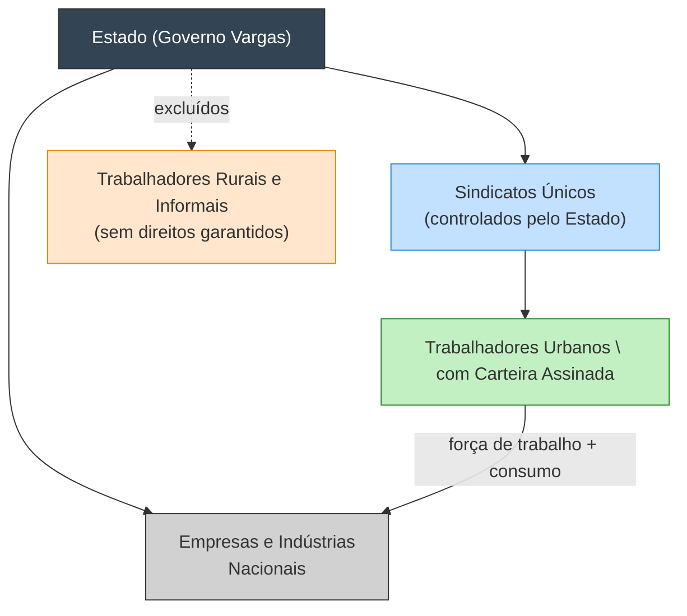
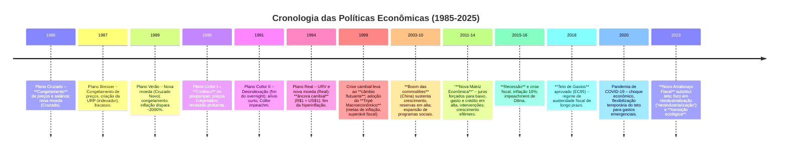
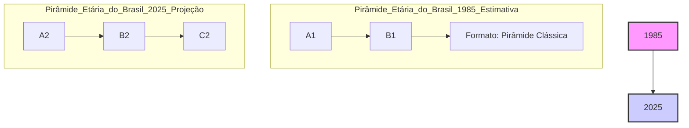
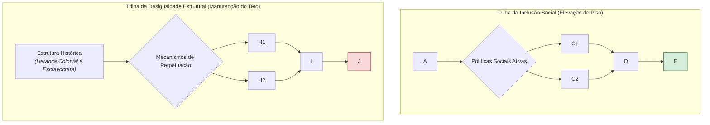
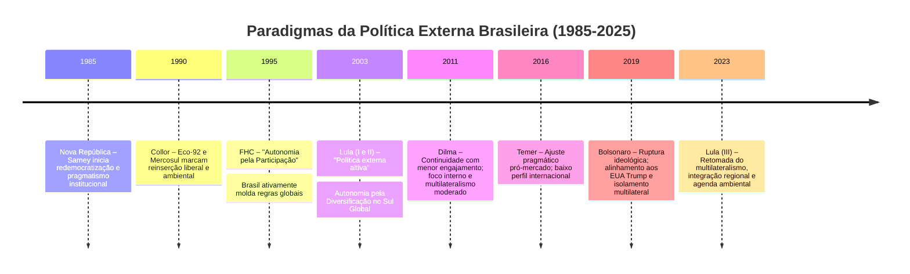
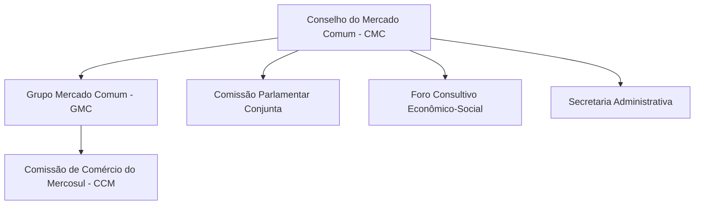

# Origem: _A crise dos anos 20 do século XX (tenentismo e revoltas)

---
title: A crise dos anos 20 do século XX (tenentismo e revoltas)
area: HISTÓRIA DO BRASIL
subarea: A Primeira República (1889-1930)
tags:
  - a-crise-dos-anos-20-do-seculo-xx
  - a-primeira-republica
  - cacd-2025
  - historia-do-brasil
aliases:
  - "6.7 A crise dos anos 20 do século XX: tenentismo e revoltas."
---
# A Crise dos Anos 1920: Tenentismo e as Revoltas que Abalaram a Primeira República

## O Contexto da Crise dos Anos 1920

A década de 1920 marcou a crise terminal da Primeira República no Brasil. O sistema político oligárquico então vigente – frequentemente resumido pela **“política do café com leite”** – encontrava-se esgotado. Esse pacto de poder assegurava o revezamento na presidência entre as oligarquias de São Paulo e Minas Gerais, utilizando a máquina do Estado para proteger seus interesses econômicos (notadamente a exportação do café). Tal arranjo, embora desse estabilidade às elites dominantes, gerava crescente **rigidez e exclusão política**: outras oligarquias estaduais sentiam-se marginalizadas, e **novos atores sociais** – as classes médias urbanas emergentes e o operariado industrial – não se viam representados no regime coronelista. No plano econômico, o pós-Primeira Guerra Mundial trouxe dificuldades: uma crise internacional no início dos anos 1920 provocou queda nas exportações e nos preços dos produtos agrícolas brasileiros. O governo interveio para sustentar o preço do café (socializando os prejuízos), mas isso apenas acirrou **tensões entre as próprias oligarquias** e alimentou a insatisfação das populações urbanas diante da carestia e do desemprego.

Nesse ambiente de **esgotamento do modelo oligárquico**, multiplicaram-se sinais de descontentamento. Setores dissidentes das próprias elites articularam-se na _Reação Republicana_ (1921-22) – uma frente oposicionista reunindo oligarquias de estados preteridos (Rio Grande do Sul, Bahia, Pernambuco, Rio de Janeiro) em torno da candidatura de Nilo Peçanha contra Artur Bernardes, o candidato oficial das oligarquias paulista e mineira. Ao mesmo tempo, as **Forças Armadas** entraram em atrito com o governo: o presidente Epitácio Pessoa (1919-22) havia nomeado civis para o comando do Exército e da Marinha e recusado aumentar soldos, ferindo o orgulho militar. O estopim foi o escândalo das _“cartas falsas”_ – documentos forjados atribuídos a Bernardes, nos quais o candidato supostamente insultava o Exército. Embora desmascaradas, essas cartas inflamaram oficiais jovens, convencidos de que a honra militar e os interesses nacionais estavam sendo desprezados pela elite política vigente.

Desse caldo de cultura surgiu o **Tenentismo**, movimento de jovens oficiais (majoritariamente tenentes) do Exército que irrompeu em rebelião contra a ordem oligárquica na primeira metade dos anos 1920. Importante notar que a crise não era apenas política: a sociedade brasileira passava por mudanças estruturais. A urbanização e a incipiente industrialização criaram uma classe média ilustrada (profissionais liberais, funcionários públicos, militares de baixa patente) e uma classe operária concentrada em cidades como São Paulo e Rio de Janeiro. Esses segmentos **exigiam maior participação e direitos**, enquanto o regime oligárquico se mostrava incapaz de incorporá-los. O período assistiu, por exemplo, ao crescimento do **movimento operário**, influenciado por ideias anarquistas e socialistas, que realizou greves gerais (como a de 1917 em São Paulo) para reivindicar melhores condições de trabalho. No campo, especialmente no Nordeste, a miséria e o poder arbitrário dos coronéis alimentavam fenômenos de violência social, como bandos de cangaceiros desafiando a autoridade do Estado. Em suma, a Primeira República na década de 1920 enfrentava uma **crise estrutural**, em que a **contestação vinha de múltiplos frontes** – elites dissidentes, militares reformistas, trabalhadores urbanos e populações rurais marginalizadas.

## Tenentismo: A Contestação Militar e Suas Ideias

> [!note] **Tenentismo:** Movimento liderado por jovens oficiais do Exército (tenentes e capitães) que, entre 1922 e 1927, promoveram levantes armados contra a ordem oligárquica vigente. O Tenentismo **não possuía um projeto político unificado ou ideologia coerente** – os “tenentes” agiam mais por um sentimento difuso de _salvação nacional_ diante da crise da Primeira República, do que por um plano revolucionário detalhado. Em sua origem, foi uma rebelião **corporativa**: os oficiais insurgentes viam-se como representantes da honra militar e guardiões dos ideais da República, reagindo contra a corrupção, o autoritarismo das oligarquias regionais e a exclusão política das novas camadas sociais. Assim, o Tenentismo expressou as frustrações da classe média urbana brasileira, à qual pertenciam muitos desses militares, frente a um sistema que lhes negava voz.

### Ideais e Bandeiras dos Tenentes

Embora faltasse unidade programática aos tenentes, é possível identificar **principais bandeiras** comuns defendidas em seus manifestos e discursos. Uma delas era o **moralismo político**: crítica feroz à corrupção administrativa das oligarquias e às fraudes eleitorais endêmicas do período. Os tenentes denunciavam as eleições a bico de pena e o domínio dos “coronéis” no interior, exigindo **voto secreto** para acabar com o _voto de cabresto_, além de autenticidade na representação política e moralização dos poderes públicos. Outra bandeira central era o **centralismo nacionalista**: os rebeldes culpavam a excessiva descentralização federativa da Constituição de 1891 – que deixava desmedido poder nas mãos das oligarquias estaduais – pelos desmandos e pela fragmentação do país. Propunham, portanto, **fortalecer o Estado central** e corrigir os “excessos” do federalismo, reequilibrando as relações entre União e estados. Isso incluía limitar as atribuições arbitrárias do Poder Executivo (quando capturado por oligarcas locais) e garantir maior autonomia ao Judiciário, de forma a impor a lei nacional sobre os interesses regionais.

Paradoxalmente, apesar de pregarem princípios como eleições limpas e legalidade republicana, os tenentes nutriam **pouca fé na democracia liberal** tal como praticada. Defendiam, em última instância, que somente uma intervenção enérgica – _quiçá militar e temporariamente ditatorial_ – poderia “regenerar” o país. Ou seja, **tinham um viés autoritário** no método: acreditavam que a classe militar, guiada por um ideal patriótico, deveria depurar as instituições para depois instaurar reformas saneadoras. Essa concepção de “ditadura saneadora” era influenciada tanto pela tradição positivista do Exército (a ideia do “soldado-cidadão” como reformador social) quanto pelo clima intelectual da época, de crescimento de ideologias antiliberais no pós-Primeira Guerra Mundial. Os tenentes viam-se como uma elite esclarecida e patriótica, desconfiando tanto das velhas oligarquias quanto das massas populares. Prova disso é que **mantinham uma visão elitista e militarista da política**, relutando em canalizar o apoio popular de forma orgânica: mesmo quando conquistavam a simpatia urbana, não organizaram partidos de base popular nem articulavam claramente programas socioeconômicos abrangentes. Em vez disso, preferiam a via conspiratória e golpista, acreditando ser seu dever **impor “de cima”** as medidas necessárias para salvar a República. Em suma, as **principais bandeiras tenentistas** podem ser resumidas em: _moralização da vida pública, centralização do poder para romper o jugo das oligarquias estaduais,_ e _intervenção autoritária (militar) como meio de efetivar a regeneração nacional_. Dentro desse arcabouço, havia também propostas modernizadoras, como a defesa de educação pública de qualidade e até mesmo algumas preocupações sociais difusas, mas o núcleo do tenentismo residiu em seu **nacionalismo jacobino e moralista, de tom autoritário**.

### Principais Revoltas Tenentistas (1922–1927)

As ideias tenentistas saíram do plano retórico para a ação direta em uma série de revoltas armadas entre 1922 e 1927. Essas insurreições, embora fracassadas militarmente, abalaram a Primeira República e revelaram o grau de contestação ao status quo oligárquico. A seguir, destacamos as principais:

#### A Revolta dos 18 do Forte de Copacabana (1922)

A primeira manifestação do Tenentismo ocorreu em **5 de julho de 1922**, no Rio de Janeiro, então Distrito Federal. Inconformados com a vitória eleitoral de Artur Bernardes e indignados com o desdém do governo pela oficialidade, jovens tenentes deflagraram uma rebelião simultânea na Vila Militar, na Escola Militar do Realengo e, de forma mais célebre, no Forte de Copacabana. O objetivo era **impedir a posse de Bernardes** e depor o presidente em exercício (Epitácio Pessoa), que consideravam conivente com a corrupção eleitoral. No Forte de Copacabana, cerca de 300 militares rebelados foram cercados por tropas legalistas após um dia de combates. No final, restaram apenas **18 homens dispostos a resistir até o fim** – os famosos “18 do Forte”. Em gesto suicida, esse punhado de tenentes e civis deixou o forte e marchou pela Avenida Atlântica enfrentando o fogo inimigo, até cair quase todos mortos na praia de Copacabana. O episódio, mesmo militarmente irrelevante, tornou-se uma lenda e **um símbolo inaugural do Tenentismo**, demonstrando a disposição de sacrifício daqueles jovens oficiais em nome de seus ideais. A revolta de 1922 foi debelada em dois dias, com seus líderes presos ou exilados, mas **seu legado foi inspirador**: o gesto heroico dos “18 do Forte” galvanizou outros tenentes pelo país, convencendo-os da necessidade de _intensificar a luta contra o regime oligárquico_. Vale notar que, nessa primeira revolta, o Tenentismo ainda **carecia de coordenação e apoio externo**: agiu **isoladamente**, sem tentar mobilizar a população ou se aliar às oligarquias dissidentes. Tratou-se essencialmente de um _pronunciamento militar de quartel_, de cunho corporativo. Contudo, o 5 de julho de 1922 inaugurou um **ciclo revolucionário** que se estenderia pelos anos seguintes.

#### A Revolução Paulista de 1924 (“A Revolução Esquecida”)

_Uma coluna de fumaça ergue-se dos armazéns da Mooca durante o bombardeio de São Paulo em julho de 1924._ A **Revolta Paulista de 1924**, frequentemente chamada de _“Revolução Esquecida”_, foi o maior conflito armado urbano do Brasil no século XX, embora por muito tempo tenha recebido menos destaque histórico do que outros eventos posteriores. Iniciada em **5 de julho de 1924** (exatos dois anos após o levante do Forte de Copacabana), a insurreição eclodiu na cidade de São Paulo sob a liderança do general reformado **Isidoro Dias Lopes**, apoiado por jovens oficiais tenentistas como Joaquim Távora, Eduardo Gomes, João Cabanas, Miguel Costa e Juarez Távora. Os rebeldes rapidamente tomaram quartéis e pontos estratégicos da capital paulista, contando com adesão de unidades do Exército e da Força Pública (polícia militar) do estado. Em poucas horas, tomaram o controle de boa parte da cidade e forçaram a fuga do presidente do estado, Carlos de Campos, que se refugiou na periferia.

Por **23 dias**, São Paulo tornou-se praça de guerra. Os rebeldes instalaram um “governo revolucionário” na capital e difundiram manifestos defendendo a derrubada de Bernardes e a renovação republicana. **Bairros inteiros se transformaram em trincheiras**: a população urbana, em grande parte simpática aos revoltosos devido ao desgaste do governo federal, colaborou erguendo barricadas e fornecendo mantimentos para as tropas tenentistas. Em resposta, o presidente Artur Bernardes decretou estado de sítio e ordenou uma violenta contraofensiva. **Forças federais cercaram a cidade e lançaram mão de bombardeios aéreos e de artilharia pesada**, algo inédito até então em solo brasileiro. Bairros operários como Brás, Mooca e Cambuci – focos de apoio popular aos rebeldes – foram duramente atingidos pelos bombardeios, sofrendo incêndios e destruição massiva.

A disparidade de recursos acabou pesando contra os revolucionários: enquanto o “Exército Rebelde” contava cerca de 5 a 7 mil combatentes mal armados, as forças legalistas reuniram mais de 15 mil soldados, além de aviões, artilharia e reforços constantes. Diante do cerco crescente, Isidoro e os tenentes decidiram **abandonar São Paulo** em 28 de julho de 1924, para evitar uma carnificina ainda maior de civis e ganhar mobilidade. A retirada foi organizada de forma surpreendentemente ordeira: os rebeldes deixaram a capital e recuaram pelo interior paulista, dirigindo-se ao oeste do Paraná, onde julgaram poder resistir em melhores condições. Ainda assim, sofreram baixas consideráveis na fuga, especialmente ao tentar atravessar o rio Paraná sob fogo inimigo (episódio da _Coluna da Morte_, em Três Lagoas). Aproximadamente **um terço dos revoltosos foi morto, ferido ou capturado** durante a campanha de São Paulo.

Os números ilustram a magnitude do conflito: cerca de **503 mortos, 4.846 feridos e mais de 20 mil desabrigados** em menos de um mês. A cidade de São Paulo teve ~1.500 edificações destruídas e viu quase 1/3 de sua população fugir temporariamente. Nem mesmo a Revolução Constitucionalista de 1932 superaria o rastro de destruição deixado pela revolta de 1924. Apesar disso, a memória desse levante acabou ofuscada no imaginário nacional – daí o epíteto de “revolução esquecida”. Contudo, sua importância é inegável: foi **a maior manifestação do Tenentismo em termos militares**, provando que a insurgência não se limitava a um punhado de oficiais no Rio, mas podia mobilizar setores expressivos em um dos principais estados do país. Além disso, a revolta paulista **serviu de catalisador para um movimento mais amplo**: sua continuidade se daria na formação da lendária _Coluna Prestes_.

Após evacuarem São Paulo, os remanescentes rebelados (cerca de 3 mil homens) mantiveram-se em armas no interior. Durante seis meses, o “Exército revolucionário” vagou pelo Paraná, reagrupando forças e aguardando uma oportunidade de retomar a iniciativa. Nesse meio-tempo, a chama tenentista se alastrou: em **1924, várias guarnições pelo país também se sublevaram**, inspiradas pelo exemplo paulista. Houve levantes tenentistas no Mato Grosso, em julho; em Sergipe, Amazonas e Pará; e uma rebelião no Rio Grande do Sul em outubro daquele ano. Embora essas insurreições paralelas tenham sido sufocadas isoladamente, revelavam a existência de uma rede de jovens oficiais conspirando contra o governo em diversos pontos do Brasil – uma espécie de _“complexo tenentista”_ de 1924, **frouxamente articulado em termos organizacionais, mas ideologicamente unificado** no propósito de derrubar Artur Bernardes e “refundar” a República.

#### A Coluna Prestes (1925–1927): Marcha Rebelde pelo Brasil

_Fotografia histórica dos líderes revolucionários da Coluna Miguel Costa-Prestes (1927).*_* A **Coluna Prestes** representou o auge do Tenentismo e uma das epopéias militares mais notáveis da história brasileira. Formou-se no início de 1925, a partir da **junção dos rebeldes paulistas remanescentes com os rebeldes gaúchos** que haviam se levantado no Rio Grande do Sul em 1924. Após a Revolução de 1924, os revolucionários de São Paulo, comandados por Miguel Costa, concentraram-se na região fronteiriça do Paraná. Enquanto isso, no sul, um foco tenentista eclodira em outubro de 1924 liderado pelo capitão **Luís Carlos Prestes**. Embora a revolta gaúcha tenha sido esmagada, Prestes e seu contingente conseguiram se manter em campanha nas serras do Rio Grande. Em **fevereiro de 1925**, emissários dos paulistas e gaúchos se reuniram em Foz do Iguaçu, onde definiram unir as duas forças rebeldes. Concretizando esse plano, em **abril de 1925** Miguel Costa e Prestes fundiram seus homens, criando a _Divisão Revolucionária Miguel Costa–Prestes_, que ficaria conhecida simplesmente como **Coluna Prestes**.

A Coluna Prestes empreendeu uma **longa marcha guerrilheira através do interior do Brasil**, com objetivos mais políticos do que militares. Seu **objetivo declarado** era realizar uma _“propaganda armada”_ contra o governo Bernardes, ou seja, peregrinar pelos sertões **denunciando as mazelas do regime oligárquico e conclamando o povo à revolta**. Prestes acreditava que, ao expor in loco a opressão dos coronéis e as injustiças sociais, despertaria a consciência das populações interioranas e fomentaria novos levantamentos regionais que, gradualmente, minariam o poder das oligarquias. **Não se pretendia tomar o poder central de imediato**, mas sim criar condições para nacionalizar a revolução – uma tática de “cercar” o governo pelos rebeldes espalhados pelo país, ao invés de atacá-lo frontalmente em Brasília (na época, Rio de Janeiro). Nesse sentido, a Coluna Prestes foi menos uma campanha convencional e mais uma **peregrinação revolucionária**, buscando ganhar “corações e mentes” e mostrar a vulnerabilidade do regime vigente.

Para sobreviver contra forças governistas numericamente superiores, a Coluna adotou **táticas de guerrilha altamente móveis e inovadoras**. Seus ~1.500 integrantes se deslocavam rapidamente a cavalo, em pequenos bandos, evitando combates diretos com tropas regulares e preferindo escaramuças em terrenos favoráveis. Enfrentada, a Coluna recuava estrategicamente e surgia em outro ponto, confundindo os perseguidores. Abastecia-se capturando armamentos e munições do próprio inimigo, e recrutava voluntários locais (ou liberava prisioneiros dispostos a lutar) para recompor os efetivos. Essa **guerra de movimento** permitiu que os tenentes mantivessem a luta por mais de dois anos, sem jamais serem derrotados em batalha campal – mas também sem conseguir vitórias decisivas. A **mobilidade** era sua vitória: a simples capacidade de **continuar existindo e lutando** já representava, para Prestes, um êxito, pois mantinha viva a chama revolucionária até que, esperava-se, eclodissem rebeliões maiores pelo país. A Coluna percorreu cerca de **24 a 25 mil quilômetros em marcha**, atravessando 11 estados – do Paraná e Mato Grosso até o Maranhão e Ceará – muitas vezes em regiões inóspitas e afastadas. Enfrentou mais de 50 combates contra forças legalistas enviadas em seu encalço, escapando de sucessivas tentativas de cerco graças ao conhecimento do terreno e ao apoio esporádico de populações locais simpáticas ou coagidas.

Apesar da façanha logística e militar, a Coluna **falhou em provocar o levante popular em larga escala que almejava**. As esperadas insurreições de apoio – seja de civis, seja de unidades militares localmente – não ocorreram, ou foram rapidamente sufocadas. A massa camponesa do sertão, em geral, assistia com curiosidade ou temor à passagem dos “revoltosos”, mas raramente se engajava. Em muitos lugares, os tenentes foram vistos mais como _forasteiros armados_ do que como libertadores. Elites locais hostis mobilizaram jagunços para perseguir a Coluna, como ocorreu na Bahia, onde coronéis organizaram milícias para defender suas terras. Após percorrer todo o Nordeste e contornar, pelo interior, as áreas de maior presença das forças governistas, a Coluna rumou de volta ao sul. Em **fevereiro de 1927**, com seus integrantes exauridos e sem perspectiva imediata de derrubar o governo, Prestes decidiu **encerrar a marcha e buscar exílio**. Os remanescentes da Coluna (pouco mais de 600 homens) cruzaram a fronteira para a Bolívia, depuseram armas e dispersaram-se.

A **Coluna Prestes deixou um legado ambíguo**. Do ponto de vista militar, revelou a fragilidade do Estado brasileiro em controlar seu vasto território – durante dois anos, o governo Bernardes não conseguiu capturar um contingente rebelde que peregrinava pelo país, o que expôs a ineficácia do Exército sob comando oligárquico. Politicamente, a marcha tornou-se uma lenda: Prestes foi alçado ao status de herói popular, o _“Cavaleiro da Esperança”_, e seu exemplo manteve viva a ideia de que a resistência era possível. Por outro lado, o fato de a Coluna não ter conseguido mobilizar as massas indicou os limites do Tenentismo como revolução social. Os tenentes **desgastaram enormemente a legitimidade do regime**, mas não apresentaram, naquele momento, um projeto alternativo claro de poder. A campanha teve também custos humanos consideráveis (embora pouco documentados): além dos combates, a Coluna enfrentou doenças, fome e fadiga extremas. Ainda durante sua marcha, **explodiu em novembro de 1926 o último levante tenentista interno**, um novo foco no Rio Grande do Sul que tentou reiniciar a revolução no sul – mas foi debelado, marcando o fim do ciclo iniciado em 1922. Ao final, o Tenentismo militar foi temporariamente **derrotado em campo**, mas alcançou seu propósito de minar o poder oligárquico: Arthur Bernardes terminou seu mandato (1922-26) isolado politicamente, governando o país quase todo o tempo sob estado de sítio e medidas repressivas. Ficava evidente que a **Primeira República jazia em profunda crise de legitimidade**, abrindo caminho para mudanças dramáticas.

## Outras Manifestações da Crise Social (Anos 1920)

A turbulência da década de 1920 não se restringiu às quarteladas tenentistas. **Outras revoltas e movimentos sociais** expressaram a mesma crise estrutural da Primeira República, vindo de setores diversos da sociedade. Destacam-se, em especial, o fenômeno do **cangaço** no Nordeste e a onda de **greves operárias** nas cidades industriais, que ocorreram paralelamente às rebeliões militares.

### Banditismo e Cangaço no Nordeste

No sertão nordestino, a década de 1920 assistiu ao auge do **cangaço**, forma de banditismo rural que assolava a região desde o final do século XIX. Longe de ser um simples caso de criminalidade, o cangaço era sintoma de uma **profunda crise social no campo** nordestino. A estrutura fundiária marcada por latifúndios oligárquicos, somada às cíclicas secas devastadoras, gerava miséria extrema e desagregação social. Milhares de sertanejos desempregados e sem-terra viam-se sem meios de sobrevivência, e tinham basicamente duas opções: **migrar para o sul em busca de trabalho, ou “entrar para o cangaço”** – juntando-se a bandos armados que vagavam pelo sertão, saqueando fazendas e povoados para sobreviver. Foi desse contexto que emergiram os célebres bandos de cangaceiros liderados por figuras como Sinhô Pereira, Lampião e Corisco. Na década de 1920, **Lampião (Virgulino Ferreira da Silva)** tornou-se o cangaceiro mais temido, percorrendo vários estados nordestinos com seu bando numeroso e desafiando abertamente as forças policiais dos governos estaduais. O cangaço expunha a **fragilidade do Estado** na manutenção da lei e da ordem nas áreas interioranas distantes: coronéis locais ora combatiam, ora acobertavam os bandos, e a população pobre muitas vezes via nos cangaceiros uma mistura de algozes e vingadores. Em suma, o fenômeno do cangaço demonstrava que, enquanto nas cidades se criticava a “política do café com leite”, nos sertões vastos do Nordeste vigorava um **vácuo de autoridade e justiça social**, fruto do abandono estatal. A erradicação do cangaço só ocorreria na Era Vargas (Lampião foi morto em 1938), mas já nos anos 1920 sua existência mostrava que a **ordem oligárquica republicana não atendia às necessidades básicas de amplas parcelas da população rural**.

### Greves Operárias e Agitação Urbana

Paralelamente, nas cidades, o **movimento operário** ganhava força e protagonizava conflitos sociais que desafiavam a Primeira República. O Brasil passava por uma lenta industrialização desde o início do século XX, com maior concentração fabril em centros como São Paulo, Rio de Janeiro e Recife. Os trabalhadores urbanos viviam sob jornadas extenuantes (12-14 horas diárias), baixos salários e nenhuma legislação trabalhista protetiva – e, ademais, **não possuíam direitos políticos**, já que muitos eram imigrantes sem cidadania ou analfabetos impedidos de votar. Inspirados pelas ideias anarquistas trazidas por imigrantes europeus e estimulados pelos exemplos internacionais (como a Revolução Russa de 1917), os operários brasileiros começaram a se organizar em sindicatos e a realizar **greves de grandes proporções**. A primeira grande greve geral ocorreu em **1917**, em São Paulo, e durou quase um mês, paralisando indústrias e serviços. Essa greve – fortemente reprimida pela polícia, mas parcialmente bem-sucedida em conquistar aumentos salariais – inaugurou um ciclo de lutas operárias. Nos anos seguintes houve novas greves gerais (1918, 1919) e frequentes paralisações setoriais nas principais cidades. Em 1919, por exemplo, uma greve geral no Rio de Janeiro mobilizou dezenas de milhares de trabalhadores.

Durante a década de 1920, **persistiu a agitação trabalhista**, embora o ápice combativo tivesse sido antes (1917-19). A fundação do Partido Comunista do Brasil (PCB) em 1922, por alguns líderes sindicalistas, refletiu o amadurecimento político de parte do operariado, agora sob influência também marxista. As respostas dos governos oligárquicos foram **repressivas**: leis de exceção, deportação de líderes estrangeiros (Lei Adolfo Gordo), prisão de anarco-sindicalistas e comunistas, e violência policial contra piquetes. Ainda assim, as greves continuavam a eclodir, indicando que o descontentamento social urbano era generalizado. Em **1924**, enquanto tenentes se rebelavam em São Paulo, **trabalhadores também se envolveram** – muitos operários paulistas apoiaram ativamente a revolução tenentista naquele ano, vendo nela uma esperança de mudanças. Essa confluência de reivindicações – militares clamando por moralização e trabalhadores clamando por direitos – demonstra que, _no final da Primeira República, a ordem estabelecida era questionada por diferentes segmentos sociais_. As **greves operárias** evidenciavam a demanda por inclusão social e econômica (jornada de 8 horas, salários dignos, legislação trabalhista), causas até então ignoradas pelo Estado oligárquico. Assim, juntamente com o Tenentismo e o cangaço, o movimento operário compôs o panorama de **crise social multifacetada dos anos 1920**.

## Legado e Consequências do Tenentismo

As revoltas tenentistas dos anos 1920 foram, em termos imediatos, derrotadas. Nenhum dos levantes alcançou seus objetivos explícitos (derrubar o governo ou reformar a Constituição). Entretanto, seu **impacto histórico** foi profundo: o Tenentismo **desgastou irreversivelmente a Primeira República**, pavimentando o caminho para sua queda em 1930. Ao expor a corrupção eleitoral, desafiar militarmente o poder central e clamar por renovação, os tenentes **minaram a legitimidade do regime oligárquico** perante a opinião pública urbanizada. A repressão violenta adotada por Artur Bernardes para sufocar revoltas (governando praticamente o mandato inteiro sob estado de sítio) passou a muitos a imagem de um governo tirânico e insensível. A própria figura do “tenente revolucionário” – jovem, idealista, de moral austera – tornou-se atraente frente à caricatura do “político corrupto” da República Velha.

Politicamente, o legado central do Tenentismo foi **acelerar alianças e mudanças que culminariam na Revolução de 1930**. Na segunda metade dos anos 1920, os tenentes sobreviventes, mesmo exilados ou na clandestinidade, mantiveram articulações com civis oposicionistas. Embora inicialmente houvesse desencontros (Prestes, por exemplo, rompeu com setores liberais em 1928 e acabou ingressando no ideário socialista), a conjuntura uniu interesses díspares contra a situação. As **oligarquias dissidentes** – como o Partido Democrático de São Paulo e o Partido Libertador do Rio Grande do Sul – buscaram os tenentes para fortalecer seus planos de romper a hegemonia café-com-leite. A crise econômica de 1929, com a queda drástica do preço do café, detonou a ruptura final dentro da elite governante: fazendeiros do café descontentes se juntaram aos oligarcas excluídos de Minas, RS e Paraíba e também aos militares tenentistas, formando um bloco amplo, a **Aliança Liberal**, em torno da candidatura de Getúlio Vargas. É sintomático que, no programa da Aliança Liberal em 1930, constassem várias **reivindicações originadas do Tenentismo** – como o voto secreto, a justiça eleitoral e a legislação trabalhista –, sinal de que as ideias tenentistas haviam ganhado ressonância nacional. Vargas perdeu a eleição de 1930 para o situacionista Júlio Prestes, em pleito marcado por denúncias de fraude. Porém, diante do assassinato do líder paraibano João Pessoa e da recusa do governo em qualquer conciliação, desencadeou-se a **Revolução de 1930**. Em outubro de 1930, varguistas e tenentes lideraram levantes coordenados que derrubaram o presidente Washington Luís, pondo fim à Primeira República.

No novo governo instaurado por Getúlio Vargas (Governo Provisório, 1930-34), os tenentes tiveram papel proeminente. Muitos dos **antigos líderes tenentistas tornaram-se figuras-chave na Era Vargas**, conhecidos então como a _“geração de 1930”_. Por exemplo, Juarez Távora, Eduardo Gomes, Newton Cavalcanti, João Alberto, Miguel Costa, Cordeiro de Farias, entre outros tenentes, assumiram cargos de interventores estaduais ou postos-chave na administração federal. Coletivamente, passaram a ser chamados de **“tenentes no poder”**. Eles tentaram implementar na prática muito do que pregavam: empreenderam reformas modernizadoras de cima para baixo, centralizaram a administração pública e combatiam velhos vícios políticos locais. Em termos ideológicos, **explicitaram um programa tipicamente classista médio e autoritário**, baseado em nacionalismo econômico, estatismo e antiparlamentarismo. Influenciados por teóricos como Alberto Torres e Oliveira Viana, os tenentes no governo viam o **Estado forte e centralizado como instrumento de transformação social** – acreditavam em governo forte, tecnocrático, capaz de guiar a sociedade rumo à modernização, superando o “liberalismo oligárquico” da República Velha. Esses traços ficaram evidentes em medidas como a centralização das polícias nos estados, a criação de ministérios e departamentos técnicos, a introdução da legislação trabalhista (atendendo parcialmente demandas operárias) e a intolerância com a oposição política (censura e repressão aos inimigos, fossem comunistas ou integralistas).

Contudo, com o passar dos anos 1930, houve tensionamentos entre Vargas e os “tenentes”. Vargas, político habilidoso, equilibrou os interesses de oligarquias tradicionais com os arrojados planos dos jovens militares. Alguns tenentes radicalizaram (caso de Luís Carlos Prestes, que rompeu com seus antigos companheiros e aderiu ao comunismo em 1930), enquanto outros acabaram afastados ou cooptados à medida que Vargas consolidou poder pessoal. Ainda assim, o **Tenentismo deixou uma marca duradoura**: ele contribuiu diretamente para a _queda do regime oligárquico em 1930_ e forneceu quadros e ideias para a construção do Estado Novo (1937-45). Além disso, legou uma mística de intervenção militar “patriótica” na política brasileira – algo que, para o bem ou para o mal, reapareceria em vários momentos do século XX. Historicamente, o Tenentismo é visto hoje como a expressão de uma classe média em ascensão, que, não encontrando canais de participação no velho sistema, recorreu às armas para **reinventar a República**. Suas revoltas falharam no imediato, mas **triunfaram em catalisar mudanças**: a partir de 1930, o Brasil ingressaria em uma nova fase, abandonando as bases da República Velha e iniciando um processo de centralização e nacionalização do poder sob Getúlio Vargas – exatamente o tipo de reordenamento que, ainda que por meios diversos, aqueles jovens tenentes de farda caqui haviam sonhado promover.

---

> [!question] **1.** Como o Tenentismo refletiu o esgotamento do modelo oligárquico da Primeira República? Relacione as reivindicações e ações dos tenentes às limitações políticas e sociais impostas pela _política do café com leite_.

> [!question] **2.** Quais eram os objetivos da Coluna Prestes e em que medida eles foram alcançados? Analise o significado histórico da marcha de 25.000 km liderada por Luís Carlos Prestes para a derrocada do regime oligárquico.

> [!question] **3.** Além das revoltas militares tenentistas, identifique outras manifestações de descontentamento social nos anos 1920 (como o cangaço e as greves operárias) e explique o que elas revelam sobre a sociedade brasileira da época e a crise da Primeira República.

****Fonte da imagem**: Fotografia publicada na _Revista Careta_ (1927), disponibilizada na Hemeroteca Digital Brasileira (domínio público).


# Origem: _A Revolução de 1930

---
title: A Revolução de 1930
area: HISTÓRIA DO BRASIL
subarea: A Primeira República (1889-1930)
tags:
  - a-primeira-republica
  - a-revolucao-de-1930
  - cacd-2025
  - historia-do-brasil
aliases:
  - 6.8 A Revolução de 1930.
---
# A Revolução de 1930: A Ruptura com a Ordem Oligárquica e a Ascensão de Vargas

## Contexto: Crise Estrutural da Primeira República (1889-1930)

A Primeira República brasileira, dominada pelas oligarquias agrárias (especialmente pelos cafeicultores paulistas e mineiros), entrou em franca **crise na década de 1920**. O arranjo político conhecido como _política do café-com-leite_ (a alternância informal entre presidentes de São Paulo e Minas Gerais) começou a se esgotar diante de divisões internas das classes dominantes e do descontentamento de novos grupos sociais. As instituições republicanas perdiam legitimidade diante de **contestações urbanas e militares**: o crescimento das cidades e da indústria formou uma burguesia industrial com interesses conflitantes aos dos barões do café, enquanto classes médias urbanas e movimentos tenentistas passaram a questionar o regime oligárquico. Em suma, o Estado oligárquico revelava-se incapaz de acomodar tanto as divergências entre as próprias **elites regionais** quanto as pressões de setores emergentes da sociedade.

### Movimentos de contestação na década de 1920: Tenentismo e dissidências oligárquicas

> [!note] **Revoltas tenentistas enfraquecem a ordem oligárquica:** Jovens oficiais do Exército – os **“tenentes”** – lideraram revoltas armadas (como os 18 do Forte de 1922, a Revolução de 1924 em São Paulo e a Coluna Prestes, 1925-1927) que expressavam, ainda que de forma difusa, **ideias de renovação política e moralização do regime**. Os tenentes atacavam o domínio das oligarquias, defendiam maior equilíbrio entre os Três Poderes e pregavam um nacionalismo econômico e modernizador. Em essência, o **tenentismo** buscava romper a rígida hierarquia político-social da Primeira República e ampliar a participação no poder. Ao mesmo tempo, dentro da própria elite agrária surgiam **oligarquias dissidentes** contrárias ao sistema excludente que privilegiava paulistas e mineiros: líderes de outros estados se viam relegados a papéis secundários e passaram a articular novos partidos e alianças para ampliar a representação política. Convém notar, porém, uma divergência importante: enquanto os tenentes propunham uma **mudança pela via revolucionária** (armada) a partir dos quartéis, as oligarquias dissidentes inicialmente tentaram a **tomada do poder via eleições** legais.

### O colapso econômico de 1929 e o abalo da oligarquia cafeeira

Outro fator decisivo na crise da Primeira República foi o **colapso econômico global de 1929**, que atingiu em cheio a base material do poder oligárquico paulista: a economia cafeeira. Em 1928, a safra de café fora recorde (cerca de 26 milhões de sacas), já provocando queda nos preços; no ano seguinte, a quebra da Bolsa de Nova York derrubou drasticamente a demanda e os preços do café, principal produto de exportação do Brasil. Os Estados Unidos e a Europa – maiores consumidores de nosso café e principais financiadores dos empréstimos de que o governo dispunha – entraram em depressão, causando a **súbita retração do comércio e do crédito externos**. O governo Washington Luís, adepto da austeridade fiscal, viu-se sem condições de continuar comprando e estocando os excedentes de café (política de valorização) na escala necessária. **Falências e prejuízos** se multiplicaram no setor cafeeiro, minando o poder dos coronéis paulistas. Assim, a **Crise de 1929** atuou como um **catalisador** da crise política: ao **quebrar a prosperidade agrícola** e expor a dependência das exportações, exacerbou os conflitos entre governos estaduais e o governo federal por auxílio financeiro, acirrou a oposição de oligarquias de outras regiões (menos atreladas ao café) e tirou do regime oligárquico a sua principal base de sustento econômico.

Importante lembrar que essa conjuntura agravou **cisões dentro da elite cafeeira**. Por exemplo, os cafeicultores de Minas Gerais e do Rio de Janeiro estavam insatisfeitos com a supremacia paulista na condução da política do café – personificada no **Instituto do Café de São Paulo** – e exigiam maior intervenção do governo federal para protegê-los. Simultaneamente, **produtores de outras commodities** (charque e arroz no Rio Grande do Sul; algodão, cacau e fumo no Nordeste e Norte) reclamavam do descaso do governo central para com seus setores. No fim do governo Washington Luís, várias dessas oligarquias regionais, prejudicadas pela crise e marginalizadas politicamente, **romperam com o núcleo paulista-mineiro** e passaram a conspirar contra o status quo oligárquico, preparando-se para uma solução de força (a revolução) como saída para impasses que a estrutura da Primeira República não conseguia mais mediar.

## A Crise da Sucessão Presidencial de 1930 e a Formação da Aliança Liberal

A **eleição presidencial de 1930** tornou-se o ponto de ruptura da Primeira República. Tradicionalmente, cabia ao presidente em exercício “fazer seu sucessor” negociando com os chefes estaduais – e esperava-se, conforme a política do café-com-leite, que Washington Luís (ele próprio paulista, eleito com apoio mineiro) apoiasse um candidato de Minas Gerais para a sua sucessão. Contudo, Washington Luís decidiu **romper o pacto de alternância** ao lançar a candidatura de outro paulista, **Júlio Prestes**, então presidente (governador) de São Paulo, ignorando as pretensões mineiras. Essa manobra, motivada em parte pelo desejo de continuidade de sua política econômica ortodoxa e pelos interesses paulistas, **fraturou a aliança oligárquica** entre São Paulo e Minas. Em Minas Gerais, o presidente do estado, **Antônio Carlos Ribeiro de Andrada**, ressentido com a quebra do acordo, desistiu de concorrer e uniu-se à oposição. Forjou-se assim um bloco de oligarquias dissidentes: **Minas Gerais aliou-se ao Rio Grande do Sul e à Paraíba**, formando a **Aliança Liberal**, que lançou a chapa oposicionista encabeçada pelo gaúcho **Getúlio Vargas** (então presidente do RS) para presidente e pelo paraibano **João Pessoa** (presidente da PB) para vice.

> [!important] **Aliança Liberal (1929-1930) – composição e objetivos:** A Aliança Liberal uniu lideranças tradicionais descontentes (como políticos influentes de MG, RS e PB) e contou também com apoio de jovens oficiais tenentistas que viam na ruptura uma chance de **“renovação nacional”**. Seu objetivo imediato era **impedir a continuidade da hegemonia paulista** representada por Júlio Prestes, canalizando o descontentamento regional e social em um projeto alternativo de poder.

### Plataforma política da Aliança Liberal: reformismo e busca de apoio amplo

Embora formada por **oligarquias regionais** em busca de espaço, a Aliança Liberal procurou ampliar sua base de apoio incorporando pautas de **reforma política e social** para atrair as classes médias urbanas, os militares insurgentes e os trabalhadores das cidades. O programa elaborado (com colaboração do político gaúcho Lindolfo Collor) defendia, sobretudo, a **reforma do sistema eleitoral**, incluindo a **instituição do voto secreto** e a criação de uma **Justiça Eleitoral independente**, para coibir fraudes generalizadas que marcavam as eleições da Primeira República. Propunha também medidas de **moralização política**, como fortalecer a independência do Poder Judiciário e limitar o poder das oligarquias dominantes. Além disso, os aliancistas pregavam a **proteção aos trabalhadores urbanos**, contrastando com a máxima do presidente Washington Luís de que “a questão social é caso de polícia”: o programa prometia criar **leis trabalhistas** (regulamentação do trabalho feminino e infantil, direito a férias, aposentadoria etc.) e outros direitos sociais. Outras promessas incluíam a **anistia** aos participantes das revoltas tenentistas de 1922-27 e um compromisso com a **industrialização** e **políticas econômicas protecionistas** que beneficiassem produtos de exportação além do café. Em resumo, apesar de refletir majoritariamente os interesses das oligarquias dissidentes, a plataforma aliancista incorporou pontos **progressistas** para a época – como o **voto secreto, a justiça eleitoral e legislação trabalhista** – a fim de legitimar-se como um “projeto nacional renovador” e angariar apoio de setores urbanos que ansiavam por mudanças.

Essa **retórica reformista** tinha também um cálculo político: conquistar o entusiasmo dos oficiais rebelados e da classe média, isolando o regime situacionista. No entanto, deve-se notar que **havia limites e contradições** nessa coalizão. Muitos líderes da Aliança Liberal eram figuras tradicionais (ex-presidentes como Artur Bernardes e Epitácio Pessoa, ou coronéis regionais) pouco inclinadas a transformações profundas – de fato, várias dessas reformas (como o voto secreto e leis sociais) só seriam implementadas após 1930, uma vez Vargas já no poder. Já os tenentes, influenciados por ideias modernizadoras autoritárias, viam as promessas aliancistas com misto de esperança e ceticismo, focados mais na oportunidade revolucionária do que no processo eleitoral em si.

## O Estopim: Eleições Fraudadas, Assassinato de João Pessoa e a Revolta Armada de 1930

A campanha eleitoral de 1930 foi acirrada. De um lado, o **governo federal** e 17 estados da situação (liderados por São Paulo) respaldavam Júlio Prestes; do outro, a Aliança Liberal mobilizava os três estados oposicionistas e simpatizantes em outros locais. Ambas as partes recorreram às práticas eleitorais viciadas da época, incluindo **fraudes e coerção de eleitores**, o que tornava o resultado das urnas bastante previsível a favor do candidato governista. Em 1º de março de 1930, confirmando as expectativas, **Júlio Prestes venceu nas urnas**, derrotando Getúlio Vargas. A oposição aliancista imediatamente contestou a legitimidade do pleito, denunciando a ocorrência de fraudes – embora, na realidade, **os dois lados tivessem manipulado votos**, dado o contexto de "eleições a bico de pena" da Primeira República.

A derrota eleitoral colocou a Aliança Liberal diante de duas escolhas: **aceitar a decisão “oficial” das urnas ou partir para a conspiração armada**. Setores moderados da coligação preferiam uma saída negociada, mas a ala **jovem e radical** (liderada por políticos como Osvaldo Aranha, João Neves da Fontoura e Virgílio de Melo Franco, junto com os tenentes Juarez Távora, João Alberto, Siqueira Campos, etc.) não aceitava entregar a vitória a Prestes e passou a articular ativamente um **golpe contra a posse do presidente eleito**. Nos meses seguintes (março a setembro de 1930), os conspiradores mantiveram contatos sigilosos, buscaram apoio de comandantes militares e aguardaram o momento oportuno para deflagrar a revolta. Enquanto isso, o governo Washington Luís agravou as tensões políticas ao usar o artifício da **“degola”** – anulando a diplomação de diversos deputados oposicionistas eleitos por Minas e Paraíba – e reprimindo manifestações aliancistas, o que apenas aumentou a sensação de ruptura iminente.

> [!note] **Assassinato de João Pessoa – o gatilho emocional da revolução:** Em 26 de julho de 1930, o vice de Vargas e presidente da Paraíba, **João Pessoa**, foi assassinado na capital paraibana. Embora o crime tenha tido motivação local (desavença política regional), os líderes da Aliança Liberal exploraram o episódio politicamente, apresentando-o como prova da _violência do regime vigente_ e como **estopim** para abandonar de vez a via legalista. A morte trágica de João Pessoa gerou comoção e forneceu o pretexto que os conspiradores precisavam para angariar apoio popular e militar à causa revolucionária, unificando diferentes grupos em torno da ideia de que não restava alternativa senão a **insurreição armada**.

Com o ambiente inflamado, a **Revolução de 1930 eclodiu em 3 de outubro de 1930**. Naquela data, tropas leais à Aliança Liberal, comandadas pelo tenente-coronel **Pedro Aurélio de Góis Monteiro** (aliado de Vargas), rebelaram-se no Rio Grande do Sul, avançando sobre fronteiras em direção a Curitiba e São Paulo. No dia seguinte, focos revolucionários surgiram no Nordeste, coordenados pelo tenente **Juarez Távora**, que estabeleceu um “Comando Revolucionário” em Recife para liderar as forças aliancistas na região. Embates armados ocorreram em algumas localidades – as forças tenentistas e milícias estaduais rebeladas tomaram cidades rapidamente. Porém, o conflito aberto não se prolongou: **antes que ocorresse um enfrentamento decisivo entre os revolucionários e o Exército fiel ao governo federal**, altos comandantes militares sediados na capital agiram para evitar uma guerra civil. Em 24 de outubro, generais do Exército (Tasso Fragoso e Mena Barreto) junto ao almirante Isaías Noronha depuseram o presidente Washington Luís no Rio de Janeiro, formando uma **Junta Governativa** que assumiu o poder temporariamente. Esse golpe preventivo pelas Forças Armadas desarticulou a resistência legalista restante – Júlio Prestes, que estava prestes a tomar posse, foi impedido de assumir e partiu para o exílio. Em 3 de novembro de 1930, a junta militar passou a chefia do governo provisório ao líder civil do movimento vitorioso, **Getúlio Vargas**, consolidando assim a vitória da Revolução de 1930 sem que fosse necessário um combate prolongado até a capital.

## A Natureza da Revolução de 1930: Ruptura ou Continuidade? (Análise Historiográfica)

A Revolução de 1930 marca um divisor de águas na história brasileira por ter **encerrado a República Oligárquica** e inaugurado a Era Vargas. No entanto, há um rico debate historiográfico sobre a **natureza e o alcance dessa “revolução”**. Os vencedores trataram desde logo de legitimá-la como uma verdadeira revolução nacional regeneradora. De fato, o movimento de 1930 **destruiu as principais instituições políticas do velho regime**, como a Política dos Governadores (aliança entre o poder central e coronéis estaduais) e o pacto café-com-leite de repartição da presidência. O poder das oligarquias tradicionais foi abalado: interventores nomeados por Vargas (muitos deles tenentes) substituiram os antigos governadores estaduais, e abriu-se espaço para uma **centralização político-administrativa** e para reformas institucionais (novo código eleitoral com voto secreto e justiça eleitoral, a Constituição de 1934, etc.). Nesse sentido, 1930 representou uma **ruptura na ordem política estabelecida**, afastando a elite cafeeira paulista do centro do poder e permitindo a entrada em cena de novos atores (classes médias urbanas, militares nacionalistas, burguesia industrial nascente) na arena política. Alguns historiadores, sobretudo de orientação marxista, chegaram a interpretar 1930 como uma **“revolução burguesa”**, isto é, a substituição de um bloco agrário exportador por uma aliança de classes urbano-industriais que impulsionariam a modernização capitalista do país.

Por outro lado, muitos estudiosos ponderam que, apesar da retórica revolucionária, **não houve uma transformação social profunda ou uma mobilização popular de base** em 1930 – características típicas das revoluções clássicas. A chamada revolução de 1930 foi em grande medida um **movimento político-militar elitista**, conduzido por parcelas da classe dominante descontente e por oficiais rebelados, sem participação direta das massas camponesas ou operárias na derrubada do regime. Do ponto de vista socioeconômico, a estrutura agrária permaneceu praticamente intocada: não houve reforma agrária nem ruptura imediata com as práticas coronelistas no interior (que persistiriam de outras formas). Assim, alguns autores preferem caracterizá-la como um **golpe de Estado** ou uma “revolução pelo alto”, argumentando que foi **uma troca de elites no poder mais do que uma revolução social**. Nesse sentido crítico, a Aliança Liberal teria representado apenas uma **elite dissidente** usando o discurso da mudança para tomar o lugar da oligarquia rival, sem intenção de alterar profundamente as relações de poder econômico e social vigentes.

A **composição heterogênea** do movimento explica em parte essa ambiguidade. A coalizão vitoriosa em 1930 unia interesses bastante distintos: de um lado, **oligarcas tradicionais** (como os fazendeiros mineiros e caciques regionais do Norte/Nordeste) que queriam recuperar influência política, e de outro, **tenentes e jovens turcos** da política que sonhavam com um projeto de **modernização autoritária** do país. Getúlio Vargas, figura central da Revolução, revelou habilidade em **conciliar esses grupos díspares** no curto prazo, mas as tensões logo afloraram durante seu governo provisório. Por exemplo, enquanto Vargas e civis moderados buscavam alguma legitimação institucional (prometendo uma nova constituição), os tenentistas pressionavam por reformas mais radicais e ocupavam postos-chave nos estados, gerando atritos com as oligarquias locais. A consequência direta dessas contradições foi a **Revolução Constitucionalista de 1932** em São Paulo – uma rebelião liderada pela oligarquia paulista derrotada, exigindo a reconstitucionalização do país e protestando contra a intervenção dos tenentes no governo estadual. Embora derrotado militarmente, o movimento de 1932 evidenciou que a _Revolução de 1930_ não havia eliminado todos os conflitos de interesse, mas sim os **rearranjado em novas bases**.

> [!summary] **Revolução ou golpe?** A historiografia contemporânea tende a ver 1930 como um evento de dupla face: **revolucionário nos efeitos políticos-institucionais**, ao demolir a ordem oligárquica e pavimentar o caminho para o Estado Vargas (centralizador e intervencionista), mas **limitado enquanto revolução social**, por não alterar as estruturas fundiárias nem promover uma participação popular direta na tomada do poder. Em última análise, a Revolução de 1930 instaurou uma nova era – a Era Vargas (1930-1945) – marcada por forte papel do Estado na economia, nacionalismo e criação de leis trabalhistas, mas também por centralização autoritária. O legado de 1930 foi, portanto, **ambíguo**: abriu espaço para a modernização e a incorporação de novas classes no jogo político, mas sob a condução controlada de uma liderança que emergiu do próprio establishment. A pergunta “golpe ou revolução?” reflete mais as diferentes lentes de análise do que uma contradição factual – afinal, o movimento foi **golpe na execução** (uma tomada de poder pelas elites dissidentes) e **revolução nos resultados** de longo prazo, ao redefinir os rumos da República brasileira.

> [!question] **Questões para Autoavaliação:**
> 
> 1. **Analise as contradições internas da Aliança Liberal.** Como a composição heterogênea (oligarcas dissidentes vs. tenentes revolucionários) influenciou os rumos da Revolução de 1930 e as primeiras medidas do governo Vargas?
>     
> 2. **Revolução política vs. revolução social:** Em que medida a Revolução de 1930 representou uma ruptura estrutural na sociedade brasileira, ou foi principalmente uma mudança no grupo no poder? Considere as continuidades e mudanças nas instituições políticas e nas relações socioeconômicas após 1930.
>     
> 3. **Causas estruturais e conjunturais:** Explique como fatores de longo prazo (crise do sistema oligárquico, tenentismo) se articularam com fatores imediatos (sucessão de 1930, crise econômica de 1929, assassinato de João Pessoa) para desencadear a queda da Primeira República.
>


# Origem: _O processo político e o quadro econômico-financeiro

---
title: O processo político e o quadro econômico-financeiro
area: HISTÓRIA DO BRASIL
subarea: A Era Vargas (1930-1945)
tags:
  - a-era-vargas
  - cacd-2025
  - historia-do-brasil
  - o-processo-politico-e-o-quadro-economico-financeiro
aliases:
  - O processo político e o quadro econômico financeiro.
  - 7.1 O processo político e o quadro econômico financeiro.
---
# A Era Vargas (1930–1945): O Processo Político e a Transformação Econômico-Financeira

_Getúlio Vargas, líder da Revolução de 1930, governou o Brasil de 1930 a 1945 em um regime marcado por profundas mudanças políticas e econômicas._ Conhecida como **Era Vargas**, essa fase divide-se em três períodos: o Governo Provisório (1930–1934), o Governo Constitucional (1934–1937) e o Estado Novo (1937–1945). Cada etapa apresentou dinâmicas políticas próprias – da centralização autoritária à ditadura aberta – e políticas econômico-financeiras que transformaram a estrutura produtiva do país. Abaixo, examinamos cada fase, conectando decisões políticas e medidas econômicas, à luz de interpretações de historiadores como Celso Furtado, Boris Fausto, Maria Celina D’Araújo e Ângela de Castro Gomes, entre outros.

## Governo Provisório (1930–1934)

**Processo político:** Após a _Revolução de 1930_, Getúlio Vargas assumiu como chefe do Governo Provisório, rompendo a ordem da Primeira República oligárquica. Em 11 de novembro de 1930, Vargas **dissolveu o Congresso Nacional e concentrou em si os poderes Executivo e Legislativo**, nomeando interventores federais para governar os estados em lugar das antigas oligarquias. Essa centralização visava “quebrar o poder das oligarquias” regionais e permitiu a Vargas governar por decretos, implementando rapidamente suas agendas. São Paulo, principal estado oligárquico, ressentiu-se por ter um interventor “tenentista” forasteiro, o que somado ao governo sem constituição levou à **Revolução Constitucionalista de 1932** – uma rebelião armada exigindo um retorno à ordem constitucional. O movimento constitucionalista paulista, derrotado após três meses de combates (julho-outubro de 1932), forçou Vargas a acelerar a **reconstitucionalização**: em 1933 ele convocou eleições para uma Assembleia Nacional Constituinte e, em 1934, promulgou-se uma nova Constituição. Até lá, Vargas governou sem legislativo, usando o Poder Executivo fortalecido para implementar reformas administrativas e sociais iniciais, como a criação do Ministério do Trabalho, Indústria e Comércio (em 1930) para mediar conflitos trabalhistas e incentivar a industrialização nascente.

**Economia e resposta à crise de 1929:** O Governo Provisório enfrentou de imediato os efeitos da Grande Depressão de 1929 sobre a economia brasileira, então dependente da exportação de café. Com a queda drástica dos preços internacionais, Vargas adotou uma **política intervencionista anticíclica de defesa do café**. O governo **comprou e destruiu estoques excedentes de café** para sustentar os preços no mercado internacional, evitando o colapso da renda dos cafeicultores. Essa política de valorização (financiada por crédito do Banco do Brasil e novos impostos sobre o café) foi combinada com alívio aos produtores: perdão de 50% das dívidas dos fazendeiros, refinanciamento do restante a longo prazo e até incentivo à substituição de plantações de café por culturas alternativas (como algodão). Tais medidas mitigaram os impactos da crise e estabilizaram o poder de compra do setor exportador.

> [!note] **Política de defesa do café:** Conjunto de medidas adotadas no início dos anos 1930 para **valorizar o preço do café** frente à crise de 1929, incluindo a **compra governamental e queima de sacas de café estocadas**, subsídios e crédito aos produtores. Segundo Celso Furtado, essa política teve efeito **anticíclico**, **mantendo a renda e o emprego no setor cafeeiro** e desviando a demanda para produtos internos, o que **estimulou a industrialização por substituição de importações**.

Os resultados logo apareceram: a renda agrícola foi sustentada, permitindo o _saneamento das finanças dos cafeicultores_ e, “por sua vez, exerceu um poderoso efeito multiplicador” no conjunto da economia. O Brasil foi **um dos primeiros países a sair da Grande Depressão**, com crescimento do PIB de 8,9% em 1933 e 9,2% em 1934. **Celso Furtado** interpreta que, ao manter a renda exportadora, essa intervenção deu fôlego para a economia interna – a desvalorização do câmbio encareceu importações e fez parte da demanda voltar-se para a indústria nacional nascente. De fato, **a produção industrial cresceu expressivamente** nesse período (entre 11% e 17% ao ano de 1933 a 1937), ainda que essa industrialização inicial tenha ocorrido mais como efeito colateral da política econômica do que por um plano deliberado. **Boris Fausto** ressalta que Vargas não chegou ao poder com um programa claramente industrialista, mas as circunstâncias da crise forçaram uma atuação estatal inédita na economia. Em síntese, no Governo Provisório a **decisão política de centralizar poder** possibilitou respostas rápidas à crise, e a **política econômica intervencionista no café** sustentou a renda e abriu espaço para a **industrialização por substituição de importações**, marco inicial da transformação econômico-financeira do país.

## Governo Constitucional (1934–1937)

**Processo político:** Com a **Constituição de 1934**, Vargas passou de chefe revolucionário provisório a presidente constitucional (eleito indiretamente pela Constituinte). A nova carta de 1934 incorporou avanços institucionais importantes: estabeleceu o **voto secreto e o voto feminino**, garantiu direitos trabalhistas (jornada de 8 horas, salário mínimo, repouso semanal, férias remuneradas, proibição do trabalho infantil, indenização por demissão sem justa causa) e previu a intervenção do Estado na economia para promover o desenvolvimento industrial. Esses dispositivos revelavam a inspiração **social e corporativista** emergente – buscava-se integrar trabalhadores e setores produtivos ao Estado, concedendo direitos mas também controle. _Angela de Castro Gomes_ observa que as medidas trabalhistas já indicavam a dualidade do varguismo: **“houve repressão, mas, também, houve outorga”** de direitos aos trabalhadores, sinalizando a construção de um pacto trabalhista sob tutela estatal.

Apesar do verniz democrático da Constituição de 1934, o período foi **politicamente tenso e polarizado**. Formaram-se movimentos de massa antagônicos: de um lado, a **Ação Integralista Brasileira (AIB)**, organização de inspiração fascista liderada por Plínio Salgado (camisas-verdes) e, de outro, a **Aliança Nacional Libertadora (ANL)**, frente popular de esquerda aglutinando comunistas, socialistas e tenentes descontentes (tendo Luís Carlos Prestes como figura simbólica). O governo Vargas, inicialmente, tentou equilibrar-se entre essas pressões, mas **restringiu liberdades gradativamente**. Em 1935, após discursos inflamados e decretos de ilegalização da ANL, ocorreu a chamada **Intentona Comunista** (novembro de 1935) – uma tentativa insurrecional militar de setores esquerdistas em Natal, Recife e Rio de Janeiro, rapidamente sufocada. A Intentona fracassada serviu de **pretexto para uma onda de forte repressão**: o governo declarou estado de sítio, prendeu milhares de opositores (inclusive Prestes) e praticamente **aniquilou as liberdades políticas entre 1935 e 1937**. Como analisa **Boris Fausto**, a derrota do levante de 1935 marcou _“o início da liquidação da democracia liberal”_ no Brasil, realizada nos anos 1935–1937 à medida que **tendências centralizadoras e autoritárias se reforçaram**, as elites regionais submeteram-se ao poder central e a cúpula militar se unificou em torno de Vargas. Em outras palavras, o terreno foi sendo preparado para o **golpe de 1937**. A campanha eleitoral prevista para janeiro de 1938 (na qual Vargas não poderia concorrer) nunca ocorreu: usando a ameaça comunista como justificativa – incluindo a divulgação do falso _Plano Cohen_ – Vargas deu um **autogolpe em 10 de novembro de 1937**, fechando o Congresso e instaurando o Estado Novo.

**Políticas econômico-financeiras:** No campo econômico, o governo constitucional manteve e ampliou a linha de **intervenção moderada e incentivo à industrialização** iniciada no período anterior. Vargas criou novos órgãos e planos voltados ao desenvolvimento: por exemplo, instituiu em 1934 o **Conselho Nacional de Economia** (com representação de classes produtivas) e fomentou a criação de institutos de pesquisa e crédito para modernizar a indústria. **A industrialização por substituição de importações continuou em curso**, favorecida tanto por políticas internas quanto pela recuperação parcial da economia mundial a partir de 1933. Entre 1934 e 1937, a produção industrial brasileira cresceu cerca de **11% a 17% ao ano**, suprindo o mercado interno antes atendido por importados. Esse crescimento, porém, foi visto **como efeito colateral** – o foco do governo ainda era equilibrar as contas externas e apoiar setores básicos (como agricultura diversificada), mais do que um projeto industrialista explícito. De fato, Vargas manteve um discurso cauteloso em relação ao capital estrangeiro e à iniciativa privada, sem promover estatizações amplas ou planejamento central rigidamente. Entretanto, _Maria Celina D’Araújo_ aponta que **já havia uma tendência de fortalecimento do Estado**: órgãos como o **Departamento de Propaganda e Difusão Cultural (DPDC)** foram criados em 1934 (sucedendo o DOP de 1931) para controlar meios de comunicação e divulgar a ideologia oficial – prelúdio do aparato de propaganda do Estado Novo. No plano trabalhista-econômico, as leis sociais de 1934 e a ação do Ministério do Trabalho integravam os sindicatos ao Estado, consolidando o **corporativismo** (sindicatos atrelados ao Ministério e proibidos de ação política independente). Em síntese, na fase constitucional Vargas equilibrou **abertura política limitada com continuidade do intervencionismo econômico**, lançando bases (legais e institucionais) que seriam aprofundadas no Estado Novo. O aumento da tensão política, com o espectro do comunismo e do fascismo, acabou por **abreviar a experiência democrática** e levou Vargas a optar pela solução autoritária em 1937 – apoiada por grupos industriais e militares que viam no Executivo forte a garantia de estabilidade e desenvolvimento ordenado.

## Estado Novo (1937–1945)

**Processo político:** Em 10 de novembro de 1937, Vargas instaurou a ditadura do **Estado Novo** via golpe de Estado, suspendendo a recém-criada Constituição de 1934 e outorgando uma nova Constituição em 1937 – conhecida como **“Polaca”** por inspirar-se no modelo autoritário polonês. O Estado Novo foi um **regime ditatorial centralizador e nacionalista**, no qual Vargas acumulou poderes praticamente absolutos. Imediatamente **foram fechados os órgãos legislativos e abolidos os partidos políticos**, concentrando todas as decisões no Executivo. Repressão policial e censura tornaram-se políticas de Estado: **opositores políticos eram perseguidos, presos, torturados ou exilados**, enquanto imprensa, rádio, sindicatos e demais associações ficaram sob estrito controle do governo. Para legitimar-se e difundir a ideologia do regime, Vargas **institucionalizou a propaganda oficial** por meio do **Departamento de Imprensa e Propaganda (DIP)**, criado no final de 1939. O DIP operou censurando préviamente os meios de comunicação e produzindo conteúdo que exaltava Vargas e os feitos governamentais. Houve um intenso **culto à personalidade**: Vargas foi promovido como _“pai da nação”_ e _“pai dos pobres”_ nas peças de propaganda, reforçando sua imagem de benfeitor dos trabalhadores. _Ângela de Castro Gomes_ enfatiza que o Estado Novo consolidou um **pacto populista-autoritário**: ao mesmo tempo em que **restringia liberdades e reprimia dissensos, Vargas também concedia benefícios sociais e trabalhistas**, cooptando assim parcelas populares para apoiarem o regime. A estrutura corporativista se completou: sindicatos e entidades de classe foram enquadrados como **“órgãos auxiliares do governo”**, atrelados ao Ministério do Trabalho, eliminando a autonomia operária – porém, em contrapartida, os trabalhadores urbanos obtiveram proteção social inédita, ainda que sob controle estatal.

> [!note] **Departamento de Imprensa e Propaganda (DIP):** órgão criado em 1939 para centralizar a **censura e a propaganda oficial** do Estado Novo. Subordinado diretamente à Presidência, o DIP controlava jornais, rádios, teatro e cinema, **divulgando as realizações do governo e cultivando a imagem de Vargas** como líder benfeitor. Também organizava eventos cívicos e festas patrióticas, buscando difundir os valores do regime e silenciar quaisquer vozes dissidentes. O DIP foi a ferramenta-chave para **manutenção do consenso** em torno da ditadura varguista.

No plano político-institucional, o Estado Novo aprofundou mecanismos autoritários: instaurou tribunais de exceção (como o **Tribunal de Segurança Nacional** já criado em 1936) para julgar “subversivos”, e governou por decretos-lei. A oposição foi praticamente aniquilada – integralistas (antes aliados) também foram reprimidos após 1938, quando tentaram um levante contra Vargas. Durante a **Segunda Guerra Mundial (1939–1945)**, o Brasil inicialmente manteve-se neutro, mas a partir de 1942 aliou-se aos **Aliados** contra o Eixo. A participação na guerra (envio da FEB à Itália em 1944) trouxe contradições: lutava-se por liberdades na Europa enquanto vigorava uma ditadura no país. Com a aproximação do fim da guerra e a pressão dos EUA por democratização, cresceu a oposição interna a Vargas. Movimentos como o **Queremismo** (1945) ainda tentaram, com base popular, manter Vargas no poder, mas sem sucesso. Em outubro de 1945, Getúlio Vargas foi **deposto pelos militares** que antes o sustentavam, encerrando o Estado Novo e iniciando a redemocratização. A Era Vargas terminava ali, **15 anos após seu início**, deixando um legado complexo de modernização econômica combinada com autoritarismo político.

**Política econômico-financeira no Estado Novo:** No campo econômico, o Estado Novo consolidou o **modelo de Industrialização por Substituição de Importações (ISI)** com forte **protagonismo estatal**. A conjuntura da Segunda Guerra dificultou importações de bens manufaturados e de capital, forçando o Brasil a produzir internamente mais do que nunca. Vargas aproveitou essa oportunidade e **criou empresas estatais estratégicas** para impulsionar setores-chave da industrialização. Destacam-se a fundação da **Companhia Siderúrgica Nacional (CSN)** em 1941 (usina de Volta Redonda, viabilizada por acordos com os EUA durante a guerra), da **Companhia Vale do Rio Doce (CVRD)** em 1942 (mineração de ferro) e da **Fábrica Nacional de Motores (FNM)** em 1942 (produção de motores e, posteriormente, caminhões). Estas iniciativas inseriram o Estado como investidor direto em infraestrutura e indústria de base, rompendo a dependência exclusiva do capital privado. Além disso, o governo criou o **Departamento Administrativo do Serviço Público (DASP)** em 1938 para racionalizar a burocracia e planejar a economia, e promoveu _planos nacionais_ de aparelhamento econômico e transporte (embriões do planejamento estatal que frutificariam no pós-guerra). Durante o Estado Novo, **os investimentos industriais cresceram** e setores como siderurgia, mineração, químico e energia ganharam impulso. A taxa média de crescimento industrial manteve-se elevada devido à substituição de importações e ao estímulo governamental. Observa-se também um esforço de **diversificação das exportações** (algodão, minerais, manufaturados leves para países vizinhos afetados pela guerra).

Paralelamente, Vargas consolidou a **legislação trabalhista e previdenciária**, integrando-a ao projeto econômico. O auge disso foi a **Consolidação das Leis do Trabalho (CLT)**, promulgada em 1943, que unificou toda a legislação social anterior e acrescentou novos direitos.

> [!note] **Consolidação das Leis do Trabalho (CLT), 1943:** marco legal que **reuniu e ampliou os direitos trabalhistas** no Brasil. Instituiu carteira de trabalho, salário mínimo nacional, jornada de 8 horas, descanso semanal remunerado, férias pagas, proteção ao trabalho feminino e do menor, estabilidade no emprego após 10 anos, entre outras garantias. A CLT atendeu reivindicações históricas dos trabalhadores e consolidou Vargas como o _“pai dos pobres”_. Por outro lado, **subordinou os sindicatos ao Estado** (via registro no Ministério do Trabalho) e **proibiu greves e lockouts**, refletindo a filosofia **corporativista**: os conflitos capital-trabalho deveriam ser solucionados dentro da estrutura estatal, com **Vargas mediando como árbitro supremo**. Assim, a CLT foi tanto um avanço social quanto um instrumento de controle político sobre o operariado.

A política econômica estadonovista também teve forte componente **nacionalista**. O governo incentivou a substituição de importações em setores estratégicos e impôs limites ao capital estrangeiro em áreas como seguros e comunicações. Ao mesmo tempo, não foi xenófobo: Vargas negociou com potências estrangeiras (EUA, em especial) apoio financeiro e tecnológico – como visto na construção da CSN acordada em troca do envio de tropas e bases aos Aliados. Essa combinação de **nacionalismo desenvolvimentista com pragmatismo** assegurou recursos para o esforço industrial. No final da guerra, o Brasil havia significativamente ampliado sua capacidade industrial e criado uma infraestrutura estatal para o desenvolvimento (que incluía também, em fase final do Estado Novo, planos para a Petrobras e a Eletrobrás, implementados apenas no segundo governo Vargas e nos governos posteriores).

Importante notar que as **decisões políticas autoritárias potencializaram as políticas econômicas**: sem oposição ou Congresso, Vargas pôde lançar **obras públicas de grande porte e empresas estatais** por decreto, moldando a economia conforme sua visão nacional-desenvolvimentista. Por outro lado, o regime direcionou os benefícios econômicos para legitimar-se politicamente – exemplo disso é a forte propaganda do DIP em torno das realizações materiais (indústria, infraestrutura) do “Estado Nacional”. _Maria Celina D’Araújo_ argumenta que o golpe de 1937 não foi um ato isolado, mas **a culminância de um processo**; o Estado Novo institucionalizou tendências já visíveis antes, ao construir um Estado planejador e autoritário de tipo moderno. Quando o regime caiu em 1945, o Brasil emergiu politicamente em transição para a democracia, mas **economicamente transformado**: havia uma classe operária urbana maior (embora atrelada ao Estado), uma indústria nacional diversificada e um Estado forte capaz de intervir na economia. Em suma, a Era Vargas legou a base do Estado **desenvolvimentista e corporativo** que marcaria o Brasil no século XX.

> [!question] **Questão 1:** Compare criticamente como Vargas conciliou **autoritarismo político e concessões socioeconômicas** nas três fases da Era Vargas. Como cada fase equilibrou repressão e cooptação (via direitos trabalhistas, propaganda, etc.) para manter o regime?

> [!question] **Questão 2:** Analise as continuidades e rupturas na **política econômica** do período 1930–1945. Em que medida o Estado Novo representou a culminação de tendências iniciadas no Governo Provisório e no Governo Constitucional (como a industrialização por substituição de importações, o intervencionismo estatal e o corporativismo trabalhista)?

> [!question] **Questão 3:** Considere o contexto internacional (Crise de 1929 e Segunda Guerra Mundial) na Era Vargas. Como esses fatores externos influenciaram as **decisões políticas internas** de Vargas e a orientação de sua política econômica em cada uma das fases (1930–34, 1934–37, 1937–45)?


# Origem: _A Constituição de 1934

---
title: A Constituição de 1934
area: HISTÓRIA DO BRASIL
subarea: A Era Vargas (1930-1945)
tags:
  - a-constituicao-de-1934
  - a-era-vargas
  - cacd-2025
  - historia-do-brasil
aliases:
  - 7.2 A Constituição de 1934.
---
# A Constituição de 1934: A Breve e Contraditória Experiência Democrática da Era Vargas

## Introdução: Um Pacto de Transição e Tensão

A Constituição da República dos Estados Unidos do Brasil de 1934 representa um dos documentos mais complexos e sintomáticos da história política nacional. Longe de ser um produto acabado, ela deve ser compreendida como um pacto dinâmico e conflituoso, um documento híbrido que formalizou as forças desencadeadas pela Revolução de 1930 e marcou o fim do Governo Provisório puramente discricionário. A Carta de 1934 é um texto de compromisso, uma tentativa de soldar os princípios do liberalismo oitocentista com as novas e urgentes demandas do século XX por intervenção estatal, justiça social e desenvolvimento econômico.

Este documento foi, em essência, um campo de batalha ideológico, um microcosmo das lutas globais da década de 1930. Refletiu a crise do liberalismo clássico, abalado pela Grande Depressão de 1929, e a ascensão de modelos alternativos que polarizavam o mundo: a social-democracia inspirada em Weimar, o corporativismo de matriz fascista e o nacionalismo autoritário. O próprio preâmbulo da Constituição revela essa tensão fundamental ao declarar o objetivo de "organizar um regime democrático, que assegure à Nação a unidade, a liberdade, a justiça e o bem-estar social e econômico".6 Nessa frase, coexistem os ideais liberais clássicos ("liberdade") e os novos objetivos sociais ("bem-estar social e econômico"), antecipando a natureza contraditória do texto que se seguiria.

## Gênese de uma Nova Ordem: A Pressão Constitucionalista e as Influências Externas

### A Revolução de 1932 como Catalisador Político

Após a Revolução de 1930, Getúlio Vargas assumiu o poder e passou a governar por decreto, anulando a Constituição de 1891 e fechando o Congresso Nacional. Essa centralização de poder gerou crescente insatisfação política, especialmente entre as elites de São Paulo, que viam sua hegemonia ameaçada. A Revolução Constitucionalista de 1932 foi o evento catalisador que forçou a mão de Vargas. Embora São Paulo tenha sido derrotado militarmente, o movimento alcançou seu principal objetivo político: a convocação de uma Assembleia Nacional Constituinte, encerrando a fase mais autoritária do Governo Provisório e inaugurando o processo de reconstitucionalização do país.

O conflito, no entanto, foi mais do que uma simples demanda por uma nova Carta. Representou um choque entre dois projetos para o Brasil. De um lado, o incipiente projeto de Estado centralizador e modernizador de Vargas, que visava quebrar o poder das oligarquias regionais. Do outro, a elite paulista, que, sob a poderosa bandeira do "constitucionalismo", lutava para preservar sua autonomia e proeminência política, ameaçadas por intervenções federais e por políticas econômicas como a criação do Conselho Nacional do Café. A Constituição de 1934 foi, portanto, o resultado de uma negociação forçada: Vargas cedeu na forma — a promulgação de uma constituição democrática — para avançar na substância de seu projeto: a construção de um Estado central mais forte.

### A Constituinte de 1933-1934: Um Mosaico de Representação

A Assembleia Nacional Constituinte, instalada em novembro de 1933, apresentou inovações notáveis em sua composição.

- **A Inovação dos "Deputados Classistas":** Uma das principais novidades foi a criação de 40 cadeiras para deputados "classistas", eleitos por associações profissionais. Esses representantes eram divididos entre empregados, empregadores, funcionários públicos e profissionais liberais. A eleição era indireta e, de forma crucial, o processo foi organizado e supervisionado pelo Ministério do Trabalho, Indústria e Comércio, e não pela recém-criada Justiça Eleitoral, o que garantiu uma forte influência do governo no resultado.
    
- **A Conquista Simbólica: Carlota Pereira de Queirós:** A Assembleia marcou a eleição da primeira mulher deputada federal na história do Brasil, a médica e professora paulista Carlota Pereira de Queirós. Sua participação, impulsionada por seu trabalho na organização da assistência médica durante a Revolução de 1932, foi um marco simbólico para a cidadania feminina, embora ela tenha sido a única mulher entre os constituintes.
    

A inclusão dos deputados classistas foi uma manobra de alta engenharia política de Vargas. Não se tratava de um impulso puramente democrático. Ao criar um novo canal de representação baseado em sindicatos reconhecidos pelo Estado (conforme a Lei de Sindicalização de 1931), Vargas enfraqueceu o poder tradicional dos partidos políticos estaduais. Ele trouxe novos atores sociais, como trabalhadores urbanos e industriais, para a arena política nacional, mas o fez sob a mediação e o controle do Estado, um pilar do pensamento corporativista. Isso permitiu a Vargas construir uma nova base de apoio nacional, não mais atrelada às oligarquias regionais, ao mesmo tempo que se projetava como um líder moderno e atento às demandas sociais.

### As Fontes Ideológicas do Texto Constitucional

A Carta de 1934 foi profundamente influenciada por correntes de pensamento que circulavam no Brasil e no mundo.

> [!definition] **Principais Influências Ideológicas**
> 
> - **Constituição de Weimar (Alemanha, 1919):** Principal inspiração para a dimensão social e para a nova estrutura estatal. A Carta alemã serviu de modelo para a criação de um capítulo dedicado à "Ordem Econômica e Social", para a concepção de um Estado interventor que deveria garantir o bem-estar social e para a adoção de um federalismo mais centralizado. Juristas da época, como João Mangabeira, faziam referência explícita a Weimar.
>     
> - **Corporativismo:** Doutrina em voga na Europa, especialmente na Itália fascista, que buscava substituir o conflito de classes pela "harmonia" entre capital e trabalho, mediada pelo Estado.17 Na Constituição de 1934, essa influência se manifestou de forma clara na representação classista e na estrutura da legislação trabalhista, que concedia direitos ao mesmo tempo que atrelava os sindicatos ao aparelho estatal.
>     

A influência de Weimar, contudo, foi seletiva e pragmaticamente adaptada aos objetivos do regime varguista. Os constituintes brasileiros não apenas importaram o modelo alemão, mas o moldaram para servir a fins específicos. No campo da representação corporativa, por exemplo, o Brasil foi além de Weimar, ao alocar os deputados classistas diretamente na Câmara dos Deputados, e não em um conselho consultivo separado, conferindo a esse elemento um poder político mais direto. Da mesma forma, o federalismo centralizador de Weimar foi adotado com entusiasmo, pois fornecia a justificativa legal perfeita para o principal objetivo de Vargas: quebrar a ampla autonomia dos estados (como São Paulo e Minas Gerais), que havia caracterizado a descentralizada República Velha. A inspiração externa foi, portanto, estratégica e funcional.

## Análise Estrutural e Inovações Cardeais: O Coração da Carta de 1934

### A Fachada Liberal-Democrática e o Federalismo Mitigado

Formalmente, a Constituição de 1934 manteve a estrutura basilar da República: o presidencialismo, a forma republicana de governo e a divisão tripartite dos poderes (Executivo, Legislativo e Judiciário), definidos como "independentes e coordenados entre si".

Contudo, no que tange à organização federativa, a Carta promoveu uma ruptura silenciosa, mas profunda. Embora o princípio federalista tenha sido formalmente respeitado 28, a Constituição de 1934 iniciou um claro processo de centralização de poder na União, revertendo a extrema descentralização que marcou a Constituição de 1891. A União passou a ter competência privativa para legislar sobre vastas áreas, como direito civil, comercial, processual e do trabalho, o que reduziu drasticamente a autonomia legislativa dos estados. Essa mudança foi fundamental para a consolidação de um Estado nacional mais forte e interventor, um dos principais objetivos dos revolucionários de 1930.

|Eixo de Análise|Constituição de 1891 (Liberal-Oligárquica)|Constituição de 1934 (Social-Democrática)|
|---|---|---|
|**Federalismo**|Extrema autonomia estadual; "Política dos Governadores".|Centralização de poder na União; redução da autonomia estadual.|
|**Direitos Políticos (Voto)**|Aberto, masculino, para alfabetizados. Exclusão de mulheres, mendigos, praças.|Secreto, obrigatório (para homens), extensivo às mulheres.|
|**Organização Eleitoral**|Controle pelo Legislativo ("Comissão de Verificação de Poderes"); fraudes endêmicas ("voto de cabresto").|Criação da Justiça Eleitoral autônoma para organizar e fiscalizar.|
|**Direitos Sociais/Trabalhistas**|Ausentes. "Questão social" tratada como "caso de polícia".|Constitucionalizados pela primeira vez (salário mínimo, jornada de 8h, férias, etc.).|
|**Papel do Estado na Economia**|Liberal, não intervencionista.|Intervencionista, nacionalista (previsão de nacionalização de recursos).|
|**Representação**|Apenas popular (territorial).|Híbrida: popular e corporativa ("deputados classistas").|

### A Revolução Silenciosa: A Modernização do Sistema Eleitoral

> [!important] O Ponto Central da Análise
> 
> As inovações no campo eleitoral e social constituem o núcleo transformador da Constituição de 1934 e são temas de alta relevância para o CACD.

A modernização do sistema político-eleitoral foi uma das heranças mais duradouras da Carta de 1934.

- **Criação da Justiça Eleitoral:** Arguivelmente a inovação estrutural de maior impacto, a criação de um ramo especializado e autônomo do Judiciário para organizar, executar e fiscalizar todo o processo eleitoral retirou essa função das mãos dos poderes políticos.2 Foi um ataque direto aos mecanismos de fraude, como a "degola" (o não reconhecimento de mandatos de opositores pela comissão de verificação de poderes do Legislativo), que sustentavam a "política dos governadores" na República Velha.2
    
- **Instituição do Voto Secreto:** Constitucionalizado a partir do Código Eleitoral de 1932, o voto secreto foi a principal ferramenta de combate ao "voto de cabresto", prática pela qual os "coronéis" (poderosos chefes políticos locais) controlavam o voto de seus dependentes, que era declarado publicamente.4 O sigilo do voto visava garantir a liberdade de escolha do eleitor, protegendo-o da coação e da intimidação.32
    
- **Consagração do Voto Feminino:** O direito de voto para as mulheres, já previsto no Código Eleitoral de 1932, foi elevado ao status de norma constitucional.16 Foi um passo decisivo na expansão da cidadania, ainda que o voto fosse, a princípio, facultativo para as mulheres e obrigatório para os homens, e que sua representação política imediata tenha sido mínima.
    

### A Inauguração do Constitucionalismo Social no Brasil

A Constituição de 1934 inaugurou a fase do constitucionalismo social no Brasil, rompendo com a omissão do Estado liberal em relação à "questão social".

- **Positivação dos Direitos Trabalhistas:** Pela primeira vez na história do Brasil, uma constituição dedicou um capítulo à "Ordem Econômica e Social" e enumerou um rol de direitos específicos para os trabalhadores urbanos.35 Entre eles, destacam-se: salário mínimo, jornada de trabalho de 8 horas, férias anuais remuneradas, repouso semanal, indenização por dispensa sem justa causa, e proteção ao trabalho da mulher e do menor de 14 anos.27
    
- **Criação da Justiça do Trabalho:** A Carta também estabeleceu a base para a criação de uma justiça especializada, destinada a dirimir os conflitos entre empregadores e empregados, antes deixados à própria sorte ou à repressão policial.24
    

A concessão desses direitos, no entanto, possuía uma dualidade intrínseca. Por um lado, representou um avanço social genuíno e significativo para os trabalhadores urbanos, que antes não possuíam qualquer amparo legal. Por outro, esses direitos não eram universais, mas parte de um projeto de "cidadania regulada". Para ter acesso a eles, o trabalhador precisava possuir a carteira de trabalho e, idealmente, estar filiado a um sindicato reconhecido pelo Estado. Esse sistema criava um vínculo de dependência direta entre o trabalhador e o Estado, personificado na figura de Vargas, o "pai dos pobres".17 Foi um mecanismo que, ao mesmo tempo que concedia benefícios, exercia controle social e político, cooptando o movimento operário e marginalizando lideranças sindicais independentes ou de esquerda.

### O Nacionalismo Econômico e o Papel do Estado

A Constituição de 1934 refletiu um crescente sentimento nacionalista ao prever um papel ativo para o Estado na economia. Seus artigos autorizavam a União a monopolizar determinadas indústrias e determinavam a nacionalização progressiva de jazidas minerais, quedas d'água, bancos e empresas de seguro. A lei passaria a regular a exploração dos recursos do subsolo e das águas, considerando-os distintos da propriedade do solo. Esses dispositivos lançaram as bases legais para o modelo de desenvolvimento estatal que se aprofundaria nas décadas seguintes, marcando um claro distanciamento das políticas de _laissez-faire_ da República Velha.

## Contradições, Efemeridade e Legado

### Um Documento em Conflito: Liberalismo vs. Autoritarismo

A Constituição de 1934 era um feixe de contradições. Estabelecia procedimentos liberal-democráticos (eleições diretas, separação de poderes, direitos individuais) ao mesmo tempo que incorporava mecanismos de inspiração autoritário-corporativista (representação classista, controle estatal sobre sindicatos, um Executivo central fortalecido). Como aponta a historiografia, ela "não é tão liberal como a de 1891, nem tão autoritária como a de 1937". Esse conflito interno era o espelho da profunda polarização política da década de 1930, que opunha liberais, integralistas de inspiração fascista (AIB) e comunistas (ANL).

Essa instabilidade inerente tornava a Carta uma espécie de profecia autorrealizável de sua própria destruição. A estrutura era uma trégua instável, não um pacto duradouro. Seus elementos democráticos, especialmente a previsão de eleições presidenciais para 1938, nas quais Vargas não poderia concorrer, representavam uma ameaça direta ao seu projeto de poder. Os freios e contrapesos liberais eram vistos por Vargas e por seus aliados militares como um entrave ao "Estado forte", necessário para combater a "ameaça comunista" e conduzir o desenvolvimento nacional. Assim, a mesma estrutura democrática que a Constituição estabeleceu criou as condições para sua derrubada pelo próprio homem que a promulgou.

### A Morte Súbita: O Golpe do Estado Novo (1937)

Com a aproximação das eleições de 1938, Vargas e o alto comando militar articularam um golpe para se perpetuarem no poder. O pretexto foi o "Plano Cohen", um documento forjado que descrevia uma suposta e vasta conspiração comunista para tomar o Brasil. Em 10 de novembro de 1937, Vargas executou o golpe: fechou o Congresso Nacional, cancelou as eleições e revogou a Constituição de 1934. Em seu lugar, outorgou a autoritária Constituição de 1937, apelidada de "Polaca", dando início à ditadura do Estado Novo.

### O Legado Perene de uma Carta Efêmera

Apesar de sua brevíssima vigência de três anos, a Constituição de 1934 deixou um legado profundo e duradouro, tornando-se a principal referência para a redemocratização após a queda do Estado Novo em 1945. A Constituição de 1946 foi, em muitos aspectos, uma restauração e um aprimoramento do projeto de 1934. Ela resgatou os princípios democráticos, a separação de poderes e a estrutura federativa, mas, crucialmente, manteve e expandiu as inovações centrais de 1934: os direitos sociais e trabalhistas e o moderno sistema eleitoral (Justiça Eleitoral, voto secreto e feminino).

A Constituição de 1934 pode ter "perdido" a batalha política da década de 1930, mas "venceu" a guerra de longo prazo pelo DNA constitucional do Brasil. Ela estabeleceu um novo e mais elevado patamar de cidadania, ao inscrever permanentemente os direitos sociais e a modernização eleitoral na consciência política nacional. O autoritarismo explícito do Estado Novo (1937-1945) fez com que o modelo de 1934 parecesse, em retrospecto, uma era de ouro democrática. Consequentemente, quando o país se redemocratizou em 1945, as forças políticas não buscaram inspiração no liberalismo oligárquico de 1891, mas na social-democracia de 1934. A carta efêmera serviu, assim, como o projeto fundamental para todo o período democrático de 1946-1964.

|Inovação de 1934|Status na C. de 1937 (Estado Novo)|Status na C. de 1946 (Redemocratização)|Status na C. de 1988 ("Cidadã")|
|---|---|---|---|
|**Justiça Eleitoral**|Extinta.|Restabelecida e fortalecida.|Mantida e consolidada como pilar da democracia.|
|**Voto Secreto**|Irrelevante (sem eleições diretas).|Mantido e reafirmado.|Mantido como cláusula pétrea.|
|**Voto Feminino**|Irrelevante (sem eleições diretas).|Mantido e tornado obrigatório.|Mantido e ampliado.|
|**Direitos Trabalhistas**|Mantidos e ampliados (CLT 1943), mas com repressão sindical.|Mantidos e expandidos na Constituição.|Ampliados e elevados a Direitos Fundamentais.|
|**Representação Classista**|Extinta (Congresso fechado).|Extinta.|Reaparece de forma diferente (iniciativa popular, conselhos).|
|**Nacionalismo Econômico**|Aprofundado (criação de estatais).|Mantido com viés mais liberal.|Aprofundado, com monopólio estatal em áreas estratégicas.|

## Conclusão: Síntese Analítica para o CACD

A Constituição de 1934 foi um momento pivotal e de transição na história brasileira. Representou uma ousada tentativa de criar uma democracia social moderna, capaz de integrar novas forças sociais e, ao mesmo tempo, servir a um projeto de Estado centralizador. Suas contradições internas, reflexo do clima polarizado da década de 1930, a tornaram insustentável. Contudo, suas inovações nos campos dos direitos sociais, trabalhistas e eleitorais foram tão profundas que se tornaram parte permanente e inegociável da paisagem política brasileira, servindo como alicerce para os experimentos democráticos futuros. Para o candidato ao CACD, compreender este documento é essencial para decifrar a trajetória do Brasil no século XX, marcada pela tensão entre autoritarismo e democracia, e pela busca contínua por um modelo de desenvolvimento que aliasse crescimento econômico e inclusão social.

## Questões para Autoavaliação (Active Recall)

> [!question] Questão 1
> 
> Discorra sobre o caráter contraditório da Constituição de 1934, analisando como ela buscou conciliar os princípios do liberalismo democrático com as doutrinas do corporativismo e do nacionalismo econômico. De que forma essas tensões internas refletiam o contexto político da década de 1930 e contribuíram para a sua curta vigência?

> [!question] Questão 2
> 
> Analise o impacto das inovações eleitorais da Constituição de 1934 (Justiça Eleitoral, voto secreto e voto feminino) no processo de desmantelamento das práticas políticas da República Velha (1889-1930).

> [!question] Questão 3
> 
> Apesar de sua supressão em 1937, a historiografia considera a Constituição de 1934 um marco com um legado duradouro. Avalie criticamente essa afirmação, focando em como seus preceitos, especialmente os direitos sociais e trabalhistas, influenciaram a ordem constitucional estabelecida em 1946.


# Origem: _A Constituição de 1937 - o Estado Novo.

---
title: "A Constituição de 1937: o Estado Novo."
area: HISTÓRIA DO BRASIL
subarea: A Era Vargas (1930-1945)
tags:
  - a-constituicao-de-1934
  - a-era-vargas
  - cacd-2025
  - historia-do-brasil
  - estado-novo
aliases:
  - "7.3 A Constituição de 1937: o Estado Novo."
---
# Estado Novo (1937–1945) 

O **Estado Novo** foi o período ditatorial da Era Vargas, iniciado com o golpe de 10 de novembro de 1937 e encerrado em 1945. Caracterizou-se pela centralização extrema de poder nas mãos de **Getúlio Vargas**, supressão das liberdades democráticas, nacionalismo econômico, controle social através do corporativismo e propaganda, além de uma política externa pragmática durante a Segunda Guerra Mundial. Abaixo, organizamos uma análise aprofundada dos principais aspectos desse regime, com foco em interpretações historiográficas relevantes.

## 1. Política Interna: Consolidação e Funcionamento da Ditadura

**Consolidação do Golpe de 1937:** Em 10 de novembro de 1937, Vargas fechou o Congresso, anulou as eleições marcadas para janeiro de 1938 e outorgou a **Constituição de 1937**, apelidada de _Polaca_ por inspirar-se no modelo autoritário polonês. Essa constituição conferiu a Vargas **poderes praticamente absolutos**, permitindo-lhe nomear interventores federais para governar os estados. Todos os partidos políticos foram dissolvidos por decreto em dezembro de 1937, sob o argumento de que o novo regime deveria buscar um “contato direto com o povo” sem as divisões partidárias. Vargas rejeitou até mesmo a ideia de criar um partido único oficial, afirmando que, dadas as práticas personalistas da política brasileira, um partido único logo se fragmentaria em facções. Com isso, o Estado Novo nasceu **sem partidos e sem Congresso**, concentrando a autoridade em Vargas e nos instrumentos do Executivo. Não houve mais eleições durante todo o período, nem mesmo o plebiscito previsto na própria Constituição, que jamais foi convocado. A falta de resistências imediatas ao golpe – todos os governadores aderiram ou foram substituídos – se explica em parte pelo cuidadoso **processo anterior de eliminação de opositores**: como destacam os historiadores, o golpe não foi uma ruptura repentina, mas **a culminação de um fechamento político gradual** já em curso desde a Intentona Comunista de 1935. Maria Celina D’Araújo observa que o Estado Novo consolidou um processo de repressão **“lentamente construído, com o apoio de lideranças políticas, civis e militares”**, em vez de surgir de improviso. Nesse sentido, Boris Fausto aponta que o Estado gestado após 1930 tornou-se relativamente autônomo das classes sociais tradicionais: **“o Estado que nasce em 1930 e se configura ao longo da década deixa de representar diretamente os interesses de qualquer setor da sociedade”**, já que as oligarquias cafeeiras haviam sido afastadas pelo colapso de 1929, as classes médias não tinham força para tomar o poder e nem os industriais emergentes conseguiam impor seu projeto. Essa autonomia relativa do poder executivo facilitou a **concentração de poderes em Vargas** e a permanência dos militares como base de sustentação do regime.

**Mecanismos do Regime Ditatorial:** O Estado Novo estruturou-se como uma **ditadura personalista e centralizadora**. Vargas acumulou as funções legislativas por meio de **decretos-leis**, governando sem contrapesos institucionais. Os interventores por ele nomeados controlavam os governos estaduais, eliminando a autonomia regional e até símbolos locais – em 1939, por exemplo, as bandeiras dos estados foram cerimoniosamente queimadas em ato cívico, pois o regime proibia quaisquer emblemas estaduais, em nome de uma unidade nacional integral. Vargas declarou: “Não temos mais problemas regionais; todos são nacionais, e interessam ao Brasil inteiro”, evidenciando o esforço de apagar identidades regionais. O **Conselho de Segurança Nacional** e outros órgãos consultivos foram criados para respaldar decisões presidenciais, enquanto o Poder Judiciário teve sua autonomia parcialmente mantida, porém sob vigilância – apesar de um novo código penal mais liberal adotado em 1940, as garantias jurídicas eram limitadas pelo clima autoritário. A propaganda do regime exaltava Vargas como _chefe nacional_ acima das disputas políticas comuns. **Cultuava-se a imagem de Vargas como “Pai dos Pobres” e guia da nação**, numa clara construção de culto à personalidade. Esse **“culto a Vargas”** foi alimentado por uma mitologia que retratava Getúlio ora como protetor dos humildes, ora como personificação do Estado brasileiro. Foram mobilizados elementos quase religiosos no discurso político, reforçando uma liderança messiânica: o regime apresentava Vargas como salvador da pátria, reforçando a noção de que apenas um líder forte e paternal poderia redimir os males do país.

> [!note] **Propaganda, Censura e Controle Social**  
> Para consolidar seu poder, o Estado Novo combinou **propaganda maciça e repressão estratégica**. **Não só a propaganda foi arma do regime**, mas também a **polícia política, a censura prévia**, o apelo ao medo do “caos social” e a centralização decisória serviram para **impor a dominação estadonovista**. Ao mesmo tempo, o governo buscou **legitimar-se pelas “realizações práticas”** – especialmente a legislação trabalhista e a industrialização – usando-as como prova dos benefícios do regime. Esse misto de coerção e cooptação é resumido pela historiadora **Ângela de Castro Gomes**: **“em relação aos trabalhadores, houve repressão, mas, também, houve outorga”** – ou seja, o Estado Novo punia e vigiava, mas também **concedia direitos e favores** para angariar consentimento. Essa dualidade definia a estratégia de Vargas para neutralizar adversários e ganhar o apoio das massas.

**Aparato de Repressão e Segurança Nacional:** A justificativa oficial para o golpe de 1937 foi a ameaça de uma revolução comunista – encenada pelo falso **Plano Cohen**, um documento forjado que alegadamente descrevia planos de insurreição comunista e que foi usado para semear pânico. Assim que assumiu plenos poderes, Vargas declarou o **comunismo “inimigo número um” do Estado Novo**, colocando em vigor a **Lei de Segurança Nacional** para perseguir quaisquer dissidentes. A máquina repressiva atuou intensamente durante todo o período: líderes comunistas como **Luís Carlos Prestes** permaneceram presos; organizações de esquerda foram desbaratadas. Não se criou um órgão único de polícia política nos moldes das ditaduras europeias (não houve exatamente uma **PVDE** como em Portugal ou uma Gestapo brasileira central), mas na prática a repressão foi coordenada pelos **DOPS estaduais** (Departamentos de Ordem Política e Social) sob comando dos interventores. A polícia secreta do Distrito Federal, liderada pelo temido **Filinto Müller**, tornou-se sinônimo de tortura e abuso dos presos políticos. Há registros de **torturas sistemáticas** na chefatura de polícia do Rio de Janeiro nesse período, embora Vargas posteriormente tenha alegado não ter conhecimento direto dessas práticas. Um caso emblemático da crueldade estatal foi o de **Olga Benário Prestes**, militante comunista alemã (e esposa de Prestes) entregue grávida pelo governo Vargas à Gestapo nazista em 1936. **Olga foi executada em 23 de abril de 1942 em uma câmara de gás na Alemanha**, fato que ilustra até que ponto o Estado Novo estava disposto a ir no combate ao comunismo, alinhando-se momentaneamente até com regimes fascistas para eliminar inimigos internos. Ao mesmo tempo, a repressão alcançava outros grupos indesejados: **integralistas dissidentes**, jornalistas oposicionistas, setores da elite paulista desconfiados, todos foram vigiados ou punidos. A eficácia desse esquema repressivo se refletiu na quase ausência de levantes durante o Estado Novo – após 1937, **nenhuma tentativa revolucionária comunista voltou a ocorrer**, e a única conspiração significativa partiu paradoxalmente da extrema-direita, com a frustrada rebelião integralista de 1938.

**Supressão do Federalismo e da Política Partidária:** O Estado Novo extinguiu de vez o **pacto federativo da Primeira República**. Pelo texto constitucional de 1937, Vargas nomeou interventores para todos os estados, substituindo governadores eleitos e dissolvendo as assembleias estaduais. Esses interventores – em geral tenentes da Revolução de 1930 ou aliados fiéis – tinham **ampla autonomia local** mas respondiam diretamente ao Presidente. Para cimentar a unidade nacional, o regime perseguiu símbolos de regionalismo: além de banir as bandeiras estaduais, Vargas enfatizava que problemas regionais deviam ser tratados como assuntos nacionais. Essa centralização teve efeitos administrativos (padronização de leis e códigos pelo país) e políticos (eliminação de feudos regionais e “coronéis” autônomos). **Todos os partidos políticos, de todas as tendências, foram dissolvidos**. A incipiente democracia que havia retornado em 1934 foi suprimida sem prazo para volta. Vargas não criou um partido único oficial do regime (como faziam Hitler, Mussolini ou Salazar); preferiu **governar sem partidos**, utilizando a burocracia estatal e os interventores como canais de poder. A justificativa ideológica era que os partidos apenas dividiam a nação e que o líder poderia conectar-se diretamente ao povo (visão **populista-autoritária** de representação direta). Eventuais tentativas de organização política independente – fosse de comunistas, liberais ou mesmo dos seus antigos aliados integralistas – foram impedidas. Em maio de 1938, ex-integralistas inconformados com a perda de espaço tentaram um **golpe contra Vargas**, invadindo o Palácio Guanabara. A intentona integralista foi rapidamente sufocada, e Getúlio reforçou sua segurança pessoal criando a “**Guarda Negra**”, sua guarda pretoriana. O episódio serviu para Vargas reforçar o discurso de que **qualquer oposição era antipatriótica ou manipulada por potências estrangeiras** – ele chegou a alegar (exageradamente) que a intentona de 1938 fora “organizada pela embaixada alemã”, usando a sombra do nazismo para desmoralizar de vez os integralistas. Assim, ao final dos anos 1930, **Vargas havia isolado e neutralizado todos os focos de oposição**, governando rodeado apenas de colaboradores de sua confiança e sustentado pela cúpula das Forças Armadas.

## 2. Economia e Nacionalismo Econômico: Industrialização Dirigida

**Intervencionismo Estatal e Industrialização:** O Estado Novo aprofundou a intervenção do Estado na economia iniciada nos anos 1930. Sob orientação do ministro **José Maria da Silva Gordo (Ministro da Fazenda) e depois de **Artur de Sousa Costa**, o governo implementou políticas de **desenvolvimento industrial voltadas à substituição de importações**. Já em 1939 foi anunciado um **Plano Quinquenal** de obras e investimentos estratégicos, incluindo a construção de uma grande siderúrgica nacional e usinas hidrelétricas. Embora a execução desse plano tenha sido prejudicada pela guerra, muitas metas foram realizadas graças às oportunidades abertas pelo conflito mundial. A **Segunda Guerra Mundial** (1939-1945) provocou a escassez de produtos importados (combustíveis, manufaturados, equipamentos), forçando o Brasil a produzir internamente bens antes comprados do exterior. Desse modo, a guerra **funcionou como catalisador da industrialização brasileira**: fábricas se multiplicaram para atender à demanda doméstica e até regional, suprindo a falta dos fornecedores tradicionais ocupados pelo conflito. Entre 1933 e 1937, mesmo antes do Estado Novo, a produção industrial já crescera a taxas anuais de 11% a 17%, e durante os anos 1940 essa expansão continuou em ritmo acelerado. O governo varguista, embora não tivesse um plano centralizado rígido como os quinquênios soviéticos, atuou diretamente na **criação de indústrias de base** e no fomento a setores considerados estratégicos. **Grandes empresas estatais nasceram nesse período**: a **Companhia Siderúrgica Nacional (CSN)**, fundada em 1941, para produzir aço em Volta Redonda (RJ); a **Companhia Vale do Rio Doce (CVRD)**, criada em 1942, para extrair e exportar minério de ferro; a **Fábrica Nacional de Motores (FNM)** em 1942, para produzir motores e veículos; a **Companhia Nacional de Álcalis** (1943) para químicos, entre outras. Esses empreendimentos simbolizaram o **desenvolvimentismo varguista**, ou seja, a crença de que o Estado deveria liderar a industrialização e modernização econômica do país. **Volta Redonda**, em especial, tornou-se um projeto-símbolo: Vargas barganhou apoio tanto da Alemanha quanto dos Estados Unidos para viabilizar a usina siderúrgica. **Explorando a rivalidade entre EUA e Alemanha**, obteve em 1940-41 um empréstimo de US$ 20 milhões dos norte-americanos, decisivo para erguer a CSN. Como relata O Globo, **“após acenar com apoio aos alemães, Vargas obteve o empréstimo dos Estados Unidos em 1941. No ano seguinte, o Brasil rompia relações com a Alemanha nazista, passando a integrar o grupo dos Aliados”**. Ou seja, Vargas usou habilmente a **“diplomacia do jogo duplo”** (ver seção de política externa) para financiar a industrialização pesada, vendendo seu alinhamento internacional em troca de investimento econômico. A inauguração da CSN, embora a produção de aço só começasse em 1946, foi propagandeada pelo DIP como **apoteose da nova era industrial** – um marco de que o Brasil, sob Vargas, ingressava no seleto grupo de países com indústria siderúrgica própria. Essa política **nacional-estatista** também incluiu forte **protecionismo comercial**: altas tarifas e controles de importação protegiam os fabricantes domésticos. A conjuntura de guerra, com frete marítimo escasso e insumos racionados, fez do mercado interno um espaço cativo para a produção local, acelerando a diversificação da economia brasileira, antes excessivamente agrícola. Assim, o Estado Novo consolidou um modelo de **industrialização por substituição de importações** que marcaria o país nas décadas seguintes.

**Nacionalismo Econômico e Estatais Estratégicas:** O regime varguista via a **autonomia econômica** como pilar da soberania nacional. Inspirado por ideias do _nacional-desenvolvimentismo_, Vargas buscou reduzir a dependência brasileira de capitais e produtos estrangeiros. Por isso investiu em setores de infraestrutura e base considerados nervosos da economia: energia, mineração, aço, transportes. Em 1941 criou-se o **Conselho Nacional do Petróleo (CNP)**, passo inicial para controlar as reservas de petróleo e que preludiaria a criação da Petrobrás anos depois (já no segundo governo Vargas). O governo também ampliou as redes ferroviárias e implantou novas rodovias, ligando regiões produtoras ao litoral, integrando economicamente o território. O **nacionalismo econômico** do Estado Novo tinha um forte componente **estatista**: partia-se do princípio de que apenas o Estado dispunha dos meios e da visão de longo prazo para investir em setores de grande porte que a iniciativa privada nacional era incapaz de alavancar. Esse impulso foi favorecido pela **acumulação de reservas cambiais** durante a guerra – com exportações agrícolas em alta (como o algodão para os EUA) e importações reduzidas, o governo teve recursos para investir. Importante notar, entretanto, que Vargas não rompeu com a ordem capitalista – ao contrário, **atraiu e conciliou setores empresariais**, dando-lhes apoio e proteção. Grandes empresários brasileiros participaram de conselhos e projetos (como **Guilherme Guinle** na CSN e **José Ermírio de Moraes** na mineração). Desse modo, a política econômica do Estado Novo pode ser vista, na interpretação de alguns historiadores, como uma **“modernização conservadora”**: promoveu a industrialização e a intervenção estatal, mas mantendo alianças com as elites tradicionais e sem ruptura estrutural com o capital privado.

**Organização Corporativa do Trabalho:** Um dos traços mais marcantes do Estado Novo foi a implementação do **corporativismo trabalhista** de inspiração fascista. Vargas ampliou as iniciativas iniciadas desde 1930 para enquadrar as relações trabalhistas num arcabouço estatal-corporativo. O **Ministério do Trabalho, Indústria e Comércio**, criado em 1930, tornou-se o eixo de **controle dos sindicatos e da força de trabalho urbana**. A legislação trabalhista, que vinha sendo promulgada ao longo dos anos 30 (salário mínimo, férias remuneradas, regulamentação do trabalho feminino e infantil, etc.), foi consolidada em uma só codificação: a **Consolidação das Leis do Trabalho (CLT)**, promulgada em **1º de maio de 1943**. A CLT reuniu centenas de artigos normatizando contratos, jornadas, férias, segurança do trabalho, previdência, direitos e deveres de empregados e empregadores. Esse extenso código – **inspirado em parte na Doutrina Social da Igreja e na Carta del Lavoro** do fascismo italiano – buscava assegurar direitos mínimos aos trabalhadores, mas também **afirmar a primazia do Estado nas relações trabalhistas**. Ao mesmo tempo em que **protegia** o trabalhador com garantias formais, a CLT o **subordinava** ao controle estatal, pois todas as questões coletivas passavam a ser mediadas pelo Estado. O sindicalismo foi oficialmente institucionalizado em moldes corporativistas: **permitia-se apenas um sindicato por categoria profissional em cada localidade**, obrigatoriamente registrado e **tutelado pelo Ministério do Trabalho**. As greves e locautes foram proibidos – conflitos deveriam ser resolvidos pela **Justiça do Trabalho**, criada em 1939 (e instalada em 1941) como órgão arbitral estatal. Os sindicatos tornaram-se, em grande medida, **“correias de transmissão”** da ideologia do regime: sua estrutura era financiada por um imposto sindical compulsório, e seus líderes (muitas vezes pelegos indicados) precisavam do beneplácito governamental. Como aponta o historiador **Marco Aurélio Vannucchi**, o Estado Novo representou o **“momento forte do corporativismo”** no Brasil – não só operários e empregadores foram organizados em corporações vigiadas, mas até **profissionais liberais** (médicos, advogados, etc.) tiveram suas ordens cooptadas pelo Estado corporativo. A retórica oficial exaltava a harmonia entre capital e trabalho sob a mediação paternal do “Chefe do Governo”. Vargas cultivou uma **imagem paternalista** junto aos trabalhadores urbanos, comparecendo a comemorações do **Dia do Trabalho (1º de Maio)** para anunciar novas leis e benefícios – uma encenação política que reforçava o **culto ao “Pai dos Pobres”**. Do ponto de vista historiográfico, **Ângela de Castro Gomes** cunhou a expressão **“invenção do trabalhismo”** para descrever como essa política trabalhista do Estado Novo, simultaneamente repressiva e benéfica, **forjou uma lealdade política das massas trabalhadoras a Vargas** que perduraria após 1945. Em suma, o Estado Novo conciliou a **repressão aos movimentos operários autônomos** – sindicatos livres, partidos de trabalhadores e manifestações foram sufocados – com a **incorporação das classes trabalhadoras ao projeto estatal** por meio de instituições oficiais e da concessão de direitos. Essa estratégia se mostrou efetiva para neutralizar a luta de classes e canalizar as energias populares em apoio ao regime. Não por acaso Vargas seria aclamado por muitos como benfeitor dos pobres, ao mesmo tempo em que eliminava qualquer oposição sindical independente.

## 3. Política Externa: Pragmatismo e Alinhamento na Segunda Guerra

**Diplomacia Pendular (1937–1942):** Na política externa, o governo Vargas adotou uma postura **pragmática e oscilante entre os blocos internacionais** emergentes no contexto que antecedeu e iniciou a Segunda Guerra Mundial. Entre 1937 e 1941, **o Brasil oscilou entre aproximações com o Eixo e com os Estados Unidos**, num calculado **“jogo duplo” diplomático**. Inicialmente, houve certa simpatia ideológica de alguns membros do regime pelos regimes fascistas europeus (não por acaso a Constituição de 1937 teve inspirações autoritárias comuns à época). O governo manteve intensas relações comerciais com a **Alemanha nazi-fascista** nos anos 1930 – a ponto de a Alemanha tornar-se o segundo maior parceiro comercial do Brasil em 1938, através de acordos de compensação (troca de produtos). Paralelamente, Vargas também cultivava a relação tradicional com os **Estados Unidos**, que na década de 1930 praticavam a _Política da Boa Vizinhança_ com a América Latina. Esse equilíbrio instável foi mantido até o início da guerra mundial em 1939. Após 1939, a pressão dos EUA para assegurar o apoio latino-americano contra o Eixo aumentou. Vargas, contudo, **condicionou o engajamento brasileiro a vantagens concretas**: ele sabia que o Brasil tinha importância geopolítica (bases aéreas no Nordeste, matérias-primas estratégicas) e quis tirar proveito dessa posição. Assim, nos primeiros anos da guerra (1939–41), a diplomacia brasileira permaneceu oficialmente **neutra**, enquanto nos bastidores negociava concessões. Exemplos disso foram as conversas para a construção da siderúrgica (CSN) com financiamento americano e a obtenção de armamentos e empréstimos em troca de colaboração. Essa **política pendular** ficou evidente na Conferência Pan-Americana de Lima (1938) e depois na de Havana (1940), em que o Brasil apoiou a ideia de defesa hemisférica (agradando os EUA), mas evitou rupturas imediatas com o Eixo. O **ponto de inflexão veio em 1941-42**: após o ataque japonês a Pearl Harbor (dezembro de 1941) e a entrada oficial dos EUA na guerra, Vargas gradualmente se alinhou. Em **janeiro de 1942**, na Conferência de Rio de Janeiro, o Brasil e quase todos os países latino-americanos **romperam relações diplomáticas com Alemanha, Itália e Japão**. A resposta do Eixo veio sob a forma de ataques submarinos a navios mercantes brasileiros em 1942, o que provocou comoção pública. Em agosto de 1942, sob pressão da opinião pública indignada e já assegurado do apoio americano, o Brasil declarou **guerra ao Eixo**.

**Alinhamento com os Aliados e FEB:** De 1942 em diante, o Brasil tornou-se o **único país sul-americano a enviar tropas de combate para a Segunda Guerra Mundial**. O governo assinou acordos militares com os EUA, permitindo a instalação de bases aéreas aliadas em Natal, Recife e outras localidades estratégicas – vitais para a rota de aviões para o norte da África. Em troca, vieram investimentos e equipamento militar via Lend-Lease. Em 1944, o Brasil organizou e enviou à Europa a **Força Expedicionária Brasileira (FEB)**, com cerca de 25 mil pracinhas que lutaram na campanha da Itália ao lado dos Aliados. A FEB, junto com a atuação da Força Aérea Brasileira no esquadrão de caça, deu ao Brasil um lugar simbólico entre os vencedores da guerra. A participação militar serviu também como uma **moeda de troca política**: Vargas esperava que contribuindo para a derrota do nazi-fascismo, ele ganharia legitimidade internacional para permanecer no poder pós-guerra. Contudo, ocorreu o oposto – a contradição entre a luta externa pela liberdade e a **ditadura interna** minou o regime (as pressões por redemocratização cresceram entre 1944-45, impulsionadas inclusive pelos EUA que passaram a cobrar a volta da democracia nos países aliados). Ainda assim, do ponto de vista de ganhos estratégicos, o Brasil saiu da guerra com **prestígio elevado** – assegurou um assento permanente no Conselho de Segurança da ONU (embora isso não tenha se efetivado por veto soviético na época), firmou-se como liderança regional e recebeu volumosos investimentos na forma de empréstimos e fábricas (como a **Siderúrgica de Volta Redonda**, negociada em 1940 e em construção durante a guerra). Os historiadores avaliam essa diplomacia de Vargas como habilidosa: ele **adiou o quanto pôde a definição de lado**, extraindo vantagens dos dois campos, e só se definiu quando a balança pendia claramente a favor dos Aliados e quando os ganhos para o Brasil estavam assegurados. Gerson Moura denominou essa política de “**pragmatismo responsável**”, e outros a chamam de **“equidistância pendular”** nos anos iniciais da guerra. De todo modo, ao final prevaleceu o **alinhamento com os EUA**, consolidando uma parceria político-militar que marcaria as décadas seguintes (o treinamento e armamento das Forças Armadas brasileiras pelos norte-americanos, por exemplo).

**“Jogo Duplo” e Volta Redonda – Diplomacia Econômica:** A construção da **Usina de Volta Redonda (CSN)** ilustra exemplarmente a diplomacia econômica do Estado Novo. Vargas usou a cobiça de Washington e Berlim pela influência no Brasil para **negociar benefícios concretos**. Em 1939, sondou empresas alemãs para um possível financiamento de siderúrgica, enquanto simultaneamente enviou uma missão aos EUA pedir apoio. Os americanos inicialmente hesitaram, mas mudaram de atitude quando perceberam que poderiam perder o Brasil para a órbita alemã. Resultado: em 1940 foi acertado o financiamento via Eximbank e técnicos dos EUA para construir a CSN. Vargas **“vendeu” a entrada do Brasil na guerra** em parcelas: primeiro o rompimento de relações (já após garantido o dinheiro para a usina), depois o envio de tropas (após obter mais garantias). Essa barganha culminou no Acordo de Washington de 1942, pelo qual os EUA, além da usina, investiram em infraestrutura no Nordeste e compraram toda a produção de borracha amazônica (Acordos de Bogotá) para o esforço de guerra, ajudando a revitalizar a economia amazônica (a _Batalha da Borracha_). Em contrapartida, o Brasil comprometeu-se plenamente com a causa aliada. A **diplomacia pendular** varguista, portanto, rendeu frutos: do **siderúrgica de Volta Redonda** – chamada de “a espinha dorsal da nossa independência econômica” – até modernos equipamentos militares e visibilidade internacional. Estratégica e ciente do tabuleiro global, **Vargas jogou com dois baralhos**, maximizando ganhos até o momento em que a ambiguidade se tornou insustentável. Essa estratégia, porém, também criou atritos internos: setores filo-fascistas no Exército e na elite, antes cortejados, viram-se traídos pelo rumo pró-EUA; já os liberais, incluindo militares como o general Dutra, passaram a pressionar Vargas para “democratizar” em sintonia com a vitória aliada, o que acabaria precipitando o fim do Estado Novo em 1945.

## 4. Integração Nacional e Territorial: Unidade sob Controle

**Centralização do Poder e Interventores Federais:** Como mencionado, uma vez instalado, o Estado Novo promoveu intensa **centralização administrativa e política**. Os **interventores federais** nos estados eram a ponta avançada do poder central. Através deles, Vargas implementou uma **racionalização territorial do comando**: políticas públicas, leis, educação e segurança passaram a seguir diretrizes uniformes de cima para baixo. As oligarquias regionais, que antes da Era Vargas gozavam de grande autonomia, foram desarticuladas ou incorporadas ao esquema varguista em posições subalternas. Em muitos estados, especialmente no Nordeste, os interventores foram **tenentes revolucionários de 1930** (como Agamenon Magalhães em Pernambuco) ou figuras locais leais (como Benedito Valadares em Minas). Em São Paulo, após a saída forçada do interventor civil Ademar de Barros em 1941, Vargas nomeou sucessivamente militares de confiança. Essa presença de “forasteiros” ou homens do presidente nos governos estaduais assegurou que **nenhum foco regional de oposição ou particularismo sobrevivesse**. Uma medida simbólica extrema foi a já citada proibição dos símbolos estaduais: Vargas mandou **queimar as bandeiras dos estados** em dezembro de 1937 numa cerimônia no Rio, enfatizando que dali em diante só a bandeira nacional deveria tremular. Ele justificou que **qualquer demonstração de regionalismo era indesejável** e que problemas locais deviam ser tratados como nacionais. Essa política eliminou de fato a federação tal como desenhada em 1891 – tornando o Brasil quase um **Estado unitário de fato** (a constituição de 1937, embora mantivesse a palavra “federal”, esvaziou completamente a autonomia dos estados).

**Campanhas de Nacionalização (Regiões de Colonização Estrangeira):** Dentro do esforço de integrar e uniformizar a nação, o Estado Novo empreendeu uma enérgica **campanha de nacionalização** voltada especialmente às comunidades de imigrantes e seus descendentes. Havia no Brasil, sobretudo no Sul (Paraná, Santa Catarina, Rio Grande do Sul) e em parte do Sudeste, regiões inteiras de colonização **alemã, italiana, japonesa, etc.**, onde se preservavam línguas, escolas e associações culturais próprias. Com o acirramento do clima pré-guerra e depois da entrada do Brasil no conflito, o governo Vargas viu essas comunidades como **possíveis “quintas-colunas”** (células de inimigos internos) ou, no mínimo, como elementos alheios ao projeto de identidade nacional homogênea. A **Campanha de Nacionalização**, lançada oficialmente em 1938 pelo Ministério da Justiça (então chefiado por Francisco Campos), consistiu em uma série de medidas para **assimilação forçada** desses núcleos. Primeiramente, **nacionalizou-se o ensino**: a partir de 1938, tornou-se obrigatório o ensino em língua portuguesa em todas as escolas do país, **proibindo-se o ensino em idiomas estrangeiros para crianças**. Escolas étnicas (alemãs, italianas, japonesas) foram fechadas ou passaram a ser estritamente vigiadas, devendo adotar currículos nacionais. Professores e diretores tinham de ser brasileiros natos ou naturalizados, e disciplinas de **Educação Moral e Cívica e Educação Física militarizada** foram introduzidas para inculcar valores patrióticos. Em 1939, as restrições se ampliaram: **proibiu-se falar línguas estrangeiras em público**, inclusive em igrejas e eventos religiosos. Chegou-se a decretar o **“crime idiomático”**, punindo quem insistisse em usar idiomas do Eixo nas ruas. O Exército foi incumbido de **fiscalizar as “zonas de colonização estrangeira”** e reprimir práticas culturais não nacionalizadas. Jornais e rádios em língua estrangeira foram primeiramente obrigados a ter um censor brasileiro e a publicar conteúdo patriótico, e logo depois **foram totalmente proibidos**, levando ao fechamento da maioria das publicações em alemão, italiano, japonês, etc.. **Clubes, associações culturais e recreativas de imigrantes foram dissolvidos ou tiveram de adaptar seus estatutos** – muitos se transformaram em “sociedades brasileiras” desligadas de suas matrizes étnicas. Houve também mudanças toponímicas: cidades, ruas, estabelecimentos com nomes estrangeiros tiveram que adotar nomes portugueses. Sob a atmosfera da guerra, especialmente após 1942, a campanha assumiu tons de **perseguição aberta**: imigrantes de nações do Eixo passaram a necessitar de autorizações para viajar dentro do Brasil; alguns foram detidos em campos de concentração (caso de alemães e japoneses em Tomé-Açu, no Pará, e em outros locais afastados). Em agosto de 1942, quando o Brasil declarou guerra, houve **violentos motins populares contra negócios de alemães e italianos** em cidades como Rio de Janeiro, São Paulo e Pelotas, muitas vezes estimulados tacitamente pelas autoridades. Essa campanha de nacionalização reforçou o sentimento patriótico nos brasileiros natos, mas também deixou traumas em comunidades inteiras – por exemplo, famílias teuto-brasileiras de gerações que foram proibidas de usar sua língua materna sob pena de prisão. Do ponto de vista do Estado Novo, porém, essa assimilação forçada era crucial para **“fazer a nação falar uma só língua, obedecer a um só comando”**. Tratava-se de **construir uma identidade nacional una**, eliminando bolsões culturais que pudessem representar lealdades divididas. A historiografia contemporânea, como estudos de **Jeffrey Lesser e Boris Fausto**, aponta que essa política também carregava componentes racistas e xenófobos, aproximando-se das práticas autoritárias de outros regimes da época. Em síntese, a **homogeneização nacional** foi perseguida não apenas politicamente (acabando com regionalismos estaduais), mas também **etnicamente e culturalmente**, apagando diferenças em nome de um ideal de brasilidade uniformizada.

**Educação Moral, Cívica e Patriotismo Escolar:** A unificação nacional também passava pela **doutrinação das novas gerações**. Vargas acreditava (assim como os regimes fascistas europeus) no poder da educação para moldar cidadãos leais. Já em 1937, o ministro da Educação **Gustavo Capanema** promoveu uma reforma educacional que enfatizou conteúdos de **educação moral e cívica**, história e geografia do Brasil sob viés ufanista, e expandiu a educação física com caráter paramilitar. A disciplina de **Educação Moral e Cívica** tornou-se obrigatória nas escolas, ensinando deveres do cidadão, amor à pátria, respeito à hierarquia e aos símbolos nacionais. Além disso, o governo incentivou a formação de organizações juvenis para incutir valores patrióticos – por exemplo, **a Juventude Brasileira**, espécie de movimento supervisionado (embora nunca tenha atingido a amplitude de uma Juventude Hitlerista, existiram esforços para organizar jovens em torno de ideais do Estado Novo). O DIP produziu cartilhas como **“A Juventude no Estado Novo”** exaltando a obediência, a disciplina e o culto a Vargas entre as crianças e adolescentes. Havia todo um cerimonial cívico nas escolas: cantar o Hino Nacional diariamente, saudar a bandeira, celebrar datas cívicas (7 de Setembro, 15 de Novembro, 1º de Maio, etc.) com eventos organizados. A formação do professorado também foi direcionada para servir a esses propósitos – o Estado controlava os currículos das **Escolas Normais**, garantindo que os futuros professores fossem transmissores da ideologia oficial. Assim, a sala de aula e o pátio escolar viraram extensões da política integracionista do regime: **cada aluno deveria se reconhecer primeiro como brasileiro e submeter-se aos valores "dever, disciplina e devoção" pregados pelo Estado Novo**.

**Cultura e Unificação Nacional:** A cultura foi mobilizada como instrumento de integração. O governo Vargas patrocinou projetos de resgate e glorificação da **identidade nacional** através das artes, patrimônio e folclore. Em 1937, foi criado o **Serviço do Patrimônio Histórico e Artístico Nacional (SPHAN)**, liderado por **Rodrigo Mello Franco de Andrade**, que passou a tombar e preservar monumentos, prédios e tradições consideradas formadoras da brasilidade (igrejas coloniais, centros históricos, músicas e danças folclóricas, etc.). Essa política de patrimônio exaltava a síntese das três raças (indígena, negra, portuguesa) como base da cultura brasileira, promovendo um **nacionalismo cultural integrador** e, de certa forma, romantizado (Gilberto Freyre e others influenciaram essa visão). O DIP, por sua vez, estimulou produções que enalteciam figuras históricas nacionais – por exemplo, cinejornais sobre Tiradentes (herói da Inconfidência), encenações teatrais sobre a Independência, e assim por diante. **Grandes comemorações cívicas unificadoras** foram organizadas: o centenário da Independência (1942) foi utilizado para demonstrar união nacional em torno de Vargas; a comemoração dos 50 anos da Proclamação da República em 1939 foi celebrada com Vargas ao centro, como herdeiro legítimo dos ideais republicanos. Eventos como a **“Marcha para o Oeste”** – campanha de ocupação do interior do Brasil – tinham também um aspecto cultural: não só fundar cidades (Goiânia foi inaugurada em 1942) e territórios (Vargas criou em 1943 os **Territórios Federais do Amapá, Rio Branco, Guaporé, Ponta Porã e Iguaçu** para firmar a presença federal em áreas remotas ou de fronteira), mas criar todo um imaginário de desbravamento e unidade nacional. O rádio e o cinema, principais meios de massa então, foram harnessados para difundir mensagens nacionalistas. O **programa oficial “Hora do Brasil”** (transmitido diariamente em cadeia nacional de rádio às 19h) levava notícias favoráveis ao governo e peças de exaltação patriótica aos lares de todo país, sincronizando a população com a narrativa oficial. O cinema, via cinejornais do DIP antes dos filmes e documentários encomendados, celebrava as realizações do regime. **Manifestações populares tradicionais**, como o Carnaval e as festas juninas, foram em parte cooptadas: o Carnaval, por exemplo, teve escolas de samba enredando temas patrióticos sob orientação do DIP em alguns anos, e Vargas participou do desfile das escolas de samba em 1941, reforçando a conexão com o povo. Em resumo, a política cultural do Estado Novo **buscou unir a nação pelos corações e mentes**, vendendo a ideia de um Brasil uno, forte e progressista sob a liderança de Getúlio. Os historiadores reconhecem méritos nessa integração (o Brasil saiu do Estado Novo com um sentido de nação mais coeso do que entrara), mas também apontam os custos – **repressão da diversidade cultural, censura das expressões dissidentes** e disseminação de um culto personalista que infantilizava a participação popular.

## 5. Cultura, Propaganda e Nacionalismo: O DIP e o Imaginário do Regime

**DIP – Departamento de Imprensa e Propaganda:** Criado em dezembro de 1939, o **DIP** foi o principal órgão de censura e divulgação do Estado Novo. Subordinado diretamente à Presidência e chefiado por **Lourival Fontes**, o DIP centralizou todas as iniciativas de propaganda governamental e controle ideológico. Sua estrutura abrangia divisões de imprensa, radiodifusão, teatro, cinema, artes, turismo e propaganda internacional. **Nenhum meio de comunicação escapava ao crivo do DIP**: jornais eram orientados sobre o que podiam ou não publicar, com sensores dentro das redações; programas de rádio tinham roteiros aprovados previamente; peças de teatro e roteiros de filmes passavam por censura; até músicas e eventos esportivos recebiam vigilância quanto a conteúdos “adequados”. Conforme descrito pelo CPDOC, **“outra atividade importante do DIP foi a censura do teatro, do cinema, das funções recreativas e esportivas, da literatura, da imprensa e da radiodifusão”**, buscando alinhar todas as narrativas ao ideário do Estado Novo. Com isso, criou-se praticamente um **monopólio estatal da informação**: notícias e imagens sobre o Brasil, tanto internamente quanto no exterior, eram filtradas e calibradas para exaltar o governo e suas obras. **Propaganda patriótica e personalista** inundava os canais disponíveis. O DIP produzia a revista **“Cultura Política”**, que trazia artigos doutrinários; editava cartilhas e folhetos enaltecendo Vargas e as políticas públicas (ex.: _“Getúlio Vargas, o amigo das crianças”_); organizava exposições comemorativas (como a **Exposição do Ano Quinquenal 1942** mostrando os feitos de 5 anos do Estado Novo). Também patrocinava concursos culturais alinhados (como de monografias sobre temas nacionais). A **imagem de Vargas** era onipresente: seu nome aparecia em escolas, fábricas, músicas (marchinhas e hinos compostos em sua homenagem). Fotógrafos oficiais e cinegrafistas do DIP registravam Vargas em atos públicos, e essas imagens circulavam amplamente, fixando-o como líder carismático. **Rituais cívicos** eram cuidadosamente coreografados pelo DIP: por exemplo, nas **comemorações do Dia do Trabalho** no estádio do Vasco (RJ), milhares de operários aplaudiam Getúlio ouvindo anúncios de novas leis trabalhistas; nas **“Horas do Brasil”** diárias, locutores entusiasmados liam mensagens presidenciais e informes patrióticos para um público cativo. Essa operação sofisticada fez com que o DIP se tornasse **“os olhos, ouvidos e voz”** do regime. Nada importante podia ser impresso ou divulgado sem aprovação (direta ou tácita) do Departamento. Ao mesmo tempo, o DIP **projetava externamente uma imagem positiva do Brasil**: produziu material para divulgar o país como nação em progresso, enviada aos consulados e exibida em feiras internacionais, buscando atrair investimentos e simpatias (parte do esforço de boa vizinhança com os Aliados). O sucesso do DIP em uniformizar a mensagem oficial foi tal que muitos brasileiros comuns viam Vargas como um benfeitor infalível e percebiam o Estado Novo não como opressão, mas como sinônimo de ordem e melhorias – evidência do **poder de persuasão da propaganda**, sobretudo num contexto de censura que suprimia vozes dissonantes.

**Censura e Produção Cultural Dirigida:** A censura no Estado Novo não se restringiu à política; abrangeu também costumes e moral. O DIP, em parceria com órgãos policiais, vetava livros e notícias “subversivas” (comunistas, liberais ou integralistas), mas igualmente controlava conteúdos considerados **“negativos” para a imagem nacional**. Por exemplo, notícias de crimes ou corrupção de autoridades dificilmente viam a luz do dia. A literatura passou por um filtro: obras de autores esquerdistas (Jorge Amado teve livros apreendidos) ou qualquer texto crítico ao governo eram censurados. Paradoxalmente, alguns artistas e escritores encontraram espaço ao adaptarem-se: o romance regionalista e a exaltação da terra brasileira, por exemplo, estavam em linha com o nacionalismo – logo, autores como Érico Veríssimo ou Graciliano Ramos (este chegou a ser preso em 1936, mas escreveu **“Vidas Secas”** em 1938 sem confrontar diretamente o regime) tiveram obras circulando. No cinema, chanchadas e filmes escapistas foram tolerados, desde que evitassem sátiras políticas. O DIP estimulou produções que mostrassem um Brasil folclórico e alegre (Carmen Miranda, antes de ir para Hollywood, foi um produto cultural dessa época). Também houve incentivo a **músicas populares patrióticas** – como a marchinha “Brasil Pandeiro” ou o samba-exaltação “Aquarela do Brasil” (1942, de Ary Barroso) que pintava um Brasil idealizado e foi amplamente tocado, alinhando-se ao espírito nacionalista. Tais criações, embora não encomendadas diretamente pelo governo, caíram no gosto oficial e foram promovidas. Todos os espetáculos públicos precisavam de visto da censura: dos teatros de revista (onde piadas com políticos eram cortadas) até jogos de futebol (onde evitaram-se manifestações regionais acirradas). A ideia era que a cultura **servisse de cola social**, não de campo de contestação. O resultado foi uma **produção cultural dirigida**: artistas internalizaram limites e muitos voluntariamente enalteciam o Brasil e Vargas em troca de apoio ou visibilidade. Isso criou um legado ambivalente – por um lado, canções e símbolos patrióticos da era Vargas perduram positivamente na memória nacional; por outro, a liberdade criativa foi sacrificada. Como salienta a historiadora **Marieta de Moraes Ferreira**, o DIP construiu uma **“cultura histórica do Estado Novo”**, definindo quais eventos e personagens deviam ser celebrados e quais esquecidos. Nesse sentido, a era Vargas reescreveu parte da história em chave favorável ao regime, apagando figuras inconvenientes (a República Velha foi pintada apenas como oligarquias corruptas, por exemplo) e glorificando outras (Tiradentes foi ressignificado como precursor de Vargas na luta contra opressores). Trata-se de um claro projeto de **engenharia cultural** estatal.

**Culto à Personalidade de Vargas:** Nunca antes um líder brasileiro havia sido objeto de tamanho culto público. O DIP profissionalizou a **imagem de Getúlio Vargas** através de múltiplos meios. Retratos oficiais de Vargas eram distribuídos a repartições, escolas e sindicatos – era comum a foto de Vargas ladeando crucifixos nas paredes, simbolizando-o quase como santo laico. Canções e slogans o exaltavam: _“Vargas, o amigo dos humildes”_, _“o pai da pobre gente”_ ecoavam nos rádios e discursos. As viagens de Vargas pelo país tornaram-se eventos apoteóticos: ele inaugurava obras e era recebido por multidões cuidadosamente organizadas pelas autoridades locais, com crianças vestindo verde-e-amarelo e faixas saudando-o. A imprensa, totalmente controlada, referia-se a Vargas em tom reverencial, creditando-lhe pessoalmente cada conquista (da erradicação de uma doença a um novo poço de petróleo). O **aniversário de Vargas**, 19 de abril, foi transformado em ocasião cívica – em 1940, por exemplo, 50 mil crianças cantaram parabéns ao presidente no estádio do Vasco. Hinos e poemas eram compostos em sua honra. Essa devoção cívica seguiu o modelo de outros regimes autoritários personalistas, mas com adaptações nacionais. Um traço interessante é que Vargas, pessoalmente mais discreto que os ditadores europeus, **construiu seu carisma na figura do líder paternal e moderado**, não do orador inflamado (ele raramente discursava em público além de textos escritos, e não tinha a figura marcial de um Mussolini; sua força estava no **poder da caneta** e na **aproximação afetiva com o povo**). Os resultados foram notáveis: ao final do Estado Novo, existia um **varguismo difuso** na sociedade – milhões de brasileiros humildes viam-no sinceramente como protetor de seus direitos, o benfeitor que “deu a CLT”, o líder que modernizou o país. Esse capital político do culto à personalidade foi tão forte que, quando Vargas foi deposto em 1945, emergiu rapidamente um movimento **“queremista”** pedindo “Queremos Getúlio” de volta, e pavimentou o caminho para sua volta ao poder pelo voto em 1950.

**Projetos de Identidade Nacional e Símbolos Cívicos:** O Estado Novo foi prolífico em criar e difundir **novos símbolos nacionais** e rituais. Alguns exemplos incluem: o **Dia do Trabalho (1º de Maio)** tornou-se quase um dia nacional de agradecimento a Vargas, com festas populares e concessão de benefícios – consolidando-o como data cívica central (antes, era comemorado por socialistas e sindicalistas; Vargas apropriou-se da data e lhe deu conotação oficial). O **Dia da Raça** (que celebrava a miscigenação brasileira) e o **Dia do Soldado** (25 de agosto, aniversário de Duque de Caxias, recuperado como patrono do Exército) ganharam vulto nas escolas e quartéis. A **bandeira nacional** e o **hino nacional** passaram a ser onipresentes: hasteamentos solenes, execução obrigatória do hino em eventos, etc., reforçando a sacralização desses símbolos. O DIP patrocinou concursos de poesias, canções e ensaios que enaltecessem a pátria e a língua portuguesa. A mensagem subjacente era: **somos uma única nação, forte, trabalhadora, unida e orgulhosa sob uma bandeira e um líder**. Esse projeto identitário não permitia divisões étnicas, regionais ou de classe – todos deviam se enxergar como “brasileiros novos” integrados no esforço nacional. Vale lembrar que muitos desses símbolos cívicos criados ou reforçados na época transcenderam o Estado Novo e estão presentes até hoje na cultura política brasileira (por exemplo, o respeito quase sagrado à bandeira e ao hino, a própria Consolidação das Leis do Trabalho como pilar das relações de trabalho, etc.). A doutrinação patriótica do Estado Novo deixou como herança um **nacionalismo cívico** que viria a ser reativado pelo regime militar de 1964 em moldes semelhantes (não por acaso, os militares dos anos 70 reintroduziram a disciplina Educação Moral e Cívica obrigatória, uma prática originada no Estado Novo).

> [!important] **Estado Novo e Fascismo: Um Debate Historiográfico**  
> Um ponto de discussão frequente entre historiadores é em que medida o Estado Novo pode ser comparado aos regimes fascistas contemporâneos. **Boris Fausto** argumenta que, embora autoritário e nacionalista, o Estado Novo foi uma **ditadura personalista e de “modernização conservadora”**, sem um partido único de massas e sem ideologia racista institucional, o que o diferencia do fascismo europeu. **Maria Celina D’Araújo** e **Lourdes Sola** ressaltam que o Estado Novo teve inspiração fascista em instrumentos (como o corporativismo trabalhista e a carta constitucional), mas foi adaptado à realidade brasileira como **solução de compromisso entre elites** frente ao medo do “extremismo”. Já **Angela de Castro Gomes** destaca as **ambigüidades do autoritarismo varguista** – ao mesmo tempo repressivo e populista, ele lançou bases do futuro trabalhismo democrático. **Marco Aurélio Vannucchi** e outros pesquisadores contemporâneos enfatizam que o Estado Novo foi **o ápice do projeto autoritário brasileiro do século XX**, consolidando práticas de centralização que ecoariam depois, mas também gerando contradições que levaram à sua derrocada. Em suma, a historiografia atual tende a ver o Estado Novo não como mero satélite dos fascismos, mas como um **fenômeno próprio, híbrido** – um regime ditatorial que combinou influências externas e elementos da política brasileira (como o legado do tenentismo e do coronelismo) para realizar um projeto singular de Estado forte. Essa compreensão é essencial para análises estratégicas no CACD, pois permite avaliar continuidades e descontinuidades nas instituições políticas brasileiras.

## 6. Conflitos Internos e Oposição: Integralistas, Comunistas e Dissidências

Apesar do forte aparato repressivo, o Estado Novo enfrentou alguns conflitos e desafios internos, sobretudo nos seus anos iniciais e finais, vindos tanto da extrema-direita quanto da extrema-esquerda, além de divisões dentro do próprio círculo varguista.

**Tentativa de Golpe Integralista (1938):** A **Ação Integralista Brasileira (AIB)**, movimento de inspiração fascista liderado por Plínio Salgado, havia inicialmente apoiado Vargas contra os comunistas. Contudo, com o Estado Novo, Vargas proibiu todos os partidos – incluindo a AIB – e frustrou as ambições dos integralistas de partilhar o poder. Isso levou uma facção radical integralista a tramar um golpe. Em 11 de maio de 1938, cerca de 80 integralistas armados atacaram o **Palácio Guanabara** (residência oficial de Vargas no Rio) numa tentativa de assassiná-lo e tomar o governo. Houve tiroteio, alguns mortos (inclusive do lado golpista, como Severo Fournier), mas Vargas escapou ileso e os rebeldes foram detidos em poucas horas. O “**Levante Integralista**” falhou fragorosamente. Vargas capitalizou o episódio para se apresentar como defensor da pátria contra “traidores a soldo estrangeiro” – acusando (sem provas robustas) a embaixada alemã de ter instigado a ação. O fato é que, após 1938, o movimento integralista foi extinto e seus membros, presos ou exilados (Plínio Salgado asilou-se em Portugal). A tentativa integralista revelou que havia tensão entre Vargas e alguns de seus antigos aliados da direita radical, mas após a repressão do levante, **não houve mais ameaças golpistas significativas da direita** durante o Estado Novo.

**Repressão ao PCB e Movimentos Operários:** Do outro lado do espectro político, os **comunistas** foram alvo prioritário desde antes do Estado Novo – a Intentona Comunista de 1935 servira de catalisador para o golpe de 1937. Sob o Estado Novo, o **Partido Comunista do Brasil (PCB)** permaneceu clandestino e severamente perseguido. Seus principais líderes – como Luiz Carlos Prestes – ficaram presos durante todo o regime (Prestes só foi libertado em 1945). Militantes de base atuaram na semiclandestinidade, mas sob risco constante: organizações comunistas ou sindicais independentes foram desbaratadas pela polícia política. Qualquer panfleto, jornal ou reunião de cunho marxista era suficiente para prisão por crime contra a segurança nacional. Não ocorreram insurreições comunistas depois de 1937, mas houve tentativas de reorganização clandestina, todas frustradas. Em 1942, por exemplo, a polícia do Distrito Federal prendeu membros de um comitê do PCB que planejavam protestos anti-fascistas. Além dos comunistas, **socialistas e anarquistas remanescentes** também foram sufocados. Os **movimentos operários** durante o Estado Novo ficaram restritos às formas oficiais – greves estavam proibidas. Ainda assim, a realidade econômica da guerra (inflação, escassez) levou a **greves selvagens** em 1944-45 em fábricas de São Paulo e do Rio, por demandas salariais. O governo respondeu a algumas com repressão policial e intervenção nos sindicatos envolvidos. Porém, à medida que o regime se aproximava do fim, Vargas começou uma estratégia de abertura controlada: permitiu certa reorganização sindical para canalizar descontentamentos e, ironicamente, **legalizou o PCB em 1945** na reta final, numa manobra para angariar apoio dos comunistas para sua permanência no poder. Essa legalização temporária do PCB levou Prestes a ser solto e o partido a atuar publicamente por alguns meses, tornando-se parte do contexto de **efervescência política que marcou a redemocratização**. Em resumo, durante quase todo o Estado Novo, a oposição de esquerda foi mantida sob forte repressão, mas **ressurgiu assim que o jugo relaxou**, evidenciando que a paz social do período fora largamente imposta à força.

**O “Caso Olga” e a Política de Segurança:** Já comentado anteriormente, o caso de **Olga Benário Prestes** teve grande repercussão internacional e simboliza a dureza da política de segurança nacional do Estado Novo. Grávida de 7 meses, Olga foi extraditada pelo Brasil a pedido da Gestapo, apesar de intensa campanha contrária (inclusive liderada por intelectuais e pela mãe de Olga, que apelou ao Supremo Tribunal Federal e a Vargas diretamente, sem sucesso). A **decisão de Vargas de entregar Olga, mesmo sabendo que ela, judia e comunista, enfrentaria provável morte**, demonstrou a disposição do regime em cooperar transitoriamente com regimes totalitários externos se isso eliminasse opositores internos. O episódio manchou a reputação do Brasil entre democracias ocidentais, mas consolidou internamente a mensagem de que “comunistas não teriam vez”. Na época, a propaganda justificou que Olga era estrangeira perigosa e sua deportação foi apresentada como ato legal (o STF negou habeas corpus para mantê-la no Brasil). Depois da guerra, porém, o Caso Olga passou a ser visto como exemplo das **violações de direitos humanos** cometidas pelo Estado Novo, e em 2000 o governo brasileiro chegou a pedir desculpas formais pelo ocorrido.

**Divisões na Base do Regime:** Embora monolítico na aparência, o Estado Novo teve suas disputas internas. Os **militares**, por exemplo, eram pilar do governo, mas havia diferentes correntes entre eles: os “varguistas” incondicionais (como Góis Monteiro, chefe do Estado-Maior), os profissionais legalistas que desconfiavam da permanência indefinida de Vargas (como o Gen. Dutra mais tarde) e até alguns simpatizantes dos Aliados versus outros com viés germânico. À medida que a guerra avançou, a facção pró-democracia ganhou força. Em 1944, vários oficiais inspirados pelo retorno da democracia no pós-guerra mundial começaram a conspirar para a **transição política**. No círculo civil, Getúlio enfrentou o afastamento de antigos companheiros de 1930 que perderam espaço (Oswaldo Aranha, por exemplo, foi para embaixada nos EUA e depois, em 1944, articulou discretamente a saída honrosa de Vargas). Já seu irmão **Benjamim Vargas** e alguns ministros (_“queridos amigos do presidente”_) radicalizavam no sentido contrário, querendo que Vargas resistisse a qualquer abertura. Essas tensões culminaram em 1945: em abril daquele ano, Vargas promulgou leis liberalizantes (anistia, Lei Eleitoral permitindo partidos) num gesto que visava adiar pressões, mas acabou estimulando a mobilização popular. Surgiram partidos como a **UDN (oposição liberal)** e o **PTB (situacionista trabalhista)**, e logo ficou claro que Vargas tentava concorrer via PTB-PRB (seus apoiadores lançaram o movimento queremista “Constituinte com Getúlio”). A resposta veio do Alto Comando militar: Generais **Góis Monteiro, Eurico Dutra e Castello Branco** (este ainda coronel) pressionaram Vargas a renunciar, temendo que ele perpetrasse um autogolpe continuísta. Em 29 de outubro de 1945, Vargas foi deposto pelos militares que outrora o sustentavam – encerrando o Estado Novo sem banho de sangue. Esse desfecho revela que, **quando a coesão interna do regime se quebrou**, a ditadura ruiu rapidamente. A contradição entre o discurso aliado da liberdade e a prática doméstica da tirania tornara-se insustentável, e mesmo aliados de Vargas entenderam ser hora de mudar. Assim, o **legado dos conflitos internos** do Estado Novo foi duplo: por um lado, ele suprimiu por quase 8 anos qualquer oposição significativa; por outro, ao final, a energia represada alimentou um surto democrático (nas eleições de 1945, o PCB e outras forças antes banidas tiveram votações expressivas, mostrando que as ideias não tinham sido exterminadas). Historicamente, isso ensina como regimes autoritários contêm as tensões por um tempo, mas não as eliminam totalmente.

## 7. Reformas Institucionais e Legados Estruturais

Apesar do caráter ditatorial, o Estado Novo promoveu reformas institucionais importantes que moldaram o Estado brasileiro de maneira duradoura, modernizando a administração pública e criando marcos legais e burocráticos que perdurariam.

**Consolidação das Leis do Trabalho (CLT) – 1943:** A **CLT** foi um marco jurídico-social do regime Vargas. Publicada em 1º de maio de 1943 (uma data emblemática escolhida a dedo), consolidou numa só legislação toda a série de leis trabalhistas promulgadas desde 1930. Trazia dispositivos sobre carteira de trabalho, jornada de 8 horas, descanso semanal remunerado, férias anuais remuneradas, proteção ao trabalho da mulher e do menor, organização sindical, Justiça do Trabalho, contratos coletivos, etc. **Inspirada parcialmente na legislação social fascista italiana (Carta del Lavoro)**, a CLT contudo foi bem mais abrangente e detalhada. Com 921 artigos na época da promulgação, era quase um “código do trabalho”. Seu simbolismo político foi enorme: Vargas ganhou a imagem do “pai dos trabalhadores” de maneira definitiva, pois o operariado urbano sentiu ali uma garantia de direitos inédita (ainda que grande parte da CLT se aplicasse inicialmente só aos trabalhadores urbanos formais, excluindo rurais e domésticos, por exemplo). Institucionalmente, a CLT **inaugurou o direito do trabalho como ramo específico no Brasil**, com princípios de proteção ao trabalhador. Também consolidou a estrutura sindical atrelada ao Estado (sindicatos reconhecidos pelo Ministério do Trabalho, com contribuições compulsórias, sem autonomia). Ou seja, **legalizou o “sindicalismo de Estado”**: com a CLT, a tutela estatal sobre os sindicatos deixou de ser apenas prática administrativa e virou lei – incluindo a unicidade sindical por categoria e base territorial e a proibição de múltiplos sindicatos concorrentes. A CLT permaneceu como pilar das relações trabalhistas por décadas (praticamente intocada até a Reforma Trabalhista de 2017), evidenciando o **legado institucional longevo do Estado Novo** nesse campo.

**Institucionalização do Sindicalismo Oficial:** Além da CLT, o Estado Novo aprofundou a criação de órgãos e mecanismos para enquadrar as categorias profissionais. Foram formadas as **Confederações** nacionais de indústria, comércio, transportes, etc., e do lado laboral as **Confederações de Trabalhadores** correspondentes – todas controladas pelo Ministério do Trabalho. Criaram-se **órgãos paritários** (com representantes de trabalhadores e patrões indicados pelo governo) para mediar conflitos setoriais, dentro do espírito corporativista de “colaboração entre as classes”. A própria **Justiça do Trabalho**, implementada em 1941, institucionalizou a resolução de dissídios por via judicial e não pela luta direta. Essa justiça especial tinha juntas de conciliação e julgamento (com vogais representantes das categorias) e tribunais regionais e nacional. Também foi criada a **Previdência Social por categorias profissionais**: durante os anos 30, Vargas implantara os IAPs (Institutos de Aposentadoria e Pensão) de comerciários, industriários, bancários etc.; no Estado Novo esses institutos se consolidaram e expandiram, como embriões de um sistema previdenciário nacional. Embora fragmentados, esses IAPs forneciam aposentadorias, pensões e assistência médica a segmentos organizados, aumentando a dependência dos trabalhadores em relação ao Estado (pois a filiação aos IAPs vinha via emprego formal e sindicatos oficiais). **Em suma, o Estado Novo estruturou todo um arcabouço institucional para regular capital e trabalho** sob sua égide – um arcabouço que constitui a base do que alguns autores chamam de **“pacto trabalhista varguista”**. Esse pacto, institucionalizado, sobreviveu ao fim da ditadura e influenciou a política brasileira até a segunda metade do século XX, com o surgimento de partidos como o PTB (fundado por Vargas em 1945 para representar “seus” trabalhadores) e a contínua intervenção estatal nas relações sindicais.

**Criação de Autarquias, Ministérios e Modernização Burocrática:** O Estado Novo também foi um momento de forte **reforma administrativa** e fortalecimento do aparelho de Estado. Em **1938, Vargas criou o DASP (Departamento Administrativo do Serviço Público)**, por meio do Decreto-Lei nº 579 de 30 de julho de 1938. O DASP é considerado o **marco da burocracia moderna no Brasil**. Ele foi encarregado de racionalizar a administração pública federal: implantou concursos públicos para seleção de funcionários (profissionalização do serviço público, reduzindo o clientelismo); padronizou carreiras, tabelas salariais e procedimentos; instituiu compras governamentais centralizadas para evitar desperdícios; elaborou manuais de organização dos ministérios. Inspirado em modelos norte-americanos e europeus de gestão, o DASP buscou aumentar a eficiência e a impessoalidade na máquina estatal. **Raphael Schlesinger** resumiu que o DASP pretendia **“implementar na administração pública brasileira os princípios da estrutura burocrática, destacando-se a profissionalização dos serviços ... ingresso por concursos públicos e substituição de critérios políticos por técnicos na condução da máquina”**. Apesar de resistências e do contexto autoritário (que ainda permitia práticas patrimonialistas paralelas), o DASP deixou legado importante: após 1945, ele evoluiu para Fundação Getúlio Vargas (FGV) em parte de suas funções de estudo, e seus princípios influenciaram a reforma administrativa de 1967.

Novos **ministérios** também surgiram sob Vargas para atender às demandas da modernização: em 1941 foi criado o **Ministério da Aeronáutica**, unificando as forças aéreas antes distribuídas entre Exército e Marinha – isso profissionalizou a Força Aérea Brasileira (FAB) e a preparou para a guerra. Criou-se também o **Ministério da Justiça e Negócios Interiores** (separando do Ministério do Trabalho a parte da Justiça), o **Ministério da Educação e Saúde** (unificando essas pastas desde 1930, sob Capanema), e no período posterior de guerra, já se delineava a necessidade de um Ministério da Saúde separado (o que ocorreria em 1953). Vargas ainda estabeleceu diversas **autarquias** especializadas: além do SPHAN (patrimônio histórico) e CNP (petróleo) já citados, teve o **IBGE** (Instituto Brasileiro de Geografia e Estatística) em 1938, crucial para fornecer dados ao planejamento; o **Conselho Nacional de Saúde** e **Serviço Especial de Saúde Pública** (SESP) em colaboração com EUA para combater doenças nas áreas de produção de guerra (malária nos seringais amazônicos, por exemplo). Organismos de fomento setorial também foram criados, como o **Conselho Nacional de Política Industrial e Comercial**. Tudo isso sinaliza que o Estado brasileiro saiu do Estado Novo **muito mais complexo, aparelhado e interventor** do que entrara. Nas palavras de um analista, _“a partir de então, o país conheceria um Estado-onipresente”_. Em perspectiva histórica, o Estado Novo lançou as bases do “Estado de compromisso” entre capital, trabalho e burocracia que caracterizou o período desenvolvimentista pós-1945. Até opositores reconheceram que Vargas deixou um **legado organizacional**: instituições como a Justiça do Trabalho, o DASP/FGV, o IBGE, a própria Polícia Federal (criada em 1944 como DFSP – Departamento Federal de Segurança Pública – embrião da PF) tiveram origem ou impulso no período. Essa institucionalização contribuiu para a **modernização conservadora** do Brasil, no sentido de dotar o país de instrumentos de Estado avançados sem alterar profundamente as estruturas de poder (Vargas aparelhou o Estado e o colocou a serviço de seu projeto autoritário, mas aquelas estruturas podiam também servir a uma futura democracia, como de fato muitas serviram).

**Legados do Autoritarismo:** O Estado Novo deixou marcas profundas. No aspecto **político**, ele demonstrou a viabilidade de um regime centralizado, populista e burocrático no Brasil – modelo que inspiraria tanto admiradores (os que fundariam o getulismo trabalhista depois de 1945) quanto críticos (os que temeriam um novo “personalismo autoritário” e por isso apoiaram, por exemplo, o golpe de 1964 para evitar algo similar). No **econômico**, o período pavimentou o caminho para a industrialização acelerada das décadas de 50 e 60, ao criar infraestrutura e um parque industrial de base. Também instituiu a ideia do **planejamento estatal** – ainda que incipiente, os levantamentos e planos do Estado Novo (como a Comissão Mista Brasil-EUA de 1942-43, embrião do planejamento econômico) influenciaram o Plano SALTE no governo Dutra e depois o PND no governo Kubitschek. No **social**, o legado foi ambivalente: de um lado, o trabalhador urbano ganhou direitos e voz (ainda que controlada), emergindo como ator reconhecido na política nacional; de outro, perpetuou-se um padrão de sindicalismo atrelado ao Estado (o **“peleguismo”**), que limitaria a autonomia dos trabalhadores por muitos anos. No **cultural**, consolidou-se uma certa ideia homogênea de Brasil que seria disseminada pela educação e mídia nas décadas seguintes – um patriotismo difuso, ufanista às vezes, que entrou no imaginário popular (as escolas continuaram cantando o Hino e reverenciando os símbolos pátrios, embora o culto personalista a Vargas tenha desaparecido após sua queda e morte).

Por fim, institucionalmente, o Estado Novo mostrou que o **Executivo fortalecido** podia ser simultaneamente motor de desenvolvimento e foco de autoritarismo. A Constituição de 1937 caiu em 1945, substituída pela liberal de 1946, mas muitos mecanismos instituídos naquele período (como a possibilidade de decretos-leis em certos casos, a nomeação de interventores federais em situações excepcionais, a ideia de segurança nacional acima de tudo) mantiveram-se no repertório político brasileiro. O **Conselho de Segurança Nacional**, por exemplo, criado por Vargas, seguiu existindo e foi reutilizado pelos militares pós-64. A **Doutrina de Segurança Nacional**, que justificou a repressão a “inimigos internos”, foi retomada com mais força pelo regime militar, mostrando uma continuidade conceitual. Em resumo, o **Estado Novo foi um laboratório do autoritarismo burocrático no Brasil**, cujas lições, instituições e contradições ajudaram a moldar tanto a democracia populista de 1945-64 quanto a ditadura militar de 1964-85. Entender esse legado é fundamental para qualquer análise estratégica de longo prazo da política brasileira, um conhecimento valioso ao candidato do CACD.

> [!quote] **Balanço Historiográfico – Fausto, Gomes e Outros**  
> _Boris Fausto_ caracteriza o Estado Novo como um período em que o Estado assumiu autonomia relativa das classes, mediando interesses de forma autoritária – um “Estado de compromisso” entre elites tradicionais e novas forças sociais, que implementou uma modernização controlada. _Ângela de Castro Gomes_ enfatiza as ambiguidades desse legado: de um lado, repressão e autoritarismo; de outro, **criação de mecanismos de inclusão social controlada** que deram origem ao trabalhismo e ao populismo no pós-guerra. _Dulce Pandolfi_ e _Maria Celina D’Araújo_ reforçam que o golpe de 1937 foi a conclusão de um processo iniciado em 1935, marcando a vitória de um projeto tecnocrático-militar sobre alternativas mais pluralistas, e que suas instituições autoritárias continuaram a influenciar governos futuros. Já _Hélio Silva_ e _Flores da Cunha_ (memorialistas da época) sublinham o aspecto conspiratório e personalista – nas suas obras, Vargas emerge como estrategista calculista, eliminando adversários para cimentar um poder pessoal inédito. _Marco Aurélio Vannucchi_ e _Luciano Figueiredo_, em análises recentes, questionam “o que há de novo sobre o Estado Novo”, argumentando que novos estudos destacam a **construção da legitimidade** do regime através da cooptação de classes médias urbanas e profissionais liberais, algo menos estudado anteriormente. Assim, a historiografia sobre o Estado Novo é rica e diversificada: vai da crítica ácida que o vê como prelúdio do fascismo tropical, até interpretações que ressaltam seus aspectos modernizantes. Um candidato preparado deve transitar por essas leituras para compreender o fenômeno em toda sua complexidade.

---

**Conclusão:** O Estado Novo (1937-1945) representou no Brasil a experiência de um **Estado autoritário de massa**, que combinou elementos fascistas, centralismo burocrático e paternalismo populista. Internamente, consolidou-se pela coerção e pela conquista calculada do apoio popular (através de benefícios sociais e propaganda); economicamente, lançou os alicerces da independência industrial; externamente, navegou conforme os ventos da Segunda Guerra para reposicionar o país no cenário global. Seu término em 1945 não apagou suas marcas – elas persistem na legislação trabalhista, nas estruturas administrativas e mesmo em aspectos da cultura política brasileira. Ao futuro diplomata que estuda esse período para o CACD, cabe analisar criticamente tanto as realizações quanto as violações do Estado Novo, entendendo-o como um capítulo chave para a formação do Brasil contemporâneo.

> [!question] **Questões de Autoavaliação**
> 
> - **Política e Poder:** Quais foram os principais mecanismos utilizados por Vargas para **centralizar o poder** durante o Estado Novo, e como eles se relacionavam com o contexto político dos anos 1930?
>     
> - **Repressão vs. Cooptação:** Como o Estado Novo conseguiu neutralizar ameaças tanto da direita (integralistas) quanto da esquerda (comunistas), e de que forma ele **concedeu benefícios sociais** ao mesmo tempo em que restringiu liberdades?
>     
> - **Economia Nacionalista:** Explique a estratégia de **substituição de importações** adotada no Estado Novo e avalie seus resultados. Como a política econômica estadonovista equilibrou o **intervencionismo estatal** com os interesses das elites econômicas?
>     
> - **Diplomacia do Jogo Duplo:** Analise a política externa de Vargas entre 1937 e 1945, destacando o que se entende por **“diplomacia pendular”**. Que ganhos concretos o Brasil obteve com sua posição na Segunda Guerra Mundial?
>     
> - **Propaganda e Identidade:** De que maneira o **Departamento de Imprensa e Propaganda (DIP)** e as campanhas de nacionalização contribuíram para forjar uma **identidade nacional homogênea**? Quais foram as consequências culturais dessa intervenção do Estado sobre a sociedade?
>     
> - **Legados Institucionais:** Identifique e discuta **duas instituições ou leis criadas no Estado Novo** que tenham perdurado e avalie seu impacto de longo prazo na história brasileira.
>     
> - **Comparações Historiográficas:** Em termos de historiografia, compare as interpretações de pelo menos **dois autores** citados (por exemplo, Boris Fausto e Angela de Castro Gomes) sobre o Estado Novo. Como eles diferem na ênfase dada à dimensão autoritária versus modernizadora do regime?
>
# A Constituição de 1937 e o Estado Novo: A Arquitetura Jurídica da Ditadura Varguista

## O Contexto do Golpe do Estado Novo (1937)

Durante o período **1934-1937**, o Brasil vivenciou intensa polarização ideológica. De um lado, movimentos e levantes de inspiração comunista (como a _Intentona Comunista_ de 1935, liderada por Luís Carlos Prestes) alarmaram setores conservadores; de outro, grupos de extrema-direita como os integralistas também ganhavam força. Nesse ambiente conturbado, Getúlio Vargas buscava maneiras de **perpetuar-se no poder**, mesmo com eleições presidenciais marcadas para janeiro de 1938. Em **30 de setembro de 1937**, o governo divulgou o chamado **Plano Cohen** – um documento **forjado** que descrevia um suposto complô para uma revolução comunista no Brasil. A divulgação desse plano (depois revelado como uma farsa elaborada pelo capitão integralista Olímpio Mourão Filho) serviu de pretexto perfeito para instaurar um clima de medo e justificar medidas de exceção. O Congresso, alarmado, declarou estado de guerra interno em resposta à suposta ameaça revolucionária.

> [!note] **Plano Cohen:** Documento **forjado** em 1937 que detalhava um pretenso plano de insurreição comunista no Brasil, atribuído falsamente à Internacional Comunista. Na verdade, foi elaborado pelo capitão integralista Olímpio **Mourão Filho**, servindo de pretexto para Getúlio Vargas decretar estado de guerra e preparar o golpe de Estado.

Com o ambiente amplamente favorável ao autoritarismo, **Getúlio Vargas deu o golpe em 10 de novembro de 1937**. Nesta data, ele ordenou o **fechamento do Congresso Nacional** e anunciou pelo rádio um _manifesto à nação_ declarando a necessidade de “reorganizar” a política nacional diante da ameaça subversiva. Sem resistência significativa, Vargas **outorgou** nesse mesmo dia uma nova Constituição (a **Constituição de 1937**) que instituiu oficialmente o regime do **Estado Novo**. A reação pública foi apática: a propaganda governista anti-comunista dos anos anteriores ajudara a gerar a sensação de que Vargas estaria “salvando a pátria” do caos vermelho. Com o golpe consumado, Vargas cancelou as eleições de 1938, **dissolveu os partidos políticos** e passou a governar com poderes ditatoriais respaldados pela nova carta constitucional.

## Análise da Constituição de 1937 – _“A Polaca”_

A **Constituição de 1937** foi concebida para dar **aparência legal** ao regime autoritário pessoal de Vargas. Diferentemente da Carta de 1934 (redigida por uma Assembleia Constituinte), a de 1937 foi **imposta** (_outorgada_) diretamente pelo Presidente, sem participação do Poder Legislativo. Seu texto foi preparado quase inteiramente por **Francisco Campos**, então Ministro da Justiça de Vargas. Campos, jurista alinhado ao pensamento jurídico autoritário da época, inspirou-se nas **constituições fascistas-corporativistas europeias**, em especial na experiência da Polônia e da Itália. O resultado foi uma carta **eminentemente centralizadora**, cujo teor pretendia institucionalizar um **Estado forte, antiliberal e antidemocrático**, seguindo modelos do fascismo europeu e do _castilhismo_ sul-rio-grandense que Vargas admirava.

> [!note] **"A Polaca"** 
> Apelido dado à Constituição de 1937 por sua inspiração na constituição autoritária da Polônia (imposta pelo marechal Józef Piłsudski nos anos 1930). A alcunha carregava tom pejorativo, reforçado pelo uso popular do termo _“polaca”_ para designar prostitutas europeias, insinuando o caráter “espúrio” e imposto da Carta de 1937.

### Inspiração Ideológica e Características Gerais

A Constituição de 1937 refletia princípios **autoritários e corporativistas**. Ela incorporou elementos da _Carta del Lavoro_ (1927) do regime fascista de Mussolini – especialmente no que tange ao controle estatal sobre sindicatos e relações de trabalho. Também espelhava o modelo polonês semi-fascista vigente na década de 1930, o que lhe rendeu o apelido de _“Polaca”_. Em essência, era uma Constituição **antiliberal**, concebida para concentrar poder no Executivo, cercear a oposição e reorganizar a representação política em bases não democráticas.

**Principais características da Constituição de 1937:** (destacando-se quatro eixos centrais do texto constitucional):

1. **Hipertrofia do Poder Executivo:** A Carta de 1937 concedeu poderes quase **ilimitados** ao Presidente da República. Getúlio Vargas passou a acumular as funções executivas **e legislativas**, governando por meio de **decretos-leis** (já que o Parlamento foi fechado). O presidente podia, por exemplo, **nomear interventores** para governar os estados em seu nome, efetivando uma cadeia de comando centralizada (os interventores estaduais, indicados pelo Presidente, por sua vez nomeariam as autoridades municipais). Na prática, isso significou que Vargas detinha controle total sobre as unidades federativas, podendo destituir governos locais à vontade. A própria instalação de um novo Parlamento ficou sob seu arbítrio exclusivo. Conforme o texto constitucional, Vargas teria um mandato de **seis anos** e seria escolhido por _eleições indiretas_ – disposição essa que jamais se concretizou, já que nenhuma eleição ocorreu durante o Estado Novo. Em suma, a Constituição criou um **Executivo onipotente**, centralizador e personalista, rompendo o equilíbrio entre os três poderes.
    
2. **Supressão do Federalismo e do Liberalismo:** O novo regime aniquilou a autonomia dos estados e restringiu drasticamente as liberdades individuais e políticas. _De fato, o federalismo da Primeira República foi abolido._ Vargas concentrou no governo central as prerrogativas antes regionais: **interventores federais** substituíram os governadores eleitos, submetendo os estados à vontade do presidente. Em um gesto simbólico, celebrações públicas nas capitais do país chegaram a queimar as antigas **bandeiras estaduais** – sinalizando o fim do pacto federativo tradicional. No plano político, **todos os partidos foram extintos** por decreto em dezembro de 1937, sob a justificativa de que o sistema partidário vigente era corrupto e inadequado às “necessidades nacionais”. Ficaram suspensas as eleições em todos os níveis: _jamais houve qualquer eleição sob o Estado Novo_. As instituições representativas deram lugar ao contato direto do “chefe” com o povo, mediado pelo aparato estatal. Ademais, direitos e garantias liberais foram limitados: a **liberdade de imprensa e expressão** sofreu censura sistemática; o direito de **habeas corpus** foi relativizado em casos de “segurança nacional”; e **opositores políticos** ficaram sujeitos a prisões, exílios ou outras punições arbitrárias. Em suma, instaurou-se um regime **antiliberal**, sem dissidência partidária e com severo controle sobre a sociedade civil.
    
3. **Corporativismo (Parlamento e Sindicatos):** A Constituição de 1937 buscou reorganizar a vida política e econômica do país em bases **corporativas**, inspiradas no fascismo. Ela previu a criação de um **novo Poder Legislativo** de caráter corporativo, com representação baseada em **categorias profissionais** em vez do voto direto partidário. Esse “**Parlamento Corporativo**” seria bicameral, composto por uma Câmara dos Deputados e um Conselho Federal, integrados por representantes de sindicatos de trabalhadores, de empregadores e do Estado. Em teoria, seria uma forma de integrar as “forças produtivas” na legislação, suprimindo a luta de classes em favor da “colaboração” entre patrões e empregados, mediada pelo Estado. **Na prática, entretanto, esse Parlamento nunca saiu do papel.** Vargas **nunca convocou as eleições** ou nomeações necessárias para instalá-lo. Durante todo o Estado Novo, o país permaneceu sem um poder legislativo em funcionamento – o próprio Vargas legislava via decretos-leis. No âmbito social, o regime **interveio nos sindicatos** para implementar o **modelo corporativista**: sindicatos de trabalhadores e de empregadores foram atrelados ao Ministério do Trabalho e passaram a funcionar como órgãos semi-oficiais. O direito de **greve** foi expressamente proibido (bem como o _lockout_ patronal), classificados como “recursos antissociais incompatíveis com os interesses da nação”. Em 1940, a criação do **Imposto Sindical** compulsório tornou os sindicatos financeiramente dependentes do Estado, facilitando sua cooptação. Assim, consolidou-se um sistema em que o Estado Novo se colocava como **mediador supremo** entre capital e trabalho – concedendo alguns benefícios trabalhistas (férias pagas, jornada de 8 horas, salário mínimo, _Consolidação das Leis do Trabalho_ em 1943, etc.) ao mesmo tempo que neutralizava qualquer organização autônoma dos trabalhadores. Esse arranjo corporativo buscava legitimar o regime junto às massas trabalhadoras, promovendo Vargas como “_pai dos pobres_” enquanto eliminava conflitos sociais fora do controle estatal.
    
4. **Nacionalismo Econômico e Intervencionismo Estatal:** A Constituição de 1937 também incorporou preceitos de **nacionalismo econômico**, alinhados à ideologia autoritária de Vargas. Ela afirmava o primado dos interesses nacionais sobre os individuais na economia, dando base legal para um **Estado intervencionista**. O governo Vargas passou a atuar decididamente na promoção da **industrialização** e na regulação da economia. Sob a égide do Estado Novo, implementou-se uma política de **substituição de importações** e de planejamento central em setores estratégicos. A centralização política e a suspensão das disputas eleitorais permitiram direcionar recursos e esforços para projetos econômicos de longo prazo, como a criação de **estatais-chave**: a Companhia Siderúrgica Nacional (1941) e a Companhia Vale do Rio Doce (1942) são exemplos de empresas estabelecidas para impulsionar a indústria de base. Além disso, foram criados diversos **institutos de controle e fomento** de produções agrícolas (Instituto do Açúcar e do Álcool, Instituto do Mate, etc.) para modernizar e diversificar a economia agrária. O Estado estabeleceu políticas protecionistas (tarifas alfandegárias altas para produtos importados concorrentes e tarifas reduzidas para máquinas e equipamentos industriais) e concedeu crédito barato para a iniciativa privada nacional, incentivando o crescimento da indústria interna. Em suma, a Constituição de 1937 forneceu o arcabouço para um **Estado interventor e nacionalista**, justificando juridicamente a forte presença do governo na direção da vida econômica do país em nome do “interesse nacional”.
    

> [!important] **Fachada versus Realidade**
>  Embora a Constituição de 1937 previsse mecanismos formais supostamente “equilibradores” – como a realização de um **plebiscito nacional** para ratificar a nova Carta e a futura instalação de um **Parlamento corporativo** – **nenhum deles foi efetivado** pelo regime. O plebiscito, prometido para legitimar a Constituição até 1943, nunca foi convocado; igualmente, o Legislativo corporativo jamais funcionou de fato. Esses dispositivos não cumpridos revelam que o texto constitucional serviu muito mais para **legitimar simbolicamente** a ditadura de Vargas do que para limitar ou dividir o poder em prática.

## A Prática Política do Estado Novo (1937–1945)

### A Constituição como Justificativa do Regime

Na realidade governativa de 1937-1945, a Constituição serviu principalmente como um **instrumento de justificativa legal** para o poder pessoal de Getúlio Vargas, ao invés de um conjunto de normas efetivamente aplicadas de forma equilibrada. Vargas governou por **decretos-leis** e concentrou as decisões fundamentais em suas mãos, valendo-se do arcabouço constitucional para alegar legalidade. Muitos artigos da Constituição de 1937 permaneceram _letra morta_ – especialmente aqueles que previam alguma forma de consulta popular ou balanceamento de poder (como o plebiscito e o novo Legislativo). Por outro lado, as cláusulas que **restringiam direitos** e ampliavam poderes excepcionais foram colocadas em prática com vigor. O regime do Estado Novo, assim, manteve-se como uma **ditadura pessoal** de Vargas, sustentada em uma retórica de “defesa da ordem” e “modernização” do país. A própria exposição de motivos da Constituição – seu preâmbulo – pintava o Brasil de 1937 à beira de uma _guerra civil_, assediado por inimigos internos, o que justificaria medidas enérgicas e centralização para salvar a nação. Na prática, Vargas utilizou esse discurso e a Constituição outorgada para **legitimar-se** como governante necessário e benevolente, concentrando poderes de maneira quase **absoluta**.

Importa ressaltar que, apesar de todo o autoritarismo, Vargas buscou também **legitimidade popular** por meio do **populismo**: o governo varguista concedeu benefícios sociais e trabalhistas importantes (salário mínimo, CLT, etc.), cultivando uma imagem de **“pai dos pobres”**. Esses benefícios eram amplamente divulgados e creditados pessoalmente a Vargas, numa estratégia de cooptação das massas urbanas. Dessa forma, a Constituição de 1937 deu a moldura jurídica para o regime, mas a **estabilidade política** do Estado Novo se apoiou tanto na repressão quanto na conquista do apoio (ou apatia) de amplos setores da população.

### Os Instrumentos do Regime: Censura, Propaganda e Repressão (DIP e Polícia Política)

Para consolidar e manter seu poder, o Estado Novo lançou mão de um pesado **aparato de controle ideológico e repressão policial**. Dois pilares institucionais ilustram esse aspecto: o **Departamento de Imprensa e Propaganda (DIP)** e a **polícia política** do regime.

- **Departamento de Imprensa e Propaganda (DIP):** Criado em 1939, o DIP foi o órgão encarregado de **centralizar a censura e a propaganda oficial** do Estado Novo. Subordinado diretamente à Presidência, o departamento controlava os meios de comunicação (jornais, revistas, rádio e cinema) e os produtos culturais em geral, garantindo que somente a narrativa favorável ao governo circulasse amplamente. Qualquer crítica ao regime era suprimida. O DIP não apenas **censurava** conteúdos inconvenientes, mas também produzia intensa propaganda exaltando as realizações do governo e cultuando a figura de Getúlio Vargas. A imagem de Vargas era continuamente associada a ideias de progresso, ordem e proteção dos trabalhadores. Através de programas oficiais como a rádio **“Hora do Brasil”** (transmitida em cadeia nacional diariamente às 19h), de cartilhas, cartazes e eventos cívicos, o DIP construiu um verdadeiro **culto à personalidade** do presidente. Retratos de Vargas tornaram-se onipresentes em repartições e estabelecimentos comerciais (chegando a ser obrigatórios em muitos casos). O departamento também organizava celebrações patrióticas – nas escolas, por exemplo, introduziu-se a disciplina de _Educação Moral e Cívica_, desfiles e cerimônias com entoação do hino e exibição de fotos de Vargas. Inspirado em métodos de propaganda das ditaduras europeias (como a de Goebbels na Alemanha nazista), o DIP foi crucial para **legitimar o Estado Novo na esfera simbólica**, cultivando na população a ideia de Vargas como líder indispensável e benevolente.
    
- **Repressão Policial e Aparato de Segurança:** Paralelamente à propaganda, o regime varguista utilizou a **força policial e militar** para silenciar dissidências. Sob o Estado Novo, atuou uma eficaz **polícia política** – frequentemente associada à figura de **Filinto Müller**, chefe de polícia do Distrito Federal. Essa força repressiva (por vezes chamada de _polícia secreta_) conduziu uma “caça às bruxas” contra opositores reais ou potenciais do governo. Utilizando-se de **prisões arbitrárias, tortura, exílio e até assassinatos**, desarticulou focos de oposição comunista, integralista e liberal. Um caso emblemático foi a captura do líder comunista **Luís Carlos Prestes** e de sua esposa, **Olga Benário**, em 1936. Prestes foi encarcerado por anos, e Olga – de origem alemã e ideologia comunista – foi entregue pelo governo Vargas à Gestapo nazista, morrendo em um campo de concentração. Outro episódio foi o esmagamento da **Intentona Integralista** de maio de 1938: integralistas (sentindo-se traídos por Vargas) tentaram um levante arm ado invadindo o Palácio Guanabara, mas foram rechaçados pela guarda do presidente; vários insurgentes morreram e seus líderes (como Plínio Salgado) foram presos ou exilados. Ademais, a **Lei de Segurança Nacional** (criada ainda em 1935 e reforçada no Estado Novo) providenciou uma moldura legal para punir quaisquer atividades consideradas subversivas ou “anti-brasileiras” – atingindo desde comunistas até jornalistas liberais. Assim, através do **DIP** controlando as mentes e da **polícia política** controlando os corpos, o regime neutralizou tanto a _opinião adversa_ quanto a _ação oposicionista_.
    

Esse conjunto de medidas – propaganda massiva, censura rigorosa e repressão violenta – garantiu a **longevidade do Estado Novo até 1945**. Somente com o desgaste provocado pelo contexto externo (o fim da Segunda Guerra Mundial, que desacreditou os regimes fascistas) e a pressão interna (manifestos pela redemocratização, como o _Manifesto dos Mineiros_ de 1943) é que Vargas foi finalmente obrigado a deixar o poder. Em 1945, o Estado Novo colapsou e deu lugar à redemocratização, com a convocação de eleições e a promulgação de uma nova Constituição (1946). O legado da Constituição de 1937, contudo, marcou profundamente a história política brasileira: foi um experimento de **autoritarismo constitucionalizado** que influenciaria, anos depois, a retórica e a estrutura de outros regimes de exceção (como a ditadura militar de 1964).

> [!summary] **Resumo – Constituição de 1937 e Estado Novo:** 
> Em suma, a Constituição de 1937 (_“Polaca”_) forneceu a **fachada jurídica** para a ditadura de Getúlio Vargas, concentrando poderes no Executivo e eliminando contrapesos democráticos. Fortemente influenciada por ideologias fascistas e corporativistas, ela extinguiu o federalismo tradicional, fechou o sistema político (sem partidos nem eleições) e propôs um Estado interventor e organizador das relações sociais e econômicas. Entretanto, várias de suas instituições previstas (**parlamento corporativo, plebiscito, eleições indiretas**) **nunca chegaram a funcionar**, evidenciando que o documento serviu mais para **legitimar** a concentração de poder do que para reger efetivamente o país. A _prática_ do Estado Novo caracterizou-se por um regime centralizado, sustentado por **propaganda intensa**, **culto a Vargas** e **repressão implacável** a opositores – um período que durou até 1945 e cujo estudo é fundamental para compreender as dinâmicas do autoritarismo na história do Brasil.

## Questões para Autoavaliação

> [!question] **1.** Por que a Constituição de 1937 ficou conhecida pelo apelido de _“Polaca”_? Analise as influências ideológicas presentes nessa Constituição e o que esse apelido revela sobre a natureza do regime instaurado.

> [!question] **2.** Explique como o medo do comunismo foi utilizado por Getúlio Vargas como justificativa para o golpe de 1937 e para as medidas autoritárias do Estado Novo. Qual foi o papel do **Plano Cohen** nesse contexto?

> [!question] **3.** A Constituição de 1937 previa a criação de um parlamento corporativo e a realização de um plebiscito para referendá-la. Por que essas previsões **não foram implementadas** e o que essa não implementação indica sobre o caráter do Estado Novo e a finalidade real da chamada “Polaca”?

# Origem: _O contexto internacional dos anos 1930 e 1940, o Brasil e a 2ª GM

---
title: O contexto internacional dos anos 1930 e 1940, o Brasil e a 2ª GM
area: HISTÓRIA DO BRASIL
subarea: A Era Vargas (1930-1945)
tags:
  - a-era-vargas
  - cacd-2025
  - historia-do-brasil
  - o-contexto-internacional-dos-anos-1930-e-1940-o-brasil-e-a-2a-gm
aliases:
  - 7.4 O contexto internacional dos anos 1930 e 1940; o Brasil e a Segunda Guerra Mundial.
---
# O Brasil na Segunda Guerra Mundial: Da Equidistância Pragmática ao Alinhamento com os Aliados

## O Contexto Internacional dos Anos 1930 e 1940

A década de 1930 foi marcada pela ascensão de regimes totalitários na Europa e pela intensificação das tensões internacionais que culminariam na Segunda Guerra Mundial. O nazismo de Hitler na Alemanha e o fascismo de Mussolini na Itália desafiaram abertamente a ordem estabelecida pelo Tratado de Versalhes. Esses regimes adotaram políticas expansionistas: a Itália invadiu a Etiópia em 1935, a Alemanha rearmou-se, anexou territórios (Áustria e Tchecoslováquia) e, em 1939, invadiu a Polônia, precipitando o início da guerra. Paralelamente, no Extremo Oriente, o Japão imperial expandia-se pela Ásia e pelo Pacífico. O mundo dividiu-se progressivamente em dois blocos antagônicos – as potências do **Eixo** (Alemanha, Itália e Japão) versus os futuros **Aliados** (com destaque para Reino Unido, União Soviética – após 1941 – e Estados Unidos). Nesse cenário de polarização ideológica e confronto global iminente, países periféricos como o Brasil precisaram definir estratégias para salvaguardar seus interesses nacionais.

No caso brasileiro, o governo Getúlio Vargas (1930-1945) enfrentava o desafio de navegar nesse mundo polarizado enquanto buscava concretizar objetivos de desenvolvimento interno. A economia brasileira dos anos 1930 ainda era fortemente agrária e dependente da exportação de commodities (sobretudo café e outros produtos primários). A **Grande Depressão** de 1929 abalou os mercados internacionais e intensificou a busca do Brasil por caminhos de industrialização e autonomia econômica. Ao mesmo tempo, as grandes potências econômicas da época disputavam influência na América do Sul: os Estados Unidos, com sua **Política da Boa Vizinhança**, e a Alemanha nazista, interessada em mercados e recursos. Como observou o historiador Boris Fausto, nessa época a Alemanha chegou a tornar-se a maior compradora do algodão brasileiro e a segunda maior compradora de café, estreitando laços comerciais com o Brasil. Assim, o contexto global oferecia tanto riscos quanto oportunidades: o Brasil poderia pender para um dos lados ou tentar equilibrar-se entre eles, extraindo vantagens de ambos. Foi exatamente essa última postura – de equilíbrio calculado – que Vargas adotou no começo da guerra.

## A Política de “Equidistância Pragmática” do Estado Novo (1937-1941)

Com a instalação do **Estado Novo** em 1937 – regime ditatorial de Vargas – delineou-se uma política externa que evitava alinhamentos automáticos e priorizava o **pragmatismo**. Vargas buscou manter o Brasil **neutro e equidistante** tanto do Eixo quanto dos Aliados nos primeiros anos do conflito. Essa estratégia ficou conhecida na historiografia como **equidistância pragmática** (termo cunhado por Gerson Moura). Em essência, significava posicionar o Brasil a igual distância das duas potências hegemônicas concorrentes – Estados Unidos e Alemanha – de modo a **aumentar a autonomia de ação** e a capacidade de barganha da diplomacia brasileira. Ao não se amarrar ideologicamente a nenhum dos blocos, o país poderia tratar cada questão externa de forma prática, sempre medindo o interesse nacional caso a caso. O interesse nacional, definido pelo governo Vargas sobretudo em termos de desenvolvimento econômico e industrialização, seria perseguido com flexibilidade tática e **sem preconceitos ideológicos**.

> [!definition] **“Equidistância pragmática”**  
> Conceito da política externa varguista entre 1937 e 1941 que descreve a postura de neutralidade ativa do Brasil diante do conflito mundial. Consistia em manter igual distância em relação aos polos de poder em guerra – de um lado, os Aliados liderados pelos EUA; de outro, o Eixo liderado pela Alemanha –, **aproveitando a rivalidade entre eles para obter vantagens para o Brasil**. Essa equidistância não implicava indiferença, mas sim um cálculo pragmático: ao se mostrar **cortejado por ambos os lados**, o Brasil aumentava seu poder de negociação para atingir objetivos estratégicos nacionais, notadamente a construção de uma indústria de base (especialmente uma siderúrgica nacional).

### O “Jogo Duplo” de Vargas: Barganhando com Eixo e Aliados

Na prática, Vargas conduziu um hábil **“jogo duplo” diplomático**. Ele explorou a aproximação comercial e, até certo ponto, a afinidade ideológica com os países do Eixo como moeda de troca para pressionar os Estados Unidos a oferecerem melhores termos de cooperação. Por exemplo, o Brasil firmou **acordos econômicos simultâneos** com ambos os lados: assinou um acordo de livre-comércio com os EUA em 1935, ao mesmo tempo em que celebrou um acordo de comércio compensado com a Alemanha em 1936. Com isso, o país passou a colher benefícios dos dois campos rivais: dos norte-americanos, obtinha créditos, produtos manufaturados e acesso a tecnologia; dos alemães, recebia armamentos modernos para reequipar seu Exército. Em troca, o Brasil vendia commodities (como o café e outros produtos primários) para ambos os mercados, aproveitando a demanda de tempos de guerra. Essa política **bem-sucedida de pendular entre os blocos** permitiu ao Brasil angariar recursos e know-how para seu projeto de industrialização, sem se comprometer prematuramente com nenhum dos lados.

Vale destacar que essa neutralidade inicial brasileira era **pragmática, não ideológica**. Apesar do flerte com a Alemanha nazista (e do apelo que regimes autoritários europeus exerciam sobre alguns setores, incluindo certa simpatia de militares e a presença do movimento integralista doméstico), Vargas não estava disposto a abraçar o fascismo internamente a qualquer custo. Prova disso foi a repressão do governo aos **integralistas** após 1938 – sinal de que Vargas mantinha sua autonomia política e não toleraria forças domésticas que fugissem ao seu controle ou ameaçassem sua liderança. A equidistância, portanto, serviu para **valorizar o apoio brasileiro** aos olhos dos Estados Unidos: Washington via com preocupação a influência alemã na América do Sul e, frente ao jogo duplo de Vargas, percebia que precisava **“pagar um preço” para assegurar o Brasil ao lado aliado**. Em outras palavras, a ameaça de um alinhamento do Brasil com os nazifascistas obrigaria os norte-americanos a fazer concessões concretas – exatamente o efeito que Vargas desejava.

## A Virada para o Alinhamento com os Aliados (1941-1945)

### Cresce a Pressão dos Estados Unidos (1941)

O contexto mudou dramaticamente com a entrada oficial dos Estados Unidos na guerra, após o ataque japonês a Pearl Harbor em dezembro de 1941. A partir desse momento, Washington passou a **exigir definições claras** dos países latino-americanos. Os EUA convocaram a **Terceira Reunião de Consulta dos Chanceleres Americanos** no Rio de Janeiro, em janeiro de 1942, onde foi articulada uma posição conjunta do hemisfério: recomendou-se o rompimento de relações diplomáticas com as potências do Eixo. Getúlio Vargas, que até então mantivera a neutralidade, cedeu à crescente pressão e **rompeu relações com Alemanha, Itália e Japão em 28 de janeiro de 1942** (decisão esta tomada durante a Conferência do Rio).

A pressão norte-americana sobre o Brasil era intensa e combinava incentivos e ameaças veladas. Por um lado, os EUA acenavam com **apoio financeiro e militar** (dando sinais de atender às antigas demandas brasileiras, como a siderúrgica). Por outro lado, deixavam claro que a neutralidade brasileira não seria mais tolerada em meio ao esforço de guerra hemisférico – **havia até o temor de que, em caso de recusa, os norte-americanos pudessem ocupar militarmente pontos estratégicos do Nordeste brasileiro**, dada a importância geográfica daquela região para o tráfego aéreo transatlântico. Documentos da época e relatos posteriores indicam que _sob pena da tomada do Nordeste_, Vargas deveria escolher o lado aliado. Em suma, a partir de 1942, **manter-se neutro deixara de ser uma opção viável**: a geopolítica empurrava o Brasil para o campo dos Aliados.

### A Negociação da Aliança: Bases por Siderúrgica (Vargas e Roosevelt)

Mesmo diante da pressão dos EUA, Vargas não abriu mão de **barganhar contrapartidas valiosas** para o Brasil. O alinhamento brasileiro aos Aliados foi resultado de uma **negociação calculada entre Vargas e o presidente Franklin D. Roosevelt**, na qual cada parte buscou algo estratégico. Do lado norte-americano, o objetivo era garantir bases militares no Nordeste do Brasil e acesso a matérias-primas vitais, assegurando o controle da chamada _“Cintura do Atlântico”_ – a rota mais curta entre a América do Sul e a África, fundamental para o transporte de aviões e suprimentos aos teatros de guerra na Europa e no Norte da África. Para os Aliados, o Nordeste brasileiro – especialmente a região de Natal, no Rio Grande do Norte – tornou-se indispensável: ali foi instalada em 1942 a grande base aérea de **Parnamirim Field**, que ficou conhecida como _“Trampolim da Vitória”_ por ser o trampolim logístico dos aviões americanos rumo aos campos de batalha no outro lado do Atlântico. Além disso, portos como Recife e Salvador foram abertos às forças navais dos EUA já em meados de 1941, antes mesmo da declaração de guerra brasileira, como parte dos acordos de cooperação. O Brasil também comprometeu-se a fornecer **matérias-primas estratégicas**, como a borracha amazônica, crucial para os esforços industriais dos Aliados após a perda das colônias asiáticas de onde vinha boa parte do suprimento desse insumo.

Do lado brasileiro, Vargas deixou claro que seu **apoio ativo à causa Aliada** estava condicionado a ganhos concretos para o projeto nacional desenvolvimentista. O item central da pauta brasileira era a construção de uma grande **usina siderúrgica nacional**. Vargas vinha buscando, desde os anos 1930, viabilizar essa siderúrgica – essencial para produzir aço e assim impulsionar a industrialização pesada do Brasil. Os EUA, porém, relutavam em apoiar tal empreendimento, pois detinham (junto com os britânicos) o monopólio internacional do aço e preferiam que o Brasil continuasse exportando minério de ferro bruto. A conjuntura da guerra alterou esse cálculo: temendo perder o Brasil para a influência do Eixo, Washington acabou por ceder. **O ponto de virada ocorreu em meados de 1940**, quando Vargas fez um discurso ambíguo a bordo do navio **Minas Gerais**, interpretado como um possível sinal de adesão ao Eixo. Alarmado, o governo Roosevelt imediatamente agilizou a liberação de um empréstimo de US$ 20 milhões pelo Eximbank (Banco de Export-Import dos EUA) para financiar a siderúrgica brasileira. Em troca, o Brasil alinharia sua política externa aos Aliados e permitiria o uso de seu território para fins militares pelos norte-americanos. Com esses recursos assegurados, Vargas criou oficialmente a **Companhia Siderúrgica Nacional (CSN)** em abril de 1941 e deu início à construção da usina de **Volta Redonda**, no estado do Rio de Janeiro.

> [!important] **A barganha estratégica: bases por aço**  
> **Resumo do acordo Vargas–Roosevelt:** O Brasil comprometeu-se a entrar na guerra ao lado dos Aliados, oferecendo bases aéreas e navais no Nordeste (essenciais para a logística aliada) e garantia de suprimento de matérias-primas (como borracha). Em contrapartida, os Estados Unidos **financiaram e transferiram tecnologia para a construção da CSN em Volta Redonda**, primeira grande siderúrgica integrada do país, e também passaram a fornecer armamentos e equipamentos militares modernos para as Forças Armadas brasileiras. Essa troca simbólica – **“bases por aço”** – foi extremamente vantajosa para o projeto de Vargas: o _Trampolim da Vitória_ aliado no Nordeste se converteu, em última instância, no trampolim para a modernização industrial brasileira pós-guerra.

### Do Rompimento à Declaração de Guerra (1942)

Após o rompimento diplomático com o Eixo em janeiro de 1942, o Brasil ainda não entrou imediatamente em combate – houve alguns meses de incerteza, enquanto Vargas calibrava os próximos passos. No entanto, a resposta do Eixo não tardou: submarinos alemães e italianos intensificaram a guerra submarina no Atlântico Sul, atacando embarcações brasileiras. Entre fevereiro e agosto de 1942, **dezenove navios mercantes brasileiros foram torpedeados** nas rotas marítimas, causando a morte de 742 civis e militares. Esses ataques indignaram a população brasileira e geraram forte pressão da opinião pública para que o governo abandonasse de vez a neutralidade. Manifestações com o grito de “Queremos a guerra!” ecoaram nas ruas após notícias de afundamentos em série, especialmente quando, em apenas dois dias de agosto, seis navios foram afundados na costa brasileira por submarinos do Eixo. Diante da comoção nacional e já atrelado politicamente aos Aliados, Getúlio Vargas **declarou guerra à Alemanha e à Itália em 22 de agosto de 1942**.

Assim, o Brasil tornou-se o _único país sul-americano a enviar tropas de combate para a frente de batalha na Europa_. A partir daquele momento, o país engajou-se formalmente no esforço de guerra aliado, ainda que sua participação militar efetiva só viesse a se concretizar quase dois anos depois (dada a necessidade de treinar, equipar e transportar suas tropas).

## A Participação Brasileira no Esforço de Guerra

Uma vez coadunado aos Aliados, o Brasil contribuiu de diversas formas para a vitória comum, tanto no front interno (logística e produção) quanto no externo (teatro de operações):

- **Cessão de Bases Estratégicas no Nordeste:** Desde 1942, bases navais e aéreas brasileiras foram cedidas para uso dos Aliados. A base aérea de **Natal (Parnamirim Field)** destacou-se como ponto de escala obrigatório para aviões aliados em trânsito para a África e Europa, ganhando o apelido de _Trampolim da Vitória_. Além de Natal, cidades como Recife, Salvador e Belém receberam contingentes norte-americanos ou serviram de apoio a patrulhas anti-submarino. Essas bases permitiram operações vitais de patrulhamento do Atlântico Sul contra submarinos inimigos e facilitaram o transporte de tropas e suprimentos, desempenhando papel crucial na **Batalha do Atlântico**. A Marinha do Brasil, por sua vez, integrou esforços de escolta e patrulha marítima: ao todo foram registrados 66 engajamentos de unidades navais brasileiras contra U-boats inimigos nas águas do Atlântico Sul, **resultando no afundamento ou dano de 18 submarinos alemães** (dos quais 9 foram confirmados oficialmente pela Alemanha como abatidos pela Marinha do Brasil). Ainda que a Marinha Brasileira tenha sofrido perdas (como o afundamento do navio Vital de Oliveira em 1944), seu esforço contribuiu significativamente para a segurança do tráfego marítimo aliado na região.
    
- **Força Expedicionária Brasileira (FEB) – Campanha da Itália:** Em 1943, o governo criou a FEB, organizando um contingente expedicionário de aproximadamente **25 mil soldados**, apelidados de _“pracinhas”_. Após intenso preparo (inclusive treinamento e reequipamento sob supervisão norte-americana), a FEB começou a embarcar para a Europa em meados de 1944. Integrada ao V Exército dos EUA, sob o comando do general Mark Clark, a divisão brasileira – liderada pelo general João Baptista Mascarenhas de Moraes – lutou na **Campanha da Itália** entre setembro de 1944 e maio de 1945. Apesar de dificuldades iniciais de adaptação e equipamento, a FEB logrou cumprir as missões que lhe foram atribuídas. Destacou-se em vitórias importantes no front italiano, como nas batalhas de **Monte Castelo** (fevereiro de 1945) e **Montese** (abril de 1945), além de contribuir para a rendição de milhares de soldados da divisão alemã no cerco de Fornovo. A atuação brasileira resultou em cerca de **450 baixas fatais** em combate, um sacrifício significativo porém modesto em comparação aos demais Aliados. Ainda assim, simbolicamente, a presença da FEB fez do Brasil um participante reconhecido na vitória aliada – o que se refletiu, por exemplo, no convite para que tropas brasileiras integrassem forças de ocupação no pós-guerra (oferta que Vargas recusou por razões políticas internas).
    
- **Força Aérea e Marinha no conflito:** A **Força Aérea Brasileira (FAB)**, recém-criada em 1941, também deu sua contribuição ativa. O **1º Grupo de Aviação de Caça**, formado por pilotos brasileiros voluntários, treinou no Panamá e nos EUA e foi enviado à Itália no final de 1944. Voando aeronaves P-47 Thunderbolt e adotando o grito de guerra _“Senta a pua!”_, esses aviadores realizaram centenas de sortidas de apoio aproximado e ataque tático, destruindo alvos inimigos (pontes, tropas, veículos) e dando cobertura às operações da FEB em terra. A FAB provou seu valor, obtendo reconhecimento por sua efetividade e sofrendo perdas (31 pilotos brasileiros morreram em combate aéreo na Itália). Já a **Marinha do Brasil**, além de enfrentar submarinos, integrou comboios e assegurou as rotas do Atlântico Sul. Com a entrada na guerra, o Brasil recebeu dos EUA contratorpedeiros, corvetas e aviões de patrulha modernos, que reforçaram a capacidade anti-submarino. O esforço naval brasileiro ajudou a neutralizar a ameaça dos **U-boats** no hemisfério sul – até o final da guerra, nenhum outro grande navio mercante brasileiro foi afundado após 1943, demonstrando o sucesso da campanha de patrulhamento conjunto Brasil-EUA.
    

**Em síntese,** a participação do Brasil, embora limitada em escala se comparada às grandes potências, teve importância estratégica e simbólica: **estratégica** porque garantiu a segurança do flanco sul do Atlântico e contribuiu para operações militares na Itália; **simbólica** porque projetou o Brasil no cenário internacional como aliado ativo – de fato, o Brasil foi o único país da América Latina a enviar tropas de terra para a Europa, reforçando sua pretensão de voz atuante no pós-guerra.

## As Consequências da Guerra para o Brasil

### “A Contradição Insanável” e o Fim do Estado Novo

A participação do Brasil na luta contra os regimes nazi-fascistas na Europa acabou por expor uma **contradição insolúvel** no plano doméstico: como poderia o país combater pela democracia e pela liberdade no exterior enquanto permanecia sob uma **ditadura** no front interno? Vargas tentara justificar a permanência do Estado Novo mesmo após a entrada na guerra, mas conforme as notícias das vitórias aliadas e dos horrores cometidos pelos regimes fascistas chegavam, crescia a pressão interna por **redemocratização**. Em 1943, a insatisfação de setores da elite política e militar com essa contradição veio à tona no famoso **Manifesto dos Mineiros**, uma carta aberta subscrita por influentes figuras de Minas Gerais que criticava a continuidade do regime autoritário. O manifesto – e outros sinais de descontentamento – indicava que o **Estado Novo perdera a legitimidade moral** ao se ver associado, paradoxalmente, à causa da liberdade na guerra. Como observam alguns historiadores, a própria participação brasileira “contribuiu decisivamente para o fim do regime do Estado Novo”, pois a vitória aliada serviu de catalisador para exigir coerência: não havia mais clima para ditadura. Em meio a esse contexto, as Forças Armadas (muito fortalecidas materialmente pelos acordos de guerra e influenciadas pelo contato com os americanos) passaram a pressionar Vargas a abrir o regime. Isolado politicamente, Getúlio Vargas acabou **deposto em outubro de 1945**, antes mesmo do término oficial da guerra contra o Japão, abrindo caminho para eleições livres e o retorno ao regime constitucional. Ou seja, a **experiência da Segunda Guerra minou fatalmente o Estado Novo**, provando que a luta em nome da democracia tornara insustentável a manutenção de uma ditadura pessoal.

### Nova Postura Internacional e Consolidação Regional Pós-Guerra

A vitória dos Aliados e o fim do conflito mundial reposicionaram o Brasil no cenário global e regional. Como aliado vitorioso, o Brasil colheu **dividendos diplomáticos**: participou ativamente da conferência de São Francisco que fundou a ONU em 1945 (inclusive pleiteando, embora sem sucesso, uma vaga permanente no Conselho de Segurança) e consolidou sua imagem de nação comprometida com a ordem liberal internacional. **A relação bilateral com os Estados Unidos foi fortalecida**: já em 1945, Brasil e EUA assinavam acordos militares e, nos anos seguintes, o país passou a integrar programas de assistência militar norte-americana, recebendo armamentos e treinamento – ilustrando uma espécie de _“aliança especial”_ forjada na guerra. Sob o governo do presidente Eurico Gaspar Dutra (1946-1951), que sucedeu Vargas, o Brasil alinhou-se firmemente com o bloco ocidental no início da Guerra Fria, evidenciando a continuidade da cooperação estreita com Washington. Do ponto de vista econômico, o Brasil emergiu do conflito com **bases industriais mais sólidas**: a CSN, inaugurada em 1946, tornou-se um pilar da siderurgia nacional e símbolo da nova era de industrialização pesada. Outros projetos de infraestrutura, como a expansão da mineração de ferro e a criação de indústrias de base (por exemplo, Fábrica Nacional de Motores, Companhia Vale do Rio Doce), tiveram impulso direto ou indireto pelo contexto da guerra e pelos acordos dela decorrentes.

No plano regional, a participação na Segunda Guerra projetou o Brasil como a principal potência sul-americana do pós-guerra. A Argentina, tradicional rival pela primazia regional, havia permanecido neutra até quase o fim do conflito e ficou diplomaticamente isolada junto aos vencedores – o que permitiu ao Brasil ocupar maior espaço de protagonismo na América do Sul. Com prestígio elevado, o Brasil assumiu papel destacado na criação de instituições hemisféricas, como a **OEA (Organização dos Estados Americanos)** em 1948, e consolidou-se como aliado preferencial dos EUA no Cone Sul. Em suma, o pós-guerra imediato viu o Brasil **capitalizar politicamente sua aposta aliada**: além de obter ganhos materiais para seu desenvolvimento, o país afirmava-se como uma liderança regional e buscava fazer jus ao status de co-participante na vitória aliada.

> [!note] **Resumo – ganhos e impactos pós-1945:**
> 
> - **Industrialização e desenvolvimento:** a construção da CSN (Volta Redonda) e a modernização militar durante a guerra impulsionaram a indústria nacional e a capacidade tecnológica do Brasil, servindo de base para o crescimento econômico nas décadas seguintes.
>     
> - **Redemocratização:** a guerra precipitou o fim do Estado Novo, levando à **redemocratização em 1945** e à volta das liberdades civis, em parte por pressão da opinião pública e das Forças Armadas cientes da contradição entre ditadura e ideais democráticos defendidos no conflito.
>     
> - **Inserção internacional:** o Brasil saiu da Segunda Guerra com maior estatura diplomática, ocupando lugar de destaque nas Nações Unidas e firmando-se como parceiro dos EUA na região. Essa posição reforçou a ideia de que o país havia se tornado uma potência regional influente, com voz nos assuntos hemisféricos.
>     

Por fim, ao analisarmos a trajetória brasileira na Segunda Guerra Mundial, fica claro que a política externa de Vargas não foi de hesitação ou improviso, mas sim uma estratégia **calculada de barganha**, que soube extrair concessões importantes em troca do alinhamento com os Aliados. Essa estratégia garantiu benefícios duradouros ao Brasil – industrialização, alianças estratégicas e projeção internacional – ao mesmo tempo em que inseriu o país no lado vencedor da História.

## Questões para Autoavaliação

1. **Como a “equidistância pragmática” orientou a política externa de Getúlio Vargas no início da Segunda Guerra Mundial e de que maneira essa estratégia beneficiou os interesses nacionais brasileiros?**
    
2. **Examine a negociação entre Vargas e Roosevelt que envolveu a cessão de bases militares brasileiras e a construção da Companhia Siderúrgica Nacional. Quais objetivos cada país perseguia e quais foram os resultados dessa barganha para o projeto de desenvolvimento do Brasil?**
    
3. **Explique por que a participação do Brasil ao lado dos Aliados gerou uma “contradição insanável” para o regime do Estado Novo. Como essa contradição contribuiu para a queda de Vargas em 1945 e a redemocratização do país?**


# Origem: _Industrialização e legislação trabalhista

---
title: Industrialização e legislação trabalhista
area: HISTÓRIA DO BRASIL
subarea: A Era Vargas (1930-1945)
tags:
  - a-era-vargas
  - cacd-2025
  - historia-do-brasil
  - industrializacao-e-legislacao-trabalhista
aliases:
  - 7.5 Industrialização e legislação trabalhista.
---
# Industrialização e Legislação Trabalhista na Era Vargas (1930-1945): A Construção do Brasil Urbano-Industrial

A Era Vargas (1930-1945) marcou uma transformação profunda na estrutura socioeconômica brasileira. **Getúlio Vargas** assumiu o poder em 1930 prometendo romper com a velha ordem oligárquica da República Velha e implementar um projeto nacional de desenvolvimento. Duas faces centrais desse projeto foram a **industrialização acelerada** e a criação de uma abrangente **legislação trabalhista** – processos interligados que visavam construir um Brasil urbano-industrial moderno. Nesta nota, analisamos em profundidade como o impulso industrializante varguista e o chamado _trabalhismo_ (as políticas trabalhistas e sindicais) formaram um só esquema estratégico de construção do Estado Novo, combinando modernização econômica com controle social. Veremos as etapas da **industrialização por substituição de importações**, o papel do Estado como empreendedor, a **formação do arcabouço legal trabalhista** (do Ministério do Trabalho à CLT de 1943) e, principalmente, a **articulação entre essas esferas** – mostrando como os direitos trabalhistas foram utilizados como instrumento político-econômico para viabilizar a industrialização, controlar o operariado e **expandir o mercado interno**. Por fim, discutiremos o conceito de **“cidadania regulada”** de Wanderley Guilherme dos Santos, que interpreta a inclusão limitada dos trabalhadores urbanos como estratégia de tutela estatal sobre a sociedade.

## O Projeto de Industrialização Varguista

A chegada de Vargas ao poder coincidiu com a oportunidade – e necessidade – de alterar o modelo econômico brasileiro até então baseado na agroexportação (principalmente do café). A **crise de 1929** desacelerou drasticamente as exportações e reduziu a entrada de produtos manufaturados importados, criando condições para uma industrialização por substituição de importações _involuntária_. De fato, **no início da década de 1930** houve um redirecionamento do capital cafeeiro para atividades industriais, e diversos produtos que antes eram importados passaram a ser fabricados internamente. Esse período viu o número de fábricas multiplicar e o parque industrial diversificar-se, com surgimento de indústrias têxteis, alimentícias, etc. Em outras palavras, a própria conjuntura internacional forçou o Brasil a “olhar para dentro”: _era preciso construir uma economia voltada para dentro do país, com a constituição e ampliação de um mercado interno_.

Contudo, Vargas não se limitou a colher os frutos dessa industrialização espontânea. A partir de meados dos anos 1930, especialmente com o **Estado Novo (1937-1945)**, ele implementou um projeto _deliberado_ de industrialização, com forte **intervenção estatal**. O Estado assumiu papel de _indutor e investidor direto_ no desenvolvimento industrial. Esse modelo, conhecido como **Industrialização por Substituição de Importações (ISI)**, foi elevado à política de governo: _“O desenvolvimento nacional calcado na industrialização”_ tornou-se diretriz, aproveitando-se do contexto externo conturbado (como a Segunda Guerra Mundial) para impulsionar a indústria doméstica. Vargas via a industrialização como sinônimo de soberania e progresso. Em 1941, no discurso de inauguração das obras da Companhia Siderúrgica Nacional (CSN) em Volta Redonda, ele proclamou o fim da era agrário-exportadora: _“O país semicolonial, agrário, importador de manufaturas e exportador de matérias-primas poderá arcar com as responsabilidades de uma vida industrial autônoma”_.

_Vista panorâmica da usina da Companhia Siderúrgica Nacional (CSN) em Volta Redonda (RJ). A construção da CSN durante a Era Vargas simbolizou o esforço de criar indústrias de base nacionais, reduzindo a dependência de importações de aço e impulsionando a industrialização._

### Estado empreendedor e indústrias de base

Para viabilizar esse salto industrial, o Estado Novo atuou como **Estado empreendedor**, criando empresas estatais em setores estratégicos e de base. Diversas **indústrias estatais** nasceram no período, alavancadas por investimentos públicos e acordos diplomáticos. Entre as principais iniciativas destacam-se:

- **Setor siderúrgico:** criação da _Companhia Siderúrgica Nacional (CSN)_ em 1941/42. A CSN foi fruto dos _Acordos de Washington_ firmados com os Estados Unidos durante a Segunda Guerra – Vargas obteve financiamento e tecnologia em troca do fornecimento de matérias-primas para os Aliados. A usina de Volta Redonda, inaugurada em 1946, tornou o Brasil capaz de produzir aço em escala, insumo fundamental para a industrialização pesada.
    
- **Mineração e metais:** criação da _Companhia Vale do Rio Doce (CVRD)_ em 1942, para explorar e exportar minério de ferro de alta qualidade. A Vale (hoje Vale S.A.) viria a ser uma das maiores mineradoras do mundo, garantindo matéria-prima para a siderurgia nacional e divisas para o país.
    
- **Petróleo e energia:** instituiu-se em 1938 o _Conselho Nacional do Petróleo_, passo inicial para a organização da indústria petrolífera (embora a Petrobras só fosse criada em 1953). Em 1939, descobriu-se petróleo na Bahia; também foram criadas empresas como a _Companhia Hidrelétrica do São Francisco (CHESF)_ em 1945, visando geração de energia elétrica – infraestrutura essencial para sustentar o parque fabril nascente.
    
- **Indústria mecânica e de transportes:** criação da _Fábrica Nacional de Motores (FNM)_ em 1940, inicialmente planejada para produzir motores de avião e depois caminhões e tratores. Houve esforços para desenvolver uma indústria aeronáutica nacional, ainda que limitados pelos recursos técnicos da época.
    
- **Outros setores:** fundação da _Companhia Nacional de Álcalis_ (1943) para produção de barrilha (soda), vital para indústrias químicas e de vidro; reestruturação de ferrovias e criação de órgãos de planejamento econômico (como o Conselho Técnico de Economia e Finanças).
    

Em resumo, o governo Vargas **nacionalizou e investiu em setores-chave** que a iniciativa privada considerava de alto custo ou risco. O resultado foi a formação das bases de um Brasil industrial: siderurgia, mineração, energia e infraestrutura de transportes se expandiram com apoio direto do Estado. Essa estratégia se alinhava ao forte **nacionalismo econômico** do Estado Novo, que buscava reduzir a dependência externa e “armar” o país com os meios para o desenvolvimento autônomo. A indústria nascente era protegida por políticas como tarifas alfandegárias e câmbio controlado, ao mesmo tempo em que o governo mantinha controle centralizado sobre investimentos e acordos internacionais (por exemplo, barganhando apoio dos EUA na guerra em troca de recursos industriais).

> [!note] **Industrialização e intervenção estatal**  
> O modelo varguista de industrialização por substituição de importações combinou **iniciativa estatal direta** e mobilização de capitais privados nacionais. Mesmo antigos cafeicultores investiram em fábricas, mas foi a mão firme do Estado – via empresas públicas, planejamento e proteção de mercado – que impulsionou indústrias de base antes inexistentes no Brasil. A forte **coordenação governamental** era vista como necessária para superar o legado da economia colonial exportadora e criar um parque industrial integrado ao projeto de nação. Vargas priorizou setores como aço, energia e petróleo, considerados a "_ponta de lança_" do desenvolvimento, e usou o contexto da guerra a favor do Brasil. Essa industrialização “desde cima” caracterizou uma **modernização conservadora**: mudanças econômicas profundas sem ruptura revolucionária, conduzidas pelo Estado autoritário.

## Legislação Trabalhista e o “Trabalhismo”

Paralelamente ao projeto industrial, o governo Vargas construiu um abrangente arcabouço de **legislação trabalhista**, inaugurando o que se convencionou chamar de _trabalhismo varguista_. Pela primeira vez na história brasileira, o **Estado assumiu a questão social como assunto central** de governo. Vargas buscou integrar a classe trabalhadora urbana ao Estado, concedendo uma série de direitos e garantindo representação oficial – porém sempre sob rígido controle estatal. Esse movimento envolveu tanto **instituições** (ministérios, tribunais) quanto **leis** que moldaram as relações de trabalho e a organização sindical.

### A criação do arcabouço legal trabalhista (1930-1942)

Uma das primeiras medidas de Getúlio ao assumir o Governo Provisório foi instituir mecanismos para tratar da “questão social”. Em **26 de novembro de 1930**, Vargas criou por decreto o **Ministério do Trabalho, Indústria e Comércio (MTIC)**. Como primeiro titular da pasta, nomeou **Lindolfo Collor**, político influenciado pelas doutrinas sociais católicas e pelo corporativismo europeu. O novo ministério – apelidado de “Ministério da Revolução” – tinha a missão de mediar conflitos trabalhistas, elaborar políticas sociais e, fundamentalmente, **enquadrar o movimento operário** dentro da órbita do Estado. Foi criado também o _Departamento Nacional do Trabalho_, encarregado de fiscalizar e fazer cumprir as leis trabalhistas.

Nos anos seguintes, uma série de **decretos** passou a regulamentar diversos aspectos das relações de trabalho, atendendo em parte a reivindicações históricas dos trabalhadores urbanos. Entre as principais medidas e marcos legais do período pré-CLT, destacam-se:

- **Lei de Sindicalização (Decreto nº 19.770, de 1931):** regulamentou a organização dos sindicatos de trabalhadores e empregadores. Adotou-se o princípio da **unicidade sindical** – ou seja, o Estado reconheceria **apenas um sindicato por categoria profissional ou econômica em cada localidade**. Os sindicatos passaram a ser definidos como _“órgãos de cooperação com o poder público”_, em vez de entidades autônomas de luta de classes. O Ministério do Trabalho tinha poder de **conceder ou cassar cartas sindicais**, e funcionários ministeriais podiam acompanhar as assembleias sindicais, efetivamente **controlando a vida sindical**. Essa medida instaurou o **modelo corporativista** no Brasil, inspirado no fascismo italiano: as organizações de trabalhadores ficavam atreladas ao Estado, integradas a uma estrutura na qual se pretendia harmonizar capital e trabalho sob tutela governamental. Em troca do reconhecimento oficial e de alguns benefícios (como imposto sindical compulsório, monopólio da representação), os sindicatos abdicaríam da autonomia e da combatividade. _(Conforme o historiador Boris Fausto, esse decreto de 1931 inseriu os sindicatos em um quadro de colaboração com o Estado, garantindo unidade e controle estatal sobre o movimento operário.)_
    
- **Jornada de trabalho e férias:** Já em 1932, o governo atendeu demandas operárias como a **jornada de 8 horas diárias** e a **semana de 48 horas** (6 dias por semana) para os trabalhadores urbanos. Também introduziu o direito a **férias anuais remuneradas** e o **descanso hebdomadário (domingo)**. Tais medidas, embora nem sempre efetivamente cumpridas de imediato, representaram enormes avanços frente às condições da Primeira República, quando jornadas de 12-15 horas não eram incomuns e não havia descanso legal. Em 1936, por exemplo, foi instituído o descanso semanal remunerado obrigatório.
    
- **Proteção ao trabalho feminino e infantil:** Decretos em 1932-33 proibiram o **trabalho noturno de menores de 18 anos**, vetaram atividades insalubres para mulheres e estabeleceram licença remunerada à gestante (4 semanas antes e depois do parto). A equiparação salarial entre homens e mulheres para trabalho igual também foi preconizada já em 1932 – ao menos na letra da lei.
    
- **Justiça do Trabalho:** embora idealizada desde a Constituição de 1934, a **Justiça do Trabalho** só foi implantada em 1941, como órgão administrativo do poder Executivo (apenas em 1946 passou ao Judiciário). Vargas criou as _Juntas de Conciliação e Julgamento_ e o _Conselho Nacional do Trabalho_ para dirimir conflitos trabalhistas, oferecendo um canal institucional para reclamos dos trabalhadores – ainda que sob controle estatal, evitando que conflitos se politizassem nas ruas.
    
- **Salário mínimo:** em **1º de maio de 1940**, Vargas anunciou a instituição do **salário mínimo** em nível nacional. A política do salário mínimo visava assegurar um patamar básico de remuneração que permitisse a subsistência do trabalhador e sua família. Os valores foram fixados por decreto (variando por regiões do país conforme o custo de vida). Essa medida atendeu reivindicação antiga e tinha também motivação econômica (estímulo ao consumo interno, como veremos adiante).
    

Muitos desses direitos já estavam previstos (ao menos como princípios) na **Constituição de 1934**, a primeira a incluir um capítulo específico sobre a ordem econômica e social. A Carta de 1934 garantiu, por exemplo, a **jornada de 8 horas, o repouso semanal remunerado, o salário mínimo, a proibição do trabalho infantil**, entre outros avanços. No entanto, a implementação dependia de legislação infraconstitucional e da ação do Executivo – papel que Vargas assumiu de forma centralizadora. Vale notar que a Constituição de 1934 também menciona **liberdade sindical** (art. 120), mas na prática essa liberdade foi tolhida pela estrutura corporativa imposta via decretos.

Em **10 de novembro de 1937**, Vargas instituiu uma nova Constituição autocrática (a _Polaca_), extinguindo o regime democrático. A **Constituição de 1937**, inspirada na _Carta del Lavoro_ do fascismo italiano, reforçou a ideologia corporativista: ela **proibiu explicitamente greves e lockouts** em seu artigo 139. A partir daí, a repressão a movimentos autônomos dos trabalhadores se intensificou – especialmente após 1935, quando Vargas usou o temor do comunismo (após a Intentona Comunista) para justificar a ilegalização de sindicatos ligados à esquerda e a prisão ou exílio de lideranças operárias. Com partidos e o Congresso fechados no Estado Novo, Vargas governava por decretos-lei, podendo assim moldar livremente a legislação trabalhista conforme seus objetivos políticos.

### A Consolidação das Leis do Trabalho (CLT) – 1943

> [!important] **A CLT como marco trabalhista**   
> **Consolidação das Leis do Trabalho (CLT)** – Decreto-Lei nº 5.452, de 1º de maio de 1943 – foi o ápice da obra legislativa trabalhista da Era Vargas. A CLT reuniu e sistematizou em um só código **922 artigos** que compilaram todos os direitos, normas e instituições trabalhistas construídos desde 1930. Ela conferiu **amparo legal unificado a direitos antes dispersos**, transformando profundamente as relações de trabalho no Brasil. Por essa realização, Vargas granjeou o título simbólico de _“Pai dos Pobres”_, dada a gratidão propagandeada das classes trabalhadoras beneficiadas.

A **CLT** foi anunciada por Getúlio em grande ato no Dia do Trabalhador de 1943 e entrou em vigor em novembro daquele ano. Ela consolidou direitos fundamentais dos trabalhadores urbanos, como:

- **Limitação da jornada de trabalho** – fixação da jornada máxima de 8 horas diárias e 48 horas semanais, já praticada desde os decretos anteriores.
    
- **Repouso semanal remunerado** – garantia de pelo menos 24 horas de descanso remunerado (preferencialmente aos domingos).
    
- **Férias anuais remuneradas** – direito a 30 dias de férias com remuneração acrescida de um terço do salário (embrião do _terço de férias_).
    
- **Proteção à maternidade** – confirmação do direito a licença-maternidade (na época de 84 dias).
    
- **Estabilidade provisória** – proibição de dispensa da empregada gestante desde a confirmação da gravidez até pelo menos um mês após o parto (também proteção a líderes sindicais e outras categorias específicas).
    
- **Justiça do Trabalho** – regulamentação da estrutura da Justiça do Trabalho, criada em 1941, com suas Juntas de Conciliação e o Tribunal Superior do Trabalho (este último ainda no âmbito do Executivo até 1946).
    
- **Documento de identificação profissional** – tornou **obrigatória a Carteira de Trabalho e Previdência Social (CTPS)** para qualquer relação de emprego. A carteira profissional servia não só para registrar contrato e direitos, mas também como instrumento de controle da força de trabalho.
    
- **Previdência Social** – unificou normas sobre os IAPs (Institutos de Aposentadoria e Pensões) por categoria, embriões do futuro INSS. Garantiu direito à aposentadoria e assistência médica através desses institutos, financiados por contribuições de empregados, empregadores e Estado.
    
- **Outros direitos** – adicional de horas extras (mínimo de 20%), proteção contra acidentes de trabalho, indenização por tempo de serviço (embrião do FGTS), regulamentação do trabalho de menores e mulheres, etc.
    

Em suma, a CLT criou um _estatuto legal do trabalhador brasileiro_, algo inédito em um país que, poucas décadas antes, saíra da escravidão. Muitos direitos que eram apenas **promessas ou reivindicações históricas tornaram-se lei positiva**. Não é exagero qualificá-la como um _“marco civilizatório”_ nas relações trabalhistas do Brasil.

No entanto, a CLT nasceu sob um regime ditatorial e carrega em seu DNA contradições importantes. Como destacou a historiografia, sua elaboração foi motivada por três fatores principais: _(1) o avanço da urbanização e da classe operária urbana; (2) a necessidade de mediar os conflitos entre patrões e empregados num contexto de industrialização; (3) o receio do Estado frente à ascensão de ideologias subversivas (comunismo, anarquismo)_. Assim, a CLT foi ao mesmo tempo uma resposta às **demandas sociais** e um **instrumento político** do Estado Novo. **Vargas reconhecia que, para atrair mão de obra do campo para as cidades industriais, era preciso garantir condições mínimas de trabalho e proteção social** – evitando que a migração resultasse em tensões ingovernáveis. Por outro lado, desejava-se evitar greves e agitações que ameaçassem a estabilidade do regime. Desse equilíbrio entre _ampliar direitos_ e _reforçar o controle_ surgiu a CLT.

Um aspecto crucial é que a CLT consolidou também o **modelo sindical corporativista**. Ela manteve e detalhou dispositivos como a **unicidade sindical**, a **contribuição sindical obrigatória** (um dia de salário anual de cada empregado, recolhido pelo Estado e repassado ao sindicato) e a **proibição de greves** (já vigente desde 1937). Ou seja, ao mesmo tempo em que avançava na garantia de benefícios ao trabalhador, a CLT impunha **limites severos à sua liberdade de organização e expressão coletiva**. Os sindicatos oficiais (organizados por categoria e região) tornaram-se praticamente extensões do Ministério do Trabalho: não podiam filiar-se livremente a centrais independentes, nem realizar greves por demandas fora dos estreitos limites permitidos – sob pena de intervenção estatal. Esse arranjo foi descrito como “**peleguismo**”, referindo-se aos líderes sindicais cooptados pelo governo (_pelego_ era literalmente a manta que amortecia o atrito entre o cavalo e o cavaleiro – metáfora do amortecimento dos conflitos sociais pelo Estado).

Assim, o varguismo estruturou uma forma de **“cidadania pelo alto”**: os direitos sociais eram concedidos _de cima para baixo_, como dádivas do Estado protetor, e não conquistados por plena negociação ou luta autônoma dos trabalhadores. Vargas aparecia como o árbitro paternal entre o capital e o trabalho – papel consolidado em sua figura carismática nos famosos discursos de 1º de Maio, quando anunciava novos benefícios ao “seu povo”.



## A Articulação entre Industrialização e Trabalhismo

Chegamos ao **cerne da análise**: de que modo a política industrial e a política trabalhista de Vargas eram duas faces do _mesmo_ projeto de construção do Estado nacional. Longe de serem iniciativas desconectadas (uma econômica, outra social), elas se **complementavam estrategicamente**. A industrialização acelerada exigia condições sociais e políticas específicas, e a legislação trabalhista/trabalhista serviu a esses fins em múltiplas dimensões. Vamos dissecar três aspectos principais dessa articulação: **(1)** o controle do movimento operário; **(2)** a criação de um mercado interno consumidor; **(3)** o estabelecimento de uma forma peculiar de cidadania condicionada (a _“cidadania regulada”_).

### 1. Controle do movimento operário e paz social para o desenvolvimento

Para industrializar, Vargas precisava de **estabilidade interna** – particularmente nas relações entre capital e trabalho. Greves prolongadas, conflitos classistas ou agitação revolucionária poderiam deter investimentos, desorganizar a produção e ameaçar o próprio governo. Lembremos que, na Primeira República, as movimentações operárias (influenciadas por anarquistas e comunistas) foram tratadas como caso de polícia, sem concessões de direitos. Vargas adotou uma abordagem dupla: _repressão e cooptação_. A legislação trabalhista foi, simultaneamente, **um avanço social e um mecanismo de controle político**.

A **estrutura sindical corporativista** implantada em 1931 e reforçada na CLT foi essencial para esse controle. Ao estabelecer sindicatos únicos supervisionados pelo Estado, Vargas **desarticulou a autonomia do movimento operário**. Sindicatos livres ou paralelos foram proibidos; todas as associações tinham que se **enquadrar** (daí o termo _“sindicatos enquadrados”_, usado na época) no sistema oficial ou seriam dissolvidas. As lideranças sindicais passaram a depender do aval governamental – muitas tornando-se aliadas (os chamados _pelegos_), enquanto opositores eram afastados.

No **Estado Novo**, esse aparato mostrou toda sua força. Sob a retórica de “colaboração entre as classes”, o governo dissolveu sindicatos independentes e **criminalizou greves** (como vimos, banidas pela Constituição de 1937). Em 1935-37, após o levante comunista da ANL, Vargas intensificou a repressão: _“militantes foram presos e torturados, líderes dos trabalhadores expulsos do Brasil, e sindicatos fechados”_. O comunismo foi eleito o inimigo principal, justificando a suspensão de qualquer atividade operária fora do controle estatal. Dessa forma, **garantiu-se a paz social necessária para a industrialização**: nos anos de guerra, por exemplo, praticamente não houve greves significativas no Brasil, ao contrário de muitos países – o operariado brasileiro encontrava-se tutelado e suas demandas canalizadas pelos mecanismos oficiais.

Em troca da disciplina exigida, Vargas ofereceu **benefícios concretos aos trabalhadores**, ganhando sua lealdade. Essa era a barganha implícita do _trabalhismo_: _direitos sociais concedidos em troca de cooperação e apoliticidade_. Vargas cunhou a ideologia de que não havia mais luta de classes, mas sim uma grande família nacional, com ele próprio como **mediador paternal**. O resultado foi a figura do presidente como **“Pai dos Pobres”**, a quem os trabalhadores deviam gratidão pelos novos direitos – enquanto, por baixo, se retirava deles o _direito de fazer pressão_ (através de greves, sindicatos livres, partidos operários). Os sindicatos transformaram-se em **correias de transmissão** da política estatal, mobilizando os trabalhadores nas campanhas nacionalistas e garantindo apoio popular a Vargas, mas **esvaziando qualquer potencial contestatório**.

Esse arranjo reflete o conceito de **“pacto populista-autoritário”** que vários autores atribuem ao varguismo: uma aliança em que as classes populares urbanas recebiam proteção e benefícios do Estado, porém sob liderança incontestada do “grande chefe” e sem verdadeira autonomia política. Wanderley Guilherme dos Santos o interpreta como parte de uma _“modernização conservadora”_, na qual o Brasil se modernizou (industrializou e urbanizou) sem mexer nas estruturas de poder oligárquicas subjacentes. **O operariado urbano foi incorporado como força de trabalho na indústria e como base de apoio do regime, porém sob submissão ao Estado** – que arbitrava os conflitos trabalhistas a seu critério e sufocava qualquer organização não oficial. Em consequência, _“a submissão do operariado à burocracia estatal”_ e a _“irrelevância dos partidos políticos”_ tornaram-se marcas do período, segundo W. G. dos Santos, já que as disputas sociais aconteciam dentro do aparelho de Estado em vez de em arenas democráticas.

Em síntese, **o trabalhismo varguista garantiu a “paz industrial”**. Com trabalhadores controlados e, em certa medida, contentes pelos novos direitos, o governo pôde focar no esforço industrial sem enfrentar maiores insurgências trabalhistas. Esse controle teve um claro propósito econômico e político: _evitar a influência comunista/anarquista e garantir a produtividade das novas fábricas_, ao mesmo tempo em que se legitimava como governo benfeitor. Vargas acreditava estar incluindo os trabalhadores no projeto nacional – mas sempre de forma **“inclusão controlada”**, como ele próprio justificava. Para ele, _ditadura não era o oposto de democracia, pois na sua visão a verdadeira democracia era incluir os trabalhadores, ainda que para isso fosse preciso autoritarismo para “impedir que outros atrapalhassem” seus planos_. Nessa lógica, a repressão aos “discordantes” era não um mal, mas um meio de realizar a justiça social sem caos. A figura emblemática disso é o **Departamento de Imprensa e Propaganda (DIP)**, que glorificava Vargas e sua proteção aos humildes, enquanto ocultava a coerção por trás.

### 2. Criação de um mercado interno consumidor

Um dos efeitos econômicos mais importantes da política trabalhista de Vargas – e certamente intencional – foi **estimular o crescimento do mercado interno**. Para que a industrialização fosse sustentável, o Brasil precisava de consumidores para absorver a produção das novas fábricas. Até então, a base consumidora no país era pequena e concentrada nas elites urbanas, já que a massa da população (rural e trabalhadores urbanos informais) tinha baixíssima renda. **Ao formalizar o emprego urbano e fixar salários mínimos, Vargas ajudou a expandir o poder de consumo dos trabalhadores**, integrando-os progressivamente ao mercado.

A ideia, influenciada por doutrinas do _fordismo_ e do _desenvolvimentismo_, era que **trabalhadores melhor remunerados e protegidos se tornam também consumidores**. Políticas como o salário mínimo, por exemplo, visavam garantir **uma renda estável e suficiente para as necessidades básicas**, o que por sua vez criaria demanda para bens industriais de consumo (alimentos processados, tecidos, vestuário, calçados, móveis, etc.). _“Desenvolver o fator consumo”, antes praticamente inexistente na economia latifundiária, tornou-se parte integrante do projeto nacional_.

A legislação trabalhista desempenhou papel crucial nisso: ao **assegurar um piso salarial legal**, coibir jornadas extenuantes e impor descanso remunerado, ela **efetivamente injetou renda disponível e tempo livre** na classe trabalhadora urbana. O trabalhador com carteira assinada passou a ter um fluxo de renda mais previsível (salário fixo e regular) e algumas garantias que aumentavam sua segurança econômica – por exemplo, o direito à indenização por demissão sem justa causa (introduzido depois, mas já se esboçava o princípio da estabilidade decenal), aposentadoria futura, etc. Isso tornava mais viável que ele se planejasse para consumir bens duráveis ou não apenas de subsistência imediata.

Além disso, **a urbanização** impulsionada pela industrialização significou milhões de pessoas migrando para cidades (particularmente do Nordeste para o Sudeste industrializado), onde inevitavelmente entravam na economia monetária e de mercado. Vargas incentivou essa migração de forma organizada em alguns casos – por exemplo, os “soldados da borracha” e outras frentes – mas principalmente criou condições para que o campo esvaziado pelo declínio das oligarquias exportadoras mandasse contingentes ao mercado de trabalho urbano. Ao chegar nas cidades, esses migrantes encontravam, graças à CLT, **um Estado que lhes oferecia proteção social básica** (ao menos no discurso e na lei), diferente do abandono que tinham no meio rural.

É importante frisar que a **legislação trabalhista de Vargas excluía os trabalhadores rurais** – estes só seriam contemplados muito mais tarde, na década de 1960. Isso significa que os benefícios em consumo e direitos concentraram-se nos trabalhadores **urbanos formais**. Em 1940, a população brasileira ainda era majoritariamente rural; assim, a expansão do mercado consumidor interno ocorreu gradualmente à medida que a urbanização progrediu e mais pessoas passaram a ter empregos formais nas cidades. Ainda assim, já nos anos 1940 o Brasil viu o surgimento de um **proletariado urbano** que, mesmo modesto em renda, constituía uma massa de consumidores de baixo custo. Empresas nacionais começaram a produzir bens de consumo populares para esse novo público (por exemplo, tecidos baratos para roupas prontas em vez de importação, alimentos industrializados acessíveis, etc.).

Os formuladores entendiam essa lógica. _Descobriu-se a correlação entre “justiça social” e formação de mercado interno_ – nas palavras de um relatório da época, citado por Oliveira Vianna, **garantir direitos ao trabalhador não era apenas caridade, mas uma estratégia de desenvolvimento econômico**. Vargas, ainda que não economista, percebia intuitivamente que **trabalho protegido era também estímulo ao crescimento**. Na justificativa do salário mínimo, por exemplo, seus assessores destacavam que além de proteger o trabalhador, essa medida **ativaria a demanda interna e abriria oportunidades para a indústria nascente**.

Um trecho elucidativo: _“Era preciso diversificar a economia e criar formas de produção vinculadas ao consumo interno... constatou-se que o Brasil já podia se projetar para a constituição e ampliação de um mercado interno, isto é, desenvolvimento do fator consumo... É principalmente dessa necessidade de desenvolver o consumo que o Direito do Trabalho se apresenta como um dos principais caminhos de solução. O Estado passa a ser chamado a... proporcionar ao trabalhador maior estabilidade e, portanto, maior possibilidade de consumir os bens que deveriam circular internamente no mercado nacional”_. Ou seja, **as leis trabalhistas foram vistas como ferramenta para “nacionalizar” o mercado consumidor**, integrando as massas ao circuito econômico moderno.

Em números, o impacto foi significativo: já em 1940, foram fixados 14 valores regionais de salário mínimo, e em 1943 cerca de 1 milhão de carteiras de trabalho haviam sido emitidas (com Vargas simbolicamente portando a Carteira nº 000001). Cada carteira assinada representava um novo consumidor com algum poder de compra assegurado. Esse processo plantou as sementes do que, nas décadas seguintes, seria o mercado de massas brasileiro.

Concomitantemente, a ampliação do mercado interno fechava um **círculo virtuoso** desejado pelo varguismo: fortalecia a indústria nacional (que vendia mais), gerava mais empregos, aumentava arrecadação do Estado (via impostos e contribuições), o que permitia mais investimentos públicos e sociais. Assim, trabalhismo e desenvolvimento econômico retroalimentavam-se.

Por fim, não se pode esquecer o elemento **político**: ao melhorar as condições materiais de parte dos trabalhadores, Vargas conquistava sua _lealdade_. Milhares de famílias urbanas passaram a relacionar suas conquistas (descanso semanal, férias pagas, salário digno) diretamente à figura de Getúlio. Isso criava uma base social de apoio ao regime e, mais tarde, ao próprio retorno de Vargas em 1951 pelo voto popular. O mercado interno criado não era apenas econômico, mas também um **colchão de legitimidade política**: trabalhadores-consumidores satisfeitos tendem a respaldar a ordem vigente.

Em suma, **a legislação trabalhista varguista ajudou a formar o Brasil como sociedade de consumo de massas (ainda embrionária nos anos 1940)**. Ao promover a inclusão econômica do operário urbano, Vargas atacou estruturalmente o caráter agrário-exportador excludente herdado da República Velha. Isso foi peça-chave na transição para um país urbano-industrial: não basta ter fábricas; é preciso ter quem compre os produtos. O trabalhismo deu esse passo, **construindo a figura do trabalhador-cidadão-consumidor** no imaginário brasileiro.

### 3. “Cidadania Regulada”: direitos condicionados e tutela estatal

Apesar de todos os avanços, os direitos trabalhistas na Era Vargas não foram universais nem incondicionais. Pelo contrário, estavam **vinculados à inserção do indivíduo em determinada categoria laboral reconhecida pelo Estado**. Esse fenômeno foi conceituado pelo cientista político **Wanderley Guilherme dos Santos** como _“cidadania regulada”_. Em sua obra _Cidadania e Justiça_ (1979), W. G. Santos argumenta que, a partir da Revolução de 1930, o Brasil inaugurou um modelo peculiar de cidadania, no qual os direitos não emanavam de valores políticos universais, e sim da posição ocupada pelo indivíduo na estrutura ocupacional definida legalmente.

> [!definition] **Cidadania regulada** (W. G. dos Santos)  
> _“Por cidadania regulada entendo o conceito de cidadania cujas raízes encontram-se, não em um código de valores políticos, mas em um sistema de estratificação ocupacional, e que, ademais, tal sistema de estratificação ocupacional é definido por norma legal. Em outras palavras, são **cidadãos todos aqueles membros da comunidade que se encontram localizados em qualquer uma das ocupações reconhecidas e definidas em lei**.”_ (Santos, 1979, p.75).

Em termos práticos, durante a Era Vargas **era cidadão (pleno de direitos sociais)** aquele trabalhador _com carteira assinada_, pertencente a uma categoria formal e urbana reconhecida pelas leis trabalhistas. Quem estivesse **fora desse marco legal – desempregados, trabalhadores informais, empregados domésticos, camponeses – ficava à margem da cidadania**. Os direitos e benefícios criados premiavam _“aqueles segmentos inseridos na ordem regulada, por meio de incentivos e benefícios sociais, punindo, ao mesmo tempo, aqueles trabalhadores e organizações sindicais não regularizados e não inseridos no novo marco institucional”_. Em outras palavras, se você estava dentro do sistema (empregado formal em empresa urbana, filiado ao sindicato oficial da categoria), tinha proteção do Estado; se estava fora, permanecia desprotegido e, pior, via-se impedido de organizar-se de forma autônoma (pois sindicatos “paralelos” não eram permitidos).

Essa cidadania parcial criou uma sociedade dual. **Trabalhadores urbanos formais desfrutavam de direitos sociais inéditos**, enquanto **trabalhadores rurais e informais permaneceram cidadãos de segunda classe** – Wanderley os chama de _“pré-cidadãos”_. Os camponeses, por exemplo, só viriam a ter salário mínimo e direito à sindicalização rural nos anos 1960 (Estatuto do Trabalhador Rural, 1963). Até lá, _70% ou mais da força de trabalho brasileira não se enquadrava na “cidadania regulada” e, portanto, não gozava das proteções varguistas_. Isso significava que enormes contingentes ficaram dependentes do favor político local ou da mera sobrevivência à margem da lei, o que reforçou desigualdades regionais e sociais.

Do ponto de vista do Estado Novo, essa **restrição foi deliberada**. Manter os direitos atrelados à condição de trabalhador formal urbano servia a dois propósitos:

- **Concentrar esforços na classe operária industrial**, que era vista como estratégica para o projeto de modernização. Era nessa classe que Vargas queria incutir lealdade e que precisava estar pacificada para produzir. Já a massa rural, dispersa pelo interior, não era então considerada motor do desenvolvimento – e estendê-los direitos poderia desagradar às oligarquias agrárias, cujo apoio Vargas também cortejava. Assim, optou-se por uma _expansão seletiva da cidadania_.
    
- **Reforçar o poder de tutela do Estado**: se o trabalhador sabia que seus direitos provinham diretamente da **graça estatal** (e não de conquistas autônomas ou universais), ele tenderia a adotar uma postura de **submissão e gratidão perante o Estado**. Isso gerava o que Santos chamou de _“comportamento de submissão política ante o Estado”_. Os cidadãos regulados viam no Governo o benfeitor a quem deviam fidelidade, ao mesmo tempo em que não ousavam desafiar o Estado, sob risco de perderem seus privilégios. Afinal, esses direitos não eram naturais ou inalienáveis; podiam ser suspensos se o indivíduo “saísse da linha” (por exemplo, envolvesse-se em ativismo não autorizado).
    

A _cidadania regulada_ consolidou-se através de instituições como a **Previdência Social contributiva**. Benefícios previdenciários (aposentadorias, pensões, assistência médica) foram vinculados às contribuições feitas via emprego formal. Isso fez com que trabalhadores com melhores salários e registro formal acumulassem mais benefícios, enquanto os de renda baixa (ou informais) ficavam sem nada – **“quem era mais bem remunerado, tinha mais benefícios”** e quem não contribuía, ficava excluído. Assim, a proteção social varguista espelhou e até aprofundou a estratificação do mercado de trabalho: consolidou uma **aristocracia operária** com direitos garantidos versus um exército de pobres sem cobertura. Aqueles de fora do sistema acabavam muitas vezes recorrendo a favores e clientelismo político para conseguir algum amparo, o que reforçava o poder dos governantes.

Em nível macro, a cidadania regulada representou uma forma de **associação entre política social e autoritarismo** bastante singular. _“Como parte de uma estratégia política, o regime repetia a política do Estado Novo de conceder direitos sociais como compensação pela restrição dos direitos políticos e como meio de aquiescência das massas”_. Ou seja, o Estado Novo trocou participação política por benefícios sociais: o povo perdia voz, mas ganhava proteção (alguns). Essa lógica persistiu até mesmo durante o regime militar de 1964, indicando que o padrão instituído nos anos 30 teve longa duração na cultura política brasileira.

Importante destacar que essa cidadania regulada **não significou imobilismo completo**. Pelo contrário, Wanderley G. dos Santos reconhece que, mesmo com seus limites, o varguismo _“resolveu quase ao mesmo tempo dois dilemas fundamentais da ordem social moderna: a redistribuição de riqueza e a ampliação da participação política” – ainda que de forma peculiar_. Ao dar direitos sociais antes de direitos políticos, o Brasil seguiu um caminho inverso ao das democracias liberais clássicas. Isso teve **consequências ambíguas**: se por um lado estabilizou o país (evitando conflitos revolucionários através de concessões sociais), por outro _dificultou o desenvolvimento de uma cidadania plena e de instituições democráticas sólidas_. Como apontado, a ausência de canais políticos genuínos (partidos, sindicatos livres) retirou dos trabalhadores a prática da participação, que é essencial para a consolidação democrática.

A longo prazo, no entanto, a incorporação (mesmo regulada) de setores antes marginalizados criou **novos atores sociais**. Quando a democracia voltou após 1945, muitos trabalhadores já tinham consciência de seus direitos sociais e passaram a reivindicar também direitos políticos. A **ideologia trabalhista** varguista influenciou a formação de partidos como o PTB (fundado por Getúlio em 1945), que defendiam a continuidade e ampliação da legislação social. Embora pensada para conservar o controle, a cidadania regulada acabou por _fomentar expectativas de cidadania mais ampla_, o que nos anos posteriores alimentou lutas pela extensão de direitos aos trabalhadores rurais, pelo fim do autoritarismo sindical, etc.

Em resumo, **industrialização e legislação trabalhista andaram juntas como projeto de Estado** na Era Vargas. A primeira não teria avançado sem a estabilidade e o apoio proporcionados pela segunda; e a segunda talvez não existisse sem a visão de desenvolvimento econômico que a justificasse. A Era Vargas edificou o Brasil urbano-industrial com uma mão de ferro na política e outra estendida em proteção social. Essa dualidade legou ao país tanto a base industrial e os direitos do trabalho – marcos positivos – quanto uma tradição de centralização autoritária e cidadania limitada que ainda reverbera em nossa cultura política. Compreender essa articulação é fundamental para interpretar não apenas aquele período, mas os caminhos do desenvolvimento brasileiro no século XX.

> [!question] **Questões para autoavaliação**
> 
> 1. _Explique como a estrutura de **sindicatos corporativistas** criada na Era Vargas contribuiu para a política de industrialização. Qual era o objetivo do governo ao controlar estreitamente o movimento operário?_
>     
> 2. _Analise o papel da **legislação trabalhista varguista** na formação do mercado interno brasileiro. De que maneira direitos como o salário mínimo e a carteira de trabalho influenciaram o desenvolvimento econômico do país?_
>     
> 3. _O que significa **“cidadania regulada”** no contexto da Era Vargas? Como esse conceito reflete as ambiguidades do projeto varguista de conceder direitos sociais sob um regime autoritário?_
>     


# Origem: _Sociedade e cultura

---
title: Sociedade e cultura
area: HISTÓRIA DO BRASIL
subarea: A Era Vargas (1930-1945)
tags:
  - a-era-vargas
  - cacd-2025
  - historia-do-brasil
  - sociedade-e-cultura
aliases:
  - 7.6 Sociedade e cultura.
---
# Sociedade e Cultura na Era Vargas (1930-1945): Estado, Trabalho e a Invenção do Brasil Moderno

## Introdução: A Revolução de 1930 e a Gênese de um Novo Brasil

A Revolução de 1930 representou um ponto de inflexão na história brasileira, marcando o fim da hegemonia das oligarquias cafeeiras de São Paulo e Minas Gerais, estrutura política conhecida como "República do café com leite", e inaugurando um período de profundas transformações. Liderado por Getúlio Vargas, o movimento foi o resultado de uma complexa aliança de forças descontentes, incluindo setores das Forças Armadas, oligarquias dissidentes e classes médias urbanas, que capitalizaram a insatisfação política e os abalos econômicos decorrentes da Crise de 1929.1 Mais do que uma simples troca de poder, o evento deu início a um ambicioso e contraditório projeto de modernização autoritária que reconfiguraria as bases do Estado, da sociedade e da cultura no Brasil.

Este relatório analítico argumenta que a Era Vargas (1930-1945) constituiu um projeto fundacional que buscou sistematicamente remodelar a relação entre o Estado e a sociedade por meio da implementação de um paradigma que o cientista político Wanderley Guilherme dos Santos denominou "cidadania regulada". Este modelo, ao mesmo tempo que promoveu uma inédita inclusão social para setores específicos do operariado urbano, o fez por meio de um aparato de controle estatal que concedia direitos de forma seletiva e suprimia a autonomia política. A herança deste período, portanto, transcende a dicotomia simplista entre progresso e opressão, revelando uma complexa matriz político-cultural cujos efeitos estruturais definiram a trajetória do Brasil contemporâneo. A análise perpassará as transformações sociais impulsionadas pela urbanização e pelo trabalhismo, o projeto cultural do Estado centralizado no _Departamento de Imprensa e Propaganda (DIP)_ e no rádio, e o legado sociocultural duradouro desta era.

## Seção 1: A Reconfiguração do Estado e da Sociedade

Para compreender a magnitude das transformações socioculturais da Era Vargas, é imperativo analisar primeiro a reestruturação do próprio Estado e o novo cenário social que emergiu com a industrialização. Foi sobre este alicerce político e demográfico que o projeto varguista de modernização controlada foi erigido.

### 1.1 As Fases Políticas da Era Vargas (1930-1945): O Arcabouço da Transformação

O governo de Getúlio Vargas, que se estendeu por 15 anos ininterruptos, pode ser dividido em três fases distintas, caracterizadas por um progressivo processo de centralização do poder e pela consolidação de um Estado interventor.

O **Governo Provisório (1930-1934)** iniciou-se com a vitória da Revolução de 1930. Esta fase foi marcada pela necessidade de consolidar o novo regime frente às resistências das oligarquias depostas. O principal desafio foi a Revolução Constitucionalista de 1932, um movimento armado em São Paulo que, embora derrotado militarmente, pressionou Vargas a convocar uma Assembleia Nacional Constituinte. O resultado foi a promulgação da Constituição de 1934, que incorporou avanços como o voto feminino e os primeiros direitos trabalhistas, mas também preparou o terreno para um Executivo mais forte.

O **Governo Constitucional (1934-1937)** começou com a eleição indireta de Vargas pela Assembleia Constituinte. Este período foi caracterizado por uma intensa polarização ideológica entre a *Ação Integralista Brasileira (AIB)*, de inspiração fascista, e a *Aliança Nacional Libertadora (ANL)*, de frente popular e liderada pelos comunistas. A tentativa de levante armado promovida pela ANL em novembro de 1935, conhecida como "Intentona Comunista", forneceu ao governo o pretexto ideal para ampliar a repressão e decretar estado de sítio, minando as bases do regime democrático que ele próprio havia instituído.

Finalmente, o **Estado Novo (1937-1945)** foi a fase abertamente ditatorial, inaugurada por um autogolpe em 10 de novembro de 1937. Com o pretexto de combater uma suposta nova ameaça comunista (o "*Plano Cohen*", posteriormente revelado como uma fraude), Vargas fechou o Congresso Nacional, outorgou uma nova Constituição de caráter autoritário (a "Polaca") e concentrou em suas mãos a totalidade do poder político. Neste período, governadores foram substituídos por interventores federais de sua confiança, opositores foram perseguidos, presos e torturados, e foram criados os mais potentes instrumentos de controle social e propaganda do regime, notadamente o DIP. Foi durante o Estado Novo que o projeto varguista de reengenharia social e cultural atingiu seu apogeu.

**Tabela 1: Fases da Era Vargas (1930-1945) - Principais Características e Eventos**

|Período|Anos|Característica Principal|Eventos-Chave|
|---|---|---|---|
|**Governo Provisório**|1930-1934|Centralização do poder e negociação com oligarquias.|Revolução de 1930; Revolução Constitucionalista (1932); Eleições para a Constituinte (1933).|
|**Governo Constitucional**|1934-1937|Polarização ideológica e enfraquecimento da democracia.|Promulgação da Constituição de 1934; Intentona Comunista (1935).|
|**Estado Novo**|1937-1945|Ditadura autoritária, nacionalista e centralizadora.|Golpe de 1937; Outorga da Constituição de 1937; Criação do DIP (1939); Criação da CLT (1943); Entrada do Brasil na Segunda Guerra Mundial (1942); Deposição de Vargas (1945).|

### 1.2 Urbanização e Industrialização: O Novo Cenário Social

As transformações políticas da Era Vargas ocorreram em paralelo a uma profunda mudança na estrutura socioeconômica do Brasil. A [[_As crises e os mecanismos anticrise (Crise de 1929 e New Deal)|crise global de 1929]] desferiu um golpe severo no modelo agroexportador, forçando o país a se voltar para dentro. O Estado varguista assumiu um papel ativo no fomento à industrialização por substituição de importações, incentivando a produção interna para suprir a demanda antes atendida por produtos estrangeiros.

Este processo de industrialização, concentrado principalmente na região Sudeste, especialmente em São Paulo e no Rio de Janeiro, atuou como um poderoso motor para a urbanização. Um intenso fluxo migratório do campo para as cidades deu origem a uma nova e crescente massa de trabalhadores urbanos. Contudo, o crescimento das cidades foi desordenado, e as condições de vida e trabalho para este proletariado emergente eram extremamente precárias. Na Primeira República, a "questão social" era frequentemente tratada como um "caso de polícia", com o Estado respondendo às demandas operárias com repressão. Os trabalhadores enfrentavam jornadas de trabalho exaustivas, que podiam chegar a 15 horas diárias, ausência de direitos básicos como férias ou descanso semanal, e moradias insalubres, como os cortiços, com baixos salários que os condenavam a uma vida de miséria.

A concentração de um grande número de trabalhadores nas fábricas e bairros operários facilitou a organização coletiva. Influenciados por ideologias socialistas e anarquistas trazidas por imigrantes europeus, os trabalhadores começaram a se organizar em sindicatos e a utilizar a greve como principal instrumento de luta por melhores condições, direitos e participação política. Esta crescente pressão social representava um desafio fundamental para o projeto de Vargas. Ignorá-la, como fez a República Velha, era arriscado; reprimi-la indefinidamente, insustentável. A solução encontrada foi criar um novo modelo de gestão desta força social, que combinava a concessão de benefícios com a cooptação e o controle estrito.

### 1.3 O Trabalhismo como Projeto de Estado: A Dupla Face da Modernização Social

O **Trabalhismo** emergiu como a ideologia e a prática política central do varguismo para lidar com a "questão social". Inspirado em modelos corporativistas europeus, notadamente na _Carta del Lavoro_ da Itália fascista de Mussolini, o projeto trabalhista de Vargas tinha um objetivo duplo e intrinsecamente contraditório, como apontado pelas historiadoras Lilia Schwarcz e Heloisa Starling.

Por um lado, o Estado varguista promoveu uma vasta legislação de **proteção ao trabalhador**. A *criação do Ministério do Trabalho em 1930* foi o primeiro passo. Seguiram-se leis que regulamentavam a jornada de oito horas, as férias anuais remuneradas, o trabalho de mulheres e menores, e instituíam a previdência social. Este processo culminou na **Consolidação das Leis do Trabalho (CLT)**, decretada em 1º de maio de 1943, que unificou e sistematizou toda a legislação trabalhista, tornando-se um marco na história dos direitos sociais no Brasil.

Por outro lado, esta concessão de direitos foi o instrumento para um rigoroso **controle social e político**. Ao mesmo tempo em que se posicionava como o "pai dos pobres", o Estado reprimia violentamente qualquer forma de organização autônoma dos trabalhadores, especialmente os movimentos de inspiração comunista, e desmantelava o sindicalismo livre que existia na Primeira República. A estrutura sindical foi completamente atrelada ao Estado por meio de um arcabouço corporativista cujos pilares eram:

- **Unicidade Sindical:** Apenas um sindicato por categoria profissional era reconhecido pelo Estado em cada base territorial, eliminando a concorrência e a pluralidade.
    
- **Imposto Sindical:** Uma contribuição obrigatória, equivalente a um dia de trabalho por ano, era descontada de todos os trabalhadores (sindicalizados ou não) e repassada aos sindicatos. Isso os tornava financeiramente dependentes do Ministério do Trabalho, e não de suas bases.
    
- **Apolitização e Colaboração:** Os sindicatos foram proibidos de exercer atividades político-partidárias e definidos legalmente como órgãos de colaboração com o Estado, cuja função era mediar conflitos e não organizar a luta de classes.
    
- **Figura do "Pelego":** Este sistema fomentou o surgimento de líderes sindicais dóceis ao governo, os "pelegos", que atuavam mais como agentes estatais para "amaciar" o conflito entre capital e trabalho do que como representantes genuínos dos interesses dos trabalhadores.
    

Como analisou o jurista Wilson Steinmetz, este modelo teve consequências negativas profundas e duradouras. Ao impedir o desenvolvimento de uma classe trabalhadora autônoma e de sujeitos coletivos plenos, a estrutura sindical varguista atrasou por décadas a maturação de uma sociedade civil mais forte e de uma cultura democrática mais participativa no Brasil.

**Tabela 2: Estrutura do Trabalhismo Varguista: Direitos vs. Controle**

| Coluna 1: Direitos e Benefícios Concedidos (A Face Protetora) | Coluna 2: Mecanismos de Controle e Exclusão (A Face Autoritária)           |
| ------------------------------------------------------------- | -------------------------------------------------------------------------- |
| Consolidação das Leis do Trabalho (CLT) de 1943               | Sindicato Único por categoria e base territorial                           |
| Salário Mínimo (1940)                                         | Imposto Sindical obrigatório e controlado pelo Estado                      |
| Jornada de trabalho de 8 horas                                | Exclusão de trabalhadores rurais e domésticos da legislação                |
| Férias anuais remuneradas                                     | Proibição de greves e de atividades políticas nos sindicatos               |
| Regulamentação do trabalho feminino e de menores              | Figura do líder sindical cooptado, o "pelego"                              |
| Previdência Social e direito a aposentadoria                  | Estrutura sindical vertical, impedindo a articulação horizontal (centrais) |
| Criação da Justiça do Trabalho (1941)                         | Atrelamento dos sindicatos ao Ministério do Trabalho                       |

## Seção 2: A Cidadania Regulada: O Paradigma da Inclusão Social Varguista

A complexa arquitetura social construída pelo trabalhismo varguista encontra sua mais poderosa chave interpretativa no conceito de "cidadania regulada", formulado por Wanderley Guilherme dos Santos, um dos mais importantes cientistas políticos brasileiros. Este conceito não é apenas um rótulo acadêmico, mas a descrição do sistema operacional que regeu a relação entre Estado e indivíduo no Brasil a partir de 1930, conectando as políticas sociais, trabalhistas e culturais em um projeto coerente.

### 2.1 A Formulação Teórica de Wanderley Guilherme dos Santos

Em sua obra seminal _Cidadania e Justiça_ (1979), Wanderley Guilherme dos Santos propôs que o modelo de cidadania que se consolidou no Brasil diferia fundamentalmente do padrão clássico europeu. Enquanto no modelo ocidental os direitos civis, políticos e sociais são concebidos como universais e inerentes ao indivíduo, no Brasil varguista a cidadania tornou-se uma **concessão do Estado**, vinculada não à pessoa, mas à sua **profissão**.

Neste paradigma, a cidadania é "regulada" porque seus portadores são definidos pelo Estado. Os direitos não são para todos; são para aqueles que possuem uma ocupação reconhecida e formalizada pelo governo. O verdadeiro cidadão, o sujeito de direitos, passa a ser o trabalhador com a **carteira de trabalho assinada**. A carteira de trabalho, criada em 1932, transcendeu sua função de mero registro profissional para se tornar o documento que credenciava o indivíduo ao acesso à nova gama de benefícios sociais: saúde, previdência, justiça do trabalho, etc.. Ser cidadão era, portanto, pertencer a uma categoria profissional regulamentada e integrada à estrutura corporativa do Estado.

### 2.2 Implicações da Cidadania Regulada na Estrutura Social

A implementação deste modelo teve consequências estruturantes para a sociedade brasileira, criando uma hierarquia de cidadania com profundas implicações.

O principal efeito foi a criação de uma linha divisória clara entre os "incluídos" e os "excluídos". A cidadania regulada era, por definição, uma cidadania **incompleta e excludente**. Ao atrelar os direitos sociais à condição de trabalhador urbano formal, o sistema deliberadamente deixou de fora a maioria da população brasileira da época. Os principais grupos excluídos foram:

- **Trabalhadores rurais:** Embora constituíssem a maior parte da força de trabalho do país, foram completamente ignorados pela CLT e pela legislação previdenciária, permanecendo sob o jugo das relações de trabalho arcaicas do campo.
    
- **Trabalhadores domésticos:** Majoritariamente mulheres negras, também foram deixadas à margem da proteção legal.
    
- **Trabalhadores autônomos e do setor informal:** Todos aqueles que não se encaixavam em uma categoria profissional formalmente organizada pelo Estado ficavam desprovidos de direitos.
    

Essa exclusão não foi um acaso ou uma falha do sistema, mas uma característica inerente ao seu desenho. O objetivo era valorizar e controlar o trabalho industrial urbano, considerado estratégico para o projeto de desenvolvimento nacional, ao mesmo tempo em que se mantinha a estrutura de poder no campo relativamente intacta.

Ademais, mesmo entre os "incluídos", a cidadania regulada operava para **fragmentar e atomizar a classe trabalhadora**. A estrutura sindical vertical e estritamente categorizada impedia a solidariedade horizontal. Ao proibir a criação de uma central sindical que pudesse unificar as demandas de diferentes setores, o Estado garantia que os conflitos permanecessem isolados em cada categoria, com o próprio Estado atuando como o árbitro final e indispensável. Isso impedia a formação de uma consciência de classe unificada e reforçava a dependência em relação ao poder central.

Por fim, o modelo consolidou uma **cultura política paternalista**. Ao apresentar os direitos como uma dádiva do líder (Vargas) e do Estado-provedor, o trabalhismo desestimulou a cultura da mobilização autônoma e da conquista de direitos pela via do conflito. A lógica que se impôs foi a da petição ao Estado-tutor, e não a da reivindicação de direitos por parte de cidadãos plenos e independentes. A figura de Vargas como "*pai dos pobres*" é a personificação máxima desta relação tutelar, que se tornou um traço duradouro da cultura política brasileira.

## Seção 3: O Projeto Cultural do Estado Novo: Propaganda, Censura e Identidade Nacional

O projeto varguista de reengenharia social não se limitou às esferas política e trabalhista. Ele se estendeu profundamente ao campo da cultura, que foi mobilizada como uma ferramenta estratégica de governança. O Estado Novo, em particular, desenvolveu um sofisticado aparato para moldar a opinião pública, construir uma identidade nacional alinhada aos seus objetivos e legitimar seu poder. Este projeto cultural operava sobre a mesma lógica da cidadania regulada: a de um Estado-tutor que define, promove e controla as manifestações do "povo".

### 3.1 O DIP: O "Superministério" da Propaganda e da Censura

No coração deste projeto estava o **Departamento de Imprensa e Propaganda (DIP)**, criado pelo Decreto-Lei nº 1.915 em 27 de dezembro de 1939. O DIP foi a culminação de órgãos de propaganda anteriores, mas com um alcance e poder sem precedentes, estando diretamente subordinado à Presidência da República. Sua estrutura e funções eram tão vastas que muitos historiadores o descrevem como um verdadeiro "superministério".

As atribuições do DIP eram abrangentes e demonstram a intenção de um controle total sobre a vida cultural e informacional do país:

- **Propaganda:** Centralizar e coordenar toda a propaganda oficial do governo, tanto interna quanto externa. Isso incluía a produção de filmes, noticiários, cartazes e a organização de eventos cívicos e patrióticos para exaltar o regime e a figura de Vargas.
    
- **Censura:** Exercer a censura prévia sobre todos os meios de comunicação e expressão artística. Jornais, revistas, programas de rádio, peças de teatro, roteiros de cinema, letras de música e até livros importados deveriam passar pelo crivo dos censores do DIP antes de serem divulgados.
    
- **Controle da Informação:** O DIP detinha o monopólio sobre as notícias oficiais e, de forma crucial, controlava a distribuição do papel de imprensa importado, o que lhe conferia um enorme poder de coação sobre os jornais, que dependiam deste insumo para sobreviver.
    
- **Estrutura Nacional:** Para garantir a capilaridade de suas ações, o DIP contava com filiais em cada estado, os Departamentos Estaduais de Imprensa e Propaganda (DEIPs), assegurando que o controle da informação e a difusão da ideologia varguista chegassem a todo o território nacional.
    

O objetivo central do DIP era difundir a ideologia do Estado Novo entre as massas, construindo uma imagem positiva do governo e forjando um consenso em torno do projeto nacionalista e trabalhista de Vargas.

### 3.2 A Era do Rádio: Veículo de Massa e Instrumento Político

Em um país de dimensões continentais e com altas taxas de analfabetismo, o rádio se tornou o principal veículo de comunicação de massa entre as décadas de 1930 e 1950. O governo Vargas rapidamente percebeu seu imenso potencial como ferramenta de integração nacional e de propaganda política. O rádio rompeu o isolamento de milhões de brasileiros, criando pela primeira vez um repertório cultural compartilhado de notícias, músicas, radionovelas e programas de auditório, que chegava instantaneamente a lares de norte a sul.

A **Rádio Nacional do Rio de Janeiro**, estatizada em 1940, tornou-se o carro-chefe deste processo. Com uma programação de alta qualidade, um elenco estelar de cantores, atores e compositores, e programas de enorme sucesso popular, ela se transformou no modelo para toda a radiodifusão brasileira e um poderoso instrumento de influência cultural e política.

O exemplo mais emblemático do uso político do rádio foi o programa **"A Hora do Brasil"**. Criado em 1935 e posteriormente produzido e transmitido compulsoriamente em cadeia nacional pelo DIP a partir de 1938, o programa ia ao ar diariamente das 19h às 20h. Seu objetivo explícito era divulgar os atos do governo, exaltar as realizações do regime e, fundamentalmente, levar a voz do próprio Getúlio Vargas para dentro das casas dos brasileiros. O programa era um canal direto de comunicação entre o Estado-tutor e seus "cidadãos regulados", sendo frequentemente utilizado para explicar as novas leis trabalhistas e reforçar a imagem de Vargas como o protetor dos trabalhadores.

Paralelamente, o rádio também impulsionou uma nova cultura de massa atrelada ao consumo. A publicidade de novos produtos industrializados, como refrigerantes e produtos de higiene, financiava grande parte da programação, entrelaçando o projeto de modernização cultural com o de modernização econômica.

### 3.3 A Construção de Símbolos Nacionais: Apropriação e Ressignificação

Uma das estratégias mais eficazes do projeto cultural varguista foi a apropriação e ressignificação de manifestações populares, elevando-as à condição de símbolos da identidade nacional, ou _brasilidade_.

O caso do **samba** e do **Carnaval** é exemplar. Expressões culturais de origem afro-brasileira, que no início do século eram marginalizadas e reprimidas pela polícia, foram deliberadamente promovidas pelo Estado Novo. O governo passou a subsidiar os desfiles das escolas de samba do Rio de Janeiro, que em troca eram incentivadas a apresentar enredos de temática nacionalista e histórica, que exaltassem os heróis e as glórias da pátria, alinhando-se ao discurso ufanista do regime.

Essa apropriação se estendeu ao conteúdo lírico do samba. A figura do **malandro**, um arquétipo tradicional do samba que valorizava a boemia e a aversão ao trabalho, foi sistematicamente "regenerada". Sob a influência e pressão do DIP, surgiram sambas que celebravam a transformação do malandro em um trabalhador honesto e integrado à sociedade. Essa mudança não foi uma evolução orgânica do gênero, mas uma deliberada engenharia cultural para adequar o principal gênero musical do país à ideologia trabalhista do Estado Novo.

No campo da literatura, o período foi marcado pelo auge do **romance regionalista** de 1930. Autores como Graciliano Ramos, José Lins do Rego, Jorge Amado e Érico Veríssimo, embora muitas vezes críticos ao poder, contribuíram para o esforço mais amplo de mapear e definir as diversas identidades regionais que compunham a nação, um projeto que, em última análise, dialogava com a busca do Estado por uma síntese da identidade nacional. Assim, a cultura não era um campo autônomo, mas uma arena central onde se disputava e se construía o sentido de ser brasileiro na nova ordem varguista.

## Seção 4: Intelectuais e Artistas no Estado Novo: Entre a Cooptação e a Repressão

A relação entre a intelectualidade e o Estado durante a Era Vargas, especialmente no Estado Novo, foi marcada por uma profunda ambiguidade. O regime autoritário, ao mesmo tempo em que reprimia e censurava, atuou como o maior mecenas e empregador da história do país até então, criando um complexo cenário de cooptação, colaboração, resistência e perseguição. Analisar essa dinâmica revela as contradições inerentes ao projeto de modernização varguista.

### 4.1 O Estado como Mecenas e Empregador: A Sedução do Poder

A expansão do aparelho estatal promovida por Vargas abriu um vasto e inédito mercado de trabalho para profissionais com formação superior. Intelectuais, artistas, arquitetos e escritores foram atraídos para postos na burocracia federal, onde encontraram oportunidades de emprego e, crucialmente, uma plataforma para implementar seus projetos. O Estado varguista, de fato, transformou a cultura em um "negócio oficial", com orçamento e instituições próprias.

Órgãos como o **Ministério da Educação e Saúde**, sob a gestão de Gustavo Capanema, e o **Serviço do Patrimônio Histórico e Artístico Nacional (SPHAN)**, criado em 1937, tornaram-se polos de atração para a elite intelectual do país. Nomes como *Carlos Drummond de Andrade*, *Lúcio Costa*, *Heitor Villa-Lobos* e *Cândido Portinari*, entre muitos outros, colaboraram com o governo em projetos de grande envergadura, desde a reforma educacional até a catalogação do patrimônio nacional e a produção de obras de arte para edifícios públicos.

Este processo de **cooptação** não pode ser visto de forma monolítica. Para alguns intelectuais, como *Francisco Campos*, ideólogo do Estado Novo, havia uma clara afinidade com o projeto autoritário e antiliberal do regime. Para outros, a colaboração era mais pragmática: em um país com um mercado cultural incipiente, o Estado era o único ator capaz de financiar e realizar grandes projetos. A adesão, portanto, muitas vezes representava a única via para a profissionalização e para a concretização de ideais artísticos e intelectuais.

### 4.2 A Censura em Ação: O Controle da Produção Artística

A contraface da cooptação era a repressão implacável. O DIP exercia um controle estrito sobre toda a produção cultural, e qualquer manifestação que fosse considerada contrária aos interesses ou à ideologia do regime era sumariamente censurada ou proibida. O teatro, por sua natureza pública e coletiva, foi um alvo particularmente visado. A análise de peças censuradas durante o período revela com clareza os critérios políticos e morais do Estado Novo.

A peça _Defesa Passiva_, de Agenor Gomes, por exemplo, foi proibida após ser considerada uma sátira ofensiva a um órgão do governo, a Defesa Civil, demonstrando a intolerância do regime a qualquer tipo de crítica, mesmo que humorística. Já _Gaspar, o serralheiro_, de Baptista Machado, foi censurada por um motivo eminentemente político: sua trama valorizava a luta operária e a solidariedade de classe, temas que se chocavam frontalmente com o ideal corporativista de harmonia social imposto pelo Estado. A peça _Ladra_, de Silvino Lopes, foi vetada provavelmente por sua abordagem da desigualdade social e por apresentar um personagem "vagabundo", avesso ao trabalho, o que contrariava a exaltação da ética do trabalho promovida pela ideologia trabalhista.

Esses casos demonstram que a censura não era arbitrária, mas um instrumento cirúrgico para suprimir discursos que desafiassem os pilares do regime: a autoridade do Estado, a harmonia entre as classes e a moralidade do trabalho.

**Tabela 4: Exemplos de Censura no Teatro durante o Estado Novo**

|Peça|Autor|Ação da Censura|Análise do Motivo Provável (Político/Moral)|
|---|---|---|---|
|**Defesa Passiva**|Agenor Gomes|Proibida|**Político:** Sátira a um órgão do governo, considerada desrespeitosa à autoridade estatal.|
|**Gaspar, o serralheiro**|Baptista Machado|Proibida|**Político:** Valorização da luta operária e da greve, contrariando o ideal corporativista de colaboração de classes.|
|**Ladra**|Silvino Lopes|Proibida|**Político/Moral:** Crítica à desigualdade social e presença de um personagem "vagabundo", em conflito com a ideologia de exaltação do trabalho.|
|**A Morte Civil**|Paulo Giacometti|Cortes exigidos|**Moral/Político:** Temas como crime, prisão e desagregação familiar poderiam ser vistos como perturbadores da ordem social.|
### 4.3 A Contradição Modernista: O Palácio Capanema

Talvez a maior e mais duradoura contradição da política cultural do Estado Novo seja o patrocínio do **edifício-sede do Ministério da Educação e Saúde** no Rio de Janeiro, hoje conhecido como Palácio Gustavo Capanema. O regime, com notórias simpatias fascistas e uma ideologia nacionalista conservadora, financiou a construção de um dos mais radicais e celebrados marcos da arquitetura modernista no mundo.

O projeto, concebido entre 1936 e 1937, foi desenvolvido por uma equipe de jovens arquitetos brasileiros de vanguarda e com inclinações de esquerda, como Lúcio Costa, Oscar Niemeyer, Affonso Eduardo Reidy e Carlos Leão, com a consultoria do mestre modernista franco-suíço Le Corbusier. O edifício incorporou soluções inovadoras, como a fachada de _brise-soleil_, pilotis, planta livre e um jardim suspenso de Roberto Burle Marx, além de obras de arte de Portinari e outros artistas de vanguarda.

Este paradoxo só pode ser compreendido pela atuação de uma figura-chave: o ministro **Gustavo Capanema**. Homem de grande visão e habilidade política, Capanema atuou como um mediador e protetor do projeto, convencendo Vargas da importância de construir um edifício que simbolizasse a "modernidade" e a capacidade realizadora do "Estado Novo". O regime, portanto, cooptou a _estética_ da modernidade, seu rompimento com o passado e seu ar de inovação, como um símbolo para o "homem novo" e o "Estado Novo" que pretendia criar. Desassociava, contudo, essa estética de seu conteúdo político potencialmente subversivo, transformando a vanguarda arquitetônica em um monumento ao poder e ao projeto nacionalista do Estado autoritário. O Palácio Capanema permanece como um testemunho físico da complexa e ambígua relação entre arte e poder na Era Vargas.

## Seção 5: Legado e Debates Historiográficos

A Era Vargas não foi apenas um período de 15 anos na história do Brasil; foi um momento de refundação que deixou um legado institucional e político-cultural profundo e duradouro. As estruturas criadas e as ideias disseminadas entre 1930 e 1945 moldaram o desenvolvimento do país nas décadas seguintes e continuam a ser objeto de intensos debates na historiografia e na arena política contemporânea.

### 5.1 A Herança Sociocultural do Varguismo: A Matriz do Brasil Contemporâneo

O legado da Era Vargas é multifacetado e pode ser observado em diversas áreas da vida brasileira. No campo **institucional**, a herança mais visível é a **CLT**, que, apesar de inúmeras reformas, permanece como a espinha dorsal da legislação trabalhista brasileira. Igualmente duradoura foi a **estrutura sindical corporativista**, com sua tradição de unicidade, dependência do Estado e cultura burocrática, cujos traços ainda hoje influenciam as relações de trabalho e o movimento sindical no país.

No plano **político-cultural**, o varguismo consolidou uma matriz de pensamento que associa o progresso social à ação de um **Estado forte, centralizador e interventor**. A ideia de que os direitos são uma concessão ou dádiva do poder público, e não uma conquista autônoma da sociedade civil, é um eco direto do paradigma da "cidadania regulada" e persiste na cultura política nacional. A própria longevidade da "Era Vargas" como um marco referencial no discurso político atesta seu impacto profundo. A declaração do presidente Fernando Henrique Cardoso em 1995, de que seu objetivo era "acabar com a Era Vargas", revela como as estruturas e mentalidades forjadas naquele período ainda eram vistas como o principal modelo a ser superado meio século depois.

Na esfera da **identidade nacional**, o projeto cultural varguista foi extremamente bem-sucedido. Elementos como o samba, o Carnaval e o futebol, que foram apropriados e promovidos pelo Estado Novo, consolidaram-se de forma definitiva como símbolos universais da _brasilidade_, uma construção cultural que em grande parte se deve à ação deliberada do regime.

### 5.2 O Populismo Varguista em Perspectiva Crítica

Getúlio Vargas é frequentemente apontado como a figura arquetípica do **populismo** na América Latina. O termo é usado para descrever seu estilo de liderança carismática, sua comunicação direta com as massas (facilitada pelo rádio) e sua habilidade em se posicionar como o "pai dos pobres" e o protetor dos trabalhadores contra as elites. Esta caracterização, embora contenha elementos de verdade, é frequentemente utilizada de forma simplista ou pejorativa.

A historiografia mais recente tem se esforçado para oferecer uma análise mais crítica e nuançada do fenômeno. Estudos mais antigos tendiam a ser descritivos, focando na estrutura do Estado e no ambiente político, enquanto a produção acadêmica contemporânea busca compreender as complexas interações entre Estado e sociedade, questionando a ideia de um líder todo-poderoso que manipula uma massa passiva. O conceito de populismo, que já foi usado como um insulto pela direita liberal, é hoje analisado como um fenômeno histórico específico, ligado à crise dos regimes oligárquicos e à emergência da sociedade de massas no Brasil e em outros países latino-americanos.

Uma análise sofisticada, portanto, deve entender o populismo varguista não apenas como um estilo de retórica, mas como uma estratégia política que promoveu uma genuína, ainda que controlada e tutelada, incorporação de novos atores sociais — o operariado urbano — na arena política. A relação não era de mão única; havia uma reciprocidade, na qual o apoio popular conferia legitimidade ao projeto de poder de Vargas, ao mesmo tempo em que os trabalhadores obtinham ganhos materiais e simbólicos concretos. O legado de Vargas, portanto, não reside apenas na figura do líder, mas nas estruturas duradouras que ele criou, as quais continuam a pautar os debates sobre o papel do Estado, os direitos sociais e a natureza da democracia no Brasil.

## Conclusão: A Matriz do Brasil Contemporâneo

A Era Vargas (1930-1945) constituiu um dos períodos mais transformadores da história do Brasil, um projeto revolucionário de modernização autoritária que redefiniu fundamentalmente as relações entre o Estado, a sociedade e a cultura. Ao edificar um Estado centralizado, impulsionar a industrialização e gerir a emergente "questão social" por meio do paradigma da "cidadania regulada", o regime varguista estabeleceu a matriz institucional e ideológica que governaria o país por mais de meio século e cujos ecos ressoam até o presente.

A chave para uma compreensão aprofundada do período reside na capacidade de analisar e integrar suas contradições fundamentais. Não se tratou de um processo linear de progresso ou de simples opressão, mas de um fenômeno intrinsecamente ambíguo: a concessão de direitos sociais sem precedentes ocorreu em paralelo à supressão das liberdades políticas e da autonomia dos trabalhadores; a construção de uma ideologia nacionalista e popular conviveu com a cooptação da vanguarda artística e o patrocínio de um projeto modernista de alcance internacional; a criação de uma cultura de massa vibrante foi, ao mesmo tempo, um sofisticado instrumento de propaganda e controle estatal. Estas não foram falhas ou inconsistências do projeto varguista, mas elementos inerentes à sua lógica de incluir para controlar, de modernizar para legitimar o poder.

O legado desta era é, portanto, estrutural. Os debates contemporâneos sobre reforma trabalhista, o papel do Estado na economia, a universalidade dos direitos sociais e a própria definição da identidade nacional representam, em grande medida, um contínuo e inacabado diálogo com a complexa herança estabelecida durante esses quinze anos críticos. Para o Brasil, compreender a Era Vargas não é apenas olhar para o passado, mas decifrar os códigos que ainda hoje informam os desafios e as possibilidades do seu presente e futuro.


# Origem: _A nova ordem política (partidos, eleições, Constituição de 1946)

---
title: A nova ordem política (partidos, eleições, Constituição de 1946)
area: HISTÓRIA DO BRASIL
subarea: A República Liberal (1945-1964)
tags:
  - a-nova-ordem-politica
  - a-republica-liberal
  - cacd-2025
  - historia-do-brasil
aliases:
  - "8.1 A nova ordem política: os partidos políticos e eleições; a Constituição de 1946."
---
# Reestruturação Política do Brasil no Início da Quarta República (1945-1946)

Após a queda do Estado Novo em 1945, o Brasil ingressou em um processo de redemocratização marcado por profundas mudanças institucionais e políticas. Este período inicial da Quarta República caracterizou-se pela promulgação de uma nova Constituição (1946), pelo surgimento de um **novo quadro partidário** e pela retomada das eleições competitivas, elementos que definiram os rumos do país até o golpe de 1964. A seguir, analisam-se os três pilares centrais dessa reestruturação política – **a Constituição de 1946**, **o novo quadro partidário** e **a dinâmica das eleições** – com destaque para seus contextos, princípios, contradições e legado histórico.

## A Constituição de 1946

### Contexto da Redemocratização e Elaboração da Carta de 1946

Com o fim da ditadura varguista (1937-1945), instaurou-se no Brasil um processo de transição democrática orientado pela convocação de eleições gerais e de uma Assembleia Constituinte. Getúlio Vargas fora deposto em outubro de 1945 por um movimento liderado pela alta cúpula do Exército – generais Góes Monteiro e Eurico Dutra – após sinais de que o presidente poderia não aceitar deixar o poder (como a polêmica nomeação de seu irmão para chefiar a polícia do Distrito Federal). Após o ultimato militar e a renúncia de Vargas, o presidente do STF, José Linhares, assumiu interinamente a presidência para conduzir o país até as eleições marcadas para dezembro de 1945. Nesse pleito, **Eurico Gaspar Dutra** – general do Exército apoiado por Vargas – foi eleito presidente com 55% dos votos, derrotando o brigadeiro Eduardo Gomes (UDN). Simultaneamente, elegeram-se deputados e senadores que tomaram posse em fevereiro de 1946 e formaram a Assembleia Nacional Constituinte encarregada de redigir a nova Carta Magna.

A Constituinte de 1946 refletiu o ambiente de **redemocratização pós-guerra**, em sintonia com a derrocada dos regimes totalitários na Europa. Houve ampla participação de forças políticas: **nove partidos distintos** estiveram representados na elaboração do texto constitucional, algo impensável sob o Estado Novo (período em que o pluripartidarismo fora suprimido). Entre os constituintes, havia pela primeira vez na história brasileira parlamentares comunistas eleitos, graças à breve legalidade do PCB após 1945. O **ecletismo ideológico** na Constituinte evidenciava o esforço para romper com o legado autoritário: a meta era **desmontar os instrumentos repressivos e centralizadores do Estado Novo** e afirmar princípios democráticos. Os trabalhos constituintes estenderam-se de março a setembro de 1946, com promulgação final em 18 de setembro de 1946.

### Princípios Fundamentais: Liberalismo Democrático e Federalismo

A Constituição de 1946 consolidou os valores do **liberalismo democrático** no ordenamento brasileiro, restaurando preceitos clássicos como **separação de poderes, representatividade política e garantias de direitos individuais**. Após anos de poderes concentrados nas mãos do Executivo varguista, os constituintes fizeram questão de **delimitar estritamente as competências de cada Poder** – Executivo, Legislativo e Judiciário – prevenindo abusos. O regime político foi definido como uma **república representativa**: ocorreriam eleições diretas, periódicas e competitivas para cargos nos âmbitos federal, estadual e municipal. O sufrágio **universal e secreto** foi reafirmado para os cidadãos alfabetizados maiores de 18 anos (mantendo-se, contudo, restrições que serão discutidas adiante). Foi estabelecido mandato fixo de **5 anos para Presidente da República, sem direito à reeleição** consecutiva (o veto à reeleição também valeu para governadores). Os parlamentares (deputados federais e senadores) retomaram sua autonomia, com mandatos definidos (4 anos para deputados, 8 para senadores) e possibilidade de reeleição ilimitada, fortalecendo o Poder Legislativo dentro do novo arranjo democrático.

No plano do **federalismo**, a Carta de 1946 rompeu com a centralização do Estado Novo e **devolveu a autonomia político-administrativa aos estados e municípios**. Governadores e assembleias legislativas estaduais voltaram a ser eleitos, substituindo os interventores nomeados por Vargas. Esse restabelecimento do federalismo retomou o modelo descentralizado da Constituição de 1891, porém agora em um contexto de maior participação política. A divisão de atribuições entre União, estados e municípios foi claramente delineada no texto constitucional, e quaisquer medidas do Executivo federal que interferissem nos estados passaram a exigir autorização legislativa.

No tocante aos **direitos e garantias individuais**, a Constituição de 1946 reafirmou liberdades básicas suprimidas durante a ditadura. Foram explicitamente asseguradas a **liberdade de expressão, de imprensa e de organização** política, pondo fim à censura sistemática do Departamento de Imprensa e Propaganda (DIP) varguista. A independência do Poder Judiciário e a garantia do habeas corpus voltaram a vigorar plenamente. Em essência, buscou-se alinhar o Brasil aos parâmetros do constitucionalismo liberal-democrático do pós-guerra, criando uma ordem jurídica na qual o **Estado de Direito** prevalecesse sobre o arbítrio pessoal do governante.

> [!quote] _"A Constituição de 1946 manteve as conquistas sociais desde a década de 1930, mas repôs a exigência de democracia e do exercício dos direitos políticos como condições incontornáveis para a vida pública brasileira."_ – Lilia Moritz Schwarcz & Heloísa Starling

### Legado da Era Vargas: Direitos Sociais Preservados

Um aspecto marcante da Constituição de 1946 é que, apesar de seu caráter liberal, ela **incorporou e preservou** vários elementos do **legado social e trabalhista da Era Vargas**. As conquistas consagradas na legislação varguista – como a **Consolidação das Leis do Trabalho (CLT)** de 1943, o salário mínimo, a Justiça do Trabalho e a previdência social – foram mantidas e ganharam status constitucional, figurando no capítulo dedicado à Ordem Econômica e Social. Os constituintes optaram por **não desmontar as políticas trabalhistas e de bem-estar implantadas nos anos 1930-40**, reconhecendo a popularidade e a importância dessas medidas para a sociedade brasileira. Assim, direitos como jornada diária de 8 horas, repouso semanal remunerado, férias anuais e proteção ao trabalho urbano permaneceram garantidos pela nova Carta. Essa continuidade indica que a redemocratização política não significou um retrocesso nos direitos sociais; ao contrário, houve **consolidação do pacto trabalhista varguista** dentro da democracia emergente.

Contudo, a incorporação do legado social veio acompanhada da manutenção de **mecanismos corporativistas de controle estatal sobre os trabalhadores**. A Constituição **garantiu formalmente a liberdade de associação sindical**, mas preservou instrumentos de intervenção do Estado nos sindicatos. Por exemplo, manteve-se o _unicismo sindical_ (apenas um sindicato por categoria profissional em cada localidade) atrelado ao Ministério do Trabalho, bem como o imposto sindical compulsório – características do modelo **“cooperativista” ou corporativista** implantado por Vargas. Em outras palavras, **os sindicatos continuaram sob tutela governamental**, o que contradizia, em parte, o princípio da plena liberdade civil. Essa escolha dos constituintes mostra o peso do legado varguista: temia-se que uma liberalização total das organizações operárias abrisse espaço para o crescimento de movimentos considerados radicais, como o comunismo. Portanto, a jovem democracia brasileira optou por conciliar **liberdades políticas com a manutenção de controles institucionais herdados do Estado Novo**, sobretudo no campo trabalhista.

> [!note] **Legado Social e Trabalhista** 
> A Constituição de 1946 **não desfez as políticas sociais varguistas** – como a CLT, a justiça trabalhista e a previdência – ao contrário, **consolidou esses direitos no texto constitucional**, evidenciando continuidade na proteção ao trabalhador mesmo sob o novo regime democrático. Ao mesmo tempo, **manteve-se o modelo corporativista sindical**, com sindicatos atrelados ao Estado, refletindo a preocupação em se evitar agitação social fora do controle governamental.

### Contradições e Limites Democráticos do Período

Apesar de representar um claro avanço democrático em relação ao regime anterior, a nova ordem político-institucional apresentava **contradições e limites** que temperavam seu alcance. Um primeiro limite diz respeito ao próprio **corpo eleitoral**: embora se proclamasse o sufrágio universal, a maioria conservadora da Constituinte **manteve a exclusão dos analfabetos do direito de voto**. Dado o elevado índice de analfabetismo da população brasileira nos anos 1940, essa cláusula excluía das urnas uma grande parcela das classes populares, especialmente trabalhadores rurais, perpetuando um viés elitista no sistema político. Ainda assim, é fato que houve ampliação do eleitorado em comparação às últimas eleições da Primeira República: o número de votantes saltou de 1,9 milhão (5,7% da população) em 1930 para 6,2 milhões (13,4% da população) em 1945. Essa expansão – que incluiu pela primeira vez o voto feminino pleno (sem as antigas restrições impostas às mulheres) – indicou progresso, mas o sufrágio continuou longe de ser verdadeiramente universal.

Outro ponto de tensão foi a **questão agrária e a cidadania no campo**. A Constituição manteve intocado o direito de propriedade nos moldes liberais clássicos, frustrando propostas de reforma agrária. Estipulou-se que qualquer desapropriação por interesse público exigiria **prévia indenização em dinheiro**, cláusula que, na prática, inviabilizou políticas efetivas de redistribuição de terras. Além disso, **os trabalhadores rurais permaneceram à margem dos direitos trabalhistas garantidos aos urbanos**, pois a legislação social herdada de Vargas – e preservada em 1946 – abrangia apenas os assalariados formais, principalmente das cidades. Milhões de camponeses continuaram sem proteção legal equivalente, o que evidenciava um limite estrutural na democracia brasileira do período: ela **atendia preferencialmente os setores urbanos organizados**, deixando o Brasil rural e pobre em condição de cidadania diminuída.

Ademais, num contexto de início da **Guerra Fria**, emergiu rapidamente uma **restrição ao pluralismo ideológico**: o Partido Comunista Brasileiro (PCB), que atuara legalmente em 1945-46 e elegera bancada constituinte, foi colocado na ilegalidade em menos de dois anos. Em 1947, sob o governo Dutra, o **registro do PCB foi cassado pelo Tribunal Superior Eleitoral** (valendo-se de interpretação de que o partido violaria preceitos constitucionais) e, em 1948, **os mandatos dos parlamentares comunistas foram anulados** pelo Congresso. Essa repressão cerceou a competição partidária à esquerda, reduzindo o espectro ideológico permitido. Embora a Constituição garantisse formalmente liberdades civis, **na prática o anticomunismo de Estado limitou o jogo democrático**, alinhando-se ao clima internacional do pós-guerra (política de contenção ao comunismo). Vale lembrar que, já em 1946, medidas anticomunistas foram adotadas, como expurgos de servidores suspeitos de simpatia comunista e intervenções federais em sindicatos para destituir lideranças alinhadas ao PCB.

Por fim, um **aspecto ambíguo** da Constituição de 1946 residia no papel das **Forças Armadas**. O texto constitucional definia que as Forças Armadas tinham o dever de garantir a ordem interna e a lei, disposição similar à presente na Constituição de 1937 e que, implicitamente, **legitimava uma tutela militar sobre a política**. Essa concepção, somada à tradição do Exército como “poder moderador” extraoficial desde 1889, manteve os militares como atores políticos de reserva. Não por acaso, foi o **Exército que depôs Vargas em 1945**, atuando novamente como árbitro da política nacional). Durante toda a Quarta República, os militares conservaram essa prerrogativa autoatribuída de intervir diante de crises (como se veria nos episódios do **Manifesto dos Generais** nos anos 1950 e, culminando, na intervenção de 1964). Assim, a **democracia de 1946-1964 tinha, desde sua origem, uma vulnerabilidade**: a aceitação tácita de que os militares poderiam interceder “em defesa da ordem”, o que comprometia a soberania plenamente civil do regime.

> [!important] **Limites Democráticos** 
> A Carta de 1946, embora democrática, possuía claras limitações: **manteve o voto proibido aos analfabetos**, excluindo grande parte do povo; **não estendeu os direitos trabalhistas aos trabalhadores rurais**, perpetuando desigualdades campo-cidade; **adiou a regulamentação do direito de greve**, esvaziando-o inicialmente; e **assegurou papel interventor aos militares na garantia da “lei e da ordem”**, fator que fragilizava a autoridade civil. Tais contradições demonstram que, desde o início, a experiência liberal-democrática conviveu com resquícios do autoritarismo anterior e com concessões a setores conservadores.

## O Novo Quadro Partidário (1945-1947)

### Surgimento dos Grandes Partidos: PSD, UDN e PTB

A redemocratização trouxe de volta a **política partidária** no Brasil, que havia sido suprimida durante todo o Estado Novo. Já **antes da queda de Vargas**, articuladores políticos tratavam de fundar legendas para disputar as eleições anunciadas. Três grandes partidos emergiram como forças dominantes no início da Quarta República, configurando um sistema tripartite de fato:


> [!note] **Três principais partidos de 1945-1946:**
> 
> - **PSD (Partido Social Democrático):** Fundado por interventores estaduais e elites regionais ligadas ao varguismo, tinha perfil ideológico **centrista e desenvolvimentista**, representando os interesses de proprietários rurais, burocratas do Estado e setores industriais ligados ao governo. Era um partido **pragmático**, orientado à manutenção da ordem institucional e ao crescimento econômico, sem discurso radical. Tornou-se a maior bancada no Congresso Constituinte (177 cadeiras) e exerceu papel central na governabilidade.
>     
> - **UDN (União Democrática Nacional):** Reuniu as correntes **liberais-conservadoras de oposição** ao varguismo, incluindo frações da elite urbana, profissionais liberais, parte da classe média das grandes cidades e antigos políticos da República Velha. Defendia um ideário liberal clássico (estado mínimo na economia, moralização administrativa) e fervoroso **anticomunismo**, além de postura **moralista** contra a corrupção atribuída ao período Vargas. Foi a segunda maior força na Constituinte (87 cadeiras) e converteu-se no principal partido de oposição ao bloco governista, com retórica intransigente em prol da legalidade e da “ética na política”.
>     
> - **PTB (Partido Trabalhista Brasileiro):** Criado sob inspiração direta de Vargas e do Ministro do Trabalho Marcondes Filho em 1945, para **representar os trabalhadores urbanos e sindicatos oficiais**. De orientação **trabalhista e nacionalista**, o PTB buscava canalizar o apoio das massas operárias a Vargas dentro de uma via institucional moderada, funcionando como **contraponto ao PCB** na disputa pela influência junto ao proletariado. Sua base social eram os sindicatos atrelados ao Ministério do Trabalho, os trabalhadores industriais e funcionários urbanos. Ideologicamente, combinava defesa de direitos trabalhistas, nacional-desenvolvimentismo e lealdade ao legado de Vargas. Obteve 24 cadeiras na Assembleia Constituinte, aliando-se ao PSD para formar maioria.
>     

Esses três partidos – PSD, UDN e PTB – formavam os pilares do sistema partidário da Quarta República, cada qual refletindo **bases sociais e propostas distintas**, embora nenhum deles se enquadrasse perfeitamente nos espectros ideológicos tradicionais esquerda-direita europeus. O **PSD**, apesar do nome “social democrata”, era essencialmente um partido de centro pragmático, aglutinando a burocracia estatal e oligarquias locais continuístas. A **UDN** fazia o papel de direita liberal-conservadora, agregando setores que desejavam reduzir a influência de Vargas e do Estado na vida econômica e política. Já o **PTB** representava uma centro-esquerda trabalhista moderada, sustentando bandeiras populares (salário mínimo, leis trabalhistas) mas dentro da ordem capitalista e nacionalista, sem questionar frontalmente as estruturas de propriedade.

Cabe destacar a influência pessoal de Getúlio Vargas nesse rearranjo: mesmo afastado formalmente do poder, Vargas teve papel de **patrono tanto do PSD quanto do PTB**. Conforme nota o biógrafo Lira Neto, Vargas articulou nos bastidores a formação dessas legendas para **assegurar que seus seguidores – fossem as elites regionais ou os trabalhadores – tivessem representação no novo regime**, mantendo assim sua influência política mesmo após a deposição. Essa manobra pavimentaria seu retorno futuro: Vargas filiou-se ao PTB e, **eleito senador em 1946**, permaneceu como figura de grande capital político, esperando a oportunidade de voltar ao centro do poder nos anos 1950.

### Partidos Menores e Repressão ao PCB

Além das três grandes agremiações, o período contou com diversos **partidos de médio e pequeno porte**, que desempenharam papéis coadjuvantes e, por vezes, estratégicos em alianças. Dentre eles, destacaram-se: o **PR** (Partido Republicano, de orientação conservadora paulista), o **PSP** (Partido Social Progressista, liderado por Ademar de Barros em São Paulo, com viés populista local), o **PDC** (Partido Democrata Cristão, inspirado na doutrina social cristã) e o **PL** (Partido Libertador, de cunho liberal tradicional, forte no Rio Grande do Sul). Esses partidos menores, embora sem força para conquistar a presidência, integravam coligações estaduais e nacionais, e podiam inclinar a balança em disputas apertadas. Por exemplo, o PSP de Ademar de Barros foi aliado importante de Vargas em 1950 e lançou candidatura própria à presidência em 1955, refletindo ambições regionais no cenário nacional.

Entretanto, entre os partidos de menor porte, o caso mais significativo – e dramático – foi o do **Partido Comunista Brasileiro (PCB)**. Legalizado em 1945, o PCB obteve surpreendente desempenho eleitoral: elegeu cerca de **15 deputados federais e um senador (Luís Carlos Prestes)** na Constituinte, além de vereadores em capitais. Essa presença comunista no Parlamento simbolizava a abertura democrática do pós-guerra. Todavia, com a escalada da tensão Leste-Oeste e pressões internas conservadoras, o **PCB passou a ser duramente combatido** logo após o início da Quarta República.

> [!example] _Caso PCB (1947-1948):_
> O **PCB**, embora legal em 1946 e com representação parlamentar (14 deputados e 1 senador), foi alvo de intensa **repressão política**. Em maio de 1947, seu registro foi **cassado pelo Tribunal Superior Eleitoral**, sob alegação de que o partido subordinava-se a organizações internacionais (a Internacional Comunista) e portanto contrariava dispositivos constitucionais. Em janeiro de 1948, a **Câmara dos Deputados e o Senado cancelaram os mandatos** dos parlamentares comunistas. Milhares de filiados foram perseguidos; sedes e imprensa comunista, fechadas; sindicatos sob influência do PCB sofreram intervenções. Esse evento não apenas eliminou o PCB do jogo institucional, mas também **inaugurou a marginalização das correntes de esquerda revolucionária** na democracia brasileira, restringindo o pluralismo partidário.

A **cassação do PCB** ilustra os limites ideológicos tolerados no período: o sistema partidário brasileiro de 1946 em diante ficou **circunscrito a agremiações anticomunistas**, variando apenas do centro-esquerda trabalhista (PTB) ao conservadorismo liberal (UDN). Qualquer tentativa de organização política à esquerda do PTB seria reprimida ou mantida na clandestinidade até a década de 1980. Apesar disso, ideários e militantes comunistas continuaram a atuar de forma semiclandestina, influenciando movimentos sindicais e estudantis, o que seria fonte de preocupação constante para os governos da Quarta República.

Paradoxalmente, a **repressão ao PCB** contribuiu para **fortalecer o trabalhismo do PTB**, já que muitos trabalhadores viam no partido de Vargas a única via legal para lutar por melhorias sociais. Nesse sentido, a exclusão dos comunistas removeu um concorrente à influência sobre as massas urbanas, facilitando ao PTB tornar-se o **porta-voz hegemônico das demandas populares** dentro do sistema. Em contrapartida, a ausência de uma esquerda radical atuante legalmente também significou que certas pautas reformistas profundas (por exemplo, reforma agrária estrutural, ou mudanças econômicas anti-oligárquicas) não encontrassem canais institucionais efetivos, acumulando tensões que mais tarde emergiriam.

## A Dinâmica das Eleições e Evolução Institucional (1945-1964)

### As Eleições de 1945: Vitória de Dutra e Alianças Partidárias

A eleição presidencial de dezembro de 1945 inaugurou a **competição eleitoral democrática** no pós-guerra, marcando profundamente a lógica de alianças do novo regime. Três candidatos principais se apresentaram: **Eurico Gaspar Dutra (PSD)**, general apoiado informalmente por Vargas; **Eduardo Gomes (UDN)**, brigadeiro da Aeronáutica e herói da Intentona de 1935, representando a oposição liberal; e **Yedo Fiúza (PCB)**, engenheiro respaldado pelos comunistas. Getúlio Vargas, embora deposto, conservava enorme prestígio entre trabalhadores e influência política – optou por **apoiar Dutra**, articulando um pacto entre o PSD e seu recém-criado PTB para sustentá-lo. Essa **aliança PSD-PTB** uniu a máquina dos interventores estaduais (PSD) com o apelo junto às massas urbanas do trabalhismo (PTB).

O resultado confirmou as expectativas de Vargas: **Dutra venceu com cerca de 55% dos votos, contra 35% de Eduardo Gomes (UDN)**, enquanto Yedo Fiúza teve cerca de 10%. Segundo análise de Boris Fausto, essa vitória se deveu principalmente à **“força da máquina eleitoral montada pelo PSD a partir dos interventores estaduais e ao prestígio de Getúlio Vargas entre os trabalhadores”**. Em outras palavras, o apoio explícito de Vargas transferiu grande parte do eleitorado urbano para Dutra, enquanto no interior os governadores e chefes políticos ligados ao PSD garantiram votações maciças. Gomes, apesar de popular em segmentos médios urbanos, não conseguiu romper esse bloqueio e sua campanha liberal e moralizante não seduziu o eleitor comum, em boa medida beneficiário do legado varguista.

Concomitante à eleição presidencial, realizaram-se eleições para a **Assembleia Constituinte**, cuja composição refletiu a correlação de forças partidarizada: o PSD elegeu a maior bancada (aproximadamente **50% das cadeiras**), seguido pela UDN e, em terceiro, o PTB. Assim, já em 1946 delineou-se uma **configuração governista vs. oposição** que marcaria todo o período: de um lado, o **bloco PSD-PTB**, hegemônico no Executivo e com maioria no Legislativo; de outro, a **UDN** como foco de oposição sistemática, criticando o “continuísmo getulista”. Essa estrutura bipartidária funcional (governo × oposição) sobre um tripé partidário formal assegurou, por um período, estabilidade governamental – **Dutra governou (1946-50) amparado na maioria PSD-PTB**, sem maiores sobressaltos no Congresso. A própria escolha do vice-presidente ilustrou a cooperação: o eleito para vice em 1945 foi **Nereu Ramos**, do PSD, fortalecendo a posição do partido dominante no executivo.

> [!tip] **Aliança PSD-PTB e Governabilidade** 
> A coalizão entre PSD e PTB tornou-se **eixo central da política na Quarta República**. Com base nesse pacto – PSD controlando a presidência e ministérios-chave, PTB ocupando especialmente a pasta do Trabalho e garantindo apoio sindical – pôde-se dar estabilidade aos governos. Em 1945, essa aliança garantiu a eleição de Dutra; em 1950, repetiu-se na coligação que elegeu Getúlio Vargas; em 1955, sustentou a vitória de Juscelino Kubitschek. A UDN, relegada à oposição, acusava essas alianças de “continuísmo” varguista, mas, de fato, elas representavam um arranjo político inclusivo que combinava elites regionais e trabalhismo urbano no poder.

### Funcionamento do Sistema Eleitoral e Efeitos na Vida Política

O sistema eleitoral adotado na Quarta República mesclava **eleições majoritárias para o Executivo** (presidente, governadores, prefeitos das capitais) com **eleições proporcionais para o Legislativo** (vereadores, deputados estaduais, deputados federais e parte dos senadores). O **Código Eleitoral de 1945** introduziu inovações importantes: por exemplo, a adoção de um sistema de **proporcionalidade com distribuição de sobras**, que na prática **favorecia os partidos grandes de abrangência nacional**. Isso auxiliou o PSD, presente em todo o país, a converter votos em cadeiras de modo mais eficiente do que siglas menores e regionais. Assim, embora existisse o pluripartidarismo, a legislação eleitoral ajudava a concentrar o poder legislativo nas três forças principais.

Outra característica era a possibilidade de **coligações eleitorais proporcionais**, permitindo que partidos aliados somassem votos para eleger deputados – instrumento amplamente utilizado pelo PSD-PTB para maximizar suas bancadas. A UDN frequentemente concorria isolada por questão de princípios, o que às vezes lhe custava cadeiras. Além disso, a própria distribuição de cadeiras na Câmara dos Deputados foi definida de forma a **beneficiar proporcionalmente os estados menos populosos** (mantendo certo equilíbrio federativo). Isso significava que regiões agrárias com eleitorado menor (onde o PSD tinha domínio através de lideranças locais) acabavam **sobre-representadas**, enquanto grandes centros urbanos (onde a oposição liberal tinha mais força) tinham peso relativo menor. Tal desenho ajudou a sustentar o predomínio do PSD no Parlamento.

No plano do comportamento político, o restabelecimento das eleições periódicas e do jogo partidário trouxe de volta práticas da Primeira República, mas também inovações do período populista. Ainda existiam **resquícios de “coronelismo” e voto de cabresto** em grotões rurais – a influência dos chefes políticos locais sobre eleitores analfabetos ou dependentes permaneceu, sobretudo beneficiando candidatos do PSD nas décadas de 1940-50. Entretanto, nas cidades, observou-se uma crescente **mobilização de massas urbanas**, com sindicatos, entidades estudantis (como a UNE) e imprensa partidária engajando eleitores. As campanhas eleitorais incorporaram comícios multitudinários, rádios e forte apelo personalista dos líderes (a figura do “pai dos pobres” Vargas, o “marechal da vitória” Dutra, o “homem do povo” Jânio Quadros, etc.). Por isso, muitos historiadores descrevem esse período como **“República Populista”**, dada a centralidade do carisma e da relação direta líder-massa nas disputas eleitorais.

No entanto, é importante ponderar, como faz o historiador **Jorge Ferreira**, que o termo “populista” pode ter conotação pejorativa e obscurecer a realidade de uma democracia representativa em consolidação. Ferreira argumenta que entre 1945 e 1964 o Brasil viveu uma experiência de aprendizagem democrática, com incorporação gradual de novos atores políticos (trabalhadores, classes médias urbanas) e intensificação do debate público, ainda que limitada por fatores já mencionados. Sob essa ótica, as sucessivas eleições gerais – 1945, 1950, 1955, 1960 – revelaram **maturidade crescente do eleitorado e das instituições**, alternando situações de estabilidade e crise, mas mantendo por quase 19 anos a vigência da Constituição e das liberdades políticas.

### Evolução Institucional (1950-1964) e Comparações Históricas

O arranjo político inaugurado em 1945-46 **evoluiu ao longo dos anos 1950 e início dos 60**, conhecendo momentos áureos e desafios que culminariam em ruptura. No **ciclo de 1950-1964**, o Brasil teve uma sequência inédita de eleições presidenciais livres e posse dos eleitos – algo a ser contrastado tanto com o período anterior (Estado Novo, sem eleições) quanto com o posterior (regime militar de 1964, ditatorial). Em 1950, **Getúlio Vargas retornou ao poder pelo voto**, eleito presidente com a mesma fórmula PSD-PTB que ele ajudara a montar. Seu segundo governo (1951-54) enfrentou, porém, forte oposição da UDN e da imprensa (notadamente Carlos Lacerda), culminando numa grave crise política que levou ao suicídio de Vargas em 1954. Essa tragédia evidenciou que as **tensões intrínsecas da Quarta República** – entre nacionalistas e liberal-conservadores, entre trabalhistas e anticomunistas, entre Executivo e mídia/oposição – podiam atingir níveis paroxísticos. Boris Fausto comenta que a comoção popular com a morte de Vargas impediu uma ruptura imediata da ordem, mas a partir dali os conflitos permaneceram latentes.

> [!important] **Manifesto dos Coronéis (1954) e Revolta de Jacareacanga (1956): Primeiros Ensaios de Segurança Interna na República Liberal**
> 
> - Em **fevereiro de 1954**, 82 coronéis e tenente‑coronéis (entre eles Golbery do Couto e Silva) assinaram o histórico **Manifesto dos Coronéis**, motivado principalmente pela proposta de aumento de 100 % do salário mínimo e insatisfação com os recursos destinados ao Exército. O documento acusava o governo Vargas de “infiltração comunista” e “corrupção”, exigia intervenção militar preventiva e resultou na destituição do ministro da Guerra e de João Goulart como ministro do Trabalho — sinalizando uma **militarização crescente da política interna** e o surgimento de uma noção de segurança que incluía a proteção contra “inimigos internos”.
>     
> - Em **10 de fevereiro de 1956**, pouco após a posse de Juscelino Kubitschek, oficiais da Aeronáutica (major Haroldo Veloso e capitão José Chaves Lameirão) iniciaram a **Revolta de Jacareacanga**, tomando um caça no Rio de Janeiro e ocupando a base aérea no Pará. O levante durou cerca de 19 dias, chegou a mobilizar tropas legais, contou com adesão parcial da Aeronáutica e só foi subjugado por forças do Exército. Os revoltosos pretendiam depor JK sob a acusação de “comunismo” e corrupção, e receberam anistia logo depois — demonstrando que setores das Forças Armadas já se sentiam autorizados a intervir no quadro político interno.
>     
> 
> Esses eventos evidenciam o **despertar da narrativa de segurança interna** na República Liberal — uma transição do discurso sobre integridade externa para uma visão marcada por “ameaças domésticas” e a intervenção militar como resposta legítima. Ambos os episódios são pré‑vias da **Doutrina de Segurança Nacional**, que ganhará forma plena após 1964, institucionalizando esse olhar securitário sobre questões internas.
> 


Seguiram-se governos que buscaram conciliar desenvolvimento econômico e estabilidade: **Juscelino Kubitschek (PSD)**, eleito em 1955 numa eleição acirrada (contra Juarez Távora da UDN e Ademar de Barros do PSP), conseguiu completar seu mandato (1956-61) com sucesso, implementando o [[4.4.2 O Plano de Metas.|Plano de Metas]] e construindo Brasília, sob a égide do nacional-desenvolvimentismo. Apesar de tentativas golpistas udnistas em 1955 (abortadas pela intervenção legalista do General Lott), JK consolidou a confiança nas instituições, mostrando que a **Constituição de 1946 ainda era capaz de garantir a continuidade governamental** mesmo diante de golpes iminentes. Esse período próspero de JK contrasta com o autoritarismo estagnado do Estado Novo e reforça a noção de que a democracia de 46 possibilitou avanços notáveis – abertura econômica, urbanização, modernização cultural – sob um ambiente de liberdades civis.

No começo dos anos 1960, entretanto, o sistema político entrou em colapso: a renúncia inesperada de **Jânio Quadros (1961)**, presidente eleito com apoio da UDN, abriu uma crise sucessória. O vice legítimo, **João Goulart (PTB)**, enfrentou resistência de setores militares e conservadores para assumir devido à sua identificação com posições nacionalistas e reformistas (e pelo fantasma do comunismo). A solução conciliatória foi a **adoção do parlamentarismo em 1961**, esvaziando poderes de Jango para permitir sua posse – uma saída criativa dentro do arcabouço constitucional, demonstrando **flexibilidade institucional**. Em 1963, um plebiscito restaurou o presidencialismo e Goulart passou a governar de forma plena, propondo reformas de base (agrária, urbana, bancária, educacional). Nesse momento, contudo, **acentuaram-se as contradições sociopolíticas não resolvidas desde 1946**: a falta de reforma agrária, a exclusão dos analfabetos (Jango tentou, tardiamente, emendar a constituição para lhes dar voto), a bipolarização ideológica exacerbada pela Guerra Fria e o constante fator militar. O desfecho foi o **Golpe civil-militar de 31 de março de 1964**, liderado por militares com apoio da UDN e de parte das elites, que depôs João Goulart e **encerrou a Quarta República**, ab-rogando a Constituição de 1946 pouco depois.

### Comparações: Estado Novo vs. Quarta República; 1946 vs. 1950-64

Comparar o **Estado Novo (1937-1945)** com a fase **1946-1964** evidencia mudanças profundas: de um regime ditatorial personalista passou-se a um regime constitucional-democrático (apesar de suas falhas). No Estado Novo não havia partidos, eleições livres ou separação de poderes; na Quarta República, esses elementos tornaram-se centrais, permitindo alternância e competição. Se Vargas governava por decretos-lei sob a Carta de 1937, os presidentes pós-1946 precisaram negociar com o Congresso e respeitar limites institucionais. A **liberdade de imprensa e associação** suprimidas no regime anterior floresceram no pós-46 (vide o crescimento de jornais oposicionistas como _Tribuna da Imprensa_ de Lacerda). Em termos de políticas públicas, contudo, houve também continuidades: a agenda nacional-desenvolvimentista iniciada nos anos 30 (industrialização, infraestrutura, intervencionismo econômico) seguiu em pauta pelos governos democráticos, do [[_Plano Salte|plano SALTE]] de Dutra ao Plano de Metas de JK. Ou seja, a **modernização econômica e inclusão trabalhista** foram legados do varguismo que a democracia manteve, porém agora sob debate parlamentar e com participação mais ampla da sociedade.

Já ao comparar o **início da Quarta República (1945-50)** com o seu **período final (1950-64)**, percebe-se uma **radicalização progressiva** do ambiente político. Os anos inaugurais com Dutra e a Constituição de 1946 foram de arranjo mais consensual entre elites – a preocupação principal era institucionalizar a democracia liberal, mesmo que com restrições. A partir de 1950, sobretudo após a volta de Vargas eleito, o país adentrou uma fase de **“democracia de massas” mais conflitiva**, com sindicatos e movimentos sociais pressionando por mudanças, líderes carismáticos mobilizando multidões, e setores conservadores reagindo energicamente. As **alianças partidárias** também se reconfiguraram: enquanto no pós-guerra PSD e PTB agiam quase em bloco monolítico, no início dos anos 60 o PSD dividia-se entre uma ala moderada e outra alinhada às reformas de Jango; a UDN tornava-se cada vez mais golpista e intransigente; e o PTB crescia em influência, ameaçando a hegemonia tradicional. Em resumo, o que fora concebido em 1946 como um **pacto democrático moderado e controlado** desembocou, menos de duas décadas depois, numa polarização que esse pacto não conseguiu mais conter.

Apesar do fim abrupto em 1964, historiadores como **Boris Fausto, Jorge Ferreira e Angela de Castro Gomes** enfatizam que o legado desse período democrático foi significativo. Houve uma **aprendizagem política** por parte da sociedade brasileira, o surgimento de uma cultura de participação e debate público, bem como avanços em direitos sociais e econômicos. Ferreira e Gomes propõem até a reavaliação do termo “República Populista”, preferindo chamá-la de **Terceira República** e sublinhando seus aspectos de construção democrática, ao invés de reduzi-la a demagogia e instabilidade. De toda forma, a experiência de 1945-46 lançou as bases de um sistema **liberal-democrático** que, embora interrompido em 1964, serviria de referência para a redemocratização posterior de 1985. A Constituição de 1946, por exemplo, permaneceu um símbolo positivo – tanto que diversos preceitos seus (federalismo, direitos fundamentais, voto secreto e direto) reapareceram nas Constituições de 1988, evidenciando um **legado duradouro** daquela breve, mas intensa, experiência democrática do pós-guerra brasileiro.

---

### Questões de Autoavaliação

1. **Quais foram as principais características da Constituição de 1946 e de que forma ela combinou princípios do liberalismo democrático com a preservação de direitos sociais da Era Vargas?** _Aborde também quais contradições e limites essa Constituição apresentava no contexto da redemocratização._
    
2. **Analise o novo quadro partidário do início da Quarta República, destacando as bases sociais e ideológicas do PSD, UDN e PTB. Como a dinâmica entre esses partidos principais – e a repressão aos partidos menores, como o PCB – influenciou a vida política brasileira no período 1946-1964?**
    
3. **Descreva a dinâmica das eleições gerais de 1945 e explique os fatores que levaram à vitória de Eurico Dutra. Em que medida as alianças partidárias (como PSD-PTB), o sistema eleitoral e o contexto pós-Estado Novo moldaram a evolução institucional do Brasil até o golpe de 1964?**


# Origem: _Industrialização e urbanização

---
title: Industrialização e urbanização
area: HISTÓRIA DO BRASIL
subarea: A República Liberal (1945-1964)
tags:
  - a-republica-liberal
  - cacd-2025
  - historia-do-brasil
  - industrializacao-e-urbanizacao
aliases:
  - 8.2 Industrialização e urbanização.
---

# Nota de Estudo: Industrialização e Urbanização na República Liberal (1945-1964)

## I. Introdução: A Gênese do Projeto Desenvolvimentista no Pós-Guerra

O período da República Liberal, também conhecido como Quarta República (1945-1964), representa um dos momentos mais complexos e transformadores da história brasileira. Caracterizado por uma vibrante, ainda que instável, experiência democrática, foi o palco onde se consolidou um ambicioso projeto de modernização nacional, conhecido como desenvolvimentismo. Este projeto, que visava superar o que se percebia como um atraso estrutural, promoveu uma rápida industrialização e uma urbanização avassaladora, alterando de forma irreversível as feições econômicas, sociais e culturais do país. Contudo, o modelo adotado, ao mesmo tempo em que gerava crescimento econômico expressivo, semeava contradições profundas que culminariam na crise política e na ruptura institucional de 1964. Compreender a inter-relação entre industrialização, urbanização e a crise do desenvolvimentismo é, portanto, fundamental para a análise do Brasil contemporâneo.

### A Transição Inevitável: O Esgotamento do Modelo Agroexportador

O Brasil que emerge da Segunda Guerra Mundial já não era o mesmo da República Velha. O período iniciado em 1930 representou uma ruptura fundamental com a política econômica liberal e o modelo agroexportador que haviam dominado o país por décadas. A Crise de 1929 e, em seguida, o conflito mundial, atuaram como "choques adversos" que desorganizaram o comércio internacional e expuseram a vulnerabilidade de uma economia dependente da exportação de um punhado de produtos primários, notadamente o café. A capacidade de importar do país sofreu uma redução drástica, seja pela contração da demanda global, seja pela deterioração dos termos de troca — a queda relativa dos preços dos produtos de exportação em comparação com os preços dos bens manufaturados importados.

Essa conjuntura forçou uma reorientação da economia para o mercado interno. A impossibilidade de importar bens de consumo levou a um aumento da demanda por produtos fabricados localmente, impulsionando a produção industrial doméstica. Este processo, conhecido como Industrialização por Substituição de Importações (ISI), não nasceu, portanto, de uma política deliberada do Estado, mas sim como uma resposta pragmática às crises externas que se abateram sobre a economia brasileira. Contudo, o que começou como uma reação conjuntural, ao longo das décadas de 1940 e 1950, transformou-se em um projeto consciente e em um tema central do debate político e intelectual do país. A industrialização passou a ser vista não mais como uma consequência, mas como a causa necessária do desenvolvimento e da superação do subdesenvolvimento.

### O Cenário Político da Quarta República (1945-1964): Democracia, Populismo e Guerra Fria

A queda do Estado Novo em 1945 inaugurou um período de redemocratização, marcado por intensa efervescência política e social, mas também por profunda instabilidade. No plano internacional, o início da Guerra Fria levou o Brasil a um alinhamento claro com o bloco capitalista, liderado pelos Estados Unidos. Essa postura anticomunista teve repercussões diretas na política interna, como a cassação do registro do Partido Comunista do Brasil (PCB) em 1947 e o rompimento de relações diplomáticas com a União Soviética no mesmo ano.

Internamente, a transformação mais significativa foi a emergência de um novo ator político: as massas urbanas, produto direto do incipiente processo de industrialização. O "populismo" surgiu como a principal forma de mediação e articulação política entre esse novo eleitorado e as estruturas de poder do Estado. Líderes carismáticos, notadamente Getúlio Vargas em seu segundo governo (1951-1954), passaram a utilizar um discurso de apelo direto às massas, combinando nacionalismo econômico com concessões trabalhistas para legitimar seus projetos de poder. O Partido Trabalhista Brasileiro (PTB), criado pelo próprio Vargas, tornou-se o principal veículo de representação dos interesses dos trabalhadores urbanos, estabelecendo uma dinâmica política marcada pela tensão constante entre projetos nacionalistas e propostas liberais, defendidas por partidos como a União Democrática Nacional (UDN).

### As Bases Teóricas do Desenvolvimentismo: A Influência Decisiva da CEPAL

Se o desenvolvimentismo encontrou no populismo seu veículo político, foi na Comissão Econômica para a América Latina e o Caribe (CEPAL) que ele encontrou sua justificação teórica. Fundada em 1948 como um órgão das Nações Unidas, a CEPAL, sob a liderança de intelectuais como o argentino Raúl Prebisch e o brasileiro Celso Furtado, elaborou um diagnóstico original e influente sobre as causas do subdesenvolvimento latino-americano. O Brasil destacou-se como o país que mais entusiasticamente adotou as recomendações cepalinas.

A análise da CEPAL partia de dois conceitos-chave:

1. **Teoria do Centro-Periferia:** O pensamento cepalino rechaçava a ideia de que as nações se encontravam em diferentes "estágios" de um mesmo caminho para o desenvolvimento. Em vez disso, propunha que a economia mundial estava estruturalmente dividida em um "centro" (os países industrializados) e uma "periferia" (os países agroexportadores). Essa divisão não era uma etapa a ser superada, mas a própria causa da perpetuação do subdesenvolvimento, uma vez que a relação entre as duas esferas era assimétrica e desigual.
    
2. **Deterioração dos Termos de Troca:** O argumento central da CEPAL era que, a longo prazo, os preços dos produtos primários exportados pela periferia tendiam a se desvalorizar em relação aos preços dos bens industrializados produzidos pelo centro. Isso ocorria por duas razões principais: a elasticidade-renda da demanda por produtos básicos era menor do que a por produtos industrializados (ou seja, à medida que a renda mundial crescia, a demanda por manufaturados aumentava mais rapidamente do que a por commodities); e as estruturas de mercado eram distintas. No centro, mercados oligopolizados e sindicatos fortes impediam que os ganhos de produtividade se traduzissem em queda de preços, sendo apropriados na forma de lucros e salários mais altos. Na periferia, a concorrência no mercado de commodities pressionava os preços para baixo.
    

Diante desse diagnóstico, a conclusão da CEPAL era inequívoca: a única forma de romper o ciclo do subdesenvolvimento e superar a "restrição externa" imposta pela deterioração dos termos de troca era por meio de um projeto deliberado e planejado de industrialização. A indústria era vista como o setor dinâmico por excelência, com maiores encadeamentos produtivos e capacidade de absorver progresso técnico, sendo, portanto, sinônimo de desenvolvimento. Essa visão influenciou profundamente a elite política e técnica brasileira, consolidando uma aliança entre o Estado, por meio de órgãos como o Banco Nacional de Desenvolvimento Econômico (BNDE), e os teóricos da CEPAL, que pavimentou o caminho para os grandes projetos de investimento que se seguiriam.

O desenvolvimentismo, portanto, transcendeu a esfera da política econômica para se tornar um abrangente projeto ideológico de construção nacional. Ele oferecia uma narrativa poderosa que buscava resolver a "dualidade" de um Brasil percebido como simultaneamente "arcaico" (rural, tradicional) e "moderno" (urbano, industrial). A promessa era a de que a industrialização, liderada por um Estado forte, superaria o atraso, unificaria o mercado nacional e garantiria a soberania do país. Contudo, este projeto nasceu com uma contradição fundamental: sua viabilização dependia, paradoxalmente, de uma inserção específica e subordinada no sistema capitalista global, através da atração de capital e tecnologia estrangeiros. Essa tensão entre o discurso nacionalista e a prática de um desenvolvimento associado seria o fio condutor das glórias e tragédias do período.

## II. A Industrialização por Substituição de Importações (ISI) em Marcha

A estratégia de Industrialização por Substituição de Importações (ISI) foi o caminho prático pelo qual o projeto desenvolvimentista se materializou. Após os primeiros impulsos reativos às crises externas, o Brasil passou a adotar políticas cada vez mais deliberadas de fomento à indústria nacional. Esse processo, que teve ensaios e aprendizados, atingiu seu clímax durante o governo de Juscelino Kubitschek, que implementou o mais ambicioso plano de desenvolvimento da história do país até então.

### Ensaios Iniciais: A Política Econômica do Governo Dutra (1946-1951)

O governo do General Eurico Gaspar Dutra, o primeiro eleito após a redemocratização, foi marcado por uma política econômica hesitante e, por vezes, contraditória. Em um primeiro momento (1946-1947), adotou-se uma orientação liberal, abrindo a economia e facilitando as importações. A consequência foi a rápida dilapidação das vultosas reservas cambiais que o Brasil havia acumulado durante a Segunda Guerra Mundial, forçando uma reorientação da política econômica para um modelo mais intervencionista a partir de 1947.

É nesse contexto de correção de rumos que surge o **Plano SALTE**. Anunciado em 1948 e aprovado pelo Congresso apenas em 1950, o plano era um acrônimo para as áreas que pretendia desenvolver: **S**aúde, **Al**imentação, **T**ransporte e **E**nergia. Representou a primeira tentativa de planejamento setorial do pós-guerra, reconhecendo a necessidade de o Estado atuar para remover os gargalos estruturais que travavam o desenvolvimento do país. Seus objetivos incluíam a melhoria das condições sanitárias, o desenvolvimento de vales fluviais como o do São Francisco, o combate à seca no Nordeste e, principalmente, a expansão da infraestrutura de transportes e energia.

Apesar da ambição, o Plano SALTE foi amplamente considerado um fracasso. Sua execução foi prejudicada por uma combinação de fatores: crônica debilidade financeira, pois os recursos previstos eram insuficientes e de difícil obtenção; um cenário externo desfavorável, com as potências ocidentais focadas na reconstrução da Europa e do Japão (Plano Marshall), limitando a disponibilidade de crédito internacional; e forte resistência política no Congresso, que via o plano com desconfiança e defendia o corte de gastos.

Os resultados práticos foram modestos. Poucos projetos saíram do papel, sendo a conclusão da Rodovia Presidente Dutra (ligando Rio de Janeiro a São Paulo) e o início de alguns projetos hidrelétricos os legados mais visíveis. No entanto, o valor do Plano SALTE não deve ser medido apenas por seus resultados imediatos. Ele representou um importante aprendizado institucional, consolidando a percepção na burocracia estatal e na elite política de que o desenvolvimento exigiria planejamento e uma ação coordenada do Estado. Nesse sentido, o SALTE, mesmo em seu fracasso, preparou o terreno conceitual e político para os planos mais abrangentes e bem-sucedidos que viriam a seguir.

### O Auge do Nacional-Desenvolvimentismo: O Governo JK (1956-1961)

O governo de Juscelino Kubitschek (JK) é sinônimo do apogeu do projeto desenvolvimentista no Brasil.29 Com uma plataforma eleitoral clara e um otimismo contagiante, sintetizado no lema **"Cinquenta anos em cinco"**, JK propôs acelerar de forma drástica a modernização e a industrialização do país. O principal instrumento para essa empreitada foi o **Plano de Metas**.

Diferentemente de um plano econômico global, o Plano de Metas era um programa de investimentos setoriais, focado em 31 metas específicas, consideradas estratégicas para destravar o crescimento. Essas metas foram agrupadas em cinco grandes áreas: **Energia, Transportes, Alimentação, Indústrias de Base e Educação**. A estes somava-se a **"Meta-Síntese"**: a construção de uma nova capital no interior do país, **Brasília**, que simbolizaria a marcha da nação para o progresso e a modernidade. O objetivo central era aprofundar o processo de ISI, superando a fase de substituição de bens de consumo não duráveis para avançar na produção de bens de capital e, principalmente, de bens de consumo duráveis, completando a estrutura industrial do país.

Para financiar e executar um plano de tamanha magnitude, o governo JK articulou uma engenhosa aliança de capitais que ficou conhecida como o **"Tripé Econômico"**. Essa estratégia definiu a nova estrutura da economia industrial brasileira, dividindo as responsabilidades entre três atores principais:

1. **Capital Estatal:** O Estado assumiu a responsabilidade pelos investimentos de maior vulto, longa maturação e baixo retorno financeiro direto, mas que eram indispensáveis para a industrialização. Concentrou-se, portanto, na infraestrutura (energia e transportes) e nas indústrias de base (siderurgia, mineração, petroquímica). A criação de grandes empresas estatais ou a expansão das existentes, como a Petrobras, a Companhia Siderúrgica Nacional (CSN) e a Companhia Vale do Rio Doce, exemplificam esse pilar.
    
2. **Capital Privado Nacional:** Ao empresariado brasileiro coube atuar nos setores onde já possuía capital e tecnologia consolidados, notadamente na indústria de bens de consumo não duráveis (têxteis, alimentos, vestuário), que haviam sido as pioneiras no processo de industrialização do país.
    
3. **Capital Estrangeiro:** Este foi o pilar mais inovador e controverso da estratégia de JK. O capital internacional foi ativamente cortejado e direcionado para os setores mais dinâmicos, de maior densidade tecnológica e mais alta lucratividade, como a indústria de bens de consumo duráveis (automóveis, eletrodomésticos) e de bens de capital. O principal mecanismo para essa atração foi a **Instrução 113 da Superintendência da Moeda e do Crédito (SUMOC)**, editada em 1955, no final do governo Café Filho. Essa instrução permitia que empresas estrangeiras importassem máquinas e equipamentos sem a necessidade de cobertura cambial, registrando-os como investimento de capital direto. Na prática, isso conferia ao investidor estrangeiro um subsídio cambial gigantesco, permitindo-lhe internalizar seu parque produtivo a um custo muito inferior ao que um empresário nacional enfrentaria para importar os mesmos equipamentos.
    

A estratégia do "Tripé" e a Instrução 113 não foram meros arranjos técnicos, mas a formalização de um novo modelo de desenvolvimento, que pode ser definido como **associado-dependente**. O Estado brasileiro, em sua busca febril pelo crescimento, assumiu os custos e os riscos dos investimentos mais pesados e menos rentáveis (infraestrutura) para criar um "clima favorável" — termo usado na própria Instrução 113 — para a acumulação de capital estrangeiro. Este, por sua vez, instalou-se no topo da cadeia produtiva, nos setores mais modernos e lucrativos. O "nacional-desenvolvimentismo" de JK, em contraste com a postura mais cautelosa de Vargas, não via o capital estrangeiro como um adversário a ser controlado, mas como um "parceiro" indispensável para a realização do projeto de modernização. O resultado foi um crescimento econômico impressionante, mas que se deu ao custo de uma profunda internacionalização da economia e da consolidação de uma estrutura industrial com forte dependência tecnológica e financeira, uma contradição que se revelaria fatal para um projeto que se pretendia, em seu cerne, "nacional".

### Estudos de Caso do Projeto Industrial

A implementação do Plano de Metas e da estratégia do tripé pode ser observada em setores emblemáticos que transformaram a paisagem econômica do Brasil.

#### A Indústria Automobilística

Nenhum setor simbolizou melhor os "Anos Dourados" de JK do que a indústria automobilística. O governo, através do Grupo Executivo da Indústria Automobilística (GEIA), concedeu vultosos incentivos fiscais, creditícios e cambiais para atrair as grandes montadoras multinacionais.32 Gigantes como Volkswagen, Ford, General Motors e Willys-Overland instalaram-se no país, principalmente no ABC Paulista, criando um novo polo industrial. A chegada dessas empresas teve um efeito multiplicador, impulsionando toda uma cadeia produtiva a montante, desde a siderurgia até a florescente indústria de autopeças, com empresas como a FNV (futura Maxion) se tornando líderes na produção de rodas e componentes. O Volkswagen Fusca, primeiro carro de produção inteiramente nacional em 1957, tornou-se o grande ícone dessa era, simbolizando a modernidade, a mobilidade e o acesso a um novo padrão de consumo para a classe média emergente. A oposição, contudo, já na época, criticava o modelo, apontando para a excessiva dependência do capital estrangeiro, os altos custos para o erário e a criação de uma indústria voltada para um padrão de consumo de elite, inadequado à realidade da maioria da população brasileira.

#### A Expansão Energética

O crescimento industrial acelerado demandava uma oferta de energia em escala igualmente massiva. O Plano de Metas previa a ampliação da capacidade instalada de energia elétrica de 3.000 para 5.000 MW. Para atingir esse objetivo, o Estado investiu maciçamente na construção de grandes usinas hidrelétricas. A iniciativa mais monumental foi a construção da **Usina de Furnas**, no Rio Grande, em Minas Gerais. Iniciada em 1958, a obra era, à época, a maior da América Latina e foi fundamental para garantir o abastecimento do parque industrial do Sudeste, evitando um iminente colapso energético. A criação da Central Elétrica de Furnas S.A. em 1957 foi o embrião da **Eletrobras**, a holding estatal do setor elétrico, oficialmente constituída em 1962. A criação da Eletrobras consolidou o papel central do Estado como planejador, investidor e operador do setor energético, um pilar fundamental da estratégia desenvolvimentista.

#### O Desafio Regional e a SUDENE

Um dos maiores desafios do projeto desenvolvimentista era a gritante desigualdade regional entre um Centro-Sul que se industrializava rapidamente e um Nordeste estagnado e assolado por problemas estruturais, como a seca e o latifúndio. Para enfrentar essa questão, o governo JK, sob a inspiração e liderança de Celso Furtado, criou em 1959 a **Superintendência do Desenvolvimento do Nordeste (SUDENE)**. A SUDENE representou uma inovação radical no planejamento regional brasileiro. Concebida como uma autarquia com grande autonomia, vinculada diretamente à Presidência da República, e dotada de um corpo técnico altamente qualificado, seu objetivo era ir além das políticas paliativas de combate à seca. A SUDENE buscava promover uma transformação estrutural na economia nordestina, através do planejamento de investimentos em infraestrutura, da industrialização e da modernização da agricultura. Apesar de seu pioneirismo e da legitimidade política que obteve em seus primeiros anos, a SUDENE enfrentou enormes dificuldades, incluindo a resistência das oligarquias locais e a escassez de recursos. Após o golpe de 1964, a autarquia foi subordinada ao Ministério do Interior, perdendo grande parte de sua autonomia e eficácia, e passou a ser alvo de críticas por desvio de verbas e por não conseguir reverter o quadro de profunda desigualdade regional.

## III. A Metropolização do Brasil: Urbanização Acelerada e suas Consequências Sociais

A industrialização promovida pelo modelo desenvolvimentista foi o dínamo de outra transformação igualmente profunda e ainda mais veloz: a urbanização. Em menos de duas décadas, o Brasil deixou de ser um país de feições predominantemente rurais para se tornar uma nação urbana. Esse processo, no entanto, ocorreu de forma tão rápida e desordenada que gerou um legado de graves problemas sociais e espaciais que marcam as cidades brasileiras até hoje.

Para visualizar a magnitude dessa mudança, a tabela a seguir apresenta alguns indicadores-chave do período:

**Tabela 1: Indicadores da Transformação Socioeconômica do Brasil (1950-1970)**

|Indicador|1950|1960|1970|
|---|---|---|---|
|População Total (milhões)|51,9|71,0|94,5|
|População Urbana (%)|36,2%|44,7%|56,0%|
|População Rural (%)|63,8%|55,3%|44,0%|
|Pop. em Favelas (Rio de Janeiro)|169.305|337.412|563.830 (estimativa baseada em crescimento)|
|Inflação Média Anual (IGP-DI)|12,3%|30,5%|19,3%|
|Dívida Externa (US$ bilhões)|1,6|2,9|5,3|

**Fontes:**.63

A tabela evidencia a correlação direta entre as transformações. O crescimento populacional explosivo foi acompanhado por uma virada demográfica histórica: em 1970, pela primeira vez, a maioria dos brasileiros vivia em cidades. Esse crescimento urbano, contudo, não se deu de forma harmônica. O número de habitantes em favelas no Rio de Janeiro, por exemplo, dobrou na década de 1950, um reflexo da incapacidade das cidades de absorverem o novo contingente populacional de forma digna. Ao mesmo tempo, os desequilíbrios macroeconômicos do modelo, como a inflação e a dívida externa crescentes, criavam um ambiente de instabilidade que agravava as tensões sociais.

### O Êxodo Rural como Motor da Urbanização

A rápida urbanização foi alimentada por um gigantesco movimento de migração do campo para a cidade, conhecido como êxodo rural. Esse fenômeno foi impulsionado por uma combinação de fatores de atração (das cidades) e de repulsão (do campo).

O principal fator de atração foi, sem dúvida, a própria industrialização. A expansão das fábricas, especialmente no Sudeste, gerou uma demanda por mão de obra e criou a percepção de que as cidades eram um lugar de oportunidades e de uma vida melhor, atraindo milhões de brasileiros em busca de emprego e ascensão social.

No entanto, os fatores de repulsão do campo foram igualmente decisivos para a magnitude do êxodo. A estrutura agrária brasileira, historicamente concentradora, era um desses fatores. Enraizada em legislações como a Lei de Terras de 1850, que mercantilizou a terra e favoreceu a formação de latifúndios, a posse da terra no Brasil era extremamente desigual. No período, menos de 1% dos proprietários rurais detinha quase 50% das terras agricultáveis, enquanto uma massa de pequenos produtores e trabalhadores sem terra tinha acesso restrito a ela.

A este quadro somou-se o que se pode chamar de **"modernização conservadora"** do campo. Incentivada pelo próprio projeto desenvolvimentista, que visava aumentar a produção de alimentos e matérias-primas para a indústria, a agricultura começou a se mecanizar. A introdução de tratores e novas técnicas agrícolas aumentou a produtividade das grandes propriedades, mas o fez sem que houvesse uma reforma na estrutura fundiária. O resultado foi a expulsão em massa de mão de obra do campo, pois as máquinas substituíam os trabalhadores, e a inviabilização econômica do pequeno produtor, que não tinha capital para competir com o agronegócio nascente. A violência e os conflitos por terra, endêmicos em certas regiões, também contribuíam para expulsar as populações rurais.

### Dinâmicas Demográficas e Migratórias: O Novo Rosto do Brasil

Entre 1950 e 1970, o Brasil viveu sua mais intensa transição demográfica. A população urbana cresceu a taxas vertiginosas, na casa dos 70% apenas na década de 1950. O principal fluxo migratório interno que alimentou esse processo foi o de nordestinos, que deixavam uma região marcada pela seca, pelo latifúndio e pela falta de oportunidades, em direção aos grandes centros industriais do Sudeste, principalmente São Paulo e Rio de Janeiro.

São Paulo, em particular, tornou-se o grande polo de atração nacional. Seu parque industrial em expansão demandava um contingente contínuo de trabalhadores para a construção civil e para as linhas de montagem. A cidade experimentou um crescimento populacional explosivo, saltando de 2,2 milhões de habitantes em 1950 para 3,7 milhões em 1960, ultrapassando o Rio de Janeiro e consolidando-se como a maior metrópole do país e um dos centros urbanos mais dinâmicos do mundo.

### A Cidade Partida: Consequências da Urbanização Desordenada

A urbanização brasileira foi caracterizada por ser tardia, em comparação com os países desenvolvidos, e, crucialmente, por ter sido **acelerada e desordenada**. As cidades não estavam preparadas, em termos de infraestrutura, serviços públicos e políticas habitacionais, para absorver o enorme contingente de migrantes que chegava a cada ano. Essa falha em planejar o crescimento urbano gerou um padrão de ocupação do solo marcado pela precariedade e pela desigualdade.

- **Favelização e Periferização:** Diante dos altos custos da moradia formal e da ausência de políticas públicas habitacionais, a solução encontrada por milhões de famílias foi a autoconstrução em áreas irregulares. Isso levou à explosão das favelas, geralmente em morros ou áreas ambientalmente frágeis, e à expansão de vastas periferias, loteamentos clandestinos distantes dos centros urbanos. A favelização tornou-se a expressão espacial mais visível da pobreza urbana e da falha do Estado em garantir o direito à moradia. Como aponta a Tabela 1, a população em favelas no Rio de Janeiro mais do que dobrou em apenas dez anos.
    
- **Segregação Socioespacial e Déficit de Infraestrutura:** O crescimento desordenado cristalizou um padrão de cidade partida. De um lado, bairros nobres e áreas centrais bem servidos de infraestrutura (saneamento, transporte, eletricidade, escolas, hospitais). De outro, favelas e periferias marcadas pela carência ou ausência total desses serviços básicos. A especulação imobiliária atuava como um poderoso agente de segregação, valorizando as áreas centrais e "expulsando" a população de baixa renda para locais cada vez mais distantes, precários e mal conectados ao resto da cidade.
    
- **O Caso de Brasília: A Exclusão Planejada:** A construção da nova capital federal é, paradoxalmente, o microcosmo perfeito dessa lógica excludente. Os **"candangos"**, como ficaram conhecidos os milhares de trabalhadores, em sua maioria nordestinos, que ergueram a cidade em tempo recorde sob condições de trabalho extenuantes e de vida precárias, não foram incluídos no projeto utópico do Plano Piloto. O acesso à moradia na cidade monumental era economicamente inviável para eles. A solução do planejamento foi, então, removê-los sistematicamente para assentamentos provisórios que se tornariam permanentes: as **"cidades-satélites"**, como Taguatinga, Gama e, mais tarde, Ceilândia. Assim, Brasília já nasceu como uma cidade segregada, com um centro planejado para a elite burocrática e política, e uma periferia destinada a abrigar a força de trabalho que a construiu e que a serviria.
    
- **Emergência de Movimentos Sociais Urbanos:** Como resposta a essa realidade de precariedade, exclusão e constantes ameaças de remoção forçada por parte do poder público, começaram a surgir nas favelas as primeiras formas de organização política comunitária. As **associações de moradores** tornaram-se os principais espaços de articulação e resistência, lutando por melhorias básicas (água, luz, saneamento) e pelo direito de permanecer em suas casas. Esses movimentos, ainda que incipientes, representaram o despertar da consciência política dos pobres urbanos e o início de uma longa trajetória de lutas pelo direito à cidade.
    

É fundamental compreender que a urbanização desordenada não foi um mero "efeito colateral" ou um "fracasso" do planejamento desenvolvimentista. Pelo contrário, ela foi um elemento **funcional** para a lógica de acumulação do modelo. O Plano de Metas, por exemplo, era extremamente detalhado em seus objetivos industriais, mas praticamente silente sobre políticas de habitação popular e planejamento urbano em escala nacional. A concentração de todos os recursos estatais e privados nos setores produtivos "dinâmicos" era a prioridade absoluta. Investir maciçamente em moradia digna, saneamento e transporte de qualidade para as massas migrantes teria desviado capital do projeto industrial, elevando custos e potencialmente reduzindo o ritmo do crescimento econômico.

Nessa lógica, a "solução" encontrada pelo sistema foi permitir que a força de trabalho resolvesse seu próprio problema de moradia através da informalidade e da autoconstrução. Isso gerou uma situação extremamente vantajosa para o capital: um vasto exército de reserva de mão de obra barata, concentrado geograficamente perto dos polos industriais, cujo custo de reprodução social (moradia, saúde, educação) era minimizado, pois não era assumido nem pelo Estado, nem pelas empresas. A favela e a periferia, portanto, funcionaram como um subsídio implícito e perverso à industrialização brasileira. A segregação socioespacial não foi um acidente, mas uma peça economicamente racional dentro da engrenagem do desenvolvimentismo.

## IV. Análise Crítica: Sucessos, Contradições e o Esgotamento do Modelo Desenvolvimentista

O modelo desenvolvimentista implementado na República Liberal, especialmente em seu auge sob o governo JK, deixou um legado ambíguo. Por um lado, alcançou sucessos notáveis na transformação da estrutura produtiva do país. Por outro, gerou contradições macroeconômicas e sociais tão profundas que se tornaram insustentáveis, levando ao esgotamento do modelo e à crise política que culminou no Golpe de 1964.

### O Legado Macroeconômico: Crescimento a Qualquer Custo

Os defensores do modelo apontam, com razão, para os seus sucessos inegáveis. O período dos "Anos Dourados" de Juscelino Kubitschek foi marcado por um crescimento econômico extraordinário, com o Produto Interno Bruto (PIB) expandindo-se a uma taxa média de 7% ao ano. O Brasil promoveu uma significativa diversificação de sua base produtiva, deixando para trás a condição de país primariamente agrícola e construindo um dos mais importantes parques industriais do mundo em desenvolvimento.

Contudo, o financiamento desse "milagre" econômico repousava sobre pilares frágeis e insustentáveis, que geraram desequilíbrios macroeconômicos fatais:

- **Aceleração Inflacionária:** A principal fonte de financiamento dos vultosos investimentos estatais, notadamente os do Plano de Metas e da construção de Brasília, foi a emissão de moeda e a expansão do crédito público. Essa política, conhecida como "desenvolvimentismo inflacionário", gerou uma espiral de alta de preços que corroeu o poder de compra da população, especialmente dos assalariados. A taxa de inflação, que em 1955 era de 11,8%, saltou para 25,4% em 1960 e atingiria patamares explosivos, próximos a 80% ao ano, às vésperas do golpe de 1964.
    
- **Endividamento Externo e Crise Cambial:** A outra ponta do financiamento foi o capital externo, seja na forma de investimentos diretos, seja na de empréstimos. O Plano de Metas e a política de atração de multinacionais levaram a um aumento expressivo da dívida externa brasileira, que praticamente dobrou durante o governo JK. Ao final de seu mandato, o país se viu diante de uma grave crise no balanço de pagamentos, pois os compromissos com o serviço da dívida para os anos seguintes superavam em muito a capacidade de geração de divisas com as exportações. Paradoxalmente, a Industrialização por Substituição de Importações (ISI), que visava reduzir a dependência externa, acabou por criar uma nova e mais perversa forma de vulnerabilidade. Ao substituir bens de consumo, a indústria nacional tornou-se altamente dependente da importação de bens de capital (máquinas, equipamentos) e insumos intermediários, que não podiam ser cortados sem paralisar a produção. Isso tornou a pauta de importações extremamente rígida e a economia ainda mais suscetível a crises cambiais.
    

### O Legado Social e Político: Aprofundamento das Desigualdades e Tensões

Se no plano macroeconômico o modelo era contraditório, no plano social ele foi abertamente excludente. O crescimento econômico não se traduziu em desenvolvimento social equitativo. Pelo contrário, o período foi marcado por uma intensa concentração de renda e pelo aprofundamento das desigualdades regionais. O modelo industrial que se implantou, baseado em tecnologia importada, era voltado para a produção de bens de consumo duráveis (como automóveis) para uma elite e uma classe média em expansão, sem atender às necessidades básicas da vasta maioria da população, cujo baixo poder de compra não constituía um mercado relevante para esses produtos.

A combinação da crise econômica (inflação galopante e arrocho salarial informal) com as contradições sociais latentes levou a um acirramento das tensões e a uma intensa mobilização social e política no início da década de 1960.

- **No Meio Urbano:** O movimento sindical, fortalecido pelo crescimento do proletariado industrial, protagonizou um dos maiores ciclos de greves da história do Brasil. Os trabalhadores urbanos paralisavam suas atividades em busca de reajustes salariais que recompusessem as perdas impostas pela inflação. O ápice desse movimento foi a **Greve Geral de 1962**, uma mobilização de caráter nacional que demonstrou a força e a capacidade de articulação do sindicalismo da época e foi decisiva para pressionar o Congresso a aprovar a lei que instituiu o 13º salário.
    
- **No Meio Rural:** A questão agrária tornou-se o estopim de conflitos cada vez mais violentos. A organização dos trabalhadores rurais, especialmente através das **Ligas Camponesas**, ganhou força e radicalidade. Com o lema "reforma agrária na lei ou na marra", as Ligas passaram a promover ocupações de latifúndios, elevando a tensão no campo a um nível sem precedentes e gerando uma forte reação dos grandes proprietários de terra.
    

### A Crise Final e o Golpe de 1964: A Resolução Autoritária das Contradições

O governo de João "Jango" Goulart (1961-1964) herdou um país em ponto de ebulição. As contradições econômicas e sociais do modelo desenvolvimentista haviam chegado ao seu limite, e o próprio processo de ISI dava sinais de esgotamento, incapaz de seguir gerando crescimento sem resolver seus impasses estruturais.

A resposta de Jango a essa crise multifacetada foi o projeto das **"Reformas de Base"**. Tratava-se de um conjunto de reformas estruturais (agrária, urbana, tributária, bancária, educacional e eleitoral) que visavam, em essência, atacar as causas profundas da desigualdade e da instabilidade. A reforma agrária, em particular, era vista como a "mãe de todas as reformas", capaz de democratizar o acesso à terra, ampliar o mercado consumidor interno e reduzir as tensões sociais. O projeto de Jango representava uma tentativa de resolver a crise do desenvolvimentismo por meio do aprofundamento da democracia, incorporando as massas trabalhadoras urbanas e rurais de forma mais efetiva ao processo político e econômico.

Essa proposta, no entanto, foi percebida como uma "ameaça comunista" pelas elites econômicas, pelos latifundiários, por amplos setores conservadores da classe média, pela cúpula da Igreja Católica, pela grande imprensa e, crucialmente, pelas Forças Armadas. Esses grupos, articulados em organizações como o Instituto de Pesquisas e Estudos Sociais (IPES) e o Instituto Brasileiro de Ação Democrática (IBAD), passaram a conspirar abertamente para derrubar o governo.

A crise interna brasileira foi potencializada pelo contexto da Guerra Fria. O governo dos Estados Unidos, temendo o surgimento de uma "nova Cuba" na América do Sul, desempenhou um papel ativo na desestabilização do governo Goulart. Washington financiou a oposição, promoveu propaganda anticomunista e preparou um plano de apoio militar direto aos golpistas, a **Operação Brother Sam**, que previa o envio de uma força-tarefa naval para garantir o sucesso da deposição de Jango. Programas como a **Aliança para o Progresso**, embora discursivamente voltados para o desenvolvimento, foram na prática instrumentalizados para apoiar forças anticomunistas e minar governos considerados de esquerda na região.

O golpe, deflagrado em 31 de março de 1964, representou a resolução autoritária das contradições acumuladas. A resposta conservadora às demandas por mudança pode ser simbolizada pelo **Estatuto da Terra**, sancionado pelo regime militar em novembro de 1964. A lei, embora formalmente reconhecesse a "função social da terra" e previsse a reforma agrária, foi na prática um instrumento para controlar e desmobilizar os movimentos camponeses, estabelecendo mecanismos de desapropriação complexos e reafirmando o direito de propriedade, sem jamais tocar na estrutura latifundiária do país.

O Golpe de 1964, portanto, não deve ser visto como uma ruptura com o projeto de industrialização em si, mas como uma **recalibração autoritária** do modelo desenvolvimentista. A crise que levou ao golpe não foi uma crise da estratégia de acumulação (a ISI), mas sim uma crise do arranjo político que a sustentava, o _trabalhismo_, que se tornou incapaz de mediar os conflitos entre capital e trabalho dentro de um regime democrático. O golpe resolveu essa contradição pela força: ao reprimir violentamente os sindicatos, os movimentos sociais e toda a oposição de esquerda, o novo regime militar eliminou a pressão popular da equação política. Isso permitiu ao Estado impor políticas de arrocho salarial e de estabilização que seriam inviáveis na democracia, "resolvendo" o problema da inflação e da agitação social. O regime que se seguiu, especialmente durante o "milagre econômico" (1968-1973), aprofundaria o modelo do tripé, levando a ISI a seus estágios finais, mas agora sob novas bases: com repressão política, exclusão social e uma dependência ainda maior do capital estrangeiro e do endividamento externo.

## V. Expressões Culturais da Modernização Contraditória

A efervescência que marcou a sociedade brasileira entre 1945 e 1964 não se limitou à economia e à política. A cultura viveu um período de intensa criatividade e renovação, com o surgimento de movimentos artísticos de vanguarda que buscaram interpretar, celebrar e criticar as profundas transformações em curso. A rápida urbanização e a promessa de modernidade contida no projeto desenvolvimentista forneceram o pano de fundo para expressões que capturaram as esperanças, angústias e, sobretudo, as contradições do Brasil da época.

Duas manifestações em particular, a Bossa Nova e o Cinema Novo, destacam-se como representações dialéticas desse momento histórico.

- **Bossa Nova:** Nascida no final da década de 1950 nos apartamentos da Zona Sul do Rio de Janeiro, então capital federal, a Bossa Nova tornou-se a trilha sonora da modernidade e do otimismo dos "Anos Dourados" de JK. Com suas harmonias sofisticadas, influenciadas pelo cool jazz norte-americano, e suas letras que retratavam um cotidiano urbano, leve e intimista — o mar, o sol, o amor, o apartamento — a Bossa Nova expressava o estilo de vida e as aspirações de uma classe média que se modernizava e se sentia integrada a um mundo cosmopolita. No entanto, essa mesma sofisticação e temática a tornaram alvo de críticas por parte de setores nacionalistas, que a viam como uma forma de "alienação" cultural por sua dívida com a música estrangeira e por seu aparente distanciamento da "realidade" social de um país ainda marcado pela pobreza e pela desigualdade. A Bossa Nova era, para esses críticos, a expressão de uma elite modernizada, isolada dos grandes problemas nacionais.
    
- **Cinema Novo:** Em um contraponto quase que programático à leveza da Bossa Nova, surgiu o Cinema Novo. Liderado por uma geração de jovens cineastas como Glauber Rocha, Nelson Pereira dos Santos e Cacá Diegues, o movimento propunha, com o lema "uma câmera na mão e uma ideia na cabeça", um cinema engajado, de baixo custo e esteticamente revolucionário. Seu objetivo era romper com os padrões de Hollywood e com as chanchadas da Atlântida para criar uma linguagem autenticamente brasileira, capaz de expor as feridas abertas do país. O Cinema Novo voltou suas lentes para o Brasil profundo, para as mazelas que a modernização oficial tentava esconder: a miséria e a violência messiânica do sertão, a alienação do trabalhador urbano, a vida nas favelas, as contradições do subdesenvolvimento. Filmes como _Rio, 40 Graus_ (1955), _Deus e o Diabo na Terra do Sol_ (1964) e _Vidas Secas_ (1963) não eram mero entretenimento, mas manifestos políticos, ferramentas de debate e de busca por uma consciência crítica sobre a realidade nacional. O movimento adotou uma "estética da fome", argumentando que a violência e a crueza de suas imagens eram um reflexo fiel da violência social vivida pela maioria do povo brasileiro.
    

A Bossa Nova e o Cinema Novo, embora aparentemente opostos em suas propostas estéticas e temáticas, podem ser compreendidos como as duas faces da mesma moeda da modernização brasileira. Eles formam um retrato dialético das profundas fraturas e ambiguidades do projeto desenvolvimentista. A Bossa Nova pode ser vista como a **celebração da utopia modernista** — a promessa de um Brasil urbano, sofisticado, integrado e próspero. Ela capturou o som e o sentimento da parcela da sociedade que se beneficiava diretamente do crescimento econômico e que acreditava no futuro radiante prometido por JK. O Cinema Novo, por sua vez, representou a **denúncia da distopia resultante** desse mesmo processo. Ele mostrou que a "gigantesca fábrica de homens modernos" era também uma fábrica de marginalizados, que o progresso de poucos se fazia sobre a miséria de muitos. A coexistência desses dois movimentos no mesmo espaço-tempo histórico revela a complexidade e a natureza profundamente contraditória da transformação brasileira no período, oferecendo um testemunho artístico de um projeto de nação que era, ao mesmo tempo, grandioso e trágico.

## VI. Questões para Autoavaliação (Formato CACD)

1. Discorra sobre a estratégia do "tripé econômico" (capital estatal, privado nacional e estrangeiro) implementada durante o governo de Juscelino Kubitschek. Analise, a partir desse arranjo, a contradição central do projeto nacional-desenvolvimentista, que buscava a autonomia econômica ao mesmo tempo em que aprofundava a internacionalização e a dependência da economia brasileira.
    
2. Analise a relação de causalidade entre o modelo de Industrialização por Substituição de Importações (ISI), vigente no Brasil entre 1945 e 1964, e o processo de urbanização acelerada e desordenada. Em sua resposta, aborde as consequências sociais desse processo, como a favelização e a segregação socioespacial, utilizando o caso da construção de Brasília e da formação de suas cidades-satélites como um estudo de caso da lógica excludente do modelo.
    
3. A crise que culminou no Golpe de 1964 é frequentemente associada à radicalização política do governo de João Goulart. No entanto, argumenta-se que suas raízes se encontram nas contradições econômicas e sociais herdadas do auge do desenvolvimentismo. Com base nessa afirmação, analise como os desequilíbrios macroeconômicos (inflação, dívida externa) e as tensões sociais (greves urbanas, Ligas Camponesas) do final da década de 1950 e início da de 1960 representaram o esgotamento do modelo, criando o cenário para a ruptura institucional.

# Origem: _Política externa (relações com os EUA, Guerra Fria, OPA, PEI, etc.)

---
title: Política externa (relações com os EUA, Guerra Fria, OPA, PEI, etc.)
area: HISTÓRIA DO BRASIL
subarea: A República Liberal (1945-1964)
tags:
  - a-republica-liberal
  - cacd-2025
  - historia-do-brasil
  - politica-externa
aliases:
  - "8.3 Política externa: relações com os EUA; a Guerra Fria; a Operação Pan-Americana; a “política externa independente”; o Brasil na ONU; o Brasil no Rio da Prata; o Brasil e a suspensão de Cuba na OEA."
---
# Política Externa Brasileira na República Liberal (1945–1964)

## Relações com os EUA e o Dilema da Guerra Fria

Após 1945, o Brasil enfrentou o dilema fundamental da Guerra Fria: **alinhar-se aos Estados Unidos na luta anticomunista** – garantindo apoio estratégico e econômico – **ou buscar maior autonomia para promover seus próprios objetivos nacionais** (especialmente o desenvolvimento). Esse dilema perpassou toda a República Liberal e gerou oscilações entre **alinhamento automático** e **política de “barganha” pela autonomia**. Em outras palavras, a diplomacia brasileira ora seguiu de perto a potência hegemônica, ora tentou negociar benefícios concretos em troca do alinhamento, a fim de ampliar sua margem de autonomia.

No imediato pós-guerra, sob Eurico **Dutra (1946-1951)**, prevaleceu o **alinhamento quase incondicional aos EUA**. Dutra rompera relações com a URSS em 1947 (o primeiro país ocidental a fazê-lo) e acompanhou as posições norte-americanas em praticamente todas as questões – da assinatura do TIAR à não-reconhecimento da China Popular. Segundo o historiador **Gerson Moura**, esse período caracterizou-se por um **“alinhamento sem recompensas”**: o Brasil alinhou-se automaticamente ao bloco dos EUA, porém **sem obter as contrapartidas esperadas** em termos de ajuda ao desenvolvimento. O alinhamento deixou de ser um instrumento de negociação e converteu-se em fim em si mesmo, um **“americanismo ideológico”** em vez de pragmático. De fato, **Rubens Ricupero** aponta que Dutra **instrumentalizou a política externa como extensão da política interna de combate ao comunismo**, privilegiando afinidades ideológicas em detrimento de interesses materiais. _Essa “automaticidade” alinhada refletia o contexto do início da Guerra Fria, quando Washington passou a focar a contenção soviética na Europa e Ásia, deixando pouca margem para atender demandas latino-americanas_. O resultado foi frustração brasileira: o esperado **“dividendo” do alinhamento pró-EUA não se materializou**. Exemplos disso foram o fracasso da Missão Abbink (1948) e do apoio ao desenvolvimento via Banco Mundial, bem como o famoso **“memorando da frustração”** enviado em 1950 pelo chanceler Raul Fernandes ao embaixador dos EUA, queixando-se da falta de auxílio norte-americano ao Brasil.

> [!note] **Alinhamento (quase) automático de Dutra** – _“alinhamento sem recompensa”_  
> Gerson Moura cunhou essa expressão para o governo Dutra, no qual **o Brasil seguiu os EUA sem obter benefícios concretos**. Em vez de usar a parceria como moeda de troca (como fizera Vargas na guerra), **o alinhamento tornou-se objetivo em si**, marcado por forte anticomunismo ideológico. Historiadores até referem-se a um **“alinhamento automático”** nesse período. **Ricupero** assinala que Dutra via na política externa uma extensão da política interna anticomunista. _O Brasil rompeu com a URSS (1947) sem sequer ser instado pelos EUA e votou com Washington em disputas globais, mas o esperado “prêmio” – investimentos ou um Plano Marshall tropical – não veio._

A **frustração com a falta de recompensas** levaria à revisão desse alinhamento cego. No **segundo governo Vargas (1951-1954)**, a diplomacia buscou **retomar a barganha** com os EUA em prol do desenvolvimento nacional. Vargas, inaugurando o paradigma do **Estado nacional-desenvolvimentista** (Cervo), entendia que a política externa deveria servir à industrialização do país. Assim, propôs a **Comissão Mista Brasil-Estados Unidos (CMBEU)** para obter financiamento a um amplo programa de infraestrutura, vinculando-a ao recém-lançado _Programa do Ponto IV_ de Truman (assistência técnica e econômica aos países em desenvolvimento). Essa estratégia de **“barganha nacionalista”** buscava trocar apoio político-estratégico por recursos ao desenvolvimento. Todavia, em meio à Guerra Fria, os EUA priorizavam Europa e Ásia, e a **CMBEU acabou encerrada unilateralmente em 1953** por Eisenhower, sem entregar os financiamentos esperados. Vargas, por sua vez, **adotou posturas nacionalistas** – limitou a remessa de lucros (1952), criou a Petrobras (1953) – gerando atritos com interesses norte-americanos. Também **recusou o envio de tropas brasileiras à Guerra da Coreia** (1950-53) quando solicitado pela ONU sob comando dos EUA, sinalizando que o alinhamento brasileiro não seria irrestrito. Ou seja, já no início dos anos 1950 vê-se um **dilema entre cooperação estratégica e soberania econômica**: Vargas tentava equilibrar a relação, obtendo ajuda externa sem ceder em questões sensíveis da autonomia nacional.

No governo **Juscelino Kubitschek (1956-1961)**, manteve-se a busca de apoio americano, mas em bases mais equilibradas – um **“alinhamento não-automático”**, condicionado pelos interesses brasileiros. JK promulgou uma legislação favorável ao capital estrangeiro, atraindo **fortes investimentos externos** (instrução 113 da SUMOC) e cooperou com os EUA em pontos-chave (apoio à condenação da intervenção soviética na Hungria, 1956; acordo para base de rastreamento de foguetes em Fernando de Noronha, 1957). Em troca, esperava respaldo ao seu ambicioso programa de desenvolvimento (_Plano de Metas_). Entretanto, divergências surgiram: disputas comerciais (preços do café) e a **política econômica brasileira, focada em crescimento acelerado, chocaram-se com a ortodoxia do FMI**. Em 1959, JK chegou a romper com o Fundo, recusando ajustes recessivos em troca de empréstimos. Essa postura de _assertividade econômica_ evidenciava que o Brasil não seguiria à risca ditames externos quando conflitados com seu projeto desenvolvimentista.

Desse modo, ao longo da década de 1950 o **alinhamento brasileiro foi se tornando mais pragmático e seletivo**. Persistia a parceria privilegiada com Washington, mas Brasília passou a **usar o alinhamento como instrumento de pressão** – uma espécie de “barganha pela autonomia”. Em essência, buscava-se um novo pacto: o Brasil ofereceria cooperação estratégica na Guerra Fria, **desde que os EUA apoiassem o projeto de desenvolvimento nacional**. Essa lógica culminou na **Operação Pan-Americana** de JK (1958), analisada a seguir, e preparou o terreno para a **Política Externa Independente** do início dos anos 1960. O dilema fundamental – segurança via alinhamento vs. autonomia via desenvolvimento – permaneceu no centro da Política Externa Brasileira (PEB) da República Liberal. Cada governo lidou de forma distinta com esse dilema, ora privilegiando a aliança ocidental, ora forçando os limites em busca de maior protagonismo e benefícios concretos.

## A Operação Pan-Americana (OPA) e a Liderança Regional de JK

Em meio às tensões do pós-Guerra, o Presidente **Juscelino Kubitschek** lançou em 1958 uma iniciativa inovadora de política externa: a **Operação Pan-Americana (OPA)**. A OPA foi concebida como **resposta estratégica ao desafio do subdesenvolvimento na América Latina**, propondo redirecionar a agenda hemisférica do eixo segurança/militar para o eixo **desenvolvimento econômico**. JK argumentava que a **pobreza e a desigualdade eram as maiores ameaças à estabilidade hemisférica**, pois criavam terreno fértil para a penetração do comunismo. Assim, em cartas ao presidente Eisenhower, Kubitschek propôs um **grande programa cooperativo de desenvolvimento**, no qual os EUA liderariam um esforço de investimentos e ajuda à América Latina – de modo similar ao Plano Marshall europeu, mas adaptado às necessidades latino-americanas. Tratava-se, em suma, de **“securitizar” o desenvolvimento**: combater a miséria para prevenir revoluções.

As motivações imediatas da OPA incluíam tanto fatores econômicos quanto políticos. A nível econômico, o Brasil (e vizinhos) sofriam com **queda nas exportações e recessão nos EUA em 1957-58**, erosionando as reservas e o crescimento – o que demandava financiamento externo (como notado por Vizentini) para evitar crises. A nível político, a **erosão do prestígio norte-americano na região** tornara-se evidente: em 1958, a tumultuada visita do vice-presidente Richard Nixon a Caracas (recebido com protestos e apedrejamento) simbolizou o descontentamento latino-americano com o descaso de Washington. JK aproveitou esse contexto para se apresentar como **porta-voz da América Latina**, enviando suas propostas a Eisenhower logo após o incidente com Nixon. A OPA, portanto, embutia também a aspiração brasileira de **liderança regional** – um movimento de _policy entrepreneurship_ de Kubitschek para reposicionar o Brasil como articulador dos interesses latino-americanos.

> [!important] **Objetivos e Premissas da Operação Pan-Americana (1958)**  
> • **Redefinição da agenda hemisférica**: Priorizar o **desenvolvimento econômico e social** como questão de segurança hemisférica, sob o lema de que “**o subdesenvolvimento é a principal ameaça**” (mais do que a URSS).  
> • **Cooperação Interamericana**: Criar um **grande programa de investimentos** dos países ricos (EUA à frente) nos países latino-americanos, nos moldes do Plano Marshall – porém voltado à infraestrutura, industrialização e bem-estar na América Latina.  
> • **Combate ao Comunismo via Prosperidade**: **Evitar a “penetração de ideologias antidemocráticas”** (comunismo) mediante a elevação dos padrões de vida. _O desenvolvimento seria não apenas um fim moral, mas um meio de preservação do sistema ocidental no continente._  
> • **Liderança Brasileira**: Posicionar o Brasil como **porta-voz dos latino-americanos**, assumindo papel de liderança moderadora entre a região e os EUA. JK apresentou a OPA em nome de todos, buscando unidade latino-americana em torno do desenvolvimento.

A receptividade inicial dos EUA à OPA foi **tépida**. Washington via a proposta com ceticismo, preocupado com os custos e relutante em alterar suas prioridades globais (focalizadas na Europa e na contenção militar). **Apesar do “gelo” inicial norte-americano**, a mobilização diplomática de JK produziu resultados tangíveis: sob pressão coletiva latino-americana, foram **criadas instituições como o BID (Banco Interamericano de Desenvolvimento)** em 1959 e a **ALALC (Associação Latino-Americana de Livre Comércio)** em 1960, primeiro passo rumo à integração regional. Pouco depois, já no governo Kennedy, os EUA adotaram parte da agenda de JK ao lançar a **Aliança para o Progresso (1961)**, um amplo programa de ajuda econômica à região alinhado ao espírito da OPA. Ou seja, a OPA **redefiniu o debate hemisférico**, inserindo definitivamente o **tema do desenvolvimento** na pauta interamericana e creditando ao Brasil um protagonismo inédito nessa seara.

Por outro lado, a OPA também expôs **limites e continuidades**. Conforme observa **Ricupero**, o discurso diplomático de JK consubstanciado na OPA **encerrou um longo ciclo de crença ingênua no pan-americanismo solidário**. Desde Joaquim Nabuco, o Brasil se via como aliado fiel dos EUA no hemisfério, confiante de que a “reciprocidade norte-americana” viria em forma de ajuda ao desenvolvimento. **JK foi o último a apostar fortemente nessa crença** – e **“o que se viu, porém, foi que tal ajuda não se verificou”**. A demora e relutância dos EUA em apoiar a OPA mostraram a Brasília que **não bastava boa vontade e alinhamento para obter recursos**; era preciso diversificar parceiros e caminhos. Assim, a **desilusão pós-OPA** preparou terreno para a **Política Externa Independente**, quando o Brasil buscaria _autonomia mais assertiva_, sem expectativas de “salvação” econômica vinda do Norte. Em suma, a OPA foi **tentativa audaciosa de liderança regional e barganha estratégica**: consolidou a narrativa de que desenvolvimento era questão de segurança (um legado importante), projetou o Brasil como voz do Sul, mas também ensinou lições de realismo – os limites da boa fé pan-americana – que informariam a guinada independente dos anos 60.

## A Política Externa Independente (PEI): Autonomia, Universalismo e Desenvolvimento

A **Política Externa Independente (PEI)** marcou o início dos anos 1960 no Brasil, correspondendo grosso modo ao curto governo **Jânio Quadros (1961)** e ao governo **João Goulart (1961-1964)**. Mais que um programa detalhado, a PEI constituiu um **processo diplomático de afirmação autônoma**, formulado por chanceleres de perfil inovador – **Afonso Arinos**, **San Tiago Dantas** e **Araújo Castro**, entre outros – e sustentado por uma geração de intelectuais do _desenvolvimentismo_ e do _terceiro-mundismo_. Seus **princípios fundamentais** podem ser sintetizados em **universalismo, pacifismo e desenvolvimentismo**, todos orientados pela ideia de **interesse nacional independente**.

Já em artigo programático publicado antes de tomar posse (“A Nova Política Externa Brasileira”), **Jânio Quadros** defendera o **não alinhamento automático e o anticolonialismo** como norte da ação externa, colocando a política externa **a serviço do desenvolvimento nacional**. Essa visão representava uma ruptura com a lógica bipolar da Guerra Fria: o Brasil, reconhecendo-se parte do mundo ocidental e capitalista, **recusava submeter-se aos blocos político-militares** e reivindicava liberdade de ação conforme seus próprios interesses. _Em outras palavras, o país integraria o bloco democrático, porém sem abdicar de relacionamentos com todos os demais Estados._ Assim, a PEI propunha **romper com o eixo Leste-Oeste como conceito ordenador** das relações internacionais, substituindo-o por um **eixo Norte-Sul** que privilegiava cooperação para o desenvolvimento e respeito à autodeterminação.

> [!important] **Princípios da Política Externa Independente (1961-64)**  
> **Universalismo** – Ampliação global das parcerias diplomáticas e comerciais, sem discriminação ideológica. Busca de **novos mercados, relações com todos os países (inclusive socialistas)** e presença ativa nos foros multilaterais universais. _O Brasil deixou de ter foco regional exclusivo ou alinhamento exclusivo aos EUA, passando a se articular também com Europa Oriental, África, Ásia e o Movimento Não Alinhado._  
> **Pacifismo (Princípios Jurídicos)** – Adoção firme dos princípios da **Não Intervenção, da autodeterminação dos povos e da solução pacífica de controvérsias**. Defesa do Direito Internacional e dos propósitos da ONU como base da ordem mundial. _Exemplos: postura contrária ao isolamento de Cuba (princípio de não-ingerência) e apoio à descolonização em fóruns internacionais._ Além disso, engajamento em causas de paz (o Brasil participou ativamente de missões da ONU e propôs coexistência pacífica na Guerra Fria).  
> **Desenvolvimentismo** – Continuação do paradigma nacional-desenvolvimentista na política externa: **promoção do desenvolvimento econômico interno como objetivo central** da diplomacia. Isso incluía buscar **cooperação econômica diversificada**, comércio com países socialistas e recém-independentes, defesa de termos justos de comércio e ajuda externa. _A PEI via o desenvolvimento do Brasil (e do Terceiro Mundo) como componente da afirmação soberana e da estabilidade global._

Na prática, a PEI resultou numa série de **inovações diplomáticas** que demarcaram sua independência. Em 1961, sob Jânio, o Brasil **reatou relações diplomáticas com a URSS** (rompidas desde 1947) e enviou uma **missão comercial de alto nível à China Popular**, mesmo sem relações formais, abrindo canais de diálogo com Pequim. No mesmo ano, o chanceler Afonso Arinos foi **o primeiro ministro brasileiro a visitar a África** oficialmente, lançando as bases do chamado **“africanismo”** na PEB. Criou-se no Itamaraty a **Divisão da África** e inauguraram-se embaixadas em países recém-independentes (Gana, Nigéria, Senegal, etc.). Jânio defendia a _“vocação africana natural”_ do Brasil – uma ponte cultural e histórica sobre o Atlântico que cabia reconstruir. Essa abertura de horizontes – para o Leste Europeu, Ásia e África – ilustra o **universalismo ativo** da PEI, contrastando com a visão anterior concentrada no hemisfério ocidental.

Outra ênfase da PEI foi a **postura anti-colonial e terceiro-mundista**. O Brasil passou a votar favoravelmente, em linhas gerais, às resoluções da ONU de apoio à **descolonização da África e da Ásia** e condenatórias ao colonialismo. Contudo, aqui evidenciou-se também a **ambiguidade (avanços e recuos)** da política externa: devido aos laços culturais e econômicos com Portugal, **o Brasil mostrou-se reticente em condenar o colonialismo português diretamente** e foi tardio em criticar o apartheid sul-africano. Gerson Moura destaca esses **“avanços e recuos”** ou _ziguezagues_ na agenda de descolonização brasileira – apoiando a autodeterminação em abstrato, mas evitando confrontar certas potências amigas. Ainda assim, conceitualmente a PEI incorporou o princípio do **“anti-colonialismo ativo”**, ao menos no discurso, alinhando o Brasil com o espírito de Bandung (1955) e do nascente Movimento Não Alinhado.

No campo econômico-comercial, a PEI aprofundou tendências já insinuadas no governo JK: houve clara **diversificação de mercados e parceiros** para escoar a produção brasileira e obter insumos e tecnologias. Avaliando que a indústria nacional acumulava **capacidade ociosa** e precisava de novos mercados consumidores, o governo Goulart intensificou **missões comerciais ao Leste Europeu** (missões a Polônia, Tchecoslováquia, URSS) e recebeu delegações comerciais de países socialistas. Também restabeleceu relações diplomáticas com países do leste antes afastados (Hungria, Romênia, Iugoslávia) e reconheceu novos Estados na Ásia e África. O Itamaraty, influenciado pelo pensamento da **CEPAL** e do **ISEB**, adotou uma perspectiva de **“globalismo econômico”**: inserção mais ampla do Brasil na economia mundial, buscando reduzir a dependência de um só eixo de poder. Essa estratégia era simultaneamente **pragmática e ideológica**: pragmática porque visava ganhos comerciais concretos; ideológica porque afirmava o direito dos países periféricos de seguir um caminho autônomo de desenvolvimento, não subordinado à Guerra Fria.

Do ponto de vista político-diplomático, a PEI **elevou o perfil do Brasil em foros multilaterais**. O país passou a pleitear voz mais ativa nas decisões globais, apresentando-se como representante dos interesses latino-americanos e do **Sul global**. Por exemplo, na ONU e no GATT, o Brasil defendeu os **interesses dos países em desenvolvimento**, demandando tratamento especial e mais cooperação. Tal postura preludia iniciativas posteriores, como a coordenação do G-77 e a própria UNCTAD (1964). Além disso, a diplomacia brasileira fez gestos simbólicos de independência: **condecorou Che Guevara** em agosto de 1961 (o que chocou Washington e parte da elite interna) e aceitou mediar conflitos internacionais (Jânio ofereceu-se para intermediar a crise de Laos em 1961, sob a égide da ONU, refletindo um _pragmatismo pacifista_). Esses gestos sinalizaram que o Brasil **não se alinharia automaticamente à ostracização de regimes de esquerda** e que buscaria uma posição própria de mediador e _peace-maker_ internacional.

Em síntese, a **PEI representou uma ruptura consciente com a política externa anterior** (marcada pelo alinhamento ocidental) e foi guiada por uma visão de mundo **autônoma, universalista e desenvolvimentista**. _Tratou-se de subordinar todas as alianças e preferências ao interesse nacional, definido em termos de progresso econômico, prestígio internacional e soberania política._ O Brasil da PEI pretendia relacionar-se “**de igual para igual**” tanto com Washington quanto com Moscou, pretendia falar tanto aos **países centrais** quanto aos **países emergentes**. Havia, claro, limites impostos pela realidade: internamente, a PEI enfrentou resistências do establishment militar e conservador (que via com suspeita a aproximação com países comunistas); externamente, esbarrou na reação dos EUA (tema evidenciado no episódio de Cuba, adiante). De todo modo, a experiência, embora breve, **deixou um legado duradouro**. Posteriormente, diplomatas e historiadores identificariam um **resgate das ideias da PEI em outros momentos**: Amado Cervo nota que a diplomacia do governo Geisel (anos 1970) **“resgatou o legado conceitual da PEI”** e o concretizou em novas bases, enquanto Ricupero vê na própria política externa pós-1985 a continuação natural da tradição autonomista inaugurada no começo dos anos 60. Em suma, a PEI fincou no ideário diplomático brasileiro os conceitos de **autonomia, universalismo e desenvolvimento**, que viriam a se tornar marcas registradas da PEB nas décadas seguintes, mesmo após a interrupção causada pelo regime de 1964.

## O Brasil na ONU: Identidade Multilateral, Descolonização e Desenvolvimento

Desde sua criação em 1945, a **ONU** foi um palco importante para a projeção da política externa brasileira. Na República Liberal, o Brasil buscou ali **afirmar uma identidade de nação pacífica, jurídica e desenvolvimentista**, ao mesmo tempo em que navegava pelas divisões da Guerra Fria. A atuação brasileira na ONU entre 1945 e 1964 revela **continuidades** – como o apreço pelo multilateralismo e pelo direito internacional – e também **mudanças gradativas**, à medida que o país oscilava entre **alinhamento ocidental e posições mais autônomas**.

No imediato pós-guerra, reflexo do governo Dutra, o Brasil **alinhou-se majoritariamente aos EUA nas votações da ONU**, acompanhando a superpotência em temas cruciais da nascente Guerra Fria. Por exemplo, no Conselho de Segurança (do qual o Brasil foi membro eleito já no biênio 1946-47), **os diplomatas brasileiros votaram conforme a orientação norte-americana na maioria dos casos**, apoiando retirada de tropas soviéticas de regiões como Irã e Grécia e evitando críticas a ações de potências ocidentais. Essa postura evidenciou, segundo historiadores, o **predomínio do alinhamento EUA** na agenda multilateral do Brasil à época. Também no âmbito interamericano, o Brasil subscreveu acordos pró-Ocidente, como o TIAR (Tratado Interamericano de Assistência Recíproca, 1947) e a Carta da OEA (1948), reforçando sua imagem de _aliado confiável do bloco capitalista_.

Contudo, mesmo nesse período alinhado, o Brasil **manteve certas tradições diplomáticas próprias**, em especial o **juridicismo e o multilateralismo cooperativo**. Já na fundação da ONU, o país defendeu princípios onusianos clássicos – direitos humanos universais, autodeterminação, solução pacífica de disputas – conforme plasmado no discurso de Oswaldo Aranha e nos documentos preparatórios de 1945. Não por acaso, Aranha presidiu a I Assembleia Geral da ONU (1947) e inaugurou a tradição de o Brasil ser o primeiro a falar nos debates gerais – marca simbólica da _proeminência diplomática brasileira_. Essa tradição **reforçou a identidade do Brasil como nação “do diálogo” e da legalidade internacional”**.

A partir dos anos 1950, dois grandes eixos passam a guiar a atuação brasileira na ONU: a **descolonização** e as **questões de desenvolvimento** – ambos muito alinhados com os interesses do “Terceiro Mundo”. No tocante à **descolonização**, o Brasil teve uma posição **dual**. Por um lado, **apoiou genericamente os princípios anticoloniais** e congratulou-se com a independência de países afro-asiáticos emergentes (inclusive estabelecendo relações diplomáticas precocemente com muitos deles). Em 1960, o Brasil votou a favor da famosa **Resolução 1514 da ONU, que declarava o direito à independência dos povos coloniais** (a “Declaração da Descolonização”). O chanceler Afonso Arinos – notório anticolonialista – chegou a propor na OEA uma resolução condenando o colonialismo europeu nas Américas e África. Em **1961**, como citado, Arinos empreendeu a primeira gira africana de um ministro brasileiro, sinalizando envolvimento direto na África pós-colonial. _Esse engajamento rendeu ao Brasil respeito entre países afro-asiáticos, projetando uma imagem de país solidário às causas emancipatórias._ **Por outro lado**, considerando especificamente os domínios portugueses e algumas questões sensíveis, o Brasil adotou uma **postura mais cautelosa (“ziguezague”)**. **Não condenou frontalmente Portugal** na ONU durante os anos 60, frequentemente se abstendo ou propondo soluções moderadas quanto às colônias lusas. Somente em meados dos anos 1970, já sob outro regime, viria a apoiar sansões ao regime colonial português. Esse comportamento reticente – “**avanços e recuos**” segundo Moura – se explica pelos laços históricos com Portugal e certa visão de mundo ocidental compartilhada (Portugal era aliado na OTAN). Assim, a **identidade do Brasil na ONU quanto à descolonização foi ambígua**: ao mesmo tempo **anti-imperialista em discurso** e **moderada em prática** quando seus próprios interesses ou afinidades estavam em jogo. Ainda assim, para a historiografia diplomática, a era PEI marcou o **“alvorecer do africanismo”** (Sombra Saraiva) na política externa brasileira – um legado importante na longa duração.

No âmbito do **desenvolvimento e cooperação internacional**, o Brasil na ONU tornou-se uma voz ativa dos países em desenvolvimento. Já em 1956, o país propôs em foros multilaterais a criação de mecanismos de alívio financeiro – por exemplo, sugeriu a formação de um **fórum de credores internacionais** para reestruturar dívidas de países devedores, ideia que deu origem anos depois ao **Clube de Paris (1961)**. Também manifestou preocupação com a recém-criada **Comunidade Econômica Europeia (CEE)**, temendo que acordos preferenciais entre metrópoles europeias e suas ex-colônias prejudicassem as exportações brasileiras. Nesses debates, o Brasil defendia **princípios de acesso equitativo a mercados e cooperação Norte-Sul**. Em 1964 (já extrapolando um pouco nosso corte), o Brasil teria papel relevante na formação do G-77 e na I UNCTAD, mas as bases foram lançadas no início dos 60: o Itamaraty alinhou-se a propostas como **melhoria dos termos de troca, ajuda oficial ao desenvolvimento de 1% do PIB das potências, estabilização de preços de commodities**, etc., em consonância com a pauta do **Sul global**. Isso fazia parte da identidade projetada de **“porta-voz dos países em desenvolvimento”** que o Brasil buscou cultivar.

No aspecto **paz e segurança**, a contribuição brasileira reforçou seu perfil **pacifista e cooperativo**. O Brasil participou ativamente de **Missões de Paz da ONU** desde o Suez (1956). O envio do **Batalhão Suez** em 1957 – com centenas de boinas-azuis brasileiros – foi a primeira vez que o Brasil enviou tropas a uma força de paz da ONU. Essas tropas permaneceram no Oriente Médio até 1967, evidenciando o compromisso contínuo do país com a paz internacional. Em 1960, aviadores brasileiros integraram a missão ONU no Congo (ONUC). O Brasil também apoiou iniciativas de desarmamento (foi signatário do Tratado de Não Proliferação Nuclear em 1968, embora com ressalvas iniciais). Durante a crise húngara de 1956, a delegação brasileira **condenou energicamente a intervenção soviética em Budapest e acolheu refugiados húngaros**, doando recursos ao ACNUR e recebendo famílias no Brasil. Isso reforçou a imagem brasileira de **nação humanitária e fiel aos princípios da Carta da ONU** – neste caso coincidindo com a linha ocidental de condenar violações cometidas pelo bloco soviético.

Pode-se dizer que na ONU o Brasil **projetou a identidade de um país médio, defensor da paz, do direito e do desenvolvimento**, que **buscava equilibrar alinhamentos e autonomia**. Até 1964, essa identidade passou por **transição**: de _“satélite honrado”_ dos EUA (expressão usada por alguns críticos para Dutra) a **liderança moderada do Terceiro Mundo** (sob Goulart). A **continuidade** esteve na ênfase do país em soluções multilaterais e legais, e na crença de que podia aumentar sua influência atuando em coalizão com outros Estados via ONU. A **mudança** foi no tom e foco: cada vez mais o Brasil falava em **subdesenvolvimento, desigualdade internacional e reforma das estruturas econômicas globais** – temas que não estavam no centro de sua diplomacia em 1945, mas tornaram-se centrais em 1964. Essa evolução multilateral refletiu, em última instância, o próprio percurso doméstico da PEB na República Liberal: de fiel escudeiro das grandes potências a **voz relativamente autônoma dos países periféricos**, sem jamais abdicar, porém, de certos valores tradicionais (paz, direito, não-intervenção).

> [!note] **“Avanços e recuos” na agenda de Descolonização** – _ONU e a ambiguidade brasileira_  
> _Conforme Gerson Moura, a posição do Brasil frente à descolonização nos anos 50-60 foi marcada por_* oscilações**..* Publicamente, o Brasil apoiava a emancipação dos povos coloniais e ampliou relações com a África (primeiro embaixador negro brasileiro nomeado em 1961, criação da Divisão da África, etc.). Entretanto, **interesses políticos levaram a cautelas**: o Brasil evitou condenar Portugal (seu tradicional amigo) na ONU e só romperia com Pretória após muita pressão. Sombra Saraiva chamou isso de **“ziguezague” diplomático**. _A historiografia pondera que essa ambiguidade refletia o desejo do Brasil de se colocar contra o colonialismo sem alienar aliados ocidentais – um ato de equilíbrio típico da PEB no período da PEI._

## O Brasil no Rio da Prata: Rivalidade e Cooperação com a Argentina

As relações do Brasil com seus vizinhos do **Cone Sul**, em particular a **Argentina**, passaram por significativas transformações entre 1945 e 1964. Tradicionalmente marcada por **rivalidade geopolítica**, a dinâmica Brasil-Argentina conheceu momentos de **distensão e coordenação inéditos** durante a República Liberal, ainda que a desconfiança mútua nunca tenha desaparecido por completo. Nesse período, o Brasil buscou **afirmar-se como potência regional hegemônica na América do Sul**, mas precisou calibrar essa ambição face ao peso estratégico argentino na Bacia do Prata.

No imediato pós-guerra, a relação estava estremecida. A Argentina de Juan **Domingo Perón (1946-1955)** adotava a política de “terceira posição”, flertando com certa neutralidade entre EUA e URSS, enquanto o Brasil de Dutra/Vargas alinhou-se com o Ocidente. Houve **competição velada por influência regional** e projetos conflitantes (Perón pregava a liderança argentina no Cone Sul, o Brasil desconfiava da exportação do peronismo). Com a **queda de Perón em 1955** (golpe da “Revolução Libertadora”), abriu-se espaço para reaproximação. O governo provisório argentino (Aramburu) buscou **reconciliar-se com o Brasil**, propondo em 1956 um **Pacto Militar do Atlântico Sul envolvendo Argentina, Brasil, Uruguai e Paraguai** – destinado à defesa continental no contexto da Guerra Fria. O Brasil, porém, **rejeitou essa proposta**. Esse recuo brasileiro pode ser interpretado como **temor de amarrar-se em compromissos militares regionais liderados por Buenos Aires**, preferindo manter a primazia através do TIAR já vigente com os EUA. A negativa indicava que, apesar da retórica de cordialidade, **persisitia a cautela do Itamaraty em não conceder à Argentina um status de igual em temas de defesa** – um reflexo da histórica busca brasileira de preponderância.

A partir de **1958**, entretanto, sob lideranças civis desenvolvimentistas (JK no Brasil e **Arturo Frondizi** na Argentina), floresceu um **espírito de cooperação regional sem precedentes**. Ambos os países compartilhavam a preocupação com o desenvolvimento e enxergavam no aliado platino um parceiro, não um rival, para pressionar os EUA e estruturar uma agenda sul-americana autônoma. Frondizi **apoiou de imediato a Operação Pan-Americana (OPA)** de JK, alinhando-se ao discurso de que **o subdesenvolvimento era a maior ameaça hemisférica**. Brasil e Argentina passaram a **coordenar posições em fóruns interamericanos**: juntos, argumentaram na OEA que o inimigo comum era a pobreza, não potências extracontinentais. _Na prática, isso significava apresentar uma frente latino-americana unida demandando auxílio econômico dos EUA._ Diversos acordos bilaterais selaram essa fase de aproximação: em 1958 firmaram um **convênio de regularização de pagamentos e comércio de frutas**; em 1959, um **Acordo de Intercâmbio de Matérias-Primas e Bens Industriais** para ampliar o comércio bilateral; em 1961, assinaram o **Convênio de Amizade, Cooperação e Consulta** em Uruguaiana. Este último, celebrado num encontro histórico entre Jânio Quadros e Frondizi na fronteira, estabeleceu o chamado **“Espírito de Uruguaiana”**: um compromisso de **consultas políticas de alto nível, coordenação de posições internacionais e troca de informações sobre planos de desenvolvimento**. Pela primeira vez, as duas maiores potências do Cone Sul institucionalizavam um mecanismo de _concertação bilateral contínua_, buscando superar décadas de competição.

Concomitantemente, **disputas antigas deram lugar a convergências pragmáticas**. Ambos os países engajaram-se na criação da **ALALC (Associação Latino-Americana de Livre Comércio)** em 1960 – incentivada pela OPA – vislumbrando um mercado regional ampliado. No campo diplomático, **Brasil e Argentina uniram forças na questão de Cuba**: em janeiro de 1962, na reunião da OEA em Punta del Este, foram parte do **grupo dos seis países (“outer six”) que se abstiveram** de votar pela expulsão de Cuba. Essa posição comum – baseada na não intervenção – evidenciou afinidade de visões sob a égide da Política Externa Independente brasileira e da postura pragmática de Frondizi. _Houve, porém, limites claros_: a Argentina, apesar de se abster, enfrentou forte pressão interna anticomunista e acabou **rompendo relações diplomáticas com Cuba em 1962** mesmo sem concordar com a expulsão na OEA. Frondizi foi duramente atacado pelos militares argentinos por sua moderação com Cuba, o que contribuiu para sua deposição em março de 1962. O episódio cubano mostrou que, embora Brasil e Argentina pudessem colaborar diplomaticamente, **suas dinâmicas políticas internas podiam divergir e interferir** na sustentação dessa convergência.

De fato, com a **queda de Frondizi (1962)** e a instauração de governos militares nacionalistas na Argentina (Guido, depois Onganía), a **coordenação bilateral esfriou**. Os militares argentinos viam com desconfiança os acordos feitos com o Brasil e o Congresso argentino **não ratificou vários dos entendimentos de Uruguaiana**. A Argentina pós-1962 revertia ao paradigma conservador e olhava com reservas a liderança brasileira. Enquanto isso, ironicamente, a partir de 1964 o Brasil ingressava ele próprio num regime militar que, embora **ideologicamente anticomunista como o argentino**, tampouco resgatou de imediato a parceria imaginada nos anos JK/Frondizi. Houve cooperação em temas de segurança: por exemplo, a pedido do presidente argentino Illia, o Brasil de Castello Branco **interceptou o ex-presidente Perón no Rio de Janeiro em 1964**, impedindo sua volta triunfal a Buenos Aires (Operação Retorno). Também **coordenaram ações contra expansões esquerdistas** na região, como no apoio conjunto ao regime militar pró-Ocidente na Bolívia (General Barrientos, 1964) para conter influências de Che Guevara entre mineradores. Mas esses entendimentos eram _reativos e pontuais_, não a _aliança estratégica desenvolvimentista_ sonhada anteriormente.

Em suma, durante a República Liberal, as relações Brasil-Argentina **oscilaram de uma rivalidade prudente para uma cooperação condicionada**. A fase Kubitschek-Frondizi destacou-se como **tentativa de construção de uma hegemonia compartilhada** no Cone Sul, com o Brasil no papel de líder pró-desenvolvimento e a Argentina como parceira-chave (ainda que em posição secundária). Esse modelo baseava-se na ideia de que **interesses comuns (industrialização, evitar ingerência externa) superariam animosidades históricas**. E de fato, houve avanços palpáveis: comércio bilateral aumentou, conflitos fronteiriços inexistiram e coordenações diplomáticas se efetivaram. No entanto, as **descontinuidades institucionais** (quedas de governo, golpes) e persistentes **desconfianças estratégicas** impediram a consolidação plena dessa parceria. O **Brasil buscou hegemonia sul-americana** mitigando a oposição argentina via cooperação – uma estratégia inteligente – mas a partir de 1964 acabou por exercer sua primazia de forma mais unilateral, dada a fragilidade política argentina nos anos seguintes. Ainda assim, a aproximação de 1958-62 deixou um **legado de diálogo** que facilitaria, décadas depois, empreitadas integracionistas como o Mercosul. A grande lição para o Brasil foi que sua liderança regional exigia tanto **capacidade de iniciativa** (demonstrada na OPA e Uruguaiana) quanto **sensibilidade às limitações internas dos vizinhos** – um delicado equilíbrio que já se manifestava na Bacia do Prata dessa época.

> [!note] **“Espírito de Uruguaiana” (1961)** – _Brasil e Argentina de mãos dadas?_  
> Esse termo refere-se ao clima de entendimento alcançado no encontro entre Jânio Quadros e Arturo Frondizi, na cidade fronteiriça de Uruguaiana, em abril de 1961. Ali, os presidentes firmaram uma declaração conjunta pregando a **consultation política permanente de alto nível**, a **coordenação de posições internacionais** e a **cooperação nos projetos nacionais de desenvolvimento**. _Pela primeira vez, Brasil e Argentina comprometiam-se formalmente a agir em conjunto no cenário internacional._ O “espírito” simbolizou uma **superação da rivalidade tradicional**, calcada na noção de que ambos ganhariam mais cooperando diante da Guerra Fria (focalizando o inimigo comum do atraso econômico) do que competindo entre si. Embora esse ideal tenha sido parcialmente revertido depois, ele **lançou bases diplomáticas** importantes para o relacionamento amistoso que só se consolidaria plenamente décadas mais tarde.

## O Caso de Cuba na OEA (1962): Teste de Fogo da PEI

A **Crise de Cuba na OEA, em janeiro de 1962**, constituiu um momento culminante – e um severo teste – para a Política Externa Independente do Brasil. A **VIII Reunião de Consulta dos Chanceleres Americanos em Punta del Este** tinha como pauta a possível **expulsão de Cuba da Organização dos Estados Americanos (OEA)**, em resposta à declaração de alinhamento cubano à ideologia marxista-leninista e à aproximação de Cuba com a URSS. Para o Brasil de João Goulart (com San Tiago Dantas como chanceler à época), essa reunião apresentou o dilema entre **seguir a linha dura dos EUA contra o regime de Fidel Castro** ou **manter seus princípios de não-intervenção e autodeterminação**, arriscando contrariar Washington em pleno auge da Guerra Fria. A decisão brasileira revelou-se um **marco de afirmação da PEI, mas também evidenciou seus limites práticos**.

Na votação da **suspensão de Cuba do sistema interamericano**, o Brasil – junto a Argentina, Chile, Bolívia, Equador e México – **optou pela abstenção**, recusando endossar a expulsão. O **Itamaraty justificou** essa posição invocando os **princípios de autodeterminação dos povos e de não intervenção**: o isolamento de Cuba configuraria uma intromissão inadmissível nos assuntos internos de um país soberano. Ao mesmo tempo, para deixar claro que o Brasil não “passava pano” para o comunismo, **Dantas enfatizou que a abstenção não significava simpatia ideológica pelo regime de Fidel**. Pelo contrário, o Brasil votou **a favor** de outras duas resoluções da conferência condenando o comunismo (reconhecendo a incompatibilidade entre o marxismo-leninismo e os princípios da OEA, e excluindo Cuba da Junta Interamericana de Defesa). Esse comportamento **nuançado** – abstendo-se nas sanções principais, mas apoiando declarações políticas anti-soviéticas – reflete **o esforço brasileiro de equilibrar princípios e pressões**. Goulart buscava **manter a coerência da PEI** (não intervenção) sem romper totalmente os laços com os EUA ou isolar-se do consenso hemisférico anti-comunista.

> [!important] **Punta del Este (1962): Posições do Brasil**  
> **Convocação da Reunião** – Brasil **absteve-se** na votação para convocar a conferência de chanceleres, sinalizando já de início desconforto com a cruzada anti-Cuba.  
> **Suspensão de Cuba da OEA** – Brasil **abstenção** (junto com outros 5 países). Justificativa: defesa da **não-ingerência** e do princípio de **convivência pacífica**, ao invés do isolamento. _O embaixador brasileiro sugeriu que expulsar Cuba agravaria a situação, ao invés de trazê-la de volta à órbita ocidental._  
> **Embargo de armas a Cuba** – Brasil **abstenção** igualmente, coerente com a recusa a punições coletivas que ferissem a soberania cubana.  
> **Condenação do comunismo na AL** – Brasil **votou a favor** da resolução que declarava a **incompatibilidade do comunismo com o sistema interamericano**. _Esse voto serviu para afirmar que o Brasil não apoiava a expansão comunista – apenas não concordava com a solução de expulsar Cuba._  
> **Expulsão de Cuba da Junta Interamericana de Defesa** – Brasil **votou a favor**, alinhando-se simbolicamente ao cerco militar a Cuba.  
> _Em resumo, o Brasil posicionou-se juridicamente contra a expulsão punitiva de Cuba, mas politicamente reafirmou ser parte do campo anticomunista._ Essa diplomacia de equilíbrio foi o **“jeitinho” da PEI** em ação.

A posição brasileira em Punta del Este foi saudada por uns (países latino-americanos nacionalistas e neutros) e criticada por outros. **Internamente**, a direita e os militares viram-na com suspeita – acusavam o governo Goulart de leniência com o comunismo. **Externamente**, os EUA ficaram profundamente descontentes. O governo Kennedy interpretou a abstenção brasileira como **desafio à liderança norte-americana no hemisfério** num tema de alta sensibilidade. Relatos indicam que Washington passou a duvidar da confiabilidade do Brasil como aliado. O **desgaste nas relações Brasil-EUA se agravou**: meses depois, em dezembro de 1962, o enviado especial Robert Kennedy (irmão do presidente) veio a Brasília e, em tom duro, **expressou diretamente a Goulart a insatisfação dos EUA com os rumos da PEI e a presença de elementos “comunistas” no governo brasileiro**. Ou seja, a questão de Cuba atuou como um **divisor de águas**, escancarando os limites geopolíticos da autonomia brasileira. _Quando princípios caros (não intervenção) confrontaram interesses vitais da superpotência líder, a margem de manobra da PEI mostrou-se estreita._

Após Punta del Este, o Brasil **manteve relações diplomáticas com Cuba** (ao contrário de quase todo o hemisfério) até o golpe de 1964. Isso confirmava a intenção de Goulart de sustentar uma política externa independente até as últimas consequências. Entretanto, a crescente pressão americana somou-se às tensões internas: ao isolamento regional (Brasil e México foram os únicos a não romper com Havana) juntaram-se retaliações veladas dos EUA, como a **suspensão de ajuda da Aliança para o Progresso** e apoio mais frio ao governo Goulart. Internamente, os militares usaram a “ameaça comunista” – alimentada pelas relações com Cuba e Leste Europeu – como **justificativa retórica para a conspiração que levou ao golpe de 1964**. Em abril de 64, após deporem Goulart, os novos líderes brasileiros **romperam imediatamente com Cuba** e se realinharam integralmente aos EUA, numa clara rejeição da herança da PEI.

Em retrospectiva, o episódio de Punta del Este foi o **maior teste da PEI frente ao choque Leste-Oeste**. O Brasil **passou no teste de coerência principista** – não cedeu no essencial de sua posição jurídica – mas **pagou um preço estratégico elevado**. Ficou evidente que, no contexto da Guerra Fria, **havia limites para a autonomia de um país periférico**: desafiar frontalmente a política hemisférica dos EUA teria repercussões severas. Essa lição influenciaria os formuladores da política externa nas décadas seguintes, ensinando-os a **dosar independência com prudência**. Ainda assim, a postura de 1962 permanece como símbolo da **afirmação soberana do Brasil**, frequentemente lembrada com orgulho na diplomacia por demonstrar que o país, mesmo sob enorme pressão, **soube erguer a voz em favor de princípios universais**. Foi, em suma, o ápice – e o canto de cisne – da Política Externa Independente, encerrando a República Liberal com uma nota marcante de protagonismo e controvérsia no cenário interamericano.

---

**Referências Bibliográficas e Notas:**

- **Ricupero, Rubens.** _A diplomacia na construção do Brasil: 1750-2016_. Belo Horizonte: Fino Traço, 2017. (Especialmente capítulos sobre período 1945-1964, nos quais o autor analisa o “alinhamento sem recompensas” de Dutra, a Operação Pan-Americana de JK – que, segundo Ricupero, encerrou o ciclo de crença no pan-americanismo – e a Política Externa Independente, resgatada conceitualmente nos anos 1970).
    
- **Moura, Gerson.** _Autonomia na dependência: a política externa brasileira de 1935 a 1942_. Rio de Janeiro: Editora Nova Fronteira, 1980. (Embora focado no Estado Novo, Moura cunhou conceitos aplicados ao pós-1945, como **“alinhamento sem recompensa”**, referindo-se ao alinhamento pró-EUA sem contrapartidas, e analisou continuidades da busca de autonomia). Ver também do mesmo autor: _A diplomacia do império improvisado – Brasil e Estados Unidos 1946-1950_ (São Paulo: Ed. da UNESP, 1991), que aprofunda o período Dutra e a frustração brasileira na relação com Washington.
    
- **Cervo, Amado & Bueno, Clodoaldo.** _História da Política Exterior do Brasil (2ª edição revista)_. Brasília: Editora UnB, 2002. (Clássico manual que interpreta a PEB em vários paradigmas. Sobre 1945-64, destaca o paradigma do **“nacional-desenvolvimentismo”** inaugurado por Vargas, o **alinhamento ideológico** de Dutra – “passo fora da cadência” corrigido depois – e a **PEI** como expressão de autonomia e universalismo, cujo legado é retomado após 1967).
    
- **Dantas, San Tiago.** _A Política Externa Independente_. Discursos e conferências, 1962. (Compilação de textos do chanceler de Goulart explicando os fundamentos da PEI: defesa da autodeterminação, diversificação de relações e pragmatismo econômico. Útil para entender a justificativa brasileira no caso de Cuba e outras posições da época).
    
- **Saraiva, José Flávio Sombra.** _As razões da política externa brasileira_. Brasília: Funag, 2020. (Analisa a evolução da política externa por meio de conceitos. Aponta os “ziguezagues” do Brasil em temas como descolonização e alinha a PEI ao despertar da aproximação África-Ásia).
    
- **Pinheiro, Letícia.** _Política Externa Brasileira (1889-2002)_. Rio de Janeiro: Jorge Zahar Ed., 2004. (Oferece leitura historiográfica crítica. Introduz termos como “americanismo pragmático vs. ideológico” – este aplicado ao período Dutra – e contextualiza o pensamento diplomático brasileiro, inclusive a transição para a PEI).
    

_(Além das obras acima, foram consultados documentos de apostilas do Curso de Política Internacional para o CACD e registros históricos da OEA e ONU para complementação de dados específicos.)_

---

**Questões para Autoavaliação:**

1. **Analisando continuidades e rupturas**, em que medida a Política Externa Independente (1961-64) representou um rompimento com a tradição diplomática anterior do Brasil? Quais princípios permaneceram os mesmos e o que mudou radicalmente nesse período em comparação com a política externa de Dutra e JK?
    
2. O **alinhamento pragmático vs. a busca de autonomia** foi um dilema central na PEB de 1945-1964. Como esse dilema se manifestou nas relações do Brasil com os EUA durante a Guerra Fria e quais estratégias os governos brasileiros adotaram para tentar resolvê-lo? Os resultados atenderam às expectativas do Brasil?
    
3. No contexto regional, avalie o **papel do Brasil como pretendente à liderança na América do Sul (1945-64)**. Em que ocasiões o Brasil atuou de forma hegemônica ou cooperativa com vizinhos (especialmente Argentina) e quais fatores limitaram uma maior integração ou liderança efetiva brasileira no Cone Sul durante esse período?


# Origem: _Sociedade e cultura

---
title: Sociedade e cultura
area: HISTÓRIA DO BRASIL
subarea: A República Liberal (1945-1964)
tags:
  - a-republica-liberal
  - cacd-2025
  - historia-do-brasil
  - sociedade-e-cultura
aliases:
  - 8.4 Sociedade e cultura.
---
# Sociedade e Cultura na República Liberal (1945-1964): Modernização, Efervescência e Conflito

A fase democrática da República Liberal (1945-1964) foi um período de intensas transformações sociais e rica produção cultural no Brasil. Em menos de duas décadas, o país passou por um rápido processo de **modernização** – marcado pela industrialização, urbanização acelerada e mobilização política de novos atores sociais – enquanto vivenciava uma **efervescência cultural** sem precedentes, na busca por expressões artísticas modernas e genuinamente nacionais. Os movimentos culturais desse período, como a **Bossa Nova**, o **Cinema Novo** e a renovação do **teatro** (com grupos como o Teatro de Arena e o Teatro Oficina), emergiram tanto como reflexo das mudanças sociais quanto como agentes ativos de transformação. Ao mesmo tempo, nos primeiros anos da década de 1960, a cultura brasileira tornou-se mais **politizada**, espelhando a crescente polarização ideológica que culminaria na crise de 1964. A seguir, analisamos em detalhe como sociedade, cultura e política se entrelaçaram nesse período, enfatizando os movimentos culturais de maior destaque conforme a historiografia e os temas recorrentes no CACD.

## A Sociedade em Transformação

### Urbanização Acelerada e Modernização Econômica

Nas décadas de 1950 e 1960, o Brasil experimentou uma urbanização vertiginosa impulsionada pelo crescimento industrial e pelas políticas desenvolvimentistas. Censos demográficos indicam que em 1940 apenas cerca de 30% dos brasileiros viviam em cidades, proporção que subiu para quase 50% em 1960 e continuaria aumentando. Essa migração em massa do campo para os centros urbanos – **especialmente para metrópoles como Rio de Janeiro e São Paulo** – criou novas dinâmicas sociais e também graves desafios urbanos. O rápido inchaço das cidades ocorreu muitas vezes sem planejamento adequado: proliferaram **favelas** e cortiços devido à falta de habitação popular, o trânsito e os serviços públicos ficaram sobrecarregados e as desigualdades socioespaciais se aprofundaram. Por outro lado, a urbanização fomentou a formação de um mercado de trabalho industrial e de uma classe operária urbana mais concentrada e organizada.

O governo de **Juscelino Kubitschek (1956-1961)** simboliza o auge desse projeto desenvolvimentista. Com o Plano de Metas – famoso pelo lema "50 anos em 5" – JK promoveu a industrialização acelerada (automóveis, siderurgia, construção civil) e a construção de Brasília, apostando na modernização como caminho para o progresso nacional. Esse modelo trouxe crescimento econômico rápido, mas também **crescimento urbano “problemático e acelerado”**, nas palavras de historiadores, com inflação e endividamento externo crescentes e desigualdades regionais persistentes. Ainda assim, a modernização material do país criou um clima de otimismo em parcela da sociedade e a sensação de entrada do Brasil na modernidade – otimismo que transpareceria em parte da produção cultural, como veremos no caso da Bossa Nova e da arquitetura de Brasília.

### Emergência de Novos Atores Sociais

A modernização econômica e a redemocratização pós-1945 deram espaço ao surgimento e fortalecimento de novos **atores sociais** no cenário brasileiro. Nas cidades, consolidou-se um **operariado urbano industrial** mais numeroso e combativo, amparado em legislações trabalhistas herdadas da Era Vargas e agora atuante em sindicatos. Ao lado dos operários, ampliaram-se as **classes médias urbanas**, compostas por funcionários públicos, profissionais liberais, tecnocratas do Estado desenvolvimentista e uma burguesia empresarial em ascensão – grupos que passaram a ter voz crescente no debate público e na cultura de massa.

No campo, embora a maioria da população brasileira ainda vivesse em zonas rurais até os anos 1960, esse período viu o início da organização política **dos trabalhadores rurais**. Surgiram movimentos camponeses como as **Ligas Camponesas**, iniciadas em 1955 no Nordeste (notadamente em Pernambuco, lideradas por Francisco Julião) com o objetivo de lutar pela reforma agrária e por melhores condições de vida no campo. Em 1961 ocorreu o 1º Congresso Nacional dos Trabalhadores Rurais, e em 1963 foi fundada a CONTAG (Confederação Nacional dos Trabalhadores na Agricultura). Ou seja, os camponeses entraram na cena política nacional, demandando inclusão e reformas estruturais (especialmente a democratização da propriedade da terra). Esse protagonismo dos trabalhadores rurais foi uma novidade importante, já que tradicionalmente o campesinato fora alijado da vida política formal durante a República Velha e o Estado Novo.

Outro ator social fundamental foram os **estudantes**. Organizados em entidades como a UNE (União Nacional dos Estudantes), eles despontaram como força política e cultural influente. A UNE, revitalizada após 1945, engajou-se em campanhas nacionalistas (como o **PETRÓLEO É NOSSO** nos anos 1950, que defendia a criação da Petrobras) e, no início dos anos 1960, esteve na linha de frente da defesa das reformas de base e da legalidade democrática (por exemplo, na campanha da Legalidade em 1961 que assegurou a posse de João Goulart). Os estudantes não apenas participaram de passeatas e debates, mas também protagonizaram iniciativas culturais, como veremos com a criação do CPC (Centro Popular de Cultura) em 1961, reunindo artistas engajados.

Portanto, a sociedade brasileira nesse período democratizado tornara-se muito mais **plural e mobilizada** do que fora nas décadas anteriores. Operários urbanos, camponeses organizados, classes médias letradas e estudantes formavam uma constelação diversificada de grupos sociais atuantes. Essa multiplicidade alimentou uma esfera pública vibrante e conflitiva, na qual distintos projetos para o futuro do Brasil eram discutidos – e em que a cultura passou a ser um terreno de expressão dessas vozes e tensões.

### Clima de Mobilização Política e Debate Público

Os anos 1945-1964 assistiram a uma crescente **efervescência política** no Brasil. Com a redemocratização após o Estado Novo, instaurou-se um clima de liberdade política relativa (com imprensa livre, partidos ativos e sindicatos legais) que deu vazão a intensos debates sobre os rumos do país. Intelectuais, estudantes, sindicalistas, militares e políticos engajaram-se em discutir temas centrais como o **desenvolvimentismo** (qual deveria ser o modelo de desenvolvimento econômico do Brasil) e as propostas de reformas estruturais, notadamente as **Reformas de Base** defendidas pelo governo João Goulart no começo dos anos 1960.

> [!note] **Debates sobre o futuro do Brasil** 
> De um lado, nacionalistas e reformistas advogavam um projeto de desenvolvimento **autônomo e socialmente justo** – queriam modernizar o país, porém com independência econômica (menos dependência do capital estrangeiro) e com inclusão social dos pobres. Defendiam reformas como a agrária, a urbana, a bancária e a educacional (as chamadas Reformas de Base) para remover obstáculos históricos (latifúndio, atraso educacional, concentração de renda) e permitir um desenvolvimento mais equilibrado. De outro lado, setores **conservadores e liberais** enfatizavam a integração do Brasil no capitalismo internacional, priorizando a estabilidade econômica e combatendo quaisquer medidas que consideravam **“radicalização” ou ameaça comunista**. Durante o governo Juscelino Kubitschek houve certo **equilíbrio** entre essas correntes, mas ao longo do governo Goulart o embate se acirrou e a polarização ideológica tornou-se evidente, exigindo a escolha “entre um caminho ou outro”.

No plano da **esfera pública**, essa mobilização política se expressou em diversos fóruns. O **Parlamento** e os partidos (PSD, PTB, UDN, entre outros) travavam embates intensos; a **imprensa** acompanhava diariamente a temperatura política, com jornais como _Última Hora_ apoiando as reformas nacionalistas e outros veículos conservadores (como _O Globo_ e _Correio da Manhã_ em certos momentos) criticando o governo Goulart. As **universidades e entidades de classe** tornaram-se espaços de reflexão e organização: o governo chegou a criar, em 1955, o ISEB (Instituto Superior de Estudos Brasileiros), que reuniu intelectuais desenvolvimentistas para elaborar uma ideologia nacionalista de desenvolvimento. Ao mesmo tempo, nas fábricas e no campo, greves e mobilizações pressionavam por mudanças – a segunda metade dos anos 50 e início dos 60 viram **ondas de greves operárias** nas grandes cidades e também **ligas camponesas ocupando terras** no Nordeste. Essas lutas concretas retroalimentavam o debate político.

Em síntese, a sociedade brasileira vivia um **clima de participação e debate** poucas vezes visto até então. Estudantes, artistas, jornalistas, líderes sindicais e populares discutiam apaixonadamente o projeto nacional: capitalismo associado ao estrangeiro ou desenvolvimento nacional-autônomo? Reformas estruturais ou manutenção da ordem? Essa efervescência política criava um fértil caldo de cultura para experimentações artísticas engajadas, e vice-versa – a produção cultural passou a refletir e influenciar as ideias em disputa na sociedade.

## Efervescência Cultural: A Busca por uma Expressão Moderna e Nacional

O campo cultural brasileiro conheceu, entre 1945 e 1964, uma fase de criatividade e inovação notável, atravessada pela busca de uma síntese entre **modernidade** estética e afirmação de uma **identidade nacional**. Diversos movimentos e tendências artísticas floresceram nesse período, da música ao cinema, do teatro às artes plásticas, todos marcados pelo desejo de dialogar com as vanguardas mundiais sem perder de vista as raízes brasileiras – aquilo que se convencionou chamar de _brasilidade_. Como sintetiza o historiador Boris Fausto, muito da cultura brasileira dos anos 50 e 60 ganhou o mundo (como a Bossa Nova) ao mesmo tempo em que expressava internamente um projeto de país em transformação.

De fato, o sentimento de _brasilidade_ tornou-se um eixo central da produção cultural do período. Esse conceito ia além de um mero nacionalismo ufanista: envolvia a **valorização do imaginário nacional** – a ideia de que havia algo de singular na experiência brasileira que a arte deveria capturar. Conforme destaca o Memorial da Democracia, a brasilidade era vista como “uma percepção do imaginário da nacionalidade” em um país continental, um potencial específico do povo brasileiro que poderia impulsionar a transformação da realidade. **Artistas e intelectuais** assumiram, assim, a missão de conhecer e reinventar o Brasil por meio da cultura, traduzindo em sons, imagens e palavras as contradições e esperanças de uma nação em rápida mudança.

Vale ressaltar que o projeto cultural moderno-nacional ganhou impulso com o próprio contexto histórico. Os anos JK, em especial, foram propícios a essa convergência entre vanguarda estética e exaltação nacional. _“Vivíamos o começo da era JK. O nacional e o moderno se articulavam na música popular, através da Bossa Nova, e na arquitetura, expressa no projeto da nova capital: Brasília”_, observa o historiador Augusto Buonicore. Havia um **orgulho nacional** atrelado a conquistas como Brasília e a projeção internacional da Bossa Nova, ao mesmo tempo em que emergia uma arte crítica socialmente (como o Cinema Novo e o teatro político), refletindo a inquietação de um país desigual. Essa dualidade – otimismo modernizador e crítica social – permeou a efervescência cultural da Quarta República.

A seguir, examinamos os principais movimentos e manifestações culturais do período, entendendo suas características estéticas, seu diálogo com as transformações sociais e seu lugar nos debates políticos da época.

### Bossa Nova: Sofisticação Musical e Identidade Moderna

No final dos anos 1950, a música popular brasileira foi revolucionada pelo surgimento da **Bossa Nova**, movimento que representou uma modernização estética do samba e projetou internacionalmente a cultura do país. Tradicionalmente, o samba era associado às batucadas carnavalescas e ao morro; a Bossa Nova, nascida entre jovens de classe média da Zona Sul carioca, imprimiu ao samba uma **nova batida** suave e sincopada no violão (criada por João Gilberto), incorporou harmonias complexas do **jazz** e adotou um tom intimista de canto – quase sussurrado – em contraste com o vozeirão do samba-canção antigo. Canções como _Chega de Saudade_ (1958), _Desafinado_ e _Garota de Ipanema_ tornaram-se emblemáticas desse estilo: letras poéticas falando de amor, praia e cotidiano urbano, embaladas por melodias sofisticadas e levadas rítmicas inovadoras.

A Bossa Nova foi, portanto, uma síntese de **tradicional e moderno**: bebia do samba brasileiro mas o apresentava com frescor cosmopolita, dialogando com tendências internacionais do jazz e do cool. Seu surgimento está intimamente ligado ao clima desenvolvimentista e otimista do governo JK – muitos chamam a virada dos anos 50 para 60 de _anos dourados_, com a Bossa Nova servindo de trilha sonora para uma época de crença no progresso. De fato, em 1962 uma famosa noite de Bossa Nova no Carnegie Hall de Nova York revelou o gênero ao mundo, e _The Girl from Ipanema_ (versão em inglês de _Garota de Ipanema_) alcançou o topo das paradas internacionais em 1964, fazendo com que o Brasil passasse a ser associado à imagem de um país moderno, romântico e cheio de _swing_.

Entretanto, internamente, a recepção da Bossa Nova nem sempre foi unânime. Por um lado, ela empolgou a juventude universitária e renovou a MPB (Música Popular Brasileira) com seu experimentalismo. **Críticos mais tradicionalistas ou engajados**, por outro lado, estranharam a excessiva sutileza e o afastamento da temática social. Como apontam as historiadoras Lilia Schwarcz e Heloisa Starling, a Bossa Nova foi _“uma corrente inesperada de ar no ambiente cultural e político do país”_, arejando a música brasileira, **mas muitos tiveram dificuldade em “digerir as sutilezas do novo ritmo”**, chegando a acusar o movimento de alienação ou de americanizar o samba. De fato, setores da esquerda à época viam com reservas aquela música _“elitezinha”, intimista e cheia de acordes dissonantes_, num contexto em que acreditavam que a arte deveria abraçar abertamente a causa popular. Entretanto, é inegável que, do ponto de vista estético, a Bossa Nova elevou a música popular brasileira a um novo patamar de **sofisticação** e abriu caminho para a **MPB** dos anos 1960 (incluindo depois os movimentos de protesto e, mais adiante, o Tropicalismo).

Em suma, a Bossa Nova conciliou **modernidade cosmopolita com elementos nacionais**, tornando-se símbolo de um Brasil urbano, desenvolto e conectado ao mundo. Seu legado permanece na enorme influência que exerceu sobre gerações seguintes de músicos e na imagem positiva que projetou do Brasil lá fora – a de um país capaz de produzir cultura refinada e universal. Ao mesmo tempo, o debate em torno de sua “alienação” já prenunciava a maior politização que viria logo depois na música popular, diante das crescentes tensões sociais.

### Cinema Novo: “Uma Câmera na Mão e uma Ideia na Cabeça”

No campo cinematográfico, despontou no início dos anos 1960 o **Cinema Novo**, um dos mais importantes movimentos do cinema brasileiro, marcado pelo engajamento social e pela renovação da linguagem cinematográfica. Guiados pelo lema _“uma câmera na mão e uma ideia na cabeça”_ (frase atribuída a Glauber Rocha), os cineastas do Cinema Novo buscavam driblar a falta de recursos com criatividade e consciência crítica. Assim, filmes de baixíssimo orçamento, filmados em locações reais e muitas vezes com atores não profissionais, passaram a retratar com crueza e poesia a realidade brasileira – especialmente as mazelas sociais sofridas pelo povo.

As influências do Cinema Novo foram tanto **estéticas** quanto **ideológicas**. Esteticamente, esses diretores inspiraram-se no **neorrealismo italiano** (que mostrava a vida dos humildes na Itália do pós-guerra) e na **Nouvelle Vague francesa** (com sua liberdade narrativa e experimentalismo), mas adaptaram essas influências ao contexto nacional. Ideologicamente, o movimento alinhava-se à preocupação de **conscientização social** típica da esquerda latino-americana dos anos 60. Os filmes denunciam a pobreza, a opressão e o atraso estrutural do Brasil, numa perspectiva muitas vezes revolucionária ou de denúncia da injustiça. Nas palavras do cineasta Glauber Rocha, tratava-se de fazer uma "estética da fome" – expor a violência da miséria para chocar as consciências, ao mesmo tempo em que se afirmava uma linguagem cinematográfica própria dos trópicos.

> [!important] **Características do Cinema Novo** 
> Produções de baixo orçamento e linguagem inovadora; filmagens em cenários naturais (favelas, sertão, subúrbios) ao invés de estúdios; forte **critica social e política** – tramas focadas na vida dos marginalizados (camponeses famélicos, favelados, operários); influência do documentário e da improvisação; tom frequentemente visceral ou alegórico, refletindo as tensões do Brasil; diretores-autores com visão crítica do **subdesenvolvimento** brasileiro. Essa combinação deu ao Cinema Novo um caráter singular, fazendo dele um cinema _engajado_ que via a câmera como uma arma na luta por um Brasil melhor.

O **primeiro ciclo** do Cinema Novo (c. 1960-1964) produziu obras seminais que abordavam diferentes facetas do país. No campo, a dureza da vida no sertão nordestino apareceu em filmes como _Vidas Secas_ (1963, de Nelson Pereira dos Santos), adaptação da obra de Graciliano Ramos que mostra a saga de uma família de retirantes atormentada pela seca e pela exploração, ou _Deus e o Diabo na Terra do Sol_ (1964, de Glauber Rocha), que mergulha no universo do sertão místico dos cangaceiros e beatos para alegorizar a luta entre opressão e rebeldia. Nas cidades, a desigualdade urbana e a cultura popular foram temas de _Rio 40 Graus_ (1955, de Nelson Pereira, precursora do movimento) – retrato semidocumental de meninos pobres vendendo amendoim no calor do Rio de Janeiro – e de _Cinco Vezes Favela_ (1962), filme coletivo com episódios dirigidos por jovens cineastas (como Carlos Diegues e Leon Hirszman) ligados ao CPC da UNE, retratando histórias da favela com viés crítico. Esses filmes romperam com a estética escapista das chanchadas e melodramas comerciais da época, trazendo às telas brasileiras os **verdadeiros protagonistas anônimos da nação**.

É importante destacar alguns nomes centrais: **Glauber Rocha**, frequentemente considerado o porta-voz do Cinema Novo, aglutinou em torno de si a visão ideológica do movimento (foi autor de manifestos como “Eztetyka da Fome” em 1965) e realizou obras-primas inovadoras; **Nelson Pereira dos Santos**, pioneiro, abriu caminho com seus filmes neorrealistas desde os anos 50; **Ruy Guerra**, **Cacá Diegues**, **Leon Hirszman**, **Joaquim Pedro de Andrade**, entre outros, completam o panteão dos “cineastas novistas”, cada qual contribuindo com estilo próprio, mas unidos pelo ideário de um “cinema nacional, popular e revolucionário”. Muitos deles estavam politicamente engajados (alguns ligados ao Partido Comunista ou ao nacionalismo de esquerda) e viam o cinema como parte da transformação social – ideia evidente na parceria que alguns mantiveram com o CPC da UNE antes de 1964.

A repercussão internacional do Cinema Novo também foi significativa: filmes do movimento foram premiados em festivais (Cannes, Locarno etc.), projetando uma imagem do Brasil que contrastava com a visão idílica da Bossa Nova. Aqui o Brasil era mostrado em sua crueza – a fome, a violência, a luta de classes – conquistando respeito como um cinema de autor original e politizado. A famosa frase atribuída a Glauber Rocha, _“uma ideia na cabeça e uma câmera na mão”_, tornou-se sinônimo de cinema engajado feito com criatividade em quaisquer condições.

Em resumo, o Cinema Novo representou a vontade de se criar uma **expressão cinematográfica autenticamente brasileira e moderna**, comprometida em desvendar os dramas do país. Sua estética inovadora e sua postura crítica deixaram um legado profundo na cultura nacional, influenciando desde as produções do pós-64 (como o Cinema Marginal) até a retomada do cinema brasileiro décadas depois. Mais do que isso, esses filmes dialogavam diretamente com os anseios de mudança e as frustrações sociais do período – foram tanto produto quanto agente do contexto turbulento do pré-64.

### Teatro Engajado: Arena e Oficina – Palco de Debate e Experimentação

O teatro brasileiro também viveu, na virada dos anos 1950 para os 60, uma fase de renovação marcada pelo **engajamento político** e pela busca de uma linguagem cênica nacional. Dois grupos paulistanos destacaram-se como catalisadores desse movimento de **teatro moderno e engajado**: o **Teatro de Arena** e o **Teatro Oficina**. Ambos enfrentaram e romperam com a tradição anterior representada pelos teatros comerciais e de importação (como o Teatro Brasileiro de Comédia – TBC – que encenava principalmente peças estrangeiras para a elite), propondo um teatro mais próximo da realidade do povo brasileiro, seja nos temas, seja na forma de encenar.

**Teatro de Arena (SP)** – Fundado em 1953 sob liderança de José Renato, o Arena logo se tornou um laboratório de criação de uma dramaturgia de temática brasileira e popular. A própria arquitetura cênica escolhida simbolizava a ruptura: um palco central (arena) circundado pelo público em 360 graus, eliminando a barreira do palco italiano tradicional e gerando uma proximidade maior entre ator e plateia. Esse formato intimista e “inclusivo” casava com a proposta de democratizar o teatro, levando-o a novos públicos. Nos anos seguintes, jovens dramaturgos e atores ligados à esquerda uniram-se ao Arena – entre eles **Gianfrancesco Guarnieri**, **Oduvaldo Vianna Filho (Vianinha)** e **Augusto Boal**.

A peça _Eles Não Usam Black-Tie_ (1958), escrita e estrelada por Guarnieri no Arena, é um marco dessa renovação: pela primeira vez uma greve operária e a vida na favela foram retratadas realisticamente no palco brasileiro, com linguagem coloquial e empatia pelos personagens do povo. O sucesso dessa peça mostrou que era possível fazer um teatro **politizado e nacional** sem perder a qualidade artística. Seguiram-se outras montagens de forte teor social, como _Chapetuba Futebol Clube_ (de Vianinha, 1959) e, já no início dos anos 60, o Arena passou a desenvolver o projeto de **“teatro jornal”** e musicais nacionais: a ideia era criar uma dramaturgia didática que abordasse criticamente a história e a conjuntura do Brasil. Augusto Boal, que assumiu a direção do Arena, sistematizou esses esforços e mais tarde (já exilado após 1964) desenvolveria o famoso Teatro do Oprimido. Mas mesmo antes do golpe, o Arena já era reconhecido como **espaço de debate político** – suas peças frequentemente suscitavam discussões com o público sobre os temas apresentados, tornando o teatro um prolongamento da arena democrática.

**Teatro Oficina (SP)** – Surgido em 1958, fundado por jovens estudantes da USP (entre eles **José Celso Martinez Corrêa**, o _Zé Celso_, Renato Borghi e others), o Oficina trilhou um caminho um pouco distinto: desde cedo se caracterizou pela **experimentação radical** na linguagem cênica e por uma estética de vanguarda. Influenciados pelo modernismo internacional (Brecht, teatro épico, elementos do existencialismo de Sartre e Camus, etc.), os integrantes do Oficina queriam chacoalhar as formas tradicionais de encenar. Nos primeiros anos, montaram desde peças estrangeiras inovadoras até textos brasileiros, sempre buscando uma encenação não convencional. Por exemplo, uma de suas montagens de sucesso foi _Os Pequenos Burgueses_ (1963, direção de Zé Celso), peça do russo Gorki que criticava a classe média acomodada – a montagem trazia para o Brasil aquele contexto, dialogando com a hipocrisia da nossa pequena burguesia. A cenografia e interpretação do Oficina já rompíam com o naturalismo, privilegiando a energia performática dos atores e a interação com o público.

O Teatro Oficina também se tornou célebre por seu espírito transgressor e coletivo. Eles viam o teatro como ato revolucionário: nos anos seguintes ao golpe, isso ficaria ainda mais evidente com encenações míticas como _O Rei da Vela_ (1967, texto modernista de Oswald de Andrade encenado de forma tropicalista por Zé Celso) – embora essa já extrapole nosso período, é fruto direto da efervescência pré-64. De todo modo, antes do golpe, o Oficina somou-se ao Arena como trincheira cultural de oposição: além das peças no palco, seus integrantes participavam de passeatas e agitações culturais. A própria sede do Oficina, no bairro do Bixiga, tornou-se ponto de encontro de artistas e intelectuais engajados.

Em termos estéticos, Arena e Oficina compartilhavam o objetivo de **criar um teatro genuinamente brasileiro**, porém por caminhos complementares. O Arena investiu na **linha nacional-popular**, com dramaturgia original sobre trabalhadores, linguagem acessível e até a incorporação de elementos da cultura popular (música, capoeira, etc.) nas peças. Já o Oficina focou na **experimentação avant-garde**, mas incorporando irreverência e antropofagia – ou seja, devorando influências estrangeiras para produzir algo novo e local. Ambos rejeitaram o _espetáculo alienado_ voltado só ao entretenimento burguês: queriam um teatro que fizesse pensar e refletisse a realidade nacional.

O impacto desses grupos foi profundo. **Formaram atores e autores** (Guarnieri, Boal, Flávio Migliaccio, Renato Borghi, entre tantos) que seriam pilares do teatro e televisão nos anos seguintes; criaram um repertório dramatúrgico brasileiro; desafiaram a censura e o conformismo. Com a intensificação da crise política no começo dos anos 60, peças de teor crítico tornaram-se mais comuns – o próprio Arena, em 1962, montou _Revolução na América do Sul_ (de Boal), que fazia sátira político-social contundente. Tudo isso preparava o terreno para um inevitável choque com as forças conservadoras após 1964. Mas até lá, Arena e Oficina consolidaram-se como **espaços de resistência cultural** onde se discutia, em cena, os rumos do país.

### Arquitetura Modernista e Artes Plásticas: Brasília, Concretismo e Neoconcretismo

**Brasília (inaugurada em 1960)** tornou-se o símbolo máximo da arquitetura modernista brasileira e do ideário desenvolvimentista/nacionalista do período. Concebida pelo urbanista **Lúcio Costa** e pelo arquiteto **Oscar Niemeyer** sob encomenda de Juscelino Kubitschek, a nova capital federal materializou, em concreto e vidro, as aspirações de um Brasil moderno, racional e progressista. Vista de cima, Brasília tem o formato de um avião (o famoso Plano Piloto) – ou, segundo Costa, de uma cruz –, com eixos largos e setores funcionalmente planejados. Seus edifícios públicos, como o Palácio da Alvorada, o Congresso Nacional e a Catedral, desenhados por Niemeyer com formas arrojadas e curvas elegantes, exibem uma estética futurista, inédita até então no país. A construção de Brasília em tempo recorde (1956-60) foi um feito monumental que mobilizou dezenas de milhares de trabalhadores (_candangos_) vindos de todo o Brasil, e marcou a transferência do eixo de poder para o interior, numa lógica de integração nacional.

A arquitetura de Brasília incorporou os **princípios do modernismo internacional** (influência de Le Corbusier, uso de pilotis, planta livre, etc.), mas também expressou uma busca de identidade própria – nas palavras de Lucio Costa, Brasília pretendia ser ao mesmo tempo **cosmopolita e profundamente brasileira**. Esse esforço de síntese fica claro, por exemplo, na monumentalidade escultural dos prédios (que conferem singularidade frente a outras capitais modernas) e na inspiração em elementos do ambiente local (a imensidão do planalto central, o horizonte amplo). A aposta de JK era que Brasília sinalizasse um Brasil novo: _“50 anos de progresso em 5”_ condensados em concreto armado. **Culturalmente, a cidade projetada tornou-se um ícone** – foi celebrada em fotos, canções e pelo imaginário popular como a utopia do desenvolvimento. Pesquisas da época mostraram que mais de 70% dos brasileiros apoiavam a mudança da capital e viam em Brasília um motor para o desenvolvimento.

Entretanto, não se pode esquecer também as contradições: Brasília foi chamada de “ilha da fantasia” por críticos, pois, apesar do esplendor arquitetônico, mantinha segregações (os operários que a construíram foram empurrados para cidades-satélites precárias) e onerou os cofres públicos. De toda forma, o legado cultural de Brasília é inegável – a cidade influenciou gerações de arquitetos e consolidou a **escola arquitetônica brasileira** como referência mundial (Niemeyer já gozava de fama internacional desde os anos 50 e, com Brasília, isso se ampliou).

Paralelamente, nas **artes plásticas**, viveu-se intensa experimentação. O pós-guerra trouxe para o Brasil as vanguardas abstratas e concretas. Em meados dos anos 1950 emergiu o **Concretismo**, movimento artístico e literário pautado pela racionalidade geométrica e pela rejeição à figuração. Jovens artistas em São Paulo e Rio – como **Waldemar Cordeiro** nas artes visuais e os poetas **Décio Pignatari** e irmãos **Campos** (Haroldo e Augusto) na poesia – adotaram preceitos de rigor matemático, desenho abstrato e impessoalidade. Na pintura e escultura, o Concretismo se apresentou oficialmente na Exposição Nacional de Arte Concreta de 1956. As obras concretas traziam formas geométricas puras, cores planas, frequentemente com intenção universalista (isto é, não retratavam nada da “realidade brasileira” de modo óbvio, focando em composição e estrutura). **Curiosamente, há uma conexão entre Concretismo e o contexto JK**: a historiografia nota que esse movimento, com sua exaltação da ordem e do progresso técnico, “simbolizou o progresso almejado por JK”. De certo modo, a arte concreta, com suas retas e círculos perfeitos, era irmã estética de Brasília e dos outdoors de indústrias – refletia o imaginário de um país que queria se afirmar **moderno e tecnológico**.

Contudo, logo surgiu uma reação dentro da vanguarda: em 1959, artistas do Rio de Janeiro (como **Hélio Oiticica**, **Lygia Clark**, **Lygia Pape** e o poeta **Ferreira Gullar**) lançaram o **Neoconcretismo**. Eles consideravam o Concretismo paulista frio e excessivamente “cientificista”, pregando uma arte mais **orgânica, subjetiva e interativa**. Os neoconcretos propunham que a obra de arte não fosse um mero objeto matemático, mas sim uma experiência sensível, aberta à participação do público. Exemplos marcantes incluem os **“Bichos”** de Lygia Clark – estruturas de alumínio articuladas que o espectador podia manusear, mudando suas formas – e os **“Parangolés”** de Hélio Oiticica – estandartes e capas coloridas para serem vestidos e dançados pelo público, unindo arte e vida. Nessas propostas, nota-se uma peculiar mistura de vanguarda global (eram ideias à frente de seu tempo em qualquer lugar do mundo) com elementos da cultura brasileira (Oiticica inspirava-se nas escolas de samba para seus Parangolés, por exemplo). O **Manifesto Neoconcreto** (1959) de Gullar argumentava justamente contra uma arte tratada como “objeto de engenharia”, defendendo a liberdade criativa e simbólica – criticava, assim, a esterilidade que poderia haver em levar ao extremo o racionalismo concreto.

Em suma, as artes plásticas brasileiras, do Concretismo ao Neoconcretismo, foram outro campo de ebulição cultural. Ainda poderíamos citar movimentos como o **Modernismo tardio** de pintores como Cândido Portinari nos anos 50 (voltado a temas sociais), ou a **Nova Figuração** do início dos 60. Mas, em linha geral, o denominador comum foi a tentativa de estar na vanguarda internacional _e_, simultaneamente, de expressar algo do contexto local – fosse a utopia do desenvolvimento ou a crítica à desumanização da arte. Essa dualidade reflete o próprio dilema do período: ser moderno sem perder a alma brasileira. Nas artes visuais, o balanço foi positivo, com o Brasil se destacando no cenário latino-americano como polo criativo.

Vale mencionar que eventos como a **Bienal de São Paulo** (iniciada em 1951) impulsionaram esse intercâmbio de ideias, trazendo obras estrangeiras e dando palco aos brasileiros inovadores. Assim, na alvorada dos anos 60, o Brasil já contava com uma cena artística de respeito internacional, cujo dinamismo dialogava com as mudanças internas do país.

## Cultura e Crise Política no Início dos Anos 1960

À medida que a conjuntura política se radicalizava no começo dos anos 1960, a produção cultural brasileira foi se tornando **cada vez mais politizada**, refletindo e amplificando a polarização da sociedade. Os mesmos artistas e intelectuais que celebraram a modernização nos anos JK ou criticaram as injustiças sociais passaram, nos anos de João Goulart (1961-1964), a se posicionar abertamente nas disputas ideológicas – quase sempre inclinando-se para as causas reformistas e populares. Esse engajamento cultural contribuiu para mobilizar setores da opinião pública, mas também gerou apreensão na direita, que via na “efervescência cultural de esquerda” uma ameaça associada ao avanço comunista.

Um marco desse engajamento foi a criação, em 1961, do **Centro Popular de Cultura (CPC)** da UNE. Reunindo jovens artistas, estudantes e intelectuais de esquerda, o CPC tinha como objetivo explícito **levar arte politicamente comprometida às massas populares**. Seguindo a máxima de que “a qualidade essencial do artista brasileiro em nosso tempo é tomar consciência da urgência da revolução brasileira”, o CPC produziu peças teatrais, poesias de cordel, músicas e filmes de conteúdo educativo e revolucionário. Por exemplo, montagens como _“Brasil Versão Contemporânea”_ dramatizavam a opressão das elites; cordéis e canções falavam da reforma agrária; e no cinema o CPC realizou **Cinco Vezes Favela** (já citada) e iniciou o documentário _Cabra Marcado para Morrer_ (sobre camponeses, dirigido por Eduardo Coutinho, que seria interrompido pelo golpe). Integravam o CPC nomes como **Carlos Lyra** e **Geraldo Vandré** (música), **Vianinha** e **Milton Gonçalves** (teatro), **Leon Hirszman** e **Cacá Diegues** (cinema), entre muitos outros. Essa frente ampla cultural revolucionária ampliou o alcance das ideias de esquerda, levando-as a sindicatos, favelas e praças, numa linguagem acessível.

Também fora do CPC houve maior **politização temática**. Na música, a geração da Bossa Nova começou a dar lugar à **canção de protesto**: compositores como Carlos Lyra (que chegou a fazer o _Hino das Ligas Camponesas_), Edu Lobo, Sérgio Ricardo e principalmente **Geraldo Vandré** passaram a compor sambas, baladas e canções de feição popular que denunciavam injustiças ou conclamavam à luta (é célebre, pouco após o golpe, a canção _“Caminhando”_ de Vandré, 1968 – _“quem sabe faz a hora, não espera acontecer”_ – mas já antes de 64 Vandré e outros entoavam críticas sociais). No teatro, as peças tornaram-se mais abertamente panfletárias: o **Teatro de Arena**, em 1963, encenou _“O Testamento do Cangaceiro”_ (de Chico de Assis) e preparava _“Arena Conta Zumbi”_ (que estrearia em 1965) – esta última exaltando um herói negro rebelde da história colonial; no **Teatro Opinião** (grupo surgido no RJ em 1964 da fusão de remanescentes do CPC e do Arena), montagens como _“Show Opinião”_ (1965) traziam cantores do morro e do asfalto juntos num protesto musical contra a miséria e a recente repressão. Ou seja, a arte abraçava explicitamente as causas dos oprimidos, ecoando o clima pré-revolucionário do governo Goulart.

Esse **alinhamento entre arte e política** também significou que a cultura sofreu os abalos da crise. Artistas e intelectuais se dividiram: embora a maioria apoiasse as Reformas de Base e se identificasse com a esquerda nacionalista, havia vozes dissonantes mais conservadoras. Ainda assim, a frente cultural progressista era hegemônica – ficando claro no famoso **Comício da Central do Brasil** (13 de março de 1964), quando Jango anunciou reformas: entre sindicalistas e líderes camponeses, lá estavam intelectuais e artistas apoiando publicamente o presidente (poucos dias depois, a classe média conservadora reagiria com a “Marcha da Família com Deus pela Liberdade”). Era, nas palavras de historiadores, _“um momento de polarização não só na esfera política institucional, mas no seio da sociedade”_, e a cultura não ficou alheia a esse racha.

De fato, a radicalização cultural foi um dos alvos dos setores golpistas. Quando os militares deram o golpe em 31 de março de 1964, a **repressão voltou-se rapidamente contra os centros de cultura** considerados subversivos. O prédio da UNE no Rio – que abrigava o CPC – foi invadido e incendiado pelos militares e grupos paramilitares durante o golpe, simbolizando o **aniquilamento daquela experiência cultural de esquerda**. Muitos artistas engajados foram presos, demitidos ou forçados a exilar-se nos meses seguintes; livros e filmes passaram a ser censurados. A instauração do regime autoritário interrompeu bruscamente a efervescência cultural livre do período democrático, obrigando a cultura brasileira a encontrar novos caminhos (seja pela metáfora, seja pela resistência clandestina) nas duas décadas seguintes.

Em retrospecto, percebe-se que o período 1945-1964 deixou um legado cultural notável exatamente por essa conjugação de **modernização e engajamento**. A **riqueza artística** daqueles anos – da Bossa Nova ao Cinema Novo, do teatro de Arena às artes concretas e neoconcretas – foi inseparável dos **conflitos sociais e políticos** então em curso. A cultura serviu de espelho das transformações (urbanização, emergência de novas vozes) e também de **catalisador** de debates (questionando injustiças, propondo novos imaginários para o Brasil). Por isso, estudar a sociedade e a cultura na República Liberal é essencial para compreender como o Brasil dos “anos dourados” e “anos rebeldes” se formou e porque esse ciclo se encerrou num golpe. A nota estratégica para o CACD, portanto, enfatiza as conexões entre os fatos culturais e históricos: a modernização trouxe otimismo e problemas, a arte refletiu encanto e crítica, e na crise de 1964 cultura e política se entrelaçaram num desfecho dramático.

**Em suma**, a República Liberal testemunhou um florescimento cultural singular, impulsionado pelas mudanças sociais de uma nação que se urbanizava e diversificava. Foi um período em que se acreditou que para ser moderno era preciso primeiro afirmar-se brasileiro – _“para ser cosmopolita, o Brasil precisava ser, antes de tudo, nacionalista”_, como bem resumiu a historiadora Lucia Neves. Essa síntese entre Brasil e mundo, tradição e inovação, povo e elite, permeou todas as manifestações culturais da época. E, apesar de interrompida pela ditadura, essa herança cultural segue influenciando a identidade brasileira e constitui um capítulo fundamental da nossa história.

> [!question] **Questões para Autoavaliação:**
> 
> 1. **Modernização e Cultura:** Como o acelerado processo de modernização socioeconômica do Brasil entre 1945 e 1964 influenciou as manifestações culturais do período? Analise, por exemplo, de que maneira movimentos como a Bossa Nova e o Cinema Novo refletiram as transformações urbanas e as novas aspirações da sociedade brasileira.
>     
> 2. **Engajamento Cultural:** Explique a relação entre a crescente politização da produção cultural no início dos anos 1960 e a polarização política que levou ao golpe de 1964. Como artistas e movimentos culturais (teatro engajado, CPC da UNE, canção de protesto) se posicionaram diante dos debates sobre reformas e que consequências sofreram com a mudança de regime?
>     
> 3. **Identidade Nacional na Arte:** Os movimentos culturais da República Liberal buscaram conciliar vanguarda moderna e identidade brasileira. Discuta como essa tensão se manifestou em **duas** expressões artísticas distintas (por exemplo, na arquitetura de Brasília vs. no teatro Arena; ou na poesia concreta vs. na música popular) e avalie em que medida lograram êxito em criar uma _expressão moderna e nacional_.
>     

**Bibliografia Recomendada:** BORIS FAUSTO, _História do Brasil_. LILIA M. SCHWARCZ & HELOISA M. STARLING, _Brasil: Uma Biografia_. FERREIRA & DELGADO (orgs.), _O Brasil Republicano vol.3 (1945-64)_. MUNIZ SODRÉ & ORGANISMO, _Uma história da cultura brasileira_. ANTÔNIO CÂNDIDO, _Nacionalismo e Cultura (1959)_, entre outros.


# Origem: A Escola Superior de Guerra (ESG) e a Doutrina de Segurança Nacional

---
title: A Escola Superior de Guerra (ESG) e a Doutrina de Segurança Nacional
area: HISTÓRIA DO BRASIL
subarea: A República Liberal (1945-1964)
tags:
  - a-republica-liberal
  - cacd-2025
  - historia-do-brasil
aliases:
  - A Escola Superior de Guerra (ESG) e a Doutrina de Segurança Nacional
---
# A Escola Superior de Guerra (ESG) e a Doutrina de Segurança Nacional: A Matriz do Pensamento Estratégico do Regime Militar

## Introdução

Este estudo postula a Escola Superior de Guerra (ESG) não como uma mera instituição de ensino militar, mas como o epicentro intelectual e o principal 'think tank' do Regime Militar de 1964. Argumenta-se que, através da formulação e sistemática difusão da Doutrina de Segurança Nacional (DSN), a ESG forneceu a abrangente armadura ideológica e o arcabouço estratégico que não apenas legitimaram o golpe de Estado, mas também orientaram as ações do aparato estatal ao longo dos 21 anos subsequentes. A ESG transcendeu sua função nominal para se tornar a forja de uma elite dirigente, civil e militar, imbuída de uma visão de mundo coesa que fundia a segurança interna, o desenvolvimento econômico e o alinhamento geopolítico em um projeto autoritário de nação. A DSN, sua criação mais notória, operou como a gramática do poder, definindo os termos do debate, identificando os inimigos e justificando um estado de exceção permanente sob a égide de uma guerra total e não declarada contra a "subversão".

Para compreender a profundidade da influência da ESG, este relatório adota uma abordagem estruturada. Inicia-se com uma análise da gênese da instituição, situando sua criação em 1949 no contexto da nascente Guerra Fria e sob a decisiva influência de modelos estrangeiros, notadamente o _National War College_ norte-americano. Em seguida, procede-se a uma dissecação anatômica da Doutrina de Segurança Nacional, explorando seus conceitos-chave, como o binômio "Segurança e Desenvolvimento", a noção de "inimigo interno" e a expansão do conflito para as "fronteiras ideológicas". O terceiro eixo da análise investiga a influência direta da Escola na condução do regime, demonstrando como seus egressos, os "esguianos", ocuparam posições de comando e implementaram as diretrizes doutrinárias formuladas na instituição. Por fim, o estudo avalia o legado controverso da ESG e da DSN, examinando as críticas ao seu caráter autoritário e a persistência de sua lógica no Brasil contemporâneo. O objetivo é oferecer uma análise multifacetada, indispensável à formação de um diplomata, sobre um dos períodos mais complexos e definidores da história política brasileira.

## I. A Gênese da ESG: Contexto, Influências e Missão (1949-1964)

### I.A. A Fundação no Alvorecer da Guerra Fria

A criação da Escola Superior de Guerra em 20 de agosto de 1949 não foi um evento isolado, mas uma resposta direta e calculada à reconfiguração geopolítica global do pós-Segunda Guerra Mundial. A experiência da Força Expedicionária Brasileira (FEB) na Europa, aliada aos prenúncios de uma nova ordem mundial polarizada, instilou em uma geração de militares, liderada por figuras como o Marechal César Obino, a convicção de que o Brasil necessitava de um "método de planejamento próprio" para realizar seu potencial como grande potência. Este anseio por um pensamento estratégico nacional encontrou um catalisador poderoso no início da Guerra Fria. O mundo se dividia em dois blocos antagônicos, e a neutralidade era vista com crescente desconfiança. A Doutrina Truman, proclamada em 1947, estabelecia o compromisso dos Estados Unidos em conter o avanço do comunismo em escala global, e figuras como o Secretário de Defesa norte-americano, J. Foster Dulles, chegavam a classificar a neutralidade como uma "degradação moral", pressionando os países latino-americanos a se alinharem ao bloco capitalista.

Nesse ambiente de intensa pressão ideológica, a ESG foi fundada como um "núcleo de estudos com o objetivo de promover conhecimento necessário para se pensar estratégias de planejamento da segurança nacional". Desde sua concepção, a instituição extrapolou os limites do estudo estritamente militar. Temas como "a política nacional e o desenvolvimento do Brasil" foram incorporados ao seu currículo, refletindo a percepção de que a segurança nacional era um conceito abrangente, que envolvia todos os aspectos da vida do país. A Escola nasceu, portanto, com a dupla missão de modernizar o pensamento militar brasileiro e de formular um projeto político para o Brasil, inserindo-o firmemente na agenda da Guerra Fria. Seu primeiro Comandante, o Marechal Cordeiro de Farias, liderou uma instituição que, ao longo de décadas, diplomaria mais de dezoito mil "Esguianos", incluindo quatro Presidentes da República e inúmeros ministros, consolidando seu papel central no cenário geopolítico brasileiro.

### I.B. O Modelo Transnacional e as Influências Doutrinárias

A estrutura e a filosofia da ESG foram profundamente moldadas por influências externas, primariamente a do _National War College_ (NWC) dos Estados Unidos. A instituição norte-americana não apenas "inspirou como incentivou a criação da ESG". A associação era tão estreita que oficiais dos EUA integraram o corpo docente regular da ESG até 1960, e um oficial de ligação permaneceu na escola até 1970. O modelo da NWC, estabelecida em 1946 para se ocupar da "grande estratégia e da utilização dos recursos nacionais", era ideal para os propósitos da elite militar brasileira. A NWC congregava oficiais de alta patente das diferentes forças e altos funcionários de agências civis, como o Departamento de Estado, com o objetivo de criar uma elite dirigente com uma perspectiva unificada sobre a estratégia de segurança nacional. A ESG replicou esse modelo, reunindo militares e civis para forjar uma visão de mundo compartilhada.

Contudo, a ESG não foi uma mera cópia do modelo americano. Ela operou como um sofisticado mecanismo de adaptação ideológica, um "hub de tradução" que converteu a lógica da contenção global em uma ferramenta para a política doméstica brasileira. Enquanto o foco da NWC era a ameaça externa representada pela União Soviética, a doutrina da ESG rapidamente se concentrou naquilo que percebia como os maiores perigos para o Brasil: a "subversão interna" e a "guerra revolucionária". Essa adaptação foi informada não apenas pela doutrina de contenção dos EUA, mas também pela doutrina francesa da _guerre révolutionnaire_, desenvolvida a partir das experiências traumáticas na Indochina e na Argélia. A elite militar e civil reunida na ESG estava mais preocupada com os desafios domésticos — o nacionalismo populista de governos como o de João Goulart, a organização de movimentos sociais e sindicais, as propostas de reformas de base e a suposta "infiltração comunista"  — do que com um confronto militar direto com a URSS.

Dessa forma, a ESG não foi um instrumento passivo da influência americana. Foi uma instituição ativamente utilizada pela elite brasileira para se apropriar da lógica da Guerra Fria e aplicá-la seletivamente para resolver seus próprios dilemas de poder e controle social. A ESG "nacionalizou" a Guerra Fria, transformando um conflito geopolítico global em uma justificativa abrangente para um projeto autoritário de reordenação interna do Estado e da sociedade.

### I.C. A Missão Original e a Congregação de Elites

Oficialmente, a missão da ESG era técnica: "pesquisar e estudar a doutrina de operações que envolvam as três Forças Armadas, de modo a uniformizar o ensino doutrinário conjunto". Em sua concepção inicial, o Alto Comando das Forças Armadas a via como um centro para formular um projeto de desenvolvimento industrial para o país, com a participação de militares e empresários. No entanto, a instituição rapidamente transcendeu essa missão declarada para se tornar o principal lócus de formação de uma coesa e poderosa elite civil-militar.

A inclusão de civis — empresários, altos burocratas, economistas, advogados e acadêmicos — no Curso Superior de Guerra não foi acidental, mas uma decisão estratégica. O objetivo era promover um "entrosamento indispensável" e uma "compreensão mais perfeita" entre os setores que, na visão dos idealizadores da ESG, compartilhavam a responsabilidade pela "defesa da Pátria". A Escola funcionou como um "roteador de ideias", um ponto de encontro onde os interesses do aparato burocrático estatal, os interesses econômicos do grande capital e as ambições das elites militares e civis convergiam. Foi nesse ambiente que se forjou o que o sociólogo René Dreifuss denominou de "círculo tecno-burocrático", uma aliança entre técnicos estatais e empresários com interesses multinacionais que buscavam aplicar a racionalidade da empresa privada aos problemas nacionais.

Essa congregação de elites foi o alicerce do projeto de poder que culminaria no golpe de 1964. A ESG ofereceu um espaço institucional para que militares e civis conservadores articulassem uma visão de mundo comum, baseada na Doutrina de Segurança Nacional. Ela se tornou, na prática, uma "escola para elites", cujo lema, "Nesta casa, estuda-se o destino do Brasil", revelava sua ambição de ir muito além do ensino militar para definir os rumos da nação.

## II. A Doutrina de Segurança Nacional (DSN): Anatomia de uma Ideologia de Estado

A Doutrina de Segurança Nacional, gestada e sistematizada no interior da Escola Superior de Guerra a partir da década de 1950, representa a mais acabada expressão do pensamento estratégico do regime militar. Longe de ser um mero manual de defesa, a DSN constituiu uma ideologia de Estado totalizante, um arcabouço conceitual que redefiniu a natureza da guerra, a função do Estado e a relação entre governo e sociedade. Seus pilares — o binômio "Segurança e Desenvolvimento", a expansão do campo de batalha para todas as esferas da vida nacional, a construção do "inimigo interno" e a noção de "fronteiras ideológicas" — forneceram a justificativa intelectual para a supressão das liberdades democráticas e a instauração de um regime autoritário.

### II.A. O Binômio "Segurança e Desenvolvimento"

O pilar central da DSN era o binômio "Segurança e Desenvolvimento", uma tese que articulava de forma indissociável a estabilidade política e o crescimento econômico. A ideia, que ganhou proeminência internacional com figuras como o Secretário de Defesa dos EUA, Robert McNamara, postulava que "Segurança é Desenvolvimento e sem Desenvolvimento não pode haver Segurança". No discurso oficial do regime brasileiro, essa relação era apresentada como uma via de mão dupla. O presidente Castelo Branco, um dos principais formuladores da doutrina, afirmava que "o desenvolvimento econômico não possa se efetuar sem um mínimo de segurança".

Na prática, no entanto, a relação era hierárquica e condicional. A segurança foi estabelecida como um "fator de produção", um pré-requisito indispensável para o desenvolvimento. Essa formulação teve consequências profundas, operando como uma sofisticada tecnologia de depolitização. Ela removeu as decisões do regime do campo do debate político e as reposicionou no campo da necessidade técnica e da inevitabilidade histórica. A lógica era simples e poderosa: para alcançar o bem universalmente desejado (o desenvolvimento), era preciso aceitar o mal necessário (a repressão para garantir a segurança).

Dessa forma, o binômio serviu como uma poderosa ferramenta de legitimação para um projeto de modernização conservadora. Ele justificava, simultaneamente, as políticas econômicas que favoreciam a associação com o capital internacional e a contenção salarial, e a repressão brutal contra os "inimigos internos" — sindicatos, movimentos sociais, oposição política — que eram enquadrados como obstáculos ao progresso da nação. Questões fundamentalmente políticas, como distribuição de renda, direitos trabalhistas e liberdade de expressão, foram transformadas em problemas de segurança que ameaçavam o objetivo técnico do desenvolvimento. A oposição política deixou de ser uma divergência legítima para se tornar um ato de sabotagem contra o futuro do Brasil. O binômio foi, portanto, a principal ferramenta retórica para mascarar a natureza de classe do regime, permitindo que um projeto que beneficiava uma elite econômica fosse apresentado como um projeto nacional unificador e tecnocrático. A violência política foi higienizada e rebatizada como um componente necessário da modernização econômica.

### II.B. A Expansão do Campo de Batalha: A Segurança Total

A DSN promoveu uma redefinição radical do próprio conceito de segurança, expandindo-o para muito além da esfera estritamente militar. A nova doutrina sustentava que a segurança de uma nação dependia mais de seu "potencial geral" do que apenas de seu poderio bélico. Essa concepção totalizante, inspirada na ideia de "guerra total", implicava que o conflito contra o comunismo e a subversão deveria ser travado em todas as frentes da vida nacional. Para organizar essa luta, a DSN dividiu o "Poder Nacional" em quatro campos de expressão, que se tornaram áreas prioritárias de ação e controle por parte do Estado: o político, o econômico, o psicossocial e o militar.

O **campo político** envolvia o controle das instituições, a tutela da cultura política das elites e das massas e a condução da política externa em alinhamento com os Estados Unidos. O objetivo era neutralizar qualquer ideário socialista, mesmo que para isso fosse necessário sobrepor-se às garantias constitucionais, vistas como obstáculos à segurança.

O **campo econômico** era visto como fundamental. A DSN considerava que o subdesenvolvimento e as mazelas sociais tornavam os países mais vulneráveis à penetração de ideias revolucionárias. Portanto, garantir um modelo de acumulação capitalista e promover o desenvolvimento econômico era, em si, uma estratégia de segurança.

O **campo psicossocial** era talvez a mais inovadora e sinistra das frentes de batalha. Ele abrangia o controle sobre as instituições da sociedade civil — a família, as escolas e universidades, os meios de comunicação de massa, os sindicatos, a Igreja — com o objetivo de "moldar percepções, manipular pensamentos e direcionar comportamentos". A chamada "estratégia psicossocial" visava criar um consenso em torno dos valores do regime, fortalecer a moral da nação e legitimar as ações repressivas.

O **campo militar**, por fim, era o garantidor último da ordem, mas sua ação estava integrada e subordinada a essa visão total. Essa expansão conceitual borrou completamente as fronteiras entre atividades civis e militares. Na lógica da DSN, "o civil e o militar fundiram-se em uma única realidade e, nessa síntese, o que dá a tônica é o militar". Toda a população e todas as instituições foram convocadas a se engajar na guerra pela Segurança Nacional.

### II.C. A Construção do "Inimigo Interno"

A pedra angular de todo o edifício ideológico da DSN foi a construção do "inimigo interno".27 Este conceito foi o principal alvo da repressão e a justificativa central para a existência do aparato de segurança do regime. A genialidade e a perversidade do conceito residiam em sua definição deliberadamente vaga e elástica. O "inimigo interno" não era apenas o guerrilheiro armado; era todo aquele que "questionava e criticava o regime estabelecido". A categoria podia abarcar opositores políticos, líderes sindicais, camponeses organizados, estudantes, intelectuais, artistas, padres ligados à Teologia da Libertação e, em última análise, qualquer cidadão ou grupo considerado uma ameaça à ordem social e política vigente.

A ameaça que esse inimigo representava era a "subversão", um processo insidioso conduzido por uma "minoria atuante, estimulada ou apoiada do exterior", que visava não apenas tomar o poder, mas "à destruição dos princípios morais em que repousa a sociedade". Ao enquadrar a dissidência política como uma ameaça existencial e moral à nação, a DSN transformava a repressão em um ato legítimo de autodefesa. A violência do Estado não era agressão, mas uma resposta necessária para proteger a pátria, a família e a propriedade.

Para combater esse inimigo difuso e onipresente, a DSN justificava a criação de um vasto aparato de vigilância e controle. A estratégia psicossocial era fundamental para disseminar um clima de medo, desconfiança e suspeita na sociedade, incentivando a delação e o isolamento dos "subversivos". A mídia era mobilizada para propagar o temor do "perigo vermelho" e construir uma narrativa que obtivesse o apoio de setores conservadores da população para a instauração e manutenção do Estado autoritário.

### II.D. As "Fronteiras Ideológicas"

A internalização da lógica da Guerra Fria pela DSN levou a uma última e crucial reformulação conceitual: a substituição das fronteiras geográficas pelas "fronteiras ideológicas". Em um mundo dividido pela disputa entre capitalismo e comunismo, a soberania de uma nação passou a ser definida não mais por seus limites territoriais, mas por seu alinhamento político e ideológico. A lealdade ao "mundo livre" ocidental tornou-se o critério definidor da identidade nacional.

Essa nova concepção de fronteira teve implicações drásticas para a política externa e interna. Ela apagou a distinção tradicional entre as duas esferas. A segurança interna do Brasil passou a ser vista como inextricavelmente ligada à segurança coletiva do hemisfério contra a ameaça comunista. A luta contra a subversão dentro do país era parte da mesma guerra travada em escala global.

Essa doutrina forneceu a justificativa para uma política externa agressiva e intervencionista. O Brasil, sob o regime militar, sentiu-se legitimado a estender seus instrumentos de repressão para além de seu território, abandonando o tradicional princípio de não intervenção e autodeterminação dos povos. A perseguição a exilados políticos em países vizinhos, como a espionagem realizada pelo Centro de Informações do Exterior (CIEx) no Uruguai, e a colaboração com outras ditaduras do Cone Sul na Operação Condor, são as manifestações mais claras dessa política. As fronteiras territoriais tornaram-se porosas à ação repressiva do Estado brasileiro, que se arrogava o direito de intervir onde quer que a "fronteira ideológica" do Ocidente estivesse ameaçada.

## III. A ESG como Vanguarda Intelectual e Política do Regime Militar

A Escola Superior de Guerra não foi uma espectadora passiva ou um mero instrumento do Regime Militar; ela foi sua vanguarda intelectual, seu centro nervoso e a principal arquiteta de seu projeto de poder. Muito além de uma instituição acadêmica, a ESG operou como o 'think tank' da ditadura, o local onde a ideologia foi formulada, a estratégia foi desenhada e a elite dirigente foi forjada. A conexão orgânica entre a Escola e o regime de 1964 é a chave para compreender a coesão e a longevidade do autoritarismo no Brasil.

### III.A. O "Think Tank" da Ditadura

Embora a ESG se autodeclarasse uma instituição de natureza "exclusivamente acadêmica" e sem função de formulação política, a realidade histórica desmente categoricamente essa afirmação. Desde sua criação, mas com intensidade crescente a partir do final da década de 1950, a Escola tornou-se o principal centro de articulação de um projeto político autoritário para o Brasil. A Doutrina de Segurança Nacional, elaborada e refinada em seus cursos e conferências, não foi um mero exercício teórico; ela se tornou a ideologia oficial do regime, fornecendo o "arcabouço teórico eficaz na consolidação da autocracia burguesa bonapartista pós 64".

O envolvimento da ESG na política foi direto e decisivo. Seus membros do quadro permanente e seus alunos estavam "integrados como líderes e ativistas do grupo principal de conspiradores civis e militares responsáveis pelo golpe de 1964". Eles formaram o que se chamou de "estado-maior informal" do movimento golpista, planejando a derrubada do governo constitucional de João Goulart com base na premissa de que este se afastava perigosamente dos preceitos da DSN.

Após a tomada do poder, a ESG consolidou seu papel como o núcleo intelectual do novo Estado. Foi de lá que saíram as diretrizes de governo e os grandes projetos de integração nacional e desenvolvimento econômico executados pela ditadura. A DSN, sua criação máxima, serviu de fundamento para toda a legislação de exceção do período, desde a Lei de Segurança Nacional (Decreto-Lei nº 314/68) até os Atos Institucionais que desmantelaram o Estado de Direito. A Escola, portanto, não apenas inspirou o golpe, mas também forneceu o roteiro para a governança autoritária que se seguiu.

### III.B. A Formação da Elite Autoritária

Um dos papéis mais cruciais da ESG foi a formação e a coesão da elite dirigente do regime militar. O objetivo explícito de seus cursos era formar uma "classe dirigente", composta por civis e militares, que estivesse "imbuída da doutrina americana de segurança desdobradas em objetivos nacionais, poder nacional, segurança nacional e conceito estratégico nacional". Esses egressos, conhecidos como "esguianos", foram preparados para ocupar os postos-chave do aparato estatal e implementar o projeto político concebido na Escola.

A pedagogia da ESG era profundamente conservadora e autoritária. Seu propósito era incutir nos alunos a "consciência do seu lugar" na sociedade e a necessidade de aceitar as determinações da "elite dirigente" sem questionamentos. A inclusão estratégica de civis proeminentes — empresários, tecnocratas, advogados — foi fundamental para o projeto. Ela serviu para dar uma fachada de legitimidade técnica e civil ao governo militar, ajudando a reverter a percepção de que os militares não teriam competência para governar. Essa elite civil-militar, unida pelos laços forjados na ESG, compartilhava um conjunto de valores fundamentais: a crença no desenvolvimento capitalista dependente, a aversão ao comunismo e aos movimentos populares, e a convicção da necessidade de um Estado forte e centralizado para garantir a ordem e o progresso.

A ESG conseguiu resolver um paradoxo central para o regime militar: a necessidade de governar de forma aparentemente técnica e "racional" enquanto exercia um poder fundamentalmente arbitrário e violento. A instituição foi a ponte que permitiu essa conciliação. Ao formar uma elite mista de militares e tecnocratas civis, como economistas e administradores, ela criou um grupo que podia falar a linguagem da "racionalidade" e do "planejamento". A DSN, com seu vocabulário técnico de "segurança", "desenvolvimento" e "poder nacional", forneceu a linguagem para justificar a repressão em termos supostamente apolíticos. A perseguição a um "inimigo interno" não era apresentada como uma violação de direitos humanos, mas como a "remoção de um obstáculo" ao planejamento nacional. A ESG, portanto, não apenas formou os quadros do regime; ela produziu a própria racionalidade do regime. Essa "capa" de tecnocracia, cultivada na Urca, foi essencial para obter o apoio de setores da classe média e do empresariado, que viam no regime uma alternativa "ordeira" e "eficiente" à suposta "desordem" da democracia populista.

A tabela a seguir materializa essa conexão orgânica, demonstrando como as figuras mais proeminentes do regime, tanto militares quanto civis, compartilhavam a mesma origem doutrinária na ESG.

**Tabela 1: Figuras-Chave do Regime Militar Egressas da ESG e Suas Funções**

|Nome|Vínculo com a ESG|Principal(is) Função(ões) no Regime Militar|Fonte|
|---|---|---|---|
|**Humberto de Alencar Castelo Branco**|Primeiro Comandante e Diretor de Estudos|Presidente da República (1964-1967)|15|
|**Golbery do Couto e Silva**|Idealizador e formulador da DSN na ESG|Chefe do Serviço Nacional de Informações (SNI); Chefe da Casa Civil|2|
|**Ernesto Geisel**|Ex-aluno e instrutor|Presidente da República (1974-1979)|36|
|**Juarez Távora**|Comandante da ESG|Ministro da Viação e Obras Públicas|21|
|**Roberto Campos**|Palestrante e colaborador civil|Ministro do Planejamento (Governo Castelo Branco)|18|
|**Octávio Gouveia de Bulhões**|Palestrante e colaborador civil|Ministro da Fazenda (Governo Castelo Branco)|18|

### III.C. Da Conspiração à Consolidação do Poder

O período entre 1960 e 1964 testemunhou a transição da ESG de um centro de estudos para um centro de conspiração ativa. Os oficiais e alunos da Escola, convictos de que o governo João Goulart representava uma ameaça existencial aos "Objetivos Nacionais Permanentes" definidos pela DSN, tornaram-se os principais articuladores do golpe.1 A aproximação de Goulart com movimentos populares, sua retórica nacionalista e suas propostas de reformas de base foram interpretadas pela elite esguiana como a prova definitiva da "infiltração comunista" e da iminência de uma "guerra revolucionária".

Com o sucesso do golpe, o desafio passou a ser a consolidação do poder e a construção de um novo Estado. A DSN ofereceu o mapa para essa tarefa. A aplicação direta da doutrina pode ser vista na criação do Serviço Nacional de Informações (SNI) em 1964, uma idealização de Golbery do Couto e Silva, um dos mais influentes pensadores da ESG. O SNI foi a institucionalização do aparato de vigilância e repressão previsto pela DSN, um órgão poderoso destinado a identificar e eliminar os "inimigos do regime" e assegurar a segurança nacional. O Estado Autoritário que se ergueu sobre as ruínas da democracia de 1946, com sua vasta "Comunidade de Informações" e seus métodos de espionagem e repressão, foi inteiramente fundamentado na ideologia da DSNeD, a Doutrina de Segurança Nacional e Desenvolvimento. A Escola Superior de Guerra, portanto, não apenas derrubou um governo; ela forneceu o projeto para o que viria a seguir.

## IV. Legado e Debates: A DSN na Transição Democrática e na Contemporaneidade

O fim do Regime Militar em 1985 não significou o desaparecimento completo da Doutrina de Segurança Nacional e da mentalidade que a produziu. Embora a ESG tenha passado por um processo de reconfiguração e a doutrina oficial de defesa do país tenha sido formalmente alterada, o legado do pensamento esguiano persiste de formas complexas e, por vezes, subterrâneas. A análise desse legado envolve examinar as críticas contundentes ao paradigma autoritário, a busca por uma nova doutrina democrática e, crucialmente, a identificação da "sombra" da DSN que ainda paira sobre o Brasil contemporâneo.

### IV.A. Críticas ao Paradigma Autoritário

As críticas à Doutrina de Segurança Nacional são vastas e profundas, centrando-se em seu caráter intrinsecamente antidemocrático e em suas consequências devastadoras para os direitos humanos. O primeiro e mais fundamental ponto de crítica é que a DSN forneceu a justificativa ideológica para a subversão da ordem constitucional e a instauração de uma ditadura. Ao postular uma guerra permanente contra um inimigo interno difuso, a doutrina legitimou a supressão de direitos fundamentais, a anulação das garantias constitucionais, o fechamento do Congresso Nacional e a concentração de poder absoluto nas mãos do Executivo, tudo em nome de uma suposta "segurança" superior.

Em segundo lugar, a DSN é diretamente responsabilizada pela banalização da violência e pela institucionalização do terror de Estado. Ao desumanizar a oposição e classificá-la como um "inimigo insidioso" a ser eliminado, ela criou o ambiente moral e psicológico que permitiu a prática sistemática da tortura, dos sequestros, das execuções sumárias e dos desaparecimentos forçados. A doutrina ofereceu aos agentes da repressão um arcabouço de justificação, permitindo que cometessem atrocidades enquanto acreditavam estar agindo "em defesa da pátria contra o perigo vermelho".

Por fim, a DSN também é criticada por sua dimensão geopolítica. A doutrina representou uma abdicação da política externa autônoma do Brasil em favor de um alinhamento automático e subserviente aos interesses estratégicos dos Estados Unidos no contexto da Guerra Fria. As Forças Armadas brasileiras, sob a égide da DSN, abandonaram seu papel tradicional de defesa da soberania para se tornarem, na prática, prepostos de Washington na luta contra o comunismo na América Latina, tomando o próprio povo brasileiro como o principal inimigo a ser derrotado.

### IV.B. A Reconfiguração da ESG no Período Democrático

Com o processo de redemocratização, as Forças Armadas e a ESG enfrentaram o desafio existencial de redefinir seu papel e sua doutrina em uma sociedade que repudiava o autoritarismo. A Doutrina de Segurança Nacional, com seu foco obsessivo no inimigo interno e sua lógica de guerra total, tornou-se manifestamente incompatível com a nova ordem democrática consagrada na Constituição de 1988.

Iniciou-se, então, um longo e complexo processo de busca por uma nova doutrina de defesa, que estivesse alinhada aos princípios democráticos, ao respeito aos direitos humanos e à subordinação do poder militar ao poder civil. Documentos estratégicos mais recentes, como a Política Nacional de Defesa e a Estratégia Nacional de Defesa, refletem essa tentativa de mudança. Eles enfatizam a necessidade de uma maior identificação das Forças Armadas com a sociedade, a importância do ensino de Direito Constitucional e Direitos Humanos nos currículos militares e o envolvimento de setores civis no debate sobre defesa.

Paralelamente, o Estado brasileiro buscou criar novos mecanismos institucionais para a defesa da democracia, em clara ruptura com a lógica da DSN. A promulgação da Lei de Defesa do Estado Democrático de Direito em 2021, que revogou a antiga Lei de Segurança Nacional de 1983, é um marco nesse processo. A criação de órgãos como a Procuradoria Nacional da União de Defesa da Democracia e a publicação de uma nova Doutrina da Atividade de Inteligência pela ABIN em 2023, explicitamente fundamentada na Constituição e na defesa do Estado Democrático de Direito, também representam esforços para construir um paradigma de segurança que não seja sinônimo de repressão política.

### IV.C. A Sombra da DSN no Brasil Contemporâneo

Apesar das mudanças formais e institucionais, o legado da Doutrina de Segurança Nacional provou ser resiliente. A sua sombra mais duradoura não é institucional, mas epistemológica: a DSN implantou no imaginário político e social brasileiro uma matriz de pensamento securitário que permite que a lógica da guerra seja aplicada a problemas sociais em tempos de paz.

O que persiste não é a doutrina em si, com seu anticomunismo explícito, mas o modo de pensar que ela inaugurou. A lógica do "inimigo interno" foi ressignificada e transposta do opositor político para outras figuras: os "excluídos sociais", os habitantes de favelas e periferias, e a criminalidade urbana. O processo pode ser entendido passo a passo: primeiro, a DSN estabeleceu um modelo de identificação de uma ameaça interna que justificava a violência estatal. Segundo, com o fim da Guerra Fria, a figura do "comunista" perdeu sua centralidade. Terceiro, a matriz de pensamento permaneceu e foi preenchida por um novo conteúdo, o "criminoso" ou o "marginal", que passou a ocupar o lugar de inimigo da sociedade.

Essa matriz de pensamento oferece um "atalho" cognitivo perigoso. Diante de problemas sociais complexos como a pobreza, a desigualdade e a violência urbana, ela oferece uma solução simples e sedutora: a eliminação de um "inimigo". Discursos contemporâneos sobre segurança pública frequentemente ecoam a linguagem da DSN, enquadrando a questão como uma "guerra" a ser vencida e justificando a militarização das polícias, as operações bélicas em comunidades e a violação de direitos em nome da "ordem". A manutenção das polícias militares estaduais como forças de reserva do Exército, um legado institucional direto da ditadura, ajuda a perpetuar essa mentalidade de guerra no policiamento cotidiano.

A retórica anticomunista e a ideia de uma ameaça subversiva, embora sem a mesma estrutura doutrinária do passado, também demonstram capacidade de ressurgir em momentos de crise política, ativadas por forças conservadoras para deslegitimar adversários. Esse legado epistemológico é talvez mais perigoso do que as instituições da ditadura, pois pode operar dentro de um arcabouço formalmente democrático, corroendo-o por dentro. Ele permite que parcelas da sociedade aceitem e até demandem soluções autoritárias para problemas sociais, perpetuando um ciclo de violência e exclusão que a Doutrina de Segurança Nacional ajudou a inaugurar.

## Conclusão

A análise aprofundada da Escola Superior de Guerra e da Doutrina de Segurança Nacional revela uma verdade incontornável: a ESG foi, de fato, a matriz intelectual e o epicentro estratégico do Regime Militar de 1964. Este estudo demonstrou como a instituição, desde sua gênese no contexto da Guerra Fria, transcendeu sua função de ensino para se tornar a forja de um projeto de poder. Ao adaptar doutrinas estrangeiras, notadamente a norte-americana e a francesa, a ESG concebeu uma ideologia de Estado — a DSN — perfeitamente ajustada às ansiedades e aos interesses das elites conservadoras brasileiras. A DSN, com seus pilares conceituais como o binômio "Segurança e Desenvolvimento", a construção do "inimigo interno" e a noção de "fronteiras ideológicas", forneceu uma justificativa totalizante para o desmantelamento da democracia e a instauração de um regime autoritário. A Escola não foi apenas a fonte da doutrina; foi também o nexo que uniu as elites civis e militares, formando os quadros que ocupariam os mais altos escalões do Estado e executariam o projeto autoritário com coesão e determinação.

Para um futuro diplomata, a compreensão deste período e de suas dinâmicas é de importância capital. O estudo da ESG e da DSN não é um mero exercício de historiografia; é uma ferramenta essencial para decifrar as complexidades do Brasil contemporâneo. A intrincada relação entre civis e militares, a persistência de lógicas autoritárias no debate público sobre segurança e a tensão latente entre desenvolvimento e direitos humanos são legados diretos desse período. A Doutrina de Segurança Nacional, embora formalmente superada, deixou uma marca epistemológica profunda, uma matriz de pensamento securitário que continua a informar visões de mundo e a justificar a violência contra aqueles definidos como "inimigos" da ordem. A capacidade de identificar, analisar e interpretar as manifestações contemporâneas desse legado é uma competência indispensável para quem almeja representar o Brasil e defender seus interesses e valores democráticos no cenário internacional. Entender como a nação concebeu suas ameaças no passado é fundamental para compreender como ela enfrenta seus desafios no presente e como pode construir um futuro mais democrático e seguro para todos os seus cidadãos.

# Origem: Precedentes da Ditadura Militar

# Precedentes da Ditadura Militar Brasileira: Democracia em Xeque (1945–1964)

## Contexto Pós-1945: Militares e Doutrina de Segurança Nacional

Após o fim do Estado Novo (1937–1945) e a redemocratização de 1946, as Forças Armadas brasileiras retornaram aos quartéis sob um regime democrático. No entanto, a Guerra Fria influenciou profundamente a mentalidade dos oficiais: **uma geração de militares brasileiros passou a frequentar cursos nos Estados Unidos**, absorvendo conceitos de defesa nacional e contra-insurgência. Desse intercâmbio nasceu, em 1949, a **Escola Superior de Guerra (ESG)**, moldada no **National War College** norte-americano. Foi na ESG que se formularam os princípios da chamada **Doutrina de Segurança Nacional (DSN)**, que pregava a identificação e eliminação dos “inimigos internos” (isto é, qualquer força vista como subversiva à ordem). Essa doutrina via a nação sob ameaça do comunismo e entendia que **cabia aos militares o papel de “poder moderador” e guardiões da segurança e do desenvolvimento nacionais**, legitimando uma intervenção política sempre que julgassem a democracia em perigo. Em outras palavras, **consolidou-se entre os oficiais a crença de que somente as Forças Armadas poderiam “salvar” o país** de ameaças internas, mesmo às custas do regime constitucional. Essa visão preparou o terreno ideológico para o golpe de 1964, configurando um projeto de hegemonia autoritária justificado pela luta contra o comunismo.

Paralelamente, desde o pós-guerra os militares brasileiros se dividiam em tendências político-ideológicas que disputavam influência. Havia uma ala denominada **“nacionalista”**, de viés estatista e vista como tolerante à esquerda, e outra autoproclamada **“democrática”** (anticomunista e alinhada aos EUA), que acusava a primeira de radicalismo e “infiltração vermelha”. Essas clivagens ideológicas se refletiram em conflitos dentro da caserna e no Clube Militar nos anos 1950. Esse contexto é importante porque muitos **oficiais da ala anticomunista passaram a enxergar os governos populistas e reformistas como ameaças à segurança nacional**, minando sua legitimidade. Assim, ainda que a Constituição de 1946 não lhes atribuísse poder político formal, **os militares passaram a atuar como árbitros informais da política brasileira**, intervindo em momentos de crise sob o pretexto de resguardar a ordem. A sequência de crises e conspirações entre 1946 e 1964 ilustra como essa atuação contínua dos militares **deslegitimou progressivamente o sistema democrático**, preparando o caminho para o regime autoritário.

## Crise do Segundo Governo Vargas (1951–1954)

A volta de **Getúlio Vargas** à presidência pelo voto popular, em 1951, enfrentou forte oposição da UDN (União Democrática Nacional) e de setores conservadores das Forças Armadas. Em 1954, a situação se agravou: Vargas propôs dobrar o salário mínimo e adotou medidas nacionalistas, o que enfureceu empresários e a ala militar anticomunista. Nesse clima, **81 oficiais do Exército (coronéis e tenentes-coronéis)** divulgaram em fevereiro de 1954 o _Manifesto dos Coronéis_, criticando duramente o governo pela falta de recursos nas Forças Armadas e pela política trabalhista de Vargas (particularmente o aumento do salário mínimo patrocinado pelo ministro João Goulart). Esse manifesto – **uma aberta insubordinação de oficiais superiores** – pressionou Vargas a demitir seu ministro do Exército e foi um abalo na relação do presidente com os militares. Ficava claro que parte do oficialato não hesitava em confrontar um presidente eleito, alimentando a imagem de um governo fragilizado e “fora de controle” do ponto de vista da disciplina militar.

A crise culminou em agosto de 1954 com o episódio do **Atentado da Rua Tonelero**: um atentado contra o líder udenista **Carlos Lacerda**, atribuído a membros da guarda pessoal de Vargas, que resultou na morte de um major da Aeronáutica. A resposta das Forças Armadas foi contundente. **A Aeronáutica, desconfiada da polícia civil, instaurou seu próprio inquérito militar na Base Aérea do Galeão (Rio de Janeiro) para apurar o caso**, a chamada “**República do Galeão**”, que agiu com ampla autonomia e se tornou praticamente um poder paralelo de investigação. As apurações indicaram envolvimento de pessoas próximas a Vargas, levando a **uma escalada de pressão militar pela renúncia do presidente**. Oficiais da Aeronáutica passaram a exigir abertamente a queda de Vargas; em 22 de agosto, o Alto Comando da Marinha (almirantado) aderiu ao coro, e logo **37 dos 80 generais do Exército em funções de comando na capital também subscreveram um memorial pedindo a renúncia de Vargas**. Isolado e sem apoio nas Forças Armadas, Vargas preferiu suicidar-se em 24 de agosto de 1954 a ser deposto. Sua morte dramática evidenciou a **erosão da autoridade civil**: um presidente legitimado pelas urnas foi levado ao desespero pela conspiração de militares e oposicionistas, o que abalou a confiança na estabilidade do regime democrático. Como Vargas escreveu em sua célebre carta-testamento, “deixo a vida para entrar na História”, mas seu gesto também deixou claro que a jovem democracia estava à mercê da tutela militar.

## O Golpe Preventivo de 1955 e a Posse de JK

Superada a crise de 1954, o país enfrentou nova tensão na sucessão presidencial de 1955. Nas eleições de outubro, venceu a chapa **Juscelino Kubitschek (PSD)** para presidente e **João Goulart (PTB)** para vice, ambos associados ao legado varguista. A oposição, liderada pela UDN de Carlos Lacerda, **recusou-se a aceitar o resultado eleitoral**, alegando que Juscelino não obtivera maioria absoluta dos votos (o sistema era de um turno só) e que a vitória teria sido obtida com votos “subversivos” do então ilegal Partido Comunista. Essas alegações eram casuístas – _a Constituição de 1946 não exigia maioria absoluta para eleger o presidente_ – mas mesmo assim ganharam eco na imprensa e dentro dos quartéis, inflamando a ala golpista. **Lacerda deflagrou uma campanha insistindo que era preciso “livrar o Brasil de bandidos políticos” e promover um governo de emergência que reformasse a democracia** antes da posse dos eleitos. Nos bastidores, a conspiração para **impedir a posse de JK** contava com apoio do próprio presidente em exercício, **Café Filho**, de ministros ligados à UDN e de oficiais da Marinha e da Aeronáutica simpáticos à causa udenista. Em suma, parte do establishment recusava a alternância normal do poder, tratando a vitória da coligação PSD-PTB como ilegítima – mais um golpe contra a confiança no sistema eleitoral.

Diante dos rumores de golpe, o ministro da Guerra (Exército), general **Henrique Teixeira Lott**, manteve-se vigilante. O estopim veio em 10 de novembro de 1955, quando Café Filho afastou-se alegando problemas de saúde e o presidente da Câmara, **Carlos Luz** (aliado da UDN), assumiu interinamente a presidência. Carlos Luz imediatamente exonerou o general Lott do ministério, visando remover o maior obstáculo aos golpistas. **Lott, porém, reagiu com um contragolpe legalista**: reassumiu o cargo com apoio de generais fieles à Constituição e, na madrugada de **11 de novembro de 1955**, ordenou que tropas do Exército ocupassem pontos estratégicos do Rio de Janeiro. A rápida ação de Lott **frustrou o golpe em andamento e assegurou a posse dos eleitos**, num movimento conhecido como o “golpe preventivo” – ou, nas palavras do próprio Lott, uma intervenção _“em defesa da legalidade”_. Com apoio das guarnições militares de vários estados, Lott garantiu que o Congresso impedisse Carlos Luz e nomeasse o senador **Nereu Ramos** como presidente interino até a posse de JK. Os conspiradores foram neutralizados: Carlos Luz fugiu a bordo de um navio da Marinha (o cruzador _Tamandaré_) mas foi bloqueado; líderes udenistas como Lacerda buscaram asilo no exterior.

O episódio de 1955 teve um desfecho favorável à ordem constitucional, mas traz uma **contradição sintomática**: **foi necessária uma intervenção armada para garantir o resultado de uma eleição democrática**. O próprio recurso a tanques na rua para empossar um presidente eleito demonstrou ao país que, sem o aval militar, a soberania do voto popular poderia ser vulnerável. Setores militares se arrogaram o direito de decidir quem podia ou não assumir o governo – ainda que, nesse caso, em defesa da legalidade – reforçando a noção de que a estabilidade republicana dependia do arbítrio dos quartéis. Isso fragilizava a democracia a longo prazo, pois naturalizava a interferência militar como mecanismo corretivo da política.

## Insurreições Militares sob Juscelino (1956–1959)

A posse de **Juscelino Kubitschek (JK)** em 1956 inaugurou um governo desenvolvimentista e relativamente estável civilmente, mas **a oposição militar radicalizada não desapareceu**. Pelo contrário, alguns dos oficiais inconformados com a derrota de 1955 voltaram à conspiração. Logo nos primeiros meses do governo JK ocorreu a **Revolta de Jacareacanga**. Em fevereiro de **1956**, dois oficiais da Aeronáutica – o **major Haroldo Veloso** e o **capitão José Chaves Lameirão** – **sublevaram a base aérea de Jacareacanga**, no interior da Amazônia (sul do Pará). Ambos eram simpatizantes da UDN e seguidores de Carlos Lacerda, **inconformados com a vitória da aliança PSD-PTB** nas urnas. Aproveitando o isolamento da região, os rebeldes contaram com apoio local (chegaram a arregimentar seringueiros e indígenas) e tomaram as cidades de **Itaituba e Santarém**, declarando oposição armada a JK. O plano dos insurgentes era controlar pontos estratégicos no interior e forçar o confronto com tropas legalistas, na esperança de desencadear um levante militar mais amplo contra o governo legítimo. Entretanto, o movimento **fracassou em cerca de 20 dias**. Diante da hesitação da própria Aeronáutica em reprimir seus quadros rebelados, JK ordenou o envio de tropas paraquedistas do Exército, que cercaram os amotinados. O major Veloso foi preso e outros líderes fugiram para a Bolívia.

Num esforço de distensão, JK decidiu **anistiar os envolvidos**: em 1º de março de 1956, encaminhou ao Congresso um projeto de lei que anistiava **todos os civis e militares que haviam participado de movimentos para romper a ordem constitucional entre 10 de novembro de 1955 e 19 de março de 1956**. Essa medida beneficiou tanto os rebelados de Jacareacanga quanto os atores do golpe frustrado de 11 de novembro de 1955. A intenção de Juscelino era pacificar os ânimos, mas o efeito prático foi discutível: a indulgência poderia ter **encorajado novos atentados contra a legalidade**, ao sinalizar que os conspiradores não sofreriam punição duradoura.

De fato, poucos anos depois, _os mesmos protagonistas_ tentaram novamente. Em **2 de dezembro de 1959**, já nos estertores do governo JK, irrompeu a **Revolta de Aragarças**. Liderados agora pelo **tenente-coronel João Paulo Burnier**, diversos oficiais da Aeronáutica – muitos **veteranos de Jacareacanga, já então anistiados** – lançaram uma conspiração ainda mais audaciosa. Na madrugada de 2/12/1959, Burnier e cúmplices **roubaram aviões no aeroporto do Galeão (Rio) e voaram para a Base de Aragarças**, em Goiás, tentando desencadear um golpe militar contra JK. Outros oficiais rebelados sequestraram aeronaves em Belo Horizonte e até um avião de passageiros da Panair, desviando-os para Aragarças. Os conspiradores julgavam que o governo Kubitschek estava **“conivente com o comunismo”**, se opunham à presença do general Teixeira **Lott como ministro da Guerra** (não o perdoavam pelo contragolpe legalista de 1955) e queriam extirpar o “legado getulista” da aliança PSD-PTB do poder. Segundo documentos, o plano dos revoltosos incluía ocupar diversas bases aéreas (Santarém, Xingu, Cachimbo e Jacareacanga) e **bombardear os palácios presidenciais do Catete e das Laranjeiras**, provocando um caos que justificasse a declaração de estado de sítio e abrisse caminho a um golpe “preventivo” das Forças Armadas.

A Revolta de Aragarças, porém, **naufragou rapidamente**. O contexto político mudou antes mesmo da ação: o candidato udenista **Jânio Quadros**, que chegara a renunciar à candidatura presidencial em protesto contra a máquina governista (um blefe que animou os conspiradores), voltou atrás e permaneceu na disputa. Juscelino, por seu turno, resistiu à tentação de medidas extremas – **não decretou estado de sítio**, frustrando a expectativa dos golpistas de provocar uma reação autoritária do governo. Nenhuma unidade militar regular aderiu à sublevação, e dos **300 homens esperados**, apenas 34 chegaram a se juntar aos rebeldes (reduzidos a 15 no momento final). Em **36 horas**, a revolta foi sufocada pelas tropas legalistas enviadas à região, e os insurretos se renderam ou fugiram. Mais uma vez, JK optou pela clemência: em abril de 1960, já perto de deixar o cargo, assinou **nova anistia para todos os envolvidos em Aragarças**. Um detalhe revelador emergiu dos papéis apreendidos com os revoltosos: **o nome do marechal Humberto Castello Branco apareceu diversas vezes como possível articulador** do golpe. Embora um inquérito tenha sido aberto contra ele, logo foi arquivado – e Castello Branco, quatro anos depois, viria a ser o primeiro presidente do regime militar de 1964. Esse fato indica que **mesmo generais respeitados participaram das tramas golpistas no período democrático**, reforçando a sensação de que setores fardados jamais aceitaram plenamente a supremacia do poder civil.

As revoltas de Jacareacanga e Aragarças expuseram a continuidade da conspiração militar durante os anos JK. Apesar da retórica desenvolvimentista otimista dos “anos dourados”, **havia uma minoria ativa de oficiais dispostos a pegar em armas contra um governo legítimo**, sob o argumento de combater a corrupção ou o comunismo. Cada insurreição fracassada servia, contudo, para **desgastar a autoridade civil**: a população acompanhava perplexa militares rebelando-se em plena paz, e a impunidade relativa dos envolvidos minava o princípio de que quebrar a ordem constitucional era um crime grave. Além disso, os movimentos de 1956 e 1959 **familiarizaram as Forças Armadas com a ideia de golpe** – seja para apoiá-lo, seja para suprimi-lo. Essa normalização do golpismo como parte do jogo político corroía a estabilidade democrática.

## Renúncia de Jânio Quadros (1961) e a Campanha da Legalidade

A eleição de **Jânio Quadros** à Presidência em 1960, com um discurso moralizador e anticomunista, inicialmente agradou aos militares conservadores. No entanto, seu governo breve (jan.-ago. 1961) foi marcado por contradições: Jânio adotou uma **política externa independente**, aproximando-se de países socialistas (chegou a condecorar Che Guevara), o que alarmou a direita, e internamente enfrentou resistência do Congresso às suas medidas de austeridade. Subitamente, em **25 de agosto de 1961**, Jânio **renunciou ao mandato após apenas sete meses de governo**, enviando uma carta lacônica ao Congresso em que alegava estar sendo “forças terríveis” o pressionavam. Nos bastidores, tudo indica que a renúncia foi uma jogada calculada: **Jânio pretendia causar comoção nacional e voltar ao poder nos braços do povo, com poderes reforçados**. Conforme analistas e o próprio secretário de imprensa da época relataram, o presidente imaginou que sua saída provocaria um vazio de poder que o Congresso e os militares não saberiam preencher, e então a população clamaria pelo seu retorno triunfal, quiçá sem as amarras da oposição parlamentar. Era um lance arriscado – e se revelou um **fracasso político retumbante**.

A renúncia de Jânio mergulhou o país numa **grave crise institucional**. Pela ordem constitucional, deveria assumir o vice-presidente, **João Goulart (Jango)**, herdeiro político de Vargas e eleito na chapa contrária à de Jânio (no sistema da época, presidente e vice eram votados separadamente). Os ministros militares, porém, **vetaram a posse de Goulart**, sob a alegação de que ele teria inclinações “comunistas” e representaria perigo à ordem. Jango estava em visita oficial à China comunista naquele momento – ironicamente, fornecendo pretexto aos golpistas – e os chefes das três Forças Armadas declararam que não permitiriam sua ascensão. Configurou-se então uma situação de quase golpe: em 25 de agosto, com a renúncia aceita pelo Congresso, o presidente da Câmara **Ranieri Mazzilli** assumiu interinamente (apenas uma figura decorativa), enquanto os comandos militares articulavam uma **junta extralegal** para impedir Goulart de tomar posse. O país ficou dividido: de um lado, grande parte do Congresso, governadores legalistas e movimentos populares exigiam o respeito à Constituição; de outro, setores militares e udenistas queriam barrar Jango a qualquer custo.

Foi nesse contexto que emergiu a **Campanha da Legalidade**, liderada pelo governador do Rio Grande do Sul, **Leonel Brizola**. Brizola, cunhado de Goulart e fervoroso trabalhista, transformou Porto Alegre no bastião da resistência legalista: **encastelou-se no Palácio Piratini e, através da Cadeia da Legalidade (rede de rádios), conclamou civis e militares a defenderem a posse de Jango**. Ele chegou a armar grupos de populares e a **mobilizar o 3º Exército (tropas do Sul) em prontidão**, disposto inclusive a marchar sobre Brasília caso o golpe prosseguisse. A Legalidade galvanizou amplos setores – estudantes, sindicatos, parte da oficialidade jovem – em prol da ordem constitucional. O país ficou à beira de guerra civil: enquanto Brizola brandia a legalidade no Sul, governadores do Sudeste vacilavam, e os militares se dividiam (generais legalistas x golpistas). **Diante da pressão, encontrou-se uma solução de compromisso**: em setembro de 1961, o Congresso aprovou uma Emenda Constitucional instaurando o **regime parlamentarista**, que reduzia os poderes de Goulart como condição para sua posse. Assim, João Goulart assumiu a presidência em 7 de setembro de 1961, mas como chefe de Estado figurativo, com um primeiro-ministro (Tancredo Neves) chefiando o governo – uma saída “branca” para contornar o veto militar.

A Campanha da Legalidade foi vitoriosa em garantir a sucessão legítima, **mas ao preço de descaracterizar o mandato dado pelas urnas**. Goulart teve que governar sob parlamentarismo imposto, numa demonstração de que os militares e conservadores podiam chantagear as instituições. Ainda assim, a resistência liderada por Brizola representou um marco: foi a **última mobilização popular bem-sucedida para barrar um golpe de Estado** no Brasil antes de 1964. Ela expôs, porém, as fraturas do sistema: a autoridade presidencial nasceu diminuída e sob constante tutela; o arranjo parlamentarista de ocasião revelou-se instável e impopular. De fato, já em janeiro de **1963**, um plebiscito nacional revertEu a situação: **aproximadamente 82% dos eleitores rejeitaram o parlamentarismo e restauraram os plenos poderes presidenciais de Jango**. Essa votação esmagadora mostrou que o povo repudiava a manobra de 1961 e desejava um Executivo forte. Goulart recuperou seus poderes, mas a breve experiência havia servido para **desgastar ainda mais a imagem da classe política** (vista como confusa e oportunista) e para **evidenciar o apetite interventor dos militares**. O episódio de 1961 fixou na memória que as Forças Armadas se arrogavam o direito de vetar presidentes – um precedente perigosíssimo para a democracia.

## Quebra da Hierarquia: Revolta dos Sargentos (1963)

Com Goulart de volta ao presidencialismo pleno em 1963, o país entrou em um período de **radicalização crescente**. De um lado, Jango promoveu **reformas de base** (agrária, urbana, educacional) e aproximou-se das esquerdas – incluindo sindicalistas, camponeses (Ligas Camponesas) e até do PCB na articulação de reformas – para tentar responder às demandas sociais. De outro lado, a oposição conservadora endureceu o discurso, acusando o governo de planejar uma “república sindicalista” ou um desvio socialista. Dentro das Forças Armadas, essa polarização teve reflexos graves: a **disciplina militar começou a ruir**, com setores subalternos se politizando e reivindicando direitos, enquanto muitos oficiais-generais passaram abertamente a conspirar contra o governo que consideravam fraco diante da “baderna comunista”.

O episódio simbólico dessa indisciplina foi a **Revolta dos Sargentos**, em **12 de setembro de 1963**. Nesse dia, **mais de 600 militares de baixa patente (sargentos, cabos e suboficiais da Marinha e Aeronáutica)** se rebelaram em Brasília, tomada pelo descontentamento com decisões judiciais que negavam a eles direitos políticos. O Supremo Tribunal Federal confirmara a anulação dos mandatos de sargentos eleitos nas eleições de 1962, sob entendimento de que militares de baixa graduação não poderiam concorrer a cargos legislativos. Sentindo-se traídos (alguns sargentos haviam sido eleitos vereadores/deputados e foram impedidos de assumir), eles partiram para a ação direta: **armaram-se, tomaram a Base Aérea de Brasília, o principal quartel de fuzileiros navais, o aeroporto civil, a central telefônica e até prédios públicos** na capital federal. Chegaram a invadir o Congresso Nacional, fazendo refém o presidente da Câmara em exercício, e ocuparam partes do Ministério da Marinha e do STF, detendo o próprio presidente do Supremo. Tratou-se de uma **rebelião militar inédita pelo baixo escalão**, motivada não por ideologia partidária, mas por reivindicação corporativa e frustração política.

O governo Goulart agiu para sufocar o motim: tropas do Exército leais ao ministro da Guerra reagiram, cercando os rebelados. Houve tiroteios entre militares – um choque fratricida dentro das Forças Armadas, com saldo de dois mortos (um soldado e um civil) e vários feridos. Em cerca de 24 horas, a revolta foi debelada: a maioria dos sargentos amotinados se rendeu, **mais de 500 foram presos** e os líderes – como o sargento da FAB **Antônio Prestes de Paula** – acabaram detidos e posteriormente processados. A reação firme do alto comando impediu que a chama se alastrasse (apenas um foco menor de apoio surgiu em São Paulo, rapidamente contido). Contudo, os danos à imagem do governo e das Forças Armadas estavam feitos. **Nunca antes na história republicana tantos graduados haviam se insurgido publicamente**, e isso foi explorado ao máximo pela oposição. **Os conspiradores de direita apontaram o incidente como prova cabal de que Jango incentivava a quebra da hierarquia** ou, no mínimo, era cúmplice por não punir exemplarmente os rebeldes. De fato, Goulart mostrou compreensão com as queixas dos sargentos (afinal, eles protestavam por direitos políticos, causa popular) e evitou represálias extremas – muitos foram soltos após alguns meses. Esse **lençol de permissividade foi retratado pelos golpistas como “conivência com a indisciplina”**, alarmando oficiais moderados e a opinião pública conservadora. Para os adversários de Jango, se nem mesmo as Forças Armadas estavam coesas e obedientes, significava que o país ruma à anarquia ou a uma “sovietização” (com soldados e marinheiros insubordinados, possivelmente manipulados por agitadores comunistas).

Em resumo, a Revolta dos Sargentos aprofundou a **deslegitimação do governo Goulart aos olhos da classe média e dos militares legalistas**. A disciplina, valor-mor das Forças Armadas, parecia corroída. O episódio também endureceu a postura dos altos comandos: muitos generais passaram a crer que a intervenção armada era urgente, antes que a “subversão” contaminasse todo o aparato militar. Assim, a rebelião de 1963 serviu de combustível para a conspiração golpista, oferecendo um _casus belli_ (quebra de hierarquia) para justificar a derrubada do presidente em nome de restaurar a ordem.

## Radicalização e Golpe de 1964: Marinheiros, Reformas e Marchas

O ano de **1964** começou sob extrema tensão. João Goulart, pressionado pela estagnação econômica (inflação alta, fuga de capitais) e cobrando as reformas prometidas, inclinou-se cada vez mais à esquerda. Em 13 de março de 1964, Jango realizou no Rio de Janeiro o histórico **Comício da Central do Brasil** – um comício multitudinário onde, ao lado de lideranças sindicais e de figuras como **Miguel Arraes** e o comunista **Luís Carlos Prestes**, anunciou reformas de base, incluindo a desapropriação de latifúndios às margens de estradas e a encampação de refinarias privadas de petróleo. O tom do discurso foi combativo: Goulart clamou por mobilização popular, **chegando a incentivar praças (militares de baixa patente) a se engajarem na luta pelas reformas**, o que foi visto pelos adversários como um chamado à indisciplina nas Forças Armadas. Esse comício foi o estopim para os grupos conservadores: **temendo uma “República sindicalista” ou mesmo uma guinada socialista**, eles partiram para a contraofensiva nas ruas e nos quartéis.

**Marcha da Família com Deus pela Liberdade, São Paulo (19 de março de 1964)**. Mulheres carregam faixa com o lema anticomunista “O Brasil não será uma nova Cuba” durante a marcha que reuniu centenas de milhares de pessoas. Esse movimento, articulado por entidades civis conservadoras, pedia abertamente a derrubada de Goulart.

Em **19 de março de 1964**, apenas seis dias após o comício de Jango, as forças antigovernistas organizaram em São Paulo a primeira **Marcha da Família com Deus pela Liberdade**. Cerca de **300 a 500 mil pessoas** – em sua maioria mulheres, membros do clero, políticos da UDN, empresários e setores médios – tomaram as ruas com faixas e orações, pregando a defesa da propriedade, da religião e da família contra o “comunismo ateu” e clamando por uma intervenção salvadora. A famosa faixa “O Brasil não será uma nova Cuba” sintetizava o medo de que Goulart estivesse alinhando o país a Havana de Castro. Essa e outras marchas (repetidas em outras capitais, como a _Marcha da Vitória_ no Rio em 2 de abril) representaram a **legitimação popular do golpe iminente** – um verdadeiro pedido público para que os militares “fizessem alguma coisa”. Pelas ruas, segmentos conservadores entregavam manifestos e rezavam terços, mas o subtexto era claro: apoiavam uma ruptura para barrar o governo de Goulart. Assim, a Marcha da Família serviu para os militares golpistas alegarem respaldo civil em suas ações.

Enquanto isso, no seio das Forças Armadas, novo foco de indisciplina brotava: a **Associação dos Marinheiros e Fuzileiros Navais**, entidade recém-criada para representar as baixas patentes da Marinha, ganhava milhares de adeptos e adotava postura combativa, alinhando-se a lideranças de esquerda e reivindicando melhores condições. Os marinheiros, inspirados pelo clima geral de mobilização, **desafiaram seus comandantes** em busca de direitos como o de se casar e participar politicamente (eram proibidos pelas normas). A situação explodiu no **episódio dos Marinheiros**, ou **Motim da Guanabara**, em **25–27 de março de 1964**. Na noite de 25/03, cerca de **2.000 marinheiros reunidos em uma assembleia festiva no Sindicato dos Metalúrgicos, no Rio, recusaram-se a dispersar** após saber que líderes de sua associação seriam presos. O ministro da Marinha, almirante Silvio Mota, ordenou intervenção dos fuzileiros navais para prendê-los, mas a missão falhou parcialmente: alguns fuzileiros **aderiram aos rebelados**, o restante hesitou diante da multidão desarmada. Os marinheiros ocupavam o local em protesto (não se tratava de um levante armado, e sim de **desobediência coletiva**), enquanto focos de tensão surgiam em navios ancorados – houve tiros e sabotagem pontual em embarcações. O impasse se arrastou até dia 27, quando **João Goulart optou por uma solução negociada**: reuniu-se com os marinheiros, **anistiou-os de punições e demitiu o ministro Silvio Mota**, nomeando em seu lugar um oficial mais moderado, favorável ao diálogo. Os marinheiros então deixaram a sede do sindicato pacificamente.

Essa concessão de Goulart – vista pelos seus aliados como gesto de pacificação – teve efeito devastador na cúpula militar: **os altos oficiais consideraram a atitude de Jango como a gota d’água, a prova definitiva de sua “conivência com a quebra da disciplina”**. Generais que ainda hesitavam aderir ao complô agora se decidiram: aos seus olhos, o presidente colocara-se abertamente ao lado dos insubordinados contra os regulamentos militares. Um relatório da CIA na época bem resumiu: “a reação branda do governo à revolta dos marinheiros... indignou os perpetradores do golpe poucos dias depois, sendo assim um de seus antecedentes imediatos”. De fato, logo após o motim, oficiais do Exército e Aeronáutica intensificaram os preparativos para derrubar Goulart, confiantes de que até muitos legalistas agora concordariam que a autoridade do presidente não mais existia dentro das Forças Armadas.

No dia **30 de março de 1964**, João Goulart cometeu um último ato controverso: compareceu a uma assembleia de sargentos e suboficiais no Automóvel Clube do Brasil, no Rio, e ali discursou efusivamente em homenagem aos “praças” no Dia do Soldado. O presidente buscava angariar apoio da base militar e tranquilizar quanto a suas intenções, mas acabou **reforçando o temor do alto comando**, pois sua presença foi interpretada como incentivo à rebeldia de base. Generais e almirantes já em conspirata decidiram que não havia mais tempo a perder: na madrugada de **31 de março de 1964**, unidades do Exército em Minas Gerais (sob o general Olímpio Mourão Filho) marcharam em direção ao Rio de Janeiro, deflagrando o **Golpe de 1964**. Em poucas horas, guarnições de São Paulo, Paraná e outras regiões aderiram. Goulart, isolado, viu seus comandantes nada fazerem para resistir; voou para Brasília e dali ao Rio Grande do Sul, onde ainda tentou organizar alguma reação legalista, mas sem sucesso. Em **1º de abril de 1964**, o Congresso – numa manobra cínica – declarou vaga a Presidência, consumando o golpe. Estava encerrada a República populista-democrática iniciada em 1946.

Vale notar que **a derrubada de Goulart contou com significativo apoio civil e respaldo ideológico**. Desde 1962, influentes entidades empresariais e midiáticas (como o IPES – Instituto de Pesquisas e Estudos Sociais – financiado por empresários nacionais e capital estrangeiro) vinham realizando campanhas anticomunistas intensas, preparando a opinião pública para aceitar uma “intervenção salvadora”. A Igreja Católica, através de movimentos como a CAMDE (Campanha da Mulher pela Democracia), também mobilizou fiéis contra o “perigo vermelho”. Quando os tanques saíram às ruas em 1964, **muitos brasileiros os saudaram com flores e aplausos**, crentes de que estavam “salvando a democracia” – ironicamente, ao apoiar sua suspensão. Os militares, embasados na Doutrina de Segurança Nacional, sinceramente acreditavam estar cumprindo uma missão patriótica ao assumir o poder: **instauraram um regime autoritário de 21 anos convicto de que defendiam a “segurança” e os “valores” do Ocidente**.

Em suma, a ditadura de 1964 não surgiu abruptamente, mas foi **antecedida por um longo processo de desgaste e deslegitimação das instituições democráticas**. Desde 1945, e especialmente na década de 1950 e início dos 60, **sucessivas crises – conflitos entre poderes, insubordinações militares, golpes tentados ou consumados – foram minando a confiança na ordem constitucional**. A cada presidente deposto (ou suicidado) sob pressão, a cada eleição contestada, a cada quartelada perdoada, consolidou-se na mentalidade de muitos que o modelo liberal-democrático era incapaz de garantir estabilidade e progresso ao país. Paralelamente, a **formação da Doutrina de Segurança Nacional forjou nas Forças Armadas uma visão messiânica de seu papel político**, estimulada pelo contexto da Guerra Fria, em que o Exército brasileiro se via como aliado dos EUA na cruzada anticomunista. O **papel político dos militares** foi crescendo: de fiadores da posse de Kubitschek em 1955 a vetores de pressão constante sobre Goulart, eles atuaram como um **poder paralelo**. Quando, em 1964, intervieram definitivamente, não agiram sozinhos – contaram com o suporte de parcelas da sociedade –, mas foi o ápice de uma trajetória em que **a tutela militar sobre a República se tornou realidade aceita por muitos como “necessária”**. Os precedentes aqui detalhados – _Manifesto dos Coronéis, República do Galeão, golpes frustrados contra JK, veto a Jango em 1961, rebeliões de militares de baixa patente, entre outros_ – serviram de prenúncio e preparação para o **golpe civil-militar de 31 de março de 1964**, que instalou a ditadura. A história daqueles anos mostra, portanto, que a democracia brasileira foi sendo deslegitimada “a conta-gotas”, até ruir de vez – um trágico lembrete de como a erosão gradual das instituições pode desembocar na perda abrupta da liberdade.

**Fontes utilizadas:** Getúlio Vargas – FGV/CPDOC; _Memorial da Democracia_ – Fundação Perseu Abramo; Wikipédia (verbete Doutrina de Segurança Nacional); Arquivos históricos e imprensa da época.

# Origem: _A Constituição de 1967 e as modificações de 1969

---
title: A Constituição de 1967 e as modificações de 1969
area: HISTÓRIA DO BRASIL
subarea: O Regime Militar (1964-1985)
tags:
  - a-constituicao-de-1967-e-as-modificacoes-de-1969
  - cacd-2025
  - historia-do-brasil
  - o-regime-militar
aliases:
  - 9.1 A Constituição de 1967 e as modificações de 1969.
---
# Institucionalização Jurídica do Regime Militar Brasileiro: Constituição de 1967 e Emenda nº 1/1969

Esta nota de estudo, voltada para a prova de História do Brasil, analisa como o regime militar (1964-1985) institucionalizou-se juridicamente por meio da **Constituição de 1967** e da **Emenda Constitucional nº 1 de 1969**. Esses diplomas legais **formalizaram o aparato autoritário** do regime, dando-lhe um verniz de legalidade. Abordaremos o contexto de sua elaboração, suas principais características e alterações, bem como interpretações de historiadores clássicos (Boris Fausto, Daniel Aarão Reis, Maria Helena Capelato, Marcos Napolitano, etc.) relevantes ao concurso.

## Constituição de 1967

### Contexto de Elaboração

Após o golpe de 1964, o governo do Marechal **Castelo Branco** buscou substituir a Constituição de 1946, considerada inadequada aos novos rumos autoritários. O objetivo era conferir **legitimidade legal** às medidas de exceção já adotadas pelos militares (via Atos Institucionais) e consolidar a ruptura institucional. Apesar de manter o Congresso Nacional em funcionamento, o regime expurgou opositores e controlou o processo legislativo. Sob a égide do **Ato Institucional nº 4 (1966)**, o Congresso foi convocado extraordinariamente para discutir e aprovar uma nova Constituição nos moldes pretendidos pelo Executivo. Assim, em **24 de janeiro de 1967**, foi promulgada a nova carta, fruto de um processo **tutelado pelos militares**, visando **institucionalizar práticas autoritárias** já em vigor.

> [!important] **Legitimidade Revolucionária:** A Constituição de 1967 foi apresentada como necessária para dar continuidade jurídica à “Revolução de 1964”. Na prática, ela **formalizou o regime autoritário**, incorporando ao ordenamento constitucional os poderes extraordinários que os militares haviam se atribuído pelos Atos Institucionais.

### Principais Características da Constituição de 1967

- **Fortalecimento do Poder Executivo Federal:** O Presidente da República emerge como a figura central do poder. A nova Constituição consagrou **eleições indiretas** para Presidente (via colégio eleitoral controlado pelo governo), eliminando o voto popular direto. Conferiu também ao Executivo amplos poderes para decretar **estado de sítio** e **intervir nos estados** sem depender de autorização prévia do Legislativo. Garantias institucionais foram enfraquecidas – por exemplo, o número de ministros do Supremo Tribunal Federal foi ampliado para 16, permitindo ao regime acomodar aliados e evitar obstáculos judiciais. Em síntese, houve uma **centralização do poder** decisório em Brasília, esvaziando o federalismo e reduzindo pesos e contrapesos clássicos.
    
- **Doutrina de Segurança Nacional (DSN) e o binômio “Segurança e Desenvolvimento”:** A ideologia formulada na Escola Superior de Guerra permeou o texto de 1967. O regime via o país em guerra contra um **“inimigo interno”**, justificando medidas repressivas em nome da segurança. Os princípios da DSN – notadamente a articulação entre crescimento econômico e defesa interna – foram incorporados. O **lema governamental “segurança e desenvolvimento”** norteou a Constituição, que chegou a prever que _“toda pessoa, natural ou jurídica, é responsável pela segurança nacional, nos limites definidos em lei”_. Setores como propriedade privada, comunicações e atividades econômicas ficaram subordinados aos imperativos de segurança nacional. Essa visão ampliou o poder do Estado para restringir liberdades sob pretexto de proteger a integridade da nação.
    
- **Restrição a Direitos Políticos e Individuais:** A Constituição de 1967 consolidou o **autoritarismo legal** ao limitar a atuação da oposição e as liberdades civis. O **bipartidarismo** implantado pelo AI-2 (1965) foi mantido: apenas a ARENA (situacionista) e o MDB (oposição consentida) podiam existir, eliminando a competição multipartidária. Cargo eletivos importantes tornaram-se de preenchimento indireto (Governadores estaduais, por exemplo, passariam a ser escolhidos pelas Assembleias controladas). Paralelamente, a liberdade de expressão e os direitos dos cidadãos foram cerceados: a carta de 1967 **não assegurou plenamente direitos fundamentais** e convalidou todos os atos do regime desde 1964, bloqueando sua apreciação judicial. Na prática, houve **censura prévia**, perseguição a dissidentes e **cassação de mandatos** sob amparo “legal”. O Legislativo federal perdeu protagonismo, atuando de forma subordinada às vontades do Executivo. O resultado foi um **ambiente político asfixiado**, onde a participação popular se via drasticamente reduzida.
    

> [!important] Sob a Constituição de 1967, **instalou-se um “autoritarismo institucional”**: o regime militar passou a dispor de ferramentas constitucionais para governar por decretos, limitar oposição e suspender direitos. A **fachada de legalidade** ocultava a essência ditatorial do governo, que se arrogava o papel de guardião da segurança nacional contra supostos inimigos internos.

> [!definition] **Doutrina de Segurança Nacional:** Ideologia estratégica adotada pelos militares no contexto da Guerra Fria, definia que a sobrevivência da nação dependia tanto da defesa interna contra o comunismo quanto do desenvolvimento econômico. Esse **binômio “segurança e desenvolvimento”** justificou a centralização do poder e a vigilância sobre a sociedade. A Constituição de 1967 traduziu esses princípios em dispositivos como o artigo que tornou **todo cidadão responsável pela segurança nacional** nos limites da lei[monitormercantil.com.br](https://monitormercantil.com.br/constituicoes-autoritarias/#:~:text=A%20Constitui%C3%A7%C3%A3o%20de%201967%2C%20elaborada,explora%C3%A7%C3%B5es%20industriais%20%C3%A0%20seguran%C3%A7a%20nacional), fornecendo base jurídica para a repressão a movimentos considerados subversivos.

## Emenda Constitucional nº 1 de 1969

### Contexto e Natureza Jurídica da EC nº 1/1969

Em dezembro de 1968, o **Ato Institucional nº 5 (AI-5)** inaugurou o período mais duro da ditadura, suspendendo garantias e fechando o Congresso. Em 1969, esse endurecimento foi consolidado no plano constitucional. Em agosto daquele ano, o Presidente **Costa e Silva** adoeceu e foi afastado; em vez de empossar o vice (Pedro Aleixo), uma **Junta Militar** de três comandantes assumiu o poder. Essa Junta aproveitou a deixa para **outorgar** uma reforma constitucional profunda. Em **17 de outubro de 1969**, sem participação do Congresso (então fechado pelo AI-5), promulgou-se a **Emenda Constitucional nº 1**, que reescreveu substancialmente a Constituição de 1967.

Apesar do nome, a EC nº 1/69 equivalia a uma **nova Constituição imposta**. Alterou a esmagadora maioria dos artigos da Carta de 1967, a ponto de até o título formal do documento mudar – de “Constituição do Brasil” para “Constituição da República Federativa do Brasil”. Juristas e historiadores divergem sobre sua natureza: **seria uma emenda ou uma constituição nova?** Muitos entendem que foi apenas uma _reinterpretação autoritária_ da Constituição de 1967, mantendo-se a continuidade formal (tanto que oficialmente conta-se a de 1967/69 como a mesma Carta). Entretanto, renomados estudiosos como **José Afonso da Silva** argumentam que, pelo escopo das mudanças, a Emenda n.º 1 significou na prática uma nova constituição outorgada – um _golpe dentro do golpe_ em termos jurídicos. De qualquer forma, _de_ 1969 _em diante o Brasil passou a viver sob uma ordem constitucional ainda mais autoritária que a de 1967_.

> [!note] **Emenda ou Nova Constituição?** A historiografia do direito aponta que a EC 1/1969 **reformou totalmente** a Constituição anterior, mas o regime preferiu chamá-la de “emenda” para preservar a aparência de continuidade legal[infoescola.com](https://www.infoescola.com/historia-do-brasil/constituicao-de-1967-emc-n%C2%BA-01-69/#:~:text=Por%20esse%20motivo%2C%20sempre%20h%C3%A1,de%201969). José Afonso da Silva e outros autores consideram que essa medida _“não foi uma simples emenda, e sim nova constituição, dada a completa reformulação do texto, algo impróprio de ser feito via emenda”_[infoescola.com](https://www.infoescola.com/historia-do-brasil/constituicao-de-1967-emc-n%C2%BA-01-69/#:~:text=H%C3%A1%20entendimento%20diverso%20deste%2C%20como,completamente%20impr%C3%B3prio%20para%20a%20tarefa). Oficialmente, contudo, a Constituição mantida em vigor até 1988 foi a de 1967 alterada pela Emenda de 1969.

### Principais Alterações promovidas em 1969

- **Incorporação do AI-5 e poderes extraordinários do Executivo:** A Emenda de 1969 **constitucionalizou os mecanismos de exceção**. Dispositivos antes “transitórios” viraram permanentes. Por exemplo, o Presidente da República passou a ter explicitamente o poder de **fechar o Congresso Nacional, as Assembleias estaduais e as Câmaras de Vereadores**, sempre que julgasse necessário à segurança nacional – ou seja, manteve-se dentro da Constituição o cerne do AI-5. **Suspensão de direitos políticos e cassação de mandatos** por decreto presidencial também foram previstas no texto. Ademais, ampliou-se o uso de **decretos-leis**: o Executivo poderia legislar diretamente em várias matérias, especialmente durante o recesso do Congresso, consolidando um hiperpresidencialismo. Ficou ainda mais fácil ao governo federal **intervir nos entes federados**, nomeando interventores em estados e municípios em nome da “ordem”. Em suma, reforçou-se a concentração de poder: o regime tinha agora **carta-branca constitucional** para governar autoritariamente, sem os limites tradicionais impostos por Legislativo ou Judiciário.
    
- **Eleições Indiretas e Mandatos Prolongados:** A EC 1/69 eliminou quaisquer brechas remanescentes para eleições diretas no regime. Instituiu formalmente a **eleição indireta para Governadores de Estado** em caráter definitivo (antes, tal medida constava dos Atos Institucionais, agora virou norma constitucional). **Prefeitos** de capitais e cidades estratégicas continuariam a ser nomeados ou escolhidos indiretamente, aprofundando o controle do governo central sobre a política local. Outro ponto foi a **ampliação do mandato presidencial de 4 para 5 anos** – mudança que beneficiou, por exemplo, o general Médici, permitindo-lhe um longo período no poder (1969-1974). Essa extensão de mandato mostrava a intenção dos militares em se perpetuar no comando; tanto que, posteriormente, o general Geisel ainda ampliaria para 6 anos o mandato de seu sucessor.
    
- **Supressão de Garantias Parlamentares e Judiciais:** A Emenda nº 1/69 **aboliu as imunidades parlamentares** dos congressistas federais. Deputados e senadores poderiam agora ser presos, processados ou cassados sem os filtros antes previstos, caso desagradassem ao Planalto – uma clara intimidação à atividade oposicionista no Legislativo. O Judiciário também se manteve submetido: seguia a possibilidade de afastar juízes considerados “subversivos” e o instituto do _habeas corpus_ continuava suspenso para crimes políticos e de segurança nacional (conforme já decretado pelo AI-5). Na prática, consolidou-se um **Estado de exceção permanente**, onde nem parlamentares nem juízes tinham meios de conter eventuais arbítrios do Executivo.
    
- **Repressão e censura legalizadas:** No auge do autoritarismo, o texto de 1969 trouxe dispositivos ainda mais duros contra opositores. Reintroduziu-se no ordenamento a **pena de morte** (banida das constituições brasileiras desde 1946) para crimes considerados gravíssimos contra a segurança nacional – por exemplo, casos de “guerra revolucionária ou subversiva”. Estabeleceu-se explicitamente a possibilidade de **banimento** do território nacional de cidadãos “nocivos” (prática já utilizada contra presos políticos, agora amparada em lei). A **Lei de Segurança Nacional (LSN)** de 1969 – editada logo após a Emenda – tornou-se parte integrante do arcabouço jurídico, definindo crimes políticos de forma vaga e impondo penas severas a atos de oposição. Simultaneamente, a **Lei de Imprensa (1967)** foi reforçada, institucionalizando a **Censura Federal** sobre meios de comunicação, artes e espetáculos. Em suma, as ferramentas da repressão (censura, prisão, tortura, eliminação de opositores) ganharam respaldo _de jure_, fazendo da Constituição 1967/69 **um instrumento para os “anos de chumbo”**.
    

> [!important] **“Anos de Chumbo”:** É como ficou conhecido o período mais repressivo da ditadura (aprox. 1968-1974). A EC nº 1/1969 marcou o início oficial dessa fase, **consolidando legalmente o arbítrio**. Sob o governo do general **Médici (1969-1974)**, o Estado usou os poderes constitucionais ampliados para empreender uma ofensiva máxima contra qualquer dissidência: censura rigorosa à imprensa e cultura, repressão policial-militar às organizações de esquerda, detenções em massa, tortura sistemática e desaparecimentos forçados. Tudo isso era justificado pelo discurso de segurança nacional e agora podia ser alegado como estando “dentro da lei” – a lei imposta pelos próprios ditadores.

### Foco Estratégico (CACD) – Interpretações e Legado

A **Constituição de 1967** e a **Emenda de 1969** representam, segundo diversos historiadores, a fase de _institucionalização do autoritarismo_ no Brasil. Elas **deram cobertura legal ao regime militar**, consolidando um sistema político de democracia meramente formal, no qual eleições controladas e leis de exceção mascaravam a falta de liberdades reais. Em outras palavras, as Forças Armadas criaram um arcabouço jurídico para perpetuar seu projeto de poder, evitando depender apenas da força bruta. Isso é especialmente relevante para o CACD, pois exige do candidato compreender **como a ditadura se estruturou legal e ideologicamente**.

Algumas **interpretações clássicas** ajudam a enriquecer a análise:

- **Boris Fausto** observa que a Constituição de 1967 buscou conferir _aparência de legalidade_ às medidas adotadas após 1964, ao mesmo tempo em que **rompia definitivamente com a ordem liberal-democrática de 1946**. O fortalecimento do Executivo e a limitação de direitos foram, para Fausto, mecanismos de legitimação do novo regime, que passou a governar “dentro da lei, mas **uma lei feita sob medida dos vencedores**”. Em seu entendimento, essa engenharia institucional serviu para **excluir os adversários políticos** e concentrar poder, sem necessidade de abolir totalmente as instituições – elas foram mantidas, porém esvaziadas de conteúdo democrático.
    
- **Marcos Napolitano** enfatiza que os Atos Institucionais e os textos constitucionais de 1967/69 **não foram meras fachadas**, mas parte essencial do funcionamento do regime. Segundo Napolitano, houve uma constante _“articulação entre a repressão legal e o terrorismo de Estado”_ durante a ditadura, isto é, leis de exceção caminhando de mãos dadas com práticas violentas. Os militares valeram-se da lei para conferir um ar de normalidade a ações autoritárias. Napolitano também critica a noção de que só os anos pós-1968 configuraram ditadura plena – ele argumenta que **desde 1964 o caráter ditatorial já estava presente**, apenas assumindo feições mais duras no final daquela década. Para o CACD, isso significa que o candidato deve enxergar continuidade na escalada autoritária: a **“linha dura”** de 1969 apenas aprofundou tendências inauguradas em 1964, dentro de um projeto coerente de poder.
    
- **Daniel Aarão Reis** ressalta o conceito de _“tentativas de institucionalização”_ da ditadura. Em seus estudos, ele chama a Constituição de 1967 de uma estratégia para **consolidar o regime militar no longo prazo**, evitando a dependência exclusiva de atos arbitrários. No entanto, Aarão Reis pontua que tal institucionalização foi feita _sem abertura à soberania popular_ – não houve uma Constituinte livre; ao contrário, **as regras do jogo foram ditadas unilateralmente pelos militares**. Assim, a legalidade de 1967/69 era intrinsecamente autoritária. Essa perspectiva reforça, para fins de concurso, a compreensão de que a ditadura brasileira combinou elementos de força bruta e construção legal: uma ditadura **civil-militar** que cooptou parcelas do Legislativo e do Judiciário, tornando-os cúmplices da falta de liberdade.
    
- **Maria Helena Capelato** e outros autores focam na dimensão ideológica. Eles destacam que a **Doutrina de Segurança Nacional** impregnou não apenas as instituições políticas, mas também o imaginário social durante o regime. Conceitos como _“inimigo interno”_ criaram um ambiente de medo e justificativa para o aparato repressivo. Capelato aponta que a propaganda oficial exaltava o binômio “segurança e desenvolvimento”, projetando os militares como salvadores da Pátria contra o caos comunista. No texto constitucional, isso se refletiu em dispositivos nacionalistas e de “defesa da ordem” que **naturalizavam a intervenção estatal na sociedade**. O legado desses anos de chumbo, segundo essa linha de interpretação, perdurou mesmo após o fim da ditadura, exigindo da Nova República (e da Constituição de 1988) um esforço para desmantelar a cultura política autoritária construída entre 1964-69.
    

> [!note] **Dica para a Prova (CACD):** Ao estudar esse tema, atente para **conceitos-chave** que costumam ser cobrados: _Atos Institucionais, Doutrina de Segurança Nacional, bipartidarismo, eleições indiretas, AI-5, anos de chumbo_, entre outros. É importante associá-los às **transformações jurídicas** de 1967/69. Por exemplo, você deve entender como o **binômio “segurança e desenvolvimento”** orientou políticas e justificou o autoritarismo[monitormercantil.com.br](https://monitormercantil.com.br/constituicoes-autoritarias/#:~:text=A%20Constitui%C3%A7%C3%A3o%20de%201967%2C%20elaborada,explora%C3%A7%C3%B5es%20industriais%20%C3%A0%20seguran%C3%A7a%20nacional), ou por que a EC de 1969 é vista como **ponto culminante do endurecimento**. Use referências dos autores clássicos para fundamentar suas respostas: Napolitano sobre a “fachada jurídica” do regime[revistas.udesc.br](https://revistas.udesc.br/index.php/tempo/article/view/2175180316422024e0301#:~:text=tamb%C3%A9m%20em%20dois%20outros%20temas%3A,ao%20per%C3%ADodo%20dos%20%E2%80%9Canos%20de), Boris Fausto sobre a legitimação do golpe, Aarão Reis sobre a institucionalização calculada da ditadura, etc. Essas interpretações dão profundidade à sua argumentação e mostram domínio do conteúdo exigido.

## Questões de Autoavaliação

1. **(Constituição de 1967)** Quais eram os objetivos do governo Castelo Branco ao elaborar a Constituição de 1967 e que mudanças institucionais esse texto introduziu em relação à ordem de 1946, especialmente no que tange aos poderes do Executivo e aos direitos políticos?
    
2. **(Emenda de 1969)** Por que a Emenda Constitucional nº 1 de 1969 é frequentemente considerada uma “nova constituição outorgada” e não uma simples emenda? Cite as principais alterações promovidas por ela e como elas refletiram o auge do autoritarismo no regime militar.
    
3. **(Doutrina de Segurança Nacional)** Explique o binômio “segurança e desenvolvimento” propagado pelo regime militar. Como esse princípio e a noção de “inimigo interno” influenciaram o conteúdo da Constituição de 1967 e da EC nº 1/1969, e de que forma justificaram a repressão durante os anos de chumbo?


# Origem: _A economia

---
title: A economia
area: HISTÓRIA DO BRASIL
subarea: O Regime Militar (1964-1985)
tags:
  - a-economia
  - cacd-2025
  - historia-do-brasil
  - o-regime-militar
aliases:
  - 9.2 A economia.
---
# A Economia no Regime Militar (1964-1985): Do "Milagre" à Crise da Dívida

Durante o Regime Militar brasileiro (1964-1985), a economia atravessou fases distintas e interligadas. Iniciou-se com um período de ajuste e reformas para debelar a crise econômica dos anos pré-golpe, seguiu-se o chamado **"Milagre Econômico"** com crescimento acelerado, e posteriormente uma resposta baseada em endividamento externo às crises internacionais dos anos 1970. Por fim, o modelo esgotou-se na **crise da dívida externa** do início dos anos 1980, levando a uma **"década perdida"** em termos econômicos e abrindo caminho para mudanças estruturais na década seguinte. Abaixo, essas fases são analisadas em detalhe, evidenciando como as **políticas adotadas em cada etapa se conectaram**: as reformas do PAEG criaram as bases do milagre, cuja continuidade via II PND conduziu ao colapso financeiro dos anos 80.

## Fase de Ajuste e Reformas (1964-1967): O PAEG

Em 1964, o Brasil enfrentava **estagnação econômica e alta inflação**. O PIB cresceu apenas 0,6% em 1963 e a inflação anual havia alcançado cerca de 100% ao ano no início de 1964. Ao assumir o poder após o golpe de 1964, o governo Castelo Branco formou uma equipe econômica de orientação liberal-ortodoxa, liderada por **Otávio Gouvêa de Bulhões** (Fazenda) e **Roberto Campos** (Planejamento). Eles lançaram o **Programa de Ação Econômica do Governo (PAEG)**, cujo foco era _estabilização_ e _reformas estruturais_: controlar a inflação galopante e sanear os déficits fiscais e externos, ao mesmo tempo implementando mudanças institucionais profundas. Entre essas reformas destacaram-se:

- **Reforma Tributária (1964-66):** racionalizou e aumentou a arrecadação de impostos, ampliando a base tributária. A carga tributária, por exemplo, subiu de ~17% do PIB em 1964 para 26% em 1974, graças a novas fontes de receita e à centralização fiscal.
    
- **Reforma do Sistema Financeiro (1964-65):** criação do **Sistema Financeiro Nacional**, com o **Conselho Monetário Nacional** e o **Banco Central do Brasil** (1964) para controlar a moeda e o crédito. Instituiu-se a correção monetária (ORTN) para títulos públicos, permitindo financiar o déficit sem emitir moeda. Também foram criados mecanismos como o **Sistema Financeiro da Habitação (SFH)** com o **Banco Nacional da Habitação (BNH)** e o **FGTS** em 1966, modernizando o crédito imobiliário e as relações de trabalho.
    
- **Política Fiscal e Monetária Restritivas:** o governo cortou gastos, aumentou impostos e restringiu a expansão da moeda. O déficit público foi drasticamente reduzido (de 4,2% do PIB em 1963 para cerca de 1% em 1966) e deixou-se de financiá-lo via emissão de moeda, recorrendo-se a títulos e empréstimos do público. A política monetária, embora inicialmente hesitante, apertou-se a partir de 1966, reduzindo a expansão dos meios de pagamento diante da queda da inflação.
    
- **Abertura Externa Cautelosa:** ao contrário de períodos anteriores, o PAEG não aprofundou o protecionismo; optou-se por uma postura relativamente liberal no comércio exterior e câmbio, aproveitando a folga no balanço de pagamentos proporcionada pela redução de importações na recessão e pelo aumento de exportações e ajuda externa.
    

Como resultado, **a inflação desacelerou acentuadamente**, caindo de cerca de 90% em 1964 para menos de 30% em 1967. Houve também alívio nos déficits fiscal e em conta-corrente. Assim, o PAEG cumpriu seu objetivo central de estabilização **gradual** da economia. Entretanto, esse ajuste teve custos de curto prazo: a economia permaneceu praticamente estagnada durante 1965-67 e o desemprego elevado, configurando um típico _“arrocho”_. O salário mínimo real caiu significativamente no período, refletindo a política salarial de reajustes abaixo da inflação que comprimiu o poder de compra dos trabalhadores. A **desaceleração inflacionária ocorreu às custas da queda do salário real** e da contenção da demanda interna, gerando descontentamento social em vários setores.

> [!note] **PAEG e as Bases do "Milagre"**  
> Apesar dos efeitos sociais adversos no curto prazo, o **PAEG** criou as bases para o crescimento subsequente. Ao **derrubar a inflação e reequilibrar as contas**, restaurou a confiança de investidores internos e externos. As reformas – no sistema financeiro, tributário e no ambiente institucional – modernizaram a economia brasileira e **ampliaram a capacidade do Estado de investir** (a carga tributária mais alta proporcionou recursos). Essa arrumação doméstica, _somada à liberdade de ação propiciada por um regime autoritário_, permitiu que o governo militar iniciasse a fase seguinte com um terreno macroeconômico mais sólido. Em suma, sem o PAEG dificilmente o **"Milagre Econômico"** da virada dos anos 1960/70 teria sido possível.

## O "Milagre Econômico" (1968-1973)

Com a chegada do marechal **Costa e Silva** à presidência em 1967 e, sobretudo, sob o general **Emílio Médici** (1969-1974), o regime endureceu politicamente e adotou uma orientação **desenvolvimentista** clássica, reminiscente do nacional-desenvolvimentismo de Vargas e Juscelino. A nova equipe econômica – liderada pelo ministro **Antônio Delfim Netto** (Fazenda) e seus colegas (Hélio Beltrão e depois Reis Velloso no Planejamento) – buscou retomar o crescimento acelerado “a qualquer custo”, apoiando-se na tutela forte do Estado. **Políticas econômicas heterodoxas e intervenção estatal em larga escala** tornaram-se a marca do período, em continuidade (e não ruptura) com o modelo de industrialização por substituição de importações vigente desde os anos 1930.

No final de 1967, traçou-se um plano estratégico de desenvolvimento. Documentos como o **Programa Estratégico de Desenvolvimento (PED, 1967)**, **Metas e Bases (1970)** e finalmente o **I Plano Nacional de Desenvolvimento (I PND, 1972-74)** delinearam as diretrizes: _acelerar o crescimento do PIB (metas de 8–10% a.a.), elevar o emprego e os investimentos, aprofundar a industrialização com foco em infraestrutura e indústrias de base, e ampliar as exportações_. Para atingir tais objetivos, o governo lançou mão de instrumentos variados: **política fiscal e monetária expansionista**, crédito farto e subsidiado via bancos públicos, controle de preços para segurar a inflação, e forte expansão do **setor empresarial do Estado**. De fato, **entre 1968 e 1974 foram criadas 231 empresas estatais** novas, atuando em setores como energia, telecomunicações, mineração, siderurgia e petroquímica. O Estado assumiu ou reforçou monopólios em segmentos estratégicos (por exemplo, Petrobras e Vale ampliaram suas áreas de atuação). Ao mesmo tempo, incentivou-se a concentração bancária para formar conglomerados financeiros domésticos robustos.

Essa estratégia consolidou o chamado **“tripé do desenvolvimento”** brasileiro na era do Milagre: **capital estatal, capital estrangeiro e capital privado nacional** atuando em conjunto. Coube ao **Estado** investir pesadamente em infraestrutura econômica (rodovias, telecomunicações, energia) e em indústrias de base (aço, petroquímica, fertilizantes, derivados de petróleo), fornecendo os insumos e condições para o crescimento. O **capital estrangeiro** (especialmente multinacionais) foi atraído para setores de bens de consumo duráveis e indústria de transformação avançada (automóveis, eletrodomésticos, eletrônica), aproveitando o mercado interno em expansão sob proteção moderada e incentivos governamentais. Já o **capital privado nacional** preencheu os demais espaços da cadeia produtiva, investindo em bens de consumo não-duráveis, construção civil, serviços e agricultura modernizada, muitas vezes em associação com o Estado ou empresas estrangeiras. Esse arranjo tripartite – **Estado, empresa nacional e multinacional** – tornou-se característico do modelo brasileiro, viabilizando a industrialização pesada em tempo reduzido.

Os resultados econômicos foram extraordinários em termos de crescimento. O país ingressou em um **ciclo de expansão sem precedentes**: entre 1968 e 1973, o PIB real cresceu em média cerca de 10% ao ano, com pico de **14% em 1973**. A indústria foi o motor principal, impulsionando também a criação de milhões de empregos formais. Ao mesmo tempo, a inflação, que já havia cedido com o PAEG, continuou sob controle relativo – medida pelo IGP, caiu de **25,5% em 1967 para 15,6% em 1973**. Essa combinação de crescimento vertiginoso com inflação declinante reforçou a ideia de um "milagre". O **milagre econômico brasileiro** ganhou fama e serviu de vitrine propagandística do regime, que alardeava o Brasil como a "ilha de prosperidade" em meio a um mundo conturbado. De fato, contribuíram para esse sucesso não apenas as políticas internas, mas também uma **conjuntura internacional favorável**: no final dos anos 60 e início dos 70, a economia mundial crescia vigorosamente e havia abundância de capital externo disponível a baixo custo. Investidores estrangeiros e bancos internacionais viam o Brasil como destino atrativo – em parte graças às reformas do PAEG que abriram a economia ao capital externo – e **fluxos maciços de recursos ingressaram no país**. Multinacionais ampliaram suas fábricas no Brasil e empréstimos externos baratos financiaram projetos de desenvolvimento industrial. Entre 1966 e 1973, a dívida externa bruta brasileira saltou de US$ 3,6 bilhões para **US$ 12,5 bilhões**, refletindo esse ingresso de capital que “regou” o milagre.

Apesar do desempenho econômico impressionante, **as contrapartidas sociais do milagre foram amplamente negativas**. O crescimento foi **“às custas dos trabalhadores”**, segundo historiadores: o governo militar implementou deliberadamente um **arrocho salarial**. Em 1965, alterou-se a política de reajuste de salários, desvinculando-os da inflação passada; nos anos seguintes, os aumentos salariais ficaram sistematicamente abaixo da alta de preços, resultando em perda de renda real para os assalariados. Essa compressão salarial só foi possível graças à repressão – sindicatos tiveram sua autonomia cerceada, dirigentes sindicais foram depostos ou nomeados pelo regime e greves foram coibidas. Com o movimento trabalhista amordaçado, os salários foram achatados sem resistência efetiva, reduzindo custos para as empresas e contribuindo, de fato, para conter a inflação. Em contrapartida, os **lucros empresariais e a concentração de renda aumentaram** significativamente. Indicadores de distribuição refletiram o agravamento da desigualdade: o coeficiente de Gini, que era em torno de 0,50-0,54 em 1960, subiu para **0,62-0,63 em meados dos anos 1970** – nível de desigualdade nunca visto antes no Brasil. Estudos apontam que **as camadas de empresários e profissionais qualificados (classe média alta)** capturaram os ganhos do milagre, enquanto os trabalhadores de baixa renda ficaram com migalhas. Ademais, diversos **indicadores sociais não acompanharam o crescimento econômico**: pobreza e favelização urbana aumentaram com o intenso êxodo rural (muitas famílias migraram do campo para as cidades, iludidas pela promessa de empregos industriais, mas encontraram infraestrutura urbana precária). Gastos sociais em educação e saúde não foram prioridade do regime, contribuindo para a manutenção de baixos níveis de bem-estar. Em suma, o milagre econômico **ampliou o fosso social**: o Brasil crescia rapidamente, mas tornou-se uma das sociedades mais desiguais do planeta naquela época.

> [!important] **Crescimento e Desigualdade: o Lado Obscuro do Milagre**  
> O **"Milagre Econômico"** consolidou o Brasil como economia industrial emergente, porém à custa de graves distorções sociais. Enquanto o PIB e a produção industrial disparavam, a **distribuição de renda piorava drasticamente**. Políticas de arrocho salarial e controle sindical garantiram inflação moderada e lucros elevados, mas **achataram o padrão de vida da maioria**. A porcentagem da renda nacional apropriada pelos mais pobres encolheu, e a riqueza concentrou-se no topo, fenômeno intensificado pela natureza regressiva do sistema tributário e pelo encarecimento do custo de vida nas metrópoles. Esse legado perverso do milagre – **desigualdade recorde e demandas sociais reprimidas** – teria consequências políticas e econômicas nas décadas seguintes, tornando a reversão da pobreza e da concentração de renda um desafio que perdura até hoje.

## A Resposta ao Choque Externo: II PND e o "Crescimento com Endividamento" (1974-1979)

O ciclo espetacular do milagre começou a se desfazer a partir de **1973**, quando o cenário externo sofreu uma mudança abrupta. Entre outubro de 1973 e o início de 1974, ocorreu o **Primeiro Choque do Petróleo**: em meio a conflitos no Oriente Médio, os países da **OPEP** cortaram a oferta de petróleo, e o preço do barril quadruplicou (de ~US$3 para cerca de US$12). Para um país importador de petróleo como o Brasil, o impacto foi severo – a conta de importação de energia disparou, pressionando a balança de pagamentos e a inflação. Além disso, as economias desenvolvidas entraram em recessão no pós-choque, arrefecendo a demanda por exportações brasileiras. O **“milagre” chegava ao fim**, confrontado com novos limites externos.

Diante desse choque, o governo brasileiro enfrentou **um dilema estratégico**. Uma opção seria promover um ajuste ortodoxo: desacelerar a economia, racionar importações, poupar divisas e controlar a inflação via aperto monetário/fiscal (a chamada "austeridade"). De fato, em 1974 o novo ministro da Fazenda, **Mário Henrique Simonsen**, tentou aplicar medidas moderadas de contenção – redução de gastos e crédito – para acomodar o aumento do custo do petróleo. Contudo, essas iniciativas logo cederam lugar a outra abordagem, respaldada pelo presidente **Ernesto Geisel** (1974-1979) e pelo ministro do Planejamento **João Paulo dos Reis Velloso** (substituto de Delfim): a decisão foi **"não abrir mão do modelo" de alto crescimento** e, ao contrário, **seguir crescendo a qualquer custo, mesmo que isso significasse aumentar enormemente o endividamento externo**. Essa saída – chamada por alguns de "fuga para a frente" – consistia em _aproveitar a disponibilidade de capital internacional naquele momento_ (os chamados **"petrodólares"**, abundantes nos bancos internacionais após o choque) para financiar uma nova onda de investimentos desenvolvimentistas no Brasil. Em outras palavras, o país contrairia empréstimos vultosos lá fora para tocar projetos domésticos que, no futuro, gerariam receita em moeda forte e aliviariam a dependência externa. Assim, acreditava-se, seria possível atravessar a crise sem sacrificar o ritmo de crescimento interno.

Foi nesse contexto que nasceu o **II Plano Nacional de Desenvolvimento (II PND)**, lançado em 1974/75 como espinha dorsal do projeto de Geisel. O **II PND (1975-1979)** foi ainda mais ambicioso que o primeiro: previa pesados investimentos estatais em setores estratégicos, visando **reestruturar a economia diante da nova realidade de energia cara** e avançar para uma industrialização de etapa superior. Seu objetivo central era **adaptar o Brasil à era do petróleo caro**, reduzindo a vulnerabilidade externa e **promovendo uma mudança qualitativa na matriz industrial**. Para tanto, o plano deu ênfase especial às **indústrias de base e bens de capital** (equipamentos, máquinas-ferramenta, engenharia pesada, química fina e eletrônica de ponta), bem como ao desenvolvimento de fontes internas de energia. Grandes projetos postos em marcha incluíram: a construção da usina hidrelétrica de **Itaipu** (iniciada em 1975), então a maior do mundo, para aumentar a oferta de eletricidade; a expansão e diversificação da **Petrobras** (que ganhou várias subsidiárias nas áreas petroquímica, fertilizantes, etc.); o programa nacional de **álcool combustível (Proálcool)** lançado em 1975, para substituição de gasolina; a implementação de siderúrgicas e mineradoras de grande porte; investimentos em **nuclear (Angra I e II)** e outros projetos de energia. Também se incluíam iniciativas de desenvolvimento regional, como pólos agro-minerais na Amazônia e projetos no Nordeste, e incentivos à modernização agrícola para ampliar exportações e produção de alimentos. Tudo isso era financiado majoritariamente por recursos externos, complementados por fundos de estatais e bancos públicos (BNDE, Banco do Brasil, CEF). Em suma, o II PND manteve o impulso desenvolvimentista via Estado, porém **calcado em uma estratégia explícita de "crescimento com endividamento"**: preferia-se se endividar agora para construir a base de um crescimento autossustentável mais à frente.

Nos primeiros anos do II PND, a estratégia pareceu funcionar em manter a economia aquecida. Mesmo com a piora dos termos de troca, o PIB brasileiro continuou crescendo – em torno de 5-6% a.a. entre 1974 e 1976 – embora abaixo do ritmo do milagre. **O governo cobriu os déficits externos com novos empréstimos**. De fato, a dívida externa disparou: entre 1974 e 1982, o Brasil acumulou cerca de **US$ 80 bilhões em novas dívidas** (passando de ~US$12 bilhões em 1973 para mais de US$90 bilhões em 1982). Estima-se que uns **US$ 50 bi** financiaram investimentos produtivos (projetos do II PND) e os outros **US$ 30 bi** cobriram diretamente o aumento da conta do petróleo. Havia um **excesso de liquidez internacional** nessa época – bancos comerciais ofertavam crédito farto a juros inicialmente baixos (em 1975, empréstimos externos carregavam juros em torno de 8% a.a.) – e o Brasil aproveitou essa janela. Até o fim da década de 1970, o país conseguia rolar suas dívidas relativamente sem obstáculos, e continuava a captar recursos novos para sustentar os planos.

Entretanto, a aposta no crescimento endividado carregava riscos que logo se materializaram. A **inflação interna**, contida artificialmente durante o milagre, voltou a acelerar com o estímulo estatal e as pressões de custo do petróleo. De 1973 (antes do choque) a 1974, a inflação anual saltou de 14% para 33%. O governo chegou a recorrer ao congelamento de preços via Comissão Interministerial de Preços (CIP) para segurar temporariamente os índices, mas isso levou a distorções e repiques posteriores. No final da década, a inflação brasileira já estava em patamar elevado e crescente (cerca de 40% em 1978, 77% em 1979). Além disso, a própria **capacidade de financiamento externo do Brasil vinha se deteriorando** desde 1974: a balança corrente mergulhou em déficits cada vez maiores devido ao peso das importações de petróleo e bens de capital, e à necessidade de pagar juros externos crescentes. Ou seja, a dívida subia mais rápido que a geração de divisas, indicando trajetória insustentável no médio prazo caso nada mudasse.

O _golpe de misericórdia_ veio no final de **1979**, quando dois choques simultâneos agravaram drasticamente a situação: (1) o **Segundo Choque do Petróleo** – a OPEP elevou novamente os preços, levando o barril de ~US$13 em 1978 para cerca de **US$35 em 1980**, o que praticamente _dobrou_ a despesa anual de importação de petróleo do Brasil; (2) o chamado **"choque de juros" internacional** – em 1979, o Federal Reserve (Banco Central dos EUA) sob Paul Volcker adotou política monetária agressiva para debelar a inflação americana, fazendo a taxa de juros básica dos EUA disparar. Em consequência, as taxas de juros dos empréstimos internacionais flutuantes contraídos pelos países latino-americanos subiram de ~8% ao ano em 1978 para cerca de **19% ao ano em 1981**. Essa mudança brutal encareceu enormemente o serviço da dívida brasileira. Para piorar, as economias dos países desenvolvidos entraram em **recessão no início dos anos 1980**, reduzindo a demanda por exportações e levando capital internacional de volta para portos seguros. O ambiente se inverteu: de um mundo de crédito farto e mercados em expansão, passou-se a um mundo de crédito escasso e demanda deprimida. Assim, justamente quando o Brasil mais precisava exportar para obter dólares e pagar sua dívida, viu seus produtos com menos compradores e enfrentou juros muito mais altos para refinanciar ou rolar os débitos existentes.

As consequências para a economia brasileira foram devastadoras. Em 1980, a inflação interna já alcançava 110% (caminhando para a hiperinflação posteriormente) e, sem possibilidade de financiar novos déficits externamente, o governo teve de contrair a economia. **1981 marcou o início de uma forte recessão**: o PIB brasileiro encolheu -4,3% naquele ano – a primeira queda anual significativa desde os anos 1930. A era de crescimento rápido chegava a um fim abrupto. De 1981 a 1983, o PIB per capita do país regrediu, configurando o pior triênio econômico em muitas décadas. O **modelo do II PND estava esgotado**: o Brasil encontrava-se extremamente endividado e sem condições de honrar seus compromissos externamente sem ajuda.

> [!note] **A Estratégia do II PND em Perspectiva**  
> O **II Plano Nacional de Desenvolvimento** foi uma resposta ousada ao choque de 1973: em vez de contrair, o Brasil dobrou a aposta no desenvolvimento – financiado por dívida externa. Esse _“desenvolvimentismo endividado”_ teve méritos de continuidade industrializante (Itaipu e outras obras deixaram legados positivos em infraestrutura e energia, modernizando partes da economia brasileira). Os militares _“tinham um planejamento de longo prazo”_ – queriam conquistar a independência energética e produtiva para depois **pagar a dívida externa com a renda gerada**. Contudo, contaram com premissas otimistas: não previram que a crise internacional se aprofundaria e que os credores viriam cobrar a conta tão rapidamente. O resultado foi que, apesar das obras faraônicas e do breve fôlego proporcionado, **a dívida cresceu além da capacidade de pagamento**. Em 1984, ao final do regime, a dívida externa atingiu cerca de _54% do PIB (quase quatro vezes o nível de 1964)_, deixando ao país uma herança financeira maldita. O II PND adiou o ajuste, mas ao custo de torná-lo muito mais doloroso mais adiante.

## A Crise da Dívida e a "Década Perdida" (anos 1980)

No início dos anos 1980, a combinação de fatores – dívida externa altíssima, juros internacionais estratosféricos, economia mundial em recessão e inflação interna fora de controle – levou o Brasil e outros países latino-americanos a uma **crise da dívida** sem precedentes. Em agosto de 1982, o México suspendeu unilateralmente o pagamento de sua dívida (declarou moratória), detonando o alarme geral nos mercados financeiros. Imediatamente, os fluxos de capital externo para a América Latina secaram: os bancos credores interromperam novos empréstimos e passaram a pressionar pelos pagamentos devidos. O Brasil, que até então vinha evitando o calote, viu-se obrigado a buscar socorro. Em novembro de 1982, ainda sob o governo do general Figueiredo, o país fechou um **acordo de emergência com o FMI**, assumindo um empréstimo de US$ 4,2 bilhões e compromisso com políticas de austeridade severas. Iniciava-se assim a dolorosa fase de ajuste forçado.

Entre 1981 e 1983, o Brasil implementou sucessivas medidas de **ajuste macroeconômico** para tentar equilibrar as contas externas: fortes desvalorizações do cruzeiro (para melhorar o saldo comercial), elevação das taxas de juros internas, corte de crédito e investimento público, elevação de impostos e congelamento de salários no setor público. O impacto doméstico foi brutal – esses anos ficaram marcados pela pior crise econômica do pós-guerra no Brasil. O PIB caiu cerca de 2% ao ano em média entre 1981-83; a taxa de desemprego urbano disparou para níveis inéditos até então (1982 foi assinalado por um grande aumento do desemprego, lembrado como o "ano da fila do emprego"). Setores industriais inteiros enfrentaram paralisia pela escassez de crédito e demanda. O Estado, até então motor do crescimento, praticamente faliu: para pagar juros externos e estabilizar a moeda, **sacrificaram-se investimentos públicos**, precipitando a deterioração de infraestrutura e serviços sociais. Mesmo com a austeridade, a dívida continuou a crescer em termos nominais pelos juros acumulados e pela desvalorização cambial.

Ao longo da década de 1980, o Brasil e os credores internacionais engajaram-se em intermináveis rodadas de renegociação da dívida (Clubes de Paris e Londres, Planos de reescalonamento etc.), mas o quadro geral foi de estagnação. Essa época ficou conhecida como **“Década Perdida”** na América Latina – um período em que praticamente não houve crescimento econômico real e em que os indicadores sociais retrocederam. No caso brasileiro, o PIB de 1989 era apenas ~22% maior que o de 1980, o que corresponde a **míseros 1,7% de crescimento médio ao ano, praticamente nulo em termos de renda per capita**. Foi uma ruptura drástica comparada aos cinquenta anos anteriores (1930-1980), quando o Brasil crescera em média ~7% ao ano e passara de economia agrária a potência industrial. A hiperinflação tomou conta: sem capacidade de equilibrar as contas públicas (agravadas pelos juros da dívida e pela indexação generalizada), a inflação anual saltou de 100% em 1980 para **223% em 1985**, e continuou escalando até atingir impressionantes **1.782% em 1989**. Diversos planos econômicos heterodoxos lançados na segunda metade da década (Cruzado, Bresser, Verão, Collor I) fracassaram em domar a alta de preços. Somente em 1994, já na década seguinte, o Plano Real conseguiria estabilizar a moeda e encerrar a longa era inflacionária.

Do ponto de vista histórico, a crise da dívida marcou **o esgotamento do modelo desenvolvimentista inaugurado nos anos 1930**. Como apontam analistas, **1980 simboliza o fim do longo ciclo nacional-desenvolvimentista** que transformara o Brasil de agrário-exportador em país industrial moderno, graças à decidida ação do Estado como indutor econômico. Interna e externamente, as condições que sustentavam esse projeto desapareceram: a capacidade do Estado de liderar investimentos se exauriu financeiramente, e a ordem econômica mundial pós-1980 (neoliberalismo, globalização financeira) já não tolerava o intervencionismo e o protecionismo característicos da era anterior. De fato, a chegada dos anos 80 **inviabilizou o projeto desenvolvimentista na periferia** – a crise da dívida forçou a abertura comercial e a desregulamentação, muitas vezes sob imposição do FMI e do consenso de Washington. No Brasil, após a redemocratização em 1985, gradualmente se consolidou um novo paradigma econômico durante a década de 1990: **reformas de cunho neoliberal** entraram em pauta, incluindo privatizações de estatais, liberalização do comércio exterior (a partir de 1990) e busca de maior integração aos fluxos globais de capitais. A transição não foi imediata nem linear, mas o **rumo dos anos 90 refletiu a ruptura com o modelo anterior**. Em suma, a crise da dívida externa encerrou definitivamente a estratégia de desenvolvimento baseada na substituição de importações, no mercado interno protegido e no endividamento estatal crescente – abrindo espaço para uma orientação mais orientada ao mercado nas décadas seguintes.

> [!important] **Legado e Lições do Período 1964-1985**  
> A trajetória econômica do regime militar foi uma montanha-russa que deixou lições profundas. O período teve **conquistas significativas**: controle da hiperinflação dos anos 60, construção de vasta infraestrutura, diversificação e sofisticação da estrutura industrial (o Brasil entrou nos anos 80 com um parque industrial completo, da agricultura mecanizada à informática), além de crescimento expressivo do PIB que elevou o país à condição de 10ª economia do mundo. Entretanto, houve também **custos e distorções estruturais** de longo prazo. A concentração de renda e a desigualdade estabelecidas naquele período persistiram como um traço marcante da sociedade brasileira. O fortalecimento excessivo do Estado, se por um lado criou instituições sólidas (como o Banco Central, BNDES etc.), por outro deixou como herança um aparato burocrático pesado e, em alguns setores, **ineficiência e corrupção sistêmica** – problemas exacerbados pela falta de transparência da ditadura. Sobretudo, a **dependência de capital externo** e a vulnerabilidade a choques internacionais tornaram-se evidentes com a crise da dívida, destacando a importância de fundamentos econômicos sólidos. Entender esse período – do "milagre" à moratória – é essencial para compreender os desafios econômicos que o Brasil enfrentou na redemocratização e os caminhos que optou por seguir posteriormente.

## Questões para Autoavaliação

> [!question] **1. Como o Programa de Ação Econômica do Governo (PAEG) pavimentou o caminho para o "Milagre Econômico"? Quais foram os principais ajustes realizados e que custos sociais eles implicaram?**  
> _Dica:_ Em sua resposta, aborde as reformas institucionais de 1964-67 (controle da inflação, reformas financeira e tributária) e explique como elas criaram condições para o crescimento posterior, mas também mencione o arrocho salarial e seus efeitos.

> [!question] **2. Analise criticamente a estratégia adotada pelo governo Geisel diante do Primeiro Choque do Petróleo (1973). O que foi o "crescimento com endividamento" do II PND e quais foram seus resultados a curto e longo prazo?**  
> _Dica:_ Considere por que o regime optou por continuar crescendo via empréstimos externos, cite exemplos de projetos do II PND, e avalie como essa decisão levou ao aumento da dívida externa e à crise do início dos anos 1980.

> [!question] **3. A crise da dívida externa dos anos 1980 é vista como um divisor de águas na história econômica brasileira. Explique por quê.**  
> _Dica:_ Em sua resposta, discuta como a crise da dívida marcou o esgotamento do modelo de industrialização por substituição de importações e forçou o país a adotar novas políticas econômicas (por exemplo, abertura comercial e reformas neoliberais nos anos 1990).


# Efeitos Adversos do PAEG (1964–1967)

## Contexto introdutório

O **PAEG (Programa de Ação Econômica do Governo)** foi lançado em novembro de 1964 pelo governo Castello Branco, sob a condução dos ministros **Roberto Campos** (Planejamento) e **Octávio Gouvêa de Bulhões** (Fazenda). Seu diagnóstico central era que a inflação tinha origem nos déficits públicos e na "pressão salarial excessiva". Apesar de alguns resultados positivos em termos de estabilização, o programa produziu custos sociais e econômicos graves. Vejamos cada um deles com base em autores renomados.

---

## 1. 📉 A "Inflação Corretiva" e o Fracasso Parcial no Combate aos Preços

Em 1964, as políticas monetária e fiscal do PAEG promoveram, por meio dos aumentos das tarifas dos serviços públicos, dos salários do funcionalismo e da liberação dos aluguéis, a chamada **"inflação corretiva"**, que resultou em uma inflação de **90%** — num quadro de pequena recuperação da produção industrial e de mau desempenho agrícola. [CPDOC](https://www18.fgv.br/cpdoc/acervo/dicionarios/verbete-tematico/programa-de-acao-economica-do-governo-paeg)

> **Entenda o conceito:** A "inflação corretiva" era a elevação deliberada de preços que estavam artificialmente represados (como tarifas públicas e aluguéis). O paradoxo é que um programa *anticíclico* gerou, em seu primeiro ano, a maior inflação do período.

Sem considerar o primeiro ano, o período do PAEG apresentou uma média inflacionária de **37,61% ao ano** — bastante superior aos 19,55% registrados no período do Milagre Econômico (1968-1973), o que demonstra que o programa não atingiu plenamente seus objetivos de estabilização. [USP](https://bdta.abcd.usp.br/directbitstream/8c501193-68b5-463f-abf7-16f6c40775ab/FernandoWatanabeBatarra.pdf)

---

## 2. 🏭 Desaceleração Industrial

A **meta de crescimento de 6% ao ano não foi atingida**: o Brasil cresceu apenas **4,2% em média** no período. Entre os setores mais atingidos pelas políticas restritivas, destaca-se a **indústria de transformação**, cujo desempenho foi o menos expressivo e o mais errático. [UFRGS](https://seer.ufrgs.br/index.php/AnaliseEconomica/article/view/87012)

Segundo **Resende (1982)**, citado em análise publicada pela UFRGS: a desaceleração da atividade industrial está diretamente relacionada às restrições conjuntas das políticas fiscal, monetária e creditícia — sendo nítida, na experiência brasileira do período, essa relação entre as políticas restritivas, especialmente a creditícia, e a queda da produção. [SEER UFRGS](https://seer.ufrgs.br/AnaliseEconomica/article/download/87012/60880)

A participação da indústria de transformação no PIB apresentou uma **tendência de queda** no período, no sentido contrário ao observado em anos anteriores e posteriores. A indústria só voltaria a ganhar participação no PIB a partir de **1968**, já no contexto do Milagre Econômico. [Pucsp](https://www.pucsp.br/sites/default/files/download/posgraduacao/programas/economiapolitica/2019-Marcelo-Depieri-Julio-Pires-Impactos-do-Programa-de-Acao-Economica-do%20Governo-1964-67-na-Industria-de-Transformacao.pdf)

---

## 3. 💰 Arrocho Salarial e Deterioração do Poder de Compra

Este é o efeito adverso mais debatido pela literatura crítica. A política salarial implantada pelo PAEG, por meio da Lei nº 4.725/65, buscava manter o **nível de salário médio constante**, sob o argumento de evitar uma inflação de custo. Porém, uma vasta gama de autores tem salientado criticamente o papel dessa política como **fomentadora de desigualdades**. [Instituto de Economia - Unicamp](https://www.eco.unicamp.br/images/arquivos/artigos/LEP/L29/05_Artigo_03_LEP_29.pdf)

Como a inflação alcançou patamares superiores às previsões do governo, e parte da correção salarial era feita com base na inflação oficial prevista — que era *subestimada* —, os **salários reais foram reduzidos** e os trabalhadores viram seu poder de compra se degradar progressivamente. [SEER UFRGS](https://seer.ufrgs.br/AnaliseEconomica/article/download/87012/60880)

> **Didaticamente:** Imagine que o governo previa 20% de inflação para corrigir os salários, mas a inflação real foi de 40%. O trabalhador recebia um reajuste de 20%, mas perdia 20 pontos de poder de compra. Isso se repetiu sistematicamente.

---

## 4. 📊 Concentração de Renda e Exclusão Social

Três autores de peso convergem nesse diagnóstico:

- **Maria da Conceição Tavares (1977):** Mesmo tendo como objetivo a resolução de problemas de longo prazo, a solução aplicada pelo PAEG fez com que houvesse **transferência de renda dos mais pobres para os mais ricos**, em razão da política salarial que permitia o acúmulo de lucros. [Politize!](https://www.politize.com.br/segredos-do-milagre-economico-brasileiro/)

- **Florestan Fernandes (2006):** Economicamente, o resultado foi o "milagre". Socialmente, houve a **exclusão de boa parte da sociedade brasileira** do processo de decisão e a acentuação das desigualdades sociais. [Politize!](https://www.politize.com.br/segredos-do-milagre-economico-brasileiro/)

- **Lago (2004):** Os benefícios trazidos pelo crescimento econômico **não foram distribuídos equitativamente** entre a população, em particular entre os mais pobres — em razão das próprias políticas implementadas durante os anos da ditadura militar. [Politize!](https://www.politize.com.br/segredos-do-milagre-economico-brasileiro/)

---

## 5. 🏦 Concentração Bancária e Dependência do Capital Externo

A reforma bancária de 1964-66 interferiu menos no estoque do que nos fluxos de capital, gerando um **movimento de concentração**: eram **336 bancos privados comerciais em 1964**, número que caiu para apenas **109 em 1974**. [USP](https://bdta.abcd.usp.br/directbitstream/8c501193-68b5-463f-abf7-16f6c40775ab/FernandoWatanabeBatarra.pdf)

Outro custo adicional consistiu no influxo, a partir de 1966, de empréstimos externos contratados fundamentalmente pelas **filiais de empresas multinacionais** junto às suas matrizes — com participação mínima das empresas privadas nacionais —, evidenciando um **caráter perverso na distribuição dos financiamentos externos**. [CPDOC](https://www18.fgv.br/cpdoc/acervo/dicionarios/verbete-tematico/programa-de-acao-economica-do-governo-paeg)

---

## 6. 🔨 Redução dos Gastos Sociais

A composição da despesa pública, em função da política fiscal restritiva de 1964-1967, **desfavoreceu o Ministério da Viação e Obras Públicas e o Ministério do Trabalho e Previdência Social** em termos de participação nas despesas — áreas diretamente ligadas ao bem-estar da população. [CPDOC](https://www18.fgv.br/cpdoc/acervo/dicionarios/verbete-tematico/programa-de-acao-economica-do-governo-paeg)

---

## Síntese Didática

| Efeito Adverso | Impacto Central |
|---|---|
| Inflação corretiva | 90% de inflação em 1964 |
| Desaceleração industrial | Crescimento real de 4,2% vs. meta de 6% |
| Arrocho salarial | Queda real dos salários e do poder de compra |
| Concentração de renda | Transferência de renda dos pobres para os ricos (Tavares) |
| Exclusão social | Piora das desigualdades (Florestan Fernandes) |
| Concentração bancária | De 336 para 109 bancos em 10 anos |
| Dependência externa | Crédito externo concentrado em multinacionais |

---

**Em resumo**, o PAEG foi eficaz na *arquitetura institucional* da economia brasileira (criação do Banco Central, FGTS, correção monetária), mas seus custos recaíram de forma desproporcional sobre os **trabalhadores e os setores produtivos nacionais** — o que autores como Conceição Tavares, Florestan Fernandes e os pesquisadores de Unicamp, USP e FGV documentaram extensivamente.

# Origem: _Política externa (relações com os EUA, pragmatismo responsável, etc.)

---
title: Política externa (relações com os EUA, pragmatismo responsável, etc.)
area: HISTÓRIA DO BRASIL
subarea: O Regime Militar (1964-1985)
tags:
  - cacd-2025
  - historia-do-brasil
  - o-regime-militar
  - politica-externa
aliases:
  - "9.3 Política externa: relações com os EUA; o “pragmatismo responsável”; relações com a América Latina, relações com a África; o Brasil na ONU."
---
# A Política Externa no Início do Regime Militar: O Alinhamento com os EUA e a Doutrina de Segurança Nacional (1964-1967)

## Ruptura de 1964 e o Novo Paradigma da PEB

O golpe militar de 31 de março de 1964 marcou uma inflexão drástica na Política Externa Brasileira (PEB). Os princípios da **Política Externa Independente (PEI)** – como o universalismo de alianças, a afirmação da autonomia nacional e a aproximação pragmática com países de diversos blocos ideológicos – foram abandonados em favor de um alinhamento ideológico claro com o Ocidente, em especial com os Estados Unidos. Desde o início do novo regime, os militares fizeram questão de **sinalizar oposição às diretrizes de política externa dos governos anteriores**, usando essa ruptura como forma de legitimar o regime perante setores anticomunistas internos e externos. O ambiente da _Guerra Fria_ fornecia o pano de fundo: a ordem internacional passou a ser vista em termos binários (“Ocidente x Comunismo”), levando o Brasil pós-1964 a se posicionar firmemente no campo anticomunista.

> [!note] **Da PEI à Doutrina da Segurança Nacional**  
> A **PEI (1958-1964)**, implementada por Jânio Quadros e mantida por João Goulart, buscava maior autonomia internacional: reatou relações com a URSS, defendeu o princípio de não-intervenção e diversificou parcerias (inclusive com o bloco socialista e o “Terceiro Mundo”). Após 1964, essa orientação foi revertida. O novo governo rompeu, por exemplo, relações diplomáticas com Cuba em maio de 1964 – país acusado de fomentar a subversão comunista no continente – evidenciando a **mudança de orientação da política externa brasileira** naquele momento. Em lugar do universalismo independente, vigorou uma política alinhada à lógica bipolar da Guerra Fria, orientada pela **Doutrina de Segurança Nacional (DSN)** formulada na Escola Superior de Guerra.

### A Doutrina de Segurança Nacional (DSN) e suas Ideias-Chave

Formulada nos círculos militares (notadamente na ESG) com forte influência dos EUA, a **Doutrina de Segurança Nacional** tornou-se o guia central da política do regime – tanto internamente quanto em sua projeção externa. Diferentemente das doutrinas militares tradicionais focadas em ameaças externas convencionais, a DSN postulava a ideia de **“segurança hemisférica”**, atribuindo às Forças Armadas brasileiras a missão de colaborar com os EUA no combate ao comunismo **“onde quer que ele fosse percebido”**. Alguns conceitos-chave da DSN foram:

- **“Fronteiras ideológicas”:** a segurança do país não seria mais pensada apenas em termos de fronteiras físicas, mas sim de expansão ideológica. Ou seja, qualquer avanço do comunismo em países vizinhos ou na região era encarado como ameaça direta à segurança brasileira. O Brasil abraçou a visão de que o continente americano constituía uma frente estratégica unida contra a infiltração comunista. Essa premissa embasou a noção de que a defesa nacional começava fora do território: era preciso **vigília constante para evitar que qualquer país próximo caísse sob governo comunista**, expandindo a zona de influência inimiga.
    
- **Segurança como pré-condição para desenvolvimento:** segundo a DSN, a ordem e a segurança interna frente ao “inimigo vermelho” eram requisitos fundamentais para viabilizar o desenvolvimento econômico. A estabilidade obtida pela eliminação da subversão comunista criaria as condições necessárias aos investimentos e ao crescimento. Na prática, isso justificou a prioridade absoluta dada à repressão e ao controle político em detrimento de liberdades democráticas, sob o argumento de proteger o país para, só então, promover seu progresso.
    
- **Inimigo interno:** a DSN redefiniu a noção de ameaça, deslocando o foco para dentro do país. Inspirados pela paranoia anticomunista dos EUA, os militares brasileiros passaram a **priorizar o combate ao “inimigo interno”**, rotulando grupos domésticos – sindicatos, movimentos camponeses, estudantes e políticos de esquerda – como perigos à ordem pública e à segurança nacional. Em outras palavras, **parte da própria população civil passou a ser vista como inimiga em potencial do Estado**, eclipsando a tradicional preocupação com inimigos externos. Essa percepção serviu para legitimar a tutela militar sobre a política interna (com a criação do Serviço Nacional de Informações-SNI e aparatos repressivos) e também para **reforçar uma postura de colaboração irrestrita com os EUA** na cruzada anticomunista mundial. Afinal, se a ameaça era o comunismo internacional infiltrado nas sociedades, Brasil e EUA estariam do mesmo lado nessa “guerra total” contra um adversário ideológico comum.
    

Em resumo, no imediato pós-64 a política externa brasileira foi **subsumida à lógica da DSN**: combate ao comunismo em todas as frentes (externas e internas), manutenção da _ordem_ como valor supremo e disposição de sacrificar antigos princípios diplomáticos – como o não-alinhamento automático e a não-intervenção – em nome da segurança ocidental. Essa orientação ideológica justificou a guinada pró-EUA e moldou concretamente as decisões internacionais do governo Castelo Branco, conforme discutido a seguir.

## O Alinhamento Automático com os Estados Unidos

Seguindo a orientação da DSN e buscando proteger o novo regime de influências comunistas, o governo Castelo Branco adotou **uma política de alinhamento quase automático com os EUA**. Nos anos de 1964-1967, o Brasil posicionou-se como aliado de “primeira hora” de Washington no Hemisfério Ocidental, acreditando que tal parceria lhe asseguraria respaldo estratégico e benefícios econômicos. O chanceler de Castelo, Vasco Leitão da Cunha (seguido depois por Juracy Magalhães), orientou a diplomacia brasileira a **acompanhar a visão de mundo bipolar norte-americana** na maioria dos fóruns internacionais. O próprio Castelo Branco apresentou, já em 1964, a chamada **“Teoria dos Círculos Concêntricos”**, que hierarquizava as prioridades externas do Brasil: _primeiro_, as relações com os países vizinhos (América do Sul e Bacia do Prata); _depois_, a inserção no hemisfério americano sob liderança dos EUA; _em seguida_, a comunidade ocidental como um todo; e por fim as demais regiões globais. Essa teoria explicitava que **os interesses nacionais deveriam subordinar-se aos do bloco ocidental**, reconhecendo na prática a divisão do mundo em esferas de influência da Guerra Fria. Fora do círculo ocidental, começava a “periferia” onde os interesses do Ocidente se chocavam com os do bloco soviético – espaços nos quais o Brasil, alinhado a Washington, adotaria cautela ou menor engajamento.

Politicamente, o alinhamento manifestou-se em diversas decisões. **No plano regional**, o Brasil passou a apoiar a política pan-americana liderada pelos EUA: aderiu sem ressalvas à expulsão de Cuba da OEA (consolidada em 1964), posicionou-se contra a presença comunista no hemisfério e aceitou o papel de aliado-sênior dos norte-americanos na América do Sul. **No plano bilateral**, buscou-se uma convergência quase completa com Washington, pautada pela famosa máxima atribuída ao então embaixador brasileiro nos EUA, Juracy Magalhães: _“O que é bom para os Estados Unidos é bom para o Brasil”_. Essa frase – **símbolo do alinhamento automático** – sintetiza como os formuladores da política externa castellista viam os interesses nacionais como indissociáveis dos interesses estratégicos norte-americanos. Em nome da luta anticomunista, **Brasília ofereceu apoio incondicional às iniciativas dos EUA**, esperando em troca obtenção de ajuda financeira e investimentos que impulsionassem o **Plano de Ação Econômica do Governo (PAEG)**. De fato, o PAEG (1964-67) – voltado à estabilização econômica e reformas pró-capital estrangeiro – beneficiou-se do clima político favorável com Washington: a imagem de “bom aliado” do Brasil ajudou a destravar empréstimos externos e a atrair capitais privados, elementos vistos como essenciais para a recuperação econômica.

Alguns eventos ilustram esse **alinhamento pró-EUA** no período:

- Logo em abril de 1964, **Castelo Branco rompeu relações com Cuba**, tornando o Brasil o único país sul-americano (além dos EUA) a cortar laços diplomáticos com a ilha naquele momento. Essa ação, tomada sob acusação de que Cuba apoiava atividades subversivas em território brasileiro, **assinalou claramente a ruptura com a política anterior de Jango** e a nova disposição de **seguir a estratégia dos EUA de isolamento ao regime de Fidel Castro**.
    
- O Brasil endossou a **ideia de “segurança coletiva hemisférica”** preconizada pelos norte-americanos. Por exemplo, apoiou resoluções da OEA contra a penetração comunista e passou a integrar mecanismos de cooperação de defesa regional sob tutela dos EUA. A concepção de “solidariedade continental” da Doutrina Monroe, antes vista com reservas durante a PEI, foi plenamente acolhida pelos novos dirigentes brasileiros.
    
- No discurso diplomático, o **antagonismo Leste-Oeste passou a permear as posições do Itamaraty**. Delegações brasileiras na ONU e outros fóruns internacionais alinharam seus votos frequentemente aos dos EUA em temas da Guerra Fria. O **discurso oficial exaltava a “civilização ocidental cristã”** e condenava o expansionismo soviético, em nítido contraste com a retórica terceiro-mundista e não alinhada que marcara os anos anteriores.
    

Do ponto de vista ideológico, portanto, o governo Castelo Branco adotou uma postura de **aliança incondicional com Washington**, acreditando que a sobrevivência do regime e o projeto de desenvolvimento interno dependiam do amparo norte-americano. Na prática, esse alinhamento atingiu seu ápice em 1965, quando o Brasil extrapolou declarações de apoio e **passou à ação militar conjunta** com os EUA, como veremos a seguir.

## A Aplicação da Nova Doutrina: A Intervenção na República Dominicana (1965)

O caso da **intervenção na República Dominicana, em 1965**, foi a expressão mais contundente da política externa do início do regime militar e um verdadeiro **estudo de caso do alinhamento brasileiro aos EUA**. Sob a justificativa de conter o avanço comunista no Caribe – onde uma rebelião ameaçava recolocar no poder o presidente esquerdista deposto Juan Bosch –, os Estados Unidos decidiram intervir militarmente no pequeno país caribenho. O presidente Lyndon Johnson, temendo “outra Cuba” no hemisfério, desembarcou fuzileiros navais em Santo Domingo em abril de 1965 e em poucos dias solicitou formalmente auxílio de nações aliadas na operação.

Alinhado à Doutrina de Segurança Nacional e comprometido em demonstrar lealdade anticomunista, **Castelo Branco atendeu prontamente ao chamado de Washington**. Em **24 de maio de 1965**, o Brasil enviou um efetivo militar para participar da Força Interamericana de Paz (FIP) organizada pela Organização dos Estados Americanos (OEA). No total, foram **cerca de 1.200 a 1.300 soldados brasileiros enviados à República Dominicana**, compondo o maior contingente depois dos próprios norte-americanos. Os militares brasileiros, reunidos na chamada _Força Interamericana do Brasil (FAIBRAS)_, embarcaram no Rio de Janeiro e desembarcaram dois dias depois em Santo Domingo. **Sob o comando de um general brasileiro (Hugo Panasco Alvim)**, a tropa brasileira assumiu posição de liderança formal da FIP – encabeçando também os pequenos contingentes enviados por outras ditaduras aliadas (Paraguai, Nicarágua, Honduras, etc.) – embora, na prática, seguisse o direcionamento estratégico dos EUA.

A **participação brasileira na intervenção dominicana** sinalizou _dupla ruptura_ com tradições da política externa anterior: **rompeu o princípio da não-intervenção** e abandonou o resguardo do pluralismo ideológico latino-americano que o Brasil historicamente apoiava. Desde o início do século XX (vide Barão do Rio Branco e a tradição legalista), o Brasil defendera a solução pacífica de controvérsias no continente e o respeito à soberania das nações americanas. Porém, em 1965, ao **enviar tropas para intervir diretamente nos assuntos internos de outro país**, o governo Castelo Branco contrariou explicitamente a Carta da OEA, cujo Artigo 15 proíbe qualquer intervenção – “direta ou indireta, seja qual for o motivo” – nos assuntos internos de um Estado membro. Essa decisão foi justificada pelas autoridades brasileiras sob o argumento da “ameaça comunista”: alegou-se que a **grave instabilidade e “desordem” na República Dominicana** abria brechas para uma tomada de poder por comunistas, o que exigia ação coletiva enérgica. Em discurso oficial, o governo brasileiro apresentou a incursão como missão de paz para “garantir a lei e a ordem” contra facções comunistas – ecoando a retórica da _segurança hemisférica_ da DSN.

Do ponto de vista prático, **o Brasil atuou como braço auxiliar dos EUA** na operação. A presença brasileira, requisitada pessoalmente por Lyndon Johnson, serviu para dar um verniz multilateral à intervenção e reduzir a impressão de unilateralismo norte-americano. Durante **17 meses de ocupação** (a FIP permaneceu na ilha até setembro de 1966), as tropas brasileiras e dos demais países atuaram ao lado de ~40 mil soldados dos EUA em combate às forças “constitucionalistas” dominicanas pró-Bosch. O resultado foi a imposição de um governo favorável aos EUA (o regime do presidente Joaquín Balaguer) e a derrota violenta dos insurgentes – à custa de milhares de mortos dominicanos.

Para o Brasil, o episódio teve **grande significado simbólico**. Internamente, consolidou o alinhamento do regime militar à estratégia dos EUA, mas também gerou críticas e desconforto em certos setores: a **“subserviência” de Castelo Branco ao papel de polícia dos EUA** foi alvo de protestos estudantis já em 1965, marcando as primeiras passeatas contra o regime. No campo diplomático, a intervenção isolou o Brasil de alguns países latino-americanos (México, Chile, Uruguai, entre outros, condenaram a ação na OEA). Mesmo entre militares, a missão rendeu debates sobre seus riscos e benefícios. Contudo, para a ala governista linha-dura, a **República Dominicana tornou-se um “laboratório” da Doutrina de Segurança Nacional aplicada externamente**: acreditava-se que aquele precedente inaugurava uma era de cooperação anticomunista continental em que o Brasil estaria disposto a intervir novamente, caso necessário, para barrar governos de esquerda na América Latina. De fato, após a experiência dominicana, diplomatas brasileiros passaram até a **defender a ideia de uma FIP permanente no âmbito da OEA**, capaz de agir preventivamente contra focos comunistas regionais.

Em suma, a **intervenção na República Dominicana (1965)** foi o ponto alto do alinhamento ideológico e estratégico do Brasil com os EUA no período Castello Branco. Representou a tradução em ato da aliança militar anticomunista pregada pela DSN – mesmo às custas de violar um dos cânones tradicionais da diplomacia brasileira (a não-intervenção). Essa experiência, entretanto, também evidenciou tensões latentes e levou o Brasil a refletir sobre o custo de seguir automaticamente a agenda de Washington, abrindo espaço para revisões nos anos seguintes.

## Os Limites do Alinhamento e Primeiros Atritos (1965-1967)

Embora o governo Castello Branco tenha se notabilizado pelo forte **alinhamento pró-EUA**, _esse alinhamento não foi absolutamente incondicional nem isento de atritos_. Já nos anos 1965-1967 surgiram **limites práticos e contradições** que preparariam o terreno para ajustes posteriores na política externa brasileira – ajustes que floresceriam nas próximas gestões (Costa e Silva, Médici) e culminariam no _“pragmatismo responsável”_ do chanceler Azeredo da Silveira durante o governo Geisel (1974-79).

Um primeiro limite residiu na própria **agenda econômica e comercial**. Se no campo de segurança o Brasil marchava lado a lado com os EUA, no campo econômico nem sempre os interesses convergiam. O desenvolvimento brasileiro dependia de exportações e relações Sul-Sul que por vezes **conflitavam com as preferências norte-americanas**. Assim, **mesmo durante o governo Castelo**, o Itamaraty manteve ou até intensificou contatos com nações do chamado _Terceiro Mundo_. Um exemplo expressivo foi a atuação do Brasil na **Conferência da UNCTAD em 1964**, logo após o golpe: o país teve papel de liderança na criação do **Grupo dos 77 (G-77)**, unindo países em desenvolvimento na busca de uma nova ordem econômica mais favorável. **Nada ilustra melhor essa dualidade do que o fato de o Brasil, apesar do discurso alinhado bipolarmente, ter estreitado relações com países da Ásia, África e América Latina em foros multilaterais de comércio e desenvolvimento**. Na UNCTAD, por exemplo, o Brasil defendeu, junto com outras nações emergentes, reivindicações (como melhores termos de troca, acesso a mercados) que nem sempre coincidiam com as posições dos EUA. Esse _terceiro-mundismo velado_ coexistiu com a retórica anticomunista, indicando que **interesses econômicos nacionais impunham um certo pragmatismo** mesmo no auge do alinhamento ideológico.

Outro ponto de atrito surgiu na questão **nuclear e tecnológica**. Os EUA pressionavam os aliados a aceitarem regimes de não-proliferação estritos, mas o Brasil – ansioso por desenvolvimento autônomo – começou a demonstrar desconforto em renunciar a certas opções. Em 1967-68, já apareciam resistências brasileiras à ideia de um Tratado de Não Proliferação Nuclear tal como proposto pelas superpotências, pois ele congelaria vantagens tecnológicas do Norte sobre o Sul. Embora esse debate se ampliasse nos anos 1970, as sementes já estavam lançadas: setores nacionalistas do regime percebiam que **seguir cegamente os EUA poderia tolher projetos estratégicos do Brasil**, como a aspiração de dominar o ciclo nuclear para fins pacíficos. Essa latente busca por autonomia tecnológica prenunciava a futura diversificação de parcerias (por exemplo, o acordo nuclear Brasil-Alemanha Ocidental de 1975, feito à revelia dos EUA).

Ademais, **relações com vizinhos latino-americanos** impuseram limites ao alinhamento automático. O Brasil via-se como potência regional e não desejava abrir mão de liderança em prol de uma hegemonia absoluta dos EUA no subcontinente. Conflitos como a disputa de Itaipu com o Paraguai (1965-66) e a sensibilidade argentina quanto à influência brasileira mostraram que Brasília precisava conduzir uma diplomacia hábil, às vezes **descolada das prioridades norte-americanas**, para afirmar seus interesses na América do Sul. O próprio Castello Branco, em seus últimos meses no poder, buscou a normalização de tensões regionais (ex.: firmou a Ata das Cataratas com o Paraguai em 1966, embrião do acordo de Itaipu) visando consolidar a posição do Brasil como ator respeitado no entorno – uma iniciativa de interesse nacional que não dependia de orientação de Washington.

Igualmente, **temas comerciais específicos** geraram atritos discretos: questões como cotas de importação de produtos brasileiros pelos EUA, políticas do café e acordos da _Aliança para o Progresso_ nem sempre atenderam às expectativas brasileiras. A frustração com os resultados econômicos do alinhamento absoluto levou setores do governo a reconsiderar a estratégia de “esfera de influência”: percebia-se que o Brasil precisava **equilibrar alinhamento político-estratégico com defesa de interesses econômicos próprios**, sob pena de prejuízo ao desenvolvimento. Nesse sentido, a literatura mais recente aponta que a política externa de 1964-67 teve elementos de pragmatismo voltado ao interesse nacional, e não apenas seguiu motivações ideológicas cegamente. De fato, dependendo do tema e da margem de manobra disponível, **o Brasil já exercia algum grau de autonomia mesmo sob Castelo Branco**, divergindo dos EUA em assuntos fora do eixo central da Guerra Fria.

Esses **“primeiros atritos” e limites** não significaram um rompimento imediato com a orientação pró-Ocidente, mas serviram de _sinal de alerta_. Ao final do governo Castelo Branco (1967), com a consolidação interna do regime e alguma recuperação econômica, abriu-se espaço para debates internos sobre os rumos da política externa. As **“divergências internas nas Forças Armadas”** – entre grupos mais ideológicos e grupos mais pragmáticos – começaram a aflorar quanto ao grau de dependência em relação aos EUA. Esse caldeirão evoluiria gradativamente para uma inflexão nos anos seguintes: o governo Costa e Silva (1967-69) já deu sinais de _certo recalibramento_, e após 1969, principalmente nos anos 1970, o Brasil adotaria postura de **maior equilíbrio, o chamado “pragmatismo responsável e ecumênico”**, diversificando parceiros (inclusive reaproximação com a África e o bloco socialista) e buscando autonomia em meio à continuidade do anticomunismo doméstico.

Em conclusão, o período 1964-1967 na política externa brasileira foi marcado pela **subordinação ideológica ao eixo Washington** em nome da segurança nacional, simbolizando uma ruptura consciente com a independência diplomática anterior. Contudo, **essa estratégia teve alcance e duração limitados**: as necessidades concretas de desenvolvimento e a complexidade das relações internacionais rapidamente impuseram nuances. O _alinhamento com os EUA_ – peça central da doutrina do início do regime militar – garantiu apoio político e recursos no curto prazo, mas **não sem custos e contradições**, o que levou os formuladores da PEB a reconhecerem, pouco a pouco, a importância de combinar segurança com uma dose de pragmatismo autônomo. Essa lição pavimentou o caminho para a evolução posterior da política externa durante o regime militar, quando o Brasil passaria de **aliado automático** a um parceiro um pouco mais assertivo e seletivo nas suas alianças internacionais.

## Questões para Autoavaliação

1. **Doutrina de Segurança Nacional e Alinhamento:** Como a Doutrina de Segurança Nacional (DSN) influenciou a política externa do governo Castelo Branco? Analise de que maneira os conceitos de _“fronteiras ideológicas”_ e _inimigo interno_ justificaram o alinhamento automático com os Estados Unidos no contexto da Guerra Fria. Qual era o objetivo estratégico por trás dessa guinada e que críticas essa postura suscitou internamente?
    
2. **Intervenção na República Dominicana (1965):** Quais foram os argumentos e interesses que levaram o Brasil a participar da Força Interamericana de Paz na República Dominicana? Explique em que sentido essa intervenção representou uma ruptura com a tradição diplomática brasileira e o que ela revela sobre as prioridades do regime militar à época. Como esse episódio ilustra os benefícios pretendidos e os custos (políticos e diplomáticos) do alinhamento com Washington?
    
3. **Limites do Alinhamento e Pragmatismo Emergente:** Identifique pelo menos duas áreas nas quais o alinhamento Brasil-EUA encontrou limites ou gerou atritos durante 1964-1967 (por exemplo, questões econômicas, nucleares ou relações regionais). Discuta por que esses atritos ocorreram e como eles prenunciaram mudanças na política externa brasileira, culminando no chamado _“pragmatismo responsável”_ dos anos 1970. O que esse processo indica sobre a relação entre ideologia de segurança e interesses nacionais de longo prazo?
    

**Bibliografia Consultada:** Política externa do governo Castello Branco e Doutrina de Segurança Nacional; Alinhamento com EUA e contexto da Guerra Fria; Intervenção na República Dominicana, 1965; Limites do alinhamento e reavaliação posterior, entre outros.

# O Pragmatismo Responsável: A Virada Estratégica da PEB (Governo Geisel, 1974-1979)

## Contexto e Causas da Virada Pragmática

No quinquênio de Ernesto **Geisel** (1974-1979), a política externa brasileira passou por sua mais importante inflexão durante o regime militar. Sob a liderança do Presidente Geisel e do Chanceler **Azeredo da Silveira**, o Brasil adotou a doutrina do **“Pragmatismo Responsável”**, rompendo com o alinhamento automático aos EUA que prevalecera no início da ditadura e buscando maior autonomia diplomática. As motivações dessa virada derivaram de mudanças profundas no contexto interno e internacional, especialmente:

- **O choque econômico do petróleo (1973):** O **Primeiro Choque do Petróleo** expôs dramaticamente a vulnerabilidade do “milagre econômico” brasileiro. Com a quadruplicação do preço internacional do óleo, o Brasil – que importava a maior parte de sua energia – viu-se enfrentando déficit comercial e inflação em alta. Essa “súbita revelação da fragilidade” do projeto de “Brasil Potência” obrigou o governo Geisel, empossado poucos meses após a crise, a **reconhecer os limites** que o país enfrentaria e a **corrigir os rumos da política externa**. Garantir fontes seguras de energia e novos mercados tornou-se questão de sobrevivência econômica, impulsionando o Brasil a buscar **novos parceiros comerciais e fornecedores de petróleo, independentemente de alinhamentos ideológicos**. Em suma, o choque de 1973 foi o catalisador imediato que levou Brasília a adotar uma postura externa mais pragmática e diversificada.
    
- **A distensão na Guerra Fria:** Paralelamente, o início dos anos 1970 viu um relativo relaxamento das tensões entre EUA e URSS – a **détente**. Esse ambiente menos polarizado ampliou a margem de manobra para potências médias como o Brasil. Com os EUA e a URSS engajados em tratados de controle de armas e diálogo (e.g. **Acordos SALT**), diminuiu o risco de um país ser imediatamente rotulado de “pró-soviético” por dialogar com regimes comunistas. **Geisel pôde, assim, calibrar uma política externa mais autônoma** sem temer represálias automáticas dos EUA. O declínio relativo do poder norte-americano após o Vietnã e crises domésticas também contribuiu. Essa conjuntura permitiu ao Brasil **diversificar parcerias** em prol do desenvolvimento econômico, aproximando-se de nações da **América Latina, África, Leste Europeu e Ásia** – algo impensável no auge da bipolaridade. Em outras palavras, a distensão Leste-Oeste **abriu espaço** para uma atuação “desbloqueada” do Itamaraty, privilegiando interesses nacionais sobre lealdades ideológicas.
    
- **O esgotamento do alinhamento automático aos EUA:** Internamente, já se percebia o desgaste da política externa atrelada quase exclusivamente a Washington. Desde 1964, os primeiros governos militares adotaram forte alinhamento anticomunista com os EUA (Castello Branco chegou a enviar tropas simbólicas à Guerra do Vietnã). Porém, na virada dos anos 70, **ficavam evidentes os atritos e prejuízos dessa dependência excessiva**. O Brasil ressentia-se, por exemplo, da pressão americana **contra seu programa nuclear** – os EUA queriam que Brasília aderisse ao Tratado de Não Proliferação Nuclear (TNP) de 1968, visto pelo Itamaraty como instrumento de manutenção do status quo de poder nuclear. Houve também conflitos comerciais e críticas dos EUA a violações de direitos humanos durante o governo Carter (1977-81), complicando a relação. Geisel e Silveira avaliaram que o Brasil **não poderia mais subordinar suas metas de desenvolvimento aos humores de um aliado hegemônico**. A recusa em assinar o TNP e a busca de parceria tecnológica alternativa (com a Alemanha Ocidental) são exemplos desse desgaste. Assim, quando Geisel assume em 1974, havia um consenso nas elites governantes sobre a necessidade de **“reformular parcialmente”** a política externa em favor do interesse próprio do Brasil.
    

> [!note] **Virada em Perspectiva Histórica**  
> Já no final do governo anterior (Emílio Médici, 1969-1974) vislumbravam-se sinais de mudança: ensaios de **universalização** de relações (abertura à África e Oriente Médio) e ênfase no “interesse nacional” emergiram como contrapontos ao alinhamento ideológico da Guerra Fria. Rubens **Ricupero**, renomado diplomata e historiador, sublinha que a orientação “pragmática e responsável” inaugurada por Geisel representou uma guinada estratégica em relação ao alinhamento automático anterior, retomando princípios de autonomia e universalismo que remontavam à Política Externa Independente de Jânio Quadros e João Goulart no início dos anos 1960. Ou seja, o **Pragmatismo Responsável** de Geisel-Silveira pode ser visto como uma **“segunda geração”** da diplomacia autônoma brasileira, adaptada às circunstâncias dos anos 1970.

## Características e Princípios do **Pragmatismo Responsável**

**Geisel** batizou sua nova linha de política externa como **“Pragmatismo Ecumênico e Responsável”**. A expressão, cunhada sob inspiração do chanceler **Azeredo da Silveira**, refletia os seguintes princípios centrais:

- **Prevalência do Interesse Nacional sobre Ideologia:** Em contraste com a retórica ideológica da Guerra Fria, a política externa seria guiada primordialmente pelo **desenvolvimento e pela segurança nacionais**. Na prática, isso significou **buscar o que fosse “bom para o Brasil”** em termos econômicos e estratégicos, independentemente de alinhamentos automáticos com blocos político-ideológicos. Conforme análise diplomática, o pragmatismo responsável traduziu a prioridade do **interesse nacional** sobre condicionantes ideológicas da Guerra Fria. Decisões internacionais passariam a ser tomadas com base em cálculos realistas de custo-benefício para o Brasil, e não por lealdade cega a um campo geopolítico. Essa postura pragmática também era “responsável” na medida em que não buscava aventuras ou rupturas revolucionárias na ordem mundial, mas sim **incrementar gradualmente a autonomia decisória** do país.
    
- **Retorno ao Universalismo (“ecumenismo” diplomático):** O termo “ecumênico” indicava a disposição de **dialogar com todas as nações, quaisquer que fossem seus regimes políticos ou alinhamentos**, retomando o princípio tradicional do _universalismo_ na diplomacia brasileira. Isso resgatava a orientação da Política Externa Independente (PEI) dos anos 1961-64, quando o Brasil se abriu a relações com países socialistas e do Terceiro Mundo, pautando-se na **autodeterminação e não intervenção**. Sob Geisel, o Itamaraty voltou a perseguir **relações diplomáticas amplas e diversificadas**, restabelecendo laços rompidos e ampliando a presença brasileira em novos destinos. **Não haveria mais “inimigos ideológicos” predefinidos**: países comunistas, árabes nacionalistas, monarquias conservadoras – todos seriam potenciais parceiros conforme o interesse nacional. Esse universalismo ativo ficou evidente na ampliação da rede de embaixadas (especialmente na África) e em posições assertivas em fóruns multilaterais em defesa de descolonização e igualdade racial. Em suma, o pragmatismo responsável pregava que o Brasil **“não tinha preferidos, nem preteridos”** a priori nas relações exteriores – a única preferência era pelos próprios objetivos de desenvolvimento.
    
- **Autonomia Decisória e Busca de Poder Nacional:** Por trás desses princípios estava a aspiração de **aumentar o poder e a autonomia do Brasil no sistema internacional**. Silveira explicitou que o Brasil almejava a condição de potência que pudesse **“prescindir de outras nações líderes naquilo que fosse essencial à consolidação de seu desenvolvimento”**. Ou seja, diminuir dependências críticas – seja de suprimentos estratégicos (petróleo, tecnologia) ou de aprovações políticas de superpotências. Essa busca de autonomia orientou escolhas ousadas do período, sempre com vistas a **maximizar a liberdade de ação** brasileira. Importa destacar que a ênfase na autonomia não significou isolamento ou irresponsabilidade: daí o adjetivo “responsável”. Geisel e Silveira queriam afirmar interesses próprios, mas **sem rompantes aventureiros** que pudessem retaliar contra o país. Foi um exercício de equilibração cuidadosa entre firmeza e cautela, visando reposicionar o Brasil como **ator mais independente, porém respeitável**, nas relações internacionais.
    

> [!definition] **Pragmatismo Responsável** – _Conceito-chave_  
> Política externa **cunhada no governo Geisel-Silveira (1974-79)** que priorizava o **interesse nacional e o desenvolvimento** sobre alinhamentos ideológicos da Guerra Fria. Caracterizou-se por **pragmatismo** (busca de resultados concretos vantajosos ao Brasil, sem dogmas) e **responsabilidade** (cálculo ponderado de riscos, evitando rupturas bruscas). Incorporou o **universalismo ecumênico**, reatando ou iniciando relações com todos os países independentemente de seu sistema político. O objetivo central era ampliar a **autonomia decisória** do Brasil no mundo, diversificando parcerias e fontes de insumos estratégicos, enquanto se mantinha compromisso formal com princípios como não intervenção e coexistência pacífica. Em resumo, o pragmatismo responsável marcou uma **ruptura diplomática** com o alinhamento automático pró-Ocidente, inaugurando uma política externa **autônoma, flexível e orientada pelos interesses próprios** do Brasil na década de 1970.

## O Pragmatismo Responsável em Ação: Grandes Decisões (1974-1979)

A doutrina do pragmatismo responsável não ficou apenas no discurso – **traduziu-se em ações diplomáticas concretas e ousadas** que redefiniram o rumo da Política Externa Brasileira (PEB) no período Geisel. As decisões a seguir ilustram como os princípios mencionados foram colocados em prática:

### 1. Aproximação com o Mundo **Árabe** e Defesa dos Interesses Energéticos

Após 1973, garantir acesso ao petróleo tornou-se prioridade absoluta. Geisel e Silveira implementaram uma **inflexão pró-Países Árabes** visando cimentar parcerias com grandes produtores de óleo. Essa guinada envolveu reposicionar o Brasil no conflito do Oriente Médio, tradicionalmente delicado devido às relações com Israel. Em **outubro de 1973**, já sob Médici, o Brasil abandonara sua postura neutra e condenara Israel na guerra do Yom Kippur, sinalizando solidariedade aos árabes. No governo Geisel, esse alinhamento se aprofundou: **Brasília passou a apoiar as posições árabes e palestinas nos fóruns internacionais**, buscando o favor político-comercial dos membros da OPEP.

O ápice simbólico dessa aproximação ocorreu na ONU, em **novembro de 1975**, quando o Brasil votou **a favor da Resolução 3379** da Assembleia Geral – a polêmica resolução que equiparou o sionismo ao racismo. Foi um choque: **pela primeira vez o Brasil votava contra Israel** numa questão fundamental, desafiando os EUA (que foram frontalmente contrários à resolução). Muitos viram esse gesto como prova de uma diplomacia **“altiva” e independente**, coerente com o Pragmatismo Responsável que **“não se guiava pelos alinhamentos da Guerra Fria”**. De fato, a decisão ignorou pressões ocidentais e atendeu aos interesses imediatos brasileiros: **agradar os países árabes** (garantindo fornecimento de petróleo) e afirmar a capacidade do Brasil de tomar posições soberanas. Convém notar que tal voto inseriu-se num contexto mais amplo de “terceiromundismo” ascendente e legitimidade da causa palestina na década de 70. Ou seja, Brasília acompanhou a maré dos países em desenvolvimento que cobravam solução ao problema palestino e denunciavam o colonialismo – coerente com sua nova postura universalista e anticolonial. Em suma, **ao privilegiar o vínculo com o mundo árabe**, o Brasil assegurou acordos petrolíferos vitais e diversificou parceiros econômicos, ainda que **ao custo de estremecer relações tradicionais** (com Israel e desagradar os EUA temporariamente). O pragmatismo responsável fica evidente: **interesse energético e solidariedade Sul-Sul falaram mais alto que alinhamento ideológico ocidental**.

### 2. Reconhecimento da **República Popular da China** (1974)

Uma das primeiras e mais impactantes iniciativas de Geisel foi **normalizar relações diplomáticas com a China comunista**. Em 15 de agosto de **1974**, apenas cinco meses após assumir, o governo brasileiro anunciou o estabelecimento de relações oficiais com a **República Popular da China (RPC)** de Mao Tsé-Tung. Até então, o Brasil – seguindo a linha anticomunista – apenas reconhecia o governo nacionalista de Taiwan. A mudança foi, portanto, histórica: reconhecia-se **Pequim como o “único governo legal da China”** e admitia-se que Taiwan era parte inalienável do território chinês. Essa decisão representou **um gesto calculado de autonomia e visão estratégica**. Do ponto de vista pragmático, o imenso mercado chinês e seu potencial como parceiro comercial eram atrativos para o Brasil, assim como a possibilidade de cooperação tecnológica e coordenação política no Terceiro Mundo. Havia também um elemento de antecipação: a diplomacia brasileira percebeu que, cedo ou tarde, **todas as grandes nações reconheceriam Pequim**, dada sua entrada na ONU em 1971 e o próprio movimento de reaproximação dos EUA (visita Nixon em 1972). Assim, **Geisel preferiu posicionar o Brasil na vanguarda** dessa tendência, colhendo os benefícios antes de concorrentes.

Internamente, a medida foi elogiada até mesmo por figuras conservadoras: no Senado, políticos como **José Sarney** saudaram o reconhecimento da China como “**gesto de afirmação nacional**” do Brasil. Houve menção ao “**ecumenismo diplomático**” de Geisel – ou seja, sua capacidade de dialogar com todos os quadrantes ideológicos. Ficou claro que o Brasil, potência emergente com mais de 100 milhões de habitantes, não podia se dar ao luxo de ignorar outro gigante populacional de 800 milhões de almas. Sob a lógica do pragmatismo responsável, **ideologias opostas deveriam conviver em benefício mútuo**: como disse Sarney, Brasil e China, cada um “perseguindo o seu desenvolvimento”, resolveram estabelecer relações normais com **respeito mútuo e coexistência pacífica**. A China comunista deixava de ser um paria para o Itamaraty e se tornava um **parceiro válido**, sem que isso significasse endosso ao comunismo – significava, sim, que o Brasil colocava seus **interesses econômicos e de prestígio internacional em primeiro lugar**. Ademais, essa aproximação reforçou a imagem do Brasil junto ao Movimento Não-Alinhado e grupo dos 77, consolidando sua liderança entre os países em desenvolvimento.

### 3. **África** e o Reconhecimento da Independência de Angola (1975)

A política africana do governo Geisel foi outro eixo marcante do pragmatismo responsável, combinando princípios de universalismo, solidariedade Sul-Sul e cálculo estratégico. Em 1975, com a descolonização das colônias portuguesas em curso após a Revolução dos Cravos (1974), o Brasil moveu-se rapidamente para **estreitar laços com os novos países africanos**. O caso emblemático foi **Angola**: colônia portuguesa em guerra civil entre facções rivais (MPLA, FNLA e UNITA) prestes a se tornar independente em novembro de 1975. Apesar do MPLA (Movimento Popular de Libertação de Angola) ter orientação marxista e apoio da URSS/Cuba, o **Brasil foi o primeiro país do mundo a reconhecer a República Popular de Angola sob governo do MPLA**. Essa decisão, anunciada em **11 de novembro de 1975** (data da independência angolana), **surpreendeu** a todos – pois partiu de um regime militar de direita, rompendo com a expectativa de alinhamento automático à posição ocidental (os EUA, por exemplo, apoiavam discretamente os rivais do MPLA e não reconheceram de imediato o novo governo).

Várias razões pragmáticas explicam essa aposta brasileira. Primeiro, **econômica e energética**: Angola é país petroleiro, e o Itamaraty vislumbrava acesso privilegiado ao petróleo angolano em troca do apoio diplomático inicial. Ou seja, **reduzir a ideologia na política externa beneficiaria diretamente o interesse nacional**, assegurando uma fonte alternativa de energia. Segundo, **geopolítica regional**: ao apoiar o MPLA (que efetivamente tomou o poder com auxílio cubano), o Brasil buscava **ampliar sua influência na África e no Atlântico Sul**, evitando que a presença cubana e soviética monopolizasse a região. Essa visão incluía apresentar o Brasil como **contraponto moderador** – um país não comunista, mas amigo de Angola, que poderia equilibrar a balança e até servir de ponte com o Ocidente no futuro. Terceiro, **solidariedade anticolonial**: a decisão foi coerente com o discurso brasileiro anti-colonial e anti-apartheid nos fóruns internacionais. Desde o governo Médici o Brasil votava na ONU contra o colonialismo (embora se abstivesse no caso das colônias portuguesas por causa do Tratado de Amizade com Portugal de 1953); agora, livre desse impedimento, Geisel fez valer o princípio de **autodeterminação dos povos africanos**, alinhando o Brasil ao lado “certo” da História em Angola.

> [!example] **Caso Angola – Autonomia vs. Pressões Externas:** A rapidez no reconhecimento de Angola evidenciou a prioridade dada por Geisel à **autonomia decisória** do Brasil, mesmo sob pressão. **Henry Kissinger**, secretário de Estado dos EUA, advertiu Brasília dos riscos de legitimar um regime marxista na África (temendo incentivo aos soviéticos). Ainda assim, Geisel e Silveira mantiveram sua determinação. Adotou-se, porém, um “**baixo perfil**” pós-reconhecimento – sem gestos provocativos a Washington – até a poeira baixar. Essa calibragem mostrou o _pragmatismo_: fez-se o necessário para o interesse brasileiro (influência e petróleo), **mas com cautela diplomática para gerir o atrito com os EUA**. O episódio Angola tornou-se símbolo do pragmatismo responsável, pois **flexibilizou a ideologia anticomunista em prol do interesse nacional**. Ficou demonstrado que o Brasil, mesmo governado por militares anticomunistas, era capaz de **ato de política externa independente**, contestando a expectativa norte-americana de alinhamento automático. A longo prazo, essa iniciativa pioneira rendeu frutos: o Brasil firmou-se como parceiro respeitado na África (abrindo mercados para Odebrecht, Petrobras, etc. nas décadas seguintes) e manteve relações cordiais com Angola enquanto os EUA só normalizariam laços bem depois da Guerra Fria.

### 4. O **Acordo Nuclear Brasil-Alemanha** (1975): Autonomia Tecnológica Desafiando a Não-Proliferação

Considerado o **ponto alto da afirmação autônoma** de Geisel, o acordo nuclear com a Alemanha Ocidental, assinado em **27 de junho de 1975**, foi emblemático do pragmatismo responsável. Negociado em sigilo, esse tratado previa a **transferência de tecnologia nuclear alemã** para o Brasil e a construção de **oito usinas nucleares** no país. Mais do que um megaprojeto energético, tratava-se de uma **escolha geoestratégica**: ao firmar parceria nuclear com a RFA (Alemanha Ocidental), o Brasil contornou a dependência dos EUA no setor e mostrou disposição de **confrontar o regime de não-proliferação vigente**. Washington viu o acordo como um “drible” dos brasileiros e alemães para escapar de sua tutela e imediatamente tentou **boicotá-lo por todos os meios**. Os EUA não queriam outro país em sua área de influência dominando o ciclo nuclear, nem a Alemanha competindo no mercado nuclear global. Essa forte reação comprova o quanto o Brasil ousou ao fechar o negócio.

Do ponto de vista brasileiro, várias motivações práticas justificavam o pacto: i) **Diversificar a matriz energética** após a crise do petróleo – apostar na energia nuclear reduziria a vulnerabilidade às flutuações do petróleo. ii) **Atualizar tecnologicamente a economia** – dominar tecnologia de ponta nuclear era visto como passo para atingir status de país desenvolvido e potência de primeiro nível. iii) **Autonomia estratégica** – obter o ciclo completo (inclusive enriquecimento de urânio) daria ao Brasil liberdade para, no futuro, decidir soberanamente até onde avançar (inclusive hipotética opção de artefato nuclear, o chamado _uso dual_). Documentos da época sugerem que, embora oficialmente para fins pacíficos, **os formuladores brasileiros queriam manter em aberto a possibilidade da bomba atômica** caso o cenário internacional a exigisse. iv) **Aproveitar uma parceria mutuamente conveniente** – a Alemanha Ocidental de Helmut Schmidt também buscava escapar das restrições americanas pós-guerra e encontrar mercado para sua indústria nuclear estagnada. A confluência de interesses fez a imprensa alemã chamar o acordo de “**negócio do século**”, prevendo bilhões em exportações.

Para a diplomacia de Geisel, o essencial foi mostrar que o Brasil **não aceitaria tratados discriminatórios** nem veto a seu progresso tecnológico. Com efeito, o Brasil só assinaria o **TNP** em 1998, mantendo desde os anos 60 uma postura crítica a esse “congelamento do poder mundial” que impedia novos entrantes no clube atômico. O acordo de 1975 foi uma forma de **“dar um recado” aos EUA e reduzir nossa dependência em relação a eles**. Como avaliou um estudioso, aquele canal direto Bonn–Brasília representou uma microrruptura na ordem da Guerra Fria – **um gesto de autonomia e afirmação de interesse nacional acima das pressões das superpotências**. Logicamente, ao implementá-lo, o Brasil teve de administrar as consequências: a pressão americana retardou transferências de tecnologia sensível (ex.: a firma URENCO, consórcio anglo-germano-holandês de ultracentrífugas, sofreu embargo dos EUA). Ainda assim, o país perseverou no programa nuclear paralelo. Embora, na prática, o projeto original tenha se revelado **ambicioso demais** (das 8 usinas, só 2 foram adiante, e com enormes atrasos), o **efeito político-diplomático foi alcançado**: o Brasil demonstrou independência e reforçou sua imagem de nação em ascensão que exige voz própria em temas sensíveis. O acordo nuclear Brasil-RFA tornou-se, portanto, **símbolo máximo da busca por autonomia tecnológica** e da disposição de **enfrentar pressões externas** em nome do desenvolvimento soberano do país.

> [!important] **Síntese – A Lógica Estratégica do Pragmatismo Responsável:**  
> Em cada um desses episódios – Oriente Médio, China, África, tecnologia nuclear – percebe-se um fio condutor comum: a política externa brasileira, **ao invés de reagir passivamente aos alinhamentos da Guerra Fria, passou a agir estrategicamente conforme seus próprios interesses de longo prazo**. O Pragmatismo Responsável significou dizer **“não” quando necessário** (aos EUA, por exemplo) e **“sim” quando oportuno** (a novos parceiros), sempre ponderando ganhos econômicos, políticos e tecnológicos para o Brasil. Geisel e Silveira buscaram **maximizar a autonomia** sem quebrar a responsabilidade: mantiveram laços tradicionais com os EUA (evitando rupturas abertas, ex.: continuaram cooperação econômica e militar em certa medida), mas **deixaram claro que o Brasil agora tinha opções e vontade própria**. Essa “virada estratégica” colocou o Brasil em posição de maior destaque no cenário internacional dos anos 1970, reconhecido como liderança regional e porta-voz dos países em desenvolvimento. Mais adiante, serviu de base para iniciativas futuras (como a política Sul-Sul intensificada nos anos 2000). Para o CACD e a historiografia diplomática, o legado do Pragmatismo Responsável reside em ter afirmado o **princípio da autonomia** como valor permanente da Política Externa Brasileira – um divisor de águas que encerrou de vez a fase de subordinação automática e inaugurou uma tradição de diplomacia assertiva e pragmática que perdura, sob várias formas, até os dias atuais.

## Questões para Autoavaliação (Active Recall)

1. **Análise Crítica das Causas:** Quais foram os principais fatores que levaram o governo Geisel a adotar o “Pragmatismo Responsável” em 1974, e de que maneira cada um desses fatores contrastava com as premissas da política externa brasileira no período anterior? _Considere aspectos econômicos (choque do petróleo), geopolíticos (Guerra Fria) e ideológico-institucionais (alinhamento automático) em sua resposta._
    
2. **Aplicação dos Princípios na Prática:** Como as grandes decisões de política externa tomadas no governo Geisel – especialmente o reconhecimento da China Popular, a aproximação com países árabes, o apoio às independências africanas (Angola) e o acordo nuclear com a RFA – refletem os princípios do “Pragmatismo Responsável”? Avalie **cada caso** em termos de interesse nacional, autonomia e riscos calculados, bem como suas consequências para as relações do Brasil com os EUA e com o sistema internacional à época.
    
3. **Continuidade e Ruptura na PEB:** Compare a doutrina do Pragmatismo Responsável com a Política Externa Independente (PEI) do início dos anos 1960. Que elementos de continuidade podem ser identificados entre elas em termos de busca de autonomia e universalismo? Em contraste, quais diferenças de contexto e de execução existiam entre a estratégia de Geisel e a de Jânio Quadros/João Goulart?
# A Atuação Regional e Multilateral do Brasil durante o Regime Militar (1964-1985)

## Introdução

A política externa brasileira durante o regime militar passou por importantes transformações. No início, prevaleceu um **alinhamento automático aos EUA** sob o governo Castello Branco (1964-67), marcado pelo rompimento com Cuba e apoio incondicional ao bloco ocidental na Guerra Fria. Entretanto, a partir do final dos anos 1960 e especialmente durante o governo Ernesto **Geisel (1974-1979)**, o Brasil adotou uma postura mais **autônoma e pragmática** em suas relações internacionais. Essa guinada, batizada de **"Pragmatismo Responsável"** (ou **Pragmatismo Ecumênico e Responsável**), significou diversificar parcerias e priorizar interesses nacionais, sem rompantes ideológicos. Geisel e seu chanceler Antônio Azeredo da Silveira consolidaram essa virada diplomática ao **romper com o alinhamento automático** e buscar novas frentes de atuação – aproximando-se de países da América do Sul, África e até do mundo árabe, motivados por oportunidades econômicas (como a crise do petróleo) e políticas. O termo "responsável" indicava que essa estratégia de autonomia seria conduzida dentro de certos limites (por exemplo, não contrariando totalmente os militares linha-dura – **não chegaram a reatar com Cuba**, então comunista). Já o aspecto "ecumênico" enfatizava a ampliação universal das parcerias, rompendo com a exclusividade das relações Norte-Sul.

> [!definition] **Pragmatismo Ecumênico e Responsável (1974-1979):** Linha mestra da política externa brasileira no governo Geisel, caracterizada pela **ausência de alinhamento automático ou aliado preferencial**, diversificação de parcerias e ênfase no desenvolvimento e autonomia nacionais. Essa orientação pragmática flexibilizou o ideário anticomunista do regime ao privilegiar o **interesse nacional** sobre considerações ideológicas, buscando oportunidades em todos os quadrantes do globo (da América Latina à África e ao Oriente Médio). O qualificativo "responsável" indicava limites prudenciais – a nova política não afrontaria interesses vitais dos militares nem romperia totalmente com parceiros tradicionais, mas afirmaria a **autonomia brasileira** nas decisões externas.

Com esse pano de fundo, examinaremos a atuação diplomática do Brasil durante o regime militar em três grandes frentes: **na América Latina**, onde buscou afirmar uma liderança regional muitas vezes rivalizando com a Argentina; **na África**, especialmente na década de 1970, quando a política africana tornou-se emblemática do Pragmatismo Responsável; e **no âmbito multilateral**, sobretudo na ONU, onde o Brasil atuou em prol da descolonização e de mudanças na ordem econômica internacional. Em cada esfera, veremos como as diretrizes gerais da política externa do regime militar – do anticomunismo alinhado dos anos 60 ao pragmatismo desenvolvimentista dos anos 70 – se traduziram em ações concretas. O foco analítico será dado aos casos de maior relevância para o CACD, como o **Tratado de Itaipu (1973)** e o **Acordo Tripartite (1979)** na relação com a Argentina, e o **reconhecimento das novas nações africanas (Angola e Moçambique, 1975)** desafiando os EUA.

## A Atuação na América Latina: A Busca pela Hegemonia Regional

Desde meados do século XX, o Brasil se via como **potência natural na América do Sul**, ambicionando certa _hegemonia regional_. Durante o regime militar, essa aspiração foi perseguida através de projetos geopolíticos e diplomáticos concretos, frequentemente em **rivalidade velada com a Argentina** – a outra candidata histórica à liderança sul-americana. Ao mesmo tempo, o Brasil buscou estreitar laços com os demais vizinhos, promovendo cooperação econômica e apoio político, de forma a projetar sua influência no subcontinente. Essa dupla dinâmica – **competição e cooperação** – marcou a atuação regional brasileira entre 1964-1985.

### A Geopolítica da Bacia do Prata: Rivalidade e Cooperação Brasil-Argentina

A relação Brasil-Argentina durante o regime militar combinou **competição estratégica** e esforços de acomodação. Ambos os países, governados por ditaduras nacional-desenvolvimentistas nos anos 1960-70, almejavam a primazia regional, o que tornava a cooperação uma necessidade tensa. A **Bacia do Rio da Prata** foi o principal tabuleiro dessa disputa, especialmente em torno do **aproveitamento de recursos hídricos para energia** (construção de grandes hidrelétricas).

Um ponto crítico foi a construção da **Usina Hidrelétrica de Itaipu**, no Rio Paraná, projeto conjunto de Brasil e Paraguai. O **Tratado de Itaipu**, assinado em Brasília em abril de 1973 (ainda no governo Médici), criou a empresa binacional Itaipu para erguer a maior hidrelétrica do mundo à época, administrada em partes iguais pela brasileira Eletrobrás e pela paraguaia ANDE. Do ponto de vista brasileiro, Itaipu era fundamental para atender à crescente demanda energética do _Milagre Econômico_ e alavancar o desenvolvimento nacional – além de reafirmar a presença do Brasil na fronteira sul, tradicional área de influência argentina. **Brasília via Itaipu como projeto estratégico**: garantir eletricidade barata, ocupar uma região de fronteira e ainda resolver pendências históricas com o Paraguai, fortalecendo os laços bilaterais após conflitos pretéritos.

Contudo, do ponto de vista argentino, Itaipu soava como **ameaça direta**. Buenos Aires temia que o enorme reservatório e a regulação do Rio Paraná afetassem seus próprios planos hidrelétricos a jusante (notadamente o projeto de Corpus) e, sobretudo, que consolidasse a preponderância brasileira no Prata. Como salientam Cervo e Bueno, **Brasil e Argentina buscavam ambos tornar-se potências regionais**, e a usina de Itaipu parecia dar ao Brasil uma vantagem decisiva. De fato, a iniciativa brasileira, tocada sem consulta prévia aprofundada, **estressou seriamente as relações com a Argentina**. Instaurou-se no início dos anos 1970 um _confronto diplomático_ na região, com protestos argentinos e intensa negociação jurídica sobre direitos fluviais. O Brasil, amparado por interpretação jurídica favorável (classificou o Paraná como rio sucessivo, não exigindo consentimento prévio) e disposto a pagar o preço político, seguiu em frente com Itaipu.

> [!important] **Itaipu: um marco geopolítico.** A construção de Itaipu representou **uma das ações mais emblemáticas da busca brasileira por liderança regional**. Ao insistir no projeto mesmo contra a objeção argentina, o Brasil demonstrou capacidade de **articulação diplomática e visão estratégica de longo prazo**, colocando seus interesses nacionais (desenvolvimento energético e afirmação de poder) em primeiro lugar. Isso ilustra o _Pragmatismo Responsável_ em ação: uma postura **inflexível e combativa** quando necessário, porém seguida de disposição para o acordo uma vez assegurados os objetivos centrais.

A crise de Itaipu só foi solucionada na virada para 1980. Após anos de tensão, Brasil e Argentina optaram por uma **saída negociada**, evidenciando que a rivalidade seria temperada pela razão de Estado. O **Acordo Tripartite de 1979** (incluindo Paraguai) selou um entendimento: fixou as bases para compatibilizar Itaipu com um projeto argentino-paraguaio (a futura usina de **Yacyretá**, substituta de Corpus) e definiu cotas de vazão, garantindo que nenhum empreendimento prejudicasse o outro. Esse acordo encerrou a disputa hídrica e é visto como ponto de inflexão nas relações bilaterais. Ele **redefiniu o equilíbrio de poder na Bacia do Prata**, estabelecendo uma convivência mais cooperativa após o intenso embate político dos anos anteriores. A partir daí, Brasil e Argentina começaram a transitar de **rivais desconfiados a parceiros relutantes**, pavimentando o caminho para a aproximação que floresceria nos anos 1980 (já sob redemocratização).

Em síntese, na década de 1970 o Brasil logrou _impor seu projeto estratégico_ (Itaipu) e, ao mesmo tempo, evitar a deterioração irreversível com a Argentina por meio de diplomacia hábil. **Itaipu tornou-se símbolo da projeção geopolítica brasileira na América do Sul** – um empreendimento gigantesco que afirmava o Brasil como potência regional emergente. Para os governos militares de ambos os países, focados no crescimento econômico para legitimar-se, a disputa pelos recursos do Prata era de suma importância: representava potencial de desenvolvimento e prestígio nacional. Não por acaso, **Brasília e Buenos Aires adotaram posições irredutíveis** durante as negociações, refletindo a postura assertiva típica de regimes autoritários nacionalistas. A resolução pacífica, entretanto, mostrou que prevaleceu um cálculo pragmático de longo prazo.

Cabe destacar que, **apesar da rivalidade**, Brasil e Argentina evitaram qualquer confronto aberto – a competição foi contida no campo diplomático. Ambos reconheciam também a conveniência de certa coordenação dada a conjuntura: eram países vizinhos, governados por regimes semelhantes e aliados no anticomunismo continental. Assim, manteve-se um equilíbrio precário, uma _cooperação contida_. Essa ambivalência transparece na figura do chanceler Silveira, arquiteto do Pragmatismo Responsável: ele nutria **"antipatia visceral" pela Argentina**, acusando-a de obstaculizar Itaipu, e dizia que a desconfiança mútua inviabilizou avanços na integração regional em sua gestão. Ao mesmo tempo, Silveira via a **América do Sul como “plataforma de voo” do Brasil** – reconhecimento de que a liderança regional era o trampolim para maior projeção global. Essa dualidade marcou a atuação brasileira: firmeza ante a Argentina quando necessário, mas sem abdicar da visão de um entorno regional favorável ao projeto do "Brasil Potência".

### Relações com os Demais Vizinhos sul-americanos

Para além da Argentina, o Brasil investiu em **fortalecer laços com os demais países sul-americanos**, numa política de boa vizinhança interessada em **projeção de influência**. Durante os governos Médici e Geisel, a diplomacia brasileira firmou diversos acordos bilaterais que ampliavam a cooperação econômica e energética, consolidando o papel do Brasil como polo regional. Exemplos notáveis incluem os **acordos com o Paraguai** (Itaipu, já citado) e também com o **Uruguai e a Bolívia**, que tiveram forte componente geopolítico.

No caso do Uruguai, o Brasil buscou contrabalançar a influência argentina naquele país. Em 1972, firmou-se um **tratado de fronteira** resolvendo antigas pendências (questão de Palmas) e, em 1975, acordos comerciais e de transporte que integravam economicamente o Uruguai ao mercado brasileiro. Já a **Bolívia** recebeu atenção especial na área energética: em 1974, assinou-se um acordo para fornecimento de gás boliviano ao Brasil (pioneiro da cooperação gasífera que décadas depois levaria ao Gasoduto Bolívia-Brasil). Em 1976-77, o Brasil também auxiliou na construção de infraestruturas de escoamento via portos brasileiros, dando à Bolívia acesso ao Atlântico. Tais iniciativas **reforçaram a posição brasileira no cone sul em contraponto à Argentina**, pois ao integrar economicamente os vizinhos menores ao seu orbitou, o Brasil diminuía a dependência deles de Buenos Aires.

Outra frente de atuação foi a **Amazônia e o relacionamento com países andinos**. Preocupado em prevenir ingerências de potências extrarregionais na Amazônia (tema que emergiu na Conferência de Estocolmo e em debates ambientais), o Brasil liderou a assinatura do **Tratado de Cooperação Amazônica (TCA) em 1978**. Esse acordo multilateral reuniu os oito países da bacia amazônica – incluindo Bolívia, Peru, Colômbia, Venezuela, Equador e as Guianas – comprometendo-os a uma gestão cooperativa e soberana da região. Na prática, o TCA foi uma iniciativa brasileira para **fortalecer a cooperação regional** e **afirmar o princípio de soberania sobre a Floresta Amazônica**, num contexto em que nações desenvolvidas aventavam ideias de “internacionalização” da Amazônia. O tratado fomentou projetos conjuntos de pesquisa e desenvolvimento regional, ao mesmo tempo em que **solidificou a posição do Brasil como líder natural na Amazônia Sul-Americana**.

Em termos políticos, durante o regime militar o Brasil também **se alinhou aos governos ideologicamente afins na vizinhança**. A ascensão de ditaduras de segurança nacional em praticamente toda a América do Sul nos anos 70 criou um terreno comum. O Brasil manteve **estreita coordenação de segurança** com regimes como o de Pinochet no Chile, Stroessner no Paraguai, Videla na Argentina, Banzer na Bolívia e os militares no Uruguai. Essa coordenação, em grande parte clandestina, manifestou-se na **Operação Condor**, um esquema de colaboração repressiva anti-guerrilha entre as ditaduras do Cone Sul (embora o Itamaraty oficialmente pouco comentasse, havia trocas de informações de inteligência e apoio mútuo na perseguição a opositores). Essa dimensão **paralela** da atuação externa refletia o compromisso do regime brasileiro com a contenção do comunismo na região – um complemento sombrio da busca de influência. Contudo, na esfera estritamente diplomática e econômica, o discurso brasileiro enfatizava a **integração regional e a solidariedade latino-americana**, coerente com a ideia de usar a América do Sul como base de poder.

Resumindo, na frente sul-americana o Brasil do regime militar conjugou **ambição hegemônica e diplomacia pragmática**. Apostou em projetos concretos de integração (energia, infraestrutura, comércio) que atendessem seus interesses e **atraíssem os vizinhos para sua órbita**. Não evitou confrontos quando seus planos foram contestados (como com a Argentina), mas mostrou capacidade de negociar soluções pactuadas (Acordo Tripartite). Essa atuação rendeu ao Brasil um aumento de **peso regional** – ao final do período militar, o Brasil já era reconhecido como ator central na política sul-americana, posição que facilitaria iniciativas futuras como o Mercosul (lançado após a ditadura). A política regional do período, portanto, pavimentou o caminho para a liderança brasileira no subcontinente, ainda que **sob o signo do pragmatismo e do interesse nacional acima de ideais integracionistas**.

## A "Ponte sobre o Atlântico": A Política do Brasil para a África

A **política africana do Brasil** ganhou impulso sem precedentes durante o regime militar, especialmente a partir de 1974. Sob Geisel, o Itamaraty lançou uma verdadeira "ponte sobre o Atlântico", aproximando-se dos países africanos – em especial as novas nações independentes – como parte da estratégia de _Pragmatismo Responsável_. Essa guinada ficou famosa como a **“Volta à África”** da diplomacia brasileira, marcada por pragmatismo econômico e busca de influência no mundo em desenvolvimento. Ironicamente, um governo militar anticomunista passou a cortejar regimes africanos socialistas e movimentos de libertação, priorizando interesses geopolíticos e comerciais sobre alinhamentos ideológicos. O expoente máximo dessa política foi o **reconhecimento célere das independências de Angola e Moçambique, em 1975**, mesmo com os governos desses países sendo marxistas e apoiados por Cuba/URSS. Vamos dissecar esse movimento, entendendo seus **motivos econômicos, estratégicos e culturais**, e por que ele é considerado a expressão mais clara do Pragmatismo Responsável.

### A Virada Pragmática de Geisel rumo à África

Até o início dos anos 1970, o Brasil mantinha uma posição relativamente tímida na África. Havia fortes laços históricos e culturais (devido à herança lusófona e à diáspora africana no Brasil), mas a diplomacia brasileira estivera tradicionalmente alinhada a Portugal – o antigo colonizador – e aos países ocidentais, o que limitava contatos com a África recém-descolonizada. Nos anos 1960, sob Jânio Quadros e João Goulart, esboçou-se uma aproximação (a **Política Externa Independente** abriu embaixadas em países africanos e pregava apoio anticolonial, embora com contradições em relação às colônias portuguesas). Contudo, com o regime militar inicial (Castello Branco), o Brasil **recuou** desse ativismo e reforçou sua solidariedade a Portugal, abstendo-se de condenar o colonialismo português na ONU por alguns anos.

A virada veio em meados da década de 1970. Dois fatores chave precipitaram uma mudança: (1) a **Revolução dos Cravos em Portugal (1974)**, que sinalizou o fim iminente do império colonial lusitano na África; e (2) a **crise do petróleo de 1973**, que expôs a vulnerabilidade energética brasileira e fez o governo buscar **novos fornecedores de petróleo** e parceiros comerciais fora do eixo tradicional. Geisel assumiu em 1974 disposto a aumentar a autonomia brasileira – e viu na África uma **oportunidade de ouro** para afirmar o discurso terceiro-mundista do Brasil e ainda colher dividendos econômicos.

Já em 1974, o Brasil deu um passo simbólico importante: foi o **primeiro país não-comunista a reconhecer a independência de Guiné-Bissau**, proclamada unilateralmente pelos guerrilheiros do PAIGC antes mesmo de Portugal aceitar (o reconhecimento brasileiro ocorreu em outubro de 1974, semanas após o governo português de transição também admitir a independência). Essa iniciativa indicou a disposição de romper com a até então intocável **“solidariedade com Lisboa”** em prol do pragmatismo e da legitimidade junto à África. Internamente, houve resistência de setores pró-Portugueses e linha-dura, mas o Itamaraty argumentou que era inevitável ajustar-se aos novos tempos.

O verdadeiro teste veio no ano seguinte, 1975, quando **Angola e Moçambique** caminharam para a independência sob governos marxistas revolucionários (respectivamente o MPLA de Agostinho Neto em Angola, e a FRELIMO de Samora Machel em Moçambique). Os Estados Unidos, em plena Guerra Fria, eram contrários ao reconhecimento desses regimes apoiados pela URSS e Cuba. Portugal, por sua vez, já sem fôlego para manter as colônias, preparava-se para transferir o poder mas enfrentava guerras civis incipientes (sobretudo em Angola, onde facções rivais lutavam).

O Brasil **surpreendeu o mundo** – e inclusive irritou Washington – ao **reconhecer imediatamente** as novas repúblicas populares de Angola e Moçambique assim que estas declararam independência em novembro de 1975. No caso de **Angola**, a atitude brasileira foi marcante: o Brasil anunciou reconhecimento diplomático do governo do MPLA em **11 de novembro de 1975**, **tornando-se o primeiro país do mundo a fazê-lo, fora do bloco socialista**. Essa decisão desafiou a pressão dos EUA, que apoiavam facções opositoras (FNLA e UNITA) e não queriam ver legitimado um regime pró-soviético na África. **Moçambique** também foi rapidamente reconhecido pelo Brasil após sua independência em junho de 1975, consolidando a postura de engajamento com a África lusófona.

O governo Geisel justificou essas ações com base numa política externa **pragmática e universalista**. O chanceler Silveira argumentava que o Brasil não podia mais ficar preso a alianças automáticas e isolado do mundo socialista ou do Terceiro Mundo – era preciso ser “ecumênico”, **falando com todos os lados**, desde que houvesse benefício para o interesse nacional. Assim, apesar de internamente reprimir o comunismo, **externamente o Brasil flexibilizou sua ideologia anticomunista** para colher vantagens concretas. A África emergiu como palco principal dessa flexibilização: **a política africana de Geisel virou símbolo de autonomia**, mostrando que o Brasil não obedeceria cegamente ao alinhamento ocidental.

### O Reconhecimento de Angola e Moçambique (1975): Motivações e Impactos

A decisão de reconhecer Angola (e Moçambique) tão prontamente teve múltiplas **motivações**, todas alinhadas ao pragmatismo nacional-desenvolvimentista do período. Podemos destacá-las em três eixos:

> [!example] **Motivações do Brasil no reconhecimento da Angola (1975):**  
> **Interesses Econômicos:** A busca por novas fontes de energia e mercados foi determinante. O choque do petróleo de 1973 abalou a economia brasileira (altamente dependente de petróleo importado), deixando claro que era estratégico diversificar os fornecedores. Angola, recém-independente e rica em petróleo (região de Cabinda), despontou como alternativa promissora. **O principal interesse do Brasil em Angola era garantir acesso ao petróleo**. De fato, após o reconhecimento diplomático, o Brasil firmou acordos com Angola que **asseguraram fornecimento de petróleo em condições vantajosas** – notadamente via contratos de _countertrade_, trocando bens e serviços brasileiros por petróleo angolano, sem pagamento em dólar. Por exemplo, empreiteiras brasileiras (como a Odebrecht) construíram a usina hidrelétrica de Capanda em Angola e receberam como pagamento **10 mil barris diários de petróleo**. Além do petróleo, o Brasil visava novos mercados para produtos e serviços, inserindo empresas nacionais na reconstrução das ex-colônias (construção civil, manufaturados, etc.). Ou seja, havia uma clara **agenda comercial e energética** por trás do abraço à Angola e Moçambique.
> 
> **Interesses Geopolíticos:** O movimento também serviu à afirmação de uma política externa independente e de prestígio no _Sul Global_. Ao reconhecer governos revolucionários africanos apesar da desaprovação norte-americana, o Brasil **afirmou sua autonomia** e capacidade de decisão soberana – um recado de que os interesses nacionais vinham primeiro, não as lealdades ideológicas da Guerra Fria. Isso fortaleceu a imagem do Brasil junto ao grupo dos países não alinhados e do **Terceiro Mundo**, ampliando sua influência. O Brasil buscava credenciais de **liderança entre os países em desenvolvimento**, e o engajamento proativo na descolonização africana elevou seu status na ONU e nos foros sul-sul. Além disso, havia a dimensão **estratégica do Atlântico Sul**: com laços na costa ocidental africana (Angola, por exemplo, tem litoral extenso no Atlântico), o Brasil passava a encarar o Atlântico Sul como um eixo de cooperação e zona de interesse comum. Mais tarde, essa visão desembocaria na ideia de uma “Zona de Paz e Cooperação do Atlântico Sul” (ZOPACAS) nos anos 1980, mas suas bases foram lançadas quando o Brasil se posicionou como ponte entre a América do Sul e a África. Em suma, ganhando **amigos na África**, o Brasil diluía seu isolamento hemisférico, diversificava apoios em votações internacionais e projetava poder brando numa região onde potências tradicionais estavam enfraquecidas pelo fim do colonialismo.
> 
> **Laços Históricos e Culturais:** O governo brasileiro também soube capitalizar a retórica dos laços culturais para legitimar sua nova política. O Brasil apresentou-se aos países africanos, em especial os lusófonos, como “**nação irmã**”, ligada por laços de língua, história e sangue (devido à diáspora africana no Brasil). Essa **herança cultural comum** foi usada como ativo diplomático para superar desconfianças. Autoridades brasileiras enfatizavam que, sendo o Brasil também um país de raízes africanas e ex-colônia, compreendia as lutas de libertação. Discursos brasileiros na ONU ao saudarem as novas nações lusófonas frisavam a “**compreensão fraterna**” com que o Brasil acompanhava esses países irmãos. Essa narrativa ajudou a granjear boa vontade africana. Por exemplo, Angola e Moçambique lembravam do apoio brasileiro e viam no Brasil um parceiro diferenciado do típico “ex-colonizador europeu”. Assim, a **diplomacia da língua portuguesa** e da solidariedade sul-sul revestiu a ação pragmática de um manto de afinidade cultural, facilitando sua aceitação. (Vale notar que, no longo prazo, esses laços culminariam na Comunidade dos Países de Língua Portuguesa – CPLP, criada já nos anos 1990, mas cuja gênese ideológica data desse período de aproximação.)

Esses fatores combinados explicam por que o Brasil **tomou a dianteira** no reconhecimento das ex-colônias portuguesas governadas por movimentos de libertação marxistas. Foi uma decisão de risco calculado. **Havia custos**: irritou a ala mais linha-dura do regime (que via incoerência em cumprimentar comunistas no exterior enquanto combatia-os internamente) – de fato, Geisel teve de enfrentar críticas nos círculos militares pela “ousadia” africana, mas sustentou a decisão. Também prejudicou momentaneamente as relações com Portugal (transitório, dada a mudança portuguesa) e gerou tensões com os EUA, já que Henry Kissinger e depois o presidente Gerald Ford desaprovaram publicamente a atitude brasileira. Por outro lado, os **ganhos compensaram**: o Brasil acessou petróleo angolano, firmou cooperação econômica com vários países africanos, multiplicou sua presença diplomática no continente (abriu embaixadas em quase todos os novos países) e **passou a ser visto como um líder do Terceiro Mundo** atuante e solidário. Na ONU, delegações africanas e afro-asiáticas passaram a apoiar candidaturas e iniciativas brasileiras em retribuição. A longo prazo, o Brasil colheu frutos dessa semeadura: nas décadas seguintes, empresas brasileiras (de construção, mineração, petróleo) fincaram pé na África; politicamente, o Brasil pôde contar com votos africanos em fóruns multilaterais e alimentar a ambição de um dia ter um assento permanente no Conselho de Segurança da ONU (meta que requer amplo apoio do mundo em desenvolvimento).

Em síntese, a política para a África durante o regime militar – em particular sob Geisel – exemplifica perfeitamente o _Pragmatismo Responsável_: **pragmática nos objetivos (petróleo, mercados, autonomia) e responsável na execução**, calculando os limites e enfatizando laços históricos para suavizar arestas. Foi “responsável” também no sentido de que o Brasil não se envolveu militarmente nem se alinhou a aventuras: reconheceu Angola, mas não deixou de manter boas relações com outros países africanos de orientações diversas (manteve laços com nações pró-ocidente também). A **“ponte sobre o Atlântico”** lançada nos anos 70 perdurou – mesmo após a redemocratização, o engajamento brasileiro na África continuou, mostrando que esse direcionamento veio para ficar na política externa. Para o CACD, é importante notar que o reconhecimento de Angola em 1975 é frequentemente citado como um **divisor de águas** da diplomacia do regime militar, símbolo da **busca de autonomia e de status internacional** do Brasil naquela conjuntura.

## O Brasil no Palco Multilateral: Atuação na ONU e em Outros Foros (1964-1985)

No cenário multilateral, especialmente na **Organização das Nações Unidas**, a política externa do regime militar revelou traços interessantes: ao mesmo tempo em que internamente o governo desprezava princípios democráticos e direitos humanos, na ONU o Brasil frequentemente se alinhou com causas e pautas do então chamado _Terceiro Mundo_. A arena multilateral serviu para o Brasil **defender seus interesses de desenvolvimento** e propugnar uma visão de ordem internacional mais equitativa – algo consonante com as demandas dos países em desenvolvimento. Veremos a seguir três aspectos da atuação brasileira: (1) o apoio à **descolonização e autodeterminação** dos povos; (2) o engajamento nas propostas de uma **Nova Ordem Econômica Internacional (NOEI)** e demais iniciativas do Grupo dos 77; (3) a posição brasileira em temas emergentes como o **Direito do Mar** e o **meio ambiente**, que demonstraram a defesa assertiva da soberania nacional.

### Defesa da Descolonização e Autodeterminação

Historicamente, o Brasil, ele próprio um ex-colônia, apoiava nos fóruns internacionais o princípio da **autodeterminação dos povos**. Na ONU, desde a Resolução 1514/1960 (que declarou a necessidade de independência das colônias), o Brasil em geral votou a favor da descolonização. Durante o regime militar, essa postura se manteve – e até se intensificou na segunda metade dos anos 70, em linha com a nova política africana.

Nos anos 1960, a única hesitação brasileira dizia respeito às colônias portuguesas: por proximidade político-ideológica com Portugal (então governado por Salazar/Caetano), o Brasil chegou a se abster ou votar contra algumas resoluções que condenavam explicitamente o colonialismo português. Contudo, essa posição tornou-se insustentável ao longo da década de 70. Fatores como o avanço dos movimentos de libertação na África e a própria mudança de contexto em Portugal levaram o Brasil a alinhar-se totalmente à maioria do G77 em prol da descolonização. Já em 1972, por exemplo, na viagem do chanceler Gibson Barboza por países africanos, o Brasil assegurou aos líderes do continente seu “apoio inequívoco” à Resolução 1514 da ONU, que condenava o colonialismo e defendia a independência dos povos. Essa declaração marcou o reposicionamento brasileiro, deixando claro que, embora respeitasse laços com Portugal, **apoiaria o fim do colonialismo na África**.

Na prática, o Brasil votou consistentemente a favor das resoluções de descolonização que pipocavam na Assembleia Geral durante a década de 70. De Timor Leste (colônia portuguesa na Ásia) ao Saara Ocidental (ex-colônia espanhola), passando pelas frequentes resoluções contra o **apartheid** na África do Sul e a minoria branca na Rodésia (Zimbábue), o Brasil alinhou-se ao consenso do **Terceiro Mundo** exigindo mudanças. Esse engajamento o destacou na “luta pela descolonização” dentro da ONU – como lembrou o ex-chanceler Celso Amorim, **o Brasil se destacou na ONU como defensor da descolonização e de uma nova ordem internacional** (conforme análise do papel de Silveira naquele período).

Um episódio simbólico foi a posição brasileira na **questão da Namíbia**: esse território sob domínio da África do Sul (administrado de forma ilegal após o mandato da Liga das Nações) lutava pela independência. O Brasil condenou a ocupação sul-africana e apoiou ativamente, no Conselho de Segurança e na Assembleia Geral, as resoluções que exigiam a libertação namibiana. Posteriormente, em 1983, já no governo Figueiredo, o Brasil chegou a integrar o Grupo de Contato da ONU para a Namíbia, mas os alicerces desse apoio foram lançados na era Geisel. No caso de **Angola e Moçambique**, como visto, o Brasil saiu na frente no reconhecimento, ganhando capital político significativo entre as nações afro-asiáticas.

Também merece menção a **posição brasileira sobre o apartheid**: apesar de ter relações formais com a África do Sul até 1985, o Brasil votou a favor de moções condenando o regime de segregação racial e apoiou, em discursos na ONU, as sanções internacionais contra Pretória. Essa dicotomia (manter alguma relação bilateral enquanto condenava multilateralmente) refletia tanto o constrangimento internacional frente ao apartheid quanto o pragmatismo cauteloso de não romper totalmente com um parceiro comercial. De todo modo, no **plano retórico e normativo**, o Brasil se colocou ao lado dos demais países do G77 contra o colonialismo, o racismo institucionalizado e em favor da independência plena das nações africanas e asiáticas. Essa postura, além de coerente com sua nova imagem autônoma, também servia ao propósito de **estreitar laços com o bloco afro-asiático**, cujo apoio poderia ser útil para ambições brasileiras (por exemplo, a candidatura sem sucesso ao Conselho de Segurança em 1979).

Resumindo, **na ONU o Brasil do regime militar vestiu a camisa da descolonização**. Isso contrastava com a política doméstica autoritária, mas seguia a lógica de que, no cenário global, o Brasil se via como parte do mundo em desenvolvimento e precisava se alinhar às suas causas para liderá-lo. A retórica anti-colonial ajudou a legitimar o Brasil como **porta-voz do Sul Global**, um prestígio que a diplomacia brasileira valorizava.

### A Nova Ordem Econômica Internacional (NOEI) e o Grupo dos 77

Outro pilar da atuação multilateral brasileira nos anos 1970 foi a campanha por uma **Nova Ordem Econômica Internacional (NOEI)**. A NOEI consistia em uma série de propostas e resoluções aprovadas na ONU (especialmente na VI Sessão Extraordinária da Assembleia Geral, em 1974) visando reformar as estruturas econômicas globais em favor dos países em desenvolvimento. O Brasil, integrando o **Grupo dos 77 (G77)** desde sua criação em 1964, participou ativamente desse movimento na década de 70, pois via nele a chance de conquistar condições mais justas para seu próprio desenvolvimento e o de seus pares.

Em 1974, sob o impacto combinado da crise do petróleo e da volatilidade dos mercados, a maioria dos países do G77 uniu forças para aprovar documentos históricos na ONU: a **Declaração e o Programa de Ação para o Estabelecimento de uma NOEI** (Resoluções 3201 e 3202 de maio de 1974) e a **Carta de Direitos e Deveres Econômicos dos Estados** (Res. 3281, de dezembro de 1974). Esses textos consagravam reivindicações como: **estabilização de preços de commodities**, melhores termos de troca, transferência de tecnologia aos países pobres, assistência financeira dos ricos para os pobres, regulação das corporações transnacionais, acesso equitativo aos mercados e **maior voz dos países em desenvolvimento nas decisões econômicas internacionais**. Em suma, pretendia-se corrigir a disparidade de poder econômico entre Norte e Sul, construindo uma ordem mais equilibrada.

O Brasil **apoiou firmemente essas resoluções**. No âmbito da ONU, a diplomacia brasileira colaborou na articulação dos textos e votou a favor de todos eles. Mais que isso, o Brasil procurou também aplicar os princípios da NOEI em negociações concretas: por exemplo, foi ativo na UNCTAD (Conferência das Nações Unidas para o Comércio e Desenvolvimento) defendendo o **Sistema Geral de Preferências**, que concedia acesso preferencial de manufaturas dos países em desenvolvimento aos mercados centrais. Também se engajou nas discussões sobre um **acordo de produtos básicos** (como o café, do qual o Brasil era grande exportador) para estabilizar preços internacionais e evitar as chamadas deteriorações dos termos de troca.

A retórica brasileira nesses foros ressaltava o direito ao desenvolvimento. **O desenvolvimento passou a ser apresentado como um direito universal**, a ser alcançado mediante regras que ampliassem a justiça econômica global – ecoando o espírito da NOEI. Essa postura foi coerente com a política externa do regime militar, que internalmente tinha um projeto desenvolvimentista (o “Brasil Potência”) e internacionalmente buscava **remover obstáculos externos ao crescimento**. Assim, ao lutar por uma nova ordem econômica, o Brasil na verdade _defendia seus próprios interesses nacionais_ (queria melhores condições para financiar seu desenvolvimento, preços mais altos para suas exportações de matérias-primas, menos protecionismo contra seus produtos etc.), ao mesmo tempo em que se solidarizava com as causas do Sul.

Um exemplo concreto foi a questão da dívida externa e do financiamento: o Brasil apoiou propostas de novos mecanismos de transferência de recursos, como a criação da **Associação Internacional de Desenvolvimento** (AID) no Banco Mundial e o fortalecimento de linhas _soft_ de crédito. No campo monetário, defendeu a reforma do sistema monetário internacional pós-Bretton Woods, apoiando a criação de **Direitos Especiais de Saque (DES)** e uma maior participação dos países em desenvolvimento na governança do FMI.

Entretanto, apesar do vigor diplomático, os resultados práticos da NOEI foram limitados. Os países desenvolvidos, especialmente a partir dos anos 1980, mostraram-se refratários a mudanças profundas. O Brasil e outros emergentes acabaram por enfrentar a crise da dívida nos anos 80, vendo frustradas muitas das esperanças depositadas na NOEI. Ainda assim, **a década de 1970 marcou o auge da atuação brasileira em prol de reformas econômicas globais**. O Itamaraty ajudou a liderar uma ala moderada do G77 (diferente da linha mais radical de países como Argélia), buscando conciliar mudanças com viabilidade política. Por exemplo, o chanceler Silveira e embaixadores brasileiros procuravam diálogo com os EUA e Europa, propondo soluções graduais. Houve momentos de cooperação Norte-Sul, como em 1975 quando os EUA de Jimmy Carter acenaram com algumas concessões aos pobres (fundo comum para commodities, redução de barreiras), em parte graças à pressão coordenada do G77 onde o Brasil atuava. Apesar de a NOEI não ter “transformado” o sistema, ela **institucionalizou a voz do Terceiro Mundo** nas negociações internacionais – um legado do qual o Brasil foi parte integrante.

Em resumo, **na ONU o Brasil posicionou-se ao lado dos países em desenvolvimento para demandar uma ordem econômica mais justa**, co-patrocinando e votando resoluções chave da NOEI e participando ativamente do Grupo dos 77. Isso era consistente com o _Pragmatismo Responsável_: ampliar autonomia e obter vantagens materiais (melhores condições econômicas) por meio de ação multilateral coletiva, sem romper relações com os países ricos mas deixando claro que não aceitaria passivamente a ordem estabelecida.

### Direito do Mar e Meio Ambiente: Soberania Nacional em Primeiro Lugar

Dois outros temas multilaterais merecem destaque pela relevância que tiveram na agenda brasileira: o **Direito do Mar** e o **meio ambiente**. Em ambos, o Brasil defendeu posições firmes calcadas na proteção de seus interesses e soberania, mesmo que isso significasse contrariar potências desenvolvidas.

**Direito do Mar (Mar Territorial de 200 Milhas):** Em 1970, o governo Médici tomou uma decisão audaciosa e pioneira: **estendeu unilateralmente o mar territorial brasileiro para 200 milhas náuticas** a partir da costa. Até então, prevalecia internacionalmente a norma de 12 milhas (ou no máximo 200 milhas como zona econômica exclusiva, ainda em discussão). O Brasil, alegando não haver norma internacional inequívoca limitando a extensão, afirmou que um Estado costeiro tinha liberdade para fixar seus limites marítimos conforme seus interesses, e que 200 milhas atendiam às necessidades do país. Os militares justificaram essa medida combinando considerações de **soberania, segurança e economia**: queriam proteger recursos marinhos (estoques pesqueiros) e, crucialmente, reservas potenciais de petróleo na plataforma continental – estudos da Petrobrás indicavam jazidas a cerca de 150 milhas da costa, então optar por 200 milhas foi uma maneira de **assegurar jurisdição sobre essas riquezas submarinas**. A iniciativa estava alinhada ao projeto do “Brasil Potência”, afirmando autonomia decisória frente às grandes potências e reforçando a ideia de um Brasil senhor de seu destino, até no mar.

No âmbito multilateral, o Brasil tornou-se **um dos principais defensores da adoção das 200 milhas** durante a 3ª Conferência da ONU sobre Direito do Mar (1973-1982). Liderou um bloco de países latino-americanos e africanos que advogavam a extensão das jurisdições nacionais sobre os mares (alguns inicialmente queriam 200 milhas de mar territorial mesmo; eventualmente concebeu-se a figura da Zona Econômica Exclusiva de 200 milhas, em parte para atender tanto aos países costeiros como às preocupações das potências marítimas). **Houve resistência das grandes potências** – EUA, URSS e europeus temiam restrições à liberdade de navegação e perda de acesso a recursos marítimos – mas o Brasil, aproveitando “circunstâncias propícias” internacionais (como o apoio do chamado Movimento do Terceiro Mundo no pós-NOEI), manteve-se firme na defesa de seus 200 milhas. O resultado foi vitorioso: a Convenção da ONU sobre Direito do Mar (assinada em 1982) consagrou as 200 milhas como **zona econômica exclusiva**, garantindo aos Estados costeiros direitos soberanos para explorar recursos naturais nessa faixa. O Brasil via nisso a **consolidação de seu interesse nacional**, pois tudo que almejara – controle pesqueiro, exploração de petróleo offshore – foi legitimado pelo novo regime jurídico internacional.

Em paralelo, o Brasil também se engajou na formulação do conceito de **Plataforma Continental jurídica** (até 350 milhas em casos de margem continental larga, o que beneficiava o Brasil). Podemos dizer que, de 1970 a 1982, o Brasil atuou multilateralmente de forma combativa e bem-sucedida na proteção de seus direitos marítimos, **afirmando soberania sobre o Atlântico adjacente**. Isso também tinha conexão com a estratégia do Atlântico Sul: ao estender suas fronteiras marítimas e incentivar uma zona de cooperação no Atlântico Sul (como faria mais tarde via ZOPACAS), o Brasil reforçava sua posição de **potência regional marítima**.

**Meio Ambiente (Conferência de Estocolmo, 1972):** O tema ambiental emergiu na agenda global no início dos anos 1970, e o Brasil – vivendo seu auge de crescimento econômico – adotou uma postura defensiva para resguardar seu direito ao desenvolvimento. Na **Conferência da ONU sobre Meio Ambiente Humano em Estocolmo (1972)**, a delegação brasileira teve atuação marcante, liderando o grupo dos países em desenvolvimento em resistência a agendas ambientalistas que julgavam restritivas. De fato, **o Brasil liderou um bloco de 77 países** (praticamente o G77 presente) na conferência, argumentando que **“todos tinham direito ao crescimento econômico”** e que não se podia exigir que os pobres sacrificassem desenvolvimento em nome da ecologia. O então ministro do Interior, General Costa Cavalcanti, resumiu a posição brasileira com a frase: _“Desenvolver primeiro e pagar os custos da poluição depois”_.

O tom brasileiro chegou a ser confrontador: como protesto, a delegação estendeu uma faixa onde se lia _“Bem-vindos à poluição. O Brasil está aberto a ela. Temos muitas cidades que receberiam de braços abertos sua poluição, porque queremos empregos e dólares para nosso desenvolvimento”_. Essa atitude, extrema nos modos, traduzia o ponto de vista de que questões como controle populacional e limites ao crescimento – pautas trazidas pelos países ricos em Estocolmo – escondiam um **viés neomalthusiano** e poderiam perpetuar a dependência dos países pobres. Assim, graças em parte à pressão articulada pelo Brasil e aliados, a Declaração final de Estocolmo incorporou princípios de respeito à **soberania permanente dos Estados sobre seus recursos naturais** e ao direito ao desenvolvimento. O Brasil pode reivindicar ter contribuído para equilibrar a agenda ambiental nascente com as preocupações do Sul.

Internamente, a conferência catalisou algumas ações: por exemplo, em 1973 o governo criou a Secretaria Especial do Meio Ambiente (SEMA), indicando que reconhecia a importância do tema, desde que sob seu controle. Mas fundamentalmente, durante todo o regime militar (e mesmo além), o Brasil defendeu nos fóruns ambientais internacionais a tese de **responsabilidades comuns porém diferenciadas** – em outras palavras, que os países ricos, tendo poluído por décadas para se desenvolver, não poderiam cobrar dos em desenvolvimento os mesmos padrões ambientais. Essa linha, que começou em Estocolmo 72, continuou na ECO-92 (no Brasil, já na redemocratização) e virou pedra angular da diplomacia ambiental brasileira.

Em resumo, tanto no Direito do Mar quanto no meio ambiente, o Brasil atuou de forma a **resguardar seu espaço de manobra para desenvolver-se**. Insistiu na soberania sobre recursos (fossem os recursos oceânicos ou a floresta amazônica) e buscou soluções multilaterais que **conciliassem seus interesses econômicos com as novas normas internacionais**. Essa postura reforça o caráter do Pragmatismo Responsável: engajamento ativo nas negociações globais, mas sempre **pautado por uma visão realista do interesse nacional** e evitando aceitar imposições contrárias a seus objetivos de potência emergente.

## Conclusão

A atuação regional e multilateral do Brasil durante o regime militar (1964-1985) refletiu a evolução da própria política externa brasileira naquele contexto autoritário. Nos anos 1960, o **alinhamento ideológico** aos EUA e o anticomunismo rígido ditaram muitas posições, mas a partir dos anos 1970 prevaleceu um **pragmatismo calculista**, focado em desenvolvimento e autonomia – sem abandonar completamente o Ocidente, mas negociando com Leste e Sul quando conveniente.

Na **América Latina**, o Brasil buscou afirmar-se como líder natural: investiu em projetos de integração física e energética que ampliaram sua influência (Itaipu, acordos bilaterais) e enfrentou a rivalidade argentina de forma ora dura, ora conciliadora, sempre visando preservar sua vantagem. A diplomacia do período não conseguiu, por motivos estruturais e desconfianças mútuas, concretizar uma integração profunda enquanto as ditaduras duraram – mas lançou as bases para a futura parceria Brasil-Argentina e para iniciativas integracionistas pós-1985. Durante o regime militar, o Brasil atuou como _hegemon benevolente_ para vizinhos menores (cooperando com Paraguai, Bolívia, Uruguai) e como _rival competitivo_ em relação à Argentina. Esse duplo papel atendeu ao objetivo estratégico de assegurar uma **ordem regional favorável ao projeto do Brasil Potência**.

Na **África**, a guinada do “Pragmatismo Responsável” projetou o Brasil para além de seu quintal hemisférico, inserindo-o nas lutas e esperanças do Terceiro Mundo. O reconhecimento de Angola e Moçambique – movido por petróleo, autonomia geopolítica e laços históricos – foi um marco que sinalizou ao mundo um Brasil mais ousado e independente. Essa política africana inovadora elevou o perfil internacional brasileiro e diversificou suas relações exteriores, comprovando a eficácia de uma diplomacia pragmática: o Brasil colheu recompensas materiais (energia, mercados) e intangíveis (prestígio, solidariedade) ao **atrever-se a contrariar expectativas** dos blocos de poder tradicionais.

No **palco multilateral**, especialmente na ONU, o Brasil do regime militar atuou de forma que, paradoxalmente, alinhava-se muito mais aos anseios dos povos oprimidos e subdesenvolvidos do que poderia se supor de um governo autoritário. Seja no apoio à descolonização (rompendo definitivamente com o colonialismo português e condenando o apartheid), seja na defesa de uma Nova Ordem Econômica Internacional para corrigir injustiças históricas, seja na afirmação de direitos sobre o mar e recursos naturais, o Brasil se posicionou como **defensor da soberania e do desenvolvimento** – princípios caros também a inúmeros outros países do Sul Global. Isso aumentou sua estatura moral e diplomática entre as nações em desenvolvimento. Ao mesmo tempo, esse engajamento era extensão do interesse próprio: um Brasil mais influente no G77, liderando em temas como 200 milhas e meio ambiente, nada mais fazia que **promover suas prioridades nacionais na arena global**, sob o manto do coletivo.

Em suma, a época do regime militar testemunhou **uma diplomacia brasileira mais afirmativa e complexa** do que a caricatura de um simples satélite americano. Houve, sim, momentos de alinhamento automático (especialmente no início), e a retórica de “mundo livre versus comunismo” nunca desapareceu totalmente – por exemplo, o Brasil não rompeu com os EUA nem saiu da OCDE, etc. Mas conforme o contexto internacional evoluiu (distensão da Guerra Fria, declínio europeu na África, crise econômica mundial), o Brasil soube **adaptar-se e expandir seu campo de ação**. O legado desse período para a política externa inclui lições de autonomia, a valorização das parcerias Sul-Sul e a noção de que a inserção internacional do Brasil deve ser multi-vetorial. Tais elementos seriam retomados em momentos posteriores, em contextos democráticos, mostrando que mesmo sob um regime de exceção plantaram-se sementes duradouras na tradição diplomática brasileira.

Para efeitos de CACD, é importante reter os pontos-chave: **Itaipu (1973)** como projeto geopolítico assegurando hegemonia regional e provocando o **Acordo Tripartite (1979)**; o **Pragmatismo Responsável** de Geisel consolidando a autonomia do Itamaraty; o **reconhecimento de Angola (1975)** como símbolo dessa autonomia pragmática em busca de petróleo e liderança terceiro-mundista; e a atuação na **ONU em prol da descolonização e NOEI**, que posicionou o Brasil ao lado do G77 e o diferenciou como ator global de destaque. Esses tópicos têm alta probabilidade de aparecer em provas, pois sintetizam momentos em que a política externa brasileira influenciou ou acompanhou transformações maiores no sistema internacional.

## Perguntas para Autoavaliação

> [!question] **Questões de Reflexão:**
> 
> - Quais foram os objetivos geopolíticos do Brasil ao construir Itaipu em 1973, e de que maneira esse projeto influenciou a relação com a Argentina até o Acordo Tripartite de 1979?
>     
> - Como o conceito de _"Pragmatismo Responsável"_ se refletiu na decisão brasileira de reconhecer o governo do MPLA em Angola (1975) apesar do alinhamento anticomunista do regime militar? Quais benefícios e riscos o Brasil visava com essa atitude?
>     
> - De que forma a atuação do Brasil na ONU durante o regime militar conciliou a agenda doméstica autoritária com a busca por liderança no Sul Global? Cite exemplos da postura brasileira em temas como descolonização e nova ordem econômica para embasar sua resposta.
>

# Origem: _Sociedade e cultura

---
title: Sociedade e cultura
area: HISTÓRIA DO BRASIL
subarea: O Regime Militar (1964-1985)
tags:
  - cacd-2025
  - historia-do-brasil
  - o-regime-militar
  - sociedade-e-cultura
aliases:
  - 9.4 Sociedade e cultura.
---
# Sociedade e Cultura no Regime Militar (1964–1985): Entre a Repressão e a Resistência

A ditadura militar instaurada no Brasil em 1964 marcou **uma era de profundas tensões entre o projeto autoritário de Estado e a vitalidade da sociedade civil e dos produtores culturais**. Não se tratou apenas de uma cronologia de presidentes generais, mas de um período em que **repressão institucionalizada, propaganda nacionalista e transformações socioeconômicas** conviveram com **formas diversas de resistência – armada, artística e comunitária**. A seguir, explora-se essa complexa interação entre a opressão do regime e as respostas da sociedade.

## A Sociedade sob o Regime Militar: Repressão, Propaganda e Mudanças Estruturais

### O Aparato de Repressão e Controle Social

Desde o golpe de 1964, os militares montaram **um robusto aparato de repressão e controle social** em nome da _“segurança nacional”_. O **marco inicial** foi o Ato Institucional n.º 1 (AI-1), que já permitiu prisões arbitrárias, cassações de mandatos e expurgos de opositores. Nos anos seguintes, outros atos institucionais consolidaram essa estrutura autoritária, culminando no **AI-5 (1968)** – o mais draconiano – que deu ao presidente poderes de fechar o Congresso, intervir em estados e suspender habeas corpus para crimes políticos. Sob o AI-5, **a censura prévia e a violência de Estado tornaram-se políticas oficiais**, silenciando a imprensa livre e suprimindo direitos civis básicos.

> [!important] **Instituições-chave da Repressão:** Vários órgãos executaram essa política de controle. O **Serviço Nacional de Informações (SNI)**, criado em 1964, funcionou como uma polícia secreta onipresente, espionando cidadãos e centralizando informações sobre “subversivos”. Cada estado contava com delegacias como o **DOPS/DEOPS** (Departamento de Ordem Política e Social), histórico órgão de vigilância política. Em 1969, foram estabelecidos os **DOI-CODI** (Destacamentos de Operações de Informações – Centros de Operações de Defesa Interna), verdadeiros centros de interrogatório e tortura nas capitais, surgidos da _Operação Bandeirante_. Essa estrutura permitia **perseguir, prender, torturar e eliminar opositores** de forma sistemática. **Censores oficiais** fiscalizavam jornais, revistas, músicas, peças de teatro e filmes – qualquer menção a eleições diretas, movimento estudantil ou direitos humanos levava à interdição imediata dessas obras. Jornais sob censura adotavam expedientes inusitados, como publicar receitas de bolo ou poemas no espaço de notícias vetadas, denunciando indiretamente o cerceamento. Em suma, o regime militar construiu uma _“máquina de repressão”_ para sufocar dissidências.

**Censura onipresente:** A repressão **estendeu-se a todos os campos da vida social**. Na educação, a UNE (União Nacional dos Estudantes) e seus centros populares foram fechados logo após o golpe. Instituições intelectuais de esquerda, como o **ISEB** (Instituto Superior de Estudos Brasileiros) e os CPCs da UNE (Centros Populares de Cultura), foram igualmente banidos. A polícia política vigiava universidades e sindicatos. **Artistas, jornalistas e professores identificados com ideias “subversivas” foram perseguidos**, muitos presos ou compelidos ao exílio (desde nomes famosos até anônimos). A partir de 1968, a truculência atingiu patamares inéditos: **o AI-5 institucionalizou a tortura e a detenção indefinida**. Centenas de pessoas foram mortas ou desaparecidas e _milhares sofreram torturas brutais_ nas mãos do Estado. Como ressaltam as historiadoras Lilia Schwarcz e Heloísa Starling, **a tortura no Brasil não foi obra de excessos individuais, mas uma política de Estado deliberada**, “_uma máquina de matar concebida para obedecer a uma lógica de combate: acabar com o inimigo antes que ele adquirisse capacidade de luta_”. Técnicas aprendidas com instrutores estrangeiros (como militares franceses, veteranos da Guerra da Argélia) foram empregadas: **pau-de-arara, choques elétricos, afogamentos, espancamentos, abuso sexual**, entre outros métodos, tornaram-se tristemente comuns nos porões da ditadura. Esse terror de Estado visava quebrar redes de oposição pelo medo e aniquilar qualquer possibilidade de resistência organizada.

### A “Luta Armada” e a Contrainsurgência

Diante do fechamento do sistema político e do recrudescimento da repressão, parte da oposição radicalizou-se, optando pela **luta armada contra o regime**. Entre 1966 e 1974, surgiram **organizações guerrilheiras inspiradas em ideologias marxistas e nas experiências da Revolução Cubana e da guerrilha de Che Guevara**, pregando a derrubada revolucionária dos militares. Esses grupos atuaram principalmente na clandestinidade urbana, embora também houvesse foco rural. **Principais grupos e ações da guerrilha:**

- **ALN (Ação Libertadora Nacional):** liderada por Carlos Marighella, engajou-se em assaltos a banco para financiar a resistência e tornou-se emblemática após o lançamento do _Minimanual do Guerrilheiro Urbano_. Marighella foi morto em uma emboscada policial em 1969, num período em que o regime intensificava a caça aos militantes.
    
- **VPR / VAR-Palmares:** originada da Vanguarda Popular Revolucionária de Carlos Lamarca (um capitão desertor do Exército) e posteriormente fundida na VAR-Palmares (que envolveu nomes como Dilma Rousseff), realizou ações armadas notórias, como roubo de armas e sequestros de diplomatas. Lamarca foi morto em 1971 pelas forças da repressão.
    
- **MR-8 (Movimento Revolucionário 8 de Outubro):** grupo clandestino que ganhou fama internacional ao sequestrar, em conjunto com a ALN, o embaixador dos EUA Charles Elbrick no Rio de Janeiro, em 1969. O sequestro forçou o governo a libertar 15 presos políticos e foi celebrado no filme _“O Que É Isso, Companheiro?”_.
    
- **Guerrilha do Araguaia:** empreendida pelo PCdoB (Partido Comunista do Brasil) entre 1972-74, organizou frentes guerrilheiras na selva do Araguaia (Pará/Tocantins), buscando repetir uma estratégia maoísta de revolução camponesa. O Exército lançou grandes operações de contrainsurgência, empregando milhares de soldados, cercos e execuções sumárias para eliminar os guerrilheiros. Ao final, praticamente todos os combatentes do Araguaia foram mortos ou desaparecidos, numa campanha mantida em sigilo por décadas.
    

**Contrarreação do regime:** A resposta estatal à luta armada foi ainda **mais violenta e coordenada**, moldada pela _Doutrina de Segurança Nacional_. Unidades especializadas (como os DOI-CODI e o Centro de Informações do Exército – CIEx) infiltraram agentes nos grupos subversivos, enquanto a cooperação internacional (Operação Condor) ajudou a capturar opositores que fugiam para outros países do Cone Sul. **Técnicas de guerra irregular** foram empregadas internamente: prisões secretas, tortura sistemática para obter informações e _esquadrões da morte_ eliminando militantes. Exemplos emblemáticos incluem a **Operação Bandeirante (1969)** – embrião do DOI-CODI de São Paulo – e a operação que dizimou a guerrilha do Araguaia, cujos sobreviventes foram executados e tiveram corpos ocultados. A _contrainsurgência militar_ orgulhava-se de ter “aniquilado” a guerrilha até 1974, ao custo de graves violações de direitos humanos. Cabe notar que a opção pela luta armada **nunca teve apoio amplo da população**, ficando restrita a militantes de vanguarda. Com sua derrota, a oposição ao regime reorganizou-se em outras frentes (estudantil, sindical, eclesiástica) na segunda metade dos anos 1970. Ainda assim, o **mito da guerrilha** e de seus mártires teria importância simbólica na denúncia internacional da ditadura e na formação de uma memória de resistência.

### Propaganda Oficial e Nacionalismo Ufanista

Paralelamente à coerção, o regime militar investiu pesado em **propaganda e construção de um imaginário nacionalista**, buscando conquistar corações e mentes. Sobretudo durante o governo Emílio Médici (1969-1974) – auge tanto da repressão quanto do “milagre econômico” – proliferaram _campanhas ufanistas_ exaltando um Brasil grande, forte e unido. **Slogans e lemas patrióticos** tornaram-se onipresentes em meios de comunicação, escolas e eventos cívicos:

- _“Brasil: Ame-o ou Deixe-o!”_ – talvez o mais famoso, esse slogan surgiu no início dos anos 1970 e era repetido em adesivos, cartazes e anúncios, inclusive com crianças, intimando os brasileiros a demonstrar amor incondicional à Pátria ou então abandonar o país. A mensagem implícita era clara: **discordância equivalia a traição**, num falso dilema patriótico imposto à sociedade.
    
- _“Ninguém segura este país!”_ – frase que expressava o otimismo com o rumo da nação, propagandeando que o Brasil estava destinado ao progresso irreversível.
    
- _“Este é um país que vai pra frente!”_ – acompanhada de uma canção popular homônima (gravada pelo conjunto _Os Incríveis_), tocada exaustivamente nas rádios e em eventos oficiais. Buscava reforçar a ideia de um país alegre, ordeiro e em crescimento acelerado.
    
- _“Brasil, ame-o”_ (variação abreviada do lema principal) e outras frases similares, como _“Quem não vive para servir ao Brasil, não serve para viver no Brasil”_, consolidavam o discurso de unidade nacional contra inimigos internos e externos.
    

**Exaltação esportiva e cívica:** A máquina de propaganda se alimentou de eventos e símbolos que pudessem unir o país em torno do orgulho nacional. A **conquista da Copa do Mundo de 1970** no México – em pleno auge do regime Médici – foi celebrada oficialmente como prova do destino grandioso do Brasil. O governo associou a seleção tricampeã ao sucesso do regime, ao som de marchinhas e da música “Pra Frente, Brasil” que embalava os **90 milhões em ação** em apoio à seleção. Combinado ao momento do _milagre econômico_, 1970 criou um “clima de ufanismo inflado pela propaganda oficial, pela conquista da seleção e pelo momento do milagre”. Ademais, o Sesquicentenário da Independência (150 anos em 1972) foi comemorado com grandes paradas cívico-militares, reforçando a narrativa de continuidade entre a _“Revolução de 1964”_ (como os militares chamavam o golpe) e os heróis nacionais do passado.

**Instrumentos midiáticos:** A ditadura **utilizou amplamente os meios de comunicação de massa** para difundir sua mensagem. A televisão, em especial, tornou-se aliada do regime: redes como a **TV Globo**, fundada em 1965, receberam concessões e apoio, alinhando sua linha editorial aos interesses do governo na época. O governo também criou a _Embratur_ e a _Embrafilme_ para, respectivamente, promover a imagem do Brasil no exterior e fomentar uma indústria cinematográfica nacional alinhada com valores “positivos” do país. Programas obrigatórios de **educação moral e cívica** foram introduzidos nas escolas, ensinando obediência e patriotismo. A popularização de símbolos nacionais – bandeiras em salas de aula, hinos executados regularmente – e até projetos como o **Mobral** (Movimento Brasileiro de Alfabetização, para reduzir o analfabetismo) foram divulgados como provas do compromisso dos militares com o “bem do povo”. Entretanto, essa propaganda frequentemente mascarava intenções autoritárias: ao mesmo tempo que clamava “amor ao Brasil”, **ameaçava opositores a se calarem ou partirem**. Essa face coercitiva do ufanismo fica evidente no complemento frequente do lema "_Brasil, ame-o ou…_" – subentendendo “deixe-o”, ou pior, sugerindo retaliação (na música de Edson e Hudson, o som de tiros concluía a ameaça). **Assim, propaganda e intimidação andaram juntas**, buscando gerar conformismo.

Vale notar que, embora muita gente de fato embarcasse nesse patriotismo acrítico, **a sociedade civil não esteve uniformemente unida contra a ditadura durante todo o período**. Havia também **adesão e beneficiários do regime**: setores empresariais, parte da classe média e até alguns artistas produziram conteúdo pró-governo (músicas celebrando Médici, por exemplo, como _“Eu Te Amo, Meu Brasil”_ da dupla Dom & Ravel em 1970). A propaganda do regime, combinada com censura, conseguiu por um tempo angariar **apoio expresso ou velado em vários segmentos sociais**. Isso complexifica a ideia de uma sociedade totalmente resistente: _houve resistência, mas também cooptação e passividade_. Com o tempo, contudo, a exacerbação repressiva pós-AI-5 levou mesmo muitos moderados a desaprovar os rumos do governo, forjando _gradualmente uma ampla aliança pró-democracia nos meios culturais e intelectuais_, unindo liberais, cristãos progressistas e a esquerda contra a censura e a falta de liberdades.

### Contradições do “Milagre Econômico”: Crescimento vs. Desigualdade

Entre 1968 e 1973, o Brasil viveu um período de crescimento econômico espetacular conhecido como **“Milagre Econômico”**, fortemente alardeado pela ditadura como prova de sua eficiência. O PIB crescia a taxas superiores a 10% ao ano, impulsionado por investimentos maciços em infraestrutura, entrada de capitais estrangeiros e endividamento externo. Grandes obras _modernizantes_ foram iniciadas, como rodovias (Transamazônica, Perimetral Norte), usinas hidrelétricas (Itaipu, Tucuruí) e a expansão do parque industrial (siderurgia, petroquímica, indústria automobilística). **Uma nova onda de urbanização** ocorreu: milhões de brasileiros migraram do campo para as cidades, abastecendo a mão de obra das fábricas e inchando os centros urbanos. **Formou-se uma “nova classe média” urbana**, composta em parte por técnicos, funcionários públicos e profissionais liberais beneficiados pelas oportunidades do boom – esse estrato pôde consumir bens duráveis (automóveis, televisores, eletrodomésticos) antes inacessíveis, tornando-se símbolo da modernização do consumo.

**Porém, o “milagre” veio acompanhado de profundas contradições sociais.** O mesmo governo que propagandeava progresso impôs um **arrocho salarial severo**: os salários foram reajustados abaixo da inflação, diminuindo o poder de compra dos trabalhadores ano a ano para controlar custos e estimular os lucros empresariais. A lógica anunciada pelo ministro Delfim Netto era “_primeiro, fazer o bolo crescer para depois dividir_”, mas na prática **a divisão nunca chegou** durante o regime. A renda concentrou-se dramaticamente: indicadores mostram que a desigualdade aumentou nos anos 1970, com a fatia da renda nacional apropriada pelos 10% mais ricos atingindo níveis recordes. Enquanto **os ricos enriqueciam e uma classe média emergente colhia alguns frutos do crescimento, os pobres permaneciam excluídos** – a pobreza absoluta persistiu alta e visível nas periferias urbanas e no campo. Favelas e cortiços expandiram-se nas metrópoles (Rio de Janeiro, São Paulo, Belo Horizonte, etc.), evidenciando a falta de políticas sociais compatíveis com o crescimento econômico. O próprio _termo_ “milagre” refletia uma realidade: crescimento rápido _era_ inegável, mas para muitos brasileiros a melhora material não se concretizou, gerando descontentamento latente.

- **Crescimento acelerado vs. concentração de renda:** O PIB subiu ~120% em uma década, mas os ganhos ficaram concentrados. O governo priorizou a estabilização macroeconômica e a confiança dos investidores, em detrimento de distribuição de renda. **O resultado foi um abismo social maior**, disfarçado pelas médias nacionais.
    
- **Arrocho salarial e exploração do trabalho:** Leis limitaram os reajustes salariais e reprimiram greves (que ficaram proibidas até final dos anos 1970). Os trabalhadores viram seus salários reais estagnarem ou caírem, mesmo enquanto a produtividade aumentava – ou seja, **houve transferência de renda do trabalho para o capital**. A política econômica privilegiou os empresários e financiadores do regime, enquanto a classe operária urbana arcava com o custo da inflação e da alta de preços.
    
- **Modernização excludente:** Projetos de desenvolvimento foram conduzidos “de cima para baixo”, sem participação popular. A modernidade tecnocrática conviveu com **desequilíbrios regionais** – o Sudeste industrializado prosperou muito mais que o Nordeste, por exemplo, apesar da existência da Sudene. A ausência de reformas estruturais (agrária, tributária) perpetuou desigualdades históricas.
    
- **Dependência e vulnerabilidade:** O milagre apoiou-se em capitais externos e empréstimos que endividaram o país. Com os choques do petróleo (1973) e a crise internacional, o crescimento desacelerou e a inflação voltou a subir. Na segunda metade da década de 1970, o chamado “milagre” deu lugar a estagflação, dívida externa explosiva e, nos anos 1980, a **“década perdida”** – crise econômica que coincidiu com a abertura política, legando enormes desafios ao novo regime democrático.
    

> [!note] **Impacto Social e Político:** As contradições do modelo econômico tiveram consequências políticas. A prosperidade e o controle rígido contiveram protestos sociais nos anos do milagre, mas o **custo social acumulado acabou por alimentar a oposição no fim do período**. A partir de 1978, com o arrefecimento da repressão, explodiu uma onda de greves no ABC paulista – berço de um novo sindicalismo combativo, liderado por figuras como Lula, que denunciava justamente o arrocho salarial imposto pela ditadura. A **Igreja Católica progressista** (setores da CNBB) também passou a criticar abertamente a miséria e a violência contra os pobres. Assim, ironicamente, o modelo econômico que o regime usou para se legitimar incubou um **mal-estar social** que, junto com a luta pelos direitos humanos, galvanizou a **sociedade civil na transição democrática**. Ou seja, **repressão e milagre andaram juntos**, mas não sem reação: a conta das desigualdades cobraria seu preço político.

## A Cultura como Espaço de Resistência e Inovação

Se por um lado o regime tentava controlar ou cooptar a cultura, por outro **a produção cultural brasileira floresceu em criatividade e tornou-se um importante foco de contestação**. Nas artes, na música, no cinema e no teatro, **artistas desafiavam a ordem vigente – ora de forma explícita, ora por metáforas e inovações estéticas** – criando uma espécie de “resistência cultural” que não raro antecipou anseios democráticos. Importante notar que essa resistência cultural vinha em continuidade a movimentos dos anos 1960 pré-golpe, quando a arte engajada já buscava conscientizar o povo. A ditadura tentou sufocar esse impulso, mas **não conseguiu “matar” a cultura contestadora, que se adaptou e reagiu** mesmo sob forte censura.

### MPB: Canção de Protesto, Festivais e Metáforas contra a Censura

A **Música Popular Brasileira (MPB)** viveu nos anos 1960-70 um de seus períodos mais férteis, exatamente sob o jugo autoritário. Jovens compositores e intérpretes transformaram a música em tribuna política e **veículo de resistência**, desenvolvendo estratégias para driblar a censura e tocar o coração do público. Já em 1965-68, os **festivais de música** transmitidos pela TV Record e outras emissoras tornaram-se fenômenos de massa: milhares de espectadores assistiam a canções que mesclavam qualidade estética e crítica social. **Nas letras das músicas – muitas vezes camufladas em metáforas – ecoavam protestos contra a opressão**. Compositores como **Chico Buarque, Geraldo Vandré, Edu Lobo, Caetano Veloso, Gilberto Gil**, entre outros, participaram ativamente desse movimento.

- Em 1967, no _III Festival de MPB da Record_, a canção **“Ponteio”** (Edu Lobo e Capinam) venceu em meio ao entusiasmo popular. Embora de ritmo sertanejo e aparentemente lírica, **trazia nas entrelinhas um chamado à mudança e uma alusão à violência militar**, pedindo o fim da ditadura de forma velada. Os versos implícitos – "_um dia... eu espero não vá demorar... vou ver o tempo mudado e um novo lugar pra cantar_" – foram aplaudidos como recado de esperança.
    
- Também em 1967, **Caetano Veloso** escandalizou e inovou com “Alegria, Alegria” no mesmo festival, cantando rock com guitarras elétricas e versos irreverentes (_“Sem lenço, sem documento...”_), enquanto **Gilberto Gil** apresentou “Domingo no Parque” com mistura de ritmos e crítica social. Essas performances marcaram o início do movimento tropicalista (ver seção abaixo) e chocaram tanto a direita moralista quanto a esquerda tradicional.
    

Em 1968, o ambiente cultural e político atingiu seu auge de tensão. **Geraldo Vandré** apresentou no _Festival Internacional da Canção_ do RJ a marcante _“Pra não dizer que não falei das flores”_ (conhecida pelo refrão _Caminhando_). Com melodia simples e coro fácil, Vandré entoou versos de convocação: _“Vem, vamos embora, que esperar não é saber; quem sabe faz a hora, não espera acontecer”_. **A plateia, emocionada, tomou a canção como hino de resistência pacífica**, a exigir postura ativa contra a ditadura. A repercussão foi explosiva – a música foi imediatamente proibida pelo regime após o festival, e Vandré pressionado ao exílio. Enquanto isso, **Chico Buarque** consolidava-se como o mais engenhoso crítico musical do regime: em 1968 lançou “Roda Viva” (que também virou peça teatral contestadora) e em 1970 compôs o samba **“Apesar de Você”** – uma alegoria em que um eu-lírico autoritário (metáfora do ditador) é desafiado pela certeza de um amanhã de liberdade (_“Apesar de você, amanhã há de ser outro dia”_). A música driblou inicialmente a censura e tornou-se um sucesso popular, um _verdadeiro hino informal contra o regime_. Quando os censores se deram conta do sentido, baniram a canção e recolheram os discos. Chico Buarque passou então um período autoexilado na Itália (1970-71).

> [!example] **Estratégia Criativa:** Para seguir compondo, Chico Buarque lançou mão de **heterônimos** e subterfúgios brilhantes. **“Julinho da Adelaide”**, um _suposto compositor estreante_, teve músicas aprovadas pelos censores que já barravam sistematicamente qualquer letra assinada por Chico. Assim surgiram, em 1973, canções como “Acorda Amor” e “Milagre Brasileiro” sob o nome de Julinho – todas carregadas de fina ironia política. A farsa rendeu até entrevista de “Julinho” a um jornal, antes de ser descoberta. Além disso, impedido de cantar “Apesar de Você” em público, Chico adotou outra tática: **executava apenas o instrumental nas apresentações, deixando o público cantar em uníssono a letra proibida**. Essas soluções engenhosas ilustram como **a censura acabou estimulando formas criativas de protesto codificado**.

Nos anos mais duros (1969-1975), a **música de protesto incorporou metáforas cada vez mais elaboradas** para burlar a repressão. _“Cálice”_ (Chico e Gil, 1973) tornou-se exemplar: a palavra-título alude ao cálice bíblico, mas seu som remete a _“cale-se!”_, num clamor contra o silenciamento imposto – _“como beber dessa bebida amarga, tragar a dor, engolir a labuta?”_. A censura não deixou a música ser lançada na época, mas sua mensagem circulou e, quando Chico e Gil tentaram cantá-la num show em 1973 (Phono 73), os microfones foram cortados – o público, contudo, entendeu o recado. Assim, **mesmo silenciados, os artistas faziam o público “ler nas entrelinhas”**, criando uma consciência crítica difusa.

**Artistas e legados:** Nomes como **Milton Nascimento**, **Elis Regina**, **Jorge Ben, Gonzaguinha, Taiguara, João Bosco & Aldir Blanc**, entre outros, também contribuíram ricamente. Elis, apesar de não compor, _emprestou sua voz potente a canções de resistência_ – seu dueto com Tom Jobim em 1974 na TV cantando “Águas de Março” teve uma carga de esperança subliminar; em 1979, já na abertura política, ela eternizou “O Bêbado e a Equilibrista” (de João Bosco/Aldir Blanc), cuja letra poética fazia referência aos exilados e à Anistia que viria (_“o Brasil sonha com a volta do irmão do Henfil”_, alusão ao exilado Betinho). Muitos desses artistas enfrentaram interrogatórios, alguns foram presos (Gilberto Gil e Caetano, por ex., ficaram detidos meses em 1969) e outros exilados. Entretanto, **sua produção tornou-se a trilha sonora da resistência** e marcou indelevelmente a cultura nacional. A MPB da era dos festivais e dos “anos de chumbo” revelou ao mundo o talento brasileiro e, internamente, **manteve acesa a chama da crítica social entre os jovens e intelectuais**, plantando sementes para a redemocratização.

### Tropicalismo: Antropofagia Cultural e Rebeldia Estética

No final dos anos 1960, emergiu um **movimento cultural revolucionário** que, embora breve, deixou impacto profundo: o **Tropicalismo** (ou Tropicália). Liderado por Caetano Veloso e Gilberto Gil – acompanhados por Gal Costa, Tom Zé, Os Mutantes, Torquato Neto, Capinam e outros – o tropicalismo explodiu em 1967-68 propondo uma **estética inovadora e contestadora**, desafiando convenções tanto da direita conservadora quanto da esquerda nacionalista. _Mais do que protestar em letras diretas, os tropicalistas fizeram da forma e da mistura cultural um ato político_.

**Antropofagia cultural:** Inspirados no manifesto modernista de Oswald de Andrade (1928), os tropicalistas defendiam que a cultura brasileira deveria _“devorar”_ as influências estrangeiras e digeri-las em algo novo e autenticamente nacional. Assim, **mesclaram sem pudor elementos da cultura popular brasileira (como o samba, o baião nordestino, a guitarra baiana) com tendências internacionais como o rock psicodélico, o pop e a contracultura hippie**. Essa colagem irreverente – apelidada de "_geléia geral_" – resultou em músicas e espetáculos de estética tropical, colorida e ousada. O álbum coletivo _“Tropicália ou Panis et Circensis”_ (1968) foi o manifesto sonoro do grupo, unindo canções emblemáticas. _Manifestaram-se também nas artes visuais, poesia e teatro_: o artista Hélio Oiticica cunhou a célebre bandeira “Seja Marginal, Seja Herói”, e encenações como _“O Rei da Vela”_ de José Celso Martinez Corrêa carregavam o espírito tropicalista.
**Choque de costumes e crítica ideológica:** O Tropicalismo confrontou o gosto estabelecido. Em programas de TV, Caetano e Gil apareceram com cabelos compridos, roupas extravagantes e performances eletrizantes – numa época em que isso escandalizava os moralistas. Seus comportamentos desafiavam tabus, afirmando liberdade individual e artística. Ao mesmo tempo, o movimento **criticava a mesmice da MPB de protesto tradicional** e o nacional-populismo: Caetano chegou a reprovar a plateia de estudantes de esquerda que o vaiaram no Festival de 1968 (_“é proibido proibir!”_, bradou do palco). Os tropicalistas eram **políticos de maneira não convencional**: ironizavam tanto a ditadura (nas entrelinhas) quanto a oposição dogmática, propondo _uma terceira via cultural libertária_. Canções como “Tropicália” (de Caetano) e “Geléia Geral” (Gil e Torquato) traziam críticas cifradas ao país sob controle e à pasmaceira cultural.

> [!note] **Repressão e Legado:** O regime inicialmente não soube como reagir a essa vanguarda – que não era explicitamente “subversiva” em termos clássicos –, mas logo passou a vê-la como _ameaça aos valores tradicionais_. Com o endurecimento pós-AI-5, **Caetano Veloso e Gilberto Gil foram presos em dezembro de 1968 e, após meses detidos sem acusação formal, “convidados” a deixar o país**. Exilaram-se em Londres em 1969, o que praticamente _pôs fim ao Tropicalismo_ enquanto movimento organizado. No entanto, seu **legado permaneceu vivo**: a partir dele, abriu-se espaço para mais liberdade na música brasileira dos anos seguintes (a própria década de 1970 viu surgir movimentos como o rock brasileiro e o experimentalismo, herdeiros dessa atitude). Mais importante, o Tropicalismo _alargou os limites do possível na arte brasileira_: mostrou que **ousar era em si um ato de resistência**. Ao **recusar dicotomias simplistas** (nação vs. estrangeiro, engajamento vs. mercado), os tropicalistas fizeram uma crítica sofisticada à alienação e ao autoritarismo, deixando claro que a luta contra a ditadura também podia se dar no campo simbólico e comportamental. Décadas depois, a Tropicália é celebrada como prova de que mesmo sob tirania, a arte brasileira soube se reinventar e influenciar gerações.

### Cinema Novo e Cinema Marginal: Engajamento Político e Estética Radical

**No cinema**, a década de 1960 foi marcada inicialmente pelo apogeu do **Cinema Novo**, movimento cinematográfico nascido antes do golpe e que manteve sua força contestadora adentro dos anos de chumbo. Cineastas como **Glauber Rocha, Nelson Pereira dos Santos, Leon Hirszman, Ruy Guerra, Cacá Diegues** e outros propunham um cinema autoral, de baixo orçamento, com forte crítica social e busca da identidade nacional. Filmes como _“Deus e o Diabo na Terra do Sol”_ (1964, de Glauber) e _“Vidas Secas”_ (1963, de Nelson) **escancararam miséria, injustiça e atraso social**, alinhando-se à temática das reformas de base e do engajamento de esquerda. Após 1964, esses cineastas tiveram de adaptar suas estratégias: muitos continuaram a produzir, _mas sob crescente vigilância da censura_. A criatividade entrou em ação para **driblar proibições** – por exemplo, Glauber Rocha realizou _“Terra em Transe”_ (1967) como uma alegoria poético-política, ambientada em um país fictício da América Latina, para criticar as elites e os militares brasileiros sem mencionar diretamente o Brasil. Ainda assim, o filme quase foi proibido pelo regime e gerou enorme debate. O **Cinema Novo**, em sua fase pós-golpe, tornou-se mais metafórico e experimental, mas **sem abandonar a veia política**. Glauber cunhou a ideia de uma _“estética da fome”_ – assumir a precariedade e a urgência como linguagem cinematográfica, chocando o público para despertar a consciência. Essa visão seguia vigorosa: _“O Dragão da Maldade contra o Santo Guerreiro”_ (1969, de Glauber) e _“São Bernardo”_ (1972, de Leon Hirszman) são exemplos de filmes que, mesmo sob censura, **mantiveram uma crítica sutil ao autoritarismo e às estruturas arcaicas** do país.

Paralelamente, no final dos anos 60 emergiu uma nova vertente, mais irreverente e iconoclasta, apelidada de **Cinema Marginal** (ou _udigrudi_, do inglês _underground_). Liderados por jovens como **Rogério Sganzerla, Júlio Bressane, Ozualdo Candeias, Andrea Tonacci**, esses cineastas abraçaram a contracultura e produziram filmes de estética anárquica, sem compromisso com linearidade ou “boa técnica” – muitas vezes como _ato de rebeldia contra a censura e a indústria cultural_. Obras marcantes incluem _“O Bandido da Luz Vermelha”_ (1968, Sganzerla), um filme pop art que narra (de forma caótica e sarcástica) a trajetória de um criminoso num Brasil violento e delirante – uma metáfora do próprio país sob a ditadura. Sganzerla e Bressane, em 1970, filmaram em poucas semanas vários longas experimentais (sob a produtora Belair) desafiando todas as convenções, até serem sufocados pela censura e optarem pelo exílio temporário. O **Cinema Marginal afrontava tanto o regime quanto o gosto médio**, com linguagem de vanguarda, às vezes flertando com o absurdo e o surreal, expondo o _mal-estar de uma geração sufocada_. Enquanto o Cinema Novo tinha uma mensagem político-social mais discernível, o cinema marginal era **transgressor por sua própria forma**, quase um grito de liberdade estética em meio à opressão.

**Repressão cinematográfica:** A censura atuou fortemente no cinema – roteiros precisavam de aval prévio e cortes eram exigidos. Filmes considerados “subversivos” ou “pornográficos” foram vetados ou mutilados. Ainda assim, **os cineastas brasileiros encontraram brechas**: alguns ambientaram críticas no passado histórico para aludir ao presente (caso de _“O Caso dos Irmãos Naves”_ de Luiz Sergio Person, 1967, que retrata uma injustiça na década de 1930 como crítica velada à ditadura recente, passando no crivo da censura). Outros faziam versões metafóricas ou incluíam dois sentidos nas cenas. Houve também cooptação: na década de 1970, a **Embrafilme (estatal de fomento)** passou a financiar filmes, controlando parcialmente seus conteúdos – privilegiou-se a produção de filmes comerciais (como comédias ligeiras, as _“pornochanchadas”_) que garantiam bilheteria e escapismo para o público, em detrimento dos projetos mais críticos. Ainda assim, alguns diretores engajados continuaram criando: _“Dona Flor e Seus Dois Maridos”_ (1976, Bruno Barreto) teve que suavizar a crítica social, mas manteve um subtexto de costumes; _“Pra Frente, Brasil”_ (1982, de Roberto Farias) ousou retratar a tortura durante o milagre econômico, causando grande polêmica já no final do regime.

**Síntese:** O balanço do cinema sob a ditadura é duplo. De um lado, **perda de talentos por exílio ou ostracismo** (Glauber exilou-se voluntariamente em 1971, perseguições levaram cineastas a emigrar ou parar de filmar) e limitação da liberdade criativa. De outro, **surgimento de linguagens originais**: forçados a “dizer sem dizer”, os melhores filmes da época adquiriram _densidade poética e ambiguidades ricas_, tornando-se atemporais. O público talvez não captasse todas as mensagens de imediato, mas a posteridade reconhece que o cinema brasileiro **não se calou totalmente** – reinventou-se para continuar politizado, servindo como memória visual daquela realidade. Em suma, do Cinema Novo ao Marginal, **a sétima arte foi trincheira de crítica e reflexão**, refletindo a sociedade inquieta sob o jugo militar.

### Teatro Político: Arena e Oficina – Palcos de Contestação

**O teatro brasileiro dos anos 60 e 70** destacou-se como outro importante espaço de resistência e inovação sob o regime militar. Herdando uma tradição de teatro político que vinha dos anos 50/início dos 60 (ligada às causas populares e à pedagogia brechtiana), grupos como o **Teatro de Arena (São Paulo)** e o **Teatro Oficina** mantiveram nos palcos a chama da contestação. **Peças de alto teor crítico** eram encenadas, frequentemente recorrendo a _alegorias históricas ou sátiras_ para driblar a censura e provocar reflexão no público.

- O **Teatro de Arena**, dirigido por Augusto Boal e Gianfrancesco Guarnieri, já havia montado obras icônicas como _“Eles Não Usam Black-Tie”_ (1958, de Guarnieri), que retratava a greve de operários e a vida na favela – um exemplo pioneiro de drama urbano proletário. Nos anos imediatamente pós-golpe, o Arena engajou-se em musicais políticos conhecidos como a série **“Arena Conta”**: _“Arena conta Zumbi”_ (1965) e _“Arena conta Tiradentes”_ (1967) recontavam episódios da história brasileira (a revolta dos Palmares, a Inconfidência) com analogias à luta contra a opressão. Essas montagens traziam críticas ao racismo, ao autoritarismo e exaltavam heróis rebeldes nacionais – mensagens altamente pertinentes sob a ditadura. Além disso, o Arena praticava um teatro participativo, **quebrando a “quarta parede” e engajando a plateia**, numa perspectiva de conscientização muito influenciada por Bertolt Brecht e também pelos anseios das Reformas de Base de Jango (interrompidas em 64).
    
- O **Teatro Oficina**, liderado por José Celso Martinez Corrêa (o _Zé Celso_), igualmente explorou linguagem de vanguarda para fins críticos. Em 1967, Zé Celso montou _“O Rei da Vela”_, peça escrita nos anos 1930 por Oswald de Andrade, mas nunca encenada até então. A obra – uma sátira feroz da burguesia e do imperialismo, cheia de escracho e experimentalismo – caiu como luva para o contexto pós-golpe. **A encenação foi revolucionária**, com cenografia tropical, performance anárquica e irreverência total diante do status quo. O sucesso e o impacto cultural foram enormes, consolidando o Oficina como templo do novo teatro brasileiro. Nos anos seguintes, Zé Celso dirigiu peças como _“Roda Viva”_ (1968, texto de Chico Buarque) – uma alegoria sobre a indústria cultural “devorando” um ídolo popular, que claramente aludia à alienação sob o regime. Essa montagem afrontou tanto a censura quanto grupos paramilitares: em julho de 1968, a temporada de _Roda Viva_ em São Paulo foi invadida e depredada por integrantes do **CCC (Comando de Caça aos Comunistas)**, um grupo de extrema-direita, que espancaram atores e destruíram cenários sob gritos anticomunistas. O ataque sinalizou a escalada da intolerância; apesar do choque, a classe teatral reagiu com protestos públicos em defesa da liberdade de expressão (como a célebre passeata de artistas em 1968, reunindo nomes como Tônia Carrero, Cacilda Becker, Glauce Rocha, contra a censura).
    

**Censura e criação no palco:** Após o AI-5, a repressão atingiu em cheio o teatro. **Muitas companhias foram fechadas** e diversos dramaturgos, atores e diretores entraram nas “listas negras”. **Augusto Boal**, do Arena, foi preso e torturado em 1971, e seguiu para o exílio, escrevendo no exterior o livro _“Teatro do Oprimido”_ (teoria teatral embasada na experiência brasileira). **Zé Celso** teve o Teatro Oficina invadido e incendiado em 1970 por autoridades que o acusaram de “atentado ao pudor” (por encenações com nudez e linguagem radical); em 1974, perseguido, também partiu para o exílio. Peças eram submetidas à Divisão de Censura Federal: textos de conteúdo político ou “imoral” sofriam cortes ou eram simplesmente proibidos. _“Calabar”_ (1973, musical histórico de Chico Buarque e Ruy Guerra sobre um “traidor” da invasão holandesa) foi vetada antes da estreia – os censores perceberam a metáfora sobre colaboração com estrangeiros (associando Calabar aos militares de 64) e não permitiram a encenação. Apesar desse cenário, o teatro **persistiu como fórum de resistência**. Grupos amadores universitários e **pequenos teatros underground** passaram a encenar textos simbólicos, muitas vezes em espaços alternativos (salas de apartamento, igrejas, clubes) longe do radar oficial. Dramaturgos usaram _alegorias e metáforas históricas_ para discutir o presente: o passado colonial, por exemplo, aparecia como espelho do autoritarismo contemporâneo. _“Gota D’Água”_ (1975, adaptação de Medeia para uma favela carioca, por Chico Buarque e Paulo Pontes) criticava a especulação imobiliária e a opressão dos pobres – driblou a censura por ser uma tragédia “clássica” adaptada. **Nos palcos, a contestação assumiu formas criativas**, mantendo acesa a crítica social mesmo no período de maior silêncio imposto.

Importante ressaltar que, conforme o regime afrouxou no final dos anos 1970 (política de distensão lenta e “abertura”), muitos desses artistas exilados retornaram e voltaram a contribuir. Em 1978, Zé Celso retomou o Oficina; Boal voltou em 1986. Mas já antes da volta deles, **o teatro foi crucial na resistência cultural**: serviu de ponto de encontro para debates políticos disfarçados de arte, satirizou o regime em _revistas_ e shows de humor, e **manteve vivo o senso crítico urbano**. Em síntese, o **Teatro de Arena, Oficina e outros grupos políticos transformaram o palco brasileiro num espaço de conscientização e enfrentamento**, onde se podia questionar a realidade, ainda que sob máscaras e alegorias, resistindo à tentativa do regime de homogeneizar o pensamento.

> [!summary] **Em conclusão**, entre 1964 e 1985 o Brasil viveu o embate entre um Estado autoritário – que usou **a força, o medo e a propaganda** para moldar a sociedade – e **uma sociedade que, mesmo sob intenso controle, encontrou maneiras de resistir e se reinventar**. Do ponto de vista social, o regime tentou desarticular os movimentos de massa e silenciar dissidências, mas acabou enfrentando _guerrilhas, greves operárias, mobilização estudantil e pressão internacional_ contra seus métodos. Culturalmente, a despeito da censura e das perseguições, **houve uma explosão de criatividade e crítica**: a música popular abasteceu corações com esperança e indignação; o cinema e o teatro lançaram luz sobre as injustiças e buscaram novas linguagens para escapar das mordaças. Essa dialética _repressão vs. resistência_ caracterizou todo o período. Ao final, podemos dizer que **a sociedade civil e a cultura não foram meras vítimas passivas da ditadura** – pelo contrário, **forjaram, entre metáforas e manifestações, os alicerces da abertura política**. A memória desses anos mostra que a voz da liberdade pode até ser sufocada momentaneamente, mas não é facilmente calada: ela ressurge nas canções, nas telas, nos palcos e nas ruas, preparando o terreno para a democracia reconquistada em 1985.

## Perguntas de Autoavaliação

1. **Como o regime militar conciliou o “Milagre Econômico” com a repressão política, e quais contradições sociais emergiram desse modelo de desenvolvimento?**
    
2. **Quais foram as principais estratégias utilizadas por artistas brasileiros (músicos, cineastas, dramaturgos) para driblar a censura e expressar contestação durante a ditadura, e que impacto cultural isso teve no processo de resistência ao regime?**
    
3. **Avalie em que medida a sociedade civil brasileira apoiou ou resistiu ao regime militar, discutindo exemplos de colaboração (adesão ao ufanismo, participação em órgãos do regime) versus exemplos de resistência (luta armada, movimentos sociais, resistência cultural) e seus resultados.**


# Origem: _O processo de transição política

---
title: O processo de transição política
area: HISTÓRIA DO BRASIL
subarea: O Regime Militar (1964-1985)
tags:
  - cacd-2025
  - historia-do-brasil
  - o-processo-de-transicao-politica
  - o-regime-militar
aliases:
  - 9.5 O processo de transição política.
---
# A Transição Política no Brasil (1974-1985): A Abertura "Lenta, Gradual e Segura" e a Pressão da Sociedade Civil

## O Início da Abertura: O Projeto Geisel (1974-1979)

### A Doutrina da "Distensão" e suas Motivações

Em 1974, o general **Ernesto Geisel** assumiu a Presidência em meio a **dificuldades econômicas e pressões sociais** crescentes por mudança. Sinalizando uma inflexão no regime, Geisel (junto a seu influente ministro Golbery do Couto e Silva) formulou a política de **“distensão”** política, frequentemente resumida pelo bordão **“abertura lenta, gradual e segura”**. A ideia era conduzir uma transição controlada para a democracia de forma deliberadamente **lenta**, a fim de evitar sobressaltos que pudessem abrir espaço para **“radicais de esquerda ou de direita”** retomarem o poder de forma abrupta. Assim, o retorno à normalidade democrática seria **gradual** e cercado de cautelas **seguras**, garantindo que os **militares mantivessem a condução do processo** até o final, sem risco de revanchismo ou perda súbita de controle institucional. Em outras palavras, Geisel pretendia evitar tanto uma ruptura revolucionária quanto um colapso desordenado do regime, **criando válvulas de escape** para o descontentamento popular, mas **preservando os interesses e a segurança dos próprios militares** no futuro governo civil.

> [!definition] **“Abertura lenta, gradual e segura”:** Expressão cunhada por Geisel e Golbery para definir a estratégia de liberalização política do regime militar a partir de 1974. **Lenta e gradual** para evitar rupturas bruscas que pudessem ameaçar a ordem (temia-se que uma abertura repentina permitisse a extremos ideológicos restabelecer o autoritarismo), e **“segura”** para assegurar que **os militares controlassem o ritmo da transição** e se **protegessem contra eventuais retaliações** após a redemocratização. Em suma, a distensão seria um processo cuidadoso, **marcado por avanços e recuos**, calibrado conforme as conveniências do regime.

### Resistências Internas e Contradições do Projeto

Apesar do discurso moderado, a abertura de Geisel enfrentou **duras resistências internas**. A chamada **“linha dura”** do regime – setores militares contrários a qualquer afrouxamento autoritário – viu a distensão como uma **ameaça de “traição” aos ideais da “Revolução de 1964”** e tentou sabotar o processo. Geisel, ciente disso, adotou uma postura ambígua e por vezes contraditória, mesclando gestos de liberalização com ações autoritárias para **domar os opositores internos**. O historiador **Thomas Skidmore** qualificou o governo Geisel como o **“governo da sístole e diástole”**, numa analogia ao coração: ora se expandia em direção à abertura, ora contraía com medidas repressivas, tudo para **garantir que os militares ditassem os rumos da transição até o último minuto**.

Logo no início, sinais de **desgaste do regime** apareceram nas urnas: nas eleições legislativas de 1974, o partido oposicionista **MDB** obteve **vitória expressiva** sobre a governista ARENA, refletindo o descontentamento popular generalizado. Paradoxalmente, enquanto Geisel falava em distensão, a reação da linha dura foi **intensificar a repressão**: **prisões, torturas e assassinatos** políticos continuaram ocorrendo, numa tentativa de frear a oposição em ascensão. Em **outubro de 1975**, a morte sob tortura do jornalista **Vladimir Herzog** nas dependências do DOI-CODI, em São Paulo, chocou o país e gerou protestos internacionais. Poucos meses depois, em janeiro de 1976, o operário **Manoel Fiel Filho** teve o mesmo destino, aprofundando a crise de imagem do regime. Diante da repercussão negativa desses episódios, Geisel agiu para **contenção dos “excessos”**: exonerou do comando do II Exército o general **Ednardo D’Ávila Mello**, figura proeminente da linha dura associada às mortes de Herzog e Fiel Filho. Essa demissão simbólica sinalizou que o presidente **não toleraria mais os elementos mais exaltados das Forças Armadas**, afirmando sua autoridade sobre os setores recalcitrantes do aparelho repressivo.

Ao mesmo tempo, Geisel enfrentou desafios para equilibrar a abertura com a **preservação do poder militar**. Em 1976, seu governo editou a **Lei Falcão**, que restringiu drasticamente a propaganda eleitoral no rádio e na TV (permitindo apenas a exibição de fotos e currículos de candidatos), numa manobra para **abafar a voz do MDB no horário eleitoral**. No ano seguinte, após enfrentar uma crise com o Congresso, Geisel fechou temporariamente o Parlamento e impôs por decreto um pacote de reformas conhecido como **“Pacote de Abril”** (1977). Esse pacote incluía medidas que **distorciam o jogo político em favor do regime**, por exemplo:

- Criação dos **senadores biônicos** (senadores nomeados indiretamente pelo governo), para assegurar maioria governista no Senado.
    
- **Ampliação do mandato presidencial** de 5 para 6 anos, garantindo mais tempo de governo para o sucessor escolhido pelo regime.
    
- Mudança nas regras do Congresso, reduzindo o quórum para aprovação de emendas e leis para maioria simples, facilitando a passagem de projetos de interesse do governo.
    
- **Reorganização do mapa político**: houve, por exemplo, a fusão do antigo estado da Guanabara com o Rio de Janeiro e a criação de **novos estados** (como Mato Grosso do Sul), iniciativas que buscavam **aumentar a representação de regiões pró-governo** e diluir a força eleitoral da oposição.
    

Esses **recuos autoritários** evidenciavam as contradições da abertura “lenta e gradual”: o regime prometia democratização, mas **manobrava para se perpetuar no poder** e **adiar o avanço da oposição**. Ainda assim, Geisel prosseguiu com a agenda mínima de liberalização institucional. Em **1978**, último ano de seu mandato, suspendeu o estado de exceção em vigor desde 1968 e **revogou o AI-5 e os principais Atos Institucionais** que sustentavam os poderes ditatoriais. A revogação do AI-5 – o mais draconiano dos atos, que autorizava fechamento do Congresso, censura e cassações – foi um passo fundamental da distensão. Sem esse instrumento de coerção legal, o **regime militar sinalizava oficialmente o começo do desmonte do aparato autoritário**, embora mantendo ainda diversos mecanismos informais de controle.

Antes de deixar o poder, Geisel também precisou resolver a **sucessão presidencial dentro do regime**. Em outubro de 1977, enfrentou abertamente a ala linha-dura ao **demitir o general Silvio Frota**, então Ministro do Exército, que conspirava para ser seu sucessor com apoio dos setores mais duros. Ao destituir Frota e escolher o general **João Baptista Figueiredo** (chefe do SNI e figura leal à sua linha) como sucessor, Geisel assegurou a continuidade de seu projeto de abertura gradual no próximo governo. Essa manobra confirmou que, apesar do discurso de distensão, a transição seria **“segura” para o regime**: conduzida internamente pelos próprios militares moderados, sem ruptura brusca e evitando que a linha dura assumisse as rédeas.

## Marcos da Liberalização Política no Governo Figueiredo (1979-1985)

### O Fim do AI-5 e os Primeiros Passos de Abertura

Em **15 de março de 1979**, **João Baptista Figueiredo** tomou posse como o último presidente militar, comprometendo-se publicamente a fazer do Brasil uma democracia. A transmissão entre Geisel e Figueiredo marcou a primeira sucessão sem sobressaltos desde 1964, indicando que a cúpula militar estava alinhada com a continuidade da abertura. De fato, **logo em 1978/79 haviam sido eliminados os principais instrumentos legais de exceção**, incluindo o AI-5, como legado de Geisel. Figueiredo assumiu, portanto, com a missão de **“concretizar” a abertura política** delineada pelo antecessor.

Uma das frases célebres de Figueiredo ilustra o delicado equilíbrio que ele buscou manter diante das alas militares radicais. Ao ser questionado sobre possíveis resistências internas à democratização, o general respondeu de forma brusca: **“É para abrir, mesmo. Quem não quiser que abra, eu prendo e arrebento!”**. Nesse paradoxo – um presidente ameaçando “prender e arrebentar” justamente aqueles que se opusessem à abertura – percebe-se tanto a persistência dos **vícios autoritários** quanto a determinação do alto comando em **impedir que a linha dura sabotasse o processo** de redemocratização.

### A Lei da Anistia (1979) – Análise Crítica

Um marco inicial importantíssimo do governo Figueiredo foi a aprovação da **Lei da Anistia**, em **28 de agosto de 1979**. Pressionado por intensa campanha da sociedade civil (movimento “Anistia Ampla, Geral e Irrestrita”) e visando pacificar o país, o regime enviou ao Congresso um projeto próprio de anistia. A Lei n. 6.683/79 concedeu **perdão legal aos chamados “crimes políticos”** cometidos entre 1961 e 1979, abrindo caminho para a libertação de presos políticos e o **retorno dos exilados** que haviam sido banidos pelo regime. Com isso, importantes lideranças oposicionistas – como **Miguel Arraes, Leonel Brizola, Luís Carlos Prestes** e outros – puderam enfim regressar ao Brasil, retomando a vida pública.

Contudo, a anistia promulgada foi **“recíproca” e **limitada**, diferindo do que os movimentos de direitos humanos reivindicavam. Por ser **“ampla, geral e irrestrita”** nos termos da lei, ela **beneficiou não apenas os perseguidos políticos, mas também os **agentes do Estado envolvidos em violações de direitos humanos**. Em outras palavras, **torturadores e demais responsáveis por graves crimes** durante a ditadura ficaram igualmente protegidos de processo ou punição. Essa **autoproteção institucionalizada** gerou críticas na época e continua até hoje a ser objeto de intenso debate. Se, por um lado, a lei foi crucial para reintegrar a oposição democrática e avançar na reconciliação nacional, por outro **selou a impunidade dos perpetradores** da repressão, criando uma “herança maldita” no campo da justiça de transição. Décadas depois, setores da sociedade civil (incluindo a OAB e entidades de direitos humanos) ainda questionam a validade dessa anistia para agentes da ditadura, argumentando que **crimes de tortura são imprescritíveis** e não poderiam ter sido anistiados. Em suma, a Lei da Anistia de 1979 foi um **ponto de inflexão ambivalente**: ao mesmo tempo em que rompeu barreiras do autoritarismo, lançou as bases de uma **“pacificação” condicionada pelo esquecimento**, cujos efeitos são sentidos na memória nacional e na busca por justiça até os dias atuais.

> [!important] **Lei da Anistia de 1979 – Impacto e Controvérsias:** A anistia política de 1979 é frequentemente caracterizada como **“bilateral”** ou **“recíproca”**. **Por um lado**, permitiu a volta de exilados, a libertação de presos políticos e a restauração de direitos cassados, reintegrando figuras-chave da oposição ao processo político normal. **Por outro lado**, a forma “ampla, geral e irrestrita” significou que **militares e agentes de Estado responsáveis por prisões arbitrárias, tortura e assassinatos também foram perdoados**, ficando isentos de responsabilização legal. Essa escolha refletiu um **acordo tácito** da transição brasileira: os militares aceitariam devolver o poder aos civis, mas sob a garantia de não serem punidos pelos atos cometidos durante o regime. Tal arranjo assegurou uma **transição negociada e relativamente pacífica**, mas ao custo de uma **justiça incompleta**, tema que ainda hoje gera discussões sobre **memória, verdade e justiça**.

### A Reforma Partidária de 1979 e o Pluripartidarismo

Junto com a anistia, o governo implementou em 1979 a **Reforma Partidária**, revertendo o sistema bipartidário artificial que vigorava desde 1966. Através de uma nova Lei Orgânica dos Partidos, extinguiram-se a ARENA e o MDB, abrindo espaço para o **retorno do pluripartidarismo**. A medida, entretanto, **não foi um gesto de “liberalização” ingênuo**, mas sim um **cálculo político habilidoso de Golbery do Couto e Silva**, estrategista do regime. Ao permitir a criação de diversos partidos, o governo esperava **fragmentar a oposição**, que até então se concentrava unida no MDB. De fato, o MDB teve de se reorganizar sob o nome de **PMDB** (Partido do Movimento Democrático Brasileiro), enquanto a ARENA, desgastada pela identificação com a ditadura, rebatizou-se como **PDS** (Partido Democrático Social).

Novas siglas surgiram nesse contexto: a volta de ex-exilados como Leonel Brizola levou à fundação do **PDT (Partido Democrático Trabalhista)**; remanescentes do trabalhismo fundaram uma nova versão do **PTB (Partido Trabalhista Brasileiro)**; e, a partir da mobilização sindical do ABC paulista, nasceu em 1980 o **PT (Partido dos Trabalhadores)**. Houve ainda tentativas de partidos centristas, como o breve **Partido Popular (PP)** de Tancredo Neves, que logo se fundiu ao PMDB. Vale notar que **partidos comunistas permaneceram na ilegalidade** até a Nova República, o que denota que o regime ainda delimitava os contornos “aceitáveis” da disputa política. Em resumo, a reforma de 1979 **acabou com o bipartidarismo forçado**, mas **alcançou o objetivo governista de pulverizar a oposição**: em vez de um único MDB coeso enfrentando o regime, havia agora várias legendas oposicionistas dividindo votos e espaços.

Nos anos seguintes, o processo de **abertura política institucional** avançou gradualmente. Em **1980**, encerrou-se a figura dos senadores biônicos e foram restabelecidas as **eleições diretas para governadores de estado** (que não ocorriam desde 1965). Assim, em **novembro de 1982**, realizaram-se eleições diretas em todos os estados, um teste importante para medir o humor da população em relação ao regime. O resultado confirmou a tendência de mudança: o partido governista **PDS** sofreu **derrotas significativas** em grandes colégios eleitorais, com a oposição vencendo em estados-chave. Por exemplo, em São Paulo o PMDB elegeu **Franco Montoro** governador, e no Rio de Janeiro **Leonel Brizola** (recém-chegado do exílio, pelo PDT) também saiu vitorioso. No total, a oposição conquistou 10 dos 22 governos estaduais, sinalizando a **clara rejeição popular ao governo militar**. Essas vitórias oposicionistas deram novo fôlego à pressão por democratização e mostraram que, mesmo com as regras do jogo moldadas pelo regime, a **sociedade civil estava disposta a promover a mudança nas urnas**.

### Reação da Linha Dura: Atentados e Tentativas de Desestabilização

Apesar do avanço institucional da abertura, setores ultraconservadores das Forças Armadas e dos órgãos de segurança **não desistiram de minar o processo**. Entre 1980 e 1981, o Brasil foi abalado por uma **onda de atentados a bomba** orquestrados por grupos da extrema-direita militar, numa tentativa de espalhar medo, atribuir a culpa a supostos “subversivos” e justificar a volta da repressão mais rígida. Jornais alternativos, sedes de partidos de esquerda e bancas que vendiam publicações “pro-democracia” foram alvos frequentes de bombas em 1980. Em agosto de 1980, um atentado covarde atingiu a sede da **OAB (Ordem dos Advogados do Brasil)** no Rio de Janeiro: uma carta-bomba explodiu no prédio, matando a secretária **Lyda Monteiro** e ferindo outros funcionários. A própria OAB, sob lideranças como Raymundo Faoro, vinha se destacando pela defesa de presos políticos e pelas críticas públicas ao autoritarismo – o ataque visava intimidar a entidade e toda a sociedade civil engajada na redemocratização.

O episódio mais **emblemático** da reação linha-dura foi o **Atentado do Riocentro**, em **30 de abril de 1981**. Na véspera do Dia do Trabalho, milhares de jovens se reuniam no centro de convenções Riocentro (Rio de Janeiro) para um show em comemoração ao 1º de Maio, evento que se converteu também em ato pró-democracia. Dois agentes militares infiltrados planejavam detonar bombas no local para causar pânico e culpar organizações de esquerda pelo atentado. O plano saiu desastroso: **uma das bombas explodiu prematuramente dentro do carro (um Puma) dos próprios terroristas**, matando o sargento que a manuseava e ferindo gravemente um capitão do Exército. O **fiasco** do Riocentro teve grande repercussão pública e internacional, expondo a existência de **setores golpistas dentro do regime** e **envergonhando o alto comando militar**. Embora uma tentativa de encobrir os fatos tenha ocorrido (com investigações forjadas na época), a verdade veio à tona: o atentado foi obra de militares descontentes com a abertura. O impacto desse evento foi profundo – ele **isolou ainda mais a linha dura** e provou que um retorno aos anos de chumbo não teria respaldo, nem mesmo dentro das Forças Armadas de cúpula. Após Riocentro, o processo de transição tornou-se praticamente irreversível, com os militares moderados e o governo Figueiredo reafirmando o compromisso de seguir adiante na entrega do poder aos civis.

## A Mobilização da Sociedade Civil e o Fim do Regime Militar

Se o projeto oficial era de uma abertura controlada, **de cima para baixo**, o que de fato acelerou e deu forma à transição brasileira foi a **pressão exercida de baixo para cima pela sociedade civil organizada**. A partir do final dos anos 1970, diversos setores sociais ganharam confiança para reivindicar direitos, ocupar as ruas e **cobrar o fim da ditadura**. Essa **explosão de mobilização popular** foi o elemento decisivo que empurrou os militares a abrirem mão do poder, muitas vezes além do que inicialmente pretendiam. Nesta seção, analisamos como os movimentos sociais, sindicais e políticos articularam-se nesse período e culminaram no clamor nacional por eleições diretas – a campanha das **“Diretas Já”** – que, mesmo derrotada no Congresso, selou o destino do regime.

### O Ressurgimento dos Movimentos Sociais e o "Novo Sindicalismo"

Um dos pilares da crescente pressão da sociedade civil foi o **renascimento do movimento operário e sindical**. Após anos de rígido controle estatal sobre os sindicatos (sob a égide do “sindicalismo tutelado” e do atrelamento ao Ministério do Trabalho), emergiu no fim da década de 1970 um **“novo sindicalismo”**, especialmente na região do **ABC Paulista** (grande centro industrial ao redor de São Paulo). Em maio de **1978**, operários metalúrgicos do ABC deflagraram greves por reposição salarial – as primeiras greves significativas desde 1968 – desafiando abertamente a proibição de greves ainda vigente. Iniciadas na fábrica da Scania em São Bernardo do Campo, as paralisações rapidamente se espalharam por montadoras e outras indústrias, mostrando a insatisfação acumulada dos trabalhadores com o **arrocho salarial** e a falta de liberdade sindical. Essas greves pioneiras foram bem-sucedidas em conquistar reajustes e galvanizaram os trabalhadores, levando a novas ondas grevistas **em 1979 e 1980**, cada vez maiores e mais organizadas.

Desse caldo de insatisfação surgiu uma nova geração de lideranças sindicais **autênticas**, não alinhadas ao regime. O exemplo mais notável foi o do então metalúrgico **Luiz Inácio “Lula” da Silva**, presidente do Sindicato dos Metalúrgicos de São Bernardo e Diadema, que comandou as grandes greves do ABC. Lula e seus companheiros romperam com a estrutura pelega oficial e propuseram um sindicalismo combativo, com forte apoio das bases operárias e respaldo de **Comunidades Eclesiais de Base** (grupos ligados à Igreja Católica progressista) e outras associações comunitárias. O **novo sindicalismo** incorporou reivindicações políticas mais amplas – como a defesa de direitos democráticos – ao lado das pautas trabalhistas tradicionais. Em **1980**, esse movimento impulsionou a fundação do **Partido dos Trabalhadores (PT)**, reunindo sindicalistas, intelectuais de esquerda, setores da Igreja e movimentos populares em uma nova força política nacional. Também no início dos anos 80 nasceria a **Central Única dos Trabalhadores (CUT)**, consolidando em nível nacional a articulação sindical independente. A efervescência do movimento operário não apenas desafiou o governo em temas econômicos, mas sobretudo **legitimou a contestação pública ao regime** – as assembleias de milhares de trabalhadores, as passeatas e a adesão de outros setores (bancários, professores, petroleiros etc.) criaram uma atmosfera de **ingovernabilidade caso a abertura não avançasse**.

Paralelamente, outros segmentos sociais **recobraram sua voz**. O movimento **estudantil**, violentamente sufocado desde 1968, reorganizou-se no final dos anos 1970. Em 1977, realizaram-se protestos de estudantes em São Paulo e surgiram lideranças universitárias desafiando a UNE clandestina, prelúdio para a **reconstrução da UNE** (União Nacional dos Estudantes) em 1979. Intelectuais e artistas também se engajaram em manifestos pela democracia – famoso foi o “**Manifesto dos Brasileiros**” de agosto de 1977 (escrito pelo jurista Goffredo da Silva Telles Jr.), clamando pelo fim do arbítrio e influenciando a opinião pública. Entidades profissionais de classe média, como a **Ordem dos Advogados do Brasil (OAB)** e a **Associação Brasileira de Imprensa (ABI)**, tornaram-se baluartes na defesa de liberdades civis. Sob a presidência de **Raymundo Faoro**, a OAB formou comissões de direitos humanos, denunciou casos de tortura e liderou a campanha pela anistia – papel que colocou a entidade em rota de colisão com o regime (daí a retaliação do atentado de 1980 já mencionada). A ABI, por sua vez, criticava a censura e apoiava jornalistas perseguidos (como no caso Herzog em 1975). **Setores da Igreja Católica** brasileira, inspirados pela Teologia da Libertação, também foram fundamentais: figuras como **Dom Paulo Evaristo Arns** (arcebispo de São Paulo) e **Dom Hélder Câmara** (arcebispo emérito de Olinda e Recife) abertamente defenderam os direitos humanos e articularam projetos como o **Brasil: Nunca Mais** (documentando a tortura). Esse **conjunto de movimentos sociais e institucionais** criou, no início dos anos 80, uma frente ampla da sociedade civil que pressionava por mudanças mais aceleradas do que aquelas planejadas pelos militares.

### A Campanha das “Diretas Já” (1983-1984) – O Clamor Popular por Democracia

A culminância da mobilização popular veio com a extraordinária **Campanha das Diretas Já**, entre 1983 e 1984. Com o fim do mandato de Figueiredo se aproximando (previsto para março de 1985), a sucessão presidencial conforme as regras em vigor ainda seria **indireta** – ou seja, o próximo presidente seria escolhido por um Colégio Eleitoral controlado pelo Congresso, no qual o PDS (partido situacionista) tinha vantagem. Porém, após quase 20 anos de ditadura, a sociedade ansiava por participar diretamente da escolha do Presidente. Em **1983**, o deputado **Dante de Oliveira** (PMDB) apresentou no Congresso uma Emenda Constitucional restabelecendo as **eleições diretas já em novembro de 1984** (antecipando-as, pois pelo calendário apenas em 1988 haveria eleição direta para presidente). A proposta começou modesta, mas rapidamente ganhou apoio da oposição e eco nas ruas.

A partir de **janeiro de 1984**, uma série de comícios multitudinários foram organizados em capitais e grandes cidades, exigindo a aprovação da Emenda Dante de Oliveira. O movimento ficou conhecido pelo slogan **“Diretas Já!”**, bradado por milhões de brasileiros de todas as regiões. Foi um dos **maiores movimentos cívicos da história do Brasil**, tanto pela dimensão (comícios reunindo centenas de milhares de pessoas) quanto pela diversidade de participantes. **Políticos oposicionistas** de diferentes matizes subiram nos mesmos palanques – desde moderados do PMDB como **Ulysses Guimarães** e **Tancredo Neves**, passando por trabalhistas como **Leonel Brizola**, até líderes emergentes da esquerda como **Lula**, do PT. **Governadores recém-eleitos** em 1982 (Franco Montoro, Tancredo, Brizola, etc.) usaram ativamente suas máquinas estaduais para apoiar a mobilização popular por diretas. A **imprensa** – ainda atrelada a restrições – aos poucos passou a cobrir os eventos; a Rede Globo, inicialmente reticente, viu-se forçada a noticiar (embora tardiamente) as manifestações que tomavam conta do país, enquanto a Rede **Bandeirantes** destacou-se por cobrir amplamente cada comício. **Artistas e músicos** emprestaram seu brilho à campanha: personalidades como **Fafá de Belém** e **Milton Nascimento** cantavam o Hino Nacional e a música “Coração de Estudante” em palanques lotados, inflamando o espírito patriótico e democrático das multidões.

Ao longo do primeiro semestre de 1984, comícios históricos ocorreram: em **São Paulo**, na Praça da Sé, calcula-se que cerca de **1,5 milhão de pessoas** tenham participado do ato de 16 de abril de 1984; no **Rio de Janeiro**, a Cinelândia e depois o comício final na Candelária (10 de abril) também reuniram centenas de milhares sob chuva. Brasília, Belo Horizonte, Salvador, Porto Alegre, entre outras capitais, viveram cenas semelhantes. Essa **pressão popular direta sobre o Congresso** não tinha precedentes em volume desde as “Diretas Já” e lançou um recado claro: a legitimidade do regime militar estava esgotada, e o povo exigia escolher seu presidente.

Em **25 de abril de 1984**, a Emenda Dante de Oliveira foi finalmente votada na Câmara dos Deputados. Apesar de **263 votos a favor contra 148 contrários**, a proposta **não alcançou o quórum de 2/3 necessário** para aprovação (faltaram 22 votos). A derrota ocorreu principalmente porque muitos parlamentares do PDS **boicotaram a sessão**, não registrando presença para reduzir o número de votos válidos. Assim, **por apenas uma margem estreita**, a emenda de eleições diretas foi rejeitada, para frustração de milhões que acompanharam apreensivos a votação. O desfecho gerou indignação, mas também intensificou as articulações para a **alternativa via Colégio Eleitoral**, já que ficara evidente que a **manutenção do regime sem concessões era insustentável diante da opinião pública**.

Ainda em 1984, o governo Figueiredo chegou a **ensaiar uma “contra-proposta”** após a derrota da Emenda Dante: encaminhou ao Congresso a chamada **Emenda Figueiredo (Leitão)**, que oferecia eleições diretas apenas em 1988 (mantendo 1985 indireta). A oposição, porém, rechaçou essa saída protelatória — apresentou uma subemenda exigindo diretas imediatas, levando o governo a **retirar sua proposta**. Na prática, o governo também reconhecia sua fragilidade: já não tinha apoio para controlar a agenda política sem negociar com as forças civis.

### A Transição pelo Colégio Eleitoral e a Queda do Regime

Com a derrota das “Diretas Já” no parlamento, o país voltou-se para a **eleição indireta** marcada para janeiro de 1985. Nesse momento, contudo, o regime militar já havia perdido a iniciativa política. A enorme mobilização popular e a demonstração de descontentamento nas ruas em 1983-84 tiveram um efeito irreversível: **a continuidade da ditadura tornara-se politicamente inviável**. Mesmo sem a emenda das diretas, nenhum governo militar conseguiria mais governar de forma legítima após 1985. Assim, a transição acabaria se dando “por cima”, mas claramente **impulsionada pela pressão de baixo**.

No campo governista, ocorreram divisões importantes. O PDS, sucessor da Arena, aproximava-se da sua _prova final_: escolher o candidato situacionista à Presidência. Quatro nomes disputavam a indicação (Paulo Maluf, Mário Andreazza, Marco Maciel e Aureliano Chaves). Uma tentativa do então presidente do PDS, **José Sarney**, de organizar prévias internas para evitar racha foi derrubada, com apoio do próprio Figueiredo, favorecendo o nome de **Paulo Maluf**, político paulista identificado com a ala mais linha-dura. A convenção do PDS em agosto de 1984 confirmou Maluf como candidato oficial, mas ao preço de uma cisão: Sarney e um grupo de moderados romperam com o partido e formaram a **Frente Liberal**, sinalizando que poderiam **apoiar um candidato de oposição**.

Do lado oposicionista, o PMDB vislumbrou a chance de vencer mesmo numa eleição indireta, desde que agregasse os dissidentes governistas. Em junho de 1984, **Tancredo Neves** (governador de Minas Gerais, PMDB) despontou como o nome de consenso da oposição, recebendo apoio explícito dos governadores do PMDB e costurando bastidores com a Frente Liberal. Em julho, PMDB e Frente Liberal formalizaram uma coligação denominada **Aliança Democrática**. Pelo acordo, Tancredo Neves seria o candidato a presidente e a Frente Liberal indicaria o vice – escolha que recaiu sobre o próprio **José Sarney**. Essa aliança simbolizava a **união de antigos adversários**: opositores históricos do regime juntavam-se a setores dissidentes da elite governista para pôr fim à ditadura. Ficou evidente que **até parte da elite política ligada ao regime já apostava na transição democrática**, isolando de vez os ultras.

Durante os meses finais de 1984, o alto comando militar observou atentamente as movimentações. Houve certa tensão e rumores de endurecimento: em setembro, comandos das Forças Armadas emitiram notas alertando contra “radicalizações” na disputa presidencial – um recado de que não aceitariam desordem na transição. Entretanto, não houve intervenção direta, indicando que a cúpula militar decidiu respeitar o resultado do Colégio Eleitoral e **concluir o processo iniciado por Geisel**. A própria escolha de Tancredo, um político moderado e habilidoso, com bom trânsito entre conservadores, tranquilizava os militares quanto à continuidade institucional e garantia de seus interesses (Tancredo fizera discretos acenos de que a anistia seria mantida e a transição sem revanchismos).

Em **15 de janeiro de 1985**, reuniu-se em Brasília o Colégio Eleitoral. A sessão confirmou a **derrota do candidato do regime** pela via pactuada: **Tancredo Neves obteve 480 votos contra 180 de Paulo Maluf**. A vitória só foi possível graças à ampla coalizão formada – votaram em Tancredo os parlamentares do PMDB, da Frente Liberal (que logo se institucionalizaria como partido PFL) e até legendas oposicionistas como PDT; já o **PT recusou-se a participar da votação**, por coerência com sua oposição ao Colégio Eleitoral, mas sua bancada era pequena e não afetou o resultado. Assim, pela primeira vez desde 1964, um civil – e membro da oposição – estava escolhido para governar o Brasil.

A **celebração da vitória de Tancredo** foi contida e simultaneamente esperançosa. Por um lado, comemorava-se o fim do ciclo de presidentes-generais; por outro, sabia-se que Tancredo ascendia não pelo voto popular direto, mas por um **arranjo negociado**, o que evidenciava os **compromissos e limites** da transição brasileira. De todo modo, a ditadura militar de 21 anos chegava ao fim. A posse do novo presidente civil estava marcada para 15 de março de 1985, o que simbolicamente inauguraria a fase da **Nova República**.

O desfecho teve ainda um último sobressalto dramático: na véspera da posse, Tancredo Neves adoeceu gravemente e foi hospitalizado às pressas, vindo a falecer em 21 de abril de 1985 sem jamais assumir o cargo. Quem acabou empossado presidente em 15 de março de 1985 foi o vice **José Sarney**, ele próprio um ex-membro do partido do regime que migrara para a oposição. Sarney conduziu o governo de transição até 1990, sob a égide de uma ordem democrática restaurada. Apesar da tristeza nacional pela morte de Tancredo, o essencial é que os militares **cumpriram a transferência de poder** e retornaram aos quartéis. Não houve retrocesso no processo democrático após 1985 – ao contrário, ele se aprofundou com a convocação de uma **Assembleia Nacional Constituinte** em 1987 e a promulgação da **Constituição de 1988**, que refundou a democracia brasileira sobre bases institucionais sólidas.

Em retrospecto, a transição brasileira de 1974-1985 foi um processo **longo, negociado e tenso**, marcado pela dualidade entre **abertura "por cima" e pressão "por baixo"**. Se Geisel e seus sucessores planejaram uma liberalização paulatina para **preservar o regime e seus atores**, foi a **sociedade civil organizada** – por meio de movimentos sindicais, estudantis, intelectuais, da Igreja, campanha da anistia e Diretas Já – que **imprimiu o ritmo definitivo da redemocratização**. O resultado foi uma passagem relativamente **pacífica e institucional** para a democracia, evitando rupturas violentas, mas que _cobrou_ certo preço em termos de justiça e memória (como exemplifica a anistia irrestrita). Para o historiador **Elio Gaspari**, essa transição combinou tanto **cedências estratégicas dos militares** quanto **a “festa” democrática do povo brasileiro nas ruas**, num balanço singular que ele descreveu ao narrar os estertores da ditadura em sua obra _A Ditadura Acabada_. Ao final, a abertura política brasileira cumpriu o mote de ser “lenta e gradual”, mas acabou por ser também **irreversível**, graças à vontade coletiva de pôr fim a 21 anos de arbítrio.

> [!question] **Perguntas para Autoavaliação:**
> 
> - Em que medida a **“abertura lenta, gradual e segura”** empreendida pelo regime militar foi de fato controlada pelos militares, e como a **pressão da sociedade civil** interferiu nesse planejamento? Cite exemplos de avanços e recuos do governo e de ações da oposição que ilustram essa dinâmica.
>     
> - Por que a **Lei da Anistia de 1979** é considerada até hoje um tema controverso no Brasil? Analise seus efeitos imediatos na transição política e suas implicações de longo prazo para a justiça e a memória do período autoritário.
>     
> - Explique o significado histórico da **campanha das Diretas Já**. Mesmo não tendo alcançado seu objetivo imediato (eleições diretas em 1985), como esse movimento contribuiu para o fim do regime militar e quais mudanças ele provocou no cenário político brasileiro de então?
>


# Origem: _A Ocupação da Amazônia

---
title: "A Ocupação da Amazônia: Desenvolvimento, Conflitos e Desafios Socioambientais"
area: HISTÓRIA DO BRASIL
subarea: O Regime Militar (1964-1985)
tags:
  - cacd-2025
  - historia-do-brasil
  - o-regime-militar
  - sociedade-e-cultura
aliases:
  - A Ocupação da Amazônia
---
# A Ocupação da Amazônia: Desenvolvimento, Conflitos e Desafios Socioambientais

## 1. Introdução: A Amazônia como Fronteira de Integração e Conflito

A Amazônia ocupa um lugar paradoxal no imaginário nacional brasileiro. É, simultaneamente, o símbolo da exuberância natural, da maior biodiversidade do planeta e de uma riqueza incalculável, e um "problema" geopolítico e econômico a ser resolvido por meio de projetos de integração e desenvolvimento. Esta nota de estudo propõe uma análise crítica do processo de ocupação da Amazônia brasileira, argumentando que o modelo dominante, iniciado de forma planejada pelo regime militar (1964-1985) e adaptado por ciclos econômicos subsequentes, foi, em sua essência, um projeto de controle territorial e extração de recursos. Este modelo partiu do pressuposto de que a região era um "espaço vazio", desconsiderando sistematicamente as complexas realidades ecológicas e as sociedades que ali pré-existiam. Essa abordagem resultou em um legado de conflitos violentos, profunda desigualdade social e uma devastação ambiental cujas consequências definem os desafios contemporâneos da região.

A análise a seguir está estruturada para desvendar as camadas dessa complexa realidade. Primeiramente, serão examinadas as raízes históricas do modelo, focando na ação estatal pós-1960 como o principal vetor da ocupação planejada. Em seguida, a nota se debruçará sobre os motores da economia amazônica contemporânea, com destaque para a expansão da fronteira agrícola no chamado "arco do desmatamento". Posteriormente, serão dissecadas as graves consequências socioambientais desse modelo, conectando a degradação ecológica à crise humana. Por fim, serão avaliados os instrumentos de governança atuais e as perspectivas de um paradigma de desenvolvimento alternativo, baseado na sociobioeconomia. O objetivo é fornecer uma compreensão profunda e estratégica da Amazônia, indispensável para a análise da geografia e da história do Brasil.

## 2. A Ação Estatal como Vetor da Ocupação (Pós-1960)

O processo de ocupação e integração da Amazônia a partir da segunda metade do século XX não foi um movimento espontâneo, mas sim um projeto deliberado e planejado pelo Estado brasileiro. Impulsionado por uma doutrina geopolítica específica, o governo federal mobilizou um vasto aparato institucional, financeiro e de infraestrutura para efetivar a incorporação da região ao restante do território nacional, estabelecendo as bases sobre as quais se desenvolveram as dinâmicas econômicas e sociais que perduram até hoje.

### 2.1. A Geopolítica da Integração: A Doutrina de "Integrar para não Entregar"

O regime militar (1964-1985), profundamente influenciado pela Doutrina de Segurança Nacional formulada na Escola Superior de Guerra (ESG) por ideólogos como o General Golbery do Couto e Silva, enxergava a Amazônia sob uma ótica de vulnerabilidade estratégica. A percepção da região como um imenso "vazio demográfico" alimentava o temor de que sua vastidão e baixa densidade populacional a tornassem suscetível à cobiça de potências estrangeiras ou à infiltração de movimentos revolucionários.5

> [!note] O Lema Geopolítico: "Integrar para não Entregar"
> 
> Este slogan, amplamente difundido pelo regime, tornou-se a pedra angular da política amazônica. Ele sintetizava a fusão entre os objetivos de segurança nacional e desenvolvimento econômico. A integração da Amazônia à economia nacional, por meio da ocupação física e da exploração de seus recursos, era vista como a principal ferramenta para garantir a soberania sobre o território. Tratava-se de um modelo de desenvolvimento que via a floresta não como um ativo a ser conservado, mas como um obstáculo a ser superado em nome do "progresso".

Este projeto de integração foi explicitamente desenhado para viabilizar a expansão das relações capitalistas na região, utilizando o poder do Estado para criar condições favoráveis ao investimento privado, tanto nacional quanto estrangeiro. O Estado, portanto, atuou como o agente primário que abriu caminho para a subsequente apropriação privada da fronteira.

A doutrina de "Integrar para não entregar" possuía uma dupla funcionalidade que transcendia a retórica da ameaça externa. Embora o discurso oficial se concentrasse em perigos exógenos para justificar a intervenção, a lógica interna do projeto era igualmente crucial. O regime utilizou a Amazônia como uma "válvula de escape" para tensões sociais que se acumulavam em outras partes do país, especialmente os conflitos por terra no Nordeste e no Sul, intensificados pela modernização agrícola que expulsava pequenos produtores do campo. O lema complementar, "terras sem homens para homens sem terra", revela abertamente esse objetivo de deslocar populações excedentes para a fronteira, a fim de desarmar focos de conflito social em outras regiões. Portanto, a doutrina não era apenas uma estratégia de política externa; era um projeto de colonização interna e controle social, que usava o espectro da ameaça estrangeira para legitimar uma profunda reconfiguração do mapa demográfico e econômico do Brasil sob um regime autoritário.

### 2.2. Os Grandes Instrumentos de Planejamento e Incentivo

Para materializar a doutrina de integração, o Estado criou e fortaleceu agências de planejamento e mecanismos de incentivo que se tornaram os pilares da ocupação.

- **SUDAM (Superintendência do Desenvolvimento da Amazônia):** Criada em 1966, em substituição à Superintendência do Plano de Valorização Econômica da Amazônia (SPVEA), a SUDAM foi a principal agência de planejamento e fomento da chamada "Operação Amazônia". Seu principal instrumento era a concessão de vultosos incentivos fiscais e financeiros para atrair investidores privados, com foco em grandes projetos agropecuários. Embora tenha tido sucesso em atrair capital para a região, o modelo foi marcado pela falta de planejamento integrado, pela concessão de vantagens a empresários sem compromisso com o desenvolvimento local e por uma corrupção endêmica. A SUDAM tornou-se tristemente célebre por aprovar "projetos fantasmas" que existiam apenas no papel para capturar recursos públicos, subsidiando na prática o desmatamento e a concentração de terras. O escândalo de corrupção que levou à sua extinção temporária no final dos anos 1990, envolvendo o desvio de mais de R$ 4 bilhões, expôs as falhas estruturais do modelo. A autarquia foi recriada em 2007.
    
- **Zona Franca de Manaus (ZFM):** Redefinida por decreto-lei em 1967, a ZFM foi concebida como um polo industrial, comercial e agropecuário no coração da Amazônia Ocidental, com o objetivo de criar um centro econômico dinâmico para assegurar a presença do Estado na região. Por meio de um generoso pacote de incentivos fiscais, como isenção de IPI e Imposto de Importação, a ZFM atraiu um significativo parque industrial, especialmente nos setores de eletroeletrônicos, informática e motocicletas. O sucesso do polo industrial provocou um crescimento populacional explosivo em Manaus, que passou a concentrar mais da metade da população do estado do Amazonas. Apesar de seu inegável impacto econômico, a ZFM é alvo de críticas por ter criado uma economia de "enclave", altamente dependente de incentivos fiscais e com poucas conexões com o restante da economia regional. Questiona-se também seu elevado custo fiscal para o país em relação aos benefícios gerados e seu papel na promoção de desigualdades regionais, ao concentrar o desenvolvimento em Manaus. Sua existência, contudo, está prorrogada constitucionalmente até o ano de 2073.
    

### 2.3. Os Eixos de Penetração: Grandes Projetos de Infraestrutura

A abertura de estradas foi o instrumento físico que viabilizou a penetração no território amazônico, funcionando como verdadeiros "ossos de peixe" a partir dos quais o desmatamento se irradiou.

- **Rodovia Transamazônica (BR-230):** Inaugurada em 1970, a Transamazônica é o símbolo máximo do projeto de integração do regime militar. Propagandeada com euforia nacionalista, foi projetada para rasgar a floresta, conectar o Nordeste à Amazônia e assentar colonos ao longo de seu trajeto. A realidade, no entanto, foi a de uma obra mal planejada e de altíssimo custo, que se tornou um dos principais vetores de desmatamento, grilagem de terras, conflitos sociais agudos, violência e surgimento de núcleos urbanos caóticos, como Altamira. Grande parte de sua extensão permanece sem pavimentação até hoje, um testemunho monumental das contradições e fracassos do projeto desenvolvimentista autoritário.
    
- **Rodovia Cuiabá-Santarém (BR-163):** Construída também na década de 1970, a BR-163 adquiriu uma importância estratégica crescente, consolidando-se como o principal corredor logístico para o escoamento da produção de soja e outras commodities agrícolas do norte de Mato Grosso para os portos amazônicos. Sua pavimentação, realizada em etapas ao longo de décadas, funciona como um gatilho para ciclos de devastação: cada novo trecho asfaltado desencadeia uma corrida por terras, exploração madeireira ilegal, fluxos migratórios desordenados, violentos conflitos fundiários e uma intensa pressão sobre áreas protegidas e terras indígenas adjacentes. A BR-163 exemplifica perfeitamente a conexão umbilical entre infraestrutura, agronegócio e desmatamento na Amazônia contemporânea.
    

### 2.4. A Exploração em Larga Escala: O Projeto Grande Carajás (PGC)

Se as estradas foram as veias da ocupação, os grandes projetos de mineração foram o coração extrativista do modelo.

- **Definição e Escala:** O Programa Grande Carajás (PGC), implementado a partir da década de 1980, é um gigantesco complexo minerador, agropecuário e energético que abrange uma área de 900.000 km² na Amazônia Oriental, englobando partes dos estados do Pará, Maranhão e Tocantins. Centrado na Província Mineral Carajás, que abriga a maior reserva de minério de ferro de alto teor do mundo, o projeto foi capitaneado pela então estatal Companhia Vale do Rio Doce (CVRD, hoje Vale S.A.) e justificado pelo governo como uma iniciativa estratégica para gerar divisas e ajudar a pagar a dívida externa brasileira.
    
- **Modelo de Enclave e Impactos:** O PGC foi estruturado como um clássico enclave econômico voltado para a exportação. Toda a infraestrutura associada, como a Estrada de Ferro Carajás e o Porto de Ponta da Madeira (MA), foi projetada para escoar minérios e outras commodities com o mínimo de beneficiamento e agregação de valor local. Os impactos socioambientais foram e continuam sendo devastadores. O projeto causou desmatamento em larga escala, tanto para a implantação das minas quanto para a produção de carvão vegetal para alimentar as indústrias de ferro-gusa instaladas em seu entorno. Além disso, gerou poluição de rios, deslocamento forçado de comunidades, intensificação de conflitos agrários e impactos severos sobre povos indígenas, como os Awá-Guajá e os povos da Terra Indígena Mãe Maria, cujos territórios foram cortados pela ferrovia ou diretamente afetados pela atividade. O PGC também induziu o crescimento urbano acelerado e desigual de cidades como Marabá e Parauapebas, marcadas pela precariedade de serviços e pela violência.
    

## 3. A Economia da Amazônia Contemporânea: Vetores, Dinâmicas e Alternativas

A partir das bases lançadas pela ação estatal, a economia amazônica contemporânea consolidou-se em torno de um modelo predominantemente extrativista e predatório. A dinâmica atual é marcada pela contínua expansão de uma fronteira econômica que avança sobre a floresta, impulsionada por vetores poderosos e interligados, cuja área de atuação mais intensa é conhecida como o "arco do desmatamento".

### 3.1. A Expansão da Fronteira Agrícola: O "Arco do Desmatamento"

> [!definition] Definição Geográfica: O Arco do Desmatamento
> 
> O "arco do desmatamento" é uma vasta zona em forma de crescente que se estende do oeste do Maranhão, passando pelo norte de Tocantins, sul do Pará, norte de Mato Grosso, Rondônia, até o leste do Acre. Esta região representa a frente de expansão mais ativa da fronteira agropecuária e concentra a maior parte da devastação da Amazônia, sendo responsável por aproximadamente 75% de todo o desmatamento registrado no bioma. Não é uma linha estática, mas uma fronteira dinâmica e fluida que pressiona continuamente o núcleo da floresta.

Os principais vetores que impulsionam o avanço deste arco são uma combinação sinérgica de exploração madeireira (muitas vezes ilegal), pecuária extensiva, cultivo de soja, garimpo e a constante abertura de estradas oficiais e clandestinas que dão acesso a novas terras.

> [!important] **Diagrama: Vetores do Arco do Desmatamento**
> 
> 

```mermaid
graph TD
    subgraph A[Estado e Capital]
        A1[Políticas de Crédito e Incentivos Fiscais]
        A2[Infraestrutura - Estradas e Energia]
    end 
    
    subgraph B[Atividades Econômicas]
        B1[Exploração Madeireira Ilegal]
        B2[Pecuária Extensiva]
        B3[Agricultura - Soja]
        B4[Garimpo Ilegal]
        B5[Especulação Fundiária]
    end
 
    subgraph C[Consequências Ambientais e Sociais]
        C1[Perda de Biodiversidade]
        C2[Mudanças Climáticas]
        C3[Conflitos Sociais e Fundiários]
        C4[Degradação de Recursos Hídricos]
    end

    A --> B
    B --> C
    
    A2 --> B1
    A2 --> B2
    A2 --> B4
    A2 --> B5
    
    B1 --> B2
    B2 --> B3
    B3 --> B2
    B4 --> C4
    B5 --> B2
    
    B1 -.-> C1
    B2 -.-> C2
    B3 -.-> C2
    B4 -.-> C3
    B5 -.-> C3
 ```

### 3.2. O Agronegócio como Motor Principal

- **Pecuária Bovina:** A criação de gado continua sendo, de longe, o maior motor direto do desmatamento na Amazônia. Estima-se que entre 75% e 80% de toda a área desmatada na região sejam convertidos em pastagens. A lógica por trás dessa expansão massiva não é apenas atender à demanda por carne, mas está intrinsecamente ligada à **especulação fundiária**. Desmatar a floresta para implantar uma pastagem de baixa produtividade é a forma mais barata e eficaz de tomar posse de terras públicas (processo conhecido como grilagem). Uma vez "ocupada", a terra entra no mercado informal e pode ser posteriormente regularizada e vendida com grande lucro, tornando o desmatamento um negócio em si mesmo.
    
- **Soja:** A expansão da soja na Amazônia apresenta uma dinâmica mais complexa e, em grande medida, indireta. Acordos como a "Moratória da Soja", firmada em 2006, foram eficazes em reduzir o desmatamento direto para o plantio do grão em novas áreas. No entanto, o principal impacto da soja hoje é o de **deslocar a pecuária**. À medida que a sojicultura, uma atividade de maior valor agregado, avança sobre antigas áreas de pastagem em regiões consolidadas como o norte de Mato Grosso, ela empurra os pecuaristas para novas fronteiras, mais ao norte, onde eles desmatam novas áreas de floresta para estabelecer seus rebanhos. Essa cadeia de substituição de uso do solo cria uma poderosa onda de pressão que avança continuamente sobre a floresta.
    

### 3.3. Outras Frentes de Pressão Econômica

- **Mineração Ilegal (Garimpo):** A atividade garimpeira, focada principalmente na extração de ouro, explodiu nos últimos anos, tornando-se uma das maiores ameaças diretas a áreas protegidas, especialmente Terras Indígenas como a dos Yanomami, Munduruku e Kayapó. Seus impactos são agudos e multifacetados: desmatamento localizado para abertura de cavas, assoreamento e desvio de rios, e, mais criticamente, a contaminação generalizada por **mercúrio**. O mercúrio utilizado para separar o ouro é lançado nos rios, envenenando toda a cadeia alimentar e causando danos neurológicos e de saúde irreversíveis nas populações locais que dependem dos peixes para sua subsistência. Além do desastre ambiental, o garimpo é um vetor de extrema violência, exploração sexual, trabalho análogo à escravidão e serve como porta de entrada para o crime organizado na floresta.
    
- **Exploração Madeireira:** A extração de madeira, em sua maior parte ilegal, frequentemente funciona como a ponta de lança do processo de desmatamento. Madeireiros abrem estradas clandestinas em áreas de floresta intacta para retirar espécies de alto valor comercial. Essa exploração seletiva "degrada" a floresta, tornando-a mais seca, fragmentada e suscetível a incêndios, facilitando sua conversão posterior para pastagem ou agricultura. O comércio ilegal de madeira é uma indústria bilionária, sustentada por esquemas de fraude em planos de manejo florestal e corrupção sistêmica para "lavar" a madeira extraída ilegalmente.
    
- **Grandes Hidrelétricas:** Apresentados ao público como fontes de "energia limpa", os grandes projetos hidrelétricos na Amazônia, como a Usina de Belo Monte no rio Xingu, acarretam consequências socioambientais catastróficas. Essas obras inundam vastas extensões de floresta, alteram drasticamente o pulso de inundação dos rios, o que destrói os estoques pesqueiros e inviabiliza a reprodução de muitas espécies. Além disso, provocam o deslocamento forçado de milhares de pessoas, incluindo comunidades indígenas e ribeirinhas, desestruturando seus modos de vida e gerando caos urbano, aumento da violência e insegurança alimentar nas cidades próximas, como Altamira, que recebem o fluxo de desalojados e trabalhadores.
    

### 3.4. A Bioeconomia como Paradigma Alternativo

Em contraponto ao modelo predatório, emerge o conceito de bioeconomia como um caminho para um desenvolvimento sustentável na Amazônia.

- **Conceito:** A bioeconomia propõe um modelo de desenvolvimento econômico fundamentado no uso sustentável e inovador dos recursos biológicos e do conhecimento tradicional associado a eles. Para a Amazônia, isso se traduz na criação de cadeias de valor a partir da imensa sociobiodiversidade da floresta — como frutos (açaí, cupuaçu), castanhas (castanha-do-pará), óleos, resinas, fibras, pescado e princípios ativos para fármacos e cosméticos — de forma a gerar riqueza mantendo a floresta em pé.
    
- **Potencial e Desafios:** O potencial econômico de uma bioeconomia amazônica é gigantesco. No entanto, sua consolidação enfrenta desafios estruturais significativos, como a falta de infraestrutura de transporte e energia, a complexidade logística, a alta informalidade das cadeias produtivas, a necessidade de investimentos maciços em ciência, tecnologia e inovação (P,D&I), e, crucialmente, a criação de mecanismos que garantam uma repartição justa e equitativa dos benefícios com os povos indígenas e comunidades tradicionais, que são os detentores do conhecimento ancestral sobre esses recursos. O principal desafio é tornar a "economia da floresta em pé" mais rentável e competitiva do que a "economia da floresta no chão".
    
- **Exemplos de Sucesso:** Apesar dos obstáculos, já existem exemplos que demonstram a viabilidade do modelo. As cadeias produtivas do **açaí**, da **castanha-do-pará** e do manejo sustentável do **pirarucu**  são casos de sucesso que geram renda significativa, fortalecem a organização comunitária e promovem a conservação ambiental, provando que é possível conciliar desenvolvimento econômico com a proteção da floresta.
    

## 4. As Consequências do Modelo: Crise Socioambiental e Humana

O modelo de ocupação baseado na exploração predatória e na expansão da fronteira agrícola gerou um conjunto de impactos cumulativos e interligados, que configuram uma crise socioambiental de escala sistêmica. A degradação ambiental não é um mero efeito colateral, mas está diretamente conectada à violência social e ao sofrimento humano.

### 4.1. Impactos Ambientais Sistêmicos

- **Desmatamento e Queimadas:** O desmatamento é a consequência mais visível e direta do modelo. Dados dos sistemas de monitoramento do Instituto Nacional de Pesquisas Espaciais (INPE), como o PRODES (taxa anual) e o DETER (alertas em tempo real), mostram taxas persistentemente elevadas. Embora o período de 2023-2024 tenha apresentado uma queda significativa de 30,6% na taxa anual, atribuída à retomada de políticas de fiscalização, picos de desmatamento e queimadas, como o observado em maio de 2025, continuam a ser um desafio. Esses incêndios, muitas vezes, não são fenômenos naturais, mas uma ferramenta deliberada para "limpar" áreas recém-desmatadas e convertê-las para uso agropecuário.
    
- **Alteração do Regime de Chuvas ("Rios Voadores"):** A Floresta Amazônica atua como uma gigantesca "bomba de água", reciclando a umidade que vem do Oceano Atlântico e transportando-a através de correntes de ar atmosféricas — conhecidas como "rios voadores" — para as regiões Centro-Oeste, Sudeste e Sul do Brasil, além de países vizinhos. O desmatamento em larga escala interrompe esse ciclo hidrológico vital. Ao reduzir a evapotranspiração, a floresta perde sua capacidade de gerar umidade, ameaçando o regime de chuvas que sustenta o agronegócio brasileiro, o abastecimento de grandes centros urbanos e a geração de energia hidrelétrica.
    
- **Mudanças Climáticas Globais e o "Ponto de Inflexão":** A Amazônia desempenha um papel fundamental na regulação do clima global, estocando bilhões de toneladas de carbono em sua biomassa. O desmatamento e as queimadas liberam quantidades massivas de gases de efeito estufa na atmosfera, acelerando o aquecimento global. Relatórios do Painel Intergovernamental sobre Mudanças Climáticas (IPCC) alertam que a combinação do aquecimento global com o desmatamento regional está empurrando a floresta para um **"ponto de inflexão" (tipping point)**. A partir desse ponto, grandes áreas do bioma poderiam entrar em um processo de degradação irreversível, transformando-se em um ecossistema semelhante a uma savana degradada. Tal evento teria consequências catastróficas, não apenas pela perda massiva de biodiversidade, mas também pela liberação de mais de 50 bilhões de toneladas de carbono na atmosfera, o que comprometeria gravemente os esforços globais para conter a crise climática.
    

### 4.2. A Dimensão Social: Conflitos, Violência e Pressão sobre Populações

A apropriação de terras e recursos na Amazônia é um processo intrinsecamente violento, que coloca em rota de colisão direta os interesses do capital extrativista e os direitos das populações que habitam a floresta.

- **Conflitos por Terra e Violência no Campo:** A expansão da fronteira é um campo de batalha. Relatórios anuais da Comissão Pastoral da Terra (CPT) documentam um cenário de guerra de baixa intensidade, com números persistentemente altos de conflitos por terra e água, assassinatos, tentativas de assassinato e ameaças de morte. A Amazônia Legal concentra quase metade de todos os conflitos registrados no Brasil. Os dados mostram um padrão claro: os principais causadores da violência são fazendeiros, grileiros, empresários, madeireiros e garimpeiros, enquanto as principais vítimas são povos indígenas, quilombolas, posseiros, ribeirinhos e pequenos agricultores.
    
- **Pressão sobre Povos Indígenas e Comunidades Tradicionais:** Esses grupos estão na linha de frente da resistência e, consequentemente, são os alvos primários da violência. Relatórios do Conselho Indigenista Missionário (CIMI) revelam um padrão sistemático de violações, incluindo invasões violentas de territórios, assassinatos de lideranças, e crises humanitárias e sanitárias, como a que aflige o povo Yanomami em Roraima, causada pela invasão de dezenas de milhares de garimpeiros ilegais. Nesse contexto, a **luta pela demarcação das Terras Indígenas (TIs)** é central. A demarcação não é apenas a garantia de um direito constitucional, mas é reconhecida como a política pública mais eficiente para proteger a floresta e as vidas de seus povos guardiões, funcionando como uma barreira física e legal contra o avanço da fronteira predatória.
    

**Tabela 1: Síntese dos Conflitos e Violência na Amazônia Legal (Dados 2023-2024)**

|Categoria de Conflito/Violência|Dados (2023-2024)|Principais Vítimas|Principais Causadores|Foco Regional (Estados da Amazônia Legal)|
|:--|:--|:--|:--|:--|
|Conflitos no Campo (Total)|2.203 casos em 2023; 2.185 em 2024 (2º maior da série histórica)|Indígenas, Quilombolas, Posseiros, Sem-Terra, Ribeirinhos|Fazendeiros, Empresários, Grileiros, Governo (Estadual/Federal), Garimpeiros, Madeireiros|Amazônia Legal concentrou quase metade dos casos em 2023 (1.034)|
|Conflitos por Terra|1.724 casos em 2023; 1.768 em 2024 (maior número da última década)|Indígenas, Posseiros, Quilombolas|Grileiros, Fazendeiros|Pará, Maranhão, Rondônia, Bahia (parte na Amazônia Legal)|
|Conflitos por Água|225 casos em 2023; 266 em 2024 (aumento de 16%)|Ribeirinhos, Pescadores, Indígenas|Mineradoras, Hidrelétricas, Empresários|Pará, Maranhão|
|Assassinatos|31 vítimas em 2023; 13 em 2024 (queda, mas com alta concentração)|Indígenas (principais vítimas)|Fazendeiros, Garimpeiros|Maioria na Amazônia Legal, em áreas de expansão do agronegócio. Roraima, Amazonas e MS lideram assassinatos de indígenas|
|Tentativas de Assassinato|72 casos em 2023; 103 em 2024 (aumento de 43%)|Indígenas (79% das vítimas)|Pistoleiros, Fazendeiros|Mato Grosso do Sul (52% dos casos), mas com ocorrências na Amazônia|
|Ameaças de Morte|219 casos em 2023; 272 em 2024 (aumento de 24%, maior patamar em 10 anos)|Lideranças indígenas e de movimentos sociais|Grileiros, Madeireiros, Garimpeiros|Disperso pela Amazônia Legal|
|Desmatamento Ilegal/Incêndios|Aumento de 39% no desmatamento ilegal e 113% nos incêndios criminosos em 2024|Comunidades tradicionais e indígenas|Grileiros, Fazendeiros|Amazônia Legal é a região mais afetada. Pará e Mato Grosso lideram|

**Fontes:** Comissão Pastoral da Terra (CPT) - Relatórios 2023 e 2024; Conselho Indigenista Missionário (CIMI) - Relatório 2023.


### 4.3. A Urbanização Desordenada

O modelo de desenvolvimento rural, ao concentrar a terra e mecanizar a produção, atua como um poderoso motor de expulsão populacional do campo. Esse êxodo rural alimenta um processo de urbanização acelerado, caótico e precário nas cidades amazônicas.

Cidades como Manaus, Belém, Santarém e Altamira experimentaram um crescimento demográfico explosivo, sem o correspondente planejamento e investimento em infraestrutura urbana. Isso resulta na proliferação de assentamentos informais e favelas, muitas vezes localizados em áreas de alto risco ambiental, como encostas íngremes e margens de igarapés sujeitas a inundações. Manaus, por exemplo, é a cidade brasileira com a maior expansão de áreas urbanizadas em assentamentos precários. Essa urbanização desordenada gera graves problemas socioambientais, como a falta de saneamento básico, a poluição hídrica, a gestão inadequada de resíduos e uma maior vulnerabilidade da população a desastres naturais, como deslizamentos de terra e enchentes, que se tornam cada vez mais frequentes e severos.

## 5. A Governança da Amazônia no Século XXI: Desafios e Instrumentos

Diante da complexidade da crise socioambiental, o Estado brasileiro desenvolveu um conjunto de instituições e políticas para gerir, proteger e monitorar a Amazônia. A eficácia desse aparato de governança, no entanto, é constantemente desafiada por pressões políticas e econômicas.

### 5.1. O Aparato de Fiscalização e Vigilância

- **IBAMA e ICMBio:** O *Instituto Brasileiro do Meio Ambiente e dos Recursos Naturais Renováveis (IBAMA)* e o *Instituto Chico Mendes de Conservação da Biodiversidade (ICMBio)* são os braços executores da política ambiental federal. O IBAMA é responsável pela fiscalização, controle e licenciamento ambiental, enquanto o ICMBio é encarregado da gestão das Unidades de Conservação federais. A atuação desses órgãos é absolutamente crucial para o controle do desmatamento e de outros crimes ambientais. Contudo, eles enfrentam desafios estruturais crônicos que minam sua capacidade operacional: um quadro de servidores drasticamente insuficiente para a vastidão do território a ser fiscalizado, orçamentos frequentemente contingenciados e uma intensa pressão política de setores ligados ao agronegócio, à mineração e à exploração madeireira, que atuam para enfraquecer a legislação e a fiscalização. Os períodos de desmonte institucional e desmoralização dos servidores desses órgãos coincidem diretamente com os picos nas taxas de desmatamento, evidenciando sua importância estratégica.
    
- **SIVAM/SIPAM:** O *Sistema de Vigilância da Amazônia (SIVAM)* e seu programa guarda-chuva, o *Sistema de Proteção da Amazônia (SIPAM)*, constituem um complexo e estratégico aparato tecnológico de monitoramento. Operado em grande parte pela Força Aérea Brasileira, o sistema integra radares, satélites, sensores e plataformas de comunicação para vigiar o espaço aéreo e o território amazônico. Suas funções são múltiplas e vitais para a governança: defesa da soberania nacional, controle do tráfego aéreo civil e militar, repressão a atividades ilícitas (como narcotráfico, garimpo e extração ilegal de madeira), e fornecimento de dados para monitoramento ambiental, previsão meteorológica e coordenação de emergências para diversos órgãos governamentais, como a Polícia Federal, o IBAMA e a Defesa Civil.
    

### 5.2. As Políticas de Contenção Mais Eficazes

Apesar da importância da fiscalização repressiva, a evidência científica acumulada ao longo de décadas é robusta e consensual em apontar quais são as políticas públicas mais eficazes para conter o avanço do desmatamento na Amazônia.

- **Terras Indígenas (TIs) e Unidades de Conservação (UCs):** A demarcação de Terras Indígenas e a criação de Unidades de Conservação são, comprovadamente, as estratégias mais eficientes para barrar a destruição da floresta. Análises de dados de satélite realizadas por instituições como *INPE* e *Imazon* demonstram de forma consistente que as taxas de desmatamento dentro dessas áreas protegidas são ordens de magnitude menores do que em seus entornos não protegidos. As TIs e UCs funcionam como verdadeiras muralhas verdes, barreiras físicas e, sobretudo, legais que impedem o avanço da fronteira agropecuária e extrativista predatória.
    

O principal desafio para a governança da Amazônia não reside na falta de conhecimento técnico sobre quais políticas funcionam, mas sim em um profundo paradoxo político. As soluções mais comprovadamente eficazes — a demarcação de TIs e a criação de UCs — são precisamente as mais ferozmente combatidas pelos mesmos vetores econômicos e políticos que impulsionam a destruição. Os setores do agronegócio, da mineração e da grilagem de terras não veem essas áreas protegidas como soluções para uma crise nacional e global, mas como obstáculos à expansão de suas atividades lucrativas. Consequentemente, esses grupos de interesse exercem uma pressão contínua e sistemática no Congresso Nacional e no Poder Executivo para paralisar novas demarcações, reduzir o tamanho de áreas já protegidas e aprovar legislações que permitam atividades econômicas predatórias dentro delas, como o garimpo em Terras Indígenas. A governança da Amazônia é, portanto, um campo de batalha permanente entre um modelo de conservação baseado em direitos e ciência e um modelo de exploração baseado no lucro imediato e na externalização dos custos socioambientais.

### 5.3. A Cooperação Internacional e o Fundo Amazônia

A proteção da Amazônia é reconhecida como uma responsabilidade compartilhada, dando origem a importantes mecanismos de cooperação internacional.

- **Criação e Objetivos:** Criado em 2008, durante a COP-12, o ==Fundo Amazônia== é o principal instrumento de cooperação internacional do Brasil para a região. Ele opera sob o *mecanismo de Pagamento por Resultados de REDD+ (Redução de Emissões por Desmatamento e Degradação Florestal)*, captando doações de países e entidades para investimentos não reembolsáveis em projetos de prevenção, monitoramento e combate ao desmatamento, bem como de promoção da conservação e do uso sustentável da floresta.
    
- **Governança e Status Atual:** Gerido pelo Banco Nacional de Desenvolvimento Econômico e Social (BNDES), o Fundo possui uma estrutura de governança que inclui o Comitê Orientador do Fundo Amazônia (COFA), com participação de ministérios e da sociedade civil, garantindo transparência e alinhamento com as políticas públicas. Seus principais doadores históricos são os governos da Noruega e da Alemanha. O Fundo foi unilateralmente paralisado pelo governo brasileiro em 2019, o que suspendeu novas doações e projetos. Sua governança foi reativada no início de 2023, um ato que sinalizou a retomada do compromisso do Brasil com a agenda ambiental e restaurou a credibilidade do país no cenário internacional, possibilitando o anúncio de novas contribuições. O Fundo Amazônia é, portanto, mais do que um instrumento financeiro; é um pilar da diplomacia ambiental brasileira e um símbolo da corresponsabilidade global pela proteção da maior floresta tropical do mundo.
    

## 6. Conclusão: Síntese Crítica e Perspectivas Futuras

A trajetória da ocupação da Amazônia brasileira desde a década de 1960 revela um padrão consistente e trágico. Um projeto geopolítico de "integração", nascido sob a égide da Doutrina de Segurança Nacional, abriu as portas para um modelo de desenvolvimento econômico predatório que tratou a região como uma fronteira de recursos a ser explorada e um território a ser conquistado. A ação estatal, por meio de incentivos fiscais, grandes obras de infraestrutura e projetos de colonização, não apenas facilitou, mas ativamente induziu a expansão de uma economia baseada na extração de madeira, na pecuária extensiva, na mineração e, mais recentemente, no agronegócio em larga escala. A consequência direta dessa cadeia causal — da ideologia à política e da política à economia — é uma crise socioambiental de proporções sistêmicas, marcada por taxas alarmantes de desmatamento, violência endêmica no campo, violação sistemática dos direitos dos povos da floresta e a ameaça iminente a equilíbrios ecológicos vitais para o Brasil e para o planeta.

O futuro da Amazônia e, em grande medida, do Brasil, depende de uma ruptura fundamental com esse modelo histórico. As soluções não são desconhecidas. Elas passam pelo fortalecimento da governança ambiental, com a valorização e o reequipamento de órgãos como o IBAMA e o ICMBio; pela garantia dos direitos territoriais dos povos indígenas e comunidades tradicionais, reconhecendo suas terras como as mais eficazes barreiras contra a devastação; e, crucialmente, pela transição para um novo paradigma econômico. A sociobioeconomia, baseada na ciência, na tecnologia e no conhecimento tradicional, oferece um caminho para gerar riqueza com a floresta em pé, criando uma alternativa viável à economia da destruição. O desafio monumental que se apresenta é transformar o vasto conhecimento acumulado e os instrumentos de política pública existentes, como o Fundo Amazônia, em uma estratégia de Estado coerente, duradoura e com a vontade política necessária para enfrentar os poderosos interesses que ainda lucram com a degradação da Amazônia.

## 7. Questões para Autoavaliação (Active Recall)

> [!question] **Questão 1:** Analise criticamente o lema "Integrar para não entregar". De que forma essa doutrina geopolítica do regime militar estruturou o modelo de ocupação da Amazônia e como seus efeitos (econômicos, sociais e ambientais) persistem na dinâmica contemporânea da região?

> [!question] **Questão 2:** Discorra sobre o conceito de "arco do desmatamento", explicando a interação sinérgica e a relação de causalidade entre seus principais vetores (estradas, exploração madeireira, pecuária e soja). Como a dinâmica de um vetor influencia a expansão dos outros?

> [!question] **Questão 3:** Compare e contraste as políticas de contenção do desmatamento na Amazônia. Com base em evidências, por que a demarcação de Terras Indígenas e a criação de Unidades de Conservação são consideradas mais eficazes do que apenas a fiscalização de atividades econômicas? Quais são os principais obstáculos políticos à expansão dessas áreas protegidas?

# Origem: _A Constituição de 1988

---
title: A Constituição de 1988
area: HISTÓRIA DO BRASIL
subarea: O processo democrático a partir de 1985
tags:
  - a-constituicao-de-1988
  - cacd-2025
  - historia-do-brasil
  - o-processo-democratico-a-partir-de-1985
aliases:
  - 10.1 A Constituição de 1988.
---
# O Processo Democrático e a Constituição de 1988: Os Fundamentos da Nova República Brasileira

## Introdução: A Gênese da Constituição Cidadã

A Constituição da República Federativa do Brasil, promulgada em 5 de outubro de 1988, transcende a sua natureza de documento jurídico para se afirmar como o pacto político fundador da Nova República. Ela representa o marco simbólico e institucional que encerrou um ciclo de 21 anos de regime militar (1964-1985), estabelecendo as bases para uma nova ordem democrática e social no país.1 Compreender a Carta de 1988, em sua complexidade, suas ambições e suas contradições, é decifrar o DNA do Brasil contemporâneo, com suas aspirações, seus conflitos e seus desafios perenes.

O epíteto "Constituição Cidadã", cunhado pelo presidente da Assembleia Nacional Constituinte, Ulysses Guimarães, sintetiza a sua ambição primordial: a transformação de súditos em cidadãos plenos de direitos e garantias.2 Esta nomenclatura não é meramente retórica; ela reflete um projeto de sociedade que buscou responder diretamente ao autoritarismo do período anterior, durante o qual a cidadania foi sistematicamente cerceada e os direitos fundamentais, violados.1 A Constituição Cidadã nasce, portanto, de um anseio coletivo por liberdade, justiça e dignidade, consagrando um extenso catálogo de direitos e impondo ao Estado o dever de assegurá-los. Este relatório se propõe a analisar a gênese, a estrutura e o legado deste documento fundamental, explorando como cada um de seus pilares contribui para a construção desse ambicioso projeto de cidadania.

## O Crepúsculo do Autoritarismo e a Alvorada Democrática (1979-1988)

### A Crise Estrutural do Regime Militar

O processo de redemocratização do Brasil não foi uma concessão graciosa do regime, mas o resultado de uma profunda crise estrutural que erodiu suas bases de sustentação econômica, política e social.

#### Esgotamento Econômico

O chamado "milagre econômico" da década de 1970, que havia conferido certa legitimidade ao regime, esgotou-se, dando lugar a uma grave crise nos anos 1980. O segundo choque do petróleo em 1979, a escalada das taxas de juros internacionais e o consequente aumento da dívida externa, que ultrapassou a marca de 100 bilhões de dólares, mergulharam o país em um ciclo de recessão e inflação galopante.6 O governo do último presidente militar, João Figueiredo (1979-1985), herdou e não conseguiu debelar essa crise, legando ao seu sucessor uma inflação anual que já superava os 200%.9 Este fracasso econômico minou a credibilidade do regime e intensificou as tensões sociais, criando um terreno fértil para a oposição.

#### Desgaste Político e Social

Paralelamente à crise econômica, o desgaste político do regime se aprofundava. A estratégia de "abertura lenta, gradual e segura", iniciada no governo de Ernesto Geisel, tornou-se insuficiente para conter a crescente demanda por democracia.1 A sociedade civil, cada vez mais organizada, mobilizava-se contra as violações de direitos humanos, como no emblemático caso do assassinato do jornalista Vladimir Herzog, que galvanizou a opinião pública.6 O fortalecimento dos partidos de oposição, especialmente do Partido do Movimento Democrático Brasileiro (PMDB), culminou em uma vitória expressiva nas eleições para governador de dez estados em 1982, um claro sinal da rejeição popular ao autoritarismo.11

### A Mobilização da Sociedade Civil: O Clamor pelas "Diretas Já" (1983-1984)

O ápice da mobilização popular pela redemocratização foi o movimento "Diretas Já". Tratou-se de uma campanha cívica de proporções massivas que tomou o país entre 1983 e 1984, unindo diversos setores da sociedade em torno de um objetivo comum: a aprovação da Proposta de Emenda Constitucional nº 05/1983, conhecida como "Emenda Dante de Oliveira", que restabeleceria as eleições diretas para a Presidência da República.13

Liderado por figuras políticas de amplo espectro, como Ulysses Guimarães, Tancredo Neves, Leonel Brizola e Luiz Inácio Lula da Silva, e com a adesão entusiástica de artistas, intelectuais e atletas, o movimento promoveu comícios gigantescos nas principais capitais brasileiras, reunindo milhões de pessoas em manifestações pacíficas que expressavam o inequívoco desejo popular pelo fim da ditadura e pelo direito de escolher o presidente pelo voto direto.11

### A Transição Negociada e a Ascensão de Sarney

Apesar do imenso clamor popular, a Emenda Dante de Oliveira foi derrotada no plenário da Câmara dos Deputados em 25 de abril de 1984, por uma margem de apenas 22 votos para atingir o quórum necessário para sua aprovação.13 A derrota forçou as lideranças da oposição a mudarem de estratégia, engajando-se na disputa presidencial pela via indireta, através do Colégio Eleitoral controlado pelo regime.

Nesse contexto, emergiu uma articulação política pragmática: a "Aliança Democrática". Esta coalizão uniu o PMDB a uma dissidência do partido governista (PDS), a Frente Liberal, e lançou a chapa Tancredo Neves (PMDB) para presidente e José Sarney (ex-PDS, agora na Frente Liberal) para vice.16 Tancredo, um político moderado e hábil conciliador, com uma longa trajetória de oposição ao regime, foi visto como a figura ideal para liderar uma transição segura.18 Em 15 de janeiro de 1985, a chapa da Aliança Democrática derrotou o candidato do governo, Paulo Maluf, no Colégio Eleitoral, selando o fim do ciclo militar.18

Contudo, o destino reservava uma reviravolta dramática. Tancredo Neves adoeceu gravemente na véspera de sua posse e faleceu em 21 de abril de 1985, sem jamais assumir a presidência.21 O poder caiu, de forma inesperada, nas mãos de seu vice, José Sarney, um político oriundo da ARENA, o partido que deu sustentação à ditadura.11 Sarney assumiu a presidência em um cenário de comoção nacional e grande desconfiança, incumbido da complexa tarefa de conduzir a transição para a qual não fora o protagonista escolhido.25

### O Governo Sarney (1985-1990): Crise Econômica e Convocação da Constituinte

O governo de José Sarney foi marcado por dois grandes eixos: uma profunda crise econômica e o crucial processo de elaboração da nova Constituição. Ele herdou uma economia devastada pela estagflação e, apesar de sucessivos planos econômicos heterodoxos, não conseguiu controlar a hiperinflação, que ao final de seu mandato atingiu a marca astronômica de 1.973% ao ano.10

|Plano Econômico|Data|Principais Medidas|Resultados|
|---|---|---|---|
|**Plano Cruzado**|Fev. 1986|Congelamento de preços e salários, nova moeda (Cruzado), "gatilho salarial".|Sucesso inicial e euforia popular, mas levou a desabastecimento, ágio e fracasso pós-eleitoral.26|
|**Plano Cruzado II**|Nov. 1986|Descongelamento gradual, aumento de tarifas públicas.|Aceleração inflacionária, perda de credibilidade.26|
|**Plano Bresser**|Jun. 1987|Novo congelamento de preços e salários (90 dias), ajuste fiscal.|Fracasso em conter a inflação a longo prazo.26|
|**Plano Verão**|Jan. 1989|Nova moeda (Cruzado Novo), novo congelamento, fim do gatilho salarial.|Fracasso rápido, consolidação da hiperinflação.26|

Apesar do fracasso na economia, o governo Sarney cumpriu a principal promessa da Aliança Democrática: a convocação da Assembleia Nacional Constituinte (ANC), cujos membros foram eleitos em 1986.11 Este ato foi o legado político mais importante de sua presidência, pois abriu o caminho para a criação da Constituição de 1988.

O processo de transição democrática no Brasil foi, portanto, marcadamente paradoxal. Ele nasceu de uma avassaladora mobilização popular que clamava por participação direta, mas foi concretizado por meio de uma solução de cúpula, uma negociação entre elites que resultou em uma eleição indireta.14 A morte do presidente eleito e a ascensão de uma figura do antigo regime ao poder aprofundaram esse paradoxo.24 Essa tensão fundamental entre a pressão das ruas e o pacto das elites é a chave para compreender a própria natureza da Constituição que emergiria desse processo. A força da mobilização social impôs uma agenda de amplos direitos e garantias, refletida no caráter progressista e detalhado do texto final. Ao mesmo tempo, a presença de forças conservadoras organizadas na Constituinte, herdeiras da transição negociada, garantiu a moderação de certas propostas e a preservação de estruturas de poder tradicionais. A Constituição de 1988 é, assim, um documento de compromisso e conflito, um espelho das contradições de sua própria gênese.

## A Assembleia Nacional Constituinte: A Arquitetura da Democracia (1987-1988)

Instalada em 1º de fevereiro de 1987, a Assembleia Nacional Constituinte (ANC) foi o palco onde se desenhou a nova arquitetura institucional do Brasil. Seus trabalhos, que se estenderam por 20 meses, foram marcados por intensos debates, disputas acirradas e uma participação social sem precedentes na história do país.

### Composição e Dinâmicas Internas

A ANC era composta por 559 parlamentares — 487 deputados federais e 72 senadores — eleitos em 1986. O PMDB detinha uma maioria formal, com 303 constituintes, mas era um partido ideologicamente heterogêneo e internamente dividido. Essa fragmentação abriu espaço para a formação de blocos suprapartidários que exerceram enorme influência nos rumos dos trabalhos. O mais notório foi o "Centrão", um poderoso agrupamento de parlamentares de perfil conservador que se articulou para barrar propostas mais progressistas e garantir a defesa de interesses do status quo, como os do agronegócio e de setores empresariais. A dinâmica da Constituinte foi, em grande medida, definida pelo embate entre as forças progressistas, impulsionadas pela mobilização social, e a resistência organizada do Centrão.

### A "Invasão do Povo ao Poder": Participação Popular Sem Precedentes

O que distinguiu a Constituinte de 1987-1988 de todas as anteriores foi a intensidade da participação popular, um transbordamento direto da energia cívica acumulada durante as "Diretas Já".2 O regimento interno da ANC previu mecanismos inovadores que canalizaram essa participação para dentro do processo legislativo.27

- **Sugestões Populares:** Através do projeto "Constituição – a voz do cidadão", o Senado Federal distribuiu formulários em agências dos Correios por todo o país, recebendo mais de 72 mil sugestões de cidadãos comuns, que foram sistematizadas e entregues aos constituintes.28
    
- **Emendas Populares:** A sociedade civil organizada pôde apresentar propostas de emendas diretamente ao projeto de Constituição. Para tanto, era necessário o apoio de pelo menos três entidades e a assinatura de 30 mil eleitores. Foram apresentadas 122 emendas populares, das quais 83 cumpriram os requisitos e foram formalmente debatidas.27 Propostas de enorme relevância, como a que instituiu os mecanismos de democracia direta (plebiscito, referendo e iniciativa popular de lei), nasceram de emendas populares.29
    
- **Audiências Públicas e Lobbies Sociais:** Os corredores do Congresso Nacional foram ocupados por representantes dos mais diversos movimentos sociais. O "lobby do batom", organizado por mulheres, o movimento sanitarista, que lutou pela criação do SUS, os movimentos de trabalhadores, de povos indígenas e de negros, entre muitos outros, participaram ativamente de audiências públicas e pressionaram os parlamentares, deixando suas marcas no texto final.27
    

### A Liderança de Ulysses Guimarães: O "Senhor Diretas" como Fiador do Processo

A figura de Ulysses Guimarães foi central para o sucesso da Constituinte. Eleito presidente da ANC, sua liderança carismática e sua autoridade moral, forjadas na longa resistência à ditadura, foram decisivas para conduzir os trabalhos em meio a um ambiente de extrema polarização.2 Ulysses atuou como um fiador do processo democrático, mediando os conflitos entre os progressistas e o Centrão e garantindo que, apesar das divergências, a Assembleia cumprisse sua missão de entregar uma nova Constituição ao país.3

Seu legado foi imortalizado no histórico discurso de promulgação, em 5 de outubro de 1988. Com a Constituição em mãos, ele declarou que "a Nação mudou" e definiu a cidadania não como um conceito abstrato, mas como um conjunto de direitos sociais concretos: "só é cidadão quem ganha justo e suficiente salário, lê e escreve, mora, tem hospital e remédio, lazer quando descansa".4 Em uma contundente condenação ao passado recente, bradou: "Temos ódio à ditadura. Ódio e nojo". E, em um alerta para o futuro, sentenciou: "Traidor da Constituição é traidor da pátria".2 Foi nesse discurso que ele a batizou de "Constituição Cidadã", um nome que se tornou sinônimo do pacto de 1988.

A Constituição de 1988 não é, portanto, um texto monolítico, fruto de uma única visão de mundo. Ela é, na verdade, um mosaico complexo, uma fotografia das forças políticas em confronto no Brasil do final dos anos 1980. De um lado, a intensa pressão popular, herdeira das "Diretas Já", impôs uma agenda de ampliação radical de direitos e garantias.29 De outro, a resistência de setores conservadores, articulados no Centrão, conseguiu moderar, negociar e, em alguns casos, bloquear avanços, preservando interesses estabelecidos.27 O resultado é um documento que carrega em seu bojo essa tensão constitutiva. Ele consagra um dos sistemas de seguridade social mais abrangentes do mundo, uma vitória histórica dos movimentos sociais, ao mesmo tempo em que mantém estruturas que seriam, mais tarde, alvo de críticas por parte de liberais econômicos. Entender essa natureza compósita e conflituosa é essencial para analisar tanto suas virtudes quanto as críticas que lhe foram dirigidas posteriormente, como as de ser excessivamente "dirigente" ou fiscalmente irresponsável.37

## Análise Estrutural da Constituição de 1988: A "Constituição Cidadã"

A Constituição Federal de 1988 (CF/88) é um documento vasto e complexo, cujo conteúdo reflete as ambições e os compromissos do momento histórico de sua elaboração. Sua análise estrutural revela um projeto de Estado e de sociedade fundamentado na dignidade humana e na expansão da cidadania.

### A. Natureza, Princípios e Características Gerais

Do ponto de vista da doutrina do Direito Constitucional, a CF/88 é classificada como **promulgada**, pois foi elaborada por representantes do povo eleitos para esse fim; **rígida**, porque seu processo de alteração (emenda constitucional) é mais complexo e solene do que o processo legislativo ordinário; e **analítica**, por seu caráter extenso e detalhado, em oposição a constituições sintéticas que se limitam a princípios gerais.38 Esse detalhismo é uma consequência direta da desconfiança em relação ao poder estatal, herdada do regime autoritário, e do desejo dos constituintes de gravar em pedra as conquistas sociais, dificultando sua supressão por legislações futuras.37

A característica mais marcante, no entanto, é a de ser uma Constituição **dirigente**, que não apenas organiza o Estado, mas também estabelece metas e programas a serem cumpridos pelos poderes públicos, visando à transformação da realidade social.37

Os pilares dessa nova ordem estão definidos logo no Artigo 1º, que estabelece os **Fundamentos do Estado Democrático de Direito** 39:

- **Soberania, Cidadania e Dignidade da Pessoa Humana:** Estes três fundamentos representam uma ruptura paradigmática com a Doutrina de Segurança Nacional do regime militar. O eixo de preocupação do Estado desloca-se da "segurança nacional" abstrata para a proteção concreta do indivíduo, sua dignidade e seus direitos. A pessoa humana passa a ser o centro e o fim do ordenamento jurídico.39
    
- **Valores Sociais do Trabalho e da Livre Iniciativa:** Este inciso encapsula a tensão e o projeto de conciliação econômica da Carta. Busca-se construir um sistema capitalista de mercado ("livre iniciativa"), mas que seja socialmente orientado, valorizando o trabalho como fundamento da dignidade.39
    
- **Pluralismo Político:** Em resposta direta ao bipartidarismo forçado do período militar (ARENA e MDB), este fundamento garante a livre existência de partidos e correntes de pensamento, base indispensável da democracia.39
    

### B. A Expansão da Cidadania: Direitos e Garantias Fundamentais (Título II)

O Título II é o coração da "Constituição Cidadã", onde o projeto de expansão de direitos se materializa de forma mais explícita.

#### O Catálogo Exaustivo de Direitos Individuais e Coletivos (Art. 5º)

O Artigo 5º é um dos mais longos e detalhados da Constituição, contendo 79 incisos e 4 parágrafos. Ele funciona como uma verdadeira muralha de proteção do cidadão contra o arbítrio do Estado.39

- **Inovações Cruciais:** Muitas de suas disposições são respostas diretas às práticas do regime militar. A proibição explícita da **tortura** (Inc. III), a garantia da **liberdade de expressão** com a vedação do anonimato (Inc. IV), e a inviolabilidade da **intimidade e da vida privada** (Inc. X) são exemplos claros.39
    
- **Remédios Constitucionais:** A CF/88 fortaleceu e criou novos instrumentos processuais para a defesa de direitos, conhecidos como remédios constitucionais. Além de robustecer o _Habeas Corpus_ e o _Mandado de Segurança_, inovou ao criar o **_Habeas Data_** (que garante o direito de acesso e retificação de informações pessoais em bancos de dados governamentais) e o **_Mandado de Injunção_** (que visa suprir a omissão do poder público em regulamentar uma norma constitucional que impeça o exercício de um direito).39 Estes instrumentos conferem poder ao cidadão para fazer valer seus direitos, mesmo diante da inércia estatal.
    

#### A Revolução dos Direitos Sociais (Art. 6º)

O Artigo 6º representa uma das maiores inovações da Carta, ao elencar um rol de **direitos sociais** e elevá-los à categoria de direitos fundamentais, com a mesma hierarquia dos direitos individuais.38 São eles: educação, saúde, alimentação, trabalho, moradia, transporte, lazer, segurança, previdência social, proteção à maternidade e à infância, e assistência aos desamparados.

Esta disposição constitucionaliza um projeto de Estado de Bem-Estar Social, transformando o que antes eram meras políticas governamentais ou benefícios restritos a certas categorias de trabalhadores (como os do mercado formal) em direitos subjetivos universais, exigíveis de toda a cidadania perante o Estado.38 A inclusão posterior do direito à alimentação (EC 64/2010) e ao transporte (EC 90/2015) demonstra a vitalidade e a natureza expansiva deste artigo.38 O grande desafio, que marca a política brasileira desde então, reside na efetivação desses direitos em um país de profundas desigualdades e recorrentes crises fiscais.38

#### Nacionalidade (Art. 12) e Direitos Políticos (Arts. 14-16)

Estes artigos redefiniram a comunidade política brasileira, ampliando significativamente a participação. As inovações mais notáveis foram a extensão do direito de voto aos **analfabetos** (de forma facultativa) e aos **jovens de 16 e 17 anos**, além da instituição de mecanismos de **democracia direta** como o plebiscito, o referendo e a iniciativa popular de leis.39 Essas medidas foram um reconhecimento da importância da participação popular e uma aposta na vitalidade da sociedade civil como pilar do novo regime democrático.

### C. O Projeto de Sociedade: A Ordem Social (Título VIII)

O Título VIII detalha o projeto social da Constituição, sendo sua maior expressão a criação de um sistema de Seguridade Social integrado.

#### A Invenção da Seguridade Social (Arts. 194-195)

Talvez a mais ambiciosa e estruturante inovação da CF/88 seja a criação do sistema de Seguridade Social. Ele foi concebido como um "conjunto integrado de ações" destinado a assegurar os direitos relativos à saúde, à previdência e à assistência social.31

- **O Tripé:** O sistema se baseia em três pilares:
    
    1. **Saúde:** Universal e gratuita para todos, dever do Estado. Este princípio deu origem ao **Sistema Único de Saúde (SUS)**, um dos maiores sistemas públicos de saúde do mundo.31
        
    2. **Previdência Social:** De caráter contributivo, organizada para cobrir riscos como doença, invalidez, morte e idade avançada, estendendo a proteção a trabalhadores rurais e informais em condições inéditas.31
        
    3. **Assistência Social:** Provida a quem dela necessitar, independentemente de contribuição, consolidando a assistência como um direito de cidadania e não como caridade ou favor.31
        
- **Ruptura de Paradigma:** Este modelo representou uma ruptura fundamental com a lógica anterior, do seguro social, na qual os direitos e benefícios estavam estritamente atrelados à contribuição e ao vínculo de trabalho formal. A Seguridade de 1988 adota uma lógica de cidadania universal, especialmente nas áreas da saúde e da assistência social.31
    

#### Novos Sujeitos de Direito

A Constituição também foi pioneira ao reconhecer e proteger novos sujeitos e bens jurídicos:

- **Meio Ambiente (Art. 225):** Em um capítulo inovador para a época, a CF/88 definiu o meio ambiente ecologicamente equilibrado como "bem de uso comum do povo e essencial à sadia qualidade de vida", impondo ao Poder Público e à coletividade o dever de defendê-lo para as "presentes e futuras gerações". Instituiu instrumentos importantes como o Estudo Prévio de Impacto Ambiental (EIA/RIMA) para atividades potencialmente poluidoras.45
    
- **Povos Indígenas (Art. 231):** A Constituição rompeu com a tradição integracionista e assimilacionista das legislações anteriores. Ela reconheceu a organização social, os costumes, as línguas, as crenças e as tradições dos povos indígenas, e, de forma crucial, consagrou seus **"direitos originários sobre as terras que tradicionalmente ocupam"**, estabelecendo como competência da União a sua demarcação e proteção.49
    

### D. O Modelo Econômico Constitucional: A Ordem Econômica e Financeira (Título VII)

O Título VII estabelece os princípios que regem a atividade econômica no Brasil, buscando um equilíbrio complexo entre o mercado e a justiça social.

#### A Tensão Estruturante (Art. 170)

O Artigo 170 é o dispositivo central da ordem econômica. Ele afirma que ela é "fundada na valorização do trabalho humano e na livre iniciativa" e tem por fim "assegurar a todos existência digna, conforme os ditames da justiça social".53 A própria redação do caput já expõe a tensão fundamental que o texto busca conciliar.

Os princípios elencados reforçam essa busca por equilíbrio: soberania nacional, propriedade privada, **função social da propriedade**, livre concorrência, defesa do consumidor, **defesa do meio ambiente**, **redução das desigualdades regionais e sociais** e busca do pleno emprego.53 Este arcabouço legitima a atuação do Estado na economia não como um substituto do mercado, mas como um agente indutor e regulador, com o objetivo de corrigir falhas, promover o desenvolvimento e garantir que os frutos do crescimento sejam distribuídos de forma mais equitativa.

A análise conjunta desses títulos revela a natureza profundamente ambiciosa do projeto constitucional de 1988. A consagração de um vasto rol de direitos sociais, a criação de um sistema universal de seguridade e a subordinação da ordem econômica à justiça social são os elementos constitutivos de um Estado de Bem-Estar Social. A audácia da Constituinte foi tentar implantar este modelo, inspirado nas social-democracias europeias, em um país de capitalismo periférico, marcado por profundas desigualdades estruturais, um imenso setor informal na economia e desafios fiscais crônicos. Esta é, ao mesmo tempo, a grande promessa revolucionária da Carta de 1988 e a raiz de seus maiores desafios. A história do Brasil pós-1988 pode ser lida como a crônica da luta incessante para financiar e implementar este projeto audacioso, em um contexto de crises econômicas recorrentes e sob a pressão de correntes políticas e ideológicas que, em muitos momentos, buscaram ativamente reverter seus compromissos.

## Legado, Críticas e Desafios da Constituição de 1988

Após mais de três décadas de vigência, a Constituição de 1988 acumula um legado complexo, sendo simultaneamente celebrada como o pilar da democracia brasileira e alvo de críticas contundentes sobre sua funcionalidade e seus custos.

### Pilar da Estabilidade Democrática

O legado mais inquestionável da CF/88 é seu papel como alicerce da estabilidade democrática do Brasil. Ela proveu o arcabouço institucional que permitiu ao país atravessar graves crises políticas e econômicas — incluindo impeachments presidenciais, escândalos de corrupção e recessões profundas — sem uma ruptura com a ordem democrática. Ao fortalecer instituições de controle, como o Poder Judiciário e, de forma notável, o Ministério Público, a Constituição criou um sistema de freios e contrapesos que era inexistente no período autoritário.37 Ela se consolidou como o marco jurídico e político fundamental do Brasil contemporâneo, a arena onde os conflitos sociais e políticos são mediados e resolvidos dentro das regras do jogo democrático.2

### O Debate Crítico

Apesar de seu sucesso como fiadora da democracia, a Constituição é objeto de um intenso debate crítico, que pode ser sintetizado em três eixos principais:

#### Caráter "Dirigente" e Detalhista

Críticos, especialmente de orientação liberal, argumentam que a Constituição é excessivamente detalhista e programática. Ao definir não apenas direitos, mas também políticas públicas e metas para o Estado, ela teria invadido o espaço que deveria ser do legislador ordinário e do administrador público.37 Esse caráter "dirigente" e analítico, segundo essa visão, engessa a gestão pública, cria rigidezes que dificultam a adaptação às mudanças da realidade e impede a implementação de reformas econômicas consideradas necessárias.

#### A Tese da "Ingovernabilidade" Fiscal

Esta é a crítica mais recorrente e politicamente potente. Argumenta-se que, ao consagrar um universo expandido de direitos sociais e vinculações orçamentárias rígidas (percentuais mínimos do orçamento para saúde e educação, por exemplo), a Constituição criou uma "bomba fiscal" de despesas obrigatórias crescentes.37 Para essa corrente, a Carta gerou direitos sem prever fontes de financiamento sustentáveis a longo prazo, o que teria tornado o país "ingovernável" do ponto de vista fiscal, condenando-o a um estado de crise fiscal permanente e limitando a capacidade de investimento do governo.

#### Legado Autoritário Residual

Uma crítica de outra natureza, vinda de setores da esquerda, aponta para a manutenção de certos dispositivos que seriam resquícios do período autoritário. A análise de artigos que tratam do papel das Forças Armadas, por exemplo, sugere que houve concessões feitas aos militares durante a transição, que resultaram na permanência de um "entulho autoritário" dentro de um texto majoritariamente democrático, limitando o controle civil sobre os militares.56

### O "Reformismo Permanente" e o Risco de Descaracterização

A rigidez da Constituição convive paradoxalmente com um intenso processo de reforma. A Carta já sofreu mais de uma centena de emendas desde sua promulgação.2 Se por um lado isso demonstra sua capacidade de adaptação, por outro levanta um debate crucial sobre a integridade de seu projeto original. As reformas econômicas da década de 1990, por exemplo, que flexibilizaram monopólios estatais (como o de petróleo e telecomunicações) e alteraram o conceito de empresa nacional, foram vistas por muitos como um processo de "desmonte" ou "desfiguração" do pacto social de 1988, substituindo um projeto de desenvolvimento com viés nacional e social por um modelo de maior abertura e alinhamento à globalização neoliberal.37

### Balanço Final: O Campo de Batalha Político

Em última análise, a Constituição de 1988 permanece como o principal campo de batalha da política brasileira. Para os movimentos sociais e setores progressistas, ela é um instrumento de luta pela efetivação dos direitos prometidos. Para setores conservadores e liberais, é um texto a ser reformado para se adequar a outros projetos de país. Sua importância reside não apenas no que ela estabeleceu em 1988, mas em seu papel contínuo como a principal referência e o terreno central da disputa pelos rumos da sociedade brasileira.5 Ela não é um ponto de chegada, mas um processo em aberto, cujo significado e alcance estão em constante disputa.

## Questões para Autoavaliação (Active Recall)

> [!question] Questão 1
> 
> Discorra sobre o paradoxo da transição democrática brasileira, analisando como a dinâmica entre a mobilização popular massiva (simbolizada pelas "Diretas Já") e a solução política negociada pela elite (a Aliança Democrática e a eleição indireta) influenciou a natureza e as tensões internas da Constituição de 1988.

> [!question] Questão 2
> 
> A Constituição de 1988 é frequentemente criticada por seu caráter "dirigente" e por ter gerado uma suposta "ingovernabilidade fiscal". Analise criticamente esses argumentos, contrastando-os com a concepção da Carta como um projeto de Estado de Bem-Estar Social e pilar da estabilidade democrática.

> [!question] Questão 3
> 
> Analise a criação do sistema de Seguridade Social (Art. 194) como uma das principais inovações da Constituição de 1988. Explique a ruptura que o "tripé" Saúde-Previdência-Assistência representou em relação ao modelo anterior de proteção social e discuta os principais desafios para sua plena efetivação desde então.


# Origem: _Partidos políticos e eleições

---
title: Partidos políticos e eleições
area: HISTÓRIA DO BRASIL
subarea: O processo democrático a partir de 1985
tags:
  - cacd-2025
  - historia-do-brasil
  - o-processo-democratico-a-partir-de-1985
  - partidos-politicos-e-eleicoes
aliases:
  - Partidos políticos e eleições.
---
# Partidos Políticos e Eleições na Nova República (1985-2025): Da Polarização PSDB-PT à Reconfiguração Atual

## Introdução: As Fundações Estruturais do Sistema Político Brasileiro

A compreensão da dinâmica política brasileira na Nova República, iniciada em 1985, exige o domínio de conceitos estruturais que moldam a governabilidade, a competição eleitoral e a própria natureza da representação. A interação entre um Executivo forte, um Legislativo fragmentado e um sistema eleitoral que incentiva o personalismo cria um arranjo institucional complexo e frequentemente instável. Dois conceitos são fundamentais para decifrar este quebra-cabeça: o "Presidencialismo de Coalizão" e as consequências do sistema eleitoral proporcional de lista aberta.

### O Presidencialismo de Coalizão como Chave Analítica

A mais influente chave de leitura para a política brasileira pós-1988 foi cunhada pelo cientista político Sérgio Abranches em seu artigo seminal de 1988, "Presidencialismo de coalizão: o dilema institucional brasileiro".1 O conceito descreve um tipo específico de regime presidencialista, distinto do modelo norte-americano, que se caracteriza pela combinação de cinco elementos estruturais:

1. Uma Presidência da República com amplos poderes constitucionais e legislativos.
    
2. Um sistema multipartidário com elevado grau de fragmentação no Congresso Nacional.
    
3. Um sistema de representação proporcional para a Câmara dos Deputados.
    
4. Um federalismo robusto, com considerável autonomia e heterogeneidade dos estados.
    
5. A necessidade imperativa de formar governos de coalizão para assegurar maioria parlamentar e, consequentemente, a governabilidade.3
    

> [!definition] Presidencialismo de Coalizão (Sérgio Abranches, 1988)
> 
> Modelo político no qual o presidente, para governar, é obrigado a compor uma base de apoio no Congresso através da formação de alianças com múltiplos partidos, distribuindo cargos ministeriais e outros recursos estatais. O "dilema institucional" reside no fato de que a mesma coalizão que viabiliza o governo é, paradoxalmente, sua principal fonte de instabilidade crônica. A ruptura da aliança desestabiliza a própria autoridade presidencial, elevando o risco de paralisia decisória e crises de regime.5

O cerne do "dilema" apontado por Abranches é que, ao contrário do parlamentarismo, onde a queda de uma coalizão leva a uma reorganização do governo ou a novas eleições, no presidencialismo a desintegração da base de apoio ameaça diretamente a figura do presidente, podendo levar a um impasse insolúvel entre os poderes.6 As coalizões, formadas por partidos com interesses heterogêneos e frequentemente clientelistas, são inerentemente instáveis. A simples presença de ministros de diferentes partidos não garante uma coalizão funcional; é preciso um pacto factível e contínuo.7

Trinta anos após sua formulação original, Abranches reavaliou o conceito, constatando sua resiliência e evolução. O modelo sobreviveu a crises agudas, como dois impeachments e grandes escândalos de corrupção. Novas dinâmicas se consolidaram, como a necessidade de formar "grandes coalizões" (com quórum de 60%) para aprovar emendas constitucionais e a ascensão do Judiciário como um poder mediador, resultando na crescente judicialização da política.2

### Multipartidarismo e o Sistema Eleitoral de Lista Aberta

A instabilidade inerente ao presidencialismo de coalizão não pode ser compreendida sem uma análise das regras do jogo eleitoral que a alimentam. A combinação do multipartidarismo com o sistema proporcional de lista aberta para as eleições legislativas (deputados federais, estaduais e vereadores) cria uma cadeia de incentivos que molda o comportamento de políticos e partidos.

O sistema de representação proporcional, por natureza, tende a gerar sistemas multipartidários, pois permite que partidos menores obtenham representação, refletindo de forma mais fiel a diversidade de opiniões da sociedade.8 No Brasil, essa tendência é exacerbada pelo sistema de

**lista aberta**, no qual o eleitor vota diretamente no candidato de sua preferência, e não no partido.11

As consequências desse modelo são profundas:

- **Competição Intrapartidária e Personalismo:** A disputa principal do candidato não é contra os adversários de outros partidos, mas contra seus próprios colegas de legenda, na busca por votos nominais. Isso incentiva o cultivo de uma imagem pessoal forte, muitas vezes em detrimento da identidade e do programa partidário.12
    
- **Enfraquecimento dos Partidos:** Como o mandato é percebido como uma conquista individual, a lealdade partidária é baixa. Os partidos se tornam "federações" de interesses individuais e regionais, com pouca coesão ideológica, o que dificulta a formação de maiorias estáveis e programáticas no Congresso.15
    
- **Estímulo ao Fisiologismo:** A necessidade de financiar campanhas personalizadas e onerosas, desvinculadas da estrutura partidária, cria uma dependência de recursos externos e incentiva práticas clientelistas e a busca por cargos no Executivo como forma de obter verbas e influência.16
    

Essa dinâmica estabelece uma relação causal direta com o dilema do presidencialismo de coalizão. O sistema eleitoral de lista aberta fomenta o personalismo, que por sua vez alimenta a fragmentação partidária crônica. Essa fragmentação torna matematicamente impossível que o partido do presidente eleja uma maioria, forçando-o a construir coalizões. Como essas coalizões são formadas por partidos fracos e políticos personalistas, elas se tornam inerentemente instáveis e baseadas em trocas fisiológicas, o que gera o ciclo de instabilidade previsto por Abranches. A reforma eleitoral que pôs fim às coligações proporcionais a partir de 2020 foi uma tentativa de mitigar esse problema, e os resultados de 2022 mostraram uma redução expressiva na fragmentação partidária, indicando o impacto direto das regras eleitorais na estrutura do sistema.17

## Fase 1: A Transição Democrática e a Reorganização Partidária (1985 - c. 1994)

O período que se estende do fim do Regime Militar à estabilização econômica do Plano Real foi marcado por uma intensa reorganização das forças políticas. A passagem de um bipartidarismo imposto para um multipartidarismo competitivo redefiniu o mapa partidário e culminou na primeira eleição presidencial direta em quase três décadas, um evento que estabeleceu os contornos da competição política para os anos seguintes.

### O Fim do Bipartidarismo e a Gênese do Novo Quadro Partidário

A Lei de Reforma Partidária de 1979, que extinguiu a Aliança Renovadora Nacional (ARENA) e o Movimento Democrático Brasileiro (MDB), foi uma medida calculada pelo governo do General João Figueiredo. O objetivo não era uma liberalização plena, mas sim dividir a oposição, que vinha crescendo e se unificando no MDB, garantindo assim a sobrevivência política do grupo governista em um novo arranjo.18 A estratégia previa que os políticos da ARENA migrariam em bloco para um novo partido, o Partido Democrático Social (PDS), enquanto a oposição, ideologicamente diversa, se pulverizaria em várias legendas.18

Dessa reorganização emergiram os cinco partidos que dominariam a cena política da Nova República:

Tabela 1: Gênese dos Principais Partidos da Nova República (1980-1988)

| Partido (Sigla) | Ano de Fundação | Origem Principal                       | Principais Líderes Fundadores       | Base Ideológica Inicial                               |
| :-------------- | :-------------: | :------------------------------------- | :---------------------------------- | :---------------------------------------------------- |
| PMDB            |      1980       | Sucessor do MDB (oposição consentida)  | Ulysses Guimarães, Tancredo Neves   | Centro, "partido-ônibus", anti-autoritarismo          |
| PFL             |      1985       | Dissidência do PDS (sucessor da ARENA) | José Sarney, Marco Maciel, ACM      | Direita, liberalismo econômico, conservadorismo       |
| PDT             |      1979       | Refundação do Trabalhismo (pós-PTB)    | Leonel Brizola, Darcy Ribeiro       | Centro-esquerda, trabalhismo, nacionalismo            |
| PT              |      1980       | Movimentos sindicais e sociais         | Lula da Silva, Apolonio de Carvalho | Esquerda, socialismo democrático, autonomia de classe |
| PSDB            |      1988       | Dissidência do PMDB                    | FHC, Mário Covas, Franco Montoro    | Centro-esquerda, social-democracia, modernização      |

A forma como cada um desses partidos nasceu prefigurou seu papel nas décadas seguintes. O **PMDB**, como herdeiro do MDB, manteve seu caráter de "partido pega-tudo", uma grande frente que abrigava desde liberais a socialistas moderados, unidos mais pela luta contra a ditadura do que por um projeto ideológico coeso.20 Isso explica sua futura vocação para ser o "fiel da balança", um ator pragmático capaz de compor com governos de diferentes espectros em troca de espaço no poder.

O **PFL** (posteriormente DEM e hoje parte do União Brasil) nasceu de uma dissidência pragmática do PDS, em 1984, para viabilizar a eleição de Tancredo Neves no colégio eleitoral, rompendo com o candidato do regime, Paulo Maluf.30 Esse DNA de partido de poder, representando a elite política e econômica liberal-conservadora, definiu seu papel como sócio fundamental do governo FHC.23

O **PDT** de Leonel Brizola e o **PT** de Lula representavam diferentes vertentes da esquerda. O PDT buscava resgatar o legado do trabalhismo varguista, com forte apelo nacionalista.25 O PT, por sua vez, foi uma inovação radical: um partido que não surgiu de cúpulas parlamentares, mas da base da sociedade, unindo o "novo sindicalismo", intelectuais de esquerda, movimentos populares e setores da Igreja ligados à Teologia da Libertação.26 Sua origem "externa" ao sistema explica tanto sua postura inicial de oposição intransigente quanto sua resiliência futura.

Finalmente, o **PSDB** nasceu de uma dissidência programática de quadros intelectuais do PMDB (como Fernando Henrique Cardoso, Mário Covas e Franco Montoro) em 1988, insatisfeitos com o fisiologismo e o conservadorismo que dominavam o partido durante a Constituinte.28 Apresentava-se como uma alternativa moderna de social-democracia, mas já continha em sua fundação uma forte vertente liberal, o que o tornou o veículo ideal para a agenda de estabilização econômica que viria a liderar.36

### A Eleição de 1989: O Retorno às Urnas e a Primeira Polarização

A eleição presidencial de 1989, a primeira por voto direto desde 1960, foi um retrato da efervescência e da desorganização do novo quadro partidário. Com um número recorde de 22 candidatos, o primeiro turno refletiu a fragmentação e a ausência de um eixo claro de competição.38

> [!example] A Eleição de 1989
> 
> O pleito foi um laboratório para a democracia recém-restaurada. A multiplicidade de candidaturas e a novidade da disputa direta criaram um ambiente volátil. A campanha foi marcada pela ascensão de Fernando Collor de Mello (do pequeno PRN), um outsider que construiu uma imagem de "caçador de marajás" e modernizador, com forte apelo na televisão.38

O segundo turno cristalizou uma polarização que, de certa forma, antecipou clivagens futuras. De um lado, Fernando Collor, representando um projeto liberal na economia e com um discurso populista de direita; de outro, Lula, consolidando a esquerda em torno do PT.38 A campanha foi extremamente agressiva, com o uso intenso da mídia para desconstruir a imagem do adversário. O episódio mais emblemático foi a edição do último debate presidencial veiculada pelo Jornal Nacional da TV Globo, que favoreceu abertamente Collor e, segundo estudos, teve impacto eleitoral mensurável nos municípios onde a emissora tinha monopólio de audiência.39

A vitória de Collor não pode ser simplificada como um mero triunfo dos "grotões" (regiões mais pobres e rurais) contra os centros urbanos. Análises acadêmicas demonstram que sua base eleitoral foi mais complexa, e que a estruturação do voto já refletia, ainda que de forma incipiente, a importância dos partidos de esquerda na organização de seu eleitorado, com menos influência das máquinas partidárias tradicionais do que se supunha.40 A eleição de 1989, portanto, não foi uma anomalia, mas o primeiro teste real do novo sistema, revelando as tensões e os atores que definiriam a política brasileira nos anos seguintes.

## Fase 2: A Consolidação da Polarização PSDB vs. PT (c. 1994 - 2014)

Após a turbulência da transição e o trauma do impeachment de Fernando Collor em 1992, a política brasileira entrou em um período de relativa estabilidade na competição presidencial. Por duas décadas, as disputas pelo Palácio do Planalto foram dominadas por dois protagonistas, o Partido da Social Democracia Brasileira (PSDB) e o Partido dos Trabalhadores (PT). O eixo organizador dessa nova ordem foi o sucesso do Plano Real, que redefiniu as clivagens políticas e estabeleceu um novo paradigma para a governabilidade.

### O Plano Real como Eixo Organizador da Política

Implementado em 1994 durante o governo de Itamar Franco, o Plano Real foi muito mais do que um programa de estabilização econômica. Ao conseguir debelar a hiperinflação crônica que assolava o país há décadas – algo que sucessivos planos haviam fracassado em fazer –, o Real adquiriu um imenso capital político.42 O sucesso do plano foi imediatamente associado à figura de seu principal arquiteto, o então Ministro da Fazenda, Fernando Henrique Cardoso (FHC), do PSDB.44

Este sucesso reorganizou o campo político brasileiro em torno de uma nova clivagem central: de um lado, os defensores da estabilidade monetária, das reformas estruturais de cunho liberal e da modernização do Estado, aglutinados em torno do PSDB; de outro, a oposição de esquerda, liderada pelo PT, que, embora inicialmente crítica ao plano, foi forçada a se reposicionar diante de sua popularidade avassaladora.46 A agenda econômica tornou-se o principal campo de batalha político, e a eleição de FHC em primeiro turno em 1994, com mais de 54% dos votos, selou essa nova realidade.47

### A Era da Estabilidade Bipolar (1994-2014)

De 1994 a 2014, todas as seis eleições presidenciais foram protagonizadas por candidatos do PSDB e do PT. Essa polarização trouxe uma previsibilidade e uma estruturação inéditas à competição política nacional, contrastando com a fragmentação da eleição de 1989.

Tabela 2: A Polarização PSDB-PT nas Eleições Presidenciais (1994-2014)

| Eleição | Candidato PSDB (% 2º Turno) | Candidato PT (% 2º Turno) | Vencedor | Observações                                      |
| :-----: | :-------------------------: | :-----------------------: | :------: | :----------------------------------------------- |
|  1994   |         FHC (54,3%)         |       Lula (27,0%)        |   PSDB   | Vitória em 1º turno, auge do Plano Real          |
|  1998   |         FHC (53,1%)         |       Lula (31,7%)        |   PSDB   | Reeleição em 1º turno, emenda da reeleição       |
|  2002   |     José Serra (38,7%)      |       Lula (61,3%)        |    PT    | Alternância no poder; "Carta ao Povo Brasileiro" |
|  2006   |     G. Alckmin (39,2%)      |       Lula (60,8%)        |    PT    | Reeleição de Lula, pós-Mensalão                  |
|  2010   |     José Serra (44,0%)      |  Dilma Rousseff (56,0%)   |    PT    | Continuidade do projeto do PT com sucessora      |
|  2014   |     Aécio Neves (48,4%)     |  Dilma Rousseff (51,6%)   |    PT    | Disputa mais acirrada; prelúdio da crise         |

A hegemonia do PSDB nos anos 1990, com duas vitórias em primeiro turno, forçou o PT a um processo de moderação. Para vencer em 2002, após três derrotas, Lula divulgou a "Carta ao Povo Brasileiro", um documento no qual se comprometia a respeitar os contratos e os fundamentos da política macroeconômica herdada (o chamado "tripé": metas de inflação, câmbio flutuante e superávit primário). Essa sinalização foi crucial para conquistar a confiança de setores do mercado financeiro e do eleitorado de centro, viabilizando a primeira alternância de poder dentro dessa polarização.46

Apesar da estabilidade na disputa presidencial, o cenário no Congresso Nacional permanecia altamente fragmentado. Isso significava que, para governar, tanto FHC quanto Lula e Dilma dependiam da construção de amplas e custosas coalizões, recorrendo aos mesmos atores pragmáticos. Essa aparente estabilidade presidencial mascarava uma corrosão silenciosa da legitimidade do sistema. A necessidade de alianças fisiológicas para garantir a governabilidade gerou grandes escândalos de corrupção, como o "Mensalão" durante o governo Lula, que abalaram a credibilidade de ambos os polos. A polarização, focada em debates sobre gestão econômica e programas sociais, também se mostrou incapaz de absorver novas demandas que emergiam na sociedade, como a melhoria da qualidade dos serviços públicos e questões identitárias. Essa desconexão entre a elite política e a população criou um vácuo de representatividade, uma pressão latente que explodiria em 2013, pondo fim à era de estabilidade bipolar.

### O Papel dos Atores Coadjuvantes: PMDB e PFL/DEM na Governabilidade

Nenhum dos dois polos da disputa teria conseguido governar sem o apoio de partidos coadjuvantes, que se tornaram a mais pura expressão da lógica do presidencialismo de coalizão. O **PFL** (que se tornou Democratas - DEM - em 2007) foi o principal parceiro do PSDB nos dois governos de FHC. Com sua grande bancada, foi essencial para aprovar a agenda de reformas, incluindo emendas constitucionais, e em troca ocupou ministérios estratégicos e a vice-presidência com Marco Maciel.49 Após o rompimento em 2002, o partido assumiu uma postura de oposição ferrenha aos governos do PT.

O **PMDB**, por sua vez, consolidou-se como o partido-pivô do sistema. Devido à sua capilaridade nacional e ausência de um programa ideológico rígido, o partido participou de quase todos os governos da Nova República. Foi um aliado crucial para FHC e tornou-se ainda mais indispensável para os governos do PT. A partir de 2006, o PMDB passou a ocupar a vice-presidência nas chapas de Lula (segundo mandato) e Dilma, controlando ministérios importantes e garantindo a maioria legislativa necessária para governar, ainda que de forma instável e conflituosa.48 O partido era, ao mesmo tempo, a garantia de governabilidade e uma fonte permanente de pressão sobre o Executivo, encarnando o "dilema institucional" de Abranches em sua forma mais explícita.

## Fase 3: Crise do Sistema e a Nova Polarização (c. 2014 - Presente)

A partir de 2013, a aparente estabilidade do sistema político brasileiro ruiu. Uma confluência de fatores – crise de representatividade, escândalos de corrupção, recessão econômica e convulsão social – desencadeou uma "tempestade perfeita" que não apenas erodiu a polarização entre PSDB e PT, mas colocou em xeque os próprios fundamentos do pacto da Nova República. O resultado foi uma profunda reconfiguração do campo político, marcada pela emergência de um novo eixo de competição, mais radicalizado e afetivo, e pelo fortalecimento de atores pragmáticos no Congresso.

### A Tempestade Perfeita: Os Fatores da Ruptura Sistêmica

Quatro eventos interligados foram os catalisadores da crise:

1. **Jornadas de Junho de 2013:** As massivas manifestações que tomaram o país foram o primeiro sintoma agudo da crise. Iniciadas por uma pauta específica (o aumento da tarifa do transporte público), elas rapidamente evoluíram para um protesto difuso contra a "classe política" como um todo. As pautas incluíam o combate à corrupção, a precariedade dos serviços públicos ("saúde e educação padrão FIFA") e os gastos com a Copa do Mundo de 2014.53 As jornadas revelaram uma profunda insatisfação popular e uma crise de representatividade que atingia todos os partidos tradicionais, incluindo o PT, então no governo.55
    
2. **Operação Lava Jato (a partir de 2014):** Deflagrada em março de 2014, esta megaoperação anticorrupção expôs um esquema sistêmico de financiamento ilegal de campanhas e desvio de recursos públicos, envolvendo as maiores empreiteiras do país e os principais partidos da base governista e da oposição, notadamente PT, PMDB e PP, mas também atingindo o PSDB.57 A Lava Jato teve um impacto devastador na credibilidade do sistema político, alimentando um forte sentimento anti-establishment e anti-partidário na população.57
    
3. **Crise Econômica (2014-2016):** O Brasil mergulhou em uma de suas mais graves recessões, com quedas expressivas do PIB em 2015 (-3,5%) e 2016 (-3,3%) e um forte aumento do desemprego.59 A crise econômica, atribuída a erros na condução da "Nova Matriz Econômica" e ao fim do boom das commodities, erodiu a principal base de sustentação dos governos do PT: a melhoria dos indicadores sociais e econômicos.59
    
4. **Impeachment de Dilma Rousseff (2016):** A combinação explosiva de crise econômica, impopularidade recorde, revelações da Lava Jato e a desarticulação de sua base de apoio no Congresso (com a ruptura do PMDB) criou as condições políticas para o impeachment da presidente Dilma Rousseff.61 Acusada formalmente de crime de responsabilidade fiscal ("pedaladas fiscais"), sua deposição foi, na prática, o clímax da crise política e selou o fim do ciclo de poder do PT e da polarização com o PSDB.59
    

### A Reconfiguração do Eixo Competitivo

O colapso da ordem anterior abriu espaço para uma reorganização radical da política. O PSDB, incapaz de liderar o movimento de oposição e também atingido pela Lava Jato, sofreu um esvaziamento eleitoral vertiginoso, perdendo seu status de polo da direita moderada. O vácuo de poder no campo da direita foi preenchido por uma nova força: a direita radical, conservadora nos costumes e ultraliberal na economia, personificada na figura de Jair Bolsonaro.

A competição política se reestruturou em torno de um novo eixo polarizado: de um lado, a **direita radical** liderada por Bolsonaro e, de outro, a **esquerda**, na qual o **PT** manteve sua resiliência e hegemonia, com a figura de Lula permanecendo central.64 Essa nova polarização difere fundamentalmente da anterior (PT vs. PSDB). Enquanto a primeira era mais programática e centrada em modelos de gestão do Estado, a nova polarização é marcadamente

**afetiva e identitária**, baseada em antagonismos de valores, visões de mundo e na mobilização de bases que se enxergam como inimigas existenciais.65

### As Dinâmicas das Eleições de 2018 e 2022

As duas últimas eleições presidenciais refletiram essa nova dinâmica:

- **Eleição de 2018:** Foi marcada pela ascensão e vitória de Jair Bolsonaro. Sua campanha capitalizou o sentimento anti-sistema, anti-PT e anticorrupção que grassava no país. Um fator decisivo foi o uso inovador e massivo das redes sociais, especialmente o WhatsApp, para comunicação direta com o eleitorado, contornando a mídia tradicional e facilitando a disseminação de desinformação e de um discurso populista de "autenticidade fabricada".67
    
- **Eleição de 2022:** Consolidou a polarização Lula vs. Bolsonaro como o eixo central da política brasileira. Foi uma campanha de altíssima intensidade, travada em grande parte no ambiente digital, caracterizada por uma polarização ideológica e afetiva extrema, com ambos os lados mobilizando suas bases através de discursos antagônicos e com forte apelo emocional.69 A disputa foi decidida por uma margem muito estreita, evidenciando um país profundamente dividido.
    

### O Fortalecimento do Centrão como Árbitro do Poder

Paradoxalmente, a radicalização ideológica nos polos fortaleceu o ator mais pragmático e não ideológico do sistema: o **Centrão**. Este agrupamento informal de partidos de centro e centro-direita, sem um programa definido e movido por interesses fisiológicos (acesso a cargos e verbas públicas), tornou-se o árbitro indispensável da governabilidade.24

A intensa rejeição mútua entre os polos de esquerda e direita radical tornou a formação de grandes coalizões programáticas praticamente impossível. Nesse cenário, o Centrão, disposto a negociar com qualquer governo em troca de poder, tornou-se o único parceiro viável. O preço desse apoio, no entanto, subiu exponencialmente. Tanto o governo Bolsonaro, a partir de 2020, quanto o terceiro governo Lula se viram obrigados a ceder ao Centrão o controle de ministérios importantes e, crucialmente, de fatias significativas do orçamento federal, através de mecanismos como as "emendas de relator" (o chamado "orçamento secreto").72

O presidencialismo de coalizão se transformou. Se antes o presidente liderava a coalizão, agora ele se vê em uma posição de negociação permanente com um Congresso empoderado, que detém poder orçamentário próprio. Alguns analistas sugerem que o modelo evoluiu para um **"presidencialismo de concertação"** 75, ou mesmo um "presidencialismo de cooptação", no qual o Executivo se torna refém do poder do Centrão. A reforma eleitoral de 2017, ao instituir a cláusula de barreira e o fim das coligações proporcionais, acabou por fortalecer os partidos médios que compõem o núcleo do Centrão, eliminando concorrentes menores e concentrando neles ainda mais poder de barganha.76 Assim, a crise que prometia uma renovação da política acabou por consolidar o poder do seu segmento mais tradicional e pragmático.

---

### Questões para Autoavaliação

> [!question]
> 
> 1. Analise criticamente a afirmação de Sérgio Abranches sobre o "dilema institucional" do presidencialismo de coalizão. De que forma o sistema eleitoral proporcional de lista aberta e a fragmentação partidária atuam como causas estruturais desse dilema? E como a reconfiguração política pós-2014 (nova polarização e fortalecimento do Centrão) alterou ou intensificou esse dilema?
>     

> [!question]
> 
> 2. Compare e contraste a polarização PSDB vs. PT (1994-2014) com a polarização Lula vs. Bolsonaro (2018-presente). Discorra sobre as diferenças em termos de eixos de competição (programático vs. identitário), papel da ideologia, dinâmica das campanhas (mídia tradicional vs. redes sociais) e seus respectivos impactos sobre a governabilidade e o papel do Centrão.

> [!question]
> 
> 3. Discuta o papel dos eventos de ruptura (Jornadas de Junho de 2013, Operação Lava Jato, crise econômica de 2014-2016 e impeachment de 2016) na desestruturação do sistema partidário da Nova República. Como esses eventos, em conjunto, levaram ao colapso da polarização PSDB-PT e criaram as condições para a emergência de uma nova direita radical no Brasil?


# Origem: _Transformações econômicas

---
title: Transformações econômicas
area: HISTÓRIA DO BRASIL
subarea: O processo democrático a partir de 1985
tags:
  - cacd-2025
  - historia-do-brasil
  - o-processo-democratico-a-partir-de-1985
  - transformacoes-economicas
aliases:
  - 10.3 Transformações econômicas.
---
# As Transformações da Economia Brasileira na Nova República (1985-2025): Da Hiperinflação à Busca por um Novo Modelo de Desenvolvimento

A trajetória econômica do Brasil desde a redemocratização em 1985 até meados de 2025 é marcada por sucessivas transformações de paradigma. O país passou de um cenário de **crise crônica e hiperinflação** nos anos 1980 para a estabilização monetária nos anos 1990, adotou um arranjo macroeconômico ortodoxo que surfou o **boom das commodities** nos anos 2000, e posteriormente enfrentou a **ruptura desse modelo** no início dos anos 2010. Atualmente, o Brasil busca um **novo modelo de desenvolvimento**, equilibrando responsabilidade fiscal com políticas de reindustrialização e transição ecológica. Abaixo, examinamos criticamente cada fase desse processo histórico, destacando as lógicas das políticas adotadas, seus resultados e seus custos.

## 1. Herança da “Década Perdida” e a Luta contra a Hiperinflação (1985-1994)

A década de 1980 ficou conhecida no Brasil como “década perdida” devido à estagnação econômica e inflação fora de controle. Com o esgotamento do modelo de desenvolvimento da ditadura militar – baseado em endividamento externo nos anos 1970 – o país entrou os anos 80 em crise da dívida, forçado a adotar austeridade e incapaz de honrar pagamentos. A inflação anual ultrapassou **três dígitos** durante toda a década, evoluindo para um quadro de **hiperinflação** no final dos anos 80: em **1989**, a inflação chegou a cerca de 1.972% no ano, e nos primeiros meses de **1990** alcançou impressionantes **70-80% ao mês**. Esse ambiente de inflação fora de controle corroía salários, inviabilizava investimentos e alimentava profundas tensões sociais. Combatê-lo tornou-se prioridade absoluta dos governos da Nova República, começando com José Sarney (1985-1990).

Diante do colapso inflacionário, foram tentados **sucessivos planos heterodoxos de estabilização** entre 1986 e 1991. Esses planos buscavam **“choques” econômicos** para quebrar a inércia inflacionária, combinando **congelamento de preços e salários**, **trocas de moeda** e mecanismos diversos de desindexação. No entanto, todos falharam em debelar de forma duradoura a inflação, pelas razões que destacaremos. Os principais planos do período foram:

- **Plano Cruzado (fevereiro/1986, Sarney)** – Congelou preços e salários (instituiu o “*gatilho salarial*” para reajustes quando a inflação acumulada chegasse a 20% ao mês) e lançou uma nova moeda, o Cruzado, cortando três zeros do cruzeiro. Houve inicial euforia: a inflação caiu e o poder de compra aumentou brevemente. Contudo, com preços fixos e custos subindo, logo surgiram **desequilíbrios de preços relativos**, desabastecimento de produtos e “águas de panela vazia” nas prateleiras. O congelamento se tornou insustentável: a inflação represada explodiu mais adiante, anulando os ganhos iniciais. O Cruzado fracassou de forma evidente após as eleições de 1986, quando preços administrados foram reajustados e a inflação voltou em força, levando inclusive o Brasil a declarar moratória da dívida externa em fevereiro de 1987.
    
- **Plano Bresser (junho/1987, Sarney)** – Novo congelamento de preços, agora eliminando o gatilho salarial, e criação de um indexador (*URP – Unidade de Referência de Preços*) para ajustes salariais. O plano trouxe apenas alívio temporário: a inflação arrefeceu por poucos meses, mas _“congelamento de preços não funcionou”_ e logo os preços dispararam novamente. Analistas apontam que o plano falhou por não atacar a origem fiscal da inflação e pela própria **moratória externa de 1987**, que impedia ajustes cambiais necessários – com o câmbio fixo (devido à moratória), a inflação continuou alimentada pela desvalorização paralela da moeda.
    
- **Plano Verão (janeiro/1989, Sarney)** – Nova reforma monetária: trocou-se o Cruzado pelo **Cruzado Novo** (corte de mais três zeros) e retomou-se o congelamento generalizado de preços. A URP e outros indexadores foram abolidos, tentando “reiniciar” a economia. Outra vez houve alívio efêmero, seguido por **retorno violento da inflação**, que atingiu quase 2.000% naquele ano. Em essência, o Plano Verão repetiu ferramentas já utilizadas, sem resolver o desequilíbrio fiscal subjacente ou a inércia indexada – daí seu fracasso semelhante aos anteriores.
    
- **Plano Collor I (março/1990, Collor)** – No início do governo Fernando Collor, optou-se por uma medida drástica: o **confisco de grande parte da liquidez**. O plano _congelou_ e bloqueou por 18 meses todos os saldos de poupança e depósitos à vista acima de um limite, retirando dinheiro em circulação. A moeda voltou a se chamar cruzeiro. Além disso, congelaram-se novamente preços e salários. O choque contracionista produziu uma **forte recessão**, mas nem assim conseguiu domar a inflação por muito tempo.
    
- **Plano Collor II (janeiro/1991, Collor)** – Complementou o anterior, focando em eliminar os resquícios de indexação diária: extinguiu as contas remuneradas pelo overnight (muito usadas para proteção contra inflação) e criou a **Taxa Referencial (TR)** como nova taxa básica. Houve também nova tentativa de desindexar contratos. Apesar de uma breve desaceleração inflacionária, a estabilidade não se sustentou. A essa altura, a **instabilidade política** agravou a econômica: Collor viu-se envolvido em escândalos de corrupção e acabou **impeachment em 1992**. Seu sucessor, Itamar Franco, ainda enfrentou inflação alta (próxima de 30% ao mês em meados de 1993) e promoveu **nova troca da moeda** (do cruzeiro para o cruzeiro real, em 1993) enquanto arquitetava-se um plano definitivo.
    

> [!note] **Fracassos dos Planos Heterodoxos:** Em retrospecto, a sucessão de planos dos anos 80/início dos 90 falhou por **ignorar causas estruturais** da inflação e usar instrumentos inadequados. A maioria apostou em congelamentos abruptos e choques heterodoxos, sem assegurar o ajuste fiscal nem ancorar expectativas de forma crível. Como resumiu o economista José Luís Oreiro, _“o fracasso dos planos se deu na escolha inadequada dos instrumentos utilizados para estabilização”_ – ou seja, resolver sintomas (preços) em vez das causas (déficit público, indexação generalizada, desequilíbrio externo). Assim, a hiperinflação persistiu e até se agravou. No início de **1994**, após quase uma década de tentativas frustradas, o Brasil acumulava enorme distorção econômica e uma população desacreditada de planos econômicos milagrosos.

No contexto de esgotamento total da capacidade de convivência com a inflação (com memória recente de **80% ao mês** e colapso econômico em 1990), criou-se terreno político para medidas mais abrangentes. A estabilização sustentável viria apenas com uma **estratégia diferente**, concebida em 1993-94 no governo Itamar Franco sob liderança do então ministro da Fazenda, Fernando Henrique Cardoso. Essa estratégia, o **Plano Real**, rompeu com a lógica heterodoxa imediatista e lançou bases mais sólidas para debelar o _dragão inflacionário_ de vez.

## 2. A Virada Liberal e a Estabilização com o Plano Real (1990-1998)

Paralelamente à luta contra a inflação, o Brasil do início dos anos 1990 viveu uma **profunda inflexão de modelo econômico**, alinhando-se às tendências liberais globais pós-Guerra Fria. O governo Collor (1990-1992) marcou essa **virada liberal** ao desmontar pilares do antigo modelo de substituição de importações: promoveu uma **abertura comercial acelerada** (redução drástica de tarifas e barreiras de importação) e iniciou um programa de **privatizações** de empresas estatais. A economia brasileira, antes uma das mais fechadas do mundo, expôs-se à concorrência externa para forçar a modernização industrial. Collor justificava essas medidas como necessárias para combater o _“atraso tecnológico”_ gerado por décadas de protecionismo e integrar o Brasil à nova ordem global. Também houve liberalização financeira e eliminação de controles cambiais, facilitando fluxos de capital. Essas reformas romperam com paradigmas vigentes desde o pós-guerra, trazendo ganhos de eficiência, mas também impacto social imediato: setores industriais não competitivos sucumbiram e o desemprego urbano aumentou. A combinação de arrocho monetário para segurar preços e abertura das importações contribuiu para **recessão em 1990-92** e alimentou insatisfação popular. Collor acabou impedido em 1992 por razões político-corruptivas, mas o **rumo liberalizante** persistiu nos governos seguintes.

### O Plano Real (1994): âncora cambial e fim da inflação

Foi neste contexto de abertura econômica e necessidade de estabilidade que se implementou o **Plano Real**, lançado em etapas a partir de meados de 1993 e culminando em julho de 1994 com a introdução do **real** como nova moeda. O Plano Real diferenciou-se dos anteriores por sua estratégia técnica e gradual de ataque à inflação inercial. Em primeiro lugar, criou-se uma unidade de conta indexada, a **URV (Unidade Real de Valor)**, que funcionou como “moeda virtual” transitória. Durante alguns meses, preços e salários foram convertidos e expressos em URV, que era diariamente reajustada pela inflação, enquanto a moeda vigente (cruzeiro real) continuava sofrendo a erosão inflacionária. Esse mecanismo deu tempo para agentes econômicos adaptarem preços relativos ao nível de equilíbrio, **sem congelamento brusco**, e preparou a conversão final para a nova moeda real na paridade desejada.

Em **1º de julho de 1994**, entrou em circulação o **Real (R$)**, com **paridade próxima de 1 para 1 em relação ao dólar** americano. Aqui residiu a principal âncora do plano: o governo **fixou uma taxa de câmbio valorizada** para o real e comprometeu-se a mantê-la, intervindo no mercado se necessário. Na prática, adotou-se um **regime de banda cambial**, em que o Banco Central vendia dólares das reservas para segurar o valor do real dentro de um patamar alvo. Ao mesmo tempo, a política monetária foi ajustada para **taxas de juros altíssimas**, justamente para atrair capitais estrangeiros em volume suficiente que financiassem aquele câmbio semi-fixo e equilibrassem o balanço de pagamentos. Em outras palavras, o Plano Real utilizou o câmbio como âncora nominal: ao tornar o real forte frente ao dólar (inicialmente _US$1 ≈ R$1_), os produtos importados ficaram baratos, forçando a concorrência a derrubar os preços internos e quebrando a espiral de remarcações. Com a abertura comercial já em curso, a enxurrada de importados de baixo preço ajudou a _“forçar uma baixa de preços no Brasil para desacelerar a inflação”_.

Concomitantemente, o Plano Real incluiu medidas de ajuste fiscal e monetário ortodoxo: controle de emissão de moeda, corte de gastos e aumento de impostos (houve, por exemplo, criação da **CPMF** e outros tributos emergenciais) para sinalizar **responsabilidade fiscal** e desindexação ampla de contratos. O pacote completo restaurou a confiança: a inflação **despencou** de cerca de 50% ao mês (junho/94) para menos de 2% ao mês no segundo semestre de 1994 – e continuou caindo até atingir patamares inferiores a 10% ao ano em 1996-97. Foi uma vitória histórica: _“o período de hiperinflação foi resolvido após a implantação do Plano Real”_, resultado da separação das funções da moeda via URV e da âncora cambial que estabilizou preços. Pela primeira vez em mais de 15 anos, os brasileiros voltaram a ter uma moeda confiável e previsível no dia a dia. A estabilização trouxe ganhos sociais palpáveis, com recuperação do salário real e alívio para os mais pobres – o fim da inflação crônica removeu um dos motores da desigualdade, já que a inflação punha pesada carga sobre os salários e a renda fixa.

> [!important] **Custos do Plano Real:** Embora indiscutivelmente bem-sucedido em domar a inflação, o Plano Real cobrou **custos econômicos de longo prazo**. A manutenção da âncora cambial exigiu juros internos estratosféricos (a taxa básica _Selic_ chegou a **45% ao ano** em 1995) para atrair capitais e defender o real. Essa combinação de **câmbio sobrevalorizado e juros altos** teve efeitos colaterais severos sobre a indústria nacional e o crescimento. Produtos importados baratos invadiram o mercado interno, enquanto o crédito caro sufocou investimentos – resultando numa “**falência da indústria nacional**” em diversos setores, incapazes de competir ou financiar-se. Nos anos imediatamente pós-Real, o país enfrentou **déficits comerciais sucessivos** e perda de participação de manufaturados nas exportações, configurando um processo de **desindustrialização** que se arrastaria pelas décadas seguintes. De fato, o PIB industrial estagnou e o PIB total cresceu em média apenas ~2,4% ao ano entre 1991 e 1999, pese a estabilidade de preços. O setor manufatureiro, já sofrendo com o “custo Brasil” (infraestrutura deficiente, alta carga tributária), viu-se ainda mais pressionado pela abertura e câmbio apreciado – _“a indústria foi para o chão”_, nas palavras de um ex-presidente da CNI. Além disso, o governo precisou **endividar-se** para sustentar o plano: a dívida pública líquida cresceu cerca de _40% do PIB entre 1994 e 1998_, reflexo dos juros reais altíssimos pagos aos credores internos e externos. A situação tornou-se crítica quando, na esteira de crises financeiras internacionais (México 1994, Ásia 1997, Rússia 1998), investidores passaram a duvidar da capacidade do Brasil manter a paridade cambial. Sob forte ataque especulativo e fuga de capitais em **1998**, o governo FHC teve de recorrer a um **empréstimo de ~US$41 bilhões do FMI** para reforçar as reservas e tentar evitar o colapso do real durante a campanha à reeleição. Essa defesa custosa apenas adiou o inevitável: em janeiro de **1999**, poucos meses após FHC ser reeleito, a pressão tornou-se insustentável e o Brasil **abandonou a âncora cambial**, deixando o real flutuar. O câmbio disparou (o dólar dobrou de valor em relação ao real em semanas), marcando o **fim do Plano Real em sua configuração original**.

Em resumo, o período 1990-1998 consolidou no Brasil uma agenda de reformas liberalizantes – abertura comercial, privatizações, desregulamentação – e alcançou o feito crucial de estabilizar a moeda com o Plano Real em 1994. Este reorganizou a economia, debelou a hiperinflação e lançou fundamentos para modernização. Contudo, essa estabilização foi acompanhada de **vulnerabilidades macroeconômicas** (como a dependência de capitais voláteis e aumento da dívida) e **contradições no desenvolvimento** (desindustrialização e desemprego em certos segmentos). O colapso do regime cambial em 1999 evidenciou a necessidade de um novo arcabouço de política econômica para garantir a estabilidade conquistada sem incorrer em desequilíbrios insustentáveis.

## 3. A Consolidação do “Tripé Macroeconômico” e o “Boom das Commodities” (1999 ~ 2010)

Com a crise cambial de janeiro de 1999, o Brasil foi compelido a reprojetar sua estratégia econômica. O segundo mandato de FHC iniciou implementando o chamado **“tripé macroeconômico”** – um novo modelo de políticas **monetária, fiscal e cambial** destinado a garantir estabilidade sem câmbio fixo. Os três pilares desse tripé, anunciados em 1999, foram: **câmbio flutuante**, **metas de inflação** e **metas de superávit primário (responsabilidade fiscal)**. Em regime de câmbio flutuante, o valor do real passou a ser determinado livremente pelo mercado, eliminando a necessidade de o Banco Central gastar reservas para controlar a cotação. Para ancorar as expectativas de inflação (antes ancoradas pelo dólar), adotou-se formalmente em junho/1999 o **regime de metas de inflação**: o Conselho Monetário Nacional fixaria uma meta anual de inflação a ser perseguida, cabendo ao Banco Central calibrar a taxa de juros (_Selic_) para atingi-la. Por fim, para assegurar solvência das contas públicas e reduzir a relação dívida/PIB – que beirava 50-60% – instituiu-se uma política fiscal rígida, com metas de **superávit primário** anuais. Em 2000 foi aprovada a **Lei de Responsabilidade Fiscal**, consolidando esse compromisso em lei. Este arranjo – _“metas de inflação, câmbio flutuante e austeridade fiscal”_ – formou a espinha dorsal da política econômica do Brasil por aproximadamente duas décadas.

> [!definition] **Tripé Macroeconômico (1999)**: Conjunto integrado de três regras macroeconômicas adotadas a partir de 1999, visando manter a estabilidade conquistada pelo Plano Real. Os pilares são: **(1)** regime de **câmbio flutuante**, permitindo que o real se valorize ou deprecie conforme o mercado, funcionando como amortecedor externo; **(2)** **metas formais de inflação**, com um Banco Central operacionalmente autônomo ajustando os juros para cumprir a meta e segurar os preços; **(3)** **responsabilidade fiscal**, perseguindo **superávits primários** (ou equilíbrio) no orçamento público para controlar a dívida. Esse tripé busca equilibrar o chamado “**trilema**” macroeconômico, garantindo ao mesmo tempo inflação baixa, contas externas viáveis e sustentabilidade das contas públicas.

Nos anos 2000, o tripé macroeconômico trouxe credibilidade internacional e domesticação da inflação, mas sua eficácia prática foi amplificada por um contexto externo extremamente favorável: o **boom das commodities**. A partir de aproximadamente 2003, a rápida expansão da China e de outros mercados emergentes provocou um **superciclo de alta nos preços de commodities** agrícolas, minerais e energéticas. Como grande exportador de produtos básicos (soja, minério de ferro, petróleo, carne, açúcar, etc.), o Brasil foi diretamente beneficiado. A balança comercial, deficitária nos anos 90, entrou em sucessivos **superávits**; dólares fluíam tanto via comércio quanto via investimentos. O **período de bonança externa** lembrava o “milagre” do início dos anos 70, desta vez movido a commodities: de 2003 a 2007 o PIB brasileiro cresceu em média 4-5% ao ano, acima do padrão das duas décadas anteriores. As **reservas internacionais** do país saltaram – de apenas US$ 37 bilhões em 2002 para mais de US$ 200 bilhões ao final de 2008 – tornando o Brasil credor externo líquido e fortalecendo a capacidade de resistir a choques. Esse cenário permitiu ao governo Lula (2003-2010) combinar **estabilidade macroeconômica com inclusão social**: a disciplina do tripé foi mantida (metas de inflação cumpridas, superávits primários robustos usados para abater dívida) ao mesmo tempo em que se ampliaram **gastos sociais e investimentos públicos**. Programas como o **Bolsa Família** (lançado em 2003) e políticas de aumento real do salário mínimo foram financiados em parte pelos dividendos do crescimento e da arrecadação crescente proporcionada pelo boom. O resultado foi uma **queda significativa da pobreza e da desigualdade** ao longo dos anos 2000. Pela primeira vez, o país experimentava simultaneamente inflação baixa, contas externas equilibradas (até **recordes de superávit comercial** em meados dos anos 2000) e melhoria na distribuição de renda.

Analistas destacam que _“o sucesso econômico do Brasil durante os dois primeiros mandatos de Lula (2003-2010) foi parcialmente ancorado num boom de commodities”_ – ou seja, a conjuntura internacional favorável potencializou o modelo doméstico. De fato, o governo aproveitou esses ganhos para quitar antecipadamente a dívida com o FMI em 2005 e obter o **grau de investimento** para o Brasil em 2008. Mesmo a **Crise Financeira Global de 2008** teve impacto ameno e temporário sobre a economia brasileira, que caiu em 2009 mas retomou forte crescimento em 2010, graças à solidez construída e à alta dos preços de exportação (a cotação do minério de ferro, por exemplo, atingiu pico histórico em 2010-11).

Entretanto, apesar dos avanços, **desafios estruturais** permaneceram ou emergiram nesse período. Um dos efeitos colaterais do boom de commodities foi a persistência da **desindustrialização**. A abundância de dólares e a apreciação do real que acompanhou o ciclo externo tornaram os produtos estrangeiros ainda mais baratos, prejudicando a competitividade da indústria local – fenômeno conhecido como _doença holandesa_. A participação da manufatura no PIB brasileiro caiu continuamente (de ~25% nos anos 1980 para cerca de 15% em 2010). Enquanto _“o país se tornou um dos maiores produtores mundiais de alimentos, a indústria tradicional entrou em profundo declínio”_. Em outras palavras, o Brasil viu sua pauta de exportações se **reprimarizar** (concentrar em básicos), perdendo terreno em setores de maior valor agregado. Ademais, o próprio tripé macroeconômico não esteve isento de críticas: para cumprir as metas de inflação com choques de oferta negativos (como alta de commodities) o Banco Central muitas vezes manteve juros elevados, e a política fiscal austera limitava investimentos públicos – fatores que alguns argumentam ter mantido o crescimento aquém do potencial. Ainda assim, o consenso à época era de que o arcabouço vigente trazia um equilíbrio razoável entre estabilidade e crescimento, dentro das limitações estruturais. O período até 2010 foi marcado por otimismo – sintetizado na sigla BRICS – de que o Brasil finalmente ingressara num ciclo virtuoso de desenvolvimento.

Essa percepção começou a mudar na virada da década. Por volta de **2011-2012**, o cenário externo deixou de ser tão benigno: o boom das commodities arrefeceu (preços do petróleo e minério caindo após 2011, e principalmente após 2014) e o crescimento chinês desacelerando. Internamente, a inflação brasileira voltara a rondar o teto da meta (próximo de 6-7% a.a.), enquanto o PIB de **2012** cresceu somente 1% – sinalizando esgotamento do modelo de consumo. Foi nesse contexto que o governo brasileiro tentou uma **guinada na política econômica**, abandonando parcialmente o tripé.

## 4. A Crise do Modelo e a Busca por Novos Rumos (2011 – Presente)

Com a posse de Dilma Rousseff em 2011, houve a implementação de um conjunto de políticas econômicas heterodoxas que ficou conhecido como **“Nova Matriz Econômica” (NME)**. Essa nova estratégia partia da leitura de que o tripé macroeconômico, se por um lado estabilizara a economia, por outro havia limitado o crescimento e desestimulado a indústria. A proposta da Nova Matriz era promover um **revigoramento do desenvolvimento**, com o **Estado atuando mais ativamente** para estimular a demanda, o investimento e a competitividade industrial. Na prática, isso se traduziu em uma combinação de políticas adotadas a partir de 2011-2012 que incluíam: **afrouxamento monetário** deliberado, **expansão do gasto público e do crédito** e intervenções diretas em preços-chave na economia.

> [!definition] **Nova Matriz Econômica (2011-2014):** Conjunto de políticas de viés desenvolvimentista implementadas no início da década de 2010, caracterizadas por **forte intervenção estatal** e abandono da ortodoxia do tripé. A NME combinou **política monetária expansionista** (queda acentuada da taxa Selic, mesmo com inflação em alta), **política fiscal ativa** (elevação de gastos públicos e desonerações tributárias para estimular setores específicos), uso de **bancos públicos** para **crédito direcionado subsidiado** (formação de “campeões nacionais” via BNDES) e **controle de preços administrados** (conhecido como “populismo tarifário”, congelando ou reduzindo preços de combustíveis e energia). Houve também medidas cambiais para favorecer a indústria, como intervenções para desvalorizar o real e aumentar a proteção comercial em alguns setores. Em suma, a Nova Matriz buscou retomar o crescimento via demanda interna e reindustrialização, ainda que ao custo de menor ênfase no controle da inflação e do equilíbrio fiscal.

Inicialmente, em 2012, a Nova Matriz produziu alguns efeitos desejados – a taxa Selic caiu ao menor nível histórico até então (7,25% a.a.), e houve alguma recuperação do PIB em 2013 (3%). Contudo, logo **surgiram desequilíbrios** significativos. A inflação, longe de convergir para o centro da meta, voltou a acelerar e ultrapassou o teto (IPCA fechando em 10,7% em 2015). A queda forçada dos juros em **2012**, em meio a pressões inflacionárias, minou a credibilidade do Banco Central – que passou a ser visto como subordinado politicamente, aumentando as expectativas inflacionárias futuras. Enquanto isso, as desonerações tributárias setoriais e o aumento de gastos levaram a um rápido **deterioro fiscal**: o superávit primário virou déficit em 2014, e a dívida pública entrou em trajetória de alta acentuada. Adicionalmente, algumas intervenções tiveram efeitos perversos – por exemplo, o congelamento de preços de combustíveis estrangulou financeiramente a Petrobras, minando investimentos, e a redução forçada nas tarifas de energia em 2013 desorganizou o setor elétrico. Investidores perderam confiança na condução econômica, resultando em queda de investimentos privados. O câmbio se desvalorizou fortemente (em 2015 ultrapassou R$ 4,00 por US$) alimentando mais inflação. Todos esses fatores combinados culminaram na **grave recessão de 2015-2016**. O país registrou uma contração acumulada do PIB de cerca de 7% nesses dois anos, a maior de sua história republicana em tempos de paz. O desemprego disparou para dois dígitos. Em retrospecto, estudos apontam que a crise de 2014-2017 no Brasil foi _“fruto de uma combinação de choques de oferta e demanda resultantes de erros de política econômica”_, em especial as políticas da Nova Matriz Econômica. Essas políticas teriam **reduzido o produto potencial** do país, ao alocar recursos em setores pouco produtivos e provocar perda de eficiência geral.

Diante do agravamento da crise, já em 2015 o governo Dilma tentou uma inflexão de volta à ortodoxia – nomeando Joaquim Levy (economista pró-austeridade) como ministro da Fazenda – mas o ajuste fiscal empreendido foi tímido e efêmero. A essa altura, a crise econômica somou-se à crise política (Operação Lava Jato e impasse com o Congresso), culminando no **impeachment de Dilma Rousseff em 2016**. Seu sucessor, Michel Temer, adotou prontamente uma agenda de **reformas estruturais e ajuste fiscal de longo prazo**, revertendo os experimentos da Nova Matriz. O tripé macroeconômico foi **resgatado**: o Banco Central recuperou a autonomia e voltou a priorizar as metas de inflação (que rapidamente convergiram, com o IPCA caindo para ~3% em 2017), e o Ministério da Fazenda implantou medidas duras de contenção de gastos.

A mais emblemática dessas medidas foi a Emenda Constitucional 95, promulgada em dezembro de 2016, que instituiu o **Teto de Gastos**. Esse novo regime fiscal congelou por 20 anos o gasto primário federal em termos reais – ou seja, as despesas da União só poderiam crescer no máximo conforme a inflação do ano anterior (variação zero em termos reais). O chamado **“Novo Regime Fiscal”** foi um remédio inédito para tentar reverter a trajetória explosiva da dívida e restaurar a confiança do mercado na solvência do Estado. De fato, a aprovação do **PEC do Teto** sinalizou um compromisso forte com a disciplina fiscal, contribuindo para a redução do risco-país e a queda da inflação e dos juros já a partir de 2017. Em paralelo, o governo Temer encaminhou a **Reforma da Previdência** (para conter o maior gasto obrigatório) – embora acabasse aprovada apenas em 2019 sob seu sucessor – e realizou a reforma trabalhista em 2017. As medidas de ajuste tiveram o efeito de estancar a sangria fiscal e estabilizar a dívida em torno de 75-80% do PIB em 2018. A economia saiu da recessão em 2017, voltando a crescer modestamente (~1% ao ano em 2017-2018) com inflação baixa.

Nos anos seguintes (2019-2022, governo Bolsonaro), a política econômica manteve em linhas gerais o arcabouço ortodoxo: o Banco Central continuou perseguindo metas de inflação (chegando a ganhar **autonomia formal** por lei em 2021), e a regra do Teto de Gastos permaneceu norteadora do orçamento. Em 2019 aprovou-se finalmente a **Reforma da Previdência**, crucial para aliviar pressões fiscais de longo prazo. Porém, essa agenda foi interrompida por choques exógenos – notadamente a **pandemia de Covid-19 em 2020**, que forçou um relaxamento temporário do teto de gastos (Orçamento de Guerra) para permitir pacotes emergenciais de estímulo e auxílio à população. A pandemia elevou a dívida pública (pico de 88% do PIB em 2020) e fez o PIB despencar 3.9% em 2020, seguido de recuperação de 4.6% em 2021. Em 2022, a inflação global de commodities pós-pandemia pressionou os preços internos (IPCA > 10%), levando o Banco Central a novamente subir juros (Selic de 2% a.a. em 2021 para 13,75% em 2022). Ainda assim, a âncora do teto de gastos mostrava sinais de esgotamento político: diversas manobras foram feitas para contorná-la (criação de subtetos, crédito extraordinário, emendas do relator etc.), corroendo sua credibilidade.

### Novo arcabouço fiscal, reindustrialização e transição ecológica (2023-2025)

Em **2023**, com a volta de Luiz Inácio Lula da Silva à presidência, o Brasil iniciou uma **nova fase de debates econômicos**. Reconhecendo as limitações do rígido teto de gastos – que, se mantido estritamente, implicaria forte redução do peso do Estado ao longo do tempo – o governo propôs substituí-lo por um **Novo Arcabouço Fiscal**. Esse novo regime (Lei Complementar 200/2023) busca equilibrar responsabilidade fiscal com maior flexibilidade para investimentos públicos. Em vez de um congelamento fixo, estabeleceu-se que a **despesa primária** poderá crescer anualmente de acordo com o crescimento da **receita**: no máximo **70% da variação real da receita** do ano anterior, caso a meta fiscal seja cumprida, ou **50%** se a meta não for atingida. Além disso, definiu-se um **piso** de crescimento real de **0,6% ao ano** para as despesas, e um **teto** de **2,5% ao ano**, independentemente do comportamento excepcional da receita. Ou seja, mesmo que haja boom de arrecadação, o gasto não pode crescer acima de 2,5% acima da inflação; por outro lado, mesmo em recessões (receita em queda), o gasto ainda poderá subir 0,6% em termos reais para não estrangular a prestação de serviços. O novo arcabouço também fixou **metas de resultado primário** anuais com banda de tolerância de 0,25% do PIB – se o resultado sair fora da banda inferior (déficit maior que o permitido), gatilhos de contenção de despesas são acionados. Em suma, o **Regime Fiscal Sustentável** de 2023 pretende ser uma âncora fiscal mais **dinâmica**, ajustando gastos à realidade do ciclo econômico, porém mantendo trajetória de dívida sob controle no médio prazo. Resta acompanhar sua implementação e se o governo conseguirá cumprir as metas de resultado (a meta para 2024 é déficit zero).

Paralelamente, os debates de 2023 em diante apontam para uma agenda de **retomada do desenvolvimento com transformação estrutural**. Dois eixos ganham destaque retórico e programático: a **reindustrialização** (ou “neoindustrialização”) e a **transição ecológica**. Após décadas de desindustrialização, o governo Lula tem enfatizado políticas para fortalecer a indústria doméstica, especialmente em setores de tecnologia e energias limpas. O Ministério do Desenvolvimento, Indústria e Comércio (sob Geraldo Alckmin) lançou programas de incentivo à manufatura e inovação, e a aprovação de uma **Reforma Tributária** em 2023 (unificando impostos sobre consumo) é vista como passo importante para reduzir o **Custo Brasil** que penaliza a produção. Alckmin referiu-se à necessidade de _“reduzir o custo Brasil [...] e, de outro lado, desenvolver competências e promover inovação”_ para que a indústria brasileira aproveite oportunidades em áreas como digitalização e **descarbonização**. De fato, há uma convergência entre a pauta industrial e a pauta ambiental: o governo delineou um **Plano de Transformação Ecológica**, integrando ações de combate à mudança climática com geração de novos investimentos e empregos “verdes”. Esse plano – apresentado na COP28 em 2023 – abrange **seis eixos** principais: **finanças sustentáveis**, **bioeconomia**, **transição energética** (expansão de renováveis, como solar e eólica, e do hidrogênio verde), **adensamento tecnológico** (indústria 4.0 e cadeias produtivas de baixo carbono), **infraestrutura verde** e **economia circular**. É a primeira vez que a agenda ambiental entra de forma transversal na estratégia econômica brasileira, com pelo menos 17 dos 37 ministérios engajados em ações sob a ótica da sustentabilidade. Espera-se que a **transição ecológica** mobilize investimentos vultosos (estima-se necessidade de US$ 130-150 bilhões ao ano até 2030) em áreas como energias limpas, mobilidade elétrica, reflorestamento e mercado de carbono. Essa transição, além de contribuir para mitigar a crise climática, é vista como oportunidade de reposicionar o Brasil na vanguarda de uma **“nova economia”**, capitalizando suas vantagens comparativas (matriz energética relativamente limpa, biodiversidade, agricultura sustentável) para gerar crescimento com inclusão.

Em conclusão, dos anos 1980 até 2025, o Brasil percorreu um ciclo completo de desafios econômicos: enfrentou e venceu o monstro da hiperinflação com a âncora cambial do Real, consolidou a estabilidade via um tripé macroeconômico que lhe serviu bem durante os anos de boom global, mas viu-se em apuros quando tentou reviver o desenvolvimentismo estatal sem base sólida, mergulhando em crise. Agora, busca-se um **novo consenso** que combine o melhor dos mundos – disciplina fiscal e monetária (para evitar o retorno da inflação e do endividamento excessivo) com **políticas ativas de desenvolvimento**, focadas em reerguer a capacidade industrial e aproveitar a onda verde global. Resta saber se esse novo modelo se materializará em um **crescimento sustentável e inclusivo** nas próximas décadas, ou se novos ajustes de rota serão necessários. A história recente ensina que não há soluções mágicas: a prosperidade duradoura exige instituições sólidas, pragmatismo nas políticas e adaptação constante aos cenários interno e externo em mudança.



> [!question] **Autoavaliação**
> 
> - **Comparação de estratégias anti-inflacionárias:** Em que a abordagem dos **planos heterodoxos** dos anos 1980 (ex: Cruzado, Collor) diferiu da estratégia do **Plano Real** (1994) no combate à inflação? Por que o Plano Real obteve êxito onde os anteriores falharam?
>     
> - **Tripé macroeconômico em perspectiva:** Explique os três pilares do **tripé macroeconômico** adotado em 1999. Como esse arranjo contribuiu para a estabilidade econômica durante o boom das commodities dos anos 2000? Quais fragilidades ou “heranças malditas” persistiram nesse período, especialmente no que tange à estrutura produtiva?
>     
> - **Quebra de modelo e novos caminhos:** Quais foram as principais medidas da **Nova Matriz Econômica** no início dos anos 2010 e por que elas conduziram à crise de 2014-2016? Em resposta, que reformas foram implementadas (ex: Teto de Gastos) e, mais recentemente, quais mudanças o **Novo Arcabouço Fiscal** de 2023 introduziu? Como essas iniciativas se relacionam com os objetivos de **reindustrialização** e **transição ecológica** do Brasil atual?
>


# Origem: _Impactos da globalização

---
title: Impactos da globalização
area: HISTÓRIA DO BRASIL
subarea: O processo democrático a partir de 1985
tags:
  - cacd-2025
  - historia-do-brasil
  - impactos-da-globalizacao
  - o-processo-democratico-a-partir-de-1985
aliases:
  - 10.4 Impactos da globalização.
---
# Os Impactos da Globalização no Brasil da Nova República (1985-2025): Escolhas, Transformações e a Busca por Autonomia

## I. Introdução: O Duplo Ponto de Inflexão – Redemocratização e Globalização

A transição brasileira para a Nova República, iniciada em 1985, não pode ser compreendida isoladamente. Ela se desenrolou em um dos mais importantes pontos de inflexão da história contemporânea: a aceleração da globalização e o fim da Guerra Fria. Essa coincidência histórica foi, para o Brasil, um duplo divisor de águas. Internamente, o país se despedia de duas décadas de regime militar; externamente, o mundo se reconfigurava sob a égide de novos paradigmas econômicos, políticos e tecnológicos. A interação entre esses dois processos — a redemocratização doméstica e a reordenação global — definiu os contornos do Brasil contemporâneo.

O momento era de profunda crise estrutural. O modelo de desenvolvimento nacional-desenvolvimentista, que por décadas guiou a industrialização brasileira com base na substituição de importações e em um forte protagonismo estatal, encontrava-se em estado terminal. A "década perdida" dos anos 1980 foi o epitáfio desse modelo, marcada por uma espiral de hiperinflação, estagnação econômica, descontrole fiscal e a insolúvel crise da dívida externa. A incapacidade do regime militar de gerir essa crise econômica acelerou sua erosão de legitimidade e abriu caminho para a transição democrática.

Assim, os novos governos democráticos herdaram não apenas a tarefa de reconstruir as instituições políticas, mas também a de encontrar uma saída para o colapso econômico. Os sucessivos fracassos dos planos heterodoxos de estabilização, como o Plano Cruzado no governo Sarney e as medidas de choque do Plano Collor, evidenciaram o esgotamento das soluções endógenas e protecionistas. Nesse vácuo de alternativas, o discurso da globalização, com sua promessa de modernização, eficiência e estabilidade, ganhou imensa força. A inserção na nova ordem econômica mundial, pautada pela liberalização e pela abertura, passou a ser vista pelas elites políticas e econômicas não mais como uma opção, mas como uma necessidade imperativa para a própria sobrevivência e consolidação do novo regime democrático.

Este relatório analítico parte da premissa de que a globalização não foi um destino ao qual o Brasil se submeteu passivamente. Pelo contrário, foi um contexto inescapável dentro do qual sucessivas administrações fizeram escolhas políticas e econômicas deliberadas, ainda que sob fortes constrangimentos. A forma, o ritmo e a profundidade da integração brasileira à economia global foram o resultado dessas decisões. Tais escolhas, desde a abertura comercial abrupta dos anos 1990 até a parceria estratégica com a China nos anos 2000, geraram consequências profundas, complexas e frequentemente contraditórias, cujos efeitos sobre a economia, a política e a sociedade brasileiras são o objeto central desta análise.

## II. A Transformação Econômica: Abertura, Estabilização e Vulnerabilidade (1990-2002)

A década de 1990 representou a mais profunda e veloz transformação estrutural da economia brasileira no século XX. Em resposta à crise do desenvolvimentismo e em sintonia com o novo ideário global, o Brasil abandonou décadas de protecionismo e intervenção estatal, adotando um programa de reformas que visava integrar o país à economia mundial. Esse processo, embora essencial para a estabilização monetária, gerou novas e complexas formas de dependência e vulnerabilidade.

### A. A Abertura dos Anos 1990 e o Consenso de Washington

A guinada liberal foi iniciada de forma abrupta no governo de Fernando Collor (1990-1992) e aprofundada nos governos de Itamar Franco (1992-1994) e Fernando Henrique Cardoso (FHC, 1995-2002). O movimento se deu em duas frentes principais: a liberalização comercial e financeira e um amplo programa de privatizações.

A liberalização comercial foi radical. Entre 1988 e 1993, a tarifa média de importação despencou de mais de 50% para cerca de 13%, e a maioria das barreiras não tarifárias, como a proibição de importar centenas de produtos, foi eliminada. Essa medida representou uma ruptura definitiva com o modelo de substituição de importações que protegia a indústria nacional desde os anos 1930. Paralelamente, a liberalização financeira removeu gradualmente os controles sobre os fluxos de capitais. Esse processo, iniciado no governo Collor, foi consolidado sob FHC, tornando o mercado financeiro brasileiro totalmente aberto à entrada de investidores estrangeiros, sem restrições sobre o tipo de instrumento ou a natureza do investidor.

O segundo pilar da reforma foi o *Programa Nacional de Desestatização (PND)*, instituído pela Lei nº 8.031 de 1990. O PND foi o principal instrumento para reduzir o tamanho do Estado na economia. Na primeira fase (1990-1994), o foco recaiu sobre empresas dos setores siderúrgico, petroquímico e de fertilizantes, gerando uma receita de 8,6 bilhões de dólares. A partir de 1995, sob o governo FHC, o programa foi drasticamente acelerado e expandido, alcançando setores de infraestrutura e serviços considerados estratégicos, como telecomunicações (sistema Telebras), energia elétrica, mineração (Companhia Vale do Rio Doce) e o setor financeiro. Até 2002, o resultado acumulado do PND ultrapassou 105 bilhões de dólares, somando a receita das vendas e as dívidas transferidas para o setor privado. Uma característica importante do programa foi o uso das chamadas "moedas de privatização", títulos da dívida pública que podiam ser usados para pagar pelas estatais, vinculando diretamente o processo de desestatização ao objetivo de ajuste fiscal do governo.

Essas reformas estavam em plena sintonia com o receituário que se tornara hegemônico para países em desenvolvimento na época.

> [!definition] O Consenso de Washington
> 
> O "Consenso de Washington" foi um conjunto de dez recomendações de política econômica formulado no final dos anos 1980 por economistas de instituições sediadas em Washington, D.C., como o Fundo Monetário Internacional (FMI), o Banco Mundial e o Departamento do Tesouro dos EUA. Direcionado especialmente aos países da América Latina, que enfrentavam crises de dívida e hiperinflação, o consenso prescrevia um pacote de reformas de cunho neoliberal, incluindo: disciplina fiscal, reorientação dos gastos públicos, liberalização comercial e financeira, privatização de empresas estatais, desregulamentação da economia e manutenção de taxas de câmbio competitivas. No Brasil, embora não tenha sido adotado como um pacote fechado, o Consenso de Washington serviu como a principal matriz ideológica para as reformas estruturais implementadas ao longo dos anos 1990, notadamente a partir do Plano Real.

| Medida do Consenso de Washington 12                | Objetivo Teórico                                     | Principal Instrumento de Aplicação no Brasil                                                  | Consequências e Debates no Brasil                                                                                                                     |
| -------------------------------------------------- | ---------------------------------------------------- | --------------------------------------------------------------------------------------------- | ----------------------------------------------------------------------------------------------------------------------------------------------------- |
| **1. Disciplina Fiscal**                           | Reduzir o déficit público, controlar a inflação.     | Tentativas de cortes de gastos; Lei de Responsabilidade Fiscal (2000).                        | Dificuldade em cortar despesas; aumento da dívida pública devido aos juros altos para sustentar a âncora cambial.                                     |
| **2. Privatização de Estatais**                    | Aumentar a eficiência, reduzir a dívida pública.     | Programa Nacional de Desestatização (PND). Venda da Telebras, CVRD, etc..                     | Ganhos de eficiência em alguns setores (telecomunicações), mas críticas sobre o modelo de venda ("moedas podres") e a perda de controle estratégico.  |
| **3. Liberalização Comercial**                     | Aumentar a competitividade, beneficiar consumidores. | Redução drástica de tarifas de importação (1990-1994).                                        | Modernização forçada e acesso a bens de consumo, mas também desindustrialização, falências e déficits comerciais crônicos a partir de 1995.           |
| **4. Liberalização Financeira**                    | Atrair capital, aprofundar o mercado financeiro.     | Fim de controles sobre o fluxo de capitais, consolidado na gestão de Armínio Fraga no Bacen.6 | Influxo maciço de capital volátil ("hot money"), aumento exponencial da vulnerabilidade externa a crises financeiras.                                 |
| **5. Atração de Invest. Direto Estrangeiro (IDE)** | Trazer capital de longo prazo e tecnologia.          | Regras favoráveis ao IDE, especialmente nos leilões de privatização.                          | Aumento significativo do IDE, mas concentrado em aquisições de empresas existentes (mercado interno) e não em novos projetos produtivos exportadores. |

### B. O Plano Real como Âncora na Globalização

O Plano Real, implementado em 1994, foi o mais bem-sucedido plano de estabilização da história brasileira, logrando debelar a hiperinflação. Sua estratégia, contudo, estava intrinsecamente ligada ao processo de globalização e à abertura econômica. A peça central de sua fase inicial foi a **âncora cambial**, que estabeleceu uma paridade entre o Real e o dólar americano. O objetivo era quebrar a inércia inflacionária ao atrelar os preços domésticos a uma moeda forte, eliminando as expectativas de desvalorização futura.

Essa estratégia, no entanto, impôs uma lógica econômica inexorável. Para manter a taxa de câmbio apreciada e defendê-la de ataques especulativos, o Banco Central precisava de um volume robusto de reservas internacionais. Em um cenário de liberalização financeira, a única forma de garantir esse influxo constante de dólares era manter as taxas de juros domésticas em patamares extremamente elevados, muito acima das taxas internacionais. Essa foi a escolha estratégica fundamental do Plano Real: a estabilidade de preços foi alcançada ao custo de uma dependência estrutural do capital externo de curto prazo, majoritariamente especulativo.

O modelo funcionou enquanto o cenário internacional era favorável. Contudo, essa dependência do que foi chamado de "capital sem pátria" tornou a economia brasileira extremamente vulnerável a choques externos. A crise financeira do México em 1995 (o "*Efeito Tequila*") foi o primeiro teste. A *crise asiática em 1997* e a *moratória da Rússia em 1998* foram ainda mais devastadoras. Esses eventos externos provocaram uma reversão súbita das expectativas dos investidores internacionais, que, em um comportamento de manada (_herding behavior_), passaram a retirar massivamente seus capitais dos mercados emergentes, incluindo o Brasil. O contágio não se deu por laços comerciais diretos, mas por canais financeiros: investidores com perdas em um mercado vendiam ativos em outros para cobrir suas posições (rebalanceamento de portfólio) ou simplesmente reavaliavam o risco de todos os países emergentes (efeito _wake-up call_), percebendo as fragilidades fiscais do próprio Brasil.

A cada uma dessas crises, a resposta do governo brasileiro foi a mesma: para estancar a fuga de capitais e defender a âncora cambial, o Banco Central vendia bilhões de dólares de suas reservas e elevava drasticamente a taxa de juros, que chegou a ultrapassar 40% ao ano. Essa política tinha um custo altíssimo: aprofundava a recessão econômica, quebrava empresas e bancos, e fazia a dívida pública explodir, já que grande parte dela estava atrelada à taxa de juros. O país ficou preso em uma "arapuca": os juros altos necessários para atrair capital e sustentar a âncora cambial eram os mesmos que inviabilizavam o crescimento e tornavam a situação fiscal insustentável. Esse ciclo vicioso tornou a manutenção do câmbio fixo impossível, culminando na maxidesvalorização do Real em janeiro de 1999, que marcou o fim da primeira fase do plano.

### C. Balanço da Década: Modernização Dolorosa e Desindustrialização Precoce

O balanço da inserção brasileira na globalização nos anos 1990 é ambíguo. Por um lado, a abertura e a estabilização trouxeram benefícios inegáveis. A população teve acesso a uma variedade muito maior de bens de consumo importados, muitas vezes de melhor qualidade e menor preço. Setores industriais, como o automobilístico, foram forçados a se modernizar para competir, incorporando novas tecnologias e processos de gestão.

Por outro lado, os custos foram elevados. A combinação de abertura comercial rápida com um câmbio sobrevalorizado (consequência da âncora cambial) foi devastadora para grande parte da indústria nacional. Empresas que não conseguiram se adaptar à concorrência estrangeira faliram ou foram vendidas. As importações cresceram muito mais rápido que as exportações, resultando em déficits crônicos na balança comercial a partir de 1995. Foi nesse período que o debate sobre a "desindustrialização" ganhou força no Brasil, apontando para uma perda de participação da indústria de transformação no PIB, um fenômeno considerado precoce para um país com o nível de renda brasileiro. A modernização, portanto, foi real, mas também excludente e dolorosa, deixando um rastro de vulnerabilidade externa e desafios estruturais que marcariam a década seguinte.

## III. A Reorientação Econômica e o "Efeito China" (2003-2014)

A virada do século XXI trouxe uma mudança fundamental na forma de inserção do Brasil na economia global. A vulnerabilidade externa que marcou os anos 1990 foi gradualmente substituída por uma posição de maior solidez, impulsionada por um fator exógeno avassalador: a ascensão da China como potência econômica mundial. Esse novo cenário, embora tenha proporcionado uma década de crescimento e avanços sociais, também aprofundou dilemas estruturais da economia brasileira.

### A. O Boom das Commodities e a Inserção como "Global Trader"

O crescimento acelerado da China, com sua demanda virtualmente insaciável por matérias-primas para alimentar sua industrialização e urbanização, deflagrou um "superciclo" ou "boom" nos preços das commodities a partir do início dos anos 2000. Para o Brasil, um grande produtor de minério de ferro, soja, petróleo e outros produtos básicos, o impacto foi transformador. A China tornou-se rapidamente o principal parceiro comercial do Brasil, saltando de uma participação modesta no comércio bilateral no final dos anos 1990 para mais de 30% das exportações brasileiras em 2023.

As consequências macroeconômicas foram amplamente positivas. O Brasil registrou saldos comerciais recordes, o que permitiu uma acumulação sem precedentes de reservas internacionais. Essa robustez externa resolveu o principal problema da década anterior — a vulnerabilidade a crises cambiais — e deu ao país um novo grau de liberdade na condução da política econômica. O governo do presidente Luiz Inácio Lula da Silva (2003-2010), em particular, soube aproveitar essa "bonança externa". A folga fiscal gerada pelo crescimento econômico e pelos ganhos comerciais permitiu a expansão de programas de transferência de renda, como o Bolsa Família, e políticas de valorização do salário mínimo, que contribuíram para uma significativa redução da pobreza e da desigualdade social no período.

### B. O Debate Estrutural: "Reprimarização" e Desindustrialização

A bonança, no entanto, tinha uma outra face. O "Efeito China" exerceu uma influência paradoxal e complexa sobre a estrutura produtiva brasileira. Se por um lado a China era o maior cliente do Brasil, por outro, era também seu mais formidável concorrente.

O primeiro grande desafio estrutural foi a **"reprimarização"** da pauta de exportações. Impulsionada pela demanda chinesa, a participação de produtos básicos nas vendas externas do Brasil aumentou drasticamente, enquanto a de produtos manufaturados, que havia crescido nas décadas anteriores, entrou em declínio. Análises de longa duração sugerem que esse movimento pode ser visto como um retorno ao padrão histórico de inserção periférica do Brasil na divisão internacional do trabalho, onde o país se especializa em produtos de baixo valor agregado. Em 2023, por exemplo, mais de 90% das exportações brasileiras para a China eram de produtos básicos.

O segundo desafio, intimamente ligado ao primeiro, foi o aprofundamento da **desindustrialização**. O fenômeno foi alimentado por dois canais principais. O primeiro foi a chamada **"Doença Holandesa"**: o influxo maciço de dólares proveniente das exportações de commodities levou a uma valorização persistente da taxa de câmbio. Um real forte tornava os produtos manufaturados brasileiros caros no exterior e os produtos importados baratos no mercado interno, minando a competitividade da indústria nacional. O segundo canal foi a concorrência direta. Como a "fábrica do mundo", a China passou a produzir bens manufaturados a custos muito baixos, inundando o mercado brasileiro e deslocando os produtos nacionais em mercados de exportação importantes para o Brasil, como a América Latina e a África. Estudos do IEDI e da CNI mostraram que a penetração de produtos chineses no mercado doméstico brasileiro cresceu exponencialmente, afetando setores que iam de têxteis e calçados a eletrônicos e máquinas.

A combinação desses fatores criou um paradoxo central nos anos 2000: a mesma força que impulsionava o crescimento econômico e a estabilidade externa do Brasil era a que corroía sua base industrial e sua complexidade econômica. Enquanto o agronegócio e a mineração viviam uma era de ouro, a indústria de transformação encolhia sua participação no PIB. Alguns economistas, contudo, ponderam que a desindustrialização não pode ser atribuída apenas a fatores externos, argumentando que o dinamismo da demanda doméstica também desempenhou um papel crucial na performance do setor industrial, que se saiu melhor nos períodos de maior aquecimento do mercado interno. Independentemente da ênfase, o resultado foi uma economia menos diversificada e mais dependente dos voláteis ciclos de preços das commodities, uma nova forma de vulnerabilidade que se tornaria evidente com o fim do boom, por volta de 2014.

## IV. O Impacto Político: Soberania Reconfigurada e a Nova Política Externa

A profunda integração do Brasil à ordem global não se restringiu à esfera econômica. Ela reconfigurou a natureza da soberania estatal e impeliu a diplomacia brasileira a desenvolver novas estratégias para navegar em um mundo crescentemente interdependente e complexo. A política externa da Nova República tornou-se, em grande medida, uma resposta estratégica aos desafios e oportunidades apresentados pela globalização.

### A. Soberania em Transformação

O conceito westfaliano de soberania como poder absoluto e indivisível dentro de um território foi profundamente desafiado pela globalização. A adesão voluntária do Brasil a uma teia de regimes e organizações internacionais implicou a aceitação de normas e jurisdições supranacionais. A entrada na Organização Mundial do Comércio (OMC) em 1995, por exemplo, significou submeter-se ao seu Órgão de Solução de Controvérsias, cujas decisões poderiam obrigar o Brasil a alterar leis e políticas internas consideradas incompatíveis com as regras do comércio global. Da mesma forma, a crescente relevância do direito internacional dos direitos humanos e dos regimes ambientais criou novas fontes de legitimidade e pressão externa, relativizando a autonomia do Estado em áreas antes consideradas de domínio exclusivamente doméstico.

Além da soberania jurídica, emergiu uma "soberania dos mercados". A liberalização financeira dos anos 1990 conferiu aos mercados financeiros globais um poder de fato sobre a política econômica nacional. A ameaça de uma fuga de capitais, como as que ocorreram nas crises da década, funcionava como um poderoso mecanismo de disciplina, limitando o leque de políticas que os governos poderiam adotar sem arriscar a perda de "confiança" dos investidores. Na prática, atores não eleitos e desterritorializados passaram a exercer uma espécie de poder de veto sobre decisões soberanas.

### B. A Política Externa como Resposta Estratégica à Globalização

Diante desse cenário, a política externa brasileira (PEB) evoluiu para além de suas funções tradicionais, tornando-se um instrumento central para gerir a inserção do país no mundo. Os governos de FHC e Lula, embora partindo de premissas ideológicas distintas, desenvolveram paradigmas diplomáticos sofisticados para responder ao desafio de exercer a autonomia em um contexto globalizado.

> [!example] Paradigma da "Autonomia pela Participação" (Governo FHC)
> 
> A diplomacia do governo FHC (1995-2002) partiu do diagnóstico de que, na nova ordem pós-Guerra Fria, a autonomia não poderia mais ser alcançada pelo isolamento ou pela distância ("autonomia pela distância"), como no passado. Pelo contrário, ela deveria ser conquistada por meio da participação ativa e propositiva nos fóruns onde as regras da globalização estavam sendo escritas ("rule-making"). A estratégia da "autonomia pela participação" ou "pela integração" buscava aumentar a influência do Brasil ao posicioná-lo como um ator responsável e construtivo, capaz de contribuir para a estabilidade e a governança global. Isso se traduziu em um forte engajamento com o multilateralismo, especialmente na OMC, e na busca por consolidar a credibilidade internacional do Brasil como uma democracia estável e uma economia aberta e previsível.

> [!example] Paradigma da "Autonomia pela Diversificação" (Governo Lula)
> 
> A política externa do governo Lula (2003-2010) interpretou o cenário global como uma ordem em transição para a multipolaridade. A estratégia, então, foi a de ampliar a autonomia do Brasil através da diversificação de suas parcerias estratégicas, com uma ênfase sem precedentes nas relações Sul-Sul. A "autonomia pela diversificação" buscava reduzir a dependência dos centros de poder tradicionais (EUA e Europa) e construir coalizões com outras potências emergentes para contestar as hierarquias existentes e reformar a governança global. Os principais instrumentos dessa política foram o aprofundamento da Cooperação Sul-Sul, a criação de novos arranjos como o Fórum de Diálogo IBAS (Índia, Brasil e África do Sul) e a articulação política do grupo que viria a ser os BRICS (Brasil, Rússia, Índia e China).

A transição de um paradigma para o outro não foi uma ruptura total, pois elementos de continuidade, como a prioridade à América do Sul e o pragmatismo, permaneceram. Contudo, a mudança de ênfase estratégica foi substantiva. Ela refletia diretamente a alteração na base econômica da inserção brasileira. Nos anos 1990, a economia dependia do capital e da credibilidade do Norte, e a "autonomia pela participação" era a contrapartida diplomática dessa realidade. Nos anos 2000, com a economia impulsionada pela demanda do Sul (especialmente da China), o Brasil ganhou o espaço econômico e político para buscar a "autonomia pela diversificação", liderando coalizões do Sul e adotando uma postura mais assertiva e contestadora na arena global.

| Critério de Análise           | "Autonomia pela Participação" (FHC, 1995-2002)                                                                              | "Autonomia pela Diversificação" (Lula, 2003-2010)                                                                                     |
| ----------------------------- | --------------------------------------------------------------------------------------------------------------------------- | ------------------------------------------------------------------------------------------------------------------------------------- |
| **Conceito Central**          | A autonomia se conquista pela participação ativa na formulação das regras globais, buscando influenciar a ordem por dentro. | A autonomia se conquista pela diversificação de parcerias e pela construção de coalizões do Sul para aumentar o poder de barganha.    |
| **Visão da Ordem Global**     | Unipolar/Liberal em consolidação. Aceitação pragmática da ordem e busca por influência e credibilidade dentro dela.         | Multipolar em formação. Contestação das hierarquias existentes e busca por uma reforma da ordem global.                               |
| **Instrumentos Prioritários** | Multilateralismo institucional (OMC, ONU), diplomacia presidencial para ganhar "credibilidade" e atrair investimentos.      | Coalizões Sul-Sul (IBAS, G-20), articulação dos BRICS, Cooperação Sul-Sul, diplomacia presidencial para projetar poder.               |
| **Focos Geográficos**         | Mercosul, União Europeia, Estados Unidos.                                                                                   | América do Sul, África, Oriente Médio, China e Índia (o "Sul Global").                                                                |
| **Relação com o Norte**       | Relação de "credibilidade" e engajamento construtivo. Parceria estratégica, mas não alinhamento automático.                 | Relação de "diálogo e contestação". Manutenção de boas relações, mas com maior ênfase em desafiar posições do Norte na OMC, FMI, etc. |
| **Relação com o Sul**         | Visto como importante (Mercosul), mas funcionalmente subordinado à inserção na ordem global mais ampla.                     | Eixo central da política externa. O Sul como fonte de poder e parceiro estratégico para a reforma da governança global.               |

## V. O Impacto Sociocultural: Conexão, Consumo e Identidade

Os impactos da globalização transcenderam a economia e a política, penetrando profundamente no tecido social e cultural do Brasil. A intensificação dos fluxos de informação, pessoas e bens culturais reconfigurou os padrões de consumo, os estilos de vida e a própria noção de identidade nacional.

A disseminação das tecnologias de informação e comunicação (TICs), em especial a internet, foi o principal vetor dessa transformação. A rede mundial de computadores rompeu barreiras geográficas e temporais, proporcionando a milhões de brasileiros um acesso sem precedentes a um universo de informações e produtos culturais globais. Isso reconfigurou drasticamente os modos de criação, circulação, consumo e participação na vida cultural.

Um dos efeitos mais visíveis foi a globalização dos padrões de consumo. A abertura econômica dos anos 1990 e a onipresença da mídia global promoveram uma maior uniformização de gostos e aspirações, especialmente nas camadas médias e altas urbanas. Marcas, filmes, músicas e tendências de comportamento globais se integraram à paisagem cultural brasileira, por vezes levando à diluição de tradições e práticas locais.

Contudo, o impacto cultural da globalização revelou-se um processo dialético e não uma via de mão única. A tese do "imperialismo cultural", que prevê uma homogeneização completa sob a égide da cultura ocidental, mostrou-se insuficiente para captar a complexidade do fenômeno. Paradoxalmente, as mesmas tecnologias que veiculavam a cultura de massa global também se tornaram ferramentas poderosas para a afirmação e a disseminação de identidades locais, regionais e de grupos minoritários. Movimentos culturais da periferia, como o funk carioca, grupos indígenas e artistas regionais, utilizaram a internet para contornar os guardiões da mídia tradicional e projetar suas vozes para audiências nacionais e até globais. A globalização, portanto, não apenas impôs padrões, mas também fortaleceu a proliferação de identidades particulares, criando um cenário cultural mais fragmentado, híbrido e contestado, onde o global e o local coexistem em uma relação de tensão e negociação permanentes.

## VI. Conclusão Analítica e Questões para Reflexão

A trajetória do Brasil na era da globalização, desde a redemocratização até o presente, é uma narrativa complexa de escolhas estratégicas, transformações profundas e uma busca incessante por autonomia. Longe de ser um ator passivo, o país respondeu ativamente aos imperativos da nova ordem mundial, e as decisões tomadas por seus governos moldaram de forma indelével sua estrutura econômica, seu sistema político e sua identidade social.

A análise do período revela uma clara interconexão entre os modelos de inserção econômica e as estratégias de política externa. A década de 1990 foi marcada pela escolha da estabilização via âncora cambial, uma estratégia que, embora bem-sucedida em derrotar a hiperinflação, atrelou o destino do país ao capital volátil e o expôs a uma série de crises externas. A diplomacia da "autonomia pela participação" foi a expressão política dessa dependência, buscando credibilidade e influência dentro das regras do jogo estabelecidas pelo Norte.

A virada do século, com a ascensão da China, alterou radicalmente essa equação. O boom das commodities resolveu o problema da vulnerabilidade externa, mas criou um novo desafio estrutural: a reprimarização da pauta exportadora e a aceleração da desindustrialização. Essa nova base econômica permitiu ao Brasil uma política externa mais assertiva, a "autonomia pela diversificação", que buscou na construção de alianças Sul-Sul o contrapeso para as hierarquias tradicionais e a plataforma para pleitear uma reforma da governança global.

Em última análise, a experiência brasileira com a globalização evidencia um pêndulo persistente em seu projeto de desenvolvimento. De um lado, a tentação de se inserir no mundo com base em suas vastas vantagens comparativas em recursos naturais, um caminho que oferece prosperidade cíclica, mas aprofunda a dependência e a simplicidade econômica. De outro, as recorrentes e difíceis tentativas de construir uma economia mais complexa, industrializada e tecnologicamente soberana, um caminho que a globalização, com suas pressões competitivas, tornou ainda mais árduo. Navegar entre esses dois polos, fazendo escolhas estratégicas que equilibrem os benefícios da integração com os imperativos do desenvolvimento estrutural, permanece como o desafio central para o Brasil no século XXI.

### Questões para Autoavaliação (Active Recall)

> [!question]
> 
> 1. Analise criticamente a afirmação de que a vulnerabilidade externa do Brasil no final dos anos 1990 não foi um "contágio" passivo, mas uma consequência direta das escolhas estratégicas do Plano Real. Como a âncora cambial e a abertura financeira se interligaram para criar essa vulnerabilidade?
>     

> [!question]
> 
> 2. Compare e contraste os paradigmas de política externa "autonomia pela participação" (FHC) e "autonomia pela diversificação" (Lula). De que forma ambos representam respostas distintas ao mesmo desafio de exercer autonomia em um mundo globalizado, e como estavam conectados à base econômica de seus respectivos períodos?

> [!question]
> 
> 3. Discuta o duplo impacto da ascensão da China sobre a economia brasileira nos anos 2000. De que maneira ela simultaneamente fortaleceu a posição externa do Brasil (via boom de commodities) e aprofundou seus desafios estruturais (reprimarização e desindustrialização)?


# Origem: _Mudanças sociais

---
title: Mudanças sociais
area: HISTÓRIA DO BRASIL
subarea: O processo democrático a partir de 1985
tags:
  - cacd-2025
  - historia-do-brasil
  - mudancas-sociais
  - o-processo-democratico-a-partir-de-1985
aliases:
  - 10.5 Mudanças sociais.
---
# As Transformações da Sociedade Brasileira na Nova República (1985-2025): Avanços, Paradoxos e Desafios

## Introdução: A Era dos Contrastes

O período da Nova República, inaugurado em 1985 com o fim do regime militar, representa um dos mais complexos e dinâmicos capítulos da história social brasileira. Ao longo de quatro décadas, o Brasil vivenciou transformações profundas que redefiniram sua demografia, sua estrutura social, suas identidades coletivas e sua inserção no mundo. Este relatório se propõe a realizar uma análise aprofundada dessas mudanças, com foco em um paradoxo central que marca a trajetória do país no período: a coexistência de notáveis avanços na inclusão social e na redução da pobreza com a preservação de estruturas de desigualdade historicamente arraigadas e brutalmente persistentes.

A promulgação da Constituição de 1988 serviu como o alicerce jurídico e ideológico para um novo projeto de nação, prometendo a universalização de direitos e a construção de um Estado de bem-estar social. Sob sua égide, o Brasil testemunhou uma acelerada transição demográfica, combateu a miséria com políticas sociais de impacto global, viu a emergência e o fortalecimento de novos movimentos sociais que pautaram a agenda pública e mergulhou na revolução digital que reconfigurou as interações humanas e o mundo do trabalho.

Contudo, esses avanços ocorreram em um terreno social marcado por fissuras profundas. A mesma sociedade que celebrava a saída de milhões da pobreza continuava a ser uma das mais desiguais do planeta. As cidades, palcos do dinamismo econômico, tornaram-se também a expressão física da segregação e da violência. A expansão da cidadania para grupos historicamente marginalizados conviveu com a ascensão de forças conservadoras e com a intensificação da polarização política.

Este documento analítico percorrerá as múltiplas facetas dessa era de contrastes. Partindo do marco fundador da Constituição Cidadã, examinará as mudanças estruturais na demografia e na economia, para então mergulhar na análise do grande paradoxo da inclusão com desigualdade. Em seguida, abordará a reconfiguração das identidades e dos movimentos sociais, os desafios da vida urbana e o impacto ambíguo da era digital. O objetivo é oferecer um panorama estratégico e crítico, essencial para a compreensão das forças que moldaram o Brasil contemporâneo e que continuarão a definir seus desafios no futuro próximo.

## I. O Alicerce da Mudança: A Constituição de 1988 como Novo Pacto Social

A transição para a democracia no Brasil culminou na promulgação da Constituição Federal de 1988, um documento que não apenas reestruturou o Estado, mas redefiniu fundamentalmente o pacto social da nação. Apelidada de "Constituição Cidadã" por Ulysses Guimarães, ela representa o mais ambicioso esforço de universalização de direitos da história brasileira, servindo como a matriz legal e programática para as principais transformações sociais das décadas seguintes.

### A "Constituição Cidadã" como Fundamento da Universalização

A Constituição de 1988 foi o resultado direto de um intenso processo de mobilização da sociedade civil, que, após duas décadas de autoritarismo, viu na Assembleia Nacional Constituinte a oportunidade de refundar o país sobre novas bases. Movimentos sociais, sindicatos e diversas organizações populares participaram ativamente dos debates, pressionando por uma agenda de ampliação da cidadania. O texto final refletiu essa efervescência, estabelecendo a República Federativa do Brasil como um Estado Democrático de Direito, cujos fundamentos incluem a cidadania, a dignidade da pessoa humana e os valores sociais do trabalho.

Esse novo arranjo rompeu com o modelo anterior, centralizador e autoritário, e lançou as bases para uma social-democracia, ainda que em um contexto adverso. A Carta Magna estabeleceu um extenso rol de direitos sociais, buscando aproximar o Brasil dos modelos de Estado de bem-estar social europeus, nos quais os direitos são garantidos universalmente pelo Estado. Essa ambição representou um verdadeiro "novo patamar civilizatório" para a sociedade brasileira, ao vincular, pela primeira vez de forma tão explícita, a concessão de direitos à condição de cidadania, e não mais a critérios corporativos ou contributivos.

### A Criação da Seguridade Social e a Ruptura com o Modelo Anterior

A mais significativa inovação da Constituição de 1988 no campo social foi, sem dúvida, a criação do sistema de Seguridade Social, definido no artigo 194 como "um conjunto integrado de ações de iniciativa dos Poderes Públicos e da sociedade, destinadas a assegurar os direitos relativos à saúde, à previdência e à assistência social". Este tripé representou uma ruptura conceitual e estrutural com o modelo de _seguro social_ que vigorava até então, no qual o acesso a benefícios como assistência médica e aposentadoria era restrito aos trabalhadores formais que contribuíam para a previdência.

- **Saúde (SUS):** O pilar mais revolucionário da Seguridade Social foi a instituição do Sistema Único de Saúde (SUS). O artigo 196 da Constituição estabelece que "a saúde é direito de todos e dever do Estado", garantindo o "acesso universal e igualitário" aos serviços de saúde. Essa formulação transformou a saúde, antes um benefício previdenciário para poucos, em um direito de cidadania para todos, criando o maior sistema de saúde pública universal do mundo. O SUS foi organizado com base em diretrizes de descentralização, atendimento integral (com foco na prevenção) e participação da comunidade.
    
- **Assistência Social:** A Constituição também elevou a assistência social a um novo patamar. Antes de 1988, ela era marcada pela caridade, filantropia e clientelismo, sem obrigação formal do Estado. A nova Carta, em seu artigo 203, estabeleceu a assistência como um direito a ser prestado "a quem dela necessitar, independentemente de contribuição à seguridade social". Essa mudança foi fundamental para desvincular a proteção social da capacidade contributiva, criando a base para políticas de combate à pobreza, como o Benefício de Prestação Continuada (BPC) e, posteriormente, o Bolsa Família.
    
- **Previdência Social:** Embora mantendo um caráter contributivo, a previdência também foi ampliada, buscando a "uniformidade e equivalência dos benefícios e serviços às populações urbanas e rurais", um avanço significativo para os trabalhadores do campo, historicamente desprotegidos.
    

### A Institucionalização da Participação Social

Refletindo as demandas dos "novos movimentos sociais" que emergiram nas décadas de 1970 e 1980, a Constituição de 1988 institucionalizou diversos canais de participação da sociedade na gestão do Estado. Foram criados conselhos gestores de políticas públicas em áreas como saúde, assistência social e direitos da criança, com composição paritária entre governo e sociedade civil. As conferências nacionais tornaram-se espaços deliberativos para a formulação de políticas. Esse modelo descentralizado e participativo, especialmente visível na arquitetura do SUS e do Sistema Único de Assistência Social (SUAS), representou um esforço inédito de aprofundar a democracia para além do voto, incorporando a sociedade civil no ciclo das políticas públicas.

### Tensões e Limites

Apesar de seu caráter transformador, a implementação da Constituição de 1988 foi marcada por tensões e desafios estruturais. Uma contradição fundamental definiu todo o período: a Carta Magna nasceu de uma conjuntura de efervescência democrática e popular, consagrando um projeto de Estado social abrangente e universalista, mas sua aplicação prática se deu em um cenário global de ascensão do neoliberalismo, que pregava o Estado mínimo e a primazia do mercado.6 Essa tensão estrutural explica a lacuna crônica entre as promessas constitucionais e a realidade de políticas sociais frequentemente subfinanciadas e contestadas.

Adicionalmente, o caráter detalhista e programático da Constituição, com muitas de suas normas dependendo de regulamentação posterior, criou um campo fértil para a judicialização. Diante de um Congresso Nacional muitas vezes conservador e refratário a avanços em pautas sociais sensíveis, o Poder Judiciário, em especial o Supremo Tribunal Federal (STF), foi progressivamente assumindo um papel de protagonista na concretização dos direitos constitucionais. Como será visto adiante, foi por meio da interpretação dos princípios fundamentais da Constituição que o STF garantiu direitos cruciais para a população LGBTQIA+, exemplificando como a "judicialização da política" se tornou uma característica definidora da expansão da cidadania na Nova República.

---

**Tabela 1: Marcos Jurídicos e Institucionais da Nova República (1988-2024)**

|Ano|Marco Jurídico/Institucional|Descrição e Relevância|Fontes|
|---|---|---|---|
|1988|**Constituição Federal**|Estabelece o novo pacto social, cria a Seguridade Social (SUS, Previdência, Assistência Social) e universaliza direitos.|13|
|1989|**Lei nº 7.716 (Lei Caó)**|Define os crimes resultantes de preconceito de raça ou de cor, tornando o racismo crime inafiançável e imprescritível.|18|
|1990|**Lei nº 8.080 (Lei Orgânica da Saúde)**|Regulamenta o Sistema Único de Saúde (SUS) em todo o território nacional, detalhando seus princípios e sua organização.|11|
|1993|**Lei nº 8.742 (Lei Orgânica da Assistência Social - LOAS)**|Regulamenta a Assistência Social como política de seguridade social e cria o Benefício de Prestação Continuada (BPC).|2|
|2003|**Criação da SEPPIR**|Criação da Secretaria de Políticas de Promoção da Igualdade Racial, fortalecendo a agenda antirracista no Executivo.|18|
|2003|**Lei nº 10.639**|Torna obrigatório o ensino de História e Cultura Afro-Brasileira nas escolas de ensino fundamental e médio.|18|
|2006|**Lei nº 11.340 (Lei Maria da Penha)**|Cria mecanismos para coibir a violência doméstica e familiar contra a mulher, um marco na luta feminista.|21|
|2010|**Estatuto da Igualdade Racial**|Institui o Sistema Nacional de Promoção da Igualdade Racial (Sinapir) e define políticas para combater a discriminação.|18|
|2011|**Decisão do STF (ADI 4277 / ADPF 132)**|Reconhece a união estável para casais do mesmo sexo, equiparando-a à união estável heteroafetiva.|23|
|2012|**Lei nº 12.711 (Lei de Cotas)**|Determina a reserva de 50% das vagas em universidades e institutos federais para estudantes de escolas públicas, com subcotas raciais.|18|
|2019|**Decisão do STF (ADO 26 / MI 4733)**|Criminaliza a homofobia e a transfobia, equiparando-as ao crime de racismo, diante da omissão do Congresso.|23|

---

## II. A Transformação Silenciosa: Dinâmicas Demográficas e seus Impactos Estruturais

Paralelamente às transformações políticas, a sociedade brasileira passou por uma profunda e silenciosa revolução demográfica. A rápida queda das taxas de fecundidade e o consequente envelhecimento da população alteraram de forma permanente a estrutura etária do país, gerando tanto oportunidades únicas quanto desafios monumentais para o futuro do Estado de bem-estar social.

### A Queda da Fecundidade e o Envelhecimento Acelerado

O Brasil vivenciou uma das mais rápidas transições de fecundidade do mundo. Em poucas décadas, o país passou de um perfil de alta natalidade para um cenário de famílias drasticamente menores. Em 1960, a taxa de fecundidade total (TFT) era de 6,3 filhos por mulher; em três décadas, despencou para 2,3, e no início do século XXI, já se encontrava abaixo do nível de reposição populacional de 2,1 filhos.

As causas dessa mudança são multifatoriais e estão intrinsecamente ligadas a outras transformações sociais do período:

- **Urbanização:** A migração em massa do campo para a cidade alterou os custos e benefícios de se ter filhos.
    
- **Educação e Trabalho Feminino:** A crescente inserção da mulher no mercado de trabalho e o aumento de sua escolaridade foram fatores decisivos, adiando a maternidade e reduzindo o número de filhos desejado.
    
- **Métodos Contraceptivos:** A ampla, ainda que não planejada pelo Estado, disseminação de métodos contraceptivos, especialmente a pílula e a esterilização feminina, deu às mulheres maior controle sobre sua vida reprodutiva.
    

Essa drástica redução da natalidade, combinada com o aumento da expectativa de vida, provocou um processo de envelhecimento populacional em um ritmo muito mais acelerado do que o observado nos países europeus. A idade mediana da população brasileira saltou de 29 anos em 2010 para 35 anos em 2022. As projeções indicam que, por volta de 2025, o Brasil terá a sexta maior população de idosos do mundo, e em 2031, o número de idosos deverá superar o de crianças pela primeira vez na história.




### O Envelhecimento e os Desafios para o Estado de Bem-Estar

O rápido envelhecimento populacional impõe uma pressão sem precedentes sobre os sistemas de proteção social concebidos na Constituição de 1988, que foram desenhados em um contexto demográfico muito mais jovem.

- **Previdência Social:** O sistema previdenciário brasileiro, baseado no modelo de repartição simples (onde os trabalhadores da ativa financiam os benefícios dos aposentados), enfrenta um desequilíbrio fiscal crescente. Com o envelhecimento, a razão entre contribuintes e beneficiários diminui inexoravelmente, tornando o sistema financeiramente insustentável no longo prazo sem reformas. Estudos do IPEA já apontavam, há mais de uma década, para a urgência de adequar as regras de aposentadoria a essa nova realidade demográfica.
    
- **Sistema de Saúde (SUS):** O impacto no SUS é igualmente severo. Uma população mais idosa demanda mais serviços de saúde, com um perfil epidemiológico dominado por doenças crônicas não transmissíveis (como diabetes, hipertensão e câncer) e condições que exigem cuidados de longa duração. O sistema, que já enfrenta um subfinanciamento crônico, está pouco preparado para essa transição. Estudos da Fiocruz e do IEPS mostram que 75% dos idosos dependem exclusivamente do SUS, mas a oferta de serviços especializados, como geriatria e leitos de longa permanência, é insuficiente e não acompanha o ritmo do envelhecimento.33 A desigualdade também se manifesta aqui: idosos de baixa renda têm pior saúde e acesso mais precário a serviços, dependendo mais de atendimentos emergenciais.
    

A transição demográfica não foi um processo homogêneo. Ela foi profundamente marcada pelas desigualdades sociais existentes. Mulheres com maior escolaridade e renda, concentradas nas regiões mais ricas, lideraram a queda da fecundidade, muitas vezes tendo menos filhos do que o desejado pela dificuldade em conciliar carreira e família. Em contrapartida, mulheres mais pobres, com menor escolaridade e acesso precário a serviços de saúde reprodutiva, continuaram a ter taxas de fecundidade mais altas, frequentemente resultado de gestações não planejadas na juventude. Isso significa que a transição demográfica, em vez de atenuar, refletiu e por vezes reforçou as clivagens sociais, com o "bônus" de famílias menores sendo mais bem aproveitado pelas classes média e alta, enquanto o "ônus" de uma alta razão de dependência jovem persistiu por mais tempo entre os mais pobres.

### A Janela de Oportunidade Perdida? O Debate sobre o Bônus Demográfico

A transição demográfica abriu para o Brasil uma "janela de oportunidade" ou "bônus demográfico": um período de tempo finito em que a proporção da população em idade ativa (15 a 64 anos) cresce mais rapidamente do que a população dependente (crianças e idosos). Esse fenômeno, que no Brasil se estendeu aproximadamente dos anos 1970 até a década de 2030, reduz a razão de dependência total e, teoricamente, libera recursos que podem ser investidos em educação, infraestrutura e poupança, impulsionando o crescimento econômico.

Há um amplo consenso entre economistas e demógrafos de que o Brasil não aproveitou plenamente essa oportunidade única. A janela demográfica coincidiu com períodos de grande instabilidade econômica, como a "década perdida" de 1980, a hiperinflação do início dos anos 1990 e a profunda recessão de 2014-2016, que foi agravada pela pandemia de Covid-19. A falta de investimentos consistentes em educação de qualidade e a incapacidade da economia de gerar empregos formais suficientes para absorver a grande massa de jovens que ingressava no mercado de trabalho impediram que o bônus demográfico se traduzisse em um salto de produtividade e desenvolvimento.

A pandemia de Covid-19 é vista por analistas como o "golpe mortal" na fase final do bônus, ao dizimar o mercado de trabalho e reduzir drasticamente a população ocupada. Com o fechamento iminente da janela de oportunidade e o início do aumento da razão de dependência (agora puxada pelos idosos), o Brasil enfrenta o grave risco de "envelhecer antes de enriquecer". Isso significa que o país terá que arcar com os custos sociais de uma população idosa sem ter acumulado a riqueza e a produtividade necessárias para sustentar um sistema de proteção social robusto, um dos maiores desafios estruturais para as próximas décadas.

## III. O Grande Paradoxo Brasileiro: Inclusão Social vs. Persistência da Desigualdade

O coração da experiência social brasileira na Nova República reside em um profundo e desafiador paradoxo: o país obteve um sucesso notável e internacionalmente reconhecido na redução da pobreza e da miséria, especialmente na primeira década do século XXI, mas falhou em alterar de forma significativa sua estrutura de desigualdade, que permanece entre as mais altas do mundo. A análise deste paradoxo revela a natureza e os limites do modelo de desenvolvimento social adotado no período.

### Avanços na Redução da Pobreza

A queda expressiva dos indicadores de pobreza no Brasil, sobretudo entre 2002 e 2014, foi impulsionada por uma combinação de políticas públicas que atuaram diretamente na base da pirâmide social. Duas se destacam:

- **Políticas de Transferência de Renda Condicionada:** O Programa Bolsa Família (PBF), criado em 2003 pela unificação de programas anteriores, tornou-se a principal ferramenta do Estado brasileiro no combate à pobreza. Estudos do Instituto de Pesquisa Econômica Aplicada (IPEA) demonstram sua alta eficácia e focalização. Cerca de 70% dos recursos do programa atingiam os 20% mais pobres da população, e suas transferências foram responsáveis por uma redução de 15% na pobreza e de 25% na extrema pobreza. Com um custo orçamentário relativamente baixo, em torno de 0,5% do PIB, o PBF teve um impacto desproporcionalmente positivo, respondendo por cerca de 10% da queda da desigualdade de renda (medida pelo Índice de Gini) entre 2001 e 2015. O programa também teve efeitos intergeracionais importantes, ao vincular os benefícios a condicionalidades nas áreas de saúde e educação. Contudo, suas limitações também são evidentes, principalmente o baixo valor médio dos benefícios, que, embora aliviasse a miséria, era insuficiente para tirar a maioria das famílias da condição de pobreza.
    
- **Valorização do Salário Mínimo:** A política de reajustes reais do salário mínimo, que garantiu aumentos acima da inflação de forma consistente, foi outro pilar fundamental. Seu impacto transcendeu os trabalhadores formais, gerando um "efeito-farol" que elevou a remuneração também no setor informal. Mais importante, como a Constituição de 1988 atrelou o piso dos benefícios da Previdência Social (aposentadorias e pensões) e da Assistência Social (BPC) ao salário mínimo, sua valorização teve um efeito cascata em milhões de domicílios, especialmente entre os mais pobres e idosos.56 Um estudo aprofundado da UFF, analisando o período de 2002 a 2013, concluiu que a política de valorização do salário mínimo foi o fator mais importante para a redução da pobreza, explicando até 70% da queda na proporção de pobres quando se considera seu efeito-spillover. O impacto foi particularmente forte na redução da intensidade e da severidade da pobreza, e mais pronunciado nas regiões mais pobres do país, como o Nordeste.
    

### A Desigualdade Intransigente: Renda e Riqueza no Topo

Apesar desses avanços inegáveis na base da pirâmide, o topo permaneceu praticamente intocado. O Brasil, que entrou na Nova República como um dos países mais desiguais do mundo, continua a ostentar esse título.

- **Índice de Gini e a Concentração de Renda:** Embora o Índice de Gini da renda domiciliar per capita tenha registrado uma queda contínua e histórica entre 2001 e 2014, ele partiu de um patamar extremamente elevado e permaneceu em níveis incompatíveis com uma sociedade democrática. A partir de 2015, com a crise econômica, a desigualdade de renda voltou a crescer, revertendo parte dos ganhos da década anterior. Análises do economista Marcelo Neri, da FGV Social, demonstram a persistência histórica dessa desigualdade e como as pesquisas domiciliares tradicionais, como a PNAD, subestimam a concentração no topo.60 Ao combinar dados da PNAD com os registros do Imposto de Renda da Pessoa Física (IRPF), Neri e outros pesquisadores revelaram que a parcela da renda apropriada pelo 1% mais rico é muito maior do que se imaginava, elevando o Gini de um já altíssimo 0,6 para mais de 0,7.
    
- **A Desigualdade de Riqueza:** A desigualdade de riqueza (o estoque de ativos, como imóveis, investimentos financeiros e participações em empresas) é ainda mais brutal e persistente do que a desigualdade de renda (o fluxo de rendimentos). Relatórios da Oxfam Brasil trazem dados alarmantes: em 2024, 63% de toda a riqueza do país estava nas mãos do 1% mais rico, enquanto os 50% mais pobres detinham apenas 2% do patrimônio nacional. Em uma das comparações mais chocantes, o relatório "A Distância que nos Une" apontou que seis bilionários brasileiros possuíam a mesma riqueza que os 100 milhões de brasileiros mais pobres somados. Essa extrema concentração de riqueza, muitas vezes herdada, é um fator estrutural que perpetua a desigualdade através das gerações.
    

### Desvendando o Paradoxo

A chave para entender o paradoxo brasileiro está na natureza das políticas implementadas. O país foi bem-sucedido em políticas de _alívio à pobreza_, que atuaram elevando o "piso" de renda da sociedade. O Bolsa Família e a valorização do salário mínimo foram instrumentos eficazes para garantir uma renda mínima e melhorar as condições de vida na base da pirâmide.

Contudo, o Brasil fracassou completamente em implementar políticas que pudessem afetar o "teto" da distribuição de renda e, principalmente, de riqueza. A estrutura tributária brasileira é um dos principais mecanismos de perpetuação da desigualdade. Ela é altamente regressiva, ou seja, onera proporcionalmente mais os pobres do que os ricos. Os tributos sobre o consumo (como ICMS e IPI), que incidem igualmente sobre todos, representam a maior parte da arrecadação, enquanto a tributação sobre a renda e o patrimônio é baixa e cheia de brechas. Lucros e dividendos distribuídos a acionistas são isentos de imposto de renda desde 1996, e a tributação sobre grandes fortunas e heranças é ínfima ou inexistente em padrões internacionais.

Essa configuração permite que a riqueza no topo se acumule e se reproduza com pouca ou nenhuma contribuição redistributiva, um fenômeno alinhado à tese de Thomas Piketty de que, quando a taxa de retorno do capital (r) é maior que a taxa de crescimento da economia (g), a desigualdade tende a aumentar. O Brasil, portanto, promoveu uma inclusão social pelo consumo e pela renda na base, mas sem tocar nos privilégios e na estrutura de acumulação de riqueza no topo. O resultado é uma sociedade menos pobre, mas ainda radicalmente desigual.




## IV. Novos Atores, Novas Pautas: A Reconfiguração dos Movimentos Sociais

O ambiente democrático inaugurado com a Nova República e consolidado pela Constituição de 1988 foi o catalisador para a emergência e o fortalecimento de movimentos sociais baseados em políticas de identidade. O movimento feminista, o movimento negro e o movimento LGBTQIA+ ganharam visibilidade sem precedentes, desafiando estruturas sociais arraigadas e pautando de forma decisiva a agenda pública, o que resultou em avanços legislativos e institucionais significativos, mas também provocou fortes reações conservadoras.

### O Protagonismo Feminista na Nova República

O movimento feminista, que já atuava na luta contra a ditadura, teve um papel central no processo constituinte. A mobilização da chamada "bancada do batom" foi crucial para garantir que a Constituição de 1988 estabelecesse, como cláusula pétrea, a igualdade de direitos e obrigações entre homens e mulheres. Esse foi o ponto de partida para uma série de conquistas.

A mais emblemática delas foi a sanção da **Lei nº 11.340/2006, a Lei Maria da Penha**. Considerada pela ONU uma das legislações mais avançadas do mundo no combate à violência doméstica, a lei foi resultado de anos de ativismo e da condenação do Brasil na Comissão Interamericana de Direitos Humanos. Ela criou mecanismos para prevenir e punir a violência contra a mulher, representando uma mudança de paradigma ao tratar o problema não como uma questão privada, mas como uma violação de direitos humanos que exige a intervenção do Estado. Ao longo do período, o movimento feminista também se diversificou, com o fortalecimento de correntes como o feminismo negro, que trouxe para o centro do debate a intersecção entre gênero e raça, denunciando a dupla opressão sofrida pelas mulheres negras.

### A Luta Contra o Racismo Estrutural

O movimento negro também se consolidou como um ator político fundamental na Nova República, transformando a luta antirracista em pauta de Estado. Sua atuação na Constituinte foi decisiva para duas conquistas históricas na Carta de 1988: o reconhecimento do direito à propriedade das terras para as comunidades remanescentes de quilombos (Art. 68 do ADCT) e a definição do crime de racismo como inafiançável e imprescritível.

A partir dos anos 2000, a pressão do movimento resultou na adoção de políticas de ação afirmativa, uma de suas mais antigas e controversas reivindicações. A criação da Secretaria de Políticas de Promoção da Igualdade Racial (SEPPIR) em 2003 deu um novo impulso institucional à pauta.18 Os marcos mais importantes foram:

- **O Estatuto da Igualdade Racial (2010):** Após uma década de tramitação, a lei foi aprovada, estabelecendo diretrizes para políticas públicas de combate à discriminação racial.
    
- **A Lei de Cotas (2012):** A Lei nº 12.711 determinou a reserva de vagas em universidades e institutos federais para estudantes de escolas públicas, com subcotas para pretos, pardos e indígenas. Essa política, validada pelo STF, teve um impacto profundo na democratização do acesso ao ensino superior, alterando a composição social e racial das universidades brasileiras.
    

Apesar desses avanços, a luta contra o racismo estrutural, que se manifesta na violência policial, na desigualdade de oportunidades e na sub-representação política, continua a ser um dos maiores desafios do país.

### A Emergência da Cidadania LGBTQIA+

O movimento por direitos de lésbicas, gays, bissexuais, travestis e transexuais (LGBTQIA+) emergiu da clandestinidade do final da ditadura para se tornar uma força política visível e organizada na Nova República. A trajetória do movimento é marcada por uma notável evolução interna, refletida na própria sigla, que se expandiu de "GLS" para "LGBTQIA+" para abarcar a diversidade de identidades de gênero e orientações sexuais, demonstrando um processo de amadurecimento e inclusão.

Diante de um Poder Legislativo consistentemente hostil às suas pautas, o movimento LGBTQIA+ adotou uma estratégia de **judicialização da política**, buscando no Poder Judiciário o reconhecimento de seus direitos fundamentais. Essa estratégia se mostrou extremamente bem-sucedida, resultando em decisões históricas do Supremo Tribunal Federal (STF) que alteraram a paisagem jurídica do país:

- **União Estável (2011):** O STF reconheceu a união estável para casais do mesmo sexo, garantindo-lhes os mesmos direitos e deveres das uniões heteroafetivas.23
    
- **Casamento Civil (2013):** Com base na decisão do STF, o Conselho Nacional de Justiça (CNJ) emitiu a Resolução 175, que proibiu os cartórios de se recusarem a celebrar o casamento civil entre pessoas do mesmo sexo.
    
- **Criminalização da LGBTfobia (2019):** Em uma decisão paradigmática, o STF determinou que, diante da omissão inconstitucional do Congresso, os atos de homofobia e transfobia deveriam ser enquadrados como crime de racismo até que uma lei específica fosse aprovada.
    

O sucesso desses movimentos em pautar a sociedade e conquistar direitos institucionais não ocorreu sem resistência. Pelo contrário, cada avanço gerou uma reação de setores conservadores da sociedade, especialmente de grupos religiosos fundamentalistas. A ascensão de uma forte bancada evangélica no Congresso Nacional e a disseminação de pânicos morais, como a chamada "ideologia de gênero", podem ser entendidas como uma resposta direta ao protagonismo adquirido pelos movimentos feminista e LGBTQIA+. Essa dialética entre o avanço na conquista de direitos e o acirramento da reação conservadora tornou-se uma das principais dinâmicas de conflito social e político na segunda metade da Nova República, alimentando a polarização que marca o Brasil contemporâneo.

## V. As Cicatrizes Urbanas da Desigualdade

As profundas desigualdades estruturais que caracterizam a sociedade brasileira não são abstrações estatísticas; elas se materializam de forma concreta e visível no espaço urbano. As metrópoles brasileiras, motores do crescimento econômico, são também o palco onde as contradições do país se manifestam com maior crueza, através da violência endêmica, da segregação socioespacial e da precariedade dos serviços básicos de mobilidade e saneamento. Esses problemas não são fenômenos isolados, mas sim sintomas interconectados da mesma patologia social.

A paisagem urbana brasileira é, em si, um mapa da desigualdade. A forma como as cidades se organizaram, especialmente durante o intenso processo de urbanização do século XX, reflete e reforça as hierarquias sociais. O local de moradia de um cidadão determina, em grande medida, seu acesso a oportunidades de trabalho e educação, sua exposição à violência, a qualidade dos serviços públicos que recebe e, em última instância, suas chances de vida.

### Violência Urbana: Uma Guerra Não Declarada

A violência letal persiste como um dos mais graves problemas do Brasil. Ao longo da Nova República, o país acumulou taxas de homicídio comparáveis às de nações em guerra. Dados do Fórum Brasileiro de Segurança Pública e do IPEA mostram que essa violência não é aleatória; ela tem cor, idade e endereço. As principais vítimas são jovens, negros e moradores das periferias das grandes cidades. A taxa de mortes por agressão, que já era alta, saltou de 22,2 por 100 mil habitantes em 1990 para 28,3 em 2013, com picos ainda maiores em determinados períodos e regiões. Essa realidade brutal é a face mais trágica da exclusão social e da falha do Estado em garantir o mais básico dos direitos: o direito à vida.

### Segregação Socioespacial: Cidades Partidas

O modelo de urbanização brasileiro é historicamente caracterizado pela segregação socioespacial, seguindo um padrão de centro-periferia que aparta fisicamente as classes sociais. De um lado, bairros centrais e condomínios fechados dotados de infraestrutura, serviços e segurança; de outro, vastas periferias e favelas marcadas pela precariedade habitacional e pela ausência do poder público. Essa separação não é apenas física, mas simbólica, criando "cidades partidas" e limitando as interações entre diferentes grupos sociais. Estudos demonstram uma correlação direta e alarmante entre os níveis de segregação e as taxas de violência. Uma pesquisa da Fiocruz indicou que um aumento no índice de segregação está associado a um crescimento de até 50% no número de homicídios, evidenciando como a organização do espaço urbano é um fator determinante na dinâmica da criminalidade.

### Crise de Mobilidade e Saneamento: A Desigualdade no Cotidiano

Os desafios da vida urbana se manifestam de forma contundente na precariedade dos serviços essenciais para a população mais pobre.

- **Mobilidade Urbana:** O modelo de desenvolvimento urbano brasileiro priorizou o transporte individual motorizado, resultando em cidades congestionadas, poluídas e com um sistema de transporte público caro e ineficiente.83 Para os moradores das periferias, que dependem do transporte coletivo e enfrentam longas jornadas diárias para chegar ao trabalho, a crise de mobilidade representa um custo financeiro e de tempo de vida altíssimo, aprofundando as desigualdades de acesso à cidade.
    
- **Saneamento Básico:** O déficit em saneamento é uma das mais vergonhosas cicatrizes do país. Dados do Instituto Trata Brasil revelam que quase 35 milhões de brasileiros não têm acesso a água tratada e cerca de 100 milhões vivem sem coleta de esgoto. Essa carência, concentrada nas áreas mais pobres, tem consequências diretas na saúde pública, sendo responsável por centenas de milhares de internações anuais por doenças de veiculação hídrica, que afetam desproporcionalmente crianças e idosos. A falta de saneamento não é apenas uma falha de infraestrutura, mas um indicador explícito de desigualdade e de negação da dignidade humana.
    

Portanto, a análise da questão urbana na Nova República revela como a cidade é o território onde o paradoxo brasileiro se torna visível e palpável. As mesmas metrópoles que concentram riqueza e modernidade são as que expõem, em seus contrastes, a persistência de uma ordem social excludente e violenta.

## VI. A Sociedade em Rede: A Revolução Digital e suas Ambiguidades

A massificação da internet e das redes sociais, a partir dos anos 2000, introduziu uma nova e poderosa variável na equação social brasileira. A revolução digital reconfigurou drasticamente as interações sociais, o debate público e o mundo do trabalho. Longe de ser uma força unicamente modernizadora ou democratizante, a tecnologia digital atuou, em grande medida, como um amplificador das contradições e tensões já existentes na sociedade brasileira, aprofundando tanto as possibilidades de mobilização quanto as dinâmicas de polarização e precarização.

### Reconfiguração das Interações e do Debate Público

A internet transformou a forma como os brasileiros se comunicam, se relacionam e consomem informação.88 As redes sociais tornaram-se a principal arena do debate público, com consequências ambíguas. Por um lado, elas forneceram ferramentas poderosas para a organização de movimentos sociais, permitindo que pautas antes restritas a círculos militantes ganhassem escala nacional, como visto nas manifestações de 2013 e no ativismo digital dos movimentos identitários.

Por outro lado, a lógica dos algoritmos, que privilegia o engajamento e a formação de comunidades afins, exacerbou a polarização política.90 As redes sociais facilitaram a criação de "bolhas informativas" ou "câmaras de eco", onde os indivíduos são expostos predominantemente a visões que reforçam suas próprias crenças, dificultando o diálogo e o consenso. Esse ambiente se mostrou extremamente fértil para a disseminação de desinformação (_fake news_) e discursos de ódio, contribuindo para o acirramento das tensões políticas e para a erosão da confiança nas instituições, um fenômeno que marcou a política brasileira na última década.

### Transformações no Mundo do Trabalho: Uberização e Precarização

No campo econômico, a revolução digital deu origem a novos modelos de negócio e novas formas de trabalho, notadamente a chamada "economia de plataforma" ou "gig economy". O fenômeno da "uberização" simboliza essa transformação, na qual empresas de tecnologia intermediam a prestação de serviços por uma vasta mão de obra classificada não como empregada, mas como "parceira" ou "autônoma".

Para o sociólogo Ricardo Antunes, a uberização representa "a face mais dura e perversa do capitalismo contemporâneo". Ao transferir os riscos e custos da atividade para o trabalhador (que deve arcar com seu próprio veículo, celular, plano de dados, etc.) e ao negar a existência de um vínculo empregatício, esse modelo contorna as proteções sociais e trabalhistas conquistadas ao longo do século XX e consagradas na CLT e na Constituição de 1988. O resultado é a emergência de uma nova classe de trabalhadores altamente precarizados, o "precariado", que vive sem direitos básicos como férias, décimo terceiro salário, descanso remunerado ou seguridade social em caso de acidente ou doença.

Dessa forma, a revolução digital, no contexto brasileiro, não apenas criou novas oportunidades, mas também aprofundou velhas feridas. Ela amplificou a capacidade de organização da sociedade civil, mas também a polarização política. E, no mundo do trabalho, ofereceu uma nova e sofisticada roupagem para a histórica tendência brasileira de informalidade e precarização, apresentando um dos maiores desafios para o futuro do pacto social estabelecido em 1988.

## Conclusão: Síntese dos Paradoxos e Desafios para o Futuro

A trajetória da sociedade brasileira na Nova República (1985-2025) é a crônica de uma modernização incompleta e paradoxal. O período foi, inegavelmente, palco de avanços sociais de grande magnitude. A redemocratização e a promulgação da Constituição de 1988 estabeleceram um arcabouço institucional que permitiu a expansão da cidadania, a universalização de direitos fundamentais como a saúde e a criação de uma rede de proteção social que, em seu auge, foi capaz de retirar milhões de pessoas da pobreza extrema, em um feito reconhecido mundialmente. A sociedade civil se reorganizou, e novos movimentos sociais, baseados em pautas de gênero, raça e sexualidade, ganharam força, desafiando hierarquias seculares e conquistando direitos importantes, muitas vezes através da atuação do Poder Judiciário.

Contudo, este processo de inclusão social foi superficial e limitado. Ele se deu sem o enfrentamento das estruturas mais profundas da desigualdade brasileira. O paradoxo central do período reside precisamente nisto: o Brasil conseguiu elevar o piso de renda dos mais pobres, mas manteve o teto de acumulação de riqueza dos mais ricos praticamente intocado. Políticas como o Bolsa Família e a valorização do salário mínimo foram eficazes no alívio da pobreza, mas a ausência de reformas estruturais, notadamente uma reforma tributária que onerasse progressivamente a renda e a riqueza, permitiu que o país continuasse a ser um dos campeões mundiais de concentração.

Essa contradição fundamental se reflete em todas as dimensões da vida social. A transição demográfica, que poderia ter sido um bônus para o desenvolvimento, foi em grande parte desperdiçada por crises econômicas e pela falta de investimento em educação, deixando o país com o desafio de envelhecer antes de enriquecer. As metrópoles brasileiras tornaram-se a expressão física da desigualdade, com a segregação espacial alimentando a violência e expondo a falência do Estado em prover serviços básicos de forma equânime. Por fim, a revolução digital, em vez de resolver, agiu como um catalisador das tensões preexistentes, amplificando a polarização política e criando novas formas de precarização do trabalho.

Olhando para o futuro, os desafios para o Brasil são imensos e complexos. O primeiro é de ordem econômica e social: como garantir crescimento sustentável e financiar o Estado de bem-estar em um cenário pós-bônus demográfico, com uma população envelhecida e crescentes demandas sobre a saúde e a previdência. O segundo, e talvez mais crucial, é de ordem política: como reconstruir consensos e fortalecer a democracia em uma sociedade fraturada pela polarização e pela desconfiança. A superação do grande paradoxo brasileiro exigirá, em última análise, a coragem política para ir além das políticas paliativas e finalmente enfrentar a questão central que define a história do país: a desigualdade em suas raízes mais profundas.

## Questões para Autoavaliação (Active Recall)

> [!question] Questão 1
> 
> Discorra criticamente sobre o paradoxo central da Nova República, explicando como foi possível ao Brasil reduzir significativamente a pobreza nas décadas de 2000 e 2010 sem, contudo, alterar de forma substancial seus altíssimos níveis de desigualdade de renda e, principalmente, de riqueza. Fundamente sua análise nos diferentes impactos de políticas como o Bolsa Família e a valorização do salário mínimo versus a inércia em reformas estruturais, como a tributária.

> [!question] Questão 2
> 
> Analise o papel dos "novos movimentos sociais" (feminista, negro e LGBTQIA+) na redefinição da agenda pública e na expansão da cidadania no Brasil pós-1988. Em sua resposta, aborde a estratégia de "judicialização da política" como ferramenta para a conquista de direitos e discuta a dialética entre os avanços desses movimentos e a emergência de uma reação conservadora.

> [!question] Questão 3
> 
> Explique a tese do "bônus demográfico" e avalie em que medida o Brasil aproveitou (ou desperdiçou) sua "janela de oportunidade" demográfica. Conecte sua análise aos desafios futuros do envelhecimento populacional para o sistema de seguridade social (saúde e previdência) e ao risco de o país "envelhecer antes de enriquecer".


# Origem: _Manifestações culturais

---
title: "Manifestações culturais"
area: "HISTÓRIA DO BRASIL"
subarea: "O processo democrático a partir de 1985"
tags:
  - cacd-2025
  - historia-do-brasil
  - manifestacoes-culturais
  - o-processo-democratico-a-partir-de-1985
---


# Origem: _Evolução da política externa

---
title: Evolução da política externa
area: HISTÓRIA DO BRASIL
subarea: O processo democrático a partir de 1985
tags:
  - cacd-2025
  - evolucao-da-politica-externa
  - historia-do-brasil
  - o-processo-democratico-a-partir-de-1985
aliases:
  - 10.7 Evolução da política externa.
---
# A Evolução da Política Externa Brasileira na Nova República (1985-2025): Paradigmas, Atores e Desafios

## Introdução

A Política Externa Brasileira (PEB) da Nova República (1985-2025) passou por distintas fases paradigmáticas, refletindo as transformações domésticas (redemocratização, estabilidade econômica, crises políticas) e mudanças no cenário global (fim da Guerra Fria, globalização, ascensão do Sul Global). A partir de 1985, com o fim do regime militar, o Brasil buscou reconstruir sua inserção internacional sobre novas bases democráticas e constitucionais – enfatizando direitos humanos, cooperação e integração regional (princípios consagrados no Art. 4º da Constituição de 1988). Desde então, **a PEB evoluiu de um enfoque inicial de “pragmatismo institucional”**, passando pelo paradigma da **“autonomia pela participação”** nos anos 1990, até a busca de **“autonomia pela diversificação”** com protagonismo altivo nos anos 2000. Essa trajetória conheceu inflexões importantes na década de 2010 (Dilma, Temer e Bolsonaro) e uma retomada de eixos tradicionais no pós-2023. A seguir, analisamos comparativamente cada período, destacando continuidades, rupturas e as estratégias adotadas para afirmar a autonomia e os interesses do Brasil em um mundo em transformação.

> [!definition] **Pragmatismo Institucional (Sarney/Collor)**: Paradigma da PEB pós-1985 caracterizado pela reinserção **pragmática** do Brasil nas instituições e normas internacionais, rompendo isolamentos do período autoritário. Enfatizou os **preceitos constitucionais** (democracia, direitos humanos, cooperação regional) e a construção de **arranjos institucionais** duradouros (como o Mercosul) para ancorar a política externa na nova ordem internacional.

## 1. Reconstrução Democrática e “Pragmatismo Institucional” (Sarney e Collor, 1985-1992)

Com a redemocratização em 1985 (governo José Sarney), a política externa brasileira precisou **superar o legado autoritário** e reposicionar o Brasil no mundo de acordo com os valores democráticos emergentes. A **Constituição de 1988** forneceu balizas inéditas para a PEB ao consagrar princípios como a prevalência dos direitos humanos, a defesa da paz, a autodeterminação dos povos e o compromisso com a integração latino-americana. Na prática, isso significou que o Brasil passou a se engajar ativamente em agendas globais antes evitadas pelo regime militar – por exemplo, aderindo a tratados de direitos humanos e participando de fóruns ambientais. A diplomacia brasileira buscou demonstrar **continuidade institucional aliada a novos objetivos democráticos**, o que implicou uma atuação pragmática e não ideológica: mantinham-se certos **pressupostos de autonomia** da tradição diplomática, porém agora guiados pelo **institucionalismo democrático** (regras internacionais, acordos de cooperação e respeito ao direito internacional).

Um pilar dessa fase foi a **reaproximação com a Argentina**, transformando uma antiga rivalidade em parceria estratégica regional. Sarney e o presidente argentino Raúl Alfonsín firmaram acordos pioneiros de cooperação a partir de 1986 (como a *Declaração de Foz do Iguaçu*) que construíram **confiança mútua** – notadamente na área nuclear – e pavimentaram o caminho para a criação do **Mercosul**. O Tratado de Assunção, assinado em 1991 já sob Collor, estabeleceu o Mercosul unindo Brasil, Argentina, Uruguai e Paraguai, concretizando a visão de integração econômica sul-americana como pedra angular da nova PEB. Essa guinada cooperativa substituiu **“políticas de conflito e rivalidade” pela cooperação e acordo com a Argentina**, marcando definitivamente o ingresso do Brasil em um paradigma **regionalista institucionalizado**. Além disso, o Brasil **reinseriu-se em agendas globais cruciais**: por exemplo, sediou a **Conferência da ONU sobre Meio Ambiente e Desenvolvimento de 1992** (Rio-92, durante o governo Collor), afirmando seu compromisso com o desenvolvimento sustentável e o multilateralismo ambiental. Também reviu posições até então “soberanistas” em temas de segurança: Collor assinou acordos de não proliferação nuclear – criando a agência binacional de contabilidade nuclear (ABACC) com a Argentina e aderindo ao Tratado de Tlatelolco (zona livre de armas nucleares) – sinalizando alinhamento às normas internacionais de desarmamento. No plano econômico, Collor iniciou a abertura comercial e reformas neoliberais alinhadas ao **“Consenso de Washington”**, rompendo com o velho estatismo desenvolvimentista, ainda que de forma parcial e atribulada.

Em síntese, o período Sarney/Collor caracterizou-se por um **“pragmatismo institucional”**: o Itamaraty atuou pragmaticamente para **institucionalizar a reintegração do Brasil** ao mundo democrático e liberal pós-Guerra Fria, sem rompantes ideológicos. Houve continuidade de aspectos tradicionais (universalismo, defesa da autonomia nacional), porém adaptados à nova conjuntura: o Brasil passou a buscar autonomia **por meio da participação construtiva** nas regras multilaterais emergentes, e não pela distância ou confronto. A diplomacia valorizou a criação de **marcos institucionais estáveis** – Mercosul, acordos de direitos humanos e meio ambiente, mecanismos de diálogo regional – como alicerces para uma inserção confiável e respeitada. Essa base lançada no fim dos anos 80 permitiria à PEB dar saltos mais ambiciosos nas décadas seguintes.

## 2. “Autonomia pela Participação” (Governo FHC, 1995-2002)

O governo Fernando Henrique Cardoso (1995-2002) inaugurou um novo paradigma definido como **“autonomia pela participação”**, conceito formulado por diplomatas e acadêmicos da época (e.g. Gelson Fonseca Jr., Celso Lafer). A ideia central era: **fortalecer a autonomia brasileira através do engajamento ativo nas instituições, regimes e fóruns internacionais**, em vez de buscar distância ou isolamento. Em outras palavras, o Brasil deveria **aderir a regimes internacionais (mesmo de natureza liberal)** e participar da elaboração de normas globais **“sem perda da capacidade de gestão da política externa”**, de modo a **influenciar a formulação das regras do sistema internacional**. Essa estratégia rompia definitivamente com a noção antiga de que autonomia significaria ficar à margem (postura que vigorou em certos momentos do regime militar, como a recusa em aderir ao TNP). Agora, acreditava-se que **sentar-se à mesa das negociações globais ampliaria a margem de manobra do país** e traria ganhos concretos à defesa de seus interesses.

> [!definition] **Autonomia pela Participação (FHC)**: Paradigma em que a autonomia nacional é **buscada por meio da participação ativa** nos fóruns e regimes internacionais (econômicos, políticos e de segurança). Ao **aderir às normas globais** – inclusive de cunho liberal – e ajudar a escrevê-las, o Brasil visava influenciar as regras do jogo internacional e preservar seus interesses, ao contrário de permanecer isolado. Exemplo: assinatura de tratados de não proliferação e atuação protagonista na OMC para moldar a agenda do comércio global.

Na prática, o período FHC foi marcado por **intensa atividade multilateral e diplomacia presidencial ativa**. O Brasil ratificou acordos longamente evitados, como o Tratado de Não Proliferação Nuclear (TNP, aderido em 1998), sinalizando confiança de que poderia fazê-lo **sem comprometer sua segurança e tecnologia**, justamente porque ajudara a moldar salvaguardas regionais (ABACC) que garantiam transparência e isonomia com a Argentina. O país também assumiu papel destacado na fundação da **Organização Mundial do Comércio (OMC)** em 1995, abraçando o sistema multilateral de comércio e usando-o em benefício próprio – por exemplo, abrindo disputas contra potências quando necessário. Sob FHC, o Brasil aderiu a vários regimes internacionais de ponta: tratados ambientais (Protocolo de Kyoto sobre clima, 1997), regimes de direitos humanos da ONU, regimes financeiros (Basileia, OCDE em status de observador), entre outros, **internalizando padrões internacionais** na expectativa de **ganhar voz na governança global**. Havia um claro esforço de **aproximação com os Estados Unidos e Europa** dentro de uma relação mais madura: FHC buscou parcerias estratégicas sem alinhamento automático, tentando equilibrar interesses. Por exemplo, embora cético em relação à proposta da Área de Livre Comércio das Américas (ALCA) inicialmente, o Brasil concordou em discutir o tema, de olho em não ficar excluído das dinâmicas hemisféricas – **“terminaria por ir pragmaticamente à ALCA”** nas palavras de Celso Lafer, ainda que o projeto não tenha se concretizado. Em suma, o Brasil de FHC atuou como **“global player em ascensão”**, presente nas mesas de negociação de comércio, meio ambiente, segurança e direitos humanos, acumulando capital diplomático para reforçar sua autonomia.

No **plano regional**, a estratégia de FHC combinou **liderança por cooperação** e estabilidade macroeconômica. Após o sucesso do Plano Real (1994) que estabilizou a economia brasileira, o país ganhou credibilidade para **exercer influência junto aos vizinhos**. Houve empenho na **consolidação do Mercosul**: o Protocolo de Ouro Preto (1994) deu estrutura institucional ao bloco (tarifa externa comum, secretariado, etc.) e nos anos seguintes o Mercosul se aprofundou como zona de livre comércio. O Brasil assumiu postura de **“liderança por exemplo”**, auxiliando parceiros em crises (e.g. apoiando a Argentina durante turbulências financeiras no final dos 90) e propondo iniciativas de integração física (lançamento da IIRSA em 2000, para infraestrutura sul-americana). FHC também **inaugurou a ideia de uma “Comunidade Sul-Americana”**: promoveu em 2000 a Primeira Reunião de Cúpula da América do Sul em Brasília, reunindo todos os líderes sul-americanos, prefigurando uma coordenação continental que floresceria adiante (Unasul). A lógica era ancorar a estabilidade regional – considerada pré-requisito para o desenvolvimento – via diálogo político e econômico frequente. Ademais, o Brasil manteve **política externa macroeconômica responsável**, o que aumentou sua influência nos fóruns econômicos: foi convidado a integrar o **G20 financeiro** (criado em 1999 após crises financeiras globais) e teve participação ativa em discussões sobre arquitetura financeira internacional. Em síntese, a era FHC consolidou a imagem do Brasil como um **parceiro confiável e moderador** – “autônomo, mas cooperativo” – disposto a assumir responsabilidades globais em troca de voz e espaço na governança mundial. Essa postura pavimentou o caminho para ambições ainda maiores de protagonismo que viriam no governo seguinte.

## 3. O “Protagonismo Altivo” e a Ênfase no Sul Global (Governo Lula, 2003-2010)

A chegada de Luiz Inácio Lula da Silva à presidência em 2003 marcou **nova inflexão estratégica** na política externa: sem romper com os fundamentos anteriores, o Brasil buscou **maior autonomia através da diversificação de parcerias e da atuação altiva no Sul Global**. A gestão do chanceler Celso Amorim cunhou a expressão **“política externa ativa e altiva”**, refletindo uma diplomacia **assertiva, com elevado protagonismo internacional e afirmação orgulhosa dos interesses nacionais**. Em essência, se FHC perseguira autonomia integrando-se às regras globais, **Lula buscou aprofundar a autonomia diversificando os eixos de inserção internacional**, de modo a **reduzir as assimetrias de poder** entre o Brasil e os grandes centros. Esse enfoque está alinhado ao conceito de **“autonomia pela diversificação”**: o país passa a aderir a princípios e normas internacionais **por meio de alianças Sul-Sul (inclusive regionais) e de acordos com parceiros não tradicionais – China, Índia, África, Oriente Médio, Leste Europeu, etc. – acreditando que tais alianças reduzem as assimetrias frente às potências e aumentam sua capacidade negociadora**. Em outras palavras, o Brasil buscou novos **pólos de poder e coalizões heterodoxas** para fugir da dependência excessiva do eixo Norte (EUA-Europa) e **pluralizar suas relações exteriores**, ganhando mais espaço de manobra.

> [!definition] **Autonomia pela Diversificação (Lula)**: Paradigma em que o Brasil **busca autonomia ampliando o leque de parcerias internacionais**, sobretudo com potências emergentes e países em desenvolvimento (Sul Global). Por meio de **alianças Sul-Sul, mecanismos regionais e acordos com parceiros não tradicionais (China, Índia, África etc.)**, procura-se **diluir dependências e assimetrias** frente às potências hegemônicas, fortalecendo o poder de barganha nacional. Essa estratégia pautou iniciativas como IBAS, BRICS e a priorização da América do Sul na era Lula.

Na prática, o governo Lula elevou o patamar de ambição da PEB. O Brasil **diversificou suas parcerias estratégicas**: aproximou-se significativamente da **China e da Índia**, aprofundando comércio e coordenação diplomática (essas relações especiais seriam consagradas na criação do fórum **BRICS** – Brasil, Rússia, Índia, China, depois África do Sul – que desde 2009 reúne as principais economias emergentes em cúpulas anuais). Simultaneamente, lançou com Índia e África do Sul o **Fórum de Diálogo IBAS (Índia-Brasil-África do Sul)** em 2003, uma inovadora coalizão trilateral de democracias do Sul para cooperação em desenvolvimento e coordenação política. Esse movimento ilustrava a busca brasileira de **novos agrupamentos internacionais fora do eixo tradicional**.

O Brasil de Lula também intensificou **projetos de integração regional “para além do Mercosul”**. Houve a priorização da **integração sul-americana** em sentido amplo: em 2008 foi criada a **UNASUL (União de Nações Sul-Americanas)**, mecanismo político e de segurança regional que uniu todos os 12 países sul-americanos, com sede em Quito e um Conselho de Defesa Sul-Americano proposto pelo Brasil. A UNASUL representava a visão de Lula de uma América do Sul coesa, capaz de resolver seus conflitos **sem tutela externa**, reforçando a liderança regional brasileira. No âmbito do Mercosul, a parceria foi aprofundada e politizada – permitiu-se a entrada da **Venezuela** (processo iniciado em 2006; ingresso efetivo em 2012) e encorajou-se a coordenação em fóruns multilaterais (o Mercosul atuou com voz conjunta em negociações da OMC e da ALCA, por exemplo). Além disso, o Brasil fomentou a criação da **Comunidade dos Países da América Latina e Caribe (CELAC)** – lançada em 2010 e formalizada em 2011 – que exclui EUA e Canadá, como forma de fortalecer a identidade latino-americana em assuntos globais. Paralelamente, Lula impulsionou uma **aproximação sem precedentes com a África**: multiplicou embaixadas brasileiras no continente (dobrando o número), realizou inúmeras visitas presidenciais a países africanos e estabeleceu cooperações técnicas (em agricultura tropical, saúde, educação) com nações africanas, numa política de **resgate histórico e solidariedade Sul-Sul**. Essa ofensiva diplomática no Sul Global elevou o **prestígio do Brasil entre países em desenvolvimento**, que passaram a ver o país como porta-voz de seus interesses nos grandes fóruns.

No cenário **multilateral global**, o Brasil adotou uma postura assertiva e até contestatória em certos temas, visando **reformar a ordem internacional “em favor” do Sul**. Um exemplo emblemático foi a atuação brasileira na **OMC**: na Conferência de Cancún (2003), o Brasil liderou o G20 comercial (coalizão de países em desenvolvimento) que enfrentou EUA e UE na questão de subsídios agrícolas, alterando o curso da Rodada de Doha. Essa liderança do G20 comercial mostrou a **capacidade do Brasil de articular coalizões flexíveis (“geometria variável”) para pressionar por regras mais justas** no comércio. Outro exemplo foi a campanha pela **reforma do Conselho de Segurança da ONU**: o Brasil, junto com Alemanha, Índia e Japão, formou o chamado **G4**, grupo que pleiteou assentos permanentes no CSNU para membros adicionais. Ainda que a reforma não se concretizasse, o Brasil demonstrou capacidade propositiva e ganhou respaldo de mais de 100 países à sua candidatura, fixando seu nome como aspirante legítimo a maior protagonismo na ONU. Na área de segurança internacional, a PEB também inovou: o Brasil **assumiu pela primeira vez o comando de uma missão de paz da ONU**, liderando a Minustah (Missão de Estabilização da ONU no Haiti) de 2004 a 2017. A presença de tropas brasileiras e o comando militar da operação renderam reconhecimento ao Brasil como contribuinte à paz e segurança globais – um ativo importante para reforçar seu argumento de que está pronto para responsabilidades maiores (como um assento permanente no CSNU). Ademais, em 2010, Brasil e Turquia articularam uma **tentativa de mediação no impasse nuclear iraniano**, negociando diretamente com Teerã um acordo (Declaração de Teerã) para troca de urânio que evitasse novas sanções. Embora o acordo tenha sido rejeitado pelas potências ocidentais, a iniciativa evidenciou a **disposição do Brasil em desafiar hierarquias estabelecidas** e propor soluções diplomáticas alternativas – um **protagonismo altivo** que marcou sua presença no Oriente Médio.

Do ponto de vista ideacional, Lula projetou uma imagem de Brasil como **líder do Sul Global e defensor de uma ordem mundial mais inclusiva**. Discursos brasileiros enfatizaram a necessidade de democratização das instituições de Bretton Woods, criticaram o **“unilateralismo” norte-americano** (especialmente após a invasão do Iraque em 2003) e advogaram valores como desenvolvimento sustentável, erradicação da fome (caso da proposta brasileira de um fundo mundial de combate à fome apresentado na ONU) e direitos humanos com viés universalista porém respeitando soberanias. Em 2004, o Brasil lançou a iniciativa **“ação contra a fome e a miséria”** junto à ONU, em parceria com França, Chile e ONU, vinculando segurança alimentar à paz. Internamente, essa fase coincidiu com o boom econômico e a ascensão do Brasil entre as maiores economias, o que deu lastro material a essas ambições. Como resultado, ao final da era Lula, o Brasil era visto como **“global player emergente”**, cortejado por grandes potências (sediou grandes eventos como a Copa 2014 e Olimpíada 2016, escolhidas nessa época) e ao mesmo tempo aclamado pelo mundo em desenvolvimento como exemplo de sucesso e solidariedade. Havia, contudo, também críticas: alguns analistas acusaram a política externa de **“excessivamente Sul-Sul e ideológica”**, potencialmente descuidando de interesses econômicos imediatos em nome de grande estratégia; outros temiam um **sobredimensionamento das capacidades brasileiras** (o chamado “efeito voos de galinha”). De todo modo, em termos de prova de concurso (CACD), é fundamental compreender as **diferenças entre o paradigma da “autonomia pela participação” (anos 90) e o do “protagonismo altivo/autonomia pela diversificação” (anos 2000)**: o primeiro buscava mudar o status quo **por dentro**, jogando pelas regras, enquanto o segundo visou **mudar correlações de poder**, reescrevendo as regras em coalizão com novos atores. Ambos almejavam autonomia, mas por caminhos distintos e adaptados às conjunturas de cada década.

> [!note] **Objetivos do G4** (Brasil, Alemanha, Índia e Japão): Formado em 2004, o grupo articulou uma proposta de reforma do Conselho de Segurança da ONU visando ampliar os assentos permanentes. Os países do G4 – grandes economias sem assento permanente – **apoiavam mutuamente suas candidaturas** a membros permanentes, defendendo a atualização da estrutura do CSNU pós-Guerra Fria. Apesar de amplo apoio (mais de 100 países), a iniciativa enfrentou resistências (especialmente do grupo Coffee Club) e **não se concretizou**, mas consolidou o Brasil como candidato natural a qualquer futura expansão do Conselho.

## 4. Período de Inflexão e Desafios (Governos Dilma, Temer e Bolsonaro, 2011-2022)

A década de 2010 testemunhou **mudanças significativas e alguns retrocessos** na política externa brasileira, em grande parte devido a constrangimentos econômicos e políticos domésticos, bem como a recalibragens ideológicas de cada governo. Podemos dividir em três sub-fases: a **continuidade cautelosa** sob Dilma Rousseff (2011-2016), um **ajuste pragmático e baixo perfil** sob Michel Temer (2016-2018) e uma **ruptura ideológica** sob Jair Bolsonaro (2019-2022). Em conjunto, esses anos formam um período de **inflexão**, no qual muito do protagonismo construído nos anos 2000 se dissipou e eixos tradicionais da diplomacia brasileira foram questionados ou abandonados.

**Dilma Rousseff (2011-2016):** Ao assumir, Dilma sinalizou em discursos que daria continuidade à ênfase no **Sul Global** – mencionando reforço das relações com vizinhos sul-americanos, América Latina, África, Oriente Médio e Ásia (Discurso de posse, 2011). De fato, em grande medida **houve continuidade de elementos universalistas** da era Lula: mantiveram-se prioridades de estreitar laços com América do Sul, África e demais parceiros em desenvolvimento. No plano multilateral, o Brasil **continuou defendendo o multilateralismo e a reforma das instituições globais**, e viu materializar uma iniciativa importante: **a criação do Novo Banco de Desenvolvimento (NBD) do BRICS em 2014**, primeira instituição financeira liderada por emergentes – um “possível elemento de contestação à ordem internacional”, ainda que incipiente. Dilma também deu destaque a temas de direitos humanos nos foros internacionais e advogou a doutrina da **“Responsabilidade ao Proteger”** (conceito proposto pelo Brasil na ONU em 2011 como complemento à Responsabilidade de Proteger, enfatizando cautela e accountability em intervenções humanitárias). No entanto, apesar dessas continuidades retóricas, **o contexto interno e externo limitou o ativismo**. O boom das commodities arrefeceu, a economia brasileira desacelerou e entrou em recessão, minando recursos e confiança necessários para grande projeção internacional. Simultaneamente, **crises políticas domésticas** (protestos de 2013, impasse fiscal, instabilidade que culminaria no impeachment) **consumiram o foco do governo**, levando a uma PEB mais **reativa e de baixo perfil**. Dilma viajou menos ao exterior do que Lula; algumas iniciativas emblemáticas arrefeceram – a integração sul-americana perdeu ímpeto, com a UNASUL começando a enfrentar divisões ideológicas entre governos regionais. Um episódio marcante foi o **abalo nas relações com os EUA em 2013**: após revelações de espionagem da NSA sobre Dilma, ela cancelou uma visita de Estado a Washington, esfriando a “reaproximação” que Lula havia construído. Ainda que em 2015 houvesse sinal de recomposição (cooperação Brasil-EUA em mudança do clima, por exemplo), o estrago estava feito na confiança mútua. Em resumo, a era Dilma manteve a orientação geral da política externa **sem inovação significativa**, mas **com perda de intensidade e protagonismo** (“mais do mesmo, porém menos”) devido a limitações conjunturais. O Brasil passou a ser visto como um ator global menos ativo – **“menor ativismo internacional”** e projeção minada pela crise econômica – embora não tenha havido rupturas ideológicas na diplomacia.

**Michel Temer (2016-2018):** Com o impeachment de Dilma e a posse de Temer, houve um redirecionamento pontual da PEB, ainda que de curta duração. Temer e seus chanceleres (José Serra e depois Aloysio Nunes, ambos do PSDB) propuseram uma política externa de **“desideologização”** – em essência, uma crítica implícita ao alegado “terceiromundismo ideológico” dos governos petistas. Na prática, isso significou **priorizar parceiros desenvolvidos tradicionais** e temas econômicos, buscando **reabilitar a imagem do Brasil** pós-crise política. Houve um esforço de **reaproximação rápida com os EUA e a UE**: por exemplo, **as negociações do acordo Mercosul-União Europeia foram aceleradas** (entre 2016-2018 conseguiu-se avançar decisivamente, culminando no acordo político de 2019). O governo Temer também se alinhou com a **guinada à direita na América Latina** – coincidindo com Maurício Macri na Argentina e outros – para isolar regimes de esquerda considerados problemáticos: o caso da **Venezuela** é emblemático, suspensa do Mercosul em 2017 por ruptura democrática. A integração regional sofreu **retrocesso**: a UNASUL, por divergências ideológicas, entrou em hibernação; o Brasil voltou-se a grupos como a **Aliança do Pacífico** (onde Temer buscou aproximação como observador) e participou da criação do **Foro PROSUL** em 2019 (já sob Bolsonaro, mas na esteira do enfraquecimento da UNASUL).

Internamente, Temer trouxe diplomatas de carreira de volta a postos-chave (Serra, embora político, logo foi substituído por Aloysio Nunes que deu mais espaço ao Itamaraty profissional). Contudo, as diretrizes políticas vinham do topo: **enfatizar comércio, investimentos e reformas econômicas**. Temer ratificou o **Acordo de Paris sobre o clima** (2016) – mostrando compromisso com agendas globais consensuais – mas diminuiu o tom Sul-Sul. O período foi relativamente **estável porém discreto**: o Brasil ficou **focado em “arrumar a casa” economicamente** (reformas internas) e tinha menor legitimidade internacional devido à percepção controversa do impeachment, o que reduziu convites e protagonismo (por exemplo, poucas iniciativas novas partiram do Brasil). Analistas apontam que houve **“inércia” na política externa de Temer** – mantiveram-se compromissos já assumidos (como a organização da cúpula BRICS 2019 no Brasil, preparada em 2017-18), mas sem expansões. Em suma, Temer representou um **ajuste de ênfase**: revalorizou relações com potências tradicionais e buscou pragmatismo econômico, ao mesmo tempo em que **se afastou de algumas agendas Sul-Sul** e viu esvaziar certa projeção global do Brasil. Foi um **interregno de baixo perfil**, que pavimentou terreno para mudanças ainda mais bruscas na administração seguinte.

**Jair Bolsonaro (2019-2022):** O governo Bolsonaro significou **uma ruptura inédita com vários alicerces da diplomacia brasileira**. Pela primeira vez desde 1985, a política externa foi orientada quase exclusivamente por uma visão **ideológica de extrema-direita**, marcada pelo alinhamento automático a um eixo político específico (a administração Trump nos EUA) e pelo rompimento com tradições multilaterais e universalistas do Itamaraty. O chanceler inicial, Ernesto Araújo, declarava querer **“libertar o Itamaraty do globalismo”**, via uma agenda abertamente anti-esquerda, cética do multilateralismo e do aquecimento global, e pró-soberanista nos costumes. Isso se traduziu em medidas e posturas que **abalaram a imagem internacional do Brasil e resultaram em isolamento sem precedentes**. Bolsonaro alinhou-se tão estreitamente a Donald Trump que **chegou a romper consensos diplomáticos históricos**: por exemplo, aproximou o Brasil de **Israel** (rompendo a tradição de equilíbrio com países árabes, chegou a prometer transferir a embaixada para Jerusalém), confrontou a **China** – maior parceiro comercial – com declarações ofensivas e desconfiança ideológica (embora depois moderadas pela ala econômica), e atacou organismos como a ONU e OMS em discursos, ecoando teorias conspiratórias.

Uma das marcas mais graves foi o **retrocesso na agenda ambiental e de mudança do clima**: o governo enfraqueceu órgãos de fiscalização ambiental e viu o desmatamento na Amazônia disparar a níveis recorde, o que gerou forte reação internacional. Bolsonaro adotou tom beligerante contra o Acordo de Paris (ameaçando sair, embora não tenha formalizado saída) e minimizou a questão climática, resultando em **isolamento em fóruns ambientais** e desgaste diplomático com Europa (países como França travaram o acordo UE-Mercosul em resposta à política ambiental brasileira). No contexto da **pandemia de COVID-19**, a resposta negacionista de Bolsonaro (negando gravidade, rejeitando vacinas inicialmente) o isolou ainda mais e prejudicou iniciativas cooperativas – Brasil ficou à margem de esforços globais de coordenação sanitária. De modo geral, **o Brasil sob Bolsonaro perdeu protagonismo internacional e reputação**: deixou de ser convidado a discussões-chave, foi visto como **“pária” diplomático em certas agendas** e perdeu confiança de parceiros tradicionais e emergentes. Um reflexo concreto: **“o principal reflexo da política externa de Bolsonaro foi o isolamento do Brasil internacionalmente”**, seja pela escolha de aliados erráticos (Trump saiu em 2020, deixando Bolsonaro órfão), seja pela postura conflitiva com a ordem multilateral.

No âmbito regional e multilateral, Bolsonaro promoveu um **desmonte de engajamentos tradicionais**. O Brasil **saiu da UNASUL** oficialmente em 2019, contribuindo para seu fim, e também **suspendeu participação na CELAC** até 2023. Manteve-se no Mercosul por questões econômicas, mas Bolsonaro mostrou pouco entusiasmo pelo bloco – considerou-o apenas sob óptica comercial, advogou flexibilização unilateral e teve atritos com a Argentina após 2019 (relações azedaram com o governo Alberto Fernández, ao ponto de Bolsonaro não comparecer à posse do vizinho). O Itamaraty, tradicional bastião de estabilidade, foi **politizado**: Ernesto Araújo foi amplamente criticado (internamente e externamente) pelo isolamento causado, e acabou substituído em 2021 por um chanceler mais discreto (Carlos França) que tentou recuperar alguma normalidade, embora sob forte tutela do Planalto. Observadores notaram que durante o governo Bolsonaro **rompeu-se a trajetória diplomática iniciada por FHC e fortalecida nos governos Lula/Dilma de buscar proeminência global via coalizões e liderança regional**. Em vez disso, o Brasil **subordinou-se ideologicamente a uma potência (EUA de Trump) e negligenciou o multilateralismo**, algo sem paralelo em épocas recentes. Como resultado, ao final de 2022, a PEB encontrava-se **esvaziada e com capital diplomático reduzido**: o Brasil deixara de ser referência em direitos humanos, clima, integração regional – ao contrário, fora criticado nesses campos – e acumulava desafetos inclusive com parceiros próximos (Europa, vizinhos sul-americanos, China). Ficaram alguns vínculos pragmáticos: com os EUA de Biden houve distanciamento (a transição foi tensa, Bolsonaro demorou a reconhecer a vitória de Biden), mas interesses econômicos básicos (agronegócio com China, por exemplo) continuaram. Pode-se argumentar que a **institucionalidade do Itamaraty evitou danos irreversíveis** – em áreas técnicas, cooperação continuou a existir graças ao “pragmatismo institucional” dos diplomatas de carreira, mesmo sob orientação política ideológica. Ainda assim, o período Bolsonaro representa **um caso de estudo de inflexão anômala** na PEB, frequentemente cobrado em concursos pelo contraste que oferece: **foi a antítese da “política externa altiva e ativa” dos anos Lula e mesmo da “autonomia pela participação” dos anos FHC**.

## 5. A Retomada dos Eixos Tradicionais (Governo atual, 2023-2025)

Com a volta de Luiz Inácio Lula da Silva à presidência em 2023 (governo Lula 3), a política externa brasileira entrou numa fase de **resgate e reconstrução** de seus eixos históricos, após os abalos do período anterior. Em poucas palavras, o atual governo busca **“desfazer o isolamento”** e **recolocar o Brasil como protagonista cooperativo** no sistema internacional, retomando princípios tradicionais: valorização do multilateralismo, integração regional, cooperação Sul-Sul (inclusive com África) e liderança em desenvolvimento sustentável. Há um consenso no Itamaraty de que o Brasil precisa **recuperar confiança internacional** e posição de destaque nas agendas globais, o que tem guiado as ações desde o início de 2023.

Logo nas primeiras semanas, Lula sinalizou prioridade absoluta à **integração sul-americana e latino-americana** – explicitamente contrastando com a negligência do governo Bolsonaro na região. Sua primeira viagem internacional foi à **Argentina**, onde reafirmou a parceria estratégica e celebrou o retorno do Brasil à **CELAC** (Comunidade de Estados Latino-Americanos e Caribenhos), da qual o país estivera ausente desde 2020. Em seguida, o Brasil **reingressou na UNASUL** (formalizado em maio de 2023) e Lula sediou em Brasília uma **Cúpula de Presidentes Sul-Americanos** para reativar o diálogo político regional. Esses gestos evidenciam a restauração do **compromisso brasileiro com a liderança regional inclusiva**: retomada de projetos conjuntos (discutiu-se, por exemplo, revitalizar a infraestrutura integracionista e cooperação amazônica) e reconexão diplomática até com países ideologicamente distintos (Brasil busca mediar polarizações regionais, voltando a ser “ponte”). No âmbito do Mercosul, o governo atual também recolocou energia: Lula destravou negociações pendentes, como a do acordo Mercosul-UE (a posição brasileira voltou a ser construtiva, embora exigindo garantias ambientais dos europeus), e propôs novos temas para o bloco (integração energética, moeda comum para transações regionais, etc.). Em suma, há **clara ênfase em reconstruir a integração sul-americana como pilar** da PEB, retomando o antigo ideal do Brasil como **“líder natural” na América do Sul, porém com base no respeito mútuo e na colaboração (não imposição)**.

Simultaneamente, o Brasil sob Lula 3 adotou uma postura de **reengajamento ativo no multilateralismo global**. Lula reposicionou o país como ator confiável em fóruns como a ONU, G20 e OMS. Por exemplo, _imediatamente no início de 2023,_ o Brasil **voltou a contribuir para o combate à mudança climática**: Lula participou da COP27 (ainda em 2022, logo após eleito) anunciando **“o Brasil está de volta”** e se oferecendo para sediar uma COP futura. De fato, em 2023 a ONU confirmou a cidade de Belém (Pará) como sede da **COP-30 em 2025**, fruto de pleito brasileiro – um símbolo do novo compromisso ambiental. O governo reativou o **Fundo Amazônia** (com doações de países como Noruega, Alemanha e agora EUA) e lançou a **Cúpula da Amazônia** (agendada para 2023) envolvendo países amazônicos e parceiros como Congo e Indonésia, visando uma aliança de nações detentoras de florestas tropicais. Essa liderança ambiental contrasta fortemente com a gestão anterior e alinha o Brasil à vanguarda das negociações climáticas, **ressaltando a agenda ambiental como pilar da política externa** atual.

No plano político e de segurança, o Brasil voltou a buscar **diálogo para a paz em conflitos internacionais**. Lula propôs a ideia de um “clube da paz” para mediar a Guerra na Ucrânia, oferecendo os bons ofícios brasileiros (embora a iniciativa enfrente ceticismo das partes, mostra a intenção do Brasil de retomar papel construtivo em grandes crises). O país tem reiterado na ONU a **defesa do direito internacional e do multilateralismo**, condenando invasões mas também pregando negociação – um equilíbrio diplomático clássico brasileiro. Em setembro de 2023, por exemplo, Lula usou seu tradicional primeiro discurso na Assembleia Geral da ONU para advogar cessar-fogo na Ucrânia, reforma do Conselho de Segurança e combate à desigualdade global.

No eixo econômico, o Brasil voltou a se engajar em coalizões amplas: reativou laços com a **África** (o governo planejou diversas visitas de alto nível; já em 2023 Lula recebeu líderes africanos e anunciou reabertura de embaixadas na África que haviam sido fechadas). A cooperação Sul-Sul foi revitalizada pelo **retorno da ABC (Agência Brasileira de Cooperação) a projetos internacionais**, inclusive em países latino-americanos e africanos nas áreas de saúde, educação e agricultura (programas antes suspensos). No comércio, além de buscar avançar acordos via Mercosul, o Brasil retomou negociações com parceiros como México, e reaqueceu o diálogo com os EUA em nível econômico e climático (a visita de Lula a Washington em fevereiro 2023 tratou de democracia e meio ambiente, com os EUA aderindo ao Fundo Amazônia). Não há mais o alinhamento automático a Washington; em vez disso, busca-se **relação pragmática e previsível** com os EUA de Biden, ao mesmo tempo em que **se estreitam os laços com a China**: Lula visitou Pequim em 2023 e firmou amplo pacote de acordos (investimentos de ~R$50 bi, cooperação tecnológica e renováveis), reforçando a parceria estratégica sino-brasileira. Ou seja, o Brasil retorna à **postura equidistante e universalista**, mantendo fortes laços tanto com Ocidente quanto com Oriente – coerente com a tradição de diversificação do Itamaraty.

Um fórum crucial para o protagonismo brasileiro atual é o **G20**. O Brasil assumirá a presidência do G20 em 2024, e Lula já indicou que pretende usar essa posição para pautar temas de interesse do Sul Global, como **combate à fome, financiamento climático e reforma da governança financeira**. Em 2023, Lula participou ativamente da cúpula do G7 (Japão) como convidado – algo que não ocorria há muitos anos – e cobrou dos ricos ações concretas contra desigualdades e mudanças climáticas. Essa voz altiva no G7/G20 reforça a imagem do Brasil como **porta-voz dos países em desenvolvimento** nos grandes círculos decisórios. Em outras instâncias, o Brasil voltou a ter **atuação propositiva**: reengajou-se no Conselho de Direitos Humanos da ONU (foi eleito membro para o biênio 2024-26), e revitalizou o diálogo no âmbito dos BRICS, que em 2023 discutem expansão e papeis monetários (o Brasil acolheu bem a entrada de novos membros e tem interesse em fortalecer o NBD para financiamento alternativo).

Em suma, o período 2023-2025 caracteriza-se por uma **clara retomada dos fundamentos tradicionais da PEB**: respeito ao multilateralismo, diplomacia presidencial ativa e equilibrada entre todos os parceiros, liderança regional responsável e compromisso com agendas globais de interesse comum (clima, direitos humanos, paz). O Brasil procura **recuperar a confiança e o soft power perdidos**, e já colhe alguns frutos – como a escolha para sediar a COP-30 e a melhoria do ambiente diplomático com a Europa (e.g. reaproximação com França após tensões amazônicas) e com os EUA. O desafio adiante será consolidar esses esforços em resultados tangíveis (ex.: concluir o acordo Mercosul-UE de forma mutuamente benéfica, impulsionar reformas nas instituições globais) e **garantir que a política externa permaneça estável e à altura de sua tradição**, independentemente de futuros ciclos políticos internos. Para o CACD, é importante notar como _este retorno pós-2023 reflete uma “volta aos eixos”_, mostrando a resiliência de princípios consagrados da diplomacia brasileira após um hiato, e evidenciando na prática a diferença entre políticas personalistas (caso Bolsonaro) e políticas de Estado de longo prazo.



> [!question] **Perguntas de Autoavaliação**
> 
> 1. Compare os paradigmas de **“autonomia pela participação” (era FHC)** e **“autonomia pela diversificação” (era Lula)**. Quais os objetivos de cada estratégia e como diferiam na busca de autonomia para o Brasil no sistema internacional?
>     
> 2. Quais continuidades e mudanças marcaram a PEB entre os governos **Lula (2003-2010)** e **Dilma (2011-2016)**? Considere o contexto internacional e doméstico de cada período em sua resposta.
>     
> 3. Explique de que maneira o governo **Bolsonaro (2019-2022)** rompeu com tradições da diplomacia brasileira desde 1985. Cite pelo menos duas áreas (regional, multilateral, ambiental, etc.) em que essa ruptura foi evidente e os impactos que teve na imagem internacional do Brasil.
>


# Origem: _MERCOSUL

---
title: MERCOSUL
area: HISTÓRIA DO BRASIL
subarea: O processo democrático a partir de 1985
tags:
  - cacd-2025
  - historia-do-brasil
  - mercosul
  - o-processo-democratico-a-partir-de-1985
aliases:
  - 10.8 MERCOSUL.
---
# O Mercosul na Nova República (1985-2025): Do Projeto Estratégico aos Desafios Contemporâneos

## Introdução

O **Mercado Comum do Sul (Mercosul)** firmou-se como o principal projeto de política externa do Brasil no período da Nova República, configurando-se num ambicioso esforço de integração regional sul-americana. Desde sua gênese, no contexto da redemocratização nos anos 1980, até os desafios complexos enfrentados nas últimas décadas, o bloco passou por fases distintas de construção institucional, avanços e recuos. Esta nota analisa a trajetória completa do Mercosul – da visão estratégica que uniu Brasil e Argentina pós-1985, passando pela consolidação institucional dos anos 1990, até a crise de identidade e os impasses contemporâneos no período pós-2015 –, com foco especial nos debates atuais sobre **flexibilização das regras do bloco** e no **Acordo Mercosul-União Europeia**. O objetivo é dissecar os principais eventos, conceitos e dilemas que marcam a história do bloco, com ênfase nas perspectivas da **política externa brasileira**.

## Gênese do Mercosul (1985-1991): Um Projeto Político e Estratégico

A formação do Mercosul teve raízes essencialmente **políticas e estratégicas**, iniciando-se com a **reaproximação histórica entre Brasil e Argentina** em meados da década de 1980. Com o fim dos regimes militares e a restauração da democracia em ambos os países, abriu-se espaço para superar décadas de rivalidade geopolítica. A **Declaração de Iguaçu**, assinada em 30 de novembro de 1985 pelos presidentes Raúl Alfonsín e José Sarney, simbolizou esse momento de virada. O encontro de Foz do Iguaçu não só celebrou a sintonia política das novas democracias, mas **lançou as bases de um plano estratégico de integração binacional**, deixando claro que Brasil e Argentina haviam **“sobrepujado, de forma definitiva, a ideia de ver no outro uma ameaça geopolítica, militar e econômica”**. Em outras palavras, a antiga hipótese de conflito na Bacia do Prata foi substituída pela noção de cooperação, inaugurando uma nova fase nas relações bilaterais.

> [!note] **Confiança Mútua: Iguaçu, PICE e Cooperação Nuclear**  
> Os anos seguintes à Declaração de Iguaçu foram marcados por medidas concretas de **construção de confiança** entre Brasil e Argentina. Destacam-se:  
> – **Programa de Integração e Cooperação Econômica (PICE)**: lançado em julho de 1986, abrangeu 24 protocolos setoriais visando liberalizar o comércio e coordenar políticas entre os dois países. O PICE foi um marco decisivo que **aprofundou a interdependência econômica bilateral**, pavimentando o caminho para um espaço econômico comum.  
> – **Acordos de cooperação nuclear**: em paralelo ao PICE, Brasil e Argentina firmaram em 1985 uma Declaração Conjunta sobre Política Nuclear, culminando na criação da **Agência Brasileiro-Argentina de Contabilidade e Controle de Materiais Nucleares (ABACC)** em 1991. Essa iniciativa eliminou suspeitas mútuas no campo nuclear e foi essencial para **dissipar a desconfiança estratégica** acumulada durante a corrida armamentista do período anterior.  
> – **Tratado de Integração, Cooperação e Desenvolvimento (1988)**: assinado pelos presidentes Sarney e Alfonsín, estabeleceu a meta de criar em até 10 anos um **“espaço econômico comum”** entre Brasil e Argentina, com liberalização integral de comércio de bens e serviços. Esse tratado bilateral acelerou o processo integracionista, servindo de ponte entre as iniciativas do PICE e a etapa subsequente de integração regional mais ampla.

A consolidação dessa aproximação bilateral criou as condições para **expandir o projeto a nível regional**. Em março de 1991, já sob os governos de Fernando Collor (Brasil) e Carlos Menem (Argentina) – que adotavam políticas econômicas liberalizantes –, juntaram-se ao processo o Paraguai e o Uruguai, resultando na assinatura do **Tratado de Assunção**. Esse tratado constituiu formalmente o Mercosul, definindo o objetivo de estabelecer um **Mercado Comum** entre os quatro países fundadores. O **Artigo 1º** do Tratado de Assunção estipulou que o Mercado Comum do Sul deveria estar implementado até 31 de dezembro de 1994, pressupondo: **livre circulação de bens, serviços e fatores de produção**, a **instituição de uma Tarifa Externa Comum (TEC)** e de uma **política comercial comum** frente a terceiros, além da **coordenação de políticas macroeconômicas** e da **harmonização de legislações** em áreas pertinentes. Em suma, almejava-se uma integração econômica profunda nos moldes do **Mercado Comum Europeu**, embora com prazos bastante ambiciosos e levando em conta princípios de **gradualismo e flexibilidade** para acomodar assimetrias entre os países.

O Mercosul nascia, portanto, de uma **vontade política** de cooperação regional sob a égide da democracia e do desenvolvimento conjunto. A superação da rivalidade histórico-estrutural entre Brasil e Argentina foi a pedra angular desse projeto, permitindo canalizar esforços conjuntos para enfrentar desafios comuns – desde o atraso tecnológico e a crise da dívida externa latino-americana nos anos 1980 até a necessidade de ampliação de mercados para sustentar a modernização econômica no fim da Guerra Fria. O Tratado de Assunção consagrou essa visão ao incluir não apenas cláusulas comerciais, mas também a ideia de coordenação de políticas e **compromisso com a democracia**, prenúncio do que viria a ser formalizado mais tarde no Protocolo de Ushuaia (1998) sobre a cláusula democrática.

## Consolidação Institucional e Expansão (Anos 1990)

Após 1991, o Mercosul ingressou em uma fase de **consolidação institucional** e **expansão de suas bases jurídicas e econômicas**. Um marco fundamental ocorreu em dezembro de 1994, com a assinatura do **Protocolo de Ouro Preto** – instrumento que dotou o bloco de personalidade jurídica internacional e definiu sua estrutura institucional de caráter intergovernamental. Diferentemente da União Europeia, optou-se por um **modelo decisório horizontal, baseado no consenso entre os Estados-partes**, sem órgãos supranacionais. O Protocolo de Ouro Preto estabeleceu os principais órgãos do Mercosul, a saber: o **Conselho do Mercado Comum (CMC)**, instância máxima formada por chanceleres e ministros de Economia; o **Grupo Mercado Comum (GMC)**, órgão executivo de coordenação; e a **Comissão de Comércio do Mercosul (CCM)**, de natureza técnica para administração das políticas comerciais. Além disso, foram criados a **Comissão Parlamentar Conjunta** (embrião do atual Parlamento do Mercosul), o **Foro Consultivo Econômico-Social** (integrando representantes da sociedade civil) e a **Secretaria Administrativa** (estabelecida em Montevidéu). Essa arquitetura institucional, ainda vigente em essência, reflete a lógica **intergovernamental** e a preferência por mecanismos de cooperação estatal, evitando delegar soberania a entes autônomos.



> [!definition] **Protocolo de Ouro Preto (1994)**  
> Tratado adicional ao de Assunção que **instituiu a estrutura organizacional do Mercosul** e conferiu-lhe personalidade jurídica internacional. O protocolo reafirmou o caráter **intergovernamental** do bloco – decisões por consenso, requerendo internalização nos ordenamentos nacionais – e estabeleceu órgãos decisórios (CMC, GMC, CCM) e consultivos. Com Ouro Preto, o Mercosul pôde atuar como sujeito de direito internacional, firmando acordos com outros países e blocos. Em suma, Ouro Preto **consolidou juridicamente** o Mercosul, preparando-o para entrar em vigor pleno como união aduaneira a partir de 1º de janeiro de 1995.

No plano econômico, a segunda metade da década de 1990 foi marcada pela implementação das obrigações do Tratado de Assunção, em especial a criação de uma **união aduaneira**. Em 1º de janeiro de 1995 entrou em vigor a **Tarifa Externa Comum (TEC)** para grande parte do universo tarifário, acompanhada da eliminação quase total das tarifas internas entre os membros. Na prática, contudo, o Mercosul constituiu-se como uma **“união aduaneira imperfeita”**. Muitos produtos considerados sensíveis – como itens do setor automotivo, açúcar, dentre outros – ficaram de fora do regime comum e integraram listas nacionais de exceções à TEC, impedindo que 100% das mercadorias fossem abrangidas pela tarifa zero intrabloco. Esse desenho incompleto permitiu acomodar diferenças setoriais e assimetrias econômicas, mas legou desafios de coordenação que perduram. Ainda assim, os resultados comerciais do Mercosul nos anos 1990 foram expressivos: o comércio intrarregional cresceu significativamente e cadeias produtivas começaram a se integrar. Por exemplo, a corrente de comércio brasileira com os vizinhos quadruplicou entre 1991 e 1998, impulsionando exportações industriais brasileiras. Em paralelo, porém, a **coordenação de políticas macroeconômicas** mostrou-se problemática, prejudicada por fatores como a assimetria de tamanho entre as economias e choques cambiais (notadamente a maxidesvalorização do real em 1999).

No final dos anos 1990, o bloco também **expandiu seu âmbito geográfico e temático**. Foram assinados acordos de livre comércio associando Chile (1996) e Bolívia (1997) como **Estados Associados** do Mercosul, ampliando a influência regional do grupo. Ademais, avançou-se em agendas políticas: em 1998, por exemplo, os membros adotaram o **Protocolo de Ushuaia**, introduzindo a **cláusula democrática** que condiciona a participação no Mercosul ao respeito às instituições democráticas. Tal cláusula seria aplicada nos anos seguintes, destacadamente para suspender temporariamente o Paraguai em 2012 (após ruptura democrática no impeachment do presidente Lugo) e a Venezuela em 2017 (devido ao rompimento da ordem democrática sob o regime de Nicolás Maduro). No cômputo geral, ao fim da década de 1990 o Mercosul havia se consolidado como união aduaneira (ainda que imperfeita) e evoluído de um projeto estritamente comercial para uma **integração de natureza mais complexa**, com dimensões institucionais, políticas e sociais agregadas à econômica.

## Estágio Atual e Desafios Contemporâneos (pós-2015)

Entrando na segunda metade da década de 2010, o Mercosul deparou-se com **desafios de natureza inédita** em sua trajetória, desencadeando o que muitos analistas qualificam como uma **crise de integração e de identidade** do bloco. Três ordens de dificuldades merecem destaque: (1) a **paralisia e tensões político-ideológicas internas**, que minaram a coesão do bloco; (2) o **debate sobre flexibilização** das regras fundamentais do Mercosul, especialmente no tocante à negociação conjunta de acordos comerciais (a chamada _“regra de ouro”_ do bloco); e (3) os **impasses na agenda de negociações externas**, ilustrados sobretudo pelo arrastado Acordo Mercosul-União Europeia e por iniciativas com outros parceiros. Adicionalmente, o período recente viu evoluções no quadro de membros – com a **adesão em curso da Bolívia** e a continuidade da **suspensão da Venezuela** – refletindo os condicionantes políticos da integração. A seguir, cada um desses aspectos é examinado em detalhe.

### Crise de integração e tensões político-ideológicas

Desde meados da década de 2010, o Mercosul vivencia um período de **esvaziamento relativo e desacordo entre seus membros**, decorrente em parte da mudança no ciclo político na região. A chamada “onda rosa” (governos de centro-esquerda) que havia prevalecido nos anos 2000 cedeu espaço, a partir de 2015-2016, a lideranças de centro-direita em países-chave – como a vitória de Mauricio Macri na Argentina (2015) e a ascensão de Michel Temer e, posteriormente, Jair Bolsonaro no Brasil (2016 e 2019). Essa inflexão ideológica expôs visões divergentes sobre os rumos do bloco: de um lado, setores defendendo maior abertura econômica e liberalização; de outro, vozes receosas quanto à perda de autonomia e defesa de políticas mais protecionistas.

Os efeitos dessas divergências ficaram evidentes em momentos simbólicos. No aniversário de 30 anos do Mercosul, celebrado em março de 2021, uma cúpula presidencial realizada por videoconferência evidenciou um **franco descompasso entre os líderes**. Na ocasião, o presidente brasileiro Jair Bolsonaro retirou-se abruptamente da reunião após atritos, evidenciando a falta de sintonia política interna. Como observaram analistas, **“a grave crise sanitária (...) e os devastadores efeitos econômicos da pandemia deveriam ser uma oportunidade para intensificar as convergências, mas a realidade revelou dissensos e desarticulação”**. Em suma, **rusgas ideológicas** entre governos de orientação distinta (por exemplo, entre Bolsonaro e o presidente argentino Alberto Fernández) **prejudicaram o andamento da integração** e quase inviabilizaram declarações ou iniciativas conjuntas no período.

Paralelamente, indicadores econômicos refletiram um certo declínio da centralidade do Mercosul para seus membros, sobretudo para o Brasil. A participação do bloco no comércio exterior brasileiro caiu de 17,4% em 1998 para menos de 6% em 2020. Em 2019, o intercâmbio Brasil-Mercosul representou apenas 1,5% do PIB brasileiro. Essa perda de dinamismo comercial intra-bloco – em parte efeito das crises econômicas regionais e da própria diversificação de mercados pelos países – reforçou a percepção de **estagnação**. Muitos passaram a questionar se o Mercosul estaria **“andando em círculos”**, incapaz de avançar para além de uma união aduaneira incompleta e tampouco disposto a retroceder a uma simples área de livre-comércio. Alguns estudiosos apontaram a existência de uma **“crise de identidade”** no Mercosul, diante de impasses sobre aprofundar a integração vs. flexibilizá-la. De fato, já em 2019 identificavam-se quatro cenários teóricos para o futuro do bloco: ruptura/extinção, manutenção do _status quo_ com crescente flexibilização, regressão a zona de livre comércio, ou aprofundamento em direção ao mercado comum. Esse debate conceitual ganhou contornos práticos nos últimos anos, especialmente em torno da questão da **regra de negociação conjunta de acordos comerciais**.

### O debate da flexibilização: a _regra de ouro_ do Mercosul em xeque

Um dos temas mais candentes no Mercosul contemporâneo é a proposta de **flexibilização das regras do bloco para permitir acordos comerciais individuais** de seus membros. Desde a fundação, vigora no Mercosul o princípio de negociar acordos extrarregionais **em conjunto**, derivado da união aduaneira e consagrado juridicamente pela Decisão 32/00 do Conselho do Mercado Comum. Essa “_regra de ouro_” – nenhum Estado-parte pode concluir tratado de livre-comércio separadamente – visa resguardar a TEC e o poder de barganha coletivo. Entretanto, diante da lentidão do bloco em firmar novos acordos, alguns membros menores passaram a questionar essa restrição.

Em particular, o **Uruguai**, sob o governo de Luis Lacalle Pou (desde 2020), assumiu postura abertamente favorável a flexibilizar o Mercosul. Montevidéu argumenta que, por seu porte econômico modesto, o Uruguai não pode se dar ao luxo de ficar atado a um Mercosul estagnado, sob pena de perder oportunidades de integração a cadeias globais. Em 2021, Lacalle Pou anunciou o início de **negociações bilaterais com a China** para um acordo de livre-comércio, _a despeito_ das regras do bloco. Essa iniciativa unilateral gerou forte atrito: Argentina e Paraguai reagiram negativamente, lembrando que tal tratado violaria o marco legal mercosulino. O então presidente argentino, Alberto Fernández, chegou a declarar que o Uruguai deveria escolher “ou a China, ou o Mercosul” caso insistisse nesse caminho. Analistas passaram a alertar para o **risco de cisão interna**: _“o rompimento dessa regra de ouro deixa o Mercosul sob risco de cisão, caso algum membro discorde da negociação”_.

Do lado brasileiro, a posição variou conforme o governo. Durante a gestão Bolsonaro/Guedes, o Brasil manifestou simpatia pela ideia de modernização e certa flexibilização – alinhando-se à pressão por abertura comercial e redução da TEC. Já com a volta de Lula em 2023, Brasília retomou um tom mais integracionista clássico, enfatizando a necessidade de consenso e de fortalecimento do Mercosul como plataforma comum (embora sem descartar ajustes). De todo modo, até o momento **nenhuma mudança formal** foi adotada na regra da negociação conjunta – em grande parte devido à firme oposição argentina (sobretudo durante o governo Fernández) e paraguaia, que temem que a flexibilização **“seria o fim do Mercosul como união alfandegária”**.

> [!important] **Impasse Mercosul: acordos em bloco vs. acordos individuais**  
> _“O Mercosul entrou nessa queda de braço: assinar acordos com terceiros países **em conjunto** ou flexibilizar as regras para permitir acordos **individuais**. O bloco está em plena discussão sobre o seu futuro”_.  
> _– Marcelo Elizondo, especialista em Mercosul (RFI, 2021)_

Enquanto as discussões prosseguem, o Uruguai aventa alternativas drásticas. Lideranças uruguaias sugeriram transformar o país em **membro associado** (rebaixando seu status) para escapar da TEC e recuperar “soberania comercial”. Outra via especulada seria negociar fora do Mercosul e depois tentar incorporar os demais via cláusulas de adesão diferenciada (_multi-speed_ integration). Por ora, nenhuma dessas opções se concretizou, mas a pressão uruguaia surtiu alguns efeitos: reacendeu-se o debate sobre **redução tarifária na TEC** (com o Brasil promovendo cortes unilaterais em 2022, temporariamente aceitos pelo Mercosul sob justificativa de pandemia) e impeliu o bloco a buscar acelerar acordos pendentes, para não perder membros. A expectativa é que a questão da flexibilização permaneça central, especialmente com a possível chegada de governos mais liberais na região (por exemplo, discute-se que a eventual ascensão de lideranças pró-mercado na Argentina poderia alinhar-se à posição uruguaia). Em suma, a **“regra de ouro” do Mercosul** – negociar em bloco – está sob escrutínio como nunca antes, numa tensão entre preservação da **coesão regional** e busca por **agilidade individual**.

### Acordo Mercosul–União Europeia: impasses e perspectivas

A negociação de um acordo de associação birregional entre Mercosul e União Europeia (UE) constitui, sem dúvida, o **principal dossiê externo** do bloco sul-americano nas últimas décadas. Iniciadas formalmente em 1999, as tratativas Mercosul-UE foram concluídas _em princípio_ apenas em 2019 – após **20 anos e 40 rodadas** de idas e vindas – marcando um feito diplomático celebrado pelos governos à época. O acordo prometia criar uma das maiores áreas de livre-comércio do mundo, envolvendo mercados que somam 750 milhões de pessoas e cerca de 25% do PIB global. Contudo, **passados vários anos desde o “fechamento” em junho de 2019, o acordo ainda não entrou em vigor nem foi ratificado pelas partes**, enfrentando **novos obstáculos de ordem ambiental, comercial e política**.

Um fator crítico para o atraso foi o chamado **“efeito Bolsonaro”**. Parlamentares europeus congelaram o processo de ratificação após 2019, alegando ser politicamente inviável aprovar um tratado com o Brasil num momento em que a imagem ambiental brasileira estava profundamente arranhada pelos altos índices de desmatamento e queimadas na Amazônia. Países como França e Áustria deixaram claro que, nos termos originais, não ratificariam o acordo sem garantias adicionais de sustentabilidade. Assim, a UE propôs em 2023 a inclusão de um **“instrumento adicional” (side letter)** com compromissos ambientais vinculantes por parte do Mercosul. Entre as exigências europeias estão: garantias contra o **desmatamento** (principalmente na Amazônia), respeito a acordos climáticos, mecanismos de implementação do Acordo de Paris, além de cláusulas chamadas **“espelho”** – que condicionariam a entrada de produtos no mercado europeu ao cumprimento de padrões ambientais e sanitários equivalentes aos exigidos na Europa. Um exemplo sensível é a questão dos **agrotóxicos**: diversos pesticidas liberados no Brasil nos últimos anos são proibidos na UE, e parlamentares europeus defendem que o acordo impeça a importação de mercadorias produzidas com tais substâncias.

Do lado do Mercosul (especialmente do Brasil), essas demandas extras foram recebidas com reserva. O governo brasileiro de Luiz Inácio Lula da Silva, empossado em 2023, assumiu um discurso pró-meio ambiente e **reiterou a vontade de concluir o acordo ainda em 2023**. Entretanto, Lula qualificou os termos adicionais propostos como **“imposições inaceitáveis”**, defendendo a renegociação de partes do texto. As resistências do Mercosul concentram-se na percepção de que as cláusulas ambientais europeias possam restringir a competitividade do agronegócio sul-americano e violar a soberania em políticas de desenvolvimento. Além disso, há **divergências intra-Mercosul**: a Argentina manifestou preocupações de que a abertura comercial à Europa prejudique setores industriais domésticos (postura mais pronunciada sob o governo Fernández), ao passo que Uruguai e Paraguai pressionam por aproveitar os benefícios do acordo o quanto antes. O Brasil, por sua vez, busca um equilíbrio – quer salvaguardas para sua política de **reindustrialização e compras governamentais**, pontos que considerou pouco endereçados no texto original, mas sem perder a janela estratégica de fechar o tratado.

No campo europeu, tampouco há unanimidade. A **França** desponta como principal opositor, muito vocal em temas agrícolas e ambientais, enquanto países como Alemanha e Espanha desejam avançar. Setores protecionistas europeus (notadamente agricultores) alegam preocupação com a concorrência de produtos sul-americanos mais baratos e com padrões de produção distintos. Já o setor industrial europeu, de olho em acesso aos mercados do Mercosul, pressiona pela conclusão. Esse jogo de forças interno, somado ao calendário político (eleições para o Parlamento Europeu em 2024), cria um cenário incerto. Há quem tema que, se não houver acordo até meados de 2024, o tratado possa ficar indefinidamente na geladeira.

Em resumo, o acordo Mercosul-UE se transformou num **impasse emblemático**: de um lado, é visto como _vital_ para o Mercosul ampliar sua inserção global e reduzir a dependência em relação à China; de outro, expôs fraturas de confiança e diferenças de visão em temas sensíveis como meio ambiente. No momento, as partes negociam uma solução de meio-termo para a questão ambiental – possivelmente introduzindo garantias mútuas sem reabrir completamente o tratado. A presidência brasileira do Mercosul em 2023 trabalhou para apresentar contrapropostas à UE (o Mercosul enviou resposta à side letter europeia em setembro de 2023, por exemplo). Resta avaliar se haverá vontade política suficiente para um consenso. Caso se supere o entrave, o acordo ainda precisará ser assinado oficialmente e ratificado por todos os Parlamentos nacionais dos países envolvidos, um processo que pode ser longo. Enquanto isso, o **ceticismo** permanece: passados quase **25 anos desde o início das negociações**, o Mercosul-UE tornou-se um teste decisivo da capacidade do Mercosul em **entregar resultados concretos** na frente externa e conciliar desenvolvimento econômico com sustentabilidade ambiental – um tema caro à diplomacia contemporânea.

### Outras frentes externas: Singapura e além

Apesar das dificuldades com a UE, o Mercosul obteve recentemente algumas vitórias em sua **agenda de negociações externas**, indicando um esforço de reativação. Em **7 de dezembro de 2023**, durante a Cúpula de Presidentes no Rio de Janeiro, foi assinado o **Acordo de Livre-Comércio Mercosul–Singapura**. Trata-se do primeiro acordo comercial concluído pelo Mercosul desde 2011 e, notavelmente, o primeiro com um país asiático. Pelo acordo, Singapura eliminará imediatamente 100% de suas tarifas de importação para produtos do Mercosul, enquanto os membros do bloco concederão acesso livre para cerca de 95,8% dos produtos de Singapura, com desgravação escalonada em até 15 anos. Produtos considerados “sensíveis” pelos sul-americanos foram excluídos, resguardando setores estratégicos. O tratado com Singapura abrange também disciplinas modernas – comércio de serviços, investimentos, compras governamentais, facilitação de comércio, propriedade intelectual, comércio eletrônico, etc. – bem como mecanismos próprios de solução de controvérsias. Sua assinatura marcou um importante **passo de abertura** do Mercosul no cenário asiático e sinalizou aos parceiros (e aos membros internos, como o Uruguai) que o bloco ainda pode celebrar acordos quando há convergência de interesses.

Além de Singapura, o Mercosul vem buscando diversificar suas parcerias: concluiu, em paralelo ao acordo UE, um **Acordo de Livre-Comércio com a EFTA** (Associação Europeia de Livre-Comércio, que inclui Suíça, Noruega, Islândia e Liechtenstein) em 2019. Negociações também estão em andamento com o **Canadá**, a **Coreia do Sul** e a **Indonésia**, entre outros. Essas tratativas visam ampliar mercados para exportações agrícolas e industriais do Mercosul, reduzindo a dependência de mercados tradicionais e respondendo à dinâmica de proliferação de acordos comerciais bilaterais no mundo.

Mesmo o **Reino Unido**, pós-Brexit, manifestou interesse em estreitar relações comerciais com o Mercosul, embora formalmente ainda não haja negociação de FTA lançada. Igualmente, acordos de cooperação foram firmados com a **Aliança do Pacífico** (grupo de países latino-americanos mais abertos) buscando convergência em agendas aduaneiras e facilitação de comércio.

Esses esforços indicam que, _“em um mundo de incertezas no multilateralismo da OMC”_, o Mercosul procura recuperar terreno via acordos preferenciais. Contudo, desafios permanecem: é preciso conciliar as diferentes ambições dentro do bloco (por exemplo, Argentina tradicionalmente mais cautelosa vs. Uruguai mais agressivo em liberalização) e garantir que os acordos firmados sejam efetivamente ratificados e implementados. De todo modo, o acordo com Singapura – já encaminhado para os Parlamentos nacionais em 2024 – é um alento e pode servir de modelo para futuros entendimentos com economias asiáticas de médio porte.

### Adesões e suspensões: Bolívia e Venezuela

A dimensão político-institucional do Mercosul envolveu, nos anos recentes, a questão de sua **ampliação e da aplicação de suas cláusulas democráticas**. Dois casos merecem menção: **Bolívia** e **Venezuela**.

A **República da Bolívia** vinha buscando tornar-se membro pleno do Mercosul desde o início da década de 2010. O **Protocolo de Adesão da Bolívia** foi assinado em 2015, mas a incorporação efetiva ficou pendente por anos aguardando a ratificação pelos Parlamentos de todos os Estados-partes. Em dezembro de 2023, enfim, na Cúpula do Mercosul no Rio de Janeiro, os presidentes do bloco anunciaram a **integração oficial da Bolívia como quinto Estado-parte**, após a conclusão das ratificações pendentes (inclusive pelo Brasil, que aprovou o protocolo em 2023). Em julho de 2024, o parlamento boliviano sancionou a adesão, e o presidente Luis Arce promulgou a lei doméstica correspondente, formalizando a entrada do país no Mercosul. De acordo com os termos do protocolo, a Bolívia terá um período de **até quatro anos** para se adaptar integralmente ao acervo normativo do Mercosul (mais de 4.500 normas). Nesse intervalo, deve gradualmente implementar a TEC e as demais obrigações, passando por um cronograma de convergência. Com a adesão boliviana, o Mercosul **passa a contar seis membros plenos (incluindo a Venezuela, atualmente suspensa)** e alcança de fato toda a América do Sul continental, à exceção de Guianas e Suriname. A entrada da Bolívia é estratégica por diversos motivos: incorpora um importante produtor de gás natural e minerais, conecta geograficamente o Mercosul à região andina e cumpre o objetivo histórico de Artigo 1º do Tratado de Assunção de abertura a outros parceiros latino-americanos. Para a Bolívia, por sua vez, significa acesso a um mercado ampliado e a institucionalização de vínculos comerciais já expressivos (o país já possuía um ACE – Acordo de Complementação Econômica – com o Mercosul desde 1997). Resta acompanhar como o país administrará a transição, dada sua dependência de tarifas aduaneiras e a necessidade de não firmar novos acordos extrarregionais individuais (o protocolo de adesão inclui expressamente a obrigação de respeitar a regra de negociação conjunta).

Por outro lado, a situação da **Venezuela** evidencia a interface entre integração e democracia no Mercosul. O país aderiu ao bloco em 2012, em circunstâncias peculiares: a negociação vinha desde 2006, mas estava travada pela não-aprovação no Senado paraguaio; com a suspensão do Paraguai em 2012 (pós-impeachment de Lugo), os demais membros aproveitaram para efetivar a entrada da Venezuela. A Venezuela então participou como membro pleno de 2012 a 2016, porém enfrentou dificuldades em internalizar normas e cumprir obrigações econômicas, ao mesmo tempo em que mergulhava numa grave crise política interna. Em dezembro de 2016, alegando descumprimento de requisitos normativos, os quatro sócios fundadores decidiram suspender a Venezuela do Mercosul. Poucos meses depois, em abril de 2017, a suspensão foi reiterada e fundamentada no **descumprimento da cláusula democrática** do Protocolo de Ushuaia, dada a ruptura da ordem democrática por parte do governo Nicolás Maduro. Desde então, a Venezuela permanece **suspensa indefinidamente** do Mercosul – mantém obrigações adquiridas em acordos anteriores, mas não participa das instâncias decisórias nem goza de benefícios tarifários. A continuidade da suspensão está atrelada à restauração da democracia no país, condição necessária para readmissão. Em 2023, com a mudança de governos no Brasil e Argentina (ambos mais simpáticos a dialogar com Caracas), houve especulações sobre uma possível reaproximação cautelosa, mas nenhum passo formal de reintegração foi dado até 2025. Assim, o caso venezuelano demonstra a relevância do **Protocolo de Ushuaia**: o Mercosul consolidou-se não apenas como um projeto econômico, mas também como uma comunidade de democracias, disposta a **tolher a participação de membros que violem princípios democráticos**. Essa dimensão político-normativa reforça a legitimidade do bloco, mas também implicou na perda temporária de um membro de grande peso petrolífero e geopolítico.

## Conclusão

Em seus 30 e poucos anos de existência, o Mercosul percorreu um caminho que reflete as vicissitudes políticas e econômicas da América do Sul. Foi concebido como **projeto estratégico de política externa brasileira** e sul-americana – visando consolidar a paz regional e alavancar o desenvolvimento econômico conjunto – e alcançou êxitos inegáveis, como a intensificação do comércio intrazona, a criação de uma zona de paz no Cone Sul e a coordenação diplomática em diversos fóruns internacionais. Ao mesmo tempo, enfrenta **limites estruturais** e **desafios contemporâneos** consideráveis: a dificuldade de aprofundar-se até um mercado comum pleno, as tensões entre visões liberais e desenvolvimentistas dentro do bloco, a necessidade de atualizar-se para temas como meio ambiente, economia digital e cadeias globais, e a urgência de provar sua relevância ante as demandas das sociedades atuais.

Do ponto de vista do Brasil, o Mercosul permanece uma peça central de sua política externa regional – _“o caminho natural para a projeção internacional do país”_, nas palavras de muitos chanceleres – mas requer constante calibragem. A atual conjuntura demanda combinar **realismo e ambição**: realismo para reconhecer as assimetrias e limitações (evitando paralisia integracionista), e ambição para promover as reformas e iniciativas necessárias à revitalização do bloco. A “flexibilização” em debate é parte desse dilema: como tornar o Mercosul mais ágil e responsivo, sem diluí-lo ou esvaziá-lo de sentido integracionista.

Por fim, vale recordar que o legado intangível do Mercosul não é menor que o tangível. A construção de uma **“comunidade psicológica não belicista”** no Cone Sul – i.e., a consolidação da confiança mútua e da resolução pacífica de controvérsias – deve-se em grande medida aos êxitos do Mercosul e aos laços criados entre sociedades e governos. Preservar e renovar esse legado é imperativo. Em um mundo de crescentes rivalidades e mudanças constantes, o Mercosul enfrentará pressões, mas também terá oportunidades, se souber se reinventar. Para os diplomatas brasileiros e sul-americanos, a missão que se impõe é **pensar estrategicamente o futuro do bloco**, equilibrando abertura e solidariedade regional, de modo que o Mercosul siga sendo, nas próximas décadas, não um obstáculo, mas um instrumento eficaz de competitividade e desenvolvimento compartilhado na região.

> [!question] **Perguntas para Autoavaliação**
> 
> 1. **Relações Brasil-Argentina e a criação do Mercosul:** Quais foram os principais fatores políticos que permitiram a aproximação entre Brasil e Argentina nos anos 1980 e como essa convergência se refletiu nas etapas iniciais de formação do Mercosul (Declaração de Iguaçu, PICE, Tratado de Assunção)?
>     
> 2. **União Aduaneira Imperfeita:** Por que o Mercosul é frequentemente caracterizado como uma _“união aduaneira imperfeita”_? Explique quais obstáculos impediram a plena implementação do mercado comum conforme previsto em 1991 e analise os impactos disso na credibilidade do bloco.
>     
> 3. **Flexibilização vs. Coesão Regional:** Avalie criticamente o debate recente sobre a flexibilização do Mercosul. Quais são os argumentos a favor e contra permitir que membros firmem acordos individuais fora do bloco? Em sua resposta, considere os possíveis efeitos dessa mudança sobre a unidade e o peso negociador do Mercosul, mencionando o caso concreto das negociações Uruguai–China.
>     


# Origem: _O Brasil na ONU

---
title: O Brasil na ONU
area: HISTÓRIA DO BRASIL
subarea: O processo democrático a partir de 1985
tags:
  - cacd-2025
  - historia-do-brasil
  - o-brasil-na-onu
  - o-processo-democratico-a-partir-de-1985
aliases:
  - 10.9 O Brasil na ONU.
---
# A Atuação do Brasil na ONU (1985-2025): A Busca por Protagonismo e a Defesa do Multilateralismo

## Introdução

A redemocratização em 1985 marcou um ponto de inflexão na política externa brasileira e permitiu ao país assumir um **papel mais ativo e propositivo na ONU**, consolidando-se gradualmente como um ator global de médio porte. Embora houvesse _continuidade_ em relação a diretrizes anteriores – como o compromisso com o **multilateralismo**, o **desenvolvimentismo** e a defesa do acesso equitativo a tecnologias e mercados –, a restauração democrática **libertou a diplomacia brasileira** para abraçar agendas antes constrangidas pelo regime militar, notadamente os **direitos humanos** e o **meio ambiente**. Presidentes sucessivos, de José Sarney a Luiz Inácio Lula da Silva (em seu terceiro mandato), mantiveram os princípios basilares da política externa – resolução pacífica de controvérsias, não intervenção e respeito ao direito internacional –, porém imprimiram diferentes ênfases e estilos na atuação brasileira nas Nações Unidas, em consonância com suas visões de mundo e prioridades domésticas.

Sob **Sarney (1985-1990)**, o Brasil reintegrou-se plenamente à comunidade internacional pós-ditadura, **ratificando os principais tratados de direitos humanos** (como os Pactos de 1966 sobre direitos civis e políticos e direitos econômicos, sociais e culturais, ambos em 1992) e adotando na Constituição de 1988 compromissos explícitos com a não proliferação nuclear e a solução pacífica de conflitos. **Collor (1990-1992)** inovou ao trazer **novos temas** para o centro da política externa: deu impulso à integração regional (fundação do Mercosul em 1991) e atualizou a _diplomacia ambiental_ brasileira, sediando a histórica Rio-92. Também avançou na construção de confiança nuclear com a Argentina, implementando o Tratado de Tlatelolco (zona livre de armas nucleares na América Latina) e criando a agência binacional de salvaguardas (ABACC) em 1991.

No governo **Fernando Henrique Cardoso (1995-2002)**, com a consolidação da estabilidade econômica e a política de “autonomia pela integração”, o Brasil projetou uma imagem de interlocutor confiável tanto para países desenvolvidos quanto para emergentes. FHC alinhou o país a regimes internacionais antes vistos com reserva: **aderiu ao Tratado de Não Proliferação Nuclear (TNP) em 1998**, rompendo com a postura anterior de rejeição a tratados discriminatórios, como concessão calculada em troca de acesso a tecnologias avançadas. Simultaneamente, manteve forte apoio ao multilateralismo econômico – participando ativamente de rodadas comerciais da OMC – e começou a **sinalizar a reivindicação de uma reforma do Conselho de Segurança da ONU**, dado o contexto pós-Guerra Fria. De fato, o fim do mundo bipolar reacendeu debates sobre a governança global, e **já em 1989** o Brasil propôs a expansão do Conselho de Segurança, antevendo a dispersão de poder mundial e reivindicando espaço para países emergentes. A campanha ganhou contornos oficiais em **1994**, quando o Brasil **lançou formalmente sua candidatura** a membro permanente do Conselho durante a Assembleia Geral.

Sob a liderança de **Lula (2003-2010)**, a política externa ganhou forte teor assertivo e _universalista_. Houve continuidade nos princípios (integração regional, defesa do direito internacional, redução das assimetrias Norte-Sul), mas intensificou-se o ativismo em novas frentes: **combate à fome e à pobreza** tornou-se bandeira central – tanto que o brasileiro José Graziano assumiu a direção da FAO em 2012 –, e o Brasil engajou-se em coalizões Sul-Sul inovadoras (IBAS, BRICS, ASA, ASPA) para _democratizar as relações internacionais_. Lula elevou o tom na **campanha pelo assento permanente no CSNU**, articulando o **G4** com Alemanha, Índia e Japão a partir de 2004 e opondo-se a aventuras unilaterais (o Brasil criticou veementemente a invasão do Iraque em 2003, por carecer de autorização do CS). O país também ampliou muito sua contribuição às **operações de paz da ONU** – exemplificada pela liderança da missão no Haiti – e assumiu papel de destaque em negociações climáticas e comerciais, sempre defendendo o _fortalecimento do multilateralismo_ como contraponto ao unilateralismo das grandes potências.

O governo **Dilma Rousseff (2011-2016)** deu continuidade a esses eixos, com algumas inflexões conceituais. Dilma foi a primeira mulher a abrir um Debate Geral da ONU (em 2011) e, naquele discurso, lançou a noção de **“Responsabilidade ao Proteger” (Responsibility while Protecting, RwP)**, propondo um refinamento ao princípio da Responsabilidade de Proteger (R2P) em resposta aos abusos das intervenções na Líbia. Sua gestão sediou a **Rio+20 (2012)** – que pavimentou a Agenda 2030 – e reagiu às revelações de espionagem cibernética (caso Snowden) com liderança internacional na **governança da internet** (Brasil e Alemanha patrocinaram na ONU, em 2013, a resolução pioneira sobre privacidade digital).

**Temer (2016-2018)** manteve uma linha tradicional e discreta, resgatando o **pragmatismo diplomático** após a crise política doméstica. Seu governo concluiu a participação brasileira no Haiti em 2017 e ratificou o Acordo de Paris sobre clima (mostrando compromisso com a ordem multilateral baseada em regras), mas evitou grandes iniciativas novas, focando-se em recuperar a credibilidade econômica do país.

Já o período **Bolsonaro (2019-2022)** representou uma _ruptura inédita_ em estilo e conteúdo diplomático. O governo adotou discurso abertamente **antiglobalista**, relativizando o multilateralismo e **isolando o Brasil** em vários foros. Houve atritos com parceiros tradicionais e organismos de direitos humanos; o país absteve-se ou votou contra resoluções da ONU que antes apoiaria (notadamente em gênero e meio ambiente), e o chanceler chegou a admitir que o Brasil se tornara um “pária” internacional. Apesar disso, mesmo sob Bolsonaro certas _práticas institucionais_ persistiram: o Brasil integrou pela 11ª vez o Conselho de Segurança (biênio 2022-23) e **cumpriu obrigações internacionais** já assumidas, como a manutenção (a contragosto ideológico) do Acordo de Paris. O saldo, entretanto, foi de desgaste da imagem brasileira junto à ONU, especialmente em clima e direitos humanos, e um afastamento relativo das coalizões multilaterais mais progressistas.

Em **2023**, com o retorno de **Lula à Presidência (Lula III)**, o Brasil busca uma _“nova ruptura diplomática”_ positiva, retomando os traços que historicamente marcaram sua atuação externa: **pragmatismo, equilíbrio, respeito ao direito internacional, ênfase no multilateralismo e universalismo das relações**. Lula sinalizou reengajamento construtivo, reconciliando o Brasil com sua tradição de liderança climática (o país sediará a COP30 em 2025) e revigorando alianças na ONU em prol de soluções negociadas para conflitos (oferecendo-se, por exemplo, como mediador na guerra na Ucrânia, embora enfrentando o dilema de condenar um parceiro estratégico, a Rússia, por violar a Carta da ONU). Em síntese, ao longo de 1985-2025, **mudaram os governos e ênfases**, mas o Brasil manteve um fio condutor: a crença de que seus interesses são melhor defendidos em uma **ordem internacional baseada em regras**, na qual vozes de potências médias possam se fazer ouvir por meio do diálogo e da cooperação multilateral.

Nos tópicos a seguir, examinamos em profundidade as principais frentes da atuação brasileira na ONU nesse período, evidenciando como o país buscou protagonismo e contribuiu para a governança global – da **reforma do Conselho de Segurança** às agendas **socioambiental, de paz e segurança, direitos humanos e defesa da ordem multilateral**.

## A Luta pela Reforma do Conselho de Segurança (CSNU)

> [!important] **Objetivo Estratégico Permanente:** A busca por um **assento permanente no Conselho de Segurança da ONU** tem sido um dos eixos mais constantes da política externa brasileira desde o fim da Guerra Fria. Trata-se de um objetivo estratégico que transcende governos, respaldado pelo argumento central de que o Conselho, tal como configurado em 1945, **não reflete as realidades geopolíticas do século XXI**.

Um discurso brasileiro mais assertivo sobre a reforma do CSNU emergiu já no final dos anos 1980 e início dos 1990, quando o colapso da ordem bipolar sugeriu uma transição para multipolaridade. Em **1989**, o Brasil foi pioneiro ao propor uma **expansão do quadro permanente** do Conselho, vislumbrando sua própria entrada ao lado de outras potências emergentes. Contudo, somente em **1994** o país **oficializou sua candidatura** a membro permanente, durante a Assembleia Geral da ONU. A partir de então, a questão nunca mais saiu da agenda brasileira – embora com variações de intensidade conforme o governo –, tornando-se quase sinônimo do desejo de “protagonismo” do Brasil no sistema internacional.

Os **argumentos que embasam a candidatura brasileira** ao CSNU podem ser resumidos em quatro eixos principais:

- **Representatividade e Efetividade:** Ampliar o Conselho tornaria suas decisões mais legítimas e eficazes, refletindo a distribuição atual do poder mundial (incluindo novos polos de influência emergentes pós-Guerra Fria).
    
- **Legitimidade Doméstica:** A busca do assento permanente conta com amplo consenso interno e projeta o orgulho nacional, justificando-se também como reconhecimento do percurso democrático e do peso civilizacional do Brasil.
    
- **Credenciais e Contribuições:** O Brasil se apresenta como **candidato natural** pelo seu histórico de contribuições à paz e segurança internacionais – participação frequente como membro não-permanente (11 mandatos já cumpridos, recorde junto com o Japão) e atuação destacada em operações de paz e mediação de conflitos. Essas credenciais demonstram capacidade e responsabilidade para assumir maiores encargos.
    
- **Peso Regional:** Na ausência de um assento permanente para a América Latina e Caribe, o Brasil reivindica ser o representante lógico da região, dados seu tamanho econômico-demográfico e liderança regional (a chamada _tese do “grande do Sul”_).
    

Desde cedo, **diplomatas brasileiros atuaram para angariar apoio** à reforma. Ainda em 1995, o então chanceler Luiz Felipe Lampreia articulou posições com Índia, Alemanha e Japão – esforço que culminaria na **formação do G4**. _Formalizado em setembro de 2004_, o **G4** uniu Brasil, Alemanha, Índia e Japão em torno de premissas básicas para **expandir o CSNU tanto em assentos permanentes quanto rotativos**, com maior inclusão de países em desenvolvimento em ambas as categorias. A proposta conjunta apresentada pelo G4 em 2005 previa **ampliar o Conselho de 15 para 25 membros**, adicionando **6 novos permanentes** – 2 para a África, 2 para a Ásia, 1 para a América Latina e Caribe (o assento que o Brasil pleiteia) e 1 para a Europa Ocidental – e **4 novos não permanentes** (um para cada grande região). Essa fórmula buscava corrigir a sub-representação do hemisfério sul e democratizar a governança de segurança global.

Apesar do **forte engajamento diplomático brasileiro** – que incluiu inúmeras visitas presidenciais e roteiros de campanha na África, Oriente Médio, Caribe e Ásia em busca de votos – a reforma do CSNU encontrou e ainda encontra **obstáculos consideráveis**. Grande parte dos Estados-membros concorda, em tese, que é preciso atualizar o Conselho, mas as negociações emperram por divergências sobre **quem** (e quantos) seriam os novos membros e **como** seria o status desses assentos (com ou sem poder de veto). As atuais potências P5 têm ambições distintas: _França e Reino Unido apoiam publicamente as reivindicações do G4_ (sobretudo de Alemanha e Brasil), enquanto **Estados Unidos e China mostram reticências** – estes explicitamente contrários a certos aspirantes (China rejeita o ingresso do Japão; os EUA não endossam a Alemanha). Ademais, coalizões de países médios contrários à expansão formaram o chamado **“Coffee Club”** (depois rebatizado **Uniting for Consensus**), reunindo, por exemplo, **Itália** (que se opõe à Alemanha), **Paquistão** (contra a Índia), **Coreia do Sul e China** (contra o Japão) e **Argentina e México** (contra o Brasil). Esses países defendem modelos alternativos de reforma (como apenas novos assentos rotativos ou sem conceder vetos), o que torna **politicamente complexa** a obtenção dos **2/3 dos votos na Assembleia Geral** e do aval unânime dos P5 necessários para aprovar emenda à Carta da ONU.

> [!note] **Principais Propostas do G4 (2005):**
> 
> - **Expansão para 25 membros:** inclusão de **6 novos assentos permanentes** (2 África, 2 Ásia, 1 América Latina, 1 Europa Ocidental) e **4 novos assentos não permanentes** (1 por África, Ásia, Europa Oriental, América Latina).
>     
> - **Brasil como representante da AL:** O G4 contempla um assento permanente para América Latina e Caribe, posição à qual o Brasil se apresenta como candidato natural, ancorado em seu histórico diplomático e demográfico.
>     
> - **Questão do veto:** O G4 inicialmente absteve-se de exigir imediatamente o poder de veto para novos permanentes (reconhecendo a sensibilidade do tema), mas defende igualdade de prerrogativas no longo prazo, uma vez reformado o Conselho.
>     

Ao longo de _três décadas_, o Brasil adaptou sua estratégia sem jamais abandonar a meta. Participou ativamente de grupos de trabalho na ONU sobre a reforma (como o Grupo de Composição Aberta criado em 2009) e **vem defendendo a urgência de avançar para negociações textuais concretas**. Em comunicados do Itamaraty e pronunciamentos anuais na Assembleia Geral, é recorrente o apelo brasileiro por um CSNU **“mais representativo, legítimo e eficaz”**, capaz de responder aos desafios contemporâneos. De fato, líderes do G4 lembram que desde a Cúpula Mundial de 2005 (quando todos os Chefes de Estado respaldaram a necessidade de reforma “_urgente_” do CS) pouco progresso substantivo se materializou.

Apesar das frustrações e da morosidade do processo, o Brasil **permanece firmemente comprometido** com a causa. No biênio 2022-2023, durante seu 11º mandato eletivo no Conselho, reafirmou seu **“inabalável compromisso”** com a reforma e cooperou nas discussões intergovernamentais sobre o tema. Internamente, o assunto alcançou status de política de Estado – articulado tanto por governos de centro-esquerda quanto de centro-direita – por ser percebido como catalisador do reconhecimento internacional do Brasil. Estar no núcleo decisório da ONU significaria _elevar o patamar de influência_ do país e consolidá-lo como **ator global** de primeiro plano, adequando as estruturas de governança à realidade de uma ordem multipolar emergente.

Em síntese, a **campanha brasileira por um assento permanente no CSNU** exemplifica a combinação de idealismo e cálculo pragmático que marca sua diplomacia multilateral. O **idealismo** manifesta-se na defesa de princípios – democratizar as instituições internacionais, tornar as decisões de paz e segurança mais legítimas e participativas. Já o **pragmatismo** reflete-se na intensa mobilização de recursos diplomáticos para obter apoios e nas concessões táticas (por exemplo, aceitar congelar temporariamente a questão do veto para viabilizar consenso). Até 2025, a reforma não se concretizou, mas o Brasil acumula **capital diplomático e legitimidade** na matéria, ao ponto de a continuidade de sua campanha ser vista pelos pares como um lembrete constante da necessidade de atualizar a ONU. Resta ao país, junto com os aliados do G4 e da União Africana, perseverar na construção de convergências, ciente de que _protagonismo_ também se exerce pela liderança de ideias e pela persistência em causas de longo prazo.

## Liderança na Agenda Socioambiental

Outra frente de destaque da atuação do Brasil na ONU pós-1985 tem sido a **agenda socioambiental**, na qual o país assumiu papel de **protagonista global** ao promover a interdependência entre desenvolvimento, justiça social e proteção do meio ambiente. O **dividendo da redemocratização** permitiu ao Brasil superar a atitude defensiva que marcara sua postura nos anos 1970 (quando via a pauta ambiental com desconfiança, temendo restrições ao crescimento) e abraçar uma visão mais construtiva e inovadora nos foros multilaterais sobre sustentabilidade. Esse reposicionamento culminou na iniciativa de sediar e liderar grandes conferências ambientais, bem como na participação ativa na definição de diretrizes globais como os Objetivos de Desenvolvimento do Milênio e do Desenvolvimento Sustentável.

### Da Rio-92 à Rio+20: Consagração do Desenvolvimento Sustentável

O primeiro grande marco foi a **Conferência das Nações Unidas sobre Meio Ambiente e Desenvolvimento de 1992**, a **Rio-92** (também conhecida como Cúpula da Terra). Realizada no Rio de Janeiro com a presença de 108 chefes de Estado – a maior cúpula já organizada até então –, a Rio-92 **consolidou mundialmente o conceito de “desenvolvimento sustentável”**, entendido como aquele capaz de equilibrar crescimento socioeconômico e conservação ambiental. Ali se reconheceu explicitamente que _os danos ambientais históricos eram majoritariamente causados pelos países desenvolvidos_, ao mesmo tempo em que se afirmou ser necessário apoiar financeiramente e com tecnologia os países em desenvolvimento para que trilhassem um caminho sustentável. Nascia assim o importante **Princípio das Responsabilidades Comuns, porém Diferenciadas (RCMD)**, consagrado na Declaração do Rio/92: todos os países têm responsabilidade na proteção da Terra, **porém** os países ricos **detêm obrigação maior** de agir e custear soluções, dado seu “dever histórico e moral” pelos altos níveis de poluição e consumo que alcançaram. Em contrapartida, caberia aos países desenvolvidos prover os meios de implementação (financiamento, acesso a tecnologias, capacitação) para que as nações em desenvolvimento pudessem promover o crescimento econômico com justiça social **sem repetir o padrão degradador** dos hoje industrializados.

> [!definition] **Princípio das Responsabilidades Comuns, porém Diferenciadas (1992):** Estabelecido na Rio-92, afirma que **todas** as nações compartilham o dever de proteger o meio ambiente global, **mas** os países desenvolvidos devem **assumir uma parcela maior dos custos e esforços** de mitigação e adaptação, **sem impedir** o acesso das nações em desenvolvimento ao seu próprio progresso. Implica que os ricos providenciem recursos financeiros, transferência de tecnologia e capacitação aos países pobres, reconhecendo sua _responsabilidade histórica_ pela degradação ambiental e as _dívidas sociais_ ainda por quitar no Sul global.

A Rio-92, sob a presidência de Collor e com diplomatas brasileiros em papéis-chave, teve resultados concretos notáveis: foram abertas para assinatura a Convenção-Quadro de Mudança do Clima e a Convenção de Biodiversidade; aprovou-se a Declaração do Rio (27 princípios orientadores) e a Agenda 21, um plano de ação abrangente. O Brasil, antes visto como um “_vilão_” florestal, converteu-se em **liderança ambiental do Sul**, articulando interesses dos países em desenvolvimento de maneira coesa e obtendo de nações desenvolvidas a aceitação formal do princípio RCMD. Essa diplomacia ambiental proativa, respaldada por uma **vigorosa participação da sociedade civil** (mais de 1.400 ONGs reunidas no Fórum paralelo no Aterro do Flamengo), projetou uma imagem renovada do Brasil: um país disposto a _conciliar preservação ambiental com combate à pobreza_, e capaz de _mediar consensos_ entre Norte e Sul num tema historicamente polarizado.

Nas décadas seguintes, o Brasil **manteve o protagonismo** em sustentabilidade. Participou da Comissão de Desenvolvimento Sustentável da ONU e dos ciclos de negociação climática anuais (COPs da UNFCCC), onde defendeu consistentemente o _equilíbrio entre responsabilidades ambientais e desenvolvimento econômico_. Exemplo disso foi a **Proposta Brasileira na COP-3 (Kyoto, 1997)**, que auxiliou a criação do _Mecanismo de Desenvolvimento Limpo_ – instrumento pelo qual países desenvolvidos financiam projetos de redução de emissões em países em desenvolvimento, uma ideia alinhada à filosofia RCMD. Internamente, o Brasil implementou políticas avançadas (como o Programa Piloto para Proteção das Florestas Tropicais, apoiado pelo G7, e depois, nos anos 2000, o Plano de Ação para Prevenção e Controle do Desmatamento na Amazônia), buscando **liderar pelo exemplo** na redução de emissões e preservação florestal.

Em **2012**, vinte anos após a Rio-92, o Brasil sediou a **Conferência das Nações Unidas sobre Desenvolvimento Sustentável – Rio+20**. Novamente, chefes de Estado e representantes do mundo inteiro reuniram-se no Rio para **revigorar o compromisso político com o desenvolvimento sustentável** em suas três dimensões (econômica, social e ambiental). O documento final, intitulado _“O Futuro que Queremos”_, **reafirmou todos os princípios da Rio-92 – centralmente o RCMD** – e reconheceu novos desafios e temas emergentes. A Rio+20 **teve êxito em integrar a sociedade civil** no processo multilateral, inovando com os “Diálogos para o Desenvolvimento Sustentável” que envolveram dezenas de milhares de pessoas em consultas online e presenciais coordenadas pelo Brasil. Importante, a conferência lançou as bases para a **Agenda 2030**: foi a Rio+20 que **propôs a criação dos Objetivos de Desenvolvimento Sustentável (ODS)**, reconhecendo a necessidade de metas universais que sucederiam os Objetivos de Desenvolvimento do Milênio após 2015. Temas outrora marginais ganharam destaque – água, cidades, oceanos, igualdade de gênero, padrões de consumo e produção sustentáveis – espelhando as **prioridades defendidas pelo Brasil** de um desenvolvimento holístico e inclusivo.

### Dos ODM à Agenda 2030: Combate à Pobreza e Inclusão Global

O Brasil foi igualmente atuante na agenda **socioeconômica global** da ONU. No ano 2000, a adoção dos **Objetivos de Desenvolvimento do Milênio (ODM)** fixou 8 metas básicas (como erradicar a extrema pobreza, universalizar a educação primária, combater a fome, reduzir mortalidade infantil, etc.) a serem atingidas até 2015. Embora os ODM tenham sido concebidos principalmente pela ONU com base em indicadores globais, o Brasil assumiu-os internamente como orientação de políticas públicas e se tornou, em pouco tempo, **caso de sucesso** em algumas metas – notadamente na redução da pobreza e da fome. As políticas sociais implementadas nos anos 2000 (Bolsa Família, Fome Zero) **reduziram drasticamente a pobreza extrema**, contribuindo para o cumprimento antecipado da meta mundial de redução pela metade da população abaixo da linha de pobreza. Isso deu ao Brasil **autoridade moral** para, já no processo preparatório da Rio+20 e da nova agenda pós-2015, insistir que a _erradicação da pobreza_ fosse o **eixo central** dos novos objetivos sustentáveis. De fato, durante as negociações da Agenda 2030 em Nova York, o Brasil atuou como **firme defensor do legado da Rio+20**, enfatizando a integração das dimensões social, ambiental e econômica e a prioridade do fim da pobreza como condição para o desenvolvimento sustentável.

> [!example] **Zero Fome e Liderança Global:** O programa **Fome Zero**, lançado em 2003 por Lula, inspirou iniciativas internacionais de combate à fome. O engajamento brasileiro rendeu frutos diplomáticos: em 2011, o brasileiro José Graziano (um dos arquitetos do Fome Zero) foi eleito Diretor-Geral da FAO. Isso simbolizou o **reconhecimento internacional** da experiência brasileira em políticas sociais e reforçou a agenda de _segurança alimentar_ na ONU – área em que o Brasil promoveu resoluções sobre o _Direito à Alimentação_ e cooperação em alimentação escolar, alinhadas aos ODM/ODS.

Em **2015**, a ONU adotou por consenso a **Agenda 2030** com os 17 Objetivos de Desenvolvimento Sustentável (ODS) e 169 metas, coroando o esforço multilateral iniciado na Rio+20. Os ODS expandiram o escopo dos ODM, passando de uma agenda focada em países pobres para uma agenda **universal**, aplicável a todas as nações (ninguém “graduado” em desenvolvimento sustentável). Temas como **desigualdade, cidades sustentáveis, consumo responsável, ação climática, paz e instituições eficazes** entraram no conjunto de objetivos – reflexo das contribuições de países como o Brasil, que advogaram por uma visão abrangente. O princípio de _“não deixar ninguém para trás”_ tornou-se lema dessa Agenda, enfatizando equidade e inclusão.

O Brasil teve participação ativa nas negociações da Agenda 2030, inclusive estabelecendo um **Grupo de Trabalho Interministerial** doméstico para coordenar posição e consultar a sociedade civil. Posteriormente, criou uma **Comissão Nacional para os ODS** (em 2016) para acompanhar a implementação nacional das metas. No plano internacional, o país segue contribuindo nos fóruns de acompanhamento (Fórum Político de Alto Nível da ONU), compartilhando experiências exitosas – por exemplo, políticas de energia renovável (matriz elétrica majoritariamente limpa), o controle do desmatamento na Amazônia que ocorreu entre 2004-2012, programas de transferência de renda, etc. Ao mesmo tempo, enfrenta desafios internos (retrocessos recentes no desmatamento e aumento da pobreza 2015-2022) que tornam ainda mais relevantes seus compromissos com os ODS.

### A Diplomacia Climática e Ambiental Recente

No campo das mudanças climáticas, o Brasil historicamente abraçou uma posição construtiva: foi parte do Protocolo de Kyoto (1997) e, apesar de ser um país em desenvolvimento, **assumiu metas voluntárias de redução de emissões** já na conferência de Copenhague (2009). Em **2015**, o Brasil teve papel importante nas tratativas que levaram ao Acordo de Paris – por exemplo, articulando com outros emergentes do BASIC (Brasil, África do Sul, Índia, China) um entendimento sobre diferenciação flexível entre países desenvolvidos e em desenvolvimento. O país apresentou uma Contribuição Nacionalmente Determinada (NDC) ambiciosa, comprometendo-se a reduzir 37% das emissões até 2025 (base 2005) e 43% até 2030, incluindo metas de cessar o desmatamento ilegal e expandir bioenergia. Esse engajamento foi reconhecido e reforçou a **imagem de liderança climática** brasileira.

Contudo, durante o governo Bolsonaro houve **recuos** significativos: políticas ambientais foram desmontadas, o desmatamento na Amazônia aumentou acentuadamente e o Brasil adotou postura defensiva nas conferências do clima (chegando a sair do papel de líder para figura algo isolada). Isso gerou atritos na ONU – por exemplo, discursos de Bolsonaro na abertura da Assembleia Geral negando ou minimizando a crise ambiental repercutiram mal, e críticas à gestão ambiental brasileira surgiram no Conselho de Direitos Humanos e em relatórios de relatorias especiais (pela relação intrínseca entre meio ambiente e direitos básicos). A credibilidade construída ao longo de décadas sofreu abalo.

Em 2023, com a mudança de governo, o Brasil **retomou o protagonismo ambiental**: apresentou candidatura e venceu para sediar a COP-30 (2025, em Belém do Pará, simbolicamente no coração da Amazônia); lançou iniciativas de cooperação para preservação florestal (Cúpula da Amazônia e reativação do Fundo Amazônia com apoio internacional); e recolocou-se como voz ativa no sistema ONU para reforçar a **governança ambiental global**. Sinais disso incluem a colaboração estreita com a **ONU Meio Ambiente** e a defesa, no Conselho de Segurança, de que **mudanças climáticas são uma ameaça real à paz e segurança**, demandando abordagem multilateral preventiva.

Em conclusão, na agenda socioambiental o Brasil transitou de alvo de críticas nos anos 1980 para **palco de consensos globais nos anos 1990-2010**, oferecendo sua arena diplomática (Rio-92, Rio+20) e suas ideias (desenvolvimento sustentável, RCMD, fome zero) à construção de um paradigma onde _crescimento e sustentabilidade caminham juntos_. Essa liderança foi ancorada na experiência doméstica e num discurso equilibrado – não impõe padrões, mas tampouco abdica da responsabilidade comum de cuidar do planeta. **Defender o multilateralismo** nessa seara tem significado, para o Brasil, **fortalecer regimes internacionais** (clima, biodiversidade, desertificação) e garantir que as vozes do Sul sejam ouvidas na formulação das soluções globais, sempre enfatizando que a justiça social é parte indissociável da sustentabilidade ambiental.

## Contribuições para a Paz e a Segurança Internacionais

No campo da paz e segurança, a atuação do Brasil na ONU de 1985 a 2025 combinou **participação concreta em operações de paz** com **contribuições conceituais inovadoras** ao debate sobre intervenções e prevenção de conflitos. Como potência média com tradição pacifista, o Brasil buscou equilibrar **engajamento responsável** – provando ser um _fornecedor de segurança_ – e defesa de princípios como soberania e uso restrito da força.

### Engajamento em Operações de Manutenção da Paz – o caso do Haiti

O Brasil é **país fundador da ONU** e, já antes das “operações de paz” formais, integrou missões como o **Comitê da ONU para os Bálcãs em 1947** e a **Força de Emergência da ONU em Suez (1956-67)**. Entretanto, foi **após a Guerra Fria** que a contribuição brasileira se tornou mais expressiva. Nos anos 1990, o Brasil participou das missões de observação em **Moçambique (ONUMOZ, 1993-94)** – onde chegou a comandar o contingente de observadores militares – e em **Angola (UNAVEM III, 1995-97)**, mobilizando mais de 1.000 tropas, inclusive um batalhão de engenharia do Exército. Essas primeiras incursões refletiam a solidariedade Sul-Sul e o compromisso com a estabilização pós-conflito em países de língua portuguesa e África Austral.

O ápice do envolvimento brasileiro veio com a **Missão das Nações Unidas para Estabilização do Haiti (MINUSTAH)**. Criada em junho de 2004 após uma grave crise político-humanitária no Haiti, a MINUSTAH teve o **Brasil como liderança de seu componente militar** desde o início. Atendendo a um convite da ONU e respaldado pela resolução 1542 do CSNU, o governo Lula **assumiu o comando da Força de Paz no Haiti**, enviando um dos maiores contingentes. Nos **13 anos** da missão (2004-2017), o Brasil despachou, em regime de rotatividade, cerca de **36.000 militares** – o _maior contingente individual_ de um país na operação – o que fez do Brasil a **espinha dorsal da MINUSTAH**. Generais brasileiros comandaram a tropa internacional ininterruptamente durante todo o período, evidenciando a confiança da ONU na capacidade de liderança do país.

A MINUSTAH serviu a múltiplos propósitos para a diplomacia de defesa brasileira. **No Haiti, o Brasil conciliou uso da força e ações humanitárias**: suas tropas, além de prover segurança e conter episódios de violência, implementaram projetos sociais (reconstrução de escolas, clínicas médicas, esportes para jovens), conquistando apoio local. Essa **abordagem de “segurança com desenvolvimento”** alinhava-se à visão brasileira de que paz duradoura requer inclusão e oportunidades – em sintonia com a evolução do conceito de _peacebuilding_. A eficácia dessa estratégia foi testada especialmente após o terremoto de 2010 no Haiti, quando a MINUSTAH auxiliou na resposta de emergência e reconstrução. O Brasil perdeu 18 militares nesse desastre (inclusive o Comandante da Força, Gen. Bacellar), mas manteve o compromisso até a gradual conclusão da missão em 2017.

> [!example] **MINUSTAH – Legado e Significado:** A participação brasileira no Haiti é considerada um _caso de sucesso_. Demonstrou que o Brasil **pode liderar missões complexas** sob mandato da ONU, coordenando tropas de mais de uma dezena de países e lidando com desafios urbanos (como gangues armadas em Port-au-Prince). Reforçou credenciais para a candidatura ao CSNU (o chamado **“argumento credencial”**: quem contribui significativamente para a paz global merece lugar na mesa de decisões) e propiciou **aprendizado às Forças Armadas** do Brasil em operações multinacionais, logística expedicionária e cooperação civil-militar. Além disso, a MINUSTAH elevou o perfil do Brasil no Caribe e junto à comunidade dos _contribuintes de tropas_ da ONU, refletindo um desejo mais amplo de assumir responsabilidades proporcionais ao seu peso internacional.

Além do Haiti, o Brasil aumentou gradativamente sua presença em outras operações: integrou efetivos na **Missão da ONU no Timor-Leste** (UNMIT, a partir de 1999), enviou oficiais de estado-maior e observadores ao **Líbano** e ao **Saara Ocidental**, e – digno de nota – **comandou por 10 anos a Força-Tarefa Marítima da UNIFIL** no Líbano (2011-2020), com navios e um almirante brasileiros à frente. Essa foi a primeira e única missão naval da ONU até hoje, e o Brasil desempenhou papel central, mostrando versatilidade além do tradicional teatro terrestre.

Sob o prisma político, ao engajar-se em missões de paz, o Brasil sempre enfatizou certos princípios: atuação **com mandato claro do CSNU**, **respeito à soberania e ao consentimento do país-hóspede** (no caso do Haiti, a missão foi implantada a pedido do governo interino e depois endossada por governos eleitos) e **uso da força mínima necessária**. Esse posicionamento se relaciona com a cautela histórica do Brasil diante de intervenções internacionais, evitando qualquer percepção neocolonial. Ainda assim, o país não se furtou a arriscar sua bandeira em cenários difíceis quando julgado legítimo e útil – a MINUSTAH, afinal, carregava o propósito de _estabilizar um país irmão das Américas_ e prevenir desdobramentos regionais indesejados (como fluxos desordenados de refugiados). O sucesso relativo da missão consolidou a imagem do Brasil como **provedor de segurança regional** e validou sua narrativa de que _multilateralismo efetivo_ é a melhor resposta a crises, em oposição a intervenções unilaterais.

### “Responsabilidade ao Proteger” – Conceito Inovador e Precaução no Uso da Força

Paralelamente à participação concreta em operações, o Brasil também contribuiu para o **debate normativo** sobre paz e segurança. A mais significativa dessas contribuições foi a elaboração do conceito de **“Responsabilidade ao Proteger” (RaP)**, apresentado formalmente pela delegação brasileira em 2011. A gênese da RaP está ligada aos acontecimentos da **Primavera Árabe e da intervenção na Líbia** naquele ano: o CSNU autorizou, com base no princípio emergente da **Responsabilidade de Proteger (R2P)**, uma intervenção militar para proteger civis líbios (Resolução 1973). No entanto, a OTAN extrapolou o mandato inicial – que era proteger civis – e atuou claramente para promover mudança de regime em Trípoli. Esse desenlace **gerou forte inquietação** no Brasil (e em outros países do Sul), que viam o risco de a R2P ser instrumentalizada para fins políticos alheios à proteção humanitária.

Foi nesse contexto que, em setembro de 2011, **a Presidente Dilma Rousseff** – na abertura da 66ª Assembleia Geral – lançou a ideia de que, tanto quanto se fala em “responsabilidade de proteger”, deve-se falar em “**responsabilidade ao proteger**”. Dilma enfatizou que é preciso **aperfeiçoar coletivamente** os conceitos, para evitar que intervenções sob pretexto humanitário acabem agravando conflitos ou multiplicando vítimas. Pouco depois, em **novembro de 2011**, o Brasil **circulou um documento conceitual** junto à ONU detalhando a RwP – definindo-a como um _complemento necessário_ à R2P, com foco em **garantir critérios rígidos e supervisão contínua** quando se emprega a força para proteger civis.

Em fevereiro de 2012, o então chanceler Antonio Patriota apresentou ao CSNU os **princípios orientadores** da Responsabilidade ao Proteger, entre os quais destacam-se:

- **Prioridade à Prevenção:** _“Prevenção é sempre a melhor política”_ – ou seja, a diplomacia preventiva e a mediação devem ser esgotadas antes de se considerar qualquer ação coercitiva. Conflitos armados custam vidas; logo, investir em mecanismos pacíficos (como o fortalecimento do Capítulo VI da Carta da ONU) é imperativo. O Brasil inclusive saudou a iniciativa do SG Ban Ki-moon de proclamar 2012 o “Ano da Prevenção” e apoiou ideias como a rede de _“Amigos da Mediação”_.
    
- **Meios Pacíficos Esgotados:** _“A comunidade internacional deve exaurir todos os meios pacíficos disponíveis”_ nos casos de ameaça a civis. Isso em consonância com a Carta da ONU e o documento da Cúpula Mundial de 2005 (que consagrou a R2P). Em essência, **sanções diplomáticas, negociação, envio de enviados especiais, tribunais internacionais** – tudo deve ser tentado antes de se recorrer à força.
    
- **Proporcionalidade e Minimização do Uso da Força:** Se a ação militar vier a ocorrer, **deve produzir o mínimo de violência e instabilidade possível**. _“Sob nenhuma circunstância podem-se gerar mais danos do que os que se pretendia evitar”_ – isto é, a intervenção não pode causar uma catástrofe humanitária maior do que aquela que visa impedir. Além disso, o uso da força deve ser **criterioso, proporcional e limitado aos objetivos estabelecidos pelo CSNU**, sem agendas ocultas de mudança de regime.
    
- **Supervisão e Responsabilidade:** O Brasil propôs **procedimentos aprimorados de monitoramento** no âmbito do Conselho para avaliar _como_ suas resoluções estão sendo implementadas. Por exemplo, estabelecendo revisões periódicas do mandato e mecanismos de relato para assegurar que os estados que intervêm continuem agindo estritamente dentro do escopo autorizado. Essa vigilância garantiria a efetiva **“responsabilidade ao proteger”** – significando que, ao exercer a R2P, a comunidade internacional também se mantém **responsável** e **accountable** pelos resultados e pela forma da intervenção.
    

Em suma, a **Responsabilidade ao Proteger (RwP)** não nega a Responsabilidade de Proteger, mas adiciona camadas éticas e procedimentais a ela, buscando **reconciliar a proteção de civis com o respeito ao direito internacional** e com o princípio de _não intervenção, salvo em última instância_. A iniciativa brasileira obteve reação variada: muitos países em desenvolvimento a acolheram positivamente, vendo nela um eco de suas preocupações; membros permanentes do CS, em especial aqueles mais intervencionistas, receberam com frieza, temendo amarras excessivas em suas ações. Ainda assim, a RwP teve o mérito de **inserir no discurso diplomático** a necessidade de maior rigor e cautela nas intervenções. Frequentemente, em debates posteriores sobre R2P, menciona-se a importância de “**não abusar**” do mandato e reforça-se a ideia de _sequenciamento_ (prioridade à prevenção), o que denota a influência da posição brasileira.

> [!note] **R2P vs. RwP – diferença em foco:**  
> **Responsabilidade de Proteger (2005)** – Dever dos Estados de proteger populações de genocídio, limpeza étnica, crimes de guerra e contra a humanidade; se o Estado falha, a comunidade internacional deve _ajudar_ e, em último caso, _intervir coletivamente_ (com autorização da ONU) para proteger os vulneráveis.  
> **Responsabilidade ao Proteger (2011)** – Complementa a R2P enfatizando _como_ proteger: **prevenir antes de tudo**; **esgotar vias pacíficas**; se usar força, fazê-lo **com proporcionalidade e dentro do mandato**; e **monitorar continuamente** a ação para não exceder o necessário. Essencialmente, garantir que a **proteção seja responsável** – sem agendas ocultas, sem causar mais mal do que bem, e sob escrutínio multilateral.

A proposta da RwP também refletiu a **tradição diplomática brasileira** de desconfiar do uso da força e privilegiar soluções negociadas. Desde a doutrina **“Fortaleza Assediada”** de Oswaldo Aranha nos anos 1940 até o respeito estrito ao artigo 4º da Constituição de 1988, o Brasil historicamente defende a **não-intervenção e a paz**. Mas a RwP mostrou que o país sabe _inovar doutrinariamente_ quando necessário: ofereceu uma contribuição intelectual que ganhou respeito inclusive de teóricos de Relações Internacionais, que citam o Brasil como exemplo de **“empreendedor normativo”** do Sul Global, capaz de enriquecer normas internacionais.

Além da RwP, o Brasil propôs ou apoiou outras ideias em paz e segurança coerentes com sua visão: por exemplo, defendeu o conceito de **“segurança humana”** (focando na proteção de pessoas mais do que Estados) e participou ativamente da **Comissão de Construção da Paz da ONU** (presidiu o órgão em 2014). No tocante a armamentos, o país foi um **crítico veemente das armas nucleares** e abrigou, em 2017, a conferência que negociou o Tratado sobre Proibição de Armas Nucleares – do qual foi **o primeiro signatário** no dia da abertura para assinaturas. Isso complementa seus esforços de paz, pois para o Brasil a paz duradoura envolve também **desarmamento geral e completo**, uma meta inscrita na Carta da ONU e frequentemente reiterada em seus discursos.

Por fim, cabe notar que o Brasil, embora não seja membro permanente do CSNU (ainda), por diversas vezes **exerceu influência moral** em decisões de paz. Em 2010, por exemplo, durante seu mandato rotativo no Conselho, o Brasil (junto com a Turquia) tentou mediar o **impasse nuclear com o Irã**, assinando a **Declaração de Teerã** que previa um acordo de troca de combustível nuclear. Quando a proposta foi ignorada e o CSNU votou uma nova rodada de sanções contra o Irã, **Brasil e Turquia foram os únicos a votar contra** – e a embaixadora brasileira Maria Luiza Viotti justificou o voto dizendo que impor sanções naquele momento contrariava os esforços negociais brasileiros e turcos e _“adiaria o progresso nas negociações”_, causando sofrimento ao povo iraniano e minando a chance de solução pacífica. Foi um gesto raro de dissenso, mas que ilustrou o compromisso brasileiro com a **diplomacia preventiva** e a crença de que _“diálogos funcionam melhor que sanções”_. Esse episódio reafirma que o Brasil, na ONU, atua segundo a convicção de que **conversar até o fim é melhor do que atirar cedo demais**.

Em resumo, na esfera de paz e segurança, o Brasil contribuiu **“com botas e com ideias”**: colocou tropas no terreno para estabilizar regiões conturbadas e _colocou ideias na mesa_ para aprimorar os parâmetros das intervenções internacionais. Esse duplo engajamento – prático e normativo – reforça sua imagem de ator pacificador e **guardião dos princípios da Carta da ONU**, ao mesmo tempo disposto a assumir responsabilidades proporcionais ao seu peso para a manutenção da paz global.

## Atuação na Área de Direitos Humanos

A promoção dos **direitos humanos** ocupa um lugar central na política externa brasileira pós-1985. Se durante o regime militar (1964-85) o Brasil manteve, em linhas gerais, uma postura defensiva ou de silêncio cúmplice em foros internacionais de direitos humanos (chegando a abster-se ou votar contra resoluções que condenavam violações em outros países, sob a alegação de não-intervenção), com a democratização veio uma **guinada profunda**: o país passou a **internalizar os principais instrumentos internacionais de direitos humanos** e a atuar de forma proativa nos mecanismos onusianos, construindo uma imagem de _“nação comprometida com a dignidade humana”_.

### Da Ratificação dos Tratados à Consolidação Institucional

Imediatamente após o fim da ditadura, o Brasil _fez adesão em massa_ aos tratados de direitos humanos das Nações Unidas e da OEA. Nos **anos 1980-90**, ratificou, entre outros:

- **Pacto Internacional sobre Direitos Civis e Políticos (PIDCP)** – assinado em 1966, mas somente ratificado em **1992**, assim como o **Pacto de Direitos Econômicos, Sociais e Culturais (PIDESC)**. Em 1994, reconheceu também a jurisdição do Comitê de Direitos Humanos da ONU (aceitando o protocolo facultativo do PIDCP que permite petições individuais).
    
- **Convenção contra a Tortura** – ratificada em 1989, com rapidez incomum (ainda sob Sarney), sinalizando ruptura com o passado de torturas durante o regime militar.
    
- **Convenção para a Eliminação de Todas as Formas de Discriminação contra a Mulher (CEDAW)** – assinada em 1984 e ratificada em 1984, pouco antes da transição democrática, e seus protocolos facultativos aderidos posteriormente.
    
- **Convenção sobre os Direitos da Criança** – ratificada em 1990, fazendo do Brasil um dos primeiros a incorporar esse tratado abrangente de proteção infantil.
    
- **Convenção Internacional sobre Eliminação da Discriminação Racial (CERD)** – esta o Brasil já havia ratificado em 1968, mas durante os anos democráticos submeteu relatórios e levou a sério sua implementação (especialmente com políticas de ação afirmativa a partir dos 2000).
    
- Em âmbito regional, o Brasil **reconheceu a jurisdição da Corte Interamericana de Direitos Humanos** em 1998, completando sua integração ao sistema interamericano.
    

No plano interno, a Constituição de 1988 dedicou capítulo aos direitos e garantias fundamentais e incluiu os princípios dos direitos humanos e prevalência do direito internacional como norteadores da política externa (art. 4º). Criaram-se, nos anos 1990, **instituições e planos nacionais de direitos humanos** (o primeiro PNDH é de 1996, sob FHC, seguido de edições ampliadas em 2002 e 2009) que envolveram diálogo com a sociedade civil e serviram de base para as posições internacionais.

Com esse arcabouço, o Brasil chegou ao século XXI apto a pleitear maior protagonismo nos órgãos de direitos humanos da ONU. Ainda na antiga **Comissão de Direitos Humanos (CDH)**, extinta em 2006, o Brasil atuou de forma gradualmente mais assertiva: de uma postura hesitante frente a resoluções país-específicos (por exemplo, sobre Cuba ou China, em que tradicionalmente votava contra ou abstinha, defendendo “diálogo cooperativo” em vez de condenação pública), passou nos anos 2000 a uma postura **mais construtiva e de conciliação**. Frequentemente, o Brasil buscava _moderar o tom_ de resoluções para torná-las aceitáveis a todos, ou então encabeçava declarações de consenso sobre temas menos politizados.

### No Conselho de Direitos Humanos da ONU

Em 2006, a Comissão de Direitos Humanos deu lugar ao novo **Conselho de Direitos Humanos (CDH)**, órgão subsidiário da Assembleia Geral composto de 47 membros eleitos. O Brasil teve papel ativo na criação do CDH – apoiou o reforço de critérios de adesão e a implementação do mecanismo universal de avaliação (UPR) – e foi eleito **membro já no primeiro mandato do Conselho (2006-2008)**. Desde então, veio a se eleger por múltiplos mandatos, totalizando **cinco mandatos completos entre 2006 e 2023**. Em outubro de 2023, foi escolhido para seu **sexto mandato (2024-2026)**, confirmando sua presença quase constante no CDH. Essa continuidade indica o **prestígio e a confiança** depositados no Brasil pelos demais Estados (na última eleição obteve 144 votos, sendo o mais votado do grupo GRULAC).

Durante seus mandatos no CDH, o Brasil procurou atuar **com coerência** aos seus valores e de forma equilibrada. Pode-se destacar algumas linhas de ação:

- **Temas Prioritários:** O Brasil tradicionalmente patrocina ou lidera resoluções focadas em direitos econômicos, sociais e culturais, alinhadas com sua ênfase em combate à desigualdade. Por exemplo, foi corelator de resoluções sobre **Direito à Alimentação**, **Extrema Pobreza e Direitos Humanos**, **Educação** e **Moradia Adequada**. Juntamente com a Alemanha, liderou a importante resolução sobre **Privacidade na Era Digital** (2013), após as denúncias de vigilância eletrônica em massa – inovando ao afirmar que os direitos que as pessoas têm offline devem ser protegidos online, e pedindo fim das violações à privacidade. Também apoiou resoluções inovadoras sobre **escravidão moderna**, **defensores de direitos humanos** e **meio ambiente** (direito à água potável, recentemente direito a um ambiente limpo, seguro e sustentável).
    
- **Direitos de Grupos Vulneráveis:** Houve forte engajamento brasileiro em pautas de igualdade racial (o Brasil foi impulsionador da Conferência de Durban, 2001, contra o Racismo, e promoveu no CDH acompanhamento do plano de ação de Durban), **direitos das mulheres** (o Brasil copatrocinou todas as resoluções chave sobre eliminação da violência contra a mulher, saúde materna, etc., e foi eleito para a Comissão da Condição da Mulher diversas vezes) e **direitos LGBTQIA+** – destaque-se que, em 2011, sob Dilma, o Brasil apoiou a primeira resolução da ONU reconhecendo a necessidade de proteger pessoas contra violência e discriminação por orientação sexual e identidade de gênero. Essa postura progressista, contudo, oscilou em 2019-2022, quando o governo Bolsonaro adotou viés mais conservador: por exemplo, retirou apoio a declarações conjuntas sobre direitos LGBT e questões de gênero no CDH e em outros fóruns, em aliança com países de agenda anti-direitos (como Arábia Saudita e Egito). Ainda assim, de modo geral, o Brasil é visto como **voz moderada, mas comprometida** com a igualdade de direitos, buscando linguagem de consenso.
    
- **Resoluções País-Específicas:** Essa é tradicionalmente a seara mais delicada. O Brasil privilegia o diálogo e cooperação técnica em detrimento de condenações públicas, reflexo de seu princípio de não-intervenção. Assim, muitas vezes **absteve-se** em votações sobre países (p.ex. Irã, Síria) ou apoiou resoluções “suavizadas” (que prorrogam mandatos de relatores mas sem condenar explicitamente). Entretanto, não foi absolutamente constante: apoiou a criação da Comissão de Inquérito sobre a Síria em 2011 (presidida pelo brasileiro Paulo Sérgio Pinheiro) e votou a favor de resoluções fortes em casos extremos, como as atrocidades em Mianmar contra os rohingya (2017). Essa flexibilidade calculada busca **preservar pontes** com os visados para diálogo, mas sem isentar violadores graves.
    
- **Mecanismos e cooperação:** O Brasil participou ativamente do **Exame Periódico Universal (UPR)** – passou por três ciclos (2008, 2012, 2017) aceitando a maioria das recomendações e implementando várias (em áreas como combate ao trabalho escravo, criação de mecanismo nacional de prevenção da tortura, reconhecimento legal de uniões homoafetivas via Judiciário, etc.). Também manteve **convites permanentes** aos Procedimentos Especiais da ONU (relatores temáticos e de países) e recebeu, nesse período, visitas de relatores sobre Água e Saneamento, Resíduos Tóxicos, Pobreza Extrema, Racismo, etc., mostrando abertura ao escrutínio internacional. Em alguns momentos de crise (p.ex. após 2019, com denúncias sobre violência policial e violações de direitos indígenas), relatores da ONU foram críticos ao Brasil – mas a interlocução seguiu aberta, sem rompantes diplomáticos agressivos.
    

Internamente, a diplomacia brasileira de direitos humanos sofreu influências da política doméstica: **nos governos Lula e Dilma**, houve _sinergia_ entre a pauta internacional e avanços internos (programas sociais, reconhecimento de direitos de minorias, Comissão da Verdade sobre crimes da ditadura em 2012), o que dava credibilidade às posições na ONU. **No governo Bolsonaro**, a retórica hostil a certos direitos (indígenas, ambientais, das populações LGBTQIA+) e medidas regressivas geraram **dissonância** – levando o Brasil a certa defensiva em Genebra e Nova York. Por exemplo, na Sessão do CDH de 2019, o Brasil teve de responder a questionamentos duros de outros Estados sobre aumento da violência contra indígenas e preservação da Amazônia. Em 2022, sob pressão internacional e interna, o Brasil não apresentou candidatura imediata ao CDH (ficando fora apenas em 2023), mas **voltou com força total em 2024**: a candidatura lançada pelo governo Lula destacava _“memória, verdade e justiça”_ quanto às violações do passado (ditadura e escravidão), compromisso renovado com democracia e combate ao racismo, e a ênfase no _direito ao desenvolvimento e na inter-relação entre direitos humanos e mudança do clima_. Essa plataforma – **direitos humanos integrados às agendas de meio ambiente e desenvolvimento** – reflete uma visão ampliada e atual das lutas de direitos humanos, que ecoa os ODS (como o ODS 16 de paz, justiça e instituições eficazes, e o ODS 13 de ação climática). Sinaliza também que o Brasil vê nos direitos humanos não apenas questões civis e políticas, mas também as condições materiais e ambientais que permitem uma vida digna.

> [!important] **Compromisso Consistente com os Direitos Humanos:** Desde a redemocratização, o Brasil **passou de réu a juiz** em matéria de direitos humanos na ONU. Se antes de 1985 era objeto de condenações por tortura e desaparecimentos (recebendo até resolução da ONU em 1979 cobrando esclarecimentos sobre prisões políticas), hoje integra o Conselho de Direitos Humanos julgando a situação de outros países. Esse salto se sustenta em compromisso genuíno: **adesão quase universal aos tratados**, incorporação de normas internacionais no direito interno (vide o Estatuto da Criança e do Adolescente de 1990, pioneiro, e a lei dos refugiados de 1997, uma das mais modernas), e engajamento multilateral ativo. **A diplomacia brasileira passou a tratar os direitos humanos como pilar da ordem internacional baseada em regras**, indivisível dos demais temas (paz, desenvolvimento). E embora haja oscilações conforme o governo, a tendência geral é de crescente _enraizamento_ dos valores de direitos humanos na política externa – algo reconhecido pelos pares, que elegeram o Brasil 5 vezes ao CDH até 2023.

Em síntese, a atuação do Brasil na ONU na área de direitos humanos ilustra um país que **se reinventou**: de país reticente, tornou-se **propagador de normas progressistas**, buscando sempre equilibrar seu clássico respeito à soberania com a convicção de que certos valores são universais. Essa dualidade se expressa na preferência brasileira por **cooperação construtiva** em vez de confronto e no esforço de **construir pontes** entre diferentes blocos no CDH – seja mediando linguagem de resoluções, seja coordenando posições do Grupo América Latina e Caribe. Ao final, o Brasil se consolidou como **defensor consistente do multilateralismo de direitos humanos**, argumentando que um mundo com regras e mecanismos para proteger as pessoas é de interesse de todos, notadamente de democracias emergentes como ele próprio.

## Defesa do Multilateralismo e da Ordem Internacional Baseada em Regras

Transversal a todos os temas acima está um traço marcante da política externa brasileira: a defesa resoluta do **multilateralismo** e de uma **ordem internacional baseada em regras**. Para um país de tamanho continental, sem vocação hegemônica e que se vê como “**potência média**” pacífica, o multilateralismo não é mera opção, mas sim _necessidade estratégica_: é no respeito às regras compartilhadas, nas decisões coletivas e nas instituições internacionais fortes que o Brasil enxerga as melhores garantias para sua segurança, desenvolvimento e voz ativa nos assuntos globais.

Essa postura tem raízes históricas profundas – o Barão do Rio Branco, no início do século XX, já buscava arbitragem internacional para resolver disputas fronteiriças. A própria Carta da ONU, que _proíbe a guerra e consagra a igualdade soberana dos Estados_, vai ao encontro de princípios da diplomacia brasileira. Após 1985, com a plena retomada desses valores, o Brasil elevou a retórica e a prática do **multilateralismo universalista** a um patamar central em sua identidade internacional.

### Princípios e Práticas do Compromisso Multilateral

**1. Defesa do Direito Internacional:** O Brasil constantemente sublinha que as relações entre nações devem ser regidas pelo **Direito, não pela força**. Por isso, condena violações da Carta da ONU – como invasões militares sem autorização do CSNU – e advoga o fortalecimento da **Corte Internacional de Justiça (CIJ)** e de outros tribunais. Embora nem sempre submeta voluntariamente todas as controvérsias à CIJ, o Brasil acata suas decisões quando envolvido (ex: arbitragem de limites marítimos com a França na década de 90). Também participa ativamente da Comissão de Direito Internacional da ONU (com juristas brasileiros influentes, como Antônio Cançado Trindade, falecido em 2022, que foi juiz tanto da CIJ quanto da Corte Interamericana). O compromisso se estende a novas áreas: por exemplo, no **ciberespaço**, o Brasil defende a aplicação do direito internacional e se engajou nas discussões sobre normas de comportamento estatal no ciberespaço no âmbito das Nações Unidas.

**2. Solução Pacífica de Controvérsias:** Este é um princípio constitucional (Art. 4º) e onipresente nos discursos brasileiros. Na prática, significa que o Brasil se oferece para **mediar conflitos** (tentou fazê-lo entre Venezuela e oposição em 2003, entre EUA e Irã em 2010, entre Israel e Palestina via querteto latino nos anos 2010), apoia missões de bons ofícios do Secretário-Geral da ONU e valoriza ferramentas como diplomacia preventiva e **mediação**. Em 2018, o Brasil copresidiu o Grupo de Amigos da Mediação na ONU. Até internamente, essa preferência transpareceu quando, ante crises regionais (por ex., a instabilidade na Bolívia em 2019), o Brasil apelou ao diálogo regional via OEA/ONU ao invés de isolamento. Em suma, evita-se _impor soluções_, buscando-se _construí-las consensualmente_.

**3. Reforço do Sistema ONU:** O Brasil é crítico de enfoques unilaterais (como coalizões “ad hoc” fora da ONU). Rejeitou, por exemplo, participar de iniciativas militares fora do chapéu onusiano (não integrou a coalizão do Iraque 2003). Em vez disso, advoga empoderar a ONU: apoia o **papel central do CSNU** em paz e segurança (mesmo quando discorda de decisões, busca trabalhá-las dentro do Conselho – vide caso Irã 2010), e promove a **Assembleia Geral** como fórum legítimo de deliberação universal (o Brasil tradicionalmente preside a primeira sessão solene da AGNU todo ano desde 1947, o que é simbólico desse apreço). Essa defesa inclui melhorar a **governança de instituições**: por exemplo, no Conselho de Direitos Humanos, clama por mais transparência e universalidade; nas agências especializadas, pleiteia equilíbrio geográfico em secretariados e programas.

**4. Multilateralismo como extensão de soberania:** Para o Brasil, ceder parcelas de autonomia a organismos internacionais faz sentido quando é para decisões coletivas. Isso explica por que **aderiu a regimes globais** outrora vistos como problemáticos: o **TNP (1998)**, apesar de imperfeito, foi abraçado como ferramenta de não proliferação universal, com o Brasil pregando simultaneamente que se cumpra o pilar do **desarmamento nuclear geral e completo**. O Brasil foi, inclusive, **primeiro signatário** do Tratado de Proibição de Armas Nucleares (TPAN) em 2017, argumentando que mesmo que potências nucleares não ingressem de imediato, o TPAN estabelece uma norma moral importante contra essas armas. Na mesma linha, o Brasil aderiu à Convenção de Armas Químicas e Biológicas e cumpre rigorosamente salvaguardas da AIEA. Isso demonstra que **prefere amarrar todos a regras comuns** (ainda que isso implique restringir algo de si próprio) do que viver em mundo sem regras.

**5. Reforma da Governança Global:** O multilateralismo defendido pelo Brasil não é estático – ao contrário, o país tem sido **voz ativa por reformas** que tornem as instituições mais inclusivas e eficazes. Além da já discutida reforma do CSNU, o Brasil advoga por mudanças no sistema de **Bretton Woods** (FMI/Banco Mundial) para refletir o peso maior de emergentes. Participa do **G20 financeiro** desde 2008, onde continuamente lembra da necessidade de sinergia entre políticas econômicas e os objetivos de desenvolvimento da ONU. Também impulsionou a criação de novas instâncias complementares: foi fundador do **Novo Banco de Desenvolvimento (NBD)** do BRICS, e da **UNASUL/Consejo de Defesa Sul-Americano** – iniciativas regionais que, a seu ver, **reforçam** o multilateralismo ao fortalecer coordenações regionais sem conflitar com a ONU.

**6. Cooperação Sul-Sul e Parcerias Estratégicas:** Embora universalista, o Brasil reconhece o valor de **coalizões flexíveis** dentro do sistema multilateral para potencializar sua influência. Assim, liderou a formação do **IBAS (Fórum Índia-Brasil-África do Sul)** em 2003, um eixo de coordenação de três democracias multiculturais do Sul em temas de ONU (chegaram a formar um fundo de combate à fome gerido pela ONU, e coordenam posições no CDH e AGNU). Também integra ativamente os **BRICS** – grupo que, além de agenda financeira, passou a coordenar votos na ONU em certos temas e criar _arranjos paralelos_ (como reuniões de ministros de relações exteriores nos bastidores da AGNU). Essas parcerias são maneiras de **ampliar o multilateralismo** – não substituí-lo. O Brasil enxerga que um mundo multipolar pode se traduzir em **multilateralismo multipolar**: vários polos cooperando por meio de instituições comuns. Daí sua tentativa de equilibrar boas relações com potências tradicionais (EUA, UE) e emergentes (China, Rússia, Índia), evitando alinhamentos exclusivos.

### Exemplos Recapitulatórios

- **Iraque 2003:** O Brasil, como membro rotativo do CSNU em 2003, esforçou-se para que a crise do suposto armamento químico do Iraque fosse resolvida dentro da ONU. Quando alguns países optaram por ação fora do Conselho, o Brasil posicionou-se firmemente contra. Em discurso na AGNU, Lula criticou intervenções preventivas e exaltou a _primazia do CSNU_ para decidir sobre uso da força, ecoando a visão de que **a ONU não é um cardápio opcional** a ser ignorado quando convém.
    
- **Crise Financeira 2008:** O Presidente Lula levou à ONU preocupações de que a crise, originada nos países ricos, atingiria os países em desenvolvimento. Clamou por **respostas coordenadas e justas** – foi uma das vozes do Sul que resultaram na inclusão do tema na agenda da ONU e na convocação de uma conferência sobre a crise financeira em 2009. Paralelamente, atuou no G20 para reformas regulatórias. Essa ação reforçou a narrativa brasileira de que **soluções coletivas** devem domar mercados globalizados.
    
- **Espionagem e Governança da Internet:** Após revelações de que comunicações da Presidência brasileira foram espionadas pela NSA, Dilma Rousseff discursou na ONU (2013) condenando tal prática como violação de direitos humanos e propôs a elaboração de **marcos civilizatórios para a internet**. Além da resolução Brasil-Alemanha sobre privacidade, o Brasil sediou o **NETmundial (São Paulo, 2014)** – encontro global multissetorial que produziu princípios de governança da internet (como liberdade de expressão online e pluralidade de atores na gestão da rede). Isso mostrou a capacidade do Brasil de **inovar em governança global**, ao transpor sua experiência do Marco Civil da Internet (lei brasileira pioneira) para um debate internacional, sempre sob a ótica de que a **internet deve ser governada de modo democrático e participativo, não controlada por poucos**.
    

> [!note] **Diplomacia do Consenso:** Um traço reconhecido do Brasil na ONU é sua habilidade (e preferência) em **costurar consensos**. Seja na negociação de resoluções na Primeira Comissão (desarmamento) ou na Terceira Comissão (direitos humanos), a missão brasileira é conhecida por propor textos de compromisso e construir pontes entre blocos antagônicos. Essa reputação se consolidou durante o período em análise, a ponto de o Brasil frequentemente ser escolhido para facilitar negociações complexas. Por exemplo, em 2013, o Embaixador Patriota foi nomeado chair de um processo sobre desarmamento nuclear na ONU, e o Brasil copresidiu, em 2022, o diálogo intergovernamental sobre financiamento humanitário. Essa prática de _conciliador multilateral_ reforça a ordem baseada em regras, pois privilegia **decisões coletivas legítimas** em vez de imposições de maioria.

Em suma, a **defesa brasileira do multilateralismo** não é abstrata: manifesta-se em tomadas de posição, propostas e comportamentos objetivos ao longo de 1985-2025. O Brasil sustenta que, num mundo incerto, uma ordem internacional **regrada e cooperativa** nivela o terreno para países de poder relativo – permitindo que _a força do direito contenha o direito da força_. Vale mencionar que até mesmo durante o governo Bolsonaro, apesar da retórica avessa à “globalismo”, o Brasil **não se retirou de nenhum órgão importante da ONU** (chegou a ameaçar sair do Conselho de Direitos Humanos, mas não o fez, e permaneceu cumpridor de tratados). Isso sugere que a aposta multilateral está enraizada não só na visão governamental, mas na **diplomacia de Estado brasileira** e na percepção da sociedade de que a ONU e similares servem aos interesses nacionais.

Com Lula novamente em 2023, o Brasil reafirma esse caminho: em seus primeiros meses, Lula reativou laços com a ONU (visitando a sede, recebendo o SG António Guterres no Brasil), retomou pagamento de contribuições financeiras atrasadas a organismos internacionais e _recolocou o Brasil como líder natural em coalizões do Sul_. Tudo isso indica que, para o Brasil, não há substituto ao multilateralismo: _é nele que o país vê a realização de suas aspirações internacionais_, seja a paz, o desenvolvimento sustentável ou a promoção dos direitos humanos e da democracia.

> [!important] **Brasil: Independência, Equilíbrio e Diálogo na ONU –** _“Caracterizado por sua postura de independência, equilíbrio e capacidade de diálogo, o Brasil atua – no exercício dos mandatos no CSNU e de outros órgãos da ONU – pela construção de consensos, especialmente em situações de polarização entre os membros”_. O país **defende as vias diplomática e política para solução de conflitos e considera medidas coercitivas como _última instância_**. Em outras palavras, o Brasil preconiza uma ordem em que o **poder das regras prevaleça sobre a regra do poder**, engajando-se como ator confiável que promove pontes e não muros entre as nações.

## Conclusão

Ao longo de 1985-2025, o Brasil **ampliou significativamente sua presença e influência na ONU**, em sintonia com a consolidação da democracia internamente e as mudanças do sistema internacional. Da **campanha incansável por reforma do Conselho de Segurança**, passando pela **liderança em desenvolvimento sustentável**, pelas **contribuições à paz** (tanto em tropa quanto em doutrina) e pela **atuação comprometida em direitos humanos**, até a defesa de um **multilateralismo robusto**, a diplomacia brasileira buscou equilibrar idealismo e pragmatismo. **Idealismo**, ao sustentar princípios – a igualdade soberana, a justiça social global, a paz pela cooperação. **Pragmatismo**, ao reconhecer que, para avançar seus interesses (como o do assento no CSNU) e proteger suas vulnerabilidades, precisava engajar-se ativamente nas instâncias multilaterais, assumindo responsabilidades e iniciativa.

Esse percurso não esteve isento de desafios e percalços: a correlação de forças mundial nem sempre favoreceu as propostas brasileiras, e _tensões domésticas_ por vezes repercutiram externamente. Contudo, o saldo é de um Brasil que, de **coadjuvante discreto**, tornou-se **ator central em muitos debates globais**, respeitado pela **qualidade de suas ideias** e **seriedade de seu engajamento**. Mesmo o hiato de alinhamento ideológico anti-ONU visto de 2019 a 2022 acabou confirmando a resiliência do multilateralismo brasileiro: os alicerces construídos em décadas permitiram que, passada a tormenta, o Brasil retornasse rapidamente ao seu lugar de direito – o de protagonista positivo na ONU, advogando por uma governança global mais inclusiva, solidária e pautada em regras justas.

> [!question] **Autoavaliação:**
> 
> 1. **Reforma do CSNU:** Quais são os principais argumentos que o Brasil apresenta para reivindicar um assento permanente no Conselho de Segurança, e quais obstáculos (internacionais e regionais) têm dificultado essa ambição?
>     
> 2. **Diplomacia Socioambiental:** Como o Brasil conseguiu conciliar a defesa do desenvolvimento econômico com a liderança em sustentabilidade global desde a Rio-92? Cite exemplos de iniciativas brasileiras e avalie seu impacto na formulação da Agenda 2030.
>     
> 3. **R2P vs. RwP:** Explique o conceito de “Responsabilidade ao Proteger” proposto pelo Brasil e analise de que forma ele reflete os princípios tradicionais da política externa brasileira. Como a comunidade internacional reagiu a essa iniciativa e qual sua relevância nos debates atuais sobre intervenções humanitárias?
>


# Origem: _Impactos tecnológicos e digitais no século XXI

---
title: Impactos tecnológicos e digitais no século XXI
area: HISTÓRIA DO BRASIL
subarea: Impactos tecnológicos e digitais no século XXI
tags:
  - cacd-2025
  - historia-do-brasil
  - impactos-tecnologicos-e-digitais-no-seculo-xxi
aliases:
  - Os impactos tecnológicos e digitais nas transformações políticas e sociais do Brasil no século XXI.
---
# O Brasil Digital: Transformações Políticas e Sociais no Século XXI sob o Impacto da Tecnologia

## Introdução: A Tecnologia como Agente de Transformação Estrutural

A revolução digital no Brasil, abarcando o período de 2000 a meados de 2025, não foi um mero processo de adoção de ferramentas tecnológicas neutras. Foi, e continua a ser, um agente de reconfiguração fundamental das relações de poder, da esfera pública e das estruturas socioeconômicas do país. Este processo é marcado por um profundo paradoxo: ao mesmo tempo que promoveu uma inédita democratização do acesso à informação e a novos serviços, também inaugurou e intensificou novas formas de conflito, controle, precarização e polarização. A tecnologia digital não é um ator exógeno, mas uma força endógena que interage com as clivagens históricas da sociedade brasileira – desigualdade, regionalismo, fragilidade institucional – potencializando-as e, por vezes, criando novas dinâmicas de disputa.

Para o candidato à carreira diplomática, a compreensão deste fenômeno transcende a análise tecnológica para focar em seus efeitos sobre a estabilidade democrática, a coesão social e a soberania do Estado, temas centrais para a política externa e para a inserção internacional do Brasil. A trajetória do Brasil digital no século XXI é um estudo de caso paradigmático sobre os desafios da governança na era da informação, revelando como a gestão do ambiente digital se tornou indissociável da própria gestão do Estado e da democracia. Analisar como o país navegou, e continua a navegar, por essas transformações é essencial para compreender as forças que moldam o Brasil contemporâneo e suas perspectivas futuras no cenário global.

## A Reconfiguração da Esfera Pública e do Ativismo Político

A transição para o século XXI no Brasil coincidiu com a massificação da internet, um processo que alterou radicalmente a arena onde o debate político acontece e onde a ação coletiva se organiza. A esfera pública, antes dominada por mediadores tradicionais como a grande imprensa e os partidos políticos, fragmentou-se e foi reconfigurada pela lógica das redes sociais, criando novas oportunidades para a participação cidadã, mas também novos e complexos desafios para a estabilidade democrática.

### Da Praça Pública à Timeline: A Evolução das Arenas de Debate

O início do século XXI encontrou uma internet ainda incipiente no Brasil, com acesso restrito a nichos acadêmicos e a uma pequena elite econômica.4 A verdadeira virada para a sociabilidade digital em massa ocorreu com o lançamento do Orkut em 2004. A plataforma, criada por um engenheiro do Google, tornou-se um fenômeno cultural avassalador no Brasil e na Índia, muito mais do que em seu país de origem.6 Com seus perfis, "scraps" e, principalmente, as "comunidades", o Orkut funcionou como um grande laboratório social, introduzindo milhões de brasileiros à lógica da interação em rede, da construção de identidades online e da agregação por afinidade. Foi a primeira vez que uma parcela significativa da população experimentou uma arena de debate semi-pública fora do controle dos guardiões tradicionais da informação.

A partir do final dos anos 2000 e início da década de 2010, iniciou-se uma migração massiva para o Facebook. Essa transição foi motivada por uma interface percebida como mais moderna, melhores funcionalidades de compartilhamento de fotos e notícias, e a integração com outras ferramentas. A consolidação do Facebook, posteriormente acompanhado pelo WhatsApp e pelo Instagram, não representou apenas uma troca de plataforma, mas a solidificação de um ecossistema digital hegemônico, controlado pela então empresa Meta. Este ecossistema passou a estruturar não apenas as relações interpessoais, mas o próprio fluxo de informação e o debate político nacional. Em paralelo, o Twitter (hoje X) se firmou como a arena preferencial das elites política, jornalística e acadêmica, funcionando como um palco de disputas narrativas em tempo real que frequentemente pautava a cobertura da mídia tradicional. Mais recentemente, o TikTok emergiu como uma força disruptiva, especialmente entre o eleitorado jovem, introduzindo novas linguagens e dinâmicas de engajamento político baseadas em vídeos curtos e virais.

### O Marco de 2013: As Jornadas de Junho e a Gênese do Ativismo em Rede

As Jornadas de Junho de 2013 representam o ponto de inflexão na história da política digital brasileira, o momento em que o potencial mobilizador das redes sociais se manifestou de forma incontestável e disruptiva. Embora insatisfações com os serviços públicos e os gastos com a Copa do Mundo já existissem, as redes sociais, em especial o Facebook, foram o catalisador que transformou protestos localizados contra o aumento da tarifa de ônibus em São Paulo em um movimento de escala nacional. A rápida disseminação de imagens da repressão policial contra os primeiros manifestantes foi o estopim que viralizou a causa, gerando uma onda de solidariedade e indignação que levou milhões às ruas em todo o país. A capacidade de auto-organização via eventos no Facebook contornou a necessidade de convocação pela mídia tradicional ou por organizações formais, pegando o sistema político de surpresa.

Do ponto de vista sociológico, é crucial entender que Junho de 2013 não foi um movimento unificado, mas um "mosaico", como define a socióloga Angela Alonso. Nas ruas, confluíram múltiplos grupos e movimentos com agendas distintas e, por vezes, contraditórias. Havia movimentos de esquerda, como o Movimento Passe Livre (MPL), que iniciou os protestos com uma pauta clara e organizada; grupos que demandavam melhores serviços públicos sob o lema "Saúde e Educação Padrão FIFA"; e também a emergência de grupos de direita e conservadores que protestavam contra a corrupção e o governo do PT. O que unia essa diversidade era menos um programa político comum e mais um difuso sentimento de insatisfação e uma profunda rejeição à classe política tradicional.

O legado mais duradouro e disputado de 2013 foi a cristalização de uma profunda crise de representação e de um forte sentimento antipartidário na sociedade brasileira. Ao rechaçar as bandeiras de partidos e sindicatos, os manifestantes expressaram uma desconfiança generalizada em relação às instituições de mediação política. A estrutura horizontal e descentralizada das redes sociais, que permitiu a mobilização, também moldou a natureza do movimento: poderoso em sua capacidade de expressar indignação, mas frágil em sua capacidade de articular demandas e negociar com o sistema político. Essa rejeição aos mediadores tradicionais criou um vácuo de liderança e representação. Para o cientista político Marcos Nobre, as jornadas marcaram o esgotamento do pacto de governabilidade da Nova República, que ele denomina "peemedebismo" – um arranjo político caracterizado pelo imobilismo e pela blindagem do sistema contra transformações sociais substantivas. As ruas de 2013 expuseram de forma dramática o abismo entre as instituições políticas e as novas demandas de uma sociedade mais conectada e impaciente.

Este vácuo de representação não foi um mero acidente, mas uma consequência estrutural da substituição dos mediadores tradicionais pela mediação algorítmica das plataformas. A arquitetura das redes sociais, que privilegia a viralização emocional em detrimento da deliberação racional, não apenas facilitou os protestos, mas também moldou seu caráter difuso e antissistema. Ao criar um ambiente onde a comunicação direta com as "massas" se tornou não apenas possível, mas politicamente eficaz, a tecnologia digital pavimentou o caminho para a ascensão de novas lideranças populistas. Esses novos atores políticos souberam capitalizar o discurso antissistema e a desconfiança nas instituições, preenchendo o vácuo deixado em 2013. Portanto, a mesma tecnologia que permitiu a explosão de demandas por mais direitos e cidadania em Junho de 2013 foi a que, paradoxalmente, criou as condições de possibilidade para a profunda crise democrática que se instalaria nos anos seguintes, cujo ápice seria a eleição de 2018. O principal legado de 2013 não foi uma ideologia específica, mas sim a inauguração de um novo e disruptivo _manual de operação política_ no Brasil.

## A Disputa pelo Poder na Era Digital: Eleições, Desinformação e Polarização (Análise Central)

A reconfiguração da esfera pública inaugurada em 2013 teve seu impacto mais profundo e duradouro na arena eleitoral. As campanhas políticas foram forçadas a se adaptar a um novo ecossistema informacional, onde as redes sociais se tornaram o campo de batalha central. Nesse novo cenário, a lógica da comunicação de massa da televisão foi suplantada pela precisão cirúrgica do microdirecionamento e pela eficácia corrosiva da desinformação, culminando em um aprofundamento sem precedentes da polarização política.

### A Nova Gramática Eleitoral: Microdirecionamento e a Ascensão de Lideranças Digitais

A transformação das campanhas eleitorais se assenta em uma nova capacidade tecnológica: o _microtargeting_ ou microdirecionamento. Trata-se da prática de utilizar grandes volumes de dados (_big data_), coletados a partir dos rastros digitais dos usuários (curtidas, compartilhamentos, buscas, localização), para segmentar o eleitorado em nichos hiper-específicos.30 Com base nesse perfilamento detalhado, as campanhas podem criar e distribuir mensagens personalizadas, desenhadas para ressoar com as crenças, medos e desejos de cada grupo.

O impacto dessa técnica é profundo. Ela permite que as campanhas contornem o debate público amplo, que ocorre na mídia tradicional, e estabeleçam uma comunicação direta e muitas vezes invisível com segmentos específicos do eleitorado. Uma mensagem sobre segurança pública pode ser direcionada a um bairro, enquanto outra, sobre valores familiares, é enviada a um grupo religioso, sem que o público geral tenha conhecimento ou possa escrutinar a consistência do discurso do candidato. Essa estratégia foi fundamental para a ascensão de lideranças políticas com forte base de apoio digital, mas com pouca ou nenhuma estrutura partidária tradicional, que conseguiram construir sua popularidade "de baixo para cima", a partir do engajamento direto nas redes.

### Estudo de Caso I: As Eleições de 2018 e o Paradigma da Campanha por WhatsApp

As eleições presidenciais de 2018 representaram uma ruptura paradigmática na história política brasileira, consolidando um novo modelo de campanha. Com um tempo de propaganda eleitoral gratuita na televisão quase insignificante, a candidatura de Jair Bolsonaro demonstrou a eficácia de uma estratégia digital massiva, descentralizada e agressiva. O pilar dessa estratégia foi o uso intensivo do WhatsApp.

A plataforma, com sua criptografia de ponta a ponta e a dinâmica de grupos privados, tornou-se o principal vetor para a disseminação em escala industrial de desinformação – termo que abrange conteúdos fabricados, manipulados e enganosos. A natureza fechada dos grupos de WhatsApp criou um ecossistema informacional paralelo, imune ao monitoramento da imprensa e da Justiça Eleitoral, onde narrativas falsas podiam ser disseminadas com aparência de veracidade, pois eram compartilhadas por amigos e familiares. Estudos pioneiros, como os realizados pelo Departamento de Análise de Políticas Públicas da Fundação Getúlio Vargas (FGV DAPP), mapearam a estrutura dessas redes e a natureza da desinformação disseminada.

O resultado foi a eleição de um presidente que subverteu todas as regras do marketing político tradicional. A campanha de 2018 provou que era possível vencer uma eleição presidencial com base no engajamento digital direto, na exploração da polarização afetiva e no uso estratégico da desinformação como arma política, tornando obsoletos muitos dos manuais e certezas que guiavam as disputas eleitorais no Brasil até então.

### Estudo de Caso II: As Eleições de 2022 e o Embate Institucional

A campanha de 2022 assistiu a uma continuação e a um aprimoramento das táticas digitais de 2018. A desinformação, contudo, mudou seu foco principal. Além dos ataques aos adversários, a estratégia passou a mirar a própria credibilidade e legitimidade do processo eleitoral, com ataques sistemáticos às urnas eletrônicas e ao Tribunal Superior Eleitoral (TSE).

Diferentemente de 2018, quando foi pego de surpresa, o TSE adotou em 2022 uma postura proativa e enérgica para combater a desinformação. A Corte Eleitoral estabeleceu um amplo programa de enfrentamento, que incluía parcerias com mais de 160 entidades, agências de checagem e as próprias plataformas digitais. Foram criadas ferramentas como a página "Fato ou Boato" e um sistema de alerta para identificar e desmentir rapidamente as notícias falsas. Mais importante, o TSE, sob a presidência do Ministro Alexandre de Moraes, exerceu seu poder de polícia de forma robusta, determinando a remoção rápida de conteúdos considerados ilícitos e aplicando multas, o que gerou um intenso debate nacional sobre os limites entre a defesa da integridade eleitoral e a liberdade de expressão.

O embate entre as campanhas de desinformação e a reação do TSE em 2022 transcendeu a disputa eleitoral. Ele simbolizou um conflito fundamental sobre a soberania informacional do Estado. A capacidade de atores políticos de criar realidades paralelas e minar a confiança nas instituições por meio de redes digitais fechadas e abertas representa um desafio direto ao monopólio do Estado sobre a verdade factual e a legitimidade dos processos democráticos. A atuação do TSE, embora criticada por alguns como excessiva, foi justificada pela Corte como necessária para a sobrevivência da própria democracia. Este confronto evidenciou a fragilidade das instituições democráticas do século XX diante das tecnologias de comunicação do século XXI. A luta não era mais apenas por votos, mas pelo controle da própria realidade percebida pelo eleitorado, deslocando o eixo do conflito político para um patamar de questionamento existencial da democracia representativa.

**Tabela 1: A Evolução da Guerra Digital e da Resposta Institucional: Eleições Presidenciais de 2018 vs. 2022**

| Característica                       | Eleição de 2018                                                                                                           | Eleição de 2022                                                                                                    |
| ------------------------------------ | ------------------------------------------------------------------------------------------------------------------------- | ------------------------------------------------------------------------------------------------------------------ |
| **Principal Vetor de Desinformação** | WhatsApp                                                                                                                  | WhatsApp, Telegram, TikTok, YouTube                                                                                |
| **Alvo Principal da Desinformação**  | Candidatos adversários e partidos (ex: "kit gay")                                                                         | Integridade do processo eleitoral (urnas eletrônicas, TSE)                                                         |
| **Postura do TSE**                   | Reativa, com poucas ferramentas de monitoramento e resposta                                                               | Proativa, com poder de polícia, parcerias formais, remoção de conteúdo e multas                                    |
| **Papel das Plataformas**            | Cooperação limitada, pouca moderação proativa                                                                             | Cooperação formalizada com o TSE, mas ainda com dificuldades de moderação em escala                                |
| **Resultado/Impacto Político**       | Consolidação de um novo paradigma de campanha vitorioso; início da normalização da desinformação como ferramenta política | Tensão máxima entre Poder Executivo e Judiciário; questionamento do resultado eleitoral e ataques às instituições  |

### Bolhas, Câmaras de Eco e a Cristalização da Polarização Afetiva

A eficácia da desinformação e do microdirecionamento é amplificada por características intrínsecas à arquitetura das redes sociais: a formação de bolhas de filtro e câmaras de eco.

> [!definition]
> 
> - **Bolhas de Filtro (Filter Bubbles):** Referem-se aos ambientes informacionais personalizados criados por algoritmos. As plataformas aprendem as preferências do usuário e passam a lhe mostrar predominantemente conteúdos que reforçam suas visões de mundo, isolando-o de perspectivas conflitantes.
>     
> - **Câmaras de Eco (Echo Chambers):** São ambientes ideologicamente homogêneos criados pela própria ação do usuário, através da "exposição seletiva". As pessoas tendem a seguir, curtir e interagir com quem pensa de forma semelhante, criando um circuito fechado onde suas crenças são constantemente validadas e ecoadas pelo grupo.
>     

No Brasil, esses fenômenos digitais foram o terreno fértil para o crescimento da **polarização afetiva**. Estudos acadêmicos demonstram que a polarização política no país contemporâneo é menos sobre divergências programáticas ou ideológicas (polarização ideológica) e mais sobre identidade e hostilidade em relação ao grupo político adversário. Não se trata de discordar das políticas do outro, mas de sentir antipatia, desconfiança e raiva de quem o apoia. As redes sociais, com suas bolhas e câmaras de eco, são o ambiente perfeito para nutrir esse tipo de polarização, pois reduzem a exposição à alteridade e facilitam a construção do adversário político como um inimigo moral, ignorante ou mal-intencionado. A desinformação atua como combustível para esse processo, fornecendo "provas" (falsas) da perversidade do outro lado, como o infame boato da "mamadeira de piroca" disseminado em 2018. Pesquisas indicam que, embora já houvesse sinais em 2014, a polarização afetiva se intensificou drasticamente em 2018, coincidindo com a consolidação do novo paradigma de comunicação política digital.

## Impactos Estruturais na Sociedade e na Economia

A revolução digital transbordou da esfera política para redefinir estruturas fundamentais da sociedade e da economia brasileiras. A forma como as pessoas trabalham, consomem, se relacionam com o sistema financeiro e acessam oportunidades foi profundamente alterada, revelando, mais uma vez, o caráter paradoxal da tecnologia: um motor simultâneo de inclusão e precarização, de oportunidade e desigualdade.

### A "Uberização" do Trabalho: Entre a Oportunidade e a Precarização

O surgimento e a expansão de plataformas digitais de serviços, fenômeno globalmente conhecido como _gig economy_ e, no Brasil, apelidado de "uberização", transformaram o mercado de trabalho. Empresas como Uber, iFood, Rappi e 99 absorveram uma vasta mão de obra, especialmente a partir da crise econômica de 2014 e da pandemia de COVID-19, que acelerou a demanda por serviços de entrega. Dados do Instituto de Pesquisa Econômica Aplicada (IPEA) e do IBGE indicam que mais de 1,5 milhão de brasileiros têm no transporte de passageiros e na entrega de mercadorias por aplicativo sua principal fonte de renda.

A narrativa promovida pelas plataformas enfatiza a "flexibilidade", a "autonomia" e o "empreendedorismo" do trabalhador, que seria um "parceiro" e não um empregado. No entanto, uma vasta literatura acadêmica e dados empíricos apontam para um processo de intensa precarização. Estudos do IPEA mostram que, com a massificação do trabalho por aplicativo, a renda média real desses trabalhadores caiu significativamente, enquanto as jornadas de trabalho se tornaram mais longas. A cobertura previdenciária é alarmantemente baixa: em 2022, apenas 24,8% dos motoristas de passageiros por aplicativo contribuíam para a previdência, uma queda drástica em relação aos 47,8% de 2015. A suposta autonomia é questionada pelo controle algorítmico exercido pelas plataformas, que definem preços, rotas, avaliações e podem "desligar" trabalhadores unilateralmente, configurando uma nova forma de subordinação digital.

Este descompasso entre a realidade do trabalho e o discurso das empresas gerou um profundo impasse jurídico. A questão central, que tem dividido a Justiça do Trabalho, é se a relação entre plataformas e trabalhadores configura ou não um vínculo empregatício nos moldes da Consolidação das Leis do Trabalho (CLT). As decisões são conflitantes em todo o país. Contudo, um marco foi a condenação da Uber pela 4ª Vara do Trabalho de São Paulo ao pagamento de R$ 1 bilhão por danos morais coletivos e ao reconhecimento do vínculo com todos os seus motoristas ativos. A controvérsia escalou até o Supremo Tribunal Federal (STF), que, em 2024, reconheceu a repercussão geral do tema (Tema 1.291).65 A Corte realizou audiências públicas para ouvir todos os lados da questão, sinalizando que uma decisão futura irá pacificar a jurisprudência e definir o futuro das relações de trabalho na _gig economy_ brasileira.

### O Paradoxo da Inclusão: O Fosso Digital e a Revolução do PIX

O Brasil alcançou níveis notáveis de conectividade. Em 2023, 84% da população com 10 anos ou mais era usuária de internet, e a rede estava presente em 91,5% dos domicílios. Esses números, contudo, mascaram um profundo e persistente **fosso digital (digital divide)**, que se manifesta em múltiplos níveis.

O **primeiro nível** de exclusão é o do acesso. Persistem desigualdades gritantes entre as regiões (Sul e Sudeste têm maior conectividade que Norte e Nordeste), entre áreas urbanas e rurais, e, principalmente, por classe social. Enquanto 97% da classe A está conectada, esse número cai para 69% nas classes D e E.

O **segundo nível** de exclusão, talvez o mais grave, é o qualitativo. A massificação da internet no Brasil se deu, em grande medida, pelo smartphone. Em 2022, 62% dos usuários de internet no país acessavam a rede _exclusivamente pelo celular_. Essa dependência do dispositivo móvel, predominante entre as classes mais baixas (84% nas classes D e E), impõe severas limitações à realização de tarefas complexas, ao desenvolvimento de habilidades digitais avançadas e à proteção da privacidade e segurança. Para capturar essa nuance, o Comitê Gestor da Internet no Brasil (CGI.br) desenvolveu o conceito de **"conectividade significativa"**, que avalia a qualidade da conexão, os dispositivos utilizados e o ambiente de uso. Os resultados são alarmantes: apenas 22% da população brasileira possui condições satisfatórias de conectividade. Isso cria uma cidadania digital estratificada, onde a maioria está "incluída" de forma precária, mais como consumidora de conteúdo do que como produtora ou cidadã plena.

Em forte contraste com esse quadro, a implementação do PIX, em novembro de 2020, representa um caso de sucesso de política pública de inclusão digital e financeira. Criado e operado pelo Banco Central, o sistema de pagamentos instantâneos foi desenhado com objetivos públicos claros: eficiência, baixo custo, segurança e universalização. O resultado foi revolucionário. O PIX foi responsável pela inclusão de 71,5 milhões de novos usuários no sistema financeiro. Ele se tornou rapidamente o meio de pagamento mais utilizado no país, superando o dinheiro em espécie e os cartões, e permitiu a formalização de transações para milhões de microempreendedores e trabalhadores informais, que passaram a ter um registro de suas atividades e maior acesso a outros produtos financeiros.

O contraste entre o sucesso do PIX – uma iniciativa estatal, centralizada, planejada e universal – e os resultados ambíguos da expansão da internet e da "uberização" – processos liderados pelo mercado, descentralizados e geradores de desigualdade – oferece uma lição poderosa sobre governança digital. Demonstra que o desenho da tecnologia e seu modelo de governança (público vs. privado) são determinantes para seus resultados sociais. A experiência brasileira sugere que, para que a transformação digital se traduza em desenvolvimento social equitativo, a intervenção e a regulação estatal não são apenas importantes, mas indispensáveis.

**Tabela 2: O Paradoxo da Conectividade no Brasil: Evolução do Acesso e o Fosso Digital Qualitativo (2015-2024)**

|Ano|% Domicílios com Acesso à Internet|% Usuários de Internet (10+ anos)|% Acesso Exclusivamente por Celular|% Usuários por Classe Social (A vs. D/E)|% Usuários com "Conectividade Significativa"|
|---|---|---|---|---|---|
|**2015**|51% 81|58% 82|~30-40% (estimativa baseada em dados posteriores)|-|-|
|**2018**|70% 73|70% 73|49% 73|97% (A) vs. 48% (D/E) 73|-|
|**2021**|90% 83|81% 83|-|-|-|
|**2022**|91,5% 69|87,2% 69|62% 72|97% (A) vs. 69% (D/E) 68|-|
|**2023**|84% (lares) 84|84% 68|-|100% (A) vs. 67% (D/E) 84|22% 75|
|**2024**|85% (lares urbanos) 76|86% (urbanos) 76|-|-|22% 76|

_Fontes: CGI.br/TIC Domicílios, IBGE/PNAD Contínua. Nota: Os dados podem variar ligeiramente entre as fontes e metodologias (domicílios vs. indivíduos, urbano vs. total). A tabela busca consolidar a tendência geral._

### Novas Culturas, Novos Consumos: Influenciadores, E-commerce e Streaming

A digitalização também remodelou profundamente a cultura e os padrões de consumo. Três fenômenos se destacam: a ascensão dos influenciadores digitais, a explosão do e-commerce e a revolução do entretenimento via streaming.

O Brasil se tornou uma potência global no mercado de influenciadores digitais, com milhões de criadores de conteúdo que se tornaram mediadores culturais e de consumo fundamentais, especialmente para as gerações mais jovens. Esses atores constroem sua autoridade com base em uma suposta autenticidade e proximidade com o público, influenciando diretamente as decisões de compra, as tendências de moda, o debate sobre comportamento e até mesmo as visões políticas.

Impulsionado pela pandemia, que forçou o fechamento do comércio físico, e pela contínua mudança de hábitos dos consumidores, o comércio eletrônico brasileiro experimentou um crescimento exponencial. O faturamento do setor mais que quintuplicou desde 2016, superando a marca de R$ 200 bilhões em 2024, com projeções de crescimento contínuo.

Por fim, o consumo de entretenimento migrou massivamente da televisão tradicional (aberta e por assinatura) para as plataformas de streaming sob demanda, como Netflix, Amazon Prime Video, Globoplay e outras. Essa mudança não apenas alterou os hábitos culturais, popularizando o "maratonar séries" (_binge-watching_), mas também transformou a indústria audiovisual, pressionando os modelos de negócio tradicionais e criando novas oportunidades para produções nacionais e internacionais. A interação em redes sociais sobre os conteúdos assistidos tornou-se parte da experiência, ampliando o engajamento e a vida útil das obras.

## A Resposta do Estado: Desafios Regulatórios no Século XXI

A velocidade e a profundidade das transformações digitais impuseram ao Estado brasileiro um desafio regulatório sem precedentes. A legislação existente, pensada para um mundo analógico, mostrou-se inadequada para lidar com os novos dilemas da era digital, como a desinformação em massa, o poder das plataformas e os novos modelos de trabalho. A tentativa de criar um novo arcabouço legal gerou uma intensa batalha política, e, diante da paralisia do Legislativo, o Judiciário assumiu um protagonismo controverso.

### O Dilema Legislativo: O PL 2630 e a Batalha pela "Lei das Fake News"

Em resposta à crise de desinformação evidenciada nas eleições de 2018 e aos ataques coordenados contra as instituições, foi apresentado no Senado, em 2020, o Projeto de Lei 2630, que visava instituir a Lei Brasileira de Liberdade, Responsabilidade e Transparência na Internet.100 Apelidado de "PL das Fake News", o projeto rapidamente se tornou um dos mais polêmicos e polarizados da história recente do Congresso.

Seus principais pontos de controvérsia incluíam :

- **Dever de Cuidado e Responsabilidade das Plataformas:** O projeto propunha que as grandes plataformas (redes sociais, ferramentas de busca, aplicativos de mensagem) tivessem um "dever de cuidado", ou seja, a obrigação de analisar e mitigar os riscos sistêmicos que seus serviços poderiam gerar para a sociedade, como a disseminação de conteúdo ilegal e a manipulação de debates públicos.
    
- **Remuneração do Conteúdo Jornalístico:** Um dos artigos mais disputados previa a obrigação de as plataformas remunerarem empresas de jornalismo pelo uso de seus conteúdos. A medida era fortemente defendida por associações de mídia tradicional, mas criticada pelas _big techs_, como o Google, que argumentavam que isso poderia prejudicar o jornalismo independente e limitar o acesso à informação.
    
- **Criação de uma Entidade Reguladora:** A versão original do texto previa a criação de uma entidade autônoma para fiscalizar o cumprimento da lei. Essa proposta foi alvo de uma campanha feroz da oposição e das plataformas, que a apelidaram de "Ministério da Verdade", alegando risco de censura estatal. Diante da resistência, o relator na Câmara, deputado Orlando Silva, retirou este ponto do texto para tentar viabilizar a votação.
    
- **Rastreabilidade de Mensagens:** Talvez o ponto mais sensível do ponto de vista da privacidade, o projeto previa a obrigação de os aplicativos de mensagem guardarem os registros da cadeia de encaminhamento de mensagens que se tornassem virais. Organizações de direitos digitais, como a Electronic Frontier Foundation, alertaram que isso representaria uma ameaça grave à privacidade e à liberdade de expressão, criando um mecanismo de vigilância em massa.
    

O PL 2630 encontra-se paralisado na Câmara dos Deputados. A combinação de uma forte polarização ideológica, um intenso e eficaz lobby das _big techs_ – que chegaram a usar suas próprias plataformas para fazer campanha aberta contra o projeto 100 – e a genuína complexidade e falta de consenso sobre seus pontos mais delicados criaram um impasse político que, até meados de 2025, não foi superado.

### O Ativismo Judicial: O STF e a Reinterpretação do Marco Civil da Internet

A paralisia do Legislativo em regular o ambiente digital criou um vácuo de governança. Esse vácuo foi progressivamente preenchido pelo Poder Judiciário, em especial pelo Tribunal Superior Eleitoral (durante as eleições) e pelo Supremo Tribunal Federal, que se tornaram as principais arenas para a definição das regras do jogo digital no Brasil.110

O ápice desse ativismo judicial ocorreu em junho de 2025 (data fictícia para o cenário do prompt), quando o STF concluiu o julgamento dos Recursos Extraordinários com repercussão geral (Temas 987 e 533), que versavam sobre a responsabilidade civil das plataformas por conteúdo gerado por terceiros. Em uma decisão histórica, a Corte declarou a **inconstitucionalidade parcial do artigo 19 do Marco Civil da Internet (Lei 12.965/2014)**. A regra original, que isentava as plataformas de responsabilidade a menos que descumprissem uma ordem judicial específica para remoção de conteúdo, foi considerada pela maioria dos ministros como insuficiente para proteger direitos fundamentais e a própria democracia no contexto de desinformação massiva, discurso de ódio e ataques às instituições.

A decisão do STF estabeleceu um novo regime de responsabilidade, com as seguintes regras:

1. **Dever de Cuidado e Remoção por Notificação:** Para conteúdos "manifestamente ilícitos" – como incitação à violência, terrorismo, pedofilia, racismo e ataques ao Estado Democrático de Direito – as plataformas passam a ter o dever de remover o conteúdo após uma simples **notificação extrajudicial** da vítima ou de qualquer pessoa afetada. Se não o fizerem de forma diligente, poderão ser responsabilizadas civilmente pelos danos causados.
    
2. **Exceção para Crimes contra a Honra:** Para evitar um "efeito inibidor" (_chilling effect_) sobre a liberdade de expressão e o debate de ideias, a regra da necessidade de **ordem judicial** foi mantida para os crimes contra a honra (calúnia, injúria e difamação).
    
3. **Responsabilidade por Impulsionamento e Robôs:** A decisão estabeleceu uma **presunção de responsabilidade** das plataformas por danos gerados por conteúdos ilícitos que sejam impulsionados por meio de anúncios pagos ou distribuídos de forma artificial por redes de robôs (_bots_). Nesses casos, o ônus da prova se inverte, e cabe à plataforma demonstrar que agiu para remover o conteúdo.
    
4. **Devido Processo na Moderação:** A Corte também determinou que as plataformas devem garantir um devido processo aos usuários em suas práticas de moderação, informando sobre remoções e oferecendo mecanismos de recurso.
    

Esta decisão representa uma mudança de paradigma na governança da internet no Brasil, alinhando o país a tendências regulatórias mais rígidas, como as da União Europeia. Contudo, ela também gerou intensas críticas. Setores da sociedade civil e parlamentares acusaram o STF de invadir a competência do Legislativo ("legislar por via judicial") e de criar um sistema que pode levar à censura privada em massa, com as plataformas removendo conteúdos de forma excessiva para evitar riscos jurídicos.

O episódio ilustra uma tensão fundamental na governança do século XXI: o descompasso temporal entre a velocidade da inovação tecnológica e a lentidão do processo democrático-legislativo. Diante de uma ameaça percebida como urgente e existencial à democracia, catalisada por eventos como os ataques de 8 de janeiro de 2023, e frente à inação do Congresso, o STF agiu para preencher o vácuo regulatório. Essa "governança por jurisprudência", embora pragmaticamente justificada pela urgência, gera insegurança jurídica e contestações sobre sua legitimidade democrática, expondo uma crise não apenas da regulação da internet, mas do próprio arranjo institucional brasileiro para lidar com os desafios disruptivos da tecnologia.

## Conclusão: Síntese e Perspectivas Futuras

A jornada do Brasil na era digital, do início do século XXI a meados de 2025, é uma narrativa de profundos paradoxos. A mesma tecnologia que conectou o país e deu voz a milhões de cidadãos também se tornou o veículo para a polarização e a desinformação. As plataformas que geraram novas oportunidades de renda e consumo também aprofundaram a precarização do trabalho e a desigualdade. A internet, celebrada como um espaço de liberdade, tornou-se o principal campo de batalha pela estabilidade democrática. A experiência brasileira demonstra, de forma contundente, que a tecnologia não é um agente neutro; seu impacto social é moldado e determinado pelas estruturas políticas, econômicas e culturais em que opera.

A lição central que emerge desta análise é a da **centralidade da governança**. O contraste entre o sucesso inclusivo do PIX, uma iniciativa estatal planejada, e os resultados ambíguos e precarizantes da "uberização" e da expansão do acesso à internet, lideradas pelo mercado, revela que o desenho e o modelo de gestão da tecnologia são cruciais. A disputa pela regulação das plataformas, travada entre um Legislativo paralisado pela polarização, um Judiciário ativista e as poderosas _big techs_, não é uma questão técnica. É, em essência, a disputa pela definição do futuro do poder, da cidadania e da própria soberania no Brasil do século XXI.

Os desafios futuros já se delineiam no horizonte. A regulação da Inteligência Artificial, especialmente seu uso em processos eleitorais e seus impactos no mercado de trabalho, será a próxima grande fronteira do debate. Garantir a sustentabilidade do jornalismo profissional, essencial para uma esfera pública saudável, em um ecossistema dominado por plataformas que controlam a distribuição e a monetização, permanece uma questão em aberto. Acima de tudo, o desafio mais perene será o de construir uma cidadania digital resiliente, por meio de políticas públicas de letramento midiático e educacional em larga escala, capazes de equipar a população com as ferramentas críticas necessárias para navegar em um ambiente informacional cada vez mais complexo e contestado. O futuro da democracia brasileira dependerá, em grande medida, da capacidade do Estado e da sociedade de responderem a esses desafios com sabedoria, equilíbrio e um compromisso renovado com os valores democráticos.

## Questões para Autoavaliação (Active Recall)

> [!question]
> 
> Questão 1: Analise de que forma as Jornadas de Junho de 2013 podem ser consideradas tanto um ápice do potencial democratizante da internet quanto um catalisador para a crise de representação e a polarização que marcaram as eleições de 2018 e 2022.

> [!question]
> 
> Questão 2: Compare e contraste a atuação do Estado brasileiro na promoção da inclusão digital por meio do PIX e as consequências sociais do modelo de expansão do trabalho por plataformas ("uberização"). O que essa comparação revela sobre os diferentes modelos de governança da tecnologia?

> [!question]
> 
> Questão 3: Discorra sobre o impasse regulatório das plataformas digitais no Brasil, analisando as razões da paralisia do PL 2630 no Legislativo e os fundamentos e implicações da subsequente atuação do STF ao reinterpretar o Marco Civil da Internet.


# Origem: _Formação Territorial do Brasil

---
title: Tratado de Madri (1750)
area: HISTÓRIA DO BRASIL
subarea: Formação Territorial do Brasil
tags:
  - a-configuracao-territorial-da-america-portuguesa
  - cacd-2025
  - historia-do-brasil
  - formacao-territorial-brasil
---
# A Formação Territorial do Brasil: Da Expansão de Facto à Consolidação de Jure

## Introdução: A Dupla Hélice da Construção Territorial Brasileira

A vastidão territorial do Brasil, com seus mais de 8,5 milhões de quilômetros quadrados, não é um dado geográfico fortuito, mas o resultado de um longo e complexo processo histórico. A sua formação pode ser compreendida através de um modelo analítico de dupla hélice, no qual dois processos interdependentes e dialéticos se entrelaçam ao longo de quatro séculos. De um lado, uma expansão _de facto_, empírica e muitas vezes caótica, impulsionada por vetores econômicos e sociais que empurraram as fronteiras da América Portuguesa muito além dos limites teóricos iniciais. Do outro, uma consolidação _de jure_, a ação calculada e persistente do Estado português e, posteriormente, do Estado brasileiro, para legitimar juridicamente, por meio da diplomacia, a posse efetiva do território conquistado.

Para o candidato ao Concurso de Admissão à Carreira de Diplomata (CACD), a compreensão deste tema é fundamental, pois transcende a mera cronologia histórica. As raízes da Política Externa Brasileira (PEB) estão fincadas neste processo. A tradição diplomática do Brasil, marcada pela defesa de princípios como o _uti possidetis_ e a solução pacífica de controvérsias, é um legado direto da necessidade histórica de consolidar um território continental. A obra de figuras exponenciais como Alexandre de Gusmão no período colonial e o Barão do Rio Branco na República não são apenas fatos do passado; elas constituem o alicerce do pensamento e da prática diplomática que definem o Brasil no cenário internacional. Analisar a formação territorial é, portanto, analisar a gênese da própria diplomacia brasileira.

## Parte I: A Expansão Empírica e a Nulificação de Tordesilhas (Séculos XVI-XVIII)

### 1.1. O Marco Zero Jurídico: O Tratado de Tordesilhas (1494)

O ponto de partida para a divisão do Novo Mundo entre as potências ibéricas foi o Tratado de Tordesilhas. Assinado em 7 de junho de 1494, com a mediação papal, o acordo estabelecia um meridiano imaginário localizado a 370 léguas a oeste das ilhas de Cabo Verde. As terras "descobertas e por descobrir" a leste desta linha pertenceriam a Portugal, enquanto as terras a oeste seriam de domínio da Espanha.1 Este tratado foi a solução diplomática encontrada para a crescente rivalidade entre as duas coroas pela exploração do Oceano Atlântico, intensificada após as viagens de Colombo.1

Contudo, Tordesilhas nasceu com uma obsolescência programada. A imposição de uma linha geométrica abstrata sobre uma geografia em grande parte desconhecida e a ausência de meios para fiscalizar seu cumprimento tornavam-no, na prática, inexequível. Sua principal função foi garantir uma "cabeça de ponte" para Portugal na América, um direito de entrada legalmente sancionado. A "marcha para o Oeste", que caracterizaria a colonização portuguesa, não foi tanto um ato de desafio deliberado, mas uma consequência natural da inadequação do tratado frente aos imperativos econômicos e às realidades da ocupação do solo.

### 1.2. Os Vetores da Ocupação do Sertão: A Construção do _Uti Possidetis_ no Terreno

A superação da linha de Tordesilhas não foi um projeto da Coroa, mas a consequência de uma série de iniciativas, em sua maioria privadas, que empurraram a fronteira para o interior.

#### 1.2.1. O Bandeirantismo (Séculos XVII-XVIII): A Vanguarda Privatizada da Expansão

Partindo principalmente da capitania de São Vicente (posteriormente São Paulo), as bandeiras foram expedições privadas que se tornaram o principal motor da expansão territorial nos séculos XVII e XVIII. Seus objetivos eram essencialmente econômicos: o _bandeirismo apresador_ focava na captura de indígenas para serem vendidos como escravos, muitas vezes atacando as missões jesuíticas espanholas; já o _bandeirismo prospector_ buscava metais e pedras preciosas no interior do continente.2 Expedições lideradas por figuras como Raposo Tavares, Bartolomeu Bueno da Silva (o Anhanguera) e Domingos Jorge Velho penetraram profundamente nos atuais territórios de Minas Gerais, Goiás, Mato Grosso, Paraná, Santa Catarina e Rio Grande do Sul, desbravando e mapeando informalmente vastas áreas.2

O bandeirantismo funcionou como um motor autossustentável da expansão e da interiorização econômica. A busca inicial por mão de obra indígena levou as expedições para o interior. Essa penetração resultou, incidentalmente, na descoberta de ouro no final do século XVII.5 A descoberta de ouro, por sua vez, criou um polo econômico de imensa magnitude no interior, gerando uma demanda massiva por mais mão de obra, alimentos e gado para transporte e alimentação. Essa nova demanda estimulou diretamente outros vetores de expansão, como a pecuária, para sustentar as regiões mineradoras. Assim, os bandeirantes não apenas expandiram o território; eles criaram, de forma não planejada, uma complexa economia interiorana que deu substância e permanência às novas fronteiras. A Coroa portuguesa, neste processo, foi reativa: ela não liderou a expansão, mas a seguiu, buscando taxar e administrar os resultados de uma conquista essencialmente privada.

#### 1.2.2. A Pecuária: A Ocupação Extensiva e a Sociedade do Sertão

A pecuária expandiu-se como uma atividade econômica subsidiária, mas com um papel geopolítico central. No Nordeste, a criação de gado foi empurrada para o sertão por uma carta régia que, para proteger as valiosas plantações de cana-de-açúcar, proibia a atividade em uma faixa de léguas a partir do litoral.7 Essa política forçou a pecuária a ocupar o interior, seguindo o curso do Rio São Francisco, que ficou conhecido como o "rio dos currais".7 No Sul, a pecuária floresceu nas vastas planícies dos pampas, impulsionada pela necessidade de abastecer com carne e animais de tração a crescente população das Minas Gerais.7

Diferentemente da economia açucareira, que era um enclave voltado para a exportação, a pecuária criou um vasto mercado interno. As trilhas de gado (_estradas de gado_) tornaram-se as primeiras vias de comunicação a integrar o sertão nordestino, as minas e a região sul. Além disso, a pecuária fomentou uma estrutura social distinta, baseada no trabalho livre ou semilivre do vaqueiro, que possuía uma possibilidade de ascensão social inédita na colônia ao receber parte das crias como pagamento.7 Este processo não apenas ocupou a terra de forma extensiva, mas a povoou com uma sociedade que tinha interesses fincados naquele território, criando a base humana para as futuras reivindicações de posse efetiva.

#### 1.2.3. As Missões Religiosas e as Drogas do Sertão: A Conquista da Amazônia

A ocupação da vasta Bacia Amazônica foi impulsionada por uma simbiose entre a cruz e o comércio. Ordens religiosas, com destaque para os jesuítas, estabeleceram missões ao longo dos rios amazônicos.10 Essas missões tinham um duplo propósito: catequizar as populações indígenas, transformando-as em "vassalos úteis e cristãos", e funcionar como postos avançados da soberania portuguesa, defendendo a fronteira contra incursões espanholas, francesas e holandesas.10

Paralelamente, a viabilidade econômica dessa presença era garantida pela exploração das "drogas do sertão" — produtos como cacau, cravo, salsaparrilha e óleo de copaíba.12 Essa atividade extrativista, que dependia crucialmente do conhecimento indígena da floresta, tornou-se o principal motor econômico da região e conectou a Amazônia aos circuitos comerciais do Atlântico.12 O cacau, em particular, chegou a representar 90% das exportações do Pará em meados do século XVIII.12 Essa ocupação, no entanto, foi marcada por um conflito intenso pelo controle da mão de obra indígena entre os missionários, liderados por figuras como o Padre Antônio Vieira, e os colonos, que desejavam escravizar os nativos para suas expedições.10 Paradoxalmente, essa disputa interna entre diferentes agentes da colonização acabou por reforçar a presença portuguesa, pois ambos os grupos, com objetivos distintos, promoviam a penetração e a organização do território.

#### 1.2.4. A Mineração (Século XVIII): A Revolução Demográfica e Administrativa

A descoberta de ouro em Minas Gerais, Goiás e Mato Grosso, a partir da década de 1690, representou o fator mais decisivo para a interiorização da colônia. A notícia das minas provocou uma corrida do ouro sem precedentes, atraindo um fluxo migratório de dezenas de milhares de pessoas, tanto da costa brasileira quanto de Portugal.5 Esse deslocamento massivo alterou permanentemente o centro de gravidade demográfico e econômico da colônia, que se moveu do litoral nordestino para o Centro-Sul.

> [!important] A Mudança do Eixo Econômico e Administrativo
> 
> A mineração não apenas povoou o interior, mas forçou a Coroa portuguesa a estabelecer ali uma presença administrativa robusta e eficaz, algo que não existia antes. Para garantir a arrecadação do quinto (o imposto real sobre o ouro), foram criadas as Intendências das Minas, uma burocracia fiscal e judiciária que estendia o poder do Estado até o coração do continente. Vilas e cidades foram fundadas, e a estrutura de poder se adensou. O ápice desse processo foi a transferência da capital da colônia de Salvador para o Rio de Janeiro em 1763, uma decisão estratégica para aproximar o centro administrativo da principal fonte de riqueza do império.5 Essa consolidação demográfica e, sobretudo, administrativa, foi a mais poderosa forma de
> 
> _uti possidetis_, criando fatos no terreno que seriam diplomatica e militarmente muito difíceis de reverter.

## Parte II: A Diplomacia do _Uti Possidetis_ e a Definição Colonial das Fronteiras

A expansão empírica criou uma nova realidade geográfica. O passo seguinte, e crucial, foi traduzir essa realidade em direito internacional, tarefa que coube à diplomacia portuguesa no século XVIII.

### 2.1. O Princípio-Chave: Análise do _Uti Possidetis, Ita Possideatis_

O alicerce da argumentação diplomática portuguesa foi a adoção de um antigo princípio do direito romano, o _uti possidetis, ita possideatis_.

> [!definition] O Princípio do Uti Possidetis
> 
> Traduzido como "assim como possuís, continuareis a possuir", o princípio do uti possidetis estabelece que a soberania sobre um território deve ser atribuída a quem exerce a posse de fato, efetiva e contínua sobre ele.15 No contexto das fronteiras coloniais, isso significava substituir a lógica dos tratados de descobrimento (como Tordesilhas) pela lógica da ocupação real, com base nas populações, atividades econômicas e estruturas administrativas existentes no terreno.

A adoção deste princípio pela diplomacia lusa, especialmente por Alexandre de Gusmão, foi um lance de genialidade estratégica. Ela transformou uma posição de aparente fraqueza — a violação sistemática de um tratado vigente — em uma posição de força. Ao invés de se defender com base em uma ficção jurídica obsoleta, Portugal passou à ofensiva, propondo um princípio "racional" e "moderno", baseado na realidade empírica. Isso permitiu a Portugal enquadrar sua argumentação não como um ato de conquista ilegal, mas como o reconhecimento de comunidades e economias estabelecidas, tomando para si a superioridade moral e intelectual na mesa de negociações.

### 2.2. O Tratado de Madri (1750): A Pedra Angular da Fronteira Brasileira

O ápice dessa estratégia diplomática foi o Tratado de Madri, assinado em 13 de janeiro de 1750. Negociado pelo brasileiro Alexandre de Gusmão, secretário do rei D. João V, o tratado é considerado a pedra angular da formação territorial do Brasil.15 Seus objetivos eram ambiciosos: anular definitivamente o Tratado de Tordesilhas e redesenhar toda a fronteira sul-americana com base em dois princípios combinados: o _uti possidetis_ e o uso de fronteiras naturais (rios e montanhas) para evitar disputas futuras.15

As cláusulas centrais estipulavam uma troca estratégica: Portugal cederia a Colônia do Sacramento, um enclave português na margem norte do Rio da Prata (atual Uruguai), e em troca receberia o vasto território dos Sete Povos das Missões, uma área controlada por jesuítas a leste do rio Uruguai (no atual Rio Grande do Sul).15 Mais importante ainda, o tratado reconhecia a soberania portuguesa sobre as imensas áreas já ocupadas na Bacia Amazônica e no Centro-Oeste.15 Para fundamentar e visualizar suas reivindicações, Gusmão encomendou a elaboração do "Mapa das Cortes", um instrumento cartográfico que demonstrava a extensão da ocupação portuguesa e foi decisivo para convencer a Coroa espanhola.15

O Tratado de Madri foi mais do que um acordo de limites; foi um projeto geopolítico holístico para a América Portuguesa. Ao trocar o vulnerável e logisticamente custoso posto avançado de Sacramento pelo território contíguo dos Sete Povos, buscava-se consolidar o domínio no Sul. Ao garantir o reconhecimento da posse da Amazônia e das áreas de mineração, assegurava-se o coração econômico da colônia. E, ao consagrar o _uti possidetis_, estabelecia-se a doutrina que guiaria toda a diplomacia de fronteiras futura. O mapa do Brasil atual é, em seus contornos gerais, surpreendentemente semelhante ao que foi desenhado por este tratado, atestando a visão e a eficácia do projeto de Gusmão.

### 2.3. Recuos e Reajustes: Os Tratados de El Pardo (1761) e de Santo Ildefonso (1777)

A implementação do Tratado de Madri revelou-se impossível. A feroz resistência armada dos indígenas guaranis e dos jesuítas na chamada Guerra Guaranítica (1754-1756) impediu a entrega dos Sete Povos das Missões. Somada a isso, a morte do rei espanhol Fernando VI e a ascensão de Carlos III, menos propenso ao acordo, levaram à anulação formal do Tratado de Madri pelo Tratado de El Pardo, em 1761.19

As hostilidades entre as duas coroas recrudesceram, culminando na invasão espanhola da Ilha de Santa Catarina e de partes do Rio Grande do Sul. Um novo cenário político, com a morte de D. José I em Portugal e a ascensão de D. Maria I (sobrinha do rei espanhol), abriu caminho para uma nova negociação. O resultado foi o Tratado Preliminar de Santo Ildefonso, de 1777. Este acordo representou um recuo em relação a Madri: Portugal cedia definitivamente tanto a Colônia do Sacramento quanto os Sete Povos das Missões. Em contrapartida, a Espanha devolvia a Ilha de Santa Catarina e, crucialmente, o tratado ratificava, em linhas gerais, as fronteiras estabelecidas por Madri para a Amazônia e o Mato Grosso, com base na posse efetiva.20

À primeira vista, Santo Ildefonso parece uma derrota portuguesa. No entanto, foi um ato de realismo estratégico. A Coroa portuguesa sacrificou dois pontos de atrito constante e de difícil manutenção (Sacramento e Sete Povos) para salvar o prêmio principal: o reconhecimento da soberania sobre o interior do continente, que já estava de fato ocupado e economicamente integrado. Foi um recuo tático no Sul para garantir a vitória estratégica no Norte e no Centro-Oeste, consolidando um território imensamente maior do que o previsto em Tordesilhas.

|Tratado|Data|Princípio Jurídico Orientador|Cláusulas Principais (Resumo)|Impacto na Formação Territorial|
|---|---|---|---|---|
|**Tordesilhas**|1494|Direito de Descoberta (Bula Papal)|Divisão do mundo por um meridiano a 370 léguas de Cabo Verde.|Estabeleceu o direito legal inicial de Portugal à porção leste da América do Sul.|
|**Madri**|1750|_Uti Possidetis_ e Fronteiras Naturais|Anula Tordesilhas; troca de Sacramento pelos Sete Povos; reconhece posse na Amazônia e Centro-Oeste.|Desenhou o "primeiro mapa" do Brasil moderno, consagrando juridicamente a expansão de facto.|
|**El Pardo**|1761|N/A (Anulatório)|Anulação completa do Tratado de Madri.|Retorno teórico ao _status quo ante_, reabrindo as disputas de fronteira.|
|**Santo Ildefonso**|1777|_Uti Possidetis_ (parcial) e Equilíbrio de Poder|Portugal cede Sacramento e Sete Povos; Espanha devolve Santa Catarina; mantém posse lusa no interior.|Consolidou perdas no Sul, mas salvou as conquistas estratégicas no Norte e Centro-Oeste.|

## Parte III: O Desafio da Unidade: O Império do Brasil versus a Fragmentação Hispano-Americana

No início do século XIX, os impérios ibéricos na América se desintegraram. Contudo, os resultados foram drasticamente diferentes: a América Portuguesa manteve sua unidade em um único e vasto Estado, o Império do Brasil, enquanto a América Espanhola se fragmentou em mais de uma dezena de repúblicas.

### 3.1. Fatores da Coesão Brasileira

A manutenção da unidade territorial brasileira foi um projeto político consciente das elites, viabilizado por um conjunto de fatores singulares:

1. **A Presença da Corte no Rio de Janeiro (1808-1821):** A fuga da família real portuguesa de Napoleão e a instalação da sede do império no Rio de Janeiro inverteram a relação metrópole-colônia. Pela primeira vez, um centro de poder europeu governava a partir da própria colônia, criando um núcleo administrativo, político e econômico unificado no Brasil, algo que nunca existiu na América Espanhola.23
    
2. **Uma Independência Monárquica e Centralizada:** A independência do Brasil em 1822 não foi uma ruptura revolucionária, mas uma transição negociada, liderada pelo próprio herdeiro do trono português, D. Pedro I. Isso garantiu a continuidade de uma estrutura de poder centralizada, a monarquia, que serviu como um poderoso símbolo de unidade e como uma instituição com legitimidade para governar todo o território.24
    
3. **O Projeto Conservador das Elites:** As elites agrárias regionais, embora com interesses diversos, estavam unidas em torno de dois pilares fundamentais: a grande propriedade (latifúndio) e a escravidão. O maior temor dessa elite não era a reconquista portuguesa, mas a desordem social interna, como rebeliões de escravos (o "haitianismo") ou movimentos separatistas que pudessem ameaçar seus privilégios. Por isso, apoiaram o poder central da monarquia como a melhor garantia para reprimir com força as revoltas regionais (como a Confederação do Equador em 1824 e a Guerra dos Farrapos, 1835-1845) e manter a ordem socioeconômica herdada do período colonial.26 A unidade foi, portanto, o resultado de um projeto conservador para preservar a estrutura social vigente.
    

### 3.2. Fatores da Fragmentação Hispano-Americana

Em contraste, a América Espanhola sucumbiu a forças centrífugas pré-existentes, que foram liberadas pelo processo de independência:

1. **Fragmentação Administrativa e Geográfica:** A administração colonial da Espanha era dividida em Vice-Reinos (Nova Espanha, Peru, Nova Granada, Prata) e Capitanias-Gerais. Essas unidades eram amplamente autônomas, com pouca comunicação entre si e frequentemente separadas por barreiras geográficas formidáveis como a Cordilheira dos Andes e a selva amazônica. Isso fomentou, ao longo de séculos, fortes identidades e interesses regionais.27
    
2. **Vácuo de Poder e Caudilhismo:** A captura do rei Fernando VII por Napoleão em 1808 decapitou o sistema colonial espanhol, criando um vácuo de poder. Esse vácuo foi preenchido por juntas governativas locais, lideradas pelas elites _criollas_ (descendentes de espanhóis nascidos na América). As longas e violentas guerras de independência que se seguiram deram poder a chefes militares carismáticos, os _caudillos_, que se tornaram os governantes de fato de suas regiões e não tinham interesse em se submeter a uma nova autoridade central.27
    
3. **Fracasso dos Projetos Pan-Americanistas:** Projetos de união continental, como o de Simón Bolívar, que sonhava com uma grande confederação de nações hispano-americanas, fracassaram diante da força dos regionalismos e dos interesses conflitantes das novas elites locais e dos _caudillos_.30 A ruptura com a metrópole foi tão radical que liberou todas as forças centrífugas que a monarquia espanhola havia, por séculos, conseguido suprimir.
    

## Parte IV: O Arremate Diplomático: A Obra do Barão do Rio Branco (Início do Século XX)

Apesar da unidade mantida no Império, o Brasil chegou à República com diversas questões de fronteira ainda pendentes, um legado dos tratados coloniais e de suas demarcações incompletas. A tarefa de dar uma solução jurídica definitiva a essas pendências coube a José Maria da Silva Paranhos Júnior, o Barão do Rio Branco.

### 4.1. A Missão e a Metodologia de Rio Branco

Como Ministro das Relações Exteriores entre 1902 e 1912, Rio Branco empreendeu uma das mais bem-sucedidas campanhas diplomáticas da história, consolidando pacificamente as fronteiras do país.31 Sua metodologia combinava três elementos-chave:

1. **Pesquisa Jurídico-Histórica Exaustiva:** Rio Branco mergulhava em arquivos no Brasil e na Europa para construir dossiês monumentais, repletos de documentos e mapas, que provavam a posse histórica brasileira (_uti possidetis_) sobre os territórios em disputa.33
    
2. **Primazia da Solução Pacífica:** Sua preferência era sempre pela negociação direta ou pela arbitragem internacional, evitando a todo custo o recurso à guerra.
    
3. **Pragmatismo e Realismo:** Estava disposto a fazer concessões, fossem elas pequenas cessões territoriais em áreas não essenciais ou compensações financeiras, para garantir os objetivos estratégicos maiores e assegurar um acordo "honroso e satisfatório" para ambas as partes.34
    

### 4.2. Estudo de Caso I: A Questão do Amapá (1900)

A disputa com a França sobre a fronteira da Guiana Francesa era antiga. A França reivindicava uma vasta área de 260.000 km² entre os rios Oiapoque e Araguari, com base em uma interpretação do Tratado de Utrecht de 1713.33 A questão foi submetida à arbitragem do Presidente da Suíça. Atuando ainda como advogado do Brasil, antes de se tornar ministro, Rio Branco preparou uma defesa irrefutável, provando com documentos a ocupação contínua da região por luso-brasileiros. Em 1900, o laudo arbitral foi 100% favorável ao Brasil, estabelecendo o rio Oiapoque como a fronteira definitiva.33 Essa vitória foi crucial, pois demonstrou a capacidade da jovem República de defender seus interesses contra uma grande potência europeia no campo do direito internacional, validando o método de Rio Branco e conferindo-lhe o prestígio necessário para as tarefas seguintes.

### 4.3. Estudo de Caso II: A Questão do Acre (1903) – A Obra-Prima

A Questão do Acre foi o maior desafio de Rio Branco e sua mais brilhante realização. A crise encapsula, em um único evento, toda a dinâmica da formação territorial brasileira.

O processo começou com a expansão _de facto_: a partir da segunda metade do século XIX, milhares de seringueiros brasileiros, fugindo da seca no Nordeste, ocuparam a região do Acre em busca do "ouro negro", a borracha.34 Esse território, contudo, pertencia legalmente à Bolívia, conforme o Tratado de Ayacucho de 1867. A situação explodiu quando a Bolívia tentou exercer sua soberania e arrendou a área a um consórcio de capitais anglo-americanos, o

_Bolivian Syndicate_, que teria poderes quase estatais na região. Isso foi visto pelo Brasil como uma ameaça à soberania nacional e provocou a Revolução Acreana, uma revolta armada dos seringueiros liderada por Plácido de Castro.34

Ao assumir o Ministério das Relações Exteriores no auge da crise, Rio Branco executou uma estratégia magistral em múltiplas frentes:

1. **Ação Jurídica:** Rompeu com a interpretação anterior e declarou o território "litigioso", argumentando que o Tratado de 1867 havia sido mal interpretado. Isso deu ao Brasil uma base legal para intervir e evitou uma arbitragem que, dado o tratado existente, seria provavelmente perdida.34
    
2. **Pressão Política e Militar:** Embora oficialmente neutro, o governo brasileiro apoiou veladamente a revolta de Plácido de Castro, usando a vitória dos revolucionários no terreno como um fato consumado e uma poderosa ferramenta de pressão diplomática.
    
3. **Pressão Econômica:** Decretou o fechamento do Rio Amazonas e seus afluentes à navegação estrangeira, o que na prática estrangulou a economia boliviana e impediu que o _Bolivian Syndicate_ pudesse iniciar suas operações.34
    
4. **Ação Diplomática Direta:** Negociou diretamente com os banqueiros do _Syndicate_ e comprou o contrato de arrendamento por 114.000 libras esterlinas, removendo a interferência dos Estados Unidos e da Grã-Bretanha da equação e isolando a Bolívia.34
    
5. **Negociação Final:** Com a Bolívia isolada, derrotada militarmente no terreno e sem seus parceiros internacionais, Rio Branco negociou o **Tratado de Petrópolis (1903)**. Pelo acordo, o Brasil incorporou formalmente o território de 191.000 km² do Acre. Em troca, ofereceu compensações: uma indenização de 2 milhões de libras esterlinas, pequenas cessões territoriais em outras partes da fronteira e o compromisso de construir a Estrada de Ferro Madeira-Mamoré, que daria à Bolívia uma saída para o Oceano Atlântico através da Bacia Amazônica.34
    

A solução da Questão do Acre foi a culminação de todo o processo histórico brasileiro: uma expansão _de facto_ impulsionada por um vetor econômico (borracha) e protagonizada por cidadãos comuns foi seguida por uma intervenção estatal que, através de uma sofisticada ação diplomática _de jure_, legitimou a posse, resolveu o conflito pacificamente e salvaguardou tanto os interesses nacionais quanto a dignidade do país vizinho.

## Conclusão: O Legado de um Território Continental

A configuração atual do território brasileiro é o produto final de uma longa jornada histórica, marcada pela interação constante entre a expansão orgânica, levada a cabo por agentes sociais e econômicos, e a consolidação jurídica, executada pela diplomacia do Estado. A força motriz da expansão foi a busca por riqueza — índios, gado, ouro, drogas do sertão, borracha —, que empurrou as fronteiras para muito além da linha de Tordesilhas. A genialidade da diplomacia luso-brasileira foi adotar o princípio do _uti possidetis_ para transformar essa posse de fato em direito legal, em um processo que teve seu ápice conceitual no Tratado de Madri e sua conclusão prática na obra do Barão do Rio Branco.

Este processo não apenas definiu as fronteiras físicas do Brasil, mas também forjou o caráter de sua diplomacia. A preferência pela negociação sobre o conflito, a profunda valorização do direito internacional como instrumento de poder, e a habilidade de combinar pragmatismo com uma sólida argumentação jurídica — o "método Rio Branco" — são legados diretos desta complexa e bem-sucedida construção territorial. Compreender essa jornada é, em essência, compreender as fundações sobre as quais se ergue a política externa de um país de dimensões continentais.

---

### Questões para Autoavaliação (Active Recall)

> [!question]
> 
> 1. Explique a dialética entre a expansão "de facto" (e.g., bandeirantismo, pecuária) e a consolidação "de jure" (e.g., Tratado de Madri), demonstrando como a segunda foi uma consequência da primeira.
>     

> [!question]
> 
> 2. Analise a importância do Tratado de Madri (1750), explicando o papel de Alexandre de Gusmão e do princípio do uti possidetis. Por que este tratado é considerado a "pedra angular" das fronteiras brasileiras, mesmo tendo sido anulado posteriormente?

> [!question]
> 
> 3. Compare os fatores que levaram à manutenção da unidade territorial do Brasil Império com aqueles que levaram à fragmentação da América Espanhola, focando na natureza das elites, no processo de independência e no papel das instituições centrais.

> [!question]
> 
> 4. Descreva a metodologia do Barão do Rio Branco para a solução de questões de fronteiras e aplique-a à análise da Questão do Acre, detalhando as múltiplas frentes de ação (jurídica, política, econômica, diplomática) que levaram ao Tratado de Petrópolis.


# A Formação Territorial do Brasil: Da Expansão Colonial à Consolidação Diplomática

## O Ponto de Partida e a Expansão para Oeste

**Tratado de Tordesilhas (1494):** A partilha luso-espanhola das terras atlânticas estabeleceu um meridiano divisor no Atlântico, conferindo a Portugal as terras a leste e à Espanha as terras a oeste. Esse “testamento de Adão”, como ironizou Francisco I da França, serviu de marco inicial para os limites do Brasil colonial. Na prática, porém, **a linha de Tordesilhas jamais foi demarcada rigorosamente e sua aplicação revelou-se fluida e inexata**, dada a vastidão e o desconhecimento geográfico do interior sul-americano. Ao longo dos séculos XVI-XVIII, diversos vetores de ocupação interiorana levaram os colonos portugueses a ultrapassar amplamente a linha de 1494, lançando as bases do futuro território brasileiro:

- **Bandeirantismo (sécs. XVII-XVIII):** Expedições originadas sobretudo em São Paulo, conduzidas por _bandeirantes_, aventuravam-se pelo sertão em busca de riquezas e mão de obra. Inicialmente motivadas pela captura de indígenas (_bandeiras de apresamento_) e, mais tarde, pela prospecção de metais preciosos, essas entradas adentraram terras muito além de Tordesilhas. As bandeiras paulistas descobriram ouro no final do século XVII (em Minas Gerais) e início do XVIII (Goiás, Mato Grosso), expandindo o povoamento colonial para o interior. Apesar de não terem caráter oficial, essas expedições privadas contribuíram de fato para a ocupação de vastas áreas interiores que a Coroa portuguesa mal conhecia ou controlava.
    
- **Pecuária Interiorana:** A criação extensiva de gado foi outro motor de interiorização. Desde o Nordeste açucareiro, fazendas de gado avançaram pelo vale do São Francisco e pelo sertão semiárido, estabelecendo núcleos de povoamento no interior nordestino. De modo semelhante, no extremo Sul, a atividade pastoril ocupou os campos do Rio Grande do Sul e avançou rumo ao atual Paraguai. A pecuária, por demandar grandes extensões e mão de obra livre ou escrava indígena, impulsionou a formação de _“caminhos do gado”_ para o oeste, consolidando presenças lusas em regiões além dos limites originais da colônia.
    
- **Missões Religiosas:** A ação de missionários – em especial os jesuítas – fundou aldeamentos cristãos no interior, inclusive em áreas contestadas entre os impérios ibéricos. No sul, a Companhia de Jesus estabeleceu reduções de indígenas guaranis (os _Sete Povos das Missões_, entre os rios Uruguai e Ibicuí) sob jurisdição espanhola. Tais missões tornaram-se foco de conflito: **bandeirantes paulistas atacavam aldeamentos jesuíticos para escravizar índios**, obrigando os inacianos a migrarem constantemente para oeste. No século XVIII, essas mesmas missões seriam moeda de troca diplomática entre Portugal e Espanha. No Norte, ordens religiosas católicas (jesuítas, carmelitas, franciscanos) fundaram missões ao longo do rio Amazonas e seus afluentes, consolidando a presença lusitana na Amazônia.
    
- **“Drogas do Sertão”:** Desde o século XVII, colonos do Grão-Pará e Maranhão exploraram as riquezas naturais da Amazônia – cacau, baunilha, guaraná, castanhas e outros produtos nativos – as chamadas _drogas do sertão_. A busca por esses recursos levou bandeiras e expedições fluviais a penetrar profundamente na floresta amazônica, fundando fortes e povoados (como Forte do Presépio em 1616, origem de Belém) para garantir o controle português. Essa expansão nortista consolidou uma ocupação efetiva na bacia amazônica muito antes de qualquer delimitação formal, expulsando invasores estrangeiros (como os franceses no Amapá e na foz do Amazonas) e desafiando na prática os limites de Tordesilhas.
    
- **Ciclo Minerador (séc. XVIII):** A descoberta de ouro (e posteriormente diamantes) na região das Minas Gerais, no final dos seiscentos, provocou intensa migração interna e um surto de crescimento populacional no interior. Multidões de paulistas, baianos e portugueses acorreram às minas, acelerando a integração das diversas “capitanias” antes isoladas e rompendo a lógica litorânea da colonização. Surgiram arraiais e estradas ligando o centro-sul ao litoral. A riqueza mineral também atraiu a atenção administrativa da Coroa, que passou a investir na ocupação e defesa dessas regiões remotas. Além das Gerais, jazidas em Cuiabá (Mato Grosso) e Goiás foram descobertas nas décadas seguintes, fixando colônias lusas em pleno coração da América do Sul. Ainda que efêmero, o ciclo do ouro uniu territórios distantes e reforçou a percepção de um Brasil interior.
    

> [!note] **Ocupação _de facto_ vs. Limites _de jure_:** Já no início do século XVIII, a realidade da ocupação luso-brasileira contrastava com o mapa legal de 1494. **Na prática, os colonos portugueses haviam avançado por uma _“fronteira fluida”_ nunca vigiada**, encontrando pelo caminho indígenas, missões e contrabandistas, muito além do meridiano imaginário de Tordesilhas. Essa disparidade entre o direito e o fato preparou o terreno para um acerto diplomático: era preciso redesenhar, nos tratados, o mapa que os bandeirantes, missionários e criadores de gado já haviam desenhado com seus pés.

## A Consolidação Diplomática no Período Colonial

A definição jurídica das fronteiras coloniais brasileiras ocorreu principalmente no século XVIII, culminando no **Tratado de Madri de 1750**, marco da consolidação diplomática do território. Dois conceitos nortearam essas negociações: **fronteiras naturais** (aproveitar rios, montanhas e acidentes geográficos como limites evidentes) e, sobretudo, o **princípio do _uti possidetis_**.

> [!definition] **Princípio do _uti possidetis_**: Adaptado por Alexandre de Gusmão a partir do direito romano, significava que _“quem possui de fato deve possuir de direito”_. Ou seja, cada coroa manteria os territórios efetivamente ocupados por seus vassalos). Esse princípio pragmático favorecia Portugal, cuja expansão territorial na América era mais extensa e dinâmica, e forneceu base jurídica para substituir o caduco Tratado de Tordesilhas por novos limites baseados na ocupação real.

**Tratado de Madri (1750):** Negociado pelo diplomata luso-brasileiro _Alexandre de Gusmão_, este tratado foi o primeiro a redesenhar de forma abrangente as fronteiras entre Brasil (Portugal) e as colônias hispânicas. Aplicando o _uti possidetis_, Madri reconheceu para Portugal a maior parte das terras que seus colonos já ocupavam, do Amazonas aos pampas do Sul. O acordo previa permutas estratégicas: **Portugal cedeu a Colônia de Sacramento (no atual Uruguai) à Espanha e, em troca, recebeu a região dos Sete Povos das Missões** (no atual Rio Grande do Sul), até então missioneira espanhola. Essa troca exigiria a evacuação dos padres jesuítas e indígenas guaranis da área missioneira – fato que gerou resistência armada (Guerra Guaranítica, 1753-56, retratada no filme _A Missão_). O tratado delineou fronteiras próximas das atuais: por exemplo, fixou-se aproximadamente o curso do rio Amazonas e seus afluentes como divisória ao norte, e a linha de divisores de águas entre bacias hidrográficas no centro-oeste. Gusmão obteve tal sucesso graças a uma conjunção favorável de fatores (o contexto europeu de relativa paz entre as potências e o interesse mútuo luso-espanhol em evitar disputas americanas diante da ameaça iminente da Guerra dos Sete Anos).

**Desdobramentos e tratados posteriores:** Apesar de visionário, o Tratado de Madri não teve aplicação imediata e integral. Com a eclosão de novas guerras e mudanças políticas, Espanha e Portugal voltariam atrás em alguns pontos:

- **Tratado de El Pardo (1761):** Anulou o Tratado de Madri antes mesmo de suas cláusulas serem plenamente executadas. O poderoso Marquês de Pombal, que assumira o governo português, recusava-se a entregar Sacramento aos espanhóis, e as dificuldades de implementar a troca das Missões levaram as coroas a revogar o acordo. Assim, as tensões no Prata persistiram e a demarcação de 1750 foi suspensa.
    
- **Tratado de Santo Ildefonso (1777):** Firmado após nova guerra, fixou um novo compromisso territorial. Portugal perdeu a Colônia de Sacramento (tomada militarmente pela Espanha) e abriu mão definitiva dos Sete Povos das Missões, que voltaram ao domínio espanhol. Em contrapartida, esse tratado manteve **no norte e centro-oeste quase tudo que Madri já estabelecera**: as fronteiras amazônicas e do Mato Grosso, por exemplo, **permaneceram praticamente idênticas às decididas em 1750**. Ou seja, a obra de Alexandre de Gusmão foi apenas parcialmente desfeita – no Sul, Portugal cedeu pontos estratégicos, mas **no Norte o desenho de 1750 perdurou** e seria confirmado em tratados futuros.
    

_(Ainda ocorreriam ajustes menores: por exemplo, em 1801, aproveitando-se da guerra europeia, Portugal reocupou territórios perdidos no sul – como parte das Missões – no chamado Tratado de Badajoz, consolidando possessões no atual Rio Grande do Sul. Mas, em linhas gerais, ao final do período colonial as fronteiras brasileiras já se assemelhavam muito às atuais, exceto algumas áreas na região platina e amazônica ainda em disputa.)_

Em suma, **a diplomacia do período colonial consagrou, _de jure_, grande parte das conquistas territoriais obtidas _de facto_**. O princípio do _uti possidetis_ funcionou como fio condutor: o que os brasileiros haviam ocupado com bandeiras, currais e missões, os tratados procuraram legitimar em mapas. O Tratado de Madri, ainda que parcialmente revertido, lançou os contornos gerais do Brasil, **“esboço original” que resistiu ao tempo e seria mais tarde finalizado por negociadores do Império e, sobretudo, pelo Barão do Rio Branco na República.**

## A Manutenção da Unidade Territorial no Império

Com a independência (1822), o Brasil logrou uma façanha inédita nas Américas: **conservar íntegro quase todo o extenso território colonial**, ao contrário da porção hispânica do continente, que se fragmentou em diversas repúblicas. Enquanto da antiga América Espanhola emergiram cerca de vinte nações soberanas, o Brasil independente manteve-se como um só país, de dimensão continental. Vários fatores explicam esse _excepcionalismo brasileiro_:

- **Hereditariedade Institucional:** A transferência da corte portuguesa para o Rio de Janeiro em 1808 (_“internalização da metrópole”_) e a decisão de D. Pedro I – filho do rei de Portugal – de liderar o processo de independência garantiram uma transição política relativamente centralizada e contínua. A autoridade monárquica foi mantida, agora na pessoa do Imperador do Brasil, conferindo legitimidade e coesão ao novo Estado nacional. Em vez de guerras regionais prolongadas, a independência brasileira ocorreu sob a liderança de uma figura unificadora, desencorajando caciques regionais de buscarem poder autônomo.
    
- **Centralização Monárquica:** O Império do Brasil adotou um regime monárquico-centralizado, com poder moderador e forças armadas nacionais presentes nas províncias. Essa estrutura contrastou com as ex-colônias espanholas, onde caudilhos locais e rivalidades regionais frequentemente prevaleceram. No Brasil, a coroa (primeiro D. Pedro I, depois D. Pedro II) atuou como polo de unidade, reforçado por uma burocracia imperial e pelo Exército Nacional, prevenindo fissuras territoriais.
    
- **Repressão de Movimentos Separatistas:** Quando rebeliões provinciais ameaçaram a integridade do país, o governo imperial reagiu com vigor. **Nenhuma tentativa de secessão prosperou.** Por exemplo, a _Confederação do Equador_ (1824) – revolta republicana no Nordeste – foi sufocada militarmente por D. Pedro I; anos depois, durante a Regência, revoltas regionais como a Cabanagem (Pará, 1835-40), a Sabinada (Bahia, 1837-38) e a Balaiada (Maranhão, 1838-41) foram igualmente debeladas. A mais grave insurgência regional, a _Revolução Farroupilha_ (Rio Grande do Sul, 1835-45), que chegou a proclamar uma república separatista, terminou em acordo de paz com anistia, reincorporando os farroupilhas ao Império. Essa capacidade de reprimir ou acomodar rebeldes garantiu que **nenhuma província se emancipasse como Estado autônomo**. Diferentemente da América Hispânica, onde generais locais frequentemente converteram províncias em novos países, no Brasil as lideranças dissidentes foram derrotadas ou cooptadas pelo centro.
    

Em comparação, os historiadores destacam que **a unidade territorial brasileira não derivou de diferenças culturais intrínsecas em relação às colônias espanholas, mas sobretudo de circunstâncias históricas e políticas específicas do início do século XIX**. A presença da monarquia portuguesa em solo americano, a independência conduzida “de cima para baixo” e o apoio britânico à manutenção da ordem ajudaram a evitar a balcanização. O Brasil Império permaneceu inteiro de norte a sul, um fato de enorme importância geopolítica: **herdamos praticamente intacto o espaço definido no período colonial**, ao passo que nossos vizinhos hispânicos tiveram de redefinir fronteiras internas ao constituírem diversas repúblicas.

## Consolidação Final das Fronteiras na República

No alvorecer do século XX, caberia à diplomacia da jovem República resolver os _últimos contenciosos fronteiriços_ remanescentes e consolidar definitivamente o desenho do mapa brasileiro. O protagonista desse esforço foi o **Barão do Rio Branco (José Maria da Silva Paranhos Jr.)**, ministro das Relações Exteriores de 1902 a 1912. Combinando profundo conhecimento histórico e audácia negociadora, Rio Branco solucionou pacificamente disputas complexas, assegurando ao Brasil os territórios que, de fato, brasileiros já ocupavam:

- **Questão do Amapá (Fronteira com a Guiana Francesa):** A região do atual estado do Amapá era disputada entre Brasil e França desde o século XIX, pois os tratados luso-franceses legavam interpretações ambíguas quanto ao limite entre a Guiana Francesa e o Brasil (Cabo Orange ou rio Oiapoque?). A descoberta de ouro no Amapari (1894) acirrou o litígio, levando a escaramuças. Rio Branco, confiando na força de nossos títulos históricos, levou a questão à arbitragem internacional. **Em 1900, um laudo do Conselho Federal Suíço deu ganho de causa ao Brasil**, rejeitando as pretensões francesas e reconhecendo o rio Oiapoque como fronteira – de forma que **todo o território contestado do Amapá foi confirmado como brasileiro**. Essa vitória diplomática encerrou uma disputa secular e incorporou definitivamente o Amapá ao Brasil, sendo celebrada como um triunfo nacional.
    
- **Questão do Acre (Fronteira com a Bolívia – Tratado de Petrópolis, 1903):** Na virada do século XX, a região do Acre – rica em seringais – estava sob domínio nominal da Bolívia, pelo tratado de 1867, mas atraía milhares de migrantes brasileiros que passaram a constituir a maioria da população local. Em 1899-1900, esses _seringueiros_ rebelaram-se contra autoridades bolivianas, chegando a proclamar a independência do “Estado Independente do Acre”. O impasse poderia levar a guerra, mas a diplomacia prevaleceu: Rio Branco negociou com a Bolívia uma solução mutuamente aceitável. Pelo **Tratado de Petrópolis (novembro de 1903)**, **o Brasil adquiriu oficialmente o Acre**, adicionando cerca de 191 mil km² ao seu território, e em contrapartida **indenizou a Bolívia em £2 milhões, cedeu-lhe pequenos territórios no Mato Grosso** (região do atual estado de Rondônia) **e comprometeu-se a construir a Estrada de Ferro Madeira-Mamoré**. Essa ferrovia objetivava dar à Bolívia acesso ao rio Madeira (e portanto ao Atlântico) para escoar produtos, compensando-a pela perda do Acre. O tratado foi extremamente vantajoso ao Brasil, consolidando nossa presença na Amazônia ocidental e encerrando a “Questão do Acre” sem ruptura das relações com a Bolívia.
    

Além desses casos emblemáticos, o Barão do Rio Branco resolveu amigavelmente **praticamente todas as pendências fronteiriças do Brasil com os países vizinhos**. Ele **evitou arbitragens arriscadas**, preferindo negociações bilaterais diretas – lição aprendida após um revés na disputa com a Guiana Inglesa (Questão do Pirara) em que um arbitramento em 1904 desfavoreceu o Brasil. Com Peru, Colômbia, Uruguai e outros, firmaram-se tratados definindo traçados precisos, quase sempre baseados no _uti possidetis_ e em compensações módicas (troca de territórios pouco habitados ou concessões de navegação fluvial). **Ao final da gestão Rio Branco, em 1912, o Brasil tinha fronteiras terrestres estáveis e reconhecidas com todos os seus dez vizinhos sul-americanos**, completando um processo iniciado no período colonial e finalizado sem necessidade de guerras de conquista.

> [!important] **De fato e de direito – legado da diplomacia de Rio Branco:** A ação do Barão coroou a interação entre ocupação territorial e diplomacia que marca toda a formação territorial do Brasil. Regiões que brasileiros haviam povoado – caso do Amapá e do Acre – foram asseguradas por tratados ou arbitragens favoráveis. Em suas exposições de motivos ao Parlamento, Rio Branco gostava de ressaltar os fundamentos históricos e geográficos das pretensões brasileiras, “escrevendo” a história das fronteiras enquanto as definia. Seu êxito não apenas desenhou no mapa o Brasil como o conhecemos, mas também elevou o prestígio internacional do país, ao mostrar o Brasil como **nação sólida, pacífica e respeitadora do direito**, capaz de solver pendências complexas pelo diálogo. Desde então, as fronteiras brasileiras têm se mantido essencialmente imutáveis – um testemunho da eficácia combinada da ocupação **de facto** e da consolidação **de jure** promovida por nossa diplomacia.

## Questões de Autoavaliação

1. **Uti possidetis** – Explique o princípio do _uti possidetis_ e como ele foi aplicado no Tratado de Madri (1750). De que forma esse princípio favoreceu a formação territorial do Brasil colonial?
    
2. **Unidade vs. Fragmentação** – Por que o Brasil manteve sua unidade territorial após a independência, em contraste com a fragmentação observada na América hispânica? Cite fatores políticos e históricos que contribuíram para a coesão territorial brasileira no século XIX
    
3. **Barão do Rio Branco** – Qual foi o papel do Barão do Rio Branco na consolidação final das fronteiras brasileiras no início do século XX? Descreva brevemente as soluções dadas para as questões do **Amapá** e do **Acre** e suas importâncias para o território nacional.

# Origem: Grandes Questões de Fronteira do Brasil

---
title: Questões de Fronteira
area: HISTÓRIA DO BRASIL
subarea: Formação Territorial do Brasil
tags:
  - a-configuracao-territorial-da-america-portuguesa
  - cacd-2025
  - historia-do-brasil
  - formacao-territorial-brasil
---

# Grandes Questões de Fronteira do Brasil

O Brasil possui uma das maiores fronteiras terrestres do mundo (mais de 15.000 km) e, atualmente, **não tem disputas fronteiriças ativas** com nenhum dos seus dez países vizinhos. Essa situação pacífica é fruto de um longo processo histórico-diplomático de formação territorial. Desde o período colonial até o início do século XX, o Brasil enfrentou diversas **“questões de fronteira”** decisivas. Em cada disputa, havia **interesses econômicos e geopolíticos** em jogo, e a diplomacia brasileira adotou estratégias jurídicas fundamentadas (como o princípio do _uti possidetis_) e contou com negociadores habilidosos (a exemplo de **Alexandre de Gusmão** e do **Barão do Rio Branco**). O desfecho desses litígios – tratados, arbitramentos, concessões – consolidou as fronteiras nacionais de forma predominantemente **pacífica e negociada**, o que é um legado distintivo da história diplomática brasileira.

A seguir, analisamos as principais questões de fronteira enfrentadas pelo Brasil, em ordem cronológica, aprofundando para cada caso: **(1)** o contexto histórico e interesses em jogo; **(2)** a estratégia diplomática brasileira (princípios jurídicos, papéis dos diplomatas e argumentos utilizados); **(3)** o desfecho da disputa (tratados, laudos arbitrais, concessões); e **(4)** uma análise focada no **CACD**, destacando a importância estratégica, pontos já cobrados em provas recentes ou prováveis de cobrança, e o legado diplomático de cada contencioso.

> [!note] **Diplomata precursor:** _Alexandre de Gusmão_, frequentemente chamado de **“avô dos diplomatas brasileiros”**, foi o principal artífice do Tratado de Madri (1750). Ele introduziu o princípio do _uti possidetis_ nas negociações coloniais, lançando as bases da tradição legalista da diplomacia de fronteiras do Brasil.

## Tratado de Madri (1750) – A Herança da Colônia

**Contexto histórico:** Durante os séculos XVII e XVIII, bandeirantes e colonos luso-brasileiros avançaram muito além dos limites estabelecidos pelo Tratado de Tordesilhas (1494). Portugal e Espanha buscavam solucionar amigavelmente os frequentes conflitos nas fronteiras coloniais da América do Sul. Em 1750, as coroas de **D. João V (Portugal)** e **Fernando VI (Espanha)** firmaram o **Tratado de Madri**, que substituiu os limites arbitrários de Tordesilhas pela regra do _uti possidetis_ e por acidentes geográficos visíveis. Havia interesses mútuos: Portugal queria legalizar a posse das terras de fato ocupadas no Brasil (incluindo regiões mineradoras e o sul até o Prata), enquanto a Espanha almejava garantir a posse de áreas estratégicas como a margem norte do rio da Prata (Colônia do Sacramento). O contexto geopolítico europeu – fim da Guerra de Sucessão Espanhola e alianças ibéricas – favoreceu uma negociação abrangente.

**Estratégia diplomática brasileira:** O negociador-chefe português foi o brasileiro **Alexandre de Gusmão**, que aplicou o princípio romano **“uti possidetis, ita possideatis”** – _quem possui de fato, deve possuir de direito_. Esse princípio reconhecia a ocupação efetiva como base jurídica dos limites: onde súditos portugueses viviam e exerciam autoridade, ali seria território português, e vice-versa. Gusmão articulou trocas de territórios com base em mapas detalhados (_Mapa das Cortes_) e na lógica de **fronteiras naturais** (rios, montanhas). Como argumento, ressaltou que a linha de Tordesilhas jamais fora demarcada no terreno e que, após 1500, especialmente durante a União Ibérica (1580-1640), os portugueses haviam se espalhado muito além daquela linha, povoando e administrando vastas áreas interioranas. Na negociação, Portugal **cedeu** à Espanha a colônia de Sacramento, na margem esquerda do Prata, mas **recebeu** em troca amplos territórios no oeste e sul brasileiros – incluindo as **Missões jesuíticas** no Rio Grande do Sul e o vale do rio Guaporé na Amazônia. O tratado delineou limites usando marcos naturais: por exemplo, no sul, a linha de fronteira seguiria de **Monte Castilho Grande até as nascentes do rio Ibicuí**, incorporando os Sete Povos das Missões ao Brasil, e no norte, reconhecia-se a soberania portuguesa até além do rio Negro, com a Espanha abrindo mão de pretensões sobre o vale amazônico. Uma inovação interessante foi prever que, caso Portugal e Espanha entrassem em guerra na Europa, **as hostilidades não se estenderiam às colônias americanas** (princípio de _uti possidetis_ aplicado à paz colonial).

**Desfecho e termos do tratado:** O Tratado de Madri representou um marco: **legalizou cerca de dois terços do atual território brasileiro**. Seus principais termos incluíram:

- **Princípios e base cartográfica:** consagração do _uti possidetis_ e uso do _Mapa das Cortes_ para traçar limites naturais (rios, cordilheiras).
    
- **Cessões mútuas:** Portugal entregou a **Colônia de Sacramento** (no Prata) à Espanha; em contrapartida, a Espanha reconheceu ao Portugal (Brasil) a posse das **Missões Jesuíticas** e terras ao sul até a linha de Castilhos Grande–Ibicuí, além do controle da margem direita do rio Guaporé no oeste. Portugal cedeu também à Espanha uma parte ocidental da Amazônia (entre o rio Japurá e rio Amazonas) e direitos de navegação no rio Içá.
    
- **Garantia de paz colonial:** espanholes e portugueses na América manteriam a paz mesmo se as metrópoles europeias entrassem em guerra.
    

Apesar de **problemas na implementação** – por exemplo, dificuldades em remover os indígenas Guarani das Missões (deflagrando a _Guerra Guaranítica_, 1753-56) e imprecisões na demarcação no norte – o Tratado de Madri foi **efetivamente aplicado em larga medida**. Em 1761, sob novo contexto político (aliança Bourbon entre França e Espanha contra Portugal), o **Tratado de El Pardo (1761)** anulou Madri. Porém, **na prática** as disposições de Madri **perduraram**: exceto ajustes no sul, as fronteiras negociadas em 1750 **moldaram o contorno geral do Brasil atual**. Prova disso é que tratados posteriores (como Santo Ildefonso, 1777) confirmaram grande parte dos limites, e conflitos de 1801 permitiram ao Brasil reocupar áreas perdidas, como as Missões. Assim, mesmo tendo vigorado formalmente por pouco tempo, o Tratado de Madri **prevaleceu de fato** e delineou as bases do mapa do Brasil moderno.

> [!tip] **Foco CACD:** O Tratado de Madri (1750) é fundamental na formação territorial brasileira. Em provas, destaca-se:
> 
> - **Importância estratégica:** Madri antecipou em **70 anos a independência** do Brasil, assegurando um território imenso e coeso. Sem ele, o Brasil independente teria sido muito menor. É frequentemente citado como **sucesso diplomático colonial**, consolidando a _dilatação territorial_ luso-brasileira em detrimento do Tratado de Tordesilhas.
>     
> - **Cobranças em provas:** Questões anteriores já abordaram o papel de **Alexandre de Gusmão** e o princípio do **uti possidetis**. É possível aparecer assertivas sobre a **troca da Colônia de Sacramento pelas Missões** ou sobre o fato de Madri ter sido **anulado mas efetivado na prática**. Atenção também para a _Guerra Guaranítica_ e a influência das alianças europeias (Pacto de Família Bourbon) no destino do tratado.
>     
> - **Legado diplomático:** Estabeleceu o **precedente do diálogo jurídico** para questões territoriais. A defesa de Gusmão do _uti possidetis_ inspirou a tradição brasileira de basear negociações em títulos legais e posse efetiva, privilegiando **acordos pacíficos** ao invés da força – um **legalismo pragmático** que seria retomado no Império e na República.
>     

## Questão da Cisplatina – Independência do Uruguai (1825-1828)

**Contexto histórico:** No início do século XIX, a região que hoje é o Uruguai era chamada **Banda Oriental** e trocou de mãos entre Espanha e Portugal diversas vezes. Em 1821, durante a regência de D. João VI no Brasil, a Banda Oriental foi **anexada ao Reino Unido de Portugal, Brasil e Algarves**, tornando-se a **Província Cisplatina** do Brasil. Essa incorporação atendeu a interesses estratégicos do Império: controlar a margem norte do estuário do Prata e evitar que Buenos Aires dominasse toda a região platina. Entretanto, a população local (_orientales_), de língua e cultura espanholas, rejeitou a anexação. Em **1825**, um grupo de patriotas orientais (os **“Trinta e Três Orientais”**) desembarcou na província para iniciar uma rebelião pró-independência, com **apoio das Províncias Unidas do Rio da Prata** (Argentina). Em resposta, o Imperador **D. Pedro I** declarou guerra à Argentina, iniciando a **Guerra da Cisplatina (1825-1828)**. Este conflito, primeiro grande teste militar do Brasil independente, revelou-se **desfavorável ao Brasil**: apesar do controle naval brasileiro no Prata, as campanhas terrestres fracassaram e a guerra se tornou impopular. Ambos Brasil e Argentina enfrentavam crises políticas internas e economia debilitada pela guerra, o que abriu caminho para uma solução negociada.

**Estratégia diplomática e intervenção britânica:** Exauridos, Brasil e Argentina aceitaram a **mediação da Grã-Bretanha**, potência interessada em estabilizar a região para seus interesses comerciais. O Reino Unido, sob o chanceler George Canning e o enviado **Lord Ponsonby**, propôs a criação de um estado tampão independente ao invés da vitória de um dos beligerantes. Em **27 de agosto de 1828**, firmou-se a **Convenção Preliminar de Paz** entre Brasil e Argentina, **sob os auspícios britânicos**, pela qual ambos concordaram em **reconhecer a independência da Província Cisplatina, agora denominada República Oriental do Uruguai**. Essa convenção garantiu a independência uruguaia **em caráter perpétuo**, evitando futuras anexações por qualquer dos vizinhos. Do ponto de vista brasileiro, a estratégia diplomática foi **ceder a província para encerrar a guerra** sem admitir derrota formal – uma solução honrosa mediada por terceiros. _De fato, o Reino Unido atuou como fiador do novo Estado uruguaio_, assegurando que nem Brasil nem Argentina o absorvessem, o que correspondia à política britânica de equilíbrio na Bacia do Prata.

**Desfecho da disputa:** O **Uruguai tornou-se independente** em 1828, pondo fim ao conflito. O Brasil, embora tenha perdido o território da Cisplatina, evitou uma derrota militar catastrófica e livrou-se de um conflito custoso. Como consequência, D. Pedro I enfrentou desgaste político interno pela perda territorial e pela impopularidade da guerra – fator que contribuiu para sua abdicação em 1831. Nos anos seguintes, o Uruguai independente viveu grande instabilidade interna, mas serviu como **estado-tampão** entre Brasil e Argentina, algo que, em certa medida, favorecia os interesses brasileiros de segurança na fronteira sul. Posteriormente, **tratados complementares** foram firmados: em 1851, Brasil e Uruguai assinaram um tratado de limites que basicamente confirmou as fronteiras da antiga Província Cisplatina, garantindo ao Brasil, por exemplo, uso exclusivo da **Lagoa Mirim**. Esse tratado de 1851, firmado durante intervenção brasileira em guerra civil uruguaia, foi norteado pelo _uti possidetis_ e consolidou a amizade bilateral, ainda que sob forte influência do Império brasileiro.

> [!tip] **Foco CACD:** A Questão da Cisplatina, por envolver a perda de uma província do Império, é tema frequente:
> 
> - **Importância estratégica:** A separação do Uruguai eliminou a última grande **ameaça ao território herdado da independência**, assegurando ao Brasil fronteiras ao sul sem reivindicações pendentes (a fronteira Brasil-Uruguai permaneceu estável desde então). Estratégicamente, o Uruguai tornou-se um **estado-tampão** entre Brasil e Argentina, contribuindo para o equilíbrio regional.
>     
> - **Possíveis questões de prova:** Atenção às **datas e atores chave** – 1825 (insurreição dos “33 Orientais”), 1828 (Convenção Preliminar de Paz) e o papel do **Reino Unido** na mediação. Questões objetivas podem cobrar qual potência mediou a independência uruguaia, ou qual guerra resultou na perda da Província Cisplatina. Já apareceu em provas a avaliação do impacto dessa guerra na **estabilidade do Primeiro Reinado** e no prestígio internacional do Brasil.
>     
> - **Legado diplomático:** Sinalizou o compromisso brasileiro com **soluções negociadas** mesmo em condições desfavoráveis. O Brasil demonstrou pragmatismo ao aceitar a independência uruguaia para evitar um impasse prolongado. Essa postura pacífica e o respeito à mediação internacional reforçaram a imagem do Brasil como país disposto a resolver disputas pela via diplomática – um **precedente de pacifismo legalista** que ecoaria na política externa posterior.
>     

## Questão de Palmas (Brasil–Argentina) – Arbitragem de Cleveland (1895)

**Contexto histórico:** As fronteiras do Brasil com a Argentina, em grande parte, derivam dos tratados coloniais (Madri 1750 e Santo Ildefonso 1777). No sul, porém, permaneceu uma **divergência específica** na região de Palmas/Missões, entre os rios **Peperi** e **Santo Antônio**. A controvérsia originou-se da interpretação dos limites: o Brasil defendia que a fronteira seguia pelos rios Peperi-Guaçu e Santo Antônio (conforme acordado em 1750/1777), ao passo que a Argentina afirmava que os rios corretos eram outros de mesmo nome (conhecidos no Brasil como **Chapecó** e **Jangada**) mais ao norte. Essa diferença aparentemente técnica envolvia milhares de km² nos atuais estado do Paraná e Santa Catarina, área chamada de “Campos de Palmas” ou “Questão das Missões”. No século XIX, tentativas de acordo foram feitas: em **1857**, o então ministro José Maria da Silva Paranhos (Visconde do Rio Branco, pai do futuro Barão) chegou a assinar um tratado com a Confederação Argentina definindo a fronteira exatamente pelos rios defendidos pelo Brasil. Contudo, esse tratado não foi ratificado pelo congresso argentino, por motivos alheios à questão específica. A disputa permaneceu latente e, após a Guerra do Paraguai, ganhou urgência resolver os limites no Prata.

**Estratégia diplomática brasileira:** Já na fase republicana, o Império agonizante firmou em **7 de setembro de 1889** (pouco antes da proclamação da República) um acordo com a Argentina para submeter a Questão de Palmas à **arbitragem do Presidente dos EUA**. O presidente escolhido foi **Grover Cleveland**, evidenciando a intenção de ambos os países de envolver uma potência neutra e alinhada à doutrina americana de resolução pacífica. Entretanto, com a proclamação da **República** no Brasil (15 de novembro de 1889), o novo governo provisório – tendo **Quintino Bocaiúva** como chanceler – buscou um gesto de boa vontade com os vizinhos. Em **janeiro de 1890**, Bocaiúva **assinou em Montevidéu** um tratado com o chanceler argentino **Estanislao Zeballos**, propondo **dividir o território contestado pela metade** (solução de compromisso). Essa concessão foi vista como excessivamente generosa para a Argentina. O **Congresso Nacional brasileiro recusou** ratificar o acordo e insistiu no retorno ao processo arbitral nos moldes originais (em 1891). Reinstituída a arbitragem, o Brasil montou uma forte equipe jurídica. Em 1893, faleceu o advogado brasileiro no caso e o presidente Floriano Peixoto nomeou **José Maria da Silva Paranhos Júnior, o Barão do Rio Branco**, para liderar a defesa do Brasil. Rio Branco, que até então atuava como diplomata consular, abraçou a causa. A **estratégia brasileira** sob sua condução foi meticulosa: reunião exaustiva de mapas antigos, documentos coloniais e evidências de ocupação brasileira na área. Ele evitou chamar o litígio de "Missões" (nome que poderia remeter à província argentina de Misiones), preferindo **“Questão de Palmas”**, para **reforçar a neutralidade do topônimo** e não prejudicar a percepção do árbitro. O princípio jurídico central arguido foi o _uti possidetis_ de 1822: isto é, na data da independência, aquela zona era administrada pelo Brasil (Portugal), então caberia ao Brasil mantê-la. O Brasil rejeitava propostas de divisão da área (como a de 1890), por entender que **toda** a região disputada já estava sob posse histórica brasileira. Importante ressaltar que a porção reivindicada pela Argentina, caso cedida, **deixaria o Rio Grande do Sul ligado ao restante do Brasil por apenas um estreito corredor de cerca de 200 km** – argumento geopolítico de peso usado pelo Barão para demonstrar o impacto negativo de uma decisão contra o Brasil.

**Desfecho da disputa:** O **laudo arbitral do Presidente Cleveland** foi proferido em **6 de fevereiro de 1895** e foi **inteiramente favorável ao Brasil**. Cleveland confirmou que os rios **Peperi e Santo Antônio** (como defendido pelo Brasil) eram os legítimos marcos fronteiriços, rejeitando a interpretação argentina. Não houve divisão meio-a-meio: a fronteira permaneceu conforme os limites brasileiros, assegurando ao Brasil a totalidade da área contestada. A Argentina acatou o resultado. Esse arbitramento bem-sucedido consolidou definitivamente a fronteira Brasil-Argentina na região de Misiones/Palmas, encerrando o último contencioso de fronteira sul. Para o Brasil, foi uma **vitória diplomática expressiva** e representou a entrada triunfal do Barão do Rio Branco no panteão diplomático nacional – ele ganhou renome por seu trabalho brilhante na causa de Palmas, o que pavimentou sua nomeação posterior como Ministro das Relações Exteriores em 1902.

> [!tip] **Foco CACD:** A Questão de Palmas já apareceu em provas sob diversos enfoques:
> 
> - **Importância estratégica:** Foi a primeira grande vitória diplomática da República e do Barão do Rio Branco, garantindo a **integridade do território sulino**. Evitou-se que o Brasil perdesse parte de Santa Catarina/Paraná, o que assegurou uma ligação territorial robusta com o Rio Grande do Sul. Também fortaleceu os laços com os EUA, que atuaram como árbitro de confiança, sinalizando a inserção do Brasil na esfera pan-americana e arbitragem internacional.
>     
> - **Aspectos cobrados:** Questões objetivas costumam perguntar **quem arbitrou** a disputa (Presidente **Grover Cleveland**, dos EUA, em 1895), ou que área estava em jogo (Campos de Palmas/Missões). Atenção para o **Tratado de 1890 (Bocaiúva-Zeballos)** que o Brasil **não** ratificou – item passível de aparecer em _assertivas pegadinhas_. Outro ponto já cobrado é a tática de Rio Branco ao **renomear** o caso de “Missões” para “Palmas” a fim de evitar viés.
>     
> - **Legado diplomático:** Firmou o **prestígio de Rio Branco** e inaugurou o ciclo de arbitramentos bem-sucedidos pelo Brasil. Reforçou a tradição brasileira de buscar solução pacífica de litígios, combinando fundamento jurídico sólido (uso extensivo de documentos históricos e do princípio do _uti possidetis_) com **firmeza na defesa do interesse nacional**. Palmas demonstrou que o Brasil, mesmo recém-saído de um Império para uma República instável, podia **resolver disputas complexas sem guerra**, consolidando a cultura do **legalismo internacional**.
>     

## Questão do Amapá (Brasil–França) – Litígio do Oiapoque (1895-1900)

**Contexto histórico:** Desde o período colonial, a delimitação entre o norte do Brasil (então colônia portuguesa) e a **Guiana Francesa** foi fonte de disputa. O **Tratado de Utrecht (1713)** havia estabelecido que o **rio Oiapoque (também chamado Rio Vicente Pinzón)** seria a fronteira entre as possessões portuguesas e francesas na região do Cabo Norte. Contudo, a identificação exata do rio Oiapoque gerou dúvidas: os franceses questionavam se o Oiapoque mencionado em 1713 correspondia de fato ao atual rio Oiapoque ou a algum outro rio mais ao sul (como o rio Araguari). Além disso, eventos históricos complicaram o cenário: durante as Guerras Napoleônicas, Portugal chegou a ocupar a Guiana Francesa (1809-1817) e somente a devolveu na Congresso de Viena (1815), fazendo constar que a restituição era “até o rio Oiapoque, cuja embocadura está entre 4° e 5° N, limite que Portugal sempre considerou como o fixado por Utrecht”. Apesar disso, a França, ao longo do século XIX, aventurou-se além daquele limite. Houve incidentes como a construção de um forte francês no lago do Amapá (1836) e investidas de colonos e aventureiros franceses na região do **Contestado do Amapá** (também chamada **Cuani** ou **Counani**). Na década de 1890, descobriram-se jazidas de ouro na região, o que atraiu interesse renovado. Em 1895 ocorreu um confronto armado conhecido como **“Combate de Mapá”**, em que colonos brasileiros liderados pelo militar Francisco Xavier da Veiga Cabral expulsaram garimpeiros franceses – Veiga Cabral chegou a ser preso e levado à Caiena, gerando clamor nacional. Diante da tensão crescente, Brasil e França decidiram submeter a questão à arbitragem internacional.

**Estratégia diplomática brasileira:** Em **1897**, assinou-se em Paris um compromisso arbitral designando o **Presidente do Conselho Federal Suíço** (o governo da Suíça) como árbitro da disputa. O Barão do Rio Branco, mesmo antes de ser chanceler, acompanhou de perto o caso e **defendia a via arbitral** como a melhor opção para o Brasil. Ele acreditava que negociação direta com a França dificilmente resultaria em fronteira além do rio **Calçoene** (concessão que o Brasil já oferecera em 1856 e os franceses recusaram). Em arbitragem, por outro lado, o Brasil poderia conquistar **uma linha mais favorável** baseada no direito histórico de Utrecht. A missão brasileira coletou um vasto acervo de **mapas antigos, diários de navegadores e registros coloniais** indicando que o rio Oiapoque era conhecido pelos portugueses como Vicente Pinzón. Um desafio da estratégia brasileira era lidar com a postura vacilante que Portugal e Brasil exibiram ao longo do tempo na região – por exemplo, ora negligenciando a ocupação efetiva, ora propondo retificações de fronteira – o que a França utilizaria como argumento de que o Brasil não tinha posição consistente. Mesmo assim, Rio Branco e a defesa brasileira enfatizaram a força do título original de 1713 e a **ocupação tradicional** até o Oiapoque. Notava-se a diferença de poder: o Brasil enfrentava **uma potência europeia**. Por isso, Rio Branco considerava o litígio **ainda mais complexo do que o de Palmas**. Ele preparou memoriais detalhados e contou com o apoio de advogados internacionais de renome. Importante: o compromisso arbitral permitia ao árbitro identificar qual rio era o “Japoc ou Vicente Pinzón” referido em 1713, podendo até escolher um curso d’água intermediário entre as pretensões máximas de cada parte.

**Desfecho da disputa:** Em **setembro de 1900**, saiu o **Laudo de Berna**, pelo qual o árbitro suíço **decidiu inteiramente em favor do Brasil**. Ficou determinado que o **rio Oiapoque** era, de fato, o “Vicente Pinzón” do Tratado de Utrecht (confirmando a fronteira litorânea reclamada pelo Brasil). No interior, a linha divisória passaria pela **serra do Tumucumaque** (divisor de águas entre as bacias do Amazonas e do Oiapoque), solução muito próxima da reivindicação máxima brasileira e muito distante da pretensão francesa, que desejava empurrar a fronteira até o rio Araguari. Em suma, o Brasil ganhou cerca de 260 mil km² de território disputado (região que corresponde ao atual estado do Amapá) e a França teve de se contentar com os limites restritos à Guiana atual. A sentença de 1900 foi recebida com júbilo no Brasil – consolidou-se a expressão **“Amapá nosso!”** – e a França acatou o resultado pacificamente, já que o compromisso arbitral havia sido assumido de antemão. Em 1901, Brasil e França firmaram um acordo complementando a demarcação conforme o laudo.

> [!tip] **Foco CACD:** A Questão do Amapá é clássica em concursos, especialmente por envolver potência europeia e arbitragem:
> 
> - **Importância estratégica:** A vitória brasileira garantiu a soberania sobre uma região amazônica vasta e rica em recursos (castanha, ouro, madeira), eliminando um foco de tensão com a França. Além do ganho territorial em si, o episódio reforçou o **prestígio internacional do Brasil**, mostrando que um país sul-americano podia triunfar num litígio contra uma potência colonial por meios pacíficos e jurídicos.
>     
> - **Pontos cobrados em provas:** É comum cobrança do **árbitro** (Suíça) e do **ano** (1900) da decisão. Outro ponto recorrente é a menção ao **Tratado de Utrecht (1713)** como base do título brasileiro – saber que Utrecht fixou o Oiapoque como fronteira. Questões podem exigir identificar qual disputa foi resolvida pelo **Laudo de Berna** (_hint:_ Amapá). Também já apareceu referência ao incidente de **Adolpho Varnhagen/Veiga Cabral** no combate de 1895, ou à _República de Cunani_ (microestado fictício proclamado por aventureiros na área contestada) – detalhes pitorescos que podem ser cobrados.
>     
> - **Legado diplomático:** Reforçou a tradição do **legalismo e pacifismo** brasileiros. O Brasil mostrou comprometimento com arbitramentos internacionais até mesmo contra países militarmente superiores, consolidando a imagem de **país respeitador do direito internacional**. A atuação de Rio Branco no caso Amapá demonstra a combinação de **erudição histórica** e **habilidade negociadora** que virou marca da diplomacia brasileira. Esse legado se refletiu posteriormente na confiança do Brasil em fóruns jurídicos internacionais para resolver disputas.
>     

## Questão do Pirara (Brasil–Reino Unido/Guiana Britânica) – Arbitragem do Rei da Itália (1904)

**Contexto histórico:** A fronteira norte do Brasil com a Guiana Inglesa (atual Guyana) tornou-se problemática a partir do século XIX. Durante o período colonial, não houve disputas significativas com a Guiana holandesa (depois britânica) – reconhecia-se que os **afluentes do rio Branco e da margem esquerda do Amazonas**, incluindo a região do **Pirara**, pertenciam à esfera portuguesa. Porém, em **1835**, o explorador britânico **Robert Schomburgk** realizou expedições na região e propôs uma linha de fronteira (_Linha Schomburgk_) extremamente favorável à Guiana Britânica, englobando territórios até então pacificamente ocupados por comunidades indígenas sob influência do Brasil. A **Missão Schomburgk** marcou o início das reivindicações britânicas sobre a bacia do rio Tacutu e áreas do alto rio Branco. Em **1842**, para evitar conflitos, Brasil e Reino Unido acordaram **“neutralizar” o território litigioso**, isto é, nenhuma das partes exerceria soberania até solução definitiva. Contudo, esse acordo foi **prejudicial ao Brasil**, pois declarou litigiosa não só a área do Pirara em si, mas também várias outras sub-bacias do rio Branco, ampliando indevidamente a zona em disputa. Nas décadas seguintes, houve tentativas de negociação: Londres chegou a fazer propostas de divisão que dariam ao Brasil mais território do que acabaria obtendo, mas faltou vontade política de ambas as partes para concluir um tratado. No final do século XIX, com o Brasil resolvendo as pendências com França e Argentina, a Questão do Pirara ficou em destaque como último litígio não resolvido.

**Estratégia diplomática brasileira:** Em face do impasse, Brasil e Reino Unido decidiram, em **1897**, recorrer à **arbitragem internacional**, escolhendo como árbitro o **Rei da Itália, Vítor Emanuel III**. O Brasil nomeou um representante de alto calibre: o estadista **Joaquim Nabuco** (então embaixador em Washington) foi designado em 1899 como advogado do Brasil perante a corte arbitral, acumulando também a função de ministro plenipotenciário em Londres durante o processo. A defesa brasileira baseou-se em títulos coloniais (Tratado de Utrecht de 1713 também tangenciava a região), relatos de exploradores luso-brasileiros e na alegação de que o **Pirara era tradicionalmente habitado por indígenas sob influência do Pará**. O Reino Unido, por sua vez, possuía mapas e a narrativa da exploração Schomburgk para reivindicar a região. Diferentemente de Palmas e Amapá, em Pirara o **elemento de ocupação efetiva era fraco de ambos os lados** – tratava-se de áreas pouco acessíveis na Serra Pacaraima. Assim, o caso se fundamentou mais em interpretações de acordos antigos e limites naturais (divisor de águas entre Amazônia e Orenoco/Essêquibo). A arbitragem ocorreu em Genebra. O Barão do Rio Branco, já chanceler na fase final (1902-1904), acompanhou de perto mas confiou em Nabuco a missão, enquanto se ocupava simultaneamente da questão do Acre e de outros tratados amazônicos. Vale notar que o Brasil, confiante após vitórias anteriores, esperava um laudo equilibrado ou favorável.

**Desfecho da disputa:** O **laudo arbitral de Vítor Emanuel III saiu em 1904** e **decepcionou o Brasil】16†L537-L544】. O rei arbitrou uma **solução salomônica**, porém mais vantajosa aos britânicos: cerca de **60% do território contestado ficou com a Guiana Britânica e 40% com o Brasil**. A linha divisória foi traçada de modo que os **rios Tacutu e Maú** passassem a ser limites fronteiriços. Isso empurrou a fronteira brasileira consideravelmente para oeste, entregando aos britânicos não apenas o lago/amplo do Pirara (origem nominal do litígio), mas também o controle das nascentes do rio Essequibo. O laudo foi sucinto (apenas duas páginas, contrastando com as centenas de páginas do caso Amapá) e justificou a divisão alegando que **nenhuma das partes comprovou posse exclusiva e contínua** sobre a área em disputa. Na prática, o Reino Unido obteve até mais do que propusera em negociações diretas anteriores. O Brasil recebeu a faixa oriental das cabeceiras do rio Branco (região do atual extremo norte de Roraima), enquanto a Guiana Britânica ficou com a maior parte da zona do Pirara. Apesar da frustração, o governo brasileiro **aceitou o resultado sem contestação**, mantendo a política de respeito a decisões arbitrais. Em 1905, com a questão encerrada, o Barão do Rio Branco rapidamente negociou com a **Guiana Holandesa (Suriname)** e firmou um acordo amigável fixando a fronteira leste pelo talvegue do rio Oiapoque e arroio de Cassiporé – vale destacar que **a Guiana Holandesa foi o único vizinho amazônico com o qual o Brasil não teve disputas**, resolvendo tudo de forma direta.

> [!tip] **Foco CACD:** A Questão do Pirara é lembrada como a **única grande arbitragem “desfavorável” ao Brasil**:
> 
> - **Importância estratégica:** Embora o território perdido fosse remoto e pouco povoado, o caso Pirara pôs à prova a política externa brasileira. Aceitar um laudo que não lhe foi favorável reforçou a imagem do Brasil como **cumpridor de acordos internacionais** e evitou conflito com o Reino Unido. Estrategicamente, o Brasil abriu mão de uma área, mas manteve acesso irrestrito ao rio Amazonas e concentrou-se em finalizar todas as demarcações na Amazônia.
>     
> - **Provável abordagem em prova:** Questões podem explorar _qual disputa de fronteira o Brasil não saiu vitorioso_. O candidato deve lembrar: **Pirara/Guiana Inglesa, laudo de 1904 do rei da Itália** com divisão 60/40 contra o Brasil. Pode aparecer em perguntas do tipo “assinale a afirmativa correta sobre as arbitragens de Rio Branco” – onde a do Pirara seria o exemplo em que **o Brasil não obteve ganho máximo**. Também atenção ao nome **Joaquim Nabuco** como representante brasileiro no caso, que eventualmente é citado.
>     
> - **Legado diplomático:** Mesmo na derrota parcial, o Brasil reforçou seu compromisso com a **solução pacífica**. A aceitação tranquila do laudo consolidou o princípio de que disputas territoriais, uma vez decididas por arbitragem, deveriam ser consideradas encerradas – postura que evitou ressentimentos futuros com a Guiana (independente em 1966). Diplomatas aprendem com Pirara a lição de que nem sempre terá ganho total, mas que o **respeito ao direito internacional** é fundamental. Em termos de tradição, Pirara fechou o ciclo das disputas coloniais do Brasil, todas resolvidas sem guerras entre os estados envolvidos, o que é frequentemente destacado em redações e discursos diplomáticos.
>     

## Questão do Acre (Brasil–Bolívia) – Tratado de Petrópolis (1903)

**Contexto histórico:** No final do século XIX, a região do **Acre**, no alto rio Purus e Jurua, era oficialmente parte da Bolívia (segundo tratados vigentes), porém na prática estava ocupada majoritariamente por **seringalistas brasileiros** atraídos pela borracha. Pelo **Tratado de Ayacucho (1867)**, o Império do Brasil e a Bolívia fixaram sua fronteira numa linha reta partindo de um ponto no rio Madeira até a nascente mais ocidental do rio Javari. Essa definição, segundo o Barão do Rio Branco, foi **extremamente favorável à Bolívia**, pois deslocou o ponto de partida no Madeira quase **3 graus ao sul** do previsto nos tratados coloniais, presumindo erroneamente a latitude da nascente do Javari. Como resultado, toda a bacia do Acre (que fica ao norte do paralelo 10º20’ S) permaneceu como território boliviano – uma área maior que Portugal. Nos anos 1890, com a explosão do ciclo da borracha, milhares de brasileiros se fixaram no Acre, estabelecendo povoados, extraindo látex e até organizando administrações de fato. Sentiam-se brasileiros e rejeitavam tentativas de controle boliviano. Em **1899**, ocorreu a **Primeira Revolta do Acre**, liderada por José de Carvalho, proclamando a “República do Acre”, que foi suprimida pelo governo brasileiro (então sob Prudente de Morais) por razões diplomáticas. Contudo, a tensão voltou quando a Bolívia tentou consolidar seus direitos: em 1901, concedeu a um grupo de investidores **anglo-americanos** (Bolivian Syndicate of New York) a licença para explorar e administrar o Acre, inclusive com poderes policiais. Isso soou alarmante no Brasil – vislumbrou-se o risco de um enclave estrangeiro (praticamente colonial) em plena Amazônia, violando a Doutrina Monroe e ameaçando a segurança regional. Em resposta, seringueiros brasileiros pegaram em armas novamente sob liderança do gaúcho **Plácido de Castro**, iniciando a **Segunda Revolução Acreana** em 1902. O conflito local se intensificou, com combates vitoriosos dos revoltosos que expulsaram autoridades bolivianas de boa parte do Acre.

**Estratégia diplomática brasileira:** Quando o Barão do Rio Branco assumiu como Ministro das Relações Exteriores (dezembro de 1902, governo Rodrigues Alves), a situação do Acre era crítica: insurgentes brasileiros no terreno, Bolívia protestando contra a violação de seu território e possibilidade de intervenção de terceiros via Bolivian Syndicate. Rio Branco descartou prontamente a via do arbitramento internacional – ciente de que juridicamente o Brasil tinha pouca base (o tratado de 1867 era claro em dar o Acre à Bolívia) e temendo que um árbitro poderia no máximo conceder uma partilha pouco vantajosa. Optou então por uma estratégia **pragmática e negociada**: **comprar o território** ou trocar por compensações. Primeiramente, pressionou diplomaticamente: **denunciou o perigo de “neocolonialismo” nas Américas** pelo caso do Syndicate, mobilizando a opinião pública pan-americana em favor do Brasil. Simultaneamente, o governo brasileiro **ocupou militarmente** a região conflagrada do Acre, para impedir que tropas bolivianas restabelecessem controle. Essa ocupação “preventiva” criou fatos consumados no terreno. Rio Branco então manobrou juridicamente: reinterpretou o tratado de 1867 alegando que a linha de fronteira deveria seguir ao **longo do paralelo 10º20’ S** (e não na diagonal até a nascente do Javari), declarando assim **litigiosa** toda a área ao norte desse paralelo – ou seja, praticamente o Acre inteiro. Essa tese era frágil mas deu base para justificar negociações sem pré-condicionar o Acre como totalmente boliviano. Paralelamente, Rio Branco negociou com o Bolivian Syndicate para **renunciar aos direitos** concedidos, mediante indenização, removendo o elemento estrangeiro da equação. Com a situação militar estabilizada (um _modus vivendi_ foi assinado em La Paz em março de 1903 congelando posições), iniciou-se a negociação de paz e fronteira em Petrópolis.

**Desfecho – Tratado de Petrópolis (1903):** A diplomacia direta surtiu resultado. Em **21 de novembro de 1903**, Brasil e Bolívia assinaram o **Tratado de Petrópolis**, pelo qual a Bolívia **cedeu todo o território do Acre** (aprox. 191.000 km²) ao Brasil. Em contrapartida, o Brasil compensou generosamente a Bolívia em várias frentes:

- **Indenização em dinheiro:** pagamento de **£2 milhões de libras esterlinas** pela área cedida.
    
- **Cessão territorial limitada:** o Brasil transferiu à Bolívia uma pequena porção de território no Mato Grosso, de cerca de **3.000 km²** na região do rio Madeira (zona de **Bahía Negra**), habitada por bolivianos.
    
- **Ajustes de fronteira:** Foram feitos **três pequenos ajustes fronteiriços** em favor da Bolívia na região do rio Paraguai, retificando limites para beneficiar comunidades bolivianas adjacentes.
    
- **Transporte e acesso ao mar:** O Brasil comprometeu-se a construir a **Estrada de Ferro Madeira-Mamoré**, ligando Porto Velho (no rio Madeira) a Guajará-Mirim (no rio Mamoré), criando assim um acesso fluvial-ferroviário que permitiria à Bolívia escoar produtos pelo rio Amazonas até o Atlântico. Esse era um anseio boliviano por saída para o oceano, em substituição à perda territorial.
    
- **Cláusulas adicionais:** Livre trânsito para bens bolivianos em portos brasileiros e direitos aduaneiros especiais, reforçando a integração econômica pós-tratado.
    

Com esses termos, a Bolívia viu-se compensada financeiramente e logisticamente, amenizando a perda. O Brasil, por sua vez, integrou o Acre – que se tornaria primeiro um Território Federal e depois um Estado da federação – completando a atual configuração do país. O acordo foi celebrado como um triunfo nacional, sem sabor de humilhação para a Bolívia, que obteve vantagens consideráveis (tanto que, com ajuda do dinheiro brasileiro, financiou a construção de sua nova capital La Paz e outras obras). A ferrovia Madeira-Mamoré foi construída (1907-1912) a custo humano altíssimo, mas acabou funcionando por poucos anos devido ao declínio da borracha.

> [!tip] **Foco CACD:** O Tratado de Petrópolis é presença praticamente certa nos estudos para o CACD:
> 
> - **Importância estratégica:** Incorporou o **último grande território** faltante ao Brasil, garantindo domínio de toda a bacia do Amazonas dentro das fronteiras nacionais. A aquisição do Acre impulsionou a economia da borracha e eliminou qualquer influência extra-americana (via _syndicate_) na Amazônia. Também é citado como exemplo de **solução diplomática criativa**: em vez de guerra, o Brasil optou por **indenizar e fazer concessões** em nome da paz continental, alinhado ao ideal pan-americano.
>     
> - **O que a banca pode cobrar:** Os detalhes do **Tratado de Petrópolis (1903)** são favoritos em questões. Saber enumerar as **compensações à Bolívia** – dinheiro (2 milhões de libras), pequena área de 3.000 km², construção da **ferrovia Madeira-Mamoré** – é fundamental. Também merece atenção a figura de **Plácido de Castro** (herói da conquista do Acre) e o papel de Rio Branco. Outra possível linha de questionamento é comparar o Acre com outras disputas: por que no Acre houve compra em vez de arbitragem? A resposta envolve a **fragilidade jurídica do Brasil** no caso (tratado de 1867) e a urgência frente à ameaça do Syndicate.
>     
> - **Legado diplomático:** O caso do Acre exemplifica o **pragmatismo diplomático brasileiro**. Diferentemente do legalismo puro, Rio Branco mostrou-se disposto a **flexibilizar princípios (uti possidetis)** e até mobilizar força limitada para respaldar a posição brasileira, desde que o desfecho fosse um **acordo pacífico duradouro**. Esse equilíbrio entre firmeza (ocupação do território, pressão pan-americana contra o Syndicate) e conciliação (pagamentos e concessões) virou modelo de **diplomacia de resultados**. Para o CACD, também é relevante notar que, após Petrópolis, o Brasil concluiu acordos com Peru (1909) e outros vizinhos menores, tornando-se o **primeiro país sul-americano a ter todas as fronteiras definidas por tratados**. O legado é uma política externa de sucesso, marcada pelo **legalismo, americanismo (integração regional)** e **solução pacífica de controvérsias**, pilares valorizados nas provas de história diplomática.
>     

---

> [!important] **Síntese Final:** As Grandes Questões de Fronteira do Brasil constituem um capítulo de êxito da diplomacia nacional. Em cerca de 150 anos, o Brasil negociou com todos os vizinhos, **evitando guerras territoriais abertas** e assegurando um território continental coeso. Tratados como Madri (1750) lançaram as bases ainda na era colonial, e negociadores brilhantes – de Gusmão a Rio Branco – consolidaram, com _pena e papel_, o que bandeirantes e colonos haviam conquistado. O resultado é que, **desde 1909, o Brasil não tem litígios de fronteira**; foi o primeiro país da América do Sul a amarrar todos os seus limites em acordos bilaterais. Para o candidato ao CACD, este tema oferece lições valiosas sobre **princípios de direito internacional** (uti possidetis, títulos coloniais, arbitragem), sobre o **papel de diplomatas históricos** e sobre a formação do Estado brasileiro em si. Além disso, reforça valores caros à diplomacia brasileira, como o **pacifismo**, o respeito aos **tratados** e a busca de **soluções pragmáticas**, elementos constantemente enaltecidos nas provas e no próprio espírito do Itamaraty.

## Questões de Autoavaliação

1. **(Objetiva)** Sobre as resoluções das disputas de fronteira do Brasil na virada do século XIX para o XX, assinale a alternativa correta:  
    a) A Questão de Palmas (1895) foi decidida por arbitragem do presidente dos EUA, que confirmou a posição brasileira e manteve a fronteira pelos rios Peperi e Santo Antônio.  
    b) Na Questão do Amapá (1900), o Brasil teve de ceder metade do território disputado à França, seguindo a linha do rio Calçoene, conforme laudo do presidente suíço.  
    c) O laudo arbitral do rei Vítor Emanuel III (Itália), em 1904, atribuiu **maior parte da região do Pirara à Grã-Bretanha**, definindo os rios Tacutu e Maú como limites da Guiana Britânica.
    d) Pelo Tratado de Petrópolis (1903), o Brasil obteve o Acre sem custos, baseando-se apenas no princípio do _uti possidetis_, sem concessões financeiras ou territoriais à Bolívia.
    
2. **(Discursiva)** Explique o princípio do _uti possidetis_ e identifique **dois casos** dentre as “Grandes Questões de Fronteira” do Brasil em que esse princípio foi determinante para os argumentos brasileiros. Comente brevemente os resultados obtidos em cada caso.
    
3. **(Discursiva)** Compare as abordagens diplomáticas do Barão do Rio Branco na **Questão de Palmas (1895)** e na **Questão do Acre (1903)**. Quais diferenças evidenciam a aplicação de estratégias distintas – arbitramento jurídico versus negociação direta com compensações – e o que motivou essas escolhas em cada situação? Cite os resultados correspondentes.


# Origem: A Evolução do Poder Judiciário no Brasil (1822-2025)

# A Evolução do Poder Judiciário no Brasil (1822-2025): Da Subordinação à Afirmação como Poder

## O Judiciário no Império (1824–1889): Um Poder Subordinado

No período imperial brasileiro, o Poder Judiciário estava formalmente estabelecido pela **Constituição de 1824**, mas encontrava-se longe de ser plenamente autônomo. A Carta outorgada por Dom Pedro I reconhecia quatro poderes políticos – **Executivo, Legislativo, Moderador e Judicial** – e declarava o Judiciário “independente” em teoria. Na prática, entretanto, essa independência era limitada pelo **Poder Moderador** do imperador, que detinha prerrogativas que interferiam diretamente na magistratura. Por exemplo, os juízes tinham mandato vitalício, mas não eram inamovíveis: podiam ser livremente transferidos de comarca conforme a lei. Além disso, o imperador dispunha da faculdade constitucional de **suspender magistrados** em caso de denúncias contra eles (após simples audiência dos envolvidos). Essa possibilidade de afastamento por ato monárquico, prevista no art. 154 da Constituição de 1824, evidenciava a sujeição do Judiciário à autoridade pessoal do imperador.

> [!important] **Subordinação ao Poder Moderador:** Segundo o art. 101 da Constituição de 1824, o imperador – como Chefe do Poder Moderador – podia nomear e demitir livremente ministros de Estado **e até suspender juízes** nas hipóteses legais, bem como **conceder indultos e anistias**. Desse modo, apesar do discurso de independência, o Judiciário imperial permanecia sob a sombra da vontade imperial, já que suas decisões podiam ser relativizadas por graças soberanas e seus membros, punidos ou afastados pela coroa. Essa estrutura subordinada reflete a lógica do Estado monárquico brasileiro: o imperador atuava como “árbitro” supremo, capaz de intervir para manter a “harmonia” entre os poderes.

No que tange à organização judicial, a Constituição de 1824 criou o **Supremo Tribunal de Justiça**, instância máxima do Império. Entretanto, seu papel era bastante restrito: até 1875, **não cabiam recursos ordinários ao Supremo Tribunal de Justiça contra decisões dos Tribunais da Relação provinciais**. As _Relações_ (tribunais de segunda instância nas províncias) decidiam em última instância a maioria dos litígios comuns. O Supremo Tribunal de Justiça funcionava sobretudo como corte para revisões criminais extraordinárias e para julgamento de autoridades elevadas (como presidentes de província, diplomatas e juízes de instância inferior, em casos de crimes funcionais). Essa limitação de competência refletia uma Justiça central ainda incipiente e tutelada. Somente com a Lei do Império nº 2.033/1871 e complementações posteriores se ampliou a competência revisora do Supremo Tribunal, mas, até o fim do regime, o Judiciário imperial jamais gozou de verdadeira supremacia institucional sobre as demais instâncias políticas.

Em suma, no Brasil imperial o Judiciário era _perpétuo na forma e subordinado na essência_. A presença do Poder Moderador diluía a separação entre os poderes. O imperador, fonte última de autoridade, mantinha o Judiciário como um poder dependente – uma condição evidenciada tanto pelas garantias limitadas dos magistrados quanto pela possibilidade de interferência direta do monarca nos assuntos judiciais. Essa situação apenas começaria a mudar com o advento da República em 1889, quando o Poder Moderador foi abolido e buscou-se implantar a plena autonomia judicial.

## O Judiciário na Primeira República (1891–1930): Inspiração Americana vs. Realidade Oligárquica

Com a Proclamação da República, a Constituição de 1891 representou um marco de refundação institucional, **inspirando-se fortemente no modelo dos Estados Unidos** em matéria de organização política e judiciária. O Poder Judiciário passou a ser concebido como um ramo independente clássico, eliminando-se a figura do Poder Moderador. Foi criado o **Supremo Tribunal Federal (STF)** em substituição ao antigo tribunal do Império, composto por 15 ministros indicados pelo Presidente da República com aprovação do Senado. Além do STF, estruturou-se uma dualidade de justiças **federal e estadual**, estas últimas correspondendo às antigas províncias convertidas em estados. Os juízes passaram a gozar de garantias reforçadas: **vitaliciedade**, só podendo perder o cargo por sentença judicial; **irredutibilidade de vencimentos**; e proibição de suspensão arbitrária (colocando fim à prática imperial de afastamento ad nutum). Em tese, portanto, a Primeira República instaurou um Judiciário com ampla autonomia formal.

Entre as inovações trazidas em 1891, destaca-se a introdução do **controle difuso de constitucionalidade** nos moldes norte-americanos. **Qualquer juiz ou tribunal poderia deixar de aplicar uma lei por considerá-la inconstitucional em um caso concreto**, cabendo recurso ao STF para decidir em última instância sobre a questão. Tratava-se da incorporação da judicial review **incidental**, marcando a passagem de um regime em que as leis somente podiam ser invalidadas pelo poder político (como ocorria no Império) para um regime em que o Judiciário assumia esse papel de guardião da Constituição. No entanto, **esse controle difuso inicial possuía efeito apenas “inter partes”** – isto é, valia somente para as partes do caso julgado. Diferentemente da Suprema Corte dos EUA (cuja autoridade de precedentes na prática tem efeito geral), aqui as decisões do STF não invalidavam formalmente a lei para toda a sociedade. Somente em 1926 uma reforma constitucional corrigiria parcialmente essa limitação, permitindo ao Senado Federal suspender a execução de leis declaradas inconstitucionais pelo STF, conferindo efeito _erga omnes_ à decisão. Até lá, prevaleceu uma situação curiosa: o STF reconhecia-se como “guardião” apenas restrito da Constituição, hesitando em confrontar frontalmente os outros poderes. Como observou o jurista Pedro Lessa em 1907, o Tribunal relutava em “derrubar a lei, contra a autoridade, em favor dos direitos individuais”, denotando certa autolimitação diante da cultura política ainda marcada pelo mandonismo das elites.

Outra novidade importante da Constituição de 1891 foi a consagração do **habeas corpus** como garantia fundamental. O art. 72, §22º, estabelecia que _“dar-se-á habeas corpus sempre que alguém sofrer ou se achar em iminente perigo de sofrer violência ou coação por ilegalidade ou abuso de poder”_. Foi a primeira vez que esse remédio passou a constar expressamente de um texto constitucional brasileiro. Inicialmente, juristas como Ruy Barbosa advogaram uma interpretação ampla, entendendo que o habeas corpus poderia proteger não apenas a liberdade de locomoção, mas qualquer direito ameaçado por ato ilegal (o chamado _habeas corpus_ “remédio universal”). O STF, contudo, adotou posição conservadora, limitando-o aos casos de prisão ou ameaça de prisão, posição esta consolidada após a **Emenda Constitucional de 1926**, que explicitou o cabimento do _habeas corpus_ apenas para a liberdade de ir e vir. De toda forma, a difusão do habeas corpus e de outros instrumentos de defesa de direitos (como o júri e a própria ideia de judicial review) indicam que, no plano jurídico-normativo, a Primeira República buscou afirmar o Judiciário como garantidor das liberdades públicas.

> [!note] **Judiciário independente na teoria, cooptado na prática:** Formalmente, a Constituição de 1891 deu ao Judiciário estabilidade e poderes inéditos – juízes vitalícios não mais sujeitos a suspensões pelo Executivo, e tribunais habilitados a exercer controle difuso de leis. Contudo, a realidade política oligárquica limitou esse potencial. O Brasil republicano se estruturou sob domínio das **oligarquias rurais**, que controlavam os aparelhos de poder do nível federal ao local. Nesse contexto, o alcance do Judiciário mostrou-se **cooptado ou impotente** diante dos coronéis e das fraudes eleitorais generalizadas. O STF, composto em boa parte por juristas alinhados ao “velho regime” monárquico, revelou **falta de iniciativa** para inovar e enfrentar os poderosos de então. Por exemplo, durante as primeiras décadas republicanas, a Justiça pouco interveio para coibir a manipulação de resultados eleitorais ou a violação de direitos civis de opositores. Em síntese, **a “Constituição real” ficou aquém da Constituição formal**: apesar do desenho institucional inspirado no modelo liberal democrático, o Judiciário permaneceu em grande medida subserviente às dinâmicas políticas excludentes da Primeira República.

Esse contraste entre avanços formais e limites práticos é evidente em episódios da época. O **Poder Judiciário federal nascente atuou mais como mediador de conflitos federativos do que como ator contra as oligarquias**. O próprio STF concentrou-se em resolver disputas entre estados e União e em questões legais técnicas, raramente assumindo postura de contrapeso ativo ao Executivo dominante. Quando nos anos 1920 surgiram movimentos tenentistas contestando a ordem oligárquica, muitos líderes militares insurgentes lembravam que seus pedidos de habeas corpus tinham sido negados pela Suprema Corte. Essa frustração com a acomodação judicial frente às injustiças do regime influenciaria a forma como, após a Revolução de 1930, o novo governo trataria o Judiciário.

## O Judiciário na Era Vargas (1930–1945): Supressão e Instrumentalização

A ascensão de **Getúlio Vargas** ao poder, primeiro como chefe revolucionário em 1930 e depois como presidente constitucional (1934–1937) e ditador no **Estado Novo (1937–1945)**, trouxe profundas inflexões na autonomia do Judiciário. Nos primeiros anos pós-revolução, durante o chamado **Governo Provisório (1930–1934)**, Vargas não hesitou em intervir drasticamente na composição e estrutura do Poder Judiciário para eliminar resistências da ordem anterior. Já em fevereiro de 1931, um decreto revolucionário **aposentou compulsoriamente seis ministros do STF de uma só vez** – incluindo o então presidente da Corte – sob alegações políticas. Essa _expurgo_ sumária de metade dos membros da Suprema Corte evidenciou a disposição do novo regime em “limpar” o terreno de magistrados ligados às oligarquias depostas. A medida gerou protestos isolados de alguns ministros (como Hermenegildo de Barros, que lavrou voto de repúdio à arbitrariedade), mas em geral o STF teve de se curvar. A partir de então, Vargas nomeou ministros afinados com o projeto da _Revolução de 30_, alterando de imediato o perfil ideológico do tribunal.

A **Constituição de 1934**, promulgada após a Constituinte convocada por Vargas, restaurou temporariamente algumas garantias judiciais – influenciada por ideias do constitucionalismo social da época. Ela previu expressamente novos instrumentos jurídicos como o **mandado de segurança** (remédio constitucional para proteger direitos líquidos e certos não amparados pelo _habeas corpus_), inovação importante no ordenamento. No entanto, o período democrático foi curto. Em novembro de 1937, Vargas deu um golpe, instituiu o **Estado Novo** e impôs uma nova Constituição (apelidada de “**Polaca**” por inspirar-se na carta autoritária da Polônia de 1935). Esse novo arranjo **suprimiu garantias e autonomias** que o Judiciário voltara a ter entre 1934-1937. A Carta de 1937, redigida pelo ministro Francisco Campos, **dissolveu o Congresso, concentrou todos os poderes na mão do Executivo** e esvaziou os mecanismos de freios e contrapesos. Embora enunciasse um extenso rol de direitos individuais no papel, essa Constituição não passava de uma fachada – como o próprio autor Francisco Campos admitiria posteriormente, tratava-se de um documento sem legitimidade democrática, jamais referendado por plebiscito e na prática ignorado pelo regime.

No plano do Judiciário, as mudanças do Estado Novo foram severas. **Garantias institucionais duramente conquistadas foram revogadas**. Por exemplo, **o mandado de segurança, inserido em 1934, foi suprimido pelo texto de 1937** – Vargas extinguiu esse “remédio heróico” logo no primeiro dia de vigência da nova ordem (embora, curiosamente, poucos dias depois um decreto-lei tenha restaurado timidamente o MS, o fato ilustra a índole autoritária da Constituição). Ademais, a magistratura perdeu espaços de atuação: **questões sensíveis passaram a ser subtraídas da Justiça comum e entregues a tribunais de exceção controlados pelo Executivo**. O caso mais emblemático foi a criação do **Tribunal de Segurança Nacional (TSN)**, originalmente estabelecido por lei em 1936 e positivado na Constituição de 1937. O TSN, vinculado à Justiça Militar, tinha competência para julgar crimes políticos e “contra a segurança do Estado”, centralizando todos os processos envolvendo opositores do regime (como comunistas, integralistas dissidentes, etc.). **Isso retirou dos juízes comuns qualquer apreciação sobre crimes políticos**, relegando opositores a uma corte especial, permanente, **subordinada ao Executivo** e composta em parte por oficiais militares. Entre 1936 e 1937, mais de **1.400 pessoas** foram sentenciadas pelo TSN, num claro indicativo de que a repressão política havia sido judicializada à margem do Poder Judiciário tradicional.

> [!example] **Instrumentos autoritários contra o Judiciário:** Durante o Estado Novo, Vargas usou expedientes legais para controlar ou contornar o Judiciário: reduziu a idade de aposentadoria compulsória de 75 para 68 anos, forçando a saída imediata de ministros do STF considerados indesejáveis (como Hermenegildo de Barros e outros); nomeou sucessores alinhados ao regime; instaurou censura prévia e suspensão de direitos que limitavam a própria atuação judicial. Em dezembro de 1937, por exemplo, ao **centralizar os crimes políticos no TSN**, o governo **“desautorizou os demais tribunais a lidar com tais crimes”**, esvaziando a jurisdição penal comum nesses casos. Assim, o Judiciário remanescente ficava restrito a questões ordinárias, enquanto toda matéria potencialmente contrária ao governo era desviada para instâncias excepcionais e controladas.

No geral, **o Judiciário Vargas encontrou-se neutralizado e instrumentalizado**. O STF continuou a existir formalmente durante o Estado Novo, mas reduzido a uma função quase decorativa em matéria político-constitucional. Não havia Parlamento nem partidos a cujas demandas a Corte pudesse responder; e, com os Atos do poder ditatorial pairando _acima_ da Constituição, pouco espaço restava para qualquer controle de constitucionalidade efetivo. A Constituição de 1937 até previa, em teoria, o controle difuso de leis (herança das Constituições anteriores), mas sem o mecanismo de suspensão pelo Senado e sob uma atmosfera de temor, isso se tornou letra morta. Magistrados que quisessem fazer valer garantias poderiam enfrentar a repressão: ciente disso, a maioria se conformou em aplicar as normas autoritárias. A “Justiça” daquele período foi marcada pelo formalismo a serviço do regime – acatando, por exemplo, a constitucionalidade das leis de segurança nacional e das ampliações de competência militar que cerceavam direitos civis. Em síntese, sob Vargas, especialmente de 1937 a 1945, **o pêndulo inclinou-se novamente para a subordinação total do Judiciário**: de fiador das liberdades, restou-lhe ser instrumento legalizador da **vontade do ditador**, até a derrocada do Estado Novo com o fim da Segunda Guerra Mundial.

## O Judiciário na República Liberal (1946–1964): Restauração da Independência

Com a queda de Vargas em 1945 e a redemocratização, o Brasil entrou no período da chamada **Quarta República** ou República Liberal. A **Constituição de 1946** foi promulgada por uma Assembleia Nacional Constituinte e procurou **restabelecer as bases do Estado de Direito democrático**, retomando muitos princípios da Constituição de 1934 (tomada como referência positiva). No tocante ao Poder Judiciário, a Carta de 1946 significou uma **plena reabilitação da autonomia e das garantias perdidas durante o Estado Novo**. Os dispositivos constitucionais **recolocaram o Judiciário como poder independente**, assegurando as mesmas garantias clássicas dos juízes (vitaliciedade, inamovibilidade, irredutibilidade de vencimentos) e reativando instrumentos constitucionais de tutela de direitos.

Uma novidade organizacional importante foi a criação do **Tribunal Federal de Recursos (TFR)**, para funcionar como segunda instância da Justiça Federal. Na Primeira República, não existiam juízes federais de primeira instância espalhados pelo país – somente o STF e alguns juízes federais no Distrito Federal atuavam. Em 1946, previu-se esse Tribunal intermediário (o primeiro grau federal só seria instalado efetivamente em 1965), numa tentativa de descentralizar e ampliar o acesso à Justiça Federal. Além disso, foi **mantida a estrutura de Justiça Eleitoral, Militar e do Trabalho** criada em parte por Vargas (a Justiça do Trabalho, por exemplo, instituída em 1941, foi incorporada à Constituição de 1946). O modelo federativo voltou, com cada estado possuindo seu próprio Poder Judiciário (Tribunais de Justiça estaduais).

> [!note] **Retomada do Estado de Direito:** A Constituição de 1946, fruto da redemocratização, **restabeleceu integralmente os direitos e garantias fundamentais de 1934**. Títulos inteiros foram dedicados à Declaração de Direitos, assegurando liberdades civis, políticas e sociais. Um destaque foi a consagração do chamado **princípio da ubiquidade da Justiça** (art. 141, §4º): _“A lei não poderá excluir da apreciação do Poder Judiciário qualquer lesão de direito individual”_. Essa cláusula – precursora do art. 5º, XXXV da Constituição de 1988 – **vedou explicitamente os tribunais de exceção e a denegação de jurisdição**, garantindo que todo cidadão poderia buscar o Judiciário contra abuso de poder. Pontes de Miranda qualificou tal inovação como “a criação mais valiosa do constituinte de 1946”, pois consolidava a ideia de que não pode haver **áreas imunes ao controle judicial** em um regime democrático.

No campo do **controle de constitucionalidade**, a Constituição de 1946 manteve o sistema difuso tradicional, semelhante ao de 1891 e 1934. Não houve criação de um mecanismo de controle concentrado imediato; em vez disso, recuperou-se a figura da _remessa ao Senado_ das decisões do STF sobre inconstitucionalidade, para que o Senado Federal suspendesse a lei declarada contrária à Constituição e assim produzisse efeito geral. Essa sistemática conferia alguma efetividade mais ampla às decisões do Supremo, ainda que dependente de ato político posterior. Importante mencionar que, em 1965, já nos estertores desse período democrático, uma emenda constitucional (EC nº 16) introduziu no Brasil a **representação concentrada de inconstitucionalidade**, permitindo que o Procurador-Geral da República provocasse diretamente o STF para declarar a inconstitucionalidade de leis estaduais ofensivas à Constituição – especialmente em casos de violação de princípios sensíveis que autorizassem intervenção federal. Essa espécie de “ação interventiva” foi uma semente do controle concentrado que seria ampliado após 1988. Mas entre 1946 e 1964, o grosso do controle constitucional continuou sendo via casos concretos e, politicamente, o STF mostrou-se mais atuante do que na Primeira República, porém ainda respeitoso dos limites impostos pelo jogo político.

De fato, durante a Quarta República, **o Judiciário assumiu novamente o papel de árbitro do equilíbrio institucional**, ainda que de forma relativamente contida. Com a volta do Estado de Direito, o STF pôde decidir casos importantes envolvendo, por exemplo, a limitação de estados de sítio ou intervenções federais, delimitando os poderes do Executivo no trato das liberdades civis. A Justiça Eleitoral, reconstituída em 1945, ajudou a garantir eleições regulares (embora imperfeitas) e alternância de poder entre partidos. Houve episódios de crise – como em 1954 (suicídio de Vargas), 1955 (tentativa de impedir a posse de Juscelino Kubitschek) e 1961 (renúncia de Jânio Quadros e crise da posse de João Goulart) – nos quais o Judiciário, junto com as Forças Armadas e o Legislativo, atuou para encontrar soluções legais ou pelo menos para **legitimar arranjos políticos**. Por exemplo, em 1961, quando se adotou o parlamentarismo para acomodar a posse de Goulart, **o STF foi consultado e manteve-se na defesa da legalidade da Emenda Parlamentarista**, contribuindo para evitar um impasse maior.

Embora a história registre que a democracia desse período era frágil (culminando no golpe de 1964), o Judiciário de 1946-64 deixou um legado positivo de respeito à legalidade. **Magistrados desfrutavam novamente de garantias, e as cortes exerciam suas funções sem interferência direta do Executivo**, diferentemente dos anos ditatoriais precedentes. A preservação de direitos fundamentais deu alguns frutos, como maior liberdade de imprensa e organização política (até certo ponto), que o Judiciário e especialmente o STF protegiam quando acionados. É certo que, frente a tensões como a Guerra Fria, o STF em 1947 convalidou a cassação do registro do Partido Comunista (PCB), demonstrando alinhamento conservador. Ainda assim, no balanço, o período pode ser visto como uma fase de **afirmação republicana do Judiciário**.

Em suma, a República Liberal significou a **plena reconstrução do Poder Judiciário como pilar autônomo do Estado brasileiro**. O pêndulo histórico movia-se novamente em direção à autonomia: o Judiciário recuperou prestígio e voltou a ser, nas palavras de historiadores, um “garantidor do jogo democrático” – zelando pelo cumprimento das regras do processo político, julgando com independência relativa e servindo de contrapeso quando necessário. Essa normalidade institucional seria abruptamente interrompida pelo golpe militar de 31 de março de 1964, que inauguraria mais um ciclo de subordinação e resistência.

## O Judiciário no Regime Militar (1964–1985): Novamente a Submissão

A instauração da ditadura militar em 1964 representou nova inflexão autoritária na trajetória do Judiciário brasileiro. Logo após o golpe, os militares passaram a governar mediante os **Atos Institucionais (AIs)** – decretos de exceção com força constitucional, que progressivamente desmontaram as garantias democráticas. Nesse contexto, o Poder Judiciário, e em especial o STF, foi alvo de medidas para neutralizar possíveis focos de oposição ou autonomia.

A primeira grande intervenção ocorreu com o **Ato Institucional nº 2 (AI-2)**, de 27 de outubro de 1965. Além de medidas políticas (como extinguir os partidos existentes), o AI-2 **alterou a composição do Supremo Tribunal Federal, ampliando o número de ministros de 11 para 16**. Esse acréscimo de cinco vagas foi prontamente preenchido com nomeações feitas pelo presidente Castelo Branco, assegurando aos militares uma maioria fiel dentro da Corte. Tratou-se claramente de uma iniciativa de _court-packing_, semelhante ao ocorrido no início da Era Vargas, para submeter o tribunal à orientação do novo regime. Concomitantemente, o AI-2 restringiu a competência do STF para processar autoridades por crimes políticos, antecipando outras usurpações.

Nos anos seguintes, a tensão latente entre alguns ministros do STF e o governo foi se acentuando. Certos habeas corpus em favor de opositores chegaram a ser concedidos pela Corte em 1966-1968, incomodando a linha-dura militar. A resposta veio com o **Ato Institucional nº 5 (AI-5)**, de 13 de dezembro de 1968, o mais draconiano de todos. O AI-5 marcou o início dos “anos de chumbo” e **suspendeu diversas garantias constitucionais**. Em particular, **ficou _suspensa a garantia do habeas corpus_ em casos de crimes políticos e contra a segurança nacional**, retirando dos cidadãos acusados de subversão o principal instrumento de proteção da liberdade individual. Além disso, o AI-5 deu ao Executivo poderes de exceção, como decretar estado de sítio sem controle de prazo, cassar mandatos legislativos e direitos políticos, e intervir nos estados arbitrariamente.

> [!important] **Cassação de magistrados e militarização da Justiça:** Imediatamente após o AI-5, a ditadura aprofundou o expurgo no Judiciário. Em janeiro de 1969, **três ministros do STF (Victor Nunes Leal, Hermes Lima e Evandro Lins e Silva) foram aposentados compulsoriamente com base no AI-5**, por serem considerados _liberais_ ou pouco confiáveis pelo regime. O então presidente do Supremo, Gonçalves de Oliveira, renunciou em protesto, mas já era tarde: dias depois, o **Ato Institucional nº 6 (AI-6)** reduziu o número de ministros de volta a 11, deixando na Corte apenas os nomeados pós-64 (10 ministros indicados pelos militares, mais um remanescente leal). Com isso, **em 1969 o STF encontrava-se totalmente alinhado à ditadura**, seja por convencimento dos remanescentes, seja pela nomeação de novos integrantes de perfil governista. Paralelamente, **crimes contra a “segurança nacional” passaram a ser julgados pela Justiça Militar, e não mais pelo Judiciário comum ou STF**, conforme determinação expressa do AI-5. Ou seja, civis acusados de oposicionismo ou “terrorismo” eram enviados aos tribunais militares, afastando-os de juízes civis naturais.

Durante todo o regime (sobretudo após 1968), **os Atos Institucionais sobrepunham-se à Constituição de 1967**, tornando vãs muitas tentativas de controle judicial. Os tribunais, inclusive o STF, eram formalmente impedidos de questionar os próprios Atos: o AI-5 declarava que seus atos e os complementares estavam fora de apreciação judicial. Desse modo, se um cidadão tivesse direitos violados por um Ato Institucional (prisão sem habeas corpus, por exemplo), nenhum juiz poderia intervir legalmente. O resultado foi um **engessamento quase completo do papel contramajoritário do Judiciário**. Ainda assim, em matérias não diretamente políticas, o STF tentou manter certa integridade técnica. Mas sempre que alguma decisão contrariava interesses do governo, vinha a retaliação. Um exemplo foi a “_lista_” de ministros “indesejáveis” produzida após 1968, que culminou na cassação dos três magistrados citados.

Outros aspectos característicos desse período incluem: a redução do espaço do _habeas corpus_ (limitado a crimes comuns), o amordaçamento do Ministério Público (subordinado ao Ministério da Justiça) e a inexistência de qualquer controle de constitucionalidade concentrado – já que vigorava o regime de exceção. A ditadura chegou a editar uma Emenda em 1969 (EC nº 1, outorgada pela Junta Militar) que reorganizou a Constituição, mantendo o STF, mas tornando-o submisso ao Conselho de Segurança Nacional e ao próprio Executivo nos temas “de segurança”. Em 1978, na abertura lenta, revogou-se o AI-5 e devolveu-se o habeas corpus para crimes políticos, mas a essa altura a autocensura judicial já estava instalada.

Resumindo, entre 1964 e 1985 o pêndulo voltou-se fortemente à **submissão do Judiciário ao poder autoritário**. O Supremo Tribunal Federal, tradicional guardião das liberdades, foi **colocado “sob mira” da ditadura**, seja por manipulação de sua composição, seja pela supressão de instrumentos jurídicos fundamentais. Os juízes que permaneceram aprenderam a lição: a maioria das decisões desse período adequou-se aos ditames do regime, legitimando o arcabouço “legal” da ditadura – por exemplo, chancelando atos institucionais, **negando habeas corpus a presos políticos mesmo quando voltaram a ser cabíveis**, recusando-se a examinar méritos de prisões ou cassações por serem “ato de governo”. Houve exceções honrosas de magistrados independentes, mas o contexto não lhes permitia eficácia. Somente com o processo de **abertura democrática**, a partir de 1979, e o movimento da **anistia** de 1979, o Judiciário gradualmente recuperou algum espaço de autonomia, preludiando a redemocratização plena que viria com a Constituição de 1988.

## O Judiciário na Nova República (1988–Presente): O “Protagonismo Judicial”

A **Constituição Federal de 1988** marca o ponto culminante de afirmação institucional do Poder Judiciário no Brasil. Promulgada após o fim do regime militar, dentro de um contexto de restauração democrática, a CF/1988 não apenas devolveu ao Judiciário as garantias clássicas, mas foi muito além: **refundou-o enquanto poder fortalecido, equipado de novas competências e instrumentos de atuação**, ao lado de um **Ministério Público** autônomo e robustecido. Essa Carta resultou em uma expansão sem precedentes do papel político e social das instâncias judiciais – fenômeno que, nas décadas seguintes, seria denominado **“judicialização da política”** e renderia debates sobre **ativismo judicial**.

No plano estrutural, a Constituição de 1988 reorganizou o sistema de justiça. **Criou-se o Superior Tribunal de Justiça (STJ)**, corte responsável por uniformizar a interpretação da legislação federal infraconstitucional (atuando como guardiã da lei federal) e, assim, descongestionar o Supremo Tribunal Federal. O STF permaneceu no topo, mas agora focado predominantemente em questões constitucionais. A Justiça Federal de primeira instância, antes incipiente, foi expandida; a Justiça do Trabalho e Eleitoral tiveram suas competências asseguradas e modernizadas; e previu-se até mesmo a futura criação de uma Justiça do Consumidor e outras especializadas (embora não efetivadas).

Mais significativo ainda foi o **aprimoramento dos mecanismos de controle de constitucionalidade**. O Brasil passou a adotar um modelo **misto (difuso e concentrado)** de controle, combinando o melhor dos sistemas americano e europeu. De um lado, manteve-se o controle difuso incidental (qualquer juiz pode deixar de aplicar lei inconstitucional em caso concreto). De outro, introduziu-se um **sistema concentrado/abstrato de controle no âmbito do STF**, com eficácia _erga omnes_ e efeito vinculante. A CF/88 previu várias ações de índole abstrata:

- a **Ação Direta de Inconstitucionalidade (ADI)**, para que determinados legitimados (PGR, presidente, governadores, mesas legislativas, OAB, partidos, etc.) questionem a constitucionalidade de leis e atos normativos federais ou estaduais, em tese, **sem caso concreto**;
    
- a **Ação Declaratória de Constitucionalidade (ADC)**, para afirmar a constitucionalidade de uma lei diante de controvérsias judiciais;
    
- a **Ação de Inconstitucionalidade por Omissão (ADO)**, visando suprir omissões inconstitucionais (quando o legislador se omite em regulamentar um direito constitucional);
    
- e a **Arguição de Descumprimento de Preceito Fundamental (ADPF)**, instrumento amplo para proteger preceitos fundamentais da Constituição contra lesão, inclusive por atos normativos municipais ou anteriores à CF/88.
    

Esses instrumentos, regulamentados nos anos 1990, deram ao STF uma **jurisdição constitucional amplificada**. Agora, **decisões do Supremo em sede de ADI/ADC têm efeito vinculante e contra todos** (erga omnes), invalidando leis de forma geral – algo impensável nos primórdios da República. Além disso, a Constituição instituiu melhorias no controle difuso, como a possibilidade de **súmulas vinculantes** (introduzidas pela EC 45/2004) e o requisito da **repercussão geral** para recursos extraordinários, tornando o STF também um planejador da agenda constitucional nacional.

Paralelamente, a CF/1988 dedicou atenção inédita ao **Ministério Público (MP)**, retirando-o de qualquer subordinação aos três poderes. O MP foi alçado a **instituição permanente, essencial à função jurisdicional do Estado**, incumbida da defesa da ordem jurídica, do regime democrático e dos interesses sociais e individuais indisponíveis (art. 127). Gozando de **autonomia funcional e administrativa**, com orçamento próprio, **princípio da independência funcional dos promotores** e garantias equiparáveis às da magistratura, o MP tornou-se um autêntico “**quarto poder**” informal, capaz de propor ações civis públicas, denunciações penais e ações diretas de inconstitucionalidade, **sem vínculo hierárquico com o Executivo**. Essa transformação – celebrada na Constituinte como “salto excepcional” para a instituição, nas palavras de Sepúlveda Pertence – deu origem a um Ministério Público forte, protagonista no combate à corrupção, na tutela do meio ambiente, do consumidor e de difusos em geral nas décadas seguintes.

> [!important] **Protagonismo Judicial e “Judicialização” pós-1988:** Com a democratização e o novo arcabouço constitucional, o Judiciário brasileiro emergiu como ator central na cena pública. A **expansão da jurisdição constitucional** – combinando controle difuso e concentrado – **conferiu ao STF uma posição de árbitro supremo das grandes questões nacionais**. Ao mesmo tempo, a Constituição cidadã estabeleceu uma miríade de direitos sociais, difusos e individuais que frequentemente careceram de efetivação pelos outros poderes. Esse quadro fomentou o fenômeno da **judicialização da política**: cada vez mais, temas tipicamente decididos no âmbito político (políticas públicas de saúde, educação, segurança, reformas econômicas, direitos de minorias etc.) **foram levados ao Judiciário para decisão**. Partidos políticos, ONGs, associações e cidadãos passaram a acionar os tribunais buscando a concretização de direitos ou a correção de omissões legislativas. Por exemplo, **questões como a união civil entre pessoas do mesmo sexo, pesquisa com células-tronco, cotas raciais em universidades, interrupção de gravidez de fetos anencéfalos, fidelidade partidária, financiamento de campanhas eleitorais e impeachment presidencial** acabaram todas decididas, em maior ou menor grau, pelo crivo do Supremo Tribunal Federal nas últimas décadas.

Esse protagonismo acentuado gerou intenso debate sobre **ativismo judicial** e os limites da intervenção do Judiciário em assuntos de natureza política. De um lado, muitos defendem que a atuação firme do Judiciário foi (e é) essencial para fazer valer a Constituição de 1988 – a mais abrangente e garantista que o país já teve – diante da inércia ou incapacidade do Legislativo e Executivo em atender certas demandas sociais. Como sintetiza uma análise, **“a judicialização da política ocorre porque os tribunais são chamados a se pronunciar onde o funcionamento do Legislativo e do Executivo se mostra falho, insuficiente ou insatisfatório”**. Ou seja, em um país de institucionalidade frequentemente fragilizada, cortes ativas seriam um remédio para a omissão e para a defesa de minorias contra maiorias eventuais. Por outro lado, há quem alerte para o risco de um **“governo de juízes”**: decisões judiciais vinculantes em temas orçamentários, morais ou administrativos sensíveis poderiam subverter o princípio democrático se os tribunais ultrapassarem seu papel de intérpretes da lei e passarem a dictar políticas públicas.

No Brasil recente, exemplos práticos dessa tensão não faltam. O STF, amparado na CF/88, **ordenou ao Congresso Nacional a instalação de comissões parlamentares de inquérito** quando atendidos os requisitos mínimos (MS 23.452, em 1994, caso que é emblemático da judicialização do processo legislativo). Também impôs limites ao poder de emenda constitucional do próprio Legislativo ao formular a **doutrina das “cláusulas pétreas” implícitas** (caso da ADI 3540, sobre a verticalização das coligações eleitorais, 2006). Decidiu questões sociais de enorme repercussão como a permissão do aborto de fetos anencéfalos (ADPF 54, 2012) e o reconhecimento da união homoafetiva como entidade familiar (ADI 4277/ADI 4278, 2011), suprindo vazios legislativos em temas morais. Em tempos mais recentes, durante a crise política de 2015–2016, o STF fixou o rito do impeachment presidencial e afastou do cargo o presidente da Câmara dos Deputados acusado de obstruir investigações (ADI 5547 e MS 34132, 2016). Durante a pandemia de Covid-19 e o governo Bolsonaro (2019–2022), o STF tomou para si a palavra final sobre competências federativas em saúde pública, sobre a obrigatoriedade de vacinação e sobre limites de decretos presidenciais, numa atuação proativa pela proteção de direitos fundamentais à vida e à saúde.

Esses episódios mostram que, na **Nova República, o pêndulo da história alcançou um extremo de ativismo**: o Judiciário não é mais um coadjuvante, e sim por vezes protagonista das grandes decisões nacionais. O termo **“protagonismo judicial”** resume esse fenômeno em que juízes e tribunais ocupam o centro do debate político e social. Importante notar que tal protagonismo não se restringe ao STF. **A magistratura de primeiro grau** também ganhou força institucional (com a independência administrativa consolidada e associações de juízes ativas) e protagonizou, por exemplo, operações judiciais de combate à corrupção com enorme impacto político, como a **Operação Lava Jato** a partir de 2014. Nesta, juízes federais e procuradores da República investigaram e julgaram figuras poderosas da política e da economia, levando à prisão parlamentares, altos empresários e até um ex-Presidente da República – algo impensável em outros tempos. Esse **empoderamento da Justiça e do Ministério Público** encontrou respaldo na opinião pública, que passou a enxergar tais instituições como instrumentos de moralização da vida pública. Contudo, também levantou preocupações sobre eventuais **excessos e falta de accountability democrática** de agentes não eleitos.

Três décadas após 1988, o saldo é de um Judiciário brasileiro muito mais forte, técnico e presente na concretização dos comandos constitucionais. **A independência institucional é hoje inabalável**: ministros do STF, por exemplo, julgam com liberdade ações contra os próprios Presidentes da República que os nomearam, sem risco de retaliação direta; juízes de todos os níveis sentem-se autorizados (e mesmo compelidos) a aplicar a Constituição em sua máxima efetividade. Naturalmente, esse arranjo tem gerado conflitos entre os Poderes. O Legislativo, por vezes, acusa o Judiciário de “legislar sem voto”; o Executivo se incomoda com liminares que barram políticas governamentais. Entretanto, tais atritos são manejados dentro da ordem institucional – muitas vezes o debate político se transfere para o plenário do Supremo, tornando-o uma espécie de “arena” de questões nacionais.

Ao cabo, podemos interpretar a história do Poder Judiciário brasileiro desde 1822 como um movimento pendular: de um polo de **subordinação** (sob o Império e regimes autoritários) a outro de **afirmação e proeminência** (sob marcos constitucionais liberais e democráticos). Hoje, o pêndulo se encontra próximo do ápice da autonomia: o Judiciário brasileiro, escorado na Constituição de 1988, atingiu sua maioridade institucional. O desafio contemporâneo, apontado por constitucionalistas, é equilibrar o protagonismo judicial com a manutenção do **equilíbrio entre os Poderes** e a **legitimidade democrática** das decisões da Justiça. Afinal, o objetivo último é que a força do Judiciário se converta na força da Constituição e do Estado de Direito – garantindo direitos, limitando abusos, mas sem usurpar a esfera própria da política representativa. Essa difícil linha divisória continua em constante discussão, o que, por si, é sinal saudável de uma democracia que busca aperfeiçoar seus pesos e contrapesos.

> [!question] **Autoavaliação (Questões para Reflexão)**
> 
> 1. **Comparação histórica:** Como o **Poder Moderador** no Império influenciou a autonomia (ou falta de autonomia) do Judiciário, e quais mecanismos introduzidos nas Constituições republicanas buscaram impedir interferências semelhantes de outro poder sobre os juízes? _Dica:_ considere as garantias institucionais de 1891 e 1946 em contraste com a subordinação imperial.
>     
> 2. **Regimes de exceção:** Compare as estratégias utilizadas no **Estado Novo (1937–1945)** e no **Regime Militar (1964–1985)** para subordinar o Poder Judiciário. Quais semelhanças existem nos instrumentos de controle (p. ex. tribunais de exceção, atos autoritários, expurgo de ministros) e quais diferenças contextuais podem ser destacadas em cada período?
>     
> 3. **Judicialização contemporânea:** A partir de 1988, o Judiciário assumiu um protagonismo inédito na política brasileira. Em sua opinião, esse fenômeno da **“judicialização da política”** representa um avanço para a democracia (ao assegurar direitos e frear abusos dos outros poderes) ou acarreta riscos à separação dos poderes (ao transferir decisões políticas para juízes não eleitos)? Embase sua análise com exemplos da atuação do STF nas últimas décadas.
>

# Origem: Evolução da Cidadania no Brasil


# A Evolução da Cidadania no Brasil: Da "Cidadania Regulada" à Constituição de 1988

## Introdução: O Conceito de Cidadania no Brasil

A ideia de **cidadania** envolve um conjunto de direitos e deveres que qualificam o indivíduo como membro pleno de uma comunidade política. Na teoria clássica, **T. H. Marshall** descreveu a cidadania em três dimensões evolutivas: os direitos **civis** (direitos individuais básicos como liberdades, propriedade e igualdade perante a lei), consolidados sobretudo no século XVIII; os direitos **políticos** (participação política via voto e representação), ampliados no século XIX; e os direitos **sociais** (bem-estar, educação, saúde, seguridade), desenvolvidos ao longo do século XX. Em uma democracia liberal madura, esses três pilares – civil, político e social – idealmente asseguram a todos os membros da sociedade igualdade de status e condições dignas de vida.

Contudo, a história brasileira seguiu um curso peculiar e **não linear** nessa construção cidadã. Longe de uma progressão **gradual e cumulativa** como a descrita por Marshall no caso europeu, no Brasil a conquista de direitos foi irregular, com avanços e retrocessos, e muitas vezes **invertida em sequência** (como veremos adiante). Um conceito fundamental para entender essa especificidade brasileira é o de **"cidadania regulada"**, formulado pelo cientista político **Wanderley Guilherme dos Santos**. Santos argumenta que, tradicionalmente, os direitos no Brasil não foram concebidos como atributos universais da pessoa, mas sim concedidos de forma segmentada pelo Estado, **atrelados a um determinado status ocupacional ou condição específica** – ao invés de derivarem de um ideal universalista de igualdade política. Em outras palavras, por muito tempo “ser cidadão” no Brasil significou pertencer a alguma categoria reconhecida e protegida pelas leis (por exemplo, ser trabalhador formal urbano com carteira assinada), deixando de fora quem estivesse à margem dessas categorias.

> [!definition] **Cidadania Regulada:** _“Por cidadania regulada entendo o conceito de cidadania cujas raízes encontram-se, não em um código de valores políticos, mas em um sistema de estratificação ocupacional, e que ademais tal sistema de estratificação ocupacional é definido por norma legal. Em outras palavras, são cidadãos todos aqueles membros da comunidade que se encontram localizados em qualquer uma das ocupações reconhecidas e definidas em lei”_. (W. G. dos Santos, _Cidadania e Justiça_, 1979)

Esse conceito ressalta que, no Brasil, os direitos muitas vezes **não alcançaram toda a população**, mas apenas grupos específicos “enquadrados” pelo Estado. Historicamente, o acesso a direitos políticos e sociais foi concedido como **privilégio** ou favor do poder público – frequentemente em troca de lealdade ou controle – ao invés de resultar da luta democrática abrangente de todos os cidadãos. Essa lógica de cidadania parcial e hierarquizada perpassou diversos períodos da nossa história. A seguir, examinaremos a **trajetória longa, conflituosa e não linear** da cidadania no Brasil – do período colonial e imperial, passando pelas distintas fases republicanas, até a Constituição de 1988 – analisando como, em cada etapa, se desenvolveram (ou foram negados) os direitos civis, políticos e sociais, e de que forma a “cidadania regulada” marcou esses processos.

## A Trajetória Histórica da Cidadania no Brasil

### Período Colonial e Império (até 1889)

Nos tempos coloniais, **não existia cidadania plena** nos moldes modernos. A sociedade era estamental, dividida em ordens, e marcada pela instituição da **escravidão**, que negava condição de pessoa a uma grande parcela da população. A imensa maioria era composta de indígenas sem direitos reconhecidos pela coroa ou de africanos escravizados e seus descendentes, considerados propriedade. Os poucos homens livres eram súditos do Império português, sem participação política efetiva. **Liberdade, igualdade e participação** – fundamentos da cidadania – eram conceitos ausentes ou altamente restritos nesse contexto.

Com a Independência (1822) e a outorga da **Constituição de 1824** (a primeira do Brasil), surgiu formalmente a figura do “cidadão brasileiro”. A Constituição de 1824 estabeleceu alguns direitos civis e garantias (igualdade jurídica entre os cidadãos livres, direito de propriedade, liberdade de culto dentro de limites etc.) e previu a existência de eleições para a formação de um Parlamento. Entretanto, **a cidadania no Império era extremamente limitada e excludente**. O voto era censitário: apenas homens livres com certa renda anual (no início, 100 mil-réis para votar nas assembleias de paróquia, valor elevado para 200 mil-réis pela Lei de 1846, além de um critério bem mais alto para poder ser eleito deputado ou senador) podiam votar ou candidatar-se. Essa exigência econômica, combinada com o analfabetismo generalizado, restringia o eleitorado a uma fração ínfima da população. Além disso, mulheres não tinham direitos políticos, religiosos não podiam votar (membros do clero regular) e, obviamente, **escravizados eram excluídos de qualquer direito**, pois nem mesmo eram considerados sujeitos de direito civil. Na prática, durante boa parte do Império menos de 1% da população total participava das eleições nacionais.

No final do período imperial, em vez de avançar, houve até um **estreitamento adicional da cidadania política**. A chamada **Lei Saraiva** de 1881 introduziu o título de eleitor (cadastro eleitoral nacional) e **baniu o voto dos analfabetos**, além de fixar em lei os critérios de comprovação de renda. Como somente cerca de 15-20% da população brasileira sabia ler naquela época, a exclusão foi massiva: _“80% da população masculina era excluída do direito de voto”_ imediatamente. As consequências estatísticas foram drásticas: _“Em 1872, havia mais de 1 milhão de votantes, correspondentes a 13% da população livre. Em 1886, votaram nas eleições parlamentares pouco mais de 100 mil eleitores, ou 0,8% da população total”_. Ou seja, em meados da década de 1880, menos de 1 em cada 100 brasileiros tinha acesso ao voto – uma situação de extrema restrição (um **“sistema representativo sem povo”**, como criticavam observadores da época). Enquanto isso, as monarquias liberais na Europa caminhavam para ampliar direitos políticos (a Inglaterra, por exemplo, expandiu seu eleitorado de 3% para ~15% entre 1832 e 1884), mas o Brasil seguiu na direção contrária, _“perdendo a vantagem que adquirira com a Constituição de 1824”_.

No tocante aos **direitos civis**, o Império formalmente consagrou alguns princípios do liberalismo (igualdade perante a lei, inviolabilidade de domicílio, etc.), mas esses direitos eram sabidamente limitados pelas condições sociais. A **escravidão**, vigente até 1888, negava qualquer direito a quase 1/3 da população (a população escrava chegou a ~1,5 milhão em 1870). Mesmo após a Lei Áurea (1888), os libertos permaneceram em situação de extrema vulnerabilidade, sem políticas públicas de integração – liberdade jurídica não significou cidadania material para os ex-escravos. A maioria continuou sem terras, sem educação e sem proteção social, tornando-se cidadãos apenas no nome. Ainda no Império, observa José Murilo de Carvalho, predominava uma mentalidade **paternalista**: a coroa e os senhores poderiam conceder favores ou pequenas melhorias, mas não se concebiam os ex-escravizados e os pobres como sujeitos autônomos de direitos universais. _“Não podendo haver comunidade de cidadãos em Estado absolutista, nem comunidade humana em plantação escravista, o que restava [...] era o paternalismo do governo e dos senhores. O paternalismo podia minorar sofrimentos individuais mas não podia construir uma autêntica comunidade e muito menos uma cidadania ativa”_. Em suma, durante o período colonial e monárquico, **a cidadania era restrita, censitária e cercada de privilégios**, incapaz de abranger a massa da população.

### A Primeira República (1891-1930)

Com a Proclamação da **República** em 1889 e a Constituição de 1891, houve expectativas de ampliação cidadã. De fato, a nova carta **aboliu as qualificações censitárias explícitas** para o voto – teoricamente, todo homem maior de 21 anos poderia votar, independentemente de renda – e instituiu formalmente o regime **republicano e federativo**, com separação Igreja-Estado e declaração de direitos fundamentais semelhante à liberal (inspirada na Constituição dos EUA). Porém, na prática, a cidadania permaneceu extremamente excludente na Primeira República. **Duas grandes exclusões** continuaram a viger: analfabetos não podiam votar (a Constituição de 1891 silenciou sobre isso, mas a legislação eleitoral manteve a proibição introduzida em 1881) e as **mulheres** também não obtiveram o direito de voto. Assim, logo de partida, a maior parte da população adulta ficou fora do processo político. Como vimos, em 1890 estimava-se que apenas cerca de 15% da população masculina sabia ler; as mulheres foram formalmente excluídas do sufrágio até 1932. Não surpreende que as taxas de comparecimento eleitoral fossem baixíssimas: _“Na primeira eleição presidencial direta da República, em 1894, votaram 2,2% da população. Na última eleição presidencial da Primeira República, em 1930 [...] votaram no Brasil 5,6% da população”_. Ou seja, mesmo quatro décadas após a proclamação republicana, **95% dos brasileiros não participavam da escolha de seus governantes** – um nível de participação muito inferior ao de muitas nações ocidentais na mesma época.

Além disso, a **qualidade da cidadania política** daqueles poucos que votavam era comprometida por fraudes e coerções sistemáticas. Vigia o fenômeno do **“voto de cabresto”**, especialmente nas áreas rurais dominadas pelos coronéis (grandes fazendeiros). Coronelismo, clientelismo e violência eleitoral faziam do ato de votar, muitas vezes, uma mera ratificação da vontade das oligarquias locais. Chefes políticos controlavam os eleitores através de favores, intimidações e do monopólio da terra e do trabalho. Em muitos casos, o voto não representava uma escolha livre do cidadão, mas um **ato de submissão forçada ou de lealdade comprada**. As fraudes na apuração – como o famoso “voto fantasma” e a adulteração de mapas eleitorais – também eram comuns, a ponto de críticos dizerem que **“não havia eleição limpa”** no Brasil até 1930. Assim, mesmo os direitos políticos formais (para a pequena parcela de votantes alfabetizados do sexo masculino) eram esvaziados de conteúdo democrático. Os governos da Primeira República (domínio das oligarquias paulista e mineira, na política do “café com leite”) **não representavam os cidadãos de modo geral, mas sim interesses restritos das elites agrárias e comerciais**.

No terreno dos **direitos civis**, a Primeira República manteve as liberdades individuais previstas no texto constitucional, mas no dia a dia essas liberdades eram limitadas por profundas desigualdades. Por exemplo, a igualdade perante a lei existia no papel, porém na prática os pobres e principalmente a população negra enfrentavam discriminação e dificilmente tinham proteção efetiva da justiça. Direitos como liberdade de imprensa e de organização política também sofriam restrições no contexto de um regime oligárquico: jornais oposicionistas regionais podiam ser reprimidos pelos chefes locais, e movimentos sociais (de trabalhadores, por exemplo) foram frequentemente contidos pela força policial.

Importante notar que, até então, o Estado brasileiro **quase não atuava na garantia de direitos sociais** amplos. A ordem republicana adotou oficialmente o liberalismo econômico e uma postura de Estado mínimo em questões sociais. Não havia **legislação trabalhista nacional** (as relações de trabalho seguiam sem regulação federal até 1930), nem previdência social pública abrangente – apenas caixas de aposentadoria pontuais para categorias específicas, criadas por algumas empresas ou pelo governo para certos funcionários (p.ex. ferroviários, funcionários públicos). Educação e saúde públicas eram extremamente incipientes. Em resumo, **a República Velha alargou muito pouco a cidadania em relação ao Império**: aboliu-se a monarquia, mas manteve-se a estrutura oligárquica excludente. A figura do “cidadão” comum ainda estava longe de corresponder ao habitante médio do país. O próprio povo, em larga medida, não reivindicava ativamente a expansão dos direitos políticos – salvo iniciativas isoladas como o movimento sufragista feminino –, seja por resignação, isolamento (especialmente nas zonas rurais), ou pela repressão/cooptação exercida pelas elites locais. Esse cenário começaria a mudar com a crise do modelo oligárquico no final dos anos 1920 e, principalmente, com a chegada de Getúlio Vargas ao poder em 1930.

### A Era Vargas (1930-1945): A Emergência da Cidadania Social

A Revolução de 1930 inaugurou uma nova fase na história da cidadania brasileira. **Getúlio Vargas**, ao assumir o poder, rompeu com várias práticas da República Velha e implementou um projeto nacional-desenvolvimentista e de **modernização conservadora**. Nessa estratégia, o Estado passou a intervir diretamente nas relações sociais e trabalhistas, criando mecanismos de proteção social inéditos no país – contudo, sempre de forma **controlada “de cima”** e condicionada, dando origem ao fenômeno da “cidadania regulada” em sua forma clássica.

Uma das primeiras inovações foi na dimensão **política**: houve uma tentativa de moralizar o sistema eleitoral e torná-lo mais representativo. O Governo Provisório (1930-1934) instituiu a **Justiça Eleitoral** (em 1932) para coibir fraudes e organizou eleições para uma Assembleia Nacional Constituinte em 1933. **O sufrágio feminino**, grande bandeira de movimentos feministas da época, finalmente foi concedido pelo Código Eleitoral de 1932 (e incorporado à Constituição de 1934) – o Brasil, assim, incluiu formalmente as mulheres na cidadania política, embora inicialmente com algumas restrições (por exemplo, o voto feminino era facultativo enquanto o masculino era obrigatório). Essas medidas sinalizavam uma expansão dos direitos políticos. A **Constituição de 1934**, por sua vez, foi relativamente progressista: além de confirmar a ampliação do eleitorado (incluindo mulheres alfabetizadas), ela introduziu princípios de **direitos sociais** e trabalhistas no texto constitucional – um marco até então inédito. Por exemplo, estabeleceu a função social da propriedade, previu a legislação do trabalho (jornada máxima de 8 horas, descanso semanal, indenização por dispensa sem justa causa, etc.), a criação da justiça do trabalho, e determinou que a educação primária fosse obrigatória e gratuita. Parecia o começo de uma cidadania mais abrangente.

Contudo, o período democrático foi curto. Em 1937, Vargas deu um golpe e implantou o **Estado Novo**, regime ditatorial que durou até 1945. Sob o Estado Novo, os direitos políticos foram drasticamente suprimidos: dissolução dos partidos e do Congresso, extinção de eleições, censura rígida à imprensa e perseguição a opositores. Em contrapartida, o regime varguista **aprofundou a construção dos direitos sociais e trabalhistas**, consolidando a chamada **“cidadania social”** marshalliana, porém dentro de um modelo autoritário-corporativo.

As grandes realizações varguistas nessa seara incluem:

- A promulgação de um vasto corpo de **legislação trabalhista**: decretos entre 1932 e 1943 garantiram férias anuais remuneradas, salário-mínimo (decretado em 1938), regulamentação do trabalho de mulheres e menores, proteção contra acidentes, e inúmeros outros direitos. Em 1943, todos esses dispositivos foram reunidos na **Consolidação das Leis do Trabalho (CLT)**, criando uma espécie de “carta de direitos” do trabalhador urbano brasileiro.
    
- A **institucionalização da Previdência Social** por categorias profissionais: já nos anos 1920 existiam Caixas de Aposentadoria e Pensões para algumas categorias. Vargas ampliou esse modelo, criando os IAPs (Institutos de Aposentadoria e Pensões) para diversos setores (industriários, comerciários, bancários, etc.). Assim, parte dos trabalhadores urbanos passou a ter direito a aposentadoria, pensões, assistência médica e outros benefícios – embora de forma fragmentada por categorias e contributiva.
    
- A estruturação do **sindicalismo oficial**: o governo Vargas permitiu e estimulou a organização de sindicatos, porém sob **estreita tutela do Estado** (o chamado _“sindicalismo pelego”_). Sindicatos passaram a necessitar de registro no Ministério do Trabalho, não podiam filiar-se livremente a centrais internacionais, e foram atrelados a um sistema corporativista (com imposto sindical obrigatório e unicidade sindical por categoria). Essa medida dava voz aos trabalhadores, mas controlada, impedindo uma atuação autônoma contra o governo.
    

Esse conjunto de políticas inaugurou, de fato, a dimensão de direitos sociais para uma parcela significativa dos brasileiros – algo que **não existia na Primeira República**. Pela primeira vez, falava-se em proteção do Estado ao trabalhador e em melhoria das condições de vida como obrigação governamental. Vargas frequentemente discursava sobre o compromisso de seu governo com os “humildes” e “desprotegidos”, o que lhe rendeu apoio de amplos setores populares, apesar do regime ditatorial.

Entretanto, essa **cidadania social varguista tinha um caráter nitidamente seletivo e regulado**. Wanderley G. dos Santos enfatiza que os **direitos passaram a ser vinculados à ocupação formal do indivíduo**: quem estava inserido no mercado formal de trabalho e tinha sua profissão regulamentada por lei recebia proteções e benefícios; já quem estivesse fora (desempregados, trabalhadores informais, rurais, etc.) ficava **à margem, como “cidadão de segunda classe” ou mesmo “pré-cidadão”**. Por exemplo, **trabalhadores rurais e domésticos permaneceram excluídos** das leis trabalhistas e previdenciárias criadas na Era Vargas, pois suas ocupações não eram reconhecidas no sistema corporativo – estes milhões de brasileiros continuaram sem jornada limitada, sem salário-mínimo garantido, sem direito à aposentadoria. Conforme Santos observa, _“todos que exerciam profissões não reconhecidas por lei [...] tornaram-se pré-cidadãos”_, criando barreiras de entrada na arena política e **estimulando a submissão política** ante o Estado. Ou seja, o Estado Novo **concedeu direitos sociais como um favor**, distinguindo cidadãos “regulares” (aqueles dentro do sistema) e **excluídos** (fora do sistema). Essa concessão tinha claro objetivo político: Vargas **trocou a lealdade e a passividade política das massas por benefícios sociais controlados pelo Estado**. Não por acaso, durante o Estado Novo os direitos políticos e civis ficaram suprimidos – não havia liberdade de expressão ou associação autônoma, e toda participação popular era canalizada via sindicatos oficiais e órgãos corporativos.

Trata-se, portanto, de uma **troca autoritária** descrita por muitos estudiosos: _“Confirmava-se [...] a associação entre política social e autoritarismo. Como parte de uma estratégia política, o regime repetia a política do Estado Novo de conceder direitos sociais como compensação pela restrição dos direitos políticos”_. Essa frase, embora referindo-se originalmente ao regime militar pós-64, aplica-se perfeitamente ao Estado Novo de Vargas: lá se estabeleceu o modelo. A lógica era: o trabalhador com **carteira assinada** ganhava proteção (e agradecia ao “pai dos pobres”), mas em contrapartida não podia fazer greve (que foi proibida), nem organizar partidos operários, nem ter voz independente – aceitando, assim, a tutela do “Estado provedor”. Consolidou-se uma cidadania tutelada, em que **“a justiça ficou submetida [...] à maximização da eficiência do mercado”** e da ordem, nas palavras de W. G. dos Santos. Qualquer avanço na equidade social vinha embalado em formas que **não comprometessem o modelo econômico nem a autoridade estatal**.

Ainda assim, é inegável que a Era Vargas trouxe **inclusão sem precedentes de segmentos antes marginalizados** (pelo menos os trabalhadores urbanos industriais) na esfera dos direitos, dando-lhes proteções concretas. Essa “cidadania regulada” implantada nos anos 1930 criaria dilemas e continuidades nos períodos seguintes, influenciando tanto o regime democrático de 1946-64 quanto a ditadura de 1964-85. Cabe notar que Vargas, ao deixar o poder em 1945, era popular entre as massas urbanas graças a essas políticas sociais, embora sua obra deixasse de fora majoritariamente os brasileiros do campo – que continuariam a pressionar por direitos nas décadas seguintes.

### A República Liberal (1946-1964)

Com o fim do Estado Novo em 1945, o Brasil retornou à democracia representativa. A **Constituição de 1946** restabeleceu as liberdades civis e direitos políticos abolidos pela ditadura, marcando um breve período de _renovação democrática_. Nessa “República Liberal” (às vezes chamada de Quarta República), houve, em tese, a recomposição dos três pilares da cidadania: direitos civis garantidos, eleições regulares para cargos executivos e legislativos em todos os níveis, pluralismo partidário (diversos partidos, incluindo da oposição, atuando legalmente) e manutenção – e até ampliação – de alguns direitos sociais.

**Direitos políticos**: a Constituição de 1946 reafirmou o voto direto e universal _mas_ manteve a exclusão dos analfabetos (novamente não lhes conferiu o direito de voto). Assim, apesar de agora homens e mulheres alfabetizados maiores de 18 anos votarem (idade mínima foi reduzida de 21 para 18 em 1955), milhões de brasileiros continuaram fora do eleitorado devido ao analfabetismo ainda alto (cerca de 50% da população em 1950). Permaneceram também impedidos de votar os mendigos e os militares de baixa patente, restrições herdadas do período anterior. Na prática, portanto, a **universalização do sufrágio ainda não ocorrera** – o eleitorado cresceu em relação à era Vargas, mas estava longe de incluir todos os adultos. Em 1960, por exemplo, estimava-se que apenas cerca de 1/3 da população em idade ativa participava das eleições.

No âmbito dos **direitos civis**, a Carta de 1946 destacava-se pela solidez das garantias individuais: o país viveu um período de ampla liberdade de imprensa, de organização partidária (com legendas como PTB, UDN, PSD e até o PCB – Partido Comunista – inicialmente legalizado até 1947), de livre associação sindical (ainda que sob a continuidade de muitas normas corporativas da era Vargas). O Judiciário recuperou independência e voltou a poder expedir habeas corpus até mesmo contra abusos estatais. Em suma, houve uma restauração das instituições do Estado de Direito. Grupos que haviam sido reprimidos (como intelectuais, estudantes, opositores políticos) puderam se expressar e articular suas demandas dentro da legalidade, ao menos até os anos 1960.

Já nos **direitos sociais**, a Constituição de 1946 e a legislação ordinária do período procuraram **conciliar os avanços varguistas com a nova ordem democrática**. Manteve-se a CLT e toda a estrutura de proteção trabalhista construída antes (os direitos sociais foram incorporados no capítulo da Ordem Econômica e Social da nova Carta). Houve até algumas ampliações: por exemplo, a Constituição de 1946 proibiu diferenças de salário por motivo de sexo, idade, cor ou estado civil (igualdade formal no trabalho), e previu uma assistência aos desempregados (embora essa última não tenha se efetivado de imediato). No campo, contudo, **a situação pouco mudou nos primeiros anos**: a legislação trabalhista continuava sem alcançar os trabalhadores **rurais**, que compunham mais da metade da força de trabalho nacional. Apenas em 1963, já no governo João Goulart, foi finalmente aprovada a **Lei n. 4.214/63 (Estatuto do Trabalhador Rural)**, estendendo direitos da CLT (como salário-mínimo, férias, descanso semanal remunerado) aos empregados agrícolas – quase 30 anos depois de tais direitos existirem para os operários urbanos. Em termos previdenciários, somente em 1960 unificou-se parcialmente o sistema dos IAPs com a Lei Orgânica da Previdência Social (LOPS), e em 1963 criou-se um fundo de assistência aos trabalhadores rurais (FUNRURAL) – embora este último só fosse regulamentado em 1971. Ou seja, **a cidadania social continuou “regulada” e setorial**: trabalhadores urbanos formais tinham razoável cobertura de seguridade (saúde via institutos, aposentadorias, etc.), enquanto o **povo do campo e os trabalhadores informais permaneciam desprotegidos**. Essa dualidade urbano-rural e formal-informal foi um traço marcante da desigualdade cidadã no período.

Politicamente, a República de 1946-64 experimentou tanto **liberdades quanto tensões**. De um lado, consolidou-se um ciclo democrático com eleições presidenciais competitivas (Eurico Dutra eleito em 1945, Vargas retornando pelo voto em 1950, seguido por Juscelino Kubitschek em 1955, Jânio Quadros em 1960 e a tumultuada posse de João Goulart em 1961). De outro lado, a **exclusão social e a concentração de renda** geraram pressões e instabilidade. Movimentos sociais ganharam força: greves operárias (particularmente no final dos anos 1950) reivindicando melhores salários e condições, mobilização camponesa por reforma agrária (Ligas Camponesas em Pernambuco e noutros estados), campanha pela educação de base (movimento de Paulo Freire e as campanhas de alfabetização de adultos). Partidos de esquerda e organizações populares começaram a demandar a **universalização de direitos** – queriam, por exemplo, integrar os trabalhadores rurais na previdência, alfabetizar os excluídos para incorporá-los politicamente (campanha “de pé no chão também se aprende a ler”, etc.), e aprofundar a democracia econômica com reformas de base.

Esse contexto levou o governo de João Goulart (1961-64) a propor um programa de **Reformas de Base**, incluindo reforma agrária, urbana, bancária e a extensão do voto aos analfabetos e aos militares de baixas patentes. Tais propostas visavam romper os últimos resquícios da cidadania restrita e trazer de fato as massas para dentro da esfera de direitos – em outras palavras, liquidar o modelo “regulado” e torná-lo **universal**. Contudo, enfrentaram forte reação de elites tradicionais, setores médios conservadores e do alto comando militar, que viam nessas mudanças uma ameaça à ordem e ao equilíbrio de poder (a Guerra Fria exacerbava o temor de “comunismo”). Em 1964, essa tensão explodiu no **Golpe Militar de 31 de março**, que derrubou Goulart. Sob a ótica de W. G. dos Santos, pode-se dizer que houve um _conflito entre a “ordem regulada” e a ampliação democrática_: incapazes de conciliar a pressão por equidade e participação com a manutenção do modelo econômico e da hierarquia social, as forças conservadoras optaram por romper a democracia limitada ao invés de permitir sua evolução. O Brasil, assim, adentrou duas décadas de regime autoritário, postergando mais uma vez a universalização da cidadania.

### O Regime Militar (1964-1985)

A ditadura implantada pelos militares a partir de 1964 significou um **grave retrocesso nos direitos políticos e civis**, ao mesmo tempo em que procurou **preservar (e instrumentalizar) certos aspectos dos direitos sociais** para obter legitimidade. Foi, portanto, mais um capítulo contraditório na evolução da cidadania brasileira – reforçando o padrão de “cidadania regulada” sob um novo formato.

**Direitos políticos e civis** sob o regime militar: Imediatamente após o golpe, a Junta Militar e, em seguida, o presidente Castelo Branco editaram **Atos Institucionais (AIs)** cerceando a esfera política. O AI-1 suspendeu garantias e cassou mandatos de centenas de parlamentares e líderes políticos (retirando-lhes os direitos políticos). O AI-2 (1965) extinguiu os partidos existentes e instaurou o bipartidarismo artificial (Arena, governista, e MDB, oposicionista consentido), limitando severamente a competição política. Em 1967, uma nova Constituição outorgada consolidou o poder autoritário, e o AI-5 (1968) culminou o processo, ao **suprimir direitos fundamentais**: fechou o Congresso por tempo indeterminado, suspendeu o habeas corpus para crimes políticos, institucionalizou a censura prévia a meios de comunicação e deu ao Executivo poderes praticamente absolutos para expurgar funcionários, intervir em estados e municípios, legislar por decreto, etc. Durante os chamados “anos de chumbo” (1968-1977), o Brasil viveu numa situação de arbítrio: presos políticos, tortura e execuções clandestinas de opositores passaram a ocorrer, numa violação sistemática dos direitos humanos. A cidadania, em seu aspecto político, foi reduzida a **uma formalidade vazia** – eleições continuaram a acontecer para cargos legislativos e alguns executivos locais, mas completamente viciadas (sem opção real de alternância, sob partido único governista nas esferas estaduais até 1982, e indiretas para presidente, governadores e prefeitos de capitais). A população ficou **afastada das decisões políticas**, reprimida em sua liberdade de expressão e associação. Em essência, **houve negação dos direitos civis e políticos** básicos durante boa parte do regime militar.

**Direitos sociais e “cidadania regulada” na ditadura**: Curiosamente, os governos militares mantiveram – e até expandiram – muitos programas sociais e trabalhistas herdados do período anterior. Em parte, isso se deu por pragmatismo: buscavam cooptar o apoio (ou pelo menos a aquiescência) de trabalhadores e camadas populares através de benefícios materiais, ao mesmo tempo em que se negava a eles voz política. Verifica-se aí uma continuidade do padrão autoritário iniciado com Vargas: restringe-se a liberdade, mas oferece-se **desenvolvimento econômico e proteção social seletiva** em troca. Alguns exemplos desse período:

- **Previdência Social Unificada**: Em 1966, o regime fundiu os diversos IAPs no **INPS (Instituto Nacional de Previdência Social)**, tentando racionalizar e centralizar a previdência. Ampliou a cobertura para novos grupos – embora mantendo o caráter contributivo e desigual (benefícios atrelados ao salário de contribuição, o que favorecia os mais ricos).
    
- **FUNRURAL (Fundo de Assistência ao Trabalhador Rural)**: criado por lei em 1963 no governo Goulart, somente em 1971, sob Garrastazu Médici, foi efetivamente implementado. O FUNRURAL passou a conceder uma espécie de aposentadoria rural para trabalhadores do campo sem contribuição prévia (um benefício assistencial financiado pelo governo). Foi a primeira inclusão real de milhões de trabalhadores rurais no sistema de proteção social brasileiro. Porém, o valor era baixo e destinava-se apenas aos idosos/inválidos, não cobrindo outras garantias trabalhistas; além disso, era visto como _favor estatal_ mais do que reconhecimento de um direito contributivo, mantendo a lógica clientelista.
    
- **PIS/PASEP**: em 1970, criaram-se esses programas de participação nos lucros para empregados de empresas privadas (PIS) e servidores públicos (PASEP), que na prática formaram um fundo de garantia de patrimônio do trabalhador – uma espécie de poupança forçada, que mais tarde daria origem ao FAT (Fundo de Amparo ao Trabalhador). Embora concebidos para repartir resultados das empresas, acabaram operando também como fundos de financiamento público. Eram benefícios ainda vinculados ao emprego formal.
    
- **Salário-Educação, Habitação e outros**: os militares também investiram em algumas políticas sociais compensatórias, como o programa de merenda escolar, o Banco Nacional de Habitação (criado em 1964) para financiar casa própria (embora focado nas classes médias), e ampliaram a rede de ensino técnico e universitário (ainda que controlando ideologicamente a educação). Em 1974, criaram o Ministério da Previdência e Assistência Social, formalizando a assistência social como área de governo – porém, essa assistência continuou modesta e focalizada.
    

Apesar dessas iniciativas, **as desigualdades estruturais aumentaram nos anos 1960-70**. O “Milagre Econômico” (crescimento acelerado entre 1968-73) veio acompanhado de concentração de renda. Direitos sociais seguiam desiguais: _“Com a cidadania regulada, consagrou-se a desigualdade no acesso às políticas sociais, vinculando os benefícios sociais às contribuições passadas e ao salário recebido – quem ganhava mais, tinha mais benefícios”_. Esse trecho sintetiza bem a situação sob a ditadura: o sistema previdenciário, por exemplo, continuou **regressivo** (trabalhadores de maior renda aposentavam-se com proventos mais altos e maiores privilégios, enquanto os de baixa renda mal se aposentavam ou o faziam com benefícios exíguos). **O Estado brasileiro, por meio desse arranjo, deu uma solução eficaz ao problema da regulação da esfera de produção:** aliviou os conflitos sociais com concessões controladas, evitando revoltas sem, contudo, promover equidade substantiva. Em troca de algumas políticas de bem-estar, **exigiu-se obediência política**.

Assim, a **ordem da cidadania regulada criada nos anos 30 permaneceu essencialmente intacta até os anos 80**. O governo autoritário não eliminou os direitos sociais – pelo contrário, tratou de preservá-los para manter a paz social –, mas tampouco os universalizou. Os benefícios novos (como FUNRURAL e PIS/PASEP) foram passos importantes, porém **insuficientes para romper a estrutura segmentada**: como nota Santos, mesmo essas iniciativas “mantinham-se distantes da equidade universal que o conceito de cidadania pressupõe”. Além disso, qualquer tentativa de organização independente dos trabalhadores foi reprimida: greves foram ilegais até 1978, o **movimento sindical ficou atrelado por leis** (intervenções em sindicatos combativos eram comuns) e lideranças opositoras foram perseguidas. Essa supressão da participação autônoma reforçou o caráter **passivo e dependente** da cidadania: os cidadãos recebiam benefícios do Estado, mas não podiam influenciar as políticas ou exigir direitos livremente.

No final dos anos 1970, com o desgaste do regime, houve uma **gradual abertura política**. As greves do ABC Paulista (1978-80) indicaram a insurgência dos trabalhadores por voz própria – um **movimento de cidadania ativa** nascendo sob a ditadura. A campanha da **Anistia (1979)** trouxe de volta exilados e presos políticos, restaurando direitos civis de muitos. Em 1984, a campanha das **Diretas Já** mobilizou milhões exigindo o voto direto para presidente (direito político básico). Embora essa campanha não tenha obtido sucesso imediato (a eleição de 1985 foi indireta, no Colégio Eleitoral, elegendo Tancredo Neves), ela demonstrou o amadurecimento de uma sociedade civil que ansiava por participação plena. Com o colapso do regime em 1985, o Brasil finalmente pôde enfrentar o desafio de converter aquela cidadania regulada e autoritária numa **cidadania democrática e universal**. Esse esforço culminou na Assembleia Nacional Constituinte de 1987-1988, que elaborou a Constituição “Cidadã”.

## A Constituição de 1988: A "Constituição Cidadã"

A promulgação da **Constituição Federal de 1988** representou um marco divisor na história dos direitos no Brasil – a tal ponto que Ulysses Guimarães, presidente da Assembleia Constituinte, apelidou-a de **“Constituição Cidadã”**. Essa Carta foi concebida explicitamente para **romper com o padrão excludente e autoritário do passado**, universalizando direitos e garantias e estabelecendo os fundamentos de um Estado Democrático de Direito comprometido com a dignidade humana, a igualdade e a justiça social. Podemos destacar suas principais conquistas em cada dimensão da cidadania:

- **Universalização dos Direitos Políticos:** Pela primeira vez, o Brasil alcançou o **sufrágio universal adulto** sem restrições de alfabetização ou renda. A Constituição de 1988 garantiu o voto **a todos os cidadãos alfabetizados maiores de 18 anos (obrigatório)** e também **aos jovens de 16 e 17 anos e aos analfabetos (facultativo)**. Isso eliminou de vez a secular exclusão dos analfabetos do processo eleitoral – uma mudança histórica, considerando que por mais de 100 anos eles estiveram impedidos de votar. Além disso, restabeleceram-se eleições diretas em todos os níveis, inclusive para Presidente (a primeira ocorreu em 1989) e governadores, prefeitos (inclusive de capitais, a partir de 1985 já houvera algumas). Foram criados mecanismos de **democracia direta**: possibilidade de **plebiscitos, referendos e iniciativa popular de leis** (art. 14 da CF) para estimular a participação popular nas decisões nacionais. Ou seja, a Constituição abriu canais para que a soberania do povo se manifestasse não apenas pelos representantes, mas também diretamente. Os **direitos de organização política** foram expandidos: assegurou-se plena liberdade para criação de partidos (dentro de princípios democráticos) e retomou-se o **pluralismo partidário** – o oposto do bipartidarismo imposto pela ditadura. Até mesmo cidadãos antes marginalizados conquistaram voz: os povos indígenas passaram a ter seus direitos reconhecidos e representação (a CF/88 reservou a eles direitos específicos, como o uso de suas línguas e posse de terras tradicionais), e movimentos sociais ganharam legitimidade para atuar. Em suma, _todos_ os brasileiros adultos se tornaram, em princípio, partícipes do corpo cívico – cumprindo finalmente o ideal de **“um homem, um voto”** (ou melhor, uma pessoa, um voto).
    
- **Ampliação e Fortalecimento dos Direitos Civis:** O texto constitucional de 1988 dedicou o extenso **artigo 5º** aos direitos e garantias individuais, enumerando 77 incisos que abrangem desde os clássicos direitos liberais (vida, liberdade, segurança, propriedade – _“direito à vida, à liberdade, à igualdade, à segurança e à propriedade”_, conforme o caput do art. 5º) até inovações modernas (direito ao meio ambiente ecologicamente equilibrado, direitos do consumidor, direito de acesso à informação, etc.). Reforçou-se a proteção judicial do cidadão: criaram-se instrumentos como o **mandado de injunção** (para quando a ausência de norma regulamentadora impeça o exercício de um direito – novidade para assegurar eficácia dos direitos) e a **ação civil pública** ganhou assento constitucional para tutela de interesses difusos. A Constituição consagrou o princípio da **isonomia** (homens e mulheres iguais em direitos e obrigações, por exemplo, art. 5º, I) e enumerou proibições expressas a discriminações de origem, raça, sexo, cor, idade ou quaisquer outras. Mecanismos de controle da autoridade estatal foram consolidados: a instituição do **habeas data** (acesso a informações pessoais em cadastros públicos), do **mandado de segurança coletivo** (permitindo que entidades defendam grupos) e a garantia plena de **habeas corpus** para proteger a liberdade de locomoção. Além disso, fortaleceu-se o Ministério Público como defensor da sociedade e as funções essenciais à Justiça (Defensoria Pública para os necessitados, Advocacia-Geral da União etc.), tudo visando tornar os direitos civis efetivos e acessíveis. Em termos de liberdade, a CF assegurou expressamente a **liberdade de expressão** (vedada censura, salvo guerra), **liberdade de religião e culto**, **liberdade de associação** (inclusive com direito à criação de sindicatos livres, vedada a intervenção estatal, art. 8º). Portanto, **as bases de um Estado de Direito garantista e pluralista foram lançadas**, uma mudança contundente após anos de arbítrio. As **garantias individuais passaram a ter cláusula pétrea** (não podem ser abolidas nem por emenda), indicando o compromisso em não repetir retrocessos como os do AI-5.
    
- **Consolidação e **Universalização** dos Direitos Sociais:** A Constituição de 1988 é frequentemente destacada por ter incorporado uma robusta dimensão de direitos sociais, com a intenção clara de romper a lógica restritiva da cidadania regulada e **estender a proteção social a todos os cidadãos como um direito de cidadania, e não mais um privilégio ocupacional**. O Título VIII da CF/88 – “Da Ordem Social” – estruturou a **Seguridade Social** como um conceito integrado, abarcando **Saúde, Previdência e Assistência Social** (art. 194). As diretrizes constitucionais nessa área inovaram ao buscar a **universalização da cobertura** e a equidade. Conforme análise do Senado Federal, _“a Constituição Federal de 1988 representou uma profunda transformação no padrão de proteção social brasileiro... Inaugura-se um novo período, no qual o modelo da seguridade social passa a estruturar a proteção social [...] em busca da universalização da cidadania”_. Alguns pontos essenciais:
    
    - **Saúde**: A CF proclamou que “saúde é direito de todos e dever do Estado” (art. 196). Criou-se o **Sistema Único de Saúde (SUS)**, público e universal. Isso significou oferecer atendimento médico, hospitalar e preventivo **gratuitamente a qualquer pessoa**, independente de contribuição ou vínculo empregatício. Antes de 1988, a saúde pública era fragmentada: existiam as Santas Casas (filantrópicas), hospitais públicos para indigentes e o sistema previdenciário que atendia apenas trabalhadores contribuintes e seus dependentes. Com o SUS, essa distinção acabou – toda a população passou a ter direito legal a serviços de saúde integral, do posto de saúde básico às terapias de alta complexidade. Na prática, _“a Constituição de 1988 foi um marco na garantia da saúde como direito e um passo importante para a universalização da cidadania”_, pois inseriu milhões de antes excluídos (trabalhadores informais, desempregados, rurais não contribuintes) no público-alvo das políticas de saúde. Evidentemente, a implementação plena do SUS enfrenta dificuldades (financiamento, estrutura), mas o princípio firmado foi o da **universalidade**.
        
    - **Previdência Social**: Manteve-se como um seguro contributivo para a maioria, mas a CF/88 ampliou a cobertura e reduziu desigualdades. Incluiu explicitamente os **trabalhadores rurais** (que antes não contribuíam regularmente) como beneficiários de previdência mediante condições especiais, equiparando seus direitos – ex: aposentadoria rural por idade para pequenos agricultores, mesmo sem contribuição direta ou com contribuição favorecida, reconhecendo o trabalho rural familiar. Prevê-se que a previdência deve atender a **todos os que contribuem**, mas também trouxe o conceito de **solidariedade** no financiamento (com contribuições do empregador, do empregado e do Estado). Além disso, introduziu o princípio de **valor real** para aposentadorias (vinculação ao salário-mínimo para piso de benefícios) e a garantia de ajuste anual, evitando a corrosão inflacionária – ou seja, buscou dignificar os benefícios. Importante: a CF integrou Previdência, Saúde e Assistência num mesmo capítulo, sinalizando que **mesmo quem não pôde contribuir teria direito à proteção social básica via Assistência Social**, quebrando a lógica estritamente contributiva e excludente anterior.
        
    - **Assistência Social**: A Constituição incluiu a Assistência Social como política pública de Seguridade, _“a ser prestada a quem dela necessitar, independentemente de contribuição à seguridade”_ (art. 203). Determinou objetivos como a proteção à família, maternidade, infância, velhice e à pessoa com deficiência, e previu a criação de um **benefício assistencial (LOAS)**: um salário-mínimo mensal garantido ao idoso ou deficiente de baixa renda (incapaz de prover a própria manutenção). Esse **Benefício de Prestação Continuada (BPC)** foi regulamentado em 1993 e é um marco da ideia de renda básica cidadã, não mais atrelada ao status laboral. Ou seja, instituiu-se um patamar mínimo de cidadania social garantido pelo Estado a grupos vulneráveis, algo inexistente no regime anterior. Ademais, a CF impulsionou a **descentralização e participação comunitária** na assistência e em outras políticas (ex: criação de conselhos gestores paritários nos níveis federal, estadual, municipal, com participação da sociedade civil na formulação e fiscalização de políticas sociais – o que veio por legislação infraconstitucional nos anos 90, mas já inspirado pelo mandamento constitucional de gestão descentralizada e participativa das políticas sociais, como saúde e assistência).
        
    - **Trabalho e Garantias Trabalhistas**: Foram alargadas e constitucionalizadas diversas conquistas. O art. 7º da Constituição enumerou direitos dos trabalhadores urbanos e rurais, incluindo: salário-mínimo “capaz de atender suas necessidades vitais e às de sua família” (com reajustes periódicos para manutenção do poder aquisitivo), jornada de 44 horas semanais, hora extra remunerada com adicional de 50%, licença-maternidade de 120 dias e paternidade (ao menos 5 dias), FGTS como direito (antes era opção), 13º salário, férias remuneradas acrescidas de 1/3, proteção contra despedida arbitrária, seguro-desemprego, adicional de penosidade/periculosidade/insalubridade, proibição de discriminação em salário e emprego por motivo de sexo, idade, cor ou estado civil, proibição de trabalho noturno/insalubre a menores, etc. Muitas dessas já existiam em lei (CLT), mas ganhando status constitucional não poderiam ser suprimidas facilmente e ampliaram-se a todos os trabalhadores, **inclusive rurais**, equiparados integralmente. Além disso, o **direito de sindicalização e greve** foi assegurado para os trabalhadores em geral (art. 8º e 9º): rompeu-se parcialmente o entulho autoritário, garantindo a **liberdade sindical** (fim da necessidade de autorização estatal para fundação de sindicato, embora tenha mantido a unicidade sindical e contribuição obrigatória até reformas posteriores) e o direito de greve, inclusive no setor público (com limitações definidas em lei). Essas medidas integraram os trabalhadores como cidadãos ativos na esfera pública.
        
    - **Educação, Cultura e Outros Direitos Sociais**: A CF/88 tornou a **educação básica** (ensino fundamental) não só gratuita, mas **obrigatória e direito público subjetivo**, vinculando percentuais mínimos de investimento em educação por parte de União, Estados e Municípios. Também incluiu no texto: direito à **cultura**, ao desporto, à proteção especial de crianças, adolescentes e idosos (ECA derivou daí), direito ao meio ambiente ecologicamente equilibrado (um direito de terceira geração). A habitação e o transporte foram mencionados como partes da ordem social, e a reforma agrária (acesso à terra) ganhou um capítulo próprio – não como um “direito individual”, mas como diretriz de política pública para corrigir a concentração fundiária, com o reconhecimento de que propriedade deve cumprir sua função social (art. 186).
        

Em síntese, a Constituição de 1988 buscou **romper de vez com o paradigma da cidadania como privilégio setorial** e instaurar o paradigma da **cidadania universal** no Brasil. Nas palavras de um estudo do Senado, _“No modelo de seguridade social [da CF/88] busca-se romper com as noções de cobertura restrita a setores inseridos no mercado formal e afrouxar os vínculos entre contribuições e benefícios, gerando mecanismos mais solidários e redistributivos”_. Ou seja, os benefícios devem ser concedidos com base nas necessidades e direitos da pessoa enquanto cidadão, e não apenas em suas contribuições pretéritas ao mercado. Foi uma mudança filosófica: a **dignidade da pessoa humana** e o **bem-estar de todos** tornaram-se fundamentos da República (art. 1º, II e III; art. 3º, I e III). O objetivo explícito era integrar grupos historicamente marginalizados – trabalhadores rurais, populações tradicionais, minorias, analfabetos, pobres urbanos – na comunidade de cidadãos com plenos direitos.

A alcunha **“Constituição Cidadã”** captura essa aspiração de universalidade. No discurso de promulgação, Ulysses Guimarães destacou o caráter inclusivo e humano do texto: _“A Constituição certamente não é perfeita. Mas será útil, pioneira, desbravadora. **Será luz, ainda que de lamparina, na noite dos desgraçados.** É caminhando que se abrem os caminhos”_. Ele realçou que a Constituição coloca _“o homem no umbral, como credor de direitos e serviços”_, consagrando a cidadania como **“dívida do Estado para com o povo”** e não o contrário. De fato, os Constituintes, embalados pelo espírito de redemocratização, procuraram **corrigir séculos de atraso**: tornaram o analfabeto (antes excluído e até visto como cidadão incapaz) em eleitor; equipararam juridicamente a trabalhadora doméstica ou rural ao operário urbano nas leis laborais; reconheceram aos povos indígenas, pela primeira vez, direitos originários sobre suas terras e cultura; garantiram acesso gratuito à saúde para aquele camponês que antes dependia da caridade. Foi uma tentativa de **redenção histórica**, de “mudar o homem em cidadão” pleno, como disse Ulysses.

É crucial reconhecer, porém, que a mera promulgação de direitos não garante sua efetivação automática. Os constituintes sabiam disso – tanto que previram, por exemplo, a figura do **mandado de injunção** para quando faltassem leis que tornassem um direito aplicável, e estenderam a legitimação ativa para ações populares, Ministério Público, etc., como forma de dar vida aos direitos no foro. Ainda assim, sabiam que seria uma jornada transformar aquelas palavras em realidade cotidiana. Os quase 35 anos decorridos desde 1988 mostraram conquistas importantes, mas também inúmeros desafios para honrar as promessas da Constituição Cidadã, como discutiremos a seguir.

### Desafios Contemporâneos para a Efetivação da Cidadania

A Constituição de 1988 desenhou um **projeto ideal de cidadania universal**, mas a concretização desse ideal enfrenta obstáculos históricos e estruturais. A trajetória pós-1988 evidencia que **direitos no papel nem sempre se traduzem em direitos de fato**, e que a construção da cidadania é um processo contínuo, que exige empenho político, recursos e mudanças culturais. Destacaremos alguns dos principais **desafios contemporâneos** para a plena efetivação dos direitos de cidadania no Brasil:

- **Persistência das Desigualdades Sociais:** O Brasil adentrou o século XXI ainda marcado por uma profunda desigualdade socioeconômica. Apesar de políticas sociais importantes pós-1988 (como a expansão da educação básica, o SUS, e mais tarde programas como o Bolsa Família), o país mantém milhões de cidadãos em situação de pobreza extrema, fome, desemprego ou emprego informal. José Murilo de Carvalho, avaliando o percurso histórico até o ano 2000, já notava o _“drama dos milhões de pobres, de desempregados, de analfabetos e semi-analfabetos, de vítimas da violência”_ que subsistia apesar dos avanços. Essa realidade compromete o exercício prático da cidadania: pessoas vivendo em favelas sem saneamento, por exemplo, **têm negado na prática seu direito à saúde**, assim como famílias em insegurança alimentar **não desfrutam plenamente do direito à vida digna e à segurança alimentar**, recém reconhecido (a alimentação adequada tornou-se um direito social expresso na Constituição apenas em 2010, pela EC 64). As disparidades de renda e riqueza também criam **diferentes graus de cidadania** – os muito ricos conseguem fazer valer seus direitos com mais facilidade (têm acesso a educação privada de qualidade, sistema de justiça eficiente, voz política), enquanto os muito pobres enfrentam barreiras enormes até mesmo para acessar direitos básicos (por exemplo, burocracia para obter benefícios, distância geográfica de serviços públicos, etc.). Combater essa desigualdade estrutural é fundamental para que a cidadania de papel se converta em **cidadania substantiva** e igualitária. Isso envolve políticas redistributivas (reforma tributária progressiva, por exemplo, como apontam especialistas) e investimentos contínuos em educação, saúde, habitação e geração de emprego.
    
- **Desigualdades Regionais e Exclusão Histórica:** A universalização legal dos direitos esbarra em desigualdades regionais e em exclusões de grupos específicos. Regiões como o Nordeste e o Norte tradicionalmente tiveram indicadores sociais piores e menor infraestrutura estatal – assegurar os mesmos direitos a um cidadão no interior do Maranhão e a outro em São Paulo requer enfrentar um hiato enorme de capacidades locais. Após 1988, houve progressos (por exemplo, através de transferências constitucionais que destinam percentuais de receita da União para Estados/municípios investirem em saúde e educação), mas **muitas localidades ainda não conseguem oferecer serviços públicos de qualidade equivalente**. Além disso, grupos como a população negra e parda, os povos indígenas e comunidades tradicionais, embora formalmente cidadãos plenos, continuam a enfrentar **discriminações e violências** que na prática limitam seus direitos. A letalidade policial concentrada entre jovens negros, a grilagem e invasão de terras indígenas, ou a dificuldade de acesso de pessoas com deficiência aos espaços urbanos são exemplos de desafios pós-88. A **Constituição** deu bases para ação afirmativa (ao enfatizar a igualdade material e permitir políticas de correção de desigualdades), e de fato políticas como cotas para negros e indígenas nas universidades e serviços públicos emergiram nos anos 2000, visando integrá-los mais plenamente. Mas a mudança é gradual – **corrigir 500 anos de exclusão é tarefa geracional**.
    
- **Implementação e Financiamento das Políticas Sociais:** Garantir direitos sociais universais requer um **Estado com capacidade administrativa e financeira** para provê-los. Nos anos imediatamente seguintes à Constituição, o Brasil enfrentou hiperinflação e crises fiscais, que dificultaram a expansão dos serviços públicos na velocidade e abrangência desejadas. A partir de meados da década de 1990, houve uma adoção de políticas de ajuste fiscal e **agenda neoliberal**, priorizando a estabilização econômica e muitas vezes impondo limites ao gasto social. Por exemplo, a Emenda Constitucional 29 (2000) precisou ser aprovada para vincular percentuais mínimos de gasto em saúde, já que, caso contrário, o financiamento do SUS ficava aquém do necessário. Mais recentemente, a Emenda do Teto de Gastos (EC 95/2016) congelou por 20 anos os gastos federais em termos reais, pressionando ainda mais áreas como saúde, educação e assistência. Essas medidas respondem a preocupações macroeconômicas, mas entram em conflito com a **expansão da cidadania social**. Como observou Eduardo Fagnani, economista social, _“a partir de 1990, o paradigma do neoliberalismo se torna hegemônico [...] Austeridade fiscal, superávits primários e juros elevados [...] são incompatíveis com sistemas públicos universais, como o SUS”_. De fato, o SUS, passados mais de 30 anos, ainda não atingiu plenamente a integralidade e universalidade previstas – sofre com subfinanciamento, infraestrutura precária em muitos lugares e privatização crescente de serviços (planos de saúde privados atendendo parte da população). Situação semelhante se vê na educação pública: conseguiu-se quase universalizar a matrícula no ensino fundamental, mas a qualidade varia muito e o ensino médio ainda não retém todos. A **vontade constitucional** de garantir uma rede pública forte esbarra em disputas políticas sobre orçamento e modelo de Estado. Esse desafio é central: sem destinar recursos suficientes e gerir bem as políticas, a universalização permanece nominal. A **reversão** de algumas conquistas também preocupa – como reformas que restringiram direitos trabalhistas (Lei 13.467/2017) e previdenciários (EC 103/2019), justificadas pelo governo como equilíbrio fiscal, mas que para críticos fragilizam a proteção social e, assim, a cidadania de grupos vulneráveis (por exemplo, trabalhadores informais e jovens passaram a ter menos cobertura previdenciária, aumentando o risco de desamparo na velhice).
    
- **Crises de Representação e Participação Política:** Outra questão contemporânea é a qualidade da cidadania **política**. O Brasil assegurou o voto universal, porém há desafios na representação efetiva dos interesses populares. O sistema político muitas vezes frustra as expectativas cidadãs: casos de corrupção sistêmica (Mensalão, Petrolão) abalaram a confiança nas instituições; a sensação de distanciamento entre representantes e representados levou a protestos massivos, como os de junho de 2013, onde milhões foram às ruas reivindicando melhores serviços públicos e denunciando a classe política. Apesar de termos muitos partidos e eleições regulares, a **participação popular direta** nos assuntos públicos ainda é limitada – os instrumentos de plebiscito, referendo e iniciativa popular foram pouco utilizados nas primeiras décadas pós-88. A partir dos anos 2000, proliferaram conselhos de políticas públicas e conferências nacionais setoriais (saúde, educação, assistência, direitos humanos etc.), mecanismos previstos ou encorajados pela Constituição para envolvimento da sociedade civil na tomada de decisões. Contudo, recentemente houve retrocessos, com tentativas de enfraquecer esses espaços participativos (por exemplo, redução do papel de conselhos sociais por decretos em 2019). Ademais, a **desigualdade econômica influencia o peso político**: grupos com mais recursos tendem a ter voz mais forte (financiando campanhas eleitorais, fazendo lobby), o que pode desequilibrar a “igualdade política” ideal, ainda que formalmente todos os cidadãos tenham um voto. Combatê-lo requer aperfeiçoar mecanismos como financiamento público de campanha, transparência e participação popular – temas em evolução.
    
- **Violência e Cidadania**: Um ponto crucial é que **altos índices de violência** e violações de direitos humanos persistem e afetam desproporcionalmente os mais pobres, limitando seu gozo de cidadania. O direito à segurança e à vida, precondição para usufruir outros direitos, é negado cotidianamente a moradores de periferias reféns do crime organizado e, paradoxalmente, também de ações estatais violentas. A letalidade policial no Brasil é elevada, e frequentemente vítimas inocentes – inclusive crianças – são mortas em confrontos, o que expõe uma **cidadania de segunda classe** para certos segmentos (moradores de favelas, majoritariamente negros e pobres). Enquanto isso, a elite vive em relativa segurança, com proteção privada. Essa desigualdade diante da violência significa que, na prática, alguns cidadãos **não têm garantido o básico direito à integridade física e à justiça**. Sem enfrentar seriamente esse problema (por meio de policiamento democrático, reforma das instituições de segurança e redução das desigualdades que alimentam o crime), a promessa constitucional de igualdade permanece incompleta.
    
- **Memória Autoritária e Cultura Política:** Por fim, desafios de cunho mais subjetivo e cultural também pesam. A cultura política brasileira, após décadas de cidadania regulada e períodos autoritários, nem sempre internalizou plenamente valores democráticos e de cidadania ativa. Há ainda muito **clientelismo** na relação entre população e governantes – por exemplo, cidadãos buscando favores individuais de políticos em vez de direitos coletivos; ou políticos que atuam como “padrinhos” distribuindo benefícios em troca de apoio, resquício das práticas antigas. A **conscientização cidadã** é um processo em andamento: demanda investimentos em educação cívica, transparência pública e participação desde a base (escolas, associações). Vimos, nos últimos anos, também a ascensão de discursos autoritários que chegaram a questionar pilares democráticos (como liberdade de imprensa, independência dos Poderes, legitimidade do processo eleitoral) – algo que culminou em ataques às instituições em 2023. A reação firme da sociedade e das instituições a essas ameaças mostrou apego à democracia, mas serviu de alerta de que **os valores cidadãos precisam ser constantemente reafirmados**. A consolidação da cidadania envolve não só letras de lei, mas uma _cultura de direitos_, em que cada brasileiro se reconheça como detentor de direitos inalienáveis e responsável pela defesa dos direitos de todos.
    

Em retrospecto, desde 1988 o Brasil **avançou muito na inclusão**: reduziu a pobreza e a desigualdade na primeira década dos anos 2000, praticamente erradicou a fome por um período, expandiu matrícula escolar, tornou-se uma democracia vibrante com alternância de poder. No entanto, muitas dessas conquistas mostraram-se frágeis frente a crises econômicas e políticas. A partir de 2015 houve retrocesso em alguns indicadores sociais (a pobreza voltou a crescer, a fome reapareceu, desemprego aumentou) e divisões políticas se acirraram, levando a uma conjuntura na qual alguns chegaram a duvidar do compromisso nacional com a agenda social da Constituição de 1988. Em 2020-21, a pandemia de COVID-19 expôs brutalmente tanto a importância do SUS (um legado da Constituição Cidadã) quanto as deficiências na proteção social universal – milhões ficaram sem renda adequada, revelando a necessidade de instrumentos como a renda básica emergencial.

Diante de tudo isso, o que se pode concluir? **A cidadania no Brasil é obra inacabada**. Como colocou José Murilo de Carvalho, _“percorremos um longo caminho [...] Chegamos ao final da jornada com a sensação desconfortável de incompletude. Os progressos feitos são inegáveis mas foram lentos e não escondem o longo caminho que ainda falta percorrer”_. De fato, não há razões para _triunfalismo_: nossa cidadania ainda convive com bolsões de exclusão e privilégios. Por outro lado, **não há saudosismo** de tempos autoritários – a sociedade brasileira majoritariamente valoriza a democracia e os direitos adquiridos. O que se perdeu foi a ilusão de que a simples democratização política resolveria com rapidez os problemas sociais; ficou claro que são necessárias **ações contínuas e estruturais**.

Um ponto ressaltado por Carvalho é a já mencionada **inversão da sequência histórica dos direitos no Brasil**: aqui, tivemos muitos direitos sociais concedidos precocemente (e “de cima para baixo”) antes de uma plena cidadania política e civil se consolidar. Isso gerou uma base de proteção estatal para alguns grupos sem a correspondente evolução democrática – e depois, quando a democracia veio, ainda encontramos resistências e deformações trazidas por esse caminho invertido. Saber disso nos ensina que **cada país constrói a cidadania a seu modo**, mas também alerta que _concessões autoritárias_ não constroem cidadania sólida; só a participação e a luta podem fazê-lo.

Hoje, o desafio do Brasil é **completar a obra iniciada em 1988**: universalizar de fato educação, saúde, saneamento; reduzir radicalmente a desigualdade (seja por crescimento inclusivo, seja por redistribuição); assegurar que nenhum grupo fique à margem (negros, indígenas, LGBTQIA+, pessoas com deficiência – todos precisam ter voz e vez); e aprofundar a qualidade da democracia, com cidadãos mais engajados e governo mais transparente e responsivo. É um programa ambicioso e, dadas as condições econômicas e políticas, de difícil realização a curto prazo. Mas a história brasileira demonstra que a cidadania **avança em ondas, entremeada de recuos**, exigindo perseverança. Como disse Ulysses, _“é caminhando que se abrem os caminhos”_. A **Constituição de 1988** abriu uma larga estrada – **“redentor o caminho que penetrar nos bolsões [...] da miséria”** –, mas cabe às gerações seguintes trilhá-la por completo.

Em resumo, do **Brasil Colônia ao Brasil contemporâneo**, a cidadania evoluiu de um conceito praticamente inexistente (sociedade hierárquica e escravista) para, hoje, um ideal republicano consagrado em lei e, em boa medida, vivido na prática. **De uma cidadania censitária e racializada, passamos a uma cidadania formalmente universal**. Entretanto, a distância entre a letra constitucional e a realidade social ainda é considerável. A noção de **“cidadania regulada”** nos lembra que por muito tempo direitos foram ferramentas de controle, e ecos disso persistem. A **“Constituição Cidadã”** tentou subverter essa lógica, transformando direitos em instrumentos de emancipação. A efetivação plena desse projeto é o grande desafio atual: requer aprofundar a democracia econômica e social, **fazer do brasileiro não um cliente do Estado, mas um cidadão autônomo, informado e participante**, que conhece e reivindica seus direitos e cumpre seus deveres. Somente quando os direitos civis, políticos e sociais forem acessíveis e garantidos a **todos**, independentemente de origem ou condição, poderemos dizer que a longa caminhada da cidadania no Brasil atingiu seu destino. Até lá, como a própria experiência revela, a cidadania será sempre uma construção em curso – _“a história mostra que não há um caminho só para a cidadania”_, lembra Carvalho, e cabe a nós, geração após geração, escolher seguir pelo caminho da inclusão, da liberdade e da igualdade.

> [!question] **Autoavaliação:** Quais são as principais características do conceito de "cidadania regulada" de Wanderley Guilherme dos Santos, e como esse conceito ajuda a explicar a extensão seletiva dos direitos sociais durante a Era Vargas?

> [!question] **Autoavaliação:** Por que a Constituição de 1988 é chamada de "Constituição Cidadã"? Cite pelo menos três inovações introduzidas por ela no ordenamento brasileiro que justificam essa denominação, explicando como elas pretendiam romper com o legado histórico de cidadania excludente.

> [!question] **Autoavaliação:** Apesar dos avanços formais consagrados na Constituição de 1988, a cidadania plena ainda não se efetivou para parcelas significativas da população brasileira. Quais fatores históricos e contemporâneos ajudam a entender essa distância entre os direitos no papel e a realidade vivida, e que medidas você apontaria como necessárias para aproximá-las?

# Origem: Construção da Cultura Brasileira Pré-1922

---
title: Cultura Brasileira Pré-1922
area: HISTÓRIA DO BRASIL
subarea: A Era Vargas (1930-1945)
tags:
  - cacd-2025
  - historia-do-brasil
  - sociedade-e-cultura
aliases:
---
# A Construção da Cultura Brasileira Pré-1922: Do Romantismo ao Pré-Modernismo

## Romantismo e o Projeto de Nação (Segundo Reinado)

No período do **Segundo Reinado** (1840–1889), a intelectualidade brasileira engajou-se na construção de uma identidade nacional para o recém-independente Império do Brasil. Desde o início do Romantismo, percebe-se um forte compromisso em criar um imaginário próprio para a nação: já em 1836, a revista _Niterói_ (publicada em Paris por Gonçalves de Magalhães e Araújo Porto-Alegre) adotava o lema **“tudo pelo Brasil e para o Brasil”**, considerado um marco inaugural do Romantismo brasileiro orientado por objetivos nacionalistas. Nesse contexto, **surgiu um projeto deliberado de “invenção da tradição” brasileira**, buscando diferenciar o Brasil de sua antiga metrópole europeia e forjar símbolos e heróis genuinamente nacionais.

> [!important] **O IHGB e o projeto indianista de identidade nacional** 
> Fundado em 1838 sob o patrocínio de d. Pedro II, o **Instituto Histórico e Geográfico Brasileiro (IHGB)** tornou-se o núcleo articulador desse projeto de construção da história e identidade nacionais. Subordinado ao Estado Imperial, o IHGB alinhava a produção cultural aos objetivos políticos do Império. Muitos escritores românticos, como Gonçalves de Magalhães e Gonçalves Dias, eram membros ativos do IHGB e defendiam a ideia de alçar o indígena à figura de **herói nacional**. Essa iniciativa – sustentada pelo imperador e pela elite letrada – visava **erigir o índio em símbolo nacional para afirmar as particularidades brasileiras**, elaborando uma mitologia própria para o país. Nas palavras do crítico Antonio Candido, esse movimento teve o efeito positivo de fazer do índio um emblema da nacionalidade, um **“antepassado mítico, herói epônimo”** da pátria. Ao mesmo tempo, argumenta Candido, a exaltação do elemento indígena serviu para mascarar ou **idealizar a mestiçagem**, valorizando o sangue nativo enquanto se **negava ou omitia a herança africana** – então desvalorizada devido à escravidão vigente.

**O Indianismo na literatura romântica** tornou-se, portanto, a pedra de toque desse projeto nacional. Poetas e romancistas passaram a buscar na figura do **índio** o herói e o “bom selvagem” capaz de representar a _brasilidade_ distinta da europeia. **José de Alencar** e **Gonçalves Dias** despontaram como os principais expoentes dessa vertente. Alencar, em romances como _O Guarani_ (1857) e _Iracema_ (1865), e Gonçalves Dias, em poemas como _I-Juca-Pirama_ e na famosa _Canção do Exílio_ (1846), **idealizaram o indígena** como nobre, corajoso e virtuoso, integrando-o na origem da nação. A índia Iracema, por exemplo, é figurada como “mãe” simbólica do povo brasileiro, numa união alegórica entre indígena e europeu que dá nascimento a uma nova nacionalidade. Para os contemporâneos, essas obras indianistas **finalmente criavam uma literatura nacional**, expressando “a nossa sensibilidade e a nossa visão das coisas” de forma autônoma. O sucesso dessa fórmula foi enorme: **nomes indígenas proliferaram** em personagens e até na vida real (muitos brasileiros adotaram prenomes indígenas), sinal do apelo popular do indianismo romantico.

É importante notar, contudo, que **nem todos os intelectuais do Império concordavam com a centralidade do índio**. Travou-se no IHGB uma acalorada polêmica acerca da viabilidade de tomar o indígena como herói nacional e protagonista literário. Historiadores como **Francisco Adolfo de Varnhagen** posicionaram-se contra o indianismo, alegando que os nativos não teriam contribuído para a civilização luso-brasileira; já d. **Pedro II** e muitos literatos do IHGB defendiam apaixonadamente a exaltação indígena. O jovem José de Alencar, embora não fosse membro do Instituto, participou indiretamente do debate, criticando aspectos formais da poesia indianista de Magalhães, mas **endossando plenamente o conteúdo nacionalista** da exaltação do índio. Ao final, a corrente pró-indígena saiu vitoriosa: o projeto indianista **tornou-se hegemônico no Romantismo brasileiro**, sedimentando na literatura a figura do índio idealizado como **símbolo da nação**.

Em suma, o **Romantismo brasileiro** – especialmente em seu **primeiro momento indianista** – desempenhou um papel central na **“invenção” da pátria imaginada** no século XIX. Sob a égide do IHGB e do Segundo Reinado, a literatura, a historiografia e as artes buscaram mitificar elementos autóctones (o indígena, a natureza tropical exuberante) e conciliar a herança lusa com uma nova identidade americana. Esse **projeto de nação literária**, apesar de unilateral (idealizou o índio e ignorou em grande medida a cultura afro-brasileira e a realidade social do período), criou uma tradição cultural que seria posteriormente **confrontada pelos modernistas** em 1922. Antes disso, porém, a própria virada do século XIX testemunharia transformações profundas no campo intelectual, à medida que novas correntes estéticas e críticas emergiram para dissecar a sociedade brasileira com um olhar mais **realista**.

## A Virada Realista/Naturalista (Final do Segundo Reinado)

Por volta das décadas de 1870–1880, ao crepúsculo do Império, o Brasil passou por mudanças sociais e intelectuais que se refletiram numa **virada estética: do idealismo romântico para a análise crítica realista/naturalista**. Vários fatores explicam essa transição. Politicamente, o **Segundo Reinado vivia uma crise**: o sistema escravocrata e patriarcal enfrentava críticas crescentes (a campanha abolicionista ganhou força na década de 1880) e as instituições monárquicas mostravam-se desgastadas, resultando na queda do Império em 1889. Intelectualmente, havia uma **influência marcante do cientificismo europeu**: as teorias positivistas de Augusto Comte, o evolucionismo darwinista/spenceriano e o determinismo racial de pensadores como Gobineau e Hippolyte Taine ganharam adeptos entre a elite letrada brasileira. Assim, os novos escritores buscaram na observação objetiva e na razão científica ferramentas para compreender e criticar a sociedade brasileira – um claro contraponto ao sentimentalismo idealizador dos românticos.

### O Realismo Crítico de Machado de Assis

No campo literário, o **Realismo** brasileiro tem em **Machado de Assis** (1839–1908) sua figura maior e mais emblemática. A partir de 1881, quando Machado publica _Memórias Póstumas de Brás Cubas_, inaugura-se uma fase em que o foco se desloca para a dissecação psicológica e social dos costumes, frequentemente com ironia fina e ceticismo. Antonio Candido chegou a afirmar que Machado de Assis “**é o escritor mais brasileiro que jamais houve, e certamente o maior**”, pois soube acrescentar à fórmula do romance tradicional **“a apresentação realista das relações sociais urbanas”** com uma profundidade analítica inédita. De fato, os romances machadianos – _Quincas Borba_ (1891), _Dom Casmurro_ (1899), _Esaú e Jacó_ (1904), entre outros – oferecem uma crítica aguda das estruturas sociais do Império: a **hipocrisia da moral burguesa**, as relações de favor no meio político, o patriarcalismo e o autoritarismo familiar, além do racismo velado numa sociedade recém-saída da escravidão. Machado não se ilude com os ideais importados de liberdade e igualdade; ao contrário, ele expõe o contraste entre o discurso liberal modernizador e a realidade escravocrata/oligárquica – aquilo que o crítico **Roberto Schwarz** denominou de **“comédia ideológica”** do Segundo Reinado. Por exemplo, enquanto a Constituição Imperial de 1824 proclamava princípios iluministas universais, a prática social os desmentia pela manutenção de um regime escravista; essa **disparidade entre ideias liberais importadas e contexto local retrógrado** fez com que muitas ideias “não reconhecessem o Brasil” e estivessem **“fora do lugar”**, segundo Schwarz. Machado de Assis capta magistralmente essa incongruência: suas narrativas desmascaram as aparências civilizadas para revelar a essência de **uma sociedade de privilégios, corrupções e desigualdades**, muitas vezes por meio de narradores irônicos ou não confiáveis que convidam o leitor a ler nas entrelinhas. Em resumo, o Realismo machadiano constituiu uma forma de **iluminar a realidade brasileira**, não como um espelho fotográfico, mas “como uma lâmpada que deforma” para revelar verdades profundas – um realismo crítico, desmistificador das ilusões românticas (Machado, por exemplo, ridiculariza a idealização de índios ou de qualquer pureza, confrontando-a com a cupidez e mesquinhez concretas de seus personagens).

Vale notar que Machado de Assis não se filiava dogmaticamente a nenhuma “escola” literária. Ele mesmo fez ressalvas ao rótulo de realista: diferentemente do realismo naturalista radical que florescia na França, Machado manteve independência de estilo. Seus romances inovam na forma narrativa (uso de metalinguagem, narrativa fragmentada e interpelação direta ao leitor) e aprofundam a análise moral e social de modo singular, combinando **universalismo e localismo**. Por isso, Candido observa que Machado _consolidou_ o sistema literário brasileiro, justamente por **combinar o local (a sociedade carioca do século XIX) com questões humanas universais** de maneira original. Sua obra lança as bases para uma literatura brasileira madura, capaz de dialogar criticamente com sua realidade histórica e, simultaneamente, com a tradição ocidental.

### O Naturalismo e os “casos sociais patológicos”

Paralelamente ao realismo psicológico de Machado, desenvolveu-se no final do século XIX o **Naturalismo**, variante literária influenciada pelos experimentos literários de Émile Zola na França. O **Naturalismo** propunha retratar os seres humanos de forma determinista, como produtos do meio ambiente, da hereditariedade biológica e do momento histórico. Os escritores naturalistas viam seus personagens quase como **“cobaias sociais”**, cujas ações e vícios eram explicados por fatores científicos e circunstanciais, numa perspectiva quase **zoológica** da condição humana. No Brasil, o pioneiro dessa escola foi **Aluísio Azevedo**, cujo romance _O Mulato_ (1881) inaugurou o naturalismo em nossas letras, seguido pelo célebre _O Cortiço_ (1890).

As obras naturalistas buscavam uma objetividade quase documental, expondo sem pudor as camadas mais marginalizadas e “patológicas” da sociedade. Em _O Cortiço_, por exemplo, Azevedo retrata a vida num estalagem coletiva do Rio de Janeiro, destacando a promiscuidade, a pobreza, a violência e o **determinismo do meio** na degradação dos indivíduos. Os personagens muitas vezes agem movidos por **instintos primitivos** – a **animalização das personagens** é uma característica marcante do estilo. Temas considerados chocantes ou impróprios pela moral da época – **adultério, loucura, alcoolismo, violência, corrupção, e até a sexualidade desviada** (como o lesbianismo insinuado em _O Cortiço_ ou a homossexualidade em _Bom-Crioulo_ de Adolfo Caminha, 1895) – foram abordados abertamente pelos naturalistas. Esse mergulho nos “vícios sociais” vinha acompanhado da ideia de **crítica social científica**: a literatura deveria diagnosticar os males do país assim como um médico diagnóstica uma doença. No fundo, o Naturalismo brasileiro serviu para escancarar as **mazelas estruturais** – o racismo (tema de _O Mulato_), a exploração nas cidades (tema de _O Cortiço_), o fanatismo religioso (_O Bom-Crioulo_, _O Ateneu_, etc.) –, explicando-as como resultado de um país em transição, onde antigas opressões e novos contextos urbanos geravam conflitos.

Se o romantismo havia idealizado um Brasil mítico, o realismo/naturalismo **colocou o Brasil real sob o microscópio**. Essa virada literária está diretamente relacionada ao contexto: o **fim do regime escravocrata (1888)**, o **colapso da Monarquia (1889)** e a assimilação de teorias sociológicas modernas deram aos escritores matéria-prima para reconsiderar criticamente a identidade nacional. Em vez de heróis idealizados, entram em cena **anti-heróis** cínicos ou indivíduos comuns atormentados pelo meio; em vez de exaltar a natureza ou o indígena, expõe-se a **vida urbana corrompida, os cortiços superlotados, os subúrbios decadentes e os sertões esquecidos** pelo poder público. Esse período, portanto, consolida na cultura brasileira uma tradição de **denúncia social e introspecção psicológica** que preparou o terreno para os debates estéticos do novo século.

## Parnasianismo e Academicismo (Primeira República)

Com a proclamação da República (1889) e nas primeiras décadas do novo regime (a chamada **Primeira República, 1889–1930**), o campo cultural brasileiro experimentou novas tensões entre tradição e inovação. No que se refere à poesia e às artes eruditas, as forças tradicionalistas permaneceram dominantes até o início dos anos 1920. O movimento **Parnasianista**, nascido na França na segunda metade do século XIX como reação anti-romântica, encontrou solo fértil no Brasil republicano e converteu-se quase em **arte oficial** durante esse período.

### A estética parnasiana na poesia

O **Parnasianismo** brasileiro, cujo auge situa-se entre 1880 e 1910, pregava uma poesia de rigor formal, impessoalidade temática e inspiração universalista. Seus cultores – entre os quais a chamada _tríade parnasiana_ **Olavo Bilac, Alberto de Oliveira e Raimundo Correia** – valorizavam a busca da perfeição na forma: versos lapidados com metrificação impecável, rimas ricas, vocabulário raro e alusões à mitologia greco-romana e a temas “nobres”. O credo parnasiano era o da **“arte pela arte”**, isto é, a ideia de que a poesia deve ser autônoma em relação às urgências sociais ou políticas, concentrando-se na beleza formal e na contemplação estética. Essa atitude contrapunha-se frontalmente ao romantismo (acusado de sentimental e descuidado na forma) e também não se alinhava às preocupações realistas; era, em essência, uma poesia **descomprometida com o cotidiano brasileiro**, frequentemente ambientada em cenários clássicos ou exóticos em vez da realidade local. Nas palavras de críticos posteriores, o parnasianismo brasileiro foi muitas vezes entendido como **mera “macaqueação” do modelo francês** ou uma estética anacrônica para seu tempo. De fato, os **modernistas de 1922** estabeleceram uma imagem bastante negativa dos parnasianos, acusando-os de alienação nacional: ficou célebre, por exemplo, a sátira _Os Sapos_, de Manuel Bandeira (apresentada na Semana de Arte Moderna), que ridiculariza os cacoetes formais dos poetas parnasianos e sua desconexão com a língua viva do povo. A historiografia literária também absorveu, em parte, essa crítica: costuma-se apontar que a poesia parnasiana no Brasil teria ficado subordinada a preceitos de “arte pela arte” importados, sem atentar para a diversidade sociocultural do país. É preciso relativizar essa visão – estudos recentes sugerem que os parnasianos _adaptaram_ o modelo francês às circunstâncias locais mais do que se admite –, mas, do ponto de vista do **imaginário modernista**, o Parnasianismo encarnava o **academicismo estéril e eurocêntrico** contra o qual se rebelar.

### Academicismo e desconexão com a realidade brasileira

O **academicismo** nas artes e nas letras, durante a Primeira República, extrapolou a poesia. Nas artes plásticas, por exemplo, prevalecia o modelo das Belas-Artes de tradição europeia: artistas como **Pedro Américo** e **Victor Meirelles**, ainda no final do Império, e depois os acadêmicos da Escola Nacional de Belas Artes, produziam pinturas históricas e alegóricas dentro de cânones neoclássicos e românticos tardios, pouco abrindo espaço para temáticas genuinamente brasileiras contemporâneas. Na literatura, consolidou-se uma institucionalização do meio literário: fundou-se em 1897 a **Academia Brasileira de Letras (ABL)** – presidida inicialmente por Machado de Assis e integrada majoritariamente por parnasianos e escritores ligados ao establishment. A própria ABL simbolizava a busca de prestígio e **legitimação aristocrática** para a literatura, espelhando a Academia Francesa. Esse contexto reforçou uma produção literária de feição **conservadora e normatizada**, na qual inovar excessivamente era malvisto e esperava-se dos escritores o apego aos “clássicos” modelos europeus.

Não surpreende, portanto, que os modernistas identificassem no **Parnasianismo e no academicismo belle-époque** o inimigo a ser batido. Do ponto de vista deles, a cultura brasileira da virada do século havia se tornado **decorativa, elitista e divorciada da realidade popular** – “desconectada” do Brasil profundo. Enquanto o país real enfrentava problemas como favelização, pobreza rural, coronelismo político e entrada de imigrantes, a poesia parnasiana cantava **odéis a estátuas de mármore, a estrelas distantes e a figuras mitológicas**, em linguagem rebuscada. Essa estética “alienada” foi alvo direto da crítica modernista em 1922, que pregava exatamente o contrário: a necessidade de absorver a língua coloquial, os ritmos nacionais e a autenticidade brasileira na arte.

É importante frisar, entretanto, que apesar desse distanciamento temático, o período parnasiano/simbolista também conviveu com **tensões sociais intensas** na Primeira República – e tais tensões fertilizaram o surgimento de uma geração de escritores _pré-modernistas_ que começariam a romper com o academicismo muito antes da Semana de 22.

## O Pré-Modernismo (início do século XX)

Tradicionalmente, críticos literários usam o termo **“Pré-Modernismo”** para designar, _a posteriori_, as manifestações literárias brasileiras das duas primeiras décadas do século XX (c. 1900–1922) que já não se enquadram nos moldes parnasiano-simbolistas dominantes, mas também não formam ainda um movimento coeso de vanguarda. Mais do que um “movimento” formal com manifesto próprio, o pré-modernismo foi um **período de transição** marcado por grandes **contrastes e tensões sociais** no país e por autores que, cada um a seu modo, buscaram novas temáticas e abordagens. A Primeira República, apesar do verniz de modernidade (as grandes reformas urbanas, a imigração europeia, a expansão da economia cafeeira), conviveu com profundas **mazelas socioeconômicas e conflitos regionais**: podem-se citar a Guerra de Canudos (1896–1897) no sertão baiano, a Revolta da Vacina (1904) e outros protestos urbanos, a Revolta da Chibata (1910), o Contestado (1912–16), além da permanência do coronelismo, do analfabetismo massivo e da miséria rural. Esses “brasis profundos”, esquecidos ou sufocados pelas elites, tornaram-se objeto de interesse de vários escritores do período – o que configurou uma **guinada temática** importante: em vez de olhar apenas para Paris, para o passado clássico ou para a elite urbana, alguns literatos voltaram seus olhos para o **sertanejo, o caboclo, o negro e mulato pobres, o subúrbio do Rio de Janeiro, o caipira do interior**. Assim, o pré-modernismo representou um **início de redescoberta da realidade brasileira heterogênea**, preparando o terreno ideológico e temático para a explosão modernista de 1922.

Entre os autores mais representativos desse período estão **Euclides da Cunha, Lima Barreto e Monteiro Lobato**, além de outros nomes importantes como Graça Aranha, Augusto dos Anjos (no âmbito da poesia) e Simões Lopes Neto (no regionalismo sulista). Cada qual apresentava estilos e preocupações diferentes, mas podemos identificar **características comuns** na produção pré-modernista:

- **Denúncia das injustiças e atrasos do país:** Os escritores pré-modernistas assumiram muitas vezes um papel quase **jornalístico ou documental**, trazendo para a literatura as dores e lutas de grupos marginalizados. Essa literatura tinha um tom de **crítica social** bastante explícito, em contraste com a aloofness parnasiana. Houve quem visse nisso uma retomada do **realismo de crítica**, agora direcionado aos dilemas da República Velha.
    
- **Interesse pelo Brasil profundo e pelo passado recente:** Há um direcionamento dos holofotes literários para o interior e para as periferias. O sertão nordestino, o interior caipira paulista, os subúrbios cariocas, todos esses cenários ganham centralidade. Além disso, retomam-se eventos históricos nacionais (como Canudos) como matéria literária e historiográfica, num esforço de compreender a identidade brasileira **para além das capitais “europeizadas”**.
    
- **Manutenção de formas tradicionais, mas com inquietações novas:** Diferentemente dos modernistas de 22, que inovariam radicalmente a linguagem, os pré-modernistas em geral **não romperam bruscamente com a forma clássica**. Suas obras ainda seguem estruturas narrativas convencionais ou métricas tradicionais. A inovação está muito mais no conteúdo e na perspectiva do que na forma. Por isso, costuma-se dizer que pré-modernistas são **“modernos na temática, mas não ainda na estética”**.
    

A seguir, exploramos brevemente as contribuições específicas de Euclides, Lima Barreto e Lobato, bem como o que eles representaram em termos de preparação do modernismo:

**Euclides da Cunha (1866–1909)**, autor de _Os Sertões_ (1902), foi inicialmente um engenheiro e jornalista que se tornou **testemunha ocular da Guerra de Canudos**. Seu livro monumental sobre a destruição do arraial de Antônio Conselheiro no interior da Bahia é ao mesmo tempo um épico, um tratado científico-sociológico e um libelo político. Dividido em três partes – _A Terra_, _O Homem_, _A Luta_ – _Os Sertões_ descreve de forma inovadora a **geografia implacável do sertão**, o perfil do sertanejo (que Euclides imortaliza na frase “o sertanejo é, antes de tudo, um forte”) e os horrores do confronto entre o Exército Republicano e os jagunços de Canudos. A obra revelou ao público da capital a **realidade de um Brasil arcaico e esquecido**, regido por uma lógica diferente daquela do litoral “civilizado”. Nicolau Sevcenko observa que Euclides da Cunha, embora alinhado às ideias da _“geração de 1870”_ (liberal, abolicionista, científica) que desejava modernizar o Brasil, ficou chocado ao ver que a República “moderna” se comportava com **brutalidade reacionária**, muitas vezes pior que o velho Império. Em _Os Sertões_, Euclides denuncia justamente isso: o massacre de Canudos desmascara a face violenta e excludente do progresso republicano. Ele adotou a literatura **como missão de denúncia e mudança social**, fazendo da pena uma arma tão ou mais poderosa que a espada. Sua análise do sertão mistura, numa linguagem por vezes grandiloquente, teorias científicas (determinismo geográfico, influências raciais) com intensa empatia pelos sertanejos massacrados. O impacto da obra foi enorme: Euclides trouxe para o centro do debate nacional a existência de um “Brasil profundo” injustiçado, questionando a narrativa otimista das elites. _Os Sertões_ seria mais tarde visto como **precursor do regionalismo modernista** e fonte de inspiração para movimentos posteriores (não por acaso, em 1926 a Revista _Nova_* do modernismo dedicou um número especial aos 25 anos de _Os Sertões_).

> [!example] **“Os Sertões” e a missão do escritor** 
> Euclides da Cunha acreditava que o intelectual deveria ser um **“mosqueteiro”** em defesa do povo contra a falsa civilização imposta de cima. Ele e Lima Barreto _“não engoliram a pílula civilizatória”_ da República oligárquica e, em meio ao coro ufanista da elite, tiveram a coragem de erguer uma voz dissonante. _Os Sertões_ converteu-se, assim, num símbolo dessa postura insurgente: a literatura como **tribuna de contestação**. Nicolau Sevcenko aponta que Euclides (juntamente com Barreto) transformou a criação literária em **“processo homólogo ao processo histórico”**, ora acompanhando, ora confrontando os rumos do país. Com _Os Sertões_, a tragédia de Canudos deixa de ser um episódio marginal para tornar-se uma parábola da formação nacional – revelando, de um lado, a **resiliência cultural do sertanejo** e, de outro, a **face violenta do Estado brasileiro** contra seus próprios filhos.

**Lima Barreto (1881–1922)**, cronista e romancista do Rio de Janeiro, representou a consciência crítica **urbana e mulata** do pré-modernismo. Filho de um tipógrafo negro, Lima viveu nos subúrbios cariocas e experimentou na pele o preconceito racial e de classe da sociedade da Primeira República. Sua obra – em especial o romance satírico _Triste Fim de Policarpo Quaresma_ (1911), os contos e diários, e a novela _Clara dos Anjos_ (publicada postumamente em 1922) – volta-se para personagens **humildes, marginalizados ou quixotescos** que chocam-se contra a dura realidade. Policarpo Quaresma, por exemplo, é o patriota ingênuo que ama fanaticamente o Brasil (chega a estudar tupi e propor que se torne língua oficial), mas termina trágicamente fuzilado pela mesma República que ele idealizava – **uma crítica mordaz ao nacionalismo retórico das elites e à violência estatal**. Já _Clara dos Anjos_ denuncia o racismo sofrido por uma jovem negra pobre seduzida e abandonada por um branco. Lima Barreto adotou um estilo relativamente simples, próximo do jornalismo, justamente para **se comunicar com clareza sobre os problemas sociais**: suas páginas denunciam a **corrupção da República Velha, o clientelismo político (“política das bananas”), a indiferença com os pobres e a falsa meritocracia**. Ele também ridicularizou o academismo literário – foi um crítico ácido da Academia Brasileira de Letras, que ignorou sua obra. Nicolau Sevcenko ressalta que Lima Barreto, assim como Euclides, identificava-se com as classes marginalizadas e **“contemplava o governo a partir da perspectiva do homem comum”**, pensando caminhos de reforma social e política. Em suma, Lima Barreto fez do escritor um **cronista da vida real brasileira**, sem cosméticos. Sua contribuição para a cultura nacional está em ter escancarado, com humanidade e indignação, o cotidiano dos excluídos no “Brasil oficial”. Embora Lima tenha morrido em 1922, sua obra influenciou diretamente gerações modernistas posteriores (foi reabilitado sobretudo a partir da década de 1940) e hoje é considerada um alicerce da literatura social urbana no Brasil.

**Monteiro Lobato (1882–1948)**, embora mais conhecido por sua literatura infantil posterior, foi um importante autor pré-modernista por meio de seus contos e artigos críticos nos anos 1910. Paulista do interior, Lobato chocou o país ao publicar o conto _“Urupês”_ (1914, depois incluído no livro homônimo de 1918), apresentando o personagem **Jeca Tatu** – um caboclo caipira retratado em toda sua miséria e abandono. Diferentemente do **bom selvagem idealizado do romantismo**, o **homem do campo de Lobato é mostrado como atrasado, doente, descalço, resignado e ignorante**, vivendo em condição quase sub-humana. O autor traça nele o **“protótipo do caboclo”**, resultado do descaso secular do governo com a população rural. Jeca Tatu foi inicialmente visto como uma figura pejorativa (símbolo de preguiça e incultura), mas a intenção de Lobato era **denunciar que “Jeca não é assim, ele _está_ assim”**. Ou seja, a culpa pela situação do caboclo não é genética ou moral, mas social: **Jeca é uma vítima do abandono** e das doenças (posteriormente, Lobato associou o estado de Jeca ao amarelão, parasitose que grassava no campo). Essa representação rompe frontalmente com a visão romantizada do interior e antecipa debates importantes sobre **reforma agrária, saúde pública e educação rural**. Além de _Urupês_, Lobato escreveu artigos polêmicos como _“Velha Praga”_ (1914), criticando as queimadas e o atraso das técnicas agrícolas tradicionais – textos que o alçaram como um polemista em prol da modernização “de verdade” do país. Sua postura era ambivalente: por um lado, Lobato compartilhava do anseio por progresso material e criticava a “incapacidade produtiva” do caboclo; por outro, ao expor essas mazelas, ele chamava atenção para a necessidade de integrar esse Brasil caipira à nação. De todo modo, Jeca Tatu tornou-se um **ícone do Brasil profundo** na cultura popular, e Lobato, um precursor do regionalismo crítico que floresceria mais tarde (seja no modernismo regionalista de 1930, seja nas políticas públicas de Vargas voltadas ao homem do campo).

Em síntese, o **Pré-Modernismo** não constituiu um movimento uniforme, mas representou um **abalo nas bases da cultura oficial** e um **prenúncio das inquietações modernistas**. Autores como Euclides da Cunha e Lima Barreto, conforme analisados por Nicolau Sevcenko, _desconfiavam dos “reformadores apressados” da República_, percebendo neles “**uma camada de arrivistas**” com valores excludentes. Tiveram a ousadia de expor, cada qual a seu modo, aquilo que a oligarquia preferia ocultar: a pluralidade de “Brasis” dentro do Brasil – seja o sertão místico de Canudos, o subúrbio mestiço do Rio ou o sertão caipira do Vale do Paraíba. **Prepararam, assim, a ruptura**: ao evidenciar que a cultura brasileira não podia mais se apoiar em modelos importados e ignorar sua própria realidade, deixaram **maturada a necessidade de uma renovação**. Essa renovação viria com a **Semana de Arte Moderna de 1922**, quando uma nova geração, apoiada nas trilhas abertas pelos pré-modernistas (e negando a tradição parnasiana/academicista), revolucionaria a arte brasileira em busca de autenticidade e diálogo com o mundo moderno.

---

> [!question] **Questões para autoavaliação:**
> 
> - Compare o **projeto de construção da identidade nacional** empreendido pelo Romantismo indianista com a **visão de Brasil** apresentada pelos escritores pré-modernistas. Em que medida os **mitos fundadores** do período romântico são confirmados, questionados ou negados em obras como _Os Sertões_ ou _Triste Fim de Policarpo Quaresma_?
>     
> - Discuta como as **transformações sociohistóricas** do final do século XIX (crise do Império, abolição, positivismo) influenciaram a transição do idealismo romântico para o **Realismo/Naturalismo crítico**. Como Machado de Assis e Aluísio Azevedo, cada um ao seu modo, retratam os **conflitos e hipocrisias** da sociedade do seu tempo?
>     
> - Por que o **Parnasianismo** e o **academicismo belle-époque** tornaram-se o principal alvo dos modernistas de 1922? Quais características dessa estética “oficial” eram vistas como incompatíveis com a **autêntica expressão nacional**, e de que forma o Modernismo propôs superar essas limitações?
>

# Origem: Trajetória do Modernismo no Brasil

---
title: Modernismo no Brasil
area: HISTÓRIA DO BRASIL
subarea: A Era Vargas (1930-1945)
tags:
  - cacd-2025
  - historia-do-brasil
  - sociedade-e-cultura
aliases:
---

# A Trajetória do Modernismo no Brasil: Evolução, Gerações e Desdobramentos (1922-1960s)

O **Modernismo brasileiro** foi um movimento cultural e literário que, ao longo de suas três gerações (1922-1930, 1930-1945 e pós-1945), promoveu uma verdadeira revolução estética e ideológica no país. Iniciado com um rompimento radical com o passado, ele evoluiu para uma fase de consolidação e diversificação temática, e culminou em desdobramentos que buscaram novos equilíbrios entre forma e conteúdo. A seguir, analisamos cada geração modernista em seu contexto histórico, suas características estéticas e principais autores – evidenciando como cada uma dialogou com as anteriores, seja rompendo com elas, seja aprofundando ou reagindo a suas propostas.

## Primeira Geração (1922-1930): A "Fase Heróica" da Ruptura

**Contexto histórico:** A primeira geração modernista emergiu em meio à **crise da Primeira República** (1889-1930). No ano de 1922, o Brasil celebrava o centenário da Independência em meio a tensões sociais e políticas – tenentismo militar, insatisfação com as oligarquias da política do café-com-leite e sinais de mudança no ar. Esse ambiente de questionamento da ordem vigente serviu de pano de fundo para a eclosão de um movimento artístico que clamava por renovação cultural e liberdade de criação.

**Características estéticas e ideológicas:** A fase de 1922-30 ficou conhecida como _fase heroica_ pelo seu caráter combativo, irreverente e experimental. Os jovens modernistas promoveram uma **ruptura com os modelos acadêmicos e tradicionais**, negando o passado literário imediatista (como o Parnasianismo) e **combatendo o academicismo** então dominante. Buscavam instaurar uma _nova estética nacional_ que valorizasse elementos até então marginalizados: a **linguagem coloquial e popular**, o cotidiano brasileiro e as diversas matrizes culturais do país (indígena, africana, interiorana), em oposição à exclusividade da influência europeia. Essa atitude corresponde a um **nacionalismo crítico**, pois, ao mesmo tempo em que se afirmava a necessidade de criar uma arte genuinamente nacional, também se apontavam os problemas do Brasil real, numa perspectiva de reflexão e _brasilidade_ consciente.

A liberdade formal foi uma bandeira fundamental: versos livres na poesia, sintaxe desconstruída, pontuação livre e colagem nas narrativas – _o direito permanente à pesquisa estética_, como sintetizou Mário de Andrade. Não havia um molde único: pelo contrário, absorveram-se influências das vanguardas europeias (futurismo, cubismo, dadaísmo, surrealismo) sem segui-las servilmente, mas adaptando-as à realidade local. Assim, **não havia um padrão estético rígido** a seguir – a tônica era a experimentação e a quebra de regras, em prol de encontrar uma expressão autêntica para a arte brasileira.

**Principais marcos e projetos de brasilidade:** O estopim dessa geração foi a **Semana de Arte Moderna de 1922**, realizada em São Paulo, que apresentou ao público, em três noites escandalosas, as propostas modernistas. Na Semana, poemas como _“Os Sapos”_ de Manuel Bandeira – lidos em tom irônico – ridicularizaram a pompa parnasiana, chocando a plateia e simbolizando a rejeição à velha estética. A Semana de 22 consolidou um “espírito novo”, sintetizado por Mário de Andrade ao enumerar os legados daquele momento: “a **desintegração do passado** artístico; (...) o **direito permanente à pesquisa estética**; (...) e o desenvolvimento de uma **consciência criadora nacional**”.

Dessa efervescência inicial emergiram **diferentes projetos de brasilidade**, frequentemente formalizados em manifestos literários. Três movimentos de cunho “primitivista” se destacaram:

- **Movimento Pau-Brasil (1924)** – Lançado por Oswald de Andrade com o _Manifesto da Poesia Pau-Brasil_, propunha uma poesia “de exportação”, que unisse o moderno ao **arcaico brasileiro**, valorizando o idioma coloquial, o humor, a ironia contra o bacharelismo e a redescoberta do folclore e da cultura popular.
    
- **Movimento Verde-Amarelo (Grupo da Anta, 1926)** – Liderado por Plínio Salgado, Menotti del Picchia e Cassiano Ricardo, assumiu um tom mais **nacionalista conservador**, enaltecendo símbolos nativistas (como a figura mítica da “Anta”) e flertando com ideologias ufanistas. Diferiu do Pau-Brasil por um nacionalismo mais estreito e por vezes xenófobo, exaltando uma identidade brasílica pura, sem tanta ênfase crítica (esse grupo, anos depois, convergiria para o integralismo).
    
- **Movimento Antropofágico (1928)** – Idealizado por Oswald de Andrade, representa o ápice simbólico do modernismo heroico. No **Manifesto Antropófago** (1928), Oswald propõe a metáfora do _canibal cultural_: tal como o mítico antropófago devora o inimigo para absorver sua força, o artista brasileiro deveria **“devorar” as influências estrangeiras e transformá-las em algo genuinamente brasileiro**. Esse manifesto – inspirado pelo famoso quadro _Abaporu_ (1928) de Tarsila do Amaral – pregava a irreverência iconoclasta e a liberdade de criar a partir das referências externas, sem servilismo, convertendo-as em alimento para uma arte nacional renovada. Em suma, a _Antropofagia_ defendia que a identidade cultural brasileira se forja pela síntese crítica: incorporando o moderno do exterior, porém sob nossa própria digestão criativa.
    

> [!definition] **Manifesto Antropófago (1928)** 
> Texto emblemático de Oswald de Andrade publicado na _Revista de Antropofagia_. Defende que a cultura brasileira deve assimilar (“devorar”) elementos estrangeiros e recriá-los de forma original, obtendo uma arte **cosmopolita e, ao mesmo tempo, profundamente nacional**. Como afirma o manifesto: _“Só a Antropofagia nos une. Socialmente. Economicamente. Filosoficamente.”_ Essa ideia de “deglutição” cultural tornou-se um dos legados centrais do Modernismo de 22, propondo uma **brasilidade** construída não pelo isolamento, mas pela transformação do legado europeu em algo novo e brasileiro.

**Principais autores da 1ª fase:** Grande parte dos protagonistas girava em torno de São Paulo. Destacam-se **Mário de Andrade** (mentor intelectual e autor de _Pauliceia Desvairada_, 1922, primeiro livro de poemas modernista) e **Oswald de Andrade** (autor satírico e irreverente, de _Memórias Sentimentais de João Miramar_ e dos manifestos Pau-Brasil e Antropófago). **Manuel Bandeira**, embora residente no Rio, alinhou-se ao movimento com sua poesia coloquial (_Libertinagem_, 1930). **Raul Bopp** (autor de _Cobra Norato_, 1928), **Cassiano Ricardo** (_Vamos Caçar Papagaios_, 1926) e **Plínio Salgado** (_O Estrangeiro_, 1926) também figuram entre os modernistas da primeira hora. Ressalte-se que o Modernismo não se restringiu à literatura: na pintura, artistas como **Anita Malfatti** e **Tarsila do Amaral** foram expoentes – Tarsila com seu _Abaporu_ tornou-se símbolo visual do movimento. A soma dessas vozes configurou um período de **invenção e ruptura**, cujo espírito combativo seria posteriormente chamado de “geração de 22”.

![[Pasted image 20250710195706.png]]
_Abaporu (1928), pintura de Tarsila do Amaral – ícone do Modernismo brasileiro. Essa obra inspirou Oswald de Andrade na elaboração do Manifesto Antropófago, pregando a “deglutição” das influências europeias para criar uma arte autenticamente nacional._

## Segunda Geração (1930-1945): Consolidação e Diversificação

**Contexto histórico:** A chamada **“Geração de 30”** desenvolveu-se num cenário muito distinto do anterior. Se a primeira fase prosperou num ambiente de contestação cultural isolada, a década de 1930 trouxe abalos sociais e políticos de grande magnitude, que impactaram profundamente a produção literária. A crise econômica mundial deflagrada pela **Quebra da Bolsa de 1929** atingiu o Brasil (uma economia cafeeira exportadora) e precipitou mudanças internas: em 1930, a oligarquia republicana foi derrubada pela Revolução liderada por Getúlio Vargas, pondo fim à Primeira República oligárquica. Inicia-se a **Era Vargas (1930-1945)**, período marcado primeiro por um governo provisório e reformas, seguido pela ditadura do **Estado Novo (1937-45)**. Nesse ínterim, ocorrem eventos de grande relevo: a Revolução Constitucionalista de 1932, a consolidação de um Estado centralizador, e externamente a **Segunda Guerra Mundial (1939-45)**. Trata-se de uma conjuntura de intensa **politização da sociedade**: debates ideológicos (democracia vs. totalitarismos, capitalismo vs. socialismo) e urgência em enfrentar problemas estruturais do país – miséria, latifúndio, seca, desigualdade regional. Assim, ao contrário do “cosmopolitismo” algo lúdico dos anos 20, os anos 30 clamavam por **engajamento e maturidade**. De fato, observa o crítico Alfredo Bosi que a Revolução de 1930 imprimiu à literatura brasileira um impulso de amadurecimento tal, que as ousadias de 22 passaram a parecer “fogachos de adolescente” diante da nova realidade adulta do pós-30. Mário de Andrade reconheceu, em 1942, esse divisor de águas: se 1922 legou a liberdade criativa, pecou porém por uma certa alienação; os modernistas iniciais “esqueceram de mudar a atitude interessada diante da vida contemporânea” – tornaram-se “abstêmios e transcendentes” frente à realidade social. Essa lacuna seria preenchida pela geração seguinte.

**Características gerais:** Os escritores da segunda geração **herdaram a conquista da liberdade formal** e a irreverência de 22, mas agora colocaram essa liberdade a serviço de novas causas e temas. Houve um **equilíbrio maior entre forma e conteúdo** – ou seja, a experimentação estética continuou, porém menos gratuita, voltada a expressar assuntos mais profundos e urgentes. De modo geral, essa fase foi marcada por um **impulso de análise crítica do Brasil**, seja no panorama social, regional ou existencial. Podemos distinguir duas grandes vertentes simultâneas na produção literária de 1930-45, ambas filhas do Modernismo mas desenvolvidas em direções distintas:

- **1. O Romance de 30 – Regionalismo e Crítica Social:** A prosa de ficção desta época voltou seu olhar para a realidade brasileira de forma sem precedentes. Floresce o chamado **romance regionalista de 30**, centrado especialmente no Nordeste, mas não só. Esses romances incorporaram **temáticas sociais, agrárias e urbanas**, retratando com crueza as injustiças e desigualdades do país. Questões como a **seca do Nordeste**, a miséria dos retirantes, a opressão no campo (latifúndio, cacauicultura, usinas de açúcar), bem como a vida nas periferias urbanas emergentes, tornaram-se matéria literária. Para conferir verossimilhança, os autores adotaram **linguagem coloquial e regionalismos**, dando voz autêntica às personagens humildes e aos falares locais. Essa prosa é **denunciadora**: herdeira do Realismo crítico do século XIX, porém renovada pela liberdade modernista de estilo. **Graciliano Ramos**, em _Vidas Secas_ (1938), por exemplo, pinta o drama do sertanejo e do ciclo da seca com economia verbal e profundidade psicológica sem precedentes, conferindo à miséria uma dimensão universal de dignidade e dor. **Rachel de Queiroz**, com _O Quinze_ (1930), inaugurou esse ciclo ao narrar a grande seca de 1915 no Ceará e seus impactos humanos. **Jorge Amado**, ainda jovem nos anos 30, produziu romances de cunho social tanto rurais (_Cacau_, 1933; _Terras do Sem Fim_, 1943) quanto urbanos (_Capitães da Areia_, 1937, sobre meninos de rua em Salvador). **José Lins do Rego**, por sua vez, ambientou seus livros na zona canavieira de Pernambuco (_Menino de Engenho_, 1932; _Fogo Morto_, 1943), abordando o patriarcado dos engenhos e a decadência dos antigos senhores de engenho. Há ainda **Érico Veríssimo**, que do Rio Grande do Sul trouxe à literatura questões urbano-contemporâneas e a formação histórica sulista (_Caminhos Cruzados_, 1935; _O Tempo e o Vento_, 1949-62). Em comum, esses autores imprimiram ao romance brasileiro um forte **compromisso social**: a literatura tornou-se um espelho crítico do país, contribuindo para a tomada de consciência nacional sobre suas mazelas. **Esteticamente**, esse romance de 30 mantém as inovações modernistas – narrativa em terceira pessoa, uso de fluxos de consciência pontuais, fragmentação temporal – mas dentro de um **contorno narrativo mais sóbrio e estruturado**, visando comunicar a realidade de forma pungente e inteligível. Alfredo Bosi nota que, para escritores como Graciliano ou José Lins, o Modernismo foi “porta aberta”, mas o caminho tomado já era _outro_: menos iconoclasta e mais construtivo, centrado na **superação da dependência cultural** e na investigação das raízes do Brasil profundo.
    

> [!example] **Romance regionalista de 30 – características e obras:** 
> Narrativa de cunho social e regional, marcada pelo realismo crítico. Linguagem simples, próxima da oralidade local. Personagens humildes (sertanejos, camponeses, proletários) enfrentando forças adversas (a seca, o coronelismo, a pobreza urbana). Trama geralmente linear, porém enriquecida por introspecção psicológica e crítica moral. _Obras exemplares:_ **São Bernardo** (Graciliano, 1934) explora o autoritarismo e a solidão de um patriarca rural; **Vidas Secas** (Graciliano, 1938) retrata a odisseia de uma família de retirantes na caatinga; **Capitães da Areia** (Jorge Amado, 1937) denuncia o abandono de menores marginalizados; **O Quinze** (Rachel de Queiroz, 1930) descreve o flagelo da seca e a migração forçada; **Menino de Engenho** (José Lins, 1932) revive memórias da infância nos engenhos, expondo a decadência do sistema escravocrata patriarcal.

- **2. A Poesia de 30 – Intimismo, Reflexão e Universalismo:** Paralelamente ao romance social, a **poesia modernista da segunda fase** seguiu um caminho de aprofundamento introspectivo e filosófico. Os poetas de 1930 em diante ainda praticaram a liberdade métrica conquistada em 22 – o verso livre, a experimentação imagética – mas agora temperada por uma busca de **equilíbrio e aperfeiçoamento formal**. Muitos retomaram formas fixas ou cadências tradicionais, sem abrir mão do tom coloquial quando conveniente. No plano temático, predominou a **reflexão sobre a condição humana**, ora em seu **aspecto existencial e metafísico**, ora em sua dimensão social e religiosa. É uma poesia de tom mais **maduro e universal**, menos satírica e mais **profunda**. Sob influências diversas – do simbolismo, do surrealismo, da psicanálise freudiana – os poemas dessa geração abordam a angústia do indivíduo frente à vida moderna, o conflito entre fé e dúvida, a solidão, a passagem do tempo e também as injustiças do mundo. **Carlos Drummond de Andrade**, com _Alguma Poesia_ (1930) inaugurou simbolicamente a geração, trazendo uma voz profundamente individual, irônica e melancólica, que evoluiria para engajamento social em livros como _Rosa do Povo_ (1945). Sua obra transita da dimensão íntima (“No meio do caminho tinha uma pedra...”) à preocupação com o coletivo durante a guerra e a ditadura Vargas. **Cecília Meireles**, de formação simbolista, desenvolveu uma poesia de fina musicalidade e teor espiritual/reflexivo (como em _Viagem_, 1939), abordando temas como a efemeridade da vida, a infância, a transcendência – muitas vezes sob um ângulo feminino sutil e introspectivo. **Vinicius de Moraes**, em seus primeiros livros (década de 1930, como _Forma e Exegese_, 1935), cultivou uma poesia metafísica e religiosa, questionando Deus e a existência, antes de enveredar para a lírica amorosa e a música popular nos anos 50. Outros nomes importantes incluem **Murilo Mendes** (_Poesia Libertação_, 1943) e **Jorge de Lima** (_Invenção de Orfeu_, 1952), que integraram a fé cristã e o delírio surrealista em poemas de imagens exuberantes e busca transcendental; e **Mario Quintana**, com sua poesia irônica e filosófica sobre as pequenas coisas da vida. Em suma, a poesia da segunda fase pluralizou-se em tendências – _social_, _religiosa_, _intimista_, _existencial_ – mas sempre com **voz mais interiorizada e reflexiva**, comparada à poesia combativa e nacionalista da década anterior. Essa diversidade enriqueceu enormemente a lírica brasileira, ao passo que a prosa explorava a realidade exterior, a poesia explorava os mundos interiores. Ambas as vertentes se complementam como faces de um Modernismo já consolidado e em plena madureza criativa.
    

**Autores em destaque na 2ª fase:** Na **prosa**, além dos já citados (Graciliano, Rachel, José Lins, Jorge Amado, Érico Veríssimo), podemos lembrar **José Américo de Almeida**, cujo romance _A Bagaceira_ (1928) foi precursor do regionalismo nordestino; **Dyonelio Machado**, gaúcho autor de _Os Ratos_ (1935), crítica à miséria urbana; e **Marques Rebelo**, que retratou o Rio de Janeiro na transição dos costumes. Na **poesia**, o grande expoente é **Carlos Drummond de Andrade**, voz central do século XX brasileiro. **Cecília Meireles** consolidou-se como uma das maiores poetisas de nossa literatura. **Vinicius de Moraes**, **Murilo Mendes**, **Jorge de Lima**, **Augusto Frederico Schmidt** e **Pedro Kilkerry** (este, uma figura singular pré-22, redescoberto nos 30) são também nomes de relevo dessa geração lírica. Apesar da diversidade de estilos, muitos desses escritores compartilhavam um desejo de **aprofundar a experiência modernista**: torná-la mais conectada com o Brasil real e com a condição humana universal, superando a fase “destrutiva” inicial e construindo, enfim, uma literatura moderna com feição brasileira e relevância universal.

## Terceira Geração (Pós-1945) e Desdobramentos: Rigor Formal e Transcendência das Formas

**Contexto histórico:** A chamada **“Geração de 45”** marca os rumos do Modernismo no pós-guerra e pós-Estado Novo. O ano de 1945 trouxe o **fim da Segunda Guerra Mundial** e também a queda de Vargas, com a redemocratização do Brasil. Inicia-se a breve experiência da **Quarta República (1946-1964)**, período relativamente menos turbulento se comparado às décadas anteriores. No entanto, o mundo ingressa na **Guerra Fria** e no clima de polarização ideológica entre capitalismo e comunismo. No Brasil, apesar da democracia restabelecida, persistiam tensões (como o breve governo populista de 1950-54 e a instabilidade que levaria ao regime militar em 1964). Culturalmente, após mais de 20 anos de Modernismo, já não havia um “inimigo” estético claro a combater como em 1922, nem uma agenda tão evidente de problemas sociais imediatos como nos anos 30/40 (embora os problemas subsistissem, a literatura parecia buscar novos caminhos de expressão). **Havia, ademais, certo esgotamento das fórmulas anteriores** – tanto a rebeldia vanguardista de 22 quanto o neorrealismo engajado de 30 já davam sinais de cansaço ou de assimilação pelo establishment. Surge, assim, entre os jovens autores do pós-guerra, uma vontade de **renovar novamente a forma literária**, reagindo ao que percebiam como exageros ou desgastes das gerações precedentes.

**Características principais:** A terceira fase modernista, abrangendo aproximadamente de 1945 até meados dos anos 1960 (alguns estudiosos a estendem até 1980, outros a encerram nos anos 60), não foi um movimento unificado por manifestos estridentes como 1922, mas ainda assim apresenta tendências gerais. Em termos amplos, pode-se dizer que houve uma **atitude mais formal e “universalista”**, em contraste ao espírito iconoclasta e regionalista das fases anteriores. Muitos dos chamados “escritores de 45” adotaram uma postura de **rigor estético, disciplina artística e certo retorno a formas clássicas**. Essa tendência manifestou-se principalmente na **poesia**: fala-se inclusive em _“neoclassicismo” ou “neoparnasianismo”_ da geração de 45, pela revalorização da métrica, da rima e do **culto à forma perfeita**. Poetas como **Péricles Eugênio da Silva Ramos**, **João Cabral de Melo Neto**, **Ledo Ivo**, **Anderson Braga Horta**, entre outros, foram associados a essa leva. Alfredo Bosi comenta que a chamada geração de 45 inclui nomes díspares unidos sobretudo pela “dicção mais nobre” e pelo retorno, ainda que não sistemático, a metros e formas fixas da tradição (soneto, versos decassílabos etc.). Essa preferência por uma poesia mais **estruturada e impessoal** foi, em parte, uma reação ao verso livre irrestrito e ao tom panfletário que marcara alguma poesia social anterior. Em vez da veia abertamente engajada ou sentimental, buscaram uma expressão **mais universal, abstrata e contida** – uma “arte pela arte” revisitada, porém informada pela modernidade. Não raro, temas metafísicos e existenciais continuaram presentes, mas tratados de modo mais indireto e simbólico.

Paradoxalmente, enquanto **na poesia** muitos voltavam-se ao passado em termos formais (_passadismo formal_ e até _academicismo deliberado_ são termos associados), **na prosa** desse período assistimos a inovações radicais de linguagem e estrutura, que levaram o legado modernista a novos patamares. Ou seja, há um **duplo movimento** na terceira geração: de um lado, _contenção formal_ e retorno a cânones clássicos (sobretudo na lírica); de outro, _experimentação extrema e subjetivismo_ (sobretudo na narrativa de ficção). Ambos os impulsos partilham, porém, um afastamento do regionalismo e do imediatismo do “romance de 30”. A prosa pós-45 tende ao **universalismo temático e estilístico**, muitas vezes cosmopolita ou introspectiva, distanciando-se da representação social direta. Pode-se identificar, grosso modo, duas frentes principais:

- **Na Poesia (Geração de 45):** Consolidou-se uma poesia de **valorização da forma**. Os poetas buscam precisão vocabular, imagens condensadas e um lirismo contido. **João Cabral de Melo Neto** é o grande nome dessa leva – chamado de “poeta engenheiro” pelo seu método construtivo rigoroso. Sua poesia (estréia com _Pedra do Sono_, 1942; consagração com _O Engenheiro_, 1945, e _Morte e Vida Severina_, 1955) aboliu o sentimentalismo e empregou uma linguagem seca, objetiva, trabalhando as palavras como quem lapida uma estrutura arquitetônica. João Cabral rejeita a musicalidade fácil e o verso frouxo: para ele, o poema deve ser como um _projeto_, de linhas precisas e economia expressiva. Essa postura reflete bem o espírito de 45 – um certo _“antirromantismo”_ e _antilyrismo_, retomando lições do Parnasianismo (o trabalho artesanal da forma) e do próprio classicismo ibérico (ele admirava Camões e Góngora). Outros poetas alinhados a essa estética foram **Andrade Muricy**, **Octavio Mora** e, em parte, **Clarice Lispector** em seus poucos escritos poéticos (Clarice praticava um poema em prosa introspectivo). Entretanto, seria impreciso dizer que toda poesia pós-45 foi assim “fria”: convivem também nessa fase vozes líricas intensas, como **Adélia Prado** (que publicaria nos 1970s, mas sob influência anterior) e **Ferreira Gullar** (que logo enveredaria pela poesia social e concreta). De todo modo, a geração de 45 recolocou em pauta a questão do **fazer poético consciente e elaborado** – a ideia de poesia como arte autônoma da palavra, mais do que veículo de ideologias ou emoções confessas. Essa revalorização da **estrutura** e da **técnica** abriu caminho para experimentos mais ousados adiante, como o Concretismo (1956), em que a forma do poema (visual, sonora) torna-se ela mesma o conteúdo. Assim, já no final dos anos 50, a poesia brasileira ingressaria numa vanguarda de experimentalismo formal (Poema Processo, Poesia Praxis etc.), indicando que a semente plantada pelos poetas formalistas de 45 frutificou em novas direções.
    
- **Na Prosa (pós-45):** É na narrativa que o Modernismo brasileiro atinge talvez seu ponto mais alto de inovação estética. Os romancistas surgidos ou amadurecidos após 1945 romperam tanto com o regionalismo tradicional quanto com a linearidade da forma romanceada. **Há uma profunda introspecção psicológica** em muitas obras, acompanhada de **invenção linguística** e estruturas narrativas não convencionais. Dois gigantes se destacam, transcendendo rótulos geracionais: **Clarice Lispector** e **João Guimarães Rosa**. Ambos publicam seus marcos iniciais em meados dos anos 1940-50 (_Perto do Coração Selvagem_, 1943, Clarice; _Sagarana_, 1946, e _Grande Sertão: Veredas_, 1956, Rosa) e revolucionam a literatura em português.
    
    - _Clarice Lispector_ criou o que Alfredo Bosi denominou de **“poética da introspecção”**, uma forma de romance profundamente centrado na consciência das personagens. Seus livros (como _A Paixão Segundo G.H._, 1964, e contos de _Laços de Família_, 1960) mergulham no fluxo de pensamentos e sensações íntimas, explorando níveis psicológicos e até metafísicos da experiência. A ação externa é mínima; o clímax ocorre no interior – epifanias, crises existenciais, revelações súbitas do sentido (ou nonsense) da vida. Clarice reinventou a linguagem literária para expressar o inexprimível: frases fragmentadas, associações inesperadas, monólogos internos delirantes. Há influência do existencialismo e da psicanálise, mas transfigurada pela originalidade dela. **Não se trata de simples “romance psicológico”** nos moldes antigos: Clarice vai além, suas narrativas saltam do psicológico para o metafísico, tateando os mistérios do ser e do sentir. Além disso, Clarice introduz fortemente o **feminino** na literatura nacional – não apenas como tema (protagonistas mulheres vivendo conflitos de identidade, como Joana, Virgínia, G.H., Macabéa), mas como _perspectiva_. Ela escreve muitas vezes a partir de uma interioridade feminina, questionando papéis sociais e trazendo uma sensibilidade nova ao texto brasileiro.
        
    - _Guimarães Rosa_, por sua vez, realiza uma espécie de **“regionalismo universalista”**. Ambientado em sua maior parte no sertão de Minas e Goiás, o universo roseano (notadamente em _Grande Sertão: Veredas_) extrapola o regional: Rosa cria uma epopeia humana atemporal, dialogando com mitologia, filosofia e linguagem de forma inédita. Sua contribuição mais celebrada é justamente a **invenção linguística**: Rosa reinventou o léxico e a sintaxe do português, mesclando arcaísmos, neologismos, expressões populares e eruditas, num fluxo torrencial que demanda do leitor decifração ativa. Com isso, ele confere dimensão universal e poética à fala do sertanejo, elevando-a a veículo de indagações existenciais profundas (sobre o bem e o mal, o destino, a liberdade). Como crítico e também romancista, Rosa foi contemporâneo das vanguardas internacionais (James Joyce, Faulkner etc.), mas sua obra não imita estrangeiros – **deglute-os**, à moda antropofágica tardia, e produz algo único e brasileiro. Seus contos e novelas (em _Sagarana_, _Primeiras Estórias_, 1962) também inovam nas vozes narrativas e na construção de fábulas cheias de mistério, antecipando o realismo mágico latino-americano. Pode-se dizer que Rosa levou ao auge o projeto modernista de libertação da linguagem: _Grande Sertão_ é para a prosa o que _Macunaíma_ (1928, de Mário de Andrade) foi em seu tempo – uma síntese do falar brasileiro, porém agora filtrada por um _cosmopolitismo cultural_ e uma consciência estrutural extremamente refinada.
        
    
    Além de Clarice e Rosa, outros prosadores do pós-guerra merecem menção: **Lygia Fagundes Telles** (autora de _Ciranda de Pedra_, 1954, e contos notáveis), que representa a continuidade da **prosa intimista** e urbana, explorando psicologia especialmente do universo feminino; **José Cardoso Pires** e **Autran Dourado**, com suas experimentações narrativas; **Nelson Rodrigues**, que embora mais lembrado pelo teatro, publicou contos e novelas cruéis sobre a sociedade urbana (sua ótica “psicológica” do submundo familiar). E não se pode esquecer o impacto do **conto fantástico** e do **realismo fantástico** no período – escritores como **Murilo Rubião** (pioneiro do conto surrealista/fantástico no Brasil) e, depois, os próprios Rosa e Clarice têm contos que flertam com o insólito, o metafísico. Tudo isso compõe um mosaico em que a prosa pós-45 se caracteriza pela **diversidade de formas e busca de inovação técnica**, ao mesmo tempo em que, tematicamente, se torna mais urbana, psicológica e introspectiva do que a geração anterior.
    

**Síntese das tendências pós-45:** Pode parecer contraditório que sob a mesma rubrica de “terceira fase modernista” abrigam-se tanto poetas formalistas quanto ficcionistas experimentais. Mas ambos os grupos partilham a **ânsia de renovação** face ao que veio antes. Se os poetas reagiram contra o “excesso de liberdade” e contra o engajamento panfletário, buscando um novo equilíbrio estético, os prosadores reagiram contra os limites do realismo tradicional, buscando expandir as fronteiras da linguagem literária. Em comum, há um certo afastamento do localismo estrito: mesmo quando ambientadas no sertão ou na cidade do Rio, as obras tendem a uma **comunicação universal**, lidando com questões existenciais e usando técnicas narrativas comparáveis ao que se fazia de mais avançado no mundo. Por isso, alguns estudiosos preferem chamar essa fase de **“Neomodernismo”** ou até situá-la já no **início do pós-modernismo literário**. De fato, movimentos posteriores como o Concretismo poético (a partir de 1956), a poesia práxis e o tropicalismo na música demonstram que, a partir de 45, o _zeitgeist_ já era outro – menos a construção de uma identidade nacional (tarefa cumprida pelos modernistas) e mais a inserção do Brasil num diálogo estético global, sem perder, claro, as cores locais.

**Principais nomes da 3ª fase:** Na **poesia**, o representante canônico é **João Cabral de Melo Neto**, cuja obra influenciou gerações seguintes pela contenção e rigor. Também citam-se frequentemente os “poetas de 45” como **Péricles Eugênio**, **Ledo Ivo**, **Geysa Boaventura**, **Mario Faustino** (este, um crítico-poeta que foi ponte para a vanguarda concretista). Pouco depois, já extrapolando a geração mas fruto dela, vêm **Ferreira Gullar** (que evolui do intimismo formal em 45 para a poesia engajada e para a invenção neoconcreta na virada dos 50/60) e os irmãos **Haroldo de Campos** e **Augusto de Campos**, líderes do Concretismo – prova de como o impulso formalista de 45 desembocou numa ruptura vanguardista. Na **prosa**, os dois gigantes Clarice Lispector e Guimarães Rosa encabeçam a fase (ambos inclusive premiados e reconhecidos internacionalmente pela originalidade). **Lygia Fagundes Telles** consolidou-se como grande contista e romancista desse período (obras até os anos 70). **Dalton Trevisan**, com seus contos urbanos (_O Vampiro de Curitiba_, 1965), trouxe a concisão modernista para o cenário urbano do sul. **Autran Dourado**, **João Ubaldo Ribeiro** (um pouco mais novo, já publicando no início dos 60) e **Ariano Suassuna** – este último numa linha paralela de regionalismo mítico (autor de _O Auto da Compadecida_, 1955, e articulador do Movimento Armorial nos 70) – também pertencem ao cenário literário de então. Vale reforçar que a **terceira geração não teve um fim definido e abrupto**: de certo modo, suas tendências se dissolveram gradualmente em novos movimentos. Com o golpe de 1964 e a ditadura militar, muitos escritores voltaram a um engajamento político direto (caso de Gullar com a “poesia social” e depois o “Poema Sujo”, 1976). Outros, como os concretistas, prosseguiram explorando a materialidade da linguagem. Já Clarice e Rosa tornaram-se ilhas de excelência: Clarice continuou publicando até 1977, fiel ao seu estilo introspectivo; Rosa faleceu em 1967, deixando um legado que seria estudado e assimilado por muito tempo. Pode-se dizer que, **ao final dos anos 60, o ciclo do Modernismo brasileiro iniciado em 1922 havia cumprido sua ampla trajetória**: do rompimento radical, passando pela inserção no tecido social, até a autorreflexão estética e experimentação de linguagem. Daí por diante, a literatura brasileira entraria em outra fase, com outros nomes e preocupações, mas sem jamais perder as conquistas trazidas por esse movimento revolucionário.

> [!important] **Resumindo as três gerações do Modernismo brasileiro** 
> A primeira geração (1922-30) _derrubou as portas_ – rompeu com o passado, celebrou a liberdade criativa e forjou uma consciência artística nacional, ainda que de maneira lúdica e provocativa. A segunda geração (1930-45) _atravessou essas portas e ocupou o terreno_, consolidando o modernismo ao enfrentar a realidade brasileira: o romance de 30 radiografou os problemas sociais e regionais, enquanto a poesia introspectiva elevou o debate existencial e humano. Já a terceira geração (pós-45) _reavaliou a casa construída_, impondo um novo rigor às formas (especialmente na poesia) e explorando novos cômodos da linguagem e da subjetividade (na prosa). Cada geração dialogou criticamente com a anterior – ora negando excessos, ora aprofundando conquistas – num processo dinâmico que, em seu conjunto, redefiniu para sempre a literatura brasileira.

## Questões para autoavaliação (comparação entre fases)

> 1. **Em que aspectos o Modernismo da _fase heroica_ (1922-30) difere da produção literária da _geração de 1930_?** _Dica:_ compare os objetivos estéticos (ruptura vs. consolidação), as temáticas privilegiadas e a relação de cada geração com a realidade social brasileira.
>     

> 2. **Como a chamada Geração de 45 reagiu às características das duas gerações modernistas anteriores?** Avalie a postura desses autores em relação à liberdade formal conquistada em 22 e ao engajamento temático dos anos 30, explicando em que medida a terceira fase representou uma continuidade ou uma ruptura dentro do Modernismo.
>     

> 3. **Compare o tratamento da ideia de "brasilidade" nas três fases do Modernismo.** Enquanto a primeira geração buscou definir uma identidade nacional inovadora, a segunda abordou problemas do Brasil real e regional, e a terceira, de que forma reinterpretou ou universalizou o conceito de Brasil em suas obras?
>

# Origem: Cultura Brasileira Pós-Modernismo

---
title: Cultura Brasileira Pós-Modernismo
area: HISTÓRIA DO BRASIL
subarea: A Era Vargas (1930-1945)
tags:
  - cacd-2025
  - historia-do-brasil
  - sociedade-e-cultura
aliases:
---
# A Cultura Brasileira Pós-Modernismo: Da Vanguarda Construtiva à Produção Contemporânea

## Introdução: Arte e Sociedade em um Brasil em Transformação

A produção cultural brasileira na segunda metade do século XX e início do século XXI não pode ser compreendida como uma sucessão linear de estilos, mas como um campo dinâmico e dialético de respostas estéticas, políticas e sociais às promessas, crises e profundas transformações do projeto de nação. Cada movimento, da utopia construtiva dos anos 1950 à polifonia de vozes da contemporaneidade, reflete e refrata as tensões de um país em busca de sua modernidade e identidade. A trajetória cultural deste período narra a passagem de ambições nacionais unificadas e utópicas para uma fase de fragmentação crítica sob a ditadura, culminando na emergência de uma multiplicidade de discursos que redefinem o que significa ser brasileiro.

A compreensão desta complexa trajetória é uma ferramenta estratégica fundamental. A arte e a cultura funcionam como um sismógrafo sensível da sociedade, revelando os debates subjacentes sobre modelos de desenvolvimento, as cicatrizes das rupturas políticas e as contínuas lutas sociais por reconhecimento e cidadania. Analisar a passagem do Concretismo ao Neoconcretismo, por exemplo, é entender o debate intrínseco ao próprio desenvolvimentismo. Acompanhar a emergência da cultura de resistência e da Tropicália é decifrar as estratégias de sobrevivência e contestação da sociedade civil sob um regime autoritário. Por fim, examinar a produção contemporânea é mapear as novas questões que definem o Brasil democrático, como a desigualdade persistente e as políticas de identidade.

A tabela a seguir oferece um mapa conceitual para navegar este período, estabelecendo as conexões centrais que serão aprofundadas ao longo desta nota.

|Período|Contexto Político-Social|Movimento Cultural Principal|Artistas/Obras Chave|Conceitos Centrais|
|---|---|---|---|---|
|**1950-1960**|Desenvolvimentismo, Governo JK, construção de Brasília, otimismo modernizador.|**Concretismo** e **Neoconcretismo**|Grupo Noigandres, Lygia Clark (_Bichos_), Hélio Oiticica (_Parangolés_), Ferreira Gullar.|Verbivocovisualidade, objetividade, "quase-corpus", participação do espectador, fenomenologia.|
|**1960-1970**|Crise política, Golpe de 1964, endurecimento do Regime Militar (AI-5).|**Cinema Novo**, **Teatro de Arena/Oficina**, **MPB de Protesto**, **Tropicalismo**.|Glauber Rocha (_Terra em Transe_), Augusto Boal, Caetano Veloso, Gilberto Gil, Os Mutantes.|Estética da fome, sistema coringa, canção de protesto, antropofagia cultural, alegoria.|
|**Pós-1980**|Redemocratização, crise econômica, estabilização, novas questões sociais.|**Geração 80**, **Cinema da Retomada**, **Literatura Contemporânea**.|Beatriz Milhazes, Daniel Senise, Walter Salles (_Central do Brasil_), Ferréz, Conceição Evaristo.|Retorno à pintura, violência urbana, literatura marginal/periférica, políticas de identidade.|

## As Vanguardas Construtivas e o Projeto de Nação (Anos 1950-1960)

O período que se estende do final da Segunda Guerra Mundial até o início dos anos 1960 foi marcado no Brasil por um clima de intenso otimismo e por um projeto de modernização acelerada, cuja ideologia dominante foi o desenvolvimentismo. As vanguardas artísticas construtivas, nomeadamente o Concretismo e o Neoconcretismo, surgiram como expressões estéticas diretas desse momento histórico, dialogando, afirmando e, por fim, criticando as premissas desse projeto nacional.

### Contexto Histórico: O Otimismo Desenvolvimentista e a Utopia de Brasília

Após o fim do Estado Novo, o Brasil viveu um interregno democrático (1946-1964) durante o qual a industrialização e a modernização se tornaram obsessões nacionais. O governo de Juscelino Kubitschek (1956-1961) representa o auge desse espírito, sintetizado em seu ambicioso "Plano de Metas" e na promessa de fazer o país avançar "50 anos em cinco". Esse projeto visava superar o subdesenvolvimento através de investimentos maciços em setores estratégicos como energia, transportes e indústria de base, com forte participação do Estado e abertura ao capital externo.

A expressão máxima e mais duradoura dessa utopia desenvolvimentista foi a construção de uma nova capital, Brasília, no Planalto Central. Inaugurada em 1960, a cidade era mais do que um centro administrativo; era um símbolo poderoso. Seu plano piloto, desenhado por Lúcio Costa, e sua arquitetura, concebida por Oscar Niemeyer, materializavam os ideais de racionalidade, planejamento, funcionalidade e monumentalidade que animavam o país. Brasília representava a aposta na capacidade de o Brasil superar seu passado colonial e "atrasado", projetando uma imagem de futuro, ordem e progresso, e integrando o vasto interior do território nacional.

### O Projeto Concretista: A Razão na Forma

Nesse ambiente de fé na razão e no planejamento, o Concretismo emergiu como um corolário estético. Lançado oficialmente com a Exposição Nacional de Arte Concreta em São Paulo (1956), o movimento, tanto na poesia quanto nas artes plásticas, propunha um projeto de rigor e objetividade absolutos. Na poesia, o grupo paulista Noigandres, formado por Augusto de Campos, Haroldo de Campos e Décio Pignatari, defendeu a abolição do verso tradicional, da sintaxe discursiva e do sentimentalismo lírico. O poema deveria ser um "poema-objeto", uma estrutura autônoma onde a palavra é explorada em sua dimensão material: sonora, visual e semântica. O conceito de "verbivocovisualidade" resumia essa integração, e o espaço da página se tornava um campo de forças a ser projetado matematicamente.

Nas artes plásticas, artistas como Waldemar Cordeiro e o suíço Max Bill (cuja obra foi exibida no Brasil em 1951 e exerceu grande influência) buscaram uma linguagem baseada em formas geométricas puras, cores chapadas e uma composição racionalmente planejada, rejeitando qualquer traço de improviso ou subjetividade. O Concretismo, portanto, espelhava perfeitamente o espírito da época: a crença de que a forma, seja de uma cidade ou de um poema, poderia ser racionalmente construída para induzir a uma nova percepção, mais moderna e objetiva, do mundo.

### A Ruptura Neoconcreta: A Reintrodução do Corpo e da Subjetividade

Se o Concretismo foi a afirmação estética do projeto desenvolvimentista, o Neoconcretismo, surgido no Rio de Janeiro, foi sua primeira e mais profunda crítica interna. A cisão não foi apenas uma divergência estilística, mas uma ruptura filosófica fundamental, articulada no _Manifesto Neoconcreto_, redigido pelo poeta e crítico Ferreira Gullar em 1959.

> [!definition] Manifesto Neoconcreto (1959)
> 
> Publicado no Jornal do Brasil, o manifesto criticava a "perigosa exacerbação racionalista" e o cientificismo do Concretismo paulista.10 Propunha que a obra de arte não era uma "máquina" ou um "objeto", mas um "quase-corpus": um ser vivo, um organismo que só se revela plenamente na experiência direta, fenomenológica e sensorial do espectador.9 O movimento defendia a reintrodução da subjetividade, da expressão e da intuição no processo criativo, valorizando a interação e a participação do público.

A rápida sucessão do Concretismo (1956) para o Neoconcretismo (1959) revela uma tensão fundamental dentro do próprio projeto modernizador brasileiro. Não se tratou de uma desilusão posterior, mas de uma crítica imediata e imanente. Enquanto o Concretismo espelhava a lógica abstrata, racional e de planejamento "de cima para baixo" de Brasília e do Plano de Metas, o Neoconcretismo, ao resgatar a experiência subjetiva, sensorial e participativa do indivíduo, questionava o custo humano e a potencial alienação desse grandioso projeto nacional. A crítica de Gullar ao "racionalismo excessivo" pode ser lida como uma crítica à própria ideologia desenvolvimentista e sua fé de que um plano racional poderia solucionar todas as contradições do país.

Essa virada conceitual foi radicalizada na prática por artistas como Lygia Clark e Hélio Oiticica, que se tornaram figuras centrais do movimento e cujas obras alcançaram enorme repercussão internacional. Lygia Clark, com seus _Bichos_ (a partir de 1960), criou esculturas articuladas de metal que o espectador era convidado a manipular, abandonando a posição de contemplador passivo para se tornar coautor da obra, que não possuía uma forma final, mas se transformava a cada interação. Hélio Oiticica, com seus _Parangolés_ (a partir de 1964), criou capas, estandartes e bandeiras coloridas para serem vestidas e dançadas, muitas vezes em colaboração com passistas da Escola de Samba da Mangueira. A obra só existia em ato, no corpo em movimento, integrando arte, vida, festa e cultura popular.

O trabalho de Clark e Oiticica dissolveu as fronteiras entre obra e espectador, arte e vida, propondo uma arte que se realiza como experiência corporal, sensorial e relacional. Essa ênfase na participação e na experiência do corpo foi uma contribuição singularmente brasileira para a arte mundial, antecipando em décadas debates sobre arte participativa e relacional. O Neoconcretismo, portanto, representa um momento em que o Brasil não apenas assimilava as vanguardas internacionais, mas criava um paradigma artístico radicalmente novo e original.

> [!note] Análise Comparativa: Concretismo vs. Neoconcretismo
> 
> A tabela abaixo sintetiza as diferenças fundamentais entre os dois movimentos, que constituem um dos debates mais importantes da história da arte brasileira.
> 


|Critério | Concretismo (São Paulo) | Neoconcretismo (Rio de Janeiro) |
| :--- | :--- | :--- |
| Base Filosófica | Racionalismo, Positivismo, Teoria da Gestalt. | Fenomenologia, Intuição, Existencialismo. |
| Conceito de Obra | "Poema-objeto", "máquina". Uma estrutura autônoma e objetiva. | "Quase-corpus". Um organismo vivo que depende da interação. |
| Relação com o Espectador | Contemplação passiva, decodificação intelectual. | Participação ativa, corporal, sensorial e subjetiva. |
| Uso do Espaço | O espaço gráfico (página) ou pictórico como um projeto racional. | O espaço como campo de experiência, como corpo vivido. |
| Expressão | Abolição do eu-lírico e da subjetividade. Busca pela objetividade universal. | Revalorização da expressão, da sensação e da subjetividade. |
| Artistas-Chave | Augusto de Campos, Haroldo de Campos, Décio Pignatari, Waldemar Cordeiro. | Lygia Clark, Hélio Oiticica, Lygia Pape, Ferreira Gullar, Amilcar de Castro. |

## A Cultura Sob Tensão: Resistência e Contracultura (Anos 1960-1970)

A década de 1960 representou uma virada dramática no cenário brasileiro. O otimismo desenvolvimentista deu lugar a uma profunda crise política e social, que culminou no golpe civil-militar de 1964 e na instauração de uma ditadura que perduraria por 21 anos. Nesse contexto de repressão e cerceamento das liberdades, a produção cultural tornou-se um dos principais, e por vezes únicos, espaços de resistência, contestação e reflexão crítica.

### Contexto Histórico: Do Engajamento ao Endurecimento do Regime Militar

O início dos anos 1960 foi um período de intensa efervescência política e social. O governo de João Goulart (1961-1964) foi marcado por uma ampla mobilização de setores populares, sindicatos e movimentos camponeses que clamavam por "Reformas de Base", como a reforma agrária e educacional. Essa radicalização à esquerda, somada a uma grave crise econômica, gerou uma forte reação dos setores conservadores da sociedade, incluindo empresários, proprietários de terras, parte da classe média e da Igreja Católica, que, com o apoio dos Estados Unidos, estimularam a intervenção militar.

O golpe de 31 de março de 1964 depôs o presidente Goulart e instaurou um regime autoritário. Inicialmente, os militares prometiam uma intervenção breve, mas o que se viu foi um endurecimento progressivo. Por meio de Atos Institucionais (AIs), decretos com força de lei, o regime cassou mandatos políticos, suspendeu direitos civis e instituiu um aparato de censura e repressão. Esse processo atingiu seu ápice em 13 de dezembro de 1968, com a decretação do Ato Institucional nº 5 (AI-5). O AI-5 deu poderes quase absolutos ao presidente, suspendeu o _habeas corpus_ para crimes políticos e fechou o Congresso, inaugurando o período mais sombrio da ditadura, conhecido como "anos de chumbo".

### As Frentes de Resistência Cultural

Com o fechamento dos canais de participação política, a cultura assumiu um papel central na contestação ao regime. Artistas e intelectuais utilizaram suas obras para driblar a censura e expressar, muitas vezes de forma alegórica, a crítica à ditadura e os anseios por liberdade.

- **Cinema Novo e a "Estética da Fome":** Mesmo antes do golpe, o Cinema Novo já propunha uma revolução na linguagem cinematográfica brasileira. Em sua segunda fase, já sob a ditadura, o movimento se radicalizou. O manifesto "Uma Estética da Fome" (1965), de Glauber Rocha, tornou-se seu texto-chave. Glauber defendia que a originalidade do cinema brasileiro não deveria buscar modelos estéticos europeus ou americanos, mas emergir de sua condição mais trágica: a fome. A "estética da fome" era, portanto, uma "estética da violência", uma arte revolucionária que se recusava a embelezar a miséria, expondo-a em sua crueza como um problema político a ser superado. Filmes como _Deus e o Diabo na Terra do Sol_ (1964) e _Terra em Transe_ (1967) traduziram essa proposta em imagens poderosas e convulsivas.
    
- **O Palco como Trincheira: Teatro de Arena e Oficina:** O teatro tornou-se um espaço vital de debate e resistência. O **Teatro de Arena** de São Paulo, dirigido por Augusto Boal e com dramaturgos como Gianfrancesco Guarnieri, desenvolveu uma dramaturgia engajada, influenciada por Bertolt Brecht. Com o "Sistema Coringa", os atores se revezavam em múltiplos papéis, quebrando a ilusão cênica e estimulando a reflexão crítica do público. Peças como _Arena Conta Zumbi_ (1965) e _Arena Conta Tiradentes_ (1967) usavam episódios da história do Brasil como metáforas para discutir a opressão e a luta por liberdade no presente. O **Teatro Oficina**, sob a direção de José Celso Martinez Corrêa, seguiu um caminho de contestação mais anárquico e provocador. A montagem de _O Rei da Vela_ (1967), de Oswald de Andrade, foi um marco: uma encenação carnavalesca, debochada e agressiva que atacava a burguesia e o subdesenvolvimento, e cuja estética influenciou diretamente o Tropicalismo. O Oficina sofreu intensa perseguição, com sua sede sendo invadida e seus membros presos e exilados.
    
- **A Canção Armada: MPB e os Festivais:** A música popular brasileira (MPB) foi talvez o principal veículo da cultura de resistência, especialmente através dos festivais de música televisionados, que se tornaram grandes acontecimentos nacionais. Nesses palcos, compositores como Chico Buarque, Geraldo Vandré e Edu Lobo apresentaram "canções de protesto" que, por meio de letras poéticas e metafóricas, conseguiam furar o bloqueio da censura e comunicar uma mensagem de oposição à ditadura para um público massivo, majoritariamente jovem e universitário. A canção "Pra não dizer que não falei das flores (Caminhando)", de Vandré, que ficou em segundo lugar no festival de 1968, tornou-se o hino do movimento estudantil e um símbolo da resistência, sendo prontamente proibida pelo regime.
    

### Análise Central - O Tropicalismo: A Ruptura Antropofágica (1967-1968)

Em meio a essa cultura engajada, o Tropicalismo (ou Tropicália) irrompeu em 1967 como um movimento de vanguarda radical e de curta duração, mas de impacto profundo e duradouro. Liderado pelos músicos baianos Caetano Veloso e Gilberto Gil, e com a participação de artistas como Gal Costa, Tom Zé, Os Mutantes, o poeta Torquato Neto e o artista plástico Hélio Oiticica, o movimento propôs uma ruptura estética e ideológica complexa.

> [!important] A Dupla Crítica do Tropicalismo
> 
> A genialidade e a polêmica do Tropicalismo residem em sua "dupla crítica". O movimento não se opunha apenas à ditadura militar e sua moral conservadora. Ele também criticava acidamente o nacionalismo cultural defendido por parte da esquerda engajada. Essa esquerda, ligada ao CPC da UNE e à canção de protesto, via a incorporação de elementos da cultura pop internacional, como a guitarra elétrica e o rock psicodélico, como uma forma de alienação e imperialismo cultural. Os tropicalistas, ao contrário, foram vaiados em festivais por usarem guitarras elétricas, sendo acusados de "entreguismo". Assim, eles se viram em fogo cruzado, atacados pela direita por seu comportamento libertário e pela esquerda por sua suposta falta de "pureza" nacional.

A estratégia tropicalista para superar esse impasse foi a retomada do **Manifesto Antropófago** (1928) de Oswald de Andrade. A Antropofagia oswaldiana propunha "deglutir" criticamente a cultura estrangeira, assimilando seus elementos para fortalecimento da cultura nacional, em vez de negá-la ou copiá-la servilmente. Os tropicalistas aplicaram essa ideia de forma radical, criando uma estética de colagem e pastiche. Eles misturavam, de forma chocante e irônica, o arcaico e o moderno, o nacional e o estrangeiro, a cultura de elite e a cultura de massa, o "bom gosto" e o "mau gosto" (kitsch).

O álbum-manifesto _Tropicália ou Panis et Circensis_ (1968) é o exemplo perfeito dessa estética. Nele, a Bossa Nova convive com o rock psicodélico, o baião com arranjos de vanguarda, e as letras justapõem imagens de cartões-postais do Brasil com a violência latente da ditadura. A canção "Tropicália", de Caetano Veloso, é uma alegoria sonora do Brasil: um país sincrético, contraditório, violento e carnavalesco. Em um ambiente de censura crescente, a alegoria, a ironia e a fragmentação tornaram-se as armas poéticas do movimento para realizar uma crítica social profunda sem ser literal.

O Tropicalismo não foi apenas um projeto estético; foi uma estratégia pós-colonial sofisticada para lidar com a identidade brasileira em um mundo globalizado e sob um regime autoritário. Ele rejeitou tanto a submissão cultural ao estrangeiro quanto um nacionalismo xenófobo e purista. A "Super-antropofagia", termo de Hélio Oiticica, propunha que a identidade brasileira não reside na pureza, mas justamente em sua capacidade de hibridização e "canibalização" crítica. Este é um modelo de soberania cultural que não se baseia no isolamento, mas na apropriação crítica, uma lição de grande relevância para a diplomacia cultural.

O movimento teve seu fim abrupto com o AI-5. Em dezembro de 1968, Caetano e Gil foram presos e, em 1969, forçados ao exílio em Londres, marcando o desmantelamento da fase pública e coletiva da Tropicália.

## Cultura na Transição Democrática e no Século XXI (Pós-1980)

O processo de abertura política, iniciado de forma "lenta, gradual e segura" no final dos anos 1970, culminou na redemocratização do Brasil em 1985. Esse período de transição e as décadas seguintes foram marcados por novos desafios: a herança de uma profunda crise econômica, a consolidação das instituições democráticas e o confronto com as fraturas sociais de um país moderno, porém extremamente desigual. A cultura refletiu essas novas realidades, abandonando os grandes projetos unificados de nação ou de resistência para dar lugar a uma multiplicidade de expressões subjetivas e identitárias.

### A "Geração 80": O Retorno ao Prazer da Pintura

Em sintonia com o clima de abertura e o fim da repressão mais dura, as artes plásticas dos anos 1980 viram a emergência de um movimento que ficou conhecido como "Geração 80". Este movimento representou uma forte reação à arte mais conceitual, austera e politicamente codificada dos anos 1970, que fora, em grande medida, uma resposta estratégica à censura.

O marco do movimento foi a exposição **"Como Vai Você, Geração 80?"**, realizada em 1984 na Escola de Artes Visuais do Parque Lage, no Rio de Janeiro. A mostra reuniu 123 jovens artistas e celebrou o "retorno à pintura" e, com ela, o retorno à subjetividade, à expressividade gestual, à cor e ao prazer de criar e fruir a arte. Havia um sentimento de libertação e otimismo, uma vontade de deixar para trás os "anos de chumbo" e explorar uma política mais pessoal, ligada ao corpo e à afetividade, em detrimento do engajamento partidário tradicional. Artistas como Leda Catunda, Beatriz Milhazes, Daniel Senise e Leonilson ganharam notoriedade, trazendo uma energia vibrante e colorida que dialogava com a cultura pop e o mercado de arte em expansão.

### O "Cinema da Retomada": Reconstruindo a Indústria e a Imagem do Brasil

A produção cinematográfica brasileira sofreu um golpe quase fatal no início dos anos 1990, quando o governo de Fernando Collor extinguiu a Embrafilme, a principal empresa estatal de fomento e distribuição de filmes. A produção caiu a níveis irrisórios, com apenas um longa lançado comercialmente em 1992.

A recuperação, que ficou conhecida como **"Cinema da Retomada"**, iniciou-se por volta de 1995, impulsionada por um novo modelo de financiamento baseado em leis de incentivo fiscal, como a Lei Rouanet (1991) e a Lei do Audiovisual (1993). Essas leis permitiram que empresas privadas investissem em projetos culturais em troca de abatimentos fiscais, reativando a indústria. O filme _Carlota Joaquina, Princesa do Brazil_ (1995), de Carla Camurati, com seu grande sucesso de público, é considerado o marco inicial desse período.

A Retomada não foi um movimento estético unificado, como o Cinema Novo, mas um período de produção diversificada. No entanto, um eixo temático se destacou e ganhou projeção internacional: o retrato de um Brasil democrático, mas marcado pela violência urbana, pela exclusão social e pela desigualdade. Filmes como _Central do Brasil_ (1998), de Walter Salles, e, sobretudo, _Cidade de Deus_ (2002), de Fernando Meirelles, levaram às telas, com grande qualidade técnica e impacto visual, a realidade das favelas, do narcotráfico e da marginalização, temas que se tornaram centrais para a compreensão do Brasil contemporâneo.

### Literatura Contemporânea: A Multiplicação das Vozes

A literatura brasileira a partir do final do século XX caracteriza-se pela fragmentação de estilos e pela ausência de um movimento hegemônico, refletindo a complexidade da sociedade pós-moderna. Duas tendências, no entanto, são particularmente relevantes para entender o Brasil atual.

- **A Emergência da Periferia:** Uma das mais significativas inovações é a ascensão da chamada **literatura marginal/periférica**. Diferentemente da "poesia marginal" dos anos 1970, que era majoritariamente um movimento de contracultura de artistas de classe média, a nova literatura marginal é definida pelo seu "lugar de fala": é escrita por autores _oriundos_ das periferias urbanas, que narram a partir de suas próprias vivências. Autores como Ferréz (_Capão Capote_), Sérgio Vaz (fundador da Cooperifa) e Paulo Lins (_Cidade de Deus_) trouxeram para o centro do debate literário a realidade da favela, a violência policial, o racismo e a luta por sobrevivência, utilizando uma linguagem coloquial, direta e potente, muitas vezes influenciada pela cultura hip-hop.
    
- **As Políticas da Identidade:** Em paralelo, a literatura tornou-se um campo crucial para a exploração das políticas de identidade. Autores contemporâneos têm utilizado a ficção para questionar e reescrever narrativas hegemônicas sobre gênero e, especialmente, raça. Estudos demonstram a histórica sub-representação e a representação estereotipada de personagens negros na literatura brasileira, um reflexo do racismo estrutural da sociedade. Em resposta a esse silenciamento, escritoras como Conceição Evaristo (_Ponciá Vicêncio_, _Olhos d'água_) criaram uma obra potente que coloca a experiência, a subjetividade e a ancestralidade da mulher negra no centro da narrativa, cunhando o conceito de "escrevivência" para definir essa escrita que nasce da vivência e da memória coletiva do povo negro.
    

A trajetória da cultura brasileira do século XX ao XXI revela uma profunda descentralização da autoridade cultural. O eixo da produção cultural deslocou-se de projetos nacionais, centralizados e liderados por elites intelectuais e pelo Estado (como o desenvolvimentismo e o Concretismo), para uma polifonia de vozes que emanam das margens. Nos anos 1950, a cultura de vanguarda buscava criar uma linguagem universal para um projeto de nação. Durante a ditadura, a resistência, embora ampla, ainda era protagonizada majoritariamente por uma elite cultural de classe média. A grande virada da contemporaneidade é que a periferia — geográfica, social e racial — deixou de ser apenas um _tema_ a ser retratado pelo centro para se tornar a _fonte_ de sua própria produção narrativa. Autores da literatura periférica e escritoras negras não falam "sobre" a margem; falam "desde" a margem, em um movimento fundamental de afirmação do seu lugar de fala. Essa mudança reflete as transformações mais amplas da sociedade brasileira, marcadas pela democratização e pela luta por reconhecimento de grupos historicamente silenciados. Para a diplomacia, é vital compreender que a identidade brasileira hoje não é mais forjada por um único centro, mas na negociação e no conflito entre essas múltiplas vozes.

## Conclusão: Síntese e Perspectivas

A jornada pela cultura brasileira da segunda metade do século XX é uma travessia por projetos, rupturas e reinvenções. Partiu-se de uma vanguarda construtiva que sonhava em alinhar a forma artística à construção de uma nação moderna e racional, um sonho que continha em si sua própria crítica, expressa na virada humanista e sensorial do Neoconcretismo. Com a fratura política de 1964, a cultura se converteu em um campo de batalha simbólico, onde a resistência se manifestou através da "estética da fome" no cinema, do palco engajado no teatro e da canção de protesto na música. Nesse caldeirão, o Tropicalismo emergiu como o gesto mais radical, propondo, via Antropofagia, uma complexa digestão crítica do nacional e do estrangeiro, que implodiu as certezas tanto da direita autoritária quanto da esquerda nacionalista.

Com a redemocratização, o foco se pulverizou. A "Geração 80" celebrou a liberdade subjetiva e o prazer da pintura, enquanto o "Cinema da Retomada" e a literatura contemporânea mergulharam nas contradições de um Brasil democrático, mas ainda profundamente desigual e violento. O fenômeno mais transformador da cultura recente é, sem dúvida, a emergência de vozes da periferia e de grupos identitários que, antes objetos de representação, assumiram a autoria de suas próprias narrativas. A cultura brasileira hoje é menos um projeto unificado e mais um arquipélago de discursos em diálogo e disputa, refletindo uma sociedade que continua a debater sua identidade, sua memória e seus caminhos para o futuro. Compreender essa trajetória é essencial para decifrar as múltiplas camadas que compõem o Brasil contemporâneo.

## Questões para Autoavaliação (Active Recall)

> [!question]
> 
> 1. Discorra sobre a relação dialética entre o Concretismo e o Neoconcretismo, analisando como ambos os movimentos responderam, de formas distintas, ao projeto modernizador do Brasil desenvolvimentista dos anos 1950.
>     

> [!question]
> 
> 2. Analise o Tropicalismo como um movimento de "dupla crítica", explicando como sua apropriação da Antropofagia oswaldiana permitiu-lhe contestar simultaneamente o regime militar e o nacionalismo cultural da esquerda tradicional.

> [!question]
> 
> 3. Compare as temáticas do "Cinema da Retomada" com as da "literatura marginal/periférica". De que forma ambos os fenômenos culturais refletem os dilemas e as novas configurações sociais do Brasil pós-redemocratização?

# Origem: _Da Revolução Industrial ao capitalismo organizado

---
title: Da Revolução Industrial ao capitalismo organizado
area: HISTÓRIA MUNDIAL
subarea: Estruturas e ideias econômicas
tags:
  - cacd-2025
  - da-revolucao-industrial-ao-capitalismo-organizado
  - estruturas-e-ideias-economicas
  - historia-mundial
aliases:
  - Da Revolução Industrial ao capitalismo organizado
---
# Nota de Estudo para o CACD: A Evolução do Sistema Capitalista da Revolução Industrial ao 'Capitalismo Organizado' (Séculos XVIII-XX)

## I. Introdução: A Gênese do Capitalismo Industrial e a "Dupla Revolução"

A transição para o sistema capitalista industrial, que reconfigurou as estruturas econômicas, sociais e políticas em escala global a partir do século XVIII, não foi um evento abrupto, mas o culminar de processos históricos de longa duração. O Antigo Regime, com suas bases predominantemente agrárias, estruturas sociais estamentais e um sistema econômico mercantilista, apresentava contradições e limitações intrínsecas que, gradualmente, abriram caminho para transformações radicais. O acúmulo primitivo de capital, impulsionado pela expansão comercial e colonial, a desagregação de relações servis no campo, notadamente através dos cercamentos na Inglaterra, e o desenvolvimento de uma nova mentalidade burguesa, orientada para o lucro e a inovação, foram elementos cruciais nesse processo. Adicionalmente, a emergência de um quadro político-institucional mais favorável à livre iniciativa e à proteção da propriedade privada, especialmente na Inglaterra após a Revolução Gloriosa, estabeleceu as fundações para a eclosão da Revolução Industrial.

Nesse contexto, o historiador Eric Hobsbawm cunhou o influente conceito de "Dupla Revolução" para caracterizar o período transformador que se estendeu do final do século XVIII a meados do século XIX. Esta "dupla erupção" consistiu, de um lado, na Revolução Industrial Inglesa, de natureza predominantemente econômica e tecnológica, e, de outro, na Revolução Francesa, de caráter político e ideológico. Para Hobsbawm, esses dois movimentos, embora distintos em suas manifestações e epicentros, foram interdependentes e complementares, atuando como os "dois vulcões" cujas lavas incandescentes moldaram o mundo contemporâneo. A Revolução Industrial forneceu a base material para a nova sociedade, com o desenvolvimento da maquinaria, o sistema fabril e uma capacidade produtiva sem precedentes. Simultaneamente, a Revolução Francesa disseminou os ideais de liberdade, igualdade, fraternidade, os direitos do homem e do cidadão, o nacionalismo e o liberalismo político, que corroeram as bases do Antigo Regime e legitimaram a ascensão da burguesia ao poder. Este conceito é fundamental para compreender a perspectiva hobsbawmiana sobre o "longo século XIX" (1789-1914), período no qual as transformações econômicas e político-sociais se entrelaçaram para dar forma à modernidade capitalista.

A análise da "Dupla Revolução" revela que não se tratou de um evento singular e isolado, mas de um processo complexo e multifacetado que estabeleceu as bases para a hegemonia europeia, inicialmente com protagonismo britânico, e lançou os fundamentos para a expansão global do sistema capitalista. A interdependência dessas revoluções é crucial: a Revolução Industrial gerou novas capacidades produtivas e, concomitantemente, uma crescente necessidade de mercados para seus produtos e fontes de matérias-primas para suas fábricas. Por sua vez, a Revolução Francesa, ao desmantelar as estruturas feudais e aristocráticas e ao promover ideais liberais e a formação de Estados-nação mais coesos e centralizados, facilitou a disseminação das relações de produção capitalistas e a emergência de Estados que se tornariam os principais agentes dessa expansão. A combinação dessas forças não apenas transformou radicalmente a Europa, mas também redefiniu suas relações com o restante do globo, pavimentando o caminho para o imperialismo do século XIX e para uma nova divisão internacional do trabalho, na qual diferentes regiões do mundo foram integradas de forma assimétrica ao sistema capitalista global.

Ademais, a ênfase nas "precondições" para a Revolução Industrial evidencia que seu pioneirismo na Inglaterra não foi um acontecimento fortuito ou aleatório, mas o resultado de um longo e particular processo histórico de acumulação de capital, transformações sociais e desenvolvimento institucional. A historiografia econômica, incluindo as contribuições de Hobsbawm, dedica considerável atenção aos fatores que convergiram para tornar a Inglaterra o berço da industrialização. Entre eles, destacam-se as profundas transformações agrárias, como os cercamentos (_enclosures_), que não apenas aumentaram a produção de alimentos, mas também liberaram uma vasta mão de obra para as nascentes indústrias. Somam-se a isso um mercado interno unificado e em expansão, o acesso privilegiado a mercados coloniais que funcionavam como fontes de matérias-primas (como o algodão) e consumidores de produtos manufaturados, a disponibilidade de capital para investimento e de recursos naturais essenciais como carvão e ferro, e um ambiente político, social e cultural que, influenciado pelo pensamento liberal e pela ética protestante, valorizava a inovação, o empreendedorismo e a busca pelo lucro. Essa convergência específica de fatores explica por que o "arranque" (_take-off_) industrial ocorreu primeiramente na Inglaterra e não em outras nações que, embora pudessem possuir alguns desses elementos, não apresentavam a mesma combinação sinérgica.

## II. A Primeira Revolução Industrial (c. 1760-1840): A Era da Máquina a Vapor e do Algodão

As origens da Primeira Revolução Industrial estão intrinsecamente ligadas a um conjunto de fatores que convergiram de maneira singular na Inglaterra da segunda metade do século XVIII. A chamada Revolução Agrícola, marcada pelos cercamentos das terras comunais e pela introdução de novas técnicas de cultivo e rotação de culturas, resultou em um aumento significativo da produção de alimentos e na expulsão de um grande contingente de camponeses do campo, que se tornaram uma reserva de mão de obra para as nascentes indústrias urbanas. Paralelamente, o crescimento demográfico forneceu tanto trabalhadores quanto consumidores. A Inglaterra possuía vastas reservas de carvão mineral e minério de ferro, matérias-primas essenciais para a nova era industrial. Seu mercado interno era unificado, sem as barreiras alfandegárias internas que fragmentavam outras nações europeias, e estava em expansão, impulsionado também por uma crescente classe média com capacidade de consumo. O vasto império colonial garantia acesso a matérias-primas estratégicas, como o algodão bruto das Américas, e mercados cativos para os produtos manufaturados. O sistema bancário e de crédito já se encontrava relativamente desenvolvido, facilitando o financiamento de novos empreendimentos. Crucialmente, o ambiente político e social, moldado pela estabilidade pós-Revolução Gloriosa e pela influência do pensamento liberal, encorajava a livre iniciativa, a inovação tecnológica e o investimento produtivo. Compreender essa confluência de fatores é vital para entender por que a Inglaterra se tornou a "oficina do mundo" e como se configurou o modelo industrial inicial.

No cerne da Primeira Revolução Industrial estiveram inovações tecnológicas que transformaram radicalmente os processos produtivos. A máquina a vapor, aperfeiçoada por James Watt, é emblemática desse período. Sua aplicação permitiu mecanizar a produção em diversos setores, notadamente na indústria têxtil e na mineração, e revolucionou os transportes, com o desenvolvimento das locomotivas e dos navios a vapor, encurtando distâncias e barateando o custo do frete. A indústria têxtil algodoeira foi o setor pioneiro e a vanguarda da industrialização. Impulsionada por uma demanda crescente por tecidos leves e baratos, essa indústria viu surgir uma série de invenções que multiplicaram a capacidade produtiva, como a _spinning jenny_ de James Hargreaves, a _water frame_ de Richard Arkwright e o tear mecânico de Edmund Cartwright. A produção de fios e tecidos de algodão tornou-se o carro-chefe da economia britânica. Paralelamente, a metalurgia do ferro e a exploração do carvão mineral foram fundamentais. O carvão substituiu a madeira como principal fonte de energia, alimentando as máquinas a vapor e os fornos siderúrgicos. O ferro, por sua vez, tornou-se o material básico para a construção de máquinas, ferramentas, pontes e ferrovias, com inovações como o processo de pudlagem, que melhorou a qualidade do ferro produzido. O martelo a vapor, mencionado por Hobsbawm, é um exemplo da aplicação da nova tecnologia na metalurgia. A invenção de máquinas de processar algodão, como a _jenny_, foi um dos primeiros passos para transformar a situação dos trabalhadores.

Comparativo das Fases da Revolução Industrial (Séculos XVIII-XX)

| **Característica**               | **Primeira Revolução Industrial**                               | **Segunda Revolução Industrial**                                                         |
| -------------------------------- | --------------------------------------------------------------- | ---------------------------------------------------------------------------------------- |
| **Período Aproximado**           | c. 1760-1840c.                                                  | 1870-1914                                                                                |
| **Principais Fontes de Energia** | Carvão, Vapor                                                   | Eletricidade, Petróleo                                                                   |
| Principais Setores Industriais   | Têxtil (algodão), Siderurgia (ferro), Mineração (carvão)        | Química, Aço, Automobilística, Elétrica, Petróleo                                        |
| Inovações Tecnológicas Chave     | Máquina a vapor, tear mecânico, _spinning jenny_                | Motor a combustão interna, dínamo, processo Bessemer/Siemens-Martin, telégrafo, telefone |
| Organização do Trabalho          | Sistema fabril inicial, especialização simples, longas jornadas | Taylorismo, Fordismo inicial, linha de montagem, intensificação do trabalho              |
| Impacto Geográfico Principal     | Inglaterra, depois Bélgica, França                              | Alemanha, EUA, Japão, expansão imperialista global                                       |
Esta tabela oferece um resumo conciso e comparativo das principais características que distinguiram as duas primeiras fases da Revolução Industrial, facilitando a compreensão da evolução tecnológica, setorial e organizacional do sistema capitalista durante o período em análise.

## V. Crises, Guerras e a Transição para o "Capitalismo Organizado" (c. 1914-1945)

O período entre 1914 e 1945 foi marcado por convulsões de proporções globais – duas Guerras Mundiais e a Grande Depressão – que abalaram profundamente as estruturas do capitalismo liberal do século XIX e pavimentaram o caminho para uma nova configuração do sistema, caracterizada por uma maior intervenção estatal na economia. A Primeira Guerra Mundial (1914-1918) representou um divisor de águas. Ela não apenas resultou em perdas humanas e materiais sem precedentes, mas também desorganizou o comércio internacional e os fluxos de capital que sustentavam a economia globalizada da _Belle Époque_. Os Estados beligerantes endividaram-se pesadamente, e os Estados Unidos emergiram do conflito como a principal potência credora mundial, alterando o equilíbrio financeiro internacional. Para sustentar o esforço de guerra, os governos intervieram maciçamente na economia, controlando a produção, o consumo, os preços e a alocação de mão de obra, em um prenúncio do que viria a ser chamado de "economia de guerra". A guerra também exacerbou as tensões sociais, desacreditou as elites políticas tradicionais e desgastou a hegemonia europeia, abrindo espaço para o questionamento dos valores liberais e para o surgimento de novas ideologias e movimentos políticos.

A década de 1920 foi um período de recuperação desigual e instabilidade latente, que culminou na Crise de 1929, o mais grave colapso econômico da história do capitalismo moderno. Suas causas foram complexas e interligadas. Nos Estados Unidos, houve um ciclo de superprodução industrial e agrícola no pós-guerra, impulsionado por novas tecnologias e pela euforia dos "anos loucos", que não encontrou correspondência na capacidade de consumo do mercado interno e na demanda externa, já que a Europa se recuperava gradualmente de sua capacidade produtiva e impunha barreiras tarifárias. A expansão do crédito fácil e barato alimentou uma bolha especulativa desenfreada na Bolsa de Valores de Nova York, que estourou em 24 de outubro de 1929, a "Quinta-Feira Negra", quando milhões de ações foram postas à venda sem encontrar compradores, levando a uma queda vertiginosa das cotações. As consequências foram catastróficas e globais. A quebra da bolsa desencadeou uma onda de falências bancárias e empresariais, primeiro nos EUA e depois em todo o mundo capitalista. A produção industrial despencou, os preços dos produtos agrícolas caíram drasticamente, e o desemprego atingiu níveis alarmantes – estima-se que cerca de 30 milhões de pessoas estivessem desempregadas no mundo em 1932. A pobreza e a miséria se generalizaram, gerando grande instabilidade social, com greves, manifestações e ocupações de fábricas e terras. O comércio internacional sofreu uma contração brutal, à medida que os países adotavam políticas protecionistas (como a tarifa Smoot-Hawley nos EUA) e desvalorizavam suas moedas na tentativa de proteger suas economias, o que apenas agravou a crise. Os EUA cancelaram empréstimos a países estrangeiros, especialmente à Alemanha, o que rapidamente alastrou os efeitos da crise para a Europa, dada a intrínseca ligação econômica pós-guerra. A crise expôs a falência do modelo de capitalismo liberal, baseado na crença da autorregulação dos mercados e na não intervenção estatal. A desconfiança na capacidade dos partidos tradicionais e da democracia liberal, intrinsecamente associada ao fracasso econômico, abriu caminho para a ascensão de regimes autoritários e totalitários, como o fascismo na Itália e o nazismo na Alemanha, que prometiam restaurar a ordem e a prosperidade através de soluções nacionalistas e intervencionistas. Curiosamente, a União Soviética, com sua economia planificada e relativamente isolada do sistema capitalista internacional, pareceu imune à crise, o que aumentou o apelo do comunismo para muitos intelectuais e trabalhadores no Ocidente.

# Origem: _Fases do desenvolvimento capitalista (desde 1780)

---
title: Fases do desenvolvimento capitalista (desde 1780)
area: HISTÓRIA MUNDIAL
subarea: Estruturas e ideias econômicas
tags:
  - cacd-2025
  - estruturas-e-ideias-economicas
  - fases-do-desenvolvimento-capitalista
  - historia-mundial
aliases:
  - Características gerais e principais fases do desenvolvimento capitalista (desde aproximadamente 1780).
---
# As Fases do Desenvolvimento Capitalista: Da Revolução Industrial à Globalização Neoliberal (1780–2025)

## Introdução

O **capitalismo** é um modo de produção caracterizado pela **propriedade privada** dos meios de produção, pela busca do **lucro** e pela produção voltada ao **mercado**. Suas características centrais incluem a **acumulação de capital**, o **trabalho assalariado** e a competição entre agentes econômicos em mercados de bens e financeiros. Diferentemente de sociedades pré-capitalistas, em que a produção atendia sobretudo a consumos locais ou necessidades senhoriais, no capitalismo a atividade econômica torna-se **mercantilizada** e orientada pela lógica do mercado. A emergência desse sistema, consolidada na **Revolução Industrial** do final do século XVIII, transformou profundamente as estruturas sociais e econômicas na Europa Ocidental, marcando o surgimento de uma “**sociedade de mercado**” inédita. Nesta sociedade, até mesmo elementos antes alheios ao comércio — como a terra, o trabalho e o dinheiro — passaram a ser tratados como **mercadorias** sujeitas à lei da oferta e procura, fenômeno analisado por Karl Polanyi em _A Grande Transformação_ (1944).

> [!definition] **Capitalismo**
>  Sistema econômico baseado na propriedade privada e na livre iniciativa, no qual a produção de bens e serviços visa o lucro. Os trabalhadores vendem sua **força de trabalho** em troca de salário, e os preços são definidos em **mercados competitivos**. Essa lógica mercantil tornou-se dominante a partir do século XVIII, substituindo formas anteriores (como o feudalismo) e **universalizando** as relações de produção baseadas no dinheiro e no contrato de trabalho.

Ao longo dos últimos **dois séculos e meio**, o capitalismo passou por **fases distintas de desenvolvimento**, influenciadas por mudanças tecnológicas, econômicas, sociais e políticas. Esta nota analisa, de forma faseada, quatro grandes períodos do desenvolvimento capitalista **moderno**: (1) o **Capitalismo Industrial e Liberal** (c. 1780–1870); (2) o **Capitalismo Monopolista e Imperialista** (c. 1870–1945); (3) o **Capitalismo Organizado ou Regulamentado** (c. 1945–1970s); e (4) o **Capitalismo Neoliberal e Globalizado** (c. 1980–2025). Em cada fase, discutiremos a base tecnológica, a estrutura econômica predominante, a **doutrina econômico-política** em voga, o papel do Estado, a inserção internacional do sistema e as crises ou transições que marcaram a passagem de uma fase à seguinte. Referências historiográficas de autores como **Karl Polanyi**, **Eric Hobsbawm**, **Giovanni Arrighi**, **David Harvey** e **Thomas Piketty**, entre outros, serão incluídas para enriquecer a análise.

## Capitalismo Industrial e Liberal (c. 1780 – c. 1870)

A fase inicial do capitalismo moderno consolida-se com a **Primeira Revolução Industrial**, a partir de cerca de 1780, e estende-se pelo longo século XIX até meados de 1800. A **base tecnológica** deste período foi marcada pelo uso da **máquina a vapor**, do **carvão** como principal fonte de energia e pelo desenvolvimento da **indústria têxtil** mecanizada na Grã-Bretanha – a “oficina do mundo” nesse tempo. Espalhando-se depois pela Europa Ocidental e Estados Unidos, essas inovações incrementaram enormemente a produtividade e deram origem à fábrica moderna. A sociedade passou por intensa **urbanização** e formação de uma classe operária industrial, ao mesmo tempo em que antigas corporações de ofício e vínculos rurais deram lugar ao trabalho assalariado livre nas cidades.

A **estrutura econômica** era de _capitalismo de concorrência_ relativamente livre. Predominavam **empresas de pequeno e médio porte**, geralmente familiares, competindo entre si nos mercados. O capital industrial crescia majoritariamente dentro dos mercados **domésticos nacionais**, dado que a produção manufatureira em larga escala ainda engatinhava para além das potências pioneiras. Essa era a época do chamado **capitalismo liberal clássico**, de livre-concorrência, no qual nenhum ator econômico individual (empresa ou banco) tinha ainda poder suficiente para dominar mercados inteiros. **Monopólios** e cartéis amplos não eram comuns antes da segunda metade do século XIX, e a ideia de _trustes_ ou corporações gigantes ainda estava por vir.

A **doutrina econômico-política** dominante foi o **liberalismo econômico** clássico. Pensadores como **Adam Smith** (autor de _A Riqueza das Nações_, 1776) defendiam que, para promover a prosperidade, era preciso garantir a **liberdade de mercado** e reduzir a intervenção estatal ao mínimo necessário – princípio do _laissez-faire_ (deixar fazer, deixar passar). O Estado liberal deveria limitar-se a funções básicas (justiça, segurança, poucas obras de infraestrutura), confiando na “**mão invisível**” do mercado para coordenar a economia. A ideologia do **livre-comércio** ganhou força ao longo do século XIX, levando, por exemplo, à revogação das Leis dos Cereais britânicas em 1846 e à assinatura de tratados de comércio que reduziam tarifas. Do ponto de vista político, esse período coincide com a afirmação do **Estado liberal burguês** e a difusão do **pensamento iluminista**, que sustentavam a primazia dos direitos de propriedade e das liberdades econômicas individuais.

**Internacionalmente**, essa fase foi marcada pela **hegemonia econômica britânica**. Após as guerras napoleônicas (1815), o Reino Unido consolidou-se como a maior potência global, liderando o comércio mundial e acumulando vasto império colonial. Londres tornou-se o **centro financeiro** internacional por excelência. O padrão-ouro e a expansão das ferrovias, navios a vapor e do telégrafo (já em meados do século XIX) integraram os mercados numa primeira onda de **globalização** comercial. Sob a Pax Britannica, capitais e mercadorias britânicas espalharam-se pelos continentes, financiando ferrovias na América e Ásia e importando matérias-primas baratas de suas colônias e de países agrários independentes (como os da América Latina). Todavia, este **livre mercado global** coabitava com contradições: movimentos operários eclodiam nas cidades industriais e crises de superprodução e financeiras ocorriam periodicamente (por exemplo, as crises de 1825, 1837, 1857). Ainda assim, até cerca de 1870, prevalecia o **otimismo liberal** de que o mercado autorregulado traria progresso contínuo.

> [!note] **Ordem liberal e seus limites** 
> Karl Polanyi observou que o credo do **mercado autorregulado** no século XIX foi uma espécie de _“experiência utópica”_. Ao desenraizar a economia de seus antigos vínculos sociais e submetê-la às flutuações do mercado, o capitalismo liberal gerou enormes **tensões sociais** (pauperismo urbano, exploração do trabalho, etc.). Segundo Polanyi, um **“duplo movimento”** marcou a história: de um lado, a expansão das liberdades de mercado; de outro, as reações da sociedade para se **proteger** dos efeitos desestabilizadores do livre mercado. Essas reações incluíram desde a criação de sindicatos e movimentos sociais até intervenções estatais (leis trabalhistas, tarifas proteção) – prenúncios de que o modelo liberal clássico enfrentaria limites e transformações nas décadas seguintes.

**Transição:** A partir de meados do século XIX, especialmente após **1870**, o capitalismo industrial entrou em **nova fase**. A contínua busca por produtividade levou à **Segunda Revolução Industrial**, e com ela veio uma tendência à **concentração de capitais**. Firmas de sucesso passaram a incorporar ou falir concorrentes, surgindo as primeiras **grandes corporações** (por exemplo, siderúrgicas, petroleiras e companhias ferroviárias). Além disso, a unificação tardia de países como **Alemanha** e **Itália**, a ascensão econômica dos **Estados Unidos** e do **Japão**, e a intensa disputa por **colônias** e **esferas de influência** indicavam que o liberalismo britânico enfrentaria novos desafiantes. As crises econômicas prolongadas do final do século (notadamente a **Grande Depressão de 1873-1896**, conhecida como _Longa Depressão_) minaram a confiança no livre-comércio irrestrito, levando potências a adotarem **tarifas protecionistas** e políticas de cartelização. Essa transição da concorrência desenfreada para formas mais **organizadas e concentradas** de capitalismo abre caminho para a fase seguinte.

## Capitalismo Monopolista e Imperialista (c. 1870 – 1945)

Iniciando por volta de 1870, o capitalismo adentrou uma etapa marcada pela **concentração monopolista**, pelo **capital financeiro** e pela expansão imperial. A **base tecnológica** desse período foi a **Segunda Revolução Industrial**, na qual novas fontes de energia e avanços técnicos revolucionaram a produção. A eletricidade, o **aço** de Bessemer, os motores de **combustão interna** movidos a **petróleo**, e a aplicação da **química** industrial possibilitaram aumentos exponenciais na capacidade produtiva. Tais inovações – incorporadas em setores como a indústria automobilística, a elétrica, a metalúrgica pesada e a petroquímica – exigiam investimentos de capital muito maiores que os do período anterior, estimulando a formação de **sociedades anônimas** e a emissão de ações em bolsas de valores. Isso intensificou a **interdependência entre bancos e indústria**, com financiamentos em larga escala: nasce o _capitalismo financeiro_, conceito explorado por autores como **Rudolf Hilferding** (_O Capital Financeiro_, 1910).

A **estrutura** econômica passou a se caracterizar pela presença de **grandes corporações e oligopólios**. Em vários ramos, poucas empresas dominavam parcelas significativas do mercado, reduzindo a concorrência. Trustes e cartéis emergiram nos EUA (p.ex. **Standard Oil** no petróleo, **US Steel** no aço) e na Europa (combinações como a alemã **IG Farben** em química). Bancos de investimento e conglomerados financeiros exerciam controle acionário sobre múltiplas empresas, unindo capital bancário e industrial – base do conceito de “capital financeiro” de Hilferding. O capitalismo tornou-se mais **concentrado e centralizado**: as economias de escala favoreciam os gigantes, dificultando a vida dos pequenos competidores. Esse quadro levou o economista **Joseph Schumpeter** a observar a dinâmica de “**destruição criativa**”, na qual inovações propulsionadas pelos grandes grupos destruíam antigos setores e agentes, mas abriam novos campos de investimento.

Do ponto de vista **doutrinário e do papel do Estado**, o período viu uma tensão entre o liberalismo e tendências **protecionistas/intervencionistas** crescentes. No final do século XIX, muitas potências abandonaram o livre-cambismo puro e adotaram **tarifas alfandegárias** para proteger suas indústrias nacionais nascentes (Alemanha pós-Bismarck, EUA durante toda era pós-Guerra Civil). Embora os princípios liberais ainda fossem invocados retoricamente, na prática os governos apoiavam a formação de **“campeões nacionais”** industriais e financeiros, inclusive através de concessão de monopólios, subsídios e encomendas estatais (especialmente no setor bélico e de infraestruturas como ferrovias). A doutrina econômica ortodoxa ainda era liberal, mas com doses de **nacionalismo econômico**. Surgem também as primeiras legislações trabalhistas tímidas e iniciativas de **previdência social** (Bismarck criou seguros sociais na Alemanha nos anos 1880), demonstrando que o Estado começava a intervir para aplacar tensões sociais e nacionalizar a força de trabalho.

No cenário **internacional**, essa fase corresponde ao **Imperialismo** clássico. As grandes potências capitalistas – Grã-Bretanha, França, Alemanha, EUA, Japão, Bélgica, entre outras – lançaram-se à disputa por colônias e áreas de influência na África, Ásia e Pacífico, resultando na chamada **“partilha colonial”** do globo. A busca de novos mercados para as manufaturas, acesso a matérias-primas baratas (minérios, borracha, petróleo) e oportunidades de investimento externo de capitais excedentes motivaram essa expansão. Tal fenômeno foi analisado por teóricos como **John A. Hobson** (_Imperialism_, 1902) e **V. I. Lênin**, cujo panfleto _Imperialismo, Fase Superior do Capitalismo_ (1916) argumenta que o imperialismo resultava da concentração monopolista e da necessidade de exportar capitais e conquistar mercados ultramarinos para atenuar a queda da taxa de lucro interna. Lenin definiu cinco traços do imperialismo: concentração do capital em monopólios, fusão do capital bancário com o industrial (gerando “oligarquia financeira”), grande importância da exportação de capitais, partilha econômica do mundo por trustes internacionais e a partilha territorial do mundo pelas potências coloniais. De fato, nas décadas em torno de 1900, presenciou-se um auge de **investimentos externos** europeus nas colônias e Américas, bem como rivalidades imperialistas (por exemplo, disputas anglo-alemãs, Guerra Russo-Japonesa de 1905, etc.). A **Grã-Bretanha** seguia potência hegemônica, mas já confrontada pelo rápido crescimento **industrial e militar da Alemanha** e pela ascensão dos **Estados Unidos** (que, após vencerem a Guerra Hispano-Americana em 1898, tornaram-se potência imperialista no Caribe e Filipinas). Esse quadro multipolar e agressivo desembocaria, tragicamente, na **Primeira Guerra Mundial** (1914-1918), conflito intimamente ligado às rivalidades interimperialistas.

> [!important] **Imperialismo e dominância global** 
> As décadas finais do século XIX até 1914 ficaram conhecidas como a “**Era dos Impérios**” (termo usado por Eric Hobsbawm para 1875-1914). Nesse período, cerca de **85% da superfície terrestre** estava sob controle ou dominação de potências ocidentais. A ideologia imperial justificava-se pelo “fardo do homem branco” e pela missão civilizatória, mas ocultava os interesses econômicos subjacentes. O domínio colonial impunha uma divisão internacional do trabalho: colônias e semiperiferias (como a América Latina) exportavam produtos primários e importavam manufaturas e capitais. Isso aprofundou desigualdades globais e **hierarquias centro-periferia**, conforme analisado posteriormente pela teoria da **dependência** latino-americana. No caso do Brasil e de outros países latino-americanos, essa era marcou a consolidação de economias de exportação (café, açúcar, borracha, minérios) financiadas por capitais estrangeiros e uma _dependência_ em relação aos centros financeiros de Londres, Paris e Nova York.

**Crises e conflito:** O capitalismo monopolista enfrentou turbulências severas. A **Primeira Guerra Mundial** desorganizou a economia global, levou estados a intervirem pesadamente (economias de guerra) e abalou impérios tradicionais (como o Russo, onde a Revolução de 1917 instaurou um regime comunista anti-capitalista). No pós-1918, houve tentativa de retorno ao **padrão-ouro** e ao liberalismo anterior, mas com sucesso limitado. Os “Loucos Anos 20” nos EUA e Europa viram um boom alimentado por crédito fácil e especulação financeira. Entretanto, a _Crise de 1929_ pôs fim abrupto a essa prosperidade ilusória. A quebra da Bolsa de Nova York e a subsequente **Grande Depressão** dos anos 1930 escancararam as fragilidades do capitalismo liberal e globalizado: falências em cascata, deflação, desemprego em massa (chegando a 25% nos EUA) e contração do comércio mundial em mais de 60%. Sociedades viram-se diante de miséria generalizada e radicalização política. Esse colapso foi um ponto de inflexão histórico. Polanyi notou que **“os absolutos da década de 1920 foram questionados”** nos anos 30, e o **liberalismo econômico sofreu derrota esmagadora nos 1940**. De fato, para responder à crise, muitos países abandonaram o _laissez-faire_: os EUA lançaram o **New Deal** de Franklin D. Roosevelt (com fortes intervenções estatais na economia, obras públicas, regulação financeira via Lei Glass-Steagall, etc.), enquanto na Europa emergiram regimes autoritários (o **fascismo** italiano, o nazismo alemão, o salazarismo português) que, embora preservassem a propriedade privada, estabeleceram economias controladas pelo Estado e orientadas à preparação para a guerra. Em 1936, John M. **Keynes** publicaria _Teoria Geral do Emprego, do Juro e da Moeda_, rompendo com o dogma liberal ao advogar que o Estado precisava **gastar e investir** para compensar a insuficiência da demanda privada em crises profundas.

A **Segunda Guerra Mundial** (1939-1945), resultante em parte das crises econômicas e disputas nacional-imperialistas não resolvidas, foi o ato final dessa era. No seu desfecho, o modelo do capitalismo desregulado e internacional dos anos 1920 não mais tinha credibilidade. As ruínas da guerra clamavam por uma nova ordem econômica, mais estável e regulada, que prevenisse o retorno de depressões e conflitos. Em meio à polarização com o bloco socialista (URSS e aliados) no pós-1945, o mundo capitalista optou por reformas profundas – inaugurando a fase seguinte, frequentemente chamada de “**Era de Ouro**” do capitalismo, sob liderança americana.

## Capitalismo Organizado ou Regulado (c. 1945 – c. 1970s)

A devastação econômica dos anos 1930 e 1940 abriu caminho para um **capitalismo reorganizado**, sob bases mais regulamentadas e socialmente orientadas. De cerca de 1945 até meados dos anos 1970, vigorou o que historiadores econômicos chamam de _“Golden Age”_ (Era de Ouro) do capitalismo. O **contexto** de origem desta fase foi a necessidade de responder aos traumas da Grande Depressão e da Segunda Guerra Mundial, bem como conter o apelo do **socialismo**, que se expandira no pós-guerra (Europa Oriental, China, etc.). Assim, no mundo ocidental capitalista adotou-se um **consenso keynesiano**: a economia de mercado continuaria, mas **fortemente regulada**, com papel ativo dos governos na promoção do emprego e do bem-estar. Essa síntese ficou conhecida como **“capitalismo democrático”** ou **“capitalismo de bem-estar social”**, marcado pelo compromisso entre capital e trabalho dentro de um quadro institucional novo.

A **estrutura econômica** do pós-guerra caracterizou-se pela presença de **grandes empresas oligopolistas** convivendo com Estados atuantes e **sindicatos trabalhistas fortes**. As corporações continuaram enormes (e até cresceram mais, especialmente nos EUA – pense em GM, Ford, GE, etc. – e na reconstrução da Europa e Japão), mas suas atividades passaram a ser balizadas por regras e acordos: controle estatal de setores estratégicos em alguns países, pactos de **negociação coletiva** com sindicatos garantindo aumentos salariais vinculados à produtividade, e políticas governamentais de estímulo à demanda. Em muitos países, houve nacionalização de indústrias-chave (carvão e siderurgia no Reino Unido pós-guerra, por exemplo) ou forte planejamento indicativo (caso da França com seus planos qüinqüenais). Por outro lado, a **produção em massa** atingiu seu auge com o modelo **fordista**: linhas de montagem altamente eficientes produziam bens padronizados em escala gigantesca, requerendo consumo de massa compatível – o que foi viabilizado pela elevação dos salários reais e pela expansão do crédito ao consumidor. O resultado foi o pleno emprego e a inclusão de vastas camadas da população no mercado consumidor. Hobsbawm observou que **pela primeira vez** as sociedades capitalistas alcançaram um _consumo de massa democratizado_, tornando luxos do passado em itens corriqueiros do lar. Por exemplo, automóveis, eletrodomésticos, televisores e outros bens duráveis se disseminaram enormemente entre as famílias operárias na Europa Ocidental, América do Norte e parte do chamado “Terceiro Mundo”.

A **doutrina e o papel do Estado** nesta fase foram pautados pelo **Keynesianismo e pelo Estado de bem-estar social (Welfare State)**. Governos assumiram explicitamente a meta de promover **pleno emprego** e crescimento econômico estável, conforme consagrado nos acordos de Bretton Woods (1944) e em legislações nacionais. Políticas fiscais e monetárias ativas passaram a ser usadas para atenuar o ciclo econômico: em recessões, o Estado baixava juros, aumentava gastos públicos (investimentos em infraestrutura, programas de emprego) e expandia a proteção social; em expansões, poderia elevar impostos ou restringir crédito moderadamente para evitar inflação excessiva. Além disso, foram criados ou ampliados **sistemas públicos de saúde, educação e previdência**, garantindo-se uma rede de seguridade social “do berço ao túmulo” (nos moldes do Plano Beveridge britânico de 1942). Esse pacto social – chamado por alguns de **“compromisso de classes do pós-guerra”** – visava não apenas a justiça social, mas também **salvar o capitalismo de si mesmo**, evitando os extremos que levaram à crise anterior. Como salientou Eric Hobsbawm, _“a Era de Ouro do capitalismo teria sido impossível sem o consenso de que a economia de empresa privada precisava ser salva de si mesma para sobreviver”_. Em outras palavras, até líderes e empresários aceitaram certa dose de **intervenção estatal e redistribuição** como antídotos contra o colapso. Do ponto de vista ideológico, o liberalismo econômico cedeu lugar a uma abordagem **pragmática e mista**: valorizava-se o mercado, porém _“embutido”_ em instituições sociais e regulatórias – conceito de **“liberalismo embutido”** (embedded liberalism) cunhado pelo economista Karl Polanyi e desenvolvido por John Ruggie para descrever a ordem de Bretton Woods. No campo acadêmico, a **economia desenvolvimentista** e a teoria keynesiana dominaram, enquanto visões neoliberais ou ortodoxas ficavam marginalizadas (embora mantidas vivas em círculos como a Escola de Chicago ou a Mont Pèlerin Society de Hayek, aguardando oportunidade para ressurgir).

**Expressão internacional:** O pós-guerra viu a criação de uma nova **ordem econômica internacional** sob liderança dos **Estados Unidos**, então a potência capitalista hegemônica em ascensão. Em 1944, mesmo antes do fim do conflito, 44 países reunidos em Bretton Woods (EUA) estabeleceram instituições multilaterais – o **Fundo Monetário Internacional (FMI)** e o **Banco Mundial** – e regras para reger as finanças globais. Foi implantado um **regime monetário** de taxas de câmbio fixas (o dólar lastreado em ouro como âncora) que trouxe estabilidade financeira nas décadas seguintes. Adicionalmente, negociações comerciais resultaram no **GATT** (Acordo Geral de Tarifas e Comércio) em 1947, promovendo reduções graduais de tarifas entre os principais países – ainda que o comércio internacional crescesse de forma **administrada**, sem o “vale-tudo” liberal do século XIX. Os EUA, através do **Plano Marshall** (1948), injetaram bilhões de dólares para reconstruir a Europa Ocidental, evitando colapso econômico e atraindo esses países para sua órbita econômica e política (em oposição ao bloco soviético). Essa ajuda, somada à inovação tecnológica e ao _baby boom_, lançou as bases para os **Trinta Gloriosos Anos** (1945-1975, na expressão francesa) de crescimento robusto: as economias capitalistas avançadas cresceram em média 4-5% ao ano, uma taxa inédita e não repetida desde então. Houve também expansão em países periféricos: muitas nações da **América Latina** e da **Ásia** adotaram estratégias de **industrialização por substituição de importações**, com forte participação estatal (ex.: criação de estatais de energia e siderurgia no Brasil de Vargas e Juscelino, os _Five-Year Plans_ da Índia pós-colonial, etc.), buscando replicar internamente o modelo fordista. Embora a prosperidade não tenha sido igualmente distribuída globalmente, o período registrou melhoria geral de indicadores: baixa taxa de desemprego (na Europa Ocidental, chegava a apenas ~1-2% nos anos 1960), aumento dos salários reais e redução de desigualdades em diversos países centrais. **Thomas Piketty** demonstrou que entre 1950 e 1970 a desigualdade de renda e riqueza atingiu seus **níveis mais baixos** nos países desenvolvidos, graças ao forte crescimento econômico combinado com políticas fiscais progressivas e Welfare State. Esse quadro contrastava nitidamente com o século XIX: o capitalismo parecia, ao menos temporariamente, **domado e inclusivo**.

> [!note] **“Anos Dourados” do capitalismo** 
> Os historiadores econômicos se referem às décadas de 1950 e 1960 como um período singular de prosperidade. Hobsbawm o chamou de _Golden Age_, e na França fala-se em _Trente Glorieuses_. As características desses anos incluíram: crescimento econômico elevado e estável; **pleno emprego** (em muitos países desenvolvidos, o desemprego ficou abaixo de 3% por anos a fio); avanços tecnológicos rápidos (era da energia nuclear, eletrônica nascente, expansão da indústria automobilística e aeronáutica); expansão do **consumo de massa** (automóveis, eletrodomésticos, turismo internacional); e melhoria generalizada de indicadores sociais (a expectativa de vida subiu, a educação se massificou, a pobreza absoluta retraiu). Esse sucesso se apoiou em **políticas econômicas ativas** e no contexto geopolítico peculiar da Guerra Fria, no qual o Ocidente buscava provar a superioridade do modelo capitalista-democrático sobre o comunismo através de prosperidade compartilhada. No entanto, essa era dourada carregava em germe desequilíbrios (custos crescentes do Welfare State, rigidez de acordos trabalhistas, dependência de petróleo barato) que emergiriam adiante.

**Esgotamento e transição:** Por volta do final dos anos 1960 e início dos 1970, sinais de **esgotamento do modelo** regulado começaram a aparecer. Após décadas de expansão, as taxas de crescimento econômico nos países avançados desaceleraram. **Lucros empresariais** passaram a sofrer pressão devido a salários altos e concorrência de novos players (por exemplo, produtos japoneses entrando nos mercados ocidentais). Em 1971, o sistema de Bretton Woods colapsou quando os EUA suspenderam a conversibilidade dólar-ouro (**Nixon Shock**), levando a flutuações cambiais desordenadas. Sobretudo, a economia mundial foi abalada pelos **choques do petróleo** de 1973 e 1979, que quadruplicaram o preço do petróleo e impulsionaram uma **inflação** forte acompanhada de **estagnação** econômica – o fenômeno da **“estagflação”**. As antigas ferramentas keynesianas mostraram-se pouco eficazes para lidar com inflação alta combinada com desemprego (um dilema que a _Curva de Phillips_ tradicional não previa claramente). A confiança no intervencionismo estatal e no consenso social começou a ruir. Em 1975, o mundo desenvolvido entrou em sua primeira recessão séria do pós-guerra; a **taxa de desemprego** subiu persistentemente (ex.: Reino Unido e EUA ultrapassando 8-10% nos anos 1980). Ao mesmo tempo, a **ideologia neoliberal**, até então restrita a think tanks e alguns economistas, ganhou impulso político diante da crise: argumentava-se que o excesso de regulação, gastos públicos e poder sindical estrangulara a economia. A eleição de líderes **conservadores reformistas** – Margaret Thatcher no Reino Unido (1979) e Ronald Reagan nos EUA (1980) – marcou o ponto de virada. Eles implementariam amplas reformas pró-mercado, iniciando a fase neoliberal e globalizante do capitalismo contemporâneo.

## Capitalismo Neoliberal e Globalizado (c. 1980 – Presente)

A partir dos anos 1980, consolidou-se um novo paradigma identificado com o **neoliberalismo** e a **globalização** financeira e produtiva. O **contexto** de surgimento dessa fase foram as crises da década de 1970, que desestruturaram o modelo anterior. Em resposta à estagflação, formulou-se um diagnóstico de que a intervenção estatal e as rigidezes do capitalismo de bem-estar seriam os culpados pelo mau desempenho econômico. Economistas como **Milton Friedman** e **Friedrich Hayek** – há muito críticos do keynesianismo – influenciaram políticas que visavam restaurar o **livre mercado** e a iniciativa privada como motores do crescimento. Assim, países centrais embarcaram em reformas neoliberais: **desregulamentação** de setores econômicos (financeiro, aéreo, telecomunicações etc.), **privatizações** de empresas estatais, **cortes de impostos** para altos rendimentos e empresas, redução (ou reformulação) de programas sociais e flexibilização das leis trabalhistas. Thatcher e Reagan lideraram esse movimento em escala nacional, enquanto instituições internacionais como o FMI e o Banco Mundial difundiram políticas similares ao redor do globo, sobretudo em países em desenvolvimento endividados – o famoso **“Consenso de Washington”**, conjunto de dez medidas padronizadas (disciplina fiscal, abertura comercial, liberalização financeira, entre outras) que se tornou a cartilha neoliberal aplicada na América Latina, Leste Europeu e além nos anos 1990.

A **doutrina** neoliberal pregava a supremacia do mercado e da competição, aderindo à ideia de que o papel do Estado na economia deve ser **mínimo** (limitando-se a garantir propriedade privada, contratos e estabilidade monetária). Inspirada em princípios do liberalismo clássico, recuperou o _laissez-faire_ adaptado ao fim do século XX: elogio à **globalização** dos fluxos de capitais e mercadorias, **livre comércio** irrestrito (queda de barreiras tarifárias via rodadas da OMC, criada em 1995), **mobilidade internacional de empresas e investimentos** e desmonte de controles nacionais. Politicamente, o neoliberalismo articulou-se a noções de eficiência e empreendedorismo individual, numa era marcada também pelo fim do contraponto soviético (a URSS colapsou em 1991, reforçando a impressão de “vitória” do capitalismo de mercado). Ideólogos chegaram a proclamar o **“fim da história”** (Fukuyama, 1992), sugerindo que a democracia liberal de mercado seria o estágio final e vitorioso da evolução socioeconômica mundial – uma visão criticada por muitos, mas sintomática do clima intelectual da época.

No plano **econômico-estrutural**, essa fase viu a plena integração dos mercados globais e uma nova **revolução tecnológica** nas áreas de informática, telecomunicações e transporte que viabilizou as **Cadeias Globais de Valor**. Ou seja, as empresas multinacionais passaram a fragmentar sua produção internacionalmente: por exemplo, um smartphone tem design nos EUA, componentes fabricados na Ásia, montagem na China e logística gerenciada na Europa. A combinação de **mão de obra barata** disponível em países emergentes (China, Sudeste Asiático, México, Europa Oriental pós-socialista) com sistemas de transporte eficientes (conteinerização, navios pós-Panamax, aviões de carga) e comunicações em tempo real (internet) permitiu às corporações buscar os menores custos em escala planetária. Houve uma explosão do investimento externo direto e do comércio intra-firmas. O resultado foi a desindustrialização relativa de economias ocidentais e a emergência de novos polos industriais, notadamente a **ascensão da China** – que adotou reformas pró-mercado desde 1978 e se tornou “a fábrica do mundo” nas décadas seguintes. A **financeirização** tornou-se outro pilar: o setor financeiro (bancos, fundos de investimento, mercados de ações e derivativos) cresceu desproporcionalmente em relação à economia real, alavancado pela liberalização financeira. Novos instrumentos (derivativos complexos, securitização de créditos) e gigantescos fluxos especulativos internacionais passaram a ditar o ritmo das economias, às vezes descolados dos fundamentos produtivos. **David Harvey** caracterizou esse processo como uma “acumulação por espoliação”, onde mecanismos financeiros e privatizações transferiram riqueza pública e renda do trabalho para mãos privadas de forma acelerada. Em síntese, a estrutura do capitalismo neoliberal é dominada por **multinacionais globais** e **megainvestidores financeiros**, com um enfraquecimento relativo dos sindicatos e da capacidade regulatória de cada Estado isoladamente (dada a mobilidade transnacional do capital).

> [!definition] **Neoliberalismo** 
> Conjunto de políticas e ideias econômicas que retomam preceitos do liberalismo clássico em novo contexto. Defende **mercados liberados** de regulamentações, ampla abertura a fluxos globais de comércio e capital, **privatização** de serviços públicos e empresas estatais, flexibilização das relações de trabalho e **Estado enxuto**. Na prática, como aponta David Harvey, o neoliberalismo atuou como um projeto de **restauração do poder de classe** – buscando reverter ganhos sociais anteriores e fortalecer as elites econômicas. Essa ideologia ganhou hegemonia política nos anos 1980–90, sendo adotada em diversos graus por governos de direita e centro-esquerda no mundo todo, e suas consequências incluem crescimento econômico desigual, inovação tecnológica acelerada, mas também maior **desigualdade** de renda e riqueza dentro e entre os países.

**Expressão internacional e dinâmica:** A globalização neoliberal foi marcada pela consolidação de blocos econômicos regionais (ex.: **União Europeia**, **Nafta**, **Mercosul**) e pela difusão de regras de livre-comércio em escala mundial (Rodadas do GATT e criação da **OMC**). O capital transnacional encontrou novas fronteiras após a Guerra Fria: houve forte entrada de empresas ocidentais e investimentos nas ex-economias socialistas (Europa Oriental, Rússia nos anos 1990, ainda que com resultados turbulentos). A China, embora politicamente socialista, integrou-se à economia global como grande plataforma de manufaturas baratas e, nas últimas décadas, evoluiu para protagonismo tecnológico e financeiro – levando alguns autores, como Giovanni **Arrighi** (_Adam Smith em Pequim_, 2007), a conjecturarem uma transição na hegemonia do capitalismo global, da órbita americana para a asiática. Arrighi identifica a **crise dos anos 1970** (estagflação e fim de Bretton Woods) como o terceiro momento decisivo de um longo ciclo, comparável à Grande Depressão de 1873-96 e à crise de 1914-45: juntas, essas rupturas delinearam o fim do “longo século XX” sob liderança dos EUA e prenunciaram mudanças estruturais na ordem mundial. De fato, **hegemonia norte-americana** que era incontestada em 1945 tornou-se relativa: embora os EUA mantenham superioridade militar e em setores-chave, sofrem concorrência econômica crescente da **China** (segunda maior economia global desde 2010) e necessitam articular-se com potências regionais (UE, emergentes) em fóruns como G20 para gerir a economia internacional.

No campo geopolítico, após o colapso soviético houve inicialmente uma expansão da influência ocidental (união Europeia e OTAN se ampliando para leste, doutrina de “engajamento” com China etc.), mas no século XXI emergiram **novas tensões**: _terrorismo internacional_, guerras no Oriente Médio, e mais recentemente rivalidades entre EUA e China pela primazia tecnológica e estratégica. Essas tensões se entrelaçam com questões econômicas, como disputas comerciais, cadeias de suprimentos de alta tecnologia (caso da Huawei/5G) e acesso a recursos naturais. Assim, embora a globalização tenha aproximado mercados, ela não eliminou a **competição entre Estados** – o que a pandemia de **Covid-19** (2020–21) e a guerra na Ucrânia (2022) evidenciaram em certos aspectos, com nações buscando reverter dependências críticas e reindustrializar segmentos.

**Desigualdades e crises:** Uma marca notável do capitalismo neoliberal globalizado foi o **retorno de altos níveis de desigualdade** socioeconômica. Se o período 1945-75 havia reduzido disparidades, a partir de 1980 a tendência se inverteu. **Thomas Piketty** documentou que, nas economias maduras, a participação do topo (1% ou 10% mais ricos) na renda nacional voltou a crescer rapidamente, recuperando ou até superando padrões da **Belle Époque** pré-1914. Em outras palavras, estamos num novo **“capitalismo patrimonial”**, onde imensas fortunas privadas (muitas vezes familiares) dominam a riqueza e influenciam políticas, e a herança e renda do capital pesam mais na distribuição do que o trabalho. Ao mesmo tempo, globalmente, houve redução da pobreza extrema em virtude do crescimento em países populosos (notadamente a China tirou centenas de milhões da pobreza), mas dentro de cada país a distância entre ricos e pobres geralmente aumentou, e novas formas de precarização do trabalho surgiram (informalidade, “gig economy”, empregos temporários). Essas desigualdades alimentam questionamentos políticos e surgimento de movimentos **populistas** e antissistêmicos, evidenciando fragilidades sociais do modelo neoliberal.

O período neoliberal também não esteve imune a **crises cíclicas** – na verdade, algumas das mais graves desde 1929 ocorreram nesse contexto. A mais emblemática foi a **Crise Financeira Global de 2008**, originada no estouro da bolha imobiliária e de crédito nos EUA, que levou à quebra do banco Lehman Brothers e contagiou o sistema financeiro mundial. Governos tiveram de intervir de forma massiva (com pacotes de resgate bancário, políticas monetárias ultraexpansionistas e estímulos fiscais) para evitar um colapso sistêmico – uma resposta que, ironicamente, contradisse a retórica neoliberal de Estado mínimo, mostrando que em última instância o Estado ainda era o garantidor de última instância dos mercados. A crise de 2008 foi seguida por uma **década de recuperação lenta**, com juros zero, endividamento público elevado e novos desequilíbrios (por exemplo, bolhas de ativos, aumento da dívida corporativa e governamental). Adicionalmente, a **pandemia de Covid-19** em 2020 gerou o maior choque econômico desde a Segunda Guerra, escancarando a interdependência global (disrupção de cadeias produtivas) e forçando governos – inclusive adeptos do neoliberalismo – a gastarem trilhões em estímulos e a reconsiderarem políticas industriais estratégicas (como fabricação local de insumos médicos e semicondutores). Paralelamente, **desafios ambientais** como a mudança climática colocam em xeque a sustentabilidade do capitalismo orientado ao crescimento infinito, tema já apontado por críticos como **David Harvey** e antes por **Clubes de Roma**.

> [!example] **América Latina e neoliberalismo** 
> Na **América Latina**, a virada neoliberal ocorreu principalmente nos anos 1980-90, muitas vezes sob pressão de crises da dívida e de instituições internacionais. O caso do **Brasil** ilustra essa transição: após um período de industrialização estatal e desenvolvimento dirigido (Era Vargas, desenvolvimentismo de JK e até o regime militar), a grave crise inflacionária e fiscal dos anos 1980 levou à adoção de medidas neoliberais nos anos 90. Durante o governo de Fernando Henrique Cardoso (1995-2002), o Brasil promoveu ampla **privatização** (telecomunicações, mineração, siderurgia, bancos estaduais), abertura comercial e financeira, e implementou o **Plano Real** para estabilização monetária – políticas alinhadas ao Consenso de Washington. Outros países seguiram caminho semelhante, como Argentina de Menem, México de Salinas, Chile de Pinochet (pioneiro ainda nos anos 70 sob influência dos “Chicago Boys”), todos liberalizando mercados e reduzindo barreiras. Essas reformas controlaram a hiperinflação e reintegraram as economias latino-americanas ao circuito global, mas também contribuíram para aumentos de desigualdade e vulnerabilidade externa, gerando debates intensos sobre seus resultados. Nas décadas seguintes, alguns governos da região buscaram modelos híbridos (“neodesenvolvimentismo” no Brasil dos 2000, por exemplo), mas elementos centrais do paradigma neoliberal – responsabilidade fiscal, metas de inflação, abertura a capitais – permaneceram presentes.

**Avaliação geral:** O capitalismo neoliberal globalizado (1980–2025) produziu inegáveis inovações e crescimento (ex.: avanços fantásticos em tecnologia da informação, redução do custo de muitos bens de consumo, incorporação de bilhões de pessoas ao mercado mundial com a ascensão da Ásia). Entretanto, suas **contradições** tornaram-se cada vez mais aparentes: **desigualdade interna acentuada** nas sociedades, dependência de endividamento e bolhas financeiras para sustentar o consumo, exploração intensiva de recursos naturais e degradação ambiental, além de fragilidades na segurança econômica de muitos trabalhadores (empregos precários, instabilidade). As crises recorrentes (1987, 1997 na Ásia, 2000 dot-com, 2008, 2020 pandemia) minaram a crença infalível no “mercado eficiente”. Recentemente, verifica-se um certo **ressurgimento do papel do Estado** – seja pela necessidade de regulação financeira pós-2008, seja por políticas industriais e tecnológicas motivadas por competição geopolítica (EUA e UE investindo em chips, baterias, 5G para não dependerem da China, por exemplo). Debates sobre uma possível nova fase do capitalismo (às vezes chamada de _“capitalismo de vigilância”_, _“capitalismo de plataformas”_ ou ainda um retorno a maior intervenção pública) estão em curso. Contudo, até 2025, o arcabouço neoliberal-globalizante segue predominante, ainda que desafiado.

David **Harvey** resume criticamente o neoliberalismo como um **projeto político** que, mais do que revitalizar a acumulação global, obteve “notável sucesso na restauração ou criação do poder de uma elite econômica”. Thomas **Piketty**, por sua vez, alerta que, sem correções (como tributação progressiva significativa e cooperação internacional contra paraísos fiscais), o capitalismo do século XXI tende a reproduzir padrões extremos de concentração de riqueza típicos do século XIX. Essas análises sugerem que as **transições** ainda não acabaram – o sistema capitalista segue evoluindo e acumulando tensões que podem deflagrar futuras transformações, tal como no passado houve ruptura do laissez-faire para o Welfare State, e deste para o neoliberalismo. Com desafios como a crise climática e as revoluções tecnológicas em curso (inteligência artificial, automação), novos ajustes poderão marcar a próxima fase do capitalismo, tema aberto para reflexão.

## Questões para Autoavaliação

> [!question] **1. Comparação entre fases** 
> Quais as diferenças centrais entre o _capitalismo liberal clássico_ do século XIX e o _capitalismo neoliberal globalizado_ do século XXI no que tange ao **papel do Estado** e à **inserção internacional** do sistema? Como o Estado atuava (ou se omitia) em cada período e de que forma cada fase se relacionou com a globalização dos mercados?

> [!question] **2. Transições históricas** 
> Explique os fatores que levaram à transição do modelo **keynesiano-regulado de 1945-1970s** para o modelo **neoliberal a partir dos anos 1980**. Em sua resposta, considere os aspectos econômicos (como a estagflação e a crise fiscal do Estado) e ideológicos (mudança de paradigma na economia) que motivaram a guinada neoliberal, bem como as principais consequências dessa transição.

> [!question] **3. Continuidade e mudança** 
> Em que medida o _“capitalismo monopolista e imperialista”_ (1870-1945) e o _“capitalismo neoliberal globalizado”_ (1980-presente) apresentam **semelhanças** e **diferenças** em termos de expansão internacional e concentração de poder econômico? Discuta, por exemplo, as analogias entre a dominação colonial/imperial das potências industriais e a atual influência das corporações multinacionais e instituições financeiras globais sobre os países periféricos.

**Referências selecionadas:**

- Polanyi, Karl. _A Grande Transformação_ (1944) – Análise da gênese do mercado autorregulado e do colapso do liberalismo clássico.
    
- Hobsbawm, Eric. _A Era dos Impérios (1875-1914)_ e _Era dos Extremos (1914-1991)_ – Periodização clássica das fases do capitalismo e interpretação da “Era de Ouro”.
    
- Lenin, V. I. _Imperialismo, fase superior do capitalismo_ (1916) – Caracterização do capitalismo monopolista e expansionista do início do século XX.
    
- Arrighi, Giovanni. _The Long Twentieth Century_ (1994) – Teoria dos ciclos hegemônicos do capitalismo e crises de transição (1873, 1914-45, 1970s).
    
- Harvey, David. _O Neoliberalismo: História e Implicações_ (2005) – Crítica da lógica neoliberal e do fenômeno da acumulação por espoliação.
    
- Piketty, Thomas. _O Capital no Século XXI_ (2013) – Dados sobre a distribuição da renda e riqueza desde o século XIX, mostrando a inflexão igualitária 1914-1970 e o retorno da desigualdade na era globalizada.
    
- **Outros:** Hilferding (1910) sobre capital financeiro; Schumpeter (1942) sobre destruição criativa; Kalecki (1943) sobre pleno emprego político; Peter Evans (1979) sobre Estados e industrialização; Dani Rodrik (2011) sobre dilemas da globalização; entre outros.


# Origem: _Principais ideias econômicas (Fisiocracia ao Liberalismo)

---
title: Principais ideias econômicas (Fisiocracia ao Liberalismo)
area: HISTÓRIA MUNDIAL
subarea: Estruturas e ideias econômicas
tags:
  - cacd-2025
  - estruturas-e-ideias-economicas
  - historia-mundial
  - principais-ideias-economicas
aliases:
  - "Principais ideias econômicas: da Fisiocracia ao Liberalismo."
---
# A Gênese do Pensamento Econômico Moderno: Fisiocracia e a Escola Liberal Clássica

## Introdução: A Ruptura com o Paradigma Mercantilista

O pensamento econômico, como campo de estudo sistemático, emerge de uma profunda ruptura com as práticas e ideias que dominaram a Europa entre os séculos XVI e XVIII. Esse conjunto de doutrinas, posteriormente batizado de Mercantilismo, não constituía uma escola teórica unificada, mas sim um corpo pragmático de políticas econômicas adotadas pelos Estados Nacionais absolutistas em sua fase de consolidação. O objetivo primordial era o fortalecimento do poder do Estado, e a economia era vista como um instrumento para alcançar esse fim geopolítico.

Os pilares do Mercantilismo eram interdependentes e refletiam uma visão de mundo particular:

- **Metalismo (ou Bulionismo):** A premissa central era que a riqueza e o poder de uma nação se mediam pela quantidade de metais preciosos, como ouro e prata, que ela conseguia acumular em seus cofres. O metal era sinônimo de poder, pois financiava exércitos e a máquina estatal.
    
- **Balança Comercial Favorável:** Como consequência direta do metalismo, a única forma de acumular metais preciosos era manter um superávit comercial crônico, ou seja, exportar mais em valor do que importar. Isso garantia um fluxo líquido positivo de ouro e prata para dentro das fronteiras nacionais.
    
- **Protecionismo e Intervencionismo Estatal:** Para assegurar a balança comercial favorável, o Estado intervinha maciçamente na economia. Adotava políticas protecionistas, como altas tarifas alfandegárias para desestimular importações, concedia subsídios e monopólios comerciais para fomentar a produção interna e as exportações, e regulava detalhadamente a atividade econômica. O Colbertismo, implementado por Jean-Baptiste Colbert na França de Luís XIV, é o exemplo arquetípico dessa prática, focando no desenvolvimento de manufaturas de luxo para exportação.
    
- **Colonialismo:** O sistema colonial era uma peça-chave no quebra-cabeça mercantilista. As colônias serviam como fontes de matérias-primas baratas e, ao mesmo tempo, como mercados consumidores cativos para os produtos manufaturados da metrópole, uma relação formalizada pelo Pacto Colonial.
    

Subjacente a essas práticas estava a crença de que o comércio internacional era um **jogo de soma zero**. A riqueza mundial era vista como uma quantidade finita e estática; portanto, o ganho de uma nação só poderia ocorrer à custa da perda de outra. Essa mentalidade transformava a economia em uma arena de conflito permanente, uma "guerra comercial" que frequentemente se desdobrava em confrontos militares.

Essa doutrina, no entanto, não era apenas um equívoco teórico (como a confusão entre metais e riqueza), mas uma estratégia geopolítica coerente com a era do absolutismo e da formação do Estado-Nação. Na transição da ordem feudal descentralizada para Estados centralizados, os monarcas necessitavam de vastos recursos para financiar burocracias e exércitos permanentes. Em um mundo pré-industrial de baixo crescimento, a acumulação de metais preciosos era a forma mais direta de concentrar poder financeiro e militar. Assim, o mercantilismo pode ser entendido como a doutrina econômica do _state-building_, uma ferramenta para a consolidação do poder estatal em um cenário de intensa rivalidade internacional.

No final do século XVIII, o sistema mercantilista começou a mostrar fissuras. Suas contradições internas, como a tendência inflacionária gerada pelo acúmulo de metais e a proliferação do contrabando como reação aos altos impostos, somaram-se a um novo contexto intelectual e material. O Iluminismo, com sua ênfase na razão, nos direitos individuais e na existência de leis naturais, forneceu a base filosófica para a crítica ao intervencionismo arbitrário do Estado. Simultaneamente, a crise do Antigo Regime na França e a eclosão da Revolução Industrial na Grã-Bretanha criaram a necessidade de novas teorias que pudessem explicar e orientar uma ordem econômica em rápida transformação. É nesse cenário de ruptura que nascem as primeiras escolas sistemáticas de pensamento econômico: a Fisiocracia e o Liberalismo Clássico.

## A Fisiocracia: O Poder da Terra e a "Ordem Natural"

### Contexto: A Reação ao Colbertismo na França

A Fisiocracia emergiu na França em meados do século XVIII, sendo considerada a primeira escola de pensamento econômico a se opor de forma sistemática e teórica ao mercantilismo. O seu surgimento foi uma reação direta ao estado da economia francesa, que, sob a forte influência do Colbertismo, havia privilegiado as manufaturas, o comércio e os interesses urbanos, negligenciando a agricultura — a principal atividade econômica do país na época. Fortemente influenciada pelo Iluminismo, a escola fisiocrata baseava-se na crença de uma "ordem natural" ( _ordre naturel_) que regia o universo, incluindo as atividades sociais e econômicas. O próprio termo "Fisiocracia", cunhado a partir do grego, significa "governo da natureza".

### Ideias Centrais: A Doutrina do _Produit Net_

A doutrina fisiocrata repousa sobre uma ideia central que a distingue de todas as outras: a terra é a única fonte de riqueza real.

> [!definition] Produit Net (Produto Líquido)
> 
> Para os fisiocratas, o produit net é o excedente de riqueza gerado pela agricultura, ou seja, a diferença entre o valor total da produção agrícola e os custos necessários para produzi-la (alimentos para os trabalhadores, sementes, etc.). Eles acreditavam que apenas a agricultura era verdadeiramente "produtiva" porque a generosidade da natureza permitia que a terra gerasse mais valor do que o consumido no processo. Em contraste, a indústria e o comércio eram considerados "estéreis", pois apenas transformavam ou transportavam a riqueza já criada pela agricultura, sem gerar um novo excedente.

Essa concepção da origem da riqueza levou os fisiocratas a desenvolverem um modelo de sociedade dividido em três classes funcionais, baseadas em seu papel no processo econômico:

1. **A Classe Produtiva:** Composta exclusivamente por agricultores, arrendatários e trabalhadores rurais. Era a única classe que efetivamente gerava nova riqueza, o _produit net_.
    
2. **A Classe dos Proprietários:** Incluía os donos de terra, como a nobreza, o clero e o próprio soberano. Esta classe não produzia diretamente, mas seu papel era fundamental, pois ela se apropriava do _produit net_ na forma de renda (aluguel) e, com seus gastos, iniciava a circulação da riqueza por toda a economia.
    
3. **A Classe Estéril:** Formada por todos os que não estavam ligados à agricultura, como artesãos, manufatureiros, comerciantes e profissionais liberais. Embora seu trabalho fosse útil e necessário, eles eram considerados "estéreis" no sentido de que apenas transformavam os produtos agrícolas em novas formas ou os moviam de lugar, adicionando um valor equivalente ao seu próprio consumo, sem criar um excedente líquido.
    

### François Quesnay e o _Tableau Économique_

O principal arquiteto do pensamento fisiocrata foi **François Quesnay** (1694-1774), médico pessoal do rei Luís XV e de Madame de Pompadour. Sua formação médica exerceu uma influência decisiva em sua obra, levando-o a conceber a economia como um organismo vivo, com fluxos de riqueza circulando entre as classes sociais de maneira análoga à circulação do sangue no corpo humano.

Sua contribuição mais célebre e duradoura é o **_Tableau Économique_** (Quadro Econômico), publicado em 1758. Esta obra representa um marco na história do pensamento econômico, pois foi a **primeira tentativa de modelar a economia nacional como um sistema de fluxos interdependentes**, representando graficamente a circulação de bens e renda entre as três classes. O _Tableau_ demonstrava como o excedente agrícola (_produit net_) era pago aos proprietários, que por sua vez o gastavam comprando alimentos da classe produtiva e bens manufaturados da classe estéril. O dinheiro então circulava, permitindo que cada classe comprasse os insumos necessários para reiniciar o ciclo produtivo no ano seguinte, estabelecendo uma noção pioneira de equilíbrio macroeconômico.

A importância do _Tableau Économique_ vai muito além da sua premissa teórica, hoje considerada falha, de que apenas a agricultura gera valor. Sua verdadeira revolução foi **metodológica**. Antes de Quesnay, a economia era tratada de forma descritiva ou como parte da administração do Estado. Quesnay, inspirado em sua visão de organismo, transformou a economia em um objeto de análise científica, um sistema abstrato, quantificável e regido por leis que poderiam ser descobertas e modeladas. Ele introduziu conceitos como a interdependência setorial e o fluxo circular da renda, que são pilares da macroeconomia moderna. Essa inovação metodológica foi tão impactante que influenciou pensadores que rejeitaram completamente a doutrina fisiocrata, como Karl Marx, que utilizou o _Tableau_ como base para seus esquemas de reprodução do capital, e Wassily Leontief, o criador da análise de insumo-produto, que reconheceu explicitamente sua dívida intelectual com Quesnay. Para um analista, compreender essa contribuição metodológica é entender um ponto de virada fundamental na forma como se pensa a economia.

### O Legado Político: "Laissez-faire, laissez-passer"

A crença na "ordem natural" levou os fisiocratas a uma conclusão política radical para a época: a melhor política econômica era a não intervenção do Estado. Se a economia possuía suas próprias leis de autorregulação, qualquer interferência governamental seria não apenas desnecessária, mas prejudicial.

Dessa filosofia nasceu o famoso lema, popularizado pelo fisiocrata **Vincent de Gournay**: **_"Laissez-faire, laissez-passer, le monde va de lui-même"_** ("Deixai fazer, deixai passar, o mundo anda por si mesmo"). Para os fisiocratas, isso se traduzia em propostas concretas:

- A abolição de todas as regulamentações mercantilistas sobre a produção e o comércio.
    
- A defesa do livre-comércio, especialmente de grãos, para garantir o "bom preço" (_bon prix_) e estimular a produção agrícola.
    
- A implementação de um **imposto único** que incidiria apenas sobre a renda da terra, pois, em sua lógica, esta era a única fonte real de excedente (_produit net_) e, portanto, a única base tributária que não distorceria a economia.
    

Embora a Fisiocracia tenha tido uma vida curta, seu legado foi imenso. Ela preparou o terreno intelectual para o liberalismo clássico, introduziu a ideia de leis econômicas universais e, com o _Tableau Économique_, deu à economia sua primeira grande ferramenta analítica.

## O Liberalismo Clássico: A Revolução na Teoria Econômica

### Contexto: A Revolução Industrial e a Nova Ordem Capitalista

Enquanto a Fisiocracia florescia na França agrária, uma transformação ainda mais profunda ocorria do outro lado do Canal da Mancha. O Liberalismo Clássico, a escola de pensamento que viria a definir a economia moderna, nasceu e se consolidou na Grã-Bretanha entre o final do século XVIII e o século XIX, no epicentro da **Revolução Industrial**. A ascensão do sistema fabril, a mecanização da produção, a urbanização acelerada e a consolidação do trabalho assalariado criaram uma nova realidade econômica. Essa nova ordem capitalista, dinâmica e complexa, não podia ser explicada pelas teorias existentes. O Mercantilismo, focado no Estado e no comércio, e a Fisiocracia, com sua fixação na terra, tornaram-se obsoletos. Era necessária uma nova ciência para decifrar as leis do capital, do trabalho e do mercado.

### Adam Smith (1723-1790) e _A Riqueza das Nações_ (1776)

Adam Smith, filósofo moral escocês, é universalmente considerado o pai da economia moderna. Sua obra magna, _Uma Investigação sobre a Natureza e as Causas da Riqueza das Nações_, publicada em 1776, representa a certidão de nascimento do liberalismo econômico e um ataque frontal aos dogmas mercantilistas.

- **Crítica ao Mercantilismo e Redefinição da Riqueza:** Smith demoliu a ideia mercantilista de que a riqueza de uma nação residia em seu estoque de ouro e prata. Para ele, a verdadeira riqueza nacional era o **fluxo anual de bens e serviços produzidos pelo trabalho de seu povo**.16 A fonte de toda a riqueza não era a terra, como para os fisiocratas, mas o **trabalho humano**.
    
- **A Divisão do Trabalho:** Smith inicia sua obra argumentando que o grande motor do aumento da capacidade produtiva é a **divisão do trabalho**. Usando o célebre exemplo de uma pequena fábrica de alfinetes, ele demonstra como a especialização de tarefas leva a um aumento exponencial da produtividade por três razões: (i) o aumento da destreza e habilidade de cada trabalhador em sua função específica; (ii) a economia de tempo que seria perdido na transição entre diferentes tarefas; e (iii) a invenção de máquinas, facilitada pela concentração do trabalhador em uma operação simples. Smith também notou que a profundidade da divisão do trabalho é limitada pela "extensão do mercado": quanto maior o mercado, maior a possibilidade de especialização.
    
- Análise Aprofundada: A "Mão Invisível"
    
    A "mão invisível" é talvez a metáfora mais poderosa e, ao mesmo tempo, mais mal compreendida da história da economia. Longe de ser uma apologia ao egoísmo desenfreado, ela descreve um sofisticado mecanismo de coordenação social espontânea.
    
    A metáfora aparece pela primeira vez em sua obra anterior, **_A Teoria dos Sentimentos Morais_** **(1759)**. Nesse contexto ético, Smith descreve como um senhor de terras rico e egoísta, ao buscar apenas sua própria satisfação, acaba por empregar e alimentar milhares de trabalhadores. Ao fazer isso, ele é "levado por uma mão invisível" a realizar uma distribuição das necessidades da vida que se aproxima daquela que ocorreria se a terra fosse dividida igualmente. O resultado socialmente benéfico emerge de motivações puramente individuais e não intencionais.56
    
    Em **_A Riqueza das Nações_**, a metáfora é aplicada ao campo econômico. Smith argumenta que cada indivíduo, ao aplicar seu capital da forma que julga mais lucrativa para si, busca seu próprio ganho. Ao preferir investir na indústria doméstica em vez da estrangeira, por exemplo, ele o faz por sua própria segurança e lucro. No entanto, ao fazer isso, ele é "levado por uma mão invisível a promover um fim que não fazia parte de sua intenção": o interesse público.56 Como cada indivíduo se esforça para maximizar o valor de sua produção, a soma dessas ações individuais acaba por maximizar a renda e a riqueza da sociedade como um todo.
    
> [!importante]   
>A "mão invisível" não é uma força mística, mas a expressão de uma ordem social espontânea. Ela não funciona no vácuo. Seu funcionamento pressupõe um arcabouço institucional e moral robusto, que Smith detalhou em A Teoria dos Sentimentos Morais. O autointeresse que move os agentes econômicos não é a ganância amoral, mas um interesse próprio moderado pela "simpatia" (a capacidade de se colocar no lugar do outro) e pelas normas de uma sociedade bem governada, onde há respeito à propriedade, cumprimento de contratos e um sistema de justiça eficaz.60 O Estado, para Smith, tem o papel crucial de garantir essas "regras do jogo". Portanto, o mercado é um sistema embutido na moral e nas instituições sociais, não uma esfera autônoma que justifica qualquer comportamento.
    
- **Teoria das Vantagens Absolutas:** No comércio internacional, Smith aplicou sua lógica para refutar a visão mercantilista de soma zero. Ele propôs que, se uma nação pode produzir um bem com um custo menor (ou seja, com menos horas de trabalho) do que outra, ela possui uma **vantagem absoluta** nesse bem. Cada país deveria, então, se especializar na produção e exportação dos bens em que possui vantagem absoluta e importar aqueles em que não a possui. O resultado seria um aumento da produção total e do bem-estar para todas as nações envolvidas na troca.
    

### David Ricardo (1772-1823): O Aprofundamento do Sistema Clássico

David Ricardo, um financista de sucesso que se tornou teórico econômico, deu ao liberalismo clássico um rigor analítico e uma profundidade lógica que solidificaram seu status como ciência.66 Se Smith foi o grande fundador, Ricardo foi o grande sistematizador. Sua principal preocupação era desvendar as leis que regem a **distribuição da renda** entre as três grandes classes da sociedade capitalista: proprietários de terras (renda), capitalistas (lucros) e trabalhadores (salários).

- **Teoria do Valor-Trabalho:** Ricardo adotou e radicalizou a teoria do valor-trabalho de Smith. Para ele, o valor de troca de uma mercadoria reprodutível em condições de concorrência é determinado quase exclusivamente pela quantidade relativa de trabalho (tanto o trabalho direto aplicado na produção quanto o trabalho "incorporado" nas ferramentas e máquinas utilizadas) necessária para produzi-la.
    
- **Lei dos Rendimentos Decrescentes e Teoria da Renda:** Ricardo utilizou a **lei dos rendimentos decrescentes da terra** — a ideia de que, ao se aplicar sucessivas unidades de capital e trabalho a uma porção fixa de terra, os acréscimos na produção serão progressivamente menores — como a chave para explicar a distribuição da renda. À medida que a população cresce, é necessário cultivar terras de menor fertilidade. O preço dos produtos agrícolas é determinado pelo custo de produção na terra menos fértil (a "terra marginal"), pois é o custo necessário para satisfazer a demanda. As terras mais férteis, que produzem com um custo menor, geram um excedente. Esse excedente é a **renda da terra**, que é paga ao proprietário. Para Ricardo, isso revelava um conflito distributivo fundamental: o progresso da sociedade (crescimento populacional e acumulação de capital) levava inevitavelmente ao aumento da renda da terra e dos salários (fixados no nível de subsistência), o que comprimia a taxa de lucro dos capitalistas, desincentivando o investimento e levando a um eventual "estado estacionário".
    
- Análise Estratégica para o CACD: A Teoria das Vantagens Comparativas
    
    Esta é, sem dúvida, a contribuição mais influente e duradoura de Ricardo, constituindo um dos pilares da teoria do comércio internacional até hoje e um tópico de altíssima relevância para o CACD. Ricardo superou a limitação da teoria de Smith ao demonstrar que o comércio é benéfico mesmo quando um país não tem nenhuma vantagem absoluta.
    
    O argumento central é que a especialização deve se basear não no custo absoluto, mas no **custo de oportunidade** — aquilo que se deixa de produzir de um bem para produzir uma unidade a mais de outro. Um país deve se especializar e exportar o bem no qual possui o menor custo de oportunidade, ou seja, no qual é _relativamente_ mais eficiente.
    
# Exemplo Clássico de Ricardo: Portugal e Inglaterra

Suponhamos que os custos de produção (em horas de trabalho) para uma unidade de vinho e uma de tecido sejam os seguintes:

|País|Custo de 1 Vinho (horas)|Custo de 1 Tecido (horas)|Custo de Oportunidade de 1 Vinho|Custo de Oportunidade de 1 Tecido|
|---|---|---|---|---|
|**Portugal**|80|90|80/90 ≈ 0,89 Tecido|90/80 = 1,125 Vinho|
|**Inglaterra**|120|100|120/100 = 1,2 Tecido|100/120 ≈ 0,83 Vinho|

## Análise:

### 1. Vantagens Absolutas (Smith)

Portugal tem vantagem absoluta em **ambos** os produtos, pois gasta menos horas para produzir tanto vinho (80 < 120) quanto tecido (90 < 100). Pela teoria de Smith, não haveria base clara para o comércio.

### 2. Vantagens Comparativas (Ricardo)

**Para o Vinho:**

- Portugal sacrifica 0,89 unidade de tecido para produzir 1 unidade de vinho
- Inglaterra sacrifica 1,2 unidade de tecido para produzir 1 unidade de vinho
- Como 0,89 < 1,2, **Portugal tem vantagem comparativa na produção de vinho**

**Para o Tecido:**

- Inglaterra sacrifica 0,83 unidade de vinho para produzir 1 unidade de tecido
- Portugal sacrifica 1,125 unidade de vinho para produzir 1 unidade de tecido
- Como 0,83 < 1,125, **Inglaterra tem vantagem comparativa na produção de tecido**

## Conclusão

Mesmo sendo menos eficiente em tudo, a Inglaterra é _relativamente_ melhor na produção de tecido. A lógica ricardiana dita que:

- **Portugal** deve se especializar em **vinho**
- **Inglaterra** deve se especializar em **tecido**
- Ambos devem trocar entre si

**Resultado:** Ambos os países sairão ganhando, pois obterão o outro produto por um custo menor do que se o produzissem internamente. Esta teoria fornece uma poderosa justificativa para o livre-comércio, mostrando que ele é um **jogo de soma positiva** baseado nas diferenças relativas de produtividade.
    

### Thomas Malthus (1766-1834): O Contraponto Pessimista

Thomas Malthus introduziu uma nota de profundo pessimismo no otimismo geral da economia clássica. Em seu famoso _Ensaio sobre o Princípio da População_ (1798), ele formulou uma teoria que teria um impacto duradouro.

- **A Teoria Populacional:** Malthus postulou que, se não controlada, a população humana tende a crescer em **progressão geométrica** (2, 4, 8, 16...), enquanto os meios de subsistência (a produção de alimentos) crescem, na melhor das hipóteses, em **progressão aritmética** (2, 4, 6, 8...).
    
- **A "Catástrofe Malthusiana":** Esse descompasso fundamental levaria, inevitavelmente, a um ponto em que a população superaria a capacidade de produção de alimentos. O resultado seria a miséria, a fome, as epidemias e as guerras — os "freios positivos" que reequilibrariam brutalmente a balança, aumentando a taxa de mortalidade. Para evitar essa catástrofe, Malthus defendia os "freios preventivos", principalmente a "restrição moral", como o casamento tardio e a abstinência sexual para os pobres.
    

O impacto de Malthus foi imenso. Sua teoria forneceu a base para a "lei de ferro dos salários", que tanto Ricardo quanto outros clássicos adotaram, segundo a qual os salários tenderiam a gravitar em torno do nível mínimo de subsistência. Qualquer aumento temporário nos salários levaria a um aumento da população, que por sua vez aumentaria a oferta de mão de obra, pressionando os salários de volta para baixo. Essa visão sombria conferiu à economia a alcunha de "ciência lúgubre" (_the dismal science_) e influenciou profundamente os debates sobre pobreza e políticas de assistência social ao longo de todo o século XIX.

## Análise Comparativa e Legado Duradouro

### A Transição da Fonte de Valor: Terra vs. Trabalho

A passagem da Fisiocracia para o Liberalismo Clássico representa uma das mais importantes rupturas na história do pensamento econômico, centrada na redefinição da fonte fundamental da riqueza.

- Para a **Fisiocracia**, a riqueza era um **dom da natureza**, um presente da terra. O valor era criado no setor agrícola, e o trabalho humano apenas auxiliava a liberar esse potencial produtivo da natureza. O sistema econômico era visto como um ciclo de reprodução, focado na circulação de um excedente (_produit net_) que, em última análise, era finito e dependente da terra.
    
- Para o **Liberalismo Clássico**, a riqueza é uma **criação humana**. A fonte de todo valor é o **trabalho**. Através da divisão do trabalho, da especialização e da acumulação de capital (que é trabalho passado acumulado), a humanidade podia expandir a riqueza de forma dinâmica e contínua. O crescimento econômico não era mais visto como um processo de mera circulação, mas de produção e multiplicação constante de valor.
    

Essa transição conceitual não foi apenas uma disputa acadêmica; ela espelhou a profunda transformação da própria sociedade, que passava de uma base predominantemente agrária e feudal para uma ordem industrial e capitalista.

> [!note] **Quadro Comparativo: Fisiocracia vs. Liberalismo Clássico**
> 
> |Critério de Comparação|Fisiocracia|Liberalismo Clássico|
> |---|---|---|
> |**Fonte de Riqueza**|A terra (agricultura)|O trabalho humano|
> |**Conceito Central**|_Produit Net_ (Produto Líquido)|Divisão do Trabalho e Acumulação de Capital|
> |**Classe Central**|Classe Produtiva (agricultores)|Classe Capitalista (investidores) e Trabalhadores|
> |**Visão da Indústria/Comércio**|Estéreis (apenas transformam/transportam valor)|Produtivos (criam valor através do trabalho)|
> |**Visão do Comércio Internacional**|Necessário, mas não motor do crescimento|Motor do crescimento (vantagens absolutas/comparativas)|
> |**Papel do Estado**|_Laissez-faire_, limitado a proteger a propriedade e cobrar um imposto único sobre a terra|_Laissez-faire_, limitado a garantir defesa, justiça e certas obras públicas|
> |**Lema Principal**|_Laissez-faire, laissez-passer_|_Laissez-faire_ / Mão Invisível|
> |**Principais Teóricos**|François Quesnay, Turgot, de Gournay|Adam Smith, David Ricardo, Thomas Malthus|
> |**Contexto Histórico**|França pré-revolucionária, agrária|Grã-Bretanha durante a Revolução Industrial|

### O Legado do Liberalismo Clássico

O impacto do Liberalismo Clássico transcende a história das ideias e molda o mundo até hoje.

- **A Ideologia do Capitalismo:** O liberalismo clássico forneceu a **justificativa intelectual e a base ideológica para o sistema capitalista do século XIX**. Suas ideias de livre mercado, defesa da propriedade privada, busca do lucro e limitação da intervenção estatal tornaram-se o credo da burguesia industrial e o alicerce da ordem econômica ocidental.
    
- **Fundamento do Comércio Global:** As teorias de Smith e, especialmente, de Ricardo, formam até hoje o **fundamento da teoria do comércio internacional**. A lógica das vantagens comparativas continua a ser o principal argumento em favor do livre-comércio e da globalização, servindo como referência central nos debates contemporâneos sobre acordos comerciais, protecionismo e a organização da economia mundial.
    
- **Resiliência e Renascimento:** Embora o liberalismo clássico tenha entrado em declínio após a Primeira Guerra Mundial e, principalmente, com a Grande Depressão de 1929, que abriu caminho para a ascensão do Keynesianismo e do Estado de bem-estar social 23, seus princípios demonstraram uma notável resiliência. Na segunda metade do século XX, as ideias liberais foram revitalizadas e readaptadas por pensadores como Friedrich Hayek e Milton Friedman, dando origem ao **Neoliberalismo**. Essa corrente de pensamento influenciou profundamente as políticas econômicas a partir da década de 1980, com privatizações, desregulamentação e abertura comercial, demonstrando a influência duradoura e a capacidade de reinvenção do pensamento liberal clássico.
    

Em suma, a transição do mercantilismo para a fisiocracia e o liberalismo clássico não foi apenas uma mudança de teorias, mas uma revolução na própria concepção de economia, riqueza e sociedade. As ideias forjadas nesse período continuam a ser o vocabulário fundamental com o qual discutimos os dilemas econômicos do nosso tempo.

## Questões para Autoavaliação (Active Recall)

> [!question]
> 
> 1. Compare as concepções de "riqueza" e sua origem para os mercantilistas, os fisiocratas e Adam Smith. De que forma a transição entre essas concepções reflete as transformações econômicas e sociais do período?
>     

> [!question]
> 
> 2. Explique a teoria das vantagens comparativas de David Ricardo, diferenciando-a da teoria das vantagens absolutas de Adam Smith. Discorra sobre a importância do conceito de custo de oportunidade na formulação de Ricardo e seu legado para a defesa do livre-comércio.

> [!question]
> 
> 3. Analise o conceito de "mão invisível" de Adam Smith, considerando suas origens na Teoria dos Sentimentos Morais e sua aplicação em A Riqueza das Nações. Em que medida a visão de Smith sobre o papel do Estado e a regulação do mercado difere daquela proposta pelos fisiocratas e da interpretação mais radical do laissez-faire?


# Origem: _Marxismo

---
title: Marxismo
area: HISTÓRIA MUNDIAL
subarea: Estruturas e ideias econômicas
tags:
  - cacd-2025
  - estruturas-e-ideias-economicas
  - historia-mundial
  - marxismo
aliases:
  - Marxismo.
---
# Marxismo: Fundamentos Teóricos e seu Impacto na História Mundial

## Introdução

O marxismo constitui uma das forças intelectuais e políticas mais influentes da história contemporânea, moldando decisivamente os rumos do século XX e continuando a exercer impacto significativo na análise crítica das sociedades capitalistas. Desenvolvido por Karl Marx e Friedrich Engels no contexto da Revolução Industrial, o marxismo emergiu como uma resposta teórica e prática às transformações sociais, econômicas e políticas que caracterizaram a consolidação do capitalismo moderno. Mais que uma simples teoria econômica, o marxismo representa um sistema abrangente de análise da realidade social que combina materialismo histórico, crítica da economia política e projeto revolucionário de transformação social.

## Os Fundamentos do Pensamento Marxista (Materialismo Histórico)

## Contexto Histórico e Intelectual

A emergência do pensamento marxista deve ser compreendida no contexto das profundas transformações sociais e econômicas provocadas pela Revolução Industrial na Europa do século XIX. Marx e Engels desenvolveram sua teoria em diálogo crítico com três tradições intelectuais principais: a filosofia clássica alemã (especialmente Hegel), a economia política inglesa (Adam Smith e David Ricardo) e o socialismo francês.

> [!important] **Inversão Materialista de Hegel**  
> Marx realizou uma "inversão" fundamental da dialética hegeliana, rejeitando o idealismo filosófico que atribuía às ideias o papel motor da história. Para Marx, não é a consciência que determina a vida, mas a vida que determina a consciência.

## Materialismo Histórico e Dialético

O materialismo histórico constitui o núcleo metodológico do pensamento marxista, estabelecendo que as condições materiais de existência determinam a organização social e política das sociedades. Esta teoria fundamenta-se na distinção entre infraestrutura econômica e superestrutura política e ideológica.

> [!definition] **Infraestrutura e Superestrutura**  
> A infraestrutura econômica compreende as forças produtivas (matéria-prima, meios de produção, força de trabalho) e as relações de produção que se estabelecem no processo produtivo. A superestrutura engloba as instituições políticas, jurídicas, religiosas e culturais que emergem dessa base material.

O materialismo dialético, por sua vez, estabelece que a realidade social está em constante movimento e transformação, caracterizada por contradições internas que impulsionam o desenvolvimento histórico. Esta dialética materialista opõe-se tanto ao idealismo quanto ao materialismo mecânico, reconhecendo a complexidade das interações entre as diferentes esferas da vida social.

## Conceitos Centrais da Crítica Marxista

## Luta de Classes

A luta de classes constitui o conceito central da análise marxista da história e da sociedade capitalista. Marx concebia a história como uma sucessão de conflitos entre classes sociais antagônicas, definidas por sua relação com os meios de produção.

> [!note] **Classes Fundamentais do Capitalismo**  
> Na sociedade capitalista, as duas classes principais são a burguesia (proprietária dos meios de produção) e o proletariado (classe trabalhadora que possui apenas sua força de trabalho). Esta divisão gera uma relação estrutural de exploração e antagonismo.
O antagonismo de classe no capitalismo resulta da contradição fundamental entre os interesses da burguesia (maximização do lucro) e do proletariado (melhores condições de trabalho e salários). Marx argumentava que esta contradição é irreconciliável dentro do sistema capitalista, podendo ser resolvida apenas através da revolução socialista.

## Mais-Valia

A teoria da mais-valia representa a contribuição mais original de Marx à crítica da economia política, explicando o mecanismo fundamental da exploração capitalista. A mais-valia constitui o valor gerado pelo trabalhador além daquele necessário para reproduzir sua força de trabalho.

> [!definition] **Trabalho Necessário e Trabalho Excedente**  
> O trabalho necessário corresponde ao tempo de trabalho que proporciona ao trabalhador as condições para sua subsistência. O trabalho excedente é o tempo adicional trabalhado, cujo valor é apropriado pelo capitalista como mais-valia.

Marx distinguiu duas formas de extração de mais-valia: a mais-valia absoluta (prolongamento da jornada de trabalho) e a mais-valia relativa (aumento da produtividade através de melhorias técnicas). Esta análise demonstra que o lucro capitalista deriva fundamentalmente do trabalho não pago ao operário.

## Alienação

O conceito de alienação descreve a condição do trabalhador na sociedade capitalista, caracterizada pela separação entre o produtor e seu produto, bem como pela perda de controle sobre o processo produtivo. Marx identificou múltiplas dimensões da alienação do trabalho.

> [!example] **Dimensões da Alienação**  
> A alienação manifesta-se na relação do trabalhador com: o produto de seu trabalho (que não lhe pertence); o ato de produção (controlado pelo capitalista); sua essência humana (reduzida à força de trabalho); e outros trabalhadores (transformados em concorrentes).

A alienação resulta da divisão social do trabalho e da propriedade privada dos meios de produção, desumanizando o trabalhador e transformando-o em uma mercadoria no mercado de trabalho. Este processo é fundamental para a manutenção da exploração capitalista.

## O Projeto Revolucionário

## Revolução Proletária

A teoria da revolução proletária constitui o elemento político central do marxismo, estabelecendo que apenas a classe trabalhadora possui o potencial histórico para superar o capitalismo. Marx argumentava que a revolução socialista seria resultado das contradições internas do capitalismo e da organização política do proletariado.

> [!important] **Condições da Revolução**  
> A revolução proletária não seria produto natural do antagonismo de classes, mas resultado da ação política organizada dos explorados, dirigida por um partido que reunisse os segmentos mais conscientes da classe trabalhadora.

## Ditadura do Proletariado

A ditadura do proletariado representa o período transitório entre o capitalismo e o comunismo, caracterizado pela tomada do poder político pela classe trabalhadora. Este conceito não se refere a um regime ditatorial, mas à hegemonia política do proletariado sobre a burguesia.

> [!definition] **Função da Ditadura do Proletariado**  
> A ditadura do proletariado tem como função desmantelar o Estado burguês, abolindo a burocracia, a polícia e o exército permanente, preparando as condições para a transição ao comunismo.

## Sociedade Comunista

A sociedade comunista representa o objetivo final do projeto revolucionário marxista, caracterizada pela abolição das classes sociais, da propriedade privada dos meios de produção e do próprio Estado. Nesta sociedade, vigoraria o princípio "de cada um segundo suas capacidades, a cada um segundo suas necessidades".

## O Marxismo como Força Histórica no Século XX

## O Movimento Operário e as Internacionais Socialistas

O marxismo exerceu influência decisiva na organização do movimento operário europeu a partir da segunda metade do século XIX. As Internacionais Socialistas constituíram instrumentos fundamentais para a difusão das ideias marxistas e a coordenação das lutas proletárias em escala internacional.

## A Revolução Russa e o Marxismo-Leninismo

A Revolução Russa de 1917 representou a primeira tomada de poder por um partido de inspiração marxista, constituindo um marco fundamental na história do movimento socialista. A vitória bolchevique demonstrou a viabilidade prática do projeto revolucionário marxista, ainda que em condições históricas específicas.

## O Leninismo como Adaptação do Marxismo

Vladimir Lenin desenvolveu uma adaptação específica do marxismo às condições da Rússia czarista, introduzindo modificações teóricas e estratégicas significativas. O leninismo caracteriza-se por três elementos principais: a teoria do partido de vanguarda, a possibilidade de revolução em países "atrasados" e a análise do imperialismo.

> [!note] **Partido de Vanguarda**  
> Lenin argumentava que a complexidade do marxismo e a hostilidade do establishment exigiam um grupo de indivíduos unidos, retirados da vanguarda da classe trabalhadora, para salvaguardar a ideologia revolucionária.

O conceito leninista de partido de vanguarda divergia da concepção marxista original, enfatizando o papel dirigente de uma organização disciplinada de revolucionários profissionais. Esta adaptação tornou-se fundamental para o sucesso da Revolução Russa.

## A Centralidade na Guerra Fria

Durante a Guerra Fria, o marxismo-leninismo constituiu a ideologia oficial da União Soviética e dos países do bloco socialista, influenciando movimentos revolucionários em todo o mundo. O marxismo-leninismo tornou-se uma das principais forças ideológicas da disputa bipolar que caracterizou a segunda metade do século XX.

## A Revolução Chinesa e o Maoísmo

A Revolução Chinesa de 1949 representou outra adaptação significativa do marxismo às condições específicas de um país predominantemente agrário. Mao Zedong desenvolveu uma variante do marxismo-leninismo que enfatizava o papel do campesinato na revolução socialista.

> [!example] **Características do Maoísmo**  
> O maoísmo distingue-se por: a centralidade do campesinato na revolução; a estratégia de guerra popular prolongada; a permanência da luta de classes no socialismo; e a teoria dos "três mundos".

O maoísmo constituiu uma contribuição original ao marxismo, demonstrando a possibilidade de adaptação da teoria revolucionária a diferentes contextos nacionais e sociais. A experiência chinesa influenciou movimentos de libertação nacional em todo o Terceiro Mundo.

## O Marxismo Ocidental

Paralelamente ao marxismo-leninismo oficial dos países socialistas, desenvolveu-se na Europa Ocidental uma tradição marxista voltada para a filosofia e a crítica cultural. O marxismo ocidental caracterizou-se pela ênfase nos aspectos teóricos e culturais, distanciando-se das questões práticas da organização revolucionária.

## Antonio Gramsci e a Hegemonia

Antonio Gramsci desenvolveu o conceito de hegemonia, ampliando a análise marxista para incluir a dimensão cultural e ideológica da dominação de classe. Gramsci argumentava que a burguesia mantém seu poder não apenas através da coerção, mas fundamentalmente através do consenso ideológico.

> [!definition] **Hegemonia Cultural**  
> A hegemonia refere-se à capacidade de uma classe dominante de apresentar seus interesses particulares como universais, obtendo o consenso das classes subalternas através da cultura, educação e meios de comunicação.

## A Escola de Frankfurt

A Escola de Frankfurt representou outra vertente importante do marxismo ocidental, combinando a crítica marxista da economia política com elementos da psicanálise freudiana e da filosofia da linguagem. Os pensadores frankfurtianos desenvolveram o conceito de "indústria cultural" para analisar os mecanismos de dominação ideológica nas sociedades capitalistas avançadas.

## Críticas, Colapso e Legado

## Principais Críticas ao Marxismo

O marxismo foi objeto de diversas críticas ao longo de sua história, provenientes de diferentes perspectivas ideológicas e disciplinas acadêmicas. As principais críticas podem ser agrupadas em três categorias: econômicas, políticas e filosóficas.

## Críticas Econômicas

As críticas econômicas ao marxismo questionam fundamentalmente a teoria do valor-trabalho e a análise da dinâmica capitalista. Economistas liberais argumentam que Marx superestimou a tendência à queda da taxa de lucro e subestimou a capacidade do capitalismo de se adaptar às suas contradições internas.

## Críticas Políticas

As críticas políticas concentram-se nos resultados históricos dos regimes que se inspiraram no marxismo, apontando para o autoritarismo e a violência que caracterizaram muitas experiências socialistas. Estas críticas questionam a viabilidade prática do projeto marxista de emancipação humana.

## Críticas Filosóficas

As críticas filosóficas atacam os fundamentos metodológicos do materialismo histórico, questionando o determinismo econômico e a concepção dialética da história. Críticos argumentam que o marxismo possui caráter simplista na organização da sociedade em classes e nas interpretações da relação entre economia e cultura.

## O Colapso dos Regimes Comunistas

O colapso dos regimes comunistas na Europa Oriental e o fim da União Soviética em 1991 representaram uma crise profunda do marxismo-leninismo enquanto projeto de Estado. Este processo foi resultado de múltiplos fatores: crise econômica, desgaste político, tensões sociais e reformas liberalizantes.

> [!important] **Causas do Colapso Soviético**  
> O fim da URSS resultou da combinação entre a crise estrutural da economia planificada, as reformas de Gorbachev (Glasnost e Perestroika), e o movimento político liderado por Boris Yeltsin.

Interpretações marxistas do colapso soviético argumentam que este não representou uma refutação do marxismo, mas sim o fracasso de sua deformação burocrática iniciada com Khrushchev. Segundo esta perspectiva, a URSS havia abandonado os princípios fundamentais do marxismo-leninismo décadas antes de seu colapso.

## Legado e Relevância Contemporânea

Apesar das críticas e do colapso dos regimes socialistas, o marxismo mantém relevância significativa como ferramenta de análise crítica do capitalismo contemporâneo. Sua influência perdura em múltiplas dimensões da vida intelectual e política.

## Movimentos Sociais

O marxismo continua influenciando movimentos sociais em todo o mundo, fornecendo instrumentos teóricos para a análise das lutas de classes e das estratégias de transformação social. Organizações de trabalhadores, movimentos estudantis e partidos de esquerda mantêm vínculos com a tradição marxista.

## Academia e Universidades

Nas universidades, o marxismo permanece como referencial teórico importante para a compreensão crítica das sociedades capitalistas. Disciplinas como sociologia, economia, história e filosofia política continuam incorporando elementos da análise marxista em seus currículos.

> [!note] **Marxismo na Análise Contemporânea**  
> A teoria marxista mantém validade para a análise das relações sociais capitalistas, especialmente em contextos de crescente desigualdade social e financeirização da economia.

## Crítica do Capitalismo Financeiro

A análise marxista da exploração e da alienação permanece relevante para compreender as transformações contemporâneas do capitalismo, incluindo a financeirização e as novas formas de precarização do trabalho. Marx antecipou muitas das tendências que caracterizam o capitalismo atual.

## Questões para Autoavaliação

> [!question] **Questão 1: Fundamentos Teóricos e Adaptações Históricas**  
> Compare e contraste os conceitos centrais do marxismo clássico (materialismo histórico, luta de classes, mais-valia) com as adaptações desenvolvidas pelo leninismo e pelo maoísmo. Em que medida essas adaptações mantiveram ou modificaram os fundamentos teóricos originais? Qual foi o impacto dessas modificações na prática política dos movimentos revolucionários?

> [!question] **Questão 2: Marxismo como Força Histórica**  
> Analise o papel do marxismo como força política e ideológica no século XX, considerando sua influência na Revolução Russa, na Guerra Fria e nos movimentos de libertação nacional. Como o marxismo-leninismo se tornou uma ideologia de Estado e quais foram as consequências dessa institucionalização para o desenvolvimento da teoria marxista?

> [!question] **Questão 3: Críticas, Colapso e Legado Contemporâneo**  
> Avalie as principais críticas dirigidas ao marxismo (econômicas, políticas e filosóficas) e discuta em que medida o colapso dos regimes comunistas constituiu uma refutação definitiva da teoria marxista. Considerando as transformações contemporâneas do capitalismo, qual é a relevância atual do marxismo como ferramenta de análise crítica das sociedades modernas?


# Origem: A Primeira Internacional (1864-1876)

---
title: Marxismo
area: HISTÓRIA MUNDIAL
subarea: Estruturas e ideias econômicas
tags:
  - cacd-2025
  - estruturas-e-ideias-economicas
  - historia-mundial
  - marxismo
  - anarquismo

---
# A Primeira Internacional (1864-1876): O Crisol do Socialismo Moderno e o Embate Fundamental entre Marxismo e Anarquismo

## Parte I: A Gênese do Internacionalismo Proletário

A fundação da Associação Internacional dos Trabalhadores (AIT) em 28 de setembro de 1864 não foi um evento fortuito, mas a culminação de processos históricos, sociais e econômicos que remodelaram a Europa no século XIX. Compreender a sua gênese é fundamental para analisar a sua trajetória, os seus conflitos internos e o seu legado duradouro. A AIT emergiu como uma resposta organizada e transnacional a um sistema capitalista que, ele próprio, se globalizava, criando simultaneamente uma riqueza sem precedentes para uma minoria e uma nova forma de miséria para a classe trabalhadora em expansão.

### Seção 1: O Contexto Histórico-Social da Europa em Meados do Século XIX

#### A Expansão do Capitalismo e a Segunda Revolução Industrial

O período entre 1850 e 1870 marcou uma nova e intensa fase da Revolução Industrial, frequentemente denominada Segunda Revolução Industrial. Se a primeira fase, iniciada na Inglaterra no final do século XVIII, foi caracterizada pelo carvão, ferro e a máquina a vapor, esta segunda onda foi impulsionada pelo aço, eletricidade e petróleo. A industrialização, antes confinada em grande parte à Grã-Bretanha, expandiu-se vigorosamente para a Europa continental — notadamente França e Alemanha — e para os Estados Unidos e Japão.

Este desenvolvimento tecnológico não foi apenas uma continuação, mas uma intensificação e transformação do processo produtivo. Novas indústrias, como a química e a elétrica, surgiram, enquanto a siderurgia foi aprimorada, permitindo a produção em massa e a automatização do trabalho em uma escala inédita. A expansão das ferrovias encurtou distâncias, unificou mercados e facilitou o escoamento de bens, consolidando o capitalismo como um sistema econômico globalmente interconectado. Este processo, como apontaram Marx e Engels já no _Manifesto Comunista_ de 1848, impelia o capital a se mundializar, criando um mercado mundial à sua imagem e semelhança.

A consequência social mais direta dessa transformação foi o crescimento exponencial e a concentração do proletariado. O sistema fabril mecanizado substituiu os métodos de produção manual, provocando um êxodo rural massivo e um crescimento urbano desenfreado e desordenado. As cidades tornaram-se os centros nevrálgicos da nova economia, atraindo milhões de camponeses e artesãos despossuídos, que agora formavam uma nova classe social, definida por sua dependência do trabalho assalariado para sobreviver. Esta classe operária, objetivamente unificada pelas condições de produção, tornou-se o principal sujeito social e político da era industrial.

#### A Condição da Classe Operária

A expansão industrial e a consolidação do capitalismo não resultaram em prosperidade para a maioria. Pelo contrário, o período que antecedeu a fundação da AIT foi marcado por uma contradição flagrante, que Karl Marx destacou de forma contundente no _Manifesto Inaugural_ da Associação. Entre 1848 e 1864, a Europa testemunhou um "desenvolvimento sem paralelos de sua indústria e de seu comércio", mas, paradoxalmente, "a miséria das massas trabalhadoras não diminuiu".

As condições de vida e trabalho eram brutais. As jornadas de trabalho frequentemente ultrapassavam 12 horas diárias, um retrocesso em relação aos padrões dos antigos artesãos. Os salários eram mantidos em níveis de subsistência, e o desemprego era uma ameaça constante, agravado pelas crises cíclicas de produção. Nas fábricas, a disciplina era imposta pela fome, pela fiscalização rigorosa e, em muitos casos, por uma coerção moral e religiosa que exaltava o trabalho diligente como caminho para a salvação. Marx, citando relatórios oficiais britânicos, descreveu uma realidade de "salários estagnados" e uma situação em que "noventa por cento das vidas humanas (estavam) reduzidas à luta pela existência". Esta super-exploração era a base sobre a qual a burguesia enriquecia aceleradamente.

Essa miséria compartilhada, no entanto, gerou mais do que desespero. Ela forjou um sentimento de identidade e solidariedade de classe. O ódio contra a exploração transformou-se em um senso de fraternidade e unidade, dando origem a formas de resistência como o boicote, a sabotagem e, principalmente, a greve. A intensa exploração do proletariado foi, portanto, o catalisador direto para a sua organização em sindicatos e associações de resistência.

#### O Legado das Revoluções de 1848 e o Ressurgimento do Movimento Operário

As revoluções que varreram a Europa em 1848, embora derrotadas, deixaram lições indeléveis. Pela primeira vez, o proletariado emergiu como uma força política distinta, com suas próprias reivindicações, separando-se da burguesia liberal. A derrota foi seguida por um período de reação e refluxo do movimento operário. No entanto, a crise econômica de 1857 e a contínua intensificação da exploração industrial reavivaram as lutas.

Nesse contexto, a necessidade de uma organização que transcendesse as fronteiras nacionais tornou-se uma questão estratégica. Os capitalistas, para enfraquecer o poder de barganha dos trabalhadores, recorriam frequentemente à importação de mão de obra de outros países para furar greves. Esta tática deixou claro para as lideranças operárias que a luta puramente nacional era insuficiente. A solidariedade internacional não era mais apenas um ideal, mas uma necessidade prática para a defesa dos interesses imediatos da classe.

Organizações precursoras, como a Liga dos Comunistas (1847-1852), fundada por Marx e Engels, já haviam adotado um programa internacionalista sob o lema "Proletários de todos os países, uni-vos!". Na Grã-Bretanha, as _trade unions_, legalizadas em 1824, cresceram em força, focando em lutas por melhores salários e condições de trabalho, embora com um horizonte predominantemente reformista. Foi a convergência dessas experiências nacionais, a consciência da natureza global do capital e a necessidade de uma resposta coordenada que criaram o terreno fértil para a fundação da Primeira Internacional.

A AIT não pode ser vista como um ato isolado, mas como uma resposta dialética à própria globalização do capital. A internacionalização da produção, do comércio e da exploração exigia, como contraponto, a internacionalização da resistência. O lema do _Manifesto Comunista_ deixou de ser um apelo abstrato para se tornar uma necessidade estratégica premente, sentida por trabalhadores em Londres, Paris e além. A AIT representou, assim, a primeira tentativa sistemática de construir uma "economia política do trabalho" em escala global, para se opor à já globalizada economia política do capital.

### Seção 2: A Fundação da Associação Internacional dos Trabalhadores (1864)

#### O Encontro em St. Martin's Hall (28 de setembro de 1864)

A fundação da Associação Internacional dos Trabalhadores foi o ápice de um processo de aproximação que vinha se desenvolvendo nos anos anteriores. O evento catalisador foi um encontro em Londres entre delegações de operários franceses e líderes das _trade unions_ britânicas. O contato inicial foi facilitado pela Exposição Internacional de Londres de 1862, quando uma delegação de trabalhadores franceses, com a permissão irônica do imperador Napoleão III, viajou para a capital britânica e estabeleceu laços com seus pares ingleses.

Um novo encontro ocorreu em 1863, desta vez para manifestar solidariedade à causa da independência da Polônia, uma causa popular entre os radicais europeus. Foi nesta ocasião que a questão da organização internacional foi posta de forma concreta. Os sindicalistas ingleses expuseram como os patrões usavam a ameaça de importar mão de obra do continente para derrotar suas greves, argumentando que tal prática só seria impossível se os trabalhadores dos diversos países coordenassem suas ações.

A resposta foi positiva e levou à convocação da grande reunião pública em St. Martin's Hall, Long Acre, Londres, em 28 de setembro de 1864. O encontro contou com a presença de mais de 2.000 trabalhadores e delegados de organizações operárias inglesas, francesas, alemãs, italianas, suíças e polonesas. Decidiu-se por unanimidade fundar a Associação Internacional dos Trabalhadores, com um Conselho Geral sediado em Londres, encarregado de redigir um programa e estatutos.

#### O Manifesto Inaugural e os Estatutos Provisórios

A tarefa de redigir os documentos fundadores da AIT coube a Karl Marx. Embora não tenha sido o iniciador direto do encontro, sua estatura intelectual e seu profundo envolvimento com o movimento operário o tornaram a figura central. Ele foi escolhido para a tarefa, em parte, por ser um dos poucos no comitê provisório capaz de se expressar fluentemente em inglês, francês e alemão, as línguas-chave do movimento.

O _Manifesto Inaugural da Associação Internacional dos Trabalhadores_, redigido por Marx entre 21 e 27 de outubro de 1864, é uma peça-mestra de tática política e clareza programática. Ele estabeleceu os princípios fundamentais que guiariam a organização:

- **A Autoemancipação da Classe Operária:** O princípio cardeal, que abre o documento, é que "a emancipação dos trabalhadores deve ser obra dos próprios trabalhadores". Esta frase rejeitava tanto o socialismo utópico, que dependia da benevolência de filantropos, quanto as conspirações de pequenas vanguardas desligadas das massas.
    
- **A Centralidade da Emancipação Econômica:** O Manifesto afirma que "a submissão e a dependência do trabalhador ao capital é a fonte de toda servidão: política, moral e material". Por essa razão, "a emancipação econômica dos trabalhadores é o grande propósito ao qual deve se subordinar todo movimento político". Esta formulação era crucial, pois unia a luta por objetivos econômicos imediatos (cara aos sindicalistas) com o objetivo final revolucionário.
    
- **Universalismo e Igualdade:** A luta operária não deveria visar "constituir novos privilégios, mas a estabelecer para todos os mesmos direitos e os mesmos deveres" e abolir todo domínio de classe.
    
- **A Necessidade do Internacionalismo:** O documento reconhece que os fracassos anteriores do movimento se deveram à falta de solidariedade entre os trabalhadores de diferentes profissões e países. A emancipação do trabalho não é um problema local ou nacional, mas um problema social que "interessa a todas as nações civilizadas" e cuja solução depende de sua "concorrência teórica e prática".
    

#### Uma "Frente Única" Heterogênea

A AIT nasceu como uma organização notavelmente heterogênea, uma verdadeira "frente única" do movimento operário do século XIX. Em seu seio conviviam as mais diversas correntes ideológicas: comunistas marxistas, anarquistas (inicialmente proudhonianos e, mais tarde, bakuninistas), _trade-unionists_ britânicos (em sua maioria reformistas), blanquistas franceses (adeptos da conspiração revolucionária), lassalianos alemães (defensores de cooperativas financiadas pelo Estado), além de cooperativistas, republicanos e democratas radicais.

A genialidade de Marx ao redigir o Manifesto Inaugural e os Estatutos foi precisamente a de criar um programa amplo o suficiente para ser aceito por todas essas tendências, sem sacrificar os princípios revolucionários fundamentais. Como Engels observaria mais tarde, o programa tinha que ser formulado de modo a "não fechar a porta" nem às _trade unions_ inglesas, nem aos proudhonianos franceses, nem aos lassalianos alemães. Marx conseguiu produzir uma síntese política que valorizava as melhores ideias dos vários componentes, eliminando inclinações sectárias e corporativas, e estabelecendo uma base firmemente classista e internacionalista.

Esta heterogeneidade foi, ao mesmo tempo, a grande força inicial da Internacional e a fonte de suas futuras e fatais divisões. A organização encarnava, desde sua fundação, uma tensão estrutural entre, de um lado, a vanguarda de intelectuais e revolucionários como Marx, que a viam como um instrumento para a revolução socialista e a abolição do trabalho assalariado, e, de outro, as organizações de massa, como as

_trade unions_, cujo foco estava em objetivos mais imediatos e reformistas, como a redução da jornada de trabalho e o aumento de salários. Manter o equilíbrio entre essas duas almas — a revolucionária e a reformista — seria o maior desafio da AIT. O conflito que viria a se desenvolver entre marxismo e anarquismo não surgiria do nada, mas explodiria ao longo dessa linha de falha preexistente, tornando irreconciliáveis as visões sobre os meios e os fins da luta operária.

## Parte II: O Campo de Batalha das Ideias: As Correntes da Internacional

A Primeira Internacional foi muito mais do que uma organização de apoio a greves; foi a principal arena de debates do socialismo do século XIX. Em seus congressos e em seu Conselho Geral, as diferentes visões sobre a natureza da sociedade, a estratégia para a mudança e a forma da futura organização social se confrontaram abertamente. Foi nesse campo de batalha ideológico que as duas principais vertentes do socialismo revolucionário moderno — o Marxismo e o Anarquismo — se definiram e se cristalizaram em oposição mútua.

### Seção 3: O Socialismo Científico de Karl Marx

A corrente liderada por Karl Marx, embora não fosse hegemônica no início da AIT, progressivamente ganhou influência devido à sua coerência teórica e à sua capacidade de analisar os desenvolvimentos do capitalismo. O "socialismo científico", como foi posteriormente chamado para diferenciá-lo das correntes "utópicas", oferecia uma análise sistemática da sociedade e um programa de ação revolucionária.

#### Princípios Fundamentais

A base da teoria de Marx é o materialismo histórico, uma concepção da história segundo a qual o desenvolvimento da sociedade é determinado, em última instância, pelas condições materiais de existência, ou seja, pelo modo como os seres humanos produzem seus meios de vida. A história, para Marx, é a história da luta de classes. Cada modo de produção (escravista, feudal, capitalista) é caracterizado por um conflito central entre uma classe exploradora e uma classe explorada.

No capitalismo, esse antagonismo se dá entre a burguesia (a classe que detém a propriedade privada dos meios de produção) e o proletariado (a classe dos trabalhadores assalariados, que possuem apenas sua força de trabalho para vender). O sistema capitalista, segundo a análise de Marx, baseia-se na exploração do trabalho através da extração de mais-valia — a diferença entre o valor que o trabalhador produz e o valor que ele recebe como salário. Este sistema, impulsionado pela competição e pela busca incessante de lucro, gera contradições internas que o levam a crises periódicas e, em última análise, criam as condições para a sua própria superação. O capitalismo, ao concentrar os trabalhadores em grandes fábricas e cidades, cria seu próprio "coveiro": o proletariado, a única classe genuinamente revolucionária, cujo interesse histórico é a abolição da propriedade privada dos meios de produção e, com ela, a extinção de todas as classes sociais.

#### Estratégia Revolucionária

A partir dessa análise, Marx derivou uma estratégia revolucionária clara. A emancipação do proletariado não seria um processo automático ou espontâneo. Exigiria organização e ação consciente. Para Marx, era fundamental que o proletariado se constituísse em um partido político próprio, independente dos partidos burgueses. A luta econômica, travada pelos sindicatos por melhores salários e condições de trabalho, era vista como essencial e uma "escola de guerra" para os trabalhadores, mas era considerada insuficiente por si só. Para abolir o sistema de trabalho assalariado, a luta econômica deveria ser combinada e subordinada à luta política, cujo objetivo final era a conquista do poder político pela classe trabalhadora. A Conferência de Londres da AIT, em 1871, sob a influência de Marx, declararia formalmente que "no estado militante da classe trabalhadora, seu movimento econômico e sua ação política estão indissoluvelmente unidos".

#### A Questão do Estado e a "Ditadura do Proletariado"

A divergência sobre o papel do Estado foi o ponto mais agudo do conflito com os anarquistas. Para Marx, o Estado não era uma entidade abstrata ou neutra, pairando acima da sociedade. Era, fundamentalmente, um produto dos antagonismos de classe e um instrumento de dominação da classe economicamente dominante — no capitalismo, o Estado burguês. Portanto, a revolução proletária não poderia simplesmente tomar posse da máquina estatal existente e usá-la para seus próprios fins; essa máquina, forjada para servir à burguesia, teria que ser "quebrada", "destruída".

No lugar do Estado burguês, a classe trabalhadora deveria estabelecer sua própria forma de poder político. Marx e Engels se referiram a este estado de transição como a "ditadura do proletariado". É crucial notar que, para eles, o termo "ditadura" não se referia ao governo arbitrário de um indivíduo ou de um pequeno grupo, mas sim à "ditadura de classe", ou seja, o domínio político de toda a classe proletária sobre a burguesia derrotada. Seria um "Estado popular" ou o "proletariado organizado como classe dominante". A Comuna de Paris de 1871 foi vista por Marx como o primeiro exemplo histórico concreto dessa ditadura do proletariado: um governo radicalmente democrático, com todos os funcionários eleitos, revogáveis a qualquer momento e recebendo salários de operários.

A função desse Estado operário seria reprimir a resistência da burguesia, expropriar os meios de produção e iniciar a reorganização socialista da sociedade. Este seria um período de transição entre o capitalismo e o comunismo. Apenas quando as classes sociais fossem completamente abolidas e uma sociedade de abundância fosse criada, o próprio Estado se tornaria supérfluo e "definharia", dando lugar a uma associação livre de produtores — a sociedade comunista, sem classes e sem Estado.

### Seção 4: A Corrente Antiautoritária: Do Mutualismo de Proudhon ao Coletivismo de Bakunin

A corrente antiautoritária, ou anarquista, era a principal rival do marxismo dentro da Internacional. Ela não era, contudo, um bloco monolítico, tendo evoluído significativamente durante a existência da AIT. Essa evolução interna é chave para entender a dinâmica dos debates: o anarquismo que confrontou Marx em 1872 era muito diferente daquele que ajudou a fundar a Internacional em 1864.

#### O Proudhonismo e o Mutualismo

Nos primeiros anos da AIT, a influência de Pierre-Joseph Proudhon (1809-1865) era predominante, especialmente entre os delegados franceses, belgas e suíços. Proudhon, famoso pela sua declaração "A propriedade é um roubo", é amplamente considerado o primeiro pensador a se autodenominar anarquista. Sua doutrina, conhecida como mutualismo, propunha uma terceira via entre o capitalismo e o socialismo de Estado.

O projeto proudhoniano não visava a abolição completa da propriedade, mas a sua universalização através da posse individual ou associada. A sociedade ideal seria uma federação de pequenas comunidades e associações de produtores autônomos. A exploração capitalista seria eliminada não pela expropriação coletiva, mas pela reforma do sistema de crédito. Proudhon defendia a criação de "bancos do povo" que forneceriam crédito sem juros, permitindo que os trabalhadores adquirissem seus próprios meios de produção e estabelecessem um sistema de "intercâmbio igualitário" baseado no valor do trabalho.

Politicamente, os proudhonianos eram federalistas e radicalmente antiestatais. No entanto, sua estratégia era fundamentalmente reformista. Eles eram hostis à ação política, às greves (que consideravam uma forma de coerção) e à revolução violenta. No início da AIT, a ala direita do proudhonismo, representada por figuras como Henri Tolain, opôs-se à coletivização da terra e ao trabalho feminino. Marx e seus aliados travaram uma longa batalha ideológica contra essas posições, que consideravam representativas dos interesses da pequena burguesia e dos artesãos, e não do proletariado industrial. Contudo, é importante notar que uma ala esquerda do proudhonismo, com figuras como Eugène Varlin, evoluiu para posições mais coletivistas e revolucionárias, aliando-se a Marx em questões como a propriedade coletiva da terra no Congresso de Bruxelas (1868).

#### O Anarquismo Coletivista de Mikhail Bakunin

A entrada de Mikhail Bakunin (1814-1876) e seus seguidores na Internacional em 1868 marcou um ponto de virada. Bakunin, um revolucionário russo com um passado de ativismo pan-eslavo e participação nas revoluções de 1848, radicalizou a corrente anarquista, dando-lhe uma base explicitamente revolucionária e coletivista. Ele rapidamente se tornou o principal porta-voz da oposição a Marx e ao Conselho Geral.

A doutrina de Bakunin, conhecida como anarquismo coletivista, compartilhava com Proudhon a rejeição do Estado, mas divergia radicalmente nos meios e nos fins imediatos:

- **Abolição Radical e Imediata do Estado:** Para Bakunin, o Estado era o mal supremo, a fonte de toda autoridade, opressão e privilégio, inseparável da religião e do capital. Ele não via o Estado como um mero instrumento de uma classe, mas como uma força opressora em si mesma. Portanto, a primeira e principal tarefa da revolução era a sua destruição completa e imediata, e não a sua conquista. A ideia de um "Estado operário" ou "ditadura do proletariado" era, para ele, uma contradição em termos e a mais perigosa das ilusões, pois criaria uma nova classe dominante de burocratas e "sábios" que perpetuaria a tirania sob uma nova forma.
    
- **Ação Direta e Revolução Social Espontânea:** Bakunin rejeitava a luta política mediada por partidos e a participação em eleições parlamentares, que considerava uma forma de legitimar o sistema burguês.8 A revolução deveria ser uma insurreição social, violenta e generalizada, emanando "espontaneamente" das massas populares — não apenas do proletariado industrial, mas também, e crucialmente, do campesinato e do "lumpemproletariado" (os desclassados), que ele via como intrinsecamente revolucionários.
    
- **Federalismo e Autogestão:** A sociedade pós-revolucionária seria organizada de baixo para cima. No lugar do Estado centralizado, haveria uma federação livre de comunas e associações de produtores autônomas e autogeridas. A propriedade dos meios de produção seria coletiva, administrada pelos próprios trabalhadores, mas o produto do trabalho seria distribuído segundo a contribuição de cada um — daí o termo "coletivismo", que o diferencia do "comunismo anarquista" posterior de Kropotkin, que defenderia a distribuição segundo as necessidades.
    

#### A Aliança da Democracia Socialista

Para difundir suas ideias e organizar seus seguidores, Bakunin fundou, em 1868, a Aliança Internacional da Democracia Socialista. Inicialmente, a Aliança pediu para ser admitida na AIT como uma organização internacional separada, com seu próprio programa e estatutos. O Conselho Geral, liderado por Marx, recusou, argumentando que a AIT não poderia abrigar uma segunda organização internacional em seu seio. A Aliança então se dissolveu formalmente e suas seções aderiram à Internacional separadamente. No entanto, Marx e seus aliados acusaram Bakunin de manter a Aliança como uma sociedade secreta dentro da Internacional, com o objetivo de minar a autoridade do Conselho Geral e impor seu próprio programa de forma conspiratória. Esta acusação de "faccionalismo secreto" seria a base formal para a sua expulsão em 1872.

O conflito entre Marx e Bakunin não era, portanto, apenas um choque de personalidades, mas uma colisão entre duas concepções fundamentalmente opostas da revolução, do poder e da organização. Representava, em essência, um debate profundo sobre a própria natureza da modernidade e do progresso. Enquanto Marx buscava dominar e redirecionar as ferramentas da modernidade — a indústria centralizada, o desenvolvimento econômico, o próprio poder estatal — para fins proletários, Bakunin via nessas mesmas ferramentas a encarnação da tirania e defendia seu desmantelamento em favor de formas descentralizadas e "naturais" de organização social. Esta divergência fundamental provou ser irreconciliável, selando o destino da Primeira Internacional.

### Tabela Comparativa Essencial

Para sistematizar as divergências que definiram o cisma da AIT e as futuras trajetórias do socialismo, o quadro a seguir compara as doutrinas de Marx e Bakunin nos eixos centrais do debate.

| Eixo de Análise                     | Perspectiva Marxista (Socialismo Científico)                                                                                                              | Perspectiva Bakuninista (Anarquismo Coletivista)                                                                                                    |
| ----------------------------------- | --------------------------------------------------------------------------------------------------------------------------------------------------------- | --------------------------------------------------------------------------------------------------------------------------------------------------- |
| **Natureza do Estado**              | Um instrumento de dominação de classe. O Estado burguês deve ser "quebrado" e substituído por um Estado operário transitório.                             | A fonte principal de toda opressão e autoridade. O Estado, em todas as suas formas, deve ser abolido imediata e completamente pela revolução.       |
| **Estratégia Revolucionária**       | Organização do proletariado em um partido político de classe para a conquista do poder estatal. Combinação da luta econômica e política.                  | Insurreição social geral e espontânea das massas (operários e camponeses) através da ação direta. Rejeição da luta política e parlamentar.          |
| **O Sujeito Revolucionário**        | Primariamente o proletariado industrial, a classe forjada pelo capitalismo moderno e a única consistentemente revolucionária.                             | As massas populares em geral, incluindo o campesinato e o "lumpemproletariado", vistos como possuidores de um instinto revolucionário natural.      |
| **Forma de Organização**            | Centralização democrática. Necessidade de um Conselho Geral com autoridade para unificar a ação do movimento internacional.                               | Federalismo. Autonomia total das seções locais e nacionais. Rejeição de qualquer poder central "autoritário" dentro do movimento.                   |
| **O Pós-Revolução (Transição)**     | A "Ditadura do Proletariado": um Estado operário transitório para reprimir a burguesia e construir o socialismo, que eventualmente "definhará".           | Abolição imediata do Estado e reorganização da sociedade de baixo para cima, através de uma federação livre de comunas e associações de produtores. |
| **Ação Política e Parlamentarismo** | A participação na luta política, incluindo o uso do parlamento burguês (quando taticamente útil), é crucial para organizar a classe e lutar por reformas. | Abstenção política total. Participar em eleições é colaborar com o sistema burguês e corromper o movimento operário.                                |

## Parte III: O Confronto e a Ruptura

As divergências teóricas que fervilhavam sob a superfície da Primeira Internacional foram trazidas à tona de forma dramática por um evento que abalou a Europa: a Comuna de Paris de 1871. A Comuna não foi a causa da cisão, mas atuou como um poderoso "acelerador histórico", movendo o debate do plano abstrato para o da estratégia revolucionária concreta e urgente. A experiência do primeiro governo operário da história e sua subsequente repressão sangrenta tornaram as questões sobre poder, Estado e organização uma matéria de vida ou morte, eliminando qualquer espaço para compromisso e selando o destino da AIT.

### Seção 5: A Comuna de Paris (1871) – O Catalisador da Crise

#### A Comuna como Experiência Histórica

A Comuna de Paris foi uma insurreição popular que eclodiu em 18 de março de 1871, no rescaldo da humilhante derrota da França na Guerra Franco-Prussiana. A queda do Segundo Império de Napoleão III e a formação de um governo provisório de "Defesa Nacional", que a população de Paris via como capitulacionista, criaram um vácuo de poder na capital. Quando o governo, liderado por Adolphe Thiers, tentou desarmar a Guarda Nacional parisiense, uma milícia popular composta em grande parte por operários, a cidade se levantou em revolta. O governo e o exército regular fugiram para Versalhes, e o poder em Paris caiu nas mãos do povo.

Em 26 de março, foram realizadas eleições por sufrágio universal masculino, e um conselho municipal de 92 membros foi eleito, proclamando a Comuna de Paris. Pela primeira vez na história, um governo era formado majoritariamente por operários e seus representantes. Membros da AIT, de diversas tendências — proudhonianos de esquerda, blanquistas e alguns marxistas — desempenharam um papel importante em sua administração e defesa.

Durante seus 72 dias de existência, a Comuna implementou uma série de medidas radicais: a separação entre Igreja e Estado, a abolição do trabalho noturno para padeiros, a entrega de oficinas abandonadas a cooperativas de trabalhadores, a abolição do exército permanente e sua substituição pelo povo em armas, e a instituição de um governo onde todos os funcionários eram eleitos, responsáveis e revogáveis, com salários que não excediam os de um operário qualificado. A Comuna foi, em essência, um experimento de autogoverno popular e operário.

#### A Interpretação de Marx em "A Guerra Civil na França"

Karl Marx acompanhou os eventos de Londres com enorme entusiasmo. Imediatamente após a queda da Comuna, ele redigiu, em nome do Conselho Geral da AIT, o que se tornaria uma de suas obras mais célebres: _A Guerra Civil na França_. Neste texto, Marx não apenas defendeu apaixonadamente os _communards_ contra a calúnia da imprensa burguesa, mas também realizou uma profunda análise teórica.

Para Marx, a Comuna era a antítese direta do Império e a "forma política finalmente descoberta para se levar a efeito a emancipação econômica do trabalho". Ele viu nela a confirmação prática de sua teoria do Estado. A lição mais importante da Comuna, segundo ele, foi que "a classe trabalhadora não pode simplesmente se apossar da máquina estatal automaticamente e manejá-la para seus propósitos". O Estado burguês, com seu exército, polícia e burocracia, não podia ser reformado; precisava ser esmagado. A Comuna, ao abolir o exército permanente e a burocracia e ao instituir um governo operário radicalmente democrático, havia iniciado essa destruição. Ela era, na visão de Marx, o primeiro exemplo histórico da "ditadura do proletariado" — um Estado de um novo tipo, destinado a realizar a transição para o socialismo.

#### A Interpretação de Bakunin

Mikhail Bakunin, assim como Marx, celebrou a Comuna com fervor, mas extraiu conclusões diametralmente opostas. Em seu ensaio _A Comuna de Paris e a Noção de Estado_, ele a saudou como uma "negação audaz, bem pronunciada, do Estado". Para Bakunin, a Comuna era a encarnação viva dos princípios anarquistas: uma revolução social contra o Estado, baseada no federalismo e na ação espontânea das massas.

Ele era um "partidário da Comuna de Paris", escreveu, "em grande parte porque foi uma negação audaz... do Estado". Ele viu no levante parisiense a prova de que a revolução deveria ser a abolição do Estado, e não a sua conquista. A principal crítica de Bakunin à Comuna foi que ela não foi longe o suficiente em seu antiestatismo. Ele lamentou a forte presença de "jacobinos" e "blanquistas" autoritários em seu conselho, argumentando que suas tendências centralizadoras e governamentais impediram o pleno desenvolvimento do potencial libertário da revolução. Para Bakunin, a Comuna não foi uma nova forma de Estado, como dizia Marx, mas o início de sua destruição.

O confronto de interpretações foi, na verdade, uma luta pelo "monopólio da memória revolucionária". Tanto Marx quanto Bakunin entenderam que quem conseguisse impor sua leitura da Comuna como a correta, estaria definindo a estratégia para as futuras revoluções. A batalha pela interpretação da história tornou-se tão crucial quanto a batalha política dentro da Internacional.

#### A Repressão e suas Consequências

O experimento da Comuna terminou em um banho de sangue. O governo de Versalhes, com o apoio e a libertação de prisioneiros de guerra pelo exército prussiano, lançou um ataque massivo a Paris em maio de 1871. A repressão durante a "Semana Sangrenta" (21 a 28 de maio) foi brutal. Estimativas apontam para dezenas de milhares de _communards_ executados sumariamente, e muitos outros foram presos ou forçados ao exílio.

A repressão selvagem teve um impacto devastador na AIT. Ela dizimou a seção francesa, a mais influente da Internacional, e desencadeou uma onda de perseguição contra membros da AIT em toda a Europa, que eram falsamente acusados de terem orquestrado a insurreição. Este clima de reação e ilegalidade exacerbou as tensões internas. O debate sobre a estratégia a seguir — ação política organizada ou insurreição espontânea — tornou-se ainda mais polarizado e irreconciliável, pavimentando o caminho para a cisão final.

### Seção 6: O Congresso de Haia (1872) e o Cisma Irreversível

O debate pós-Comuna dentro da AIT cristalizou-se em torno de duas questões interligadas, que foram levadas à sua conclusão no Quinto Congresso da organização, realizado em Haia, nos Países Baixos, em setembro de 1872.

#### A Polarização das Posições

A primeira questão era a da "ação política do proletariado". Com base na experiência da Comuna, Marx e o Conselho Geral argumentavam que era um dever absoluto da classe trabalhadora organizar-se como um partido político para lutar pela conquista do poder estatal. Sem poder político, qualquer vitória econômica seria efêmera. A facção anarquista, liderada por Bakunin, rejeitava veementemente essa posição, defendendo a abstenção de toda política burguesa e a destruição do Estado como o primeiro passo da revolução.

A segunda questão era organizacional: os poderes do Conselho Geral. Marx e seus aliados defendiam o fortalecimento do Conselho para centralizar a organização, impor disciplina e unificar a estratégia do movimento internacional, especialmente em um período de forte repressão. Os anarquistas e suas federações aliadas (principalmente da Espanha, Itália e da Federação do Jura na Suíça) defendiam o princípio federalista, com autonomia total para as seções nacionais e locais, e viam a proposta de centralização como uma manobra "autoritária" de Marx para impor sua doutrina a toda a Internacional.

#### As Resoluções e a Expulsão

O Congresso de Haia foi o mais representativo da história da AIT, com 65 delegados, e foi o único em que Marx e Engels participaram pessoalmente. A facção marxista conseguiu obter uma maioria, embora contestada. O Congresso aprovou duas resoluções cruciais que selaram a cisão:

1. **Resolução sobre a Ação Política:** O Artigo 7a foi adicionado aos estatutos, declarando que "a conquista do poder político torna-se o grande dever do proletariado" e que, para isso, a classe trabalhadora deve se constituir em um partido político distinto.
    
2. **Ampliação dos Poderes do Conselho Geral:** Foram aprovadas medidas que davam ao Conselho Geral o poder de suspender federações e seções que agissem contra os princípios da Internacional, centralizando efetivamente a autoridade.
    

O clímax do Congresso foi a votação sobre a expulsão de Mikhail Bakunin e seu principal aliado, James Guillaume. Eles foram acusados de manter uma organização secreta, a Aliança da Democracia Socialista, dentro da AIT, com o objetivo de desorganizá-la e impor seu próprio programa — uma violação dos estatutos. A proposta de expulsão foi aprovada por uma margem apertada.

#### A Cisão

A expulsão formalizou a ruptura que já existia de fato. As federações que se opunham às decisões de Haia — a espanhola, a italiana, a jurassiana e outras — se recusaram a reconhecer as resoluções e a expulsão. Poucos dias após o término do Congresso de Haia, esses delegados se reuniram em Saint-Imier, na Suíça, e realizaram seu próprio congresso. Lá, eles repudiaram as decisões de Haia, declararam-se os verdadeiros continuadores da AIT e fundaram sua própria organização internacional, que ficou conhecida como a Internacional "Antiautoritária" ou "Bakuninista". A Primeira Internacional estava irremediavelmente cindida.

#### A Transferência do Conselho Geral para Nova Iorque

A última decisão importante do Congresso de Haia foi uma proposta surpresa de Friedrich Engels: transferir a sede do Conselho Geral de Londres para Nova Iorque. A justificativa oficial era proteger a liderança da Internacional da repressão europeia e dos conflitos internos que a paralisavam. Na prática, porém, a manobra foi um reconhecimento de que a AIT, em sua forma original, havia cumprido seu papel histórico e estava efetivamente morta. A transferência para Nova Iorque, longe dos centros do movimento operário europeu, era uma forma de dar-lhe um fim digno, evitando que ela caísse nas mãos dos anarquistas ou se dissolvesse em disputas internas infindáveis. Foi o ato final que encerrou o primeiro grande capítulo da história do internacionalismo proletário.

## Parte IV: O Legado Histórico e a Relevância para a Análise Diplomática

A dissolução da Primeira Internacional, embora marcasse o fim de uma era, não significou o fim de suas ideias. Pelo contrário, o intenso conflito que a caracterizou serviu para forjar e definir as principais correntes do socialismo revolucionário que moldariam a política mundial no século seguinte. O legado da AIT é, portanto, paradoxal: seu "fracasso" em manter uma unidade organizacional foi a condição para o "sucesso" de suas ideologias constituintes em se tornarem forças históricas globais. Para o analista de relações internacionais e para o diplomata, estudar a AIT é estudar a gênese de dilemas políticos e estratégicos que permanecem surpreendentemente atuais.

### Seção 7: A Dissolução e o Legado Imediato (1872-1876)

Após o cisma de Haia, as duas Internacionais seguiram caminhos separados, mas ambas entraram em um rápido declínio. A Internacional "marxista", com seu Conselho Geral agora em Nova Iorque, viu sua influência na Europa evaporar. Isolada dos principais centros de luta e composta em grande parte por seções de imigrantes nos EUA, ela definhou e foi formalmente dissolvida em uma conferência na Filadélfia em julho de 1876.

A Internacional "antiautoritária" de Saint-Imier teve uma sobrevida um pouco mais longa. Ela reuniu as forças anarquistas e federalistas da Europa, especialmente nos países latinos, e realizou mais alguns congressos. No entanto, ela também foi fatalmente enfraquecida pela repressão generalizada que se seguiu à Comuna de Paris e pela falta de uma estrutura organizacional coesa. Seu último congresso significativo ocorreu em Verviers, na Bélgica, em 1877, após o qual ela também deixou de existir como uma organização internacional efetiva. O fator decisivo para o fim de ambas as organizações foi o ambiente político reacionário da década de 1870, que tornou a organização operária internacional aberta praticamente impossível.

### Seção 8: A Herança da Primeira Internacional

Apesar de sua curta vida de apenas 12 anos, o impacto da AIT foi profundo e duradouro, deixando uma herança que se manifestou em várias áreas.

#### Consolidação do Internacionalismo Proletário

O principal e mais inquestionável legado da AIT foi a inscrição do internacionalismo como um princípio fundamental e indelével na consciência do movimento operário. A Associação transformou o apelo "Proletários de todos os países, uni-vos!" de um slogan abstrato em uma prática organizacional concreta. Ela ensinou aos trabalhadores que sua luta contra o capital não era um assunto meramente local ou nacional, mas uma questão global que exigia solidariedade e ação conjunta para além das fronteiras. Este princípio do internacionalismo proletário seria a pedra angular de todas as Internacionais subsequentes e de inúmeros movimentos de esquerda ao redor do mundo.

#### Definição das Duas Grandes Vertentes do Socialismo

A AIT funcionou como um crisol onde as duas principais correntes do socialismo revolucionário foram forjadas e definidas em oposição mútua: o Marxismo e o Anarquismo. O debate intenso e, por vezes, pessoal entre Marx e Bakunin clarificou as divergências fundamentais sobre o Estado, a ação política, a organização e a estratégia revolucionária. Esta dicotomia central — a luta pela conquista do poder estatal (Marx) versus a abolição imediata do Estado (Bakunin) — viria a estruturar o campo da esquerda radical por mais de um século, com repercussões em praticamente todos os grandes eventos revolucionários que se seguiram.

#### Difusão Global das Ideias

A Internacional foi um poderoso vetor para a difusão das ideias socialistas e anarquistas por todo o mundo. Através de seus congressos, publicações e da circulação de militantes, as teorias de Marx, Bakunin e outros alcançaram novos públicos. Seções e grupos de contato da AIT foram estabelecidos não apenas nos principais países europeus, mas também nos Estados Unidos e, de forma incipiente, na América Latina, em países como Argentina, Brasil, Peru e México. Esses primeiros núcleos, muitas vezes fundados por imigrantes e exilados europeus, foram cruciais para a formação dos primeiros sindicatos e partidos operários nessas regiões.

#### Influência nas Internacionais Subsequentes

A AIT foi a matriz das organizações internacionais que a sucederam. A **Segunda Internacional**, fundada em 1889, foi sua herdeira direta. Embora fosse uma federação de partidos social-democratas de massa e explicitamente marxista em sua orientação teórica, ela herdou da Primeira o debate latente entre reformismo e revolução. Este debate explodiria em 1914, quando a maioria de seus partidos membros abandonou o internacionalismo para apoiar seus respectivos governos na Primeira Guerra Mundial, levando ao colapso da Segunda Internacional.

Por outro lado, a Internacional de Saint-Imier deu origem a uma tradição contínua de organizações anarquistas internacionais, às vezes chamadas de "Internacional Negra", e foi a precursora do movimento anarco-sindicalista, que se tornaria uma força importante em países como Espanha, França e Argentina no início do século XX. Assim, as duas linhagens que se separaram em Haia continuaram a se desenvolver de forma independente, cada uma reivindicando o verdadeiro legado da AIT.

### Seção 9: Análise Conclusiva para o CACD

Para um candidato ao Concurso de Admissão à Carreira de Diplomata, a análise da Primeira Internacional transcende o mero interesse histórico. Ela oferece um estudo de caso clássico e indispensável para a compreensão de dinâmicas centrais na política e nas relações internacionais.

#### Relevância para a Teoria das Relações Internacionais

O estudo da AIT é fundamental para a análise de atores não estatais transnacionais e sua interação com o sistema de Estados. A Internacional representa o primeiro grande esforço para construir um movimento social global com uma agenda política própria, desafiando a soberania e a lógica do Estado-nação. O seu percurso ilustra vividamente a tensão entre ideologias com pretensões universalistas (o internacionalismo proletário) e a realidade fragmentada do sistema internacional, onde as diferentes condições políticas, econômicas e culturais de cada país moldam e, muitas vezes, limitam a ação transnacional. A história da AIT demonstra como os movimentos sociais globais são, ao mesmo tempo, uma força que desafia o sistema de Estados e uma entidade que é profundamente influenciada e constrangida por ele.

#### Conceitos-Chave para a Análise Política

O embate entre Marx e Bakunin legou ao pensamento político um conjunto de dilemas perenes que continuam a ressoar nos debates contemporâneos sobre mudança social, governança e poder:

- **O Dilema do Estado:** A questão central do debate — o Estado é uma ferramenta a ser conquistada e utilizada para a transformação social ou uma estrutura inerentemente opressora que deve ser desmantelada? — permanece no coração das discussões políticas da esquerda. Este dilema ecoa em debates sobre reformas institucionais, participação eleitoral e estratégias de movimentos sociais que confrontam o poder estatal.
    
- **Revolução, Organização e Poder:** A mudança social radical deve ser um processo disciplinado, organizado e centralizado, ou um levante espontâneo, descentralizado e federalista? A tensão entre a necessidade de eficácia e coordenação (a posição de Marx) e o medo da burocratização e da concentração de poder (a posição de Bakunin) é um desafio constante para qualquer movimento que busque transformar a sociedade.
    
- **Democracia e Autoridade:** Como equilibrar a necessidade de uma liderança eficaz com o imperativo de manter o controle democrático pela base? A crítica de Bakunin à "ditadura do proletariado" como uma potencial "ditadura da burocracia" ou da "aristocracia dos sábios" é frequentemente citada como uma premonição notavelmente precisa dos desvios autoritários e do surgimento de uma nova classe dominante nos Estados socialistas do século XX.
    

#### Impacto nos Movimentos Sociais do Século XX e XXI

As ideologias e estratégias forjadas na Primeira Internacional tiveram um impacto direto e profundo nos grandes conflitos sociais do século XX. O antagonismo entre marxistas e anarquistas foi reencenado de forma sangrenta durante a Revolução Russa, com a repressão bolchevique aos anarquistas e ao levante de Kronstadt, e na Guerra Civil Espanhola, onde as milícias anarquistas da CNT-FAI lutaram tanto contra os fascistas de Franco quanto contra os comunistas apoiados por Moscou.

Mais recentemente, os ecos desses debates podem ser ouvidos nos movimentos antiglobalização e anticapitalistas que emergiram desde o final do século XX. Nesses movimentos, coexistem tendências que buscam influenciar instituições internacionais e governos (uma abordagem que lembra a ênfase marxista na ação política) e correntes libertárias e autonomistas que focam na ação direta, na criação de redes horizontais e na construção de alternativas fora do Estado (uma abordagem que ecoa a tradição anarquista).

Em suma, a Primeira Internacional pode ser vista como o grande laboratório da política revolucionária moderna. Foi nela que as questões fundamentais sobre estratégia, poder e organização foram debatidas com uma intensidade e uma seriedade sem precedentes, testadas no calor de eventos como a Comuna de Paris. Para um futuro diplomata, cuja tarefa é navegar e analisar a complexa tapeçaria do cenário mundial, compreender a genealogia dessas ideias não é um exercício acadêmico, mas uma ferramenta essencial para decifrar a lógica interna e as motivações de uma vasta gama de atores políticos, estatais e não estatais, que continuam a moldar a história.

# Origem: _As crises e os mecanismos anticrise (Crise de 1929 e New Deal)

---
title: As crises e os mecanismos anticrise (Crise de 1929 e New Deal)
area: HISTÓRIA MUNDIAL
subarea: Estruturas e ideias econômicas
tags:
  - as-crises-e-os-mecanismos-anticrise
  - cacd-2025
  - estruturas-e-ideias-economicas
  - historia-mundial
aliases:
  - "As crises e os mecanismos anticrise: a Crise de 1929 e o New Deal."
  - crise global de 1929
---
# A Crise de 1929 e o New Deal: O Colapso do Capitalismo Liberal e a Ascensão do Estado Intervencionista

## Introdução: Um Ponto de Inflexão no Século XX

A Crise de 1929 e a Grande Depressão que se seguiu não representam uma mera crise cíclica, comum à história do capitalismo, mas um evento de ruptura sísmica que expôs a falência do modelo liberal clássico do século XIX. O colapso, de profundidade e alcance globais sem precedentes, desmantelou a crença na autorregulação dos mercados e abriu caminho para uma redefinição fundamental do papel do Estado na economia. A resposta a essa catástrofe, notadamente o New Deal nos Estados Unidos sob a liderança de Franklin D. Roosevelt, inaugurou uma nova era de intervencionismo estatal cujos legados — incluindo as bases do Estado de Bem-Estar Social e a arquitetura financeira de Bretton Woods — moldaram a segunda metade do século XX.

A análise deste período crucial será fundamentada em interpretações-chave da historiografia e da teoria econômica. A perspectiva de **Eric Hobsbawm**, que situa a crise como o epicentro da "Era da Catástrofe", contextualiza seu impacto desestabilizador sobre o mundo liberal. A tese de **Karl Polanyi** em _A Grande Transformação_ oferece uma metanarrativa, explicando a crise como a consequência inevitável de uma sociedade de mercado que, ao tentar "desenraizar" a economia da vida social, gerou um "duplo movimento" de autoproteção social. Para compreender a propagação global da crise, a análise de **Barry Eichengreen** sobre as "algemas de ouro" (_Golden Fetters_) do padrão-ouro é indispensável. Por fim, as ideias de **John Maynard Keynes**, embora não tenham inspirado o New Deal em sua origem, fornecem o arcabouço teórico para entender a mudança de paradigma que o programa representou na prática e consolidou no pós-guerra.

## Parte I: A Grande Depressão - Anatomia de um Colapso Global

### As Raízes Estruturais da Crise Americana: Para Além do Crash da Bolsa

O crash da Bolsa de Valores de Nova Iorque em outubro de 1929, imortalizado como a "Quinta-Feira Negra", não foi a causa da Grande Depressão, mas o dramático sintoma de uma economia que acumulava profundas vulnerabilidades estruturais, mascaradas pela euforia dos "Roaring Twenties". A análise das suas origens revela um complexo de fatores interconectados que tornaram o colapso inevitável.

- **Superprodução Industrial e Agrícola:** A década de 1920 testemunhou um avanço notável na produtividade. Na indústria manufatureira, a produção por operário cresceu cerca de 43%. Contudo, esse ganho de eficiência não foi acompanhado por um aumento proporcional nos salários, que permaneceram estagnados. Isso criou uma perigosa assimetria entre a capacidade de produzir em massa e a capacidade de consumir em massa. Simultaneamente, o setor agrícola já enfrentava uma crise crônica desde o fim da Primeira Guerra Mundial. Com a recuperação da produção europeia, os agricultores americanos se viram com excedentes crescentes e preços em queda, o que minava sua renda e capacidade de pagamento de dívidas.
    
- **Má Distribuição de Renda:** A prosperidade da década era notavelmente concentrada. Em 1929, estimava-se que 13% da população detinha 90% da riqueza nacional. Enquanto os lucros corporativos e os ganhos de capital disparavam, a renda da classe trabalhadora e dos agricultores não acompanhava o ritmo. Essa desigualdade estrutural tornava a demanda agregada perigosamente dependente do consumo de luxo e do reinvestimento dos mais ricos — ambos componentes muito mais voláteis do que o consumo de massa estável.
    
- **Especulação Desenfreada:** O capital acumulado no topo da pirâmide social, sem encontrar escoamento suficiente no consumo de massa, foi massivamente canalizado para o mercado de ações, inflando uma bolha especulativa. A prática de comprar ações "na margem" (com dinheiro emprestado de corretoras) amplificou enormemente o risco sistêmico. O valor das ações descolou-se completamente dos fundamentos econômicos e dos lucros reais das empresas, tornando-se um processo que se autoalimentava, onde "a alta suscitava a alta".
    
- **Fragilidade do Sistema Bancário:** O sistema bancário americano era singularmente vulnerável. Em 1929, era composto por cerca de 24 mil pequenos bancos independentes, com atuação local e sem a resiliência de um sistema nacional de agências, como o europeu. A crise agrícola já vinha causando a falência de centenas de bancos rurais ao longo da década. Essa estrutura fragmentada significava que o colapso de algumas instituições poderia facilmente desencadear uma reação em cadeia de pânico, com corridas aos depósitos que drenavam a liquidez e paralisavam o sistema de crédito.
    

Essas quatro causas formavam um ciclo vicioso. A má distribuição de renda alimentava tanto a superprodução (pela falta de demanda de massa) quanto a especulação (pelo excesso de capital em busca de lucros rápidos). A especulação, por sua vez, era facilitada por um sistema bancário desregulado e frágil. O crash da bolsa foi apenas o gatilho que fez implodir essa estrutura insustentável.

### A Internacionalização da Crise: Mecanismos de Contágio

A crise que começou nos Estados Unidos não ficou contida em suas fronteiras; ela se transformou em uma depressão global através de três canais principais de transmissão.

- **Canal 1: O Papel dos EUA como Credor Global:** No pós-Primeira Guerra, os Estados Unidos emergiram como o principal credor do mundo, financiando a reconstrução europeia, especialmente da Alemanha, através dos Planos Dawes e Young. Com a crise financeira interna, os bancos americanos repatriaram abruptamente seus capitais, cortando o fluxo de crédito que sustentava não apenas a economia alemã, mas todo o frágil sistema de reparações de guerra e pagamentos de dívidas interaliadas. Essa interrupção súbita gerou uma crise de liquidez global e arrastou a Europa para a recessão.
    
- **Canal 2: O Colapso do Comércio Internacional e o Protecionismo:** A contração da demanda americana levou a uma queda drástica das importações (uma redução de 70% entre 1929 e 1933), devastando as economias agroexportadoras, como a do Brasil, que viu o mercado para seu principal produto, o café, desmoronar. A resposta política dos EUA agravou catastroficamente a situação. A **Tarifa Smoot-Hawley (1930)** elevou as tarifas de importação a níveis recordes, provocando uma onda de retaliações protecionistas em todo o mundo. Essa guerra comercial levou a uma espiral descendente que fez o comércio mundial contrair em cerca de 65% entre 1929 e 1934. Essa política de "empobrecer o vizinho" (_beggar-thy-neighbor_) se tornaria uma das lições mais amargas para os arquitetos da ordem pós-Segunda Guerra Mundial.
    
- **Canal 3: A Rigidez do Padrão-Ouro (Tese de Eichengreen):** O economista Barry Eichengreen, em sua obra seminal _Golden Fetters_, argumenta que o padrão-ouro foi o principal mecanismo de transmissão e amplificação da Grande Depressão. O sistema do entreguerras era disfuncional: faltava-lhe a liderança hegemônica cooperativa que a Grã-Bretanha exercera antes de 1914. Sob este regime de câmbio fixo, os países que enfrentavam déficits em suas balanças de pagamentos perdiam reservas de ouro. Para estancar essa sangria e defender a paridade de suas moedas, seus bancos centrais eram forçados a adotar políticas deflacionárias: aumentar as taxas de juros e contrair a oferta monetária. Essas medidas, destinadas a proteger a moeda, tinham o efeito perverso de aprofundar a recessão interna, reduzindo o investimento e aumentando o desemprego. Os formuladores de políticas estavam presos a uma "mentalidade do padrão-ouro", uma ideologia que priorizava a estabilidade cambial a qualquer custo, mesmo que isso significasse sacrificar a economia doméstica. Essa rigidez sistêmica impediu respostas anticíclicas (expansionistas) e forçou o mundo a uma deflação coletiva. A recuperação econômica de cada país, invariavelmente, só começou após seu abandono do padrão-ouro.
    

A crise, portanto, não se globalizou apenas por laços comerciais, mas foi transmitida e amplificada por um mecanismo monetário sistêmico. Essa análise desloca a explicação de uma simples crise americana que se espalhou para uma crise do sistema monetário internacional da época, que foi acionada pelo choque inicial nos EUA.

### Consequências Sociopolíticas: A "Era da Catástrofe"

O colapso econômico teve consequências sociais e políticas devastadoras, validando a descrição de Eric Hobsbawm do período como uma "Era da Catástrofe".

- **O Custo Humano:** O desemprego atingiu níveis sem precedentes. Nos EUA, a taxa de desemprego saltou de 3% para cerca de 25% da força de trabalho, deixando aproximadamente 15 milhões de pessoas sem trabalho no auge da crise. Na Alemanha, a situação foi ainda mais grave, com o desemprego chegando a 44% em 1932. O resultado foi uma catástrofe social de pobreza generalizada, fome, despejos em massa e desintegração familiar, imortalizada em obras como a fotografia "Migrant Mother" de Dorothea Lange.
    
- **A Crise da Democracia Liberal:** A aparente incapacidade dos governos democráticos de oferecer soluções eficazes para a crise levou a um profundo descrédito do liberalismo econômico e político. Como argumenta Hobsbawm, a Grande Depressão foi o evento que transformou o fascismo, até então um fenômeno marginal, em uma força política mundial, visto por muitos como uma alternativa dinâmica e eficaz ao caos liberal.
    
- **A Ascensão de Regimes Autoritários:** O terreno fértil do desespero econômico e da instabilidade política permitiu a ascensão de regimes autoritários em várias partes do mundo.
    
    - **Na Europa:** A crise foi o catalisador direto para a ascensão do Nazismo na Alemanha. O Partido Nazista, que obteve apenas 2,6% dos votos em 1928, explorou o desemprego massivo e a humilhação nacional para se tornar o maior partido do Reichstag em julho de 1932. As elites econômicas e conservadoras, temendo uma revolução comunista, apoiaram a nomeação de Hitler como chanceler em 1933, acreditando que poderiam controlá-lo.
        
    - **No Brasil:** A crise do café, principal produto de exportação, desestabilizou a "política do café com leite" e enfraqueceu fatalmente as oligarquias que dominavam a República Velha. Esse vácuo de poder foi um fator decisivo para o sucesso da Revolução de 1930 e a subsequente ascensão de Getúlio Vargas.
        
    - **Globalmente:** A crise fomentou o nacionalismo econômico agressivo e o militarismo no Japão e fortaleceu regimes totalitários já existentes, como a União Soviética de Stalin, que se apresentava como imune às crises do capitalismo.
        

> [!note] A Tese de Karl Polanyi: O Duplo Movimento
> 
> Em A Grande Transformação, Karl Polanyi oferece uma interpretação profunda para esses eventos. Para ele, o colapso de 1929 não foi apenas econômico, mas civilizacional. Foi o resultado da tentativa utópica e destrutiva do liberalismo do século XIX de criar um "mercado autorregulável", tratando elementos essenciais da vida humana — trabalho (pessoas), terra (natureza) e dinheiro — como meras mercadorias. Esse processo "desenraizou" a economia da sociedade, destruindo o tecido social. A Grande Depressão foi o clímax dessa desintegração. As respostas políticas dos anos 1930 — fascismo, socialismo e o New Deal — são vistas por Polanyi como manifestações do "duplo movimento": a tentativa da sociedade de se autoproteger, "reinserindo" a economia em relações sociais e subordinando o mercado a objetivos coletivos. O fascismo, nessa ótica, foi uma solução trágica que "reformava a economia de mercado ao preço da extinção de todas as instituições democráticas".

## Parte II: O New Deal - A Resposta Pragmática e a Reinvenção do Estado

### Natureza e Objetivos: O Experimentalismo de Roosevelt

Diante da paralisia econômica e do desespero social, a administração de Franklin D. Roosevelt, que tomou posse em 1933, respondeu com o New Deal. Este não era um plano ideológico coerente e pré-concebido, mas um conjunto de políticas marcadas pelo pragmatismo e pelo experimentalismo. Roosevelt, um reformador do capitalismo e não um revolucionário, estava disposto a "tentar algo" e a abandonar o que não funcionasse. Sua abordagem foi guiada por uma filosofia de ação governamental para resolver problemas concretos, em contraste com a inação de seu predecessor, Herbert Hoover.

O programa pode ser compreendido através de três objetivos centrais, conhecidos como os "3 R's", que frequentemente se sobrepunham nas diversas iniciativas:

- **_Relief_ (Assistência):** Prover alívio imediato para os milhões de desempregados e pobres através de ajuda financeira direta e programas de trabalho de emergência.
    
- **_Recovery_ (Recuperação):** Implementar medidas para reativar a economia, combater a deflação, estimular a produção e restaurar os níveis de emprego.
    
- **_Reform_ (Reforma):** Realizar mudanças estruturais no sistema financeiro, na agricultura e nas relações de trabalho para prevenir a repetição de uma depressão tão severa e criar uma rede de segurança social duradoura.
    

### As Grandes Reformas do New Deal

A "sopa de letrinhas" de agências e leis do New Deal pode ser organizada em três eixos principais de reforma.

- **Reforma Financeira (Reform):** O primeiro e mais urgente passo foi restaurar a confiança no combalido sistema financeiro e coibir a especulação.
    
    - **Lei Glass-Steagall (Banking Act of 1933):** Estabeleceu uma "muralha" regulatória ao separar as atividades dos bancos comerciais (que aceitam depósitos e fazem empréstimos) das dos bancos de investimento (que negociam títulos e ações). O objetivo era impedir que o dinheiro dos depositantes fosse usado em operações especulativas de alto risco, uma das causas da crise.
        
    - **Federal Deposit Insurance Corporation (FDIC):** Criada pela mesma lei, instituiu um seguro federal para depósitos bancários (inicialmente até $2,500). Essa medida foi crucial para acabar com as corridas aos bancos e restaurar a fé da população no sistema bancário.
        
    - **Securities and Exchange Commission (SEC) (1934):** Foi criada para regular o mercado de ações, combater fraudes e manipulações, e exigir que as empresas de capital aberto fornecessem informações financeiras transparentes aos investidores. A SEC pôs fim à era da especulação selvagem e desregulada.
        
- **Programas de Assistência e Obras Públicas (Relief/Recovery):** Para combater o desemprego em massa, o governo se tornou o empregador de última instância.
    
    - **Civilian Conservation Corps (CCC) (1933):** Empregou cerca de 3 milhões de jovens solteiros em projetos de conservação ambiental, como reflorestamento, construção de parques e prevenção da erosão do solo. Os trabalhadores recebiam alojamento, alimentação e um salário, do qual a maior parte era enviada para suas famílias.
        
    - **Works Progress Administration (WPA) (1935):** Foi a maior e mais ambiciosa agência do New Deal. Empregou mais de 8,5 milhões de pessoas na construção de infraestrutura pública, incluindo mais de 650.000 milhas de estradas, 125.000 edifícios públicos e 75.000 pontes.55 Notavelmente, a WPA incluiu o **Federal Project Number One**, que financiou o trabalho de artistas, músicos, atores e escritores, preservando o capital cultural da nação e sustentando o moral público.
        
- **Reforma Social, Agrícola e Trabalhista (Reform/Recovery):**
    
    - **Agricultural Adjustment Act (AAA) (1933):** Buscou resolver a crise de superprodução agrícola pagando subsídios aos fazendeiros para que reduzissem o plantio de certas culturas. O objetivo era elevar os preços dos produtos agrícolas e restaurar a renda rural.
        
    - **Tennessee Valley Authority (TVA) (1933):** Um projeto pioneiro de planejamento regional integrado, que construiu uma série de barragens no rio Tennessee para controlar enchentes, gerar energia hidrelétrica barata e modernizar uma das regiões mais pobres do país.
        
    - **Social Security Act (1935):** Considerada a peça legislativa mais importante e duradoura do New Deal, lançou as bases do Estado de Bem-Estar Social (_Welfare State_) nos EUA. Criou um sistema nacional de seguro social, financiado por contribuições de empregadores e empregados, que previa aposentadoria por idade, seguro-desemprego, e auxílios para famílias com crianças dependentes e pessoas com deficiência.
        

|**Principais Agências e Leis do New Deal**|**Ano**|**Objetivo Principal (3 R's)**|**Descrição e Relevância**|
|---|---|---|---|
|**Emergency Banking Act**|1933|Relief, Reform|Autorizou a inspeção dos bancos e o fechamento dos insolventes, restaurando a confiança imediata no sistema bancário após o "feriado bancário".|
|**Glass-Steagall Act (FDIC)**|1933|Reform|Separou a banca comercial da de investimento e criou o seguro de depósitos (FDIC), uma reforma estrutural para prevenir futuras crises.|
|**Securities and Exchange Commission (SEC)**|1934|Reform|Criou uma agência permanente para regular o mercado de ações, coibir a fraude e garantir a transparência.|
|**Civilian Conservation Corps (CCC)**|1933|Relief|Empregou milhões de jovens em projetos de conservação, combatendo o desemprego e realizando importantes trabalhos ambientais.|
|**Agricultural Adjustment Act (AAA)**|1933|Recovery|Buscou elevar os preços agrícolas através da redução da produção, visando a recuperação da economia rural.|
|**Tennessee Valley Authority (TVA)**|1933|Recovery, Reform|Projeto de planejamento regional que modernizou o vale do Tennessee com energia barata, controle de enchentes e desenvolvimento.|
|**Works Progress Administration (WPA)**|1935|Relief, Recovery|O maior programa de empregos, construiu vasta infraestrutura pública e financiou projetos culturais através do Federal Project Number One.|
|**Social Security Act**|1935|Reform|Estabeleceu o sistema de seguridade social dos EUA (aposentadoria, seguro-desemprego), pilar do Estado de Bem-Estar Social.|
|**Wagner Act (NLRA)**|1935|Reform|Garantiu o direito dos trabalhadores à sindicalização e à negociação coletiva, fortalecendo o movimento operário.|
|**Fair Labor Standards Act**|1938|Reform|Estabeleceu o primeiro salário mínimo federal, a jornada de trabalho de 40 horas semanais e restringiu o trabalho infantil.|

### O New Deal e o Keynesianismo: Uma Relação Complexa

A associação entre o New Deal e a teoria de John Maynard Keynes é um ponto central de debate historiográfico. Fontes mais antigas ou simplificadas frequentemente descrevem o New Deal como uma aplicação direta do keynesianismo. No entanto, uma análise mais aprofundada revela uma relação mais complexa e de convergência pragmática, em vez de uma aplicação teórica deliberada desde o início.

A principal obra de Keynes, _A Teoria Geral do Emprego, do Juro e da Moeda_, só foi publicada em 1936, três anos após o início do New Deal. Portanto, Roosevelt e seus conselheiros do "Brain Trust" não estavam seguindo um manual keynesiano no Primeiro New Deal (1933-1934). De fato, Roosevelt inicialmente expressava preocupações com o equilíbrio orçamentário, uma postura contrária ao déficit fiscal defendido por Keynes.

Apesar disso, a _prática_ do New Deal, especialmente em sua segunda fase (a partir de 1935), convergiu notavelmente com os preceitos keynesianos. A utilização de gastos públicos em larga escala, financiados por déficits orçamentários, para criar empregos (como na WPA) e estimular a demanda agregada é a essência da política fiscal anticíclica proposta por Keynes. A recessão de 1937-38, ocorrida após uma tentativa de Roosevelt de cortar gastos e equilibrar o orçamento, foi vista por muitos como uma confirmação da validade da abordagem keynesiana, levando a uma nova rodada de estímulos.

O New Deal, portanto, funcionou como uma validação empírica e pragmática da teoria keynesiana. Embora a recuperação econômica completa dos EUA só tenha sido alcançada com os gastos maciços da Segunda Guerra Mundial, o sucesso do New Deal em mitigar os piores efeitos da Depressão e em restaurar a esperança foi fundamental para a aceitação e disseminação do keynesianismo. Ele estabeleceu o **"consenso keynesiano" do pós-guerra**, a ortodoxia econômica que dominou o mundo capitalista até a década de 1970, baseada na ideia de que o governo tem a responsabilidade e as ferramentas para gerenciar o ciclo econômico, promover o pleno emprego e garantir a estabilidade.

## Parte III: Análise Estratégica 

### A Ruptura Paradigmática: O Fim do Laissez-Faire

É fundamental compreender a Grande Depressão como o ponto de falência histórica e intelectual do capitalismo liberal clássico. A crise demoliu a crença na "mão invisível" do mercado e no princípio do _laissez-faire_ como garantidores da prosperidade e do equilíbrio. A profundidade e a persistência da depressão demonstraram que, em certas condições, o mercado não possuía mecanismos automáticos de autocorreção eficazes.69 Este colapso de paradigma abriu uma janela de oportunidade para modelos alternativos. A questão central que definiu a política dos anos 1930 não era _se_ o Estado deveria intervir na economia, mas _como_ essa intervenção deveria ocorrer. O New Deal, nos EUA, e o Fascismo, na Europa, representaram as duas principais respostas a essa questão no mundo capitalista.

### O Legado do New Deal: O Estado Intervencionista e o Consenso do Pós-Guerra

O New Deal é o arquétipo da ascensão do Estado intervencionista no século XX, redefinindo o papel do governo e servindo de modelo para o Ocidente. Seus legados mais importantes para a análise são:

1. **O Estado Regulador:** A crise provou que um capitalismo desregulado era perigosamente instável. O New Deal estabeleceu agências federais permanentes, como a SEC e o FDIC, com o poder de supervisionar e regular setores-chave da economia, notadamente o financeiro. Essa ideia de regulação estatal tornou-se um componente aceito do capitalismo moderno.
    
2. **O Estado de Bem-Estar Social (_Welfare State_):** Com o Social Security Act de 1935, o governo federal assumiu, pela primeira vez, a responsabilidade pela segurança social de seus cidadãos. A criação de sistemas de aposentadoria, seguro-desemprego e assistência social estabeleceu um piso de proteção social que se tornaria um pilar do "consenso social-democrata" e do modelo de capitalismo do pós-guerra na Europa e nos EUA.
    
3. **O Estado como Gestor Macroeconômico:** Ao adotar, na prática, políticas fiscais anticíclicas, o New Deal consagrou a ideia de que o Estado pode e deve usar seus poderes de gasto e tributação para gerenciar a demanda agregada, combater o desemprego e suavizar os ciclos econômicos. Este é o cerne do "consenso keynesiano" que dominou a política econômica do pós-guerra até os anos 1970.
    

### As Lições da Crise para a Ordem de Bretton Woods

A conexão entre a Grande Depressão e a criação do sistema de Bretton Woods em 1944 é um tema de altíssima relevância. A arquitetura de Bretton Woods foi uma tentativa consciente e deliberada de construir uma ordem econômica internacional que evitasse a repetição dos erros catastróficos dos anos 1930. Os planejadores, como John Maynard Keynes e Harry Dexter White, extraíram lições diretas da crise.

- **Lição 1: O caos das desvalorizações competitivas e do protecionismo destrutivo.** A guerra comercial e monetária dos anos 1930, com as políticas de "empobrecer o vizinho", sufocou a economia global.
    
    - **Resposta de Bretton Woods:** Criação de um sistema de taxas de câmbio fixas, mas ajustáveis, atreladas ao dólar (conversível em ouro), para garantir a estabilidade monetária. O **Fundo Monetário Internacional (FMI)** foi estabelecido para supervisionar o sistema, fornecer liquidez de curto prazo aos países com dificuldades de balanço de pagamentos e evitar desvalorizações unilaterais desestabilizadoras. O princípio da liberalização comercial multilateral, que mais tarde se consolidaria no GATT, foi a resposta direta ao protecionismo.
        
- **Lição 2: A falta de cooperação e de financiamento para reconstrução e desenvolvimento.** A repatriação abrupta de capitais e a ausência de um mecanismo de crédito de longo prazo aprofundaram e prolongaram a crise.
    
    - **Resposta de Bretton Woods:** Criação do **Banco Internacional para Reconstrução e Desenvolvimento (BIRD, ou Banco Mundial)**, com a missão de financiar a reconstrução do pós-guerra e, posteriormente, o desenvolvimento dos países membros.
        

Em suma, o sistema de Bretton Woods pode ser interpretado como um **"New Deal internacional"**. Ele buscou criar uma ordem que reconciliasse a estabilidade internacional com a autonomia política nacional. O objetivo era promover um **"liberalismo embutido"** (_embedded liberalism_, na formulação de John Ruggie), no qual os mercados internacionais seriam restaurados, mas "embutidos" em um arcabouço de regulação, cooperação institucional e salvaguardas sociais. Essa nova ordem visava permitir que os Estados implementassem internamente políticas keynesianas de pleno emprego e de bem-estar social, sem serem minados pela instabilidade externa — exatamente o oposto do "mercado desenraizado" que, segundo a tese de Polanyi, havia levado ao desastre de 1929.

---

### Questões para Autoavaliação (Active Recall)

> [!question] Questão 1
> 
> Discorra sobre a tese de que o crash da Bolsa de Valores de Nova Iorque em 1929 foi menos a causa e mais o sintoma de desequilíbrios estruturais da economia norte-americana. Em sua análise, relacione os papéis da superprodução industrial, da má distribuição de renda e da fragilidade do sistema bancário na deflagração da Grande Depressão.

> [!question] Questão 2
> 
> Analise a natureza do New Deal, de Franklin D. Roosevelt, como resposta à Grande Depressão, destacando seu caráter pragmático e experimental. Em seguida, explique como as principais reformas do programa, notadamente a Lei Glass-Steagall e o Social Security Act, representaram uma redefinição do papel do Estado na economia e na sociedade americanas.

> [!question] Questão 3
> 
> Explique de que maneira a experiência da Grande Depressão, em particular o colapso do comércio internacional e a instabilidade monetária dos anos 1930, influenciou diretamente a concepção da arquitetura econômica e financeira de Bretton Woods em 1944. Em sua resposta, aborde o papel do FMI e do BIRD na nova ordem.


# Origem: _A prosperidade no segundo pós-guerra

---
title: A prosperidade no segundo pós-guerra
area: HISTÓRIA MUNDIAL
subarea: Estruturas e ideias econômicas
tags:
  - a-prosperidade-no-segundo-pos-guerra
  - cacd-2025
  - estruturas-e-ideias-economicas
  - historia-mundial
aliases:
  - A prosperidade no segundo pós-guerra.
---
# A Prosperidade no Pós-Guerra (1945–1973): Sociedade de Consumo no Centro e os Desafios do Desenvolvimento na Periferia

## A "Era de Ouro" no Centro Capitalista: Transformações Sociais e Culturais

A fase pós-1945 até meados dos anos 1970 é frequentemente chamada de **"Era de Ouro do capitalismo"** nos países desenvolvidos. Foi um período de **crescimento econômico excepcional** e **transformações sociais profundas** nos Estados Unidos, Europa Ocidental e Japão. As economias devastadas pela guerra foram reconstruídas (com apoio de iniciativas como o **Plano Marshall** na Europa) e políticas **keynesianas** e do **Estado de bem-estar social** garantiram pleno emprego e melhoria do padrão de vida. Todos os estratos sociais viram aumentos de renda e consumo durante os **“trinta anos gloriosos”** do pós-guerra, alterando hábitos cotidianos e relações sociais. A seguir, examinamos como essa prosperidade se refletiu em uma nova **sociedade de consumo de massa**, no surgimento de uma **cultura jovem/counterculture** e em **novos movimentos sociais** no centro capitalista.

### A Emergência da Sociedade de Consumo em Massa

Nos países centrais, especialmente nos EUA, o pós-guerra viu a consolidação de uma **sociedade de consumo de massa** impulsionada pela prosperidade econômica. Entre 1945 e 1960, a economia americana mais que **dobrou de tamanho** (o PNB saltou de cerca de $200 bi para $500 bi). O desemprego permaneceu baixo e os salários reais elevados, dando às famílias **mais dinheiro e mais bens disponíveis para comprar** do que nunca. Esse boom econômico – considerado o **“Golden Age of American Capitalism”** – foi alimentado tanto pelo setor privado quanto por gastos governamentais (investimentos em infraestrutura como rodovias, benefícios a veteranos, indústria militar etc.).

As bases da próspera _“American way of life”_ dos anos 1950 e 1960 incluíam:

- **Expansão suburbana:** Milhões de famílias mudaram-se para **subúrbios padronizados** financiados por hipotecas facilitadas (ex.: os **Levittowns** nos EUA). Com apoio de políticas como o _G.I. Bill_, era muitas vezes mais barato comprar uma casa nos subúrbios do que alugar um apartamento urbano. A população suburbana nos EUA cresceu rapidamente, passando de 19,5% em 1940 para 30,7% em 1960, refletindo o ideal da casa própria com quintal e garagem – um símbolo do **sonho americano** de prosperidade doméstica.
    
- **Consumo de bens duráveis em alta:** O pós-guerra viu a popularização em massa de **eletrodomésticos e automóveis**. Indústrias que antes produziam material bélico voltaram-se para bens de consumo. Com salários em alta e novas facilidades de compra a crédito, as famílias adquiriram **geladeiras, televisores, máquinas de lavar e carros** em números sem precedentes. Por exemplo, nos EUA a porcentagem de famílias com **televisão** saltou de apenas 12% em 1950 para **87% em 1960**; a porcentagem com **automóvel** subiu de 54% (1948) para 74% em 1959. Esse acesso ampliado a bens de consumo duráveis transformou os lares e o cotidiano – a TV tornou-se o novo centro do entretenimento familiar, e o automóvel viabilizou a vida nos subúrbios e a cultura do carro.
    
- **Crédito farto e publicidade de massa:** Novos instrumentos financeiros, como o **cartão de crédito** (introduzido em 1950), facilitaram a compra parcelada, permitindo às famílias adquirir bens imediatamente e pagar depois. Ao mesmo tempo, a **publicidade e o marketing** cresceram e **estimularam o consumismo**, vendendo o ideal de conforto e modernidade associado a esses produtos. Revistas, rádio e sobretudo a televisão – que viveu sua própria "era de ouro" nos anos 1950 com programas familiares populares – difundiram estilos de vida baseados no consumo.
    

Como resultado, a classe média dos países centrais experimentou um **padrão de vida inédito**, com casa própria, carro na garagem e uma variedade de eletrodomésticos facilitando a rotina doméstica. Esse **modelo de abundância material**, celebrado como parte do _American way of life_, tornou-se referência global de modernidade e passou a ser ativamente propagandeado no contexto da Guerra Fria como prova da superioridade do capitalismo sobre o socialismo. Entretanto, embutidos nessa prosperidade estavam **papéis sociais rígidos e valores conservadores** (como o consumismo e o conformismo familiar), que logo seriam alvo de contestação.

### Cultura Jovem e Contracultura

Um fenômeno marcante dessa era nos países centrais foi a **ascensão de uma cultura jovem de massa** e, posteriormente, da **contracultura** nos anos 1960. O **“baby boom”** do pós-guerra gerou uma grande geração de jovens que, diferentemente de seus pais (moldados pela Grande Depressão e a guerra), cresceram em tempos de abundância e estabilidade. Nos anos 1950, **pela primeira vez a indústria do entretenimento e do consumo passou a mirar explicitamente o público jovem** como um segmento distinto. O surgimento do **rock and roll** é emblemático: artistas como Elvis Presley, Chuck Berry e Buddy Holly inauguraram um som rebelde que **varreu a juventude** dos EUA e de outros países, desafiando gostos musicais tradicionais. Junto a isso veio um novo mercado de moda informal (blue-jeans, jaquetas de couro) e ícones cinematográficos de rebeldia juvenil (como James Dean) – delineando uma **identidade geracional própria**.

> [!definition] **Contracultura (anos 1960):** denomina-se assim o conjunto de movimentos culturais e comportamentais, liderados majoritariamente por jovens, que **rejeitaram os valores dominantes** da sociedade de consumo e da política conservadora na década de 1960. A contracultura nos EUA e Europa Ocidental abraçou novos estilos de vida (como o comunitarismo hippie), defendeu liberdade sexual, uso de **drogas psicodélicas** e experimentação artística, pregou a paz e o amor em contraposição ao militarismo da Guerra Fria, e criticou abertamente o materialismo e o conformismo da geração anterior. Em suma, foi uma _"rebelião contra a cultura estabelecida"_, buscando alternativas em espiritualidade oriental, ecologia, igualdade racial e de gênero, etc.

A **cultura jovem** inicial dos anos 50 já trazia embriões de contestação (por exemplo, o espírito do movimento _beatnik_ que criticava o conformismo americano). Mas é na segunda metade dos anos 1960 que a **contracultura explode como fenômeno de massas**, sobretudo após 1965. Alguns fatores ajudam a explicar essa ebulição: a prosperidade econômica significava que muitos jovens de classe média podiam se dedicar a estudos e causas sociais em vez de apenas lutar pela sobrevivência; ao mesmo tempo, eventos traumáticos como a **Guerra do Vietnã** (que ceifava jovens convocados) e a persistência de injustiças (racismo, sexismo) tornaram os ideais da sociedade estabelecida menos atraentes. Assim, emergiu uma juventude que denunciava a sociedade de consumo como vazia e hipócrita. **Comunicação de massa** e **publicidade onipresente** contribuíram ironicamente para essa alienação: anúncios de TV que exaltavam o consumo contribuíram para uma sensação de vazio materialista entre parte da juventude, alimentando sua busca por sentido em movimentos alternativos.

A contracultura teve manifestações variadas: nos EUA, o movimento **hippie** pregava "_peace and love_", festivais de música celebravam a liberdade (como Woodstock em 1969), e protestos anti-Guerra do Vietnã mobilizavam centenas de milhares. Na Europa, ideias da contracultura se misturaram a correntes politizadas da **Nova Esquerda**, inspirando críticos da sociedade de consumo (como os situacionistas na França). Apesar de nunca ter representado a maioria dos jovens, a contracultura deixou um legado duradouro em costumes (p. ex. normalização de cabelos longos, roupas informais e música pop/rock) e impulsionou transformações sociais que perduram (valorização da autonomia individual, questionamento da autoridade e maior tolerância a diferenças). Importante notar que **essa rebeldia juvenil só foi possível na escala em que ocorreu devido justamente à prosperidade do período** – ou seja, jovens que não precisavam se preocupar com necessidades básicas se sentiram livres para contestar valores e buscar realização além do consumo material.

### Novos Movimentos Sociais na Era da Prosperidade

Paradoxo aparente dessa "Era de Ouro" é que, **apesar da prosperidade econômica**, os anos 1950-60 viram eclodir nos países centrais diversos **movimentos sociais reivindicatórios** que questionavam as estruturas de poder vigentes e exigiam direitos e reconhecimento. Esses movimentos – muitos dos quais inauguraram o que se convencionou chamar de "novos movimentos sociais" – iam além das lutas de classe tradicionais, focando em questões de **direitos civis, identidades e qualidade de vida**. Entre os principais, destacam-se:

- **Movimento pelos Direitos Civis nos EUA:** A comunidade negra americana intensificou na década de 1950 sua luta secular contra a segregação racial e a discriminação. Mesmo com pleno emprego e consumo em alta no pós-guerra, os afro-americanos continuavam excluídos dos plenos benefícios da prosperidade devido às leis de segregação (_Jim Crow_) vigentes no Sul e ao racismo institucional. Marco simbólico foi a decisão da Suprema Corte no caso _Brown vs. Board of Education_ (1954), que declarou inconstitucional a segregação escolar e deu novo impulso à causa. A partir daí, manifestações massivas se espalharam: boicotes como o liderado por **Rosa Parks** em Montgomery (1955–56) desafiaram a discriminação nos transportes; surgiram líderes como **Martin Luther King Jr.**, pregando a resistência não-violenta; e após marchas históricas e confrontos, conquistaram-se vitórias legais como o _Civil Rights Act_ (1964) e o _Voting Rights Act_ (1965). O movimento dos direitos civis mostrou que a prosperidade dos "anos dourados" escondia profundas desigualdades, e forçou a sociedade americana a começar a enfrentá-las.
    
- **Segunda Onda do Feminismo:** Durante os anos 1950, o ideal doméstico suburbano nos países ricos relegava as mulheres sobretudo ao papel de donas-de-casa e mães, incentivando-as a abandonar o mercado de trabalho ao fim da guerra. Embora muitas famílias vivessem confortavelmente, **cresceu entre as mulheres uma frustração difusa com a falta de realização pessoal e autonomia**, sentimento capturado por Betty Friedan em _The Feminine Mystique_ (1963), obra que denunciou "o problema sem nome" das mulheres suburbanas (_“as donas-de-casa estavam sendo enterradas vivas nos subúrbios”_, escreveu Friedan). Essa denúncia catalisou a chamada **segunda onda feminista**, que ganhou força na década de 1960. Feministas passaram a reivindicar igualdade de oportunidades no trabalho e na educação, questionar os estereótipos sexistas e lutar por direitos reprodutivos e liberdades individuais. Organizações como a NOW (National Organization for Women, fundada em 1966 nos EUA) e protestos emblemáticos (como o protesto contra o concurso Miss América em 1968) marcaram esse **ressurgimento do feminismo**, pressionando por mudanças legislativas e culturais. Mesmo no auge da prosperidade, o status quo patriarcal era contestado – indicando que desenvolvimento econômico não garantia, por si só, equidade de gênero.
    
- **Movimentos Estudantis e Protestos de 1968:** A juventude universitária, beneficiada pelo acesso ampliado à educação superior no pós-guerra, tornou-se outra força contestatória. Insatisfeitos com instituições rígidas e com a ordem política da Guerra Fria, estudantes organizaram manifestações de grande impacto nos anos 1960 em vários países. O ponto alto foi a **rebelião global de 1968** – com destaque para o **Maio de 1968 na França**, quando protestos iniciados por estudantes da Universidade de Nanterre e da Sorbonne, em Paris, escalaram para uma greve geral envolvendo **10 milhões de trabalhadores**, paralisando o país. Durante semanas, Paris viveu barricadas e confrontos de rua, na maior agitação desde a década de 1930. Os manifestantes franceses exigiam reformas educacionais, maior liberdade de expressão e costumes, e denunciavam tanto o capitalismo de consumo quanto a burocracia estatal autoritária. O governo de **Charles de Gaulle** quase caiu diante da pressão, evidenciando o poder transformador do movimento. Movimentos semelhantes ocorreram na Alemanha Ocidental, Itália, México, Estados Unidos (contra a guerra do Vietnã e pela democratização universitária) e até na Tchecoslováquia (_Primavera de Praga_). Em todos esses casos, **jovens relativamente prósperos levantaram-se contra aquilo que viam como falta de liberdade, justiça ou autenticidade na sociedade de abundância**. A pauta variou — da oposição à guerra imperialista, passando pelo anti-autoritarismo e pela solidariedade à causa de minorias — mas o fio comum era um **questionamento das estruturas de poder vigentes** (governos, universidades, empresas) e uma demanda por participação e direitos, mesmo num contexto de bonança econômica.
    

Em suma, a sociedade de consumo e estabilidade dos anos dourados criou as condições (educação, difusão de informação, valores de liberdade) para que novos atores sociais **demandassem mudanças**. Esses movimentos por direitos civis, igualdade de gênero e democratização cultural revelaram as **contradições internas** das sociedades afluentes: ao mesmo tempo em que celebravam o consumo e o conformismo, havia setores que sofriam exclusão ou repressão e passaram a se mobilizar. A efervescência social dos anos 60 mostrou que o **progresso econômico não eliminou tensões sociais profundas** – pelo contrário, muitas vezes as tornou mais visíveis.

## A Perspectiva da Periferia: Descolonização, Desenvolvimentismo e Dependência

No chamado **Terceiro Mundo** – os países da _periferia_ afro-asiática e latino-americana – o período de 1945 a 1973 teve um significado bem diferente do idílio consumista vivido no centro. Foi uma era de intensas **lutas anticoloniais**, de construção de novos Estados independentes e de busca por estratégias de **desenvolvimento autônomo** em meio à ordem bipolar da Guerra Fria. Coincidentemente, o apogeu da prosperidade nos países ricos ocorreu em paralelo ao pico do **processo de descolonização** na África e Ásia e à formulação, pelos intelectuais e líderes desses países periféricos, de críticas estruturais à ordem econômica internacional. Nesta seção, analisamos o contexto histórico da periferia na Era de Ouro – da emergência do Terceiro Mundo político ao não-alinhamento e ao debate _desenvolvimentista_ pautado pela **teoria da dependência**.

### O Contexto da Descolonização e do "Terceiro Mundo"

Entre 1945 e 1970, grande parte das nações da Ásia, Oriente Médio, África e Caribe conquistou independência após períodos coloniais prolongados. O fim da Segunda Guerra Mundial enfraqueceu os impérios coloniais europeus e fortaleceu os movimentos nacionalistas locais. **A Ásia deu a largada**: a Índia e o Paquistão tornaram-se independentes do Reino Unido em 1947; a Indochina Francesa iniciou guerras que levariam à independência do Vietnã, Laos e Camboja (1954); a Indonésia libertou-se da Holanda (1949); entre outros. Em seguida, **a África viveu seu grande momento**: Gana (ex-Costa do Ouro) tornou-se o primeiro país da África Subsaariana a se emancipar em 1957, seguindo-se uma cascata de independências em 1960 (apelidado "o ano da África", quando 17 colônias, da Nigéria ao Senegal e Congo, obtiveram soberania). Nas décadas de 1960 e início de 1970, praticamente todo o continente africano se desvinculou do jugo colonial, exceto alguns casos de dominação portuguesa (Angola, Moçambique e Guiné-Bissau, libertos em meados dos 70) e os enclaves de minoria branca no sul (África do Sul sob apartheid, colônias da Rodésia e Sudoeste Africano). Esse **auge da descolonização** coincidiu, não por acaso, com um período de prosperidade internacional que tornava menos sustentável (e menos lucrativo) o velho modelo colonial – as metrópoles europeias já não tinham a mesma disposição ou necessidade de manter impérios custosos, e as ideias anticoloniais ganhavam legitimidade global.

No contexto dessas independências, consolidou-se a noção de **"Terceiro Mundo"**. O termo foi popularizado pelo economista francês Alfred Sauvy em 1952, numa analogia ao _Terceiro Estado_ pré-revolução francesa – ou seja, os povos explorados que se levantariam contra as elites (no caso, nem o bloco capitalista desenvolvido, nem o bloco comunista industrializado, mas o vasto conjunto de países pobres da Ásia, África e América Latina). O **Terceiro Mundo** emergiu como _um novo ator político coletivo na cena internacional_, reivindicando voz própria em meio à polarização da Guerra Fria. Esses países compartilhavam, em graus variados, legados comuns: passado colonial, pobreza generalizada, economias voltadas à exportação de matérias-primas e o desafio de construir estados nacionais estáveis e desenvolver suas sociedades. Ao se reconhecerem numa condição geopolítica similar, buscaram **solidariedade mútua** e fóruns onde pudessem articular interesses comuns frente às superpotências.

Um marco simbólico dessa tomada de consciência coletiva foi a **Conferência de Bandung** em 1955. Realizada na Indonésia, reuniu 29 países recém-independentes da Ásia e África (representando mais da metade da população mundial) para discutir caminhos de cooperação. A conferência proclamou a união afro-asiática contra o **colonialismo e o neocolonialismo**, defendendo o direito desses povos ao desenvolvimento e a neutralidade na disputa Leste-Oeste. Bandung foi, nas palavras de alguns, como uma "_festa de debutante_" do Terceiro Mundo no palco global – uma demonstração pública de unidade e autoestima pós-colonial. Ali forjou-se o chamado **Espírito de Bandung**, de solidariedade Sul-Sul, antirracismo e anti-imperialismo. Ainda que diferenças existissem entre os países participantes, Bandung pavimentou o caminho para a criação do **Movimento dos Países Não-Alinhados** alguns anos depois.

### O Projeto do Não-Alinhamento (Bandung, 1955 e além)

Em meio à Guerra Fria, enquanto muitos novos países eram pressionados a alinhar-se ao bloco capitalista liderado pelos EUA ou ao bloco socialista liderado pela URSS, surgiu um esforço por parte de líderes do Terceiro Mundo de traçar um **caminho autônomo na política internacional** – nem Washington, nem Moscou, mas sim uma terceira via. Esse esforço se consolidou no **Movimento Não-Alinhado (MNA)**. Os fundamentos do não-alinhamento foram lançados em **Bandung (1955)**, onde figuras como **Nehru (Índia)**, **Sukarno (Indonésia)**, **Nasser (Egito)** e **Zhou Enlai (China)** articularam a visão de cooperação Afro-Asiática independente das superpotências. Em 1961, realizou-se em Belgrado, Iugoslávia, a primeira cúpula oficial do **Movimento dos Não-Alinhados**, reunindo além dos asiáticos e africanos alguns países da Europa e Américas simpatizantes (a Iugoslávia de Tito, Cuba de Fidel Castro, etc.).

Os objetivos do **Não-Alinhamento** incluíam: manter a **independência política** e soberania dos países recém-emancipados, evitando tornarem-se meros satélites nas disputas da Guerra Fria; promover a **paz mundial**, o desarmamento e o fim do colonialismo remanescente; e buscar maior **justiça econômica internacional**. O movimento adotou princípios como respeito à soberania e integridade territorial, não intervenção, igualdade de raças e nações, e cooperação mutuamente vantajosa – muitas dessas diretrizes inspiradas nos _Cinco Princípios de Coexistência Pacífica_ (Panchsheel) acordados entre Índia e China em 1954.

Embora heterogêneo (com países de sistemas políticos diversos e até conflitantes entre si), o MNA deu voz coletiva ao Terceiro Mundo em fóruns como a ONU. Já nos anos 1960, blocos de países não-alinhados passaram a coordenar posições no âmbito econômico – notavelmente na **UNCTAD (Conferência das Nações Unidas sobre Comércio e Desenvolvimento)**, criada em 1964 a pedido dos países em desenvolvimento para tratar de comércio internacional sob perspectiva diversa da do GATT/OCDE. Formou-se também o **Grupo dos 77** (G77) em 1964, uma coalizão de países pobres que passou a demandar termos mais equitativos de comércio, transferências de tecnologia e ajuda ao desenvolvimento. Em síntese, a **agenda Terceiro-Mundista** dos anos 60 buscava reformar a ordem global para torná-la mais favorável ao desenvolvimento das nações periféricas, rompendo com heranças do colonialismo.

A despeito de tensões internas (por exemplo, disputas entre países pró-EUA e pró-URSS dentro do movimento, ou guerras regionais entre membros), o Não-Alinhamento representou uma _nova força diplomática_. Sua existência pressionou as superpotências a levarem em conta interesses do Sul global – ora para ganhar corações e mentes (via programas de ajuda econômica ou alianças estratégicas), ora para evitar que rivais aumentassem influência em certas regiões. Em suma, **o Terceiro Mundo se anunciou como ator geopolítico** durante a Era de Ouro, procurando afirmar seu direito de escolher seu próprio destino e modelo de desenvolvimento.

### O Debate sobre o Desenvolvimento: Dependência vs. Difusão

Paralelamente à luta política pela autonomia, as décadas de 1950-70 testemunharam intenso **debate intelectual e estratégico sobre como promover o desenvolvimento econômico** dos países periféricos. A questão central era: a prosperidade capitalista do centro seria replicável na periferia seguindo-se as mesmas receitas de livre mercado e integração comercial, ou seriam necessárias estratégias distintas devido às condições estruturais desiguais? Desse debate emergiram abordagens críticas, especialmente na **América Latina**, que fundamentaram a chamada **Teoria da Dependência** e inspiraram políticas de **desenvolvimentismo** voltadas à industrialização interna.

> [!important] **Centro vs. Periferia – a tese da CEPAL e da dependência:** Economistas da Comissão Econômica para a América Latina (CEPAL), sob liderança do argentino **Raúl Prebisch**, formularam ainda nos anos 1950 a teoria **centro-periferia** para explicar a dinâmica desigual da economia mundial. Argumentavam que o mundo estava dividido entre um **“centro” industrial** avançado (EUA, Europa etc.) e uma **“periferia” primário-exportadora** (América Latina, África, Ásia) – e que **os termos de troca do comércio internacional tendiam a favorecer sistematicamente o centro**, em detrimento da periferia. Em outras palavras, à medida que o comércio global se expandia, os países periféricos precisavam exportar volumes cada vez maiores de matérias-primas para importar manufaturados equivalentes, pois os preços de commodities _relativamente_ caíam frente aos dos bens industriais ao longo do tempo. Essa relação **desigual** fazia com que a riqueza gerada no sistema fluísse do sul para o norte, **enriquecendo os países industriais e empobrecendo (relativamente) os primários**. Para Prebisch e colegas, o **subdesenvolvimento** não era uma fase atrasada natural que seria superada automaticamente – era antes um **produto histórico da própria integração dependente** da periferia no capitalismo global. Essa linha de pensamento, ampliada por autores posteriores (Celso Furtado, Theotonio dos Santos, Fernando Henrique Cardoso, entre outros), ficou conhecida como _Teoria da Dependência_, enfatizando que sem mudar as estruturas de troca e produção, os países periféricos perpetuariam sua condição subordinada.

Diante desse diagnóstico, a CEPAL e os teóricos da dependência defenderam que os países em desenvolvimento adotassem políticas ativas para **romper o ciclo de dependência**. A principal receita foi a **industrialização por substituição de importações (ISI)**. Em vez de exportar só produtos primários e importar todos os produtos manufaturados, a periferia deveria **erguer suas próprias indústrias** – começando por substituir os bens importados mais básicos por produção nacional, gradativamente passando a bens mais complexos. Para viabilizar a ISI, recomendava-se uma forte intervenção estatal na economia, incluindo: **altas tarifas e barreiras às importações** (proteção de mercado interno para as indústrias nascentes); **câmbio valorizado** e incentivos para baratear máquinas e insumos importados necessários à indústria local; **controle de preços** e subsídios para manter baixos os custos de insumos estratégicos; **investimentos estatais** em infraestrutura e até participação direta do Estado em setores-chaves (energia, aço, petróleo, transporte); além de **planejamento econômico** de longo prazo. Essa estratégia foi adotada por diversos países da América Latina, Ásia e África nas décadas de 1950–60.

No **Brasil**, por exemplo, a ISI já vinha desde a Era Vargas (1930s-40s) e ganhou ímpeto com o **Plano de Metas** do presidente Juscelino Kubitschek (1956–61), que atraiu montadoras de automóveis estrangeiras e investiu pesado em indústrias de base e infraestrutura (famoso slogan "50 anos em 5") para reduzir a dependência de importações. Outros países latino-americanos como México, Argentina e Chile seguiram caminhos semelhantes. Em países asiáticos recém-independentes, como a **Índia** de Nehru, optou-se por um modelo de economia mista com planejamento central (Planos Quinquenais) e forte setor público industrial, buscando também a substituição de importações. Em resumo, o **desenvolvimentismo** da época pregava que **o Estado deveria liderar o processo de modernização econômica**, fechando ou filtrando a integração com o mercado mundial até fortalecer a indústria doméstica.

Vale notar que, durante a Era de Ouro, muitas dessas políticas desenvolvimentistas pareciam dar frutos: a América Latina, por exemplo, teve crescimento robusto e certa diversificação industrial entre 1945 e 1970 – a renda per capita da região quase **dobrou nesse período**, um desempenho notável. Países como Brasil e México tornaram-se semindustrializados, fabricando desde alimentos processados até automóveis. Entretanto, **problemas estruturais** persistiram ou emergiram: a industrialização substitutiva frequentemente levou à necessidade de importar equipamentos sofisticados (mantendo déficits externos), criou indústrias protegidas porém pouco competitivas e consumidoras de subsídios, e beneficiou mais a população urbana do que o campo – sem falar que a concentração de renda e poder das elites locais não foi revertida. Assim, ao final do período, muitos teóricos da dependência argumentavam que a **“dependência” assumira novas formas**, via domínio de multinacionais e tecnologia, colocando em xeque a sustentabilidade do modelo. Nos anos 1970, ganharam força também teses de que era preciso uma **Nova Ordem Econômica Internacional**, com reformas profundas nas regras de comércio, fluxos de capital e transferência tecnológica – demandas que seriam encampadas pelo Terceiro Mundo em arenas internacionais.

## Relação Centro–Periferia na "Era de Ouro": Uma Análise Crítica

A prosperidade dos países centrais no pós-guerra teve uma **contrapartida direta na periferia**, mas não no sentido de difundir riqueza de maneira equilibrada, e sim de aprofundar **interdependências desiguais**. Durante os anos dourados, as economias industrializadas aumentaram enormemente sua demanda por **matérias-primas, energia e produtos agrícolas** – petróleo do Oriente Médio e Venezuela, minérios da África e América do Sul, alimentos tropicais, borracha, algodão, etc. Essa demanda **integrou ainda mais as nações periféricas ao mercado mundial**, muitas vezes em condição de meros fornecedores de baixo valor agregado. Países exportadores chegaram a se beneficiar conjunturalmente de receitas maiores quando houve **boom** de certos produtos (por exemplo, a alta de demanda por cobre chileno, minério de ferro brasileiro, cacau ganês, etc.). Entretanto, **a estrutura básica da troca permaneceu desfavorável à periferia**: geralmente, os preços dos produtos primários no longo prazo subiram menos (ou caíram) em relação aos preços dos produtos industrializados que esses países precisavam importar. Essa tendência de **deterioração dos termos de troca** – identificada por Prebisch e Singer – implicava que, mesmo exportando mais, o poder de compra externo das economias periféricas não aumentava proporcionalmente. Na prática, grande parte dos ganhos da expansão do comércio mundial ficou com os países desenvolvidos, que importavam matérias-primas baratas e exportavam manufaturados caros.

> [!note] **"Troca Desigual" e termos de troca:** Teóricos da dependência cunharam a expressão **"troca desigual"** para descrever a lógica pela qual os países periféricos, mesmo livres politicamente, permaneciam **explorados economicamente** no intercâmbio global. Essa exploração pode ser vista tanto **no preço relativo das mercadorias** (pelo qual um país pobre precisa exportar, digamos, 10 sacas de café para importar uma máquina, relação que piora ao longo do tempo), quanto **no valor do trabalho embutido**: produtos manufaturados carregam muito mais horas de trabalho (mais qualificadas e melhor remuneradas) do que os produtos primários trocados por eles. Assim, a periferia estaria constantemente cedendo mais riqueza real do que recebe. A **deterioração dos termos de troca** é uma das facetas da troca desigual – historicamente observada na queda do preço de commodities agrícolas e minerais relativamente ao preço de bens industriais. Outro aspecto é o controle estrangeiro sobre setores-chave: por exemplo, mineradoras e petrolíferas ocidentais repatriando lucros, ou indústrias estrangeiras se instalando nos países periféricos mas apropriando a maior parte do valor (fenômeno ligado à internacionalização do capital durante o próprio boom do pós-guerra). Em suma, mesmo sem colonialismo formal, as **relações de troca e de investimento mantiveram muitos países do Terceiro Mundo em posição subordinada**, alimentando o crescimento do centro às custas de sua própria capacidade de acumulação.

Um exemplo frequentemente citado dessa dinâmica foi a situação da América Latina e África em relação às potências industriais: nos anos 1960, a América Latina crescia, mas sua balança comercial muitas vezes ficava negativa ou frágil, pois a **queda nos preços de exportações tradicionais** (açúcar, estanho, etc.) anulava os ganhos de volume. Ao mesmo tempo, os países importavam cada vez mais bens de capital e intermediários necessários para suas incipientes indústrias – perpetuando a **dependência tecnológica e financeira**. Na África, muitas ex-colônias independentes permaneciam **economias de monocultura ou minérios**, altamente vulneráveis a oscilações de preços globais e ainda ligadas umbilicalmente às antigas metrópoles via empresas e acordos comerciais. Essa realidade reforçou, na visão de economistas do Terceiro Mundo, a necessidade de **mudar as regras do jogo global**. Nos foros internacionais dos anos 1960 e início de 70, o bloco do G77 e os Não-Alinhados defendiam medidas como estabilidade de preços de commodities, preferências comerciais para exportações do Terceiro Mundo, regulação das multinacionais e aumento da ajuda externa ao desenvolvimento – tentativa de corrigir a "troca desigual".

Paradoxalmente, **o próprio fim da Era de Ouro veio acompanhado de um golpe vindo da periferia**: em 1973, a **crise do petróleo** deflagrada pela OPEP (organização dominada por países árabes e outros países em desenvolvimento) quadruplicou o preço do petróleo, rompendo uma longa era de petróleo barato que havia sido um dos suportes do crescimento ocidental. Esse evento marcou o fim do boom econômico global e simbolizou o potencial de agência do Terceiro Mundo quando atuava coletivamente – ainda que também trouxesse efeitos colaterais graves (inflação, recessão mundial, endividamento dos países não exportadores de petróleo). Mas, até aquele momento, a narrativa prevalecente era de uma **prosperidade geograficamente desigual**: **centro rico, periferia em desenvolvimento lento**. Os ganhos materiais e culturais dos “Trinta Gloriosos” não foram compartilhados equanimemente pelo planeta; ao contrário, as disparidades entre os países industrializados e os demais **permaneceram ou aumentaram em certos casos** durante 1945-1973.

Para os historiadores, portanto, a Era de Ouro do capitalismo deve ser entendida de forma **complexa e global**: foi uma era de milagres econômicos e conquistas sociais inéditas nas sociedades afluentes, mas construída também sobre bases de exploração histórica e vantagens estruturais que **não se reproduziram espontaneamente fora do núcleo desenvolvido**. Enquanto um operário nos EUA comprava uma casa nos subúrbios e assistia TV com sua família, um camponês na Ásia recém-independente lutava contra a pobreza e a falta de infraestrutura básica; enquanto a juventude de Paris ou São Francisco questionava o consumismo, jovens em países recém-libertos às vezes empunhavam armas em revoluções e guerras civis definindo o futuro de suas nações. Os destinos do centro e da periferia estavam entrelaçados, mas de forma assimétrica. Com o choque dos anos 1970 (crise do petróleo, crise monetária), encerrava-se esse capítulo singular do pós-guerra, deixando um legado de **prosperidade sem precedentes** em partes do mundo e de **desafios de desenvolvimento ainda não resolvidos** noutras – um contraste que moldaria as décadas seguintes e permanece relevante para entender as relações internacionais e econômicas atuais.

> [!note] **Resumo – um mundo, duas realidades:** A "Era de Ouro" do pós-guerra foi simultaneamente um **período de euforia e conforto material no eixo EUA-Europa-Japão** e uma época de **efervescência política e busca de caminhos no chamado Terceiro Mundo**. No centro capitalista, consolidou-se a **sociedade de consumo de massa**, impulsionada pelo pleno emprego, pela inovação tecnológica e pelo Estado do bem-estar – o que transformou profundamente os padrões de vida e também provocou reações culturais (contracultura) e demandas por direitos (civis, das mulheres, estudantis). Já na periferia, esses anos foram marcados pela **descolonização e pela necessidade urgente de desenvolvimento**, levando países recém-independentes a se unir politicamente (Não-Alinhamento) e a adotar estratégias econômicas próprias (desenvolvimentismo via ISI), em meio a uma ordem global pouco favorável. Essa dualidade centro-periferia, forjada na história colonial e mantida pelas estruturas econômicas, foi uma característica definidora do mundo pós-1945 – e compreender a Era de Ouro em sua **dimensão geograficamente desigual** é essencial para captar as contradições do século XX.

## Questões para Autoavaliação

> [!question] **1.** Compare as experiências sociais dos países do centro capitalista com as da periferia durante a "Era de Ouro" (1945-1973). Como a prosperidade econômica influenciou a emergência da contracultura e dos novos movimentos sociais no centro, em contraste com as prioridades políticas e econômicas dos países recém-descolonizados no Terceiro Mundo?

> [!question] **2.** Por que, segundo a teoria da dependência e as teses da CEPAL, o crescimento econômico dos países centrais **não se traduzia automaticamente** em desenvolvimento na periferia? Explique os conceitos de **deterioração dos termos de troca** e **troca desigual**, e como eles se relacionam com as estratégias de **industrialização por substituição de importações (ISI)** adotadas por países como o Brasil.

> [!question] **3.** Durante o período 1945-1973, quais foram as principais estratégias adotadas pelos países periféricos para afirmar sua autonomia frente às potências mundiais? Avalie o impacto político do **Movimento Não-Alinhado** e as vantagens e limitações do modelo **desenvolvimentista/ISI** à luz das condições econômicas da época.


# Origem: _Estado de bem-estar social (Welfare State) e sua crise

---
title: Estado de bem-estar social (Welfare State) e sua crise
area: HISTÓRIA MUNDIAL
subarea: Estruturas e ideias econômicas
tags:
  - cacd-2025
  - estado-de-bem-estar-social-e-sua-crise
  - estruturas-e-ideias-economicas
  - historia-mundial
aliases:
  - Estado de bem-estar social (Welfare State) e sua crise.
---
# O Estado de Bem-Estar Social: Ascensão, Era de Ouro e Crise (1945-1980s)

## Introdução: O Welfare State como Paradigma do Século XX

O Estado de Bem-Estar Social, também conhecido como _Welfare State_ ou Estado-Providência, constitui um modelo de organização política e econômica no qual o Estado assume a responsabilidade central pela promoção da seguridade e do bem-estar de seus cidadãos.1 Este modelo se materializa por meio da garantia de direitos sociais de segunda geração — como o acesso universal e gratuito à educação e à saúde, sistemas de previdência social, seguro-desemprego e outras formas de proteção contra os riscos sociais — que são financiados por uma estrutura tributária e implementados como um direito público, e não como um ato de caridade.1 Essencialmente, o _Welfare State_ representa um arranjo histórico específico, um "pacto" ou "casamento" entre o capitalismo de mercado, a democracia liberal e os imperativos da justiça social.3 O modelo não busca superar o sistema capitalista, mas sim regulá-lo e humanizá-lo, assegurando um equilíbrio entre a eficiência econômica e a proteção social dentro de seus próprios moldes.3

A trajetória do Estado de Bem-Estar Social é aqui analisada como uma resposta política deliberada às catástrofes geradas pelo capitalismo liberal na primeira metade do século XX, notadamente a Grande Depressão e as duas Guerras Mundiais. Sua consolidação e apogeu ocorreram durante um período de prosperidade econômica excepcional, a "Era de Ouro" (c. 1945-1973). Contudo, sua estrutura e seu consenso foram profundamente abalados a partir da década de 1970 por uma confluência de crises econômicas — cujo sintoma mais agudo foi a estagflação — e por uma contundente ofensiva intelectual e política neoliberal, que culminou na chamada "Revolução Conservadora" dos anos 1980.

Nesse sentido, o _Welfare State_ não foi uma evolução natural ou inevitável do capitalismo, mas um projeto político de contenção. Ele emergiu como uma "terceira via" pragmática, desenhada para salvar o capitalismo de suas próprias tendências autodestrutivas e para imunizar as democracias ocidentais contra as alternativas totalitárias do fascismo e do comunismo. Tais regimes ganharam tração popular justamente ao explorarem as profundas falhas sociais do liberalismo clássico.6 Ao oferecer segurança, direitos e prosperidade compartilhada, o _Welfare State_ visava forjar um novo consenso social que legitimasse o modelo capitalista-democrático no contexto da Guerra Fria, tornando-o mais resiliente e socialmente mais atraente que seus rivais ideológicos.4

## As Origens e a Construção do Consenso no Pós-Guerra

### O Contexto das "Lições da História"

A arquitetura do Estado de Bem-Estar Social foi erguida sobre os escombros de um mundo moldado por crises. As "lições" da história recente foram determinantes para a ruptura com a ortodoxia liberal.

A **Grande Depressão de 1929** representou o colapso do dogma do mercado autorregulável. A crise gerou uma catástrofe econômica e social sem precedentes, com desemprego em massa, falências generalizadas e pobreza avassaladora, desacreditando a inação do Estado liberal e gerando uma forte demanda popular e política por intervenção governamental.6 O _New Deal_, implementado pelo presidente Franklin D. Roosevelt nos Estados Unidos, com sua ênfase em programas de alívio, recuperação e reforma através da ação estatal direta, serviu como um laboratório crucial e um precedente para as futuras políticas do _Welfare State_.11

A **Segunda Guerra Mundial** atuou como um catalisador decisivo. O esforço de guerra total exigiu uma mobilização sem precedentes da sociedade e da economia, normalizando o planejamento centralizado e a intervenção estatal em larga escala. No pós-guerra, a necessidade de reconstrução material e, igualmente importante, de garantir a coesão social em nações traumatizadas, criou um ambiente político fértil para a implementação de reformas abrangentes.4 A guerra funcionou como uma espécie de "barganha social", na qual os sacrifícios da população em tempos de conflito foram recompensados com a promessa de uma sociedade mais justa, segura e equitativa no futuro.14

A base teórica para compreender essa mudança foi fornecida por **Karl Polanyi** em sua obra seminal, _A Grande Transformação_. Polanyi argumentou que a tentativa do século XIX de criar uma "sociedade de mercado", tratando trabalho, terra e dinheiro como meras mercadorias — o que ele chamou de "ficções mercantis" —, era uma utopia perigosa que ameaçava aniquilar a "substância humana e natural da sociedade". Para Polanyi, o _Welfare State_ pode ser entendido como a manifestação institucional do "duplo movimento": uma reação de autoproteção da sociedade contra os perigos inerentes a um sistema de mercado autorregulável, buscando "re-embutir" a economia nas relações e valores sociais.

### As Bases Intelectuais e Políticas do Novo Pacto Social

A construção do _Welfare State_ foi sustentada por dois pilares complementares: um projeto econômico e um projeto social.

O **Consenso Keynesiano** forneceu a justificativa econômica para o novo papel do Estado. A teoria de John Maynard Keynes, em oposição direta à ortodoxia liberal, defendia que o Estado deveria intervir ativamente na economia para gerir a demanda agregada, combater o desemprego e estabilizar os ciclos econômicos, tendo o pleno emprego como objetivo central.3 Essa abordagem, que legitimava o ativismo estatal, tornou-se o consenso macroeconômico do pós-guerra, adotado por governos de diferentes matizes ideológicos nos países desenvolvidos.4

O **Relatório Beveridge (1942)**, no Reino Unido, tornou-se o arquétipo do projeto social do _Welfare State_.22 De autoria do economista William Beveridge, o relatório propôs a criação de um sistema de seguridade social universal e unificado, destinado a proteger todos os cidadãos "do berço ao túmulo".2 Seu objetivo era combater os "Cinco Gigantes" que assolavam a sociedade: a Carência, a Doença, a Ignorância, a Miséria e a Ociosidade.2 A imensa popularidade do relatório demonstrou o profundo anseio público por segurança e serviu de inspiração para reformas sociais em todo o mundo.23

A arquitetura do Estado de Bem-Estar Social foi, portanto, uma fusão sinérgica e mutuamente dependente do projeto econômico keynesiano e do projeto social beveridgiano. Um não poderia ter tido sucesso sem o outro. A gestão keynesiana da economia, ao visar o pleno emprego e o crescimento estável, gerava a base tributária robusta necessária para financiar os ambiciosos programas sociais.3 Por sua vez, a rede de proteção social beveridgiana — com benefícios como seguro-desemprego e pensões — não era apenas uma conquista social. Ela funcionava como um conjunto de "estabilizadores automáticos" da economia, um conceito fundamentalmente keynesiano. Em períodos de recessão, os pagamentos de benefícios sociais aumentavam automaticamente, sustentando o poder de compra das famílias e, consequentemente, a demanda agregada, o que ajudava a suavizar os ciclos econômicos. Essa interdependência criou um círculo virtuoso: a economia keynesiana financiava o bem-estar social, e o bem-estar social estabilizava a economia keynesiana, formando o alicerce do pacto social e da estabilidade da "Era de Ouro".

## A "Era de Ouro" do Capitalismo (c. 1945-1973)

### Três Décadas de Prosperidade Sem Precedentes

O período de aproximadamente três décadas que se seguiu à Segunda Guerra Mundial, conhecido na França como _Les Trente Glorieuses_ (Os Trinta Gloriosos), foi marcado por um crescimento econômico robusto, sustentado e amplamente compartilhado. Caracterizou-se por taxas de desemprego historicamente baixas, aumento contínuo dos salários reais, expansão do consumo em massa e uma notável redução das desigualdades de renda nos países capitalistas desenvolvidos.25 O sistema de Bretton Woods, estabelecido em 1944, forneceu um arcabouço de estabilidade monetária internacional, com o dólar americano como âncora e um regime de taxas de câmbio fixas, mas ajustáveis, que facilitou a expansão do comércio e do investimento global, sustentando essa prosperidade.27

### A Interpretação de Eric Hobsbawm ("A Era dos Extremos")

O historiador Eric Hobsbawm, em sua obra _A Era dos Extremos_, caracteriza a "Era de Ouro" como um fenômeno historicamente excepcional, quase uma anomalia na trajetória do capitalismo.26 Ele argumenta que esse _boom_ foi impulsionado por uma combinação única de fatores: a necessidade de reconstrução do pós-guerra; uma reestruturação do capitalismo que, sob a égide do consenso keynesiano, favorecia o investimento produtivo de longo prazo em detrimento da especulação financeira; uma profunda revolução tecnológica que criou novos produtos e mercados de consumo em massa; e, crucialmente, o pacto social vigente, que garantia tanto a demanda agregada quanto a paz social.26 Para Hobsbawm, o fim abrupto dessa era, nas crises dos anos 1970, marcou o retorno de problemas que se acreditava terem sido eliminados para sempre, como o desemprego em massa e as severas depressões cíclicas.26

### A Perspectiva de Tony Judt ("Pós-Guerra")

O historiador Tony Judt, em sua monumental obra _Pós-Guerra_, destaca o papel fundamentalmente _político_ e _civilizacional_ do Estado de Bem-Estar Social na reconstrução da Europa.13 Em um continente devastado material e moralmente pela guerra, e assombrado pelas memórias de ideologias extremistas, o _Welfare State_ foi o alicerce sobre o qual se edificou o novo consenso democrático e a estabilidade social.32 Ao prover segurança, serviços públicos e um senso de propósito coletivo, o Estado tornou-se o principal agente da reconstrução não apenas econômica, mas também moral e política da Europa Ocidental. Funcionou como um poderoso antídoto contra o retorno ao caos e à polarização do período entreguerras, sendo instrumental para a reintegração da Alemanha Ocidental na comunidade europeia e para a consolidação da democracia liberal no continente.34

Paradoxalmente, o próprio sucesso da "Era de Ouro" continha as sementes de sua futura crise. O crescimento econômico sustentado e o pleno emprego contínuo fortaleceram enormemente a posição da mão de obra e dos sindicatos, que passaram a demandar e obter aumentos salariais consistentes.27 Ao mesmo tempo, no final da década de 1960, os mercados de bens de consumo nos países desenvolvidos começaram a dar sinais de saturação, e a competição internacional intensificou-se com a plena recuperação das economias alemã e japonesa.8 Essa combinação de custos salariais crescentes com a compressão das margens de lucro, devido à maior concorrência, criou uma "crise de lucratividade" latente. O pacto social, que funcionara de forma harmoniosa enquanto o "bolo" econômico crescia rapidamente, tornou-se um campo de crescente tensão quando o crescimento desacelerou. Nesse contexto, os choques externos dos anos 1970 — o colapso de Bretton Woods e a crise do petróleo — não foram as causas fundamentais da crise, mas atuaram como o gatilho que tornou insustentáveis as contradições estruturais que já se acumulavam sob a superfície da prosperidade.

## A Crise do Estado de Bem-Estar Social (a partir dos anos 1970)

### Os Gatilhos Econômicos: O Fim da Estabilidade

A estabilidade que caracterizou a "Era de Ouro" foi desmantelada por uma série de choques econômicos no início da década de 1970.

- **O Colapso de Bretton Woods (1971-1973):** A decisão unilateral do presidente americano Richard Nixon, em agosto de 1971, de suspender a conversibilidade do dólar em ouro ("Choque Nixon") e o subsequente abandono do sistema de taxas de câmbio fixas em 1973 removeram a âncora da estabilidade monetária global.8 Este ato inaugurou uma era de flutuações cambiais, especulação e incerteza, minando um dos pilares da ordem econômica do pós-guerra.38
    
- **Os Choques do Petróleo (1973 e 1979):** O embargo petrolífero imposto pela Organização dos Países Exportadores de Petróleo (OPEP) em 1973, em retaliação ao apoio ocidental a Israel na Guerra do Yom Kippur, e a crise decorrente da Revolução Iraniana em 1979, provocaram aumentos drásticos e repentinos nos preços da energia.40 Estes foram choques de oferta que elevaram os custos de produção em toda a economia ocidental, gerando uma onda de inflação que as políticas keynesianas, focadas na gestão da demanda, eram incapazes de combater eficazmente.43
    
- **A Estagflação: O Desafio Fatal:** A consequência desses choques foi um fenômeno novo e desconcertante: a **estagflação**, a coexistência de estagnação econômica (baixo crescimento e alto desemprego) com inflação alta.44 A estagflação representou um desafio fatal para o consenso keynesiano, pois contradizia a premissa central da Curva de Phillips, que postulava um _trade-off_ estável entre inflação e desemprego. A incapacidade das ferramentas keynesianas tradicionais de resolver esse dilema — estimular a economia aumentaria a inflação, enquanto combater a inflação agravaria o desemprego — gerou uma profunda crise de confiança no paradigma econômico do pós-guerra.45
    

### A Crise Fiscal e Estrutural do Estado

A crise econômica foi acompanhada por uma crescente pressão sobre as finanças públicas. A desaceleração do crescimento econômico reduziu a arrecadação de impostos, ao mesmo tempo em que os gastos sociais (com pensões, saúde e outros benefícios) continuavam a crescer, impulsionados por direitos adquiridos, pela indexação à inflação e pelo envelhecimento da população. Essa dinâmica, descrita como uma "tesoura fiscal", gerou déficits orçamentários crescentes e alimentou a narrativa de uma "crise fiscal do Estado", reforçando a percepção de que o _Welfare State_ havia se tornado financeiramente insustentável.47

### A Ofensiva Intelectual: A Ascensão do Neoliberalismo

A crise econômica e fiscal abriu uma janela de oportunidade histórica para uma poderosa crítica intelectual e política ao _Welfare State_, que vinha sendo articulada há décadas.

- **A Crítica de F. Hayek e M. Friedman:** Liderados por pensadores da Escola Austríaca e da Escola de Chicago, como Friedrich Hayek e Milton Friedman, um movimento intelectual robusto emergiu para desafiar os fundamentos do consenso do pós-guerra.
    
    - **Friedrich Hayek**, em obras como _O Caminho da Servidão_, argumentava que o planejamento estatal e a busca pela "justiça social" eram ameaças fundamentais à liberdade individual. Para ele, qualquer forma de intervencionismo, mesmo com fins benevolentes, inevitavelmente conduziria à servidão e à tirania, pois o mercado representava uma "ordem espontânea" moral e funcionalmente superior para coordenar a complexa atividade humana.49
        
    - **Milton Friedman** e a Escola de Chicago focaram sua crítica na ineficiência econômica do Estado e, crucialmente, em seu papel como principal causador da inflação. Eles argumentavam que o ativismo fiscal keynesiano era desestabilizador e que a estabilidade de preços, a ser alcançada por meio de um controle rigoroso da oferta monetária, deveria ser o objetivo primordial da política econômica.47
        
- **A Construção da Hegemonia Neoliberal:** Essa ofensiva não foi uma reação espontânea à crise. Foi o resultado de um projeto político e intelectual de longo prazo, articulado desde a fundação da **Sociedade Mont Pèlerin** em 1947 por Hayek e outros intelectuais.53 Através de uma rede de _think tanks_, acadêmicos e financiadores, o movimento neoliberal pacientemente construiu uma alternativa ideológica coerente, aguardando o momento em que o consenso keynesiano vacilasse. A estagflação dos anos 1970 foi essa oportunidade.
    

O embate entre os dois paradigmas pode ser sintetizado na tabela a seguir, uma ferramenta estratégica para a compreensão das transformações do período.

|Dimensão|Consenso Keynesiano (Pós-Guerra)|Crítica Neoliberal (Pós-1970s)|
|---|---|---|
|**Papel do Estado**|Interventor ativo, regulador da economia, garantidor do pleno emprego e do bem-estar social.3|Estado Mínimo ("guarda-noturno"), focado na proteção da propriedade, contratos e controle monetário.52|
|**Mercado**|Inerentemente instável, propenso a falhas (desemprego, ciclos) e necessitando de gestão da demanda agregada.20|Ordem espontânea, mecanismo superior de processamento de informação e alocação eficiente de recursos.50|
|**Desemprego**|O principal mal social e econômico a ser combatido ativamente por políticas fiscais e monetárias.20|Fenômeno natural ("taxa natural"), exacerbado pela intervenção estatal (salário mínimo, poder sindical).44|
|**Inflação**|Um problema secundário, gerenciável através de um _trade-off_ com o desemprego (Curva de Phillips).45|O principal inimigo econômico, resultado direto do excesso de gastos públicos e da expansão monetária.54|
|**Justiça Social**|Objetivo central do Estado, alcançado via redistribuição, tributação progressiva e serviços universais.3|Conceito "absurdo" e "sem sentido" (Hayek). A busca pela igualdade material leva à servidão.51|
|**Liberdade**|Liberdade "positiva": capacidade real de fazer escolhas, garantida pela segurança econômica e social.33|Liberdade "negativa": ausência de coerção. A intervenção estatal é a principal ameaça à liberdade.51|
|**Pensadores-Chave**|John Maynard Keynes, William Beveridge.|Friedrich Hayek, Milton Friedman.|

### A "Revolução Conservadora" em Ação

A crise do consenso keynesiano e a ascensão da crítica neoliberal pavimentaram o caminho para a "Revolução Conservadora". A eleição de líderes como **Margaret Thatcher** no Reino Unido (1979) e **Ronald Reagan** nos Estados Unidos (1980) marcou a tradução da teoria neoliberal em política de governo.55 Suas agendas convergiam em pontos centrais: desregulamentação de mercados, privatização de empresas estatais, cortes de impostos (especialmente para os mais ricos e para as corporações), políticas de enfraquecimento dos sindicatos e uma forte retórica de ataque ao "Estado-babá" (_nanny state_).57

Apesar da ideologia comum, suas políticas diferiam na prática, refletindo os distintos contextos institucionais e econômicos de seus países. Thatcher, por exemplo, perseguiu com mais rigor o objetivo do equilíbrio orçamentário, enquanto Reagan promoveu cortes de impostos simultaneamente a um massivo aumento nos gastos militares, o que resultou em déficits fiscais astronômicos — uma fonte de tensão entre as duas administrações.58

## Legado e Debates Contemporâneos

O ataque neoliberal não erradicou completamente o Estado de Bem-Estar Social. Muitas de suas instituições, como os sistemas públicos de saúde e previdência, e a própria noção de direitos sociais como parte integrante da cidadania moderna, provaram ser politicamente populares e resilientes, resistindo ao desmonte completo.55 O legado é, na maioria dos países desenvolvidos, um modelo híbrido, onde a lógica de mercado e a competição coexistem, em tensão, com estruturas de proteção social herdadas da "Era de Ouro".

A crise dos anos 1970 inaugurou um debate permanente sobre a reforma e a sustentabilidade do _Welfare State_ diante de novos desafios estruturais 61:

- **Globalização:** A crescente mobilidade do capital limita a capacidade dos Estados de tributar e regular a economia de forma autônoma.
    
- **Mudanças Demográficas:** O envelhecimento da população exerce uma pressão crescente sobre os sistemas de saúde e previdência, alterando a razão entre contribuintes e beneficiários.61
    
- **Transformações no Mundo do Trabalho:** A desindustrialização, a automação e a ascensão da economia de plataformas (_gig economy_) criaram uma massa de trabalhadores em condições precárias, intermitentes ou informais, que não são adequadamente cobertos pelos sistemas tradicionais de proteção social, desenhados para o modelo de emprego industrial estável e de longo prazo.24
    
- **Crise Fiscal Crônica:** A dificuldade de financiar um sistema de bem-estar abrangente em um contexto de crescimento econômico mais lento e de forte resistência política a impostos elevados permanece um desafio central.48
    

Crises mais recentes, como a financeira global de 2008 e, de forma ainda mais dramática, a pandemia de COVID-19, expuseram as profundas vulnerabilidades de modelos sociais enfraquecidos e reacenderam o debate sobre o papel indispensável do Estado na garantia da segurança econômica e da saúde pública. Observa-se um renovado interesse em ideias como a renda básica universal e a necessidade de sistemas de proteção mais robustos e inclusivos, com apelos por uma ambição política comparável à do Relatório Beveridge e do _New Deal_.24

O principal desafio para o futuro do _Welfare State_ não é mais a batalha ideológica binária que opôs Keynes a Hayek. Trata-se, antes, de um complexo desafio de _design institucional_: como adaptar um modelo de proteção social, criado para a sociedade industrial de meados do século XX, aos riscos e às realidades de uma sociedade pós-industrial, globalizada, digitalizada e socialmente fragmentada do século XXI. A inadequação dos antigos sistemas de seguro-desemprego para proteger trabalhadores autônomos ou de aplicativos é um exemplo claro dessa defasagem.24 A questão central, portanto, deixou de ser "Estado versus Mercado" para se tornar "qual tipo de Estado?" e "qual tipo de proteção social é eficaz, financeiramente sustentável e politicamente legítima para os desafios contemporâneos?".

---

### Questões para Autoavaliação (Active Recall)

1. Explique, com base nas interpretações de Karl Polanyi e Eric Hobsbawm, por que o Estado de Bem-Estar Social do pós-guerra pode ser considerado tanto uma consequência lógica da história do capitalismo quanto um fenômeno historicamente excepcional.
    
2. Analise criticamente a afirmação de que a "estagflação" dos anos 1970 foi o principal fator para a crise do Estado de Bem-Estar Social. De que maneira a crise econômica se articulou com a ofensiva intelectual neoliberal para minar o consenso keynesiano?
    
3. Compare e contraste as políticas de "desmonte" do Welfare State implementadas por Margaret Thatcher e Ronald Reagan. Como as diferenças entre suas abordagens revelam que a "Revolução Conservadora" não foi um projeto monolítico, mas sim adaptado a diferentes contextos nacionais?


# Origem: _O Pós-Fordismo e a acumulação flexível

---
title: O Pós-Fordismo e a acumulação flexível
area: HISTÓRIA MUNDIAL
subarea: Estruturas e ideias econômicas
tags:
  - cacd-2025
  - estruturas-e-ideias-economicas
  - historia-mundial
  - o-pos-fordismo-e-a-acumulacao-flexivel
aliases:
  - O Pós-Fordismo e a acumulação flexível.
---
# O Pós-Fordismo e a Acumulação Flexível

## Introdução e definições conceituais

O **pós-fordismo** e a **acumulação flexível** representam transformações fundamentais no sistema capitalista mundial a partir dos anos 1970, marcando a transição de um regime de produção rígido e padronizado para um modelo flexível e adaptável. Esta transição é crucial para compreender a formação da ordem econômica internacional contemporânea e suas implicações para as relações diplomáticas.

### Definições centrais

**Fordismo (1910s-1970s)**: Sistema industrial de produção em massa e consumo de massa, nomeado após Henry Ford, caracterizado pela produção padronizada, linha de montagem e integração vertical. David Harvey o define como um regime baseado na "combinação de produção em massa padronizada com consumo de massa de mercadorias uniformes".

**Pós-Fordismo (1970s-presente)**: Sistema de produção flexível que emerge após a crise do fordismo, caracterizado pela adaptabilidade, customização e organização em rede. Segundo Harvey, é "marcado por um confronto direto com as rigidezes do fordismo, baseando-se na flexibilidade dos processos de trabalho, mercados de trabalho, produtos e padrões de consumo".

**Acumulação Flexível**: Conceito desenvolvido por David Harvey para descrever o novo regime de acumulação capitalista pós-1973, caracterizado pela "flexibilidade com respeito aos processos de trabalho, mercados de trabalho, produtos e padrões de consumo".

## Contexto histórico da transição (1970s-1980s)

### A crise dos anos 1970

A transição do fordismo para o pós-fordismo foi precipitada por uma série de crises estruturais que minaram as bases do sistema fordista:

**Os choques do petróleo**:

- **1973**: Primeira crise do petróleo, com preços quadruplicando de US$ 3 para US$ 12 por barril
- **1979**: Segunda crise do petróleo devido à Revolução Iraniana
- Impacto no Brasil: custos de importação de petróleo aumentaram 388% em 1974

**Estagflação**: Fenômeno inédito combinando estagnação econômica e inflação alta, contradizendo a Curva de Phillips e desafiando as políticas keynesianas tradicionais.

**Fim do sistema de Bretton Woods (1971)**: Suspensão da conversibilidade dólar-ouro por Nixon, aumentando a instabilidade financeira internacional.

**Saturação dos mercados**: Esgotamento do modelo de consumo de massa de produtos padronizados, exigindo maior diferenciação e customização.

### A periodização de Eric Hobsbawm

Em "Era dos Extremos", Hobsbawm divide o século XX em três períodos, sendo crucial sua análise da transição:

**Era de Ouro (1947-1973)**: Período de crescimento econômico sem precedentes, caracterizado pela produção em massa fordista e expansão do Estado de bem-estar social.

**Décadas de Crise (1973-1991)**: Como observa Hobsbawm: **"A economia mundial não recuperou seu antigo ritmo após o crash. Uma era havia chegado ao fim. As décadas desde 1973 seriam mais uma vez uma era de crise"**.

Hobsbawm identifica que **"os trinta anos após a Segunda Guerra Mundial foram o período mais extraordinário de crescimento econômico da história"**, mas este período chegou ao fim com transformações estruturais profundas.

## Características principais: Fordismo vs Pós-Fordismo

### Métodos de produção

|Aspecto|Fordismo|Pós-Fordismo|
|---|---|---|
|**Escala**|Produção em massa|Produção flexível/pequenos lotes|
|**Produtos**|Padronizados|Customizados/diferenciados|
|**Tecnologia**|Maquinário dedicado|Automação flexível|
|**Organização**|Integração vertical|Redes horizontais/terceirização|

### Organização do trabalho

|Aspecto|Fordismo|Pós-Fordismo|
|---|---|---|
|**Qualificações**|Desqualificação/especialização|Multihabilidades/flexibilidade|
|**Trabalho**|Tarefas repetitivas|Baseado em equipes/variado|
|**Emprego**|Estável/tempo completo|Flexível/precário|
|**Sindicatos**|Fortes/centralizados|Fracos/descentralizados|

### Acumulação de capital

|Aspecto|Fordismo|Pós-Fordismo|
|---|---|---|
|**Escopo**|Nacional|Global|
|**Finanças**|Capital industrial|Capital financeiro|
|**Regulação**|Estado keynesiano|Mercados neoliberais|
|**Competição**|Oligopolística|Flexível/em rede|

## A análise de David Harvey sobre acumulação flexível

### Teoria do "spatial fix" (ajuste espacial)

Harvey desenvolve o conceito de **"spatial fix"** com duplo significado:

1. **"Consertar um problema"**: resolver dificuldades de sobreacumulação através da expansão ou reestruturação geográfica
2. **"Fixar no espaço"**: algo é garantido e preso em um local específico

### Compressão tempo-espaço

Harvey argumenta que o capitalismo produz períodos de **"compressão tempo-espaço"** - a aceleração de processos econômicos e sociais que "aniquila o espaço através do tempo". Como ele observa:

**"A experiência do tempo e do espaço mudou, a confiança na associação entre julgamentos científicos e morais entrou em colapso, a estética triunfou sobre a ética como foco principal de preocupação social e intelectual"**.

### Três tipos de ajustes

1. **Ajustes espaciais**: Expansão e reestruturação geográfica
2. **Ajustes temporais**: Adiamento de contradições através de crédito e dívida
3. **Ajustes espaço-temporais**: Combinação de ambas as dimensões em projetos imperiais

### Financeirização

Harvey enfatiza que a acumulação flexível envolve **"a completa reorganização do sistema financeiro global"** e adverte sobre **"a crescente fluidez das formas de investimento, criação de novas formas de capital fictício e endividamento crescente"**.

## Citações de Eric Hobsbawm sobre o tema

### Sobre a revolução tecnológica

**"A guerra, com suas demandas de alta tecnologia, preparou vários processos revolucionários para uso civil posterior... Sem eles, o transistor (inventado em 1947) e os primeiros computadores digitais civis (1946) teriam aparecido consideravelmente mais tarde"**.

### Sobre transformações sociais

**"A revolução cultural do século XX pode ser melhor compreendida como o triunfo do indivíduo sobre a sociedade, ou melhor, o rompimento dos fios que no passado teciam os seres humanos em texturas sociais"**.

### Sobre a classe trabalhadora

Em "The Forward March of Labour Halted?", Hobsbawm observa: **"A classe trabalhadora manual, núcleo dos tradicionais partidos socialistas trabalhistas, está hoje se contraindo e não se expandindo"**.

### Sobre globalização neoliberal

**"O mercado mundial governado pelo capital estava de volta, mas com vingança... Se estas [décadas de crise] provaram alguma coisa, foi que o principal problema político do mundo não era como multiplicar a riqueza das nações, mas como distribuí-la para o benefício de seus habitantes"**.

## Impactos nas relações de trabalho e organização empresarial

### Reestruturação do mercado de trabalho

**Modelo núcleo-periferia**:

- **Trabalhadores do núcleo**: Altamente qualificados, multitarefas, relativa segurança no emprego
- **Trabalhadores da periferia**: Meio período, temporários, contratuais, mínimos benefícios
- **Segunda periferia**: Terceirização e subcontratação, frequentemente em países em desenvolvimento

### Transformações empresariais

**De integração vertical para organizações em rede**:

- Empresas focam em competências centrais
- Terceirização extensiva de atividades periféricas
- Alianças estratégicas e parcerias
- Organizações virtuais (modelo Johnson & Johnson)

**Inovações organizacionais**:

- **Produção enxuta**: Sistema Toyota como modelo global
- **Trabalho em equipe**: Tomada de decisão colaborativa
- **Cultura corporativa**: Ênfase em valores compartilhados e identidade organizacional
- **Empoderamento do funcionário**: Maior autonomia dentro de estruturas corporativas

## Conexões com neoliberalismo e globalização

### Vínculos teóricos

A transição pós-fordista está intimamente conectada ao projeto neoliberal:

**Desregulamentação e flexibilidade**: A ênfase pós-fordista na flexibilidade de produção alinhou-se com demandas neoliberais por mercados desregulamentados.

**Reestruturação do Estado**: O declínio do Estado de bem-estar keynesiano correspondeu às necessidades pós-fordistas de governo "enxuto".

**Primazia do mercado**: Ambos os paradigmas priorizaram mecanismos de mercado sobre planejamento estatal.

### Globalização da produção

**Cadeias globais de valor**: A produção fragmentou-se através de múltiplos países, com empresas especializando-se em componentes específicos.

**Nova divisão internacional do trabalho**: Economias avançadas focaram em serviços de alto valor e P&D, enquanto economias emergentes tornaram-se centros de manufatura.

**Integração financeira**: Liberalização dos mercados financeiros facilitou mobilidade de capital sem precedentes.

## Toyotismo e Just-in-Time: comparações

### Sistema Toyota de Produção (TPS)

**Criador**: Taiichi Ohno (1950s-1970s) **Filosofia**: Eliminar desperdício (muda), inconsistência (mura), sobrecarga (muri)

### Princípios centrais

**Just-in-Time (JIT)**: Produzir apenas o necessário, quando necessário, nas quantidades exatas.

**Jidoka**: Controle de qualidade, detecção automática de defeitos, parada da produção.

**Kanban**: Sistema de gestão visual usando cartões para controle de produção.

**Melhoria contínua (Kaizen)**: Otimização constante de processos.

### Comparação com fordismo

- **Fordismo**: Sistema push, produção em massa, grandes estoques, trabalhadores especializados
- **Toyotismo**: Sistema pull, produção orientada pela demanda, estoque mínimo, trabalhadores flexíveis

### Integração com pós-fordismo

O toyotismo exemplifica características pós-fordistas centrais:

- **Flexibilidade**: Produção adaptável às mudanças de mercado
- **Foco na qualidade**: Produção com zero defeitos vs. tolerâncias da produção em massa
- **Envolvimento do trabalhador**: Participação dos funcionários na solução de problemas
- **Integração da cadeia de suprimentos**: Relacionamentos colaborativos com fornecedores

## Consequências sociais e políticas da transição

### Reestruturação política

**Ascensão neoconservadora**: Harvey argumenta que as contradições da acumulação flexível contribuíram para movimentos políticos neoconservadores.

**Tensões local vs. global**: Socialismo municipal e movimentos políticos localizados emergiram como respostas às forças econômicas globais.

**Déficits democráticos**: Capacidade estatal reduzida para regulação econômica enfraqueceu a prestação de contas democrática.

### Estratificação social

**Crescimento da desigualdade**: O pós-fordismo criou distinções mais acentuadas entre trabalhadores qualificados e não qualificados.

**Polarização geográfica**: Concentração de atividades de alto valor em cidades globais enquanto áreas periféricas se desindustrializaram.

**Fragmentação cultural**: Formas culturais pós-modernas emergiram refletindo a natureza fragmentada e efêmera da acumulação flexível.

### Consequências ambientais

Aceleração dos ciclos de produção e consumo, combinada com cadeias de suprimento globais, intensificou pressões ambientais e extração de recursos.


### Obras centrais

**HARVEY, David**. _A Condição Pós-Moderna_. São Paulo: Edições Loyola, 1992. **HOBSBAWM, Eric**. _Era dos Extremos: O Breve Século XX, 1914-1991_. São Paulo: Companhia das Letras, 1995. **AGLIETTA, Michel**. _A Theory of Capitalist Regulation: The US Experience_. London: Verso, 1979. **LIPIETZ, Alain**. _Mirages and Miracles: The Crisis of Global Fordism_. London: Verso, 1987.

### Literatura complementar

**ANTUNES, Ricardo**. _Adeus ao Trabalho? Ensaio sobre as Metamorfoses e a Centralidade do Mundo do Trabalho_. São Paulo: Cortez, 1999. **BOYER, Robert**. _The Regulation School: A Critical Introduction_. New York: Columbia University Press, 1990. **JESSOP, Bob**. _The Future of the Capitalist State_. Cambridge: Polity Press, 2002.

### Fontes específicas para CACD

**LARANJEIRA, S.M.G.** "Fordismo e pós-fordismo" in _Dicionário de trabalho e tecnologia_. Porto Alegre: Editora da UFRGS, 2002. **FUTATA, M.D.A.** "Breve análise sobre o toyotismo." _Revista Espaço Acadêmico_, n. 50, julho 2005.

## Conexões temáticas


---

## Estratégias de estudo para o CACD

### Pontos-chave para memorização

1. **Cronologia**: Crise dos anos 1970 como marco da transição
2. **Conceitos**: Definições precisas de fordismo, pós-fordismo e acumulação flexível
3. **Autores**: Citações de Harvey e Hobsbawm
4. **Características**: Comparações entre os dois modelos
5. **Conexões**: Vínculos com neoliberalismo e globalização

### Abordagem interdisciplinar

- **História**: Contexto da Guerra Fria e políticas Reagan-Thatcher
- **Geografia**: Desenvolvimento regional, localização industrial
- **Economia**: Mecanismos de crise e ajuste estrutural
- **Relações Internacionais**: Governança global, acordos comerciais

### Dicas para a prova

1. **Contextualização histórica**: Sempre situar a transição no contexto dos anos 1970
2. **Definições claras**: Usar terminologia precisa e conceitos teóricos
3. **Exemplos concretos**: Mencionar casos como Sistema Toyota, Terceira Itália
4. **Autores centrais**: Citar Harvey, Hobsbawm e Escola da Regulação
5. **Conexões contemporâneas**: Relacionar com temas atuais de globalização


# Origem: _A Revolução Francesa e as revoluções burguesas

---
title: A Revolução Francesa e as revoluções burguesas
area: HISTÓRIA MUNDIAL
subarea: Revoluções
tags:
  - a-revolucao-francesa-e-as-revolucoes-burguesas
  - cacd-2025
  - historia-mundial
  - revolucoes
aliases:
  - 2.1 A Revolução Francesa e as revoluções burguesas.
---
# A Revolução Francesa e o Ciclo das Revoluções Burguesas: Uma Análise Estratégica para o CACD

## I. Introdução: A "Dupla Revolução" e a Gênese do Mundo Contemporâneo

A análise histórica do "longo século XIX", período que se estende de 1789 a 1914, é fundamentalmente indissociável do conceito de "Dupla Revolução", cunhado pelo historiador Eric Hobsbawm. Em sua obra seminal _A Era das Revoluções_ 1, Hobsbawm argumenta que a profunda transformação que deu origem ao mundo contemporâneo foi impulsionada por dois processos simultâneos e interdependentes, que, embora distintos em suas naturezas, funcionaram como "a cratera de um único vulcão".4 De um lado, a **Revolução Industrial Britânica**, de caráter predominantemente econômico e tecnológico, que criou as bases materiais para uma nova sociedade. De outro, a **Revolução Francesa**, de caráter eminentemente político e ideológico, que forneceu o vocabulário, os modelos institucionais e os conceitos para os programas políticos que moldariam o globo.2

Essa "Dupla Revolução" representa, na perspectiva de Hobsbawm, "a maior transformação da história humana desde os tempos remotos".2 A Revolução Francesa, em particular, foi o evento que deu à burguesia ascendente não apenas o poder político na nação mais populosa e poderosa da Europa continental, mas também uma linguagem universal para seus projetos. Ela forneceu os programas dos partidos liberais, radicais e democráticos para a maior parte do mundo, assim como os próprios conceitos de liberalismo e nacionalismo em sua forma moderna.4 A Revolução Industrial, por sua vez, com suas ferrovias, fábricas e a criação de uma nova classe social — o proletariado —, forneceu a base material e as novas tensões sociais que permitiram a expansão e a contestação dessa nova ordem.2

Compreender essa interdependência é crucial para o candidato ao Concurso de Admissão à Carreira de Diplomata (CACD). Os fenômenos políticos e econômicos do século XIX não podem ser vistos de forma isolada. A revolução política francesa não teria alcançado seu impacto global sem a base material da revolução econômica britânica, e esta, por sua vez, foi acelerada pela destruição das barreiras institucionais e jurídicas do Antigo Regime, um processo catalisado e exportado pela França. A ascensão do capitalismo liberal e da hegemonia burguesa foi, portanto, o resultado combinado desses dois movimentos que, juntos, inauguraram a Idade Contemporânea.

## II. Eixo I: O Conceito de "Revolução Burguesa" em Perspectiva Historiográfica

> [!definition] O Conceito de "Revolução Burguesa"
> 
> Uma revolução burguesa é um processo de transformação estrutural que derruba a ordem social, política e econômica do Antigo Regime (aristocrático-feudal e absolutista) e estabelece a hegemonia da burguesia. Seu resultado é a criação de um Estado liberal-capitalista, cujos fundamentos são a garantia da propriedade privada, a igualdade formal perante a lei, a separação de poderes e a soberania nacional.

O termo "revolução burguesa" está intrinsecamente ligado à tradição da historiografia marxista e à sua metodologia do materialismo histórico.6 Nessa perspectiva, a história é movida pela luta de classes, e as revoluções representam momentos de ruptura nos quais uma nova classe social, cujas forças produtivas se desenvolveram dentro da antiga ordem, derruba a classe dominante anterior para estabelecer um novo modo de produção. A revolução burguesa é, assim, o processo que marca a transição do feudalismo para o capitalismo.8

Os objetivos e resultados de uma revolução burguesa clássica podem ser sistematizados em três dimensões:

- **Política:** A derrubada do absolutismo monárquico, que se legitimava pelo direito divino, e sua substituição por um sistema baseado na soberania nacional e na representação política.
    
- **Econômica:** A remoção dos entraves feudais e mercantilistas que restringiam o livre desenvolvimento das forças produtivas capitalistas, como as corporações de ofício, os monopólios e a estrutura agrária baseada em direitos senhoriais.
    
- **Jurídico-Ideológica:** O estabelecimento de um novo arcabouço legal e de um novo sistema de valores que refletem os interesses da burguesia. Isso se materializa na consagração da **propriedade privada** como um direito natural e inviolável, na **igualdade formal de todos os cidadãos perante a lei** (abolindo os privilégios de nascimento), e na defesa das liberdades individuais (de expressão, de comércio, de consciência).6
    

No entanto, a pesquisa histórica, inclusive dentro do próprio campo marxista, veio a matizar a ideia de uma burguesia como uma classe inerentemente e conscientemente revolucionária. Em muitas conjunturas históricas, a burguesia encontrou espaços para prosperar dentro do Antigo Regime, atuando como financista das monarquias e ocupando cargos na burocracia estatal.8 A expressão "traição da burguesia" foi usada para descrever situações em que essa classe, por medo de uma radicalização popular, se aliava às forças conservadoras para frear o processo revolucionário.8

Uma interpretação mais sofisticada, e de grande valor para o CACD, distingue o **agente** revolucionário do **conteúdo** da revolução. O termo "revolução burguesa" passou a ser entendido como referente mais ao resultado histórico e à natureza das transformações (a criação de uma sociedade capitalista) do que à liderança exclusiva e ininterrupta da burguesia em todas as suas fases.9 Em muitos momentos, como na fase jacobina da Revolução Francesa, foram outros grupos sociais, como a pequena-burguesia e os _sans-culottes_, que levaram adiante as tarefas mais radicais da revolução.

Este conceito também foi empregado de forma heterodoxa para analisar contextos fora do modelo clássico europeu. Florestan Fernandes, por exemplo, utilizou a "revolução burguesa" como um "tipo ideal" para analisar a modernização do capitalismo no Brasil, argumentando que aqui ela ocorreu de forma atípica: "pelo alto", de maneira passiva e dependente, sem a ruptura violenta e a participação popular que caracterizaram o caso francês.10

Portanto, é mais acurado abordar a "revolução burguesa" não como um evento com um roteiro fixo, mas como uma **ferramenta analítica** da historiografia. Ela é um conceito aplicado retrospectivamente para descrever o conjunto de processos que, funcionalmente, resultaram na ascensão da ordem liberal-capitalista. Para o CACD, demonstrar a capacidade de discutir o conceito em sua complexidade, com suas origens, debates e críticas, evidencia um domínio superior da matéria, que transcende a mera memorização de fatos.

## III. Eixo II: A Revolução Francesa como Paradigma (1789-1799)

A Revolução Francesa é universalmente considerada o modelo paradigmático de revolução burguesa não apenas por sua localização no coração da Europa, mas pela sua radicalidade, pela complexidade de suas fases e pelo alcance universal de suas ideias. Ela eclodiu como resultado de uma crise estrutural profunda e multifacetada que corroía as bases do Antigo Regime francês.8

### A Crise Estrutural do Antigo Regime

- **Crise Social:** A sociedade francesa do século XVIII era um anacronismo. Sua estrutura estamental, herdada da Idade Média, dividia a população em três ordens ou Estados. O Primeiro Estado (Clero) e o Segundo Estado (Nobreza) compunham uma minoria de menos de 3% da população, mas detinham a maior parte das terras e, crucialmente, eram isentos da maioria dos impostos.14 Todo o fardo tributário recaía sobre o Terceiro Estado, um grupo heterogêneo que englobava desde a alta burguesia (banqueiros, comerciantes) e a pequena burguesia (profissionais liberais, artesãos) até as massas de camponeses e trabalhadores urbanos (os _sans-culottes_).16 Essa desigualdade jurídica era a fonte de um ressentimento profundo e generalizado.
    
- **Crise Econômica:** O Estado francês estava cronicamente endividado. Os gastos suntuosos da corte de Versalhes, somados a uma série de guerras malsucedidas, culminaram em um déficit fiscal insustentável. A participação da França na **Guerra de Independência dos Estados Unidos**, embora vitoriosa contra a rival Inglaterra, levou as finanças reais à bancarrota.8 Para agravar a situação, uma série de más colheitas na década de 1780 provocou escassez de alimentos e uma alta vertiginosa no preço do pão, o alimento básico da população pobre.17 A fome tornou-se um catalisador poderoso para a revolta popular.
    
- **Crise Política:** Diante do colapso financeiro, os ministros do rei Luís XVI, como Turgot, Calonne e Necker, tentaram implementar reformas que incluíam a cobrança de impostos sobre as terras do clero e da nobreza. A recusa intransigente dos estamentos privilegiados em abrir mão de suas isenções, no que ficou conhecido como "revolta aristocrática" ou "pré-revolução", paralisou a monarquia e demonstrou a incapacidade do absolutismo de se reformar.14 Foi essa paralisia que forçou o rei a tomar a medida desesperada de convocar os Estados Gerais em 1789, a assembleia que não se reunia desde 1614, acendendo o estopim da revolução.
    
- **Catalisador Ideológico - O Iluminismo:** As contradições do Antigo Regime foram expostas e criticadas por uma nova e poderosa corrente de pensamento: o Iluminismo. As ideias de filósofos como Montesquieu (separação de poderes), Rousseau (contrato social e soberania popular) e Voltaire (liberdades civis e tolerância religiosa) forneceram a base intelectual e a legitimidade moral para a derrubada da velha ordem.8 Seus escritos, disseminados em salões, cafés e panfletos, criaram um clima de opinião pública que não mais aceitava o absolutismo e os privilégios como naturais ou divinamente ordenados.23
    

### A Dinâmica das Fases Revolucionárias

A Revolução Francesa não foi um evento monolítico, mas um processo dinâmico que atravessou distintas fases, cada uma com seus próprios projetos, atores e contradições.

#### 1. A Fase Burguesa (1789-1792): Monarquia Constitucional

Esta primeira fase é marcada pela liderança da burguesia moderada, cujo objetivo era limitar o poder do rei e abolir os privilégios da aristocracia, estabelecendo uma monarquia constitucional liberal.

- **Eventos-chave:** A revolução jurídica começou com a convocação dos Estados Gerais em maio de 1789. Diante do impasse sobre o sistema de votação (por cabeça, como queria o Terceiro Estado, ou por ordem, como queriam os privilegiados), os representantes do Terceiro Estado, com adesões do baixo clero, se autoproclamaram **Assembleia Nacional** em 17 de junho, e em 20 de junho, no famoso **Juramento do Jogo da Péla**, prometeram não se separar até darem uma Constituição à França. A revolução popular eclodiu em Paris com a **Queda da Bastilha** em 14 de julho de 1789, um evento de enorme peso simbólico que representou a queda do despotismo.13 Simultaneamente, no campo, o **"Grande Medo"** — uma onda de pânico e revoltas camponesas contra a aristocracia — forçou a Assembleia a agir. Na noite de 4 de agosto de 1789, os deputados decretaram a **abolição dos privilégios e dos direitos feudais**, desmantelando em poucas horas a estrutura social secular do Antigo Regime.13
    
- **O Projeto Liberal-Burguês:** O documento mais importante desta fase, e talvez de toda a revolução, é a **Declaração dos Direitos do Homem e do Cidadão**, aprovada em 26 de agosto de 1789. Inspirada nos ideais iluministas, ela estabeleceu os princípios fundamentais da nova ordem: os homens nascem e permanecem livres e iguais em direitos; os direitos naturais e imprescritíveis são a **liberdade, a propriedade, a segurança e a resistência à opressão**; a soberania reside na nação; e a lei é a expressão da vontade geral, sendo a mesma para todos.26
    
- **As Limitações do Projeto:** O caráter de classe do projeto burguês ficou explícito na **Constituição de 1791**. Embora estabelecesse uma Monarquia Constitucional com separação de poderes, ela instituiu o **voto censitário**, que dividia os cidadãos em "ativos" (proprietários com renda suficiente para votar e serem eleitos) e "passivos" (a grande maioria da população, excluída dos direitos políticos).30 A Lei Le Chapelier, também de 1791, que proibia as associações de trabalhadores (sindicatos) e as greves, reforçou ainda mais que a "liberdade" promovida era, antes de tudo, a liberdade econômica para a burguesia, e não a liberdade de organização para os trabalhadores.31
    

#### 2. A Fase Radical (1792-1794): Convenção Nacional e o Terror

A moderação da primeira fase mostrou-se insustentável. A tentativa de fuga do rei em junho de 1791, a crescente ameaça de invasão por parte das monarquias absolutistas da Áustria e da Prússia (que temiam o "contágio" revolucionário) e a radicalização das massas populares em Paris levaram a uma nova virada.

- **Ruptura e Radicalização:** Em 10 de agosto de 1792, os _sans-culottes_ parisienses, com o apoio dos batalhões de federados, assaltaram o Palácio das Tulherias, derrubando a monarquia.16 Uma nova assembleia, a **Convenção Nacional**, foi eleita por sufrágio universal masculino, e em 22 de setembro de 1792 proclamou a **República**.34
    
- **Hegemonia Jacobina:** Dentro da Convenção, a luta política se acirrou entre os **Girondinos**, que representavam a alta burguesia comercial e defendiam posições mais moderadas e federalistas, e os **Jacobinos** (também chamados de Montanheses, por se sentarem nas fileiras mais altas da assembleia), que representavam a pequena burguesia e eram mais centralizadores, radicais e sensíveis às demandas dos _sans-culottes_.13 A pressão popular e a descoberta de documentos que comprovavam a traição do rei levaram à sua condenação e **execução na guilhotina em 21 de janeiro de 1793**. Este ato foi um ponto de não retorno, que selou a ruptura definitiva com o Antigo Regime, chocou as cortes europeias e intensificou a guerra contra a Primeira Coalizão.37
    
- **O Governo Revolucionário e o Terror:** Com a França cercada por inimigos externos e assolada por revoltas internas (como a Guerra da Vendeia, de caráter realista e católico), os Jacobinos, liderados por figuras como Maximilien Robespierre, tomaram o poder em junho de 1793. O governo foi centralizado no **Comitê de Salvação Pública**, que passou a exercer poderes ditatoriais para defender a revolução.39 Foi instaurado o **Terror** (1793-1794), um período de repressão sistemática contra os "inimigos da revolução" (realistas, girondinos e até jacobinos dissidentes). O Tribunal Revolucionário enviou milhares de pessoas à guilhotina, em um esforço para salvar a República a qualquer custo.34
    
- **O Projeto Democrático-Social:** Apesar da violência, o governo jacobino implementou medidas de grande alcance social. A **Constituição de 1793 (ou do Ano I)** foi o ápice de seu projeto. Ela previa o **sufrágio universal masculino direto**, o direito à insurreição, e, pela primeira vez na história, direitos sociais como o direito ao trabalho, à instrução pública e gratuita e à assistência social para os necessitados.43 Considerada a primeira constituição genuinamente democrática de um Estado moderno, ela, no entanto, **nunca chegou a ser aplicada**. Foi suspensa logo após sua aprovação, sob o argumento de que o país estava em estado de guerra e que a prioridade era "salvar a pátria".43
    

#### 3. A Reação Conservadora (1794-1799): O Diretório

O radicalismo jacobino e o próprio Terror acabaram por se autodestruir. As execuções em massa, incluindo de líderes revolucionários como Danton, e o crescente autoritarismo de Robespierre alienaram muitos de seus apoiadores. A burguesia, que via seus interesses ameaçados pela radicalização social, e os deputados da Convenção, que temiam por suas próprias vidas, articularam um golpe.

- **A Reação Termidoriana:** Em 27 de julho de 1794 (9 de Termidor no calendário revolucionário), Robespierre e seus principais aliados foram presos e guilhotinados no dia seguinte.46 Este evento, conhecido como a **Reação Termidoriana**, marcou uma decisiva virada conservadora. As políticas jacobinas foram rapidamente desmanteladas: o Comitê de Salvação Pública foi esvaziado de seu poder, o Clube Jacobino foi fechado e iniciou-se o "Terror Branco", uma perseguição aos antigos radicais.46
    
- **O Governo do Diretório:** A **Constituição do Ano III (1795)** foi elaborada para consolidar o poder da alta burguesia e evitar os "excessos" tanto da monarquia quanto da democracia popular. Ela estabeleceu o **Diretório**, um poder executivo fraco, composto por cinco diretores, e um legislativo bicameral eleito novamente pelo **voto censitário**, ainda mais restritivo que o de 1791.48 O objetivo era claro: garantir a ordem, a estabilidade e a proteção da propriedade privada, pilares do projeto burguês.50
    
- **Instabilidade Crônica:** O regime do Diretório foi marcado por uma profunda instabilidade política e econômica. Enfrentou conspirações e levantes tanto da direita (monarquistas) quanto da esquerda (como a **Conspiração dos Iguais**, liderada por Graco Babeuf em 1796, que pregava a abolição da propriedade privada e é considerada um dos primeiros movimentos comunistas da história).48 Em meio ao caos interno, à corrupção e às contínuas guerras externas, o Exército emergiu como a única instituição capaz de garantir a ordem. A dependência do Diretório em relação aos militares, especialmente em relação a um jovem e vitorioso general chamado Napoleão Bonaparte, preparou o terreno para o fim da própria Revolução.
    

A dinâmica da Revolução Francesa pode ser entendida como um movimento pendular. Começou com um projeto liberal-burguês (1789-1792) que buscava excluir as massas do poder. A pressão popular e as ameaças externas empurraram o pêndulo para a esquerda, resultando na radicalização jacobina (1792-1794), que tentou, ainda que de forma autoritária, criar uma república democrática e social. O "excesso" de radicalismo e o Terror provocaram uma violenta reação da burguesia e dos setores moderados, que empurraram o pêndulo de volta para a direita com a Reação Termidoriana e o Diretório (1794-1799), um regime que buscava um "meio-termo" conservador. A instabilidade crônica desse meio-termo criou um vácuo de poder que apenas uma figura forte, vista como acima das facções, poderia preencher. A ascensão de Napoleão não foi, portanto, um acidente, mas a consequência lógica dessa dinâmica, emergindo como a "síntese" que prometia encerrar a instabilidade, consolidando as conquistas essenciais da burguesia (ordem, propriedade) e, ao mesmo tempo, afirmando a glória nacional e o fim definitivo do Antigo Regime.

## IV. Eixo III: A Era Napoleônica - Consolidação e Expansão (1799-1815)

A Era Napoleônica não deve ser vista como o fim da Revolução, mas como sua fase final de consolidação e expansão. O regime liderado por Napoleão Bonaparte institucionalizou as conquistas burguesas, estabilizou a França internamente e, através da guerra, exportou os princípios revolucionários para o resto da Europa, desmantelando as estruturas do Antigo Regime em uma escala continental.

### O Golpe de 18 de Brumário e a Consolidação Interna

Em 9 de novembro de 1799 (18 de Brumário no calendário revolucionário), Napoleão Bonaparte, aproveitando-se de sua imensa popularidade como general vitorioso e da fraqueza crônica do Diretório, liderou um golpe de Estado. Com o apoio da alta burguesia, que ansiava por ordem e estabilidade para seus negócios, e com a força do exército, ele dissolveu o Diretório e estabeleceu o Consulado.48

Inicialmente um triunvirato, o poder rapidamente se concentrou nas mãos de Napoleão como Primeiro-Cônsul. O período do Consulado (1799-1804) e, posteriormente, do Império (1804-1815) representou a **institucionalização das conquistas burguesas**.54 Napoleão implementou uma série de reformas que centralizaram a administração, reorganizaram o sistema judiciário, criaram o Banco da França para estabilizar a economia e a nova moeda (o franco), e reataram as relações com a Igreja Católica através da Concordata de 1801, um ato de pragmatismo político que visava a pacificação interna.56

O monumento jurídico mais duradouro deste período é o **Código Civil Napoleônico de 1804**. Este código unificou a legislação francesa, que antes era uma colcha de retalhos de costumes locais e leis feudais, e consagrou os valores fundamentais da burguesia.58 Seus pilares eram:

- **A igualdade de todos perante a lei**, abolindo definitivamente os privilégios de nascimento.
    
- **O direito à propriedade privada**, definido como absoluto, sagrado e inviolável.
    
- **A liberdade de contrato**, essencial para o desenvolvimento do capitalismo.
    
- **A laicidade do Estado**, separando o registro civil da Igreja.
    
- **A família patriarcal**, onde a autoridade do marido sobre a mulher e os filhos era reforçada, representando um retrocesso em relação a algumas ideias mais avançadas da fase jacobina.59
    

O Código Napoleônico foi uma obra de tal clareza e força que se tornou um modelo para os sistemas legais de dezenas de países na Europa e na América Latina, incluindo o Código Civil brasileiro de 1916.60 Ele representou a tradução jurídica final da revolução burguesa.

### A Exportação da Revolução pela Guerra

As **Guerras Napoleônicas**, que envolveram a França contra uma série de coalizões lideradas pela Grã-Bretanha, Áustria, Prússia e Rússia, não foram apenas conflitos por hegemonia territorial. Elas funcionaram como um poderoso veículo de **expansão dos princípios revolucionários franceses**.61

Nos territórios conquistados pelo Grande Exército francês, as estruturas do Antigo Regime foram sistematicamente desmanteladas. Privilégios feudais e obrigações servis foram abolidos, o poder da Igreja foi drasticamente reduzido, as corporações de ofício foram extintas e os princípios de igualdade jurídica e administração racionalizada, inspirados no modelo francês e no Código Civil, foram introduzidos. Napoleão, de fato, agiu como o "executor testamentário" da Revolução, levando suas transformações para a Itália, os estados alemães, a Polônia e a Espanha.64

Paradoxalmente, a dominação francesa também foi o catalisador para o surgimento de um novo e poderoso sentimento político: o **nacionalismo**. Ao impor seu domínio, a França despertou nos povos ocupados (notadamente espanhóis e alemães) uma consciência de sua própria identidade nacional e um desejo de se libertarem do jugo estrangeiro. Esses movimentos de resistência, ironicamente, utilizaram a própria ideologia da "nação soberana" que a Revolução Francesa havia ajudado a forjar.63 Assim, a Era Napoleônica não apenas consolidou a revolução na França, mas também a universalizou, transformando irreversivelmente o mapa político e ideológico da Europa.

## V. Eixo IV: Análise Comparativa e o Legado Universalista

A singularidade da Revolução Francesa como evento paradigmático torna-se mais clara quando a comparamos com as outras grandes revoluções de seu tempo e analisamos a natureza de seu legado.

### As Revoluções Precursoras

- **Revoluções Inglesas (Século XVII):** A Revolução Puritana (1640-1649) e a Revolução Gloriosa (1688) são frequentemente citadas como a primeira grande revolução burguesa da Europa.66 Elas de fato limitaram o poder do rei e fortaleceram o Parlamento, criando condições favoráveis ao desenvolvimento do capitalismo. Contudo, seu caráter foi distinto do francês. A luta na Inglaterra foi marcada por um forte componente religioso (puritanos contra anglicanos) e se deu primariamente como um conflito entre a Coroa e o Parlamento, representando diferentes frações das elites.68 A Revolução Gloriosa, em particular, foi um arranjo de cúpula, uma "revolução sem sangue" que consolidou uma Monarquia Parlamentar.69 Seus documentos fundamentais, como o _Bill of Rights_ de 1689, afirmavam os direitos dos "ingleses", baseados na tradição e no costume, e não os direitos universais do "Homem" em abstrato.71
    
- **Revolução Americana (1776):** Embora profundamente influenciada pelo Iluminismo e culminando em uma declaração de direitos de imenso impacto, a Revolução Americana foi, em sua essência, uma **guerra de independência anticolonial**, e não uma revolução social para derrubar uma ordem feudal interna, que nunca existiu de forma consolidada nas Treze Colônias.72 Liderada pela elite colonial (os _Founding Fathers_), seu objetivo era romper os laços com a metrópole britânica, não reconfigurar radicalmente a estrutura da sociedade. A gritante contradição da manutenção da escravidão em um país fundado na premissa de que "todos os homens são criados iguais" limitava o alcance prático de seu universalismo.74
    

### O Universalismo Francês

A Revolução Francesa é considerada mais radical e universalista por uma razão fundamental: seu inimigo não era apenas um rei ou uma metrópole distante, mas a própria estrutura da sociedade do Antigo Regime em sua totalidade. Para destruir os privilégios de nascimento e a ordem estamental, os revolucionários não podiam apelar para direitos históricos ou tradicionais, pois estes eram a base da legitimidade da nobreza. Eles foram forçados a apelar para um princípio superior e abstrato: os **direitos naturais, inalienáveis e sagrados do Homem**.27

A Declaração de 1789 não se dirigia apenas aos franceses, mas à humanidade inteira. Seu lema — _Liberté, Égalité, Fraternité_ — ressoou por todo o mundo como uma promessa universal.24 Ao executar um rei, proclamar uma república baseada na soberania popular e tentar criar uma sociedade a partir de princípios racionais, a Revolução Francesa tornou-se um modelo ecumênico, uma fonte de inspiração e uma ameaça direta a todas as monarquias e aristocracias do planeta.68

|Característica|Revoluções Inglesas (Séc. XVII)|Revolução Americana (1776)|Revolução Francesa (1789)|
|---|---|---|---|
|**Contexto Principal**|Conflito religioso e político (Rei vs. Parlamento). 68|Conflito colonial por autonomia fiscal e política. 72|Crise estrutural do Antigo Regime (social, econômica, política). 8|
|**Inimigo Principal**|Absolutismo monárquico dos Stuart. 66|Dominação da Coroa Britânica. 73|A ordem aristocrática-feudal e o absolutismo. 16|
|**Caráter Social**|Luta entre frações da elite, com participação popular significativa, mas contida. 76|Liderada pela elite colonial, sem uma revolução social interna profunda. 73|Revolução social profunda, com protagonismo de múltiplos atores (burguesia, _sans-culottes_, camponeses). 16|
|**Radicalidade**|Moderada a negociada (especialmente em 1688). Resulta em Monarquia Parlamentar. 69|Radical na conquista da independência, mas conservadora na manutenção da estrutura social (e.g., escravidão). 73|Extrema, com fases de radicalização popular (Jacobinismo) e a tentativa de refundar a sociedade em bases racionais. 68|
|**Principal Documento**|_Bill of Rights_ (1689)|Declaração de Independência (1776)|Declaração dos Direitos do Homem e do Cidadão (1789)|
|**Alcance/Apelo**|Direitos dos "ingleses", baseados na tradição. 71|Direitos dos colonos, com apelo a direitos naturais, mas de escopo primariamente nacional. 74|Universalista. Apelo aos "direitos do homem" em abstrato, para toda a humanidade. 68|

### Os "Ecos" de 1789: As Ondas Revolucionárias de 1830 e 1848

O ciclo revolucionário aberto em 1789 não se encerrou com a queda de Napoleão. Pelo contrário, seu legado continuou a inspirar movimentos por toda a Europa. As **Revoluções de 1830 e 1848** são compreendidas pela historiografia como "ecos" diretos de 1789, representando a luta contínua contra a ordem conservadora restaurada pelo Congresso de Viena em 1815.77

- A **Revolução de 1830** foi uma onda predominantemente **liberal e nacionalista**. Na França, derrubou o rei reacionário Carlos X e levou ao trono Luís Filipe, o "rei burguês", consolidando o poder da alta burguesia financeira. O movimento se espalhou, levando à independência da Bélgica e a levantes na Polônia e na Itália.80
    
- A **Revolução de 1848**, conhecida como a **"Primavera dos Povos"**, foi ainda mais ampla e complexa. A ela, somaram-se às pautas liberais e nacionalistas as primeiras reivindicações explicitamente **socialistas** do proletariado urbano, um novo ator social forjado pela "Dupla Revolução".81 A queda da monarquia na França e a proclamação da Segunda República, os levantes no Império Austríaco, na Prússia e nos estados italianos demonstraram que as sementes de 1789 haviam germinado, tornando a França o epicentro político e revolucionário da Europa no século XIX.
    

## VI. Conclusão: Síntese Estratégica para o CACD

A Revolução Francesa transcende sua condição de evento histórico nacional para se tornar um divisor de águas na história mundial. Sua análise como o **paradigma da revolução burguesa** permite compreender o processo pelo qual a burguesia, como classe, demoliu as estruturas do Antigo Regime para construir uma nova ordem política, social e econômica à imagem de seus interesses. A Revolução não foi, contudo, um processo linear ou homogêneo. Suas fases — da liberal-burguesa à radical-popular, e por fim à reação conservadora que culminou na ditadura napoleônica — revelam as profundas contradições e os diferentes projetos em disputa, um dinamismo que explica tanto sua profundidade transformadora quanto sua instabilidade inerente.

Seu caráter paradigmático reside em sua **radicalidade e universalismo**. Diferentemente das revoluções inglesa e americana, a francesa teve que destruir uma ordem social secular e, para isso, formulou um discurso baseado não em direitos históricos, mas nos direitos universais do Homem. Esse apelo abstrato e ecumênico conferiu-lhe um poder de inspiração e um alcance global inigualáveis, tornando-a o modelo para os movimentos liberais, democráticos e nacionalistas do século XIX, como evidenciado pelas ondas revolucionárias de 1830 e 1848.

O período napoleônico, longe de ser uma negação da Revolução, foi seu instrumento de consolidação e exportação. Internamente, Napoleão institucionalizou as conquistas burguesas através do Código Civil e da reorganização do Estado. Externamente, suas guerras desmantelaram o Antigo Regime por toda a Europa, difundindo os princípios revolucionários e, paradoxalmente, despertando as forças do nacionalismo que ajudariam a redesenhar o mapa do continente.

Para o futuro diplomata, o estudo aprofundado da Revolução Francesa e de seu ciclo é indispensável. É nesse caldeirão histórico que se forjaram os conceitos centrais que ainda hoje estruturam o sistema internacional e o debate político: **Estado-nação, soberania popular, cidadania, direitos humanos e a própria dicotomia entre liberalismo e democracia social**. Compreender a Revolução Francesa é, em última análise, compreender a gênese do mundo contemporâneo.

## VII. Questões para Autoavaliação (Active Recall)

> [!question] Questão 1
> 
> Discorra sobre o conceito de "revolução burguesa", utilizando a Revolução Francesa como estudo de caso. Em sua análise, explique como as diferentes fases da Revolução (Monarquia Constitucional, Convenção e Diretório) refletiram os projetos e as contradições dos diferentes setores da burguesia e das classes populares.

> [!question] Questão 2
> 
> Compare a Revolução Francesa com as Revoluções Inglesas do século XVII e a Revolução Americana de 1776, focando nas diferenças de caráter, radicalidade e alcance. Por que a Revolução Francesa é considerada pela historiografia como a mais universalista e paradigmática do ciclo de revoluções atlânticas?

> [!question] Questão 3
> 
> Analise o papel da Era Napoleônica (1799-1815) como um desdobramento da Revolução Francesa. Explique como o regime de Napoleão, especialmente através do Código Civil e das guerras, atuou simultaneamente para consolidar as conquistas burguesas internamente e para exportar os princípios revolucionários, desmantelando o Antigo Regime na Europa.


# Origem: _Processos de independência na América

---
title: Processos de independência na América
area: HISTÓRIA MUNDIAL
subarea: Revoluções
tags:
  - cacd-2025
  - historia-mundial
  - processos-de-independencia-na-america
  - revolucoes
aliases:
  - 2.2 Processos de independência na América.
---
# Os Processos de Independência na América: Uma Análise Comparativa (EUA, Haiti, América Espanhola e Brasil)

## Introdução: As Américas em Revolução

No final do século XVIII e início do XIX, o continente americano foi varrido por uma onda de transformações políticas que redefiniram o mapa geopolítico global. Inseridos no que a historiografia convencionou chamar de "Era das Revoluções Atlânticas", os processos de independência nas Américas não foram eventos isolados, mas sim manifestações interconectadas de uma crise mais ampla que abalava as estruturas do Antigo Regime e do sistema colonial europeu.1 Embora partilhassem um contexto comum, marcado pela difusão das ideias iluministas e pela instabilidade das metrópoles, as trajetórias de emancipação seguiram caminhos radicalmente distintos, moldados pelas particularidades de suas estruturas coloniais, composições sociais e, crucialmente, pelos projetos políticos de suas elites — ou, no caso singular do Haiti, pela ausência delas no comando do processo.

Esta análise propõe uma abordagem comparativa de quatro modelos arquetípicos de independência. A dos **Estados Unidos** representa a revolução liberal-conservadora, onde uma elite colonial rompeu com a metrópole para fundar uma república, mas preservou a contradição fundamental da escravidão. A do **Haiti** encarna a revolução social-radical, um evento único na história mundial em que uma rebelião de escravizados culminou na independência e na abolição. As independências na **América Espanhola** configuram o modelo da revolução fragmentada, caracterizada por longas guerras, pelo protagonismo de elites _criollas_ com interesses divergentes e por um desfecho de desintegração territorial. Por fim, a do **Brasil** exemplifica a independência negociada e conservadora, um arranjo político que garantiu a soberania com o mínimo de ruptura social, mantendo a unidade territorial, a monarquia e a estrutura escravista.

A aparente contradição entre a adoção de um discurso universal de liberdade e a manutenção de práticas de opressão, como a escravidão e a subjugação indígena, não deve ser vista como uma falha, mas como um projeto deliberado. As elites coloniais não meramente "copiaram" o Iluminismo; elas o adaptaram seletivamente, utilizando sua linguagem para legitimar a busca por liberdade econômica e autonomia política para si, ao mesmo tempo em que continham e reprimiam as aspirações de liberdade social das massas.1 Portanto, a dinâmica central que explica as diferentes naturezas dos conflitos e os variados resultados sociais não é a simples "influência" das novas ideias, mas a tensão intrínseca entre os ideais universais que elas propunham e os interesses particularistas dos grupos que lideraram (ou contestaram) cada um desses processos de emancipação.

## O Contexto Comum: A Crise do Antigo Sistema Colonial

### O Esgotamento do Pacto Colonial e as Tensões Estruturais

A base da crise que levou às independências reside no esgotamento do modelo mercantilista, conhecido como Pacto Colonial. Esse sistema, que garantia o monopólio comercial das metrópoles sobre suas colônias, tornou-se um entrave para as elites coloniais economicamente fortalecidas. Ao longo de quase três séculos, as economias americanas desenvolveram uma complexidade e uma vitalidade próprias, gerando grupos locais com interesses que, progressivamente, entravam em choque direto com as políticas metropolitanas.5

Nas Treze Colônias britânicas, a política fiscal implementada por Londres após a Guerra dos Sete Anos (1756-1763) foi o estopim. Leis como a Lei do Açúcar (1764) e a Lei do Selo (1765) visavam aumentar a arrecadação para cobrir os custos do conflito, mas foram percebidas pelos colonos como uma violação de seus direitos como cidadãos britânicos, sintetizada no lema "nenhuma taxação sem representação" (_no taxation without representation_).2 Para uma elite acostumada a um grau considerável de autogoverno, essa tentativa de arrocho fiscal e controle político foi intolerável.

Na América Espanhola, a tensão manifestava-se de forma diferente. As Reformas Bourbônicas, implementadas ao longo do século XVIII, buscaram modernizar e racionalizar a administração imperial, aumentando a eficiência na extração de recursos. Contudo, uma de suas consequências mais sensíveis foi aprofundar a exclusão das elites _criollas_ — descendentes de espanhóis nascidos na América — dos altos cargos administrativos, militares e eclesiásticos, que eram sistematicamente reservados aos _chapetones_ ou _peninsulares_, nascidos na Espanha. Apesar de deterem grande poder econômico, especialmente como proprietários de terras e comerciantes, os _criollos_ sentiam-se como cidadãos de segunda classe em sua própria terra, um ressentimento que alimentou o desejo de autonomia.4

### O Impacto do Iluminismo e das Revoluções Paradigmáticas

Se as tensões estruturais criaram o terreno fértil para a revolta, o Iluminismo forneceu a "caixa de ferramentas" ideológica que deu forma e legitimidade aos movimentos de independência.1 Ideias como os direitos naturais inalienáveis de John Locke, a soberania popular de Rousseau e a separação de poderes de Montesquieu foram avidamente consumidas e disseminadas pelas elites letradas do continente, oferecendo uma justificativa racional para romper com o "despotismo" e a "tirania" das metrópoles.1

Dois eventos transformaram essas ideias em exemplos práticos e inspiradores:

1. **A Revolução Americana (1776):** Foi o primeiro e mais impactante exemplo de um povo colonial que não apenas declarou independência de uma poderosa metrópole europeia, mas também estabeleceu uma república funcional baseada em uma constituição escrita.10 O sucesso dos Estados Unidos demonstrou que a ruptura era possível e que o modelo republicano era uma alternativa viável à monarquia. Para os líderes da América Espanhola, como Simón Bolívar, a experiência norte-americana foi uma fonte direta de inspiração e um modelo a ser estudado, embora nem sempre seguido.7
    
2. **A Revolução Francesa (1789):** Este movimento teve um impacto ainda mais profundo e ambivalente. Por um lado, radicalizou o vocabulário da liberdade, introduzindo os conceitos de igualdade e fraternidade de uma forma que desafiava todas as hierarquias sociais, incluindo a escravidão.1 Essa radicalidade inspirou diretamente os revolucionários haitianos. Por outro lado, o Período do Terror e a execução do rei Luís XVI geraram pavor entre as elites coloniais, que temiam que uma mobilização popular em suas próprias terras pudesse levar a um cenário semelhante de caos social e perda de privilégios. Assim, a Revolução Francesa serviu tanto como inspiração quanto como uma advertência.13
    

### O Catalisador: As Guerras Napoleônicas e o Vácuo de Poder na Península Ibérica

A crise latente nas Américas foi transformada em revolução aberta por um evento externo decisivo: as Guerras Napoleônicas. A invasão da Península Ibérica pelas tropas de Napoleão Bonaparte em 1807-1808 atuou como o catalisador que quebrou os pilares do poder imperial espanhol e português, mas de maneiras drasticamente diferentes, gerando consequências opostas para suas colônias.7

Na **América Espanhola**, a captura do rei espanhol Fernando VII e a imposição de José Bonaparte, irmão de Napoleão, no trono de Madri criaram um vácuo de poder sem precedentes.16 As elites

_criollas_ reagiram rapidamente, argumentando com base na doutrina escolástica de que, na ausência do monarca legítimo, a soberania retornava ao povo (_retroversio suveranitatis_). Com base nesse princípio, formaram _Juntas de Governo_ em cidades como Caracas, Buenos Aires e Santiago. Inicialmente, essas juntas declaravam-se leais a Fernando VII, governando em seu nome. No entanto, na prática, elas representaram o primeiro exercício de autogoverno e se tornaram o embrião dos movimentos de independência.4 A tentativa de Fernando VII de reimpor o absolutismo e reverter a autonomia conquistada após sua restauração ao trono em 1814 foi o que selou o destino do império, tornando a guerra pela independência total uma necessidade inevitável.17 A ausência do rei, portanto, descentralizou e fragmentou o poder.

No **Brasil**, o mesmo evento catalisador produziu o resultado inverso. Diante da iminente invasão francesa, a família real portuguesa, liderada pelo príncipe regente D. João, tomou a decisão estratégica de transferir toda a corte e o aparato administrativo do império para o Rio de Janeiro em 1808.15 Essa medida única na história colonial inverteu a relação metrópole-colônia. O Brasil, de um dia para o outro, tornou-se a sede do Império Português. A presença do monarca em solo americano levou a uma série de transformações, como a Abertura dos Portos às Nações Amigas (1808), que quebrou o pacto colonial, e a elevação do Brasil à condição de Reino Unido a Portugal e Algarves (1815).19 Em vez de um vácuo de poder, o Brasil experimentou uma concentração e centralização de poder sem precedentes no Rio de Janeiro. A presença do rei unificou o poder. Assim, a decisão da monarquia portuguesa de fugir, em contraste com a captura da monarquia espanhola, emerge como o fator conjuntural mais crítico para explicar a divergência fundamental entre a futura unidade brasileira e a fragmentação hispano-americana.

## Análise dos Modelos de Independência

### Estados Unidos: A Revolução Liberal Clássica e suas Contradições

A independência dos Estados Unidos, declarada em 1776, é frequentemente vista como o arquétipo da revolução liberal. Liderada por uma elite colonial letrada e proprietária — os "Pais Fundadores" como George Washington, Thomas Jefferson e Benjamin Franklin —, a revolução foi, em sua essência, um movimento político, não social.10 O objetivo central era romper os laços com a Grã-Bretanha para garantir a autonomia política e a liberdade econômica, estabelecendo uma república federativa fundamentada nos princípios iluministas de direitos individuais e governo representativo.11

O projeto político vitorioso, consagrado na Constituição de 1787, foi uma obra de engenharia política que buscava equilibrar o poder entre o governo federal e os estados. No entanto, por trás da eloquente retórica da Declaração de Independência, que afirmava que "todos os homens são criados iguais", residia uma contradição profunda e deliberada: a manutenção da escravidão.1 Figuras centrais do movimento, incluindo o próprio autor da declaração, Thomas Jefferson, eram grandes proprietários de escravos e, apesar de expressarem desconforto moral com a instituição, não agiram para aboli-la.3 Essa "liberdade paradoxal" foi o preço pago para assegurar a adesão dos estados do Sul, cuja economia de

_plantation_ dependia inteiramente do trabalho escravo, à nova união. A independência americana, portanto, consolidou a liberdade para os homens brancos e proprietários, ao mesmo tempo em que reforçou a escravidão para os africanos e seus descendentes e pavimentou o caminho para a futura espoliação das nações indígenas.23

### Haiti: A Revolução Social Radical e o "Medo do Haitianismo"

Em gritante contraste, a Revolução Haitiana (1791-1804) foi a mais radical e socialmente transformadora de todas as independências americanas. Ocorrendo na colônia francesa de São Domingos, a "pérola das Antilhas" e a mais lucrativa colônia do mundo, o movimento foi o único caso na história em que uma rebelião de escravizados não apenas foi bem-sucedida, mas também levou à fundação de um Estado-nação independente.13 Liderada por figuras como Toussaint Louverture e, posteriormente, Jean-Jacques Dessalines, a revolução não buscava apenas a emancipação política da França; seu projeto era a completa inversão da ordem social existente.26

Inspirados pelos ideais de "liberdade, igualdade e fraternidade" da Revolução Francesa, que a metrópole hesitava em aplicar a seus súditos coloniais, os escravizados de São Domingos levaram esses princípios às suas consequências lógicas e literais.14 O resultado foi uma guerra brutal que culminou na abolição imediata e incondicional da escravidão e na expulsão e massacre da elite branca de proprietários de terras.25 A independência do Haiti, em 1º de janeiro de 1804, marcou o nascimento da primeira república negra do mundo.

O impacto desse evento reverberou por todo o continente. O sucesso haitiano gerou uma onda de pânico entre as elites escravistas da América, do sul dos Estados Unidos ao Brasil e Cuba. Esse temor de que o exemplo haitiano pudesse inspirar revoltas de escravos em massa ficou conhecido como o **"medo do haitianismo"**.14 Esse medo tornou-se um poderoso fator conservador, incentivando as elites de outras colônias a controlar firmemente seus próprios processos de independência para garantir que eles não ameaçassem a ordem social e, acima de tudo, a instituição da escravidão.14

### América Espanhola: A Revolução Fragmentada das Elites _Criollas_

As independências na América Espanhola (c. 1810-1825) representam um modelo de revolução fragmentada e conflituosa. O protagonismo coube às elites _criollas_, que, como visto, detinham o poder econômico, mas eram alijadas do poder político pela coroa espanhola.7 Figuras como Simón Bolívar, no norte da América do Sul, e José de San Martín, no sul, emergiram como os grandes líderes militares e políticos desse processo, ambos pertencentes a essa elite.7

Diferentemente do Brasil, o processo hispano-americano foi marcado por guerras de independência longas, violentas e generalizadas, que se estenderam por mais de uma década.17 Esses conflitos foram, em muitos momentos, verdadeiras guerras civis, opondo patriotas (defensores da independência) e realistas (leais à coroa), com ambos os lados recrutando indígenas, mestiços e escravos para suas fileiras.

O grande projeto político de Simón Bolívar era a criação de uma vasta nação unificada, uma "Grande Colômbia" que abrangesse grande parte do norte da América do Sul, e, idealmente, uma confederação de todas as ex-colônias espanholas. Esse sonho pan-americanista, no entanto, fracassou no Congresso do Panamá (1826).7 As forças centrífugas — rivalidades regionais, interesses econômicos divergentes das elites locais e a vastidão geográfica — provaram-se mais fortes. O resultado final não foi a unidade, mas a

**fragmentação territorial** dos antigos vice-reinos em mais de uma dúzia de repúblicas independentes.7 O poder político, em vez de se consolidar em governos centrais fortes, pulverizou-se nas mãos de líderes militares regionais carismáticos, os

**caudilhos**, que dominariam a cena política da região por décadas.36

### Brasil: A Independência Conservadora e a Solução Monárquica

A independência do Brasil em 1822 destaca-se por seu caráter eminentemente conservador e pela sua trajetória singular. O processo foi conduzido "de cima para baixo" (_top-down_), resultado de um arranjo político entre o príncipe regente português, D. Pedro, e as elites agrárias luso-brasileiras, especialmente as do centro-sul (Rio de Janeiro, São Paulo e Minas Gerais).5 O principal objetivo dessa elite não era promover uma revolução social, mas sim garantir a separação de Portugal para evitar a ameaça de recolonização imposta pelas Cortes de Lisboa e, com isso, preservar a autonomia econômica e a estrutura de poder que haviam se consolidado no Brasil desde a chegada da corte em 1808.18

A transição foi, em grande medida, negociada e palaciana, culminando no "Grito do Ipiranga". Embora tenham ocorrido conflitos armados — as chamadas Guerras de Independência — em províncias como Bahia, Pará, Maranhão e Cisplatina, estes foram combates para subjugar focos de resistência leais a Portugal e consolidar a autoridade do novo império sediado no Rio de Janeiro, e não uma guerra revolucionária generalizada contra a metrópole.18

O resultado foi uma independência que promoveu a menor ruptura possível com a ordem colonial. O Brasil emergiu como a única grande monarquia do continente, uma solução que garantia um centro de poder forte e legítimo na figura do imperador. Esse arranjo foi fundamental para alcançar dois resultados que contrastam fortemente com a experiência hispano-americana: a **manutenção da unidade territorial** da vasta colônia portuguesa e a **preservação intacta da estrutura social**, cujo pilar era a escravidão.34 A independência brasileira foi, portanto, uma revolução conservadora, um ato de separação política para garantir a continuidade social e econômica.

## Análise Comparativa Aprofundada

A comparação sistemática dos quatro processos revela que os resultados distintos não foram acidentais, mas consequências lógicas das diferentes estruturas sociais, econômicas e políticas herdadas do período colonial. A independência não _criou_ novas realidades do zero; ela _revelou_ e solidificou, sob a forma de novos Estados-nação, as dinâmicas de poder, as tensões raciais e os interesses de classe que já estavam profundamente enraizados em cada sociedade.

# Tabela Comparativa dos Processos de Independência

| Critério de Análise       | Estados Unidos (1776)                                 | Haiti (1804)                                             | América Espanhola (c. 1810-1825)                                      | Brasil (1822)                                          |
| ------------------------- | ----------------------------------------------------- | -------------------------------------------------------- | --------------------------------------------------------------------- | ------------------------------------------------------ |
| **Agentes Protagonistas** | Elite colonial agrária e comercial (Pais Fundadores)  | População escravizada e libertos (Toussaint, Dessalines) | Elites criollas (Bolívar, San Martín)                                 | Príncipe regente e elites agrárias luso-brasileiras    |
| **Natureza do Conflito**  | Guerra de independência contra a metrópole            | Revolução social e racial; guerra de libertação          | Longas e violentas guerras civis e de independência                   | Transição política negociada com conflitos localizados |
| **Projeto Político**      | República Federativa Presidencialista                 | República; posteriormente império e ditaduras            | Múltiplas Repúblicas (inicialmente centralistas, depois federalistas) | Monarquia Constitucional Centralizada                  |
| **Resultado Territorial** | Manutenção da unidade das 13 colônias                 | Manutenção da unidade da colônia de São Domingos         | Fragmentação dos vice-reinos em múltiplos países                      | Manutenção da unidade territorial da colônia           |
| **Questão da Escravidão** | Mantida e constitucionalmente protegida (sul)         | Imediatamente abolida                                    | Processo de abolição gradual e variado por região                     | Mantida como pilar da estrutura socioeconômica         |
| **Questão Indígena**      | Exclusão e posterior política de remoção e extermínio | População indígena residual e não central ao conflito    | Exclusão e ataques às terras comunitárias pelos novos Estados         | Exclusão e integração forçada; perda de terras         |

### Agentes Sociais e Protagonismo

O perfil do grupo social que liderou cada independência foi o fator mais determinante de seu caráter. Nos Estados Unidos, na América Espanhola e no Brasil, o comando esteve nas mãos de elites coloniais que desejavam uma "revolução controlada": a emancipação política da metrópole sem uma transformação profunda da hierarquia social interna.1 O Haiti é a exceção radical que confirma essa regra. Lá, a esmagadora maioria da população era escravizada e submetida a uma violência extrema, tornando qualquer projeto de independência liderado por brancos inviável; a única revolução possível era uma revolução de escravos, o que levou a uma ruptura social total.13 No caso brasileiro, o protagonismo de um membro da própria casa real reinante, D. Pedro, conferiu ao processo uma legitimidade monárquica e uma continuidade dinástica que foram únicas, facilitando uma transição suave e a aceitação do novo Estado pelas elites regionais.5

### Natureza do Conflito

A natureza do conflito esteve diretamente relacionada ao grau de ruptura social almejado e à reação da metrópole. Os EUA enfrentaram uma guerra formal contra o exército britânico, mas o conflito foi primariamente entre exércitos regulares, com menor caráter de guerra civil. O Haiti viveu uma guerra total, de libertação e extermínio, que combinou a luta contra as tropas francesas com uma violenta reconfiguração social interna. A América Espanhola foi palco de um processo mais complexo e desgastante: longas guerras que eram, ao mesmo tempo, de independência contra a Espanha e civis, opondo diferentes facções e regiões.17 O Brasil, por sua vez, teve a transição mais pacífica no nível macro, com uma negociação palaciana no centro do poder e conflitos militares localizados e de menor escala, destinados a consolidar a unidade, não a conquistar a independência em si.18

### Projetos Políticos e Formas de Governo

Com exceção do Brasil, o republicanismo tornou-se a forma de governo padrão nas Américas independentes, inspirado tanto pelo exemplo bem-sucedido dos EUA quanto pelos ideais da Revolução Francesa. A adoção da monarquia no Brasil não foi um acaso, mas uma escolha estratégica das elites. Diante do espectro da fragmentação e do caudilhismo que assolava a América Espanhola, a figura do imperador foi vista como a única garantia de um poder central forte, capaz de manter a ordem social, os privilégios da elite e, acima de tudo, a unidade territorial.34 A monarquia funcionou como um símbolo de continuidade e legitimidade que as frágeis repúblicas vizinhas não possuíam. No seio do processo brasileiro, essa escolha representou a vitória do projeto centralizador e monárquico de José Bonifácio sobre a visão mais liberal e federalista defendida por figuras como Joaquim Gonçalves Ledo, que, embora também influentes, foram marginalizados no arranjo final de poder.39

### A Questão Social Pós-Independência: O Destino da Escravidão e dos Povos Indígenas

A independência política raramente significou emancipação social para os grupos subalternos.

**Escravidão:** A liberdade proclamada pelos líderes independentistas era, na maioria dos casos, uma liberdade seletiva. A abolição imediata da escravidão ocorreu apenas no Haiti, como o próprio cerne da revolução.13 Nos Estados Unidos e no Brasil, a instituição não só foi mantida, como foi reforçada como um pilar econômico e social dos novos Estados.3 Na América Espanhola, a abolição seguiu um caminho gradual e pragmático. Muitas vezes, a liberdade era prometida a escravos que se alistassem nos exércitos patriotas, mas a abolição completa demorou décadas em muitos países. Leis de "Ventre Livre", que declaravam livres os filhos de escravas nascidos após uma certa data, foram uma ferramenta comum, adotada na Colômbia já em 1821 e no Brasil muito mais tarde, em 1871. Essas leis representavam um compromisso que visava acalmar as pressões abolicionistas internas e externas sem provocar uma ruptura abrupta com a elite proprietária.42

**Povos Indígenas:** Para as populações nativas, a independência foi, em geral, um desastre. Os novos Estados-nação, liderados por elites de ascendência europeia, viam os territórios indígenas como terras "vazias" a serem ocupadas para a expansão da fronteira agrícola e a consolidação da soberania nacional.46 Os mapas dos novos países frequentemente ignoravam a existência de vastos territórios indígenas autônomos, projetando um controle estatal que, na prática, não existia.48 Essa ideologia expansionista levou a políticas de assimilação forçada, espoliação de terras e, em casos extremos, genocídio. Exemplos notórios incluem a política de remoção forçada de tribos nos Estados Unidos, justificada pela doutrina do "Destino Manifesto" 49, e a chamada "Conquista do Deserto" na Argentina (1878-1885), uma campanha militar brutal que visava exterminar ou subjugar os povos mapuche e tehuelche para incorporar a Patagônia ao Estado argentino.50

## O Grande Contraste: Unidade Brasileira vs. Fragmentação Hispano-Americana

A divergência mais marcante nos resultados das independências ibéricas é o contraste entre a manutenção da unidade territorial do Brasil e a fragmentação da América Espanhola em múltiplas repúblicas. Este é um tema clássico e de alta relevância para o CACD, cuja explicação reside em uma combinação de fatores estruturais, conjunturais e culturais.

### Fatores da Fragmentação na América Espanhola

A desintegração do império espanhol não foi uma surpresa, mas a consequência de sua própria estrutura colonial.

1. **Herança Administrativa Descentralizada:** A Espanha administrava suas vastas possessões por meio de quatro grandes Vice-Reinos (Nova Espanha, Peru, Nova Granada e Rio da Prata) e várias Capitanias Gerais. Cada uma dessas unidades possuía seu próprio centro administrativo, sua própria elite e uma economia voltada mais para a metrópole do que para as outras colônias. Havia pouca integração e, muitas vezes, forte rivalidade entre elas. Essa estrutura fragmentada prefigurou a divisão política pós-independência.34
    
2. **Geografia e Isolamento:** Barreiras geográficas formidáveis, como a Cordilheira dos Andes e as imensas distâncias, dificultavam a comunicação e o comércio, reforçando o isolamento e fomentando fortes identidades regionais.35
    
3. **Interesses Divergentes das Elites _Criollas_:** As elites de Buenos Aires, com sua economia voltada para o Atlântico, tinham interesses distintos das elites de Lima, centro do poder colonial tradicional, ou das de Caracas. Essas divergências minaram todos os projetos de unificação, como o de Bolívar.7
    
4. **Caudilhismo:** Com o colapso da autoridade real, o poder real pulverizou-se, caindo nas mãos de líderes militares locais — os caudilhos. Esses homens fortes, com seus exércitos particulares e controle sobre suas regiões, tornaram-se a principal fonte de autoridade e resistiram ferozmente a qualquer tentativa de submissão a um governo nacional centralizado, perpetuando a instabilidade.36 O colapso da República Federal da América Central (1823-1841), destruída por conflitos internos entre liberais e conservadores e por rivalidades entre os estados-membros, serve como um microcosmo perfeito do fracasso da unificação.55
    

### Fatores da Unidade no Brasil

A trajetória brasileira foi oposta, resultado de uma combinação única de fatores que promoveram a coesão.

1. **Administração Colonial Centralizada:** Diferentemente da Espanha, Portugal impôs uma administração mais centralizada em sua colônia americana, com um único vice-rei e uma capital que concentrava as decisões.34
    
2. **A Corte no Rio de Janeiro (1808-1821):** Este é o fator conjuntural decisivo. A transferência da corte portuguesa para o Brasil não apenas evitou um vácuo de poder, como criou um poderoso centro administrativo, político e simbólico no Rio de Janeiro. As elites provinciais, de norte a sul, habituaram-se a responder a essa autoridade central, um hábito que persistiu após 1822.18
    
3. **O Pacto Conservador das Elites:** A elite agrária brasileira, apesar das diferenças regionais, era notavelmente coesa em torno de seus interesses fundamentais: a defesa da grande propriedade (latifúndio), da economia agroexportadora e, acima de tudo, da escravidão. A monarquia, liderada por um membro da dinastia de Bragança, foi o arranjo político que melhor serviu para garantir a estabilidade e proteger essa ordem socioeconômica contra ameaças de fragmentação ou de revoltas sociais, como o temido "haitianismo".34 A força do Estado imperial foi demonstrada na repressão a movimentos separatistas, como a Confederação do Equador (1824), consolidando a unidade pela via da coerção.
    

### Perspectivas Historiográficas

A análise desse contraste é enriquecida pelas interpretações de importantes historiadores:

- **John Lynch:** Para este historiador britânico, a explicação reside em fatores estruturais e internos. A fragmentação hispano-americana é vista como o resultado inevitável das tensões já existentes na sociedade colonial, como a rivalidade entre _criollos_ e peninsulares e a natureza descentralizada da administração e da economia. O caudilhismo, em sua visão, não é a causa da anarquia, mas sua consequência direta.4
    
- **François-Xavier Guerra:** O historiador franco-espanhol foca na dimensão político-cultural da ruptura. Para ele, a crise de 1808 não foi apenas uma oportunidade, mas um evento que forçou o mundo hispânico a uma "modernidade" abrupta. Na ausência da legitimidade do rei, novos conceitos como "nação" e "soberania" foram ferozmente disputados. A fragmentação é o resultado do fracasso em construir um novo pacto político unificado sobre as ruínas do antigo império, levando à afirmação das "pátrias" locais (cidades, províncias) como as novas detentoras da soberania.57
    
- **Sérgio Buarque de Holanda:** Em sua obra clássica _Raízes do Brasil_, oferece uma chave de interpretação cultural para a unidade brasileira. Conceitos como "personalismo" e "homem cordial" descrevem uma sociedade onde as relações políticas são uma extensão das relações familiares e pessoais, baseadas em lealdade e afeto, e não em regras impessoais.61 Nesse contexto, a figura do Imperador funcionou como um "grande patriarca", um ponto de convergência para as lealdades pessoais das elites regionais. O Estado monárquico brasileiro, portanto, conseguiu manter a coesão por ser compatível com essa cultura personalista, de uma forma que uma república abstrata e impessoal, como as que se tentavam fundar na América Espanhola, talvez não conseguisse.62
    

Em última análise, a unidade brasileira e a fragmentação hispano-americana podem ser entendidas como reflexos de duas lógicas distintas de independência. O Brasil passou por uma **cisão controlada**: a elite do centro de poder do Império Luso-Brasileiro, já sediada no Rio de Janeiro, rompeu com a antiga metrópole, mantendo a estrutura intacta. A América Espanhola, por sua vez, sofreu um **colapso sistêmico**: a remoção da autoridade central (o rei) levou à desintegração do sistema, do qual emergiram múltiplos novos centros de poder em competição. Essa distinção entre "cisão" e "colapso" oferece uma explicação mais dinâmica e precisa para os resultados territoriais tão divergentes.

## Conclusão: Legados e Trajetórias Divergentes

Os diferentes caminhos trilhados para a independência deixaram legados profundos e duradouros, que continuam a moldar as realidades do continente americano. Cada modelo de emancipação deu origem a um tipo distinto de Estado-nação, com suas próprias virtudes, contradições e desafios.

- Os **Estados Unidos** emergiram como uma república liberal e uma potência em ascensão, mas sua fundação foi marcada por uma contradição racial que não foi resolvida. A manutenção da escravidão criou uma "nação dividida" que culminaria na sangrenta Guerra de Secessão (1861-1865) e em um longo e ainda inacabado processo de luta por direitos civis.23
    
- O **Haiti**, pioneiro na abolição da escravidão e na afirmação da liberdade negra, pagou um preço altíssimo por sua audácia. Foi condenado ao isolamento diplomático pelas potências escravistas e forçado, em 1825, a pagar uma indenização esmagadora à França pela perda de sua "propriedade" (os escravos e as terras). Essa dívida externa, paga por mais de um século, é um fator crucial para explicar a pobreza e a instabilidade política crônicas que afligem o país até hoje.13
    
- A **América Espanhola** herdou um legado de instabilidade política, fragmentação territorial e o fenômeno do caudilhismo, que dificultaram a consolidação de Estados nacionais fortes e democráticos.36 Ao mesmo tempo, a região desenvolveu uma rica e precoce tradição de republicanismo e constitucionalismo, ainda que muitas vezes restrita a oligarquias.
    
- O **Brasil**, por sua vez, garantiu uma notável estabilidade política e a integridade de seu vasto território ao longo do século XIX, sob a égide da monarquia. Esse sucesso, no entanto, foi alcançado ao custo da manutenção da escravidão por mais tempo que qualquer outra nação do continente (até 1888), da perpetuação de uma estrutura social profundamente desigual e do adiamento da experiência republicana, consolidando um Estado forte, mas para poucos.
    

Em suma, as independências americanas foram um mosaico de processos complexos, onde os ideais universais de liberdade foram constantemente negociados, limitados e redefinidos pelos interesses, medos e projetos dos atores históricos locais. Compreender essa diversidade de trajetórias é fundamental para entender não apenas o passado, mas também as diferentes formações políticas e os desafios contemporâneos das nações das Américas.

## Questões para Autoavaliação (Active Recall)

> [!question]
> 
> 1. Compare os processos de independência do Brasil e da América Espanhola, analisando os fatores históricos, políticos e estruturais que levaram à manutenção da unidade territorial no primeiro caso e à fragmentação no segundo. Em sua resposta, mobilize as teses de historiadores como John Lynch e/ou Sérgio Buarque de Holanda.
>     

> [!question]
> 
> 2. Discorra sobre o papel da escravidão e do "medo do haitianismo" na configuração dos projetos de independência nas Américas. Contraste a Revolução Haitiana, como um movimento de ruptura social radical, com os processos mais conservadores liderados por elites nos Estados Unidos e no Brasil.

> [!question]
> 
> 3. Analise criticamente a influência do Iluminismo e das Revoluções Americana e Francesa nos movimentos de emancipação do continente americano. Explique como os ideais de "liberdade" e "igualdade" foram seletivamente apropriados e adaptados pelos diferentes agentes sociais para legitimar projetos políticos distintos e, por vezes, contraditórios.


# Origem: _Conceitos e características gerais das revoluções contemporâneas

---
title: Conceitos e características gerais das revoluções contemporâneas
area: HISTÓRIA MUNDIAL
subarea: Revoluções
tags:
  - cacd-2025
  - conceitos-e-caracteristicas-gerais-das-revolucoes-contemporaneas
  - historia-mundial
  - revolucoes
aliases:
  - 2.3 Conceitos e características gerais das revoluções contemporâneas.
---
# As Revoluções Contemporâneas: Uma Análise Conceitual de suas Causas, Características e Modelos

## Introdução: A Anatomia da Ruptura

### Contextualização

O fenômeno revolucionário constitui uma das forças mais potentes e transformadoras da história contemporânea. Desde a tomada da Bastilha até as mobilizações digitais do século XXI, as revoluções têm sido processos definidores, capazes de reconfigurar não apenas as estruturas de poder, as relações de classe e os valores fundamentais de uma sociedade, mas também de alterar o equilíbrio de forças no sistema internacional. Compreender a revolução é, portanto, essencial para a análise da política mundial. Contudo, uma compreensão profunda exige que se transcenda a narrativa dos eventos — as datas, os líderes, as batalhas — para se focar na anatomia da ruptura: as estruturas subjacentes, os processos causais e as dinâmicas que tornam uma revolução possível e moldam seus resultados.

### Abordagem Analítica (Foco CACD)

Esta nota de estudo adota uma abordagem primariamente conceitual e analítica, em linha com as exigências do Concurso de Admissão à Carreira de Diplomata (CACD). O objetivo não é apresentar um catálogo de revoluções, mas sim fornecer um arcabouço teórico robusto para entender o que é uma revolução, por que e como ela ocorre. A história será utilizada como um laboratório para a teoria, com casos emblemáticos servindo para ilustrar e testar os modelos explicativos. A ênfase recairá sobre o "porquê" e o "como" dos processos revolucionários, capacitando o candidato a aplicar esses frameworks analíticos a diferentes contextos históricos, uma competência crucial para a prova de História Mundial Contemporânea.

### Pilares Teóricos

A análise será fundamentada nos trabalhos da chamada "terceira geração" da sociologia histórica e da ciência política, cujos expoentes, como Theda Skocpol, Charles Tilly e Jack Goldstone, superaram as limitações das teorias anteriores. As primeiras abordagens tendiam a um de dois extremos: ou um foco excessivo na agência e na vontade dos revolucionários (teorias voluntaristas), ou um determinismo focado em macroestruturas econômicas (marxismo clássico). A obra seminal de Theda Skocpol, _States and Social Revolutions_, inaugurou uma nova era ao propor um modelo estruturalista, não voluntarista e centrado no Estado, argumentando que revoluções não são "feitas", mas "acontecem" quando certas condições estruturais se alinham.

Contudo, a própria história continuou a desafiar os modelos. Eventos como a Revolução Iraniana de 1979, visivelmente impulsionados por ideologia religiosa e mobilização urbana, expuseram as limitações de um estruturalismo que subestimava fatores culturais e de agência. Isso abriu caminho para teóricos como Jack Goldstone, que desenvolveram modelos mais sintéticos, reincorporando variáveis como demografia, competição entre elites e o poder das ideologias, criando um diálogo mais sofisticado entre estrutura e agência. Paralelamente, Charles Tilly ofereceu uma perspectiva processual, vendo a revolução não como um evento discreto, mas como o ponto culminante de um processo de "confronto político". A compreensão do fenômeno revolucionário, portanto, passa pela compreensão da evolução de sua teoria — um debate dinâmico que reflete a complexidade do próprio objeto de estudo.

## O Conceito de Revolução: Definição e Delimitação Analítica

A precisão conceitual é o alicerce de qualquer análise rigorosa. No estudo das transformações políticas, o termo "revolução" é frequentemente utilizado de forma imprecisa, muitas vezes como um rótulo para legitimar ou deslegitimar uma tomada de poder. Para fins analíticos, é imperativo estabelecer uma definição clara e distinguir a revolução de outros fenômenos de mudança política.

### O que é uma Revolução? A Busca por uma Definição Rigorosa

Os principais teóricos oferecem definições que, embora distintas em suas ênfases, compartilham um núcleo comum de transformação fundamental.

> [!definition] Revolução Social (Theda Skocpol)
> 
> "Transformações rápidas e fundamentais das estruturas estatais e de classe de uma sociedade; e elas são acompanhadas e em parte realizadas por revoltas de classe vindas de baixo". Para Skocpol, o que distingue uma
> 
> **revolução social** é a coincidência de duas transformações: a mudança na estrutura social e a mudança na estrutura política, que se reforçam mutuamente. Ela diferencia este fenômeno de:
> 
> - **Revoluções Políticas:** Mudam as estruturas do Estado, mas não as estruturas sociais. O exemplo clássico é a Revolução Americana, que alterou a governança, mas preservou em grande medida a ordem social existente.
>     
> - **Rebeliões:** Envolvem revoltas de classes subordinadas, mas não conseguem produzir uma mudança estrutural duradoura.
>     

> [!definition] Processo Revolucionário (Charles Tilly)
> 
> Tilly vê a revolução como o resultado extremo do "confronto político" (contentious politics), um processo e não um evento isolado.7 Sua análise se desdobra em dois conceitos-chave:
> 
> - **Situação Revolucionária:** Caracterizada pela **soberania múltipla**, um momento em que a população se depara com reivindicações de poder incompatíveis e mutuamente exclusivas feitas por diferentes grupos ou coalizões sobre o Estado ou parte dele. Ocorre quando (1) contendores avançam reivindicações concorrentes de controle sobre o Estado; (2) um segmento significativo da população adere a essas reivindicações; e (3) os governantes são incapazes ou não estão dispostos a suprimir a coalizão alternativa.13
>     
> - **Resultado Revolucionário:** Ocorre quando há uma **transferência efetiva do poder do Estado** de um grupo para outro, consolidando uma nova soberania.13 A violência, para Tilly, não é um elemento definidor, mas uma consequência frequente da luta pelo poder.14
>     

> [!definition] Síntese dos Elementos Essenciais (Jack Goldstone)
> 
> Buscando uma definição mais ampla e aplicável a eventos recentes, Goldstone propõe que uma revolução contém três elementos centrais:
> 
> 1. Esforços para mudar o regime político que se baseiam em uma **visão concorrente de uma ordem justa**.
>     
> 2. Um grau notável de **mobilização em massa**, formal ou informal.
>     
> 3. Esforços para forçar a mudança através de **ações não institucionalizadas**, como manifestações em massa, protestos, greves ou violência.15
>     
>     Esta definição abrange tanto as grandes revoluções sociais clássicas quanto as "revoluções coloridas" e outras formas de levante contemporâneo.5
>     

### Distinguindo Revolução de Fenômenos Correlatos

A clareza analítica exige a diferenciação entre revolução e outros tipos de mudança política. A tabela a seguir sintetiza as principais distinções com base em critérios como a natureza da mudança, os agentes envolvidos, a base de apoio, a legalidade e o resultado estrutural.

| **Fenômeno**         | **Natureza da Mudança**                                                                     | **Agentes Principais**                                                              | **Base de Apoio**                                                                  | **Relação com a Legalidade**                                              | **Resultado Estrutural**                                                                          |
| -------------------- | ------------------------------------------------------------------------------------------- | ----------------------------------------------------------------------------------- | ---------------------------------------------------------------------------------- | ------------------------------------------------------------------------- | ------------------------------------------------------------------------------------------------- |
| **Revolução**        | Fundamental, profunda, rápida (ruptura). Altera estruturas sociais, políticas e de valores. | Coalizão ampla, incluindo elites dissidentes e massas populares.                    | Ampla, mobilização popular massiva.                                                | Ruptura com a ordem legal vigente; cria uma nova legalidade.              | Transformação das estruturas de Estado e de classe.                                               |
| **Golpe de Estado**  | Troca de governantes no topo do poder. Não altera estruturas fundamentais.                  | Pequeno grupo, geralmente de dentro do aparato estatal (militares, elite política). | Limitada, depende do apoio de setores-chave (e.g., forças armadas), não de massas. | Ilegal, subversão da ordem institucional.                                 | Mudança de pessoal no governo, mas manutenção das estruturas sociais e econômicas.                |
| **Rebelião/Revolta** | Protesto ou levante contra autoridades ou políticas específicas.                            | Grupos subalternos, setores específicos da população.                               | Localizada ou setorial, pode ser espontânea.                                       | Desafio à autoridade, mas não necessariamente à ordem legal como um todo. | Geralmente não resulta em mudança estrutural; pode ser reprimida ou levar a concessões limitadas. |
| **Reforma**          | Mudança gradual, dentro do sistema existente.                                               | Elites governantes, instituições estatais.                                          | Pode ter apoio popular, mas é um processo "de cima para baixo".                    | Ocorre dentro da legalidade e dos procedimentos institucionais vigentes.  | Adaptação e modificação das estruturas, mas sem ruptura fundamental.                              |

> [!important] **Relevância para o CACD:** A capacidade de aplicar corretamente esses conceitos é fundamental. Um exemplo histórico frequentemente debatido é o movimento de 1964 no Brasil. Seus perpetradores e apoiadores o denominaram "Revolução" para conferir-lhe legitimidade e um caráter de transformação profunda e popular. Contudo, uma análise rigorosa, baseada nos critérios acima, o classifica como um **Golpe de Estado**, pois envolveu a ação de uma elite político-militar para derrubar um governo legalmente constituído, sem uma ampla mobilização popular revolucionária e sem promover uma transformação fundamental nas estruturas de classe da sociedade brasileira, embora tenha alterado drasticamente o regime político.

## As Causas das Revoluções: Modelos Teóricos Explicativos

As teorias sobre as causas das revoluções evoluíram de explicações monocausais para modelos complexos que enfatizam a "conjuntura causal", ou seja, a intersecção de múltiplos fatores.

### A Perspectiva Estruturalista e Centrada no Estado (Theda Skocpol)

Em sua obra seminal _Estados e Revoluções Sociais_, Theda Skocpol desenvolve um modelo estrutural e não voluntarista. Para ela, as grandes revoluções sociais (França, Rússia e China) não foram produto da intenção de grupos revolucionários, mas sim o resultado da confluência de duas condições macroestruturais.

1. **Crise do Estado:** A pré-condição fundamental é o colapso da capacidade administrativa e coercitiva do Estado. Skocpol argumenta que essa crise é frequentemente desencadeada por **pressões do sistema internacional**. A competição militar e econômica com nações mais avançadas força os "Antigos Regimes" a tentarem se modernizar e extrair mais recursos da sociedade. No entanto, em Estados onde as classes dominantes agrárias estão entrincheiradas na própria estrutura estatal (como na França pré-revolucionária), elas conseguem obstruir essas reformas, pois elas ameaçam seus privilégios. Essa paralisia torna o Estado incapaz de responder aos desafios externos, levando à sua desintegração fiscal, administrativa e militar.
    
2. **Insurreição Camponesa:** O colapso do aparato repressivo do Estado cria uma "janela de oportunidade" para revoltas populares. Nas sociedades agrárias analisadas por Skocpol, as insurreições camponesas foram decisivas. A capacidade de revolta dos camponeses dependia de suas condições estruturais preexistentes, como o grau de autonomia comunitária em relação à supervisão direta dos proprietários de terras e a solidariedade interna das aldeias. Essas revoltas, ao destruírem a base econômica da antiga classe dominante, impediram uma simples recomposição do poder no nível das elites e forçaram uma transformação social profunda.
    

A abordagem de Skocpol é deliberadamente anti-voluntarista; ela minimiza o papel da ideologia e da liderança como fatores causais primários, vendo-os mais como elementos que surgem para preencher o vácuo de poder criado pela crise estrutural.

### A Perspectiva da Ação Coletiva e do Processo Político (Charles Tilly)

Charles Tilly oferece uma visão mais dinâmica e centrada nos atores, entendendo a revolução como uma manifestação extrema do confronto político (_contentious politics_).7 Para ele, a revolução não é uma anomalia, mas a intensificação de formas de luta política já existentes.13 Seu modelo se baseia em três conceitos interligados:

1. **Mobilização de Recursos (TMR):** Inspirado na teoria da mobilização de recursos, Tilly argumenta que o descontentamento por si só não gera ação. Os grupos precisam de capacidade organizacional para agregar e gerenciar recursos essenciais — como dinheiro, instalações, mão de obra e legitimidade — para sustentar a ação coletiva.
    
2. **Estrutura de Oportunidades Políticas (EOP):** A mobilização só se torna eficaz quando a conjuntura política é favorável. A EOP refere-se a mudanças no ambiente político que criam aberturas para a ação coletiva. Isso inclui a divisão entre as elites, a presença de aliados influentes, a abertura (ou fechamento) do acesso institucional e a capacidade e disposição do Estado para reprimir a oposição. Uma crise estatal, na visão de Skocpol, seria um exemplo extremo de uma EOP favorável.
    
3. **Repertórios de Contenção:** Os grupos não inventam suas táticas do zero; eles utilizam um conjunto limitado de formas de protesto que são conhecidas e praticadas em seu contexto cultural e histórico (e.g., a barricada na França do século XIX, a greve geral no século XX). As novas tecnologias podem expandir e modificar esses repertórios, como visto nas mobilizações via redes sociais.
    

### A Síntese Demográfico-Estrutural e o Papel das Elites (Jack Goldstone)

Jack Goldstone constrói sobre as fundações de Skocpol e Tilly, mas reintroduz com força variáveis demográficas e a agência das elites, criando um modelo de "teoria demográfico-estrutural". Ele identifica três condições principais que, juntas, criam uma profunda instabilidade política:

1. **Crise Fiscal do Estado:** Similar a Skocpol, Goldstone vê a insolvência estatal como um fator crítico. Contudo, ele a conecta diretamente às pressões demográficas. Um aumento da população exige mais gastos do Estado (em infraestrutura, segurança, etc.), ao mesmo tempo que a inflação e a queda dos salários reais podem erodir a base tributária.
    
2. **Competição Intra-Elite e Superprodução de Elites:** Este é um dos conceitos mais inovadores de Goldstone, desenvolvido em conjunto com Peter Turchin. O crescimento populacional não afeta apenas as massas; ele também aumenta o número de aspirantes a posições na elite. Quando o número de cargos de poder e prestígio na sociedade não cresce na mesma proporção que o número de indivíduos qualificados e ambiciosos que os desejam, o resultado é uma intensa competição intra-elite. Isso leva à formação de facções, à erosão da solidariedade da elite e, crucialmente, à **deserção de elites dissidentes**, que, frustradas em suas ambições, podem se tornar líderes de movimentos de oposição, fornecendo recursos e legitimidade à mobilização popular.
    
3. **Potencial de Mobilização das Massas:** O crescimento populacional também cria um "excesso de jovens" (_youth bulge_), um grande contingente de jovens com altas aspirações e poucas oportunidades, que são particularmente suscetíveis à mobilização para ações de risco. A urbanização concentra essas populações, enquanto a queda dos salários reais e o aumento dos preços dos alimentos geram queixas generalizadas.
    

A interação desses três fatores cria uma "tempestade perfeita". A crise fiscal enfraquece o Estado, a competição de elites divide a classe dominante e a mobilização popular fornece a força para derrubar a ordem vigente. Este modelo revela um paradoxo fundamental sobre a agência e a estrutura: as ações intencionais das elites para proteger seus privilégios (como bloquear reformas fiscais ou fechar caminhos para a mobilidade social) são precisamente o que cria as condições estruturais (crise estatal, frustração popular e de elites) que tornam a revolução um resultado provável, embora não intencional.

### O Fator Ideológico e a Mobilização Popular

Enquanto os modelos estruturais explicam _quando_ uma revolução pode acontecer, a ideologia ajuda a explicar _como_ ela se concretiza. As ideologias funcionam como uma "cola" cognitiva e cultural que une queixas e grupos diversos. Elas fornecem:

- **Diagnóstico:** Identificam a fonte dos problemas sociais e econômicos.
    
- **Identidade:** Criam um senso de "nós" (o povo, a nação, os oprimidos) contra "eles" (o regime, os corruptos, os opressores).
    
- **Justificativa:** Legitimam a ruptura com a ordem existente, apresentando-a como moralmente necessária.
    

A Revolução Iraniana é o caso exemplar do poder de uma ideologia — o Islã xiita politizado por Khomeini — para mobilizar milhões de pessoas e sustentar um confronto de alto risco contra um aparato repressivo formidável, algo que as teorias puramente estruturais de Skocpol inicialmente tiveram dificuldade em explicar.4 A ideologia transforma o descontentamento em ação política direcionada.

## As Faces da Revolução na Era Contemporânea: Vetores e Características

As revoluções dos séculos XX e XXI, embora partilhem dinâmicas causais com suas predecessoras, exibem características distintivas moldadas pela urbanização, globalização, tecnologia e pela crescente importância das políticas de identidade.

### O Palco Urbano

Se as revoluções clássicas analisadas por Skocpol (especialmente a russa e a chinesa) tiveram um epicentro agrário, as revoluções contemporâneas são, em sua vasta maioria, fenômenos urbanos. As cidades são os centros nevrálgicos do poder político, econômico e simbólico. A concentração de pessoas, a infraestrutura de comunicação, a proximidade de alvos estratégicos (palácios presidenciais, parlamentos, praças públicas) e a existência de redes sociais densas fazem do espaço urbano o palco ideal para a mobilização rápida e a ação coletiva.38 O sociólogo Manuel Castells analisou como os "movimentos sociais urbanos", surgidos em torno de demandas por consumo coletivo (moradia, transporte, serviços), podem se politizar e, em certas conjunturas, conectar-se a lutas políticas mais amplas, contribuindo para processos de mudança social profunda.

### A Arena Internacional

Nenhuma revolução contemporânea ocorre em um vácuo. O sistema internacional exerce uma influência dupla e decisiva.

1. **Fonte de Pressão Causal:** Como a teoria de Skocpol demonstra, a competição geopolítica e as pressões econômicas externas podem ser o gatilho inicial para a crise do Estado que abre a janela para a revolução. A derrota em uma guerra (Rússia em 1917) ou a incapacidade de competir com potências mais fortes pode deslegitimar e desestabilizar um regime.
    
2. **Fator Interveniente e Modelador de Resultados:** Potências externas podem intervir diretamente para apoiar ou reprimir movimentos revolucionários. O apoio financeiro, militar e diplomático (ou sua ausência) pode ser decisivo para o sucesso ou fracasso de uma revolução. A Guerra Fria, por exemplo, transformou muitas revoluções em "guerras por procuração" (_proxy wars_). A relação entre guerra e revolução é simbiótica: guerras podem causar revoluções, e revoluções frequentemente levam a guerras, seja por meio da tentativa de "exportar" a revolução ou pela intervenção de potências contrarrevolucionárias.
    

### A Revolução Digital

As tecnologias de comunicação sempre desempenharam um papel na política contenciosa, mas a internet e as redes sociais representaram uma mudança qualitativa. Elas alteraram fundamentalmente a velocidade, a escala e a dinâmica da mobilização.

> [!example] O Caso da Primavera Árabe
> 
> A onda de levantes no mundo árabe a partir de 2010 foi frequentemente apelidada de "Revolução do Facebook" ou "Revolução do Twitter". As plataformas digitais foram instrumentais para:
> 
> - **Contornar a Censura:** Em regimes onde a mídia tradicional era controlada pelo Estado, as redes sociais permitiram a livre circulação de informações e a denúncia de abusos.
>     
> - **Coordenação Rápida:** Ativistas usaram essas ferramentas para organizar protestos em massa com uma velocidade sem precedentes.
>     
> - **Mobilização de Jovens:** As redes foram particularmente eficazes em engajar uma população jovem, educada e frustrada com a falta de oportunidades.
>     

No entanto, a experiência pós-Primavera Árabe revelou que a tecnologia é uma espada de dois gumes. A mesma facilidade de mobilização muitas vezes resultou em movimentos descentralizados e sem liderança clara, o que dificultou a fase crucial de consolidação do poder e construção de novas instituições após a queda dos ditadores. Além disso, os regimes autoritários que sobreviveram (e os novos que emergiram) aprenderam a lição. Eles desenvolveram sofisticadas estratégias de "contra-ofensiva digital", utilizando as mesmas plataformas para vigilância em massa, disseminação de desinformação, assédio a ativistas e organização de contramanifestações. A tecnologia, portanto, não é uma causa independente da revolução, mas um poderoso amplificador e um novo campo de batalha no confronto político.

### A Força da Identidade

Se o conflito de classes, como teorizado por Marx, foi a força motriz central de revoluções como a russa e a chinesa, muitos dos levantes contemporâneos são impulsionados por fatores de identidade, como religião, etnia e nacionalismo.

- **Identidade Religiosa:** A Revolução Iraniana de 1979 é o exemplo paradigmático. A ideologia mobilizadora não foi o socialismo, mas uma interpretação politizada do Islã xiita, que unificou uma coalizão diversa de classes sociais — desde os comerciantes do bazar até os pobres urbanos e intelectuais de esquerda — contra o regime secular e pró-ocidental do Xá.36 A rede de mesquitas funcionou como uma estrutura organizacional autônoma, e o clero ofereceu a liderança que canalizou o descontentamento popular.
    
- **Identidade Étnica e Nacional:** O colapso de Estados multiétnicos, como a União Soviética e a Iugoslávia após 1989, desencadeou processos revolucionários (e contrarrevolucionários) movidos por nacionalismos e identidades étnicas. Esses movimentos não buscavam primariamente uma transformação de classe, mas a autodeterminação nacional e a criação de novos Estados-nação, muitas vezes através de conflitos violentos.
    

## Modelos em Ação: Casos Históricos como Ilustração Teórica

A aplicação dos modelos teóricos a casos históricos concretos revela suas forças, fraquezas e a complexidade do fenômeno revolucionário.

### As Revoluções Sociais Clássicas (Rússia e China)

As revoluções russa (1917) e chinesa (1911-1949) são os casos centrais na análise de Theda Skocpol e se ajustam bem ao seu modelo estruturalista.

- **Crise do Estado:** Na Rússia, a desastrosa participação na Primeira Guerra Mundial, somada à pressão de uma industrialização tardia e ineficiente, levou ao colapso do Estado czarista. Na China, um século de pressão imperialista ocidental, derrotas militares e a invasão japonesa minaram a autoridade da dinastia Qing e, posteriormente, do governo nacionalista, levando a uma prolongada desintegração do poder central.
    
- **Insurreição Camponesa:** Em ambos os casos, o vácuo de poder foi preenchido por massivas revoltas camponesas que desmantelaram a antiga estrutura agrária. Contudo, as diferenças nas estruturas pré-revolucionárias levaram a resultados distintos. Na Rússia, a comuna camponesa relativamente autônoma permitiu uma revolta rápida e generalizada, abrindo caminho para que um partido urbano e centralizado, os Bolcheviques, tomasse o poder e construísse um Estado-partido ditatorial. Na China, a revolução foi um processo muito mais longo. A elite revolucionária do Partido Comunista teve que se fundir com o campesinato por décadas, construindo um poder dual nas áreas rurais antes de finalmente conquistar o poder nacional e estabelecer um Estado-partido de mobilização de massas.
    

### A Revolução Iraniana (1979)

Este caso representa um desafio crucial para o modelo de Skocpol e uma oportunidade para aplicar as teorias de Goldstone e Tilly.

- **Limites do Modelo de Skocpol:** A revolução não foi precedida por uma derrota militar externa e teve um caráter predominantemente urbano, não camponês. Mais importante, a ideologia religiosa e a agência da liderança de Khomeini foram inegavelmente centrais, contrariando a ênfase não voluntarista de Skocpol. A própria Skocpol reconheceu posteriormente que o caso iraniano exigia uma maior atenção a fatores culturais e à mobilização autônoma.
    
- **Aplicação de Modelos Alternativos:** O modelo de Goldstone é mais adequado aqui. O Irã era um "Estado rentista", cuja receita do petróleo o tornava vulnerável a flutuações econômicas e criava uma crise fiscal quando os preços caíam. A modernização acelerada e a ocidentalização alienaram tanto as elites tradicionais (o clero e os comerciantes do bazar) quanto as massas urbanas. A repressão do Xá criou uma ampla coalizão de oposição, onde a ideologia islâmica xiita, articulada por Khomeini, serviu como um poderoso fator unificador. O colapso da lealdade das forças armadas, crucial para a vitória da revolução, exemplifica a "deserção de elites" de Goldstone.
    

### As Revoluções de 1989 no Leste Europeu

Esta onda de revoluções é o exemplo mais claro de colapso de regime impulsionado pela crise do Estado.

- **Implosão do Estado:** A causa fundamental foi a crise terminal dos regimes comunistas, marcada pela estagnação econômica crônica, pela perda completa de legitimidade ideológica e pela incapacidade de competir com o Ocidente. O fator externo foi decisivo: a decisão de Mikhail Gorbachev de abandonar a Doutrina Brezhnev, que garantia a intervenção militar soviética para sustentar os regimes satélites, removeu a principal sustentação desses Estados.
    
- **Oportunidade Política e Mobilização Popular:** O abandono da Doutrina Brezhnev criou uma enorme oportunidade política. Diante de um aparato repressivo desmoralizado e ciente de que não receberia apoio de Moscou, os regimes não tiveram capacidade ou vontade de reprimir as manifestações populares que emergiram (e.g., na Polônia, Tchecoslováquia, Alemanha Oriental). A mobilização popular, embora importante, foi mais uma consequência da crise do Estado do que sua causa principal, levando a uma rápida e, na maioria dos casos, pacífica transferência de poder.
    

### A "Primavera Árabe" (a partir de 2010)

A Primavera Árabe serve como um laboratório contemporâneo, demonstrando a confluência de múltiplos fatores e a complexidade dos resultados revolucionários.

- **Conjuntura Causal Complexa:** Os levantes foram produto de uma combinação de fatores analisados pelas teorias: pressões demográficas (um grande _youth bulge_), estagnação econômica e alto desemprego juvenil, crises de legitimidade de regimes autoritários personalistas e corruptos ("sultanísticos", na análise de Goldstone), o uso de novas tecnologias para mobilização, e a influência de um efeito contágio regional.
    
- **A Importância dos Resultados:** A principal lição da Primavera Árabe é que a derrubada de um ditador é apenas o início do processo revolucionário. Os resultados extremamente diversos — transição democrática inicial na Tunísia, contrarrevolução militar no Egito, fragmentação e guerra civil na Líbia, Síria e Iêmen, e repressão brutal no Bahrein — ilustram a importância das estruturas pós-revolucionárias. A capacidade das elites (antigas e novas), das forças armadas e dos movimentos sociais de construir novas instituições e um novo pacto de poder determina o resultado final. A falha em resolver o problema da "soberania múltipla" de Tilly após a queda do antigo regime levou, em muitos casos, a um colapso estatal prolongado em vez de uma nova ordem consolidada.
    

## Conclusão: Síntese Analítica para o CACD

A análise do fenômeno revolucionário na era contemporânea revela uma complexidade crescente, exigindo do analista um arcabouço teórico sofisticado e flexível. Para o candidato ao CACD, a memorização de eventos é insuficiente; a chave é a maestria dos modelos conceituais e a capacidade de aplicá-los criticamente.

A principal lição da evolução teórica é a transição de explicações monocausais para **modelos de conjuntura causal**. Revoluções não são causadas por pobreza, opressão ou ideologia isoladamente. Elas são o produto da intersecção de múltiplas crises e processos: uma crise de capacidade e legitimidade do Estado, um conflito agudo entre facções da elite e a mobilização de setores significativos da população, galvanizados por uma ideologia que dá sentido e direção à sua insatisfação.

As revoluções contemporâneas são marcadas por vetores específicos: o **palco urbano**, a onipresença da **influência internacional**, o papel ambivalente da **tecnologia digital** e a crescente força das **políticas de identidade**. O candidato deve ser capaz de identificar e analisar como esses vetores interagem em diferentes contextos históricos, moldando tanto a eclosão quanto os desdobramentos dos processos revolucionários.

Finalmente, a lição mais duradoura, reforçada pela experiência da Primavera Árabe, é a necessidade de entender a **revolução como um processo, não como um evento**. A queda de um regime é apenas um momento — a "situação revolucionária" de Tilly. O verdadeiro desafio, e o que define o sucesso ou fracasso histórico de uma revolução, reside na complexa e incerta luta pela construção de um "resultado revolucionário" — uma nova ordem política e social estável e duradoura.

## Questões para Autoavaliação (Active Recall)

> [!question] Questão 1
> 
> Compare e contraste os modelos de Theda Skocpol e Jack Goldstone para explicar as causas das revoluções. Utilize a Revolução Francesa como um caso em que os modelos convergem e a Revolução Iraniana como um caso em que divergem, explicando as razões para essa diferença de aplicabilidade.

> [!question] Questão 2
> 
> As Revoluções de 1989 no Leste Europeu e a Primavera Árabe são frequentemente descritas como "ondas revolucionárias". Utilizando a teoria de Charles Tilly sobre "oportunidades políticas" e "repertórios de contenção", analise os fatores que permitiram a rápida difusão dos protestos em ambas as "ondas" e discuta por que os resultados (transição democrática vs. guerra civil/contrarrevolução) foram tão distintos.

> [!question] Questão 3
> 
> Discorra sobre a afirmação de que "as revoluções não são feitas, elas acontecem". Em sua resposta, mobilize as perspectivas teóricas de Skocpol (não-voluntarismo) e Goldstone (competição de elites) para discutir o papel da agência (intencionalidade) versus estrutura na deflagração de processos revolucionários, usando como exemplos as Revoluções Russa e Chinesa.


# Origem: _Anarquismo

---
title: Anarquismo
area: HISTÓRIA MUNDIAL
subarea: Revoluções
tags:
  - anarquismo
  - cacd-2025
  - historia-mundial
  - revolucoes
aliases:
  - 2.4 Anarquismo.
---
# Anarquismo: Fundamentos Teóricos, Vertentes e o Debate com o Marxismo

## O que é Anarquismo? Fundamentos e Princípios

### A Negação da Autoridade: A Definição Central e a Crítica ao Princípio de Governo

O anarquismo, em sua essência filosófica e política, constitui uma crítica radical ao princípio da autoridade imposta. Derivado do grego _an-arkhos_ (sem governo, sem autoridade), o anarquismo se define pela negação de todas as formas de poder hierárquico e coercitivo, propondo a abolição do Estado como sua consequência lógica e necessária.1 Longe de ser um apelo ao caos, como o estereótipo sugere, é uma doutrina que busca uma forma superior de ordem social, fundamentada na liberdade e na associação voluntária.4 A unanimidade entre os pensadores anarquistas reside na concepção do Estado como uma instituição intrinsecamente nociva e desnecessária, uma fonte de opressão e exploração que deve ser eliminada.6 Foi o filósofo francês Pierre-Joseph Proudhon quem, no século XIX, se autoproclamou orgulhosamente "anarquista", resgatando o termo de seu uso pejorativo e estabelecendo as bases para o desenvolvimento de uma das mais influentes correntes do pensamento socialista.8

Uma compreensão sofisticada do anarquismo exige a distinção fundamental entre a autoridade imposta e a expertise reconhecida. A crítica anarquista não se dirige ao conhecimento ou à habilidade, mas à estrutura de poder que permite a um indivíduo ou grupo impor sua vontade sobre outros. Mikhail Bakunin, um dos teóricos mais proeminentes, ilustrou essa nuance de forma clara: ao precisar de um sapato, ele recorreria à autoridade de um sapateiro; ao estar doente, à de um médico.8 No entanto, essa "autoridade" é uma forma de conhecimento técnico que ele busca voluntariamente e sobre a qual retém o poder final de decisão. Ele escuta a recomendação do especialista, mas a escolha de segui-la é sua. O que o anarquismo rejeita é a autoridade política, hierárquica e coercitiva, aquela que exige obediência independentemente do consentimento do indivíduo, como a de um policial ou de um governante. Portanto, a sociedade anarquista não é uma sociedade sem especialistas, mas uma rede complexa de relações voluntárias e não hierárquicas, onde a influência se baseia no conhecimento e na persuasão, não no comando e na coerção.

### Para Além do Estado: A Análise da Dominação em Múltiplas Esferas

A crítica anarquista transcende a esfera puramente política, oferecendo uma análise holística das estruturas de dominação. O Estado não é visto como um mal isolado, mas como o pilar central de um sistema interconectado de opressão que se manifesta em diversas esferas da vida social.1 Essa abordagem, que antecipa o conceito contemporâneo de interseccionalidade, argumenta que a verdadeira libertação só pode ser alcançada com o desmantelamento simultâneo de todas as formas de hierarquia.

As principais esferas de dominação criticadas pelo anarquismo incluem:

- **Dominação Econômica:** O anarquismo identifica o sistema capitalista, baseado na propriedade privada dos meios de produção, como uma fonte fundamental de exploração.1 A relação de trabalho assalariado é vista como intrinsecamente coercitiva, permitindo que a classe proprietária se aproprie da riqueza gerada pelo trabalho da classe operária.1
    
- **Dominação Ideológica e Cultural:** Instituições como a Igreja e o sistema educacional estatal são analisadas como aparatos ideológicos que servem para legitimar a ordem vigente.1 Elas promovem a obediência à autoridade, naturalizam as desigualdades sociais e suprimem o pensamento crítico, garantindo a perpetuação do sistema de dominação.1
    
- **Dominação Social:** O anarquismo estende sua crítica a hierarquias sociais como o patriarcado e o racismo. Pensadoras como Emma Goldman e Lucy Parsons foram pioneiras na articulação de uma crítica à dominação de gênero, argumentando que a emancipação da mulher estava indissociavelmente ligada à luta de classes e à abolição de todas as formas de autoridade.1 A luta contra a dominação racial também foi um componente importante, com anarquistas participando ativamente de movimentos antirracistas e pela igualdade de direitos.1
    

Essa visão integrada demonstra que, para os anarquistas, o Estado, o capitalismo e as demais formas de opressão são mutuamente dependentes. Uma revolução que se limite a abolir o capitalismo sem destruir o Estado, ou vice-versa, estaria fadada ao fracasso, pois as estruturas de dominação remanescentes inevitavelmente gerariam novas formas de tirania.

### A Ordem sem Governo: O Ideal de Sociedade Autogerida e a Desmistificação do "Caos"

A associação popular entre "anarquia" e "caos" é uma das maiores distorções do pensamento político, resultado de uma longa batalha semântica que é, em si, uma batalha política. Governos e opositores ao anarquismo promoveram ativamente essa associação para desacreditar o movimento, apresentando o Estado como o único garantidor da ordem e da civilização.3 O anarquismo, contudo, inverte essa lógica: é o sistema estatal-capitalista, com suas guerras, crises econômicas, desigualdades e violência institucionalizada, que representa a verdadeira desordem sistêmica.4

Em oposição a esse "caos" estatal, o anarquismo propõe um ideal construtivo de uma sociedade altamente organizada, baseada em três pilares fundamentais:

1. **Livre Associação:** Os indivíduos teriam a liberdade de se organizar em grupos (comunas, associações de trabalho, cooperativas) com base em interesses e afinidades comuns, sem a imposição de uma autoridade central.
    
2. **Autogestão (_Autogestión_):** As decisões políticas e econômicas seriam tomadas diretamente pelos envolvidos, através de assembleias e conselhos democráticos. Em uma fábrica, os trabalhadores decidiriam sobre a produção; em uma comunidade, os moradores administrariam os assuntos locais.10
    
3. **Federalismo:** As diversas associações e comunas autônomas se conectariam de baixo para cima, formando federações locais, regionais e globais para coordenar questões de maior escala. Os delegados enviados a essas federações teriam mandatos imperativos e revogáveis, agindo como porta-vozes de suas bases, não como governantes.12
    

Essa visão de uma ordem espontânea e orgânica, que emerge da liberdade e da cooperação, é sintetizada na célebre frase de Proudhon: "Anarquia é Ordem".13 A cooperação, teorizada por Kropotkin como "ajuda mútua", seria o princípio organizador, substituindo a competição e a coerção.6

## Principais Pensadores e Vertentes Teóricas

O anarquismo clássico do século XIX não é um corpo de pensamento monolítico. Suas diferentes vertentes refletem uma evolução lógica em resposta às transformações materiais e sociais da época, especialmente no que tange à organização econômica da futura sociedade livre.

### Pierre-Joseph Proudhon: O Mutualismo

Proudhon é a figura fundadora do anarquismo como movimento político consciente. Sua obra estabeleceu as bases da crítica anarquista à propriedade e ao Estado. Sua famosa declaração, "A propriedade é um roubo!" (_La propriété, c'est le vol!_), é frequentemente mal interpretada.9 Proudhon não se opunha à posse, mas à propriedade capitalista — aquela que permite ao seu detentor extrair renda (lucro, aluguel, juros) do trabalho alheio sem ele mesmo trabalhar.13 Ele distinguia essa forma de propriedade, que considerava uma fonte de despotismo, da "posse", o direito de indivíduos e associações de trabalhadores de controlar suas casas, terras e ferramentas. Para ele, essa posse era a garantia da liberdade individual contra o poder do Estado.13

Sua proposta econômica, o **mutualismo**, visava uma sociedade de produtores independentes e associações operárias que trocariam bens e serviços em um mercado livre.15 O valor das mercadorias seria determinado pela quantidade de trabalho necessário para produzi-las (teoria do valor-trabalho). Para eliminar a exploração financeira, Proudhon propôs a criação de um "Banco do Povo", que forneceria crédito sem juros aos produtores, permitindo-lhes adquirir os meios de produção sem depender dos capitalistas.16 O mutualismo representa, assim, uma crítica radical ao capitalismo que ainda retém elementos de mercado e posse individual, refletindo o mundo dos artesãos e pequenos produtores da França de meados do século XIX.

### Mikhail Bakunin: O Anarquismo Coletivista e Revolucionário

Mikhail Bakunin foi a força motriz que impulsionou o anarquismo para uma via abertamente revolucionária e coletivista. De origem nobre russa, Bakunin tornou-se um ativista incansável, participando de levantes por toda a Europa.12 Ele defendia a destruição do Estado e do capitalismo por meio da

**ação direta** e da insurreição espontânea das massas.10 Diferentemente de Marx, que focava no proletariado industrial, Bakunin via o campesinato e até o

_lumpenproletariado_ (as massas despossuídas e marginalizadas) como forças revolucionárias potentes.17

Sua teoria, o **anarquismo coletivista**, representou um passo além do mutualismo de Proudhon. Bakunin defendia a abolição de toda propriedade privada dos meios de produção (terra, fábricas, ferramentas), que deveriam ser possuídos coletivamente pelas associações de trabalhadores.18 A sociedade se organizaria de forma federalista, de baixo para cima. A principal distinção em relação ao comunismo é que, no coletivismo, embora a produção fosse socializada, a distribuição da riqueza ainda se daria com base na quantidade de trabalho realizado por cada indivíduo.19 O coletivismo reflete, portanto, uma adaptação do pensamento anarquista a um contexto de industrialização crescente, onde a produção em larga escala tornava a posse individual dos meios de produção menos viável.

### Peter Kropotkin: O Anarco-Comunismo

Peter Kropotkin, um príncipe russo que se tornou geógrafo e revolucionário, buscou dar ao anarquismo uma base científica e ética rigorosa.20 Sua contribuição mais célebre é a teoria da

**"ajuda mútua"** (_Mutual Aid: A Factor of Evolution_). Com base em extensas observações do mundo natural e da história humana, Kropotkin argumentou que a cooperação, e não a competição hobbesiana da "sobrevivência do mais apto", é o principal fator de evolução e progresso das espécies.14 Essa teoria forneceu uma poderosa refutação científica ao darwinismo social, que justificava a competição capitalista como "natural", e estabeleceu uma base ética para uma sociedade baseada na solidariedade.

A partir dessa base, Kropotkin desenvolveu o **anarco-comunismo**, a vertente que se tornaria dominante no movimento. Ele argumentava que a produtividade da indústria moderna havia tornado a escassez um problema artificial. Portanto, seria possível e desejável abolir não apenas a propriedade privada, mas também o sistema de salários e o comércio.14 Em uma sociedade anarco-comunista, os bens e serviços seriam produzidos coletivamente e distribuídos gratuitamente a partir de armazéns comuns, seguindo o princípio:

**"de cada um segundo sua capacidade, a cada um segundo sua necessidade"**.14 Essa visão representa a culminação da evolução do pensamento econômico anarquista clássico, propondo a abolição completa de todas as formas de troca e remuneração como o passo final para uma sociedade verdadeiramente livre e igualitária.

## O Conflito com o Marxismo (Foco Principal)

A divergência entre anarquismo e marxismo representa a cisão mais profunda na história do socialismo. Embora ambos compartilhem o objetivo final de uma sociedade sem classes e sem Estado, seus caminhos para alcançar esse objetivo são diametralmente opostos, com o debate sobre o papel do Estado na revolução sendo o ponto de fratura irreconciliável.

### A Cisão na Primeira Internacional

A Associação Internacional dos Trabalhadores (AIT), ou Primeira Internacional, fundada em 1864, foi inicialmente um espaço pluralista que abrigava diversas correntes do movimento operário, incluindo proudhonianos, marxistas, sindicalistas e democratas radicais.22 No entanto, desde o início, a AIT tornou-se o campo de batalha teórico entre duas facções principais: os "socialistas de Estado", liderados por Karl Marx, e os "antiautoritários" (ou anarquistas), cuja figura central tornou-se Mikhail Bakunin.

O conflito culminou no Congresso de Haia em 1872. Marx e seus aliados, detendo a maioria, manobraram para expulsar Bakunin e seus seguidores, acusando-os de sectarismo e de manterem uma organização secreta dentro da Internacional.24 Os anarquistas, por sua vez, acusavam Marx de autoritarismo e de tentar impor uma doutrina única ao movimento.23 A cisão foi definitiva, dividindo o movimento operário internacional. A Comuna de Paris de 1871, um levante popular que estabeleceu um governo autônomo em Paris por dois meses, foi um evento catalisador. Marx a interpretou como o primeiro exemplo histórico da "ditadura do proletariado" 25, enquanto os anarquistas a viram como um modelo de federalismo e autogoverno popular, uma revolução anti-Estado por excelência.26

### A Questão do Estado: O Ponto Central da Divergência

A raiz do conflito reside em duas concepções fundamentalmente opostas sobre a natureza do Estado. Para o marxismo, o Estado é, em última análise, um _instrumento_ da superestrutura, uma ferramenta de coerção usada pela classe economicamente dominante para manter seu poder. A estratégia marxista, portanto, envolve a classe trabalhadora _conquistando_ o poder do Estado e utilizando-o para seus próprios fins durante um período de transição.27 Para o anarquismo, especialmente na formulação de Bakunin, o Estado não é uma ferramenta neutra; é um

_organismo social autônomo_ com uma lógica inerente de centralização, hierarquia e auto-perpetuação.28 Independentemente de quem o controle, a própria natureza da máquina estatal corromperá e criará uma nova classe dominante.

#### A Crítica Anarquista à "Ditadura do Proletariado"

A estratégia marxista postula a necessidade de uma fase de transição entre o capitalismo e o comunismo pleno: a **ditadura do proletariado**. Nesse período, o proletariado, organizado como classe dominante, utilizaria o aparato do Estado para reprimir a resistência da burguesia, centralizar os meios de produção e construir as bases da sociedade socialista.29

Os anarquistas rejeitam essa noção de forma categórica e absoluta. Para eles, a revolução deve significar a **abolição imediata do Estado**, não sua conquista.31 Eles argumentam que qualquer Estado, mesmo um autoproclamado "Estado operário", se tornaria inevitavelmente uma nova e ainda mais poderosa forma de tirania. Bakunin resumiu a contradição central da posição marxista: "Eles sustentam que só a ditadura, evidentemente a deles, pode criar a liberdade do povo".30 A ideia de usar o Estado para abolir o Estado é vista como um paradoxo perigoso e ilógico.

A crítica de Bakunin foi profética. Ele previu com notável acuidade que a "ditadura do proletariado" não seria o governo de toda a classe trabalhadora, mas sim o governo de uma pequena minoria de intelectuais e funcionários do partido que afirmariam representar o proletariado.28 Essa nova elite, a "burocracia vermelha", se consolidaria como uma nova classe dominante, exercendo poder sobre as massas. Sua famosa pergunta retórica expõe o cerne do problema: "Se o proletariado se torna a classe dominante, sobre quem ele governará? Isso significa que ainda haverá outro proletariado, que estará sujeito a essa nova dominação, esse novo estado".29 Sua crença na natureza corruptora do poder foi expressa de forma contundente: "Tomai o mais tenaz revolucionário e dai-lhe o trono... e no intervalo de um ano, esse revolucionário será pior que o czar".32 A história dos regimes socialistas do século XX, com seu autoritarismo, burocratização e repressão, é frequentemente citada pelos anarquistas como a trágica confirmação da análise de Bakunin.

### A Estratégia Revolucionária: Vanguarda Partidária vs. Ação Direta

As divergências teóricas sobre o Estado se traduzem em estratégias revolucionárias opostas.

- **A Estratégia Marxista:** Centra-se na organização de um **partido político de vanguarda**, disciplinado e centralizado. A função desse partido é elevar a consciência de classe do proletariado, liderá-lo na luta e, por fim, tomar o poder do Estado para implementar a ditadura do proletariado.33
    
- **A Estratégia Anarquista:** Rejeita a ideia de um partido de vanguarda e a participação na política parlamentar. Em seu lugar, defende a **ação direta** — greves, boicotes, sabotagens e insurreições — como o principal método de luta.6 A organização deve ser descentralizada, baseada em sindicatos revolucionários e federações autônomas, refletindo já na forma de luta a estrutura da futura sociedade livre. A revolução deve ser obra das próprias massas, de forma espontânea e autogerida, visando a abolição imediata do Estado e do capitalismo.12
    

|Eixo de Comparação|Anarquismo (Bakuninista)|Marxismo|
|---|---|---|
|**Natureza do Estado**|Aparelho de dominação intrinsecamente opressor; uma força autônoma com lógica própria.|Instrumento da classe dominante; parte da superestrutura.|
|**Destino do Estado na Revolução**|Abolição imediata e completa.|Conquista e utilização como ferramenta de transição.|
|**Fase de Transição**|Rejeitada. A revolução cria a anarquia diretamente.|Essencial: a "Ditadura do Proletariado".|
|**Estratégia Revolucionária**|Ação direta, greve geral, insurreição espontânea das massas.|Organização de um partido de vanguarda para tomar o poder.|
|**Agente Revolucionário**|Classes exploradas em geral (proletariado, campesinato, lumpenproletariado).|Proletariado industrial como classe central.|
|**Modelo Organizacional**|Federalismo de associações livres e autônomas, de baixo para cima.|Centralismo democrático, Estado operário centralizado.|

## O Anarquismo como Movimento Histórico

Para além da teoria, o anarquismo se manifestou como uma força histórica significativa, desenvolvendo estratégias de ação concretas e protagonizando um dos mais importantes experimentos revolucionários do século XX.

### O Anarcossindicalismo

O anarcossindicalismo foi, sem dúvida, a estratégia de ação anarquista mais influente e difundida historicamente.35 Essa corrente via os sindicatos não como meros instrumentos para negociações salariais, mas como os órgãos fundamentais da luta revolucionária. O sindicato possuía um duplo papel: ser a principal arma dos trabalhadores na luta contra o capitalismo no presente — através da ação direta, como greves e boicotes — e, ao mesmo tempo, ser o embrião da futura sociedade autogerida, constituindo a estrutura básica para a organização da produção após a revolução.36

Essa estratégia ganhou enorme força na Europa, especialmente na França, Itália e Espanha, e teve um impacto profundo na América Latina, trazida por imigrantes europeus.37 No Brasil, o anarcossindicalismo tornou-se a ideologia hegemônica no início do movimento operário, organizando os primeiros sindicatos combativos e liderando eventos cruciais como a Greve Geral de 1917 em São Paulo.36 Sua influência declinou a partir da década de 1920, com a ascensão do Partido Comunista e a repressão do Estado Novo de Getúlio Vargas.36

### A "Propaganda pelo Ato"

A "propaganda pelo ato" é uma das táticas mais controversas e incompreendidas associadas ao anarquismo. Em sua concepção original, por teóricos como Errico Malatesta e Carlo Cafiero, a ideia referia-se a atos insurrecionais — motins, levantes, ocupações — que, pela sua exemplaridade, serviriam para despertar a consciência revolucionária das massas de forma mais eficaz do que meras palavras.41

No entanto, no final do século XIX, uma facção minoritária do movimento, conhecida como "ilegalista", reinterpretou a tática como a justificação para atos de violência individual, como atentados a bomba e assassinatos de figuras políticas e da burguesia.42 Embora realizados por uma pequena parcela de anarquistas, esses atos tiveram um impacto devastador na imagem pública do movimento. A imprensa e o Estado utilizaram esses eventos para associar permanentemente o anarquismo ao terrorismo e ao caos, justificando uma repressão brutal contra anarquistas de todas as tendências e criando um estereótipo que perdura até hoje.41 Diante da repressão e da ascensão de estratégias de massa como o anarcossindicalismo, a tática da violência individual foi amplamente abandonada pelo movimento após a Primeira Guerra Mundial.41

### A Revolução Espanhola (1936-1939)

A experiência na Catalunha e em Aragão durante a Guerra Civil Espanhola representa o exemplo histórico mais significativo de uma revolução social de inspiração anarquista em larga escala.44 Em resposta ao golpe fascista do General Franco em julho de 1936, os trabalhadores e camponeses, em grande parte organizados pela confederação anarcossindicalista CNT-FAI, não apenas resistiram militarmente, mas iniciaram uma profunda revolução social.45

Milhares de fábricas, oficinas e empresas de serviços foram expropriadas e passaram a ser geridas em regime de **autogestão** pelos trabalhadores. No campo, vastas extensões de terra foram coletivizadas, com a abolição da propriedade privada e, em muitas aldeias, do próprio dinheiro, que foi substituído por sistemas de troca ou distribuição gratuita de bens.44 Transportes, saúde e educação foram reorganizados sob controle popular. Essa experiência demonstrou, na prática, que uma sociedade complexa e moderna poderia funcionar com base nos princípios anarquistas de federalismo e autogestão, refutando a acusação de que a anarquia era uma utopia inviável.

Contudo, a Revolução Espanhola também se tornou o laboratório trágico do debate entre anarquismo e marxismo. A revolução foi esmagada por uma dupla frente: externamente, pelas forças fascistas de Franco, apoiadas pela Alemanha nazista e a Itália fascista; e internamente, pela contra-revolução liderada pelo Partido Comunista Espanhol, que, com o apoio da União Soviética, buscou desmantelar as coletivizações e o poder dos anarquistas para restabelecer um Estado centralizado.44 O dilema anarquista tornou-se fatal: manter seus princípios anti-Estado e ser destruído, ou trair seus princípios participando do governo republicano para tentar vencer a guerra (uma decisão que alguns líderes tomaram, gerando imensa controvérsia). A derrota da Revolução Espanhola ilustra de forma pungente as dificuldades estratégicas do anarquismo em face de uma guerra total e de uma contra-revolução organizada.

---

## Questões para Autoavaliação (Active Recall)

> [!question]
> 
> 1. Compare e contraste o mutualismo de Proudhon, o coletivismo de Bakunin e o anarco-comunismo de Kropotkin, explicando como essa evolução teórica pode ser vista como uma resposta às transformações do capitalismo no século XIX.
>     
> 2. Discuta em detalhes a crítica de Mikhail Bakunin à teoria marxista do Estado, focando em seu argumento de que a "ditadura do proletariado" se tornaria inevitavelmente uma nova tirania. Como a história dos regimes socialistas do século XX pode ser usada para avaliar a validade da "profecia" de Bakunin?
>     
> 3. Analise a Revolução Espanhola (1936-1939) como um estudo de caso da práxis anarquista. Quais aspectos da revolução demonstraram o potencial do projeto anarquista, e quais fatores (internos e externos) levaram ao seu fracasso, ilustrando o dilema central da estratégia anarquista em face da guerra e da contra-revolução?
>


# Origem: _Socialismo

---
title: Socialismo
area: HISTÓRIA MUNDIAL
subarea: Revoluções
tags:
  - cacd-2025
  - historia-mundial
  - revolucoes
  - socialismo
aliases:
  - 2.5 Socialismo.
---
# O Socialismo na História Mundial: Das Utopias do Século XIX ao "Socialismo Real" e seu Legado

## Introdução: Uma Ideia em Movimento

O socialismo representa uma das mais influentes e multifacetadas correntes de pensamento e forças políticas da história contemporânea. Longe de ser uma doutrina monolítica, ele se manifesta como uma vasta família de respostas teóricas e práticas às contradições geradas pela modernidade capitalista, desde a sua gênese na Revolução Industrial até os desafios da globalização no século XXI. A sua trajetória histórica é marcada por uma tensão fundamental e persistente: de um lado, uma crítica de base moral à desigualdade, à exploração e à injustiça social; de outro, a ambição de formular uma análise "científica" da história e da economia, não apenas para compreender o mundo, mas para transformá-lo radicalmente.

Para um candidato ao Concurso de Admissão à Carreira de Diplomata (CACD), a compreensão aprofundada da evolução do socialismo é indispensável. Sua história está intrinsecamente ligada à formação do sistema internacional contemporâneo, à estruturação do conflito bipolar da Guerra Fria, aos processos de descolonização na África e na Ásia, e aos debates atuais sobre o papel do Estado, a distribuição de riqueza e os limites do capitalismo. O socialismo não foi apenas uma ideologia confinada a livros, mas uma força material que moldou Estados, inspirou revoluções, definiu alianças geopolíticas e continua a informar movimentos sociais e quadros de análise crítica em todo o mundo.

Este relatório analítico se propõe a desvendar essa complexa trajetória. A análise se desenvolverá em quatro eixos centrais. Primeiramente, serão exploradas as origens intelectuais do socialismo no século XIX, nascendo como uma reação direta à "questão social" imposta pela industrialização, evoluindo das propostas "utópicas" para a robusta análise materialista do marxismo. Em segundo lugar, será examinado o momento crucial da sua transformação em movimento político de massas e a subsequente "grande cisão" entre a via reformista da social-democracia e a via revolucionária do comunismo, uma bifurcação cujas consequências se estendem até hoje. O terceiro eixo abordará a materialização do socialismo como projeto de Estado no século XX, analisando o paradigma soviético e suas variações em diferentes contextos nacionais, bem como seu papel central na Guerra Fria. Por fim, o relatório investigará as causas da crise e do colapso do "socialismo real" e discutirá seu legado paradoxal no século XXI, que abrange desde a sobrevivência de regimes autoritários com economias de mercado até a consolidação do Estado de Bem-Estar Social na Europa e a persistência do marxismo como ferramenta de análise crítica.

## I. As Origens Intelectuais: A Crítica à Sociedade Industrial

### A. O Contexto Gerador: A Revolução Industrial e a "Questão Social"

O socialismo não emerge como uma abstração filosófica, mas como uma resposta direta e visceral às profundas transformações sociais e econômicas que varreram a Europa a partir do final do século XVIII. A Revolução Industrial, iniciada na Inglaterra e posteriormente expandida para o continente e para os Estados Unidos, representou uma mudança de paradigma na capacidade produtiva da humanidade. Contudo, esse salto tecnológico, impulsionado pelo motor a vapor, pela mecanização têxtil e pela ascensão do sistema fabril, gerou uma nova ordem social e, com ela, uma nova forma de miséria em escala massiva.

O capitalismo liberal, em sua fase inicial, operava com pouca ou nenhuma regulação estatal sobre as relações de trabalho. O resultado foi a emergência do que se convencionou chamar de "questão social": um conjunto de problemas crônicos que afligiam a nova classe trabalhadora, o proletariado urbano. As cidades industriais cresceram de forma desordenada, tornando-se focos de pobreza, com moradias insalubres e superlotadas. Dentro das fábricas, as condições eram brutais: jornadas de trabalho que frequentemente ultrapassavam 14 horas diárias, ambientes perigosos e sem segurança, salários de subsistência e a exploração generalizada do trabalho de mulheres e crianças.

Essa realidade contrastava agudamente com a imensa riqueza acumulada pela burguesia industrial e financeira, a classe detentora dos meios de produção. A promessa do liberalismo de que a busca do interesse individual levaria ao bem-estar coletivo parecia desmentida pela crescente desigualdade e pela degradação da vida de milhões de pessoas. Foi nesse cadinho de exploração e desigualdade que as primeiras ideias socialistas foram forjadas, não como uma negação do progresso industrial em si, mas como uma crítica contundente à sua organização social e aos seus custos humanos. O socialismo, em sua origem, é a busca por uma alternativa que pudesse conciliar o desenvolvimento das forças produtivas com a justiça social e a igualdade.

### B. Os Primeiros Socialistas: As Propostas "Utópicas" de Saint-Simon, Fourier e Owen

Os primeiros pensadores a sistematizar uma crítica ao capitalismo nascente e a propor modelos alternativos de sociedade ficaram conhecidos como "socialistas utópicos". Essa denominação, cunhada posteriormente por Karl Marx e Friedrich Engels com uma conotação pejorativa, agrupava teóricos com propostas distintas, mas com um método em comum: a crença na transformação social através da razão, da persuasão e do exemplo. Eles eram herdeiros diretos do Iluminismo, buscando aplicar os ideais de racionalidade e harmonia para corrigir as "irracionalidades" da sociedade industrial.

- **Henri de Saint-Simon (1760-1825):** De origem aristocrática, Saint-Simon não propunha a abolição da propriedade privada, mas sua reorganização sob uma base industrial e científica. Ele via o principal conflito social não entre burgueses e proletários, mas entre os "produtivos" (industriais, banqueiros, cientistas, trabalhadores) e os "ociosos" (nobreza, clero, militares e outros grupos parasitários). Sua sociedade ideal seria uma tecnocracia governada por uma elite de sábios e industriais, que administraria a riqueza em benefício de todos, com o objetivo principal de promover "a mais rápida melhoria das condições morais e físicas da classe mais pobre". Essa visão seria alcançada por meio de um "novo cristianismo", focado no progresso material e ético da humanidade.
    
- **Charles Fourier (1772-1837):** Fourier foi um crítico mordaz da sociedade burguesa, a qual acusava de produzir "pobreza a partir da própria superabundância". Ele rejeitava a moralidade repressiva e a monotonia do trabalho industrial. Em seu lugar, propôs a criação de comunidades modelo chamadas **falanstérios**: unidades agrícolas e industriais autossuficientes, projetadas para cerca de 1.600 pessoas. Nos falanstérios, o trabalho seria organizado de forma a ser atraente e prazeroso, alocado de acordo com as "paixões" e talentos de cada indivíduo. A propriedade seria coletiva e os frutos da produção, distribuídos entre capital, trabalho e talento, visando a harmonia social e a libertação dos instintos, incluindo a liberdade sexual.
    
- **Robert Owen (1771-1858):** Diferentemente de Saint-Simon e Fourier, Owen foi um industrial bem-sucedido que tentou colocar suas ideias em prática. Partindo da premissa de que o caráter humano é moldado pelo ambiente, ele transformou sua fábrica têxtil em New Lanark, na Escócia, em um modelo de reforma social. Introduziu jornadas de trabalho mais curtas, melhores condições de moradia e saúde, e criou a primeira escola infantil da Grã-Bretanha.9 Mais tarde, radicalizou suas posições, defendendo o fim da propriedade privada e da religião. Tentou fundar comunidades cooperativas autônomas, como New Harmony, nos Estados Unidos, baseadas na propriedade comum e no trabalho coletivo, embora o projeto tenha fracassado.
    

A classificação desses pensadores como "utópicos" por Marx e Engels foi um ato político e metodológico fundamental. A crítica marxista se concentrava no fato de que eles acreditavam ser possível convencer a burguesia e as classes dominantes a adotarem seus modelos de sociedade justa por meio da demonstração de sua superioridade moral e racional. Eles apelavam à sociedade como um todo, "sem distinção de classe". Para Marx e Engels, essa abordagem era ingênua e idealista, pois ignorava a natureza fundamentalmente antagônica das relações de classe no capitalismo. Os utópicos não compreendiam que a exploração não era um "erro" a ser corrigido pela razão, mas a própria lógica do sistema. Suas propostas, portanto, eram "tiradas do cérebro", desvinculadas de uma análise das condições materiais e históricas que tornariam a transformação social não apenas desejável, mas possível. Ao desqualificar essas correntes como "utópicas", Marx e Engels buscaram estabelecer sua própria teoria como a única base "científica" e, portanto, legítima para o movimento operário revolucionário.

### C. A Virada Científica: A Análise Materialista da História em Marx e Engels

A principal ruptura promovida por Karl Marx (1818-1883) e Friedrich Engels (1820-1895) foi a de fundamentar o socialismo não em ideais morais ou projetos de sociedades perfeitas, mas em uma análise rigorosa e sistemática das leis que regem o desenvolvimento histórico e o funcionamento do modo de produção capitalista. Em sua obra _Do Socialismo Utópico ao Socialismo Científico_, Engels articula essa distinção, argumentando que o socialismo se tornou uma ciência ao descobrir as bases materiais da história e da exploração capitalista.12 Essa pretensão de cientificidade repousa sobre três conceitos centrais e interligados.

- **Materialismo Histórico:** Este é o método de análise marxista. Em oposição ao idealismo hegeliano, que via a história como o desenvolvimento de ideias, o materialismo histórico postula que são as condições materiais de existência — a forma como os seres humanos produzem e reproduzem sua vida (o modo de produção) — que constituem a base (a infraestrutura) sobre a qual se erguem as instituições políticas, jurídicas, culturais e ideológicas (a superestrutura). Portanto, para entender uma sociedade e suas transformações, é preciso analisar suas relações econômicas e produtivas. Como Marx afirmou, "não é a consciência dos homens que determina o seu ser, mas, pelo contrário, o seu ser social que determina a sua consciência". A história, assim, passa a ser vista como uma sucessão de modos de produção (asiático, antigo, feudal, capitalista), cada um com suas próprias contradições.
    
- **Luta de Classes:** Se o motor da história é a mudança nos modos de produção, a força que impulsiona essa mudança é a luta de classes. No _Manifesto Comunista_ (1848), Marx e Engels declaram que "a história de todas as sociedades até hoje existentes é a história da luta de classes". Em cada época, há uma classe opressora e uma classe oprimida (homem livre e escravo, patrício e plebeu, senhor e servo), cujo antagonismo inevitavelmente leva a uma transformação revolucionária de toda a sociedade. No capitalismo, esse conflito se simplifica e se polariza entre a **burguesia** (a classe que detém a propriedade dos meios de produção) e o **proletariado** (a classe que, despossuída de tudo, é forçada a vender sua força de trabalho para sobreviver).
    
- **Mais-Valia:** Este é o conceito econômico que desvenda o "segredo" da exploração capitalista. Segundo a teoria do valor-trabalho, o valor de uma mercadoria é determinado pela quantidade de trabalho socialmente necessário para produzi-la. O trabalhador, ao vender sua força de trabalho, recebe um salário que corresponde apenas ao custo de sua subsistência (o necessário para que ele e sua família sobrevivam e continuem trabalhando). No entanto, durante a jornada de trabalho, ele produz um valor muito maior do que o que recebe como salário. Essa diferença — o valor do trabalho não pago — é a **mais-valia**, que é apropriada pelo capitalista e se converte em lucro, sendo a fonte da acumulação de capital.16 A mais-valia é a expressão concreta da exploração e a raiz do antagonismo de classes.
    

Com essa estrutura teórica, o marxismo transformou radicalmente o socialismo. A superação do capitalismo deixava de ser uma questão de escolha ou de idealismo e passava a ser apresentada como uma **necessidade histórica**. As próprias leis do capitalismo — a tendência à concentração de capital, a ocorrência de crises cíclicas e a crescente contradição entre o caráter cada vez mais social da produção (milhares de trabalhadores em uma fábrica) e a apropriação cada vez mais privada da riqueza (pelo capitalista) — levariam, inevitavelmente, a uma revolução proletária. O socialismo não era mais uma utopia a ser inventada, mas o próximo estágio do desenvolvimento histórico, a ser parido das entranhas do próprio capitalismo. Essa pretensão de ser uma "ciência da história" conferiu ao marxismo uma força e uma capacidade de mobilização política sem precedentes.

## II. A Grande Cisão: O Socialismo como Movimento Político e a Bifurcação Estratégica

A passagem do socialismo de um conjunto de teorias intelectuais para um movimento político de massas foi um dos fenômenos mais marcantes da segunda metade do século XIX. Impulsionado pela força do marxismo, o movimento operário organizou-se em partidos e sindicatos por toda a Europa, culminando na criação de fóruns internacionais para coordenar suas lutas. Foi precisamente nesse processo de consolidação e crescimento que as tensões internas sobre a estratégia a ser seguida vieram à tona, levando a uma cisão fundamental que dividiria o socialismo em duas correntes antagônicas no século XX: o comunismo revolucionário e a social-democracia reformista.

### A. A Organização Internacional do Proletariado e os Debates nas Internacionais

A ambição do socialismo de ser um movimento internacionalista, unindo os trabalhadores de todos os países contra um inimigo comum — o capital — materializou-se na formação das Internacionais Socialistas.

A **Associação Internacional dos Trabalhadores (AIT)**, conhecida como **Primeira Internacional** (1864-1876), foi a primeira grande tentativa de criar uma organização operária transnacional.22 Fundada em Londres, congregava uma gama heterogênea de correntes ideológicas: socialistas marxistas, anarquistas seguidores de Pierre-Joseph Proudhon e Mikhail Bakunin, sindicalistas britânicos (trade-unionistas), blanquistas, entre outros. Karl Marx foi sua figura intelectual dominante, redigindo seus estatutos e manifesto inaugural. Os debates na AIT foram cruciais para a definição da estratégia socialista, mas também foram palco de conflitos irreconciliáveis. A principal cisão ocorreu entre os marxistas, que defendiam a necessidade da luta política e da organização do proletariado em um partido para a conquista do poder de Estado, e os anarquistas liderados por Bakunin, que rechaçavam toda forma de poder estatal e defendiam sua abolição imediata através da ação direta. Esse conflito levou à expulsão dos anarquistas em 1872 e ao eventual declínio da Primeira Internacional.

A **Segunda Internacional** (1889-1916) foi fundada em Paris já sob uma clara hegemonia do marxismo.26 Ela congregava os recém-formados partidos socialistas e social-democratas de massa, como o poderoso Partido Social-Democrata Alemão (SPD). Durante sua existência, a Segunda Internacional foi fundamental para a difusão do marxismo, a promoção de pautas como a jornada de trabalho de oito horas (instituindo o 1º de Maio como dia internacional dos trabalhadores) e a articulação de uma oposição ao militarismo e à guerra. Contudo, foi em seu seio que eclodiu a controvérsia que definiria os rumos da esquerda no século seguinte: o debate entre ortodoxia e revisionismo, ou, em termos estratégicos, entre revolução e reforma.

### B. O Ponto de Inflexão: A Controvérsia entre Revolução e Reforma

> [!important]
> 
> Este é um ponto central para a prova do CACD, pois explica a origem das duas principais correntes da esquerda no século XX: o Comunismo e a Social-Democracia. A compreensão dessa bifurcação é essencial para analisar a Revolução Russa, a evolução política da Europa Ocidental e a própria Guerra Fria.

No final do século XIX, o aparente sucesso e a estabilização do capitalismo europeu, juntamente com as conquistas obtidas pelos partidos socialistas através da via parlamentar, puseram em xeque algumas das previsões centrais do marxismo. Esse contexto deu origem a uma profunda crise teórica e estratégica dentro da Segunda Internacional.

#### 1. A Via Reformista: O Revisionismo de Bernstein e a Gênese da Social-Democracia

A figura central na formulação da via reformista foi **Eduard Bernstein** (1850-1932), um importante teórico do SPD alemão e colaborador próximo de Engels.28 Em uma série de artigos e em seu livro _As Premissas do Socialismo e as Tarefas da Social-Democracia_ (1899), Bernstein propôs uma "revisão" fundamental da teoria marxista, dando origem ao termo **revisionismo**.30

Os argumentos de Bernstein partiam da observação empírica da realidade do capitalismo no final do século XIX. Ele argumentava que:

- **O capitalismo não estava colapsando:** Ao contrário da previsão de Marx sobre a pauperização crescente do proletariado e crises cada vez mais graves, Bernstein observava que o capitalismo demonstrava uma notável capacidade de adaptação e estabilização, em parte através da formação de cartéis e do sistema de crédito.
    
- **As condições dos trabalhadores melhoravam:** A luta sindical e a pressão política dos partidos socialistas estavam resultando em melhorias concretas nos salários e nas condições de trabalho, além da criação de legislação social.
    
- **As classes médias não desapareciam:** Em vez de uma polarização radical entre uma pequena burguesia e um imenso proletariado, as camadas médias estavam se diversificando e até crescendo.28
    
- **A democracia se expandia:** A ampliação do sufrágio e o fortalecimento das instituições democráticas e parlamentares abriam um caminho para que os socialistas alcançassem o poder de forma pacífica e legal.
    

Diante desse quadro, Bernstein concluiu que a tática revolucionária, baseada na espera de uma "grande catástrofe" final, era obsoleta e contraproducente. O socialismo não deveria ser o resultado de uma ruptura violenta, mas de um processo de evolução gradual e de aprofundamento da democracia. A estratégia do movimento operário deveria se concentrar na luta por reformas progressivas dentro do sistema capitalista, utilizando o parlamento e os sindicatos para construir uma sociedade mais justa. Essa visão deu origem à **social-democracia moderna**, que, na prática, abandonou o objetivo de abolir o capitalismo para se concentrar em "humanizá-lo" através da regulação estatal, da tributação progressiva e da construção de um robusto **Estado de Bem-Estar Social**.

#### 2. A Via Revolucionária: O Leninismo, o Partido de Vanguarda e a Gênese do Comunismo

A tese revisionista de Bernstein gerou uma reação furiosa da ala esquerda da Segunda Internacional, que a via como uma capitulação e um abandono dos objetivos finais do socialismo. Figuras como Rosa Luxemburgo, em sua obra _Reforma ou Revolução?_, argumentaram que as reformas sociais eram importantes, mas apenas como um meio para fortalecer a classe trabalhadora para o fim último, que continuava sendo a revolução social.

Foi, no entanto, **Vladimir Ilyich Ulyanov**, conhecido como **Lênin** (1870-1924), quem ofereceu a mais contundente e influente resposta revolucionária ao reformismo. Atuando no contexto específico da autocracia czarista na Rússia, um ambiente de extrema repressão política onde a via parlamentar era inexistente, Lênin desenvolveu uma teoria da revolução adaptada a essas condições.

Em sua obra seminal _Que Fazer?_ (1902), Lênin argumentou que a classe trabalhadora, entregue à sua própria sorte, desenvolveria apenas uma consciência "sindicalista" (ou _trade-unionista_), focada em lutas econômicas imediatas por melhores salários e condições de trabalho. A consciência verdadeiramente socialista e revolucionária, baseada na complexa teoria marxista, não surgiria espontaneamente das massas.

Para Lênin, essa consciência precisava ser "introduzida de fora" no proletariado por uma organização de tipo especial: o **partido de vanguarda**. Este seria um partido formado por "revolucionários profissionais", uma elite disciplinada e altamente centralizada, armada com a teoria marxista, que atuaria de forma clandestina para guiar as massas na luta política, com o objetivo final de derrubar o Estado burguês através de uma insurreição violenta e instaurar a **ditadura do proletariado** como um governo de transição para o socialismo.

A divergência entre essas duas vias, que coexistiram de forma tensa na Segunda Internacional, tornou-se uma ruptura definitiva com a eclosão da **Primeira Guerra Mundial em 1914**. A maioria dos partidos social-democratas, incluindo o poderoso SPD alemão, abandonou o princípio do internacionalismo proletário e votou a favor dos créditos de guerra, apoiando seus respectivos governos nacionais. Para Lênin e outros revolucionários, isso foi a traição final, a prova de que a integração no sistema parlamentar burguês havia corrompido fatalmente o movimento.

Após a vitória da Revolução Bolchevique na Rússia em outubro de 1917, liderada por Lênin, a cisão foi formalizada. Em 1918, o partido bolchevique mudou seu nome para **Partido Comunista**, para se distinguir claramente dos social-democratas "traidores". Em 1919, Lênin fundou a **Terceira Internacional (Comintern)**, ou Internacional Comunista, com o objetivo de promover a revolução mundial sob o modelo bolchevique. A partir de então, o movimento socialista global estaria dividido entre **Comunistas**, que seguiam a via revolucionária e o modelo leninista, e **Social-Democratas**, que seguiam a via reformista e parlamentar. Essa divisão não foi apenas uma disputa teórica, mas uma consequência direta das diferentes realidades políticas e econômicas da Europa: o reformismo parecia viável nas democracias mais consolidadas do Ocidente, enquanto a revolução parecia a única saída na autocrática Rússia.

---

> [!note]
> 
> Tabela Comparativa das Principais Correntes Socialistas (c. 1917)
> 
> A tabela a seguir sintetiza as distinções cruciais entre as correntes socialistas no momento da grande cisão, um ponto de alta relevância para questões dissertativas do CACD que exijam análise comparativa.
> 
> |Eixo de Análise|Socialismo Utópico|Marxismo Ortodoxo|Comunismo (Leninismo)|Social-Democracia (Revisionismo)|
> |---|---|---|---|---|
> |**Diagnóstico do Capitalismo**|Crítica moral à desigualdade e irracionalidade. Visto como um "erro" a ser corrigido pela razão.|Possui contradições internas insolúveis que levarão inevitavelmente ao seu colapso.|O imperialismo é a fase superior e final do capitalismo, tornando a revolução iminente e necessária.|Sistema com capacidade de adaptação e atenuação de crises. Não está fadado ao colapso.|
> |**Via para o Socialismo**|Criação de comunidades modelo, persuasão e apelo à boa vontade de todas as classes.|Revolução proletária, vista como um processo histórico inevitável decorrente das contradições do sistema.|Revolução violenta e insurreição armada, organizada e liderada por um partido de vanguarda.|Reformas graduais, pacíficas e progressivas, conquistadas através da luta parlamentar e sindical.|
> |**Papel do Estado**|Geralmente vago, mas com tendência à sua dissolução em comunidades autônomas ou sua gestão por tecnocratas.|O Estado burguês deve ser conquistado e destruído, substituído pela "ditadura do proletariado" como fase de transição.|O Estado burguês deve ser destruído e substituído por um Estado operário centralizado, dirigido pelo partido.|O Estado não é apenas um instrumento de classe; pode ser utilizado para implementar reformas, regular a economia e gerir o bem-estar social.|
> |**Agente Histórico Principal**|A humanidade em geral, ou as elites mais esclarecidas e benevolentes.|O proletariado como classe, que desenvolve sua consciência através da luta.|O proletariado, mas guiado e dirigido pelo partido de vanguarda, que detém a consciência revolucionária.|A cidadania, o eleitorado, os trabalhadores organizados em partidos e sindicatos.|
> |**Principais Teóricos**|Robert Owen, Charles Fourier, Henri de Saint-Simon.|Karl Marx, Friedrich Engels, Karl Kautsky (em sua fase ortodoxa).|Vladimir Lênin, Leon Trotsky.|Eduard Bernstein, Jean Jaurès.|

---

## III. O "Socialismo Realmente Existente": Experiências de Estado no Século XX

Com a vitória da Revolução Bolchevique em 1917, o socialismo deixou de ser apenas uma teoria ou um movimento de oposição para se tornar, pela primeira vez, um projeto de construção de Estado. O século XX foi dominado pela experiência do "socialismo realmente existente", um termo usado para descrever os regimes que se autoproclamavam socialistas, em contraste com os modelos teóricos. Essas experiências, lideradas pelo paradigma soviético, moldaram a geopolítica mundial, definiram a Guerra Fria e apresentaram um modelo alternativo de modernização, embora a um custo humano e político imenso.

### A. O Paradigma Soviético: Partido Único, Economia Planificada e Repressão Política

A União das Repúblicas Socialistas Soviéticas (URSS), formalmente criada em 1922, tornou-se o modelo e o centro do socialismo de Estado por mais de sete décadas. Suas características fundamentais, consolidadas principalmente sob o governo de Josef Stalin, definiram o que se entendeu por "modelo soviético".

- **Sistema Político de Partido Único:** A estrutura política soviética baseava-se na fusão completa entre o Estado e o Partido Comunista da União Soviética (PCUS). O PCUS detinha o monopólio absoluto do poder, controlando todas as instituições governamentais, o exército, a economia e a sociedade. O princípio do "centralismo democrático", concebido por Lênin para um partido clandestino, foi transposto para a gestão do Estado, resultando em um sistema altamente centralizado e hierárquico, onde as decisões eram tomadas pela cúpula do partido (o Politburo) e impostas de cima para baixo, eliminando qualquer forma de pluralismo político ou oposição organizada.
    
- **Economia Centralmente Planificada:** O sistema econômico soviético aboliu a propriedade privada dos meios de produção e o mercado como mecanismo alocador de recursos. Em seu lugar, instituiu uma economia de comando, dirigida por um órgão central de planejamento, o **Gosplan**. A produção era determinada por **Planos Quinquenais**, que estabeleciam metas detalhadas para todos os setores da economia. A estratégia de desenvolvimento priorizava de forma esmagadora a **industrialização acelerada**, com foco na indústria pesada (siderurgia, maquinário, energia, armamentos), considerada essencial para a modernização e a defesa do país. Essa prioridade se deu em detrimento da produção de bens de consumo, resultando em escassez crônica e baixa qualidade de vida para a população.
    
- **Coletivização Forçada da Agricultura:** Para financiar a industrialização e garantir o controle sobre a produção de alimentos, Stalin lançou, em 1929, uma campanha brutal de coletivização forçada no campo. Milhões de pequenas e médias propriedades camponesas foram expropriadas e compulsoriamente agrupadas em duas formas de unidades produtivas: os **kolkhozes** (fazendas cooperativas, onde a terra era do Estado, mas os meios de produção eram geridos coletivamente) e os **sovkhozes** (fazendas estatais, onde os trabalhadores eram assalariados diretos do Estado). O processo encontrou uma resistência feroz dos camponeses, especialmente dos mais prósperos, rotulados como _kulaks_. A resposta do regime foi a repressão em massa, incluindo deportações, execuções e o confisco de grãos, o que levou a uma desorganização catastrófica da produção agrícola e a fomes devastadoras, como o Holodomor na Ucrânia (1932-1933), que vitimou milhões de pessoas.
    
- **Repressão Política e o Gulag:** A manutenção do poder e a imposição das políticas de modernização forçada foram garantidas por um vasto aparato de repressão. Sob Stalin, o regime assumiu um caráter totalitário, marcado pelo culto à personalidade do líder, pela propaganda massiva e por um estado de terror permanente. A polícia secreta (conhecida por siglas como Tcheka, GPU e NKVD) era onipresente. Opositores reais, suspeitos ou imaginários eram eliminados nos Grandes Expurgos da década de 1930. Milhões de pessoas foram enviadas para o **Gulag** (Administração Central dos Campos), um vasto sistema de campos de trabalho forçado espalhados pela Sibéria e outras regiões inóspitas, onde os prisioneiros eram submetidos a condições sub-humanas, fome e trabalho extenuante na extração de recursos ou em grandes obras de infraestrutura. O Gulag tornou-se o símbolo máximo da repressão política soviética.
    

### B. A Expansão do Modelo: O Bloco do Leste e as Variações Nacionais

O modelo soviético não ficou confinado às fronteiras da URSS. Após a Segunda Guerra Mundial, ele foi exportado ou serviu de inspiração para regimes em diversas partes do mundo, embora sua aplicação tenha variado significativamente de acordo com os contextos nacionais.

- **O Bloco do Leste:** Com o avanço do Exército Vermelho sobre a Alemanha Nazista, a União Soviética estabeleceu uma esfera de influência na Europa Oriental. Entre 1945 e 1948, foram impostos regimes comunistas-satélite em países como Polônia, Hungria, Tchecoslováquia, Romênia, Bulgária e Alemanha Oriental, que passaram a constituir o **Bloco do Leste**. Esses países adotaram o modelo soviético de partido único e economia planificada, e foram integrados à estrutura geopolítica de Moscou através do **Pacto de Varsóvia** (aliança militar, 1955) e do **Comecon** (conselho de assistência econômica mútua, 1949).50 Qualquer tentativa de desvio desse modelo, como na Hungria em 1956 ou na Tchecoslováquia em 1968 (Primavera de Praga), foi brutalmente reprimida pelas forças do Pacto de Varsóvia. A Iugoslávia, sob o comando de Josip Broz Tito, foi uma exceção notável: embora comunista, rompeu com Stalin em 1948 e seguiu um caminho independente, tornando-se um dos líderes do Movimento dos Países Não Alinhados.
    
- **A China e o Maoísmo:** A vitória da Revolução Comunista na China em 1949, liderada por **Mao Tsé-Tung**, representou a maior expansão do comunismo no mundo. No entanto, o **Maoísmo** desenvolveu características próprias, distintas do modelo soviético.53 A principal diferença estratégica foi a base da revolução: enquanto o marxismo-leninismo clássico se baseava no proletariado urbano, Mao adaptou a teoria à realidade agrária da China, fazendo do **campesinato** a principal força revolucionária.53 No poder, Mao lançou campanhas radicais como o **Grande Salto Adiante** (1958-1961), uma tentativa desastrosa de industrialização acelerada que resultou em uma fome massiva, e a **Revolução Cultural** (1966-1976), um movimento para purgar o partido de elementos "burgueses" e evitar a burocratização que ele via na URSS, mergulhando o país no caos.54 Essas políticas levaram à Ruptura Sino-Soviética, demonstrando que o "bloco comunista" estava longe de ser um monólito.
    
- **Cuba e o Socialismo no Terceiro Mundo:** A **Revolução Cubana** de 1959, liderada por **Fidel Castro**, não foi, em sua origem, uma revolução comunista. Tratava-se de um movimento nacionalista e anti-imperialista que visava derrubar a ditadura de Fulgêncio Batista, apoiada pelos EUA.56 Foi a hostilidade crescente de Washington — manifestada no embargo econômico e na tentativa de invasão da Baía dos Porcos em 1961 — que empurrou o regime de Castro para os braços da União Soviética.58 A adoção do marxismo-leninismo e do modelo socialista foi, em grande medida, uma estratégia de sobrevivência e um alinhamento geopolítico no contexto da Guerra Fria, que transformou Cuba em um posto avançado do socialismo no Hemisfério Ocidental.
    

### C. O Mundo Bipolar: O Socialismo como Polo Ideológico e Geopolítico na Guerra Fria

Entre o final da Segunda Guerra Mundial e a dissolução da URSS em 1991, o sistema internacional foi estruturado por uma rivalidade global e bipolar entre dois blocos antagônicos: o bloco capitalista, liderado pelos Estados Unidos, e o bloco socialista, liderado pela União Soviética.61 O socialismo, nesse período, não era apenas um sistema de governo interno, mas um polo ideológico e geopolítico que projetava poder e influência em escala mundial.

A Guerra Fria foi, em sua essência, uma competição entre esses dois sistemas, cada um apresentando-se como o caminho superior para a modernidade e o progresso. Para muitos países recém-independentes na Ásia e na África, o modelo soviético de desenvolvimento — com planejamento central, industrialização rápida e Estado forte — parecia uma alternativa atraente ao passado colonial e ao capitalismo ocidental.51 A URSS e a China apoiaram ativamente movimentos de libertação nacional e guerrilhas revolucionárias em todo o Terceiro Mundo, transformando conflitos locais em palcos da disputa global. A competição se manifestou em todos os campos: na corrida armamentista nuclear, na corrida espacial, nos esportes, na cultura e, principalmente, nas "guerras por procuração" (como na Coreia, no Vietnã e no Afeganistão), onde as superpotências apoiavam lados opostos sem entrar em confronto militar direto. O socialismo, portanto, foi uma das duas grandes "ideias-força" que definiram a arquitetura do poder mundial durante o "breve século XX", como o definiu o historiador Eric Hobsbawm.

## IV. Crise, Colapso e Legado: O Fim de um Mundo e a Persistência das Ideias

O final da década de 1980 testemunhou um dos eventos mais sísmicos da história contemporânea: o colapso rápido e, em grande parte, inesperado dos regimes socialistas na Europa Oriental, culminando na desintegração da própria União Soviética. Esse desmoronamento marcou o fim da Guerra Fria e de um modelo de sociedade que havia definido o século XX. No entanto, o fim do "socialismo real" não significou o fim das ideias socialistas, que persistiram e se transformaram, deixando um legado complexo e multifacetado no mundo do século XXI.

### A. As Causas do Desmoronamento: Estagnação Econômica, Déficit Democrático e as Revoluções de 1989

O colapso do bloco soviético não foi resultado de um único fator, mas de uma confluência de crises estruturais internas, tanto econômicas quanto políticas, que foram catalisadas por mudanças no cenário internacional e pelas próprias tentativas de reforma.

- **Estagnação Econômica:** A partir da década de 1970, as economias de planejamento central do bloco socialista entraram em um período de profunda e irreversível estagnação. O modelo de crescimento extensivo, baseado na mobilização massiva de mão de obra e recursos naturais, havia se esgotado. Esses sistemas mostraram-se cronicamente incapazes de fazer a transição para um modelo de crescimento intensivo, baseado na inovação tecnológica, na eficiência e na produtividade. A economia de comando, rígida e burocrática, era ineficiente para responder às demandas de uma sociedade mais complexa, especialmente no setor de bens de consumo, e ficou tecnologicamente para trás em relação à revolução da microeletrônica e da informação que ocorria no Ocidente. Como aponta o historiador Eric Hobsbawm, a crescente interação com a economia capitalista global a partir da _détente_ dos anos 1970 apenas expôs e aprofundou essas fraquezas fatais.
    
- **Déficit Democrático e Crise de Legitimidade:** A ausência de liberdades políticas e de canais para a expressão do descontentamento popular gerou uma profunda crise de legitimidade. A repressão violenta a movimentos reformistas, como a Primavera de Praga em 1968, deixou claro que o sistema era irreformável e mantido pela força. Com o tempo, a crescente exposição da população ao padrão de vida e às liberdades do Ocidente, através da mídia e de outros contatos, erodiu a credibilidade da propaganda oficial e a crença na superioridade do sistema socialista. A ideologia que prometia a emancipação dos trabalhadores havia se transformado em uma gerontocracia burocrática e corrupta, a _Nomenklatura_, que havia perdido a fé em seu próprio projeto.
    
- **As Revoluções de 1989 e o Colapso da URSS:** A chegada de Mikhail Gorbachev ao poder na URSS em 1985 foi o catalisador final. Suas políticas de **Glasnost** (abertura, transparência) e **Perestroika** (reestruturação econômica) visavam reformar e salvar o socialismo, mas acabaram por acelerar seu fim.69 A _Glasnost_ permitiu a crítica aberta ao sistema e liberou forças nacionalistas reprimidas dentro das repúblicas soviéticas. A _Perestroika_ tentou introduzir elementos de mercado, mas acabou desorganizando a economia planificada sem criar um sistema funcional em seu lugar, gerando caos e escassez.65 A decisão crucial de Gorbachev de abandonar a Doutrina Brejnev — a política de intervenção militar para manter os regimes comunistas na Europa Oriental — deu o sinal verde para a mudança. A abertura da fronteira da Hungria com a Áustria em meados de 1989 criou uma rota de fuga para os alemães orientais, desencadeando um efeito dominó.70 Movimentos de oposição, como o sindicato Solidariedade na Polônia e o Neues Forum na Alemanha Oriental, ganharam as ruas. Em 9 de novembro de 1989, a queda do Muro de Berlim tornou-se o símbolo do colapso, e, em questão de meses, os regimes comunistas da Europa Oriental caíram, em sua maioria pacificamente (com a notável exceção da Romênia).70 Na URSS, um golpe fracassado da linha-dura comunista em agosto de 1991 apenas acelerou a desintegração, e em 25 de dezembro de 1991, Gorbachev renunciou, declarando formalmente o fim da União Soviética.
    

### B. As Heranças do Socialismo no Século XXI

O fim do "socialismo real" foi amplamente celebrado no Ocidente como a "vitória do capitalismo" e o "fim da história". No entanto, o legado do socialismo no século XXI é muito mais complexo e paradoxal, refletindo a grande cisão original entre suas vertentes revolucionária e reformista.

#### 1. Mutações e Sobrevivência: O "Socialismo de Mercado" e os Regimes Remanescentes

A tradição revolucionária do comunismo não desapareceu por completo. Estados que se mantiveram sob o governo de partidos comunistas, como **China**, **Vietnã** e, em menor grau, **Cuba**, sobreviveram ao cataclismo de 1989-91 através de uma profunda mutação pragmática. Eles abandonaram a economia de planejamento central e adotaram o que chamam de **"socialismo de mercado"**. Este modelo híbrido combina a manutenção do monopólio político do Partido Comunista com a adoção de mecanismos de mercado, propriedade privada e abertura ao investimento estrangeiro para impulsionar o desenvolvimento econômico. O espetacular crescimento econômico da China, em particular, que a transformou em uma superpotência global, representa um desafio direto à tese de que a democracia liberal é uma pré-condição para o sucesso capitalista. Esse modelo, frequentemente descrito por analistas ocidentais como uma forma de "capitalismo de Estado", demonstra a capacidade de adaptação de regimes autoritários que utilizam o mercado como ferramenta para garantir sua sobrevivência e legitimidade, priorizando o desenvolvimento nacional sobre a ortodoxia ideológica.

#### 2. A Tradição Consolidada: A Social-Democracia e o Estado de Bem-Estar Social Europeu

Enquanto a via revolucionária implodia ou se transformava em capitalismo de Estado, a via reformista — a **social-democracia** — consolidava-se como uma das forças políticas mais importantes e duradouras da Europa. Seu legado mais significativo é o **Estado de Bem-Estar Social** (_Welfare State_), especialmente em sua forma mais abrangente nos países nórdicos. Ao aceitar a economia de mercado, a social-democracia buscou mitigar suas desigualdades e inseguranças através de políticas de forte intervenção estatal: serviços públicos universais e de alta qualidade (saúde e educação), sistemas abrangentes de seguridade social (aposentadorias, seguro-desemprego), forte proteção aos direitos trabalhistas e negociação coletiva entre sindicatos e empregadores. Embora hoje enfrente desafios significativos como a globalização, a pressão fiscal e a ascensão da direita populista, o "modelo social europeu" moldado pela social-democracia continua a ser uma referência global para debates sobre justiça social e a relação entre Estado e mercado.

#### 3. A Ferramenta Crítica: A Influência do Pensamento Marxista em Movimentos Sociais e na Academia

Com o fim da Guerra Fria e o colapso da URSS, o marxismo foi, de certa forma, "libertado do fardo do Gulag", como sugeriu Hobsbawm. Desvinculado da defesa de regimes autoritários, o pensamento de Marx e de seus sucessores recuperou seu lugar como uma poderosa **ferramenta de análise crítica** do capitalismo. Conceitos como alienação, fetichismo da mercadoria, exploração, luta de classes e imperialismo continuam a ser centrais para a compreensão das desigualdades, crises e dinâmicas de poder no capitalismo global contemporâneo.83 Na academia, o marxismo permanece como uma das principais tradições da teoria social, da história e da economia política. Além disso, ele influencia uma vasta gama de **movimentos sociais contemporâneos** — como o feminismo, o antirracismo e o ambientalismo — que, embora tenham suas próprias pautas, frequentemente utilizam a análise marxista para conectar as opressões específicas de gênero, raça ou a crise ecológica à estrutura mais ampla das relações de produção capitalistas.

## Conclusão: A Trajetória de uma Ideia-Força

A história do socialismo é a história de uma das mais potentes "ideias-força" da era contemporânea. Nascido da indignação moral contra a miséria da Revolução Industrial, ele evoluiu para uma sofisticada teoria da história que prometia não apenas interpretar, mas transformar o mundo. Sua trajetória foi marcada por uma diversidade interna profunda, que o levou a se fragmentar em correntes rivais, notadamente na grande cisão entre a via revolucionária do comunismo e a via reformista da social-democracia. Essa bifurcação estratégica, moldada por contextos históricos e políticos distintos, definiu os dois destinos possíveis do socialismo no século XX.

O "socialismo realmente existente", materializado no projeto de Estado da União Soviética e seus satélites, tornou-se um dos polos da ordem mundial bipolar. Ele representou um modelo alternativo de modernização acelerada, mas o fez ao custo da liberdade política e através de uma violência estatal massiva, culminando em um sistema economicamente estagnado e politicamente ilegítimo, cujo colapso em 1989-1991 pareceu selar o fim da ideologia.

No entanto, o legado do socialismo no século XXI revela-se muito mais complexo e duradouro. Ele sobrevive de forma paradoxal e bifurcada, refletindo sua cisão original. A herança da via revolucionária persiste em regimes autoritários como o da China, que abandonaram a economia socialista clássica para se integrarem ao capitalismo global sob o controle férreo do partido único. Em contraste, a herança da via reformista floresceu na Europa, onde a social-democracia se tornou um pilar das democracias capitalistas mais avançadas, sendo a principal arquiteta do Estado de Bem-Estar Social. Finalmente, para além dos projetos de Estado, o socialismo, especialmente em sua vertente marxista, permanece como um arsenal crítico indispensável para a análise das contradições e desigualdades persistentes do capitalismo global. A sua história, portanto, não é a de uma ideia fracassada, mas a de uma ideia em constante movimento, cujo diálogo tenso e transformador com o capitalismo continua a ser uma das narrativas centrais da nossa época.

---

### Questões para Autoavaliação (Active Recall)

> [!question]
> 
> 1. Analise a cisão no movimento socialista no final do século XIX e início do XX, contrastando os pressupostos teóricos e as estratégias políticas da via reformista (social-democracia) e da via revolucionária (comunismo). Discorra sobre como os diferentes contextos nacionais (e.g., Alemanha e Rússia) influenciaram a formulação de cada uma dessas vias.
>     

> [!question]
> 
> 2. O "socialismo realmente existente" do século XX, exemplificado pelo modelo soviético, desviou-se significativamente dos princípios teóricos formulados por Karl Marx. Discuta essa afirmação, analisando criticamente três características centrais do sistema soviético (economia planificada, papel do Estado/partido, coletivização da agricultura) à luz da teoria marxista original.

> [!question]
> 
> 3. Com base na análise de historiadores como Eric Hobsbawm, explique as causas multifatoriais do colapso dos regimes socialistas na Europa Oriental (1989-1991). Em sua resposta, relacione as fragilidades econômicas e políticas internas do sistema com as pressões exercidas pela economia capitalista global e pelo contexto da Guerra Fria.


# Origem: _Revoluções no século XX (Rússia e China)

---
title: Revoluções no século XX (Rússia e China)
area: HISTÓRIA MUNDIAL
subarea: Revoluções
tags:
  - cacd-2025
  - historia-mundial
  - revolucoes
  - revolucoes-no-seculo-xx
aliases:
  - "2.6 Revoluções no século XX: Rússia e China."
---
# Revoluções Socialistas no Século XX: Rússia (1917) e China (1949) – Nota de Estudo Estratégica

## A Revolução Russa (1917)

### Contexto e Causas Estruturais

A queda do czarismo em 1917 resultou de múltiplas tensões **estruturais** de longa duração no Império Russo. Destacam-se a natureza agrária e atrasada da economia (com mais de 80% da população no campo), a _industrialização tardia_ e dependente de capitais estrangeiros, e a manutenção de **relações quase feudais** no campo. A **desigualdade social** era extrema: enormes latifúndios concentrados na nobreza, Igreja Ortodoxa e Estado contrastavam com a massa camponesa pobre e sem terras suficientes, mesmo após a abolição da servidão em 1861, que falhou em criar uma classe camponesa próspera. Politicamente, o regime czarista era **autocrático**, sem liberdades civis ou parlamento efetivo – o czar Nicolau II detinha poder absoluto, sustentado por uma burocracia ineficiente e pela repressão policial (Okhrana) e censura sistemática. Essa estrutura rígida, incapaz de reformar-se sem abalar os privilégios existentes, gerou um clima revolucionário latente.

No início do século XX, a Rússia estava em acelerado **processo de mudança social**: uma pequena porém concentrada classe operária industrial emergia nas cidades como Petrogrado e Moscou, submetida a jornadas extenuantes e baixos salários, desenvolvendo consciência de classe e organização socialista. Ao mesmo tempo, a burguesia russa, embora enriquecida por alguns investimentos industriais, era politicamente fraca e frustrada com o czarismo. Essa polarização entre um **proletariado radicalizado** e uma elite intransigente preparou o terreno para explosões revolucionárias.

> [!note] **Tensões Pré-1917:** A Revolução de 1905 já havia sido um "_ensaio geral_" dos conflitos russos. Greves e revoltas forçaram o czar a criar a Duma (parlamento), mas as concessões foram limitadas e logo esvaziadas pelo regime, deslegitimando tentativas de reforma moderada. A **Guerra Russo-Japonesa** (1904-05) expôs a fraqueza militar russa e humilhou o império com uma derrota inesperada frente ao Japão, agravando a crise de autoridade czarista. Essa guerra, junto com os massacres do Domingo Sangrento (1905), inflamou a oposição e mostrou que apenas mudanças superficiais não conteriam o clamor por transformações profundas.

### O Impacto da Primeira Guerra Mundial (1914-1917)

A **Primeira Guerra Mundial** atuou como catalisador imediato do colapso do Império Russo. O esforço de guerra exacerbou todas as fragilidades internas: o exército russo sofreu derrotas devastadoras (Tannenberg, Masurian Lakes) que desmoralizaram tropas e população; a mobilização militar desorganizada gerou escassez de alimentos e combustíveis nas cidades; a inflação disparou e o inverno de 1916-17 trouxe fome e frio às massas urbanas. A liderança czarista mostrou-se incompetente (Nicolau II chegou a assumir pessoalmente o comando militar, afastando-se da capital e deixando o governo sob influência desastrosa de Rasputin e da czarina). Nesse cenário de **crise total**, greves e motins proliferaram. Em fevereiro de 1917 (março pelo calendário ocidental), manifestações espontâneas de operárias por pão em Petrogrado desencadearam uma greve geral e protestos antiguerra. Crucialmente, regimentos do exército _recusaram reprimir_ os manifestantes e confraternizaram com eles, minando o último sustentáculo do czar. Sob pressão até de seus generais e sem apoio militar, Nicolau II abdicou em março de 1917, pondo fim à dinastia Romanov de 300 anos).

**A abdicação do czar** gerou um vácuo de poder que rapidamente foi preenchido por duas autoridades concorrentes, situação conhecida como **“dualidade de poder”** (_dvoevlastie_). De um lado, formou-se um **Governo Provisório** composto por parlamentares liberais e socialistas moderados da Duma, comprometido em continuar a guerra e convocar uma Constituinte. De outro lado, ressurgiu espontaneamente o **Soviete de Petrogrado** (conselho de deputados de trabalhadores e soldados), eleito democraticamente pelas bases populares e com enorme legitimidade entre as massas. Este soviete controlava efetivamente tropas, fábricas e comunicações, tornando-se um poder paralelo. Como descreve a historiografia, o Governo Provisório tinha autoridade formal, mas **pouco poder real**, enquanto os sovietes detinham o poder de fato nas ruas, porém sem pretensão inicial de governar oficialmente. Essa dualidade criou uma instabilidade crônica: as ordens do Governo só eram obedecidas se os sovietes consentissem.

> [!definition] **Dualidade de Poderes:** Expressão que define a coexistência de dois centros de poder antagônicos na Rússia de 1917 – o Governo Provisório burguês e os Sovietes revolucionários –, cuja relação conflitiva impediu uma autoridade unificada após a queda do czar. Essa situação peculiar foi temporária, terminando apenas com a vitória bolchevique em Outubro.

### As Duas Fases de 1917: Revoluções de Fevereiro e de Outubro

**Revolução de Fevereiro (março 1917):** Refere-se ao levante espontâneo que derrubou o czar. Iniciado no final de fevereiro (calendário juliano) por manifestantes em Petrogrado protestando contra a fome e a guerra, o movimento rapidamente ganhou adesão de trabalhadores e soldados amotinados. Em poucos dias, Nicolau II abdicou e formou-se o Governo Provisório, ao mesmo tempo em que o Soviete de Petrogrado se estruturou como representação revolucionária. Fevereiro foi marcado pelo caráter **espontâneo e popular** da revolta e por um amplo apoio inicial da população urbana, mas resultou apenas em um governo frágil que prometia reformas liberais. O Governo Provisório implementou **medidas democráticas** importantes (anistia de presos políticos, liberdades de imprensa e associação, abolição de distinções legais de classe, promessa de eleição para Assembleia Constituinte). Entretanto, cometeu **erros fatais**: decidiu manter a Rússia na Grande Guerra – seguindo compromissos com os Aliados – mesmo com o exército exausto e o povo clamando por paz. Também adiou a reforma agrária, frustrando milhões de camponeses que queriam terra imediatamente. Tais decisões minaram sua base de apoio. Ao longo de 1917, a economia continuou em colapso, a fome e inflação pioraram, e a **credibilidade do Governo Provisório evaporou**. Tentativas de restaurar a ordem, como a ofensiva militar desastrosa em junho e a conspiração contrarrevolucionária do general Kornilov em agosto, somente aprofundaram o caos – e ironicamente fortaleceram os bolcheviques, que se apresentaram como defensores da revolução ao ajudarem a barrar Kornilov.

Enquanto isso, os **partidos socialistas** disputavam influência nos sovietes. Inicialmente mencheviques e socialistas-revolucionários (SR) majoritários pregavam apoio crítico ao Governo Provisório e “_defensismo revolucionário_” na guerra, acreditando que a Rússia precisava passar por uma fase liberal-burguesa. Já os **bolcheviques**, minoritários em fevereiro, adotaram uma linha intransigente após o retorno de **Vladimir Lênin** do exílio em abril. Nas suas **Teses de Abril**, Lênin chocou até seus camaradas ao propor "todo poder aos sovietes", paz imediata, terra aos camponeses e "todo o poder" para os trabalhadores, ou seja, pular a etapa burguesa e instaurar um governo socialista. O slogan "_Paz, Pão e Terra_" sintetizava essas demandas e ressoou fortemente junto às massas exaustas da guerra, famintas e sedentas por reforma agrária. Ao longo de 1917, os bolcheviques, liderados por Lênin e Leon Trotsky (que presidia o Soviete de Petrogrado), foram ganhando apoio nos quartéis e fábricas graças à sua posição contrária à guerra e às promessas radicalmente igualitárias. Em setembro, já detinham a maioria nos sovietes de Petrogrado e Moscou, preparando o terreno para a tomada do poder.

**Revolução de Outubro (novembro 1917):** Diferente de fevereiro, outubro foi um **golpe insurrecional deliberadamente planejado** pelo partido bolchevique – mas apresentado como ação em nome dos sovietes. Na noite de 24 para 25 de outubro (calendário juliano), unidades da **Guarda Vermelha**, milícia operária organizada pelos bolcheviques, junto com soldados rebeldes, ocuparam pontos estratégicos de Petrogrado quase sem encontrar resistência. No dia 25, o Governo Provisório refugiado no Palácio de Inverno foi rendido; ministros foram presos (o primeiro-ministro Kerensky fugiu). Simultaneamente, reunia-se o II Congresso Pan-Russo dos Sovietes, onde os bolcheviques e aliados socialistas de esquerda votaram a destituição do Governo Provisório e transferiram oficialmente "todo poder aos Sovietes". Formou-se assim um novo governo revolucionário, o **Conselho dos Comissários do Povo** (_Sovnarkom_), liderado por Lênin e composto inteiramente por bolcheviques. Para consolidar a autoridade do novo regime, o Congresso dos Sovietes aprovou de imediato decretos de enorme impacto: o **Decreto sobre a Paz**, propondo armistício imediato e paz sem anexações (que levou a negociações com a Alemanha); e o **Decreto sobre a Terra**, abolindo a propriedade privada da terra sem indenização e legalizando as ocupações camponesas, distribuindo terras aos que a trabalhavam. Essas medidas visavam cumprir as promessas de "paz e terra" e angariar apoio popular, especialmente do campesinato. Em seguida, foram adotadas outras políticas revolucionárias, como a nacionalização de bancos e indústrias, controle operário nas fábricas, igualdade de nacionalidades oprimidas e criação da polícia política (CHEKA) para reprimir opositores.

A Revolução de Outubro foi rápida e praticamente incruenta em Petrogrado, mas representou uma virada histórica: **pela primeira vez um partido marxista assumia o poder de um grande país**, declarando o objetivo de construir uma ordem socialista. Alguns historiadores (principalmente da chamada escola "totalitária") a descrevem como um **golpe de Estado** – enfatizando que um grupo bem organizado de bolcheviques tomou o poder quase sem consultar a população, explorando a fraqueza do governo liberal. Contudo, outros destacam que os bolcheviques agiram respaldados pelos sovietes, que por sua vez representavam setores significativos de operários e soldados radicalizados. Assim, Outubro de 1917 pode ser visto ao mesmo tempo como um _golpe liderado por uma vanguarda_ e como a culminação de um _processo revolucionário popular_ em um país à beira do colapso. O próprio Lênin justificava a urgência da insurreição dizendo que _“a situação política (estava) perfeitamente madura para a passagem do poder”_, argumentando que os bolcheviques já tinham o apoio da maioria nos sovietes e não agir significaria perder a oportunidade  revolucionária.

### Consequências Imediatas: Guerra Civil e Formação da URSS

A retirada da Rússia da Primeira Guerra Mundial foi a primeira consequência direta da Revolução de Outubro. Os bolcheviques, fiéis ao apelo por paz, negociaram com as Potências Centrais e assinaram o **Tratado de Brest-Litovsk** em março de 1918. Esse acordo impôs duras perdas territoriais (a Rússia cedeu vastas áreas na Polônia, Báltico, Ucrânia e Cáucaso) e prejuízos econômicos – um preço altíssimo para obter a paz e focar na sobrevivência do novo regime. Lênin via o tratado humilhante como necessário, acreditando que uma revolução socialista mundial posterior recuperaria esses territórios. De fato, Brest-Litovsk garantiu um _respiro_ ao governo bolchevique, mas também encorajou seus inimigos internos, que acusaram os bolcheviques de traição.

Entre 1918 e 1921, a Rússia mergulhou em uma **Guerra Civil** sangrenta que opôs os revolucionários (Vermelhos) a uma coalizão heterogênea de **contrarrevolucionários (Brancos)** e potências estrangeiras intervencionistas. Os _Brancos_ incluíam monarquistas, republicanos liberais, socialistas moderados excluídos do poder e generais czaristas – unidos apenas pelo ódio ao bolchevismo, mas divididos quanto ao que colocar no lugar. Não aceitaram a legitimidade do novo governo e, aproveitando-se do caos pós-revolução, lançaram ofensivas armadas em várias frentes do vasto território russo. Além disso, **14 nações estrangeiras** intervieram militarmente ou com apoio material (Reino Unido, França, EUA, Japão, entre outras), seja para reinstaurar um governo pró-Aliados na Rússia ou simplesmente para conter a propagação do comunismo. Essa intervenção deu à guerra civil russa também um caráter internacionalizado.

O **Exército Vermelho**, organizado por Trotsky, enfrentou imensos desafios, mas saiu vitorioso por uma combinação de fatores: controle das regiões centrais mais populosas e industrializadas (Moscou, Petrogrado), linhas internas de transporte (facilitando movimentação de tropas), maior coesão ideológica e liderança unificada (Lênin e Trotsky impuseram disciplina férrea), além de apelo às massas – prometendo terra aos camponeses e autonomia às nacionalidades oprimidas, o que minou a base social dos Brancos. Em contraste, os Brancos eram dispersos geograficamente, mal coordenados entre si e associados ao retorno do antigo regime, afastando camponeses e minorias étnicas. Até 1920, os Vermelhos derrotaram as principais forças brancas; em 1922, a guerra terminou com a Sibéria e o extremo leste reconquistados após a retirada japonesa. O custo humano foi enorme: milhões de mortos por combates, execuções e principalmente pela fome e epidemias que assolaram o país (exacerbadas pela política econômica extrema de _Comunismo de Guerra_, com requisições forçadas de alimentos dos camponeses).

Em meio à Guerra Civil, os bolcheviques consolidaram seu regime. Em 1922, as várias repúblicas sob controle vermelho (Rússia, Ucrânia, Bielorrússia e Transcaucásia) formaram oficialmente a **União das Repúblicas Socialistas Soviéticas (URSS)**, o primeiro Estado socialista multinacional do mundo. Internamente, o Partido Bolchevique (renomeado **Partido Comunista**) tornou-se partido único, eliminando oposição política. A economia estava arrasada, exigindo posteriormente a Nova Política Econômica (NEP) para reconstrução, mas o essencial é que um **novo tipo de Estado** emergiu: um regime de partido único, ideologicamente comprometido com o marxismo-leninismo, com economia planificada centralmente e disposição de exportar a revolução.

A **Revolução Russa** teve impacto mundial imediato. Para o movimento operário internacional, foi um evento inspirador: surgiram partidos comunistas em dezenas de países e a Internacional Comunista (Komintern) foi fundada em 1919, coordenando esforços revolucionários globais. Ao mesmo tempo, as potências capitalistas passaram a ver a URSS como uma ameaça existencial, isolando-a diplomaticamente (até 1933 os EUA não a reconheceram). A polarização iniciada em 1917 definiria todo o curso geopolítico do século XX. Como resumiu o historiador **Eric Hobsbawm**, 1917 inaugurou uma época de conflitos ideológicos globais – o “breve século XX” entre 1914 e 1991 – em que a divisão entre capitalismo e comunismo moldou guerras, revoluções e a ordem mundial. A Revolução Russa tornou-se referência (positiva ou negativa) para todos os projetos de transformação social posteriores.

### Análise com Foco no CACD – Revolução Russa

A Revolução Russa é um dos temas centrais de História Mundial no CACD, exigindo do candidato não apenas a narração dos fatos, mas **análise crítica** e domínio de interpretações historiográficas. Alguns pontos recorrentes em provas e estudos são:

- **Causas Estruturais vs. Conjunturais:** Saber articular os **fatores de longo prazo** (atraso socioeconômico, autocracia czarista, opressão das minorias nacionais) com os **eventos desencadeantes** (derrota na Guerra Russo-Japonesa em 1905, desgastes da Primeira Guerra Mundial) é fundamental. Por exemplo, a guerra mundial exacerbou a crise de abastecimento e a fadiga militar, detonando a revolução que décadas de tensões já prenunciavam. Uma resposta de prova deve mostrar como **estrutura e conjuntura** se combinaram em 1917.
    
- **Dualidade de Poder e Radicalização:** A **dualidade de poder** estabelecida após Fevereiro é tema frequente. É preciso explicar como Governo Provisório e Sovietes representavam projetos distintos (liberal x socialista) e por que essa divisão levou a um impasse político. Também é importante destacar o **dilema dos socialistas moderados** (Mencheviques/SRs) que, ao apoiarem o governo burguês e a continuidade da guerra, perderam apoio popular para os bolcheviques. Essa dinâmica explica em parte o **sucesso bolchevique** em Outubro: eles souberam se apresentar como única alternativa disposta a dar "paz, pão e terra", enquanto as outras forças se desgastavam pelas indecisões e fracassos.
    
- **Golpe ou Revolução Popular?:** Uma questão clássica do CACD é a natureza da Revolução de Outubro – foi um _golpe de estado_ de uma minoria determinada ou a culminação de uma _insurreição popular_? A historiografia se divide. A visão tradicional (adotada por historiadores liberais e da escola totalitária, como Richard Pipes) enfatiza o caráter conspirativo e minoritário do movimento bolchevique, que teria usurpado o poder de um governo legítimo. Já abordagens **revisionistas** (como a de E. H. Carr, Moshe Lewin e outros) argumentam que os bolcheviques canalizaram demandas populares genuínas num contexto de colapso do Estado, tendo apoio significativo nos sovietes urbanos e entre soldados. Para pontuar bem, o candidato deve mencionar essas interpretações e eventualmente posicionar-se com embasamento. **Isaac Deutscher**, biógrafo de Trotsky, por exemplo, sublinha que os bolcheviques esperaram até obter maioria nos principais sovietes e que a insurreição respondeu a uma situação revolucionária objetiva, não sendo um simples putsch de gabinetebresserpereira.org.br. Entender esse debate permite responder se Outubro foi uma ruptura ilegítima ou uma continuidade lógica de Fevereiro.
    
- **Consequências e Legado:** Outro foco são os **impactos de 1917**. Internamente, a formação da URSS e a Guerra Civil definiram o caráter autoritário do novo regime (repressão do Terror Vermelho, partido único, etc.) e esse processo pode ser cobrado em questões que vinculam Leninismo e Stalinismo (continuidade ou descontinuidade?). Externamente, a revolução inspirou movimentos comunistas (inclusive no Brasil, vide PCB fundado em 1922) e polarizou a política mundial, influenciando a **Guerra Fria** após 1945. O CACD já trouxe perguntas pedindo para comparar revoluções (ex: 1789 x 1917) ou avaliar o legado soviético na ordem internacional. É crucial ressaltar que a Revolução Russa inaugurou uma nova era de utopias e conflitos: como já se afirmou em prova, **as consequências de 1917 foram mais duradouras que as de 1789, produzindo o mais formidável movimento revolucionário organizado da história moderna, com expansão global sem paralelo desde as conquistas do Islã**.
    
- **Historiografia:** Demonstrar conhecimento das diferentes interpretações historiográficas agrega valor. Mencionar autores clássicos como **Eric Hobsbawm**, que em _A Era dos Extremos_ situou 1917 como o início do “século XX curto” marcado pelo embate capitalismo vs. socialismo, ou **Henry Kissinger**, que em _Diplomacia_ viu a Revolução Russa como fator de desestabilização da ordem europeia tradicional, pode enriquecer a resposta (mesmo que Kissinger enfoque mais as consequências diplomáticas do que as causas internas). Também cabe citar o debate Lênin vs. Stálin: foi a ditadura stalinista uma continuação natural do autoritarismo bolchevique ou uma perversão dos ideais de 1917? Essa discussão já apareceu em exames de segunda fase. Ter uma posição crítica – por exemplo, mencionando que para o **revisionismo** há uma ruptura (Stálin traiu a revolução) enquanto para a visão **totalitária** há continuidade (o germe do autoritarismo já estava no Leninismo) – demonstra maturidade analítica.
    

> [!important] **Dica:** Ao responder questões sobre 1917, procure **conectar os níveis interno e externo**. Por exemplo, ao falar das consequências, cite não apenas a criação da URSS, mas também a **Comintern** e como a existência de um Estado operário influenciou a política mundial (alianças, medo do comunismo, surgimento de movimentos antifascistas etc.). Essa conexão entre História Mundial e Política Internacional é muito valorizada no CACD.

## A Revolução Chinesa (culminando em 1949)

### Causas Estruturais: “Século de Humilhação” e Colapso Imperial

A **Revolução Chinesa** foi um processo longo e multifacetado que se estendeu da queda do Império Qing em 1911 até a vitória comunista em 1949. Suas raízes estruturais remontam ao chamado **“Século de Humilhação”** (meados do século XIX ao início do XX), período em que a China foi repetidamente subjugada por potências estrangeiras e sofreu crises internas profundas. Diferentemente da Rússia, que era parte do concerto europeu, a China vivenciou a opressão colonial e semicolonial direta, o que conferiu à revolução chinesa um forte componente **nacionalista e anti-imperialista**.

As **causas estruturais** incluem:

- **Decadência da Dinastia Qing:** A última dinastia imperial (1644-1912) enfrentava grave corrupção administrativa, atraso tecnológico e incapacidade de reformar-se. No século XIX, os Qing foram derrotados em conflitos decisivos – notadamente as **Guerras do Ópio** (1839-42, 1856-60) contra a Grã-Bretanha, que forçaram a abertura de portos e a cessão de Hong Kong, e a **Guerra Sino-Japonesa** (1894-95), em que o Japão tomou Taiwan. Cada derrota resultou em **tratados desiguais** que arrancavam da China territórios, concessões comerciais e indenizações pesadas, erodindo sua soberania. Potências ocidentais e o Japão estabeleceram **esferas de influência** no território chinês, controlando portos e linhas ferroviárias e explorando recursos, enquanto o governo imperial mostrava-se impotente. Essa experiência traumática gerou um profundo ressentimento na população e nas elites: a percepção de que a China, outrora uma civilização florescente, havia se tornado o "homem doente da Ásia".
    
- **Crises Sociais e Revoltas Camponesas:** Paralelamente à pressão externa, a China enfrentava crises internas. Explosão demográfica, fome e injustiça social provocaram rebeliões massivas, como a **Rebelião Taiping** (1850-1864), um movimento camponês religioso que quase derrubou os Qing e causou dezenas de milhões de mortes. Outras revoltas, como a dos Boxers em 1900 (de cunho xenófobo contra estrangeiros e cristãos), evidenciaram o grau de **desespero e radicalização** das massas diante da ingerência estrangeira e da incapacidade do regime de proteger o país. Embora as potências estrangeiras tenham suprimido a Rebelião dos Boxers, a revolta consolidou a ideia de que era preciso expulsar os estrangeiros e modernizar o país.
    
- **Tentativas de Reforma Frustradas:** Houve esforços de reforma tardios dentro do próprio regime Qing – por exemplo, o **Movimento de Auto-Fortalecimento** (1861-1895), que buscou adquirir técnicas ocidentais para fortalecer o exército e a indústria, ou a **Reforma dos Cem Dias** em 1898, quando o jovem imperador Guangxu, influenciado por intelectuais reformistas, decretou mudanças modernizadoras. Entretanto, as forças conservadoras da corte, lideradas pela imperatriz viúva Cixi, abortaram essas reformas, temendo perder poder. A reação conservadora inviabilizou uma transição pacífica e manteve acesa a frustração de intelectuais e oficiais progressistas, que concluíram que apenas a derrubada da dinastia permitiria salvar a China.
    

Em resumo, no início do século XX a China encontrava-se **politicamente falida, socialmente convulsionada e humilhada pelo imperialismo estrangeiro**. Esse contexto explica por que mesmo setores educados e elites passaram a conspirar pela revolução: não apenas por ideais de justiça social, mas pela **sobrevivência nacional**. Sun Yat-sen, um dos principais líderes revolucionários, expressava essa síntese entre nacionalismo anti-imperialista e desejo de modernização republicana.

### Longo Processo Revolucionário: da República de 1911 à Guerra Civil (1945-49)

A trajetória até a vitória comunista em 1949 não foi linear, mas marcada por fases distintas de alianças e conflitos. Podemos dividi-la em alguns marcos principais:

- **Revolução de 1911 e a Queda do Império:** Em outubro de 1911, uma revolta militar em Wuchang desencadeou uma série de levantes provinciais que derrubaram a dinastia Qing. Líderes republicanos, inspirados por ideias ocidentais e pelo exemplo japonês (Restauração Meiji), proclamaram a **República da China** em 1912. **Sun Yat-sen**, figura carismática do movimento, tornou-se provisoriamente presidente, mas rapidamente cedeu lugar a **Yuan Shikai**, um poderoso general Qing que prometeu unificar o país. A abdicação do último imperador (criança) Puyi em 1912 encerrou 2 mil anos de governo imperial. Contudo, a jovem república carecia de bases sólidas: Yuan Shikai governou de forma autocrática e até tentou coroar-se imperador, alienando republicanos. Com sua morte em 1916, a autoridade central colapsou, dando início à era dos **Senhores da Guerra** (1916-1927), na qual diversos militares regionais dominaram partes do país, mergulhando a China em feudos militares e anarquia política.
    
- **Movimento Nacionalista e Primeira Unificação (década de 1920):** Diante do caos, formaram-se dois grandes grupos políticos para reunificar a China: o **Kuomintang (KMT)** ou Partido Nacionalista, liderado por Sun Yat-sen (e após sua morte, por Chiang Kai-shek), e o nascente **Partido Comunista Chinês (PCC)**, fundado em 1921 em Xangai por intelectuais marxistas influenciados pela Revolução Russa. Inicialmente, sob mediação da Internacional Comunista, KMT e PCC forjaram uma **aliança (Primeira Frente Unida)** para combater os senhores da guerra e expulsar imperialistas. Com auxílio soviético em treinamento e armamentos, Chiang Kai-shek lançou a **Expedição do Norte** (1926-1928) e conseguiu derrotar ou cooptar diversos senhores da guerra, reunificando boa parte da China sob um governo central em Nanjing. Porém, essa colaboração KMT-PCC era tensa: os objetivos eram diferentes (os comunistas queriam uma revolução social, os nacionalistas priorizavam a unificação nacional). Em 1927, Chiang Kai-shek, temendo a crescente influência comunista nos sindicatos e camponeses, rompeu brutalmente a aliança: promoveu o **Massacre de Xangai** em abril de 1927, no qual milhares de comunistas e sindicalistas foram executados. Esse evento marcou o início da **Guerra Civil Chinesa** entre o KMT (nacionalistas) e o PCC (comunistas).
    
- **Guerra Civil (1927-1937) e a Longa Marcha:** Após 1927, os comunistas foram perseguidos e quase aniquilados nas cidades. Sobreviventes refugiaram-se em áreas rurais, especialmente na província de Jiangxi, onde estabeleceram um _soviete_ (governo local) e um Exército Vermelho camponês. Foi nesse contexto que **Mao Zedong** emergiu como líder, pregando a estratégia de base camponesa e guerra prolongada de guerrilhas. Chiang Kai-shek lançou sucessivas campanhas de cerco para exterminar os “vermelhos”. Em 1934, encurralados, cerca de 80 mil comunistas romperam o cerco do KMT e iniciaram a **Longa Marcha** – uma retirada épica de ~12 mil km pelo interior da China, que durou um ano (1934-35). Embora sofrendo pesadas baixas (mais de 3/4 dos participantes pereceram), os comunistas liderados por Mao conseguiram escapar e se estabelecer em Yan'an, no noroeste. A Longa Marcha teve imenso significado simbólico: consolidou Mao Zedong como principal líder (ele provou sua determinação e ganhou prestígio) e criou uma mística de resistência e sacrifício que ainda hoje faz parte da narrativa revolucionária chinesa. Em Yan'an, Mao desenvolveu suas táticas de **guerra de guerrilhas** e mobilização camponesa, transformando o PCC num partido arraigado no campesinato e relativamente independente da influência soviética.
    
- **Segunda Guerra Sino-Japonesa (1937-1945):** Em 1937, o Japão invadiu a China em grande escala (episódio da Ponte Marco Polo), iniciando a **Segunda Guerra Sino-Japonesa**. Frente à agressão externa, Chiang Kai-shek e Mao Zedong formaram uma **Segunda Frente Unida** temporária, pois a prioridade tornou-se resistir ao invasor comum. Durante oito anos, nacionalistas e comunistas combateram os japoneses (embora a cooperação entre eles fosse limitada e marcada por desconfiança). O PCC aproveitou a guerra para **expandir sua influência**: enquanto o exército nacionalista arcava com as batalhas mais frontais (e sofria grandes perdas), os comunistas ampliaram áreas sob seu controle através de guerrilhas anti-japonesas, ao mesmo tempo conquistando o apoio de camponeses com promessas de reforma agrária e disciplina perante a população. Esse período fortaleceu enormemente o PCC, que ao final da guerra contra o Japão (1945) controlava territórios vastos no norte da China e tinha um exército bem organizado e motivado.
    
- **Guerra Civil (1946-1949) e Vitória Comunista:** Com a rendição japonesa em 1945, reascendeu o conflito interno. Tentativas de mediação americana (General Marshall) fracassaram devido à profunda desconfiança mútua. Em 1946, retomou-se a **Guerra Civil** aberta entre o governo do KMT (apoiado pelos EUA) e o PCC (que obteve armas soviéticas deixadas pelos japoneses rendidos no Manchúria). Em poucos anos, o quadro virou surpreendentemente a favor dos comunistas. Diversos fatores explicam a **vitória do PCC em 1949**: o KMT de Chiang Kai-shek estava desgastado pela corrupção, hiperinflação e falta de reformas – perdera apoio popular nas cidades e no campo; o **PCC**, por sua vez, contava com uma base social entusiasmada (camponeses pobres ansiosos por terra, soldados inspirados pela disciplina e propaganda maoísta) e implementou com sucesso táticas militares móveis e guerrilheiras aprendidas em décadas de luta. Em 1948, grandes cidades como Luoyang, Jinan e sobretudo a estratégica Manchúria caíram para o Exército Popular de Libertação (comunista). A batalha decisiva de Xuzhou (Huai-Hai) no inverno de 1948-49 selou o destino: as forças nacionalistas foram destruídas. Em 1949, os comunistas avançaram para o sul praticamente sem resistência; Nanjing e Xangai caíram. Chiang Kai-shek fugiu com remanescentes do exército e elites do KMT para a **ilha de Taiwan**, onde estabeleceu um governo da República da China (protegido pela marinha americana). Em **1º de outubro de 1949**, Mao Zedong proclamou na Praça da Paz Celestial, em Pequim, a fundação da **República Popular da China (RPC)**. A bandeira vermelha com estrelas foi hasteada, simbolizando a maior nação do mundo (em população) ingressando no bloco socialista.
    

### Ideologia e Base Social: O Maoísmo e a Revolução Camponesa

Um aspecto singular da Revolução Chinesa é a **adaptação do marxismo-leninismo** a uma realidade predominantemente agrária e semicolonial. Enquanto o marxismo clássico previa a revolução proletária em sociedades industrializadas, Mao Zedong desenvolveu uma interpretação própria – posteriormente chamada de **Maoísmo** – que colocava o **campesinato no centro da revolução**, sustentando uma guerra popular prolongada desde o campo até as cidades.

**Mao Zedong** (1893-1976), líder máximo do PCC, percebeu nas suas experiências na década de 1920 e 30 que a classe operária chinesa era pequena e concentrada em algumas cidades portuárias, ao passo que os camponeses constituíam a imensa maioria explorada e potencialmente revolucionária. Inspirado parcialmente em pensadores como Li Dazhao (que falava em "proletariado rural"), Mao pregou que os comunistas deviam "_ir às vilas_" mobilizar os camponeses contra os latifundiários e senhores de guerra. Na teoria de Mao, a revolução chinesa passaria por **etapas**: primeiro, uma etapa de _Nova Democracia_ unindo várias classes (camponeses, operários, pequena burguesia e burguesia nacional) contra o imperialismo e o feudalismo; depois, uma transição ao socialismo. Essa visão está exposta em obras de Mao como "Sobre a Nova Democracia" (1940).

> [!definition] **Maoísmo:** Variante do marxismo-leninismo formulada por Mao Zedong, que enfatiza a importância dos camponeses como força revolucionária principal e defende a guerrilha rural e a _revolução contínua_ como meios de conquistar e consolidar o poder. O Maoísmo preconiza que a revolução socialista pode triunfar primeiro no campo, cercando as cidades – estratégia resumida pela frase "o poder nasce do cano de um fuzil" (Mao).

Uma das contribuições práticas do Maoísmo foi a estratégia militar da **guerra de guerrilhas em áreas rurais**. Diferentemente da insurreição urbana rápida dos bolcheviques em 1917, Mao advogou uma _guerra prolongada_: estabelecer bases revolucionárias no interior, ganhar apoio popular implementando reformas agrárias nas áreas controladas (divisão de terras dos proprietários entre os camponeses) e desgastar o inimigo através de emboscadas e mobilidade (táticas de "_peixe na água_", em que os guerrilheiros se misturam à população). Essa abordagem provou-se eficaz contra as forças superiores de Chiang Kai-shek e depois contra os japoneses. Henry Kissinger, ao analisar Mao, observou que sua estratégia não seguia ortodoxia marxista, mas uma leitura pragmática da realidade chinesa: Mao transformou o marxismo em um **movimento rural de massas**, o que foi decisivo para o triunfo comunista em 1949. Assim, a Revolução Chinesa apresenta um **modelo camponês** de revolução socialista, em contraste com o **modelo proletário urbano** da Revolução Russa.

Além do campesinato, outro pilar ideológico de Mao foi o **nacionalismo anti-imperialista**. O PCC soube canalizar o forte sentimento patriótico chinês: apresentou-se como a força que realmente lutou contra o Japão (enquanto propaganda acusava o KMT de poupar tropas para usar contra os comunistas) e prometeu recuperar a dignidade perdida da China frente às potências estrangeiras. Esse apelo nacionalista permitiu ao comunismo fincar raízes mesmo entre pessoas menos ideológicas, pois a revolução foi vista como sinônimo de libertação nacional. Kissinger destaca que Mao combinou habilmente ideologia comunista com a tradição do **centralismo chinês**, tornando-se uma figura que mesclava o papel de líder revolucionário com a de um imperador unificador em termos de poder – ou seja, Mao entendeu as continuidades históricas da China e usou o Partido Comunista para restaurar a unidade e soberania do país, algo que ressoava profundamente na cultura política chinesa.

Em termos sociais, a base primária do movimento comunista foi o **camponês pobre**, mas o PCC também mobilizou trabalhadores urbanos (especialmente em greves nas décadas de 1920) e intelectuais. Após 1949, Mao procurou manter a chama revolucionária acesa mesmo depois da conquista do poder, postulando a ideia de "_revolução permanente_" no sentido de combater burocratismos e desvios – o que mais tarde se manifestaria na Revolução Cultural dos anos 1960. Contudo, no contexto até 1949, essa noção se refletia na vigilância contra acomodação e na preparação para enfrentar novos inimigos, internos ou externos, para consolidar o regime socialista.

### Consequências e Desfecho Imediato (pós-1949)

A vitória comunista na China em 1949 mudou dramaticamente o equilíbrio de poder global. Do ponto de vista interno, ela encerrou mais de um século de instabilidade crônica e humilhação estrangeira: pela primeira vez, a China continental estava unificada sob um **governo central forte e independente**, não alinhado a potências ocidentais. Mao proclamou que o povo chinês "se levantou". As consequências imediatas incluem:

- **Fundação da República Popular da China:** o novo Estado adotou um modelo marxista-leninista moldado pela experiência maoísta. Nos primeiros anos (1949-1952), implementou-se a política da **Nova Democracia**, com uma coalizão de classes: apesar do poder estar nas mãos do PCC, inicialmente permitiu-se certa participação de figuras da burguesia nacional no governo e na economia, enquanto se iniciavam reformas estruturais. Houve uma vasta **reforma agrária**: terras de grandes proprietários foram confiscadas e distribuídas a milhões de camponeses, liquidando a secular estrutura latifundiária. Essa reforma atendeu a um anseio histórico do campesinato e consolidou a aliança popular em torno do regime (embora tenha sido violenta, com execução ou perseguição de muitos latifundiários classificados como “exploradores feudais”).
    
- **Reorganização política e repressão de opositores:** o PCC, liderado por Mao, estabeleceu um sistema de partido único, concentrando o poder político. Antigos oficiais do KMT e opositores foram exilados (quando possível, como Chiang em Taiwan) ou perseguidos. A integração do vasto país se deu também através da incorporação do Tibete (invadido pelo PLA em 1950) e da supressão de focos remanescentes de resistência. Em 1950, China e União Soviética assinaram um Tratado de Amizade, Aliança e Assistência mútua – simbolizando que a China passava a fazer parte do **bloco socialista** (ainda que mais tarde, em 1960, romperiam, mas isso é posterior).
    
- **Impacto na Guerra Fria:** internacionalmente, a Revolução Chinesa foi um ponto de virada na **Guerra Fria nascente**. Em outubro de 1949, o mundo ocidental viu com choque um quarto da humanidade tornar-se comunista. Os EUA se recusaram a reconhecer a RPC (mantiveram reconhecimento do regime nacionalista em Taiwan como "China legítima" no Conselho de Segurança da ONU até 1971). A Ásia se tornou um novo teatro de bipolaridade: poucos meses depois, em 1950, eclodiu a **Guerra da Coreia**, onde a China comunista interveio militarmente para impedir a derrota do regime do Norte – demonstrando seu papel ativo no confronto Leste-Oeste. Vários países asiáticos viram ascender movimentos comunistas inspirados pela China (ex.: Vietnã, que já lutava contra o colonialismo francês e depois americano, e onde a vitória comunista em 1975 completaria esse ciclo). A retórica anticolonial chinesa e o sucesso contra os nacionalistas apoiados pelo Ocidente serviram de estímulo a movimentos de libertação nacional na Ásia e África nas décadas de 1950-60. Mao chegou a tentar exportar o modelo guerrilheiro para outros países do Terceiro Mundo, influenciando grupos maoístas do Peru (Sendero Luminoso) à Índia (na insurgência Naxalita).
    
- **Economia e sociedade:** inicialmente, a economia chinesa passou por fase de recuperação pós-guerras. A estabilidade trazida pelo fim dos conflitos possibilitou retomar a produção. Sob Mao, campanhas de massa de alfabetização e saúde pública transformaram a sociedade (a China erradicou em poucos anos práticas como o banditismo endêmico e reduziu drasticamente a mortalidade infantil). As mulheres, por exemplo, tiveram direitos ampliados (lei do casamento de 1950 baniu casamentos forçados e permitiu divórcio). Essas melhorias sociais iniciais garantiram legitimidade interna ao novo regime. Evidentemente, anos depois Mao implementaria políticas radicais desastrosas (o **Grande Salto Adiante** em 1958-61 e a **Revolução Cultural** de 1966-76) que causaram graves convulsões, mas esses eventos extrapolam o escopo “até 1949” da pergunta – embora para fins de CACD, o candidato deva situar a Revolução Chinesa também em seu _longo curso_, avaliando legados positivos e negativos.
    

Em síntese, a Revolução Chinesa completou a transformação iniciada pela Revolução Russa em escala global: se 1917 introduziu o socialismo como força mundial, 1949 levou o socialismo ao **Oriente e ao mundo em desenvolvimento**. Como nota **Eric Hobsbawm**, a incorporação da China ao bloco comunista multiplicou o impacto geopolítico e simbólico da ideologia socialista no século XX, alterando o equilíbrio global de poder. A China pós-1949 tornou-se um ator fundamental da Guerra Fria e, a longo prazo, um protagonista único: um Estado comunista que posteriormente (sob Deng Xiaoping) se converteu em potência econômica mundial, mas mantendo o monopólio político do Partido Comunista. Essa singular trajetória faz da Revolução Chinesa um evento complexo, cujo estudo no CACD requer compreender tanto os **fatores internos** (sociais, ideológicos, culturais chineses) quanto os **desdobramentos internacionais**.

### Análise com Foco no CACD – Revolução Chinesa

No contexto do CACD, a Revolução Chinesa é frequentemente abordada comparativamente à Revolução Russa e conectada a temas de política internacional asiática. Pontos de atenção incluem:

- **Modelo Camponês vs. Modelo Proletário:** É essencial saber contrastar a revolução chinesa com a russa. A China realizou uma revolução socialista **agrária**, baseada na mobilização do campesinato e em táticas guerrilheiras, enquanto a Rússia teve uma revolução **urbano-industrial**, conduzida em nome do proletariado fabril. O CACD pode cobrar essa diferença, pedindo para explicar por que Marx não previa a revolução num país agrário e como Mao adaptou a teoria (ex.: enfatizando a _contradição campo-cidade_ como motor da luta). Também vale destacar o papel do Partido: assim como Lênin adaptou o marxismo com a teoria do partido de vanguarda, Mao inovou com a ideia de "cercar as cidades pelo campo". Saber citar **Mao Zedong** e seu pensamento (incluindo o **Pequeno Livro Vermelho**, compêndio das citações de Mao, símbolo da difusão global do Maoísmo) demonstra erudição.
    
- **Nacionalismo e Imperialismo:** A Revolução Chinesa possui uma forte dimensão **anticolonial**. Nas provas, já se questionou a influência do imperialismo nas causas da revolução. O candidato deve mencionar o "Século de Humilhação", as guerras do ópio, as intervenções estrangeiras e como isso gerou um **nacionalismo revolucionário** na China. Por exemplo, o **Movimento 4 de Maio de 1919**, onde estudantes protestaram contra o Tratado de Versalhes (que entregou concessões alemãs na China ao Japão), foi crucial para difundir ideias modernas (cientificismo, republicanismo) e abrir caminho ao marxismo entre intelectuais. Saber relacionar fatos como esse e citar autores (p. ex. **Jonathan Spence** ou **John Fairbank**, sinólogos renomados) mostra profundidade.
    
- **Papel de Mao e Debates Historiográficos:** Assim como em 1917 se discute Lenin vs. Stálin, em 1949 discute-se muito a figura de **Mao Tsé-tung**. No CACD, pode-se explorar: Mao foi um herói que libertou a China ou um tirano que causou tragédias? Autores divergem. Uma visão crítica, representada por **Jung Chang e Jon Halliday**, retrata Mao como um líder cínico e cruel, que manipulou o Partido e venceu sobretudo graças ao apoio soviético e à propaganda, não por genuíno apoio popular. Eles argumentam que o PCC dificilmente venceria sem a ajuda de Stálin (que teria inclusive escolhido Mao como líder) e que a Longa Marcha e a resistência em Yan'an têm mitos superestimados. Essa interpretação **revisionista negativa** equipara Mao a Stálin e Hitler em termos de violência, destacando os ~70 milhões de mortos atribuídos a ele (fomes e expurgos) e negando legitimidade romântica à revolução chinesa. Por outro lado, historiadores como **Maurice Meisner** ou os chineses oficiais enfatizam os ganhos trazidos pela revolução (unidade nacional, reformas sociais). Para o candidato, é importante reconhecer a **ambiguidade do legado**: a RPC modernizou a China, mas ao custo de expurgos e autoritarismo. Esse balanço pode aparecer em questões discursivas sobre legado de Mao.
    
- **Revolução Chinesa e a Ordem Mundial:** Um tema transversal é como 1949 influenciou a Guerra Fria e a descolonização. A entrada da China no cenário bipolar foi um divisor de águas – não por acaso, Henry Kissinger foi o arquiteto da reaproximação EUA-China em 1972 para explorar a cisão sino-soviética. O CACD pode perguntar, por exemplo, sobre o impacto da Revolução Chinesa nos movimentos do Terceiro Mundo. O candidato deve lembrar que a vitória de Mao inspirou guerrilhas comunistas no Vietnã, Camboja, Laos (e, fora da Ásia, até em Cuba e na África, embora cada contexto tenha suas particularidades). A retórica anti-imperialista de Pequim influenciou a **Conferência de Bandung (1955)** e o Movimento Não-Alinhado, mesmo que a China não liderasse formalmente esses movimentos. Para o Brasil, tema caro ao CACD, a ascensão chinesa reconfigurou relações Sul-Sul e hoje a China é parceira comercial e estratégica – entender a gênese da RPC ajuda a contextualizar a política externa chinesa contemporânea, também cobrada no edital.
    
- **Comparações entre Revoluções:** Por fim, espera-se que o candidato consiga comparar a Revolução Chinesa com outros processos. Comparar com a Rússia (1917) é explícito no edital – por exemplo, discutir por que o socialismo chinês não resultou em conflito imediato com o Ocidente em 1949 (os EUA estavam focados na URSS e logo na Guerra da Coreia, e a China ficou relativamente isolada até os anos 1970). Ou comparar Mao com Lênin: ambos lideraram revoluções, mas enfrentaram contextos distintos e adotaram estratégias diferentes. Outra comparação recorrente: **Revolução Chinesa vs. Revolução Cubana (1959)**, já que ambas são revoluções socialistas posteriores em contextos periféricos – o candidato atento pode mencionar que a chinesa foi camponesa e de longa duração, a cubana foi mais rápida e com foco também rural (Sierra Maestra), porém num país pequeno.
    

> [!important] **Resumo para o CACD:** A Revolução Chinesa deve ser entendida como **única** em sua combinação de luta de classes e luta anticolonial. Domine conceitos como _Nova Democracia_, _Longa Marcha_, _Maoísmo_, saiba o contexto do imperialismo e da Guerra Fria. Lembre-se de que o edital (item 2.6 de História Mundial) menciona explicitamente as revoluções do século XX (Rússia e China) e suas conexões com a política internacional. Portanto, ao estudar, sempre pergunte “como isso afetou a Ásia e o mundo?”.

> [!note] **Exemplo de Questão (autoavaliação):** _“Analise as causas estruturais e conjunturais da Revolução Chinesa e avalie suas implicações para a ordem internacional do pós-Segunda Guerra Mundial.”_ Uma boa resposta mencionaria a decadência Qing, imperialismo, guerra civil KMT x PCC, Maoísmo e fecharia ligando 1949 ao início da Guerra Fria asiática e à inspiração em movimentos anticoloniais.

## Questões Analíticas para Autoavaliação

1. **Golpe ou Revolução?** – A Revolução de Outubro de 1917 foi um golpe de estado perpetrado por uma minoria bolchevique ou uma genuína revolução popular decorrente da crise russa? Discuta apresentando argumentos de diferentes historiadores sobre o tema (por exemplo, compare a visão de Richard Pipes com a de Isaac Deutscher).
    
2. **Comparação 1789 x 1917:** – Compare as Revoluções Francesa de 1789 e Russa de 1917 quanto às suas causas, dinâmica e consequências. Em que sentido se pode afirmar que as consequências de 1917 foram mais profundas globalmente que as de 1789, criando um movimento revolucionário de alcance mundial?
    
3. **Revolução e Guerra Fria na Ásia:** – Avalie o impacto da Revolução Chinesa de 1949 no contexto da Guerra Fria e da descolonização. Como a vitória de Mao Zedong influenciou conflitos regionais (como a Guerra da Coreia) e inspirou movimentos revolucionários em outros países da Ásia e da África?


# Origem: História da China Pós-Revolução (1949-2000)

---
title: História da China Pós-Revolução (1949-2000)
area: HISTÓRIA MUNDIAL
subarea: Revoluções
tags:
  - cacd-2025
  - historia-mundial
  - revolucoes
  - revolucoes-no-seculo-xx
aliases:
  - História da China Pós-Revolução (1949-2000)
---
# A História da China Pós-Revolução (1949-2000): Do Maoísmo às Reformas de Abertura

## Introdução: A Trajetória de Rupturas e Continuidades

A proclamação da República Popular da China (RPC) em 1º de outubro de 1949, por Mao Zedong na Praça da Paz Celestial, em Pequim, representou muito mais do que a simples conclusão da longa e sangrenta Guerra Civil Chinesa. Para a historiografia e a consciência nacional chinesa, aquele momento simbolizou o fim do que é amargamente recordado como o "século de humilhação", um período que se estendeu desde a Primeira Guerra do Ópio (1839-1842) até a derrota do Japão em 1945, durante o qual a China foi subjugada por potências estrangeiras, fragmentada por senhores da guerra e devastada por conflitos internos. A ascensão do Partido Comunista Chinês (PCC) ao poder inaugurou um projeto de construção nacional de ambição e escala sem precedentes: a forja de um Estado-nação moderno, unificado e poderoso, sob a égide de um partido-Estado leninista.

A história da RPC entre 1949 e o final do século XX é um processo dialético de experimentação, marcado por rupturas violentas e continuidades surpreendentes. Ela é definida pela tensão fundamental entre a utopia ideológica e o voluntarismo radical de Mao Zedong, por um lado, e o pragmatismo desenvolvimentista de Deng Xiaoping, por outro. A trajetória chinesa neste meio século não pode ser entendida como uma linha reta, mas como uma série de zigue-zagues dramáticos, nos quais os fracassos catastróficos da Era Maoísta, notadamente o Grande Salto Adiante e a Revolução Cultural, criaram as condições políticas e sociais para a ascensão de Deng e sua agenda de "Reforma e Abertura". Subsequentemente, o Massacre da Praça da Paz Celestial em 1989 redefiniu brutalmente os limites dessa abertura, consolidando um "contrato social" singular que viria a caracterizar a China no limiar do século XXI: a combinação de uma liberalização econômica controlada pelo Estado com um sistema político unipartidário inflexível e autoritário. Este relatório analisará criticamente essa complexa jornada, dissecando as fases políticas, econômicas e de política externa que transformaram a China de uma nação agrária e isolada em uma potência em ascensão, profundamente integrada na economia global.

## Parte I: A Era Maoísta (1949 - c. 1976) – A Construção do Estado e os Experimentos Radicais

A primeira fase da história da República Popular da China, que se estende de sua fundação até a morte de seu líder fundador, Mao Zedong, em 1976, foi um período de transformações monumentais e convulsões sociais. O Partido Comunista Chinês, após emergir vitorioso da guerra civil, enfrentou o desafio colossal de unificar e governar uma nação vasta e empobrecida. A resposta foi a construção de um Estado totalitário, seguindo um modelo de planejamento central, e o lançamento de uma série de experimentos sociais e econômicos radicais. Essas campanhas, impulsionadas pela visão ideológica e pelo poder incontestado de Mao, visavam acelerar a transição para o comunismo, mas frequentemente resultaram em consequências trágicas, moldando profundamente as décadas seguintes da história chinesa.

### A Consolidação do Poder Comunista e a Estrutura do Novo Estado (1949-1957)

Em 1949, o Partido Comunista Chinês herdou uma nação em frangalhos. Décadas de guerra contra invasores japoneses e de conflito civil contra os nacionalistas do Kuomintang (KMT) haviam deixado a China, nas palavras do historiador Wladimir Pomar, "destruída" e "à beira da anarquia". A infraestrutura, como ferrovias e rodovias, estava inoperante; a base industrial era incipiente e paralisada; a produção agrícola havia sido dizimada; e a economia era assolada por uma hiperinflação galopante. A tarefa imediata e primordial do novo regime era, portanto, a estabilização econômica e a reunificação de um território vasto, diverso e historicamente fragmentado por senhores da guerra e movimentos separatistas.6

Diante dessa crise existencial, a liderança do PCC, sob Mao Zedong, adotou uma abordagem inicialmente pragmática. As primeiras medidas visavam restaurar a ordem e a funcionalidade básica do Estado. O governo agiu rapidamente para controlar a inflação, estabelecendo um sistema de armazenamento e distribuição de grãos que estabilizou os preços dos alimentos, minando a especulação da burguesia urbana. Simultaneamente, foi implementada uma vasta reforma agrária, que cumpriu uma promessa central da revolução: a redistribuição de milhões de hectares de terra para centenas de milhões de camponeses sem terra. Essa política não apenas abordou uma injustiça social histórica, mas também solidificou a base de apoio camponesa do Partido, que havia sido crucial para sua vitória militar. Em um gesto de pragmatismo tático, Mao chegou a propor uma fase de transição gradual para o socialismo, na qual a propriedade privada e a cooperação com a "burguesia nacional" seriam temporariamente preservadas para reativar a produção industrial e comercial.

A estrutura de poder do novo Estado, no entanto, foi tudo menos gradualista ou democrática. Diferentemente da Revolução Russa de 1917, que teve como base teórica os sovietes (conselhos de operários e soldados), a Revolução Chinesa foi, em essência, uma conquista militar liderada pelo Exército de Libertação Popular (ELP) a partir do campo. Essa origem militarista moldou indelevelmente a natureza do novo regime. O poder foi consolidado de forma burocrática e estritamente de cima para baixo (_top-down_), com o Partido Comunista Chinês se estabelecendo como o núcleo indiscutível de toda a autoridade política, fundindo-se com o aparato estatal e as forças armadas. As chamadas "organizações de massa", como sindicatos e associações de camponeses, foram criadas e controladas pelo Partido, não como órgãos de poder direto, mas como correias de transmissão para mobilizar a população e implementar as políticas do centro. Qualquer tentativa de organização independente ou de democracia operária foi sistematicamente suprimida.

Essa arquitetura de poder, centralizada e desprovida de contrapesos institucionais, foi um fator determinante para a trajetória futura da China. A ausência de mecanismos de _feedback_, de uma imprensa livre, de um judiciário independente ou de qualquer forma de oposição organizada fora da estrutura do próprio Partido criou um sistema político no qual a vontade do líder supremo, especialmente Mao Zedong, podia ser imposta à nação sem filtros ou moderação. Foi essa concentração de poder que permitiu a escala e a intensidade de desastres posteriores, como o Grande Salto Adiante e a Revolução Cultural, nos quais as decisões de um pequeno grupo de líderes, ou mesmo de um único homem, puderam levar o país inteiro à beira do colapso. A estrutura do Estado, forjada nos primeiros anos, foi a pré-condição para o voluntarismo radical que definiria a Era Maoísta.

### A China na Guerra Fria: Da Aliança à Ruptura com a URSS

Imediatamente após a tomada do poder, a política externa da nova República Popular da China foi definida por uma escolha estratégica clara. Em 1949, Mao Zedong declarou que a China iria "se inclinar para um lado" (_lean to one side_), alinhando-se inequivocamente com a União Soviética e o bloco comunista no nascente conflito da Guerra Fria. Essa aliança foi formalizada em fevereiro de 1950 com a assinatura do Tratado de Amizade, Aliança e Assistência Mútua Sino-Soviético. Para a China, devastada pela guerra e isolada do Ocidente, a parceria com a URSS era uma necessidade estratégica. Ela se tornou a espinha dorsal do *Primeiro Plano Quinquenal (1953-1957)*, um ambicioso programa de industrialização pesada modelado diretamente na experiência soviética.8 Moscou forneceu empréstimos cruciais, maquinário, milhares de especialistas técnicos e treinamento para quadros chineses, desempenhando um papel fundamental na construção da base industrial inicial da China. No entanto, a relação nunca foi de iguais; desde o início, foi marcada por uma assimetria de poder e por um sentimento chinês de que a ajuda soviética era calculista e insuficiente.

A aliança, que parecia monolítica para os observadores ocidentais, começou a se fraturar em meados da década de 1950, culminando em uma ruptura aberta e hostil nos anos 1960. A Ruptura Sino-Soviética não foi um evento singular, mas um processo complexo e gradual, impulsionado por uma confluência de divergências ideológicas profundas e conflitos geopolíticos agudos.

Do ponto de vista ideológico, o ponto de inflexão foi o XX Congresso do Partido Comunista da União Soviética em 1956. O "Discurso Secreto" de Nikita Khrushchev, no qual ele denunciou os crimes de Josef Stalin e o culto à personalidade, foi visto por Mao como um ataque direto à sua própria autoridade e ao modelo de liderança que ele estava construindo na China. Além disso, a nova doutrina de Khrushchev da "coexistência pacífica" com o Ocidente capitalista foi considerada por Mao uma heresia, um "revisionismo" inaceitável e uma traição à causa fundamental da luta revolucionária global. Para Mao, a luta de classes e o confronto com o imperialismo eram irrenunciáveis. Nesse contexto, o maoísmo, com sua ênfase única no campesinato como vanguarda revolucionária e na teoria da "revolução contínua", começou a se posicionar não apenas como uma adaptação chinesa do marxismo-leninismo, mas como sua verdadeira e mais pura expressão, em contraste com o caminho "revisionista" de Moscou.

As tensões geopolíticas exacerbaram as fissuras ideológicas. A China se ressentia da atitude de "irmão mais velho" da URSS e se recusava a ser tratada como um mero Estado-satélite, à semelhança dos países do Leste Europeu. Conflitos específicos agravaram a desconfiança. Moscou se recusou a apoiar as ambições chinesas de desenvolver sua própria bomba atômica e retirou seus especialistas nucleares em 1959. Durante a Guerra Sino-Indiana de 1962, a URSS adotou uma postura de neutralidade, o que foi visto por Pequim como uma traição imperdoável a um aliado comunista em favor de um país "burguês". A disputa se intensificou com reivindicações territoriais chinesas sobre áreas cedidas à Rússia czarista no século XIX, levando a uma escalada militar massiva em ambos os lados da longa fronteira e culminando em confrontos armados diretos, como o incidente da Ilha de Zhenbao/Damansky no rio Ussuri em 1969.

A Ruptura Sino-Soviética foi, sem dúvida, o evento geopolítico mais transformador para a China durante a Era Maoísta. Ela estilhaçou a noção de um bloco comunista monolítico e mergulhou a China em um perigoso isolamento estratégico, enfrentando a hostilidade tanto dos Estados Unidos quanto da União Soviética. Esse isolamento de duas frentes forçou a China a buscar uma autossuficiência radical, mas, paradoxalmente, também plantou as sementes para uma das mais surpreendentes reviravoltas diplomáticas da Guerra Fria. A lógica implacável do equilíbrio de poder ("o inimigo do meu inimigo é meu amigo") significava que, uma vez que a URSS se transformou de aliado em principal ameaça existencial, uma aliança tática com o antigo adversário, os Estados Unidos, tornou-se não apenas concebível, mas estrategicamente desejável para Pequim. A ruptura com Moscou foi, portanto, o precursor necessário para a "diplomacia do pingue-pongue" e a histórica abertura de Nixon à China.

### O Voluntarismo Revolucionário e suas Catástrofes

No final da década de 1950, impulsionado por um misto de impaciência revolucionária, excesso de confiança após o sucesso inicial do Primeiro Plano Quinquenal e uma crescente rivalidade com o modelo soviético, Mao Zedong lançou dois dos mais radicais e devastadores experimentos sociais da história do século XX. Esses movimentos foram a expressão máxima de seu voluntarismo – a crença de que a vontade política e a mobilização ideológica das massas poderiam superar as limitações materiais e as leis da economia.

**O Grande Salto Adiante (1958-1962)**:

Lançado em 1958, o Grande Salto Adiante foi uma tentativa audaciosa de Mao de acelerar a transição da China para o comunismo, catapultando o país para além da União Soviética em um curto espaço de tempo. O plano visava desenvolver a indústria e a agricultura simultaneamente e em um ritmo frenético, sob o lema de "ultrapassar a Grã-Bretanha em 15 anos". A espinha dorsal do movimento foi a criação das comunas populares, vastas unidades coletivas no campo que fundiam agricultura, indústria, educação e defesa, abolindo a propriedade privada e até mesmo a vida familiar tradicional. Na frente industrial, a campanha mais notória foi a mobilização de dezenas de milhões de camponeses para produzir aço em fornos de quintal rudimentares, derretendo desde ferramentas agrícolas até panelas e frigideiras.

Toda a campanha foi marcada por um profundo desprezo pela expertise técnica. Economistas, engenheiros e agrônomos foram marginalizados como "burgueses" e suas advertências foram ignoradas. Mao e a liderança do partido acreditavam que o fervor revolucionário das massas era a única força produtiva necessária. As consequências foram catastróficas. A produção de aço nos fornos de quintal era de péssima qualidade e praticamente inútil, enquanto a diversão massiva de mão de obra do campo para essa e outras tarefas industriais paralisou a produção agrícola.14 Políticas agrícolas pseudocientíficas, como o plantio denso e a infame "Campanha das Quatro Pragas" – que levou ao extermínio de pardais, causando uma explosão na população de gafanhotos – agravaram a situação. Pressionados a cumprir metas irreais, os quadros locais do partido começaram a falsificar relatórios de produção, inflando os números das colheitas. Com base nesses dados falsos, o Estado requisitou quantidades de grãos que simplesmente não existiam, deixando os camponeses sem nada para comer. O resultado foi a **Grande Fome Chinesa (1959-1961)**, um desastre humanitário de proporções apocalípticas. Embora os números oficiais sejam contestados, os historiadores estimam que entre 15 e 45 milhões de pessoas morreram de inanição, tornando-a a maior fome da história da humanidade.

**A Grande Revolução Cultural Proletária (1966-1976)**:

O fracasso retumbante do Grande Salto Adiante abalou severamente o prestígio de Mao Zedong dentro do Partido Comunista. Ele foi forçado a se afastar da gestão diária do país, e líderes mais pragmáticos e moderados, como Liu Shaoqi e Deng Xiaoping, assumiram o controle, implementando políticas para restaurar a economia. Sentindo seu poder e legado revolucionário ameaçados, Mao lançou a Revolução Cultural em 1966 como uma manobra para purgar seus rivais do partido, reafirmar seu poder absoluto e radicalizar a sociedade contra o que ele denunciava como elementos "burgueses" e "revisionistas" que estavam tomando o "caminho capitalista".

Mao contornou a burocracia do partido e apelou diretamente à juventude chinesa, mobilizando milhões de estudantes nos "Guardas Vermelhos". Armados com o "Livro Vermelho" de citações de Mao, esses jovens foram instruídos a destruir os "Quatro Velhos": velhas ideias, velha cultura, velhos costumes e velhos hábitos. O movimento desencadeou uma década de caos, violência e terror. Professores, intelectuais, artistas e até mesmo altos funcionários do partido foram publicamente humilhados, espancados, presos ou mortos. Templos, artefatos históricos e livros foram destruídos em uma onda de iconoclastia. O sistema educacional foi paralisado, e a economia sofreu graves perturbações. A Revolução Cultural, conhecida na China como a "década perdida", deixou um profundo trauma na psique nacional e resultou na morte de mais de um milhão de pessoas e na perseguição de milhões de outras.

A interação entre esses dois eventos é crucial. O fracasso do Grande Salto criou as condições para a Revolução Cultural, ao gerar uma oposição interna que Mao sentiu necessidade de esmagar. Paradoxalmente, a destruição causada pela Revolução Cultural abriu caminho para as futuras reformas de Deng Xiaoping. Ao levar o país ao extremo do caos ideológico e da desordem social, a Revolução Cultural desacreditou completamente o modelo de desenvolvimento baseado puramente na mobilização política. Com a morte de Mao em 1976, a China estava exausta e ansiava desesperadamente por ordem, estabilidade e progresso material. Deng Xiaoping, ele próprio uma das mais proeminentes vítimas da Revolução Cultural, emergiu como a figura que oferecia exatamente essa alternativa. A radicalidade do desastre maoísta tornou a radicalidade das reformas pragmáticas de Deng não apenas possível, mas desejável para uma elite e uma população traumatizadas.

### A Virada Diplomática: A Abertura aos Estados Unidos

Em meio ao caos da Revolução Cultural e à crescente hostilidade com a União Soviética, a liderança chinesa promoveu uma das mais impressionantes reviravoltas diplomáticas da Guerra Fria. O contexto estratégico foi o fator decisivo. A Ruptura Sino-Soviética havia transformado a URSS na principal ameaça à segurança nacional da China, com centenas de milhares de tropas posicionadas ao longo da fronteira e o risco iminente de uma guerra em grande escala. Diante dessa ameaça existencial, a lógica do equilíbrio de poder ditava a necessidade de um contrapeso, e o único ator global capaz de desempenhar esse papel eram os Estados Unidos.

Para a administração do presidente Richard Nixon e seu Conselheiro de Segurança Nacional, Henry Kissinger, a abertura para a China era igualmente uma jogada estratégica brilhante. Eles viam o mundo não mais como um confronto bipolar rígido, mas como um sistema multipolar. A "*diplomacia triangular*" de Kissinger visava explorar a rivalidade sino-soviética para benefício dos EUA. Ao se aproximar de Pequim, Washington poderia exercer pressão sobre Moscou para negociar em outras frentes, como a limitação de armas estratégicas (SALT), e, crucialmente, obter ajuda para encontrar uma saída "honrosa" para a desastrosa Guerra do Vietnã.

O processo de reaproximação foi cuidadosamente orquestrado. O degelo começou com sinais sutis, culminando na famosa "*diplomacia do pingue-pongue*" em abril de 1971, quando a equipe de tênis de mesa americana foi inesperadamente convidada a visitar a China. Esse gesto simbólico, descrito pela revista _Time_ como "o pingue ouvido ao redor do mundo", capturou a imaginação global e preparou o terreno para movimentos diplomáticos mais substanciais. A visita secreta de Kissinger a Pequim em julho de 1971 acertou os detalhes para o evento principal: a visita histórica do Presidente Nixon à China em fevereiro de 1972, a primeira de um presidente americano à RPC.

O clímax da visita foi a emissão do **Comunicado de Xangai** em 28 de fevereiro de 1972. Este documento foi uma obra-prima da diplomacia, pois permitiu que ambos os lados estabelecessem uma base para o relacionamento futuro, mesmo reconhecendo suas profundas diferenças. O ponto mais crucial foi a questão de Taiwan. No comunicado, os Estados Unidos "reconheceram" (_acknowledged_) a posição de que "todos os chineses em ambos os lados do Estreito de Taiwan sustentam que existe apenas uma China e que Taiwan é parte da China", e afirmaram seu interesse em uma solução pacífica para a questão pelos próprios chineses. Embora não endossasse a posição de Pequim, essa formulação ambígua foi um passo decisivo para a eventual normalização das relações diplomáticas em 1979 e representou uma mudança fundamental na política americana.

O impacto da reaproximação foi imediato e profundo. Para a China, quebrou o perigoso isolamento internacional, conferiu-lhe legitimidade no cenário mundial (culminando com a sua admissão na ONU em outubro de 1971, substituindo Taiwan) e, mais importante, forneceu-lhe um contrapeso estratégico vital contra a União Soviética. Para os Estados Unidos, a manobra alterou dramaticamente o equilíbrio de poder da Guerra Fria, colocando a URSS em uma posição defensiva e pressionando-a a ser mais conciliadora, como evidenciado pela assinatura do tratado SALT I poucos meses depois, durante a visita de Nixon a Moscou. A virada diplomática de 1972 não apenas reconfigurou o tabuleiro de xadrez global, mas também abriu a porta para a futura integração da China na economia mundial, um processo que seria plenamente realizado sob a liderança de Deng Xiaoping.

## Parte II: A Era das Reformas de Deng Xiaoping (pós-1978) – Pragmatismo e Abertura Controlada

A morte de Mao Zedong em 1976 e a subsequente ascensão de Deng Xiaoping ao poder, consolidada em 1978, inauguraram uma nova era na história da China, caracterizada por uma monumental mudança de paradigma. Abandonando décadas de ortodoxia ideológica e isolamento, Deng liderou a China por um caminho de reformas econômicas pragmáticas e de abertura gradual ao mundo exterior. Esta era, definida pelo lema "Reforma e Abertura" (_Gaige Kaifang_), representou uma ruptura fundamental com o modelo maoísta, priorizando o desenvolvimento econômico e a melhoria do padrão de vida da população acima da pureza ideológica e da luta de classes. No entanto, essa transformação foi cuidadosamente calibrada para garantir a premissa central do sistema: a manutenção do controle político absoluto nas mãos do Partido Comunista Chinês.

> [!note] Tabela Comparativa: Modelo Maoísta vs. Modelo de Reforma de Deng
> 
> A tabela a seguir sintetiza as diferenças fundamentais entre os dois modelos, destacando a magnitude da ruptura promovida por Deng Xiaoping.

|Característica|Modelo Maoísta (c. 1958-1976)|Modelo de Reforma de Deng (pós-1978)|
|---|---|---|
|**Objetivo Primário**|Pureza ideológica; construção do comunismo; luta de classes contínua.|Desenvolvimento econômico; "Quatro Modernizações"; elevação do padrão de vida.|
|**Propriedade**|Coletivização total (comunas); estatização completa da indústria.|Propriedade estatal em setores estratégicos; permissão para propriedade privada e familiar (agricultura); incentivo a empreendimentos mistos e privados.|
|**Alocação de Recursos**|Planejamento central rígido; metas de produção definidas por critérios ideológicos.|Combinação de planejamento estatal (macro) e mecanismos de mercado (micro); introdução de preços, competição e incentivos ao lucro.|
|**Relação com o Mundo**|Autossuficiência; isolamento (pós-ruptura sino-soviética); exportação da revolução.|Abertura ao exterior ("Kaifang"); busca ativa por investimento estrangeiro, tecnologia e mercados de exportação.|
|**Força Motriz**|Mobilização política em massa; voluntarismo ideológico.|Incentivos materiais; responsabilidade individual; valorização da expertise técnica e da gestão.|

### A Ascensão de Deng e a Nova Filosofia de Governo

A transição de poder após a morte de Mao não foi imediata. Seu sucessor designado, Hua Guofeng, tentou inicialmente consolidar sua posição prendendo a "Gangue dos Quatro" – a viúva de Mao, Jiang Qing, e seus associados radicais – em outubro de 1976, pondo um fim oficial à Revolução Cultural. No entanto, Hua carecia de uma base de poder sólida e de uma visão para o futuro. Sua linha política, encapsulada na doutrina dos "Dois Quaisquer" ("Devemos defender resolutamente qualquer política que o Presidente Mao tenha feito, e seguir inabalavelmente qualquer instrução que o Presidente Mao tenha dado"), representava a continuidade do dogma maoísta e um obstáculo intransponível para as mudanças que muitos no partido e no país ansiavam.

Nesse vácuo, emergiu Deng Xiaoping. Purgado duas vezes durante a Revolução Cultural, Deng foi reabilitado em 1977, graças ao seu imenso prestígio dentro do Exército e entre os quadros veteranos do partido que haviam sobrevivido ao caos. Com uma habilidade política consumada, ele gradualmente manobrou para superar Hua Guofeng, sem um confronto direto, mas construindo uma coalizão de apoio em torno de uma nova agenda. O ponto de virada definitivo ocorreu na Terceira Sessão Plenária do 11º Comitê Central do PCC, em dezembro de 1978. Nessa reunião histórica, a linha de Deng prevaleceu: o foco do partido deveria mudar da "luta de classes" para a "construção econômica" e a modernização. Este evento é universalmente reconhecido como o marco do início da era das reformas.

A filosofia que guiou Deng e suas reformas foi um antídoto direto ao dogmatismo ideológico de Mao. Ela foi encapsulada em uma série de máximas pragmáticas que se tornaram célebres:

- **"Não importa se o gato é preto ou branco, desde que ele cace ratos"**: Esta frase, originalmente proferida na década de 1960, tornou-se o slogan não oficial da era das reformas. Seu significado era claro: o método econômico utilizado, seja ele rotulado de "socialista" ou "capitalista", era secundário. O que importava era o resultado – o desenvolvimento das forças produtivas, o crescimento econômico e a melhoria da vida das pessoas.
    
- **"Atravessar o rio sentindo as pedras" (摸着石头过河)**: Esta metáfora descrevia a metodologia da reforma. Em vez de uma "terapia de choque" ou da adoção de um plano predefinido, a China avançaria de forma gradual, experimental e cautelosa. As reformas seriam testadas em pequena escala, em localidades ou setores específicos, e se provassem ser bem-sucedidas, seriam expandidas para o resto do país.
    
- **"Buscar a verdade nos fatos"**: Este foi um apelo direto para abandonar o dogmatismo maoísta e basear as políticas na realidade empírica e nos resultados práticos, em vez de em textos sagrados ou preceitos ideológicos.
    

Essa nova filosofia representou uma revolução conceitual, libertando a política econômica chinesa da camisa de força da ideologia e abrindo espaço para a experimentação e a inovação que caracterizariam as duas décadas seguintes.

### O Programa das "Quatro Modernizações"

O veículo para a nova filosofia pragmática de Deng foi o programa das "Quatro Modernizações". Este conceito não era inteiramente novo; havia sido proposto pela primeira vez pelo primeiro-ministro Zhou Enlai no início dos anos 1960 e novamente em 1975, mas sua implementação foi abortada pela turbulência da Revolução Cultural. Sob Deng, o programa foi ressuscitado e elevado à posição de objetivo central do Partido e do Estado, consagrado na constituição do PCC em 1977 e na constituição do Estado em 1978. As quatro áreas-alvo eram **agricultura, indústria, defesa nacional, e ciência e tecnologia**.

A adoção das "Quatro Modernizações" marcou a ruptura definitiva com a era maoísta. O foco obsessivo de Mao na "luta de classes" como motor da história foi formalmente substituído pelo foco no "desenvolvimento das forças produtivas" como tarefa principal do socialismo. A análise setorial das reformas revela a profundidade dessa mudança:

- **Agricultura:** A reforma começou no campo, a base da sociedade chinesa. O sistema de comunas populares, um dos pilares do maoísmo, foi desmantelado. Em seu lugar, foi introduzido o "Sistema de Responsabilidade Familiar". Sob este sistema, a terra permaneceu propriedade coletiva, mas foi arrendada a famílias individuais por longos períodos. As famílias podiam administrar a terra como quisessem, desde que entregassem uma cota de produção ao Estado a preços fixos. Crucialmente, qualquer excedente poderia ser vendido no mercado livre para lucro próprio. O impacto foi imediato e espetacular. Os incentivos materiais liberaram uma onda de produtividade, a produção de grãos disparou, a renda rural aumentou drasticamente e milhões foram tirados da pobreza.
    
- **Indústria:** A reforma industrial foi mais complexa e gradual. Inicialmente, o foco foi dar maior autonomia gerencial e financeira às Empresas de Propriedade do Estado (SOEs, na sigla em inglês), permitindo que retivessem parte de seus lucros.8 O desenvolvimento mais dinâmico, no entanto, veio das chamadas Empresas de Cidades e Vilarejos (TVEs). Essas empresas, muitas vezes surgidas das antigas indústrias das comunas, operavam em grande parte fora do planejamento central, respondendo às forças de mercado e se tornando um motor vital de crescimento e emprego nas áreas rurais e semi-urbanas.
    
- **Ciência e Tecnologia (C&T) e Defesa:** Deng reverteu completamente a política maoísta de perseguição a intelectuais e cientistas. Ele declarou que a C&T era uma força produtiva primária e que os intelectuais faziam parte da classe trabalhadora, reabilitando-os e devolvendo-lhes o prestígio. O investimento em educação e pesquisa foi priorizado, e estudantes foram enviados em massa para o exterior para aprender com o Ocidente. A modernização militar, a quarta modernização, também foi uma prioridade, com foco na profissionalização do ELP e na busca por tecnologia avançada, muitas vezes através da integração entre os setores civil e de defesa sob o lema "Junmin Jiehe" ("juntando os setores militar e civil").
    

### A "Economia Socialista de Mercado": O Coração da Reforma

O conceito mais importante e analiticamente desafiador para compreender a transformação da China sob Deng Xiaoping é a "Economia Socialista de Mercado". Cunhado oficialmente em 1992, mas praticado desde o início das reformas, este termo descreve o modelo econômico híbrido que se tornou a marca registrada da China. Não se trata de um capitalismo de livre mercado ao estilo ocidental, nem de um socialismo de planejamento central ao estilo soviético, mas de uma síntese única e pragmática.

A chave para decifrar este modelo é entender seus dois componentes:

- **O "Socialismo"**: Este termo não se refere à propriedade coletiva total dos meios de produção ou à abolição do mercado, como na ortodoxia marxista. No contexto chinês, "socialismo" significa, acima de tudo, a manutenção do monopólio político do Partido Comunista Chinês. Significa também que o Estado, controlado pelo Partido, retém a propriedade e o controle dos "altos comandos" da economia – os setores considerados estratégicos para a segurança e o desenvolvimento nacional, como o sistema bancário, a energia, as telecomunicações, os transportes e a indústria de defesa. Por fim, significa que o Estado mantém a capacidade de guiar o desenvolvimento econômico geral através do planejamento macroeconômico, estabelecendo metas de longo prazo e direcionando recursos para prioridades estratégicas.
    
- **O "Mercado"**: Este componente representa a ruptura radical com o modelo maoísta. Refere-se à introdução e utilização gradual, mas cada vez mais ampla, de mecanismos de mercado para alocar recursos. Isso inclui a permissão para a formação de preços com base na oferta e na demanda, o incentivo à competição entre empresas, a busca do lucro como um motor de eficiência, a legalização e o fomento do setor privado e, crucialmente, a abertura da economia ao Investimento Estrangeiro Direto (IED) e ao comércio internacional.
    

A genialidade do modelo reside na forma como esses dois elementos interagem. O Estado não se retira da economia, como preconizaria a doutrina neoliberal; em vez disso, ele aprende a _usar_ as ferramentas e a dinâmica do mercado para atingir os objetivos estratégicos que ele próprio define. O mercado é visto como o meio mais eficiente para gerar riqueza, inovação e produtividade (o "rato" da metáfora de Deng), mas as "rédeas" desse processo permanecem firmemente nas mãos do Estado-Partido (o "gato"), que garante que o desenvolvimento sirva aos interesses nacionais de longo prazo e não leve à perda do controle político. Essa capacidade de combinar um controle político altamente centralizado com uma flexibilidade econômica descentralizada é o que distingue fundamentalmente o modelo chinês da "terapia de choque" adotada na antiga União Soviética e é uma das principais explicações para seu sucesso econômico extraordinário e sustentado.

As **Zonas Econômicas Especiais (ZEEs)**: Laboratórios da Abertura:

A implementação deste modelo híbrido seguiu a filosofia de Deng de "atravessar o rio sentindo as pedras". O principal instrumento para essa experimentação controlada foram as Zonas Econômicas Especiais (ZEEs). Criadas a partir de 1980 em um punhado de cidades costeiras do sul, como Shenzhen (próxima a Hong Kong), Zhuhai (próxima a Macau) e Xiamen, as ZEEs foram designadas como "laboratórios" para testar reformas de mercado em um ambiente geograficamente contido.

Dentro dessas zonas, o governo ofereceu um pacote de incentivos sem precedentes para atrair capital e tecnologia estrangeiros. Isso incluía generosas isenções fiscais, uma regulamentação trabalhista e ambiental flexível, infraestrutura moderna construída pelo Estado e procedimentos burocráticos simplificados. As ZEEs funcionaram como uma "ponte" vital, conectando a economia chinesa, até então fechada, ao sistema capitalista global. Elas se tornaram a principal porta de entrada para o IED, as tecnologias avançadas e as práticas de gestão ocidentais. Ao mesmo tempo, serviram como a plataforma de lançamento para o espetacular boom das exportações chinesas, que se tornaria o motor do crescimento do país nas décadas seguintes. Uma prática fundamental nas ZEEs foi a exigência de que empresas estrangeiras formassem _joint ventures_ (empreendimentos conjuntos) com parceiros locais, estatais ou privados. Essa política foi um mecanismo crucial para garantir a transferência de tecnologia e o _know-how_ gerencial, capacitando as empresas chinesas a se tornarem competitivas no cenário global. O sucesso retumbante das primeiras ZEEs levou à replicação do modelo em outras cidades costeiras e, eventualmente, à disseminação de suas práticas por todo o país, consolidando a "Economia Socialista de Mercado" como o paradigma do desenvolvimento chinês.

## Parte III: A Década de 1990 – Consolidação, Desafios e a Nova Face da China

A década de 1990 foi um período de testes cruciais e de consolidação para o modelo de reforma chinês. O sistema forjado por Deng Xiaoping enfrentou sua mais grave crise política interna com os protestos da Praça da Paz Celestial, um evento que redefiniria os termos do contrato social do país. Ao mesmo tempo, após um breve período de hesitação, a China redobrou sua aposta na abertura econômica, aprofundando sua integração na economia global e solidificando as bases para sua ascensão como uma potência mundial no século XXI. A década culminou com a reintegração simbólica de Hong Kong, um testemunho do pragmatismo e da visão de longo prazo da liderança chinesa.

### O Massacre da Praça da Paz Celestial (Tiananmen, 1989)

Os protestos que eclodiram na primavera de 1989 não foram um evento espontâneo, mas o clímax de tensões sociais, econômicas e políticas que se acumularam ao longo da primeira década de reformas. As causas eram complexas e multifacetadas. Economicamente, a transição para o mercado havia gerado efeitos colaterais dolorosos, como uma inflação galopante que corroía o poder de compra e uma crescente percepção de corrupção entre funcionários do partido e seus familiares, que usavam suas conexões para se beneficiar da nova economia. Politicamente, um grupo cada vez mais vocal de estudantes e intelectuais, inspirado pela liberalização em outras partes do mundo, como a _Glasnost_ de Gorbachev na URSS, começou a exigir o que eles viam como a "quinta modernização": a democracia e a liberdade política. O estopim para os protestos em massa foi a morte, em abril de 1989, do ex-secretário-geral do partido, Hu Yaobang, que era visto como um reformista liberal e cuja deposição em 1987 havia sido lamentada pelos estudantes.

Durante semanas, a Praça da Paz Celestial (Tiananmen), em Pequim, tornou-se o epicentro de manifestações em massa, com greves de fome e demandas por diálogo, liberdade de imprensa e o fim da corrupção. O movimento se espalhou para mais de 400 cidades em toda a China. A liderança do partido ficou paralisada e dividida entre uma ala conciliadora, liderada pelo então Secretário-Geral Zhao Ziyang, e uma ala conservadora, que via os protestos como uma ameaça existencial ao poder do PCC. No final, a ala conservadora, com o apoio crucial do líder supremo aposentado, Deng Xiaoping, prevaleceu. A lei marcial foi declarada em Pequim em 20 de maio. Na noite de 3 para 4 de junho de 1989, o Exército de Libertação Popular (ELP) recebeu ordens para limpar a praça, usando tanques e força letal contra os manifestantes desarmados. O número exato de mortos permanece um segredo de Estado, mas as estimativas de fontes independentes variam de centenas a vários milhares.

As consequências do massacre foram profundas e duradouras. O evento foi uma demonstração brutal e inequívoca dos limites da abertura chinesa. O Partido Comunista Chinês enviou uma mensagem cristalina ao seu povo e ao mundo: a liberalização econômica seria perseguida, mas não seria acompanhada, sob nenhuma circunstância, pela liberalização política. O monopólio de poder do PCC não era negociável. O massacre efetivamente forjou um novo "contrato social" implícito entre o Estado e a sociedade chinesa. Em troca da prosperidade econômica contínua e da melhoria dos padrões de vida, a população deveria aceitar o governo unipartidário e abster-se de qualquer forma de dissidência política organizada. A partir de 1989, a legitimidade do regime passou a depender, de forma quase exclusiva, de sua capacidade de entregar crescimento econômico. Internacionalmente, a China enfrentou uma onda de condenação, resultando em sanções e um embargo de armas por parte dos Estados Unidos e da Europa, que, em grande medida, permanecem em vigor até hoje.

### O Aprofundamento da Abertura Econômica

Nos anos imediatamente seguintes ao massacre de Tiananmen, as reformas econômicas da China estagnaram. A ala conservadora do partido, que havia defendido a repressão, ganhou influência e começou a defender um retorno a um maior controle centralizado e a reverter algumas das políticas de mercado. A China enfrentava isolamento internacional e incerteza interna. Foi nesse momento crítico que Deng Xiaoping, então com 87 anos e oficialmente aposentado de todos os seus cargos, realizou sua última e talvez mais impactante intervenção política.

No início de 1992, Deng embarcou em sua famosa "Turnê do Sul" (_Nanxun_), uma viagem cuidadosamente planejada, mas não anunciada publicamente, às prósperas Zonas Econômicas Especiais do sul, como Shenzhen e Zhuhai. Longe dos corredores do poder em Pequim, Deng usou a viagem como uma plataforma para fazer uma série de discursos contundentes, elogiando os resultados da abertura e exortando os líderes locais e nacionais a serem "mais ousados" e a acelerarem o ritmo das reformas. Ele argumentou que o desenvolvimento era a "verdade dura" e alertou que "quem não promove a reforma deve ser retirado de suas posições de liderança".

A Turnê do Sul foi uma manobra política magistral. Embora a mídia estatal, controlada pelos conservadores em Pequim, inicialmente tenha ignorado a viagem, as notícias vazaram através da imprensa livre de Hong Kong e se espalharam pela China, criando uma pressão irresistível sobre a liderança central. A viagem de Deng quebrou o impasse político, marginalizou a ala conservadora e deu um novo e poderoso impulso à agenda de reformas. Ela efetivamente relançou a China em uma segunda onda de crescimento econômico acelerado, que caracterizaria a década de 1990 e pavimentaria o caminho para a negociação final de sua entrada na Organização Mundial do Comércio (OMC) em 2001. A Turnê do Sul reafirmou que, apesar da repressão política de 1989, o caminho da reforma econômica era irreversível.

### A Reintegração de Hong Kong (1997)

O culminar simbólico da década de 1990 e um testemunho do pragmatismo da política de Deng Xiaoping foi a devolução de Hong Kong do domínio britânico para a soberania chinesa em 1º de julho de 1997. A solução para esta questão complexa foi o inovador princípio de "Um País, Dois Sistemas".

Formulado pelo próprio Deng no início dos anos 1980, este princípio foi a base da Declaração Conjunta Sino-Britânica de 1984, o tratado internacional que selou o destino de Hong Kong. O acordo estipulava que, após a transferência de soberania, Hong Kong se tornaria uma Região Administrativa Especial (RAE) da China. Crucialmente, a região manteria seu sistema capitalista, seu sistema legal baseado na _common law_ britânica, um alto grau de autonomia em seus assuntos internos, e suas liberdades (incluindo liberdade de expressão, de imprensa e de reunião) por um período de 50 anos, até 2047. A China continental assumiria a responsabilidade apenas pela defesa e pelas relações exteriores de Hong Kong.

A reintegração foi um momento de grande triunfo nacionalista para Pequim, visto como mais um passo fundamental na reversão do "século de humilhação" e na reunificação da pátria. O princípio "Um País, Dois Sistemas" foi uma solução extraordinariamente pragmática. Ele permitiu que a China recuperasse a soberania sobre um território economicamente vital sem perturbar seu funcionamento dinâmico, que era benéfico para a própria economia chinesa. Ao mesmo tempo, o modelo foi projetado para servir como um exemplo atraente para a eventual reintegração de Macau (o que ocorreu em 1999) e, na esperança de Pequim, para uma futura reunificação pacífica com Taiwan. A implementação bem-sucedida da transição em 1997 foi vista como a validação da abordagem flexível e de longo prazo da China para resolver questões históricas complexas, encerrando o século XX com uma nota de confiança e realização nacional.

## Conclusão: O Legado do Século XX e as Bases da China Contemporânea

Ao cruzar o limiar do século XXI, a China havia completado uma das transformações mais rápidas, abrangentes e profundas da história mundial. Em apenas cinquenta anos, transitou de uma utopia ideológica isolada, agrária e empobrecida para uma potência econômica em ascensão, cada vez mais urbanizada e profundamente integrada nas redes globais de comércio e investimento. A trajetória de 1949 a 2000 não foi linear, mas sim um percurso de experimentação dolorosa e, por vezes, catastrófica, definido pela dialética entre o radicalismo voluntarista de Mao Zedong e o pragmatismo desenvolvimentista de Deng Xiaoping. Os fracassos da primeira era criaram o vácuo e a necessidade das reformas da segunda, enquanto a crise de Tiananmen em 1989 solidificou o modelo híbrido que viria a definir o país.

O período de 1949-2000 deixou um legado complexo e duradouro, estabelecendo firmemente as bases para a ascensão da China como uma superpotência global no século XXI. O país entrou no novo milênio com um modelo de desenvolvimento único e poderoso, a "Economia Socialista de Mercado", que demonstrou uma capacidade notável de gerar crescimento e tirar centenas de milhões da pobreza. No entanto, este mesmo período legou um conjunto de tensões e contradições inerentes que continuam a moldar a China contemporânea. Entre elas, destacam-se o desafio constante de equilibrar o controle estatal com o dinamismo do mercado; as crescentes disparidades de renda entre a costa e o interior e entre as zonas urbanas e rurais; os graves problemas de degradação ambiental resultantes da industrialização acelerada; e, acima de tudo, a contradição fundamental e definidora entre um sistema econômico cada vez mais aberto e interconectado e um sistema político que permanece fechado, autoritário e avesso a qualquer forma de pluralismo. As fundações da China moderna foram lançadas neste tumultuado meio século, mas as tensões nelas embutidas continuam a ser o principal desafio para sua estabilidade e desenvolvimento futuro.

---

## Questões para Autoavaliação (Active Recall)

> [!question] Questão 1 
> Analise criticamente a Ruptura Sino-Soviética, explicando como suas causas ideológicas e geopolíticas não apenas redefiniram a dinâmica do bloco comunista, mas também criaram as pré-condições estratégicas para a reaproximação sino-americana na década de 1970.

> [!question] Questão 2 
> Discorra sobre o conceito de "Economia Socialista de Mercado". De que forma este modelo representa uma ruptura fundamental com a economia política da Era Maoísta e como as Zonas Econômicas Especiais (ZEEs) funcionaram como um instrumento-chave para sua implementação gradual e experimental?

> [!question] Questão 3 
> O Massacre da Praça da Paz Celestial em 1989 é frequentemente visto como um ponto de inflexão. Analise como este evento, longe de reverter as reformas, redefiniu o "contrato social" na China, consolidando um modelo de desenvolvimento que atrela a legitimidade do Partido Comunista Chinês à entrega de prosperidade econômica em troca da supressão da liberalização política. Relacione este evento à "Turnê do Sul" de Deng Xiaoping em 1992.

# Origem: Trajetória da União Soviética (1917-1991)

---
title: Trajetória da União Soviética (1917-1991)
area: HISTÓRIA MUNDIAL
subarea: Revoluções
tags:
  - cacd-2025
  - historia-mundial
  - revolucoes
  - revolucoes-no-seculo-xx
aliases:
  - Trajetória da União Soviética (1917-1991)
---
# A Trajetória da União Soviética (1917-1991): Da Utopia Revolucionária ao Colapso

## Introdução: O Processo Revolucionário e a Natureza do Estado Soviético

A Revolução Russa de 1917 figura como o evento seminal do que o historiador Eric Hobsbawm denominou "o breve século XX", um período que se estende da eclosão da Primeira Guerra Mundial em 1914 ao colapso da União Soviética em 1991. A ascensão da URSS não representou apenas a emergência de um novo e poderoso ator geopolítico; ela encarnou a primeira e mais duradoura tentativa de construir uma alternativa sistêmica ao capitalismo liberal, definindo as clivagens ideológicas, os conflitos e as aspirações que moldaram o mundo por mais de sete décadas. Hobsbawm chega a apontar a Revolução, personificada na figura de Lênin, como o acontecimento de maior impacto individual do século. O fim da experiência soviética, por sua vez, marca o encerramento simbólico e material deste "breve século".

Este relatório propõe uma análise aprofundada da história soviética, não como um bloco monolítico e estático, mas como uma trajetória dinâmica de crises, respostas e transformações radicais. A história da URSS é a história de um regime em constante reinvenção, onde cada fase representa uma resposta, muitas vezes brutal e pragmática, a uma crise existencial legada pela fase anterior. As grandes viradas históricas – a Nova Política Econômica (NEP), a Coletivização forçada de Stálin, a Desestalinização de Khrushchev e, finalmente, a _Perestroika_ de Gorbachev – não foram meras mudanças de política, mas redefinições fundamentais do próprio projeto soviético, empreendidas em face de contradições internas que se mostravam insustentáveis. Compreender essa dialética de crise e resposta é fundamental para decifrar a ascensão, a longevidade e o colapso do primeiro Estado socialista do mundo.

## 1. O Período de Lênin (1917-1924): Consolidação, Experimentação e Crise

O período inicial da história soviética, sob a liderança de Vladimir Lênin, foi marcado por uma luta desesperada pela sobrevivência. A tomada do poder foi apenas o primeiro passo de um longo e sangrento processo de consolidação, caracterizado pela experimentação radical e por recuos táticos que revelaram a capacidade de adaptação do regime bolchevique diante de crises que ameaçaram sua existência desde o primeiro dia.

### A Consolidação do Poder e a Guerra Civil (1918-1921)

A Revolução de Outubro de 1917, que levou os bolcheviques ao poder, não foi o fim do processo revolucionário, mas o seu aprofundamento e o início de um conflito de proporções catastróficas.4 A ascensão de um governo que pregava a ditadura do proletariado e a revolução mundial gerou uma reação armada imediata, tanto interna quanto externa, mergulhando a Rússia em uma devastadora Guerra Civil.

O conflito opôs o recém-formado Exército Vermelho, organizado e liderado por Leon Trotsky, a uma coalizão heterogênea de forças contrarrevolucionárias conhecida como Exército Branco.6 Os Brancos eram um amálgama de grupos com interesses divergentes, incluindo monarquistas czaristas, liberais republicanos, socialistas-revolucionários (mencheviques) e anarquistas, unidos apenas por sua hostilidade aos bolcheviques. A guerra foi brutalmente agravada pela intervenção militar de mais de uma dezena de potências estrangeiras, como Reino Unido, França, Estados Unidos e Japão. Essas nações, temendo a propagação do comunismo, buscaram estabelecer um "_cordon sanitaire_" (cordão sanitário), nas palavras do primeiro-ministro francês Georges Clemenceau, para isolar e destruir o regime bolchevique.

Apesar da aparente desvantagem, o Exército Vermelho saiu vitorioso. Diversos fatores explicam esse desfecho. Primeiramente, a superioridade de organização e a centralização disciplinada do Partido Comunista, que funcionou como um "instrumento de poder único", conferiram aos Vermelhos uma coesão que seus adversários jamais alcançaram. Em segundo lugar, os bolcheviques controlavam o coração industrial e demográfico da Rússia, incluindo Moscou e Petrogrado, o que lhes dava uma vantagem logística decisiva. Em terceiro lugar, a desunião política e a incompetência estratégica dos generais Brancos, que frequentemente antagonizavam as populações locais e eram associados à restauração da odiada monarquia czarista, minaram seu apoio popular.10 Por fim, e de forma crucial, os bolcheviques obtiveram o apoio tácito da maioria do campesinato. Embora desconfiados dos comunistas, os camponeses temiam ainda mais a vitória dos Brancos, que significaria a perda das terras que haviam acabado de tomar da nobreza. A promessa bolchevique de "Paz, Pão e Terra" foi um fator decisivo.

As consequências da Guerra Civil foram profundas. A vitória consolidou o poder bolchevique de forma definitiva, eliminando fisicamente a oposição armada e pavimentando o caminho para a criação de um Estado unipartidário e centralizado.5 Em 1922, foi formalmente proclamada a União das Repúblicas Socialistas Soviéticas (URSS). O custo humano e material, no entanto, foi astronômico: estima-se que entre 7 e 12 milhões de pessoas morreram, a maioria civis, vítimas de combate, fome e doenças. A economia russa ficou em ruínas, e a sociedade, brutalizada por anos de violência extrema.4

### O Comunismo de Guerra: Medida de Emergência ou Salto para o Socialismo?

Para sustentar o esforço militar durante a Guerra Civil, o governo bolchevique implementou uma política econômica radical conhecida como "Comunismo de Guerra". Essa política consistia na total integração da economia às necessidades do Exército Vermelho. As medidas incluíam a nacionalização de toda a grande indústria, a proibição do comércio privado, a militarização do trabalho e, mais importante, a _prodrazvyorstka_ – a requisição forçada de excedentes agrícolas dos camponeses para alimentar as cidades e as tropas.

Embora justificado como uma medida de emergência imposta pela guerra, muitos bolcheviques viam o Comunismo de Guerra como um passo direto em direção a uma economia socialista plena, sem mercado e sem dinheiro. Essa ambiguidade ideológica é fundamental para entender a crise que se seguiu. A política foi um sucesso do ponto de vista militar, garantindo os suprimentos necessários para a vitória do Exército Vermelho, mas seus resultados socioeconômicos foram catastróficos. A requisição forçada, que na prática se transformou em "pura pilhagem", destruiu qualquer incentivo para a produção agrícola. Os camponeses passaram a produzir apenas para a própria subsistência, levando ao colapso do abastecimento, a uma fome generalizada que matou milhões e ao despovoamento das cidades. A aliança operário-camponesa, que havia sido a base da Revolução de 1917, estava desfeita.

O clímax da crise veio em março de 1921 com a Revolta de Kronstadt. Os marinheiros da base naval de Kronstadt, perto de Petrogrado, que haviam sido aclamados por Trotsky como "o orgulho e a glória da Revolução", se rebelaram contra o governo bolchevique. Suas demandas eram um golpe direto no coração do regime: "sovietes sem bolcheviques", liberdade de expressão e de imprensa para partidos socialistas e anarquistas, libertação de presos políticos e, crucialmente, o fim das requisições de grãos e a liberdade econômica para os camponeses. A revolta demonstrou a Lênin que o regime havia perdido o apoio de setores fundamentais de sua própria base social e estava à beira do abismo. Embora a insurreição tenha sido brutalmente esmagada por tropas do Exército Vermelho, ela serviu como o catalisador decisivo para uma mudança drástica de rumo.

### A Nova Política Econômica (NEP): O Recuo Tático

Confrontado com a ruína econômica e a alienação popular generalizada, Lênin demonstrou seu pragmatismo. No X Congresso do Partido Comunista, em março de 1921 – enquanto a revolta de Kronstadt ainda estava em curso –, ele anunciou a Nova Política Econômica (NEP).18 A NEP foi um recuo tático radical, resumido na famosa frase de Lênin: "um passo atrás para dar dois à frente".18 O objetivo era claro: salvar o poder soviético da crise terminal, reconstruir a economia e, acima de tudo, refazer a aliança com o campesinato.

A NEP reintroduziu, de forma controlada, elementos de capitalismo na economia soviética. Suas principais características eram:

- A substituição da requisição forçada por um imposto em espécie (_prodnalog_), que era fixo e menor. Após pagar o imposto, os camponeses ficavam livres para vender o excedente de sua produção no mercado.
    
- A permissão para a reabertura de pequenas empresas privadas, especialmente no setor de serviços e na indústria leve (geralmente com menos de 20 empregados).
    
- A legalização do comércio varejista, o que levou a uma rápida revitalização da vida urbana.
    
- A busca por investimentos e tecnologia estrangeiros para ajudar na reconstrução do país.
    

Contudo, o Estado manteve o controle sobre o que Lênin chamava de "postos de comando" da economia: a grande indústria pesada, o sistema bancário, os transportes e o monopólio do comércio exterior.

A NEP foi um sucesso econômico retumbante. Em poucos anos, a produção agrícola e industrial recuperou os níveis pré-guerra, a fome acabou e o padrão de vida da população melhorou significativamente. No entanto, esse sucesso gerou profundas contradições sociais e ideológicas. A liberalização parcial da economia levou ao surgimento de uma nova classe de empreendedores, comerciantes e intermediários, os chamados **Nepmen**, que acumulavam riqueza e ostentavam um estilo de vida burguês. No campo, camponeses mais prósperos, os **Kulaks**, também se fortaleceram. Esse aumento da desigualdade social, da corrupção e das tensões entre o Estado e a nova classe empresarial provocou um intenso debate dentro do Partido Comunista. Muitos membros da velha guarda bolchevique viam a NEP como uma traição aos ideais da revolução e uma perigosa restauração do capitalismo.

A trajetória do período leninista, portanto, não foi uma marcha linear rumo ao socialismo, mas uma sequência dialética de crises e respostas. A crise da Primeira Guerra levou à Revolução; a crise da tomada do poder levou à Guerra Civil; a crise da guerra levou ao Comunismo de Guerra; e a crise do Comunismo de Guerra, simbolizada por Kronstadt, forçou a adoção da NEP. Essa capacidade de abandonar a ortodoxia ideológica em face da realidade foi a chave para a sobrevivência do regime. Contudo, a solução de Lênin para a crise de 1921, a NEP, criou uma "bomba-relógio" política. Seu sucesso econômico, ao permitir o ressurgimento de classes sociais antagônicas à ideologia comunista, gerou a crise de identidade e a luta pelo poder que se seguiram à sua morte em 1924. Foi essa tensão que Stálin exploraria magistralmente para consolidar seu poder e lançar sua própria e brutal "revolução pelo alto".

## 2. A Era de Stálin (c. 1928-1953): A "Revolução pelo Alto" e a Consolidação do Totalitarismo

A morte de Lênin em 1924 abriu um vácuo de poder e desencadeou uma feroz disputa pela sucessão. Deste conflito emergiu Josef Stálin, que transformaria a União Soviética de maneira mais profunda e violenta do que qualquer outro líder. A Era de Stálin foi marcada por uma "Revolução pelo Alto", uma modernização forçada que industrializou o país à custa de milhões de vidas e consolidou um dos regimes totalitários mais repressivos da história.

### A Ascensão de Stálin e a Derrota da Oposição

A ascensão de Stálin não foi meteórica, mas um processo gradual e calculado de manobras burocráticas e políticas. Nomeado Secretário-Geral do Comitê Central do Partido Comunista em 1922, um cargo inicialmente visto como administrativo, Stálin utilizou sua posição para controlar as nomeações em todos os níveis do partido, construindo metodicamente uma base de poder composta por funcionários que lhe deviam lealdade.

A luta pelo poder foi travada no campo das ideias, com debates cruciais sobre o futuro da revolução soviética. O principal rival de Stálin era Leon Trotsky, o carismático líder do Exército Vermelho. A divergência central girava em torno de duas teses opostas. Trotsky defendia a teoria da "Revolução Permanente", argumentando que o socialismo na atrasada Rússia só poderia sobreviver e se consolidar se a revolução se espalhasse para os países industrializados da Europa. Stálin, em contrapartida, formulou a doutrina do "Socialismo em um só país", uma tese mais pragmática e nacionalista que sustentava que a URSS deveria e poderia construir o socialismo com seus próprios recursos, fortalecendo-se internamente antes de contar com a revolução mundial. A teoria de Stálin ressoou mais com o cansaço do povo russo após anos de guerra e convulsão, e com o crescente aparato burocrático do partido.

Stálin demonstrou uma habilidade política implacável. Primeiro, aliou-se a Grigory Zinoviev e Lev Kamenev para isolar e derrotar Trotsky e a "Oposição de Esquerda" em meados da década de 1920. Uma vez que Trotsky foi neutralizado (posteriormente expulso do partido, exilado e, em 1940, assassinado no México a mando de Stálin), Stálin voltou-se contra seus antigos aliados. Finalmente, ele confrontou a "Oposição de Direita", liderada por Nikolai Bukharin, que era o principal defensor da continuação da NEP. Ao final de 1929, Stálin havia eliminado todos os seus rivais e se tornado o líder inconteste da União Soviética.

### A Grande Virada: Coletivização Forçada e Industrialização Acelerada

Com o poder consolidado, Stálin promoveu em 1928 uma mudança radical, abandonando a NEP e iniciando o que ficou conhecido como a "Grande Virada" ou a "Revolução pelo Alto".18 Esta revolução tinha dois pilares interligados: a coletivização forçada da agricultura e a industrialização acelerada.

A **coletivização forçada** visava resolver a "crise dos grãos" da NEP, garantir o controle total do Estado sobre a produção de alimentos e, crucialmente, financiar a industrialização. O plano consistia em erradicar a propriedade privada no campo, consolidando milhões de pequenas propriedades camponesas em grandes fazendas estatais (_sovkhozes_) e coletivas (_kolkhozes_).34 Este processo foi, na realidade, uma guerra declarada contra o campesinato. A política de "deskulakização" (eliminação dos Kulaks como classe) serviu de pretexto para uma repressão brutal contra qualquer camponês que resistisse à coletivização. A resistência foi massiva: camponeses abatiam seu gado, queimavam colheitas e escondiam grãos em vez de entregá-los ao Estado. O regime respondeu com uma violência sem precedentes, utilizando o Exército Vermelho e a polícia secreta (NKVD) para confiscar propriedades e deportar milhões de famílias para a Sibéria ou para os campos de trabalho forçado do Gulag. A consequência foi uma catástrofe humana de proporções épicas. A desorganização da produção agrícola, combinada com as requisições implacáveis do Estado, levou a uma fome devastadora em 1932-1933, que ceifou a vida de milhões de pessoas, atingindo com especial virulência a Ucrânia, no episódio conhecido como _Holodomor_.

Simultaneamente, Stálin lançou os **Planos Quinquenais**, um programa de industrialização ultrarrápida, centralmente planificado pela Gosplan (Comitê de Planejamento Estatal). A prioridade absoluta foi dada à indústria pesada – aço, carvão, energia elétrica, maquinário – e à produção de armamentos, em detrimento da agricultura e dos bens de consumo, que foram sistematicamente negligenciados. A propaganda oficial exaltava os heróis do trabalho, como o mineiro Stakhanov, para impulsionar a produtividade. Embora as metas fossem muitas vezes irreais e o custo humano e social imenso, os resultados em termos de produção industrial foram impressionantes. Em pouco mais de uma década, a URSS foi transformada de uma nação predominantemente agrária em uma grande potência industrial, um feito que, segundo Hobsbawm, permitiu sua sobrevivência na Segunda Guerra Mundial.

### O Grande Terror (Expurgos de 1936-1938)

Para impor essa transformação radical e silenciar qualquer vestígio de oposição, Stálin desencadeou o Grande Terror, uma campanha de repressão em massa que visava consolidar seu poder absoluto. O assassinato de Sergei Kirov, um popular líder do partido em Leningrado, em 1934, serviu como pretexto para o início dos expurgos.

Os alvos eram vastos e abrangentes. O Terror voltou-se primeiro contra a velha guarda bolchevique, os companheiros de Lênin, que foram sistematicamente presos, torturados e executados após julgamentos-espetáculo farsescos em Moscou, onde eram forçados a confessar crimes absurdos de traição e sabotagem. O expurgo então se abateu sobre a liderança do Exército Vermelho, dizimando o corpo de oficiais mais experientes, incluindo o Marechal Tukhachevsky. A repressão expandiu-se para intelectuais, cientistas, artistas, minorias étnicas (como poloneses, alemães e coreanos) e milhões de cidadãos comuns, acusados de serem "inimigos do povo".

Os métodos da NKVD incluíam vigilância onipresente, prisões arbitrárias (muitas vezes no meio da noite), tortura para extrair confissões e execuções sumárias. Milhões de pessoas foram enviadas para o vasto arquipélago de campos de trabalho forçado, o Gulag, onde muitos morreram de fome, exaustão e maus-tratos. As estimativas sobre a escala do terror são assustadoras: os arquivos soviéticos abertos após 1991 indicam que, apenas em 1937-1938, cerca de 1,5 milhão de pessoas foram presas e quase 700.000 foram executadas. O Grande Terror atomizou a sociedade soviética, destruiu a elite revolucionária e militar original e instaurou um clima de medo paralisante que cimentou o regime totalitário de Stálin.

### A URSS na Segunda Guerra Mundial: A Grande Guerra Patriótica

A política externa de Stálin na antessala da guerra foi marcada por um pragmatismo cínico. Buscando ganhar tempo para rearmar o país, especialmente após o expurgo de seus melhores generais, Stálin chocou o mundo ao assinar, em agosto de 1939, o Pacto Molotov-Ribbentrop com a Alemanha Nazista. Oficialmente um pacto de não agressão, continha protocolos secretos que dividiam a Polônia e os Estados Bálticos em esferas de influência alemã e soviética.

Este pacto foi abruptamente quebrado em 22 de junho de 1941, quando Hitler lançou a Operação Barbarossa, uma invasão maciça da União Soviética. A invasão deu início ao que os soviéticos chamam de Grande Guerra Patriótica. Apesar de perdas iniciais colossais, a URSS conseguiu resistir. A Frente Oriental tornou-se o principal e mais sangrento teatro de operações da guerra na Europa. Batalhas monumentais como a Batalha de Stalingrado (1942-43) e a Batalha de Kursk (1943) marcaram pontos de virada decisivos, quebrando o ímpeto da Wehrmacht e iniciando a longa e custosa marcha do Exército Vermelho em direção a Berlim.

O papel da União Soviética na derrota da Alemanha Nazista foi absolutamente decisivo, mas alcançado a um custo humano e material inimaginável. Estima-se que mais de 27 milhões de cidadãos soviéticos, entre militares e civis, morreram na guerra. A vitória na "Grande Guerra Patriótica" teve um legado duplo: conferiu um imenso prestígio e legitimidade ao regime stalinista, tanto interna quanto externamente, apresentando os sacrifícios da industrialização e do terror como um preço necessário para salvar a pátria. Ao mesmo tempo, consolidou a URSS como uma das duas superpotências globais e estendeu seu controle sobre a Europa Oriental, estabelecendo o cenário para a Guerra Fria que definiria a política mundial no pós-guerra.

A era stalinista foi, portanto, um sistema integrado onde cada componente reforçava o outro. A industrialização acelerada exigia a supressão de qualquer resistência, o que foi garantido pelo terror. O poderio industrial construído a esse custo permitiu a vitória na guerra. E a vitória na guerra, por sua vez, legitimou retroativamente todo o sistema, criando um legado complexo e doloroso que perdura até hoje.

## 3. O Pós-Stálin: Desestalinização e Estagnação (1953-1985)

A morte de Stálin em março de 1953 marcou o fim de uma era e o início de uma nova fase na história soviética. O período que se seguiu foi caracterizado por uma tentativa complexa e contraditória de se afastar do legado mais brutal do stalinismo, liderada por Nikita Khrushchev, seguida por um longo período de imobilismo e declínio econômico sob Leonid Brejnev, conhecido como a "Era da Estagnação". Esta fase revelou as contradições profundas de um sistema que lutava para se reformar sem desmantelar seus próprios alicerces.

### A Desestalinização de Khrushchev e as Reformas Inacabadas (1953-1964)

Após uma breve luta pelo poder que culminou na execução do chefe da polícia secreta, Lavrenti Beria, Nikita Khrushchev emergiu como a figura dominante na liderança soviética. Em fevereiro de 1956, durante uma sessão fechada do XX Congresso do Partido Comunista da União Soviética (PCUS), Khrushchev proferiu o que ficou conhecido como o "Discurso Secreto".48 Neste discurso de quatro horas, ele denunciou os crimes de Stálin, focando no "culto à personalidade" que havia elevado o ditador a um status quase divino, e na repressão brutal contra membros leais do partido, os "velhos bolcheviques". Khrushchev detalhou o uso de tortura para obter confissões falsas, as deportações em massa de nacionalidades inteiras e a incompetência de Stálin nos primeiros dias da invasão nazista.

O objetivo do discurso não era condenar o sistema comunista em si, mas separar o Partido e os ideais leninistas dos "excessos" e "erros" de um único indivíduo. Foi uma tentativa de reformar e humanizar o sistema para garantir sua sobrevivência e legitimar a nova liderança. O impacto foi imenso, inaugurando um período de liberalização cultural e política conhecido como o "Degelo" (_Ottepel_). Milhões de prisioneiros políticos foram libertados dos campos do Gulag, e um grau de liberdade artística e intelectual, impensável sob Stálin, foi permitido.

Khrushchev também promoveu reformas econômicas, buscando descentralizar o planejamento rígido stalinista. Ele dissolveu os ministérios industriais centrais e transferiu o poder para conselhos econômicos regionais, os _sovnarkhozy_, na esperança de estimular a iniciativa local. Houve um aumento significativo no investimento em agricultura, habitação e produção de bens de consumo, buscando melhorar o padrão de vida da população.

No entanto, a desestalinização foi parcial e cheia de contradições. O próprio Khrushchev não hesitou em usar a força para esmagar a Revolução Húngara de 1956, deixando claro que a soberania dos países do Bloco do Leste continuava estritamente limitada. Suas reformas econômicas foram muitas vezes erráticas, impulsivas e mal planejadas, encontrando forte resistência da burocracia do partido, a _Nomenklatura_, que via na descentralização uma ameaça direta ao seu poder e privilégios. A *Crise dos Mísseis de Cuba em 1962*, vista por muitos na elite soviética como uma humilhação, somada ao fracasso de suas políticas agrícolas e à sua imprevisibilidade, levou à sua deposição em um golpe palaciano em outubro de 1964. Khrushchev tentou uma reforma impossível: quis reformar o stalinismo sem tocar em seus pilares fundamentais – o monopólio de poder do Partido e a economia planificada.

### A "Era da Estagnação" de Brejnev (1964-1982)

A ascensão de Leonid Brejnev ao poder marcou uma reação conservadora ao reformismo de Khrushchev. A nova liderança coletiva priorizou a estabilidade e a previsibilidade, o que na prática significou imobilismo político e o fim de qualquer reforma estrutural significativa. Este período, que Gorbachev mais tarde rotularia de "Era da Estagnação" (_Zastoy_), foi caracterizado por um "contrato social" tácito entre o regime e a população: em troca de conformidade política e da renúncia a liberdades individuais, o Estado garantia segurança no emprego, preços baixos e subsidiados para bens essenciais, educação e saúde gratuitas, e um padrão de vida modesto, mas estável e previsível.

No plano externo, a Doutrina Brejnev, ou "doutrina da soberania limitada", formalizou o direito da URSS de intervir militarmente em qualquer país do bloco socialista onde o domínio comunista estivesse ameaçado. Essa doutrina foi posta em prática de forma brutal com a invasão da Tchecoslováquia em 1968 para esmagar as reformas da Primavera de Praga.

Sob a superfície de estabilidade, a economia soviética entrava em um profundo e irreversível declínio estrutural. As taxas de crescimento, que já haviam diminuído no final da era Khrushchev, continuaram a cair de forma constante. As causas dessa estagnação eram múltiplas e interligadas:

1. **Esgotamento do Modelo de Crescimento Extensivo:** O modelo econômico stalinista, baseado na mobilização massiva de mão de obra e recursos naturais, havia atingido seus limites. Uma economia moderna e complexa exigia um crescimento intensivo, impulsionado pela inovação tecnológica e pelo aumento da produtividade, algo que o rígido sistema de planejamento central era incapaz de gerar.
    
2. **O Fardo da Corrida Armamentista:** A busca pela paridade militar com os Estados Unidos durante a Guerra Fria consumia uma parcela gigantesca e insustentável do PIB soviético, estimada entre 13% e 25%. Esses recursos eram desviados da modernização da economia civil, da infraestrutura e da produção de bens de consumo, gerando escassez crônica e frustração popular.
    
3. **Atraso Tecnológico:** Com exceção dos setores militar e espacial, a URSS ficava cada vez mais para trás do Ocidente em áreas cruciais como computação, eletrônica e automação. O sistema desencorajava a inovação e a eficiência, resultando em produtos de baixa qualidade e processos produtivos obsoletos.
    
4. **A "Maldição do Petróleo":** A crise do petróleo da década de 1970, que quadruplicou os preços mundiais, proporcionou à URSS uma "bonança" de divisas estrangeiras. Esse fluxo de dinheiro mascarou temporariamente a profundidade da crise estrutural e adiou a necessidade de reformas. Quando os preços do petróleo despencaram na década de 1980, a fragilidade da economia soviética foi brutalmente exposta.
    

A estabilidade da era Brejnev foi, na verdade, a fase terminal do modelo stalinista. A liderança, composta por uma gerontocracia que devia suas carreiras ao sistema, optou pelo imobilismo, pois qualquer reforma significativa ameaçaria seu poder. A estagnação não foi um acidente, mas a consequência lógica de um sistema que havia esgotado seu potencial histórico e se tornara incapaz de se adaptar aos desafios de uma nova era.

A tabela a seguir resume as principais viradas na política econômica soviética, evidenciando as rupturas e continuidades ao longo do tempo.

**Tabela 1: Comparativo das Políticas Econômicas da URSS (1918-1985)**

|Período/Política|Propriedade dos Meios de Produção|Mecanismo de Alocação|Setor Prioritário|Relação com o Campesinato|Resultados Principais|
|---|---|---|---|---|---|
|**Comunismo de Guerra** (1918-1921)|Nacionalização total da indústria; monopólio estatal dos grãos.|Requisição forçada e distribuição centralizada.|Produção militar.|Antagonismo extremo; requisição forçada (_prodrazvyorstka_).|Colapso econômico, fome, revoltas camponesas, vitória na Guerra Civil.|
|**Nova Política Econômica (NEP)** (1921-1928)|Estado controla a grande indústria ("postos de comando"); propriedade privada permitida para pequenas empresas e agricultura.|Combinação de planejamento estatal e mecanismos de mercado; comércio privado legalizado.|Recuperação da agricultura e da indústria leve.|Aliança tática; imposto em espécie (_prodnalog_) e permissão de venda do excedente.|Rápida recuperação econômica, surgimento dos Nepmen e Kulaks, aumento da desigualdade.|
|**Economia Stalinista (Planos Quinquenais)** (1928-1953)|Propriedade estatal e coletiva (kolkhozes) total.|Planejamento centralizado e imperativo (Gosplan).|Indústria pesada e armamentos.|Guerra de classes; coletivização forçada, expropriação e fome (_Holodomor_).|Industrialização ultrarrápida, catástrofe agrícola, consolidação do poder totalitário.|
|**Economia da Estagnação (Brejnev)** (1964-1982)|Propriedade estatal e coletiva mantida.|Planejamento centralizado burocratizado e ineficiente.|Complexo militar-industrial.|Negligência; garantia de estabilidade em troca de baixa produtividade.|Estagnação do crescimento, atraso tecnológico, dependência de exportações de petróleo.|

## 4. A Fase Final: As Reformas de Gorbachev e o Colapso (1985-1991)

A chegada de Mikhail Gorbachev ao poder em março de 1985 marcou o início da última e mais dramática fase da história soviética. Com a intenção de reformar e revitalizar um sistema em crise terminal, Gorbachev desencadeou um processo de mudanças que, de forma não intencional, levou não à salvação, mas à rápida e surpreendente dissolução da União Soviética em menos de sete anos.

### As Reformas: _Perestroika_ e _Glasnost_

Gorbachev e sua equipe de reformadores, pertencentes a uma nova geração de líderes do partido, tinham um diagnóstico claro: a URSS sofria de uma profunda estagnação econômica e de um perigoso atraso tecnológico que ameaçavam seu status de superpotência. Para reverter esse quadro, eles lançaram um ambicioso programa de reformas com dois pilares centrais:_Perestroika_ e _Glasnost_.

A **_Perestroika_** (reestruturação) era a dimensão econômica da reforma. Seu objetivo não era abolir o socialismo, mas torná-lo mais eficiente e dinâmico. As medidas buscavam introduzir elementos de economia de mercado no sistema planificado, como a concessão de maior autonomia às empresas estatais para tomarem suas próprias decisões, a legalização de cooperativas e pequenas empresas privadas, a abertura para investimentos estrangeiros e a conversão de indústrias militares para a produção de bens de consumo.

A **_Glasnost_** (transparência ou abertura) era a dimensão política, concebida como uma ferramenta indispensável para o sucesso da _Perestroika_. Gorbachev acreditava que a resistência à reforma viria da burocracia conservadora do partido (a _Nomenklatura_) e da corrupção endêmica. A _Glasnost_ visava quebrar essa resistência mobilizando o apoio da sociedade, especialmente da _intelligentsia_ (a elite intelectual). Isso foi feito através da liberalização da imprensa, do fim da censura, da permissão para o debate público e de uma reavaliação mais honesta da história soviética, incluindo a denúncia aberta dos crimes de Stálin.

### As Consequências Não Intencionais e a Perda de Controle

As reformas de Gorbachev, no entanto, produziram consequências que ele não previu e não conseguiu controlar. A _Perestroika_ foi um fracasso retumbante no curto prazo. As reformas econômicas foram implementadas de forma hesitante e contraditória, desmantelando os antigos mecanismos de planejamento central sem criar um sistema de mercado funcional em seu lugar. O resultado foi o caos econômico: a produção despencou, a inflação disparou, a escassez de produtos básicos se agravou e o padrão de vida da população caiu drasticamente. Em vez de gerar apoio, a _Perestroika_ gerou descontentamento e minou a credibilidade de Gorbachev.

A _Glasnost_, por sua vez, teve um efeito explosivo. A liberdade de expressão liberou forças políticas e sociais que haviam sido reprimidas por décadas. Em vez de se limitarem a apoiar a _Perestroika_, diversos grupos passaram a criticar e a rejeitar os fundamentos do próprio sistema soviético. A força mais poderosa e desestabilizadora que emergiu foi o **nacionalismo** nas repúblicas não-russas.73 Nos Estados Bálticos (Estônia, Letônia e Lituânia), na Ucrânia, na Geórgia e em outras repúblicas, movimentos populares começaram a exigir primeiro mais autonomia, depois soberania e, finalmente, a independência total. A crítica ao passado soviético evoluiu para uma rejeição completa do domínio de Moscou.

Paralelamente, a decisão de Gorbachev de abandonar a Doutrina Brejnev e permitir que os países da Europa Oriental escolhessem seu próprio destino teve um efeito dominó. Ao longo de 1989, uma série de revoluções, em sua maioria pacíficas, derrubou os regimes comunistas na Polônia, Hungria, Tchecoslováquia, Bulgária e Romênia. O evento mais simbólico foi a **Queda do Muro de Berlim** em 9 de novembro de 1989, que abriu caminho para a reunificação da Alemanha. A perda do "império externo" soviético enfraqueceu drasticamente a posição dos conservadores dentro da URSS e serviu de inspiração para os movimentos separatistas dentro de suas próprias fronteiras.

### O Golpe de Agosto e a Dissolução Final (1991)

Gorbachev se viu preso em um dilema fatal: para reformar a economia, ele precisava de abertura política, mas a abertura política estava destruindo o próprio Estado que ele queria reformar. Em agosto de 1991, a crise atingiu o seu clímax. Na véspera da assinatura de um Novo Tratado da União, que reestruturaria a URSS como uma federação descentralizada de repúblicas soberanas, a "linha dura" do Partido Comunista, da KGB e das Forças Armadas tentou um golpe de Estado para depor Gorbachev e restaurar a ordem e o poder centralizado.

O golpe, no entanto, foi mal planejado e fracassou espetacularmente em três dias. A resistência popular em Moscou, galvanizada pela figura de Boris Yeltsin, o recém-eleito presidente da República Russa, que corajosamente subiu em um tanque para desafiar os golpistas, foi decisiva. O fracasso do golpe teve o efeito oposto ao pretendido pelos conspiradores: em vez de salvar a URSS, ele destruiu o que restava da autoridade e legitimidade do Partido Comunista e do governo central.

A partir daquele momento, a desintegração tornou-se imparável. As repúblicas, uma após a outra, declararam sua independência. O poder real transferiu-se de Gorbachev, o presidente de uma União que já não existia de fato, para Yeltsin, o presidente da Rússia. Em 8 de dezembro de 1991, os líderes da Rússia, Ucrânia e Bielorrússia reuniram-se secretamente e assinaram o Acordo de Belavezha, declarando formalmente que a União Soviética "deixava de existir como sujeito de direito internacional e realidade geopolítica" e estabelecendo em seu lugar a Comunidade de Estados Independentes (CEI).85 Em 25 de dezembro de 1991, Mikhail Gorbachev renunciou ao cargo de presidente da URSS. Naquela noite, a bandeira vermelha com a foice e o martelo foi arriada do Kremlin pela última vez, pondo fim a 74 anos de história soviética.

O colapso final não foi resultado de uma derrota militar externa, mas de uma implosão. Embora a pressão da Guerra Fria tenha criado as condições para a crise, foram as contradições internas, exacerbadas pelas consequências não intencionais das próprias reformas de Gorbachev, que levaram ao desfecho. O sistema ruiu quando suas próprias elites, especialmente na Rússia liderada por Yeltsin, concluíram que havia mais a ganhar com a soberania nacional do que com a manutenção de uma união disfuncional.

## Conclusão: Legados e Debates Historiográficos

A trajetória da União Soviética, da utopia revolucionária de 1917 ao colapso de 1991, representa um dos arcos históricos mais dramáticos e impactantes do século XX. A análise de sua história revela um ciclo contínuo de crises existenciais respondidas com transformações radicais: a Guerra Civil levou ao Comunismo de Guerra; seu fracasso levou à NEP; as contradições da NEP levaram à brutal "Revolução pelo Alto" de Stálin; o esgotamento do modelo stalinista levou à estagnação; e a tentativa de reformar essa estagnação com a _Perestroika_ e a _Glasnost_ levou, paradoxalmente, à desintegração final. A experiência soviética, como argumenta Hobsbawm, foi a tentativa de construir e sustentar uma modernidade alternativa ao capitalismo, um projeto que definiu o "breve século XX" mas que, no fim, sucumbiu ao peso de suas próprias e intransponíveis contradições internas.

O debate sobre as causas do colapso da URSS continua a dividir os historiadores, e pode ser amplamente organizado em duas escolas de pensamento principais:

1. **A Escola da Inevitabilidade Estrutural:** Esta interpretação argumenta que o sistema de planejamento centralizado e o regime unipartidário eram inerentemente falhos, ineficientes e insustentáveis a longo prazo. A estagnação econômica, o atraso tecnológico e a incapacidade de competir com o dinamismo do Ocidente tornavam o colapso apenas uma questão de tempo. Nesta visão, as reformas de Gorbachev apenas aceleraram um processo que já era inevitável.
    
2. **A Escola da Contingência Política:** Em contraste, esta linha de análise enfatiza o papel crucial das decisões individuais, da agência política e de eventos específicos. Para estes historiadores, o colapso não era predeterminado. As escolhas de Gorbachev, a rivalidade entre ele e Yeltsin, a ascensão dos nacionalismos e o fracasso do golpe de agosto foram fatores decisivos que poderiam ter tido outros desfechos. O sistema poderia ter evoluído para um modelo autoritário de capitalismo de Estado, como o da China, se as decisões políticas tivessem sido diferentes.
    

O legado da experiência soviética é vasto e complexo. Para a Rússia contemporânea, deixou a herança de um Estado forte e centralizado, um nacionalismo ressurgente e uma memória histórica profundamente dividida sobre figuras como Stálin. Para a ordem mundial, seu fim marcou o término da Guerra Fria e da bipolaridade, inaugurando um período de hegemonia americana e de reconfiguração geopolítica cujas consequências ainda estão se desdobrando. A história da URSS permanece como um poderoso testemunho das promessas, perigos e, em última análise, do fracasso da mais ambiciosa experiência de engenharia social do século XX.

---

### Questões para Autoavaliação (Active Recall)

> [!question]
> 
> 1. Analise comparativamente a Nova Política Econômica (NEP) de Lênin e a _Perestroika_ de Gorbachev. Quais foram as semelhanças em seus diagnósticos de crise e objetivos iniciais, e por que a primeira conseguiu estabilizar o regime enquanto a segunda acelerou seu colapso?
>     

> [!question]
> 
> 2. Discuta a afirmação de que o sistema stalinista, com sua industrialização forçada e terror em massa, foi ao mesmo tempo a causa da sobrevivência da URSS na Segunda Guerra Mundial e a origem de sua estagnação e colapso final.

> [!question]
> 
> 3. Com base na análise de Eric Hobsbawm e nos eventos de 1989-1991, avalie o peso relativo dos fatores internos (crise econômica, reformas, nacionalismo) e externos (Guerra Fria, Queda do Muro de Berlim) na dissolução da União Soviética.