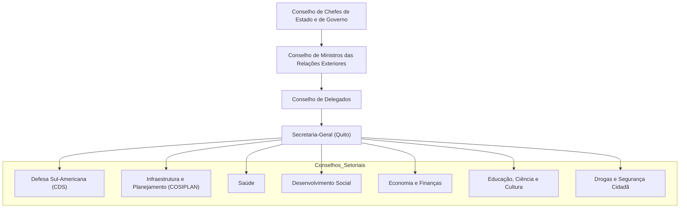
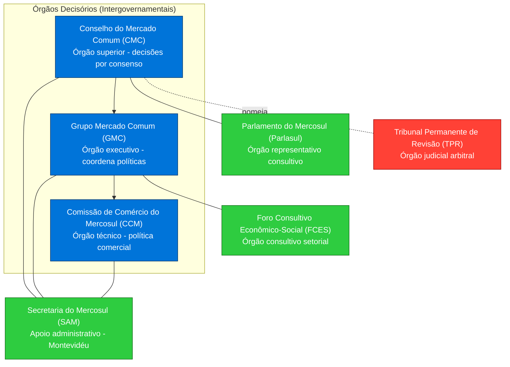
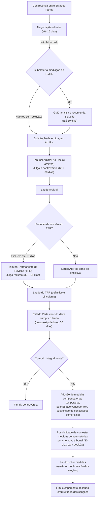
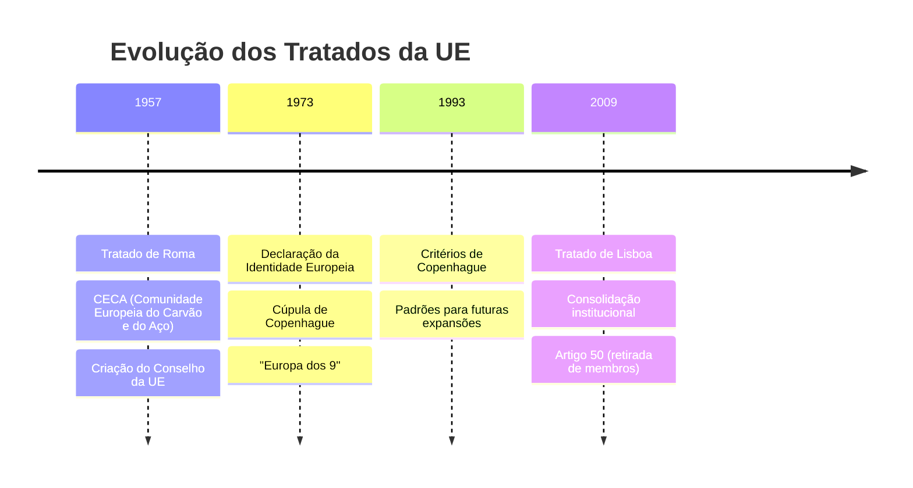
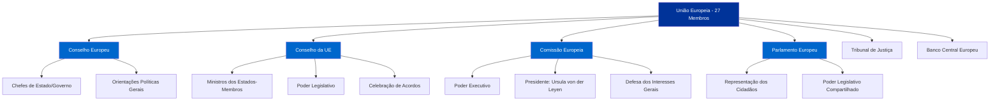
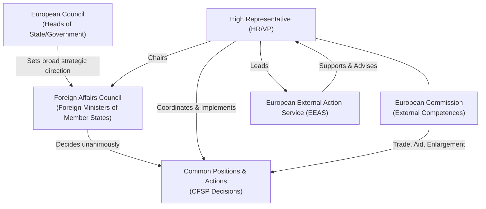
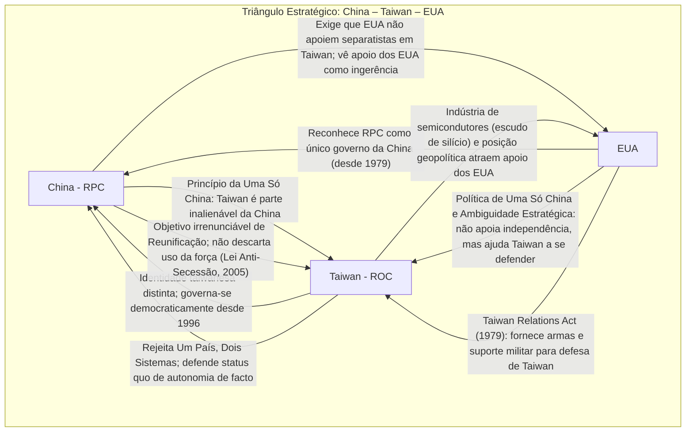
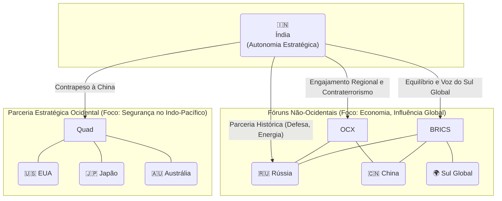
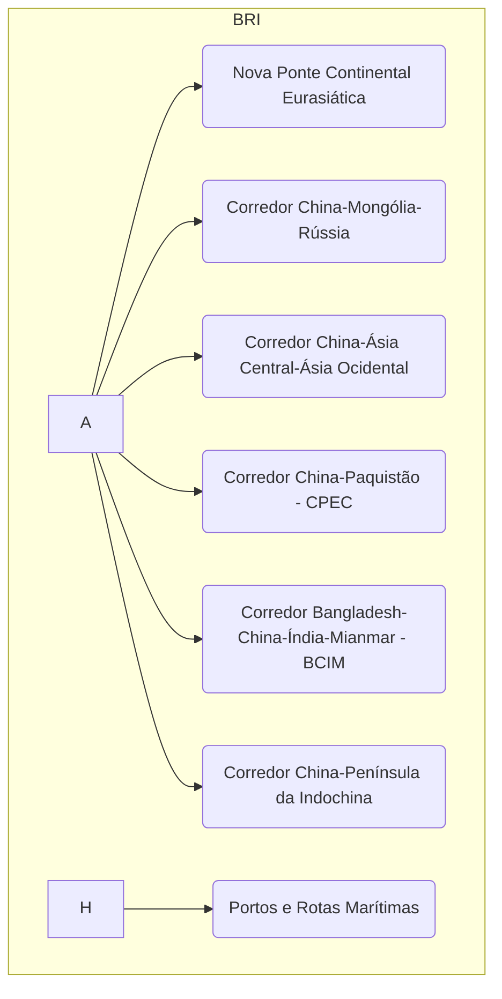

# Origem: Grupo do Rio (1986)

---
title: Grupo do Rio
area: "POLÍTICA INTERNACIONAL"
subarea: "Brasil e América do Sul (Integração, MERCOSUL)"
tags:
  - brasil-e-america-do-sul
  - cacd-2025
  - politica-internacional
  - integracao-america-do-sul
aliases:
  - Grupo do Rio
---
> **Síntese Didática (Técnica de Feynman):**  
> O Grupo do Rio, criado em 1986 no Rio de Janeiro, foi um mecanismo de consulta política que reuniu países latino-americanos e caribenhos para promover democracia, estabilidade e desenvolvimento regional, começando com oito membros e expandindo para 24. Surgiu do Grupo de Contadora e do Grupo de Apoio, focando na mediação de conflitos e na busca de soluções autônomas para a região, sem interferência externa. Foi um precursor da CELAC, sendo substituído por ela em 2011, mas deixou um legado de diálogo político e cooperação na América Latina e Caribe.

## 1. Introdução e Contexto Histórico

O **Grupo do Rio**, oficialmente conhecido como **Mecanismo Permanente de Consulta e Concertação Política da América Latina e do Caribe**, foi um fórum de diálogo político criado em 18 de dezembro de 1986, por meio da Declaração do Rio de Janeiro, assinada por oito países latino-americanos: Argentina, Brasil, Colômbia, México, Panamá, Peru, Uruguai e Venezuela. Este mecanismo surgiu em um contexto de redemocratização na América Latina, após décadas de ditaduras militares, e de crises regionais, especialmente na América Central, onde conflitos armados e intervenções externas exigiam soluções negociadas.

Diferentemente de outros organismos regionais como a Organização dos Estados Americanos (OEA), que incluía os Estados Unidos e o Canadá, o Grupo do Rio buscava ser um espaço autônomo para os países da região discutirem questões políticas, econômicas e sociais, promovendo a democracia e a estabilidade sem ingerência externa. Esta nota explora o histórico, desenvolvimento, estrutura, dificuldades e o papel do Grupo do Rio na integração regional.

## 2. Histórico do Grupo do Rio

### 2.1 Origens e Contexto
O Grupo do Rio tem suas raízes no **Grupo de Contadora**, formado em 1983 por México, Colômbia, Venezuela e Panamá, com o objetivo de mediar conflitos na América Central, especialmente em Nicarágua, El Salvador e Guatemala, onde guerras civis e a intervenção dos EUA (durante a Guerra Fria) agravavam a instabilidade. Em 1985, Argentina, Brasil, Peru e Uruguai juntaram-se ao esforço, formando o **Grupo de Apoio ao Contadora**, também conhecido como **Grupo de Lima** (pela reunião inaugural na capital peruana).

Em 18 de dezembro de 1986, esses oito países assinaram a Declaração do Rio de Janeiro, criando o **Grupo dos Oito**, que em 1990 passou a ser chamado de **Grupo do Rio**, em homenagem à cidade onde foi fundado. A iniciativa refletia o desejo de consolidar a democracia em uma região que emergia de ditaduras militares e de buscar soluções autônomas para problemas regionais, conforme descrito na Wikipedia (pt.wikipedia.org).

### 2.2 Expansão e Consolidação
Inicialmente composto por oito membros, o Grupo do Rio expandiu-se ao longo dos anos, incorporando outros países da América Latina e do Caribe. Até sua dissolução em 2011, chegou a contar com 24 membros permanentes, incluindo:
- **América do Sul**: Argentina, Brasil, Bolívia, Chile, Colômbia, Equador, Guiana, Paraguai, Peru, Suriname, Uruguai, Venezuela.
- **América Central**: Belize, Costa Rica, El Salvador, Guatemala, Honduras, Nicarágua, Panamá.
- **Caribe**: Representação rotativa pelo CARICOM (Comunidade do Caribe), com países como Jamaica, República Dominicana e Haiti participando em diferentes momentos.

De 1990 a 1999, a América Central participou como um bloco de representação rotativa, e a partir de 2000, seus integrantes aderiram individualmente, conforme Wikipedia (pt.wikipedia.org).

### 2.3 Papel na Redemocratização e Mediação de Conflitos
O Grupo do Rio desempenhou um papel crucial na promoção da democracia durante a transição de regimes autoritários para governos democráticos na América Latina nas décadas de 1980 e 1990. Atuou como mediador em crises regionais, como os conflitos na América Central, e em questões de direitos humanos e estabilidade política. Segundo a Folha de S.Paulo (1994), o grupo buscava "soluções próprias para os problemas da região", enfatizando desenvolvimento com justiça social e defesa do progresso.

## 3. Desenvolvimento e Objetivos do Grupo do Rio

### 3.1 Objetivos Principais
Conforme descrito na Wikipedia (pt.wikipedia.org) e na Folha de S.Paulo (2008), os objetivos centrais do Grupo do Rio incluíam:
- **Fortalecimento da Democracia**: Promover e consolidar regimes democráticos na América Latina e Caribe, especialmente após a onda de redemocratização dos anos 1980.
- **Estabilidade Regional**: Mediar conflitos e crises políticas para garantir a paz e a segurança na região, como nas guerras civis da América Central.
- **Soluções Autônomas**: Buscar respostas regionais para problemas locais, sem interferência de potências externas, especialmente os EUA.
- **Desenvolvimento e Justiça Social**: Fomentar o desenvolvimento econômico com equidade, abordando questões de pobreza e desigualdade.
- **Concertação Política**: Articular posições comuns em fóruns internacionais sobre temas como direitos humanos, desarmamento e cooperação econômica.

### 3.2 Atividades e Marcos Importantes
O Grupo do Rio realizou cúpulas anuais de chefes de Estado e governo, além de reuniões ministeriais, para discutir temas de interesse comum. Alguns marcos incluem:
- **Cúpula de 1986 (Rio de Janeiro, Brasil)**: Criação do grupo com a Declaração do Rio de Janeiro, focando na mediação de conflitos na América Central.
- **Cúpula de 1994 (Rio de Janeiro, Brasil)**: 8ª Cúpula Presidencial, sob a presidência de Itamar Franco, discutiu a inserção da América Latina no cenário internacional, resultando na "Declaração do Rio de Janeiro" sobre paz, estabilidade e desenvolvimento (Folha de S.Paulo, 24/09/1994).
- **Cúpula de 2008 (Santo Domingo, República Dominicana)**: Debateu a integração regional, pavimentando o caminho para a criação da CALC e, posteriormente, da CELAC.
- **Mediação de Crises**: Atuou em crises como a do Haiti (1990s) e em disputas políticas na América Central, promovendo soluções negociadas (Folha de S.Paulo, 08/03/2008).

### 3.3 Evolução e Transição para a CELAC
O Grupo do Rio evoluiu de um mecanismo de mediação de crises para um fórum mais amplo de concertação política, abordando temas como democracia, direitos humanos e desenvolvimento. No entanto, sua estrutura informal e a falta de um secretariado permanente limitavam sua capacidade de implementar políticas de longo prazo. Durante a 23ª Cúpula do Grupo do Rio, realizada em 22-23 de fevereiro de 2010 em Playa del Carmen, México, decidiu-se unificar o Grupo do Rio e a CALC em um novo organismo, a **Comunidade de Estados Latino-Americanos e Caribenhos (CELAC)**, que foi formalmente criada em 2011 na cúpula de Caracas, Venezuela (Wikipedia, pt.wikipedia.org).

## 4. Estrutura do Grupo do Rio

### 4.1 Organização e Funcionamento
O Grupo do Rio operava de maneira informal, sem uma estrutura burocrática ou sede permanente, o que refletia sua natureza como um mecanismo de consulta:
- **Cúpulas Anuais**: Reuniões de chefes de Estado e governo, geralmente anuais, para discutir questões regionais e internacionais, sediadas por diferentes países membros.
- **Secretaria Pro Tempore**: Coordenação rotativa, assumida pelo país anfitrião da cúpula, responsável por organizar reuniões e dar continuidade às decisões (ex.: Brasil em 1994, Equador em 1995, conforme Folha de S.Paulo, 24/09/1994).
- **Decisões por Consenso**: Todas as decisões eram tomadas por consenso, garantindo igualdade entre os membros, conforme Wikipedia (pt.wikipedia.org).
- **Reuniões Ministeriais**: Encontros de chanceleres e outros ministros para tratar de temas específicos, como democracia e desenvolvimento.

### 4.2 Membros
O Grupo do Rio começou com 8 membros fundadores em 1986 (Argentina, Brasil, Colômbia, México, Panamá, Peru, Uruguai e Venezuela) e expandiu-se para 24 membros permanentes até sua dissolução em 2011:
- **América do Sul**: Argentina, Brasil, Bolívia, Chile, Colômbia, Equador, Paraguai, Peru, Uruguai, Venezuela, Guiana, Suriname.
- **América Central**: Belize, Costa Rica, El Salvador, Guatemala, Honduras, Nicarágua, Panamá.
- **Caribe**: Representação rotativa pelo CARICOM (Comunidade do Caribe), incluindo países como Jamaica, República Dominicana, Haiti, Barbados, entre outros (Wikipedia, pt.wikipedia.org).

De 1990 a 1999, a América Central participou como um bloco de representação rotativa, e a partir de 2000, seus integrantes aderiram individualmente.

## 5. Dificuldades Enfrentadas pelo Grupo do Rio

### 5.1 Estrutura Informal
A ausência de um secretariado permanente ou sede fixa dificultava a continuidade das decisões tomadas nas cúpulas, limitando a capacidade de implementar projetos de longo prazo. Como mecanismo de consulta, dependia da vontade política dos países anfitriões, o que gerava inconsistências na coordenação, conforme Wikipedia (pt.wikipedia.org).

### 5.2 Polarização Política
Embora tenha surgido em um contexto de redemocratização, o Grupo do Rio enfrentou tensões ideológicas entre governos de diferentes orientações políticas, especialmente nas décadas de 1990 e 2000, com divergências sobre questões como a situação da Venezuela e o embargo a Cuba.

### 5.3 Limitações de Recursos
Sem um fundo ou mecanismo financeiro próprio, o Grupo do Rio não conseguia financiar projetos de desenvolvimento ou integração econômica de forma independente, dependendo de iniciativas bilaterais ou de outros blocos regionais, como Mercosul ou Unasul.

### 5.4 Sobreposição com Outros Organismos
A coexistência com a OEA, Mercosul, Unasul e, posteriormente, a CALC gerava competição por atenção política e recursos, reduzindo a relevância do Grupo do Rio como fórum único de integração, conforme análises da Folha de S.Paulo (08/03/2008).

## 6. Motivos da Substituição pela CELAC

### 6.1 Necessidade de um Organismo Mais Abrangente
O Grupo do Rio, inicialmente focado na mediação de crises e na promoção da democracia, não abrangia todos os países da América Latina e Caribe, nem possuía uma estrutura para tratar de questões de desenvolvimento de forma abrangente. Durante a 23ª Cúpula do Grupo do Rio, realizada em 22-23 de fevereiro de 2010 em Playa del Carmen, México, decidiu-se unificar o Grupo do Rio e a CALC em um novo organismo, a **Comunidade de Estados Latino-Americanos e Caribenhos (CELAC)**, que foi formalmente criada em 2011 na cúpula de Caracas, Venezuela (Wikipedia, pt.wikipedia.org).

### 6.2 Formalização e Inclusão
A CELAC foi projetada para incluir todos os 33 países da América Latina e Caribe, superando a limitação do Grupo do Rio, que contava com apenas 24 membros permanentes e representação rotativa do CARICOM. Além disso, buscava uma estrutura mais formal, com presidência pro tempore rotativa e reuniões regulares, para garantir continuidade, conforme informações do MRE (www.gov.br/mre).

### 6.3 Resposta a Mudanças Globais
A substituição pelo CELAC refletiu a necessidade de um bloco mais robusto em um contexto de mudança no equilíbrio de poder global, com o declínio relativo da hegemonia norte-americana e a ascensão de blocos regionais. A CELAC foi vista como um passo para articular posições comuns em fóruns globais, algo que o Grupo do Rio, por sua natureza limitada, não conseguia realizar plenamente.

## 7. Conexões Interdisciplinares

### 7.1 Conexões com Outros Temas do Edital
- **Política Externa Brasileira**: O Brasil desempenhou um papel central na criação e nas atividades do Grupo do Rio, sediando cúpulas importantes como a de 1986 e 1994, conectando-se à sua estratégia de liderança regional e diplomacia Sul-Sul, que continuou com a CALC e a CELAC.
- **Relações Internacionais**: O Grupo do Rio reflete a busca por autonomia regional frente à influência dos EUA (OEA), conectando-se a debates sobre multipolaridade e a formação de blocos regionais como alternativa à hegemonia norte-americana.
- **História Mundial Contemporânea**: Insere-se no contexto de redemocratização latino-americana pós-1980, influenciada pela transição de ditaduras para democracias, conectando-se a movimentos históricos de resistência ao intervencionismo externo.
- **Economia Internacional**: Embora focado em política, o Grupo do Rio abordou questões de desenvolvimento econômico, conectando-se a esforços de integração comercial e redução de desigualdades na América Latina e Caribe.

## 8. Questões para Revisão (Active Recall)

1. **Origens e Objetivos**: Quais foram os principais objetivos do Grupo do Rio ao ser criado em 1986? Como ele se conecta a iniciativas anteriores, como o Grupo de Contadora e o Grupo de Apoio?
2. **Expansão e Atividades**: Descreva a evolução do Grupo do Rio em termos de membresia e atividades. Quais foram alguns dos marcos importantes em suas cúpulas?
3. **Dificuldades Enfrentadas**: Analise as principais dificuldades enfrentadas pelo Grupo do Rio durante sua existência. Como a falta de estrutura permanente impactou sua eficácia?
4. **Motivos da Substituição**: Explique os motivos que levaram à substituição do Grupo do Rio pela CELAC em 2011. Quais foram as vantagens da criação de um organismo mais amplo e formal como a CELAC?

---

# Origem: Grupo de Contadora (1983)

---
title: Grupo de Contadora (1983)
area: "POLÍTICA INTERNACIONAL"
subarea: "Brasil e América do Sul (Integração, MERCOSUL)"
tags:
  - brasil-e-america-do-sul
  - cacd-2025
  - politica-internacional
  - integracao-america-do-sul
aliases:
  - Grupo de Contadora 
---
> **Síntese Didática (Técnica de Feynman):**  
> O Grupo de Contadora, criado em 1983 por México, Panamá, Colômbia e Venezuela, foi uma iniciativa diplomática para mediar conflitos na América Central, especialmente em El Salvador, Nicarágua e Guatemala, durante a Guerra Fria, buscando soluções regionais sem intervenção dos EUA. Reunia-se na Ilha de Contadora, Panamá, e promoveu planos de paz como o Documento de Objetivos (1983) e a Ata de Contadora (1984), embora sem apoio total dos EUA. Evoluiu para o Grupo do Rio ao incorporar o Grupo de Apoio (Argentina, Brasil, Peru, Uruguai), sendo um passo crucial para a integração latino-americana e a autonomia regional.

## 1. Introdução e Contexto Histórico

O **Grupo de Contadora** foi uma iniciativa diplomática criada em 9 de janeiro de 1983 por México, Panamá, Colômbia e Venezuela, com o objetivo de mediar os conflitos armados na América Central, particularmente em El Salvador, Nicarágua e Guatemala, durante um período de intensa instabilidade política e militar na região. Este grupo surgiu em um contexto de Guerra Fria, marcado pela retomada de políticas intervencionistas dos Estados Unidos na América Latina sob a administração de Ronald Reagan, exemplificada pela invasão de Granada em 1983. O nome "Contadora" deriva da Ilha de Contadora, no Panamá, onde ocorreram as primeiras reuniões.

O Grupo de Contadora buscava promover a paz e a estabilidade na América Central por meio de soluções regionais, rejeitando a abordagem militarista dos EUA e propondo diálogo e negociação. Mais tarde, com a adesão de Argentina, Brasil, Peru e Uruguai como **Grupo de Apoio ao Contadora** em 1985, ampliou sua influência e pavimentou o caminho para a criação do **Grupo do Rio** em 1986. Esta nota explora o histórico, desenvolvimento, estrutura, dificuldades e relevância do Grupo de Contadora para a integração regional, destacando sua importância para os estudos do CACD.

## 2. Histórico do Grupo de Contadora

### 2.1 Origens e Contexto
Na década de 1980, a América Central enfrentava graves conflitos internos, exacerbados pela dinâmica da Guerra Fria. Em Nicarágua, a Revolução Sandinista (1979) derrubou a ditadura de Anastasio Somoza, levando a um confronto com os Contras, grupos contrarrevolucionários financiados pelos EUA. Em El Salvador e Guatemala, guerras civis entre governos apoiados pelos EUA e guerrilhas de esquerda causavam milhares de mortes e deslocamentos. A política externa norte-americana, sob Ronald Reagan, priorizava a contenção do comunismo, resultando em intervenções diretas (como em Granada, 1983) e apoio a regimes autoritários, o que agravava a instabilidade regional.

Diante desse cenário, os chanceleres de México, Panamá, Colômbia e Venezuela reuniram-se na Ilha de Contadora, Panamá, em janeiro de 1983, para buscar soluções pacíficas e regionais para os conflitos, sem a interferência direta de potências externas. A iniciativa foi impulsionada por um apelo internacional de figuras como o primeiro-ministro sueco Olof Palme e os laureados com o Nobel Gabriel García Márquez, Alfonso García Robles e Alva Myrdal, que pediram aos presidentes desses quatro países que atuassem como mediadores, conforme descrito na Wikipedia (en.wikipedia.org).

### 2.2 Formação e Expansão
O Grupo de Contadora foi formalmente estabelecido em 9 de janeiro de 1983, inicialmente composto por México, Panamá, Colômbia e Venezuela. Em 1985, Argentina, Brasil, Peru e Uruguai formaram o **Grupo de Apoio ao Contadora** (também chamado de Grupo de Lima, por sua reunião inaugural na capital peruana), ampliando o alcance da iniciativa. Esses oito países juntos passaram a ser conhecidos como o **Grupo dos Oito**, que em 1986 evoluiu para o **Grupo do Rio**, um mecanismo mais amplo de consulta política na América Latina e Caribe (Wikipedia, pt.wikipedia.org).

### 2.3 Marcos Importantes
- **Reunião Inicial (Janeiro de 1983, Ilha de Contadora, Panamá)**: Primeira reunião dos chanceleres dos quatro países fundadores, estabelecendo o objetivo de pacificação da América Central.
- **Documento de Objetivos (Setembro de 1983, Cidade do Panamá)**: Os ministros das Relações Exteriores dos países centro-americanos (Nicarágua, Costa Rica, Honduras, El Salvador e Guatemala), mediados pelo Grupo de Contadora, adotaram um documento com 21 pontos, comprometendo-se com democratização, fim de conflitos armados, respeito ao direito internacional e desenvolvimento econômico (Wikipedia, en.wikipedia.org).
- **Ata de Contadora para Paz e Cooperação na América Central (Setembro de 1984)**: Proposta detalhada de compromissos para paz, democratização, segurança regional e cooperação econômica, incluindo comitês regionais para verificar o cumprimento. Embora aprovada preliminarmente pelos presidentes centro-americanos, não obteve apoio crucial dos EUA devido ao reconhecimento implícito do governo sandinista da Nicarágua (Wikipedia, en.wikipedia.org).
- **Criação do Grupo de Apoio (1985, Lima, Peru)**: Adesão de Argentina, Brasil, Peru e Uruguai, ampliando a representatividade e o peso político da iniciativa.
- **Esquipulas I e II (1986-1987)**: Embora o Grupo de Contadora não tenha conseguido implementar a Ata de Contadora devido à oposição de Honduras, El Salvador e Costa Rica (influenciados pelos EUA), suas ideias fundamentaram os Acordos de Esquipulas, liderados pelo presidente da Costa Rica, Óscar Arias, que resultaram em paz na região (Fundación Princesa de Asturias, www.fpa.es).

## 3. Desenvolvimento e Objetivos do Grupo de Contadora

### 3.1 Objetivos Principais
Conforme descrito na Wikipedia (pt.wikipedia.org e en.wikipedia.org) e na Fundación Princesa de Asturias (www.fpa.es), os objetivos centrais do Grupo de Contadora incluíam:
- **Pacificação da América Central**: Mediar os conflitos em El Salvador, Nicarágua e Guatemala, promovendo o fim das hostilidades e a desmobilização de grupos armados.
- **Soluções Regionais**: Buscar soluções autônomas para os problemas da América Central, rejeitando intervenções externas, especialmente dos EUA, e promovendo o diálogo entre as partes envolvidas.
- **Democratização**: Incentivar a transição para regimes democráticos na região, apoiando eleições livres e o respeito aos direitos humanos.
- **Respeito ao Direito Internacional**: Garantir que as ações dos países centro-americanos seguissem normas internacionais, evitando escaladas militares.
- **Desenvolvimento Econômico**: Revitalizar a economia da América Central por meio de cooperação regional e acesso a mercados internacionais, como parte de uma estratégia de longo prazo para a estabilidade.

### 3.2 Atividades e Resultados
O Grupo de Contadora realizou várias reuniões de chanceleres e cúpulas presidenciais para negociar a paz na América Central:
- **Mediação de Conflitos**: Atuou como intermediário entre governos e grupos guerrilheiros, propondo planos de paz como o Documento de Objetivos (1983) e a Ata de Contadora (1984), que incluíam desarmamento, eleições e cooperação econômica.
- **Pressão Internacional**: Ganhou apoio da ONU, da OEA e da Comunidade Europeia, aumentando a pressão sobre os EUA para suavizar sua postura militarista na região (Wikipedia, en.wikipedia.org).
- **Fundação para a Paz**: Embora não tenha implementado diretamente seus planos devido à oposição dos EUA e de alguns governos centro-americanos, suas ideias foram a base para os Acordos de Esquipulas (1986-1987), que trouxeram paz à região sob a liderança de Óscar Arias, da Costa Rica (Fundación Princesa de Asturias, www.fpa.es).

### 3.3 Evolução para o Grupo do Rio
Em 1985, com a adesão do Grupo de Apoio (Argentina, Brasil, Peru, Uruguai), o Grupo de Contadora expandiu seu escopo e influência, culminando na criação do **Grupo do Rio** em 18 de dezembro de 1986, no Rio de Janeiro, Brasil. Este novo mecanismo ampliou o foco para além da América Central, abrangendo questões de democracia e desenvolvimento em toda a América Latina e Caribe, sendo um precursor da CALC e, posteriormente, da CELAC (Wikipedia, pt.wikipedia.org).

## 4. Estrutura do Grupo de Contadora

### 4.1 Organização e Funcionamento
O Grupo de Contadora operava de maneira informal, sem uma estrutura burocrática ou sede permanente, funcionando como um mecanismo de consulta diplomática:
- **Reuniões de Chanceleres**: Encontros regulares dos ministros das Relações Exteriores dos países membros para negociar planos de paz e coordenar ações, frequentemente na Ilha de Contadora, Panamá.
- **Cúpulas Presidenciais**: Reuniões de alto nível, como a de Cancún, México (1983), onde os presidentes dos quatro países fundadores reafirmaram o compromisso com soluções regionais (Fundación Princesa de Asturias, www.fpa.es).
- **Decisões por Consenso**: Todas as decisões eram tomadas por consenso, garantindo igualdade entre os membros.
- **Apoio Internacional**: Recebeu suporte de organismos como a ONU e a OEA, além de figuras internacionais, para pressionar por soluções pacíficas (Wikipedia, en.wikipedia.org).

### 4.2 Membros
O Grupo de Contadora foi inicialmente composto por quatro países:
- **México**
- **Panamá**
- **Colômbia**
- **Venezuela**

Em 1985, foi ampliado com a criação do **Grupo de Apoio ao Contadora**, composto por:
- **Argentina**
- **Brasil**
- **Peru**
- **Uruguai**

Juntos, esses oito países formaram o que foi chamado de **Grupo dos Oito**, que evoluiu para o **Grupo do Rio** em 1986 (Wikipedia, pt.wikipedia.org).

## 5. Dificuldades Enfrentadas pelo Grupo de Contadora

### 5.1 Oposição dos Estados Unidos
A principal dificuldade enfrentada pelo Grupo de Contadora foi a falta de apoio dos Estados Unidos, que se opuseram a planos como a Ata de Contadora (1984) por reconhecerem implicitamente o governo sandinista da Nicarágua e proibirem ações unilaterais dos EUA na região. Além disso, os EUA bloquearam recursos ao Tribunal Internacional de Justiça e à ONU, conforme exigido pelo direito internacional, e pressionaram países como Honduras, El Salvador e Costa Rica a rejeitar os acordos, culminando na recusa formal em junho de 1986 (Wikipedia, en.wikipedia.org).

### 5.2 Estrutura Informal
A ausência de uma estrutura permanente ou secretariado fixo limitava a continuidade das negociações e a implementação de acordos, dependendo da vontade política dos países membros e da capacidade organizativa de cada reunião (Fundación Princesa de Asturias, www.fpa.es).

### 5.3 Polarização e Conflitos Internos
Os conflitos internos na América Central, com governos apoiados pelos EUA (como em El Salvador e Honduras) e movimentos guerrilheiros de esquerda (como os sandinistas na Nicarágua), dificultavam a obtenção de consenso para os planos de paz propostos pelo grupo.

### 5.4 Recursos Limitados
Sem um fundo ou mecanismo financeiro próprio, o Grupo de Contadora não conseguia oferecer incentivos econômicos significativos para a implementação de seus planos, dependendo de apoio internacional limitado (Wikipedia, en.wikipedia.org).

## 6. Motivos da Substituição pelo Grupo do Rio

### 6.1 Necessidade de Ampliação do Escopo
O Grupo de Contadora foi inicialmente focado na mediação de conflitos na América Central, mas as questões de democracia e desenvolvimento exigiam um fórum mais amplo que incluísse toda a América Latina e Caribe. Em 1985, a adesão do Grupo de Apoio (Argentina, Brasil, Peru, Uruguai) ampliou sua representatividade, levando à criação do **Grupo do Rio** em 18 de dezembro de 1986, no Rio de Janeiro, Brasil, como um mecanismo de consulta política para toda a região (Wikipedia, pt.wikipedia.org).

### 6.2 Formalização e Continuidade
A estrutura informal do Grupo de Contadora limitava sua capacidade de implementar soluções de longo prazo. O Grupo do Rio buscou maior formalização, com cúpulas anuais e uma coordenação rotativa, para garantir continuidade e abordar uma gama mais ampla de questões, como direitos humanos e integração econômica (Fundación Princesa de Asturias, www.fpa.es).

### 6.3 Resposta a Mudanças Regionais
A transição para o Grupo do Rio refletiu a redemocratização da América Latina nos anos 1980, com a necessidade de um fórum que promovesse a consolidação democrática e a estabilidade em toda a região, não apenas na América Central. Essa evolução foi um passo para organismos mais abrangentes, como a CALC e a CELAC (Wikipedia, pt.wikipedia.org).

## 7. Conexões Interdisciplinares 

### 7.1 Conexões com Outros Temas do Edital
- **Política Externa Brasileira**: O Brasil desempenhou um papel central ao integrar o Grupo de Apoio ao Contadora em 1985, conectando-se à sua estratégia de liderança regional e diplomacia Sul-Sul, que continuou com o Grupo do Rio, CALC e CELAC.
- **Relações Internacionais**: O Grupo de Contadora reflete a busca por autonomia regional frente à influência dos EUA durante a Guerra Fria, conectando-se a debates sobre multipolaridade e resistência ao intervencionismo.
- **História Mundial Contemporânea**: Insere-se no contexto da Guerra Fria na América Latina, influenciado por conflitos ideológicos e intervenções externas, conectando-se a movimentos históricos de redemocratização e pacificação na região.
- **Economia Internacional**: Embora focado em política, o grupo abordou questões de desenvolvimento econômico como parte da estabilidade regional, conectando-se a esforços de integração econômica na América Latina.

## 8. Questões para Revisão (Active Recall)

1. **Origens e Objetivos**: Quais foram os principais objetivos do Grupo de Contadora ao ser criado em 1983? Como ele se conecta ao contexto da Guerra Fria na América Central?
2. **Atividades e Resultados**: Descreva as principais atividades do Grupo de Contadora, como o Documento de Objetivos (1983) e a Ata de Contadora (1984). Quais foram os resultados desses esforços?
3. **Dificuldades Enfrentadas**: Analise as principais dificuldades enfrentadas pelo Grupo de Contadora durante sua existência. Como a oposição dos EUA impactou seus planos de paz?
4. **Motivos da Substituição**: Explique os motivos que levaram à substituição do Grupo de Contadora pelo Grupo do Rio em 1986. Quais foram as vantagens da criação de um mecanismo mais amplo como o Grupo do Rio?

---

# Origem: Grupo de Apoio ao Contadora (1985)

---
title: Grupo de Apoio ao Contadora (1985)
area: POLÍTICA INTERNACIONAL
subarea: Brasil e América do Sul (Integração, MERCOSUL)
tags:
  - brasil-e-america-do-sul
  - cacd-2025
  - politica-internacional
  - integracao-america-do-sul
aliases:
  - Grupo de Apoio ao Contadora
  - Grupo de Lima
---
> **Síntese Didática (Técnica de Feynman):**  
> O Grupo de Apoio ao Contadora, formado em 1985 por Argentina, Brasil, Peru e Uruguai, foi uma iniciativa diplomática para reforçar os esforços do Grupo de Contadora (México, Panamá, Colômbia, Venezuela) na mediação de conflitos na América Central, como os de Nicarágua, El Salvador e Guatemala, durante a Guerra Fria. Seu objetivo era ampliar o peso político e a representatividade regional para promover paz e soluções autônomas, sem intervenção dos EUA. Junto com o Contadora, evoluiu para o Grupo do Rio em 1986, marcando um passo importante na integração latino-americana e na busca por autonomia regional.

## 1. Introdução e Contexto Histórico

O **Grupo de Apoio ao Contadora**, também conhecido como **Grupo de Lima** (devido à sua reunião inaugural na capital peruana), foi uma iniciativa diplomática criada em 1985 por Argentina, Brasil, Peru e Uruguai para apoiar os esforços do **Grupo de Contadora** (México, Panamá, Colômbia e Venezuela) na mediação de conflitos armados na América Central , especialmente em Nicarágua, El Salvador e Guatemala. Este grupo surgiu em um contexto de intensos conflitos na região durante a Guerra Fria, marcado por guerras civis, intervenções externas (notadamente dos EUA) e a busca por soluções regionais autônomas.

O Grupo de Apoio ao Contadora representou uma expansão do alcance e da influência do Grupo de Contadora, adicionando o peso político e econômico de países da América do Sul à iniciativa original focada na América Central. Juntos, os dois grupos formaram o chamado **Grupo dos Oito**, que em 1986 evoluiu para o **Grupo do Rio**, um mecanismo mais amplo de consulta política na América Latina e Caribe. Esta nota explora o histórico, desenvolvimento, estrutura, dificuldades e relevância do Grupo de Apoio ao Contadora para a integração regional.

## 2. Histórico do Grupo de Apoio ao Contadora

### 2.1 Origens e Contexto
Na década de 1980, a América Central enfrentava uma série de conflitos armados agravados pela dinâmica da Guerra Fria. Em Nicarágua, a Revolução Sandinista (1979) levou a um confronto com os Contras, grupos contrarrevolucionários financiados pelos EUA. Em El Salvador e Guatemala, guerras civis entre governos apoiados pelos EUA e guerrilhas de esquerda causavam devastação. A política externa norte-americana sob Ronald Reagan priorizava a contenção do comunismo, resultando em intervenções diretas (como a invasão de Granada em 1983) e apoio a regimes autoritários, o que intensificava a instabilidade.

O **Grupo de Contadora**, criado em 9 de janeiro de 1983 por México, Panamá, Colômbia e Venezuela , buscava mediar esses conflitos por meio de soluções regionais, rejeitando a abordagem militarista dos EUA. No entanto, a limitação geográfica e política do grupo, restrito a quatro países, dificultava sua capacidade de influenciar as partes em conflito e resistir às pressões externas. Assim, em 1985, Argentina, Brasil, Peru e Uruguai formaram o **Grupo de Apoio ao Contadora**, ampliando a representatividade e o peso político da iniciativa, conforme descrito na Wikipedia (en.wikipedia.org).

### 2.2 Formação e Expansão
O Grupo de Apoio ao Contadora foi formalmente estabelecido em 1985, com sua primeira reunião realizada em Lima, Peru, razão pela qual também é conhecido como **Grupo de Lima**. Os quatro países sul-americanos – Argentina, Brasil, Peru e Uruguai – juntaram-se aos esforços do Grupo de Contadora para fortalecer a mediação na América Central. Juntos, os oito países passaram a ser referidos como o **Grupo dos Oito**, que em 18 de dezembro de 1986 evoluiu para o **Grupo do Rio**, um mecanismo mais amplo de consulta política na América Latina e Caribe (Wikipedia, pt.wikipedia.org).

### 2.3 Marcos Importantes
- **Reunião Inaugural (1985, Lima, Peru)**: Primeira reunião dos quatro países do Grupo de Apoio, comprometendo-se a apoiar os planos de paz do Grupo de Contadora, como a Ata de Contadora para Paz e Cooperação na América Central (1984) (Wikipedia, en.wikipedia.org).
- **Apoio aos Acordos de Paz**: O Grupo de Apoio reforçou as iniciativas do Contadora, contribuindo para a pressão internacional que culminou nos Acordos de Esquipulas (1986-1987), liderados por Óscar Arias da Costa Rica, que trouxeram paz à região (Fundación Princesa de Asturias, www.fpa.es).
- **Transição para o Grupo do Rio (1986, Rio de Janeiro, Brasil)**: A união do Grupo de Contadora e do Grupo de Apoio resultou na criação do Grupo do Rio, expandindo o foco para além da América Central e abrangendo questões de democracia e desenvolvimento em toda a América Latina e Caribe (Wikipedia, pt.wikipedia.org).

## 3. Desenvolvimento e Objetivos do Grupo de Apoio ao Contadora

### 3.1 Objetivos Principais
Conforme descrito na Wikipedia (en.wikipedia.org) e na Fundación Princesa de Asturias (www.fpa.es), os objetivos centrais do Grupo de Apoio ao Contadora incluíam:
- **Fortalecer a Mediação do Contadora**: Ampliar o peso político e a representatividade regional dos esforços de mediação do Grupo de Contadora na América Central , especialmente em conflitos como os de Nicarágua, El Salvador e Guatemala.
- **Promover Soluções Regionais**: Apoiar soluções autônomas para os problemas da América Central, rejeitando intervenções externas, particularmente dos EUA, e promovendo o diálogo entre as partes em conflito.
- **Apoiar a Democratização**: Incentivar a transição para regimes democráticos na região, apoiando eleições livres e o respeito aos direitos humanos.
- **Aumentar a Pressão Internacional**: Adicionar a influência política e econômica de países sul-americanos para pressionar por soluções pacíficas e obter maior apoio de organismos internacionais como a ONU e a OEA.

### 3.2 Atividades e Resultados
O Grupo de Apoio ao Contadora participou de várias reuniões e cúpulas para apoiar os planos de paz do Grupo de Contadora:
- **Reuniões Conjuntas**: Participou de encontros com o Grupo de Contadora para coordenar esforços diplomáticos, como na formulação de propostas de paz e na pressão por negociações entre governos e guerrilhas na América Central (Wikipedia, en.wikipedia.org).
- **Apoio aos Planos de Paz**: Endossou iniciativas como o Documento de Objetivos (1983) e a Ata de Contadora (1984), que buscavam desarmamento, eleições e cooperação econômica na região, embora essas propostas não tenham sido plenamente implementadas devido à oposição dos EUA e de alguns governos centro-americanos (Fundación Princesa de Asturias, www.fpa.es).
- **Base para o Grupo do Rio**: A colaboração entre o Grupo de Contadora e o Grupo de Apoio culminou na criação do Grupo do Rio em 1986, expandindo o escopo da iniciativa para toda a América Latina e Caribe (Wikipedia, pt.wikipedia.org).

## 4. Estrutura do Grupo de Apoio ao Contadora

### 4.1 Organização e Funcionamento
O Grupo de Apoio ao Contadora operava de maneira informal, sem uma estrutura burocrática ou sede permanente, funcionando como um mecanismo de consulta diplomática em conjunto com o Grupo de Contadora:
- **Reuniões de Chanceleres**: Encontros regulares dos ministros das Relações Exteriores dos quatro países membros, frequentemente realizados em paralelo às reuniões do Grupo de Contadora, para coordenar posições e estratégias (Wikipedia, en.wikipedia.org).
- **Cúpulas Presidenciais**: Reuniões de alto nível, como a de Lima em 1985, onde os presidentes dos países do Grupo de Apoio reafirmaram o compromisso com a pacificação da América Central (Fundación Princesa de Asturias, www.fpa.es).
- **Decisões por Consenso**: Todas as decisões eram tomadas por consenso, garantindo igualdade entre os membros.
- **Coordenação com Contadora**: Atuava como um complemento ao Grupo de Contadora, participando de negociações e endossando suas propostas de paz.

### 4.2 Membros
O Grupo de Apoio ao Contadora foi composto por quatro países sul-americanos:
- **Argentina**
- **Brasil**
- **Peru**
- **Uruguai**

Juntos com os quatro membros do Grupo de Contadora (México, Panamá, Colômbia, Venezuela), formaram o **Grupo dos Oito**, que evoluiu para o **Grupo do Rio** em 1986 (Wikipedia, pt.wikipedia.org).

## 5. Dificuldades Enfrentadas pelo Grupo de Apoio ao Contadora

### 5.1 Oposição dos Estados Unidos
Assim como o Grupo de Contadora, o Grupo de Apoio enfrentou resistência dos Estados Unidos, que se opunham a planos de paz que reconhecessem governos ou movimentos de esquerda, como os sandinistas na Nicarágua. Essa oposição limitou a implementação de propostas como a Ata de Contadora (1984), conforme descrito na Wikipedia (en.wikipedia.org).

### 5.2 Estrutura Informal
A ausência de uma estrutura permanente ou secretariado fixo dificultava a continuidade das negociações e a implementação de acordos, dependendo da vontade política dos países membros e da capacidade organizativa de cada reunião (Fundación Princesa de Asturias, www.fpa.es).

### 5.3 Conflitos Internos na América Central
Os conflitos internos na América Central, com governos apoiados pelos EUA (como em El Salvador e Honduras) e movimentos guerrilheiros de esquerda (como os sandinistas na Nicarágua), dificultavam a obtenção de consenso para os planos de paz propostos pelo grupo e apoiados pelo Grupo de Apoio.

### 5.4 Recursos Limitados
Sem um fundo ou mecanismo financeiro próprio, o Grupo de Apoio ao Contadora não conseguia oferecer incentivos econômicos significativos para a implementação de seus planos, dependendo de apoio internacional limitado (Wikipedia, en.wikipedia.org).

## 6. Motivos da Substituição pelo Grupo do Rio

### 6.1 Necessidade de Ampliação do Escopo
O Grupo de Apoio ao Contadora, junto com o Grupo de Contadora , focava principalmente na mediação de conflitos na América Central. No entanto, as questões de democracia, desenvolvimento e estabilidade exigiam um fórum mais amplo que incluísse toda a América Latina e Caribe. Em 18 de dezembro de 1986, os oito países (Contadora e Apoio) formaram o **Grupo do Rio** no Rio de Janeiro, Brasil, como um mecanismo de consulta política para toda a região (Wikipedia, pt.wikipedia.org).

### 6.2 Formalização e Continuidade
A estrutura informal do Grupo de Apoio e do Contadora limitava sua capacidade de implementar soluções de longo prazo. O Grupo do Rio buscou maior formalização, com cúpulas anuais e uma coordenação rotativa, para garantir continuidade e abordar uma gama mais ampla de questões, como direitos humanos e integração econômica (Fundación Princesa de Asturias, www.fpa.es).

### 6.3 Resposta a Mudanças Regionais
A transição para o Grupo do Rio refletiu a redemocratização da América Latina nos anos 1980, com a necessidade de um fórum que promovesse a consolidação democrática e a estabilidade em toda a região, não apenas na América Central. Essa evolução foi um passo para organismos mais abrangentes, como a CALC e a CELAC (Wikipedia, pt.wikipedia.org).

## 7. Conexões Interdisciplinares 

### 7.1 Conexões com Outros Temas do Edital
- **Política Externa Brasileira**: O Brasil desempenhou um papel central ao integrar o Grupo de Apoio ao Contadora em 1985, conectando-se à sua estratégia de liderança regional e diplomacia Sul-Sul, que continuou com o Grupo do Rio, CALC e CELAC.
- **Relações Internacionais**: O Grupo de Apoio reflete a busca por autonomia regional frente à influência dos EUA durante a Guerra Fria, conectando-se a debates sobre multipolaridade e resistência ao intervencionismo.
- **História Mundial Contemporânea**: Insere-se no contexto da Guerra Fria na América Latina, influenciado por conflitos ideológicos e intervenções externas, conectando-se a movimentos históricos de redemocratização e pacificação na região.
- **Economia Internacional**: Embora focado em política, o grupo abordou questões de desenvolvimento econômico como parte da estabilidade regional, conectando-se a esforços de integração econômica na América Latina.

## 8. Questões para Revisão (Active Recall)

1. **Origens e Objetivos**: Quais foram os principais objetivos do Grupo de Apoio ao Contadora ao ser criado em 1985? Como ele se conecta ao Grupo de Contadora e ao contexto da Guerra Fria na América Central?
2. **Atividades e Resultados**: Descreva as principais atividades do Grupo de Apoio ao Contadora e seu papel no apoio aos planos de paz do Grupo de Contadora. Quais foram os resultados desses esforços?
3. **Dificuldades Enfrentadas**: Analise as principais dificuldades enfrentadas pelo Grupo de Apoio ao Contadora durante sua existência. Como a oposição dos EUA impactou seus objetivos?
4. **Motivos da Substituição**: Explique os motivos que levaram à substituição do Grupo de Apoio ao Contadora e do Grupo de Contadora pelo Grupo do Rio em 1986. Quais foram as vantagens da criação de um mecanismo mais amplo como o Grupo do Rio?

---

# Origem: O MERCOSUL - origens do processo de integração no Cone Sul.

---
title: Origens do processo de integração no Cone Sul
area: POLÍTICA INTERNACIONAL
subarea: Brasil e América do Sul (Integração, MERCOSUL)
tags:
  - brasil-e-america-do-sul
  - cacd-2025
  - politica-internacional
aliases:
  - "O MERCOSUL: origens do processo de integração no Cone Sul."
---
# As Origens do Mercosul: Da Rivalidade à Integração Estratégica no Cone Sul (1985-1991)

Nos anos 1980, Brasil e Argentina protagonizaram uma virada histórica em suas relações – de **rivais estratégicos** a parceiros comprometidos com a **integração regional**. A criação do Mercosul não foi apenas um acordo comercial, mas sobretudo um projeto **político-estratégico** voltado a consolidar a paz, a confiança mútua, a democracia e o desenvolvimento no Cone Sul. Este estudo explora como a redemocratização possibilitou a reaproximação, os passos graduais (da Declaração de Iguaçu em 1985 ao Tratado de Assunção em 1991) e o porquê de o Mercosul ter nascido como resposta estratégica para superar séculos de rivalidade entre Brasil e Argentina.

## O Contexto da Reaproximação: Redemocratização e Vontade Política

Após décadas de regimes militares e desconfiança mútua, a **redemocratização simultânea** do Brasil e da Argentina na primeira metade dos anos 1980 criou condições políticas inéditas para a reaproximação. Em 1983, Raúl Alfonsín tornou-se presidente civil da Argentina após a ditadura, e em 1985 José Sarney assumiu a presidência brasileira com o fim do regime militar. Ambos os líderes tinham claro que a antiga **“hipótese de conflito”** entre os dois países – alimentada pelas forças armadas durante a Guerra Fria – deveria ser **substituída pela lógica da cooperação**. Houve uma decisão política consciente, liderada por Alfonsín e Sarney, de desfazer a imagem do outro como inimigo potencial e construir uma nova confiança bilateral.

> [!note] **Redefinindo a Relação Brasil-Argentina**  
> A transição democrática foi fundamental para **desfazer décadas de rivalidade estratégica**. Sob os militares, Brasil e Argentina competiam por protagonismo regional e até cogitavam cenários de confronto – por exemplo, disputas por usinas hidrelétricas na Bacia do Prata e uma **corrida nuclear velada**. Com governos civis, emergiu a vontade de **“liquidar a hipótese de confronto militar”** entre os dois países e inaugurar uma era de **diálogo e cooperação**. Esse realinhamento político refletiu-se em gestos simbólicos: em 1984-85, Brasil apoiou a reivindicação argentina nas Ilhas Malvinas/Falklands e multiplicou visitas diplomáticas de alto nível. A confiança mútua passou a ser vista como condição para a estabilidade democrática e o desenvolvimento regional.

No panorama internacional, a integração regional também ganhou apelo estratégico. O fim da Guerra Fria e a globalização em ascensão pressionavam as economias em desenvolvimento a buscarem maior competitividade. Ideias do **estruturalismo da CEPAL** pregavam a integração latino-americana como caminho para superar o subdesenvolvimento e aumentar o poder de barganha externo. Assim, Sarney e Alfonsín vislumbraram uma aliança que não apenas mitigasse rivalidades históricas, mas também ampliasse os mercados e fortalecesse a posição do Cone Sul no mundo. Nascia um **projeto de integração político-estratégico**, no qual considerações econômicas – embora relevantes – eram meios para um fim maior: **consolidar a paz e a democracia entre vizinhos tradicionalmente desconfiados**.

## Os Passos da Integração: A Construção Gradual da Confiança

A aproximação Brasil-Argentina não ocorreu de um salto, mas por meio de **passos graduais e confiantes**, nos quais cada acordo firmado reduzia um pouco mais a antiga desconfiança. Entre 1985 e 1991, uma série de **entendimentos bilaterais** pavimentou o caminho para o Mercosul, sempre com enfoque na **cooperação estratégica** antes de vantagens comerciais imediatas. Destacam-se os marcos a seguir:

### Declaração de Iguaçu (1985): O Marco Zero da Nova Relação

O primeiro grande passo foi dado em 30 de novembro de 1985, quando Raúl Alfonsín e José Sarney assinaram a **Declaração de Iguaçu** em Foz do Iguaçu. Aproveitando a inauguração da Ponte Tancredo Neves (ligação física entre Brasil e Argentina), os dois presidentes lançaram as bases de uma parceria inédita. O documento expressava **a decisão política de iniciar um amplo processo de cooperação e integração** entre Brasil e Argentina, rompendo com a animosidade do passado. Dois objetivos centrais ficaram estabelecidos na Declaração:

- **Criação de um Grupo de Trabalho binacional de alto nível** – liderado pelos chanceleres de ambos os países – encarregado de identificar áreas de colaboração e propostas para integração econômica. Esse mecanismo permanente de diálogo era crucial para institucionalizar a confiança nascente.
    
- **Cooperação na área nuclear para fins pacíficos** – os dois países comprometeram-se a **trabalhar conjuntamente no desenvolvimento e uso pacífico da energia nuclear**, um tema sensível que simbolizava a superação da suspeita mútua. Dado o histórico de competição nuclear durante os governos militares, esse compromisso foi visto como **sinal inequívoco de confiança**.
    

A Declaração do Iguaçu é frequentemente lembrada como **“o embrião do Mercosul”**, pois dela derivou todo o processo subsequente de integração regional. O ambiente político propiciado por esse **encontro de cúpula** rapidamente gerou frutos: após Iguaçu, Brasil e Argentina passaram a se reunir regularmente para transformar a intenção em planos concretos. **Pela primeira vez na história moderna**, os dois gigantes do Cone Sul afirmavam, em documento oficial, que seu futuro seria **compartilhado e interdependente**, trocando a lógica do confronto pela do **desenvolvimento conjunto**.

### O Programa de Integração e Cooperação Econômica (PICE, 1986-1988)

Em continuidade ao espírito de Iguaçu, foi firmado em julho de 1986 o **Programa de Integração e Cooperação Econômica** (PICE) entre Brasil e Argentina. O PICE representou a **dimensão econômica inicial da aproximação**, criando um cronograma para **integração comercial gradual** entre as duas economias. Em vez de uma abertura súbita, optou-se por um modelo prudente: foram negociados **24 protocolos setoriais** entre 1986 e 1989, cobrindo áreas como agricultura, indústria automobilística, siderurgia, energia, ciência e tecnologia, entre outras.

Esses protocolos do PICE estabeleciam **reduções tarifárias progressivas e projetos de complementação industrial** em setores-chave, de modo a aumentar o comércio bilateral passo a passo. Por exemplo, na área automobilística, estipularam cotas e regras para equilibrar as trocas de veículos e autopeças, preparando o terreno para uma futura união mais ampla. Cada acordo setorial fortalecia interesses comuns e gerava confiança de que **a integração traria benefícios mútuos**, e não perdas para um dos lados.

> [!example] **PICE e Integração Gradual:**  
> _No âmbito do PICE, Brasil e Argentina iniciaram a harmonização de políticas setoriais e a remoção de barreiras comerciais de forma **planejada e escalonada**. Essa abordagem incremental permitiu proteger setores sensíveis enquanto se colhia ganhos imediatos de comércio. A título de exemplo, um dos protocolos propôs inclusive a criação de uma moeda de conta comum, o “**Gaucho**”, para facilitar transações bilaterais – sinal da ambição de aprofundar a integração monetária no futuro. Embora o Gaucho não tenha se concretizado, sua concepção mostrava a confiança crescente entre as partes._

Outro resultado importante do período do PICE foi a assinatura, em 1988, do **Tratado de Integração, Cooperação e Desenvolvimento** entre Brasil e Argentina. Firmado já no final dos mandatos de Sarney e Alfonsín, esse tratado bilateral consolidou os avanços do PICE e projetou a criação de um **mercado comum** entre os dois países num horizonte de dez anos. Ou seja, antes mesmo do Mercosul a duas, Brasil e Argentina já haviam pactuado um compromisso formal de união econômica de longo prazo, **aberta à adesão de demais países da região**. Ficava claro, portanto, que a integração não era conjuntural, mas uma política de Estado de caráter estratégico.

### Cooperação Nuclear: da Desconfiança à ABACC (1985-1991)

Nenhum campo ilustrou melhor a **construção da confiança** entre Brasil e Argentina do que a **cooperação nuclear**. Durante as décadas de 1970 e início dos 80, ambos os países desenvolveram programas nucleares autônomos e resistiram à adesão ao Tratado de Não-Proliferação Nuclear ([[TNP - Tratado de Não Proliferação Nuclear|TNP]]), o que gerava suspeitas recíprocas de possíveis ambições bélicas. A partir de 1985, porém, Sarney e Alfonsín decidiram **desarmar politicamente essa desconfiança** por meio de iniciativas de transparência e colaboração sem precedentes.

Ainda na Declaração de Iguaçu (1985) foi enfatizada a intenção de cooperação nuclear pacífica. Subsequentemente, os dois governos firmaram acordos específicos nessa área: promoveram **visitas recíprocas de cientistas e técnicos a instalações nucleares** e compartilharam informações antes sigilosas. Esse processo culminou em um feito histórico em julho de 1991, quando Brasil e Argentina assinaram um acordo bilateral estabelecendo o uso **exclusivamente pacífico** da energia nuclear e criando a **Agência Brasileiro-Argentina de Contabilidade e Controle de Materiais Nucleares (ABACC)**.

A ABACC, instituição binacional única no mundo, passou a ser responsável por **inspecionar e monitorar** conjuntamente todas as instalações nucleares dos dois países, garantindo que nenhum desvio militar ocorresse. A criação da ABACC é frequentemente citada como o elemento **mais simbólico e eficaz da construção da confiança** bilateral – um verdadeiro **pacto de confiança mútua**, em que cada país abriu mão de parte da sua soberania no campo nuclear em prol da segurança coletiva. Na prática, ao vigiar um ao outro de comum acordo, Brasil e Argentina enterraram de vez as suspeitas de corrida armamentista nuclear no Cone Sul. Poucos meses depois, em dezembro de 1991, ambos ainda firmariam com a Agência Internacional de Energia Atômica (AIEA) um acordo quadripartite de salvaguardas, inserindo de vez a cooperação nuclear bilateral no regime internacional de não proliferação.

> [!important] **ABACC: Confiança Mútua Institucionalizada**  
> A formação da ABACC **sólidificou a paz** entre Brasil e Argentina no terreno mais sensível – o nuclear. Esse modelo inovador de salvaguardas bilaterais demonstrou ao mundo que os dois países não apenas confiavam um no outro, mas estavam dispostos a **dar transparência total** aos seus programas atômicos. A agência binacional tornou-se símbolo de que a integração do Cone Sul era, antes de tudo, **um projeto político de construção de confiança**, acima de quaisquer divergências. Sem o avanço na cooperação nuclear, dificilmente haveria ambiente político para a integração econômica plena que resultou no Mercosul.

### A Adesão de Uruguai e Paraguai ao Processo

Embora a aproximação inicial tenha sido um projeto Brasil-Argentina, logo ficou evidente que a integração seria mais valiosa se **abrangente**. **Uruguai e Paraguai**, os outros dois países do Cone Sul, observaram de perto desde 1985 a série de acordos e o fortalecimento da aliança entre seus grandes vizinhos. Temendo ficar à margem e enxergando oportunidades, Montevidéu e Assunção manifestaram **interesse em se somar** ao processo integracionista.

Vale lembrar que tanto Paraguai quanto Uruguai possuíam laços históricos e econômicos com Brasil e Argentina, e já integravam a [[ALADI - Associação Latino-Americana de Integração|ALADI]] (Associação Latino-Americana de Integração) desde 1980, o que fornecia um arcabouço jurídico para acordos comerciais parciais. Na segunda metade dos anos 80, Uruguai e Paraguai firmaram acordos de complementação econômica bilaterais com Brasil e com Argentina no âmbito da ALADI, **preparando terreno** para a integração quadrilateral. Na prática, esses países buscavam **garantir acesso preferencial** aos mercados brasileiro e argentino e **evitar o isolamento** num momento em que seus dois vizinhos maiores caminhavam para uma união cada vez mais estreita.

Quando Brasil e Argentina assinaram seu tratado de integração bilateral em 1988, já deixaram aberta a possibilidade de adesão dos parceiros menores. Assim, em 1990, Uruguai e Paraguai foram convidados a participar das negociações finais para criação de um mercado comum a quatro países. A presença deles agregava vantagens políticas (tornando o bloco mais representativo da região platina) e econômicas (aumentando o mercado consumidor e a diversidade produtiva do futuro Mercosul). **Desse modo, a integração originalmente bilateral transformou-se em um projeto quadripartite**, efetivado com a entrada formal de uruguaios e paraguaios como membros fundadores do Mercosul em 1991.

## A Assinatura do Tratado de Assunção (1991)

O ponto culminante desse processo de aproximação estratégica foi a assinatura do **Tratado de Assunção**, em 26 de março de 1991, pelos presidentes Carlos Menem (Argentina), Fernando Collor de Mello (Brasil), Andrés Rodríguez (Paraguai) e Luis Alberto Lacalle (Uruguai). O Tratado de Assunção criou oficialmente o **Mercado Comum do Sul (Mercosul)**, concretizando a visão que se formara desde a Declaração de Iguaçu. Vários fatores no início da década de 1990 contribuíram para acelerar e consolidar o acordo:

- **Mudança de lideranças e contexto econômico:** Collor e Menem, que assumiram respectivamente em 1990 e 1989, imprimiram forte ímpeto liberalizante em suas políticas econômicas. Ambos enfrentavam inflação alta e necessidade de modernizar suas economias, vendo na integração regional um **instrumento para ampliar mercados e atrair investimentos**. Havia também a percepção de que, com o fim da Guerra Fria, o mundo rumava para grandes blocos econômicos (ex.: União Europeia, NAFTA), e o Cone Sul não poderia ficar para trás. Em julho de 1990, Brasil e Argentina firmaram a **Ata de Buenos Aires**, na qual decidiram **antecipar** para 1994 a meta de eliminar barreiras comerciais (reduzindo o prazo de dez anos previsto em 1988). Esse novo ritmo abriu caminho para incluir Paraguai e Uruguai na fase final de negociações.
    
- **Continuidade da vontade política:** Importante notar que, apesar da mudança de governos (Sarney -> Collor, Alfonsín -> Menem), **manteve-se o compromisso estatal** com a integração. Collor, logo no dia seguinte à sua posse (16 de março de 1990), recebeu Menem em Brasília e ambos reiteraram publicamente a prioridade dada ao Mercosul nascente. Essa transição sem retrocesso demonstrou que a cooperação Brasil-Argentina já estava institucionalizada e acima de flutuações partidárias – um claro indicativo do **viés estratégico de longo prazo** do projeto.
    

No conteúdo, o Tratado de Assunção definiu os **objetivos e princípios básicos** do Mercosul, estabelecendo uma zona de integração econômica profunda. Entre os pontos principais do tratado, destacam-se:

- **Constituição de um Mercado Comum** – Os quatro países comprometeram-se a formar gradualmente um mercado comum, caracterizado pela **livre circulação de bens, serviços e fatores de produção** entre os membros. Isso implicaria eliminar tarifas aduaneiras internas e restrições não-tarifárias, criando uma área de livre-comércio regional.
    
- **Tarifa Externa Comum e Política Comercial Comum** – Foi acordada a adoção de uma **tarifa externa comum (TEC)** e a coordenação de políticas comerciais em relação a terceiros países ou blocos. Ou seja, o Mercosul se constituiria também em **união aduaneira**, falando com uma só voz em negociações comerciais extrarregionais.
    
- **Coordenação de Políticas Macroeconômicas e Setoriais** – Reconhecendo as disparidades econômicas, o tratado estabeleceu que os membros deveriam **coordenar suas políticas econômicas** (industrial, agrícola, fiscal, monetária, cambial etc.) para assegurar condições equilibradas de competição dentro do bloco. A convergência macroeconômica era vista como essencial para o sucesso da integração.
    
- **Prazo e instituições provisórias** – O tratado fixou o **dia 31 de dezembro de 1994** como data-limite para a implementação completa das medidas necessárias ao mercado comum, prevendo um cronograma de transição. Criou-se o **Grupo Mercado Comum** (instância técnica-executiva) e o **Conselho do Mercado Comum** (instância política de ministros) para conduzir e supervisionar esse processo. Esses organismos seriam o embrião da estrutura institucional do Mercosul.
    

Com o Tratado de Assunção, a integração regional do Cone Sul passou do papel para a realidade institucional. Nascia formalmente um bloco regional que, somando as economias dos quatro países, pretendia ganhar escala para **dinamizar o comércio intra-regional** e aumentar o **poder de barganha externo**. Contudo, é fundamental destacar que, à luz dos estadistas da época e de muitos analistas, o Mercosul **não nasceu apenas – nem principalmente – por motivos comerciais**. Por trás das cláusulas econômicas, havia a **ambição geopolítica** de consolidar um entorno de paz duradoura, de **blindar as jovens democracias** sul-americanas contra retrocessos e de promover um desenvolvimento associado, em que antigos rivais se tornassem parceiros no progresso.

## Mercosul: um Projeto Político-Estratégico antes de Econômico

Ao analisar as origens do Mercosul (1985-1991), fica evidente que sua gênese foi marcada muito mais por considerações **político-estratégicas** do que meramente econômicas. Em outras palavras, Brasil e Argentina buscaram primeiro **garantir a paz, a confiança e a estabilidade política** para só então colher os frutos econômicos da integração. Alguns pontos finais reforçam essa conclusão:

- **Superação de Rivalidades Históricas:** O Mercosul foi a solução encontrada para **enterrar séculos de rivalidade** no Cone Sul. Desde disputas territoriais na época imperial (Guerra da Cisplatina, da Tríplice Aliança etc.) até a competição pela liderança regional no século XX, brasileiros e argentinos acumularam desconfianças. A aproximação nos anos 80-90, consagrada no Mercosul, encerrou de vez a possibilidade de conflito armado entre as duas principais potências sul-americanas – um feito de enorme significado geopolítico. **A paz Brasil-Argentina tornou-se permanente e irreversível**, servindo de pilar para a estabilidade de toda a região.
    
- **Valorização da Democracia:** A convergência democrática não foi mero pano de fundo, mas sim parte intrínseca do projeto integracionista. Conforme notam historiadores diplomáticos (como Rubens Ricúpero), sem democracia não haveria Mercosul – pois apenas governos legitimados e transparentes poderiam cultivar a confiança necessária. Posteriormente, o bloco incorporou formalmente a **cláusula democrática** (Protocolo de Ushuaia, 1998), deixando claro que **a defesa da democracia é condição fundamental de participação**. Isso reflete a origem do Mercosul como iniciativa de **regimes civil-democráticos** comprometidos em se apoiarem mutuamente contra quaisquer riscos autoritários.
    
- **Integração como Estratégia de Desenvolvimento Conjunto:** Para estadistas como Sarney, Alfonsín e sucessores, a cooperação era vista como **estratégia de inserção internacional** e não um fim em si mesma. Em meados de 1991, o então chanceler brasileiro, Francisco Rezek, chegou a afirmar que o Mercosul era “antes de tudo um projeto político” de aproximação regional, ao qual se subordinavam aspectos econômicos. A lógica era: unidos, os países do Cone Sul seriam mais fortes para enfrentar desafios externos (crise da dívida, globalização, pressão de potências) e poderiam **alavancar juntos a industrialização e a modernização** de suas economias. As economias de escala e a ampliação de mercado serviam a esse propósito maior. Como destacou o embaixador **Rubens Ricúpero**, o Mercosul atendeu ao antigo ideal de ampliar mercados nacionais para viabilizar a industrialização e fortalecer a autonomia regional – objetivos estes imbuídos de significado político de longo prazo.
    

Em suma, entre 1985 e 1991 Brasil e Argentina viraram uma página histórica: deixaram de se enxergar com temor e passaram a planejar um futuro comum. O Mercosul nasceu desse **abraço estratégico** entre dois antigos rivais, logo estendido a Paraguai e Uruguai, transformando rivalidade em **comunidade de destinos**. Mais do que um bloco econômico, o Mercosul original foi um **acordo de paz e cooperação**, cimentado pela convicção de que a prosperidade de um dependia da estabilidade e parceria com o outro. Essa visão política fundacional orientou a integração no Cone Sul e explica por que o Mercosul é frequentemente lembrado não apenas pelos fluxos de comércio que gerou, mas pelo **salto civilizatório** que representou nas relações internacionais do Brasil e seus vizinhos.

> [!question] **Perguntas para Autoavaliação**
> 
> 1. **Por que a redemocratização de Brasil e Argentina foi considerada um pré-requisito essencial para a aproximação que levou ao Mercosul?** – _Explore como a transição democrática influenciou a confiança mútua e permitiu que lideranças civis (Sarney e Alfonsín) redirecionassem as relações bilaterais da rivalidade para a cooperação._
>     
> 2. **Qual foi o papel da cooperação nuclear (e da criação da ABACC) na construção da confiança entre Brasil e Argentina?** – _Analise por que acordos no campo nuclear tiveram importância simbólica tão grande e de que forma a ABACC contribuiu para eliminar suspeitas históricas, viabilizando a integração mais ampla._
>     
> 3. **Em que sentido o Mercosul pode ser interpretado como um projeto mais político-estratégico do que econômico em sua origem?** – _Discuta os objetivos declarados no Tratado de Assunção e eventos anteriores, relacionando-os à intenção de consolidar paz, democracia e autonomia regional, em contraste com os benefícios meramente comerciais._
>

# Origem: UNASUL - União de Nações Sul-Americanas

---
title: "UNASUL: O Auge, a Crise e o Legado do Projeto de Integração Sul-Americana"
area: POLÍTICA INTERNACIONAL
subarea: O Brasil e o sistema interamericano (OEA)
tags:
  - cacd-2025
  - o-brasil-e-o-sistema-interamericano
  - politica-internacional
  - brasil-e-america-do-sul
aliases:
  - UNASUL
  - União de Nações Sul-Americanas (UNASUL)
---
# A UNASUL: O Auge, a Crise e o Legado do Projeto de Integração Sul-Americana

## Origens e Criação: A **Maré Rosa** e o Protagonismo Brasileiro

No início dos anos 2000, a América do Sul vivenciou uma **“Maré Rosa”** – uma sucessão de governos de esquerda e centro-esquerda que trouxeram novos ares políticos e econômicos à região. Países sul-americanos, livres dos regimes militares e buscando superar crises econômicas passadas, adotaram agendas progressistas, nacionalistas e de desenvolvimento com forte presença estatal. Nesse contexto, ganhou força a ideia de fortalecer a **autonomia regional em relação aos Estados Unidos**, cuja influência histórica passou a ser questionada. Em vez de alinhamento automático a Washington, os líderes sul-americanos passaram a defender uma integração **“de Sul para Sul”**, construindo uma identidade própria e mecanismos de cooperação autônomos.

> [!note] **A visão da integração sul-americana nos anos 2000**
> 
> - **Busca de Autonomia:** Governos sul-americanos da _Maré Rosa_ desejavam reduzir a dependência de potências externas (especialmente dos EUA) e **afirmar a soberania regional**.
>     
> - **Regionalismo Pós-Liberal:** Emergiu um novo regionalismo voltado não apenas ao comércio, mas à **concertação política** e ao desenvolvimento socioeconômico conjunto da região.
>     
> - **Brasil como Protagonista:** A política externa brasileira (sob Lula da Silva e chanceler Celso Amorim) via a integração sul-americana como pilar para ampliar o **poder de barganha global do Brasil**. O país adotou a estratégia da “autonomia por diversificação”, formando múltiplas parcerias e liderando a criação de instituições regionais para projetar influência no mundo.
>     

O embrião da UNASUL remonta à _I Reunião de Presidentes da América do Sul_, convocada em Brasília no ano 2000 pelo então presidente Fernando Henrique Cardoso. Naquela ocasião, os 12 países sul-americanos sentaram-se juntos para discutir soluções coletivas – pela primeira vez, delineando um espaço exclusivamente sul-americano de diálogo e cooperação. Seguiram-se novas cúpulas regionais (Guaiaquil em 2002, Quito em 2004), nas quais consolidou-se a visão de uma integração **abrangente**. A _Declaração de Cusco_ de 2004 foi especialmente importante: ali se anunciou a criação da **Comunidade Sul-Americana de Nações (CASA)**, prenúncio da UNASUL.

Em **23 de maio de 2008**, já sob a liderança de governantes como **Lula (Brasil)**, **Hugo Chávez (Venezuela)**, **Néstor Kirchner (Argentina)**, **Evo Morales (Bolívia)**, entre outros, foi **assinado em Brasília o Tratado Constitutivo da UNASUL**, oficializando a **União de Nações Sul-Americanas**. A ideia era criar um bloco que congregasse **todos os 12 países da América do Sul**, superando divisões sub-regionais (como Mercosul e Comunidade Andina) e elevando a integração a um novo patamar. Após a ratificação parlamentar em cada país, a UNASUL entrou em vigor oficialmente em 2011.

**Objetivos e Ambições:** Ao nascer, a UNASUL se definia como um projeto de integração multifacetado – **“um grande guarda-chuva”** que englobaria dimensões **políticas, econômicas, sociais, culturais e de infraestrutura**, indo muito além de acordos comerciais. Buscava-se **construir uma identidade sul-americana compartilhada**, com cidadania regional (chegou-se a cogitar moeda comum e passaporte unificado) e **concertação política autônoma** frente a atores externos. Em suma, a UNASUL ambicionava consolidar a **América do Sul como um polo coeso no cenário internacional multipolar**, capaz de atuar coletivamente na solução de desafios internos (desigualdades sociais, déficit de infraestrutura, etc.) e aumentar o peso da região nas negociações globais. Essa visão estratégica teve forte respaldo do Brasil: o governo Lula via a integração sul-americana não só como um fim em si mesmo, mas como meio de **projetar o Brasil e seus vizinhos em bloco no mundo**, reduzindo assimetrias de poder e afirmando a voz do Sul Global.

## Arquitetura Institucional e Conselhos Setoriais da UNASUL

A estrutura institucional da UNASUL refletia sua natureza de **fórum político intergovernamental**. No topo, estabeleceu-se um **Conselho de Chefes de Estado e de Governo**, instância máxima deliberativa formada pelos Presidentes dos países-membros. Havia também um **Conselho de Ministros das Relações Exteriores**, responsável por acompanhar as decisões presidenciais, e um **Conselho de Delegados** (altos funcionários designados por cada país) para o trabalho cotidiano de coordenação. A **Secretaria-Geral** da UNASUL – sediada em Quito, Equador – seria ocupada por um Secretário-Geral eleito consensualmente, encarregado de articular os programas e projetos do bloco.

Além desses órgãos centrais, um diferencial da UNASUL foi a criação de **12 Conselhos Setoriais ministeriais**, dedicados a áreas específicas de cooperação. Esses conselhos temáticos sinalizavam a abrangência do projeto integracionista. Entre os principais, destacam-se:

- **Conselho de Defesa Sul-Americano (CDS):** Criado em dezembro de 2008 por iniciativa brasileira, o CDS foi talvez o componente mais inovador da UNASUL. Sua instituição representou uma ruptura com a tradição hemisférica da Guerra Fria em que a cooperação de defesa era estruturada em torno dos EUA. **Pela primeira vez, os países sul-americanos possuíram um mecanismo próprio de diálogo em matéria de defesa**, sem tutela externa. O CDS tornou-se um **canal permanente de fomento da confiança mútua** – um espaço para troca de informações militares, transparência em gastos de defesa, coordenação de exercícios e políticas de segurança. Em contexto de crises político-militares, provou ser útil para consulta e contenção de tensões. Seu objetivo de longo prazo era **consolidar uma identidade sul-americana de defesa**, fortalecendo a capacidade dissuasória coletiva da região e reduzindo a interferência de potências externas em assuntos de segurança regional. Dentre as iniciativas concretas do CDS, estiveram a criação de uma **Escola Sul-Americana de Defesa** e de um **Centro de Estudos Estratégicos de Defesa**, além de grupos de trabalho sobre políticas de defesa comparadas – frutos que são frequentemente mencionados como **legado bem-sucedido da UNASUL**.
    
- **Conselho Sul-Americano de Infraestrutura e Planejamento (COSIPLAN):** Responsável por coordenar a integração física do subcontinente, o COSIPLAN incorporou e deu continuidade à IIRSA (Iniciativa para a Integração da Infraestrutura Regional Sul-Americana), lançada em 2000. No âmbito do COSIPLAN foram mapeados **eixos de integração** (estradas transfronteiriças, corredores bioceânicos, interconexões energéticas, redes de telecomunicações, etc.) e formulados **520 projetos prioritários de infraestrutura**, voltados a melhorar a conectividade regional. Embora os desafios de financiamento e burocracia nacional tenham limitado o avanço de muitos planos, mais de **100 projetos chegaram a ser concluídos** na fase áurea da UNASUL, especialmente em rodovias e ampliação de redes de fibra ótica. O COSIPLAN, portanto, deixou como legado um acervo de projetos e estudos para a integração física sul-americana – base sobre a qual novos esforços (como os defendidos pelo Brasil em 2023) podem se apoiar.
    
- **Outros Conselhos Setoriais:** A amplitude do esforço integracionista se refletiu em conselhos para quase todas as políticas públicas de caráter transnacional. Foram estabelecidos, por exemplo, o **Conselho Sul-Americano de Saúde**, que propiciou cooperação entre sistemas públicos de saúde (incluindo a formação de um _banco regional de preços de medicamentos_ para compras conjuntas e mais baratas); o **Conselho sobre o Problema Mundial das Drogas**, visando ações coordenadas contra o narcotráfico; conselhos de **Educação, Cultura, Ciência e Tecnologia** para intercâmbio de políticas nessas áreas; um **Conselho de Desenvolvimento Social**; um **Conselho de Economia e Finanças** (buscando diálogo macroeconômico regional); além do **Conselho de Segurança Cidadã, Justiça e Coordenação contra o Crime Organizado Transnacional**. Essa estrutura multifacetada denotava o **caráter multidimensional da UNASUL**, cujo propósito era institucionalizar a cooperação sul-americana em **diversas frentes**, sob a égide de um mesmo organismo.
    

> [!example] **Conselho de Defesa Sul-Americano (CDS) – Objetivos e Significado**  
> _Criado em 2008, o CDS diferenciou a UNASUL de processos prévios de integração._ Seu estabelecimento, liderado pelo Brasil após a crise gerada pelo ataque colombiano a uma base guerrilheira no Equador (Caso Angostura, 2008), **marcou uma inflexão histórica**: os países sul-americanos passariam a **tratar de segurança e defesa entre si, sem intermediação externa**. Entre os objetivos centrais do CDS, destacam-se:
> 
> - **Fomento da Confiança Mútua:** Por meio de intercâmbio de informações, transparência em gastos militares e reuniões regulares de ministros da Defesa, o CDS buscou dissipar desconfianças históricas entre vizinhos e evitar corridas armamentistas regionais.
>     
> - **Mecanismo de Gestão de Crises:** O CDS funcionaria como instância de consulta em situações de tensão político-militar, facilitando soluções negociadas regionais (por ex., prevenindo escaladas como a crise Colômbia-Equador de 2008).
>     
> - **Identidade de Defesa Sul-Americana:** Em lugar de doutrinas importadas, pretendia-se desenvolver uma _visão sul-americana de defesa_, reforçando a autonomia regional. Exercícios militares conjuntos, formações profissionais integradas e centros de estudos estratégicos foram fomentados visando esse fim.
>     
> - **Redução da Influência Externa:** O CDS explicitamente rompeu com a lógica pan-americana da Guerra Fria dominada pelos EUA, sinalizando que a **América do Sul poderia gerir sua própria segurança**. Essa cooperação endógena em defesa é frequentemente citada como um dos **legados mais positivos da UNASUL**, mesmo por críticos do bloco.
>     

## O Auge da UNASUL (2008-2014): Concertação Política em Ação

No seu período de maior vitalidade – aproximadamente de **2008 a 2014** – a UNASUL demonstrou na prática o valor de um foro sul-americano autônomo para **gestão de crises e promoção da estabilidade democrática na região**. Amparada pela conjuntura favorável (governos ideologicamente convergentes e compromisso político alto com a integração), a UNASUL atuou como **mediadora eficaz em conflitos regionais**, ocupando um espaço antes dominado pela OEA ou por atores externos.

Dois exemplos emblemáticos ilustram esse auge de atuação política:

- **Crise Institucional na Bolívia (2008):** Em setembro de 2008, o governo de Evo Morales enfrentou uma violenta revolta de grupos oposicionistas autonomistas em províncias do leste boliviano (a chamada crise da “Meia Lua”). A tensão ameaçava a integridade territorial boliviana e a estabilidade democrática do país. Diante disso, a UNASUL convocou uma **cúpula de emergência em Santiago, Chile**, reunindo todos os presidentes sul-americanos em solidariedade à Bolívia. O resultado foi uma firme declaração de apoio ao governo constitucional de Evo Morales, condenando quaisquer intentos de ruptura da ordem interna. Essa intervenção diplomática coordenada ajudou a arrefecer os ânimos e evitar uma escalada maior do conflito, revelando a capacidade da UNASUL em **proteger a democracia e a unidade regional** sem ingerência de potências de fora.
    
- **Crises entre Colômbia e Vizinhos (2008-2010):** A Colômbia, então governada por Álvaro Uribe (de orientação à direita), protagonizou atritos severos com países vizinhos. O primeiro ocorreu em **março de 2008**, quando forças colombianas realizaram uma operação militar unilateral no território do Equador (ataque de Angostura) para atingir guerrilheiros das FARC – fato que gerou ruptura diplomática entre Quito e Bogotá e mobilização de tropas na fronteira. A criação do Conselho de Defesa da UNASUL, poucos meses depois, foi uma resposta direta a esse incidente, oferecendo um **mecanismo regional de diálogo de segurança** para impedir novos confrontos. Já em **2010**, houve uma crise diplomática Colômbia-Venezuela: Uribe acusou o governo de Hugo Chávez de abrigar guerrilheiros, levando ao rompimento de relações entre Caracas e Bogotá. A UNASUL entrou em cena como mediadora – por meio do então secretário-geral Néstor Kirchner – para facilitar o diálogo na transição para o novo governo colombiano de Juan Manuel Santos. A mediação surtiu efeito: em agosto de 2010, Santos e Chávez se reuniram com auspícios da UNASUL e restauraram as relações diplomáticas. Esses episódios evidenciam que, no auge, a UNASUL funcionou como **foro de concertação política ágil**, capaz de reagir a crises regionais de segurança e evitar seu agravamento.
    

Além das mediações em conflitos, a UNASUL atuou em outras frentes importantes durante esse período áureo:

- Envio de **missões de observação eleitoral** para países membros, a fim de fortalecer a confiança nos processos democráticos regionais. Por exemplo, eleições no Paraguai e no Suriname contaram com acompanhamento de delegações da UNASUL para assegurar sua lisura.
    
- Resposta conjunta a desastres e desafios humanitários: em 2010, após o devastador terremoto no Haiti (país caribenho observado pela UNASUL), o bloco aprovou a **Declaração de Solidariedade com o Haiti**, criando um fundo UNASUL-Haiti de US$100 milhões para auxílio à reconstrução. Essa iniciativa marcou a presença internacional solidária da UNASUL e a emergência de uma diplomacia coletiva sul-americana.
    
- **Coordenação de políticas públicas regionais**: foram lançados planos de ação conjuntos em áreas sociais (saúde, educação, combate à pobreza) e iniciativas como o _Banco de Preços de Medicamentos_ mencionados, sinalizando ganhos de escala e aprendizados compartilhados entre os países.
    

> [!important] **UNASUL no auge: a região falando com uma só voz**  
> _Entre 2008 e 2014, a UNASUL consolidou-se como instância central de diálogo político na América do Sul._ Alguns marcos desse período:
> 
> - **Defesa da Democracia:** Reação enérgica e unida à tentativa de ruptura institucional na Bolívia (2008), reafirmando o compromisso regional com a ordem democrática.
>     
> - **Mediação de Conflitos Regionais:** Papel protagonista na superação de crises bilaterais, como as tensões Colômbia-Equador e Colômbia-Venezuela, evitando isolamento de governos e promovendo reconciliação diplomática.
>     
> - **Unidade Autônoma:** Ao lidar com conflitos sul-americanos sem recorrer a Washington ou à OEA, a UNASUL demonstrou na prática a viabilidade de uma **governança sul-americana autônoma**, reforçando um sentimento de destino comum entre os países.
>     
> - **Integração Além do Comércio:** Projetos concretos em infraestrutura, saúde e políticas sociais avançaram sob o guarda-chuva político da UNASUL, mostrando ganhos tangíveis da cooperação regional (estradas binacionais, programas de vacinação coordenados, etc.).  
>     _Esse período de ouro reforçou a legitimidade da UNASUL junto aos governos da região, que passaram a enxergar o bloco como patrimônio coletivo e fórum preferencial para questões sul-americanas._ ✅
>     

## A Crise e Paralisia do Bloco (a partir de 2015)

A partir de **2015**, a trajetória da UNASUL entrou em inflexão negativa. Diversos fatores – sobretudo **políticos** – convergiram para paralisar o bloco e esvaziar suas instituições. Em poucos anos, a iniciativa outrora vista como o ápice do regionalismo sul-americano transformou-se em um projeto estagnado, com muitos países se retirando formalmente. Os principais elementos dessa crise foram:

**1. Mudança no Cenário Político Regional:** O fim da “Maré Rosa” alterou profundamente o ambiente em que a UNASUL operava. Por volta de 2015-2016, vários governos progressistas deram lugar a administrações de **direita ou centro-direita**, como Mauricio Macri na Argentina, Pedro Pablo Kuczynski no Peru, Michel Temer no Brasil, Sebastián Piñera no Chile, entre outros. Essa guinada ideológica gerou **ruptura do consenso** que sustentava a UNASUL. Para os novos governos conservadores, o bloco passou a ser visto como um **projeto associado à esquerda regional**, uma herança política de seus antecessores que não alinhava com suas prioridades. Em suma, a UNASUL – concebida como espaço plural, mas inegavelmente impulsionada pela onda progressista anterior – perdeu apoio de vários Estados, que passaram a questionar sua utilidade e **viés ideológico percebido**. Críticas antigas ressurgiram com força: opositores alegavam que a UNASUL era um ente redundante (sobreposto a outras organizações) e de eficácia duvidosa, “uma espécie de União Europeia latina” idealista e deslocada da realpolitik regional.

**2. A Crise Venezuelana (Fator de Fratura Interna):** A deterioração da situação política na **Venezuela** funcionou como um gatilho crucial de discórdia no bloco. A partir de 2014, a Venezuela mergulhou em grave crise institucional e humanitária, com denúncias de autoritarismo sob o governo Nicolás Maduro. A **UNASUL dividiu-se profundamente** sobre como responder. Países governados pela esquerda (como Bolívia e o Uruguai, além da própria Venezuela) defendiam a não intervenção e o diálogo com Caracas, enquanto os governos de direita emergentes (Brasil pós-2016, Argentina de Macri, Colômbia de Duque etc.) queriam uma linha mais dura de condenação ao regime venezuelano. Em 2017, essa cisão ficou explícita: Argentina, Brasil, Chile, Colômbia, Paraguai e Peru emitiram uma declaração conjunta repudiando o governo Maduro como “antidemocrático”. A UNASUL, construída para consenso, **paralisou diante do impasse** – não havia posição unânime possível sobre Venezuela. Ademais, em **2017 o Secretário-Geral da UNASUL, o ex-presidente colombiano Ernesto Samper, renunciou** (oficialmente em protesto pelo impeachment de Dilma Rousseff, aliada política). A vaga de secretário-geral ficou em aberto e os membros **não conseguiram acordo sobre um substituto**, devido às divisões políticas. Essa lacuna de liderança fragilizou ainda mais a capacidade de ação do bloco.

**3. Saída em Massa de Membros:** Sem consenso político e sem comando efetivo, vários países optaram por **suspender ou renunciar à sua participação na UNASUL**. O movimento teve início em **abril de 2018**, quando os seis países críticos a Maduro (Brasil, Argentina, Chile, Colômbia, Peru e Paraguai) anunciaram a suspensão temporária de sua participação. Meses depois, em agosto de 2018, o novo governo colombiano de Iván Duque formalizou a **saída definitiva da Colômbia**, anunciando o retorno às instâncias da OEA em detrimento da UNASUL. Em março de 2019, o Equador (presidido por Lenín Moreno, já rompido com o correísmo) também deixou o bloco e exigiu a devolução do prédio que sediava a Secretaria-Geral em Quito. Na sequência, em **abril de 2019**, Brasil (governo Jair Bolsonaro), Argentina (governo Macri), Chile (Piñera) e Paraguai oficializaram sua retirada. Por fim, em 2020, até mesmo o Uruguai (já sob governo de centro-direita de Lacalle Pou) desligou-se. Assim, num intervalo curto, a UNASUL perdeu a participação de **7 de seus 12 membros**, incluindo as maiores economias. Sem quórum e sem financiamento (vale notar que o Brasil já em 2018 havia deixado de pagar suas contribuições, acumulando dívida de R$ 12,5 milhões), a organização entrou em hibernação. O secretariado foi dissolvido e programas foram interrompidos por falta de recursos – até a bela sede projetada em Quito tornou-se um edifício vazio, devolvido ao governo equatoriano.

**4. A Criação do PROSUL (2019):** Em meio ao descrédito da UNASUL, os países sul-americanos alinhados aos novos governos conservadores lançaram uma iniciativa alternativa: o **Fórum para o Progresso e Desenvolvimento da América do Sul**, conhecido pela sigla PROSUL (ou PROSUR, em espanhol). Idealizado pelos presidentes **Sebastián Piñera (Chile)** e **Iván Duque (Colômbia)**, o PROSUL foi formalmente estabelecido em **março de 2019**, numa cúpula em Santiago. A proposta era **substituir a UNASUL por um mecanismo mais “pragmático” e alinhado aos valores dos novos governos de direita**. Piñera descreveu o PROSUL como um bloco “aberto a todos os países da América do Sul e **sem ideologias**”, com estrutura flexível, leve e decisões ágeis – uma crítica implícita ao excesso de politicização e burocracia atribuídos à UNASUL. Na prática, entretanto, **a criação do PROSUL excluiu a Venezuela** (não convidada a aderir) e contou inicialmente com a adesão de 8 países: Chile, Colômbia, Brasil, Argentina, Paraguai, Peru, Equador e Guiana (Bolívia, Uruguai e Suriname enviaram apenas observadores). Ficou claro que o novo foro carregava também seu **viés ideológico**, só que em sentido oposto – buscava reunir os governos de centro-direita em torno de uma integração focada em **liberalização econômica e cooperação “sem o bolivarianismo”**. Nos anos seguintes, o PROSUL realizou algumas reuniões, mas adotou deliberadamente uma institucionalidade mínima (sem secretaria permanente). Com a volta de governos progressistas em diversos países a partir de 2020-2021, o PROSUL passou a ter seu futuro questionado, já que **alguns de seus criadores se afastaram** (o Chile de Gabriel Boric suspendeu sua participação em 2022). De todo modo, o surgimento do PROSUL em 2019 simbolizou o **divórcio político** na integração sul-americana: em vez de um único espaço inclusivo como fora a UNASUL, a região fragmentou-se em fóruns paralelos de acordo com afinidades ideológicas.

> [!note] **Por que a UNASUL entrou em colapso?**  
> **Resumo das causas-chave (2015-2019):**
> 
> - **Polarização Ideológica:** A heterogeneidade política pós-2015 inviabilizou consensos. Governos de direita passaram a ver a UNASUL como instrumento “bolivariano”, minando o compromisso coletivo.
>     
> - **Crise na Venezuela:** Diante do impasse sobre como lidar com Maduro, a divisão interna paralisou a ação do bloco e impediu a escolha de nova liderança em 2017.
>     
> - **Falta de Liderança e Financiamento:** Sem secretário-geral e com o principal país (Brasil) retraindo apoio financeiro e diplomático, a UNASUL perdeu tração administrativa. A iniciativa regional – que dependia muito do engajamento presidencial – ficou órfã na fase Temer/Bolsonaro.
>     
> - **Abandono Institucional:** A saída coordenada da maioria dos membros entre 2018-20 esvaziou completamente o bloco. Restaram poucos países (Bolívia, Guiana, Suriname, Venezuela e alguns que hesitaram em formalizar a retirada) mantendo o tratado vivo no papel.
>     
> - **Proliferação de Alternativas:** A criação do PROSUL em 2019 ofereceu uma alternativa concorrente (embora limitada) e sinalizou que os dissidentes da UNASUL não tinham intenção de retorno próximo.  
>     _Em síntese, a UNASUL foi vítima das mudanças de maré política: seu destino ilustra como **projetos de integração profundamente ligados ao contexto político doméstico** podem se fragilizar com a alternância de poder nos países-membros._ ⚠️
>     

## Legado da UNASUL e Tentativas Recentes de Retomada

Apesar da sua quase extinção funcional, a UNASUL deixou **legados importantes** para o regionalismo sul-americano – experiências e estruturas que servem de referência aos atuais esforços de cooperação. Dentre esses legados, destacam-se:

- **Institucionalidade em Defesa:** O **Conselho de Defesa Sul-Americano (CDS)** consolidou uma prática inédita de **cooperação sul-sul em defesa**. Ainda que o CDS tenha ficado inativo após 2015, a ideia de uma política de defesa coordenada regionalmente permanece como marco. Militares e diplomatas da região desenvolveram laços de confiança, compartilharam doutrinas e vislumbraram a possibilidade de ações conjuntas (como missões de paz ou resposta a desastres). Esse capital de diálogo em defesa é frequentemente citado como um dos **legados mais duradouros da UNASUL**, podendo ser reativado no futuro. Mesmo durante a paralisação, os Centros de estudos criados no âmbito do CDS continuaram a existir em menor escala, e servem de base para retomar a cooperação assim que houver vontade política.
    
- **Portfólio de Projetos de Integração Física:** No campo de infraestrutura, a UNASUL via COSIPLAN elaborou um **plano continental de obras** que mapeou as necessidades de conectividade na América do Sul. Muitos projetos saíram do papel ou avançaram em fases preparatórias graças à priorização dada no âmbito unasureiro. Por exemplo, a interligação viária Brasil-Peru (Estrada do Pacífico), corredores bioceânicos ligando portos no Atlântico e Pacífico, e melhorias em rotas amazônicas tiveram estímulo político via UNASUL. Esse portfólio técnico-político não se perdeu: ao contrário, **continua à disposição dos governos sul-americanos atuais**. Tanto que, em 2023, ao discutir a retomada da integração, os líderes regionais – Lula em particular – enfatizaram a necessidade de resgatar projetos de infraestrutura já identificados no COSIPLAN, para dar um enfoque concreto e não ideológico à cooperação.
    
- **Coordenação em Políticas Sociais e Saúde:** A UNASUL também inovou ao promover articulações de políticas públicas em áreas sociais. O **Conselho de Saúde**, por exemplo, criou redes sul-americanas de epidemiologia e vigilância sanitária, além do mencionado _Banco de Preços de Medicamentos_ que permitiu economias significativas em compras governamentais conjuntas. Esse aprendizado em saúde coletiva mostrou sua utilidade durante crises posteriores, como a pandemia de COVID-19 – quando países da região voltaram a cooperar para adquirir vacinas, inspirados por mecanismos semelhantes aos ensaiados na UNASUL. Outros conselhos (Educação, Desenvolvimento Social, Meio Ambiente) deixaram planos de ação e bases de dados compartilhados que podem ser reativados.
    
- **Valorização da Autonomia Regional:** Talvez o legado intangível mais importante tenha sido provar que **a América do Sul pode ter voz própria unida**. A existência da UNASUL, ainda que brevemente, habituou uma geração de líderes e diplomatas a consultar primeiro os vizinhos antes de recorrer a fora externos. Criou-se uma **consciência regional sul-americana** mais nítida, com símbolos (bandeira, hino), encontros regulares de presidentes e um discurso de destino comum. Esse capital político-diplomático influenciou a criação de outras iniciativas como a **CELAC (Comunidade de Estados Latino-Americanos e Caribenhos)** em 2010, que segue ativa no âmbito latino-americano mais amplo. Em outras palavras, a UNASUL legou a ideia de que é viável – e desejável – **um espaço exclusivamente sul-americano de diálogo**, algo que permanece no imaginário dos formuladores de política externa na região.
    

### A Cúpula de Brasília de 2023 e o “Consenso de Brasília”

Com a recente **onda de retomada de governos progressistas** na região (entre 2019 e 2022, países como Argentina, Bolívia, Chile, Colômbia, Peru e Brasil elegeram novamente líderes de centro-esquerda), ressurgiu a discussão sobre reviver mecanismos de integração sul-americana. O presidente brasileiro **Lula da Silva**, retornando ao poder em 2023, foi um dos principais entusiastas em **reativar a UNASUL ou criar um fórum similar**. Em maio de 2023, Lula **convocou uma Cúpula de Presidentes da América do Sul em Brasília**, reunindo **11 dos 12 chefes de Estado** (apenas a presidente do Peru não pôde comparecer, enviando representante). Esse encontro sinalizou a disposição coletiva de **“voltar a olhar coletivamente” para a América do Sul**, nas palavras de Lula.

Embora alguns países ainda resistam em ressuscitar formalmente a sigla UNASUL (que ficou associada a disputas passadas), o clima da reunião foi de pragmatismo. Ao final, foi emitido o chamado **“Consenso de Brasília”**, uma declaração conjunta destacando pontos de convergência imediata. Entre as **prioridades acordadas** estiveram: a **integração energética** (interconexão de redes elétricas e troca de recursos energéticos, para reduzir custos e aumentar a segurança energética regional); a ação coordenada contra a **mudança climática** (especialmente proteção da Amazônia, agenda liderada pelo Brasil); a **cooperação em infraestrutura física**, retomando planos do COSIPLAN; e o compromisso com a **defesa da democracia e direitos humanos** no subcontinente. Curiosamente, o texto final **não mencionou expressamente a UNASUL** – possivelmente para evitar controvérsias semânticas – mas reafirmou a necessidade de um mecanismo sul-americano de concertação. Ou seja, na prática validou-se a ideia de reviver a UNASUL, ainda que potencialmente com outro nome ou formato.

De fato, já **em 2023 alguns países retornaram formalmente ao Tratado da UNASUL**. Brasil e Argentina, por exemplo, oficializaram em abril de 2023 sua reintegração ao bloco (depois de terem se retirado em 2019). Pouco após a cúpula de Brasília, a **Colômbia de Gustavo Petro anunciou seu retorno** – com o detalhe de propor que a UNASUL fosse renomeada para “**Associação de Nações Sul-Americanas**”, a fim de marcar um recomeço plural e duradouro. Com isso, o número de membros ativos sobe novamente (Bolívia, Venezuela, Guiana, Suriname nunca saíram; Brasil, Argentina e Colômbia regressando; possivelmente Chile e Peru avaliando o passo). Ainda há desafios políticos pela frente, pois nem todos os governos atuais estão plenamente alinhados – o Uruguai, por exemplo, mantém postura cética quanto a instituições regionais ideologizadas. Porém, a tendência de 2023 sugere uma **vontade renovada de cooperação sul-americana**, aprendendo-se com os erros do passado.

Como apontou Lula na abertura da cúpula, é essencial que a integração regional seja tratada como **política de Estado, acima de governos de turno e ideologias**. Isso implica criar **garantias de pluralismo** e mecanismos mais estáveis, para que o fórum sul-americano não volte a ser paralisado a cada mudança interna nos países. A menção de Petro sobre garantir “permanência ao longo do tempo” reflete essa preocupação. Em síntese, o legado da UNASUL – seus acertos (como o CDS e a cooperação em infraestrutura) e também seus percalços – está servindo de base para **um redesenho da integração sul-americana**. Seja reativando a UNASUL original ou instituindo um novo organismo com outro nome, os países da região indicam reconhecer que **a resposta aos desafios comuns (sejam econômicos, ambientais ou geopolíticos) passa pela união e coordenação sul-americana**. A história da UNASUL, do **auge à crise**, oferece lições valiosas para que esse novo esforço de integração seja mais resiliente e eficaz, equilibrando ambição com realismo e garantindo que o projeto pertença a **toda a América do Sul** – e não apenas a um grupo ideológico – de forma sustentável.

---

> [!question] **Para reflexão e autoavaliação:**
> 
> 1. **(Crise da UNASUL)** – Quais foram as principais causas do esvaziamento e paralisia da UNASUL após 2015? Analise como fatores internos (mudança de governos, crise venezuelana) e estruturais (modelo de consenso, financiamento) contribuíram para o declínio do bloco.
>     
> 2. **(Cooperação em Defesa)** – Explique os objetivos que motivaram a criação do Conselho de Defesa Sul-Americano (CDS) em 2008 e avalie por que ele é considerado um dos legados mais bem-sucedidos da UNASUL. Em que medida o CDS representou uma mudança na dinâmica de segurança regional?
>     
> 3. **(Futuro da Integração Sul-Americana)** – Considerando as lições da experiência da UNASUL, quais os desafios para retomar a integração sul-americana em um novo formato no contexto atual? Discuta como reconciliar diferenças ideológicas entre governos e fortalecer a institucionalidade regional para evitar a repetição da crise vivida pela UNASUL.
>     

> [!graph]

# Origem: Mercosul - Estrutura

---
title: Mercosul - Estrutura
area: POLÍTICA INTERNACIONAL
subarea: Brasil e América do Sul (Integração, MERCOSUL)
tags:
  - brasil-e-america-do-sul
  - cacd-2025
  - politica-internacional
aliases:
  - Mercosul
  - MERCOSUL
---
# A Arquitetura Institucional do Mercosul: Estrutura, Funcionamento e o Sistema de Solução de Controvérsias

## Estrutura Institucional do Mercosul (Protocolo de Ouro Preto, 1994)

### Natureza Intergovernamental

O Mercosul é caracterizado por uma **arquitetura intergovernamental**, na qual os Estados-membros tomam decisões por consenso, sem delegar competências decisórias a órgãos supranacionais. O **Protocolo de Ouro Preto (1994)** definiu a estrutura institucional do bloco e confirmou que apenas determinados órgãos possuem capacidade decisória, **todos de natureza intergovernamental**. Isso significa que **não há autoridades independentes** no estilo de uma Comissão Europeia ou de um Tribunal de Justiça autônomo; em vez disso, as decisões são acordadas coletivamente pelos governos dos Estados Partes.

Um **princípio central** é o do **consenso**: _“As decisões dos órgãos do Mercosul serão tomadas por consenso e com a presença de todos os Estados Partes.”_. Na prática, cada país possui poder de veto nas deliberações, assegurando que nenhuma medida seja adotada sem o aval unânime de todos os membros. Essa dinâmica ressalta a preservação da soberania nacional no processo decisório do Mercosul e contrasta com modelos supranacionais em que decisões por maioria podem vincular Estados discordantes.

Consequentemente, **não existe legislação diretamente aplicável no âmbito regional sem incorporação nacional prévia**, nem instituições que imponham decisões diretamente aos Estados ou particulares. O Mercosul funciona como uma _organização internacional clássica_, cujas normas precisam ser internalizadas pelos Parlamentos ou governos dos membros para produzirem efeitos domésticos. Esse desenho institucional, delineado em Ouro Preto, conferiu também personalidade jurídica de direito internacional ao Mercosul, exercida por meio de seu órgão máximo, o Conselho do Mercado Comum (CMC).

> [!important] **Resumo** 
> A estrutura institucional do Mercosul é estritamente intergovernamental. Os Estados Partes decidem em conjunto (por unanimidade) e não delegaram poderes decisórios a entidades supranacionais. Esse modelo assegura a igualdade soberana dos membros, embora possa limitar a agilidade e a coercitividade das decisões do bloco.

### Órgãos Decisórios Principais

O Protocolo de Ouro Preto estabeleceu **três órgãos principais com poder decisório** no Mercosul, todos compostos por representantes dos governos dos Estados-membros:

#### Conselho do Mercado Comum (CMC)

O **CMC** é o órgão superior do Mercosul e responsável pela **condução política** do processo de integração. Nele repousa a autoridade final para tomadas de decisão de maior porte, visando assegurar o cumprimento dos objetivos do Tratado de Assunção e a constituição do mercado comum.

- **Composição:** É formado pelos **Ministros das Relações Exteriores e da Economia** (ou seus equivalentes) de cada Estado Parte. Adicionalmente, os Presidentes da República costumam participar das reuniões semestrais de cúpula do CMC, o que realça seu caráter político de alto nível.
    
- **Presidência rotativa:** A presidência do CMC é exercida em rodízio semestral por cada país, em ordem alfabética.
    
- **Competências:** O CMC define políticas e orienta o processo de integração. Entre suas funções, destacam-se: velar pelo cumprimento do Tratado e dos protocolos; formular políticas para conformação do mercado comum; **exercer a titularidade da personalidade jurídica do Mercosul** (ou seja, o CMC age em nome do bloco); negociar e firmar acordos internacionais em nome do Mercosul (podendo delegar ao GMC em certos casos); criar ou modificar órgãos do Mercosul, incluindo reuniões de ministros em áreas específicas; e decidir matérias financeiras e orçamentárias do bloco. Em suma, o CMC combina atribuições **político-estratégicas** e normativas de cúpula.
    
- **Atos normativos:** As decisões do CMC, denominadas **“Decisões”**, têm caráter obrigatório para os Estados Partes. Tais Decisões orientam o rumo do bloco e frequentemente requerem posterior **internalização** pelas legislações nacionais.
    

#### Grupo Mercado Comum (GMC)

O **GMC** é definido como o **órgão executivo** do Mercosul. Atua como instância permanente de coordenação governamental, encarregada de implementar as decisões políticas do CMC e de supervisionar o funcionamento cotidiano do bloco.

- **Composição:** Cada país designa **quatro membros titulares e quatro alternos** para o GMC, incluindo obrigatoriamente representantes dos Ministérios das Relações Exteriores, dos Ministérios da Economia (ou equivalentes) e dos Bancos Centrais. O GMC é coordenado pelos Ministérios das Relações Exteriores dos membros, refletindo a primazia diplomática na integração.
    
- **Funcionamento:** O GMC reúne-se periodicamente (ordinária e extraordinariamente, conforme necessário) e pode convidar representantes de outros órgãos governamentais ou do Mercosul para colaborar, conforme o assunto em debate. Ele organiza as reuniões do CMC e prepara estudos e projetos a pedido deste.
    
- **Competências:** Dentre as atribuições do GMC estão: garantir, no limite de suas competências, o cumprimento do Tratado de Assunção, protocolos e acordos; **propor projetos de Decisão ao CMC**; adotar medidas necessárias para executar as Decisões do CMC; estabelecer programas de trabalho para avançar na integração; criar ou extinguir órgãos técnicos auxiliares (como subgrupos de trabalho e reuniões especializadas); **negociar acordos externos** delegados pelo CMC; aprovar o orçamento anual do Mercosul e supervisionar a Secretaria Administrativa.
    
- **Atos normativos:** As decisões do GMC são chamadas **“Resoluções”**, obrigatórias para os Estados após aprovadas. Essas resoluções, de caráter mais executivo e administrativo, também necessitam de incorporação nacional conforme a matéria.
    

#### Comissão de Comércio do Mercosul (CCM)

A **CCM** funciona como **órgão técnico** encarregado dos assuntos comerciais e da implementação diária da união aduaneira e política comercial comum. Ela serve de instância de gestão e aplicação das regras acordadas em matéria tarifária e comercial.

- **Composição:** É integrada por **quatro membros titulares e quatro alternos por país**, geralmente técnicos governamentais das áreas de comércio exterior, e coordenada pelos Ministérios das Relações Exteriores.
    
- **Funcionamento:** A CCM **reúne-se pelo menos uma vez por mês** ou sempre que solicitada pelo GMC ou por qualquer Estado Parte, dada a necessidade de acompanhamento contínuo das questões comerciais.
    
- **Competências:** Incluem: zelar pela aplicação dos instrumentos da política comercial comum (como a Tarifa Externa Comum – TEC – e listas de exceção); monitorar o comércio intra-Mercosul e com terceiros países e avaliar a evolução das políticas comuns; analisar pedidos dos Estados sobre aplicação da TEC ou outras políticas comerciais e se pronunciar a respeito; **tomar decisões na administração da TEC e instrumentos comuns** acordados; propor ao GMC novas normas ou ajustes nas existentes em matéria comercial e aduaneira; e estabelecer comitês técnicos para assessorá-la.
    
- **Atos normativos:** As decisões da CCM tomam a forma de **“Diretrizes”** (ou **“Diretrizes”**), que também são **obrigatórias** para os Estados uma vez emitidas. Em alguns casos, a CCM pode também emitir **“Propostas”** elevadas ao GMC. Notavelmente, a CCM possui **atribuição quase jurisdicional** de receber **reclamações** originadas de particulares ou governos sobre violações comerciais (conforme previsto no Anexo do Protocolo de Ouro Preto, referente ao antigo Protocolo de Brasília). Essas reclamações por parte de empresas ou indivíduos afetados por medidas nacionais podem ser canalizadas pelas Seções Nacionais da CCM, oferecendo um meio consultivo de alerta de descumprimentos, embora sem acesso direto ao sistema contencioso (ver seção sobre particulares).
    

> [!note] **Hierarquia de Normas** 
> Cada órgão decisório expede normas com denominações distintas (Decisões do CMC, Resoluções do GMC e Diretrizes da CCM), mas **todas têm status de compromissos obrigatórios intra-bloco**. Elas integram as chamadas **fontes jurídicas do Mercosul**, abaixo apenas do próprio Tratado de Assunção e seus protocolos. Contudo, para produzirem efeitos, tais normas carecem de implementação nacional, conforme veremos adiante em “Funcionamento do bloco”.

### Outros Órgãos Relevantes

Além dos três órgãos decisórios intergovernamentais, a estrutura institucional do Mercosul conta com **órgãos de natureza consultiva e de apoio**, que embora não detenham poder de decisão vinculante, cumprem papéis importantes de representação política, participação social e suporte administrativo. Destacam-se:

#### Parlamento do Mercosul (Parlasul)

O **Parlasul** é o órgão **representativo dos Parlamentos nacionais** no âmbito do Mercosul. Ele sucedeu à antiga Comissão Parlamentar Conjunta (CPC) estabelecida em Ouro Preto. Enquanto a CPC era composta por parlamentares indicados pelos Congressos nacionais e tinha funções de harmonização legislativa e internalização mais ágeis das normas, o Parlasul, criado em 2005, caminha em direção a uma representação **cidadã** do processo de integração, com previsão de parlamentares eleitos diretamente (ainda em transição, pois nem todos os países realizam eleições diretas para o Parlasul).

- **Natureza e composição:** O Parlasul é um órgão **consultivo e deliberativo em âmbito político**, reunindo representantes dos Estados Partes (atualmente escolhidos pelos parlamentos nacionais, com a perspectiva de eleições diretas no futuro). Todos os Estados têm número igual de parlamentares no órgão durante a fase inicial, buscando representar de forma equilibrada os interesses nacionais.
    
- **Competências:** O Parlasul **não legisla vinculativamente** para o bloco (diferentemente do Parlamento Europeu, por exemplo). Suas atribuições incluem: debater temas de interesse regional; emitir **recomendações e declarações** políticas sobre assuntos relevantes; elaborar **projetos de normas** e pareceres não obrigatórios a respeito de propostas oriundas do CMC; contribuir para a **harmonização legislativa** entre os países; e, significativamente, **solicitar Opiniões Consultivas ao TPR** sobre interpretação do Direito do Mercosul. Essa última função, introduzida com o Protocolo de Olivos, permite ao Parlamento regional levantar dúvidas jurídicas ao Tribunal Permanente de Revisão, embora as respostas não tenham efeito vinculante (ver discussão sobre opiniões consultivas adiante).
    
- **Importância:** O Parlasul representa a perspectiva parlamentar e **democrática** no Mercosul, reforçando a transparência e o debate público do processo integracionista. Entretanto, seu papel prático ainda é limitado, pois o poder normativo efetivo reside nos órgãos executivos do bloco. Ainda assim, ele sinaliza a intenção de, a longo prazo, aproximar o Mercosul de um modelo com maior participação popular.
    

#### Foro Consultivo Econômico-Social (FCES)

O **FCES** é o órgão que dá voz aos **setores econômicos e sociais** no Mercosul. Previsto em Ouro Preto como instância consultiva, o Foro é integrado por representantes de trabalhadores, empresários e outros segmentos da sociedade civil de todos os países, em número igual por Estado Parte.

- **Natureza:** De caráter **meramente consultivo**, o FCES não tem poder decisório. Sua função é **assessorar e opinar** sobre o impacto social e econômico das políticas do Mercosul.
    
- **Competências:** O Foro acompanha e **avalia o impacto** das iniciativas de integração na sociedade, e estuda temas econômicos e sociais relevantes para o processo integracionista. Pode **formular recomendações** ao GMC, expressando preocupações ou sugestões dos setores produtivos e organizações sociais. Por exemplo, pode emitir pareceres sobre efeitos de tal medida em empregos, ou propor iniciativas para aprofundar a dimensão social do Mercosul.
    
- **Papel estratégico:** Embora não vinculativo, o FCES é um canal institucional para inclusão de atores não estatais no debate regional, buscando legitimar e ajustar o processo de integração às necessidades e percepções da sociedade.
    

#### Secretaria do Mercosul (SAM)

A **Secretaria Administrativa do Mercosul (SAM)**, sediada em Montevidéu, é o órgão de **apoio operacional e técnico** do bloco. Sua criação visa dotar o Mercosul de uma memória institucional e de uma estrutura permanente de serviços.

- **Funções administrativas:** A Secretaria funciona como **arquivo oficial** de toda a documentação e legislação do Mercosul, mantendo registros e dados históricos. Ela também é responsável pela **publicação e divulgação** das normas adotadas (Decisões, Resoluções, Diretrizes) e dos laudos arbitrais de controvérsias no _Boletim Oficial do Mercosul_. Dessa forma, assegura-se transparência e publicidade às decisões tomadas.
    
- **Logística e organização:** A SAM organiza as reuniões do bloco, providenciando suporte logístico para os encontros do CMC, GMC, etc., tanto em Montevidéu (sua sede) quanto em outras cidades conforme necessário. Ela presta serviços de tradução, comunicação entre os órgãos, e guarda os tratados e instrumentos ratificados.
    
- **Orçamento:** A Secretaria possui um orçamento próprio, financiado por contribuições iguais dos Estados Partes, para custear seu funcionamento. O GMC aprova e fiscaliza esse orçamento.
    
- **Suporte técnico:** Além das tarefas administrativas, a SAM auxilia no trâmite de procedimentos formais, como por exemplo no **sistema de solução de controvérsias**: é a Secretaria que recebe notificações de disputas, sorteia árbitros quando necessário e comunica prazos processuais aos Estados. Assim, atua como cartório e secretaria dos tribunais arbitrais do Mercosul.
    
- **Limitações:** A Secretaria **não possui competência decisória nem deliberativa**. Seu papel é instrumental, executando orientações emanadas dos órgãos políticos e atuando sob supervisão do GMC. Não se assemelha, portanto, a uma “Comissão” burocrática com iniciativa própria, mas sim a um escritório de apoio.
    

#### Tribunal Permanente de Revisão (TPR)

O **Tribunal Permanente de Revisão (TPR)** é o **órgão judicial de segunda instância** do Mercosul, estabelecido pelo Protocolo de Olivos (2002) como parte do sistema de solução de controvérsias do bloco. Diferentemente dos demais órgãos aqui listados, o TPR **não surgiu com Ouro Preto**, mas sua menção é importante ao descrever a arquitetura institucional atual, pois acrescenta uma dimensão quasi-judicial antes inexistente.

- **Composição:** O TPR é composto por **5 árbitros** designados: cada Estado Parte aponta um árbitro (jurista de reconhecida competência) para mandato de dois anos, renovável até dois períodos. Além desses quatro (um por país), há um quinto árbitro, escolhido consensualmente por todos os membros (ou por sorteio, se não houver unanimidade), para mandato de três anos. Este quinto árbitro não pode ter a nacionalidade de um Estado que esteja envolvido em disputa que ele julgue, garantindo neutralidade adicional.
    
- **Disponibilidade e sede:** Os árbitros do TPR devem manter-se **disponíveis permanentemente** para atuar quando convocados. A sede fixa do Tribunal é **Assunção, Paraguai**, embora ele possa, excepcionalmente, reunir-se em outras cidades do Mercosul conforme a conveniência do caso.
    
- **Competência contenciosa:** O TPR atua principalmente como **instância recursal** das decisões dos Tribunais Arbitrais Ad Hoc (primeira instância nas controvérsias entre Estados). Ou seja, se um Estado não concordar com um laudo arbitral ad hoc, pode recorrer ao TPR para reexaminar as questões de direito. O TPR pode **confirmar, modificar ou revogar** o laudo recorrido, e seu pronunciamento final é **definitivo e obrigatório** sobre a disputa. Em caso de recurso, a decisão do TPR _prevalece_ sobre a do tribunal inicial.
    
- **Funcionamento nos casos concretos:** Quando atua num caso específico, o TPR funciona com um _quórum_ variável:
    
    - Se a disputa for entre dois países, o Tribunal é composto por **3 árbitros**: os árbitros designados pelos dois países litigantes, mais um terceiro árbitro (presidente) sorteado dentre os demais não nacionais das partes. Isso assegura imparcialidade do presidente.
        
    - Se mais de dois países estiverem envolvidos (por ex., um litígio trilateral), então o TPR atua com sua **composição completa de 5 árbitros**.
        
- **Outras atribuições:** O TPR, além da função contenciosa recursal, pode exercer papel consultivo. O Protocolo de Olivos previu a possibilidade de órgãos do Mercosul ou os **Supremos Tribunais** dos Estados solicitarem **Opiniões Consultivas** ao TPR sobre interpretações do direito mercosulino. Essa inovação, inspirada no mecanismo de “reenvio prejudicial” europeu, visa promover aplicação uniforme das normas do bloco. Contudo, as opiniões consultivas do TPR **não têm efeito vinculante** para quem as solicita, servindo apenas de orientação. Cabe notar que o Parlasul, conforme mencionado, também pode encaminhar questões para opinião consultiva do TPR, reforçando a sinergia entre órgãos político-representativos e o órgão jurídico.
    
- **Importância sistêmica:** A existência do TPR marca uma **evolução na institucionalidade do Mercosul**, adicionando um elemento de estabilidade jurídica. Ele confere ao bloco um mecanismo próprio de arbitragem permanente, embora limitado a controvérsias entre Estados. Diferentemente de uma corte internacional típica, o TPR atua sob demanda (não há “processos contínuos” ou demandas de particulares) e nos estritos termos do Protocolo de Olivos, mas sua presença eleva o patamar de _juridicidade_ da integração, aproximando-o (ainda que timidamente) de modelos mais judicializados de resolução de conflitos.
    

> [!summary] 
> **Em resumo**, a arquitetura institucional do Mercosul consiste em **órgãos decisórios intergovernamentais** (CMC, GMC, CCM) que formulam políticas e normas por consenso; **órgãos consultivos e representativos** (Parlasul, FCES) que inserem parlamentares e sociedade civil no processo integrativo; **um órgão administrativo** (Secretaria) que sustenta operacionalmente o bloco; e um **órgão de solução de controvérsias** (TPR, complementado por tribunais arbitrais ad hoc) que dirime litígios jurídicos entre os Estados. Essa estrutura, delineada a partir de Ouro Preto e refinada por acordos posteriores (Olivos, criação do Parlasul), reflete o equilíbrio buscado entre aprofundar a coordenação regional e resguardar as prerrogativas dos Estados soberanos.

## Funcionamento do Bloco: Processo Decisório e Vigência das Normas

### Decisões por Consenso

O **processo decisório** no Mercosul é inteiramente baseado na **regra do consenso** entre os Estados Partes, como já citado. Isso implica que **todas as decisões** nos órgãos com capacidade normativa requerem anuência unânime. Não há votação majoritária: se um país discorda, a decisão não é adotada.

O Protocolo de Ouro Preto cristalizou esse princípio no art. 37: _“As decisões dos órgãos do Mercosul serão tomadas por consenso e com a presença de todos os Estados Partes.”_. Na prática, essa exigência de presença e acordo de todos os membros significa que as reuniões formais do CMC, GMC ou CCM **só podem deliberar validamente se todos os países estiverem representados** e, além disso, **qualquer divergência impede a aprovação** da medida.

**Implicações do consenso:**

- **Lentidão e menor aprofundamento integracionista:** O consenso tende a tornar o processo decisório **mais lento e gradual**, pois requer negociações exaustivas até que se elimine qualquer objeção. Muitas vezes, as decisões refletem o **mínimo denominador comum**, para acomodar sensibilidades nacionais, o que pode resultar em normas menos ambiciosas ou cheias de exceções.
    
- **Estabilidade e legitimidade entre os membros:** Por outro lado, nenhuma decisão é imposta a um Estado sem seu consentimento expresso. Isso garante um sentimento de **propriedade igualitária** sobre os acordos tomados, reduzindo resistências internas quanto à implementação. Em termos políticos, o consenso é visto como forma de **resguardar a soberania** – fundamental dado o passado de rivalidades e assimetrias econômicas na região.
    
- **Ausência de supranacionalidade:** Diferentemente da União Europeia, onde em vários temas vigora a votação por maioria qualificada (e um Estado pode ser vinculado por uma decisão mesmo tendo votado contra), no Mercosul **não há esse elemento supranacional**. Nenhum órgão do Mercosul pode "passar por cima" de um governo nacional discordante. Todos os membros têm, na prática, poder de veto. Isso confere ao bloco um caráter mais **diplomático** do que **integrativo** jurídico, pois privilegia a _negociação política contínua_ em vez de mecanismos autônomos de tomada de decisão.
    
- **Exemplo prático:** Se o Mercosul quiser, por exemplo, atualizar a Tarifa Externa Comum para um produto sensível, todos os quatro países originais (e demais membros se houver) precisam concordar. Caso um discorde – por pressão de setor interno ou outra razão – a modificação não ocorre. Essa situação tem se verificado em diversas negociações comerciais, exigindo paciência e frequentemente levando a **exceções temporárias** para certos países, de modo a quebrar impasses sem ferir o consenso formal.
    

**Presença obrigatória:** O trecho “com a presença de todos os Estados Partes” também ressalta que as decisões não podem ser tomadas **in absentia**. Se um país não comparece a uma reunião (o que raramente ocorre, pois usualmente há delegações mesmo quando discordantes), formalmente não se pode deliberar. Isso encoraja a participação ativa e a diplomacia preventiva – os países normalmente negociam previamente textos para evitar constrangimentos na hora da decisão final.

### Fontes Jurídicas e Internalização das Normas

No Mercosul, as normas adotadas pelos órgãos decisórios **não entram automaticamente em vigor nos territórios nacionais**. Ao contrário do direito comunitário europeu, que possui efeito direto em muitos casos, o Mercosul exige a **incorporação** ou **internalização** das normas por cada Estado para que produzam efeitos jurídicos domésticos.

Ouro Preto disciplina essa matéria nos arts. 38 e 42: os Estados Partes se comprometem a tomar todas as medidas necessárias para **assegurar o cumprimento, em seus territórios, das normas emanadas do CMC, GMC e CCM**. Em outras palavras, cada decisão, resolução ou diretriz do Mercosul **precisa ser transformada em lei ou ato interno** equivalente, conforme os procedimentos legais de cada país, quando isso for necessário. Algumas normas que versam sobre aspectos administrativos podem ser implementadas por decreto do Poder Executivo; outras, que alteram leis, requerem aprovação pelos Parlamentos nacionais.

**Hierarquia e tipologia das normas mercosulinas:**

- Conforme o art. 41 de Ouro Preto, as **fontes jurídicas do Mercosul** incluem, em primeiro nível, o Tratado de Assunção, seus protocolos e acordos adicionais; em segundo, os acordos firmados no âmbito do Tratado; e, em terceiro, as Decisões, Resoluções e Diretrizes adotadas pelos órgãos desde a vigência do Tratado. Essa hierarquia demonstra que o direito derivado (Decisões/Resoluções/Diretrizes) está subordinado aos tratados fundantes.
    
- Uma vez adotada uma norma no Mercosul, segue-se um **procedimento de internalização coordenado**: cada país a incorpora e informa a Secretaria do Mercosul; quando _todos_ informarem a incorporação, a Secretaria comunica a simultaneidade; então, **30 dias depois dessa comunicação, a norma entra em vigor uniformemente em todos os Estados Partes**. Esse mecanismo visa evitar _descompasso temporal_ na aplicação – ou seja, prevenir que a regra esteja valendo em um país enquanto noutro ainda não.
    
- Enquanto um Estado não concluir sua internalização, a norma fica em suspenso em todos. Isso dá margem para **atrasos**. Por exemplo, se o Congresso de um país demora em aprovar determinada Decisão, nenhum membro está juridicamente obrigado a cumpri-la até que todos concluam o processo, o que pode frustrar iniciativas integracionistas por tempo considerável.
    

**Obrigatoriedade e problemas decorrentes:** As normas dos órgãos do Mercosul são formalmente obrigatórias desde sua adoção, mas essa obrigatoriedade é condicionada à incorporação “quando necessário”. Na prática, _sempre é necessário_, pois sem transposição a norma não tem efeitos diretos. Isso cria o fenômeno do **“duplo estágio” normativo**: a decisão primeiro vincula os governos no plano internacional (compromisso perante os parceiros) e depois, mediante atos nacionais, vincula os indivíduos e empresas no plano interno.

Diferentemente da UE, onde determinados regulamentos se aplicam diretamente em todos os Estados membros sem necessidade de ato nacional, no Mercosul persiste o **princípio do direito internacional clássico** de que tratados (e normas derivadas) precisam ser incorporados às ordens internas – seja por decreto presidencial, portaria ministerial ou lei legislativa, conforme a matéria. Isso reforça a **primazia das Constituições e legislações nacionais**: um país pode, inclusive, recusar internalizar uma norma Mercosul se entendê-la inconstitucional ou contrária a leis vigentes, embora politicamente deva então negociar solução (ou em último caso, isso vira uma controvérsia jurídica no sistema de disputas do Mercosul).

**Exemplo e papel do Poder Legislativo:** Uma Decisão do CMC criando, digamos, um regulamento comum sanitário para produtos alimentícios só passa a afetar as empresas em cada país quando as autoridades domésticas editam normativas espelhando esse regulamento. Os Parlamentos têm papel crucial quando se trata de compromissos que alterem direitos e deveres internamente – por isso, a **Comissão Parlamentar Conjunta (CPC)**, sucedida pelo Parlasul, tinha a missão de **acelerar os procedimentos internos para pronta entrada em vigor das normas**. Ou seja, os congressistas do CPC atuavam para harmonizar legislações e aprovar rapidamente aquilo que o Mercosul decidia, minimizando a defasagem entre a decisão regional e sua efetividade nacional.

**Publicação e transparência:** Ao ser internalizada, cada norma é publicada no diário oficial de cada país e também no **Boletim Oficial do Mercosul**. Isso garante que haja registro público consolidado das normas integracionistas, embora, de fato, usuários do sistema legal precisem consultar tanto as fontes regionais quanto a legislação interna correspondente para compreender plenamente o regime jurídico aplicável.

**Desafio da uniformidade:** A necessidade de incorporação pode levar a **diferenças de texto ou interpretação** entre países, caso a norma seja vertida de forma não idêntica no ordenamento de cada um. E se um país não cumpre o compromisso de internalizar, o instrumento legal internacional existe mas **fica sem eficácia prática** naquele território. Esse cenário já ocorreu, por exemplo, com decisões que nunca foram implementadas por todos os membros, tornando-se letra morta regional. Isso afeta a **segurança jurídica** do Mercosul: investidores ou cidadãos podem ter dificuldade em saber se determinada regra Mercosul realmente vale em todos os países ou se há discrepâncias.

Em suma, o Mercosul funciona com base em **cooperação voluntária e coordenação legislativa**: seus Estados acordam normas conjuntamente e depois cada qual faz sua parte para aplicá-las internamente. Trata-se de um arranjo de “integración por derecho interno”, contrastando com modelos de “direito comunitário” de aplicação direta. Embora preserve a soberania, esse modelo requer comprometimento contínuo dos países em transpor o que foi decidido e torna a **eficácia das normas dependente da vontade e capacidade doméstica**. O êxito integracionista, assim, está condicionado não apenas às negociações diplomáticas, mas também ao trabalho burocrático-legislativo dentro de cada Estado Parte.

> [!important] **Diferença para a União Europeia** 
> No Mercosul, não há equivalente ao _Regulamento UE_ (que é autoexecutável). Mesmo decisões técnicas, como as da CCM, exigem transposição. Já a UE combina a supranacionalidade com o princípio da aplicação direta e da supremacia do direito comunitário, o que assegura uniformidade e coercitividade – algo ausente no Mercosul. Essa escolha consciente dos membros reflete níveis de integração distintos: o Mercosul posiciona-se como uma união aduaneira clássica, não (ainda) uma união político-jurídica avançada.

## O Sistema de Solução de Controvérsias do Mercosul (Foco Principal)

A **solução de controvérsias** no Mercosul percorreu uma trajetória de evolução significativa desde a criação do bloco. Resolver de forma pacífica, institucional e previsível os conflitos que surgem da interpretação ou descumprimento das normas do Mercosul é essencial para dar credibilidade e estabilidade à integração regional. No contexto do Mercosul, que carece de um poder judiciário supranacional, estabeleceu-se um **sistema próprio de resolução de litígios entre os Estados**.

### Evolução Histórica e o Protocolo de Olivos (2002)

**Tratado de Assunção (1991):** No ato fundador do Mercosul, os países já previram mecanismos para enfrentar divergências. O _Anexo III do Tratado de Assunção_ delineou um sistema provisório com negociação direta e, se necessário, arbitragem ad hoc. Ficou estabelecido que, durante o período de transição para o mercado comum, haveria um regime transicional de solução de controvérsias, com a perspectiva de criar-se um mecanismo permanente mais adiante (um “sistema permanente” mencionado no Tratado como objetivo futuro).

**Protocolo de Brasília (1991):** Poucos meses após o Tratado, os membros adotaram o **Protocolo de Brasília para Solução de Controvérsias**, que entrou em vigor em 1993. Esse foi o primeiro mecanismo formal do Mercosul, aplicável até 2004. O sistema do Protocolo de Brasília previa **três fases básicas**:

1. **Negociações diplomáticas diretas** entre os Estados em disputa (por até 15 dias);
    
2. **Mediação do Grupo Mercado Comum (GMC)**, caso não houvesse acordo nas negociações diretas (por até 30 dias);
    
3. **Arbitragem ad hoc**, com formação de um Tribunal Arbitral temporário de 3 membros que emitiria um laudo em até 60 dias (prorrogáveis para 90).
    

Os laudos arbitrais sob o Protocolo de Brasília eram **definitivos e inapeláveis**, vinculando os Estados e valendo como coisa julgada entre eles. Esse sistema foi utilizado em diversos casos nos anos 1990: houve **nove laudos arbitrais** emitidos no período de vigência do Protocolo de Brasília, envolvendo disputas sobre bens (açúcar, produtos lácteos, pneus, antidumping de frango, entre outras).

**Limitações identificadas:** Com a prática, perceberam-se **deficiências** no arranjo de Brasília. Dentre elas:

- A ausência de uma instância recursal ou permanente significava que **cada tribunal arbitral decidia isoladamente**, o que poderia levar a incoerências na interpretação do direito do Mercosul. Não havia um guardião da uniformidade jurídica.
    
- **Forum shopping:** Não havia impedimento formal para que, paralelamente ou subsequentemente a um litígio Mercosul, os países levassem a mesma controvérsia a outros foros internacionais, como a **OMC**. De fato, ocorreu de um mesmo caso ser julgado no Mercosul e no sistema multilateral, gerando duplicidade e possivelmente decisões conflitantes. Um exemplo marcante foi:
    
    - **Caso das medidas antidumping argentinas sobre frangos brasileiros:** O Brasil reclamou no Mercosul de uma resolução argentina (Res. 574/2000 do Ministério da Economia) que impunha direitos antidumping a frangos inteiros do Brasil. O **Tribunal Arbitral Mercosul (IV Laudo)** entendeu que os procedimentos argentinos estavam dentro de sua finalidade e não violavam a regra de livre comércio do Mercosul. Inconformado, o Brasil **recorreu à OMC** sobre o mesmo assunto. Em 2003, o Órgão de Solução de Controvérsias da OMC decidiu em favor do Brasil, determinando que a Argentina ajustasse sua legislação. Ou seja, o Brasil obteve na OMC um resultado diferente do obtido no Mercosul. Esse episódio demonstrou a possibilidade de _forum shopping_ e a fragilidade do sistema regional frente ao multilateral, já que o país pôde buscar um segundo julgamento e, no caso, preferiu aderir ao veredito externo mais favorável.
        
- **Cumprimento e efetividade:** Embora os laudos de Brasília fossem formalmente finais, não havia meios adicionais de garantir seu cumprimento além da pressão política, nem previsão de sanções compensatórias automáticas em caso de não implementação.
    
- **Acesso de particulares:** Ainda que o Protocolo de Brasília previsse que particulares pudessem acionar seu governo para este abrir uma controvérsia (via “reclamação” encaminhada ao GMC, como mencionado antes), na prática os agentes privados tinham pouco protagonismo e dependiam completamente da vontade de seus governos em comprar a briga.
    

**Protocolo de Olivos (2002):** Diante dessas lacunas, os Estados Partes, impulsionados por uma agenda de _relançamento do Mercosul_ no início dos anos 2000, negociaram melhorias no sistema de disputas. O resultado foi o **Protocolo de Olivos para a Solução de Controvérsias**, assinado em fevereiro de 2002 e em vigor desde 2004. O Protocolo de Olivos **revogou** expressamente o Protocolo de Brasília, instituindo um novo mecanismo, com objetivos de:

- **Aprimorar a segurança jurídica e a coerência** do sistema, por meio da criação de um **Tribunal Permanente de Revisão (TPR)** – introduzindo uma segunda instância e um núcleo estável de árbitros.
    
- **Agilizar procedimentos** e tornar o sistema mais “consistente e sistemático”, inclusive regulando questões como medidas de urgência, prazos claros, etc.
    
- **Coibir a duplicidade de foros:** O art. 1º do Protocolo de Olivos trouxe uma cláusula explícita sobre escolha de foro para disputas que também poderiam ir à OMC ou a outros acordos preferenciais. Ficou estabelecido que a controvérsia _pode ser submetida ou a um ou a outro foro, à escolha da parte reclamante_, e uma vez escolhido e iniciado um procedimento em um, não se pode recorrer ao outro para o mesmo objeto. Essa regra visa evitar o forum shopping e a sobreposição de decisões. Ela **obriga o Estado reclamante a fazer uma opção exclusiva**: Mercosul ou OMC (ou outro acordo), mitigando o problema vivido no caso dos frangos, por exemplo.
    
- **Manter um equilíbrio entre solução política e jurídica:** O Olivos manteve a etapa de negociação direta e a possibilidade de conciliação via GMC (veremos adiante), respeitando a diplomacia como primeira via, mas ao mesmo tempo fortaleceu o aspecto jurídico ao criar a instância de revisão e mecanismos mais detalhados de execução.
    

Em síntese, o Protocolo de Olivos modernizou o sistema de controvérsias do Mercosul, aproximando-o parcialmente de modelos mais judicializados (como o da OMC ou mesmo alguns elementos do modelo europeu), sem, contudo, romper com a lógica básica intergovernamental. Abaixo, delineamos com detalhe as **fases do sistema** conforme Olivos, que atualmente rege as disputas intrabloco.

### Fases do Sistema de Solução de Controvérsias (Procedimento detalhado)

Conforme o Protocolo de Olivos (2002) – e seu Regulamento anexo, estabelecido pela Decisão CMC 37/03 –, o processo para resolver controvérsias entre Estados Partes do Mercosul passa pelas seguintes **etapas**, que combinam tentativas diplomáticas e arbitragem jurídica. O foco é **disputas entre governos**; não há ações diretas de particulares, embora estes possam instigar seus governos a agir. As fases são:

1. **Fase Diplomática – Negociações Diretas**
    
2. **Fase Política – Intervenção (opcional) do GMC**
    
3. **Fase Arbitral – Tribunal Arbitral Ad Hoc**
    
4. **Fase de Revisão – Tribunal Permanente de Revisão (TPR)**
    
5. **Cumprimento e Eventuais Medidas Compensatórias**
    

Cada etapa tem procedimentos e prazos próprios, conforme descrito a seguir.

#### Fase Diplomática: Negociações Diretas

A **primeira etapa obrigatória** quando surge uma controvérsia é tentar solucioná-la via **negociações diretas** entre os Estados envolvidos, **sem intervenção de terceiros**. Essa exigência reforça a preferência do Mercosul por **soluções amigáveis e políticas** antes de judicializar conflitos.

- **Início da disputa:** Um Estado Parte que se sinta lesado pela interpretação ou não-cumprimento, por outro Estado, de alguma obrigação do Mercosul (seja do Tratado, protocolos, decisões, etc.) deve **notificar formalmente** o outro Estado sobre sua intenção de iniciar uma controvérsia. A partir dessa notificação, as partes contam com um prazo para negociar.
    
- **Prazo das negociações:** As tratativas diretas **não podem exceder 15 dias**, salvo acordo em contrário entre as partes para prolongar. O curto prazo (duas semanas) sugere que essas negociações devem ser concentradas e objetivas. Todavia, na prática, as partes podem, de comum acordo, estender um pouco mais se estiverem perto de uma solução.
    
- **Comunicação ao Mercosul:** Os Estados envolvidos devem **manter o GMC informado** das gestões em curso e de seus resultados, via Secretaria do Mercosul. Essa medida traz transparência intra-bloco – os demais membros ficam cientes do litígio – e permite ao GMC acompanhar o caso para eventual fase seguinte.
    
- **Objetivo:** O ideal é que, nesse diálogo direto, os países alcancem um entendimento mútuo. Isso pode ocorrer de diversas formas: desde a remoção voluntária de uma medida questionada, compensações bilaterais negociadas, ajustes normativos ou quaisquer arranjos diplomáticos satisfatórios.
    
- **Resultado:** Se as **negociações diretas resultarem em acordo**, a controvérsia se encerra ali mesmo, possivelmente formalizada numa ata ou entendimentos bilaterais. **Caso contrário**, duas situações:
    
    - Expirado o prazo de 15 dias sem acordo (ou alcançou-se apenas solução parcial de alguns pontos, mas outros permanecem em disputa), passa-se adiante no procedimento.
        
    - Importante: No Mercosul, **não é permitido pular a negociação direta** – esta fase é **condição de procedibilidade** para as demais. Ou seja, um Estado não pode simplesmente acionar o tribunal arbitral sem antes ter tentado dialogar com o contraparte.
        
- **Significado político:** Essa etapa inicial enfatiza a **autonomia da vontade dos Estados** e a busca de compromissos negociados. Ela é consistente com a tradição latino-americana de privilegiar soluções diplomáticas (em linha, por exemplo, com métodos pactuados no Tratado de Olivos, que inclusive listou como princípio a resolução amistosa antes de recorrer a arbitragem).
    

Em suma, a fase diplomática é **simples e informal**: apenas envolve conversas diretas e eventualmente trocas de notas diplomáticas entre as chancelarias. Muitos conflitos acabam resolvidos aqui, sem publicidade. Entretanto, se essa via falhar, as partes precisam decidir se acionam ou não o próximo passo.

#### Intervenção do Grupo Mercado Comum (Mediação Política Opcional)

Se as negociações diretas não resolverem plenamente a divergência, existe a **possibilidade** (não obrigação) de buscar uma **solução política mediada pelo Mercosul**, através do **Grupo Mercado Comum (GMC)**. Diferentemente da etapa anterior, que é necessariamente tentada, a ida ao GMC depende da vontade das partes na controvérsia.

- **Opção pelo GMC:** Segundo o art. 6º do Protocolo de Olivos, caso não haja acordo (ou haja só solução parcial) nas negociações diretas, **qualquer dos Estados em disputa pode partir diretamente para a arbitragem**. **Contudo**, alternativamente, **os Estados podem conjuntamente submeter a controvérsia à consideração do GMC**. Essa submissão requer consenso entre os litigantes (um Estado sozinho não consegue obrigar o outro a ir ao GMC).
    
- **Procedimento no GMC:** Se os dois concordarem em acionar o GMC, este convocará uma reunião (geralmente extraordinária, dada a urgência) e **examinará a situação**. O GMC:
    
    - Dá oportunidade para que as partes exponham suas posições e argumentos em detalhe.
        
    - Pode requisitar **assessoramento de especialistas** em aspectos técnicos da controvérsia, escolhidos de uma lista pré-estabelecida de peritos. Isso é útil em disputas complexas (por exemplo, questões sanitárias, técnicas aduaneiras) onde uma opinião neutra possa esclarecer fatos ou normas.
        
    - Os custos desses peritos, se convocados, são compartilhados pelos países em disputa.
        
- **Terceiros interessados:** O Protocolo também prevê que, findas as negociações diretas, **um Estado Parte que não seja parte da controvérsia** (ou seja, um terceiro membro do Mercosul) pode, de forma justificada, solicitar que o GMC analise o caso. Isso ocorreria se esse país acha que a disputa bilateral pode afetar interesses dele ou do bloco como um todo. Nessa hipótese, o Estado reclamante original pode já ter iniciado a arbitragem; o pedido do terceiro **não interrompe** o processo arbitral em curso, a menos que os litigantes concordem em pausar. Na prática, isso permite a um vizinho trazer suas preocupações, mas não trava o andamento do litígio principal.
    
- **Recomendações do GMC:** Após avaliar o problema, o GMC pode emitir **recomendações** às partes com vistas a solucionar a divergência. Idealmente, tais recomendações devem ser **específicas e detalhadas**, indicando o que cada parte poderia fazer ou ajustar para se chegar a um entendimento. Podem envolver sugestões de compromissos mútuos, ações de cooperação, prazos para adequações, etc.
    
    - Se a ida ao GMC foi a pedido de um terceiro Estado (não parte), o GMC _poderá_ apenas fazer **comentários ou recomendações** gerais, já que nesse caso as partes em si não pediram sua intervenção formal.
        
- **Prazo:** Esta fase de mediação **não pode exceder 30 dias** desde a data da reunião do GMC em que o caso foi apresentado. Ou seja, é um procedimento relativamente expresso. Em 30 dias (ou menos), o GMC deve concluir seus trabalhos – ou as partes aceitam a recomendação e fecham um acordo, ou persistem as diferenças.
    
- **Característica:** Note-se que a atuação do GMC aqui **não é uma arbitragem** – o GMC não impõe solução, apenas propõe. As recomendações **não são vinculantes**, a não ser que as partes as adotem voluntariamente como base de acordo. Trata-se, de fato, de uma **mediação política**, aproveitando o peso diplomático do Mercosul para tentar conciliar interesses.
    
- **Se resolver:** Se as partes acatarem as recomendações do GMC e chegarem a um acordo, o litígio se encerra amigavelmente (podendo ser formalizado num compromisso no GMC).
    
- **Se não resolver:** Caso não haja solução (ou uma das partes não aceite a recomendação), então resta aberto o caminho para a arbitragem formal. Ao final dos 30 dias sem sucesso, qualquer parte pode imediatamente requerer a instauração do tribunal arbitral ad hoc – de fato, se já não o fez antes.
    

**Exercício dessa fase:** Na experiência do Mercosul, a fase do GMC foi usada em alguns casos sob o Protocolo de Brasília e continua disponível sob Olivos. Contudo, muitas vezes os países preferem **ir direto à arbitragem** depois da negociação direta falhar, especialmente se o clima político for de confronto. A vantagem de passar pelo GMC é tentar um _acordo negociado com ajuda coletiva_, possivelmente menos adversarial e mais rápido que um processo arbitral. A desvantagem é que, se já houve tensão na fase direta, o GMC pode pouco mais fazer do que repetir negociações com mais gente na sala.

Em suma, a intervenção do GMC representa uma **válvula política**: uma chance extra de solução negociada, agora sob a “aura” institucional do Mercosul, antes de partir para julgadores independentes. É uma particularidade do Mercosul, pois na OMC, por exemplo, passado o estágio de consultas entre as partes, já se vai automaticamente a painel se não houve acordo – não há um órgão político colegiado multilateral para mediar.

#### Fase Arbitral: Tribunal Arbitral Ad Hoc

Não obtida a solução nem por negociações diretas, nem (se tentada) via GMC, a controvérsia ingressa na esfera **jurídico-arbitral**. Essa é a **terceira etapa**, em que o litígio é encaminhado a um julgamento por um painel de árbitros independentes, que emitirão uma decisão obrigatória.

- **Início da arbitragem:** Qualquer um dos Estados Partes na controvérsia pode, então, **comunicar à Secretaria Administrativa do Mercosul sua decisão de recorrer à arbitragem**. Essa comunicação marca formalmente o início da etapa arbitral (Capítulo VI do Protocolo de Olivos).
    
    - A Secretaria, ao receber a solicitação, **notifica imediatamente** o outro Estado envolvido e o GMC. A partir daí, suspendem-se eventuais negociações políticas pendentes e foca-se na montagem do tribunal.
        
- **Composição do Tribunal Ad Hoc:** Conforme o art. 10 de Olivos, cada litígio é julgado por um **Tribunal Arbitral Ad Hoc de 3 árbitros**:
    
    - Cada Estado litigante **nomeia um árbitro titular** de sua escolha, dentre uma **lista prévia** de árbitros Mercosul (cada país mantém uma lista de 12 nomes de árbitros qualificados depositada na Secretaria). Essa nomeação deve ocorrer em até **15 dias** após a notificação do recurso à arbitragem. Simultaneamente, cada parte designa **um árbitro suplente**, também da lista, para cobrir eventual impedimento do titular.
        
    - O **terceiro árbitro, que presidirá o Tribunal**, é escolhido de comum acordo pelas partes, dentre os nomes da lista que **não sejam nacionais de nenhum dos Estados em disputa**. Elas têm um prazo (não explicitado aqui, mas usualmente curto) para concordar num nome neutro.
        
    - **Sorteio do presidente:** Se não houver acordo sobre o presidente, a Secretaria do Mercosul procede a um **sorteio** entre os árbitros elegíveis da lista. O sorteio ocorre no dia seguinte à interposição do recurso, conforme art. 20 do Protocolo, para evitar demora. Ou seja, rapidamente se define o presidente imparcial.
        
    - Critérios: Os árbitros devem ser juristas de reconhecida competência em direito internacional e no direito Mercosul, e gozar de imparcialidade e independência . Não podem ter interesse no litígio nem ser ligados à administração central dos Estados.
        
- **Procedimento arbitral:** Uma vez constituído, o Tribunal Ad Hoc estabelece seu **calendário processual**. As partes apresentam por escrito suas alegações (memoriais), depois réplicas, e usualmente há **audiência oral** onde cada lado expõe argumentos e provas e os árbitros podem tirar dúvidas. Os Estados podem designar **representantes e assessores jurídicos** para conduzir sua defesa perante o Tribunal. Se dois ou mais Estados estiverem do mesmo lado (sustentando a mesma posição), podem **unificar sua representação** e nomear apenas um árbitro conjuntamente (ex.: se 3 países juntos queixam-se de um quarto, eles podem agir como uma “parte”).
    
    - O Tribunal pode adotar **medidas provisórias** a pedido de uma parte, se necessário para prevenir danos graves e iminentes durante o processo. Isso equivale a ordens de urgência (injunções), por exemplo, suspendendo temporariamente a aplicação de uma medida contestada até a decisão final, caso haja risco de prejuízo irreparável.
        
- **Prazo para decisão:** O Tribunal Arbitral Ad Hoc deve proferir seu **laudo arbitral em até 60 dias** a contar de sua formação. Em casos complexos, esse prazo pode ser **prorrogado por mais 30 dias** no máximo, a critério do Tribunal. Portanto, o prazo total não deve exceder 90 dias (cerca de 3 meses), o que é relativamente expedito em termos de litígios internacionais.
    
- **Decisão – Laudo Arbitral:** O resultado é um **Laudo**, contendo a decisão e a fundamentação jurídica. Algumas características:
    
    - O laudo é decidido por **maioria** (2 dos 3 árbitros).
        
    - Os árbitros não podem apresentar **votos dissidentes fundamentados** – isto é, mesmo que haja divergência interna, o laudo sai como expressão do Tribunal, sem opiniões separadas publicadas. Isso visa dar mais força de autoridade à decisão e evitar que os perdedores se apeguem a argumentos de um voto vencido.
        
    - O laudo deve ser **fundamentado** e assinado pelos três árbitros. Deliberações e votos são confidenciais, não se divulgando qual árbitro votou como.
        
    - Uma vez notificado às partes, o laudo arbitral é **obrigatório** para elas. Porém, conforme art. 26 de Olivos, ele _só terá força de coisa julgada_ (definitivo) se não for apresentado recurso de revisão dentro do prazo estipulado.
        
- **Cumprimento inicial:** Os laudos arbitrais ad hoc devem ser cumpridos na forma e prazo neles fixados. O Tribunal pode indicar medidas ou orientar como se daria a execução. Se não estipular prazo específico, o padrão é **30 dias** desde a notificação para implementar o laudo. A parte vencedora deve ser informada, via Secretaria/GMC, sobre o que a parte vencida fará para cumprir (ex.: “revogaremos tal decreto em 20 dias”, ou “pagaremos X de compensação”).
    
- **Recurso de Esclarecimento:** Dentro de 15 dias da notificação do laudo, qualquer parte pode pedir um **esclarecimento** ao próprio Tribunal Ad Hoc sobre algum ponto obscuro ou sobre o modo de cumprimento. O Tribunal responde em 15 dias e pode dar prazo adicional para cumprir. Esse recurso não é o “recurso de revisão” (apelação), mas sim um pedido de aclaramento sem efeito suspensivo, utilizado para eliminar ambiguidades.
    
- **Encerramento ou Apelação:** Se nenhuma das partes apelar (recurso de revisão) dentro de **15 dias**, então o laudo ad hoc torna-se **definitivo e com força de coisa julgada** entre eles. A disputa termina ali e segue-se apenas a etapa de implementação. **Se, porém, uma parte estiver insatisfeita com a decisão**, ela pode acionar o **Tribunal Permanente de Revisão**, iniciando a fase recursal (ver próxima seção). Nesse ínterim, o cumprimento do laudo ad hoc fica **suspenso** até a decisão em segunda instância.
    

> [!example] **Caso dos “Pneus Remoldados” (Uruguai vs. Argentina, 2005)** 
> Uma ilustração do procedimento arbitral do Mercosul foi a disputa em que o Uruguai contestou a **Lei argentina nº 25.626/2002**, que proibia a importação de pneus remoldados usados. O Uruguai alegou que essa proibição violava as normas do Mercosul sobre livre comércio e não-discriminação. Após negociações diretas fracassadas, constituiu-se em 2005 um **Tribunal Ad Hoc** para julgar o caso. Inicialmente, o Tribunal considerou que a medida argentina podia ser justificada por razões ambientais (princípios da precaução e prevenção), distinguindo o caso de uma disputa anterior de 2002 envolvendo pneus remoldados entre Uruguai e Brasil. **Decisão:** Em outubro de 2005, por maioria, o Tribunal Ad Hoc decidiu que a proibição argentina **não violava** o direito do Mercosul, entendendo que era uma exceção admissível para proteger o meio ambiente. **Recurso:** O Uruguai recorreu ao TPR. Em dezembro de 2005, o **TPR reformou** a decisão: apontou que, embora exceções ambientais sejam legítimas, o exame pelo tribunal inferior fora insuficiente. O TPR observou que a lei argentina era **discriminatória**, pois afetava apenas pneus importados, protegendo a indústria local, e julgou a justificativa ambiental **improcedente** frente ao viés protecionista. Determinou, assim, que a lei violava as obrigações do Mercosul e deveria ser modificada. Esse caso demonstra o funcionamento das duas instâncias: o Tribunal Ad Hoc e o TPR, além de evidenciar o debate entre preservação ambiental vs. livre comércio no bloco.

#### Fase de Revisão: Tribunal Permanente de Revisão (TPR)

A **quarta etapa**, em casos em que haja discordância com o laudo de primeira instância, é o **Recurso de Revisão** perante o TPR. Trata-se de uma **apelação** em sede arbitral, inovação trazida por Olivos para corrigir erros de direito e dar uniformidade interpretativa.

- **Recurso de Revisão:** Qualquer das partes na controvérsia (tanto a reclamante quanto a reclamada) pode interpor recurso de revisão do laudo ad hoc ao TPR, **no prazo de até 15 dias** a contar da notificação do laudo. Esse recurso deve ser apresentado à Secretaria do Mercosul, que acusa recebimento e aciona o procedimento de revisão.
    
    - O recurso deve se limitar a **questões de direito** discutidas no caso e às **interpretações jurídicas** adotadas pelo Tribunal Ad Hoc. Em outras palavras, não é uma oportunidade para reexaminar fatos já estabelecidos, mas sim para contestar a aplicação ou interpretação das normas Mercosul ou internacionais relevantes.
        
    - Uma exceção: se o laudo de primeira instância tiver sido proferido _ex aequo et bono_ (ou seja, por equidade e não estritamente com base jurídica), então não cabe recurso. Essa situação é rara, pois normalmente os tribunais decidem com base legal.
        
- **Composição do TPR para o caso:** Recebido o recurso, procede-se à definição dos árbitros que julgarão:
    
    - **Dois árbitros** serão aqueles **designados** pelos dois Estados em litígio para compor o TPR (cada Estado Parte tem seu árbitro permanente no Tribunal). Naturalmente, o árbitro do país A e o do país B envolvidos irão participar.
        
    - O **terceiro árbitro (Presidente)** será selecionado por **sorteio** dentre os outros árbitros do TPR que **não sejam nacionais** dos países em disputa. Esse sorteio é feito pelo Diretor da Secretaria do Mercosul, no dia seguinte ao recurso, constituindo formalmente o Tribunal revisor.
        
    - Se a controvérsia envolvesse mais de dois Estados (situação rara), o **TPR se reuniria com todos os 5 árbitros** titulares.
        
    - Há possibilidade de os Estados, de comum acordo, definirem outro critério de composição (por exemplo, usar todos 5 mesmo sendo caso bilateral), mas isso só com concordância mútua.
        
- **Procedimento no TPR:** Após constituído (3 membros), o TPR estabelece prazos breves:
    
    - A parte contrária ao recorrente tem **15 dias** após notificada do recurso para apresentar uma **contestação** (contra-razões).
        
    - O TPR deve **decidir o recurso em até 30 dias** contados do término do prazo para a contestação. Pode prorrogar uma única vez por mais 15 dias, se necessário. Ou seja, no máximo 45 dias para julgar o apelo.
        
    - Não há, em princípio, audiências públicas conhecidas no TPR; ele pode deliberar com base no registro do caso anterior e nas alegações escritas das partes. Dada a urgência, é um processo acelerado.
        
- **Escopo do julgamento:** O TPR realiza um **reexame da aplicação do direito**:
    
    - Ele pode **confirmar** o laudo ad hoc, **modificá-lo** (em parte ou totalmente) ou **revogá-lo**. Pode inclusive alterar a fundamentação jurídica e chegar a conclusão diferente.
        
    - O TPR não está restrito aos termos exatos do pedido da parte recorrente; ao apreciar as questões de direito, pode identificar erros e corrigi-los, fazendo prevalecer sua própria interpretação.
        
    - Sua decisão vem na forma de um **Laudo do Tribunal Permanente de Revisão**, também fundamentado.
        
- **Definitividade:** O laudo do TPR é **final e inapelável**. Não cabe nenhum outro recurso ou reconsideração (salvo pedidos de esclarecimento similares aos da fase ad hoc, dentro de 15 dias, junto ao próprio TPR, para pequenos pontos obscuros).
    
    - O laudo do TPR **prevalece sobre o laudo arbitral ad hoc**. Assim, se houver divergência, vale o que o TPR decidiu.
        
    - Após a notificação do laudo do TPR, ele se torna **obrigatório para os Estados Partes na controvérsia** e adquire força de coisa julgada.
        
- **Cumprimento:** A partir da notificação do laudo do TPR, o Estado condenado deve cumpri-lo (se o TPR reverteu a decisão inicial, possivelmente um Estado diferente do identificado pelo tribunal ad hoc pode agora ser condenado). O TPR pode ter fixado um prazo ou modalidade; se não, aplica-se a regra geral de 30 dias para cumprimento.
    
- **Importância do TPR:** Esta fase de revisão é crucial porque:
    
    - Garante um duplo grau de jurisdição, dando mais **legitimidade** e sentimento de justiça às partes (que têm “uma segunda chance” de apresentar seus argumentos jurídicos).
        
    - **Harmoniza a jurisprudência:** Como um órgão permanente, o TPR tende a adotar certos entendimentos consistentes ao longo do tempo, criando uma _jurisprudência Mercosul_. Por exemplo, ao julgar casos de exceções comerciais (como no caso dos pneus), o TPR estabelece parâmetros que guiarão futuras disputas semelhantes, promovendo previsibilidade.
        
    - **Evita decisões aberrantes:** Caso um tribunal ad hoc erre na aplicação do direito, o TPR atua como “corretivo”. Isso eleva a qualidade das decisões finais e evita que um laudo juridicamente insustentável tenha que ser acatado simplesmente porque não havia apelação (situação que ocorria sob o Protocolo de Brasília).
        
- **Acesso direto (excepcional):** O Protocolo de Olivos permite, no art. 23, que **as partes concordem em pular a fase arbitral e ir direto ao TPR em instância única**. Para isso, após terminadas as negociações diretas obrigatórias, ambos devem expressamente acordar submeter a controvérsia ao TPR como tribunal de única instância. Nesse caso, o TPR atua _como se fosse o tribunal ad hoc_, seguindo as regras pertinentes, e seu laudo é final, **sem possibilidade de recurso** (porque já se usou o TPR). Essa opção pode ser útil se os países quiserem uma solução rápida e confiável, evitando despesas e tempo de duas fases. Contudo, na prática, é raramente utilizada, pois requer alto nível de confiança mútua.
    

Em resumo, o TPR trouxe ao Mercosul um elemento de **judicialização mais robusta**, criando jurisprudência e confiabilidade ao sistema de controvérsias. Ele é um dos diferenciais do Protocolo de Olivos que aproximam o Mercosul de um modelo mais institucionalizado em relação ao sistema original.

#### Cumprimento das Decisões e Medidas de Execução

Uma vez esgotado o processo contencioso (seja com laudo arbitral definitivo não apelado, seja com laudo do TPR), abre-se a fase de **implementação da decisão**. Aqui, o foco é **assegurar que o Estado vencido cumpra as obrigações determinadas no laudo**. Olivos dedica vários artigos (27 a 31) para tratar do cumprimento e da hipótese de descumprimento, inclusive prevendo sanções temporárias.

- **Obrigação de cumprir:** O art. 27 estabelece que os laudos, tanto de tribunais ad hoc quanto do TPR, **devem ser cumpridos integralmente, na forma e alcance estabelecidos**. Não é permitido ao Estado condenado invocar sua legislação interna ou dificuldades administrativas para se esquivar – há um compromisso internacional de resultado. Além disso, a adoção de eventuais medidas compensatórias (pelo vencedor) não exime o Estado infrator de seu dever de cumprir o laudo. Isso deixa claro que _retaliação não substitui compliance_: o objetivo final é que a parte perdedora corrija sua conduta.
    
- **Prazo de cumprimento:** Como citado, se o laudo não fixou um prazo específico para implementação, aplica-se o prazo padrão de **30 dias** a partir da notificação. Tribunais podem, em casos complexos, conceder prazos maiores (por exemplo, “retirar tal medida em 60 dias” ou “alterar lei até o fim do ano”), mas isso deve estar expresso. A contagem se dá em dias corridos.
    
- **Notificação de medidas:** O Estado obrigado a cumprir deve **informar à outra parte e ao GMC (via Secretaria)**, dentro de 15 dias após a notificação do laudo, **quais medidas adotará para cumpri-lo**. Essa comunicação permite transparência e dá chance da parte vencedora avaliar se o plano de cumprimento é adequado.
    
- **Verificação de cumprimento:** Caso surja divergência sobre se o laudo foi devidamente cumprido:
    
    - Se a **parte vencedora** entende que as medidas tomadas não atendem o laudo, ela tem até **30 dias** após a adoção dessas medidas para submeter a questão novamente a julgamento, pelo **mesmo Tribunal Arbitral Ad Hoc ou pelo TPR** (conforme quem emitiu o laudo). O tribunal então reexamina, em até 30 dias, se houve cumprimento ou não. Se o tribunal original não puder se reunir (por ex., arbitradores indisponíveis), constitui-se outro com suplentes para essa função.
        
    - Esse mecanismo, previsto no art. 30, é como uma **“fase de implementação”** onde o tribunal esclarece se as ações do derrotado satisfazem o decidido ou se ainda há descumprimento parcial.
        
- **Medidas Compensatórias (retaliação):** O Protocolo de Olivos, aprendendo com a OMC, incorporou a possibilidade de **sanções compensatórias temporárias** em caso de não cumprimento:
    
    - Se um Estado não cumprir total ou parcialmente o laudo dentro do prazo devido, a parte vencedora pode, dentro de até 1 ano após o fim do prazo de cumprimento, iniciar a aplicação de **medidas compensatórias temporárias**, como **suspensão de concessões** ou outras obrigações equivalentes. Em termos simples, isso significa que o país vencedor pode retaliar comercialmente o infrator – por exemplo, suspendendo concessões tarifárias (aumentando tarifas contra produtos do infrator) ou outras vantagens que originalmente concedera no Mercosul.
        
    - Essas medidas visam induzir o cumprimento, **não** punir permanentemente. Por isso são temporárias: devem ser retiradas assim que o laudo for cumprido.
        
    - **Setores afetados:** O Estado vencedor deve, preferencialmente, aplicar a suspensão de benefícios **no mesmo setor** impactado pelo descumprimento (por exemplo, se a disputa era sobre produtos agrícolas, retaliar no setor agrícola). Se julgar impraticável ou ineficaz restringir-se a esse setor, ele pode estender a outro, **justificando as razões** (tal como falta de importações suficientes no setor original para gerar pressão).
        
    - **Notificação prévia:** As medidas compensatórias propostas devem ser informadas formalmente ao Estado infrator com **antecedência mínima de 15 dias** antes de sua aplicação. Isso dá uma última janela para negociação ou cumprimento antes que a retaliação se efetive.
        
    - **Contestação das medidas:** O Estado que sofrerá a retaliação tem duas possibilidades de recurso:
        
        1. Se o infrator alega que, na verdade, **cumpriu adequadamente** e a outra parte está retaliando sem motivo, ele pode, até 15 dias após receber a notificação das sanções, levar a situação ao tribunal (ad hoc ou TPR) para decidir se as medidas compensatórias são cabíveis, ou se já houve cumprimento satisfatório. O tribunal teria 30 dias para verificar se o laudo já foi atendido suficientemente e se, portanto, as sanções não deveriam ocorrer.
            
        2. Se o infrator reconhece que não cumpriu totalmente, mas acha que a **retaliação é excessiva**, também pode, até 15 dias depois de iniciada a retaliação, pedir que o tribunal avalie a proporcionalidade das medidas.
            
    - O tribunal convocado para essas tarefas (pode ser o mesmo ad hoc ou o TPR, conforme quem decidiu originalmente) analisará:
        
        - Se o país vencedor justificou corretamente a escolha de retaliar em setor diferente (se aplicável).
            
        - **A proporcionalidade** da retaliação em relação ao dano do não cumprimento. Considera, por exemplo, o volume de comércio afetado pela violação e pelas medidas, o prejuízo causado, etc. A ideia é evitar retaliações exageradas que se tornem punitivas além do necessário.
            
    - O tribunal deve decidir em até 30 dias sobre essas questões.
        
    - **Ajuste das medidas:** Caso o tribunal julgue que as medidas do vencedor foram excessivas, ele determina um ajuste, e o Estado que retaliou deve **adequar-se à decisão do tribunal em até 10 dias**.
        
    - Tudo isso configura um sistema controlado de retaliação, semelhante ao da OMC (painel de arbitragem de retaliação), mas sob gestão do próprio Mercosul.
        
- **Fim da controvérsia:** Idealmente, a implementação se completa quando o Estado infrator cumpre o laudo. As sanções (se aplicadas) devem então cessar. O art. 27 reforça que mesmo com medidas compensatórias em vigor, permanece o dever de cumprir o laudo – ou seja, a retaliação não “compra” o direito de não cumprir; ela é apenas pressão temporária.
    
- **Caso notório de demora:** Houve disputas em que, apesar do sistema, o cumprimento tardou. Por exemplo, menciona-se um caso relativo a restrições ao comércio de tabaco e derivados que **perdurou mais de quatro anos** em debate, evidenciando que, se os Estados não chegam a um entendimento, mesmo com laudos e prazos, a resolução efetiva pode se arrastar (seja por negociações paralelas, seja por dificuldades domésticas em aplicar a decisão).
    

Esse arcabouço de cumprimento e sanção no Mercosul mostra a tentativa de **dar “músculos” ao sistema**, porém sempre dentro do âmbito intergovernamental (o cumprimento depende da ação do Estado perdedor, e a sanção, da ação do Estado vencedor – não há um “xerife” supranacional executando a decisão). A efetividade, portanto, em última instância, reside na pressão política e econômica que os países podem exercer uns sobre os outros, e no interesse em manter a credibilidade do bloco.

#### Características Adicionais e Acesso de Particulares

**Ausência de acesso direto de particulares:** No Mercosul, somente **Estados** podem ser parte formal em uma controvérsia interestatal. **Indivíduos, empresas ou outras entidades privadas não têm legitimidade** para acionar o mecanismo de solução de controvérsias diretamente. Isso contrasta, por exemplo, com a União Europeia, onde atores privados podem acionar a justiça europeia em certos casos, ou mesmo com a OMC, onde embora só Estados litigam, há considerável influência de lobbies privados que impulsionam disputas.

No Mercosul, foi previsto um **canal indireto de reclamação de particulares**:

- O Protocolo de Brasília (mantido em essência por Olivos até que se regule diferentemente) permitiu que particulares apresentem reclamações às **Seções Nacionais da CCM** ou a suas autoridades nacionais competentes. Se um exportador brasileiro, por exemplo, sentir-se prejudicado por uma medida argentina supostamente violadora do Mercosul, ele pode peticionar ao Governo do Brasil. Este avaliará o pleito e, **se considerar procedente**, levará adiante diplomática ou juridicamente contra a Argentina.
    
- Em cada país, há uma seção nacional da CCM que recebe essas reclamações privadas e as analisa tecnicamente. A CCM no plano regional pode inclusive deliberar sobre tais reclamações (emitindo recomendações ao Estado alegadamente infrator). Contudo, **tal procedimento consultivo na CCM não impede** que o Estado reclamante, se quiser, **abra uma controvérsia formal simultaneamente via Protocolo de Olivos**.
    
- Em outras palavras, o particular aciona seu governo, e o governo decide se transforma isso numa disputa interestatal. O particular em si **não é parte** do processo Mercosul e não participa diretamente das audiências arbitrais, etc.
    

Isso significa que os direitos e benefícios que o Mercosul confere a cidadãos e empresas (tarifas preferenciais, não discriminação, etc.) **dependem dos governos para serem defendidos**. Se um governo, por razões políticas ou custo diplomático, optar por não reclamar contra outro país, mesmo que suas empresas estejam sofrendo prejuízo, o particular não tem recurso no âmbito Mercosul. Ele fica restrito a buscar soluções no Judiciário nacional (que geralmente não pode obrigar outro país) ou pressionar politicamente.

**Opiniões Consultivas do TPR:** Conforme mencionado, o **TPR pode emitir opiniões consultivas** sobre questões jurídicas do Mercosul, a pedido:

- do CMC,
    
- do GMC,
    
- da CCM,
    
- conjuntamente pelos Estados Partes,
    
- do Parlamento do Mercosul (todas essas hipóteses dependem de regulamentação do CMC e foram contempladas nas normas subsequentes),
    
- ou dos **Tribunais Superiores de Justiça nacionais** (isto é, as Supremas Cortes dos membros).
    

Essa inovação visa auxiliar na **interpretação uniforme** do direito do Mercosul dentro de cada país. Por exemplo, se a Suprema Corte do Brasil estiver julgando um caso interno que depende de entender o alcance de uma Decisão CMC Mercosul, ela poderia solicitar ao TPR uma opinião sobre aquela norma. Isso lembra o mecanismo de _preliminary ruling_ da UE, onde juízes nacionais consultam a Corte europeia.

No Mercosul, porém, há **diferenças-chave**:

- A consulta é feita pelo tribunal superior nacional, não por qualquer juiz de instância inferior (diferente da UE onde juízes de primeiro grau também podem). Um juiz de instância inferior teria que pedir à sua Suprema Corte para então esta acionar o TPR. Esse filtro reduz a quantidade de consultas.
    
- A opinião consultiva do TPR **não é obrigatória** para o tribunal que perguntou, nem para nenhum outro. Tem caráter persuasivo, mas não vinculante. Isso foi apontado como um “obstáculo ponderável” à eficácia do mecanismo, pois, diferentemente da UE onde a resposta do Tribunal de Justiça vincula o juiz nacional, no Mercosul a Corte local pode, se quiser, divergir da orientação dada pelo TPR.
    
- Ainda assim, o instrumento existe desde 2005. Na prática, seu uso tem sido **escasso**, reflexo talvez da pouca incorporação do direito Mercosul em litígios internos ou do desinteresse dos tribunais nacionais em consultar, dada a não obrigatoriedade.
    

**Custos e logística:** Cabe lembrar que todo o sistema de controvérsias tem custos arcados pelos países envolvidos:

- Cada país paga os honorários de **seu árbitro** no tribunal ad hoc, e dividem meio a meio os custos do presidente do tribunal. No TPR, dividem igualmente os custos de todos os árbitros que atuarem no recurso.
    
- O GMC fixa tabelas de honorários e gastos elegíveis.
    
- Existe a previsão de um **Fundo Especial** para facilitar pagamento de árbitros, alimentado pelos países junto com o orçamento da Secretaria. Isso para evitar que países menores tenham dificuldade financeira em bancar processos (o que poderia dissuadi-los de reclamar direitos).
    

O domínio da _sede_ do TPR em Assunção também reforça a institucionalidade (há um prédio, uma Secretaria do TPR que edita uma Revista do TPR etc., fomentando doutrina e transparência).

Em suma, o Sistema de Solução de Controvérsias do Mercosul, sob o Protocolo de Olivos, desenha um caminho escalonado: começa na **diplomacia**, pode passar por uma **conciliação política regional**, e culmina (se necessário) em um **julgamento arbitral em duas instâncias**, com obrigações claras e possibilidade de **retaliação** se não cumpridas. É um modelo híbrido, combinando respeito à soberania (negociação, consenso para usar GMC, árbitros indicados pelos próprios países) com elementos de legalidade internacional (tribunais neutros, prazos rígidos, decisões vinculantes). A seguir, é pertinente discutir **como esse sistema tem funcionado na prática e compará-lo criticamente** com outros sistemas (OMC, UE), explorando seus pontos fortes e fracos.

### Análise Crítica: Eficácia e Desafios do Sistema vs. OMC e União Europeia

Após esmiuçar a estrutura e o funcionamento do Mercosul e de seu sistema de solução de controvérsias, é fundamental avaliá-los **criticamente**, sobretudo em comparação com modelos mais “judicializados” ou supranacionais, como o da **Organização Mundial do Comércio (OMC)** e da **União Europeia (UE)**. Essa análise permite entender as escolhas do Mercosul, seus resultados e os desafios para o futuro da integração regional.

- **Modelo Intergovernamental vs. Modelo Supranacional:** Desde sua concepção, o Mercosul **optou por um modelo intergovernamental**, refletido na exigência de consenso e na ausência de órgãos com vontade própria. Isso contrasta com a UE, onde um modelo supranacional foi adotado progressivamente – a Comissão Europeia pode propor legislação e fiscalizar cumprimento, o Parlamento Europeu (eleito diretamente) codecide muitas matérias, e o Tribunal de Justiça da UE tem autoridade para invalidar leis nacionais contrárias ao direito da União. No Mercosul, **todo poder emana dos Estados**: não há nenhuma decisão que um Estado seja obrigado a acatar se não concordou expressamente, e não há uma instância interna capaz de anular atos nacionais incompatíveis. Essa estrutura traz **menos atritos de soberania** (pois não há imposição), mas **cobra seu preço na eficácia integracionista**. Muitos estudiosos apontam que a falta de supranacionalidade torna o Mercosul vulnerável a **impasses políticos** – basta um país atravessar uma crise doméstica ou mudança de orientação para paralisar avanços, já que não é possível contorná-lo por voto majoritário.
    
- **Processo Decisório:** O princípio do **consenso unânime** tem sido um **freio** para decisões ágeis. Por exemplo, negociações para aprofundar a união aduaneira ou estabelecer políticas comuns muitas vezes ficaram emperradas por veto de um membro. A UE, pelo contrário, ao introduzir a **maioria qualificada** (por ponderação de votos) em várias áreas, conseguiu aprovar normativas mesmo com discordâncias isoladas – o que foi crucial para avançar o mercado interno europeu. No Mercosul, **reformas institucionais** que exigiriam consenso enfrentam o _paradoxo do consenso_: como passá-las, se beneficiariam o todo mas temporariamente algum membro pode se sentir prejudicado? Assim, o Mercosul permanece institucionalmente quase idêntico há décadas, salvo a criação do Parlasul e do TPR.
    
- **Natureza das Normas e Internalização:** A necessidade de **internalizar** cada norma Mercosul nos ordenamentos nacionais retarda e às vezes impede a efetivação homogênea das regras. Em comparação:
    
    - Na **UE**, muito do direito (regulamentos) tem **aplicação direta** e até primazia sobre leis internas conflitantes, sem que os Parlamentos nacionais precisem agir. Isso gera uma integração jurídica **profunda**, com menos lacunas.
        
    - Na **OMC**, as decisões e normas multilaterais também precisam ser implementadas pelos países, mas o sistema de solução de controvérsias robusto (painéis e Órgão de Apelação) e a pressão global encorajam o alinhamento. Entretanto, diferentemente da UE, a OMC não tem como forçar mudanças legais internas; ela autoriza retaliação se o membro não cumprir, similar ao Mercosul.
        
    - Assim, o Mercosul se aproxima mais do modelo OMC (intergovernamental) do que do UE (supranacional). A diferença é que na OMC há um **poder sancionatório efetivo internacional** (retaliações comerciais amplas) e um peso de “reputação global” que estimula cumprimento. No Mercosul, a **interdependência regional** e o desejo político de integração são os incentivos principais – que às vezes falham, principalmente se o custo interno de cumprir for considerado alto por um governo.
        
- **Sistema de Solução de Controvérsias – grau de judicialização:** O Mercosul, com Olivos, deu um passo adiante criando o TPR e regras claras, mas **continua menos judicializado** que a OMC e muito menos que a UE:
    
    - **OMC:** Sistema consolidado, com **Órgão de Apelação** (ainda que atualmente paralisado por questões políticas) e rulings que, se não cumpridos, legitimam retaliações significativas de diversos parceiros comerciais. Na OMC, após a fase de consultas obrigatória, a abertura de um painel _não depende de concordância do réu_; é automática a pedido do autor. No Mercosul, abrir arbitragem também independe do réu (basta o autor querer após negociação frustrada). Porém, a **cobertura das disputas OMC é universal** e as decisões criam precedentes respeitados mundo afora, enquanto no Mercosul tudo se restringe aos membros do bloco e ao acervo normativo mercosulino.
        
    - **UE:** Possui um verdadeiro **Poder Judiciário supranacional**. O Tribunal de Justiça da UE não apenas resolve conflitos entre Estados, mas também pode ser acionado pela Comissão contra Estados que não implementam direito da UE (infringement procedure), e suas decisões **impõem multas** e obrigações diretas. Além disso, particulares podem acionar o Tribunal Geral e o TJUE em certas condições (controle de legalidade de atos da UE, responsabilidade civil da UE, etc.). O Mercosul não tem nada semelhante – o TPR não julga descumprimento exceto quando outro Estado reclama, e não participa de questões internas dos países. Também, na UE, as **decisões judiciais valem erga omnes** e integram o direito comunitário; no Mercosul, os laudos valem _inter partes_ (entre os litigantes) e não necessariamente vinculam futuras controvérsias diferentes (embora na prática sirvam de referência).
        
    - Um ponto de crítica no Mercosul é a **timidez do acesso de particulares** e tribunais nacionais: apesar de existir o mecanismo de opinião consultiva, sua não obrigatoriedade e a necessidade de passar pela Suprema Corte limitam severamente seu uso. Isso impede que o direito do Mercosul seja “vivo” nas cortes nacionais, reduzindo sua autoridade.
        
    - Entretanto, há quem defenda que, dado o estágio político do Mercosul, _um sistema contencioso 100% judicializado e supranacional seria inviável_, pois os governos não estariam dispostos a ceder esse grau de soberania. O modelo arbitral oferece um meio-termo: respeita-se a vontade estatal (afinal, os árbitros são designados pelos Estados e não se pronunciam ex officio, somente quando provocados por Estados).
        
- **Eficácia e cumprimento das decisões:** Historicamente, o Mercosul teve exemplos de **cumprimento tardio ou parcial** de decisões arbitrais:
    
    - O caso dos **pneus remoldados** anteriormente descrito: o TPR decidiu contra a Argentina em 2005. A Argentina, contudo, demorou para implementar plenamente – acabou mantendo restrições por um tempo. Esse impasse coincidiu com um caso paralelo na OMC (Comunidades Europeias vs. Brasil sobre pneus usados, no qual o Brasil argumentou, com base em uma exceção Mercosul, e a UE contestou). No fim, a Argentina só regulamentou uma exceção limitada para o Uruguai. Ou seja, o enforcement dentro do Mercosul foi complicado; pesou mais a **negociação política posterior** que a pura coerção legal.
        
    - O tal contencioso de **tabaco** mencionado (Paraguai x Brasil, possivelmente, sobre aumentos de impostos ou restrições alfandegárias para cigarros paraguaios) teria levado anos se arrastando. Isso sugere que, se a relação política entre os países não é favorável, mesmo o sistema jurídico não consegue impingir uma solução rápida – um problema similar existe na OMC, vide caso Boeing-Airbus que arrastou-se por 15 anos.
        
    - Diferentemente da UE, onde um Estado que não cumpre pode sofrer multas pela Corte e até, em tese, perda de certos direitos políticos (como suspensão de voto, embora isso seja mais ligado a violações de princípios), no Mercosul a punição por descumprimento é deixar que o outro Estado imponha retaliação. Isso funciona entre grandes players (Brasil e Argentina podem retaliar-se causando impacto). Mas se o descumpridor for um país pequeno (Paraguai ou Uruguai) e o prejudicado um grande, a retaliação às vezes nem interessa (pois o pequeno tem pouco acesso a suspender) ou pode prejudicar setores privados sem mudar a postura governamental. Assim, **a efetividade do sistema Mercosul depende muito da simetria de poder e do interesse político** em resolver a questão.
        
    - Digno de nota: no Mercosul, até hoje não houve uma situação de _punir formalmente_ um Estado por descumprir laudo, além das retaliações comerciais autorizadas. Na UE, pelo contrário, já houve vários casos de condenações com multas diárias por não implementação de acórdãos.
        
- **Uso do sistema vs. sistema da OMC:** Após Olivos e a criação da cláusula de foro, observa-se que **alguns litígios comerciais intrabloco continuam indo à OMC** ao invés de ao Mercosul. Por exemplo, questões de políticas macroeconômicas ou comerciais às vezes envolvem outros países de fora ou tocam em disciplinas OMC; os governos podem preferir o foro genebrino por acreditarem ser mais neutro ou efetivo (especialmente se a controvérsia envolver um membro Mercosul versus interesses de terceiros países).
    
    - Além disso, se um país não confia totalmente na isenção dos árbitros regionais (que podem ter vínculos ou pressões políticas regionais), talvez opte pela OMC onde os painéis incluem especialistas de fora e há mais precedentes.
        
    - No entanto, muitos casos eminentemente _intra-Mercosul_ têm sido resolvidos internamente, o que é positivo para a autonomia do bloco. A cláusula de opção de foro impede que se duplique o contencioso: por exemplo, se Brasil processa Argentina no Mercosul sobre certa medida, não pode depois processar na OMC _a mesma medida no mesmo período_. Isso protege a integridade do julgamento Mercosul e evita situações como a do antidumping de frango onde houve decisões conflitantes.
        
    - Cabe lembrar que a OMC não julga violações de acordos regionais em si; ela julga violações das regras da OMC. Então algumas disputas Mercosul nem teriam como ir à OMC (ex.: uma violação a uma Decisão CMC que não seja também violação OMC).
        
- **Comparação do alcance material:** O Mercosul cobre temas que a OMC às vezes não atinge (por exemplo, acordos políticos, integração produtiva, direitos de residência, etc., embora boa parte do direito Mercosul seja comercial). Já a UE vai muito além, legisla sobre meio ambiente, consumidores, movimento de pessoas, moeda, etc. O contencioso Mercosul até hoje focou basicamente em questões de comércio de bens e obrigações aduaneiras. Não tivemos, por exemplo, disputas sobre concorrência, auxílios estatais, questões monetárias, ou direitos humanos dentro do Mercosul. Isso delimita o escopo do sistema de controvérsias: **é um sistema predominantemente de comércio intrazona**.
    
- **Parlasul e participação democrática:** Em termos de arquitetura institucional, o Parlasul ainda não desempenha papel comparável ao Parlamento Europeu. Não tem poder de barrar ou emendar Decisões do CMC. Seu impacto reside em debates e recomendações políticas. A falta de maior participação legislativa supranacional faz com que às vezes as decisões do Mercosul careçam de **“enraizamento” nacional** ou escrutínio público robusto, ficando sujeitas apenas à negociação executiva. Isso pode gerar déficits de implementação – por exemplo, parlamentos nacionais podem demorar a ratificar algo porque não sentiram coparticipantes em sua elaboração. A UE mitigou isso dando voz e voto aos parlamentares europeus na confecção das leis comunitárias.
    
- **Flexibilidade vs. rigidez:** Um ponto a favor do modelo Mercosul, argumentam alguns, é sua **flexibilidade diplomática**. Podendo contornar regras por consenso, os Estados adaptam o ritmo e obrigações conforme as condições (vide, por exemplo, tolerância a atrasos ou derrogações temporárias quando um país enfrenta crise econômica). O modelo UE, juridicamente rígido, exige do país ir a Bruxelas renegociar tratados ou arriscar sanções automáticas se não cumprir déficit, etc. No Mercosul, **tudo é negociável politicamente**, para o bem ou para o mal. O mal é que isso arrisca insegurança jurídica; o bem é que evita rupturas – em vez de penalizar formalmente, busca-se conciliação.
    
- **Crises políticas e o arcabouço jurídico:** O Mercosul enfrentou crises, como a **suspensão do Paraguai em 2012** após o impeachment do presidente Lugo (os outros membros invocaram a cláusula democrática). Aquilo foi resolvido politicamente, fora do âmbito do sistema de controvérsias de Olivos. Mostra que questões mais políticas ou institucionais o Mercosul trata extra juridicamente, via CMC. Já a UE, com todos os mecanismos legais, também em certos casos recorre ao político (vide crises do Euro, crise de refugiados). Mas a diferença é que na UE sempre há uma moldura legal para enquadrar a solução (ex: condicionalidades), ao passo que no Mercosul as soluções ad hoc prevalecem se necessário, o que para concursos como o CACD é importante notar: _o Mercosul vale-se mais da via diplomática do que da coação jurídica em última instância_.
    

**Eficácia do Sistema de Controvérsias Mercosul – sumário crítico:**

O sistema Mercosul de controvérsias tem pontos fortes, como:

- Procedimentos relativamente rápidos (prazos curtos, se comparados a litígios internacionais usuais).
    
- Custos compartilhados e acessíveis, permitindo mesmo a países pequenos acionarem (Paraguai já venceu disputas, por exemplo).
    
- Mecanismo de apelação (TPR) que melhora qualidade das decisões e evita decisões absurdas.
    
- Possibilidade de retaliação que dá força coercitiva às decisões, ao menos potencialmente.
    

E pontos fracos:

- Falta de acesso direto de quem sofre na ponta (empresas, cidadãos), dependendo do interesse político do Estado.
    
- Possibilidade de soluções políticas _fora_ do marco legal, caso os Estados decidam ignorar ou reinterpretar obrigações (risco de politização).
    
- Dificuldade em obrigar efetivamente um Estado resistente – sem uma entidade independente para forçar, tudo depende de retaliação ou acordos.
    
- Quantidade reduzida de casos: em 30 anos, o Mercosul teve algumas dezenas de disputas formais, enquanto a OMC, em período semelhante, teve mais de 500. Isso pode indicar tanto uma cooperação melhor (menos disputas) quanto uma subutilização do sistema (disputas existem mas são resolvidas informalmente ou ignoradas, ou levadas a outro foro).
    

Em **comparação com a OMC**, o Mercosul tem a vantagem de um ambiente regional mais restrito e cooperativo, podendo levar em conta contextos locais e obter soluções mais customizadas. Contudo, a OMC tinha um sistema mais consolidado, respeitado internacionalmente; já o Mercosul é menos conhecido e testado. Por exemplo, um laudo Mercosul não tem a publicidade nem o peso de um relatório de painel da OMC.

Em **comparação com a UE**, o Mercosul ainda está longe de ter um “Estado de Direito” regional forte. A UE obriga os países a ceder parcela significativa de soberania – o Mercosul deliberadamente não o faz. Assim, a **profundidade da integração** difere: enquanto a UE atinge ordem jurídica interna de cada país (dando direitos subjetivos a particulares que eles podem reclamar nos tribunais nacionais usando direito da UE), o Mercosul fica no plano **interestatal** e depende da boa vontade governamental para que os benefícios cheguem ao cidadão comum. Isso afeta a **percepção popular** do Mercosul: se um cidadão não vê garantias concretas (por exemplo, não consegue demandar numa corte local a aplicação de uma tarifa zero Mercosul se a alfândega descumprir, a não ser que seu governo interfira), tende a encarar o bloco como algo distante ou puramente político.

**Exemplo comparativo final:** Suponha que um Estado membro do Mercosul aumente indevidamente um imposto de exportação prejudicando outro. Pelo Mercosul, o lesado tenta negociação, possivelmente arbitragem, etc., o que leva meses. Na UE, se um Estado membro fizesse algo contra as regras do mercado único, a Comissão Europeia poderia abrir um procedimento quase imediatamente e, se não corrigido, levar ao Tribunal de Justiça, cujo veredicto seria final e aplicável dentro do país infrator, possivelmente com multa. Isso mostra a diferença de _agência integrativa_. Contudo, a UE só alcançou isso com alto grau de confiança mútua e cessão de competência – no Mercosul, os países não estavam prontos para isso.

**Conclusão crítica:** O Mercosul, como projeto de integração regional, **prioriza a coordenação consensual e a resolução política**. Seu sistema jurídico-institucional, embora aprimorado com o tempo (particularmente com o Protocolo de Olivos), ainda revela a tensão entre **soberania nacional** e **efetividade comunitária**. A arquitetura institucional sem órgãos supranacionais impede imposições, o que pode ser virtuoso para manter a coesão política, mas limita a capacidade do bloco de se autodisciplinar. O sistema de controvérsias, por sua vez, é um mecanismo valioso que deu alguns frutos (casos resolvidos) e aumentou a previsibilidade jurídica no Mercosul. Entretanto, **desafios persistem**: garantir que todos os Estados internalizem e apliquem as normas em tempo hábil; incentivar o uso do sistema para evitar que violações fiquem sem resposta; fortalecer o cumprimento das decisões arbitrais; e, possivelmente, no futuro, **envolver mais os atores domésticos** (cortes e cidadãos) para criar um verdadeiro _direito mercosulino vivo_.

A comparação com a OMC e a UE evidencia que o Mercosul ainda se apoia muito na _vontade política_ dos governos de fazer o sistema funcionar. Nos momentos em que essa vontade faltou, o bloco estagnou ou enfrentou crises. Por outro lado, quando há alinhamento político, o modelo flexível permite avançar rapidamente acordos (por exemplo, adoção de políticas comuns emergenciais, ou negociação conjunta com terceiros países). Em síntese, a **arquitetura institucional** e o **sistema de solução de controvérsias** do Mercosul refletem escolhas de integração menos profundas, focadas na cooperação intergovernamental. Para fins de concurso (CACD) e atuação diplomática, é crucial compreender essas características e suas implicações práticas, pois elas explicam tanto o ritmo do processo integracionista sul-americano quanto suas vulnerabilidades e potencialidades.

## Diagramas

> [!note] **Organograma Simplificado da Estrutura do Mercosul** 
> O diagrama abaixo ilustra os principais órgãos do Mercosul conforme estabelecido pelo Protocolo de Ouro Preto e desenvolvidos posteriormente. Os órgãos decisórios intergovernamentais (em azul) tomam decisões por consenso; os órgãos consultivos e de apoio (em verde) auxiliam o processo de integração; e o órgão jurisdicional (em vermelho) lida com controvérsias quando necessário.

> [!note] **Fluxo do Sistema de Solução de Controvérsias (Protocolo de Olivos)** 
> Este diagrama de fluxo resume as etapas do mecanismo de controvérsias do Mercosul, desde a negociação inicial até a possível aplicação de sanções compensatórias em caso de não cumprimento do laudo arbitral.

## Questões para Autoavaliação

> [!question] **1. Por que o Mercosul adotou um modelo institucional intergovernamental, e quais são as principais diferenças em relação a um modelo supranacional como o da União Europeia?**  
> Explique como a estrutura decisória do Mercosul reflete a soberania dos Estados e compare as implicações do princípio do consenso e da necessidade de internalização das normas com o funcionamento de blocos integrados em moldes supranacionais.

> [!question] **2. Quais são as etapas do Sistema de Solução de Controvérsias do Mercosul e como elas se comparam aos mecanismos de resolução de disputas da OMC?**  
> Detalhe cada fase (negociação direta, GMC, tribunal ad hoc, TPR) e discuta em que medida o sistema do Mercosul busca equilibrar solução política e jurídica. Aborde também a questão da escolha de foro Mercosul vs. OMC e os desafios no cumprimento das decisões arbitrais no contexto regional.

> [!question] **3. Analise criticamente a eficácia do Tribunal Permanente de Revisão (TPR) do Mercosul.**  
> Como o TPR contribui para a uniformidade de interpretação do direito do Mercosul e para a resolução de controvérsias? Quais limitações ainda persistem em razão da natureza do bloco e do caráter não-vinculante de suas opiniões consultivas? Dê exemplos de casos ou situações que ilustrem sua resposta.

**Fonte das Informações:** Protocolo de Ouro Preto (1994); Observatório de Regionalismo (2023); Protocolo de Olivos (2002); Migalhas (análise do sistema de controvérsias, 2008); Revista do TPR (2013); e demais dispositivos e casos mencionados ao longo do texto.

# Origem: Objetivos, características e estágio atual de integração.

---
title: Objetivos, características e estágio atual de integração.  
area: POLÍTICA INTERNACIONAL
subarea: Brasil e América do Sul (Integração, MERCOSUL)
tags:
  - brasil-e-america-do-sul
  - cacd-2025
  - politica-internacional
aliases:
  - Objetivos, características e estágio atual de integração.  
---
# O Mercosul Hoje (2023-2025): Desafios da Integração, Agenda Externa e Perspectivas Futuras

## Estágio Atual da Integração: uma União Aduaneira **Imperfeita** em Crise

O **Tratado de Assunção (1991)** estabeleceu como meta ambiciosa a formação de um _Mercado Comum_ entre Argentina, Brasil, Paraguai e Uruguai até 1995, prevendo a livre circulação de bens, serviços, capital e pessoas, além de uma Tarifa Externa Comum (TEC) unificada. Trinta anos depois, contudo, o Mercosul **não atingiu plenamente esses objetivos**. O bloco configurou-se como uma **união aduaneira incompleta**, próxima a uma _zona de livre-comércio_ com liberalização interna substancial, **porém repleta de exceções à TEC** e outros “furos” que desviam do modelo de união aduaneira clássica. Setores estratégicos ficaram de fora ou sob regimes especiais – casos notórios são o automotivo, o setor sucroalcooleiro e de lácteos, sujeitos a acordos específicos ou exceções tarifárias. Ademais, ao longo dos anos, diante de choques macroeconômicos e pressões setoriais domésticas, os sócios do Mercosul **adotaram medidas unilaterais que “perfuraram” a TEC**, negociando posteriormente anuência dos parceiros. Esse arranjo _ad hoc_ resultou em **listas nacionais de exceções** à TEC (atualmente cada país pode excluir dezenas de produtos da tarifa comum) e tarifas efetivas distintas em vários casos. Em síntese, passadas décadas de integração, o Mercosul permanece distante de um mercado comum pleno – _a livre circulação de pessoas, por exemplo, é limitada_, embora haja acordos de residência e o passaporte mercosuriano. A **falta de harmonização profunda** de políticas e a proliferação de barreiras não-tarifárias domésticas são evidências de um bloco que estagnou no estágio de união aduaneira imperfeita, sem avançar aos estágios superiores de integração concebidos originalmente.

Essa realidade gera questionamentos sobre a credibilidade e funcionalidade do Mercosul. A própria **Tarifa Externa Comum**, criada pelo Protocolo de Ouro Preto (1994) para consolidar a união aduaneira, foi sendo progressivamente flexibilizada. Em 2022 os membros concordaram, por consenso, em **reduzir em 10% as alíquotas da TEC** na média, numa tentativa de modernizar o bloco e baratear insumos. Já em 2025, sob novas pressões, decidiram **ampliar temporariamente de 100 para 150 o número de produtos excecionados da TEC** (até 2028), dando a cada país mais margem para ajustar tarifas conforme suas necessidades. Essas mudanças **refletem a crise e a falta de profundidade da integração**: ao invés de eliminarem exceções, os governos as expandem para lidar com divergências e choques externos. Some-se a isso episódios sintomáticos, como **cúpulas sem declaração final consensual**, que indicam impasses políticos internos. Em suma, o Mercosul de 2023-2025 se vê num dilema: para alguns, estaria “travado” num modelo rígido e defasado; para outros, qualquer flexibilização excessiva ameaça minar os ganhos já consolidados. É nesse contexto que se insere o **debate candente sobre a flexibilização** das regras negociais do bloco.

> [!important] **Mercosul: Exceções vs. Regras** – Como destacou o Uruguai, _“o Mercosul é uma união aduaneira imperfeita, cheia de perfurações”_. Já existem tantas exceções à tarifa comum que Montevidéu questiona: por que não permitir também exceções na política comercial externa? Esse argumento tensiona o princípio fundamental do bloco – a negociação conjunta com terceiros – e alimenta o atual debate sobre flexibilização.

### O Debate Sobre a **Flexibilização**: Integração em Bloco vs. Acordos Individuais

No cerne da crise do Mercosul está a **disputa entre a disciplina de negociar em bloco e a pressão de membros que querem acordos individuais de livre-comércio**. O Uruguai é, historicamente, o porta-bandeira dessa causa: governos de centro-direita _e_ de esquerda em Montevidéu, ao longo dos anos, **cobram liberdade para negociar com terceiros países**. Desde 2000, a Decisão 32/00 do Mercosul reafirma o compromisso com negociações conjuntas, mas os uruguaios argumentam que tal regra não foi adequadamente internalizada e, de qualquer forma, **não condiz com a realidade atual do bloco**. Com uma pauta exportadora concentrada em commodities agropecuárias, o Uruguai sente-se prejudicado por não poder firmar acordos que concorrentes já têm – _por exemplo, Chile, Peru ou Austrália possuem acordos com mercados asiáticos importantes, usufruindo de tarifas menores que as enfrentadas pelos produtos uruguaios_. Assim, Montevidéu vê o Mercosul como uma “camisa de força” que o coloca em desvantagem na Ásia e além. Daí surge sua insistência para **flexibilizar a regra** e permitir que, _“se os quatro [membros] não podemos avançar, os que podem o façam”_ – uma sugestão de _integração variável_ dentro do bloco.

A tensão atingiu um pico em 2021-2022, quando o então presidente uruguaio **Luis Lacalle Pou** anunciou a negociação bilateral de um acordo de livre-comércio com a China e a intenção de aderir ao CPTPP (Parceria Transpacífica), _à revelia_ dos demais membros. A reação argentina foi dura: o governo **Alberto Fernández** acusou o Uruguai de violar o Tratado de Assunção e ameaçou que Montevidéu “deve optar, ou está no bloco ou negocia acordos com terceiros”. O impasse resultou em atritos nas cúpulas – Bolsonaro, então presidente do Brasil, chegou a se alinhar com Lacalle Pou nas críticas ao “isolacionismo” argentino, defendendo dar flexibilidade ao Uruguai como precedente benéfico para todos. Esse **alinhamento ideológico incomum Brasil-Uruguai vs. Argentina** ilustrou como divergências políticas internas afetaram a integração: em vez de avançar na união aduaneira, os sócios brigavam sobre afrouxá-la.

Em 2023, o tabuleiro mudou novamente. Com a posse de **Luiz Inácio Lula da Silva** no Brasil, esperava-se menor ênfase à flexibilização e mais reconstrução da coordenação regional. De fato, Brasília passou a rejeitar explicitamente acordos extra-bloco isolados (como o FTA Uruguai-China) e promoveu a ideia de que **o Mercosul unido tem mais força negociadora**. Ao mesmo tempo, o Uruguai viveu sua própria alternância: a Frente Ampla (esquerda) venceu as eleições de 2024 e assumiu em 2025 com o presidente **Yamandú Orsi**, cujo governo – embora mantendo interesse em abrir mercados asiáticos – **adotou tom mais cauteloso** sobre romper as regras do Mercosul. A vice-chanceler uruguaia Valeria Csukasi ressaltou à imprensa que Montevidéu _prefere negociar em conjunto_, e que a agenda externa só deveria ser flexibilizada se realmente ficar **travada sem perspectivas de avanço**. Ela mesma reconheceu que o projeto de FTA com a China da gestão anterior “**nunca foi uma possibilidade concreta**”, dado que Pequim não quis conflitar com o Mercosul. Ou seja, o novo governo uruguaio parece disposto a _dar uma chance à negociação coletiva_, ainda que mantenha aberta a porta da flexibilização como último recurso.

> [!note] **Uruguai recua taticamente?** – _“O Uruguai sempre buscou mecanismos de flexibilização... Mas, se a agenda de negociações funciona entre os quatro, é muito melhor negociar juntos”_, afirma a vice-chanceler Csukasi. A sinalização é de compromisso renovado com o bloco, sem abrir mão do plano B caso o Mercosul siga paralisado.

Uma reviravolta inesperada veio da Argentina: a eleição de **Javier Milei** (extrema-direita) em 2023 alterou radicalmente a posição do maior crítico uruguaio. Milei classificou o Mercosul como uma _“prisão”_ que apenas enriqueceu a indústria brasileira em detrimento da Argentina, e passou a **ameaçar deixar o bloco** caso não consiga mais autonomia para acordos. Em seus primeiros meses, o novo governo argentino solicitou formalmente discutir _“flexibilizar os acordos preferenciais de acesso a mercados”_ dentro do Mercosul – essencialmente retomando, em tom mais amplo, a pauta uruguaia. A ironia é evidente: **Buenos Aires trocou de lado no debate**, enquanto Montevidéu, agora com governo de esquerda, prefere diálogo. Brasil e Paraguai, por sua vez, buscam equilibrar essas pressões. Lula inicialmente foi _taxativo contra flexibilização total_ (durante 2021-22, quando estava na oposição, chegou a apoiar Fernández contra Lacalle), mas diante do pedido argentino de 2025, o Itamaraty mostrou abertura para _ouvir_ a proposta e entender seu alcance. O consenso básico ainda prevalece – **qualquer negociação extra-bloco deve ser endossada pelos quatro parceiros** – mas a discussão de _modular_ essa regra entrou oficialmente na agenda. Seja via criação de salvaguardas, _waivers_ temporários ou acordos “paralelos” permitidos, o Mercosul flerta com fórmulas para acomodar os membros mais insatisfeitos sem implodir a união aduaneira.

Em resumo, o debate sobre a flexibilização expõe o dilema existencial do Mercosul hoje: **permanecer coeso, aprofundando a integração, ou ceder às demandas de soberania comercial dos membros, arriscando a desunião**. A solução poderá passar por um meio-termo pragmático, como _flexibilizações controladas_ (por exemplo, ampliar listas de exceção da TEC, como foi feito) ou acordos setoriais que não envolvam todo o bloco. O desafio é fazê-lo sem esvaziar o Mercosul – risco apontado por quem teme que abrir essa caixa de Pandora leve os países a tratarem o bloco como mera zona de livre-comércio. Até meados de 2025, a questão permanece em aberto, acompanhada de perto pelos governos e também por observadores internacionais preocupados com o futuro da integração regional.

## A Agenda Externa e as Negociações Comerciais do Mercosul

### O **Acordo Mercosul-União Europeia**: impasses para ratificação e exigências adicionais

A negociação do acordo de associação biregional Mercosul-UE, iniciada em 1999, _finalmente concluiu sua parte comercial em 2019_. Naquele ano, com apoio dos governos Macri e Bolsonaro, os dois blocos anunciaram um entendimento histórico após 20 anos de tratativas. Contudo, **o texto não avançou para ratificação** e entrou em compasso de espera devido a resistências políticas e, sobretudo, **ambientais**. O chamado _“efeito Bolsonaro”_ foi determinante: a imagem negativa do Brasil em 2019-2022, com desmatamento crescente na Amazônia, tornou politicamente inviável para a Europa aprovar um tratado envolvendo o Mercosul. Países como a França alegaram que **não poderiam premiar o Brasil com um acordo enquanto a Amazônia “pegava fogo”**. Assim, o pacto ficou congelado.

Com a eleição de **Lula da Silva** em 2023, a UE viu uma _“janela de oportunidade”_ para destravar a ratificação antes das eleições do Parlamento Europeu de 2024. Todavia, emergiu um novo obstáculo: **exigências adicionais de sustentabilidade impostas pela UE**. Os europeus, respondendo à pressão de sua opinião pública e parlamentos, propuseram um **“termo adicional” vinculante (a _side letter_ ambiental)**, para assegurar que o Mercosul cumpra compromissos climáticos e de combate ao desmatamento. Essa carta adicional incluiria, por exemplo, **sanções caso um país descumpra metas ambientais (especialmente relativas à Amazônia)** e possivelmente _“cláusulas espelho”_, exigindo que exportações do Mercosul sigam os mesmos padrões fitossanitários e de uso de pesticidas válidos na UE. Tais demandas geraram forte reação no Mercosul: **Lula classificou a carta europeia como “inaceitável”**, afirmando que _“não se pode, em um diálogo entre parceiros, haver ameaças [de sanção]”_. Para o Brasil, os termos propostos feriam a soberania e poderiam prejudicar planos de reindustrialização, ao impor condicionantes externas rígidas. Também a Argentina (então sob Fernández) mostrou relutância, temendo que exigências verdes ocultassem protecionismo europeu que limitaria as exportações agrícolas sul-americanas. De fato, **setores agrícolas europeus, notadamente da França, continuam contrários ao acordo** por temer importações competitivas do Mercosul – a pauta ambiental, para alguns, serviria de justificativa política a essas resistências.

Após meses de impasse, o Mercosul unificou posição e enviou **uma resposta conjunta à UE em setembro de 2023**, rejeitando pontos da carta adicional considerados excessivos. Essa coordenação interna não foi trivial: tensões entre os membros atrasaram o envio da resposta (inicialmente prevista para meados de 2023). O consenso alcançado deixou claro que **os quatro países não aceitariam compromissos ambientais que travassem seu desenvolvimento econômico**. Paralelamente, Lula engajou-se diplomaticamente, discutindo o tema pessoalmente com líderes europeus. Em visita à França, apelou ao presidente Emmanuel Macron que **“abrisse o coração”** para viabilizar o acordo – Macron, porém, reiterou que só assinaria se houvesse garantias de proteção à agricultura francesa. Esse _braço-de-ferro_ adiou a conclusão definitiva em 2023, mas serviu para alinhar expectativas.

Finalmente, em **6 de dezembro de 2024**, durante a Cúpula do Mercosul em Montevidéu, os líderes do Mercosul e a presidente da Comissão Europeia, **Ursula von der Leyen**, anunciaram a **conclusão das negociações** do acordo Mercosul-UE. O anúncio confirmou que _todos os ajustes adicionais foram acordados_ – indicando um meio-termo sobre as questões ambientais e outros capítulos pendentes. **Não houve assinatura formal imediata**, pois o texto passa agora por revisão legal e tradução, antes de seguir ao processo de assinatura e ratificação. A conclusão negociada, após 25 anos, foi celebrada como um marco: o acordo abrangerá um mercado de 700 milhões de pessoas (UE + Mercosul), cerca de 25% do PIB mundial, e pode gerar ganhos tarifários de 4 bilhões de euros anuais às empresas europeias – enquanto para o Mercosul significa acesso preferencial ao enorme mercado europeu e potencial aumento de exportações industriais e agrícolas. Ainda assim, **persistem desafios para a ratificação**. Na Europa, o acordo terá de ser aprovado pelo Parlamento Europeu e por ao menos 15 dos 27 Parlamentos nacionais (representando 65% da população da UE). A **França lidera a oposição** no Conselho da UE, e pode angariar um bloco de veto dado seu peso político. As preocupações francesas giram em torno da carne bovina e outros produtos agropecuários sul-americanos, vistos como _concorrência desleal_ pelos produtores europeus. Já no Mercosul, cada país precisará submeter o acordo a seus Congressos. Uma dificuldade adicional poderá ser a postura do novo governo argentino de Javier Milei: embora _liberal_ em economia, Milei tem feito declarações agressivas sobre rever todos os acordos internacionais “danosos” à Argentina e chegou a dizer que **não prioriza o Mercosul** – seu alinhamento automático ao acordo UE-Mercosul não é garantia. Recentemente, Milei indicou a Macron estar disposto a avançar com a ratificação, mas condicionado a proteções setoriais para a Argentina e a liberdade para buscar outros acordos paralelamente. O Paraguai e o Uruguai, por seu turno, **apoiam fortemente o acordo** (Uruguai inclusive ratificou-o simbolicamente ainda em 2022 na expectativa de pressionar os demais), pois veem na UE uma alternativa de comércio e investimento crucial para diversificar mercados e agregar valor às exportações.

> [!important] **Exigências Ambientais: impasse superado?** – A solução encontrada para viabilizar o acordo Mercosul-UE envolveu um _Instrumento Adicional_ sobre desenvolvimento sustentável. Segundo notícias, o Mercosul aceitou compromissos ambientais **vinculantes**, mas **sem aceitar “ameaças” diretas de sanção automática**. Em outras palavras, incorporaram-se garantias mútuas de cumprimento do Acordo de Paris e combate ao desmatamento, porém prevendo diálogo e arbitragem em caso de descumprimento, ao invés de punições unilaterais imediatas. Esse equilíbrio permitiu a conclusão das negociações em 2024, embora a desconfiança inicial de Lula indique o quão sensível é, para o Mercosul, conciliar sustentabilidade com desenvolvimento.

Em suma, o **Acordo Mercosul-UE** caminha para a fase de ratificação em 2025, representando para o Mercosul tanto uma oportunidade econômica quanto um teste político. Sua não implementação prolongada minou a credibilidade do bloco; se finalmente entrar em vigor, pode se tornar um trunfo geopolítico, reduzindo a dependência sul-americana da China e reforçando laços com a Europa. Porém, os meses à frente demandarão _habilidade diplomática_: vencer a reticência de parlamentares europeus (especialmente verdes e agricultores) e manter a coesão interna do Mercosul, sem que novos governos – como o de Milei – recuem no compromisso. O desenlace desse acordo emblemático, portanto, influenciará decisivamente os rumos da agenda externa do Mercosul.

### Outras Frentes de Negociação: novos acordos e desafios regionais

Para além da União Europeia, o Mercosul nos anos recentes buscou avançar em **acordos comerciais com diversos parceiros** – parte de uma estratégia de inserção internacional mais ativa. Um avanço concreto foi a parceria com **Singapura**: em julho de 2022, o bloco **concluiu as negociações de um Acordo de Livre-Comércio Mercosul–Singapura**, o primeiro com um país do Sudeste Asiático. O acordo, considerado de “última geração”, abrange não só tarifa zero para ~90% do comércio de bens, mas também serviços, investimentos, compras governamentais e capítulos de desenvolvimento. Ele foi **assinado formalmente em dezembro de 2023**, durante a cúpula de Rio de Janeiro, e agora aguarda ratificação pelos congressos dos membros e pelo Parlamento de Singapura antes de entrar em vigor. Estima-se que possa agregar **US$500 milhões anuais em exportações do Mercosul**, além de servir de porta de entrada para a Ásia via uma economia altamente conectada. Esse acordo demonstrou que, **mesmo com tensões internas, o Mercosul consegue entregas na agenda externa** – a conclusão ocorreu _“em meio a tensões internas”_ entre Uruguai e Argentina na época, mas não foi barrada por elas.

Outra negociação importante finalizada em 2019 foi com a **EFTA (Associação Europeia de Livre-Comércio)** – bloco composto por Suíça, Noruega, Islândia e Liechtenstein. Mercosul e EFTA concluíram em agosto de 2019 um acordo abrangente (similar em escopo ao com a UE). No entanto, por razões administrativas e políticas (inclusive a espera do desfecho UE-Mercosul), **até 2025 o tratado Mercosul–EFTA ainda não havia sido assinado e ratificado**. Espera-se que, com o acerto do pilar ambiental com a UE, o acordo com a EFTA possa ser _finalizado em 2025_. A entrada em vigor desse acordo beneficiaria setores do Mercosul com acesso a mercados de alto poder aquisitivo e poderia **garantir acesso a compras públicas da EFTA**, um mercado de ~US$85 bilhões anuais.

Há também **negociações em andamento** com outros parceiros: o **Canadá**, por exemplo, lançou tratativas com o Mercosul em 2018 e realizou diversas rodadas. Embora ainda não concluído, o diálogo Mercosul-Canadá prossegue, tendo ganho novo fôlego com o aumento do comércio bilateral (as exportações brasileiras ao Canadá bateram recorde em 2023, mostrando o potencial do acordo). No leste asiático, o Mercosul vinha negociando com a **Coreia do Sul** desde 2018; esse front, porém, enfrenta **forte resistência de indústrias locais** (principalmente na Argentina) preocupadas com a concorrência sul-coreana em manufaturados como automóveis e eletrônicos. Na prática, as conversas Mercosul-Coreia esfriaram em 2020-2022 e só deverão avançar se houver acomodação dos interesses sensíveis – por exemplo, excluindo setores ou prevendo longas reduções graduais de tarifa. Além desses, o Mercosul manifestou intenção de negociar acordos com **Japão, Vietnã e Indonésia**, e já autorizou diálogos exploratórios. Em 2023 foi firmado um _Memorando de Entendimento_ Mercosul-Indonésia para cooperação e possível futura negociação formal. Tais iniciativas refletem o reconhecimento de que o Mercosul, para não ficar para trás, **precisa ampliar sua rede de preferências comerciais** num mundo de mega-acordos regionais.

Um caso especial é a relação com a **China**, hoje maior parceira comercial individual dos sócios do Mercosul. _Oficialmente_, não há negociação Mercosul-China – em grande parte porque **o Paraguai mantém relações diplomáticas com Taiwan**, e Pequim exige reconhecimento da “Uma China” para acordos comerciais. Ainda assim, a China tem profunda influência: o comércio China-Mercosul foi de US$190 bilhões em 2023, e projetos de investimento e cooperação proliferam bilateralmente. O Uruguai, como citado, tentou um atalho negociando diretamente um TLC com os chineses (o que aumentou a pressão por flexibilização). Já o novo presidente paraguaio **Santiago Peña** sinalizou em 2023 disposição em _explorar acordos com a China via Mercosul_, apesar do entrave diplomático, buscando talvez uma forma criativa de engajamento sem romper de imediato com Taiwan. Por sua vez, **Javier Milei** na Argentina adotou postura oposta, hostil à China (que ele ideologicamente rotula como “comunista”), congelando iniciativas de cooperação sino-argentinas e preferindo olhar para os EUA. Essas divergências internas complicam a formulação de uma estratégia comum do Mercosul para o eixo Ásia-Pacífico.

Em paralelo aos acordos comerciais tradicionais, o Mercosul também perscruta **novas modalidades de integração externa**. Em 2021, discutiu-se a possibilidade de acordos setoriais ou parciais (no modelo “alcance parcial” da OMC) com parceiros específicos, bem como parcerias em cadeias de valor estratégicas (por exemplo, em energias renováveis, lítio, etc.). Além disso, os membros têm usado o Mercosul como plataforma política para dialogar com outros blocos: retomou-se em 2023 a comissão Mercosul-**Aliança do Pacífico**, e ampliou-se a cooperação Mercosul-**África** (via União Africana). Embora esses não sejam acordos de livre-comércio, ampliam a projeção diplomática do Mercosul no cenário global.

Em síntese, a **agenda externa do Mercosul (2023-2025)** tem dois focos principais: (1) **Destravar e implementar o acordo mega-regional com a UE**, o que dominou esforços recentes; e (2) **Diversificar parcerias comerciais**, com acordos de porte menor (Singapura, EFTA) e negociações em curso com países médios (Canadá, Coreia) e grandes emergentes (Índia já demonstrou interesse informal, Indonésia em perspectiva). O sucesso nessas frentes depende, contudo, da capacidade do bloco em manter **coesão interna**. As _mesmas divisões_ que travam decisões internas podem retardar ou inviabilizar acordos externos – vide o próprio caso UE, onde foi preciso troca de governo no Brasil para retomar a confiança europeia. O Mercosul parece ciente de que precisa entregar resultados tangíveis (acordos) para justificar-se domesticamente e se fortalecer numa ordem mundial de intensas disputas comerciais. Os próximos anos serão críticos para ver se ele consegue tal revitalização ou se continuará a reboque, com seus membros buscando saídas individuais.

## Dinâmicas Políticas e Institucionais Recentes no Bloco

### Adesão da Bolívia e Suspensão da Venezuela: expansão vs. princípios democráticos

A composição do Mercosul passou por mudanças significativas recentemente. A **Bolívia**, que era Estado Associado, encaminhou sua incorporação como **Estado Parte pleno**. O Protocolo de Adesão boliviano foi assinado em 2015, mas demorou quase uma década para ser ratificado por todos os membros – principalmente devido à resistência do parlamento brasileiro em anos anteriores. Com a chegada de Lula, o Brasil destravou o processo em 2023 (o Senado aprovou em março/2023), e finalmente, em **8 de julho de 2024**, a Bolívia depositou o instrumento de ratificação, cumprindo o último passo legal. **Trinta dias depois (agosto/2024), a Bolívia tornou-se oficialmente membro pleno do Mercosul**, adquirindo todos os direitos e obrigações. Trata-se do **primeiro novo sócio pleno desde a Venezuela (2012)**, expandindo o bloco para cinco membros efetivos (seis, contando a Venezuela suspensa). A incorporação boliviana é celebrada como reforço geopolítico – agregando um país andino, produtor de gás natural e litífero, conectando o Mercosul à região amazônica e aos mercados da Comunidade Andina. No entanto, a Bolívia terá um período de até **quatro anos de transição** para adotar todo o _acervo normativo_ do Mercosul: isso inclui implementar a TEC, a Nomenclatura Comum (NCM) e as regras de origem do bloco gradualmente. Até lá, algumas adaptações e exceções estão previstas para integrar a economia boliviana (menos desenvolvida) sem choques abruptos. A plena adesão boliviana demonstra vitalidade do Mercosul e **intenção de ampliar a integração regional**, embora haja quem note que o ingresso de um país com estrutura econômica distinta e instabilidade política possa trazer novos desafios de coordenação.

Em contraste, a **Venezuela** permanece ausente do Mercosul. O país, que aderiu em 2012 durante o boom progressista sul-americano, foi **suspenso em dezembro de 2016** (formalizado em 2017) devido ao rompimento da ordem democrática pelo governo Nicolás Maduro, com base no Protocolo de Ushuaia (cláusula democrática do Mercosul). Desde então, Caracas está excluída de todos os direitos e obrigações de membro até que “reestabeleça a democracia”. Essa suspensão, inicialmente apoiada tanto por governos de centro-direita (Brasil, Argentina 2016) quanto de esquerda moderada (Uruguai), manteve-se mesmo com mudanças de governos: **nem mesmo Lula ou Fernández propuseram reintegrar a Venezuela sem mudanças concretas de regime**, para não melindrar a credibilidade do bloco em matéria de democracia. Em 2023 houve aproximações bilaterais (Lula recebeu Maduro em Brasília), mas no âmbito do Mercosul a decisão unânime é que a **Venezuela só retornará após eleições livres ou acordo político interno**. A situação não se alterou até 2025. Importante notar que, com **Javier Milei na presidência argentina**, as chances de reintegração venezuelana tornaram-se ainda mais remotas – Milei considera Maduro um ditador e já declarou que manterá a Venezuela fora de quaisquer fóruns regionais até nova ordem. Assim, o Mercosul segue **equilibrando princípios e pragmatismo**: valoriza a expansão (Bolívia) e a cooperação com vizinhos, mas sustenta sua cláusula democrática, mesmo implicando a perda temporária de um membro de grande peso econômico e geopolítico.

### Divergências Ideológicas e Impacto na Coesão do Bloco

O período 2023-2025 evidenciou como as **oscilações ideológicas nos governos nacionais afetam a dinâmica interna do Mercosul**. A relação tradicionalmente motor do bloco – **Brasil e Argentina** – passou por fases opostas: em 2019-2022, uma marcada **dissonância** entre Jair Bolsonaro (direita nacionalista) e Alberto Fernández (centro-esquerda peronista) gerou clima tenso. Bolsonaro chegou a evitar encontros presenciais com Fernández e, em cúpulas virtuais, protagonizou atritos (como em 2020, quando criticou duramente as políticas argentinas). Esse conflito ideológico prejudicou a coordenação: por exemplo, **não houve declaração conjunta na cúpula de julho/2021**, um fato raro atribuído às discordâncias profundas sobretudo sobre flexibilização e visão de modelo econômico. Bolsonaro apoiou o Uruguai contra a Argentina na questão dos acordos externos, enquanto Fernández resistiu às pautas liberalizantes, isolando-se parcialmente. Essa **falta de coesão política** congelou iniciativas – reuniões de ministros, projetos normativos – e reduziu o Mercosul a um gerenciamento básico, sem avanços estruturais naquele período.

Com a posse de **Lula (Brasil)** e a continuidade de Fernández (Argentina) em 2023, houve uma breve **reconvergência ideológica** no eixo central: ambos governos de esquerda, pró-integração e críticos do neoliberalismo. Isso trouxe expectativa de revitalização do Mercosul. De fato, Lula e Fernández emitiram comunicados enfatizando a integração produtiva, a reindustrialização cooperada e rejeitando a flexibilização individual. No primeiro semestre de 2023, o bloco reduziu ruídos políticos e focou na resposta conjunta à UE, no ingresso da Bolívia e em lançar agendas comuns (como a do _Mercosul Verde_). Entretanto, problemas estruturais como a grave crise econômica argentina limitaram iniciativas ambiciosas – a Argentina enfrentava inflação de três dígitos e escassez de reservas, o que a tornou mais protecionista de curto prazo (aumentando barreiras e controles cambiais que afetaram comércio intra-Mercosul). Assim, mesmo sem antagonismos ideológicos, o Mercosul esbarrou em **dificuldades domésticas** de seus membros (também o Brasil tinha prioridades domésticas, Paraguai transição de governo, etc.).

No final de 2023, um novo abalo: a eleição de **Javier Milei na Argentina**, um outsider ultraliberal, rompeu com a tradição diplomática argentina em relação ao Mercosul. Milei chegou ao poder anunciando uma guinada radical na política externa – priorizando relações bilaterais com EUA e Israel, criticando duramente China, Brasil (sob Lula) e até questionando a continuidade argentina no Mercosul. Suas declarações – _“o Mercosul só enriqueceu os brasileiros”_, _“é um peso morto”_ – geraram preocupação nos parceiros. No entanto, após assumir, Milei moderou parcialmente o discurso: optou por engajar-se nas cúpulas (assumiu inclusive a presidência rotativa do Mercosul no primeiro semestre de 2025) e colocou como condição para ficar no bloco a tal flexibilização comercial e a aderência do Mercosul a uma agenda mais alinhada ao livre-mercado. Isso produziu situações curiosas, como **Uruguai e Paraguai – antes os “liberais” do Mercosul – mostrando-se mais moderados que a nova Argentina**. O Uruguai de esquerda (Orsi) e o Paraguai de centro-direita (Peña) sinalizaram valorização do Mercosul unido, enquanto Milei exigia mudanças profundas. Até meados de 2025, contudo, _não houve ruptura_: a Argentina permanece, buscando renegociar regras a seu favor. Lula, pragmático, iniciou diálogo com Milei para encontrar convergências mínimas – por exemplo, Lula acedeu em julho/2025 a ampliar a lista de exceções tarifárias em favor da Argentina em crise, mostrando que está disposto a acomodar Milei em certos pontos.

> [!example] **Choque de Agendas: Mercosul Verde vs. Ceticismo Climático** – Uma das fricções ideológicas atuais é na área ambiental. O Brasil de Lula promove uma robusta _agenda verde_ no Mercosul, buscando liderança climática global. Já Javier Milei adota **negacionismo climático**, rejeitando políticas ambientais internacionais. Mesmo assim, diplomatas brasileiros evitam confronto: _“Reconhecemos que pode haver dificuldades, mas o diálogo é a melhor solução”_, diz a secretária Gisela Padovan, apostando em consenso apesar das divergências. Esse contraste ilustra como orientações ideológicas distintas (ambientalismo x ceticismo) geram tensões nas novas agendas do bloco.

Outro eixo de divergência é a atitude frente a potências globais. Enquanto Lula defende um Mercosul mais autônomo, com forte cooperação Sul-Sul (reaproximação com África, parcerias com China sem alinhamento automático aos EUA), Milei se coloca como pró-Ocidente e anti-China, e Paraguai também se aproxima dos EUA tradicionalmente. O Uruguai, por sua vez, tende a pragmatismo econômico, sem ideologia marcada nas relações externas. Essa _heterogeneidade_ dificulta posições unificadas do bloco em fóruns internacionais – vide o caso da guerra na Ucrânia: não houve declaração conjunta do Mercosul, pois os membros divergiam em tom (Brasil neutro, Paraguai condenando a Rússia, Argentina ambígua, Uruguai condenando). Assim, em temas geopolíticos amplos, o Mercosul tem atuado mais pelo **mínimo denominador comum**.

Do ponto de vista institucional, essas divergências realçam a fragilidade da governança mercosulina. **O Mercosul decide por consenso**: um só país pode vetar iniciativas. Não há voto por maioria que force um membro. Isso faz com que, sob divergência ideológica, **o bloco opte frequentemente pela inação** a fim de evitar rupturas. Fóruns como o Parlamento do Mercosul (_Parlasul_), que poderiam atenuar a diplomacia presidencialista, carecem de poder vinculante – e com Milei anunciando que não reconhecerá os parlamentares eleitos pela Argentina no Parlasul, sua legitimidade fica ainda mais questionada. Iniciativas de fortalecimento institucional, como dotar a Secretaria do Mercosul de mais autonomia ou criar um mecanismo de _“cooperação reforçada”_ (em que um grupo de países avance sem os demais), esbarram no receio de soberania.

Por outro lado, crises também forçam cooperação. A débâcle econômica argentina mobilizou os sócios: em 2023-25, Brasil e Argentina mantiveram negociações para acordos de moeda local, créditos do BNDES para exportações ao país vizinho, etc., usando canais bilaterais mas com espírito integracionista. O Paraguai e o Uruguai, por sua vez, pressionados por secas e questões climáticas, encontraram no Mercosul uma plataforma para buscar apoio regional (como a Declaração sobre Gestão de Recursos Hídricos, assinada em 2023 após a crise da hidrovia Paraná-Paraguai). Ou seja, mesmo com tensões, **a interdependência regional força diálogo** – nenhum país está verdadeiramente disposto a abandonar o Mercosul, pois os custos econômicos e políticos seriam altos (cadeias industriais integradas, benefícios tarifários mútuos, e o próprio simbolismo de rompimento da integração).

Em síntese, as **divergências ideológicas recentes testam a resiliência do Mercosul**. Até 2025, o bloco mostrou-se capaz de sobreviver a governos de diferentes matizes (já passou por ciclos de esquerda nos anos 2000, de direita nos 2010, agora um misto). A coesão interna ficou mais desafiadora, sim, mas medidas de compromisso têm sido adotadas: ceder em alguns pontos (exceções tarifárias, flexibilidades pontuais) para manter a unidade em outros (negociação conjunta UE, ingresso da Bolívia, etc.). O futuro dirá se essa resiliência institucional será suficiente ou se reformas mais profundas serão necessárias para acomodar permanentemente visões tão distintas quanto as de um Lula e um Milei sob o mesmo guarda-chuva do Mercosul.

## Novas Agendas e Perspectivas Futuras do Bloco

### Incorporação de Novas Agendas: transição verde, economia digital e direitos humanos

Consciente de que precisa se atualizar, o Mercosul vem tentando **ampliar sua pauta para além do comércio tradicional**, englobando temas emergentes do século XXI. Um destaque recente é a **agenda de sustentabilidade ambiental**. Impulsionado tanto por pressões externas (ex.: cláusulas verdes em acordos com a UE) quanto por mudança de postura interna (sobretudo com a volta do Brasil ao protagonismo climático), o bloco lançou iniciativas como o **“Mercosul Verde”**. Durante a presidência brasileira pro tempore em 2023-24, foi anunciado um plano de trabalho para promoção de _comércio sustentável_ e economia de baixo carbono. Entre as medidas, está a convocação de reuniões regulares de **ministros do Meio Ambiente** dos quatro países, algo inédito, e a formulação de posições conjuntas em fóruns multilaterais – a ideia é chegar na COP30 (que será em Belém, Brasil, 2025) com uma **declaração unificada do Mercosul sobre clima**. Além disso, discutem-se mecanismos de cooperação para financiar a adaptação climática e preservar biomas compartilhados (Amazônia, Pantanal, Aquífero Guarani). No entanto, essa frente verde enfrenta **obstáculos políticos internos**: a negação das mudanças climáticas pelo presidente Milei, por exemplo, dificulta consensos. Ainda assim, os demais países optam por engajá-lo diplomaticamente, esperando que _pressões internacionais_ (e benefícios econômicos de uma economia verde, como financiamentos) o façam aderir minimamente. Em paralelo, Mercosul e UE negociam projetos de _cooperação ambiental_ associados ao acordo comercial, como transferência de tecnologia verde, o que pode impulsionar a pauta ambiental dentro do bloco. Em suma, **a transição ecológica entrou de vez no léxico mercosulino**, mas sua efetiva implementação dependerá de conciliar diferenças ideológicas e de obter recursos para ações ambientais concretas na região.

Outra frente de inovação é a **agenda digital e de integração tecnológica**. Historicamente, o Mercosul focou pouco em ciência, tecnologia e inovação. Mas a partir de 2017 criou-se o _Grupo Agenda Digital (GAD)_, com objetivo de **modernizar o Mercosul internamente e fomentar a economia digital regional**. Esse grupo elaborou um **Plano de Ação 2018-2020 “Agenda Digital do Mercosul”**, estruturado em eixos como: infraestrutura de telecomunicações e conectividade; governo digital; segurança cibernética; capacitação em habilidades digitais; e comércio eletrônico. Entre as iniciativas já em curso estão: a implementação de um **Sistema de Informação Mercosul unificado**, digitalizando bases de dados, normas e estatísticas para acesso público; a digitalização completa dos arquivos e atas do bloco (30 anos de documentos); a criação de mecanismos de **assinatura digital de documentos mercosulinos** (facilitando a adoção de normas); e a promoção de **projetos de e-commerce transfronteiriço** (para padronizar regras aduaneiras e tributações do comércio eletrônico entre os membros). Adicionalmente, o Mercosul tem buscado cooperação com a União Internacional de Telecomunicações (UIT) e o BID para reduzir o _gap_ digital interno – por exemplo, integrando redes de fibra ótica regionais e diminuindo custos de roaming de dados entre países. A **economia digital** é vista como potencial nova fonte de crescimento compartilhado: harmonizar legislações de proteção de dados, incentivar _startups_ regionais e facilitar o intercâmbio de serviços digitais pode dinamizar as relações mercosulinas além do comércio de bens tradicionais. Contudo, desafios persistem: a disparidade de investimento em I&D entre os países, a pequena fatia do Mercosul na economia digital global e a necessidade de orçamento – _os órgãos do Mercosul ainda têm recursos muito limitados para tecnologia_, o que atrasa a implantação de sistemas integrados. Mesmo assim, a Agenda Digital marca um reconhecimento de que o bloco precisa acompanhar a revolução tecnológica para permanecer relevante.

Em **direitos humanos e democracia**, o Mercosul busca consolidar avanços institucionais. O _Instituto de Políticas Públicas em Direitos Humanos (IPPDH)_ do Mercosul, criado em 2009 em Buenos Aires, tem atuado na articulação de políticas regionais de direitos humanos (como planos de prevenção à tortura, proteção de crianças, memória sobre ditaduras). Já o _Instituto Social do Mercosul_, sediado em Assunção, trata de cooperação em desenvolvimento social e combate à pobreza. Em 2023-25, há planos para **revitalizar esses institutos**, dando-lhes mais recursos e visibilidade, e **ampliar a participação da sociedade civil** nos debates do bloco. Uma ideia é realizar **cúpulas sociais** paralelas às cúpulas presidenciais – retomando a prática dos anos 2000 – para incorporar demandas de movimentos sociais, sindicatos e ONGs (por exemplo, demandas dos povos indígenas, que recentemente ganharam destaque na agenda amazônica). Além disso, o Mercosul tem protocolos assinados em direitos humanos que ainda carecem de implementação plena – como o _Protocolo de Assunção sobre Compromisso com Promoção dos Direitos Humanos_ (2005), que foi integrado à adesão da Bolívia e poderia servir de base para monitoramento mútuo nos países membros. A defesa da democracia continua central: apesar das turbulências, o bloco reafirmou em diversas ocasiões que **rupturas democráticas são inaceitáveis**, mantendo a Venezuela suspensa e criticando golpes (como fez em 2019 contra a ruptura institucional na Bolívia, ainda que depois tenha acolhido o governo eleito de Arce). Para o futuro, discute-se se o Mercosul deveria ter **mecanismos mais ágeis de resposta a crises democráticas**, talvez se espelhando na OEA (Carta Democrática) ou na própria UE (que pode impor sanções internas via Artigo 7). Contudo, isto esbarra na sensibilidade de não interferência e na necessidade de consenso unânime.

### Perspectivas Futuras: desafios e possíveis reformas no Mercosul

Olhando adiante, o Mercosul enfrenta uma encruzilhada. **Internamente**, precisa resolver as tensões entre aprofundar a integração ou flexibilizá-la. **Externamente**, deve se posicionar num mundo de cadeias produtivas em reconfiguração e disputa geopolítica acirrada (EUA x China, por exemplo). Especialistas no Brasil têm apontado que _“é hora de decisão sobre o futuro do Mercosul”_: ou se moderniza e integra de vez, ou arrisca perder relevância. Algumas **possíveis vias de evolução** vêm sendo debatidas:

- **Reforma da Governança**: aumentar a eficiência decisória do bloco. Uma proposta recorrente é passar de consenso puro para mecanismos de **maioria qualificada em certas matérias**, evitando paralisações. Outra é fortalecer a Secretaria do Mercosul, hoje com papel sobretudo administrativo, para que tenha alguma capacidade propositiva ou de monitoramento do cumprimento de acordos. Até o momento, nenhuma reforma profunda foi implementada – alterar o sistema decisório exigiria emenda ao Protocolo de Ouro Preto, algo politicamente complexo. Em vez disso, opta-se por arranjos informais: _presidências pro tempore_ mais ativas (dependendo do país, como Brasil em 2023), grupos ad hoc para temas novos, etc. No segundo semestre de 2025, sob presidência de Milei, especula-se que a Argentina poderá trazer pautas disruptivas de reforma (como extinguir o parlamento do Mercosul ou tornar facultativa a união aduaneira). Os demais provavelmente frearão mudanças drásticas, mas isso recoloca a conversa sobre **flexibilizar institucionalmente** o bloco para acomodar divergências.
    
- **Flexibilização “controlada”**: uma solução intermediária para a tensão bloco vs. bilateralidade pode ser desenvolver um **regime de exceções pactuado**. Por exemplo, permitir que um membro negocie acordo com terceiro país _com consentimento prévio_ dos demais e possivelmente extensão das preferências aos parceiros posteriormente (cláusula de solidariedade). Esse modelo já existe de certa forma no Sela (Sistema Latino de Integração) e poderia evitar rupturas: o país mais apressado avança, mas deixa a porta aberta para os outros aderirem ao acordo quando quiserem. O risco é criar uma _“integração à la carte”_, mas pode ser preferível a perder um membro. Em 2025, essa discussão está na mesa: o Uruguai sugere haver “mil alternativas” entre negociar todo mundo junto ou sozinho, e quer explorar essas alternativas.
    
- **Fortalecimento da Integração Econômica**: paradoxalmente, outra resposta para não esvaziar o Mercosul seria **aprofundá-lo** onde for possível. Por exemplo, harmonizar mais normas técnicas, facilitar ainda mais a circulação de bens eliminando burocracias alfandegárias (já se cogita a interconexão digital de aduanas), e relançar a pauta de integração financeira (um sistema de pagamentos em moeda local mais robusto, quiçá a moeda comum regional em longo prazo que Lula propôs como ideia conceitual em 2023). Também se discute retomar a agenda de **coordenação macroeconômica**, um pilar esquecido desde os anos 90: metas de convergência de inflação, câmbio, etc., que dariam estabilidade ao comércio intrabloco. Essas ações requerem vontade política e disciplina, difíceis em ambientes de divergência – mas o Mercosul já viveu períodos de maior convergência e pode voltar a tê-los se ciclos políticos alinharem.
    
- **Ampliação e Interconexão Regional**: a adesão da Bolívia abre a porta para pensar numa integração sul-americana mais ampla. Observadores apontam que Chile, Peru, Colômbia (hoje associados) poderiam um dia tornar-se membros plenos se o Mercosul se flexibilizar ou se aproximar da Aliança do Pacífico. Essa _visão pan-regional_ esbarra em diferenças de modelos, mas o fato de quase todos os países sul-americanos terem governos de esquerda em 2022 (com exceção de Equador e Uruguai) levou a conversas informais sobre cooperação Mercosul–Pacífico. A eleição de governos de direita em alguns países depois freou o ímpeto. Ainda assim, projetos continentais de infraestrutura (estradas bioceânicas, corredor ferroviário, integração energética) continuam nos planos, muitas vezes sob o guarda-chuva do Mercosul ou com seu apoio via FOCEM. Aliás, o **Fundo de Convergência Estrutural do Mercosul (FOCEM)** terá uma segunda edição lançada em 2025, renovando aportes para obras de infraestrutura e inclusão digital, principalmente em Paraguai e agora Bolívia (a maior beneficiária histórica é o Paraguai, que recebeu estradas, linhas de transmissão, etc., financiadas pelo FOCEM). Esse tipo de mecanismo solidário reforça laços e dá ao Mercosul uma dimensão de desenvolvimento compartilhado, não apenas comércio.
    
- **Inserção Global Estratégica**: com o mundo tendendo a formar blocos, o Mercosul, se unido, pode **barganhar melhor**. O acordo com a UE é exemplo: em tese, nenhum país isolado do Mercosul conseguiria condições tão favoráveis da Europa quanto o bloco negociando em conjunto (até porque a UE valoriza negociar com regiões). O mesmo vale para lidar com China ou EUA: uma posição comum sul-americana teria mais peso para exigir equilíbrio nas relações (como contrapartidas de investimento, por exemplo). Portanto, uma perspectiva futura otimista é o Mercosul _superar suas divisões e atuar como um player coeso na arena global_, cuidando de interesses comuns (agropecuária, commodities minerais, desenvolvimento industrial local). Essa visão requer resolver a questão interna do “peso morto” que alguns acusam – ou seja, mostrar resultados concretos para calar críticas. A implementação do acordo UE-Mercosul seria um desses resultados; outro poderia ser o crescimento do comércio intrazona (hoje cerca de 15% do total de exportações do bloco, abaixo do pico de 25% nos anos 90). Se a corrente de comércio regional voltasse a subir de forma significativa, as economias locais sentiriam mais os benefícios da integração.
    

Em conclusão, o **Mercosul de hoje se encontra num ponto de inflexão**. A década de 2020 trouxe à tona tanto _ameaças_ – divisões políticas, questionamentos à relevância, competição de outros acordos – quanto _oportunidades_ – um acordo comercial gigantesco pronto para ser colhido, uma nova member state (Bolívia) enriquecendo o grupo, e agendas modernas (verde, digital) que podem revitalizar seu propósito. Para um candidato da diplomacia brasileira (contexto CACD), entender esses desenvolvimentos é fundamental: o Brasil historicamente vê o Mercosul como pilar de sua política externa, mas também debate internamente quanto investir nele. A tendência recente, sobretudo com Lula, é de **reafirmar o compromisso com a integração regional**, enxergando no Mercosul não um entrave, mas um instrumento de fortalecimento econômico perante o mundo. Ainda assim, _realismo_ é necessário: sem ajustes e flexibilidade, o bloco pode continuar patinando. A evolução entre 2023 e 2025 – onde medidas de acomodação foram tentadas e a diplomacia voltou a atuar – indica que o Mercosul está disposto a se adaptar para persistir. Se conseguirá se reinventar com sucesso ou ficará numa integração “morna” e semiestagnada, os próximos capítulos (incluindo possivelmente uma transição política importante no Brasil em 2026) irão revelar. Até lá, o Mercosul segue vivo, navegando seus dilemas e reafirmando, entre altos e baixos, a visão de que a **integração regional** ainda é um projeto estratégico e necessário para os países do Cone Sul.

> [!question] **Perguntas para Autoavaliação**
> 
> 1. Por que o Mercosul é frequentemente descrito como uma “união aduaneira imperfeita”? Explique as exceções e _perfurações_ existentes na tarifa externa comum e como elas influenciam o debate atual sobre **flexibilização** das regras do bloco.
>     
> 2. Quais são os principais **obstáculos** à ratificação do Acordo Mercosul-União Europeia e que posições diferentes os governos dos países membros (especialmente Brasil, Argentina e França no contexto europeu) adotaram em relação a essas exigências adicionais, em particular na área ambiental?
>     
> 3. Como as **mudanças ideológicas** recentes nos governos do Mercosul (por exemplo, a troca de um governo progressista na Argentina por um ultraliberal) afetaram a coesão do bloco e a condução de sua agenda, tanto interna (como a discussão tarifária) quanto externa (negociações comerciais)? Dê exemplos dos impactos dessas divergências e das estratégias adotadas para conciliá-las.

# Origem: Integração na América do Sul.

---
title: Integração na América do Sul.
area: POLÍTICA INTERNACIONAL
subarea: Brasil e América do Sul (Integração, MERCOSUL)
tags:
  - brasil-e-america-do-sul
  - cacd-2025
  - politica-internacional
aliases:
  - Integração na América do Sul.
---
# A Integração na América do Sul para Além do Eixo Brasileiro: Uma Análise Estratégica dos Projetos Regionais

## Os Modelos Sub-regionais em Perspectiva Comparada

A arquitetura da integração sul-americana é complexa e multifacetada, estendendo-se para muito além da proeminência do Mercado Comum do Sul (Mercosul). Para compreender a região em sua totalidade, é imperativo analisar as dinâmicas de cooperação que floresceram fora do eixo atlântico, notadamente entre os países hispano-americanos. Duas iniciativas sub-regionais, a Comunidade Andina (CAN) e a Aliança do Pacífico (AP), representam modelos de integração distintos, com filosofias, estruturas e ambições estratégicas que oferecem um contraponto fundamental ao projeto do Mercosul. A análise comparativa desses dois blocos revela as diferentes respostas que os países da região formularam para os desafios do desenvolvimento e da inserção internacional.

### A Comunidade Andina (CAN): Legado, Supranacionalidade e Resiliência

A Comunidade Andina (CAN) é o mais antigo mecanismo de integração da América do Sul ainda em funcionamento, representando um experimento duradouro e institucionalmente sofisticado de cooperação regional. Sua trajetória, marcada por transformações, crises e resiliência, oferece lições valiosas sobre os limites e as potencialidades da integração em um contexto de acentuadas assimetrias e volatilidade política.

#### Origens e Evolução Histórica

A CAN foi estabelecida em 26 de maio de 1969, através do Acordo de Cartagena, sob a denominação original de Pacto Andino. Sua criação foi uma resposta direta às limitações percebidas na Associação Latino-Americana de Livre Comércio (ALALC), onde as economias de menor e médio porte – como Bolívia, Colômbia, Equador, Peru e, inicialmente, o Chile – sentiam que os benefícios da integração eram desproporcionalmente capturados pelas maiores potências industriais da região: Argentina, Brasil e México.4

Influenciado pelo pensamento estruturalista da Comissão Econômica para a América Latina e o Caribe (CEPAL), o Pacto Andino nasceu com uma vocação desenvolvimentista e protecionista. Seus objetivos iniciais não se limitavam à liberalização comercial, mas visavam a uma integração profunda, incluindo a coordenação de políticas de desenvolvimento industrial, restrições ao capital estrangeiro e a criação de uma Tarifa Externa Comum (TEC) para proteger a incipiente indústria regional.

A história do bloco foi marcada por mudanças significativas em sua composição, que refletem as clivagens ideológicas e de modelo econômico no continente. A primeira grande inflexão ocorreu em 1976, com a retirada do Chile sob o regime de Augusto Pinochet. A incompatibilidade entre o modelo neoliberal de abertura econômica adotado por Santiago e a lógica protecionista do Pacto tornou a permanência chilena insustentável, sinalizando um choque precoce entre diferentes visões de integração. Trinta anos depois, em 2006, a Venezuela, que havia aderido em 1973, anunciou sua saída sob a presidência de Hugo Chávez. A decisão foi motivada pela percepção de que os tratados de livre comércio que Colômbia e Peru negociavam com os Estados Unidos minavam a coesão do bloco. A saída venezuelana para posterior adesão ao Mercosul evidenciou a polarização política que marcou a América do Sul no início do século XXI.

Em 1997, por meio do Protocolo de Trujillo, o bloco foi rebatizado como Comunidade Andina e sua estrutura foi reformulada com a criação do Sistema Andino de Integração (SAI), aprofundando seu caráter supranacional e adaptando-se a um novo contexto de regionalismo aberto, ainda que mantendo sua densidade institucional.

#### Estrutura Institucional: O Paradigma Supranacional Andino

A característica mais distintiva da CAN é sua avançada estrutura institucional, que em vários aspectos é a mais supranacional da América Latina, superando em muito o modelo estritamente intergovernamental do Mercosul. O Sistema Andino de Integração (SAI) é o arcabouço que organiza essa complexa engenharia, composto por órgãos de direção, instituições comunitárias e instâncias de participação social. Os órgãos de cúpula incluem o Conselho Presidencial Andino, o Conselho Andino de Ministros das Relações Exteriores e a Comissão da Comunidade Andina, com apoio técnico da Secretaria-Geral, sediada em Lima, Peru.

No entanto, são duas instituições comunitárias que fundamentam o caráter supranacional do bloco:

- **O Tribunal de Justiça da Comunidade Andina (TJCA):** Criado em 1979 e plenamente operacional desde 1984, o TJCA é a joia da coroa do ordenamento jurídico andino. Suas decisões possuem os atributos da aplicabilidade direta nos ordenamentos jurídicos nacionais e da preeminência sobre as leis domésticas em caso de conflito, conferindo um grau de segurança jurídica sem paralelo em outros esquemas de integração sul-americanos. O acesso ao tribunal é amplo, aberto não apenas aos governos dos Estados-membros, mas também a empresas e cidadãos particulares, que podem demandar o cumprimento da normativa comunitária. Para garantir a aplicação uniforme do direito andino, o TJCA utiliza o mecanismo da "interpretação prejudicial", um transplante direto do modelo do Tribunal de Justiça da União Europeia, pelo qual juízes nacionais podem (e em alguns casos, devem) consultar o tribunal sobre a interpretação de uma norma comunitária antes de proferir uma sentença.
    
- **O Parlamento Andino (Parlandino):** Estabelecido em 1984, o Parlandino foi concebido como um órgão deliberativo destinado a conferir legitimidade democrática ao processo de integração. A partir de 1996, foi instituída a eleição direta de seus membros, em uma tentativa de sanar o "déficit democrático" e aproximar os cidadãos das decisões regionais. Contudo, seus poderes permanecem limitados. O Parlandino não possui competências legislativas vinculantes, atuando principalmente como um foro de representação política e emissão de recomendações. Sua eficácia e autonomia são frequentemente questionadas, e o órgão já enfrentou graves crises institucionais, incluindo propostas de sua extinção por parte dos próprios governos membros, que o consideravam oneroso e pouco efetivo.
    

A experiência da CAN revela um paradoxo central na teoria da integração. O bloco demonstra que a construção de um arcabouço jurídico e institucional sofisticado, com elementos de supranacionalidade avançada, não é, por si só, uma condição suficiente para garantir uma integração dinâmica e profunda. A estagnação relativa da CAN, especialmente no campo econômico, sugere que, na ausência de convergência política sustentada, de complementaridade econômica e de uma resposta coesa às pressões geopolíticas externas, as mais elaboradas estruturas institucionais podem se tornar cascas vazias. A análise das fontes indica que as causas para essa estagnação não são primariamente institucionais, mas sim políticas e econômicas: as divergências ideológicas entre os membros, a falta de complementaridade entre suas economias e a poderosa atração de parceiros comerciais externos, como os Estados Unidos e a China, atuam como forças centrífugas. A lição da CAN é que a economia política prevalece sobre o desenho institucional. O arcabouço jurídico é uma ferramenta, mas não pode forçar a integração quando os interesses fundamentais dos Estados divergem.

#### Estágio Atual da Integração e Desafios

Apesar de seus desafios, a CAN apresenta um legado de realizações concretas, especialmente em áreas que afetam diretamente a vida dos cidadãos. O bloco funciona como uma zona de livre comércio, com tarifa zero para a circulação da vasta maioria das mercadorias entre os quatro países membros, e como uma união aduaneira, ainda que imperfeita, com certas flexibilidades tarifárias concedidas à Bolívia e ao Equador.

Os avanços mais notáveis são:

1. **Livre Circulação de Pessoas:** Cidadãos dos quatro países podem viajar pela região portando apenas seu documento de identidade nacional, sem necessidade de passaporte ou visto, um benefício tangível que emula o Espaço Schengen europeu.
    
2. **Roaming Internacional Gratuito:** Em uma iniciativa recente, a CAN eliminou as taxas de roaming para telefonia móvel entre seus membros, um passo significativo para a integração digital e social.
    
3. **Agenda Social e Cultural:** O bloco mantém uma agenda social ativa, exemplificada pela existência de um Conselho Consultivo de Povos Indígenas e pelo reconhecimento oficial de línguas originárias como o quéchua e o aimará, refletindo a forte identidade indígena de países como Bolívia, Peru e Equador.
    
4. **Cooperação em Segurança:** Em resposta à crise de segurança no Equador, os países andinos demonstraram capacidade de articulação ao aprovar rapidamente um plano de ação conjunto para combater o crime organizado transnacional, abrangendo áreas como mineração ilegal, narcotráfico e controle de capitais ilícitos.
    

Contudo, a CAN enfrenta desafios estruturais. A principal contradição do bloco reside em possuir um sistema jurídico-institucional avançado, com elementos supranacionais únicos na América Latina, mas carecer de mecanismos de agregação econômica suficientemente robustos para dinamizar as economias de seus membros de forma decisiva. A sobreposição de membresias, com Colômbia e Peru sendo membros simultaneamente da Aliança do Pacífico, cria lealdades divididas e tensiona a coesão interna. Persiste a crítica de que o modelo andino, ao tentar "transplantar" instituições europeias para uma realidade distinta, gerou uma estrutura pesada que não conseguiu superar a estagnação econômica e as divergências políticas internas.

### A Aliança do Pacífico (AP): O "Regionalismo Aberto" e a Projeção para a Ásia

Em flagrante contraste com a longa e densa trajetória institucional da Comunidade Andina, a Aliança do Pacífico (AP) emergiu na segunda década do século XXI como um modelo de integração ágil, pragmático e explicitamente voltado para fora. Sua filosofia e seus objetivos representam uma aposta na inserção competitiva na economia global, priorizando os mercados dinâmicos da Ásia em detrimento de um aprofundamento protecionista no âmbito regional.

#### Origens e Filosofia

A Aliança do Pacífico foi formalmente lançada em 28 de abril de 2011, com a Declaração de Lima, por quatro países com costas no Oceano Pacífico: Chile, Colômbia, Peru e México. Suas raízes, no entanto, remontam ao Foro do Arco do Pacífico Latino-Americano, uma iniciativa de 2007 que buscou agrupar os países da região favoráveis a um modelo de integração aberta, após o colapso das negociações da Área de Livre-Comércio das Américas (ALCA).

A filosofia da AP é uma antítese deliberada dos modelos de integração considerados mais "fechados" ou politizados, como o Mercosul em sua fase mais protecionista e a ALBA (Aliança Bolivariana para os Povos da Nossa América). O bloco se fundamenta em uma visão de mundo compartilhada por seus membros fundadores: a crença no neoliberalismo, no livre comércio como motor do desenvolvimento e em um pragmatismo que evita a contaminação por debates ideológicos. Nesse modelo de "regionalismo aberto", o Estado assume um papel passivo, de facilitador das condições para o investimento privado, garantidor da estabilidade macroeconômica e promotor da abertura de mercados, em oposição a um papel de planejador central ou protetor da indústria nacional.

A AP representa, portanto, mais do que um simples acordo comercial. É um projeto geopolítico e geoeconômico que reflete uma reorientação estratégica de seus membros. Essa escolha implica um afastamento consciente das dinâmicas de integração tradicionalmente centradas no Atlântico e, muitas vezes, marcadas por impasses políticos, em direção às oportunidades oferecidas pela bacia do Pacífico. A longa tradição do Chile de priorizar seus laços com a Ásia-Pacífico, mesmo que isso implicasse um engajamento mais superficial na América Latina, é emblemática dessa mentalidade. Da mesma forma, México e Colômbia viram na Aliança um veículo para diversificar suas parcerias e fortalecer sua projeção para além da esfera de influência norte-americana.

#### Objetivos e Estrutura Institucional

Os objetivos da Aliança do Pacífico são claros e focados. O principal é construir uma "área de integração profunda" para avançar progressivamente em direção à livre circulação de bens, serviços, capitais e pessoas entre os países membros. Um segundo objetivo, intrinsecamente ligado ao primeiro, é converter o bloco em uma plataforma de articulação política e projeção econômica e comercial para o mundo, com uma ênfase inequívoca na região da Ásia-Pacífico.

Para atingir esses fins, a AP adotou uma estrutura institucional deliberadamente enxuta, flexível e intergovernamental, em forte contraste com a densa burocracia da CAN. As decisões são tomadas por consenso em instâncias como as Cúpulas Presidenciais e o Conselho de Ministros, composto pelos Ministros de Relações Exteriores e de Comércio Exterior. Crucialmente, a Aliança não busca formar uma união aduaneira e, portanto, não possui uma Tarifa Externa Comum (TEC). Essa escolha de design institucional é estratégica, pois confere aos seus membros a flexibilidade necessária para negociar acordos de livre comércio bilaterais com terceiros países, especialmente com as economias asiáticas, sem as amarras de uma política comercial conjunta.

#### Principais Iniciativas e Projeção Externa

A abordagem pragmática da AP traduziu-se em uma série de iniciativas concretas em um curto espaço de tempo:

1. **Integração Comercial e Financeira:** O Protocolo Adicional ao Acordo Marco, que entrou em vigor em 2016, liberalizou imediatamente 92% do universo tarifário entre os membros, com um cronograma para a eliminação total das barreiras remanescentes. No campo financeiro, a criação do Mercado Integrado Latino-Americano (MILA) unificou as bolsas de valores de Chile, Colômbia, Peru e México, representando um avanço significativo na livre circulação de capitais.
    
2. **Projeção para a Ásia-Pacífico:** Este é o vetor estratégico que define a Aliança. O bloco busca ativamente fortalecer seus laços com fóruns como a Cooperação Econômica Ásia-Pacífico (APEC) e a Associação de Nações do Sudeste Asiático (ASEAN). A iniciativa mais emblemática dessa estratégia foi a negociação de um Tratado de Livre Comércio com Singapura, que se tornou o primeiro "Estado Associado" do bloco. Este passo não é apenas um acordo comercial; é uma âncora simbólica e prática que conecta a Aliança à esfera econômica asiática, demonstrando uma capacidade de projeção externa que outros blocos sul-americanos não alcançaram com a mesma eficácia.
    
3. **"Regionalismo Aberto" na Prática:** A vocação outward-looking da AP é visível em seu grande e crescente número de Estados Observadores, que somam mais de 60 e estão espalhados por todos os continentes. Além do comércio, a Aliança promoveu a supressão de vistos de curta duração para os cidadãos dos países membros, criou uma plataforma de mobilidade estudantil e acadêmica com bolsas de estudo, e implementou um programa de compartilhamento de embaixadas e escritórios comerciais no exterior, otimizando recursos e projetando uma imagem unificada.
    

A Aliança do Pacífico, portanto, deve ser compreendida não apenas como uma alternativa ao Mercosul, mas como uma reimaginação fundamental do lugar de seus membros na economia global. Ela representa uma aposta geopolítica e geoeconômica que prioriza o dinamismo da Bacia do Pacífico sobre a tradicional, e muitas vezes estagnada, integração sul-atlântica. Essa escolha tem implicações profundas para os futuros caminhos de desenvolvimento do continente e para o equilíbrio de poder interno na América do Sul.

### Análise Comparativa Estratégica (CAN vs. AP)

A comparação direta entre a Comunidade Andina e a Aliança do Pacífico expõe duas lógicas de integração regional quase opostas. Enquanto a CAN representa um modelo de "integração para dentro", com raízes no desenvolvimentismo e uma aposta na construção institucional densa e supranacional, a AP personifica a "integração para fora", baseada no liberalismo econômico e em uma estrutura flexível e pragmática, desenhada para facilitar a projeção global de seus membros. A tabela a seguir sintetiza as principais diferenças entre os dois blocos, servindo como uma ferramenta estratégica para a análise comparativa.

| Critério de Análise                       | Comunidade Andina (CAN)                                                                                                                     | Aliança do Pacífico (AP)                                                                                                                                   |
| ----------------------------------------- | ------------------------------------------------------------------------------------------------------------------------------------------- | ---------------------------------------------------------------------------------------------------------------------------------------------------------- |
| **Filosofia Fundadora**                   | Desenvolvimentismo, substituição de importações, proteção da indústria regional (lógica cepalina).                                          | Regionalismo aberto, neoliberalismo, livre comércio como motor de desenvolvimento e competitividade.                                                       |
| **Objetivos Primários**                   | Desenvolvimento equilibrado e harmônico, coordenação de políticas industriais, formação de um mercado comum.                                | Aprofundamento da integração para livre circulação (4 liberdades), aumento da competitividade e projeção para a Ásia-Pacífico.                             |
| **Estrutura Institucional**               | Densa, burocrática, com múltiplas instituições e órgãos no âmbito do Sistema Andino de Integração (SAI).                                    | Enxuta, flexível, com poucas instâncias institucionais formais, focada em Cúpulas Presidenciais e Conselhos Ministeriais.                                  |
| **Grau de Supranacionalidade**            | Elevado. Existência de um Tribunal de Justiça (TJCA) com decisões vinculantes, de aplicação direta e preeminência sobre o direito nacional. | Baixo. Modelo estritamente intergovernamental, baseado no consenso entre os Estados-membros e na preservação da soberania nacional.                        |
| **Mecanismo de Solução de Controvérsias** | Supranacional, centralizado no TJCA, que garante a uniformidade do direito comunitário.                                                     | Intergovernamental, baseado nos mecanismos padrão de solução de disputas previstos em acordos de livre comércio.                                           |
| **Tarifa Externa Comum (TEC)**            | Sim. Objetivo de constituir uma união aduaneira com uma TEC, embora sua aplicação seja imperfeita e com exceções.                           | Não. A ausência de uma TEC é uma escolha deliberada para garantir flexibilidade na negociação de acordos comerciais com terceiros.                         |
| **Foco Estratégico**                      | Predominantemente intra-regional, com foco na construção de um mercado e de políticas comuns ao grupo.                                      | Predominantemente extra-regional, utilizando a integração como plataforma para uma projeção conjunta para os mercados globais, especialmente os asiáticos. |

## O Legado das Iniciativas de Escopo Continental

Durante a primeira década do século XXI, impulsionada por um alinhamento político de governos progressistas e pelo boom das commodities, a América do Sul testemunhou a ascensão da mais ambiciosa tentativa de integração de sua história: a União de Nações Sul-Americanas (UNASUL). Este projeto buscava transcender a lógica puramente comercial para construir um espaço de concertação política, cooperação em defesa e integração física em escala continental. Embora a UNASUL como projeto político tenha entrado em colapso, seu legado institucional persiste de forma fragmentada, notadamente através das estruturas que criou para a cooperação em defesa (CDS) e em infraestrutura (COSIPLAN).

### A Ascensão e Crise da UNASUL: Uma Análise das Dinâmicas Internas

A UNASUL, cujo tratado constitutivo foi assinado em Brasília em 2008, representou o ápice do chamado regionalismo "pós-liberal" ou "pós-hegemônico". Nascida da convergência política da "Onda Rosa", a organização não se via como um mero bloco econômico, mas como um projeto político para consolidar a América do Sul como um ator autônomo no cenário global. Seus objetivos eram vastos e multifacetados, englobando a criação de uma identidade e cidadania sul-americanas, a erradicação da pobreza e da desigualdade, a integração energética e, de forma inédita, a cooperação em matéria de defesa e o planejamento conjunto da infraestrutura continental. A UNASUL foi concebida para ser o guarda-chuva que abrigaria e articularia os processos de integração já existentes, notadamente o Mercosul e a Comunidade Andina.

A dinâmica interna da UNASUL era estritamente intergovernamental, com decisões tomadas por consenso entre os doze Chefes de Estado. Essa estrutura, que garantia a soberania dos membros, também se revelou sua maior vulnerabilidade. A dependência do consenso presidencial tornou a organização extremamente suscetível às mudanças de governo e às clivagens ideológicas.

A crise da UNASUL começou a se desenhar a partir de 2014, com o fim do ciclo de alta dos preços das commodities e o enfraquecimento dos governos de esquerda na região. A polarização política, exacerbada pela crise na Venezuela, paralisou o bloco. O golpe de misericórdia veio em 2018, quando seis países – Argentina, Brasil, Chile, Colômbia, Paraguai e Peru – suspenderam sua participação, alegando que a organização havia se tornado um foro politizado e ineficaz, incapaz de gerar consenso sobre a situação venezuelana. A tentativa de criar um substituto, o Fórum para o Progresso e Desenvolvimento da América do Sul (PROSUL), em 2019, resultou em um arranjo institucionalmente fraco e sem a mesma ambição, que não conseguiu preencher o vácuo deixado pela UNASUL.

O legado da UNASUL é, portanto, paradoxal. Se, por um lado, o projeto político abrangente fracassou devido à polarização ideológica e à falta de sustentação política, por outro, as instituições setoriais que ela criou foram, em seus respectivos campos, notavelmente bem-sucedidas. O Conselho de Defesa Sul-Americano e o COSIPLAN estabeleceram mecanismos de cooperação técnica e de construção de confiança sem precedentes na região. A análise da trajetória da UNASUL sugere que a cooperação prática e setorial pode florescer e até mesmo sobreviver ao arcabouço político que a originou. Contudo, sem essa cúpula política para orquestrá-las, essas iniciativas perdem sua visão estratégica continental e se tornam fragmentadas, passando a responder a lógicas nacionais ou a influências extra-regionais. A UNASUL, portanto, pode ser vista como um "fracasso bem-sucedido": o projeto político morreu, mas suas sementes institucionais, embora dispersas, continuam a influenciar a cooperação regional.

### O Conselho de Defesa Sul-Americano (CDS): Cooperação e Confiança em uma "Zona de Paz"

Criado em 2008 como um dos conselhos setoriais da UNASUL, o Conselho de Defesa Sul-Americano (CDS) foi uma das inovações mais significativas do processo de integração. Impulsionado pelo Brasil em um contexto de tensões regionais, como o ataque colombiano a um acampamento das FARC em território equatoriano (Angostura), o CDS nasceu com o objetivo central de consolidar a América do Sul como uma "zona de paz".

Seus propósitos eram claros: construir uma identidade sul-americana de defesa, fortalecer a confiança mútua e criar um foro permanente para consulta e cooperação em matéria de defesa. É fundamental destacar que o CDS foi concebido explicitamente para _não_ ser uma aliança militar nos moldes da OTAN. Seu funcionamento era baseado no consenso e no respeito irrestrito à soberania e à não intervenção, focando na cooperação e não na defesa coletiva.

Durante seu auge, o CDS alcançou realizações notáveis:

- **Construção de Confiança:** Desenvolveu e implementou Medidas de Confiança e Segurança (MCS), incluindo a criação de uma metodologia comum para a medição e transparência dos gastos militares, um avanço crucial para reduzir o "dilema da segurança" na região.
    
- **Cooperação Prática:** Promoveu o intercâmbio de pessoal militar, a realização de exercícios militares conjuntos (como as séries UNASUR I, II e III), a coordenação de ajuda humanitária em casos de desastres naturais e a articulação de posições em foros multilaterais.
    
- **Desenvolvimento Institucional:** Criou duas sub-instituições de grande relevância. O **Centro de Estudos Estratégicos de Defesa (CEED)**, com sede em Buenos Aires, foi encarregado de gerar conhecimento e um pensamento estratégico propriamente sul-americano. A **Escola Sul-Americana de Defesa (ESUDE)**, em Quito, foi criada para formar civis e militares com uma visão compartilhada sobre defesa e segurança regional.
    
- **Gestão de Crises:** O Conselho atuou como um mecanismo eficaz de diálogo e desescalada em momentos de tensão, como na mediação da crise interna no Equador em 2010 e nas discussões sobre a instalação de bases militares norte-americanas na Colômbia.
    

O principal desafio do CDS, atualmente, é sua própria sobrevivência e relevância após o desmantelamento da UNASUL. Com a paralisia política do bloco-mãe, as atividades do Conselho foram drasticamente reduzidas. Mesmo em seu período mais ativo, o CDS enfrentava obstáculos como as profundas diferenças doutrinárias entre as forças armadas do continente, a distância entre o discurso político e as ações concretas, e a persistente tendência dos países de buscarem acordos de defesa bilaterais com potências extra-regionais (EUA, China, Rússia), o que minava a construção de uma autonomia estratégica regional.

### A Integração da Infraestrutura (IIRSA/COSIPLAN): Reconfigurando a Geografia Econômica do Continente

A integração física é, talvez, a área onde a cooperação sul-americana produziu os planos mais ambiciosos e de maior potencial transformador. A lógica por trás dessa agenda é reconfigurar a geografia econômica do continente, superando o padrão histórico de economias voltadas para fora e desconectadas entre si.

A **Iniciativa para a Integração da Infraestrutura Regional Sul-Americana (IIRSA)**, lançada em 2000, foi o marco inicial desse processo.43 Nascida como uma iniciativa de caráter técnico, impulsionada por bancos multilaterais de desenvolvimento como o Banco Interamericano de Desenvolvimento (BID), a Corporação Andina de Fomento (CAF) e o Fundo Financeiro para o Desenvolvimento da Bacia do Prata (FONPLATA), a IIRSA introduziu um novo método de planejamento: os **Eixos de Integração e Desenvolvimento (EIDs)**. Os EIDs são corredores multinacionais que articulam recursos naturais, centros de produção, cidades e infraestrutura de transporte, energia e comunicações, com o objetivo de otimizar a logística e conectar a produção sul-americana aos mercados globais.

Em 2009, com a criação da UNASUL, a IIRSA foi absorvida e elevada a um novo patamar político, transformando-se no **Conselho Sul-Americano de Infraestrutura e Planejamento (COSIPLAN)**. O COSIPLAN deu um novo impulso político à agenda técnica da IIRSA, herdando e ampliando sua vasta carteira de projetos. Essa carteira chegou a agregar centenas de projetos de transporte, energia e comunicações, com um valor estimado em quase 200 bilhões de dólares.

Os projetos mais emblemáticos da carteira IIRSA/COSIPLAN são os **corredores bioceânicos**. A ideia central desses corredores é romper com a lógica histórica que força a produção do interior do continente, como o agronegócio do Centro-Oeste brasileiro, a percorrer longas e custosas distâncias até os portos do Atlântico. Os corredores bioceânicos visam criar rotas eficientes através dos Andes para conectar essas zonas produtivas aos portos do Pacífico, facilitando e barateando o acesso aos dinâmicos mercados da Ásia. Exemplos notáveis incluem:

- **Corredor Ferroviário Bioceânico Central:** Um projeto ambicioso para conectar o porto de Santos (Brasil) ao porto de Ilo (Peru), atravessando a Bolívia, criando uma alternativa ferroviária para o escoamento de commodities.
    
- **Corredor Bioceânico de Capricórnio:** Uma rota rodoviária que liga o Brasil (Mato Grosso do Sul) aos portos do norte do Chile, passando pelo Paraguai e pelo norte da Argentina, já com trechos avançados de construção.
    

Apesar de seu potencial transformador, a agenda de integração física sempre enfrentou enormes desafios: a alta dependência de financiamento público, a dificuldade em atrair investimento privado em larga escala, os complexos obstáculos regulatórios e ambientais em projetos transfronteiriços, e uma frequente desconexão entre o planejamento da infraestrutura e as necessidades reais de desenvolvimento produtivo e social das populações locais. Com a crise da UNASUL, o planejamento coordenado do COSIPLAN foi paralisado. Embora muitos projetos continuem em andamento, eles avançam de forma fragmentada, impulsionados por interesses nacionais isolados ou por financiamento externo (notadamente chinês), perdendo a visão estratégica e integrada que o COSIPLAN buscava imprimir.

## A Fronteira Tecnológica da Integração Regional

Para além dos modelos tradicionais de integração comercial e política, novas agendas de cooperação emergem em setores estratégicos como a conectividade digital e a exploração espacial. Essas áreas, embora menos institucionalizadas, são cruciais para a autonomia e a inserção da América do Sul no século XXI e revelam, de forma contundente, as novas dinâmicas geopolíticas que moldam o continente.

### Conectividade Digital: Cabos Submarinos e a Governança da Internet

A infraestrutura física do século XXI é, em grande medida, digital. A cooperação regional nesta área manifesta-se principalmente em dois domínios: a construção de infraestrutura de conectividade e os esforços para uma governança regional da internet.

O projeto mais significativo e estrategicamente relevante é o **cabo submarino de fibra óptica Humboldt**. Liderada pelo Chile, esta iniciativa visa criar a primeira conexão digital direta de alta capacidade entre a América do Sul e a região da Ásia-Pacífico (especificamente, a Austrália). O projeto conta com a cooperação de outros países sul-americanos, como Argentina e Brasil, e com a parceria de gigantes tecnológicos como o Google.

A importância do cabo Humboldt transcende a mera melhoria da velocidade da internet. Trata-se de um movimento geopolítico deliberado para reconfigurar a geografia global dos fluxos de dados. Historicamente, a maior parte do tráfego de internet da América do Sul é roteada através dos Estados Unidos. O cabo Humboldt, assim como outros projetos que buscam criar conexões diretas com a Europa e a África, visa aumentar a redundância e a resiliência das conexões regionais, reduzindo a dependência de um único polo geográfico. Esta diversificação de rotas é uma resposta direta a preocupações com segurança e soberania digital, que se intensificaram após revelações sobre espionagem internacional. A construção dessas novas artérias digitais é, portanto, a manifestação da disputa por autonomia estratégica no ciberespaço, refletindo também a competição global entre EUA e China pela influência sobre a infraestrutura crítica do futuro.

No campo da **governança regional da internet**, a cooperação é menos centralizada e ocorre principalmente por meio de fóruns multissetoriais (multi-stakeholder) e da comunidade técnica. O **Registro de Endereços da Internet para a América Latina e o Caribe (LACNIC)** é um ator central, promovendo o modelo de governança participativa e apoiando a criação de Fóruns de Governança da Internet (IGFs) nacionais e regionais. Iniciativas como a **South School on Internet Governance**  e o **Fórum da Internet no Brasil (FIB)** são cruciais para a formação de quadros e a construção de posições regionais em debates globais sobre políticas digitais. Mais recentemente, a **Declaração de Brasília sobre Governo Digital (2024)** sinaliza um esforço intergovernamental para buscar convergência em temas como infraestruturas públicas digitais e identidade digital.

### Cooperação Espacial: Entre Projetos Nacionais e a Aspiração por uma Agência Regional

A cooperação no setor espacial na América do Sul permanece fragmentada e largamente dependente de parcerias extra-regionais. Diferentemente da Europa, que consolidou seus esforços na Agência Espacial Europeia (ESA), os países sul-americanos com programas espaciais relevantes – notadamente Brasil e Argentina – operam de forma predominantemente autônoma.

A ideia de criar uma **Agência Espacial Sul-Americana** é recorrente e tem sido debatida por décadas. A proposta, frequentemente modelada na ESA, vislumbra uma cooperação baseada na complementaridade de capacidades: o Brasil, com sua experiência em satélites de sensoriamento remoto óptico (como a família CBERS), e a Argentina, com seus satélites de observação por radar. Tal agência poderia focar em desafios regionais, como o monitoramento de recursos hídricos e do desmatamento na Amazônia.

Contudo, a iniciativa nunca prosperou, em grande parte devido à resistência do Brasil. As razões para a posição brasileira são pragmáticas: o receio de arcar com a maior parte dos custos de uma nova burocracia regional e a preferência por modelos de cooperação mais flexíveis e baseados em projetos específicos, como o desenvolvimento conjunto de pequenos satélites por universidades.

Na prática, a cooperação espacial existente ocorre por outros canais. A NASA norte-americana mantém parcerias ativas com Brasil, Argentina e Colômbia, especialmente em ciências da Terra e monitoramento ambiental, através de programas como o SERVIR Amazônia. Em 2024, foi criada a **Rede Ibero-americana de Agências Espaciais (RIAE)**, um novo foro para colaboração, mas seu escopo é mais amplo que o sul-americano, incluindo Espanha e Portugal. Outros arranjos, como o BRICS, também servem de plataforma para a cooperação espacial do Brasil, mas novamente em um quadro extra-regional. O cenário, portanto, é de múltiplas parcerias bilaterais e multilaterais, mas sem um eixo de coordenação propriamente sul-americano.

## Análise Conclusiva: A "Colcha de Retalhos" da Integração Sul-Americana

A paisagem da integração na América do Sul, quando observada para além do Mercosul, revela-se uma complexa "colcha de retalhos". Não há um modelo único ou um caminho consensual, mas sim uma sobreposição de projetos com lógicas distintas, que coexistem em um estado de competição, complementaridade e, por vezes, contradição. Esta arquitetura fragmentada é o resultado de clivagens históricas, assimetrias estruturais e, acima de tudo, da ausência de um consenso fundamental sobre o propósito da integração regional.

A análise evidencia a coexistência de múltiplos arranjos:

- **Sobreposição:** É comum que um mesmo país participe de múltiplos esquemas. O caso mais claro é o de Colômbia e Peru, membros fundadores da histórica e institucionalmente densa Comunidade Andina, e ao mesmo tempo, protagonistas da liberal e pragmática Aliança do Pacífico. Essa dupla filiação gera tensões e lealdades divididas, questionando a profundidade do compromisso com cada projeto.
    
- **Competição:** Há uma nítida competição de modelos e visões de mundo. A Aliança do Pacífico, com sua aposta no "regionalismo aberto" e na projeção para a Ásia, representa um contraponto direto à tradição mais protecionista e politizada do Mercosul e da própria CAN em suas origens. Essa disputa reflete a questão central que divide o continente: a integração deve ser um escudo para proteger as economias regionais da globalização ou uma plataforma para uma inserção mais competitiva nela?
    
- **Complementaridade:** Apesar da competição, existem áreas de potencial complementaridade. A infraestrutura física planejada no âmbito da IIRSA/COSIPLAN, por exemplo, como os corredores bioceânicos, poderia beneficiar o comércio de todos os blocos, independentemente de suas filosofias. Da mesma forma, a conectividade digital promovida por projetos como o cabo Humboldt serve a interesses comuns de toda a região.
    

A principal barreira para uma maior coesão regional reside em desafios estruturais profundos. A **polarização ideológica** tem sido o fator mais corrosivo, como demonstrou o rápido colapso do projeto político da UNASUL, que não resistiu à mudança de ventos políticos no continente. As **assimetrias** de poder, tamanho econômico e nível de desenvolvimento entre os países criam interesses divergentes que são difíceis de harmonizar em um projeto comum.

Em última análise, a fragmentação decorre da **ausência de um consenso estratégico**. Não há uma resposta única para a pergunta fundamental: "integrar para quê?". Sem um acordo sobre os objetivos finais, os projetos de integração tendem a ser instrumentalizados por governos de turno ou a estagnar quando o alinhamento político que lhes deu origem se desfaz.

O futuro da integração sul-americana parece apontar para um cenário onde as iniciativas mais resilientes serão, provavelmente, as mais pragmáticas, flexíveis e setoriais. A cooperação em áreas de interesse mútuo e com resultados tangíveis – como a facilitação do comércio promovida pela Aliança do Pacífico, o planejamento técnico de infraestrutura ou a construção de conectividade digital – tende a persistir. Em contrapartida, os grandes projetos políticos de integração, que exigem um alto grau de cessão de soberania e um profundo alinhamento ideológico, como foi a UNASUL, permanecerão vulneráveis à crônica volatilidade política da região. A colcha de retalhos, com suas costuras frágeis e padrões diversos, parece ser, por ora, a forma definidora da cooperação sul-americana.

## Questões para Autoavaliação (Active Recall)

> [!question]
> 
> 1. Compare e contraste os modelos de integração da Comunidade Andina (CAN) e da Aliança do Pacífico (AP), analisando como suas respectivas estruturas institucionais (supranacional vs. intergovernamental) refletem suas diferentes filosofias e objetivos estratégicos.
>     

> [!question]
> 
> 2. Discorra sobre o legado da UNASUL. Considerando a paralisia de seu projeto político, analise a resiliência e a importância de suas iniciativas setoriais, como o Conselho de Defesa Sul-Americano (CDS) e o Conselho Sul-Americano de Infraestrutura e Planejamento (COSIPLAN), para a cooperação regional.

> [!question]
> 
> 3. Analise a emergência de novas agendas de integração na América do Sul, como a conectividade digital (ex: Projeto Humboldt) e a cooperação espacial. De que forma essas iniciativas reconfiguram a geopolítica regional e refletem a disputa entre diferentes visões de inserção internacional para o continente?

# Origem: _Argentina (política externa e relações com o Brasil)

---
title: Argentina (política externa e relações com o Brasil)
area: POLÍTICA INTERNACIONAL
subarea: Argentina (política externa e relações com o Brasil)
tags:
  - argentina
  - cacd-2025
  - politica-internacional
aliases:
  - "Argentina: política externa e relações com o Brasil."
---
# Relações Brasil-Argentina: Da Rivalidade à Integração Estratégica (1945-Presente)

## Parte I: A Era da Rivalidade Contida e da Desconfiança Mútua (1945-1979)

O período que se estende do final da Segunda Guerra Mundial até o término da década de 1970 foi caracterizado por uma complexa dinâmica de "rivalidade contida" entre Brasil e Argentina. Como as duas principais potências do Cone Sul, ambas as nações almejavam a liderança regional, engajando-se em uma competição que se desenrolava não em campos de batalha, mas em fóruns diplomáticos, por meio de modelos de desenvolvimento econômico concorrentes e no domínio sensível da tecnologia. Esta rivalidade, embora latente, moldou profundamente as políticas externas de ambos os países e estabeleceu as bases para os conflitos e, paradoxalmente, para a eventual cooperação que se seguiria.

### O Pós-Guerra e a "Terceira Posição" Peronista

A ascensão de Juan Domingo Perón ao poder na Argentina em 1946 inaugurou um período de nacionalismo autonomista que teve repercussões diretas na relação com o Brasil. A política externa peronista, conhecida como a "Terceira Posição", buscava um caminho independente tanto do bloco capitalista liderado pelos Estados Unidos quanto do bloco comunista soviético. Ancorada nos pilares da "soberania política" e da "independência econômica", essa doutrina via a Argentina como pertencente, por vocação e situação, ao Terceiro Mundo, e defendia a integração latino-americana como meio para alcançar a plena realização nacional.

A análise da política externa peronista revela que o discurso de integração continental era, em sua essência, um instrumento geopolítico. O objetivo sub-regional imediato não era uma união abstrata, mas a acumulação de poder para reequilibrar a balança com o Brasil. Inicialmente, Perón tentou uma política de integração com o Brasil de Getúlio Vargas, mas, diante da reticência brasileira, voltou-se para a formação de uniões econômicas com outros Estados sul-americanos. Essa estratégia visava explicitamente "recompor o quadro de forças", dotando a Argentina de recursos políticos para negociar com o Brasil em "bases mais equilibradas". Essa percepção instrumental da integração gerava desconfiança no Brasil, que via nas propostas argentinas uma tentativa de limitar sua própria autonomia estratégica.

Embora ambos os países seguissem modelos nacional-desenvolvimentistas, suas inserções internacionais divergiam. O Brasil, no pós-guerra, manteve um alinhamento mais próximo aos Estados Unidos dentro do sistema pan-americano, enquanto a Argentina adotava uma postura mais assertivamente independente e, por vezes, anti-norte-americana. O breve retorno de Perón ao poder (1973-1974) reafirmou a integração latino-americana como um pilar de sua política externa, com a visão de que a organização de grandes blocos continentais era a tendência mais provável na evolução do sistema internacional.

### A Disputa pela Hegemonia na Bacia do Prata: O Caso Itaipu-Corpus

Durante os regimes militares que governaram Brasil (a partir de 1964) e Argentina (a partir de 1976), a disputa pelo aproveitamento hidrelétrico do Rio Paraná tornou-se o epicentro da rivalidade bilateral. Por trás de discussões aparentemente técnicas sobre engenharia e direito fluvial, desenrolava-se uma profunda disputa política pela preponderância regional.

As teses jurídicas em confronto refletiam essas ambições geopolíticas. A Argentina defendia o princípio da "consulta prévia e anuência" para qualquer obra em rios internacionais que pudesse afetar os Estados a jusante (rio abaixo). O governo de Buenos Aires temia que a construção da usina de Itaipu, um projeto de magnitude inédita, criasse um polo econômico brasileiro em sua fronteira norte, uma área pobre e pouco povoada, alterando de forma definitiva o equilíbrio de poder regional em favor do Brasil.

Em contrapartida, Brasil e Paraguai sustentavam a teoria do "dano sensível", segundo a qual poderiam prosseguir com o projeto desde que não causassem prejuízos significativos a terceiros. Para Brasília, a posição argentina representava uma tentativa de veto a um projeto considerado vital para o desenvolvimento nacional brasileiro. Nesse xadrez geopolítico, o Brasil obteve uma vitória estratégica ao atrair o Paraguai para sua esfera de influência por meio da parceria em Itaipu. O projeto, formalizado pelo Tratado de Itaipu de 1973, quebrou a tradicional dependência paraguaia em relação à Argentina e reconfigurou as alianças na Bacia do Prata.

Após anos de intensas e tensas negociações, o impasse foi finalmente resolvido com a assinatura do **Acordo Tripartite sobre a Harmonização Técnico-Operacional de Itaipu e Corpus** em 19 de outubro de 1979. O acordo, negociado sob o governo do presidente João Baptista Figueiredo no Brasil, estabeleceu os parâmetros técnicos — como a cota do reservatório da futura usina de Corpus (Argentina-Paraguai) e o número de turbinas de Itaipu — que viabilizavam ambos os empreendimentos. Este tratado marcou o fim do mais agudo foco de rivalidade entre os dois países e é amplamente considerado o primeiro e decisivo passo na longa jornada da rivalidade para a cooperação.

### A Corrida Silenciosa: A Rivalidade no Setor Nuclear

Paralelamente à disputa hidrelétrica, uma competição ainda mais sensível se desenrolava no campo da tecnologia nuclear. Os governos militares de ambos os países desenvolveram programas nucleares ambiciosos, oficialmente para fins pacíficos, mas com evidentes implicações estratégicas e de segurança. O Acordo Nuclear Brasil-Alemanha de 1975, que previa a transferência de tecnologia para o ciclo completo do combustível, e os avanços simultâneos da Argentina na construção de suas próprias instalações, alimentaram uma corrida tecnológica pela liderança regional.

A desconfiança mútua era a tônica. O receio de uma corrida armamentista nuclear na América do Sul era palpável. Nos círculos militares brasileiros, havia a suspeita de que o programa argentino, considerado mais avançado, pudesse levar à fabricação de uma bomba atômica, o que, por sua vez, era usado como justificativa para o próprio programa nuclear brasileiro.6 Paradoxalmente, o temor de _perder_ essa corrida funcionava como um fator de contenção para o Brasil. A avaliação era de que a Argentina provavelmente venceria uma eventual corrida, o que desestabilizaria a balança de poder e a economia brasileira.

A postura de ambos os países, que se recusavam a aderir plenamente aos tratados de não proliferação e a permitir inspeções irrestritas da Agência Internacional de Energia Atômica (AIEA) em suas instalações, gerava forte desconfiança na comunidade internacional. A resolução do contencioso de Itaipu-Corpus em 1979 foi fundamental nesse contexto. Ao eliminar o principal foco de conflito geopolítico, o acordo criou o capital de confiança e o espaço político necessários para que, na década seguinte, os dois países pudessem começar a abordar a questão ainda mais delicada da rivalidade nuclear.

### O "Pragmatismo Responsável" de Geisel e a Reorientação Brasileira

O governo do presidente Ernesto Geisel (1974-1979) marcou uma ruptura deliberada com a política externa tradicional do Brasil para com a Argentina. Geisel e seu chanceler, Azeredo da Silveira, abandonaram a chamada "cordialidade oficial", um conjunto de princípios não escritos que buscava evitar uma rota de colisão direta com Buenos Aires. Essa doutrina implicava tolerância com o alto perfil da diplomacia argentina, a busca por áreas de cooperação para diluir tensões, a inclusão da Argentina em iniciativas brasileiras e a mediação entre Buenos Aires e Washington.

Sob a égide do "Pragmatismo Responsável", a diplomacia brasileira foi instrumentalizada em prol do projeto nacional-desenvolvimentista. Isso se traduziu em uma política externa mais assertiva e diversificada, com a busca de novas parcerias com a Europa, o Japão e os países africanos, mesmo que isso gerasse atritos com os vizinhos ou com os Estados Unidos.

A maior expressão dessa nova orientação na esfera regional foi o Tratado de Cooperação Amazônica (TCA) de 1978. A iniciativa, concebida e liderada pelo Brasil, foi estruturada de forma a excluir a Argentina. O TCA visava consolidar a influência brasileira em suas fronteiras setentrionais e consagrar a doutrina brasileira sobre o uso de rios internacionais, em um contraponto direto à influência e às teses jurídicas argentinas defendidas na disputa da Bacia do Prata. Essa ação representou o ápice do abandono da "cordialidade oficial" e demonstrou a disposição do governo Geisel de perseguir os interesses nacionais brasileiros de forma unilateral, se necessário.

## Parte II: A Virada para a Cooperação: Redemocratização e a Construção da Confiança (1980-1990)

A década de 1980 representa uma virada paradigmática nas relações entre Brasil e Argentina, marcando a transição de um padrão histórico de rivalidade para um novo modelo baseado na cooperação e na construção da confiança. Essa transformação não foi um evento fortuito, mas o resultado de uma confluência de fatores estruturais, notadamente o fim dos regimes militares, e da vontade política deliberada de líderes visionários que souberam aproveitar o momento histórico para redefinir os alicerces da relação bilateral.

### O Fator Democrático: O Eixo Sarney-Alfonsín

O catalisador fundamental para a reaproximação foi o processo simultâneo de redemocratização na Argentina (1983) e no Brasil (1985). A ascensão de governos civis liderados por Raúl Alfonsín e José Sarney criou uma poderosa convergência de interesses e valores. Ambos os presidentes enfrentavam desafios semelhantes: a consolidação de instituições democráticas frágeis, a gestão de graves crises econômicas, em especial a da dívida externa, e a necessidade de subordinar as Forças Armadas ao poder civil, desmantelando a autonomia e a mentalidade de segurança nacional que haviam alimentado a rivalidade por décadas.

Essa identidade de desafios e propósitos substituiu a lógica do dilema de segurança, característica dos regimes militares, por uma lógica de apoio mútuo e solidariedade democrática. A liderança pessoal de Sarney e Alfonsín foi decisiva para transformar essa convergência de interesses em uma política de Estado. Seus encontros frequentes e a determinação política compartilhada tornaram obsoleta a "hipótese de conflito" e inauguraram uma nova fase de busca por uma estabilidade estrutural, construída ativamente por meio da cooperação e, finalmente, da integração.

### Os Pilares da Nova Relação

A construção da nova parceria foi um processo gradual e meticuloso, edificado sobre uma série de acordos e gestos políticos que, passo a passo, desmontaram a desconfiança e criaram as bases para a integração.

|Ano|Acordo/Encontro|Presidentes Envolvidos|Principal Objetivo/Resultado|
|---|---|---|---|
|1979|Acordo Tripartite Itaipu-Corpus|Figueiredo/Videla|Resolução da disputa hidrelétrica, fim do principal foco de rivalidade.|
|1985|Declaração de Iguaçu|Sarney/Alfonsín|Marco político fundador da cooperação; criação de comissão de alto nível; declaração conjunta sobre política nuclear pacífica.|
|1986|Ata para a Integração (PICE)|Sarney/Alfonsín|Lançamento do Programa de Integração e Cooperação Econômica, com 12 protocolos iniciais (bens de capital, trigo, etc.).|
|1987-88|Visitas Mútuas a Instalações Nucleares|Sarney/Alfonsín|Visitas a Pilcaniyeu (Argentina) e Aramar (Brasil), consolidando a confiança nuclear.|
|1988|Tratado de Integração, Cooperação e Desenvolvimento|Sarney/Alfonsín|Estabelecimento de meta de 10 anos para um mercado comum, aprofundando o PICE.|
|1990|Ata de Buenos Aires|Collor/Menem|Aceleração do cronograma para mercado comum (para 1994), transição de liberalização setorial para linear e automática.|
|1991|Tratado de Assunção|Collor/Menem/Lacalle/Rodríguez|Criação do Mercosul, institucionalizando e multilateralizando o projeto de integração.|

A **Declaração de Iguaçu**, assinada em 30 de novembro de 1985, foi o ato político fundador desta nova era. Realizado na fronteira entre os dois países, o encontro entre Sarney e Alfonsín resultou na criação de uma comissão mista de alto nível para examinar os temas da integração. De forma ainda mais significativa, foi acompanhada por uma **Declaração Conjunta sobre Política Nuclear**, na qual ambos os países reafirmaram a vocação exclusivamente pacífica de seus programas nucleares, um passo crucial para dissipar décadas de desconfiança mútua.

O motor econômico dessa reaproximação foi o **Programa de Integração e Cooperação Econômica (PICE)**, lançado pela Ata para a Integração Brasil-Argentina em 1986. Baseado nos princípios do gradualismo, da flexibilidade e do equilíbrio setorial, o PICE visava uma abertura seletiva dos mercados e o estímulo à complementação industrial. Ao longo de quatro anos, foram assinados 24 protocolos que liberalizaram o comércio em áreas estratégicas, como bens de capital, alimentos e, notadamente, o setor automotivo. Essa abordagem gradual foi essencial para vencer as resistências protecionistas em ambos os países e demonstrar os benefícios tangíveis da cooperação.

A medida de confiança definitiva, no entanto, ocorreu no sensível campo nuclear. A vontade política de Sarney e Alfonsín culminou em históricas visitas mútuas às instalações nucleares mais sensíveis e até então secretas de cada país: o complexo de enriquecimento de urânio de Pilcaniyeu, na Argentina, e o centro experimental de Aramar, em Iperó (SP), onde o Brasil desenvolvia sua tecnologia de ultracentrifugação.9 Esses gestos de transparência sem precedentes foram a base para o **Acordo para o Uso Exclusivamente Pacífico da Energia Nuclear**, assinado em Guadalajara, em 1991, que criou a **Agência Brasileiro-Argentina de Contabilidade e Controle de Materiais Nucleares (ABACC)**. A ABACC, um organismo binacional único no mundo, com poder de inspeção mútua e irrestrita, institucionalizou a confiança e pôs um fim definitivo à rivalidade nuclear, transformando uma área de conflito potencial em um pilar da cooperação.

### O Tratado de Integração, Cooperação e Desenvolvimento (1988)

Consolidando os sucessos do PICE e da cooperação em outras áreas, os presidentes Sarney e Alfonsín assinaram, em 1988, o Tratado de Integração, Cooperação e Desenvolvimento. Este acordo representou um salto qualitativo, pois formalizou o objetivo de constituir um espaço econômico comum no prazo de dez anos. O tratado ia além dos protocolos setoriais do PICE, prevendo a eliminação de todas as barreiras tarifárias e não tarifárias e a gradual harmonização de políticas macroeconômicas, estabelecendo o roteiro e a ambição que levariam diretamente à criação do Mercosul poucos anos depois.

## Parte III: A Era Mercosul: Institucionalização, Ciclos de Crise e Aprofundamento (1991-Presente)

A criação do Mercado Comum do Sul (Mercosul) em 1991 representou a institucionalização e a expansão do projeto de integração bilateral iniciado na década anterior. Este novo marco aprofundou a interdependência entre Brasil e Argentina, gerando um crescimento comercial sem precedentes, mas também expondo a parceria a ciclos de crise econômica e divergência política que testaram, e continuam a testar, sua resiliência.

### O Tratado de Assunção (1991) e a Consolidação do Eixo Bilateral

Assinado em 26 de março de 1991 por Brasil, Argentina, Paraguai e Uruguai, o Tratado de Assunção estabeleceu o objetivo ambicioso de criar um mercado comum. Seus principais instrumentos eram a livre circulação de bens, serviços e fatores produtivos; o estabelecimento de uma Tarifa Externa Comum (TEC) para regular o comércio com terceiros países; a coordenação de políticas macroeconômicas e setoriais; e a harmonização das legislações nacionais nas áreas pertinentes.

O Mercosul catalisou uma explosão no comércio bilateral. Essa corrente comercial, no entanto, possui uma característica qualitativa que a diferencia do comércio dos países com o resto do mundo: a alta concentração de produtos industrializados e de maior valor agregado. O setor automotivo, em particular, tornou-se a espinha dorsal do intercâmbio, com o desenvolvimento de cadeias produtivas integradas que atravessam a fronteira. Para a indústria argentina, o acesso preferencial ao mercado brasileiro tornou-se vital, fazendo com que a saúde econômica e as políticas comerciais do Brasil tivessem um impacto direto e profundo em seu parceiro. A interdependência, portanto, tornou-se não apenas quantitativa, mas estrutural.

|Ano|Corrente de Comércio (US$ bi)|Saldo para o Brasil (US$ bi)|Principal Exportação BRA -> ARG|Principal Exportação ARG -> BRA|
|---|---|---|---|---|
|1990|~1.5|Positivo|Máquinas e Aparelhos|Cereais|
|2000|~15.0|Variável|Veículos e Peças|Combustíveis, Veículos e Peças|
|2011 (Pico)|~39.6|Positivo|Veículos e Peças|Veículos e Peças|
|2023|~28.0|Positivo|Veículos e Peças, Soja|Veículos e Peças, Trigo|

Fonte: Elaborado a partir de dados de comércio bilateral e análises de pauta.

### O "Relançamento" do Mercosul: A Convergência Lula-Kirchner (2003-2010)

O início do século XXI foi marcado por uma grave crise que ameaçou a própria existência do bloco. A desvalorização do real brasileiro em 1999, seguida pelo colapso econômico e social da Argentina em 2001, gerou uma espiral de medidas protecionistas unilaterais e atritos comerciais que paralisaram a agenda de integração.

A superação dessa crise veio com a convergência política e ideológica entre os governos de Luiz Inácio Lula da Silva (eleito em 2002) e Néstor Kirchner (eleito em 2003). Juntos, eles promoveram um "relançamento" do Mercosul, deslocando o foco de uma agenda puramente comercial e de inspiração neoliberal para uma nova agenda que incorporava as dimensões política, social e produtiva. O **Consenso de Buenos Aires**, assinado em 2003, selou essa nova aliança estratégica, reafirmando o Mercosul como um projeto de desenvolvimento com justiça social.16

Essa sintonia se manifestou em uma notável coordenação de política externa. Brasil e Argentina lideraram a oposição bem-sucedida à Área de Livre Comércio das Américas (ALCA), proposta pelos Estados Unidos, na Cúpula de Mar del Plata em 2005. Foram também os principais arquitetos da União de Nações Sul-Americanas (UNASUL), um fórum político e de cooperação regional que excluía os EUA. Internamente, buscaram fortalecer o bloco com a criação de novos mecanismos institucionais, como o **Fundo para a Convergência Estrutural do Mercosul (FOCEM)**, destinado a financiar projetos para reduzir as assimetrias entre os países membros, e o **Parlamento do Mercosul (Parlasul)**, com o objetivo de aumentar a legitimidade democrática do processo de integração.

### A Gestão da Interdependência: Tensões e Pragmatismo (2011-2022)

O período seguinte demonstrou a complexidade de gerir uma interdependência tão profunda em meio a conjunturas econômicas e políticas voláteis. Durante os governos de Dilma Rousseff e Cristina Kirchner (2011-2015), a relação foi marcada pelo que se convencionou chamar de "paciência estratégica" por parte do Brasil. Diante de novas crises na economia argentina e do consequente ressurgimento de barreiras comerciais protecionistas, o governo brasileiro optou por tolerar os atritos e negociar caso a caso, setor por setor, para preservar a parceria estratégica de longo prazo e evitar um colapso argentino que seria altamente prejudicial para a própria economia brasileira.

O período dos governos de Jair Bolsonaro (2019-2022) e Alberto Fernández (2019-2023) representou o maior teste de estresse para a relação bilateral. A divergência ideológica e a hostilidade no nível presidencial foram sem precedentes. Bolsonaro apoiou abertamente o adversário de Fernández, trocou ofensas públicas com o presidente eleito e ameaçou repetidamente enfraquecer ou até mesmo retirar o Brasil do Mercosul para buscar acordos de livre comércio unilaterais.

Apesar desse cenário adverso, a relação demonstrou uma notável resiliência institucional. A densa rede de acordos, canais burocráticos e interesses econômicos consolidados ao longo de décadas funcionou como um amortecedor para os choques políticos. As burocracias do Itamaraty e dos ministérios da Economia, assim como os setores empresariais de ambos os lados, continuaram a operar, impedindo uma ruptura completa. Prova disso é que negociações complexas, como a revisão e redução da Tarifa Externa Comum (TEC), avançaram e foram concluídas, ainda que de forma conflituosa. A principal divergência centrava-se na velocidade da abertura comercial: Brasil e Uruguai pressionavam por uma liberalização mais rápida e pela flexibilização da regra que impede acordos comerciais individuais, enquanto a Argentina resistia para proteger sua indústria. O fato de que a cooperação pragmática pôde coexistir com a hostilidade presidencial evidencia que a parceria estratégica atingiu um grau de maturidade institucional que a torna menos dependente da conjuntura política imediata.

### O Cenário Atual: Novas Divergências e a Resiliência da Parceria (2023-Presente)

A eleição de Javier Milei na Argentina em 2023 inaugurou um novo capítulo de profundas divergências. A retórica libertária e anti-Estado de Milei, suas críticas contundentes ao Mercosul, classificado como uma "união aduaneira defeituosa", e suas ofensas pessoais ao presidente Lula representam o maior choque ideológico da história da relação.

Na ausência total de diálogo presidencial, a relação passou a ser gerida exclusivamente por canais diplomáticos e técnicos. O Itamaraty e a Chancelaria argentina, juntamente com os ministérios da área econômica, mantêm uma cooperação pragmática e funcional, focada em administrar o indispensável fluxo comercial e os compromissos do bloco, em um modo que pode ser descrito como frio, porém profissional.

As propostas de Milei, como uma abertura comercial unilateral e a dolarização da economia, representam um desafio existencial ao modelo de união aduaneira do Mercosul.28 No entanto, analistas apontam que a realidade econômica — em especial a forte dependência da indústria argentina do mercado brasileiro — e os complexos obstáculos jurídicos e políticos para uma eventual saída do bloco tendem a moderar as ações do governo argentino, separando a retórica de campanha da prática governamental.

Nesse contexto, o **Acordo Mercosul-União Europeia** permanece como um tema central e um desafio adicional. Embora um acordo político tenha sido concluído em 2019 e assinado formalmente no final de 2024, sua ratificação enfrenta obstáculos significativos. Do lado europeu, a principal resistência vem do protecionismo agrícola, liderado pela França. Do lado do Mercosul, a dificuldade reside em apresentar uma posição unificada e coerente, uma tarefa tornada ainda mais complexa pela atual divergência entre os projetos de Brasil e Argentina.

## Parte IV: Conclusão Analítica: A Natureza da Aliança Estratégica

A trajetória das relações entre Brasil e Argentina desde 1945 é a história de uma profunda transformação: da rivalidade velada por uma hegemonia regional, baseada em uma lógica de soma-zero, para uma aliança estratégica complexa, fundamentada na percepção de que a cooperação gera benefícios mútuos. Este não foi um percurso linear ou predeterminado, mas o resultado de escolhas políticas deliberadas, impulsionadas por mudanças estruturais e consolidadas pela construção de instituições resilientes.

Uma análise de longo prazo revela a prevalência do interesse estratégico sobre as divergências conjunturais. Apesar dos ciclos de crise econômica e dos profundos choques ideológicos que marcaram a relação em diferentes momentos — da desconfiança entre o peronismo e o varguismo, passando pela competição dos regimes militares, até a hostilidade aberta entre os governos Bolsonaro e Fernández e a atual tensão entre Lula e Milei —, um consenso tácito sobre a importância vital da parceria sempre prevaleceu, evitando uma ruptura definitiva. A geografia, a interdependência econômica e o peso específico de ambos os países na América do Sul impõem uma lógica de cooperação que transcende a afinidade pessoal ou ideológica dos governantes.

O desenvolvimento mais significativo das últimas décadas foi a construção de uma notável resiliência institucional. O Mercosul, com todas as suas imperfeições e crises, juntamente com a densa teia de acordos bilaterais (especialmente na área nuclear e de integração produtiva), criou uma "dependência de trajetória" (_path dependency_) que torna a cooperação o estado padrão e a defecção um ato de custo político e econômico extremamente elevado. A capacidade da relação de continuar funcionando por meio de canais burocráticos, mesmo em momentos de ausência de diálogo presidencial, é a prova mais contundente dessa resiliência. A parceria deixou de ser apenas uma opção de política externa para se tornar um elemento estruturante das próprias políticas domésticas, econômicas e de defesa de ambos os países.

Olhando para o futuro, a aliança Brasil-Argentina permanece como o eixo indispensável para a estabilidade e a integração da América do Sul. A continuidade e o aprofundamento dessa parceria dependerão da capacidade de ambos os países em gerir suas profundas assimetrias econômicas, avançar na coordenação de políticas macroeconômicas e navegar em um cenário global cada vez mais complexo e competitivo. A dinâmica atual entre os governos Lula e Milei representa o teste mais severo já enfrentado pelos alicerces institucionais e econômicos da aliança. O resultado desse teste determinará se o Mercosul poderá ser reformado e aprofundado, como almeja o Brasil, ou se regredirá para um arranjo mais flexível e menos ambicioso, mais próximo de uma zona de livre comércio, como parece ser a preferência do atual governo argentino.

# Origem: _Política Externa Argentina

---
title: Argentina (política externa e relações com o Brasil)
area: POLÍTICA INTERNACIONAL
subarea: Argentina (política externa e relações com o Brasil)
tags:
  - argentina
  - cacd-2025
  - politica-internacional
aliases:
  - "Argentina: política externa e relações com o Brasil."
---
# A Política Externa Argentina: Entre a Autonomia e o Alinhamento 
## Introdução: As Constantes da Política Externa Argentina

A política externa da República Argentina, desde o término da Segunda Guerra Mundial, pode ser compreendida como um movimento pendular entre dois paradigmas estratégicos fundamentais: a busca por **autonomia** e a adoção de políticas de **alinhamento** com as potências hegemônicas. Esta oscilação, longe de ser uma mera sucessão de escolhas ideológicas de governos distintos, constitui uma resposta estrutural aos constrangimentos e às oportunidades impostas por sua condição de economia periférica, sua vulnerabilidade a choques externos e, de forma decisiva, sua crônica instabilidade político-institucional.1 A busca incessante por um "lugar no mundo" tem sido uma constante na diplomacia argentina, mas os caminhos traçados para alcançar tal objetivo variaram de forma drástica, refletindo as profundas clivagens internas da nação.4

O principal vetor dessa dinâmica é a instabilidade doméstica. A fragilidade institucional, a cisão da sociedade em torno da identidade política do peronismo e as sucessivas quebras da ordem democrática criaram um ambiente no qual a política externa frequentemente se converte em um instrumento de projetos políticos conjunturais, carecendo de uma continuidade de longo prazo que a caracterize como uma política de Estado.3 Nesse cenário, os ciclos de crise econômica, com destaque para a recorrente crise da dívida externa, funcionam como o catalisador primordial para as guinadas na orientação diplomática, forçando governos a abandonar projetos autonomistas em favor de alinhamentos que prometem acesso a crédito e mercados, ou, inversamente, a repudiar alinhamentos que se mostram infrutíferos, buscando refúgio em estratégias regionais ou de diversificação de parcerias.1

Este relatório analisará os principais pontos de inflexão que marcam a trajetória desse pêndulo. Inicia-se com a "Terceira Posição" peronista, o primeiro grande projeto autonomista do pós-guerra, marcado por uma relação tumultuada com os Estados Unidos e uma rivalidade latente com o Brasil.6 Segue-se o período das ditaduras militares, quando a competição geopolítica com o Brasil pela hegemonia na Bacia do Prata e a corrida nuclear secreta levaram a desconfiança mútua ao seu ápice.8 A Guerra das Malvinas em 1982 surge como um trauma nacional que, ao precipitar o colapso do regime militar, encerra um ciclo de confrontação e abre, paradoxalmente, o caminho para a cooperação.9 A redemocratização nos anos 1980, liderada por Raúl Alfonsín, representa um "ensaio autonomista" que, embora limitado pela crise da dívida, lança as bases para a maior conquista da diplomacia argentina: a aproximação com o Brasil e a subsequente criação do Mercosul.11 A década de 1990, sob Carlos Menem, testemunha a mais abrupta oscilação do pêndulo em direção ao alinhamento, com a adoção do "realismo periférico" e das "relações carnais" com Washington. A crise de 2001, por sua vez, representa o colapso desse modelo, abrindo caminho para os ciclos mais recentes de regionalismo autonomista sob os governos Kirchner, seguido por novos ensaios de alinhamento e um estado de profunda incerteza e polarização que se estende até o presente.13 A tabela a seguir oferece um roteiro analítico para esta complexa trajetória, sintetizando os períodos, as orientações predominantes e os fatores determinantes da política externa argentina.

**Tabela 1: O Pêndulo da Política Externa Argentina (1945-Presente)**

|Período/Governo|Orientação Predominante|Vetores Internos|Eventos-Chave de PE|Fontes Relevantes|
|---|---|---|---|---|
|**Juan D. Perón I (1946-1955)**|Autonomia: "Terceira Posição"|Modelo de Industrialização por Substituição de Importações (ISI), Nacionalismo Econômico|Relações tumultuadas com EUA; Neutralidade na Guerra Fria; Tentativas de aliança com o Brasil; Competição regional.|6|
|**Ditaduras Militares (1955-1983)**|Rivalidade Geopolítica e Alinhamento Ocidental|Instabilidade política; Crise do modelo ISI; Endividamento externo crescente.|Disputa de Itaipu-Corpus; Corrida nuclear com o Brasil; Guerra das Malvinas (1982).|16|
|**Raúl Alfonsín (1983-1989)**|Autonomia: "Ensaio Autonomista"|Redemocratização; Crise da dívida externa; Hiperinflação.|Foco em Direitos Humanos; Acordo de Beagle com Chile; Declaração de Iguaçu (1985); PICE com Brasil (1986).|11|
|**Carlos Menem (1989-1999)**|Alinhamento: "Realismo Periférico" / "Relações Carnais"|Plano de Convertibilidade (Peso-Dólar); Neoliberalismo; Privatizações.|Alinhamento com EUA; Guerra do Golfo; Saída dos Não-Alinhados; Tratado de Assunção (1991); ABACC.|12|
|**Crise (1999-2002)**|Colapso do Alinhamento|Fim da Convertibilidade; Default da dívida; Crise social e política profunda.|Medidas protecionistas unilaterais; Paralisia do Mercosul; Abandono pelos EUA/FMI.|13|
|**Néstor e C. Kirchner (2003-2015)**|Autonomia Regional|Pós-default; Boom das commodities; Modelo neodesenvolvimentista.|"Relançamento" do Mercosul; Aliança estratégica com Brasil (Lula); Reestruturação da dívida; Conflito com "fundos abutres"; Aprofundamento da relação com a China.|23,24|
|**Mauricio Macri (2015-2019)**|Alinhamento: "Retorno ao Mundo"|Austeridade; Liberalização; Acordo com FMI.|Resolução com "fundos abutres"; Retorno ao FMI; Distanciamento da Venezuela; Tentativa de aproximação com EUA.|26|
|**Alberto Fernández (2019-2023)**|Pragmatismo Ambíguo|Renegociação da dívida com FMI; Crise econômica persistente.|Tensão ideológica com governo Bolsonaro, mas manutenção da cooperação pragmática no Mercosul.|28|
|**Javier Milei (2023-Presente)**|Alinhamento Ideológico Radical|"Plano Motosserra" de ajuste fiscal; Desregulamentação.|Alinhamento com EUA/Israel; Crítica ao Mercosul e BRICS; Tensão com Brasil e outros vizinhos.|31|

A organização da trajetória da política externa argentina em uma estrutura analítica como a da Tabela 1 revela uma lógica causal fundamental para a compreensão do tema. O candidato ao CACD precisa dominar não apenas a cronologia dos fatos, mas as forças motrizes por trás deles. A tabela demonstra visualmente que as mudanças na "Orientação Predominante" da política externa não ocorrem no vácuo; elas estão diretamente correlacionadas com os "Vetores Internos", ou seja, os modelos econômicos e as crises políticas domésticas. Por exemplo, o alinhamento radical de Menem não pode ser entendido sem o Plano de Convertibilidade, que exigia credibilidade e capital externos. Da mesma forma, o regionalismo dos Kirchners é inseparável da experiência do colapso de 2001 e da necessidade de construir alternativas ao Consenso de Washington. Essa ferramenta permite ao candidato estruturar respostas dissertativas que conectem causa e efeito, demonstrando um domínio analítico superior à mera recitação de eventos.

---

## Capítulo 1: Rivalidade, Desconfiança e o Ponto de Inflexão das Malvinas (1945-1983)

O período que se estende do pós-guerra à redemocratização argentina foi profundamente marcado por uma matriz de rivalidade e desconfiança que pautou suas principais relações externas. Seja na busca por uma posição autônoma frente à bipolaridade da Guerra Fria, na competição geopolítica com o Brasil pela supremacia regional, ou no conflito secular com o Reino Unido pela soberania das Ilhas Malvinas, a política externa argentina operou sob uma lógica de confronto. Essa postura, embora com diferentes matizes ideológicos ao longo das décadas, consumiu vastos recursos diplomáticos e materiais, impediu a consolidação de projetos cooperativos duradouros e, em última análise, culminou na trágica e mal calculada aventura militar de 1982, cujo fracasso selou o fim de uma era.

### A "Terceira Posição" Peronista (1946-1955): Um Projeto de Autonomia Contraditório

A ascensão de Juan Domingo Perón ao poder em 1946 inaugurou a primeira tentativa sistemática da Argentina de formular uma política externa autonomista no contexto da nascente Guerra Fria. A doutrina da "Terceira Posição" buscava traçar um caminho independente, equidistante tanto do bloco capitalista liderado pelos Estados Unidos quanto do bloco comunista sob a égide da União Soviética.14 Com forte inspiração nos preceitos da Comissão Econômica para a América Latina e o Caribe (CEPAL), a doutrina peronista diagnosticava a condição de subdesenvolvimento como fruto de uma inserção internacional assimétrica e propunha superá-la por meio da industrialização por substituição de importações, da diversificação de parceiros comerciais e do fortalecimento do poder de barganha nacional.6 Era, em essência, um projeto que visava traduzir o nacionalismo econômico e a justiça social do plano doméstico para a arena internacional.

A relação com os Estados Unidos, contudo, foi o principal foco de tensão e definiu os limites desse projeto autonomista. Descrita como "tumultuosa", a interação entre Buenos Aires e Washington foi marcada pela desconfiança mútua.7 Para os Estados Unidos, a neutralidade argentina era vista como um desafio à sua hegemonia hemisférica e, não raro, era interpretada como uma perigosa inclinação pró-Eixo ou, posteriormente, pró-soviética. A atuação ostensiva do embaixador norte-americano Spruille Braden contra a eleição de Perón e a instrumentalização da acusação de simpatias nazistas pelo regime militar que o antecedeu foram ferramentas utilizadas por Washington para pressionar a Argentina e legitimar sua ação política no país, buscando enquadrá-la em sua esfera de influência.7

No âmbito regional, a relação com o Brasil foi igualmente complexa. Embora houvesse um discurso de união latino-americana e tentativas de construir uma aliança para contrabalançar o poder norte-americano, a desconfiança e a competição pela liderança na América do Sul prevaleceram.36 A busca por um "equilíbrio de poder" no Cone Sul foi uma constante, impedindo que a cooperação bilateral avançasse para além de gestos retóricos.36

A grande contradição do projeto peronista residia no descompasso entre sua política externa e sua política interna. Enquanto no exterior se defendia a soberania e a autodeterminação dos povos, internamente o regime se tornava progressivamente autoritário, com restrições às liberdades civis, censura à imprensa e perseguição à oposição. Essa dualidade minava a credibilidade internacional do discurso justicialista e evidenciava os limites de um projeto de autonomia que não se sustentava em bases democráticas sólidas.6

### A Geopolítica da Bacia do Prata e a Competição Nuclear (Anos 1960-1970)

A rivalidade latente com o Brasil durante o período peronista escalou para um confronto geopolítico aberto nas décadas de 1960 e 1970, sob os regimes militares em ambos os países. O epicentro dessa disputa foi a Bacia do Prata, cujos vastos recursos hídricos se tornaram o objeto de uma acirrada competição por poder e influência.38 A decisão brasileira de construir, em parceria com o Paraguai, a monumental usina hidrelétrica de Itaipu foi percebida por Buenos Aires como uma ameaça existencial ao equilíbrio de poder regional. A diplomacia argentina passou a defender intransigentemente o princípio da "consulta prévia compulsória" para obras em rios internacionais, argumentando que a barragem brasileira poderia afetar negativamente o potencial de seu próprio projeto, a usina de Corpus, a ser construída a jusante em parceria também com o Paraguai.16

A resposta brasileira, especialmente durante o governo de Ernesto Geisel (1974-1979), marcou uma ruptura drástica com a tradicional política de "cordialidade oficial" que visava acomodar os interesses argentinos. Sob a égide do "Pragmatismo Responsável", o Itamaraty adotou uma postura de confronto direto, condicionando toda a agenda bilateral à resolução favorável ao Brasil na questão fluvial e excluindo a Argentina de suas iniciativas multilaterais, como o Tratado de Cooperação Amazônica, numa clara tentativa de isolar Buenos Aires.17

Essa tensão geopolítica transbordou para a área mais sensível da segurança nacional: a nuclear. Ambos os regimes militares, desconfiados das intenções do vizinho, embarcaram em programas nucleares paralelos e secretos.8 A comunidade de inteligência brasileira acompanhava com apreensão o programa argentino, percebido como mais avançado e com potencial para o desenvolvimento de um artefato nuclear. Esse temor serviu como justificativa para o próprio programa nuclear brasileiro, criando um clássico dilema de segurança no Cone Sul, onde as ações de um país para aumentar sua segurança eram vistas como ameaçadoras pelo outro, gerando uma espiral de desconfiança e uma custosa corrida tecnológica.8 A resolução dessas duas contendas – a disputa hidrelétrica, com o Acordo Tripartite de 1979, e a rivalidade nuclear, através dos acordos de cooperação que se seguiram na década de 1980 – foi um pré-requisito indispensável para a virada histórica da rivalidade para a cooperação que definiria a relação bilateral nas décadas seguintes.16

### A Guerra das Malvinas (1982): O Colapso do Regime e da Estratégia

A Guerra das Malvinas em 1982 representa a culminação trágica da mentalidade de confronto que caracterizou a política externa argentina por décadas. A decisão da junta militar, liderada pelo General Leopoldo Galtieri, de invadir e ocupar as ilhas foi, em sua essência, uma "jogada" desesperada para garantir a sobrevida de um regime em estado terminal.10 A ditadura enfrentava uma profunda crise econômica, com queda vertiginosa do PIB e uma dívida externa galopante, e estava politicamente deslegitimada pelas sistemáticas violações de direitos humanos. A aposta era que a recuperação de um território caro ao imaginário nacional uniria o país em um fervor patriótico, desviando a atenção da crise e silenciando a oposição.9

O plano, no entanto, estava fundamentado em erros de cálculo diplomáticos e estratégicos fatais. O mais grave deles foi a crença ingênua de que os Estados Unidos permaneceriam neutros ou até mesmo apoiariam a Argentina.18 A junta militar argentina, que se via como uma aliada de Washington na luta contra o comunismo na América Central, subestimou a profundidade da "relação especial" entre os EUA e o Reino Unido. Ao invocar o Tratado Interamericano de Assistência Recíproca (TIAR), Buenos Aires ignorou que Washington priorizaria seus compromissos com a OTAN, especialmente considerando que a Argentina era a potência agressora. O resultado foi um apoio logístico, de inteligência e material decisivo dos EUA à força-tarefa britânica, o que selou o destino do conflito.18

As consequências da derrota foram imediatas e profundas. A rendição em 14 de junho de 1982 não foi apenas uma humilhação militar, mas o golpe de misericórdia em um regime já moribundo. A derrota destruiu a última pretensão de legitimidade da ditadura, que havia apostado tudo na vitória. Protestos massivos tomaram as ruas de Buenos Aires, não mais em apoio à guerra, mas exigindo o fim do regime.9 O colapso foi rápido, levando à convocação de eleições e à restauração da democracia em 1983.44 Paradoxalmente, a guerra que visava salvar a ditadura acelerou sua queda. No campo da política externa, o conflito consolidou a questão da soberania sobre as Malvinas como uma causa nacional irrenunciável para todos os governos democráticos subsequentes, mas agora a ser perseguida exclusivamente por meios diplomáticos e pacíficos.47

A análise deste período revela que a persistência em uma política externa baseada na rivalidade e na desconfiança representou um imenso custo de oportunidade para a Argentina. Os quase quarenta anos dominados por tensões com os Estados Unidos sobre alinhamento, com o Brasil sobre hegemonia e com o Reino Unido sobre as Malvinas podem ser interpretados como um grande "desvio estratégico".17 Essa postura consumiu recursos financeiros, políticos e militares que poderiam ter sido direcionados para o desenvolvimento interno. A competição com o Brasil, por exemplo, não apenas impediu a cooperação em áreas vitais como energia, mas também alimentou uma perigosa e dispendiosa corrida nuclear.16 A Guerra das Malvinas foi a expressão máxima dessa lógica autodestrutiva. Portanto, a superação dessa fase a partir de 1983 não foi apenas uma mudança de regime político, mas uma correção de rota estratégica fundamental. A paz com os vizinhos e a busca por cooperação, que marcariam a era democrática, emergiram não apenas como um ideal, mas como uma pré-condição para a viabilidade de qualquer projeto de desenvolvimento nacional estável e integrado.

---

## Capítulo 2: Redemocratização, Dívida e a Construção da Integração (1983-2001)

A derrota nas Malvinas e o subsequente colapso da ditadura militar inauguraram uma nova era para a Argentina e sua política externa. O retorno à democracia em 1983 trouxe consigo a necessidade premente de reconstruir a credibilidade internacional do país e de superar o legado de isolamento e confronto. Este período foi marcado por uma dramática oscilação do pêndulo diplomático. Iniciou-se com o "ensaio autonomista" do presidente Raúl Alfonsín, um esforço para reinserir a Argentina no mundo como uma democracia defensora dos direitos humanos, cujo maior legado foi a histórica aproximação com o Brasil. No entanto, esse projeto foi sufocado pelo peso esmagador da dívida externa. A crise que se seguiu abriu caminho para a guinada radical de Carlos Menem na década de 1990, que levou o alinhamento com os Estados Unidos e o neoliberalismo às suas últimas consequências, culminando na criação do Mercosul sob a égide do "regionalismo aberto" e, finalmente, no colapso econômico e social de 2001.

### O "Ensaio Autonomista" de Alfonsín (1983-1989)

O governo de Raúl Alfonsín (1983-1989) assumiu com a dupla e hercúlea tarefa de consolidar a frágil democracia e de reinserir a Argentina na comunidade das nações. Sua política externa foi concebida como um "ensaio autonomista", uma tentativa de restaurar a posição internacional do país, preservando ao mesmo tempo a capacidade decisória nacional frente às pressões das grandes potências.1 As prioridades eram claras: projetar a imagem de uma nação comprometida com os direitos humanos, em contraste direto com o passado recente da ditadura; promover a resolução pacífica de controvérsias, como exemplificado pelo exitoso referendo que pôs fim à disputa fronteiriça do Canal de Beagle com o Chile; e buscar uma maior autonomia na arena global.1

O principal obstáculo a este projeto, no entanto, não estava no campo diplomático, mas no econômico. Alfonsín herdou uma dívida externa massiva, que havia triplicado durante o regime militar, tornando-se o principal fator de constrangimento de sua política externa.1 A tentativa inicial de formar uma frente unida de países devedores, o Consenso de Cartagena, para negociar em bloco com os credores internacionais, fracassou devido à falta de coesão e ao poder dos credores.1 Isolada e sob intensa pressão, a Argentina foi forçada a negociar com o Fundo Monetário Internacional (FMI), aceitando políticas de ajuste que aprofundaram a crise econômica e social. A hiperinflação resultante minou a base de apoio popular do governo e forçou Alfonsín a entregar o poder seis meses antes do fim de seu mandato, demonstrando os limites da autonomia quando confrontada com a vulnerabilidade financeira.1

Apesar do fracasso no campo econômico, a maior e mais duradoura conquista da política externa de Alfonsín foi a transformação radical e positiva na relação com o Brasil. Em uma parceria histórica com o presidente José Sarney, que também liderava a transição democrática em seu país, Alfonsín protagonizou um processo sem precedentes de construção de confiança mútua, que efetivamente enterrou décadas de rivalidade e desconfiança militar.11 A

**Declaração de Iguaçu**, assinada em 30 de novembro de 1985, foi o marco zero dessa nova era.52 Juntamente com a

**Declaração Conjunta sobre Política Nuclear**, os dois presidentes estabeleceram os pilares da futura integração: a cooperação econômica e o compromisso inequívoco com o desenvolvimento e o uso exclusivamente pacífico da energia nuclear.11

Este compromisso foi materializado por meio de iniciativas concretas. Em 1986, foi lançado o **Programa de Integração e Cooperação Econômica (PICE)**, que estabeleceu metas graduais e setoriais para a liberalização comercial, com foco em bens de capital e na indústria automobilística.12 O passo mais decisivo, no entanto, foi no campo da segurança. Os presidentes realizaram visitas mútuas a instalações nucleares anteriormente secretas e altamente sensíveis, como o centro de enriquecimento de urânio de Pilcaniyeu na Argentina e o complexo de Aramar no Brasil.11 Esses gestos de transparência sem precedentes desmantelaram o dilema de segurança que havia alimentado a corrida nuclear, criando um nível de confiança que tornou obsoleta a hipótese de conflito e pavimentou o caminho para a criação da Agência Brasileiro-Argentina de Contabilidade e Controle de Materiais Nucleares (ABACC) em 1991.11

### O "Realismo Periférico" e a Virada Neoliberal de Menem (1989-1999)

A chegada de Carlos Menem ao poder em 1989 representou a mais abrupta oscilação do pêndulo da política externa argentina, em uma ruptura paradigmática com o "ensaio autonomista" de seu predecessor. O novo governo adotou plenamente a doutrina do "*realismo periférico*", cujo principal proponente, o acadêmico Carlos Escudé, tornou-se assessor do Ministério das Relações Exteriores. A premissa central dessa doutrina era que um país periférico, vulnerável e com recursos limitados como a Argentina deveria abandonar confrontos políticos com a potência hegemônica e buscar um alinhamento pragmático para evitar custos e maximizar benefícios econômicos.1 Na prática, isso se traduziu na famosa política de "relações carnais" com os Estados Unidos, um alinhamento quase automático com Washington na esperança de obter apoio político e, sobretudo, econômico.19

Esse alinhamento se manifestou em uma série de gestos concretos e simbólicos. A Argentina enviou duas fragatas para apoiar a coalizão liderada pelos EUA na Guerra do Golfo em 1990, retirou-se formalmente do Movimento dos Não-Alinhados em 1991 e, sob forte pressão norte-americana, desmantelou seu projeto de míssil balístico de médio alcance, o Cóndor II. Cada uma dessas ações visava demonstrar o compromisso de Buenos Aires como um aliado confiável e ganhar a confiança de Washington.1

Essa política externa era o corolário indispensável da política econômica doméstica: o **Plano de Convertibilidade**. Lançado em 1991, o plano fixou a paridade do peso argentino com o dólar americano, uma medida drástica para combater a hiperinflação. Para sustentar essa paridade, o modelo exigia uma profunda abertura comercial, um vasto programa de privatizações e, crucialmente, um fluxo contínuo de investimentos e financiamentos externos.22 Nesse contexto, o apoio do FMI e do Tesouro dos EUA não era apenas desejável, era vital para a sobrevivência do modelo. O alinhamento externo, portanto, não era uma opção, mas uma necessidade imposta pela estratégia econômica.

Foi sob essa égide neoliberal que o **Tratado de Assunção** foi assinado em 26 de março de 1991, criando o Mercado Comum do Sul (Mercosul) entre Argentina, Brasil, Paraguai e Uruguai. O projeto, que consolidou e acelerou a aproximação iniciada por Alfonsín e Sarney, nasceu com uma orientação de "regionalismo aberto". Seu objetivo principal não era o protecionismo, mas a liberalização comercial e a desregulamentação, visando aumentar a escala e a competitividade das economias dos países-membros para uma inserção mais eficaz na economia globalizada do pós-Guerra Fria.12

### A Crise de 2001: O Colapso do Modelo de Alinhamento

O modelo de Menem, que combinava paridade cambial com alinhamento externo, produziu uma década de estabilidade de preços e crescimento inicial, mas suas contradições internas se acumularam de forma insustentável. A sobrevalorização do peso, agravada pela desvalorização do real brasileiro em 1999, destruiu a competitividade da indústria argentina, levando a um processo de desindustrialização e a um déficit comercial crônico.13 O modelo só se sustentava por meio de um endividamento externo crescente, que atingiu níveis explosivos.57

A crise de 2001 foi a implosão inevitável desse modelo. Com a fuga de capitais, a recessão aprofundada e a incapacidade de honrar os pagamentos da dívida, o país mergulhou no caos econômico, político e social, culminando no maior default da história até então.13

O impacto no Mercosul foi devastador. A crise levou a Argentina a adotar medidas protecionistas unilaterais para tentar salvar o que restava de sua indústria, violando as regras do bloco. O comércio intrarregional despencou, e a agenda de aprofundamento da integração foi completamente paralisada. O Mercosul regrediu, na prática, a uma área de livre comércio disfuncional.13

Mais importante, a crise de 2001 expôs de forma brutal o fracasso da política externa de alinhamento. No momento mais crítico, quando o colapso se tornou iminente, o apoio esperado de Washington e do FMI não se materializou. Pelo contrário, as instituições financeiras internacionais e o governo dos EUA se mostraram "insensíveis", considerando a situação argentina irrecuperável e, na prática, abandonando o país à própria sorte.5 Esse abandono pelo "aliado estratégico" provocou um profundo sentimento de traição e levou ao descrédito total do paradigma do "realismo periférico". A crise não foi apenas o fim de um modelo econômico, mas também o fim de uma era na política externa, abrindo espaço para a busca de um novo paradigma diplomático no século XXI.21

A resiliência da relação bilateral com o Brasil, mesmo em meio a crises tão profundas, pode ser explicada pela densa teia de interdependência produtiva construída desde os anos 1980. A análise da pauta comercial demonstra que a relação vai muito além da troca de commodities.

**Tabela 2: Interdependência Comercial Brasil-Argentina (Baseado em dados de 2020)**

|Posição|Exportações do Brasil para a Argentina (Produto)|% do Total|Exportações da Argentina para o Brasil (Produto)|% do Total|
|---|---|---|---|---|
|1|Veículos automóveis, suas partes e acessórios (SH 87)|33,6%|Veículos automóveis, suas partes e acessórios (SH 87)|32,9%|
|2|Máquinas, aparelhos e instrumentos mecânicos (SH 84)|12,6%|Cereais (SH 10)|~15%|
|3|Máquinas, aparelhos e materiais elétricos (SH 85)|~12%|Plásticos e suas obras (SH 39)|Aumentou|
|4|Plásticos e suas obras (SH 39)|Aumentou|Combustíveis e óleos minerais (SH 27)|Forte Queda|
|Fonte: Elaborado com base em dados do IPEA.65||||||

A Tabela 2, fundamentada em dados do IPEA, oferece uma visão clara da natureza dessa interdependência. O fato de que o principal item da pauta de exportação em ambas as direções é o mesmo – "Veículos automóveis, suas partes e acessórios" (Capítulo 87 do Sistema Harmonizado) – é a evidência mais contundente da existência de cadeias de valor regionais integradas.65 A indústria automobilística de um país não apenas vende para o mercado do outro, mas depende de peças e componentes fabricados no país vizinho para sua própria produção. Isso cria uma lógica econômica estrutural que transcende as conjunturas políticas. Setores industriais poderosos, juntamente com seus trabalhadores e fornecedores em ambos os países, têm um interesse direto e material na manutenção e no bom funcionamento do Mercosul. É essa base de interesses concretos que explica a notável resiliência da relação comercial, que tende a operar com pragmatismo mesmo em períodos de alta tensão política entre os presidentes.28 O custo de uma ruptura bilateral não seria apenas diplomático, mas implicaria a desarticulação de um dos setores industriais mais importantes para ambas as economias.

---

## Capítulo 3: O Pêndulo em Movimento: A Política Externa no Século XXI

O século XXI encontrou a Argentina em meio aos escombros da crise de 2001, um evento que não apenas devastou sua economia, mas também desacreditou profundamente o modelo de alinhamento neoliberal que dominara a década anterior. O colapso abriu espaço para uma nova e vigorosa oscilação do pêndulo em direção à autonomia, desta vez ancorada na aliança estratégica com o Brasil e no projeto de um Mercosul com ambições políticas e sociais. Contudo, a instabilidade intrínseca à política e à economia argentinas garantiu que o pêndulo não permanecesse estático. As duas décadas seguintes testemunharam ciclos de cooperação e tensão, marcados pela ascensão de governos com fortes divergências ideológicas, culminando na atual fase de alinhamento radical e ideológico do governo de Javier Milei, que testa os limites da resiliência da integração regional.

### O "Relançamento" do Mercosul e a Autonomia pela Via Regional (Governos Kirchner, 2003-2015)

Após a debacle de 2001, os governos de Néstor Kirchner (2003-2007) e Cristina Fernández de Kirchner (2007-2015) promoveram uma guinada autonomista na política externa argentina. A estratégia central para superar o isolamento e reconstruir a capacidade decisória do Estado foi aprofundar a aliança estratégica com o Brasil, então sob a presidência de Luiz Inácio Lula da Silva. A sintonia política entre os dois líderes foi o motor de um projeto de "relançamento" do Mercosul, concebido não mais como um mero acordo comercial, mas como uma plataforma para a projeção política conjunta e a busca de autonomia regional.23

A nova agenda, formalizada em documentos como o Consenso de Buenos Aires (2003), buscou expandir o escopo da integração para além do comércio, incorporando dimensões política, social, produtiva e de infraestrutura.23 Nesse período, foram criados ou fortalecidos instrumentos como o Fundo para a Convergência Estrutural do Mercosul (FOCEM), destinado a reduzir as assimetrias entre os membros, e o Parlamento do Mercosul (Parlasul), com o objetivo de aumentar a legitimidade democrática do bloco. A coordenação em foros internacionais e a rejeição conjunta à Área de Livre Comércio das Américas (ALCA) na Cúpula de Mar del Plata em 2005 foram os pontos altos dessa estratégia de autonomia pela via regional.13

No plano financeiro, a política externa dos Kirchner foi marcada pela dura reestruturação da dívida soberana em 2005 e 2010, que impôs perdas significativas aos credores privados e resultou em um longo e desgastante conflito judicial com os "fundos abutres" – credores que não aceitaram a reestruturação.24 Essa batalha legal reforçou a retórica anti-FMI e a busca por fontes alternativas de financiamento, levando a uma aproximação estratégica sem precedentes com a República Popular da China. Pequim tornou-se um parceiro crucial, provendo financiamento para infraestrutura, investimentos em setores estratégicos e, principalmente, um mercado vital para as exportações de commodities agrícolas argentinas, como a soja, funcionando como um importante contrapeso à influência financeira e política do Ocidente.25

### Ciclos de Tensão e Pragmatismo Institucional

A aliança estratégica e a sintonia ideológica não eliminaram as tensões inerentes a uma relação assimétrica e complexa. Durante os governos de Dilma Rousseff no Brasil e Cristina Kirchner na Argentina, a relação foi marcada por constantes atritos comerciais. As medidas protecionistas adotadas por Buenos Aires para proteger sua indústria e equilibrar sua balança de pagamentos geraram fortes reações no Brasil. No entanto, a resposta do governo brasileiro foi de "paciência estratégica". Reconhecendo a importância da parceria e a fragilidade da economia argentina, o Brasil optou por não retaliar de forma contundente, preferindo negociar as disputas setor a setor e manter canais de diálogo abertos, evitando uma crise que pudesse levar ao colapso do vizinho e do próprio Mercosul.74

A divergência ideológica atingiu seu ápice com a eleição de Jair Bolsonaro no Brasil (2019-2022) e Alberto Fernández na Argentina (2019-2023). O período foi caracterizado por uma total ausência de diálogo presidencial e por trocas de ofensas públicas, com Bolsonaro apoiando abertamente a oposição a Fernández e criticando o "viés ideológico" do peronismo.28 As visões para o Mercosul eram antagônicas: Bolsonaro e seu ministro Paulo Guedes defendiam uma drástica redução da Tarifa Externa Comum (TEC) e a flexibilização do bloco para permitir acordos comerciais individuais, enquanto o governo Fernández mantinha uma postura mais protecionista.28 Apesar da animosidade no mais alto nível, a relação demonstrou uma notável resiliência. Os canais institucionais do Mercosul, embora tensionados, continuaram a operar, e a cooperação pragmática foi mantida em níveis técnicos, burocráticos e, crucialmente, comerciais, evidenciando que os interesses estruturais da integração haviam criado raízes mais profundas do que as divergências conjunturais dos presidentes.28

### O Retorno ao Alinhamento? A Política Externa de Javier Milei (2023-Presente)

A eleição de Javier Milei no final de 2023 representa a mais recente e, possivelmente, a mais radical oscilação do pêndulo da política externa argentina. Sua diplomacia é definida por um alinhamento explícito, incondicional e primariamente ideológico com o que ele denomina "mundo livre", um conceito que na prática se refere aos Estados Unidos – com clara preferência pela ala do Partido Republicano representada por Donald Trump – e a Israel.33 Essa postura se manifesta em uma retórica de confronto direto com governos de esquerda, tanto na região (resultando em crises diplomáticas com Brasil, Colômbia e México) quanto na Europa (como no caso da Espanha), e em um distanciamento de fóruns e atores associados ao Sul Global, como o bloco BRICS.33

A postura de Milei em relação ao Mercosul tem sido ambivalente e disruptiva. Durante a campanha e no início do governo, referiu-se ao bloco como uma "união aduaneira defeituosa" e uma "prisão" que impede o livre comércio, ameaçando retirar a Argentina.82 Posteriormente, seu discurso modulou-se para uma defesa da "modernização" do bloco, com o objetivo central de flexibilizar a regra que impede os membros de negociarem acordos de livre comércio de forma individual. A meta explícita é buscar um Tratado de Livre Comércio (TLC) bilateral com os Estados Unidos, mesmo que isso signifique, em última instância, abandonar o Mercosul.31

Contudo, a retórica ideológica de Milei colide com duras realidades estruturais. Primeiramente, a economia argentina mantém uma profunda interdependência com o Brasil, que continua sendo um de seus principais parceiros comerciais, especialmente para os produtos industrializados de maior valor agregado.66 Em segundo lugar, a China consolidou-se como um ator econômico incontornável, sendo um dos maiores mercados para as exportações agrícolas argentinas e uma fonte importante de financiamento, o que torna um rompimento total custoso e complexo.83 Por fim, o presidente não possui maioria no Congresso Nacional, o que impõe severos limites à sua capacidade de aprovar medidas radicais, como a efetiva retirada do Mercosul, que exigiria aprovação legislativa.84 Diante desse cenário, a gestão da crucial relação bilateral com o Brasil ocorre de forma anômala: na ausência total de diálogo e coordenação presidencial, a interação é relegada aos canais diplomáticos formais e técnicos do Itamaraty e da Cancillería, que buscam gerenciar os danos e preservar os interesses pragmáticos de ambos os lados.85

A análise dos ciclos recentes da política externa argentina revela uma tensão crescente entre a ideologia pessoal dos presidentes e os interesses nacionais estruturais. Os períodos de forte divergência ideológica entre os líderes de Brasil e Argentina, como nos governos Bolsonaro-Fernández e Lula-Milei, demonstraram que a relação bilateral e o Mercosul possuem uma resiliência notável.28 Essa resiliência não deriva de uma afinidade política, mas da "inércia institucional" construída ao longo de três décadas e, mais fundamentalmente, da densa rede de interesses econômicos que une os dois países. A interdependência industrial, as cadeias de valor integradas e os interesses do agronegócio criam uma "camada de base" de pragmatismo que funciona como um freio às rupturas radicais.65 O caso de Milei é paradigmático: sua ideologia prega o rompimento, mas a realidade econômica o força a modular o discurso, falando em "reformar" em vez de "abandonar" o bloco.35 Isso sugere que a política externa na região opera em dois níveis distintos: um nível de cúpula, volátil e sujeito a fortes oscilações ideológicas, e um nível estrutural (burocrático, empresarial, comercial) com muito maior continuidade. O grande desafio para o futuro da integração é determinar até que ponto a disfunção no nível de cúpula pode corroer as fundações pragmáticas do nível estrutural.

---

## Conclusão: Desafios Estruturais e o Futuro da Inserção Internacional Argentina

A trajetória da política externa argentina desde 1945 é a crônica de uma nação em busca de um projeto de desenvolvimento estável e de uma inserção internacional soberana, uma busca perpetuamente tensionada por sua própria instabilidade interna. A análise histórica revela um movimento pendular recorrente entre a aspiração por autonomia e os ciclos de alinhamento forçado ou voluntário, uma dinâmica impulsionada não por meras preferências ideológicas, mas pelas crises cíclicas de sua economia e pela profunda polarização de seu sistema político. Da "Terceira Posição" peronista, passando pela rivalidade militar, pelo "ensaio autonomista" de Alfonsín, pelo "realismo periférico" de Menem e pelo regionalismo dos Kirchner, cada guinada na política externa foi precedida por uma crise doméstica que tornou o modelo anterior insustentável.

Hoje, a Argentina continua a enfrentar os mesmos desafios estruturais que definiram sua história no último século. A vulnerabilidade a choques financeiros externos, a dependência da exportação de um conjunto limitado de commodities, o peso esmagador e recorrente da dívida externa e uma polarização política que impede a construção de consensos mínimos sobre um projeto nacional de longo prazo permanecem como os principais constrangimentos à sua política externa.

Nesse contexto, a política externa do governo de Javier Milei representa a mais recente e talvez a mais arriscada aposta para quebrar esse ciclo. Seu projeto de alinhamento ideológico radical com o Ocidente e de abertura comercial irrestrita é uma tentativa de ruptura com o que ele percebe como décadas de estagnação. No entanto, essa aposta carrega riscos imensos. Ao antagonizar parceiros comerciais vitais como o Brasil e a China e ao desprezar o arcabouço de integração regional do Mercosul, a Argentina arrisca aprofundar seu isolamento relativo e sua desindustrialização, trocando uma dependência por outra potencialmente mais volátil.

Para o Brasil e para a América do Sul, o principal desafio é a gestão da relação com um parceiro fundamental cuja política externa se tornou altamente imprevisível e ideologizada. A resiliência do Mercosul, testada repetidamente por divergências presidenciais, enfrenta agora seu teste mais extremo. O futuro da inserção internacional argentina e, por extensão, da estabilidade e prosperidade regionais, dependerá da capacidade do sistema político argentino de, eventualmente, encontrar um ponto de equilíbrio entre suas aspirações e suas realidades. A questão que permanece em aberto é se os interesses estruturais e pragmáticos que sustentaram a cooperação por mais de três décadas prevalecerão sobre as forças centrífugas da ideologia e da crise, ou se o pêndulo argentino, em seu movimento mais extremo, acabará por romper os laços que o conectam à sua vizinhança e ao seu projeto de integração mais bem-sucedido.

# Origem: _Relações do Brasil com os demais países do hemisfério

---
title: Relações do Brasil com os demais países do hemisfério
area: POLÍTICA INTERNACIONAL
subarea: Relações do Brasil com os demais países do hemisfério
tags:
  - cacd-2025
  - politica-internacional
  - relacoes-do-brasil-com-os-demais-paises-do-hemisferio
aliases:
  - Relações do Brasil com os demais países do hemisfério.
---
# As Relações do Brasil com os Demais Países do Hemisfério: Eixos de Cooperação e Interesses Estratégicos

## I. Introdução: A Arquitetura da Política Externa Brasileira no Hemisfério

A política externa brasileira para o continente americano é um complexo mosaico de abordagens pragmáticas, e não um desígnio monolítico. Sua execução pode ser compreendida pela interação de dois conceitos: os "círculos concêntricos" de prioridade e os "vetores funcionais" de atuação. Tradicionalmente, a América do Sul constitui o primeiro e mais importante círculo de interesse, seguida pela América Latina e Caribe, e, por fim, pelo restante do hemisfério. Contudo, dentro dessa estrutura geográfica, a diplomacia brasileira opera por meio de vetores funcionais que se adaptam à natureza de cada parceiro e à conjuntura internacional. O Brasil calibra seus instrumentos de poder — do comércio à cooperação técnica, da concertação política à integração de infraestrutura — para maximizar seus interesses estratégicos em um ambiente regional marcadamente heterogêneo.

Esta nota de estudo oferece uma análise aprofundada da política externa brasileira para os países do continente americano, com exceção dos membros plenos do Mercosul, dissecando a arquitetura multifacetada dessa atuação. A tese central é que a diversidade de relacionamentos do Brasil no hemisfério revela uma diplomacia madura e adaptativa. Essa diplomacia busca equilibrar a consolidação de sua liderança regional na América do Sul com a projeção de influência (soft power) na América Latina e no Caribe, ao mesmo tempo em que gerencia parcerias estratégicas com outras potências hemisféricas, como México e Canadá, e navega as complexidades dos foros multilaterais.

## II. O Contexto da Atuação Hemisférica: Palcos Multilaterais

A atuação do Brasil no hemisfério se desdobra em múltiplos palcos, com destaque para a Organização dos Estados Americanos (OEA) e a Comunidade de Estados Latino-Americanos e Caribenhos (CELAC). Estes foros não devem ser vistos como meramente concorrentes, mas como ferramentas com funcionalidades distintas e, por vezes, complementares no arsenal da diplomacia brasileira. A escolha de qual plataforma privilegiar para cada tema é, em si, uma decisão estratégica que reflete a orientação da política externa do governo em exercício.

### A. A Organização dos Estados Americanos (OEA): O Foro Institucional e a Relação com Washington

A OEA, oficialmente criada em 1948 com sede em Washington, é o organismo regional mais antigo e institucionalizado das Américas, composto por 35 países, incluindo o Brasil.1 Suas origens remontam às conferências pan-americanas do final do século XIX, mas sua formatação moderna foi profundamente influenciada pelo contexto do pós-Segunda Guerra e o início da Guerra Fria. A adoção do Tratado Interamericano de Assistência Recíproca (TIAR) em 1947, no Rio de Janeiro, é um marco desse período, estabelecendo um pacto de defesa coletiva que alinhava o hemisfério sob a liderança dos Estados Unidos.2

Para a política externa brasileira, a OEA representa o principal palco para o tratamento de temas relacionados à tríade de democracia, direitos humanos e segurança hemisférica. A participação brasileira tem sido historicamente central na construção e defesa de seus pilares normativos, como a Carta Democrática Interamericana, adotada em 2001, que reafirma o compromisso dos países com o fortalecimento das instituições democráticas.3 O foro serve como um espaço para o diálogo político, a mediação de conflitos e, crucialmente, como uma arena onde o Brasil busca promover soluções multilaterais para crises regionais, atuando por vezes como um contrapeso à tendência de unilateralismo norte-americano.4

Apesar de sua importância institucional, a OEA enfrenta desafios crônicos de relevância e legitimidade. Frequentemente, é percebida por alguns de seus membros como um instrumento da política externa de Washington, o que gera tensões e dificulta a construção de consensos. A crise política, econômica e social na Venezuela, por exemplo, expôs profundas fissuras no seio da organização. A atuação brasileira variou significativamente ao longo do tempo, oscilando entre a busca por saídas negociadas e o apoio a medidas de pressão, refletindo as mudanças de governo no Brasil e a complexidade da crise venezuelana.5

### B. A Comunidade de Estados Latino-Americanos e Caribenhos (CELAC): A Voz da Autonomia Regional

A CELAC representa a materialização de um antigo anseio da região por um foro de concertação política próprio, sem a presença dos Estados Unidos e do Canadá. Suas origens remontam à Cúpula da América Latina e do Caribe sobre Integração e Desenvolvimento (CALC), uma iniciativa impulsionada pelo Brasil e realizada em 2008.9 A CALC foi o primeiro encontro a reunir os 33 chefes de Estado e de governo da região, estabelecendo um processo de cooperação com agenda própria.9 Esse movimento culminou, em 2011, com a criação formal da CELAC, que herdou o acervo político do Grupo do Rio e a vocação para o desenvolvimento da CALC.10

Para o Brasil, a CELAC é um instrumento estratégico fundamental para a projeção de sua liderança e para a consolidação de uma identidade regional autônoma.10 O foro funciona como uma plataforma para a coordenação de posições em temas da agenda global (como mudança do clima, desarmamento e o problema mundial das drogas) e para o diálogo estruturado da América Latina e Caribe com parceiros extrarregionais, como a China, a União Europeia, a Rússia e a Índia, ampliando o poder de barganha coletivo.11 O recente retorno do Brasil ao mecanismo, após um período de autoexclusão, sinaliza a retomada de uma política externa que prioriza a integração regional, a autonomia e o fortalecimento das relações Sul-Sul.6

A funcionalidade da CELAC se manifesta em duas vertentes principais:

1. **Concertação Política:** Emissão de pronunciamentos e coordenação de posições sobre temas relevantes da agenda internacional, como a soberania argentina sobre as Ilhas Malvinas e o fim do bloqueio a Cuba.11
    
2. **Cooperação para o Desenvolvimento:** Promoção de reuniões ministeriais e de alto nível sobre mais de vinte áreas, incluindo educação, desenvolvimento social, cultura, infraestrutura e energia, buscando soluções regionais para desafios comuns.9
    

### C. Análise Comparativa e Insight Estratégico

A coexistência da OEA e da CELAC no cenário diplomático hemisférico não representa uma redundância, mas uma dualidade funcional que confere flexibilidade estratégica à política externa brasileira. Historicamente, a diplomacia brasileira persegue o objetivo da autonomia, mas opera em um hemisfério onde a presença e a influência dos Estados Unidos são um fator estrutural. A OEA é o foro institucionalizado onde a interação com Washington é inevitável e, em certas agendas (como a defesa da democracia e dos direitos humanos), necessária e construtiva.2

Contudo, a frustração com a assimetria de poder dentro da OEA e o desejo de construir uma voz regional autônoma foram os catalisadores para que o Brasil liderasse a criação da CELAC.9 Portanto, a CELAC não foi concebida para _substituir_ a OEA, mas para _complementá-la_, oferecendo ao Brasil e à região uma opção estratégica distinta. O Brasil pode, assim, utilizar a OEA para agendas "pan-americanas", que requerem o engajamento de Washington, e a CELAC para agendas "latino-americanas e caribenhas", que demandam autonomia e coesão regional. A decisão de qual foro utilizar para cada tema ou crise revela as prioridades da política externa do governo em exercício: uma orientação mais alinhada aos EUA tende a valorizar a OEA, enquanto uma política com foco no Sul Global e na autonomia regional privilegia a CELAC.4

| Critério                             | Organização dos Estados Americanos (OEA)                                                                                                                                     | Comunidade de Estados Latino-Americanos e Caribenhos (CELAC)                                                                                                                 |
| ------------------------------------ | ---------------------------------------------------------------------------------------------------------------------------------------------------------------------------- | ---------------------------------------------------------------------------------------------------------------------------------------------------------------------------- |
| **Membros**                          | 35 Estados do Hemisfério Ocidental, incluindo EUA e Canadá.                                                                                                                  | 33 Estados da América Latina e do Caribe.                                                                                                                                    |
| **Mandato Principal**                | Paz e segurança, promoção da democracia, direitos humanos, desenvolvimento integral e direito internacional.                                                                 | Concertação política e cooperação para o desenvolvimento em múltiplas áreas (educação, saúde, energia, etc.).                                                                |
| **Posição dos EUA/Canadá**           | Membros plenos e atores centrais.                                                                                                                                            | Excluídos. O foro foi criado para ser um espaço de diálogo exclusivo da América Latina e Caribe.                                                                             |
| **Interesse Estratégico Brasileiro** | Plataforma para diálogo com os EUA, defesa da Carta Democrática, fortalecimento do Sistema Interamericano de Direitos Humanos e busca de soluções multilaterais para crises. | Instrumento para projeção da liderança regional, construção de uma identidade autônoma, coordenação de posições globais e diálogo com parceiros extrarregionais (China, UE). |

## III. O Eixo Sul-Americano (Não-Mercosul): Vizinhança Estratégica

Na hierarquia da política externa brasileira, a América do Sul ocupa uma posição de prioridade permanente. Para além dos parceiros do Mercosul, o Brasil desenvolve relações densas e multifacetadas com os demais vizinhos, calibrando sua abordagem conforme os interesses estratégicos em jogo, que envolvem eixos econômicos, de infraestrutura e de segurança.

### A. Chile: A Parceria Estratégica no Pacífico

A relação com o Chile é uma das mais maduras, densas e dinâmicas do Brasil na região. Caracteriza-se por um intenso intercâmbio comercial e de investimentos, e por uma notável convergência de posições políticas em foros regionais e multilaterais.15 O Brasil é o maior parceiro comercial do Chile na América do Sul e, de forma emblemática, concentra o maior estoque de investimentos externos chilenos no mundo, em setores como papel e celulose, varejo e energia. Por sua vez, os investimentos brasileiros no Chile também são significativos, abrangendo áreas como energia, serviços financeiros e mineração.

O marco mais recente e significativo dessa parceria é o Acordo de Livre Comércio (ALC) Brasil-Chile, que entrou em vigor em janeiro de 2022.16 Este acordo é paradigmático por ser um tratado de "nova geração". Seu foco não reside na liberalização de tarifas para bens, matéria já coberta pelo Acordo de Complementação Econômica nº 35 (ACE-35) entre Mercosul e Chile. O ALC avança para incorporar disciplinas modernas e abrangentes, como

**comércio de serviços, compras governamentais, telecomunicações, comércio eletrônico, facilitação de comércio e boas práticas regulatórias**.16 Considerado o acordo mais moderno já firmado pelo Brasil, ele serve como um modelo para futuras negociações com outros parceiros.16 A Confederação Nacional da Indústria (CNI) e a ApexBrasil têm trabalhado ativamente para divulgar as oportunidades geradas pelo acordo, especialmente para pequenas e médias empresas, por meio de missões comerciais e capacitação.

A importância estratégica do Chile transcende a relação bilateral. O país é a principal âncora do Brasil na vertente do Pacífico da América do Sul e um parceiro fundamental para promover o diálogo e a convergência entre o Mercosul e a Aliança do Pacífico.15 A materialização dessa visão estratégica se dá por meio de projetos de integração de infraestrutura, com destaque para o **Corredor Bioceânico**. Essa rota visa conectar os portos brasileiros no Atlântico (como Santos e Paranaguá) aos portos do norte do Chile (como Antofagasta e Iquique), atravessando Paraguai e Argentina, com o potencial de redefinir a geografia econômica do continente e baratear o acesso de produtos brasileiros aos mercados asiáticos. A relação com o Chile, portanto, não é um fim em si mesma, mas um meio para um objetivo estratégico maior: a projeção econômica do Brasil na dinâmica bacia da Ásia-Pacífico. O Chile funciona como uma "ponte estratégica", e o ALC e os corredores de integração são os instrumentos que pavimentam esse caminho.

### B. Países Andinos (Colômbia, Peru, Equador): Fronteira, Infraestrutura e Comércio

O relacionamento com os países andinos se estrutura em torno de um tripé pragmático de interesses: segurança fronteiriça, integração de infraestrutura e comércio. A vasta e porosa fronteira amazônica, compartilhada com Colômbia e Peru, impõe desafios comuns que tornam a cooperação em segurança uma necessidade imperativa. O combate a ilícitos como narcotráfico, garimpo ilegal, contrabando de madeira e crime organizado transnacional domina a agenda.21 A cooperação com a Colômbia, em particular, foi intensificada ao longo dos anos, com a criação de comissões bilaterais, mecanismos de troca de inteligência e operações coordenadas, apesar de episódios de desconfiança mútua. Com o Equador, a cooperação também se aprofundou recentemente em áreas como segurança pública, gestão penitenciária e combate a crimes cibernéticos.

O segundo pilar é a integração física, um dos dogmas da política externa brasileira para a região. A Iniciativa para a Integração da Infraestrutura Regional Sul-Americana (IIRSA), posteriormente incorporada ao Conselho Sul-Americano de Infraestrutura e Planejamento (COSIPLAN) da UNASUL, é o arcabouço que orienta essa visão. Projetos como os do Eixo Amazônico e do Eixo Andino visam criar corredores logísticos multimodais para conectar o coração produtivo do Brasil aos portos do Pacífico, atravessando os territórios de Peru e Colômbia.

O intercâmbio comercial com os países da Comunidade Andina (CAN) tem crescido, amparado por acordos de complementação econômica firmados no âmbito da ALADI, que liberalizaram grande parte do comércio de bens. No entanto, a relação ainda enfrenta desafios estruturais, como assimetrias produtivas, barreiras não tarifárias e custos logísticos elevados, que limitam um maior aprofundamento.

### C. Guiana e Suriname: A Nova Fronteira Energética e Estratégica

Historicamente, Guiana e Suriname ocupavam uma posição periférica na agenda da política externa brasileira. Essa realidade foi drasticamente alterada pelas recentes e massivas descobertas de petróleo e gás em suas águas territoriais, que os posicionaram como novos protagonistas no mapa energético global. Essa transformação reconfigurou radicalmente o peso estratégico desses vizinhos para o Brasil.

Os desenvolvimentos na chamada Bacia Guiana-Suriname estão diretamente conectados aos interesses exploratórios do Brasil em sua própria Margem Equatorial, uma vasta área que se estende do Amapá ao Rio Grande do Norte e que possui potencial geológico similar. Surge, assim, um forte interesse estratégico brasileiro em cooperar em toda a cadeia de óleo e gás, incluindo exploração, produção, regulação e planos de contingência ambiental.

Em resposta a essa nova conjuntura, Brasil, Guiana e Suriname estabeleceram um mecanismo de cooperação trilateral para aprofundar e implementar iniciativas de interesse comum. Os eixos prioritários de trabalho são:

1. **Infraestrutura Física e Digital:** Com destaque para projetos que reforcem a conectividade, como a plena pavimentação da estrada Linden-Lethem, que ligará o estado de Roraima a Georgetown, e a modernização da ligação rodoviária entre o Amapá e as capitais da Guiana e do Suriname.
    
2. **Energia:** Aprofundamento da cooperação no setor de óleo e gás, além do desenvolvimento de projetos de energias renováveis, como hidrelétricas e bioenergia, e a integração de redes elétricas.
    
3. **Segurança e Defesa:** Fortalecimento da cooperação no combate a ilícitos transnacionais por meio de operações conjuntas, troca de inteligência e capacitação, bem como a construção de uma identidade sul-americana em matéria de defesa.
    

## IV. O Eixo Norte da América Latina: Potencial e Cooperação

Ao norte da América do Sul, a política externa brasileira adota abordagens distintas para o México, a outra grande potência regional, e para os países da América Central, onde a cooperação para o desenvolvimento se torna o principal instrumento de engajamento.

### A. México: O "Gigante Distante"

A relação entre Brasil e México é frequentemente caracterizada pela expressão "potencial não realizado".33 Embora sejam as duas maiores economias e populações da América Latina, com projeção política e cultural relevante, a parceria bilateral tem sido historicamente marcada por um certo distanciamento e uma cooperação aquém do que se poderia esperar.

A principal razão para essa dinâmica reside em uma divergência estrutural de seus modelos de inserção internacional. O México tem sua economia e sua política externa profundamente integradas à América do Norte, por meio do Acordo Estados Unidos-México-Canadá (USMCA, antigo NAFTA).36 Sua prioridade geopolítica e geoeconômica está voltada para o norte. O Brasil, em contraste, ancora sua política externa na integração sul-americana (Mercosul) e na busca por uma maior autonomia no cenário global. Essa diferença fundamental de vetores estratégicos manifestou-se de forma clara durante as negociações da Área de Livre-Comércio das Américas (ALCA), no início dos anos 2000, quando México e Brasil lideraram campos opostos: o México, um entusiasta do projeto; o Brasil, um negociador cauteloso que acabou por liderar o bloco que inviabilizou a proposta original.

No campo econômico, as duas maiores estruturas industriais da América Latina são mais competitivas do que complementares em diversos setores, especialmente o de manufaturados. O comércio bilateral, embora relevante, é regulado por acordos de complementação econômica (ACEs 53, 54 e 55) considerados limitados, e as negociações para a ampliação e aprofundamento desses acordos encontram-se estagnadas desde 2017. Existe, contudo, um potencial de complementaridade a ser explorado, especialmente no setor agropecuário, onde o Brasil é um exportador altamente competitivo de grãos e carnes, produtos que o México importa em grande volume, majoritariamente dos EUA.

Mesmo em foros multilaterais como o G-20, onde Brasil, México e Argentina são os únicos representantes latino-americanos, a coordenação é dificultada pelas distintas visões de mundo e interesses econômicos. Raramente os três países conseguem articular uma agenda latina unificada, aproximando-se mais de outros parceiros do grupo do que entre si.

### B. América Central: A Diplomacia da Cooperação Sul-Sul

Para os países da América Central, o principal instrumento da política externa brasileira é a Cooperação Sul-Sul (CSS), executada pela Agência Brasileira de Cooperação (ABC), vinculada ao Itamaraty. A CSS brasileira se distingue da cooperação tradicional Norte-Sul por seus princípios de horizontalidade, ausência de condicionalidades, resposta a demandas específicas dos países parceiros e foco no fortalecimento de suas capacidades institucionais.

A cooperação se concentra em áreas nas quais o Brasil acumulou experiência e desenvolveu políticas públicas de sucesso reconhecido internacionalmente. Destacam-se projetos em **agricultura** (segurança alimentar, agricultura familiar, tecnologia agropecuária), **saúde** (implementação de bancos de leite humano, controle de epidemias, sistemas de saúde pública) e **formação profissional**. A implementação de bancos de leite humano na Nicarágua e em El Salvador, por exemplo, é um caso emblemático do impacto social positivo dessa cooperação, contribuindo para a redução da mortalidade neonatal. A parceria estratégica com a Organização das Nações Unidas para a Alimentação e a Agricultura (FAO) é um vetor crucial para a execução de projetos regionais de segurança alimentar, como a "Iniciativa América Latina e Caribe Sem Fome 2025".

Essa atuação não deve ser vista como mera filantropia. A América Central não representa uma prioridade econômica ou de segurança "dura" para o Brasil, como a América do Sul. No entanto, uma ausência completa na região significaria ceder espaço geopolítico e diplomático. Nesse contexto, a CSS emerge como uma ferramenta de baixo custo financeiro e alto retorno em termos de _soft power_ e presença estratégica. Ao compartilhar tecnologias sociais e políticas públicas bem-sucedidas (como o Bolsa Família, as técnicas da Embrapa e os bancos de leite), o Brasil constrói uma imagem positiva, gera boa vontade e mantém-se como um ator relevante e construtivo em todo o continente, mesmo em sub-regiões onde seus interesses materiais diretos são menos intensos.

## V. O Caribe (CARICOM): Desenvolvimento, Vulnerabilidade e Segurança

A relação com os 15 países da Comunidade do Caribe (CARICOM) segue uma lógica similar à da América Central, sendo primariamente focada na cooperação técnica. Contudo, a agenda é moldada pelas vulnerabilidades específicas dos pequenos Estados insulares em desenvolvimento (SIDS, na sigla em inglês), que enfrentam ameaças existenciais decorrentes das mudanças climáticas.

Os eixos prioritários da cooperação Brasil-CARICOM, reforçados na retomada das Cúpulas de alto nível, são:

- **Mudança do Clima e Gestão de Riscos de Desastres:** Este é o tema mais urgente para a região, dada sua extrema vulnerabilidade a furacões, tempestades tropicais e à elevação do nível do mar. O Brasil coopera por meio da expertise de suas agências especializadas, como o Instituto Nacional de Pesquisas Espaciais (INPE) e o Centro Nacional de Monitoramento e Alertas de Desastres Naturais (CEMADEN).
    
- **Segurança Alimentar e Nutricional:** Muitos países caribenhos são importadores líquidos de alimentos. O Brasil busca compartilhar suas experiências em agricultura tropical, programas de alimentação escolar e políticas de segurança alimentar para fortalecer a produção local e garantir o acesso a alimentos.
    
- **Transição Energética:** O Caribe possui grande potencial para energias renováveis (solar e eólica), e o Brasil oferece sua experiência, especialmente em biocombustíveis, para apoiar uma transição energética justa.
    
- **Conectividade e Desenvolvimento:** O intercâmbio comercial ainda é modesto, e um dos gargalos é a falta de conectividade física (aérea e marítima). A promoção de novas rotas e a facilitação do comércio são temas centrais na agenda.
    

O principal foro para o diálogo político é a Cúpula Brasil-CARICOM. A primeira ocorreu em 2010, mas a relação passou por um período de estagnação. A retomada desses encontros de alto nível busca reverter esse quadro, aprofundar a cooperação em áreas concretas e reafirmar a importância estratégica do Caribe para a política externa brasileira.

## VI. O Parceiro do Norte: As Relações com o Canadá

A relação do Brasil com o Canadá se distingue das demais no hemisfério por ser uma parceria entre duas grandes nações, membros do G7 e do G20, fundamentada em uma sólida base de valores e interesses compartilhados. A afinidade se assenta em princípios como a defesa da democracia, dos direitos humanos, do estado de direito, do multilateralismo e o reconhecimento de suas sociedades como plurais e diversas.

No plano econômico, o Canadá é um importante parceiro comercial e uma fonte relevante de investimentos para o Brasil. A pauta de intercâmbio é diversificada e há potencial para expansão. O ponto central da agenda econômica atual é a negociação de um **Acordo de Livre Comércio entre o Mercosul e o Canadá**. As negociações foram lançadas em 2018, e sete rodadas foram realizadas até 2019, cobrindo um espectro abrangente de temas modernos, como comércio de bens, regras de origem, serviços, investimentos, compras governamentais, propriedade intelectual, meio ambiente e comércio inclusivo. No entanto, as negociações avançaram em ritmo lento e aguardam um novo impulso político para sua conclusão.

A coordenação em foros multilaterais é um traço tradicional da parceria. Brasil e Canadá frequentemente encontram convergência de posições nas Nações Unidas e em outros organismos internacionais, em temas como paz e segurança, meio ambiente, direitos humanos e reforma da governança global.51 Existe um potencial significativo para aprofundar a cooperação em agendas emergentes, como a governança digital, a regulação da inteligência artificial e a promoção dos direitos dos povos indígenas, áreas em que ambos os países têm buscado assumir posições de liderança.57

## VII. Conclusão: Síntese Estratégica e Desafios Futuros

A análise da política externa brasileira para o hemisfério, para além do núcleo do Mercosul, confirma a existência de uma diplomacia altamente segmentada, pragmática e adaptativa. O Brasil emprega uma gama diversificada de ferramentas — desde acordos comerciais de ponta com o Chile até cooperação técnica e humanitária no Caribe — para avançar seus interesses, que variam em natureza e intensidade de acordo com cada sub-região e parceiro. Essa capacidade de calibrar sua abordagem é um sinal de maturidade diplomática.

No entanto, a política externa brasileira enfrenta desafios significativos para o futuro de sua atuação hemisférica. Entre os principais, destacam-se:

1. **Consolidar a Liderança Sul-Americana:** Em um cenário de fragmentação política, instabilidade econômica em vários vizinhos e o desafio de reativar e dar funcionalidade a mecanismos de integração como a UNASUL.
    
2. **Superar o "Potencial Não Realizado" com o México:** Construir pontes sobre a divisão geopolítica estrutural para viabilizar uma ação conjunta mais eficaz na promoção dos interesses da América Latina.
    
3. **Gerenciar a Nova Geopolítica Energética no Arco Norte:** Capitalizar as oportunidades de cooperação e mitigar os riscos ambientais e de segurança decorrentes do boom de óleo e gás na Guiana e no Suriname, ao mesmo tempo em que avança na exploração de sua própria Margem Equatorial.
    
4. **Manter a Relevância da Cooperação Sul-Sul:** Em um contexto de restrições fiscais domésticas e de crescente competição com outros provedores de cooperação, notadamente a China, que oferece pacotes de financiamento e infraestrutura em larga escala.
    

A tabela a seguir sintetiza a análise, funcionando como um mapa conceitual dos múltiplos vetores da atuação brasileira no hemisfério.

|Sub-região/País|Vetor Principal da Relação|Instrumentos-Chave|Interesse Estratégico Primário para o Brasil|
|---|---|---|---|
|**Foros Multilaterais**|Dualidade Funcional|OEA (Democracia, Direitos Humanos); CELAC (Concertação Política, Cooperação)|Manter flexibilidade diplomática; Liderar agenda autônoma (CELAC); Engajar com EUA (OEA).|
|**Chile**|Parceria Econômica Estratégica|Acordo de Livre Comércio (ALC) de nova geração; Corredor Bioceânico.|Projeção econômica para a Ásia-Pacífico; Convergência Mercosul-Aliança do Pacífico.|
|**Países Andinos**|Segurança e Integração|Cooperação fronteiriça (defesa, polícia); Projetos de infraestrutura (IIRSA/COSIPLAN).|Estabilidade da fronteira amazônica; Acesso logístico ao Oceano Pacífico.|
|**Guiana e Suriname**|Geopolítica Energética|Cooperação trilateral (energia, infraestrutura, defesa).|Gestão da nova fronteira de óleo e gás; Estabilidade e desenvolvimento do Arco Norte.|
|**México**|Potencial Não Realizado|Acordos de Complementação Econômica (ACEs); Diálogo no G-20.|Construir uma parceria estratégica com a outra grande potência latina; Ampliar acesso ao mercado.|
|**América Central**|Cooperação para o Desenvolvimento|Cooperação Sul-Sul (via ABC) em saúde, agricultura, etc.|Projeção de _soft power_; Manutenção de presença e influência política na região.|
|**Caribe (CARICOM)**|Cooperação para o Desenvolvimento e Vulnerabilidades|Cúpula Brasil-CARICOM; Cooperação técnica em clima, segurança alimentar.|Solidariedade; Liderança em temas do Sul Global; Estabilidade regional.|
|**Canadá**|Parceria de Valores e Interesses|Acordo Mercosul-Canadá (em negociação); Coordenação em foros multilaterais.|Aliança com potência do G7; Acesso a mercado e investimentos; Cooperação em agendas globais.|

## VIII. Questões para Autoavaliação (Active Recall)

> [!question]
> 
> 1. Discorra sobre a funcionalidade distinta da OEA e da CELAC para a política externa brasileira. De que forma a escolha de um ou outro foro para tratar de uma crise regional (como a da Venezuela) reflete a orientação estratégica do governo brasileiro em determinado momento?
>     

> [!question]
> 
> 2. Compare e contraste a natureza da parceria estratégica do Brasil com o Chile e com o México. Analise os fatores estruturais, geopolíticos e econômicos que explicam por que a relação com o Chile é considerada densa e realizada, enquanto a com o México é frequentemente descrita como de "potencial não realizado".

> [!question]
> 
> 3. Analise a crescente importância estratégica da Guiana e do Suriname para o Brasil no século XXI. De que maneira as descobertas de petróleo e gás reconfiguraram a política de vizinhança do Brasil para seu arco norte, e quais os principais eixos da cooperação trilateral estabelecida?

# Origem: CARICOM - Comunidade Caribenha

---
title: Comunidade Caribenha (CARICOM)
area: POLÍTICA INTERNACIONAL
subarea: Relações do Brasil com os demais países do hemisfério
tags:
  - cacd-2025
  - politica-internacional
  - relacoes-do-brasil-com-os-demais-paises-do-hemisferio
aliases:
  - CARICOM
  - Comunidade Caribenha (CARICOM)
---
# Comunidade Caribenha (CARICOM)

## Sumário

A **Comunidade Caribenha (CARICOM)** é uma organização internacional composta por quinze Estados membros plenos e cinco membros associados, predominantemente insulares, localizados na região do Caribe. Criada em 1973 pelo **Tratado de Chaguaramas**, sucedeu a Associação Caribenha de Livre Comércio (CARIFTA). Seus **objetivos** abrangem a promoção da **integração econômica** (com o estabelecimento do **Mercado Comum e Economia Única do Caribe - CSME**), a coordenação da **política externa**, e a cooperação em áreas como saúde, educação, cultura e segurança. A CARICOM possui uma **estrutura** institucional complexa, incluindo a Conferência dos Chefes de Governo e o **Tribunal Caribenho de Justiça (CCJ)**. Embora tenha alcançado avanços na liberalização comercial e na coordenação política, a CARICOM enfrenta **desafios** significativos, como a vulnerabilidade econômica e ambiental de seus membros (muitos deles **Pequenos Estados Insulares em Desenvolvimento - SIDS**), a dependência de setores específicos e dificuldades na implementação plena do CSME. Representa um esforço importante de cooperação e integração para fortalecer a posição dos países do Caribe em um cenário global complexo. O **Brasil** mantém relações de cooperação com a CARICOM e seus membros em diversas áreas.

## Conceitos Principais

* **Comunidade Caribenha (CARICOM)**
    Organização internacional de integração regional composta por países do Caribe, criada em 1973. Seus objetivos incluem a integração econômica através do Mercado Comum e Economia Única (CSME), a coordenação de políticas externas e a cooperação em diversos setores.

* **Integração Regional**
    O processo de aproximação e coordenação entre países de uma mesma região geográfica. A CARICOM representa o principal esforço de integração regional no Caribe, buscando promover o desenvolvimento e fortalecer a voz coletiva de seus membros.

* **Mercado Comum do Caribe (CARICOM Single Market and Economy - CSME)**
    Um estágio avançado de integração econômica buscado pela CARICOM, com o objetivo de permitir a livre circulação de bens, serviços, capital, pessoas e o direito de estabelecimento entre os Estados membros participantes. Visa aprofundar a integração econômica para além da união aduaneira.

* **Associação Caribenha de Livre Comércio (CARIFTA)**
    Acordo de livre comércio que precedeu a CARICOM, operando entre 1968 e 1973. Seu sucesso inicial na promoção do comércio regional abriu caminho para a criação da CARICOM, com objetivos mais amplos de integração.

* **Organização dos Estados do Caribe Oriental (OECS)**
    Uma organização sub-regional dentro da CARICOM, composta por países insulares do Caribe Oriental. A OECS possui um grau mais profundo de integração, incluindo uma união econômica e monetária (com uma moeda comum, o Dólar do Caribe Oriental).

* **Pequenos Estados Insulares em Desenvolvimento (SIDS)**
    Uma categoria de países, muitos localizados no Caribe, caracterizados por seu pequeno território, isolamento geográfico, vulnerabilidade a choques externos (econômicos e ambientais) e dependência de recursos limitados. Muitos membros da CARICOM se enquadram nesta categoria, o que molda seus desafios e prioridades na integração.

## Análise Detalhada da CARICOM

### Origens e Evolução Histórica

A CARICOM tem suas raízes em tentativas anteriores de cooperação regional no Caribe anglófono.

* A Associação Caribenha de Livre Comércio (CARIFTA): Estabelecida em 1968, a CARIFTA (Caribbean Free Trade Association) foi uma primeira tentativa bem-sucedida de promover o comércio regional através da eliminação de tarifas entre os países membros. Embora limitada em seus objetivos (foco apenas no livre comércio de bens), a CARIFTA demonstrou o potencial da cooperação econômica regional.
* Criação da Comunidade do Caribe (CARICOM) pelo Tratado de Chaguaramas: Inspirada pelo sucesso da CARIFTA e pela necessidade de aprofundar a integração, a CARICOM foi criada em 4 de julho de 1973, com a assinatura do **Tratado de Chaguaramas** em Trinidad e Tobago. O novo acordo visava ir além do livre comércio, incluindo a coordenação de políticas externas e cooperação funcional em diversas áreas.
* Revisão do Tratado e estabelecimento do Mercado Comum do Caribe (CSME): Na década de 1990, diante da evolução do cenário global e da necessidade de tornar a integração mais eficaz, o Tratado de Chaguaramas foi revisado, levando ao estabelecimento do **CSME** (CARICOM Single Market and Economy) em 2001. O CSME buscava criar uma economia única com livre circulação de bens, serviços, capital, pessoas e direito de estabelecimento.
* Principais etapas da integração regional na CARICOM: A evolução passou pela área de livre comércio (CARIFTA), pela união aduaneira (no âmbito da CARICOM original) e buscou avançar para o mercado comum (CSME), com a harmonização de políticas e a livre circulação de fatores de produção.

### Objetivos da CARICOM

Os objetivos da CARICOM refletem uma abordagem multifacetada à integração.

* Principais objetivos: O Artigo 6 do Tratado de Chaguaramas revisado (2001) estabelece os objetivos da Comunidade.
    * Promoção da integração econômica: Através do CSME, busca-se o crescimento econômico sustentável e a melhoria da competitividade regional.
    * Cooperação em política externa coordenada: Os membros buscam coordenar suas posições em fóruns internacionais e temas de política externa para aumentar sua influência.
    * Desenvolvimento humano e social: Cooperação em áreas como saúde (Agência de Saúde Pública do Caribe - CARPHA), educação, cultura (Caribbean Festival of Arts - CARIFESTA) e desenvolvimento social.
* Estabelecimento do Mercado Comum do Caribe (CSME): Criar um espaço econômico único que permita a livre movimentação de bens, serviços, capital e trabalho, e o direito de empresas se estabelecerem em qualquer Estado membro participante.
* Coordenação de políticas externas entre os Estados membros: Apresentar uma frente unida em negociações internacionais e em temas de interesse comum.
* Cooperação em áreas como saúde, educação, cultura e segurança: Trabalhar em conjunto para enfrentar desafios e promover o desenvolvimento em setores essenciais. A cooperação em segurança, especialmente no combate ao crime organizado e ao tráfico de drogas, é crucial para a região.
* Promoção do desenvolvimento sustentável: Considerando a vulnerabilidade ambiental dos membros, a agenda de desenvolvimento sustentável, incluindo a adaptação e mitigação das mudanças climáticas, é uma prioridade.

### Estrutura e Funcionamento

A CARICOM possui uma estrutura institucional para governança e implementação.

* Órgãos da CARICOM:
    * Conferência dos Chefes de Governo: O órgão supremo da Comunidade, responsável pela direção política e pela tomada das principais decisões. Reúne-se duas vezes por ano.
    * Conselho da Comunidade: Órgão de segundo nível, responsável pelo desenvolvimento estratégico da Comunidade e pela coordenação dos trabalhos dos Conselhos de Ministros.
    * Conselhos de Ministros: Existem Conselhos em diversas áreas (Comércio e Desenvolvimento Econômico - COTED, Finanças e Planejamento - COFAP, Relações Exteriores e Comunitárias - COFCOR, etc.), responsáveis por desenvolver políticas e programas em seus respectivos setores.
    * Secretariado da CARICOM: O principal órgão administrativo, com sede em Georgetown, Guiana. Responsável por prestar serviços de secretaria, pesquisa e apoio técnico aos órgãos da Comunidade e monitorar a implementação das decisões.
    * Tribunal Caribenho de Justiça (CCJ): Estabelecido em 2001, com sede em Trinidad e Tobago, o CCJ atua como tribunal de última instância para a maioria dos assuntos internos dos Estados membros (substituindo o Comitê Judiciário do Conselho Privado do Reino Unido para os países que o adotaram) e como tribunal original para questões relacionadas à interpretação e aplicação do Tratado de Chaguaramas.
    * Outras agências e instituições especializadas: Existem diversas agências e instituições que atuam em áreas específicas, como saúde (CARPHA), educação, pesquisa agrícola (CARDI), etc.
* Mecanismos de tomada de decisão e implementação das políticas: As decisões da Conferência e dos Conselhos são geralmente tomadas por consenso ou maioria qualificada, dependendo da matéria. A implementação das políticas depende da ação dos Estados membros e da coordenação pelo Secretariado.
* Desafios institucionais e questões de governança: A CARICOM enfrenta desafios relacionados à capacidade institucional dos Estados membros, à implementação desigual das decisões, à burocracia e à necessidade de aprimorar a governança regional.

### Integração Econômica

O CSME é o pilar da integração econômica na CARICOM.

* Estabelecimento do Mercado Comum do Caribe (CSME): O CSME é o principal instrumento para aprofundar a integração econômica. Busca criar um espaço onde os fatores de produção possam se mover livremente.
    * Livre circulação de bens: Eliminação de tarifas e barreiras não tarifárias.
    * Livre circulação de serviços: Permissão para provedores de serviços de um Estado membro operarem em outros membros.
    * Livre circulação de capital: Liberalização dos fluxos de investimento.
    * Livre circulação de pessoas e direito de estabelecimento: Possibilidade de cidadãos da CARICOM trabalharem e residirem em outros Estados membros participantes, e de empresas se estabelecerem em qualquer membro participante.
    * Políticas comuns em áreas como agricultura, indústria e energia: Busca-se a coordenação ou harmonização de políticas setoriais.
    * Harmonização de políticas macroeconômicas: Esforços para coordenar políticas fiscais e monetárias, embora a união monetária só exista plenamente no âmbito da OECS.
* Resultados e desafios da integração econômica: Houve um aumento no comércio intra-regional após a criação da CARICOM e o avanço para o CSME. No entanto, a implementação plena do CSME tem sido lenta e desigual, enfrentando desafios relacionados à capacidade dos Estados membros, à diversidade econômica e às preocupações com a perda de receita tarifária e a concorrência. A dependência de poucos produtos e mercados e a vulnerabilidade a *shocks* externos continuam a impactar as economias dos membros.

### Cooperação Política e de Segurança

A coordenação em política externa e segurança é um aspecto central da CARICOM.

* Coordenação de políticas externas entre os Estados membros: A CARICOM tem buscado apresentar uma voz unificada em fóruns internacionais, como nas Nações Unidas, na OEA e em negociações comerciais. A coordenação é fundamental para aumentar o poder de barganha dos pequenos Estados da região.
* Mecanismos de resolução de conflitos e manutenção da paz: A CARICOM atuou em iniciativas de mediação e pacificação na região, embora com capacidade limitada para intervir em conflitos internos de seus membros.
* Cooperação em segurança regional e combate ao crime organizado: A região enfrenta desafios significativos relacionados ao tráfico de drogas, crime organizado transnacional e segurança marítima. A CARICOM tem buscado fortalecer a cooperação entre as forças de segurança e a coordenação de políticas para enfrentar essas ameaças. O Sistema de Segurança Regional (RSS), embora não seja formalmente um órgão da CARICOM, atua em estreita coordenação com a Comunidade, especialmente os membros da OECS.
* Relações com outras organizações regionais e internacionais: A CARICOM mantém relações com outras organizações regionais (ALADI, MERCOSUL, CAN, SELA, OEA, CELAC, União Europeia) e com organismos internacionais (ONU e suas agências, OMC, FMI, Banco Mundial), buscando parcerias e cooperação.

### Desafios e Oportunidades

A CARICOM opera em um ambiente de múltiplas vulnerabilidades, mas também com potencial.

* Desafios:
    * Vulnerabilidade econômica dos Pequenos Estados Insulares em Desenvolvimento (SIDS): A maioria dos membros são SIDS, caracterizados por economias pequenas e abertas, alta dependência de importações, base produtiva limitada e vulnerabilidade a *shocks* externos.
    * Impacto de desastres naturais e mudanças climáticas: A região é altamente vulnerável a furacões, tempestades e outros eventos climáticos extremos, e sofre os impactos da elevação do nível do mar e da acidificação dos oceanos. A adaptação e a resiliência são desafios urgentes.
    * Questões de desenvolvimento sustentável e desigualdade social: Promover o desenvolvimento que seja economicamente viável, socialmente inclusivo e ambientalmente sustentável é um desafio constante. A desigualdade social persiste em muitos países.
    * Dependência econômica de setores específicos (turismo): Muitas economias são altamente dependentes do turismo, o que as torna vulneráveis a *shocks* externos que afetam o setor (ex: pandemias, crises econômicas nos países de origem dos turistas).
    * Desafios de conectividade e transporte: A natureza insular de muitos membros gera altos custos de transporte e logística, dificultando o comércio e a integração física.
* Oportunidades:
    * Potencial para integração regional e cooperação econômica: O aprofundamento do CSME e a cooperação em áreas estratégicas podem impulsionar o crescimento e a resiliência econômica.
    * Riqueza cultural e potencial para o turismo: O Caribe possui uma rica diversidade cultural e um grande potencial para o turismo, que pode ser desenvolvido de forma sustentável e inclusiva.
    * Desenvolvimento de setores como energia renovável e economia azul: A região tem potencial para desenvolver fontes de energia renovável (solar, eólica) e explorar a economia azul (recursos marinhos) de forma sustentável.
    * Cooperação em áreas como saúde e educação: A colaboração regional pode melhorar o acesso a serviços de saúde de qualidade (ex: através da CARPHA) e fortalecer os sistemas educacionais.

### O Brasil e a CARICOM

As relações entre o Brasil e os países da CARICOM têm se intensificado nas últimas décadas, embora o volume comercial ainda seja relativamente modesto em comparação com outras regiões.

* Relações comerciais e investimentos do Brasil com os países da CARICOM: O comércio bilateral existe, mas o volume é limitado pelas distâncias geográficas, pela estrutura produtiva complementar em alguns casos e pela pequena escala das economias caribenhas. Há potencial para aumentar o comércio em setores específicos e para investimentos brasileiros na região (infraestrutura, energia, turismo).
* Cooperação em áreas como cultura, educação e desenvolvimento: O Brasil tem buscado fortalecer a cooperação com a CARICOM e seus membros em áreas como assistência técnica, educação (intercâmbio estudantil), cultura e segurança alimentar. A cooperação Sul-Sul tem sido um pilar importante.
* Diálogo político e diplomático: O Brasil mantém diálogo político regular com os países da CARICOM, tanto bilateralmente quanto em foros regionais como a CELAC. A coordenação de posições em temas globais e regionais é relevante.
* Desafios e oportunidades para o Brasil na região: Desafios incluem as barreiras geográficas e a necessidade de superar as assimetrias econômicas. Oportunidades incluem o fortalecimento da presença brasileira no Caribe, a cooperação em temas estratégicos (segurança, energia, mudanças climáticas) e o apoio aos esforços de desenvolvimento dos SIDS.

## Conexões

* **Integração Regional:** A CARICOM é um dos principais blocos de integração regional na América Latina e Caribe, com características e desafios próprios.
* **Economia Internacional:** As economias dos membros da CARICOM estão inseridas na economia global e enfrentam desafios relacionados à sua pequena escala, vulnerabilidade e necessidade de diversificação.
* **Política Internacional:** A CARICOM atua como um ator coletivo em fóruns internacionais, buscando aumentar a influência de seus membros e defender seus interesses em temas como desenvolvimento sustentável e mudanças climáticas.
* **Caribe:** A CARICOM é a principal organização que busca promover a integração e a cooperação entre os países predominantemente anglófonos do Caribe.
* **Pequenos Estados Insulares em Desenvolvimento (SIDS):** A maioria dos membros da CARICOM são SIDS, e suas vulnerabilidades e desafios moldam a agenda da organização.
* **Organizações Internacionais:** A CARICOM interage com diversas organizações internacionais e regionais, buscando parcerariras e recursos para o desenvolvimento.

## Pontos de Atenção

* **Tópicos de maior relevância para o CACD:** A **Criação da CARICOM (Tratado de Chaguaramas, 1973)** e sua evolução a partir da CARIFTA. Os **Objetivos Principais** (integração econômica - CSME, coordenação de política externa, cooperação funcional). O **Mercado Comum e Economia Única (CSME)** e seus pilares (livre circulação de bens, serviços, capital, pessoas, direito de estabelecimento). A **Estrutura Institucional** (Conferência de Chefes de Governo, Secretariado, **Tribunal Caribenho de Justiça - CCJ**). Os **Desafios** (Vulnerabilidade dos SIDS, Impacto das mudanças climáticas, Dependência do turismo, Implementação do CSME). A **Cooperação Política e de Segurança**. A relação com o **Brasil** (cooperação, comércio).
* **Possíveis questões discursivas e de estudo de caso:** Analisar os objetivos e os desafios da Comunidade Caribenha (CARICOM) na promoção da integração econômica e do desenvolvimento sustentável na região do Caribe. Discutir o papel do Mercado Comum e Economia Única do Caribe (CSME) nos esforços de integração da CARICOM e os obstáculos à sua plena implementação. Avaliar a importância da coordenação de política externa e da cooperação em segurança para os Pequenos Estados Insulares em Desenvolvimento (SIDS) membros da CARICOM. Discorrer sobre as relações entre o Brasil e os países da CARICOM, destacando as áreas de cooperação e o potencial de intercâmbio.
* **Principais controvérsias e debates teóricos e práticos:** A efetividade do CSME e as dificuldades em sua implementação. A capacidade da CARICOM de enfrentar os desafios impostos pelas mudanças climáticas e pela vulnerabilidade econômica dos seus membros. A relação entre a integração regional e a soberania dos Estados membros.
* **Análise crítica da eficácia da CARICOM e seus desafios:** Avaliar em que medida a organização tem conseguido cumprir seus objetivos diante das múltiplas vulnerabilidades de seus membros.
* **O papel da CARICOM na promoção do desenvolvimento sustentável e da segurança na região:** Entender como a organização busca enfrentar esses desafios cruciais para o Caribe.
* **As relações comerciais e políticas entre o Brasil e os países da CARICOM:** Analisar a importância dessa relação para a política externa brasileira na região e as oportunidades de cooperação.
* **Principais autores e referências bibliográficas:** Especialistas em integração regional do Caribe, Small States Studies, economia do Caribe, relações internacionais do Caribe.

## Material Complementar

* **Bibliografia essencial:**
    * Texto do Tratado de Chaguaramas revisado (incluindo disposições sobre o CSME) - disponível no site da CARICOM.
    * Publicações do Secretariado da CARICOM sobre seus programas, estatísticas e relatórios.
    * Artigos acadêmicos e livros sobre a CARICOM, CSME, SIDS e integração no Caribe.
    * Relatórios de organismos internacionais (CEPAL, Banco Mundial, FMI) sobre as economias do Caribe e os desafios regionais.
    * Obras sobre as relações do Brasil com o Caribe.
* **Links para sites relevantes:**
    * The Caribbean Community (CARICOM) Secretariat: [https://caricom.org/](https://caricom.org/) (Site oficial com informações sobre a Comunidade, seus órgãos, tratados, projetos e notícias).
    * Caribbean Court of Justice (CCJ): [https://ccj.org/](https://ccj.org/) (Informações sobre o tribunal).
    * Organização dos Estados do Caribe Oriental (OECS): [https://www.oecs.org/](https://www.oecs.org/) (Informações sobre a organização sub-regional).
    * Ministério das Relações Exteriores do Brasil (Itamaraty): [https://www.gov.br/mre/pt-br](https://www.gov.br/mre/pt-br) (Seções sobre América Latina e Caribe, e sobre as relações bilaterais com os países membros da CARICOM).
    * Comissão Econômica para a América Latina e o Caribe (CEPAL): [https://www.cepal.org/pt](https://www.cepal.org/pt) (Seções sobre a sub-região do Caribe, economia e integração).

# Origem: MCCA - Mercado Comum Centro-Americano

---
title: Mercado Comum Centro-Americano (MCCA)
area: POLÍTICA INTERNACIONAL
subarea: Relações do Brasil com os demais países do hemisfério
tags:
  - cacd-2025
  - politica-internacional
  - relacoes-do-brasil-com-os-demais-paises-do-hemisferio
aliases:
  - MCCA
---
# Mercado Comum Centro-Americano (MCCA)

## Sumário

O Mercado Comum Centro-Americano (MCCA) é uma das mais antigas e relevantes experiências de integração regional nas Américas. Criado em 1960 pelo Tratado de Manágua, o MCCA buscou promover a industrialização, o desenvolvimento econômico e a integração comercial entre os países da América Central. Apesar de avanços iniciais, o bloco enfrentou desafios estruturais, crises políticas e conflitos armados, que limitaram seu potencial. O MCCA, contudo, deixou um legado institucional e econômico importante, influenciando iniciativas posteriores de integração regional e contribuindo para a formação de uma identidade centro-americana.

## Conceitos Principais

* **Mercado Comum Centro-Americano (MCCA):** Bloco econômico criado em 1960 por Costa Rica, El Salvador, Guatemala, Honduras e Nicarágua, com o objetivo de formar um mercado comum, promovendo a livre circulação de bens, serviços, capitais e pessoas, além de políticas comuns de desenvolvimento.

* **Integração Regional:** Processo de aproximação econômica, política e institucional entre países de uma mesma região, visando ampliar o comércio, fortalecer a cooperação e promover o desenvolvimento conjunto.

* **Área de Livre Comércio:** Arranjo em que os países eliminam tarifas e restrições quantitativas ao comércio entre si, mas mantêm políticas comerciais independentes em relação a terceiros.

* **União Aduaneira:** Etapa mais avançada da integração, caracterizada pela adoção de uma tarifa externa comum (TEC) e políticas comerciais comuns frente a países não membros.

* **Tarifa Externa Comum:** Instrumento pelo qual os países de uma união aduaneira estabelecem tarifas idênticas para produtos importados de fora do bloco.

* **Industrialização:** Processo de transformação estrutural da economia, com aumento da produção industrial e diversificação produtiva, considerado estratégico para o desenvolvimento econômico da América Central.

* **Desenvolvimento Econômico:** Processo de crescimento econômico acompanhado de melhorias sociais, institucionais e estruturais, promovendo maior bem-estar e redução das desigualdades.

## Análise Detalhada do Mercado Comum Centro-Americano (MCCA)

### Origens e Criação

* O MCCA foi criado em um contexto de busca por alternativas ao subdesenvolvimento e à dependência externa, influenciado pelas ideias da CEPAL e pelo modelo de industrialização por substituição de importações (ISI).
* O Tratado de Manágua, assinado em 1960, formalizou a criação do bloco, com o objetivo de superar as limitações dos mercados nacionais e promover a integração econômica regional.
* Os países fundadores (Costa Rica, El Salvador, Guatemala, Honduras e Nicarágua) buscavam, além do desenvolvimento econômico, maior estabilidade política e cooperação frente a desafios comuns.

### Objetivos do MCCA

* Estabelecer um mercado comum, com livre circulação de bens, serviços, capitais e pessoas.
* Promover a industrialização regional, reduzindo a dependência de produtos manufaturados importados.
* Estimular o desenvolvimento econômico e social dos países membros.
* Fortalecer a cooperação política e institucional na América Central.

### Estrutura e Funcionamento

* **Instituições do MCCA:**
    * Conselho de Ministros de Economia: órgão máximo de decisão.
    * Conselho Executivo: responsável pela implementação das decisões.
    * Secretaria Permanente para a Integração Econômica Centro-Americana (SIECA): órgão técnico-administrativo.
    * Outros comitês e órgãos especializados em áreas como transporte, energia e agricultura.
* **Mecanismos de decisão:** Decisões tomadas por consenso ou maioria qualificada, com implementação descentralizada.
* **Processo de integração:** Inicialmente, eliminação de tarifas internas e criação de uma união aduaneira com tarifa externa comum.
* **Políticas comuns:** Tentativas de harmonização de políticas industriais, agrícolas e de infraestrutura.

### Realizações do MCCA

* **Comércio intrarregional:** Houve significativo aumento do comércio entre os países membros, especialmente em produtos manufaturados.
* **Industrialização:** Criação de polos industriais regionais e desenvolvimento de cadeias produtivas integradas.
* **Infraestrutura:** Projetos conjuntos de transporte, energia e comunicações, facilitando a integração física.
* **Institucionalização:** Criação de uma estrutura institucional robusta para a época, servindo de modelo para outras experiências regionais.

### Desafios e Limitações

* **Assimetrias econômicas:** Diferenças de tamanho, estrutura produtiva e desenvolvimento entre os países dificultaram a integração plena.
* **Instabilidade política:** Golpes de Estado, guerras civis (especialmente nos anos 1970-80) e conflitos internos minaram a confiança e a cooperação.
* **Interferência externa:** Influência dos EUA e de outras potências, especialmente durante a Guerra Fria, afetou a autonomia do bloco.
* **Crises econômicas:** Endividamento externo, choques de preços e limitações do modelo ISI prejudicaram a sustentabilidade do projeto.
* **Dependência de exportações primárias:** Dificuldade de diversificação produtiva e vulnerabilidade a oscilações de preços internacionais.

### Crise e Reestruturação

* **Crise dos anos 1970-80:** Conflitos armados (Nicarágua, El Salvador, Guatemala), recessão econômica e colapso institucional paralisaram o MCCA.
* **Tentativas de revitalização:** Acordos de paz (Esquipulas, 1987), reformas institucionais e adaptação à globalização nos anos 1990.
* **Reestruturação:** Foco em integração flexível, acordos bilaterais e setoriais, e maior abertura ao comércio internacional.
* **Adaptação:** O MCCA buscou alinhar-se a tendências globais, como a liberalização comercial e a atração de investimentos estrangeiros.

### O Legado do MCCA

* **Impacto econômico e social:** Apesar das limitações, o MCCA contribuiu para o aumento do comércio regional, a industrialização e a formação de uma identidade centro-americana.
* **Institucionalização:** Serviu de base para a criação do Sistema de Integração Centro-Americana (SICA) nos anos 1990.
* **Lições aprendidas:** Importância da estabilidade política, da flexibilidade institucional e da cooperação em áreas estratégicas.
* **Relação com outras iniciativas:** O MCCA influenciou projetos como o SICA, a ALADI e o próprio Mercosul, servindo de referência para a integração regional latino-americana.

### O Brasil e o MCCA

* **Relações comerciais:** O Brasil mantém relações comerciais crescentes com os países do MCCA, especialmente em setores como alimentos, manufaturados e energia.
* **Oportunidades e desafios:** O Brasil busca ampliar sua presença econômica e diplomática na América Central, mas enfrenta desafios como barreiras tarifárias e concorrência de outros parceiros.
* **Integração regional:** O Brasil apoia iniciativas de integração centro-americana como parte de sua política de fortalecimento da cooperação Sul-Sul e de promoção do desenvolvimento regional.

## Conexões

* Integração Regional
* Economia da América Central
* História da América Central
* Relações Internacionais
* Economia
* Geografia

## Pontos de Atenção

* **Tópicos de maior relevância para o CACD:**
    * O papel do MCCA como experiência pioneira de integração regional nas Américas.
    * Relação entre industrialização, desenvolvimento e integração.
    * Impacto dos conflitos internos e externos na integração regional.
    * Comparação entre o MCCA e outros blocos regionais (ALALC, Mercosul, SICA).
    * O papel do Brasil na América Central e suas relações com o MCCA.
* **Possíveis questões discursivas e de estudo de caso:**
    * "Analise os fatores que explicam os avanços e limitações do MCCA."
    * "Compare o MCCA com outras experiências de integração regional na América Latina."
    * "Avalie o impacto dos conflitos armados centro-americanos sobre o processo de integração regional."
* **Principais controvérsias e debates:**
    * Viabilidade do modelo de industrialização por substituição de importações.
    * Papel das assimetrias econômicas e políticas.
    * Limites da integração regional em contextos de instabilidade.
    * Relação entre integração econômica e cooperação política.
* **Análise crítica:**
    * O MCCA foi inovador, mas limitado por fatores estruturais e conjunturais.
    * Seu legado institucional e político permanece relevante para a compreensão dos desafios da integração regional latino-americana.

## Material Complementar

* Bibliografia essencial (livros e artigos acadêmicos sobre o MCCA e a história da América Central).
* Links para sites relevantes (SIECA, SICA, CEPAL, organismos regionais da América Central).

# Origem: SICA - Sistema de la Integración Centroamericana

---
title: Comunidade Caribenha (CARICOM)
area: POLÍTICA INTERNACIONAL
subarea: Relações do Brasil com os demais países do hemisfério
tags:
  - cacd-2025
  - politica-internacional
  - relacoes-do-brasil-com-os-demais-paises-do-hemisferio
aliases:
  - SICA
---
# Sistema de la Integración Centroamericana (SICA)

## Sumário

O **Sistema de la Integración Centroamericana (SICA)** é o marco institucional da **integração regional** na América Central, criado em 1991 pelo **Protocolo de Tegucigalpa**. Sucedeu o **Mercado Comum Centro-Americano (MCCA)**, buscando aprofundar a integração para além da esfera econômica, abrangendo também as dimensões política, social e cultural. Os **objetivos** do SICA são amplos, visando a construção de uma **Comunidade Centro-Americana** que promova a liberdade, a paz, a democracia e o **desenvolvimento sustentável** na região. O SICA possui uma estrutura institucional complexa e diversa, com órgãos em diferentes níveis (presidencial, ministerial, executivo), um parlamento e uma corte de justiça. Atua em diversas **dimensões da integração**, incluindo a econômica (buscando uma **união aduaneira**), a política (diálogo e segurança regional) e a social e cultural. Apesar de **realizações** importantes (como o avanço da **união aduaneira** entre alguns membros e a coordenação em segurança), o SICA enfrenta **desafios** persistentes, como as assimetrias entre os países, a instabilidade política interna, a vulnerabilidade a desastres naturais e os complexos fluxos migratórios na região. Representa um esforço contínuo para fortalecer a cooperação e a resiliência na América Central. O **Brasil** mantém relações de cooperação e diálogo com os países do SICA.

## Conceitos Principais

* **Sistema de la Integración Centroamericana (SICA)**
    O quadro institucional e jurídico da integração regional na América Central, estabelecido em 1991. Abrange dimensões política, econômica, social, cultural e ambiental, buscando aprofundar a cooperação entre seus países membros.

* **Integração Regional**
    Este conceito foi abordado na nota sobre Integração Latino-Americana (até 1964).

* **Mercado Comum Centro-Americano (MCCA)**
    Iniciativa de integração econômica criada em 1960 pelo Tratado de Manágua, com o objetivo de estabelecer um mercado comum entre os países da América Central. Foi o precursor econômico do SICA.

* **Comunidade Centro-Americana**
    O ideal de integração plena e coesão entre os países da América Central, abrangendo não apenas a esfera econômica, mas também as dimensões política, social, cultural e ambiental. O SICA busca a construção dessa comunidade.

* **Aliança para o Desenvolvimento Sustentável (ALIDES)**
    Uma iniciativa lançada em 1994 no âmbito do SICA, com o objetivo de promover um modelo de desenvolvimento que integre as dimensões econômica, social e ambiental na região centro-americana, buscando a sustentabilidade a longo prazo.

* **Dimensão Política da Integração**
    Refere-se à cooperação e coordenação entre os países membros de um processo de integração em assuntos políticos, incluindo diálogo, concertação de posições externas, promoção da democracia, Estado de Direito e segurança regional.

* **Dimensão Econômica da Integração**
    Refere-se aos aspectos da integração regional relacionados à liberalização comercial, fluxo de investimentos, harmonização de políticas econômicas, desenvolvimento de infraestrutura e coordenação macroeconômica, visando ao crescimento e à competitividade conjunta. Está relacionada ao conceito de Integração Econômica, abordado na nota sobre a Área de Livre Comércio das Américas (ALCA).

* **Dimensão Social e Cultural da Integração**
    Refere-se à cooperação em áreas como educação, saúde, cultura, trabalho, migrações e promoção da coesão social entre os países membros de um processo de integração, buscando o bem-estar das populações e o fortalecimento da identidade regional.

## Análise Detalhada do SICA

### Origens e Evolução Histórica

O SICA é o resultado de um longo processo de busca pela união na América Central.

* A fragmentação política e econômica da América Central: Após a independência, a América Central passou por um período de fragmentação política, com a dissolução da República Federal da América Central no século XIX. A região buscou, em diferentes momentos, formas de união e cooperação para superar a fragilidade decorrente da divisão.
* A experiência do Mercado Comum Centro-Americano (MCCA) e suas limitações: Na década de 1960, com o **Tratado de Manágua (1960)**, foi criado o **MCCA**, uma iniciativa que alcançou avanços significativos na liberalização comercial e no crescimento econômico na primeira metade dos anos 1960. No entanto, enfrentou limitações devido a assimetrias, conflitos internos e a falta de institucionalidade política forte, entrando em crise nas décadas seguintes.
* Os esforços para aprofundar a integração na década de 1990: Diante das limitações do MCCA e em um contexto de pacificação e transição para a democracia em vários países centro-americanos, houve um renovado impulso para a integração, buscando um escopo mais amplo.
* O Protocolo de Tegucigalpa (1991) e a criação do SICA: Em 13 de dezembro de 1991, os Presidentes de Costa Rica, El Salvador, Guatemala, Honduras, Nicarágua e Panamá assinaram o **Protocolo de Tegucigalpa**, que criou o **Sistema de la Integración Centroamericana (SICA)**. O SICA foi concebido como um marco institucional que integrasse as diversas iniciativas regionais existentes e promovesse uma integração multidimensional. Beliza e República Dominicana aderiram posteriormente como membros plenos.
* As reformas e adaptações do SICA ao longo do tempo: O SICA passou por reformas institucionais e adaptações em sua agenda para responder aos desafios e às prioridades da região. O Protocolo de Guatemala (1993) incorporou o compromisso com a democracia e o desenvolvimento.

### Objetivos do SICA

Os objetivos do SICA refletem a aspiração por uma América Central unida e próspera.

* Principais objetivos: O Protocolo de Tegucigalpa estabelece os objetivos fundamentais do SICA:
    * Realizar a integração da América Central para constituí-la como Região de Paz, Liberdade, Democracia e Desenvolvimento.
    * Fortalecer e consolidar a democracia e suas instituições, com pleno respeito ao direito internacional e aos direitos humanos.
    * Promover um regime de liberdade e convivência pacífica.
    * Promover o **desenvolvimento sustentável** da região e a proteção do meio ambiente.
    * Estabelecer um novo modelo de segurança regional.
    * Impulsionar e dinamizar o **desenvolvimento econômico**, social, cultural e ambiental da região.
    * Buscar o fortalecimento da região como um bloco unificado em suas relações externas.
* Objetivos específicos em diferentes áreas: O SICA atua para alcançar seus objetivos através de ações coordenadas em **Dimensão Política**, **Dimensão Econômica**, **Dimensão Social e Cultural**, e dimensão ambiental.

### Estrutura e Funcionamento

O SICA possui uma estrutura institucional que busca coordenar os esforços de integração em diferentes níveis.

* Órgãos e instituições do SICA:
    * Reunião de Presidentes: A instância suprema, define as políticas e diretrizes da integração.
    * Conselho de Ministros: Existem diversos conselhos setoriais (Relações Exteriores, Economia, Saúde, Educação, etc.), responsáveis pela coordenação e execução das políticas em suas áreas.
    * Comitê Executivo: Órgão de coordenação das atividades do SICA.
    * Secretaria-Geral do SICA: O principal órgão administrativo e técnico, com sede em El Salvador. Responsável por apoiar a execução das decisões e coordenar as ações das diversas instituições.
    * Parlamento Centro-Americano (PARLACEN): Órgão deliberativo e representativo, composto por deputados eleitos nos países membros. Busca promover a participação cidadã e a harmonização legislativa.
    * Corte Centro-Americana de Justiça (CCJ): Órgão judicial do SICA, com sede na Nicarágua. Garante a interpretação e aplicação do direito da integração e resolve controvérsias. Sua jurisdição e aceitação variam entre os membros.
    * Outras agências e comitês: Existem inúmeras instituições especializadas e comitês técnicos que atuam em áreas específicas (ex: segurança, meio ambiente, turismo, agricultura).
* Mecanismos de tomada de decisão e implementação das políticas: As decisões nos órgãos do SICA são geralmente tomadas por consenso. A implementação depende do compromisso e da capacidade dos governos nacionais, bem como do trabalho da Secretaria-Geral e das instituições especializadas.
* Desafios institucionais e questões de governança: O SICA enfrenta desafios na coordenação entre a multiplicidade de órgãos, na burocracia, na garantia da aplicação uniforme das normas e na superação das divergências políticas entre os membros. A questão da jurisdição da CCJ é um exemplo de desafio institucional.

### Dimensões da Integração

A integração centro-americana sob o SICA é multidimensional.

* Dimensão Política:
    * Diálogo e concertação política: O SICA serve como foro para o diálogo regular entre os presidentes e ministros para abordar temas regionais e coordenar posições externas.
    * Promoção da democracia e dos direitos humanos: O SICA inclui em seu ordenamento jurídico compromissos com a democracia e os direitos humanos, buscando fortalecer o Estado de Direito na região.
    * Resolução pacífica de conflitos: O SICA busca atuar na prevenção e resolução pacífica de conflitos entre os países membros.
    * Cooperação em segurança regional: A região enfrenta sérios desafios de segurança (crime organizado, gangues, tráfico de drogas, migração irregular). O SICA busca fortalecer a cooperação entre as forças de segurança e a coordenação de políticas para enfrentar essas ameaças.
* Dimensão Econômica:
    * Livre comércio e união aduaneira: A partir da base do MCCA, o SICA busca consolidar a **Área de Livre Comércio** e avançar para uma **União Aduaneira** plena entre seus membros. Houve progressos importantes na **União Aduaneira** entre alguns países (ex: Guatemala e Honduras).
    * Políticas setoriais: Coordenação em áreas como agricultura, indústria e turismo para promover a competitividade e o desenvolvimento.
    * Desenvolvimento de infraestrutura e conectividade: Promoção de projetos para melhorar o transporte, a energia e as telecomunicações na região.
    * Macroeconomia e finanças: Busca por coordenação de políticas macroeconômicas e cooperação financeira regional.
* Dimensão Social e Cultural:
    * Educação e cultura: Promoção do intercâmbio educacional e cultural para fortalecer a identidade regional.
    * Saúde: Cooperação em saúde pública, prevenção de doenças e acesso a serviços.
    * Meio ambiente e desenvolvimento sustentável: Coordenação de políticas para a proteção ambiental e a promoção do **desenvolvimento sustentável** (ex: a **Aliança para o Desenvolvimento Sustentável - ALIDES**).
    * Migrações e mobilidade humana: A região é marcada por importantes fluxos migratórios. O SICA busca abordar as causas e as consequências das migrações e promover a proteção dos migrantes.

### Principais Iniciativas e Programas

O SICA desenvolve iniciativas em suas diversas dimensões.

* Planos de desenvolvimento regional: Elaboração de planos estratégicos para orientar os esforços de integração e desenvolvimento.
* Programas de integração econômica: Esforços para a consolidação da **União Aduaneira**, a facilitação do comércio e a atração de investimentos.
* Iniciativas de segurança regional: Programas conjuntos para o combate ao crime organizado, tráfico de drogas e armas, e para a segurança fronteiriça.
* Projetos de infraestrutura e conectividade: Promoção de projetos para melhorar as redes de transporte, energia e telecomunicações na região.
* Programas de cooperação social e cultural: Iniciativas em saúde, educação, cultura, trabalho e meio ambiente. A **ALIDES** é um exemplo de iniciativa que busca a integração de agendas setoriais sob o guarda-chuva do **desenvolvimento sustentável**.

### Desafios e Oportunidades

O SICA enfrenta desafios estruturais e conjunturais, mas também possui potencialidades.

* Desafios:
    * Assimetrias econômicas e sociais entre os países membros: Diferenças nos níveis de desenvolvimento, tamanho das economias e índices sociais dificultam a implementação de políticas uniformes e a distribuição equitativa dos benefícios da integração.
    * Instabilidade política e crises internas: A instabilidade política, a polarização e as crises institucionais em alguns países membros afetam a capacidade de decisão e o compromisso com a integração regional.
    * Impacto de desastres naturais e mudanças climáticas: A América Central é altamente vulnerável a furacões, terremotos e outros eventos climáticos extremos, bem como aos impactos de longo prazo das mudanças climáticas. Esses eventos causam perdas econômicas e sociais significativas e demandam coordenação regional para a resiliência.
    * Dependência econômica de setores específicos: Muitas economias centro-americanas dependem de setores como agricultura e serviços (turismo, remessas de migrantes), o que as torna vulneráveis a *shocks* externos.
    * Questões de governança e corrupção: Desafios relacionados à transparência, ao Estado de Direito e ao combate à corrupção em alguns países membros podem afetar a confiança e a eficácia das instituições regionais.
* Oportunidades:
    * Potencial para o crescimento econômico e o desenvolvimento social: A **integração regional**, especialmente a **União Aduaneira** e a melhoria da infraestrutura, pode impulsionar o crescimento e atrair investimentos, contribuindo para o desenvolvimento.
    * Cooperação regional em áreas como energia e meio ambiente: A necessidade de segurança energética e a vulnerabilidade ambiental promovem a cooperação regional em energias renováveis, gestão de recursos hídricos e adaptação às mudanças climáticas.
    * Fortalecimento da voz da região no cenário internacional: A atuação coordenada no âmbito do SICA e em outros foros (como a CELAC) pode aumentar a influência da América Central em negociações e agendas globais.
    * Atração de investimentos e parcerias: A **integração regional** e a melhoria do ambiente de negócios podem atrair investimentos estrangeiros diretos e facilitar parcerias para o desenvolvimento.

### O Brasil e o SICA

O Brasil mantém uma relação de diálogo e cooperação com os países do SICA.

* Relações comerciais e políticas do Brasil com os países do SICA: O Brasil tem relações comerciais com os países centro-americanos, embora o volume de comércio seja relativamente modesto em comparação com outras regiões. As relações políticas são mantidas bilateralmente e em foros regionais que incluem membros do SICA (como a CELAC).
* Cooperação em áreas como desenvolvimento, segurança e infraestrutura: O Brasil tem projetos de **Cooperação Sul-Sul** com países centro-americanos em áreas como agricultura, saúde, educação e segurança pública.
* Oportunidades e desafios para o Brasil na região: Oportunidades incluem o potencial para aumentar o comércio e os investimentos em setores específicos, a cooperação em segurança (combate ao crime organizado e tráfico de drogas) e a promoção do **desenvolvimento sustentável**. Desafios envolvem as distâncias geográficas, as assimetrias econômicas e a instabilidade política em alguns países.
* Visão brasileira sobre o papel do SICA: O Brasil reconhece a importância do SICA como o principal foro de integração na América Central e valoriza os esforços da região em promover a paz, a democracia e o desenvolvimento. O Brasil apoia, de forma geral, os processos de integração regional na América Latina e Caribe.

## Conexões

* **Integração Regional:** O SICA é o marco da **integração regional** na América Central, ilustrando os desafios e as oportunidades de um processo multidimensional.
* **Economia da América Central:** O SICA aborda os desafios econômicos da região, buscando impulsionar o comércio, o investimento e o **desenvolvimento sustentável**.
* **Política da América Central:** O SICA é um espaço fundamental para o diálogo político, a promoção da democracia e a cooperação em segurança na região.
* **Relações Internacionais:** O SICA atua como um ator nas **Relações Internacionais**, buscando fortalecer a voz da América Central no cenário global e interagir com outros blocos e países.
* **Direito Internacional:** O **Protocolo de Tegucigalpa** e os instrumentos normativos do SICA fazem parte do **Direito Internacional** e constituem o ordenamento jurídico da integração centro-americana.
* **Organizações Internacionais:** O SICA é uma **Organização Internacional** com estrutura e objetivos próprios, que interage com outras organizações regionais e globais.

## Pontos de Atenção

* **Tópicos de maior relevância para o CACD:** A **Criação do SICA (Protocolo de Tegucigalpa, 1991)** como sucessor do **MCCA**. A **Abordagem Multidimensional** do SICA (política, econômica, social, cultural) em contraste com o foco econômico do MCCA. Os **Objetivos** (paz, democracia, desenvolvimento, segurança). A **Estrutura Institucional** (Reunião de Presidentes, Secretaria-Geral, **PARLACEN**, **CCJ** - com suas limitações de jurisdição). A **Dimensão Econômica** (buscando a **União Aduaneira** - com diferentes ritmos entre os membros). A **Dimensão Política e de Segurança** (diálogo, combate ao crime organizado). A **Dimensão Social e Ambiental** (ALIDES, mudanças climáticas). Os **Principais Desafios** (Assimetrias, Instabilidade Política, Vulnerabilidade a Desastres Naturais, Migração).
* **Possíveis questões discursivas e de estudo de caso:** Analisar a evolução da integração centro-americana, desde o MCCA até o SICA, destacando a ampliação dos objetivos e as mudanças institucionais. Discutir as diferentes dimensões da integração no âmbito do SICA (política, econômica, social, cultural) e os desafios em sua implementação. Avaliar o papel do SICA na promoção da paz, segurança e **desenvolvimento sustentável** na América Central, considerando suas limitações e potencialidades. Discorrer sobre as relações do Brasil com os países membros do SICA, incluindo os aspectos de **Cooperação Sul-Sul**.
* **Principais controvérsias e debates teóricos e práticos:** A efetividade da **União Aduaneira** centro-americana e a superação das assimetrias. Os desafios na coordenação das políticas de segurança regional. As dificuldades na aplicação uniforme do ordenamento jurídico do SICA e a jurisdição da CCJ. O impacto da instabilidade política interna dos países na coesão do SICA.
* **Análise crítica da eficácia do SICA e seus desafios:** Pesar as conquistas na integração regional contra os obstáculos persistentes.
* **O papel do SICA na promoção da paz, segurança e desenvolvimento na América Central:** Entender como a organização busca abordar os desafios multifacetados da região.
* **As relações comerciais e políticas entre o Brasil e os países do SICA:** Analisar a importância dessa relação para a política externa brasileira e as áreas de cooperação.
* **Principais autores e referências bibliográficas:** Especialistas em integração regional centro-americana, economia e política da América Central, estudos sobre o SICA, segurança regional, migração.

## Material Complementar

* **Bibliografia essencial:**
    * Texto do Protocolo de Tegucigalpa (1991).
    * Publicações da Secretaria-Geral do SICA sobre seus programas, estatísticas e relatórios.
    * Artigos acadêmicos e livros sobre o SICA, o MCCA, a história da integração centro-americana e seus desafios.
    * Relatórios de organismos internacionais (CEPAL, BID, Banco Mundial, OIM) sobre a América Central e seus processos de integração e desenvolvimento.
    * Obras sobre as relações do Brasil com a América Central.
* **Links para sites relevantes:**
    * Sistema de la Integración Centroamericana (SICA): [https://www.sica.int/](https://www.sica.int/) (Site oficial com informações sobre o Sistema, seus órgãos, documentos e notícias).
    * Secretaria de Integración Económica Centroamericana (SIECA): [https://www.sieca.int/](https://www.sieca.int/) (Órgão do SICA responsável pela integração econômica).
    * Parlamento Centroamericano (PARLACEN): [https://www.parlacen.int/](https://www.parlacen.int/)
    * Corte Centroamericana de Justicia (CCJ): [http://www.corteccj.org/](http://www.corteccj.org/)
    * Ministério das Relações Exteriores do Brasil (Itamaraty): [https://www.gov.br/mre/pt-br](https://www.gov.br/mre/pt-br) (Seções sobre América Central e as relações bilaterais com os países membros do SICA).
    * CEPAL: [https://www.cepal.org/pt](https://www.cepal.org/pt) (Seções sobre a sub-região da América Central, economia e integração).

# Origem: Foro ALC - Foro Econômico Internacional América Latina e Caribe

---
title: Foro Econômico Internacional América Latina e Caribe
area: POLÍTICA INTERNACIONAL
subarea: Relações do Brasil com os demais países do hemisfério
tags:
  - cacd-2025
  - politica-internacional
  - relacoes-do-brasil-com-os-demais-paises-do-hemisferio
aliases:
---
---
# O Foro Econômico Internacional para a América Latina e o Caribe: Diálogo, Desafios e Oportunidades para a Região

> [!abstract] Síntese
> 
> O Foro Econômico Internacional para a América Latina e o Caribe (Foro ALC) é uma plataforma de diálogo de alto nível que reúne líderes políticos, empresariais, acadêmicos e da sociedade civil para debater os desafios e as oportunidades econômicas da região. Não se trata de uma organização formal, mas de uma conferência periódica anual, majoritariamente sediada em Paris. Promovido por atores-chave como o Ministério da Economia e Finanças da França, o Banco Interamericano de Desenvolvimento (BID) e a Organização para a Cooperação e Desenvolvimento Econômico (OCDE), o Foro ALC se destaca por sua capacidade de fomentar o diálogo estratégico e fortalecer os laços econômicos entre a América Latina e o Caribe com a Europa e outros membros da OCDE. As edições recentes têm se concentrado em temas cruciais como recuperação pós-pandemia, transição verde, transformação digital e o fortalecimento da integração regional. O Brasil tem tido uma participação ativa, utilizando o Foro para articular seus interesses e sua visão para o desenvolvimento regional.

---

## 1. Natureza, Objetivos e Atores Principais

### 1.1. Natureza e Periodicidade

O Foro Econômico Internacional para a América Latina e o Caribe não é uma organização internacional com estatuto jurídico próprio ou uma secretaria permanente. Pelo contrário, ele se configura como uma **conferência periódica de alto nível**, realizada anualmente (com exceções em anos de eventos globais disruptivos, como a pandemia), predominantemente em Paris. Sua natureza de evento recorrente facilita a continuidade do diálogo e o acompanhamento das agendas.

### 1.2. Principais Organizadores e Promotores

A composição dos organizadores do Foro ALC é estratégica e reflete seus objetivos e a relevância dos temas abordados. Os principais promotores são:

- **Ministério da Economia, Finanças e da Soberania Industrial e Digital da França:** A liderança francesa confere um importante respaldo político e diplomático ao Foro. A França, como uma das maiores economias europeias e membro permanente do Conselho de Segurança da ONU, tem um interesse histórico e crescente em fortalecer laços econômicos e políticos com a América Latina e o Caribe. A perspectiva europeia sobre o desenvolvimento e os investimentos é um pilar do diálogo.
- **Banco Interamericano de Desenvolvimento (BID):** O BID é a principal fonte de financiamento e expertise para o desenvolvimento econômico, social e institucional sustentável na América Latina e no Caribe. Sua participação como coorganizador é fundamental, pois traz a perspectiva regional aprofundada, o conhecimento técnico sobre os desafios de desenvolvimento e a capacidade de mobilização de recursos e projetos para as discussões do Foro.
- **Organização para a Cooperação e Desenvolvimento Econômico (OCDE):** A OCDE, conhecida como o "clube dos países ricos", é uma plataforma para governos que trabalham em conjunto para compartilhar experiências e buscar soluções para desafios comuns. Sua presença no Foro ALC sinaliza a busca por melhores práticas em políticas públicas, governança e competitividade, e a intenção de aproximar os padrões e debates da América Latina dos países desenvolvidos membros da OCDE. Para a região, é uma oportunidade de discutir agendas de políticas com os atores-chave da governança econômica global.

> [!note] Significado da Composição de Atores
> 
> Essa composição (um país europeu de peso, uma instituição de desenvolvimento regional e uma organização de países desenvolvidos) significa que o Foro ALC é uma plataforma híbrida que busca:
> 
> - **Conectar:** Unir as perspectivas da América Latina e Caribe (via BID) com as da Europa (via França) e do Norte Global (via OCDE).
> - **Promover o Desenvolvimento:** Não apenas a partir de uma ótica comercial, mas também de desenvolvimento sustentável e inclusivo.
> - **Influenciar Políticas:** Debater e, idealmente, influenciar a adoção de políticas públicas que promovam reformas estruturais e o alinhamento com padrões internacionais de governança e sustentabilidade.

### 1.3. Objetivos do Foro

Os objetivos do Foro ALC são múltiplos e visam fortalecer o intercâmbio entre as duas regiões:

- **Promover o Diálogo Estratégico de Alto Nível:** Reunir tomadores de decisão – chefes de estado e governo, ministros (da Economia, Finanças, Relações Exteriores), presidentes de bancos centrais, CEOs de grandes empresas, líderes de instituições financeiras internacionais, acadêmicos e representantes da sociedade civil. Esse diálogo visa identificar desafios comuns e oportunidades de colaboração.
- **Compartilhar Melhores Práticas em Políticas Públicas:** Facilitar a troca de experiências e conhecimentos sobre reformas econômicas, modelos de desenvolvimento, estratégias de sustentabilidade e políticas sociais bem-sucedidas.
- **Fortalecer os Laços Econômicos e Investimentos:** Impulsionar o comércio, o investimento direto estrangeiro (IDE) e as parcerias público-privadas entre a América Latina e o Caribe, e a Europa e outros países da OCDE. É um espaço para apresentar oportunidades de negócio e discutir barreiras ao investimento.
- **Aprofundar a Compreensão Mútua:** Melhorar a percepção mútua sobre as realidades econômicas e os potenciais de cada região, superando estereótipos e promovendo um ambiente de maior confiança para a cooperação.

---

## 2. Principais Eixos Temáticos e Debates Recentes (Pós-2020)

As edições mais recentes do Foro ALC refletem as prioridades e os desafios globais e regionais emergentes, com a pandemia de COVID-19 atuando como um catalisador para novas abordagens.

### 2.1. Recuperação Pós-Pandemia: Estratégias para Crescimento Sustentável e Inclusivo

- **Desafios:** A pandemia expôs e aprofundou vulnerabilidades estruturais na América Latina e no Caribe, como alta informalidade, sistemas de saúde precários, e dependência de commodities e turismo. A recuperação foi assimétrica, e muitos países enfrentaram aumento da dívida e pressão inflacionária.
- **Debates:** As discussões centraram-se em como garantir uma **recuperação econômica robusta, equitativa e verde**. Isso incluiu debates sobre:
    - **Políticas Fiscais:** A necessidade de espaço fiscal para investimentos em saúde, educação e proteção social, e estratégias para a sustentabilidade da dívida.
    - **Mercados de Trabalho:** Desafios da formalização, requalificação da força de trabalho e promoção de empregos dignos.
    - **Inovação e Produtividade:** Como estimular a diversificação produtiva e o aumento da produtividade para evitar o "ciclo vicioso" do baixo crescimento.
- **Resultados Atuais (Observados nas edições recentes):** Houve um consenso sobre a necessidade de políticas anticíclicas e de investimento público estratégico, embora a capacidade de implementação varie amplamente entre os países. A transição energética e a digitalização foram identificadas como motores cruciais para essa recuperação.

### 2.2. Transição Verde e Financiamento Climático: Oportunidades e Desafios

- **Oportunidades Regionais:** A América Latina e o Caribe possuem um enorme potencial em energias renováveis (hidráulica, solar, eólica), vastas florestas tropicais (incluindo a Amazônia), e uma rica biodiversidade, posicionando a região como um ator chave na **bioeconomia** e na luta contra as mudanças climáticas.
- **Desafios de Financiamento:** A transição verde exige investimentos massivos. O debate no Foro focou em:
    - **Mobilização de Finanças Verdes:** Como atrair capital privado para projetos sustentáveis, incluindo o papel de títulos verdes (green bonds) e mecanismos de financiamento inovadores.
    - **Cooperação Internacional:** A necessidade de maior apoio financeiro dos países desenvolvidos para a adaptação e mitigação climática, em linha com as metas do Acordo de Paris.
    - **Preços de Carbono e Mercados de Carbono:** Discussões sobre a implementação de instrumentos de precificação de carbono e o desenvolvimento de mercados regionais e internacionais.
- **Resultados Atuais:** Crescente engajamento dos países da região em estratégias de descarbonização e busca ativa por investimentos verdes. O Foro tem servido como plataforma para apresentar o potencial da região nesse setor e pleitear o financiamento necessário, embora a lacuna de financiamento permaneça um desafio.

### 2.3. Transformação Digital: Aumento da Produtividade e Inclusão Social

- **Relevância:** A pandemia acelerou a digitalização, tornando a infraestrutura e as habilidades digitais ainda mais cruciais para a produtividade, a inclusão social e o acesso a serviços (educação, saúde).
- **Debates:** As discussões abordaram:
    - **Infraestrutura Digital:** Investimentos em conectividade (banda larga, 5G), especialmente em áreas rurais e remotas.
    - **Habilidades Digitais:** A necessidade de programas de capacitação e requalificação da força de trabalho para a nova economia digital.
    - **Governo Digital e Serviços Públicos:** Como a digitalização pode melhorar a eficiência governamental e o acesso dos cidadãos a serviços.
    - **Regulação e Cibersegurança:** Desafios de criar marcos regulatórios adequados e garantir a segurança cibernética.
- **Resultados Atuais:** Consenso sobre o papel central da digitalização. O Foro tem impulsionado o diálogo sobre políticas públicas para acelerar a adoção digital e reduzir a exclusão digital, mas a implementação ainda enfrenta desafios de investimento e desigualdade de acesso.

### 2.4. Coesão Social e Redução das Desigualdades

- **Desafios:** A América Latina e o Caribe continuam sendo a região mais desigual do mundo, um problema agravado pela pandemia.
- **Debates:** As discussões focaram em estratégias para fortalecer a coesão social:
    - **Reformas Fiscais Progressivas:** A importância de sistemas tributários mais justos e capazes de gerar recursos para investimentos sociais.
    - **Fortalecimento de Redes de Proteção Social:** Ampliação e aprimoramento de programas sociais, saúde pública e educação.
    - **Melhoria dos Serviços Públicos:** A necessidade de serviços de maior qualidade e acessibilidade para todos os cidadãos.
    - **Combate à Informalidade:** Estratégias para formalizar o trabalho e garantir direitos trabalhistas e previdenciários.
- **Resultados Atuais:** O tema da desigualdade tem ganhado mais centralidade. O Foro reforça a necessidade de abordagens integradas que combinem crescimento econômico com políticas sociais robustas, embora o progresso dependa da vontade política interna de cada país.

### 2.5. Integração Regional e Cadeias de Valor

- **Contexto:** A pandemia e as tensões geopolíticas globais (guerra na Ucrânia, rivalidade EUA-China) têm estimulado o debate sobre a resiliência das cadeias de suprimentos e a busca por fontes de abastecimento mais próximas (_nearshoring_ e _friendshoring_).
- **Debates:** O Foro tem explorado:
    - **Fortalecimento do Comércio Intrarregional:** Como as economias latino-americanas e caribenhas podem intensificar o comércio entre si e reduzir a dependência de mercados distantes.
    - **Inserção em Cadeias Globais de Valor (CGVs):** Estratégias para que a região não seja apenas fornecedora de matérias-primas, mas se insira de forma mais vantajosa em elos de maior valor agregado das CGVs.
    - **_Nearshoring_ e _Friendshoring_:** Oportunidades para a América Latina e o Caribe se posicionarem como destinos atrativos para a realocação de parte das cadeias de valor globais, aproveitando a proximidade geográfica com grandes mercados como os EUA.
- **Resultados Atuais:** O tema do _nearshoring_ e da resiliência das cadeias tem ganhado destaque, com discussões sobre a necessidade de melhorar o ambiente de negócios, a infraestrutura e a segurança jurídica para atrair esses investimentos. Há um crescente reconhecimento do potencial da integração regional como alavanca para esse processo.

---

## 3. Relevância para a América Latina e o Brasil

### 3.1. Relevância para a América Latina e o Caribe

O Foro ALC é um espaço de grande relevância para a região por várias razões:

- **Plataforma de Articulação:** Oferece uma plataforma única para que os países da América Latina e do Caribe articulem suas prioridades, desafios e potencialidades econômicas diretamente a parceiros-chave de países desenvolvidos (França, membros da OCDE) e instituições financeiras internacionais (BID).
- **Atração de Investimentos e Parcerias:** É uma vitrine para a região atrair investimentos diretos estrangeiros e estabelecer parcerias público-privadas em setores críticos como infraestrutura, energia verde e tecnologia.
- **Troca de Conhecimento:** Permite o intercâmbio de conhecimentos e a absorção de melhores práticas em governança, políticas públicas e desenvolvimento tecnológico.
- **Reforço da Voz Regional:** Contribui para que a região tenha uma voz mais coesa e influente nos debates econômicos globais.

### 3.2. A Participação do Brasil

O Brasil, como a maior economia da América Latina e membro-chave da OCDE (em processo de adesão) e do BID, tem uma participação proeminente e estratégica no Foro ALC:

- **Representação de Alto Nível:** Ministros (principalmente da Fazenda/Economia), presidentes de bancos centrais, e representantes de grandes empresas brasileiras frequentemente participam dos painéis e debates, defendendo os interesses do país.
- **Defesa de Posições Nacionais e Regionais:** O Brasil utiliza a plataforma para defender suas posições sobre temas como:
    - **Financiamento Climático:** Argumentando pela necessidade de maior responsabilidade dos países desenvolvidos no financiamento da transição verde e da proteção de biomas como a Amazônia.
    - **Comércio e Abertura Econômica:** Debatendo sobre a necessidade de acesso a mercados e a superação de barreiras comerciais.
    - **Reforma da Governança Global:** Reiterando a importância de instituições financeiras e comerciais mais representativas e justas.
    - **Cooperação Sul-Sul e Desenvolvimento Inclusivo:** Compartilhando experiências brasileiras em programas sociais e políticas de desenvolvimento.
- **Promoção de Interesses Econômicos:** O Foro é uma oportunidade para o Brasil apresentar projetos de investimento em infraestrutura, energias renováveis e outras áreas estratégicas, buscando atrair financiamento e _know-how_ de parceiros europeus e da OCDE. Também serve para defender o _status_ do Brasil como um destino seguro e promissor para investimentos.
- **Articulação Regional:** O Brasil frequentemente atua como um articulador dos interesses da América Latina e do Caribe, buscando sinergias regionais e apresentando propostas que beneficiem o continente como um todo.

A participação ativa do Brasil no Foro ALC demonstra o reconhecimento da sua importância como um canal de diálogo com atores econômicos globais estratégicos, alinhado aos objetivos da diplomacia econômica brasileira de atração de investimentos, promoção do comércio e cooperação para o desenvolvimento.

---

## 4. Questões para Revisão e Dicas para o CACD

> [!question] Para Refletir
> 
> 1. Descreva a natureza e os objetivos do Foro Econômico Internacional para a América Latina e o Caribe. Analise o que a composição de seus principais organizadores (Ministério da Economia e Finanças da França, BID, OCDE) revela sobre as prioridades e a dinâmica do diálogo promovido pelo evento.
> 2. Analise os principais eixos temáticos que têm dominado as agendas das edições recentes do Foro ALC (pós-2020), explicando a relevância de cada um para os desafios e oportunidades da América Latina e do Caribe.
> 3. Avalie a importância do Foro ALC para a América Latina e o Brasil, detalhando a participação brasileira no evento e como o país utiliza essa plataforma para promover seus interesses econômicos e sua visão sobre o desenvolvimento regional.

> [!tip] Ao abordar o tema para o CACD:
> 
> - **Não confunda com uma organização formal:** Enfatize que é uma plataforma de diálogo recorrente.
> - **Destaque os organizadores:** Explique o significado da tríade França-BID-OCDE e como ela molda a agenda.
> - **Foco nos temas recentes:** Priorize a recuperação pós-pandemia, transição verde, digitalização e _nearshoring_, pois são as tendências mais atuais e relevantes.
> - **Conecte com a diplomacia econômica:** O Foro é um excelente exemplo de diplomacia econômica multilateral e de busca por investimentos.
> - **Posição do Brasil:** Seja específico sobre o que o Brasil tem defendido e como ele se insere nessa plataforma, considerando sua relevância regional e seu status (ex: membro em processo de adesão à OCDE).
> - **Resultados vs. Diálogo:** Enfatize que o principal "resultado" do Foro é a promoção do diálogo e a articulação de parcerias, mais do que a assinatura de acordos formais.

---

# Origem: _EUA (política externa e relações com o Brasil)

---
title: EUA (política externa e relações com o Brasil)
area: POLÍTICA INTERNACIONAL
subarea: EUA (política externa e relações com o Brasil)
tags:
  - cacd-2025
  - eua
  - politica-internacional
aliases:
  - "Estados Unidos da América: política externa e relações com o Brasil."
---
# Política Externa dos EUA (1945–2015) e Relações com o Brasil

## Estados Unidos na Ordem Pós-1945

### A Guerra Fria e a Doutrina da Contenção (1947–1991)

Com o fim da Segunda Guerra Mundial em 1945, os Estados Unidos emergiram como líder da ordem liberal internacional. Sob sua liderança, foram estabelecidas instituições globais como as de Bretton Woods ([[FMI]] e [[Banco Mundial]]) para moldar a reconstrução econômica e política do pós-guerra. A criação das Nações Unidas em 1945, com sede em Nova York, marcou o compromisso norte-americano com o multilateralismo liberal, embora equilibrado pelo poder de veto das grandes potências no Conselho de Segurança.

A rivalidade ideológica entre EUA e União Soviética inaugurou a _Guerra Fria_, definida pela bipolaridade entre as superpotências. Em 1947, o presidente Harry Truman adotou a _Doutrina Truman_, comprometendo os EUA a conter a expansão do comunismo – a essência da política de **contenção** elaborada por George Kennan. Esse mesmo período viu o lançamento do [[Plano Marshall (1947)]] para a reconstrução europeia e a formação de alianças como a [[OTAN]] (1949) lideradas pelos EUA. A Guerra Fria atravessou várias fases: um início de confronto aberto (1947-1955), seguido por certa **coexistência pacífica** no fim dos anos 1950 e, depois da crise dos mísseis de Cuba (1962), um período de _détente_ ou distensão nos anos 1970. Em 1979, com eventos como a invasão soviética do Afeganistão, houve uma nova escalada de tensões (“_segunda Guerra Fria_”), até que o colapso do bloco soviético entre 1989-1991 encerrou o conflito.

> [!important] **Doutrina da Contenção (Truman, 1947):** A estratégia central dos EUA na Guerra Fria foi impedir a expansão soviética globalmente. Isso guiou intervenções diretas e indiretas – dos **conflitos por procuração** na Coreia (1950-53) e no Vietnã (anos 1960-70) ao apoio a governos anticomunistas em diversas regiões. Essa postura, somada ao **exceptionalismo americano** (a crença de que os EUA têm missão especial de defender a liberdade), motivou ações que oscilavam entre defesa de valores liberais e apoio a regimes autoritários anticomunistas. A liderança norte-americana também consolidou a chamada “ordem liberal internacional”, promovendo comércio aberto (GATT, 1947) e democracia, mas sempre priorizando a segurança nacional.

O ápice de tensão da Guerra Fria ocorreu em crises como a de Berlim (1948-49) e a dos mísseis de Cuba (1962), quando as duas superpotências estiveram à beira de confronto nuclear. Contudo, _mecanismos de equilíbrio_ foram sendo criados: acordos de controle de armas ([[Tratados SALT]] nos anos 1970) e a política de **détente** entre Washington e Moscou reduziram riscos. Em paralelo, os EUA aprofundaram sua presença global, utilizando suas Forças Armadas e inteligência como instrumentos-chave de influência. Ao longo do conflito, os EUA articularam alianças pelo mundo (OTAN na Europa; [[SEATO]] no Sudeste Asiático; alianças bilaterais com Japão, Coreia do Sul, etc.) e apoiaram potências regionais para cercar a influência soviética – até mesmo aproximando-se da China comunista nos anos 1970, na chamada _diplomacia triangular_ de Nixon e Kissinger, para isolar a URSS.

Com a **dissolução da URSS em 1991**, encerrou-se a Guerra Fria. Os EUA emergiram vitoriosos e passaram a ser a única superpotência global, entrando no que foi chamado de _“momento unipolar”_. Essa primazia americana levou alguns a proclamar o “fim da História”, sugerindo que a democracia liberal dos EUA triunfara de forma definitiva. Entretanto, outros analistas (como Samuel Huntington) alertaram que novos conflitos surgiriam com base em identidades culturais e religiosas, em vez de ideologia, e que a ordem pós-Guerra Fria poderia ser melhor descrita como _“unimultipolar”_ – com os EUA hegemônicos, porém desafiados por poderes regionais emergentes.

### Pós-Guerra Fria: Unipolaridade, Oriente Médio e Guerra ao Terror (1991–2015)

Nos anos 1990, a ausência de um rival estratégico permitiu aos EUA exercerem uma liderança praticamente incontestada. O presidente George H. W. Bush (1989-1993) proclamou uma “nova ordem mundial” baseada na cooperação sob a égide da ONU e do direito internacional, o que se viu na **Guerra do Golfo de 1991** – quando os EUA lideraram uma coalizão aprovada pela ONU para expulsar o Iraque do Kuwait. Apesar desse esforço multilateral, a estratégia global americana manteve a busca de abertura de mercados e expansão democrática (a chamada política de _“enlargement”_ sob Bill Clinton nos anos 1990), inclusive promovendo a expansão da OTAN para leste e intervenções humanitárias seletivas. Exemplos dessas intervenções foram as ações militares na ex-Iugoslávia: bombardeios na Bósnia (1995) e Kosovo (1999) para deter limpezas étnicas. No caso do Kosovo, a OTAN atuou até sem mandato do Conselho de Segurança da ONU, devido a vetos russo-chineses, demonstrando a disposição dos EUA e aliados de agirem unilateralmente quando julgado necessário.

O **11 de Setembro de 2001** redefiniu profundamente a política externa norte-americana. Os ataques terroristas da Al-Qaeda em solo americano levaram o presidente George W. Bush (2001-2009) a declarar a _“Guerra Global ao Terror”_. Em resposta, os EUA invadiram o Afeganistão (2001), derrubando o regime do Talibã que abrigava os terroristas, e mais tarde invadiram o Iraque (2003) sob alegação (não comprovada) de que o regime de Saddam Hussein possuía armas de destruição em massa. Ambas as ações foram empreendidas sem autorização expressa do Conselho de Segurança da ONU, marcando uma postura mais unilateral e **neoconservadora** na política externa dos EUA – que privilegiou o uso preventivo da força e a mudança de regimes, em detrimento do multilateralismo legalista. O Congresso dos EUA aprovou, logo após os atentados, uma ampla autorização para uso da força militar, base legal das campanhas antiterror que se seguiram. As guerras no Oriente Médio consumiram grande parte dos recursos e atenção estratégica dos EUA durante a década de 2000.

Os resultados foram mistos: a rápida derrubada de regimes em Cabul e Bagdá deu lugar a longos conflitos insurgentes. A guerra do Iraque revelou divisões entre os EUA e alguns de seus aliados (França, Alemanha, Brasil e outros se opuseram à intervenção sem aval da ONU). Em contrapartida, os EUA reforçaram parcerias com **aliados tradicionais** (Reino Unido, Austrália, etc.) e aprofundaram cooperação de inteligência com países do chamado _Five Eyes_ (aliança de espionagem anglo-saxã).

A partir de 2009, sob Barack Obama (2009-2017), houve inflexões: os EUA buscaram reencaminhar-se ao multilateralismo e **“recalibrar”** a estratégia externa. Obama encerrou formalmente a guerra do Iraque em 2011 e reduziu a presença americana no Afeganistão. Osama Bin Laden foi localizado e morto em 2011 no Paquistão, em operação americana. Simultaneamente, Obama lançou a ideia de um “*pivô para a Ásia*” (ou _rebalance_), reconhecendo a ascensão da China e enfatizando a necessidade de engajamento econômico e militar no Indo-Pacífico. No Oriente Médio, contudo, novos desafios emergiram: as **Primaveras Árabes** de 2011 eclodiram em revoltas, e a guerra civil na Síria colocou à prova a linha vermelha dos EUA quanto a armas químicas. Obama, embora crítico da intervenção no Iraque, acabou autorizando – ainda que a contragosto – ações limitadas na Líbia (2011, via OTAN, com autorização da ONU) e, mais tarde, uma campanha aérea contra o Estado Islâmico no Iraque e na Síria (2014). Assim, mesmo no pós-Guerra Fria, a política externa dos EUA manteve uma forte presença militar no Oriente Médio e uma agenda de contraterrorismo ativa.

No balanço até 2015, os EUA permaneciam como potência hegemônica, mas já lidando com **desafios emergentes**: a assertividade da Rússia (como visto na Ucrânia em 2014), a ascensão econômica e militar da China, e a proliferação de ameaças transnacionais (terrorismo difuso, mudanças climáticas, ciberataques). Esses fatores tornavam a unipolaridade americana cada vez mais complexa e questionada, exigindo dos EUA tanto a manutenção de sua **rede de alianças** tradicionais quanto a busca de cooperação com potências regionais, inclusive o Brasil, em áreas de interesse comum.

## Relações EUA–Brasil (1945–2015): Ciclos de Alinhamento e Autonomia

As relações entre Brasil e Estados Unidos desde 1945 foram marcadas por movimentos cíclicos de maior aproximação ou distanciamento – sempre em um contexto de **assimetria** de poder a favor dos EUA. Em geral, os ciclos refletem tanto mudanças sistêmicas (como a Guerra Fria ou o fim desta) quanto escolhas de política externa de cada país. O Brasil ora buscou alinhamento para obter benefícios, ora afirmou uma postura mais autônoma (_pendularismo_ típico da diplomacia brasileira). A seguir, examinamos as principais fases cronológicas desse relacionamento, destacando motivações e resultados em cada qual.

### Alinhamento Dutra–EUA no Pós-Guerra (1946–1950)

No imediato pós-II Guerra, o governo Eurico Gaspar **Dutra** (1946-1951) optou por forte alinhamento ao bloco ocidental liderado pelos Estados Unidos. Em meio ao início da Guerra Fria, **Dutra rompeu relações com a URSS (1947)** e apoiou iniciativas anticomunistas regionais, como o _Tratado Interamericano de Assistência Recíproca_ ([[TIAR]], 1947) e a exclusão dos comunistas domésticos. Segundo o historiador Gerson Moura, tratou-se de um “**alinhamento sem recompensas**”: o Brasil alinhou-se automaticamente aos EUA, sem conseguir contrapartidas materiais significativas. De fato, a expectativa de obtenção de volumosa ajuda econômica ou militar dos EUA não se concretizou – levando a desilusões como o “*memorando da frustração*” de 1950, em que o Chanceler Raul Fernandes queixou-se formalmente da falta de apoio americano.

> [!note] **“Alinhamento sem recompensas”:** Rubens Ricupero observou que Dutra instrumentalizou a política externa para combater o comunismo interno, convertendo o alinhamento aos EUA em fim em si mesmo. Ou seja, em vez de servir para barganhar apoio ao desenvolvimento brasileiro, o alinhamento virou objetivo automático – trazendo escassos benefícios concretos. Essa postura rendeu ao período a crítica de subserviência estratégica, com o Brasil seguindo a liderança americana no hemisfério sem obter o desejado _Plano Marshall_ tropical.

Ainda assim, algumas iniciativas marcaram a parceria nascente: o presidente Harry Truman visitou o Brasil em 1947 e Dutra retribuiu com a primeira visita oficial de um presidente brasileiro a Washington (1949). Também foi estabelecida a Comissão Mista Brasil-Estados Unidos ([[CMBEU]], 1951) para estudar projetos de desenvolvimento no Brasil – porém os EUA a dissolveram em 1953, sem grandes investimentos concretizados. Em resumo, o período Dutra caracterizou-se por **apoio brasileiro irrestrito à liderança hemisférica dos EUA** (inclusive isolando a esquerda doméstica e internacional), ao passo que os EUA concentravam seus recursos na Europa e Ásia, dando ao Brasil prioridade secundária.

Após Dutra, o segundo governo Getúlio Vargas (1951-54) tentou retomar uma política de **barganha** mais ativa com Washington – pleiteando financiamento para seu programa desenvolvimentista. Vargas conseguiu a criação do BNDE e a formalização da CMBEU, mas frustrou interesses americanos ao criar a Petrobras (1953) e impor controle sobre remessas de lucros de multinacionais. O **desalinhamento parcial** de Vargas, focado no nacionalismo econômico, gerou ruídos mas não rompeu a relação: os EUA continuaram vendo o Brasil como aliado-chave, ainda que cautelosos com seu _populismo nacionalista_.

Nos anos JK (Juscelino Kubitschek, 1956-61), o Brasil manteve laços cordiais com os EUA, apoiando posições americanas como a condenação à repressão soviética na Hungria (1956). Kubitschek lançou a _Operação Pan-Americana_ ([[OPA]]) em 1958, propondo um plano de desenvolvimento continental que buscava investimentos dos EUA na região – algo que recebeu simpatia inicial de Dwight Eisenhower, mas resultados limitados. Em linhas gerais, o **pós-guerra até 1960** consolidou a percepção mútua de que Brasil e EUA eram parceiros naturais no hemisfério: o Brasil valorizava o apoio americano para sua industrialização e segurança, enquanto os EUA viam o Brasil como líder regional e tampão geopolítico na América do Sul.

### Política Externa Independente (1961–1964) e Tensão com Washington

A curta experiência democrática no início dos anos 1960 trouxe uma inflexão na política externa brasileira. Os governos de **Jânio Quadros (1961)** e **João Goulart (1961-1964)** adotaram uma postura de _autonomia universalista_, conhecida como **Política Externa Independente (PEI)**. Essa política buscava diversificar alinhamentos ideológicos e econômicos, em plena Guerra Fria, aproximando-se também de países socialistas e do [[Movimento Não Alinhado]].

Na prática, o Brasil sob Jânio/Goulart **reatou relações diplomáticas com a URSS (1961)** – rompidas desde Dutra – e enviou missões comerciais à Europa Oriental e à China (embora sem estabelecer relações formais com Pequim à época). Além disso, o Brasil recusou apoiar sanções continentais patrocinadas pelos EUA, como a expulsão de Cuba da OEA em 1962 (o Brasil se absteve na votação). Esses gestos de não alinhamento automático sinalizaram uma diplomacia mais assertiva e plural. Internamente, o governo Goulart também adotou medidas de viés nacionalista (ex: Lei de Remessa de Lucros de 1962) e tolerou retórica de esquerda em sua coalizão, o que acendeu alertas em Washington.

A reação dos EUA foi de **crescente desconfiança**. O presidente John F. Kennedy preocupava-se com a possibilidade de o Brasil “rumar para a esquerda” num contexto latino-americano tenso pós-revolução cubana. Em 1962, Robert Kennedy (irmão do presidente) visitou Brasília como emissário, transmitindo a Goulart a insatisfação dos EUA com o rumo “esquerdista” e _antiamericano_ de certos setores do governo brasileiro. Temas específicos agravaram a tensão: a encampação, pelo governador gaúcho Leonel Brizola, de companhias americanas de serviços públicos (IT&T e Amforp) sem pronta indenização gerou atritos sérios. Em resumo, **Goulart era visto em Washington como pouco confiável**, possivelmente influenciado por comunistas, o que levou os EUA a congelarem assistências financeiras significativas ao Brasil no período.

Apesar das divergências, a cooperação não desapareceu por completo. Desde 1961, a agência USAID dos EUA atuava no Brasil com projetos de desenvolvimento social e técnico, em áreas como agricultura (apoio à criação da Embrapa), saúde e educação. Ou seja, havia **engajamento construtivo** em alguns campos, mesmo enquanto, politicamente, a relação esfriava.

> [!important] **Golpe de 1964:** Em 31 de março de 1964, as Forças Armadas brasileiras depuseram João Goulart. Os EUA, embora não diretamente envolvidos no planejamento do golpe, **apoiaram nos bastidores** a conspiração contra Goulart. A chamada _Operação Brother Sam_ mobilizou uma força-tarefa naval americana para a costa brasileira, pronta a intervir logisticamente em favor dos golpistas, se necessário. Assim que os militares tomaram o poder, o presidente Lyndon Johnson apressou-se em **reconhecer o novo governo Castello Branco**, sinalizando endosso diplomático imediato. Esse episódio consolidou a percepção de que Washington via com alívio a saída de Goulart e estava disposta a sustentar um regime militar anticomunista no Brasil.

### Alinhamento durante o Regime Militar (1964–1974)

Com o **marechal Castello Branco (1964-67)** no poder, inicia-se a fase da _“diplomacia da segurança nacional”_. O novo regime alinhou-se estreitamente aos EUA no contexto da Guerra Fria. A frase cunhada pelo então chanceler Juracy Magalhães – “**o que é bom para os EUA é bom para o Brasil**” – tornou-se emblemática dessa postura. Castello rompeu relações com Cuba (1964) e enviou tropas policiais à Força Interamericana de Paz na República Dominicana (1965), apoiando intervenção liderada pelos EUA naquele país. Em troca, Washington **ofereceu ajuda financeira** emergencial para estabilização da economia brasileira em 1964 e intensificou programas de assistência técnica e militar. O _Acordo de Assistência Militar de 1952_ finalmente foi aprovado pelo Congresso brasileiro nesse contexto, reforçando a cooperação castrense (treinamento, venda de armas) – algo antes controverso no período democrático.

Entretanto, mesmo sob forte alinhamento ideológico, o Brasil buscou manter certos graus de autonomia econômica. Já em 1965, o ministro do Planejamento Roberto Campos viajou a Moscou para expandir comércio com os socialistas. Além disso, o Brasil continuou liderando demandas dos países em desenvolvimento: na [[UNCTAD - Conferência das Nações Unidas sobre Comércio e Desenvolvimento]] (Conferência da ONU para Comércio e Desenvolvimento) de 1964, o embaixador Araújo Castro defendeu termos de troca mais justos para o Sul global. Ou seja, **no bilateral** Brasil-EUA prevalecia a convergência anticomunista, mas **no multilateral** o Brasil mantinha discurso independente em defesa de seus interesses (p. ex., exigindo acesso preferencial a mercados industriais, como consagrado na “Parte IV” do GATT em 1964).

No governo Costa e Silva (1967-69) e, principalmente, durante o general **Emílio G. Médici (1969-74)**, a cooperação Brasil-EUA atingiu seu auge na área de segurança. Médici articulou-se com a *Doutrina Nixon/Kissinger* de combate ao comunismo no Cone Sul – inclusive havendo indícios de colaboração do Brasil na Operação Condor, rede repressiva sul-americana que contou com beneplácito dos EUA. Ao visitar Washington em 1971, Médici ouviu do presidente Nixon a frase: _“para onde for o Brasil irá a América Latina”_, sinalizando o peso que os EUA atribuíam ao Brasil como aliado regional. Ainda que persistissem alguns problemas comerciais (barreiras dos EUA a manufaturados brasileiros, disputas sobre direitos de pesca e café), a sintonia geopolítica era prioritária. O Brasil, por exemplo, **solidarizou-se com os EUA na Guerra do Vietnã** (chegou a cogitar enviar uma unidade simbólica, mas optou por não fazê-lo, limitando-se a doações de suprimentos). Em troca, recebeu dos EUA capacitação militar e inteligência para aprimorar sua repressão interna durante os “anos de chumbo”. Este período de **alinhamento profundo** consolidou a parceria estratégica, mas sem alcançar, ainda, a esperada parceria econômica para o desenvolvimento industrial brasileiro – frustração parcialmente compensada pelo “milagre econômico” (1968-73) que atraiu investimentos privados, inclusive norte-americanos, ao país.

### _Pragmatismo Responsável_: Geisel, Atritos Diplomáticos e Distensão (1974–1985)

A ascensão do general Ernesto **Geisel (1974-1979)** à presidência marcou uma virada na política externa brasileira, frequentemente descrita como _“pragmatismo ecumênico e responsável”_. Geisel buscou maior **autonomia** em relação aos EUA, diversificando parcerias e defendendo interesses nacionais mesmo que isso gerasse tensões com Washington. Vários episódios ilustram essa inflexão:

- **Angola (1975)**: logo após a independência de Angola, o Brasil reconheceu o governo do MPLA (de orientação marxista) enquanto os EUA apoiavam facções rivais anticomunistas. Essa decisão pioneira do Brasil na África foi motivada por sua estratégia de aproximação Sul-Sul e pelos interesses econômicos (Petrobras em petróleo angolano) – mas contrariou a política africana dos EUA, gerando atrito diplomático.
    
- **Acordo Nuclear com a RFA (1975)**: Diante da recusa americana em fornecer tecnologia nuclear sensível (os EUA suspenderam o fornecimento de urânio enriquecido prometido para Angra dos Reis), Geisel firmou um amplo acordo nuclear com a Alemanha Ocidental. Esse acordo previa transferência de tecnologia de enriquecimento de urânio e construção de usinas nucleares no Brasil, algo que Washington via com suspeita (temendo proliferação nuclear). Os EUA protestaram vigorosamente e pressionaram – sem sucesso – pela revisão do acordo. Esse caso evidenciou a disposição do Brasil em **contornar a hegemonia tecnológica americana** para buscar seu interesse estratégico.
    
- **Direitos Humanos e ruptura militar (1977)**: Com a posse do presidente Jimmy Carter em 1977, os EUA passaram a condicionar assistência militar ao respeito a direitos humanos. Carter criticou publicamente a tortura e abusos da ditadura brasileira. Geisel reagiu alegando interferência indevida em assuntos internos e, em 1977, **denunciou (revogou) o Acordo Militar de 1952** e outros pactos de cooperação militar com os EUA. Foi um gesto simbólico de soberania, marcando o afastamento militar Brasil-EUA no final do regime.
    

Além desses pontos, Geisel restabeleceu relações diplomáticas com a **China (1974)**, manteve o Brasil fora do boicote ocidental às Olimpíadas de Moscou (1980) e criticou abertamente intervenções americanas, como a invasão dos EUA em Granada (1983). O sucessor de Geisel, João Figueiredo (1979-85), continuou em linha similar: reatou relações com Cuba (1975 nos bastidores, formalizadas apenas sob Sarney em 1986), e manteve posição independente frente ao endurecimento de Ronald Reagan na Guerra Fria (p. ex., Figueiredo **recusou aderir ao embargo à URSS** após a invasão do Afeganistão).

Em síntese, de 1974 a 1985 as relações Brasil-EUA **esfriaram** em termos estratégicos, embora não tenha havido rompimento. O Brasil aproveitou a distensão Leste-Oeste para alargar seu espaço de manobra, ao mesmo tempo em que os EUA – ocupados com outras frentes – toleraram essa maior assertividade brasileira, ainda vendo no Brasil um parceiro regional valioso. Cabe notar que a cooperação econômica continuou em áreas tradicionais (comércio de bens, investimentos privados dos EUA crescentes no Brasil dos anos 70) mas surgiram **novos contenciosos**. Por exemplo, questões ambientais passaram a ser tema na agenda bilateral: desmatamentos na Amazônia e o assassinato do líder seringueiro Chico Mendes (1988) geraram fortes críticas do Congresso e governo dos EUA nos anos 80. Os EUA chegaram a **vetar empréstimos** ao Brasil em bancos multilaterais por critérios ambientais nessa época. Assim, a pauta bilateral se diversificou além da Guerra Fria, antevendo desafios futuros em direitos humanos e meio ambiente.

### Redemocratização e “Convergência Relutante” (1985–2002)

Com a redemocratização do Brasil (tancredo Neves eleito em 1985, sucedendo Figueiredo, seguido por José Sarney) e o final da Guerra Fria, abriu-se um **novo capítulo** nas relações Brasil-EUA. Os presidentes civis – Sarney (1985-90), Fernando Collor (1990-92), Itamar Franco (1992-94) e Fernando Henrique Cardoso (1995-2002) – em geral buscaram **reaproximação** com os EUA, alinhando-se a muitos preceitos da ordem liberal internacional, porém de forma cautelosa. Daí o termo _“convergência relutante”_: o Brasil convergiu em diversos pontos com a agenda americana, mas manteve reservas e espaços de divergência em outros.

No governo **Sarney**, o Brasil enfrentava a _crise da dívida externa e hiperinflação_. Sarney adotou a estratégia de _“encapsular”_ conflitos na relação com os EUA – focando em uma **agenda positiva** e evitando que disputas pontuais contaminassem a cooperação global. Essa abordagem, descrita pelo embaixador Luiz Felipe Lampreia como "_encapsulamento de crises_", procurou manter o diálogo aberto mesmo diante de atritos. Um desses atritos foi comercial: a política brasileira de reserva de mercado em informática (Lei de 1984) e a falta de reconhecimento de patentes farmacêuticas irritavam os EUA, levando o governo Reagan a enquadrar o Brasil na Seção 301 do Trade Act e impor **sanções comerciais** em 1987-88. O Brasil reagiu abrindo um painel no GATT contra os EUA, mas, em 1990, um acordo foi alcançado: o Brasil se comprometeu a aprimorar suas leis de propriedade intelectual e os EUA suspenderam as sanções. Esse episódio mostrou a disposição brasileira de negociar e ceder em pontos controversos (como a proteção patentária), desde que inserido num entendimento mais amplo.

Com **Fernando Collor** (1990-92), deu-se uma guinada **liberalizante** na política econômica brasileira, muito alinhada às preferências de Washington. Collor abriu a economia, eliminou barreiras comerciais e encaminhou ao Congresso a nova lei de patentes, atendendo demandas antigas dos EUA. Em troca, os EUA rapidamente retiraram o Brasil da lista de sancionados na Seção 301 e passaram a tratar o país como parceiro emergente nos novos temas globais (meio ambiente, não proliferação). Um símbolo dessa convergência foi a realização no Rio de Janeiro da **Cúpula da Terra (Eco-92)**, onde Collor e líderes mundiais (incluindo o presidente George H. W. Bush) assinaram tratados ambientais. O engajamento ativo do Brasil na Cúpula de 1992 ajudou a mudar a visão negativa que se tinha do país em matéria ambiental e abriu espaço para cooperação ambiental com os EUA. Collor também encerrou o programa nuclear militar secreto brasileiro e assinou, quando renunciou aos requisitos do Artigo 28 (parágrafo 2) que condicionavam sua plena vigência, o [[Tratado de Tlatelolco (1967)]] (denuclearização da América Latina), pavimentando a adesão brasileira ao TNP poucos anos depois. Essas medidas **revalorizavam o Brasil** aos olhos de Washington, pois o país demonstrava compromisso com democracia, reformas de mercado e regimes internacionais de direitos humanos, meio ambiente e não proliferação.

> [!note] **Convergência relutante (anos 1990):** O embaixador Gelson Fonseca descreveu a linha da política externa brasileira pós-Guerra Fria como _“autonomia pela participação”_. O Brasil passou a cooperar mais dentro das regras multilaterais (ONU, OMC, regimes de direitos humanos e ambientais) e adotou políticas econômicas liberais – ganhando credibilidade como **global player**. Porém, essa convergência não foi incondicional: persistiu a defesa de autonomia em temas sensíveis. Por exemplo, mesmo com boas relações durante o governo **FHC** (1995-2002), o Brasil **não aceitou** certos pontos-chave da agenda dos EUA, como aderir ao Protocolo Adicional da AIEA (fortalecendo inspeções nucleares) nem aceitar a criação da ALCA nos moldes propostos por Washington. Essa relutância refletia a prioridade dada ao Mercosul e a visão de que a integração hemisférica deveria ser equilibrada. Celso Lafer, chanceler de FHC, resumiu: _“o Mercosul é prioridade; a ALCA, apenas possibilidade”_.

De fato, na **Área de Livre Comércio das Américas (ALCA)**, cujas negociações iniciaram em 1994, o Brasil desempenhou papel crucial. Sob FHC, o Brasil co-presidiu as negociações a partir de 1998 e buscou regrar a ALCA de forma a proteger certos setores domésticos e limitar assimetrias. A resistência brasileira a um acordo desequilibrado – somada à oposição de outros países – acabou levando ao colapso da ALCA na Cúpula de Mar del Plata em 2005, já no governo Lula. Esse desenlace evidenciou que, apesar da convergência macroeconômica e política dos anos 90, o Brasil **não hesitava em divergir dos EUA** quando seus interesses econômicos de longo prazo estavam em jogo.

Outros exemplos dessa convergência limitada incluem: a adesão do Brasil ao **Tratado de Não Proliferação Nuclear (TNP) em 1998**, algo desejado pelos EUA, mas contrabalançada pela recusa em assinar o Protocolo Adicional; e a postura na Guerra do Golfo de 1991, quando o Brasil, sob Collor, **negou enviar tropas** solicitadas pelos EUA, alegando a presença de milhares de trabalhadores brasileiros no Iraque como razão para neutralidade. Em suma, os anos 1990 consolidaram um **relacionamento maduro** e em grande parte cooperativo: os EUA tornaram-se novamente o principal investidor e parceiro comercial do Brasil na década, e o Brasil se integrou a fóruns liderados pelos EUA (como as Cúpulas das Américas). Porém, o país fez isso **sem abdicar completamente** de suas prioridades soberanas e regionais, demonstrando uma convergência calculada, por vezes relutante.

### “Divergência Cooperativa”: Lula, Dilma e o Brasil Potência (2003–2015)

A eleição de **Luiz Inácio Lula da Silva** em 2002 gerou apreensão inicial nos círculos de Washington, devido ao histórico esquerdista do PT. No entanto, já na transição, o presidente FHC atuou para tranquilizar os EUA sobre a moderação de Lula, e um encontro precoce entre Lula e George W. Bush em dezembro de 2002 marcou um tom pragmático e respeitoso na relação. Ao longo dos governos Lula (2003-2010) e **Dilma Rousseff** (2011-2015), Brasil e EUA mantiveram uma **parceria robusta**, apesar de divergências notórias em algumas agendas internacionais. Daí o termo "_divergência cooperativa_", que caracteriza esse período: divergências de posicionamento não impediram a continuidade da cooperação e do diálogo em múltiplos setores.

Nos anos 2000, o Brasil assumiu um perfil de potência emergente e voz do mundo em desenvolvimento. O país foi protagonista na criação de fóruns Sul-Sul **alternativos à influência direta dos EUA**, como o [[IBAS]] (Fórum de Diálogo Índia-Brasil-África do Sul, lançado em 2003) e o grupo BRICS (Brasil, Rússia, Índia, China, África do Sul), formalizado em cúpulas a partir de 2009. Essas iniciativas indicavam a busca brasileira de **multipolaridade** e de maior protagonismo fora da órbita tradicional ocidental. Washington observou tais movimentos com interesse e alguma cautela – especialmente no caso dos BRICS, que passaram a coordenar posições em temas econômicos globais (ex.: reforma de instituições financeiras internacionais). Porém, os EUA não encararam o Brasil como adversário: reconheceram sua crescente influência regional e global, vendo-o muitas vezes como parceiro necessário em questões como estabilidade financeira (G20) e mudanças climáticas.

> [!note] **“Divergência cooperativa” (anos 2000):** Apesar de choques diplomáticos pontuais, prevaleceu o entendimento de uma relação **madura e estável** entre Brasil e EUA. Durante os governos Lula e Dilma, o Brasil ampliou sua atuação autônoma – **divergindo** dos EUA em episódios como a Guerra do Iraque (2003), que o Brasil criticou por falta de mandato da ONU, ou as negociações nucleares com o Irã (2010), quando Brasil e Turquia mediaram sem sucesso um acordo alternativo que os EUA rejeitaram. Ao mesmo tempo, a **cooperação seguiu intensa** em comércio, energia, educação, ciência e mesmo segurança. Exemplo: em 2010, Brasil e EUA firmaram um **Acordo de Cooperação em Defesa** para ampliar intercâmbio militar, que embora tenha ficado em espera após atritos, foi ratificado pelo Brasil em 2015, recolocando a cooperação em novo patamar.

Entre os principais pontos de **divergência** nesse período estiveram:

- **ALCA e integração regional:** Lula (juntamente com parceiros sul-americanos) enterrou definitivamente a ALCA em 2005, preferindo fortalecer o Mercosul e iniciativas regionais autônomas. O Brasil incentivou a UNASUL e rejeitou projetos percebidos como hegemonizados pelos EUA.
    
- **Oriente Médio:** O Brasil posicionou-se de forma independente. Não integrou a coalizão do Iraque em 2003 e, em 2010, Lula surpreendeu ao mediar, com a Turquia, a _Declaração de Teerã_ – um acordo para a questão nuclear do Irã. Os EUA, sob Obama, não apoiaram esse entendimento e seguiram com sanções, causando decepção em Brasília. Ainda assim, o episódio mostrou a aspiração do Brasil em contribuir para soluções globais, mesmo contrariando as potências tradicionais.
    
- **Hemisfério e ideologia:** Enquanto governos de esquerda surgiam na América Latina (Chávez na Venezuela, Morales na Bolívia etc.), o Brasil procurou uma posição equilibrada – mediando conflitos (caso da Venezuela em 2003-04), mas defendendo a não-intervenção. Houve **tensões indiretas** com os EUA, que viam com preocupação certas alianças do Brasil (aproximação com Hugo Chávez, apoio à Cuba em alguns fóruns). Por exemplo, o Brasil criticou o **Plano Colômbia** (iniciativa militar americana de 2000 contra narcoguerrilhas), temendo violação da soberania regional.
    

Apesar disso, a **cooperação perseverou**: as relações comerciais atingiram níveis recordes (até 2009 os EUA eram o maior parceiro comercial do Brasil, sendo ultrapassados pela China depois disso), e investimos em projetos conjuntos como o _Ethanol Summit_ (parceria em biocombustíveis). No campo de defesa, após anos de afastamento, houve retomada de exercícios conjuntos e intercâmbio, culminando no acordo de 2010 já citado. Em segurança pública, Brasil e EUA trabalharam juntos no contexto dos grandes eventos sediados pelo Brasil – Copa 2014 e Olimpíadas 2016 – em inteligência antiterrorismo e segurança de fronteiras.

Um grande abalo ocorreu em 2013 com as revelações de espionagem da NSA (agência de segurança americana) envolvendo comunicações da presidente Dilma Rousseff. Dilma reagiu enfaticamente: discursou na ONU condenando as práticas de espionagem e **cancelou** uma visita de Estado a Washington que faria naquele ano. Esse incidente de confiança atrasou algumas iniciativas (como o _Diálogo de Parceria Global_, mecanismo bilateral criado em 2010, que foi suspenso após 2013). Em 2015, contudo, Dilma e Obama encontraram-se para uma reaproximação, retomando o diálogo em alto nível e lançando cooperações em mudanças climáticas, educação e comércio (Agenda econômica e comercial aprofundada, tratados de facilitação de investimentos etc.). Assim, mesmo após um grave atrito, a lógica cooperativa prevaleceu – evidência da resiliência institucional do laço Brasil-EUA.

Ao final de 2015, Brasil e Estados Unidos mantinham uma **parceria ampla e multifacetada**. Não se tratava mais do alinhamento automático do pós-guerra, nem do afastamento do pós-64, mas sim de uma relação onde _discordâncias políticas conviviam com interesses convergentes_. Os EUA viam o Brasil como um **ator estratégico** em fóruns globais (G20 financeiro, negociações climáticas, paz no Haiti onde o Brasil liderou a MINUSTAH, etc.) e um mercado emergente importante. O Brasil, por sua vez, reconhecia nos EUA um parceiro essencial para comércio, investimentos e inovação, embora zelando por manter sua capacidade de decisão soberana e diversificar suas parcerias externas.

## Principais Temas da Agenda Bilateral (até 2015)

**Comércio e Investimentos:** O relacionamento econômico sempre foi central. Os EUA foram o principal destino das exportações brasileiras por mais de um século, até serem superados pela China em 2009. Em 2015, os EUA ainda eram o **segundo parceiro comercial** do Brasil, com destaque para a compra de manufaturados brasileiros (máquinas, aviões, aço) e venda de insumos industriais, tecnologia e produtos agrícolas para o Brasil. A corrente de comércio bilateral cresceu muito nos anos 1990 e 2000; contudo, persistiam alguns contenciosos importantes: **subsídios agrícolas** dos EUA (que prejudicam produtos brasileiros como algodão, suco de laranja, açúcar) foram alvo de disputas ganhas pelo Brasil na OMC; barreiras sanitárias e técnicas limitavam exportações brasileiras de carnes e outros alimentos; e o Brasil, por sua vez, aplicava tarifas altas em setores como automóveis e químicos, gerando reclamações americanas. Houve esforços de negociação via Comissão de Relações Econômicas e Comerciais (ATEC) e fóruns das Cúpulas das Américas. A proposta da ALCA, maior iniciativa comercial hemisférica, acabou abandonada em 2005 devido a divergências entre os EUA (buscavam acesso amplo a mercados e serviços) e países como o Brasil (que exigiam redução dos subsídios agrícolas norte-americanos e outras concessões). Em termos de investimentos, os EUA foram historicamente a maior fonte de **Investimento Estrangeiro Direto** no Brasil – especialmente na indústria automotiva, química, financeira e tecnologia da informação. Esse fluxo atingiu picos nos anos 90 com as privatizações brasileiras e se diversificou nos 2000s (incluindo setor de petróleo e gás). Para o Brasil, atrair capital e know-how dos EUA sempre foi importante para seu desenvolvimento, enquanto para os EUA o mercado brasileiro representava oportunidades significativas (hoje, empresas americanas estão entre as maiores empregadoras privadas no Brasil).

**Defesa e Segurança:** A cooperação militar passou por altos e baixos. Após o combate lado a lado na Segunda Guerra (FEB brasileira na Itália sob comando aliado), firmou-se em 1952 um acordo militar bilateral, que vigorou com dificuldades até ser rompido em 1977 por Geisel. Durante a Guerra Fria, os EUA proveram equipamentos e treinamento a militares brasileiros, e havia alinhamento nas doutrinas de segurança nacional. Com o **fim da Guerra Fria** e a redemocratização, abriu-se espaço para retomar diálogos em novo contexto: focado mais em _segurança regional, cooperação tecnológica e combate ao crime transnacional_. Em 2010 foi assinado o Acordo de Cooperação em Defesa, finalmente aprovado pelo Brasil em 2015, que estabeleceu arcabouço para **treinamentos conjuntos, compartilhamento de informações e projetos de desenvolvimento militar**. O Brasil, que prioriza a proteção de seu “entorno estratégico” (Atlântico Sul, Amazônia), tem interesse em parcerias que lhe garantam acesso a tecnologias sensíveis – e os EUA, apesar de alguma relutância histórica, passaram a ver o Brasil como contribuinte em missões de paz e segurança hemisférica. Em 2015, discutia-se até elevar o status do Brasil a **aliado extra-OTAN** (o que de fato ocorreu posteriormente, em 2019), sinal do aprofundamento dos laços de confiança. Em segurança pública, parcerias cresceram no combate ao narcotráfico, lavagem de dinheiro e terrorismo. Programas como o _Foro de Segurança Brasil-EUA_ (lançado depois de 2015) e a cooperação para os Jogos Rio 2016 mostraram disposição mútua de aprender e trocar melhores práticas. Vale notar que, embora haja grande assimetria (os EUA sendo potência militar global, e o Brasil, um ator regional), o diálogo de defesa ganhou densidade, com grupos _Político-Militares_ e _Industrial-Militares_ bilaterais se reunindo regularmente a partir de então.

**Meio Ambiente:** Questões ambientais ingressaram na agenda sobretudo a partir dos anos 1980, quando o desmatamento da Amazônia passou a ter repercussão internacional. Inicialmente, o Brasil reagia mal a críticas externas (afirmando soberania sobre a Amazônia). Nos anos 90, entretanto, o país mudou de postura: implementou políticas ambientais (IBAMA, 1989) e sediou a **Rio-92**, o que melhorou sua imagem. Os EUA, que antes pressionavam isoladamente, passaram então a **cooperar**: em 1990, Brasil e EUA assinaram seu primeiro memorando de entendimento ambiental, e depois engajaram-se em projetos conjuntos de conservação de florestas, energias limpas e pesquisa climática. Até 2015, meio ambiente era área de convergência bem como de potencial atrito. Convergência, pois ambos os países trabalharam juntos na Convenção do Clima (UNFCCC) e no combate ao desmatamento (iniciativas como o **Fundo Amazônia** receberam contribuições americanas). Atrito, porque questões como **mudanças climáticas globais** evidenciavam diferenças: os EUA demoraram a aderir a certos acordos (não ratificaram o Protocolo de Kyoto), e o Brasil, junto com outras nações em desenvolvimento, cobrava dos países ricos maiores cortes de emissões. Ainda assim, em 2015 os governos Dilma e Obama anunciaram metas conjuntas de redução de carbono, sinalizando parceria para viabilizar o Acordo de Paris. Outro ponto sensível era a biopirataria e a proteção da biodiversidade amazônica – o Brasil insistia em regras claras de repartição de benefícios, enquanto ONGs e congressistas nos EUA seguiam de perto a situação ambiental brasileira.

**Direitos Humanos:** Em décadas passadas, direitos humanos foram motivo de atrito principalmente durante o regime militar brasileiro. A política de Carter, já citada, gerou ressentimento nos anos 70. Porém, após 1985, o Brasil **aderiu a praticamente todos os tratados internacionais de direitos humanos**, alinhando-se às posições ocidentais nessa seara. Isso removeu um ponto de tensão bilateral. Ao contrário, Brasil e EUA passaram a cooperar em temas como **combate ao trabalho escravo, tráfico de pessoas e promoção da democracia**. Na ONU, ambos condenaram violações de direitos em países como Irã e Cuba, embora com diferenças de ênfase (o Brasil às vezes preferia o diálogo à condenação explícita, abstendo-se em votações muito politizadas). Uma divergência apareceu no **Conselho de Direitos Humanos** da ONU em 2010, quando o Brasil votou diferentemente dos EUA sobre o relatório Goldstone (Palestina) e sanções ao Irã – reflexo da tentativa brasileira de ser um “ponte” entre Norte e Sul. Ainda assim, casos de desacordo franco foram raros. Em 2013, Dilma lançou críticas internacionais à espionagem americana também sob a ótica de defesa de direitos civis (privacidade digital). Já na área trabalhista, os dois países mantinham diálogo sobre proteção a minorias e igualdade racial, tema caro ao Brasil e ao governo Obama. Portanto, até 2015 a pauta de direitos humanos deixou de ser um entrave e tornou-se mais um campo de **cooperação normativa** e troca de experiências (ex.: programas de igualdade de gênero, fóruns sobre liberdade religiosa, etc.), sem impedir que cada um expressasse eventuais críticas construtivas ao outro.

**Fóruns Multilaterais:** Tanto Brasil quanto EUA valorizam a ação multilateral, mas por vezes com perspectivas distintas. Os EUA, potência hegemônica, atuam para preservar sua influência em instituições globais; o Brasil busca reforma dessas instituições para refletir a distribuição atual de poder. Um exemplo claro é a **reforma do Conselho de Segurança da ONU**: o Brasil aspira a um assento permanente, enquanto os EUA nunca endossaram claramente essa pretensão brasileira. Embora Washington tenha apoiado vagas para Japão e Índia em certos momentos, para o Brasil houve apenas sinais ambíguos (em 2011, Obama saudou o Brasil como “voz global”, mas não chegou a um compromisso formal de apoio). Em **comércio multilateral (OMC)**, Brasil e EUA cooperaram para lançar a Rodada Doha em 2001, mas divergiram quanto às responsabilidades de países ricos versus emergentes. O Brasil liderou, junto com a Índia, a pressão para que EUA e UE reduzissem subsídios agrícolas e tarifas, assumindo a linha de frente do G20 Comercial em Cancún-2003 que confrontou as propostas ocidentais. Apesar do impasse de Doha, esse alinhamento Sul-Sul do Brasil foi respeitado pelos EUA, que acabaram fazendo concessões importantes (como o acordo bilateral de 2010 sobre o contencioso do algodão, em que os EUA compensaram o Brasil pelos subsídios). No âmbito regional, o Brasil fundou o **Mercosul (1991)** e posteriormente a UNASUL e a CELAC, iniciativas que excluem os EUA e reforçam a integração autônoma latino-americana. Os EUA, por sua vez, focaram na APEC, no TPP (parceria transpacífica) e mantiveram influência através da OEA e da recém-criada Aliança para os Povos do Pacífico (México, Colômbia, Chile, Peru). Ainda assim, Brasil e EUA colaboraram em missões de paz da ONU (como no Haiti, onde os EUA apoiaram o comando brasileiro) e em **cúpulas do G20** após 2008 para coordenação econômica – um foro onde os dois países interagiram intensamente e geralmente estiveram do mesmo lado defendendo estímulos ao crescimento global. Em suma, nos espaços multilaterais o Brasil atuou ora como **aliado**, ora como **contraponto** aos EUA, mas nunca como antagonista direto, mantendo diálogo construtivo e buscando convergências possíveis dentro do respeito às posições de princípio de cada um.

## Conclusão

Entre 1945 e 2015, a política externa dos EUA evoluiu de uma posição de liderança dual na Guerra Fria para um protagonismo singular no mundo unipolar, enfrentando novos desafios globais. Nesse trajeto, os **interesses americanos** – segurança, expansão de mercados, promoção de valores liberais – permaneceram em larga medida constantes, adaptando-se aos contextos históricos (da contenção do comunismo à luta contra o terrorismo). O Brasil, por sua vez, oscilou entre momentos de **alinhamento** (buscando apoio para seu desenvolvimento ou segurança interna) e de **assertividade autônoma** (afirmando-se como líder regional e voz do Sul global). Essa dança diplomática produziu uma relação cíclica, mas que progressivamente se tornou mais **complexa e madura**. Ao chegar em 2015, Brasil e EUA tinham diferenças políticas claras – reflexo de suas distintas visões de mundo e prioridades nacionais – mas também compartilhavam um amplo terreno comum de cooperação e respeito mútuo. Para o candidato à carreira de diplomata, entender essa rica história de aproximações e desencontros é crucial para interpretar tanto o passado quanto para moldar estratégias futuras nessa relação **assimétrica porém imprescindível** para o Brasil.

> [!question] **Questão 1:** Quais foram as principais razões que levaram o governo Dutra (1946-51) a alinhar-se automaticamente aos EUA no início da Guerra Fria, e por que esse alinhamento ficou conhecido como “sem recompensas”?

> [!question] **Questão 2:** Caracterize a _Política Externa Independente_ (PEI) do início dos anos 1960 e explique como ela afetou as relações Brasil-EUA, incluindo a resposta dos EUA a essa iniciativa brasileira.

> [!question] **Questão 3:** Nos anos 2000, o que se entende por _“divergência cooperativa”_ na relação Brasil-EUA? Cite dois exemplos de divergências específicas entre os governos Lula/Dilma e os EUA que ilustram essa dinâmica, sem que isso tenha impedido a cooperação bilateral.

# Origem: _EUA (política externa e relações com o Brasil) 2

---
title: EUA (política externa e relações com o Brasil) 2
area: POLÍTICA INTERNACIONAL
subarea: EUA (política externa e relações com o Brasil)
tags:
  - cacd-2025
  - eua
  - politica-internacional
---
# Política Externa dos EUA (2015–meados de 2025) e Relações com o Brasil

## Governo Donald Trump (2017–2021)

**Vetores centrais da política externa:** A administração Trump orientou-se pelo lema **“America First”** (América Primeiro), adotando um **nacionalismo conservador** e cético em relação ao multilateralismo. Houve ênfase na **supremacia dos interesses nacionais** e desconfiança de organismos internacionais, vistos como desviados de seus propósitos originais e ameaçadores à soberania. Trump frequentemente criticou a ONU, a OMC e a OMS, acusando-as de “globalismo” – uma suposta imposição de valores cosmopolitas contrários às identidades nacionais. **Unilateralismo** e pressão foram marcas de sua diplomacia, valendo-se de ações unilaterais nas negociações com adversários e até aliados (ex.: tarifas comerciais). Ademais, Trump demonstrou preferência por relações **bilaterais** e transacionais, valorizando alianças apenas na medida em que compartilhassem custos de forma “justa” e atendessem aos interesses dos EUA.

> [!definition] **“America First”**
> Slogan e doutrina nacionalista adotada por Donald Trump que prioriza os interesses nacionais dos EUA sobre compromissos multilaterais. Na prática, traduziu-se em políticas de unilateralismo, protecionismo comercial e revisão de alianças, buscando **“tornar a América grande novamente”** (Make America Great Again).

**Acordos internacionais: rupturas e revisões:** Coerente com essa visão, Trump **revisou ou abandonou tratados internacionais** que julgava desfavoráveis. Em 2017 anunciou a saída do **Acordo de Paris** sobre o clima (efetivada em 2020), alegando impacto negativo à economia americana. Também retirou os EUA do acordo nuclear com o Irã ([[JCPOA]]) em 2018 e intensificou a campanha de “**pressão máxima**” via sanções contra Teerã. Em 2017, retirou os EUA da **Parceria Transpacífica** ([[TPP]]) antes mesmo da ratificação, sinalizando oposição a acordos de livre-comércio multilaterais. A administração republicana **substituiu o NAFTA** por um novo acordo com Canadá e México ([[USMCA]]), buscando melhores termos para os EUA. Outros movimentos incluíram a retirada da assinatura norte-americana do **Tratado sobre Comércio de Armas** ([[ATT]]); a saída do Conselho de Direitos Humanos da ONU e da UNESCO em 2018, sob alegação de viés anti-Israel; e o anúncio de retirada da OMS em 2020 (posteriormente revertida). Trump também **boicotou pactos globais** não vinculantes que contrariavam sua filosofia nacionalista – por exemplo, os EUA deixaram de participar do **Pacto Global de Migração** em 2018, rejeitando qualquer potencial restrição externa à sua política migratória. No âmbito das alianças, exigiu maior contribuição financeira de aliados na **OTAN** e cogitou abertamente reduzir compromissos de defesa com países que “não pagassem sua parte”. Em suma, o período foi marcado por **desengajamento multilateral** e renegociação de termos internacionais, privilegiando a flexibilidade para os EUA agirem sozinhos quando conveniente.

**Intervenções e posicionamentos em crises:** Diferentemente de governos anteriores, Trump **evitou envolver os EUA em novas guerras**, mas adotou postura assertiva em diversos conflitos e crises internacionais. No Oriente Médio, **rompeu com a política tradicional sobre Israel-Palestina** ao reconhecer Jerusalém como capital de Israel em 2017 e transferir para lá a embaixada americana – medida aplaudida pelo governo israelense e pelo então aliado regional, Arábia Saudita, mas que alienou palestinos e foi criticada por outros parceiros. Em 2020, seu governo mediou os **“Acordos de Abraão”**, _normalizando relações de Israel com Emirados Árabes, Bahrein, Marrocos e Sudão_. Em relação ao **Irã**, além de abandonar o acordo nuclear, Trump ordenou o ataque que matou o general iraniano Qassem Soleimani em janeiro de 2020, elevando a tensão mas sem desdobrar em guerra aberta. Na **questão israelo-palestina**, apresentou um plano de paz pró-Israel (apelidado de “acordo do século”), prevendo concessões unilaterais aos israelenses; o plano foi rejeitado pelos palestinos, mas **teve apoio do governo Bolsonaro no Brasil** na época. Quanto à **Síria**, Trump autorizou bombardeios limitados em 2017 e 2018 em resposta ao uso de armas químicas pelo regime sírio, mas posteriormente anunciou a retirada de tropas americanas do nordeste da Síria, gerando preocupação sobre o vácuo de poder na região. Em **Afeganistão**, seu governo firmou em 2020 um acordo com o Talibã prevendo a retirada total das tropas dos EUA e OTAN – compromisso que iniciaria a saída americana. Já na **Coreia do Norte**, Trump combinou retórica beligerante (“fogo e fúria”) com uma diplomacia pessoal inédita: encontrou-se com Kim Jong-un em cúpulas históricas (2018 e 2019) e assinou um compromisso genérico de buscar a desnuclearização, embora sem avanços concretos depois.

Em **Venezuela** e no hemisfério ocidental, Trump adotou linha dura contra regimes de esquerda: não reconheceu a reeleição de Nicolás Maduro e passou a reconhecer o opositor Juan Guaidó como presidente interino em 2019, liderando forte campanha de **sanções econômicas** e isolamento diplomático de Caracas. No mesmo escopo, reuniu Cuba, Venezuela e Nicarágua como a “**tróica da tirania**”, intensificando sanções contra esses governos autoritários. Em contraste, manteve laços estreitos com governos ideologicamente afins na região, como **Colômbia** (Iván Duque) e **Brasil** (Jair Bolsonaro), que endossavam sua agenda. No caso da **China**, Trump desencadeou a **guerra comercial**: após acusar Pequim de práticas desleais (roubo de tecnologia, subsídios, barreiras a investimentos) e de provocar um enorme déficit comercial, impôs tarifas punitivas sobre US$ 360 bilhões em produtos chineses a partir de 2018. Essa escalada visava pressionar por melhores termos comerciais e resultou na **Fase 1** de um acordo comercial em 2020, em que a China prometeu aumentar importações dos EUA, sem resolver disputas estruturais. Paralelamente, Trump restringiu a atuação de empresas chinesas nos EUA por razões de segurança (por exemplo, proibindo a Huawei no 5G), inaugurando uma política de **“desacoplamento” tecnológico**. Com a **Rússia**, a dinâmica foi ambígua: Trump buscou pessoalmente um tom conciliador com Vladimir Putin, mas sob pressão do Congresso seu governo manteve ou ampliou sanções à Rússia ligadas à interferência nas eleições de 2016 e à agressão na Ucrânia. Além disso, Trump retirou os EUA do **Tratado INF** (armas nucleares de alcance intermediário) em 2019, citando violações russas, e do **Tratado de Céus Abertos** em 2020, erodindo o arcabouço de controle de armas vigente desde a Guerra Fria. Em suma, Trump privilegiou **ações de pressão direta** – sanções econômicas, tarifas comerciais, ameaças militares pontuais – em vez de coalizões amplas, buscando acordos bilaterais vantajosos e **rompendo consensos internacionais** quando julgava necessário.

**Relações com grandes potências e alianças:** O governo Trump redefiniu as relações dos EUA com os principais atores globais. Com a **China**, formalizou a postura de rivalidade estratégica: a Estratégia de Segurança Nacional de 2017 enquadrou a China (e a Rússia) como competidores revisionistas, marcando o fim da era de engajamento. A retórica anti-China cresceu – acentuada em 2020 pela pandemia de Covid-19, que Trump atribuiu agressivamente a Pequim – e políticas concretas visaram conter a ascensão chinesa, do comércio à tecnologia. Já com a **Rússia**, apesar da complacência pública de Trump com Putin, seu governo testemunhou agravamento da tensão geopolítica: a OTAN continuou a se expandir para o Leste europeu (processos da **Geórgia e Ucrânia** em discussão) e reforçou presença militar em membros próximos à Rússia. Trump criticou aliados europeus por não compartilharem suficiente ônus na defesa e chegou a semear dúvidas sobre o compromisso automático de defesa mútua, enfraquecendo a confiança na OTAN. As relações com a **União Europeia** e aliados tradicionais esfriaram: Trump via a UE mais como competidora econômica do que parceira e impôs tarifas sobre aço e alumínio europeus em 2018 alegando “segurança nacional”. Houve disputas comerciais (ameaças tarifárias sobre automóveis alemães, por exemplo) e divergências abertas em temas como mudança do clima e Irã. Ainda assim, alguns avanços ocorreram – como pressão conjunta EUA-UE sobre a OTAN (levando países europeus a prometerem aumentar gastos militares) e sobre a Alemanha para barrar o gasoduto Nord Stream 2 com a Rússia.

No tocante à **Ásia**, além do confronto com a China, Trump reforçou relações bilaterais com aliados regionais como **Japão** e **Coreia do Sul**, mas exigiu que aumentassem pagamentos pelo custeio de tropas americanas estacionadas ali. Ele também promoveu a inédita aproximação com a Coreia do Norte (como mencionado), embora sem resultados duradouros. Já com a **América Latina**, Trump adotou uma combinação de **realpolitik** dura e alinhamentos seletivos. Fez da **imigração** uma questão de segurança nacional, endurecendo políticas na fronteira sul e separando famílias de migrantes, o que criou atritos com **México** e países da América Central. Por outro lado, renegociou amigavelmente o NAFTA (com México e Canadá) no novo USMCA, garantindo concessões em automóveis e acesso agrícola. Com aliados ideológicos, como o Brasil de Bolsonaro, cultivou relações estreitas (ver seção adiante). Em suma, Trump **desafiou convenções** da política externa americana: privilegiou interesses econômicos imediatos, afinidades ideológicas e uma visão de curto prazo, mesmo ao custo de abalar a liderança global dos EUA e gerar incertezas entre seus aliados tradicionais.

## Governo Joe Biden (2021–meados de 2025)

**Vetores centrais da política externa:** A eleição de Joe Biden representou inflexão em direção a uma diplomacia mais tradicional e cooperativa. Biden assumiu com o mote **“America is back”**, sinalizando retorno ao **engajamento ativo e à liderança multilateral** dos EUA. Seus princípios básicos incluem o **reforço de alianças históricas** (OTAN, parceiros asiáticos), a reconstrução da confiança de aliados e instituições internacionais e a **promoção da democracia e direitos humanos** como eixo da política externa. Simultaneamente, a administração Biden reconheceu um contexto de **competição geopolítica renovada** com potências autoritárias – **China** e **Rússia**, principalmente – e procurou enfrentá-las “a partir de uma posição de força”, mas sem abandonar a cooperação em desafios globais. Em outras palavras, Biden busca equilibrar uma agenda de **valores** (democracia, clima, saúde global) com a de **interesses estratégicos** (contenção de rivais e segurança internacional). No plano interno, sua política externa foi anunciada como uma “**Foreign Policy for the Middle Class**”, enfatizando que a ação externa deve beneficiar trabalhadores americanos – o que se refletiu em prioridade a temas econômicos (cadeias produtivas, empregos industriais) e certa **continuidade de medidas protecionistas** (manutenção de tarifas contra a China, por exemplo). Em resumo, o governo Biden retomou o **internacionalismo liberal** dos EUA, porém ajustado ao cenário atual de competição entre democracia e autoritarismo.

**Reengajamento multilateral e acordos internacionais:** Nos primeiros dias de governo, Biden **reverteu decisões de Trump** em prol do multilateralismo. Os EUA **reingressaram no Acordo de Paris** em fevereiro de 2021, reassumindo compromisso global de combate à mudança do clima e anunciando uma nova meta ambiciosa de redução de emissões (50–52% até 2030, base 2005). Da mesma forma, **cancelou a saída da OMS** e voltou a financiar a organização, ao mesmo tempo em que aderiu à iniciativa multilateral **COVAX** para distribuição de vacinas contra Covid-19. Biden também levou os EUA de volta ao **Conselho de Direitos Humanos da ONU** (eleitos para o triênio 2022-24) e anunciou a intenção de retornar à UNESCO (o reingresso oficial foi aprovado em 2023). Esse **retorno às instituições globais** visou restaurar a credibilidade americana e enfrentar desafios transnacionais (pandemia, clima) em coordenação com outros países.

Paralelamente, a administração buscou **fortalecer alianças tradicionais**. Biden reafirmou o compromisso irrestrito com a **OTAN**, especialmente após a invasão russa da Ucrânia em 2022, e ajudou a aliança a **se expandir**: apoiou a entrada da **Finlândia e Suécia** como novos membros (a Finlândia aderiu em 2023). Lançou novas parcerias estratégicas, notadamente o acordo **AUKUS** com Reino Unido e Austrália em 2021, focado em compartilhamento de capacidades de defesa avançadas (como submarinos nucleares) para conter a influência chinesa no Indo-Pacífico. Reativou e elevou o perfil do **QUAD** (EUA, Japão, Índia e Austrália), grupo que passou a realizar cúpulas de líderes para coordenação em segurança marítima e outras áreas, visto como um contraponto à China. Em suma, Biden **reconstruiu pontes** com aliados na Europa e Ásia, procurando apresentar um bloco coeso de democracias diante de desafios globais.

No campo econômico, embora sem abraçar novos megatratados de livre-comércio (o governo não retornou ao TPP, por exemplo, e foi cauteloso em negociar novos acordos comerciais), Biden articulou iniciativas como o **Quadro Econômico do Indo-Pacífico** (IPEF) e a **Parceria das Américas para Prosperidade Econômica** – arranjos flexíveis voltados a estabelecer cooperação em cadeias produtivas, infraestrutura e regras digitais, sem reduzir tarifas. Também apoiou a negociação bem-sucedida do **Imposto Global Mínimo** para empresas multinacionais (15%), concluída na OCDE em 2021, mostrando predisposição a soluções econômicas multilaterais. Em política ambiental, além do retorno ao Acordo de Paris, os EUA sob Biden lideraram o lançamento do **Compromisso Global do Metano** (2021) junto com a UE, para redução de 30% nas emissões de metano até 2030 – iniciativa à qual o Brasil aderiu.

Adicionalmente, Biden sediou duas edições da **Cúpula pela Democracia** (2021 e 2023) para reunir países comprometidos em deter o autoritarismo e corrupção. Nem todos os aliados tradicionais foram convidados (China e Rússia excluídas; até parceiros como a Hungria ficaram de fora) e houve reticências – por exemplo, **Lula** optou por não participar pessoalmente em 2023 e o Brasil não endossou a declaração final que criticava a Rússia. Ainda assim, essas cúpulas simbolizaram o esforço de Biden em **liderar pelo exemplo** e revitalizar valores democráticos globalmente.

> [!important] **Mudança de rumo** 
> Em contraste com a abordagem “America First” de Trump, Biden promoveu o **retorno dos EUA ao multilateralismo e às alianças tradicionais**. Os EUA voltaram a assumir responsabilidades globais – clima, saúde, defesa coletiva – buscando reconstruir a ordem liberal internacional. Essa inflexão restaurou a confiança de aliados na liderança americana, ainda que desafios estruturais (como a competição com China/Rússia) persistam e exijam equilíbrio entre cooperação e contenção.

**Crises internacionais e segurança:** O governo Biden enfrentou crises agudas, muitas herdadas, e adotou posturas alinhadas com o multilateralismo e a defesa de direitos, embora pragmaticamente. Logo no início, priorizou o combate à **pandemia de COVID-19** globalmente: além de vacinar a população doméstica, os EUA se tornaram o maior doador de vacinas ao mundo em 2021-22 e reativaram a **segurança sanitária global** (liderando esforço para criar um fundo de pandemias no Banco Mundial, por exemplo).

Um evento marcante foi o desfecho da **guerra do Afeganistão**. Cumprindo o acordo firmado na era Trump, Biden **retirou todas as tropas do Afeganistão** até agosto de 2021. A retirada foi caótica: à medida que as forças da OTAN saíam, o Talibã rapidamente reconquistou o país, retomando Cabul e o poder após 20 anos. O mundo assistiu a cenas dramáticas no aeroporto de Cabul, levantando críticas sobre a execução da retirada. Biden defendeu a decisão alegando querer encerrar “guerras eternas”, mesmo ao custo de um abalo temporário na imagem de competência dos EUA.

A **invasão da Ucrânia pela Rússia** em fevereiro de 2022 tornou-se o maior teste de política externa de Biden. Os EUA responderam liderando uma **coalizão ocidental de apoio à Ucrânia**, fornecendo armas avançadas, inteligência e assistência financeira em larga escala, além de orquestrar sanções econômicas sem precedentes contra a Rússia. Biden reforçou o flanco leste da OTAN com tropas adicionais e fortaleceu a unidade entre os aliados – contrastando com a atitude mais ambígua de Trump em relação à Ucrânia. Sob sua liderança, a OTAN formalizou a entrada de novos membros diretamente motivada pela agressão russa (Finlândia, e possivelmente Suécia em breve). No **Conselho de Segurança da ONU**, os EUA passaram a enfrentar ativamente a retórica russa, e Biden inclusive apoiou, em discurso na ONU, a ideia de **reforma do Conselho de Segurança** para incluir países em desenvolvimento (sem citar nomes) – possivelmente um aceno a parceiros como Índia, Brasil e países africanos. A guerra da Ucrânia consolidou a percepção de Biden de uma **luta global entre democracias e autocracias**, levando-o a aprofundar parcerias com aliados e a investir politicamente na defesa da ordem internacional baseada em regras.

No Oriente Médio, Biden buscou equilibrar valores e realpolitik. Manteve o apoio firme e histórico dos EUA a **Israel**, mas tentou melhorar as relações com os palestinos deterioradas sob Trump: restaurou a ajuda humanitária à Palestina e reabriu canais diplomáticos com a Autoridade Palestina. Contudo, diante de conflitos, seu apoio a Israel permaneceu sólido. Quando uma breve guerra estourou entre Israel e Hamas em Gaza em maio de 2021, Biden respaldou o direito de Israel se defender, ao mesmo tempo em que, discretamente, pressionou por um cessar-fogo após 11 dias. Mais tarde, **na crise muito mais grave iniciada em outubro de 2023** – após ataques terroristas do Hamas – os EUA **reiteraram apoio total a Israel**, aprovando novos envios de armamentos e **respaldando a ofensiva israelense em Gaza** apesar do alto custo em vidas civis palestinas. Washington vetou no CS da ONU uma resolução (proposta pelo Brasil) que pedia pausa humanitária nos combates, alinhando-se à posição israelense. Essa postura gerou atritos com parceiros que clamavam por cessar-fogo, mas refletiu a prioridade bipartidária dos EUA de garantir a segurança de Israel.

Sobre o **Irã**, Biden inicialmente sinalizou intenção de retornar ao acordo nuclear (JCPOA) caso Teerã voltasse a cumpri-lo. Negociações indiretas ocorreram em 2021-22 para reviver o pacto, mas empacaram diante de desconfianças mútuas e fatores externos (por exemplo, a repressão aos protestos no Irã em 2022 e o alinhamento de Teerã com Moscou na guerra da Ucrânia dificultaram o contexto político). Sem acordo, os EUA mantiveram e até ampliaram sanções. Também retaliaram ataques de milícias pró-Irã contra tropas americanas na Síria e Iraque, tentando estabelecer **dissuasão limitada** sem escalar para conflito direto.

No eixo **Ásia-Pacífico**, a administração Biden continuou e aprofundou a **contenção à China**. Além das alianças reforçadas (*Quad*, *AUKUS* já mencionados), implementou **controles de exportação de semicondutores de alta tecnologia** para a China (2022) e sancionou autoridades chinesas por abusos de direitos humanos em Xinjiang. Houve uma crise diplomática em 2022 quando a presidente da Câmara, Nancy Pelosi, visitou Taiwan: a China reagiu com exercícios militares, e Biden procurou administrar a tensão reafirmando a política de “Uma Só China” mas sem ceder em apoio político a Taiwan. Em 2023, após um episódio de detecção de um balão espião chinês sobre território americano, o diálogo de alto nível foi temporariamente suspenso, ilustrando o nível de desconfiança. Ainda assim, Biden tentou colocar “guarda-corpos” na rivalidade: altas autoridades realizaram visitas à China em 2023 (Secretário de Estado Blinken, Secretária do Tesouro Yellen) visando estabilizar a relação e retomar cooperação em áreas de interesse mútuo, como **clima** – que chegou a ser suspensa por Pequim em 2022 e retomada em novembro de 2023.

Por fim, na **América Latina e Caribe**, Biden adotou uma postura mais **cooperativa** porém com foco seletivo. Deu atenção especial à **crise migratória** ao sul: reverteu políticas migratórias extremas de Trump, mas enfrentou fluxos recordes de migrantes. Numa tentativa de resposta conjunta, os EUA organizaram a **Cúpula das Américas de 2022** em Los Angeles e lograram, com apoio de países da região inclusive o Brasil, uma **Declaração de Los Angeles sobre Migração e Proteção** para coordenação continental no tema. Em relação a governos autoritários regionais, Biden impôs novas sanções à **Nicarágua** de Daniel Ortega após eleições fraudadas em 2021 e continuou pressão sobre **Cuba** (embora tenha revertido algumas restrições a viagens e remessas impostas por Trump). No caso da **Venezuela**, houve uma leve mudança de tática: reconhecendo o fracasso da estratégia de “máxima pressão”, Biden apoiou negociações entre Maduro e a oposição. Em 2022, após um esboço de acordo humanitário venezuelano, os EUA **aliviaram algumas sanções** (como licenças para a Chevron operar em petróleo). Porém, continuaram condicionando um relaxamento maior à realização de eleições livres em 2024.

O tema **climático** ganhou relevância também na agenda latino-americana de Biden, em especial quanto à Amazônia. Seu governo engajou-se com países amazônicos e anunciou, em 2023, aporte ao **Fundo Amazônia** do Brasil para preservação da floresta. Em suma, a política de Biden para a América Latina priorizou **migração, clima, combate ao crime organizado e defesa da democracia**, em linha com valores liberais, embora sem grandes iniciativas de comércio ou assistência econômica novas para a região.

**Relações com China, Rússia, UE e outras potências:** Reiterando alguns pontos: com a **China**, Biden equilibra competição e cooperação. Reconhece Pequim como “maior teste geopolítico do século” e por isso investiu em coalizões (Quad, AUKUS) para **dissuadir ações unilaterais chinesas** (especialmente no Indo-Pacífico), ao mesmo tempo buscando diálogo para evitar erros de cálculo militares (reabertura de canais militares) e cooperação pontual (clima, controle de narcóticos). Com a **Rússia**, a relação é abertamente conflituosa devido à guerra: Biden chamou Putin de criminoso de guerra e liderou a resposta punitiva ocidental, mas também deixou claro que não enviaria tropas à Ucrânia para evitar confronto direto EUA–Rússia. As comunicações entre Washington e Moscou restringiram-se a temas como negociações de prisioneiros e à manutenção (precária) de alguns acordos de controle nuclear remanescentes – embora em 2023 a Rússia tenha suspendido sua participação no Novo START.

Com a **União Europeia**, Biden restaurou o clima amistoso e de parceria. Suspendeu a guerra tarifária herdada de Trump (pausou tarifas sobre aço/alumínio e sobre produtos europeus em retaliação ao caso Boeing/Airbus) e coordenou estreitamente com Bruxelas sanções à Rússia e políticas de apoio à Ucrânia. Algumas **divergências comerciais** persistiram – notadamente a insatisfação europeia com a lei americana **“Inflation Reduction Act” (IRA)** de 2022, que concede subsídios e incentivos fiscais generosos a produtos verdes “Made in USA”. A UE teme perda de investimentos para os EUA e caracterizou pontos da IRA como potencialmente protecionistas. Biden estabeleceu grupos de trabalho EUA-UE para mitigar o atrito (buscando isenções para aliados nos subsídios a veículos elétricos, por exemplo). No balanço, contudo, a convergência estratégica (especialmente diante da Rússia e da competição com a China) superou as rusgas comerciais. Biden também estreitou laços com **parceiros asiáticos democráticos** fora da órbita chinesa: reafirmou a aliança de segurança com **Japão** (apoiando sua remilitarização limitada diante da ameaça regional) e com a **Coreia do Sul**, e promoveu uma inédita cúpula trilateral EUA-Japão-Coreia em 2023 para institucionalizar a cooperação de segurança frente à China e Coreia do Norte.

No Oriente Médio, a administração manteve parcerias-chave com países árabes sunitas, mas com nuances diferentes de Trump. Biden inicialmente prometeu tornar a **Arábia Saudita** um “pária” pelo assassinato do jornalista Khashoggi, porém, diante da necessidade de conter preços do petróleo e da influência chinesa (que mediou um acordo Arábia-Irã), acabou reaproximando-se do príncipe herdeiro saudita em 2022. Discutiu-se inclusive um possível acordo diplomático **Arábia Saudita–Israel** com mediação americana, contemplando garantias de segurança dos EUA aos sauditas, mas até meados de 2025 isso não se concretizou.

Concluindo, Biden reposicionou os EUA como **líder cooperativo do bloco democrático global**, reconstruindo a ordem liberal danificada, porém enfrentando os **ventos contrários do autoritarismo e populismo** no mundo. Sua política externa reflete a tentativa de conciliar ambições idealistas – liderança por valores – com o **realismo** de uma nova Guerra Fria em curso, tudo isso sob o espectro de possíveis mudanças políticas internas (a persistência do trumpismo doméstico, por exemplo, lança dúvidas sobre a durabilidade dessa atual estratégia).

## Relações Estados Unidos–Brasil (2015–2025)

As relações entre Brasil e EUA combinam uma base histórica sólida de convergência em princípios (ambos países continentais, democracias multiculturais) com oscilações conforme as orientações de cada governo. No período de 2015 a 2025, essa oscilação ficou evidente: atravessou o final do governo Dilma Rousseff, o interino Temer, e se concentrou nos governos de **Jair Bolsonaro (2019–2022)** e **Luiz Inácio Lula da Silva (2023–...)**, marcados por posturas opostas frente aos EUA. A seguir, dividimos a análise nesses dois subperíodos, destacando acordos, cooperação e divergências principais.

### Governo Jair Bolsonaro (2019–2022)

**Alinhamento ideológico com Trump:** A gestão Bolsonaro trouxe uma inflexão pró-Washington sem precedentes desde a Guerra Fria. Bolsonaro **atribuiu prioridade central ao relacionamento com os EUA**, adotando postura de alinhamento quase automático aos interesses de Washington – especialmente enquanto Trump esteve na Casa Branca. Sintonizado ideologicamente com Trump (nacionalismo de direita, ceticismo climático, discurso “anti-globalismo”), o governo brasileiro buscou uma aproximação pessoal e simbólica: em março de 2019, Bolsonaro escolheu os EUA para sua **primeira visita bilateral oficial como presidente**, encontro no qual exaltou a “nova aliança” Brasil-EUA. Essa visita rendeu gestos concretos, como o lançamento do **Diálogo de Parceria Estratégica** (2019), mecanismo de consultas de alto nível entre chanceleres dos dois países para coordenar posições sobre democracia, prosperidade econômica e cooperação em defesa. Bolsonaro e Trump frequentemente trocavam elogios públicos, com o brasileiro chegando a declarar apoio à reeleição de Trump, algo incomum na diplomacia.

**Cooperação em defesa e segurança:** Sob Bolsonaro, o Brasil aproximou-se militarmente dos EUA em grau inédito. Um marco foi a designação do Brasil, pelos EUA, como **Aliado Prioritário Extra-OTAN** (_Major Non-NATO Ally_) em 2019. Essa condição – que até então, na América do Sul, só a Argentina possuía – **não implica garantias de defesa mútua**, mas facilita acesso a equipamentos, treinamentos e financiamentos militares americanos. Em 2020, para dar concretude a essa parceria, os dois países assinaram um **Acordo de Pesquisa, Desenvolvimento, Teste e Avaliação (RDT&E)** voltado a projetos conjuntos no setor de defesa. Isso permite, por exemplo, que empresas e Forças Armadas brasileiras colaborem com as americanas em tecnologias de ponta, integrando cadeias globais de valor em indústria de defesa. O acordo, ratificado em 2022, abriu caminho para a participação do Brasil em projetos militares de maior envergadura, consolidando a cooperação lançada pelo **Acordo Geral de Defesa de 2010** (ratificado em 2015). Bolsonaro também removeu entraves para presença americana em solo brasileiro: em 2019 foi finalmente assinado (e aprovado no Congresso) o **Acordo de Salvaguardas Tecnológicas (AST)** para uso comercial do **Centro de Lançamentos de Alcântara**. Esse acordo – antes emperrado por preocupações de soberania – garante proteção de tecnologias sensíveis americanas e **permite que satélites com componentes dos EUA sejam lançados de Alcântara**, fomentando o interesse de empresas globais no sítio de lançamento brasileiro. Em 2021, já no governo Biden mas sob Bolsonaro, o Brasil deu outro passo na área espacial ao aderir aos **Acordos Artemis**, iniciativa liderada pela NASA para cooperação na exploração lunar, reforçando a convergência estratégico-científica.

> [!definition] **Aliado extra-OTAN** 
> Status concedido unilateralmente pelos EUA a parceiros estratégicos fora da OTAN. No caso do Brasil (designado em 2019), confere acesso privilegiado a cooperação militar – treinamento, financiamento, compra de equipamentos excedentes – **mas sem compromisso de defesa mútua** ou participação na OTAN. É mais um gesto político de confiança que um tratado formal, colocando o Brasil em seleto grupo de nações com laços militares estreitos com Washington.

**Relações econômicas e acordos comerciais:** No pilar econômico-comercial, o alinhamento político não se traduziu em um acordo de livre-comércio (impedido, em parte, pela participação do Brasil no Mercosul). Contudo, ocorreram **avanços pontuais** na facilitação de comércio. Em outubro de 2020, Brasil e EUA firmaram o **Protocolo sobre Regras Comerciais e Transparência**, que atualizou o acordo-quadro ATEC de 2011 com novos capítulos de **facilitação de comércio, boas práticas regulatórias e combate à corrupção**. Esse minitratado – apelidado de “fase 1” de um possível acordo comercial – buscou reduzir burocracias alfandegárias e alinhar regulações, mas **não reduziu tarifas** (focos sensíveis como agronegócio ficaram de fora). O protocolo entrou em vigor em 2022 e criou fóruns bilaterais para tratar de barreiras não-tarifárias. Ainda em 2022, os países assinaram um **Acordo de Reconhecimento Mútuo de Operadores Econômicos Autorizados**, agilizando despachos aduaneiros para empresas certificadas de baixo risco em ambos os lados.

No comércio em si, o período Bolsonaro viu um **crescimento expressivo do intercâmbio com os EUA**. Em 2022, as trocas bilaterais atingiram **US$ 88,7 bilhões**, recorde histórico e 25,8% acima do ano anterior. Exportações brasileiras para os EUA somaram ~US$ 37,4 bi (+20%) e importações ~US$ 51,3 bi (+30%), refletindo alta de preços de commodities (principalmente petróleo, fertilizantes) e recuperação pós-pandemia. Como resultado, o Brasil teve em 2022 seu maior déficit comercial já registrado com os EUA (cerca de US$ 14 bi). Os EUA recuperaram parcialmente participação no comércio exterior brasileiro (14,6% da corrente total, maior nível desde 2018), embora **mantenham posição de segundo parceiro comercial**, atrás da China. Em investimentos, fortaleceu-se o padrão de longa data: os EUA continuaram sendo o **maior investidor estrangeiro no Brasil**, com estoque superior a **US$ 190 bilhões**, espalhado em setores como manufaturas, financeiro, energia e tecnologia. Empresas brasileiras também ampliaram presença nos EUA (inclusive via aquisições em alimentos e aeroespacial). Esse dinamismo econômico ocorreu apesar de atritos comerciais persistentes – **“irritantes”** na relação: o Brasil critica subsídios agrícolas e barreiras fitossanitárias dos EUA (que afetam exportações brasileiras de açúcar, carne, frutas etc.), enquanto os EUA pressionam por mais acesso ao mercado brasileiro (carne suína, trigo, etanol). Houve algumas soluções: por exemplo, em 2019 o Brasil atendeu antiga demanda americana ao criar uma cota anual (750 mil toneladas) de **importação de trigo com tarifa zero**, cumprindo compromisso na OMC e beneficiando exportadores dos EUA. Também no **etanol**, após disputa quando o Brasil reinstaurou tarifa de 20% em 2017 sobre volumes acima de quota, chegou-se a arranjos temporários: Bolsonaro zerou a tarifa em 2020 e 2021 para ajudar a conter preços de combustível, embora a isenção tenha expirado em 2022/23. Esses ajustes refletem a **diplomacia econômica pragmática** dentro do alinhamento político mais amplo.

**Multilateralismo e meio ambiente:** O governo Bolsonaro diferenciou-se por um **ceticismo em temas ambientais e de direitos humanos**, o que repercutiu na relação com os EUA. No campo climático, Bolsonaro **não retirou o Brasil do Acordo de Paris**, mas suas políticas de enfraquecimento da fiscalização ambiental e o aumento do desmatamento na Amazônia geraram forte crítica internacional. Trump, compartilhando ceticismo em clima, **pouco pressionou** Bolsonaro nesse tema – ao contrário de europeus. Ao invés, EUA e Brasil sob Trump reforçaram convergência em pautas **conservadoras**: por exemplo, **se opuseram conjuntamente a resoluções da ONU** favoráveis a direitos reprodutivos (aborto) e políticas de gênero. Em 2020, o Brasil foi cofundador (junto com EUA, Hungria, Egito e outros) da chamada **Declaração de Genebra**, uma aliança antiaborto no plano internacional. Igualmente, o Brasil aderiu à **Aliança Internacional pela Liberdade Religiosa**, iniciativa lançada pelos EUA para proteger minorias religiosas globalmente. Essas ações alinhadas evidenciam que Bolsonaro e Trump **convergiram em valores** antiliberais no foro multilateral, isolando-se de consensos progressistas e aproximando-se em uma “guerra cultural” global.

**Contenciosos e transição Biden:** A vitória de Joe Biden em 2020 foi recebida friamente por Bolsonaro, que era um aliado declarado de Trump. O governo brasileiro **demorou a reconhecer a vitória de Biden**, fazendo-o apenas após a certificação final em janeiro de 2021 (depois da invasão do Capitólio em 6 de janeiro). Essa hesitação inicial e as afinidades de Bolsonaro com Trump criaram um ambiente de **distanciamento** com o novo governo democrata. De fato, a relação Brasil-EUA **arrefeceu** em 2021-2022: Biden nunca convidou Bolsonaro para visita bilateral na Casa Branca e evitou contato prolongado até ser inevitável. Havia **diferenças profundas em pauta** – **democracia, direitos humanos, clima** – que travaram maiores avanços. A Casa Branca via com preocupação ataques de Bolsonaro às instituições democráticas (sua retórica contra o sistema eleitoral brasileiro soava alarmante em Washington) e sua negligência ambiental. Bolsonaro, por sua vez, ressentia pressões americanas nessas áreas, chegando a rejeitar em 2021 uma oferta de US$ 20 milhões do G7 (liderada pelos EUA) para a Amazônia, alegando soberania.

Ainda assim, algumas interações ocorreram: a **Cúpula do Clima de abril de 2021**, convocada virtualmente por Biden, contou com participação de Bolsonaro – que fez promessas de acabar com desmatamento ilegal até 2030, embora não tenha convencido totalmente o governo americano. Em junho de 2022, no âmbito da **Cúpula das Américas** em Los Angeles, Biden e Bolsonaro se encontraram pessoalmente pela primeira vez. Biden reiterou a expectativa de eleições limpas no Brasil, ao que Bolsonaro (já em campanha) concordou em respeitar – uma **mediação sutil** dos EUA em prol da democracia brasileira. Também na Cúpula, Brasil e EUA assinaram, junto a outros, a **Declaração de Los Angeles sobre migração** conforme citado, e discutiram possíveis cooperações na área ambiental (o Brasil pediu recursos ao fundo amazônico, e Biden acenou positivamente, embora concretizados apenas no governo seguinte).

Em resumo, sob Bolsonaro a relação com os EUA passou por dois momentos: _(i)_ **lua de mel (2019-20)** com a administração Trump – elevado alinhamento ideológico, avanços em defesa e alguns acordos econômicos; _(ii)_ **distanciamento cordial (2021-22)** sob Biden – manutenção de laços básicos e comércio robusto, porém sem aprofundamento político devido a divergências em valores e pela desconfiança mútua. Ainda assim, o legado institucional da fase Trump-Bolsonaro (acordos de defesa, status extra-OTAN, fóruns bilaterais) permaneceu, pronto para ser aproveitado pelo governo seguinte em Brasília.

### Governo Luiz Inácio Lula da Silva – “Lula III” (2023–2025)

**Redefinição autônoma da política externa:** A volta de Lula à presidência marcou uma **recalibragem das relações exteriores do Brasil**, com impacto direto nos laços com Washington. Diferentemente do alinhamento automático de Bolsonaro, Lula adotou uma postura de **“revalorização da autonomia”** e do **pragmatismo universalista**, buscando boa relação com todos os atores (EUA, China, UE, etc.) sem atrelamento ideológico. O novo governo brasileiro enfatizou um **retorno à cena global** em agendas de interesse brasileiro – clima, direitos humanos, integração Sul-Sul – e um afastamento da retórica confrontacional interna que isolara o país. Lula posicionou o Brasil como liderança do Sul Global, retomando laços com parceiros variados (reaproximação com vizinhos latino-americanos, África, protagonismo no BRICS) ao mesmo tempo em que **valorizou pontos de convergência com os EUA**, especialmente após a experiência traumática de ataques à democracia em ambos os países (Capitólio 2021 e Brasília 8 de janeiro de 2023, eventos frequentemente comparados).

**Reaproximação de alto nível:** Em janeiro de 2023, poucos dias após sua posse, Lula recebeu em Brasília uma delegação de alto escalão enviada por Biden (incluindo o assessor de segurança nacional, Jake Sullivan) – um gesto de prontidão dos EUA para virar a página. No mês seguinte, **fevereiro de 2023**, Lula viajou a Washington para um **encontro bilateral com Biden na Casa Branca**. A reunião simbolizou a restauração da normalidade diplomática: foi centrada em temas positivos como **defesa da democracia, ação climática e inclusão social**. Em comunicado conjunto, os presidentes **comprometeram-se a fortalecer e aprofundar a cooperação** em áreas como **promoção da democracia, direitos humanos e combate à mudança do clima**. Biden elogiou o Brasil por superar as ameaças golpistas de 8 de janeiro, e Lula agradeceu o apoio americano à integridade do processo eleitoral brasileiro (recorde-se que em novembro de 2022, _antes mesmo da posse de Lula_, os EUA declararam publicamente confiança nas urnas brasileiras e parabenizaram Lula, isolando qualquer contestação – um papel crucial de Washington na legitimação internacional da vitória de Lula). Essa **sinergia presidencial** – ambos líderes se veem como defensores da democracia liberal contra extremismos domésticos – criou um capital político importante.

**Diplomacia climática e ambiental:** Um dos eixos de convergência mais destacados foi o **meio ambiente**. Lula trouxe o Brasil de volta ao protagonismo climático (ofereceu sediar a COP30 em 2025, que depois foi confirmada para Belém) e assumiu metas ambiciosas de desmatamento zero. Os EUA, por sua vez, viram na agenda ambiental de Lula uma oportunidade de colaboração que não existia sob Bolsonaro. Concretamente, Biden anunciou a intenção de **apoiar financeiramente a preservação da Amazônia brasileira**. Em abril de 2023, durante a visita de Lula, os EUA declararam que **iriam aportar recursos no Fundo Amazônia** – compromisso que se concretizou em 2023 com uma proposta de **US$ 500 milhões** (dependendo de aprovação do Congresso americano). Além disso, Brasil e EUA **retomaram o Grupo de Trabalho de Alto Nível sobre Mudança do Clima** (criado em 2015 e inativo no governo Bolsonaro), reativando a coordenação bilateral em ações climáticas. Essa cooperação envolve troca de tecnologias de energia limpa, combate a crimes ambientais e possivelmente iniciativas conjuntas em fóruns globais (ambos apoiaram, por exemplo, o Compromisso Global do Metano citado). Lula também manifestou apoio a iniciativas de transição energética justa, ecoando as prioridades de Biden no campo de empregos verdes – as equipes dos dois países lançaram em 2023 uma **Parceria pela Iniciativa dos Trabalhadores** (Workers’ Rights Partnership) para promover trabalho digno na economia de baixo carbono. Em suma, **a diplomacia ambiental virou carro-chefe** da relação bilateral na era Lula III, um contraste agudo em relação ao quadriênio anterior.

**Cooperação social e direitos humanos:** Outro pilar de afinidade entre Lula e Biden é a agenda **sócio-democrata e de direitos**. Ambos os governos compartilham preocupações com redução da desigualdade, promoção da equidade racial e de gênero, e fortalecimento de instituições democráticas. Assim, a partir de 2023 Brasil e EUA passaram a **coordenar posições em fóruns de direitos humanos**, antes divergentes. Por exemplo, o Brasil voltou a apoiar resoluções da ONU criticando violações em regimes autoritários (da qual se abstivera sob Bolsonaro). Durante a Assembleia Geral da ONU de 2023, Lula e Biden tiveram discurso alinhado na defesa da ordem democrática e condenação a golpes militares recentes (Niger, etc.). No âmbito bilateral, foi lançada em 2023 a **Parceria Brasil-EUA pelos Direitos Trabalhistas** (mencionada acima), sinalizando compromisso mútuo com princípios laborais (combate a trabalho escravo, por exemplo). Houve também convergência em repudiar extremismos de direita: Washington cooperou com autoridades brasileiras na investigação das redes internacionais envolvidas nos atos golpistas de 8 de janeiro, demonstrando apoio à justiça brasileira. Esse clima de **confiança democrática** contrastou com o constrangimento anterior sob Bolsonaro.

**Comércio e investimentos:** Na frente econômica, Lula herdou uma relação comercial aquecida e procurou mantê-la, embora com perspectiva diferente de Bolsonaro. Seu governo tem sublinhado a importância de **equilibrar a balança e agregar valor** nas exportações brasileiras. Em 2023-24, o comércio bilateral continuou em ritmo forte – **no 1º trimestre de 2025, a corrente de comércio Brasil-EUA bateu recorde para o período, quase US$ 20 bilhões (alta de 6,6% sobre 2024)**. Os EUA permanecem o **segundo maior destino de exportações do Brasil** (atrás da China) e o **principal para manufaturados** brasileiros. Por outro lado, o Brasil busca reduzir seu déficit crônico com os EUA, diversificando pauta exportadora (hoje concentrada em petróleo, semimanufaturados de ferro/aço e celulose) e negociando remoção de entraves. Uma queixa persistente é o **protecionismo agrícola americano**, tema que Lula voltou a levantar – subsídios a produtos como algodão, soja e milho prejudicam produtores brasileiros. Em resposta, Lula tem sinalizado que aguardará a conclusão da Farm Bill dos EUA (legislação agrícola) para avaliar impactos e eventualmente acionar mecanismos de diálogo ou disputa comercial. No tocante a investimentos, o ambiente interno brasileiro pós-reformas (autonomia do Banco Central, novo marco de saneamento, etc.) continua atraindo capital americano, especialmente em setores de infraestrutura verde (várias empresas dos EUA manifestaram interesse em projetos de energia limpa no Brasil alinhados à agenda de ambos países). A **Comissão de Relações Econômicas e Comerciais Brasil-EUA** sob o ATEC segue ativa, agora discutindo não só irritantes mas também **cooperação regulatória e acesso a mercados futuros**. Existe expectativa de que, resolvido o imbróglio do Mercosul com a UE, o Brasil possa explorar um acordo comercial mais amplo com os EUA – mas isso por ora é embrionário e esbarra em questões políticas (Lula tem base de esquerda resistente a acordos com potências) e na falta de Trade Promotion Authority do governo Biden para negociar acordos complexos.

**Diferenças geopolíticas e desafios:** Apesar do tom de amizade renovada, **persistem divergências importantes** entre Brasília e Washington no período Lula III. A mais evidente é quanto à **Guerra na Ucrânia**. Lula adotou uma posição de neutralidade ativa: condenou a invasão russa em termos genéricos, mas evita sanções contra a Rússia e defende que **“ambos os lados”** têm responsabilidade no conflito, pedindo negociações de paz imediatas. Chegou inclusive a sugerir que EUA e UE estavam “**encorajando a guerra**” ao armar a Ucrânia. Essas declarações foram **muito mal recebidas em Washington** – em abril de 2023, o porta-voz do Conselho de Segurança Nacional dos EUA rebateu dizendo que Lula estava “papagueando propaganda russa e chinesa” e que sua visão era “simplesmente equivocada”. O Brasil reagiu diplomaticamente, reiterando seu histórico de não alinhamento e diálogo com todas as partes. Embora a rusga tenha sido contida (Lula moderou o tom posteriormente), ficou claro que **a visão brasileira de mediação e multipolaridade choca-se com a visão americana** de apoio pleno à Ucrânia até a retirada russa. Essa diferença também se manifestou na ONU: em 2023, no Conselho de Segurança, o Brasil (membro eletivo) absteve-se ou votou diferentemente dos EUA em resoluções sobre Ucrânia, alegando que o CSNU não era local para “discurso de guerra” e sim de paz.

Outra divergência notória é sobre o **conflito Israel-Palestina**, especialmente na guerra Israel–Hamas de 2023. Lula adotou uma postura firme condenando os ataques terroristas do Hamas e a resposta desproporcional de Israel. Ele qualificou como “genocídio” a morte de civis palestinos em Gaza e liderou apelos por cessar-fogo humanitário. Em outubro de 2023, o Brasil – então presidente rotativo do CSNU – apresentou um projeto de resolução exigindo pausa nos combates para entrada de ajuda; os **EUA vetaram a resolução**, isolando-se (foi o único voto contrário). Essa foi talvez a maior **fricção pública** entre os dois países: Lula expressou “profunda decepção” com o veto americano, enquanto os EUA reafirmaram seu alinhamento com Israel. Apesar disso, ambos evitaram que a questão contaminasse outras áreas da relação. Lula continuou diálogo com Washington, inclusive recebendo um telefonema de Biden em novembro de 2023 para discutir a crise em Gaza – conversação na qual Biden tentou explicar a posição americana e ouvir as preocupações brasileiras. No fim, o episódio ilustrou que Brasil e EUA, embora convergentes em valores democráticos, **podem divergir em políticas específicas no Oriente Médio**, dada a maior proximidade brasileira com visões do Sul Global e de não-intervenção.

Adicionalmente, **China** desponta como fator estrutural de potencial atrito. Lula aprofundou laços com Pequim (visitou a China em abril de 2023 com grande comitiva, firmando acordos de investimento e até sugerindo uma moeda comum dos BRICS para reduzir dependência do dólar). Os EUA entendem a autonomia brasileira, mas **monitoram** de perto aproximações que tangenciem questões de segurança (como a presença da Huawei no 5G brasileiro – em 2022 Bolsonaro chegou a banir Huawei de redes governamentais sob pressão dos EUA, mas Lula relaxou essa postura). Até meados de 2025, Lula tem conseguido equilibrar as relações: mantém forte parceria comercial com a China e simultaneamente reforça laços políticos com os EUA, evitando ter que “escolher lados”. Washington parece aceitar essa postura enquanto o Brasil não ativamente **contrariar interesses centrais americanos**.

Em termos de estruturas de cooperação, Brasil e EUA no governo Lula mantêm e ampliam **diálogos setoriais** estabelecidos: além do já citado em clima e trabalhista, retomaram consultas no âmbito da **Comissão de Defesa** (o ministro da Defesa brasileiro visitou Washington em 2023, reativando parcerias militares deixadas de lado desde 2015) e da **Comissão de Ciência e Tecnologia** (há expectativa de projetos conjuntos em energias renováveis, transição digital e saúde). Outro ponto é a colaboração na questão **Venezuela**: Lula defende negociação e o fim de sanções unilaterais, tendo organizado um encontro de líderes sul-americanos com Maduro em 2023; os EUA divergem em parte, mas ambos convergem no objetivo de **eleições livres na Venezuela** e mantêm canais sobre o tema (houve coordenação tácita para pressionar Maduro a acordos eleitorais, com Brasil oferecendo garantias e EUA prometendo alívio de sanções gradativo). Assim, em vários dossiês regionais, o Brasil de Lula atua como **interlocutor moderado** que os EUA consideram útil.

**Status atual da agenda bilateral:** Em meados de 2025, Brasil e Estados Unidos desfrutam de um relacionamento **estável e maduro**, caracterizado por alto diálogo político e cooperação focalizada em áreas de interesse comum, ao mesmo tempo em que administram com franqueza as divergências em questões globais. Após a turbulência do período anterior, a confiança mútua foi em grande parte restabelecida. Os principais **marcos diplomáticos recentes** incluem: a visita de Lula a Washington (2023) e de delegações ministeriais dos EUA ao Brasil; a criação de parcerias novas (clima, trabalhadores) e revigoramento de mecanismos pré-existentes (fóruns de defesa, comércio, ciência); e compromissos dos EUA com a agenda positiva de Lula (apoio à Amazônia, apoio à eventual reforma do CSNU que inclua países em desenvolvimento). No campo comercial, apesar de não haver negociações de um TLC, as economias aprofundam seus laços – a **corrente de comércio atingiu níveis recordes**, e iniciativas de facilitação logística estão em curso (por exemplo, expansão de acordos de “Céus Abertos” no transporte aéreo, já vigente desde 2018). O Brasil continua participando de programas como o **Global Entry** (implementado em 2019, permitindo viajantes brasileiros pré-aprovados ingressarem mais facilmente nos EUA).

Em suma, sob Lula III e Biden, Brasil e EUA parecem ter **“retomado o relacionamento em novo patamar”**, nas palavras do Itamaraty. Há **cooperação intensa** em democracia, clima e direitos humanos, correspondendo às prioridades atuais de ambos os governos. Persistem **divergências pontuais em temas geopolíticos** – Ucrânia, Oriente Médio – e econômicos (protecionismo agrícola dos EUA, por exemplo), mas que são reconhecidas abertamente e debatidas sem rancor. O relacionamento bilateral em 2025 reflete, portanto, tanto a **continuidade de interesses estruturais** (comércio, investimento, estabilidade regional) quanto a **sensibilidade a mudanças políticas domésticas**. Novas eleições se avizinham em ambos os países (EUA em 2024, Brasil em 2026), o que adiciona certa imprevisibilidade. Mas a tendência de longo prazo aponta que Brasil e Estados Unidos tendem a manter **relações produtivas e próximas, em benefício de suas sociedades**, buscando conciliar a autonomia brasileira com a parceria estratégica americana.

> [!note] **Relação perene, agendas oscilantes** 
> Historicamente, Brasil e EUA alternaram momentos de maior aproximação e afastamento conforme visões de governo e contexto internacional. No período 2015–2025, essa gangorra ficou evidente: do alinhamento inédito sob Bolsonaro/Trump à diplomacia equilibrada sob Lula/Biden. Ainda assim, **interesses permanentes** – comércio robusto (US$ 88,7 bi em 2022), investimentos elevados (EUA como principal investidor, ~US$ 190 bi), cooperação científico-militar – asseguraram continuidade. A capacidade de ambos os países focarem convergências (p.ex. clima e democracia com Lula/Biden) e gerirem divergências demonstra a **maturidade do laço bilateral** no século 21.

## Questões de Autoavaliação

> [!question] **1.** Quais mudanças a administração Donald Trump (2017–2021) implementou na política externa dos EUA em relação a alianças tradicionais e acordos internacionais? Como essas mudanças afetaram a ordem multilateral vigente?

> [!question] **2.** Compare as abordagens de política externa de Trump e Biden no tocante a **(a)** mudança do clima e meio ambiente e **(b)** promoção da democracia e direitos humanos. Como cada governo se posicionou nesses temas e quais foram as consequências para a imagem internacional dos EUA[?

> [!question] **3.** Descreva a evolução das relações EUA–Brasil nos governos Bolsonaro e Lula (2019–2025). Quais foram os principais **pontos de convergência** e **pontos de atrito** em cada período, considerando aspectos ideológicos, econômicos e geopolíticos?

# Nota Analítica: Relações Bilaterais Brasil-Estados Unidos (2020-2025)

## 1. Contexto Histórico e Panorama Geral Atual

As relações entre Brasil e Estados Unidos constituem o eixo bilateral mais longevo do hemisfério ocidental, remontando a 1824, quando os EUA reconheceram a independência brasileira. Em 2024, as duas nações celebraram o bicentenário das relações diplomáticas, marco que evidencia a resiliência institucional desta parceria estratégica, capaz de transcender divergências políticas conjunturais.

O período 2020-2025 caracterizou-se por três fases distintas: convergência ideológica durante o alinhamento Trump-Bolsonaro (2020-2021), tensões diplomáticas na era Biden-Bolsonaro (2021-2022), e reaproximação institucional sob Biden-Lula (2023-2025), seguida de renovadas tensões com o retorno de Trump em 2025. **Em julho de 2025, o presidente Trump anunciou tarifas de 50% sobre produtos brasileiros**, marcando deterioração significativa nas relações bilaterais, vinculada a questões políticas domésticas brasileiras.

Economicamente, os EUA permanecem como segundo maior parceiro comercial do Brasil, com **fluxo comercial bilateral de US$ 92 bilhões em 2024** e investimento direto americano acumulado de US$ 228,8 bilhões, representando 25% do IDE total no país. A interdependência econômica constitui elemento estabilizador fundamental, sustentando aproximadamente 130 mil empregos nos EUA e 500 mil no Brasil.

## 2. Principais Marcos Diplomáticos e Políticos (2020-2025)

### Período Trump-Bolsonaro (2020-2021)

O alinhamento ideológico manifestou-se através de iniciativas concretas. Em **7 de março de 2020**, os presidentes assinaram acordos bilaterais cruciais, incluindo o Acordo de Pesquisa, Desenvolvimento, Teste e Avaliação de Defesa (RDT&E) e declaração conjunta reafirmando aliança estratégica. Em outubro de 2020, o Protocolo do Acordo sobre Cooperação Comercial e Econômica (ATEC) estabeleceu novas regras de transparência comercial baseadas no modelo USMCA.

As visitas de alto nível intensificaram-se: Robert O'Brien, Conselheiro de Segurança Nacional, visitou Brasil em outubro de 2020, seguido pelo Subsecretário Keith Krach em novembro. O período consolidou o status brasileiro como **Aliado Importante Não-OTAN** (designação de julho 2019) e o apoio americano à candidatura brasileira à OCDE.

### Transição Biden-Bolsonaro (2021-2022)

A mudança de administração em Washington precipitou reorientação estratégica fundamental. **Entre 2021-2022, os EUA conduziram campanha sistemática de "coup-proofing"** para proteger a democracia brasileira, envolvendo visitas do diretor da CIA William Burns (julho 2021) e do Conselheiro Jake Sullivan (agosto 2021). O Secretário de Defesa Lloyd Austin emergiu como principal interlocutor junto aos militares brasileiros.

Apesar das tensões, acordos técnicos avançaram: em fevereiro de 2022, o Protocolo ATEC entrou em vigor e o programa Global Entry foi estendido aos brasileiros. Durante as eleições de outubro de 2022, a pressão diplomática americana revelou-se decisiva para garantir transição democrática pacífica.

### Era Biden-Lula (2023-2025)

A **visita presidencial de Lula a Washington em 10 de fevereiro de 2023** marcou reset diplomático substantivo. A Declaração Conjunta estabeleceu cooperação renovada em democracia, direitos humanos e mudanças climáticas. Em setembro de 2023, lançou-se a "Parceria pelos Direitos dos Trabalhadores", primeira iniciativa global deste tipo.

Durante a presidência brasileira do G20 (2024), os países coordenaram propostas sobre tributação progressiva e transição energética. A **visita histórica de Biden à Amazônia em novembro de 2024** consolidou compromisso americano com Fundo Amazônia, totalizando US$ 100 milhões em contribuições.

## 3. Relações Comerciais e Econômicas

### Volume de Comércio Bilateral

O intercâmbio comercial demonstrou resiliência notável durante o período analisado:

|Ano|Exportações EUA→Brasil|Importações EUA←Brasil|Balança (superávit EUA)|
|---|---|---|---|
|2020|US$ 34,6 bilhões|US$ 23,4 bilhões|US$ 11,2 bilhões|
|2021|US$ 47,0 bilhões|US$ 31,2 bilhões|US$ 15,8 bilhões|
|2022|US$ 54,4 bilhões|US$ 38,9 bilhões|US$ 15,5 bilhões|
|2023|US$ 44,5 bilhões|US$ 39,1 bilhões|US$ 5,5 bilhões|
|2024|US$ 49,1 bilhões|US$ 42,3 bilhões|US$ 6,8 bilhões|

### Composição do Comércio

**As exportações brasileiras atingiram composição recorde de 78,3% de produtos industriais em 2024**, destacando-se: combustíveis minerais (US$ 7,96 bilhões), ferro e aço (US$ 5,72 bilhões), maquinário (US$ 3,65 bilhões) e aeronaves (US$ 2,69 bilhões). As importações concentram-se em bens de capital, tecnologia e produtos químicos.

### Investimento Direto

O estoque de IED americano no Brasil cresceu de US$ 191,6 bilhões (2021) para **US$ 228,8 bilhões (2022)**, concentrado em serviços financeiros (26%), manufatura (24%) e telecomunicações (16%). Reciprocamente, investimentos brasileiros nos EUA totalizaram US$ 30,6 bilhões, posicionando o Brasil como maior fonte sul-americana de IED nos Estados Unidos.

### Acordos Comerciais

O Protocolo ATEC de 2020, operacional desde 2022, modernizou o marco regulatório bilateral incorporando:

- Facilitação comercial e administração aduaneira digitalizada
- Boas práticas regulatórias com avaliação de impacto
- Mecanismos anticorrupção e transparência

## 4. Cooperação em Defesa e Segurança

### Acordo de Cooperação em Defesa (DCA)

Assinado em 2010 e operacional desde 2015, o DCA estrutura cooperação em pesquisa militar, suporte logístico, segurança tecnológica e exercícios conjuntos. **Em 2022, o Congresso brasileiro ratificou o acordo RDT&E**, expandindo cooperação tecnológica. O Acordo de Procurement Recíproco de Defesa (RDPA) encontra-se em fase final de aprovação (2024).

### Exercícios Militares

O exercício naval UNITAS exemplifica a profundidade da cooperação:

- **UNITAS LXIII (2022)**: Sediado no Brasil com 20 navios, 21 aeronaves e 5.500 militares de 20 países
- **UNITAS LXIV (2023)**: 26 navios, 3 submarinos, 25 aeronaves e 7.000 participantes
- **UNITAS LXVI (2025)**: Planejado como maior exercício da história, integrando sistemas não-tripulados

O exercício Southern Vanguard (2024) focou operações amazônicas, refletindo prioridades estratégicas regionais.

### Segurança Cibernética

A Estratégia Nacional de Cibersegurança (E-Ciber 2020-2023) priorizou cooperação internacional. **Brasil ocupa 3º lugar nas Américas no ITU Global Cybersecurity Index**, tendo ratificado a Convenção de Budapeste (2022) e estabelecido nova Política Nacional de Cibersegurança (2023).

### Combate ao Crime Organizado

A cooperação institucional envolve programas do Bureau of International Narcotics and Law Enforcement (INL) e treinamento conjunto DEA-Polícia Federal. Desde 2017, os EUA providenciaram US$ 3,6 bilhões em assistência regional, incluindo US$ 178 milhões específicos para apoio a venezuelanos no Brasil.

## 5. Cooperação Técnica e Científica

### Intercâmbio Acadêmico

O programa Fulbright Brasil, co-financiado pela CAPES, mantém 30 bolsas anuais para acadêmicos americanos e programa recíproco para brasileiros. **Mais de 60.000 pessoas participaram de intercâmbios educacionais bilaterais**, com Brasil posicionado como 9º maior emissor de estudantes para universidades americanas (crescimento de 7,6% em 2022/23).

A rede EducationUSA opera 42 centros no Brasil, complementada por 34 Espaços Americanos para diplomacia pública. O Programa de Modernização do Ensino Superior (PMG-USA) foca em projetos institucionais de inovação em engenharia.

### Cooperação Espacial

**Brasil assinou os Acordos de Artemis em 2021**, tornando-se primeiro país latino-americano participante do programa lunar. A cooperação NASA-AEB abrange:

- Pesquisa em heliofísica e clima espacial através dos projetos Van Allen Probes e Magnetospheric Multiscale
- Participação no programa GLOBE de observação ambiental
- Desenvolvimento de equipamentos para ISS desde 1997

O Acordo de Salvaguardas Tecnológicas (2019) permite lançamentos comerciais americanos de Alcântara.

### Cooperação em Saúde

Durante a pandemia COVID-19, a cooperação incluiu pesquisa epidemiológica e gestão de crises, embora tensões emergissem sobre escolhas de vacinas. Programas conjuntos em doenças tropicais e desenvolvimento farmacêutico continuam através de parcerias universitárias e institutos de pesquisa.

## 6. Questões Migratórias e Consulares

### Estatísticas de Vistos

**Em 2023, os EUA emitiram recorde histórico de 1,125 milhão de vistos para brasileiros**, refletindo recuperação pós-pandêmica. Reciprocamente, Brasil reinstaurou requisito de visto para americanos em abril de 2025 (taxa US$ 80,90, validade 10 anos), encerrando período de isenção unilateral.

### Deportações

Entre 2018-2022, **11.300 brasileiros foram removidos dos EUA** (aumento de 65% sobre período anterior). De 2020-2024, 94 voos de repatriação trouxeram 7.637 brasileiros. Controvérsia emergiu em janeiro de 2025 sobre tratamento de 88 deportados algemados, gerando protestos diplomáticos brasileiros sobre condições "degradantes".

### Facilitação Consular

O programa Global Entry para brasileiros, lançado em 2022, facilita entrada de viajantes pré-aprovados. Negociações continuam para expansão de acordos de facilitação, embora tensões sobre deportações compliquem diálogo consular.

## 7. Posicionamento em Fóruns Multilaterais

### ONU/Conselho de Segurança

Durante mandato brasileiro no CSNU (2022-2023), divergências emergiram em votações críticas:

- **Conflito Israel-Palestina**: Resolução brasileira sobre Gaza (outubro 2023) vetada pelos EUA; Brasil consistentemente apoia posições pró-palestinas
- **Guerra na Ucrânia**: Mudança dramática em fevereiro de 2025 quando EUA votaram contra resolução europeia, enquanto Brasil manteve abstenção

### G20

A presidência brasileira do G20 (2024) priorizou inclusão social, transição energética e reforma da governança global. **A proposta brasileira de tributação progressiva de ultra-ricos enfrentou resistência americana**, mas foi incluída na declaração final. A Aliança Global contra Fome e Pobreza obteve 148 endossos.

### BRICS e Implicações

A expansão do BRICS sob presidência brasileira (2025) gera preocupações em Washington sobre fragmentação da ordem internacional. Brasil mantém posição de que BRICS "não é contra ninguém", buscando equilibrar autonomia estratégica com parcerias ocidentais.

### OEA e Questões Regionais

Convergência geral sobre democracia hemisférica contrasta com divergências táticas sobre Venezuela, Cuba e Haiti. A exclusão de países da Cúpula das Américas 2022 exemplificou tensões sobre inclusão versus pressão democrática.

## 8. Cooperação Ambiental e Climática

### Amazônia: Da Tensão à Cooperação

O período Bolsonaro (2019-2022) testemunhou deterioração dramática:

- Desmatamento atingiu **13.235 km² em 2021** (pico histórico)
- Suspensão do Fundo Amazônia após conflitos com doadores
- Ameaças de Biden sobre "consequências econômicas" durante campanha 2020

A transição Lula marcou reversão completa:

- **Redução de 66% no desmatamento em dois anos** (6.288 km² em 2024)
- EUA comprometeram US$ 100 milhões ao Fundo Amazônia
- Visita histórica de Biden à Amazônia (novembro 2024)

### Posicionamento nas COPs

- **COP26 (2021)**: Brasil assinou compromisso de parar perda florestal até 2030
- **COP27 (2022)**: Lula prometeu "zero desmatamento" até 2030
- **COP28 (2023)**: NDC atualizada com redução de 53% das emissões até 2030
- **COP29 (2024)**: Nova meta de redução de 67% até 2035

### Cooperação Energética

O Fórum Energético Brasil-EUA coordena iniciativas em:

- **Biocombustíveis**: Renovação do memorando de 2007 sobre etanol
- **Hidrogênio verde**: Estudos conjuntos sobre produção de bioenergia
- **Transição energética**: Brasil com 90% de eletricidade renovável serve como modelo

## 9. Impactos das Mudanças de Governo

### Dinâmicas Trump-Bolsonaro (2020-2021)

O alinhamento ideológico facilitou cooperação personalizada mas superficial. A "bromance" presidencial traduziu-se em acordos técnicos importantes (RDT&E, ATEC) mas falhou em institucionalizar parceria estratégica duradoura.

### Pressão Biden sobre Bolsonaro (2021-2022)

**A campanha americana de "coup-proofing" revelou-se decisiva para preservar democracia brasileira**. Envolvendo CIA, Departamento de Estado, Pentágono e Congresso, a pressão sustentada sobre militares brasileiros impediu ruptura institucional durante eleições 2022.

### Reset Biden-Lula (2023-2024)

A convergência sobre democracia, clima e direitos trabalhistas superou divergências geopolíticas sobre Ucrânia e China. A institucionalização através de múltiplos mecanismos bilaterais criou resiliência estrutural na relação.

### Retorno Trump e Novas Tensões (2025)

As tarifas de 50% anunciadas em julho 2025 representam weaponização econômica de divergências políticas domésticas brasileiras, ameaçando décadas de construção institucional bilateral.

## 10. Desafios e Oportunidades

### Desafios Principais

1. **Polarização política**: Interferência em questões domésticas envenena diálogo bilateral
2. **Competição geopolítica**: Pressões sobre posicionamento Brasil entre EUA e China
3. **Protecionismo comercial**: Ameaças tarifárias minam integração econômica
4. **Divergências multilaterais**: Visões distintas sobre ordem internacional
5. **Questões migratórias**: Tratamento de deportados gera tensões recorrentes

### Oportunidades Estratégicas

1. **Transição energética**: Complementaridade em minerais críticos e tecnologia limpa
2. **Segurança alimentar**: Brasil como garantidor da segurança alimentar global
3. **Cooperação amazônica**: Potencial de liderança conjunta em soluções climáticas
4. **Integração tecnológica**: Parcerias em semicondutores e economia digital
5. **Segurança regional**: Coordenação contra crime organizado transnacional

## 11. Perspectivas Futuras

### Cenários de Curto Prazo (2025-2026)

O retorno de Trump inaugura período de volatilidade aumentada. **A sustentabilidade da parceria dependerá da capacidade de isolar questões técnicas de disputas políticas**. A COP30 em Belém oferece oportunidade para demonstrar benefícios mútuos da cooperação climática.

### Tendências de Médio Prazo (2026-2030)

Três fatores estruturais moldarão a relação:

1. **Competição sino-americana**: Pressões crescentes por alinhamento brasileiro
2. **Transição energética global**: Oportunidades de parceria tecnológica e comercial
3. **Reconfiguração de cadeias globais**: Potencial nearshoring beneficiando ambos países

### Imperativos Estratégicos

Para o Brasil, equilibrar autonomia estratégica com pragmatismo econômico permanece desafio central. Para os EUA, reconhecer legitimidade das aspirações brasileiras enquanto competem com China por influência regional.

A resiliência demonstrada ao longo de 200 anos sugere que interesses estruturais convergentes - democracia, prosperidade compartilhada, estabilidade regional - continuarão ancorando relação bilateral, transcendendo turbulências políticas conjunturais. O desafio reside em construir arquitetura institucional suficientemente robusta para resistir a ciclos de polarização política em ambas democracias.

## Conclusão

As relações Brasil-Estados Unidos no período 2020-2025 exemplificam tanto potencial quanto fragilidades de parcerias entre democracias em era de polarização. A análise demonstra que, enquanto convergências ideológicas facilitam cooperação tática, divergências políticas não necessariamente impedem avanços em interesses estratégicos compartilhados. A weaponização econômica de disputas políticas domésticas, evidenciada pelas tarifas Trump de 2025, representa ameaça mais séria à parceria que divergências geopolíticas tradicionais.

O bicentenário das relações diplomáticas em 2024 reafirmou vocação de ambos países para superar desafios conjunturais em nome de objetivos comuns duradouros. A institucionalização crescente da cooperação - através de mecanismos como ATEC, RDT&E, e múltiplos diálogos setoriais - cria lastro para navegação de futuras turbulências políticas. Em última análise, a interdependência econômica, convergência democrática e complementaridade estratégica continuarão definindo uma das parcerias bilaterais mais consequentes do hemisfério ocidental.

# Origem: _União Europeia (origens, evolução, relações com o Brasil)

---
title: União Europeia (origens, evolução, relações com o Brasil)
area: POLÍTICA INTERNACIONAL
subarea: União Europeia (origens, evolução, relações com o Brasil)
tags:
  - cacd-2025
  - politica-internacional
  - uniao-europeia
aliases:
  - "União Europeia: origens, evolução histórica, estrutura e funcionamento, situação atual, política externa e relações com o Brasil."
---
# A União Europeia: Trajetória, Instituições, Desafios Atuais e Relações com o Brasil

## 1. Origens e Evolução Histórica do Projeto Europeu

### Contexto do Pós-Guerra (Anos 1940-1950)

Após a devastação da Segunda Guerra Mundial, os países da Europa Ocidental buscaram garantir **paz duradoura, reconstrução econômica** e prevenir a expansão do comunismo soviético no continente. Com o apoio dos EUA via [[_O Plano Marshall|Plano Marshall]], promoveram a recuperação econômica **para “reduzir o descontentamento político e conter a maré comunista na Europa Ocidental”**. Em 1949, criaram a **OTAN** para defesa coletiva face à URSS. Nesse ambiente, surgiu a ideia de integrar setores estratégicos (como carvão e aço) entre antigos rivais (França e Alemanha), de modo a **tornar uma nova guerra “não só impensável, mas materialmente impossível”**. Essa visão foi expressa na **Declaração Schuman (1950)**, que propôs a comunidade do carvão e aço como primeiro passo concreto para a união europeia. Em suma, a integração europeia nasceu como projeto _sui generis_ motivado pela **segurança e prosperidade comuns**, amparado por valores de democracia ocidental e pelo alinhamento contra a influência soviética na Guerra Fria.

### A Trajetória dos Tratados Fundamentais

A evolução da União Europeia é marcada por tratados-chave que ampliaram gradualmente a integração econômica e política:

- **Tratado de Paris (1951)** – **Comunidade Europeia do Carvão e do Aço (CECA)**: Primeiro tratado supranacional, unindo França, Alemanha Ocidental, Itália, Bélgica, Holanda e Luxemburgo. Criou um mercado comum de carvão e aço, gerido por uma Alta Autoridade, **gerando interdependência nesses insumos bélicos para “eivar desconfianças” e impedir rearmamentos ocultos**. Entrou em vigor em 1952 (vigente até 2002).
    
- **Tratados de Roma (1957)** – **CEE e EURATOM**: Fundaram a **Comunidade Econômica Europeia (CEE)** e a Comunidade Europeia de Energia Atômica. **Objetivo:** estabelecer um **mercado comum** amplo (eliminando barreiras comerciais internas e harmonizando políticas) e cooperar no uso pacífico da energia nuclear. Vigentes desde 1958, esses tratados **expandiram a integração econômica geral** além do setor carvão-aço.
    
- **Ato Único Europeu (1986)** – Primeira grande revisão dos Tratados de Roma, já com 12 membros na Comunidade. **Objetivo:** impulsionar a conclusão do **Mercado Único** até 1992, removendo as últimas barreiras às **“quatro liberdades”** (bens, serviços, pessoas e capitais). **Principais mudanças:** ampliação do voto de maioria qualificada no Conselho (reduzindo vetos nacionais) e criação de novos procedimentos legislativos que deram mais influência ao Parlamento Europeu. Vigência: 1987.
    
- **Tratado de Maastricht (1992)** – Também chamado **Tratado da União Europeia**, em vigor desde 1993, **fundou oficialmente a “União Europeia”**. Estruturou a integração em **três pilares**: (1) **Comunidades Europeias** (matéria supranacional abrangendo economia, mercado interno, etc.), (2) **Política Externa e de Segurança Comum (PESC)** e (3) **Justiça e Assuntos Internos** – estes dois últimos de caráter mais **intergovernamental**. Maastricht lançou as bases da **União Econômica e Monetária**, com critérios de convergência e calendário para a moeda única (o **euro**), e criou a **cidadania europeia**, garantindo direitos civis aos nacionais dos Estados-membros. Adicionalmente, introduziu o procedimento de **codecisão** legislativa, fortalecendo o Parlamento, e novas áreas de cooperação em defesa e justiça.
    
- **Tratados de Amsterdã (1997) e Nice (2001)** – Revisões institucionais visando preparar a UE para incorporar um grande número de novos membros no alargamento dos anos 2000. **Amsterdã** (vigente 1999) incorporou o **Acordo de Schengen** ao quadro da UE, criou a figura do **Alto Representante para PESC** (primeira encarnação do “ministro das Relações Exteriores” europeu) e estendeu a codecisão a mais áreas, **“tornando a tomada de decisão mais transparente”** com maior uso do processo legislativo ordinário. **Nice** (vigente 2003) ajustou a **composição da Comissão** (estabelecendo número máximo de comissários) e **redefiniu o sistema de votos do Conselho**, ponderando votos e introduzindo critérios de **“dupla maioria”** para decisões eficientes numa UE de até 25 membros. Apesar dessas reformas, persistiram limitações que seriam endereçadas no tratado seguinte.
    
- **Tratado de Lisboa (2007)** – Vigente desde 2009, é o marco da UE contemporânea. **Objetivo:** tornar a UE **“mais democrática, eficiente e capaz de enfrentar problemas globais com uma só voz”** após os fracassos do projeto de Constituição Europeia (2005). **Principais inovações institucionais:** fortalecimento do Parlamento Europeu (passou a codecisor em quase toda legislação); adoção do voto de **dupla maioria** no Conselho (55% dos países representando 65% da população para aprovar a maioria dos atos); criação da **Iniciativa de Cidadania** (participação direta popular). Aboliu-se a antiga estrutura de pilares, unificando a personalidade jurídica da UE. Foram criados os cargos de **Presidente estável do Conselho Europeu** (mandato de 2,5 anos, para dar continuidade – atualmente Charles Michel) e o **Alto Representante da UE para Relações Exteriores e Política de Segurança**, agora também vice-presidente da Comissão, apoiado por um **Serviço Europeu de Ação Externa (diplomacia comum)**. O Tratado de Lisboa também **clarificou a divisão de competências** entre UE e Estados (competências exclusivas, partilhadas e nacionais), e vinculou juridicamente a **Carta de Direitos Fundamentais da UE**.
    

> [!note] **Os Três Pilares de Maastricht (1992)** 
> O Tratado de Maastricht estruturou a UE em três “pilares”. O **Pilar Comunitário** englobava as Comunidades Europeias (CEE/CE, CECA, Euratom) sob método supranacional (maioria qualificada e legislação comunitária direta). O **Segundo Pilar** era a PESC – cooperação intergovernamental em política externa e defesa, decidida por unanimidade. O **Terceiro Pilar** cobria Justiça e Assuntos Internos (cooperação policial, jurídica, imigração), também de caráter intergovernamental. _Lisboa (2007) aboliu essa divisão_, integrando PESC e Justiça Interna no quadro único da UE, embora **a distinção supranacional vs. intergovernamental persista em prática** (vide adiante a Natureza Jurídica da UE).

### Processos de Alargamento da UE

Desde os seis fundadores originais, a UE realizou sucessivas **ondas de adesão**. Cada ampliação trouxe novos membros e demandou ajustes institucionais. Principais fases:

- **1973:** 1ª ampliação – Reino Unido, Irlanda e Dinamarca aderem (a **Noruega** negociou, mas rejeitou em referendo). A UE passa de 6 para 9 membros.
    
- **1981:** Grécia junta-se, consolidando a democracia após o fim da ditadura militar.
    
- **1986:** Espanha e Portugal aderem, integrando as jovens democracias ibéricas e fomentando a coesão norte-sul.
    
- **1995:** Áustria, Suécia e Finlândia ingressam, países neutros que só entraram após a Guerra Fria. A UE chega a 15 membros.
    
- **2004:** **“Grande alargamento”** – **10 países da Europa Central e Oriental** (Polônia, Hungria, República Tcheca, Eslováquia, Eslovênia, Estônia, Letônia, Lituânia) mais **Chipre e Malta** aderiram em 1º de maio de 2004. Foi **a maior expansão da história da UE**, marcando simbolicamente o fim da divisão Leste-Oeste da Guerra Fria. Em um só dia, a União saltou de 15 para 25 membros, incorporando cerca de **75 milhões de novos cidadãos** e levando a população total a aumentar em mais de 25%. Esse alargamento exigiu intensas reformas (Ato Único, Maastricht, Amsterdã, Nice) para adaptar as instituições a muitos membros e representou uma “virada histórica” ao estender a estabilidade e prosperidade da UE a ex-países do bloco socialista.
    
- **2007:** Bulgária e Romênia juntam-se (adiadas de 2004 por questões de preparo institucional), elevando a UE a 27 países.
    
- **2013:** Croácia torna-se o 28º membro. (Em 2013 a UE atinge 28 membros, número que depois reduziria com a saída do Reino Unido).
    

Atualmente (meados de 2025), a UE possui **27 Estados-membros**, após a saída britânica. Estão em andamento novos **processos de adesão**: países dos **Bálcãs Ocidentais** (Sérvia, Montenegro, Macedônia do Norte, Albânia, Bósnia e Kosovo*) e, mais recentemente, **Ucrânia e Moldávia** (que obtiveram status de candidatas em 2022 em resposta à guerra com a Rússia). O possível futuro alargamento traz novamente desafios de governança, reacendendo debates sobre reformas institucionais para garantir a eficácia decisória em uma UE que pode ultrapassar 30 membros nos próximos anos.

## 2. Estrutura Institucional e Funcionamento da UE

A União Europeia possui um **arcabouço institucional único**, combinando elementos **supranacionais** e **intergovernamentais**. No centro do sistema decisório está o chamado **“Triângulo Institucional”** – **Comissão Europeia**, **Conselho da União Europeia** e **Parlamento Europeu** – que juntos elaboram e aprovam a legislação da UE. Além deles, outras instituições desempenham papéis cruciais (como o **Conselho Europeu**, o **Tribunal de Justiça da UE** e o **Banco Central Europeu**). A seguir, detalhamos a função de cada órgão e a natureza jurídica híbrida (supranacional/intergovernamental) da União.

### O Triângulo Institucional e o Processo Decisório

- **Comissão Europeia:** é o **órgão executivo e de iniciativa legislativa** da UE. Composta por um membro de cada país (os “comissários”, indicados pelos governos, mas comprometidos com o interesse coletivo europeu), a Comissão **representa os interesses gerais da UE**. Detém o monopólio da **iniciativa legislativa** na maioria das áreas – **propõe novas leis** após avaliações de impacto e consultas públicas. Também cabe à Comissão **executar o orçamento da UE**, gerir as políticas comuns (ex: agricultura, comércio) e **zelar pelo cumprimento do direito da UE**, podendo abrir processos contra Estados infratores (infringement) no Tribunal de Justiça. Em suma, a Comissão atua como **“guardiã dos Tratados”** e motor da integração.
    
- **Conselho da União Europeia** (ou **Conselho de Ministros**): representa os **governos nacionais** dos Estados-membros. É composto por ministros de cada país, variando conforme o assunto (e.g., ministros da Economia deliberam questões econômicas). No processo legislativo ordinário, o Conselho atua como **co-legislador ao lado do Parlamento**, aprovando, rejeitando ou emendando as propostas da Comissão. Grande parte das decisões do Conselho hoje é tomada por **maioria qualificada** (cada país tem um peso de voto proporcional; são necessários ~72% dos votos ponderados, respeitando critérios de população, para aprovar medidas). Todavia, em temas sensíveis (como política externa, fiscalidade, adesão de novos membros) ainda vigora a unanimidade, refletindo o caráter **intergovernamental** dessas áreas. A presidência do Conselho (rotativa a cada 6 meses entre os países) organiza agendas e negociações. Em síntese, o Conselho equilibra a integração com a **soberania nacional**, sendo foro de barganha entre Estados – mas quando decide por maioria, os países **cedem parcela de soberania**, devendo acatar as decisões coletivas.
    
- **Parlamento Europeu (PE):** é o parlamento **supranacional**, **eleito diretamente** pelos cidadãos da UE a cada 5 anos. Atualmente com 705 deputados, o PE representa os povos europeus e **co-legisla** com o Conselho na maioria das matérias (via **processo legislativo ordinário**, antes chamado codecisão). O Parlamento pode **aprovar, emendar ou vetar** legislação proposta, dando legitimidade democrática às normas europeias. Tem também poderes orçamentários (aprova o orçamento anual e o quadro financeiro plurianual junto com o Conselho) e de controle político: aprova a nomeação da Comissão (inclusive podendo vetar o candidato a presidente da Comissão) e pode **censurar a Comissão** (demitindo-a coletivamente, com maioria de 2/3). Apesar de inicialmente consultivo, o PE ganhou amplos poderes desde Maastricht e Lisboa, reduzindo o **“déficit democrático”** da UE. Ainda assim, não tem direito formal de iniciativa legislativa (solicita à Comissão propostas) e em política externa seu papel é limitado.
    

**Processo Legislativo Ordinário:** normalmente, **a Comissão propõe uma lei**, então **Parlamento e Conselho avaliam em duas leituras**, propondo emendas e buscando um texto comum (muitas vezes via **trílogos** informais). Caso entrem em acordo, a lei é aprovada e publicada. Se discordarem, forma-se um Comitê de Conciliação (3ª fase) para negociar compromisso; se este fracassar, a lei não segue. Assim, tanto representantes dos cidadãos (PE) quanto dos Estados (Conselho) precisam concordar, garantindo dupla legitimidade. Em alguns casos especiais (chamados **processos legislativos especiais**), o Conselho decide sozinho (após consentimento ou consulta ao PE) – por exemplo, em acordos de política externa ou adesão de novos membros. Isso reflete áreas onde os governos mantêm controle.

> [!important] **Intergovernamental vs. Supranacional** 
> Nas políticas **supranacionais** (mercado interno, união aduaneira, concorrência, comércio, meio ambiente etc.), a **“método comunitário”** prevalece: a Comissão propõe, decisões no Conselho por maioria, Parlamento codecide, e o direito europeu resultante é **diretamente aplicável e superior** às leis nacionais. Já em áreas **intergovernamentais** (como PESC – política externa e de segurança comum – e certos assuntos fiscais ou de defesa), os Estados **mantêm poder de veto/unanimidade**, a Comissão e o PE têm papéis reduzidos, e as decisões geralmente não têm efeito jurídico direto interno (dependendo de implementação nacional). Essa dualidade confere à UE seu caráter _sui generis_: não é um Estado federal, mas em muitas competências age de forma unificada e supranacional. O **Tratado de Lisboa** integrou estrutura, mas preservou **cláusulas de exceção** para respeitar soberanias em domínios sensíveis (ex.: nenhum exército pode ser enviado pela UE sem consentimento de todos os países). Esse equilíbrio dinâmico entre **integração profunda** e **cooperação intergovernamental** é uma das chaves de compreensão do funcionamento da União.

### Outras Instituições-Chave da UE

- **Conselho Europeu:** É a **cúpula dos Chefes de Estado ou Governo** dos 27 países, juntamente com seu presidente permanente e o presidente da Comissão. Reúne-se geralmente a cada trimestre em Bruxelas. **Função:** **“definir as orientações e prioridades políticas gerais da UE”**, fixando os grandes rumos e arbitrando questões sensíveis. **Não legisla** nem gere o dia-a-day, mas decide consensualmente **questões estratégicas**: por exemplo, novas adesões, quadro financeiro plurianual, posicionamentos geopolíticos importantes, indicações de nomes para altos cargos (propõe o Presidente da Comissão, nomeia o Alto Representante, presidente do BCE, etc.). Em suma, o Conselho Europeu atua como **instância máxima de coordenação política**, imprimindo impulso e visão de longo prazo. Foi formalizado como instituição em Maastricht (1992) e ganhou presidente fixo em Lisboa. Atualmente, o presidente do Conselho Europeu (desde 2019, Charles Michel; anteriormente Donald Tusk, Herman van Rompuy) facilita consensos entre líderes. Decisões do Conselho Europeu costumam requerer **unanimidade**, pois tratam de temas vitais de soberania. Assim, ele encarna o **caráter intergovernamental** no topo da UE – “os chefes de governo reunidos decidindo o destino do bloco”. Embora não faça leis diretamente, suas **“conclusões”** orientam as legislações e políticas que a Comissão e o Conselho da UE depois detalharão.
    
- **Tribunal de Justiça da União Europeia (TJUE):** Sediado em Luxemburgo, é o **poder judiciário** do bloco. **Garante a aplicação uniforme do direito da UE** em todos os países e zela para que Estados e instituições cumpram os Tratados. Compreende a **Corte de Justiça** (um juiz por país, lida com questões de interpretação do direito da UE e recursos de tribunais nacionais) e o **Tribunal Geral** (dois juízes por país, julga casos de indivíduos e empresas contra instituições da UE, concorrência, auxílio estatal etc.). O TJUE tem competência final sobre matérias de direito comunitário: tribunais nacionais frequentemente submetem dúvidas (vias **prejudiciais**) para Luxemburgo decidir o sentido das leis europeias. Se um país membro violar obrigações (por ex., não implementar uma diretiva), a **Comissão ou outro Estado** pode acioná-lo no TJUE (**ação por infração**). As sentenças do Tribunal são vinculantes; pode inclusive impor **multas** a governos infratores. Além disso, o Tribunal pode **anular atos** das instituições europeias contrários aos Tratados (se acionado pelo Parlamento, Conselho ou Comissão, ou mesmo por cidadãos em certos casos). A jurisprudência do TJUE ao longo das décadas firmou princípios basilares da ordem jurídica da UE, como a **supremacia do direito europeu** sobre leis nacionais conflitantes e o **efeito direto** (direitos que indivíduos podem invocar diretamente com base no direito da UE). Em suma, o TJUE sustenta a UE como uma **união de Direito**, assegurando que as regras comuns prevaleçam e sejam interpretadas de forma uniforme de Lisboa a Helsinque.
    
- **Banco Central Europeu (BCE):** Instituição financeira independente, sediada em Frankfurt, criada em 1998 para gerir a nova moeda comum. O BCE é o **guardião do euro** – conduz a **política monetária** da **Zona do Euro** (atualmente 20 países). Seu **objetivo primário é manter a estabilidade de preços**, isto é, inflação baixa e controlada (hoje definida como 2% ao ano). Para tanto, o BCE fixa as **taxas de juros básicas** (refinanciamento, depósito etc.), controla a oferta monetária e implementa medidas monetárias não convencionais quando necessário (como compra de ativos em crises). **Estrutura:** é regido por um Conselho de Governadores (os presidentes dos Bancos Centrais Nacionais do euro + o Comitê Executivo do BCE). **Independência:** nem governos nacionais nem instituições da UE podem instruir o BCE, protegendo-o de pressões políticas. Durante a **crise do euro (2010-2015)**, o BCE teve papel crucial (famosa frase de Mario Draghi: “fará o que for preciso” para salvar o euro), atuando como emprestador de último recurso e lançando programas de estímulo. Além da política monetária, o BCE (junto com Banco Central nacionais) supervisiona grande parte do sistema bancário (União Bancária). Importante destacar que **nem todos os países da UE adotaram o euro** – mas nos 20 que sim, o BCE substitui os bancos centrais nacionais na política monetária. O atual presidente é Christine Lagarde (desde 2019, sucedendo Draghi). Em resumo, o BCE faz para a área do euro o que outros bancos centrais nacionais fazem para seus países, porém numa dimensão **supranacional**: **“trabalhamos para preservar o valor do euro”**, servindo ~340 milhões de europeus que usam a moeda única.
    

### Natureza Jurídica da União: Supranacional vs. Intergovernamental

A UE não é um Estado federativo, mas tampouco uma simples organização internacional – é uma construção híbrida. Em **partes do projeto europeu há clara cessão de soberania** nacional a entidades supranacionais: por exemplo, na política comercial comum, somente a UE (via Comissão) pode assinar acordos comerciais; nas regras de concorrência, a Comissão pode vetar fusões ou punir empresas diretamente; no caso do euro, países abriram mão de moeda própria e política de juros em favor do BCE. Nesses domínios, **a União age “acima” dos Estados**, criando normas aplicáveis diretamente aos cidadãos e empresas (regulamentos, diretivas) e sujeitando os governos à jurisdição do TJUE. Há inclusive o princípio da **primazia**: **se uma lei nacional conflita com uma lei da UE, prevalece a europeia** (como reconhecido desde o caso Costa vs. ENEL, 1964). Esse caráter **supranacional** da UE a aproxima de uma federação em certas políticas (especialmente mercado interno e união monetária).

Por outro lado, há esferas em que os **Estados-membros conservam plenamente sua soberania e o mecanismo decisório é **intergovernamental**. A **PESC** (política externa e segurança) é emblemática: as decisões _requerem consenso_ dos 27 (cada país retém direito de veto em questões diplomáticas e militares). A UE pode, por exemplo, adotar **sanções externas ou posições internacionais** em seu nome, mas apenas se todos os governos concordarem. O **Alto Representante** coordena e representa a posição comum, mas não pode impor uma política externa europeia contra a vontade de algum Estado. Outro exemplo é a **política fiscal**: impostos diretos ainda são competência nacional, e qualquer harmonização tributária na UE exige unanimidade no Conselho – refletindo a sensibilidade do tema. Assim, em áreas intergovernamentais, a UE atua mais como fórum de cooperação entre soberanias, e menos como autoridade autônoma.

Essa dicotomia manifesta-se historicamente nos “três pilares” (comunitário supranacional vs. 2º e 3º pilares intergovernamentais). **Após Lisboa**, embora formalmente haja um só pilar, **persistem diferenças nos procedimentos e alcance das normas** conforme o campo. Por exemplo, decisões de PESC não são passíveis de controle do TJUE nem envolvem o Parlamento (salvo consentimento em tratados). A **segurança e defesa** seguem sendo essencialmente intergovernamentais (a UE não pode obrigar um país a enviar tropas, e a OTAN permanece a aliança de defesa coletiva para os europeus).

Em resumo, a **UE combina dimensões supranacionais (onde age como entidade única com poderes próprios) e dimensões intergovernamentais (onde age como confederação de estados)**. Essa natureza **híbrida** é a razão de frequentemente a Europa ser chamada de **“gigante econômico, mas anão político”** – enorme integração em comércio e economia, porém dificuldades em ter uma voz política/militar unificada. No entanto, com cada crise e tratado, a União tem tendido a expandir a esfera supranacional (por exemplo, a pandemia e a guerra recente levaram a iniciativas coletivas inovadoras em saúde, energia e defesa). A manutenção desse equilíbrio – integrando onde for vantajoso, respeitando soberanias onde necessário – é um ponto central do Direito e da Política da UE.

## 3. Situação Atual e Desafios Contemporâneos (até meados de 2025)

A União Europeia nos últimos anos enfrentou desafios de magnitude histórica, tanto **internos** quanto **externos**, que testam sua coesão e impulsionam novas transformações. Nesta seção, analisamos (a) os **desafios internos**, incluindo o ressurgimento de forças eurocéticas e problemas de respeito ao Estado de Direito dentro de alguns países-membros, bem como os efeitos do **Brexit**; (b) os **desafios externos e estratégicos**, como a guerra na Ucrânia, a competição geopolítica entre EUA e China e a crise energética; e (c) as **grandes agendas** estratégicas adotadas pela UE – notadamente o **Pacto Ecológico Europeu** e a **transição digital** – como respostas de longo prazo a esses desafios.

### Desafios Internos: Euroceticismo, Populismo e Estado de Direito

**Ascensão de Eurocéticos e Extrema-Direita:** Nos últimos anos, diversos países da UE viram o crescimento de partidos **nacionalistas, populistas de direita e abertamente eurocéticos**. Essas forças questionam a integração profunda – algumas pregando repatriação de poderes a nível nacional, outras até defendendo sair do euro ou da própria UE. Exemplo marcante é a **França**, onde a líder Marine Le Pen (Reunião Nacional) chegou ao segundo turno nas eleições presidenciais de 2017 e 2022 com plataforma anti-Bruxelas. Na **Itália**, partidos de extrema-direita como a Liga de Matteo Salvini e o Irmãos da Itália de Giorgia Meloni (atual primeira-ministra) ganharam protagonismo; Meloni referiu-se certa vez à UE como “um gigante burocrático e um anão político”, criticando sua eficácia. Esses movimentos costumam explorar temáticas como **anti-imigração**, defesa do “interesse nacional” contra regras europeias e oposição a liberalismo cosmopolita. Atualmente, na **Hungria** e **Polônia**, governantes nacional-conservadores (Viktor Orbán e o partido Lei e Justiça, respectivamente) adotam retórica eurocética, travando disputas com Bruxelas em valores democráticos. No Parlamento Europeu, partidos de extrema-direita compõem hoje dois grupos significativos – **ID (Identidade e Democracia)** e **ECR (Conservadores e Reformistas)** – somando cerca de **128 eurodeputados (aprox. 17% do PE)**. Essas bancadas congregam legendas como RN francês, Liga italiana, Alternativa para Alemanha, Vox espanhola e Lei e Justiça polonesa. Há uma pauta comum que os une: **aversão à imigração**, **nacionalismo eurocético (contra “mais integração”)** e discurso **anti-elite liberal/progressista**, afirmando representar “o povo contra o establishment”. Entretanto, diferenças existem (por exemplo, sobre relação com a Rússia: umas forças são pró-Moscou, outras anti-Kremlin), o que dificulta sua união total. _Impacto:_ O crescimento dessas forças **pressiona a UE internamente** – governos populistas podem vetar consensos, e o risco de retrocessos democráticos em certos países desafia os valores fundadores. As **eleições europeias de 2024** antecipam um avanço adicional desses partidos, possivelmente fragmentando mais o Parlamento e influenciando a escolha dos próximos líderes da União. Ainda que, por ora, temores de um “efeito dominó” de saídas pós-Brexit não tenham se concretizado (nenhum país além do Reino Unido manifestou plano sério de sair), a **retórica anti-UE tornou-se parte do cenário político** em muitos Estados, exigindo resposta das lideranças pró-europeias para reconectar a União aos cidadãos (melhorando comunicação, reformando processos, etc.).

**Desafios ao Estado de Direito:** Um aspecto crítico associado a alguns governos eurocéticos é o **desrespeito a princípios do Estado de Direito** – independência judicial, liberdade de imprensa, direitos fundamentais – sobre os quais a UE está fundada (art. 2 TUE). **Hungria** e **Polônia** tornaram-se casos notórios: reformas judiciais polonesas politizaram cortes e conselho de magistratura; na Hungria, o governo Orbán sufocou pluralismo midiático, sociedade civil e alterou a constituição em benefício próprio. A UE, comprometida a ser uma “união de valores”, enfrenta a complexa tarefa de **disciplinar democraticamente** esses membros sem alienar suas sociedades. Mecanismos acionados incluem: o **Artigo 7 do TUE** (processo que pode levar à suspensão de direitos de voto de um país que viole gravemente valores da UE) – tanto Polônia quanto Hungria estão sob processos do Art.7 desde 2017-2018, porém a sanção máxima nunca avançou devido à exigência de unanimidade (e eles se protegem mutuamente). Em 2020, a UE inovou ao criar um **mecanismo de condicionalidade** ligando o recebimento de fundos do orçamento ao respeito ao Estado de Direito. **Polônia e Hungria contestaram isso na Justiça, mas perderam**: em fevereiro de 2022, o **TJUE confirmou que a UE pode condicionar fundos ao respeito aos valores**. Isso abriu caminho para a Comissão **congelar repasses** – de fato, bilhões de euros do Fundo de Recuperação Pós-Covid destinados a esses países estão bloqueados até implementarem reformas (e no caso húngaro, o orçamento regular de coesão também sofreu cortes). Varsóvia e Budapeste chamaram isso de “chantagem” e “ataque à soberania”, mas outros governos elogiaram como medida necessária para “reforçar a comunidade de valores”. A Comissão Europeia agora publica relatórios anuais de Estado de Direito para todos os países, escrutinando independência judicial, corrupção, liberdade de mídia etc., o que pressiona por melhorias. Até meados de 2025, a Polônia (sob novo governo eleito em 2023) dá sinais de voltar atrás em abusos judiciais para liberar fundos, enquanto a Hungria permanece relutante, travando batalhas com Bruxelas. Esse embate **interno** – entre uma UE que se vê como comunidade de democracias liberais e alguns governos nacionalistas iliberais – é **inédito** no bloco e seu desfecho será determinante para o futuro da coesão política.

**Consequências do Brexit:** A saída do **Reino Unido** da UE, formalizada em 31 de janeiro de 2020, foi um abalo sem precedentes – o primeiro membro a deixar o bloco, desfazendo 47 anos de participação britânica. Passados alguns anos, as **consequências do Brexit** ficaram mais claras:

- _Institucionalmente_: O Brexit retirou da UE uma das maiores economias (2ª do bloco) e um membro do **Conselho de Segurança da ONU** com poder nuclear. Com isso, a **balança de poder intra-UE mudou**: França e Alemanha emergem ainda mais dominantes; países médios perderam um aliado tradicional em prol de mercados abertos e menos regulação. Por outro lado, a **saída do “embaçador” britânico** facilitou certos consensos – o Reino Unido frequentemente vetava aprofundamentos (ex: integração defensiva, orçamental); sem ele, a UE uniu-se rapidamente em novas frentes (como o citado fundo de recuperação comum pós-pandemia, algo que Londres provavelmente dificultaria).
    
- _Econômico-comercial_: Novas barreiras surgiram no comércio UE–Reino Unido. Apesar de um **Acordo de Comércio e Cooperação** (2020) garantindo tarifa zero para mercadorias, procedimentos alfandegários voltaram, impactando cadeias de suprimentos (especialmente agroalimentar e pequenas empresas). Setores como serviços financeiros em Londres também perderam **“passaporte”** para atuar livremente no continente. A UE criou um fundo de ajuste para apoiar regiões afetadas pelo Brexit. Até 2025, o comércio britânico com a UE diminuiu em relação à tendência pré-2016, e algumas empresas relocaram partes de operações para países da UE (ex: sedes de bancos para Frankfurt/Paris). Para a UE como um todo, o impacto macroeconômico foi absorvido (o Reino Unido representava ~13% do PIB da UE-28).
    
- _Político e simbólico_: O Brexit funcionou paradoxalmente como **catalisador de unidade** entre os 27 restantes. Durante as negociações (2017-2019), a UE manteve coesão notável – **Irlanda** recebeu solidariedade na questão de evitar fronteira rígida com a Irlanda do Norte, e nenhum outro país desertou da posição comum. O temor de que Brexit inspirasse outros referendos (“Frexit”, “Nexit” etc.) não se materializou – ao contrário, a saída tumultuada e as dificuldades enfrentadas pelo Reino Unido fora do bloco serviram meio que **de exemplo dissuasório**. O apoio popular à UE até aumentou em alguns países após 2016. Internamente, a UE precisou lidar com **novos arranjos**: por exemplo, a **Irlanda do Norte** ganhou status especial (mantém alinhamento com mercado da UE para evitar fronteira física na ilha irlandesa), o que causou disputas Londres-Bruxelas até um novo acordo (Windsor, 2023).
    
- _Segurança e Defesa_: O Reino Unido era uma potência militar significativa; sua saída levantou questões sobre a capacidade da UE em matéria de defesa europeia autônoma. A UE vem tentando preencher lacunas via cooperação estruturada permanente (PESCO) e projetos conjuntos, mas a realidade é que, sem os britânicos, a UE ficou mais dependente da **OTAN**/EUA para hard power. Ao mesmo tempo, o RU permanece parceiro próximo da UE em sanções e política externa (ex.: alinhados nas sanções à Rússia), ainda que fora das estruturas formais.
    

Em síntese, o Brexit foi um choque, mas a UE **demonstrou resiliência**, evitando fragmentação e até aprofundando políticas em resposta. Persistem arestas na relação futura (especialmente sobre serviços e cooperação regulatória), mas a crise existencial que se temia para a UE não se concretizou – pelo contrário, o projeto de integração seguiu adiante, agora **sem o sócio tradicionalmente mais cético** dentro.

### Desafios Externos e Estratégicos: Guerra na Ucrânia, Autonomia Estratégica e Crise Energética

**Guerra na Ucrânia e Segurança Europeia:** A invasão russa da Ucrânia em fevereiro de 2022 trouxe a guerra de alta intensidade de volta à Europa – um choque geopolítico que **abalou o paradigma de segurança da UE**. A UE, tradicionalmente avessa a envolvimento militar, reagiu de forma relativamente unida e firme contra a agressão russa. **Medidas tomadas:** Em coordenação com EUA e aliados, a UE impôs **pacotes massivos de sanções econômicas** à Rússia (congelamento de reservas do Banco Central russo, embargo a petróleo e carvão russos, exclusão de bancos do SWIFT, sanções a oligarcas etc.). Notavelmente, pela primeira vez na história, a UE (via **Fundo Europeu de Apoio à Paz**) financiou o envio de **armas letais** a um país em guerra (para auxiliar a defesa ucraniana), rompendo um tabu. Até meados de 2025, já destinou mais de 5 bilhões de euros para reembolsar Estados-membros que fornecem armamento a Kiev. Além disso, a UE acolheu **milhões de refugiados ucranianos** concedendo-lhes proteção temporária automática – uma demonstração de solidariedade raramente vista em crises migratórias passadas. Politicamente, a guerra **reforçou a coesão transatlântica**: a UE alinhou-se fortemente aos EUA/NATO no apoio à Ucrânia, inclusive com países tradicionalmente neutros como Suécia e Finlândia abandonando neutralidade e pedindo adesão à OTAN (a Finlândia já ingressou em 2023; a Suécia aguarda ratificações).

No âmbito de **defesa europeia**, a guerra funcionou como despertador: países como **Alemanha** reverteram políticas de baixo investimento militar (anunciando o fundo “Zeitenwende” de €100 bi para modernizar suas Forças Armadas). A UE acelerou iniciativas de **cooperação militar**: aprovou em 2022 a **“Bússola Estratégica”**, um plano para dotar a UE de capacidade de reação mais rápida (prevendo, por exemplo, uma força-tarefa de 5 mil soldados pronta até 2025). Lançou também projetos de **compras conjuntas de armamentos** (para repor estoques doados e aproveitar economia de escala). Entretanto, a realidade é que a defesa da Europa diante da ameaça russa recaiu sobretudo na OTAN e no apoio dos EUA – **a guerra ressaltou tanto a importância da aliança atlântica quanto a necessidade europeia de assumir mais responsabilidade**. Existe uma tensão: por um lado, a crise mostrou que **“tempos de paz acabaram”** e que a UE precisa _“falar a língua do poder”_ (parafraseando Borrell) – investindo mais em dissuasão e segurança; por outro, reforçou a dependência dos recursos militares americanos. Ainda assim, a UE tomou passos impensáveis antes: a **Ucrânia** foi aceita como **candidata oficial à UE** (junto com Moldávia) poucos meses após a invasão, um sinal geopolítico de longo prazo. Também discute seriamente expansão para **Bálcãs Ocidentais** para estabilizar o leste europeu. Assim, a guerra na Ucrânia tornou-se um catalisador para a UE **repensar sua arquitetura de segurança**, impulsionando tanto a cooperação europeia de defesa quanto a ampliação do bloco em nome da estabilidade continental.

**Autonomia Estratégica vs. Competição EUA-China:** Nos últimos anos, a UE tem promovido o conceito de **“autonomia estratégica”**, que ganhou tração especial durante a presidência Trump e a pandemia, e segue atual diante da rivalidade EUA-China. Em essência, significa **fortalecer a capacidade europeia de agir independentemente** e **reduzir dependências externas** em setores críticos – seja em defesa, tecnologia, energia ou cadeias produtivas. A noção emergiu originalmente no contexto de defesa (uma Europa capaz de conduzir operações militares sem depender totalmente dos EUA), mas hoje **“autonomia estratégica não se limita à segurança e defesa”**, abarcando também autonomia industrial, digital, econômica. Por exemplo, a UE percebeu dependências problemáticas: 98% dos princípios ativos de certos medicamentos vêm da Ásia; semicondutores e equipamentos de telecomunicações dependem de fornecedores estrangeiros; energia (gás russo); até questões de infraestrutura financeira (domínio do dólar nos pagamentos internacionais). A resposta europeia tem sido múltipla:

- **Defesa:** O fortalecimento do pilar europeu na OTAN e desenvolvimento de capacidades autônomas (como mencionado, PESCO, Fundo Europeu de Defesa para financiar projetos, Bússola Estratégica). A França especialmente pressiona por opções europeias independentes, mas países do leste temem enfraquecer laços com EUA. A guerra na Ucrânia, paradoxalmente, _adiou_ a plena autonomia: com a ameaça russa, a **OTAN** ficou ainda mais central e a proteção americana indispensável. Porém, a UE viu ser vital investir em sua **base industrial de defesa** (fábricas de munição, etc.) para não depender de estoques dos EUA ou outros.
    
- **Tecnologia e Indústria:** A UE lançou agendas para **soberania digital e industrial**. Exs.: **EU Chips Act** (lei para incentivar produção de semicondutores na Europa, reduzindo a dependência de chips asiáticos/americanos), alavancando investimentos públicos-privados; **Aliança Europeia de Baterias** e de Matérias-Primas para garantir insumos críticos (lítio, terras-raras) local ou via parceiros diversificados. Regulamentou estrangeiros: criou um mecanismo de **screening de investimentos externos** (para barrar aquisições indesejadas de empresas estratégicas por estatais de fora, e.g. chinesas). Também, no campo comercial, discute instrumentos anti-coerção (responder a coerção econômica de potências) e condicionalidades ambientais em acordos (para moldar normas globais conforme seus padrões).
    
- **Relação com EUA e China:** A UE posiciona-se como **aliado dos EUA**, mas **quer evitar dependência excessiva ou alinhamento automático**. Sob Biden, as relações UE-EUA melhoraram (cooperação climática, tecnológica via Conselho de Comércio e Tecnologia etc.), porém divergências surgem: por exemplo, o maciço subsídio industrial americano (Lei de Redução da Inflação, 2022) foi visto como discriminatório contra empresas europeias, levando a UE a pensar em sua própria resposta (Flexibilizar auxílios estatais e criar fundos para competitividade). Com **China**, a UE tenta uma via própria: define Pequim como “parceiro em alguns temas, **concorrente** econômico e **rival sistêmico**” simultaneamente. Procura equilibrar relacionamento – mantendo comércio robusto (China é 2º maior parceiro da UE) e cooperação climática, mas protegendo setores estratégicos e criticando direitos humanos. A postura de alguns líderes (ex: Macron defende que Europa não seja “vassala” nem dos EUA nem da China) ilustra a busca de um **terceiro caminho europeu**, às vezes controverso. _Exemplo atual:_ Em 2023, depois de visitas de líderes europeus a Pequim, fala-se se a “autonomia estratégica” implicaria a Europa não seguir automaticamente uma eventual pressão americana contra a China (por Taiwan, p.ex.). Washington teme essa ambiguidade, mas a UE argumenta que quer **“autonomia de pensamento estratégico”** – ou seja, decidir caso a caso segundo seus interesses. Entretanto, a guerra na Ucrânia provou que quando valores fundamentais estão em jogo, Europa e EUA permanecem unidos; a divergência maior é em cenários como China, onde os interesses comerciais europeus são enormes (Alemanha, por ex., exporta muito para China).  
    Em suma, a **autonomia estratégica europeia** é um objetivo em construção: há consenso de que a Europa deve “se virar mais por si mesma num mundo difícil”. Contudo, falta acordo exato sobre o alcance – **“não há consenso sobre o que realmente significa”**. A tarefa de 2022-25 tem sido justamente dar conteúdo prático: diversificar fornecedores (energia, chips), investir em indústrias críticas e reduzir vulnerabilidades sem cair em protecionismo excessivo. Esse esforço ocorre enquanto a UE navega a competição EUA-China, tentando **preservar seu modelo e interesses** sem se alinhar cegamente a Washington nem ser ingênua com Pequim.
    

**Crise Energética de 2021-2023:** A UE viveu uma grave **crise de energia** a partir de 2021, exacerbada brutalmente pela guerra na Ucrânia. A Rússia, antes principal fornecedor de gás natural (cerca de 40% do consumo europeu), reduziu drasticamente os fluxos em 2022 em retaliação às sanções, levando os preços do gás e eletricidade na Europa a níveis recordes. Para economias e consumidores europeus, foi um choque de preços e risco de escassez no inverno. A crise revelou a **perigosa dependência energética** da UE em relação a um fornecedor geopoliticamente hostil. A resposta europeia foi dupla: **emergencial** e **estrutural**.

No imediato, a UE acionou medidas coordenadas sem precedentes: os países concordaram em **reduzir voluntariamente 15% do consumo de gás** no inverno 22/23, compartilhar gás em caso de emergência e **encher estoques de gás** antes do inverno (meta superada de >90% da capacidade armazenada). Também adotaram um mecanismo temporário de **limite de preço do gás** em mercados para conter especulação, e facilitaram **compras conjuntas de gás natural liquefeito (GNL)** no mercado global para barganhar melhor preço. A Comissão lançou o plano **“RePowerEU”** (2022) visando **“pôr fim à dependência dos combustíveis fósseis russos o mais rapidamente possível”**. Esse plano diversificou fornecedores (mais GNL dos EUA, Qatar; gasoduto da Noruega, North Africa; reativação de terminais), **redução de demanda** e **aceleração de renováveis**. De fato, em 2022-23, a UE conseguiu cortar a fatia do gás russo para menos de 10%, substituindo-o por GNL e outras fontes, sem racionamento forçado. No pico da crise, muitos governos subsidiaram contas de luz/gás dos cidadãos e empresas com centenas de bilhões de euros, para amortecer o choque social e inflacionário.

Estruturalmente, a crise deu enorme impulso político ao **Green Deal** (ver adiante) – pois energias renováveis significam independência energética. A UE elevou metas de eficiência e energias limpas para reduzir uso de gás. Além disso, a UE aprendeu a **usar seu peso conjunto no mercado energético**: lançou plataforma para **compras conjuntas de gás** permanentemente, buscando melhores contratos e evitar que países concorram entre si encarecendo preços. Em suma, a crise energética evidenciou que **“diversificar fontes, reduzir demanda e aumentar eficiência”** são cruciais para a segurança europeia. Felizmente, um inverno ameno em 2022/23 e esforços coordenados permitiram contornar o pior. Em 2023, os preços recuaram para patamares pré-guerra em parte, e o risco imediato passou. Mas permanecem desafios: algumas indústrias intensivas (química, fertilizantes) perderam competitividade com energia cara em 2022, e a UE discute como evitar desindustrialização (a resposta entrelaça com subvenções verdes e reformas estruturais). A crise também escancarou divergências entre países – ex.: Alemanha inicialmente relutou em racionar ou encarar teto de preços, enquanto sul da Europa pressionava por solidariedade. No fim, um compromisso coletivo prevaleceu, reforçando a **resiliência da união**. A lição estratégica: energia é geopolítica, e a UE precisa tratar como questão de segurança comum, não apenas econômica. A transição energética ganhou não só motivação climática mas agora também de **autonomia estratégica**.

### Grandes Agendas Atuais: Pacto Ecológico Europeu e Transição Digital

Diante das transformações globais, a UE adotou agendas abrangentes para moldar seu futuro econômico-social. Duas prioridades gêmeas definidas pela Comissão von der Leyen (2019-2024) são: **tornar-se uma economia sustentável (neutra em carbono)** e **liderar a era digital**, assegurando competitividade e valores europeus no ciberespaço. São projetos de longo prazo, mas que já resultaram em políticas concretas até 2025.

**Pacto Ecológico Europeu (European Green Deal):** Lançado em dezembro de 2019, é a estratégia-mestra da UE para enfrentar as **mudanças climáticas** e **reorientar seu modelo de desenvolvimento**. **Visão:** fazer da Europa o **primeiro continente neutro em carbono até 2050**, conciliando proteção ambiental com crescimento econômico. Entre as metas centrais está **reduzir as emissões de gases de efeito estufa em pelo menos 55% até 2030** (comparado a 1990) – meta esta convertida em lei (Lei Climática Europeia de 2021). O Green Deal abrange um amplo **roteiro de medidas** em energia, indústria, transportes, agricultura e biodiversidade:

- Na **energia**, meta de ~_fit for 55%_ de renováveis até 2030, eliminação progressiva do carvão, expansão da geração solar e eólica, e melhorias de eficiência (renovação predial). Após a crise do gás russo, essas metas foram até reforçadas pela urgência de independência energética.
    
- Nos **transportes**, já se aprovou a **proibição de venda de carros novos a gasolina/diesel a partir de 2035**, impulsionando a transição para veículos elétricos. Incentiva-se mobilidade sustentável, ferrovias, e combustíveis limpos para aviação/marítimo.
    
- Em **indústria**, criou-se o conceito de **transição justa**: fundos para regiões dependentes de combustíveis fósseis (ex: carvão na Polônia) diversificarem economia, para que nenhum trabalhador seja “deixado para trás”. Ao mesmo tempo, a UE endureceu normas antipoluição e propôs a inédita **Taxa de Ajustamento de Carbono** nas fronteiras (CBAM) – um tarifa sobre importações de setores intensivos em carbono, para equalizar custos ambientais e evitar _dumping_ ecológico. Essa medida começa faseamento em 2023-26.
    
- No **uso da terra e biodiversidade**, o Pacto Ecológico inclui a **Estratégia da Biodiversidade 2030** (meta de proteger 30% de terras e mares da UE), plano para desmatamento zero em cadeias de suprimento (lei que bane importação de produtos associados a desmatamento ilegal, impactando inclusive o Brasil no setor agrícola), e a Estratégia “Do Prado ao Prato” visando agricultura sustentável e redução de agrotóxicos.
    

> [!note] **European Green Deal – importância estratégica** 
> Segundo a própria Comissão, o Pacto Ecológico é **“a nova estratégia de crescimento da Europa”**, visando _“transformar a UE numa economia moderna, eficiente no uso de recursos e competitiva, garantindo que em 2050 não haja emissões líquidas de GEE”_. Ele busca **desvincular crescimento de uso de recursos**, liderar inovação verde (painéis solares, baterias, hidrogênio verde) e dar à UE a dianteira em normatização ambiental (exportando padrões ao mundo). Além do imperativo climático, após a guerra na Ucrânia, o Green Deal também virou pilar de **segurança energética** e autonomia (renováveis domésticas = menos importações voláteis). Entretanto, o projeto enfrenta desafios: alguns setores e países resistem (ex: Polônia reluta em abandonar carvão rapidamente sem compensações; agricultores reclamam de regras ambientais duras). Também há a competição externa – e.g., EUA lançaram um grande pacote de subsídios verdes (IRA), o que pressiona a UE a facilitar investimentos para não perder indústrias. Ainda assim, até 2025 a UE aprovou grande parte do pacote _Fit for 55_: reformas no **Mercado de Carbono (ETS)** para cortar emissões mais rápido e incluir setores como aviação e transporte marítimo; criação de um **Fundo Social para Clima** para ajudar famílias vulneráveis nos custos da transição; lei de restauração da natureza, etc. Resta implementar e executar, mantendo coesão interna. A presidência espanhola do Conselho (2023) e a futura presidência belga (2024) têm trabalhado para consolidar esses dossiês antes das eleições europeias.

**Transição Digital e Soberania Tecnológica:** Em paralelo ao verde, a UE aposta na **transformação digital** como motor econômico e questão de soberania. A pandemia acelerou digitalização, mas também expôs dependências (tecnológicas, cadeias de suprimento asiáticas) e riscos (desinformação online, poder das big tech). As ações da UE nesse âmbito têm duas frentes: **regulação do espaço digital** segundo valores europeus, e **promoção da capacidade tecnológica** própria.

No campo regulatório, a UE vem se afirmando como **vanguardista global em regulação da Internet e tecnologia** (“Brussels effect”). Destacam-se duas legislações históricas aprovadas em 2022:

- **Lei dos Serviços Digitais (DSA)**: impõe obrigações estritas a plataformas online quanto a moderação de conteúdo, transparência de algoritmos e combate a ilegalidades online. Plataformas muito grandes (Facebook, YouTube, Twitter etc.) serão auditadas quanto a riscos sistêmicos (disseminação de desinformação, por ex.) e podem ter que mudar práticas. É uma tentativa de **responsabilizar big tech pelo ambiente online**, ao mesmo tempo protegendo a liberdade de expressão.
    
- **Lei dos Mercados Digitais (DMA)**: visa **garantir mercado digital justo e competitivo**. Estabelece regras para os “_gatekeepers_” – grandes empresas controladoras de ecossistemas (como Google, Apple, Amazon, Meta, Microsoft): elas não poderão, por exemplo, favorecer seus próprios serviços nas plataformas, ou impedir interoperabilidade de serviços de mensagem, etc. A DMA combate práticas monopolistas no digital, buscando abrir espaço a concorrentes menores e inovação.
    

Ambas as leis, DSA e DMA, formam um pacote coerente que **coloca limites ao poder das gigantes de tecnologia** e reforça direitos de usuários, privacidade e concorrência leal. A UE ainda avançou em outras frentes: lançou a **Regulamentação de IA (AI Act)** (em fase final de aprovação) – será o **primeiro marco legal abrangente sobre Inteligência Artificial no mundo**, classificando sistemas de IA conforme risco e banindo usos inaceitáveis (ex: vigilância massiva). Outras normas recentes incluem a **Lei de Governança de Dados**, a **Lei de Resiliência Cibernética**, e a **DORA** (regulamento de resiliência operacional digital no setor financeiro). Em 2018, já havia a famosa **GDPR (Lei Geral de Proteção de Dados)**, replicada mundo afora. Com isso, a UE se consolida como o **“regulador do mundo digital”**, exportando seus padrões – a ponto de em 2024 propor na ONU que suas regras para plataformas sirvam de referência global.

No aspecto de **capacitação tecnológica**, a UE fixou metas chamadas **“Década Digital 2030”**: que 80% dos adultos tenham habilidades digitais básicas, todas residências com conectividade gigabit, 75% das empresas usando computação em nuvem, duplicar startups _unicorns_, entre outras. Usou parte do fundo de recuperação pós-Covid para investimentos digitais (cada país teve que alocar >=20% do Plano de Recuperação em digital – ex: redes 5G, governo eletrônico, capacitação de PME). Criou programas como o **Europa Digital** (financiando IA, supercomputação, cibersegurança) e fortaleceu projetos paneuropeus (por exemplo, um _consórcio IPCEI_ para microeletrônica). A noção de **“soberania digital”** permeia essas iniciativas: a Europa quer reduzir dependência de tecnologias estrangeiras, seja desenvolvendo nuvens europeias seguras (projeto GAIA-X), seja estimulando fabricantes de chips (EU Chips Act para atingir 20% da produção global de semicondutores na Europa até 2030), ou definindo padrões próprios (como na rede 6G ou computação quântica).

Um desafio contemporâneo é competir com os gigantes do Vale do Silício e China em inovação – a UE investe menos em P&D no digital e carece de campeões globais (exceto áreas nicho como telecom/Nokia-Ericsson, ou setores industriais). Em resposta ao **boom da IA generativa** (ex: ChatGPT), a UE discute como fomentar IA europeia e ao mesmo tempo regular riscos – 2025 será crucial para isso. Também lida com escassez de profissionais de TI, que tentam suprir com vistos facilitados e treinamentos. Em síntese, a **transição digital da UE** busca posicioná-la não como mera consumidora de tecnologias alheias, mas **criadora de regras e, quando possível, de alternativas** que reflitam seus valores (privacidade, transparência, inclusão). O sucesso dessa agenda será vital para a competitividade econômica futura e para a **autonomia estratégica** face ao domínio tecnológico de EUA e China.

## 4. Política Externa da UE e Relações com o Brasil

### A UE como Ator Global: Política Externa e de Segurança Comum (PESC)

Desde Maastricht (1992), a UE aspira a ter uma **Política Externa e de Segurança Comum (PESC)**, permitindo-lhe **“falar a uma só voz”** nas relações internacionais. Contudo, a PESC permanece, em grande medida, **intergovernamental**: as decisões requerem unanimidade no Conselho (entre os 27 ministros de Relações Exteriores ou chefes de governo, conforme o nível) e o papel das instituições supranacionais é limitado. Isso faz com que a UE, apesar de potência econômica, muitas vezes seja vista como **fragmentada politicamente** – um “anão político” incapaz de influir proporcionalmente ao seu peso econômico. Ainda assim, houve avanços institucionais: o Tratado de Lisboa criou o posto de **Alto Representante da União para Negócios Estrangeiros e Política de Segurança** (atualmente Josep Borrell), que acumula cargo de Vice-Presidente da Comissão. O Alto Representante preside o **Conselho de Relações Exteriores** e coordena posições comuns, apoiado por um verdadeiro serviço diplomático – o **Serviço Europeu de Ação Externa (SEAE)**, com embaixadas da UE em mais de 140 países. Isso deu **maior visibilidade e coerência** à ação externa europeia. Por exemplo, o Alto Representante negocia, em nome da UE, acordos internacionais e lidera diálogos (como foi no acordo nuclear com Irã, a UE atuou como mediadora).

**Desafios da PESC:** O principal entrave é **conciliar 27 interesses nacionais**. Em muitas questões globais, há alinhamento – valores democráticos, apoio ao multilateralismo, comércio aberto, clima – mas divergências surgem em casos específicos: relação com a Rússia (antes de 2022, alguns Estados eram mais condescendentes devido à energia, ex.: Alemanha; outros, como Polônia/Bálticos, eram duros), relação com China (há divisão entre países mais econômicamente próximos de Pequim vs. os que enfatizam segurança e direitos humanos), Oriente Médio (diferentes ênfases no conflito Israel-Palestina), etc. A necessidade de unanimidade leva a **posições de menor denominador comum**. Exemplos: por anos a UE não conseguiu **reconhecer a independência de Kosovo** oficialmente porque Espanha, Grécia e outros vetaram (por motivos domésticos). Ou ainda, sanções a regimes autoritários às vezes demoraram por hesitações de alguns (caso de Belarus em 2020, Chipre travou por questão não-relacionada). Há propostas de passar certas decisões de política externa à maioria qualificada – mas receio de Estados em minoria impede mudança no curto prazo.

**Missões e Segurança:** No campo de segurança, a UE desenvolveu a **Política Comum de Segurança e Defesa (PCSD)**, que permite realizar **missões civis e militares** no exterior, geralmente de gestão de crises e treinamento (ex: missões de treinamento de exércitos na África, operação naval anti-pirataria no Chifre da África, missão de estabilização nos Bálcãs nos anos 2000, etc.). Porém, essas missões são limitadas e dependem de contribuições voluntárias dos Estados. A UE não tem um **exército único**; no máximo há os **“Grupos de Batalha”** multinacionais prontos (nunca usados em campo). A cooperação OTAN-EU é estreita – 21 países são membros de ambas – e a OTAN continua o pilar principal de defesa territorial. Entretanto, a UE complementa em **segurança não convencional**: é grande financiadora de ajuda ao desenvolvimento e humanitária (usando isso como ferramenta de soft power), e estabelece **sanções diplomático-econômicas conjuntas** que a tornam um influente “poder normativo”. Por ex., as sanções da UE ao Irã levaram Teerã à mesa de negociação em 2015 (acordo JCPOA); as sanções atuais à Rússia são decisivas para pressionar Moscou.

**“Falar a uma só voz”:** Embora desafiador, houve momentos de sucesso: na **COP21/2015 (Acordo de Paris)**, a UE atuou unida e foi crucial na diplomacia climática. Em **comércio**, a Comissão negocia acordos em nome de todos, tornando a UE um bloco atrativo (ex: acordos UE-Japão, UE-Canadá). Em **defesa**, a resposta coordenada à guerra na Ucrânia mostrou que, diante de grande ameaça, a UE pode sim se unir (mesmo países historicamente neutros, como Suécia, apoiaram sanções severas). Ademais, a UE tenta carregar o manto do **multilateralismo** e da ordem baseada em regras: no sistema ONU, a UE atuou junta para defender o acordo de Paris, o pacto nuclear iraniano (lamentando a retirada dos EUA sob Trump), e reforma da OMC. Entretanto, a UE ainda carece de **força militar integrada** e **agilidade diplomática** para rivalizar com superpotências em influência global. A dependência de unanimidade leva a críticas de lentidão ou paralisia (por ex., para condenar violações de direitos humanos de forma robusta, às vezes um Estado bloqueia linguagem mais forte). Tenta-se contornar via **declarações “em nome de grande maioria”** quando não há consenso total. Por exemplo, **Hungria** recentemente bloqueou algumas declarações UE sobre China ou Oriente Médio, forçando o restante a emitir posição conjunta de 26 países.

Resumindo, a **UE como ator global** é forte em **poder brando e econômico**: é maior doador mundial de ajuda, tem poder de regulador global (pauta digital e ambiental), e usa seu mercado como alavanca (cláusulas de valores em acordos comerciais). Porém, em termos _geoestratégicos_, ainda luta para consolidar um **poder duro unificado**. O dilema – e imperativo – para a UE é tornar seu peso político e de segurança mais proporcional à sua dimensão econômica e normativa.

### Relações União Europeia – Brasil: Parceria Estratégica

**Visão Geral:** Brasil e UE mantêm laços diplomáticos há mais de 60 anos (relações formais desde 1960). Ao longo do tempo, celebraram acordos de cooperação (científica, comercial etc.) e intensificaram contatos. Em **2007**, essas relações ganharam status de **Parceria Estratégica**. Isso sinalizou um compromisso de diálogo privilegiado e cooperação ampla, reconhecendo o Brasil como líder regional emergente e parceiro de valores compartilhados (democracia, direitos humanos). Desde então, UE e Brasil realizaram **cúpulas de alto nível** periódicas (a última em 2014, devido a hiatos na era pós-2016), e estabeleceram cerca de **30 diálogos setoriais** em temas diversos.

**Principais Eixos da Parceria:** A **Parceria Estratégica UE-Brasil** abrange cooperação nas dimensões:

- **Política:** Há consultas regulares sobre temas da agenda internacional – por exemplo, diálogo sobre reforma da ONU, não-proliferação, crise climática, situação regional na América Latina, etc. O Brasil e a UE costumam alinhar-se na defesa do multilateralismo e de soluções negociadas para conflitos, embora nem sempre concordem em tudo (vide divergências recentes sobre Ucrânia, discutidas adiante). Há mecanismos de diálogo direitos humanos (o **Diálogo de Alto Nível UE-Brasil em DH** se reúne periodicamente para trocar melhores práticas e compromissos). E desde 2013, existe também diálogo em política de defesa e segurança (Brasil participou, por exemplo, de missões de paz da ONU apoiadas pela UE e colaborações em segurança cibernética começam a surgir).
    
- **Econômico-Comercial:** A UE historicamente é um dos **maiores parceiros comerciais do Brasil**. É atualmente o 2º destino das exportações brasileiras (atrás da China) e importante fonte de importações. Produtos brasileiros como soja, café, suco de laranja, minério de ferro e carne têm na UE mercados-chave; enquanto o Brasil importa sobretudo máquinas, produtos químicos e farmacêuticos europeus. A UE também é o **maior investidor estrangeiro direto** no Brasil – multinacionais europeias atuam nos setores financeiro, automotivo, energia, telecomunicações. Essa interdependência econômica impulsionou o interesse em um **acordo de livre-comércio entre Mercosul e UE** (tratado tratado abaixo). Além disso, Brasil e UE cooperam em fóruns econômicos globais (O Brasil apoia, em linhas gerais, o sistema da OMC que a UE defende, embora haja contenciosos pontuais, como subsídios agrícolas ou casos na OMC envolvendo açúcar, carne de frango, etc., que foram resolvidos diplomaticamente).
    
- **Científico e Tecnológico:** A parceria engloba um **Acordo de Cooperação em Ciência e Tecnologia** desde 2004. Brasil e UE realizam projetos conjuntos em áreas como astronomia (Brasil é parceiro do observatório ESO e do projeto do Telescópio E-ELT), energia (pesquisa em biocombustíveis, smart grids), espaço (satélites – Brasil já cooperou com programa Galileo), e inovação industrial. O Brasil tem acesso a programas de pesquisa europeus (já participou do Horizon 2020 e poderá aderir ao Horizon Europe). Universidades brasileiras e europeias mantêm intercâmbios (o programa Erasmus+ abrange mobilidade acadêmica Brasil-UE). Em **sociedade da informação**, há diálogo sobre governança da Internet (ambos defendem gestão multissetorial aberta) e cooperação em tecnologias digitais (por ex., parceria UE-Brasil em desenvolvimento de 5G em certos pilotos).
    
- **Energia e Mudança Climática:** Este é um eixo cada vez mais importante. A UE vê o Brasil como ator-chave em energia limpa (etanol, potencial solar/eólico, hidrogênio verde futuro) e na questão florestal/clima (Amazônia). Há cooperação em projetos de energia renovável, eficiência energética e financiamento climático. O Brasil, por sua vez, se beneficia de assistência europeia via programas ambientais, como o Fundo Amazônia (Alemanha, Noruega e UE financiam). Após tensões ambientais na época 2019-2022, a agenda de clima voltou a ser convergente em 2023 com o novo governo brasileiro. Brasil e UE compartilham objetivos do Acordo de Paris e atuam juntos em negociações climáticas (por exemplo, ambos apoiam mecanismos de mercado de carbono globais, acordaram linguagem sobre florestas na COP26, etc.). No nível técnico, há cooperação em monitoramento satelital da Amazônia (programas como o Copernicus da UE fornecem dados).
    
- **Dimensão Social e Cultural:** Os diálogos setoriais incluem temas de inclusão social, trabalho, educação, direitos humanos. A UE financia projetos no Brasil via programas temáticos (ex: apoio a sociedade civil, iniciativas de igualdade de gênero, migração e refúgio – a UE apoiou a acolhida de refugiados venezuelanos pelo Brasil). Culturalmente, institutos europeus e delegação da UE promovem intercâmbios artísticos, e há aumento no turismo bilateral (isento de visto de curta duração mutuamente). Essa dimensão, embora menos estratégica, reforça os laços interpessoais e compreensão mútua.
    

No geral, **Brasil e UE compartilham valores e objetivos em muitas áreas**, o que sustenta a retórica de “parceria baseada em valores comuns de democracia, direitos humanos, liberdades fundamentais, inclusão social e desenvolvimento sustentável”. Todavia, _em certos temas globais e regionais, surgem divergências ou diferenças de ênfase_, conforme discutiremos.

### O Acordo Mercosul–União Europeia: Estado Atual, Impasses e Perspectivas

Uma peça central das relações UE-Brasil (e UE–América do Sul) é a tentativa de se concluir e ratificar o **Acordo de Associação Mercosul–UE**, incluindo um amplo **Acordo de Livre-Comércio** birregional. As negociações se arrastaram por **20 anos**: iniciadas em 1999, travadas e retomadas várias vezes até um **acordo político final anunciado em junho de 2019**. Esse acordo potencial cria um mercado de 780 milhões de habitantes – **seria a maior zona de livre comércio do mundo em população** – eliminando tarifas em 91% dos produtos europeus e 92% dos produtos do Mercosul ao longo de anos. Para o Brasil e vizinhos, promete acesso ampliado a um mercado de alto poder aquisitivo; para a UE, acesso a matérias-primas e contratos governamentais sul-americanos, além de vantagens geopolíticas (aproximação com uma região democrática). Porém, desde 2019 o acordo **não foi ratificado** e enfrenta **forte resistência, sobretudo na Europa**.

**Impasses principais:** O obstáculo mais notório são as **preocupações ambientais**. Quando o acordo foi concluído em 2019, praticamente coincidiu com a chegada do governo Jair Bolsonaro no Brasil, sob o qual o desmatamento na Amazônia disparou e políticas ambientais/regulatórias foram desmontadas. Isso gerou **reação negativa da opinião pública europeia**: ONGs, parlamentos e governos (especialmente **França**, Áustria, Irlanda, Bélgica) argumentaram que ratificar o acordo naquele contexto seria **compactuar com a destruição da Amazônia**. O presidente francês **Emmanuel Macron** travou firmemente, dizendo que não assinaria se o Brasil não cumprisse o Acordo de Paris e não parasse o desmatamento – conflito pessoal inclusive com Bolsonaro em 2019 agravou a situação. Outros países temem impactos agrícolas: o acordo permite cotas de importação de carne bovina, açúcar, etanol do Mercosul, o que **assusta produtores rurais europeus** (principalmente franceses, irlandeses, poloneses) que alegam concorrência desleal e standards ambientais inferiores. De fato, **França e Polônia lideram oposição** – ambos sofreram grandes protestos de agricultores e se mostram céticos apesar das salvaguardas propostas. A **Polônia** inclusive adotou resolução formal contra o acordo “na forma atual”, mirando a questão agrícola. Na **Itália**, o governo de direita atual também sinalizou reticências, apoiando suas poderosas cooperativas agroalimentares (Meloni declarou que “não há condições para assinar o texto atual”). Assim formou-se um **bloco minoritário contrário** no Conselho da UE (França, Polônia, Itália, Áustria, talvez Irlanda e outros) que pode **bloquear a ratificação** – basta 4 países somando 35% da população para barrar (França+Polônia+Itália já alcançam isso). No Parlamento Europeu, há também oposição transversal (Verdes, esquerda e até parte do centro tem restrições), o que tornaria a aprovação por maioria simples lá incerta.

**Soluções em negociação:** Para salvar o acordo, a Comissão Europeia – apoiada por países favoráveis como **Espanha (que enxerga vantagem geopolítica e econômica) e Alemanha** – propôs em 2021-2022 desenvolver um **“instrumento adicional” vinculante em matéria ambiental**. Seria um anexo com compromissos do Mercosul de proteger florestas e cumprir metas climáticas, possivelmente incluindo **sanções comerciais caso haja violação**. No entanto, essa ideia causou mal-estar no Mercosul: em 2023, o presidente Lula criticou duramente **“imposições” e “ameaças”** da UE – referindo-se justamente a essa carta europeia que previa **penalidades unilaterais se compromissos ambientais não fossem atendidos**. Lula disse que **“um acordo entre parceiros estratégicos não pode ter ameaças; sentemo-nos e resolvamos diferenças”**, deixando claro que **não aceita um adendo punitivo imposto pela UE**. Além disso, o Brasil questiona uma cláusula do acordo que dá acesso a empresas europeias em licitações públicas brasileiras (tema de **compras governamentais**), pois **“poderia matar empresas brasileiras”** segundo Lula. Assim, em meados de 2023, o Mercosul e a UE trocaram minutas de um texto adicional: a UE pedindo garantias ambientais; o Mercosul contrapropôs compromissos, mas rejeitando sanções automáticas.

**Cenário atual (2024-2025):** Houve um avanço importante em **dezembro de 2024**: numa reunião em Brasília e Montevidéu, a UE e Mercosul **anunciaram que chegaram a um consenso político** sobre o texto adicional ambiental e demais questões, praticamente fechando as negociações pendentes. Esse “acordo revisado” foi tido como imperativo geopolítico para ambos os lados (aproxima Mercosul da Europa em meio às tensões EUA-China). _Entretanto,_ ainda **não foi assinado formalmente** e terá de ser ratificado. **Obstáculos persistem na ratificação:** França continua cética – Macron chamou o acordo de “inaceitável” até o último momento, e mesmo após o acerto de 2024, analistas preveem **“longa corrida de obstáculos”** para ratificar. Paris quer garantias de cumprimento (ex.: um mecanismo de que se o Brasil voltar a desmatar, o acordo possa ser suspenso). Polônia igualmente mantém oposição na agricultura. A sociedade civil europeia (movimentos de agricultores, ONGs ambientais) permanece dividida: entidades agrícolas protestam que serão prejudicadas pelos produtos sul-americanos, enquanto ONGs ambientais ainda duvidam da efetividade das promessas verdes. **No Mercosul**, há também vozes críticas: setores industriais e de serviço temem competição europeia (especialmente na Argentina, onde a economia é mais fechada). Notavelmente, o recém-eleito presidente da Argentina (dez/2024), Javier **Milei**, questionou o Mercosul e pode complicar consensos regionais; porém, seus parceiros regionais reafirmaram vontade no acordo.

**Importância e potencialidades:** Se for ratificado, o acordo Mercosul-UE seria **estrategicamente significativo**. Consolidaria um **“ponte econômica sem precedentes” entre os continentes** – nas palavras de líderes favoráveis – e **reafirmaria o compromisso da UE com o multilateralismo comercial** frente à crescente bipolaridade EUA-China. Para o Brasil, significaria acesso preferencial a um mercado de 450 milhões de consumidores, beneficiando especialmente o agronegócio (embora com cotas) e setores industriais que exportam (ex: a Embraer poderia vender aviões sem tarifas). Também atrairia mais investimentos europeus para infraestrutura, energia limpa e indústria no Mercosul. Para a UE, garantiria mercado para bens industriais (máquinas alemãs, veículos, fármacos) e possibilidade de influenciar padrões no Mercosul conforme regras do acordo (ambientais, trabalhistas).

**Conclusão provável:** Com Lula e aliados sul-americanos empenhados e a presidência espanhola da UE em 2023 tendo impulsionado, as **negociações políticas fecharam em 2024**. Agora, começa a batalha de **ratificação nacional**: todos os parlamentos do Mercosul e da UE (incluindo parlamentos regionais na Bélgica) devem aprovar. Essa tramitação pode levar de 1 a 2 anos ou mais. A Espanha, Alemanha, Portugal e outros formam coalizão ativa para persuadir os céticos, enfatizando cláusulas ambientais robustas e a chance histórica de “contraponto ao protecionismo e à influência chinesa”. A Comissão Europeia argumenta que é um **“imperativo geopolítico” aproximar a América do Sul”**. Caso a França decida manter veto, o acordo pode fracassar – mas seria um golpe à credibilidade da UE em parcerias globais. A expectativa é que, com ajustes e possivelmente concessões (ex: fundos europeus para proteção amazônica ou proteção a agricultores locais), o acordo possa _enfim entrar em vigor em 2025 ou 2026_. Se isso ocorrer, UE e Brasil terão aprofundado significativamente seus laços econômicos e estratégicos, abrindo um novo capítulo após décadas de negociações.

> [!important] **Fator ambiental no acordo** 
> Vale destacar que a **política ambiental brasileira 2019-2022 foi determinante na oposição europeia**. Com a mudança de governo em 2023 (volta de Lula), o Brasil recuperou interlocução verde: desmatamento caiu nos primeiros meses, Marina Silva (ambientalista) retomou o ministério, e programas de conservação foram reativados. Isso melhorou o clima de confiança. A UE, por sua vez, incluiu no texto adicional compromissos como **alinhamento ao Acordo de Paris** e combate ao desmatamento, bem como diálogo ambiental estruturado e possivelmente um painel para resolver disputas ambientais. Resta saber se esses dispositivos convencerão os críticos e, sobretudo, se serão eficazes. O episódio ilustra como **as “divergências” UE-Brasil em agenda global (clima)** quase sepultaram um acordo histórico – mas também como **convergência retomada** nessa área está sendo chave para salvá-lo.

### Convergências e Divergências UE–Brasil em Temas Globais

**Convergências:** Brasil e União Europeia compartilham compromissos em vários desafios globais:

- **Mudança do Clima e Desenvolvimento Sustentável:** Ambos apoiam fortemente o Acordo de Paris e os Objetivos de Desenvolvimento Sustentável da ONU. Após um hiato na era Bolsonaro, o Brasil sob Lula voltou a ser parceiro construtivo em clima, anunciando meta de desmatamento zero até 2030 e sediando a COP30 (Belém, 2025) com suporte europeu. A UE e seus Estados financiam programas ambientais no Brasil (Fundo Amazônia retomado) e coordenam diplomacias verdes (ex: pressão conjunta para reconhecimento do direito humano a ambiente saudável na ONU). No **financiamento climático**, a UE reconhece a necessidade de apoiar países em desenvolvimento – Brasil defende mais ambição de países ricos, mas não antagoniza a UE como faz com EUA às vezes.
    
- **Direitos Humanos e Governança Global:** Ambos apoiam o sistema ONU de direitos humanos e o Tribunal Penal Internacional (o Brasil é parte do Estatuto de Roma; a maioria dos países da UE também, embora notemos que nem todos – ex: a UE faz pressão por accountability internacional que o Brasil em geral apoia, salvo nuances em votações). Em questões como igualdade de gênero, combate ao racismo, direitos indígenas, há diálogo positivo (apesar de diferenças de contexto). Ambos promovem reformas em governança global: o Brasil pleiteia reforma do **Conselho de Segurança da ONU** para inclusão de emergentes; a **UE oficialmente apoia** (declara apoiar assento permanente para Brasil, Alemanha, Índia, Japão e representação melhor da África) – embora internamente haja divergências (Itália discorda, mas a UE chega a ter posição comum favorável à reforma).
    
- **Multilateralismo e Regras Comerciais:** A UE e o Brasil valorizam a OMC e o comércio baseado em regras. Trabalharam juntos para a criação do mecanismo de arbitragem multi-participativo quando o Órgão de Apelação da OMC travou (EUA bloquearam juízes). Em negociações comerciais, ambos buscam flexibilização de subsídios agrícolas dos ricos e disciplinas para subsídios industriais (China). Podem divergir em detalhes (Brasil historicamente protege indústria nascente, UE defende tarifas baixas), mas no geral compartilham interesse em um sistema aberto e previsível.
    
- **Paz e Segurança Internacional:** Ambos pregam soluções pacíficas de controvérsias, papel central da ONU, missões de paz (o Brasil foi grande contribuinte em Missões da ONU como no Haiti; UE apoiou). No tema de **proliferação nuclear**, ambos apoiam o regime de não proliferação (TNP) e acordos como o do Irã (JCPOA). O Brasil, contudo, tem atuação às vezes não alinhada totalmente ao Ocidente – ex: vota a favor de tratados de desarmamento nuclear que potências da OTAN rejeitam – mas isso não é conflito direto, e sim perspectiva diferente.
    
- **Cooperação Bi-regional UE–América Latina:** O Brasil, como liderança regional, e a UE mantêm o diálogo **UE-CELAC**. Em julho 2023, houve cúpula UE-CELAC após 8 anos, onde apesar de divergências sobre Ucrânia, conseguiram avançar em agenda comum (saúde, clima, justiça social). A UE lançou um plano de investimentos “Global Gateway” para AL, com projetos no Brasil (ex: cabos de fibra ótica, hidrogênio verde). O Brasil vê a UE como parceiro preferível a depender excessivamente da China, desde que em termos mutuamente benéficos – isso converge com a estratégia europeia de laços mais fortes com Am. Latina para diversificar parcerias.
    

**Divergências/Pontos de Atrito:**

- **Guerra na Ucrânia:** Essa é a principal divergência recente. A UE tomou posição clara de apoio à Ucrânia e condenação veemente da Rússia, aplicando sanções. O Brasil (sob Bolsonaro, abstinha-se; sob Lula, condenou a invasão na ONU mas recusa sanções e mantém postura de “neutralidade ativa” pedindo negociações). Lula chegou a afirmar que “ambos os lados têm culpa” e criticou o fornecimento de armas ocidentais, o que gerou mal-estar em Bruxelas. Na cúpula UE-CELAC 2023, o Brasil liderou países que **evitaram chamar a Rússia de agressora** no texto final – muito criticado pela UE. Assim, no tema Ucrânia, há **diferentes abordagens**: UE vê questão de princípios e segurança europeia, Brasil enfatiza diálogo e não alinhamento (em parte por BRICS e estratégia Sul Global). Essa divergência não rompe a parceria, mas a UE gostaria de mais apoio brasileiro, enquanto o Brasil se ressente de pressão para se alinhar contra Moscou.
    
- **Direitos Humanos em Fóruns Internacionais:** Embora valores converjam, em votações na ONU às vezes divergem. Ex: resoluções sobre orientação sexual ou pena de morte – o Brasil já votou diferente (por pressões domésticas religiosas, no gov. Bolsonaro chegou a se alinhar a países ultraconservadores em questões de gênero, chocando a UE; isso agora foi revertido com Lula). Em geral, ambos defendem direitos humanos universais, mas o Brasil – quando governado por coalizões incluindo conservadores – adotou posições aquém do padrão europeu em algumas pautas sociais. Com Lula, tende a alinhar mais uma vez.
    
- **Política para Venezuela/Cuba/Nicaragua:** A UE aplica sanções a indivíduos do regime venezuelano, criticou duramente a ruptura democrática na Nicarágua e lamenta falta de liberdades em Cuba, embora busque diálogo. O Brasil, na tradição de não intervenção, evita sanções e mantém relações mais próximas desses governos (especialmente sob Lula, reatou laços com Maduro). Há diferenças de tom: UE clama por eleições livres e condena violações; Brasil defende diálogo sem isolacionismo, às vezes minimizando críticas públicas. Contudo, em 2023 ambos apoiaram negociações México para Venezuela e convergiram no apoio a eleições supervisionadas lá. Não é ruptura, mas nuance diplomática.
    
- **Relações com China e EUA:** O Brasil busca equilibrar entre EUA, UE e China. Às vezes o Brasil privilegia BRICS ou Mercosul, pedindo multipolaridade, o que a UE entende mas observa com cautela. Por exemplo, Brasil e UE divergem sobre aplicação de sanções secundárias americanas (UE também diverge dos EUA nisso, aliás). Já quanto à China: a UE classifica como rival sistêmico, enquanto o Brasil evita isso. Ainda assim, nenhum contencioso direto – apenas perspectivas: a UE gostaria que o Brasil endossasse mais suas preocupações com direitos humanos na China ou postura no Indo-Pacífico, mas o Brasil se mantém distante dessas questões regionais.
    
- **Comércio Agrícola e Protecionismo:** Tradicionalmente, a UE protege seu setor agrícola via PAC, enquanto o Brasil defende liberalização agrícola e critica subsídios europeus. Houve litígios (caso do açúcar brasileiro na OMC contra subsídios europeus, que o Brasil ganhou em 2005). Essas tensões reflutem nos debates do acordo Mercosul-UE e nas cúpulas UE-Mercosul (países do Mercosul acusam UE de protecionismo sanitário e ambiental; UE acusa Mercosul de falta de padrões). É uma divergência de interesses setoriais, administrada via negociações. Hoje, com o Green Deal, a UE discute taxar carbono de importações – o Brasil teme impacto sobre aço, por ex., mas dialoga para adequar-se.
    

Em conclusão, **Brasil e UE mantêm mais convergências que divergências nos grandes temas globais**. As divergências que existem costumam derivar da diferença de posições geopolíticas – a UE como bloco rico global, o Brasil como voz do Sul Global emergente. Porém, há **complementaridade**: o Brasil valoriza a UE como força de equilíbrio multipolar, e a UE vê no Brasil um aliado democrático em fóruns internacionais. Sob governos comprometidos com democracia e clima (como o atual brasileiro), a tendência é de **aproximação e cooperação mais estreita**. Persistirão diferenças de visão (ex.: postura frente a potências autoritárias), mas o diálogo franco e respeito mútuo fazem parte da Parceria Estratégica. Como resumiu um comunicado conjunto nos 10 anos da parceria: _“celebramos 10 anos de Parceria Estratégica UE-Brasil, baseada em valores e interesses compartilhados, que se traduzem em cooperação concreta do nível bilateral ao global”_. O desafio para ambas as partes é traduzir essa retórica em resultados tangíveis – e a ratificação do acordo Mercosul-UE seria o maior deles, sinalizando ao mundo o vigor dessa relação birregional.

---

> [!question] **Questões para Autoavaliação:**
> 
> - **(1)** Explique os principais objetivos e mudanças institucionais introduzidos pelos **Tratados de Maastricht (1992)** e de **Lisboa (2007)** no processo de integração europeia. Como esses tratados reformularam a estrutura e as competências da União?
>     
> - **(2)** Avalie os desafios enfrentados pela UE no período pós-Brexit, considerando tanto as pressões **internas** (ascensão de euroceticismo, disputas sobre Estado de Direito) quanto as **externas** (guerra na Ucrânia, competição EUA-China). De que forma esses desafios afetam a coesão e o futuro do bloco?
>     
> - **(3)** O acordo de associação **Mercosul–União Europeia** tem sido apresentado como estratégico para ambas as partes. Discuta a importância econômica e geopolítica desse acordo e identifique os principais obstáculos que têm impedido sua ratificação, especialmente no que tange às **preocupações ambientais** e aos interesses domésticos envolvidos na UE e no Brasil.
>

## Introdução

A União Europeia (UE) representa o modelo mais avançado de integração regional no mundo contemporâneo, constituindo **muito mais que um bloco econômico e comercial**. Atualmente composta por 27 membros, é o resultado de uma longa construção político-institucional marcada pela criação de novas instituições como o Parlamento, a Comissão e o Direito Comunitário.

---

## I. Fundamentos Normativos e Evolução Histórica

### 1.1 Marcos Fundacionais

### 1.2 Valores e Objetivos Fundamentais

Segundo o Tratado de Lisboa, a União Europeia tem como valores o respeito pela dignidade humana, a liberdade, a democracia, a igualdade, o estado de direito e o respeito pelos direitos humanos e como objetivo a promoção da paz, dos valores comuns e do bem-estar dos seus povos.

**Elementos da Identidade Europeia (1973):**

- Democracia representativa
- Estado de direito
- Justiça social
- Respeito pelos direitos humanos

---

## II. Estrutura Organizacional

### 2.1 Arquitetura Institucional

### 2.2 Principais Instituições

#### **Conselho da União Europeia**

- Instituído pelo Tratado de Roma, de 1957, é um dos principais órgãos decisórios da UE
- Composto pelos chefes de Estado e de governo de todos os países-membros
- **Função principal**: celebração de acordos da UE com outros países e organizações internacionais

#### **Comissão Europeia**

- **Natureza**: Órgão executivo da UE
- **Composição**: Um representante de cada Estado-membro
- **Presidente atual**: Ursula von der Leyen, que se tornou a primeira mulher a ocupar o cargo de presidente da Comissão Europeia em 2019
- **Função**: Defende os interesses gerais da UE

##### Diretrizes de von der Leyen (Mandato 2019-2024)

Von der Leyen centrou sua proposta de mandato em seis grandes ambições para a Europa:

1. **Pacto Ecológico Europeu**
2. **Economia a serviço das pessoas**
3. **UE preparada para a era digital** (parâmetros seguros e éticos)
4. **Proteção do modo de vida europeu** (baseado no estado de direito)
5. **UE mais forte no mundo** (ordem global baseada em regras)
6. **Fortalecimento da democracia** dentro do próprio bloco

#### **Parlamento Europeu**

- Representação direta dos cidadãos europeus
- Poder legislativo compartilhado
- Papel crescente no processo decisório

---

## III. Direito Comunitário Europeu

### 3.1 Características Fundamentais

O Direito Comunitário constitui um dos pilares da integração europeia, caracterizando-se por:

- **Supranacionalidade**: Prevalência sobre legislações nacionais
- **Aplicabilidade direta**: Efeitos jurídicos imediatos nos Estados-membros
- **Efeitos extraterritoriais**: Contrariamente à afirmação de que "não se aplica a terceiros", o Direito Comunitário Europeu pode ter efeitos extraterritoriais

### 3.2 Regulamentação Internacional

**Exemplo Prático**: A Comissão Europeia, a Malásia e a Indonésia assinaram no ano de 2023, uma declaração conjunta que prevê a criação de uma força-tarefa para fomentar a cooperação no processo de implementação do Regulamento Europeu sobre Desmatamento.

---

## IV. Processo de Expansão e Critérios de Adesão

### 4.1 Evolução Numérica

### 4.2 Critérios de Copenhague (1993)

A Declaração da Identidade Europeia de 1973 ainda não impunha padrões a futuras expansões do bloco, algo que viria a se concretizar somente com os critérios de Copenhague de 1993.

**Critérios para adesão:**

- Instituições democráticas estáveis
- Estado de direito
- Economia de mercado funcional
- Capacidade de assumir obrigações da adesão

### 4.3 Casos Específicos

#### **Romênia e Bulgária**

Foram aceitas como países-membros da UE em abril de 2005, após decisão do Conselho da UE. Todavia, a adesão das duas repúblicas ao Espaço Schengen vem sendo protelada, apesar dos pedidos do Parlamento Europeu.

#### **Países Candidatos (2018)**

São países candidatos a adesão à UE: Albânia, Macedônia, Montenegro, Sérvia e Turquia.

---

## V. Questões Contemporâneas e Desafios

### 5.1 Brexit e o Artigo 50

O Tratado de Lisboa, em seu art. 50, dispôs acerca da possibilidade de um país-membro retirar-se da UE e estabeleceu o prazo de dois anos após a notificação de saída – prazo esse passível de prorrogação.

### 5.2 Cooperação Externa e Parcerias

#### **Parceiros Estratégicos**

A UE tem diversos parceiros estratégicos, entre eles Estados Unidos da América, Canadá, México e Japão. Todos os membros do grupo BRICS também são parceiros estratégicos da UE.

#### **Reforma da Cooperação (Era von der Leyen)**

Sob a liderança de Ursula von der Leyen, a Comissão Europeia entendeu que a era da cooperação baseada no paradigma de doador-recipiente chegara ao fim. Com a reforma do próprio orçamento para a ação externa, a Comissão criou um mecanismo de financiamento do desenvolvimento internacional, que tem por efeito empoderar os parceiros do sul global.

---

## VI. Relações UE-Brasil

### 6.1 Acordo MERCOSUL-UE

O início das negociações do recém-concluído Acordo de Associação MERCOSUL-UE teve início em 1999, na reunião entre chanceleres dos países de ambos os blocos, realizada no Rio de Janeiro.

**Produtos com isenção tarifária para o Brasil:**

- Café torrado e solúvel
- Suco de laranja
- Carne bovina

### 6.2 Primeira Cúpula Brasil-UE (2007)

A Primeira Cúpula Brasil-UE, que ocorreu em Lisboa em 2007, focou em temas relacionados à cooperação técnica e à agenda política mundial.

---

## VII. Institucionalidade vs. Organizações Correlatas

### 7.1 Distinções Importantes

A despeito de seus nomes, o Conselho da Europa e a Corte Europeia de Direitos Humanos não são instituições da UE.

Esta distinção é fundamental para compreender a arquitetura institucional europeia, onde nem todas as organizações com denominação "europeia" integram necessariamente a União Europeia.

---

## Conclusão

A União Europeia representa um modelo singular de integração supranacional, caracterizado pela **geometria variável** e pelo **eixo franco-alemão** como motor da integração. A partir do eixo franco-alemão e de um alargamento da geometria variável, a UE tornou-se muito mais do que um bloco econômico e comercial, constituindo-se como referência global para processos de integração regional, apesar dos desafios contemporâneos representados por crises internas e pressões centrífugas.

---

# Origem: The European Union’s Foreign Policy

# The European Union’s Foreign Policy: Strategic Autonomy in a World of Powers

## Summary

The European Union (EU) has developed a unique foreign policy apparatus that blends supranational and intergovernmental elements. At its core is the **Common Foreign and Security Policy (CFSP)**, through which the EU strives to speak and act collectively on the global stage. A defining ambition in recent years is achieving **strategic autonomy** – the capacity to defend its interests and values independently, without overreliance on outside powers. The EU’s foreign policy architecture has evolved to support this goal, notably with the post-Lisbon creation of the **High Representative** and the European External Action Service, yet historical tensions persist. The need for unanimous consensus among member states often complicates fast, unified action, especially in crises. Nevertheless, the EU has made strides in areas like trade and sanctions, and it champions a normative, multilateral approach to global affairs. Today, facing great-power competition and challenges from Russia’s war in Ukraine to a rising China, the EU’s quest for strategic autonomy has become more urgent – even as internal divisions and institutional constraints test the limits of its foreign policy cohesion.

## Key Concepts

- **Common Foreign and Security Policy (CFSP) / PESC:** The CFSP (Política Externa e de Segurança Comum, PESC, in Portuguese) is the intergovernmental pillar of EU foreign policy. Established by the 1993 Maastricht Treaty and strengthened by the 2009 Lisbon Treaty, it enables the Union to take joint diplomatic actions and positions. CFSP decisions (e.g. foreign policy statements, sanctions, defense missions) are generally governed by unanimity among member states, reflecting its intergovernmental nature. The CFSP’s objectives (per Article 21 of the Treaty on European Union) include safeguarding the EU’s values, maintaining peace, strengthening international security, promoting democracy, the rule of law and human rights. Importantly, CFSP is exempt from the usual jurisdiction of the European Court of Justice and remains a domain where national governments retain decisive control.
    
- **Common Security and Defence Policy (CSDP) / PCSD:** The CSDP (Política Comum de Segurança e Defesa, PCSD, in Portuguese) is an integral part of the CFSP, focused on defense and crisis management. It provides the EU with operational capacity through civilian missions and military operations beyond its borders. Under the CSDP framework, the EU has deployed missions ranging from military training teams (e.g. in Mali and Somalia) to police and rule-of-law missions. The policy also includes initiatives like EU Battlegroups (rapid reaction forces, never yet used in combat) and mechanisms for capability development. While ambitious in scope, the CSDP is fundamentally intergovernmental: member states volunteer troops and assets, and decisions require consensus.
    
- **Strategic Autonomy:** In the EU context, _strategic autonomy_ refers to the Union’s ability to make and implement foreign policy (including security and defense) decisions independently, without undue reliance on other global powers. Initially applied mostly to security and defence, the concept has broadened to other areas like economic resilience and supply chains. Achieving strategic autonomy implies developing sufficient military capabilities, a robust industrial base, cohesive decision-making, and a shared strategic vision among EU countries. The term gained prominence after events that shook European assumptions – notably Brexit, the Trump administration’s unpredictability, and increasing geopolitical assertiveness of Russia and China. Today the EU often frames it as “open strategic autonomy,” emphasizing the EU’s pursuit of autonomy while remaining open to international cooperation.
    
- **Normative Power Europe:** This concept characterizes the EU as an international actor that wields influence chiefly through norms and values rather than military might. As a “normative power,” the EU seeks to shape what is considered “normal” in international relations – promoting principles like human rights, democracy, rule of law, and multilateralism. The EU diffuses these norms by example and inducement (e.g. requiring human rights clauses in trade agreements and conditionality in aid), rather than through coercion. This idea, advanced by scholars such as Ian Manners, builds on the EU’s history as a “civilian power” (François Duchêne’s term) that is long on economic influence and soft power but short on armed force. While the EU prides itself on this normative role – often presenting itself as a champion of a rules-based international order – critics note that normative power has limits when confronted with hard power realities and that the EU sometimes struggles to consistently uphold its values in practice.
    
- **Supranational vs. Intergovernmental Dynamics:** EU foreign policy operates at the intersection of supranational and intergovernmental processes. _Supranational_ policies are those where sovereignty is pooled and EU institutions can take the lead – for example, **trade policy** is an exclusive competence of the EU, negotiated by the European Commission on behalf of all member states. In such areas, decisions often use qualified majority voting and the European Parliament has a role, reflecting a more federal approach. By contrast, _intergovernmental_ policies like the CFSP rely on member state consensus and diplomacy in the Council, with the Commission and Parliament having limited roles. This duality runs through the EU’s external action: trade, development aid, enlargement, and humanitarian aid are handled supranationally (leading to relatively cohesive and assertive policies), whereas security and diplomacy require careful agreement among 27 capitals. The tension between these modes means the EU can project unity and power in some domains (e.g. as a single trade bloc) while being slow or divided in others (e.g. reacting to a war or international crisis when national interests diverge). Understanding this dynamic is key to analyzing the EU’s capacity – and often its **capability-expectations gap** – as a foreign policy actor.
    

## Detailed Analysis: The EU as a Foreign Policy Actor

The EU often defies traditional categorization as a global power. It is neither a unitary state nor a mere international organization, but a hybrid entity with state-like and organization-like features. Over decades, analysts have variously called it a _“civilian power”_ and a _“normative power,”_ highlighting how the EU leverages economic tools, law, and values rather than military force. Indeed, the EU’s identity as a foreign policy actor has been built around promotion of norms (democracy, human rights, multilateral rules) and conflict resolution, reflecting the Union’s founding ethos of turning war-torn Europe into a zone of peace. EU enlargement policy, for example, has been one of its most effective foreign policy instruments, using the attraction of membership to spread stability and democratic standards to its neighborhood. Likewise, through humanitarian aid and development assistance, the EU (and its member states collectively) is the world’s largest donor, projecting influence via soft power.

However, the EU’s soft power ambitions have often collided with hard realities and internal constraints. The need for unanimity in CFSP matters can impede timely or decisive action. Member states sometimes fail to **“speak with one voice”** on contentious issues, undermining the EU’s credibility. For instance, during international crises like the 2011 Libya intervention or the 2003 Iraq War, EU countries took divergent positions, preventing a unified EU stance. More recently, disunity was evident in responses to China’s assertiveness – while major states like France and Germany favored a firm line on upholding international law, others (e.g. Hungary or Greece) hesitated to criticize Beijing due to close economic ties. Similarly, in Middle East diplomacy, differing historical relationships and perspectives (for example, on the Israel-Palestine conflict) have made it hard for the EU to be more than a cautious “honest broker.” This institutional **tension between supranationalism and intergovernmentalism** is a defining feature of EU foreign policy. Supranational elements (like the European Commission’s role in trade or humanitarian aid) give the EU heft in those arenas, but core foreign policy and defense remain dominantly intergovernmental, where the **lowest common denominator** often prevails.

The interplay of these forces shapes the EU’s capacity to act in crises. On one hand, the EU has achieved notable successes as a diplomatic actor: it helped negotiate the Iran Nuclear Deal (with the High Representative coordinating talks), has led civilian missions in the Balkans and Africa, and deployed naval operations (such as Operation Atalanta to fight piracy off Somalia). These illustrate that when political will is present, the EU framework can deliver. On the other hand, expectations frequently exceed capabilities. The term **“capability-expectations gap”** was coined to describe how global expectations of the EU (to resolve conflicts, uphold liberal order) often outstrip its actual capability to agree and implement action. This gap was evident in the 1990s Yugoslav wars, when the nascent EU foreign policy apparatus failed to prevent conflict on European soil – prompting the sober realization that “Europe still needs America” militarily via NATO. The lesson has repeated in more recent theaters: without a unified military force or clear consensus, the EU’s crisis response often defaults to declarations and aid rather than forceful intervention. In sum, the EU is a significant global player – arguably **“the only genuine supranational power in world politics”** in terms of its law-based integration – but it remains a power of a different sort, one constrained by the dual logic of its union and the divergent priorities of its members.

## Detailed Analysis: Post-Lisbon Institutional Framework

The Treaty of Lisbon (entered into force in 2009) was a watershed for EU foreign policy, overhauling institutions to enhance coherence and visibility. A centerpiece of these reforms was the creation of the **High Representative of the Union for Foreign Affairs and Security Policy (HR/VP)** – a “double-hatted” position that merged two previously separate roles (the intergovernmental High Representative for CFSP and the European Commissioner for External Relations). The HR/VP serves _both_ the Council and the Commission: as High Representative, they chair the Foreign Affairs Council (meeting of foreign ministers) and coordinate member states’ positions; as a Vice-President of the European Commission, they steer the Commission’s external portfolios (trade, development, enlargement, humanitarian aid, etc.). This dual role is meant to bridge the EU’s supranational and intergovernmental poles, ensuring policies are consistent across institutions. For example, the HR/VP can propose sanctions or statements, then seek unanimous approval in the Council, and also oversee their implementation via Commission instruments – providing a _single face_ and voice for EU external action.

Lisbon also established the **European External Action Service (EEAS)**, effectively the EU’s diplomatic corps. The EEAS supports the HR/VP and EU delegations worldwide, aiming to make EU foreign policy more coherent and effective. Staffed by officials drawn from the Commission, the Council Secretariat, and national diplomatic services, the EEAS manages diplomatic relations and runs over 140 EU Delegations (de facto embassies) in countries and international organizations. Through the EEAS and the HR/VP’s team, the EU now has a capacity for 24/7 diplomatic communication and crisis response coordination that did not exist pre-Lisbon. The HR/VP and EEAS work closely with member states’ diplomats (in Brussels committees and on the ground) to formulate common positions. While the EEAS does not replace national foreign ministries, it has grown into a hub for joint analysis, policy planning, and situational awareness, strengthening the EU’s collective diplomatic weight.

Another post-Lisbon innovation is the enhanced role of the **European Council** (the gathering of EU Heads of State or Government) in foreign affairs. The European Council (distinct from the Council of Ministers) has no formal legislative power but sets the Union’s “strategic interests and objectives” in external action (Article 22 TEU). In practice, this means that EU leaders at summit meetings provide top-level direction on major foreign policy questions. For instance, the European Council has issued strategic declarations (like the **Versailles Declaration of March 2022** calling for bolstering European defense and energy independence after Russia’s invasion of Ukraine) and has been the forum for hammering out consensus on sensitive issues (such as sanction packages on Russia or defining the mandate for negotiating international agreements). The European Council also appoints the HR/VP and its President often represents the EU in high-level diplomacy alongside the HR/VP. By convening heads of government, it can overcome impasses that ministers alone cannot – though it can also be a venue where national leaders reassert control. Still, its strategic guidance role has been key in crises: for example, EU leaders collectively decided to launch the **Permanent Structured Cooperation (PESCO)** on defense in 2017 to deepen military collaboration.

Below is a simplified diagram of how these actors interlink in the EU’s foreign policy system:

_Figure: Post-Lisbon EU foreign policy architecture – the High Representative (HR/VP) connects the intergovernmental Council and the supranational Commission, supported by the EEAS._

Despite these institutional improvements, challenges remain in practice. The requirement of consensus in the Council still means a single dissenting member can block a common action. The Lisbon Treaty did introduce mechanisms to ease decision-making – for example, **constructive abstention** (allowing a state to abstain without vetoing) and the possibility of **Qualified Majority Voting (QMV)** in limited CFSP cases – but member states have been reluctant to use QMV for foreign policy, guarding their sovereignty. Proposals by Commission Presidents (like Ursula von der Leyen’s call to move to QMV for sanctions and human rights statements) reflect frustration with unanimity, especially after episodes where single countries held up EU actions (e.g. Cyprus delaying Belarus sanctions in 2020, or Hungary’s hesitance on Russia sanctions). The **European Parliament** has gained a greater consultative role post-Lisbon (it must consent to international agreements and often debates foreign affairs), and it has been an outspoken champion of human rights (for instance, the Parliament’s opposition effectively froze the EU–China investment deal in 2021 over China’s sanctioning of MEPs). However, the Parliament still has no formal power in CFSP decisions. Overall, the Lisbon reforms equipped the EU with better tools and a clearer voice, but the ultimate effectiveness of EU foreign policy continues to depend on political will and unity among the member states.

## Detailed Analysis: Strategic Autonomy Debate

**Defining strategic autonomy:** For Europe, _strategic autonomy_ means the ability to decide and act in foreign, security, and defense matters in pursuit of its interests **independently** – specifically, without being beholden to or overly dependent on external powers like the United States. In a traditional defense sense, it implies Europe being able to handle security challenges in its neighborhood (and beyond) with minimal outside assistance. This encompasses not only having capable military forces and a robust defense industry but also the political unity to use them when needed. In recent years the term has broadened: the EU speaks of autonomy in economic terms (securing supply chains, reducing reliance on certain countries for critical goods like medical equipment or semiconductors) and in technological terms (e.g. digital sovereignty). Importantly, EU leaders often stress “_open_ strategic autonomy,” indicating that Europe seeks resilience and capacity to act for itself, _while_ maintaining alliances (notably with the US/NATO) and an open global economy. It is not about isolation, but about insurance – the ability to chart Europe’s course even if allies are unwilling or global rules erode.

**Evolution of the debate:** Strategic autonomy has evolved from a niche idea to a central strategic goal. Initially, in the early 2000s (and even in the EU’s 2016 Global Strategy), it was discussed largely in the context of security and defense cooperation. European policymakers recognized that to be a credible global actor, the EU had to be able to manage crises in its backyard, especially after the wake-up call of the Yugoslav conflicts in the 1990s when Europe had to rely on US-led NATO intervention. From **2013–2016**, the focus was indeed on defense cooperation and modest steps like improving battle-group usability. The concept gained significant momentum **after 2016**. A confluence of events – **Brexit** (which removed one of Europe’s strongest militaries and a sometimes Eurosceptic voice on defense integration), the **Trump presidency in the US** (which openly questioned the NATO alliance’s reliability and imposed tariffs on EU allies), and **China’s growing assertiveness** – created a more hostile and uncertain geopolitical environment. Between **2017 and 2019**, EU strategic autonomy was increasingly framed as a project to ensure Europe can defend its interests in a world of great power rivalry, no longer assuming automatic US alignment. European leaders like France’s President Emmanuel Macron became vocal proponents of building an autonomous European pillar on security, warning that Europe could no longer “outsource” its security.

In **2020**, the COVID-19 pandemic added a new dimension: Europe discovered its vulnerability in critical medical supplies and value chains, prompting talk of autonomy in health and industrial policy. This led to the term “open strategic autonomy” in the EU’s trade and industrial strategy – balancing autonomy with openness. Since **2021**, strategic autonomy has permeated virtually all EU policy areas, from energy (reducing dependency on Russian gas) to technology (promoting European champions in tech). Interestingly, as the scope widened, the explicit use of the phrase “strategic autonomy” sometimes diminished – replaced by synonyms like “strategic sovereignty,” “capacity to act,” or simply folded into the language of resilience. Then, in February **2022**, Russia’s full-scale invasion of Ukraine jolted Europe’s security order. This crisis both tested and turbocharged the strategic autonomy agenda: it confirmed that Europe still relies heavily on the US (for intelligence, advanced weaponry, nuclear deterrence), but it also spurred the EU to take previously unthinkable steps (financing arms to Ukraine, steeply boosting defense budgets, fast-tracking work on joint defense initiatives). The **Versailles Declaration** by EU leaders in March 2022 explicitly aimed for “bolstering European defence capabilities” and reducing dependencies in energy and critical sectors. In short, _what was once a abstract discussion has become a driving force in EU debates_ – even if the _meaning_ of strategic autonomy is interpreted differently across capitals.

**Internal divergences:** Not all EU countries view strategic autonomy in the same light – in fact, it has been a subject of **internal debate, even skepticism**. Generally, **France** is the concept’s chief champion. With its Gaullist tradition, nuclear arsenal, and seat on the UN Security Council, France has long advocated for Europe to have the capability to act independently of (but cooperative with) the US. Paris often emphasizes the need for Europe to be able to handle security crises in its neighborhood, even suggesting that Europe should build the capacity for autonomous operations if the US is unwilling or busy elsewhere. On the other side of the spectrum, **Eastern European** and Baltic states (e.g. Poland, the Baltic trio) have been wary of the term, fearing it could signal a decoupling from the US or a weakening of NATO. For these countries, facing an aggressive Russia, the American security guarantee is irreplaceable; any notion of strategic autonomy that hints at Europe going it alone raises concerns. As one analysis notes, under Macron, France pushed strongly for autonomy, while many eastern members remained skeptical, concerned it would _“undermine NATO by duplicating its efforts and annoying the US”_. They prefer to speak of complementarity – Europe strengthening its defense within NATO, rather than setting up a parallel track. Countries like **Germany**, traditionally cautious about military matters, have oscillated but in recent years warmed up to more European cooperation (especially post-Ukraine invasion, Germany announced a “Zeitenwende” with massive defense investments). Smaller neutral countries (e.g. Sweden, Finland before they sought NATO membership, or Austria) also support autonomy in principle but within a strong multilateral (often NATO or partnership) context. The departure of the UK (a staunch Atlanticist) somewhat eased achieving consensus on EU defense efforts, yet divergences persist. Notably, debates about how to approach China or how closely to align with US policies (such as on Iran or the Middle East) show a spectrum of views – some governments prioritize transatlantic unity above all, while others are willing to stake out an independent EU line.

**Obstacles to strategic autonomy:** The pursuit of autonomy faces multiple practical hurdles. First, there is the **capabilities gap** – Europe’s rhetoric outpaces its actual military capabilities. While the EU collectively spends a large sum on defense (second only to the US), those expenditures are fragmented among 27 national armies, resulting in inefficiencies and capability shortfalls (for example, shortages in strategic airlift, reconnaissance, and even basic ammunition in some cases). Efforts like **PESCO (Permanent Structured Cooperation)** aim to develop capabilities jointly, but meaningful results (new equipment, interoperability improvements) take time. The **European Defence Fund** now provides EU budget money to collaborative defense research and development, yet Europe’s defense industrial base still has overlaps and intra-EU competition. Second, **political fragmentation** remains a key issue: forging consensus among all member states, especially on use of force, is challenging. Divergent threat perceptions – a result of different histories, geographies, and political cultures – mean EU members often disagree on when and where to intervene (for instance, interventions in North Africa or the Middle East have split opinions). Without a shared strategic culture, talk of autonomy can ring hollow. As experts point out, Europe lacks unanimity on fundamental questions like whether the EU should even undertake territorial defense on its own (most say that’s NATO’s job) or expeditionary combat missions far from home. This feeds into the third obstacle: **reliance on NATO/US**. The credibility of EU autonomy will hinge on its ability to handle threats, but as of now NATO remains the bedrock of European defense (21 EU states are NATO members, and NATO’s integrated command and the US security guarantee are seen as indispensable, especially in Eastern Europe). Even President Macron’s calls for autonomy acknowledge that NATO is still crucial; Europe cannot feasibly replace American assets like strategic airlift or nuclear deterrent in the near term. The US itself historically encouraged Europe to take more responsibility, but has also cautioned against duplication or weakening of NATO cohesion. During the Trump years, the US stance oscillated – Trump’s dismissive attitude ironically pushed Europe to talk more about autonomy, yet it also sowed division (some countries doubled down on NATO reliance as a message that the US was still needed).

Another obstacle is **institutional inertia**: changing how the EU makes foreign policy decisions (e.g. moving to QMV) is politically very sensitive. A single country’s veto can stop progress – as seen in attempts to issue common statements on China or to impose human rights sanctions (e.g. one state’s objection can water down or block an EU position). Moreover, pursuing strategic autonomy in newer domains like tech or supply chains can clash with the EU’s free-market instincts or the interests of powerful economic stakeholders (e.g. Germany’s export industries wary of decoupling from China). There’s also the question of **political will**: autonomy requires not just capacity but the will to use it. EU members historically have often preferred to delegate hard security to NATO or avoid military options; changing this mindset is a gradual process (“autonomy is a mindset,” as one commentator put it). Finally, Europe’s **neighborhood challenges** – from a volatile Middle East and North Africa to an aggressive Russia – mean that strategic autonomy isn’t a static end-state but a moving target: as threats evolve, the EU must constantly adapt (e.g. cyber defense, energy security). The war in Ukraine highlighted both the progress and the limits: the EU achieved unprecedented unity on sanctions and began investing more in defense, but it also laid bare that Europe on its own could not have deterred or now contain Russia without massive US and UK support. In the long run, advocates argue that strategic autonomy is about ensuring Europe can act if it _has_ to, especially as the US might increasingly focus on Asia (China) and expect Europe to manage its own backyard.

In summary, the strategic autonomy debate is about Europe’s quest for agency in a changing world. It has moved from think-tank jargon to official policy, driven by real-world shocks. There is broad agreement that the EU should be more capable and resilient – the disagreements are about means and the end-state. The coming years will likely see continued efforts to bolster European defense cooperation (e.g. joint procurement to fix gaps revealed by Ukraine war) and reduce critical dependencies (as seen in energy policy after 2022). The balance between strengthening the EU’s own capacities and maintaining strong transatlantic ties will remain delicate. As one analysis noted, **European strategic autonomy will likely develop “not independently from NATO, but by contributing to and shaping the course of the alliance”**. In other words, strategic autonomy is not a pivot away from allies, but a form of European responsibility – ensuring that the EU can be a pillar in the transatlantic relationship and act when others won’t or can’t.

## Detailed Analysis: EU Foreign Policy Instruments

The EU possesses a wide toolbox of foreign policy instruments, some of which are unique given its nature as a supranational union. These instruments range from the hard (economic sanctions, civilian/military missions) to the soft (trade agreements, development aid, diplomatic dialogue). Below are key instruments and policies the EU uses externally:

- **Trade Policy (Common Commercial Policy):** Trade is arguably the EU’s most powerful external instrument. As a single market of 450 million consumers, the EU wields considerable economic clout, and trade policy is an exclusive competence of the Union. The European Commission negotiates trade agreements on behalf of all member states, giving the EU a united front in dealing with partners – from major powers like China and the US to smaller states. By acting as one, EU countries amplify their bargaining power and leverage access to the vast EU market to obtain concessions. Beyond the economic benefits (opening markets, protecting investments), the EU increasingly uses trade agreements to export its standards and values (labour rights, environmental standards, etc.). For example, recent EU trade deals include chapters on sustainable development and commitments to international conventions. The EU also employs **trade sanctions** and restrictions as foreign policy tools – often decided in tandem with CFSP sanctions. One recent innovation is the **Anti-Coercion Instrument (ACI)** (agreed in 2023), which allows the EU to retaliate against economic blackmail by others. In sum, trade is both a carrot and a stick in EU foreign policy: a carrot through access to its market and a stick through withdrawal of that access.
    
- **Sanctions and Economic Statecraft:** As part of CFSP, the EU frequently uses sanctions to respond to breaches of international law or human rights. Sanctions (restrictive measures) can include asset freezes, visa bans on officials, arms embargoes, or broader economic sector bans. They require unanimous agreement but have been a go-to tool given the EU’s economic weight. For instance, the EU has imposed multiple rounds of sanctions on Russia (since 2014 and dramatically expanded after 2022), on Iran (over nuclear and human rights issues), on Syria, Venezuela, North Korea, and many others. EU sanctions are legally binding on all member states and companies within them – making them quite effective when consensus is reached. The recent creation of a **Global Human Rights Sanctions Regime** (EU’s version of a Magnitsky Act) allows the EU to target human rights abusers worldwide. Sanctions demonstrate the EU’s capacity for normative action, though achieving unanimity can be challenging, as occasionally individual states hold up measures due to bilateral interests (e.g. as mentioned, Cyprus initially delayed sanctions on Belarus over an unrelated issue).
    
- **Diplomatic Tools and Dialogues:** The EU conducts extensive diplomatic dialogues and summit diplomacy. It has **Strategic Partnerships** with key countries (like the US, Japan, India, etc.), holding regular summits to steer relations. EU Delegations abroad engage in daily diplomacy, coordinating with member states’ embassies and speaking for the EU on many issues. The **European Neighbourhood Policy (ENP)** is a specialized diplomatic framework for the EU’s immediate neighbors in Eastern Europe, the Caucasus, and the Southern Mediterranean. Launched in 2004, the ENP aims to foster stability, security, and prosperity in neighboring regions by offering closer political and economic ties in return for reforms. Through bilateral action plans, financial assistance, and trade concessions (short of membership), the ENP tries to anchor neighbors to the EU’s orbit and prevent “new dividing lines” in Europe. Its track record is mixed (given turmoil in regions like Syria, Libya, Ukraine’s war), but it remains a key policy channel. Additionally, the EU often plays a convening role in multilateral diplomacy – for example, the EU3 (France, Germany, Italy) plus the HR negotiated with Iran; the EU has facilitated Serbia-Kosovo talks; and the Union is a participant in the Quartet on Middle East Peace, etc. Such diplomacy leverages the EU’s perceived neutrality and economic incentives.
    
- **Enlargement Policy:** Expansion of the EU’s membership has been one of its most transformative foreign policy instruments. By offering the prospect of membership, the EU incentivized profound political and economic reforms in Central and Eastern Europe post-Cold War, successfully integrating 100+ million people into a stable democratic union. Enlargement is often dubbed the EU’s most successful foreign policy. Today, the process continues (though slowly) with Western Balkan countries, and since 2022, Ukraine and Moldova have become candidates in the wake of geopolitical shifts. The process involves strict conditions (the **Copenhagen criteria**) and the adoption of the entire EU acquis (body of law), meaning candidate countries must align with EU standards in everything from governance to trade. This policy exports EU norms and extends the zone of peace and cooperation in Europe. However, enlargement has grown more complex as EU absorption capacity and public opinion in existing states raise concerns. Still, as a foreign policy tool, enlargement (and its pre-accession assistance, IPA funds) has arguably done more to stabilize and Europeanize the continent than any military intervention could.
    
- **Common Security and Defence Policy (CSDP) Missions:** Under the CSDP, the EU can deploy **civilian missions and military operations** abroad, contributing to international crisis management. Since the early 2000s, the EU has launched dozens of missions on three continents. Civilian missions have included training police in Afghanistan, advising on rule of law in Iraq, monitoring ceasefires in Georgia and Ukraine, and capacity-building in many African states. Military operations have ranged from small battlegroup stand-by forces (unused) to larger endeavors like Operation **EUFOR Althea** in Bosnia (peacekeeping), **Operation Atalanta** off Somalia (naval anti-piracy patrols), and training missions for armies in Mali, Somalia, Central African Republic, etc. These operations are usually consensual (invited by host nations or mandated by the UN) and typically limited in scale compared to NATO operations. They reflect the EU’s preference for multilateral, legality-based interventions and often focus on post-conflict stabilization rather than high-intensity combat. Notably, **EU Battlegroups** – standing rapid reaction forces of about 1,500 troops contributed by coalitions of member states – have been operational since 2007 but never deployed due to political disagreements on when to use them. The experience of CSDP missions has been mixed: some successes in training local forces or improving maritime security, but also clear limitations in logistics and political mandate. Nonetheless, these missions give the EU a presence on the ground and experience in joint operations, and they complement NATO by focusing on tasks NATO often does not (like civilian security sector reform).
    
- **Permanent Structured Cooperation (PESCO) and Defense Initiatives:** Recognizing the need to boost defense integration, in 2017 the EU launched **PESCO**, wherein willing member states commit to binding targets for increasing defense investment, harmonizing requirements, and developing joint capabilities. PESCO currently has dozens of collaborative projects (from developing new drone systems and cyber units to joint training centers). While still in early stages, it is a framework for overcoming fragmentation by pooling efforts. Complementing it, the **European Defence Fund (EDF)**, initiated in the EU’s 2021-2027 budget, allocates funding to joint research and development of defense tech – a groundbreaking step as EU budget money (about €8 billion over 7 years) goes to military-related projects. These efforts are geared toward ensuring Europe can produce critical defense equipment and reduce duplication among national forces. Another related initiative is the **Coordinated Annual Review on Defence (CARD)**, which monitors national defense plans to spot cooperation opportunities. While these are not flashy instruments, over time they aim to produce tangible improvements in Europe’s autonomous capacity (e.g. a future European drone, better interoperable armored vehicles, etc.).
    
- **Development Aid and Humanitarian Assistance:** The EU’s external action includes substantial development cooperation through instruments like the Neighbourhood, Development and International Cooperation Instrument (NDICI) – “Global Europe” budget, and the European Development Fund (EDF, not to be confused with the defense fund). By providing billions in aid to Africa, Asia, Latin America, and the neighborhood, the EU addresses root causes of instability (poverty, governance issues) and builds partnerships. Programs under the EU’s **Neighbourhood Policy** or the **African Union–EU partnership** promote reforms, infrastructure, and social programs, often in exchange for governance improvements. Humanitarian aid is managed by the Commission’s ECHO department and is a significant part of global relief efforts. These instruments enhance the EU’s image as a benevolent power and can yield influence (sometimes dubbed “soft power by cheque-book”). For example, through conditionality, the EU has influenced human rights policies or conflict resolutions (like pushing Sudan to peace via aid incentives, or supporting the Colombia peace process). However, the impact of aid can be slow and is often dependent on local political will.
    

In summary, the EU’s foreign policy toolkit is comprehensive in theory: it can deploy soldiers and policemen, impose economic might, offer the allure of market access or membership, and speak with moral authority on the global stage. The effectiveness of these instruments varies case by case. Trade and enlargement have been particularly effective historically. Defense missions and sanctions show the EU’s potential when united, but also expose internal limits. Increasingly, the EU is learning to combine tools – for instance, in the Sahel region, it uses military training missions, humanitarian aid, development projects, and diplomacy in tandem (the so-called “integrated approach”). Yet coordination remains a work in progress. The true test is whether the EU can marshal these instruments in a crisis with speed and unity. When it succeeds (as arguably in the robust sanctions response to Russia, or in the aid provided to Ukraine), it significantly shapes outcomes; when it fails (as in Libya 2011, when Europeans were split and the EU as such was sidelined), it highlights that instruments are only as strong as the political consensus behind them.

## Contemporary Challenges

The EU’s foreign policy today faces an environment often described as one of “a world of powers” – characterized by great power competition, erosion of multilateral norms, and crises that demand quick responses. Several key challenges illustrate the difficulties the EU encounters in trying to act as one on the global stage:

- **Speaking with One Voice in Geopolitical Crises:** A persistent challenge for the EU is achieving unity in response to fast-moving international crises. Member states bring different perspectives and interests, making consensus difficult just when decisiveness is needed. For example, in dealing with **China’s rise**, the EU has struggled to calibrate a common approach. In 2019 the EU formally labeled China a “partner, competitor, and systemic rival” all at once, reflecting internal ambivalence. Some countries (notably Germany pre-2022) prioritized economic ties with Beijing, given huge trade volumes, while others pushed for a firmer line on human rights and security. Divisions have played out in episodes like the EU’s statement on the South China Sea arbitration in 2016, which was watered down after Hungary and Greece (recipients of major Chinese investments) objected to tougher language against China. Similarly, on issues like Chinese human rights abuses in Xinjiang or Hong Kong, the EU has at times been hamstrung – a sanctions exchange in 2021 led to the freezing of a major EU-China investment deal, showing the delicate balance between standing up for values and protecting economic interests. The **Middle East** provides another case: EU member states have diverse historical ties and opinions (e.g. former colonial powers like France and the UK vs. non-aligned states) which have made it hard to go beyond generic common positions. During the Syrian civil war, for instance, the EU’s influence was marginal – some members supported the opposition, others were more cautious, and the Union mainly focused on humanitarian aid. In the **Israel-Palestine conflict**, while the EU officially supports a two-state solution, internal splits (some states more pro-Israel, others more pro-Palestine or calling for stricter enforcement of international law) often prevent bold collective action. A stark recent illustration came in late 2023: when the International Criminal Court issued warrants related to war crimes in the Israel-Hamas war, EU countries openly split – some said they would execute the warrant against the Israeli Prime Minister, others (France, Hungary) flatly refused. In UN votes concerning the Gaza war, EU states voted differently, undercutting the image of EU unity. These examples underline that _“it is not easy to speak with one voice,”_ as one EU diplomat understated. Every crisis tests EU cohesion, and adversaries sometimes exploit these splits (e.g. China courting certain EU members, or Russia fostering ties with sympathetic European parties).
    
- **Transatlantic Relations – Dependency vs. Autonomy:** The relationship with the **United States** is at the heart of EU foreign policy dilemmas. On one hand, the US is Europe’s traditional ally, NATO anchor, and a like-minded democracy; on the other, recent years have shown that US policies can diverge sharply from European preferences (e.g. the Iraq War in 2003, or the America First approach under Trump). The EU is often torn between a desire for greater autonomy and the practical need for US partnership. The **Trump era (2017–2020)** was a wake-up call: Trump’s questioning of NATO’s Article 5, withdrawal from the Paris climate accord and Iran nuclear deal, and tariffs on EU steel/aluminum fundamentally shook European trust. This spurred calls in Europe to “take our destiny into our own hands” (in Angela Merkel’s words) and strengthened the strategic autonomy narrative. However, the subsequent election of Joe Biden, a staunch Atlanticist, soothed many nerves – demonstrating also the flipside: when Washington is cooperative, many in Europe feel less urgency for autonomy. Eastern European states in particular, feeling existentially threatened by Russia, emphasize that **NATO (i.e. the US) remains indispensable** for their security and worry that talk of EU autonomy could _“annoy the US”_ or signal weakening commitment. The current reality post-Ukraine invasion is that Europe’s dependence on the US for defense has grown in some ways: the US massively bolstered Europe’s security in 2022–2023 (deploying troops to Eastern Europe, providing advanced weapons to Ukraine, sharing intelligence). Some analysts note that despite the EU’s moves to strengthen defense, these are “insufficient to reverse the trend of greater dependence on the US, reducing European foreign policy autonomy”. This is a paradox: a crisis driving Europe to do more also deepened reliance on American capabilities. Nonetheless, European leaders are cognizant that the US global focus might shift (towards China), or that future US politics might bring another administration less committed to Europe. Thus, managing the **transatlantic bond** while pursuing capability upgrades is a delicate dance. There is broad agreement that a stronger European defense pillar can actually bolster NATO (a “win-win” where Europe can handle crises in its neighborhood, allowing NATO to focus on big threats). NATO-EU cooperation has increased (e.g. joint NATO-EU declarations), and the US under Biden has welcomed EU defense efforts as long as they’re complementary. But the proof will lie in investment and political will in Europe: will EU countries follow through on defense spending pledges? Will they coordinate those investments via the EU to avoid wasteful duplication? And can the EU maintain unity if, say, a future US policy (imagine a détente with Russia or a conflict with China) puts Europe in a tough spot? These questions hang over the autonomy debate. In summary, the US remains Europe’s foremost partner, and calls for autonomy are _not_ about breaking that alliance but about ensuring Europe is a more equal and self-reliant partner. The challenge is to prepare for a world in which the EU can act “if and when necessary” on its own, without undermining the vital alliance that exists.
    
- **EU–China Relations – Balancing Economic Interests and Values:** China’s emergence as a global power and an increasingly assertive actor poses a complex challenge for EU foreign policy. The EU-China relationship is multifaceted: China is a lucrative economic partner (the EU’s largest source of imports and an important export market), but also a **“systemic rival”** espousing a different governance model. Balancing these dimensions has proven difficult. Economically, many EU industries are deeply intertwined with China (from German automotive to French aerospace). The EU has sought to engage China through dialogue and agreements – for example, negotiating the Comprehensive Agreement on Investment (CAI) to address market access imbalances. However, concern over China’s unfair trade practices, subsidies, and the huge trade deficit (over €300 billion in 2022) has prompted a more defensive EU trade posture (screening of Chinese investments in strategic sectors, anti-dumping measures, etc.). On the political front, China’s human rights record (Xinjiang camps, Hong Kong crackdown) and assertiveness in the South China Sea and toward Taiwan have tested the EU’s normative stance. In 2021, when the EU imposed limited sanctions on a few Chinese officials involved in Xinjiang abuses, China responded with sweeping sanctions on EU politicians and scholars. This tit-for-tat led the European Parliament to **freeze the CAI deal’s ratification**, showing that values can derail economic cooperation. In addition, China’s courting of individual EU countries via the Belt and Road Initiative and the “16+1” format (now 14+1, as some exited) has at times undermined EU unity – Beijing leveraged divides, offering investments to some smaller or cash-strapped states, which in turn occasionally watered down EU statements critical of China. The war in Ukraine also impacted EU-China dynamics: China’s tacit support of Russia and refusal to condemn the invasion worried Europeans, leading to more talk of “de-risking” (reducing strategic dependencies on China). The European Commission’s 2023 strategy emphasized lowering reliance on China in critical areas (like minerals, batteries) without full decoupling. The EU’s challenge is to remain open (given legitimate business interests) but firm on its principles. It increasingly coordinates with like-minded partners (G7, US, Japan) on issues like 5G security (many EU states restricted Chinese telecom Huawei) and emphasizes reciprocity (seeking a “level playing field”). As of 2025, EU-China relations are cordial but cool: high-level dialogues resumed, yet distrust runs high. For the EU, China is a test of strategic autonomy – can the EU form and execute a coherent policy that isn’t just aligned with Washington or captive to economic lobbies? The answer is still unfolding.
    
- **Russia’s Invasion of Ukraine – A Catalyst and a Test:** Russia’s full-scale invasion of Ukraine in February 2022 has been the most acute security crisis in Europe since World War II, and it has profoundly affected EU foreign and security policy. In many ways, the EU reacted with surprising unity and resolve. Within days of the invasion, the EU agreed on massive sanctions packages targeting Russian banks, companies, and oligarchs; these were _unprecedented in scope_ and agreed unanimously by all member states. The Union also took the historic step of activating the **European Peace Facility (EPF)** to finance the supply of lethal weapons to Ukraine – shattering a long-standing taboo on EU involvement in arms transfers. Over €5 billion has been mobilized via the EPF to reimburse member states for arms sent to Kyiv. The EU also moved swiftly on the energy front: although heavily dependent on Russian gas, by winter 2022 the EU managed to drastically reduce that dependence (finding alternate suppliers and accelerating energy transition). Politically, the war revitalized the EU and even NATO – countries like Sweden and Finland chose to join NATO, and the EU granted Ukraine (and Moldova) candidate status for membership, a geopolitical decision unthinkable before. Observers noted that the invasion _“galvanized joint European action”_ and might have strengthened EU cohesion rather than fracture it. Fears that Russia would split the EU (for instance by using gas supplies or propaganda) did not materialize in the first phases of the war; if anything, public opinion across Europe swung in favor of supporting Ukraine despite economic costs. However, as the war has persisted, challenges have grown: differing sensitivities have emerged between a “justice” camp (mostly Eastern Europe, insisting on Russia’s complete defeat and facing justice) and a “peace” camp (some in Western/Southern Europe more open to a negotiated settlement to end bloodshed). So far, the hardliners have largely carried the day, and the EU’s line remains to support Ukraine “as long as it takes,” but future rifts are possible (especially if domestic politics change in key countries or if the US support wavers, forcing a difficult debate in Europe). The war also underscored **military shortfalls** that the EU must urgently address – Europe found its stocks of munitions and equipment insufficient for a high-intensity conflict, prompting new cooperative efforts to ramp up defense production. It is also recalibrating EU relations with the Global South, as many developing nations were skeptical of Europe’s focus on Ukraine versus other conflicts – an area where the EU’s claim of normative leadership is under scrutiny.
    

Nonetheless, Russia’s aggression has unquestionably spurred progress on EU defense integration that had languished for years. The adoption of the **Strategic Compass in 2022** (a policy blueprint for EU security for the next 5-10 years) gained impetus and concrete initiatives (like plans for a 5,000-strong rapid deployment force by 2025). Defense spending has increased across Europe, and collaboration via the EU is being used to channel some of it (for instance, joint procurement of ammunition). We can say the war has been a **“turning point”** – an EU that once hesitated to use hard power is now directly funding arms in a conflict. However, it also clearly highlighted the continuing centrality of NATO: US intelligence and coordination were crucial in the lead-up, and NATO as a deterrent against any Russian expansion remains paramount. Some analysts argue that the war has actually _reinforced_ Europe’s Atlanticist orientation, bringing countries closer under US leadership in the face of a common foe. In Tocci’s assessment, despite EU moves, the war’s demands have _increased_ dependence on the US, potentially reducing the EU’s autonomy especially vis-à-vis China (as Europe needs to keep the US engaged in Europe). The coming challenge will be maintaining European unity through what could be a protracted conflict or a fraught post-war settlement. Also, rebuilding Ukraine (an endeavor the EU will likely lead) and integrating Ukraine into the EU will be a monumental task that will redefine the Union. In essence, the EU’s handling of the Ukraine war is both a **proof of concept** for its foreign policy – showing it can be strong and united – and a stress test that will shape its strategic identity for years to come.

In all these challenges, a common theme emerges: the EU is at its strongest externally when it manages internal unity, and conversely, external adversaries or crises often exploit EU internal divisions. Moving forward, the EU’s global role will depend on reforms and political leadership that can harness Europe’s collective power. The world of 2025 and beyond – with aggressive authoritarian powers, contested global norms, and possibly less US global presence – is in many ways the kind of world the EU’s foreign policy project was designed for, but also one it finds uncomfortable. The push for strategic autonomy, the investments in defense, the recalibration of partnerships are all the EU’s response to this environment. Whether the EU can truly become a global power “in its own right” without abandoning the cooperative, law-based approach that is its DNA remains an open question.

## Connections

Understanding the EU’s foreign policy and strategic autonomy debate provides insight into several related topics important for international relations and the CACD context:

- **NATO and Transatlantic Security:** EU foreign and security policy is deeply intertwined with NATO. Twenty-one EU member states are in NATO, and NATO’s collective defense underpins European security. The development of the EU’s CSDP and talk of strategic autonomy raise questions about the future EU-NATO relationship – whether it will be complementary (the EU handling some crises, NATO others) or competitive. The history of European defense integration cannot be separated from NATO dynamics (from the failed European Defence Community in the 1950s to today’s debates on EU army vs NATO). For CACD, key points include understanding Article 5 obligations, how EU efforts like PESCO align with NATO capability targets, and the political perspectives of major players (US, France, Eastern Europe) on EU defense initiatives.
    
- **United States Foreign Policy:** EU-US relations form a cornerstone of global politics. The EU often coordinates with the US on sanctions (e.g. Iran, Russia) and shares values of democracy and human rights. However, differences in approach (e.g. the Iraq War, trade disputes, attitude toward international agreements like the Iran deal or climate accords under different administrations) highlight how shifts in US foreign policy impact Europe’s strategy. The concept of EU strategic autonomy partly arose from uncertainty about US commitments. CACD candidates should grasp how EU policy adjusts in response to US actions – for instance, how Trump’s era pushed the EU to seek more self-reliance, or how a more cooperative US (like under Biden) can reinvigorate alliances (e.g. coordinating on China or tech standards).
    
- **Common Security and Defence Policy (CSDP):** Delving deeper into the CSDP connects to topics like the EU’s military and civilian missions (their mandates, achievements, and limitations), the institutional setup (Political and Security Committee, EU Military Staff, etc.), and how the CSDP has evolved from the 1999 Saint-Malo declaration to the present Strategic Compass. The Treaty of Lisbon’s Article 42(7) (EU’s mutual defense clause, invoked by France after the 2015 Paris attacks) and how it complements NATO’s Article 5 is a notable connection. The CSDP also links to defense industrial cooperation and initiatives like PESCO and the EDF, which connect with broader discussions on European defense industry consolidation.
    
- **Treaty of Lisbon and EU Integration History:** EU foreign policy is a product of the EU’s overall integration journey. From the European Coal and Steel Community’s nascent diplomatic forays to the European Political Cooperation (EPC) of the 1970s, and through Maastricht’s creation of the CFSP (as the second pillar) to Lisbon’s streamlining in 2009, the legal and institutional milestones are essential background. The Lisbon Treaty in particular is worth noting: its changes (HR/VP role, EEAS, eliminating the pillar structure) aimed to resolve issues from the previous setup. Lisbon also introduced the legal personality of the EU, enabling it to sign treaties as one entity – a fundamental change for external relations. For CACD, being familiar with treaty provisions (like TEU Articles 21-46 for CFSP/CSDP) and the competencies division between EU and states in external relations is valuable.
    
- **International Order and Multilateralism:** The EU positions itself as a defender of the rules-based international order, with the UN at its core. Its foreign policy emphasizes multilateral solutions, whether through the UN (the EU often coordinates positions at the UN, though only states have a vote) or through support of international law (e.g. backing the ICC, WTO, Paris Agreement, etc.). The concept of **effective multilateralism** featured in the 2003 European Security Strategy and was reiterated in the 2016 Global Strategy. Connections here include how the EU cooperates in forums like the G20, how Brexit affected the EU’s voice in international bodies (the UK was a UN Security Council member), and how EU’s commitment to multilateralism is tested by great power competition. In a time of UN Security Council paralysis (due to vetoes by China/Russia), the EU’s role in keeping multilateral approaches alive (or finding alternative coalitions) is a key theme.
    
- **European Integration and Identity:** EU foreign policy is also a reflection of the ongoing project of European integration – the balance of national versus supranational interests. It touches on questions of European sovereignty (can the EU be sovereign in any sense?) and identity (do Europeans see themselves as having a common foreign policy interest?). The **supranational vs intergovernmental** tug-of-war we discussed is a microcosm of wider EU integration debates. Understanding this can be linked to topics like EU internal politics, rise of Euroskepticism (some Euroskeptic parties oppose giving more power to Brussels in foreign policy), and how crises (e.g. the Eurozone crisis, migration crisis) indirectly affect the trust and cohesion needed for a common external stance.
    

These connections show that EU foreign policy is not an isolated domain; it sits at the intersection of security studies, international law, and integration theory. For the CACD exam, linking EU foreign policy to these broader themes can demonstrate a holistic understanding of how the EU operates within the international system and how its approach compares and relates to other major actors.

## Key Takeaways for the CACD

- **Legal-Institutional Framework:** The CFSP remains largely intergovernmental, requiring unanimity in the Council for decisions, and is guided by the European Council’s strategic direction. The Treaty of Lisbon was a game-changer, creating the High Representative/VP position and the EEAS to unify EU external action. However, no EU “army” exists – defense relies on member states, coordinated via the CSDP. Understanding Articles 24-46 of the TEU (CFSP/CSDP provisions) and how they limit or enable action is crucial. For instance, Article 42(7) TEU (mutual defense clause) vs Article 5 NATO, or Article 31 TEU (allowing abstention or _constructive abstention_ in CFSP votes) are legal points that could be tested. Also, recall that the European Court of Justice has no jurisdiction in CFSP, underscoring its intergovernmental nature.
    
- **Strategic Autonomy Debate:** This is a high-probability topic given its prominence. Be prepared to explain the concept, its evolution (from security/defense focus to broader resilience), and the driving factors (Brexit, Trump, assertive Russia/China, pandemics). Know the differing views: France vs Eastern Europe, and how Germany’s position is evolving. Be able to discuss obstacles like capability shortfalls, lack of common strategic culture, and reliance on NATO. Mention EU initiatives towards autonomy – PESCO, EDF, efforts to use QMV in CFSP (and resistance to it). Also, know examples where autonomy is being tested: e.g. European efforts to keep the Iran deal alive despite US withdrawal (INSTEX mechanism creation) or developing independent military mobility.
    
- **HR/VP and EEAS roles:** Who is the High Representative and what do they do? It’s common to ask about this role because it embodies the EU’s foreign policy aspirations. Key points: chairs Foreign Affairs Council, leads CFSP, but also is Vice-President of Commission coordinating external tools (trade, aid). The HR represents the EU diplomatically (often alongside national leaders) and can speak on behalf of the Union. The dual hat nature is meant to ensure coherence. The European External Action Service is the support structure – essentially the EU’s foreign ministry equivalent – coordinating 140+ delegations and staffing the policy-making process. Know that current office-holders (e.g. Josep Borrell as of 2021-2024, previously Federica Mogherini, Catherine Ashton) have shaped the role differently. The HR is appointed by European Council (by QMV, with European Commission President’s agreement, and subject to Parliament approval as part of Commission).
    
- **Foreign Policy Instruments and Effectiveness:** The exam may probe which EU external policy has been most successful – enlargement is a good answer (transformative for Central/Eastern Europe, dubbed the EU’s most successful foreign policy). Trade is another strong candidate (EU’s “geoeconomic” power). Conversely, hard security is where the EU is weakest – NATO is the primary actor. You should remember some CSDP missions (names, locations, purposes) as examples, and that no EU military operation has been high-intensity war-fighting – they are peacekeeping, training, or piracy-focused. For instance: Operation Atalanta (Somali piracy, success in reducing attacks), Operation Althea (Bosnia, ongoing stabilization force), EUTM Mali (training Mali’s army, complicated by coups), etc. Also mention novel tools like the European Peace Facility used in Ukraine (first time EU financed arms deliveries).
    
- **Current Geopolitical Crises and EU Response:** Have at least a sentence on how the EU has handled: Russia/Ukraine (strong unity on sanctions and aid, but reliance on US remains; also enlargement to Ukraine/Moldova now on agenda), China (designation as partner/competitor/rival, challenges with unity and recent “de-risking” approach), US (improvement post-Trump but uncertainty long-term), and regional issues (Iran nuclear diplomacy, Mediterranean migration issues affecting foreign policy with Africa, etc.). The Ukraine war in particular is a case study of the EU stepping up (refugee protection, energy solidarity, sanctions). It’s useful to note that the EU activated the _Temporary Protection Directive_ for Ukrainian refugees – the first time ever – showing an external crisis shaping internal policy. Also, mention the Strategic Compass (2022) as a key document responding to a changed security environment (it outlines threat assessments and targets like a 5000-strong force).
    
- **Normative vs Realpolitik Balance:** The EU’s brand as a normative power can be contrasted with its need to navigate realpolitik. Examples: on human rights, the EU tries to uphold them (e.g. sanctions on Myanmar, Belarus), but sometimes interests prevail (e.g. needing Turkey’s cooperation on migration, the EU toned down criticism despite democratic backsliding). Another classic example: arms exports are national, and some EU states sell weapons to human rights violators (undermining EU’s stated values). This interplay could be a discussion point – e.g. “to what extent is the EU truly a normative power in its foreign policy?” You should be able to argue that while norms guide EU rhetoric and some actions, pragmatism and member-state interests often limit a purely normative approach.
    

By focusing on these aspects, a CACD candidate can demonstrate a comprehensive understanding of the EU’s foreign policy – covering institutions, concepts, capabilities, and contemporary issues. Always try to cite specific examples or events to back up general points, as those concretize your arguments and show mastery of the subject matter.

## Further Reading

- **European Union Global Strategy (2016)** – _“Shared Vision, Common Action: A Stronger Europe.”_ This official strategy outlines the EU’s global vision, emphasizing principled pragmatism, multilateral order, and calls for European strategic autonomy in security and defense.
    
- **EU Strategic Compass (2022)** – A detailed roadmap adopted by the Council for strengthening the EU’s security and defence by 2030. It identifies threats (Russia, cyber, etc.) and includes concrete measures to make the EU a more capable security provider.
    
- **Treaty of Lisbon (2007/2009) – CFSP/CSDP Provisions:** Title V of the Treaty on European Union (Articles 21-46) provides the legal basis for EU foreign, security, and defence policy. Key articles: Art.24 (principles of CFSP), Art.42 (CSDP and mutual defense clause), Art.43 (tasks for CSDP missions).
    
- **Sven Biscop (2019-2022 writings)** on European strategic autonomy – e.g., _“European Strategic Autonomy: Operationalizing the Vision”_ – for analysis by a leading expert from the Egmont Institute on what strategic autonomy entails for EU defense and how to achieve it.
    
- **Jolyon Howorth (2018 & 2021)** – _“Strategic Autonomy and EU–NATO Cooperation”_ (2018) and other works by Howorth for a perspective on how Europe’s quest for autonomy fits with transatlantic relations and why autonomy does not mean antagonism toward the US.
    

_(Official EU documents like the Global Strategy and Strategic Compass are especially useful for understanding the EU’s self-perception and plans. Scholarly articles by experts such as Biscop and Howorth provide critical context and debates on strategic autonomy.)_

## Active Recall Questions

1. **Analytical Question:** How does the tension between supranational and intergovernmental decision-making affect the effectiveness of the EU’s Common Foreign and Security Policy, and what reforms could improve the EU’s ability to respond to crises? _(Consider examples like unanimity in sanctions or the role of the High Representative in bridging EU institutions.)_
    
2. **Evolution Question:** In what ways did events such as the Trump presidency, Brexit, and Russia’s war against Ukraine influence the European Union’s pursuit of strategic autonomy? Discuss how these events shifted member states’ views and the EU’s policies on defence and foreign relations.
    
3. **Normative vs. Realist Question:** The EU often portrays itself as a champion of a rules-based international order and a normative power. To what extent has the EU been able to uphold its values (democracy, human rights, multilateralism) in its foreign policy when confronted with realpolitik challenges? Illustrate your answer with examples (e.g. relations with China, handling of crises in the Middle East, or partnerships with authoritarian regimes for pragmatic reasons).
    

> [!important] **Note:** This study note is designed to be detailed, accurate, and strategic, prioritizing high-probability CACD themes. It integrates institutional facts with current developments to provide a comprehensive understanding of the European Union’s foreign policy and the concept of strategic autonomy.

# Origem: _Rússia (política externa e relações com o Brasil)

---
title: Rússia (política externa e relações com o Brasil)
area: POLÍTICA INTERNACIONAL
subarea: Rússia (política externa e relações com o Brasil)
tags:
  - cacd-2025
  - politica-internacional
  - russia
aliases:
  - "Rússia: política externa e relações com o Brasil."
---
# Nota: Rússia - Política Externa e Relações com o Brasil

## (1) Definições dos Conceitos Principais

A compreensão aprofundada da política externa russa e de suas relações com o Brasil exige a clareza sobre conceitos fundamentais que moldam a análise e o debate. Abaixo, definem-se os conceitos-chave listados:

- **Política Externa Russa:**
    
    - Refere-se ao conjunto de ações, estratégias, objetivos e instrumentos que a Federação Russa emprega em suas interações com outros Estados, organizações internacionais e atores não estatais. Seu propósito é promover os interesses nacionais russos, garantir a segurança do país, projetar sua influência no cenário global e moldar a ordem internacional de acordo com sua visão.
    - Contemporaneamente, é marcada por um forte senso de realismo pragmático, a busca pela reafirmação como grande potência global, a defesa intransigente da soberania e integridade territorial, a promoção ativa de uma ordem mundial multipolar e a contestação da hegemonia percebida dos Estados Unidos e do Ocidente coletivo. Utiliza uma combinação de diplomacia, poder militar, influência energética, ferramentas econômicas e _soft power_ para alcançar seus objetivos.1 A interconexão destes conceitos é vital: a busca pela multipolaridade, por exemplo, é uma resposta direta à percepção de ameaça à segurança internacional representada pela ordem unipolar, enquanto ideologias como o Eurasianismo fornecem justificativas geopolíticas para a manutenção de esferas de influência, utilizando parcerias como o [[_BRICS|BRICS]] como instrumentos.
    
- **Geopolítica:**
    
    - Campo de estudo interdisciplinar que analisa como fatores geográficos – como localização, território, recursos naturais, clima, demografia – influenciam as relações de poder entre os Estados, suas estratégias e políticas externas.
    - A geopolítica é indispensável para entender a Rússia, dada sua imensa extensão territorial que abrange a Eurásia, sua dotação de recursos energéticos e minerais, e sua posição estratégica que historicamente a colocou em contato e, por vezes, em conflito com potências europeias e asiáticas. Conceitos clássicos como o _Heartland_ de Mackinder (a massa terrestre central eurasiana, vista como pivô do poder mundial) e o _Rimland_ de Spykman (a orla marítima que circunda a Eurásia, zona de contenção e conflito) são frequentemente invocados para analisar as percepções de segurança e as ambições estratégicas russas.
    
- **Multipolaridade:**
    
    - Configuração do sistema internacional onde o poder global não está concentrado em um único (unipolaridade) ou dois (bipolaridade) Estados dominantes, mas distribuído entre múltiplos centros de poder (polos) com capacidades significativas para influenciar a agenda global e regional.
    - A promoção ativa de uma ordem mundial multipolar é um dos pilares da política externa russa sob Putin. Moscou vê a multipolaridade como um sistema mais justo, estável e representativo, que limita a capacidade de ação unilateral dos EUA e oferece maior autonomia e espaço de manobra para potências regionais e emergentes, como a própria Rússia, China, Índia e Brasil. O BRICS é considerado um instrumento fundamental para a construção dessa nova ordem.
    
- **Eurasianismo:**
    
    - Corrente de pensamento político, cultural e filosófico que argumenta que a Rússia não é simplesmente uma nação europeia ou asiática, mas sim uma civilização única e distinta – a Eurásia – com características próprias, moldadas por sua geografia, história e espiritualidade (particularmente a ortodoxia russa).
    - Rejeita a ideia de que a Rússia deva seguir o modelo ocidental de desenvolvimento e defende um caminho próprio, enfatizando valores coletivistas, espirituais e estatais em contraposição ao individualismo, materialismo e liberalismo ocidentais. O Neoeurasianismo, popularizado por figuras como Aleksandr Dugin, adapta essas ideias ao contexto pós-soviético, propondo a formação de um grande bloco geopolítico eurasiano sob liderança russa, capaz de desafiar a hegemonia atlantista (EUA/OTAN) e promover uma ordem mundial multipolar. Embora o grau de influência direta do Eurasianismo na política oficial seja debatido, seus conceitos permeiam o discurso sobre a identidade nacional russa e a justificação de sua política externa assertiva na sua vizinhança.
    
- **Esfera de Influência:**
    
    - Zona geográfica ou grupo de países onde um Estado mais poderoso (hegemon) exerce predominância política, econômica, militar ou cultural, limitando a soberania externa (e por vezes interna) dos Estados dentro dessa esfera, sem necessariamente dominá-los formalmente.
    - A Rússia considera o espaço pós-soviético, referido como seu "exterior próximo" (* ближнее зарубежье*), como sua esfera de influência histórica e estratégica. Moscou busca ativamente manter sua primazia nesta região, resistindo à expansão da OTAN e da UE, e utilizando instrumentos como a [[Organização do Tratado de Segurança Coletiva (OTSC)]] e a [[UEE - União Econômica Eurasiática]] para consolidar sua posição e promover a integração sob sua liderança. A defesa dessa esfera é vista como vital para a segurança nacional russa.
    
- **Segurança Internacional:**
    
    - Refere-se ao conjunto de medidas e condições que garantem a proteção dos Estados e de suas populações contra ameaças, principalmente externas, à sua sobrevivência, soberania, integridade territorial e bem-estar. Tradicionalmente focado em ameaças militares (guerra, agressão), o conceito se expandiu após a Guerra Fria para incluir segurança econômica, energética, ambiental, cibernética e humana.
    - A concepção russa de segurança internacional é fortemente marcada por uma perspectiva realista e estatocêntrica. Prioriza a defesa da soberania, a integridade territorial, a manutenção de um equilíbrio de poder global e regional que previna a dominação por outra potência (especialmente os EUA), e a estabilidade em suas fronteiras. A expansão da OTAN, a instalação de sistemas de defesa antimísseis perto de suas fronteiras e a instabilidade política em países vizinhos são percebidas como ameaças diretas à segurança russa.
    
- **BRICS:**
    
    - Acrônimo para o grupo de economias emergentes formado originalmente por Brasil, Rússia, Índia e China, com a posterior adição da África do Sul (2010) e uma expansão significativa em 2024 (Egito, Etiópia, Irã, Emirados Árabes Unidos) e 2025 (Indonésia). Não é uma aliança formal ou bloco econômico com tratado constitutivo, mas um agrupamento político informal.
    - O BRICS funciona como uma plataforma para diálogo, coordenação de posições e cooperação entre seus membros em diversos temas da agenda internacional. Seus objetivos incluem a promoção de uma ordem mundial multipolar, a reforma da governança global (ONU, FMI, Banco Mundial), o aumento da voz e influência do Sul Global, e a cooperação em áreas como economia, finanças (Novo Banco de Desenvolvimento - NBD, Arranjo Contingente de Reservas - CRA), ciência, tecnologia, saúde e cultura. Para a Rússia, o BRICS é um instrumento vital para contrabalancear a influência ocidental e fortalecer laços com potências não ocidentais.
    
- **Parceria Estratégica:**
    
    - Tipo de relacionamento bilateral (ou multilateral) que transcende a cooperação pontual, caracterizado por um alto grau de confiança (idealmente), diálogo regular em múltiplos níveis, coordenação de posições e cooperação aprofundada em áreas consideradas vitais ou "estratégicas" para os interesses nacionais dos parceiros.
    - Pode ser formalizada por meio de tratados ou declarações conjuntas e geralmente envolve planos de ação e mecanismos de acompanhamento. O Brasil mantém parcerias estratégicas com diversos países, incluindo a Rússia (desde 2002). A Parceria Estratégica Brasil-Rússia visa aprofundar a cooperação em defesa, energia, C&T, espaço e coordenar posições em fóruns multilaterais, refletindo interesses convergentes na promoção da multipolaridade.
    
- **Comércio Internacional:**
    
    - Troca transfronteiriça de bens (mercadorias) e serviços entre países, envolvendo importações (compra de bens/serviços do exterior) e exportações (venda de bens/serviços para o exterior).
    - É um componente chave das relações econômicas internacionais, influenciado por políticas comerciais (tarifas, cotas, acordos), taxas de câmbio, custos de transporte e fatores geopolíticos. O comércio entre Brasil e Rússia, embora crescente em alguns períodos, é relativamente limitado em volume e diversidade, concentrado em commodities agrícolas brasileiras e fertilizantes russos.
    
- **Investimento Estrangeiro Direto (IED):**
    
    - Investimento realizado por um residente de uma economia (investidor direto) com o objetivo de estabelecer um interesse duradouro em uma empresa residente em outra economia (empresa de investimento direto). Esse interesse duradouro geralmente implica uma relação de longo prazo e um grau significativo de influência na gestão da empresa, convencionalmente definido como a posse de 10% ou mais do poder de voto.
    - O IED pode tomar a forma de criação de novas instalações (_greenfield_), aquisição de empresas existentes (fusões e aquisições) ou reinvestimento de lucros. É distinto de investimentos de portfólio (ações, títulos) por visar controle ou influência, e não apenas retorno financeiro de curto prazo. Os fluxos de IED entre Brasil e Rússia são historicamente baixos, representando um desafio para o aprofundamento da relação econômica bilateral.

## (2) Evolução Histórica da Política Externa Russa

A política externa da Rússia ao longo dos séculos foi moldada por sua geografia singular, sua complexa relação com o Ocidente e o Oriente, e pelas transformações internas de seu sistema político. Compreender essa evolução é crucial para analisar suas ações contemporâneas.

- **Período Imperial (até 1917):**
    
    - Desde a consolidação do Estado moscovita e a subsequente expansão sob czares como Pedro, o Grande, e Catarina, a Grande, a política externa do Império Russo foi marcada por um **expansionismo territorial** implacável, mas distinto do colonialismo ultramarino europeu. A Rússia expandiu-se por terra, absorvendo vastos territórios na Eurásia, desde a Europa Oriental até a Sibéria e a Ásia Central. Essa expansão gerou contato e conflito com potências vizinhas como a Suécia, a Polônia, o Império Otomano e a Pérsia, além da rivalidade com a Grã-Bretanha pelo controle da Ásia Central (o "*Grande Jogo*").
    - Paralelamente à expansão, a Rússia buscava incessantemente o **reconhecimento como grande potência europeia**. Pedro, o Grande, promoveu uma ocidentalização forçada para modernizar o Estado e as forças armadas. A vitória sobre a Suécia na *Grande Guerra do Norte (1700-1721)* marcou a ascensão da Rússia como potência dominante no Báltico e na Europa Oriental. No século XIX, a Rússia desempenhou um papel central na derrota de Napoleão e no redesenho da ordem europeia no [[Congresso de Viena (1815)]], consolidando seu status.
    - Contudo, essa busca por status europeu coexistia com uma **desconfiança em relação ao Ocidente** e uma postura reacionária interna. Czares como Nicolau I atuaram como "guardiões da ordem" na Europa, reprimindo movimentos liberais e nacionalistas (como na Polônia e Hungria).81 A derrota na [[Guerra da Crimeia (1853-1856)]] e, posteriormente, na[[ Guerra Russo-Japonesa (1904-1905)]] abalaram o prestígio militar russo e expuseram suas fragilidades internas. A entrada na Primeira Guerra Mundial ao lado da Tríplice Entente selou o destino do Império, exacerbando as tensões sociais que culminaram na Revolução de 1917. 
    - Este período legou à Rússia contemporânea uma memória de grandeza imperial, uma sensibilidade aguda em relação à sua segurança nas vastas fronteiras e uma relação ambivalente com o Ocidente, vista ora como modelo, ora como ameaça.
    
- **Período Soviético (1917-1991):**
    
    - A Revolução Bolchevique transformou radicalmente a política externa russa, agora guiada pela **ideologia marxista-leninista** e pela meta de promover a revolução proletária mundial. Inicialmente isolada e hostilizada pelas potências capitalistas, a União Soviética (URSS) gradualmente se consolidou e expandiu sua influência.
    - Após a Segunda Guerra Mundial, emergiu como uma das duas superpotências globais, engajada na **Guerra Fria** contra os Estados Unidos e o bloco ocidental. A política externa soviética nesse período foi definida pela **rivalidade bipolar**, pela **expansão de sua esfera de influência** na Europa Oriental (através do Pacto de Varsóvia), pelo apoio a regimes e movimentos comunistas e anti-coloniais na Ásia, África e América Latina, e pela **corrida armamentista nuclear** como pilar da dissuasão estratégica. 
    - A relação com a China comunista passou de uma aliança inicial para uma **ruptura sino-soviética** a partir do final dos anos 1950, transformando a dinâmica do bloco comunista. Nos anos 1970, sob Brejnev, a URSS alcançou uma paridade estratégica aproximada com os EUA e buscou expandir sua influência no Terceiro Mundo, utilizando sua marinha e apoio militar/econômico como instrumentos (Détente). 
    - No final dos anos 1980, a liderança de Mikhail Gorbachev introduziu a **"Nova Pensamento"** (_Novoye Myshleniye_), buscando reduzir as tensões da Guerra Fria, promover o desarmamento e reformar o sistema soviético. Essa política, no entanto, acelerou a desintegração do bloco soviético e culminou no colapso da própria URSS em 1991. 
    - O legado soviético inclui o status de potência nuclear, a experiência de confronto ideológico com o Ocidente, e uma complexa herança de relações com os países do antigo bloco e do "exterior próximo".
    
- **Período Pós-Guerra Fria (Anos 1990 - Yeltsin):**
    
    - A dissolução da URSS deixou a Federação Russa em uma posição de **extrema fraqueza econômica e política**. Sob a presidência de Boris Yeltsin, a política externa inicial, conduzida pelo Ministro Andrei Kozyrev, foi marcada por uma **forte orientação pró-ocidental**, buscando a integração rápida nas instituições econômicas e políticas do Ocidente e aceitando um papel subordinado aos EUA. A Rússia focou-se nas complexas relações com o "exterior próximo", as ex-repúblicas soviéticas agora independentes, mas perdeu grande parte de sua influência global. Essa postura "atlantista" gerou fortes críticas internas de setores nacionalistas e realistas, que viam a subordinação ao Ocidente como humilhante e prejudicial aos interesses nacionais russos. A nomeação de **Yevgeny Primakov** como Ministro das Relações Exteriores em 1996 marcou uma virada significativa. Primakov implementou o que ficou conhecido como **"Doutrina Primakov"** ou **"Paradigma de Primakov"**: uma política externa **multivetorial**, pragmática, focada na defesa assertiva dos interesses nacionais, na rejeição da unipolaridade americana e na promoção ativa da **multipolaridade** através do fortalecimento de laços com outros centros de poder (China, Índia, Europa). Primakov buscou restaurar o status da Rússia como grande potência independente, sem necessariamente retornar a um confronto direto com o Ocidente, mas rejeitando a subordinação.
    - Os anos 1990 foram, portanto, um período de profunda crise e redefinição, onde a Rússia debateu sua identidade e seu lugar no mundo pós-Guerra Fria, pavimentando o caminho para a política externa mais assertiva que emergiria no século XXI.
    
- **Era Putin (2000-Presente):**
    
    - A chegada de Vladimir Putin ao poder marcou a consolidação de uma política externa focada na **restauração do status da Rússia como grande potência** e na **defesa assertiva de seus interesses nacionais e de sua soberania**. Inicialmente, houve uma tentativa de cooperação pragmática com o Ocidente, especialmente após os ataques de 11 de setembro de 2001. Contudo, a desconfiança mútua e as divergências sobre a expansão da OTAN, intervenções ocidentais (Iraque, Líbia) e a situação no espaço pós-soviético levaram a um **distanciamento progressivo e a um crescente confronto**.
    - A política externa de Putin caracteriza-se pela **centralização do processo decisório**, pelo **uso estratégico da energia** como instrumento de influência, pela **modernização significativa das forças armadas** e pela disposição de usar o **poder militar** para proteger seus interesses percebidos (Geórgia 2008, Ucrânia 2014/2022, Síria 2015).
    - A **promoção da multipolaridade** tornou-se um eixo central, com a Rússia investindo em plataformas como o **BRICS** e a **Organização de Cooperação de Xangai (OCS)**, e aprofundando sua **parceria estratégica com a China**. A Rússia busca se posicionar como um polo autônomo em uma ordem mundial não dominada pelo Ocidente.
    - A política para o **"exterior próximo"** continua sendo prioritária, com a Rússia buscando manter sua influência através da UEE e da OTSC, e reagindo fortemente contra o que percebe como interferência ocidental ou afastamento de seus vizinhos.
    - A invasão em larga escala da Ucrânia em 2022 representa a culminação dessa trajetória de crescente assertividade e confronto com o Ocidente, marcando uma ruptura profunda e redefinindo o papel da Rússia no sistema internacional.

A evolução histórica da política externa russa demonstra uma notável continuidade em certos temas (busca por status, preocupação com segurança nas fronteiras, relação complexa com o Ocidente), mas também rupturas significativas impulsionadas por mudanças internas e no sistema internacional. Um padrão cíclico parece emergir: períodos de fraqueza ou busca por modernização tendem a levar a tentativas de aproximação com o Ocidente, enquanto percepções de ameaça ou desrespeito geram reações de fechamento, nacionalismo e busca por alternativas estratégicas. A fase atual, marcada pelo confronto com o Ocidente e pelo "pivô para o Leste", insere-se nesse padrão histórico, mas suas consequências de longo prazo ainda estão em aberto.

## (3) Princípios e Objetivos Estratégicos da Política Externa Russa Contemporânea

A política externa da Federação Russa na era contemporânea, especialmente sob a liderança de Vladimir Putin, é guiada por um conjunto de princípios e objetivos estratégicos formalizados em documentos oficiais e refletidos em sua atuação internacional. O documento mais recente e fundamental é o **"Conceito de Política Externa da Federação Russa"**, aprovado em março de 2023.

**Princípios Fundamentais:**

Os princípios que norteiam a ação externa russa, conforme delineados no Conceito de 2023, incluem:

- **Soberania e Integridade Territorial:** A defesa intransigente da soberania do Estado russo, de sua independência em relação a influências externas e da inviolabilidade de suas fronteiras é a prioridade máxima. Este princípio reflete uma profunda sensibilidade histórica a invasões e interferências.
- **Igualdade Soberana dos Estados:** A Rússia defende a aplicação universal do princípio da igualdade jurídica entre todos os Estados, independentemente de seu tamanho ou poder, como base para as relações internacionais e o funcionamento de organizações como a ONU.
- **Não Interferência nos Assuntos Internos:** Moscou advoga pelo respeito mútuo à autonomia dos Estados na condução de seus assuntos domésticos, opondo-se a tentativas de impor modelos políticos, econômicos ou valores externos. Contudo, a aplicação deste princípio pela própria Rússia em sua vizinhança é objeto de controvérsia. 
- **Multipolaridade:** A Rússia busca ativamente a construção de uma ordem internacional multipolar, vista como mais justa, estável e representativa do que a unipolaridade liderada pelos EUA. 
- **Pragmatismo e Multivetorialidade:** A política externa russa se orienta por interesses nacionais concretos, buscando relações diversificadas com múltiplos centros de poder globais e regionais, sem se prender a alinhamentos ideológicos rígidos. 
- **Defesa da Identidade Civilizacional Russa:** O Conceito de 2023 enfatiza a Rússia como um "Estado-civilização" único, com a missão de defender sua identidade cultural e valores espirituais e morais tradicionais contra influências externas consideradas negativas. 

**Objetivos Estratégicos:**

Com base nesses princípios, a Rússia persegue os seguintes objetivos estratégicos:

- **Garantir a Segurança Nacional:** Proteger o país contra ameaças militares (convencionais e nucleares), políticas, econômicas, informacionais e outras, assegurando a estabilidade interna e a defesa das fronteiras.
- **Consolidar a Posição como Centro de Poder Global:** Reafirmar e fortalecer o status da Rússia como uma grande potência global, um dos polos independentes na ordem multipolar emergente, com capacidade de influenciar a agenda internacional.
- **Promover uma Ordem Mundial Justa e Estável:** Trabalhar pela reforma da governança global ([[ONU]], instituições financeiras internacionais), tornando-a mais representativa e equilibrada, e contestando o que percebe como domínio e "regras" impostas pelo Ocidente.
- **Manter a Estabilidade Estratégica:** Preservar a capacidade de dissuasão nuclear como garantia última de segurança, ao mesmo tempo em que busca evitar uma corrida armamentista descontrolada e manter diálogos sobre controle de armas, embora com crescente ceticismo e suspensão de tratados como o [[Novo START]].
- **Assegurar Influência no "Exterior Próximo":** Manter a região pós-soviética como uma zona de interesses prioritários, promovendo a integração sob sua liderança (UEE, OTSC) e impedindo a expansão da influência de potências externas (OTAN, UE).
- **Desenvolver Parcerias Estratégicas:** Fortalecer laços com potências não ocidentais, com destaque para a parceria estratégica abrangente com a China e a parceria estratégica privilegiada com a Índia. Engajar com o Sul Global através de plataformas como o [[_BRICS|BRICS]].
- **Proteger Interesses Econômicos:** Garantir a segurança econômica, promover exportações (energia, armas, grãos), atrair investimentos (seletivamente) e reduzir a dependência de tecnologias e sistemas financeiros ocidentais.
- **Fortalecer o "Mundo Russo" (_Russkiy Mir_):** Apoiar compatriotas russos no exterior, promover a língua e a cultura russas e combater a "russofobia" e a "falsificação da história".

A implementação desses princípios e objetivos revela uma tensão inerente na política externa russa. Ao mesmo tempo em que defende enfaticamente a soberania e a não interferência como normas universais, a Rússia justifica suas próprias intervenções em sua vizinhança com base em imperativos de segurança nacional e na necessidade de proteger sua esfera de influência contra o que percebe como ingerência ocidental. Essa aparente contradição é um ponto central de crítica e desconfiança nas relações da Rússia com o Ocidente e com alguns de seus vizinhos, mas é vista por Moscou como uma resposta necessária às ameaças percebidas em um mundo que considera hostil e unipolar. A busca pela multipolaridade, nesse contexto, pode ser interpretada não apenas como um desejo por uma ordem mais equilibrada, mas também como uma tentativa de legitimar esferas de influência regionais para as grandes potências, em contraposição a um universalismo liberal.

## (4) Instrumentos da Política Externa Russa

Para alcançar seus objetivos estratégicos, a Rússia emprega um conjunto diversificado de instrumentos de política externa, combinando abordagens tradicionais com táticas adaptadas ao cenário contemporâneo.

- **(a) Diplomacia Tradicional e Multilateral:**
    
    - A Rússia continua a valorizar a diplomacia bilateral clássica e a participação ativa em fóruns multilaterais. Como membro permanente do Conselho de Segurança da ONU (CSNU), detém poder de veto, um instrumento crucial para bloquear resoluções contrárias aos seus interesses e projetar seu status global. A Rússia utiliza a ONU, o [[_G-20|G-20]], o BRICS, a OCS e outras organizações para articular suas posições, buscar legitimidade internacional, construir coalizões (especialmente com a China e países do Sul Global) e promover sua visão de uma ordem mundial multipolar. Sua diplomacia é frequentemente descrita como assertiva, pragmática e focada na defesa de interesses estatais e no equilíbrio de poder.
    
- **(b) Poder Militar:**
    
    - O poder militar é um instrumento central e cada vez mais proeminente da política externa russa. Desde 2008, o país investe pesadamente na **modernização de suas forças armadas**, buscando superar deficiências observadas em conflitos anteriores (como na Chechênia e na Geórgia) e desenvolver capacidades para guerras convencionais e não convencionais. Isso inclui a aquisição de novos equipamentos, a reestruturação das forças, a profissionalização de partes do exército e o desenvolvimento de tecnologias avançadas, como mísseis hipersônicos, sistemas de guerra eletrônica e capacidades C4ISR (Comando, Controle, Comunicações, Computadores, Inteligência, Vigilância e Reconhecimento).
    - A **doutrina militar** russa enfatiza a dissuasão estratégica (nuclear e convencional) como garantia contra agressões externas, especialmente da OTAN, vista como a principal ameaça.3 Conceitos como a **"defesa ativa"** (que prevê a neutralização preventiva de ameaças) e a chamada **"Doutrina Gerasimov"** (embora o próprio Gerasimov negue sua existência como doutrina formal, o termo é usado para descrever a ênfase russa na *guerra não linear ou híbrida*, combinando meios militares e não militares – informação, economia, etc. – para desestabilizar o adversário) são relevantes para entender o pensamento estratégico russo.
    - A Rússia tem demonstrado disposição para **projetar poder militar** em sua vizinhança (Geórgia, Ucrânia) e além (Síria) para proteger seus interesses, apoiar aliados e afirmar seu status. A **venda de armas** é outro instrumento importante de influência, especialmente na África, Ásia e América Latina.
    
- **(c) Diplomacia Energética:**
    
    - Sendo um dos maiores produtores e exportadores mundiais de petróleo e gás natural, a Rússia utiliza seus **recursos energéticos** como uma poderosa ferramenta de política externa. Empresas estatais como **Gazprom** (gás) e **Rosneft** (petróleo) são atores centrais nessa estratégia.
    - A estratégia envolve usar o fornecimento de energia para **exercer influência política e econômica**, especialmente sobre países vizinhos e europeus dependentes de suas exportações. Isso pode incluir a oferta de preços subsidiados para aliados, a ameaça ou interrupção do fornecimento em momentos de tensão política (como visto em disputas com a Ucrânia e outros países de trânsito) e a busca por controle de infraestruturas de transporte.
    - A construção de grandes **gasodutos**, como o *Nord Stream* (para a Alemanha, agora danificado), o *TurkStream* (para a Turquia e sul da Europa) e o *Power of Siberia* (para a China), são projetos com fortes implicações geopolíticas, buscando diversificar rotas, contornar países de trânsito considerados não confiáveis e fortalecer laços com parceiros estratégicos.
    - A eficácia dessa diplomacia tem sido desafiada nos últimos anos devido à **diversificação energética na Europa** (GNL, renováveis), às **sanções ocidentais** que dificultam investimentos e acesso a tecnologias, e à crescente importância de **mercados asiáticos** (principalmente a China) como alternativa.
    
- **(d) Diplomacia Econômica:**
    
    - Além da energia, a Rússia utiliza outros instrumentos econômicos, como o **comércio** (armas, grãos, metais, tecnologia nuclear), **investimentos** estatais no exterior (embora limitados), **cooperação econômica** em blocos regionais ([[União Econômica Eurasiática - UEE]]) e multilaterais (BRICS), e o uso de **sanções e contra-sanções**.
    - Os objetivos são apoiar a economia russa, garantir acesso a mercados e tecnologias, fortalecer a integração regional sob sua liderança e reduzir a vulnerabilidade a pressões ocidentais.
    - As **limitações** são significativas: a economia russa ainda é muito dependente da exportação de commodities, o ambiente de negócios é considerado difícil e o impacto das sanções ocidentais desde 2014 (e especialmente desde 2022) tem sido substancial, dificultando o acesso a financiamento, tecnologia e mercados.
    
- **(e) Diplomacia Cultural e _Soft Power_:**
    
    - A Rússia emprega ativamente instrumentos de _soft power_ para promover sua imagem, cultura e visão de mundo, embora sua abordagem seja frequentemente descrita como distinta da concepção ocidental.
    - Os principais instrumentos incluem a **mídia estatal internacional** (como **RT** e **Sputnik**), que transmitem em várias línguas e buscam apresentar uma perspectiva alternativa aos meios de comunicação ocidentais, muitas vezes com uma linha editorial crítica à política externa dos EUA e aliados.
    - A **Fundação Russkiy Mir (Mundo Russo)** e a agência **Rossotrudnichestvo** promovem a língua e a cultura russas no exterior através de centros culturais, programas educacionais e apoio a comunidades de compatriotas.
    - A **Igreja Ortodoxa Russa** também desempenha um papel, especialmente na relação com comunidades ortodoxas em outros países e na promoção de "valores tradicionais".
    - As narrativas promovidas enfatizam a grandeza da cultura e história russas (com destaque para a vitória na Segunda Guerra Mundial), a defesa de valores conservadores e a crítica ao liberalismo ocidental.
    - A interpretação russa do _soft power_ é vista como mais **instrumental e pragmática**, focada em influenciar públicos específicos ("nicho") e alcançar objetivos políticos, podendo incluir táticas de desinformação e manipulação que seriam consideradas "sharp power" no Ocidente. Sua eficácia é variável, encontrando mais ressonância em públicos já céticos em relação ao Ocidente ou com afinidades culturais/históricas com a Rússia, mas sendo prejudicada por ações agressivas na política externa.

A análise dos instrumentos revela uma hierarquia e interdependência. O poder militar e a diplomacia energética constituem os pilares mais robustos e autônomos da projeção russa. A diplomacia econômica e o _soft power_, por outro lado, são mais dependentes do contexto geopolítico e da imagem internacional da Rússia, sendo frequentemente limitados ou até prejudicados pelas ações realizadas através dos instrumentos mais "duros". Essa dependência de poder militar e coerção energética, embora eficaz em certos cenários, pode dificultar a construção de relações de longo prazo baseadas na confiança e atração mútua.

## (5) Relações Rússia-Brasil

As relações entre Brasil e Rússia, embora distantes geograficamente, possuem um histórico considerável e ganharam nova dinâmica no século XXI, impulsionadas por interesses convergentes no cenário global.

- **(a) Histórico das Relações Diplomáticas e Comerciais:**
    
    - O estabelecimento formal das relações diplomáticas remonta a **3 de outubro de 1828**, durante o Primeiro Reinado brasileiro, tornando o Brasil o primeiro país da América do Sul a ter laços oficializados com o Império Russo.69 Uma visita notável do período imperial foi a de Dom Pedro II a São Petersburgo em 1876.
    - As relações foram **interrompidas duas vezes** no século XX: após a Revolução Russa de 1917 (restabelecidas em 1945, no contexto da Segunda Guerra Mundial) e novamente em 1947, durante o governo anticomunista de Eurico Gaspar Dutra (restabelecidas em 1961, sob Jânio Quadros).
    - Durante a **Guerra Fria**, o Brasil manteve uma postura de neutralidade, porém distante da União Soviética. As relações bilaterais limitavam-se basicamente ao comércio e a acordos de cooperação de pouca expressão.
    - A **aproximação intensificou-se após o fim da Guerra Fria**. A visita do presidente José Sarney à URSS em 1988 foi um marco. Nos anos 1990 e início dos 2000, foram criados mecanismos importantes para estruturar a relação: a [[Comissão Russo-Brasileira de Alto Nível de Cooperação (CAN)]], em 1997, co-presidida pelo Vice-Presidente brasileiro e pelo Primeiro-Ministro russo 69, e a **Comissão Intergovernamental de Cooperação (CIC)** como seu braço operacional.
    - A elevação das relações ao nível de **Parceria Estratégica** ocorreu em 2002, durante visita do presidente Fernando Henrique Cardoso a Moscou. A primeira visita de um chefe de Estado russo ao Brasil foi a de Vladimir Putin em 2004. Em 2010, foi assinado o **Plano de Ação da Parceria Estratégica**.
    - O diálogo político se intensificou com visitas presidenciais e ministeriais regulares e, sobretudo, através da **coordenação no âmbito do BRICS**, desde sua criação formal em 2009.
- **(b) Dimensão Econômica Atual:**
    
    - **Fluxos de Comércio:** O comércio bilateral Brasil-Rússia, embora tenha crescido em determinados períodos, permanece **relativamente modesto** se comparado aos principais parceiros comerciais do Brasil (como China, EUA, UE, Argentina). Em 2022, o intercâmbio comercial atingiu US$ 9,8 bilhões.
    - **Pauta Comercial:** A pauta é marcada pela **complementaridade**, mas também pela **baixa diversificação e concentração em produtos de baixo valor agregado**. O Brasil exporta majoritariamente produtos do agronegócio, como soja, carnes (bovina e suína), amendoim, café e açúcar. A Rússia é um fornecedor crucial de **fertilizantes** para o agronegócio brasileiro, sendo este o principal item da pauta de importação brasileira.
    - **Desafios Comerciais:** A **dependência brasileira de fertilizantes russos** é um ponto de vulnerabilidade estratégica, evidenciada após o início da guerra na Ucrânia e as sanções ocidentais. Ambos os países expressam interesse em **diversificar a pauta comercial** e aumentar o comércio de bens com maior valor agregado, mas os resultados práticos ainda são limitados. As **sanções ocidentais** contra a Rússia criam desafios adicionais para os exportadores brasileiros em termos de **logística e mecanismos de pagamento**.
    - **Investimentos (IED):** Os fluxos de Investimento Estrangeiro Direto entre Brasil e Rússia são **baixos e pouco significativos**. Há potencial e interesse declarado em ampliar os investimentos em setores como energia e infraestrutura, mas a concretização enfrenta obstáculos.
    
- **(c) Cooperação em Áreas Específicas:**
    
    - **Energia:** Existe cooperação estabelecida no fornecimento de **urânio enriquecido** pela Rosatom para as usinas nucleares brasileiras (Angra 1 e 2) e no fornecimento de **radioisótopos** para medicina nuclear, área em que a Rússia atende parte significativa da demanda brasileira. Há potencial para cooperação no desenvolvimento de reatores e outras tecnologias nucleares. Discute-se também cooperação em hidroeletricidade e biocombustíveis, além de diálogo entre Petrobras e Gazprom.
    - **Defesa:** A cooperação em defesa é formalizada por acordos (Cooperação Técnico-Militar de 2008, Cooperação em Defesa de 2012). O principal marco foi a aquisição brasileira de helicópteros de ataque **Mi-35**. Houve negociações para a compra de sistemas de defesa antiaérea **Pantsir S-1**, com transferência de tecnologia, mas o acordo não foi finalizado. A cooperação inclui intercâmbio de pessoal militar e treinamento. No entanto, a cooperação militar é considerada **incipiente** e enfrenta desafios políticos e orçamentários, além de potenciais limitações impostas por alinhamentos estratégicos mais amplos do Brasil.
    - **Ciência e Tecnologia (C&T):** Há interesse mútuo em ampliar a cooperação em C&T, especialmente em áreas de ponta como biotecnologia, nanotecnologia, inteligência artificial, tecnologias quânticas e segurança cibernética. A cooperação é incentivada no âmbito da CIC e do BRICS.
    - **Agricultura:** Além do comércio de commodities e fertilizantes, busca-se cooperação técnica e troca de experiências no setor agrícola.
    - **Espaço:** A cooperação espacial é um eixo relevante, incluindo o voo do primeiro astronauta brasileiro em uma missão russa (2006). Há acordos para instalação de estações do sistema de navegação russo **GLONASS** em território brasileiro, interesse russo no uso do **Centro de Lançamento de Alcântara (CLA)** e potencial para desenvolvimento conjunto de veículos lançadores e satélites. No entanto, a concretização de projetos mais ambiciosos enfrenta desafios técnicos e financeiros.
- **(d) Alinhamentos e Divergências na Agenda Internacional:**
    
    - **Alinhamentos:** Brasil e Rússia compartilham visões semelhantes em diversos temas da agenda global, o que sustenta a parceria estratégica. Ambos defendem a **reforma da governança global**, incluindo a **reforma do Conselho de Segurança da ONU** para torná-lo mais representativo (*Rússia apoia a aspiração brasileira por um assento permanente*). Ambos promovem a **multipolaridade** e o fortalecimento do **multilateralismo**. Coordenam posições no **BRICS** e no **G20** sobre temas econômicos e políticos. Ambos enfatizam os princípios de **soberania, não intervenção e solução pacífica de controvérsias** (embora com interpretações e aplicações por vezes distintas na prática).
    - **Divergências:** Apesar dos alinhamentos, existem divergências e nuances. A principal delas reside na abordagem de **crises regionais e no uso da força**. Enquanto a Rússia adota uma postura mais assertiva e disposta a intervir militarmente em sua esfera de influência (Geórgia, Ucrânia) e além (Síria), o Brasil tradicionalmente prioriza soluções diplomáticas e negociadas, opondo-se a intervenções unilaterais e ao uso da força fora do marco da Carta da ONU. Isso ficou evidente nas votações sobre a **guerra na Ucrânia**, onde o Brasil, embora buscando uma posição de equilíbrio e criticando sanções, condenou a invasão na AGNU, enquanto outros membros do BRICS se abstiveram. Há também diferenças em relação a temas como **democracia e direitos humanos**, com o Brasil mantendo um discurso alinhado aos valores democráticos liberais, enquanto a Rússia adota o conceito de "democracia soberana" e é criticada por seu histórico interno. A intensidade do **antagonismo ao Ocidente** também difere, sendo muito mais acentuada na política externa russa do que na brasileira, que busca manter um equilíbrio e autonomia.
    
- **(e) Papel do Brasil no Apoio às Ambições Russas:**
    
    - O Brasil, através de sua participação no **BRICS** e de sua defesa da **multipolaridade**, contribui indiretamente para algumas das ambições russas de reformar a ordem global e reduzir a influência ocidental. Ao fortalecer o BRICS como plataforma alternativa e ao advogar por maior representatividade do Sul Global, o Brasil ajuda a criar um ambiente internacional mais favorável às visões russas de um mundo menos centrado nos EUA.
    - A **Parceria Estratégica** bilateral, embora limitada em substância econômica, confere legitimidade à Rússia como um parceiro importante para uma potência emergente como o Brasil.
    - A postura brasileira de **equilíbrio e não alinhamento automático** com o Ocidente, buscando autonomia em sua política externa, também pode ser vista como convergente com o interesse russo em enfraquecer a coesão do bloco ocidental. A recusa brasileira em aderir a sanções contra a Rússia é um exemplo prático disso.
    - No entanto, é crucial notar que o apoio brasileiro não é incondicional. O Brasil age primariamente em função de seus próprios interesses nacionais e princípios constitucionais (como a não intervenção e a solução pacífica de conflitos), que nem sempre coincidem com os da Rússia, como demonstrado na questão da Ucrânia. O Brasil não endossa ações russas que violem o direito internacional e busca manter boas relações com múltiplos parceiros, incluindo o Ocidente.

Em síntese, as relações Brasil-Rússia são complexas, marcadas por uma parceria estratégica formal e alinhamentos em temas de governança global e multipolaridade, mas com cooperação econômica e setorial ainda aquém do potencial e divergências importantes em questões de segurança e intervenção. O Brasil desempenha um papel ambíguo, apoiando certas ambições russas de reforma da ordem global, mas mantendo sua autonomia e princípios, o que limita um alinhamento automático.

## (6) Parceria Estratégica, BRICS, Visão Brasileira e Oportunidades/Riscos

A relação entre Brasil e Rússia se articula principalmente através da Parceria Estratégica bilateral e da cooperação no âmbito do BRICS, refletindo a visão brasileira sobre o papel da Rússia no mundo e apresentando oportunidades e riscos para o Brasil.

- **Parceria Estratégica Brasil-Rússia:**
    
    - Formalizada em 2002 e detalhada no Plano de Ação de 2010, a Parceria Estratégica visa aprofundar o diálogo político e a cooperação em áreas de interesse mútuo, como defesa, energia, ciência, tecnologia e espaço.
    - Na prática, a parceria tem sido mais forte no **diálogo político e na coordenação em fóruns multilaterais** (ONU, G20, BRICS) do que na concretização de grandes projetos bilaterais econômicos ou tecnológicos. A cooperação em defesa e espaço existe, mas enfrenta limitações.
    - A parceria reflete o reconhecimento mútuo como atores relevantes no cenário internacional e o interesse compartilhado em promover uma ordem multipolar.
- **Cooperação no Âmbito dos BRICS:**
    
    - O BRICS é, talvez, o principal vetor da relação Brasil-Rússia na atualidade. O grupo fornece uma plataforma para **coordenação regular de posições** sobre temas da agenda global, como a reforma da governança econômica e financeira (criação do NBD e do CRA), a reforma do CSNU, mudanças climáticas, segurança alimentar e crises regionais.
    - A cooperação no BRICS permite ao Brasil e à Rússia amplificar suas vozes no cenário internacional e apresentar uma frente unida (ainda que com nuances) em relação a certas políticas ocidentais.
    - A **expansão recente do BRICS**, impulsionada principalmente por China e Rússia, apresenta novos desafios e oportunidades para a dinâmica interna do grupo e para a relação bilateral Brasil-Rússia. O Brasil demonstrou cautela em relação à inclusão de países com forte viés anti-ocidental, temendo um desvio do propósito original do grupo.
- **Outros Fóruns (G20, ONU):**
    
    - Brasil e Rússia também coordenam posições no G20, especialmente em temas econômicos e financeiros, e na ONU, onde compartilham o interesse na reforma do CSNU e na defesa do multilateralismo. A Rússia apoia explicitamente a candidatura do Brasil a um assento permanente no CSNU reformado.
- **Visão Brasileira sobre o Papel da Rússia no Mundo:**
    
    - A política externa brasileira, especialmente sob governos do PT (Lula e Dilma) e no atual governo Lula, tendeu a ver a Rússia como um **parceiro estratégico importante** e um **contrapeso necessário** à hegemonia dos EUA. A Rússia é vista como uma grande potência com interesses legítimos e um ator indispensável para a construção de uma ordem multipolar mais equilibrada.
    - Essa visão reconhece a importância histórica e geopolítica da Rússia, mas **não implica um alinhamento automático** ou a aceitação de todas as suas ações. O Brasil mantém sua autonomia e defende seus próprios princípios, como a solução pacífica de conflitos e a não intervenção, mesmo quando isso o coloca em posições distintas das da Rússia (ex: Ucrânia).
    - Há um debate acadêmico e político no Brasil sobre os **riscos e benefícios** dessa aproximação com a Rússia e a participação no BRICS, especialmente no contexto da crescente rivalidade EUA-China e do confronto Rússia-Ocidente.
- **Oportunidades para o Brasil:**
    
    - **Fortalecimento do Multilateralismo e Reforma da Governança Global:** A parceria com a Rússia e a atuação no BRICS amplificam a capacidade do Brasil de defender suas posições por reformas em instituições como ONU, FMI e Banco Mundial, e de buscar maior espaço em processos decisórios globais.
    - **Diversificação de Parcerias:** A relação com a Rússia oferece uma alternativa à dependência excessiva de parceiros tradicionais (EUA, UE), aumentando a margem de manobra da política externa brasileira (autonomia pela diversificação).
    - **Cooperação Tecnológica:** Potencial para cooperação em áreas estratégicas como defesa, espaço e energia nuclear, com possibilidade de transferência de tecnologia.
    - **Mercado Russo:** Oportunidades para exportações brasileiras, especialmente no agronegócio, embora o mercado russo seja menor e mais volátil que outros.
- **Riscos para o Brasil:**
    
    - **Associação com Ações Controversas:** A proximidade com a Rússia pode levar a uma associação negativa do Brasil com ações russas consideradas violadoras do direito internacional (ex: anexação da Crimeia, invasão da Ucrânia), prejudicando a imagem do Brasil como defensor da paz e do multilateralismo e tensionando relações com parceiros ocidentais.
    - **Limitação da Margem de Manobra:** Em um cenário de polarização crescente entre Ocidente e o eixo Rússia-China, a política de equilíbrio brasileira torna-se mais difícil de sustentar. O Brasil pode ser pressionado a tomar partido, limitando sua autonomia.
    - **Riscos Econômicos:** A instabilidade econômica russa e as sanções ocidentais podem afetar negativamente o comércio e os investimentos bilaterais, além de criar problemas logísticos e financeiros para empresas brasileiras. A dependência de fertilizantes russos é um risco específico.
    - **Dinâmica Interna do BRICS:** A expansão do BRICS e a crescente influência da China, aliada à Rússia em uma postura mais confrontacionista com o Ocidente, podem desviar o grupo de seus objetivos originais de reforma e cooperação, transformando-o em um bloco predominantemente anti-ocidental, o que pode não servir aos interesses de longo prazo do Brasil. A necessidade de sediar a cúpula em 2025 e lidar com o mandado de prisão do TPI contra Putin exemplifica esses dilemas.

A relação com a Rússia, portanto, exige do Brasil uma constante **calibragem estratégica**, buscando maximizar as oportunidades de cooperação e projeção internacional oferecidas pela parceria e pelo BRICS, ao mesmo tempo em que mitiga os riscos de associação com políticas controversas e mantém a flexibilidade necessária para navegar em um cenário global cada vez mais complexo e polarizado.

## (7) Tópicos Recentes e Relevantes

Diversos eventos e tendências recentes impactam significativamente a política externa russa e suas relações com o Brasil, exigindo atenção especial dos candidatos ao CACD.

- **(a) O Conflito na Ucrânia (desde 2014, foco em 2022):**
    
    - **Causas:** Complexas e multifatoriais, envolvendo a expansão da OTAN para o Leste, a disputa pela esfera de influência russa no espaço pós-soviético, questões históricas e de identidade nacional entre Rússia e Ucrânia, a política interna ucraniana (Revolução Maidan 2014) e as percepções de segurança e status da liderança russa. Putin justifica a invasão de 2022 com argumentos sobre a "desnazificação" e "desmilitarização" da Ucrânia e a proteção de populações russófonas, visões contestadas pelo Ocidente e pela Ucrânia.
    - **Desenvolvimento:** O conflito iniciou-se em 2014 com a anexação da Crimeia pela Rússia e o apoio a separatistas no Donbas. A invasão em larga escala em fevereiro de 2022 marcou uma escalada dramática. A guerra tornou-se um conflito prolongado de atrito, com apoio militar e financeiro ocidental à Ucrânia e resistência ucraniana significativa.
    - **Implicações para a Rússia:** Isolamento político e econômico do Ocidente, fortalecimento da parceria com a China, reorientação econômica para o Leste, impacto significativo na economia (embora resiliente em alguns aspectos devido aos altos preços da energia inicialmente e adaptação), perdas militares e humanas consideráveis, consolidação interna do regime de Putin e aumento da repressão.
    - **Implicações para as Relações com o Brasil:** Colocou o Brasil em uma posição delicada, buscando equilibrar a condenação da violação da integridade territorial (princípio caro à PEB) com a manutenção da parceria estratégica com a Rússia (importante no BRICS e como fornecedora de fertilizantes). O Brasil votou condenando a invasão na AGNU, mas se absteve em votações sobre suspensão da Rússia de órgãos de direitos humanos e não aderiu às sanções ocidentais. Lula tem defendido a necessidade de negociações de paz, propondo a criação de um "clube da paz" e criticando o envio de armas, postura que gerou controvérsias e críticas de ambos os lados.
- **(b) Sanções Ocidentais contra a Rússia:**
    
    - **Natureza:** Abrangentes e sem precedentes, impostas por EUA, UE, Reino Unido, Canadá, Japão, Austrália e outros. Incluem sanções financeiras (congelamento de reservas do Banco Central russo, exclusão de bancos do SWIFT), restrições comerciais (proibição de exportação de tecnologias sensíveis, embargo a importações russas como petróleo e carvão – com teto de preço para o petróleo), sanções individuais (contra oligarcas, oficiais do governo e militares) e restrições a viagens e espaço aéreo.
    - **Impacto Econômico e Político:** Causaram uma contração inicial na economia russa, inflação elevada, dificuldades no acesso a tecnologias ocidentais, fuga de empresas estrangeiras e reorientação forçada do comércio para Ásia (China, Índia) e outros parceiros não ocidentais. Politicamente, contribuíram para o isolamento da Rússia do Ocidente e podem ter reforçado a narrativa interna do Kremlin sobre um Ocidente hostil.
    - **Estratégias Russas de Contorno:** Busca por mercados alternativos (China, Índia, Turquia, EAU), desenvolvimento de sistemas de pagamento alternativos (MIR, discussões sobre moeda do BRICS), importações paralelas (através de países terceiros), substituição de importações (com sucesso limitado em setores de alta tecnologia) e aprofundamento da cooperação econômica com países não alinhados às sanções.
- **(c) Papel da Rússia no Sistema Internacional:**
    
    - **Posição sobre Reforma da ONU:** Defende a reforma do CSNU para torná-lo mais representativo da realidade multipolar, apoiando candidaturas de países como Brasil e Índia a assentos permanentes, mas resiste a mudanças que diluam seu próprio poder de veto ou status. Critica o que considera politização e uso seletivo da ONU por potências ocidentais.
    - **Relações com a China:** Parceria estratégica abrangente, aprofundada após 2014 e especialmente após 2022. Cooperação política (coordenação na ONU, BRICS, OCS), econômica (energia, comércio), militar (exercícios conjuntos, venda de armas) e ideológica (promoção da multipolaridade, crítica à hegemonia dos EUA). Relação assimétrica, com a Rússia cada vez mais dependente economicamente da China. Há debates acadêmicos sobre os limites e a estabilidade futura dessa parceria.
    - **Relações com os EUA:** Marcadas por profunda desconfiança, competição e tensões crescentes, descritas por alguns analistas como uma "nova Guerra Fria" ou "guerra híbrida". Principais pontos de atrito: expansão da OTAN, controle de armas (suspensão do Novo START), interferência eleitoral, Ucrânia, Síria, direitos humanos. Diálogo bilateral praticamente inexistente em alto nível desde a invasão da Ucrânia.
    - **Relações com a União Europeia e OTAN:** Relações extremamente tensas e confrontacionais desde a anexação da Crimeia e, sobretudo, após a invasão de 2022. A UE impôs sanções severas e busca reduzir a dependência energética da Rússia. A OTAN reforçou sua presença militar no Leste Europeu e considera a Rússia a principal ameaça à segurança euro-atlântica. A Finlândia e a Suécia aderiram à OTAN como resposta direta à agressão russa.
- **(d) Política Russa para a Vizinhança ("Exterior Próximo") e OTSC:**
    
    - Região pós-soviética vista como esfera de influência vital para a segurança e status da Rússia.
    - Política busca manter a primazia russa, limitar a influência ocidental e promover a integração regional sob sua liderança (UEE, OTSC).
    - Utiliza instrumentos diversos: diplomacia, pressão econômica (energia), apoio a regimes aliados, intervenção militar (direta ou indireta), subversão e desinformação.
    - A **Organização do Tratado de Segurança Coletiva (OTSC)**, composta por Rússia, Armênia, Belarus, Cazaquistão, Quirguistão e Tadjiquistão, é o principal instrumento militar multilateral da Rússia na região. Visa a defesa coletiva e a cooperação em segurança, mas sua coesão e eficácia são questionadas. A intervenção da OTSC no Cazaquistão em 2022 foi um marco, mas a organização mostrou relutância em intervir em outros conflitos (Nagorno-Karabakh).
- **(e) Rússia e a Segurança Energética Global:**
    
    - Como um dos maiores produtores e exportadores de petróleo e gás, a Rússia desempenha um papel central na segurança energética global.
    - Suas decisões de produção (coordenação com a OPEP+) e exportação impactam diretamente os preços e a disponibilidade de energia no mercado mundial.
    - A guerra na Ucrânia e as sanções ocidentais causaram grande volatilidade nos mercados de energia e levaram a uma reconfiguração dos fluxos globais, com a Europa buscando reduzir sua dependência da Rússia e a Rússia redirecionando exportações para a Ásia. A segurança da infraestrutura energética (gasodutos) também se tornou uma preocupação maior.
- **(f) Rússia e a Questão da Proliferação Nuclear (Controle de Armas):**
    
    - A Rússia possui o maior arsenal nuclear do mundo (junto com os EUA) e a manutenção da estabilidade estratégica é um objetivo declarado.
    - No entanto, a cooperação em controle de armas com os EUA deteriorou-se significativamente. O Tratado INF foi abandonado em 2019. A Rússia suspendeu sua participação no **Novo START** em 2023, o último grande tratado bilateral de controle de armas nucleares, embora afirme que continuará a respeitar seus limites.
    - A Rússia também retirou sua ratificação do Tratado de Proibição Completa de Testes Nucleares (CTBT).
    - A retórica nuclear russa tornou-se mais assertiva no contexto da guerra na Ucrânia, gerando preocupações sobre o risco de escalada e o futuro do regime de não proliferação.
- **(g) Posição do Brasil sobre a Atuação da Rússia:**
    
    - **Votações na ONU:** O Brasil condenou a invasão da Ucrânia na Assembleia Geral, pedindo a retirada das tropas russas e o respeito à integridade territorial.103 No entanto, absteve-se em votações para suspender a Rússia do Conselho de Direitos Humanos e tem evitado endossar sanções unilaterais.
    - **Declarações Oficiais:** O governo Lula tem defendido uma posição de "neutralidade ativa" ou "equilíbrio", criticando a invasão, mas também questionando o papel da OTAN e o envio de armas para a Ucrânia. Lula propôs a formação de um grupo de países para mediar a paz, buscando incluir a China. Essa postura busca preservar a parceria com a Rússia no BRICS e garantir o fornecimento de fertilizantes, mas gerou críticas no Ocidente e na Ucrânia por ser percebida, por vezes, como favorável a Moscou.
- **(h) Relações da Rússia com a América Latina (Venezuela, Cuba, Nicarágua) e Papel do Brasil:**
    
    - A Rússia mantém relações políticas, econômicas e militares estreitas com **Venezuela, Cuba e Nicarágua**, países com governos autoritários e relações tensas com os EUA. Essa cooperação inclui venda de armas, investimentos (principalmente energia na Venezuela), apoio diplomático e, em alguns casos, presença militar ou de inteligência.
    - Esses países servem como pontos de apoio para a projeção de influência russa no Hemisfério Ocidental, desafiando a tradicional hegemonia dos EUA na região.
    - O **papel do Brasil** nesse contexto é complexo. Como principal potência regional, o Brasil busca manter relações estáveis com todos os países da América Latina. Ao mesmo tempo, a proximidade da Rússia com regimes autoritários na região pode gerar atritos ou dilemas para a política externa brasileira, que defende a democracia e os direitos humanos. O Brasil, no entanto, geralmente evita criticar publicamente esses regimes ou endossar políticas de isolamento lideradas pelos EUA, priorizando o diálogo e a não intervenção. A relação do Brasil com a Rússia e sua participação no BRICS podem influenciar a dinâmica regional, oferecendo um contraponto à influência americana.
    
- **(i) Envolvimento Russo em Outros Conflitos Regionais (Síria, África):**
    
    - **Síria:** Intervenção militar direta desde 2015 em apoio ao regime de Bashar al-Assad. Objetivos: salvar um aliado estratégico, combater grupos jihadistas (ISIS), reafirmar o status de grande potência no Oriente Médio, testar novas armas e táticas militares, e desafiar a política dos EUA na região. A intervenção foi crucial para a sobrevivência do regime de Assad, mas a Rússia enfrenta desafios na estabilização do país e na gestão das complexas relações regionais.100 A recente queda de Assad (final de 2024) representa um revés significativo para a influência russa na região.
    - **África:** Presença crescente, especialmente através de cooperação militar (venda de armas), envio de mercenários (anteriormente Grupo Wagner, agora reestruturado como **Africa Corps** sob controle do Ministério da Defesa russo) e influência política em países com governos frágeis ou autoritários (República Centro-Africana, Mali, Burkina Faso, Níger, Sudão, Líbia). Objetivos: obter acesso a recursos naturais (minerais, energia), expandir mercados para armas russas, ganhar influência geopolítica, desafiar a presença ocidental (especialmente francesa) e obter apoio diplomático na ONU. A estratégia russa na África combina pragmatismo, oportunismo e o uso de ferramentas assimétricas (mercenários, desinformação). A morte de Yevgeny Prigozhin e a reestruturação do Wagner levantam questões sobre o futuro dessa presença.

A guerra na Ucrânia funciona como um catalisador, acelerando tendências preexistentes na política externa russa: o aprofundamento da parceria com a China, o confronto com o Ocidente, a busca por influência no Sul Global e a reconfiguração das cadeias energéticas e econômicas. Para o Brasil, esse cenário intensifica os dilemas de sua política externa, forçando um equilíbrio delicado entre princípios, interesses e as pressões de um mundo cada vez mais polarizado.

## (8) Pontos de Atenção para o CACD

A preparação para o Concurso de Admissão à Carreira de Diplomata (CACD) exige não apenas o conhecimento factual, mas também a capacidade de análise crítica e a compreensão das nuances e controvérsias que cercam a política externa russa e suas relações com o Brasil.

- **Tópicos de Maior Relevância:**
    
    - **Guerra na Ucrânia:** Suas causas profundas (expansão da OTAN vs. revisionismo russo), desenvolvimento, impacto global (energia, alimentos, inflação) e implicações para a ordem internacional e para a Rússia.
    - **Relação Rússia-China:** A natureza da parceria estratégica (conveniência vs. aliança), seus limites, a dinâmica de poder assimétrica e suas implicações para o equilíbrio global e para o BRICS.
    - **Relação Rússia-Ocidente (EUA/UE/OTAN):** O histórico de tensões, as causas do confronto atual, a natureza da "guerra híbrida" e as perspectivas futuras.
    - **BRICS:** O papel da Rússia no grupo, a dinâmica interna (especialmente pós-expansão), a cooperação Brasil-Rússia no BRICS e os objetivos de reforma da governança global.
    - **Política Externa Brasileira (PEB) em Relação à Rússia:** A Parceria Estratégica, a posição brasileira sobre a Ucrânia, o equilíbrio entre princípios (não intervenção, soberania) e interesses (fertilizantes, BRICS), e a busca por autonomia.
    - **Instrumentos da Política Externa Russa:** Compreender como a Rússia utiliza a diplomacia, o poder militar (modernização, doutrina), a energia, a economia e o _soft power_/_sharp power_.
    - **Conceitos-Chave:** Dominar as definições e aplicações de Geopolítica, Multipolaridade, Eurasianismo, Esfera de Influência, Segurança Internacional, etc. (Seção 1).
- **Possíveis Questões Discursivas:**
    
    - Analisar a evolução da política externa russa desde o fim da Guerra Fria, destacando continuidades e rupturas.
    - Discutir os objetivos estratégicos da Rússia contemporânea e como a guerra na Ucrânia impacta sua consecução.
    - Avaliar a natureza e os limites da parceria estratégica Rússia-China e suas implicações para a ordem internacional.
    - Examinar a posição do Brasil em relação ao conflito na Ucrânia, considerando os princípios da PEB, os interesses nacionais e a dinâmica do BRICS.
    - Analisar as oportunidades e os riscos para o Brasil decorrentes da Parceria Estratégica com a Rússia e da participação no BRICS em um cenário de crescente polarização global.
    - Discutir o conceito de multipolaridade na visão russa e compará-lo com a perspectiva brasileira.
    - Avaliar a eficácia dos diferentes instrumentos da política externa russa (militar, energético, econômico, _soft power_).
- **Controvérsias e Pontos Críticos:**
    
    - **Guerra na Ucrânia e Anexações:** Legalidade e legitimidade das ações russas versus princípios de soberania e integridade territorial. Narrativas conflitantes sobre as causas do conflito.
    - **Interferência Eleitoral e Guerra Híbrida:** Acusações de interferência russa em processos democráticos ocidentais e o uso de desinformação e ciberataques como ferramentas de política externa.
    - **Direitos Humanos na Rússia:** Repressão a opositores políticos, restrições à liberdade de imprensa e de expressão, situação em regiões como a Chechênia.
    - **Responsabilidade de Proteger (R2P) vs. Não Intervenção:** O debate sobre intervenções humanitárias e o uso da força, contrastando a posição russa (ênfase na soberania e veto no CSNU) com a evolução do conceito no Ocidente e a proposta brasileira de "Responsabilidade ao Proteger" (RwP).
    - **Natureza do Regime Russo:** Debate sobre se é uma democracia soberana, um autoritarismo competitivo, ou outro tipo de regime, e como isso impacta sua política externa.
- **Análise Crítica da Política Externa Russa:**
    
    - Ir além da descrição, avaliando a coerência entre discurso e prática (ex: defesa da não intervenção vs. ações no "exterior próximo").
    - Analisar os sucessos e fracassos da política externa russa em alcançar seus objetivos declarados.
    - Considerar as diferentes escolas de pensamento sobre a Rússia (realista, liberal, construtivista) e suas explicações para o comportamento russo.
    - Avaliar a sustentabilidade de longo prazo da estratégia russa, considerando suas vulnerabilidades econômicas e demográficas.
- **Oportunidades/Desafios para o Brasil:**
    
    - Analisar como o Brasil pode navegar na complexa relação com a Rússia para maximizar benefícios (coordenação no BRICS, cooperação pontual) e minimizar riscos (associação com ações controversas, tensões com o Ocidente).
    - Avaliar o impacto da dinâmica Rússia-China nas opções estratégicas do Brasil.
    - Discutir o papel do Brasil como possível mediador ou "construtor de pontes" em um mundo polarizado.
- **Autores/Referências Importantes:**
    
    - **Analistas Russos:**
        - **Dmitri Trenin:** Diretor (anterior) do Carnegie Moscow Center, conhecido por análises realistas e pragmáticas sobre a política externa russa e suas relações com o Ocidente.1
        - **Fyodor Lukyanov:** Editor-chefe da revista _Russia in Global Affairs_ e Diretor de Pesquisa do Valdai Discussion Club, influente comentarista sobre a visão russa do mundo e a política externa.
        - **Sergei Karaganov:** Acadêmico associado a uma visão mais assertiva e confrontacional da Rússia em relação ao Ocidente.18
    - **Analistas Ocidentais:**
        - **Angela Stent:** Especialista em relações Rússia-EUA/Europa, autora de "Putin's World".306
        - **Bobo Lo:** Analista focado nas relações Rússia-China, conhecido por sua visão de uma "parceria de conveniência" com limites.
        - Outros acadêmicos que publicam em periódicos como _Foreign Affairs_, _Foreign Policy_, _Survival_, etc.
    - **Analistas Brasileiros de PEB:**
        - **Oliver Stuenkel:** Especialista em BRICS, potências emergentes e ordem global.64
        - **Matias Spektor:** Focado em história da PEB, relações Brasil-EUA e processo decisório.
        - **Celso Lafer, Celso Amorim:** Ex-chanceleres com vasta produção sobre PEB e multilateralismo.
        - **Outros:** Pesquisadores de Relações Internacionais de universidades brasileiras (USP, Unicamp, FGV, PUC-Rio, UnB, UFRGS, etc.) e think tanks (CEBRI, FUNAG).

## (9) Bibliografia Essencial e Links Relevantes

Uma preparação sólida para o CACD sobre o tema requer a consulta a fontes primárias e secundárias de qualidade.

**Bibliografia Essencial (Livros e Artigos Acadêmicos):**

- **Política Externa Russa e Relações Internacionais:**
    
    - Stent, Angela. _Putin's World: Russia Against the West and With the Rest_. Twelve, 2019 (Atualizado em 2023). 306 (Análise abrangente da PE russa sob Putin).
    - Trenin, Dmitri. _Artigos e publicações do Carnegie Endowment for International Peace_ (especialmente do extinto Carnegie Moscow Center). (Perspectiva realista e pragmática).1
    - Lukyanov, Fyodor. _Artigos na revista Russia in Global Affairs_ e publicações do Valdai Discussion Club. (Visão influente do establishment russo).296
    - Lo, Bobo. _A Wary Embrace: What the China-Russia Relationship Means for the World_. Penguin Australia, 2017. (Análise aprofundada da parceria sino-russa).235 Ver também publicações mais recentes do autor sobre o tema.119
    - Sakwa, Richard. _Russia Against the Rest: The Post-Cold War Crisis of World Order_. Cambridge University Press, 2017. (Análise crítica da relação Rússia-Ocidente).
    - Artigos em periódicos acadêmicos de Relações Internacionais: _Foreign Affairs, Foreign Policy, International Security, Survival, Post-Soviet Affairs, Problems of Post-Communism_, etc.
- **Relações Brasil-Rússia e Política Externa Brasileira:**
    
    - Stuenkel, Oliver. _The BRICS and the Future of Global Order_. Lexington Books, 2015 (e edições/artigos posteriores). (Análise do BRICS e do papel do Brasil).313
    - Spektor, Matias. _Artigos e livros sobre história da PEB e relações Brasil-EUA_. (Contextualização da busca por autonomia).325
    - Lafer, Celso. _A identidade internacional do Brasil e a política externa brasileira_. Perspectiva, 2004. (Reflexões sobre os princípios da PEB).335
    - Amorim, Celso. _Teerã, Ramalá e Doha: Memórias da Política Externa Ativa e Altiva_. Benvirá, 2015. (Visão prática da PEB nos governos Lula).
    - Cervo, Amado Luiz; Bueno, Clodoaldo. _História da Política Exterior do Brasil_. Editora UnB, 2008 (e edições posteriores). (Obra de referência sobre a história da PEB).
    - Vigevani, Tullo; Cepaluni, Gabriel. _A Política Externa Brasileira: A Busca da Autonomia, de Sarney a Lula_. Editora Unesp, 2011.
    - Publicações da **Fundação Alexandre de Gusmão (FUNAG)**: A FUNAG publica diversos livros e Cadernos do IPRI sobre temas de PEB, incluindo relações com a Rússia e BRICS.23
    - Artigos em periódicos acadêmicos brasileiros: _Revista Brasileira de Política Internacional (RBPI)_, _Contexto Internacional_, _Carta Internacional_, _Mural Internacional_.

**Links para Fontes Relevantes:**

- **Governo Russo:**
    - **Ministério das Relações Exteriores da Federação Russa (MID):** [https://mid.ru/en/](https://mid.ru/en/) (Versão em inglês; contém documentos oficiais, discursos, comunicados).4 Ver também a seção de documentos fundamentais 4 e páginas específicas.
    - **Presidência da Rússia (Kremlin):** [http://en.kremlin.ru/](http://en.kremlin.ru/) (Discursos e declarações do Presidente Putin).
- **Governo Brasileiro:**
    - **Ministério das Relações Exteriores (MRE - Itamaraty):** [https://www.gov.br/mre/pt-br](https://www.gov.br/mre/pt-br).52
        - Relações Bilaterais com a Rússia: [https://www.gov.br/mre/pt-br/assuntos/relacoes-bilaterais/europa-e-america-do-norte/federacao-da-russia](https://www.gov.br/mre/pt-br/assuntos/relacoes-bilaterais/europa-e-america-do-norte/federacao-da-russia) (Link hipotético, verificar no site oficial. Ver 69 para versão em inglês).
        - Notas à Imprensa: [https://www.gov.br/mre/pt-br/canais_atendimento/imprensa/notas-a-imprensa](https://www.gov.br/mre/pt-br/canais_atendimento/imprensa/notas-a-imprensa).358
        - Portal Consular: [https://www.gov.br/mre/pt-br/assuntos/portal-consular](https://www.gov.br/mre/pt-br/assuntos/portal-consular).359
        - Agência Brasileira de Cooperação (ABC): [https://www.gov.br/abc/pt-br](https://www.gov.br/abc/pt-br).360
    - **Presidência da República (Planalto):** [https://www.gov.br/planalto/pt-br](https://www.gov.br/planalto/pt-br) (Discursos, notícias sobre política externa e BRICS).30
    - **Ministério do Desenvolvimento, Indústria, Comércio e Serviços (MDIC):** [https://www.gov.br/mdic/pt-br](https://www.gov.br/mdic/pt-br)
        - Estatísticas de Comércio Exterior (Comex Stat): [https://comexstat.mdic.gov.br/pt/home](https://comexstat.mdic.gov.br/pt/home).370 Ver também.370
    - **Fundação Alexandre de Gusmão (FUNAG):** [https://funag.gov.br/](https://funag.gov.br/) (Publicações, biblioteca digital, Cadernos do IPRI).23
- **Organismos Internacionais:**
    - **Organização das Nações Unidas (ONU):** [https://www.un.org/pt/](https://www.un.org/pt/).354
        - ONU News em Português: [https://news.un.org/pt/](https://news.un.org/pt/).366
        - Conselho de Segurança da ONU: (Buscar resoluções e debates no site da ONU).
    - **BRICS:**
        - Site oficial da Presidência Brasileira do BRICS (2025): [https://brics.br/pt-br/](https://brics.br/pt-br).30
        - Novo Banco de Desenvolvimento (NDB): [https://www.ndb.int/](https://www.ndb.int/).364
- **Think Tanks e Centros de Pesquisa:**
    - **Carnegie Endowment for International Peace:** [https://carnegieendowment.org/](https://carnegieendowment.org/) (Análises sobre Rússia, China, BRICS).167
    - **Brookings Institution:** [https://www.brookings.edu/](https://www.brookings.edu/) (Análises de Angela Stent e outros).306
    - **Chatham House:** [https://www.chathamhouse.org/](https://www.chathamhouse.org/) (Relatórios e análises sobre política internacional).16
    - **Council on Foreign Relations (CFR):** [https://www.cfr.org/](https://www.cfr.org/).144
    - **Centro Brasileiro de Relações Internacionais (CEBRI):** [https://cebri.org/](https://cebri.org/) (Análises sobre PEB, BRICS, Rússia).1
    - **Observatório da Política Externa Brasileira (OPEB):** [https://opeb.org/](https://opeb.org/).104
    - **Instituto de Pesquisa Econômica Aplicada (IPEA):** [https://www.ipea.gov.br/](https://www.ipea.gov.br/) (Estudos sobre comércio, investimentos, cooperação e BRICS).25

**Observação:** É fundamental acompanhar notícias e análises atuais em fontes confiáveis (jornais de referência nacionais e internacionais, revistas especializadas) para complementar o estudo, dada a rápida evolução do cenário geopolítico envolvendo a Rússia. Priorizar fontes `.gov.br` e `.gov.ru` (com cautela crítica para a última) para documentos oficiais e posições governamentais.# Nota de Estudo CACD: Rússia - Política Externa e Relações com o Brasil

## (1) Definições dos Conceitos Principais

A compreensão aprofundada da política externa russa e de suas relações com o Brasil exige a clareza sobre conceitos fundamentais que moldam a análise e o debate. Abaixo, definem-se os conceitos-chave listados:

- **Política Externa Russa:**
    
    - Refere-se ao conjunto de ações, estratégias, objetivos e instrumentos que a Federação Russa emprega em suas interações com outros Estados, organizações internacionais e atores não estatais. Seu propósito é promover os interesses nacionais russos, garantir a segurança do país, projetar sua influência no cenário global e moldar a ordem internacional de acordo com sua visão.1
    - Contemporaneamente, é marcada por um forte senso de realismo pragmático, a busca pela reafirmação como grande potência global, a defesa intransigente da soberania e integridade territorial, a promoção ativa de uma ordem mundial multipolar e a contestação da hegemonia percebida dos Estados Unidos e do Ocidente coletivo. Utiliza uma combinação de diplomacia, poder militar, influência energética, ferramentas econômicas e _soft power_ para alcançar seus objetivos.1 A interconexão destes conceitos é vital: a busca pela multipolaridade, por exemplo, é uma resposta direta à percepção de ameaça à segurança internacional representada pela ordem unipolar, enquanto ideologias como o Eurasianismo fornecem justificativas geopolíticas para a manutenção de esferas de influência, utilizando parcerias como o BRICS como instrumentos.1
- **Geopolítica:**
    
    - Campo de estudo interdisciplinar que analisa como fatores geográficos – como localização, território, recursos naturais, clima, demografia – influenciam as relações de poder entre os Estados, suas estratégias e políticas externas.27
    - A geopolítica é indispensável para entender a Rússia, dada sua imensa extensão territorial que abrange a Eurásia, sua dotação de recursos energéticos e minerais, e sua posição estratégica que historicamente a colocou em contato e, por vezes, em conflito com potências europeias e asiáticas. Conceitos clássicos como o _Heartland_ de Mackinder (a massa terrestre central eurasiana, vista como pivô do poder mundial) e o _Rimland_ de Spykman (a orla marítima que circunda a Eurásia, zona de contenção e conflito) são frequentemente invocados para analisar as percepções de segurança e as ambições estratégicas russas.27 A geografia condiciona as percepções de segurança, as ambições de influência regional e a estratégia de projeção de poder da Rússia.
- **Multipolaridade:**
    
    - Configuração do sistema internacional onde o poder global não está concentrado em um único (unipolaridade) ou dois (bipolaridade) Estados dominantes, mas distribuído entre múltiplos centros de poder (polos) com capacidades significativas para influenciar a agenda global e regional.2
    - A promoção ativa de uma ordem mundial multipolar é um dos pilares da política externa russa sob Putin.2 Moscou vê a multipolaridade como um sistema mais justo, estável e representativo, que limita a capacidade de ação unilateral dos EUA e oferece maior autonomia e espaço de manobra para potências regionais e emergentes, como a própria Rússia, China, Índia e Brasil. O BRICS é considerado um instrumento fundamental para a construção dessa nova ordem.25 A Rússia, frequentemente em coordenação com a China, busca ativamente promover este modelo como forma de contestar a hegemonia dos EUA.1
- **Eurasianismo:**
    
    - Corrente de pensamento político, cultural e filosófico que argumenta que a Rússia não é simplesmente uma nação europeia ou asiática, mas sim uma civilização única e distinta – a Eurásia – com características próprias, moldadas por sua geografia, história e espiritualidade (particularmente a ortodoxia russa).22
    - Rejeita a ideia de que a Rússia deva seguir o modelo ocidental de desenvolvimento e defende um caminho próprio, enfatizando valores coletivistas, espirituais e estatais em contraposição ao individualismo, materialismo e liberalismo ocidentais. O Neoeurasianismo, popularizado por figuras como Aleksandr Dugin, adapta essas ideias ao contexto pós-soviético, propondo a formação de um grande bloco geopolítico eurasiano sob liderança russa, capaz de desafiar a hegemonia atlantista (EUA/OTAN) e promover uma ordem mundial multipolar.22 Embora o grau de influência direta do Eurasianismo na política oficial seja debatido, seus conceitos permeiam o discurso sobre a identidade nacional russa e a justificação de sua política externa assertiva na sua vizinhança, o "exterior próximo".
- **Esfera de Influência:**
    
    - Zona geográfica ou grupo de países onde um Estado mais poderoso (hegemon) exerce predominância política, econômica, militar ou cultural, limitando a soberania externa (e por vezes interna) dos Estados dentro dessa esfera, sem necessariamente dominá-los formalmente.23
    - A Rússia considera o espaço pós-soviético, referido como seu "exterior próximo" (_ближнее зарубежье_), como sua esfera de influência histórica e estratégica.32 Moscou busca ativamente manter sua primazia nesta região, resistindo à expansão da OTAN e da UE, e utilizando instrumentos como a Organização do Tratado de Segurança Coletiva (OTSC) e a União Econômica Eurasiática (UEE) para consolidar sua posição e promover a integração sob sua liderança.32 A defesa dessa esfera é vista como vital para a segurança nacional russa, justificando, na visão de Moscou, ações assertivas para impedir o que considera ingerências externas.
- **Segurança Internacional:**
    
    - Refere-se ao conjunto de medidas e condições que garantem a proteção dos Estados e de suas populações contra ameaças, principalmente externas, à sua sobrevivência, soberania, integridade territorial e bem-estar. Tradicionalmente focado em ameaças militares (guerra, agressão), o conceito se expandiu após a Guerra Fria para incluir segurança econômica, energética, ambiental, cibernética e humana.24
    - A concepção russa de segurança internacional é fortemente marcada por uma perspectiva realista e estatocêntrica. Prioriza a defesa da soberania, a integridade territorial, a manutenção de um equilíbrio de poder global e regional que previna a dominação por outra potência (especialmente os EUA), e a estabilidade em suas fronteiras.4 A expansão da OTAN, a instalação de sistemas de defesa antimísseis perto de suas fronteiras e a instabilidade política em países vizinhos são percebidas como ameaças diretas à segurança russa.1
- **BRICS:**
    
    - Acrônimo para o grupo de economias emergentes formado originalmente por Brasil, Rússia, Índia e China, com a posterior adição da África do Sul (2010) e uma expansão significativa em 2024 (Egito, Etiópia, Irã, Emirados Árabes Unidos) e 2025 (Indonésia).64 Não é uma aliança formal ou bloco econômico com tratado constitutivo, mas um agrupamento político informal.25
    - O BRICS funciona como uma plataforma para diálogo, coordenação de posições e cooperação entre seus membros em diversos temas da agenda internacional.25 Seus objetivos incluem a promoção de uma ordem mundial multipolar, a reforma da governança global (ONU, FMI, Banco Mundial), o aumento da voz e influência do Sul Global, e a cooperação em áreas como economia, finanças (Novo Banco de Desenvolvimento - NBD, Arranjo Contingente de Reservas - CRA), ciência, tecnologia, saúde e cultura.25 Para a Rússia, o BRICS é um instrumento vital para contrabalancear a influência ocidental e fortalecer laços com potências não ocidentais, sendo a cooperação com a China dentro do grupo particularmente estratégica.46
- **Parceria Estratégica:**
    
    - Tipo de relacionamento bilateral (ou multilateral) que transcende a cooperação pontual, caracterizado por um alto grau de confiança (idealmente), diálogo regular em múltiplos níveis, coordenação de posições e cooperação aprofundada em áreas consideradas vitais ou "estratégicas" para os interesses nacionais dos parceiros.26
    - Pode ser formalizada por meio de tratados ou declarações conjuntas e geralmente envolve planos de ação e mecanismos de acompanhamento. O Brasil mantém parcerias estratégicas com diversos atores, incluindo a Rússia (desde 2002).69 A Parceria Estratégica Brasil-Rússia visa aprofundar a cooperação em defesa, energia, C&T, espaço e coordenar posições em fóruns multilaterais, refletindo interesses convergentes na promoção da multipolaridade e na reforma da governança global.67
- **Comércio Internacional:**
    
    - Troca transfronteiriça de bens (mercadorias) e serviços entre países, envolvendo importações (compra de bens/serviços do exterior) e exportações (venda de bens/serviços para o exterior).33
    - É um componente chave das relações econômicas internacionais, influenciado por políticas comerciais (tarifas, cotas, acordos), taxas de câmbio, custos de transporte e fatores geopolíticos. O comércio entre Brasil e Rússia, embora crescente em alguns períodos, é relativamente limitado em volume e diversidade, concentrado em commodities agrícolas brasileiras e fertilizantes russos.69
- **Investimento Estrangeiro Direto (IED):**
    
    - Investimento realizado por um residente de uma economia (investidor direto) com o objetivo de estabelecer um interesse duradouro em uma empresa residente em outra economia (empresa de investimento direto). Esse interesse duradouro geralmente implica uma relação de longo prazo e um grau significativo de influência na gestão da empresa, convencionalmente definido como a posse de 10% ou mais do poder de voto.36
    - O IED pode tomar a forma de criação de novas instalações (_greenfield_), aquisição de empresas existentes (fusões e aquisições) ou reinvestimento de lucros. É distinto de investimentos de portfólio (ações, títulos) por visar controle ou influência, e não apenas retorno financeiro de curto prazo. Os fluxos de IED entre Brasil e Rússia são historicamente baixos, representando um desafio para o aprofundamento da relação econômica bilateral.69

## (2) Evolução Histórica da Política Externa Russa

A política externa da Rússia ao longo dos séculos foi moldada por sua geografia singular, sua complexa relação com o Ocidente e o Oriente, e pelas transformações internas de seu sistema político. Compreender essa evolução é crucial para analisar suas ações contemporâneas. A trajetória da política externa russa pode ser dividida em quatro grandes períodos:

- **Período Imperial (até 1917):**
    
    - Desde a consolidação do Estado moscovita e a subsequente expansão sob czares como Pedro, o Grande, e Catarina, a Grande, a política externa do Império Russo foi marcada por um **expansionismo territorial** implacável, mas distinto do colonialismo ultramarino europeu. A Rússia expandiu-se por terra, absorvendo vastos territórios na Eurásia, desde a Europa Oriental até a Sibéria e a Ásia Central.81 Essa expansão gerou contato e conflito com potências vizinhas como a Suécia, a Polônia, o Império Otomano e a Pérsia, além da rivalidade com a Grã-Bretanha pelo controle da Ásia Central (o "Grande Jogo").81
    - Paralelamente à expansão, a Rússia buscava incessantemente o **reconhecimento como grande potência europeia**. Pedro, o Grande, promoveu uma ocidentalização forçada para modernizar o Estado e as forças armadas.81 A vitória sobre a Suécia na Grande Guerra do Norte (1700-1721) marcou a ascensão da Rússia como potência dominante no Báltico e na Europa Oriental.81 No século XIX, a Rússia desempenhou um papel central na derrota de Napoleão e no redesenho da ordem europeia no Congresso de Viena (1815), consolidando seu status.81
    - Contudo, essa busca por status europeu coexistia com uma **desconfiança em relação ao Ocidente** e uma postura reacionária interna. Czares como Nicolau I atuaram como "guardiões da ordem" na Europa, reprimindo movimentos liberais e nacionalistas (como na Polônia e Hungria).81 A derrota na Guerra da Crimeia (1853-1856) e, posteriormente, na Guerra Russo-Japonesa (1904-1905) abalaram o prestígio militar russo e expuseram suas fragilidades internas.81 A entrada na Primeira Guerra Mundial ao lado da Tríplice Entente selou o destino do Império, exacerbando as tensões sociais que culminaram na Revolução de 1917.81
    - Este período legou à Rússia contemporânea uma memória de grandeza imperial, uma sensibilidade aguda em relação à sua segurança nas vastas fronteiras e uma relação ambivalente com o Ocidente, vista ora como modelo, ora como ameaça.
- **Período Soviético (1917-1991):**
    
    - A Revolução Bolchevique transformou radicalmente a política externa russa, agora guiada pela **ideologia marxista-leninista** e pela meta de promover a revolução proletária mundial. Inicialmente isolada e hostilizada pelas potências capitalistas, a União Soviética (URSS) gradualmente se consolidou e expandiu sua influência.
    - Após a Segunda Guerra Mundial, emergiu como uma das duas superpotências globais, engajada na **Guerra Fria** contra os Estados Unidos e o bloco ocidental. A política externa soviética nesse período foi definida pela **rivalidade bipolar**, pela **expansão de sua esfera de influência** na Europa Oriental (através do Pacto de Varsóvia), pelo apoio a regimes e movimentos comunistas e anti-coloniais na Ásia, África e América Latina, e pela **corrida armamentista nuclear** como pilar da dissuasão estratégica.82
    - A relação com a China comunista passou de uma aliança inicial para uma **ruptura sino-soviética** a partir do final dos anos 1950, transformando a dinâmica do bloco comunista.84 Nos anos 1970, sob Brejnev, a URSS alcançou uma paridade estratégica aproximada com os EUA e buscou expandir sua influência no Terceiro Mundo, utilizando sua marinha e apoio militar/econômico como instrumentos (Détente).83
    - No final dos anos 1980, a liderança de Mikhail Gorbachev introduziu a **"Nova Pensamento"** (_Novoye Myshleniye_), buscando reduzir as tensões da Guerra Fria, promover o desarmamento e reformar o sistema soviético. Essa política, no entanto, acelerou a desintegração do bloco soviético e culminou no colapso da própria URSS em 1991.82
    - O legado soviético inclui o status de potência nuclear, a experiência de confronto ideológico com o Ocidente, e uma complexa herança de relações com os países do antigo bloco e do "exterior próximo".
- **Período Pós-Guerra Fria (Anos 1990 - Yeltsin):**
    
    - A dissolução da URSS deixou a Federação Russa em uma posição de **extrema fraqueza econômica e política**. Sob a presidência de Boris Yeltsin, a política externa inicial, conduzida pelo Ministro Andrei Kozyrev, foi marcada por uma **forte orientação pró-ocidental**, buscando a integração rápida nas instituições econômicas e políticas do Ocidente e aceitando um papel subordinado aos EUA.1 A Rússia focou-se nas complexas relações com o "exterior próximo", as ex-repúblicas soviéticas agora independentes, mas perdeu grande parte de sua influência global.2
    - Essa postura "atlantista" gerou fortes críticas internas de setores nacionalistas e realistas, que viam a subordinação ao Ocidente como humilhante e prejudicial aos interesses nacionais russos. A nomeação de **Yevgeny Primakov** como Ministro das Relações Exteriores em 1996 marcou uma virada significativa.2 Primakov implementou o que ficou conhecido como **"Doutrina Primakov"** ou **"Paradigma de Primakov"**: uma política externa **multivetorial**, pragmática, focada na defesa assertiva dos interesses nacionais, na rejeição da unipolaridade americana e na promoção ativa da **multipolaridade** através do fortalecimento de laços com outros centros de poder (China, Índia, Europa).2 Primakov buscou restaurar o status da Rússia como grande potência independente, sem necessariamente retornar a um confronto direto com o Ocidente, mas rejeitando a subordinação.2
    - Os anos 1990 foram, portanto, um período de profunda crise e redefinição, onde a Rússia debateu sua identidade e seu lugar no mundo pós-Guerra Fria, pavimentando o caminho para a política externa mais assertiva que emergiria no século XXI.
- **Era Putin (2000-Presente):**
    
    - A chegada de Vladimir Putin ao poder marcou a consolidação de uma política externa focada na **restauração do status da Rússia como grande potência** e na **defesa assertiva de seus interesses nacionais e de sua soberania**.1 Inicialmente, houve uma tentativa de cooperação pragmática com o Ocidente, especialmente após os ataques de 11 de setembro de 2001.3 Contudo, a desconfiança mútua e as divergências sobre a expansão da OTAN, intervenções ocidentais (Iraque, Líbia) e a situação no espaço pós-soviético levaram a um **distanciamento progressivo e a um crescente confronto**.1
    - A política externa de Putin caracteriza-se pela **centralização do processo decisório**, pelo **uso estratégico da energia** como instrumento de influência 

# Origem: OCX - Organização de Cooperação de Xangai

---
title: Organização de Cooperação de Xangai (OCX)
area: POLÍTICA INTERNACIONAL
subarea: Rússia (política externa e relações com o Brasil)
tags:
  - cacd-2025
  - politica-internacional
  - russia
aliases:
  - OCX
---
# Organização de Cooperação de Xangai (OCX)

## Introdução

A Organização de Cooperação de Xangai (OCX), fundada em ==15 de junho de 2001==, em Xangai,  é uma organização intergovernamental de segurança e cooperação econômica e política com crescente influência na Eurásia.  Originada do "Grupo de Xangai Cinco" (China, Rússia, Cazaquistão, Quirguistão e Tadjiquistão, desde 1996, com a  adição do Uzbequistão em 2001), a OCX expandiu-se significativamente com a inclusão da Índia e do Paquistão como membros plenos em 2017. A organização representa uma força geopolítica relevante,  com crescente impacto na Ásia Central e além.

## Objetivos e Princípios

A OCX busca fortalecer a confiança mútua, as relações de boa vizinhança e a cooperação multifacetada entre os Estados-membros.  Seus principais objetivos incluem:

* **Segurança regional**: Combate conjunto ao terrorismo, separatismo, extremismo, tráfico de drogas, crime organizado transnacional e outras ameaças à segurança regional.
* **Cooperação econômica**: Promoção do comércio, investimento, desenvolvimento econômico regional e interconectividade, com ênfase em projetos de infraestrutura e energia.
* **Cooperação política**: Diálogo e coordenação em questões internacionais de interesse comum, buscando uma ordem internacional mais justa e multipolar.
* **Cooperação cultural e humanitária**:  Fomento do intercâmbio cultural, educacional e científico, promovendo o entendimento mútuo e a amizade entre os povos.

Os princípios basilares da OCX incluem o respeito à soberania e integridade territorial dos Estados-membros, a não-interferência em assuntos internos, a igualdade entre os membros, o respeito à diversidade cultural e a busca por soluções pacíficas para conflitos.

## Estrutura e Funcionamento

A OCX possui uma estrutura institucional complexa, composta por diversos órgãos:

* **Conselho de Chefes de Estado (CCE)**: Órgão supremo de tomada de decisões, responsável por definir as estratégias e diretrizes da organização. Reúne-se anualmente.
* **Conselho de Chefes de Governo (CCG)**: Responsável pela cooperação prática e pela implementação das decisões do CCE, com foco em projetos concretos.
* **Conselho de Ministros das Relações Exteriores (CMRE)**: Coordena a política externa da OCX e as posições conjuntas dos Estados-membros em fóruns internacionais.
* **Conselho Nacional de Coordenadores (CNC)**:  Composto por representantes de cada Estado-membro, coordena a implementação das decisões e a cooperação em nível técnico.
* **Secretariado**: Órgão administrativo permanente, responsável pela gestão diária da OCX e pelo apoio aos demais órgãos. Sediado em Pequim.
* **Conselho Regional de Combate ao Terrorismo (RATS)**: Estrutura permanente baseada em Tashkent, focada na cooperação em segurança e no combate ao terrorismo na região.

## Declarações e Marcos

* **Carta da OCX (2002)**: Documento fundamental que define os objetivos, princípios e estrutura da organização.
* **Convenção de Xangai sobre Combate ao Terrorismo, Separatismo e Extremismo (2001)**: Marco legal para a cooperação em segurança.
* **Declaração de Astana (2005)**: Reafirma o compromisso com a cooperação multilateral e a construção de uma "nova arquitetura de segurança" na Ásia.
* **Declaração de Bishkek (2019)**: Enfatiza a importância da conectividade regional e da cooperação econômica.
* **Declaração de Samarcanda (2022)**: Reforça o papel da OCX na promoção da multipolaridade e na defesa da soberania estatal.

## Papel na Ásia

A OCX desempenha um papel crescente na Ásia Central,  contribuindo para a estabilidade regional e a cooperação entre seus membros. Sua influência estende-se também ao Sul da Ásia e a outras regiões, projetando-se como um ator importante na geopolítica asiática:

* **Segurança regional**: Atua como plataforma para coordenação de políticas de segurança e combate ao terrorismo,  conduzindo exercícios militares conjuntos e operações antiterroristas.
* **Integração econômica**: Promove a integração econômica regional através de projetos de infraestrutura (energia, transporte, comunicações), facilitação do comércio e harmonização de regulamentações.
* **Influência geopolítica**: Representa um contraponto à influência ocidental na Ásia,  advogando por uma ordem internacional multipolar e buscando maior autonomia em relação aos EUA e seus aliados.

## Relações com o Brasil

O Brasil mantém o status de "*parceiro de diálogo*" da OCX desde 2004. Apesar de não ser membro pleno, participa ativamente de reuniões, fóruns e mecanismos de diálogo da organização:

* **Interesses brasileiros**: O Brasil busca diversificar parcerias, ampliar o acesso ao mercado asiático,  e fortalecer a cooperação em áreas como segurança alimentar, energia, tecnologia e ciência.
* **Cooperação em segurança**: Participa de diálogos e workshops sobre combate ao terrorismo,  crime organizado transnacional e segurança cibernética.
* **Potencial econômico**: A OCX representa um mercado com grande potencial para exportações brasileiras,  especialmente nos setores de agronegócio, mineração e manufaturados.

## Desafios e Perspectivas

A OCX enfrenta desafios importantes que precisam ser considerados:

* **Diferenças entre os membros**:  Divergências políticas e econômicas entre membros, como Índia e China,  e a complexidade da governança em uma organização com membros tão diversos, podem dificultar a tomada de decisões e a implementação de projetos.
* **Questões de governança**:  A centralização do poder na China e na Rússia e a falta de transparência em alguns processos decisórios são alvos de críticas.
* **Concorrência com outras organizações**: A OCX compete por influência com outras organizações regionais, como a ASEAN e a União Econômica Eurasiática.

Apesar dos desafios, a OCX demonstra potencial para se consolidar como um ator relevante na geopolítica global,  impulsionada pelo crescimento econômico e político de seus membros, especialmente China e Rússia.  A ampliação da cooperação com parceiros de diálogo, como o Brasil,  pode fortalecer a organização e contribuir para a construção de uma ordem internacional mais multipolar e representativa.

# Origem: OTSC - Organização do Tratado de Segurança Coletiva

---
title: Organização do Tratado de Segurança Coletiva (OTSC)
area: POLÍTICA INTERNACIONAL
subarea: Rússia (política externa e relações com o Brasil)
tags:
  - cacd-2025
  - politica-internacional
  - russia
aliases:
  - OTSC
  - Organização do Tratado de Segurança Coletiva (OTSC)
---
# Organização do Tratado de Segurança Coletiva (OTSC)

## Introdução

A Organização do Tratado de Segurança Coletiva (OTSC), também conhecida como **Pacto de Tashkent**, é uma aliança militar intergovernamental formada em 15 de maio de 1992. Seus membros fundadores são Armênia, Cazaquistão, Quirguistão, Rússia, Tadjiquistão e Uzbequistão (o Uzbequistão se retirou em 1999 e retornou em 2006, saindo novamente em 2012).  A OTSC visa a cooperação militar mútua, incluindo defesa coletiva, e desempenha um papel importante na segurança regional da Eurásia, especialmente na Ásia Central.

## Contexto Histórico

A OTSC tem suas raízes no Tratado de Segurança Coletiva (TSC) assinado em Tashkent, capital do Uzbequistão. Após a dissolução da União Soviética, os países signatários buscaram mecanismos para garantir sua segurança e estabilidade em um novo contexto geopolítico. A organização se consolidou como uma aliança militar liderada pela Rússia, com foco na **defesa coletiva** e na resposta a ameaças externas.

## Objetivos e Princípios

Os principais objetivos da OTSC são:

* **Defesa coletiva**: Compromisso mútuo de defesa em caso de agressão externa contra qualquer membro, similar à cláusula de defesa mútua da OTAN (Artigo 4).
* **Manutenção da paz e segurança regional**: Cooperação na prevenção e resolução de conflitos na área de abrangência da OTSC, incluindo mediação e envio de forças de paz.
* **Combate ao terrorismo, extremismo e crime organizado transnacional**: Ações conjuntas para enfrentar ameaças à segurança regional, como o terrorismo, o tráfico de drogas e o crime organizado.
* **Cooperação militar e técnico-militar**: Desenvolvimento de capacidades militares conjuntas, incluindo exercícios militares, intercâmbio de tecnologia de defesa e treinamento de pessoal.

Os princípios da OTSC incluem respeito à soberania, integridade territorial e não-interferência nos assuntos internos dos Estados-membros.

## Estrutura e Funcionamento

A OTSC possui uma estrutura institucional que permite a coordenação e tomada de decisões conjuntas:

* **Conselho de Segurança Coletiva (CSC)**: Órgão supremo de tomada de decisões, composto pelos chefes de Estado dos países membros.
* **Conselho de Ministros das Relações Exteriores**: Responsável pela coordenação da política externa da OTSC.
* **Conselho de Ministros da Defesa**: Coordena a cooperação militar e as atividades das Forças Coletivas de Reação Rápida.
* **Secretariado**: Órgão administrativo permanente, sediado em Moscou.
* **Comando Militar Conjunto**: Responsável pelo comando e controle das Forças Coletivas de Reação Rápida.
* **Forças Coletivas de Reação Rápida (FCRR)**: Força militar conjunta, composta por unidades militares dos países membros, pronta para ser mobilizada em situações de crise.

##  Declarações, Marcos Normativos e Legislação

* **Tratado de Segurança Coletiva (1992):**  Documento fundador da OTSC. Define os princípios, objetivos e mecanismos da organização.
* **Carta da OTSC (1994):**  Formaliza a estrutura e funcionamento da organização.
* **Acordo sobre as Forças Coletivas de Manutenção da Paz da OTSC (2007):** Define as regras de engajamento das forças de paz da OTSC.
* **Estratégia de Segurança Coletiva da OTSC (2016):** Documento que estabelece as principais ameaças e desafios à segurança dos Estados-membros e as estratégias para enfrentá-las.

## Uso em Conflitos Recentes

* **Intervenção no Cazaquistão (janeiro de 2022):** A pedido do governo cazaque, a OTSC enviou tropas para auxiliar na estabilização do país durante protestos e distúrbios generalizados. Esta foi a primeira vez que a organização utilizou suas Forças Coletivas de Reação Rápida em uma operação real.  A intervenção foi curta e focada na proteção de infraestruturas críticas.
* **Conflito na fronteira Quirguistão-Tadjiquistão (2021-presente):** A OTSC tem mediado conflitos fronteiriços entre Quirguistão e Tadjiquistão, buscando evitar a escalada da violência e promover soluções pacíficas.
* **Conflito na Ucrânia (2022-presente):** A invasão russa da Ucrânia gerou tensões dentro da OTSC. A Armênia, por exemplo, não apoiou a Rússia em votações na ONU relacionadas ao conflito e expressou preocupações sobre a dependência excessiva da Rússia para sua segurança.  A OTSC não se envolveu diretamente no conflito,  e a Rússia não invocou o Artigo 4 do Tratado.

## Desafios e Perspectivas

A OTSC enfrenta desafios significativos:

* **Dependência da Rússia:** A forte influência russa na organização levanta questões sobre a autonomia dos demais membros.
* **Diferenças entre os membros:**  Interesses geopolíticos divergentes e diferentes níveis de comprometimento com a organização dificultam a tomada de decisões e a ação conjunta.
* **Eficácia e capacidade de resposta:** A capacidade da OTSC de responder de forma rápida e eficaz a crises complexas ainda precisa ser comprovada.

O futuro da OTSC dependerá de sua capacidade de se adaptar às mudanças geopolíticas, fortalecer a coesão entre seus membros e demonstrar sua relevância para a segurança regional.

# Origem: Comissão Russo-Brasileira de Alto Nível de Cooperação

---
title: Comissão Russo-Brasileira de Alto Nível de Cooperação (CAN)
area: POLÍTICA INTERNACIONAL
subarea: Rússia (política externa e relações com o Brasil)
tags:
  - cacd-2025
  - politica-internacional
  - russia
aliases:
  - Comissão Russo-Brasileira de Alto Nível de Cooperação (CAN)
---
## 1. Introdução

A Comissão Russo-Brasileira de Alto Nível de Cooperação (CAN) é o principal mecanismo bilateral de coordenação das relações político-diplomáticas, econômicas, tecnológicas e estratégicas entre Brasil e Rússia, instituído em *1997*. A CAN reflete a profundidade da parceria estratégica entre os dois países, consolidada após o colapso da União Soviética em 1991 e fortalecida pela busca mútua de diversificação de parcerias no sistema internacional pós-Guerra Fria. No âmbito da CAN, a **Comissão Intergovernamental de Cooperação (CIC)** atua como seu braço operacional, sendo responsável por implementar, monitorar e coordenar os projetos e iniciativas bilaterais estabelecidas durante os encontros de alto nível. A CAN é um exemplo de como o Brasil utiliza mecanismos institucionais para fomentar sua política externa multilateral e diversificar suas alianças estratégicas, sobretudo no contexto do [[BRICS]].

---

## 2. Contexto Histórico e Estabelecimento

As relações diplomáticas entre Brasil e Rússia remontam ao século XIX, mas foram interrompidas após a Revolução Russa de 1917 e retomadas apenas em 1945. Com o colapso da União Soviética em 1991, o Brasil reconheceu a Federação Russa como sucessora do Estado soviético, iniciando uma nova era de cooperação. A criação da CAN em 1997 refletiu a reconfiguração da ordem internacional e as aspirações de ambos os países de reforçar sua autonomia estratégica em um cenário multipolar. A parceria Brasil-Rússia ganhou maior relevância com a criação do BRICS em 2006, alicerçando as bases para uma cooperação mais profunda em áreas como defesa, energia, ciência e tecnologia.

---

## 3. Estrutura e Funcionamento

A CAN é liderada pelos Vice-Presidentes de ambos os países, refletindo sua importância estratégica no diálogo bilateral. A estrutura da CAN é composta por subcomissões temáticas, que atuam em áreas prioritárias da cooperação:

### 3.1 Subcomissões Temáticas

- **Comércio e Economia:** Foco na ampliação do comércio bilateral e na diversificação da pauta exportadora.
- **Defesa e Segurança:** Cooperação técnico-militar, incluindo transferência de tecnologia e desenvolvimento conjunto de sistemas de defesa.
- **Ciência, Tecnologia e Inovação:** Desenvolvimento de tecnologias em áreas estratégicas como espaço, biotecnologia e nanotecnologia.
- **Energia:** Parcerias em energia nuclear, petróleo, gás natural e energias renováveis.
- **Educação e Cultura:** Promoção de intercâmbio acadêmico e cultural entre os dois países.

### 3.2 Comissão Intergovernamental de Cooperação (CIC)

A CIC é o braço operacional da CAN, encarregada de implementar as decisões tomadas em nível político. Ela coordena os projetos e iniciativas bilaterais, monitora seu progresso e garante a articulação entre os diferentes atores envolvidos. A CIC também realiza reuniões técnicas para ajustar e detalhar a implementação de acordos previamente firmados.

---

## 4. Principais Acordos e Realizações

### 4.1 Acordos em Defesa

A cooperação técnico-militar é um dos pilares das relações Brasil-Rússia. Entre os principais acordos destacam-se:

- A aquisição de helicópteros Mi-35 e sistemas de defesa aérea pela Força Aérea Brasileira.
- Transferência de tecnologia para o desenvolvimento de sistemas de defesa.
- Treinamento conjunto e intercâmbio de expertise militar.

### 4.2 Parcerias Energéticas

- Cooperação em energia nuclear, incluindo acordos para o desenvolvimento de usinas nucleares no Brasil.
- Participação de empresas russas no setor de petróleo e gás no Brasil.
- Discussões sobre energias renováveis e transição energética.

### 4.3 Ciência, Tecnologia e Espaço

- Desenvolvimento conjunto de satélites e tecnologias espaciais.
- Parcerias em biotecnologia e nanotecnologia.
- Projetos de pesquisa em agricultura e segurança alimentar.

### 4.4 Comércio e Investimentos

- A Rússia é um dos principais fornecedores de fertilizantes para o Brasil, essencial para o agronegócio brasileiro.
- Exportações brasileiras de carne, soja e frutas para o mercado russo.
- Memorandos de entendimento para atrair investimentos russos em infraestrutura e logística no Brasil.

### 4.5 Educação e Cultura

- Expansão de intercâmbios acadêmicos e científicos.
- Promoção do ensino de língua e cultura russa no Brasil e da cultura brasileira na Rússia.

---

## 5. Resultados Recentes (2020-2025)

Nos últimos anos, a CAN demonstrou resiliência diante de tensões geopolíticas e desafios econômicos globais. Entre os resultados recentes, destacam-se:

- **Comércio Bilateral:** Em 2023, o comércio entre Brasil e Rússia atingiu cerca de US$ 8 bilhões, impulsionado pelo aumento das exportações agrícolas brasileiras e pela importação de fertilizantes russos.
- **Defesa:** Novas negociações para a modernização de equipamentos militares brasileiros, incluindo sistemas de defesa aérea.
- **Ciência e Tecnologia:** Ampliação da cooperação em tecnologias espaciais e no desenvolvimento de biotecnologias aplicadas à agricultura.

---

## 6. Perspectivas Futuras

A CAN apresenta perspectivas promissoras no fortalecimento das relações bilaterais, com foco em:

1. **Diversificação Comercial:**
    - Ampliação da pauta exportadora brasileira além de commodities agrícolas, com maior inclusão de produtos industrializados e de alto valor agregado.
2. **Cooperação em Defesa:**
    - Expansão do intercâmbio técnico-militar e do desenvolvimento conjunto de tecnologias de defesa.
3. **Sustentabilidade e Energia:**
    - Parcerias em energias renováveis, como hidrogênio verde, e ampliação da cooperação em energia nuclear.
4. **Engajamento Multilateral:**
    - Coordenação em fóruns como BRICS, G20 e ONU para promover uma ordem internacional multipolar.

---

## 7. Conclusão

A Comissão Russo-Brasileira de Alto Nível de Cooperação (CAN) desempenha um papel central na consolidação da parceria estratégica entre Brasil e Rússia. Sua estrutura robusta, complementada pela atuação operacional da CIC, permite o avanço de iniciativas concretas em áreas prioritárias como defesa, energia, ciência e tecnologia. É essencial compreender a CAN como um exemplo de diversificação da política externa brasileira e como um mecanismo que fortalece a autonomia estratégica do Brasil em um cenário internacional marcado por tensões geopolíticas. A análise do papel da CAN é fundamental para discutir questões relativas à cooperação Sul-Sul, à multipolaridade e à inserção internacional do Brasil.

# Origem: Crise Financeira da Rússia em 1998 (Foco Econômico e Político Internacional)

---
title: Crise Financeira da Rússia em 1998 (Foco Econômico e Político Internacional)
area: POLÍTICA INTERNACIONAL
subarea: Rússia (política externa e relações com o Brasil)
tags:
  - cacd-2025
  - politica-internacional
  - russia
conexões: Economia Russa, Economia Internacional, Sistema Financeiro Internacional, Relações Internacionais
---
# Crise Financeira da Rússia em 1998 (Foco Econômico e Político Internacional)

## Sumário

A Crise Financeira da Rússia de 1998 foi um evento crucial na história pós-soviética, marcando um ponto baixo na transição do país para uma economia de mercado e tendo profundas **consequências** econômicas internas e **políticas internacionais**. Suas **causas econômicas** foram uma combinação explosiva de fragilidades estruturais internas (problemas fiscais crônicos, dívida pública insustentável, sistema bancário fraco, dependência de commodities) e choques externos (contágio da Crise Asiática de 1997, queda nos preços do petróleo). Os **principais eventos** incluíram a pressão especulativa sobre o rublo, uma massiva fuga de capitais, o esgotamento das reservas internacionais e, finalmente, em 17 de agosto de 1998, a decisão de declarar **moratória** sobre a dívida pública interna, uma forte **desvalorização cambial** e o colapso do sistema bancário. As consequências políticas internacionais foram o acirramento das tensões com o Ocidente, o questionamento das políticas de ajuste promovidas por instituições como o FMI e um impacto na percepção global sobre os riscos da **globalização financeira** e dos mercados emergentes.

## Conceitos Principais

* **Crise Financeira**
    Uma situação na qual um sistema financeiro de um país ou região enfrenta instabilidade severa, geralmente manifestada por quebras de bancos, colapso de mercados de ativos (ações, títulos), desvalorização acentuada da moeda e dificuldade de acesso a crédito. A Crise Russa de 1998 combinou colapso bancário, crise cambial e crise da dívida pública.

* **Desvalorização Cambial**
    A redução do valor da moeda de um país em relação a moedas estrangeiras. Na Crise de 1998, após tentativas frustradas de defender uma taxa de câmbio fixa ou controlada, o Banco Central Russo permitiu (e depois acelerou) a queda drástica do valor do rublo em relação ao dólar e outras moedas fortes.

* **Dívida Pública**
    O montante total que o governo de um país deve a seus credores, tanto internos quanto externos. Na Rússia de 1998, um componente crítico era a alta e crescente dívida interna, principalmente através de títulos de curto prazo (GKOs), cuja sustentabilidade se tornou questionável.

* **Moratória**
    A suspensão, geralmente unilateral, do pagamento de uma dívida. Em 17 de agosto de 1998, o governo russo declarou uma moratória sobre o pagamento de sua dívida pública interna (títulos GKOs e OFZs) e sobre dívidas de bancos russos com credores estrangeiros. É sinônimo de *default*.

* **Fuga de Capitais**
    O movimento rápido e em larga escala de ativos financeiros para fora de um país, geralmente motivado pela instabilidade econômica ou política e pelo medo de perdas (desvalorização, calote, impostos). Foi um fator crucial na Crise Russa, esgotando as reservas internacionais e pressionando a moeda.

* **Hiperinflação**
    Um tipo de inflação extremamente alta e geralmente acelerada, que rapidamente erode o poder de compra da moeda. Após a desvalorização do rublo em 1998, a Rússia experimentou um pico inflacionário acentuado (embora talvez não Hiperinflação no sentido mais técnico e prolongado), com preços aumentando vertiginosamente.

* **Instabilidade Política**
    Uma situação na qual o governo ou o sistema político de um país é frágil, sujeito a mudanças frequentes, crises e falta de apoio popular ou parlamentar. A crise econômica de 1998 na Rússia ocorreu em um contexto de instabilidade política sob o governo de Boris Yeltsin e foi agravada por ela, levando a novas mudanças de governo.

* **Globalização Financeira**
    O processo crescente de interconexão dos mercados financeiros nacionais através do livre fluxo de capitais, da desregulamentação e do desenvolvimento de novas tecnologias e instrumentos financeiros em escala mundial. A Crise Russa de 1998 é vista como um exemplo dos riscos e da volatilidade associados à rápida integração de mercados emergentes nesse sistema globalizado.

* **Sistema Financeiro Internacional**
    O conjunto de instituições (bancos, mercados de ações, fundos de investimento), regras (regulamentações nacionais e internacionais) e práticas que governam os fluxos de capital e as transações financeiras através das fronteiras nacionais. Crises como a de 1998 testam a resiliência e a eficácia desse sistema e das instituições que o supervisionam (como o FMI).

* **Política de Ajuste**
    Conjunto de medidas econômicas (geralmente incluindo austeridade fiscal, privatizações, liberalização comercial e financeira) recomendadas ou impostas por instituições financeiras internacionais (FMI, Banco Mundial) a países em crise econômica ou que buscam empréstimos. A Rússia recebeu empréstimos do FMI nos anos 1990 sob condicionalidades de ajuste que são objeto de debate quanto ao seu papel na crise.

* **Reformas Econômicas**
    Processo de transformação fundamental de um sistema econômico. Na Rússia pós-soviética, referem-se à transição de uma economia planificada centralmente para uma economia de mercado, incluindo privatização de empresas estatais, liberalização de preços, abertura ao comércio e investimento estrangeiro. A Crise de 1998 expôs as fraquezas e desafios da forma como essas reformas foram implementadas.

## Análise Detalhada da Crise Financeira da Rússia em 1998 (Foco Econômico e Político Internacional)

### Causas da Crise (Foco Econômico)

A Crise de 1998 foi o resultado de uma combinação perigosa de vulnerabilidades internas da economia russa em transição e choques externos que atuaram como gatilhos.

* **Fatores Internos:**
    * **Privatização e suas consequências para a estrutura econômica:** A privatização acelerada de grandes empresas estatais nos anos 1990 foi muitas vezes caótica e não transparente, levando à concentração de riqueza e poder nas mãos de poucos ("oligarcas"). Falhou em criar uma base industrial competitiva e gerou corrupção e gestão ineficiente, em vez de investimento produtivo e concorrência de mercado.
    * **Fraquezas do sistema bancário russo e sua vulnerabilidade:** O setor bancário russo era incipiente, mal regulado e subcapitalizado. Muitos bancos estavam ligados a interesses específicos de oligarcas e eram altamente expostos a títulos do governo (GKOs), tornando-os vulneráveis a uma crise da dívida pública. Havia pouca experiência em gestão de risco de mercado.
    * **Problemas fiscais, endividamento e a sustentabilidade da dívida pública:** O governo russo enfrentava déficits orçamentários crônicos devido à fraca arrecadação de impostos (evasão, corrupção) e gastos excessivos. Para financiar esses déficits, o governo recorreu pesadamente à emissão de títulos de dívida interna de curto prazo, especialmente os GKOs (títulos do tesouro de cupom zero), que ofereciam altos rendimentos. Isso criou uma "pirâmide" insustentável de dívida que exigia refinanciamento constante.
    * **Dependência da economia russa das commodities (petróleo, gás) e sua volatilidade:** A economia russa era e é altamente dependente da exportação de petróleo, gás e outras commodities. As receitas dessas exportações eram cruciais para o orçamento do governo e para a balança comercial. A volatilidade dos preços internacionais tornava a economia vulnerável a choques externos.
    * **Reformas econômicas e sua implementação:** Embora as reformas de transição fossem necessárias, a forma como foram implementadas (rapidez, falta de regulação, corrupção) criou fragilidades. Críticos argumentam que a "terapia de choque" e a privatização rápida geraram disfunções e desigualdade que contribuíram para a crise.

* **Fatores Externos:**
    * **Crise financeira asiática e seu impacto nos mercados emergentes:** A Crise Asiática, iniciada em meados de 1997, causou um contágio global, reduzindo o apetite dos investidores internacionais por risco em mercados emergentes. Os investidores começaram a retirar capital de países vistos como vulneráveis, incluindo a Rússia.
    * **Queda dos preços das commodities e seus efeitos sobre a balança comercial russa:** Uma forte queda nos preços globais do petróleo em 1997-1998 (atingindo mínimas históricas em termos reais) reduziu drasticamente as receitas de exportação da Rússia e a capacidade do governo de financiar seus gastos, pressionando o rublo e o orçamento.
    * **Especulação financeira e os movimentos de capitais internacionais:** A crescente globalização financeira nos anos 1990 permitiu grandes fluxos de "dinheiro quente" especulativo para a Rússia, buscando os altos rendimentos dos GKOs. No entanto, com os sinais de crise (queda das commodities, contágio asiático, problemas fiscais), esses capitais saíram do país tão rapidamente quanto entraram, esgotando as reservas cambiais e aumentando a pressão sobre o rublo.
    * **As condicionalidades e políticas de ajuste impostas pelo FMI e outras instituições:** O FMI forneceu grandes empréstimos à Rússia nos anos 1990 para apoiar as reformas e a estabilização. No entanto, as condicionalidades associadas (cortes de gastos, reformas fiscais, liberalização) eram controversas. Críticos argumentam que elas não abordaram as fragilidades estruturais (sistema bancário, corrupção) e que a insistência na defesa da taxa de câmbio fixa (para controlar a inflação) esgotou as reservas desnecessariamente.

### Principais Eventos

A crise se desenrolou ao longo de meses em 1998, culminando nos eventos de agosto.

* Pressão sobre o rublo e as tentativas de defendê-lo: Investidores, vendo as fragilidades (dívida, commodities) e temendo contágio da Ásia, começaram a apostar na desvalorização do rublo, vendendo a moeda russa. O Banco Central Russo (BCR) tentou defender a taxa de câmbio fixa (ligada a uma cesta de moedas, com o dólar dominante) usando suas reservas internacionais.
* Aumento das taxas de juros e suas consequências para a economia real: Para tornar os ativos russos (GKOs) mais atraentes e desencorajar a fuga de capitais, o BCR aumentou drasticamente as taxas de juros, chegando a 150% em maio de 1998. Isso sufocou a economia real (empresas, investimentos) e aumentou o custo do serviço da dívida para o governo.
* Intervenção do Banco Central e sua eficácia: O BCR gastou bilhões de dólares de suas reservas na tentativa de comprar rublos e manter a taxa de câmbio. Foi uma batalha perdida, pois a pressão especulativa e a fuga de capitais eram avassaladoras, e as reservas se esgotaram rapidamente.
* Aceleração da fuga de capitais e a perda de reservas internacionais: A incerteza e a perda de confiança levaram a uma fuga maciça de capitais por investidores estrangeiros e russos, acelerando a queda das reservas do BCR.
* A decisão de declarar moratória sobre a dívida pública russa: Em 17 de agosto de 1998, o governo russo reconheceu que não podia mais pagar os títulos de dívida interna (GKOs e OFZs). Anunciou uma moratória de 90 dias no serviço da dívida externa de bancos russos e uma reestruturação forçada da dívida interna, convertendo GKOs de curto prazo em títulos de prazo mais longo e menor rendimento. Foi um calote parcial.
* Desvalorização acentuada do rublo e seus efeitos: No mesmo dia 17 de agosto, o BCR abandonou a banda de câmbio e permitiu a flutuação do rublo. O rublo desvalorizou cerca de 70% em semanas. Isso aumentou enormemente o custo das importações, ajudou os exportadores (commodities) e incentivou a produção doméstica (substituição de importações).
* Colapso do sistema bancário e a crise de liquidez: A moratória da dívida pública e a desvalorização acentuada atingiram duramente os bancos russos, que detinham muitos títulos do governo e tinham passivos em moeda estrangeira. Muitos bancos faliram ou foram suspensos, gerando uma crise de liquidez severa que paralisou o sistema financeiro interno e o comércio.

### Consequências Econômicas Detalhadas

A crise teve um impacto devastador e imediato na economia russa, embora a recuperação subsequente tenha sido surprisingly rápida.

* Hiperinflação e seus efeitos sobre a população e a distribuição de renda: A desvalorização acentuada do rublo levou a um aumento rápido e significativo dos preços, atingindo duramente a população, cujos salários e poupanças (em rublos) perderam valor rapidamente. Isso agravou a pobreza e a desigualdade. A inflação oficial em 1998 foi de 84%, com picos muito maiores em certos meses pós-agosto.
* Contração do PIB e recessão econômica: A economia russa sofreu uma forte contração, com o PIB caindo cerca de 5% em 1998. A crise de liquidez bancária e a incerteza paralisaram a atividade econômica.
* Aumento do desemprego e da pobreza: Muitas empresas fecharam devido à crise ou à falta de crédito, levando a um aumento do desemprego. A queda do valor da moeda e a inflação aumentaram a pobreza, especialmente entre aposentados e trabalhadores do setor público.
* Desvalorização dos ativos e a perda de riqueza: A crise cambial e a moratória da dívida interna levaram a uma desvalorização maciça dos ativos denominados em rublos. Muitos cidadãos perderam suas poupanças, e investidores (internos e externos) que detinham GKOs sofreram grandes perdas.
* Impacto nos diferentes setores da economia russa: O setor bancário foi o mais atingido. O setor de exportação de commodities beneficiou-se da desvalorização, mas sofreu com a queda dos preços internacionais. A indústria nacional, por outro lado, recebeu um impulso da desvalorização, que tornou os produtos importados caros e incentivou a produção doméstica (substituição de importações).
* Aumento da desigualdade social e a concentração de renda: A crise exacerbou a desigualdade. Aqueles com ativos no exterior, conexões políticas ou capacidade de se beneficiar da desvalorização (oligarcas com negócios de exportação) estavam mais protegidos ou até se beneficiaram ao adquirir ativos a preços baixos, enquanto a maior parte da população sofreu com a inflação e a perda de poupança.
* A recuperação econômica e seus desafios: A economia russa começou a se recuperar surpreendentemente rápido a partir de 1999, impulsionada por três fatores principais: a forte desvalorização que incentivou a substituição de importações, a recuperação (e eventual forte aumento) dos preços globais do petróleo e outras commodities, e a existência de capacidade industrial ociosa herdada da era soviética que pôde ser reativada. No entanto, a recuperação ocorreu *apesar* das fragilidades institucionais e da corrupção, e a dependência das commodities permaneceu um desafio.

### Consequências Políticas Internacionais

A Crise de 1998 teve um impacto profundo na política interna da Rússia e em suas relações com o mundo, marcando um ponto de inflexão.

* **Impacto na política interna russa:**
    * Mudanças no governo e disputas políticas: A crise levou a uma forte instabilidade política. O governo do Primeiro-Ministro Sergei Kiriyenko foi demitido por Yeltsin em agosto de 1998. Yeltsin tentou (sem sucesso) reconduzir Viktor Chernomyrdin e acabou nomeando Yevgeny Primakov como Primeiro-Ministro em setembro de 1998. Primakov liderou um governo mais voltado para a estabilidade social e um papel maior do Estado na economia.
    * Fortalecimento de forças nacionalistas e anti-ocidentais: A crise desacreditou as políticas de reforma liberal associadas ao Ocidente e ao FMI. Isso fortaleceu as forças políticas que defendiam um papel mais forte do Estado, um controle maior sobre a economia e uma postura mais assertiva e nacionalista na política externa, muitas vezes com um sentimento anti-ocidental (acusando o Ocidente/FMI de impor reformas falhas ou de se beneficiar da crise).
    * Crise de legitimidade do regime político: A crise econômica e a instabilidade política aprofundaram a desilusão pública com o governo de Boris Yeltsin e o próprio processo de transição democrática e de mercado, vistos como caóticos e corruptos. Isso contribuiu para um desejo por ordem e estabilidade, abrindo caminho para a ascensão de Vladimir Putin (que se tornou Primeiro-Ministro em agosto de 1999 e Presidente em 2000) e a subsequente centralização do poder ("vertical de poder").

* **Relações da Rússia com o Ocidente:**
    * Deterioração das relações com os EUA e a Europa: A crise azedou as relações. A Rússia sentiu que o Ocidente e o FMI não haviam fornecido ajuda suficiente ou adequada e que as políticas de ajuste haviam sido prejudiciais. O Ocidente e o FMI criticaram a Rússia pela corrupção, pela falta de disciplina fiscal e pela implementação incompleta das reformas. Isso levou a um aumento da desconfiança mútua.
    * Questionamento das políticas de ajuste impostas pelo FMI: A crise russa, somada à experiência da Crise Asiática, intensificou o debate global sobre a eficácia e a adequação das políticas de ajuste do FMI para economias em transição e mercados emergentes. Críticos argumentaram que o FMI falhou em prever a crise e que suas receitas (austeridade, liberalização rápida) pioraram a situação social e econômica.
    * Mudanças na orientação da política externa russa: O governo Primakov (1998-1999) adotou uma postura de política externa mais crítica em relação ao predomínio dos EUA no cenário global, buscando parcerias multipolares (ex: aproximação com China e Índia). Embora essa abordagem tenha sido moderada posteriormente, a crise contribuiu para um sentimento de vulnerabilidade e ressentimento em relação ao Ocidente, influenciando a política externa russa nos anos seguintes.

* **Impacto na ordem internacional:**
    * Questionamento da eficácia do sistema financeiro global: A onda de crises em mercados emergentes (México 1994, Ásia 1997, Rússia 1998, Brasil 1999) evidenciou as fragilidades do sistema financeiro internacional e a incapacidade de prever e gerenciar o contágio. Isso levou a pedidos por reformas na arquitetura financeira global, maior transparência e melhor regulação dos fluxos de capital.
    * Desconfiança em relação aos mercados emergentes: A crise russa (e as outras) reduziu o apetite dos investidores por mercados emergentes por um tempo, levando a uma retração nos fluxos de investimento para esses países.
    * Impacto na globalização e nos fluxos de capitais: A crise contribuiu para o movimento anti-globalização, destacando os riscos associados à liberalização financeira rápida e desregulamentada para economias menos desenvolvidas.

### Análise Historiográfica e Debates

A Crise de 1998 é objeto de debate contínuo, com diferentes interpretações sobre suas causas e responsabilidades, e seu papel na trajetória da Rússia.

* Diferentes interpretações das causas e responsabilidades pela crise: Há um debate central entre aqueles que enfatizam as **falhas internas** da Rússia (corrupção, falta de reformas estruturais profundas, indisciplina fiscal, fragilidade institucional) e aqueles que destacam o papel dos **fatores externos** (contágio, queda das commodities) e das **políticas recomendadas/impostas** pelo FMI e Ocidente (ritmo e tipo de reformas, insistência na taxa de câmbio).
* Debates sobre o papel da globalização financeira e das políticas de ajuste: A crise é um estudo de caso no debate mais amplo sobre os benefícios e os riscos da globalização financeira e sobre a eficácia do "Consenso de Washington" e das políticas de ajuste promovidas por IFIs em economias em transição ou em desenvolvimento.
* O impacto da crise na trajetória política e econômica da Rússia: Há um consenso que a crise de 1998 foi um divisor de águas. Debate-se, porém, se ela apenas *acelerou* uma tendência de centralização estatal e nacionalismo já presente, ou se ela *alterou fundamentalmente* o curso do país, encerrando a possibilidade de uma transição mais liberal-democrática e de mercado e abrindo caminho para o modelo político e econômico associado a Putin.
* Lições aprendidas para a prevenção e gestão de crises futuras: A crise de 1998 levou a um maior reconhecimento da necessidade de fortalecer a regulação financeira e a supervisão bancária em mercados emergentes, de gerenciar de forma mais prudente a dívida pública (evitando a dependência excessiva de títulos de curto prazo) e de diversificar as fontes de receita (reduzindo a dependência de commodities). Para o FMI, a crise (e outras da época) estimulou reflexões e algumas mudanças nas suas abordagens de crise e condicionalidades.

## Conexões

* **História da Rússia pós-soviética:** A crise de 1998 é um evento central, marcando o fim da fase inicial da transição caótica dos anos 1990 e o início de uma nova fase na história russa que levaria à ascensão de Putin.
* **Globalização financeira:** A crise é um caso de estudo sobre os riscos da rápida integração de uma economia em transição no sistema financeiro global e a volatilidade dos fluxos de capital.
* **Crises financeiras internacionais:** A crise russa faz parte da onda de crises que atingiu mercados emergentes nos anos 1990 (México, Ásia, Brasil) e que evidenciou as fragilidades do sistema financeiro global da época.
* **Economia de transição:** A crise é um exemplo dos imensos desafios econômicos, institucionais e sociais enfrentados por países que fizeram a transição de economias planificadas para economias de mercado, e dos riscos de uma implementação inadequada de reformas.
* **Sistema financeiro internacional:** A crise testou a resiliência do SFI e das IFIs (FMI, Banco Mundial) e levou a debates sobre a necessidade de reformas na arquitetura financeira global para lidar com a volatilidade dos fluxos de capital e prevenir o contágio.
* **Relações Rússia-Ocidente:** A crise exacerbou as tensões e a desconfiança entre a Rússia e as potências ocidentais/IFIs, contribuindo para um realinhamento na política externa russa.

## Pontos de Atenção

* **Tópicos de maior relevância para o CACD:** As **Causas Econômicas** (problemas fiscais e dívida pública - GKOs, sistema bancário fraco, dependência de commodities, falhas na privatização E os choques externos - Crise Asiática, preço do petróleo, fuga de capitais). Os **Principais Eventos** (pressão no rublo, moratória de 17/08/1998, desvalorização acentuada, colapso bancário). As **Consequências Políticas Internacionais** (impacto interno - instabilidade, Primakov, caminho para Putin; impacto externo - deterioração das relações com Ocidente, questionamento do FMI e globalização financeira).
* **Possíveis questões discursivas e de estudo de caso:** Analisar as causas econômicas da Crise Russa de 1998 e discutir como elas levaram à moratória e à desvalorização. Discutir as consequências políticas internas e internacionais da crise de 1998 e seu papel na trajetória da Rússia e nas relações Rússia-Ocidente. Avaliar o papel dos fatores internos versus os fatores externos (incluindo as políticas do FMI) na crise. Analisar a Crise de 1998 como um estudo de caso sobre os riscos da globalização financeira para mercados emergentes.
* **Principais controvérsias e debates teóricos e práticos:** O debate sobre as responsabilidades pela crise (governo russo vs. FMI vs. especuladores vs. oligarcas). A adequação das políticas de ajuste do FMI. Se a crise era inevitável. A verdadeira extensão da hiperinflação. O impacto da crise na ascensão de Putin (foi uma causa direta ou um fator facilitador?).
* **Análise crítica das causas econômicas e das consequências políticas internacionais da Crise Financeira da Rússia em 1998:** Compreender a interação entre a economia em transição, as decisões políticas internas e o ambiente financeiro global.
* **O papel das instituições financeiras internacionais (FMI, Banco Mundial) e sua influência na crise:** Analisar sua atuação nos anos 1990, as condicionalidades impostas e o debate sobre seu impacto (positivo ou negativo).
* **Lições aprendidas para a economia russa, para a gestão de crises e para a ordem financeira global:** O que a Rússia aprendeu (fiscal, dívida, regulação)? O que a comunidade internacional aprendeu (fluxos de capital, contágio, IFI)?
* **Principais autores e referências bibliográficas:** Autores que estudam a economia russa e a transição pós-soviética, especialistas em crises financeiras internacionais, historiadores do período pós-Guerra Fria, analistas de relações internacionais focados na Rússia e nas finanças globais.

## Material Complementar

* **Bibliografia essencial:**
    * Livros sobre a história econômica da Rússia pós-soviética (ex: de Anders Åslund, Marshall Goldman - visões distintas).
    * Obras sobre crises financeiras internacionais que incluam a crise de 1998 (ex: de Charles Kindleberger, Nouriel Roubini, Carmen Reinhart & Kenneth Rogoff).
    * Artigos acadêmicos e relatórios de think tanks sobre a crise de 1998 e suas consequências.
    * Relatórios e documentos do FMI e do Banco Mundial sobre a Rússia nos anos 1990 e a crise de 1998.
    * Obras sobre a política interna e externa da Rússia sob Yeltsin e a ascensão de Putin.
* **Links para sites relevantes:**
    * Banco Central da Federação Russa (Bank of Russia): [https://www.cbr.ru/eng/](https://www.cbr.ru/eng/) (Dados históricos e publicações).
    * Fundo Monetário Internacional (FMI): [https://www.imf.org/](https://www.imf.org/) (Publicações sobre a Rússia nos anos 1990 e a crise).
    * Banco Mundial (World Bank): [https://www.worldbank.org/](https://www.worldbank.org/) (Dados e análises sobre a economia russa).
    * Sites de notícias e arquivos de jornais da época (agosto de 1998) para ter uma noção do impacto imediato e da cobertura.
    * Bases de dados acadêmicas (JSTOR, Google Scholar, SciELO) para artigos acadêmicos.

# Origem: UEE - União Econômica Eurasiática

---
title: União Econômica Eurasiática (UEE)
area: POLÍTICA INTERNACIONAL
subarea: Rússia (política externa e relações com o Brasil)
tags:
  - cacd-2025
  - politica-internacional
  - russia
aliases:
  - União Econômica Eurasiática (UEE)
  - UEE
---
# União Econômica Eurasiática (UEE)

## Introdução

A União Econômica Eurasiática (UEE), formalmente estabelecida em 1º de janeiro de 2015, é um bloco econômico regional que visa a integração econômica de seus Estados-membros. A UEE representa um projeto ambicioso de integração liderado pela Rússia, buscando criar um mercado comum com livre circulação de bens, serviços, capital e mão de obra. Seus membros atuais são Armênia, Bielorrússia, Cazaquistão, Quirguistão e Rússia.

## Contexto Histórico

A ideia de uma união econômica entre as ex-repúblicas soviéticas remonta ao início dos anos 1990, após o colapso da URSS. O presidente cazaque, Nursultan Nazarbayev, propôs a criação de um espaço econômico comum em 1994. Após anos de negociações e a formação de estruturas precursoras, como a União Aduaneira e o Espaço Econômico Comum, a UEE foi finalmente estabelecida em 2015.

## Objetivos e Princípios

A UEE tem como principais objetivos:

* **Criar um mercado comum**: Estabelecer um mercado único com livre circulação de bens, serviços, capital e mão de obra entre os Estados-membros.
* **Promover o desenvolvimento econômico**: Estimular o crescimento econômico, a modernização e a competitividade das economias dos países membros.
* **Harmonizar as legislações**: Aproximar as legislações nacionais em áreas como comércio, regulação técnica, concorrência e propriedade intelectual.
* **Fortalecer a integração regional**: Aprofundar a cooperação entre os países membros em áreas como energia, transporte, infraestrutura e agricultura.

Os princípios da UEE incluem respeito à soberania, independência e integridade territorial dos Estados-membros, bem como a igualdade e o benefício mútuo.

## Estrutura e Funcionamento

A UEE possui uma estrutura institucional complexa, composta por diversos órgãos:

* **Conselho Supremo Econômico Eurasiático**: Órgão supremo da UEE, composto pelos chefes de Estado dos países membros. Responsável por definir as estratégias e diretrizes da integração.
* **Conselho Intergovernamental Eurasiático**: Composto pelos chefes de governo dos países membros. Responsável pela coordenação da cooperação e pela implementação das decisões do Conselho Supremo.
* **Comissão Econômica Eurasiática**: Órgão executivo da UEE, responsável pela gestão diária da união e pela implementação das decisões dos Conselhos. Sediada em Moscou.
* **Corte da UEE**: Órgão judicial responsável pela interpretação e aplicação do direito da UEE.

## Marcos Legais e Declarações

* **Tratado sobre a União Econômica Eurasiática (2014)**: Documento fundador da UEE, que define seus objetivos, princípios e estrutura.  
* **Declaração de Moscou (2014)**: Declaração conjunta dos chefes de Estado dos países membros por ocasião da assinatura do Tratado.
* **Código Aduaneiro da UEE**: Regulamenta as operações de importação e exportação dentro do mercado comum. 
* **Regulamentos Técnicos da UEE**: Estabelecem normas e requisitos técnicos para produtos comercializados no mercado comum.  

## Atuação

A UEE atua em diversas áreas para promover a integração econômica, incluindo:

* **Eliminação de barreiras tarifárias e não tarifárias ao comércio**: Busca criar um mercado livre de tarifas e outras restrições ao comércio entre os países membros.
* **Harmonização de regulamentos técnicos**:  Trabalha para estabelecer normas comuns para produtos e serviços, facilitando o comércio e a concorrência.
* **Livre circulação de capitais e investimentos**:  Promove a livre circulação de investimentos entre os países membros e busca atrair investimentos estrangeiros.
* **Livre circulação de mão de obra**: Permite que cidadãos dos países membros trabalhem em qualquer país da UEE sem necessidade de visto de trabalho.
* **Cooperação em setores-chave**: Desenvolve projetos conjuntos em áreas como energia, transporte, infraestrutura e agricultura.

## Desafios e Perspectivas

A UEE enfrenta desafios significativos para alcançar seus objetivos de integração:

* **Assimetrias econômicas entre os membros**: As diferenças no tamanho e nível de desenvolvimento das economias dos países membros podem criar desequilíbrios e tensões.
* **Dependência da Rússia**: A forte influência da Rússia na UEE pode gerar preocupações sobre a autonomia dos demais membros.
* **Sanções internacionais contra a Rússia**: As sanções impostas à Rússia após a anexação da Crimeia e o conflito na Ucrânia têm impactado a economia da UEE e dificultado a atração de investimentos estrangeiros.
* **Burocracia e regulamentação excessiva**: A complexidade dos procedimentos e regulamentos da UEE pode dificultar o comércio e a integração econômica.

Apesar dos desafios, a UEE representa um importante projeto de integração regional com potencial para promover o desenvolvimento econômico e a cooperação entre seus membros. O sucesso da UEE dependerá da capacidade de seus membros em superar as divergências, fortalecer a governança da organização e criar um ambiente favorável ao comércio e ao investimento.

# Origem: _África (política externa e relações com o Brasil)

---
title: África (política externa e relações com o Brasil)
area: POLÍTICA INTERNACIONAL
subarea: África (política externa e relações com o Brasil)
tags:
  - africa
  - cacd-2025
  - politica-internacional
aliases:
  - "África: política externa e relações com o Brasil."
---
# Política Externa do Brasil para a África e Inserção Internacional da África Contemporânea

## Tendências Gerais da Política Externa Africana Contemporânea

### Agência Africana e Integração Regional

A África tem buscado maior **agência** em sua inserção internacional, promovendo _“soluções africanas para problemas africanos”_ por meio de instituições próprias como a **União Africana (UA)**. A UA, sucessora da Organização da Unidade Africana (OUA), vem se fortalecendo desde 2002 com mecanismos de prevenção e resolução de conflitos liderados pelos próprios africanos. Iniciativas como a **Agenda 2063** definem aspirações pan-africanas de longo prazo em democracia, boa governança, paz e desenvolvimento, procurando minimizar interferências externas nos assuntos regionais. Desafios persistem, porém, na implementação dessas metas ambiciosas – por exemplo, a meta de “silenciar as armas até 2020” não foi atingida, refletindo a dificuldade em superar conflitos crônicos e legados coloniais em pouco tempo. Ainda assim, a UA e as comunidades econômicas regionais (RECs) assumem papel central na coordenação de esforços de integração e na **segurança coletiva africana** (via o Conselho de Paz e Segurança da UA), demonstrando a priorização de soluções endógenas.

> [!note] **União Africana e Segurança Regional**  
> A UA intervém ativamente em crises africanas através de **missões de paz regionais** e mediações diplomáticas. Exemplos incluem a missão AMISOM na Somália (agora ATMIS) e negociações lideradas pela UA no conflito do Tigré, Etiópia, em 2022. A filosofia de _African ownership_ tem levado a União Africana a declarar tolerância zero a golpes de Estado (suspendendo países como Mali e Sudão) e a articular posições comuns, como o **Consenso de Ezulwini** pela reforma do Conselho de Segurança da ONU, buscando representação africana permanente. Essas iniciativas reforçam a ideia de que a estabilidade e desenvolvimento do continente devem ser conduzidos primariamente pelos próprios africanos.

### A Área de Livre Comércio Continental Africana (AfCFTA)

Lançada em 2018 e implementada a partir de 2021, a **AfCFTA** representa o mais ambicioso projeto de integração econômica africana em décadas. Trata-se da maior área de livre-comércio do mundo em número de países, conectando **1,3 bilhão de pessoas em 55 países** com PIB combinado de US$ 3,4 trilhões. O acordo visa eliminar tarifas na maior parte das mercadorias, harmonizar regras sanitárias e facilitar comércio de serviços, buscando **impulsionar o comércio intra-africano** (atualmente em torno de apenas 17% do comércio total do continente) e atrair investimentos externos. Projeções do Banco Mundial indicam que a AfCFTA tem potencial para **tirar 30 milhões de pessoas da extrema pobreza** até 2035, aumentar a renda africana em 7% (US$ 450 bilhões) e diversificar economias nacionais. Além do ganho econômico, o pacto **consolida a voz comum da África** em negociações comerciais globais e sinaliza ao mundo um continente mais integrado e dinâmico. **Desafios, contudo, permanecem**: é crucial implementar medidas de facilitação de comércio (aduana, infraestrutura) e resolver assimetrias entre países. Sem investimento em logística e consenso regulatório, os benefícios projetados podem demorar a se materializar. Ainda assim, o AfCFTA já é celebrado como **marco da integração pan-africana**, análogo à UE em sua fase inicial, com promessa de fortalecer cadeias regionais de valor e a posição do continente na economia global.

> [!definition] **AfCFTA – Área de Livre Comércio Continental Africana**  
> _A AfCFTA é um acordo comercial pan-africano que busca criar um mercado único para **bens e serviços**, com livre circulação de pessoas e capitais entre 54 dos 55 Estados membros da UA (a Eritreia é o único país não participante até o momento). Lançada oficialmente em 2021, a AfCFTA prevê eliminar tarifas sobre ~90% dos produtos, harmonizar normas e remover barreiras não-tarifárias. O objetivo é aumentar significativamente o comércio intra-continental – que é baixo comparado a outros continentes – e impulsionar a industrialização e inovação na África. Em suma, a AfCFTA é **eixo central da estratégia africana de desenvolvimento**, esperando-se que reduza custos comerciais, **diversifique exportações** e posicione a África como um bloco econômico coeso nas negociações globais._[worldbank.org](https://www.worldbank.org/en/topic/trade/publication/the-african-continental-free-trade-area#:~:text=The%20African%20Continental%20Free%20Trade,reforms%20and%20trade%20facilitation%20measures)

### A Nova Disputa Geopolítica pela África

No século XXI, assiste-se a um **renovado interesse geoestratégico** das potências globais e emergentes pelo continente africano – por vezes chamado de **“nova corrida pela África”**. Tal disputa é impulsionada pelos **vastos recursos naturais**, mercados em expansão (população jovem de 1,4 bilhão) e importância geopolítica da África. Nesse cenário, **China, Estados Unidos, Rússia, Turquia e países do Golfo** destacam-se como atores com estratégias diversas para ganhar influência.

- **China:** Tornou-se o principal parceiro econômico da África. Com sua estratégia de investimentos maciços via **Iniciativa do Cinturão e Rota (Belt and Road Initiative, BRI)**, a China financiou e construiu infraestrutura crítica – ferrovias, rodovias, portos, usinas de energia – em dezenas de países africanos. **53 países africanos** já aderiram formalmente à BRI[greenfdc.org](https://greenfdc.org/countries-of-the-belt-and-road-initiative-bri/#:~:text=The%20countries%20,are%20spread%20across%20all%20continents). O comércio China-África multiplicou-se, atingindo **US$ 262 bilhões em 2022**, fazendo da China o maior parceiro comercial da África [dailysabah.com](https://www.dailysabah.com/opinion/op-ed/footsteps-of-change-rising-influence-of-china-and-russia-in-africa#:~:text=China%27s%20engagement%20in%20Africa%20is,that%20the%20West%20frequently%20imposes). Pequim adota uma política de **“no strings attached”** – isto é, oferece empréstimos e obras **sem condicionantes político-ideológicas explícitas**, ao contrário das potências ocidentais [dailysabah.com](https://www.dailysabah.com/opinion/op-ed/footsteps-of-change-rising-influence-of-china-and-russia-in-africa#:~:text=China%27s%20engagement%20in%20Africa%20is,that%20the%20West%20frequently%20imposes). Isso atrai lideranças africanas interessadas em financiamento rápido para infraestrutura. Por outro lado, há preocupações sobre **endividamento** e dependência excessiva da China, bem como críticas à qualidade e transparência de alguns projetos. Além do pilar econômico, a China tem ampliado presença de **segurança privada** para proteger seus cidadãos e ativos na África – mais de 1 milhão de chineses vivem no continente – empregando empresas de segurança chinesas em mais de 20 países africanos [dailysabah.com](https://www.dailysabah.com/opinion/op-ed/footsteps-of-change-rising-influence-of-china-and-russia-in-africa#:~:text=In%20addition%20to%20its%20economic,burgeoning%20interests%20on%20the%20continent). Essa atuação securitária, embora evite envolvimento direto em conflitos graves, indica que a China está investindo também em **proteção estratégica** de seus interesses (p.ex., instalações mineradoras e rotas comerciais).

- **Estados Unidos:** Após um período de atenção oscilante pós-Guerra Fria, os EUA buscam recuperar terreno frente à influência chinesa. Washington lançou iniciativas como a **Prosper Africa** e a **US International Development Finance Corporation** para estimular investimentos norte-americanos e acordos comerciais com países africanos. Em 2022, divulgou uma nova **Estratégia EUA-África** enfatizando parceria econômica, apoio à democracia e segurança (contraterrorismo). No entanto, a percepção em muitas capitais africanas é que o engajamento americano ainda é focado em áreas seletivas (luta contra o terrorismo no Sahel e Somália, por exemplo) e condicionado a valores liberais, contrastando com o pragmatismo chinês. A concorrência sino-americana se manifesta, por exemplo, na disputa por fornecimento de tecnologias (5G, onde EUA pressionam contra Huawei) e pela preferência em contratos de infraestrutura.

- **Rússia:** Moscou tem resgatado laços da era soviética e adotado uma **estratégia militarizada** para influência na África. Sem o poder econômico da China, a Rússia foca em **cooperação em defesa e vendas de armamentos**, apresentando-se como parceira alternativa para regimes isolados ou em conflito. O caso mais notório é a atuação do **Grupo Wagner**, mercenários russos ativos em países como República Centro-Africana, Mali e anteriormente em partes do Sudão e Líbia. A presença russa oferece **treinamento militar, segurança de regime e fornecimento de armas** em troca de acesso a recursos (minas de ouro, diamantes) e acordos favoráveis [dailysabah.com](https://www.dailysabah.com/opinion/op-ed/footsteps-of-change-rising-influence-of-china-and-russia-in-africa#:~:text=While%20China%20relies%20on%20economic,denial%20about%20its%20direct%20involvement)[dailysabah.com](https://www.dailysabah.com/opinion/op-ed/footsteps-of-change-rising-influence-of-china-and-russia-in-africa#:~:text=Unlike%20China%2C%20Russia%20does%20not,major%20power%20and%20to%20counterbalance). Esse **“hard power”** russo preenche lacunas deixadas pelo Ocidente – por exemplo, quando forças francesas se retiraram do Mali em 2022, mercenários russos foram rapidamente contratados pelo novo governo local. Além disso, a Rússia investe em _soft power_ diplomático: realizou cúpulas Rússia-África (Sochi 2019, São Petersburgo 2023) prometendo comércio de trigo, perdão de dívidas e apoio político (notadamente, ganhou apoio ou neutralidade de muitos países africanos em votações da ONU relativas à invasão russa da Ucrânia). Em suma, a Rússia projeta-se como **aliada anti-hegemônica** na África, buscando erodir a influência ocidental e reafirmar-se como grande potência, mesmo que sua pegada econômica real no continente seja modesta comparada à chinesa.

- **Turquia:** Nos últimos 20 anos, a Turquia emergiu como ator significativo na África, especialmente na **África Oriental e no Sahel**. Ancara lançou em 2005 o “**Ano da África**” em sua diplomacia e ampliou dramaticamente sua presença: de apenas **12 embaixadas em 2002 para 44 embaixadas em 2022** no continente [dw.com](https://www.dw.com/pt-002/popula%C3%A7%C3%A3o-jovem-estimula-investimentos-turcos-em-%C3%A1frica/a-70411445#:~:text=Desde%20o%20lan%C3%A7amento%20da%20sua,2002%20para%2044%20em%202022). O comércio Turquia-África também disparou de €4,8 bilhões (2003) para **€41 bilhões em 2022** [dw.com](https://www.dw.com/pt-002/popula%C3%A7%C3%A3o-jovem-estimula-investimentos-turcos-em-%C3%A1frica/a-70411445#:~:text=A%20crescente%20influ%C3%AAncia%20da%20Turquia,de%20euros%20no%20ano%20passado), diversificando-se para além do Norte da África (onde já possuía laços históricos). A Turquia combinou **diplomacia econômica, cooperação militar e engajamento humanitário**: a Turkish Airlines agora voa para mais de 50 destinos africanos; empresas turcas de construção e energia operam em vários países; e a Turquia sediou três cúpulas Turquia-África (a última em 2021 em Istambul). Notavelmente, o presidente **Recep Tayyip Erdoğan** visitou dezenas de países africanos (inclusive foi o primeiro líder não-africano a visitar a Somália em 20 anos, em 2011 [dw.com](https://www.dw.com/pt-002/popula%C3%A7%C3%A3o-jovem-estimula-investimentos-turcos-em-%C3%A1frica/a-70411445#:~:text=Erdogan%20na%20Som%C3%A1lia)). Ancara posiciona-se como parceiro islâmico e sul-sul, **sem o fardo colonial** na região. Em segurança, construiu sua maior base militar ultramarina na **Somália**, treina forças somalis e forneceu drones Bayraktar e helicópteros a países africanos – hoje a Turquia já é o **4º maior fornecedor de armas à África Subsaariana** [dw.com](https://www.dw.com/pt-002/popula%C3%A7%C3%A3o-jovem-estimula-investimentos-turcos-em-%C3%A1frica/a-70411445#:~:text=De%20acordo%20com%20dados%20publicados,Bayraktar%2C%20a%20v%C3%A1rios%20Estados%20africanos). Essa expansão turca, motivada tanto por interesses econômicos (novos mercados, contratos de obras e energia) quanto geopolíticos (disputa de influência com rivais regionais como Emirados Árabes, Egito e com potências tradicionais), consolidou a imagem da Turquia como **potência emergente** na África. Contudo, Ancara enfrenta limitações, como dificuldade de suas empresas competirem com o financiamento chinês para grandes projetos[dw.com](https://www.dw.com/pt-002/popula%C3%A7%C3%A3o-jovem-estimula-investimentos-turcos-em-%C3%A1frica/a-70411445#:~:text=Para%20al%C3%A9m%20de%20vender%20armas,85%20mil%20milh%C3%B5es%20de%20euros) e necessidade de equilibrar suas ambições com recursos disponíveis.

- **Países do Golfo (Emirados Árabes, Arábia Saudita, Catar):** As monarquias do Golfo Pérsico intensificaram investimentos e presença diplomática na África na última década, impulsionadas pela estratégia de diversificação econômica pós-petróleo e competição regional. Desde 2019, estimativas apontam que os países do Golfo investiram mais de US$ 100 bilhões na África, liderados pelos Emirados Árabes Unidos (US$ 59 bi) e Arábia Saudita (US$ 25 bi). Os Emirados, em particular, tornaram-se um dos maiores investidores no continente e focam setores de alto crescimento – **infraestrutura, portos, energia, logística e telecom** – consolidando influência em rotas marítimas estratégicas (Mar Vermelho, Oceano Índico). Empresas dos EAU (como a DP World) hoje administram portos do Senegal à Somália, enquanto Abu Dhabi e Doha disputam parcerias em projetos agrícolas (visando segurança alimentar) e financeiros. Em paralelo, Emirados e Catar expandiram sua **diplomacia cultural e religiosa** (p.ex. ajuda humanitária na África Ocidental e subsídios a projetos islâmicos). Os países do Golfo também projetam poder militar: Emirados e Sauditas intervieram no Chifre da África durante conflitos regionais (p. ex. no Sudão, na Somália) e mantêm bases ou tropas rotativas (EAU chegou a ter base na Eritreia, e militares do Catar atuaram como observadores na fronteira Djibuti-Eritreia). Essa presença multifacetada reflete que o tabuleiro africano está cada vez mais multipolar – além da ex-metrópoles europeias, novos atores extra-africanos competem e cooperam, o que pode beneficiar países africanos (mais opções de parceria) mas também demanda diplomacia habilidosa para evitar dependências assimétricas ou rivalidades desestabilizadoras.
    

> [!important] **Implicações da Competição Geopolítica na África**  
> A intensificação da concorrência entre potências na África traz **oportunidades e riscos** para os países africanos. Por um lado, governos locais têm capitalizado a disputa em proveito próprio, obtendo investimentos em infraestrutura, crédito e ajuda de diferentes fontes (China, Golfo, Ocidente) e barganhando por melhores termos. Por outro lado, a “nova disputa” reaviva dinâmicas de **neocolonialismo competitivo**: projetos podem ignorar padrões ambientais/sociais, gerar endividamento crítico (caso de Djibuti, altamente endividado com a China), ou alimentar instabilidade (armas russas e drones turcos alimentando conflitos locais). Ademais, **divergências de agendas externas** – por exemplo, entre estratégias ocidentais pró-democracia vs. parcerias sem condições da China/Rússia – podem colocar países africanos em posições delicadas. Ainda assim, a busca por **agência africana** significa que a UA e líderes regionais tentam coordenar essa entrada de atores externos: houve esforços de criar um **Código de Conduta** para atuação estrangeira no continente, bem como exigir maior envolvimento local nos projetos (localização de mão de obra, transferência de tecnologia). Em suma, a África contemporânea deixa de ser “periferia passiva” e torna-se **agente que navega entre oportunidades da globalização e as armadilhas da geopolítica**, visando maximizar benefícios e minimizar interferências prejudiciais.

## A Política Externa Brasileira para a África: Evolução e Eixos

### Fundamentos Históricos e Culturais

A relação do Brasil com a África é marcada por laços históricos profundos e elementos de identidade diplomática singulares. A formação histórica do Brasil – com milhões de africanos escravizados trazidos durante três séculos – gerou uma herança afro-brasileira indelével na cultura, etnia e sociedade brasileiras. Esse vínculo transatlântico, entretanto, foi por muito tempo negado ou subestimado pela elite diplomática brasileira, especialmente durante o Império e a Primeira República, quando prevalecia uma orientação eurocêntrica e certo preconceito em relação à África. Somente no século XX, conforme emergiam os **movimentos de descolonização africanos**, o Brasil começou a resgatar o conceito de um “Atlântico Sul” compartilhado, de interesses comuns com a África.

Do ponto de vista geoestratégico, a **Bacia do Atlântico Sul** tornou-se parte da identidade de segurança do Brasil: a Amazônia Azul (oceano Atlântico adjacente) conecta a costa brasileira à costa ocidental africana. Essa percepção levou, por exemplo, à criação da **Zona de Paz e Cooperação do Atlântico Sul (ZOPACAS)** em 1986, congregando países ribeirinhos sul-atlânticos, africanos e sul-americanos, para manter a região livre de armas nucleares e conflitos. Culturalmente, a diplomacia brasileira passou a utilizar a retórica da **“diplomacia cultural”**, enfatizando as raízes e familiaridades comuns Brasil-África – língua (no caso de países lusófonos), religião (religiões afro-brasileiras), música, culinária – como **ponte de aproximação política** [nuso.org](https://www.nuso.org/articulo/o-brasil-na-africa-ou-a-africa-no-brasil-a-construcao-da-politica-africana-pelo-itamaraty/imprimir/#:~:text=%C3%80%20medida%20que%20a%20constru%C3%A7%C3%A3o,e%20fundamento%20a%20essas%20aproxima%C3%A7%C3%B5es). Essa ênfase valoriza o Brasil como uma nação multirracial com a maior diáspora africana fora da África, conferindo-lhe certa legitimidade para dialogar como “país irmão” do continente.

Outro fundamento importante é a ideologia de **solidariedade Sul-Sul**. Desde meados do século XX, o Brasil se enxergou parte do “Terceiro Mundo” (embora sem aderir formalmente ao Movimento Não-Alinhado) [nuso.org](https://www.nuso.org/articulo/o-brasil-na-africa-ou-a-africa-no-brasil-a-construcao-da-politica-africana-pelo-itamaraty/imprimir/#:~:text=tempo%2C%20aumentar%20a%20capacidade%20de,desarmamento%2C%20desenvolvimento%20econ%C3%B4mico%20e%20descoloniza%C3%A7%C3%A3o), defendendo princípios de **descolonização, desenvolvimento e desarmamento** (os “3 Ds” da política externa independente brasileira)[nuso.org](https://www.nuso.org/articulo/o-brasil-na-africa-ou-a-africa-no-brasil-a-construcao-da-politica-africana-pelo-itamaraty/imprimir/#:~:text=tempo%2C%20aumentar%20a%20capacidade%20de,desarmamento%2C%20desenvolvimento%20econ%C3%B4mico%20e%20descoloniza%C3%A7%C3%A3o). Sob esse prisma, apoiar a emancipação africana e cooperar com novos países do hemisfério Sul tornaram-se tanto **questão de princípio** (afinidade anticolonial) quanto **de interesse**, para ampliar a influência brasileira e diversificar parcerias internacionais [nuso.org](https://www.nuso.org/articulo/o-brasil-na-africa-ou-a-africa-no-brasil-a-construcao-da-politica-africana-pelo-itamaraty/imprimir/#:~:text=Naquele%20momento%2C%20as%20elites%20brasileiras,Alinhados.%20A%20pol%C3%ADtica). Em síntese, a política externa brasileira para a África se assenta em: **herança histórica comum**, percepção do Atlântico Sul como espaço de interesse mútuo, e um compromisso diplomático de solidariedade e identidade pós-colonial compartilhada.

### Evolução Histórica da Política Externa Brasileira para a África

A PEB para a África passou por ciclos de engajamento e relativo esfriamento, acompanhando contextos domésticos e internacionais. Podemos delinear fases principais:

- **Década de 1960 – Política Externa Independente (PEI) e apoio à descolonização:** O governo de Jânio Quadros (1961) marcou a primeira inflexão pró-África. Sob a **PEI**, o Brasil rompeu a inércia e adotou posições **pró-autodeterminação** nas Nações Unidas – por exemplo, votando a favor da resolução da ONU de 1960 que pedia independência das colônias. Jânio reatou contatos com líderes africanos e até condecorou Patrice Lumumba (líder congolês). Seu sucessor, João Goulart, manteve a linha independente: o Brasil reconheceu a independência de novos Estados africanos rapidamente e, mesmo sem romper laços com Portugal, começou a **dialogar com movimentos nacionalistas** africanos de língua portuguesa de forma discreta. Essa fase foi de **idealismo terceiro-mundista**, vendo na aproximação com África uma correção histórica e uma estratégia de inserção autônoma fora da órbita colonial. Porém, foi interrompida pelo golpe militar de 1964, que trouxe alinhamento automático aos EUA e cautela nas relações Sul-Sul.
    
- **Década de 1970 – Pragmatismo Responsável e Busca por Petróleo:** A partir de 1974, sob o governo Geisel e com chanceler *Azeredo da Silveira*, o Brasil retomou e aprofundou laços com a África, agora sob enfoque pragmático. Denominada “**Pragmatismo Responsável e Ecumênico**”, essa política combinava princípios e interesses. O choque do petróleo de 1973 tornara urgente diversificar fornecedores de energia – o Brasil então **aproximou-se de países africanos produtores de petróleo**, como Nigéria e Angola. Em 1975, numa decisão histórica, o Brasil foi **o primeiro país a reconhecer a independência de Angola sob o governo do MPLA** (marcando distância de Portugal e dos EUA) [nuso.org](https://www.nuso.org/articulo/o-brasil-na-africa-ou-a-africa-no-brasil-a-construcao-da-politica-africana-pelo-itamaraty/imprimir/#:~:text=importantes%20condicionamentos%20externos%2C%20em%20particular,pela%20op%C3%A7%C3%A3o%20africana%2C%20com%20o). Esse ato simbolizou a “opção africana” do Brasil, rompendo ambiguidades anteriores. Nos anos seguintes, o Brasil abriu embaixadas em praticamente todos os países africanos independentes e firmou acordos de cooperação técnica e comercial. Os **“anos dourados” da política africana do Brasil** foram justamente meados dos 70, culminando com o país conquistando espaços de mercado (empresas brasileiras de engenharia atuando no continente) e projeção diplomática como **líder do Sul Global** [nuso.org](https://www.nuso.org/articulo/o-brasil-na-africa-ou-a-africa-no-brasil-a-construcao-da-politica-africana-pelo-itamaraty/imprimir/#:~:text=Ap%C3%B3s%20um%20per%C3%ADodo%20inicial%20de,contexto%20de%20um%20Estado%20que). Essa prioridade gradualmente arrefeceu nos anos 1980 com a crise da dívida e a instabilidade interna brasileira, embora legados importantes tenham ficado (ex.: a iniciativa ZOPACAS em 1986, no governo Sarney, reforçando compromissos de paz Atlântico Sul).
    
- **Anos 1990 – Pós-Guerra Fria e enfoque seletivo:** Com o fim da Guerra Fria, o governo FHC (1995-2002) enfrentou restrições orçamentárias severas e inicialmente voltou-se para consolidação econômica interna e relações hemisféricas. A África ficou em segundo plano, mas não abandonada: o Brasil concentrou-se em **parcerias pontuais**, destacadamente com a **África do Sul** pós-apartheid – vista como porta de entrada na África Austral e parceiro estratégico (daí a criação do **IBAS** – fórum Índia-Brasil-África do Sul – em 2003, pouco após FHC). Em 1996, o Brasil foi cofundador da **Comunidade dos Países de Língua Portuguesa (CPLP)**, instituição de cooperação com Angola, Moçambique, Cabo Verde, Guiné-Bissau e São Tomé e Príncipe, sinalizando compromisso cultural e político com o espaço lusófono africano. Apesar de viagens presidenciais mais escassas, houve **participação brasileira em operações de paz na África** – ex: envio de tropas de engenharia à **Moçambique (ONUMOZ, 1993-94)** e observadores em Angola (UNAVEM III). Em suma, os 90 foram de “manutenção com baixo custo”: fecharam-se alguns postos na África por economia, mas manteve-se retoricamente a valorização da herança africana (FHC chegou a pedir desculpas oficiais pela escravidão) e o apoio diplomático genérico à África em fóruns multilaterais.
    
- **Anos 2000 – Prioridade “Sul-Sul” nos governos Lula (2003-2010):** A eleição de Luiz Inácio **Lula da Silva** marcou um **renascimento das relações Brasil-África** [nuso.org](https://www.nuso.org/articulo/o-brasil-na-africa-ou-a-africa-no-brasil-a-construcao-da-politica-africana-pelo-itamaraty/imprimir/#:~:text=rela%C3%A7%C3%B5es%20com%20os%20pa%C3%ADses%20dessa,novo%20impulso%20e%20novos%20ares). Lula via a África como componente central de sua política externa ativa e altiva, voltada a ampliar a projeção do Brasil. Os resultados foram inéditos: **Lula realizou 12 viagens à África, visitando 21 países**, e **recebeu dezenas de líderes africanos em Brasília** [nuso.org](https://www.nuso.org/articulo/o-brasil-na-africa-ou-a-africa-no-brasil-a-construcao-da-politica-africana-pelo-itamaraty/imprimir/#:~:text=centrou%20a%20aten%C3%A7%C3%A3o%20na%20%C3%81frica,procura%20potencializar%20seu%20protagonismo%20internacional) – um engajamento presidencial sem precedentes. O Itamaraty, sob Celso Amorim, abriu **19 novas embaixadas na África entre 2003 e 2010**, cobrindo praticamente todos os países africanos (chegando a 37 embaixadas). Em 2005, reabriu-se a Embaixada em Adis Abeba (Etiópia), sede da UA, e o Brasil obteve status de **Observador da União Africana**, participando regularmente de suas cúpulas. Lula buscou institucionalizar o diálogo birregional criando a **Cúpula América do Sul–África (ASA)** – foram realizadas edições em 2006 (Abuja) e 2009 (Isla Margarita) e 2013 (Malabo), reunindo dezenas de países dos dois lados do Atlântico. Durante a década, o comércio Brasil-África quadruplicou (impulsionado pelo boom de commodities), empresas brasileiras (Odebrecht, Vale, Petrobras) expandiram operações em diversos países africanos, e programas de cooperação técnica multiplicaram-se (sobre isso ver seção adiante). O Brasil **perdoou ou renegociou dívidas bilaterais** de países pobres africanos no valor de centenas de milhões de dólares – beneficiando nações como Moçambique, Nigéria, Tanzânia e Zâmbia. Havia um claro **objetivo estratégico**: conquistar apoio político africano à candidatura brasileira a um assento permanente no CSNU, bem como afirmar a liderança brasileira no diálogo Sul-Sul. Os resultados foram visíveis em votos alinhados na ONU e na eleição de brasileiros para postos em organismos internacionais com apoio africano. Em suma, nos anos 2000 o Brasil se apresentou à África não como potência neocolonial, mas como parceiro de desenvolvimento solidário, investindo pesado em **capital diplomático e presença física** (embaixadas, centros culturais).
    
- **2011-2016 – Continuidade moderada sob Dilma e inflexão com crise:** A presidente Dilma Rousseff (2011-2016) manteve a África na agenda, mas com perfil menos pessoal que Lula. Dilma visitou países africanos (ex.: Angola, Moçambique, Nigéria, Etiópia) e deu seguimento a projetos de cooperação e investimentos, porém enfrentou **restrições domésticas** crescentes (crise econômica e política no Brasil). Ainda assim, em 2013 ocorreu em Brasília o grande evento **“Encontro Brasil-África”** celebrando 10 anos da política ativa, e o comércio atingiu recorde de **US$ 28,5 bilhões em 2013**. O Brasil apoiou missões de paz da ONU na África e iniciou diálogo com a UA para projetos conjuntos. Porém, com a recessão econômica a partir de 2014 e ajustes fiscais, novos **financiamentos via BNDES a obras na África foram cortados**, e a diplomacia presidencial arrefeceu. O impeachment de Dilma em 2016 encerrou esse ciclo.
    
- **2016-2022 – Recuo e abandono relativo (governos Temer e Bolsonaro):** Michel Temer (2016-2018) deu baixa prioridade à África, focando reequilíbrio fiscal e relações com EUA/Europa. Poucos movimentos relevantes ocorreram além de promessas de concluir acordos comerciais Mercosul-África (um acordo Mercosul–SACU foi negociado em 2016, mas limitado). Já sob **Jair Bolsonaro (2019-2022)** houve **retração nítida**: o presidente não visitou nenhum país africano durante o mandato, e seu chanceler inicial (Araújo) orientou-se por agenda ideológica pró-Israel/Estados Unidos, sem interesse pela África. Houve fechamento de pelo menos **duas embaixadas brasileiras na África (Serra Leoa e Libéria em 2020)** por corte de custos. O Brasil praticamente se ausentou politicamente do continente, limitando-se ao básico diplomático. Esse **afastamento diplomático** coincidiu com a queda expressiva do comércio bilateral (puxada pela redução das importações brasileiras de petróleo africano pós-2014) e com críticas de líderes africanos que notaram a ausência brasileira nos fóruns (ex.: baixo nível de participação brasileira na Cúpula UA 2022).
    
- **2023 – Retomada sob o terceiro governo Lula:** Com Lula da Silva novamente na presidência a partir de janeiro de 2023, houve anúncio explícito de **“o Brasil está de volta à África”**. Em poucos meses, a nova gestão tomou medidas para **restabelecer a prioridade africana**: determinou reabertura de postos fechados e anunciou novas missões (prevista **abertura de embaixadas em Ruanda e Serra Leoa e de um consulado-geral em Luanda**). O Brasil apoiou ativamente a entrada da União Africana no G20 – alcançada em 2023 sob presidência do G20 indiana, com forte lobby brasileiro. Lula recebeu visita de líderes como o presidente de Angola e viajou em agosto de 2023 a Angola, Congo e África do Sul, firmando acordos de cooperação e enfatizando pautas de **igualdade racial e desenvolvimento sustentável**. Ressuscitou-se o discurso de solidariedade: o Brasil apoiou a extensão da **Década Internacional dos Afrodescendentes na ONU**, e voltou a articular a **ZOPACAS** (a qual não se reunia em alto nível desde 2013). Essa retomada visa reconquistar a confiança africana e atualizar as parcerias para desafios contemporâneos (inovação tecnológica, transição energética, segurança alimentar). Notadamente, Lula demarcou diferença em relação à China: **“queremos empresas brasileiras investindo na África, não apenas importar produtos”**, indicando foco em investimentos de qualidade e transferência de know-how, mais que exploração de commodities. Se essa renovada ênfase terá fôlego e recursos suficientes, dependerá da capacidade do Brasil de alinhar seu discurso ambicioso com instrumentos concretos e consistentes nos próximos anos.
    

> [!example] **Cúpula ASA (América do Sul – África)**  
> Uma inovação diplomática dos anos 2000 foi a criação das Cúpulas ASA, fórum multilateral unindo dois continentes do Sul Global. **A primeira Cúpula ASA ocorreu em Abuja, Nigéria, em 2006**, reunindo todos os países sul-americanos e africanos. Nela, Brasil e Nigéria impulsionaram uma agenda de cooperação Sul-Sul transatlântica, incluindo compromissos de comércio, investimentos e colaboração política. Teve seguimento na **II Cúpula ASA (Isla Margarita, Venezuela, 2009)** e na **III Cúpula (Malabo, Guiné Equatorial, 2013)** [Dropbox](https://www.dropbox.com/search?path=%2F&query=intensivao%2B24%2B-%2Bapostila%2B5.pdf). Esses encontros resultaram em planos de ação abrangentes – por exemplo, propostas de conexão aérea direta América do Sul-África, criação do Instituto ASA (para intercâmbio cultural) e coordenação em reformas da governança global. No entanto, **após 2013 as Cúpulas ASA foram interrompidas**, refletindo perda de prioridade política em ambas as regiões (especialmente com mudanças de governo no Brasil). A ausência de um mecanismo permanente de seguimento fez com que muitas iniciativas ficassem no papel. Hoje discute-se retomar esse diálogo birregional, o que seria facilitado pela atual convergência de liderança progressista em países-chave (Lula no Brasil, Ramaphosa na África do Sul etc.). A ASA é exemplo tanto do potencial inovador da diplomacia Sul-Sul brasileira quanto das dificuldades de sustentação de projetos inter-regionais de longo prazo.

### Eixos e Objetivos da Política Externa Brasileira para a África

Ao longo dessas fases, alguns **eixos temáticos permanentes** guiaram a atuação do Brasil na África:

- **Apoio à Descolonização e Luta Anti-Apartheid:** Desde os anos 60, o Brasil se posicionou formalmente a favor da independência das colônias africanas e condenou o apartheid sul-africano. Mesmo durante a ditadura, em 1974 o Itamaraty votou na ONU a exclusão da África do Sul de organismos internacionais. Em 1978, o Brasil reconheceu a independência da Guiné-Bissau (antes mesmo de Portugal) e mediou discretamente em negociações Moçambique-Portugal. A retórica de “resgate de dívida histórica” permeou essa postura.
    
- **Cooperação Sul-Sul e Desenvolvimento:** A ideia de _“solidariedade ativa”_ se traduziu em inúmeros projetos de cooperação técnica (ver seção seguinte), transferência de políticas sociais brasileiras e treinamento de capital humano africano. O Brasil buscou se diferenciar de doadores tradicionais, enfatizando respeito à soberania e vantagens mútuas, não uma caridade unilateral.
    
- **Engajamento Multilateral e Reformas Globais:** Brasil e países africanos costumam **convergir em fóruns multilaterais** na defesa de ordem internacional mais justa. O Brasil apoiou a **Posição Comum Africana para reforma do Conselho de Segurança da ONU** (Consenso de Ezulwini, que pleiteia dois assentos permanentes para a África). Em contrapartida, países africanos em geral têm apoiado a candidatura do Brasil a assento permanente. Igualmente, há alinhamento em pautas como desenvolvimento sustentável, financiamento climático (cobrar países ricos) e liberalização agrícola (interesse de Brasil e muitos africanos). Essa coordenação político-diplomática reforça o peso do Sul Global nas negociações internacionais.
    
- **Promoção do Comércio e Investimento Recíproco:** Um objetivo perene da PEB na África é **diversificar mercados** para produtos brasileiros e incentivar a internacionalização de empresas brasileiras no continente. Da mesma forma, atrair investimentos africanos (ainda escassos, mas crescentes, como do setor de fertilizantes de Marrocos no Brasil). O Brasil firmou acordos de preferências comerciais com uniões africanas: ex. **MERCOSUL-SACU (2016)** e **MERCOSUL-Egito (2017)**, para reduzir barreiras tarifárias. A diplomacia comercial brasileira também busca ampliar a pauta exportadora além de commodities primárias, inserindo manufaturados e serviços.
    
- **Segurança e Defesa no Atlântico Sul:** A dimensão de **segurança marítima** sempre foi crucial. O Brasil coopera com países costeiros africanos no combate à pirataria, tráfico e pesca ilegal, especialmente no Golfo da Guiné – tanto bilateralmente (treinamento de guardas-costeiras) quanto via ZOPACAS e exercícios navais conjuntos (como a operação **Atlântico**, com Marinha do Brasil visitando portos africanos). Adicionalmente, a participação brasileira em **missões de paz da ONU na África** reforça seu perfil de provedor de segurança cooperativa (atualmente há brasileiros em todas as 5 missões da ONU na África, incluindo um general brasileiro comandando as forças da MONUSCO na RD Congo).
    

Em suma, a PEB para a África estrutura-se em torno do princípio da solidariedade e do ganho mútuo – diferenciando-se tanto do passado colonial europeu quanto das novas potências asiáticas – e se ajusta conforme conjunturas, mas mantendo esses eixos de **identidade comum, cooperação para o desenvolvimento, e busca de parceria estratégica**.

## Instrumentos e Dimensões da Relação Brasil–África

### Cooperação Sul-Sul: o Papel da ABC e da Cooperação Técnica

A **cooperação técnica bilateral Sul-Sul** é o carro-chefe da presença brasileira na África em termos qualitativos. Desde 1978, com a fundação da **Agência Brasileira de Cooperação (ABC)** no Itamaraty, o Brasil passou a estruturar programas de **transferência de conhecimento e capacitação** em áreas diversas para países parceiros em desenvolvimento, muitos deles africanos. Essa cooperação se distingue por não envolver ajuda financeira direta, mas sim **assistência técnica**: envio de especialistas brasileiros, oferta de vagas em cursos no Brasil, implantação de projetos-piloto e troca de experiências de políticas públicas.

Entre 2000 e 2023, o Brasil realizou **mais de 670 projetos de cooperação técnica** com países africanos (contando cooperação bilateral e triangular). O foco tem sido **desenvolver capacidades locais** em setores onde o Brasil tem expertise relevante ao contexto tropical e de desenvolvimento. **Principais áreas contempladas** incluem: **agricultura tropical**, saúde pública, educação e formação profissional, ciência e tecnologia, pecuária, pesca, meio ambiente e políticas sociais. Por exemplo, na agricultura, projetos emblemáticos: o **ProSAVANA** (parceria Brasil-Japão-Moçambique para desenvolver o cerrado moçambicano, inspirado no sucesso do cerrado brasileiro) e capacitações em **tecnologias da EMBRAPA** para aumentos de produtividade em culturas como mandioca, arroz e algodão em vários países africanos. Na saúde, a **Fiocruz** junto à ABC implementou iniciativas de fortalecimento de sistemas de saúde e combate a HIV/AIDS em países lusófonos (Angola, Moçambique), e mais recentemente cooperação triangular para enfrentar a COVID-19 em África, inclusive com produção local de vacina (parceria Fiocruz/Instituto Pasteur de Dakar). Na área social, o Brasil compartilhou a experiência do **Programa Bolsa Família** e do **Fome Zero**, servindo de modelo para programas de transferência de renda em países como Gana e Guiné-Bissau. Essas iniciativas geram boa vontade e **“soft power”** para o Brasil, consolidando sua imagem de parceiro solidário.

A cooperação muitas vezes é **trilateral**, envolvendo um organismo internacional ou país do Norte financiando, o Brasil provendo expertise, e o país africano beneficiário implementando. Ex: projetos com o PNUD e USAID para reaplicação de tecnologias sociais brasileiras (cisternas no semiárido adaptadas ao Sahel). **Institucionalmente**, a ABC, vinculada ao MRE, coordena com ministérios setoriais brasileiros e contrapartes africanas para desenhar os projetos. O **custo financeiro** da cooperação brasileira é relativamente baixo (frente a grandes doadores), mas seu valor simbólico é alto, e tem sido salientado em documentos estratégicos brasileiros como **vetor central da aproximação Brasil-África**.
> [!example] **Exemplos Ilustrativos de Cooperação Técnica Brasil-África:**  
> • **Cotton-4 (Algodão)**: projeto com Benim, Burkina Faso, Chade e Mali para melhorar variedades de algodão, aumentar produtividade e qualidade, implementado pela EMBRAPA e Instituto Brasileiro do Algodão, com apoio da ONU.  
> • **Projeto de Saúde Bucal em Moçambique**: dentistas brasileiros do SUS ajudaram a estruturar políticas de saúde oral e formar profissionais moçambicanos, levando a criação de um curso de odontologia em Maputo.  
> • **Capacitação de Diplomatas Africanos**: o Instituto Rio Branco oferece desde 2013 curso anual para jovens diplomatas de países africanos de língua portuguesa, contribuindo para o fortalecimento institucional de seus Itamaratys.  
> • **Centro de Formação Profissional em Angola**: em parceria com SENAI e ABC, o Brasil montou escolas técnicas em Angola para qualificação em construção civil e mecânica, atendendo milhares de jovens e ajudando na reconstrução pós-guerra civil.  
> Esses casos demonstram a filosofia da cooperação brasileira: **atuar onde sua expertise coincide com demandas africanas**, fortalecendo capacidades de forma sustentada.

### Exemplos Concretos: Embrapa, Fiocruz, Senai/Sesi e Políticas Sociais

Várias instituições brasileiras desempenham papel-chave na interface com a África:

- **EMBRAPA (Empresa Brasileira de Pesquisa Agropecuária):** Considerada referência mundial em agricultura tropical, a Embrapa há décadas coopera com a África. Em 2006, foi inaugurado o **Escritório Regional da Embrapa África**, sediado em Acra, Gana [abc.gov.br](https://www.abc.gov.br/imprensa/mostrarconteudo/212#:~:text=Embrapa), para coordenar projetos no continente. Pesquisadores da Embrapa adaptaram tecnologias de soja, milho e arroz tropical para savanas africanas; desenvolveram, junto a cientistas locais, variedades de mandioca mais nutritivas (biofortificação em Moçambique); e implementaram sistemas de integração lavoura-pecuária em países do Golfo da Guiné. Mais recentemente, Embrapa, ABC e IICA lançaram o **Diálogo África-Brasil em PD&I Agropecuária (2025)** para aprofundar cooperação em agricultura regenerativa e segurança alimentar na África. A transferência de know-how agrícola é estratégica pois muitos países africanos visam replicar o êxito brasileiro em obter segurança alimentar e se tornar exportadores.
    
- **FIOCRUZ (Fundação Oswaldo Cruz):** Instituição de ponta em saúde pública, a Fiocruz lidera projetos de cooperação em vigilância epidemiológica, doenças tropicais e capacitação de pessoal de saúde. Exemplo marcante foi a criação, com apoio brasileiro, do **Instituto Nacional de Saúde em Moçambique** nos anos 2000. A Fiocruz também coopera via CPLP na formação de técnicos de laboratório e desenvolvimento de vacinas (ex.: cooperação com o Instituto Pasteur de Dakar, Senegal). Em 2020-21, durante a pandemia de COVID-19, Fiocruz e Ministério da Saúde articularam com países africanos de língua portuguesa o compartilhamento de protocolos e kits de teste.
    
- **SENAI e SESI:** Braços do setor industrial brasileiro para educação profissional e serviços sociais, o **SENAI (Serviço Nacional de Aprendizagem Industrial)** e o **SESI (Serviço Social da Indústria)** têm exportado seu modelo de escolas técnicas e centros de formação. Parcerias SENAI–Angola e SENAI–Nigéria ajudaram a qualificar mão de obra local nas áreas de construção, eletricidade e mecânica, em convênios financiados pelo governo brasileiro e também por empresas privadas interessadas em um quadro local capacitado. O SESI, por sua vez, compartilhou boas práticas em saúde e segurança do trabalho e programas de alfabetização de adultos, por exemplo com Moçambique.
    
- **Políticas Sociais (transferência de políticas públicas):** O Brasil ganhou destaque internacional por programas inovadores de combate à fome e pobreza. A **experiência do Bolsa Família** e do **Programa Fome Zero** (que tirou o Brasil do Mapa da Fome da ONU em 2014) foi tema de seminários e intercâmbios com diversos governos africanos. Delegações da **Gana, Tanzânia, Moçambique** e outros vieram estudar o modelo de transferência condicionada de renda e organização de estoques de alimentos. Em alguns casos, o Brasil apoiou implantação piloto: em Gana, assessores brasileiros contribuíram para o desenho do _Livelihood Empowerment Against Poverty (LEAP)_, programa local de assistência social. Tais iniciativas evidenciam a **dimensão difusora** da diplomacia brasileira – exportar políticas de sucesso sul-sul como forma de **diplomacia de desenvolvimento**.
    

Essa cooperação setorial constrói **pontes de longo prazo** com as sociedades africanas, indo além dos contatos governo-governo. Profissionais africanos formados no Brasil (muitos em agricultura, medicina, engenharia) tornam-se **embaixadores informais** do Brasil em seus países. Em contrapartida, o Brasil também aprende com experiências africanas (por exemplo, estratégias de combate a endemias em clima seco, que inspiraram ações no Nordeste brasileiro). Trata-se, portanto, de **via de mão dupla**, embora o Brasil atue principalmente como provedor de conhecimentos.

### Comércio e Investimentos: Fluxos e Atores Principais

O intercâmbio comercial Brasil-África teve altos e baixos nas últimas décadas, mas permanece significativo. Em 2022, o comércio total girou em torno de US$ 15 bilhões, bem abaixo do pico de **US$ 28,5 bilhões de 2013**. Desde 2015 o Brasil tem saldo comercial **superavitário** com a África, pois suas importações de petróleo bruto africano caíram enquanto as exportações se mantiveram robustas.

**Pauta de exportação brasileira para a África:** concentrada em produtos alimentícios e manufaturados leves. Em 2023, os itens líderes foram **açúcar e melaço, milho, carnes de frango** e outros alimentos básicos. O Brasil também exporta ônibus, automóveis e tratores para alguns mercados africanos, além de produtos químicos e bens de capital (máquinas agrícolas). Os **principais destinos** foram países do norte da África e lusófonos: **Argélia, Egito, África do Sul, Nigéria e Angola** despontam como maiores importadores de produtos brasileiros. Por exemplo, o Brasil é importante fornecedor de açúcar refinado e carnes halal para o mercado egípcio e argelino.

**Pauta de importação brasileira da África:** historicamente dominada por **petróleo e derivados**, além de insumos minerais. Em 2023, os três itens principais foram **petróleo bruto, combustíveis e fertilizantes químicos** (fosfatos de Marrocos). A **origem das importações** concentra-se em poucos países exportadores: **Nigéria, Argélia e Marrocos** lideram (petróleo nigeriano e argelino; fosfato marroquino), seguidos por alguns fornecedores de commodities metálicas como a África do Sul (minério de manganês, por exemplo). Com o aumento da produção de petróleo no Brasil (pré-sal), a dependência de óleo africano caiu fortemente após 2014, reduzindo as compras do continente. Isso explica parte da queda no comércio bilateral na última década.

**Investimentos e empresas brasileiras na África:** Nos anos 2000, **empresas brasileiras aproveitaram o ambiente de boa vontade política** e disponibilidade de crédito público (via BNDES) para se internacionalizar na África. Destaques incluem: **Odebrecht**, conglomerado de engenharia que atuou em mais de 10 países africanos (construindo estradas, aeroportos, usinas – ex: Hidrelétrica de Capanda em Angola, obras em Moçambique, Gana, etc.), tornando-se uma das maiores empregadoras estrangeiras em Angola. **Petrobras** investiu na prospecção de petróleo na Nigéria, Angola e Tanzânia; embora sem descobertas comerciais grandes, teve escritórios regionais e transferiu tecnologia de águas profundas. **Vale** minerou carvão em Moçambique (Mina de Moatize) e explorou potássio em Eritreia; **Embraer** vendeu aeronaves regionais para companhias aéreas africanas e super-tucanos para forças aéreas (ex: Angola, Mauritânia). Bancos como **Banco do Brasil e Itaú** chegaram a operar escritórios de representação em Angola e Moçambique. Esses investimentos brasileiros se concentraram em setores de **agronegócio, construção civil, mineração, petróleo e energia**, com foco em países como **Angola, Moçambique, África do Sul e Nigéria**. Contudo, desafios de ambiente de negócios (burocracia, riscos políticos) e a crise das empresas brasileiras após escândalos de corrupção reduziram muito essa presença na segunda metade da década de 2010.

No sentido inverso, **investimentos africanos no Brasil** sempre foram modestos, mas há alguns notáveis: o grupo nigeriano **Dangote** anunciou planos em fertilizantes no Brasil; fundos sul-africanos investiram na aquisição de mineradoras de ouro e empresas de celulose; e recentemente consórcios de África do Sul e Egito entraram em leilões de concessões de aeroportos brasileiros. A interconexão ainda é baixa – a África representou menos de 5% do comércio exterior brasileiro em 2022, e o Brasil cerca de 2.5% do comércio africano (sendo mais importante para países lusófonos).

Para melhorar esses números, buscam-se iniciativas como: acordos de bitributação e de facilitação de investimentos (o Brasil assinou ACFIs – Acordos de Cooperação e Facilitação de Investimentos – com Moçambique, Angola, Malawi e Marrocos nos últimos anos [repositorio.ipea.gov.br](https://repositorio.ipea.gov.br/handle/11058/10670#:~:text=Abstract%3A%C2%A0Este%20trabalho%20resulta%20do%20projeto,dos%20pa%C3%ADses%20africanos%20no%20regime)[repositorio.ipea.gov.br](https://repositorio.ipea.gov.br/handle/11058/10670#:~:text=internacional%20de%20facilita%C3%A7%C3%A3o%20e%20prote%C3%A7%C3%A3o,com%20seu%20enquadramento%20legislativo%20dom%C3%A9stico)); promoção de negócios via APEX (Agência de Promoção de Exportações) com missões empresariais à feiras africanas; e cooperação trilateral para estruturar **cadeias produtivas integradas** (por ex., parceria Brasil-Japão para desenvolver indústria de caju em Moçambique). Outro campo promissor é a transição energética: empresas brasileiras de biocombustíveis e energia limpa avaliam projetos na África (etanol em Angola, energia solar no Sahel) aproveitando expertise doméstica.

> [!note] **Comércio Brasil-África em Perspectiva**  
> Apesar de relações políticas calorosas, o comércio Brasil-África ainda está **aquém do potencial**. Alguns fatores limitantes: distância geográfica e falta de conexões de transporte direto (poucas rotas marítimas e aéreas diretas elevam custos); similaridade das estruturas produtivas (muitos países africanos exportam commodities que o Brasil também produz); e falta de conhecimento mútuo entre empresários. Por exemplo, pequenas e médias empresas brasileiras pouco exploram mercados africanos, muitas vezes por desconhecimento de oportunidades ou receio de riscos. Adicionalmente, eventos externos como a **queda dos preços das commodities em 2014-2016** afetaram tanto a África (reduzindo importações) quanto o Brasil (retraindo investimentos). Como comparação, o comércio da África com China, Índia ou UE cresceu muito mais. Especialistas sugerem focar em nichos onde o Brasil tenha vantagens comparativas complementares às necessidades africanas: _tecnologia agrícola, máquinas adaptadas, alimentos elaborados, serviços de engenharia._ Com a entrada em vigor da AfCFTA, o Brasil também precisará acompanhar a integração africana e eventualmente negociar acordo com a zona de livre comércio continental, sob pena de perder espaço para concorrentes que já possuem acordos (como União Europeia ou Turquia). Em suma, há grande espaço de crescimento se obstáculos forem endereçados – algo que a retomada diplomática atual pretende catalisar.

### Cooperação em Defesa e Segurança

A dimensão de defesa nas relações Brasil-África tem bases geográficas e políticas. O **Atlântico Sul**, historicamente área de tráfico negreiro, na era moderna tornou-se um eixo de cooperação Brasil-África para manter a região estável e livre de competições de grandes potências. A **ZOPACAS (Zona de Paz e Cooperação do Atlântico Sul)**, criada via resolução da ONU em 1986 por iniciativa brasileira, incorporou 24 países da costa oeste africana e leste sul-americana, com objetivos de evitar proliferação nuclear e fomentar colaboração naval e segurança marítima. Ao longo dos anos, a ZOPACAS promoveu reuniões ministeriais e exercícios navais conjuntos (por exemplo, as manobras “Atlântico” e “Felino”) envolvendo Marinhas do Brasil, África do Sul, Uruguai, Namíbia e outros. Depois de período de baixa atividade, a ZOPACAS foi **“relançada” em 2021** com nova resolução reafirmando sua relevância diante de ameaças como pirataria no Golfo da Guiné e presença militar de potências extra-regionais. O governo Lula em 2023 enfatizou a reativação plena da ZOPACAS como foro de diálogo político-defesa Sul Atlântico.

Além da agenda marítima, o Brasil coopera na **formação de militares africanos**. Desde os anos 70, oficiais de nações lusófonas (Angola, Moçambique) e outros países têm frequentado academias militares brasileiras (Agulhas Negras para Exército, Escola Naval, Escola de Guerra Naval e curso da ESAO para oficiais superiores). O treinamento inclui desde cursos de estado-maior até instrução de pilotos de combate (a FAB treinou angolanos na aviação de ataque Super Tucano). O Brasil também doou equipamentos militares a alguns países amigos, como lanchas patrulha para Cabo Verde e São Tomé e Príncipe, viaturas para tropas de Moçambique, etc., dentro de programas de **cooperação em defesa**.

Nas **operações de paz**, embora a participação do Exército brasileiro em tropas destacadas na África tenha sido modesta (comparado ao Haiti, por exemplo), houve envolvimento relevante: militares brasileiros serviram como observadores nas missões da **ONU em Angola (1990s)**, um batalhão de engenharia do Exército atuou na **MINUSTAH do Haiti com contingente africano**, e oficiais brasileiros têm se destacado no comando de forças da ONU na África – caso do General Carlos Alberto dos Santos Cruz, que comandou a MONUSCO (RD Congo) e a MINUSCA (Rep. Centro-Africana) na década de 2010. Atualmente, há **efetivo brasileiro em todas as 5 operações de paz da ONU no continente africano**, seja em postos de Estado-Maior ou como policiais. Essa presença, embora discreta, sinaliza o compromisso brasileiro com a paz e segurança africanas e dá ao Brasil experiência prática em cenários de conflito do continente.

Outra seara é a cooperação policial e de **combate ao crime transnacional**. Brasil e países africanos trocam inteligência e capacitação em temas como **tráfico de drogas e armas**, dado que rotas ilícitas atravessam o Atlântico (cocaína da América do Sul passando por África Ocidental rumo à Europa, por exemplo). A Polícia Federal brasileira conduziu em 2018 treinamento para oficiais de países do Golfo da Guiné em técnicas de combate ao narcotráfico. Também se desenvolveu cooperação em **combate à pirataria marítima**, com intercâmbio de boas práticas entre a Marinha brasileira (que patrulha vasto litoral) e marinhas de países como Nigéria, que enfrentam piratas no Delta do Níger.

De modo geral, a estratégia brasileira de defesa na África prioriza o **fortalecimento da segurança coletiva regional** (por africanos) e a manutenção do Atlântico Sul livre de tensões. O Brasil evita envolver-se em disputas localizadas (por exemplo, nunca tomou partido em conflitos internos africanos), mas apoia iniciativas de estabilização lideradas pela UA ou ONU. Essa abordagem **reforça a imagem do Brasil como parceiro confiável e pacífico**, preocupado com a segurança internacional mas respeitoso da soberania africana – coerente com o mote “soluções africanas” que a UA preconiza.

> [!important] **Desafios Atuais e Perspectivas**  
> **Baixo conhecimento mútuo:** A distância e estereótipos mútuos ainda prejudicam o pleno aproveitamento da parceria. Falta difusão de língua portuguesa além dos PALOP e há poucos centros de estudos africanos no Brasil (e vice-versa) ativos. Investir em intercâmbios acadêmicos e culturais é essencial para formar novas gerações de especialistas em relações África-Brasil.  
> **Vulnerabilidades socioeconômicas:** Tanto países africanos quanto o Brasil enfrentam pobreza e desigualdades internas. Crises no Brasil (econômica 2015-16, política 2016, pandêmica 2020) retiraram foco da agenda externa africana; igualmente, conflitos e instabilidade em partes da África dificultam projetos de longo prazo (ex.: Moçambique lidando com insurgência em Cabo Delgado). A cooperação futura deve ser resiliente a essas oscilações, concentrando-se em áreas de **ganhos tangíveis** (saúde, segurança alimentar, educação), que resistam a mudanças de governo.  
> **Combate ao racismo e narrativa histórica:** Há uma demanda crescente – tanto na África quanto entre a diáspora africana no Brasil – por enfrentar o legado da escravidão e do racismo estrutural. A diplomacia cultural brasileira pode aprofundar essa pauta, por exemplo apoiando o intercâmbio entre museus afro-brasileiros e africanos, promoção da História da África nas escolas brasileiras (como prevê lei 10.639/2003) e iniciativas como a **Conferência da Diáspora Africana nas Américas**, sediada no Brasil em 2024. Isso reforça laços de povo a povo e dá base mais sólida e legítima à relação diplomática.  
> **Continuidade institucional:** Um desafio crônico é a descontinuidade quando governos mudam no Brasil. A drástica retração 2016-2022 mostrou que muito do impulso anterior não estava institucionalizado o suficiente. Medidas para evitar isso incluem envolver mais o setor privado e a sociedade civil (que tendem a ser atores contínuos) nas relações com a África, e estabelecer marcos legais duradouros (tratados, programas permanentes) menos sujeitos a preferências governamentais.  
> **Concorrência de outros parceiros:** Como vimos, a África está “na moda” geopoliticamente. O Brasil, com recursos limitados, precisa **escolher nichos estratégicos** onde possa sobressair – por exemplo, liderança em combate à fome (onde tem autoridade moral), cooperação tropical agrícola, energia renovável, e talvez mediação de conflitos lusófonos (caso de Guiné-Bissau, onde o Brasil já atuou). Ao focar, evita-se dispersão frente a gigantes como China. Além disso, o Brasil pode buscar **sinergias triangulares** com esses atores: ex. cooperação Brasil-China em um país africano combinando financiamento chinês com expertise brasileira em português nos PALOP – isso já ocorreu em parte no fundo IBAS e poderia ser expandido.  
> **Potencial não realizado no comércio e investimentos:** Conforme discutido, há espaço para crescimento. A retomada de crescimento econômico no continente (que teve média acima de 5% a.a. nos anos 2000 e deve se manter positiva) é convite para empresas brasileiras explorarem mercados consumidores emergentes e oportunidades em infraestrutura. Organizar consórcios Brasil-África para obras, facilitar crédito à exportação (via BNDES ou novo banco dos BRICS) e perseguir acordos comerciais pós-AfCFTA são ações recomendáveis. Caso contrário, o intercâmbio pode seguir estagnado e dominado por alguns produtos básicos.  
> **Engajamento político de alto nível:** Por fim, nada substitui o simbolismo e momentum gerado por visitas presidenciais e “abraços” diplomáticos. A volta de Lula indica isso – sua presença na África transmite mensagens de prioridade que reverberam nos ministérios e no setor privado. A institucionalização de cúpulas regulares (quiçá retomar ASA ou criar um Fórum Brasil-África anual) manterá a relação na pauta de forma constante. O teste será manter esse ímpeto para além do mandato atual, criando uma **política de Estado** sustentada para a África, em vez de um projeto pessoal de governo.

---

## Autoavaliação (Perguntas de Active Recall)

1. **Qual foi a lógica por trás do engajamento brasileiro com a África durante o governo Lula (2003-2010), e quais instrumentos concretos foram empregados para fortalecer as relações nesse período?**
    
2. **Explique o significado do princípio “soluções africanas para problemas africanos” e mencione duas iniciativas da União Africana que refletem esse princípio.**
    
3. **Quais são os principais desafios enfrentados pela Área de Livre Comércio Continental Africana (AfCFTA) e que impacto espera-se que ela tenha no comércio intra-africano e na posição da África na economia global?**
    

# Relações Comerciais Brasil-África

## Panorama Geral das Relações Comerciais Brasil-África

O Brasil estabeleceu relações diplomáticas com países africanos principalmente durante os anos 1960-1970, coincidindo com os processos de independência africana. **As relações comerciais Brasil-África atingiram seu pico histórico de US$ 28 bilhões em 2013, declinando para US$ 21 bilhões em 2023**, representando apenas 3,5% do comércio global brasileiro. Esta redução de 25% na última década contrasta com a crescente presença de outros países emergentes no continente, especialmente China (US$ 243 bilhões) e Índia (US$ 100 bilhões).

A importância estratégica das relações Brasil-África para a política externa brasileira fundamenta-se em três pilares principais: diversificação de parcerias diplomáticas e econômicas, liderança na cooperação Sul-Sul, e expansão de mercados para bens e serviços brasileiros. **Sob a presidência de Lula da Silva (2023-2026), houve uma revitalização diplomática significativa**, com a reabertura de embaixadas no Malawi, Libéria e Serra Leoa, e o lançamento de iniciativas como a Aliança Global contra a Fome e a Pobreza, assinada por 91 países, incluindo 26 nações africanas.

O contexto histórico revela que o Brasil manteve tradicionalmente uma abordagem baseada na solidariedade e cooperação, diferenciando-se de outras potências mundiais que focam primariamente na exploração de recursos. Esta estratégia de "diplomacia da cordialidade" tem sido fundamental para estabelecer parcerias duradouras, especialmente com países lusófonos africanos, mas enfrenta desafios crescentes devido à limitação de recursos financeiros e à intensificação da competição internacional.

## Dados e Estatísticas Comerciais

### Principais Parceiros Comerciais Africanos do Brasil

|País|Exportações Brasileiras (2024)|Importações do Brasil|Produtos Principais|
|---|---|---|---|
|**Argélia**|Posição de destaque|Petróleo, derivados|Bens manufaturados, agrícolas|
|**Egito**|Entre os 5 principais|Produtos agrícolas|Manufaturados, máquinas|
|**África do Sul**|US$ 1,38 bilhão|US$ 319,98 milhões|Equipamentos, tecnologia|
|**Angola**|Investimentos significativos|US$ 799 milhões|Petróleo (US$ 539 mi), refinados (US$ 238 mi)|
|**Marrocos**|Crescimento no setor|Fosfatos|Fertilizantes, cooperação OCP|
|**Nigéria**|Declínio de 8,5%|Petróleo bruto|Produtos industrializados|

### Principais Produtos Comercializados

#### Exportações Brasileiras para África

|Setor|% do Total Brasileiro|Valor Aproximado|Principais Destinos|
|---|---|---|---|
|**Soja**|15,7%|Significativo|Norte e Oeste da África|
|**Óleos de Petróleo**|12,5%|Alto volume|Países importadores de energia|
|**Minério de Ferro**|9,0%|Substancial|África do Sul, Norte da África|
|**Açúcar**|4,6%|Relevante|Diversos países africanos|
|**Milho**|4,0%|Crescente|Oeste e Sul da África|
|**Máquinas e Veículos**|N/A|Diversificado|Principais economias africanas|

#### Importações Brasileiras da África

|Produto|Origem Principal|Valor (2022-2024)|Participação|
|---|---|---|---|
|**Petróleo Bruto**|Angola, Nigéria, Argélia|US$ 539 milhões (Angola)|Dominante|
|**Derivados de Petróleo**|Angola|US$ 238 milhões|Significativa|
|**Minerais**|África do Sul, outros|Diversificado|Estratégica|
|**Produtos Agrícolas**|Vários países|Limitado|Potencial crescimento|

### Evolução da Balança Comercial (2019-2024)

|Ano|Volume Total Estimado|Tendência|Observações|
|---|---|---|---|
|**2019**|Declínio gradual|↓|Início da redução|
|**2020-2021**|Pressão contínua|↓|Impacto COVID-19|
|**2022**|Estabilização relativa|→|Recuperação parcial|
|**2023**|US$ 21 bilhões|↓|Confirmação da tendência|
|**2024**|Queda SACU: 11,1%|↓|Desafios persistentes|

### Distribuição Setorial do Comércio

|Setor|Características|Potencial|Desafios|
|---|---|---|---|
|**Energia**|Importações dominam (petróleo)|Alto|Volatilidade preços|
|**Agricultura**|Exportações brasileiras fortes|Muito Alto|Concorrência global|
|**Manufatura**|Penetração limitada|Médio|Competitividade|
|**Mineração**|Fluxos bidirecionais|Alto|Investimentos necessários|
|**Serviços**|Emergente|Alto|Desenvolvimento institucional|

## Iniciativas de Cooperação e Comércio

### Parcerias BRICS e África

O Brasil tem desenvolvido parcerias estratégicas através do mecanismo BRICS, que se expandiu em 2024 com a inclusão do **Egito e Etiópia como novos membros**. A África do Sul, membro fundador desde 2010, serve como ponte fundamental para as relações Brasil-África. **O Novo Banco de Desenvolvimento (NBD) possui capital autorizado de US$ 100 bilhões**, com US$ 50 bilhões subscritos igualmente entre os membros.

O NBD aprovou US$ 1 bilhão para projetos de água e saneamento na África do Sul em agosto de 2024, enquanto o Brasil firmou contratos de US$ 300 milhões para projetos de energia renovável, com primeiro desembolso de US$ 67,3 milhões destinado a usinas eólicas no Piauí e Pernambuco. **A parceria com o Banco de Desenvolvimento da África Austral (DBSA) resultou em empréstimo de US$ 100 milhões** para projetos de infraestrutura sustentável, incluindo energia renovável e conectividade digital.

### Acordos de Cooperação Bilateral

#### Acordos Brasil-Angola (Maio 2025)

|Área|Acordo|Status|Impacto|
|---|---|---|---|
|**Direitos Humanos**|MdE Ministérios|Assinado|Cooperação institucional|
|**Agricultura**|Pesquisa agrícola e irrigação|Assinado|Transferência tecnológica|
|**Energia**|Petrobras-Sonangol P&D|Assinado|Exploração offshore|
|**Segurança**|Cooperação Polícia Federal|Assinado|Combate criminalidade|
|**Comércio**|Marco bilateral|US$ 1,2 bi (2023)|Crescimento potencial|

#### Parceria Estratégica Brasil-África do Sul

A parceria estabelecida formalmente em 2020 resultou em **crescimento de 24% na balança comercial (2012-2013)**, atingindo superávit de US$ 954,574 milhões para o Brasil. **Os investimentos africanos no Brasil cresceram de US$ 2,3 bilhões (2021) para US$ 7 bilhões (2023)**, representando aumento de 203%.

### Programas de Cooperação para o Desenvolvimento

#### Agência Brasileira de Cooperação (ABC)

Criada em 1987 sob o Ministério das Relações Exteriores, a ABC coordena **quase 3.000 projetos de cooperação Sul-Sul em mais de 108 países** com 120+ instituições brasileiras. **80% da cooperação africana concentra-se nos Países Africanos de Língua Oficial Portuguesa (PALOPs)**, mas há expansão crescente para países anglófonos e francófonos.

|Setor|Programas Principais|Países Beneficiários|Resultados|
|---|---|---|---|
|**Agricultura**|EMBRAPA, diálogo Brasil-África|30+ países|Transferência tecnológica|
|**Saúde**|FIOCRUZ, sistemas de saúde|PALOPs principalmente|Fortalecimento institucional|
|**Educação**|UNILAB, capacitação|Lusófonos|Formação de quadros|
|**Governança**|Sistemas eleitorais|Diversos|Modernização eleitoral|

### Papel do BNDES

**Desde 2007, o BNDES desembolsou US$ 2,9 bilhões** em financiamentos para projetos africanos, concentrando-se em Angola, Moçambique, Gana, África do Sul e Guiné Equatorial. O banco opera exclusivamente no financiamento de bens e serviços brasileiros em projetos de investimento, com **orçamento anual de aproximadamente US$ 10 bilhões para comércio exterior**, destinando US$ 500 milhões para África.

## Análise Regional

### Relações com a África Ocidental

A **Nigéria representa 34% do comércio total Brasil-África**, constituindo o maior parceiro comercial brasileiro no continente. O Brasil mantém acordos estratégicos incluindo Comércio e Investimento (2005), Cooperação Energética (2009), e Cooperação de Defesa (2010). **A EMBRAPA estabeleceu escritório em Accra, Gana (2008)** para transferência de tecnologia agrícola, desenvolvendo projetos de bioetanol e programa de Agricultura Climática Inteligente.

### Parcerias com a África Austral

**Angola constitui o principal destino de investimentos brasileiros (US$ 1,9 bilhão em 2021)** e maior fornecedor de petróleo (US$ 799 milhões em exportações, 2022). A região da Comunidade de Desenvolvimento da África Austral (SADC) mantém **fluxo comercial de quase US$ 3 bilhões** com o Brasil, embora tenha registrado declínio de 11,1% nos primeiros nove meses de 2024.

### Conexões com a África Oriental

**Quênia, Etiópia e Tanzânia** representam crescente importância estratégica, com discussões de investimentos de US$ 40 bilhões. O acordo Etiópia-Tanzânia via Quênia para fornecimento de 100 MW de energia elétrica demonstra oportunidades em integração energética regional. **O Memorando de Entendimento com a IGAD (2024)** fortalece parcerias com a Autoridade Intergovernamental para o Desenvolvimento.

### Comércio com o Norte da África

**Egito figura entre os 5 principais clientes africanos** do Brasil, enquanto **Marrocos desenvolve parceria estratégica através da OCP**, que constrói planta de fertilizantes em São Luís. A região apresenta oportunidades em agricultura, fertilizantes e manufaturados, com **missões comerciais brasileiras regulares** para Argélia, Tunísia e Marrocos.

## Desafios e Oportunidades

### Barreiras ao Comércio Ampliado

Os principais obstáculos incluem **infraestrutura deficiente de conectividade**, onde o transporte rodoviário representa 29% dos preços de mercadorias no comércio intra-africano versus 7% globalmente. **Questões cambiais persistem**, com 19% de desvalorização média das moedas africanas (janeiro 2022-fevereiro 2024), enquanto **complexidades regulamentares** limitam apenas 33% das exportações do Mercosul para África a países com acordos comerciais.

### Setores com Potencial de Crescimento

#### Agricultura e Segurança Alimentar

**A África possui 60% das terras aráveis não cultivadas mundialmente**, criando oportunidades para transferência da expertise brasileira em agricultura tropical. A **cooperação em fertilizantes com Marrocos** através da planta da OCP em São Luís exemplifica potencial de parcerias estratégicas.

#### Mineração e Energia

**A África detém 70% do cobalto mundial e 60% do manganês**, setores onde a expertise brasileira em mineração pode ser aplicada. Oportunidades em **transição energética e hidrogênio verde** alinham-se com a experiência brasileira em energia renovável.

### Competição Internacional

|País/Região|Volume Comercial|Vantagens Competitivas|Estratégias|
|---|---|---|---|
|**China**|US$ 243 bilhões|Iniciativa do Cinturão e Rota, US$ 51 bi (2024-2027)|Infraestrutura massiva|
|**Índia**|US$ 100 bilhões|Tecnologia digital, farmacêuticos|Serviços e manufatura|
|**União Europeia**|Global Gateway €150 bi|Acordos EPA, acesso histórico|Investimento em infraestrutura|
|**Estados Unidos**|AGOA, Prosper Africa|Acesso preferencial, financiamento|Desenvolvimento privado|

## Desenvolvimentos Recentes (2023-2024)

### Novas Iniciativas e Acordos

**A presidência brasileira do G20 (2024)** resultou na criação da Aliança Global contra a Fome e Pobreza, assinada por 91 países incluindo 26 africanos. **O 12º Fórum Brasil-África (outubro 2024)** em São Paulo focou "Investimento e Desenvolvimento: Brasil e África Engajando com o Mundo". **O Acordo do Compacto Lusófono (abril 2024)** visa impulsionar desenvolvimento do setor privado nos países africanos de língua portuguesa.

### Mudanças de Política Externa

**A reorientação estratégica sob Lula III (2023-2026)** inclui reabertura de embaixadas, elevação da África como prioridade estratégica, e revitalização da "política externa ativa e altiva". **A reestruturação da dívida de US$ 280 milhões** devida por Gana, Moçambique e Senegal demonstra comprometimento com parcerias sustentáveis.

### Impacto das Condições Econômicas Globais

**A desvalorização de 11% do Real** afetou competitividade comercial, enquanto restrições do mercado ocidental (Mecanismo de Ajuste de Carbono da UE) direcionaram países africanos para parceiros alternativos como o Brasil. **Flutuações nos preços de commodities** impactaram exportações brasileiras baseadas em recursos para África.

### Desenvolvimentos Setoriais Recentes

#### Energia e Mining

- **Petrobras adquiriu 10% da Bacia Orange Oeste Profunda** na África do Sul (outubro 2024)
- **Compromissos de investimento superiores a US$ 1,8 bilhão** em militar, segurança, farmacêutica e agronegócio

#### Cooperação Financeira

- **Banco Novo de Desenvolvimento comprometeu 30% dos financiamentos** em moedas locais até 2025
- **Contribuição brasileira de US$ 10 bilhões** para última rodada de capitalização do Banco Africano de Desenvolvimento

## Perspectivas Estratégicas e Recomendações

### Direções Futuras (2025-2030)

**A presidência brasileira do BRICS (2025)** com lema "Fortalecendo a Cooperação do Sul Global" oferece plataforma única para aprofundar relações África-Brasil. **Meta de duplicar comércio bilateral para US$ 40+ bilhões até 2030** requer diversificação além de commodities para setores de valor agregado.

### Recomendações Estratégicas

1. **Fortalecer infraestrutura financeira** através de presença bancária brasileira expandida na África
2. **Foco setorial prioritário** em agricultura, energia renovável e infraestrutura onde Brasil possui vantagens competitivas
3. **Alavancagem multilateral** usando plataformas BRICS, G20 e ONU para avançar cooperação Brasil-África
4. **Diplomacia cultural** aproveitando língua portuguesa e laços históricos, especialmente com países lusófonos
5. **Estratégia competitiva** posicionando Brasil como alternativa ao modelo chinês através de parcerias sustentáveis e focadas em tecnologia

**O potencial das relações Brasil-África permanece substancialmente subutilizado**, com oportunidades significativas em agricultura, energia renovável, mineração e cooperação técnica. O sucesso dependerá da capacidade brasileira de oferecer alternativas competitivas aos atores estabelecidos, aproveitando conexões culturais e históricas únicas com o continente africano.

## Fontes Consultadas

- Garcia, Ana S.; Torres, Gabriel. **“As relações Brasil-África e o regime internacional de investimentos: uma análise do ACFI do Brasil com Angola e Moçambique.”** Texto para Discussão IPEA nº 2671, 2020[repositorio.ipea.gov.br](https://repositorio.ipea.gov.br/handle/11058/10670#:~:text=Abstract%3A%C2%A0Este%20trabalho%20resulta%20do%20projeto,dos%20pa%C3%ADses%20africanos%20no%20regime)[repositorio.ipea.gov.br](https://repositorio.ipea.gov.br/handle/11058/10670#:~:text=internacional%20de%20facilita%C3%A7%C3%A3o%20e%20prote%C3%A7%C3%A3o,com%20seu%20enquadramento%20legislativo%20dom%C3%A9stico).
    
- Intensivão Política Internacional 2024 – **Apostila África**, Cursinho CACD (Bárbara Klein Mendes, org.), 2024[Dropbox](https://www.dropbox.com/search?path=%2F&query=intensivao%2B24%2B-%2Bapostila%2B5.pdf)[Dropbox](https://www.dropbox.com/search?path=%2F&query=intensivao%2B24%2B-%2Bapostila%2B5.pdf).
    
- Lechini, Gladys. **“O Brasil na África ou a África no Brasil? A construção da política africana pelo Itamaraty.”** _Nueva Sociedad_, out. 2008[nuso.org](https://www.nuso.org/articulo/o-brasil-na-africa-ou-a-africa-no-brasil-a-construcao-da-politica-africana-pelo-itamaraty/imprimir/#:~:text=A%20pol%C3%ADtica%20africana%20do%20Brasil,contribuir%20para%20a%20diversifica%C3%A7%C3%A3o%20das)[nuso.org](https://www.nuso.org/articulo/o-brasil-na-africa-ou-a-africa-no-brasil-a-construcao-da-politica-africana-pelo-itamaraty/imprimir/#:~:text=Ap%C3%B3s%20um%20per%C3%ADodo%20inicial%20de,contexto%20de%20um%20Estado%20que).
    
- **African Union Agenda 2063** – Documentos oficiais da UA enfatizando integração e agência africana[observatorio.repri.org](https://observatorio.repri.org/2023/10/31/odr-aberto-solucoes-africanas-para-problemas-africanos-a-agenda-2063-como-uma-visao-de-futuro-para-a-africa-e-o-caso-do-mali-como-traducao-dos-desafios-da-uniao-africana/#:~:text=2015%2C%20p).
    
- World Bank. **“The African Continental Free Trade Area”** – Feature Story, 27 jul. 2020[worldbank.org](https://www.worldbank.org/en/topic/trade/publication/the-african-continental-free-trade-area#:~:text=The%20African%20Continental%20Free%20Trade,reforms%20and%20trade%20facilitation%20measures)[worldbank.org](https://www.worldbank.org/en/topic/trade/publication/the-african-continental-free-trade-area#:~:text=,Implementing%20AfCFTA%20would).
    
- Daily Sabah (Faroukou M.). **“Footsteps of change: Rising influence of China and Russia in Africa.”** Op-Ed, 03 out. 2024[dailysabah.com](https://www.dailysabah.com/opinion/op-ed/footsteps-of-change-rising-influence-of-china-and-russia-in-africa#:~:text=China%27s%20engagement%20in%20Africa%20is,that%20the%20West%20frequently%20imposes)[dailysabah.com](https://www.dailysabah.com/opinion/op-ed/footsteps-of-change-rising-influence-of-china-and-russia-in-africa#:~:text=While%20China%20relies%20on%20economic,denial%20about%20its%20direct%20involvement).
    
- Deutsche Welle (S. Bilen). **“População jovem estimula investimentos turcos em África.”** DW Português, 06 out. 2024[dw.com](https://www.dw.com/pt-002/popula%C3%A7%C3%A3o-jovem-estimula-investimentos-turcos-em-%C3%A1frica/a-70411445#:~:text=Desde%20o%20lan%C3%A7amento%20da%20sua,2002%20para%2044%20em%202022)[dw.com](https://www.dw.com/pt-002/popula%C3%A7%C3%A3o-jovem-estimula-investimentos-turcos-em-%C3%A1frica/a-70411445#:~:text=De%20acordo%20com%20dados%20publicados,Bayraktar%2C%20a%20v%C3%A1rios%20Estados%20africanos).
    
- Monitor do Oriente. **“Com Emirados à frente, Estados do Golfo investem mais de US$100 bi na África.”** 09 ago. 2023[monitordooriente.com](https://www.monitordooriente.com/20230809-com-emirados-a-frente-estados-do-golfo-investem-mais-de-us100-bi-na-africa/#:~:text=informa%C3%A7%C3%A3o%20,47)[monitordooriente.com](https://www.monitordooriente.com/20230809-com-emirados-a-frente-estados-do-golfo-investem-mais-de-us100-bi-na-africa/#:~:text=Nos%20%C3%BAltimos%20anos%2C%20os%20Emirados,e%20o%20Canal%20de%20Suez).
    
- Diplomacia Business. **“Embrapa, IICA e ABC lançam Diálogo África-Brasil em agricultura.”** 16 mar. 2025[diplomaciabusiness.com](https://www.diplomaciabusiness.com/embrapa-iica-e-abc-lancam-dialogo-africa-brasil-para-fortalecer-cooperacao-em-agricultura-com-o-continente-africano/#:~:text=Getting%20your%20Trinity%20Audio%20player,ready).
    
- Apostila “Relações Internacionais do Brasil – Temas” (Fundação Alexandre de Gusmão – FUNAG), capítulos sobre África e Atlântico Sul. _(Referência institucional, conteúdo didático preparatório para o CACD)._

# Origem: Acordos de Lomé e Cotonou -  Cooperação Econômica entre a UE e os Países ACP

---
title: Acordos de Lomé e Cotonou - Cooperação Econômica entre a UE e os Países ACP
area: POLÍTICA INTERNACIONAL
subarea: África (política externa e relações com o Brasil)
tags:
  - africa
  - cacd-2025
  - politica-internacional
  - politica-externa-uniao-europeia
aliases:
  - Acordos de Lomé
  - Acordos de Cotonou
---
---

> **Síntese Didática (Técnica de Feynman):**  
> Os Acordos de Lomé, iniciados em 1975, foram uma série de convenções entre a União Europeia (UE) e os países de África, Caribe e Pacífico (ACP), oferecendo acesso preferencial ao mercado europeu sem reciprocidade, visando apoiar o desenvolvimento econômico desses países. O Acordo de Cotonou, assinado em 2000, substituiu Lomé, introduzindo uma parceria mais ampla com foco em redução da pobreza, democracia e integração na economia global, além de prever acordos comerciais recíprocos (APEs). Ambos representam a evolução da cooperação UE-ACP, adaptando-se a mudanças globais e desafios de desenvolvimento.

## 1. Introdução e Contexto Histórico

Os Acordos de Lomé e o Acordo de Cotonou representam marcos na relação entre a União Europeia (UE) e os países de África, Caribe e Pacífico (ACP), um grupo de nações em desenvolvimento, muitas das quais ex-colônias de Estados membros da UE. Essas convenções surgiram no contexto pós-colonial, buscando estabelecer uma parceria econômica e política que promovesse o desenvolvimento sustentável e a integração econômica dos países ACP no sistema global.

A relação entre a UE e os países ACP começou formalmente com as Convenções de Yaoundé (1963-1975), que concediam preferências comerciais a ex-colônias africanas, principalmente francesas. Com a entrada do Reino Unido na Comunidade Econômica Europeia (CEE) em 1973, houve a necessidade de expandir essa cooperação para incluir países da Commonwealth, levando à assinatura da primeira Convenção de Lomé em 1975. Após várias renovações, o Acordo de Cotonou (2000) substituiu Lomé, introduzindo uma abordagem mais abrangente e alinhada às regras da Organização Mundial do Comércio (OMC). Esta nota explora os principais aspectos dos Acordos de Lomé e Cotonou, suas características, objetivos e impactos, com foco na relevância para os estudos do CACD.

## 2. Os Acordos de Lomé (1975-2000)

### 2.1 Contexto e Origem
A Convenção de Lomé foi assinada em 28 de fevereiro de 1975 na cidade de Lomé, capital do Togo, entre a CEE e 46 países ACP, marcando um avanço significativo em relação às Convenções de Yaoundé. Seu objetivo era promover o desenvolvimento econômico e social dos países ACP por meio de preferências comerciais não recíprocas e ajuda financeira. Ao longo de 25 anos, houve quatro versões sucessivas da Convenção (Lomé I a IV), cada uma ajustando e expandindo os termos da parceria.

### 2.2 Principais Características e Objetivos
- **Lomé I (1975-1980)**: Assinada por 46 países ACP, garantiu acesso livre ao mercado europeu para quase todos os produtos ACP (99% isentos de tarifas), estabeleceu o sistema **STABEX** (estabilização de receitas de exportação para 36 produtos-base, protegendo contra flutuações de preços), e criou instituições conjuntas para gerenciar os acordos.
- **Lomé II (1980-1985)**: Expandida para 58 países ACP, aprofundou a cooperação com o sistema **SYSMIN** (apoio ao setor mineral contra quedas de preço), introduziu medidas para mão de obra, pesca e promoção comercial, e focou no desenvolvimento autocentrado.
- **Lomé III (1985-1990)**: Assinada por 66 países ACP, enfatizou a segurança alimentar, o desenvolvimento rural e a proteção ambiental, mantendo as preferências comerciais e os sistemas de estabilização.
- **Lomé IV (1990-2000)**: Assinada por 70 países ACP, trouxe maior ênfase em direitos humanos e democracia como condições para a cooperação, além de apoio a políticas setoriais e maior diversificação econômica.

### 2.3 Mecanismos de Apoio
- **STABEX**: Fundo de estabilização de exportações para compensar perdas de receita devido a quedas de preços ou desastres naturais em produtos agrícolas e minerais.
- **SYSMIN**: Introduzido em Lomé II, um fundo para estabilizar receitas de exportações minerais, protegendo contra flutuações de mercado.
- **Fundo Europeu de Desenvolvimento (FED)**: Principal instrumento financeiro para ajuda ao desenvolvimento, financiando projetos de infraestrutura, educação e saúde nos países ACP.

### 2.4 Impacto e Limitações
- **Impacto**: Lomé foi um marco na cooperação Norte-Sul, oferecendo aos países ACP acesso preferencial ao mercado europeu sem a obrigação de reciprocidade, além de apoio financeiro significativo via FED. Contribuiu para a estabilidade econômica de muitos países ACP, especialmente na África.
- **Limitações**: As convenções foram criticadas por manter uma relação de dependência econômica, com foco em exportações de matérias-primas sem promover industrialização ou diversificação. Além disso, as preferências comerciais entraram em conflito com as regras da OMC na década de 1990, exigindo uma reformulação.

## 3. O Acordo de Cotonou (2000-2021)

### 3.1 Contexto e Origem
Assinado em 23 de junho de 2000 na cidade de Cotonou, Benim, o Acordo de Cotonou substituiu as Convenções de Lomé, estabelecendo um novo quadro de parceria entre a UE e 79 países ACP por um período de 20 anos (2000-2020, posteriormente estendido até 2021 devido a negociações para um novo acordo). Ele foi concebido para responder às críticas às Convenções de Lomé, alinhar-se às regras da OMC e adaptar-se às mudanças globais, como a globalização e a necessidade de desenvolvimento sustentável.

### 3.2 Principais Características e Objetivos
- **Objetivos Centrais**: Reduzir e, a longo prazo, erradicar a pobreza; promover o desenvolvimento sustentável; e integrar progressivamente os países ACP na economia mundial.
- **Dimensões da Parceria**: Baseia-se em três pilares principais:
  - **Dimensão Política**: Fortalecimento da democracia, direitos humanos e Estado de Direito como condições essenciais, com diálogo político regular.
  - **Dimensão Comercial**: Transição de preferências não recíprocas para **Acordos de Parceria Econômica (APE)**, que introduzem reciprocidade comercial, alinhados às regras da OMC, com liberalização gradual até 2020.
  - **Dimensão de Desenvolvimento**: Cooperação financeira e técnica via FED, com foco em redução da pobreza, educação, saúde e infraestrutura.
- **Integração Regional**: Incentivo à integração econômica entre os países ACP como base para o desenvolvimento e competitividade global.
- **Participação da Sociedade Civil**: Maior envolvimento de atores não estatais (ONGs, setor privado) no diálogo e implementação de políticas.

### 3.3 Mecanismos de Apoio
- **Fundo Europeu de Desenvolvimento (FED)**: Principal instrumento de financiamento, com bilhões de euros alocados para projetos de desenvolvimento (ex.: 11º FED, 2014-2020, destinou €30,5 bilhões).
- **Acordos de Parceria Econômica (APE)**: Acordos regionais para liberalização comercial recíproca, negociados com grupos de países ACP (ex.: APE com a África Ocidental, assinado em 2014).
- **Diálogo Político**: Mecanismo para abordar questões de governança, direitos humanos e crises políticas, com possibilidade de suspensão de ajuda em caso de violações graves.

### 3.4 Impacto e Limitações
- **Impacto**: Cotonou ampliou o escopo da parceria UE-ACP, indo além do comércio para incluir democracia, direitos humanos e desenvolvimento sustentável. Os APEs buscaram integrar os países ACP na economia global, embora com resultados mistos.
- **Limitações**: A introdução da reciprocidade comercial via APEs foi criticada por ONGs e acadêmicos (ex.: campanha "Stop EPA") como prejudicial a economias frágeis dos ACP, que enfrentam dificuldades para competir com produtos europeus. Além disso, a condicionalidade política (ex.: sanções por violações de direitos humanos) gerou tensões com alguns governos ACP.

## 4. Comparação entre Lomé e Cotonou

| **Aspecto**                | **Convenções de Lomé (1975-2000)**                     | **Acordo de Cotonou (2000-2021)**                     |
|----------------------------|-------------------------------------------------------|------------------------------------------------------|
| **Natureza do Comércio**   | Preferências não recíprocas (acesso livre à UE)       | Transição para reciprocidade via APEs               |
| **Objetivo Principal**     | Desenvolvimento econômico via comércio e ajuda        | Redução da pobreza, democracia, integração global   |
| **Número de Países ACP**   | De 46 (Lomé I) a 70 (Lomé IV)                        | 79 países ACP                                       |
| **Dimensões da Parceria**  | Foco em comércio e ajuda financeira                   | Três pilares: política, comercial, desenvolvimento  |
| **Mecanismos de Apoio**    | STABEX, SYSMIN, FED                                   | FED, APEs, diálogo político                        |
| **Condicionalidade**       | Limitada, introduzida em Lomé IV (direitos humanos)   | Forte ênfase em democracia e direitos humanos       |

### 4.1 Transição e Continuidade
Enquanto Lomé focava em preferências comerciais unilaterais para apoiar economias ACP, Cotonou introduziu uma parceria mais ampla, com ênfase em governança democrática e integração econômica recíproca. No entanto, ambos compartilham o objetivo de promover o desenvolvimento dos países ACP, com o FED permanecendo como instrumento central de financiamento.

## 5. O Pós-Cotonou: Nova Parceria UE-ACP (2021 em diante)

### 5.1 Contexto e Negociações
O Acordo de Cotonou foi inicialmente válido até 2020, mas foi estendido até 2021 devido a negociações para um novo acordo. Em 15 de abril de 2021, a UE e os países ACP (agora organizados como Organização dos Estados de África, Caribe e Pacífico - OACPS) concluíram as negociações para um novo Acordo de Parceria, assinado oficialmente em 15 de novembro de 2023 em Apia, Samoa, para os próximos 20 anos (2023-2043).

### 5.2 Principais Características do Novo Acordo
- **Estrutura Regionalizada**: Dividido em três protocolos regionais (África, Caribe, Pacífico), reconhecendo especificidades de cada grupo, além de um acordo-quadro geral.
- **Prioridades Atualizadas**: Foco em mudanças climáticas, direitos humanos, igualdade de gênero, migração, segurança e desenvolvimento sustentável, alinhado aos Objetivos de Desenvolvimento Sustentável (ODS) da ONU.
- **Parceria Estratégica**: Maior ênfase no diálogo político e na cooperação em fóruns globais, como a ONU, para enfrentar desafios comuns.
- **Comércio e Desenvolvimento**: Continuação dos APEs, com ajustes para proteger economias vulneráveis, e maior apoio a cadeias de valor regionais.

### 5.3 Impacto Esperado
O novo acordo busca modernizar a parceria UE-ACP, respondendo a críticas sobre os APEs e adaptando-se a desafios contemporâneos como mudanças climáticas e migração. No entanto, persistem preocupações sobre a capacidade dos países ACP de implementar reformas estruturais e competir em um mercado globalizado.

## 6. Conexões Interdisciplinares (Foco CACD)

### 6.1 Conexões com Outros Temas do Edital
- **Política Externa Brasileira**: O Brasil, embora não seja um país ACP, observa os acordos de Lomé e Cotonou como modelos de cooperação Norte-Sul, influenciando sua própria diplomacia com a África (ex.: cooperação via IBAS e BRICS) e sua posição na OMC sobre preferências comerciais.
- **Relações Internacionais**: Os acordos refletem a dinâmica de poder entre países desenvolvidos (UE) e em desenvolvimento (ACP), conectando-se a debates sobre globalização, neocolonialismo econômico e parcerias estratégicas.
- **Economia Internacional**: Lomé e Cotonou ilustram a transição de preferências comerciais unilaterais para acordos recíprocos (APEs), alinhados às regras da OMC, e os desafios de integração econômica para países em desenvolvimento.
- **História Mundial Contemporânea**: A evolução dos acordos espelha o contexto pós-colonial e as mudanças na ordem econômica global, desde a descolonização (décadas de 1960-1970) até a globalização neoliberal (pós-1990).

## 7. Questões para Revisão (Active Recall)

1. **Objetivos e Evolução**: Quais foram os principais objetivos das Convenções de Lomé (1975-2000) e como eles diferem dos objetivos do Acordo de Cotonou (2000-2021)?  
2. **Mecanismos de Apoio**: Explique o funcionamento dos sistemas STABEX e SYSMIN nas Convenções de Lomé. Como o Acordo de Cotonou substituiu esses mecanismos por novos instrumentos?  
3. **Críticas aos APEs**: Analise as principais críticas aos Acordos de Parceria Econômica (APEs) introduzidos pelo Acordo de Cotonou. Como essas críticas refletem os desafios enfrentados pelos países ACP?  
4. **Relevância para o Brasil**: Discuta como os acordos de Lomé e Cotonou podem influenciar a política externa brasileira em relação à África e ao debate sobre cooperação Sul-Sul na OMC.

---

# Origem: _O Brasil e a Ásia (China, Índia, Japão)

---
title: O Brasil e a Ásia (China, Índia, Japão)
area: POLÍTICA INTERNACIONAL
subarea: O Brasil e a Ásia (China, Índia, Japão)
tags:
  - cacd-2025
  - o-brasil-e-a-asia
  - politica-internacional
aliases:
  - "China, Índia e Japão: políticas externas e relações com o Brasil."
---
# As Relações do Brasil com as Potências Asiáticas: Uma Análise Estrutural Comparada

## Introdução: O Deslocamento do Eixo Global para a Ásia e os Imperativos para a Política Externa Brasileira

O século XXI assiste a uma transformação estrutural da ordem internacional, caracterizada pelo inequívoco deslocamento do centro de gravidade da economia e da política globais do tradicional eixo Euro-Atlântico para a vasta e dinâmica região do Indo-Pacífico. Este fenômeno, frequentemente sintetizado na expressão "Século Asiático", não representa apenas uma mudança quantitativa nos fluxos de comércio e investimento, mas uma reconfiguração qualitativa do poder mundial. Para a política externa brasileira, tradicionalmente orientada por seus vetores ocidentais e hemisféricos, esta nova realidade impõe a necessidade de uma profunda e sofisticada recalibragem estratégica de suas parcerias internacionais, sob pena de perder relevância e autonomia decisória no novo concerto das nações.

Neste contexto, a Ásia não pode ser compreendida como um ator monolítico. Pelo contrário, ela abriga civilizações milenares e projetos de poder distintos que se manifestam em potências com trajetórias, capacidades e visões de mundo radicalmente diferentes. Este estudo se debruça sobre as três principais âncoras do poder asiático e suas relações com o Brasil: a República Popular da China, a República da Índia e o Japão. Cada um destes atores oferece ao Brasil um conjunto único de oportunidades e desafios, demandando da diplomacia brasileira uma capacidade de gestão simultânea de relacionamentos com naturezas fundamentalmente diversas. A China representa a escala e a transformação econômica avassaladora; a Índia, a afinidade de valores democráticos e aspirações multilaterais; e o Japão, a profundidade dos laços humanos e um legado de cooperação para o desenvolvimento.

O objetivo deste relatório é conduzir uma análise comparativa, de caráter eminentemente histórico e estrutural, das relações do Brasil com estas três potências. A metodologia adotada priorizará a identificação dos vetores de longo prazo, dos marcos institucionais que moldam as interações, das assimetrias fundamentais e das doutrinas estratégicas que orientam cada um desses Estados. Deliberadamente, a análise se afastará de eventos e desdobramentos conjunturais recentes, buscando fornecer ao leitor um arcabouço analítico sólido para compreender as fundações sobre as quais se erguem as parcerias mais cruciais do Brasil no continente asiático. Trata-se de decifrar os códigos estruturais que regem essas relações, um exercício indispensável para a formulação de uma política externa brasileira lúcida e eficaz no século XXI.

---

## Parte I: A Relação Brasil-China – A Parceria Estratégica da Interdependência Assimétrica

A relação com a República Popular da China é, indiscutivelmente, a mais transformadora, de maior impacto material e, ao mesmo tempo, a mais complexa e repleta de desafios estruturais para o Brasil no século XXI. O vínculo bilateral evoluiu de uma interação periférica para uma centralidade inquestionável na agenda externa e econômica brasileira. Caracteriza-se por uma escala de trocas comerciais e de investimentos sem precedentes na história do país, o que gerou uma profunda e inegável interdependência. Contudo, essa interdependência é marcada por uma crescente e preocupante assimetria estrutural, com implicações profundas para o modelo de desenvolvimento e para a autonomia estratégica do Brasil.

### A. Dimensão Político-Estratégica: Da Distância à Convergência Pragmática

Os fundamentos históricos da relação remontam a 1974, quando, em um ato de notável pragmatismo e visão de longo prazo da diplomacia brasileira, o governo militar reconheceu a República Popular da China. Este movimento, em plena Guerra Fria, antecipou a futura proeminência chinesa e abriu os canais para uma aproximação que evoluiria lentamente nas décadas seguintes. O verdadeiro ponto de inflexão ocorreu após o fim da bipolaridade, com o estabelecimento de uma "Parceria Estratégica" em 1993, um dos primeiros acordos do gênero firmados por Pequim. Este status foi posteriormente elevado para "Parceria Estratégica Global" em 2012, sinalizando a crescente importância mútua no cenário internacional.

A principal plataforma que conferiu densidade política e estratégica a este relacionamento foi, sem dúvida, o agrupamento [[_BRICS|BRICS]] (Brasil, Rússia, Índia, China e África do Sul). O BRICS institucionalizou um diálogo regular de alto nível entre os chefes de Estado e de governo, além de criar dezenas de foros setoriais de cooperação. A agenda do grupo, centrada na reforma da governança global (FMI, Banco Mundial) e na criação de instituições alternativas como o Novo Banco de Desenvolvimento (NDB) e o Arranjo Contingente de Reservas (CRA), permitiu um alinhamento discursivo e, em certa medida, prático entre os interesses brasileiros e chineses por uma ordem internacional mais multipolar.1

Entretanto, é crucial analisar a inserção do Brasil na grande estratégia chinesa. Sob a égide do objetivo maior de "revitalização nacional", Pequim percebe o Brasil primariamente através de uma lente econômica e de segurança de recursos. O Brasil consolidou-se como um fornecedor estável, confiável e de larga escala de commodities essenciais para a sustentação do crescimento chinês e para a segurança de suas cadeias de suprimentos. Como aponta um estudo do IPEA, "O Brasil foi escolhido pelo governo chinês para ser parte de sua base mundial estratégica de abastecimento de recursos naturais".2 Essa percepção define a natureza fundamental do interesse chinês no país: garantir o fluxo contínuo de minério de ferro, soja, petróleo e outras matérias-primas.

Nesse contexto, a Iniciativa Cinturão e Rota (BRI, na sigla em inglês), a grande estratégia de projeção de poder e influência global de Xi Jinping, lança sua sombra sobre a relação. Embora o Brasil tenha demorado a aderir formalmente à iniciativa, a lógica subjacente da BRI – investimentos em infraestrutura logística para facilitar o escoamento de commodities para a China – já permeia a relação há mais de uma década.3 Os vultosos investimentos chineses em portos (como o Porto de Paranaguá), ferrovias e, sobretudo, no setor de energia, alinham-se perfeitamente aos objetivos da BRI, independentemente da chancela formal. A discussão sobre a adesão ou não à iniciativa é, em muitos aspectos, secundária diante da realidade material dos investimentos já realizados.

### B. Dimensão Econômica: O Boom das Commodities e o Dilema da Desindustrialização

A dimensão econômica é onde a relação sino-brasileira manifesta sua força mais avassaladora e suas contradições mais agudas. A partir dos anos 2000, o comércio bilateral explodiu de forma exponencial. Na América Latina como um todo, os fluxos comerciais com a China saltaram de modestos US$ 15 bilhões em 2001 para mais de US$ 300 bilhões em 2019, com o Brasil como principal protagonista dessa expansão.4 Em 2009, um ano marcante, a China ultrapassou os Estados Unidos e se tornou o principal parceiro comercial do Brasil, posição que se consolidou e se ampliou desde então.3 Esse crescimento, impulsionado pela demanda chinesa insaciável por commodities, foi um fator crucial para que a economia brasileira mitigasse os piores efeitos da crise financeira global de 2008.2

Contudo, a natureza desse comércio é o ponto nevrálgico da relação e alimenta um intenso debate no Brasil sobre suas consequências estruturais. A pauta exportadora brasileira para a China concentrou-se maciçamente em um pequeno número de produtos básicos. Soja em grão, minério de ferro e petróleo bruto respondem pela esmagadora maioria das vendas. Análises indicam que, entre 2008 e 2010, a participação dos produtos básicos na pauta exportadora total do Brasil cresceu 21%, em detrimento direto dos produtos industrializados.2 Em contrapartida, a pauta de importações brasileiras da China é composta quase que integralmente por bens manufaturados, com crescente densidade tecnológica, que vão de eletrônicos e equipamentos de telecomunicações a máquinas e produtos químicos.

Este padrão comercial deu origem ao debate sobre a "reprimarização" da economia brasileira, um processo no qual o país retorna a um perfil de especialização produtiva típico do passado, focado na exportação de matérias-primas. Um estudo aprofundado conecta esse fenômeno ao debate acadêmico mais amplo sobre a "desindustrialização precoce" e a "doença holandesa" (_Dutch disease_). A valorização expressiva do real durante o superciclo das commodities, impulsionado pela China, tornou a indústria de transformação brasileira menos competitiva, ao mesmo tempo em que as importações de manufaturados chineses se tornavam mais baratas.2 A relação com a China, portanto, não apenas coincidiu, mas exacerbou tendências estruturais preocupantes para a complexidade da economia brasileira.

O perfil do Investimento Direto Chinês (IED) no Brasil reforça essa dinâmica. Os fluxos de IED chinês, antes inexpressivos, explodiram a partir de 2010, com um estoque de projetos confirmados que totalizou US$ 66,1 bilhões entre 2007 e 2020. A análise setorial desses investimentos é reveladora: eles são altamente concentrados em áreas estratégicas para garantir o suprimento de recursos para a China. O setor de

**Energia Elétrica** lidera, atraindo 48% do valor total dos investimentos, seguido de perto pela **Extração de Petróleo e Gás**, com 28%. A extração de minerais metálicos responde por outros 7%. Somados, esses três setores, todos ligados à extração e fornecimento de recursos primários e energia, concentram 83% de todo o investimento chinês no período.

Um traço estrutural distintivo do IED chinês é o protagonismo avassalador das empresas estatais (SOEs, na sigla em inglês), controladas diretamente pelo governo central em Pequim. Gigantes como State Grid e China Three Gorges (no setor elétrico) e Sinopec, CNPC e CNOOC (no setor de petróleo) são os principais investidores. Essas estatais respondem por impressionantes 82% do valor total investido no Brasil, o que indica um direcionamento guiado por imperativos estratégicos do Estado chinês, e não apenas por lógicas de mercado. Outro aspecto relevante é a forma de entrada desses capitais: 70% do valor ingressou via Fusões e Aquisições (M&A), ou seja, pela compra de empresas e ativos brasileiros já existentes, em detrimento de investimentos _greenfield_ (criação de novas plantas produtivas), que teriam um impacto maior na formação bruta de capital fixo.

### C. Implicações Estruturais

A análise conjunta das dimensões política e econômica permite extrair conclusões estruturais de grande relevância. O padrão de intercâmbio estabelecido – exportação de commodities de baixo valor agregado em troca de manufaturados, combinado com investimentos focados na extração de recursos e controlados por estatais estrangeiras – guarda semelhanças perturbadoras com o modelo centro-periferia clássico, descrito pela teoria da dependência. Embora o termo "neocolonial" possa ser politicamente carregado, a estrutura da relação econômica é factualmente análoga. A China, por meio de uma estratégia estatal deliberada e eficaz, posicionou o Brasil como um pilar fundamental em sua periferia de fornecedores de insumos, um papel funcional ao seu próprio projeto de desenvolvimento industrial e tecnológico. Isso gera um dilema de primeira ordem para a política externa e de desenvolvimento brasileira: como continuar a colher os benefícios de curto prazo (superávits comerciais, atração de investimentos) sem comprometer a diversificação e a complexidade da estrutura produtiva nacional no longo prazo?

Decorre daí uma segunda implicação estrutural: a assimetria de dependência constitui um risco estratégico crescente. O Brasil tornou-se economicamente dependente do mercado chinês de uma forma sem precedentes. Setores inteiros da economia, como o agronegócio e a mineração, têm sua saúde macroeconômica atrelada quase que exclusivamente à demanda de Pequim. A China, por outro lado, embora valorize a estabilidade do fornecimento brasileiro, tem uma estratégia clara de diversificação de seus fornecedores globais para mitigar seus próprios riscos. Essa profunda assimetria de dependência confere a Pequim uma alavancagem (_leverage_) política e econômica sobre Brasília que não é, de forma alguma, recíproca. Qualquer oscilação na economia chinesa ou uma decisão política de Pequim de redirecionar suas compras pode ter um impacto macroeconômico imediato e severo no Brasil. A relação, portanto, transcende a esfera puramente comercial para se tornar um fator de vulnerabilidade estratégica que a diplomacia brasileira não pode ignorar.

---

## Parte II: A Relação Brasil-Índia – A Parceria Estratégica Fundada em Valores e Aspirações Multilaterais

A parceria do Brasil com a Índia é qualitativamente distinta da relação com a China, representando um contraponto em quase todas as suas dimensões estruturais. Trata-se de um relacionamento de menor densidade econômica e comercial, mas de maior afinidade política, convergência estratégica e simetria. A parceria, formalizada em 2006, não se baseia em uma complementaridade econômica avassaladora, mas em um alicerce de valores compartilhados – notadamente o fato de serem as duas maiores e mais diversas democracias do Sul Global – e em uma agenda comum de reforma da governança global. O grande desafio desta relação é traduzir o imenso potencial latente e a sintonia política em fluxos mais robustos de comércio, investimento e cooperação concreta.

### A. Dimensão Político-Estratégica: A Convergência no Palco Global

A "Parceria Estratégica" firmada em 2006 é o marco formal de uma relação cujas raízes são mais profundas, baseadas em uma visão de mundo compartilhada e em desafios de desenvolvimento semelhantes, como o combate à pobreza e à desigualdade.1 Diferentemente de outras parcerias, a cooperação entre Brasil e Índia manifesta-se primariamente e com maior vigor nos grandes fóruns multilaterais, onde ambos os países buscam ampliar sua influência e promover uma ordem internacional mais equitativa.

A arquitetura multilateral que sustenta a relação é multifacetada e robusta:

- **IBSA (Fórum de Diálogo Índia-Brasil-África do Sul):** Criado em 2003, o IBSA é talvez o pilar mais original e simbólico da parceria. É um agrupamento único que reúne três grandes democracias multirraciais e multiculturais de três continentes distintos. Com um fundo de cooperação Sul-Sul para o alívio da pobreza e da fome, o IBSA representa o "DNA" da relação, focado em valores democráticos e solidariedade.1
    
- **G4 (Brasil, Índia, Alemanha e Japão):** A aliança para a reforma do Conselho de Segurança das Nações Unidas (CSNU) é um dos principais vetores da cooperação política bilateral. No G4, Brasil e Índia unem forças para pleitear assentos permanentes no órgão máximo de decisão da ONU, argumentando que sua crescente influência econômica e política justifica uma representação compatível no sistema de segurança coletiva.1
    
- **BRICS:** Embora compartilhem o espaço com a China e a Rússia, Brasil e Índia frequentemente atuam como um sub-bloco democrático dentro do agrupamento. Ambos buscam utilizar a plataforma para seus objetivos de desenvolvimento, mas também servem como um contraponto natural à proeminência e à agenda, por vezes hegemônica, da China.1
    

Para compreender a atuação indiana nesses fóruns e em sua política externa como um todo, é indispensável dominar o conceito de **"Autonomia Estratégica"**. Esta não é uma reedição da política de não-alinhamento da Guerra Fria, mas uma evolução muito mais sofisticada e pragmática. A autonomia estratégica indiana contemporânea pode ser definida como uma política de **multi-alinhamento ativo**. Seu objetivo é maximizar a liberdade de ação e o espaço de manobra de Nova Delhi no cenário global, permitindo que o país se engaje com todas as grandes potências – Estados Unidos, China, Rússia, União Europeia, Japão – em seus próprios termos, sem se prender a alianças rígidas que limitem suas opções.

A manifestação mais clara desta doutrina é o delicado ato de equilíbrio que a Índia executa ao participar simultaneamente do BRICS e do Diálogo de Segurança Quadrilateral (Quad). O Quad é uma parceria estratégica com Estados Unidos, Japão e Austrália, amplamente vista como um mecanismo para conter a ascensão e a assertividade da China no Indo-Pacífico. A participação ativa da Índia no Quad, especialmente após os confrontos militares com a China na fronteira do Himalaia em 2020, sinaliza uma inclinação para o bloco ocidental em questões de segurança. No entanto, a Índia se recusa a abandonar o BRICS, mantendo abertos os canais de diálogo e cooperação com a própria China e com a Rússia. Esta capacidade de navegar em geometrias variáveis, engajando-se com campos geopolíticos antagônicos, demonstra a maturidade e a complexidade da diplomacia indiana, guiada por um cálculo pragmático de seus interesses nacionais.

### B. Dimensão Econômica: Potencial Latente e Desafios Estruturais

No plano econômico, a relação Brasil-Índia ainda está longe de atingir seu pleno potencial. A corrente de comércio bilateral, embora tenha crescido significativamente desde os anos 2000, permanece modesta quando comparada aos fluxos com a China. O comércio atingiu um pico histórico de US$ 10,62 bilhões em 2012, diminuiu com a flutuação dos preços das commodities e iniciou uma recuperação, chegando a US$ 7,60 bilhões em 2017.1 O desafio estrutural, repetidamente apontado em diálogos bilaterais, é a necessidade de diversificar a pauta comercial, que ainda é concentrada em poucos itens, e de incorporar produtos e serviços de maior valor agregado e conteúdo tecnológico.

O mesmo padrão se observa nos investimentos. O estoque de Investimento Direto Estrangeiro (IED) da Índia no Brasil, embora venha crescendo, atingiu a marca de US$ 3 bilhões em 2022.10 Este é um valor significativamente inferior não apenas ao chinês, mas também ao japonês. Os setores de interesse para as empresas indianas são mais diversificados do que os chineses, incluindo áreas como tecnologia da informação, produtos farmacêuticos, indústria química e agronegócio. Contudo, a ausência de dados públicos consolidados e detalhados sobre esses investimentos, refletida na escassez de informações nos documentos de pesquisa 11, indica que a presença corporativa indiana no Brasil ainda é fragmentada e carece da escala e da coordenação estatal vistas no caso chinês.

### C. Implicações Estruturais

A análise comparativa revela implicações estratégicas importantes para o Brasil. Diante da crescente e assimétrica dependência econômica em relação à China, a Índia emerge como uma parceira estratégica natural e uma espécie de **apólice de seguro geopolítica** para o Brasil. A afinidade de valores é inegável: ambos são gigantescos países em desenvolvimento, democracias vibrantes e sociedades multiétnicas que enfrentam desafios internos semelhantes. Ambos compartilham uma visão sobre a necessidade de construir uma ordem mundial genuinamente multipolar, onde o poder seja mais distribuído. Aprofundar os laços políticos, econômicos e de defesa com a Índia é, para o Brasil, uma forma inteligente de diversificar suas parcerias estratégicas na Ásia, reduzindo a vulnerabilidade associada à concentração excessiva em um único ator e fortalecendo a voz coletiva do Sul Global democrático.

Adicionalmente, a doutrina da "Autonomia Estratégica" indiana oferece um modelo e, ao mesmo tempo, um desafio para a diplomacia brasileira. Ela serve como um poderoso modelo de como uma grande potência em desenvolvimento pode navegar a complexa rivalidade sino-americana sem se subordinar a nenhum dos polos, mantendo sua soberania decisória.7 O Brasil, que historicamente oscilou entre períodos de alinhamento automático e de busca por autonomia, pode extrair lições valiosas da consistência e do pragmatismo da política externa indiana. O desafio, por outro lado, reside no fato de que essa mesma doutrina faz da Índia uma parceira eminentemente pragmática. Nova Delhi não hesitará em priorizar seus interesses nacionais, mesmo que isso signifique competir com o Brasil em determinados mercados ou arenas multilaterais. A parceria, portanto, deve ser construída sobre uma base realista, reconhecendo que a convergência de interesses, e não apenas a afinidade de valores, será sempre o motor principal da cooperação.

---

## Parte III: A Relação Brasil-Japão – A Parceria Estratégica de Laços Históricos e Cooperação Transformadora

A relação do Brasil com o Japão é a mais antiga, mais densa socialmente e mais institucionalizada entre as três analisadas. Seu principal diferencial estrutural, que a torna única, é o **pilar humano**, forjado por mais de um século de imigração japonesa para o Brasil e, mais recentemente, pelo fluxo reverso de brasileiros descendentes. Essa conexão humana criou uma base de confiança mútua e um capital de _soft power_ inigualável, que serve como alicerce para as dimensões econômica e política da parceria. Economicamente, a relação é marcada por um legado de cooperação técnica transformadora e por investimentos de alta qualidade, focados na industrialização e na transferência de tecnologia.

### A. O Pilar Humano e Cultural: O Alicerce da Relação

O fator estruturante por excelência da relação nipo-brasileira é a imigração. A chegada do navio Kasato Maru ao porto de Santos em 1908 deu início a um dos mais significativos movimentos migratórios da história brasileira. Esse processo não apenas supriu mão de obra para a agricultura, mas impactou profundamente a cultura, a sociedade e a economia do Brasil.17 A comunidade nipo-brasileira, estimada em mais de 2 milhões de pessoas, é a maior do mundo fora do Japão e atua como uma ponte humana permanente e vibrante entre os dois países.17

O impacto cultural e o _soft power_ japonês no Brasil são imensos e multifacetados. A imigração introduziu novos hábitos alimentares, consolidando o consumo de hortaliças e legumes, e foi pioneira na formação dos "cinturões verdes" ao redor das grandes cidades.17 Além disso, difundiu manifestações culturais que vão das artes marciais e da culinária a fenômenos da cultura pop contemporânea, como mangás e animes, que gozam de enorme popularidade entre os jovens brasileiros.17 Essa familiaridade cultural cria um ambiente de simpatia e receptividade que facilita as relações em todos os outros níveis.

A partir da década de 1980, um novo elo humano foi criado com a migração reversa dos _dekasseguis_ – brasileiros descendentes de japoneses que foram trabalhar no Japão. Esse movimento, impulsionado pela crise econômica no Brasil e pela necessidade de mão de obra no Japão, aprofundou ainda mais os laços, gerando um fluxo constante de remessas financeiras e de intercâmbio de experiências.17 A profundidade institucional dessa conexão humana é evidenciada pela existência de um Acordo de Seguridade Social bilateral, que permite a soma dos tempos de contribuição nos dois países para fins de aposentadoria, um mecanismo sofisticado que reflete a intensidade do trânsito de pessoas.17

### B. Dimensão Econômica: Cooperação para o Desenvolvimento e Investimentos de Qualidade

Na esfera econômica, o Japão se diferencia da China e da Índia por seu longo e notável histórico de cooperação técnica para o desenvolvimento, implementada principalmente por meio da JICA (Agência de Cooperação Internacional do Japão).18 Essa cooperação não se limitou a financiamentos, mas envolveu transferência de conhecimento, tecnologia e capacitação de recursos humanos.

O estudo de caso paradigmático desta cooperação é o **PRODECER (Programa de Cooperação Nipo-Brasileiro para o Desenvolvimento dos Cerrados)**. Iniciado na década de 1970, o PRODECER foi um projeto visionário que combinou cooperação técnica e financeira para transformar o Cerrado brasileiro, uma região até então considerada infértil e de baixo potencial agrícola, em um dos maiores celeiros do mundo.18 Por meio do desenvolvimento de técnicas de correção do solo e da introdução de variedades adaptadas, o programa foi fundamental para a expansão da fronteira agrícola e para a ascensão do Brasil ao status de superpotência no agronegócio global.18 Este modelo de parceria, focado no desenvolvimento de capacidades produtivas locais e na transferência de tecnologia, oferece um contraste marcante com o modelo chinês, mais centrado na extração de recursos e na aquisição de ativos existentes.

O perfil do Investimento Direto Japonês (IED) no Brasil também reflete essa orientação para a produção. Os investimentos japoneses são antigos e tradicionalmente concentrados no setor industrial, tendo desempenhado um papel crucial na implantação de setores como o automotivo e o de eletroeletrônicos no Brasil.20 Empresas como Toyota, Honda, Nissan, Sony e Panasonic fazem parte da paisagem industrial brasileira há décadas. Embora o fluxo de novos investimentos possa ter oscilado e perdido o protagonismo para a China em termos de volume, o estoque acumulado de IED japonês é reconhecido por sua alta qualidade, pela geração de empregos qualificados e por sua contribuição para a complexidade da matriz industrial brasileira. Análises históricas do IED japonês demonstram um padrão de investimento voltado para a instalação de plantas produtivas (_greenfield_) e para o mercado interno brasileiro, uma lógica distinta do foco extrativista e exportador que caracteriza os investimentos chineses mais recentes.20

### C. Dimensão Político-Estratégica: Aliança Ocidental e Visão para o Indo-Pacífico

No plano político, o Japão é um "Parceiro Estratégico e Global" do Brasil. A convergência de interesses é particularmente forte na arena multilateral, onde ambos os países são aliados fundamentais no G4, ao lado de Índia e Alemanha, na busca por uma reforma abrangente do Conselho de Segurança da ONU que inclua suas admissões como membros permanentes.22

Contudo, a política externa e de defesa do Japão é inseparável de seu eixo estruturante fundamental: a aliança de segurança com os Estados Unidos, firmada no pós-Segunda Guerra Mundial.24 Este tratado ancora o Japão firmemente no bloco de democracias liberais e define os parâmetros de sua atuação geopolítica. A aliança com Washington não é apenas um tratado de defesa, mas o pilar sobre o qual se assenta toda a estratégia de segurança nacional japonesa.

A grande doutrina estratégica do Japão contemporâneo é a visão de um **"Indo-Pacífico Livre e Aberto" (FOIP, na sigla em inglês)**, promovida ativamente pelo governo japonês a partir de 2016.25 A FOIP é uma estratégia abrangente que visa garantir uma ordem regional baseada em princípios fundamentais como o Estado de Direito, a liberdade de navegação, a solução pacífica de controvérsias e a promoção de uma conectividade baseada em "infraestrutura de qualidade". Estes princípios, como a transparência, a sustentabilidade fiscal e a abertura, são apresentados em contraste implícito (e por vezes explícito) com a Iniciativa Cinturão e Rota (BRI) da China, frequentemente criticada por sua opacidade e por gerar endividamento insustentável ("armadilha da dívida").26 Na ótica de Tóquio, a cooperação com o Brasil é vista como uma oportunidade de encontrar parceiros em outras regiões do mundo que compartilhem dos mesmos princípios e que possam apoiar a construção desta ordem livre e aberta.

### D. Implicações Estruturais

A análise da relação Brasil-Japão revela duas implicações estruturais centrais. A primeira é que a parceria com o Japão é um ativo de **"confiança" e "qualidade"** para a política externa brasileira. O pilar humano, consolidado ao longo de mais de um século, e o legado de cooperação técnica transformadora, como o PRODECER, criaram um capital de confiança mútua que é um diferencial profundo e duradouro.17 O investimento japonês, com seu foco histórico na industrialização e na transferência de tecnologia, representa um modelo de parceria para o desenvolvimento que serve de contraponto e alternativa ao modelo extrativista.20 Este capital de confiança é um recurso estratégico que deve ser continuamente cultivado e alavancado pelo Brasil.

A segunda implicação é que o alinhamento estratégico do Japão com os Estados Unidos e o Ocidente define tanto os limites quanto as oportunidades da parceria com o Brasil. A sólida aliança com Washington torna o Japão um parceiro previsível e confiável para o Brasil, firmemente alinhado com valores democráticos e com a defesa da ordem internacional liberal.24 A grande oportunidade para o Brasil reside em atrair investimentos japoneses de alta qualidade e em aprofundar a cooperação em áreas de fronteira, como transição energética, tecnologias verdes, digitalização e bioeconomia, temas que são centrais para a estratégia FOIP japonesa.26 O limite, contudo, é que o Japão sempre operará dentro dos parâmetros de sua aliança com os EUA. Em um cenário de acirramento da rivalidade sino-americana, isso pode restringir a cooperação com o Brasil em certas áreas tecnológicas sensíveis ou em contextos onde a política externa brasileira divirja acentuadamente das posições do bloco ocidental.

---

## Parte IV: Análise Comparativa e Síntese Estratégica para a Política Externa Brasileira

A análise individual das relações do Brasil com China, Índia e Japão revela três modelos de parceria distintos, cada um com sua própria lógica, suas oportunidades e seus riscos. A tarefa central da diplomacia brasileira no século XXI é gerenciar simultaneamente este portfólio de relacionamentos, compreendendo suas naturezas diversas para maximizar as sinergias em favor do interesse nacional e mitigar as vulnerabilidades inerentes a cada uma. Esta seção final sintetiza as análises anteriores por meio de quadros comparativos e extrai conclusões estratégicas para a política externa brasileira.

### A. Perfil Comparativo das Relações Econômicas

A tabela a seguir oferece uma visualização clara das profundas diferenças estruturais nos laços econômicos do Brasil com as três potências asiáticas. Ela condensa uma vasta quantidade de dados e permite uma comparação imediata da escala, do foco e da natureza da interdependência, evidenciando a anomalia da escala chinesa, o potencial latente da Índia e a natureza qualitativa da parceria com o Japão.

|Eixo de Análise|**República Popular da China**|**República da Índia**|**Japão**|
|---|---|---|---|
|**Natureza do Vínculo Econômico**|Interdependência Assimétrica; Escala Massiva|Potencial Latente; Baixa Densidade|Legado de Cooperação; Investimento de Qualidade|
|**Posição no Comércio com Brasil**|1º Parceiro Comercial 3|Posição secundária, mas crescente 1|Parceiro tradicional, hoje superado pela China|
|**Perfil da Pauta Exportadora (Brasil)**|Altamente concentrada em commodities (soja, minério, petróleo) 2|Mais diversificada, com potencial em açúcar, óleos, minérios 1|Diversificada (milho, frango, café, minério de ferro, alumínio) 17|
|**Perfil das Importações (do Brasil)**|Bens manufaturados de crescente valor agregado 2|Produtos farmacêuticos, químicos, manufaturados 1|Veículos, autopeças, máquinas, eletrônicos de alta tecnologia 17|
|**Estoque de IED no Brasil (Ordem de Grandeza)**|Muito Elevado (>$66 bi até 2020) 3|Baixo, mas crescente (~$3 bi até 2022) 10|Elevado e histórico (setor industrial) 20|
|**Setores-Chave do IED**|Energia (elétrica, petróleo), Mineração, Infraestrutura (logística) 3|TI, Farmacêutico, Químico, Agronegócio|Indústria (Automotiva, Eletrônica), Siderurgia, Agronegócio 20|
|**Ator Principal do IED**|Empresas Estatais (SOEs) 3|Empresas Privadas|Corporações Multinacionais Privadas|

### B. Vetores Estratégicos e Plataformas de Atuação

Esta segunda tabela contrasta as doutrinas de política externa, os alinhamentos geopolíticos e os principais fóruns de atuação de cada potência em sua relação com o Brasil. Ela desloca a análise do campo puramente econômico para o estratégico, organizando os conceitos-chave (BRI, Autonomia Estratégica, FOIP) e as diferentes visões de mundo que moldam a interação de cada país com o Brasil e com a ordem global.

|Eixo de Análise|**República Popular da China**|**República da Índia**|**Japão**|
|---|---|---|---|
|**Doutrina de Política Externa**|"Revitalização Nacional"; Iniciativa Cinturão e Rota (BRI)|"Autonomia Estratégica"; Multi-alinhamento 7|"Indo-Pacífico Livre e Aberto" (FOIP) 25|
|**Principal Alinhamento Geopolítico**|Potência revisionista em competição sistêmica com os EUA|Não-alinhado/Multi-alinhado; Equilíbrio entre Ocidente e Sul Global 9|Aliança de segurança formal com os EUA; Pilar da ordem liberal 24|
|**Fóruns-Chave com o Brasil**|BRICS, G20|IBSA, BRICS, G4, G20, BASIC 1|G4, G20 22|
|**Base da Parceria Estratégica**|Pragmática, focada na escala econômica e no fornecimento de recursos 2|Fundada em valores (democracia) e aspirações multilaterais (reforma da governança) 1|Histórica, baseada em laços humanos e cooperação para o desenvolvimento 17|
|**Visão sobre a Ordem Global**|Busca por uma ordem "multipolar" com maior peso para a China|Busca por uma ordem multipolar genuína, com múltiplos centros de poder|Defesa da ordem liberal internacional existente, baseada em regras 26|

### C. Implicações Finais para a Diplomacia Brasileira: A Gestão de um Portfólio de Parcerias

A conclusão estratégica que emerge desta análise comparativa é que o Brasil não pode e não deve fazer uma escolha excludente entre estas três potências asiáticas. A tarefa da diplomacia é, precisamente, gerenciar este complexo "portfólio" de parcerias, entendendo que cada uma delas serve a propósitos distintos e complementares para a consecução do interesse nacional.

- **Com a China:** O desafio primordial é **mitigar os riscos da assimetria e da dependência**. Isso exige uma postura proativa do Estado brasileiro, que deve ir além da simples celebração de superávits comerciais. As ações concretas incluem: a busca ativa pela diversificação de mercados para os produtos brasileiros, a fim de reduzir a concentração no mercado chinês; o fomento a políticas industriais e de inovação que agreguem valor à pauta exportadora, superando o padrão primário; e o estabelecimento de marcos regulatórios robustos para o investimento chinês, que exijam contrapartidas claras em transferência de tecnologia, conteúdo local e sustentabilidade ambiental.
    
- **Com a Índia:** A grande oportunidade é **transformar o vasto potencial em realidade material**. A afinidade política e a convergência multilateral precisam ser traduzidas em fluxos mais densos de comércio e investimento. Isso requer um esforço diplomático e comercial concentrado e persistente para identificar e destravar oportunidades em setores de alta complementaridade, como defesa, tecnologia da informação, bioenergia, indústria farmacêutica e cooperação espacial. No plano político, aprofundar a coordenação no IBSA, no G4 e no âmbito dos BRICS é fundamental para fortalecer a voz do Sul Global democrático e construir contrapesos à crescente polarização mundial.
    
- **Com o Japão:** A estratégia deve ser **alavancar o capital de confiança e qualidade existente** para projetar a parceria para o futuro. É preciso ir além da celebração do legado da imigração e da cooperação passada, buscando novas fronteiras de parceria em áreas que definirão a economia do século XXI. Isso inclui a cooperação em transição energética, tecnologias verdes, digitalização, inteligência artificial e bioeconomia, aproveitando o claro alinhamento de interesses na agenda do desenvolvimento sustentável. Atrair investimentos japoneses de "qualidade", que trazem consigo tecnologia e boas práticas de governança, pode ser um vetor importante para o projeto de reindustrialização e modernização tecnológica do Brasil.
    

Em síntese, a gestão simultânea e inteligente dessas três relações é um dos eixos centrais para a inserção internacional do Brasil no século XXI. Cada parceria desempenha um papel insubstituível. A relação com a China, com sua escala monumental, define o piso da prosperidade econômica do Brasil no curto e médio prazo, sendo um motor indispensável para o crescimento. As parcerias com a Índia e o Japão, no entanto, são essenciais para garantir o teto dessa prosperidade, fornecendo o equilíbrio estratégico, a diversificação econômica, o aporte de qualidade e tecnologia e, em última análise, a preservação da soberania decisória do país no longo prazo. O sucesso da política externa brasileira dependerá de sua capacidade de navegar esta complexa geometria de poder com pragmatismo, visão e uma clara definição de seus interesses nacionais.

# Origem: Análise Comparada das Relações com China, Índia e Japão (2015-2025)

---
title: Análise Comparada das Relações com China, Índia e Japão (2015-2025)
area: POLÍTICA INTERNACIONAL
subarea: O Brasil e a Ásia (China, Índia, Japão)
tags:
  - cacd-2025
  - o-brasil-e-a-asia
  - politica-internacional
aliases:
  - "China, Índia e Japão: políticas externas e relações com o Brasil."
---
# O Pêndulo Asiático do Brasil: Análise Comparada das Relações com China, Índia e Japão (2015-2025)

## Introdução: O Brasil e a Ásia em uma Década de Transição

O período de 2015 a 2025 representa uma fase de profunda transição e instabilidade para a política externa brasileira. Marcada por sucessivas e sobrepostas crises domésticas — um processo de impeachment, recessão econômica, forte polarização ideológica e a pandemia de Covid-19 —, a diplomacia brasileira perdeu o dinamismo e a capacidade de projeção internacional que caracterizaram a década anterior. Este cenário de introversão e descontinuidade contrastou agudamente com a crescente centralidade da Ásia na economia e na geopolítica globais, um deslocamento do centro de gravidade mundial para o qual o Brasil parecia pouco preparado para responder de forma coerente. Em muitos aspectos, a década pode ser caracterizada como um período de recuo para a projeção internacional do país, com uma política externa errática e, em grande medida, reativa.

A tese central deste relatório é que, nesse conturbado decênio, o Brasil gerenciou suas relações com as três principais potências asiáticas — China, Índia e Japão — de maneiras fundamentalmente distintas e, por vezes, contraditórias, refletindo mais as convulsões internas do que uma estratégia de inserção internacional de longo prazo. A relação com a **China** foi definida por uma interdependência econômica incontornável, que atuou como uma âncora de realidade, mas foi submetida a uma alta volatilidade política e ideológica. A parceria com a **Índia**, por sua vez, permaneceu largamente no campo do potencial, com notáveis convergências no plano multilateral que raramente se traduziram em ganhos bilaterais substantivos, revelando um persistente "déficit de implementação". Por fim, a relação com o **Japão** representou um pilar de estabilidade e valores compartilhados, mas com uma densidade econômica e estratégica que permaneceu aquém de seu potencial, necessitando de impulsos de modernização para se manter relevante.

A trajetória da política externa brasileira para a região evidencia uma série de rupturas e retomadas. O governo Temer, por exemplo, buscou um pragmatismo focado na atração de investimentos, identificando China e Índia como parceiros-chave. Em contraste, o governo Bolsonaro iniciou sua gestão com uma retórica hostil à China, em alinhamento com os Estados Unidos, para depois ser forçado a um pragmatismo relutante pela pressão de setores econômicos vitais. O governo Lula, por sua vez, buscou reconstruir os laços estratégicos, especialmente com a China, e retomar a agenda do Sul Global.6 Essas oscilações demonstram que a política externa brasileira para a Ásia no período pode ser mais bem descrita como um "pêndulo reativo". Diferente de uma estratégia deliberada de _hedging_ (equilíbrio calculado entre potências), o pêndulo brasileiro oscilou em função das mudanças ideológicas de cada governo e das pressões da conjuntura, notadamente a crescente rivalidade entre Estados Unidos e China. A principal variável explicativa da política externa brasileira para a Ásia na última década, portanto, não foi um cálculo estratégico de longo prazo, mas a própria instabilidade da política doméstica.

## Capítulo 1. Relações Brasil-China: A Parceria Estratégica Abrangente sob Tensão (2015-2025)

### 1.1. A Trajetória Político-Estratégica: Do Pragmatismo à Hostilidade Ideológica e à Reconstrução da Confiança

A relação político-estratégica entre Brasil e China na década de 2015-2025 foi marcada por uma notável volatilidade, oscilando entre a continuidade pragmática, a hostilidade ideológica e, finalmente, um esforço de reconstrução da confiança.

**Governo Dilma (2015-2016):** O início do período analisado corresponde ao segundo mandato da presidente Dilma Rousseff, que buscou dar continuidade à política de aproximação estratégica com a China, consolidada nos governos anteriores do Partido dos Trabalhadores. No entanto, o aprofundamento da crise econômica e política no Brasil limitou o dinamismo da parceria. Embora a relação tenha sido mantida em alto nível, com foco na atração de investimentos chineses para projetos de infraestrutura, a capacidade de iniciativa da diplomacia brasileira estava visivelmente reduzida. Análises do período já apontavam para uma dinâmica de "subordinação conflitiva", na qual o Brasil, embora buscando autonomia, se via cada vez mais dependente economicamente da China, uma realidade aceita por um consenso tácito da burguesia interna, tanto do agronegócio quanto da indústria, que via os investimentos chineses como necessários.

**Governo Temer (2016-2018):** Após o impeachment, o governo de Michel Temer adotou uma postura de "universalismo pragmático", buscando restaurar a confiança dos investidores internacionais. Nesse quadro, a China foi elevada à condição de parceira prioritária para a atração de capital, especialmente por meio do recém-criado Programa de Parcerias de Investimentos (PPI). O presidente Temer participou de todas as cúpulas do BRICS de seu mandato e realizou visitas de Estado à China, com o objetivo de sinalizar estabilidade política e abertura econômica, em um esforço para superar a imagem de um país em crise. A diplomacia focou em resultados econômicos, deixando em segundo plano as discussões estratégicas mais amplas.

**Governo Bolsonaro (2019-2022):** Esta fase representou o período de maior tensão e contradição na história recente da relação bilateral, caracterizado por um "pêndulo esquizofrênico". Influenciado pela ala ideológica do governo e pelo alinhamento automático com a administração de Donald Trump nos EUA, o presidente Jair Bolsonaro adotou, inicialmente, uma forte retórica anti-China. Em declarações públicas, chegou a se referir à China como um "predador" que estaria "comprando o Brasil" e flertou abertamente com Taiwan, questionando o princípio de "Uma Só China", um pilar da diplomacia chinesa e um ponto sensível que gerou uma crise diplomática latente. Contudo, a dura realidade econômica — a profunda dependência das exportações do agronegócio brasileiro para o mercado chinês — e a atuação de atores pragmáticos dentro do próprio governo, como o vice-presidente Hamilton Mourão, o Ministério da Agricultura e a ala militar, forçaram uma "normalização" relutante. A cooperação econômica foi mantida por necessidade, mas a dimensão estratégica e a confiança política da parceria foram severamente esvaziadas.

**Governo Lula (2023-presente):** A eleição de Luiz Inácio Lula da Silva marcou uma virada de 180 graus, com a retomada explícita da parceria em bases estratégicas. A visita de Estado de Lula à China em abril de 2023 foi um marco simbólico e substantivo, resultando na assinatura de dezenas de acordos e na elevação do status da relação. O discurso brasileiro voltou a enfatizar a construção de uma nova ordem mundial multipolar, o fortalecimento dos BRICS e a busca por investimentos chineses em áreas de alto valor agregado, como tecnologia, transição energética e reindustrialização, sinalizando um claro realinhamento com a política externa dos governos anteriores do PT e um esforço para reconstruir a confiança abalada no quadriênio anterior.

### 1.2. A Dimensão Econômica: Interdependência Assimétrica, Concentração da Pauta e Novos Vetores de Investimento

A dimensão econômica é, inegavelmente, o pilar central e o principal vetor da relação Brasil-China. Na última década, essa relação se aprofundou, mas também expôs vulnerabilidades estruturais para o Brasil.

**Comércio Bilateral:** A China consolidou-se de forma avassaladora como o principal parceiro comercial do Brasil. A corrente de comércio (soma de exportações e importações) e os superávits brasileiros atingiram sucessivos recordes ao longo da década, tornando o mercado chinês vital para a saúde da balança comercial brasileira. Contudo, essa interdependência é marcadamente assimétrica. A pauta de exportações brasileiras para a China é hiperconcentrada em um pequeno número de commodities de baixo valor agregado, principalmente soja, minério de ferro e petróleo bruto. Em contrapartida, o Brasil importa da China um leque diversificado de produtos manufaturados, de bens de consumo a equipamentos de alto conteúdo tecnológico. Essa dinâmica aprofundou a tendência de "primarização" da pauta exportadora brasileira, um desafio estrutural para o desenvolvimento econômico do país.

**Investimentos Diretos (IED):** Paralelamente ao comércio, a China emergiu como um dos maiores investidores estrangeiros no Brasil. O perfil desses investimentos também evoluiu significativamente ao longo da década. Se inicialmente o foco estava na aquisição de empresas e ativos nos setores de energia e commodities (mineração, petróleo, agronegócio), garantindo o fornecimento de recursos para a economia chinesa, os anos mais recentes testemunharam uma nova onda de investimentos, majoritariamente _greenfield_ (projetos iniciados do zero). Essa nova fase é direcionada a setores estratégicos que refletem as prioridades do próprio desenvolvimento tecnológico e da transição energética da China. Em 2023, por exemplo, os investimentos chineses anunciados no Brasil totalizaram US$ 1,73 bilhão, com uma concentração notável nos setores de **eletricidade** (39%, com foco em energia eólica, solar e hidrelétrica) e **fabricação de automotores** (33%, exclusivamente para veículos elétricos ou híbridos).16 Essa mudança no perfil do IED chinês representa uma nova fase da relação, alinhada com as prioridades da economia global do século XXI.

A transição do investimento chinês, de um foco extrativista para um foco em infraestrutura e tecnologia verde, apresenta simultaneamente uma oportunidade e um desafio para o Brasil. A oportunidade reside em utilizar esse capital para alavancar um projeto nacional de reindustrialização sustentável e modernização tecnológica. O desafio é garantir que essa nova onda de investimentos não crie novas formas de dependência tecnológica, mas que, ao contrário, promova a transferência de tecnologia e o desenvolvimento de cadeias produtivas locais.

### 1.3. Estudo de Caso: O Dilema do 5G e a Soberania Digital na Rivalidade Sino-Americana

O debate sobre a participação da empresa chinesa Huawei na implementação da rede de telecomunicações 5G no Brasil foi, talvez, o episódio que mais claramente expôs as pressões e os dilemas da política externa brasileira na era da rivalidade sino-americana.

**A Pressão dos EUA e a Divisão Interna:** A partir de 2019, o governo de Donald Trump iniciou uma campanha global para que seus aliados banissem a Huawei de suas redes 5G, alegando que a empresa representava um risco à segurança nacional e à privacidade de dados, por seus supostos laços com o governo chinês. Essa pressão encontrou forte eco no governo Bolsonaro, cuja ala ideológica, liderada pelo próprio presidente e pelo então chanceler Ernesto Araújo, era favorável ao banimento, enxergando a China como uma ameaça comunista e buscando um alinhamento total com Washington. No entanto, essa visão colidiu frontalmente com uma ala pragmática dentro do governo, que incluía o vice-presidente Hamilton Mourão, ministros de áreas técnicas (como Ciência e Tecnologia e Comunicações), as Forças Armadas e, crucialmente, as próprias operadoras de telecomunicações. Este grupo argumentava que a exclusão da Huawei — que já fornecia grande parte da infraestrutura 3G e 4G existente — resultaria em custos muito mais elevados e em um atraso significativo na implementação da nova tecnologia no país.

**O Desfecho Híbrido:** O impasse se arrastou por meses, com o embaixador chinês chegando a declarar que a decisão brasileira sobre a Huawei definiria o futuro de toda a relação bilateral. Diante das pressões conflitantes, o governo brasileiro optou por uma solução "híbrida". O edital do leilão do 5G, realizado em 2021, não baniu formalmente a Huawei, permitindo que as operadoras privadas escolhessem livremente seus fornecedores para as redes comerciais. Contudo, o mesmo edital estabeleceu a criação de uma rede privativa e segura para comunicação exclusiva do governo federal, para a qual foram impostas regras que, na prática, impediam a participação da empresa chinesa.

A importância desse caso reside em sua capacidade de ilustrar a complexa posição do Brasil. A decisão final foi uma tentativa de equilibrar os interesses de segurança, alianças geopolíticas e realidades econômicas. Não satisfez plenamente nenhum dos lados, mas evitou uma ruptura frontal tanto com os Estados Unidos quanto com a China. O episódio demonstrou que, apesar da retórica ideológica, a interdependência econômica com a China funciona como uma "âncora de pragmatismo" que limita os movimentos mais radicais da política externa brasileira. A dependência do agronegócio e os custos econômicos de um confronto direto com Pequim impuseram um limite à agenda ideológica, forçando o governo a um recuo tático de suas posições mais extremas para não sacrificar um interesse nacional vital. A economia, em última instância, impôs-se sobre a ideologia.

## Capítulo 2. Relações Brasil-Índia: O Potencial e os Paradoxos de uma Parceria do Sul Global (2015-2025)

### 2.1. A Dimensão Político-Estratégica: Convergências Multilaterais e Fricções Bilaterais

A relação entre Brasil e Índia na última década é um estudo de caso sobre o potencial e os paradoxos da cooperação Sul-Sul. Caracteriza-se por uma forte convergência em fóruns multilaterais que, no entanto, coexiste com uma relação bilateral de baixa densidade e marcada por fricções pontuais.

**Convergência em Fóruns Globais:** No plano multilateral, Brasil e Índia mantiveram uma coordenação política consistente e robusta. Como dois dos principais expoentes do Sul Global, ambos atuaram em conjunto em plataformas como o **BRICS** e o **G20**, defendendo pautas comuns como a reforma da governança global, a maior representatividade dos países em desenvolvimento nas instituições financeiras internacionais e o desenvolvimento sustentável. Um momento de particular sinergia ocorreu com a sequência das presidências do G20, com a Índia em 2023, o Brasil em 2024 e a África do Sul em 2025, formando uma "Troika do Sul Global" com potencial para pautar a agenda do grupo. Além disso, Brasil e Índia, ao lado de Alemanha e Japão, são os pilares do **G4**, grupo que há décadas advoga pela reforma do Conselho de Segurança da ONU (CSNU) e por assentos permanentes para seus membros, uma das mais longevas e estáveis pautas da política externa de ambos.

**Elevação e Fricções na Parceria Bilateral:** A Parceria Estratégica, estabelecida em 2006, foi reafirmada e ampliada durante o encontro entre o presidente Michel Temer e o primeiro-ministro Narendra Modi em 2016. O ponto alto da década, em termos de visibilidade política, foi a **visita de Estado do presidente Jair Bolsonaro à Índia em janeiro de 2020**. Bolsonaro foi o convidado de honra nas comemorações do Dia da República da Índia, um gesto de grande prestígio. A visita, que refletiu uma afinidade ideológica entre os dois líderes conservadores, resultou na assinatura de **15 acordos** e na adoção de um ambicioso Plano de Ação para fortalecer a parceria em diversas áreas.

Apesar desses avanços, a relação não esteve isenta de percalços. O episódio mais notório foi a controvérsia em torno da negociação para a compra da vacina indiana **Covaxin** durante a pandemia de Covid-19. As suspeitas de superfaturamento e irregularidades no processo de aquisição, que se tornaram um dos focos da Comissão Parlamentar de Inquérito (CPI) da Covid no Brasil, geraram um significativo ruído político e minaram a confiança, transformando o que poderia ter sido um exemplo de cooperação em saúde em um ponto de tensão bilateral.

### 2.2. A Dimensão Econômica: Comércio Incipiente e a Busca por Sinergias

Apesar do alinhamento político em temas globais, a dimensão econômica da relação Brasil-Índia permaneceu notavelmente subdesenvolvida ao longo da década.

**Comércio e Investimentos:** O intercâmbio comercial entre as duas maiores democracias do Sul Global ficou muito aquém de seu vasto potencial. Os volumes anuais de comércio são significativamente inferiores aos registrados com a China e até mesmo com o Japão, como demonstram os dados da balança comercial. A pauta comercial é pouco diversificada e espelha uma complementaridade limitada. O Brasil exporta majoritariamente commodities, como óleo de soja, açúcar e petróleo bruto, e importa da Índia principalmente produtos farmacêuticos, químicos orgânicos e diesel. Os investimentos indianos no Brasil, embora presentes com projetos pontuais e relevantes nos setores de infraestrutura de transmissão de energia e produção de alumínio, também são modestos em volume e escopo quando comparados ao capital chinês ou japonês.

**Novas Fronteiras de Cooperação:** Cientes dessa lacuna, os governos buscaram destravar o potencial da relação por meio dos 15 acordos assinados em 2020. Esses instrumentos miram áreas com alta complementaridade e potencial sinérgico, como **bioenergia**, **ciência e tecnologia**, **cooperação em defesa**, **segurança cibernética** e **assistência jurídica mútua em matéria penal**. A cooperação em bioenergia é particularmente promissora, com a previsão de criação de um Centro de Excelência na Índia para pesquisa na área. A vasta experiência brasileira na produção e uso de etanol e a crescente demanda indiana por fontes de energia mais limpas criam uma base sólida para uma parceria estratégica nesse campo.

A relação Brasil-Índia é, portanto, marcada por um "déficit de implementação". Existe uma forte convergência retórica e um alinhamento político consistente em fóruns multilaterais, mas uma dificuldade crônica em traduzir essa afinidade em fluxos concretos de comércio, investimento e projetos de cooperação bilateral. A parceria é mais "potencial" do que "efetiva". O desafio para a diplomacia brasileira é superar os entraves burocráticos, a falta de conhecimento mútuo entre os setores privados e a ausência de prioridade política consistente no dia a dia para transformar a afinidade estratégica em resultados econômicos tangíveis. Os acordos de 2020 representam um teste crucial para essa capacidade de implementação.

### 2.3. Estudo de Caso: A Cooperação e a Crise na Pandemia de Covid-19

A pandemia de Covid-19 ofereceu um teste de estresse para a parceria Brasil-Índia, revelando tanto seu potencial de cooperação quanto suas fragilidades institucionais.

**Dois Lados da Moeda:** No início da crise sanitária, a Índia, conhecida como a "farmácia do mundo" por sua robusta indústria farmacêutica, emergiu como um parceiro crucial para o Brasil. Houve um intenso diálogo diplomático para garantir o fornecimento de insumos farmacêuticos ativos (IFAs) e, posteriormente, de 2 milhões de doses prontas da vacina AstraZeneca (produzida localmente como Covishield), que foram essenciais para o início da campanha de vacinação no Brasil em janeiro de 2021. Esse foi um momento de alta cooperação.

Contudo, a outra face da moeda foi a negociação para a compra de 20 milhões de doses da vacina indiana Covaxin, desenvolvida pela Bharat Biotech. O processo, conduzido pelo Ministério da Saúde brasileiro, tornou-se um grande escândalo. Investigações da CPI da Covid e do Ministério Público Federal apontaram graves irregularidades: um preço de US$ 15 por dose, considerado superfaturado e cerca de 1000% superior ao valor inicial estimado pela própria fabricante meses antes; a negociação realizada através de uma empresa intermediária brasileira, a Precisa Medicamentos, e não diretamente com o laboratório indiano; e a pressão incomum dentro do ministério para aprovar o contrato. Diante das denúncias, o contrato acabou sendo suspenso e, posteriormente, cancelado pelo governo.

**Impacto na Relação:** O episódio da Covaxin minou a confiança e transformou uma potencial história de sucesso da cooperação Sul-Sul em um caso de suspeita de corrupção e má gestão. Ele demonstrou que a afinidade ideológica temporária entre os governos Bolsonaro e Modi, que havia produzido a exitosa visita de 2020, não foi suficiente para garantir a boa governança ou prevenir crises na implementação de acordos. Isso sugere que a sustentabilidade da parceria Brasil-Índia depende menos de alinhamentos ideológicos conjunturais e mais da construção de interesses econômicos e institucionais de longo prazo, com mecanismos robustos de transparência e controle. A ideologia pode abrir portas, mas não garante a construção de um edifício sólido e resiliente.

## Capítulo 3. Relações Brasil-Japão: A Requalificação de uma Parceria Tradicional (2015-2025)

### 3.1. A Dimensão Político-Estratégica: Valores Compartilhados, Coordenação no G4 e a Nova Agenda Verde

A relação entre Brasil e Japão na última década se destacou pela estabilidade e pela requalificação de sua agenda, movendo-se de uma parceria tradicional para uma aliança focada em novos desafios globais.

**Uma Parceria Fundada em Valores e Laços Humanos:** Diferentemente das relações com China e Índia, a parceria com o Japão é historicamente fundamentada em uma base sólida de valores compartilhados — como a defesa da democracia, dos direitos humanos e do estado de direito — e nos profundos laços humanos, simbolizados pela presença no Brasil da maior comunidade de descendentes de japoneses fora do Japão. Essa base conferiu uma notável resiliência e estabilidade à relação, que se manteve cordial e construtiva mesmo durante os períodos de maior turbulência política e ideológica no Brasil.

**Constância na Cooperação Multilateral e Bilateral:** A cooperação mais visível e constante no período foi a atuação conjunta no **G4**, ao lado de Alemanha e Índia, pela reforma do Conselho de Segurança da ONU. Essa pauta permaneceu como um pilar da relação, independentemente da orientação ideológica dos governos em Brasília. No plano bilateral, a década foi marcada por contatos de alto nível. O **governo Temer** buscou no Japão um parceiro para seus planos de recuperação econômica, com o presidente realizando uma visita a Tóquio em outubro de 2016 para apresentar um "novo Brasil" e assinar um Acordo de Cooperação para a Promoção de Investimentos, com foco em infraestrutura. Durante o **governo Bolsonaro**, a relação manteve-se pragmática e focada em temas tradicionais, com o principal marco sendo a visita do presidente brasileiro a Tóquio para a cerimônia de entronização do Imperador Naruhito em 2019.

**A Requalificação sob o Governo Lula:** A relação ganhou um novo e significativo impulso com a **visita do Primeiro-Ministro Fumio Kishida ao Brasil em maio de 2024**. Este encontro foi crucial para requalificar a parceria, alinhando-a às novas agendas globais. O principal resultado foi o lançamento da **"Iniciativa de Parceria Verde Japão-Brasil"**. No âmbito dessa iniciativa, o Japão se tornou o primeiro país a anunciar contribuições para o Programa Nacional de Conversão de Pastagens Degradadas, que visa recuperar 40 milhões de hectares no Brasil. A visita resultou na assinatura de um total de **38 acordos de cooperação**, abrangendo também áreas como segurança cibernética, indústria e promoção de investimentos. Este movimento sinaliza uma clara modernização da parceria, movendo-a para além de seus eixos tradicionais.

### 3.2. A Dimensão Econômica: Estagnação Comercial e o Desafio dos Mega-Acordos Regionais

Apesar da estabilidade política, a dimensão econômica da relação Brasil-Japão enfrentou desafios de estagnação e a necessidade de se adaptar a uma nova arquitetura comercial global.

**Comércio e Investimentos:** O intercâmbio comercial bilateral, que já foi muito mais expressivo no passado, permaneceu estagnado em um patamar modesto, em torno de US$ 11 bilhões anuais, representando uma queda em relação aos picos anteriores. Como resultado, o Japão perdeu posições no ranking de principais parceiros comerciais do Brasil. Os investimentos diretos japoneses, embora ainda muito relevantes e concentrados em setores tradicionais e de alto valor agregado como a indústria automotiva e a siderurgia, também demonstraram menor dinamismo em comparação com os fluxos de capital provenientes da China.

**O Desafio Estratégico do CPTPP:** Um dos maiores desafios estratégicos para a relação econômica bilateral é a participação ativa do Japão em mega-acordos comerciais, notadamente o **Acordo Abrangente e Progressivo para a Parceria Transpacífica (CPTPP)**. Este bloco, que reúne importantes economias da Ásia-Pacífico e das Américas, cria uma zona de livre-comércio da qual o Brasil não faz parte. Estudos do Instituto de Pesquisa Econômica Aplicada (IPEA) alertam que, na ausência de uma resposta estratégica — seja por meio da adesão do Brasil ao acordo ou da negociação de um pacto comercial com o bloco —, o país corre o risco de sofrer com o desvio de comércio e investimentos. Os produtos brasileiros, especialmente os manufaturados, podem perder competitividade nos mercados dos países membros, e a pauta exportadora brasileira pode sofrer uma pressão adicional rumo à primarização. Nesse contexto, a manifestação do Primeiro-Ministro Kishida, durante sua visita, de aprofundar as relações com o Mercosul em busca de um futuro acordo comercial, representa uma importante janela de oportunidade para mitigar esse risco.

A relação com o Japão, portanto, transcende o âmbito estritamente bilateral. Ela se torna um vetor estratégico para a inserção do Brasil e do Mercosul nas cadeias de valor da Ásia-Pacífico. Negociar um acordo com o Japão ou, através dele, com o CPTPP, é uma das poucas alternativas que o Brasil possui para contra-arrestar o risco de marginalização comercial e para diversificar sua excessiva dependência do mercado chinês.

### 3.3. Estudo de Caso: A Visita do PM Fumio Kishida (2024) e a "Parceria Verde"

A visita do Primeiro-Ministro Fumio Kishida ao Brasil em maio de 2024 pode ser interpretada como um "choque de modernização" deliberado para revitalizar uma parceria que corria o risco de perder relevância estratégica.

**Contexto e Resultados:** A visita ocorreu em um momento de retomada do ativismo diplomático brasileiro sob o governo Lula e na esteira da presidência brasileira do G20, proporcionando um palco de alta visibilidade. O resultado mais emblemático foi a assinatura de 38 memorandos e o lançamento da "Parceria Verde". Com este acordo, o Japão se comprometeu a apoiar financeiramente e com tecnologia o ambicioso plano brasileiro de recuperação de pastagens degradadas, conectando a agenda de segurança alimentar e climática japonesa com as prioridades de desenvolvimento sustentável do Brasil. Além da pauta ambiental, foram firmados acordos em áreas cruciais para a economia do século XXI, como segurança cibernética e cooperação industrial.

**Análise Estratégica:** A visita representou uma tentativa bem-sucedida de **recalibrar e modernizar** a parceria. A "Parceria Verde" alinha os interesses estratégicos de longo prazo de ambos os países: a busca japonesa por segurança climática e alimentar e a prioridade brasileira de promover uma reindustrialização verde e um agronegócio de baixo carbono. Este novo eixo temático oferece um contraponto qualitativo (foco em sustentabilidade, tecnologia e valor agregado) à relação predominantemente quantitativa (foco em volume de commodities) que o Brasil mantém com a China. A estabilidade política da relação Brasil-Japão é um ativo valioso, mas não suficiente por si só. A iniciativa de 2024 injetou a substância e a visão de futuro necessárias para garantir que essa parceria tradicional continue a ser uma aliança estratégica para o Brasil na Ásia.

## Capítulo 4. Análise Comparativa e Dinâmicas Transversais

### 4.1. Vetores Econômicos em Perspectiva: Comércio, Investimentos e Assimetrias

Uma análise comparativa dos dados econômicos revela as naturezas distintas das relações do Brasil com China, Índia e Japão. A disparidade de escala, a composição das trocas e o perfil dos investimentos desenham três parcerias com lógicas e desafios próprios.

**Tabela 1: Evolução da Corrente de Comércio e Saldo Comercial do Brasil com China, Índia e Japão (2015-2023, em US$ bilhões)**

|Ano|País|Exportações (Exp)|Importações (Imp)|Corrente de Comércio (Exp+Imp)|Saldo (Exp-Imp)|
|:--|:--|:--|:--|:--|:--|
|2015|China|41,2|35,6|76,8|5,6|
|2015|Índia|2,9|3,3|6,2|-0,4|
|2015|Japão|4,2|5,8|10,0|-1,6|
|2017|China|50,2|34,7|84,9|15,5|
|2017|Índia|3,9|3,7|7,6|0,2|
|2017|Japão|5,3|5,8|11,1|-0,5|
|2019|China|65,4|35,2|100,6|30,2|
|2019|Índia|3,2|3,9|7,1|-0,7|
|2019|Japão|5,4|5,5|10,9|-0,1|
|2021|China|89,7|47,6|137,3|42,1|
|2021|Índia|6,6|6,8|13,4|-0,2|
|2021|Japão|6,0|6,4|12,4|-0,4|
|2023|China|104,3|53,2|157,5|51,1|
|2023|Índia|10,0|9,7|19,7|0,3|
|2023|Japão|6,5|5,2|11,7|1,3|

**Fonte:** Elaboração própria com dados do Comex Stat (MDIC).

Esta tabela evidencia três tendências fundamentais na política comercial brasileira:

- **China:** Crescimento exponencial da corrente de comércio (de US$ 76,8 bi para US$ 157,5 bi) com saldos superavitários crescentes
- **Índia:** Expansão significativa (de US$ 6,2 bi para US$ 19,7 bi) com equilíbrio comercial
- **Japão:** Estagnação relativa com leve melhoria no saldo ao final do período

Os dados da Tabela 1 revelam três realidades distintas. A corrente de comércio com a **China** mais do que dobrou no período, saltando de US$ 76,8 bilhões para US$ 157,5 bilhões, com superávits massivos e crescentes para o Brasil. A relação com a **Índia** também cresceu, mais do que triplicando sua corrente de comércio, mas partindo de uma base muito baixa e com saldos comerciais oscilantes e marginais. Já o comércio com o **Japão** permaneceu praticamente estagnado, evidenciando a perda de dinamismo da relação econômica.

O perfil dos investimentos diretos também difere radicalmente, como resume a Tabela 2.

**Tabela 2: Perfil Comparativo dos Investimentos Diretos de China, Índia e Japão no Brasil (2015-2024)**

| País  | Volume/Tendência                            | Principais Setores                                                                           | Natureza Predominante                                           | Principais Projetos/Empresas                                    |
| ----- | ------------------------------------------- | -------------------------------------------------------------------------------------------- | --------------------------------------------------------------- | --------------------------------------------------------------- |
| China | Alto e crescente, com foco em novos setores | Eletricidade (geração e transmissão), Veículos Elétricos, Infraestrutura, Petróleo e Gás, TI | Misto, com crescente ênfase em projetos greenfield              | State Grid, CTG, BYD, Great Wall Motors, Envision Group         |
| Índia | Modesto e pontual                           | Infraestrutura (transmissão de energia), Alumínio, Farmacêutica, TI                          | Misto, com projetos específicos e aquisições                    | Sterlite Power, Aditya Birla Group (Novelis), Sterling & Wilson |
| Japão | Relevante, mas com menor dinamismo recente  | Indústria Automotiva, Siderurgia, Máquinas e Equipamentos, Comércio                          | Predominantemente brownfield (expansão de operações existentes) | Toyota, Honda, Nissan, Nippon Steel, Mitsubishi                 |

A Tabela 2 demonstra que os três países não são investidores genéricos. A **China** investe de forma estratégica para garantir o acesso a recursos e, mais recentemente, para posicionar suas empresas de tecnologia e energia verde no mercado brasileiro. O **Japão** mantém um perfil tradicional, focado na indústria de transformação, onde suas empresas já possuem longa presença. A **Índia** realiza investimentos mais oportunísticos e pontuais, com destaque para a expertise de suas empresas em setores como transmissão de energia. Essa diferenciação estratégica oferece ao Brasil a oportunidade de buscar diferentes tipos de capital para diferentes objetivos de desenvolvimento.

### 4.2. Geometria Variável da Cooperação: Atuação Conjunta no BRICS, G20 e G4

A diplomacia brasileira na última década operou com uma "geometria variável" em relação aos seus parceiros asiáticos, engajando-se em diferentes constelações de países a depender do foro e do tema.

- **BRICS:** Foi a principal plataforma de cooperação política com a China e a Índia. Apesar das tensões bilaterais entre Pequim e Nova Delhi, o agrupamento se consolidou como um ator político relevante, com a criação do Novo Banco de Desenvolvimento (NDB) e do Arranjo Contingente de Reservas (CRA) como suas maiores realizações institucionais. O Brasil participou ativamente desses processos, buscando usar o BRICS como um contrapeso na ordem global.
    
- **G20:** É o único foro que reúne o Brasil com os três gigantes asiáticos simultaneamente, servindo como uma plataforma crucial para o diálogo sobre a governança econômica global. A coordenação na Troika do G20 (Índia-2023, Brasil-2024, África do Sul-2025) representa uma oportunidade histórica para o Sul Global pautar a agenda do grupo em temas como combate à fome e à pobreza, transição energética e reforma das instituições financeiras.
    
- **G4:** Constitui o eixo da cooperação do Brasil com a Índia e o Japão na arena da ONU. A persistência do grupo na defesa da reforma do CSNU demonstra uma convergência estrutural de interesses entre as três democracias que transcende as diferenças bilaterais e as oscilações ideológicas dos governos. Nesse tema, a China, como membro permanente do CSNU (P5), posiciona-se como um opositor natural às ambições do G4, criando uma clara linha de divergência estratégica entre a parceria do Brasil com a China e suas parcerias com Índia e Japão.
    

### 4.3. O Impacto das Doutrinas de Política Externa (Dilma, Temer, Bolsonaro, Lula) nas Relações com a Ásia

A análise da década revela que a política externa brasileira para a Ásia foi mais "governo-cêntrica" do que "Estado-cêntrica". A ausência de um consenso mínimo entre as elites políticas sobre os interesses nacionais de longo prazo na região resultou em uma política de "zigue-zague", que minou a credibilidade e a previsibilidade do Brasil como parceiro.

- **Governos do PT (Dilma/Lula):** A abordagem foi guiada pela ênfase na cooperação Sul-Sul, no fortalecimento do BRICS e na consolidação da Parceria Estratégica com a China. A Índia era vista como uma parceira natural na construção de uma ordem multipolar. A relação com o Japão, embora cordial, era mais distante, sendo o país visto primordialmente como parte do "Norte desenvolvido".
    
- **Governo Temer:** Adotou um pragmatismo econômico como doutrina, buscando atrair investimentos de todos os parceiros, sem viés ideológico. O foco era projetar uma imagem de "retorno à normalidade" e de um ambiente de negócios seguro, com China, Índia e Japão sendo cortejados como fontes de capital para o programa de concessões e privatizações.4
    
- **Governo Bolsonaro:** A política externa foi marcada pelo alinhamento automático com os Estados Unidos e por um forte componente ideológico. Isso se traduziu em hostilidade inicial à China, vista como uma "ameaça comunista"; uma aproximação pragmática e ideológica com a Índia do primeiro-ministro Modi; e a manutenção de uma relação meramente protocolar com o Japão. A política externa era, em grande medida, subordinada à política interna e a alianças ideológicas externas.
    

Essa trajetória pendular, impulsionada por mudanças de governo, impediu a construção e a execução de estratégias de longo prazo, deixando a diplomacia brasileira em uma posição reativa diante do dinamismo e da crescente complexidade do cenário asiático.

## Conclusão: Desafios Estratégicos e Perspectivas para a Diplomacia Brasileira na Ásia

A análise das relações do Brasil com China, Índia e Japão na década de 2015-2025 revela uma política externa fragmentada, reativa e fortemente condicionada pela instabilidade doméstica. Ao final deste período turbulento, emergem desafios estratégicos claros e distintos para a diplomacia brasileira em relação a cada um desses parceiros cruciais. A capacidade do Brasil de se inserir de forma soberana e benéfica na nova ordem global, crescentemente centrada na Ásia, dependerá de sua habilidade em responder a esses desafios de forma coerente e estratégica.

**Síntese dos Desafios Estratégicos:**

1. **Para com a China:** O desafio primordial é **gerenciar a interdependência assimétrica**. Isso exige um esforço ativo para diversificar parceiros comerciais e sofisticar a pauta exportadora, superando a condição de mero fornecedor de commodities. É crucial transformar a nova onda de investimentos chineses em energia verde e tecnologia em uma alavanca para o desenvolvimento tecnológico e a reindustrialização sustentável do Brasil, evitando a armadilha de uma nova dependência, agora digital e tecnológica. No plano geopolítico, o desafio permanente é navegar a rivalidade EUA-China com autonomia, mantendo uma política externa pendular que maximize os ganhos e minimize os riscos de ser pressionado a um alinhamento automático que contrarie o interesse nacional.
    
2. **Para com a Índia:** O principal desafio é **superar o crônico "déficit de implementação"**. É imperativo traduzir o vasto potencial estratégico e a afinidade política multilateral em projetos bilaterais concretos que gerem resultados tangíveis. Isso significa focar em áreas de alta complementaridade, como bioenergia, defesa, saúde e tecnologia da informação, criando os mecanismos institucionais e os incentivos para que os setores privados de ambos os países se engajem. A parceria com a Índia deve ser elevada de uma aspiração retórica a um pilar efetivo da cooperação Sul-Sul brasileira.
    
3. **Para com o Japão:** O desafio é **consolidar e expandir a requalificação da parceria**. A "Parceria Verde", lançada em 2024, deve ser o motor para revitalizar uma relação que corria o risco de estagnação. O Brasil deve utilizar a parceria com o Japão como uma ponte estratégica para uma maior integração do Mercosul às dinâmicas comerciais da Ásia-Pacífico, notadamente em relação ao CPTPP, mitigando o risco de isolamento comercial. A relação com o Japão oferece um contraponto qualitativo — focado em investimentos de alta tecnologia, sustentabilidade e valores democráticos — à relação quantitativa com a China.
    

**Perspectivas e Recomendações:**

Para o próximo ciclo, a política externa brasileira para a Ásia deve buscar uma **"diversificação estratégica"**. Este conceito vai além da mera diversificação de mercados. Implica construir, simultaneamente, diferentes tipos de parcerias que se reforcem mutuamente:

- A parceria com a **China** como motor de **escala e volume**, essencial para a balança comercial e para grandes projetos de infraestrutura.
    
- A parceria com a **Índia** como um eixo de **cooperação Sul-Sul em tecnologia e desenvolvimento**, com foco em soluções inovadoras e acessíveis para desafios comuns.
    
- A parceria com o **Japão** como fonte de **investimentos de alta qualidade, tecnologia sustentável e alinhamento em valores**, fortalecendo a base industrial e a agenda de desenvolvimento verde do Brasil.
    

O sucesso dessa abordagem multifacetada dependerá, em última análise, da capacidade do Estado brasileiro de construir uma política externa mais resiliente às flutuações da política doméstica. A formulação de uma visão de longo prazo para a Ásia, que transcenda os ciclos de governo e se baseie em um consenso mínimo sobre os interesses nacionais, é a condição _sine qua non_ para que o Brasil possa navegar com sucesso as águas complexas do século asiático.

# Origem: Análise Mundo pós-GF

Um dos poucos pontos em comum na análise sobre as relações internacionais hoje é a imensa diversidade de posições sobre o que caracteriza o mundo pós-Guerra Fria, a natureza do poder econômico e político das principais potências e as formas de alianças que norteiam as instituições de governança global. Neste contexto, a crise econômica e financeira de 2008 funciona como um divisor de águas para as chaves de leitura do momento político.

A crise de 2008 atravessa a crescente afirmação dos países emergentes no cenário econômico e vem ressaltar o papel da China na economia e na geopolítica global. As diferentes reações, soluções e formas de recuperação à crise fazem transparecer uma nova realidade econômica: o crescimento da economia global está sendo alavancado por economias emergentes que combinam formas de acumulação e modelos de crescimento muito díspares e políticas de financiamento ao desenvolvimento muito contrastantes.

As respostas à crise evidenciam fatos que têm implicações importantes sobre as leituras possíveis das relações internacionais e como se poderia interpretar a multipolaridade política e econômica. Isto é, não obstante a globalização das finanças, as economias nacionais responderam à crise e aos estímulos financeiros de formas muito diferentes. Torna-se evidente o papel significativo dos mercados internos das economias emergentes como fator de crescimento econômico e da mesma forma ficam mais claras as diferenças regionais entre os países emergentes nas suas inserções no mercado global. A crise consolida a integração econômica do
Leste da Ásia em torno da economia chinesa e expõe as múltiplas fragilidades do Mercosul e da União Europeia.

A crise e seus percalços impõem novas reflexões sobre desenvolvimento econômico nas condições de mercados globalizados e o papel do Estado nacional. Emerge um novo entendimento das oportunidades políticas e econômicas, uma reavaliação dos instrumentos de política em nível externo e interno, da noção de áreas de interesse nacional e das inter-relações entre estratégias de desenvolvimento e globalização.

O deslocamento do eixo produtivo econômico do Atlântico ao Pacífico, assim como o alargamento do processo de consultas e decisões para o âmbito dos G20, torna claro para os analistas das relações internacionais que os países emergentes estão à busca de opções de governança global, de uma arquitetura (nacional e internacional) de crescimento e regulação econômica que possa satisfazer as metas de construção de sociedades de bem-estar para suas economias emergentes.

Neste contexto, dois aspectos se destacam: a crescente experimentação nas relações econômicas e políticas regionais da Ásia do Leste que podem eventualmente indicar caminhos alternativos para a governança internacional, e o descompasso entre o uso e valor de uso das instituições multilaterais de governança internacional existentes. A política externa da China é emblemática deste duplo movimento.

No debate sobre a ordem econômica global e a natureza de uma eventual geopolítica da multipolaridade, uma das críticas frequentes à importância dos países emergentes como protagonistas da política internacional é de que estes não têm uma agenda política comum porque são um agregado de posições econômicas que se beneficiam de forma desigual do processo de globalização da produção. Neste contexto, a agenda muito diferenciada dos membros dos BRICS com a dos Estados Unidos, ainda hoje o principal poder global, faria com que os entendimentos econômicos entre eles tivessem escassa possibilidade de se transformar em uma agenda política comum.

Uma ampla literatura discute hoje os limites estratégicos da multipolaridade e a funcionalidade das instituições multilaterais para a reforma da governança e/ou decisões de regulação para o funcionamento do mercado e das regras financeiras internacionais.

Zaki Laïdi, em recente artigo sobre o tema, argumenta que a multipolaridade econômica não se traduz em estratégica. A discrepância entre poder econômico e político da União Europeia e do
Japão, ambos centros estratégicos econômicos, demonstra este fato. Da mesma forma, segundo Laïdi, tanto a Rússia, como ficou evidente no apoio às posições americanas vis-à-vis o Irã, como a
China darão sempre prioridade às suas relações com os Estados Unidos tornando, assim, os BRICS um grupo político com mais aspirações do que consistência.

Dentro de suas várias modalidades, o que unifica as posições que relativizam a ascensão dos países emergentes é uma visão das relações internacionais primordialmente centrada na ideia de que o poder de negociação internacional advém do controle sobre a moeda, do poderio militar e da inserção em alianças que detenham a primazia das duas coisas.

Joseph Nye, em seu trabalho sobre o futuro do poder, argumenta
que a compreensão sobre o que constitui o poder no mundo de
hoje passa pela diferenciação entre o poder como recurso e como
relação. O poder relacional é o que comanda a mudança, controla
as agendas e estabelece preferências. Os dois tipos de poder têm
uma versão soft e hard, mas é sobretudo o poder relacional e seu
uso, o smart power, que descreve como se organizam as relações de
poder hoje, isto é, a capacidade de combinar os recursos de poder
nas suas formas soft e hard, transformando-os em estratégias.2

# Origem: Taiwan

---
title: "As Tensões no Estreito de Taiwan: Geopolítica, Direito Internacional e o Confronto China–EUA"
area: POLÍTICA INTERNACIONAL
subarea: O Brasil e a Ásia (China, Índia, Japão)
tags:
  - cacd-2025
  - o-brasil-e-a-asia
  - politica-internacional
aliases:
  - "As Tensões no Estreito de Taiwan: Geopolítica, Direito Internacional e o Confronto China–EUA."
---
# As Tensões no Estreito de Taiwan: Geopolítica, Direito Internacional e o Confronto China–EUA

## Origens Históricas da Disputa

A questão de Taiwan remonta ao desfecho da **Guerra Civil Chinesa (1945–1949)**. Em outubro de 1949, Mao Zedong proclamou a **República Popular da China (RPC)** em Pequim, após derrotar o governo nacionalista do **Kuomintang (KMT)**. O líder nacionalista Chiang Kai-shek e cerca de 2 milhões de simpatizantes refugiaram-se na ilha de Taiwan, estabelecendo em Taipei um governo rival – a **República da China (ROC)** – que se considerava o governo legítimo de toda a China. A partir de então, consolidaram-se **dois regimes distintos**: a RPC, socialista e controlando o continente, e a ROC em Taiwan, inicialmente sob regime autoritário de partido único (KMT), mas reivindicando ainda representar a China inteira.

> [!note] **“Duas Chinas” e o dilema da representação (1949–1971)**  
> Entre 1949 e 1971, tanto Pequim (RPC) quanto Taipei (ROC) afirmavam ser a única autoridade legítima sobre a China como um todo. Taiwan manteve por décadas a pretensão de ser a “verdadeira China”, ocupando inclusive a cadeira chinesa nas Nações Unidas até 1971, enquanto a RPC permanecia excluída. Esse arranjo provisório refletia a dinâmica da Guerra Fria: os EUA e aliados apoiavam Taipei, ao passo que a RPC era isolada internacionalmente. A disputa pela representação culminou na **Resolução 2758 da Assembleia Geral da ONU (1971)**, que reconheceu o governo da RPC como o **“único representante legítimo da China”** nas Nações Unidas, expulsando os representantes de Chiang Kai-shek. A partir de então, Taiwan perdeu seu assento na ONU e viu sua posição diplomática se enfraquecer.

Vale notar que, em _princípio_, tanto comunistas quanto nacionalistas chineses concordavam que Taiwan fazia parte da China (divergindo apenas sobre quem governaria essa “China”). Ainda durante a Segunda Guerra Mundial, a posse de Taiwan (então chamada Formosa) foi transferida do Japão de volta para a República da China em 1945 – conforme as declarações do **Cairo (1943)** e de **Potsdam (1945)** – consolidando a visão chinesa (aceita pelos EUA na época) de que Taiwan integrava o território chinês legítimo. Assim, a disputa não é sobre _se_ Taiwan pertence historicamente à China, mas sobre _quem_ é o governo chinês legítimo e se Taiwan pode ou não aspirar a um status político distinto.

Após 1949, o Estreito de Taiwan foi palco de crises militares que reforçaram a divisão. Em 1950, com a eclosão da Guerra da Coreia, os EUA passaram a proteger Taiwan diretamente: o presidente Truman enviou a 7ª Frota ao estreito para impedir uma invasão chinesa da ilha. Nas décadas seguintes, ocorreram conflitos esporádicos, incluindo as **Crises do Estreito de Taiwan** de 1954–55 e 1958, quando a RPC bombardeou ilhas controladas pela ROC (Quemoy, Matsu), levando Washington a ameaçar represálias nucleares para dissuadir Pequim. Esses confrontos cimentaram Taiwan como aliado dos EUA durante a Guerra Fria (recebendo apoio militar em troca de conter a expansão comunista na Ásia). Em 1954, os EUA assinaram com Taipei o **Tratado de Defesa Mútua**, sinalizando compromisso de defesa – tratado este que vigorou até o fim dos anos 1970.

## O Triângulo Estratégico: China, Taiwan e Estados Unidos

No centro das tensões do Estreito de Taiwan está um **triângulo estratégico** entre a RPC, Taiwan e os EUA. Cada ator possui interesses vitais e políticas próprias em relação à questão taiwanesa, frequentemente em atrito direto uns com os outros. A seguir, analisamos separadamente o posicionamento de cada vértice desse triângulo geopolítico, para depois visualizar suas interações.

### República Popular da China (RPC): “Uma Só China” e a Reunificação

Para a RPC, Taiwan é um assunto de **soberania nacional inegociável** e parte integrante de seu território. **Pequim adota o “Princípio de Uma Só China”**, segundo o qual existe apenas uma China no mundo, governada pela RPC, e Taiwan é uma província chinesa **inalienável**. Esse princípio é considerado **pilar da política externa chinesa** e questão de legitimidade do Partido Comunista Chinês (PCC). Desde Mao até Xi Jinping, a “completa reunificação” é proclamada como objetivo histórico: recuperar Taiwan é visto como a conclusão da integridade territorial chinesa após o “Século de Humilhação” e as divisões da era imperialista.

Pequim combina pressões diplomáticas e militares para **dissuadir qualquer movimento de independência taiwanesa**. Em 2005, aprovou a **Lei Anti-Secessão**, que **estabelece a reunificação pacífica como meta**, **mas autoriza “meios não pacíficos” caso Taiwan tente se separar formalmente**. Essa lei codificou em termos jurídicos a ameaça latente de uso da força: a China se reserva o direito de intervir militarmente se “secessonistas” em Taiwan declararem independência ou se esgotarem as possibilidades de reunificação pacífica. O presidente Xi, em diversos pronunciamentos, reiterou que _“não renunciaremos ao uso da força”_ e que preferencialmente buscará a reunificação via o modelo “**Um País, Dois Sistemas**” – oferta já rejeitada pela grande maioria dos taiwaneses, especialmente após os eventos em Hong Kong.

Pequim também investe pesadamente no **isolamento internacional de Taiwan**. A RPC exige que todos os países com que mantém relações diplomáticas **reconheçam o princípio de Uma Só China e não tenham laços oficiais com Taipé**. Atualmente, menos de 15 países no mundo ainda reconhecem formalmente a ROC (Taiwan) como Estado; todos os demais aderem à posição de Pequim. A China utiliza seu peso econômico e diplomático para **excluir Taiwan de organizações internacionais**, vetando sua participação até como observador em órgãos como a OMS, OACI, Interpol, etc., sob o argumento de que apenas a RPC pode representar os interesses chineses nesses fóruns.

> [!example] **Diplomacia da RPC: pressão e isolamento de Taiwan**  
> _Exemplo:_ Na ONU, a China conseguiu em 1971 a aprovação da Resolução 2758, expulsando os representantes de Taiwan da organização. Desde então, Pequim **bloqueia sistematicamente a participação taiwanesa**: a delegação chinesa impediu até mesmo que taiwaneses ingressem nas instalações da ONU (por exemplo, jornalistas portadores de passaporte de Taiwan são barrados). Além disso, Pequim **coopta países** para que rompam relações com Taipé – nos últimos anos, Panamá, República Dominicana, El Salvador e outros trocaram o reconhecimento de Taiwan pelo da RPC. Essa estratégia reforça a narrativa chinesa de que **o mundo aceita Taiwan como parte da China**, ao mesmo tempo em que **asfixia o espaço internacional** dos taiwaneses, pressionando-os a aceitar eventual negociação de reunificação.

Militarmente, a RPC transformou o **Exército Popular de Libertação (EPL)** em uma força capaz de lançar operações contra Taiwan, embora um ataque anfíbio em larga escala seja altamente desafiador. Nos últimos anos, sob Xi Jinping, a **coerção militar** aumentou: exercícios navais e aéreos massivos em torno da ilha tornaram-se frequentes (ver seção de Dinâmicas Contemporâneas), e mísseis balísticos chineses já foram lançados sobre Taiwan em testes de intimidação. Pequim busca desenvolver capacidade de **“anti-acesso/negação de área (A2/AD)”** para afastar ou atrasar uma intervenção militar dos EUA em caso de conflito no estreito.

Do ponto de vista de Pequim, a questão de Taiwan envolve também a **rivalidade sistêmica China–EUA**. A RPC enxerga o apoio americano a Taiwan como ingerência em seus assuntos internos e uma tentativa de “conter” a ascensão chinesa. Em suma, _nenhuma liderança chinesa_ pode se dar ao luxo de parecer fraca nessa questão doméstica vital – o que cria um imperativo constante de firmeza retórica e **postura assertiva** em relação a Taiwan.

### Taiwan (República da China em Taiwan): Identidade Distinta e Defesa da Autonomia

Taiwan, oficialmente ainda denominada República da China (ROC), passou por transformações profundas desde 1949. **Inicialmente, o regime autoritário do KMT em Taiwan sustentava a ficção de ser o governo legítimo de toda a China**, recusando qualquer ideia de “dois países” ou independência formal de Taiwan – pois isso implicaria renunciar à reivindicação sobre o continente. Até a década de 1970, Taipé ocupava a cadeira chinesa na ONU e mantinha relações diplomáticas como “China” (ROC). Porém, **com a perda de reconhecimento internacional e, internamente, o processo de democratização nos anos 1980–90**, emergiu uma **nova identidade taiwanesa** distinta, sobretudo entre as gerações que já nasceram na ilha.

Hoje, **a maioria da população de Taiwan se vê como taiwanesa, não como chinesa**, e valoriza a realidade de Taiwan como uma sociedade livre, democrática e separada do continente. Governos democraticamente eleitos em Taipé, especialmente do **Partido Progressista Democrático (DPP)** – como o de **Tsai Ing-wen (2016–2024)** – abandonaram a antiga pretensão de representar toda a China. Tsai e seu partido enfatizam o status de Taiwan como um **estado de facto soberano**, ainda que evitem declarar independência de jure (para não provocar guerra). Slogans como _“as duas partes não são subordinadas uma à outra”_ são usados para expressar que **Taiwan e China são entidades separadas**, cada qual com seu próprio governo.

Em termos práticos, **Taiwan comporta-se como um Estado independente**: elege seus líderes, tem forças armadas, moeda, passaportes e relações internacionais (embora sob restrições). Entretanto, devido à pressão da RPC, Taiwan adota nomes oficiosos como "_Taipé Chinês_" em eventos internacionais e não busca assento na ONU desde os anos 1990, optando por pleitear participação significativa em organismos específicos (saúde, aviação, etc.). Essa _“ambiguidade deliberada”_ no status – manter o nome formal “República da China” e não declarar a República de Taiwan – é parte da estratégia para **preservar o _status quo_ pacífico**, evitando cruzar a linha vermelha de Pequim.

Do ponto de vista estratégico, Taiwan adota uma **postura defensiva e de dissuasão**. Consciente de sua desvantagem militar num confronto direto com a China continental, a ilha investe em capacidades assimétricas (sistemas antiaéreos, mísseis antinavio, guerra cibernética) para tornar qualquer ataque chinês **custoso e difícil** – é a chamada estratégia do “**porco-espinho**”. Além do apoio americano (ver adiante), Taiwan também reforçou laços com parceiros regionais preocupados com a assertividade chinesa, como o Japão e a Austrália, embora sem alianças formais. Internamente, o governo ampliou o serviço militar obrigatório (de 4 meses para **1 ano a partir de 2024**), motivado em parte pelas lições da guerra na Ucrânia de que a preparação da sociedade para defesa civil é crucial diante de ameaças de invasão.

Um trunfo singular de Taiwan é sua posição dominante na **indústria global de semicondutores** – recurso vital da economia e segurança mundial contemporâneas. A ilha produz mais de 60% dos chips semicondutores do planeta, concentrando tecnologias de ponta na fabricação de **microchips** (especialmente através da gigante TSMC). Essa primazia tecnológica conferiu a Taiwan o chamado **“escudo de silício”**, termo que alude à ideia de que **sua importância insubstituível na cadeia produtiva global protege a ilha de ataques externos**. Em outras palavras, uma agressão militar contra Taiwan interromperia imediatamente o suprimento global de chips avançados, causando um choque econômico mundial – um efeito dissuasório sobre a própria China (hoje dependente de chips taiwaneses). Além disso, Taiwan explora diplomaticamente esse ativo: saber que a defesa de Taiwan é fundamental para manter estáveis as cadeias tecnológicas globais **aumenta o incentivo para que EUA, Japão e outros aliados ajudem a protegê-la**. Não por acaso, a presidente Tsai enfatizou que a segurança da cadeia de suprimentos de semicondutores requer a sobrevivência de Taiwan como uma democracia estável. Em suma, **Taiwan utiliza sua indústria de chips como carta estratégica**, tanto para fortalecer suas defesas (a alta tecnologia local abastece suas necessidades militares) quanto para angariar apoio internacional – uma abordagem que alguns chamam de _“diplomacia do escudo de silício”_.

Por fim, Taiwan se esforça para **manter o apoio da população** à sua estratégia de não provocação. A maioria dos taiwaneses apoia o _status quo_ indefinido – isto é, continuar existindo autonomamente sem declarar independência nem aceitar a reunificação – por entender que essa é a via mais segura para preservar a paz e a prosperidade na ilha. Assim, Taiwan caminha em uma linha estreita: _fortalece sua identidade e democracia_, mas sem cruzar o limiar que poderia desencadear um conflito aberto com a China.

### Estados Unidos: Ambiguidade Estratégica e o Dilema “Uma Só China”

Os **Estados Unidos** ocupam um papel central no contencioso de Taiwan, atuando como **garante extraoficial da segurança taiwanesa**, ao mesmo tempo em que gerenciam uma relação complexa com a China continental. Desde a Segunda Guerra Mundial, Taiwan foi um aliado próximo dos EUA (especialmente durante a Guerra Fria). Contudo, a política americana precisou se ajustar à ascensão da RPC e sua reivindicação irredutível sobre Taiwan, resultando em uma **estratégia deliberada de “ambiguidade estratégica”** que perdura até hoje.

Em 1979, os EUA **romperam relações diplomáticas formais com Taiwan e reconheceram a RPC** como o único governo da China (retirando sua embaixada de Taipé e estabelecendo em Pequim). Esse passo – parte da normalização sino-americana iniciada com Nixon em 1972 – implicou aderir, em termos **políticos**, à chamada **“Política de Uma Só China”**: Washington reconhece que o governo da RPC é o legítimo representante da China e “toma nota” da posição chinesa de que **Taiwan faz parte da China**, sem, entretanto, endossar explicitamente essa reivindicação. **Importante**: a _Política de Uma Só China dos EUA_ não é idêntica ao _Princípio de Uma Só China da RPC_. Os EUA **“reconhecem”** (acknowledge) a posição chinesa, mas **não “aceitam”** (do not endorse) a soberania da RPC sobre Taiwan. Essa nuance foi proposital, deixada nos **Comunicados Conjuntos sino-americanos**: os EUA concordaram que **não contestariam** a afirmação de Pequim de que há uma só China, mas também **não afirmaram que Taiwan é parte da RPC** – apenas que “os chineses de ambos os lados do estreito concordam que há uma só China”. Tal formulação ambígua sustenta até hoje a postura americana.

> [!definition] **Política de “Ambiguidade Estratégica” dos EUA**  
> Desde 1979, os EUA adotam uma política calculada de **ambiguidade estratégica** em relação a Taiwan. Isso significa que **os EUA não deixam claro se interviriam militarmente para defender Taiwan em caso de ataque chinês**, mantendo intencionalmente a incerteza. O objetivo é duplo: **dissuadir a China de invadir** (pois ela não pode ter certeza da resposta americana) e **dissuadir Taiwan de declarar independência** (pois Taipé não pode contar 100% com um amparo automático dos EUA). Essa postura evita compromissos explícitos que poderiam precipitar uma guerra: se Washington prometesse defesa incondicional, Taiwan poderia agir de forma mais provocativa, e a China se sentiria tentada a testar essa garantia; por outro lado, se Washington descartasse ajudar Taiwan, Pequim poderia se encorajar a usar a força. Logo, a ambiguidade serve para **equilibrar as duas frentes de dissuasão**, ainda que venha sendo calibrada ao longo do tempo conforme o poder chinês cresce.

Na prática, embora sem relações diplomáticas formais com Taipé, os EUA mantêm com Taiwan **laços robustos e apoio militar substancial**. Ainda em 1979, o Congresso dos EUA aprovou a **Taiwan Relations Act (TRA)** – legislação interna que, em essência, assegura que os EUA **continuarão a ajudar Taiwan a se defender**, fornecendo armas e serviços de treinamento militar. O TRA não chega a garantir explicitamente intervenção americana em caso de guerra, mas estabelece que qualquer tentativa de determinar o futuro de Taiwan por meios não pacíficos será considerada “uma ameaça à paz e preocupação grave” dos EUA, e prevê que os EUA mantenham capacidade militar na região para resistir a coerção contra Taiwan. Graças a essa lei, Taiwan se tornou um dos maiores receptores de armas americanas (sistemas de defesa aérea, aeronaves, navios etc.), permitindo à ilha modernizar suas Forças Armadas.

Os EUA também **sustentam uma presença militar** dissuasória no Indo-Pacífico (incluindo a **Sétima Frota da Marinha** baseada no Japão) e realizam ocasionalmente **trânsitos navais pelo Estreito de Taiwan** para afirmar o direito de passagem internacional (freedom of navigation) e sinalizar a Pequim que a região não é um “mar interno” chinês. Contudo, **não existe um tratado de defesa mútua** entre EUA e Taiwan – parte da ambiguidade é justamente evitar obrigações automáticas. Em visitas de alto nível e vendas de armas, Washington calibra o nível de **apoio simbólico**: por exemplo, embora presidentes americanos raramente falem diretamente com presidentes taiwaneses, há o envio de emissários e congressistas (a visita de Nancy Pelosi em 2022 foi um exemplo marcante dessa demonstração de apoio, embora não governamental).

Nos anos recentes, a **ambiguidade estratégica tem sido testada**. Autoridades como o presidente Joe Biden, em várias ocasiões desde 2021, declararam que “_os EUA defenderiam Taiwan_” se a China atacasse – afirmações depois suavizadas pela Casa Branca, reiterando que a política não mudou. Essas declarações refletem a tensão entre _ambiguidade_ e _dissuasão reforçada_ diante do crescimento do poderio chinês. Analistas debatem se os EUA deveriam adotar uma **“clareza estratégica”** (tornar explícito que defenderão Taiwan) para conter Pequim; por ora, porém, a política oficial continua a ser a ambiguidade, combinada com um **aumento qualitativo no apoio militar a Taiwan** (mais vendas de armas sofisticadas, cooperação de inteligência, treinamento de tropas taiwanesas, etc.). Vale lembrar que os EUA também contam com os **“Seis Garantias”** dadas a Taiwan em 1982 (não reconhecimento da soberania chinesa sobre a ilha, não mediar entre Taiwan e China, etc.), reafirmando que o futuro de Taiwan deve ser decidido _pacificamente_.

Em suma, a posição dos EUA sobre Taiwan pode ser resumida assim: **(1)** Os EUA **reconhecem a RPC** diplomaticamente e aceitam a “One China Policy” – ou seja, **não mantêm relações oficiais com Taiwan** e **não apoiam a independência taiwanesa**; **(2)** Contudo, os EUA **insistem que qualquer reunificação com Taiwan ocorra pacificamente e com consentimento democrático dos taiwaneses** – oposição firme ao uso da força por Pequim; **(3)** Enquanto isso, **os EUA garantem que Taiwan tenha meios para se defender**, fornecendo armamentos e possivelmente intervindo militarmente se houver agressão (mantendo a incerteza sobre o grau de intervenção). Essa política é moldada pelo entendimento estratégico de que o destino de Taiwan afeta diretamente a **credibilidade americana e o equilíbrio de poder na Ásia-Pacífico**. Deixar Taiwan sucumbir à força minaria a confiança dos aliados dos EUA na região e reforçaria a hegemonia chinesa na Ásia – cenário inaceitável para Washington.

> [!important] **O Triângulo Estratégico em Resumo**  
> A relação entre **China, Taiwan e EUA** é uma delicada dança estratégica: a China comunista exige que os EUA não “interfiram” (não armem ou incentivem Taiwan) e reafirma que usará _todos os meios necessários_ para impedir a independência da ilha; Taiwan, por sua vez, depende do apoio dos EUA para dissuadir Pequim, mas precisa evitar provocá-la; e os EUA tentam equilibrar o compromisso de apoiar uma democracia sob ameaça com o interesse de evitar guerra direta com a China. Esse triângulo é marcado por desconfiança mútua e _jogo de sinais_: **Pequim** reforça poder militar e pressiona diplomaticamente, **Taipé** fortalece suas defesas e alianças informais, e **Washington** navega cuidadosamente entre engajamento com a China e respaldo a Taiwan. A estabilidade reside em grande parte na manutenção de um **status quo ambíguo**, no qual Taiwan não é reconhecida como país independente, mas tampouco forçada a se submeter à RPC – uma situação que todas as partes toleram por falta de alternativa aceitável.

_(Diagrama: relações centrais do triângulo China–Taiwan–EUA. Os textos nas setas resumem políticas ou ações-chave de cada relação bilateral.)_

## A Dimensão Jurídica: Direito Internacional e o Status de Taiwan

Apesar do forte componente geopolítico, a questão de Taiwan também é um **desafio jurídico no âmbito do Direito Internacional**. Não há consenso global sobre o status político-legal de Taiwan: trata-se de um país soberano? Uma província rebelde da RPC? Ou algo sui generis? A seguir, examinamos os principais marcos e argumentos jurídicos relevantes – da ONU à Corte Internacional de Justiça – que moldam a discussão.

### A Representação da China na ONU e a Resolução 2758 (1971)

Um ponto crítico é a **ONU**, guardiã da soberania estatal no pós-1945. Até 1971, **Taiwan (ROC) ocupava a cadeira da “China” nas Nações Unidas**, incluindo um assento permanente no Conselho de Segurança. Isso mudou com a adoção da **Resolução 2758 da Assembleia Geral da ONU**, em 25 de outubro de 1971, que decidiu _“**restaurar todos os direitos da República Popular da China**”_ na ONU, reconhecendo os representantes de Pequim como os únicos legítimos da China, e _“expulsar imediatamente os representantes de Chiang Kai-shek”_ daquela organização. Em suma, a RPC assumiu o lugar da China na ONU, e Taiwan ficou **sem representação**.

Do ponto de vista legal, a Resolução 2758 tratou **da questão da representação chinesa**, mas **não explicitou o status de Taiwan** enquanto entidade política separada. **Taiwan não é mencionada no texto** – afinal, formalmente tratava-se apenas de decidir qual governo representaria a China nas Nações Unidas. A ROC (Taiwan) foi expulsa não por “ser Taiwan”, mas por ser considerada o antigo governo da China que já não exercia controle sobre o território continental. **Pequim, contudo, sustenta que a resolução teve implicações mais amplas**: argumenta que **a ONU, ao reconhecer a RPC, implicitamente confirmou que Taiwan é parte da China** e que _“a questão de Taiwan foi completamente resolvida”_ em 1971. Essa interpretação se apoia no fato de que praticamente todos os Estados-membros da ONU depois de 1971 passaram a evitar qualquer reconhecimento diplomático de Taiwan, e em pareceres internos da Secretaria da ONU (Escritório do Assessor Jurídico) que instruíram usar a designação “Taiwan, província da China” em documentos oficiais.

Contudo, **muitos juristas e governos discordam da leitura chinesa sobre a Resolução 2758**. Aponta-se que a AGNU não declarou Taiwan uma província da RPC – ela **silenciou** quanto ao status final da ilha. **Fato:** até hoje, Taiwan **não é membro da ONU nem observador**, mas também **não é uma região administrada pela RPC** (a RPC jamais governou Taiwan desde sua fundação). Ou seja, Taiwan permanece numa espécie de limbo jurídico. Parlamentares de democracias ocidentais ressaltam que a 2758 _“não toma qualquer posição sobre Taiwan; não determina que a RPC tenha soberania sobre Taiwan; nem se pronuncia sobre uma futura inclusão de Taiwan na ONU”_. Essa ambiguidade abre espaço para disputa interpretativa:

- **China (RPC)**: Defende que a Resolução 2758 cristalizou a aceitação do _Uma Só China_. Em 2022, o ministro Wang Yi declarou na ONU que a 2758 é “**parte do consenso internacional**” de que Taiwan é parte da China. Alega ainda que mesmo as tentativas de Taiwan de voltar à ONU na década de 1990 foram rejeitadas com base nessa resolução. Pequim cita que **159 países reconhecem a RPC e aderem ao princípio de Uma China** como prova de que Taiwan não goza de reconhecimento estatal.
    
- **Taiwan (ROC) e apoiadores**: Argumentam que a resolução tratou apenas de quem representa _China_, não resolveu _Taiwan_. Nas últimas décadas, Taiwan enfatiza que **2758 não impede a participação taiwanesa em organismos internacionais** – o texto não menciona Taiwan, portanto _nada proíbe_ que Taiwan seja admitida separadamente (claro, esbarrando na oposição política da RPC). Em 2023-2024, aliados de Taiwan (EUA, UE, Japão, etc.) declararam que a resolução **não deve ser “deturpada” para excluir Taiwan indevidamente**. Em suma, na visão de Taipé e seus parceiros, a 2758 resolveu o problema da “cadeira da China”, mas **não decidiu a questão da soberania de Taiwan**.
    

> [!important] **Resolução 2758 da AGNU (1971) – Interpretações Divergentes**
> 
> - **Conteúdo**: Reconheceu o governo da RPC como o _“único representante legítimo da China”_ na ONU e expulsou os representantes de Chiang Kai-shek. **Não mencionou “Taiwan”** nem delineou o status político da ilha.
>     
> - **Posição da RPC**: Afirma que a resolução _“reafirmou completamente o princípio de Uma Só China”_ – ou seja, que Taiwan é parte da China sob soberania da RPC. Argumenta que, ao ser reconhecida como única representante da “China”, a RPC automaticamente passou a representar Taiwan na ONU (já que Taiwan faria parte da China). Pequim cita pareceres jurídicos da ONU que referem-se a Taiwan como _província da China_.
>     
> - **Posição de Taiwan e aliados**: Enfatizam que a 2758 **não resolveu o status de Taiwan**. Destacam que o texto _“não menciona Taiwan; não aborda a soberania taiwanesa; não estabelece direitos da RPC sobre a ilha; e é silencioso quanto à participação de Taiwan na ONU”_. Acusam Pequim de _distorcer_ o alcance da resolução para justificar a exclusão de Taiwan de organismos internacionais. Em 2024, parlamentos como o da Bélgica e República Tcheca aprovaram moções declarando que _“nada em 2758 impede a participação de Taiwan em organizações internacionais”_ e condenando a interpretação expansiva dada pela RPC.
>     

Na prática, a ONU e a maioria esmagadora dos países membros **trataram Taiwan como parte da China** após 1971 (ex.: listando Taiwan como província nas agências da ONU). Entretanto, essa foi mais uma **decisão política** do que um juízo jurídico definitivo. Taiwan não tem assento na ONU porque para isso precisaria de uma **moção da Assembleia Geral** aceita (politicamente inviável devido ao peso da China) ou de um acordo com Pequim. Nos últimos anos, a questão voltou ao debate: os EUA e G7 têm apoiado **participação “significativa” de Taiwan em órgãos internacionais**, argumentando que problemas globais (saúde, aviação, crime organizado) requerem inclusão de 23 milhões de taiwaneses, e que isso **não contradiz a política de Uma Só China** – pois participação técnica não equivale a reconhecimento estatal. A UE deixou claro que sua **“política de uma só China” é diferente do princípio chinês** e que apoia o _status quo_ e resolução pacífica, inclusive defendendo espaço para Taiwan em fóruns multilaterais.

Em resumo, **no plano jurídico-institucional global, Taiwan permanece numa situação anômala**: não é membro da ONU, mas também não é (de fato) governada pela RPC. A Resolução 2758 resolveu a questão de representação da China na ONU, mas **não resolveu a questão de Taiwan**, que persiste como um caso de autodeterminação não consumada, dependendo fundamentalmente da correlação de forças e acordos políticos para ser eventualmente dirimida.

### A Posição do Brasil e o Reconhecimento da “Uma Só China”

O Brasil, seguindo a tendência global do início dos anos 1970, alterou seu reconhecimento diplomático da China em favor de Pequim. Até 1974, o Brasil mantinha relações formais com Taiwan (ROC) – foi, inclusive, o primeiro país a reconhecer a República da China em 1912, após a Revolução Xinhai. Porém, **em 15 de agosto de 1974, o Brasil reconheceu a República Popular da China como o único governo legítimo da China, rompendo laços oficiais com Taiwan**. Esse movimento ocorreu no bojo da aproximação entre Ocidente e RPC pós-Nixon, e atendeu aos pré-requisitos chineses para o estabelecimento de relações diplomáticas.

Desde então, a **política brasileira aderiu integralmente ao princípio de Uma Só China**. Todos os governos brasileiros, de diferentes espectros, reiteraram que **Taiwan é parte inseparável do território chinês**. Por exemplo, em 1974 o comunicado conjunto Sino-Brasileiro declarou Taiwan como “província da China”. Mais recentemente, em abril de 2023, durante visita do presidente Lula a Pequim, o **Itamaraty reafirmou “firmemente” o princípio de Uma Só China**: reconhecendo a RPC como o _único governo legal da China_ e explicitando que _“Taiwan é parte inseparável do território chinês”_. A nota conjunta sino-brasileira apoiou ainda a **resolução pacífica das questões no Estreito de Taiwan** e a integridade territorial dos Estados – sinalizando que o Brasil desaprova mudanças unilaterais de _status quo_ (seja uma declaração de independência por Taiwan, seja uso de força pela China).

Em termos práticos, **o Brasil não mantém relações diplomáticas nem contatos oficiais de alto nível com Taiwan**. Existem apenas escritórios comerciais em cada lado (o _Taipei Economic and Cultural Office_ em Brasília, e o _Escritório Comercial do Brasil_ em Taipé), encarregados de questões econômicas e consulares, mas sem status de embaixada. Diplomatas brasileiros evitam viagens oficiais a Taiwan, e o país costuma ausentar-se de iniciativas internacionais de apoio à participação taiwanesa em organismos (freqüentemente alinhando-se à posição chinesa nas votações da ONU). Essa postura decorre tanto do compromisso firmado com Pequim em 1974 quanto do interesse do Brasil em **preservar sua parceria estratégica com a China** (hoje seu maior parceiro comercial). O Brasil busca, assim, **neutralidade cautelosa**: reconhece a RPC e não questiona suas posições centrais, enquanto encoraja a manutenção da paz no estreito e continua a comerciar com Taiwan (dentro dos limites não diplomáticos).

Em suma, no contexto do Direito Internacional, o Brasil está entre os países que **formalmente consideram Taiwan um assunto interno chinês**. Isso significa que **Brasília não reconhece Taiwan como Estado** e apoia a ideia de reunificação pacífica sob a égide de _Uma Só China_. Esta posição, compartilhada por quase todos os países latino-americanos e pela ONU, é um dos obstáculos para qualquer reivindicação de estatuto internacional de Taiwan. Sem reconhecimento amplo, Taiwan permanece, sob a óptica estrita do direito internacional clássico, uma entidade sem personalidade jurídica plena (não é Estado membro da ONU, não pode assinar tratados universais, etc.). Por outro lado, cabe notar que esse “consenso” internacional em torno de _Uma Só China_ tem base tanto jurídica (reconhecimento diplomático é prerrogativa soberana de cada país) quanto **política** (a influência da RPC). Se, hipoteticamente, a comunidade internacional mudasse de postura e muitos países passassem a reconhecer Taiwan, a equação jurídica também mudaria – ilustração de como **direito internacional e poder geopolítico interagem** fortemente no caso taiwanês.

### Taiwan e a Corte Internacional de Justiça (CIJ): Jurisdição Impossível?

Diante do impasse político, alguns podem questionar: poderia a disputa sobre Taiwan ser levada à **Corte Internacional de Justiça (CIJ)**, para um parecer ou julgamento imparcial? Em teoria, questões de soberania podem ser submetidas à CIJ, porém no caso de Taiwan existem **obstáculos jurídicos intransponíveis**.

Primeiro, a CIJ só pode julgar casos **contenciosos entre Estados soberanos** (Artigo 34(1) do Estatuto da CIJ). Apenas Estados têm legitimidade para ser parte em processos na Corte. **Taiwan, porém, não é reconhecida como Estado pela ONU** nem pela grande maioria dos países – logo, não poderia figurar como autor ou réu num caso contencioso. Tampouco a RPC admitiria participar de um litígio onde se colocasse em questão sua soberania sobre Taiwan; e, sem o consentimento das partes, a CIJ não tem jurisdição obrigatória (a menos que ambos tivessem aceitado jurisdição de antemão, o que não se aplica aqui). Ou seja, **não há foro contencioso viável**: a RPC não reconhece Taiwan como seu igual jurídico, e a CIJ não pode forçar um Estado a comparecer sem consentimento.

Outra via teórica seria um **Parecer Consultivo da CIJ** sobre o status de Taiwan, solicitado pela Assembleia Geral ou outro órgão da ONU. Essa alternativa também enfrenta dificuldades: qualquer iniciativa nesse sentido seria **altamente politizada** e provavelmente bloqueada nos bastidores. A China, membro permanente do Conselho de Segurança, certamente mobilizaria seus aliados para evitar que uma questão tão sensível fosse levada à Corte. Mesmo que a Assembleia Geral aprovasse um pedido de parecer (o que exigiria maioria de votos superando a influência chinesa), a CIJ poderia considerar a questão _ultra vires_ ou simplesmente recusar-se a opinar, alegando tratar-se de disputa essencialmente política (a CIJ já foi cautelosa em casos similares, embora tenha dado parecer sobre ocupações e autodeterminação em casos como Namíbia e Saara Ocidental).

Adicionalmente, a falta de clareza sobre o status de Taiwan tornaria a formulação da pergunta ao tribunal complexa: Perguntar “Taiwan é parte da China?” envolveria reconhecer _quem_ representa Taiwan na Corte ou na ONU (um problema em si). Alternativamente, poderia-se perguntar genericamente sobre o _direito de autodeterminação do povo de Taiwan_. Ainda assim, qualquer resposta da CIJ teria **caráter consultivo, não vinculante**, e quase seguramente seria ignorada por uma das partes (Pequim deixaria claro que não se submeteria a tal opinião).

Assim, **na prática o Direito Internacional oferece poucos caminhos para resolver a questão de Taiwan por meios judiciais**. A situação escapa às tradicionais categorias legais de _disputa interestatal_ ou _descolonização_, posicionando-se num âmbito politicamente carregado de reconhecimento de governos. Enquanto a RPC não reconhecer Taiwan como sujeito jurídico, e Taiwan não tiver acesso às instâncias internacionais, a CIJ permanece fora do baralho de opções.

### O Estreito de Taiwan e o Direito do Mar: Liberdade de Navegação

A rivalidade em torno de Taiwan também se manifesta no domínio do **Direito do Mar**, especialmente quanto ao **Estreito de Taiwan** (a faixa marítima de ~130 km que separa a ilha do continente). Esse estreito é uma importante rota de navegação internacional conectando o Mar da China Oriental ao Mar do Sul da China. Uma questão jurídica relevante é: **o Estreito de Taiwan constitui águas internacionais?** Quem detém direitos sobre ele?

Pela Convenção da ONU sobre o Direito do Mar (UNCLOS), cada lado – China continental e Taiwan – tem direito a um mar territorial de até 12 milhas náuticas a partir de suas costas. Como a largura total do estreito varia de ~85 a 100 milhas náuticas, há uma faixa central significativa (cerca de 50 a 60 milhas náuticas de largura) que fica **além dos mares territoriais de ambos os lados**. Esta porção central configura um **“corredor” de águas internacionais** (ou, tecnicamente, águas não submetidas à soberania de nenhum Estado – podendo ser alto-mar ou Zona Econômica Exclusiva). **Estados Unidos, Japão e outras marinhas ocidentais consideram essa parte central do estreito como águas internacionais, abertas à livre navegação e sobrevoo**. Com base nisso, **navios de guerra estrangeiros podem transitar pelo estreito sem pedir permissão**, exercendo o chamado direito de passagem em trânsito (aplicável a estreitos usados para navegação internacional, conforme UNCLOS Art. 37–38). De fato, periodicamente destróieres americanos e aliados atravessam o Estreito de Taiwan, declarando exercer liberdade de navegação em alto mar.

A **China, por outro lado, contesta essas travessias militares**. Pequim sustenta que o estreito, dadas as circunstâncias únicas de Taiwan ser parte da China, **não deve ser tratado como simples “estreito internacional”**. Em 1996, a RPC estabeleceu **linhas de base retas** ao longo de sua costa no Estreito de Taiwan, demarcando suas águas internas e mar territorial de forma a estender ao máximo possível sua jurisdição no estreito. Autoridades chinesas têm argumentado que chamá-lo de “águas internacionais” é incorreto, pois o estreito estaria em grande parte dentro de zonas econômicas exclusivas chinesas (continental e de Taiwan). Assim, **Pequim alega poder exigir autorização para passagem de navios militares estrangeiros**, classificando suas operações como provocativas. Cada vez que um navio de guerra dos EUA ou aliados atravessa o estreito, a China protesta veementemente, por vezes destacando aeronaves ou embarcações para monitorar de perto.

Do ponto de vista do direito internacional, **a posição chinesa carece de fundamento jurídico sólido**: mesmo que partes do estreito estejam em ZEE sob jurisdição chinesa, a UNCLOS garante **liberdade de navegação em ZEE** (inclusive para militares). Além disso, enquanto Taiwan não estiver sob controle da RPC, a China continental não pode somar as águas dos dois lados como se fossem de um só país contíguo – de fato, o estreito _conecta duas massas de alto-mar_ ao norte e sul, preenchendo a definição de **Estreito Internacional** (UNCLOS Art. 37). Juristas apontam que a RPC **“não tem base legal para restringir a navegação de navios estrangeiros no corredor central do Estreito de Taiwan”**. A situação, porém, permanece tensa: a China usa meios administrativos (como fechar temporariamente áreas do estreito para exercícios militares) e pressões políticas para _desencorajar_ o trânsito naval estrangeiro, tentando **redefinir, de facto, o _status_ do estreito como uma zona sob influência chinesa**.

Em síntese, no âmbito do Direito do Mar, o Estreito de Taiwan exemplifica como questões legais e estratégicas se entrelaçam. **Legalmente**, há forte argumento para a existência de alto-mar no meio do estreito, garantindo liberdade de navegação internacional. **Politicamente**, contudo, a China contesta essa liberdade quando se trata de ativos militares, por considerar o estreito parte de seu entorno doméstico sensível. Os EUA, para sustentar o princípio de mares livres, continuarão realizando operações navais ali, ao passo que a RPC verá isso como desafio à sua soberania. Até hoje, nenhuma das partes cedeu terreno jurídico: não há acordo internacional específico sobre o estreito, e as tensões no mar refletem a ambiguidade maior do status de Taiwan.

## Desafios e Dinâmicas Contemporâneas (até 2025)

Nos últimos anos, a questão de Taiwan ganhou renovada urgência, com um **agravamento das tensões militares e uma conjuntura internacional em rápida mudança**. Nesta seção, examinamos alguns dos principais **desdobramentos contemporâneos** – da intensificação das manobras chinesas à competição tecnológica e as lições extraídas da guerra na Ucrânia – e como eles moldam os cálculos de China, Taiwan e EUA em 2025.

### Escalada Militar Chinesa: ADIZ, Linha Mediana e Exercícios de Cerco

Desde cerca de 2020, a **pressão militar direta da China sobre Taiwan atingiu níveis sem precedentes desde a crise dos anos 1995–96**. Um indicador claro é a atividade na **Zona de Identificação de Defesa Aérea (ADIZ)** de Taiwan – um perímetro aéreo autodeterminado onde Taiwan requer que aeronaves se identifiquem. A **Força Aérea do EPL (PLAAF)** passou a enviar incursões quase diárias de aviões militares (caças, bombardeiros, drones) ao redor da ilha, especialmente no quadrante sudoeste da ADIZ taiwanesa. Esses sobrevoos forçam Taiwan a acionar sua defesa aérea constantemente, **desgastando os recursos e criando uma “nova normalidade” de ameaça constante**. Em 2021, por exemplo, Taiwan registrou mais de **600 incursões de aeronaves chinesas só entre janeiro e início de outubro**, quebrando todos os recordes históricos.

Outro elemento crítico é a **Linha Mediana do Estreito de Taiwan** – uma linha imaginária equidistante entre Taiwan e o continente, respeitada tacitamente por décadas como limite de patrulhamento militar (para evitar incidentes). **Por décadas (1955–2020), a China raramente violou a linha mediana**; entretanto, a partir de 2020, aviões chineses passaram a cruzá-la com frequência deliberada. Hoje, intrusões além da linha tornaram-se rotineiras, indicando que **Pequim não mais reconhece tal divisão**. Essa campanha visa **erosionar o _status quo_ de segurança**: ao habituar-se a cruzar a linha, a China muda fatos consumados e dificulta um eventual retorno a arranjos anteriores, **redefinindo unilateralmente a “zona de segurança”** no estreito.

Paralelamente, a **Marinha e a Guarda Costeira chinesas** intensificaram presença. Exercícios navais de grande escala envolvendo porta-aviões, destroyers e lançamentos de mísseis balísticos foram conduzidos ao redor de Taiwan, notadamente em agosto de 2022 (como resposta à visita de Nancy Pelosi, quando mísseis chineses sobrevoaram Taiwan e caíram próximos ao Japão), e repetidos em abril de 2023 e outubro de 2024. No exercício “**Joint Sword 2024B**” (outubro/2024), a China **simulou um bloqueio total de Taiwan**, mobilizando um número recorde de **153 aeronaves militares e várias flotilhas navais** ao redor da ilha. Em alguns casos, **navios da Guarda Costeira chinesa** chegaram a **invadir brevemente águas territoriais de Taiwan**, sob pretexto de “patrulhas de aplicação da lei” – um comportamento arriscado que aumentou a chance de colisões e incidentes. Esse uso ostensivo da Guarda Costeira (às vezes em coordenação com a marinha) indica uma **estratégia de pressão constante de “zona cinzenta”**, isto é, ações coercitivas abaixo do limiar de guerra aberta.

Do lado de Taiwan e aliados, a resposta tem sido de **resistência e preparo**. Taiwan ampliou seu orçamento de defesa, reforçou programas de mísseis de longo alcance e melhorias em portos/aeródromos para resistir a um cerco. Realiza exercícios militares próprios para testar sua prontidão (incluindo simulações de invasão anfíbia). Após as grandes manobras chinesas, autoridades taiwanesas condenaram-nas como _“provocações irracionais”_ e ressaltaram a determinação de defender a ilha. Os EUA e parceiros, por sua vez, vêm **aumentando o trânsito de navios no estreito e sobrevoos nas proximidades**, afirmando que não se intimidarão. Além disso, intensificaram treinamentos combinados e venda de armamentos avançados a Taiwan (por exemplo, sistemas de mísseis antinavio Harpoon, misseis antiaéreos PAC-3, e possivelmente apoio para produção doméstica de submarinos convencionais por Taiwan).

A consequência dessas dinâmicas é uma atmosfera de **alerta constante**. Analistas descrevem a situação atual como _“**quase uma nova crise do Estreito permanente**”_. Cada movimento da China – seja um voo de bombardeiro H-6 circundando a ilha, seja um exercício de desembarque anfíbio no Mar da China Oriental – é escrutinado por Taiwan e EUA como potencial ensaio ou preparação para cenários de conflito. **Erros de cálculo** são um risco real: com tantos ativos militares interagindo em proximidade, um incidente não intencional (colisão de navios ou aeronaves, por exemplo) poderia escalar rapidamente. Não por acaso, em 2023 tanto Washington quanto a UE enfatizaram a **necessidade de “contenção” e manutenção do _status quo_ no Estreito de Taiwan**, advertindo contra “ações unilaterais que alterem o status quo pela força ou coerção”.

Em suma, **a dimensão militar da questão de Taiwan entrou em fase delicada**. A RPC busca _normalizar_ sua presença militar e demonstrar capacidade de isolar Taiwan, enquanto Taiwan e EUA querem _denormalizar_ essas ações, exibindo prontidão de contra-reação. Essa “dupla dissuasão” torna o equilíbrio mais frágil: **quanto mais a China mostra poder, mais Taiwan se sente compelida a se preparar e a buscar apoio externo; e quanto mais apoio externo, mais a China intensifica demonstrações de força** – um ciclo perigoso que a diplomacia terá dificuldade de administrar nos próximos anos.

### Competição Tecnológica e o “Escudo de Silício” de Taiwan

No centro da rivalidade sino-americana contemporânea, há uma **corrida tecnológica** que converge diretamente em Taiwan. A ilha é sede da **TSMC**, maior fabricante global de semicondutores avançados, e de outras empresas-chave de componentes eletrônicos. **Semicondutores são considerados “o petróleo do século XXI”**, essenciais em praticamente todos os setores – de eletrônicos de consumo a armamentos modernos. Assim, quem dominar sua produção detém não apenas vantagem econômica, mas também **supremacia estratégica**.

Taiwan, com apenas 1% da população mundial, produz hoje **mais de 60% dos chips globalmente**, incluindo os mais avançados de 3–5 nanômetros. A TSMC sozinha responde por **cerca de 53% do mercado global de fundição de semicondutores**. Essa realidade confere ao governo taiwanês um poderoso _asset_: a economia mundial (incluindo a da China e dos EUA) **depende de chips “Made in Taiwan”** para funcionar. Em virtude disso, surgiu o conceito do **“Silicon Shield” (Escudo de Silício)**: a ideia de que a importância de Taiwan na cadeia de suprimentos global **atua como escudo protetor contra ataques**. Afinal, uma guerra arruinaria fábricas vitais (como as “fabs” da TSMC) e paralisaria a entrega de chips, afetando empresas do Vale do Silício, indústrias automotivas alemãs, fabricantes de celulares sul-coreanos, etc., inclusive as próprias empresas chinesas. Até certo ponto, esse risco catastrófico **desincentiva ações militares chinesas extremas**, pois **Pequim também seria severamente prejudicada por um colapso na oferta de semicondutores**.

Contudo, o “escudo de silício” tem **dois lados**: se, por um lado, previne um ataque imediato imprudente, por outro **atrai a cobiça e incentiva disputas econômicas**. A China investe bilhões para _alcançar autossuficiência_ em chips, reduzindo sua vulnerabilidade. Enquanto não consegue, **incorpora a tomada de Taiwan (e de sua indústria de chips) como parte do ganho estratégico** de uma eventual reunificação forçada. Em outras palavras, controlar Taiwan significaria para a China controlar o maior centro produtor de chips – um prêmio que consolidaria a hegemonia tecnológica chinesa. Isso é reconhecido pelos EUA: **garantir que Taiwan não caia sob domínio chinês é também garantir que a China não monopolize os semicondutores avançados** do futuro.

Nesse contexto, os EUA adotaram uma **política de cerco tecnológico à China**, impondo sanções severas ao setor chinês de semicondutores (desde 2019, intensificadas em 2022 com restrições a venda de equipamentos litográficos e chips de IA para a China). Taiwan alinhou-se a essas medidas, apesar de perder vendas no curto prazo, justamente porque entende que **manter sua liderança tecnológica e o atraso chinês é fundamental para sua segurança**. Ao mesmo tempo, **Taiwan usa sua indústria como instrumento diplomático**: recentemente tem firmado parcerias com países como EUA, Japão e UE para instalação conjunta de fábricas ou centros de P&D – fortalecendo laços, garantindo investimentos e, politicamente, **ampliando o número de nações com interesse direto na sobrevivência de Taiwan**.

A expressão _“diplomacia do escudo de silício”_ descreve essa estratégia: **oferecer acesso à tecnologia ou produção de chips de Taiwan em troca de apoio político ou segurança**. Exemplos incluem a abertura de fábricas da TSMC nos EUA (Arizona) e no Japão, com bênção governamental; e a disposição de Taiwan em compartilhar know-how com parceiros “amigos” que reforcem suas alianças. Do ponto de vista taiwanês, isso diversifica riscos (reduzindo concentração de produção só na ilha) mas ao mesmo tempo **entrelaça mais países em sua defesa** – pois um ataque à ilha interromperia também as operações conjuntas no exterior.

Por fim, cabe mencionar que o “escudo de silício” não é garantia absoluta. Alguns analistas alertam que confiar demais nele pode ser perigoso: **se a liderança chinesa julgar que considerações políticas e nacionais superam as econômicas, pode decidir agir apesar dos danos**. Regimes autoritários por vezes se mostram dispostos a sacrificar ganhos econômicos por objetivos de poder. Além disso, a tendência de médio prazo é as potências buscarem **reduzir dependência**: EUA e UE investem em fábricas domésticas (Intel, GlobalFoundries, etc.), e a China procura caminhos paralelos (como chips menos avançados porém suficientes em massa, ou suprir-se via contrabando tecnológico). Ou seja, o **valor protetivo do escudo de silício pode diminuir** se Taiwan deixar de ser a fonte quase insubstituível que é hoje.

Em 2025, contudo, Taiwan ainda **detém a “chave” de silício do mundo**. Isso eleva sua importância estratégica a um patamar sem precedentes, tornando o confronto em torno de Taiwan não apenas uma disputa territorial/ideológica, mas também **uma batalha pelo controle da tecnologia fundamental do século**. Nesse tabuleiro, Taiwan procura maximizar sua segurança utilizando seu know-how industrial, enquanto China e EUA travam uma corrida para assegurar a supremacia tecnológica – seja integrando, seja isolando Taiwan.

### Lições da Guerra na Ucrânia: Impactos nos Cálculos de Pequim, Taipé e Washington

A **invasão da Ucrânia pela Rússia em 2022** lançou um novo prisma sobre Taiwan. Imediatamente, analistas e formuladores de políticas passaram a perguntar: _Poderia Taiwan ser “a próxima Ucrânia”?_ Que **lições** a China e Taiwan tirariam desse conflito para seus planos e preparativos?

Do lado chinês, a guerra na Ucrânia foi acompanhada **“atentamente” pela liderança em Pequim**. Segundo relatórios de inteligência ocidentais, **Xi Jinping e o alto escalão do PCC ficaram surpreendidos** com vários aspectos: **(1)** a **feroz resistência ucraniana** – a moral nacional e a mobilização da sociedade ucraniana para lutar, desmentindo expectativas de colapso rápido; **(2)** as **falhas militares da Rússia** – problemas logísticos, comando deficiente, dificuldade em tomar capitais, o que sugere que invadir um território grande e hostil é mais difícil do que o agressor supunha; **(3)** a **resposta unida do Ocidente** – sanções econômicas massivas e o fornecimento de armamentos avançados à Ucrânia, sinalizando que os EUA e aliados reagiriam energicamente a violações de soberania. Esses fatores serviram de **alerta a Pequim**: um ataque a Taiwan poderia enfrentar resistência obstinada da população local (que, assim como os ucranianos, não quer ser governada por um vizinho autoritário) e desencadear uma frente unida Ocidental contra a China, com sanções devastadoras para a economia chinesa e apoio militar significativo a Taiwan.

William Burns, diretor da CIA, afirmou que **Pequim está “calculando custos e consequências” com muito mais cuidado** após ver o destino de Putin na Ucrânia. A palavra-chave é **dissuadir**: se antes a China pudesse crer que uma ação rápida tomaria Taiwan antes de qualquer reação externa, agora ela vê o risco de se enredar num conflito prolongado e internacionalizado – um pesadelo estratégico que poria em risco as ambições de desenvolvimento chinês. Isso não quer dizer que a China descartou o uso da força, mas talvez adie planos ou reavalie táticas (por exemplo, buscar uma guerra relâmpago que apresente o mundo um fato consumado, dificultando organizar uma coalizão como na Ucrânia, ou investir ainda mais em capacidade nuclear para desencorajar intervenção dos EUA).

Já **Taiwan tirou lições importantes da luta ucraniana**. Em primeiro lugar, viu-se a importância de uma **defesa territorial resiliente**: drones baratos, mísseis portáteis antitanque, guerrilha urbana – todas ferramentas que permitiram a um país menor resistir a um exército teoricamente superior. Taiwan vem adaptando seus planos de defesa para incorporar esses elementos: aquisição de drones marítimos e aéreos, estoques de mísseis Javelin/Stinger, fortificação de infraestruturas críticas e treinos de defesa civil estão em andamento. Outro aprendizado é a **importância da preparação da sociedade**: a Ucrânia se beneficiou de ter elevado seu nível de prontidão após 2014; Taiwan, percebendo isso, **estendeu o serviço militar obrigatório de 4 meses para 1 ano** e começou a treinar sua população para resposta a ataques (ex.: simulados de raid aéreo, instrução básica de tiro para reservistas, etc.). O governo taiwanês cita explicitamente a _“experiência ucraniana”_ para justificar essas medidas duras mas necessárias.

Além disso, Taiwan viu na Ucrânia o valor de **parcerias internacionais ativas**. Zelensky conseguiu mobilizar a opinião pública global, conquistando apoio diplomático e material vital. Taiwan, que não quer esperar a crise estourar, intensificou sua diplomacia preventiva: recebe delegações parlamentares ocidentais em demonstração de apoio, envia ajuda humanitária (Taiwan doou suprimentos à Ucrânia e refugiados), e investe em comunicação estratégica para não deixar a narrativa ser dominada pela China. Em outras palavras, Taiwan quer deixar claro que, tal como a Ucrânia, é uma vítima inocente potencial de agressão – e que merece solidariedade e assistência.

Para os **Estados Unidos e aliados**, a guerra da Ucrânia serviu tanto de **alerta quanto de laboratório**. O alerta: a possibilidade de guerra de alta intensidade envolvendo grandes potências deixou de ser remota, e Taiwan é possivelmente o próximo grande teste. O laboratório: as táticas de sanções coordenadas, fornecimento de armas e compartilhamento de inteligência empregadas na Ucrânia oferecem um _template_ para um eventual cenário Taiwan. Washington provavelmente concluiu que **armar Taiwan _antes_ do conflito estourar** é crucial (evitando o dilema de tentar enviar suprimentos a uma ilha sitiada, o que seria muito mais difícil do que fazê-lo via Polônia à Ucrânia). Assim, há um esforço em curso para **acelerar entregas de armas a Taiwan** e até **pré-posicionar estoques** no Indo-Pacífico, aprendendo com as deficiências iniciais na Ucrânia. Igualmente, os EUA trabalham para **costurar uma coalizão regional**: embora Taiwan não tenha uma OTAN equivalente, os EUA buscam alinhamento com Japão, Austrália e outros para que, se algo ocorrer, haja uma frente mais preparada.

No aspecto de dissuasão, a mensagem emanada de Washington, Bruxelas e Tóquio é enfatizar que **agressão não compensará** – tentando convencer Xi Jinping de que **um ataque a Taiwan traria isolamento e ruína econômica semelhantes ou maiores aos que Putin enfrenta**. Por sua vez, há também o cuidado de **não encorajar aventuras taiwanesas**: o Ocidente deixou claro que apoia Taiwan, mas dentro do _status quo_ (por exemplo, nenhum país reconheceu independência formal de Taiwan pós-Ucrânia, e os EUA discretamente desaconselham referendos que alterem o nome ou a constituição taiwanesa).

Em conclusão, a guerra na Ucrânia atuou como um **espelho antecipatório** para a questão de Taiwan. Todos os atores ajustaram seus cálculos: **Pequim** viu os riscos e provavelmente reforçou seus planos para contornar surpresas (tanto militares quanto econômicas, buscando blindar-se de sanções); **Taipé** ganhou senso de urgência para se armar e unir seu povo em torno da defesa; e **Washington** reafirmou a importância de alianças e da prontidão para prevenir agressões. Ainda que os cenários não sejam idênticos (Taiwan, por ser ilha, apresenta desafios logísticos distintos), as _lições de Kiev_ ecoam em _Taipei_: preparação, resistência e parcerias podem dissuadir até mesmo um gigante agressor. Resta saber se tais lições serão suficientes para manter a paz no Estreito de Taiwan nos próximos anos, ou se, ao contrário, a região se encaminha para um confronto que muitos já enxergam no horizonte como o maior risco à segurança global.

## Questões para Autoavaliação

1. **Ambiguidade Estratégica:** Explique como funciona a política de “ambiguidade estratégica” dos EUA em relação a Taiwan. Quais objetivos duplos ela procura atingir e quais são os potenciais riscos dessa abordagem diante da crescente assertividade chinesa?
    
2. **ONU e Status de Taiwan:** Qual é o significado da Resolução 2758 (1971) da Assembleia Geral da ONU no contexto da questão de Taiwan? Discuta as diferentes interpretações dessa resolução pela China e pelos aliados de Taiwan, e como isso afeta a participação de Taiwan em organizações internacionais.
    
3. **Fatores Estratégicos Contemporâneos:** Avalie como a importância da indústria de semicondutores de Taiwan (“escudo de silício”) e as lições derivadas da guerra na Ucrânia influenciam os cálculos estratégicos de Pequim e Washington sobre um possível confronto no Estreito de Taiwan. Como esses fatores podem atuar para dissuadir ou precipitar um conflito?

# Origem: Política Externa da Índia

# A Política Externa Indiana: A Busca por "Autonomia Estratégica" em uma Ordem Mundial em Transformação

---

## 1. Introdução: A Índia em um Mundo Multipolar

A política externa da Índia contemporânea é definida por uma busca incessante pela maximização de seus interesses nacionais em um cenário global crescentemente fragmentado e competitivo. A ascensão da Índia como uma potência econômica e militar, com uma das economias de mais rápido crescimento do mundo e um arsenal nuclear robusto, coincide com uma reconfiguração da ordem mundial, que se afasta do unipolarismo pós-Guerra Fria para uma estrutura mais complexa, frequentemente descrita como multipolar ou "multi-conceitual". Nesse ambiente fluido, Nova Delhi busca forjar seu próprio caminho, evitando os constrangimentos de alianças formais que marcaram a era anterior.

Este relatório argumentará que o princípio reitor da grande estratégia indiana é a **"autonomia estratégica"**. Este conceito, embora herdeiro do histórico Movimento dos Não-Alinhados, evoluiu significativamente. Deixou de ser uma postura ideológica de equidistância para se tornar uma doutrina pragmática de **"multi-alinhamento"**. Esta abordagem permite que a Índia se engaje simultaneamente com múltiplos polos de poder, muitas vezes concorrentes — como os Estados Unidos e a Rússia, ou agrupamentos como o Quad e os BRICS — sem se prender a obrigações de aliança. O objetivo final é manter a máxima flexibilidade decisória, permitindo que a Índia atue como um "leading power" (potência líder) em vez de um mero "balancing power" (potência de equilíbrio), moldando os resultados globais em vez de apenas reagir a eles.

A análise se desdobrará em quatro partes centrais para desvendar essa complexa estratégia. Primeiramente, serão explorados os fundamentos conceituais e históricos da autonomia estratégica, traçando sua linhagem desde o não-alinhamento de Nehru até sua formulação atual. Em segundo lugar, serão analisados os vetores geopolíticos que moldam sua aplicação prática, com foco especial nas rivalidades estruturais com a China e o Paquistão. Em terceiro lugar, será demonstrada a manifestação prática do multi-alinhamento através de um exame detalhado da participação indiana em agrupamentos com orientações e membros divergentes. Finalmente, será abordada a projeção de poder da Índia no Oceano Índico, sua esfera prioritária de influência e o principal palco para sua doutrina de "provedor líquido de segurança".

## 2. Fundamentos da Autonomia Estratégica: Da Ideologia ao Pragmatismo

A grande estratégia da Índia hoje não pode ser compreendida sem uma análise de sua evolução conceitual. A transição do "não-alinhamento" para a "autonomia estratégica" não foi apenas uma mudança de terminologia, mas uma profunda adaptação filosófica e prática, impulsionada pelas lições duras da história e pelas realidades implacáveis da geopolítica contemporânea.

### 2.1. A Herança do Não-Alinhamento (MNA)

> [!note] O Movimento dos Não-Alinhados (MNA) foi a pedra angular da política externa indiana durante a Guerra Fria, refletindo o desejo de uma nação recém-independente de afirmar sua soberania em um mundo dividido em dois blocos de poder.

**Origens e Princípios:** O MNA, co-fundado e liderado pelo primeiro-ministro Jawaharlal Nehru, foi a resposta da Índia pós-colonial à bipolaridade da Guerra Fria. Seu objetivo central era manter uma distância estratégica dos blocos antagônicos liderados pelos Estados Unidos e pela União Soviética, preservando assim a soberania nacional e a independência na tomada de decisões em assuntos internacionais.1 A doutrina era fundamentada nos "Panchsheel", os Cinco Princípios de Coexistência Pacífica, que foram formalizados no acordo sino-indiano de 1954 e posteriormente adotados pelo MNA. Esses princípios incluíam o respeito mútuo pela integridade territorial e soberania, a não-agressão mútua, a não-interferência mútua nos assuntos internos, a igualdade e o benefício mútuo, e a coexistência pacífica.1 Para Nehru, o não-alinhamento não era passividade, mas uma política positiva e ativa para promover a paz e a cooperação entre as nações recém-descolonizadas da Ásia e da África.2

**Legado e Limitações:** O MNA tornou-se um componente central da identidade da Índia no cenário global, posicionando-a como uma líder moral das nações em desenvolvimento.3 No entanto, a eficácia e a viabilidade dessa postura puramente ideológica foram severamente questionadas após a guerra sino-indiana de 1962. A derrota humilhante da Índia revelou a vulnerabilidade de uma política externa que desvalorizava as alianças de segurança frente a ameaças militares concretas.1 Esse evento traumático demonstrou que a neutralidade ideológica não era garantia de segurança territorial, criando uma dissonância profunda na elite estratégica indiana que persiste até hoje. Com o fim da Guerra Fria e a desintegração da União Soviética — que havia se tornado um parceiro estratégico de fato da Índia, apesar do não-alinhamento professado —, a estrutura bipolar que dava sentido ao MNA desapareceu, tornando o conceito obsoleto em sua forma original.3

### 2.2. A Evolução para a "Autonomia Estratégica" e o "Multi-Alinhamento"

A necessidade de adaptar a política externa indiana a um mundo unipolar e, posteriormente, multipolar, deu origem a um novo paradigma. A "autonomia estratégica" emergiu como a sucessora pragmática do não-alinhamento, mantendo seu espírito de independência, mas descartando sua rigidez ideológica.

> [!definition] Autonomia Estratégica e Multi-Alinhamento
> 
> A autonomia estratégica é o princípio que guia a política externa da Índia no século XXI. Ela prioriza a autossuficiência e a independência decisória, buscando maximizar a liberdade de ação da Índia para perseguir seus interesses nacionais. Diferentemente do não-alinhamento, ela não rejeita parcerias, mas as abraça de forma flexível e baseada em questões (issue-based).3 O
> 
> **multi-alinhamento** é a manifestação prática dessa autonomia. É uma estratégia proativa de engajamento simultâneo com múltiplos polos de poder, permitindo que a Índia colabore com diferentes atores em diferentes áreas, sem se comprometer com alianças formais e excludentes. Como articulado pelo Ministro das Relações Exteriores, S. Jaishankar, é um tempo para a Índia "engajar a América, gerenciar a China, cultivar a Europa, reassegurar a Rússia, trazer o Japão para o jogo, atrair os vizinhos...".5

A transição do não-alinhamento para a autonomia estratégica não foi um evento singular, mas um processo evolutivo moldado por mudanças geopolíticas cruciais. Analistas identificam três iterações distintas dessa doutrina, cada uma respondendo a um ambiente internacional diferente 4:

1. **Primeira Iteração (Pós-Guerra Fria e Unipolaridade):** Com o colapso da União Soviética, a Índia perdeu seu principal patrono de grande potência e se viu em um mundo inequivocamente unipolar, dominado pelos EUA. A agenda internacional americana, percebida como expansionista e intrusiva, gerou desconfiança em Nova Delhi. A resposta indiana foi uma política de _hedging_ (proteção): engajar-se com os EUA para colher os benefícios, mas ao mesmo tempo construir parcerias com outras potências, como a Rússia e a China, para criar um contrapeso e preservar o espaço de manobra.4
    
2. **Segunda Iteração (Ascensão da China):** À medida que a China ascendia economicamente e militarmente, mas antes de sua postura se tornar abertamente expansionista, a Índia buscou uma recalibração. A política de autonomia estratégica visava manter uma certa equidistância entre Washington e Pequim. O objetivo era evitar um dilema de segurança, assuagiar os temores chineses de um cerco liderado pelos EUA e criar espaço para uma acomodação política entre as duas gigantes asiáticas. Esse período viu uma desaceleração no ritmo da parceria Índia-EUA.4
    
3. **Terceira Iteração (Expansionismo Chinês e Multi-Alinhamento):** A postura cada vez mais assertiva e beligerante da China, especialmente sob Xi Jinping — marcada por confrontos na fronteira, a construção da Iniciativa Cinturão e Rota (BRI) e a militarização do Mar do Sul da China —, alterou fundamentalmente o cálculo estratégico da Índia. A China passou a ser vista como o desafio predominante e existencial à segurança e aos interesses indianos. Em resposta, a autonomia estratégica evoluiu para sua forma atual de multi-alinhamento. O objetivo agora não é mais a equidistância, mas a construção ativa de uma ampla coalizão de potências com interesses semelhantes (principalmente as democracias marítimas do Quad) para contrabalançar o poder e a influência chinesa no Indo-Pacífico.4
    

Essa evolução demonstra que a autonomia estratégica não é uma doutrina estática. É uma síntese dialética que combina o desejo histórico de independência do não-alinhamento com a prática pragmática de parcerias flexíveis, impulsionada pela necessidade imperativa de gerenciar a ameaça chinesa. É o pragmatismo superando a ideologia como força motriz da grande estratégia indiana.

## 3. Os Vetores Geopolíticos: A Vizinhança Complexa e Conflituosa

A aplicação da autonomia estratégica pela Índia é moldada, acima de tudo, pelas realidades de sua vizinhança imediata. Duas rivalidades históricas e estruturais — com a China e com o Paquistão — funcionam como os principais vetores que definem as prioridades de segurança de Nova Delhi e impulsionam sua diplomacia de multi-alinhamento.

### 3.1. A Rivalidade Estrutural com a China

A relação sino-indiana é, sem dúvida, o desafio de política externa mais complexo e consequente para a Índia. É uma relação marcada por uma competição multifacetada que abrange disputas territoriais, rivalidade econômica e uma luta por influência regional e global.

**Disputas Fronteiriças:** A fronteira não demarcada de aproximadamente 3.488 km, conhecida como a Linha de Controle Real (LAC), é uma fonte perene de tensão e desconfiança. As principais áreas de disputa são a região de Aksai Chin, no setor ocidental, que é administrada pela China mas reivindicada pela Índia como parte de Ladakh, e o estado de Arunachal Pradesh, no setor oriental, que é administrado pela Índia mas reivindicado pela China, que rejeita a validade da Linha McMahon de 1914.6 Essa disputa latente irrompeu em uma guerra em grande escala em 1962 e levou a confrontos militares significativos em Nathu La e Cho La (1967), no vale de Sumdorong Chu (1987), no platô de Doklam (2017) e, mais recentemente, a um confronto mortal no Vale de Galwan em 2020, o primeiro com fatalidades em décadas.6 Esses incidentes demonstram a volatilidade da fronteira e a possibilidade sempre presente de uma escalada militar.

**A Resposta à Iniciativa Cinturão e Rota (BRI):** A Índia é uma das poucas grandes potências a se opor aberta e consistentemente à BRI, a ambiciosa iniciativa de infraestrutura global da China. As objeções de Nova Delhi são profundas e multifacetadas:

- **Violação da Soberania:** A principal e mais inflexível objeção da Índia é que o Corredor Econômico China-Paquistão (CPEC), um dos projetos-âncora da BRI, atravessa a Caxemira administrada pelo Paquistão (Gilgit-Baltistan), um território que a Índia reivindica como seu. Para a Índia, endossar a BRI seria legitimar a ocupação paquistanesa e comprometer sua reivindicação soberana.8
    
- **Preocupações Estratégicas e "Armadilha da Dívida":** Nova Delhi vê a BRI não como um projeto puramente econômico, mas como um instrumento para a projeção de poder e hegemonia chinesa. Há um temor profundo de que a China use a "diplomacia da armadilha da dívida" para obter controle sobre ativos estratégicos em países vizinhos, criando um cerco estratégico em torno da Índia. O exemplo mais citado é o porto de Hambantota, no Sri Lanka, que foi arrendado à China por 99 anos após o governo cingalês não conseguir pagar os empréstimos chineses.7
    
- **Falta de Transparência e Normas Internacionais:** A Índia critica a BRI por sua falta de transparência, pela ausência de um processo consultivo com todos os stakeholders e por não aderir a normas internacionais de governança, sustentabilidade financeira e proteção ambiental.8
    

**Contramedidas Indianas:** A resposta da Índia à BRI não é apenas passiva (boicote ao Fórum da BRI), mas cada vez mais proativa. Nova Delhi busca oferecer alternativas de conectividade para seus vizinhos, muitas vezes em colaboração com parceiros. Iniciativas como o desenvolvimento do porto de Chabahar no Irã (que fornece uma rota alternativa para o Afeganistão e a Ásia Central, contornando o Paquistão), o Corredor de Crescimento Ásia-África (AAGC) em parceria com o Japão, e o fortalecimento de plataformas regionais como a BIMSTEC (Iniciativa da Baía de Bengala para Cooperação Técnica e Econômica Multi-Setorial), que deliberadamente exclui a China, são exemplos dessa estratégia de contrapeso.8

### 3.2. A Relação com o Paquistão: Dissuasão Nuclear e Instabilidade Crônica

A rivalidade com o Paquistão é mais antiga e visceral, enraizada na partição sangrenta de 1947. Embora a ameaça chinesa seja estrategicamente maior a longo prazo, o conflito com o Paquistão é mais volátil e imediato.

**O Conflito da Caxemira:** A disputa pela soberania da região da Caxemira é o cerne da inimizade indo-paquistanesa, tendo sido a causa de três das quatro guerras entre os dois países.12 A situação na Linha de Controle (LoC) que divide a Caxemira é caracterizada por um conflito de baixa intensidade, marcado por violações de cessar-fogo e, crucialmente, por acusações indianas de que o Paquistão arma, treina e apoia grupos terroristas que realizam ataques em território indiano.14

**A Dimensão Nuclear:** A dinâmica do conflito foi irrevogavelmente alterada em 1998, quando ambos os países realizaram testes nucleares e se declararam potências nucleares. A nuclearização do subcontinente elevou drasticamente os riscos de qualquer escalada militar, transformando uma disputa regional em uma potencial crise de segurança global.13 A gestão dessa dissuasão nuclear instável é uma preocupação central para ambos os países e para a comunidade internacional.

> [!important] A rivalidade sino-paquistanesa não constitui dois problemas separados para a Índia, mas sim um **desafio estratégico unificado de "duas frentes"**. A parceria "para todos os climas" entre Pequim e Islamabad, que inclui cooperação militar, diplomática e econômica, cria um dilema de segurança permanente para Nova Delhi. O CPEC é a manifestação física dessa aliança, solidificando a presença chinesa em território disputado pela Índia e concedendo à China acesso estratégico ao Oceano Índico através do porto de Gwadar.7 Isso força a Índia a dividir seus recursos e atenção estratégica entre sua fronteira ocidental (com o Paquistão) e sua fronteira norte/leste (com a China), justificando em grande parte sua aproximação com parceiros ocidentais como os do Quad.

A instabilidade da dissuasão nuclear na Ásia do Sul deriva de uma assimetria fundamental nas doutrinas e posturas dos dois países.

|Característica|**Índia**|**Paquistão**|**Implicação Estratégica**|
|---|---|---|---|
|**Arsenal Estimado (2025)**|~180 ogivas 12|~170 ogivas 12|Paridade numérica aproximada, mas com expansão e modernização contínuas do arsenal paquistanês.12|
|**Doutrina Declarada**|_No First Use_ (NFU) - "Não Uso Primeiro" (com a ressalva de que a política está sob revisão desde 2019).12|_First Use_ - Ausência de uma política de NFU; reserva-se o direito de usar armas nucleares primeiro para dissuadir um ataque convencional em larga escala.12|Assimetria doutrinária fundamental. O Paquistão utiliza a ameaça nuclear para compensar sua inferioridade percebida em forças convencionais em relação à Índia.16|
|**Foco do Arsenal**|Dissuasão estratégica contra a China e o Paquistão; busca por uma tríade nuclear crível (terra, ar e mar) para garantir a capacidade de retaliação.13|Armas Nucleares Táticas (TNWs) de baixo rendimento, projetadas para uso no campo de batalha contra forças convencionais invasoras.12|O foco do Paquistão em TNWs rebaixa significativamente o limiar nuclear, aumentando o risco de uma escalada rápida de um conflito convencional para um nuclear.16|
|**Postura Geral**|Dissuasão Mínima Credível.|Dissuasão de Espectro Completo.|A doutrina paquistanesa cria um perigoso "guarda-chuva nuclear" que pode encorajar conflitos de baixa intensidade, operando sob a premissa de que a resposta indiana será contida.|

Essa dinâmica assimétrica dá origem ao **"paradoxo da estabilidade-instabilidade"**. A posse de armas nucleares por ambos os lados cria uma forma de estabilidade no nível estratégico, tornando um conflito total improvável devido ao medo da destruição mútua assegurada.16 Paradoxalmente, essa mesma estabilidade no topo incentiva a instabilidade em níveis inferiores. O Paquistão, sentindo-se protegido por seu guarda-chuva nuclear, pode se sentir mais propenso a usar atores não-estatais e conduzir uma guerra assimétrica, calculando que a resposta da Índia será limitada pelo medo de uma escalada nuclear.14 Por sua vez, a Índia busca formas de retaliar a essas provocações sem cruzar o limiar nuclear, o que levou a ações como os "ataques cirúrgicos" de 2016 e os ataques aéreos de 2019 em Balakot.14 Isso cria um ciclo perigoso de ação e reação que torna a região cronicamente instável, apesar da dissuasão estratégica.

## 4. O "Multi-Alinhamento" na Prática: A Gestão de Parcerias Divergentes

O multi-alinhamento é a expressão mais visível da autonomia estratégica da Índia. Ele se manifesta na participação simultânea e ativa em agrupamentos com composições, ideologias e objetivos geopolíticos distintos, e por vezes, conflitantes. Esta seção analisa como a Índia navega em suas parcerias com o Ocidente, sua relação histórica com a Rússia e seu papel em fóruns não-ocidentais, usando cada plataforma para maximizar seus interesses de maneira pragmática.

Snippet de código

### 4.1. A Parceria Estratégica com o Ocidente: O Quad como Contrapeso

A aproximação da Índia com as democracias ocidentais, especialmente através do Diálogo de Segurança Quadrilateral (Quad), representa a mudança mais dramática em relação à sua política tradicional de não-alinhamento.

**Papel e Objetivos:** O Quad é um agrupamento estratégico informal que reúne a Índia, os Estados Unidos, o Japão e a Austrália. Embora seus membros insistam que não é uma aliança militar, seu objetivo implícito e principal é criar um contrapeso à crescente assertividade militar e econômica da China na região do Indo-Pacífico.17 A cooperação dentro do Quad vai além da segurança tradicional, abrangendo áreas como a segurança marítima, a resiliência das cadeias de suprimentos, o desenvolvimento de tecnologias críticas e emergentes (como 5G e inteligência artificial), a colaboração em saúde global (como a iniciativa de vacinas) e o financiamento de infraestrutura.5 Para a Índia, o Quad é uma plataforma crucial para acessar tecnologia, capital e apoio diplomático e de segurança para gerenciar o desafio chinês.19

**O Dilema Indiano:** A participação no Quad coloca a Índia em um delicado ato de equilíbrio. Por um lado, a crescente ameaça da China tornou a parceria com os EUA e seus aliados uma necessidade estratégica. A Índia tornou-se muito mais disposta a participar de iniciativas que poderiam ser vistas como provocativas por Pequim, especialmente após os confrontos na fronteira em 2020.17 Por outro lado, a Índia resiste veementemente a qualquer tentativa de formalizar o Quad como uma aliança militar ao estilo da OTAN. Tal movimento violaria o princípio central da autonomia estratégica, que evita alianças que restrinjam a liberdade de ação de Nova Delhi.17 A Índia é o único membro do Quad que não possui um tratado de aliança militar formal com os Estados Unidos, um fato que sublinha sua insistência em manter sua independência estratégica.17

### 4.2. A Relação Tradicional com a Rússia: Pragmatismo e Interesses Nacionais

Enquanto aprofunda seus laços com o Ocidente, a Índia simultaneamente cultiva sua parceria histórica com a Rússia, um legado da Guerra Fria que perdura por razões eminentemente pragmáticas.

**Laços Históricos e Dependência de Defesa:** A relação com a Rússia é descrita por diplomatas indianos como "entre as mais estáveis das principais relações do mundo".20 Essa estabilidade é ancorada em uma profunda dependência militar. A Rússia continua a ser o maior fornecedor de equipamentos de defesa para a Índia, com mais de 50% do inventário militar indiano em serviço sendo de origem russa ou soviética.21 Isso inclui plataformas críticas como os caças Su-30MKI, os tanques T-90 e o sistema de defesa aérea S-400.21 Além da defesa, a cooperação se estende à energia nuclear civil e ao espaço.22

**Navegando a Crise da Ucrânia:** A invasão da Ucrânia pela Rússia em 2022 colocou a política de multi-alinhamento da Índia sob intensa pressão internacional. No entanto, Nova Delhi adotou uma postura de neutralidade calculada, abstendo-se repetidamente de condenar a Rússia em votações na ONU e pedindo diálogo e diplomacia.23 Essa posição, embora criticada pelo Ocidente, é um exemplo clássico de autonomia estratégica em ação. Ela foi motivada por dois interesses nacionais primordiais: primeiro, a necessidade de não alienar seu principal fornecedor de armas e peças de reposição; e segundo, a oportunidade econômica de comprar petróleo bruto russo com grandes descontos, o que ajudou a mitigar a inflação doméstica e impulsionou o comércio bilateral a níveis recordes.21 A Índia defendeu sua posição argumentando que seus interesses nacionais e sua política externa são guiados pela autonomia, não por pressões externas.24

### 4.3. A Liderança no Sul Global: BRICS, OCX e G-20

A participação da Índia em fóruns predominantemente não-ocidentais como BRICS (Brasil, Rússia, Índia, China, África do Sul e novos membros) e a Organização para Cooperação de Xangai (OCX) é fundamental para sua estratégia de equilíbrio e projeção de influência.

**Objetivos Múltiplos:** O engajamento da Índia nesses grupos serve a vários propósitos estratégicos:

1. **Plataforma para uma Ordem Multipolar:** A Índia vê o BRICS, em particular, como um fórum para promover uma ordem global e econômica mais multipolar e para reformar as instituições de governança global (como o FMI e o Banco Mundial) que são dominadas pelo Ocidente. O Novo Banco de Desenvolvimento (NDB) do BRICS é um exemplo concreto dessa ambição.17
    
2. **Voz do Sul Global:** Esses fóruns fornecem à Índia uma plataforma vital para se posicionar como uma líder e porta-voz dos interesses do Sul Global. Ao sediar a cúpula do G-20 em 2023, a Índia defendeu com sucesso a inclusão da União Africana como membro permanente, reforçando suas credenciais como uma ponte entre o mundo desenvolvido e o em desenvolvimento.19
    
3. **Gerenciamento da Influência Chinesa:** Uma razão crucial para a participação ativa da Índia é garantir que esses fóruns não sejam completamente dominados por sua rival, a China, e usados contra os interesses indianos.19 A presença da Índia ajuda a moderar as tendências anti-ocidentais, conferindo a esses grupos uma imagem mais "não-ocidental" do que "anti-ocidental" e impedindo que a China monopolize a liderança do Sul Global.25
    

A tabela a seguir sintetiza como a Índia utiliza essas diferentes plataformas para alcançar objetivos distintos, ilustrando a lógica do multi-alinhamento.

|Agrupamento|Objetivo Primário da Índia|Principal Foco Temático|Como Serve à Autonomia Estratégica|
|---|---|---|---|
|**Quad**|Contrabalançar a assertividade da China; aprofundar a parceria com democracias marítimas.18|Segurança (Marítima, Cibernética), Tecnologia, Conectividade.|Fornece um contrapeso de segurança e capacidades tecnológicas que a Índia não pode gerar sozinha, aumentando sua capacidade de dissuadir a China.|
|**BRICS**|Promover uma ordem econômica multipolar; liderar o Sul Global; impedir o domínio chinês no grupo.17|Economia, Finanças (NDB), Desenvolvimento, Reforma da Governança Global.|Fornece uma plataforma para projetar influência global e equilibrar a parceria com o Ocidente, evitando dependência excessiva de qualquer um dos blocos.|
|**OCX (SCO)**|Engajamento com a Ásia Central; cooperação em contraterrorismo; manter um canal de diálogo com China e Rússia.18|Segurança Regional, Contraterrorismo, Conectividade.|Permite à Índia manter um pé na geopolítica da Eurásia e cooperar em áreas de interesse mútuo (como o Afeganistão), mesmo com adversários.|

No entanto, o multi-alinhamento não é uma política de neutralidade passiva, mas um ato de equilíbrio ativo e cada vez mais difícil. A crescente polarização global, impulsionada pela rivalidade EUA-China e pela aliança "sem limites" entre Rússia e China, está tornando as contradições inerentes a essa política mais agudas.26 A Índia é cada vez mais forçada a fazer escolhas difíceis. Incidentes como a recusa da Índia em assinar declarações conjuntas da OCX que não condenavam o terrorismo da maneira que desejava, ou seu distanciamento de narrativas de "desdolarização" dentro do BRICS, mostram que seus interesses frequentemente divergem dos de seus parceiros "não-ocidentais".17 O sucesso futuro do multi-alinhamento dependerá da habilidade diplomática da Índia em gerenciar essas contradições crescentes.

## 5. O Oceano Índico: A Esfera de Projeção Prioritária

Para a Índia, o Oceano Índico não é apenas uma via navegável; é sua esfera de influência natural e a arena prioritária para a projeção de seu poder e liderança. A política indiana para a região evoluiu de uma postura defensiva para uma estratégia proativa, encapsulada na doutrina de ser o "provedor líquido de segurança" da região, operacionalizada através da visão SAGAR.

### 5.1. A Doutrina do "Provedor Líquido de Segurança" (Net Security Provider)

> [!definition] Provedor Líquido de Segurança (Net Security Provider)
> 
> Este conceito define o papel que a Índia aspira desempenhar na Região do Oceano Índico (IOR). Significa que a Índia, como a principal potência residente, assume a responsabilidade de contribuir para a estabilidade e segurança geral da região mais do que consome dela.28 Não se trata de uma busca por hegemonia militar, mas de fornecer "bens públicos" essenciais, como segurança contra pirataria e terrorismo, liberdade de navegação, assistência humanitária e resposta a desastres (HADR), e capacitação de nações parceiras menores.29

A adoção dessa doutrina é uma resposta direta e estratégica à crescente presença naval, econômica e diplomática da China na IOR. A China, através de sua "Rota da Seda Marítima" (parte da BRI) e do desenvolvimento de portos e instalações em países como Paquistão (Gwadar), Sri Lanka (Hambantota) e Mianmar, tem desafiado o que a Índia considera sua esfera de influência tradicional.31 A doutrina do "provedor líquido de segurança" é, portanto, uma tentativa de reafirmar a primazia da Índia na região, oferecendo aos estados litorâneos menores uma parceria de segurança confiável e baseada em regras, como alternativa à dependência da China.32

### 5.2. A Visão SAGAR (Security and Growth for All in the Region)

Lançada pelo Primeiro-Ministro Narendra Modi em 2015, a visão SAGAR é a estrutura política e diplomática que operacionaliza a doutrina do "provedor líquido de segurança". O nome é um acrônimo, mas também significa "oceano" em hindi, sublinhando seu foco geográfico.34

**Pilares e Iniciativas:** SAGAR é uma visão holística que integra segurança com desenvolvimento. Seus pilares incluem 32:

- **Cooperação em Segurança:** Fortalecer a capacidade dos países da região para garantir a segurança de suas costas e zonas econômicas exclusivas.
    
- **Capacitação e Integração Econômica:** Ajudar os países parceiros a desenvolver suas capacidades e promover o uso sustentável dos recursos marinhos (a "economia azul").
    
- **Desenvolvimento Sustentável:** Trabalhar em conjunto para proteger o ambiente marinho.
    
- **Conectividade:** Melhorar a conectividade de infraestrutura entre os países da região.
    
- **Ação Coletiva:** Promover uma abordagem cooperativa para lidar com ameaças não tradicionais como pirataria, terrorismo e desastres naturais.
    

**Ações Concretas:** A visão SAGAR foi traduzida em ações tangíveis. A Índia implementou uma rede de radares de vigilância costeira em países como Maldivas, Seychelles e Maurício para criar uma consciência de domínio marítimo compartilhado. Forneceu navios de patrulha, interceptores e aeronaves de vigilância a esses países para aumentar suas capacidades.36 A Marinha Indiana realiza patrulhas coordenadas, exercícios navais conjuntos (como o exercício MILAN) e é frequentemente a "primeira a responder" em crises humanitárias na região, como visto nas missões de ajuda durante a pandemia de COVID-19 (Missão Sagar), no auxílio ao ciclone em Moçambique e Madagascar, e no apoio à contenção do derramamento de óleo nas Maurícias.33

**Evolução para MAHASAGAR:** Em 2025, a Índia expandiu essa visão para MAHASAGAR (Mutual and Holistic Advancement for Security and Growth Across Regions). Esta nova formulação amplia o escopo geográfico e conceitual de SAGAR, englobando não apenas a IOR imediata, mas o Sul Global de forma mais ampla, e reforçando a ambição da Índia de ser uma líder em questões de segurança e desenvolvimento em uma escala maior.31

A política da Índia para o Oceano Índico (SAGAR) e sua política para o Indo-Pacífico mais amplo (participação no Quad) não devem ser vistas isoladamente. Elas são, na verdade, duas faces da mesma moeda estratégica, ambas fundamentalmente projetadas para gerenciar e conter a ascensão da China. A política SAGAR funciona como uma estratégia _defensiva e construtiva_, focada em fortalecer os laços com os vizinhos menores e mais vulneráveis da IOR, consolidando a posição da Índia em seu "núcleo" geográfico e oferecendo uma alternativa à influência chinesa.32 Em contraste, a participação no Quad é uma estratégia mais _assertiva e de contrapeso_, que projeta poder para além da IOR, em colaboração com grandes potências, para moldar o ambiente de segurança na "periferia estendida" de todo o Indo-Pacífico.18 Juntas, elas formam uma resposta coordenada e em camadas à principal preocupação estratégica da Índia.

## 6. Conclusão Analítica: Os Desafios e o Futuro da Grande Estratégia Indiana

A política externa da Índia, meticulosamente guiada pelo princípio da autonomia estratégica e executada através da prática do multi-alinhamento, representa um sofisticado e complexo ato de equilíbrio. É uma estratégia projetada para uma ordem mundial em transição, permitindo que Nova Delhi mantenha uma flexibilidade crucial, evite os constrangimentos de alianças formais e persiga seus interesses nacionais de forma eminentemente pragmática. Ao se engajar com todos os principais polos de poder, a Índia busca não apenas reagir aos eventos globais, mas moldá-los ativamente, afirmando seu lugar como uma das potências líderes do século XXI.

No entanto, essa grande estratégia enfrenta desafios significativos e crescentes que testarão sua resiliência no futuro.

- **A Pinça Sino-Russa:** O desafio mais premente é a crescente profundidade da parceria estratégica "sem limites" entre a China, a principal rival da Índia, e a Rússia, seu parceiro de defesa tradicional. À medida que Moscou se torna cada vez mais dependente de Pequim econômica e diplomaticamente, os interesses russos podem se alinhar mais estreitamente com os chineses, inclusive na Ásia do Sul. Isso poderia erodir a disposição ou a capacidade da Rússia de atuar como um contrapeso à China ou de fornecer à Índia tecnologia de defesa de ponta, forçando Nova Delhi a fazer escolhas difíceis que preferiria evitar e, potencialmente, tornando o ato de equilíbrio do multi-alinhamento insustentável em sua forma atual.26
    
- **Volatilidade dos Parceiros:** A crescente dependência da Índia de parcerias com democracias ocidentais, especialmente os Estados Unidos, para contrabalançar a China, a expõe à volatilidade de seus processos políticos internos e prioridades de política externa. Uma mudança de administração em Washington, por exemplo, poderia levar a uma reavaliação do compromisso americano com o Quad ou com a estratégia do Indo-Pacífico, deixando a Índia em uma posição vulnerável.18 A autonomia estratégica busca mitigar essa dependência, mas não pode eliminá-la completamente.
    
- **Limitações de Capacidade:** As ambições da Índia de ser uma potência líder global e a provedora líquida de segurança em sua região ainda são, em parte, limitadas por suas próprias capacidades econômicas e militares. Embora crescentes, essas capacidades ainda não se comparam às da China ou dos Estados Unidos.38 A entrega de projetos de infraestrutura regionais tem sido historicamente mais lenta que a da China, e a modernização militar é um processo contínuo e caro. A iniciativa "Aatmanirbhar Bharat" (Índia Autossuficiente) é uma resposta direta a essa vulnerabilidade, buscando fortalecer a base industrial e tecnológica doméstica para reduzir dependências externas críticas.5
    

**Prognóstico:** Diante de um cenário global incerto e cada vez mais polarizado, a Índia provavelmente continuará a seguir o caminho do multi-alinhamento, pois é a estratégia que melhor preserva sua flexibilidade e serve aos seus interesses multifacetados. No entanto, a crescente pressão das contradições geopolíticas, especialmente o nexo China-Rússia, exigirá uma diplomacia ainda mais ágil e sofisticada. É provável que, embora mantenha canais abertos com todos, a Índia se incline pragmaticamente mais em direção a parceiros, como os do Quad, que compartilham de forma mais explícita sua principal preocupação estratégica: a necessidade de garantir um Indo-Pacífico livre, aberto e baseado em regras, em face da ascensão de uma China revisionista. A jornada da Índia para se tornar uma potência líder dependerá de sua capacidade de gerenciar essas complexas dinâmicas externas enquanto fortalece suas capacidades internas.

---

## 7. Questões para Autoavaliação (Active Recall)

> [!question] Questão 1
> 
> Analise criticamente o conceito de "multi-alinhamento" da Índia. De que forma a participação indiana simultânea no Quad e nos BRICS representa tanto a força quanto a principal vulnerabilidade de sua busca por "autonomia estratégica" na atual ordem global?

> [!question] Questão 2
> 
> Discuta como a rivalidade com a China funciona como o principal vetor organizador da política externa indiana contemporânea, influenciando (a) sua política para o Oceano Índico (doutrina SAGAR) e (b) sua relação com o Paquistão (a ameaça de "duas frentes").

> [!question] Questão 3
> 
> Explique o "paradoxo da estabilidade-instabilidade" no contexto da rivalidade nuclear entre Índia e Paquistão. Como a assimetria entre a doutrina de "Não Uso Primeiro" (NFU) da Índia e a dependência do Paquistão em armas nucleares táticas (TNWs) molda a dinâmica dos conflitos na região da Caxemira?

# Origem: Política Externa da China

# A Política Externa da China no Século XXI: Da "Ascensão Pacífica" à Competição Estratégica Global

## I. Introdução: A Grande Estratégia de Rejuvenescimento Nacional

A política externa da República Popular da China no século XXI não pode ser compreendida como uma série de reações ad-hoc aos eventos internacionais, mas sim como a manifestação externa de um projeto coerente, de longo prazo e profundamente enraizado em sua história e em suas aspirações futuras: o "Grande Rejuvenescimento da Nação Chinesa" (中华民族伟大复兴, _Zhōnghuá Mínzú Wěidà Fùxīng_). Este conceito constitui a "Grande Estratégia" da China, especialmente sob a liderança de Xi Jinping, orientando suas ações desde a economia e a tecnologia até a diplomacia e a defesa.

A trajetória da política externa chinesa contemporânea é marcada por uma transição doutrinária fundamental. Sob a liderança de Deng Xiaoping, a China adotou a máxima de "esconder as capacidades e aguardar o momento" (韬光养晦, _tāo guāng yǎng huì_), uma estratégia de baixo perfil que permitiu ao país focar em seu desenvolvimento econômico interno, evitando confrontos e se integrando pacificamente ao sistema internacional. Essa abordagem, conhecida como "Ascensão Pacífica", caracterizou a política externa chinesa no final do século XX e início do século XXI.1

No entanto, a crise financeira global de 2008 representou um ponto de inflexão crucial. A percepção em Pequim foi a de um declínio relativo do Ocidente, liderado pelos Estados Unidos, e a abertura de uma "janela de oportunidade estratégica" para a China.1 Com a ascensão de Xi Jinping ao poder em 2012, a doutrina evoluiu para uma postura mais assertiva e proativa, resumida na expressão "lutar por conquistas" (奋发有为, _fèn fā yǒu wéi_). Essa nova fase é encapsulada pelo conceito do "Sonho Chinês" (中国梦, _Zhōngguó Mèng_), que não mais se contenta em apenas aguardar o momento, mas busca ativamente moldar o ambiente internacional para realizar o rejuvenescimento nacional.

A tese central desta análise é que a política externa da China no século XXI é a projeção de um projeto de reconstrução nacional multifacetado. Este projeto visa, em primeiro lugar, superar o legado traumático do "Século de Humilhação"; em segundo, garantir a segurança de seus recursos energéticos, matérias-primas e cadeias de suprimentos, que são a base de sua estabilidade econômica e social; e, em última instância, restaurar a China à sua percebida posição histórica de centralidade no sistema internacional, o que implica remodelar as normas e instituições da governança global para que reflitam seus interesses e valores.

## II. Os Pilares da Estratégia Chinesa: Determinantes Históricos e Econômicos

A grande estratégia chinesa assenta-se sobre dois pilares fundamentais e interconectados: um motor narrativo, forjado na história e na ideologia, e um motor material, impulsionado por imperativos geoeconômicos. Compreender a interação entre a memória do passado e as vulnerabilidades do presente é essencial para decifrar a lógica por trás da assertividade chinesa no cenário mundial.

### A. A Força da História e da Ideologia: O Motor Narrativo

A política externa de Pequim é profundamente informada por uma narrativa histórica que funciona como uma poderosa ferramenta de mobilização e legitimação política. No centro dessa narrativa estão o trauma do "Século de Humilhação" e a promessa do "Grande Rejuvenescimento Nacional".

O "Século de Humilhação" (百年国耻, _bǎinián guóchǐ_) refere-se ao período entre a Primeira Guerra do Ópio (1839-42) e a fundação da República Popular da China em 1949. Foi uma era marcada por derrotas militares para potências ocidentais e para o Japão, pela imposição de "tratados desiguais", pela perda de soberania sobre territórios como Hong Kong e pela fragmentação interna que levou ao colapso do sistema imperial. Para o Partido Comunista Chinês (PCC), essa não é apenas uma memória histórica, mas uma narrativa ativamente construída e mobilizada para fins políticos contemporâneos.

Essa narrativa serve a múltiplos propósitos estratégicos. Internamente, ela legitima o governo unipartidário do PCC, apresentando-o como a única força capaz de pôr fim à humilhação, restaurar a dignidade nacional e proteger a China de futuras agressões externas.9 Externamente, ela justifica uma política externa mais assertiva e o fortalecimento militar como medidas defensivas necessárias para garantir que a China "nunca mais será humilhada".3 A narrativa transforma a busca por poder da China, que poderia ser vista como revisionismo agressivo, em um ato de restauração e justiça histórica, buscando recuperar o "lugar de direito da China no mundo".

A contrapartida dessa memória traumática é o "Grande Rejuvenescimento da Nação Chinesa", o objetivo final que anima a estratégia de Xi Jinping. O "Sonho Chinês", popularizado por Xi, é a expressão máxima desse objetivo, definido como a construção de um país socialista moderno, próspero, forte e harmonioso.3 Este conceito foi formalmente inscrito na constituição do PCC e do Estado chinês em 2018, consagrando-o como a meta suprema da nação e o propósito unificador que orienta todas as políticas públicas.10 Questões como a reunificação com Taiwan são enquadradas dentro dessa lógica, sendo vistas não apenas como um objetivo geopolítico, mas como a etapa final e indispensável para curar as "cicatrizes" do século de humilhação e completar o projeto de rejuvenescimento nacional.7

Com a erosão da ideologia comunista tradicional como fonte de legitimidade, o nacionalismo, alimentado por essa narrativa histórica, preenche uma lacuna crucial para o PCC. Ele fornece uma justificativa poderosa para a centralização do poder e para ações assertivas no cenário internacional, enquadrando-as como passos necessários para a restauração da glória nacional.

### B. Os Imperativos Geoeconômicos: A Vulnerabilidade como Motor

Se a história fornece a justificativa ideológica, a economia fornece o imperativo material para a política externa assertiva da China. O modelo de desenvolvimento chinês, que transformou o país na "fábrica do mundo", gerou uma dependência crítica de recursos externos, criando uma vulnerabilidade estratégica fundamental que Pequim busca mitigar a todo custo.

A China é o maior consumidor mundial de recursos naturais.12 Apesar de suas vastas reservas domésticas, seu apetite industrial supera em muito sua capacidade de produção. Dados revelam a magnitude dessa dependência: a China importa aproximadamente 70% do petróleo que consome, 40% do gás natural, 80% de seu cobre e 94% de seu níquel.13 A segurança alimentar também é uma preocupação crescente, com a taxa de autossuficiência em alimentos caindo de 93,6% em 2006 para 65,8% em 2020.

Essa dependência cria uma vulnerabilidade geoestratégica aguda. A maior parte dessas importações vitais transita por rotas marítimas, especialmente através de pontos de estrangulamento (_choke points_) como o Estreito de Malaca, que são vulneráveis a interrupções e largamente policiados pela Marinha dos Estados Unidos e seus aliados.13 Para a liderança chinesa, a possibilidade de um bloqueio naval em um cenário de crise representa uma ameaça existencial, capaz de paralisar sua economia e gerar instabilidade interna, minando a própria base de legitimidade do PCC.

Em resposta, a China desenvolveu uma estratégia de segurança de recursos que é um dos principais motores de sua política externa. Essa estratégia se baseia na diversificação de fornecedores e de rotas de transporte.14 Isso se manifesta em investimentos diretos massivos em países ricos em recursos na África e na América Latina 15, bem como na busca agressiva por minerais críticos para a transição energética, como lítio e terras raras, onde a China busca dominar não apenas o refino, mas toda a cadeia de valor, desde a extração.17 Essa busca por segurança de recursos é parte integrante do que Pequim chama de "conceito holístico de segurança de estado", que coloca a segurança dos recursos naturais no mesmo patamar da segurança militar e política.

Nesse contexto, a assertividade externa da China pode ser vista não apenas como uma projeção de poder, mas como uma gigantesca estratégia de mitigação de risco. A Iniciativa Cinturão e Rota (BRI), por exemplo, com seus corredores terrestres que conectam a China à Ásia Central, Rússia e Paquistão, funciona como uma apólice de seguro geoestratégica. Cada ferrovia, oleoduto e porto construído sob a égide da BRI é uma tentativa de criar redundância logística e contornar os _choke points_ marítimos potencialmente controlados por potências rivais. A militarização de ilhas no Mar do Sul da China também serve a esse propósito, buscando garantir a segurança de suas linhas de comunicação marítimas mais vitais. A agressividade externa, portanto, é a outra face da moeda da insegurança interna.

## III. Os Instrumentos da Grande Estratégia: Da Conectividade à Governança Global

Para executar sua grande estratégia de rejuvenescimento nacional, a China desenvolveu um conjunto sofisticado de instrumentos de política externa. O mais proeminente é a Iniciativa Cinturão e Rota (BRI), o "hardware" geoeconômico projetado para remodelar a conectividade global. Mais recentemente, Pequim lançou um trio de "Iniciativas Globais" (GDI, GSI e GCI), que funcionam como o "software" normativo, de segurança e ideológico para a nova ordem que almeja construir.

### A. A Iniciativa Cinturão e Rota (BRI): A Espinha Dorsal Geoeconômica

Lançada por Xi Jinping em 2013, a Iniciativa Cinturão e Rota (一带一路, _Yīdài Yīlù_), também conhecida como Nova Rota da Seda, é o projeto de política externa mais ambicioso da China contemporânea. Trata-se de uma vasta rede de projetos de infraestrutura, comércio e investimento que se estende pela Ásia, Europa, África e América Latina, visando criar um novo mapa da economia global com a China em seu centro.20

Os objetivos da BRI são multifacetados e operam em diferentes níveis:

- **Objetivos Econômicos:** Em um nível imediato, a BRI serve para exportar o excesso de capacidade industrial da China em setores como aço e cimento, encontrar novos mercados para suas empresas de construção e tecnologia, e promover a internacionalização de sua moeda, o Renminbi (RMB), através de financiamentos e contratos.
    
- **Objetivos Geopolíticos:** A iniciativa visa criar uma esfera de influência econômica sino-cêntrica, aumentando a dependência de outros países em relação ao financiamento, tecnologia e mercados chineses. Ao fazê-lo, a China solidifica seu status de potência global e constrói uma rede de parceiros que podem oferecer apoio diplomático em fóruns internacionais.
    
- **Objetivos Geoestratégicos:** Como mencionado, a BRI é uma resposta direta à vulnerabilidade de recursos da China. A construção de corredores terrestres e o controle de portos estratégicos visam garantir a segurança de suas linhas de abastecimento e criar rotas comerciais alternativas que contornem pontos de estrangulamento marítimo controlados pelos EUA.
    

A iniciativa é estruturada em torno de um "cinturão" terrestre e uma "rota" marítima, que se desdobram em vários corredores econômicos.

Apesar de sua escala e ambição, a BRI enfrenta críticas e controvérsias significativas. A mais proeminente é a acusação de "diplomacia da armadilha da dívida" (_debt-trap diplomacy_). Críticos, especialmente os Estados Unidos e a Índia, argumentam que a China concede empréstimos para projetos de infraestrutura com termos insustentáveis a países vulneráveis. Quando esses países não conseguem pagar a dívida, Pequim supostamente exige concessões estratégicas, como o controle de longo prazo sobre portos (como o caso de Hambantota, no Sri Lanka) ou outros ativos nacionais.27 Embora Pequim negue veementemente essa prática, a falta de transparência em seus contratos de empréstimo alimenta a desconfiança. No entanto, alguns acadêmicos argumentam que essa narrativa é simplista, apontando que os problemas de dívida de muitos países são complexos e envolvem também má gestão local e dívidas com credores ocidentais.31 Outras críticas à BRI incluem os impactos ambientais e sociais negativos de muitos de seus megaprojetos, a falta de licitações abertas e a preferência por empresas e mão de obra chinesas, o que limita os benefícios para as economias locais.

### B. A Tríade de Xi Jinping para a Governança Global: GDI, GSI e GCI

Se a BRI constitui o "hardware" da nova ordem que a China almeja, um conjunto de três iniciativas globais lançadas por Xi Jinping desde 2021 representa o "software": a estrutura normativa, de segurança e ideológica. Juntas, a Iniciativa de Desenvolvimento Global (GDI), a Iniciativa de Segurança Global (GSI) e a Iniciativa de Civilização Global (GCI) marcam a transição da China de uma potência que aceita as regras do sistema (_rule-taker_) para uma que busca ativamente criá-las e moldá-las (_rule-maker_).

- **Iniciativa de Desenvolvimento Global (GDI - 2021):** Proposta na Assembleia Geral da ONU, a GDI visa realinhar a agenda de desenvolvimento global em torno das prioridades e da visão chinesa. Focada em áreas como redução da pobreza, segurança alimentar, industrialização verde e conectividade digital, a GDI busca acelerar a implementação da Agenda 2030 da ONU.33 Criticamente, a iniciativa promove um modelo de desenvolvimento liderado pelo Estado, que enfatiza o crescimento material e a estabilidade, em contraste com o modelo ocidental que frequentemente inclui condicionalidades ligadas à democracia e aos direitos humanos. A GDI é um veículo para a China se posicionar como líder do Sul Global, oferecendo um caminho de desenvolvimento alternativo e alinhando a cooperação internacional à sua própria experiência e interesses.
    
- **Iniciativa de Segurança Global (GSI - 2022):** Lançada em meio a crescentes tensões geopolíticas, a GSI é a proposta da China para uma nova arquitetura de segurança global. Ela se opõe explicitamente ao que Pequim chama de "mentalidade da Guerra Fria", "segurança de bloco" e "confronto", em uma crítica direta ao sistema de alianças militares liderado pelos EUA.37 A GSI se baseia em um conceito de segurança "comum, abrangente, cooperativa e sustentável" e reitera os princípios fundamentais da política externa chinesa: respeito à soberania, integridade territorial e não-interferência nos assuntos internos de outros países.39 Essa ênfase na soberania ressoa com muitos países do Sul Global e serve para proteger a China de críticas sobre suas próprias questões internas, como Taiwan, Xinjiang e Hong Kong.
    
- **Iniciativa de Civilização Global (GCI - 2023):** A GCI é a dimensão de _soft power_ da grande estratégia de Xi. Ela defende o respeito pela diversidade das civilizações e se opõe à imposição de valores ou modelos políticos de um país sobre os outros. A iniciativa é uma resposta direta ao que a China percebe como o universalismo dos valores ocidentais. Ao promover a ideia de "valores comuns da humanidade" (paz, desenvolvimento, equidade, justiça, democracia e liberdade) em vez de "valores universais" (que Pequim associa à democracia liberal e aos direitos humanos individuais), a China busca legitimar seu próprio sistema político e criar um arcabouço ideológico para um mundo multipolar onde diferentes modelos de governança podem coexistir sem uma hierarquia de valores.
    

A tabela a seguir sistematiza a função e o propósito de cada uma dessas iniciativas, destacando a complementaridade entre o "hardware" e o "software" da estratégia chinesa.

|Iniciativa|Tipo|Conceito Central|Objetivo Estratégico|Instrumentos|
|---|---|---|---|---|
|**BRI** (2013)|Geoeconômica (Hardware)|Conectividade física e digital|Criar uma esfera econômica sino-cêntrica; garantir segurança de recursos e rotas.|Corredores econômicos, portos, ferrovias, financiamento de infraestrutura.|
|**GDI** (2021)|Governança (Software)|Desenvolvimento liderado pelo Estado|Posicionar a China como líder do Sul Global; redefinir a agenda de desenvolvimento.|Cooperação Sul-Sul, projetos alinhados à Agenda 2030, Fundo de US$4 bi.|
|**GSI** (2022)|Segurança (Software)|Segurança indivisível e soberania|Desafiar o sistema de alianças dos EUA; criar uma arquitetura de segurança alternativa.|Defesa da não-interferência, diálogo, oposição a "sanções unilaterais".|
|**GCI** (2023)|Ideológica (Software)|Diversidade de civilizações|Legitimar o modelo chinês; combater o universalismo de valores ocidentais.|Diálogos intercivilizacionais, intercâmbios culturais, promoção de "valores comuns".|

Esta abordagem integrada demonstra como a estratégia chinesa opera simultaneamente nos campos material e ideacional. A BRI cria a dependência econômica e a conectividade física, enquanto a GDI, a GSI e a GCI fornecem a justificativa normativa e a estrutura ideológica para a nova ordem global que a China busca liderar.

## IV. A China na Arena Global: Relações com os Principais Atores

A projeção da grande estratégia chinesa reconfigura suas relações com todos os principais atores do sistema internacional. A dinâmica mais definidora é a competição estratégica com os Estados Unidos, mas as parcerias com a Rússia, as complexas relações com a União Europeia e a crescente influência na América Latina são igualmente cruciais para entender o papel da China no mundo.

### A. A Competição Estratégica com os Estados Unidos

A relação sino-americana é a mais consequente do século XXI, tendo evoluído de uma parceria econômica cautelosa para uma rivalidade abrangente que se desenrola em múltiplas dimensões.

- **Dimensão Tecnológica: A "Guerra dos Chips":** A competição transcendeu a guerra comercial tarifária da era Trump para se tornar uma batalha fundamental pelo domínio tecnológico.45 O epicentro dessa disputa são os semicondutores, ou chips, componentes essenciais para tecnologias críticas como inteligência artificial, 5G, computação quântica e sistemas militares avançados.46 Percebendo a tecnologia como um campo de batalha geopolítico, os Estados Unidos implementaram uma série de medidas, como o CHIPS and Science Act e rigorosos controles de exportação, com o objetivo de criar um "gargalo" tecnológico para frear o avanço militar e econômico da China.45 Essa estratégia transformou as cadeias de suprimentos de tecnologia em um domínio de segurança nacional, onde a eficiência econômica foi subordinada à resiliência e à contenção estratégica.
    
- **Dimensão Militar: Mar do Sul da China e Taiwan:** As tensões militares são mais agudas em dois pontos focais: o Mar do Sul da China e Taiwan. No Mar do Sul da China, Pequim reivindica soberania sobre quase toda a área, delimitada pela "Linha das Nove Raias", e tem construído e militarizado ilhas artificiais para reforçar suas reivindicações. Em resposta, os EUA e seus aliados conduzem regularmente operações de "liberdade de navegação" (FONOPs) para desafiar o que consideram reivindicações marítimas excessivas e ilegais.
    
    Taiwan, no entanto, permanece como o ponto de atrito mais perigoso e potencialmente explosivo. A China considera a ilha autogovernada uma "província rebelde" e um componente inalienável de seu território, não descartando o uso da força para alcançar a "reunificação". Os EUA, por sua vez, mantêm uma política de "ambiguidade estratégica", mas têm aprofundado seu apoio político e militar a Taipei, com vendas de armas e trânsitos de navios de guerra pelo Estreito de Taiwan, aumentando o risco de um erro de cálculo que poderia levar a um conflito direto entre as duas potências nucleares.
    

A disputa por Taiwan e a "guerra dos chips" estão intrinsecamente ligadas, elevando drasticamente os riscos. A principal vulnerabilidade tecnológica da China reside na sua incapacidade de produzir os semicondutores mais avançados, cuja fabricação está massivamente concentrada em Taiwan, especificamente na empresa Taiwan Semiconductor Manufacturing Company (TSMC).48 Para os Estados Unidos, a defesa da autonomia de Taiwan transcende, portanto, a defesa de uma democracia ou a contenção da expansão chinesa; tornou-se um imperativo de segurança tecnológica. Um controle chinês sobre Taiwan significaria o controle sobre a fonte mais importante de chips avançados do mundo, o que representaria um golpe devastador para a segurança econômica e militar de todo o Ocidente. Isso transforma a questão de Taiwan no ponto focal da competição pela liderança tecnológica global, tornando um eventual conflito na região um evento de consequências globais catastróficas.

### B. A "Parceria Sem Limites" com a Rússia

A relação sino-russa, formalizada como uma "parceria estratégica abrangente de coordenação para uma nova era" e popularmente descrita como uma amizade "sem limites", constitui um contraponto fundamental à ordem liderada pelos EUA. Declarada em uma declaração conjunta por Xi Jinping e Vladimir Putin em fevereiro de 2022, poucos dias antes da invasão russa da Ucrânia, essa parceria é baseada em uma oposição compartilhada à hegemonia americana e a um desejo comum de promover uma ordem mundial multipolar.

A guerra na Ucrânia aprofundou e, ao mesmo tempo, expôs a natureza assimétrica dessa aliança. Para a Rússia, isolada pelo Ocidente, a China tornou-se uma tábua de salvação econômica indispensável. Pequim emergiu como o principal comprador do petróleo e gás russos desviados da Europa e forneceu um sistema financeiro alternativo, centrado no yuan, que permite às entidades russas contornar as sanções ocidentais e o sistema SWIFT.

Para a China, a parceria também é altamente benéfica. A Rússia é uma fonte segura de energia a preços vantajosos, um parceiro diplomático crucial no Conselho de Segurança da ONU e, talvez o mais importante, um ator que absorve a atenção estratégica e os recursos militares dos Estados Unidos e da Europa. Ao manter o foco do Ocidente na segurança europeia, a Rússia alivia a pressão sobre a China no Indo-Pacífico, dando a Pequim mais espaço de manobra. Apesar da retórica de uma parceria "sem limites", a China tem agido com pragmatismo, evitando fornecer apoio militar letal direto a Moscou para não se expor a sanções secundárias do Ocidente, com o qual mantém laços econômicos muito mais profundos. Isso demonstra que, embora a parceria seja estratégica, ela é guiada pelos interesses nacionais chineses, que prevalecem sobre qualquer compromisso ideológico.

### C. Relações com a União Europeia: Parceiro, Competidor, Rival Sistêmico

A relação da União Europeia com a China é marcada por uma complexidade deliberada, oficialmente enquadrada em um marco tripartite: a China é, simultaneamente, um **parceiro** de cooperação em desafios globais, um **competidor** econômico e um **rival sistêmico** que promove modelos alternativos de governança.

Inicialmente, a dimensão da parceria, focada em áreas como mudanças climáticas e comércio, era predominante. No entanto, nos últimos anos, especialmente após a pandemia de COVID-19, a repressão em Hong Kong e a postura ambígua da China em relação à guerra na Ucrânia, os elementos de competição e rivalidade sistêmica ganharam um peso muito maior.63 A confiança erodiu, levando a UE a adotar uma nova doutrina de **"de-risking"** (redução de riscos). Esta política não busca um desacoplamento (_decoupling_) total da economia chinesa, mas sim uma redução calculada de dependências estratégicas em setores críticos, como matérias-primas, tecnologias verdes (baterias, painéis solares) e produtos farmacêuticos.

As tensões atuais são alimentadas por várias frentes. Economicamente, a UE está cada vez mais preocupada com seu enorme déficit comercial com a China, com a falta de acesso recíproco ao mercado chinês para empresas europeias e com a concorrência desleal de produtos chineses fortemente subsidiados pelo Estado, como veículos elétricos, que ameaçam a indústria europeia.66 Geopoliticamente, a UE desconfia da crescente influência chinesa em sua vizinhança (Bálcãs, Leste Europeu) através da BRI e está frustrada com o apoio tácito de Pequim à Rússia. Essa multifacetada relação pode ser melhor compreendida através de exemplos concretos:

|Dimensão|China como Parceiro de Cooperação|China como Competidor Econômico|China como Rival Sistêmico|
|---|---|---|---|
|**Comércio**|Grande mercado para produtos de luxo e agrícolas da UE.|Concorrência desleal de produtos subsidiados (EVs, aço); barreiras de acesso ao mercado chinês.66|Uso da coerção econômica contra Estados-membros (ex: Lituânia).|
|**Tecnologia**|Cooperação em pesquisa básica.|Disputa por padrões globais (5G, IA); "Guerra dos Chips".46|Ciberespionagem; exportação de tecnologias de vigilância.|
|**Governança Global**|Cooperação em pautas como mudanças climáticas (COP) e saúde (OMS).66|Competição por influência em organizações internacionais.69|Promoção de um modelo de governança alternativo (GDI, GSI) que desafia os valores da UE.70|
|**Geopolítica**|Diálogo sobre questões nucleares (Irã).|Projeção de poder através da BRI na vizinhança da UE (Bálcãs, Leste Europeu).|Apoio tácito à Rússia; contestação da ordem de segurança liderada pelos EUA/OTAN.64|

Essa tabela ilustra o difícil ato de equilíbrio que a UE deve realizar. Ela precisa cooperar com a China em questões globais existenciais, ao mesmo tempo que a combate em frentes econômicas e se defende de sua rivalidade sistêmica. A capacidade de manter a coesão interna entre os 27 Estados-membros, cada um com diferentes níveis de exposição e interesses em relação à China, é o maior desafio para a eficácia da política externa europeia.

### D. O Brasil e a América Latina: O Dilema da Dependência

Para a América Latina, e em particular para o Brasil, a ascensão da China representa a transformação geoeconômica mais significativa do século XXI. A China ultrapassou os Estados Unidos e a União Europeia para se tornar o principal parceiro comercial da maioria dos países da região. Essa relação é impulsionada pela insaciável demanda chinesa por commodities, como soja, minério de ferro, petróleo e cobre, que são abundantes na região.

As oportunidades são evidentes. A parceria com a China gerou superávits comerciais expressivos para muitos países sul-americanos, sustentou o crescimento econômico durante o "boom das commodities" e atraiu investimentos chineses em setores como energia e infraestrutura, muitas vezes no âmbito da BRI, oferecendo uma fonte de financiamento alternativa às instituições ocidentais.

Contudo, os desafios e riscos estruturais são igualmente profundos. A natureza da relação comercial – exportação de produtos primários da América Latina em troca de produtos manufaturados da China – aprofunda a dependência da região de um modelo extrativista, um fenômeno conhecido como "reprimarização" da pauta exportadora.76 Ao mesmo tempo, a inundação de produtos chineses baratos e competitivos nos mercados locais sufoca a indústria nacional, minando os esforços de diversificação econômica e desenvolvimento tecnológico.76 Além disso, a crescente presença econômica, política e até mesmo militar da China na região é vista com crescente preocupação pelos Estados Unidos, que consideram a América Latina sua esfera de influência tradicional, colocando os países da região no meio de uma disputa geopolítica crescente.

Para o Brasil, essa dinâmica representa um dilema estratégico fundamental. Historicamente, a política externa brasileira aspirava à liderança política e econômica na América do Sul, promovendo a integração regional e exportando produtos manufaturados para seus vizinhos. A China, com seu poderio econômico avassalador, estabeleceu relações bilaterais diretas e robustas com todos os países da região, efetivamente "contornando" o Brasil e diminuindo sua influência regional.78 Pior, a China compete diretamente com a indústria brasileira nos mercados sul-americanos. O Brasil se encontra, portanto, em uma encruzilhada: lucrar no curto prazo com a venda de commodities para a China significa, em muitos aspectos, aceitar um papel de fornecedor de matérias-primas na divisão internacional do trabalho e assistir à erosão de sua base industrial e de sua liderança regional. Gerenciar essa relação complexa – maximizando as oportunidades econômicas enquanto mitiga os riscos estratégicos de longo prazo – é, sem dúvida, a tarefa mais crucial e desafiadora para a diplomacia brasileira no século XXI.

## V. A China e a Ordem Multilateral: Reformando por Dentro e Criando por Fora

A estratégia da China para remodelar a governança global é dual. Por um lado, ela trabalha "por dentro" do sistema existente, especialmente nas Nações Unidas, para aumentar sua influência e moldar as normas a seu favor. Por outro, ela trabalha "por fora", criando instituições paralelas que oferecem uma alternativa à arquitetura de Bretton Woods, dominada pelo Ocidente. Essa abordagem de "revisionismo pragmático" não busca demolir a ordem atual, mas sim torná-la menos central e criar um ecossistema institucional mais favorável aos seus interesses.

### A. Atuação no Sistema ONU: Do Ativismo Seletivo à Influência Crescente

A postura da China no sistema ONU passou por uma transformação notável. Durante décadas, Pequim adotou uma abordagem de baixo perfil, marcada por abstenções frequentes no Conselho de Segurança (CSNU) e uma participação discreta em outras agências.81 No entanto, à medida que seu poder cresceu, sua postura evoluiu para um ativismo assertivo e seletivo.

No CSNU, a China agora utiliza seu poder de veto de forma muito mais robusta, frequentemente em coordenação com a Rússia, para bloquear resoluções que considera uma violação da soberania nacional ou uma forma de intervencionismo ocidental. Os vetos em resoluções sobre a Síria e a Venezuela são exemplos claros dessa nova postura.82 O pilar do discurso chinês na ONU é a defesa intransigente dos princípios da Carta da ONU de soberania, integridade territorial e, acima de tudo, não-interferência nos assuntos internos de outros Estados.84 Essa posição é estrategicamente vantajosa, pois protege a China de críticas internacionais sobre questões sensíveis como Xinjiang, Hong Kong e Taiwan, e ao mesmo tempo angaria apoio entre muitos países em desenvolvimento que compartilham uma desconfiança histórica do intervencionismo das grandes potências.

Além do CSNU, a China tem expandido metodicamente sua influência nas agências especializadas, fundos e programas da ONU. Pequim tornou-se um dos maiores contribuintes financeiros para o orçamento regular da ONU e para as operações de paz, e tem trabalhado para aumentar o número de cidadãos chineses em altos cargos de liderança em organizações como a Organização das Nações Unidas para a Alimentação e a Agricultura (FAO) e a Organização Internacional do Trabalho (OIT).69 Essa presença crescente na burocracia internacional permite à China influenciar a definição de normas técnicas, padrões globais e agendas políticas, alinhando-as gradualmente com seus interesses nacionais e sua visão de mundo.

### B. A Criação de uma Arquitetura Paralela: AIIB e NDB

A segunda vertente da estratégia multilateral da China é a criação de novas instituições financeiras que funcionam como uma alternativa à ordem de Bretton Woods. Essa iniciativa é uma resposta direta à frustração da China e de outros países emergentes com o ritmo lento das reformas de governança no Fundo Monetário Internacional (FMI) e no Banco Mundial, instituições que continuam a refletir a distribuição de poder do pós-Segunda Guerra Mundial, com domínio dos Estados Unidos e da Europa.

- **Banco Asiático de Investimento em Infraestrutura (AIIB):** Lançado oficialmente em 2016 e com sede em Pequim, o AIIB foi criado com a missão de financiar o vasto déficit de infraestrutura na Ásia e em outras regiões.90 O banco é visto como um complemento e, em muitos aspectos, um concorrente direto do Banco Mundial e do Banco Asiático de Desenvolvimento (controlado pelo Japão e pelos EUA). O sucesso diplomático da China em atrair importantes aliados dos EUA, como o Reino Unido, a Alemanha e a Austrália, como membros fundadores do AIIB, foi um marco que sinalizou a demanda global por mais fontes de financiamento para o desenvolvimento e a crescente influência de Pequim na governança econômica global.
    
- **Novo Banco de Desenvolvimento (NDB) do BRICS:** Criado na Cúpula de Fortaleza, no Brasil, em 2014, e com sede em Xangai, o NDB (também conhecido como "Banco do BRICS") tem o objetivo de mobilizar recursos para projetos de infraestrutura e desenvolvimento sustentável nos países do BRICS e em outras economias emergentes.93 Uma de suas características mais inovadoras e politicamente significativas é o mandato de aumentar a proporção de financiamento concedido em moedas locais dos países membros. Essa diretriz faz parte de um esforço mais amplo do BRICS para promover a "desdolarização" e reduzir a dependência do sistema financeiro global centrado no dólar americano, desafiando um dos pilares da hegemonia dos EUA.
    

Essa estratégia dual permite à China obter o melhor de dois mundos. Ela continua a se beneficiar da estabilidade e do acesso a mercados proporcionados pela ordem existente, enquanto trabalha para reformá-la por dentro. Ao mesmo tempo, a construção de uma arquitetura paralela (AIIB, NDB, mecanismos financeiros da BRI) oferece uma alternativa atraente, muitas vezes com menos condicionalidades políticas, para os países em desenvolvimento. Isso cria um sistema internacional cada vez mais competitivo e fragmentado, onde os países têm mais opções de financiamento e alinhamento, e onde a China se posiciona habilmente como um polo de poder indispensável.

## VI. Conclusão: O Futuro da Ordem Internacional e o Papel da China

A política externa da China no século XXI é a manifestação de uma Grande Estratégia de rejuvenescimento nacional, um projeto ambicioso, multifacetado e de longo prazo, impulsionado por uma poderosa narrativa de superação histórica e por agudas vulnerabilidades geoeconômicas. A transição da discrição da "Ascensão Pacífica" para a assertividade do "Sonho Chinês" não foi um desvio, mas uma evolução calculada, acelerada pela percepção de uma janela de oportunidade estratégica para remodelar a ordem internacional.

O revisionismo chinês é de natureza pragmática. A China não é uma potência revolucionária que busca a destruição completa do sistema internacional, do qual se beneficiou enormemente. Em vez disso, é uma potência reformista e construtora de alternativas. Ela utiliza os instrumentos da própria ordem liberal – comércio, investimento, participação em instituições multilaterais – para aumentar seu poder e influência, ao mesmo tempo que constrói uma arquitetura paralela (BRI, AIIB, NDB, GDI/GSI/GCI) que gradualmente desloca o centro de gravidade do poder global do Ocidente euro-atlântico para a Ásia.

As implicações para a ordem global são profundas. O mundo caminha para uma estrutura cada vez mais competitiva, marcada por uma rivalidade sistêmica entre os Estados Unidos e a China. Esta não é uma repetição da Guerra Fria, dada a profunda interdependência econômica entre os dois polos, mas uma competição que se desenrola em múltiplos domínios – tecnológico, econômico, militar e ideológico. O resultado provável não é uma vitória clara de um lado, mas uma ordem internacional mais fragmentada, com esferas de influência concorrentes e uma diversidade de modelos de governança disputando legitimidade.

Para o Brasil, este cenário apresenta o desafio diplomático mais complexo de sua história recente. A parceria econômica com a China é vital e oferece oportunidades inegáveis. No entanto, o padrão dessa relação ameaça os objetivos estratégicos de longo prazo do Brasil, como a reindustrialização, a diversificação econômica, a liderança regional e a autonomia estratégica. Navegar na crescente rivalidade sino-americana, evitando alinhamentos automáticos e maximizando o espaço de manobra, exigirá uma política externa sofisticada, pragmática e firmemente ancorada nos interesses nacionais. A capacidade de equilibrar a cooperação econômica com a China e a defesa dos próprios vetores de desenvolvimento determinará o lugar do Brasil na nova ordem internacional que está sendo forjada.

## VII. Questões para Autoavaliação (Active Recall)

1. Discorra sobre a transição da política externa chinesa da "Ascensão Pacífica" para o "Sonho Chinês", analisando como os determinantes históricos (o "Século de Humilhação") e econômicos (a dependência de recursos) informaram essa mudança e como ela se manifesta na Iniciativa Cinturão e Rota (BRI).
    
2. Analise criticamente a relação tridimensional da União Europeia com a China ("parceiro, competidor, rival sistêmico"). De que forma essa complexidade se reflete nas políticas de "de-risking" e na competição tecnológica, e quais as implicações para a coesão da própria UE?
    
3. Compare a estratégia multilateral da China no sistema ONU com sua iniciativa de criar novas instituições financeiras como o AIIB e o NDB. De que maneira essa abordagem dual serve à sua Grande Estratégia de se tornar uma potência central na governança global?

# Origem: Relações bilaterais Brasil-Japão no período 2020-2025

---
title: Relações bilaterais Brasil-Japão no período 2020-2025
area: POLÍTICA INTERNACIONAL
subarea: O Brasil e a Ásia (China, Índia, Japão)
tags:
  - cacd-2025
  - o-brasil-e-a-asia
  - politica-internacional
aliases:
  - Relações bilaterais Brasil-Japão no período 2020-2025
---
# Relações bilaterais Brasil-Japão no período 2020-2025

As relações entre Brasil e Japão, fundamentadas em 130 anos de diplomacia e na maior comunidade japonesa fora do arquipélago nipônico, atravessaram transformações significativas no período 2020-2025, elevando-se ao patamar de Parceria Estratégica e Global fortalecida. O intercâmbio comercial bilateral atingiu US$ 11 bilhões em 2024, com o Japão consolidando-se como o terceiro maior parceiro comercial asiático do Brasil, enquanto investimentos japoneses de US$ 35 bilhões posicionam o país como segundo maior investidor asiático no Brasil. Este período foi marcado pela superação dos desafios pandêmicos, intensificação do diálogo político de alto nível e convergência em temas globais como mudanças climáticas, segurança alimentar e reforma da governança multilateral.

## Uma parceria centenária em evolução constante

A relação Brasil-Japão iniciou-se formalmente em 1895 com a assinatura do Tratado de Amizade, Comércio e Navegação em Paris, estabelecendo bases diplomáticas que resistiriam até mesmo ao rompimento temporário durante a Segunda Guerra Mundial. O marco fundamental dessa relação ocorreu em 18 de junho de 1908, quando o navio Kasato Maru aportou em Santos trazendo os primeiros 781 imigrantes japoneses oficiais, iniciando um fluxo migratório que totalizaria 242.171 pessoas até 1973 e resultaria na formação da maior comunidade japonesa fora do Japão, hoje estimada em **1,9 milhão de nipo-brasileiros**.

A evolução das relações diplomáticas conheceu momentos decisivos: o restabelecimento dos laços em 1952, a primeira visita de um primeiro-ministro japonês em 1959, e a elevação ao status de Parceria Estratégica e Global em 2014, durante a visita do primeiro-ministro Shinzo Abe. Este último marco estabeleceu novos mecanismos de diálogo bilateral, incluindo o Diálogo de Chanceleres Brasil-Japão, as Reuniões de Consultas Políticas regulares, e o fortalecimento do Conselho Empresarial Brasil-Japão entre CNI e Keidanren.

O período 2020-2025 representou uma nova fase de aprofundamento, simbolizada pela declaração de 2025 como "Ano do Intercâmbio e da Amizade Brasil-Japão", comemorando os 130 anos de relações diplomáticas. Esta celebração culminou com a primeira Visita de Estado organizada pelo Japão desde 2019, quando o presidente Lula foi recebido pelo Imperador Naruhito e pela Imperatriz Masako em março de 2025, elevando o Diálogo de Chanceleres ao nível de "Diálogo Estratégico" e estabelecendo compromisso com reuniões bienais entre chefes de governo.

## Marcos diplomáticos e políticos transformadores (2020-2025)

A diplomacia bilateral no período foi marcada por intensa atividade, superando as limitações impostas pela pandemia. O ano de 2023 representou um ponto de inflexão, iniciando com a visita do ministro dos Negócios Estrangeiros Yoshimasa Hayashi ao Brasil em janeiro, primeira autoridade japonesa de alto nível a visitar o país após a posse do presidente Lula. Em maio, durante a participação brasileira na sessão de engajamento externo da Cúpula do G7 em Hiroshima, Lula e o primeiro-ministro Fumio Kishida acordaram a **isenção mútua de vistos para viagens de curta duração**, implementada em setembro do mesmo ano.

O ápice diplomático ocorreu em maio de 2024, quando Kishida realizou visita oficial ao Brasil acompanhado de **35 líderes empresariais**, resultando na assinatura de múltiplos acordos governamentais e mais de 80 projetos de cooperação público-privada. Durante esta visita, foi adotado o Comunicado Conjunto sobre o Fortalecimento da Parceria Estratégica e Global, estabelecendo as bases para a cooperação futura em áreas como combustíveis sustentáveis, economia circular e transformação digital.

A Visita de Estado de março de 2025 consolidou estes avanços com a adoção do *Plano de Ação da Parceria Estratégica e Global (2025-2030)*, acompanhado de **9 acordos intergovernamentais e 80 instrumentos de cooperação** entre entidades públicas e privadas. Entre os acordos destacam-se o Tratado de Assistência Jurídica Mútua em Matéria Penal, memorandos sobre segurança cibernética e cooperação industrial, além da criação da Iniciativa para Combustíveis Sustentáveis e Mobilidade.

As reuniões bilaterais em margem de eventos multilaterais também foram frequentes, com encontros durante as cúpulas do G7 em Hiroshima (2023), do G20 no Rio de Janeiro (2024), e da Assembleia Geral da ONU. O estabelecimento do Diálogo Trilateral Brasil-Estados Unidos-Japão (JUSBE) em 2020 adicionou nova dimensão à cooperação regional.

## Dinâmica comercial e investimentos estruturantes

O intercâmbio comercial bilateral demonstrou resiliência e crescimento no período, evoluindo de US$ 8,58 bilhões em 2018 para **US$ 11,7 bilhões em 2023**, representando expansão de 36%. O Japão consolidou-se como o segundo maior parceiro comercial asiático do Brasil e nono globalmente, enquanto o Brasil ocupa a décima posição no ranking de investimento direto estrangeiro japonês.

A pauta exportadora brasileira mantém concentração em produtos primários, liderada por **carne de frango, minério de ferro, alumínio, carne suína e celulose**. Esta composição reflete a complementaridade econômica, com o Brasil fornecendo alimentos e matérias-primas essenciais para a segurança alimentar e industrial japonesa. Em contrapartida, as importações brasileiras do Japão concentram-se em produtos de alto valor agregado: **veículos automotores, peças e acessórios, maquinaria e equipamentos eletrônicos**.

O investimento direto estrangeiro japonês no Brasil atingiu **US$ 35 bilhões**, posicionando o Japão como nono maior investidor global e segundo asiático no país. Mais de 450 empresas japonesas operam no Brasil, com destaque para os setores automotivo (Toyota, Honda, Nissan), eletrônico (Sony, Toshiba) e serviços financeiros. A pandemia impactou temporariamente estes investimentos, mas a recuperação iniciada em 2021 demonstrou a resiliência e o compromisso de longo prazo das empresas japonesas com o mercado brasileiro.

A balança comercial bilateral tem favorecido historicamente o Brasil, com superávit de **US$ 1,491 bilhão em 2023**, embora reduzido para US$ 146,8 milhões em 2024. Esta dinâmica reflete não apenas a complementaridade econômica, mas também a existência de barreiras comerciais significativas, incluindo tarifas japonesas sobre produtos brasileiros chave como suco de laranja (25%), couro (30%) e álcool etílico (10%), além da graduação do Brasil do Sistema Geral de Preferências japonês em 2019.

## Cooperação técnico-científica e intercâmbio educacional

A Agência de Cooperação Internacional do Japão (JICA) representa o pilar central da cooperação técnica bilateral, atuando há **62 anos** no Brasil como a segunda maior agência em volume de recursos globais. No período 2020-2025, destacam-se projetos em agricultura de precisão e digital, desenvolvimento urbano sustentável em Curitiba, e apoio ao desenvolvimento profissional. A cooperação trilateral Brasil-Japão expandiu-se para países da América Latina e África lusófona, com mais de 50 projetos implementados.

O intercâmbio acadêmico mantém-se robusto através das bolsas MEXT do governo japonês, oferecendo **sete modalidades** de estudo com valores de 117.000 ienes mensais (aproximadamente R$ 4.685) mais passagem aérea. A renovação do acordo CAPES-JSPS em 2025 fortaleceu a cooperação em pesquisa, com projetos conjuntos em áreas prioritárias como questões ambientais, doenças infecciosas e alta tecnologia.

A transferência de tecnologia concentra-se em setores estratégicos. Na agricultura, o legado do programa PRODECER (1979-2001), que transformou os Cerrados em região produtora, continua através de projetos atuais em agricultura 4.0 e sistemas agroflorestais amazônicos. No meio ambiente, destaca-se a cooperação em detecção de desmatamento através de tecnologia satelital e projetos de recuperação de pastagens degradadas.

## A comunidade nikkei como ponte cultural e econômica

A comunidade nipo-brasileira de **1,9 milhão de pessoas** representa ativo fundamental nas relações bilaterais. Concentrada principalmente em São Paulo (1,3 milhão) e Paraná (276.000), esta população evoluiu de uma base predominantemente agrícola (54% em 1960) para inserção diversificada na economia, com 38% em serviços e crescente urbanização.

O fluxo migratório reverso resultou em aproximadamente **210.000 brasileiros residentes no Japão**, constituindo a quinta maior comunidade brasileira no exterior. A idade média destes dekasseguis de 35,9 anos e composição equilibrada por gênero (48,6% homens, 51,4% mulheres) indica estabilização desta população após as turbulências da crise econômica de 2008 e do programa de retorno voluntário de 2009.

As mais de 400 associações nipo-brasileiras, lideradas pelo Bunkyo e Kenren, desempenham papel crucial como facilitadoras do diálogo empresarial e governamental. O memorando "Unidos pelo Futuro" assinado em 2024 entre JICA e as principais entidades nipo-brasileiras formalizou este papel de ponte cultural, estimulando o intercâmbio pessoal e dinamizando atividades bilaterais.

## Convergência multilateral e agenda global compartilhada

A cooperação Brasil-Japão em fóruns multilaterais reflete valores compartilhados de multilateralismo e desenvolvimento sustentável. No G20, o apoio japonês à presidência brasileira de 2024 foi fundamental para o sucesso da **Aliança Global contra a Fome e a Pobreza**, além do avanço em temas como tributação progressiva e reforma de bancos multilaterais de desenvolvimento.

No sistema ONU, a parceria no G4 (Brasil, Alemanha, Índia e Japão) mantém o objetivo comum de reforma do Conselho de Segurança com inclusão de ambos como membros permanentes. A eleição simultânea ao Conselho de Direitos Humanos para o mandato 2024-2026 permitiu coordenação em temas de direitos humanos com perspectiva de universalidade.

A agenda climática tornou-se área de convergência crescente. O Japão foi o **primeiro país asiático a contribuir ao Fundo Amazônia** com US$ 5 milhões em 2024, além de apoiar integralmente a presidência brasileira da COP30 em Belém. A Parceria Brasil-Japão em Meio Ambiente, Clima, Desenvolvimento Sustentável e Economias Resilientes estabelecida em 2024 criou marco institucional para cooperação em biodiversidade, mudanças climáticas e desenvolvimento sustentável.

## Cooperação temática em expansão

A cooperação em energia renovável e hidrogênio verde emergiu como prioridade estratégica. A Iniciativa para Combustíveis Sustentáveis e Mobilidade estabelecida em 2024 posiciona o Brasil como potencial fornecedor de hidrogênio verde e biocombustíveis para o Japão, aproveitando a complementaridade entre recursos renováveis brasileiros e tecnologia japonesa. O acordo entre ABIHV e JBIC para desenvolvimento de projetos de hidrogênio e amônia representa passo concreto nesta direção.

A cooperação em resposta a desastres naturais demonstra solidariedade prática, com o Japão fornecendo assistência emergencial em múltiplas ocasiões, incluindo purificadores de água para enchentes no Rio Grande do Sul em 2024. A participação japonesa no Grupo de Trabalho G20 sobre Redução de Risco de Desastres compartilha expertise valiosa em prevenção e sistemas de alerta precoce.

O desenvolvimento urbano sustentável, exemplificado pelo projeto de cooperação técnica em Curitiba, transfere experiência japonesa em transporte integrado e urbanização sustentável. Esta cooperação expande-se para conceitos de cidades inteligentes e economia circular, áreas onde a tecnologia japonesa pode contribuir significativamente para desafios urbanos brasileiros.

## Desafios persistentes e barreiras estruturais

Apesar dos avanços, desafios significativos limitam o potencial pleno da parceria. As **barreiras comerciais e fitossanitárias** representam o principal obstáculo, com o Brasil enfrentando tarifas elevadas em produtos-chave e sendo o único país sul-americano sem acesso ao Sistema Geral de Preferências japonês desde 2019. A especificação japonesa sobre polarização do açúcar (máximo 97,99%) exemplifica barreira técnica que praticamente impede exportações brasileiras do produto.

A distância geográfica de aproximadamente **18.000 quilômetros** eleva custos logísticos e dificulta intercâmbio pessoal, problema parcialmente mitigado pela retomada recente de voos diretos São Paulo-Tóquio. As diferenças regulatórias, especialmente a complexidade do sistema tributário brasileiro comparado ao japonês, criam desafios adicionais para investimentos.

A concorrência com outros parceiros intensificou-se, com o Japão possuindo acordos comerciais com 50 países através de diversos instrumentos, incluindo a Parceria Econômica Regional Abrangente (RCEP) com 15 nações asiáticas. Esta rede coloca produtos brasileiros em desvantagem competitiva sistemática no mercado japonês.

## Oportunidades estratégicas e complementaridades

O potencial inexplorado da parceria concentra-se em setores de alta complementaridade. No agronegócio, a ApexBrasil identificou **336 oportunidades** específicas, incluindo expansão em proteínas, grãos e biocombustíveis. O desenvolvimento do etanol como combustível de aviação sustentável (SAF) representa nicho promissor alinhado com metas japonesas de descarbonização.

A transição energética oferece campo vasto para cooperação, com o Japão investindo US$ 1,5 bilhão em energia solar brasileira em 2025 e buscando diversificar sua matriz energética. A expertise brasileira em energias renováveis e o potencial em hidrogênio verde posicionam o país como parceiro estratégico para segurança energética japonesa.

A complementaridade demográfica, com população brasileira jovem contrastando com o envelhecimento japonês (taxa de suporte de 1,8), cria oportunidades em formação profissional, intercâmbio de talentos e desenvolvimento de soluções para desafios demográficos. Setores como saúde digital, cuidados geriátricos e tecnologias assistivas apresentam potencial significativo.

## Perspectivas futuras e cenários 2025-2030

As projeções para o período 2025-2030 indicam potencial de expansão significativa. A meta de elevar o intercâmbio comercial para **US$ 15-20 bilhões** até 2030 é ambiciosa mas alcançável, considerando a diversificação da pauta exportadora e novos investimentos japoneses em setores estratégicos. O avanço nas negociações do acordo Mercosul-Japão, com apoio ativo de CNI e Keidanren, pode criar marco regulatório favorável para salto qualitativo nas relações econômicas.

As mudanças geopolíticas globais, incluindo tensões EUA-China e impactos da guerra na Ucrânia, posicionam a parceria Brasil-Japão como alternativa de diversificação e estabilidade. Ambos os países defendem o multilateralismo e livre comércio, criando convergência natural em época de fragmentação comercial crescente.

O Plano de Ação 2025-2030 estabelece roteiro claro com prioridades em descarbonização, digitalização e saúde global. A cooperação em semicondutores, inteligência artificial e biotecnologia pode elevar o conteúdo tecnológico da parceria além do intercâmbio tradicional de commodities por manufaturas.

A celebração dos 130 anos de relações diplomáticas em 2025 marca momento simbólico propício para transformação qualitativa da parceria. Com mecanismos institucionais fortalecidos, agenda diversificada e compromisso político renovado de ambos os lados, as relações Brasil-Japão posicionam-se para contribuir significativamente aos desafios globais de desenvolvimento sustentável, segurança alimentar e energética, e construção de ordem internacional mais justa e inclusiva. O sucesso desta parceria centenária em adaptar-se aos desafios contemporâneos demonstra sua relevância estratégica continuada para ambas as nações e suas respectivas regiões.

# Origem: _A questão israelo-palestina.

---
title: A questão israelo-palestina.
area: POLÍTICA INTERNACIONAL
subarea: O Brasil e o Oriente Médio (questão israelo-palestina, etc.)
tags:
  - cacd-2025
  - o-brasil-e-o-oriente-medio
  - politica-internacional
  - israel-palestina
aliases:
  - 11.1 A questão israelo-palestina.
---
# O Conflito Israelo-Palestino e a Posição do Brasil

## Contexto Histórico e Origens do Conflito

O conflito israelo-palestino tem raízes no final do século XIX e início do XX, quando emergiram **movimentos nacionais antagônicos** na região: o **sionismo** (nacionalismo judaico que buscava a criação de um Estado judeu, motivado em parte pelo aumento do antissemitismo na Europa) e o **nacionalismo árabe-palestino** (que objetivava a independência dos povos árabes sob domínio colonial) [cfr.org](https://www.cfr.org/global-conflict-tracker/conflict/israeli-palestinian-conflict#:~:text=Background). Durante séculos, o território da **Palestina histórica** fez parte do Império Otomano, que se estendeu até sua derrocada na Primeira Guerra Mundial. Com o colapso otomano, a área passou a ser administrada pelo Reino Unido sob o _Mandato Britânico da Palestina_ (1920-1948), legitimado pela [[Liga das Nações]]. Nesse período, políticas contraditórias – como a [[Declaração Balfour de 1917]], na qual o Reino Unido apoiou o estabelecimento de um “lar nacional judeu” na Palestina – fomentaram tensões entre as comunidades **árabe-palestina** e **judaica** locais, levando a distúrbios e revoltas (especialmente na década de 1930). Os britânicos tentaram conter o conflito impondo limites à imigração judaica e propondo planos de partilha, mas **nenhuma solução conciliatória foi alcançada** até o pós-Segunda Guerra Mundial.

> [!note] **Mandato Britânico e Pressões Contraditórias**  
> Após 1918, a Palestina ficou sob administração britânica, período em que se intensificou a imigração de judeus europeus em fuga de perseguições, amparada em parte pelo compromisso britânico expresso na Declaração Balfour. Ao mesmo tempo, os britânicos haviam prometido aos árabes a independência na região (como reconhecimento pelo apoio contra os otomanos). Essa dupla promessa inconciliável lançou as bases de um conflito étnico-nacional que explodiu em violência na década de 1930. Em 1937 e 1939, o Reino Unido chegou a propor planos de **partilha do território**, mas a rejeição de ambos os lados e o contexto turbulento da época impediram a implementação de qualquer acordo duradouro.

### O Plano de Partilha de 1947 e a Criação de Israel

Com o fim da Segunda Guerra e o **Holocausto**, aumentou a pressão internacional por uma solução para a questão dos judeus europeus deslocados. Em 1947, o Reino Unido decidiu submeter o futuro da Palestina às **Nações Unidas**. A Assembleia Geral da ONU aprovou em 29 de novembro de 1947 a **Resolução 181 (II)**, conhecida como **Plano de Partilha da Palestina**, recomendando a divisão do território do Mandato Britânico em dois Estados independentes, um árabe e outro judeu, com **Jerusalém sob regime internacional especial** (_corpus separatum_) devido à sua importância religiosa [cfr.org](https://www.cfr.org/global-conflict-tracker/conflict/israeli-palestinian-conflict#:~:text=The%20Israeli,and%20the%20Gaza%20Strip)[aljazeera.com](https://www.aljazeera.com/news/2024/2/21/whats-troubling-brazil-israel-ties-unpacking-a-love-hate-relationship#:~:text=For%20decades%2C%20Brazil%20has%20called,West%20Bank%20and%20East%20Jerusalem). O Brasil teve um papel destacado nesse processo: **Oswaldo Aranha**, diplomata brasileiro que presidia a sessão da Assembleia Geral da ONU, conduziu as negociações e manobras regimentais que viabilizaram a aprovação da proposta [aljazeera.com](https://www.aljazeera.com/news/2024/2/21/whats-troubling-brazil-israel-ties-unpacking-a-love-hate-relationship#:~:text=Oswaldo%20Aranha%2C%20a%20one,named%20in%20the%20Brazilian%20diplomat%E2%80%99s). O plano destinava cerca de 55% da Palestina para o Estado judeu (incluindo a maior parte do deserto do Neguev) e 45% para um Estado árabe, embora a população árabe fosse majoritária na época. Lideranças sionistas aceitaram o plano, mas os países árabes e os palestinos o rejeitaram, argumentando ser injusto conceder quase metade do território a uma entidade recém-formada representando uma comunidade minoritária.

![[Pasted image 20250611100414.png]]

_Mapa do Plano de Partilha da Palestina (ONU, 1947), mostrando a divisão proposta em dois Estados e a zona internacional em Jerusalém._

Em 14 de maio de 1948, expirado o Mandato Britânico, os líderes sionistas declararam a **independência do Estado de Israel**. No dia seguinte, forças de países árabes vizinhos (Egito, Transjordânia, Síria, Iraque e Líbano) intervieram militarmente, dando início à **Primeira Guerra Árabe-Israelense (1948)**. O conflito resultou na **vitória israelense** e em uma transformação drástica do mapa: Israel consolidou um território maior do que o previsto no plano original da ONU, enquanto o Egito assumiu o controle da Faixa de Gaza e a Transjordânia anexou a Cisjordânia (incluindo Jerusalém Oriental). Não surgiu um Estado árabe-palestino independente; pelo contrário, centenas de vilarejos palestinos foram despovoados e cerca de **750 mil palestinos tornaram-se refugiados** (_Nakba_, ou "catástrofe", na memória árabe) [cfr.org](https://www.cfr.org/global-conflict-tracker/conflict/israeli-palestinian-conflict#:~:text=Palestine%20into%20Arab%20and%20Jewish,and%20the%20Gaza%20Strip). Ao final de 1949, acordos de armistício fixaram linhas de cessar-fogo – as chamadas **fronteiras de 1949** (ou “linhas verdes”) – que perdurariam até 1967 e posteriormente seriam a referência para as negociações de paz (as chamadas **fronteiras pré-1967**).

### Guerras de 1956, 1967 e 1973

Nas duas décadas seguintes, o conflito árabe-israelense assumiu dimensões regionais. Em **1956**, Israel aliou-se ao Reino Unido e à França na **Crise de Suez**, atacando o Egito após a nacionalização do canal de Suez por Nasser; embora militarmente bem-sucedida, a aventura franco-britânico-israelense foi interrompida por pressões dos EUA e da URSS, e Israel se retirou do Sinai ocupado em troca de garantias internacionais na região. A tensão, contudo, permaneceu alta, culminando na **Guerra dos Seis Dias** em junho de **1967**. Israel lançou um ataque preventivo contra Egito, Síria e Jordânia, citando movimentos de tropas árabes e o bloqueio do Estreito de Tiran pelo Egito. Em apenas seis dias, Israel derrotou os vizinhos e ocupou vastos territórios: toda a **Península do Sinai** e a **Faixa de Gaza** (antes sob controle egípcio), a **Cisjordânia e Jerusalém Oriental** (antes sob controle jordaniano) e as **Colinas de Golã** (parte da Síria) [cfr.org](https://www.cfr.org/global-conflict-tracker/conflict/israeli-palestinian-conflict#:~:text=Jordan%2C%20and%20Syria%20signed%20mutual,the%20Golan%20Heights%20from%20Syria). A guerra de 1967 alterou profundamente a equação do conflito: além de expandir o território controlado por Israel, colocou sob ocupação militar israelense uma população palestina de mais de um milhão de pessoas na Cisjordânia e Gaza. A comunidade internacional respondeu com a **Resolução 242 do Conselho de Segurança da ONU (1967)**, que estabeleceu o princípio de “**terra por paz**” – isto é, pedia a retirada israelense dos territórios ocupados em troca do fim do estado de beligerância e do reconhecimento árabe de Israel. Embora ambígua em alguns termos, a Resolução 242 tornou-se a pedra angular dos esforços de paz posteriores, consagrando as **fronteiras de 1967** (linhas de armistício de 1949) como base para uma solução negociada do conflito.

Seis anos depois, em outubro de **1973**, Egito e Síria tentaram reverter as perdas de 1967 lançando um **ataque surpresa no feriado judaico do Yom Kippur**. Na **Guerra do Yom Kippur** (ou Guerra de Outubro), as forças árabes obtiveram ganhos iniciais (no Sinai e nas Colinas de Golã), mas Israel, após mobilização, conseguiu repelir os avanços e prevalecer militarmente. Apesar de não terem reconquistado plenamente os territórios, o Egito de Anwar **Sadat** e a Síria de Hafez **Assad** consideraram a guerra um _feito político_: ao demonstrar capacidade de infligir danos e romper o clima de invencibilidade de Israel, criaram as condições para uma negociação posterior em termos mais favoráveis [cfr.org](https://www.cfr.org/global-conflict-tracker/conflict/israeli-palestinian-conflict#:~:text=Six%20years%20later%2C%20in%20what,conflict%20between%20Egypt%20and%20Israel). A Guerra de 1973 provocou também a primeira grande **crise do petróleo**, quando países árabes produtores impuseram um embargo aos aliados de Israel, levando a choques econômicos globais e forçando potências como os EUA a uma diplomacia mais ativa no Oriente Médio.

### Processos de Paz: Camp David e Oslo

O **Acordo de Camp David (1978)** foi o primeiro grande desdobramento positivo no pós-guerra de 1973. Mediado pelo presidente americano *Jimmy Carter*, o acordo resultou em um **tratado de paz entre Egito e Israel (1979)**, pelo qual Israel devolveu o Sinai ao Egito e este reconheceu o Estado de Israel – efetivando o princípio de “terra por paz” em âmbito bilateral [cfr.org](https://www.cfr.org/global-conflict-tracker/conflict/israeli-palestinian-conflict#:~:text=Sadat%20declared%20the%20war%20a,conflict%20between%20Egypt%20and%20Israel). Camp David incluiu também um _framework_ para a questão palestina (prevendo uma autonomia administrativa provisória em Gaza e na Cisjordânia, que seriam gradualmente conduzidas a status definitivo mediante negociações). Porém, **nenhum palestino foi parte signatária** desse acordo, e o eixo principal do tratado – reconciliação Egito-Israel – acabou isolando a questão palestina, que permaneceu sem solução. Outros países árabes (e a própria OLP, Organização para a Libertação da Palestina) rejeitaram inicialmente o acordo de Camp David, e a questão palestina continuou a ser tratada majoritariamente em fóruns multilaterais da ONU até o fim da Guerra Fria.

A partir dos anos 1980, a dinâmica interna do conflito ganhou tração. Em **1987**, estourou nos territórios ocupados a **Primeira Intifada** – um levante popular palestino contra a ocupação israelense, marcado por protestos, atos de desobediência civil e confrontos que duraram até o início dos anos 1990 [cfr.org](https://www.cfr.org/global-conflict-tracker/conflict/israeli-palestinian-conflict#:~:text=Even%20though%20the%20Camp%20David,on%20the%20first%20agreement%2C%20adding)[cfr.org](https://www.cfr.org/global-conflict-tracker/conflict/israeli-palestinian-conflict#:~:text=remained%20unresolved,towns%20in%20the%20West%20Bank). A Intifada sensibilizou a opinião pública mundial e pressionou Israel a reconhecer que a manutenção indefinida da ocupação acirraria a resistência palestina. Nesse contexto e sob os ventos da distensão pós-Guerra Fria, abriu-se caminho para um **processo de paz israelo-palestino**. Em 1991, a Conferência de **Madri** reuniu pela primeira vez representantes de Israel, dos países árabes e – indiretamente – dos palestinos, sob patrocínio dos EUA e da URSS, inaugurando negociações multilaterais e bilaterais. O avanço mais significativo, contudo, deu-se por via reservada: **as negociações secretas de Oslo**, conduzidas diretamente entre emissários de Israel e da OLP na Noruega.

Os **Acordos de Oslo (1993-1995)** constituíram um marco histórico, pois pela primeira vez **israelenses e palestinos mutuamente se reconheceram** e estabeleceram parâmetros para a paz. Em setembro de **1993**, Israel e OLP assinaram a _Declaração de Princípios_ (Oslo I) na Casa Branca – com um célebre aperto de mãos entre Yitzhak **Rabin** e Yasser **Arafat**, mediados por Bill Clinton – definindo um cronograma de cinco anos para negociar as chamadas **questões de status final** e, interinamente, criando a **Autoridade Nacional Palestina (ANP)** para administrar partes de Gaza e Cisjordânia [cfr.org](https://www.cfr.org/global-conflict-tracker/conflict/israeli-palestinian-conflict#:~:text=remained%20unresolved,on%20the%20first%20agreement%2C%20adding). Em 1994, Arafat retornou ao território palestino após décadas de exílio, assumindo a presidência da ANP em Jericó. O **Acordo de Oslo II (1995)** detalhou a retirada israelense de certas cidades e áreas palestinas e dividiu a Cisjordânia em zonas de distinta jurisdição (A, B e C), prelúdio a uma retirada mais ampla a ser negociada [cfr.org](https://www.cfr.org/global-conflict-tracker/conflict/israeli-palestinian-conflict#:~:text=remained%20unresolved,towns%20in%20the%20West%20Bank). Apesar do ímpeto inicial, o processo de Oslo **fracassou em alcançar um acordo final** no prazo previsto. A continuidade das **colônias israelenses** nos territórios ocupados, atentados de militantes contrários à paz (inclusive o assassinato do premiê Rabin por um extremista judeu em 1995) e a ascensão de governos mais desconfiados (Benjamin **Netanyahu** em 1996) atrasaram o cumprimento dos acordos. Em 2000, uma tentativa derradeira de negociação abrangente em **Camp David** (agora mediada por Clinton, com Ehud **Barak** e Arafat) colapsou sem consenso nos temas centrais de Jerusalém e refugiados. Pouco depois, eclodiu a **Segunda Intifada (2000-2005)** – muito mais violenta que a primeira, marcada por atentados suicidas e uma forte resposta militar israelense – levando a um novo ciclo de animosidade e congelando as perspectivas de paz.

**Desde 2000,** o conflito passou por novos capítulos, como a **retirada unilateral israelense da Faixa de Gaza em 2005** (mantendo, entretanto, o bloqueio aéreo, terrestre e marítimo) e a **divisão política interna palestina** após 2007 (quando o movimento islâmico Hamas assumiu o controle de Gaza, enquanto o Fatah manteve a administração da ANP na Cisjordânia). Iniciativas diplomáticas adicionais (como o _Roteiro para a Paz_ de 2003 e a Conferência de **Annapolis** de 2007, da qual o Brasil participou como país convidado) não lograram resolver as divergências fundamentais. **Episódios recorrentes de violência** – guerras em Gaza (2008-09, 2012, 2014, 2021, 2023) e tensão contínua na Cisjordânia ocupada – evidenciam que o **status quo permanece instável e explosivo**, na ausência de um entendimento definitivo.

## Questões de _Status_ Final: Principais Impasses

Apesar de múltiplas negociações, **cinco grandes questões centrais** permanecem insolúveis e formam os chamados _final status issues_, que devem ser resolvidos para se alcançar uma paz duradoura. São elas: **Jerusalém**, **fronteiras de 1967 (territórios)**, **assentamentos (colônias)**, **refugiados** e **segurança mútua**. Esses temas concentram as divergências mais profundas entre as partes e exigem difíceis compromissos de ambas, envolvendo aspectos históricos, religiosos, humanitários e estratégicos.

- **Jerusalém:** O status da cidade de Jerusalém é possivelmente o ponto mais **sensível e inegociável** para ambos os lados. Israel considera Jerusalém sua capital "eterna e indivisível" (tendo inclusive anexado formalmente a parte oriental árabe em 1980, algo não reconhecido pela comunidade internacional), enquanto os palestinos reivindicam **Jerusalém Oriental como capital de seu futuro Estado**. Jerusalém abriga locais sagrados do judaísmo, islamismo e cristianismo – como o **Monte do Templo/Esplanada das Mesquitas** – o que confere ao tema uma dimensão religioso-simbólica global. A ONU originalmente propusera a **internacionalização** da cidade (1947), e até hoje a maioria dos países mantém suas embaixadas fora de Jerusalém (Tel Aviv), em consonância com o entendimento de que o status final da cidade deve ser negociado. Possíveis soluções já ventiladas incluem: **partilha funcional da cidade** (bairros judeus sob soberania israelense e bairros árabes sob soberania palestina, com algum regime especial para a Cidade Velha e os locais santos) ou **capital compartilhada** (duas capitais em diferentes partes da urbe). O Brasil, coerente com o direito internacional, defende que **Jerusalém venha a ser a capital de ambos os Estados**, particularmente com Jerusalém Oriental como capital palestina[gov.br](https://www.gov.br/mre/en/subjects/bilateral-relations/all-countries/state-of-israel#:~:text=Brazil%20maintains%20its%20historic%20commitment,East%20Jerusalem%20as%20its%20capital). No entanto, quaisquer arranjos esbarram em enormes obstáculos políticos, dada a carga emotiva e identitária do tema e a presença de populações de ambas as comunidades entrelaçadas na cidade.
    
- **Fronteiras e Territórios (1967):** Definir as fronteiras entre Israel e um futuro Estado palestino significa responder: _qual será a extensão territorial da Palestina?_. Os palestinos demandam a aplicação integral da Resolução 242 (1967), ou seja, a retirada israelense de **todos os territórios ocupados em 1967** – Cisjordânia, Gaza e Jerusalém Oriental – estabelecendo ali seu Estado. Isso corresponderia a cerca de 22% da Palestina histórica (mandatária), já que Israel ficaria com os 78% restantes (as fronteiras de 1949). Israel, por seu lado, considera essas fronteiras armistícias militarmente indefensáveis e reivindica ajustes territoriais: aceita em princípio o estabelecimento de um Estado palestino, mas propõe **fronteiras diferentes das de 1967**, que incluam anexações de partes da Cisjordânia consideradas vitais por razões de segurança ou demográficas (notadamente, blocos de assentamentos contíguos a Israel). A solução vislumbrada em negociações passadas envolve **trocas de território** (_land swap_): Israel ficaria com certa porcentagem de terras da Cisjordânia (onde já vivem milhares de israelenses), oferecendo em contrapartida áreas equivalentes em outras partes adjacentes ao futuro Estado palestino. Assim, busca-se conciliar o princípio internacional de não aquisições territoriais pela força com a realidade _de facto_ criada após 1967. Resta complexo definir quais territórios seriam trocados e em que proporção; por exemplo, em ofertas anteriores, Israel cogitou anexar algo em torno de 4–6% da Cisjordânia em troca de terras equivalentes, mas os palestinos têm insistido que qualquer compensação territorial deve ser **mínima e de igual qualidade** para que o Estado palestino seja viável e contíguo[palestine-australia.com](https://www.palestine-australia.com/assets/Uploads/A-Security-Framework-For-a-Palestine-Israel-Final-Status-Agreement.pdf#:~:text=Four%20primary%20recommendations%20will%20be,should%20be%20provided%20by%20a).
    
- **Assentamentos Israelenses:** Desde 1967, Israel construiu centenas de **assentamentos** (colônias) civis nos territórios ocupados – sobretudo na Cisjordânia e em Jerusalém Oriental – abrigando hoje cerca de **700 mil colonos israelenses**. A comunidade internacional considera esses assentamentos **ilegais à luz do direito internacional**, por violarem a Quarta Convenção de Genebra (que proíbe a transferência da população do ocupante para o território ocupado)[en.wikipedia.org](https://en.wikipedia.org/wiki/Israeli_settlement#:~:text=Jewish%20identity%20or%20ethnicity%20%2C,confiscation%20of%20Palestinian%20land%20and). Os assentamentos e suas infraestruturas (estradas exclusivas, zonas de segurança) fragmentam o território palestino e dificultam a contiguidade de um futuro Estado[en.wikipedia.org](https://en.wikipedia.org/wiki/Israeli_settlement#:~:text=Israel%20had%20,18). Além disso, sua contínua expansão tem sido um dos principais fatores de desconfiança: enquanto se negocia a paz, a presença israelense se aprofunda no terreno reivindicado pelos palestinos. Para os palestinos e a ONU, a **cessação total da colonização** e a **remoção de grande parte dessas colônias** são pré-condições para a solução de dois Estados. Israel, contudo, alega direitos históricos/bíblicos e necessidades de segurança para manter algumas áreas, e a questão dos colonos é delicada em termos políticos internos (pois envolveria deslocar populações israelenses). Nas negociações anteriores, Israel indicou disposição de **evacuar alguns assentamentos isolados** e incorporar os maiores blocos próximos à linha verde, com compensação territorial aos palestinos. Ainda assim, permanece pendente quem teria soberania sobre grandes assentamentos (como Ma'ale Adumim ou Ariel) e **qual seria o status de Jerusalém Oriental**, onde vivem mais de 200 mil colonos israelenses. A **condenação internacional** é clara: mesmo recentes pareceres da Corte Internacional de Justiça reafirmam que a ocupação prolongada e a atividade de assentamentos violam o direito e devem cessar[en.wikipedia.org](https://en.wikipedia.org/wiki/Israeli_settlement#:~:text=Jewish%20identity%20or%20ethnicity%20%2C,confiscation%20of%20Palestinian%20land%20and). Para um acordo, espera-se que Israel **desocupe boa parte dos territórios** (evacuando muitos colonos ou redirecionando-os para dentro de Israel) e que os palestinos aceitem ajustes limitados nas fronteiras que permitam a incorporação de alguns blocos de assentamento contíguos a Israel, em troca de terras equivalentes.
    
- **Refugiados Palestinos:** Trata-se do destino de milhões de palestinos (e seus descendentes) que foram deslocados ou expulsos de suas casas nas guerras de 1948 e 1967. Estima-se que haja **cerca de 5,6 milhões de refugiados palestinos registrados** na ONU (UNRWA)[en.wikipedia.org](https://en.wikipedia.org/wiki/Palestinian_refugees#:~:text=over%20the%20course%20of%20the,registered%20with%20the%20United%20Nations)[en.wikipedia.org](https://en.wikipedia.org/wiki/Palestinian_refugees#:~:text=As%20of%202019%2C%20more%20than,under%20UNRWA%20or%20UNHCR%20mandates), vivendo principalmente em países vizinhos (Jordânia, Líbano, Síria) e nos territórios palestinos (Gaza e Cisjordânia). Para os palestinos, a questão dos refugiados envolve o **reconhecimento de sua tragédia histórica** e o cumprimento da Resolução 194 (1948) da AGNU, que afirma o **direito de retorno** dos refugiados às suas casas ou compensação pela perda. O “direito de retorno” é, para os palestinos, inegociável do ponto de vista de princípio e identidade nacional; entretanto, reconhece-se que, na prática, um retorno massivo de milhões de palestinos ao atual território israelense alteraria drasticamente a demografia e o caráter do Estado de Israel, o que é absolutamente inaceitável para os israelenses. Israel argumenta que deve haver uma solução alternativa para os refugiados – **reassentamento** no futuro Estado palestino ou integração nos países onde já residem – e destaca que o reconhecimento de Israel como **Estado judeu** implica não absorver uma grande população árabe adicional. Um compromisso discutido em negociações anteriores envolve Israel reconhecer simbolicamente o sofrimento dos refugiados e aceitar um **número limitado de retornos** (_“reunificação familiar”_ ou casos humanitários excepcionais), enquanto a maioria receberia compensação financeira e seria reassentada fora de Israel. Seria criado um **fundo internacional** para indenizações, no qual Israel e outras nações contribuiriam. Contudo, falta acordo sobre **números e critérios**: Israel já sugeriu algumas dezenas de milhares de retornos ao longo de vários anos, ao passo que os palestinos falam em cifras mais altas, não querendo renunciar totalmente a esse direito coletivo. O Brasil, alinhado à posição da ONU, tradicionalmente reconhece a legitimidade das reivindicações dos refugiados e contribui para agências internacionais de apoio a eles (como a UNRWA), mas enfatiza que a questão deve ser resolvida de forma _negociada_, garantindo dignidade aos refugiados sem ameaçar a existência de Israel.
    
- **Segurança Mútua:** Israel busca garantias absolutas de que um Estado palestino vizinho **não se tornará uma ameaça à sua segurança**. Isso inclui prevenir o surgimento de grupos armados hostis (como o Hamas ou Jihad Islâmica) que possam lançar ataques contra civis israelenses, e evitar que o território palestino seja usado por outros países para agressão. Para tanto, Israel insiste que a Palestina seja um Estado **demilitarizado** (sem exército pesado, sem controle de armas de alto calibre) e demanda arranjos especiais de segurança, como uma **presença militar prolongada no vale do Rio Jordão** (a fronteira oriental da Cisjordânia com a Jordânia) para impedir contrabando de armas[besacenter.org](https://besacenter.org/jordan-valley-sovereignty-promise/#:~:text=The%20Jordan%20Valley%20Is%20Waiting,it%20comes%20to%20Israel%27s%20security). Também propõe o monitoramento de espaço aéreo palestino e controle sobre entradas e saídas estratégicas. Os palestinos, por sua vez, obviamente buscam **segurança contra Israel** – ou seja, garantias de que o novo Estado não será invadido ou terá sua soberania violada. Eles aceitam a ideia de um Estado sem um exército convencional robusto, contanto que possam manter uma **força policial e de segurança interna eficaz** para garantir ordem e combater ameaças internas[palestine-australia.com](https://www.palestine-australia.com/assets/Uploads/A-Security-Framework-For-a-Palestine-Israel-Final-Status-Agreement.pdf#:~:text=Four%20primary%20recommendations%20will%20be,should%20be%20provided%20by%20a). A liderança palestina tem sinalizado que pode aceitar algumas limitações militares (por exemplo, não ter forças aéreas ou armamentos pesados) e admitido, em propostas passadas, a presença de uma **força internacional** de paz que auxilie na segurança de fronteiras e garanta a ambos os lados confiança mútua[palestine-australia.com](https://www.palestine-australia.com/assets/Uploads/A-Security-Framework-For-a-Palestine-Israel-Final-Status-Agreement.pdf#:~:text=3,defined). Modelos sugeridos incluem uma força multinacional na fronteira jordano-palestina ou mesmo monitoração conjunta de pontos de passagem. O desafio está em equilibrar a **soberania palestina** com as **preocupações de Israel**: Israel deseja poder de resposta rápida a ameaças (por isso fala em **direito de intervenção limitado** em emergências[palestine-australia.com](https://www.palestine-australia.com/assets/Uploads/A-Security-Framework-For-a-Palestine-Israel-Final-Status-Agreement.pdf#:~:text=3,defined)), enquanto os palestinos não podem aceitar um Estado que nasça sob tutela permanente. Construir um _framework_ de segurança confiável – possivelmente envolvendo EUA, OTAN ou países terceiros como garantidores – será fundamental para qualquer acordo final.
    

> [!important] **Impasses Persistentes e a Solução de Dois Estados**  
> Em suma, as _questões de status final_ permanecem travadas porque tocam no **cerne das narrativas nacionais**: Jerusalém simboliza identidades religiosas e nacionais; as fronteiras de 1967 definem quanta “Palestina” restará aos palestinos; os assentamentos representam a continuidade da ocupação no terreno; os refugiados remetem ao trauma fundador de 1948; e a segurança envolve a sobrevivência do Estado de Israel e a liberdade do futuro Estado da Palestina. Apesar dessas dificuldades, a comunidade internacional – e o Brasil em especial – advoga que **a única saída justa e viável é a Solução de Dois Estados**: Israel e Palestina vivendo lado a lado em paz e segurança. Esse princípio, consagrado em sucessivas resoluções da ONU, implica na criação de um Estado palestino **independente, contíguo e viável** nos territórios ocupados (Cisjordânia, Gaza e Jerusalém Oriental), coexistindo com Israel dentro de fronteiras reconhecidas e seguras[gov.br](https://www.gov.br/mre/en/subjects/bilateral-relations/all-countries/state-of-israel#:~:text=Brazil%20maintains%20its%20historic%20commitment,East%20Jerusalem%20as%20its%20capital). Todos os impasses acima deveriam ser solucionados por meio de concessões recíprocas neste contexto de dois Estados. Até o presente, contudo, os **esforços de mediação** não conseguiram alinhavar um acordo final abrangente, e a expansão contínua de fatos consumados (colônias, separação de Gaza e Cisjordânia, etc.) torna a meta cada vez mais complexa. Ainda assim, a fórmula dos dois Estados permanece o **norte diplomático** para países como o Brasil, que rejeitam soluções unilaterais ou pela força e sustentam que a negociação baseada no direito internacional é a via legítima para pacificar um conflito tão prolongado.

## A Posição do Brasil: Tradição Diplomática e Evolução Histórica

A **política externa brasileira** em relação ao conflito israelo-palestino tem sido marcada por uma combinação de **princípios constantes** e **ajustes pragmáticos** conforme o contexto internacional e doméstico. De modo geral, o Brasil historicamente defende: **(a)** a solução pacífica de controvérsias e a adesão estrita ao **Direito Internacional**, **(b)** o respeito às resoluções da ONU – incluindo o direito de autodeterminação do povo palestino e a não-aquisição de territórios pela força – e **(c)** a visão de que **israelenses e palestinos devem conviver em dois Estados** dentro das fronteiras de 1967, com **Jerusalém servindo de capital para ambos** (Jerusalém Oriental como capital palestina) [gov.br](https://www.gov.br/mre/en/subjects/bilateral-relations/all-countries/state-of-israel#:~:text=Brazil%20maintains%20its%20historic%20commitment,East%20Jerusalem%20as%20its%20capital). Esses fundamentos nortearam o posicionamento brasileiro em fóruns multilaterais e nas relações bilaterais tanto com Israel quanto com a Palestina (e países árabes), embora a **ênfase e a tonalidade** tenham variado conforme o período histórico e o governo de plantão.

### O Legado de Oswaldo Aranha (1947) e o Reconhecimento de Israel

O **Brasil teve um papel de destaque na gênese da questão**, ao apoiar decididamente a criação do Estado de Israel na ONU em 1947. Como mencionado, o embaixador **Oswaldo Aranha**, então chefe da delegação brasileira, presidiu a Assembleia Geral que aprovou o Plano de Partilha e foi instrumental em angariar votos para sua aprovação [aljazeera.com](https://www.aljazeera.com/news/2024/2/21/whats-troubling-brazil-israel-ties-unpacking-a-love-hate-relationship#:~:text=Oswaldo%20Aranha%2C%20a%20one,named%20in%20the%20Brazilian%20diplomat%E2%80%99s). Aranha chegou a adiar a votação estratégica por dois dias para garantir a maioria necessária – uma manobra diplomática que lhe rendeu homenagens póstumas de Israel, incluindo ruas e praças com seu nome em Tel Aviv, Beersheba e Jerusalém [aljazeera.com](https://www.aljazeera.com/news/2024/2/21/whats-troubling-brazil-israel-ties-unpacking-a-love-hate-relationship#:~:text=discussions%20of%20the%20partition%20plan,in%20the%20Brazilian%20diplomat%E2%80%99s%20honour). Em reconhecimento a essa contribuição histórica, Israel considera o Brasil e Aranha entre os **“pais fundadores”** no contexto internacional. Em **1949**, o Brasil foi um dos primeiros países a **reconhecer formalmente o Estado de Israel** e a estabelecer relações diplomáticas plenas [aljazeera.com](https://www.aljazeera.com/news/2024/2/21/whats-troubling-brazil-israel-ties-unpacking-a-love-hate-relationship#:~:text=Brazil%20was%20also%20one%20of,state%20of%20Israel%20in%201949). Nesse período inicial do pós-guerra, a posição brasileira estava alinhada com os Estados Unidos e com o espírito de **solidariedade ocidental** na ONU, vendo em Israel um projeto legítimo e compatível com os princípios da recém-criada ordem internacional. Também havia pouca pressão do lado árabe-palestino – vale lembrar que, de 1948 a 1960, a questão palestina praticamente saiu da agenda diplomática, eclipsada pela divisão do território entre Israel, Jordânia e Egito.

No entanto, desde o princípio o Brasil enfatizava a **solução negociada e equilibrada**. Aranha, embora tenha favorecido o plano de partilha, declarou que o fazia por acreditar ser a saída possível para conciliar as demandas antagônicas, e não por considerá-lo perfeito. Essa postura moderada refletia a própria orientação do Itamaraty: apoio à criação de Israel, mas **defesa dos direitos dos árabes palestinos remanescentes**. Por exemplo, o Brasil votou a favor da *Resolução 194 (1948)*, que tratava dos refugiados palestinos e do status de Jerusalém. Em outras palavras, já nos primórdios, o Brasil buscava um **equilíbrio** – reconhecimento de Israel, porém sem ignorar a questão palestina nascente.

### Da Neutralidade à Simpatia pela Causa Palestina (Décadas de 1950–70)

Durante as primeiras décadas da Guerra Fria, a atitude brasileira pode ser caracterizada como de **“equidistância pragmática”** em relação ao conflito árabe-israelense [Dropbox](https://www.dropbox.com/search?path=%2F&query=br%20is.pdf). O Brasil não se envolveu diretamente nas guerras de 1956, 1967 ou 1973, mantendo uma posição formalmente neutra e aderindo às diretrizes da ONU (por exemplo, apoiando as resoluções 242 e 338 do Conselho de Segurança, que pediam paz mediante retirada dos territórios ocupados e reconhecimento de todos os Estados da região). Essa postura neutra tinha motivos diversos: de um lado, a distância geográfica e a tradição de não intervenção em conflitos fora de sua área de interesse direto; de outro, a necessidade de **equilibrar relações com países árabes e Israel** – considerando interesses econômicos (petróleo dos árabes) e laços culturais (presença de comunidades tanto judaica quanto árabe no Brasil). Até o início dos anos 1970, o Brasil atuou principalmente no âmbito multilateral, **sem protagonismo bilateral** na região, apoiando iniciativas genéricas de paz e enviando contingentes para algumas operações de paz da ONU no Oriente Médio (como a UNEF no Sinai nos anos 1950-60).

Uma mudança significativa ocorreu em meados dos **anos 1970**, especialmente a partir do governo Ernesto **Geisel** (1974-79). Influenciado pelo contexto do pós-1973 (choque do petróleo) e pela política externa da **“pragmatismo responsável”** e **“universalismo”**, o Brasil aproximou-se mais do mundo árabe e do bloco do Não Alinhados. Isso se traduziu em um **apoio mais explícito à causa palestina** nos fóruns internacionais. Em **1975**, o Brasil votou a favor da polêmica **Resolução 3379 da Assembleia Geral da ONU**, que equiparava sionismo a racismo – decisão essa vista como _a expressão máxima de apoio brasileiro aos países árabes_ naquele contexto[Dropbox](https://www.dropbox.com/search?path=%2F&query=br%20is.pdf). O voto brasileiro alinhou-se com a maioria de países em desenvolvimento e desagradou enormemente Israel e os EUA (a resolução seria revogada em 1991, e o Brasil acompanhou a revogação então). Ainda em 1975, o Brasil **autorizou a abertura de uma representação da Organização para a Libertação da Palestina (OLP) em Brasília** – reconhecendo, assim, a OLP como legítima representante do povo palestino [gov.br](https://www.gov.br/mre/en/subjects/bilateral-relations/all-countries/state-of-palestine#:~:text=Relations%20between%20Brazil%20and%20Palestine,Brazil%20in%20Ramallah%20was%20opened). Esse foi um passo importante, pois a OLP havia acabado de obter status de observador na ONU (em 1974) e buscava reconhecimento internacional.

Por que essa inflexão? Em parte, por **interesses econômicos**: após o embargo de 1973, fortalecer laços com países árabes exportadores de petróleo tornou-se prioridade estratégica (o Iraque, por exemplo, tornou-se grande fornecedor de petróleo ao Brasil e parceiro comercial)[Dropbox](https://www.dropbox.com/search?path=%2F&query=br%20is.pdf)[Dropbox](https://www.dropbox.com/search?path=%2F&query=br%20is.pdf). Ao mesmo tempo, Israel passara, após 1967, a ser visto globalmente não mais como um pequeno Estado em luta pela sobrevivência, mas como uma potência ocupante desafiando resoluções da ONU – o que levou o Terceiro Mundo a se solidarizar crescentemente com os palestinos. O Itamaraty acompanhou essa mudança de percepção: **“é necessário ter em mente que a posição de Israel mudou decisivamente a partir de 1967, quando passou a ser condenado por dezenas de resoluções pela ocupação de territórios palestinos”** [scielo.br](https://www.scielo.br/j/his/a/X3n9k3BMsb4zBbcKc8CDS4d/#:~:text=Na%20ONU%2C%20em%20que%20a,a%20posi%C3%A7%C3%A3o%20de%20Israel%20mudou). Assim, **durante os governos militares brasileiros (especialmente anos 70)**, o Brasil foi gradualmente adotando um tom mais pró-Palestina em suas declarações, condenando a ocupação e defendendo os direitos nacionais palestinos, ainda que sem romper relações cordiais com Israel. É elucidativo que mesmo após 1973 – quando muitos países em desenvolvimento cortaram relações com Israel – o Brasil **manteve laços diplomáticos com Israel**, mas paralelamente estreitou cooperação com nações árabes e apoiou resoluções pró-palestinas. Essa **dupla abordagem** reflete o pragmatismo: colher benefícios econômicos do mundo árabe e ao mesmo tempo não fechar portas ao Ocidente e à comunidade judaica. Em suma, o Brasil consolidou uma posição que poderíamos chamar de **“pró-árabe moderada”**: apoio político aos palestinos nas Nações Unidas (inclusive reconhecimento da OLP e defesa de um futuro Estado palestino), mas preservando o diálogo com Israel e reconhecendo seu direito à existência em segurança.

Nos anos **1980**, mantiveram-se essas linhas mestras. O Brasil apoiou a decisão da **ONU de 1988** de reconhecer a declaração de independência do Estado da Palestina (proclamada pelo Conselho Nacional Palestino em Argel) e votou a favor de resoluções que referendavam a condição de **Jerusalém Oriental como território ocupado** e a ilegitimidade dos assentamentos. Em 1989, estabeleceu relações diplomáticas plenas com a **Organização para a Libertação da Palestina** (a representação da OLP em Brasília ganhou status de embaixada). Ao mesmo tempo, reativou contatos de alto nível com Israel quando o cenário internacional tornou-se mais favorável – por exemplo, o presidente José Sarney recebeu Shimon **Peres** (então chanceler israelense) em Brasília em 1987 [gov.br](https://www.gov.br/mre/en/subjects/bilateral-relations/all-countries/state-of-israel#:~:text=Minister%20of%20Foreign%20Affairs%20Celso,Amorim%20visits%20Israel), sinalizando que o Brasil se posicionava como **interlocutor de ambos os lados**. O término da Guerra Fria e o avanço do processo de paz Oslo nos anos 1990 facilitaram uma atuação brasileira mais harmonizada: sob o governo Fernando Henrique Cardoso (1995-2002), o Brasil apoiou ativamente os acordos de Oslo, oferecendo inclusive contribuições financeiras e técnicas para a Autoridade Palestina, enquanto incrementou bastante as relações comerciais e tecnológicas com Israel. Em 1998, o Brasil elevou a missão palestina em Brasília ao status de **Embaixada da Palestina** [gov.br](https://www.gov.br/mre/en/subjects/bilateral-relations/all-countries/state-of-palestine#:~:text=Relations%20between%20Brazil%20and%20Palestine,Brazil%20in%20Ramallah%20was%20opened), um gesto diplomático importante que equivalia, na prática, a reconhecer oficialmente a Palestina como ente político.

### A Diplomacia “Ativa e Altiva”: Brasil nos Tempos de Lula e Dilma (2003–2016)

Nos governos de Luiz Inácio **Lula da Silva** (2003-2010) e Dilma **Rousseff** (2011-2016), a política externa brasileira ganhou projeção internacional mais afirmativa, e o Oriente Médio tornou-se um dos palcos onde o Brasil buscou exercer influência de potência emergente. Em relação ao conflito israelo-palestino, o Brasil **aprofundou seu engajamento** e assumiu posições de destaque em defesa da solução de dois Estados, ao mesmo tempo em que **estreitou laços econômicos e científicos com Israel** – mantendo a tradição de equilíbrio, porém com uma dose maior de ativismo.

Alguns marcos desse período:

- **Reconhecimento do Estado da Palestina (2010):** Em dezembro de 2010, nos estertores do governo Lula, o Brasil **reconheceu oficialmente o Estado da Palestina nas fronteiras de 1967, com Jerusalém Oriental como capital** [gov.br](https://www.gov.br/mre/en/subjects/bilateral-relations/all-countries/state-of-palestine#:~:text=of%20Brazil%20in%20Ramallah%20was,opened)[en.wikipedia.org](https://en.wikipedia.org/wiki/Brazil%E2%80%93Palestine_relations#:~:text=In%202010%2C%20Brazil%20has%20firmly,5%20%5D%20In%20her). Essa decisão unilateral brasileira (seguindo os parâmetros já endossados nas resoluções da ONU) desencadeou uma série de reconhecimentos similares por vários países da América Latina[en.wikipedia.org](https://en.wikipedia.org/wiki/Brazil%E2%80%93Palestine_relations#:~:text=Strip%20.,and%20has%20announced%20that%20it). Foi um gesto simbólico forte, demonstrando a confiança brasileira de que o momento era oportuno para impulsionar a criação formal do Estado palestino. Em 2011, o Brasil votou a favor da admissão da Palestina como Estado-membro da UNESCO e passou a defender ativamente a elevação do status palestino na ONU [en.wikipedia.org](https://en.wikipedia.org/wiki/Brazil%E2%80%93Palestine_relations#:~:text=Brazil%27s%20firm%20support%3A%20,8).
    
- **Status Palestino na ONU (2012):** O Brasil **co-patrocinou e fez campanha a favor da Resolução 67/19 da Assembleia Geral da ONU**, aprovada em novembro de 2012, que elevou a **Palestina ao status de Estado Observador não-membro** nas Nações Unidas [gov.br](https://www.gov.br/mre/en/subjects/bilateral-relations/all-countries/state-of-palestine#:~:text=In%20December%202010%2C%20Brazil%20recognized,membership%20in%20the%20United%20Nations). A presidente Dilma Rousseff e diplomatas brasileiros engajaram-se pessoalmente em angariar votos para essa medida, vista como uma correção histórica e um passo em direção ao pleno reconhecimento palestino no sistema internacional. A resolução foi aprovada por ampla maioria, apesar da oposição de EUA e Israel, e representou uma vitória diplomática para os palestinos – com apoio explícito do Brasil.
    
- **Participação em Negociações e Fóruns:** Pela primeira vez, o Brasil tentou se posicionar como **facilitador ou mediador** fora do âmbito tradicional da ONU. Por exemplo, o Brasil participou da **Conferência de Annapolis** (2007) nos EUA, que reuniu diversos países em apoio à retomada do processo de paz. Além disso, em 2010, Lula fez uma incomum visita oficial tanto a Israel quanto aos territórios palestinos, encontrando-se com líderes de ambos os lados e oferecendo os bons ofícios do Brasil como **“construtor de pontes”** no diálogo (chegou a sugerir que o Brasil pudesse sediar conversas de paz ou que potências emergentes fizessem parte do mecanismo de mediação, alegando que o quarteto tradicional – EUA, UE, ONU, Rússia – precisava de **“arejamento com novos interlocutores”**). Essa diplomacia ativa visava elevar o perfil do Brasil como **ator global responsável**, coerente com sua candidatura a assento permanente no CSNU. Embora sem resultados concretos em termos de paz (o impasse persistiu), tais gestos projetaram a imagem de um Brasil interessado e envolvido nas grandes causas internacionais de paz e segurança.
    
- **Cooperação e Comércio:** Ao mesmo tempo, Lula e Dilma expandiram substancialmente a **cooperação bilateral com Israel** em setores de alta tecnologia, defesa, agricultura, recursos hídricos etc. Em 2007, o Mercosul assinou um **Acordo de Livre-Comércio com Israel** – o primeiro do bloco com um país de fora da América do Sul – que entrou em vigor para o Brasil em 2010 [gov.br](https://www.gov.br/mre/en/subjects/bilateral-relations/all-countries/state-of-israel#:~:text=In%20recent%20years%2C%20agreements%20have,technology%20and%20innovation%2C%20and%20healthcare). Várias parcerias em inovação científica e segurança pública foram firmadas. O fluxo comercial Brasil-Israel atingiu níveis recorde (Israel tornou-se um dos principais parceiros do Brasil no Oriente Médio, com comércio de quase US 2 bilhões/ano). Por outro lado, o Brasil manteve significativa **cooperação técnica e humanitária com a Palestina**: desde 2007, o governo brasileiro doou mais de US$ 20 milhões em ajuda humanitária, medicamentos e alimentos para a ANP e para campos de refugiados (via UNRWA)[gov.br](https://www.gov.br/mre/en/subjects/bilateral-relations/all-countries/state-of-palestine#:~:text=Brazil%20and%20Palestine%20established%20a,2008%2C%202010%2C%202011%2C%20and%202017). Em 2010, abriram-se escritórios da Agência Brasileira de Cooperação em Ramallah, e projetos na área de educação e saúde foram conduzidos em territórios palestinos. Em 2013, foi inaugurada a **Embaixada do Estado da Palestina em Brasília** (num terreno doado pelo governo brasileiro), reforçando os laços oficiais [en.wikipedia.org](https://en.wikipedia.org/wiki/Brazil%E2%80%93Palestine_relations#:~:text=the%20Security%20Council.,8).
    
- **Postura em Conflitos:** Quando confrontos violentos eclodiam, o Brasil nessa época adotou uma retórica de **condenação equilibrada**, porém nitidamente crítica aos excessos israelenses. Por exemplo, durante a **Guerra de Gaza de 2014**, o governo Dilma condenou os disparos de foguetes do Hamas mas qualificou a resposta militar israelense desproporcional, chegando a **chamar de volta o embaixador brasileiro em Tel Aviv** para consultas em protesto pelas pesadas baixas civis palestinas. Essa atitude gerou atrito diplomático: um porta-voz da chancelaria israelense criticou o Brasil como “*anão diplomático*” pela censura pública – comentário que repercutiu mal no Brasil, mas ilustra as diferenças de percepção. Ainda assim, o canal de diálogo não foi rompido: nesse mesmo ano, Israel nomeou Dani Dayan (figura política ligada ao movimento de colonos) como embaixador no Brasil, desencadeando controvérsia e levando o Brasil a **não aceitar suas credenciais**, forçando Israel a escolher outro nome. Tais episódios mostraram que, embora mantenha relações amistosas, o Brasil **não hesita em divergir de políticas israelenses** contrárias ao direito internacional, especialmente no tocante aos assentamentos e ao uso da força contra populações civis.
    

Em síntese, durante os anos 2000 até meados de 2010, o Brasil aprimorou sua reputação de **defensor do multilateralismo e da solução negociada** no conflito israelo-palestino. Articulou princípios de maneira clara – apoio a dois Estados nas fronteiras de 1967, condenação da ocupação e da violência contra civis, diálogo com todos os atores (inclusive grupos como Hamas, que parlamentares brasileiros chegaram a visitar) – ao mesmo tempo em que provou ser possível **conciliar amizade com Israel e solidariedade aos palestinos**. Essa abordagem valeu elogios entre os países árabes e em fóruns do Sul Global, consolidando a imagem do Brasil como ator equilibrado e potencial mediador imparcial.

### Recuo e Ruptura: O Interlúdio do Governo Bolsonaro (2019–2022)

A eleição de Jair **Bolsonaro** em 2018 sinalizou uma ruptura na tradição diplomática equilibrada do Brasil em relação ao Oriente Médio. Bolsonaro, alinhando-se ideologicamente à agenda de Donald Trump e Benjamin Netanyahu, adotou um discurso **abertamente pró-Israel** e crítico aos governos e movimentos palestinos. Ainda antes de assumir, declarou que pretendia **transferir a embaixada brasileira de Tel Aviv para Jerusalém**, reconhecendo esta como capital indivisa de Israel – algo sem precedentes na política externa brasileira e em dissonância com o consenso internacional. Também questionou a validade da representação palestina, chegando a afirmar que “**Palestina não é país, portanto não deveria ter embaixada aqui**” [en.wikipedia.org](https://en.wikipedia.org/wiki/Brazil%E2%80%93Palestine_relations#:~:text=Following%20the%202018%20Brazilian%20presidential,9), sugerindo que poderia fechar a Embaixada da Palestina em Brasília. Essas declarações causaram alarme entre países árabes (grandes importadores de carnes do Brasil) e entre diplomatas de carreira, temendo prejuízos comerciais e isolamento do Brasil na questão.

No poder, Bolsonaro mitigou algumas posições, mas efetivamente **redirecionou o eixo brasileiro em favor de Israel**. Em vez de mudar formalmente a embaixada (medida não concretizada devido à pressão do agronegócio e do alto comando militar preocupado com retaliações árabes), o governo abriu em 2019 um **escritório comercial em Jerusalém** – um gesto simbólico de reconhecimento parcial [aljazeera.com](https://www.aljazeera.com/news/2024/2/21/whats-troubling-brazil-israel-ties-unpacking-a-love-hate-relationship#:~:text=president,and%20US%20President%20Dwight%20Eisenhower). Bolsonaro visitou Israel em abril de 2019 e, em companhia de Netanyahu, fez uma **visita pública ao Muro das Lamentações em Jerusalém Oriental** – ato interpretado como endosso de fato da soberania israelense ali [en.wikipedia.org](https://en.wikipedia.org/wiki/Brazil%E2%80%93Palestine_relations#:~:text=Palestinian%20embassy%2C%20and%20stated%20that,9)[aljazeera.com](https://www.aljazeera.com/news/2024/2/21/whats-troubling-brazil-israel-ties-unpacking-a-love-hate-relationship#:~:text=Bolsonaro%20later%20sparked%20controversy%20when,rather%20than%20a%20full%20embassy). Nas votações em organismos internacionais, o Brasil de Bolsonaro **rompeu com seu padrão histórico**: por exemplo, **passou a votar contra resoluções tradicionais da ONU favoráveis à Palestina** ou a se abster em textos antes apoiados por unanimidade, juntando-se ao pequeno bloco dos EUA e Israel em algumas instâncias. Em 2020, o Brasil **votou contra uma resolução da OMS** que buscava garantir assistência de saúde aos palestinos nos territórios ocupados, algo impensável em governos anteriores [en.wikipedia.org](https://en.wikipedia.org/wiki/Brazil%E2%80%93Palestine_relations#:~:text=Under%20Bolsonaro%2C%20Brazil%20has%20voted,residing%20in%20the%20occupied%20territories). Também alinhou-se a Israel ao **contestar a competência do Tribunal Penal Internacional** para investigar possíveis crimes de guerra israelenses contra palestinos (enviando carta ao TPI em 2020 pedindo arquivamento da investigação) [en.wikipedia.org](https://en.wikipedia.org/wiki/Brazil%E2%80%93Palestine_relations#:~:text=Under%20Bolsonaro%2C%20Brazil%20has%20voted,residing%20in%20the%20occupied%20territories). Essas ações representaram um **isolamento diplomático** do Brasil na temática – efetivamente, pela primeira vez o Brasil se afastou da maioria global e da posição do G77/Não Alinhados pró-Palestina, para se associar a uma minoria alinhada a Israel e EUA.

No campo retórico, o governo Bolsonaro evitou críticas públicas a Israel, mesmo diante de episódios de escalada militar. Durante conflitos em Gaza ou na ONU, a diplomacia brasileira sob chanceler Ernesto Araújo enfatizou o **direito de Israel à defesa** e condenou de forma desequilibrada grupos palestinos armados, raramente mencionando a ocupação ou os assentamentos. A aproximação estreita com Israel rendeu alguns acordos (parcerias em segurança cibernética, agricultura) e afagos políticos – Netanyahu chegou a chamar Bolsonaro de “grande amigo” e visitou o Brasil em 2018 para sua posse (primeira vez de um premiê israelense no Brasil) [gov.br](https://www.gov.br/mre/en/subjects/bilateral-relations/all-countries/state-of-israel#:~:text=2021%20%E2%80%93%20Minister%20of%20Foreign,Affairs%20Ernesto%20Ara%C3%BAjo%20visits%20Israel). Por outro lado, prejudicou a imagem do Brasil junto a nações árabes e muçulmanas: houve relatos de esfriamento em negociações comerciais e perda de protagonismo em fóruns do Oriente Médio. Em 2020, nenhum país árabe apoiou a candidatura brasileira à OCDE, por exemplo, e houve retaliações veladas no mercado de carne halal.

Em suma, o quadriênio Bolsonaro constituiu uma **guinada ideológica** que rompeu com a linha tradicional de equilíbrio. Essa inflexão, porém, mostrou-se **não sustentável** a longo prazo – em parte pelos interesses econômicos (as exportações do agronegócio brasileiro aos países árabes superam US$ 12 bilhões anuais, e esses parceiros pressionaram contra ações pró-Israel extremadas) e em parte pela própria mudança de governo em 2023.

### Retorno à Tradição: Continuidade e Mudança sob Lula (2023) e Perspectivas

Com a volta de **Lula à Presidência em 2023**, o Brasil rapidamente resgatou os princípios tradicionais de sua diplomacia no conflito israelo-palestino, buscando reequilibrar sua posição. O Brasil reiterou seu “**compromisso histórico**” com a solução dos dois Estados e o respeito às fronteiras de 1967 [gov.br](https://www.gov.br/mre/en/subjects/bilateral-relations/all-countries/state-of-israel#:~:text=Brazil%20maintains%20its%20historic%20commitment,East%20Jerusalem%20as%20its%20capital). No Conselho de Segurança da ONU (onde o Brasil ocupou assento não-permanente em 2022-23), a diplomacia brasileira voltou a atuar de forma engajada e **equilibrada**: em meio à guerra deflagrada após o ataque do Hamas a Israel em 7 de outubro de 2023, o Brasil **condenou prontamente os atos terroristas do Hamas**, mas simultaneamente **criticou a resposta militar israelense desproporcional em Gaza**, enfatizando a proteção de civis e o respeito ao direito humanitário. Como presidente rotativo do CSNU em outubro de 2023, o Brasil liderou a tentativa de aprovar resoluções demandando **cessar-fogo e ajuda humanitária** – todas barradas pelo veto americano, mas demonstrando a postura ativa brasileira [aljazeera.com](https://www.aljazeera.com/news/2024/2/21/whats-troubling-brazil-israel-ties-unpacking-a-love-hate-relationship#:~:text=shocking%E2%80%9D)[aljazeera.com](https://www.aljazeera.com/news/2024/2/21/whats-troubling-brazil-israel-ties-unpacking-a-love-hate-relationship#:~:text=At%20the%20United%20Nations%20Security,States%20has%20vetoed%20these%20moves). Em declarações públicas, Lula foi ainda mais enfático ao denunciar o alto número de vítimas civis palestinas, chegando a comparar a situação em Gaza a um genocídio, o que irritou o governo israelense e gerou atritos diplomáticos no final de 2023 [aljazeera.com](https://www.aljazeera.com/news/2024/2/21/whats-troubling-brazil-israel-ties-unpacking-a-love-hate-relationship#:~:text=On%20Sunday%2C%20Brazilian%20President%20Luiz,Holocaust%2C%20sparking%20outrage%20from%20Israel)[aljazeera.com](https://www.aljazeera.com/news/2024/2/21/whats-troubling-brazil-israel-ties-unpacking-a-love-hate-relationship#:~:text=Israel%20declared%20Lula%20persona%20non,its%20envoy%20to%20Tel%20Aviv). Ainda assim, o Brasil manteve sua posição de princípio, **recordando que há décadas defende a criação do Estado da Palestina nas fronteiras pré-1967** e que somente a paz baseada nessa solução pode encerrar o ciclo de violência [aljazeera.com](https://www.aljazeera.com/news/2024/2/21/whats-troubling-brazil-israel-ties-unpacking-a-love-hate-relationship#:~:text=For%20decades%2C%20Brazil%20has%20called,West%20Bank%20and%20East%20Jerusalem).

Em termos de relações bilaterais, o governo Lula procura retomar a **política de “amizade com todos”**: reforçou laços com a Palestina (Lula se reuniu com o presidente Mahmoud Abbas em 2023 e reafirmou apoio total às aspirações palestinas) e simultaneamente mantém abertos os canais com Israel (evitando porém alinhamentos automáticos). A **cooperação econômica e tecnológica com Israel** deve prosseguir em campos de benefício mútuo, mas o Brasil deixou claro que **discorda frontalmente de políticas israelenses contrárias ao direito internacional**, como a expansão de assentamentos ou a anexação de territórios. Por exemplo, em fevereiro de 2023, ao condenar anúncios de novos assentamentos israelenses na Cisjordânia ocupada, o Itamaraty reafirmou seu compromisso com a **ilegalidade de tais medidas e a necessidade de evitar ações unilaterais que prejudiquem a solução negociada** [gov.br](https://www.gov.br/mre/en/contact-us/press-area/press-releases/approval-of-22-new-israeli-settlements-in-the-state-of-palestine#:~:text=Approval%20of%2022%20New%20Israeli,Israel%20in%20peace%20and). Ao mesmo tempo, o Brasil **acolheu centenas de palestinos-brasileiros evacuados de Gaza** durante a guerra de 2023, num gesto humanitário significativo, e continua a apoiar financeiramente as agências da ONU de socorro aos palestinos.

Observando em **perspectiva histórica**, percebemos que a posição brasileira oscilou de **um apoio inicial a Israel (anos 1940-50)**, para uma **maior aproximação ao campo árabe-palestino (anos 1970 em diante)**, mas sem extremos – mantendo sempre o reconhecimento de Israel e nunca rompendo relações. As **“mudanças e continuidades”** podem ser resumidas assim:

- **Continuidade nos princípios:** apoio ao multilateralismo, às resoluções da ONU, à convivência pacífica e negociação; defesa de dois Estados nas linhas de 1967 com Jerusalém compartilhada; respeito ao direito dos refugiados e condenação à ocupação/mudança demográfica forçada. Esses elementos perpassam governos de diferentes espectros ideológicos, constituindo um **consenso de Estado** na diplomacia brasileira até hoje[aljazeera.com](https://www.aljazeera.com/news/2024/2/21/whats-troubling-brazil-israel-ties-unpacking-a-love-hate-relationship#:~:text=For%20decades%2C%20Brazil%20has%20called,West%20Bank%20and%20East%20Jerusalem).
    
- **Mudança no alinhamento relativo:** dependendo do contexto, ora o Brasil se aproximou mais de Israel (ex.: alinhamento automático nos anos Dutra sob influência dos EUA, ou sob Bolsonaro por afinidade ideológica), ora pendulou mais em direção aos palestinos e árabes (ex.: Geisel e sucessores imediatos, e também Lula/Dilma pela inclinação terceiro-mundista). Entretanto, mesmo nas fases de maior calor ideológico (1970s e pós-2018), o Brasil **não se afastou completamente** de um lado ou de outro. O hiato mais pronunciado ocorreu sob Bolsonaro em relação aos palestinos, mas mesmo então laços econômicos com os árabes continuaram fortes e a Embaixada da Palestina não foi fechada de fato.
    
- **Ativismo versus moderação:** nos anos Lula, o Brasil tentou **expandir seu papel** (mediação direta, engajamento global), enquanto em outros períodos, como o de FHC, preferiu atuar nos bastidores apoiando os esforços liderados por grandes potências. Essa diferença de estilo reflete visões distintas de lugar do Brasil no mundo (potência global vs. ator regional modesto). Ainda assim, em todos os casos, o **Brasil buscou ser visto como parte da solução**, e não do problema – cultivando boa vontade de ambos os lados quando possível.
    

Em conclusão, a **posição do Brasil sobre o conflito israelo-palestino** é pautada pela _coerência com seus valores diplomáticos fundamentais_: legalidade internacional, busca pela paz negociada, solidariedade humanitária e equilíbrio nas relações. O Brasil mantém **amizade tanto com Israel quanto com o povo palestino**, procurando dissociar-se de visões maniqueístas. Esse equilíbrio exige, por vezes, delicado exercício de diplomacia – como evidenciado nos episódios recentes –, mas é o que confere ao Brasil credibilidade em fóruns multilaterais. Na visão brasileira, somente uma paz justa que atenda aos direitos de ambas as partes – **a segurança de Israel e a independência da Palestina** – poderá encerrar definitivamente um conflito de tantas décadas. Enquanto isso não ocorre, o Brasil continuará advogando ativamente pela retomada do diálogo e pelo cumprimento das resoluções da ONU, mantendo sua **“tradição universalista”** de contribuir para a solução das grandes questões internacionais.

> [!note] **Resumo da Posição Brasileira Atual**  
> O Brasil **reitera** seu compromisso histórico com a Solução de Dois Estados: defende a criação de um Estado da Palestina **viável, independente e contíguo**, convivendo em paz e segurança com Israel, sobre as fronteiras anteriores a junho de 1967, incluindo a Faixa de Gaza e a Cisjordânia, e com **Jerusalém Oriental como capital palestina** [gov.br](https://www.gov.br/mre/en/subjects/bilateral-relations/all-countries/state-of-israel#:~:text=Brazil%20maintains%20its%20historic%20commitment,East%20Jerusalem%20as%20its%20capital). Essa posição tem sido expressa em votos na ONU, em declarações presidenciais e em notas do Itamaraty. O Brasil **condena a expansão de assentamentos** israelenses nos territórios ocupados, por considerá-los ilegais e obstáculos à paz, e **condena igualmente atos de terrorismo** e ataques contra civis israelenses. Apoia as iniciativas diplomáticas para um cessar-fogo e negociações diretas, oferecendo-se inclusive para contribuir em missões de paz ou mediação, se for desejado pelas partes. Em síntese, a política externa brasileira busca **equilibrar princípios e pragmatismo**: alia solidariedade à causa palestina (no plano político e humanitário) com respeito e cooperação para com Israel, acreditando que essa postura equidistante lhe permite atuar de forma construtiva rumo à paz.

## Autoavaliação

1. **Explique as origens históricas do conflito israelo-palestino.** Em sua resposta, aborde o contexto do Mandato Britânico na Palestina, o surgimento dos movimentos sionista e nacionalista árabe, o Plano de Partilha da ONU de 1947 e os principais desdobramentos das guerras de 1948, 1967 e 1973 para a configuração do conflito atual.
    
2. **Quais são as chamadas questões de _status_ final nas negociações de paz israelo-palestinas e por que cada uma delas representa um impasse?** Detalhe os pontos de divergência em relação a Jerusalém, fronteiras de 1967, assentamentos, refugiados e arranjos de segurança, indicando as posições básicas de cada lado e o contexto do direito internacional.
    
3. **Analise a evolução da posição do Brasil em relação ao conflito israelo-palestino ao longo do tempo.** Como o Brasil conciliou suas relações com Israel e com os países árabes/palestinos durante a Guerra Fria e após o fim desta? Comente continuidades e mudanças nos governos recentes – especialmente contrastando a política externa nos governos Lula/Dilma e no governo Bolsonaro – no que diz respeito ao Oriente Médio.
    

## Fontes Consultadas

- **KHALIDI, Rashid.** _The Hundred Years’ War on Palestine: A History of Settler Colonialism and Resistance (1917–2017)._ 2020. (Historiador palestino analisa a longa trajetória do conflito, enfatizando o impacto do colonialismo e das potências externas no destino do povo palestino).
    
- **PAPPÉ, Ilan.** _The Ethnic Cleansing of Palestine._ 2006. (Historiador israelense revisita a guerra de 1948 e a criação do problema dos refugiados palestinos, argumentando ter havido uma campanha deliberada de expulsão).
    
- **SHAPIRA, Anita.** _Israel: A History._ 2012. (Historiadora israelense oferece uma narrativa abrangente da história de Israel, com perspectiva sobre os dilemas de segurança e identidade que moldaram as políticas israelenses).
    
- **RICUPERO, Rubens.** _A Diplomacia na Construção do Brasil: 1750-2016._ 2017. (Obra de referência de um diplomata e acadêmico brasileiro, que discute princípios da política externa brasileira, incluindo menções à postura no Oriente Médio).
    
- **FUNAG (Fundação Alexandre de Gusmão).** _Cadernos de Política Exterior – “O Brasil e o Oriente Médio”_. (Publicação institucional com artigos de diplomatas e pesquisadores brasileiros examinando a inserção do Brasil nas questões do Oriente Médio e o posicionamento histórico do Itamaraty frente ao conflito árabe-israelense).
    
- **SOUZA, Greice; LOPES, Joana; DULLIUS, Júlia.** “O Pragmatismo Brasileiro Perante o Conflito Árabe-Israelense.” _Revista Monções_, UFGD, 2018.[Dropbox](https://www.dropbox.com/search?path=%2F&query=br%20is.pdf)[Dropbox](https://www.dropbox.com/search?path=%2F&query=br%20is.pdf) (Artigo acadêmico que analisa a política externa brasileira em três eventos-chave: Partilha de 1947, Guerra de 1967 e Guerra de 1973, destacando o pragmatismo e as motivações por trás do alinhamento ora com Israel, ora com os árabes).
    
- **VENEMA, Bert et al.** “O posicionamento da diplomacia brasileira para o Estado de Israel: da criação aos choques do petróleo.” _Revista Perspectiva_, UFRGS, 2017.[seer.ufrgs.br](https://seer.ufrgs.br/index.php/RevistaPerspectiva/article/download/71293/40455/295736#:~:text=RESUMO%3A%20Este%20artigo%20busca%20analisar,Contato)[seer.ufrgs.br](https://seer.ufrgs.br/index.php/RevistaPerspectiva/article/download/71293/40455/295736#:~:text=%C3%A0%20Resolu%C3%A7%C3%A3o%203379%20da%20Assembleia,aproxima%C3%A7%C3%B5es%20com%20este%20%C3%BAltimo%2C%20principalmente) (Estudo histórico que examina as votações do Brasil na ONU e a política externa para Oriente Médio de 1947 até o final do regime militar, ressaltando a visão pragmática e os efeitos do choque do petróleo).
    
- **CHATHAM HOUSE & Brookings Institution –** Relatórios e análises sobre o processo de paz no Oriente Médio e os _final status issues_. (Ex.: Chatham House – _“Israel/Palestine – Two-State Future”_, 2021; Brookings – artigos de Natan Sachs, Tamara Wittes e outros sobre perspectivas de solução de dois Estados e políticas dos EUA).
    
- **COUNCIL on FOREIGN RELATIONS – Global Conflict Tracker: Israeli-Palestinian Conflict.**[cfr.org](https://www.cfr.org/global-conflict-tracker/conflict/israeli-palestinian-conflict#:~:text=The%20Israeli,and%20the%20Gaza%20Strip)[cfr.org](https://www.cfr.org/global-conflict-tracker/conflict/israeli-palestinian-conflict#:~:text=Jordan%2C%20and%20Syria%20signed%20mutual,the%20Golan%20Heights%20from%20Syria) (Linha do tempo interativa e fichas técnicas que resumem os eventos históricos principais e a situação recente do conflito, incluindo dados de 2023–2025).
    
- **UNITED NATIONS (UNISPAL, Conselho de Segurança) –** Resoluções e documentos oficiais. (Em especial: Resolução 181 (1947)[aljazeera.com](https://www.aljazeera.com/news/2024/2/21/whats-troubling-brazil-israel-ties-unpacking-a-love-hate-relationship#:~:text=Not%20really,in%20the%20creation%20of%20Israel); Resolução 242 (1967); Res.338 (1973); Res.478 (1980) sobre Jerusalém; Opinião consultiva CIJ 2004 sobre o muro; Res.2334 (2016) sobre assentamentos).
    
- **Ministério das Relações Exteriores (Brasil), Portal MRE –** Páginas sobre Israel e Palestina e notas oficiais recentes.[gov.br](https://www.gov.br/mre/en/subjects/bilateral-relations/all-countries/state-of-israel#:~:text=Brazil%20maintains%20its%20historic%20commitment,East%20Jerusalem%20as%20its%20capital)[gov.br](https://www.gov.br/mre/en/subjects/bilateral-relations/all-countries/state-of-palestine#:~:text=of%20Brazil%20in%20Ramallah%20was,opened) (Contêm declarações atualizadas da posição brasileira, cronologia das relações bilaterais e notas à imprensa condenando ou apoiando eventos no conflito, fornecendo a perspectiva oficial do Itamaraty).
    
- **Al JAZEERA (English) – “What’s troubling Brazil-Israel ties? Unpacking a love-hate relationship” (fev. 2024).**[aljazeera.com](https://www.aljazeera.com/news/2024/2/21/whats-troubling-brazil-israel-ties-unpacking-a-love-hate-relationship#:~:text=Oswaldo%20Aranha%2C%20a%20one,named%20in%20the%20Brazilian%20diplomat%E2%80%99s)[aljazeera.com](https://www.aljazeera.com/news/2024/2/21/whats-troubling-brazil-israel-ties-unpacking-a-love-hate-relationship#:~:text=At%20the%20United%20Nations%20Security,States%20has%20vetoed%20these%20moves) (Reportagem analítica sobre as relações Brasil-Israel à luz da guerra de Gaza 2023, com retrospectiva histórica do papel de Oswaldo Aranha e das oscilações recentes entre Bolsonaro e Lula).
    
- **ONU News, Reuters, BBC News –** coberturas jornalísticas internacionais sobre o conflito e as ações diplomáticas do Brasil (votações no CSNU, discursos de líderes brasileiros, reconhecimento da Palestina, etc.), utilizadas para dados factuais atualizados sobre mortes, vetos e repercussões diplomáticas.

# O conflito expandido de Israel transforma o Oriente Médio

O conflito iniciado em 7 de outubro de 2023 evoluiu para a guerra mais destrutiva do Oriente Médio em décadas, com **58.400 mortes** e impactos geopolíticos que redesenham fundamentalmente o equilíbrio de poder regional. Israel emergiu como potência militar dominante após degradar severamente o "Eixo de Resistência" iraniano - Hamas devastado em Gaza, liderança do Hezbollah eliminada, e regime Assad colapsado na Síria. A crise humanitária sem precedentes em Gaza, com 2,3 milhões de deslocados e sistema de saúde colapsado, ocorre simultaneamente a uma ruptura nas rotas comerciais globais que custou US$ 1 trilhão em comércio interrompido. As instituições internacionais enfrentam paralisia, com os EUA vetando repetidamente resoluções de cessar-fogo no Conselho de Segurança da ONU, enquanto a Corte Internacional de Justiça ordenou medidas provisórias contra Israel por risco "plausível" de genocídio. O conflito acelerou o realinhamento geopolítico global, com o Sul Global unido em apoio aos palestinos enquanto aliados ocidentais tradicionais de Israel impõem restrições crescentes.

## A transformação do poder militar através de três frentes

O ataque do Hamas em 7 de outubro de 2023 - matando 1.195 israelenses e tomando 251 reféns - desencadeou uma resposta militar israelense que fundamentalmente alterou a geografia política do Oriente Médio. A "Operação Espadas de Ferro" em Gaza evoluiu de uma campanha de retaliação para uma tentativa de reocupação militar, com Israel controlando atualmente **50% do território** de Gaza através da "Operação Carruagens de Gideão" lançada em maio de 2025.

A frente norte com o Hezbollah, que começou com trocas limitadas de fronteira em 8 de outubro de 2023, escalou dramaticamente após Israel assassinar Hassan Nasrallah em setembro de 2024. A invasão terrestre israelense do sul do Líbano e a campanha de sabotagem de pagers/rádios do Hezbollah deixaram a organização severamente enfraquecida, forçando um cessar-fogo mediado pelos EUA em novembro de 2024 que Israel apenas parcialmente cumpriu.

O envolvimento Houthi representa uma expansão sem precedentes do conflito. Desde outubro de 2023, os Houthis lançaram **520+ ataques** contra navios no Mar Vermelho, forçando 90% do tráfego de contêineres a desviar ao redor da África. A "Operação Guardião da Prosperidade" liderada pelos EUA falhou em restaurar a segurança marítima, levando a um cessar-fogo EUA-Houthi mediado por Omã em maio de 2025.

## O colapso do "Eixo de Resistência" iraniano

A estratégia de décadas do Irã de cercar Israel com proxies armados desmoronou espetacularmente em 2024-2025. O Hamas perdeu sua capacidade de governança em Gaza com infraestrutura destruída e liderança eliminada. O Hezbollah, outrora considerado o proxy mais formidável do Irã com 150.000 foguetes, viu sua liderança sênior dizimada e foi forçado a retirar infraestrutura militar do sul do Líbano.

Mais significativamente, o colapso do regime Assad na Síria em dezembro de 2024 cortou o corredor terrestre vital do Irã para o Líbano, forçando dependência de rotas marítimas e iraquianas cada vez mais vulneráveis. O próprio programa nuclear do Irã sofreu retrocessos após ataques israelenses e americanos em junho de 2025, com inteligência dos EUA avaliando danos de "meses, não anos".

Esta transformação estabeleceu o que analistas chamam de "domínio de escalada" israelense - a capacidade sem precedentes de controlar o ritmo e intensidade dos conflitos regionais. O Corpo de Guarda Revolucionária Islâmica do Irã, que historicamente coordenou proxies através de sua Unidade 3800 da Força Quds, agora enfrenta opções estratégicas severamente limitadas entre escalada perigosa ou aceitar status regional diminuído.

## Catástrofe humanitária em múltiplas frentes

A escala da destruição em Gaza não tem paralelo na guerra urbana moderna. Com **56.772 palestinos mortos** (80% civis estimados, incluindo 17.492 crianças), a taxa de mortalidade excede conflitos comparáveis por ordens de magnitude. O sistema de saúde de Gaza colapsou com apenas 17 de 36 hospitais parcialmente funcionais e 70% das casas destruídas ou danificadas.

A população inteira de Gaza enfrenta condições de fome de Fase 4 da IPC (Emergência), com 470.000 pessoas em Fase 5 (Catástrofe). A destruição de infraestrutura totaliza US$ 18,5 bilhões, criando 26 milhões de toneladas de escombros. A UNRWA, fornecendo serviços essenciais, perdeu **284 funcionários** - o maior número de mortes da ONU em qualquer conflito.

No Líbano, 3.961 pessoas morreram com 1,2 milhão deslocadas, enquanto os custos de reconstrução são estimados em US$ 11 bilhões pelo Banco Mundial. O Iêmen, já enfrentando a pior crise humanitária do mundo, vê 19,5 milhões necessitando de assistência humanitária enquanto a interrupção do transporte do Mar Vermelho complica a entrega de ajuda.

Trabalhadores humanitários enfrentam perigos sem precedentes com 333+ mortos só em Gaza. A crise representa o conflito mais mortal para jornalistas no século 21, com 180+ profissionais de mídia mortos.

## Paralisia institucional e precedentes legais

O sistema internacional enfrenta tensão sem precedentes. O Conselho de Segurança da ONU permanece paralisado, com os EUA vetando **14 resoluções** pedindo cessar-fogo incondicional, frequentemente como o único voto contrário contra 14 outros membros. Esta paralisia mina a credibilidade da ONU enquanto o Secretário-Geral António Guterres descreve Gaza como "um cemitério para crianças".

A Corte Internacional de Justiça ordenou medidas provisórias em janeiro de 2024 após a África do Sul apresentar acusações de genocídio, encontrando risco "plausível" e ordenando que Israel permita ajuda humanitária. O cumprimento permanece mínimo, com a entrega de ajuda realmente **diminuindo** após as ordens da CIJ. O Tribunal Penal Internacional emitiu mandados de prisão para Netanyahu e o ex-ministro da Defesa Gallant em novembro de 2024, criando obrigações legais para 124 estados membros.

Estes processos estabelecem precedentes significativos para a responsabilidade do estado sob a Convenção do Genocídio e desafiam doutrinas de autodefesa versus proporcionalidade. A aplicação seletiva do direito internacional e a incapacidade de proteger civis minam décadas de desenvolvimento de normas humanitárias.

## Realinhamento diplomático global

O conflito catalisou o realinhamento diplomático mais significativo desde a Guerra Fria. Aliados ocidentais tradicionais de Israel mostram fissuras sem precedentes - a Alemanha reduziu vendas de armas em **95%**, múltiplos países europeus suspenderam exportações, e 11 estados da UE agora reconhecem a Palestina.

A América Latina viu as condenações mais fortes, com o presidente brasileiro Lula comparando as ações de Israel ao genocídio nazista e múltiplos países cortando laços diplomáticos. A liderança da África do Sul no caso de genocídio da CIJ galvanizou o apoio do Sul Global, com 124 países votando para exigir que Israel termine a ocupação dentro de 12 meses.

Os Acordos de Abraão permanecem tecnicamente intactos mas fundamentalmente transformados, com a normalização saudita-israelense indefinidamente congelada. O Príncipe Herdeiro Mohammed bin Salman agora exige explicitamente um estado palestino com Jerusalém Oriental como capital como pré-condição para relações.

O padrão de votação da ONU revela o crescente isolamento - os EUA frequentemente ficam sozinhos defendendo Israel contra o consenso internacional esmagador. Este isolamento estende-se além da diplomacia para boicotes econômicos afetando grandes marcas e movimentos de desinvestimento ganhando impulso globalmente.

## Ruptura econômica além das fronteiras regionais

A crise do Mar Vermelho representa a ruptura mais significativa do comércio marítimo global desde a Segunda Guerra Mundial. Com o tráfego do Canal de Suez caindo **66%**, as taxas de frete de contêineres quadruplicaram enquanto os navios adicionam 10-14 dias desviando ao redor da África. Este desvio afeta 12% do comércio global e adiciona 13,6 milhões de toneladas de emissões de CO2.

Os preços do petróleo incorporam um prêmio de risco de ~US$ 10/barril, com potencial para picos acima de US$ 100 se o Estreito de Ormuz fechar. A indústria de defesa israelense experimenta crescimento recorde com US$ 13 bilhões em exportações, particularmente sistemas de defesa aérea (36% das exportações) e drones (25%).

As cadeias de suprimentos globais enfrentam congestionamento portuário e chegadas imprevisíveis, com apenas 50% dos navios chegando no prazo. Os prêmios de seguro marítimo aumentaram significativamente, enquanto as interrupções da produção afetaram grandes fabricantes automotivos europeus.

## Conclusão: uma ordem regional transformada com implicações globais

O conflito de 2023-2025 representa a reordenação mais fundamental da geopolítica do Oriente Médio desde a invasão do Iraque em 2003. O domínio militar de Israel foi estabelecido através da degradação sistemática da rede de proxies do Irã, mas ao custo de isolamento internacional sem precedentes e uma catástrofe humanitária que provavelmente moldará a política regional por gerações.

A incapacidade das instituições internacionais de prevenir ou mitigar a destruição em massa expõe limitações fundamentais na arquitetura de segurança global. Enquanto os EUA mantêm apoio militar a Israel, sua credibilidade diplomática enfrenta erosão sem precedentes, acelerando a transição para um mundo multipolar onde o Sul Global afirma cada vez mais agência independente.

As implicações econômicas estendem-se muito além da região através do comércio marítimo interrompido e volatilidade energética. Ameaças à segurança manifestaram-se globalmente através do aumento de crimes de ódio, radicalização e polarização política que desafiam sociedades democráticas.

O caminho à frente permanece profundamente incerto. A tentativa de Israel de eliminar o Hamas através da força militar e potencial reocupação de Gaza enfrenta a realidade de que grievances palestinas apenas se intensificaram. As capacidades degradadas mas não eliminadas do Irã podem levar a uma corrida nuclear ou conflito expandido. Mais fundamentalmente, a erosão de normas internacionais e mecanismos de responsabilização estabelece precedentes perigosos para futuros conflitos, enquanto o sofrimento humano sem precedentes semeia instabilidade duradoura em uma região já volátil.

# Origem: _O Brasil e o Oriente Médio

---
title: O Brasil e o Oriente Médio
area: POLÍTICA INTERNACIONAL
subarea: O Brasil e o Oriente Médio (questão israelo-palestina, etc.)
tags:
  - cacd-2025
  - o-brasil-e-o-oriente-medio
  - politica-internacional
---
# Política Externa Brasileira para o Oriente Médio (até 2018)

## Princípios e Determinantes da PEB para a região

A atuação do Brasil no Oriente Médio tem sido guiada por **princípios clássicos da diplomacia brasileira**, adaptados ao contexto regional. Esses princípios incluem o **respeito ao direito internacional**, a **solução pacífica de controvérsias**, a **não intervenção em assuntos internos** e uma busca por **equilíbrio e equidistância** nas relações externas. Em termos práticos, isso significa que o Brasil apoia negociações mediadas por organismos internacionais (como as Nações Unidas) e resiste a ações unilaterais ou uso da força na região. Por exemplo, nos debates sobre as **Primaveras Árabes** (2011), a diplomacia brasileira enfatizou a soberania e criticou mudanças de regime impostas externamente sob pretexto humanitário. Essa postura reflete a tradição brasileira de **universalismo equilibrado**, mantendo diálogo tanto com países árabes quanto com Israel e Irã, sem se alinhar automaticamente a nenhum bloco regional em conflito.

> [!info] **Nota:** _Equidistância e universalismo_ – A diplomacia brasileira historicamente procura manter **relações amistosas com todos os países**, evitando tomar partido em disputas alheias. No Oriente Médio, isso se traduz em contato tanto com nações árabes quanto com Israel e outros atores regionais, em conformidade com o princípio do **universalismo** nas relações exteriores.

Além dos valores político-diplomáticos, há **determinantes econômicos e sociais importantes**. O Oriente Médio representa mercados e parceiros comerciais estratégicos para o Brasil, bem como fonte de recursos. Alguns interesses centrais incluem:

- **Comércio e agronegócio:** Os países da região importam alimentos em larga escala, o que impulsiona exportações brasileiras de carnes (notadamente carne halal), açúcar, cereais e outros produtos agropecuários. Em 2017, por exemplo, o comércio entre Brasil e países árabes cresceu 20%, alcançando US$ 20 bilhões. Há esforços para acordos comerciais – o Mercosul negociou acordos com nações como Líbano, Jordânia, Marrocos e Tunísia – visando ampliar esse intercâmbio e **garantir mercados para o agronegócio brasileiro**.
    
- **Energia e segurança energética:** Historicamente, o Brasil dependeu do petróleo do Oriente Médio. Após o choque do petróleo de 1973, a busca por acesso confiável a essa **matéria-prima estratégica** levou a uma aproximação diplomática com países produtores sob o governo Geisel. Embora o Brasil tenha desenvolvido reservas próprias de petróleo (e.g. Pré-Sal) nas décadas recentes, a estabilidade do Oriente Médio permanece relevante para manter preços estáveis e evitar crises de abastecimento energético.
    
- **Interesses políticos e projeção global:** O engajamento na região serve à **projeção internacional do Brasil**. Ao participar de questões do Oriente Médio – como o conflito israelo-palestino ou o debate sobre o programa nuclear iraniano – o Brasil busca demonstrar capacidade de contribuir para a paz global e fortalecer sua candidatura a papéis de maior destaque em fóruns multilaterais (como um assento permanente no Conselho de Segurança da ONU). Essa postura ativista, especialmente nos anos 2000, alinhou-se ao multilateralismo e ao reforço do direito internacional, diferenciando a posição brasileira daquela de potências ocidentais em certos momentos.
    
- **Dimensão social e cultural (diáspora árabe):** Existe no Brasil uma numerosa comunidade de origem árabe (especialmente libanesa e sírio-libanesa). Estima-se que vivem no país quase **10 milhões de descendentes de libaneses**, número superior à população do próprio Líbano. Essa diáspora, influente em setores comerciais e políticos, ajuda a estreitar laços culturais e econômicos. **Presidentes brasileiros de origem árabe**, como Michel Temer (filho de libaneses), destacaram a contribuição dessa comunidade e se mostraram pessoalmente engajados no fortalecimento dos laços com o mundo árabe. A presença dessa comunidade cria pontes informais e gera simpatia doméstica por causas do Oriente Médio, como a solidariedade ao povo palestino ou o interesse nas relações com o Líbano e outros países.
    

Em suma, a PEB para o Oriente Médio resulta de uma combinação de **princípios diplomáticos constantes** (defesa do diálogo, legalidade internacional, neutralidade ativa) e **interesses nacionais** (econômicos, energéticos, políticos e humanos) que incentivam uma atuação equilibrada e a intensificação de parcerias com todos os atores da região.

## Evolução Histórica da Atuação Brasileira

A trajetória da política externa brasileira no Oriente Médio passou por fases distintas, marcadas por continuidades e inflexões conforme o contexto internacional e interno evoluía. A seguir, são destacados os principais marcos dessa evolução, **do pós-Segunda Guerra Mundial até 2018**, enfatizando continuidades e rupturas.

**Pós-1945 e a questão da Palestina:** A primeira grande inserção do Brasil nos assuntos do Oriente Médio ocorreu no **processo de partilha da Palestina na ONU, em 1947**. O diplomata brasileiro Oswaldo Aranha, então presidente da Assembleia Geral das Nações Unidas, desempenhou papel chave ao conduzir os debates e **votar favoravelmente ao Plano de Partilha** que propunha a criação de dois Estados, um judeu e um árabe. Essa participação brasileira é frequentemente lembrada como fundamental para viabilizar a decisão histórica que levou à criação do Estado de Israel. O envolvimento de Aranha seguiu as diretrizes de não antagonizar as grandes potências, e até hoje discute-se se ele atuou estritamente sob instruções de Itamaraty ou com certa margem de discrição pessoal. De todo modo, o **Brasil posicionou-se entre os 33 países que aprovaram o plano** – um gesto alinhado aos princípios de autodeterminação e legalidade internacional da jovem ONU.

Nos anos seguintes, durante as décadas de 1950 e 1960, a atuação brasileira na região manteve-se **discreta e alinhada ao Ocidente**. O Brasil **reconheceu o Estado de Israel** e manteve relações diplomáticas contínuas com os israelenses. Paralelamente, começou a estabelecer laços com países árabes emergentes, ainda que de forma limitada. Um exemplo de contribuição foi a participação brasileira em missões de paz da ONU: após a Crise de Suez (1956), tropas brasileiras integraram a Força de Emergência das Nações Unidas no Sinai, em papel coadjuvante, sinalizando alinhamento com os esforços internacionais de estabilização. No entanto, o Brasil **evitou engajar-se nas disputas centrais** do Oriente Médio durante esse período, seguindo uma política externa de perfil baixo (marcada pela chamada “diplomacia do silêncio” no governo Médici) e priorizando assuntos regionais e alinhamento hemisférico.

**Anos 1970 – “Pragmatismo responsável” e aproximação com o mundo árabe:** Uma inflexão significativa ocorreu durante o governo do general Ernesto Geisel (1974-1979), sob a orientação do chanceler Azeredo da Silveira. A política externa, apelidada de **“pragmatismo ecumênico e responsável”**, buscou maior autonomia em relação aos EUA e diversificação de parcerias. O estopim foi o **1º choque do petróleo (1973)**: diante da necessidade de garantir fontes de energia, o Brasil intensificou contatos com países da OPEP e passou a **valorizar o relacionamento com as nações árabes produtoras de petróleo**. Nessa conjuntura, o Brasil tomou decisões diplomáticas de grande simbolismo pró-Mundo Árabe. Em **1975**, por exemplo, **votou a favor** de uma resolução da Assembleia Geral da ONU que equiparava o sionismo ao racismo. Essa postura alinhada ao bloco afro-asiático e árabe marcou uma **guinada discursiva** – se comparada ao apoio dado à criação de Israel em 1947 – sinalizando solidariedade às aspirações palestinas e críticas à ocupação israelense. (Mais tarde, essa resolução seria revogada em 1991, e a diplomacia brasileira reconheceria o excesso daquela linguagem.) Ainda em 1975, o governo Geisel **autorizou a OLP (Organização para a Libertação da Palestina) a estabelecer uma representação em Brasília**, reconhecendo-a como representante legítima do povo palestino. Esse gesto pioneiro na região reforçou o apoio brasileiro à causa palestina, sem contudo romper relações com Israel.

> [!note] **Reconhecimento da OLP (1975):** Em meio ao espírito terceiro-mundista dos anos 70, o Brasil permitiu que a OLP designasse um representante no país. Embora não tenha havido reconhecimento formal de um Estado palestino na época, essa iniciativa inseriu o Brasil entre as nações que dialogavam oficialmente com a liderança palestina, preparando o terreno para laços diplomáticos mais fortes nas décadas seguintes.

No campo bilateral, os anos 1970 e 1980 viram o Brasil **estreitar laços com países árabes** em diversas frentes. Houve **intenso relacionamento com o Iraque** durante o regime de Saddam Hussein: empresas brasileiras (como a construtora Mendes Júnior) participaram de projetos de infraestrutura no Iraque, e o Brasil tornou-se fornecedor de armamentos durante a guerra Irã-Iraque (1980-88). Essa cooperação combinava oportunidade comercial com alinhamento geopolítico, já que o Brasil mantinha também **boa relação com o Irã do Xá** até 1979 e buscou equilíbrio quando o Irã pós-revolução islâmica entrou em guerra com o Iraque. De maneira geral, até o fim do regime militar (1985), a diplomacia brasileira praticou no Oriente Médio uma política de **“universalismo pragmático”**: ampliou seu leque de parceiros (abrindo embaixadas em países do Golfo e no Norte da África, por exemplo) e apoiou causas árabes em fóruns multilaterais, mas **sem se envolver diretamente em conflitos**. Mantinha-se, por exemplo, fora das discussões centrais sobre Jerusalém ou sobre os encaminhamentos de paz, julgando não ter poder ou interesse direto nesses “grandes jogos de poder” da região.

**Nova República (1985-2002) – Consolidação e moderação:** Com a redemocratização, a política externa brasileira buscou consolidar os ganhos do período anterior e **manter a equidistância** no Oriente Médio, agora sob governos civis. Nos anos 1980, o Brasil continuou ampliando relações diplomáticas: restabeleceu e fortaleceu laços com o Egito e outros países, participou de esforços de paz perifericamente (por exemplo, apoiando resoluções da ONU pelo diálogo Israel-Árabes) e aderiu gradualmente a consensos internacionais. Em **1991**, após o fim da Guerra Fria, **a Assembleia Geral da ONU revogou** a polêmica resolução de 1975 sobre sionismo e racismo, e o Brasil acompanhou essa revisão, retornando à posição de condenar o racismo em todas as formas sem qualificações específicas. Esse movimento simbolizou a **reaproximação simultânea** com Israel – a quem o Brasil jamais deixou de reconhecer, mas com quem as relações haviam esfriado nos anos 70. De fato, na Conferência de Paz de Madri (1991) e nos acordos de Oslo (1993-95), o Brasil manifestou apoio à solução de dois Estados e ao convívio pacífico, mas **manteve um perfil discreto**, sem papel de destaque mediador.

Nos governos de **Fernando Henrique Cardoso (1995-2002)**, a PEB no Oriente Médio seguiu uma linha **moderada e estável**. Intensificaram-se as **trocas comerciais** (o Oriente Médio despontou como mercado para carne bovina, frango halal e produtos manufaturados brasileiros) e aprofundou-se o diálogo político com todos os lados. FHC visitou países árabes em missões comerciais e recebeu líderes regionais. Um feito notável foi o início das negociações para um acordo de livre-comércio entre o Mercosul e Israel – **primeiro acordo Mercosul com um país de fora da América do Sul**, que seria assinado em 2007. Ao mesmo tempo, o Brasil apoiou iniciativas pró-Palestina em fóruns multilaterais, como o reconhecimento internacional crescente da Autoridade Nacional Palestina. Poderíamos caracterizar esse período como de **“ativismo comedidos”**: o Brasil **fortaleceu suas relações bilaterais** (com árabes, israelenses e iranianos) e **participou de esforços coletivos** (como as missões de paz da ONU no Timor e nos Bálcãs, algumas com participação de países muçulmanos), mas **evitou iniciativas solo audaciosas** no Oriente Médio, talvez por avaliar que sua influência era limitada e pela prioridade dada a agendas internas (consolidação econômica, Mercosul, etc.).

**Anos 2000 – Ativismo diplomático e busca por mediação (governos Lula e Dilma):** A chegada de **Luiz Inácio Lula da Silva (2003-2010)** à presidência marcou um **ponto de inflexão** na presença brasileira no Oriente Médio. Logo no início de seu mandato, Lula rompeu um tabu histórico ao realizar a **primeira visita oficial de um presidente brasileiro a países do Oriente Médio e do mundo árabe**, incluindo passagens por Síria, Líbano, Emirados Árabes Unidos, Egito, Israel, Palestina e Jordânia (entre 2003 e 2004). Essa ofensiva diplomática inaugurou **um aprofundamento sem precedentes nas relações** com a região.

No plano político, o Brasil passou a **posicionar-se de forma mais assertiva e autônoma** em questões sensíveis. Distanciando-se de alinhamentos automáticos com os EUA, Brasília **opôs-se abertamente à Guerra do Iraque de 2003**, defendendo o papel do Conselho de Segurança da ONU e o primado das soluções negociadas. Essa postura ganhou reconhecimento no mundo árabe, que também criticava a intervenção. Buscando institucionalizar os laços Sul-Sul, Lula lançou em 2005 a iniciativa da **Cúpula América do Sul-Países Árabes (ASPA)**, fórum de cúpula bi-regional que passou a reunir regularmente líderes sul-americanos e árabes para cooperação em comércio, cultura e coordenação política. Esse mecanismo inovador aproximou diplomaticamente regiões antes distantes e rendeu declarações conjuntas sobre temas internacionais, incluindo apoio a uma solução justa na Palestina e reformas na governança global.

O ápice do ativismo brasileiro veio em **2010**, com duas ações de alto perfil. Primeiro, em maio daquele ano, Brasil e Turquia mediaram um acordo com o Irã – a **Declaração de Teerã** – propondo bases para solucionar a controvérsia em torno do programa nuclear iraniano. Pelo acordo, o Irã se comprometia a enviar parte de seu urânio levemente enriquecido à Turquia e, em troca, receber combustível nuclear para usos pacíficos, em linha com um arranjo já sugerido por potências anteriormente. A iniciativa brasileira-turca **buscou evitar novas sanções e abrir espaço ao diálogo**, inserindo dois países emergentes num dossiê até então monopolizado pelos membros permanentes do CSNU. Essa foi uma **aposta diplomática audaciosa**, na medida em que tocava no tema da **proliferação nuclear e da paz regional**, e desafiava a lógica de que apenas grandes potências poderiam negociar com Teerã. Embora a Declaração de Teerã não tenha sido acolhida pelas potências ocidentais (que optaram por adotar sanções ao Irã pouco depois), ela ilustrou a ambição do Brasil em **atuar como mediador global** e o compromisso com soluções negociadas.

Poucos meses depois, em dezembro de 2010, o Brasil tomou outra decisão histórica: **reconheceu oficialmente o Estado da Palestina nas fronteiras de 1967**. Em carta do presidente Lula ao líder palestino Mahmoud Abbas, o governo brasileiro afirmou que essa decisão era _“coerente com os princípios defendidos pelo Brasil para a Questão Palestina”_ e reiterou a defesa de dois Estados – palestino e israelense – convivendo em paz e segurança. Esse reconhecimento, anunciado ao final do mandato de Lula, **teve efeito catalisador**: diversos outros países da América Latina seguiram o exemplo nas semanas seguintes. Além do valor simbólico de corrigir uma dívida histórica com os palestinos, a medida consolidou anos de aproximação brasileira – que incluíram a abertura, em 2006, de um escritório de representação diplomática em Ramallah e várias contribuições humanitárias e para o desenvolvimento palestino. Importante notar que **isso não implicou uma ruptura com Israel**: na mesma época, entrou em vigor o acordo de livre-comércio Mercosul-Israel (assinado em 2007), evidenciando que o Brasil buscava manter **boas relações com ambos os lados** do conflito. Entretanto, ao **se engajar mais na Questão Israelo-Palestina**, o Brasil passou a ser visto com desconfiança por Israel – que preferia terceiros afastados do tema – enquanto ganhou maior confiança dos palestinos, que desejaram um papel mediador brasileiro.

> [!note] **Lula, Palestina e Israel:** Apesar da forte simpatia ao Estado palestino manifestada com o reconhecimento de 2010, a política de Lula preservou **pontes com Israel**. Prova disso é que Israel foi o primeiro país fora da AL a firmar um acordo de comércio com o Mercosul (2007). A equação brasileira era clara: podia-se apoiar abertamente a criação do Estado palestino **sem hostilizar Israel**, mantendo comércio crescente e cooperação (Israel inclusive forneceu tecnologia agrícola e de segurança ao Brasil). Essa **dupla aproximação** exemplifica o equilíbrio buscado pela PEB na região.

No governo **Dilma Rousseff (2011-2016)**, a orientação geral da PEB para o Oriente Médio teve **mais continuidade do que mudança**, embora com menor ênfase retórica e proativa. Dilma manteve o apoio firme à solução de dois Estados e deu seguimento à participação brasileira em operações de paz na região – como o comando naval da Força-Tarefa Marítima da UNIFIL no Líbano, assumido pelo Brasil a partir de 2011. Contudo, o **tom da política externa tornou-se um pouco mais reservado**, refletindo tanto o estilo pessoal da presidente quanto as crescentes preocupações internas do Brasil (crise econômica e política pós-2013).

Ainda assim, durante os levantes da **Primavera Árabe**, o Brasil destacou-se por **posições autônomas**. Na intervenção da OTAN na Líbia (2011), por exemplo, o Brasil criticou os excessos e propôs na ONU o conceito de _“Responsabilidade ao Proteger”_, advogando critérios e supervisão para operações de proteção de civis – sinal de desconforto com mudanças de regime forçadas. Em outros casos (Síria, Bahrein, Egito), a diplomacia brasileira apelou ao diálogo interno e condenou violações de direitos humanos, porém **sempre reafirmando o princípio da não intervenção externa**. Esse posicionamento visava diferenciar o Brasil dos países ocidentais, mantendo-o **próximo aos BRICS e ao IBAS** (fórum Índia-Brasil-África do Sul), que em geral adotaram linha semelhante de respeito à soberania.

No tocante a Israel e Palestina, o governo Dilma continuou engajado. Em 2014, diante de uma ofensiva israelense em Gaza que causou elevado número de mortes civis, o Brasil **condenou energicamente o uso desproporcional da força** e chegou a chamar seu embaixador em Tel Aviv para consultas em protesto. Essa atitude levou um porta-voz israelense a insultar o Brasil como _“anão diplomático”_, declaração que teve ampla repercussão negativa. O Brasil rebateu reafirmando sua postura historicamente equilibrada e comprometida com direitos humanos. Já em 2015, um episódio diplomático ilustrou a **coerência brasileira em relação aos assentamentos israelenses**: o governo Dilma recusou-se a conceder agrément (aprovação) ao embaixador indicado por Israel, Dani Dayan, por este ser líder ativo do movimento de colonos na Cisjordânia ocupada. Implicitamente, o Brasil indicou que não aceitaria legitimar políticas de ocupação que contrariam as resoluções da ONU – postura firme que agradou aos países árabes e setores pró-Palestina, ainda que tenha causado mal-estar temporário com Israel. Mesmo com tais tensões, **não houve ruptura**: Israel acabou nomeando outro diplomata aceitável e as relações diplomáticas seguiram. Porém, comparado ao período Lula, **houve um arrefecimento do ímpeto** inovador na PEB para o Oriente Médio sob Dilma – menos viagens presidenciais à região e menos novas iniciativas, reflexo de um Brasil mais introspectivo em meio a suas crises domésticas.

**Michel Temer (2016-2018) – Transição e ênfase econômica:** Com o impeachment de Dilma, o governo de Michel Temer assumiu com a promessa de “**retomar o pragmatismo**” na política externa, concentrando-se em oportunidades econômicas e reaproximando-se de parceiros tradicionais. No Oriente Médio, isso significou **consolidar os laços existentes sem buscar protagonismo político**. Temas sensíveis como Irã e Palestina foram tratados com cautela: o Brasil manteve seu voto favorável às resoluções da ONU pró-Palestina (por exemplo, condenando mudanças unilaterais no status de Jerusalém em 2017) e continuou apoiando o acordo nuclear com Irã (JCPOA) negociado pelas grandes potências em 2015. Contudo, o **tom geral foi de baixo perfil** – evitando atritos e priorizando a diplomacia comercial.

Temer, ele próprio descendente de libaneses, valorizou publicamente a relação com o mundo árabe. Em 2017-2018, seu governo promoveu o **Fórum Econômico Brasil-Países Árabes**, enfatizando o potencial de investimentos mútuos e comemorando o crescimento do comércio bilateral. Temer destacou que o fortalecimento dos laços com os árabes _“lhe era caro”_ pessoalmente. Sob sua gestão, o Brasil **avançou nas negociações comerciais** já mencionadas (com Líbano, Tunísia, Marrocos) e celebrou 10 anos do acordo Mercosul-Israel. Também **normalizou plenamente as relações com Israel**, após o incidente do embaixador: em 2017 Israel enviou um novo embaixador que foi aceito, e contatos de alto nível foram retomados. A postura de Temer combinou **pragmatismo econômico** – “queremos ampliar nosso intercâmbio comercial e alavancar investimentos” disse ele – com **continuidade nos princípios**. Não houve mudança nos fundamentos: **apoio à solução negociada dos conflitos**, defesa dos dois Estados e respeito à não intervenção permaneceram no discurso oficial. A diferença foi a **ausência de novas iniciativas diplomáticas audaciosas**, contrastando com o ativismo da década anterior. De certo modo, 2016-2018 foi um período de **manutenção**: colheu-se os frutos das parcerias estabelecidas (comércio elevado, cooperação técnico-militar modesta, diálogos políticos cordiais) enquanto o Brasil atravessava uma transição interna e aguardava o próximo capítulo de sua política externa.

_Continuidades e rupturas:_ Ao longo dessas fases históricas, algumas **continuidades** sobressaem. A mais evidente é o **apoio brasileiro à causa palestina e ao direito de autodeterminação**, que atravessou governos de diferentes matizes – ainda que com variações de intensidade. Também constante foi o **pragmatismo de equilíbrio**, buscando benefícios econômicos (petróleo, comércio) e evitando tomar partidos extremos nos conflitos regionais. Em termos de **rupturas ou flutuações**, destaca-se a mudança dos anos 1970 (aproximação aos árabes pós-1973) e depois o **pico de ativismo nos anos 2000** (era Lula), seguido por um relativo recuo na década de 2010 conforme o contexto doméstico-internacional mudou. Até 2018, porém, nenhum governo rompeu os pilares da política externa brasileira para o Oriente Médio: prevaleceram a ênfase no diálogo multilateral, a diversificação de parceiros e a busca de projeção pacífica.

## Relações com Atores-Chave e Temas Centrais

Nesta seção, examinamos em detalhe a posição brasileira em relação a alguns dos principais **atores e questões do Oriente Médio**: o conflito Israel-Palestina, as relações com o Irã e a cooperação com os países árabes do Golfo. Cada tópico ilustra como os princípios e interesses mencionados se traduziram em políticas concretas e desafios diplomáticos específicos.

### Posição do Brasil sobre a Questão Israelo-Palestina

A **solução de dois Estados**, com Israel e Palestina coexistindo pacificamente dentro de fronteiras seguras e internacionalmente reconhecidas (baseadas nas linhas de 4 de junho de 1967, anteriores à Guerra dos Seis Dias), é o pilar da posição brasileira para o conflito israelo-palestino. Desde 1947, quando apoiou a partilha da Palestina, o Brasil defende que _“dois Estados convivendo pacificamente e em segurança é o melhor caminho para a paz no Oriente Médio”_. Essa visão foi reafirmada em inúmeros pronunciamentos e votos na ONU ao longo das décadas.

Na prática, a diplomacia brasileira adotou uma postura de **equilíbrio e firmeza moderada**. Por um lado, o Brasil **condena a violência contra civis e violações do direito internacional humanitário**, vindo de qualquer parte – seja terrorismo de grupos radicais ou uso excessivo da força por Israel. Por outro, reconhece o **direito de Israel à segurança** dentro de fronteiras reconhecidas, assim como o **direito dos palestinos à autodeterminação e a ter seu Estado**. Essa linha equilibrada se manifesta, por exemplo, nos comunicados oficiais: o Brasil critica duramente expansões de assentamentos israelenses em territórios ocupados (considerando-as ilegais e um obstáculo à paz) e ao mesmo tempo denuncia ataques a civis israelenses.

Uma série de ações ilustra o engajamento brasileiro:

- **Reconhecimento do Estado da Palestina (2010):** Conforme detalhado, o Brasil reconheceu oficialmente o Estado da Palestina nas fronteiras de 1967, passo decisivo que elevou o status da representação palestina em Brasília a Embaixada. Esse reconhecimento foi acompanhado de contínua **assistência** – doações para a Autoridade Palestina e ajuda humanitária emergencial (e.g. envio de suprimentos à Gaza após conflitos). O Brasil também apoiou a admissão da Palestina como Estado observador na ONU (2012) e em agências como a UNESCO.
    
- **Relações diplomáticas com Israel:** Mantidas sem interrupção desde 1949, as relações com Israel envolveram cooperação em agricultura, ciência, defesa e comércio (a corrente comercial Brasil-Israel superou US$ 1 bilhão nos anos 2010, com equilíbrio entre exportações de cada lado). O Brasil orgulha-se de ter **relações diplomáticas com todos os países do mundo** (foi citado, aliás, que _“Brasil e Alemanha são os únicos países a ter relações diplomáticas com todas as nações do mundo”_) e Israel não é exceção. Em 2009, o Mercosul-Israel FTA foi ratificado, ampliando acesso mútuo a mercados.
    
- **Atuação multilateral:** Em votações na ONU, o Brasil tradicionalmente apoia resoluções pró-diálogo e condenatórias de práticas contrárias à legalidade internacional. Por exemplo, votou a favor da Resolução 242 do CSNU pós-Guerra de 1967 (que pede retirada israelense de territórios ocupados e reconhecimento mútuo) e, em 1975, alinhou-se com os países que reconheceram os direitos nacionais dos palestinos. No Conselho de Direitos Humanos da ONU, o Brasil apoiou investigações sobre denúncias de violações em conflitos em Gaza. O país também integrou o Comitê da ONU para os Direitos Inalienáveis do Povo Palestino.
    
- **Episódios críticos:** Apesar da política equilibrada, ocorreram atritos. O caso de 2014, quando o Brasil criticou a operação israelense em Gaza e chamou seu embaixador para consultas, levou Israel a menosprezar o Brasil (*“parceiro irrelevante”, nas palavras de um porta-voz*). O Itamaraty respondeu ressaltando que esperava de Israel respeito aos princípios humanitários e à solução negociada. Já a recusa do embaixador israelense ligado a assentamentos (2015) foi um ato diplomático raro, sinalizando que o Brasil **não reconhece a legitimidade da ocupação de territórios palestinos**. Israel acabou substituindo o nome indicado, e a crise foi contornada sem rompimento.
    

Em suma, **o Brasil posiciona-se como amigo de israelenses e palestinos**, mas um amigo franco que advoga pelo respeito mútuo e pela legalidade. A defesa da **solução de dois Estados com base em 1967** permanece inegociável para o Brasil – por isso, questões como o status de Jerusalém (que o Brasil considera tema de negociação final, não devendo ser unilateralmente alterado) e a questão dos refugiados palestinos são tratadas em consonância com as resoluções da ONU. Até 2018, todos os governos brasileiros, independentemente de inclinações ideológicas, mantiveram esse **consenso bipartidário** de apoio ao direito palestino e simultâneo reconhecimento do Estado de Israel e seu direito à existência em segurança.

### Relações com o Irã: Comércio e Controvérsias

As relações Brasil-Irã passaram por altos e baixos, mas sempre refletem o balanço entre **interesses comerciais** e **preocupações político-estratégicas**. O Irã, grande economia persa-islâmica, é visto pelo Brasil tanto como **mercado promissor** quanto como **desafio diplomático** devido ao seu programa nuclear e conflitos regionais.

Historicamente, o Brasil manteve laços cordiais com o Irã do Xá (até 1979), focados em comércio de petróleo e bens industrializados. Após a Revolução Islâmica, o relacionamento esfriou, em parte porque durante a guerra Irã-Iraque nos anos 1980 o Brasil se aproximou mais do Iraque (vendendo armas para Bagdá). Porém, nunca houve ruptura formal – o Brasil reconheceu a nova República Islâmica e manteve embaixadas abertas.

No início dos anos 1990, com o fim da guerra e a abertura econômica do Irã, o comércio bilateral cresceu lentamente (exportações brasileiras de alimentos e importação de petroquímicos, principalmente). Mas foi nos **anos 2000 que os laços se estreitaram significativamente**. A afinidade política entre o governo Lula e o governo Ahmadinejad (nacionalistas do Sul Global desafiando a ordem unipolar) resultou em trocas de visitas de alto nível. Lula visitou Teerã em 2010 e Ahmadinejad esteve no Brasil em 2009 – algo inédito. Nesse contexto, o **comércio bilateral atingiu picos**, com o Irã importando grandes quantidades de carne e açúcar brasileiros, e o Brasil interessado em investimentos iranianos em setores como etanol e gás.

O **programa nuclear iraniano** tornou-se, entretanto, um teste para a diplomacia brasileira. O Brasil defende o **direito ao uso pacífico da energia nuclear**, pois também desenvolve tecnologia nuclear dentro do TNP, e historicamente foi crítico a políticas discriminatórias em prol de alguns países e não de outros. Assim, quando a questão do possível desenvolvimento de armas nucleares pelo Irã levou a um impasse internacional, o Brasil viu oportunidade de mediar, buscando **equilibrar**: reconhecia a necessidade de garantias de não proliferação por parte do Irã, mas também **criticava sanções unilaterais severas** que penalizassem a população iraniana. Daí surgiu a **Declaração de Teerã (2010)**, em parceria com a Turquia, mencionada anteriormente. Esse acordo _“tripartite”_ propunha justamente um meio-termo aceitável para todas as partes, evidenciando a confiança do Brasil de que o diálogo poderia prevalecer sobre a lógica de confronto. Embora as potências tenham descartado a proposta e avançado com sanções, o episódio elevou o perfil do Brasil junto ao Irã e reforçou a imagem brasileira no Oriente Médio como **ator independente**.

Após 2011, com as sanções internacionais crescendo e o conflito na Síria (onde Irã e potências regionais se confrontam) se aprofundando, o Brasil adotou postura mais cautelosa. No governo Dilma, acompanhou o P5+1 negociar com o Irã, aplaudindo o Acordo Nuclear de 2015 (JCPOA) que congelou o programa iraniano em troca do alívio de sanções. O Brasil esperava que a normalização abrisse caminho para retomar **negócios** – empresas brasileiras tinham interesse no mercado iraniano de quase 80 milhões de habitantes. De fato, houve missões empresariais ao Irã em 2016-2017.

Contudo, **questões políticas persistiram**: o Brasil condenou nas Nações Unidas ameaças de extinção de Israel proferidas por líderes iranianos e qualquer apoio iraniano a grupos armados como o Hezbollah, mantendo sua coerência contra terrorismo. Ao mesmo tempo, defendeu que o Irã fosse tratado com justiça e que cumprindo suas obrigações não sofresse intervenções ou mudanças de regime forçadas.

Em resumo, a **relação com o Irã é marcada por pragmatismo** – aproveitamento de oportunidades econômicas (exportar alimentos, importar fertilizantes e petroquímicos) – e por uma **posição diplomática própria**, que difere dos aliados ocidentais ao preferir engajamento em vez de isolamento. Até 2018, o Brasil conseguira navegar sem crises: foi um dos poucos países a ter bom diálogo tanto com Teerã quanto com Washington, evitando antagonizar qualquer lado. O desafio adiante seria manter essa posição caso as tensões EUA-Irã aumentassem (como de fato ocorreu posteriormente), testando a capacidade brasileira de equilibrar princípio (não proliferação, paz) e interesse (comércio, energia).

### Relações com os Países Árabes do Golfo: Cooperação Econômica e Parcerias Estratégicas

Os países árabes do Golfo (notadamente **Arábia Saudita, Emirados Árabes Unidos, Catar, Kuwait e Bahrein**) tornaram-se, nas últimas décadas, parceiros econômicos de peso para o Brasil. A relação com esses atores – monarquias ricas em petróleo e gás, com fundos soberanos bilionários – é moldada por **oportunidades comerciais, investimento e cooperação em desenvolvimento**, mais do que por alinhamentos políticos, dado que as questões de segurança do Golfo (disputas intra-árabes, rivalidade com o Irã) fogem da atuação direta brasileira.

**Cooperação econômica:** A **Arábia Saudita** e os **Emirados Árabes Unidos (EAU)** figuram entre os principais mercados no Oriente Médio para produtos brasileiros. O Brasil exporta em grande escala **carnes halal (bovina e de frango)**, açúcar, grãos, minérios e outros bens para essas nações, atendendo sua demanda por alimentos e matérias-primas. Empresas brasileiras como a BRF e JBS têm no Oriente Médio seus maiores clientes de frango halal. Por sua vez, o Brasil importa fertilizantes, polímeros e combustíveis desses países (embora em menor volume após tornar-se praticamente autossuficiente em petróleo). O **superávit comercial brasileiro com o conjunto árabe** é significativo, contribuindo para o agronegócio e indústria nacional. Em 2018, as exportações para países árabes totalizaram cerca de US$ 13,5 bilhões, com Arábia Saudita, EAU e Egito no topo da lista (frutas, carnes, açúcar liderando) – evidenciando a importância da região para a **segurança comercial** do Brasil.

**Investimentos e financiamentos:** Os países do Golfo, com abundância de capital, têm olhado para o Brasil como destino de investimentos. **Fundos soberanos** (como o Mubadala de Abu Dhabi, o Qatar Investment Authority, entre outros) investiram em projetos no Brasil – por exemplo, aquisição de fatias em empresas de energia, infraestrutura (portos, aeroportos) e no setor imobiliário. O governo brasileiro tem cortejado esses investidores, oferecendo oportunidades nas concessões de infraestrutura e privatizações. Michel Temer, em 2018, manifestou **interesse em visitar o Oriente Médio para acelerar o fluxo de investimentos** ao Brasil. Também houve **aproximação bancária**: bancos dos EAU e do Catar ampliaram operações em São Paulo, e o Banco do Brasil abriu escritório em Abu Dhabi para facilitar negócios.

**Diálogo político e cooperação técnica:** Embora a pauta política seja menos visível, Brasil e monarquias do Golfo mantêm diálogo amigável. A Arábia Saudita, por exemplo, apoia (junto com os demais árabes) a candidatura do Brasil a assento permanente no CSNU, enquanto o Brasil apoiou a candidatura saudita a assentos em órgãos como o Conselho de Direitos Humanos da ONU (a despeito de críticas às questões de direitos no reino, prevalece a reciprocidade diplomática). No campo técnico, há cooperação em **segurança alimentar e agricultura tropical** – iniciativas conjuntas para pesquisa agrícola em ambientes áridos (o Brasil compartilha expertise da Embrapa para projetos de agricultura no deserto, por exemplo). Em **energia**, discute-se parcerias em biocombustíveis (os países do Golfo demonstram interesse no etanol brasileiro como forma de diversificação energética). Além disso, o Brasil assinou acordos de defesa com alguns desses países: venda de aeronaves de treino (Super Tucano) e equipamentos militares para forças do Golfo foram exploradas, buscando inserir a indústria de defesa brasileira nesses mercados.

**ASPAs e fóruns bilaterais:** A criação da **Cúpula ASPA** e os fóruns empresariais Brasil-Países Árabes facilitaram as interações de alto nível. Em visitas mútuas, líderes discutiram não só comércio, mas também temas como meio ambiente (os países do Golfo mostraram interesse em projetos brasileiros de energias renováveis) e turismo (Emirados e Catar facilitaram vistos, aumentando fluxo de turistas e negócios). Culturalmente, eventos como semanas culturais brasileiras no Golfo e festivais da cultura árabe no Brasil reforçam o conhecimento mútuo.

Em termos de **geopolítica**, o Brasil procura **neutralidade** em disputas intrarregionais do Golfo. Quando houve a crise diplomática de 2017 (boicote de sauditas e EAU contra o Catar), o Brasil manteve relações normais com todos os lados e expressou desejo de rápida resolução pacífica, sem tomar partido. Essa cautela visa preservar os **interesses econômicos** e a imagem de interlocutor de confiança. Da mesma forma, o Brasil evita envolver-se em questões como a guerra no Iêmen ou tensões no Golfo Pérsico, limitando-se a expressar preocupação humanitária e apoio a esforços de paz da ONU.

Em resumo, as relações com Arábia Saudita, EAU e vizinhos do Golfo são um **pilar econômico** da PEB no Oriente Médio. O foco é **cooperar sem controvérsias**, ampliando comércio e investimentos, enquanto se cultiva boa vontade diplomática por meio de visitas oficiais e apoio mútuo em foros internacionais. Esse é um campo onde a **continuidade** foi notável: governos de diferentes orientações políticas no Brasil concordam na importância da parceria com o Golfo – seja para escoar a produção brasileira, seja para atrair recursos financeiros e tecnológico. A expectativa é de aprofundar essa relação _win-win_ (ganha-ganha), mantendo-a dissociada dos conflitos que porventura oponham esses países a outros atores regionais.

## Desafios e Perspectivas Contemporâneas (até 2018)

Ao final de 2018, a política externa brasileira para o Oriente Médio enfrentava um cenário complexo, repleto de desafios impostos pelas dinâmicas regionais, mas também carregado de oportunidades a serem exploradas. Alguns dos principais **desafios contemporâneos** incluem:

- **Instabilidade crônica e conflitos regionais:** O Oriente Médio atravessou a década de 2010 marcado por guerras civis (Síria, Iêmen, Líbia), ascensão de grupos extremistas (ISIS) e crises humanitárias de grande escala. Esse contexto de permanente turbulência dificulta a atuação diplomática de países de fora da região, como o Brasil. A **volatilidade política** torna incertas as parcerias – governos mudam ou colapsam, o que exige constante recalibração do Itamaraty. Além disso, a **violência generalizada** desafia os princípios brasileiros de solução pacífica: o Brasil pouco pode fazer diretamente para cessar conflitos onde não é mediador central, e precisa confiar em ações multilaterais (Missões de Paz da ONU, mediações de potências locais) para as quais sua influência é limitada. A instabilidade também traz o desafio consular de proteger comunidades brasileiras no Oriente Médio – como ocorreu na retirada de centenas de brasileiros do Líbano durante a guerra de 2006, na chamada “Operação Beirute” conduzida pelo Itamaraty.
    
- **Rivalidades regionais intensas:** A região vive acentuadas divisões geopolíticas – notadamente a **rivalidade entre Arábia Saudita e Irã**, disputando influência do Golfo ao Mediterrâneo, e a polarização em torno do conflito israelo-palestino. Para o Brasil, que busca **equidistância**, tais antagonismos são um campo minado diplomático. Manter relações amistosas simultaneamente com países que são inimigos entre si requer equilíbrio fino. Por exemplo, aprofundar laços com o Irã pode desagradar à Arábia Saudita (e aos EUA); por outro lado, mover a embaixada brasileira em Israel para Jerusalém, como chegou a ser aventado no debate público em 2018, arriscaria retalição comercial dos países árabes. Assim, o desafio é **não ser arrastado para alinhamentos unilaterais** que prejudiquem a posição tradicionalmente neutra do Brasil. Até 2018, conseguiu-se preservar essa postura, mas com a intensificação de divisões (e.g. **crise do Catar** em 2017, sectarismo sunita-xiita), o espaço para _não escolher lados_ fica mais estreito.
    
- **Erosão do multilateralismo e pressão externa:** O arcabouço internacional que facilitava a atuação brasileira – como o respeito a fóruns multilaterais (ONU) e acordos globais – mostrou sinais de enfraquecimento, especialmente sob a administração Trump nos EUA. A saída americana do Acordo Nuclear do Irã em 2018, por exemplo, colocou em risco um acordo apoiado pelo Brasil. Da mesma forma, o reconhecimento unilateral de Jerusalém como capital de Israel pelos EUA (2017) criou pressão sobre outros países para seguir o exemplo ou se posicionar. O Brasil, sob Temer, **manteve-se alinhado ao consenso da ONU** (Jerusalém como questão de status final) e apoiou a continuidade do acordo com o Irã, mas a **unilateralidade de potências** torna mais difícil a diplomacia brasileira baseada em consenso global e pode forçar escolhas no futuro.
    

Contrapondo-se a esses desafios, o Brasil identifica **oportunidades importantes** em sua relação com o Oriente Médio:

- **Segurança alimentar e complementaridade econômica:** A demanda do Oriente Médio por alimentos, commodities agrícolas e produtos agroindustriais deve **continuar crescendo** devido ao aumento populacional e à escassez de terras cultiváveis na região. Isso posiciona o Brasil – potência agroexportadora – como parceiro chave para garantir a segurança alimentar de países árabes e vizinhos. A oportunidade vai além da exportação de produtos brutos: pode incluir **cooperação tecnológica agrícola**, compartilhando técnicas de tropicalização de cultivos, manejo de solos áridos e produção de alimentos de forma sustentável. Essa colaboração atenderia tanto aos interesses comerciais brasileiros quanto às necessidades estratégicas de países como Egito, Jordânia e os do Golfo em reduzir dependência alimentar. Programas de cooperação via Embrapa e transferência de know-how podem aprofundar laços de forma mutuamente benéfica.
    
- **Expansão do intercâmbio comercial e acordos:** Há margem para **diversificar a pauta comercial** com o Oriente Médio. Setores como manufaturas (máquinas, veículos, aeronaves), tecnologia (software, fintech) e serviços (engenharia, educação) têm potencial de crescimento nos mercados regionais se promovidos adequadamente. O Brasil pode buscar **novos acordos comerciais** – em 2018 retomou-se negociações Mercosul-Líbano e discutiam-se acordos com Marrocos e Tunísia. Concluir e implementar esses acordos abrirá vantagens tarifárias para produtos brasileiros e consolidará a posição do Brasil na região frente a competidores (como China e UE). O próprio **turismo** e intercâmbio cultural podem ser expandidos: companhias aéreas do Golfo já fazem voos diretos ao Brasil, facilitando fluxo de visitantes e negócios.
    
- **Investimentos e cooperação em infraestrutura:** Como mencionado, fundos do Oriente Médio possuem capital abundante buscando investimento. O Brasil, necessitado de melhorar infraestrutura e retomar o crescimento, pode se beneficiar atraindo **investimento árabe e persa** em setores como energia (inclusive renováveis, como parques solares e eólicos no Nordeste brasileiro, que interessam aos investidores do Golfo), logística (portos, ferrovias) e agroindústria. O estreitamento político-diplomático – incluindo visitas de alto nível e segurança jurídica – é crucial para converter essa oportunidade em projetos concretos. Em 2019 (já fora do escopo temporal principal), viu-se maior interesse dos sauditas em investimentos no Brasil, fruto de diálogos anteriores.
    
- **Cooperação técnico-científica e educacional:** Outra perspectiva positiva é intensificar a colaboração em educação (por exemplo, intercâmbio de estudantes e pesquisadores, programas de bolsas para árabes no Brasil e vice-versa) e ciência (parcerias em tecnologia agrícola, exploração petrolífera offshore – onde o Brasil possui expertise e países do Golfo buscam diversificar capacidades –, saúde tropical, etc.). Essa diplomacia de conhecimento fortalece vínculos de longo prazo e cria redes de influência mútua.
    

> [!info] **Perspectiva:** _Continuidade diplomática_ – Até 2018, a PEB para o Oriente Médio caracterizou-se pela **continuidade de seus princípios básicos** através de diferentes governos. Olhando adiante, a expectativa é de que o Brasil **mantenha seu compromisso tradicional** com o diálogo e a paz na região. As oportunidades econômicas sugerem aprofundamento das relações, mas sem abdicar dos valores diplomáticos consagrados (como a defesa da solução de dois Estados e do direito internacional). O desafio maior será **adequar a atuação às novas realidades** – responder a crises regionais de forma eficaz e calibrar a neutralidade em meio a polarizações cada vez mais marcantes. A trajetória histórica indica que a **consistência e a moderação** têm sido trunfos da diplomacia brasileira no Oriente Médio, atributos que continuarão sendo necessários para navegar as águas incertas dessa região nos anos seguintes.

## Questões de Autoavaliação

> [!question] **Questões de Autoavaliação**
> 
> 1. Quais são os **princípios tradicionais** que orientam a política externa brasileira no Oriente Médio e como eles se refletem nas posturas do Brasil na região?
>     
> 2. Aponte **dois momentos históricos** marcantes da atuação brasileira no Oriente Médio (um durante a Guerra Fria e outro nos anos 2000) e explique sua importância no contexto da PEB.
>     
> 3. Como o Brasil conciliou a ampliação de relações com países **árabes e islâmicos** (como Irã e monarquias do Golfo) com a manutenção de laços com **Israel** e a defesa da causa palestina ao longo das últimas décadas?
>

# Origem: O Brasil e o Oriente Médio_2

---
title: O Brasil e o Oriente Médio
area: POLÍTICA INTERNACIONAL
subarea: O Brasil e o Oriente Médio (questão israelo-palestina, etc.)
tags:
  - cacd-2025
  - o-brasil-e-o-oriente-medio
  - politica-internacional
---
# Divergência e Continuidade: Uma Análise da Política Externa Brasileira para o Oriente Médio sob as Administrações Bolsonaro e Lula (2018-2025)

## Introdução

A política externa brasileira para o Oriente Médio tem sido historicamente guiada por uma doutrina de pragmatismo equidistante. Essa abordagem tradicional, consolidada ao longo de décadas, buscava um delicado equilíbrio: por um lado, a defesa da causa palestina no âmbito do direito internacional, notadamente a solução de dois Estados; por outro, a manutenção de relações produtivas e desideologizadas com todos os atores regionais, incluindo Israel e o Irã. Os pilares dessa política eram os princípios da não intervenção, do multilateralismo e, acima de tudo, a busca por interesses econômicos concretos, uma filosofia encapsulada na expressão "diplomacia do interesse nacional". Esta estratégia permitiu ao Brasil posicionar-se como um ator confiável e um parceiro comercial para nações com interesses e alinhamentos geopolíticos divergentes, maximizando suas oportunidades econômicas sem se enredar em conflitos locais.

O período de 2018 a meados de 2025, no entanto, representa um desvio dramático e uma subsequente, embora turbulenta, tentativa de retorno a essa tradição. A administração de Jair Bolsonaro (2019-2022) iniciou uma ruptura ideológica radical, realinhando o Brasil com o eixo geopolítico formado pelos Estados Unidos sob Donald Trump e Israel sob Benjamin Netanyahu. Contudo, essa inflexão foi fundamentalmente limitada pelo poder estrutural do agronegócio brasileiro, cujos interesses vitais exigiam a continuidade do comércio com o mundo árabe, criando uma tensão constante entre a retórica presidencial e a práxis econômica. Em contraste, a terceira administração de Luiz Inácio Lula da Silva (a partir de 2023) tem implementado uma política explícita de "reconstrução", com o objetivo de restaurar as credenciais universalistas do Brasil no cenário global. O conflito entre Israel e o Hamas, deflagrado em outubro de 2023, emergiu como o crisol definidor dessa política reconstruída, servindo de catalisador para uma grave crise diplomática com Israel e transformando a questão em um dos principais eixos da polarização política doméstica no Brasil.

Este relatório analisa a evolução da política externa brasileira para o Oriente Médio durante essas duas administrações contrastantes. A análise está estruturada em cinco seções. A primeira examina o pilar comercial, argumentando que os interesses econômicos, especialmente do agronegócio, impuseram uma continuidade pragmática que transcendeu as mudanças ideológicas. A segunda seção disseca os acordos estratégicos, demonstrando como sua motivação e resultados refletem as orientações políticas dos governos que os promoveram. As seções três e quatro oferecem análises aprofundadas das administrações Bolsonaro e Lula, respectivamente, detalhando suas políticas, ações e legados. Finalmente, o relatório apresenta uma síntese comparativa e um panorama das perspectivas futuras, avaliando os desafios e oportunidades para a diplomacia brasileira na região até meados de 2025 e no ciclo eleitoral de 2026.

## I. O Pilar Comercial: A Primazia do Pragmatismo sobre a Ideologia

Apesar das profundas alterações ideológicas na cúpula do poder executivo brasileiro, os interesses econômicos subjacentes, com destaque para o setor do agronegócio, funcionaram como uma poderosa força de continuidade nas relações comerciais do Brasil com o Oriente Médio. Esta seção argumenta que a estrutura do comércio bilateral, fortemente ancorada nas exportações de commodities agrícolas para o mundo árabe, estabeleceu limites intransponíveis para as ambições ideológicas da política externa, forçando um grau de pragmatismo em ambas as administrações.

### 1.1. Dinâmicas Comerciais em Nível Macro (2018-2024): Uma Relação Duradoura

Os dados agregados do comércio exterior brasileiro revelam uma relação comercial consistentemente robusta e crescente com o Oriente Médio. Durante o período analisado, as vendas externas para a região registraram um aumento significativo de 7,3%, um indicador claro da crescente importância do Oriente Médio como mercado de destino para os produtos brasileiros.7 Este crescimento não foi um evento isolado, mas parte de uma tendência sustentada que culminou em um superávit comercial recorde para o Brasil com as nações árabes, sublinhando a vitalidade econômica dessa parceria e sua relevância para a balança comercial geral do país.8

A natureza da relação comercial é de interdependência estratégica. Enquanto o Brasil se consolida como um fornecedor crucial de alimentos, suas importações da região são dominadas por commodities essenciais para a sua própria economia, notadamente fertilizantes e produtos petrolíferos.9 Essa troca de bens estratégicos cria um vínculo estrutural que incentiva a estabilidade e a previsibilidade nas relações, independentemente das flutuações políticas.

### 1.2. O Nexo do Agronegócio: A Âncora da Política Brasileira

O agronegócio funciona como a base inegociável da política brasileira para o Oriente Médio. O poder econômico e a influência política do setor no Brasil transformam seus mercados de exportação em um interesse nacional vital, que nenhum governo pode se dar ao luxo de ignorar. A narrativa do Brasil como um protagonista na segurança alimentar global é um ativo diplomático e comercial central, especialmente em uma região que depende fortemente da importação de alimentos.11

Uma análise detalhada dos dados de exportação de 2024 revela a profunda penetração dos produtos agrícolas brasileiros nos principais mercados árabes, muitos dos quais são essenciais para a certificação Halal. Os Emirados Árabes Unidos, por exemplo, figuram como um destino importante para a carne bovina fresca (5% do total exportado pelo Brasil), carne de frango (10%) e açúcar (6%). A Arábia Saudita é um mercado crítico para a carne de frango brasileira, absorvendo 8% das exportações. Outros mercados, como a Argélia, são relevantes para o óleo de soja (8%), enquanto o Irã se destaca como um grande comprador de milho (12%) e farelo de soja (9%).12 Esses números não são apenas estatísticas comerciais; eles representam os alicerces de uma relação econômica que sustenta uma parte significativa da economia brasileira e que, por sua vez, influencia diretamente as decisões de política externa.

### 1.3. Uma Visão Comparativa dos Principais Parceiros Comerciais

A abordagem brasileira variou em retórica, mas manteve um núcleo pragmático ao lidar com diferentes parceiros na região.

- **O Mundo Árabe (Emirados Árabes Unidos, Arábia Saudita, Egito):** As relações com esses países foram marcadas por um crescimento constante e um engajamento de alto nível em ambas as administrações. O governo Lula tem buscado ativamente aprofundar esses laços, como evidenciado pelo lançamento das negociações para um acordo de livre-comércio entre o Mercosul e os Emirados Árabes Unidos em julho de 2024 13 e a celebração dos 50 anos de relações diplomáticas com o país.14 A continuidade da diplomacia comercial é visível nos esforços para abrir novos mercados, como o de algodão na Arábia Saudita 15, e para simplificar os procedimentos de exportação de carne para o Egito.17 Essas ações demonstram uma política consistente de expansão de mercado que transcende as diferenças de governo.
    
- **Israel:** Embora politicamente central para o governo Bolsonaro, a relação comercial com Israel permanece em uma escala consideravelmente menor em comparação com o bloco árabe. As exportações brasileiras para o país incluem produtos agrícolas como mel 19 e outras commodities.20 O ponto analítico crucial aqui é a desconexão entre o enorme capital político investido pela administração Bolsonaro na relação e os retornos econômicos mais modestos. A balança comercial, embora importante, não possui a mesma magnitude ou o mesmo peso estrutural que o comércio com as nações árabes.
    
- **Irã:** A relação com o Irã ilustra a divergência mais clara entre as duas administrações. Sob Bolsonaro, embora o comércio de commodities-chave como milho e farelo de soja tenha continuado por necessidade mútua 12, a relação política esfriou consideravelmente, em linha com o alinhamento do governo brasileiro com os Estados Unidos. A administração Lula, por outro lado, sinalizou uma intenção clara de reengajamento, retomando discussões sobre acordos de cooperação em áreas como trabalho e emprego.21 Esta reaproximação é consistente com a política externa dos mandatos anteriores de Lula e com sua doutrina universalista, que busca o diálogo com todos os países.22
    

A análise da dimensão comercial revela uma verdade estrutural sobre a política externa brasileira: ela não é moldada exclusivamente pela vontade do presidente, mas é fortemente condicionada por um poderoso grupo de interesse doméstico. O setor do agronegócio detém, na prática, um "poder de veto" sobre qualquer política que possa comprometer seriamente suas exportações multibilionárias para o mundo árabe. A promessa de campanha de Bolsonaro de transferir a embaixada em Israel para Jerusalém é o exemplo mais claro desse fenômeno.3 A proposta gerou uma reação imediata de importantes figuras do governo ligadas ao agronegócio, como a ministra da Agricultura da época, e do próprio vice-presidente, que alertaram para o risco de perdas econômicas significativas.3 A ameaça de um boicote por parte das nações árabes, importadoras cruciais de carne halal e outros produtos, era real e potencialmente devastadora.25 Como resultado, a promessa foi diluída: a embaixada permaneceu em Tel Aviv e, em seu lugar, foi inaugurado um escritório comercial em Jerusalém, uma solução de compromisso que evidencia como os interesses econômicos estruturais prevaleceram sobre uma das mais fortes convicções ideológicas do presidente.3

Adicionalmente, observa-se que, apesar das oscilações na retórica política de alto nível, o trabalho cotidiano da diplomacia comercial — a abertura de mercados para produtos específicos, a negociação de certificações sanitárias e a promoção de negócios — continuou de forma ininterrupta em ambos os governos. A administração Bolsonaro, mesmo com seu discurso pró-Israel, celebrou a abertura de novos mercados no mundo árabe.27 O governo Lula seguiu exatamente o mesmo padrão de expansão de mercado técnica e focada em produtos.15 Isso sugere a existência de um corpo burocrático e diplomático resiliente, principalmente no Itamaraty e no Ministério da Agricultura, que opera com um grau de autonomia em relação à liderança política, focado no interesse econômico nacional de longo prazo. Essa continuidade burocrática confere estabilidade em meio à turbulência política.

**Tabela 1: Balança Comercial Comparativa: Brasil com Israel vs. Países Árabes Selecionados (Valores Anuais em Bilhões de US$)**

|Ano|Exportações para Israel|Importações de Israel|Saldo com Israel|Exportações para Liga Árabe|Importações da Liga Árabe|Saldo com Liga Árabe|
|---|---|---|---|---|---|---|
|2019|0.50|1.15|-0.65|12.20|7.30|4.90|
|2020|0.49|1.09|-0.60|10.30|5.30|5.00|
|2021|0.65|1.41|-0.76|14.40|9.80|4.60|
|2022|0.89|1.81|-0.92|17.70|12.50|5.20|
|2023|0.70|1.35|-0.65|17.50|11.50|6.00|

_Fonte: Elaborado pelo autor com base em dados consolidados de comércio exterior. Os valores são aproximados para fins ilustrativos da ordem de grandeza e da tendência._

_Nota: A tabela acima ilustra quantitativamente a assimetria econômica entre as relações. O volume de comércio e, mais importante, o superávit consistente e substancial com o bloco árabe, contrastam com o déficit comercial com Israel. Isso reforça visualmente o conceito do "veto do agronegócio", mostrando que os interesses econômicos em jogo com o mundo árabe são de uma magnitude muito superior, tornando uma política anti-árabe economicamente irracional e politicamente insustentável para qualquer governo brasileiro._

## II. Pactos Estratégicos e Acordos: A Arquitetura do Engajamento

Os acordos formais que estruturam as relações do Brasil com o Oriente Médio servem como um espelho das prioridades e da orientação política dos governos que os negociaram e implementaram. A análise desses pactos revela que a motivação por trás de sua criação — seja ela primariamente econômica e pragmática ou ideológica e simbólica — é um forte indicador de seu sucesso e de seu impacto real nas relações bilaterais.

### 2.1. O Acordo de Livre-Comércio Mercosul-Egito: Um Modelo de Sucesso Pragmático

O Acordo de Livre-Comércio (ALC) entre o Mercosul e o Egito, que entrou em vigor em 1º de setembro de 2017, representa um caso exemplar da diplomacia tradicional brasileira, baseada em interesses concretos e na busca por novos mercados.28 Foi o primeiro acordo do Mercosul com uma nação do continente africano, estabelecendo um cronograma gradual de desgravação tarifária para milhares de produtos.28

Os resultados foram comprovadamente positivos. Um estudo da Confederação Nacional da Indústria (CNI), realizado três anos após a entrada em vigor do acordo, revelou que as exportações brasileiras para o Egito de produtos _cobertos_ pelo tratado cresceram 21.1%, enquanto as exportações de produtos _não cobertos_ caíram. No mesmo período, as importações de produtos egípcios beneficiados pelo acordo aumentaram 73.9%.30 Esses dados indicam que o ALC foi diretamente responsável por impulsionar o comércio bilateral, criando novas oportunidades para os exportadores brasileiros em setores como glicerol e materiais de construção cerâmicos.30 O acordo também beneficiou os exportadores egípcios, que ganharam competitividade no mercado brasileiro em produtos como azeitonas, batatas fritas e morangos congelados, fomentando um senso de benefício mútuo que é crucial para a sustentabilidade de uma parceria de longo prazo.31 O contínuo interesse do setor empresarial em aprofundar e acelerar a implementação do acordo demonstra que ele é visto como uma estrutura viva e bem-sucedida.30

### 2.2. O Acordo de Livre-Comércio Mercosul-Israel: A Ideologia no Comando

O ALC Mercosul-Israel, embora tenha entrado em vigor em 2010, ganhou proeminência política sem precedentes durante a administração Bolsonaro, sendo enquadrado como um pilar do novo alinhamento estratégico pró-Israel. No entanto, uma análise dos materiais disponíveis revela uma notável ausência de dados sobre seus resultados econômicos concretos. Documentos de portais governamentais descrevem a estrutura do acordo, os cronogramas de desgravação e as áreas cobertas, mas não oferecem um balanço de seu impacto comercial ou uma análise de custo-benefício.32

Essa lacuna de informação é significativa. Um estudo acadêmico mais amplo sobre os acordos de livre-comércio do Mercosul, utilizando um modelo gravitacional para o período de 1980 a 2020, concluiu que apenas uma pequena fração (22,22%) dos acordos analisados foi comprovadamente eficaz em aumentar o comércio. Embora o estudo não isole o acordo com Israel para uma análise individual, seu resultado geral lança dúvidas sobre a eficácia automática de tais pactos, sugerindo que muitos podem ter um impacto mais simbólico do que prático.33 A falta de evidências de sucesso econômico, em forte contraste com os dados disponíveis para o acordo com o Egito, sugere que sua importância para o governo Bolsonaro era mais política do que comercial.

### 2.3. Evolução das Fronteiras de Segurança e Comércio

A arquitetura do engajamento brasileiro na região continuou a evoluir, refletindo as prioridades de cada governo.

- **O Pacto de Segurança Brasil-Israel:** Assinado em Jerusalém em março de 2019, durante o governo Bolsonaro, este acordo previa a cooperação em segurança pública, inteligência, tecnologia e combate ao crime organizado.34 Foi um dos principais resultados da política de alinhamento com Israel. Sua tramitação no Congresso brasileiro foi politicamente carregada, com a aprovação na Câmara dos Deputados ocorrendo em 18 de outubro de 2023, poucos dias após o início do conflito entre Israel e o Hamas, o que adicionou uma camada de controvérsia à sua ratificação.34
    
- **Novas Iniciativas sob Lula:** A administração Lula está buscando novos acordos que espelham suas prioridades de política externa. O lançamento das negociações para um ALC entre o Mercosul e os Emirados Árabes Unidos em julho de 2024 é um movimento estratégico para aprofundar os laços com as monarquias do Golfo, parceiros econômicos de peso.13 Em um movimento que demonstra a gravidade da crise diplomática, o governo brasileiro estaria estudando, em meados de 2025, medidas para romper as relações militares com Israel, uma consequência direta do conflito político e diplomático.35 Essa consideração representa uma possível reversão direta de um dos legados da administração anterior.
    

A comparação entre os acordos com Egito e Israel sugere que a motivação original por trás de um pacto é um fator determinante para seu sucesso econômico. O ALC Mercosul-Egito foi concebido com uma lógica comercial clássica de Sul-Sul, visando conectar dois grandes mercados emergentes 28, e seus resultados quantificáveis confirmam o sucesso dessa abordagem.30 Em contrapartida, o ALC Mercosul-Israel, embora mais antigo, foi politicamente "reativado" pelo governo Bolsonaro por razões primariamente ideológicas: sinalizar um novo alinhamento geopolítico.1 A ausência de dados que celebrem seu sucesso econômico indica que acordos impulsionados por sinalização política podem cumprir um propósito simbólico, mas frequentemente não se traduzem em ganhos econômicos significativos, ou, pelo menos, a medição desses ganhos não é uma prioridade.

Observa-se também uma mudança na forma como as agendas de segurança e econômica são gerenciadas. Sob Bolsonaro, houve um esforço para dissociar a agenda de segurança (o pacto com Israel) da agenda econômica (o comércio com os países árabes), a fim de administrar as contradições inerentes à sua política. Era uma estratégia de compartimentalização, onde o presidente e o chanceler cuidavam da política de alto nível enquanto o Ministério da Agricultura e o vice-presidente trabalhavam para tranquilizar os parceiros árabes.3 Sob Lula, a crise diplomática com Israel está forçando um

_reacoplamento_ dessas agendas. As decisões políticas e diplomáticas, como a possível suspensão da cooperação militar com Israel, agora têm o potencial de impactar diretamente acordos de longa data, tornando a política externa mais holística e menos compartimentada, com consequências potencialmente disruptivas.

**Tabela 2: Principais Acordos com Parceiros do Oriente Médio (2018-2025)**

|Acordo|Parceiro(s) Chave|Data de Entrada em Vigor/Assinatura|Status/Implementação (Bolsonaro)|Status/Implementação (Lula)|Objetivo Declarado e Resultados Notáveis|
|---|---|---|---|---|---|
|**ALC Mercosul-Egito**|Egito|01/09/2017|Em plena implementação, com cronograma de desgravação tarifária em andamento.|Continuidade da implementação. Visto como modelo de sucesso.|**Objetivo:** Abertura de mercados. **Resultados:** Crescimento de 21.1% nas exportações brasileiras dentro do acordo nos primeiros 3 anos.30|
|**ALC Mercosul-Israel**|Israel|28/04/2010|Elevado a pilar simbólico do alinhamento ideológico com Israel.|Mantido, mas sem destaque político. Relação ofuscada pela crise diplomática.|**Objetivo:** Abertura de mercados. **Resultados:** Ausência de dados governamentais ou estudos que comprovem impacto econômico significativo.32|
|**Acordo de Cooperação em Segurança Brasil-Israel**|Israel|Assinado em 31/03/2019|Assinado e enviado ao Congresso. Principal marco da cooperação em segurança.|Aprovado na Câmara em out/2023. Futuro incerto devido à crise; governo estuda romper laços militares.35|**Objetivo:** Cooperação em segurança pública, inteligência e tecnologia.34|**Resultados:** Base legal para cooperação, mas implementação prática ameaçada.|
|**ALC Mercosul-EAU (Negociação)**|Emirados Árabes Unidos|Lançamento em 07/2024|Não aplicável.|Lançamento das negociações, prioridade da agenda de "reconstrução".|**Objetivo:** Expandir o acesso ao mercado do Golfo e aprofundar laços econômicos.13|**Resultados:** Em andamento.|

## III. A Administração Bolsonaro (2019-2022): Uma Ruptura Ideológica

A política externa da administração de Jair Bolsonaro para o Oriente Médio representou uma ruptura historicamente sem precedentes com a tradição diplomática brasileira. Foi uma revolução em sua concepção e retórica, embora, como se verá, tenha sido incompleta em sua execução. A nova abordagem abandonou o pragmatismo equidistante em favor de um alinhamento ideológico explícito, transformando a região em um palco para a projeção de valores e alianças políticas, tanto no âmbito doméstico quanto no internacional.

### 3.1. O Pivô Pró-Israel e a Questão de Jerusalém

O cerne da política de Bolsonaro para o Oriente Médio foi um realinhamento deliberado e ideologicamente motivado com os Estados Unidos sob a presidência de Donald Trump e com o Israel de Benjamin Netanyahu.1 Essa mudança marcou um rompimento abrupto com a tradicional busca por autonomia do Brasil. A nova orientação se manifestou de forma clara nos padrões de votação do Brasil na Organização das Nações Unidas (ONU), onde o alinhamento com as posições dos EUA e de Israel em resoluções relativas à questão israelo-palestina aumentou em aproximadamente 40% já em 2019, com o Brasil revisando seu voto em diversos tópicos da agenda em favor de Israel.2

A promessa de transferir a embaixada brasileira de Tel Aviv para Jerusalém foi o símbolo mais potente dessa nova política.26 A questão, no entanto, expôs as profundas contradições e os limites do projeto ideológico presidencial. A proposta gerou um intenso debate interno no governo, com a ala pragmática, liderada pela Ministra da Agricultura e pelo vice-presidente, alertando para as graves consequências econômicas de tal ato.3 A pressão do agronegócio, temeroso de perder acesso ao vital mercado árabe, foi decisiva. A solução encontrada foi um recuo parcial: a embaixada não foi movida, mas um "escritório de negócios, promoção comercial, investimentos e tecnologia" foi inaugurado em Jerusalém.3 Este episódio é o estudo de caso definitivo do "veto do agronegócio", demonstrando como os interesses econômicos estruturais limitaram a agenda ideológica do presidente.

### 3.2. Uma Política de Via Dupla com o Mundo Árabe

Apesar da forte retórica pró-Israel, a administração Bolsonaro não podia se dar ao luxo de alienar o mundo árabe. Por necessidade, o governo implementou uma política de via dupla, combinando o alinhamento ideológico com Israel com uma diplomacia pragmática e, por vezes, calorosa com os principais Estados árabes, especialmente as monarquias do Golfo. A visita de Bolsonaro aos Emirados Árabes Unidos em 2019, que resultou na assinatura de oito acordos bilaterais em áreas como defesa, inteligência artificial e comércio, é um exemplo claro dessa abordagem dual.27

Esse pragmatismo era uma questão de sobrevivência econômica. A ameaça de retaliação comercial por parte das nações árabes, que poderia custar bilhões de dólares à economia brasileira, era uma preocupação constante e explícita.25 O governo foi forçado a gerenciar ativamente as consequências de sua própria retórica, com autoridades de alto nível realizando visitas e emitindo declarações para tranquilizar os parceiros árabes e garantir a continuidade dos fluxos comerciais.

### 3.3. O Legado da Polarização Doméstica

A política externa de Bolsonaro para o Oriente Médio não era destinada apenas a um público externo; ela foi uma ferramenta poderosa para a mobilização política doméstica. O alinhamento com Israel e a adoção de uma retórica baseada em "valores judaico-cristãos" foram projetados para apelar à crescente e influente base de eleitores evangélicos no Brasil, para quem a questão possui um significado teológico e escatológico.

Isso criou um legado duradouro e tóxico: o conflito israelo-palestino tornou-se profundamente entrelaçado com as "guerras culturais" do Brasil. A bandeira de Israel tornou-se um símbolo onipresente em manifestações pró-Bolsonaro, e o apoio a Israel foi transformado em um teste de lealdade para a direita brasileira.6 O "bolsonarismo" posicionou-se consistentemente como incondicionalmente pró-Israel, explorando o tema para reforçar a identidade do movimento e contrastá-la com a suposta afinidade de Lula com a causa palestina.6 Essa instrumentalização da política externa para fins partidários preparou o terreno para a dinâmica política explosiva que se manifestaria com toda a força durante a administração Lula.

A política externa de Bolsonaro para a região é melhor compreendida não como uma estratégia tradicional para maximizar o interesse nacional no exterior, mas como um instrumento de construção de identidade política em casa. As principais diretrizes da política — pró-Israel, anti-Irã, alinhamento com Trump — espelhavam os valores culturais e religiosos de sua base política central. Os custos econômicos potenciais dessa política eram altos e os benefícios econômicos diretos, comparativamente modestos, sugerindo que a maximização do interesse econômico não era o principal motor. Os elementos mais visíveis da política, como o aceno com bandeiras israelenses e a controvérsia da embaixada, tiveram mais repercussão na mídia e no discurso político brasileiro do que em realizações diplomáticas substantivas. O "público" da política era, em grande medida, doméstico.

Consequentemente, a "revolução" de Bolsonaro na política externa foi, em última análise, incompleta. Foi bem-sucedida em arenas simbólicas: os votos na ONU mudaram 2, um pacto de segurança foi assinado 34 e a retórica foi transformada. No entanto, fracassou onde confrontou interesses estruturais: a embaixada não foi transferida 3 e o comércio com as nações árabes não apenas continuou, como também cresceu.8 Foi uma "revolução da superestrutura" (política, ideologia, símbolos) que não conseguiu derrubar a "base" (a estrutura econômica do comércio). É por isso que a administração Lula, ao assumir, encontrou as relações comerciais com o mundo árabe em grande parte intactas e prontas para um reengajamento político.

## IV. A Administração Lula III (2023-2025): "Reconstrução" e seus Descontentamentos

A terceira administração de Luiz Inácio Lula da Silva inaugurou uma nova fase para a política externa brasileira, explicitamente enquadrada como uma "reconstrução" da posição internacional do país após o que foi descrito como um período de "desmantelamento" sob o governo Bolsonaro.4 Essa agenda visava restaurar a diplomacia brasileira aos seus princípios tradicionais. No entanto, o conflito entre Israel e o Hamas, que eclodiu em outubro de 2023, não apenas testou os limites dessa política, mas também se tornou seu principal catalisador, revelando tanto as oportunidades quanto os riscos inerentes ao projeto de "reconstrução".

### 4.1. Um Retorno ao Universalismo e ao Sul Global

A política externa do governo Lula III foi marcada, desde o início, por um retorno ao princípio do universalismo — a capacidade de dialogar com todos os atores internacionais, independentemente de suas afiliações ideológicas — e por um foco renovado na liderança do Brasil dentro do Sul Global.2 Essa orientação se traduziu em ações imediatas para reverter o isolamento de certos países durante a gestão anterior. Houve um claro movimento de reengajamento com o Irã, com discussões para retomar acordos de cooperação 21 e um diálogo político mais aberto, em linha com a tradição universalista da diplomacia brasileira.22 Simultaneamente, o governo fortaleceu os laços com o mundo árabe através de visitas de alto nível e novas iniciativas diplomáticas e comerciais, buscando capitalizar sobre as relações econômicas já existentes.14

### 4.2. O Conflito Israel-Hamas: O Momento Definidor

O conflito que começou em 7 de outubro de 2023 tornou-se o teste decisivo e o principal palco da nova política externa brasileira.

#### 4.2.1. O Brasil no Conselho de Segurança da ONU (Outubro de 2023)

O Brasil ocupava a presidência rotativa do Conselho de Segurança da ONU (CSNU) no exato momento em que a guerra eclodiu, colocando o país no centro da diplomacia global. A delegação brasileira redigiu e negociou uma proposta de resolução que buscava um consenso mínimo: condenava "toda a violência e hostilidades contra civis e todos os atos de terrorismo", pedia a libertação imediata e incondicional de todos os reféns e solicitava pausas humanitárias para permitir o acesso de ajuda à Faixa de Gaza.38 A proposta obteve um apoio expressivo, com doze votos a favor e duas abstenções (Rússia e Reino Unido). No entanto, foi vetada pelos Estados Unidos. A justificativa americana foi que a resolução não mencionava explicitamente o "direito de autodefesa" de Israel.38 Embora tenha sido uma derrota diplomática em termos práticos, o Brasil utilizou o episódio para se posicionar como um defensor do multilateralismo e do direito humanitário, contrastando sua abordagem com o que foi retratado como a intransigência de uma grande potência.

#### 4.2.2. A Ruptura Diplomática com Israel (2024)

A relação bilateral com Israel, já tensa, deteriorou-se rapidamente no início de 2024, culminando em uma das mais graves crises diplomáticas da história entre os dois países.

- **O Catalisador:** Em fevereiro de 2024, durante uma viagem à Etiópia, o presidente Lula comparou a ofensiva militar de Israel em Gaza ao Holocausto promovido pelo regime nazista.5
    
- **A Reação:** A resposta do governo israelense foi imediata e dura. O ministro das Relações Exteriores de Israel declarou Lula _persona non grata_ no país e convocou o embaixador brasileiro para uma reprimenda pública em Yad Vashem, o memorial do Holocausto em Jerusalém, um ato de forte carga simbólica.
    
- **A Consequência:** Em resposta, o Brasil chamou seu embaixador em Tel Aviv para consultas. Em maio de 2024, a saída definitiva do diplomata foi oficializada, e a representação diplomática brasileira em Israel foi rebaixada ao nível de encarregado de negócios.5 A crise escalou a ponto de o governo brasileiro passar a condenar publicamente ações militares israelenses contra outros países, como o Irã, em termos de violação da soberania e do direito internacional.5
    

#### 4.2.3. A Advocacia Pró-Palestina do Brasil

Consolidando sua nova postura, o Brasil deu um passo significativo ao apoiar formalmente a petição da África do Sul na Corte Internacional de Justiça (CIJ), que acusava Israel de cometer atos de genocídio na Faixa de Gaza.2 Esta ação, juntamente com os persistentes apelos por um cessar-fogo permanente e pela entrada irrestrita de ajuda humanitária em diversos fóruns da ONU 41, solidificou a posição do Brasil como um dos críticos estatais mais proeminentes de Israel no cenário global.

O conflito não foi um obstáculo à política de "reconstrução" de Lula; foi, na verdade, o principal veículo para sua implementação. A agenda de "reconstrução" era, inicialmente, um conceito amplo e abstrato.4 A crise no Oriente Médio forneceu um palco global de alta visibilidade onde o Brasil pôde imediatamente desempenhar o papel que almejava: o de líder multilateral (no CSNU), o de defensor do direito internacional (na CIJ) e o de voz do Sul Global.2 O confronto com Israel, embora diplomaticamente custoso, serviu para traçar uma linha clara e inequívoca entre a política de Lula e a de Bolsonaro. Foi um ato definitivo de "desbolsonarização" da política externa. A crise permitiu a Lula traduzir o slogan "O Brasil voltou" em ações concretas e controversas.

Contudo, a postura firme do governo no conflito gerou um significativo "revés" doméstico, demonstrando que, no atual clima político brasileiro, a política externa não pode ser isolada da guerra partidária. Como já estabelecido, Bolsonaro forjou um forte vínculo entre seu movimento político e o sentimento pró-Israel.6 As críticas contundentes de Lula a Israel foram, portanto, interpretadas pela oposição não apenas como uma posição de política externa, mas como um ataque direto aos valores da base "bolsonarista". A oposição usou a crise de forma eficaz para mobilizar seus apoiadores, acusando Lula de antissemitismo e posicionando aliados de Bolsonaro, como os governadores Tarcísio de Freitas e Ronaldo Caiado, como os "verdadeiros" amigos de Israel, inclusive com visitas a Jerusalém para se desculparem pelas declarações do presidente.6 As ações de política externa de Lula forneceram munição potente para seus oponentes domésticos, garantindo que o Oriente Médio será um tema contencioso nas eleições municipais de 2024 e na corrida presidencial de 2026. A crise internacional foi totalmente importada para a arena política interna do Brasil.

**Tabela 3: Cronologia da Crise Diplomática Brasil-Israel (Fevereiro-Junho 2024)**

|Data|Evento|Ação/Declaração Brasileira|Ação/Declaração Israelense|Significado|
|---|---|---|---|---|
|**Fevereiro 2024**|Cúpula da União Africana|Presidente Lula compara a ação militar em Gaza ao Holocausto.5|Declara Lula _persona non grata_; convoca o embaixador brasileiro para reprimenda pública em Yad Vashem.|Ponto de ignição da crise. A comparação é considerada inaceitável por Israel, levando a uma resposta diplomática sem precedentes.|
|**Fevereiro 2024**|Resposta à reprimenda|Brasil chama seu embaixador em Tel Aviv para consultas.|Mantém a declaração de _persona non grata_.|Escalada da crise, com o Brasil retirando seu principal representante diplomático em um sinal de profundo descontentamento.|
|**Maio 2024**|Oficialização da mudança|Governo brasileiro oficializa a remoção definitiva do embaixador, deixando a missão sob um encarregado de negócios.5|Não há nomeação de um novo embaixador para o Brasil.|Rebaixamento formal do nível das relações diplomáticas. A ausência de embaixadores em ambos os lados consolida a crise.|
|**Junho 2024**|Ataques no Oriente Médio|Itamaraty condena ataques aéreos israelenses contra o Irã como "clara violação à soberania".5|Críticas à postura brasileira, vista como parcial.|Brasil adota uma postura crítica não apenas em relação à questão palestina, mas às ações militares de Israel na região em geral.|
|**Junho 2025 (projeção)**|Discussões internas|Governo brasileiro estuda medidas para romper relações militares com Israel.35|Não há reação oficial, mas a medida, se concretizada, aprofundaria a ruptura.|A crise transborda do campo diplomático para o da cooperação estratégica em defesa e segurança, ameaçando acordos prévios.|

## V. Síntese Comparativa e Perspectivas Futuras até Meados de 2025

A análise das políticas externas das administrações Bolsonaro e Lula para o Oriente Médio revela um período de oscilação pendular, marcado por profundas divergências doutrinárias, mas também por surpreendentes continuidades estruturais. A comparação entre os dois governos e a projeção de tendências futuras oferecem um quadro complexo dos desafios e oportunidades que se apresentam para a diplomacia brasileira na região.

### 5.1. Doutrinas em Contraste: Uma Síntese

A principal linha de fratura entre as duas administrações reside no propósito fundamental atribuído à política externa.

- **Divergência:** Para a administração Bolsonaro, a política externa era, em essência, um **instrumento de política de identidade doméstica e de alinhamento ideológico internacional**. As decisões eram guiadas pela necessidade de consolidar uma base política conservadora e evangélica em casa e de sinalizar lealdade a um eixo geopolítico específico (EUA-Israel). Para a administração Lula, a política externa é uma **ferramenta para reconquistar influência global, reafirmar a autonomia e liderar o Sul Global**. As decisões são motivadas pelo desejo de restaurar o papel do Brasil como um ator multilateral relevante, um defensor do direito internacional e uma voz independente no cenário mundial. Essa diferença fundamental explica as trajetórias opostas na retórica, no engajamento multilateral e na escolha de parceiros prioritários.
    
- **Continuidade:** A principal força de continuidade é encontrada na **esfera econômica**. A importância estrutural do comércio do agronegócio com o mundo árabe atuou como um centro de gravidade, impondo um grau de pragmatismo à administração Bolsonaro, que de outra forma seria puramente ideológica, e fornecendo uma base sólida para o reengajamento diplomático da administração Lula. Em ambos os governos, a máquina da diplomacia comercial continuou a operar, abrindo mercados e gerenciando relações comerciais vitais, demonstrando que os interesses econômicos do Brasil na região são um fator estruturante que transcende as mudanças de governo.
    

### 5.2. Projetando o Futuro: Desafios e Oportunidades até 2026

Olhando para o futuro, o Brasil enfrenta um cenário complexo no Oriente Médio, moldado tanto pela dinâmica regional quanto pela sua própria política interna.

- **Reparando as Relações com Israel:** O caminho para a normalização das relações com Israel será longo e árduo. Com as atuais lideranças em ambos os países, uma reaproximação significativa parece improvável. A relação provavelmente permanecerá "congelada" em um nível diplomático inferior, com a representação a cargo de encarregados de negócios. Qualquer avanço dependerá de uma mudança de governo em um ou ambos os países, ou de uma mudança drástica no contexto do conflito israelo-palestino. A crise deixou cicatrizes profundas que levarão tempo para serem superadas.
    
- **Aprofundando Laços com o Mundo Árabe e o Irã:** O Brasil está bem posicionado para expandir sua presença econômica e política no mundo árabe e para normalizar suas relações com o Irã. A postura pró-palestina do governo Lula, embora tenha gerado a crise com Israel, também gerou um capital político considerável na "rua árabe" e junto a muitos governos da região. Esse capital pode ser traduzido em oportunidades econômicas e diplomáticas. A negociação do ALC Mercosul-EAU será um dossiê chave a ser observado, com potencial para servir de modelo para futuros acordos com outros países do Golfo.
    
- **A Sombra Duradoura da Política Doméstica:** O principal desafio para a política externa brasileira na região é, paradoxalmente, o cenário político doméstico. Como a análise demonstrou, o Oriente Médio tornou-se um campo de batalha na guerra cultural e política do Brasil. À medida que o ciclo eleitoral de 2026 se aproxima, cada movimento do governo na região será intensamente escrutinado e instrumentalizado pela oposição para mobilizar sua base. Isso limitará a flexibilidade do governo, podendo forçá-lo a adotar posições mais rígidas para satisfazer seus próprios apoiadores. A política para o Oriente Médio deixou de ser exclusivamente "externa"; ela é agora parte integrante e contenciosa da luta política interna do Brasil.
    

## Conclusão

Em síntese, o período de 2018 a meados de 2025 foi definido por uma batalha contínua entre a ideologia presidencial e os interesses econômicos estruturais na formulação da política externa brasileira para o Oriente Médio. A revolução ideológica de Jair Bolsonaro, que buscou realinhar o Brasil de forma decisiva com Israel e os Estados Unidos, foi, em última análise, incompleta. Ela foi controlada pelo pragmatismo imposto pelo agronegócio, que dependia vitalmente dos mercados árabes e, portanto, vetou as manifestações mais radicais dessa nova política. Por outro lado, a política de "reconstrução" de Luiz Inácio Lula da Silva restaurou com sucesso a postura diplomática tradicional do Brasil, reafirmando seu compromisso com o multilateralismo e a causa palestina. No entanto, essa restauração teve um custo elevado: uma crise diplomática sem precedentes com Israel e o aprofundamento de uma polarização política interna que agora utiliza a política externa como arma.

A questão fundamental para o futuro é se o Brasil conseguirá alavancar sua renovada posição no Sul Global e no mundo árabe para alcançar interesses nacionais concretos, ou se sua política externa ficará permanentemente refém da dinâmica intratável tanto do próprio conflito no Oriente Médio quanto das batalhas políticas internas do Brasil. A capacidade de navegar nessa complexa interação determinará se o "retorno" do Brasil ao cenário mundial é uma realidade sustentável ou apenas um momento fugaz, condicionado pelas marés da política doméstica e global.

# Origem: Síria, Iraque, Irã e outras situações nacionais relevantes.

---
title: Síria, Iraque, Irã e outras situações nacionais relevantes.
area: POLÍTICA INTERNACIONAL
subarea: O Brasil e o Oriente Médio (questão israelo-palestina, etc.)
tags:
  - cacd-2025
  - o-brasil-e-o-oriente-medio
  - politica-internacional
aliases:
  - 11.2 Síria, Iraque, Irã e outras situações nacionais relevantes.
---
# Geopolítica Contemporânea: Síria, Iraque e Irã 

## Síria

### Causas e Evolução da Guerra Civil (desde 2011)

Os protestos pró-democracia que eclodiram na Síria em março de 2011, inspirados na **Primavera Árabe**, foram reprimidos violentamente pelo regime autoritário de Bashar al-Assad[cfr.org](https://www.cfr.org/global-conflict-tracker/conflict/conflict-syria#:~:text=What%20began%20as%20protests%20against,Syrian%20Kurds%20by%20Turkish%20forces). A resposta dura do governo – incluindo prisões em massa e uso de força letal contra manifestantes – catalisou a escalada para um **conflito armado generalizado**. Em poucos meses, a contestação popular evoluiu para guerra civil, com militares dissidentes formando o **Exército Sírio Livre** e outras facções insurgentes. O caráter sectário e a fragmentação política do país intensificaram a violência: Assad, da seita alauíta (xiita), reteve apoio de setores minoritários temerosos do predomínio sunita, enquanto a maioria sunita compunha o grosso da oposição. **Fatores estruturais** – autoritarismo, desigualdades econômicas e tensões étnico-sectárias – contribuíram para alimentar a insurgência, que se complexificou conforme grupos islamistas ganharam protagonismo (inclusive a afiliada local da Al-Qaeda). Em suma, a **guerra civil síria** teve como causas imediatas a brutal repressão governamental e a onda regional de protestos de 2011, mas foi ampliada por divisões sectárias internas e interesses geopolíticos externos.

A guerra atravessou **várias fases críticas**. Entre 2012 e 2013, rebeldes obtiveram ganhos territoriais significativos, chegando a controlar partes de Aleppo, Idlib e do leste do país. Porém, a **intervenção crescente de atores externos** alterou o equilíbrio: o movimento jihadista Estado Islâmico do Iraque e do Levante (ISIS) aproveitou o caos para tomar áreas no leste sírio em 2013-2014, declarando um “califado” transnacional. Isso levou a uma segunda guerra sobreposta: a **guerra contra o ISIS**, travada por uma coalizão internacional liderada pelos EUA (em coordenação tácita com o próprio regime sírio e milícias curdas)[cfr.org](https://www.cfr.org/global-conflict-tracker/conflict/conflict-syria#:~:text=What%20began%20as%20protests%20against,Syrian%20Kurds%20by%20Turkish%20forces)[cfr.org](https://www.cfr.org/global-conflict-tracker/conflict/conflict-syria#:~:text=The%20Islamic%20State%20began%20seizing,2016%20and%20have%20launched%20attacks). Em paralelo, o conflito original regime-oposição persistia, com enormes **custos humanitários e destruição de infraestrutura**. Ataques com armas químicas atribuídos às forças de Assad – notadamente em 2013 (Ghouta) e 2017 (Khan Sheikhoun) – provocaram indignação internacional e _linhas vermelhas_ pontuais dos EUA (ataque aéreo limitado em 2017)[cfr.org](https://www.cfr.org/global-conflict-tracker/conflict/conflict-syria#:~:text=With%20Russian%20and%20Iranian%20support%2C,as%20the%20opposition%20forces%20have). Apesar disso, o apoio contínuo de aliados externos permitiu a Assad resistir.

> [!note] **Intervenção Externa Decisiva:** A entrada formal da **Rússia** no conflito, a pedido de Damasco em setembro de 2015, foi um ponto de inflexão. A força aérea russa lançou uma campanha de bombardeios para salvar o regime, supostamente mirando o ISIS (mas de fato atacando amplamente grupos rebeldes)[cfr.org](https://www.cfr.org/global-conflict-tracker/conflict/conflict-syria#:~:text=Meanwhile%2C%20at%20the%20request%20of,Zour). Simultaneamente, o **Irã** expandiu seu envolvimento, enviando conselheiros da Guarda Revolucionária e recrutando combatentes xiitas estrangeiros (especialmente do Hezbollah libanês) em apoio a Assad. Essa intervenção combinada reverteu ganhos rebeldes: com **apoio russo-iraniano, o governo sírio recuperou terreno gradualmente**, reconquistando Homs, a região de Damasco e, crucialmente, o leste de **Aleppo em 2016**[cfr.org](https://www.cfr.org/global-conflict-tracker/conflict/conflict-syria#:~:text=With%20Russian%20and%20Iranian%20support%2C,as%20the%20opposition%20forces%20have). Em contraste, potências ocidentais e regionais apoiavam de forma desigual a oposição: os EUA, Europa e monarquias árabes forneceram assistência limitada a certos rebeldes moderados, enquanto a **Turquia** apoiou facções ao norte. Ainda assim, a disparidade de engajamento – e a prioridade ocidental em combater o ISIS – deixaram a oposição síria em desvantagem.

A partir de 2018, Assad consolidou controle sobre a maior parte do país. **Bolsonaros da oposição** remanesceram apenas no noroeste (província de Idlib e redondezas, sob influência do grupo Hayat Tahrir al-Sham, sucessor da Al-Qaeda) e no nordeste, onde forças curdas estabeleceram uma administração autônoma (Rojava) em aliança com os EUA contra o ISIS. O conflito então **entrou em impasse**: desde março de 2020, as linhas de frente pouco mudaram, caracterizando um _“conflito congelado”_. **Esforços diplomáticos** falharam em produzir um acordo de paz: o processo de Genebra mediado pela ONU (Resolução 2254/2015 do CSNU) – que previa um cessar-fogo nacional, transição política e nova constituição – ficou paralisado por intransigência das partesspecialenvoysyria.unmissions.orgspecialenvoysyria.unmissions.org. Paralelamente, conversações conduzidas por Rússia, Irã e Turquia (Processo de Astana) estabeleceram “zonas de desescalada” em 2017, mas essas tréguas colapsaram diante das ofensivas do regime[cfr.org](https://www.cfr.org/global-conflict-tracker/conflict/conflict-syria#:~:text=peace%20talks%20began%20in%20Geneva,escalation%20zones%20resumed). Em síntese, até meados de 2025 a guerra civil síria persiste sem solução política, ainda que em intensidade reduzida e com o regime de Assad intacto.

### Mosaico de Atores Internos e Externos do Conflito

**Atores internos:** No epicentro do conflito está o _regime Baathista de Bashar al-Assad_, que se manteve coeso graças ao apoio das forças armadas sírias, milícias leais (ex. Shabiha) e das elites alauítas e cristãs que temem a ascensão de islamistas sunitas. Do lado oposto, as **forças de oposição** fragmentaram-se em dezenas de grupos: desde facções nacionalistas (Exército Sírio Livre e sucessores) até grupos islâmicos radicais. Essa fragmentação prejudicou a eficácia militar e a legitimidade internacional da oposição. Além disso, emergiu uma **entidade curda autonôma** no norte: as milícias curdo-sírias (YPG/YPJ), organizadas nas **Forças Democráticas Sírias (SDF)**, estabeleceram controle sobre extensas áreas de maioria curda e árabe no nordeste, criando uma administração secular de inspiração confederal. Embora os curdos evitassem confrontos diretos prolongados com o regime, mantiveram aspirações autonomistas e concentraram-se em combater o ISIS com apoio dos EUA.

**Atores externos:** A Síria tornou-se um verdadeiro **tabuleiro geopolítico**, atraindo intervenções diretas e indiretas de potências globais e regionais com agendas diversas. De um lado, os **aliados do regime**: a **Rússia**, interessada em preservar seu único aliado árabe e bases militares no Mediterrâneo (Tartus, Hmeimim), vetou sanções na ONU e empregou seu poder aéreo decisivamente para salvar Assad[cfr.org](https://www.cfr.org/global-conflict-tracker/conflict/conflict-syria#:~:text=Meanwhile%2C%20at%20the%20request%20of,Zour). O **Irã**, por sua vez, vê Damasco como peça-chave do _“Eixo da Resistência”_ anti-Ocidente e anti-Israel; Teerã financiou e treinou milícias xiitas (incluindo o Hezbollah libanês e brigadas iraquianas) para lutar ao lado do exército sírio[carnegieendowment.org](https://carnegieendowment.org/middle-east/diwan/2025/04/a-turn-to-patronage-and-protection?lang=en#:~:text=The%20armed%20factions%20operating%20under,agendas%20across%20the%20Middle%20East). Sem o suporte iraniano e russo, é amplamente aceito que o regime de Assad possivelmente teria colapsado entre 2013-2015.

Do outro lado, potências regionais sunitas como **Arábia Saudita, Catar e Turquia** inicialmente financiaram e armaram grupos rebeldes, visando derrubar Assad e reduzir a influência iraniana. A **Turquia** em particular, que faz fronteira com a Síria, apoiou a oposição sunita e abriga milhões de refugiados sírios, mas gradualmente reorientou sua intervenção para conter os **curdos** – considerados extensões do PKK (grupo insurgente curdo-turco). Tropas turcas entraram em partes do norte da Síria a partir de 2016, estabelecendo zonas-tampão e ocupando faixa de território na fronteira, tanto para afastar a YPG de suas fronteiras quanto para **realocar refugiados sírios** nessas áreas. _Ancara_ equilibra sua posição entre rivalizar com Assad e cooperar com Rússia/Irã no processo de Astana, ao mesmo tempo em que enfrenta sanções ocidentais leves por sua ofensiva contra aliados curdos dos EUA.

Os **Estados Unidos** e aliados ocidentais adotaram políticas ambíguas: apoiaram alguns rebeldes moderados nos primeiros anos (inclusive com envio limitado de armas), mas sua prioridade voltou-se para **combater o ISIS** após 2014. Washington liderou uma coalizão internacional que realizou mais de 11 mil ataques aéreos contra alvos do ISIS na Síria[cfr.org](https://www.cfr.org/global-conflict-tracker/conflict/conflict-syria#:~:text=The%20Islamic%20State%20began%20seizing,2016%20and%20have%20launched%20attacks), em coordenação com as SDF curdas em solo. Assim, embora oficialmente pedissem a saída de Assad, os EUA acabaram por **coexistir** com o regime em teatros separados de operação. Cerca de _900 militares americanos_ permanecem no leste da Síria em 2025, principalmente para apoiar os curdos contra células remanescentes do ISIS e impedir um ressurgimento jihadista[cfr.org](https://www.cfr.org/global-conflict-tracker/conflict/conflict-syria#:~:text=Conversely%2C%20Iran,soldiers)[cfr.org](https://www.cfr.org/global-conflict-tracker/conflict/conflict-syria#:~:text=least%20165%20times%20since%20the,S). **Israel** é outro ator crucial, embora não engajado na guerra civil síria por meio de tropas terrestres: Tel Aviv enxerga a presença iraniana na Síria como ameaça existencial e conduziu centenas de ataques aéreos cirúrgicos contra depósitos de armas e oficiais iranianos/Hezbollah no território sírio[cfr.org](https://www.cfr.org/global-conflict-tracker/conflict/conflict-syria#:~:text=desert%20province%20of%20Deir%20Ezzor,of%20Iran%E2%80%99s%20top%20intelligence%20officials). Esses **bombardeios israelenses**, frequentemente não confirmados oficialmente, visam impedir o estabelecimento de bases iranianas permanentes e o trânsito de armamentos avançados para o Líbano. A partir de 2013, Israel efetivamente implementou uma “guerra entre guerras” na Síria, que se intensificou após 2020 e especialmente durante a guerra Gaza–Israel de 2023 (quando Israel ampliou ataques contra alvos iranianos em Damasco e Aleppo)[cfr.org](https://www.cfr.org/global-conflict-tracker/conflict/conflict-syria#:~:text=especially%20in%20the%20vast%20desert,IRGC).

Em resumo, o mosaico de atores no conflito sírio inclui: um **governo central autoritário**; **rebeldes** internos heterogêneos (da oposição laica a jihadistas); **curdos** buscando autonomia; e uma plêiade de **intervenientes externos** – _Rússia e Irã_ garantindo a sobrevivência de Assad; _Estados Unidos e coalizão_ focados no combate ao terrorismo (ISIS) e, secundariamente, em apoiar rebeldes; _Turquia_ perseguindo seus objetivos de segurança fronteiriça; _monarquias do Golfo_ influenciando e financiando aliados; e _Israel_ atuando para conter o poder iraniano. Essa confluência de agendas externas tornou a Síria um **proxy war** (guerra por procuração) de grandes proporções, elevando os riscos regionais e prolongando o sofrimento sírio.

### Situação Atual (meados de 2025): Conflito Congelado, Crise Humanitária e Diplomacia

Após **14 anos de conflito**, a Síria permanece dividida de facto. O regime de Assad controla cerca de 70% do território (incluindo as principais cidades), enquanto bolsões opositores persistem no noroeste (Idlib e áreas adjacentes sob influência turca e do HTS) e no nordeste (sob administração curdo-árabe das SDF, apoiadas pelos EUA). As frentes de batalha estão relativamente estáticas desde 2020, caracterizando um **congelamento do conflito** – sem paz definitiva, porém com baixa probabilidade de grandes ofensivas militares no curto prazo. Isso não significa estabilidade: confrontos esporádicos continuam (especialmente em Idlib, onde um cessar-fogo turco-russo de 2020 é esporadicamente violado), e o risco de escalada permanece caso algum ator externo altere seu cálculo. A **soberania síria** também segue fragmentada: além das zonas rebeldes e curdas, **forças estrangeiras** mantêm presença no país sem consentimento de Damasco – notavelmente tropas turcas no norte e destacamentos dos EUA no leste –, enquanto **milícias iranianas e do Hezbollah** operam em várias frentes pró-regime.

A **situação humanitária** é catastrófica. Após anos de combates, cerca de _7 em cada 10 sírios dependem de assistência humanitária para sobreviver_[cfr.org](https://www.cfr.org/global-conflict-tracker/conflict/conflict-syria#:~:text=Meanwhile%2C%20the%20humanitarian%20situation%20in,fled%20to%20Jordan%20and%20Lebanon). O número de mortos no conflito ultrapassou **600 mil pessoas** segundo o Observatório Sírio de Direitos Humanos[cfr.org](https://www.cfr.org/global-conflict-tracker/conflict/conflict-syria#:~:text=Meanwhile%2C%20the%20humanitarian%20situation%20in,fled%20to%20Jordan%20and%20Lebanon). Mais da **metade da população foi deslocada**: cerca de _6,9 milhões_ de deslocados internos e _5,4 milhões_ de refugiados espalhados em países vizinhos[cfr.org](https://www.cfr.org/global-conflict-tracker/conflict/conflict-syria#:~:text=Syrians%20requiring%20humanitarian%20assistance,to%20seek%20refuge%20in%20Europe). Esse êxodo sobrecarregou Jordânia e Líbano e gerou pressão migratória até na Europa[cfr.org](https://www.cfr.org/global-conflict-tracker/conflict/conflict-syria#:~:text=Meanwhile%2C%20the%20humanitarian%20situation%20in,to%20Turkey%2C%20and%20many%20have). No próprio país, infraestruturas básicas estão em ruínas – hospitais, escolas, redes de água e eletricidade foram devastadas. O PIB despencou e a pobreza atinge níveis extremos. Em fevereiro de 2023, um terremoto de magnitude 7.8 atingiu o noroeste da Síria (e o sul da Turquia), agravando a crise: milhares de sírios morreram e cidades já arrasadas pela guerra sofreram destruições adicionais[cfr.org](https://www.cfr.org/global-conflict-tracker/conflict/conflict-syria#:~:text=On%20February%206%2C%202023%2C%20a,1%20billion%20in%20damages)[cfr.org](https://www.cfr.org/global-conflict-tracker/conflict/conflict-syria#:~:text=Earthquake%20response%20efforts%20were%20complicated,first%20United%20Nations%20aid%20convoy). A tragédia expôs **obstáculos políticos à ajuda**: áreas oposicionistas afetadas dependiam de corredores humanitários fronteiriços via Turquia, sujeitos à autorização do Conselho de Segurança da ONU. Embora mecanismos de ajuda _cross-border_ tenham sido renovados (Res. 2672/2023 do CSNU, por exemplo), a resposta ao terremoto enfrentou atrasos devido às **divisões territoriais** e à relutância inicial de Damasco em facilitar o acesso internacional direto a regiões rebeldes[cfr.org](https://www.cfr.org/global-conflict-tracker/conflict/conflict-syria#:~:text=Earthquake%20response%20efforts%20were%20complicated,On%20Friday). Assim, a crise humanitária na Síria persiste como uma das piores do mundo, com milhões vivendo na insegurança alimentar e sem moradia adequada.

> [!important] **Crimes de Guerra e Impunidade:** O conflito sírio tem sido marcado por graves violações de direitos humanos e do direito internacional humanitário. Ataques deliberados contra civis – como cercos a cidades (ex: Ghouta Oriental), bombardeios a hospitais e o **uso comprovado de armas químicas pelo regime de Assad** – foram documentados por mecanismos da ONU e OPCW, atraindo condenação global[cfr.org](https://www.cfr.org/global-conflict-tracker/conflict/conflict-syria#:~:text=With%20Russian%20and%20Iranian%20support%2C,as%20the%20opposition%20forces%20have). A ONU estabeleceu uma _Comissão Internacional de Inquérito_ para a Síria e diversos governos impuseram sanções individuais a autoridades sírias. No entanto, esforços de responsabilização esbarram em vetos no Conselho de Segurança (pela Rússia e China) e na ausência de jurisdição do TPI, já que a Síria não é Estado-parte do Estatuto de Roma. Processos em tribunais nacionais (sob jurisdição universal) levaram a algumas condenações de oficiais de segurança sírios exilados – um passo modesto ante a magnitude dos crimes. **A impunidade prevalente** dificulta a reconciliação e mina a credibilidade das instituições internacionais, servindo de lembrete sombrio das limitações da governança global frente a conflitos prolongados.

No front **diplomático**, a Síria continua isolada do Ocidente, mas começou a romper o isolamento regional. Em maio de 2023, após 12 anos de suspensão, Damasco foi readmitido na **Liga Árabe**, refletindo uma mudança de postura de países árabes que, outrora apoiadores dos rebeldes, agora buscam **normalizar relações com Assad**[cfr.org](https://www.cfr.org/global-conflict-tracker/conflict/conflict-syria#:~:text=In%20May%202023%2C%20Iranian%20President,of%20the%20Western%20sanctions%20with). Emirados Árabes Unidos e Jordânia haviam reaberto embaixadas previamente; com a reaproximação, outros Estados do Golfo sinalizam disposição em reintegrar a Síria para contrabalançar a influência iraniana e gerenciar o fluxo de refugiados e tráfico de drogas (um problema crescente ligado à produção de captagon em território sírio). Todavia, **sanções ocidentais** (EUA e UE) permanecem em vigor e representam um forte desincentivo para investimentos de reconstrução por parte de países árabes ricos em petróleo[cfr.org](https://www.cfr.org/global-conflict-tracker/conflict/conflict-syria#:~:text=the%20first%20visit%20of%20an,with%20President%20Assad%20in%20Damascus). O regime pressiona pelo alívio das sanções alegando razões humanitárias, mas os EUA e aliados condicionam isso a progressos genuínos em um acordo político conforme a Res. 2254 – o que não se materializou.

A ONU, através do **Enviado Especial para a Síria**, continua tentando mediar um acordo político inclusivo. O principal foro tem sido o **Comitê Constitucional**, formado por governo, oposição e sociedade civil para redigir uma nova constituição. Contudo, esse comitê – lançado em 2019 – não se reúne desde 2021, travado por desconfianças mútuas e questões processuais. As Nações Unidas reafirmam a centralidade de uma solução _“liderada pelos sírios, facilitada pela ONU”_ conforme o roteiro da Resolução 2254specialenvoysyria.unmissions.org, que prevê cessar-fogo nacional, governança de transição, nova constituição e eleições supervisionadas. Até meados de 2025, entretanto, **nenhum desses elementos foi implementado**. O conflito sírio cristalizou-se em uma **situação de baixa intensidade, porém sem paz**: Assad permanece no poder, mas sem legitimidade ampla; a integridade territorial síria está comprometida pela presença de forças estrangeiras; e o sofrimento do povo sírio prossegue, com consequências geopolíticas (terrorismo, refugiados, instabilidade regional) afetando a segurança internacional.

## Iraque

### Legado da Invasão de 2003, Conflitos Sectários e Ascensão do ISIS

A **invasão do Iraque em 2003** pelos Estados Unidos e seus aliados, sob a justificativa de eliminar armas de destruição em massa (ADM) supostamente desenvolvidas pelo regime de Saddam Hussein, representa um divisor de águas na geopolítica regional. _Lançada sem autorização explícita do Conselho de Segurança da ONU_, a intervenção derrubou o regime Baathista sunita de Saddam em poucas semanas, mas abriu um vácuo de poder e desencadeou profundas **transformações sociais e conflitos sectários**. As autoridades de ocupação dissolveram as instituições-chave do antigo Estado – **desbaathificação** do governo e **desmantelamento do Exército iraquiano** – o que deixou milhares de militares (majoritariamente sunitas) desempregados e ressentidos. Isso, combinado à ausência de planejamento adequado para a fase pós-guerra, deu origem a uma **insurgência sunita** já em 2003-2004, envolvendo ex-oficiais do regime, tribos marginalizadas e grupos jihadistas (como a Al-Qaeda no Iraque, liderada por Abu Musab al-Zarqawi).

O período de 2005 a 2007 foi marcado por **conflitos sectários sangrentos** entre sunitas e xiitas. A transição política supervisionada pelos EUA introduziu um sistema eleitoral que **empoderou a maioria xiita** (cerca de 60% da população) e a minoria curda, desfazendo décadas de hegemonia sunita sob Saddam. Embora muitos xiitas vissem isso como correção histórica, as comunidades **sunitas sentiram-se excluídas** do novo Iraque. Milícias xiitas – algumas apoiadas pelo Irã – vingaram-se de anos de opressão sunita, enquanto insurgentes sunitas (infiltrados por jihadistas takfiri) alvejaram civis xiitas. A explosão do santuário xiita de Samarra em 2006 precipitou uma **guerra civil sectária de baixa intensidade**, com limpeza étnica de bairros mistos em Bagdá e em outras áreas. Durante esse período, facções xiitas como o **Exército Mahdi**, leal a Muqtada al-Sadr, confrontaram tanto sunitas quanto forças da coalizão. Os **curdos**, por sua vez, consolidaram sua autonomia no Curdistão iraquiano (norte), em relativa distância dos choques sectários no centro-sul.

Em resposta ao colapso da segurança, os EUA lançaram em 2007 a estratégia do _“surge”_ (envio de tropas adicionais) e fomentaram as **“Sunni Awakening” (Sahwa)** – acordos com tribos sunitas para combater a Al-Qaeda em troca de reconhecimento e pagamento. Esses esforços reduziram temporariamente a violência e enfraqueceram a Al-Qaeda no Iraque. Contudo, raízes profundas do conflito permaneceram: a governança do primeiro-ministro xiita Nouri al-Maliki (2006-2014) tornou-se crescentemente **sectária e autoritária**, marginalizando líderes sunitas (alguns exilados ou presos sob acusações questionáveis de terrorismo). Essa exclusão, somada à retirada total das tropas americanas no final de 2011, criou o caldo de cultivo para a **ressurgência jihadista** anos depois.

O vácuo de segurança e a agrura sunita foram explorados por um grupo remanescente da Al-Qaeda local que se reorganizou na vizinha Síria durante a guerra civil de 2011. Liderado por Abu Bakr al-Baghdadi, esse grupo – rompido com a Al-Qaeda – viria a se autodenominar **“Estado Islâmico do Iraque e da Síria (ISIS)”**. Em junho de 2014, o ISIS lançou uma ofensiva relâmpago no Iraque, capturando **Mossul**, a segunda maior cidade, e grandes partes do norte e oeste do país. O mundo assistiu atônito à implosão das forças iraquianas (muitos soldados abandonaram posições) e à **ascensão do ISIS**, que proclamou um _Califado_ transnacional e passou a controlar até 1/3 do território iraquiano. A brutalidade do ISIS – execuções em massa de minorias (como os yazidis), terrorismo internacional e imposição de uma versão extremista da lei islâmica – galvanizou uma resposta internacional robusta. Os EUA retornaram militarmente ao Iraque em 2014 liderando uma **coalizão global** de mais de 70 países para derrotar o ISIS, conduzindo ataques aéreos e assessorando forças locais. _Milícias xiitas iraquianas_ (mobilizadas sob a bandeira do _Hashd al-Shaabi_ – PMF) também atenderam ao chamado à _jihad_ doméstica emitido pelo aiatolá Ali al-Sistani contra o ISIS, muitas recebendo armamento e treinamento do Irã.

A guerra contra o ISIS (2014-2017) reuniu inimigos improváveis num **objetivo comum**: forças de segurança iraquianas treinadas pelos EUA, milícias xiitas pró-Irã, combatentes curdos _peshmerga_ e o poder aéreo ocidental atuaram – embora nem sempre coordenados – para destruir o califado. _Mossul_ foi reconquistada em julho de 2017 após nove meses de combates urbanos intensos, e em dezembro de 2017 o governo iraquiano declarou vitória sobre o ISIS, com a recuperação de todo território antes controlado pelo grupo. Entretanto, a **ideologia e células remanescentes do ISIS** persistiram, retrocedendo à insurgência rural e ao terrorismo esporádico. Até meados de 2025, o ISIS continua ativo em modo clandestino tanto no Iraque quanto na Síria, exigindo vigilância contínua.

Em suma, o Iraque pós-2003 enfrentou **ciclos de violência sectária e extremista** que fragilizaram seu tecido social e suas instituições. O legado da invasão inclui não apenas a queda de uma ditadura brutal, mas também a **desestruturação do Estado**, a eclosão de uma guerra civil sectária e o surgimento de um dos grupos terroristas mais perigosos da história moderna. A derrota territorial do ISIS encerrou um capítulo traumático, mas deixou desafios profundos de reconciliação, reconstrução e governança inclusiva.

### Equilíbrio Político Interno: Xiitas, Sunitas, Curdos e o Papel das Milícias Xiitas

O sistema político iraquiano, moldado após 2003, baseia-se informalmente em um **arranjo consociacional** que busca representar proporcionalmente as principais comunidades etno-sectárias: árabes xiitas (maioritários), árabes sunitas e curdos. Na prática, vigora a chamada **muhasasa** (quota sectária), pela qual cargos de alto escalão são divididos conforme a identidade sectária/étnica – uma convenção não escrita estabelece que o **primeiro-ministro seja xiita**, o **presidente da República seja curdo** e o **presidente do Parlamento seja sunita**, com repartição de ministérios de acordo com os resultados eleitorais por bloco sectário. Esse modelo visou garantir inclusão, mas também institucionalizou o sectarismo político e a distribuição clientelista de recursos, às vezes em detrimento da meritocracia e da eficiência governamental[populismstudies.org](https://www.populismstudies.org/the-sectarian-populist-playbook-populism-in-iraq-syria-and-kurdish-regions/#:~:text=The%20Sectarian%20Populist%20Playbook%3A%20Populism,sectarian%20blocs).

**Xiitas:** A maioria xiita, reprimida durante o regime de Saddam, assumiu o poder central pós-2003 através de partidos islâmicos xiitas (Dawa, Conselho Supremo, Sadristas, etc.). Essa **hegemonia xiita** no governo, porém, não é monolítica – há profundas divisões internas. Um eixo de disputa é entre facções **pró-Irã** (ex.: a aliança _Coordenação_ que inclui o antigo Dawa de Nouri al-Maliki e organizações com braços armados como Badr, Asaib Ahl al-Haq) e facções **nacionalistas iraquianas** (ex.: o Movimento Sadrista de Muqtada al-Sadr, que apesar de xiita adota retórica de autonomia em relação a Teerã). Desde 2005, todos os primeiros-ministros iraquianos foram xiitas, mas seus perfis variaram do sectário Maliki ao tecnocrata relativamente independente Haider al-Abadi (2014-2018) e ao moderado Mustafa al-Kadhimi (2020-2022). Em 2022, ascendeu ao poder como premier **Mohammed Shia al-Sudani**, um político xiita apoiado pela Coordenação Pró-Irã após uma crise que viu o líder populista Sadr retirar sua bancada parlamentar. Sudani tenta equilibrar as demandas de seus patrocinadores xiitas pró-Teerã com a necessidade de governar um país diverso.

**Sunitas:** A comunidade sunita (cerca de 20% da população) passou de dominadora sob Saddam a marginalizada no novo Iraque. Nos primeiros anos pós-invasão, muitos sunitas boicotaram as instituições emergentes (por exemplo, boicotaram a eleição constituinte de 2005), contribuindo para sua sub-representação inicial. Desde então, os sunitas procuraram reinserir-se no sistema: ocupam a presidência do Parlamento regularmente (o atual presidente parlamentar, Mohammed al-Halbousi, é sunita). Porém, a fragmentação política sunita e a sombra do passado baathista dificultaram uma liderança unificada de sua comunidade. Regiões de maioria sunita (províncias ocidentais como Anbar, Nínive, Salahuddin) foram devastadas pela guerra contra o ISIS, e a **reconstrução lenta** alimenta um sentimento de negligência. Ainda que tenham ministros e influência legislativa, muitos sunitas queixam-se de **discriminação e perseguição** sob leis antiterrorismo, além de pouca inclusão em postos de comando nas forças de segurança. Melhorar a integração dos sunitas no pacto federativo é visto como condição essencial para estabilidade de longo prazo, para evitar o ressurgimento de extremismos.

**Curdos:** Os curdos do Iraque (aproximadamente 15-20% da população) gozam de **autonomia política significativa** desde o estabelecimento da Região do Curdistão Iraquiano, reconhecida pela Constituição de 2005. Com seu próprio governo regional (KRG) e forças armadas (Peshmerga), os curdos administram as províncias de Erbil, Suleimania e Dohuk, em regime federal. Tradicionalmente, a presidência da República iraquiana cabe a um curdo (atualmente Abdul Latif Rashid, sucedendo Barham Salih), um papel mais cerimonial porém simbolicamente importante. Relações entre Bagdá e Erbil oscilaram: cooperaram no combate ao ISIS, mas divergências persistem quanto à partilha de receitas de petróleo e ao status de áreas disputadas (como **Kirkuk**, rica em petróleo e etnicamente mista). Em 2017, a realização de um referendo curdo pela independência (iniciativa do líder Massoud Barzani) tensionou ao máximo o equilíbrio – Bagdá retaliou militarmente retomando Kirkuk e impondo controles econômicos temporários, forçando os curdos a recuarem da secessão. Desde então, prevalece um pragmatismo: os curdos continuam a buscar garantias para sua autonomia e direitos constitucionais, enquanto participam nos governos federais de coalizão, percebendo que a viabilidade de um Estado curdo independente enfrenta forte oposição regional.

Um fator-chave no cenário político interno é a presença das **milícias xiitas**, oficialmente denominadas **Forças de Mobilização Popular (PMF ou Hashd al-Shaabi)**. Formadas em 2014 para combater o ISIS em resposta ao chamado do clero xiita, as PMF englobam mais de 50 facções, variando desde grupos estritamente leais ao _marjaiato_ iraquiano (como as brigadas ligadas a Sistani) até milícias ideologicamente alinhadas a Teerã (como Kataib Hezbollah, Asaib Ahl al-Haq, Brigada Badr). Em 2016, uma lei iraquiana integrou formalmente a PMF às forças de segurança do Estado, supostamente subordinando-as ao primeiro-ministro. Na prática, porém, **as principais milícias xiitas mantêm autonomia considerável** e uma cadeia de comando paralela, atuando como **“instrumentos para fortalecer o poder do islamismo xiita, combater jihadistas sunitas, se opor aos interesses regionais dos EUA e Israel, e avançar as agendas do Irã”**[carnegieendowment.org](https://carnegieendowment.org/middle-east/diwan/2025/04/a-turn-to-patronage-and-protection?lang=en#:~:text=The%20armed%20factions%20operating%20under,agendas%20across%20the%20Middle%20East). Em outras palavras, muitas dessas facções armadas funcionam como _proxies_ iranianas, garantindo que o Iraque permaneça ancorado no eixo Teerã-Damasco-Beirute. O papel delas é duplo: **segurança** (foram cruciais na vitória contra o ISIS, ganhando legitimidade popular por isso) e **política** (possuem braços políticos influentes, como a coalizão Fatah, e controlam partes da máquina estatal e da economia por meio de redes clientelistas).

O **poder das milícias xiitas** é fonte de tensões internas e preocupação internacional. Internamente, embora muitas integrem o establishment, episódios de confrontos intra-xiitas ocorrem (e.g. choques em 2022 entre milicianos pró-Sadr e milícias pró-Irã na Zona Verde de Bagdá). Sunitas e curdos também temem esses grupos, acusados de violações de direitos humanos e **agenda sectária** em áreas liberadas do ISIS. Externamente, os EUA pressionam por sua dissolução ou incorporação total nas forças regulares, vendo-as como extensão do poder iraniano. Desde 2018, sobretudo, algumas milícias vêm lançando **ataques com foguetes e drones contra bases que abrigam tropas americanas** e contra a embaixada dos EUA em Bagdá, desafiando a autoridade do Estado iraquiano. O governo, ciente do **risco de confronto direto entre EUA e Irã em solo iraquiano**, procura conter essas facções sem aliená-las. Recentemente, diante de ameaças mais explícitas de Washington, há relatos de que certas milícias considerariam **desarmar-se** ou integrar-se ao exército formal para evitar ataques preventivos dos EUA[reuters.com](https://www.reuters.com/world/middle-east/iran-backed-militias-iraq-ready-disarm-avert-trump-wrath-2025-04-07/#:~:text=BAGHDAD%2C%20April%207%20%28Reuters%29%20,and%20Iraqi%20officials%20told%20Reuters)[reuters.com](https://www.reuters.com/world/middle-east/iran-backed-militias-iraq-ready-disarm-avert-trump-wrath-2025-04-07/#:~:text=The%20commanders%20said%20their%20main,the%20United%20States%20and%20Israel) – um sinal da pressão crescente sobre o _status quo_.

> [!note] **Estado dentro do Estado:** As PMF tornaram-se uma instituição quase paralela no Iraque. Com cerca de _50 mil a 150 mil combatentes_ (estimativas variam) e recursos significativos (o orçamento oficial da PMF em 2024 alcançou US$ 3,4 bilhões, excedendo a receita anual de países como Líbano e Iêmen)[carnegieendowment.org](https://carnegieendowment.org/middle-east/diwan/2025/04/a-turn-to-patronage-and-protection?lang=en#:~:text=Significantly%2C%20the%20resources%20available%20through,resources%20and%20establish%20extensive%20patronage)[carnegieendowment.org](https://carnegieendowment.org/middle-east/diwan/2025/04/a-turn-to-patronage-and-protection?lang=en#:~:text=networks%20www,weakness%20of%20the%20Iranian%20position), essas milícias podem rivalizar com o próprio exército iraquiano. Elas operam checkpoints, controlam territórios e têm serviços de inteligência próprios. Essa força foi conquistada com sangue na luta anti-ISIS, mas agora levanta o dilema: **como integrar ou desmobilizar** esses grupos sem desestabilizar ainda mais o país? A alternativa seguida tem sido cooptá-los gradativamente para dentro do Estado – garantindo salários e legitimidade – mas sem conseguir submetê-los totalmente à disciplina estatal. Assim, o Iraque convive com _“estados dentro do Estado”_, o que mina o monopólio estatal da força e complica a formulação de uma política externa coesa (já que facções paramilitares podem agir à revelia do governo eleito).

Apesar desses desafios, o Iraque tenta manter um **equilíbrio frágil**. O atual governo Sudani promoveu certa inclusividade: sunitas ocupam ministérios importantes (Defesa, por exemplo) e os curdos mantêm a presidência e outras pastas. A _Coordenação_ xiita pró-Irã domina politicamente, mas sob escrutínio da população – que exigiu serviços públicos melhores e fim da corrupção em protestos massivos em 2019. Essas manifestações (_Tishreen_) revelaram uma nova geração de iraquianos, inclusive xiitas, rejeitando tanto a interferência estrangeira (iraniana, em especial) quanto a classe política sectária e corrupta. Embora reprimidos violentamente (mais de 500 manifestantes mortos) e esvaziados com mudanças cosméticas de governo, os protestos sinalizaram que a **identidade nacional iraquiana** pode estar se fortalecendo entre os jovens em detrimento das identidades sectárias.

A **estabilidade interna** do Iraque em meados de 2025 permanece delicada, mas ligeiramente melhor do que nos anos de guerra civil aberta. O país desfruta de relativa paz nas ruas comparado a 2006 ou 2014, porém ainda enfrenta terrorismo residual do ISIS, tensões étnicas em áreas disputadas (p.ex. Tuz Khurmatu, Kirkuk) e a necessidade de reintegrar milhões de deslocados internos. O pacto político xiita-sunita-curdo é continuamente renegociado através de eleições e barganhas de poder. A esperança reside em consolidar instituições democráticas capazes de transcender o sectarismo e em reconstruir a confiança entre comunidades – tarefas hercúleas após décadas de ditadura, guerra e divisões sectárias.

### Competição Geopolítica EUA–Irã em Território Iraquiano

O Iraque é hoje um **campo de disputa estratégico entre os Estados Unidos e o Irã**, dois países que exercem enorme influência sobre Bagdá, porém com agendas divergentes. Desde 2003, Washington e Teerã se viram paradoxalmente **alinhados em certos momentos** (ambos quiseram remover Saddam e combater o ISIS) e **antagonizados em outros** (cada qual buscando primazia na definição dos rumos iraquianos). O resultado é que o Iraque pós-invasão tornou-se uma espécie de _zona de confronto indireto_ entre EUA e Irã – uma “guerra fria” travada por meio de influência política, econômica e, por vezes, força militar via procuradores.

**Influência iraniana:** Para o Irã, o Iraque é uma peça central de sua estratégia regional de segurança. A derrubada de Saddam (inimigo histórico que em 1980-88 travara guerra contra o Irã) abriu caminho para um governo dominado por partidos xiitas amigos de Teerã. O Irã cultivou laços estreitos com grande parte da nova elite iraquiana – muitos líderes xiitas haviam vivido exilados no Irã (ex.: o próprio Maliki e quadros do partido Dawa) ou cooperado com Teerã contra Saddam (como a Organização Badr, que nasceu como braço militar pro-Irã nos anos 80). Além dos **vínculos políticos e religiosos** (afinal, cidades sagradas xiitas como Najaf e Karbala atraem milhões de peregrinos iranianos), Teerã consolidou **influência militar via milícias**: as PMF mais poderosas respondem ideologicamente ao líder supremo Ali Khamenei, e comandantes iranianos (como o falecido general Qassem Soleimani) atuaram abertamente em solo iraquiano coordenando operações contra o ISIS. Em termos econômicos, o Irã tornou-se um grande parceiro comercial do Iraque – suprindo gás natural e eletricidade, produtos alimentícios e recebendo dólares iraquianos (muitas vezes contornando sanções). Em resumo, o Irã vê um Iraque aliado (ou pelo menos neutro) como essencial para sua **“profundidade estratégica”**, tanto para projetar poder mais longe (Síria/Líbano) quanto para impedir que o Iraque volte a ser uma plataforma hostil (como foi sob Saddam).

**Influência dos EUA:** Os Estados Unidos, por sua vez, investiram pesadamente na reconstrução e treinamento das forças armadas iraquianas e aspiram a um Iraque estável, democrático e alinhado ao Ocidente. Após a retirada de 2011, os EUA retornaram militarmente em 2014 para combater o ISIS, e **mantêm cerca de 2.500 militares no Iraque** (formalmente como assessores) a pedido do governo iraquiano. Washington considera o Iraque um **pivô para conter a influência maligna do Irã** e prevenir o ressurgimento do terrorismo jihadista. Politicamente, os EUA apoiaram governos menos sectários (favoreceram Abadi e Kadhimi, por exemplo) e promoveram a reintegração sunita e moderação curda. A assistência financeira e militar americana (fornecimento de armamentos, inteligência) continua importante para Bagdá. Entretanto, a imagem dos EUA entre alguns setores iraquianos ficou manchada pelos abusos da ocupação (como o escândalo de Abu Ghraib) e pelas **devastadoras consequências da guerra** de 2003. Além disso, forças americanas periodicamente **entram em confronto** com facções iraquianas pró-Irã: bases dos EUA foram alvos de dezenas de ataques de foguetes e drones reivindicados por milícias xiitas “da Resistência”, principalmente desde 2019. Em retaliação, tanto sob Trump quanto sob Biden, os EUA realizaram bombardeios contra instalações de milícias na fronteira sírio-iraquiana.

O ápice dessa escalada ocorreu em **janeiro de 2020**, quando um ataque de drone dos EUA em Bagdá matou **Qassem Soleimani**, comandante da Força Quds iraniana, e **Abu Mahdi al-Muhandis**, vice-chefe das PMF iraquianas[reuters.com](https://www.reuters.com/world/middle-east/iran-backed-militias-iraq-ready-disarm-avert-trump-wrath-2025-04-07/#:~:text=influence%20but%20has%20seen%20severely,the%20Middle%20East%20into%20conflict). Este evento dramático quase precipitou uma guerra direta: o Irã retaliou disparando mísseis balísticos contra bases iraquianas que abrigavam tropas americanas (Ain al-Assad), ferindo dezenas. A crise levou o Parlamento iraquiano (em sessão boicotada por curdos e sunitas) a aprovar uma **resolução exigindo a saída de todas as tropas estrangeiras**. Embora não vinculante, a resolução refletiu o clamor das facções xiitas para expulsar os EUA. Nos meses seguintes, a coalizão ocidental reduziu efetivos e transferiu bases, mas **não saiu completamente** – em dezembro de 2021, Washington apenas “encerrou a missão de combate”, mantendo instrutores. A presença contínua dos EUA é defendida por alguns líderes iraquianos (argumentando necessidade de apoio contra o ISIS e balanceamento do Irã), mas condenada pelas milícias e partidos ligados a Teerã.

Diante desse contexto, o Iraque tenta trilhar uma política de **equilíbrio delicado** (_balancing_). O governo de Bagdá reitera que não deseja ser arena de confronto e busca manter relações cordiais com ambos os lados. **“O Iraque procura equilibrar suas alianças tanto com os EUA quanto com o Irã na gestão das milícias em seu solo”**, relatou a Reuters[reuters.com](https://www.reuters.com/world/middle-east/iran-backed-militias-iraq-ready-disarm-avert-trump-wrath-2025-04-07/#:~:text=Iraq%20is%20seeking%20to%20balance,the%20national%20army%20in%20firepower). Em prática, isso significa diálogo com Washington para moldar o papel remanescente da coalizão (treinamento, drones de vigilância, etc.) e simultaneamente acomodar as PMF pró-Irã integrando-as no Estado e evitando provocá-las. Por exemplo, o primeiro-ministro Sudani tem enfatizado que **todas as armas devem estar sob controle do Estado**, engajando líderes milicianos em negociações sobre desmobilização parcial[reuters.com](https://www.reuters.com/world/middle-east/iran-backed-militias-iraq-ready-disarm-avert-trump-wrath-2025-04-07/#:~:text=Farhad%20Alaaeldin%2C%20Sudani%27s%20foreign%20affair,dialogue%20with%20various%20national%20actors). Ao mesmo tempo, tenta garantir aos EUA que o Iraque não será base de ataques contra interesses americanos.

Apesar desses esforços, a **concorrência geopolítica se manifesta constantemente**. O Irã frequentemente supera os EUA em influência de campo – possui afinidades religiosas e geográficas (fronteira de 1.400 km) e se move rapidamente para preencher lacunas (ex.: forneceu gás e eletricidade quando a infraestrutura iraquiana colapsou). Os EUA, por outro lado, oferecem ao Iraque reconexão com a comunidade internacional e investimentos, e procuram integrar Bagdá aos acordos regionais (como iniciativas de interconexão elétrica com os vizinhos árabes). Washington também pressiona países do Golfo a se envolverem mais no Iraque para contrabalançar Teerã – nos últimos anos houve aproximação saudita-iraquiana e investimentos de Emirados e outros em projetos no sul do Iraque.

Um ponto crítico dessa disputa é o **uso do território iraquiano** como plataforma por terceiros: Israel suspeita que o Irã trafegue armamentos para a Síria e Líbano via Iraque, e relatos indicam que Israel realizou _ataques secretos na fronteira Iraque-Síria_ contra comboios iranianos. Em 2023, durante a guerra entre Israel e Hamas, **milícias iraquianas lançaram drones e foguetes contra Israel** em solidariedade aos palestinos[reuters.com](https://www.reuters.com/world/middle-east/iran-backed-militias-iraq-ready-disarm-avert-trump-wrath-2025-04-07/#:~:text=The%20Iraqi,the%20Syrian%20border%20last%20year), algo que alarmou Bagdá e Washington. O risco é que o Iraque se veja arrastado a conflagrações mais amplas involuntariamente. Para evitar isso, diplomatas americanos e iranianos mantêm canais sobre o Iraque – por exemplo, participaram conjuntamente de diálogos de segurança regionais em Bagdá entre 2021-2022, com mediação iraquiana, que contribuíram para a reaproximação Irã–Arábia Saudita.

Em síntese, o **Iraque pós-ISIS permanece uma arena de influência contestada**. Os EUA ambicionam um Iraque soberano que não seja satélite do Irã, e o Irã objetiva um Iraque amigo que jamais se alinhe novamente a Washington contra Teerã. Os líderes iraquianos, por sua vez, buscam maximizar ganhos de ambos os lados: **evitar escolher um campo** claramente. Essa postura de equilíbrio estratégico é delicada mas até agora exitosa em prevenir que o Iraque se torne palco de um confronto direto. Contudo, flutuações na rivalidade EUA–Irã (seja uma crise nuclear iraniana ou conflitos regionais) repercutem imediatamente no Iraque, testando sua estabilidade. O futuro geopolítico iraquiano depende em grande medida da habilidade doméstica de reforçar instituições nacionais acima de lealdades sectárias e de manter a política externa multi-vetorial sem provocar a ira de nenhum dos grandes patrocinadores.

## Irã

### Programa Nuclear e Colapso do Acordo (JCPOA): Status até 2025 e Tensões com a AIEA

O **programa nuclear iraniano** é há décadas um foco de tensões internacionais. O Irã, signatário do Tratado de Não Proliferação Nuclear (TNP), afirma que seu programa tem fins pacíficos (geração de energia e uso médico), mas potências ocidentais e Israel suspeitam que Teerã busque a capacidade de fabricar armas nucleares. Em 2015, após anos de sanções e negociações, foi firmado o **Plano de Ação Conjunto Global (JCPOA)** entre o Irã e o P5+1 (EUA, Rússia, China, França, Reino Unido + Alemanha), pelo qual o Irã aceitou restringir severamente suas atividades nucleares – limitando nível de enriquecimento de urânio a 3,67%, estoque de urânio baixo enriquecido a 300 kg, uso apenas de centrífugas primitivas, conversão do reator de Arak etc. – _sob rígida verificação da Agência Internacional de Energia Atômica (AIEA)_, em troca de levantamento de sanções econômicas[commonslibrary.parliament.uk](https://commonslibrary.parliament.uk/research-briefings/cbp-10284/#:~:text=Since%202019%2C%20Iran%20is%20considered,in%20exchange%20for%20sanctions%20relief). O acordo (endossado pela Resolução 2231/2015 do CSNU) foi saudado como vitória diplomática, mas tornou-se frágil devido a opositores internos em Teerã e Washington.

Em **2018, os EUA (sob Donald Trump) se retiraram unilateralmente do JCPOA**, restabelecendo sanções severas contra o Irã. Essa política de “pressão máxima” visava forçar Teerã a aceitar um acordo “melhor”, mas acabou levando ao **colapso gradual do JCPOA**. O Irã, sentindo-se traído e não obtendo os benefícios econômicos prometidos (pois empresas europeias recuaram sob medo de sanções americanas), passou a violar step-by-step os limites do acordo a partir de 2019. Até meados de 2025, o Irã **expandiu dramaticamente seu programa nuclear além dos parâmetros do JCPOA**: instalou centenas de centrífugas avançadas, retomou o enriquecimento de urânio a níveis de _20% e depois 60% de U-235_ – muito acima do 3,67% permitido e bem além do necessário para uso civil[commonslibrary.parliament.uk](https://commonslibrary.parliament.uk/research-briefings/cbp-10284/#:~:text=Iran%20is%20currently%20enriching%20uranium,State%20in%20the%20world%20that). O Irã hoje acumula estoques de urânio enriquecido que **excedem em mais de 40 vezes o limite do JCPOA**[commonslibrary.parliament.uk](https://commonslibrary.parliament.uk/research-briefings/cbp-10284/#:~:text=Iran%20is%20currently%20enriching%20uranium,State%20in%20the%20world%20that), incluindo uma reserva significativa enriquecida a 60%. Não há finalidade energética plausível para enriquecer a 60% (combustível de reatores nucleares típicos requer <5%); tal grau aproxima-se de material de armas, pois o _uranium_ a 90% é considerado **armas-grade**. A própria AIEA advertiu que o Irã é o único país sem arsenal nuclear a produzir e estocar urânio tão enriquecido, o que **“permanece motivo de séria preocupação”**[commonslibrary.parliament.uk](https://commonslibrary.parliament.uk/research-briefings/cbp-10284/#:~:text=,PDF).

As violações iranianas encurtaram drasticamente o **tempo de “breakout”** – prazo estimado para produzir material físsil suficiente para uma bomba caso o Irã decida – para praticamente **quase zero**[commonslibrary.parliament.uk](https://commonslibrary.parliament.uk/research-briefings/cbp-10284/#:~:text=Iran%E2%80%99s%20nuclear%20%E2%80%98breakout%E2%80%99%20time%20,be%20one%20to%20two%20years). Ou seja, o Irã acumulou know-how e urânio de tal forma que, segundo especialistas, poderia produzir o _núcleo de uma ogiva nuclear em questão de semanas_ (embora montar uma arma utilizável, com ogiva e míssil, pudesse levar de 1 a 2 anos, conforme avaliação do IISS)[commonslibrary.parliament.uk](https://commonslibrary.parliament.uk/research-briefings/cbp-10284/#:~:text=Iran%E2%80%99s%20nuclear%20%E2%80%98breakout%E2%80%99%20time%20,be%20one%20to%20two%20years). Essa situação alarmante elevou o risco de proliferação e gerou conversas sobre _opções militares preventivas_ por parte de Israel ou EUA.

As relações entre Irã e AIEA também se deterioraram. Em 2020, **inspectores da AIEA detectaram traços de urânio não declarados** em locais antigos (como Turquzabad, Varamin, Marivan), indicando atividades nucleares secretas nas décadas passadas. O Irã não forneceu explicações críveis para essas partículas, violando seu Acordo de Salvaguardas abrangentes. Em resposta, o Conselho de Governadores da AIEA aprovou resoluções de censura em junho de 2020, novembro de 2022 e, mais recentemente, **junho de 2025**, criticando o Irã pela falta de cooperação. A resolução de 2025 foi particularmente contundente: pela primeira vez em quase 20 anos, o Conselho formalmente **declarou o Irã em não conformidade** com suas obrigações de salvaguardas[reuters.com](https://www.reuters.com/world/china/iaea-board-declares-iran-breach-non-proliferation-duties-diplomats-say-2025-06-12/#:~:text=The%20text%2C%20seen%20by%20Reuters%2C,member%20states%20on%20May%2031). O texto notou _“múltiplas falhas do Irã desde 2019 em prover à Agência cooperação plena e tempestiva sobre materiais e atividades nucleares não declarados em locais não declarados”_, constituindo violação do TNP[reuters.com](https://www.reuters.com/world/china/iaea-board-declares-iran-breach-non-proliferation-duties-diplomats-say-2025-06-12/#:~:text=The%20text%2C%20seen%20by%20Reuters%2C,member%20states%20on%20May%2031). O ponto central é justamente a questão dos **traços de urânio inexplicados** – apesar de anos de investigação, Teerã não esclareceu a origem desses materiais, levando a AIEA a concluir que _foram parte de um programa nuclear clandestino pré-2003_[reuters.com](https://www.reuters.com/world/china/iaea-board-declares-iran-breach-non-proliferation-duties-diplomats-say-2025-06-12/#:~:text=A%20central%20issue%20is%20Iran%27s,investigated%20the%20issue%20for%20years). A implicação é séria: o Irã foi considerado pela AIEA em **“incumprimento” do TNP**, possivelmente pavimentando caminho para escalada diplomática (como encaminhamento ao Conselho de Segurança da ONU, algo que não ocorria desde 2006).

Em reação à pressão crescente, o Irã **reduziu ainda mais a transparência**: desligou câmeras de monitoramento instaladas pelo JCPOA, limitou acesso de inspetores e, em 2023, chegou a **revogar credenciais de vários inspetores experientes da AIEA**, prejudicando a capacidade de verificação[isis-online.org](https://isis-online.org/isis-reports/analysis-of-iaea-iran-verification-and-monitoring-report-may-2025/#:~:text=uranium%20enrichment%20activities%2C%20continue%20to,%E2%80%9D). Sob apelos do diretor-geral Rafael Grossi, algumas medidas de monitoramento foram parcialmente restabelecidas em 2023 (como reinstalação de certos equipamentos e acompanhamento mais rigoroso em Fordow e Isfahan)[isis-online.org](https://isis-online.org/isis-reports/analysis-of-iaea-iran-verification-and-monitoring-report-may-2025/#:~:text=,storage%20at%20Esfahan%E2%80%9D%2C%20an%20important)[isis-online.org](https://isis-online.org/isis-reports/analysis-of-iaea-iran-verification-and-monitoring-report-may-2025/#:~:text=,locations%2C%20is%20no%20longer%20reported), mas o regime de inspeções permanece bem menos intrusivo que no período do JCPOA. A AIEA ressalta que sua **visibilidade sobre o programa iraniano é limitada**, aumentando a incerteza sobre possíveis atividades secretas.

Paralelamente, negociadores internacionais tentaram salvar o acordo nuclear ou ao menos **conter a escalada**. Esforços diplomáticos para reviver o JCPOA ocorreram em 2021-2022 em Viena, mas colapsaram sem acordo – divergências sobre garantias e extensão do pacto impediram a retomada. Desde então, discute-se **arranjos informais**: por exemplo, entre o fim de 2022 e 2023, Omã mediou conversas indiretas Irã-EUA visando um entendimento mínimo (congelar enriquecimento a 60% em troca de algum alívio econômico). As partes chegaram a um _“acordo de prisioneiros”_ em 2023 (libertação de americanos detidos no Irã e descongelamento de US$6 bilhões iranianos na Coreia do Sul), indicando canal de diálogo ativo. Até meados de 2025, **negociações discretas** continuavam: houve cinco rodadas de diálogos indiretos Irã-EUA mediadas por Omã desde abril de 2025[commonslibrary.parliament.uk](https://commonslibrary.parliament.uk/research-briefings/cbp-10284/#:~:text=Since%20the%20end%20of%202024%2C,personnel%20on%2013%20June%202025). Contudo, o contexto se complicou com a adoção da resolução dura da AIEA e, no cenário projetado por analistas, até mesmo com ações militares israelenses possivelmente iminentes. A perspectiva de um retorno pleno ao JCPOA é vista como improvável no curto prazo, mas as partes podem buscar um _“acordo-tampão”_ para prevenir uma crise imediata – por exemplo, limitando o estoque de urânio 60% (enviando-o a país terceiro) e freiando novas centrifugadoras, em troca de congelar novas sanções.

Em suma, o **programa nuclear iraniano em 2025** aproxima-se perigosamente da chamada _zona de latência nuclear_. O Irã domina todo o ciclo de combustível nuclear e está a um pequeno passo técnico de material físsil de bomba. Essa situação gera severas tensões regionais: Israel, em particular, reafirma que não permitirá um Irã nuclear e _“mantém todas as opções na mesa”_. Relatos indicam que, em cenários extremos, Israel poderia considerar atacar instalações nucleares iranianas – algo sem precedentes dados os alvos fortemente protegidos (Fordow, Natanz). A comunidade internacional, por meio da AIEA e Conselho de Segurança, tenta equilibrar pressões e incentivos para trazer o Irã de volta à conformidade, mas enfrenta dilemas: sanções adicionais podem levar Teerã a sair do TNP (conforme ameaça iraniana)[aljazeera.com](https://www.aljazeera.com/news/2025/6/12/un-nuclear-watchdog-says-iran-non-compliant-of-nuclear-safeguards#:~:text=had%20accused%20Iran%20of%20breaching,proliferation%20obligations)[aljazeera.com](https://www.aljazeera.com/news/2025/6/12/un-nuclear-watchdog-says-iran-non-compliant-of-nuclear-safeguards#:~:text=Al%20Jazeera%E2%80%99s%20Tohid%20Asadi%2C%20reporting,the%20IAEA%20resolution%20on%20Thursday), enquanto inação pode desencadear uma corrida armamentista regional (Arábia Saudita já sinalizou que buscaria o próprio programa nuclear se o Irã obtiver armas). Assim, o **dossiê nuclear iraniano** permanece como um dos mais complexos na agenda da não proliferação e da política internacional contemporânea.

### Política Regional do Irã: “Eixo da Resistência”, Apoio a Proxies e Rivalidades com Israel e Arábia Saudita

A República Islâmica do Irã, desde 1979, articulou sua política externa no Oriente Médio em torno de uma visão ideológica de resistência à ordem ocidental e de liderança do campo _anti-Israel_. Este projeto geopolítico é frequentemente denominado **“Eixo da Resistência”**, englobando Irã e uma constelação de grupos e governos aliados que se opõem à influência dos EUA e de Israel na região. Por meio dessa estratégia, Teerã busca tanto **dissuadir ataques contra seu território** (criando profundidade estratégica) quanto **projetar poder regionalmente** a um custo relativamente baixo, valendo-se de _proxies_ em vez de confrontação direta.

Os principais componentes do Eixo da Resistência e _proxies_ iranianos incluem:

- **Hezbollah no Líbano:** Talvez o caso mais bem-sucedido de proxy, o movimento xiita Hezbollah foi fundado nos anos 1980 com apoio direto da Guarda Revolucionária Iraniana (IRGC). Hoje possui um poderoso braço armado e considerável influência política (faz parte do governo libanês). O Hezbollah serve aos objetivos iranianos ao **manter pressão militar sobre Israel** (com arsenal de mais de 100 mil foguetes apontados para o território israelense) e ao atuar como extensões da IRGC em outros teatros (combatentes do Hezbollah foram decisivos na Síria apoiando Assad). Em troca, recebe financiamento, armas e treinamento de Teerã.
    
- **Milícias xiitas no Iraque:** Como explorado na seção do Iraque, o Irã cultivou e apoiou diversas facções armadas xiitas iraquianas (Badr, Kataib Hezbollah, Asaib Ahl al-Haq, etc.), integrando-as no Eixo. Essas milícias **coordenam-se com o Irã em objetivos regionais**, inclusive enviando reforços para a Síria quando necessário, e _se opõem à presença militar americana_ no Iraque[carnegieendowment.org](https://carnegieendowment.org/middle-east/diwan/2025/04/a-turn-to-patronage-and-protection?lang=en#:~:text=The%20armed%20factions%20operating%20under,agendas%20across%20the%20Middle%20East). Têm sido usadas também para retaliar contra ações israelenses ou americanas – por exemplo, grupos iraquianos reivindicaram ataques de foguetes contra bases dos EUA em resposta ao confronto Israel-Gaza de 2023. Assim, para Teerã, essas forças fornecem alavancagem sobre o governo iraquiano e capacidade de atingir interesses adversários sem envolver diretamente tropas iranianas.
    
- **Síria de Bashar al-Assad:** O regime sírio alauíta sempre foi o único aliado árabe do Irã desde a guerra Irã-Iraque. Com a guerra civil síria, a sobrevivência de Assad tornou-se vital para manter aberto o **corredor logístico Teerã–Beirute** (fornecimento de armas ao Hezbollah via Síria) e preservar um governo alinhado contra Israel. O Irã investiu muito – financeira e militarmente – para segurar Assad no poder. Em troca, a Síria serve como **plataforma avançada do Irã contra Israel**, abrigando bases e facilitando o armamento de Hezbollah. Essa aliança compõe o núcleo estatal do Eixo da Resistência.
    
- **Grupos palestinos:** O Irã apoia movimentos armados palestinos que rejeitam negociações com Israel. Historicamente financiou a **Jihad Islâmica Palestina (PIJ)** e, em menor medida, o **Hamas** (sobretudo após este romper com Assad em 2012, o apoio iraniano flutuou, mas foi restabelecido nos últimos anos). Esses grupos, ao lançar foguetes contra Israel e desafiar a Autoridade Palestina mais moderada, servem aos interesses iranianos de manter Israel permanentemente ocupado em várias frentes. Autoridades israelenses frequentemente acusam o Irã de fornecer mísseis, drones e treinamento a militantes palestinos em Gaza e Síria.
    
- **Ansar Allah (Houthis) no Iêmen:** Embora de vertente zaidita (xiismo diferente do iraniano), os rebeldes Houthis do Iêmen alinharam-se ideologicamente com o discurso anti-imperialista do Irã. Teerã forneceu-lhes assessoria (via Hezbollah) e tecnologia de mísseis e drones usados contra a Arábia Saudita. O conflito no Iêmen, onde os Houthis enfrentam uma coalizão liderada pelos sauditas (desde 2015), tornou-se um **palco indireto da rivalidade Teerã–Riad**. Ao apoiar os Houthis, o Irã ganha influência próximo ao Mar Vermelho e pressiona a Arábia Saudita em seu “quintal”, ampliando seu alcance regional.
    

Por meio desse **arco de alianças e proxies**, o Irã conseguiu aumentar seu peso estratégico. Em essência, **exportou seu poder revolucionário**: a IRGC e sua força Quds especializaram-se em treinar, financiar e armar grupos não estatais alinhados. Isso confere ao Irã uma capacidade de **ação assimétrica** – ele pode desafiar adversários militarmente superiores (EUA, Israel, Arábia Saudita) em teatros indiretos, dispersando os custos e negando responsabilidade direta. Por exemplo, se Israel ataca forças iranianas na Síria, milícias no Iraque ou Houthis no Iêmen podem atacar interesses americanos/aliados em outra frente, atuando como peça do mesmo tabuleiro.

Entretanto, essa estratégia também trouxe ao Irã **custos diplomáticos e reputacionais**: países árabes sunitas enxergam o expansionismo iraniano com temor, e mesmo Estados que historicamente mantinham neutralidade (por exemplo, Sudão ou Marrocos) cortaram relações com Teerã acusando-o de fomentar discórdia interna. O **isolamento regional do Irã** piorou após a guerra síria (quando se viu contra grande parte do mundo sunita) e as intervenções no Golfo.

Dois adversários se destacam na visão estratégica iraniana:

**Israel:** A inimizade Irã-Israel é ideológica e geopolítica. O Irã pós-revolução não reconhece Israel e clama liderar a causa palestina; Israel vê um Irã nuclear e expansionista como _ameaça existencial_. Nas últimas duas décadas, desenvolveu-se uma espécie de **guerra sombria** entre ambos. Israel realizou **ações encobertas** para sabotar o programa nuclear iraniano e enfraquecer suas capacidades: presumivelmente assassinou cientistas nucleares iranianos (como Mohsen Fakhrizadeh em 2020) e orquestrou ciberataques (o vírus Stuxnet descoberto em 2010 que danificou centrífugas em Natanz é atribuído a EUA/Israel). O Irã, por sua vez, ampliou o alcance de seus mísseis balísticos e drones para poder atingir Israel indiretamente, e usa seus proxies para pressão constante. A **Síria** tornou-se a frente mais ativa: Israel conduziu centenas de ataques aéreos ali contra alvos iranianos e do Hezbollah, intensificando-se na última década[usip.org](https://www.usip.org/publications/2024/12/syrias-frozen-conflict-heats#:~:text=For%20its%20part%2C%20Iran%20has,Israeli%20Prime%20Minister%20Benjamin%20Netanyahu)[usip.org](https://www.usip.org/publications/2024/12/syrias-frozen-conflict-heats#:~:text=series%20of%20significant%20Israeli%20strikes,of%20Iran%E2%80%99s%20posture%20in%20Syria). Teerã raramente responde diretamente a esses ataques, preferindo a paciência estratégica – mas episódios de confronto ocorreram (drones iranianos lançados da Síria invadindo Israel, seguidos de retaliações). Em 2021-2022 também houve uma tit-for-tat entre Israel e Irã no teatro naval (ataques mútuos a navios ligados a cada país). Por fim, **a perspectiva de armas nucleares** torna essa rivalidade altamente volátil: Israel repetidamente sinaliza que poderá _atacar preventivamente instalações iranianas_, e em cenários hipotéticos (como simulações de think tanks) chega-se a prever ataques concentrados caso Teerã ultrapasse certo limiar nuclear[commonslibrary.parliament.uk](https://commonslibrary.parliament.uk/research-briefings/cbp-10284/#:~:text=In%20June%202025%2C%20the%20IAEA,to%20accelerate%20its%20nuclear%20programme). Embora até meados de 2025 isso não tenha ocorrido de fato, a retórica e as preparações sugerem que ambos os lados se **preparam para a possibilidade de confronto direto**.

**Arábia Saudita:** A rivalidade Irã–Arábia Saudita é multifacetada – envolve disputas por **liderança regional, antagonismo sectário (xiita vs sunita)** e competições em conflitos por procuração. Desde 1979, Teerã desafiou Riad por influência no Golfo (apoiando minorias xiitas no Bahrein e Arábia Saudita) e além. Os sauditas, guardiães dos locais mais sagrados do Islã sunita, veem o **projeto revolucionário xiita do Irã** como desestabilizador. Os dois países **patrocinaram lados opostos** em quase todos grandes dossiês regionais: no Líbano (Irã com Hezbollah, sauditas com governo sunita), no Iraque pós-2003 (Irã com partidos xiitas, Riad inicialmente apoiando sunitas e depois marginalizado), na Síria (Irã com Assad, sauditas com rebeldes sunitas até 2015), e no Iêmen (Irã com Houthis, coalizão saudita contra eles). A retórica também foi virulenta; líderes iranianos tachavam os monarcas sauditas de _“ilegítimos e servos dos EUA”_, enquanto Riad acusava Teerã de _espalhar terrorismo e querer restaurar império persa_.

A rivalidade alcançou ápice na década de 2010: a **guerra do Iêmen** (2015–) foi chamada de “Vietnã da Arábia Saudita”, com os Houthis disparando mísseis iranianos contra Riad e Abu Dhabi. Em setembro de 2019, um sofisticado **ataque de drones/mísseis atingiu instalações petrolíferas sauditas (Abqaiq)**, temporariamente cortando 5% da produção mundial de petróleo; o ataque foi reivindicado pelos Houthis, mas atribuído ao Irã por EUA e ONU. O incidente mostrou a vulnerabilidade saudita e escalou temores de guerra direta. Adicionalmente, em janeiro 2016 a Arábia Saudita cortou relações diplomáticas com o Irã após sua embaixada em Teerã ser invadida por manifestantes (protestando contra a execução do clérigo xiita Nimr al-Nimr na Arábia)[reuters.com](https://www.reuters.com/world/middle-east/iran-saudi-arabia-agree-resume-ties-re-open-embassies-iranian-state-media-2023-03-10/#:~:text=sovereignty%20of%20states%20and%20the,it%20said)[reuters.com](https://www.reuters.com/world/middle-east/iran-saudi-arabia-agree-resume-ties-re-open-embassies-iranian-state-media-2023-03-10/#:~:text=Saudi%20Arabia%20cut%20ties%20with,of%20a%20Shi%27ite%20Muslim%20cleric). Desde então, os dois países ficaram sem laços formais por sete anos.

Contudo, **mudanças geopolíticas recentes favoreceram uma distensão**. Com a guerra no Iêmen em impasse e o governo Biden incentivando o diálogo, Arábia Saudita e Irã iniciaram conversas mediadas pelo Iraque a partir de 2021. Esse caminho culminou num acordo histórico: em março de 2023, **Teerã e Riad concordaram em restaurar relações diplomáticas em pacto mediado pela China**[reuters.com](https://www.reuters.com/world/middle-east/iran-saudi-arabia-agree-resume-ties-re-open-embassies-iranian-state-media-2023-03-10/#:~:text=DUBAI%2FRIYADH%2C%20March%2010%20%28Reuters%29%20,East%20from%20Yemen%20to%20Syria)[reuters.com](https://www.reuters.com/world/middle-east/iran-saudi-arabia-agree-resume-ties-re-open-embassies-iranian-state-media-2023-03-10/#:~:text=Tehran%20and%20Riyadh%20agreed%20to,it%20said). O acordo prevê reabertura mútua de embaixadas e respeito à soberania (não ingerência)[reuters.com](https://www.reuters.com/world/middle-east/iran-saudi-arabia-agree-resume-ties-re-open-embassies-iranian-state-media-2023-03-10/#:~:text=Sign%20up%20here). Analistas apontam que _“Irã e Arábia Saudita, líderes muçulmanos xiita e sunita, apoiaram lados opostos em guerras por procuração do Iêmen à Síria; ambos ganham com a distensão: o Irã enfraquece esforços dos EUA de isolá-lo, e a Arábia Saudita foca em desenvolvimento econômico”_[reuters.com](https://www.reuters.com/world/middle-east/iran-saudi-arabia-agree-resume-ties-re-open-embassies-iranian-state-media-2023-03-10/#:~:text=Long%20at%20odds%2C%20Iran%20and,Yemen%20to%20Syria%20and%20elsewhere). De fato, o príncipe herdeiro saudita Mohammad bin Salman deseja estabilidade para viabilizar seus ambiciosos projetos (Visão 2030). Já o Irã, sob sanções, busca romper seu isolamento diplomático. A reaproximação reduziu tensões: logo após, um cessar-fogo no Iêmen ganhou força, e discussões sobre troca de prisioneiros e retirada de forças estrangeiras avançaram. Em 2023, o Irã também reabriu laços com Emirados Árabes e Bahrein, sinalizando um **reposicionamento regional**.

Todavia, a **rivalidade não desaparece** – permanece uma competição de longo prazo. Divergências ideológicas e disputas de influência (no Líbano, no Iraque, no próprio mercado energético) subsistem. A normalização é frágil, sujeita a incidentes (por exemplo, se um ataque de proxy iraniano matar civis sauditas, ou se a Arábia Saudita avançar em cooperação de defesa com Israel, pode haver retrocesso). Ainda assim, a existência de canais diretos de diálogo entre Teerã e Riad é um desenvolvimento significativo que **pode amenizar conflitos regionais** e diluir a polarização sectária.

Em resumo, a **política regional do Irã** é definida por buscar máxima influência e segurança via alianças ideológicas e militares com atores não estatais e governos simpáticos, posicionando-se como campeão da causa palestina e da resistência ao “imperialismo” americano. Essa estratégia trouxe conquistas – ampliou a _esfera de influência iraniana_ do Afeganistão ao Mediterrâneo – mas também provocou **contrarreação**: formou-se uma coalizão oficiosa de Estados (Israel, Arábia Saudita, Emirados, etc.) unidos pela oposição à hegemonia iraniana. Nos últimos anos, alinhamentos inesperados emergiram, como a **aproximação entre Israel e países árabes sunitas (Acordos de Abraão 2020)** motivada em boa parte pela ameaça iraniana. O Oriente Médio se polarizou entre o **Eixo iraniano** e um **bloco pró-status quo apoiado pelos EUA**. Entretanto, o cenário está em mutação: o _realinhamento_ saudita de 2023 indica que nenhuma aliança é fixa. O Irã, por seu turno, sinaliza interesse em reduzir atritos com vizinhos árabes para se concentrar em enfrentar seu verdadeiro rival global – os Estados Unidos – e aliviar pressões econômicas.

### Sanções, Protestos Internos e Alinhamento Estratégico com Rússia, China e BRICS+

O Irã vive uma tensão constante entre suas ambições regionais e as pressões internas de uma população jovem e conectada, além do peso sufocante das **sanções econômicas ocidentais**. Nos últimos anos, três fatores interligados marcam a dinâmica doméstica e internacional iraniana: o efeito das sanções na economia, ondas de protestos populares exigindo reformas (ou mesmo mudança de regime) e a busca iraniana por **parceiros estratégicos no Oriente** para romper o isolamento.

**Sanções e situação econômica:** Desde 2018, com a saída dos EUA do acordo nuclear, o Irã enfrenta um regime de sanções severo e abrangente. As sanções americanas (com apoio europeu até certo ponto após 2019) miram especialmente o **setor petrolífero** – vital para a receita nacional –, o **sistema financeiro** (excluindo bancos iranianos do SWIFT) e indivíduos/instituições ligados à IRGC. O resultado foi um estrangulamento da economia: as exportações de petróleo iraniano caíram de ~2,5 milhões de barris/dia em 2017 para menos da metade nos anos seguintes; o PIB contraiu significativamente em 2018-2019; o **rial iraniano desvalorizou** agudamente, alimentando inflação crônica que ultrapassa 50% ao ano. O cidadão comum sente isso na alta de preços de alimentos e energia, desemprego elevado (especialmente jovem) e na falta de medicamentos importados. A corrupção e má gestão doméstica agravam o sofrimento econômico, mas o governo atribui quase todas as mazelas às “sanções opressivas americanas”.

Teerã adotou estratégias de sobrevivência: **exportação clandestina de petróleo** para China e outros via intermediários, aumento do comércio fronteiriço informal, incentivo à produção interna de certos bens e substituição de importações. Ainda assim, a pobreza aumentou e as expectativas de melhoras pós-JCPOA foram frustradas. Isso teve impacto direto na **estabilidade interna**.

**Protestos internos:** A República Islâmica experimentou protestos periódicos desde sua fundação, mas a última década viu manifestações de inédita amplitude e natureza. Em **dezembro de 2017 – janeiro de 2018**, protestos econômicos iniciados em cidades menores clamaram contra o alto custo de vida e corrupção, com slogans críticos ao próprio establishment clerical. Em **novembro de 2019**, um aumento repentino no preço da gasolina detonou revoltas nacionais; a repressão foi brutal – ONGs estimam _300 a 1.500 manifestantes mortos_ em poucos dias (conhecido como _“Bloody November”_). Entretanto, o movimento de protesto mais significativo ocorreu em **2022-2023**: em setembro de 2022, a morte de **Mahsa Amini**, jovem curda detida pela “polícia da moralidade” em Teerã supostamente por uso incorreto do véu, foi a fagulha de uma **revolta liderada por mulheres**. Sob o lema “Mulher, Vida, Liberdade”, protestos explodiram em mais de 100 cidades, envolvendo diversos segmentos (estudantes, minorias étnicas, até bazares). Esses protestos iam além de queixas econômicas – questionavam diretamente a **ordem político-religiosa**, com mulheres queimando hijabs e multidões gritando “Morte ao ditador (Khamenei)”. O regime reagiu com força: segundo a ONU, mais de _500 manifestantes foram mortos_ e cerca de 20 mil presos durante meses de agitação. **Execuções** de jovens acusados de “corrupção na terra” ocorreram após julgamentos sumários, numa tentativa de semear medo e acabar com a mobilização.

Embora as manifestações de 2022-23 tenham arrefecido sem derrubar o regime, deixaram marcas. A participação de jovens e mulheres e a difusão das demandas via redes sociais (apesar de bloqueios) sinalizaram uma sociedade civil efervescente e em dissonância com a rígida teocracia. O regime cedeu parcialmente em alguns costumes – por exemplo, tornou a aplicação do hijab menos estrita por um período – mas em geral dobrou a aposta na repressão e culpou potências estrangeiras por instigar revoltas. O **recorde de baixa participação eleitoral** nas eleições parlamentares de março 2024 (apenas ~42%, o menor desde 1979) é outro indicativo do desalento popular e falta de confiança no sistema[reuters.com](https://www.reuters.com/world/middle-east/iran-election-turnout-hits-record-low-hardliners-maintain-grip-parliament-2024-03-04/#:~:text=DUBAI%2C%20March%204%20%28Reuters%29%20,the%20clerical%20rulers%20into%20power)[reuters.com](https://www.reuters.com/world/middle-east/iran-election-turnout-hits-record-low-hardliners-maintain-grip-parliament-2024-03-04/#:~:text=reformists%2C%20was%20among%20critics%20who,did%20not%20vote%20on%20Friday). As autoridades, dominadas por linha-dura após a eleição do presidente Ebrahim Raisi em 2021, parecem priorizar segurança sobre reformas, acreditando que afrouxar controles poderia levar ao destino de Xá Pahlavi em 1979.

As **sanções e o isolamento** agravam o ressentimento doméstico, mas paradoxalmente o regime tenta usá-los para desviar a raiva popular aos inimigos externos (EUA/Israel). Ainda assim, a persistência de protestos indica **fraturas internas significativas**, e a liderança em Teerã sabe que a legitimidade revolucionária está erodindo numa geração que busca mais liberdades e prosperidade material.

**Alinhamento com Rússia, China e o bloco emergente (BRICS+):** Frente à hostilidade do Ocidente e às dificuldades econômicas, o Irã nos últimos anos voltou-se ativamente para o Oriente em busca de parcerias estratégicas e alívio das sanções. Essa “**pivô para o Leste**” não é nova – a China sempre foi compradora de petróleo iraniano e a Rússia coopera militarmente – mas se aprofundou no contexto pós-2018.

Com a **China**, o Irã assinou em 2021 um amplo acordo de cooperação de 25 anos, prometendo atrair até US$ 400 bilhões em investimentos chineses em setores como petróleo, gás, infraestrutura e telecomunicações, em troca de fornecimento energético estável a Pequim. Embora muitos detalhes permaneçam vagos, a parceria China-Irã já se reflete no comércio: a China é hoje o maior parceiro comercial do Irã e praticamente o único comprador significativo de seu petróleo sob sanções (através de descontos e subterfúgios). Politicamente, Pequim defende o Irã em fóruns internacionais – exemplo, na AIEA, a China frequentemente vota contra resoluções ocidentais condenando Teerã[aljazeera.com](https://www.aljazeera.com/news/2025/6/12/un-nuclear-watchdog-says-iran-non-compliant-of-nuclear-safeguards#:~:text=Advertisement). Em março de 2023, a China demonstrou seu peso diplomático ao mediar a reconciliação Irã–Saudita, elevando seu perfil como ator neutro no Golfo. Para Teerã, a **aliança com a superpotência chinesa** oferece um contrapeso a Washington e acesso a tecnologia (drones, 5G, etc.) que não consegue obter do Ocidente.

Com a **Rússia**, os laços estreitaram-se notavelmente a partir de 2022, quando Moscou encarou sanções ocidentais sem precedentes devido à guerra na Ucrânia. **Irã e Rússia, agora ambos párias do Ocidente**, encontraram causa comum: cooperação militar (o Irã fornece drones de ataque “Shahed” usados pela Rússia na Ucrânia; Rússia discute transferir caças e helicópteros ao Irã), integração financeira (ligando sistemas de pagamento para contornar SWIFT), e coordenação diplomática contra pressão ocidental. Em janeiro de 2025, segundo relatórios, os dois países até firmaram um **pacto de cooperação estratégica de 20 anos** incluindo cláusulas de defesa mútua (embora sem formar aliança formal)[understandingwar.org](https://www.understandingwar.org/backgrounder/adversary-entente-task-force-update-june-11-2025#:~:text=2025%20www,Iranian%20strategic). Ambos apoiam o regime de Assad na Síria e exercitaram coordenação militar lá. A Rússia também advoga pelo Irã em fóruns internacionais, bloqueando resoluções anti-iranianas no CSNU e co-patrocinando projetos de integração eurasiática com Teerã.

Além das parcerias bilaterais, o Irã busca ingressar ou fortalecer sua posição em **blocos multilaterais não ocidentais**. Tornou-se membro pleno da **Organização de Cooperação de Xangai (SCO)** em 2022, ao lado de China, Rússia, Índia, Paquistão e estados centro-asiáticos – uma plataforma que legitima o Irã entre potências eurasiáticas e facilita cooperação antiterrorismo e econômica. Em agosto de 2023, veio outro marco: o grupo de economias emergentes **BRICS (Brasil, Rússia, Índia, China, África do Sul)** convidou formalmente o Irã (juntamente com Arábia Saudita, Egito, Emirados, Argentina e Etiópia) a se tornar membro[cfr.org](https://www.cfr.org/backgrounder/what-brics-group-and-why-it-expanding#:~:text=What%20Is%20the%20BRICS%20Group,Argentina%2C%20Egypt%2C%20Ethiopia%2C%20Iran). A partir de 2024, portanto, o Irã integra os BRICS+, almejando **benefícios econômicos e diplomáticos** – por exemplo, impulsionar comércio em moedas locais (minimizando uso do dólar), cooperar em bancos de desenvolvimento e ganhar peso político como parte de um bloco que busca reformar a ordem internacional dominada pelo Ocidente. A entrada simultânea de **Irã e Arábia Saudita nos BRICS** simboliza para Teerã o êxito de furar seu isolamento e se posicionar como ator importante num mundo multipolar.

Esse alinhamento oriental traz, claro, **limitações**: nem Rússia nem China desejam um Irã nuclear que provoque guerra, tampouco querem romper completamente com EUA/Europa por causa do Irã. Seu apoio tem limites pragmáticos. Ainda assim, para o Irã, a mensagem é que existem alternativas ao sistema global liderado pelos EUA – um “club” de sancionados ou de potências revisionistas onde o Irã pode se inserir. Essa estratégia já mostra resultados tangíveis: em 2023, o comércio do Irã com Eurásia, China e Índia atingiu volumes recordes apesar das sanções. Também politicamente, Teerã se aproxima de coalizões antiamericanas mais amplas, como discursar alinhado a Rússia/China na crítica à expansão da OTAN ou à política do dólar.

> [!important] **Impacto no Cenário Global:** O fortalecimento de laços Irã–Rússia–China preocupa Washington e aliados. O Irã fornecendo drones para a guerra da Ucrânia conectou o teatro do Oriente Médio à Eurásia em termos de segurança global. Em contrapartida, a possível venda de caças russos Su-35 ao Irã (discutida em 2023) alteraria o equilíbrio aéreo regional. A cooperação naval trilateral (exercícios conjuntos Sino-Russo-Iranianos no Índico) sinaliza que o Irã está se entrelaçando com as forças que desafiam a primazia ocidental. Alguns analistas comparam esse **“entente adversário”** ao prelúdio de novos blocos da Guerra Fria, com Irã atuando como ponto de convergência de potências revisionistas[understandingwar.org](https://www.understandingwar.org/backgrounder/adversary-entente-task-force-update-june-11-2025#:~:text=Adversary%20Entente%20Task%20Force%20Update%2C,Iranian%20strategic). Para o Irã, essa parceria proporciona garantia contra isolamento total – por exemplo, em caso de escalada militar com Israel ou EUA, espera-se que Rússia e China usem veto na ONU e talvez apoiem logisticamente. Em suma, o Irã almeja, mediante essas alianças, **garantir a sobrevivência do regime** e do projeto revolucionário diante de pressões ocidentais, bem como abrir caminhos para aliviar sua economia sem precisar de reconciliação com Washington.

Internamente, o regime iraniano sustenta-se num equilíbrio entre repressão e redistribuição limitada. As **sanções dificultam a provisão de bem-estar econômico**, o que subtrai legitimidade interna. Assim, a liderança recorre mais à ideologia (nacionalismo e religião) e à força bruta para manter controle. Concomitantemente, busca **comprar lealdades** via o orçamento: por exemplo, aumentando salários de funcionários públicos, investindo na IRGC e Basij (milícia voluntária) para garantir que as classes dependentes do Estado continuem apoiando-o. Porém, esse modelo enfrenta fadiga – a sociedade iraniana de 85 milhões está mais educada e conectada, e muitos anseiam normalização com o mundo para melhorar a economia.

A convergência de pressões (externas e internas) torna o período até 2025 crítico. Questões-chave pendentes incluem: a sucessão do líder supremo Khamenei (84 anos) e se ela ocorrerá de modo tranquilo; a possível eleição de um presidente mais moderado no futuro (depois de Raisi) se a sociedade pressionar; e, externamente, se eventuais **mudanças políticas nos EUA (2024)** levarão a nova abordagem diplomática ou a intensificação do confronto. Enquanto isso, o Irã manterá sua postura desafiadora, contando com amigos poderosos no Leste e reprimindo inimigos domésticos, até que alguma mudança estrutural – seja interna ou negociada – reconfigure a equação. Por ora, **Teerã joga para ganhar tempo e sobreviver**, apostando num mundo multipolar mais favorável à sua causa do que a ordem unipolar anterior.

---

## Questões para Autoavaliação

1. **Síria:** Quais foram as principais causas da eclosão da guerra civil síria em 2011? Descreva a evolução do conflito e como a intervenção de potências externas influenciou seu curso[cfr.org](https://www.cfr.org/global-conflict-tracker/conflict/conflict-syria#:~:text=What%20began%20as%20protests%20against,Syrian%20Kurds%20by%20Turkish%20forces)[cfr.org](https://www.cfr.org/global-conflict-tracker/conflict/conflict-syria#:~:text=Meanwhile%2C%20at%20the%20request%20of,Zour). Qual é a situação atual do conflito e quais obstáculos impedem uma resolução negociadaspecialenvoysyria.unmissions.org[cfr.org](https://www.cfr.org/global-conflict-tracker/conflict/conflict-syria#:~:text=Meanwhile%2C%20the%20humanitarian%20situation%20in,4)?
    
2. **Síria – Atores Externos:** Quem são os atores externos-chave na guerra da Síria e quais são seus interesses estratégicos? Explique o papel de Rússia e Irã no apoio a Assad[cfr.org](https://www.cfr.org/global-conflict-tracker/conflict/conflict-syria#:~:text=With%20Russian%20and%20Iranian%20support%2C,as%20the%20opposition%20forces%20have), o envolvimento dos EUA e aliados no combate ao ISIS[cfr.org](https://www.cfr.org/global-conflict-tracker/conflict/conflict-syria#:~:text=The%20Islamic%20State%20began%20seizing,2016%20and%20have%20launched%20attacks), e as motivações da Turquia e Israel em suas intervenções.
    
3. **Iraque – Pós-2003:** Analise o legado da invasão de 2003 para a política iraquiana. Como a desmontagem do antigo regime contribuiu para conflitos sectários subsequentes? Qual foi o impacto da insurgência sunita e da emergência do ISIS na estrutura do Estado iraquiano?
    
4. **Iraque – Equilíbrio Interno:** O que é o sistema de poder sectário (muhasasa) no Iraque e como ele molda a governança entre xiitas, sunitas e curdos? Avalie o papel das milícias xiitas (PMF) na segurança e política iraquiana[carnegieendowment.org](https://carnegieendowment.org/middle-east/diwan/2025/04/a-turn-to-patronage-and-protection?lang=en#:~:text=The%20armed%20factions%20operating%20under,agendas%20across%20the%20Middle%20East). Em que medida essas forças representam um desafio à soberania do Estado?
    
5. **Iraque – EUA vs Irã:** Explique por que o Iraque é considerado um campo de disputa entre Estados Unidos e Irã. Quais formas essa competição assume (política, militar, econômica)? Cite exemplos de incidentes em solo iraquiano que ilustram as tensões EUA–Irã[reuters.com](https://www.reuters.com/world/middle-east/iran-backed-militias-iraq-ready-disarm-avert-trump-wrath-2025-04-07/#:~:text=Iraq%20is%20seeking%20to%20balance,the%20national%20army%20in%20firepower). Como os governos iraquianos têm lidado com a pressão de ambos os lados[reuters.com](https://www.reuters.com/world/middle-east/iran-backed-militias-iraq-ready-disarm-avert-trump-wrath-2025-04-07/#:~:text=Iraq%20is%20seeking%20to%20balance,the%20national%20army%20in%20firepower)?
    
6. **Irã – Programa Nuclear:** Qual é o status atual do programa nuclear iraniano e por que o JCPOA colapsou? Quais medidas nucleares do Irã geram preocupação internacional (enriquecimento a 60%, estoque de urânio)[commonslibrary.parliament.uk](https://commonslibrary.parliament.uk/research-briefings/cbp-10284/#:~:text=Iran%20is%20currently%20enriching%20uranium,State%20in%20the%20world%20that)? Aborde as tensões entre Irã e AIEA, incluindo a resolução de 2025 que declarou Teerã em não conformidade com salvaguardas[reuters.com](https://www.reuters.com/world/china/iaea-board-declares-iran-breach-non-proliferation-duties-diplomats-say-2025-06-12/#:~:text=The%20text%2C%20seen%20by%20Reuters%2C,member%20states%20on%20May%2031).
    
7. **Irã – Política Regional:** Defina o “Eixo da Resistência” e exemplifique como o Irã projeta poder via atores não estatais. Como o apoio iraniano a grupos como Hezbollah, milícias iraquianas e Houthis serve aos interesses estratégicos de Teerã[carnegieendowment.org](https://carnegieendowment.org/middle-east/diwan/2025/04/a-turn-to-patronage-and-protection?lang=en#:~:text=The%20armed%20factions%20operating%20under,agendas%20across%20the%20Middle%20East)? Analise também as consequências dessas políticas nas relações do Irã com **Israel** e **Arábia Saudita**, destacando recentes mudanças como a reaproximação Teerã–Riad[reuters.com](https://www.reuters.com/world/middle-east/iran-saudi-arabia-agree-resume-ties-re-open-embassies-iranian-state-media-2023-03-10/#:~:text=Long%20at%20odds%2C%20Iran%20and,Yemen%20to%20Syria%20and%20elsewhere).
    
8. **Irã – Dinâmica Interna e Alinhamentos Globais:** De que forma as sanções econômicas impactam a sociedade iraniana e alimentam protestos internos? Descreva as características e causas das manifestações de 2022-23 e a resposta do regime. Por fim, avalie a estratégia iraniana de alinhamento com Rússia, China e blocos emergentes (SCO, BRICS+) – quais benefícios Teerã busca obter com essas parcerias orientais[cfr.org](https://www.cfr.org/backgrounder/what-brics-group-and-why-it-expanding#:~:text=What%20Is%20the%20BRICS%20Group,Argentina%2C%20Egypt%2C%20Ethiopia%2C%20Iran) e como elas alteram o cálculo de poder do Irã frente ao Ocidente?
    

**Fonte:** Este estudo foi elaborado a partir de análises de think tanks internacionais, relatórios da ONU/AIEA e cobertura especializada da mídia sobre Oriente Médio e política internacional até meados de 2025. Referências selecionadas incluem Council on Foreign Relations[cfr.org](https://www.cfr.org/global-conflict-tracker/conflict/conflict-syria#:~:text=What%20began%20as%20protests%20against,Syrian%20Kurds%20by%20Turkish%20forces)[cfr.org](https://www.cfr.org/global-conflict-tracker/conflict/conflict-syria#:~:text=Meanwhile%2C%20the%20humanitarian%20situation%20in,4), Reuters[reuters.com](https://www.reuters.com/world/china/iaea-board-declares-iran-breach-non-proliferation-duties-diplomats-say-2025-06-12/#:~:text=The%20text%2C%20seen%20by%20Reuters%2C,member%20states%20on%20May%2031)[reuters.com](https://www.reuters.com/world/middle-east/iran-backed-militias-iraq-ready-disarm-avert-trump-wrath-2025-04-07/#:~:text=Iraq%20is%20seeking%20to%20balance,the%20national%20army%20in%20firepower), BBC e House of Commons Library[commonslibrary.parliament.uk](https://commonslibrary.parliament.uk/research-briefings/cbp-10284/#:~:text=Iran%20is%20currently%20enriching%20uranium,State%20in%20the%20world%20that)[reuters.com](https://www.reuters.com/world/middle-east/iran-saudi-arabia-agree-resume-ties-re-open-embassies-iranian-state-media-2023-03-10/#:~:text=Long%20at%20odds%2C%20Iran%20and,Yemen%20to%20Syria%20and%20elsewhere), entre outros, conforme indicado ao longo do texto.

# Origem: _A Comunidade dos Países de Língua Portuguesa (CPLP)

---
title: A Comunidade dos Países de Língua Portuguesa (CPLP)
area: POLÍTICA INTERNACIONAL
subarea: A Comunidade dos Países de Língua Portuguesa (CPLP)
tags:
  - a-comunidade-dos-paises-de-lingua-portuguesa
  - cacd-2025
  - politica-internacional
aliases:
  - A Comunidade dos Países de Língua Portuguesa.
---
# Comunidade dos Países de Língua Portuguesa (CPLP)

## Sumário

A Comunidade dos Países de Língua Portuguesa (CPLP) é uma organização internacional multilateral fundada em 17 de julho de 1996, em Lisboa, Portugal. Congrega nove Estados-membros (Angola, Brasil, Cabo Verde, Guiné-Bissau, Guiné Equatorial, Moçambique, Portugal, São Tomé e Príncipe e Timor-Leste) que compartilham a língua portuguesa como idioma oficial e um legado histórico e cultural comum. Seus objetivos centrais são a concertação político-diplomática entre os membros, a cooperação em diversas áreas (econômica, social, cultural, jurídica, técnico-científica) e a promoção e difusão da língua portuguesa. Ao longo de sua existência, a CPLP evoluiu de um fórum predominantemente cultural para uma plataforma com ambições políticas e de cooperação mais amplas, embora enfrente desafios relacionados à heterogeneidade de seus membros e à efetividade de suas ações. Nos últimos cinco anos (2020-2025), a CPLP ganhou novo impulso com a retomada de cúpulas presenciais pós-pandemia, a assinatura de acordos históricos como o de Mobilidade, e o fortalecimento de parcerias estratégicas em áreas como saúde e educação. Para o Brasil, a CPLP representa um importante vetor de sua política externa, especialmente em sua dimensão cultural, de cooperação Sul-Sul (com os países africanos e Timor-Leste) e de projeção internacional.

## Conceitos Principais

* **Comunidade dos Países de Língua Portuguesa (CPLP):**  
  Organização internacional formada por países lusófonos, estabelecida em 1996, com sede em Lisboa. Seus membros fundadores foram Angola, Brasil, Cabo Verde, Guiné-Bissau, Moçambique, Portugal e São Tomé e Príncipe. Timor-Leste aderiu em 2002 e a Guiné Equatorial em 2014. A CPLP visa aprofundar a amizade mútua e a cooperação entre seus membros.

* **Lusofonia:**  
  Conjunto de identidades culturais existentes em países, regiões, estados ou cidades falantes da língua portuguesa. Refere-se ao espaço geopolítico e cultural definido pelo uso do português, englobando não apenas os Estados-membros da CPLP, mas também comunidades lusófonas em outros países.

* **Declaração Constitutiva da CPLP:**  
  Documento assinado em Lisboa, em 17 de julho de 1996, que formalizou a criação da CPLP. Estabelece os objetivos fundamentais da organização, como a concertação político-diplomática, a cooperação multissetorial e a promoção da língua portuguesa.

* **Secretariado Executivo:**  
  Principal órgão executivo e administrativo da CPLP, localizado em Lisboa, Portugal. É chefiado pelo Secretário Executivo, eleito para um mandato de dois anos, renovável uma vez. Responsável por implementar as decisões dos órgãos deliberativos e gerenciar o dia a dia da organização.

* **Observadores Associados e Consultivos:**  
  Categorias que permitem a participação de Estados não membros e organizações internacionais e não governamentais nas atividades da CPLP. Atualmente, há um número significativo de Observadores Associados (países como Geórgia, Japão, Turquia, Reino Unido, entre outros) e Observadores Consultivos (entidades da sociedade civil).

* **Instituto Internacional da Língua Portuguesa (IILP):**  
  Instituição da CPLP, com sede na Praia, Cabo Verde, criada em 2002. Tem como missão a promoção, defesa, enriquecimento e difusão da língua portuguesa como veículo de cultura, educação, informação e acesso ao conhecimento científico e tecnológico, e como fator de aproximação entre os povos.

* **Cooperação CPLP:**  
  Engloba uma vasta gama de áreas, incluindo educação, saúde, ciência e tecnologia, defesa, agricultura, administração pública, justiça, segurança pública, cultura, desporto e comunicação social. Manifesta-se por meio de planos de ação, projetos e intercâmbio de boas práticas.

* **Acordo sobre a Mobilidade na CPLP:**  
  Firmado na XIII Conferência de Chefes de Estado e de Governo da CPLP, em Luanda (2021), este acordo visa facilitar a circulação e residência de cidadãos dos Estados-membros no espaço da CPLP, através de diferentes modalidades de visto e autorizações de residência. Representa um avanço significativo na dimensão da cidadania da Comunidade.

## Análise Detalhada da Comunidade dos Países de Língua Portuguesa (CPLP)

### Origens e Evolução Histórica

*   **Antecedentes e Gênese:** A ideia de uma comunidade lusófona remonta a iniciativas anteriores, mas ganhou força no final do século XX. O Brasil, sob o governo de José Sarney, teve um papel proeminente na convocação do primeiro encontro de Chefes de Estado de países de língua portuguesa em São Luís do Maranhão, em 1989, considerado um marco precursor. O contexto do pós-Guerra Fria e a redemocratização em vários países membros também favoreceram a iniciativa.
*   **Criação Formal (1996):** A CPLP foi oficialmente criada em 17 de julho de 1996, em Lisboa, com a assinatura da Declaração Constitutiva por Angola, Brasil, Cabo Verde, Guiné-Bissau, Moçambique, Portugal e São Tomé e Príncipe.
*   **Expansão e Adesões:**
    *   Timor-Leste, após sua independência, tornou-se o oitavo membro em 2002.
    *   A Guiné Equatorial foi admitida como nono membro em 2014, na Cimeira de Díli, uma decisão controversa devido ao regime autoritário do país, ao fato do português não ser amplamente falado e à manutenção da pena de morte, embora tenha se comprometido com a sua abolição e com a promoção do português.
*   **Evolução Institucional e Temática:**
    *   Inicialmente, o foco era predominantemente cultural e na promoção da língua. Gradualmente, a agenda expandiu-se para incluir concertação político-diplomática (mediação de crises, posições comuns em fóruns internacionais) e cooperação técnica em diversas áreas.
    *   Criação de órgãos como o IILP (2002) e a Assembleia Parlamentar da CPLP (2007).
    *   Adoção de categorias de Observador Associado (para Estados) e Observador Consultivo (para organizações da sociedade civil), ampliando o alcance e a rede de parcerias da CPLP. Atualmente, dezenas de países e organizações possuem esse status.
    *   Aprovação do Acordo sobre a Mobilidade em 2021, um marco para a livre circulação de pessoas no espaço lusófono.

### Objetivos e Princípios

*   **Objetivos Fundamentais (Artigo 4º da Declaração Constitutiva):**
    *   Concertação político-diplomática entre seus Estados-membros, nomeadamente para o reforço da sua presença nos fora internacionais.
    *   A cooperação, em todos os domínios, incluindo os da educação, saúde, ciência e tecnologia, defesa, agricultura, administração pública, comunicações, justiça, segurança pública, cultura, desporto e comunicação social.
    *   A materialização de projetos de promoção e difusão da língua portuguesa.
*   **Princípios Orientadores (Artigo 5º da Declaração Constitutiva):**
    *   Igualdade soberana dos Estados-membros.
    *   Não-ingerência nos assuntos internos de cada Estado.
    *   Respeito pela sua identidade nacional.
    *   Reciprocidade de tratamento.
    *   Primado da paz, da democracia, do Estado de Direito, dos direitos humanos e da justiça social.

### Estrutura e Funcionamento

*   **Conferência de Chefes de Estado e de Governo:** Órgão máximo da CPLP, reúne-se ordinariamente a cada dois anos. Define as estratégias e prioridades gerais da Comunidade. A presidência da CPLP é rotativa, seguindo a ordem alfabética dos Estados-membros, e coincide com o país que sedia a Conferência.
*   **Conselho de Ministros:** Composto pelos Ministros dos Negócios Estrangeiros e das Relações Exteriores dos Estados-membros, reúne-se ordinariamente uma vez por ano. É responsável por coordenar as atividades da CPLP, aprovar o orçamento e implementar as decisões da Conferência.
*   **Comité de Concertação Permanente (CCP):** Composto pelos Representantes Permanentes (embaixadores) dos Estados-membros junto à CPLP, em Lisboa. Reúne-se ordinariamente uma vez por mês. Acompanha a execução das decisões, prepara as reuniões do Conselho de Ministros e da Conferência.
*   **Secretariado Executivo:** Sediado em Lisboa, é o principal órgão executivo. O Secretário Executivo é eleito pela Conferência para um mandato de dois anos, renovável por igual período. Atualmente (desde agosto de 2023), o cargo é ocupado por Zacarias da Costa, de Timor-Leste.
*   **Reuniões Ministeriais Setoriais:** Encontros de ministros de áreas específicas (Defesa, Justiça, Educação, Saúde, Cultura, etc.) para definir estratégias e programas de cooperação setorial.
*   **Assembleia Parlamentar da CPLP (AP-CPLP):** Criada em 2007, é o órgão que reúne representações de todos os Parlamentos dos Estados-membros. Visa reforçar os laços de cooperação interparlamentar e promover a democracia.
*   **Instituto Internacional da Língua Portuguesa (IILP):** Com sede na Praia, Cabo Verde, é o braço da CPLP para a promoção e gestão de políticas para a língua portuguesa.
*   **Observadores:**
    *   **Observadores Associados:** Estados que partilham os princípios e objetivos da CPLP. Atualmente, são mais de 30, incluindo países como Japão, Reino Unido, Índia, Turquia, Argentina, Chile, Uruguai, França, Itália, entre outros.
    *   **Observadores Consultivos:** Organizações da sociedade civil e instituições pan-lusófonas. São mais de 90, incluindo universidades, fundações e associações.

### Principais Áreas de Atuação e Iniciativas

*   **Promoção da Língua Portuguesa:**
    *   Atividades do IILP: desenvolvimento de vocabulários comuns, promoção do ensino de português como língua estrangeira, apoio à pesquisa.
    *   Implementação do Acordo Ortográfico de 1990 (com suas controvérsias e diferentes ritmos de adoção).
    *   Criação do "Portal do Professor de Português Língua Estrangeira/Língua Segunda".
*   **Concertação Político-Diplomática:**
    *   Coordenação de posições em organizações internacionais (ONU, UNESCO, etc.).
    *   Missões de observação eleitoral (ex: Guiné-Bissau, São Tomé e Príncipe).
    *   Mediação e bons ofícios em situações de crise política em Estados-membros (ex: Guiné-Bissau).
    *   Declarações conjuntas sobre temas da agenda internacional.
*   **Cooperação para o Desenvolvimento:**
    *   **Saúde:** Planos Estratégicos de Cooperação em Saúde (PECS-CPLP), com foco em doenças transmissíveis, formação de recursos humanos e sistemas de saúde.
    *   **Educação:** Programas de intercâmbio de estudantes e docentes, reconhecimento de diplomas, "Escola CPLP".
    *   **Defesa:** Exercícios militares conjuntos "Felino", cooperação em segurança marítima, formação de quadros militares.
    *   **Segurança Alimentar e Nutricional (ESAN-CPLP):** Estratégia para combate à fome e promoção da agricultura sustentável.
    *   **Oceanos:** A CPLP tem dado crescente atenção à "Década da Ciência Oceânica para o Desenvolvimento Sustentável" da ONU, promovendo a "Agenda Azul" da CPLP.
*   **Cidadania e Mobilidade:**
    *   **Acordo sobre a Concessão de Visto para Fins de Estudo, Estágio, Intercâmbio Acadêmico e Voluntariado (2017).**
    *   **Acordo de Mobilidade entre os Estados-Membros da CPLP (2021):** Assinado na Cimeira de Luanda, representa um avanço crucial. Permite que cada Estado-membro escolha, com base na reciprocidade, as modalidades de facilitação de entrada e permanência que aplicará aos cidadãos dos demais membros (vistos de curta duração, estada temporária, visto de residência, autorização de residência). Sua implementação é gradual e depende da ratificação e regulamentação interna de cada país.
    * Até 2023, seis países (Portugal, Cabo Verde, São Tomé e Príncipe, Angola, Moçambique e Timor-Leste) ratificaram o Acordo de Mobilidade, com Portugal e Cabo Verde implementando isenções de visto para estadias de curta duração entre si, conforme noticiado pela imprensa portuguesa (jornal "Público", 2023).
    * O Brasil, embora signatário, ainda não ratificou o acordo até o início de 2025, devido a debates internos sobre questões de segurança e reciprocidade, segundo informações do Itamaraty e reportagens recentes.
*   **Cooperação Econômica:**
    *   Ainda é uma área com potencial de desenvolvimento.
    *   Criação da Confederação Empresarial da CPLP (CE-CPLP) para fomentar negócios e investimentos.
    *   Discussões sobre facilitação de comércio e promoção de investimentos.
    * Em 2022, a CE-CPLP realizou o "Fórum Econômico Lusófono" em Luanda, com foco em atrair investimentos para infraestrutura e agronegócio em Angola e Moçambique, conforme reportado por agências de notícias como a Lusa.
    * Em 2024, foi lançado um portal online pela CE-CPLP para conectar empresas dos países membros, facilitando parcerias comerciais, especialmente entre Brasil, Portugal e Angola, segundo comunicados da organização.

### Desafios e Perspectivas

*   **Heterogeneidade dos Membros:** Grandes disparidades econômicas, sociais e políticas entre os Estados-membros dificultam a definição de agendas comuns e a implementação de políticas uniformes.
*   **Financiamento e Recursos Limitados:** A CPLP opera com um orçamento relativamente modesto, dependente das contribuições dos Estados-membros, o que restringe sua capacidade de ação e a sustentabilidade de projetos.
*   **Efetividade das Decisões e Implementação:** Muitas decisões são de natureza política e declaratória, com dificuldades na sua tradução em ações concretas e vinculativas devido à natureza intergovernamental e ao princípio do consenso.
*   **Visibilidade e Relevância Internacional:** Apesar dos avanços, a CPLP ainda busca maior projeção e reconhecimento como um ator relevante no cenário internacional, competindo por atenção com outras organizações e blocos regionais.
*   **Questão da Guiné Equatorial:** A adesão em 2014 continua controversa devido às persistentes preocupações com a situação dos direitos humanos e a demora na abolição da pena de morte e na efetiva promoção da língua portuguesa no país.
*   **Implementação do Acordo de Mobilidade:** Embora promissor, sua efetivação depende da ratificação e da criação de mecanismos internos por cada Estado-membro, o que pode ser um processo lento e desigual.
*   **Perspectivas Futuras:**
    *   Aprofundamento da cooperação econômica e empresarial.
    *   Consolidação da CPLP como espaço de cidadania através da plena implementação do Acordo de Mobilidade.
    *   Fortalecimento da concertação político-diplomática em temas globais (mudanças climáticas, paz e segurança, reforma das instituições multilaterais).
    *   Maior engajamento com os Observadores Associados e Consultivos para ampliar parcerias e projetos.
    *   Foco crescente na "economia azul" e na gestão sustentável dos oceanos.
    * A CPLP enfrentou desafios durante a pandemia de COVID-19, com reuniões virtuais limitando a interação presencial, mas a retomada de cúpulas presenciais em 2021 e 2022 fortaleceu o diálogo político, conforme reportado em notícias da Lusa.
    * A guerra na Ucrânia (2022-2025) gerou debates dentro da CPLP sobre posicionamentos conjuntos em fóruns internacionais, com Portugal alinhado à UE e outros membros defendendo neutralidade, segundo análises publicadas no jornal "Expresso" (2022).
    * A oportunidade de expandir a presença da língua portuguesa em organismos internacionais foi reforçada em 2023 com a campanha para aumentar o uso do português na ONU, liderada por Portugal e Brasil, conforme noticiado pelo "Diário de Notícias".
    * A crescente instabilidade política em países como Guiné-Bissau (golpe de 2022) testou a capacidade de mediação da CPLP, que enviou missões de diálogo, mas com resultados limitados, segundo a DW África.

### O Brasil e a CPLP

*   **Papel Fundador e Estratégico:** O Brasil foi um dos principais idealizadores e impulsionadores da criação da CPLP, vendo na organização um instrumento para aprofundar laços com países irmãos pela língua e pela história, e para projetar sua influência cultural e política.
*   **Interesses Brasileiros:**
    *   **Difusão da Língua Portuguesa e Cultura Brasileira:** A CPLP é um canal natural para a promoção internacional do português (na sua variante brasileira) e da cultura do Brasil.
    *   **Cooperação Sul-Sul:** Especialmente com os países africanos de língua portuguesa (PALOP) e Timor-Leste, em áreas como agricultura, saúde, educação e formação profissional.
    *   **Concertação Política:** Utilizar a CPLP como fórum para coordenar posições em organismos internacionais e em temas da agenda global.
    *   **Projeção de Soft Power:** A comunidade lusófona oferece uma plataforma para o Brasil exercer sua influência de maneira cooperativa e consensual.
*   **Contribuições Brasileiras:** O Brasil é um dos maiores contribuintes para o orçamento da CPLP e tem liderado diversas iniciativas de cooperação técnica. A Agência Brasileira de Cooperação (ABC) desempenha um papel importante.
* Durante a pandemia, o Brasil doou vacinas contra COVID-19 a países como Cabo Verde e Guiné-Bissau através de acordos bilaterais coordenados pela CPLP, conforme noticiado pelo Itamaraty em 2021.
* Em 2023, após o retorno ao bloco, o Brasil anunciou um programa de bolsas de estudo para estudantes lusófonos em universidades públicas brasileiras, segundo informações do Ministério da Educação divulgadas na imprensa.
* O Brasil também liderou, em 2024, a proposta de criação de uma "Rede Lusófona de Inovação Tecnológica", para promover startups e troca de tecnologia entre os membros, conforme reportado em eventos da CPLP.
*   **Visão Brasileira da CPLP:** A política externa brasileira tem consistentemente apoiado o fortalecimento da CPLP, embora com diferentes ênfases ao longo dos governos. O país vê a CPLP mais como um espaço de concertação e cooperação do que como um bloco de integração profunda nos moldes da União Europeia ou mesmo do MERCOSUL.
*   **Desafios para o Brasil na CPLP:**
    *   Equilibrar os compromissos com a CPLP com outras prioridades de sua política externa (América do Sul, BRICS, G20).
    *   Garantir a continuidade e o financiamento de projetos de cooperação.
    *   Lidar com a heterogeneidade e, por vezes, a instabilidade política em alguns Estados-membros.
    *   O Brasil exerceu a presidência pro tempore da CPLP pela última vez no biênio 2016-2018.
    * A suspensão temporária da participação brasileira (2020-2022) durante o governo Bolsonaro gerou um hiato na liderança brasileira no bloco, mas o retorno em 2023 foi bem recebido, com o Brasil buscando recuperar o tempo perdido, conforme análises publicadas no jornal "Folha de S.Paulo" (2023).
    * A necessidade de alinhar a agenda da CPLP com outras prioridades regionais, como o MERCOSUL, continua sendo um desafio logístico e político, segundo especialistas em política externa entrevistados pela "Agência Brasil" em 2024.

## Conexões

*   **Lusofonia:** A CPLP é a principal materialização institucional do conceito de Lusofonia, buscando dar coesão e projeção política a este espaço linguístico e cultural.
*   **Política Externa Brasileira:** A participação na CPLP é um dos eixos tradicionais e relevantes da política externa brasileira, alinhada com os princípios de cooperação, promoção da paz e defesa dos interesses nacionais (Art. 4º da CF/88). É explicitamente mencionada no edital do CACD (item 12 de Política Internacional).
*   **Cooperação Internacional:** A CPLP é um fórum para cooperação multilateral em múltiplas áreas, desde a cultura e educação até defesa e segurança.
*   **Organizações Internacionais:** A CPLP busca articular-se e coordenar posições com outras organizações internacionais, como a ONU, a União Africana e a União Europeia.
*   **Língua Portuguesa:** É o elo fundamental e a razão de ser da Comunidade, sendo sua promoção e difusão um dos objetivos centrais.
*   **Cooperação Sul-Sul:** A CPLP é um importante canal para a cooperação Sul-Sul do Brasil, especialmente com os países africanos membros e Timor-Leste.
*   **Direitos Humanos e Democracia:** Embora nem sempre de forma proeminente ou isenta de críticas (vide caso da Guiné Equatorial), a promoção da democracia e dos direitos humanos faz parte dos princípios e objetivos da CPLP.

## Pontos de Atenção

*   **CACD - Relevância do Tema:** A CPLP é um tópico explícito no conteúdo programático de Política Internacional (item 12 nos editais de 2024 e 2025). É fundamental conhecer sua estrutura, objetivos, evolução e o papel do Brasil.
*   **Possíveis Questões Discursivas:**
    *   "Analise a evolução da CPLP desde sua fundação, destacando seus principais avanços e desafios persistentes."
    *   "Discuta o papel e os interesses estratégicos do Brasil na Comunidade dos Países de Língua Portuguesa."
    *   "Avalie a importância e os desafios da implementação do Acordo de Mobilidade da CPLP para a construção de uma cidadania lusófona."
    *   "Compare a CPLP com outros mecanismos de integração ou concertação regional dos quais o Brasil participa, em termos de objetivos e efetividade."
*   **Principais Controvérsias e Debates:**
    *   A efetividade da CPLP versus seu caráter muitas vezes declaratório.
    *   A questão da adesão e permanência da Guiné Equatorial.
    *   Os desafios financeiros e a dependência das contribuições dos Estados-membros.
    *   O equilíbrio entre a dimensão cultural e as ambições políticas e econômicas.
*   **Análise Crítica:** É importante ir além da descrição formal, analisando os sucessos (ex: promoção da língua, algumas mediações políticas, Acordo de Mobilidade) e as limitações (ex: cooperação econômica incipiente, dificuldades de implementação de decisões).
*   **O Papel do Brasil:** Entender a CPLP como um dos instrumentos da política externa brasileira, seus custos e benefícios para o país, e como se insere na estratégia mais ampla de inserção internacional do Brasil.
*   **Acordo de Mobilidade:** Por ser uma iniciativa recente e de grande impacto potencial, é um ponto que merece atenção especial nos estudos.
*   **Observadores Associados e Consultivos:** O crescente número de observadores indica um reconhecimento internacional da CPLP, mas também o desafio de gerenciar essas parcerias de forma produtiva.

- Reino de Espanha detém a categoria de Observador Associado da CPLP desde a XIII Conferência de Chefes de Estado e de Governo da CPLP, realizada em Luanda, Angola, no dia 17 de julho de 2021.

## Material Complementar

*   **Bibliografia Essencial:**
    *   Pivatto, Priscila Britto. *A Comunidade dos Países de Língua Portuguesa (CPLP): da identidade à acção política*. Coimbra: Almedina, 2011.
    *   Saraiva, José Flávio Sombra. *Política Externa Brasileira*. (Capítulos relevantes sobre relações com África e CPLP).
    *   Cervo, Amado Luiz; Bueno, Clodoaldo. *História da Política Exterior do Brasil*. (Contextualização da PEB).
    *   Documentos oficiais da CPLP, como a Declaração Constitutiva e as declarações finais das Cimeiras.
    *   Relatórios e publicações do Secretariado Executivo da CPLP e do IILP.
*   **Links para Sites Relevantes:**
    *   Site Oficial da CPLP: [https://www.cplp.org/](https://www.cplp.org/)
    *   Ministério das Relações Exteriores do Brasil (Seção sobre CPLP): [https://www.gov.br/mre/pt-br/assuntos/politica-externa-comercial/temas-de-politica-externa/comunidade-dos-paises-de-lingua-portuguesa-cplp](https://www.gov.br/mre/pt-br/assuntos/politica-externa-comercial/temas-de-politica-externa/comunidade-dos-paises-de-lingua-portuguesa-cplp)
    *   Instituto Internacional da Língua Portuguesa (IILP): [https://iilp.cplp.org/](https://iilp.cplp.org/)
    *   Assembleia Parlamentar da CPLP: [https://app.parlamento.pt/webutils/docs/doc.pdf?path=6148523063446f764c3246795a58684c2f4d53354e4d4f305953394e5a57497a5a47517653454e464e454e4653556c4a4c6d5276596938794d4445774c5445304e4555745153354e41513d3d&fich=c50e7017-b756-471f-a1c8-d33a8e7042c0.pdf&Inline=true] (Nota: o link direto para a AP-CPLP pode variar; buscar no site da Assembleia da República de Portugal ou da CPLP).

---
## Conclusão

A Comunidade dos Países de Língua Portuguesa (CPLP) consolidou-se como um espaço único de diálogo e cooperação entre nações unidas pela língua e pela história, enfrentando, nos últimos cinco anos (2020-2025), desafios significativos como a pandemia de COVID-19 e crises políticas internas, mas também alcançando avanços notáveis, como o Acordo de Mobilidade e iniciativas em saúde e tecnologia. 

___

## Referências Bibliográficas

1.  CPLP. *Declaração Constitutiva da Comunidade dos Países de Língua Portuguesa*. Lisboa, 1996.
2.  CPLP. *Estatutos da Comunidade dos Países de Língua Portuguesa*. (Versão consolidada).
3.  CPLP. *Acordo sobre a Mobilidade entre os Estados-Membros da CPLP*. Luanda, 2021.
4.  Ministério das Relações Exteriores do Brasil. *A Comunidade dos Países de Língua Portuguesa (CPLP)*. Disponível em: [https://www.gov.br/mre/pt-br/assuntos/politica-externa-comercial/temas-de-politica-externa/comunidade-dos-paises-de-lingua-portuguesa-cplp](https://www.gov.br/mre/pt-br/assuntos/politica-externa-comercial/temas-de-politica-externa/comunidade-dos-paises-de-lingua-portuguesa-cplp).
5.  Pivatto, Priscila Britto. *A Comunidade dos Países de Língua Portuguesa (CPLP): da identidade à acção política*. Coimbra: Almedina, 2011.
6.  Instituto Rio Branco. *Edital CACD 2024 (Ed_1_IRCONTBr_CACD_24_abertura)*. Ministério das Relações Exteriores do Brasil.
7.  Instituto Rio Branco. *Edital CACD 2025 (Ed_1_IRBr_CACD_25_aberturaCon)*. Ministério das Relações Exteriores do Brasil.
8.  Chacon, Vamireh. *A Grande Ibéria: Convergências e Divergências de uma Tendência*. São Paulo: UNESP, 2005. (Para contexto histórico da Lusofonia).
9.  Saraiva, José Flávio Sombra. *O lugar da África: a dimensão atlântica da política externa brasileira (de 1945 a nossos dias)*. Brasília: Editora UnB, 1996.

# Origem: _Multilateralismo (ONU, conferências)

---
title: Multilateralismo (ONU, conferências)
area: POLÍTICA INTERNACIONAL
subarea: O Brasil e a agenda internacional
tags:
  - cacd-2025
  - multilateralismo
  - o-brasil-e-a-agenda-internacional
  - politica-internacional
aliases:
  - "O multilateralismo de dimensão universal: a ONU; as conferências internacionais; os órgãos multilaterais."
---
# O Multilateralismo Universal: A ONU, suas Conferências e a Governança Global em Crise

O **multilateralismo de dimensão universal** tem na **Organização das Nações Unidas (ONU)** sua principal expressão institucional. Criada para ser o fórum global por excelência de cooperação e manutenção da paz, a ONU hoje enfrenta **desafios sem precedentes**. A governança global atravessa uma **crise de eficácia e legitimidade**, ao ponto de se falar em dilema de “reforma ou ruptura” do sistema inaugurado em 1945. Este estudo examina a fundo a ONU – seus fundamentos, estrutura institucional e instrumentos (como conferências e agências) – e analisa criticamente os **dilemas contemporâneos do multilateralismo**, em especial a paralisia do Conselho de Segurança, o debate sobre reformas, o ressurgimento de tendências unilaterais e os entraves político-financeiros que ameaçam a ordem multilateral universal.

## Criação e Fundamentos da ONU

### Contexto Histórico e Criação (Pós-2ª Guerra Mundial)

A Organização das Nações Unidas foi criada em 24 de outubro de 1945, no pós-Segunda Guerra, como resposta direta às tragédias dos conflitos mundiais e às falhas da Liga das Nações. A Liga, estabelecida após a Primeira Guerra Mundial, fracassara em impedir agressões e guerras subsequentes, em parte pela ausência de grandes potências (como os EUA) e por falta de mecanismos efetivos de segurança coletiva. Assim, ao término da Segunda Guerra, os Aliados conduziram conferências (Dumbarton Oaks, Yalta, São Francisco) para desenhar uma nova organização internacional capaz de **“preservar as gerações vindouras do flagelo da guerra”**, conforme os ideais do Preâmbulo da Carta da ONU. Inicialmente assinada por 50 países (excluindo os do Eixo derrotado) em junho de 1945, a Carta da ONU entrou em vigor em 24 de outubro daquele ano – data celebrada como o **Dia das Nações Unidas**. Em seu nascedouro, a ONU contava 51 Estados-membros, número que cresceria nas décadas seguintes até os atuais 193 membros.

> [!quote] Propósito fundamental da ONU  
> _“Nós, os povos das Nações Unidas, decididos: a preservar as gerações vindouras do flagelo da guerra... a reafirmar a fé nos direitos fundamentais do homem, na dignidade e no valor da pessoa humana, na igualdade de direitos de homens e mulheres e de nações grandes e pequenas...”_ — Preâmbulo da Carta da ONU. Este trecho resume o espírito fundacional da ONU: evitar novos conflitos mundiais e promover valores universais de direitos humanos e igualdade soberana.

### A Carta da ONU: Propósitos e Princípios

A **Carta das Nações Unidas** delineia os objetivos centrais (propósitos) e os princípios basilares da organização, que todo Estado-membro aceita ao ingressar. **Quatro propósitos fundamentais** estão consignados no Artigo 1º:

- **Manter a paz e a segurança internacionais**, adotando medidas coletivas eficazes para prevenir e remover ameaças à paz e resolver disputas de forma pacífica;
    
- **Desenvolver relações amistosas entre as nações**, baseadas no respeito ao princípio de igualdade de direitos e à autodeterminação dos povos;
    
- **Cooperar internacionalmente** na solução de problemas econômicos, sociais, culturais ou humanitários, promovendo e encorajando o respeito aos direitos humanos e liberdades fundamentais;
    
- **Servir de centro harmonizador** das ações das nações na obtenção desses objetivos comuns.
    

Esses propósitos orientam toda a atuação da ONU no campo político, de segurança e de desenvolvimento. Para alcançá-los, a Carta estabelece **princípios fundamentais (Art. 2º)** que regem tanto a Organização quanto os Estados-membros em suas ações no sistema internacional. Os principais princípios incluem:

- **Igualdade soberana dos Estados membros:** cada nação, grande ou pequena, é soberana e juridicamente igual perante a ONU;
    
- **Cumprimento de boa-fé das obrigações internacionais:** os membros devem honrar os compromissos assumidos na Carta;
    
- **Solução pacífica de controvérsias:** todos os conflitos internacionais devem ser resolvidos por meios pacíficos, sem ameaçar a paz e a justiça;
    
- **Abstenção do uso da força:** proibição de ameaça ou uso da força contra a integridade territorial ou independência de qualquer Estado, exceto em legítima defesa ou sob autorização do Conselho de Segurança;
    
- **Assistência às ações da ONU:** os membros devem dar todo apoio a medidas da ONU e abster-se de auxiliar Estados-alvo de ações coercitivas ou preventivas decididas pela Organização;
    
- **Não intervenção em assuntos internos:** a ONU não intervirá em questões essencialmente domésticas dos Estados, respeitando a soberania (salvo quando medidas coletivas em prol da paz o exijam, nos termos do Capítulo VII).
    

Esses princípios refletem compromissos normativos centrais: soberania estatal, não-agressão, cooperação e respeito aos direitos humanos. Na prática, porém, sua implementação nem sempre foi plena – a própria ONU tem sido criticada quando grandes potências violam tais preceitos sem resposta efetiva. Ainda assim, a Carta permanece o fundamento legal-político da ordem multilateral universal, prevalecendo sobre outros tratados (como estipula o Artigo 103).

## Arquitetura Institucional da ONU

A estrutura da ONU baseia-se em **seis órgãos principais**, estabelecidos pela Carta: (1) a **Assembleia Geral**, (2) o **Conselho de Segurança**, (3) o **Conselho Econômico e Social** (ECOSOC), (4) o **Secretariado** (com o **Secretário-Geral**), (5) a **Corte Internacional de Justiça** (CIJ) e (6) o **Conselho de Tutela**. Cada órgão exerce funções distintas e interdependentes na governança global. Desde 1945, alguns órgãos passaram por adaptações (por exemplo, ampliações de membros) e o Conselho de Tutela encontra-se suspenso desde 1994, após concluir seu mandato de supervisão de territórios sob tutela. A seguir, analisamos os principais órgãos ativos e suas dinâmicas de poder.

### Assembleia Geral (AGNU)

A **Assembleia Geral** é frequentemente chamada de _“parlamento do mundo”_ devido a seu caráter universal e deliberativo. É o único órgão da ONU em que **todos os Estados-membros têm assento e voto em pé de igualdade** – hoje 193 países, cada qual com um voto. A AGNU funciona em sessões plenárias anuais (de setembro a dezembro, em Nova York) e pode convocar sessões especiais ou emergenciais conforme necessário. Suas atribuições incluem discutir qualquer assunto dentro do escopo da Carta (exceto questões de paz e segurança que estejam sob deliberação do Conselho de Segurança), supervisionar o orçamento da ONU, eleger os membros não-permanentes do Conselho de Segurança e outros órgãos (como membros do ECOSOC e juízes da CIJ), além de nomear o Secretário-Geral sob recomendação do Conselho de Segurança.

Embora possua representação universal, a Assembleia Geral **não legisla de forma vinculante sobre os Estados**. Suas resoluções têm caráter de **recomendação** (não obrigatórias juridicamente) – com exceção das resoluções orçamentárias e administrativas internas. Na prática, porém, a AGNU desempenha papel normativo importante: muitos tratados internacionais multilaterais são primeiro debatidos e aprovados na Assembleia antes de serem abertos à ratificação pelos países (ex: convenções de direitos humanos, acordos ambientais). A AGNU também serve de fórum para **concertação política entre países em desenvolvimento**, que formam maioria numérica – desde os anos 1970, coalizões como o G77 utilizam o peso do número para influenciar agendas e debates. Isso fez da Assembleia, especialmente durante a Guerra Fria e após a descolonização, um espaço de embates Norte-Sul e de formulação de novas pautas (Nova Ordem Econômica Internacional, desenvolvimento sustentável, etc.).

Em suma, a Assembleia Geral proporciona legitimidade e voz igual a todos os Estados, simbolizando o princípio da igualdade soberana. Seu caráter deliberativo e inclusivo contrasta, contudo, com suas **limitações de implementação**, já que depende da aceitação voluntária pelos países. Ainda assim, seu papel como **termômetro da opinião mundial** e instância de negociação de normas globais é central no multilateralismo universal.

### Conselho de Segurança (CSNU)

O **Conselho de Segurança** é o órgão da ONU com **responsabilidade primária pela manutenção da paz e segurança internacionais**, conforme a Carta (Art. 24). Diferentemente da Assembleia, o CSNU **não possui caráter igualitário**, mas sim uma estrutura oligárquica que reflete a distribuição de poder ao fim da Segunda Guerra Mundial. Ele é composto por **15 membros**, dos quais **5 são permanentes** – **Estados Unidos, Rússia (ex-URSS), China, França e Reino Unido** – e **10 são membros não-permanentes**, eleitos pela Assembleia Geral para mandatos de 2 anos, com distribuição geográfica balanceada. Os cinco **membros permanentes (P5)** detêm o controverso **poder de veto**, isto é, a capacidade de impedir a adoção de qualquer resolução substantiva do Conselho com um voto negativo único (salvo em questões processuais). Essa prerrogativa do veto – concebida para garantir que nenhuma ação da ONU ocorresse sem o consentimento das grandes potências – é até hoje a principal distinção de poder dentro do Conselho.

As decisões do Conselho de Segurança, quando adotadas, **têm força vinculante** para todos os Estados-membros (Art. 25 da Carta) e podem incluir **medidas coercitivas**, como sanções econômicas ou o uso da força militar, de acordo com o Capítulo VII. Na prática, o CSNU atua autorizando **missões de paz** (capacetes azuis), operações militares coletivas, sanções contra países ou grupos que ameaçam a paz, além de emitir resoluções exigindo cessar-fogo, desarmamento, etc. Entretanto, **o funcionamento do Conselho é frequentemente paralisado por divisões políticas entre os P5**, já que qualquer um deles pode vetar resoluções contrárias a seus interesses. Durante a Guerra Fria, a rivalidade EUA-URSS levou a impasses constantes (a URSS usou o veto mais de 100 vezes nas primeiras décadas). No período pós-Guerra Fria, houve momentos de maior consenso e ativismo (por exemplo, o amplo mandato na Guerra do Golfo de 1990-91), mas **as clivagens geopolíticas ressurgiram intensamente no século XXI**, resultando em um Conselho muitas vezes **imobilizado diante de crises graves**.

> [!important] **O Poder de Veto e sua Consequência** 
> Para aprovar resoluções substantivas, o CSNU requer 9 votos favoráveis entre os 15 membros, **incluindo todos os 5 permanentes**. Isso significa que se qualquer membro permanente votar contra, a resolução fracassa. Esse **poder de veto** cristaliza a _“ditadura das potências”_ (nas palavras do teórico E. H. Carr) no sistema internacional, pois assegura que nenhuma decisão significativa seja tomada contra a vontade de um P5. Em contrapartida, também implica que, sem consenso entre as grandes potências, o Conselho **fica inerte mesmo frente a atrocidades** – como se viu em casos de genocídio (Ruanda 1994, vetos e omissões impediram ação a tempo) e mais recentemente na **guerra civil síria**, onde sucessivos vetos da Rússia e China bloquearam ações decisivas. Assim, o veto simultaneamente previne confrontos diretos entre potências (nenhuma ação da ONU as confrontará diretamente), mas **compromete a eficácia e a justiça** das respostas coletivas a crises humanitárias e de segurança.

Outra crítica central é a **composição anacrônica** do Conselho de Segurança. Ela **reflete o poder de 1945**: potências vencedoras da Segunda Guerra e com capacidade militar nuclear permanente. Entretanto, a ONU de hoje tem 193 membros (quase quadruplo de 1945) e o equilíbrio de poder mundial mudou – novas potências emergiram e continentes inteiros (África, América Latina) permanecem sem representação permanente. A única reforma significativa foi em 1965, quando o número de assentos não permanentes aumentou de 6 para 10 (levando o Conselho de 11 para 15 membros). Desde então, **a representatividade e legitimidade do Conselho vêm sendo questionadas**. Muitos argumentam que **não é aceitável que 5 países decidam questões de guerra e paz globais** em nome de todos – especialmente quando conflitos atuais frequentemente envolvem atores e regiões não contemplados na composição fixa. Essa tensão entre **poder e legitimidade** é contínua: de um lado, o CSNU ainda é o foro central para decisões de segurança (seu aval confere legalidade e respaldo internacional a ações, como intervenções militares); de outro, suas decisões (ou inação) às vezes parecem **desconectadas das exigências éticas e da vontade da maioria**.

Apesar das disfunções, o Conselho de Segurança continua sendo o núcleo duro da governança de paz e segurança. Quando consegue atuar de forma unida, pode obter êxitos importantes – por exemplo, autorizando missões de paz robustas (como no Timor-Leste pós-1999, considerado caso de sucesso) ou viabilizando sanções e acordos de desarmamento. Porém, diante da atual **polarização geopolítica (Ocidente vs. Rússia/China)** e da frequência de impasses, o CSNU tem falhado em prevenir ou resolver muitos dos conflitos contemporâneos. A **“magnitude da atual crise”** de autoridade do Conselho é considerada **inédita e alarmante**. Sinal disso é que **temas centrais de segurança global acabam debatidos em outros fóruns ou tratados de forma ad hoc**, escapando ao Conselho – por exemplo, coalizões militares fora da ONU (como intervenções unilaterais ou de alianças) ou discussões nucleares conduzidas por grupos específicos de países. Em resumo, o CSNU encarna o dilema fundamental da ONU: foi desenhado para equilibrar a _realpolitik_ (dando poder às grandes potências) com ideais universais de paz, mas hoje esse equilíbrio se mostra precário, exigindo reformas (exploradas em seção adiante) para que o órgão recupere eficácia e legitimidade perante os desafios do século XXI.

### Conselho Econômico e Social (ECOSOC)

O **ECOSOC** é o órgão central de coordenação das atividades econômicas, sociais, ambientais e humanitárias da ONU. Composto atualmente por **54 membros eleitos** (mandatos de 3 anos) – número ampliado em relação aos 18 originais, após reformas em 1965 e 1973 – o ECOSOC reúne uma pluralidade de Estados (eleitos pela Assembleia Geral segundo distribuição regional) encarregados de articular as diversas agências e programas do sistema ONU no campo socioeconômico. Suas funções incluem discutir questões de desenvolvimento, estabelecer comissões temáticas (por exemplo, de direitos humanos, de status da mulher, de desenvolvimento sustentável), promover conferências internacionais e emitir recomendações em matérias econômicas e sociais.

Na prática, o ECOSOC atua como **ponte entre a ONU central e as agências especializadas**: muitas dessas agências estão vinculadas ao ECOSOC por acordos formais, e ele busca coordenar suas políticas e evitar sobreposições. No entanto, historicamente o ECOSOC enfrentou desafios de relevância e coordenação. Durante a Guerra Fria e após, a governança econômica global ficou em boa parte fora do sistema da ONU – instituições criadas em Bretton Woods, como o Banco Mundial e o FMI, operam autonomamente. Além disso, temas comerciais foram para o GATT/OMC, também externos à ONU. Isso reduziu o protagonismo do ECOSOC em formulação de políticas econômicas globais. Ainda assim, ele serviu de fórum para questões de desenvolvimento e para integrar novas agendas emergentes: foi sob o ECOSOC que se criaram, por exemplo, o **Programa das Nações Unidas para o Desenvolvimento (PNUD)** e comissões regionais da ONU (para América Latina – CEPAL, etc.).

No mundo contemporâneo, com a ampliação da agenda global (combate à pobreza, ODM/ODS, mudança climática, agendas sociais e de saúde), o ECOSOC busca se revitalizar. A partir da conferência Rio+20 (2012) e da Agenda 2030, foi estabelecido sob sua égide o **Fórum Político de Alto Nível** para o acompanhamento dos Objetivos de Desenvolvimento Sustentável, reforçando um papel de monitoramento. Entretanto, o ECOSOC ainda carece de mecanismos de implementação – suas resoluções não são vinculantes – e enfrenta a fragmentação do chamado _“sistema ONU de desenvolvimento”_. Em síntese, o ECOSOC é um órgão de importância potencial para harmonizar respostas globais em desenvolvimento, mas permanece **ofuscado pela ação de instituições financeiras internacionais e por iniciativas paralelas (G20, por exemplo)**. Sua efetividade depende de vontade política dos Estados e da capacidade de coordenar múltiplos atores (agências da ONU, setor privado, sociedade civil) em torno de metas comuns.

### Secretariado e Secretário-Geral

O **Secretariado da ONU** é o braço administrativo e executivo da organização, composto por funcionários internacionais leais à ONU (não a seus países de origem) e presente em todo o mundo. No topo do Secretariado está o **Secretário-Geral (SG)**, que atua simultaneamente como **diplomata-chefe, administrador e porta-voz dos valores da ONU**. O SG é nomeado pela Assembleia Geral por recomendação do Conselho de Segurança (o que na prática dá aos P5 poder de veto sobre a escolha) para um mandato de 5 anos, renovável. Desde 1946, a ONU teve diferentes Secretários-Gerais, entre os quais figuras como Dag Hammarskjöld, U Thant, Kofi Annan e, atualmente (2025), António Guterres.

As funções do Secretário-Geral combinam papéis políticos e burocráticos. Politicamente, a Carta faculta ao SG **“chamar a atenção do Conselho de Segurança para qualquer assunto que possa ameaçar a paz e a segurança internacionais”** (Art. 99) – uma prerrogativa pouco usada formalmente, mas que exemplifica seu possível ativismo preventivo. De forma mais frequente, SGs atuam como **mediadores e “bons ofícios”** em conflitos: servem como intermediários neutros em negociações de paz, enviam representantes especiais a zonas de conflito, ou lideram esforços de diplomacia preventiva (por exemplo, o SG Javier Pérez de Cuéllar teve papel nos acordos de paz da América Central nos anos 1980; Kofi Annan mediou entre países africanos e fez esforços diplomáticos no Oriente Médio).

Administrativamente, o Secretário-Geral **dirige o vasto corpo funcional da ONU**, implementa os programas e decisões dos órgãos intergovernamentais e gerencia recursos financeiros e humanos. O Secretariado elabora relatórios, fornece apoio técnico às negociações internacionais, organiza operações de campo (como missões de paz e agências humanitárias) e coordena a resposta da ONU a crises globais (desastres naturais, epidemias, etc.). Com escritórios e departamentos que cobrem temas variados (assuntos políticos, assuntos humanitários, questões econômicas, comunicações, etc.), o Secretariado é a espinha dorsal que mantém a máquina da ONU funcionando dia a dia.

O **papel político do Secretário-Geral**, entretanto, depende de prestígio pessoal e da conjuntura internacional. Alguns SGs foram altamente proativos e visionários (Hammarskjöld nos anos 1950 expandiu as operações de paz e concebeu a ONU como agente independente; Kofi Annan nos anos 2000 promoveu a “Responsabilidade de Proteger” e reformas de gestão). Outros enfrentaram restrições impostas pelas grandes potências ou pela falta de consenso entre Estados membros. O SG não possui “poder duro” – não tem exército próprio (apesar da frase de que é um “comandante em chefe de capacetes azuis”, depende de tropas cedidas pelos países) e nem recursos ilimitados. Sua influência é sobretudo **moral e política**, derivada da autoridade da ONU e de sua habilidade diplomática. Em momentos de crises profundas do multilateralismo, espera-se do SG liderança e voz em defesa da cooperação global. Por exemplo, Guterres tem insistentemente alertado contra o colapso da ordem multilateral e pedido reformas e compromissos renovados, chegando a afirmar que enfrentamos “um **momento 1945**” de refundar o multilateralismo para lidar com desafios como pandemias, mudanças climáticas e a ameaça nuclear.

Resumindo, o Secretariado e seu líder simbolizam a **faceta internacionalista** da ONU – uma burocracia global dedicada aos interesses comuns da humanidade, acima de nacionalismos. Contudo, também sofrem com **limitações de recursos e ingerências políticas**: o orçamento regular da ONU (que financia o Secretariado) é modesto em comparação com gastos nacionais – apenas US$ 3,6 bilhões em 2024 – e dependente de contribuições dos países (frequentemente, alguns atrasam pagamentos). Além disso, a eficácia do Secretariado pode ser minada por disputas entre Estados (que pressionam por nomeações de seus cidadãos em postos-chave, ou criticam o SG quando ele toma posições firmes). Ainda assim, o SG permanece uma figura crucial, vista por alguns como um “moderador mundial” ou uma “consciência da humanidade”, esforçando-se para articular respostas coletivas quando os governos divergem.

### Corte Internacional de Justiça (CIJ)

A **Corte Internacional de Justiça**, sediada em Haia (Países Baixos), é o principal **órgão judiciário** da ONU. Ela foi estabelecida em 1945 como sucessora da Corte Permanente de Justiça Internacional (da época da Liga das Nações) e está integrada à estrutura da ONU (seu Estatuto é parte da Carta). A CIJ é composta por 15 juízes independentes, eleitos pela Assembleia Geral e pelo Conselho de Segurança, com mandatos de 9 anos, escalonados.

A jurisdição da CIJ abrange dois tipos de casos: **contenciosos** e **consultivos**. Nos casos contenciosos, a Corte decide disputas jurídicas entre Estados que aceitarem sua jurisdição – seja de forma geral (alguns Estados reconhecem antecipadamente, por declaração facultativa, a jurisdição obrigatória da CIJ em certas matérias) ou caso a caso (quando dois Estados celebram um compromisso para submeter uma controvérsia específica). As decisões da CIJ nesses casos são obrigatórias para as partes envolvidas e, em teoria, definitivas e sem apelação. Contudo, **não há um mecanismo automático de coerção**: se um Estado não cumpre uma sentença da CIJ, o outro pode levar a questão ao Conselho de Segurança, que poderia recomendar ou decidir medidas – mas se o condenado for um P5 ou aliado deste, a execução pode não prosperar. Isso limita a capacidade da Corte de resolver disputas de maior sensibilidade política.

Nos casos consultivos, a CIJ emite **pareceres (opinions) não-vinculantes** a pedido de órgãos da ONU (tipicamente a Assembleia Geral ou o Conselho de Segurança, ou ainda agências especializadas autorizadas). Esses pareceres servem como referência interpretativa do direito internacional sobre questões relevantes (ex.: legalidade da ameaça ou uso de armas nucleares, status jurídico de territórios, consequências da independência de Kosovo, etc.). Embora não obrigatórios, têm peso moral e podem influenciar negociações diplomáticas.

A CIJ ao longo das décadas adjudicou dezenas de disputas territoriais, marítimas, diplomáticas, etc., contribuindo para resoluções pacíficas – por exemplo, casos de fronteiras na América Latina, disputas entre países africanos, e questões de soberania em ilhas e recursos marítimos. **Seu papel reforça o princípio de solução jurídica e pacífica de controvérsias**, servindo de **foro judicial global**.

Todavia, a efetividade da CIJ é constrangida pelo **princípio do consentimento estatal**. Grandes potências tendem a evitar a jurisdição contenciosa da Corte em assuntos estratégicos (EUA, Rússia, China não aceitam jurisdição obrigatória geral e, quando processados, às vezes argumentam exceções de competência). Assim, temas cruciais – como disputas envolvendo segurança ou direitos humanos em larga escala – raramente chegam à CIJ. Em tais áreas, a competência reside mais em tribunais internacionais especializados ou ad hoc (por exemplo, o Tribunal Penal Internacional – TPI, que não é da ONU, ou tribunais de comércio, etc.). Ainda assim, a CIJ tem importância na **codificação e desenvolvimento do direito internacional** e confere à ONU uma dimensão jurídico-normativa, complementando os esforços políticos. Sua existência enfatiza que, em última instância, a ordem internacional se baseia também no direito e não apenas na força – ideal que, embora nem sempre respeitado, permanece um pilar do multilateralismo universal.

> [!note] **Conselho de Tutela – Nota Histórica** 
> O sexto órgão principal da ONU, o **Conselho de Tutela**, foi encarregado de supervisionar territórios colocados sob tutela internacional (antigas colônias das potências do Eixo ou áreas sob mandato da Liga das Nações) para conduzi-los à autonomia ou independência. Com o êxito desse processo (o último território tutelado foi Palau, que se tornou independente em 1994), o Conselho de Tutela **suspendeu formalmente suas operações**. Ele permanece existente _pro forma_ na Carta, mas **não se reúne** – a menos que surja no futuro alguma designação de território a esse regime (o que é improvável). O término da função do Conselho de Tutela simboliza o fechamento do capítulo da descolonização no âmbito da ONU.

## Instrumentos do Multilateralismo Universal

Além de sua estrutura formal de órgãos, a ONU exerceu e exerce seu papel de liderança global por meio de **instrumentos e mecanismos** que ampliam o alcance do multilateralismo. Destacam-se as **grandes conferências internacionais** promovidas pela ONU e o **vasto sistema de entidades especializadas, fundos e programas** que implementam os objetivos nas mais diversas áreas. Esses instrumentos permitem à ONU **criar normas, agendas e regimes internacionais** e também **operacionalizar ações concretas** em campo, indo além da diplomacia entre embaixadores em Nova York.

### As Grandes Conferências Internacionais da ONU

Ao longo de sua história – especialmente a partir dos anos 1970-1990 – a ONU convocou **grandes conferências globais** temáticas que se tornaram marcos na construção de novas normas e compromissos internacionais. Diferentemente das reuniões regulares em Nova York, essas conferências reuniram, em cidades-sede diversas, **chefes de Estado, diplomatas, especialistas e milhares de representantes da sociedade civil** para discutir assuntos específicos de alcance mundial. Elas funcionaram como laboratórios de ideias e espaços de consenso que frequentemente resultaram em **declarações de princípios, planos de ação e até novos tratados**.

Um exemplo seminal foi a **Conferência das Nações Unidas sobre Meio Ambiente e Desenvolvimento**, realizada no Rio de Janeiro em 1992 (a “Rio-92” ou “Cúpula da Terra”). Ela estabeleceu o conceito integrador de **desenvolvimento sustentável**, consagrado na **Declaração do Rio** e detalhado na ambiciosa **Agenda 21** – plano de ação global para o século XXI. A Rio-92 também levou à criação de importantes acordos ambientais: foi ali que se abriram para assinatura a Convenção-Quadro sobre Mudança do Clima (base dos futuros acordos climáticos, como o Protocolo de Kyoto e o Acordo de Paris) e a Convenção sobre Diversidade Biológica, além de lançar negociações sobre combate à desertificação. Ademais, a Rio-92 tornou-se modelo participativo para conferências subsequentes, ao **envolver maciçamente organizações não-governamentais e atores da sociedade civil**, com fóruns paralelos influenciando os resultados oficiais. Esse formato inclusivo e a abordagem integrada (considerando meio ambiente, economia e questões sociais conjuntamente) definiram o _modus operandi_ das conferências da “década de 1990”.

Na esteira do sucesso do Rio, a ONU convocou a **Conferência Mundial de Direitos Humanos em Viena (1993)**. Em meio ao contexto pós-Guerra Fria, a **Declaração e Programa de Ação de Viena** reafirmaram de forma categórica a **universalidade e indivisibilidade dos direitos humanos** – pondo fim a antigas dicotomias ideológicas sobre direitos civis vs. direitos socioeconômicos. Viena-93 também gerou um resultado institucional importante: a criação do cargo de **Alto Comissário das Nações Unidas para os Direitos Humanos**, para dar maior prioridade e eficácia à promoção global dos direitos humanos. O processo de Viena contou com forte engajamento de ONGs de direitos humanos e consolidou a ideia de que democracia, desenvolvimento e direitos humanos são interdependentes, ajudando a elevar esses temas na agenda internacional.

Outro marco foi a **Quarta Conferência Mundial sobre a Mulher**, em Pequim (1995). Essa conferência foi **a maior e mais importante já realizada sobre a agenda de gênero**, tanto pelo número de participantes quanto pelos avanços conceituais alcançados. Dela resultou a **Declaração e Plataforma de Ação de Pequim**, um documento abrangente que delineou 12 áreas críticas para a promoção da igualdade de gênero – incluindo combate à pobreza feminina, acesso à educação e saúde, enfrentamento da violência contra a mulher, participação no poder político, entre outras. A Plataforma de Pequim tornou-se referência global, guiando políticas de governos e a atuação da ONU (inspirando, por exemplo, a criação posterior da Entidade ONU-Mulheres). Pequim-95 consagrou frases de impacto como _“os direitos das mulheres são direitos humanos”_ e galvanizou o movimento transnacional de mulheres.

Durante os anos 1990, uma série de outras conferências complementou esse quadro normativo: a **Conferência Internacional sobre População e Desenvolvimento** (Cairo, 1994) definiu um novo paradigma demográfico centrado em saúde reprodutiva e direitos das mulheres; a **Cúpula Mundial sobre Desenvolvimento Social** (Copenhague, 1995) enfatizou o combate à pobreza, ao desemprego e à exclusão; a **Conferência das Nações Unidas sobre Assentamentos Humanos – Habitat II** (Istambul, 1996) tratou de urbanização sustentável, etc. Juntas, essas conferências configuraram uma **“década das conferências da ONU”** que produziu um _acervo de compromissos internacionais_ sem precedentes, abarcando praticamente todos os campos de políticas públicas globais.

Caracteristicamente, cada conferência gerou uma **Declaração política concisa** (afirmando princípios e objetivos) e um **Plano de Ação detalhado** com metas e recomendações. A interligação das agendas fazia com que os resultados de uma conferência influenciassem as outras, compondo um **sistema integrado de metas globais**. Por exemplo, o direito ao desenvolvimento afirmado no Rio-92 foi aprofundado em Viena-93 com dimensão humana, e assim por diante. Esse movimento culminou, no ano 2000, na **Cúpula do Milênio**, em Nova York, onde líderes mundiais sintetizaram algumas das metas-chave das conferências em oito **Objetivos de Desenvolvimento do Milênio (ODM)** – um esforço de convergência e priorização que depois evoluiu para os atuais 17 **Objetivos de Desenvolvimento Sustentável (ODS)** adotados em 2015.

Em resumo, as grandes conferências multilaterais serviram como **instrumentos flexíveis de governança global**, complementando o trabalho diário das Nações Unidas. Elas permitiram contornar, em certa medida, paralisias políticas formais (especialmente no Conselho de Segurança), avançando pautas normativas por meio de _soft law_ (direito brando) e mobilização da opinião pública mundial. Muitos regimes internacionais (ambientais, de direitos humanos, de gênero, população, etc.) **nasceram ou ganharam impulso decisivo nesses conclaves**. No contexto da crise atual do multilateralismo, vale recordar que essas conferências mostraram a capacidade da ONU de **adaptar-se e inovar**, envolvendo múltiplos atores para construir consensos globais. Uma questão pendente é como implementar e monitorar efetivamente tantos planos de ação – tarefa que recai sobre os Estados e o sistema ONU ao longo do tempo.

### Agências Especializadas, Fundos e Programas da ONU (Sistema ONU)

Para transformar em ação concreta os propósitos da Carta, a ONU conta com uma complexa constelação institucional além de seus principais órgãos. São as **agências especializadas**, os **fundos** e **programas** que, juntos, compõem o chamado **Sistema das Nações Unidas**. Essas entidades operacionais abrangem praticamente todos os domínios: saúde, educação, trabalho, desenvolvimento econômico, alimentação, infância, refugiados, meio ambiente, entre outros.

Conforme previsto na Carta (Art. 57 e 63), a ONU estabeleceu vínculos com diversas **organizações internacionais autônomas já existentes ou criadas após 1945**, reconhecendo-as como _agências especializadas_. Tais agências têm **mandatos internacionais específicos**, seus próprios Estados-membros, orçamentos e estruturas de governança, mas cooperam com a ONU através de acordos com o ECOSOC e relatam à Assembleia Geral. Exemplos incluem a **Organização Mundial da Saúde (OMS)** na área de saúde global; a **Organização das Nações Unidas para a Educação, a Ciência e a Cultura (UNESCO)** em educação, cultura e comunicação; a **Organização Internacional do Trabalho (OIT)**, mais antiga (fundada em 1919) para temas laborais; a **Organização das Nações Unidas para Agricultura e Alimentação (FAO)** em segurança alimentar; o **Fundo Monetário Internacional (FMI)** e o **Banco Mundial**, que embora originados nos acordos de Bretton Woods, são tecnicamente agências especializadas vinculadas à ONU; a **Organização da Aviação Civil Internacional (OACI)**, **União Postal Universal (UPU)**, **União Internacional de Telecomunicações (UIT)**, **Organização Meteorológica Mundial (OMM)**, e várias outras, totalizando cerca de 15 agências especializadas ativas.

Além dessas, a ONU criou **fundos e programas** subordinados diretamente à Assembleia Geral ou ao ECOSOC, para enfrentar desafios específicos, geralmente financiados por contribuições voluntárias. Entre os mais conhecidos estão: o **Fundo das Nações Unidas para a Infância (UNICEF)**, estabelecido em 1946 para auxiliar crianças no pós-guerra e hoje focado em proteção e direitos infantis; o **Programa das Nações Unidas para o Desenvolvimento (PNUD)**, fundado em 1965 para coordenar assistência ao desenvolvimento e redução da pobreza; o **Alto Comissariado das Nações Unidas para Refugiados (ACNUR)**, criado em 1950 para lidar com refugiados europeus e hoje agência central em crises de deslocamentos forçados; o **Programa Mundial de Alimentos (PMA/WFP)**, que combate a fome; o **Programa das Nações Unidas para o Meio Ambiente (PNUMA)**, surgido após a Conferência de Estocolmo (1972) para cuidar de questões ambientais; a **ONU Mulheres** (Entidade para Igualdade de Gênero, estabelecida em 2010); dentre outros.

Esses organismos **executam no terreno a maior parte do trabalho humanitário, social e de desenvolvimento da ONU**. Por exemplo, é por meio deles que a ONU vacina crianças, alimenta populações em situação de fome, abriga refugiados, promove educação e saúde, financia projetos de desenvolvimento local, etc. Eles possuem presença em centenas de países, escritórios regionais e parcerias com governos e ONGs para implementar seus programas. Em muitos aspectos, **o rosto da ONU que as populações ao redor do mundo conhecem** é dado por essas agências e programas: o símbolo do UNICEF em campanhas de vacinação, os capacetes do ACNUR em campos de refugiados, as placas da UNESCO em sítios de patrimônio cultural, e assim por diante.

> [!note] **O Sistema ONU em ação** 
> _“A estrutura da ONU baseia-se em cinco órgãos principais... Mas, além desses órgãos, existem ainda diversos programas, fundos e agências especializadas... todos os organismos têm área específica de atuação e, é por meio deles que a ONU realiza a maior parte de seu trabalho humanitário.”_ Ou seja, as decisões intergovernamentais da ONU ganham vida através dessas entidades operacionais, cada qual com expertise técnica e capilaridade para atuar nas pontas.

Cabe destacar que as **agências especializadas são formalmente autônomas**, com seus próprios processos decisórios – onde, muitas vezes, a influência dos grandes Estados também se manifesta (por exemplo, no FMI e Banco Mundial, o peso de voto é definido pela contribuição financeira, favorecendo países ricos; na UNESCO ou OMS, votos são igualitários por país, mas há politicagem e formação de blocos). Já os **fundos e programas** da ONU respondem mais diretamente à Assembleia Geral/ECOSOC e ao Secretário-Geral (que frequentemente nomeia seus diretores executivos, ouvindo os países). Em ambos os casos, o **financiamento** é um desafio constante: enquanto algumas agências têm orçamentos baseados em contribuições obrigatórias dos Estados (ex.: UNESCO, OMS, OIT têm cotas percentuais dos membros, embora insuficientes), a maioria das operações depende de **contribuições voluntárias**. Isso significa que programas-chave ficam sujeitos à vontade (ou humores) dos doadores principais.

Um exemplo recente é a **OMS**, cujas ações na pandemia de COVID-19 foram criticadas e politizadas: em 2020, os EUA (seu maior contribuinte) anunciaram a suspensão de recursos e saída da organização, alegando favorecimento político à China. Os EUA chegavam a responder por cerca de _15% do orçamento total da OMS_ (incluindo contribuições obrigatórias e voluntárias); tal retirada de financiamento ameaçou severamente programas globais de saúde, levando a OMS a planejar cortes e reorganizar prioridades. Embora a decisão tenha sido revertida em 2021, a reincidência desse unilateralismo (com a perspectiva de nova saída dos EUA até 2026, sob outra administração) reacende temores de **desfinanciamento** e prejuízo à cooperação em saúde global. Situação similar ocorreu com a **UNESCO**: em 2011, após a admissão da Palestina como Estado-membro da UNESCO (decisão alinhada à maioria da AGNU), os Estados Unidos cortaram totalmente suas contribuições à agência, que representavam cerca de _22% de seu orçamento_. Como resultado, a UNESCO sofreu cancelamento ou redução de vários programas por falta de recursos, e os EUA acabaram perdendo direito a voto na organização em 2013 devido à inadimplência prolongada. Essa politização e uso do financiamento como moeda de pressão ilustra a vulnerabilidade do sistema ONU às **disputas políticas entre grandes potências**.

Apesar dos pesares, o sistema de agências da ONU tem obtido conquistas significativas: erradicação de doenças (a OMS liderou o esforço de erradicar a varíola), estabelecimento de padrões (a OIT fixou convenções fundamentais do trabalho; a UNESCO protege patrimônio mundial; a FAO difunde técnicas agrícolas sustentáveis), assistência a milhões de pessoas (UNICEF, PMA, ACNUR salvam vidas diariamente). Em suma, esses organismos materializam a faceta **operacional e técnica do multilateralismo universal**, enfrentando desafios globais na linha de frente. Fortalecê-los – em financiamento, coordenação e proteção contra ingerências – é parte essencial de qualquer estratégia para aprimorar a governança global.

## Desafios Contemporâneos e a Crise do Multilateralismo

Entrando no século XXI, o sistema multilateral representado pela ONU vê-se confrontado por uma série de **desafios interligados** que põem em xeque sua eficácia e legitimidade. Se no período pós-Guerra Fria houve otimismo sobre uma “nova ordem mundial” cooperativa, hoje essa visão cedeu lugar a crescentes questionamentos. Podemos identificar quatro dimensões críticas dessa **crise do multilateralismo universal**: (1) a **crise de eficácia e legitimidade**, exemplificada pela paralisia do Conselho de Segurança diante de conflitos graves; (2) o **impasse na agenda de reforma da ONU**, especialmente a estagnação da reforma do Conselho de Segurança; (3) o **ressurgimento do unilateralismo e do nacionalismo**, com grandes potências e governos optando por agir à margem das instituições multilaterais; e (4) os **desafios de financiamento e politização** que minam a capacidade das agências multilaterais de atuarem imparcial e suficientemente. A seguir, exploramos cada um desses pontos.

### Crise de Eficácia e Legitimidade do Sistema (Foco no Conselho de Segurança)

A ONU enfrenta hoje uma **erosão de seus pressupostos de legitimidade e efetividade** – particularmente visível no campo de paz e segurança. Conflitos armados de alta complexidade estão em curso (Síria, Iêmen, Ucrânia, entre outros) e **o Conselho de Segurança não tem conseguido cumprir seu mandato de assegurar a paz internacional**. Em vez disso, potências com poder de veto se encontram em lados opostos desses conflitos, **bloqueando qualquer ação coletiva significativa**. Desde 2011, por exemplo, a guerra civil na Síria gerou inúmeras propostas de resolução no CSNU para cessar-fogo, sanções ou encaminhamento de crimes de guerra ao Tribunal Penal Internacional – quase todas frustradas por vetos da Rússia (apoiando o governo sírio) e da China, às vezes contrapondo-se a iniciativas de EUA, França e Reino Unido. Representantes ocidentais chegaram a classificar certos vetos como “vergonhosos” e “insultos contra a humanidade” diante da catástrofe humanitária síria. Situação parecida ocorre desde 2022 com a guerra na Ucrânia: a Rússia, parte diretamente envolvida no conflito, detém o veto e impede qualquer condenação ou medida robusta pelo Conselho – expondo o paradoxo de um membro permanente estar ele próprio violando a paz que deveria zelar.

Essa **polarização geopolítica no CSNU** – frequentemente resumida como Ocidente vs. Rússia/China – **é ao mesmo tempo causa e consequência da crise multilateral**. A falta de acordo alimenta a continuidade dos conflitos, e os conflitos em curso aprofundam a desconfiança entre as grandes potências, retroalimentando os impasses. Além disso, emergem **novas ameaças globais** (terrorismo transnacional, proliferação tecnológica militar, ciberataques, mudanças climáticas) para as quais o sistema de segurança coletiva da ONU mostra-se mal aparelhado. Por exemplo, diante da ameaça terrorista ampliada (o aumento impressionante de ataques de 1.882 em 2001 para 16.818 em 2014), o Conselho aprovou algumas resoluções gerais contra terrorismo e grupos específicos, mas a eficácia dessas medidas é limitada sem cooperação mais ampla entre Estados. Na questão climática – que claramente afeta a segurança humana e pode gerar conflitos – o CSNU engaja-se apenas marginalmente (debates temáticos ocasionais), pois alguns membros questionam se clima deve figurar em seu mandato.

Há também uma crescente **dissonância entre poder e legitimidade**: países de grande população e peso regional (como Índia, Brasil, Nigéria, África do Sul, Alemanha, Japão, etc.) **não têm voz correspondente no Conselho de Segurança**, levando-os a contestar a legitimidade das decisões desse órgão. A representatividade deficitária mina a aceitação das decisões ou a disposição de cumpri-las. Por exemplo, intervenções militares autorizadas pelo CSNU em países do Sul são por vezes vistas como imposições neocoloniais decididas por um clube exclusivo. Inversamente, quando o CSNU falha em agir (p.e. Ruanda 1994, ou mais recentemente Síria), a instituição toda é acusada de irrelevância e cumplicidade por omissão.

A **eficácia do multilateralismo** também é questionada em áreas fora da segurança. O sistema de comércio multilateral (OMC) está paralisado, com sua função de arbitragem comprometida; os esforços de desarmamento nuclear travaram; as respostas à pandemia de COVID-19 foram fragmentadas, com a OMS sem poder vinculante para coordenar os Estados na partilha de vacinas, por exemplo. Todos esses sintomas reforçam a percepção de que a ONU e instituições afins **não estão dando conta das demandas atuais**.

Em síntese, vivemos um momento em que **“as estruturas de governança global estabelecidas desde 1945 sofrem progressiva erosão”** em sua legitimidade e performance. Ainda não está claro se surgirão instituições concorrentes para substituí-las ou se o mundo resvalará para um ambiente hobbesiano de competição sem regras. Mas o fato é que **graves ameaças transnacionais persistem sem resposta multilateral adequada**, do prolongamento de guerras interestatais (Ucrânia) e civis (Siria, Iêmen) à emergência climática, crises migratórias e pandêmicas. Essa crise de eficácia abala a confiança pública na ONU e alimenta narrativas nacionalistas de que o multilateralismo “não funciona”.

### A Agenda de Reforma da ONU e o Impasse no Conselho de Segurança

Reconhecendo-se os problemas acima, há décadas discute-se a **reforma da ONU**, em especial do Conselho de Segurança, como forma de torná-lo **mais representativo, eficiente e legítimo**. A própria Assembleia Geral, na Cúpula Mundial de 2005 (ocasião dos 60 anos da ONU), declarou a “necessidade urgente” de reformas no Conselho, estabelecendo cinco questões-chave para negociação: (a) categorias de membros (manutenção ou expansão de membros permanentes e não-permanentes); (b) questão do veto; (c) representação regional; (d) tamanho e métodos de trabalho do Conselho; (e) relação do Conselho com a Assembleia Geral. Desde então, contudo, os progressos têm sido lentos e difíceis, ilustrando a resistência natural de quem detém o poder a cedê-lo.

A proposta mais ambiciosa e articulada é a do **G4** – grupo de países formado por **Brasil, Alemanha, Índia e Japão**, que pleiteiam assentos permanentes para si e maior presença de nações em desenvolvimento no CSNU. O G4 propõe a expansão do Conselho dos atuais 15 para **cerca de 25 membros**, incluindo **6 novos membros permanentes (semelhantes a eles, sendo 2 da África, 2 da Ásia, 1 América Latina, 1 Europa Ocidental) e alguns adicionais não permanentes**. Eles se mostram até dispostos a abrir mão do direito de veto _temporariamente_ (ou seja, novos permanentes sem veto inicialmente), desde que a expansão ocorra. Em 2015, de fato, **conseguiu-se aprovar um texto-base de negociação** na Assembleia Geral que contemplava o aumento de assentos tanto permanentes quanto não-permanentes – um avanço atribuído à pressão do G4. Porém, o texto não definiu detalhes cruciais (como o uso do veto ou número exato de membros), e as negociações posteriores emperraram.

O maior opositor à criação de novos membros permanentes é o grupo **Uniting for Consensus** (também apelidado de “Coffee Club”), que reúne países médios regionais contrários às candidaturas do G4 – por exemplo, **Itália, Paquistão, México, Argentina, Egito, Turquia, entre outros**. Esse grupo defende modelos alternativos: expansão apenas de membros **não permanentes** ou criação de categorias de assento **“semi-permanente”** (mandatos mais longos e renováveis) em vez de mais países com status privilegiado. Argumentam que adicionar permanentes não resolve o déficit democrático, podendo até cristalizar novas desigualdades. As nações africanas, por sua vez, através do **Consenso de Ezulwini** (2005), demandam **duas vagas permanentes para a África** (um continente totalmente ausente nos P5 atuais) _com_ todos os privilégios incluindo veto, além de vagas não-permanentes adicionais.

A **questão do veto** é talvez a mais espinhosa. Muitos países gostariam de aboli-lo ou restringi-lo, dado seu uso abusivo em algumas situações. Propostas como a da **França e México** (uma iniciativa lançada em 2013-2015) sugerem um acordo voluntário entre os P5 para **não usar o veto em casos de atrocidades em massa** (genocídios, crimes contra humanidade) – um “Código de Conduta” apoiado por dezenas de Estados. Porém, nenhum P5 aceitou limitar formalmente sua prerrogativa até agora. Outras ideias incluem exigir dois vetos (em vez de um) para bloquear certas medidas, ou obrigar o P5 que veta a justificar e submeter o tema à Assembleia Geral (de fato, em 2022 a AGNU aprovou uma resolução estabelecendo que sempre que ocorrer um veto no CSNU, a Assembleia se reúne para discuti-lo – aumentando o escrutínio político sobre os vetos, mas sem anulá-los).

O **tamanho do Conselho** também é debatido: ampliar demais poderia torná-lo lento e ineficaz; de menos, não melhora a representatividade. O número 25 membros é frequentemente citado como compromisso viável.

Até o momento, **conciliar as diversas propostas tem se mostrado pouco otimista**. Qualquer emenda à Carta que reforme o CSNU requer **aprovação de dois terços da Assembleia Geral e ratificação por dois terços dos parlamentos nacionais, incluindo todos os P5**. Ou seja, **os atuais cinco permanentes têm poder de veto implícito sobre a reforma**, pois se um deles não ratificar, a emenda não vigora. Isso coloca a raposa para reformar o galinheiro: dificilmente as grandes potências abrirão mão de privilégios sem forte pressão conjuntural. Como observou Eduardo Mello, _“a posição de dominância... não costuma ser cedida pacificamente”_. Por isso, muitos analistas creem que somente uma mudança drástica no equilíbrio de poder mundial, ou uma crise tão grande que ameace a própria sobrevivência da ONU, poderia forçar um acordo de reforma.

Ainda assim, o tema permanece na agenda diplomática. **Brasil**, por exemplo, historicamente engajado no multilateralismo, enxerga no assento permanente uma forma de ter voz proporcional à sua importância e contribuir mais na segurança global. O país conta com apoio declarado de França e Reino Unido e, até certo ponto, da Rússia; já **EUA e China dão apoio apenas retórico**, dizendo concordar com maior protagonismo brasileiro mas sem endossar explicitamente sua vaga. Em setembro de 2023, líderes do G4 (inclusive o então presidente brasileiro) reafirmaram em Nova York a urgência de reformar o Conselho, argumentando que a paralisia atual diante de crises como a guerra na Ucrânia torna a reforma inadiável. Curiosamente, até mesmo os EUA de Joe Biden manifestaram na AGNU 2022 disposição em ampliar o CSNU com novos membros permanentes e não permanentes, incluindo representação da África – uma mudança de tom importante de um membro do P5.

Contudo, sem detalhamento e negociações reais, tais promessas ficam no ar. No estado atual, a reforma do CSNU continua um **processo inconcluso**, arrastando-se desde meados dos anos 1990. A persistir o impasse, corre-se o risco de **deslegitimar ainda mais a ONU**, pois cada ano de inação confirma as críticas de que a instituição está congelada em 1945. Reformar ou não reformar, essa é a encruzilhada: _status quo_ significa irrelevância crescente; mas reforma mal conduzida também pode gerar conflitos diplomáticos. É, de fato, um dos testes de fogo para o multilateralismo no século XXI.

### Ressurgimento do Unilateralismo e do Nacionalismo

Paralelamente às discussões dentro da ONU, o ambiente político global tem visto uma **volta de tendências nacionalistas e unilaterais** que desafiam frontalmente o ethos cooperativo do pós-1945. Nos últimos anos, várias potências e governos adotaram políticas de **“primeiro o meu país”**, esvaziando ou ignorando instâncias multilaterais em prol de ações isoladas, acordos bilaterais ou mesmo força bruta.

Um caso emblemático foi a atitude dos **Estados Unidos sob o governo Donald Trump (2017-2020)**. A potência que fora arquiteta e pilar das instituições multilaterais após 1945 assumiu uma postura abertamente cética e hostil a esses mecanismos. Trump retirou os EUA de compromissos globais chave: anunciou a saída do Acordo de Paris sobre o clima (acordo que praticamente todos os países assinaram), retirou os EUA da UNESCO (acusando viés anti-Israel) e do Conselho de Direitos Humanos da ONU, suspendeu financiamento e iniciou a saída da OMS em meio a uma pandemia, além de bloquear nomeações de juízes na Organização Mundial do Comércio, paralisando seu sistema de solução de disputas. A retórica de “America First” vinha acompanhada de menosprezo por tratados e arranjos coletivos – preferindo negociar _ad hoc_ sob lógica transacional de poder. Como analisado, _“na visão da nova administração, organizações multilaterais são obstáculos e, na melhor das hipóteses, instrumentos subordinados para implementação de interesses nacionais... não mais uma ordem baseada em regras, e sim uma ordem baseada em acordos (bilaterais) parece guiar os EUA”_. Ou seja, privilegiou-se “fazer acordos” diretos sob coerção (tarifas, sanções) em vez de fortalecer regras universais – uma abordagem que ecoa práticas do século XIX, quando impérios negociavam esferas de influência sem mediadores coletivos.

Embora a administração seguinte (Joe Biden) tenha revertido algumas dessas medidas e retomado um discurso pró-multilateralismo (reingressando no Acordo de Paris, na OMS, etc.), a desconfiança semeada e as divisões internas dos EUA deixaram o sistema em sobressalto – até porque a possibilidade de idas e vindas conforme mudanças de governo mina a confiabilidade dos compromissos americanos. Além disso, outras potências vêm exibindo nacionalismo assertivo: a **Rússia**, sob Putin, tem buscado revisionismo da ordem pós-Guerra Fria por meios inclusive militares (vide Ucrânia) e desacreditado a autoridade da ONU (visto que Moscou viola princípios centrais da Carta, mas se protege pelo veto); a **China** promove sua visão de multipolaridade com soberania absoluta, resistindo a normas internacionais que julga contrárias a seus interesses (por ex., rejeitou decisão arbitral contrária no Mar do Sul da China) e construindo instituições paralelas (como o Banco Asiático de Investimento em Infraestrutura) que refletem seu poder crescente.

Em diversas democracias, **movimentos populistas** questionam abertamente organizações como a União Europeia, Nações Unidas, OMC, etc., alegando perda de soberania. O **Brexit** é um exemplo de rejeição a arranjos multilaterais regionais. Governos nacionalistas na Europa Oriental entraram em choque com regras da UE e convenções da ONU (sobre refugiados, direitos humanos). Líderes como o ex-presidente do Brasil Jair Bolsonaro (2019-2022) adotaram tom isolacionista, retirando o país de protagonismos tradicionais (por exemplo, o Brasil se afastou do Acordo de Migração da ONU, e relativizou compromissos ambientais), ainda que formalmente tenha permanecido nos foros.

Esse **ressurgimento do unilateralismo** enfraquece diretamente o multilateralismo: acordos globais perdem participantes importantes; decisões coletivas são descumpridas ou esvaziadas; a confiança mútua entre nações declina, pois cada uma suspeita que as outras possam _“dar preferência ao unilateral quando convier”_. Além disso, a retórica nacionalista frequentemente demoniza as instituições internacionais, retratando-as como elitistas, ineficazes ou intrusivas. Isso diminui o apoio doméstico a políticas cooperativas – parlamentares e eleitores passam a ver com maus olhos enviar dinheiro para a ONU ou ceder alguma autonomia a órgãos externos.

Um dos efeitos mais preocupantes é a substituição do _multilateralismo baseado em regras_ por um **“bilateralismo de força”**. Se o Conselho de Segurança fica bloqueado, potências podem agir via coalizões voluntárias ou sozinhas (ex.: a intervenção do Kosovo em 1999 pela OTAN sem mandato ONU; a invasão do Iraque em 2003 pelos EUA e aliados sem segunda resolução do CSNU; intervenções regionais por poderes médios). Conforme apontado, _“o fato de a guerra continuar desenfreada na Ucrânia e alhures também é sintoma de um multilateralismo enfraquecido... A ONU tem estado praticamente ausente nos esforços de resolver guerras recentes”_. Se um cessar-fogo for imposto não pela ONU mas sim por um grande líder de forma unilateral, isso pode levar outros a crerem mais na _“ordem dos acordos de potência”_ do que na ordem multilateral – o que, a longo prazo, resultaria em um mundo de transações instáveis e rivalidades, lembrando o sistema de alianças fluidas pré-1914. A história mostra que tal sistema tende a terminar mal.

É importante notar que a **crise do multilateralismo não começou apenas com Trump ou líderes atuais** – ela vinha se gestando, com sinais desde os anos 2000 (por exemplo, a invasão do Iraque em 2003 à revelia da ONU foi um golpe grave na ordem multilateral, imposto pelos EUA durante seu momento unipolar). Entretanto, na última década, a convergência de várias lideranças nacionalistas intensificou a tendência. A pandemia de COVID-19 expôs de forma dramática essa falha: em vez de cooperarem plenamente, muitos países entraram numa corrida por suprimentos médicos e vacinas, fechando fronteiras sem coordenação – a iniciativa global COVAX para distribuição equitativa de vacinas, auspiciada pela OMS, ficou aquém do necessário por falta de apoio dos países ricos no primeiro momento.

Em síntese, o unilateralismo e o nacionalismo atuais agravam a crise do multilateralismo ao **reduzir o espaço político para soluções coletivas**. Eles são ao mesmo tempo resposta (de líderes explorando frustrações com a globalização ou com a ineficácia de instituições) e causa (pois dificultam ainda mais que as instituições obtenham resultados, num ciclo vicioso). Enfrentar esse desafio exige, possivelmente, **demonstrar aos cidadãos e governos que a cooperação internacional traz benefícios concretos e que a alternativa – um mundo sem regras compartilhadas – é mais perigosa e custosa**. Paradoxalmente, crises globais como mudanças climáticas e pandemias evidenciaram que nenhum país, por mais poderoso, pode se salvar sozinho – o que deveria reforçar a lógica do multilateralismo. Contudo, transformar essa consciência em ação coletiva efetiva permanece um dos grandes dilemas contemporâneos.

### Desafios de Financiamento e Politização das Agências Multilaterais

Outra dimensão crítica da crise do multilateralismo reside nos recursos e na independência das organizações internacionais. **A sustentação financeira** do sistema ONU e de suas agências é cada vez mais problemática. Ao contrário de um governo nacional que pode cobrar impostos, as entidades multilaterais dependem de **contribuições dos Estados-membros** – obrigatórias em alguns casos (quotas calculadas por renda nacional, etc.) e voluntárias em muitos outros. Nos últimos anos, **vários países atrasaram ou reduziram pagamentos**, deixando a ONU constantemente à beira de déficits. Por exemplo, os EUA – tradicionalmente o maior contribuinte (22% do orçamento regular da ONU, 28% das operações de paz) – têm histórico de atrasos e retenções por disputas políticas internas; já houve ocasiões em que a ONU quase não pôde pagar salários de funcionários por falta temporária de caixa.

No tocante às agências, fundos e programas, o cenário é ainda mais frágil: a maioria opera majoritariamente com **doações voluntárias anuais**, sem garantia de continuidade. Isso torna seu planejamento de longo prazo instável e **sujeito aos interesses políticos dos grandes doadores**. Países ou até atores privados (como fundações) podem direcionar recursos a certas áreas preferenciais e negligenciar outras. Um dado de 2025 indicava que a ONU como um todo (incluindo agências e operações) tinha um “orçamento” anual somado em torno de US$ 74 bilhões – valor ínfimo comparado, por exemplo, às despesas militares globais de mais de US$ 2 trilhões. Ou seja, investe-se muito mais em defesa nacional do que em soluções pela ONU, evidenciando falta de prioridade política para o multilateralismo (nas palavras do presidente Lula em 2023, “os países ricos investem mais em destruição do que em salvar vidas”).

Para piorar, **cortes deliberados de financiamento viraram arma diplomática**. Já mencionamos o caso dos EUA com UNESCO e OMS. Em 2020, quando Trump rompeu com a OMS, ela perdeu de imediato cerca de _15% de seu orçamento_, forçando-a a rever programas críticos. Ainda que Biden tenha cancelado a saída, a confiança foi abalada. Outras agências enfrentam dificuldades semelhantes: a agência da ONU para refugiados palestinos (UNRWA) teve crises após os EUA cortarem doações em 2018; o Fundo de População da ONU (UNFPA) também perdeu financiamento americano sob alegação ideológica contrária a programas de saúde reprodutiva. Assim, a volatilidade do suporte financeiro ameaça paralisar iniciativas de paz, desenvolvimento e direitos humanos conduzidas pelas Nações Unidas.

**A politização das agências especializadas** é outra preocupação. Essas entidades deveriam atuar com base técnica e humanitária, mas cada vez mais são palco de disputas de influência entre Estados. A eleição de seus dirigentes torna-se geopolítica: por exemplo, a eleição para diretor-geral da OMS em 2017 teve lobby intenso envolvendo acusações de apoio da China ao candidato vencedor (Tedros Adhanom) – e posteriormente o governo Trump acusou a OMS de estar “sob controle chinês” durante a COVID-19, justificando sua retirada. Na UNESCO, divisões político-culturais (Ocidente vs. países árabes sobre patrimônio em Jerusalém, por exemplo) levaram a saídas de países e esvaziamento financeiro, prejudicando programas. Na Organização Mundial do Comércio, o bloqueio de nomeações por parte dos EUA (alegando viés antiamericano em decisões) travou o órgão de apelação desde 2019.

Em consequência, ao invés de arenas neutras de cooperação, algumas agências vêm sendo vistas como **terreno de competição** – com potências buscando colocar seus nacionais em cargos-chave e moldar normas em favor de suas agendas. Isso arrisca comprometer a **credibilidade técnica** dessas organizações. Se a OMS for percebida como sujeita a pressões políticas, a confiança em suas orientações de saúde global (ex.: vacinas, pandemias) pode diminuir. Se a OMC não conseguir arbitrar disputas, países recorrerão a retaliações unilaterais (guerra comercial). Se a AIEA (Agência de Energia Atômica) sofrer pressões excessivas de um lado ou outro, regimes de não proliferação ficam sob risco.

Por fim, o desafio financeiro e de politização também se estende ao **Secretariado da ONU**. O orçamento regular – ridiculamente baixo comparado a orçamentos nacionais – depende de todos pagarem em dia. Em 2023, o Secretário-Geral Guterres alertou que a ONU enfrenta sua pior crise de liquidez em anos devido a pagamentos atrasados. Ele também vem implementando reformas administrativas para tornar a organização mais ágil e transparente, buscando reconquistar confiança dos doadores. Há propostas de financiamento inovador (como taxas sobre transações financeiras ou atividades poluentes) para gerar recursos estáveis para bens públicos globais via ONU, mas carecem de apoio dos Estados.

Resumindo, o **subfinanciamento crônico** e a **politização/instrumentalização das agências** minam a capacidade do multilateralismo entregar resultados concretos. Mesmo quando há vontade global de agir (por exemplo, cumprir os ODS até 2030), sem recursos adequados e autonomia das agências, os planos ficam no papel. Ao mesmo tempo, a falta de resultados tangíveis retroalimenta as críticas de que “ONU e afins não funcionam”, reforçando a narrativa nacionalista. É um ciclo que precisa ser quebrado com **renovado compromisso político e talvez novos arranjos de financiamento** – seja maior contribuição obrigatória dos membros, seja envolvimento do setor privado filantrópico sob coordenação multilateral. Também urge revitalizar a **imparcialidade técnica** das organizações, blindando-as tanto quanto possível das rivalidades – tarefa difícil num mundo de competição estratégica acirrada.

---

Em conclusão, a ONU e o multilateralismo universal atravessam um **momento crítico de sua história**. Instituídos para evitar a repetição das catástrofes do primeiro meio do século XX, esses mecanismos trouxeram inegáveis ganhos – evitaram uma III Guerra Mundial, promoveram descolonização, criaram normas de direitos humanos e desenvolvimento, melhoraram vidas através de suas agências. Contudo, no atual cenário de **multipolaridade desordenada**, **concorrência de grandes potências** e **problemas globais complexos**, o sistema dá sinais de esgotamento. Para alguns, ele chegou “ao limite” de evolução possível dentro das estruturas de 1945. As opções se estreitam: **reformar e fortalecer o multilateralismo** para ajustá-lo à nova realidade, ou arriscar uma erosão contínua que leve a uma ordem internacional baseada apenas na força e acordos efêmeros – o que a própria existência da ONU buscou evitar. Como bem sintetizou Antonio Guterres, _“a alternativa ao multilateralismo é a força, e é insensato pretender governar pela força um mundo marcado por concorrência entre potências, volatilidade e interdependência profunda”_. Em outras palavras, abandonar o caminho multilateral levaria a todos a uma situação de insegurança maior.

A **governança global está em crise, mas não inteiramente desacreditada** – prova disso é que mesmo críticos clamam por reformas (ou seja, reconhecem a necessidade de alguma forma de cooperação global). Resta saber se os líderes mundiais estarão à altura de, como em 1945, reconstruir consensos e compromissos para salvar o sistema multilateral de si mesmo. A resposta a esse desafio moldará o futuro da paz, do desenvolvimento e dos valores universais nas próximas décadas.

## Questões para Autoavaliação

1. **Crítica ao Conselho de Segurança:** Quais são as principais críticas quanto à composição e ao funcionamento do Conselho de Segurança da ONU no século XXI? Analise como o poder de veto e a distribuição de assentos afetam a eficácia e a legitimidade do órgão, mencionando exemplos recentes que ilustram esses impasses.
    
2. **Reforma do CSNU em Debate:** Avalie as propostas de reforma do Conselho de Segurança, em especial a defendida pelo G4 e as contrapropostas (como as do Uniting for Consensus). Quais obstáculos políticos e jurídicos impedem a implementação dessas reformas e como eles refletem a tensão entre poder e equidade na governança global?
    
3. **Multilateralismo vs. Unilateralismo:** Como o ressurgimento de políticas unilaterais e nacionalistas por parte de algumas grandes potências tem impactado o sistema multilateral universal? Discorra sobre consequências concretas dessa tendência – por exemplo, no cumprimento de acordos internacionais, no financiamento e atuação das agências da ONU, e na capacidade de resposta a crises globais como conflitos armados ou pandemias.

# Origem: _Uso do veto no CSNU

---
title: "O Uso do Veto no Conselho de Segurança da ONU: Análise 2015-2025"
area: "POLÍTICA INTERNACIONAL"
subarea: "O Brasil e a agenda internacional"
tags:
  - cacd-2025
  - multilateralismo
  - CSNU
  - politica-internacional
  - veto-no-csnu
---
# O Uso do Veto no Conselho de Segurança da ONU: Análise Abrangente 2015-2025

O poder de veto no Conselho de Segurança das Nações Unidas transformou-se dramaticamente na última década, evoluindo de um mecanismo de equilíbrio entre grandes potências para uma ferramenta de paralisia sistemática. Entre 2015-2025, foram utilizados **33+ vetos**, sendo 2024 o ano com maior uso desde 1986, com vetos concentrados em três conflitos principais: Síria, Ucrânia e Gaza/Palestina. Esta concentração representa uma mudança fundamental no sistema internacional, onde Rússia e Estados Unidos dominam 75% de todos os vetos desde 1989.

## Como funciona o sistema de veto no CSNU

O poder de veto origina-se do **Artigo 27 da Carta da ONU**, que estabelece que decisões sobre "todas as outras questões" (assuntos substantivos) devem ser tomadas por "voto afirmativo de nove membros, incluindo os votos concordantes dos membros permanentes". Embora a palavra "veto" nunca apareça na Carta, esta disposição efetivamente concede a qualquer membro permanente a capacidade de bloquear qualquer resolução substantiva através de um voto negativo.

**Mecânica procedimental**: Apenas questões substantivas podem ser vetadas; decisões procedimentais (mudança de agenda, convite de não-membros) requerem apenas 9 votos afirmativos. A abstenção ou ausência de um membro permanente não constitui veto. O veto aplica-se a todas as sanções vinculativas da ONU, operações de manutenção da paz, admissões de membros, expulsões e seleções de Secretário-Geral.

**Proteção contra emendas**: Emendas à Carta requerem ratificação por todos os membros permanentes, concedendo-lhes veto absoluto sobre qualquer mudança no próprio sistema de veto.

## Os cinco membros permanentes (P5) e suas prerrogativas

O P5 é composto por **Estados Unidos, Rússia (ex-URSS), Reino Unido, França e China**. Esta composição reflete a estrutura de poder de 1945: EUA como arquiteto principal da ordem pós-guerra, URSS como aliado principal e poder de contrabalanceamento, Reino Unido como potência aliada chave, França restaurada ao status de grande potência como amortecedor europeu, e China (originalmente República da China/Taiwan, transferida para RPC em 1971).

O sistema emergiu das extensas negociações na **Conferência de Dumbarton Oaks (1944)**, **Conferência de Yalta (1945)** - onde foi acordada a "Fórmula de Yalta" permitindo vetos em questões substantivas mas não procedimentais - e **Conferência de San Francisco (1945)**, onde o P5 deixou claro que não haveria "Carta sem veto".

## Estatísticas históricas do uso do veto (1945-2015)

**Até 2015, total de aproximadamente 293 vetos:**

- **USSR/Rússia**: 120 vetos (41% de todos os vetos)
- **Estados Unidos**: 82 vetos (28% de todos os vetos)
- **Reino Unido**: 29 vetos
- **França**: 16 vetos
- **China**: 16 vetos (1 pela ROC, 15 pela RPC)

### Padrões históricos por fases

**Fase 1 (1946-1970): Dominância Soviética** - A URSS utilizou 107 vetos antes dos EUA utilizarem seu primeiro em 1970, primariamente bloqueando admissões de estados alinhados ao Ocidente.

**Fase 2 (1970-1991): Dominância Americana** - Após descolonização e perda da maioria automática, EUA utilizaram 56% dos vetos, frequentemente protegendo Israel (aproximadamente um terço dos vetos americanos desde 1972).

**Fase 3 (1991-2015): Uso Multipolar** - Breve período de harmonia (1990-1993) sem vetos, seguido por aumento do uso russo e chinês, particularmente após 2011, com 14 vetos russos e 8 chineses apenas sobre a Síria.

## Análise detalhada dos vetos 2015-2025

### Distribuição por país no período

**Rússia**: 22+ vetos (Síria: 14, Ucrânia: 4, Outros: 4+) **Estados Unidos**: 12+ vetos (Gaza/Palestina: 8+, Outros: 4+) **China**: 3+ vetos (Síria: 2, Gaza: 1, Myanmar: 1) **Reino Unido e França**: 0 vetos (último uso em 1989)

### Principais casos de veto com contexto detalhado

**Síria - O conflito mais vetado (16+ vetos)**

A Síria representa o caso mais sistemático de abuso do veto na história da ONU. **Julho de 2015**: Rússia vetou resolução sobre tribunal internacional para MH17, argumentando que seria "prematuro e contraproducente". **Dezembro de 2016**: Rússia e China vetaram conjuntamente resolução sobre cessar-fogo em Aleppo, alegando viés unilateral. **Julho de 2022**: Rússia vetou extensão de ajuda humanitária transfronteiriça, deixando 4,1 milhões de sírios sem acesso a alimentos e medicamentos.

**Ucrânia - Vetos do agressor (4 vetos)**

**Fevereiro de 2022**: Rússia vetou resolução condenando sua própria invasão da Ucrânia (11-1-3), rejeitando "propaganda ocidental". **Setembro de 2022**: Rússia vetou resolução sobre anexação de territórios ucranianos, alegando "referendos legítimos". Estes vetos criaram precedente problemático de estado agressor usando veto para bloquear própria responsabilização.

**Gaza/Palestina - Proteção sistemática americana (8+ vetos)**

**Junho de 2025**: EUA vetaram resolução de cessar-fogo permanente em Gaza (14-1), alegando que "falhava em condenar Hamas adequadamente". **Novembro de 2024**: Situação sem precedentes onde EUA ficaram sozinhos contra todos os 10 membros eleitos (E10) que apresentaram resolução conjunta. **Abril de 2024**: EUA vetaram candidatura palestina à ONU, mantendo posição de que independência deve vir via negociações com Israel.

### Consequências práticas dos vetos

**Impacto humanitário**: Milhões de pessoas afetadas - 4,1 milhões de sírios perderam acesso a ajuda humanitária após veto russo; população de Gaza privada de cessar-fogo durante bombardeios intensos após vetos americanos.

**Responsabilização legal**: Prevenção de tribunais internacionais (MH17, crimes de guerra na Síria) e investigações sobre armas químicas.

**Relações internacionais**: Aprofundamento das divisões entre membros P5 e comunidade internacional mais ampla, com crescente isolamento dos países que utilizam vetos.

## Padrões de veto por país (2015-2025)

### Rússia: Estratégia de confronto sistemático

**Padrões identificados**: 24 vetos desde 2015, concentrados em proteção de aliados (Síria) e bloqueio de responsabilização própria (Ucrânia). **Justificativas oficiais**: Proteção da soberania estatal, oposição ao intervencionismo ocidental, defesa de governos legítimos contra "terrorismo". **Evolução estratégica**: De coordenação limitada com China para oposição sistemática à ordem internacional liderada pelo Ocidente.

**Temas principais**: Armas químicas sírias, acesso humanitário, integridade territorial ucraniana, sanções à Coreia do Norte. **Declarações oficiais**: Embaixador Nebenzia consistentemente rejeitou "provocações ocidentais" e "viés anti-russo", enquanto Putin elogiou veto como "base da estabilidade internacional".

### China: Parceria estratégica e contenção calculada

**Coordenação com Rússia**: 16 vetos conjuntos desde 2007 (apenas 1 antes de 2006), com Síria representando a maioria. **Estratégia de abstenção**: Preferência por abstenção como ferramenta diplomática quando não totalmente alinhada com Rússia. **Justificativas**: Ênfase consistente em respeito à soberania, não-interferência, soluções políticas sobre ações militares.

**Evolução temporal**: Pré-2011 com coordenação mínima, 2011-2018 com padrão sustentado na crise síria, 2019-2025 com coordenação expandida para questões geopolíticas mais amplas. **Cálculo estratégico**: Apoio à Rússia para manter alinhamento anti-ocidental, mas com distanciamento plausível quando necessário.

### Estados Unidos: Proteção unilateral sistemática

**Padrão consistente**: 90%+ dos vetos relacionados a questões Israel/Palestina, continuando doutrina Negroponte. **Contexto político**: Forte influência do lobby pró-Israel, apoio congressual bipartidário. **Período de pico**: 2023-2025 durante conflito Gaza com 4+ vetos sobre resoluções de cessar-fogo.

**Justificativas oficiais**: Proteção do "direito de autodefesa" de Israel, oposição a resoluções "unilaterais" que não mencionam Hamas. **Isolamento crescente**: Frequentemente sozinhos em votos 14-1, particularmente após unidade sem precedentes dos E10 em novembro de 2024.

### Reino Unido e França: Liderança em contenção do veto

**Compromisso de não-uso**: Ambos países não utilizaram veto desde 1989 (resolução do Panamá). **Liderança em reformas**: França liderando iniciativas de contenção do veto desde 2013, Reino Unido signatário do Código de Conduta ACT.

**Estratégias alternativas**: Preferência por negociação e abstenção, uso do poder de "pen-holding", coordenação P3 em questões do Oriente Médio. **Iniciativas francesas**: Declaração unilateral de Macron renunciando ao veto em casos de atrocidades em massa (2015), liderança da iniciativa França-México com 104 países signatários.

## Tendências e padrões evolutivos

### Concentração geográfica sem precedentes

**Três conflitos dominam**: Síria, Ucrânia e Gaza/Palestina representam 27 dos 30 vetos totais do período, demonstrando concentração geográfica extrema. **Efeito "veto silencioso"**: Muitas iniciativas nunca são formalmente propostas devido à ameaça de veto, criando paralisia além dos números oficiais.

### Erosão das normas internacionais

**Responsabilidade de Proteger (R2P)**: Vetos bloquearam ação sobre atrocidades em massa na Síria, Myanmar e outros lugares. **Autoridade legal**: Secretário-Geral António Guterres alertou que abuso do veto mina missão central da ONU. **Crise de credibilidade**: Ex-chefe de direitos humanos da ONU Zeid Ra'ad al-Hussein alertou que ONU poderia colapsar sem mudança institucional.

### Inovações procedimentais em resposta

**Iniciativa do Veto (2022)**: Resolução GA 76/262 exige debate na Assembleia Geral dentro de 10 dias após qualquer veto. **"Unindo pela Paz"**: Reativação do mecanismo para Ucrânia (2022) e Gaza (2023-2024). **Mecanismos alternativos**: Fortalecimento de organizações regionais e "coalizões dos dispostos".

## Impacto geopolítico e críticas ao sistema

### Paralisia institucional sistemática

**23 conflitos prolongados** estudados pela Oxfam mostram atenção extremamente desigual da ONU. **Distorção de recursos**: Sudão do Sul e Sudão receberam quase 80 resoluções cada na década, enquanto Myanmar recebeu apenas 1 e Etiópia/Venezuela nenhuma.

### Desafios à legitimidade

**Déficit democrático**: Veto criticado como elemento mais antdemocrático da ONU, permitindo a 5 países anular vontade de 188 outros. **Representação desatualizada**: Composição P5 reflete estrutura de poder de 1945, não realidades geopolíticas atuais.

### Propostas de reforma e debates

**Limitações temáticas**: Código de Conduta ACT apoiado por 120+ estados para contenção voluntária em casos de atrocidades em massa. **Ampliação**: G4 (Brasil, Alemanha, Índia, Japão) buscam assentos permanentes com direito a veto; União Africana demanda 2 assentos permanentes com veto completo.

**Restrições procedimentais**: Propostas incluindo veto duplo (requerendo 2+ membros P5), anulação por maioria qualificada na AG, eliminação completa ou limitação apenas a questões do Capítulo VII.

## Tabela detalhada: Casos específicos de veto (2015-2025)

|Data|País|Resolução/Tema|Justificativa Oficial|Consequências Práticas|Reações Internacionais|
|---|---|---|---|---|---|
|08/07/2015|Rússia|Srebrenica (20º aniversário)|"Não conduz à reconciliação nos Bálcãs"|Impediu reconhecimento oficial da ONU|EUA: "De partir o coração"|
|29/07/2015|Rússia|Tribunal MH17|"Prematuro e contraproducente"|Bloqueou tribunal internacional|Austrália: "Ultrajante"|
|05/12/2016|Rússia/China|Síria/Aleppo cessar-fogo|"Viés unilateral"|Bloqueou ação da ONU durante cerco|Condenação ampla do Ocidente|
|28/02/2017|Rússia/China|Armas químicas Síria|"Politicamente motivado"|Bloqueou extensão JIM|Forte condenação aliados ocidentais|
|20/12/2018|EUA|Gaza proteção civil|"Viés contra Israel, não menciona Hamas"|Bloqueou condenação da ONU|Estados árabes condenaram|
|25/02/2022|Rússia|Invasão da Ucrânia|"Propaganda ocidental"|Bloqueou condenação da invasão|Ativou debate AG pela primeira vez|
|18/10/2023|EUA|Gaza pausa humanitária|"Não menciona direito de autodefesa israelense"|Bloqueou pausa humanitária|Críticas do sul global|
|04/06/2025|EUA|Gaza cessar-fogo permanente|"Falha em condenar Hamas adequadamente"|Bloqueou cessar-fogo permanente|Hamas condenou "viés cego"|

## Conclusões e perspectivas futuras

O período 2015-2025 representa uma transformação fundamental no uso do veto no Conselho de Segurança, caracterizada pela **concentração geográfica extrema, polarização geopolítica crescente e erosão sistemática das normas internacionais**. A concentração de 82% dos vetos em apenas três conflitos revela como o sistema concebido para manter paz e segurança internacionais tornou-se mecanismo de paralisia sistemática.

**Padrões emergentes** incluem: coordenação Rússia-China como desafio sustentado à ordem ocidental, isolamento crescente dos EUA em questões Israel/Palestina, e liderança européia em iniciativas de reforma. **Inovações procedimentais** como a Iniciativa do Veto e reativação de "Unindo pela Paz" demonstram adaptação institucional, mas permanecem limitadas em eficácia.

**O futuro do sistema** dependerá de a comunidade internacional conseguir desenvolver mecanismos eficazes para restringir abuso do veto mantendo funções centrais da ONU, ou se instituições alternativas emergirão para preencher lacuna de governança deixada pela paralisia do Conselho de Segurança. A crescente legitimidade das organizações regionais e mecanismos de "coalizões dos dispostos" sugere evolução em direção a governança mais distribuída, mas com riscos de fragmentação da ordem internacional.

**Para estudos do CACD**, esta análise demonstra como mudanças na distribuição global de poder se refletem em comportamentos institucionais, e como diplomacia brasileira deve navegar entre pressões por reforma (Consenso de Ezulwini, G4) e realidades do poder de veto como instrumento de política externa das grandes potências.

# Origem: _Desenvolvimento e desenvolvimento sustentável

---
title: Desenvolvimento e desenvolvimento sustentável
area: POLÍTICA INTERNACIONAL
subarea: O Brasil e a agenda internacional
tags:
  - cacd-2025
  - desenvolvimento-e-desenvolvimento-sustentavel
  - o-brasil-e-a-agenda-internacional
  - politica-internacional
aliases:
  - Desenvolvimento e desenvolvimento sustentável.
---
# A Evolução do Conceito de Desenvolvimento: Do Crescimento Econômico ao Desenvolvimento Sustentável na Agenda Internacional

## Introdução: A trajetória conceitual do desenvolvimento

O conceito de desenvolvimento passou por profundas transformações desde o pós-Segunda Guerra Mundial, evoluindo de uma visão puramente econômica para uma abordagem multidimensional que integra aspectos econômicos, sociais e ambientais. Esta evolução reflete não apenas mudanças teóricas, mas principalmente transformações nas relações de poder global, nas demandas sociais e na consciência ambiental planetária.

> [!info] Conceito Central **Desenvolvimento** evoluiu de sinônimo de crescimento econômico (PIB) para um conceito multidimensional que engloba expansão de capacidades humanas e sustentabilidade ambiental intergeracional.

## 1. O Paradigma do Desenvolvimento como Crescimento Econômico

### 1.1 O Sistema de Bretton Woods e a arquitetura do desenvolvimento

A Conferência de Bretton Woods (julho de 1944) estabeleceu as bases do sistema econômico internacional pós-guerra, criando instituições que moldariam a concepção de desenvolvimento por décadas.

**Instituições criadas:**

- **FMI (Fundo Monetário Internacional)**: estabilidade monetária e empréstimos de ajustamento
- **BIRD (Banco Mundial)**: financiamento para reconstrução e desenvolvimento
- **Sistema de câmbio fixo**: dólar atrelado ao ouro ($35/onça)

> [!important] Concepção de Desenvolvimento em Bretton Woods
> 
> - Crescimento econômico = desenvolvimento
> - Investimento de capital como motor principal
> - Integração na economia mundial como caminho necessário
> - Estabilidade monetária promovendo comércio internacional

### 1.2 As teorias de modernização: W.W. Rostow

Walt Whitman Rostow publicou em 1960 "The Stages of Economic Growth: A Non-Communist Manifesto", estabelecendo as cinco etapas do desenvolvimento econômico:

1. **Sociedade tradicional**: economia de subsistência agrícola
2. **Pré-condições para a decolagem**: desenvolvimento de infraestrutura
3. **Decolagem (take-off)**: crescimento autossustentado, investimento >10% do PIB
4. **Caminho para a maturidade**: diversificação econômica
5. **Era do consumo de massa**: economia diversificada e alto padrão de vida

> [!warning] Características Problemáticas da Teoria de Rostow
> 
> - **Linearidade**: assume que todos os países seguem as mesmas etapas
> - **Universalismo**: modelo ocidental como único caminho
> - **Determinismo**: países "atrasados" devem imitar os "desenvolvidos"
> - **Contexto político**: ferramenta da Guerra Fria contra o comunismo

### 1.3 O PIB como medida hegemônica

Simon Kuznets desenvolveu o conceito de PIB em 1934, mas alertou: _"O bem-estar de uma nação dificilmente pode ser inferido de uma medida do rendimento nacional"_.

**Limitações do PIB identificadas desde o início:**

- Ignora distribuição de renda
- Exclui trabalho não-mercantil
- Não considera externalidades ambientais
- Inclui gastos "defensivos" (crime, poluição)
- Trata depleção de capital natural como produção

### 1.4 O Plano Marshall e a consolidação do paradigma

O Plano Marshall (1948-1952) investiu $13,3 bilhões na reconstrução europeia, consolidando o modelo de desenvolvimento baseado em:

- Crescimento econômico como objetivo supremo
- Investimento massivo de capital
- Integração ao mercado mundial
- Modernização tecnológica e industrialização

## 2. A Crítica Desenvolvimentista e a Emergência do Desenvolvimento Humano

### 2.1 A escola estruturalista da CEPAL

Raúl Prebisch e a CEPAL revolucionaram o pensamento sobre desenvolvimento com conceitos fundamentais:

> [!note] Teoria Centro-Periferia (Prebisch, 1949) **Centro**: países industrializados com domínio tecnológico **Periferia**: países especializados em produtos primários **Deterioração dos termos de troca**: preços de produtos primários declinam em relação aos industrializados no longo prazo

**Estratégia proposta**: Industrialização por Substituição de Importações (ISI)

- Intervenção estatal ativa
- Proteção seletiva de indústrias nascentes
- Integração regional
- Planejamento do desenvolvimento

### 2.2 As teorias da dependência

Duas vertentes principais emergiram nos anos 1960-70:

**Vertente marxista** (André Gunder Frank, Ruy Mauro Marini):

- "Desenvolvimento do subdesenvolvimento"
- Impossibilidade de desenvolvimento capitalista autônomo na periferia
- Necessidade de ruptura socialista

**Escola Cardoso-Faletto** (1967):

- Possibilidade de "desenvolvimento dependente associado"
- Ênfase em processos sociais e políticos específicos
- Importância das alianças de classe internas

### 2.3 A revolução conceitual de Amartya Sen

Amartya Sen (Nobel 1998) transformou radicalmente o conceito de desenvolvimento:

> [!important] Desenvolvimento como Liberdade **Desenvolvimento = expansão das liberdades reais das pessoas**
> 
> - Liberdade como fim primordial e meio principal do desenvolvimento
> - Pessoas são a verdadeira riqueza das nações
> - Crítica ao fetichismo dos meios (renda, PIB) em detrimento dos fins

**Abordagem das Capacidades (Capability Approach):**

- **Funcionamentos** (functionings): estados de "ser" e "fazer" valorizados
- **Capacidades** (capabilities): liberdades para alcançar funcionamentos
- **Agência**: capacidade de agir e promover mudanças

### 2.4 O PNUD e a criação do IDH (1990)

Mahbub ul Haq operacionalizou as ideias de Sen criando o Índice de Desenvolvimento Humano:

> [!info] Componentes do IDH
> 
> 1. **Saúde**: expectativa de vida ao nascer
> 2. **Educação**: média de anos de escolaridade + anos esperados
> 3. **Renda**: RNB per capita (PPC) - como proxy para padrão de vida digno

**Mudança paradigmática fundamental:**

|Paradigma Anterior|Desenvolvimento Humano|
|---|---|
|Crescimento = Desenvolvimento|Desenvolvimento = Expansão de liberdades|
|Foco no PIB|Foco multidimensional|
|Pessoas como meios|Pessoas como fins|
|Trickle-down automático|Necessidade de políticas específicas|

## 3. A Ascensão do Desenvolvimento Sustentável

### 3.1 As origens: Estocolmo 1972

A Conferência de Estocolmo marcou a entrada da dimensão ambiental na agenda internacional:

- **Contexto**: primeiras preocupações ambientais globais (Clube de Roma)
- **Declaração de Estocolmo**: 26 princípios fundamentais
- **Criação do PNUMA**: institucionalização da governança ambiental
- **Tensão Norte-Sul**: desenvolvimento vs. proteção ambiental

> [!note] Posição Brasileira em Estocolmo Brasil defendeu soberania sobre recursos naturais e direito ao desenvolvimento, resistindo a limitações ambientais que comprometessem crescimento econômico

### 3.2 O Relatório Brundtland (1987)

A Comissão Mundial sobre Meio Ambiente e Desenvolvimento estabeleceu a definição clássica:

> [!important] Definição de Desenvolvimento Sustentável **"Desenvolvimento que satisfaz as necessidades do presente sem comprometer a capacidade das gerações futuras de satisfazerem suas próprias necessidades"**
> 
> Elementos-chave:
> 
> - Equidade intrageracional (presente)
> - Equidade intergeracional (futuro)
> - Integração desenvolvimento-meio ambiente

### 3.3 Rio-92: A consolidação do paradigma

A Conferência das Nações Unidas sobre Meio Ambiente e Desenvolvimento (Rio-92) representou o marco definitivo:

**Participação massiva:**

- 172 países, 116 chefes de Estado
- 17.000 participantes da sociedade civil
- Primeiro grande evento multilateral pós-Guerra Fria

**Documentos fundamentais:**

1. **Declaração do Rio**: 27 princípios sobre desenvolvimento sustentável
2. **Agenda 21**: plano de ação com 40 capítulos
3. **UNFCCC**: base para regime climático
4. **CBD**: convenção sobre biodiversidade
5. **Declaração sobre Florestas**

### 3.4 Os três pilares do desenvolvimento sustentável

> [!important] Os Três Pilares Interdependentes
> 
> 1. **Pilar Econômico**: crescimento com eficiência e inovação
> 2. **Pilar Social**: equidade, inclusão e direitos humanos
> 3. **Pilar Ambiental**: conservação e uso sustentável de recursos
> 
> **Princípio fundamental**: os pilares são interconectados e interdependentes - a sustentabilidade requer equilíbrio integrado

### 3.5 O Princípio CBDR

> [!note] Princípio 7 da Declaração do Rio **Responsabilidades Comuns, Porém Diferenciadas (CBDR)**
> 
> "Os Estados têm responsabilidades comuns, porém diferenciadas. Os países desenvolvidos reconhecem a responsabilidade que lhes cabe [...] tendo em vista as pressões exercidas por suas sociedades sobre o meio ambiente global e as tecnologias e recursos financeiros de que dispõem."

**Implicações do CBDR:**

- **Norte**: maior responsabilidade histórica, liderança em mitigação, apoio financeiro e tecnológico
- **Sul**: responsabilidade crescente conforme capacidades, direito ao desenvolvimento reconhecido
- **Evolução**: de separação rígida (Kyoto) para diferenciação flexível (Paris)

## 4. A Agenda do Desenvolvimento Sustentável no Século XXI

### 4.1 Os Objetivos de Desenvolvimento do Milênio (2000-2015)

**Características dos ODMs:**

- 8 objetivos focados em países em desenvolvimento
- Processo top-down com participação limitada
- Foco em necessidades básicas
- Resultados mistos mas importantes

**Limitações identificadas:**

- Falta de universalidade
- Abordagem fragmentada
- Lacunas temáticas (desigualdade, sustentabilidade)
- Participação limitada na elaboração

### 4.2 O processo de construção da Agenda 2030

**Marcos fundamentais:**

1. **Rio+20 (2012)**: mandato para criar ODS
2. **Grupo de Trabalho Aberto**: 2013-2014
3. **Consultas globais**: processo mais participativo da história da ONU
4. **Aprovação unânime**: setembro 2015

### 4.3 Os 17 Objetivos de Desenvolvimento Sustentável

> [!info] Características Distintivas dos ODS
> 
> - **UNIVERSAIS**: aplicáveis a todos os países
> - **INTEGRADOS**: objetivos interconectados
> - **INDIVISÍVEIS**: não podem ser alcançados isoladamente
> - **Princípio central**: "Não deixar ninguém para trás"

**Estrutura completa:**

- 17 objetivos
- 169 metas
- 232 indicadores
- Horizonte: 2015-2030

### 4.4 Diferenças fundamentais ODMs vs ODS

|Aspecto|ODMs|ODS|
|---|---|---|
|Aplicação|Países em desenvolvimento|Universal|
|Número|8 objetivos|17 objetivos|
|Processo|Top-down|Participativo|
|Abordagem|Fragmentada|Integrada|
|Desigualdades|Limitado|ODS 10 específico|

## 5. O Brasil como Ator Central

### 5.1 Evolução histórica da posição brasileira

**Estocolmo 1972:**

- Posição defensiva: soberania e direito ao desenvolvimento
- Contexto do "milagre econômico"
- Resistência a limitações ambientais

**Transformação até Rio-92:**

- Democratização altera prioridades
- Reconhecimento de oportunidade diplomática
- Emergência como potência ambiental

### 5.2 Protagonismo na Rio-92

> [!important] Papel do Brasil na Rio-92
> 
> - **Anfitrião estratégico**: maior conferência da ONU até então
> - **Mediador fundamental**: ponte entre Norte e Sul
> - **Liderança conceitual**: consolidação do desenvolvimento sustentável
> - **Legado institucional**: criação do Ministério do Meio Ambiente

### 5.3 Contribuições brasileiras à Agenda 2030

**Participação ativa:**

- Todas as sessões de negociação (2013-2015)
- Defesa da universalidade e integração
- Comissão Nacional dos ODS (CNODS)
- Relatórios Nacionais Voluntários (2017, 2024)

**Inovações conceituais:**

- Proposta do ODS 18 sobre igualdade étnico-racial
- Conceito de "grandes países em desenvolvimento"
- Liderança em cooperação Sul-Sul

### 5.4 Desafios e oportunidades atuais

**Oportunidades:**

- COP30 em 2025 (Belém)
- Presidência do G20
- Liderança em bioeconomia
- Fundo Amazônia reativado

**Desafios:**

- Implementação doméstica vs. liderança internacional
- Coordenação federativa complexa
- Pressões econômicas vs. proteção ambiental
- Expectativas internacionais elevadas

## Síntese: A trajetória conceitual e suas implicações

A evolução do conceito de desenvolvimento representa uma das mais significativas transformações no pensamento internacional do século XX. De uma visão reducionista centrada no crescimento do PIB, passou-se a uma compreensão multidimensional que integra liberdades humanas e sustentabilidade ambiental.

> [!note] Marcos da Evolução Conceitual
> 
> 1. **1944-1970s**: Desenvolvimento = crescimento econômico (Bretton Woods, Rostow)
> 2. **1970s-1980s**: Críticas estruturalistas e da dependência (CEPAL, Prebisch)
> 3. **1990**: Desenvolvimento humano (Sen, PNUD, IDH)
> 4. **1987-1992**: Desenvolvimento sustentável (Brundtland, Rio-92)
> 5. **2015**: Agenda 2030 e ODS (integração universal)

O Brasil exemplifica essa trajetória, evoluindo de uma posição defensiva em Estocolmo para protagonista em Rio-92 e ator central na Agenda 2030, demonstrando como países em desenvolvimento podem liderar a governança ambiental global.

---

## Questões de Autoavaliação

### Questão 1

**Analise criticamente a evolução do princípio CBDR desde sua formulação na Rio-92 até sua aplicação no Acordo de Paris (2015). Como as mudanças na economia global, especialmente o surgimento de grandes economias emergentes, influenciaram a reinterpretação deste princípio? Discuta as implicações para a posição negociadora brasileira em foros climáticos multilaterais.**

_Elementos para reflexão:_

- Transição da dicotomia rígida Anexo I/não-Anexo I (Kyoto) para "à luz das diferentes circunstâncias nacionais" (Paris)
- Papel dos BRICS e a categoria de "grandes países em desenvolvimento"
- Tensão entre manutenção do status de país em desenvolvimento e crescentes responsabilidades
- Estratégias diplomáticas brasileiras para equilibrar liderança e diferenciação

### Questão 2

**Compare e contraste as críticas ao paradigma do desenvolvimento como crescimento econômico formuladas pela escola estruturalista da CEPAL (Prebisch) e pela abordagem das capacidades de Amartya Sen. Em que medida essas perspectivas são complementares ou divergentes? Como ambas influenciaram a construção do conceito contemporâneo de desenvolvimento sustentável?**

_Pontos de análise:_

- CEPAL: foco em estruturas econômicas internacionais e relações centro-periferia
- Sen: ênfase na expansão de liberdades individuais e capacidades
- Convergências: crítica ao reducionismo econômico, importância da equidade
- Influência na Agenda 2030: integração de perspectivas estruturais e humanas

### Questão 3

**Avalie o papel do Brasil na consolidação internacional do conceito de desenvolvimento sustentável, considerando sua atuação desde Estocolmo 1972 até a proposição do ODS 18 sobre igualdade étnico-racial. Como a diplomacia brasileira tem equilibrado a defesa da soberania nacional sobre recursos naturais com as crescentes demandas por governança ambiental global?**

_Aspectos a considerar:_

- Evolução da "diplomacia do desenvolvimento" para "diplomacia ambiental"
- Soft power ambiental brasileiro e suas contradições
- Instrumentalização do multilateralismo ambiental
- Inovações conceituais brasileiras e sua aceitação internacional
- Desafios da COP30 e expectativas sobre liderança brasileira

# Origem: PNUD - Programa das Nações Unidas para o Desenvolvimento

---
title: Programa das Nações Unidas para o Desenvolvimento (PNUD)
area: POLÍTICA INTERNACIONAL
subarea: O Brasil e a agenda internacional
tags:
  - cacd-2025
  - o-brasil-e-a-agenda-internacional
  - pobreza-inseguranca-alimentar-e-fome
  - politica-internacional
  - desenvolvimento-e-desenvolvimento-sustentavel
aliases:
  - PNUD
  - Programa das Nações Unidas para o Desenvolvimento (PNUD)
---
# O Programa das Nações Unidas para o Desenvolvimento (PNUD): O Conceito de Desenvolvimento Humano, o IDH e a Agenda 2030

---

## Mandato, Estrutura e Atuação do PNUD

O **Programa das Nações Unidas para o Desenvolvimento (PNUD)** é a principal agência da Organização das Nações Unidas (ONU) dedicada ao desenvolvimento internacional. Estabelecido em 1965, a partir da fusão de dois programas anteriores da ONU, o PNUD consolidou-se como um ator central no combate às disparidades globais e na promoção do progresso socioeconômico.

> [!note] Definição e Papel Central
> 
> O PNUD atua como a espinha dorsal do Sistema de Desenvolvimento da ONU, com um mandato amplo para ajudar os países a erradicar a pobreza e reduzir as desigualdades e a exclusão. Sua abordagem é multidimensional, focando na construção de resiliência para que os ganhos de desenvolvimento sejam sustentáveis a longo prazo.

**Principais Objetivos:**

- **Erradicação da pobreza:** Em todas as suas formas e dimensões.
- **Redução das desigualdades e da exclusão:** Foco em grupos vulneráveis e marginalizados.
- **Construção de resiliência:** Fortalecimento das capacidades dos países para enfrentar crises (econômicas, ambientais, sociais) e sustentar o progresso.

Sua estrutura é marcada por uma extensa rede global, com presença em cerca de 170 países e territórios. Essa capilaridade permite que o PNUD atue como uma **agência operacional**, implementando projetos e políticas diretamente no terreno, em estreita colaboração com governos e a sociedade civil. Além disso, o PNUD detém um papel crucial de **coordenação do Sistema de Desenvolvimento da ONU** no nível de cada país, por meio da figura do Coordenador Residente, garantindo a coesão e a eficácia das diversas agências, fundos e programas da ONU.

---

## A Contribuição Intelectual: Desenvolvimento Humano e o IDH

Este é o pilar da influência do PNUD no cenário internacional. Mais do que uma agência implementadora, o PNUD é um _think tank_ que revolucionou a própria concepção de desenvolvimento.

### O Conceito de Desenvolvimento Humano

> [!definition] O Que é Desenvolvimento Humano?
> 
> Inspirado nos trabalhos do economista indiano Amartya Sen, laureado com o Prêmio Nobel de Economia, o conceito de Desenvolvimento Humano, popularizado pelo PNUD a partir de 1990, define o desenvolvimento como um processo de expansão das liberdades e capacidades das pessoas. Nesta ótica, o crescimento econômico (medido, por exemplo, pelo PIB per capita) deixa de ser o fim último do desenvolvimento e passa a ser visto como um meio, importante, mas não exclusivo, para que os indivíduos possam viver vidas longas, saudáveis e criativas.

A abordagem de Sen, centrada nas "capacidades" (o que as pessoas são capazes de ser e fazer), desloca o foco da análise de meros indicadores de renda para as oportunidades reais que os indivíduos possuem. O desenvolvimento ocorre quando as pessoas têm a liberdade de escolha para realizar seu pleno potencial.

### O Relatório de Desenvolvimento Humano (RDH)

Para disseminar e aprofundar essa nova abordagem, o PNUD lançou, em 1990, o primeiro **Relatório de Desenvolvimento Humano (RDH)**. Publicado anualmente, o RDH é a principal publicação da organização e cumpre duas funções essenciais:

1. **Aprofundar o Debate:** A cada ano, o relatório elege um tema central (governança, desigualdade de gênero, sustentabilidade, etc.) e o analisa sob a ótica do desenvolvimento humano, trazendo novas reflexões e propostas de políticas.
2. **Apresentar Dados:** O relatório é a plataforma de lançamento do Índice de Desenvolvimento Humano (IDH) e de outros indicadores, fornecendo uma base empírica para comparar a situação dos países e monitorar o progresso ao longo do tempo.

### O Índice de Desenvolvimento Humano (IDH)

> [!important] O IDH: Uma Métrica para Além da Renda
> 
> O Índice de Desenvolvimento Humano (IDH) é a ferramenta mais conhecida do PNUD e a materialização do conceito de desenvolvimento humano. Seu grande mérito foi criar uma medida-soma que, embora sintética, oferece um panorama mais completo do bem-estar de uma população do que o simples crescimento econômico. O IDH varia de 0 a 1 e combina três dimensões fundamentais:

- **Saúde:** Medida pela **expectativa de vida ao nascer**. Reflete as condições de saúde, nutrição e saneamento de uma população.
- **Educação:** Medida por duas variáveis:
    - **Média de anos de estudo** da população adulta (estoque de conhecimento).
    - **Anos de escolaridade esperados** para crianças em idade escolar (perspectiva futura da educação).
- **Renda:** Medida pela **Renda Nacional Bruta (RNB) per capita**, ajustada pela Paridade do Poder de Compra (PPC) em dólares. O uso do logaritmo da renda na fórmula do IDH reflete a ideia de que, a partir de certo ponto, o aumento da renda gera retornos decrescentes para o desenvolvimento humano.

### Outros Índices Relevantes

Compreendendo as limitações de um único índice, o RDH também apresenta outros indicadores para oferecer uma análise mais granular:

- **IDH ajustado à Desigualdade (IDHAD):** "Desconta" o valor do IDH com base no nível de desigualdade dentro de um país. A diferença entre o IDH e o IDHAD representa a "perda" de desenvolvimento humano devido à má distribuição dos ganhos em saúde, educação e renda.
- **Índice de Desigualdade de Gênero (IDG):** Mede as disparidades de gênero em três áreas: saúde reprodutiva, empoderamento (representação parlamentar e nível educacional) e participação na força de trabalho.
- **Índice de Desenvolvimento de Gênero (IDG-Gênero):** Compara o IDH de mulheres e homens, evidenciando as lacunas de desenvolvimento entre os gêneros.

---

## O PNUD na Agenda Internacional Contemporânea

### Os Objetivos de Desenvolvimento Sustentável (ODS)

Com a adoção da **Agenda 2030** em 2015, o PNUD assumiu um papel central de liderança e coordenação no apoio aos países para a implementação e o monitoramento dos **17 Objetivos de Desenvolvimento Sustentável (ODS)**. A própria natureza dos ODS — integrados, indivisíveis e de aplicação universal — está em perfeita sintonia com a abordagem multidimensional do desenvolvimento humano defendida pelo PNUD há décadas.

O PNUD atua como "integrador" dos ODS, ajudando os governos a:

- **Integrar os ODS** em seus planos e políticas nacionais.
- **Acelerar o progresso** em objetivos específicos, fornecendo expertise técnica e apoio a projetos.
- **Monitorar e relatar** os avanços, fortalecendo as capacidades estatísticas nacionais.

### Atuação em Áreas Transversais

A agenda do PNUD se organiza em torno de áreas temáticas que são cruciais para o desenvolvimento sustentável, como:

- Governança democrática e estado de direito.
- Prevenção de crises e construção da paz.
- Meio ambiente, energia e mudanças climáticas.
- Crescimento econômico inclusivo.

---

## A Atuação do PNUD no Brasil

A parceria entre o PNUD e o Brasil é de longa data e se caracteriza por uma colaboração estratégica.

- **Adaptação de Indicadores:** Um dos exemplos mais bem-sucedidos dessa parceria é o **Atlas do Desenvolvimento Humano no Brasil**, uma plataforma desenvolvida em conjunto com o **Instituto de Pesquisa Econômica Aplicada (IPEA)** e a Fundação João Pinheiro. O Atlas calcula o IDH para todos os municípios brasileiros (IDHM), permitindo uma análise detalhada das desigualdades subnacionais e orientando políticas públicas em nível local.
    
- **Facilitador da Cooperação Sul-Sul (CSS):** O PNUD desempenha um papel fundamental como facilitador da CSS prestada pelo Brasil. Ao invés de ser apenas um receptor de ajuda, o Brasil, através de suas instituições como a Agência Brasileira de Cooperação (ABC), compartilha políticas públicas e experiências exitosas (como o Bolsa Família e programas de saúde pública) com outros países em desenvolvimento. O PNUD oferece a estrutura operacional, a neutralidade e a rede de contatos para que essa cooperação triangular aconteça de forma eficiente.
    

> [!example] Exemplo Prático da CSS
> 
> O governo brasileiro deseja compartilhar sua expertise em agricultura tropical com Moçambique. O PNUD pode atuar gerenciando os recursos financeiros, facilitando a logística para os técnicos brasileiros, conectando com os ministérios moçambicanos e garantindo que o projeto esteja alinhado com as prioridades de desenvolvimento de Moçambique.

---

### Questões para Autoavaliação (Active Recall)

> [!question]
> 
> 1. Qual foi a principal ruptura conceitual promovida pelo PNUD a partir de 1990 com a introdução da abordagem do Desenvolvimento Humano, e como o IDH materializa essa ruptura em suas três dimensões?

> [!question]
> 
> 2. Além de seu papel como implementador de projetos, qual é a importância do PNUD como ator intelectual e normativo no sistema internacional, especialmente no que tange à Agenda 2030?

> [!question]
> 
> 3. Analise o papel do PNUD no Brasil, diferenciando sua atuação na adaptação de indicadores globais à realidade nacional (como o IDHM) e sua função como facilitador da Cooperação Sul-Sul brasileira.

# Origem: Aliança Global contra a Fome e a Pobreza

# A Aliança Global contra a Fome e a Pobreza: A Iniciativa Brasileira na Presidência do G-20

## Introdução

A Aliança Global contra a Fome e a Pobreza representa a principal iniciativa da presidência brasileira do G-20, exercida entre dezembro de 2023 e novembro de 2024. Lançada oficialmente em 18 de novembro de 2024, durante a Cúpula de Líderes do G-20 no Rio de Janeiro, a Aliança emergiu como uma resposta concreta aos desafios globais da fome e da pobreza, que afetam mais de 733 milhões de pessoas no mundo. Esta iniciativa não apenas simboliza o compromisso do Brasil com questões sociais no âmbito internacional, mas também representa um instrumento estratégico da política externa brasileira para projetar sua liderança e influenciar a agenda da governança global.

> [!important] Dimensão da Aliança  
> A Aliança Global contra a Fome e a Pobreza nasce com 148 membros fundadores, incluindo 82 países, a União Africana, a União Europeia, 24 organizações internacionais, 9 instituições financeiras internacionais e 31 organizações filantrópicas e não governamentais.

## Contexto do Lançamento e Objetivos

## A Presidência Brasileira do G-20

O Brasil assumiu pela primeira vez a presidência do G-20 em dezembro de 2023, adotando o lema "Construindo um Mundo Justo e um Planeta Sustentável". Durante este período, o país estabeleceu três prioridades fundamentais: a transição energética, o desenvolvimento sustentável justo (com ênfase no combate à fome, à pobreza e à desigualdade) e a reforma das instituições multilaterais. A presidência brasileira do G-20 foi definida como prioridade máxima da agenda internacional do governo, sendo considerada pelo presidente Luiz Inácio Lula da Silva como "possivelmente a maior responsabilidade internacional do Brasil".

Neste contexto, o Brasil reafirmou suas prioridades ao anunciar a criação de duas forças-tarefas no âmbito do G-20: a "Aliança Global contra a Fome e a Pobreza" e a "Mobilização Global contra a Mudança Climática", além de lançar uma iniciativa voltada para a Bioeconomia. A Força-Tarefa do G-20 para o estabelecimento da Aliança Global realizou cinco reuniões formais entre fevereiro e julho de 2024, culminando com a Reunião Ministerial em 24 de julho, quando foram aprovados integralmente os quatro instrumentos constitutivos que dão mandato, forma e estrutura à Aliança.

## A Aliança como Resposta aos ODS

A Aliança Global contra a Fome e a Pobreza foi concebida como uma resposta prática e de alto nível para acelerar os esforços para o cumprimento dos Objetivos de Desenvolvimento Sustentável (ODS), especificamente o ODS 1 (Erradicação da Pobreza) e o ODS 2 (Fome Zero). A iniciativa também visa contribuir para a redução das desigualdades (ODS 10) e para a revitalização das parcerias globais para o desenvolvimento sustentável (ODS 17).

> [!note] Missão da Aliança  
> A missão da Aliança é clara: até 2030, visa erradicar a fome e a pobreza, reduzir desigualdades e contribuir para parcerias globais revitalizadas para o desenvolvimento sustentável[12](https://www.gov.br/mds/pt-br/noticias-e-conteudos/desenvolvimento-social/noticias-desenvolvimento-social/lideres-mundiais-lancam-a-alianca-global-contra-a-fome-e-a-pobreza)[13](https://www.gov.br/mds/pt-br/noticias-e-conteudos/desenvolvimento-social/noticias-desenvolvimento-social/a-trajetoria-do-esforco-do-governo-brasileiro-pela-alianca-global-contra-a-fome-e-a-pobreza).

A proposta surge em um cenário preocupante, com cerca de 733 milhões de pessoas passando fome no mundo em 2023, representando aproximadamente 152 milhões de pessoas a mais enfrentando a fome em comparação com 2019, antes da pandemia de Covid-19. Diante deste quadro, a Aliança busca mobilizar e coordenar recursos para políticas baseadas em evidências adaptadas às realidades de cada país-membro.

## Estrutura e Funcionamento da Aliança

## Natureza da Iniciativa

A Aliança Global contra a Fome e a Pobreza não busca criar uma nova organização ou um novo fundo burocrático, mas sim convergir esforços e recursos já existentes e mobilizar novos. Como explicou Renato Godinho, coordenador da força-tarefa para o estabelecimento da Aliança, "não queremos competir com modelos estabelecidos ou impor novos modos de combate à fome. Em vez disso, queremos utilizar soluções já propostas e assertivas e ver como podemos implementá-las em outras regiões por meio de iniciativas específicas e personalizadas para cada país e cada situação".

A Aliança funciona como uma facilitadora que constrói parcerias e garante a mobilização de recursos financeiros e de conhecimento para políticas públicas de alto impacto adaptadas às realidades de cada país. Embora tenha sido fundada dentro do G-20, a Aliança Global irá funcionar como uma plataforma independente, com uma estrutura operacional enxuta.

## Os Pilares da Aliança

A Aliança opera por meio de três pilares principais — nacional, financeiro e de conhecimento — projetados para mobilizar e coordenar recursos para políticas baseadas em evidências adaptadas às realidades de cada país-membro.

## Pilar Nacional

O Pilar Nacional trata da atuação dos próprios Governos Nacionais e Regionais, com a Aliança agindo no apoio à identificação de parceiros para implementação de políticas e programas de combate à fome e à pobreza. A implementação pode ser tanto nacional ou regional, no caso da União Europeia e da União Africana, e pode ser também a intenção de dar suporte a um membro que queira apoiar outro membro.

## Pilar Financeiro

No Pilar do Apoio Financeiro, a lógica é mediar os esforços de financiamento para a execução de políticas e programas contra a insegurança alimentar e a pobreza. Este pilar é focado em mobilizar recursos de diversas fontes (países, setor privado, filantropia) e direcioná-los de forma mais eficaz para o combate à fome e à pobreza.

As instituições financeiras internacionais irão viabilizar os programas e ações contra a fome e a pobreza. A força-tarefa já conta com o apoio de várias entidades, como Banco Mundial e o Banco Internacional para Reconstrução e Desenvolvimento (Bird). Também integram a Aliança bancos de desenvolvimento regionais, incluindo o Banco Africano de Desenvolvimento (AfDB), o Banco Asiático de Desenvolvimento (ADB), o Banco Europeu de Investimentos (BEI) e o Banco Interamericano de Desenvolvimento (BID).

> [!example] CAF: Primeiro Multilateral a Aderir  
> O CAF (Banco de Desenvolvimento da América Latina e Caribe) foi a primeira instituição financeira multilateral a se juntar à Aliança e, ao fazê-lo, comprometeu-se a realizar esforços para melhorar a destinação, a alocação e o alinhamento do uso de seus recursos, por meio da coordenação e cooperação facilitadas pela Aliança Global.

## Pilar do Conhecimento

O pilar do Conhecimento é onde se concentram as informações sobre atores interessados no compartilhamento de lições e aprendizados. Este pilar é focado na criação de uma "cesta de políticas públicas" bem-sucedidas de todo o mundo, permitindo que os países possam adaptar e implementar as soluções que melhor se ajustem às suas realidades, com base em experiências comprovadas.

> [!definition] Cesta de Políticas Públicas  
> A "cesta de políticas públicas" (Policy Basket) é um conjunto de programas e políticas públicas listados pela Aliança como referência para os governos nacionais, fornecendo descrições e detalhes técnicos para sua execução. Estas políticas correspondem a iniciativas já implementadas e bem-sucedidas, trazendo para o centro da discussão as experiências bem-sucedidas mundo afora e facilitando sua proliferação.

Entre as políticas brasileiras que servem de exemplo para a cesta estão o Programa Bolsa Família, o Cadastro Único, o Programa Cisternas, o Programa de Aquisição de Alimentos e o Programa Nacional de Alimentação Escolar (Pnae). Estas iniciativas já foram elogiadas por personalidades internacionais, acumulam prêmios e são estudadas por outros países.

## Governança e Implementação

A governança da Aliança inclui a Cúpula Contra a Fome e a Pobreza, com encontros regulares, o Conselho de Campeões, com representantes dos países e organizações, e o Mecanismo de Suporte, um corpo técnico pequeno e multidisciplinar. O Mecanismo de Apoio da Aliança Global será sediado na Organização das Nações Unidas para a Alimentação e a Agricultura (FAO), mas funcionará de forma independente para fornecer suporte estratégico e operacional.

Serão instaladas bases da Aliança em algumas cidades estratégicas no mundo, incluindo Washington (EUA), Roma (Itália), Adis Abeba (Etiópia), Brasília (Brasil) e possivelmente Bangkok (Tailândia). O Brasil se comprometeu a financiar metade dos custos do Mecanismo de Apoio até 2030, com contribuições adicionais de países como Bangladesh, Alemanha, Noruega, Portugal e Espanha.

## Atores Envolvidos e Implementação

## Papel dos Membros do G-20 e Países Convidados

Todos os membros do G-20, incluindo a Argentina que aderiu de última hora, são parte da Aliança Global contra a Fome e a Pobreza. Além dos países do G-20, a Aliança está aberta a todos os países interessados, que podem participar da força-tarefa e adotar as propostas de políticas e programas, recebendo apoio técnico, político e financeiro dos parceiros.

Os países que aderiram à Aliança irão elaborar um plano para a erradicação da insegurança alimentar e redução da pobreza em seus territórios, inspirados no conjunto de políticas validadas da cesta de referência. A adesão, que começou em julho de 2024 e segue aberta, é formalizada por meio de uma declaração, que define compromissos gerais e específicos, os quais são alinhados com prioridades e condições específicas de cada signatário.

## Papel das Organizações Internacionais

A Aliança conta com o apoio de cerca de 50 organizações internacionais e não governamentais (ONGs), a maioria compondo o pilar de Conhecimento do grupo. Entre as organizações internacionais, estão órgãos como a UNICEF, o Programa Mundial de Alimentos (WFP) e os organismos-chave da Organização das Nações Unidas (ONU), como a Organização das Nações Unidas para a Alimentação e a Agricultura (FAO), o Fundo Internacional de Desenvolvimento Agrícola (Fida), a Organização Internacional do Trabalho (OIT).

A FAO desempenhará um papel destacado ao hospedar o mecanismo de apoio da Aliança em sua sede em Roma. Ao ingressar na Aliança, a FAO declarou que "se compromete a colaborar com outros membros da Aliança para desenvolver soluções inovadoras e compartilhar boas práticas em troca e disseminação de conhecimento e aprendizado em termos voluntários e mutuamente acordados, coleta e análise de dados, inclusive aproveitando redes de conhecimento locais, nacionais e internacionais, coalizões, comunidades e outros fóruns relacionados aos aspectos relevantes na luta contra a fome e a pobreza".

## Os "Sprints 2030"

Entre as ações da Aliança estão os "Sprints 2030", que são uma tentativa de erradicar a fome e a pobreza extrema por meio de políticas e programas em grande escala. Os Sprints 2030 são uma iniciativa de ação precoce da Aliança Global para impulsionar ações na luta contra a fome e a pobreza, abordando áreas de transferência de renda, alimentação escolar, inclusão socioeconômica, apoio a mães e crianças pequenas, apoio à agricultura familiar e pequenos produtores e soluções para acesso à água.

A Aliança Global espera alcançar 500 milhões de pessoas com programas de transferência de renda em países de baixa e média-baixa renda até 2030, expandir as refeições escolares de qualidade para mais 150 milhões de crianças em países com pobreza infantil e fome endêmicas e arrecadar bilhões em crédito e doações por meio de bancos multilaterais de desenvolvimento para implementar esses e outros programas.

## Significado para a Política Externa Brasileira e Perspectivas

## A Aliança como Instrumento da Política Externa Brasileira

A Aliança Global contra a Fome e a Pobreza representa um instrumento estratégico da política externa brasileira para projetar liderança, influenciar a agenda da governança global e promover suas próprias experiências de sucesso. A iniciativa reflete prioridades históricas e contemporâneas da diplomacia brasileira, como o desenvolvimento, a Cooperação Sul-Sul e a busca por liderança e projeção de soft power.

> [!important] Projeção Internacional  
> O Brasil deve aproveitar a presidência do G20 para projetar os seus objetivos de política externa, como a defesa da reforma do Fundo Monetário Internacional (FMI) e a busca por consolidar o país como liderança na luta contra as mudanças climáticas e pela transição energética[5](https://agenciabrasil.ebc.com.br/internacional/noticia/2024-01/brasil-deve-aproveitar-g20-para-projetar-sua-politica-externa)[6](https://agenciagov.ebc.com.br/noticias/202411/a-trajetoria-do-esforco-do-governo-brasileiro-pela-alianca-global-contra-a-fome-e-a-pobreza).

A Aliança Global contra a Fome e a Pobreza faz parte da estratégia do Brasil de, diante da missão espinhosa de presidir o G20 em meio a conflitos na Ucrânia e no Oriente Médio e à maior crise climática da história, colocar no centro da agenda o combate à fome e à pobreza, bandeira que marca os governos Lula. Esta iniciativa permite ao Brasil exercer sua liderança em temas sociais e de desenvolvimento, áreas em que o país possui reconhecida experiência e credibilidade.

## O Uso da Experiência Brasileira como Ativo Diplomático

O Brasil se destaca como referência na implementação de políticas públicas de combate à fome e à pobreza, com experiências como o Bolsa Família, o Cadastro Único e o Programa Cisternas sendo elogiadas internacionalmente, acumulando prêmios e servindo como inspiração mundo afora. Estas políticas são utilizadas como um ativo diplomático, projetando a imagem do Brasil como um país que conseguiu reduzir significativamente a fome e a pobreza através de políticas públicas inovadoras e eficazes.

O fundador da Microsoft, Bill Gates, afirmou em artigo publicado em seu blog que o mundo deveria aprender com as políticas públicas brasileiras, destacando o papel do Programa Bolsa Família na redução da pobreza: "O Bolsa Família é apenas um dos muitos programas sociais que o Brasil desenvolveu ao longo das últimas décadas que ajudaram a tirar da pobreza quase 1/5 da população do país".

## Cooperação Sul-Sul e Projeção de Soft Power

A Aliança Global contra a Fome e a Pobreza também se insere no contexto da Cooperação Sul-Sul, uma das prioridades da política externa brasileira[28](https://www.fao.org/in-action/programa-brasil-fao/noticias/ver/pt/c/1725772/)[5](https://agenciabrasil.ebc.com.br/internacional/noticia/2024-01/brasil-deve-aproveitar-g20-para-projetar-sua-politica-externa). Um exemplo desta abordagem é o projeto "Fortalecimento da agenda regional de sistemas alimentares para o contínuo urbano-rural na América Latina e Caribe", do Programa de Cooperação Internacional Brasil-FAO, assinado em novembro de 2024, que busca aumentar a segurança alimentar e promover a superação da pobreza da população mais vulnerável das zonas urbanas e periurbanas das cidades da América Latina e Caribe[28](https://www.fao.org/in-action/programa-brasil-fao/noticias/ver/pt/c/1725772/)[29](https://agenciagov.ebc.com.br/noticias/202411/governo-do-brasil-e-fao-firmam-parceria-para-apoiar-populacoes-vulneraveis-em-areas-urbanas-e-periurbanas-da-america-latina-e-do-caribe).

Esta iniciativa de cooperação Sul-Sul trilateral foi assinada no dia 17 de novembro de 2024, no Itamaraty, no Rio de Janeiro, pelo Subdiretor-Geral e Representante Regional da FAO para a América Latina e Caribe, Mario Lubetkin, e pelo Diretor da Agência Brasileira de Cooperação (ABC), Embaixador Ruy Pereira[28](https://www.fao.org/in-action/programa-brasil-fao/noticias/ver/pt/c/1725772/)[29](https://agenciagov.ebc.com.br/noticias/202411/governo-do-brasil-e-fao-firmam-parceria-para-apoiar-populacoes-vulneraveis-em-areas-urbanas-e-periurbanas-da-america-latina-e-do-caribe). A assinatura foi realizada na véspera do lançamento da Aliança Global contra a Fome e a Pobreza, em mais um aceno do governo brasileiro na proteção social de famílias que vivem em vulnerabilidade[29](https://agenciagov.ebc.com.br/noticias/202411/governo-do-brasil-e-fao-firmam-parceria-para-apoiar-populacoes-vulneraveis-em-areas-urbanas-e-periurbanas-da-america-latina-e-do-caribe)[28](https://www.fao.org/in-action/programa-brasil-fao/noticias/ver/pt/c/1725772/).

## Perspectivas e Desafios para a Implementação

Embora o G20 tenha sido a plataforma de lançamento para a iniciativa, a Aliança funcionará como uma plataforma global independente, com o apoio contínuo e o impulso possível de futuras presidências do G20[12](https://www.gov.br/mds/pt-br/noticias-e-conteudos/desenvolvimento-social/noticias-desenvolvimento-social/lideres-mundiais-lancam-a-alianca-global-contra-a-fome-e-a-pobreza)[13](https://www.gov.br/mds/pt-br/noticias-e-conteudos/desenvolvimento-social/noticias-desenvolvimento-social/a-trajetoria-do-esforco-do-governo-brasileiro-pela-alianca-global-contra-a-fome-e-a-pobreza). O sistema de governança deverá estar operacional até meados de 2025. Até lá, o Brasil dará o suporte temporário para funções essenciais[8](https://agenciabrasil.ebc.com.br/direitos-humanos/noticia/2024-11/alianca-global-contra-fome-e-pobreza-tem-adesao-de-82-paises)[23](https://agenciabrasil.ebc.com.br/direitos-humanos/noticia/2024-11/entenda-como-funcionara-alianca-global-contra-fome-e-pobreza).

Especialistas veem com bons olhos a aliança, mas alertam para os desafios que ela precisa superar para ser, de fato, efetiva[20](https://agenciabrasil.ebc.com.br/direitos-humanos/noticia/2024-11/alianca-contra-fome-participacao-social-e-efeito-perene-sao-desafios)[14](https://www.brasildefato.com.br/colunista/fomeri/2025/01/24/a-alianca-global-contra-a-fome-e-a-pobreza-uma-na-cooperacao-internacional-contra-dois-graves-problemas-da-humanidade/). Duas questões são centrais: que os países adotem medidas de longo prazo, que gerem resultados contínuos, e que haja inclusão da sociedade civil na implantação das políticas[20](https://agenciabrasil.ebc.com.br/direitos-humanos/noticia/2024-11/alianca-contra-fome-participacao-social-e-efeito-perene-sao-desafios)[14](https://www.brasildefato.com.br/colunista/fomeri/2025/01/24/a-alianca-global-contra-a-fome-e-a-pobreza-uma-na-cooperacao-internacional-contra-dois-graves-problemas-da-humanidade/).

O professor Renato Sérgio Maluf, da Universidade Federal Rural do Rio de Janeiro (UFRRJ), defende que as ações tragam uma visão mais ampla e sistemática de direitos humanos: "É importante evitar políticas implementadas de maneira assistencialista, com perspectiva de curto prazo, emergenciais, que não priorizam ações mais estruturantes"[20](https://agenciabrasil.ebc.com.br/direitos-humanos/noticia/2024-11/alianca-contra-fome-participacao-social-e-efeito-perene-sao-desafios)[14](https://www.brasildefato.com.br/colunista/fomeri/2025/01/24/a-alianca-global-contra-a-fome-e-a-pobreza-uma-na-cooperacao-internacional-contra-dois-graves-problemas-da-humanidade/). Ele complementa: "Programas contra fome e pobreza precisam focar na superação das desigualdades. Não é simplesmente transferência de renda ou doação de alimentos. Você não explica os êxitos que o Brasil teve nesse tema sem considerar o papel da recuperação do emprego, a política de valorização do salário mínimo e a introdução de vários direitos sociais"[20](https://agenciabrasil.ebc.com.br/direitos-humanos/noticia/2024-11/alianca-contra-fome-participacao-social-e-efeito-perene-sao-desafios)[11](https://globalallianceagainsthungerandpoverty.org/wp-content/uploads/2025/01/Alianca-Global-contra-a-Fome-e-a-Pobreza-Documento-Constitutivo-1-2.pdf).

## Conclusão

A Aliança Global contra a Fome e a Pobreza representa um marco na política externa brasileira e na governança global, demonstrando a capacidade do Brasil de liderar iniciativas internacionais de grande impacto[6](https://agenciagov.ebc.com.br/noticias/202411/a-trajetoria-do-esforco-do-governo-brasileiro-pela-alianca-global-contra-a-fome-e-a-pobreza)[10](https://globalallianceagainsthungerandpoverty.org/pt-br/new/world-leaders-launch-the-global-alliance-against-hunger-and-poverty-2/). Ao colocar o combate à fome e à pobreza no centro da agenda do G-20, o Brasil não apenas reafirma seu compromisso com os Objetivos de Desenvolvimento Sustentável, mas também projeta sua liderança e influência no cenário internacional[5](https://agenciabrasil.ebc.com.br/internacional/noticia/2024-01/brasil-deve-aproveitar-g20-para-projetar-sua-politica-externa)[6](https://agenciagov.ebc.com.br/noticias/202411/a-trajetoria-do-esforco-do-governo-brasileiro-pela-alianca-global-contra-a-fome-e-a-pobreza).

A iniciativa reflete a experiência brasileira em políticas sociais e de desenvolvimento, utilizando-a como um ativo diplomático para promover a cooperação internacional e a busca por soluções para os desafios globais[21](https://www.pi.gov.br/brasil-ganha-destaque-no-mundo-com-politicas-publicas-de-combate-a-fome-e-a-pobreza/)[5](https://agenciabrasil.ebc.com.br/internacional/noticia/2024-01/brasil-deve-aproveitar-g20-para-projetar-sua-politica-externa). A Aliança também representa uma oportunidade para o Brasil fortalecer sua posição como um ator relevante na governança global, especialmente em temas relacionados ao desenvolvimento sustentável e à redução das desigualdades[5](https://agenciabrasil.ebc.com.br/internacional/noticia/2024-01/brasil-deve-aproveitar-g20-para-projetar-sua-politica-externa)[6](https://agenciagov.ebc.com.br/noticias/202411/a-trajetoria-do-esforco-do-governo-brasileiro-pela-alianca-global-contra-a-fome-e-a-pobreza).

Os desafios para a implementação efetiva da Aliança são significativos, mas o compromisso dos países membros e das organizações internacionais, bem como a estrutura de governança estabelecida, oferecem perspectivas promissoras para o sucesso da iniciativa[20](https://agenciabrasil.ebc.com.br/direitos-humanos/noticia/2024-11/alianca-contra-fome-participacao-social-e-efeito-perene-sao-desafios)[8](https://agenciabrasil.ebc.com.br/direitos-humanos/noticia/2024-11/alianca-global-contra-fome-e-pobreza-tem-adesao-de-82-paises). O legado da presidência brasileira do G-20, materializado na Aliança Global contra a Fome e a Pobreza, tem o potencial de contribuir significativamente para a erradicação da fome e da pobreza no mundo até 2030[16](https://www.gov.br/planalto/pt-br/acompanhe-o-planalto/noticias/2024/11/presidente-lula-lanca-alianca-global-contra-a-fome-e-a-pobreza-com-148-adesoes-incluindo-82-paises)[8](https://agenciabrasil.ebc.com.br/direitos-humanos/noticia/2024-11/alianca-global-contra-fome-e-pobreza-tem-adesao-de-82-paises).

## Questões para Autoavaliação

> [!question] Questão 1  
> Analise como a Aliança Global contra a Fome e a Pobreza se insere na estratégia de política externa brasileira durante a presidência do G-20 e discuta seu potencial como instrumento de projeção de soft power do Brasil no cenário internacional.

> [!question] Questão 2  
> Explique a estrutura de pilares da Aliança Global contra a Fome e a Pobreza e discuta como o conceito de "cesta de políticas públicas" permite a adaptação de experiências bem-sucedidas às diferentes realidades dos países membros.

> [!question] Questão 3  
> Discuta os principais desafios para a implementação efetiva da Aliança Global contra a Fome e a Pobreza e avalie suas perspectivas de continuidade após o término da presidência brasileira do G-20.

## Referências

1. BBC. "G20: Brasil cria aliança global inédita contra fome e pobreza". 2024.
    
2. G1. "Aliança Global contra a Fome tem apoio de 37 países e organizações". 2024.
    
3. Global Alliance Against Hunger and Poverty. "World Leaders Launch the Global Alliance Against Hunger and Poverty". 2024.
    
4. Neoenergia. "G20 Brasil 2024: O que esperar da cúpula no Rio de Janeiro". 2025.
    
5. Brasil de Fato. "Aliança contra a Fome e a Pobreza marca a cúpula do G20 no Rio". 2024.
    
6. Agência Brasil. "Aliança Global contra a Fome já pode beneficiar 500 milhões de pessoas". 2024.
    
7. Agência Brasil. "G20 Social: Collective actions to eradicate hunger and poverty defined". 2024.
    
8. Ministério do Desenvolvimento Social. "Aliança Global de Combate à Fome tem 148 adesões, sendo 82 países". 2024.
    
9. Pacto Contra Fome. "Entenda a missão da Aliança Global contra a Fome e a Pobreza". 2024.
    
10. Brasil de Fato. "A Aliança Global contra a Fome e a Pobreza". 2025.
    
11. Ministério do Desenvolvimento Social. "Aliança Global contra a Fome e a Pobreza formaliza base constitutiva". 2024.
    
12. Agência Brasil. "Brasil deve aproveitar G20 para projetar sua política externa". 2024.
    
13. Ministério do Desenvolvimento Social. "A trajetória do esforço do governo brasileiro pela Aliança Global contra a Fome e a Pobreza". 2025.
    
14. Governo do Piauí. "Brasil ganha destaque no mundo com políticas públicas de combate à fome e à pobreza". 2024.
    
15. Agência Brasil. "Aliança Global contra a Fome e a Pobreza tem adesão de 82 países". 2024.
    
16. UNDP. "Brasil lança Aliança Global contra a Fome e a Pobreza com adesão de 82 países". 2024.
    
17. Centro de Excelência contra a Fome. "WFP anuncia adesão à Aliança Global contra a Fome e a Pobreza como membro fundador". 2024.
    
18. Ministério do Desenvolvimento Social. "Lançamento da Aliança Global contra a Fome e a Pobreza marca 2024". 2025.
    
19. Global Alliance Against Hunger and Poverty. "Sprints 2030 trazem anúncios coletivos sobre Aliança Global contra a Fome e a Pobreza". 2025.
    
20. FAO. "FAO adere oficialmente à Aliança Global Contra a Fome e a Pobreza". 2024.
    
21. Governo Federal. "Presidente Lula lança Aliança Global Contra a Fome e a Pobreza com 148 adesões, incluindo 82 países". 2024.
    
22. Agência Gov. "A trajetória do esforço do governo brasileiro pela Aliança Global contra a Fome e a Pobreza". 2024.
    
23. Global Alliance Against Hunger and Poverty. "Líderes mundiais lançam a Aliança Global contra a Fome e a Pobreza". 2024.
    
24. FAO. "Governo do Brasil e FAO firmam aliança para apoiar populações vulneráveis em áreas urbanas e periurbanas da América Latina e Caribe". 2024.
    
25. CAF. "CAF é o primeiro multilateral a se juntar à Aliança contra a Fome". 2024.
    
26. Embrapa. "Sob a liderança do Brasil, Aliança Global contra a Fome ganha força". 2024.
    
27. Agência Gov. "Governo do Brasil e FAO firmam parceria para apoiar populações vulneráveis da América Latina e do Caribe". 2024.
    
28. Global Alliance Against Hunger and Poverty. "Documento constitutivo". 2025.
    
29. Agência Brasil. "Aliança contra Fome: participação social e efeito perene são desafios". 2024.
    
30. CNN Brasil. "Aliança Global contra a Fome e Pobreza: veja como vai funcionar a iniciativa". 2024.
    
31. Agência Brasil. "Entenda como funcionará a Aliança Global contra a Fome e a Pobreza". 2024.
    

# Origem: UNCTAD - Conferência das Nações Unidas sobre Comércio e Desenvolvimento

---
title: Conferência das Nações Unidas sobre Comércio e Desenvolvimento (UNCTAD)
area: POLÍTICA INTERNACIONAL
subarea: O Brasil e a agenda internacional
tags:
  - cacd-2025
  - o-brasil-e-a-agenda-internacional
  - pobreza-inseguranca-alimentar-e-fome
  - politica-internacional
  - desenvolvimento-e-desenvolvimento-sustentavel
aliases:
  - UNCTAD
  - Conferência das Nações Unidas sobre Comércio e Desenvolvimento (UNCTAD)
---

# A UNCTAD na Governança Global: A Voz do Sul no Debate sobre Comércio e Desenvolvimento

## I. Introdução: A UNCTAD como Expressão Institucional do Sul Global

A Conferência das Nações Unidas sobre Comércio e Desenvolvimento (UNCTAD) não deve ser compreendida meramente como mais uma agência no complexo sistema da ONU. Sua história é, em essência, a crônica da luta do Sul Global por uma posição mais justa e equitativa na economia mundial. Criada em 1964, a UNCTAD emergiu como a mais significativa manifestação institucional da agenda política e econômica coletiva dos países em desenvolvimento, representando um momento pivotal de contestação à ordem econômica do pós-guerra, que era percebida como fundamentalmente assimétrica e desfavorável aos seus interesses.

A trajetória da organização espelha a própria evolução das relações Norte-Sul. Sua ascensão nos anos 1960 e 1970 a consolidou como o principal fórum de negociação do Grupo dos 77 (G-77), culminando em seu zênite durante a ambiciosa campanha pela *Nova Ordem Econômica Internacional (NOEI)*. Contudo, seu subsequente declínio, precipitado pela crise da dívida dos anos 1980 e pela ascensão da ortodoxia neoliberal, marcou uma profunda reconfiguração do poder global. Finalmente, sua reinvenção no século XXI como um "think tank" para o desenvolvimento demonstra uma notável capacidade de adaptação, mantendo sua relevância como uma voz crítica e uma fonte de análise alternativa.

Portanto, analisar a UNCTAD é indispensável para compreender a evolução do conceito de "desenvolvimento" como um projeto político, a persistente busca por autonomia por parte dos países do Sul e as dinâmicas de poder que continuam a moldar a governança econômica global.

## II. As Origens da Contestação: A Crítica à Ordem de Bretton Woods

### A. O Contexto da Descolonização e a Insatisfação com o GATT

O cenário político e econômico do final dos anos 1950 e início dos 1960 foi dramaticamente alterado pela onda de descolonização na África e na Ásia. A entrada de dezenas de novos Estados independentes na Organização das Nações Unidas conferiu aos países em desenvolvimento, pela primeira vez, uma maioria numérica e uma plataforma para a articulação de uma voz coletiva. Essa nova voz rapidamente se tornou uma de profunda insatisfação com a ordem econômica vigente, em particular com o Acordo Geral sobre Tarifas e Comércio (GATT).

A crítica à estrutura do GATT era multifacetada e fundamental, atacando tanto seus princípios quanto sua prática.

- **Crítica aos Princípios:** Os pilares do GATT – a **reciprocidade** e a **não discriminação** (expressa na cláusula de Nação Mais Favorecida, NMF) – eram vistos como intrinsecamente injustos. Os países em desenvolvimento argumentavam, com crescente veemência, que a aplicação de regras iguais a parceiros economicamente desiguais não promovia a equidade, mas, ao contrário, servia para perpetuar e aprofundar as assimetrias existentes. Sem poderio econômico para oferecer concessões tarifárias significativas, as nações do Sul ficavam à margem dos benefícios da liberalização comercial negociada sob a égide da reciprocidade.
    
- **Crítica à Prática:** O processo negociador do GATT, baseado na regra do "fornecedor principal" (_principal supplier_), marginalizava estruturalmente os países em desenvolvimento, que raramente eram os principais produtores ou consumidores dos bens industriais cujas tarifas estavam sendo negociadas. Adicionalmente, setores de vital importância para as exportações do Sul, como produtos agrícolas e têxteis, eram frequentemente excluídos das rodadas de liberalização ou protegidos por um emaranhado de barreiras não tarifárias nos mercados do Norte. A estrutura tarifária dos países desenvolvidos exibia, ainda, o fenômeno da **escalada tarifária**, no qual as alíquotas de importação aumentavam conforme o grau de processamento do produto, desincentivando a industrialização na periferia e confinando-a ao papel de fornecedora de matérias-primas.
    

Essa insatisfação não era apenas um desacordo sobre termos comerciais; era uma contestação fundamental à arquitetura de poder da ordem do pós-guerra. O sentimento de marginalização no processo decisório de um sistema percebido como um "clube de ricos", desenhado pelas e para as potências industrializadas, alimentou a demanda por um novo espaço institucional. A criação da UNCTAD, formalmente proposta em conferências como a do Cairo em 1962, não foi um pedido por melhores condições comerciais, mas uma exigência por um fórum alternativo onde a maioria numérica do Sul na Assembleia Geral da ONU pudesse ser convertida em poder de barganha real, desafiando assim a hierarquia de poder de fato do sistema de Bretton Woods. A UNCTAD nasceu, portanto, como um projeto político contra-hegemônico.

### B. A Base Intelectual: A Influência Decisiva da CEPAL e de Raúl Prebisch

As demandas políticas do G-77 não surgiram no vácuo. Elas foram solidamente fundamentadas por um arcabouço intelectual coerente, desenvolvido principalmente no âmbito da Comissão Econômica para a América Latina e o Caribe (CEPAL), sob a liderança do economista argentino Raúl Prebisch.

> [!definition] A Tese Prebisch-Singer
> 
> A tese central, conhecida como Tese Prebisch-Singer (desenvolvida de forma independente por Prebisch e Hans Singer), argumentava que existia uma tendência secular à deterioração dos termos de troca para os países exportadores de produtos primários. Isso significava que, com o tempo, esses países precisavam exportar um volume cada vez maior de matérias-primas para importar a mesma quantidade de bens manufaturados.

As causas dessa deterioração eram estruturais:

1. **Diferenças na Elasticidade-Renda da Demanda:** A demanda por produtos primários cresce mais lentamente que a renda global, enquanto a demanda por bens industrializados e tecnologicamente mais avançados cresce mais rapidamente.
    
2. **Assimetrias nos Mercados de Trabalho:** Nos países do "centro" (Norte industrializado), sindicatos fortes e mercados de trabalho organizados permitiam que os ganhos de produtividade fossem convertidos em salários mais altos. Na "periferia" (Sul agrário-exportador), a mão de obra abundante e desorganizada impedia que os ganhos de produtividade se traduzissem em melhores remunerações, sendo transferidos para o centro na forma de preços mais baixos.
    

Essa tese representou um poderoso contraponto à teoria clássica das vantagens comparativas, sugerindo que o livre comércio, por si só, levaria à divergência, e não à convergência, entre as nações ricas e pobres. Ela forneceu a justificativa teórica para as políticas desenvolvimentistas baseadas na industrialização por substituição de importações (ISI) e para a necessidade de uma ação estatal coordenada no plano internacional.

A nomeação de Raúl Prebisch como primeiro Secretário-Geral da UNCTAD em 1964 18 foi um evento decisivo, que institucionalizou essa linhagem intelectual. A UNCTAD tornou-se, efetivamente, a plataforma global para as ideias gestadas na CEPAL. O G-77, a coalizão política (o "hardware") formada na primeira conferência da UNCTAD para ampliar a capacidade de negociação do Sul, encontrou no estruturalismo cepalino o seu "software": uma ideologia unificadora que transformava um conjunto de queixas e frustrações em uma frente ideológica coesa e analiticamente robusta. A deterioração dos termos de troca não era mais apenas um modelo econômico; tornou-se uma narrativa política que enquadrava a relação Norte-Sul como estruturalmente desigual, justificando as demandas do Sul por tratamento preferencial e não recíproco não como um pedido de caridade, mas como uma correção necessária a um sistema internacional viciado.

## III. O Auge: A UNCTAD como Palco da Nova Ordem Econômica Internacional (NOEI)

### A. O G-77 e a Politização do Desenvolvimento (Anos 1970)

A década de 1970 marcou o apogeu da influência política da UNCTAD, que se consolidou como a principal arena para o diálogo e a negociação Norte-Sul. A organização funcionava como o lar institucional do G-77, o espaço onde o grupo harmonizava suas diversas posições e formulava uma agenda de negociação coletiva.

Este período foi marcado por uma intensa "politização do desenvolvimento". O G-77, encorajado pelo sucesso da OPEP em quadruplicar os preços do petróleo em 1973 e catalisado pelo ativismo do Movimento dos Países Não Alinhados, mudou sua estratégia. A abordagem incrementalista, que buscava melhorias pontuais no sistema existente, deu lugar a uma demanda por uma reestruturação fundamental e sistêmica da economia global. O objetivo transcendia a economia: tratava-se de completar o processo de descolonização, estendendo o princípio da soberania, arduamente conquistado no campo político, para a esfera econômica.

### B. A Agenda da NOEI (Análise Central)

A Nova Ordem Econômica Internacional (NOEI), proclamada formalmente pela Assembleia Geral da ONU em 1974, foi o grande projeto político do Sul Global, e a UNCTAD foi seu principal campo de batalha diplomático e técnico. A agenda da NOEI não era um mero conjunto de propostas de políticas econômicas; era um projeto radical de natureza jurídica e política, que visava utilizar a maioria numérica do G-77 na Assembleia Geral da ONU como um corpo quase-legislativo para criar um novo arcabouço legal para a economia global. As demandas por "soberania permanente", regulação de corporações transnacionais e códigos de conduta vinculantes eram desafios diretos ao direito internacional existente, que era visto como parcial e favorável aos interesses do Norte. A NOEI buscava substituir a lógica do poder de mercado e da realpolitik por uma nova lógica de equidade e redistribuição mandatória por lei, uma proposta verdadeiramente revolucionária.

As principais demandas da NOEI podem ser sistematizadas da seguinte forma:

| **Pilar da NOEI**                     | **Objetivo Estratégico**                                                                                 | **Demandas Específicas / Mecanismos**                                                                                                                                                                                       |                                                                                                                                                                       |                                                                                                                              |
| ------------------------------------- | -------------------------------------------------------------------------------------------------------- | --------------------------------------------------------------------------------------------------------------------------------------------------------------------------------------------------------------------------- | --------------------------------------------------------------------------------------------------------------------------------------------------------------------- | ---------------------------------------------------------------------------------------------------------------------------- |
| **1. Produtos Básicos (Commodities)** | Estabilizar e aumentar a receita de exportação dos países em desenvolvimento.                            | - **Regulação de preços:** Criação de acordos internacionais de produtos (ICAs) com estoques reguladores (_buffer stocks_) para estabilizar preços em níveis "justos e remunerativos".                                      | - Fundo Comum para Produtos Básicos: Financiamento centralizado para os estoques reguladores, no âmbito do Programa Integrado para Produtos Básicos (PIPB) da UNCTAD. | - Indexação: Vincular os preços das commodities aos preços dos bens manufaturados exportados pelos países desenvolvidos.30   |
| **2. Comércio e Acesso a Mercados**   | Reformar as regras do comércio internacional para favorecer o desenvolvimento.                           | - **Acesso Preferencial:** Implementação e expansão de um Sistema Geral de Preferências (SGP) não recíproco e não discriminatório para as exportações de manufaturados do Sul.                                              | - Eliminação de Barreiras: Remoção de barreiras tarifárias e não tarifárias nos mercados do Norte para produtos de interesse do Sul.                                  |                                                                                                                              |
| **3. Soberania e Controle**           | Afirmar o controle soberano dos Estados sobre seus recursos e atividades econômicas.                     | - **Soberania Permanente sobre os Recursos Naturais:** Direito de nacionalizar e regular o investimento estrangeiro e as atividades das corporações transnacionais (TNCs).                                                  | - Código de Conduta para TNCs: Estabelecimento de regras internacionais para regular as práticas das empresas multinacionais.                                         |                                                                                                                              |
| **4. Finanças e Dívida**              | Reformar o sistema monetário e financeiro internacional para atender às necessidades de desenvolvimento. | - **Reforma do FMI/Banco Mundial:** Aumentar o poder de voto e a participação dos países em desenvolvimento nas instituições de Bretton Woods.                                                                              | - Alívio da Dívida: Renegociação, alívio ou cancelamento da dívida externa dos países em desenvolvimento.                                                             | - Aumento da Ajuda Oficial ao Desenvolvimento (AOD): Cumprimento da meta de 0.7% do PNB dos países desenvolvidos para a AOD. |
| **5. Transferência de Tecnologia**    | Facilitar o acesso do Sul à tecnologia do Norte em termos justos e razoáveis.                            | - **Código de Conduta para Transferência de Tecnologia:** Estabelecer regras para a transferência de tecnologia, revisando o sistema de propriedade intelectual (patentes) para torná-lo menos restritivo e mais acessível. |                                                                                                                                                                       |                                                                                                                              |

## IV. Realizações Concretas e Limites Estruturais

Apesar da ambição da agenda da NOEI, os resultados concretos foram mistos, revelando os limites do poder de barganha do Sul Global.

### A. O Sistema Geral de Preferências (SGP): A Conquista do Princípio

A criação do Sistema Geral de Preferências (SGP) é amplamente considerada a realização mais duradoura e significativa da UNCTAD. Formalmente acordado na UNCTAD II, em 1968, e implementado a partir de 1971, o SGP representou uma vitória fundamental para o Sul.34

> [!note] O que é o SGP?
> 
> O SGP é um mecanismo pelo qual os países desenvolvidos concedem, de forma unilateral e voluntária, tratamento tarifário preferencial (tarifas reduzidas ou nulas) a produtos exportados por países em desenvolvimento, sem exigir reciprocidade.

O principal benefício do SGP foi a consagração, no direito comercial internacional, do princípio do **tratamento especial e diferenciado**, não recíproco, para os países em desenvolvimento – uma vitória direta da crítica do Sul à lógica do GATT.

Contudo, o impacto prático do SGP foi frequentemente limitado por uma série de restrições impostas pelos países doadores:

- **Exclusão de produtos "sensíveis":** Produtos como têxteis, vestuário e calçados, nos quais os países em desenvolvimento eram mais competitivos, foram muitas vezes excluídos dos esquemas de preferência.
    
- **Regras de origem complexas:** Critérios de origem restritivos dificultavam que muitos produtos se qualificassem para receber os benefícios tarifários.
    
- **Mecanismos de "graduação":** Países e produtos considerados "excessivamente competitivos" poderiam ser "graduados", ou seja, excluídos do sistema de preferências.
    
- **Baixas taxas de utilização:** Como consequência dessas limitações, as taxas de utilização efetiva do SGP por parte dos países beneficiários foram, historicamente, mais baixas do que o potencial, atenuando seu impacto econômico geral.
    

### B. O Fracasso do Programa Integrado para Produtos de Base (PIPB): O Limite do Poder

Em nítido contraste com o sucesso normativo do SGP, o fracasso do Programa Integrado para Produtos Básicos (PIPB), ou _Integrated Programme for Commodities_ (IPC), expôs os limites intransponíveis do poder do Sul. Adotado com grande fanfarra na UNCTAD IV em Nairóbi (1976), o PIPB era a peça central da agenda econômica da NOEI.40 Seu objetivo era criar uma rede de Acordos Internacionais de Produtos (_International Commodity Agreements_ - ICAs) para 18 commodities chave, sustentada por um **Fundo Comum** bilionário para financiar estoques reguladores e estabilizar os preços.

O colapso deste ambicioso programa deveu-se a uma combinação fatal de fatores:

- **Oposição do Norte:** Os países desenvolvidos viam o PIPB com enorme suspeita, considerando-o uma tentativa de criar cartéis ao estilo da OPEP para manipular preços e interferir nos mecanismos de mercado. A resistência a ceder controle sobre os mercados de commodities foi feroz.
    
- **Subfinanciamento do Fundo Comum:** O Fundo Comum, quando finalmente estabelecido, era uma versão drasticamente enfraquecida da proposta original, sem os recursos financeiros necessários para intervir de forma eficaz nos voláteis mercados de commodities.
    
- **Fragmentação do Sul:** Sob a superfície da unidade do G-77, existiam profundos conflitos de interesse entre os próprios países em desenvolvimento. Disputas sobre a alocação de quotas de produção e exportação entre produtores tradicionais e novos produtores, ou entre países exportadores e importadores de uma mesma commodity, minaram as negociações de acordos cruciais como os do cacau, café e estanho, tornando-os inoperantes ou impedindo sua conclusão.
    

Os destinos contrastantes do SGP e do PIPB são reveladores. O Norte estava disposto a fazer concessões em **princípios** (como a não reciprocidade do SGP), cuja implementação prática poderia ser controlada e limitada. No entanto, resistiu inflexivelmente a mudanças **estruturais** (como o PIPB) que desafiassem fundamentalmente o controle do mercado e implicassem uma transferência significativa de recursos e poder econômico. O fracasso do PIPB demonstrou que a maioria numérica do G-77 na ONU não era suficiente para superar o poder econômico estrutural do Norte quando seus interesses materiais centrais estavam em jogo.

## V. A Crise do Modelo e a Perda de Relevância (Anos 1980-1990)

### A. A Tempestade Perfeita: Crise da Dívida e Ascensão do Neoliberalismo

A década de 1980 representou uma reversão dramática para a UNCTAD e o G-77, marcando o início de seu declínio. Uma "tempestade perfeita" de fatores econômicos e ideológicos desmantelou a agenda do Sul.

- **A Crise da Dívida Externa:** Desencadeada pela abrupta elevação das taxas de juros nos EUA no início da década, a crise da dívida externa mergulhou a América Latina e a África na chamada "década perdida para o desenvolvimento". As consequências para o projeto do Sul foram duplamente devastadoras. Primeiro, a crise estilhaçou a frente de negociação coletiva do G-77, forçando os países devedores a negociações individuais e desesperadas com seus credores (FMI, Banco Mundial, Clube de Paris), onde a sobrevivência nacional se sobrepôs à solidariedade do grupo. Segundo, o epicentro da política de desenvolvimento deslocou-se de Genebra (UNCTAD) para Washington (FMI e Banco Mundial), que condicionaram os resgates financeiros à adoção de rigorosos Programas de Ajuste Estrutural (PAEs).
    
- **A Ascensão do Neoliberalismo:** Os PAEs eram a expressão prática do "Consenso de Washington", um pacote ideológico que promovia a privatização, a liberalização comercial e financeira, e a desregulamentação estatal. Essa nova ortodoxia era a antítese do modelo desenvolvimentista, intervencionista e centrado no Estado que a UNCTAD e a NOEI defendiam. A agenda da UNCTAD não foi apenas derrotada, foi tornada ideologicamente obsoleta.
    

Nesse novo contexto, a função da UNCTAD foi rebaixada. De promotora de reformas sistêmicas, passou a ser uma agência de assistência técnica para a gestão da dívida, por meio de programas como o DMFAS (_Debt Management and Financial Analysis System_), ajudando os países a administrar um sistema que já não podia mais aspirar a transformar. A crise da dívida não foi apenas um evento econômico; foi a oportunidade que o Norte utilizou para lançar uma contra-revolução bem-sucedida, desmantelando o desafio institucional e ideológico que a NOEI representava.

### B. O Impacto da Criação da OMC (1995)

Se a crise dos anos 1980 erodiu a influência política e ideológica da UNCTAD, a criação da Organização Mundial do Comércio (OMC) em 1995 representou o golpe de misericórdia institucional em seu mandato negociador.

A OMC nasceu da Rodada Uruguai do GATT e estabeleceu um sistema comercial multilateral robusto, baseado em regras e, crucialmente, dotado de um **mecanismo de solução de controvérsias com caráter vinculante** – algo que a UNCTAD nunca possuiu. Isso consolidou a OMC como o fórum central e indiscutível para as negociações comerciais multilaterais.

O papel da UNCTAD foi, então, formalmente redefinido. Na UNCTAD IX (Midrand, 1996), seu mandato foi reorientado para facilitar a integração dos países em desenvolvimento _no_ novo sistema liderado pela OMC. Sua função transformou-se em pesquisa, análise e assistência técnica, com o objetivo de ajudar os países do Sul a compreender as complexidades das negociações da OMC e a implementar seus compromissos. De um fórum rival que contestava a ordem do GATT, a UNCTAD tornou-se uma agência de apoio ao sistema da OMC.

## VI. A UNCTAD no Século XXI: Um "Think Tank" para o Desenvolvimento

Longe de desaparecer, a UNCTAD reinventou-se com sucesso no século XXI, consolidando-se como o principal "think tank" do Sul Global, focado em uma perspectiva de desenvolvimento. Suas funções contemporâneas concentram-se em três pilares interligados:

1. **Pesquisa e Análise de Políticas:** A UNCTAD produz um vasto corpo de pesquisas e dados de alta qualidade que oferecem uma perspectiva crítica e centrada no desenvolvimento sobre questões globais. Suas publicações emblemáticas, como o _Trade and Development Report_ (TDR), o _World Investment Report_ (WIR) e relatórios sobre dívida, finanças e desenvolvimento sustentável, frequentemente apresentam uma contranarrativa à ortodoxia de outras instituições financeiras internacionais.
    
2. **Assistência Técnica e Capacitação:** A organização fornece apoio crucial para o fortalecimento de capacidades nos países em desenvolvimento. Isso inclui programas de longa data e alto impacto, como o ASYCUDA para modernização alfandegária e o DMFAS para gestão da dívida, além de assistência em áreas como políticas de investimento, concorrência, economia digital e preparação para negociações comerciais.
    
3. **Advocacia e Construção de Consenso:** Embora não seja mais o principal fórum de negociação, a UNCTAD continua a ser um espaço vital para a deliberação intergovernamental. Nela, os países em desenvolvimento podem debater, coordenar posições e construir consensos sobre desafios emergentes, como a governança da economia digital, a transição energética, o financiamento para os Objetivos de Desenvolvimento Sustentável (ODS) e a crescente crise da dívida soberana.
    

A relevância contemporânea da UNCTAD reside precisamente em sua capacidade de manter paradigmas de desenvolvimento alternativos na agenda internacional. Em uma era frequentemente dominada por um único receituário econômico, a existência de uma organização internacional respeitada que produz pesquisa rigorosa questionando esse paradigma é de imenso valor político. Seus relatórios, que apontam as assimetrias e falhas do sistema global – do fosso de financiamento dos ODS 61 à instabilidade financeira –, fornecem a "munição intelectual" e a legitimidade para as posições do Sul em outros fóruns, como a OMC e o G20. Ao manter vivo o "espírito do desenvolvimento" por meio da análise e da advocacia, a UNCTAD cumpre seu mandato original sob uma nova forma, adaptada aos desafios do século XXI.

## VII. O Brasil e a UNCTAD: Protagonismo Histórico e Perspectivas

O Brasil desempenhou um papel de destaque na história da UNCTAD, uma atuação crucial para a compreensão da política externa brasileira e de alta relevância para o CACD.

- **Fundador e Líder:** O Brasil foi um dos principais articuladores da criação da UNCTAD e um líder histórico dentro do G-77. Esse protagonismo era uma extensão natural de sua política externa, que tradicionalmente busca autonomia e uma projeção de liderança entre os países em desenvolvimento. A forte influência do pensamento cepalino no Brasil tornou a UNCTAD o foro ideal para a diplomacia econômica do país.
    
- **Impulsor de Iniciativas:** Diplomatas brasileiros foram instrumentais na concepção e negociação de iniciativas chave, notadamente o Sistema Global de Preferências Comerciais entre Países em Desenvolvimento (SGPC ou GSTP, em inglês), um marco na promoção da cooperação Sul-Sul que nasceu no seio da UNCTAD.
    
- **Atuação na Crise e na Reforma:** Diante do declínio da organização nos anos 1980, o Brasil não se omitiu. Ao contrário, liderou esforços para reformar a UNCTAD, buscando reforçar seu papel como um centro de reflexão e análise sobre o desenvolvimento, em uma adaptação pragmática às novas realidades do poder global.
    
- **Perspectiva Contemporânea:** Hoje, o Brasil continua a ver a UNCTAD como uma instituição estratégica. Seus estudos e bases de dados são ferramentas importantes para a formulação de estratégias negociadoras na OMC e em outros foros, bem como para iniciativas de promoção comercial. A liderança brasileira em coalizões como o G-20 agrícola na OMC é herdeira direta da diplomacia de construção de consensos que o país aprimorou no G-77 na UNCTAD. A relação do Brasil com a UNCTAD reflete sua identidade complexa: um líder do Sul Global e, ao mesmo tempo, uma grande economia emergente com interesses globais próprios.
    

## VIII. Conclusão: O Legado e a Relevância Contínua da Voz do Sul

A trajetória da UNCTAD é uma narrativa de ascensão, queda e reinvenção que espelha as próprias aspirações e frustrações do Sul Global. Embora tenha perdido sua primazia como arena negociadora, seu legado é profundo e inegável. A UNCTAD desafiou com sucesso a ortodoxia econômica do pós-guerra, conseguiu institucionalizar princípios revolucionários como o tratamento especial e diferenciado, e, acima de tudo, forneceu o espaço crítico para o despertar político e a organização coletiva dos países em desenvolvimento.

O quadro a seguir sintetiza a evolução do papel da organização, servindo como uma ferramenta de revisão para a compreensão de sua jornada institucional.

|**Critério**|**Era de Ouro (1964-1979)**|**Era da Crise (1980-1999)**|**Era Contemporânea (2000-Presente)**|
|---|---|---|---|
|**Função Principal**|**Arena de Negociação Norte-Sul.** Fórum para articulação e negociação da agenda do G-77.|**Sobrevivência e Adaptação.** Redução a um papel de assistência técnica e análise.|**"Think Tank" para o Desenvolvimento.** Pesquisa, análise de políticas, advocacia e capacitação.|
|**Agenda Central**|**Nova Ordem Econômica Internacional (NOEI):** Reforma estrutural e sistêmica.|**Gestão da Crise:** Ajuste estrutural, gestão da dívida, integração ao sistema existente.|**Desenvolvimento Sustentável (ODS):** Financiamento, tecnologia, comércio, dívida, economia digital.|
|**Principal Instrumento**|**Negociação de normas e acordos globais** (PIPB, Códigos de Conduta).|**Assistência Técnica** (DMFAS, apoio à adesão ao GATT/OMC).|**Relatórios de Pesquisa e Análise** (TDR, WIR), capacitação e fóruns de deliberação.|
|**Relação com o G-77**|**Simbiótica.** UNCTAD era a casa do G-77; alta coesão do grupo.|**Fragmentada.** A crise da dívida quebrou a unidade do G-77.|**Consultiva.** UNCTAD fornece a base analítica para as posições do Sul em diversos fóruns.|
|**Nível de Influência**|**Alto.** Capacidade de definir a agenda global do debate sobre desenvolvimento.|**Baixo.** Marginalizada pelo FMI, Banco Mundial e pela ascensão do neoliberalismo.|**Moderado, mas Relevante.** Influência intelectual como voz alternativa e crítica.|

No final, a história da UNCTAD demonstra que, embora as estruturas de poder possam mudar e as ideologias hegemônicas possam se transformar, a busca por um sistema internacional mais justo e inclusivo é uma constante. A UNCTAD de hoje, como a voz analítica do Sul, continua a ser uma peça indispensável nesse esforço contínuo.

## IX. Questões para Autoavaliação (Active Recall)

> [!question] Questão 1
> 
> Analise criticamente a afirmação de que a criação da UNCTAD foi mais um ato político de contestação à governança econômica global do que uma iniciativa puramente econômica. Em sua resposta, relacione a insatisfação com o GATT, a influência da CEPAL e a formação do G-77.

> [!question] Questão 2
> 
> Discorra sobre as razões do fracasso do projeto da Nova Ordem Econômica Internacional (NOEI) nos anos 1970 e 1980. Explique como a "tempestade perfeita" da crise da dívida, a ascensão do neoliberalismo e a fragmentação interna do Sul contribuíram para o declínio da influência da UNCTAD como arena negociadora.

> [!question] Questão 3
> 
> Compare e contraste o papel da UNCTAD em seu auge (anos 1970) com sua função contemporânea. De que maneira a criação da OMC em 1995 foi um ponto de inflexão nessa trajetória? Avalie se a UNCTAD de hoje ainda é relevante para os interesses de países como o Brasil.

# Origem: _Pobreza, insegurança alimentar e fome

---
title: Pobreza, insegurança alimentar e fome
area: POLÍTICA INTERNACIONAL
subarea: O Brasil e a agenda internacional
tags:
  - cacd-2025
  - o-brasil-e-a-agenda-internacional
  - pobreza-inseguranca-alimentar-e-fome
  - politica-internacional
aliases:
  - Pobreza, insegurança alimentar e fome. Ações de combate à fome.
---
# Pobreza, Insegurança Alimentar e Fome: Desafios da Governança Global e as Ações de Combate

---

## Introdução

O combate à fome e à pobreza constitui um tema transversal e perene na agenda internacional, situando-se na intersecção de três pilares fundamentais da ordem contemporânea: o desenvolvimento sustentável, consagrado na Agenda 2030; a segurança humana, que amplia a noção de segurança para além do Estado, focando no bem-estar do indivíduo; e a estabilidade global, uma vez que a privação e a desigualdade são reconhecidas como causas profundas de conflitos e instabilidade política. Para a política externa brasileira, este tema não é apenas uma questão humanitária, mas um campo estratégico de atuação onde o país historicamente busca exercer liderança e projetar sua influência.

Esta nota de estudo argumentará que o Brasil navega o complexo paradoxo de ser, simultaneamente, uma potência do agronegócio global, com interesses comerciais assertivos, e um proponente de destaque de soluções para a fome baseadas em sua própria experiência com políticas sociais inovadoras. A atuação diplomática brasileira nesse campo é, portanto, multifacetada, buscando conciliar interesses que por vezes se mostram contraditórios em diferentes fóruns multilaterais. A proposição da Aliança Global contra a Fome e a Pobreza, no âmbito de sua presidência do G20, representa a mais recente e ambiciosa manifestação dessa estratégia, por meio da qual o Brasil procura consolidar seu papel de arquiteto de consensos e provedor de soluções para um dos desafios mais prementes da humanidade.

## 1. O Mosaico Conceitual: Pobreza, Insegurança Alimentar e Fome

A compreensão aprofundada dos desafios da governança global da fome exige, primeiramente, a desconstrução de seus conceitos fundamentais. A evolução dessas definições, de métricas puramente econômicas para abordagens multidimensionais e sistêmicas, reflete uma mudança na própria natureza das políticas públicas e da cooperação internacional.

### 1.1. Para Além da Renda: A Pobreza Multidimensional

A concepção de pobreza superou a visão restrita que a definia unicamente pela insuficiência de renda. A abordagem contemporânea, consolidada por instituições como o Banco Mundial e o [[PNUD - Programa das Nações Unidas para o Desenvolvimento|Programa das Nações Unidas para o Desenvolvimento (PNUD)]], entende a pobreza como um fenômeno multidimensional, caracterizado pela privação de capacidades humanas essenciais e pela falta de acesso a serviços básicos. O Índice de Pobreza Multidimensional (IPM), por exemplo, avalia privações em dimensões como saúde (nutrição, mortalidade infantil), educação (anos de escolaridade, frequência escolar) e padrão de vida (saneamento, água, eletricidade, moradia, ativos).

Essa abordagem é aplicada em diversos contextos nacionais, embora com adaptações metodológicas que refletem as prioridades locais, como no caso do México, com o CONEVAL, e do Brasil, que utiliza dados da Pesquisa de Orçamentos Familiares (POF) para análises similares.

A adoção de uma métrica de pobreza multidimensional não é uma mera escolha técnica, mas uma decisão com profundas implicações políticas. Ela desloca o foco da ação estatal de simples programas de transferência de renda para a necessidade de políticas públicas integradas e intersetoriais. Para a diplomacia e a cooperação internacional, isso significa que o apoio ao desenvolvimento transcende a ajuda financeira, passando a englobar a construção de capacidades institucionais nos países parceiros para que possam gerir sistemas complexos de saúde, educação e saneamento. A experiência brasileira com o Programa Bolsa Família, que atrelava o benefício financeiro a condicionalidades nessas áreas, é um exemplo prático dessa visão e uma das razões pelas quais o modelo se tornou um reconhecido ativo de _soft power_ do país.

### 1.2. Segurança Alimentar e Nutricional (SAN): Os Quatro Pilares da FAO

O conceito de Segurança Alimentar e Nutricional (SAN) foi consolidado pela Organização das Nações Unidas para a Alimentação e a Agricultura (FAO) durante a Cúpula Mundial da Alimentação de 1996. A definição estabelece que a SAN "existe quando todas as pessoas, em todos os momentos, têm acesso físico, social e econômico a alimentos suficientes, seguros e nutritivos que atendam às suas necessidades dietéticas e preferências alimentares para uma vida ativa e saudável". Atingir a SAN requer a realização simultânea de quatro pilares interdependentes 6:

1. **Disponibilidade:** Refere-se à oferta física de alimentos, seja por meio da produção doméstica, importações ou estoques. O comércio internacional desempenha um papel ambivalente: as importações podem aumentar a disponibilidade em países não autossuficientes, mas restrições à exportação por parte de países produtores podem ameaçar nações que dependem do mercado externo.
    
2. **Acesso:** Garante que as pessoas tenham a capacidade física (logística), econômica (poder de compra) e sociocultural (ausência de barreiras de gênero ou sociais) para obter os alimentos disponíveis. Uma política comercial aberta pode reduzir os preços ao consumidor, ampliando o acesso econômico, mas também pode prejudicar a competitividade de pequenos agricultores locais, minando sua fonte de renda e, paradoxalmente, seu próprio acesso a alimentos.
    
3. **Utilização:** Diz respeito ao bom aproveitamento biológico dos alimentos, que depende não apenas da qualidade nutricional da dieta, mas também de condições adequadas de saúde, saneamento básico, água potável e conhecimento sobre preparo e conservação. O comércio pode influenciar a qualidade da dieta, tanto positivamente, ao diversificar a oferta de alimentos, quanto negativamente, ao tornar alimentos ultraprocessados mais baratos e acessíveis que opções saudáveis.
    
4. **Estabilidade:** Exige que os outros três pilares sejam mantidos de forma consistente ao longo do tempo, sem serem comprometidos por choques súbitos, como crises econômicas, instabilidade política ou eventos climáticos extremos.
    

A decomposição da SAN nesses quatro pilares revela uma verdade fundamental: o mundo produz alimentos suficientes para toda a população global. O problema da fome, portanto, não é primariamente de _disponibilidade_ em escala planetária, mas sim uma falha de _governança_ que se manifesta em déficits de _acesso_ e _estabilidade_ em níveis locais, regionais e individuais. Essa constatação desloca o debate de soluções puramente tecnológicas ou de produtividade agrícola para a necessidade de soluções políticas, econômicas, logísticas e de distribuição. É por isso que as negociações sobre subsídios e acesso a mercados na Organização Mundial do Comércio (OMC), que afetam diretamente o pilar do acesso, são tão cruciais para a segurança alimentar quanto as discussões sobre inovações agrícolas na FAO.

### 1.3. A Escala da Fome: Níveis de Insegurança Alimentar

Para medir a fome de forma mais granular e capturar a experiência humana da privação, a FAO desenvolveu a Escala de Experiência de Insegurança Alimentar (FIES, na sigla em inglês). Essa metodologia, baseada em pesquisas diretas com as populações, classifica a insegurança alimentar em três níveis de gravidade:

- **Insegurança Alimentar Leve:** Caracteriza-se pela incerteza quanto à capacidade de obter alimentos, levando os indivíduos a reduzir a qualidade de sua dieta como estratégia de enfrentamento.
    
- **Insegurança Alimentar Moderada:** Implica uma redução na quantidade de alimentos consumidos. As pessoas começam a pular refeições ou a comer menos do que necessitam por falta de dinheiro ou outros recursos.
    
- **Insegurança Alimentar Grave:** É a forma mais extrema, na qual os indivíduos chegam a ficar sem comida por um dia inteiro ou mais. Corresponde ao conceito mais comum de "passar fome".
    

A FIES transcende a análise de dados de subnutrição, que são estimativas baseadas em balanços de disponibilidade calórica, para se tornar uma poderosa ferramenta política. Ao capturar a dimensão psicossocial da fome — a ansiedade, a incerteza e a degradação da qualidade de vida —, a escala torna o problema mais tangível e politicamente visível. Um governo pode utilizar a queda nos indicadores de "insegurança alimentar grave" como uma prova do sucesso de suas políticas, transformando um indicador técnico em um instrumento eficaz de narrativa política e prestação de contas perante a sociedade, como observado em comunicações recentes do governo brasileiro sobre os dados de 2023.

### 1.4. Causas Interconectadas: Fatores Estruturais e Conjunturais

A fome é um fenômeno multicausal, resultado de uma complexa interação entre condições de longo prazo e choques de curto prazo.

- **Causas Estruturais:** São as condições subjacentes que criam a vulnerabilidade à fome. Incluem a pobreza crônica, a desigualdade de renda e de acesso a ativos produtivos (como terra e crédito), a falta de infraestrutura rural, a degradação ambiental e sistemas de discriminação baseados em gênero, raça ou etnia.
    
- **Causas Conjunturais (Drivers):** São os gatilhos que empurram populações já vulneráveis para a crise alimentar aguda. Os relatórios internacionais apontam consistentemente para um trio de fatores principais:
    
    1. **Conflitos Armados:** O principal motor da fome aguda no mundo, responsável por deixar mais de 117 milhões de pessoas em situação de insegurança alimentar em 2023. A guerra destrói colheitas, interrompe rotas comerciais e força o deslocamento de populações.
        
    2. **Choques Climáticos:** Eventos extremos como secas, inundações e tempestades devastam a produção agrícola e os meios de subsistência, especialmente de pequenos agricultores.
        
    3. **Crises Econômicas:** Recessões, inflação de preços de alimentos e desemprego corroem o poder de compra das famílias, tornando os alimentos inacessíveis mesmo quando estão disponíveis nos mercados. A pandemia de COVID-19 foi um exemplo massivo desse tipo de choque, revertendo anos de progresso no combate à fome.
        

Esses fatores não atuam de forma isolada; eles se retroalimentam em um ciclo vicioso conhecido como o "nexo triplo" (conflito-clima-economia). Um conflito degrada a capacidade de um país de se adaptar às mudanças climáticas; uma seca prolongada pode exacerbar tensões sociais e desencadear um conflito por recursos. Essa interação complexa sobrecarrega e, por vezes, paralisa os sistemas de governança global, que foram historicamente desenhados para lidar com esses problemas em silos separados (agências para a paz, para o clima, para o desenvolvimento, para o comércio). A proposta brasileira da Aliança Global contra a Fome e a Pobreza pode ser interpretada, neste contexto, como uma tentativa de romper esse impasse institucional, criando uma plataforma política de alto nível para forçar a coordenação e a implementação de soluções integradas que as burocracias existentes, por si sós, não conseguem entregar.

## 2. A Arquitetura da Governança Global para a Segurança Alimentar

A governança global da segurança alimentar é composta por um conjunto de instituições, normas e acordos que buscam coordenar a ação internacional. Essa arquitetura é liderada pela Agenda 2030 e seu ODS 2, operacionalizada pelas agências da ONU baseadas em Roma e atravessada pelas tensões comerciais negociadas na OMC em Genebra.

### 2.1. O Marco Orientador: ODS 2 - Fome Zero e Agricultura Sustentável

O Objetivo de Desenvolvimento Sustentável 2 (ODS 2) é o principal consenso global que orienta a agenda de combate à fome até 2030. Seu enunciado é ambicioso: "Acabar com a fome, alcançar a segurança alimentar e a melhoria da nutrição e promover a agricultura sustentável". Suas metas desdobram essa visão em objetivos específicos que abrangem toda a complexidade do tema, desde o fim da fome (meta 2.1) e de todas as formas de má nutrição (2.2), até o fortalecimento de pequenos produtores (2.3), a promoção de sistemas de produção resilientes (2.4), a conservação da diversidade genética (2.5) e a reforma das regras do comércio agrícola internacional (2.b).

A análise da adaptação dessas metas pelo Brasil revela como o país não apenas adota, mas traduz as normas internacionais para sua realidade e prioridades políticas, um exercício de soberania na implementação da agenda global.

|Meta Global (ONU)|Adaptação Brasileira e Justificativa 17|Implicação para a Política Externa|
|---|---|---|
|**2.1:** Acabar com a fome e garantir acesso a alimentos seguros, nutritivos e suficientes.|Inclui os termos "culturalmente apropriado" e "saudável", alinhando a meta à legislação nacional (Lei Orgânica de Segurança Alimentar e Nutricional - LOSAN) e ao direito à alimentação, elevado a status constitucional.|Reforça a credencial do Brasil para defender, em foros internacionais, abordagens de SAN baseadas em direitos humanos e no respeito à soberania alimentar dos povos.|
|**2.2:** Acabar com todas as formas de má nutrição.|Explicita a necessidade de combater tanto a "subnutrição" quanto o "sobrepeso/obesidade" e inclui "povos e comunidades tradicionais" como grupo prioritário.|Posiciona o Brasil para liderar debates sobre a "dupla carga da má nutrição" (a coexistência de desnutrição e obesidade), um problema crescente em países de renda média.|
|**2.3:** Dobrar a produtividade e a renda dos pequenos produtores.|Substitui a meta de "dobrar" por "aumentar", considerada mais realista para o contexto nacional. Detalha os meios para tal: acesso à terra, crédito específico, assistência técnica e mercados institucionais.|A ênfase em "mercados institucionais" (como o Programa de Aquisição de Alimentos - PAA) e "assistência técnica" (Embrapa) reflete exatamente o modelo de políticas que o Brasil exporta via Cooperação Sul-Sul.|
|**2.5:** Manter a diversidade genética.|Detalha as estratégias de conservação (_in situ_, _on farm_, _ex situ_) e adiciona a "soberania alimentar" como princípio orientador da repartição de benefícios.|Sinaliza uma posição diplomática vigilante e, por vezes, defensiva em negociações sobre propriedade intelectual de recursos genéticos e conhecimentos tradicionais associados.|

### 2.2. O Sistema de Roma e Atores Relevantes

O núcleo operacional da governança da SAN está concentrado em Roma, sede de três agências da ONU com mandatos complementares:

- **FAO (Organização para a Alimentação e a Agricultura):** Atua como o centro de conhecimento, produção de dados (como o relatório anual _The State of Food Security and Nutrition in the World_ - SOFI), estabelecimento de normas e prestação de assistência técnica aos países membros.
    
- **PMA (Programa Mundial de Alimentos):** É o braço logístico e humanitário do sistema ONU, focado na assistência alimentar em contextos de emergência e conflito. O Brasil aprofundou sua parceria com o PMA ao estabelecer, em Brasília, o Centro de Excelência contra a Fome, uma plataforma para disseminar globalmente a experiência brasileira com programas de alimentação escolar.
    
- **FIDA (Fundo Internacional de Desenvolvimento Agrícola):** É uma instituição financeira internacional que funciona como um banco de desenvolvimento, focado em conceder empréstimos e doações para projetos que combatam a pobreza rural e fortaleçam a agricultura familiar em países em desenvolvimento. O FIDA é um parceiro estratégico do Brasil em iniciativas de Cooperação Sul-Sul.
    

Além do "polo de Roma", o **Banco Mundial** é um ator financeiro crucial, com uma carteira de investimentos de bilhões de dólares em projetos de agricultura, nutrição e redes de proteção social em todo o mundo.

Embora essas agências colaborem, existe também uma competição por recursos, influência política e liderança na agenda global de segurança alimentar. A diplomacia brasileira, por meio de sua Delegação Permanente em Roma, atua nesse ambiente complexo, construindo alianças táticas com as agências que melhor se alinham aos seus interesses em determinados temas.28 A criação do Centro de Excelência com o PMA, por exemplo, foi uma manobra estratégica que permitiu ao Brasil alavancar a plataforma e a marca de uma agência da ONU para projetar seu próprio modelo de política pública, ganhando visibilidade e _soft power_.

### 2.3. A Dimensão Comercial: A OMC e os Debates sobre Subsídios Agrícolas

Se Roma é o centro da governança técnica e humanitária, Genebra, sede da OMC, é o palco das disputas políticas e econômicas de alta intensidade. É na OMC que as regras do comércio global colidem diretamente com as políticas nacionais de agricultura e segurança alimentar. O Acordo sobre Agricultura, legado da Rodada Uruguai, busca disciplinar três áreas sensíveis: subsídios domésticos, subsídios à exportação e acesso a mercados.

A Rodada de Doha, lançada em 2001 com a promessa de ser a "Rodada do Desenvolvimento", tinha como um de seus pilares a reforma do comércio agrícola, especialmente a redução dos subsídios dos países desenvolvidos que distorcem o mercado e prejudicam os produtores do Sul Global. O fracasso da rodada em avançar significativamente deveu-se, em grande parte, à intratabilidade dessa questão.

Nesse cenário, o Brasil tem atuado com protagonismo, liderando coalizões como o Grupo de Cairns (países exportadores agrícolas) e o G20 agrícola, que pressionam por maior liberalização e pelo fim de subsídios distorcivos. Em 2017, por exemplo, Brasil e União Europeia apresentaram uma proposta conjunta para limitar os subsídios.

Um dos pontos mais controversos nas negociações atuais é o tema dos "estoques públicos para fins de segurança alimentar" (_Public Stockholding_ - PSH). Países como a Índia defendem o direito de comprar alimentos de seus agricultores a preços de sustentação para formar estoques e distribuir à sua população pobre. Contudo, essa prática é vista por grandes exportadores, incluindo o Brasil, como uma forma de subsídio que pode distorcer os preços no mercado internacional.

Aqui se revela uma contradição estratégica na posição brasileira. Por um lado, sua diplomacia comercial na OMC, alinhada aos interesses do agronegócio, adota uma postura liberalizante e critica políticas de subsídios e estoques de outros países. Por outro, sua diplomacia do desenvolvimento, expressa na Cooperação Sul-Sul e na Aliança Global, defende o direito dos países de implementarem políticas robustas de combate à fome, que podem incluir precisamente mecanismos de compras públicas e formação de estoques. Essa tensão não representa uma falha, mas um reflexo dos múltiplos e, por vezes, conflitantes interesses nacionais do Brasil. A gestão desse delicado equilíbrio é um dos maiores desafios da política externa brasileira contemporânea.

## 3. O Brasil no Cenário Global: Ator-Chave no Combate à Fome

O Brasil ocupa uma posição singular no debate global sobre fome e agricultura. Sua trajetória, marcada por um paradoxo fundamental, confere-lhe tanto os desafios de um país em desenvolvimento quanto as capacidades de uma potência global, moldando sua atuação diplomática de forma única.

### 3.1. O Paradoxo Brasileiro: Potência Agrícola com Desafios Internos

O Brasil figura entre os maiores produtores e exportadores de alimentos do mundo, um pilar de sua economia e de sua inserção internacional. Contudo, essa pujança convive com a persistência de bolsões significativos de insegurança alimentar e pobreza em seu próprio território. Longe de ser apenas uma fraqueza, esse paradoxo tornou-se uma fonte de credibilidade para a política externa brasileira. Diferentemente de muitos países do Norte, que abordam o tema a partir de uma perspectiva de doadores, o Brasil fala com a autoridade da experiência vivida. O país enfrentou e, em grande medida, logrou reverter um quadro de fome em larga escala, não por falta de produção, mas por meio do desenvolvimento de políticas públicas inovadoras e abrangentes, desenhadas para corrigir as contradições de seu próprio modelo de desenvolvimento. Essa "experiência vivida" é a matéria-prima de seu _soft power_ e o fundamento de sua cooperação com outros países do Sul Global.

### 3.2. A Política Social como _Soft Power_: A Experiência do Fome Zero e do Bolsa Família

O sucesso do Brasil na redução drástica da pobreza e da fome entre 2003 e 2014, impulsionado por programas como o Fome Zero e, principalmente, o Bolsa Família, foi deliberadamente transformado em um ativo de política externa. O PBF, um programa de transferência de renda condicionada à frequência escolar e à saúde, demonstrou impactos notáveis na redução da pobreza extrema, na diminuição da mortalidade infantil e no aumento do consumo e da qualidade dos alimentos pelas famílias beneficiárias.

Sob a égide de uma política externa "altiva e ativa", o governo brasileiro utilizou esses resultados para projetar a imagem de um Brasil capaz de oferecer soluções próprias e eficazes para os problemas do desenvolvimento, consolidando sua liderança no Sul Global. O modelo brasileiro passou a ser estudado e adaptado por dezenas de países na África, Ásia e América Latina, em um exemplo clássico de exercício de _soft power_: a capacidade de influenciar por meio da atração e do exemplo, em vez da coerção ou do pagamento.35 Esse reconhecimento foi chancelado por instituições como o Banco Mundial e a ONU, que passaram a enxergar o Brasil como um laboratório de políticas sociais de vanguarda.

### 3.3. A Diplomacia da Cooperação Sul-Sul (CSS)

A Cooperação Sul-Sul (CSS) é o principal veículo para a projeção do _soft power_ brasileiro no campo da segurança alimentar. Caracteriza-se por ser uma cooperação horizontal, baseada na troca de experiências e conhecimentos entre países em desenvolvimento, em contraste com o modelo vertical Norte-Sul de "doador-receptor". A arquitetura dessa cooperação envolve atores-chave:

- A **Agência Brasileira de Cooperação (ABC)**, vinculada ao Ministério das Relações Exteriores, é responsável pela coordenação política e administrativa dos projetos.
    
- A **Empresa Brasileira de Pesquisa Agropecuária (Embrapa)** atua como o principal braço técnico, transferindo conhecimento e tecnologia agrícola adaptada às condições dos trópicos, como o desenvolvimento de variedades de plantas para solos ácidos, replicando o sucesso do cerrado brasileiro nas savanas africanas.
    

Exemplos emblemáticos dessa cooperação incluem o programa **PAA África**, que adaptou o modelo brasileiro do Programa de Aquisição de Alimentos para conectar a agricultura familiar local ao fornecimento de merenda para escolas em diversos países africanos, e o **Diálogo Brasil-África sobre Segurança Alimentar**, um fórum de alto nível para o intercâmbio de políticas públicas.

É crucial entender que a CSS não é um ato puramente altruísta; ela serve a múltiplos interesses estratégicos do Brasil. No plano político, fortalece alianças com países africanos e latino-americanos, construindo uma base de apoio para as pretensões brasileiras em foros globais, como a reforma do Conselho de Segurança da ONU. No plano econômico, abre mercados e cria familiaridade com a tecnologia e os produtos de empresas brasileiras. E, no plano da identidade, reforça a imagem do Brasil como uma potência emergente com responsabilidades globais, distinta das antigas potências coloniais.

### 3.4. O Brasil nos Fóruns Multilaterais

A atuação do Brasil nos fóruns multilaterais reflete essa complexidade. Em Roma (FAO, PMA, FIDA), a diplomacia brasileira promove ativamente sua agenda de agricultura familiar, alimentação escolar, combate ao desperdício e políticas sociais, contribuindo para os debates e para a formulação de programas. Em Genebra (OMC), a posição é mais dura e alinhada aos interesses comerciais do agronegócio, liderando a pressão por liberalização e combatendo o que percebe como barreiras comerciais disfarçadas de preocupações ambientais, como a recente "lei antidesmatamento" da União Europeia. A gestão dessa dupla identidade é o cerne da estratégia diplomática brasileira para o tema.

## 4. A Agenda Contemporânea e a Estratégia Diplomática Brasileira

O cenário global da segurança alimentar foi drasticamente alterado por crises recentes, que não apenas reverteram progressos, mas também criaram um novo senso de urgência política, contexto no qual a diplomacia brasileira busca se posicionar de forma proativa.

### 4.1. Desafios Amplificados: O Impacto da Pandemia de COVID-19 e da Guerra na Ucrânia

As crises globais da COVID-19 e da guerra na Ucrânia funcionaram como um "teste de estresse" para o sistema alimentar global, expondo suas fragilidades estruturais e impactando de forma distinta os pilares da segurança alimentar.

- **Pandemia de COVID-19:** O choque da pandemia foi, essencialmente, uma crise de _acesso_. As medidas de restrição de circulação, a quebra de cadeias logísticas e, principalmente, a recessão econômica global minaram a renda das famílias e seu poder de compra. Os alimentos existiam, mas as pessoas não conseguiam acessá-los. O resultado foi um salto dramático no número de subnutridos, que chegou a 811 milhões em 2020, e um retrocesso de quase uma década nos indicadores de pobreza. No Brasil, a insegurança alimentar grave retornou a patamares de 2004.
    
- **Guerra na Ucrânia:** O conflito, por sua vez, gerou uma crise de _disponibilidade_ e de _preços_. Ao envolver dois dos maiores exportadores mundiais de grãos (trigo, milho), oleaginosas (girassol) e fertilizantes, a guerra causou uma disrupção direta na oferta global e uma escalada nos preços das commodities. Embora o pior cenário de uma paralisação total das exportações tenha sido evitado por meio de iniciativas como a Iniciativa de Grãos do Mar Negro, o conflito adicionou, segundo estimativas da FAO, cerca de 23 milhões de pessoas à fome crônica e introduziu um elemento de extrema volatilidade nos mercados.
    

O choque brutal e visível dessas crises, ao reverter tendências positivas e expor a inadequação da governança global existente, criou uma janela de oportunidade política. O _status quo_ tornou-se insustentável, gerando um clamor por ações mais ousadas e coordenadas. É nesse contexto de crise e de fracasso percebido das instituições que a proposta brasileira de uma Aliança Global ganhou tração e ressonância internacional.

### 4.2. A Iniciativa Brasileira no G20: A Aliança Global contra a Fome e a Pobreza

Lançada como a principal iniciativa da presidência brasileira do G20 em 2024, a Aliança Global contra a Fome e a Pobreza é a aposta mais significativa da diplomacia brasileira para retomar a liderança na agenda de desenvolvimento global.

- **Objetivo:** A Aliança não visa criar uma nova burocracia, mas sim um mecanismo prático para angariar recursos financeiros e conhecimento técnico para apoiar a implementação, pelos próprios países, de políticas públicas e tecnologias sociais de eficácia comprovada na redução da fome e da pobreza.
    
- **Estrutura:** A iniciativa se assenta em três pilares: um **Pilar Nacional**, no qual os países se comprometem a implementar ou aprimorar políticas com base em uma "cesta de experiências" da Aliança; um **Pilar Financeiro**, focado em mobilizar recursos de Bancos Multilaterais de Desenvolvimento e da filantropia; e um **Pilar de Conhecimento**, para facilitar a troca de boas práticas.
    
- **Governança:** A Aliança terá uma estrutura própria, com um Mecanismo de Apoio e um Conselho de Campeões, e sua adesão é aberta a todos os países e organizações, não se limitando aos membros do G20, o que reforça seu caráter inclusivo.
    
- **Repercussão:** A proposta obteve uma adesão inicial expressiva, com o apoio de todos os membros do G20, de dezenas de outros países e de um número significativo de organizações internacionais e filantrópicas, demonstrando seu grande apelo político no cenário atual.
    

|Componente|Descrição 16|Análise Estratégica para o Brasil|
|---|---|---|
|**Visão**|Reverter o retrocesso no cumprimento dos ODS 1 e 2, focando na implementação prática de soluções que comprovadamente funcionam.|Posiciona o Brasil como um ator pragmático e focado em resultados, em contraste com debates teóricos e paralisantes.|
|**Pilar Nacional**|Países se comprometem a criar ou aprimorar seus próprios programas de combate à fome, com base em uma "cesta de políticas" oferecida pela Aliança.|Respeita a soberania nacional e promove o princípio de apropriação (_ownership_) das políticas pelos países, alinhado à filosofia da Cooperação Sul-Sul.|
|**Pilar Financeiro**|Mobilizar recursos de Bancos Multilaterais de Desenvolvimento (BMDs) e da filantropia para apoiar as políticas do pilar nacional.|Tenta resolver o principal gargalo para a implementação de políticas sociais em larga escala: o financiamento, criando um canal específico e direcionado.|
|**Pilar do Conhecimento**|Plataforma para troca de experiências, tecnologias sociais e boas práticas, inspirada no sucesso de programas como o Bolsa Família e o PAA.|É o pilar que mais diretamente projeta o _soft power_ brasileiro, posicionando o país como uma fonte de expertise e soluções inovadoras para o desenvolvimento.|
|**Governança**|Inclusiva, aberta a todos e administrada por um Mecanismo de Apoio com escritórios em vários continentes para garantir capilaridade.|O desenho da governança visa criar um legado duradouro que transcenda a presidência brasileira do G20 e estabeleça uma nova peça na arquitetura da governança global.|

### 4.3. Perspectivas e Desafios para a Diplomacia Brasileira

O lançamento bem-sucedido da Aliança é uma vitória diplomática para o Brasil, mas seu sucesso a longo prazo dependerá da capacidade de navegar por desafios complexos. O principal deles é a **implementação**, ou seja, transformar o acordo político de alto nível em ações concretas que impactem a vida das pessoas. Isso exigirá a materialização do **financiamento** prometido e a manutenção do **ímpeto político** para além da presidência brasileira do G20.

Internamente, o Brasil continuará a enfrentar o desafio da **coerência política**, gerenciando a tensão entre a agenda de desenvolvimento solidário da Aliança e os interesses comerciais mais assertivos de seu agronegócio.

Em suma, a Aliança Global representa um teste para a capacidade do Brasil de atuar como um "arquiteto de consensos" e um "empreendedor de normas" no sistema internacional. Se for bem-sucedida, poderá não apenas consolidar um novo paradigma de cooperação para o desenvolvimento — mais horizontal, prático e focado em políticas públicas —, mas também solidificar o status do Brasil como uma liderança construtiva e indispensável no Sul Global. O fracasso, por outro lado, poderia minar a credibilidade da diplomacia brasileira e reforçar o ceticismo sobre a capacidade das potências emergentes de oferecerem alternativas eficazes à ordem estabelecida.

## 5. Questões para Autoavaliação (Estilo CACD)

1. Discorra sobre a atuação do Brasil na governança global da segurança alimentar e nutricional, analisando a aparente contradição entre sua posição como potência exportadora do agronegócio, defendida nas negociações da Organização Mundial do Comércio (OMC), e seu papel como proponente de soluções de combate à fome baseadas em políticas sociais, como exemplificado pela criação da Aliança Global contra a Fome e a Pobreza no âmbito do G20.
    
2. Analise o conceito de Segurança Alimentar e Nutricional (SAN) e seus quatro pilares (disponibilidade, acesso, utilização e estabilidade), conforme definidos pela FAO. Em seguida, avalie como os choques globais recentes – a pandemia de COVID-19 e a guerra na Ucrânia – impactaram cada um desses pilares, exacerbando os desafios para o cumprimento do Objetivo de Desenvolvimento Sustentável 2 (Fome Zero e Agricultura Sustentável).
    
3. A Cooperação Sul-Sul (CSS) tem sido um instrumento central da política externa brasileira para a projeção de seu _soft power_ na área de segurança alimentar. Descreva as principais características da CSS brasileira nesse campo, mencionando os atores-chave (como ABC e Embrapa) e programas emblemáticos, e analise como essa estratégia contribui para os múltiplos interesses nacionais do Brasil (políticos, econômicos e de identidade) no cenário internacional.

# Origem: _Meio ambiente

---
title: Meio ambiente
area: POLÍTICA INTERNACIONAL
subarea: O Brasil e a agenda internacional
tags:
  - cacd-2025
  - meio-ambiente
  - o-brasil-e-a-agenda-internacional
  - politica-internacional
aliases:
  - Meio ambiente.
---
# 7.1 O Meio Ambiente nas Relações Internacionais: Questões Conceituais e Institucionais

## Introdução

A questão ambiental transcendeu as fronteiras nacionais para se tornar um dos eixos centrais das relações internacionais contemporâneas. A crescente percepção da interdependência ecológica, dos limites biofísicos do planeta e dos impactos globais de problemas como as mudanças climáticas e a perda de biodiversidade impulsionou a criação de um complexo arcabouço de normas, instituições e regimes de cooperação internacional. 

Esta nota de estudo aborda o tema "7.1 O Meio Ambiente nas Relações Internacionais: Questões Conceituais e Institucionais" do Edital do CACD, seguindo a estrutura solicitada. Serão definidos os conceitos essenciais, analisada a trajetória histórica da agenda ambiental global, discutidas as questões conceituais chave, detalhados os regimes de mudanças climáticas e biodiversidade, examinadas a poluição transfronteiriça e a gestão de recursos naturais, descrito o arcabouço institucional internacional e analisada a posição específica do Brasil. Ademais, serão estabelecidas conexões interdisciplinares, identificados pontos de atenção para o concurso e compilado material complementar. A análise priorizará a perspectiva brasileira e os debates atuais, mantendo um estilo acadêmico e analítico.

## (1) Definições Conceituais Essenciais

A compreensão da temática ambiental nas relações internacionais requer clareza sobre seus conceitos fundamentais.

- Meio Ambiente:
    
    Este conceito vai além da ideia de natureza intocada, englobando a complexa teia de interações entre os sistemas naturais (físicos, químicos, biológicos) e as atividades humanas que os moldam e são por eles moldadas. Inclui, portanto, tanto os elementos naturais quanto os artificiais, bem como os fatores socioculturais que influenciam essa relação. No âmbito do Direito Internacional, a proteção ambiental evoluiu de uma abordagem fragmentada, focada na proteção de espécies ou recursos específicos, para uma visão mais holística e sistêmica, que reconhece a interconexão dos ecossistemas e a necessidade inescapável de cooperação para além das fronteiras nacionais. Essa definição abrangente implica que a gestão ambiental nas Relações Internacionais não se limita a questões estritamente ecológicas ("verdes"), mas permeia dimensões econômicas, sociais, culturais e até mesmo de segurança. Problemas como a urbanização descontrolada, padrões insustentáveis de produção e consumo, desigualdade social e conflitos por recursos tornam-se, assim, intrinsecamente ligados à agenda ambiental internacional, demandando abordagens intersetoriais e uma diplomacia ambiental multifacetada.
    
- **Desenvolvimento Sustentável**:
    
    Popularizado pelo *Relatório Brundtland* ("Nosso Futuro Comum") de 1987, é definido como "o desenvolvimento que satisfaz as necessidades presentes, sem comprometer a capacidade das gerações futuras de suprir suas próprias necessidades". Este conceito busca a integração harmônica e equilibrada das dimensões ambiental, social e econômica. A União Europeia, por exemplo, adota formalmente o desenvolvimento sustentável como um objetivo transversal em suas políticas. O desenvolvimento sustentável emerge como uma tentativa de superar a dicotomia histórica entre crescimento econômico e proteção ambiental. Contudo, a própria definição de "necessidades" (presentes e futuras) é politicamente carregada e culturalmente variável, tornando sua operacionalização um campo de constante debate e tensão nas negociações internacionais, especialmente no diálogo Norte-Sul. A busca pelo equilíbrio entre as três dimensões frequentemente esbarra em interesses econômicos consolidados, levantando questões sobre a distribuição de custos e benefícios da transição para modelos mais sustentáveis.
    
- Mudanças Climáticas:
    
    Referem-se a alterações de longo prazo nos padrões de temperatura e clima da Terra. Embora variações climáticas naturais ocorram, desde meados do século XX, as atividades humanas, principalmente a queima de combustíveis fósseis e o desmatamento, tornaram-se o principal motor dessas mudanças, através da emissão de gases de efeito estufa (GEE).8 O Painel Intergovernamental sobre Mudanças Climáticas (IPCC), órgão científico da ONU, fornece avaliações regulares sobre as causas, impactos, riscos e opções de resposta às mudanças climáticas, subsidiando as negociações internacionais. A questão climática transcendeu o debate científico para se tornar um dos eixos centrais da geopolítica e da economia global. As conclusões do IPCC sobre a responsabilidade humana têm implicações diretas nas negociações sobre responsabilidades históricas e futuras, gerando disputas distributivas (quem paga pela transição energética?), de segurança (migrações climáticas, instabilidade) e comerciais (taxas de carbono na fronteira), tornando o clima um campo complexo de competição e cooperação internacional.
    
- Biodiversidade:
    
    Conforme definido pela Convenção sobre Diversidade Biológica (CDB), adotada na Rio-92, a biodiversidade ou diversidade biológica é a "variabilidade de organismos vivos de todas as origens, compreendendo, dentre outros, os ecossistemas terrestres, marinhos e outros ecossistemas aquáticos e os complexos ecológicos de que fazem parte; compreendendo ainda a diversidade dentro de espécies, entre espécies e de ecossistemas". A biodiversidade não é apenas um patrimônio natural com valor intrínseco, mas também um recurso estratégico fundamental para a segurança alimentar, a saúde humana (fonte de medicamentos) e a biotecnologia. Além disso, é crucial para a resiliência dos ecossistemas e a regulação de serviços ambientais essenciais (como polinização e controle de cheias), tornando sua conservação e uso sustentável temas de intensa negociação internacional, interligados com comércio, propriedade intelectual (acesso a recursos genéticos e repartição de benefícios) e desenvolvimento.
    
- Poluição Transfronteiriça:
    
    Refere-se à poluição cujos efeitos físicos se originam total ou parcialmente numa área sob jurisdição nacional de um Estado e se manifestam em áreas sob a jurisdição de outro(s) Estado(s). Exemplos clássicos incluem a chuva ácida resultante da emissão de dióxido de enxofre e óxidos de nitrogênio, a poluição de cursos d'água internacionais e o transporte atmosférico de poluentes persistentes. Por sua natureza, exige cooperação internacional para seu monitoramento e controle. Historicamente, a poluição transfronteiriça foi um dos primeiros motores para o desenvolvimento do direito e da cooperação ambiental internacional, estabelecendo precedentes importantes (como o caso da Fundição Trail) sobre a responsabilidade do Estado em não causar danos ambientais a outros Estados e a necessidade de mecanismos multilaterais para lidar com problemas que ignoram fronteiras políticas.
    
- Recursos Naturais:
    
    São os elementos ou componentes da natureza que são úteis ou essenciais para as atividades humanas, incluindo recursos renováveis (como água doce, florestas, solo fértil, biomassa) e não renováveis (como minerais, combustíveis fósseis). A gestão sustentável desses recursos é crucial, pois sua superexploração representa uma grave ameaça ambiental e pode levar ao esgotamento. O acesso, a gestão e o comércio de recursos naturais são frequentemente fontes de cooperação, mas também de tensões e conflitos nas relações internacionais. A geopolítica dos recursos naturais está em constante evolução, atualmente marcada pela transição energética e pela crescente demanda por minerais críticos (lítio, cobalto, terras raras), o que gera novas dinâmicas de poder, dependências e potenciais focos de instabilidade, exigindo novas abordagens de governança global e regional.
    
- Agenda 2030:
    
    Adotada pela Assembleia Geral da ONU em 2015, a Agenda 2030 para o Desenvolvimento Sustentável é um plano de ação global que estabelece 17 Objetivos de Desenvolvimento Sustentável (ODS) e 169 metas a serem alcançadas até 2030. Visa erradicar a pobreza, proteger o planeta, promover os direitos humanos, alcançar a igualdade de gênero e assegurar a paz e a prosperidade para todos, integrando as dimensões econômica, social e ambiental do desenvolvimento sustentável de forma indivisível. Sua implementação é um esforço conjunto de governos, sociedade civil, setor privado e outros atores. No Brasil, diversos órgãos e entidades monitoram e promovem a Agenda 2030, como o IPEA, o IBGE e o Grupo de Trabalho da Sociedade Civil para a Agenda 2030. A Agenda 2030 representa a mais ambiciosa tentativa de unificar as agendas de desenvolvimento e meio ambiente, mas sua implementação enfrenta desafios significativos de financiamento, monitoramento, coordenação e vontade política em um cenário internacional complexo.
    
- Acordo de Paris:
    
    Tratado internacional juridicamente vinculante sobre mudanças climáticas, adotado na COP21 em Paris (2015), no âmbito da Convenção-Quadro das Nações Unidas sobre Mudança do Clima (UNFCCC). Seu objetivo central é limitar o aquecimento global a bem abaixo de 2°C acima dos níveis pré-industriais, e envidar esforços para limitar o aumento da temperatura a 1,5°C. Funciona com base em Contribuições Nacionalmente Determinadas (NDCs), que representam os esforços de cada país para reduzir emissões e se adaptar aos impactos climáticos. O Acordo estabelece ciclos de revisão de ambição (a cada 5 anos), um quadro de transparência e regras para financiamento climático, adaptação e perdas e danos. O Acordo de Paris marcou uma mudança de abordagem na governança climática, de um sistema "top-down" (como Quioto, com metas impostas aos desenvolvidos) para um "bottom-up" (com NDCs definidas nacionalmente), garantindo participação universal, mas gerando debates sobre a suficiência da ambição coletiva e a efetividade do regime para cumprir suas metas de temperatura.
    
- Convenções Ambientais Internacionais (Acordos Multilaterais Ambientais - AMAs):
    
    São tratados internacionais celebrados entre múltiplos Estados com o objetivo de regular atividades humanas e promover a cooperação para solucionar problemas ambientais específicos de alcance global ou regional. Exemplos notórios incluem as três Convenções do Rio (Clima - UNFCCC, Biodiversidade - CDB, Desertificação - UNCCD), a Convenção de Viena e o Protocolo de Montreal (Camada de Ozônio), as Convenções de Basileia, Roterdã e Estocolmo (Químicos e Resíduos Perigosos), a CITES (Comércio de Espécies Ameaçadas), a Convenção de Ramsar (Zonas Úmidas), entre muitas outras. A proliferação desses acordos desde os anos 1970 criou um regime complexo e fragmentado de governança ambiental, com cada convenção possuindo seus próprios objetivos, órgãos e regras, o que gera desafios de coordenação e implementação sinérgica.
    
- Organizações Ambientais Internacionais:
    
    São entidades que atuam na esfera internacional para promover a proteção ambiental e o desenvolvimento sustentável. Podem ser intergovernamentais (OIGs), criadas por tratados entre Estados, ou não governamentais (ONGs), formadas por atores da sociedade civil. A principal OIG ambiental no sistema ONU é o Programa das Nações Unidas para o Meio Ambiente (PNUMA), criado após a Conferência de Estocolmo. Outras OIGs com mandatos ambientais relevantes incluem a FAO, UNESCO, OMI, e os secretariados das diversas AMAs. ONGs internacionais como WWF, Greenpeace, IUCN, entre outras, também desempenham papéis importantes em advocacy, monitoramento e implementação. O cenário institucional é, portanto, policêntrico, com o PNUMA tendo um papel catalisador e normativo importante, mas com poder e recursos limitados, alimentando debates sobre a necessidade de uma estrutura de governança ambiental global mais forte e centralizada.
    

## (2) Evolução Histórica da Questão Ambiental nas Relações Internacionais

A preocupação com o meio ambiente na arena internacional não é um fenômeno recente, mas sua centralidade e abordagem evoluíram significativamente ao longo do tempo.

- **Primeiras Preocupações (Pré-1972):** Antes da década de 1970, as questões ambientais eram tratadas de forma pontual e setorial no direito e na diplomacia internacional. O foco recaía sobre a gestão de recursos naturais compartilhados (como rios internacionais ou pesqueiros), a conservação de espécies específicas consideradas úteis economicamente (como aves ou baleias) ou a prevenção de formas específicas de poluição (como derramamentos de óleo no mar). Faltava uma visão integrada do "meio ambiente" como um sistema complexo e globalmente interconectado. As iniciativas refletiam principalmente preocupações econômicas ou a necessidade de resolver disputas de vizinhança, sem uma consciência ecológica global consolidada.
    
- **Conferência de Estocolmo (1972):** A Conferência das Nações Unidas sobre o Meio Ambiente Humano, realizada em Estocolmo, Suécia, é amplamente reconhecida como o marco fundador da governança ambiental global. Pela primeira vez, a questão ambiental foi colocada no centro da agenda política internacional, reunindo a maioria dos países do mundo para discutir os desafios da degradação ambiental. A Conferência resultou na adoção da Declaração de Estocolmo, que estabeleceu princípios fundamentais, incluindo o direito humano a um meio ambiente de qualidade e a responsabilidade dos Estados de não causar danos ambientais além de suas fronteiras (Princípio 21). Também aprovou um Plano de Ação e recomendou a criação do Programa das Nações Unidas para o Meio Ambiente (PNUMA). Estocolmo, no entanto, também expôs a profunda clivagem entre países desenvolvidos (Norte) e em desenvolvimento (Sul). Enquanto o Norte expressava preocupações com a poluição industrial e os limites ao crescimento, o Sul, incluindo o Brasil em uma posição de destaque na época, defendia o direito ao desenvolvimento e via com desconfiança as pautas ambientais, temendo que fossem usadas para restringir sua industrialização ou impor novas formas de dependência.
    
- **Relatório Brundtland e o Conceito de Desenvolvimento Sustentável (1987):** Buscando superar a polarização Norte-Sul evidenciada em Estocolmo, a Comissão Mundial sobre Meio Ambiente e Desenvolvimento, liderada pela então primeira-ministra da Noruega, Gro Harlem Brundtland, publicou o relatório "Nosso Futuro Comum". Este documento introduziu e popularizou o conceito de "desenvolvimento sustentável", definido como aquele que atende às necessidades do presente sem comprometer a capacidade das gerações futuras de atenderem às suas próprias necessidades. Ao propor a integração das dimensões ambiental, econômica e social, o relatório forneceu um novo paradigma que buscava conciliar crescimento econômico, equidade social e proteção ambiental, tornando-se a base conceitual para as negociações ambientais subsequentes.
    
- **Rio-92 (CNUMAD):** Vinte anos após Estocolmo, a Conferência das Nações Unidas sobre Meio Ambiente e Desenvolvimento (CNUMAD), realizada no Rio de Janeiro, consolidou o desenvolvimento sustentável como o principal referencial da agenda ambiental global. A Rio-92 ocorreu em um contexto de otimismo multilateral após o fim da Guerra Fria e produziu resultados expressivos: a Declaração do Rio sobre Meio Ambiente e Desenvolvimento, que reafirmou e expandiu os princípios de Estocolmo, incluindo o crucial Princípio 7 sobre as "responsabilidades comuns, porém diferenciadas" (CBDR); a Agenda 21, um ambicioso plano de ação para o desenvolvimento sustentável no século XXI; a Declaração de Princípios sobre Florestas; e a abertura para assinatura das três grandes convenções ambientais globais: a Convenção-Quadro das Nações Unidas sobre Mudança do Clima (UNFCCC), a Convenção sobre Diversidade Biológica (CDB) e a Convenção das Nações Unidas de Combate à Desertificação (UNCCD). A Rio-92 estabeleceu a arquitetura institucional e normativa que, em grande parte, ainda rege a governança ambiental global, embora muitas das promessas de financiamento e transferência de tecnologia contidas na Agenda 21 não tenham se materializado plenamente.
    
- **Agenda 2030/ODS (2015):** Em 2015, a Assembleia Geral da ONU adotou a Agenda 2030 para o Desenvolvimento Sustentável, com seus 17 Objetivos de Desenvolvimento Sustentável (ODS) e 169 metas.16 Substituindo os Objetivos de Desenvolvimento do Milênio (ODM), os ODS representam um quadro universal, integrado e indivisível, aplicável a todos os países. Eles buscam erradicar a pobreza, combater a desigualdade, promover a prosperidade, proteger o meio ambiente e fomentar a paz e a justiça. A Agenda 2030 reflete uma compreensão mais sofisticada da interdependência entre as dimensões econômica, social e ambiental, incorporando explicitamente metas ambientais cruciais (ODS 13 - Ação Climática, ODS 14 - Vida na Água, ODS 15 - Vida Terrestre) ao lado de objetivos sociais e econômicos. Contudo, sua implementação ocorre em um período de crescentes tensões geopolíticas e desafios ao multilateralismo, o que pode comprometer o alcance de suas ambiciosas metas.
    
- **Outros Marcos Importantes:** A trajetória da governança ambiental internacional é marcada por outros eventos e acordos significativos. A Cúpula Mundial sobre Desenvolvimento Sustentável (Rio+10) em Joanesburgo (2002) buscou revitalizar a implementação da Agenda 21. A Conferência da ONU sobre Desenvolvimento Sustentável (Rio+20) em 2012 resultou no documento "O Futuro que Queremos", que lançou o processo para a definição dos ODS. No regime climático, o Protocolo de Quioto (1997) foi o primeiro a estabelecer metas vinculantes de redução de emissões para países desenvolvidos, sucedido pelo Acordo de Paris (2015), que trouxe uma abordagem universal baseada em NDCs. No âmbito da biodiversidade, destacam-se o Protocolo de Cartagena sobre Biossegurança (2000) e o Protocolo de Nagoya sobre Acesso e Repartição de Benefícios (2010). A criação do Fundo Global para o Meio Ambiente (GEF) em 1991 também foi um passo importante para o financiamento ambiental. Essa evolução demonstra um processo contínuo, embora não linear, de construção de regimes internacionais para lidar com problemas ambientais cada vez mais complexos e interconectados.
    

## (3) Questões Conceituais Chave

A governança ambiental internacional é permeada por debates conceituais e princípios normativos que moldam as negociações e a implementação de políticas.

- **Meio Ambiente como Bem Comum Global (Global Commons):** Este conceito refere-se a recursos ou domínios que estão fora da jurisdição exclusiva de qualquer Estado e cujo uso ou degradação por um afeta a todos. Exemplos clássicos incluem o alto-mar, a atmosfera, a Antártica e o espaço sideral. A gestão desses bens comuns exige cooperação internacional e regimes específicos para evitar a superexploração ou degradação, fenômeno conhecido como a "Tragédia dos Comuns". A aplicação deste conceito a questões como o clima (atmosfera como bem comum) ou a biodiversidade (patrimônio comum da humanidade?) é politicamente sensível. Embora a atmosfera seja fisicamente um bem comum, regular as emissões de GEE impacta diretamente atividades econômicas dentro das fronteiras nacionais. Da mesma forma, grande parte da biodiversidade reside em territórios soberanos. Invocar o status de "bem comum global" pode ser interpretado por alguns Estados, especialmente do Sul Global, como uma tentativa de limitar sua soberania sobre recursos naturais e impor agendas externas, gerando resistência e dificultando a cooperação.
    
- **Dimensões da Sustentabilidade:** O conceito de desenvolvimento sustentável repousa sobre a integração necessária e o equilíbrio entre três dimensões fundamentais: **ambiental** (manutenção da integridade dos ecossistemas, conservação de recursos, prevenção da poluição), **social** (equidade, justiça social, redução da pobreza, respeito aos direitos humanos, participação cidadã) e **econômica** (crescimento eficiente, prosperidade, distribuição de renda, emprego). Essas dimensões são interdependentes e devem ser consideradas de forma conjunta. No entanto, apesar do discurso que prega a igualdade entre os três pilares, a prática política e econômica frequentemente revela uma hierarquia implícita, onde a dimensão econômica tende a prevalecer sobre as considerações sociais e ambientais. Isso leva a desafios como o "greenwashing" (marketing ambiental enganoso) e a adoção de modelos de sustentabilidade "fraca" (que permitem a substituição de capital natural por capital feito pelo homem) em detrimento de uma sustentabilidade "forte" (que exige a manutenção de estoques críticos de capital natural). Alcançar um equilíbrio real entre as três dimensões continua sendo um desafio central para a implementação efetiva do desenvolvimento sustentável.
    
- **Justiça Ambiental e Equidade Intergeracional:** A **Justiça Ambiental** foca na distribuição equitativa dos ônus e benefícios ambientais entre diferentes grupos sociais, étnico-raciais e econômicos dentro de uma sociedade e entre nações. Ela combate o fenômeno do "racismo ambiental", onde comunidades marginalizadas e minorias são desproporcionalmente expostas a riscos ambientais (poluição, resíduos tóxicos) e têm menos acesso a recursos e serviços ambientais de qualidade. A **Equidade Intergeracional**, por sua vez, é um princípio ético central na definição de desenvolvimento sustentável, que postula a responsabilidade da geração presente de legar às gerações futuras um planeta com recursos e condições ambientais que lhes permitam satisfazer suas próprias necessidades. A incorporação dessas noções nas relações internacionais politiza a agenda ambiental, conectando-a a debates sobre direitos humanos, desigualdade (Norte-Sul, ricos-pobres), responsabilidade histórica por danos ambientais (como as emissões de GEE) e a necessidade de mecanismos de compensação ou reparação (como o fundo de Perdas e Danos no regime climático).
    
- **Princípio da Precaução:** Consagrado no Princípio 15 da Declaração do Rio, este princípio orienta a tomada de decisão em face da incerteza científica. Ele estabelece que, quando houver ameaça de danos sérios ou irreversíveis ao meio ambiente, a falta de certeza científica absoluta não deve ser usada como justificativa para adiar a adoção de medidas eficazes e economicamente viáveis para prevenir a degradação ambiental. Em certas interpretações, implica uma inversão do ônus da prova: quem propõe uma atividade potencialmente danosa deve demonstrar que ela é segura. Este princípio é particularmente relevante para a gestão de riscos associados a novas tecnologias (como organismos geneticamente modificados - OGMs, ou nanotecnologia) e substâncias químicas. Contudo, sua aplicação é controversa, especialmente no contexto do comércio internacional, onde medidas baseadas na precaução podem ser vistas por alguns países como barreiras comerciais disfarçadas ou entraves à inovação tecnológica.
    
- **Princípio do Poluidor-Pagador:** Este princípio estabelece que os custos associados à prevenção, controle e reparação da poluição devem ser arcados por quem a causa.36 Seu objetivo é internalizar as externalidades ambientais negativas, ou seja, fazer com que os custos ambientais sejam refletidos nos preços dos bens e serviços, incentivando a redução da poluição na fonte. Originado no âmbito da OCDE e incorporado no Princípio 16 da Declaração do Rio, sua aplicação no direito interno é relativamente consolidada em muitos países (através de taxas, multas, responsabilidade civil por dano ambiental). No entanto, sua transposição para o nível internacional é complexa, especialmente para problemas globais como as mudanças climáticas ou a perda de biodiversidade. Dificuldades em identificar poluidores específicos (poluição difusa), atribuir responsabilidade por danos históricos e estabelecer mecanismos eficazes de compensação transfronteiriça limitam sua aplicação direta, embora inspire mecanismos como fundos de compensação ou taxas sobre emissões.
    
- **Relação entre Meio Ambiente e Desenvolvimento:** Este é, talvez, o debate mais persistente e central na governança ambiental global desde Estocolmo 1972. A percepção inicial de um conflito inerente entre desenvolvimento econômico e proteção ambiental ("crescimento versus meio ambiente") evoluiu para a busca de sinergias e integração através do paradigma do desenvolvimento sustentável. No entanto, a tensão fundamental persiste nas negociações internacionais. Países em desenvolvimento, embora reconheçam a importância da proteção ambiental, continuam a priorizar a erradicação da pobreza e o crescimento econômico, demandando que os países desenvolvidos assumam a liderança na mitigação (devido à sua responsabilidade histórica) e forneçam apoio financeiro e tecnológico para uma transição justa. Países desenvolvidos, por sua vez, pressionam por maior ambição ambiental de todos os países, incluindo as grandes economias emergentes. Essa dinâmica Norte-Sul, refletindo diferentes prioridades, capacidades e visões sobre responsabilidade, continua a moldar os debates sobre clima, biodiversidade, financiamento e comércio.
    

## (4) Detalhes sobre Mudanças Climáticas

As mudanças climáticas representam um dos maiores desafios globais do século XXI, com um regime internacional complexo dedicado a enfrentá-las.

- **Causas e Consequências:** A causa predominante do aquecimento global observado desde meados do século XX é a emissão de gases de efeito estufa (GEE) resultante de atividades humanas, principalmente a queima de combustíveis fósseis (carvão, petróleo, gás) para energia, indústria e transporte, além do desmatamento (que libera carbono armazenado nas florestas e reduz a capacidade de absorção da atmosfera) e de certas práticas agrícolas e industriais.8 As consequências já são visíveis e generalizadas, incluindo o aumento das temperaturas médias globais e oceânicas, a maior frequência e intensidade de eventos climáticos extremos (ondas de calor, secas, chuvas intensas, inundações, ciclones tropicais), o derretimento de geleiras e calotas polares, a elevação do nível do mar, a acidificação dos oceanos e impactos severos sobre ecossistemas, biodiversidade, segurança alimentar e hídrica, saúde humana e infraestrutura. Crucialmente, esses impactos são distribuídos de forma desigual, afetando de maneira desproporcional as populações e os países mais pobres e vulneráveis, que menos contribuíram para o problema, intensificando as questões de justiça climática.
    
- **O Papel do IPCC:** O Painel Intergovernamental sobre Mudanças Climáticas (IPCC) é o órgão científico estabelecido pela Organização Meteorológica Mundial (OMM) e pelo PNUMA em 1988 para fornecer aos formuladores de políticas avaliações científicas regulares sobre as mudanças climáticas. O IPCC não conduz pesquisa própria, mas sintetiza o conhecimento científico, técnico e socioeconômico mais avançado e relevante, produzido mundialmente, através de um rigoroso processo de revisão por pares e aprovação governamental. Seus Relatórios de Avaliação (ARs), publicados a cada 6-7 anos (o mais recente é o AR6, concluído em 2023), e Relatórios Especiais (sobre temas como 1,5°C, oceanos, uso da terra) constituem a base científica consensual para as negociações no âmbito da UNFCCC.8 O trabalho do IPCC foi reconhecido com o Prêmio Nobel da Paz em 2007. Embora seus relatórios busquem neutralidade política, suas conclusões sobre a urgência da ação, as causas antropogênicas e os cenários futuros inevitavelmente se tornam objeto de intenso debate político e influenciam diretamente as negociações internacionais.
    
- **CQNUMC (UNFCCC):** A Convenção-Quadro das Nações Unidas sobre Mudança do Clima (UNFCCC, na sigla em inglês) foi adotada durante a Rio-92 e entrou em vigor em 1994. É o tratado guarda-chuva que estabelece a arquitetura básica para a cooperação internacional no combate às mudanças climáticas. Seu objetivo último (Artigo 2) é "a estabilização das concentrações de gases de efeito estufa na atmosfera num nível que impeça uma interferência antrópica perigosa no sistema climático". A Convenção estabelece princípios norteadores importantes, como o das "responsabilidades comuns, porém diferenciadas e respectivas capacidades" (CBDR-RC), que reconhece as diferentes contribuições históricas e capacidades atuais dos países, o princípio da precaução e a necessidade de promover o desenvolvimento sustentável. Ela criou a Conferência das Partes (COP) como órgão decisório supremo, que se reúne anualmente, além de órgãos subsidiários para aconselhamento científico e técnico (SBSTA) e para implementação (SBI). A UNFCCC, por ser uma "convenção-quadro", não estabeleceu metas vinculantes de redução de emissões, deixando isso para protocolos ou acordos posteriores (como Quioto e Paris).
    
- **Protocolo de Quioto (1997):** Adotado na COP3 em Quioto, Japão, foi o primeiro instrumento juridicamente vinculante sob a UNFCCC a estabelecer metas quantificadas de limitação ou redução de emissões de GEE para os países desenvolvidos (listados no Anexo I da Convenção). Funcionou em dois períodos de compromisso (2008-2012 e 2013-2020). Introduziu mecanismos inovadores de flexibilização para ajudar os países a cumprirem suas metas de forma custo-efetiva: o Comércio Internacional de Emissões, a Implementação Conjunta (entre países do Anexo I) e o Mecanismo de Desenvolvimento Limpo (MDL, permitindo que países do Anexo I investissem em projetos de redução de emissões em países em desenvolvimento). O Protocolo representou um passo importante na operacionalização do princípio CBDR, mas sua eficácia foi comprometida pela não ratificação dos Estados Unidos (maior emissor à época) e pela ausência de metas para países em desenvolvimento, que passaram a responder por uma parcela crescente das emissões globais.
    
- **Acordo de Paris (2015):** Adotado na COP21, representa a atual espinha dorsal do regime climático global. É um acordo universal (aplicável a todas as Partes da UNFCCC) e juridicamente vinculante, com o objetivo de longo prazo de manter o aumento da temperatura média global bem abaixo de 2°C em relação aos níveis pré-industriais e perseguir esforços para limitar esse aumento a 1,5°C. Diferentemente de Quioto, o Acordo de Paris adota uma abordagem "bottom-up", na qual cada país estabelece sua própria Contribuição Nacionalmente Determinada (NDC), que deve ser comunicada e atualizada a cada cinco anos, com progressiva ambição (mecanismo de " храповик"). O Acordo também estabelece metas globais para adaptação, fluxos financeiros consistentes com um desenvolvimento de baixo carbono e resiliente ao clima, e um quadro aprimorado de transparência para monitorar o progresso. O Artigo 6 do Acordo prevê mecanismos de cooperação baseados em mercado, sucedâneos dos mecanismos de Quioto. Embora universal, a natureza juridicamente vinculante aplica-se mais ao processo (apresentar NDCs, reportar progressos) do que ao resultado (atingir as metas da NDC), dependendo da pressão política e da implementação nacional para sua efetividade.
    
- **Negociações Internacionais (COPs):** As COPs anuais da UNFCCC (e as Reuniões das Partes dos Protocolos/Acordos, CMP/CMA) são o centro nevrálgico das negociações climáticas globais. Nelas, os países tomam decisões sobre a implementação da Convenção e seus instrumentos, negociam novas regras (como o "Livro de Regras" do Acordo de Paris), revisam o progresso e buscam aumentar a ambição coletiva. As COPs são eventos complexos, envolvendo não apenas negociações formais entre delegações governamentais (frequentemente organizadas em blocos de negociação como G77+China, UE, Grupo Guarda-Chuva, BASIC, AILAC, Países Menos Desenvolvidos - LDCs, Pequenos Estados Insulares em Desenvolvimento - SIDS), mas também uma vasta gama de eventos paralelos, participação da sociedade civil, lobby de interesses e intensa cobertura midiática. O processo decisório geralmente opera por consenso, o que torna as negociações lentas e sujeitas a vetos ou bloqueios.
    
- **Posição do Brasil:** O Brasil tem sido historicamente um ator importante e influente nas negociações climáticas. Foi anfitrião da Rio-92 e teve papel ativo na formulação de conceitos como o MDL no Protocolo de Quioto e na defesa do princípio CBDR. Sua posição é complexa, pois é um país em desenvolvimento com grandes emissões (principalmente por desmatamento e agropecuária), mas também com uma matriz energética relativamente limpa e detentor da maior floresta tropical do mundo. O Brasil tradicionalmente atua em coordenação com o G77+China e, mais especificamente, com o grupo BASIC (Brasil, África do Sul, Índia e China). Sua NDC sob o Acordo de Paris inclui metas de redução de emissões absolutas e compromissos relacionados ao fim do desmatamento ilegal e à restauração florestal. No entanto, a política climática brasileira passou por períodos de instabilidade, com aumento do desmatamento nos últimos anos, o que afetou sua credibilidade internacional. O atual governo busca retomar o protagonismo, fortalecendo políticas de combate ao desmatamento e propondo sediar a COP30 em Belém (Pará) em 2025, com foco na bioeconomia amazônica e no financiamento para florestas. A capacidade do Brasil de cumprir suas metas de NDC e liderar pelo exemplo, especialmente no controle do desmatamento, é crucial para sua posição nas negociações futuras.
    

## (5) Detalhes sobre Biodiversidade

A diversidade biológica é um pilar essencial para a vida no planeta, mas enfrenta ameaças crescentes, motivando a criação de um regime internacional para sua proteção.

- **Importância:** A biodiversidade, em seus três níveis (genes, espécies e ecossistemas), é fundamental para a manutenção dos processos ecológicos que sustentam a vida, incluindo a regulação do clima, a polinização de culturas agrícolas, a purificação da água e do ar, a ciclagem de nutrientes e a proteção contra desastres naturais. Ela fornece recursos essenciais para a humanidade, como alimentos, medicamentos, fibras e materiais de construção. Além disso, a biodiversidade possui valor intrínseco, cultural, estético e recreativo. A perda de biodiversidade compromete não apenas o meio ambiente, mas também o desenvolvimento econômico, a saúde humana e a segurança global, pois reduz a resiliência dos sistemas naturais e sociais a choques como as mudanças climáticas ou pandemias.
    
- **Causas da Perda:** A perda acelerada de biodiversidade nas últimas décadas é impulsionada por um conjunto de fatores interligados, sendo os principais vetores diretos, segundo a Plataforma Intergovernamental sobre Biodiversidade e Serviços Ecossistêmicos (IPBES): (i) mudanças no uso da terra e do mar (principalmente conversão de habitats naturais para agricultura, pecuária, urbanização e infraestrutura); (ii) exploração direta de organismos (caça, pesca, extração madeireira insustentáveis); (iii) mudanças climáticas (que alteram a distribuição das espécies e o funcionamento dos ecossistemas); (iv) poluição (agrotóxicos, plásticos, efluentes); e (v) espécies exóticas invasoras (que competem com espécies nativas). Esses vetores diretos são, por sua vez, impulsionados por vetores indiretos relacionados a padrões demográficos, econômicos, tecnológicos, socioculturais e de governança, como modelos de produção e consumo insustentáveis e comércio global.
    
- **Convenção sobre Diversidade Biológica (CDB):** Adotada na Rio-92, a CDB é o principal tratado internacional dedicado à biodiversidade. Seus três objetivos são: (1) a conservação da diversidade biológica; (2) o uso sustentável de seus componentes; e (3) a repartição justa e equitativa dos benefícios derivados da utilização dos recursos genéticos. A Convenção reconhece a soberania dos Estados sobre seus recursos biológicos, mas também afirma que a conservação da biodiversidade é uma "preocupação comum da humanidade". Ela opera através de Conferências das Partes (COPs), que adotam planos estratégicos decenais com metas globais (como as Metas de Aichi 2011-2020 e, mais recentemente, o Quadro Global de Biodiversidade de Kunming-Montreal 2022-2030). A implementação da CDB enfrenta desafios significativos, incluindo a falta de financiamento adequado, dificuldades na integração da biodiversidade em políticas setoriais (mainstreaming) e o monitoramento do progresso.
    
- **Protocolo de Nagoya:** Adotado na COP10 da CDB em Nagoya, Japão (2010), este protocolo operacionaliza o terceiro objetivo da Convenção, estabelecendo um quadro jurídico internacional para o Acesso a Recursos Genéticos e a Repartição Justa e Equitativa dos Benefícios Derivados de sua Utilização (ABS, na sigla em inglês). Ele exige que o acesso a recursos genéticos (e conhecimentos tradicionais associados) seja baseado no Consentimento Prévio Informado (PIC) do país provedor (e das comunidades indígenas ou locais, quando aplicável) e em Termos Mutuamente Acordados (MAT) que prevejam a repartição dos benefícios (monetários e não monetários) decorrentes de seu uso. O Protocolo visa criar maior segurança jurídica e transparência, combater a biopirataria e gerar incentivos para a conservação e o uso sustentável da biodiversidade. Sua implementação efetiva, no entanto, depende da criação de legislação e capacidade institucional nos países membros e da cooperação entre usuários e provedores ao longo das cadeias de valor.
    
- **Conservação e Uso Sustentável:** As estratégias para alcançar os dois primeiros objetivos da CDB 10 são diversas. A **conservação** envolve medidas _in situ_ (proteção de ecossistemas e habitats naturais, como a criação e gestão eficaz de áreas protegidas – parques, reservas) e _ex situ_ (conservação de espécies fora de seu habitat natural, como em bancos de germoplasma, jardins botânicos, zoológicos). O **uso sustentável** busca utilizar os componentes da biodiversidade de forma a não comprometer sua viabilidade a longo prazo, integrando a conservação com atividades econômicas como agricultura, pesca, silvicultura e turismo sustentáveis. O Quadro Global de Biodiversidade de Kunming-Montreal (GBF), adotado em 2022, estabelece metas ambiciosas para 2030, incluindo a meta de conservar e manejar efetivamente pelo menos 30% das áreas terrestres, de águas interiores, costeiras e marinhas (Meta 3, ou "30x30"), além de metas para restauração de ecossistemas, redução de ameaças (poluição, espécies invasoras) e aumento de financiamento. Um debate central nessas estratégias reside na tensão entre abordagens de conservação mais restritivas ("preservacionistas") e aquelas que buscam integrar o uso sustentável e a participação de comunidades locais e povos indígenas ("conservacionistas"), reconhecendo seus direitos e conhecimentos tradicionais.
    

## (6) Análise da Poluição Transfronteiriça

A poluição que cruza fronteiras nacionais representa um desafio clássico para a cooperação internacional e o direito ambiental.

- **Tipos (Ar, Água, Resíduos):** A poluição transfronteiriça pode manifestar-se de diversas formas.12 A **poluição atmosférica transfronteiriça** ocorre quando poluentes emitidos em um país são transportados pelo vento para outros países, causando problemas como a chuva ácida (causada por SO2 e NOx), a deposição de metais pesados, o aumento do ozônio troposférico (prejudicial à saúde e vegetação) e o transporte de poluentes orgânicos persistentes (POPs) que se bioacumulam em ecossistemas distantes, como o Ártico. A **poluição hídrica transfronteiriça** afeta rios, lagos e aquíferos compartilhados por dois ou mais países, resultante de descargas de efluentes industriais, esgoto doméstico não tratado, escoamento agrícola (com agrotóxicos e fertilizantes) ou acidentes. A poluição marinha também tem componentes transfronteiriços, como a poluição por óleo de navios ou fontes terrestres que atingem águas de outros Estados. O **movimento transfronteiriço de resíduos**, especialmente os perigosos, tornou-se uma preocupação significativa, com tentativas de exportar lixo tóxico de países desenvolvidos para países em desenvolvimento com regulamentações mais fracas, levando à adoção da Convenção de Basileia. O lixo marinho, em particular os plásticos, também é um problema transfronteiriço crescente. A natureza específica do poluente e sua via de transporte (ar, água, comércio) determinam a escala geográfica do problema e o tipo de cooperação necessária para seu controle.
    
- **Impactos:** Os impactos da poluição transfronteiriça são variados e podem ser severos. Incluem danos a ecossistemas (acidificação de lagos e solos, morte de florestas, eutrofização de corpos d'água, contaminação de cadeias alimentares), prejuízos à saúde humana (doenças respiratórias devido à poluição do ar, doenças transmitidas pela água contaminada, efeitos tóxicos de produtos químicos), perdas econômicas (redução da produtividade agrícola e pesqueira, danos a edifícios e monumentos pela chuva ácida, custos de tratamento de água e remediação de áreas contaminadas) e tensões diplomáticas entre os Estados envolvidos. Frequentemente, os impactos são sentidos de forma mais aguda por países ou comunidades a jusante ou na direção do vento, que podem ter menor capacidade técnica ou financeira para lidar com a poluição originada em outro lugar, levantando questões de equidade e justiça ambiental em nível internacional.
    
- **Cooperação Internacional para Controle:** Dada a natureza transfronteiriça do problema, a cooperação internacional é essencial. Isso levou ao desenvolvimento de diversos regimes e instrumentos:
    
    - **Princípios de Direito Internacional:** O princípio de não causar dano significativo a outros Estados (cristalizado no Princípio 21 de Estocolmo e Princípio 2 do Rio) é a base jurídica fundamental. Outros princípios relevantes incluem o dever de cooperar, notificar e consultar sobre atividades com potencial impacto transfronteiriço.
        
    - **Acordos Multilaterais Específicos:** Diversas convenções foram negociadas para lidar com tipos específicos de poluição transfronteiriça, como a Convenção sobre Poluição Atmosférica Transfronteiriça a Longa Distância (CLRTAP, 1979), principalmente na Europa, com protocolos subsequentes para controlar emissões de SO2, NOx, metais pesados e POPs; a Convenção de Viena e o Protocolo de Montreal (1985/1987) para a camada de ozônio; a Convenção de Basileia (1989) sobre o Controle de Movimentos Transfronteiriços de Resíduos Perigosos e seu Depósito; as Convenções de Roterdã (PIC, 1998) e Estocolmo (POPs, 2001) sobre produtos químicos perigosos. Atualmente, negocia-se um tratado global sobre poluição plástica.
        
    - **Acordos Regionais e Bilaterais:** Acordos específicos para a gestão de bacias hidrográficas compartilhadas (ex: Comissões do Reno, Danúbio, Mekong, Bacia do Prata) são comuns e essenciais. Acordos bilaterais também podem tratar de poluição atmosférica ou outros problemas específicos entre países vizinhos.
        
    - **Avaliação de Impacto Ambiental Transfronteiriço:** A Convenção de Espoo (1991) estabelece procedimentos para que países notifiquem e consultem uns aos outros sobre projetos que possam ter impactos ambientais significativos além de suas fronteiras.
        
    - **Papel de Organizações:** O PNUMA desempenha um papel importante na catalisação de acordos, monitoramento e avaliação científica. Organizações regionais (como a Comissão Econômica para a Europa da ONU - UNECE, no caso da CLRTAP) também são relevantes.
        
        A cooperação internacional tem obtido sucesso em alguns casos, como na redução da chuva ácida na Europa e na eliminação de substâncias que destroem a camada de ozônio. No entanto, desafios persistem na implementação e fiscalização dos acordos existentes e na abordagem de novos poluentes emergentes.
        

## (7) Gestão de Recursos Naturais

A forma como os recursos naturais são gerenciados, comercializados e disputados é um tema central nas relações internacionais, com implicações diretas para a sustentabilidade e a segurança.

- **Gestão Sustentável (Água, Florestas, Minerais):** A governança de recursos naturais chave requer abordagens específicas e complexas:
    
    - **Água Doce:** Sendo um recurso essencial e muitas vezes compartilhado, a gestão de bacias hidrográficas transfronteiriças é crucial. O direito internacional consuetudinário e convenções (como a Convenção da ONU sobre Cursos d'Água de 1997, ainda com poucas ratificações) estabelecem princípios como o uso equitativo e razoável, a obrigação de não causar dano significativo e o dever de cooperar. Acordos regionais e de bacias específicas (como os do Nilo, Jordão, Mekong, Prata) buscam operacionalizar essa cooperação, mas enfrentam desafios crescentes devido à escassez hídrica, aumento da demanda e impactos das mudanças climáticas.
        
    - **Florestas:** Embora a maior parte das florestas esteja sob soberania nacional, elas fornecem serviços ecossistêmicos globais (regulação climática, biodiversidade). A governança internacional é fragmentada. A Declaração de Princípios sobre Florestas da Rio-92 é não vinculante. O Fórum das Nações Unidas sobre Florestas (UNFF) promove o diálogo, mas tem poder limitado. Iniciativas como REDD+ (Redução de Emissões por Desmatamento e Degradação Florestal) buscam criar incentivos financeiros para a conservação em países em desenvolvimento, no âmbito do regime climático. A certificação florestal voluntária (como o FSC) e legislações de devida diligência em países consumidores (como a da UE contra desmatamento importado) são outras ferramentas importantes, mas controversas.
        
    - **Minerais:** A gestão de recursos minerais está ganhando relevância geopolítica com a transição energética, que aumenta a demanda por minerais críticos (lítio, cobalto, níquel, terras raras). A governança internacional ainda é incipiente. A Autoridade Internacional dos Fundos Marinhos (ISA) regula a exploração mineral em águas internacionais, mas enfrenta debates acirrados sobre a mineração em águas profundas. Iniciativas como a EITI buscam promover a transparência na gestão das receitas do setor extrativo para combater a corrupção. Preocupações com os impactos socioambientais da mineração terrestre e os direitos das comunidades afetadas são crescentes. A gestão sustentável desses recursos exige abordagens que combinem desenvolvimento econômico, responsabilidade social e proteção ambiental, operando em múltiplos níveis (global, nacional, local).
        
- **Comércio e Recursos Naturais:** O comércio internacional é um vetor fundamental na exploração e uso de recursos naturais. As regras da Organização Mundial do Comércio (OMC) se aplicam, buscando liberalizar o comércio, mas o Artigo XX do GATT permite exceções para medidas necessárias à conservação de recursos naturais esgotáveis ou à proteção da vida e saúde humana, animal ou vegetal, desde que não sejam aplicadas de forma arbitrária ou discriminatória. Essa interface comércio-ambiente é fonte de tensões. Acordos ambientais como a CITES regulam diretamente o comércio de espécies ameaçadas. Debates sobre "dumping ambiental" (países que ganham vantagem competitiva por terem padrões ambientais frouxos) e a legitimidade de medidas unilaterais baseadas em processos produtivos (como taxas de carbono na fronteira ou restrições a produtos ligados ao desmatamento) são frequentes. Há uma pressão crescente por cadeias de suprimento mais sustentáveis, transparentes e rastreáveis, impulsionada por consumidores, investidores e regulações em países importadores.
    
- **Conflitos por Recursos Naturais:** A disputa por acesso e controle de recursos naturais escassos ou estrategicamente importantes tem sido uma fonte recorrente de tensões e conflitos ao longo da história. Conflitos por água em bacias compartilhadas, disputas por terras férteis (fenômeno do _land grabbing_), guerras por petróleo e gás, e conflitos internos alimentados pela exploração de minerais (como os "diamantes de sangue" ou o coltan na República Democrática do Congo) são exemplos dessa dinâmica. As mudanças climáticas, ao exacerbarem a escassez de água e a degradação de terras, podem intensificar esses conflitos no futuro. A teoria da "maldição dos recursos" sugere que a abundância de recursos naturais, paradoxalmente, pode estar associada a baixo crescimento econômico, instabilidade política e conflitos, especialmente em países com instituições fracas e falta de transparência na gestão das receitas. Evitar que a riqueza natural se transforme em fonte de conflito exige governança forte, gestão transparente e equitativa, diversificação econômica e cooperação regional e internacional.
    

## (8) Arcabouço Institucional Internacional

A governança ambiental global é sustentada por uma complexa rede de instituições, acordos e normas.

- **Organizações da ONU (PNUMA):** O sistema das Nações Unidas é central para a governança ambiental. O **Programa das Nações Unidas para o Meio Ambiente (PNUMA)**, criado em 1972 após a Conferência de Estocolmo e sediado em Nairóbi, é a principal entidade da ONU dedicada ao meio ambiente. Suas funções incluem monitorar o estado do meio ambiente global, fornecer informações científicas (muitas vezes em colaboração com outros órgãos como o IPCC), catalisar a negociação de acordos ambientais, promover a cooperação internacional e apoiar os países na implementação de políticas ambientais. No entanto, o PNUMA é um "programa" e não uma "agência especializada" da ONU, o que reflete seu orçamento e poder normativo relativamente limitados em comparação com outras entidades como a OMS ou a FAO. Outras agências e órgãos da ONU desempenham papéis cruciais em áreas específicas: a **FAO** (Organização das Nações Unidas para Alimentação e Agricultura) em agricultura, florestas e pesca; a **OMM** (Organização Meteorológica Mundial) em clima e meteorologia; a **UNESCO** em ciência, educação e patrimônio mundial; a **OMI** (Organização Marítima Internacional) em poluição marinha por navios; o **PNUD** (Programa das Nações Unidas para o Desenvolvimento) na integração do meio ambiente em projetos de desenvolvimento; a **Comissão de Desenvolvimento Sustentável (CDS)**, criada após a Rio-92 (embora substituída pelo Fórum Político de Alto Nível sobre Desenvolvimento Sustentável - HLPF - após a Rio+20), acompanhou a implementação da Agenda 21. Essa multiplicidade de atores dentro da ONU, embora permita especialização, também gera desafios de coordenação e coerência, alimentando o debate sobre a necessidade de uma Organização Mundial do Meio Ambiente mais forte e centralizada.
    
- **Acordos Multilaterais Ambientais (AMAs):** Constituem a espinha dorsal do direito internacional ambiental. São tratados negociados e adotados por um grande número de Estados para regular atividades humanas e promover a cooperação em face de problemas ambientais específicos que transcendem fronteiras. Existem centenas de AMAs, cobrindo uma vasta gama de temas:
    
    - **Mudanças Climáticas:** UNFCCC (1992), Protocolo de Quioto (1997), Acordo de Paris (2015).
        
    - **Biodiversidade:** CDB (1992), Protocolo de Cartagena sobre Biossegurança (2000), Protocolo de Nagoya sobre ABS (2010), CITES (1973), Convenção sobre Espécies Migratórias (CMS, 1979), Convenção de Ramsar sobre Zonas Úmidas (1971), Convenção do Patrimônio Mundial (1972 - com componentes naturais).
        
    - **Químicos e Resíduos:** Convenção de Basileia (1989), Convenção de Roterdã (PIC, 1998), Convenção de Estocolmo (POPs, 2001), Convenção de Minamata sobre Mercúrio (2013).
        
    - **Camada de Ozônio:** Convenção de Viena (1985), Protocolo de Montreal (1987).
        
    - **Mares e Oceanos:** Convenção das Nações Unidas sobre o Direito do Mar (UNCLOS, 1982 - com partes ambientais), Convenção MARPOL (poluição por navios), Convenções sobre Derramamentos de Óleo, Acordo sobre Estoques Pesqueiros (1995).
        
    - **Poluição Atmosférica Regional:** CLRTAP (1979).
        
    - Desertificação: UNCCD (1994).
        
        Cada AMA geralmente estabelece seus próprios órgãos (Conferência das Partes - COP, ou Reunião das Partes - MOP), um secretariado para apoiar sua implementação, e órgãos subsidiários técnicos e científicos. A proliferação e fragmentação dos AMAs criam desafios de coordenação, implementação e busca por sinergias entre os diferentes regimes.
        
- **Organizações Não Governamentais (ONGs):** Atores da sociedade civil desempenham um papel cada vez mais importante na governança ambiental global. ONGs ambientais internacionais (como WWF, Greenpeace, Conservation International, Friends of the Earth, IUCN - União Internacional para a Conservação da Natureza), redes de ONGs (como a Climate Action Network - CAN) e ONGs nacionais atuam em diversas frentes:
    
    - **Advocacy e Conscientização:** Mobilizam a opinião pública e pressionam governos e empresas.
        
    - **Monitoramento:** Fiscalizam o cumprimento de acordos e políticas ambientais.
        
    - **Expertise:** Fornecem conhecimento técnico e científico para as negociações e a formulação de políticas.
        
    - **Participação:** Atuam como observadoras em negociações internacionais, influenciando o debate.
        
    - Implementação: Executam projetos de conservação e desenvolvimento sustentável no terreno.
        
        A influência das ONGs aumentou a transparência e a participação na governança ambiental, mas sua legitimidade, representatividade (especialmente a divisão Norte-Sul) e relação com os Estados são, por vezes, objeto de debate.
        
- **Papel do Direito Internacional Ambiental (DIA):** O DIA é o ramo do direito internacional público que lida com a proteção do meio ambiente. Suas fontes principais são os tratados (AMAs), o costume internacional (normas que surgem da prática reiterada dos Estados aceita como direito, como a obrigação de não causar dano transfronteiriço significativo) e os princípios gerais do direito. Princípios específicos do DIA incluem a prevenção, a precaução , o poluidor-pagador, as responsabilidades comuns porém diferenciadas (CBDR), a avaliação de impacto ambiental, o acesso à informação, a participação pública e o acesso à justiça em matéria ambiental (Princípio 10 do Rio). O DIA evoluiu rapidamente desde Estocolmo 1972, mas ainda enfrenta desafios significativos em termos de fragmentação normativa, implementação nacional e mecanismos de enforcement (garantia de cumprimento), dependendo fortemente da vontade política dos Estados e da cooperação internacional.
    

## (9) O Brasil e as Questões Ambientais Internacionais

O Brasil, por suas características geográficas, biológicas e econômicas, desempenha um papel singular e complexo na agenda ambiental internacional.

- **Posição em Negociações (Clima, Biodiversidade, etc.):** Historicamente, o Brasil adotou uma postura de liderança entre os países em desenvolvimento, buscando conciliar seus interesses nacionais com a participação ativa na construção de regimes ambientais multilaterais. Foi protagonista na Rio-92 e defendeu consistentemente o princípio das Responsabilidades Comuns Porém Diferenciadas (CBDR), argumentando que os países desenvolvidos têm maior responsabilidade histórica pela degradação ambiental e maior capacidade de agir, devendo, portanto, liderar os esforços de mitigação e prover financiamento e tecnologia aos países em desenvolvimento. No regime climático, o Brasil propôs mecanismos inovadores (como o Fundo Amazônia e a diferenciação baseada em responsabilidade histórica) e participa ativamente de coalizões como o G77+China e o BASIC (Brasil, África do Sul, Índia e China). Em biodiversidade, como país megadiverso, defende a soberania sobre seus recursos genéticos e a repartição justa e equitativa dos benefícios (ABS), tendo papel chave nas negociações da CDB e do Protocolo de Nagoya. No entanto, a posição brasileira tem oscilado. Períodos de forte engajamento e propostas ambiciosas alternaram-se com fases de maior defensividade ou mesmo de retrocesso e negacionismo, especialmente em governos recentes que questionaram o multilateralismo e flexibilizaram políticas ambientais internas. Atualmente, observa-se um esforço de retomada do protagonismo, simbolizado pela candidatura a sediar a COP30 em Belém 19, com foco na Amazônia e na busca por financiamento internacional para o desenvolvimento sustentável. A capacidade do Brasil de influenciar as negociações depende crucialmente da coerência entre seu discurso externo e sua performance ambiental doméstica.
    
- **Relação entre Política Ambiental Interna e Externa:** Existe uma interconexão profunda e inescapável entre as políticas ambientais adotadas internamente e a posição do Brasil no cenário internacional. A legislação ambiental brasileira (como o Código Florestal, o Sistema Nacional de Unidades de Conservação - SNUC, a Política Nacional sobre Mudança do Clima - PNMC, a Lei da Biodiversidade que implementa Nagoya) e a capacidade de seus órgãos executores (como IBAMA, ICMBio, MMA) de implementá-la efetivamente determinam a habilidade do país em cumprir seus compromissos internacionais (metas da NDC sob o Acordo de Paris, metas do GBF sob a CDB). O controle (ou a falta de controle) do desmatamento na Amazônia, por exemplo, tem impacto direto na imagem internacional do Brasil, em sua capacidade de negociação e no acesso a mercados e financiamentos. Por outro lado, os compromissos assumidos em fóruns internacionais podem induzir mudanças e fortalecer a agenda ambiental interna, servindo como argumento para defensores de políticas mais robustas. Pressões de mercados internacionais por commodities produzidas de forma sustentável (sem desmatamento, com respeito a direitos) também são um fator crescente de influência sobre as políticas e práticas internas. A politização da agenda ambiental no Brasil, com forte influência de setores como o agronegócio e a mineração, frequentemente cria tensões entre os objetivos declarados na política externa e a realidade da implementação doméstica, gerando inconsistências e limitando a margem de manobra da diplomacia brasileira.
    
- **Papel na Promoção do Desenvolvimento Sustentável:** O Brasil busca projetar-se como um proponente de um modelo de desenvolvimento sustentável que consiga integrar crescimento econômico, inclusão social e proteção ambiental. Enfatiza a necessidade de erradicar a pobreza e reduzir as profundas desigualdades sociais como pré-condição para a sustentabilidade. No plano internacional, defende que a transição para uma economia de baixo carbono deve ser justa e levar em conta as diferentes capacidades e responsabilidades dos países, demandando financiamento e transferência de tecnologia do Norte para o Sul. O Brasil utiliza a Cooperação Sul-Sul (CSS) como um instrumento importante de sua política externa para compartilhar suas experiências e tecnologias adaptadas às realidades de outros países em desenvolvimento, em áreas como agricultura tropical sustentável, biocombustíveis, programas de transferência de renda (como o Bolsa Família) e monitoramento florestal. O país possui ativos significativos para liderar nessa agenda: megadiversidade, vasta extensão territorial, matriz energética com alta participação de renováveis, tecnologia agrícola avançada e um corpo diplomático experiente. No entanto, para consolidar esse papel de liderança, o Brasil precisa enfrentar seus próprios desafios internos, como o controle efetivo do desmatamento, a redução das desigualdades regionais e sociais, o fortalecimento da capacidade institucional e a garantia da participação de povos indígenas e comunidades locais na gestão ambiental.
    
- **Desafios e Oportunidades:** O Brasil enfrenta **desafios** complexos na interface entre desenvolvimento e meio ambiente. Conciliar a expansão do agronegócio (setor vital para a economia) com a conservação da biodiversidade e a redução do desmatamento (especialmente na Amazônia e no Cerrado) é um desafio central. A implementação eficaz da legislação ambiental e o combate a crimes ambientais (desmatamento ilegal, garimpo ilegal, grilagem de terras) exigem capacidade institucional e vontade política. Garantir financiamento de longo prazo para a agenda de desenvolvimento sustentável, tanto de fontes domésticas quanto internacionais, é outro obstáculo. A polarização política interna em torno da agenda ambiental dificulta a construção de consensos. No plano externo, o Brasil enfrenta pressões crescentes por maior responsabilidade ambiental e potenciais barreiras comerciais associadas a critérios de sustentabilidade. Por outro lado, surgem **oportunidades** estratégicas. A bioeconomia, baseada no uso sustentável da biodiversidade amazônica, pode gerar novas cadeias de valor, emprego e inovação. O potencial para energias renováveis (solar, eólica, biomassa, hidrogênio verde) posiciona o Brasil favoravelmente na transição energética global. O protagonismo na agenda climática, com a realização da COP30 em Belém, pode atrair investimentos verdes e fortalecer a imagem do país. A cooperação Sul-Sul em temas de sustentabilidade pode reforçar laços políticos e econômicos com outros países em desenvolvimento. A forma como o Brasil navegará esses desafios e aproveitará essas oportunidades definirá seu lugar no mundo no século XXI.
    

## (10) Conexões Interdisciplinares

A temática do meio ambiente nas relações internacionais é inerentemente interdisciplinar, dialogando com diversos campos do conhecimento essenciais para a formação do diplomata.

- **Geografia Humana:** Analisa as complexas interações entre sociedade e natureza, a distribuição espacial dos problemas e soluções ambientais, os processos de urbanização e seus impactos, as migrações (incluindo as climáticas), os diferentes sistemas de uso da terra e seus conflitos (agronegócio vs. comunidades tradicionais), e a geopolítica dos recursos e dos biomas.
    
- **Geografia Física:** Fornece a base para a compreensão dos sistemas naturais: climatologia (mecanismos das mudanças climáticas), geomorfologia (processos de erosão, desertificação, riscos de deslizamentos), hidrografia (funcionamento de bacias hidrográficas, gestão de recursos hídricos), biogeografia (distribuição de ecossistemas e espécies, hotspots de biodiversidade) e pedologia (tipos de solo, degradação, aptidão agrícola).
    
- **Ecologia:** Estuda as interações entre os organismos vivos e seu ambiente, o funcionamento dos ecossistemas, os ciclos de matéria e energia (ciclos biogeoquímicos do carbono, nitrogênio, etc.), as relações entre espécies, a dinâmica de populações e comunidades, e os princípios científicos da conservação da biodiversidade.
    
- **Economia:** Aborda a questão ambiental sob diversas óticas: economia ambiental (valoração de serviços ecossistêmicos, análise custo-benefício de políticas ambientais, instrumentos econômicos como taxas e mercados de permissões), economia ecológica (reconhecimento dos limites biofísicos do planeta, crítica ao crescimento ilimitado), economia dos recursos naturais (gestão ótima de recursos renováveis e não renováveis), comércio internacional (impactos ambientais do comércio, barreiras comerciais ambientais), economia do desenvolvimento (relação entre pobreza, desigualdade e degradação ambiental, financiamento do desenvolvimento sustentável) e finanças verdes (investimentos sustentáveis, títulos verdes).
    
- **Direito Internacional Público:** Fornece o quadro normativo e institucional para a cooperação ambiental. Estuda as fontes do direito (tratados, costume, princípios gerais), os sujeitos (Estados, OIGs), os princípios fundamentais das relações internacionais (soberania, não intervenção, igualdade, solução pacífica de controvérsias, prevalência dos direitos humanos, autodeterminação dos povos), a responsabilidade internacional dos Estados, o direito do mar, e o próprio Direito Internacional Ambiental (DIA) com seus princípios específicos (prevenção, precaução, poluidor-pagador, CBDR).
    
- **Organizações Internacionais:** Analisa o papel, a estrutura, o funcionamento e a eficácia de organizações como a ONU e suas agências (PNUMA, IPCC, secretariados da UNFCCC e CDB), o Banco Mundial, a OMC e organizações regionais na formação e implementação de regimes ambientais.
    
- **Relações Internacionais:** Oferece as lentes teóricas para analisar a política ambiental global: Realismo (ênfase em Estados, poder, segurança e conflitos por recursos), Liberalismo/Neoliberalismo Institucional (foco na cooperação, instituições, regimes internacionais e ganhos mútuos), Construtivismo (papel das ideias, normas, identidades e discursos na definição de problemas e soluções ambientais), Teoria Crítica (questões de poder, desigualdade, justiça ambiental e críticas à globalização). Estuda temas como governança global, segurança ambiental (como as mudanças climáticas se tornam ameaça à segurança), economia política internacional (interação entre poder político e econômico na arena ambiental) e análise de política externa (como a brasileira).
    

A natureza intrinsecamente complexa e multifacetada dos desafios ambientais globais, como as mudanças climáticas ou a perda de biodiversidade, que envolvem dimensões científicas, econômicas, sociais, éticas e políticas, torna indispensável a adoção de abordagens interdisciplinares. A análise desses problemas e a busca por soluções eficazes exigem o diálogo e a integração de conhecimentos provenientes de todas essas áreas, fazendo do meio ambiente um campo particularmente rico para a aplicação e o teste de diferentes teorias e conceitos das Relações Internacionais e disciplinas correlatas.

## (11) Pontos de Atenção para o CACD

Para uma preparação eficaz para o CACD, alguns pontos merecem atenção especial dentro do tema do meio ambiente nas relações internacionais.

- **Tópicos Relevantes:** É fundamental dominar a **evolução histórica** da agenda ambiental internacional, desde as primeiras preocupações setoriais até os marcos de Estocolmo, Rio-92, Joanesburgo (Rio+10), Rio+20 e a atual configuração sob a Agenda 2030 e o Acordo de Paris. Os **princípios do Direito Internacional Ambiental** são cruciais, especialmente a tensão entre soberania e a obrigação de não causar dano transfronteiriço, o princípio das Responsabilidades Comuns Porém Diferenciadas (CBDR), o princípio da precaução e o princípio do poluidor-pagador. O **regime de mudanças climáticas** exige conhecimento detalhado da UNFCCC, do Protocolo de Quioto e, principalmente, do Acordo de Paris (NDCs, financiamento, adaptação, perdas e danos, Artigo 6 sobre mercados de carbono). O **regime de biodiversidade** (CDB, Protocolo de Nagoya, Quadro Global de Kunming-Montreal, Acesso e Repartição de Benefícios - ABS) também é central. A **relação entre meio ambiente e desenvolvimento**, incluindo os debates sobre desenvolvimento sustentável, economia verde e visões críticas como o decrescimento, é um tema transversal importante. O **papel e a posição do Brasil** devem ser analisados em profundidade, considerando seu histórico, os desafios atuais (Amazônia, agronegócio vs. conservação) e as perspectivas futuras (COP30 19). Temas emergentes como a **transição energética**, a geopolítica dos **minerais críticos**, a **poluição plástica** e a **segurança climática** (clima como multiplicador de ameaças) também ganham relevância.
    
- **Possíveis Questões Discursivas:** O candidato deve estar preparado para analisar criticamente a evolução de princípios como o CBDR; comparar instrumentos como Quioto e Paris; discutir os desafios de implementação da Agenda 2030 no Brasil; detalhar a posição brasileira em negociações específicas (ABS, metas de biodiversidade); correlacionar a política ambiental interna com a credibilidade externa do país; analisar o papel estratégico da Amazônia na política externa; discutir a interface comércio-meio ambiente sob a ótica brasileira; e avaliar propostas de reforma institucional, como a criação de uma Organização Mundial do Meio Ambiente.
    
- **Controvérsias e Análise Crítica:** É esperado que o candidato vá além da descrição, engajando-se em análises críticas. Questionar a **eficácia** dos regimes ambientais existentes (são suficientes para evitar catástrofes climáticas ou perda massiva de biodiversidade?). Debater a **justiça climática**, a alocação de responsabilidades históricas e futuras, e a adequação dos mecanismos de financiamento e compensação. Analisar a tensão entre **soberania nacional** e a necessidade de ação coletiva para proteger **bens comuns globais**. Avaliar criticamente o discurso da sustentabilidade, identificando potenciais casos de **"greenwashing"** e a dificuldade em equilibrar as três dimensões. Considerar o **impacto de atores não estatais** (empresas transnacionais, ONGs 25) na definição de agendas e na implementação de políticas. Incorporar **visões críticas do Sul Global**, que por vezes interpretam a agenda ambiental como uma nova forma de colonialismo ou imposição de restrições ao desenvolvimento.
    
- **Papel do Brasil na Governança Ambiental:** Analisar as diferentes fases da política externa ambiental brasileira (protagonismo na Rio-92, ativismo no início dos anos 2000, retração em períodos recentes, tentativa de retomada com a COP30). Identificar os interesses nacionais permanentes (desenvolvimento, soberania sobre a Amazônia) e os conjunturais (busca por financiamento, pressões de mercado). Avaliar a capacidade real de influência do Brasil em diferentes fóruns (ONU, G20, BRICS) e coalizões (G77+China, BASIC). Discutir o potencial e os limites da liderança brasileira, incluindo o uso do "soft power" ambiental.
    
- **Desafios da Cooperação Internacional:** Reconhecer os obstáculos à cooperação eficaz: a **fragmentação institucional** (muitos acordos e organizações); as dificuldades persistentes em mobilizar **financiamento** adequado e garantir **transferência de tecnologia** para países em desenvolvimento; os desafios em assegurar o **cumprimento** (compliance e enforcement) das obrigações assumidas pelos Estados; o impacto negativo da ascensão de **nacionalismos** e de **tensões geopolíticas** sobre o multilateralismo ambiental; e a possibilidade de **captura** dos processos de negociação por interesses econômicos específicos através de lobby.
    
- **Autores e Referências Chave:** Além dos documentos oficiais (Relatórios IPCC, Relatório Brundtland, Declarações de Estocolmo e Rio, textos das Convenções e Acordos), é importante conhecer autores relevantes.
    
    **No Brasil:** Eduardo Viola, Kathryn Hochstetler (sobre PEB climática e ambiental), Samuel Pinheiro Guimarães (visão crítica sobre desenvolvimento e PEB), Celso Lafer (direitos humanos e PEB), Shiguenoli Miyamoto, Tullo Vigevani (sobre PEB), Leila da Costa Ferreira, Wagner Costa Ribeiro (geografia política ambiental), Juliana Santilli (biodiversidade e ABS).
    
    **Internacionalmente:** Robert Keohane (teoria de regimes), Peter Haas (comunidades epistêmicas), Oran Young, Elinor Ostrom (governança de bens comuns), John Dryzek (discurso ambiental), Andrew Hurrell (sociedade internacional e Sul Global), teóricos de RI aplicados ao ambiente.
    
    **No Direito:** Antônio Augusto Cançado Trindade (direitos humanos e meio ambiente), Flávia Piovesan (direitos humanos), Alexandre Kiss, Dinah Shelton, Patricia Birnie, Alan Boyle, Philippe Sands (manuais de DIA).
    

## (12) Material Complementar

Para aprofundar os estudos sobre o tema, recomenda-se a consulta às seguintes fontes:

**Bibliografia Essencial (Sugestões Iniciais):**

- VIOLA, Eduardo; BUARQUE, Bruna. "Brasil: protagonista ou espectador da governança climática global?". _Revista Brasileira de Política Internacional_, 2018.
    
- HOCHSTETLER, Kathryn; VIOLA, Eduardo. _Brazil and the Politics of Climate Change: Beyond the Global Norm_. Routledge, 2018.
    
- MIYAMOTO, Shiguenoli. _O Estudo de Política Externa do Brasil_. In: LESSA, A. C.; OLIVEIRA, H. A. (Orgs.). Relações Internacionais do Brasil: Temas e Agendas. Vol. 1. Saraiva Educação, 2013.
    
- LAFER, Celso. _A Reconstrução dos Direitos Humanos: Um Diálogo com o Pensamento de Hannah Arendt_. Companhia das Letras, 1988. (E outros textos do autor sobre PEB, multilateralismo e direitos humanos).
    
- GUIMARÃES, Samuel Pinheiro (Org.). _Desafios do Direito Internacional Contemporâneo_. FUNAG, 2006.87
    
- VIGEVANI, Tullo; CEPALUNI, Gabriel. _A Política Externa Brasileira: A Busca da Autonomia, de Sarney a Lula_. Editora Unesp, 2011.
    
- MAZZUOLI, Valério de Oliveira. _Curso de Direito Internacional Público_. Forense. (Edição mais recente). 36
    
- ACCIOLY, Hildebrando; SILVA, G. E. do Nascimento e; CASELLA, Paulo Borba. _Manual de Direito Internacional Público_. Saraiva Educação. (Edição mais recente).
    
- BIRNIE, Patricia; BOYLE, Alan; REDGWELL, Catherine. _International Law and the Environment_. Oxford University Press. (Edição mais recente).
    
- SANDS, Philippe; PEEL, Jacqueline. _Principles of International Environmental Law_. Cambridge University Press. (Edição mais recente).
    

**Links para Sites Relevantes (Priorizando `.gov.br`):**

- **Ministério do Meio Ambiente e Mudança do Clima (MMA):** [https://www.gov.br/mma/pt-br](https://www.gov.br/mma/pt-br) 11
    
- **Ministério das Relações Exteriores (MRE/Itamaraty):** [https://www.gov.br/mre/pt-br](https://www.gov.br/mre/pt-br) 94
    
    - _Portal Consular:_ [https://www.gov.br/mre/pt-br/assuntos/portal-consular](https://www.gov.br/mre/pt-br/assuntos/portal-consular) 103
        
    - _Agência Brasileira de Cooperação (ABC):_ [https://www.gov.br/abc/pt-br](https://www.gov.br/abc/pt-br) 104
        
- **Fundação Alexandre de Gusmão (FUNAG):** [https://funag.gov.br/](https://funag.gov.br/) 12
    
- **Instituto de Pesquisa Econômica Aplicada (IPEA):** [https://www.ipea.gov.br/](https://www.ipea.gov.br/) 18
    
- **Ministério da Ciência, Tecnologia e Inovação (MCTI):** [https://www.gov.br/mcti/pt-br](https://www.gov.br/mcti/pt-br) 8
    
- **Planalto (Presidência da República):** [https://www.gov.br/planalto/pt-br](https://www.gov.br/planalto/pt-br) 19
    
- **Congresso Nacional:** [https://www.congressonacional.leg.br/](https://www.congressonacional.leg.br/) 134
    
- **IBGE (ODS Brasil):** [https://odsbrasil.gov.br/](https://odsbrasil.gov.br/) 18
    
- **Nações Unidas (ONU) - Brasil:** [https://brasil.un.org/pt-br](https://brasil.un.org/pt-br) 18
    
- **PNUMA (UNEP) - Português:** [https://www.unep.org/pt-br](https://www.unep.org/pt-br) 24
    
- **UNFCCC (Mudanças Climáticas):** [https://unfccc.int/](https://unfccc.int/) 19
    
- **CDB (Biodiversidade):** [https://www.cbd.int/](https://www.cbd.int/) 10
    
- **IPCC (Painel Climático):** [https://www.ipcc.ch/](https://www.ipcc.ch/) 8
    

**Tabela: Principais Acordos Multilaterais Ambientais (AMAs) e o Brasil**

|AMA (Sigla)|Ano Adoção|Objetivo Principal|Status do Brasil (Ratificação/Adesão)|Posições/Interesses Chave do Brasil|Link (Exemplo)|
|---|---|---|---|---|---|
|Convenção-Quadro sobre Mudança do Clima (UNFCCC)|1992|Estabilizar concentrações de GEE para evitar interferência antrópica perigosa no sistema climático.|Ratificada (1994)|Defesa do CBDR-RC; busca por financiamento e tecnologia; NDCs ambiciosas (com variações); combate ao desmatamento.|[MMA](https://antigo.mma.gov.br/clima/convencao-das-nacoes-unidas.html)|
|Protocolo de Quioto|1997|Metas vinculantes de redução de GEE para países desenvolvidos (Anexo I).|Ratificado (2002)|Participação ativa no MDL; defesa da diferenciação entre países desenvolvidos e em desenvolvimento.|-|
|Acordo de Paris|2015|Limitar aquecimento global bem abaixo de 2°C (esforços para 1,5°C); NDCs; adaptação; financiamento; transparência.|Ratificado (2016)|NDC com metas absolutas; importância do Art. 6 (mercados); necessidade de financiamento; proposta COP30.19|(https://www.gov.br/mcti/pt-br/acompanhe-o-mcti/sirene/publicacoes/acordo-de-paris-e-ndc) 20|
|Convenção sobre Diversidade Biológica (CDB)|1992|Conservação da biodiversidade; uso sustentável; repartição justa e equitativa de benefícios (ABS).|Ratificada (1994)|País megadiverso; defesa da soberania sobre recursos genéticos; implementação do ABS; metas ambiciosas de conservação (GBF).|[MMA](https://www.gov.br/mma/pt-br/assuntos/biodiversidade-e-biomas/biodiversidade1/convencao-sobre-diversidade-biologica) 11|
|Protocolo de Cartagena (Biossegurança)|2000|Movimento transfronteiriço seguro de organismos vivos modificados (OVMs).|Ratificado (2003)|Implementação via Lei de Biossegurança; equilíbrio entre precaução e desenvolvimento da biotecnologia.|-|
|Protocolo de Nagoya (ABS)|2010|Implementação do acesso a recursos genéticos e repartição de benefícios.|Ratificado (2020)|Implementação via Lei da Biodiversidade (Lei 13.123/2015); combate à biopirataria; valorização do conhecimento tradicional associado.|[MMA](https://www.gov.br/mma/pt-br/assuntos/biodiversidade-e-biomas/recursos-geneticos/protocolo-de-nagoia)|
|Convenção de Viena / Protocolo de Montreal|1985/1987|Proteção da camada de ozônio (eliminação de substâncias como CFCs).|Ratificados (1990)|Cumprimento das metas de eliminação; participação no Fundo Multilateral.|[MMA](https://antigo.mma.gov.br/ozonio.html)|
|Convenção de Basileia|1989|Controle de movimentos transfronteiriços de resíduos perigosos.|Ratificada (1992)|Controle de importação/exportação de resíduos; prevenção do tráfico ilegal.22|(https://www.gov.br/ibama/pt-br/assuntos/emissoes-e-residuos/convencao-de-basileia)|
|Convenção de Estocolmo (POPs)|2001|Eliminar ou restringir poluentes orgânicos persistentes.|Ratificada (2004)|Implementação de planos nacionais para eliminação/redução de POPs.22|[MMA](https://antigo.mma.gov.br/seguranca-quimica/convencao-de-estocolmo.html)|
|Convenção de Minamata (Mercúrio)|2013|Proteger a saúde humana e o meio ambiente das emissões de mercúrio.|Ratificada (2017)|Controle do uso de mercúrio (especialmente em garimpo); redução de emissões.|[MMA](https://www.gov.br/mma/pt-br/assuntos/agenda-ambiental-urbana/seguranca-quimica/convencao-de-minamata-sobre-mercurio)|
|Convenção de Combate à Desertificação (UNCCD)|1994|Combater a desertificação e mitigar os efeitos da seca.|Ratificada (1997)|Ações no Semiárido brasileiro; busca por financiamento e cooperação técnica.|[MMA](https://www.gov.br/mma/pt-br/assuntos/noticias/mma-participa-da-cop-15-da-convencao-das-nacoes-unidas-de-combate-a-desertificacao-unccd)|

## (13) Garantia de Conformidade com a Estrutura Solicitada

Esta nota de estudo foi elaborada seguindo rigorosamente a estrutura de 13 pontos definida na solicitação original. A linguagem utilizada é o português brasileiro, com um estilo formal e acadêmico apropriado para a preparação para o CACD. Procurou-se incluir exemplos concretos e priorizar a análise da posição brasileira e dos debates contemporâneos em cada seção. Os insights derivados da análise do material de pesquisa foram integrados ao texto para aprofundar a compreensão dos temas. A Tabela de AMAs foi incluída conforme sugerido. O texto busca oferecer a profundidade e a abrangência necessárias para uma nota de estudo de nível avançado.

## Conclusão

A questão ambiental consolidou-se como um tema incontornável e estruturante das relações internacionais no século XXI. Sua evolução histórica demonstra uma crescente complexidade, partindo de preocupações localizadas para abranger desafios sistêmicos como as mudanças climáticas e a perda de biodiversidade, culminando na busca por um paradigma de desenvolvimento sustentável que integre as dimensões ambiental, social e econômica.

O arcabouço conceitual e institucional construído ao longo das últimas décadas é vasto, porém fragmentado. Princípios como a soberania estatal, a não intervenção, a precaução, o poluidor-pagador e as responsabilidades comuns porém diferenciadas são constantemente debatidos e reinterpretados à luz das assimetrias de poder e dos interesses divergentes entre os Estados. Organismos como o PNUMA e os múltiplos Acordos Multilaterais Ambientais formam a base da governança global, mas enfrentam desafios de coordenação, financiamento e efetividade.

Para o Brasil, país megadiverso e ator relevante no cenário internacional, a agenda ambiental apresenta desafios e oportunidades singulares. Sua política externa ambiental tem oscilado entre o protagonismo e a defensividade, refletindo as complexas interações entre interesses nacionais, pressões internacionais e a política doméstica, especialmente no que tange à gestão da Amazônia e do agronegócio. A capacidade do Brasil de exercer liderança e colher os benefícios de uma transição para a sustentabilidade depende fundamentalmente da coerência entre seu discurso multilateral e suas ações internas.

Para o candidato ao CACD, a compreensão aprofundada das questões conceituais, da evolução histórica, dos regimes específicos (clima, biodiversidade), do arcabouço institucional e, crucialmente, da posição e dos desafios do Brasil é indispensável. A natureza interdisciplinar do tema exige a conexão com a geografia, a economia, o direito e as teorias de relações internacionais, sempre com um olhar crítico sobre as dinâmicas de poder e os debates contemporâneos que moldam a governança ambiental global.

# Origem: CDB - Convenção sobre Diversidade Biológica

---
tema: Convenção sobre Diversidade Biológica (CDB)
área: Política Internacional
tags:
  - meio-ambiente
  - ONU
  - o-brasil-e-a-agenda-internacional
conexões: Meio Ambiente, Desenvolvimento Sustentável, Direito Internacional do Meio Ambiente, Organizações Internacionais
aliases:
  - Convenção sobre Diversidade Biológica
  - CDB
  - Convenção sobre Diversidade Biológica - CDB
---
  # Convenção sobre Diversidade Biológica (CDB)

## Sumário

A Convenção sobre Diversidade Biológica (CDB) é um tratado internacional juridicamente vinculante adotado em 22 de maio de 1992 e aberto para assinatura na Conferência das Nações Unidas sobre Meio Ambiente e Desenvolvimento (UNCED), a [[UNCED - Conferência das Nações Unidas sobre Meio Ambiente e Desenvolvimento|Rio-92]], entrando em vigor em 29 de dezembro de 1993. A CDB possui três objetivos principais e inter-relacionados: a *conservação da diversidade biológica*, *o uso sustentável dos seus componentes* e *a repartição justa e equitativa dos benefícios derivados da utilização dos recursos genéticos*. Reconhecendo a soberania dos Estados sobre seus recursos naturais, a Convenção estabelece um marco para a cooperação internacional e nacional para proteger a vida na Terra. Sua estrutura inclui a Conferência das Partes (COP) como órgão máximo decisório, um Secretariado (sediado em Montreal e administrado pelo [[PNUMA - Programa das Nações Unidas para o Meio Ambiente]]) e órgãos subsidiários. A CDB é complementada por dois protocolos importantes: o ==Protocolo de Cartagena sobre Biossegurança== e o ==Protocolo de Nagoyá== sobre Acesso a Recursos Genéticos e Repartição de Benefícios (ABS). A CDB também estabeleceu metas globais para a biodiversidade (as Metas de Aichi para 2020 e o Marco Global de Biodiversidade de Kunming-Montreal para 2030 e 2050), buscando impulsionar a ação dos Estados Partes. O Brasil, como país megadiverso e anfitrião da Rio-92, desempenha um papel fundamental na CDB e em seus Protocolos, sendo um ator chave na conservação, uso sustentável e debates sobre ABS e biossegurança.

## Conceitos Principais

* **Convenção sobre Diversidade Biológica (CDB)**
    Tratado internacional multilateral que estabelece um marco jurídico global para a conservação e o uso sustentável da biodiversidade, bem como para a repartição justa e equitativa dos benefícios decorrentes do uso de recursos genéticos. É o principal acordo global sobre biodiversidade.

* **Biodiversidade**
    Contração de "diversidade biológica". Refere-se à variedade de vida em todas as suas formas e níveis, incluindo a diversidade dentro de espécies, entre espécies e de ecossistemas, e os processos ecológicos de que fazem parte. É o objeto central da CDB.

* **Conservação da Biodiversidade**
    Conjunto de medidas e práticas voltadas para a proteção dos componentes da diversidade biológica (genes, espécies, ecossistemas) in situ (em seus habitats naturais) e ex situ (fora de seus habitats naturais, como em jardins botânicos ou bancos de germoplasma). É o primeiro objetivo da CDB.

* **Uso Sustentável da Biodiversidade**
    Utilização dos componentes da diversidade biológica de forma e em ritmo que não levem ao declínio a longo prazo da diversidade biológica, mantendo assim seu potencial para satisfazer as necessidades e aspirações das gerações presentes e futuras. É o segundo objetivo da CDB, buscando integrar a conservação com as atividades humanas.

* **Repartição Justa e Equitativa dos Benefícios**
    Compartilhamento dos benefícios, monetários e não monetários, decorrentes da utilização de recursos genéticos, de forma justa e equitativa, com a Parte (país) que forneceu esses recursos e com as comunidades indígenas e locais detentoras de conhecimento tradicional associado. É o terceiro objetivo da CDB, detalhado no Protocolo de Nagoyá, reconhecendo o valor econômico e social da biodiversidade e do conhecimento a ela associado.

* **Protocolo de Cartagena**
    Nome comum do *Protocolo de Cartagena sobre Biossegurança*, adotado em 2000 e em vigor desde 2003. É um protocolo da CDB que visa assegurar um nível adequado de proteção no campo da transferência, manuseio e uso seguros de organismos vivos modificados (OVMs) resultantes da biotecnologia moderna, que possam ter efeitos adversos sobre a conservação e o uso sustentável da diversidade biológica, levando também em conta os riscos para a saúde humana.

* **Protocolo de Nagoyá**
    Nome comum do Protocolo de Nagoyá sobre *Acesso a Recursos Genéticos e Repartição Justa e Equitativa dos Benefícios Decorrentes da sua Utilização*, adotado em 2010 e em vigor desde 2014. É um protocolo da CDB que fornece o marco jurídico para a implementação do terceiro objetivo da Convenção (ABS), estabelecendo procedimentos claros para o acesso a recursos genéticos e a repartição dos benefícios derivados de sua utilização.

* **Meta de Aichi**
    Conjunto de 20 metas interligadas para a biodiversidade, agrupadas em 5 objetivos estratégicos, adotadas pela COP 10 da CDB em Nagoyá, Japão (2010), como parte do Plano Estratégico para a Biodiversidade 2011-2020. Buscavam orientar a ação global para deter e reverter a perda de biodiversidade. A avaliação em 2020 mostrou que poucas metas foram totalmente alcançadas.

* **Marco Global de Biodiversidade de Kunming-Montreal**
    O novo acordo global sobre biodiversidade adotado na COP 15 da CDB, em dezembro de 2022 (sob a presidência da China e sediada no Canadá). Define 4 metas de longo prazo para 2050 e 23 metas globais para 2030, substituindo as Metas de Aichi. É considerado o "Acordo de Paris para a Natureza", visando deter e reverter a perda de biodiversidade até 2030 e colocar a natureza em um caminho de recuperação até 2050. Inclui a meta "30x30" de proteger 30% das áreas terrestres e marinhas até 2030.

## Análise Detalhada da Convenção sobre Diversidade Biológica (CDB)

### Origens e Negociação

A CDB emergiu em um momento de crescente preocupação global com a rápida perda de espécies e a destruição de habitats na década de 1980. A necessidade de um tratado internacional para abordar essas questões de forma abrangente tornou-se evidente. O processo de negociação, iniciado no âmbito do PNUMA, culminou com a adoção do texto em 22 de maio de 1992 e sua abertura para assinatura na Conferência das Nações Unidas sobre Meio Ambiente e Desenvolvimento (UNCED), a histórica Rio-92, realizada no Rio de Janeiro. A CDB foi um dos principais resultados da Cúpula da Terra, juntamente com a Convenção-Quadro das Nações Unidas sobre Mudança do Clima (CQNUMC) e a Declaração do Rio.
As negociações foram influenciadas pelos interesses de diferentes grupos de países: os países em desenvolvimento, ricos em biodiversidade, enfatizavam a soberania sobre seus recursos genéticos, a necessidade de repartição de benefícios e a transferência de tecnologia e recursos financeiros. Os países desenvolvidos, por outro lado, focavam mais na conservação e, inicialmente, mostravam relutância em assumir compromissos financeiros e de transferência de tecnologia e em regulamentar o acesso a recursos genéticos e biotecnologia. A sociedade civil e a comunidade científica também desempenharam papéis importantes na advocacia e na provisão de informações.

### Objetivos

Os três objetivos centrais da CDB, enunciados no Artigo 1, são interdependentes e constituem os pilares da Convenção:
* **A conservação da diversidade biológica:** Proteger genes, espécies e ecossistemas.
* **O uso sustentável dos seus componentes:** Utilizar a biodiversidade de forma que não a degrade a longo prazo, garantindo a continuidade dos serviços ecossistêmicos e os benefícios para as gerações atuais e futuras.
* **A repartição justa e equitativa dos benefícios derivados da utilização dos recursos genéticos:** Reconhecer que os países provedores de recursos genéticos e as comunidades detentoras de conhecimento tradicional associado devem compartilhar os benefícios (comerciais ou não) gerados pelo uso desses recursos e conhecimentos (base para o Protocolo de Nagoyá).

### Princípios

A CDB baseia-se em vários princípios fundamentais, incluindo:
* **Soberania dos Estados sobre seus recursos naturais:** O Artigo 3 reconhece o direito soberano dos Estados de explorar seus próprios recursos de acordo com suas próprias políticas ambientais, mas com a responsabilidade de assegurar que atividades sob sua jurisdição ou controle não causem dano ao meio ambiente de outros Estados ou áreas além dos limites da jurisdição nacional. O Artigo 15 reafirma essa soberania em relação aos recursos genéticos.
* **Responsabilidade comum, porém diferenciada:** Implícito no preâmbulo e em disposições como o Artigo 20 (Recursos Financeiros), este princípio reconhece que todos os Estados compartilham a responsabilidade pela proteção ambiental global, mas suas capacidades e contribuições históricas para os problemas ambientais variam, levando a obrigações e papéis distintos.
* **Abordagem ecossistêmica:** Embora não explicitamente no texto original, este princípio foi adotado pela COP como a principal estrutura para a ação sob a CDB. Enfatiza a gestão integrada da terra, água e recursos vivos, promovendo a conservação e o uso sustentável de forma equitativa.
* **Princípio da precaução:** Enunciado no preâmbulo, afirma que onde houver uma ameaça de redução ou perda significativa de diversidade biológica, a falta de certeza científica plena não deve ser usada como razão para postergar medidas para evitar ou minimizar tal ameaça. Fundamental no contexto do Protocolo de Cartagena.

### Estrutura e Funcionamento

A CDB possui uma estrutura institucional para apoiar sua implementação:
* **Conferência das Partes (COP):** O órgão supremo da Convenção, composto por representantes de todos os Estados que ratificaram a CDB ("Partes"). Reúne-se geralmente a cada dois anos para revisar o progresso na implementação, tomar decisões para promover a aplicação do Tratado e considerar emendas ou protocolos. As COPs de maior relevância histórica incluem a COP 10 (Nagoyá, adoção do Protocolo de Nagoyá e Metas de Aichi) e a COP 15 (Kunming-Montreal, adoção do *Marco Global de Biodiversidade*).
* **Secretariado:** Sediado em Montreal, Canadá, e administrado pelo PNUMA. Presta apoio administrativo, técnico e logístico às reuniões da COP e órgãos subsidiários, facilita a comunicação entre as Partes e promove a implementação da Convenção e seus Protocolos.
* **Órgãos subsidiários:**
    * **SBSTTA (Subsidiary Body on Scientific, Technical and Technological Advice):** Composto por especialistas governamentais, fornece avaliações científicas e técnicas e aconselhamento à COP.
    * **SBI (Subsidiary Body on Implementation):** Revisa o progresso na implementação da Convenção, identifica desafios e faz recomendações à COP sobre como superá-los.
* **Mecanismos de financiamento:** O **Fundo Global para o Meio Ambiente (GEF)** atua como o mecanismo financeiro da CDB, fornecendo recursos para ajudar países em desenvolvimento a cumprir suas obrigações. Outras fontes de financiamento (públicas, privadas, nacionais, internacionais) também são importantes.

### Principais Disposições da CDB

A CDB contém uma ampla gama de artigos que detalham as obrigações das Partes:
* **Medidas para a conservação in situ (Art. 8) e ex situ (Art. 9):** Incluem a criação de áreas protegidas, manejo de áreas adjacentes, restauração de ecossistemas degradados, controle de espécies exóticas invasoras (in situ) e manutenção de instalações como jardins botânicos e bancos de genes (ex situ).
* **Uso sustentável dos componentes da diversidade biológica (Art. 10):** Integrar a conservação e o uso sustentável no processo decisório nacional, apoiar práticas sustentáveis em setores como agricultura, silvicultura e pesca, e apoiar populações locais no uso sustentável.
* **Incentivos para a conservação e o uso sustentável (Art. 11):** Adotar medidas econômicas e sociais que incentivem práticas benéficas à conservação e uso sustentável.
* **Pesquisa e capacitação (Art. 12):** Promover a pesquisa científica e o treinamento técnico e científico para a conservação e o uso sustentável.
* **Educação e conscientização pública (Art. 13):** Promover a compreensão da importância da biodiversidade e das medidas para sua conservação.
* **Avaliação de impacto ambiental (Art. 14):** Exigir Avaliações de Impacto Ambiental para projetos que possam causar impactos adversos significativos à biodiversidade.
* **Acesso a recursos genéticos (Art. 15) e Repartição de Benefícios (Art. 15, 19):** Estabelece o direito dos Estados de regulamentar o acesso aos seus recursos genéticos e a obrigação de facilitar o acesso para usos ambientalmente saudáveis, garantindo a repartição dos benefícios decorrentes de sua utilização. Este tema é aprofundado no Protocolo de Nagoyá.
* **Acesso à tecnologia e transferência de tecnologia (Art. 16):** Promover e facilitar o acesso e a transferência de tecnologias relevantes para a conservação e o uso sustentável.

### Protocolos da CDB

A CDB foi complementada por dois protocolos importantes que tratam de aspectos específicos:

#### Protocolo de Cartagena sobre Biossegurança

* **Objetivos e escopo:** Assegurar um nível adequado de proteção na transferência, manuseio e uso de Organismos Vivos Modificados (OVMs) resultantes da biotecnologia moderna que possam ter efeitos adversos sobre a biodiversidade e a saúde humana (Art. 1). Aplica-se ao movimento transfronteiriço de OVMs.
* **Procedimentos para o movimento transfronteiriço de OVMs:** O procedimento principal é o **Acordo Prévio Informado (API)** para OVMs destinados à introdução intencional no meio ambiente (sementes para plantio, peixes para soltura, etc.). O Estado importador tem o direito de realizar uma avaliação de risco e tomar uma decisão informada antes de autorizar a importação. Outros procedimentos aplicam-se a OVMs para uso direto como alimento, ração ou processamento.
* **Princípio da precaução:** O Protocolo incorpora explicitamente o princípio da precaução, permitindo que as Partes tomem decisões para proibir ou restringir a importação de OVMs mesmo na ausência de certeza científica completa sobre seus potenciais efeitos adversos (Art. 10, para decisões API).

#### Protocolo de Nagoyá sobre Acesso a Recursos Genéticos e Repartição Justa e Equitativa dos Benefícios Decorrentes da sua Utilização

* **Objetivos e escopo:** Fornecer um marco transparente e claro para a implementação do terceiro objetivo da CDB (ABS). Aplica-se a recursos genéticos no âmbito da CDB e a conhecimentos tradicionais associados a recursos genéticos (Art. 3).
* **Procedimentos para o acesso e a repartição de benefícios:** Baseia-se nos princípios de **Consentimento Prévio Fundamentado (CPF - Prior Informed Consent - PIC)** a ser concedido pelo país provedor e **Termos Mutuamente Acordados (TMA - Mutually Agreed Terms - MAT)** a serem negociados entre o usuário e o provedor de recursos genéticos (Art. 6). Os países provedores devem ter leis nacionais claras sobre como obter o CPF e negociar os TMA.
* **Monitoramento da utilização dos recursos genéticos:** Inclui disposições (Art. 17 e 18) para monitorar a utilização de recursos genéticos após saírem do país provedor (pontos de controle em países usuários) e medidas de cumprimento.

### Metas e Marcos Globais

* **Metas de Aichi para a Biodiversidade:** Adotadas em 2010 para o período 2011-2020. Embora tenham mobilizado esforços em todo o mundo e gerado relatórios nacionais e globais (Global Biodiversity Outlook - GBO), a avaliação final (GBO 5) mostrou que nenhuma das 20 metas foi totalmente alcançada em escala global, e apenas 6 foram parcialmente alcançadas. Lições aprendidas incluíram a necessidade de metas mais claras e mensuráveis, mecanismos de implementação e financiamento mais robustos, e uma maior integração da biodiversidade em todos os setores.
* **Marco Global de Biodiversidade de Kunming-Montreal:** Adotado na COP 15 em dezembro de 2022, é o sucessor das Metas de Aichi. Estabelece 4 metas de longo prazo para 2050 (atingir a recuperação de ecossistemas, deter extinções, uso sustentável e repartição de benefícios) e 23 metas globais para 2030 para impulsionar ações urgentes. Principais elementos incluem:
    * A meta "30x30" (Meta 3): conservar e gerenciar efetivamente pelo menos 30% das áreas terrestres, de águas continentais, costeiras e marinhas até 2030, com respeito aos direitos de povos indígenas e comunidades locais.
    * Redução de subsídios prejudiciais à biodiversidade (Meta 18).
    * Aumento significativo do financiamento para a biodiversidade (Meta 19), incluindo mobilização de recursos nacionais e internacionais, e financiamento para países em desenvolvimento.
    * Exigência de que grandes empresas e instituições financeiras avaliem e divulguem seus riscos e impactos na biodiversidade (Meta 15).
    * Um mecanismo de planejamento, monitoramento, relatórios e revisão mais robusto para rastrear o progresso.
    Desafios de implementação incluem garantir o financiamento necessário, traduzir as metas globais em ações nacionais eficazes (por meio dos NBSAPs), envolver todos os setores da sociedade e reverter as pressões sobre a biodiversidade.

### O Brasil e a CDB

O Brasil desempenhou um papel central na criação da CDB, não apenas por sediar a UNCED em 1992, mas também por ser um dos países mais ricos em biodiversidade do mundo. O Brasil assinou a Convenção em 7 de junho de 1992 e a ratificou em 28 de fevereiro de 1994. O Brasil também é Parte do Protocolo de Cartagena e do Protocolo de Nagoyá (ratificado em 2021).
A biodiversidade brasileira é imensa e strategicamente importante globalmente, com biomas únicos como Amazônia, Mata Atlântica, Cerrado, Caatinga, Pampa e Pantanal, além de uma vasta zona costeira e marinha. Essa riqueza confere ao Brasil uma responsabilidade e um protagonismo particular no contexto da CDB.
As políticas e programas brasileiros para a conservação e o uso sustentável incluem:
* Criação e gestão de um extenso sistema de Unidades de Conservação (UCs), tanto de proteção integral quanto de uso sustentável, contribuindo para a *Meta de Aichi* 11 e o *Marco Global de Biodiversidade* (Meta 3).
* Políticas de combate ao desmatamento e à degradação ambiental (embora com resultados flutuantes ao longo do tempo).
* Desenvolvimento de legislação nacional para regulamentar o acesso a recursos genéticos e a repartição de benefícios, como a **Lei nº 13.123/2015**, que busca alinhar o Brasil aos princípios do Protocolo de Nagoyá.
* Iniciativas para o uso sustentável da biodiversidade, incluindo manejo florestal, pesca sustentável, ecoturismo e bioeconomia.
* Engajamento em esforços de pesquisa, monitoramento e educação ambiental.
O Brasil participa ativamente das COPs da CDB e reuniões dos Protocolos, defendendo posições relacionadas à soberania, ABS, mecanismos financeiros e diferenciação entre países desenvolvidos e em desenvolvimento.
Desafios para o Brasil incluem:
* Aceleração do desmatamento e da degradação em biomas chave.
* Implementação efetiva e fiscalização da legislação ambiental e da Lei de ABS.
* Conflitos entre a conservação e atividades econômicas (agronegócio, mineração, infraestrutura).
* Garantir o financiamento adequado para a conservação e o uso sustentável.
* Lidar com o acesso ilegal à biodiversidade (biopirataria) e o uso não autorizado do conhecimento tradicional.
Oportunidades incluem:
* Liderar pelo exemplo na implementação do Marco Global de Biodiversidade.
* Desenvolver uma bioeconomia forte e inclusiva baseada no uso sustentável.
* Atrair investimento verde e financiamento internacional para a conservação.
* Reforçar o papel do Brasil como ator central na governança ambiental global.

> O Brasil participou de todo o processo negociador da CDB e defendeu o princípio da soberania estatal relacionado aos recursos naturais, contrastando com a posição dos países mais industrializados, os quais eram favoráveis ao acesso livre a esses recursos - C

> A diplomacia brasileira atuou nas negociações relativas ao terceiro objetivo da CDB, com o propósito de estabelecer um regime internacional para a repartição justa e equitativa dos benefícios derivados da utilização dos recursos genéticos. - C

## Conexões

* **Meio Ambiente:** A CDB é um dos pilares do direito e da política ambiental internacional, focada especificamente na proteção da vida na Terra.
* **Desenvolvimento Sustentável:** A CDB integra explicitamente a conservação com o uso sustentável e a repartição de benefícios, alinhando-se perfeitamente ao conceito de desenvolvimento sustentável e contribuindo diretamente para a Agenda 2030 e vários ODS.
* **Direito Internacional do Meio Ambiente:** A CDB é um dos tratados mais importantes e abrangentes deste ramo do direito, tendo gerado protocolos e influenciado a legislação ambiental nacional de diversos países.
* **Economia:** A biodiversidade fornece serviços ecossistêmicos essenciais para a economia (polinização, água limpa, solos férteis) e recursos (genéticos, bioprospecção). A CDB e o Protocolo de Nagoyá abordam a valoração e a repartição dos benefícios econômicos da biodiversidade.
* **Agricultura:** A agricultura depende da biodiversidade (variedades de culturas, polinizadores, controle biológico de pragas) e pode impactá-la negativamente (perda de habitat, uso de agrotóxicos). O uso sustentável na agricultura é relevante para a CDB.
* **Saúde:** A biodiversidade tem implicações diretas para a saúde humana (recursos para medicamentos, riscos de doenças zoonóticas ligadas à perda de habitat). O Protocolo de Cartagena leva em conta riscos à saúde humana.
* **Segurança Alimentar:** A diversidade de culturas, variedades e o funcionamento saudável dos ecossistemas são fundamentais para a segurança alimentar. O uso sustentável e a conservação da agrobiodiversidade são temas relevantes para a CDB.
* **Organizações Internacionais (ONU, PNUMA):** A CDB foi negociada sob os auspícios da ONU, seu Secretariado é administrado pelo PNUMA, e o GEF é seu mecanismo financeiro. A CDB se articula com o sistema mais amplo da ONU.

## Pontos de Atenção

* **Tópicos de maior relevância para o CACD:** Os três objetivos da CDB. Os dois Protocolos (Cartagena e Nagoyá), seus objetivos, escopo e mecanismos principais (API, CPF, TMA). A evolução das metas globais (Metas de Aichi e Marco Global de Biodiversidade de Kunming-Montreal, especialmente a meta 30x30). A relação da CDB com a soberania estatal e a repartição de benefícios. A importância estratégica do Brasil como país megadiverso e sua atuação na CDB e implementação dos Protocolos (incluindo legislação nacional sobre ABS).
* **Possíveis questões discursivas e de estudo de caso:** Análise crítica da implementação e eficácia da CDB e/ou de seus Protocolos. O papel do Brasil na negociação e implementação da CDB, considerando os desafios e oportunidades internos. O Protocolo de Nagoyá como estudo de caso da intersecção entre meio ambiente, comércio, direitos de povos indígenas e conhecimento tradicional. O Marco Global de Biodiversidade de Kunming-Montreal: ambição, desafios e o papel do Brasil para alcançá-lo. A relação entre conservação, uso sustentável e repartição de benefícios na prática.
* **Principais controvérsias e debates teóricos e práticos:** A eficácia das Metas de Aichi e os desafios para alcançar o novo Marco Global. A complexidade na implementação de regimes de ABS (Protocolo de Nagoyá) e a dificuldade em garantir a repartição de benefícios. Debates sobre biossegurança e o movimento transfronteiriço de OVMs (Protocolo de Cartagena), incluindo a aplicação do princípio da precaução. A lacuna financeira (funding gap) para a implementação da CDB e a mobilização de recursos. A integração da biodiversidade em setores econômicos ("mainstreaming").
* **Análise crítica da eficácia da CDB e dos Protocolos:** Avaliar se o marco normativo da CDB e seus Protocolos tem sido suficiente para deter a perda de biodiversidade. Considerar as lacunas na implementação nacional, a dificuldade de fiscalização e a influência de fatores externos (mudanças climáticas, pressões econômicas).
* **O papel do Brasil na conservação e uso sustentável da biodiversidade:** Analisar a trajetória do Brasil, seus avanços e retrocessos, seus desafios internos (desmatamento, conflitos sociais) e sua posição e influência na arena internacional da CDB.
* **Desafios e oportunidades para a cooperação internacional em temas relacionados à biodiversidade:** Incluem o financiamento, a transferência de tecnologia, a cooperação científica, o combate ao tráfico ilegal de espécies e a biopirataria, e a construção de consensos em temas controversos como ABS e biossegurança.
* **Principais autores e referências bibliográficas:** Obras e artigos sobre direito ambiental internacional, biodiversidade e conservação, relações internacionais e política ambiental. Documentos oficiais da CDB (texto da Convenção e Protocolos, decisões da COP, relatórios do SBSTTA, SBI e Secretariado, relatórios GBO). Documentos do Ministério do Meio Ambiente e Mudança do Clima do Brasil e do Ministério das Relações Exteriores sobre biodiversidade e a CDB. Relatórios do IPBES (Plataforma Intergovernamental Científica e Política sobre Biodiversidade e Serviços Ecossistêmicos).

## Material Complementar

* **Bibliografia essencial:**
    * Texto oficial da Convenção sobre Diversidade Biológica (CDB).
    * Texto oficial do Protocolo de Cartagena sobre Biossegurança.
    * Texto oficial do Protocolo de Nagoyá sobre Acesso a Recursos Genéticos e Repartição Justa e Equitativa dos Benefícios.
    * Texto do Marco Global de Biodiversidade de Kunming-Montreal.
    * Os últimos relatórios Global Biodiversity Outlook (GBO).
    * Relatórios temáticos do IPBES.
    * Obras sobre Direito Internacional Ambiental e Política Ambiental Global que discutam a CDB.
    * Publicações do Ministério do Meio Ambiente e Mudança do Clima do Brasil sobre a Estratégia e Plano de Ação Nacionais para a Biodiversidade (NBSAP) e a legislação de ABS.
* **Links para sites relevantes:**
    * Site oficial da Secretaria da Convenção sobre Diversidade Biológica (CDB): [https://www.cbd.int/](https://www.cbd.int/) (Disponível em português)
    * Site oficial do Protocolo de Cartagena sobre Biossegurança: [https://bch.cbd.int/](https://bch.cbd.int/) (Biosafety Clearing-House - BCH)
    * Site oficial do Protocolo de Nagoyá sobre ABS: [https://absch.cbd.int/](https://absch.cbd.int/) (ABS Clearing-House - ABSCH)
    * Site do Ministério do Meio Ambiente e Mudança do Clima do Brasil (MMA): [https://www.gov.br/mma/pt-br](https://www.gov.br/mma/pt-br) (Buscar por biodiversidade, CDB, ABS, biossegurança)
    * Site da Plataforma Intergovernamental Científica e Política sobre Biodiversidade e Serviços Ecossistêmicos (IPBES): [https://ipbes.net/](https://ipbes.net/)
    * Site do PNUMA (Programa das Nações Unidas para o Meio Ambiente): [https://www.unep.org/pt-br](https://www.unep.org/pt-br) (O PNUMA administra a Secretaria da CDB)

# Origem: CNUMAH - Conferência das Nações Unidas sobre o Meio Ambiente Humano

---
tema: Conferência das Nações Unidas sobre o Meio Ambiente Humano (CNUMAH)
área: Política Internacional
tags:
  - meio-ambiente
  - ONU
  - o-brasil-e-a-agenda-internacional
conexões: Meio Ambiente, Desenvolvimento Sustentável, Direito Internacional do Meio Ambiente, Organizações Internacionais
aliases:
  - Conferência de Estocolmo
  - CNUMAH
  - Conferência das Nações Unidas sobre o Meio Ambiente Humano (CNUMAH)
---
# Conferência das Nações Unidas sobre o Meio Ambiente Humano (CNUMAH) - Conferência de Estocolmo (1972)

## Sumário

A **Conferência das Nações Unidas sobre o Meio Ambiente Humano (CNUMAH)**, amplamente conhecida como **Conferência de Estocolmo**, realizada em 1972, foi um marco histórico e o primeiro grande evento global a colocar as questões ambientais na agenda internacional. Seu **contexto** foi o aumento da preocupação científica e pública com a degradação ambiental, impulsionada por estudos como "Os Limites do Crescimento". Os **objetivos** incluíam estabelecer princípios para a **proteção ambiental** em nível global, aumentar a conscientização e criar um plano de ação para a cooperação internacional. Os **resultados** mais importantes foram a adoção da **Declaração de Estocolmo**, um documento com 26 princípios que influenciou profundamente o desenvolvimento do **Direito Internacional do Meio Ambiente**, e o **Plano de Ação para o Meio Ambiente Humano**, que levou à criação do **Programa das Nações Unidas para o Meio Ambiente (PNUMA)**, o principal órgão ambiental da ONU. A Conferência de Estocolmo foi crucial para a consolidação da **governança ambiental global**, reconhecendo a interconexão entre o meio ambiente e o desenvolvimento, tema que seria aprofundado posteriormente com o conceito de **Desenvolvimento Sustentável**. Apesar das **críticas** e **debates**, especialmente sobre as diferentes prioridades entre países desenvolvidos e em desenvolvimento, Estocolmo lançou as bases para a cooperação internacional em temas ambientais e impulsionou a criação de legislações e instituições ambientais em muitos países, incluindo o Brasil.

## Conceitos Principais

* **Conferência das Nações Unidas sobre o Meio Ambiente Humano (CNUMAH)**
    A primeira grande conferência internacional sobre questões ambientais, realizada em Estocolmo, Suécia, de 5 a 16 de junho de 1972. Reuniu representantes de 113 países com o objetivo de discutir os problemas ambientais globais e estabelecer as bases para a cooperação internacional na área.

* **Conferência de Estocolmo (1972)**
    Nome pelo qual a Conferência das Nações Unidas sobre o Meio Ambiente Humano (CNUMAH) é mais conhecida. O ano de sua realização (1972) é frequentemente usado como marco inicial para a história moderna da **governança ambiental global** e do **direito internacional do meio ambiente**.

* **Declaração da Conferência das Nações Unidas sobre o Meio Ambiente Humano**
    Documento final adotado na Conferência de Estocolmo, composto por um preâmbulo e 26 princípios. É considerada um marco no **direito internacional do meio ambiente**, estabelecendo princípios fundamentais como o direito a um ambiente saudável, a soberania dos Estados sobre seus recursos naturais (Princípio 21) e a responsabilidade de não causar danos ambientais a outros Estados.

* **Plano de Ação para o Meio Ambiente Humano**
    Um conjunto de 109 recomendações adotadas na Conferência de Estocolmo, detalhando medidas a serem tomadas em nível nacional e internacional para abordar os problemas ambientais. Sua principal recomendação foi a criação de um órgão dentro da ONU para coordenar as atividades ambientais, levando ao estabelecimento do **PNUMA**.

* **Programa das Nações Unidas para o Meio Ambiente (PNUMA)**
    O principal órgão ambiental do sistema das Nações Unidas, criado como resultado da Conferência de Estocolmo (1972). Com sede em Nairóbi, Quênia, o [[PNUMA - Programa das Nações Unidas para o Meio Ambiente]] atua como catalisador e coordenador das atividades ambientais da ONU, promove a cooperação internacional em meio ambiente e fornece assistência a países em desenvolvimento.

* **Direito Internacional do Meio Ambiente**
    O ramo do **Direito Internacional** que trata das normas e princípios relacionados à proteção do meio ambiente e à gestão sustentável dos recursos naturais em nível global e regional. A Conferência de Estocolmo é considerada um ponto de partida crucial para o desenvolvimento sistemático desse campo do direito.

* **Desenvolvimento Sustentável**
    Este conceito foi abordado na nota sobre Corporación Andina de Fomento (CAF).

* **Governança Ambiental Global**
    O sistema de regras, normas, instituições e processos que regem as interações entre Estados, organizações internacionais, sociedade civil e outros atores em relação às questões ambientais globais. A Conferência de Estocolmo contribuiu significativamente para a formação da **governança ambiental global**, com a criação do **PNUMA** e o estímulo à cooperação multilateral.

## Análise Detalhada da Conferência de Estocolmo (1972)

### Contexto Histórico e Preparação

A Conferência de Estocolmo ocorreu em um momento de crescente conscientização sobre os impactos negativos da atividade humana no planeta.

* Crescente preocupação com os problemas ambientais globais: Nas décadas de 1960 e início dos 1970, a poluição do ar e da água, a perda de florestas e a degradação do solo se tornaram problemas visíveis em diversas partes do mundo. Livros como "*Primavera Silenciosa*" de Rachel Carson (1962) e relatórios como "*Os Limites do Crescimento*" do Clube de Roma (1972) alertaram sobre os riscos do crescimento ilimitado para o futuro do planeta.
* Influência do movimento ambientalista e da ciência: O surgimento de movimentos ambientalistas e a divulgação de pesquisas científicas sobre os impactos ambientais aumentaram a pressão pública por ações governamentais.
* O papel da ONU e de outras organizações internacionais: A **Organização das Nações Unidas (ONU)**, criada no pós-guerra, começou a ser vista como o fórum adequado para discutir e coordenar respostas aos problemas ambientais que transcendiam as fronteiras nacionais.
* Preparação da Conferência e envolvimento dos países: A preparação da Conferência envolveu um processo de consulta global e regional, buscando identificar os principais problemas e as diferentes perspectivas dos países desenvolvidos e em desenvolvimento.

### Objetivos da Conferência

A Conferência teve objetivos ambiciosos para um tema relativamente novo na agenda global.

* Estabelecer uma base comum para a ação internacional em matéria de meio ambiente: Reunir a comunidade internacional para discutir e chegar a um entendimento compartilhado sobre os problemas ambientais e a necessidade de ação conjunta.
* Conscientizar sobre os problemas ambientais e sua importância política: Elevar as questões ambientais ao nível de prioridade política nacional e internacional.
* Definir princípios e diretrizes para a proteção do meio ambiente: Estabelecer um conjunto de princípios que pudessem orientar as ações dos Estados e a cooperação internacional.
* Criar um plano de ação para a cooperação internacional: Desenvolver recomendações concretas para que os países e as organizações internacionais atuassem em conjunto para enfrentar os desafios ambientais.
* Estabelecer um órgão da ONU para coordenar as atividades ambientais: Criar uma estrutura institucional dentro do sistema ONU para dar continuidade aos trabalhos da Conferência e coordenar os esforços ambientais.

### Principais Temas Abordados

A agenda da Conferência cobriu uma ampla gama de questões ambientais e suas implicações para o desenvolvimento.

* Poluição do ar e da água: O controle da poluição era uma preocupação central, especialmente nos países industrializados.
* Gestão de resíduos: Discussão sobre a produção e destinação adequada de resíduos sólidos.
* Conservação da natureza e da biodiversidade: A importância da proteção de ecossistemas e espécies.
* Uso sustentável dos recursos naturais: A necessidade de gerenciar os recursos naturais de forma que pudessem ser utilizados pelas gerações presentes e futuras.
* Desenvolvimento e meio ambiente: Um tema crucial e controverso. Países em desenvolvimento enfatizaram a necessidade de conciliar a proteção ambiental com seus objetivos de desenvolvimento e erradicação da pobreza, argumentando que a pobreza era uma das maiores formas de poluição. Este debate seria central para o surgimento do conceito de **Desenvolvimento Sustentável**.
* Educação ambiental: A importância de conscientizar e educar a população sobre questões ambientais.
* Cooperação internacional e responsabilidade dos Estados: A necessidade de os Estados cooperarem para resolver problemas ambientais transfronteiriços e sua responsabilidade por danos ambientais.

### Resultados da Conferência

Os resultados da Conferência de Estocolmo foram instrumentais para a evolução da agenda ambiental global.

* Declaração da Conferência das Nações Unidas sobre o Meio Ambiente Humano:
    * Principais princípios e recomendações: A **Declaração de Estocolmo** é um documento com 26 princípios, destacando o direito fundamental do ser humano a um ambiente de qualidade (Princípio 1), a responsabilidade dos Estados em não causar danos ambientais a outros Estados (Princípio 21 - o princípio do "no harm rule" ou "não causar dano"), a necessidade de cooperação internacional (Princípio 24) e o link entre desenvolvimento e meio ambiente (Princípio 8).
    * Influência no desenvolvimento do direito internacional do meio ambiente: A Declaração forneceu a base para o desenvolvimento de inúmeros acordos multilaterais ambientais subsequentes e princípios de **direito internacional do meio ambiente**.
* Plano de Ação para o Meio Ambiente:
    * Recomendações para ações nacionais e internacionais: O Plano de Ação detalhou 109 recomendações para governos e organizações internacionais em áreas como avaliação ambiental, atividades de gestão ambiental e medidas de apoio (educação, informação, financiamento).
    * Criação do Programa das Nações Unidas para o Meio Ambiente (PNUMA): A recomendação mais significativa do Plano de Ação foi a criação de um órgão especializado dentro da ONU para coordenar as atividades ambientais. Isso levou à criação do **PNUMA** em dezembro de 1972, com sede em Nairóbi.

### Impacto e Significado

A Conferência de Estocolmo teve um impacto profundo na forma como o mundo lida com as questões ambientais.

* **Para o Direito Internacional do Meio Ambiente:**
    * Estabelecimento de princípios e normas: A **Declaração de Estocolmo** consolidou princípios fundamentais que seriam a base para o **Direito Internacional do Meio Ambiente**, como a soberania sobre recursos naturais com responsabilidade (Princípio 21) e a cooperação entre Estados.
    * Desenvolvimento de acordos multilaterais: A Conferência impulsionou a negociação e adoção de numerosos acordos multilaterais ambientais sobre temas específicos (ex: proteção de espécies ameaçadas, controle da poluição marinha).
    * Criação de instituições e mecanismos de governança: Além do **PNUMA**, a Conferência estimulou a criação de órgãos e mecanismos para a implementação e o cumprimento dos acordos ambientais.
* **Para a Governança Ambiental Global:**
    * Criação do PNUMA e seu papel na coordenação das ações: O **PNUMA** se tornou o principal ponto focal da ONU para o meio ambiente, promovendo a pesquisa, a coopulação e a assistência técnica em temas ambientais em nível global.
    * Aumento da conscientização e da prioridade política para as questões ambientais: Estocolmo colocou o meio ambiente no mapa político global, levando muitos países a criar ministérios do meio ambiente e legislações ambientais.
    * Estímulo à participação da sociedade civil: A Conferência abriu espaço para a participação de organizações não governamentais e outros atores não estatais nas discussões ambientais internacionais.
* **Para o Conceito de Desenvolvimento Sustentável:**
    * A relação entre meio ambiente e desenvolvimento: A Conferência reconheceu explicitamente a ligação entre meio ambiente e desenvolvimento, com países em desenvolvimento enfatizando que a proteção ambiental não deveria ser um obstáculo para seu crescimento. Embora o termo "Desenvolvimento Sustentável" só tenha sido popularizado posteriormente (Relatório Brundtland, 1987), as bases para essa discussão foram lançadas em Estocolmo.
    * A necessidade de conciliar crescimento econômico com proteção ambiental: O debate em Estocolmo evidenciou a tensão entre o modelo de desenvolvimento tradicional e a necessidade de proteger o meio ambiente, sinalizando a busca por abordagens que pudessem conciliar ambos os objetivos.

### Críticas e Debates

A Conferência de Estocolmo não foi isenta de críticas e debates, refletindo as diferentes realidades e prioridades dos países.

* Limitações da Declaração e do Plano de Ação: Críticos apontaram que a Declaração e o Plano de Ação eram mais aspiracionais do que juridicamente vinculantes, e que sua implementação dependia da vontade política dos Estados.
* Tensões entre países desenvolvidos e em desenvolvimento: Houve um debate significativo sobre a "responsabilidade comum, porém diferenciada" (embora o termo só tenha sido formalizado depois), com países em desenvolvimento argumentando que os países industrializados tinham maior responsabilidade pela degradação ambiental histórica e deveriam fornecer recursos e tecnologia para a proteção ambiental nos países mais pobres.
* O papel do crescimento econômico e do consumo: Houve críticas sobre o foco da Conferência em poluição e conservação, sem questionar fundamentalmente os padrões de produção e consumo nos países desenvolvidos e a necessidade de crescimento econômico nos países em desenvolvimento.
* Implementação e efetividade das medidas adotadas: A implementação das recomendações da Conferência e a efetividade das novas instituições e normas ambientais foram desafios contínuos após 1972.

### O Brasil e a Conferência de Estocolmo

O Brasil teve uma participação notória na Conferência de Estocolmo, defendendo uma posição que equilibrava soberania e desenvolvimento.

* A posição do Brasil na Conferência: O Brasil, sob um governo militar, participou da Conferência e defendeu uma posição que enfatizava a soberania nacional sobre os recursos naturais e a primazia do desenvolvimento econômico para superar a pobreza, vista como uma forma de poluição. O slogan brasileiro era "O Brasil desenvolve na vanguarda, sem destruir" ou "*Desenvolvimento antes de tudo*".
* Contribuições do Brasil para os debates: O Brasil contribuiu para o debate sobre a relação entre desenvolvimento e meio ambiente, argumentando que a pobreza era um fator de degradação ambiental e que o desenvolvimento econômico era necessário para gerar recursos para a proteção ambiental. Essa posição refletiu a preocupação dos países em desenvolvimento em não ter seu crescimento limitado por preocupações ambientais impostas pelos países ricos.
* Impacto da Conferência na política ambiental brasileira: Embora a posição brasileira na Conferência tenha sido vista por alguns como resistente às pautas ambientais mais rígidas, Estocolmo teve um impacto na política ambiental brasileira, levando à criação da Secretaria Especial do Meio Ambiente (SEMA) em 1973 (precursora do Ministério do Meio Ambiente) e ao desenvolvimento da legislação ambiental no país. O Princípio 21 da Declaração de Estocolmo, sobre a soberania estatal e a responsabilidade transfronteiriça, ressoou com a posição brasileira.

## Conexões

* **Direito Internacional do Meio Ambiente:** A Conferência de Estocolmo é um marco fundador do **Direito Internacional do Meio Ambiente**, estabelecendo princípios e impulsionando a negociação de tratados.
* **Desenvolvimento Sustentável:** Embora o termo tenha sido cunhado depois, a Conferência de Estocolmo lançou as bases para a discussão sobre a interconexão entre meio ambiente e desenvolvimento, fundamental para o conceito de **Desenvolvimento Sustentável**.
* **Organização das Nações Unidas (ONU):** A Conferência foi um evento crucial organizado pela **ONU**, que levou à criação do **PNUMA** e fortaleceu o papel da Organização em temas ambientais.
* **Geografia:** A Conferência abordou temas relacionados à **Geografia**, como a poluição do ar e da água, a conservação de ecossistemas e o uso dos recursos naturais.
* **Ecologia:** O contexto científico da Conferência foi fortemente influenciado pelos estudos da **Ecologia** sobre os sistemas naturais e o impacto das atividades humanas.
* **Economia:** A relação entre **Economia** (crescimento, desenvolvimento) e meio ambiente foi um tema central e controverso na Conferência.
* **História:** A Conferência de Estocolmo é um evento histórico que marca a ascensão das questões ambientais na agenda global e o início de um novo período na **Política Internacional**.

## Pontos de Atenção

* **Tópicos de maior relevância para o CACD:** A **Data e Local (1972, Estocolmo)**. O **Contexto Histórico** (crescente preocupação ambiental, limites do crescimento). O **Significado como Primeira Conferência Global sobre Meio Ambiente**. Os **Principais Resultados** (Declaração de Estocolmo e seus Princípios - **destacar o Princípio 21**; Plano de Ação; Criação do **PNUMA**). O **Debate entre Desenvolvimento e Meio Ambiente** (posições dos países em desenvolvimento vs. desenvolvidos). A **Posição do Brasil** na Conferência. O **Impacto** na **Governança Ambiental Global** e no **Direito Internacional do Meio Ambiente**. A relação com o surgimento do conceito de **Desenvolvimento Sustentável**.
* **Possíveis questões discursivas e de estudo de caso:** Analisar o contexto histórico, os objetivos e os principais resultados da Conferência de Estocolmo de 1972. Discutir a importância da **Declaração de Estocolmo** e do **Plano de Ação para o Meio Ambiente** para o desenvolvimento do **Direito Internacional do Meio Ambiente** e da **Governança Ambiental Global**. Avaliar os principais debates e controvérsias da Conferência, especialmente a relação entre desenvolvimento e meio ambiente e as tensões entre países desenvolvidos e em desenvolvimento. Discorrer sobre a posição do Brasil na Conferência de Estocolmo e o impacto do evento na política ambiental brasileira. Estudo de caso sobre um dos princípios da Declaração de Estocolmo e sua aplicação posterior.
* **Principais controvérsias e debates teóricos e práticos:** A natureza jurídica da Declaração (soft law vs. hard law). As diferentes interpretações do Princípio 21. A efetividade da **governança ambiental global** pós-Estocolmo. A relação entre pobreza e degradação ambiental.
* **Análise crítica da Conferência de Estocolmo e seu impacto na governança ambiental global:** Pesar as conquistas em termos de conscientização e criação de instituições contra as limitações na implementação e a superação das divergências Norte-Sul.
* **O papel do Brasil no desenvolvimento do direito internacional do meio ambiente:** Analisar a posição brasileira em Estocolmo e em conferências subsequentes.
* **Desafios e perspectivas para a cooperação internacional em temas ambientais:** Considerar como os princípios de Estocolmo são aplicados e desafiados no contexto dos problemas ambientais atuais (mudanças climáticas, perda de biodiversidade) e da busca pelo **Desenvolvimento Sustentável**.
* **Principais autores e referências bibliográficas:** Autores que estudam **direito internacional público**, **direito internacional ambiental**, relações internacionais, **geografia política**, história ambiental. Especialistas nas conferências ambientais da ONU.

## Material Complementar

* **Bibliografia essencial:**
    * Texto integral da **Declaração da Conferência das Nações Unidas sobre o Meio Ambiente Humano (Declaração de Estocolmo)**.
    * Texto do **Plano de Ação para o Meio Ambiente Humano**.
    * Livros e artigos acadêmicos sobre a Conferência de Estocolmo, suas origens, debates e resultados.
    * Obras sobre a história do **direito internacional do meio ambiente** e da **governança ambiental global**.
    * Relatórios e publicações do **PNUMA**.
    * Análises sobre a posição do Brasil na Conferência de Estocolmo.
* **Links para sites relevantes:**
    * Programa das Nações Unidas para o Meio Ambiente (PNUMA): [https://www.unep.org/](https://www.unep.org/) (Site oficial com informações sobre o PNUMA e a história das conferências ambientais da ONU).
    * Nações Unidas (ONU): [https://www.un.org/](https://www.un.org/) (Informações sobre as conferências ambientais e o papel da ONU em temas ambientais).
    * Ministério do Meio Ambiente e Mudança do Clima do Brasil: [https://www.gov.br/mma/pt-br](https://www.gov.br/mma/pt-br) (Pode conter informações históricas sobre a participação brasileira em conferências ambientais).
    * Textos da Declaração de Estocolmo e do Plano de Ação podem ser encontrados em sites de bibliotecas virtuais de **direito internacional** ou no site do **PNUMA**.

# Origem: IPCC - Intergovernmental Panel on Climate Change

---
tema: Intergovernmental Panel on Climate Change (IPCC)
área: Política Internacional
tags:
  - meio-ambiente
  - ONU
  - o-brasil-e-a-agenda-internacional
conexões: Meio Ambiente, Desenvolvimento Sustentável, Direito Internacional do Meio Ambiente, Organizações Internacionais
aliases:
  - IPCC
  - Intergovernmental Panel on Climate Change (IPCC)
  - Painel Intergovernamental sobre Mudança do Clima
---
# IPCC (Intergovernmental Panel on Climate Change)

O IPCC (Painel Intergovernamental sobre Mudança do Clima) foi estabelecido em 1988 pela Organização Meteorológica Mundial (OMM/WMO) e pelo Programa das Nações Unidas para o Meio Ambiente ([[PNUMA - Programa das Nações Unidas para o Meio Ambiente]]/UNEP). Desde então, tornou-se a principal autoridade científica internacional dedicada a avaliar de forma abrangente o conhecimento sobre mudança do clima, suas causas, impactos, riscos e possíveis respostas de mitigação e adaptação.

---

## 1. Contexto e Fundação

- **Criação (1988):** Formado para fornecer análises científicas imparciais sobre mudança do clima, de modo a subsidiar políticas públicas.  
- **Objetivo Central:** “Fornecer avaliações científicas, técnicas e socioeconômicas das informações relevantes para compreender os riscos associados às mudanças climáticas induzidas pelo homem.”

---

## 2. Estrutura e Funcionamento

- **Três Grupos de Trabalho (Working Groups, WGs):**  
  1. **WG I (Bases físicas da mudança do clima):** Estuda a ciência física do sistema climático, abordando aquecimento global, ciclos de carbono, projeções climáticas etc.  
  2. **WG II (Impactos, adaptação e vulnerabilidade):** Avalia consequências para ecossistemas, saúde, segurança alimentar e discute estratégias de adaptação.  
  3. **WG III (Mitigação da mudança do clima):** Analisa opções de redução de emissões de gases de efeito estufa (GEEs), transição energética, políticas setoriais etc.  

- **Task Force on National Greenhouse Gas Inventories**  
  - Desenvolve metodologias para cálculo e relatório de emissões e remoções de GEEs.

- **Secretariado e Bureau do IPCC:**  
  - Coordenam as atividades e garantem a governança do Painel.  
  - O Bureau é composto por um Presidente, Vice-Presidentes e copresidentes de cada Grupo de Trabalho.

---

## 3. Principais Publicações

### 3.1 Relatórios de Avaliação (Assessment Reports, AR)

Cada AR é produto de um extenso processo de revisão por pares e governos.  
- **AR1 (1990):** Forneceu a base científica inicial, influenciando a criação da Convenção-Quadro das Nações Unidas sobre Mudança do Clima (UNFCCC).  
- **AR2 (1995):** Introduziu evidências mais fortes sobre a influência humana no clima.  
- **AR3 (2001):** Aprofundou cenários de aquecimento e consolidou a preocupação sobre impactos globais.  
- **AR4 (2007):** Base para o Prêmio Nobel da Paz concedido ao IPCC e Al Gore.  
- **AR5 (2013-2014):** Reforçou a “confiança muito alta” na influência humana como principal fator de aquecimento desde meados do século XX.  
- **AR6 (2021-2022, com síntese final em 2023):** Alerta sobre a urgência de reduzir drasticamente as emissões para manter o aquecimento abaixo de 1,5°C a 2°C, destacando riscos crescentes e caminhos mais claros de ação.

### 3.2 Relatórios Especiais (Special Reports)

O IPCC também elabora relatórios específicos sobre temas urgentes, por exemplo:  
- **Aquecimento Global de 1,5°C (2018):** Discute cenários para limitar o aquecimento a 1,5°C, comparando riscos e custos em relação a 2°C.  
- **Oceano e a Criosfera em um Clima em Mudança (2019):** Aborda impactos em regiões polares, níveis do mar e ecossistemas oceânicos.  
- **Terra e Segurança Alimentar (2019):** Explora relações entre uso da terra, agricultura e mudanças climáticas.

---

## 4. Processo de Elaboração dos Relatórios

1. **Contribuição dos Pesquisadores:** Centenas de cientistas voluntários, de várias disciplinas e países, revisam milhares de estudos publicados.  
2. **Revisão por Pares e Governos:** As minutas passam por diversas rodadas de revisão científica e governamental para assegurar imparcialidade e relevância.  
3. **Sumário para Formuladores de Políticas (SPM):** Documento conciso que sintetiza conclusões-chave, discutido e aprovado linha a linha pelos representantes governamentais.  
4. **Publicação:** Os relatórios completos e seus anexos técnicos são disponibilizados ao público, baseando-se em transparência, consenso científico e engajamento internacional.

---

## 5. Conclusões e Impactos Relevantes

- **Evidências Científicas Sólidas:** Tanto os Relatórios de Avaliação como os Relatórios Especiais reiteram que o aquecimento global é inequívoco e principalmente induzido pelo homem (very likely ou extremely likely, conforme aumentam as evidências).  
- **Urgência de Ação:** As projeções indicam que limitar o aquecimento a 1,5°C ou 2°C requer reduções rápidas, profundas e sustentadas nas emissões de CO₂ e outros GEEs.  
- **Desigualdade e Vulnerabilidade:** Países em desenvolvimento e grupos vulneráveis são frequentemente os mais afetados, demandando financiamento, tecnologia e apoio à adaptação.  
- **Políticas e Diplomacia Internacional:** Os relatórios do IPCC embasam tratados e acordos climáticos (como o *Protocolo de Quioto*, o *Acordo de Paris*), influenciando negociações na [[UNFCCC - Convenção-Quadro das Nações Unidas sobre Mudança do Clima]].

---

## 6. Reconhecimento e Críticas

- **Nobel da Paz (2007):** O IPCC foi premiado, juntamente com Al Gore, por esforços de sensibilização pública sobre o aquecimento global.  
- **Confiança vs. Ceticismo:** Embora haja amplo consenso científico, existem setores que criticam estimativas e cenários, apontando possíveis incertezas. Contudo, a metodologia ampla e transparente do IPCC busca reduzir incertezas e manter rigor científico.

---

## 7. Perspectivas Futuras

- **Atualizações Constantes:** Com o avanço das pesquisas, novas descobertas refinam projeções, métodos e análises de risco.  
- **Papel Crescentemente Político:** A crescente urgência e impactos econômicos do aquecimento global ampliam o envolvimento de governos e sociedade civil.  
- **Contribuição para a Agenda 2030:** As recomendações do IPCC dialogam com os ==Objetivos de Desenvolvimento Sustentável (ODS)==, influenciando as políticas de desenvolvimento global.

---

## Referências Adicionais

- Site oficial do IPCC: <https://www.ipcc.ch>  
- Documentos da UNFCCC (Convenção-Quadro das Nações Unidas sobre Mudança do Clima): <https://unfccc.int>  
- Relatórios mais recentes (AR6) e Sumário para Formuladores de Políticas: disponibilizados no site do IPCC.  

> Em síntese, o IPCC desempenha papel fundamental na condução e na consolidação do conhecimento científico sobre mudança do clima, provendo bases essenciais para a formulação de políticas de mitigação e adaptação em escala global.

# Origem: PNUMA - Programa das Nações Unidas para o Meio Ambiente

---
tema: Programa das Nações Unidas para o Meio Ambiente (PNUMA)
área: Política Internacional
tags:
  - meio-ambiente
  - ONU
  - o-brasil-e-a-agenda-internacional
conexões: Meio Ambiente, Desenvolvimento Sustentável, Direito Internacional do Meio Ambiente, Organizações Internacionais
aliases:
  - Programa das Nações Unidas para o Meio Ambiente (PNUMA)
  - PNUMA
---

# Programa das Nações Unidas para o Meio Ambiente (PNUMA)

## Sumário

O Programa das Nações Unidas para o Meio Ambiente (PNUMA), em inglês United Nations Environment Programme (UNEP), é a principal autoridade ambiental global no sistema das Nações Unidas. Criado em dezembro de 1972, como resultado da Conferência das Nações Unidas sobre o Meio Ambiente Humano (Estocolmo, 1972), o PNUMA tem o mandato de liderar e encorajar parcerias para cuidar do meio ambiente, inspirando, informando e capacitando nações e povos a melhorar sua qualidade de vida sem comprometer a das futuras gerações. Com sede em Nairóbi, Quênia, o PNUMA atua como um catalisador, defensor, educador e facilitador para promover o uso coerente da dimensão ambiental do desenvolvimento sustentável. Sua estrutura inclui a Assembleia das Nações Unidas para o Meio Ambiente (UNEA), o Conselho (histórico) e o Secretariado. O PNUMA trabalha em diversas áreas prioritárias, como mudanças climáticas, biodiversidade, poluição e governança ambiental, desempenhando um papel crucial na avaliação das condições ambientais globais, no desenvolvimento do direito ambiental internacional e no apoio à implementação de acordos multilaterais do meio ambiente (AMAs) e da Agenda 2030 para o Desenvolvimento Sustentável.

## Conceitos Principais

* **Programa das Nações Unidas para o Meio Ambiente (PNUMA)**
    Órgão subsidiário da Assembleia Geral da ONU responsável por coordenar as atividades ambientais da ONU, auxiliar países na implementação de políticas ambientais sólidas e promover o desenvolvimento sustentável. É a principal voz global em matéria de meio ambiente.

* **Governança Ambiental Internacional**
    O sistema de instituições, acordos (tratados), normas (princípios de direito internacional), processos e atores (Estados, organizações internacionais, sociedade civil, setor privado) que interagem para gerenciar e proteger o meio ambiente em escala global e regional. O PNUMA é um pilar central dessa governança.

* **Desenvolvimento Sustentável**
    Desenvolvimento que satisfaz as necessidades do presente sem comprometer a capacidade das futuras gerações de satisfazerem suas próprias necessidades. O conceito, popularizado pelo Relatório Brundtland (1987), integra as dimensões econômica, social e ambiental, sendo a dimensão ambiental o foco primordial do PNUMA em sua articulação com as outras duas.

* **Direito Internacional do Meio Ambiente**
    O ramo do direito internacional público que trata da proteção do meio ambiente. Compreende tratados (Acordos Multilaterais do Meio Ambiente), princípios (como o poluidor-pagador, precaução, prevenção, responsabilidade comum mas diferenciada) e normas consuetudinárias. O PNUMA tem um papel histórico e contínuo em seu desenvolvimento.

* **Acordos Multilaterais do Meio Ambiente (AMAs)**
    Tratados internacionais entre múltiplos Estados com o objetivo de abordar problemas ambientais específicos (ex: Convenção do Clima, Convenção da Biodiversidade, Protocolo de Montreal, Convenções de Basileia, Roterdã, Estocolmo e Minamata). O PNUMA frequentemente apoia a negociação e/ou sedia os secretariados de muitos AMAs importantes.

* **Agenda 2030**
    O plano de ação global adotado pela ONU em 2015, intitulado "Transformando Nosso Mundo: a Agenda 2030 para o Desenvolvimento Sustentável". Abrange 17 Objetivos de Desenvolvimento Sustentável (ODS) e 169 metas, buscando erradicar a pobreza e promover o desenvolvimento sustentável em suas três dimensões.

* **Objetivos de Desenvolvimento Sustentável (ODS)**
    Os 17 objetivos interconectados e ambiciosos que compõem a Agenda 2030. Vários ODS têm um forte componente ambiental (como ODS 6 - Água Limpa e Saneamento, 12 - Consumo e Produção Responsáveis, 13 - Ação Climática, 14 - Vida na Água, 15 - Vida Terrestre), e o PNUMA desempenha um papel chave em sua implementação e monitoramento.

* **Mudanças Climáticas**
    Alterações de longo prazo nas temperaturas e padrões climáticos, causadas principalmente por atividades humanas que liberam gases de efeito estufa. O PNUMA fornece avaliações científicas, promove soluções de mitigação e adaptação e apoia o regime multilateral sob a CQNUMC e o Acordo de Paris.

* **Biodiversidade**
    A variedade de vida na Terra em todos os seus níveis, da genética aos ecossistemas, e os processos ecológicos de que fazem parte. A perda acelerada de biodiversidade é uma crise global, e o PNUMA apoia a Convenção sobre Diversidade Biológica (CDB) e iniciativas para sua conservação e uso sustentável.

* **Poluição**
    A introdução no meio ambiente de substâncias ou energia que causam efeitos adversos. O PNUMA aborda diversas formas de poluição (ar, água, solo, produtos químicos, resíduos, plásticos) por meio de avaliações, desenvolvimento de políticas e apoio a convenções específicas de controle de poluição.

## Análise Detalhada do Programa das Nações Unidas para o Meio Ambiente (PNUMA)

### Origens e Criação do PNUMA

A criação do PNUMA é um dos resultados mais tangíveis e duradouros da Conferência das Nações Unidas sobre o Meio Ambiente Humano, realizada em Estocolmo, Suécia, em junho de 1972. Essa conferência foi a primeira reunião global a focar nas questões ambientais e marcou o reconhecimento da necessidade de cooperação internacional para enfrentar problemas ecológicos transnacionais. A Declaração de Estocolmo e o Plano de Ação adotados na conferência recomendaram a criação de um órgão dentro do sistema ONU para catalisar e coordenar as atividades ambientais. Assim, em dezembro de 1972, a Assembleia Geral da ONU estabeleceu o PNUMA por meio da Resolução 2997 (XXVII). O mandato inicial do PNUMA era ser o principal órgão ambiental da ONU, com a função de coordenar as ações ambientais em todo o sistema e servir como um catalisador para a conscientização e ação governamental. Sua sede foi estabelecida em Nairóbi, Quênia, um marco por ser a primeira sede de uma organização da ONU no Sul Global.

### Mandato e Objetivos

O mandato do PNUMA evoluiu desde sua criação, mas seus objetivos fundamentais permanecem:
* Liderança na definição da agenda ambiental global, identificando desafios emergentes e promovendo uma resposta coordenada internacional.
* Promoção da implementação coerente da dimensão ambiental do desenvolvimento sustentável dentro do sistema ONU e entre os Estados-membros.
* Servir como um defensor consistente do meio ambiente, aumentando a conscientização pública e política sobre questões ambientais críticas.
* Avaliação das condições e tendências ambientais globais, regionais e nacionais, por meio da produção de relatórios científicos e baseados em dados (ex: Global Environment Outlook - GEO).
* Desenvolvimento do direito ambiental internacional, facilitando a negociação e apoiando a implementação de Acordos Multilaterais do Meio Ambiente (AMAs).
* Fortalecimento das instituições ambientais em níveis nacional e regional, oferecendo assistência técnica e capacitação.
O PNUMA não é uma agência de financiamento em larga escala nem uma entidade reguladora global com poder de impor leis aos Estados, mas sim um programa com um papel catalítico, normativo, de avaliação e coordenação.

### Estrutura e Funcionamento

A estrutura de governança do PNUMA passou por uma reforma significativa na Conferência Rio+20 (2012), elevando seu status político:
* **Assembleia das Nações Unidas para o Meio Ambiente (UNEA):** Órgão universal de governança do PNUMA, composto por todos os 193 Estados-membros da ONU. Substituiu o antigo Conselho de Governança, que tinha participação limitada. A UNEA é o fórum global de mais alto nível para tomada de decisões sobre o meio ambiente. Reúne-se ordinariamente a cada dois anos para definir prioridades para políticas ambientais globais e desenvolver o direito ambiental internacional.
* **Conselho Executivo:** Historicamente, era o principal órgão deliberativo do PNUMA antes da criação da UNEA. Tinha participação limitada de Estados. Suas funções foram majoritariamente absorvidas pela UNEA e seu Bureau.
* **Secretariado:** Liderado por um Diretor Executivo (eleito pela Assembleia Geral da ONU mediante recomendação do Secretário-Geral). O Secretariado implementa as decisões da UNEA, coordena as atividades do PNUMA, gerencia programas e sedia os secretariados de vários AMAs.
* **Fundos e programas do PNUMA:** O PNUMA gerencia fundos como o Fundo para o Meio Ambiente (Environment Fund), que recebe contribuições voluntárias dos Estados. Também atua como agência implementadora para o Fundo Global para o Meio Ambiente (GEF) e o Fundo de Adaptação. A dependência de contribuições voluntárias é um desafio de financiamento.
* **Localização da sede e escritórios regionais:** A sede está localizada em Nairóbi, Quênia. O PNUMA possui uma rede de escritórios regionais (África, Europa, América Latina e Caribe, América do Norte, Ásia e Pacífico, Ásia Ocidental) que facilitam a implementação de programas e a interação com governos e partes interessadas em níveis regional e nacional. O escritório para a América Latina e o Caribe fica na Cidade do Panamá.

### Principais Áreas de Atuação

O trabalho do PNUMA é organizado em torno de sete áreas prioritárias temáticas e transversais:
* **Mudanças Climáticas:** O PNUMA apoia o regime da CQNUMC e o Acordo de Paris por meio da avaliação científica (contribuindo para o Painel Intergovernamental sobre Mudanças Climáticas - IPCC), promovendo soluções de mitigação (ex: energias renováveis, eficiência energética) e adaptação (ex: adaptação baseada em ecossistemas). Produz relatórios influentes como o Emissions Gap Report (sobre a diferença entre as metas climáticas e as emissões reais) e o Adaptation Gap Report (sobre a diferença entre as necessidades de adaptação e o financiamento).
* **Biodiversidade:** O PNUMA sedia o secretariado da Convenção sobre Diversidade Biológica (CDB) e de outras convenções relacionadas (CITES - comércio de espécies ameaçadas, CMS - espécies migratórias). Promove a conservação, o uso sustentável da biodiversidade e a repartição justa e equitativa dos benefícios derivados do uso de recursos genéticos (Protocolo de Nagoyá). Lidera esforços contra o tráfico ilegal de vida selvagem.
* **Poluição:** Atua no controle de diversas formas de poluição, incluindo gestão de produtos químicos e resíduos perigosos (sedia secretariados das Convenções de Basileia, Roterdã, Estocolmo e Minamata), poluição do ar e poluição marinha (ex: campanha Mares Limpos - Clean Seas).
* **Gestão de Ecossistemas:** Foca na proteção e restauração de ecossistemas terrestres (florestas, solos) e marinhos/costeiros. Apoia a implementação da Convenção das Nações Unidas para o Combate à Desertificação (UNCCD) e promove abordagens baseadas em ecossistemas para enfrentar desafios ambientais e de desenvolvimento. Lançou a Década da ONU da Restauração de Ecossistemas (2021-2030).
* **Governança Ambiental:** Trabalha para fortalecer o arcabouço legal e institucional para a proteção ambiental em níveis global, regional e nacional. Desenvolve diretrizes e promove o "Estado de Direito Ambiental" (Environmental Rule of Law). Sedia secretariados de convenções regionais.
* **Substâncias Químicas e Resíduos:** Coordena esforços internacionais para a gestão segura de produtos químicos e resíduos ao longo de seu ciclo de vida, sediando os secretariados de quatro convenções chave nessa área (Basileia, Roterdã, Estocolmo e Minamata).
* **Agenda 2030 e ODS:** O PNUMA é fundamental para a implementação da dimensão ambiental da Agenda 2030. Ele fornece dados ambientais para monitorar o progresso em relação aos ODS relacionados ao meio ambiente, oferece apoio aos países na integração dos ODS em suas políticas nacionais e promove abordagens integradas que reconhecem as interconexões entre os diferentes ODS.

### O PNUMA e o Direito Internacional do Meio Ambiente

O PNUMA tem sido um motor essencial para a evolução do direito internacional do meio ambiente desde os anos 1970. Seu papel inclui:
* Identificação de problemas ambientais que requerem ação legal internacional (ex: camada de ozônio, lixo tóxico, perda de biodiversidade).
* Convocação e facilitação de processos de negociação para novos tratados ambientais. Exemplos notáveis incluem o apoio ao desenvolvimento das convenções que deram origem ao regime de proteção da camada de ozônio (Convenção de Viena e Protocolo de Montreal) e das convenções sobre produtos químicos e resíduos.
* Provisão de base científica e técnica para as negociações, por meio de seus relatórios e avaliações.
* Promoção e disseminação de princípios e normas ambientais (ex: Princípios de Estocolmo, Princípios do Rio, Princípio da Precaução, Princípio Poluidor-Pagador), que influenciam o desenvolvimento do direito consuetudinário e de novos tratados.
* Sediamento e apoio administrativo e científico aos secretariados de muitos AMAs importantes, facilitando a operação e implementação desses tratados pelos Estados Partes.

### Desafios e Oportunidades

O PNUMA enfrenta desafios significativos em sua missão:
* **Fortalecimento da governança ambiental internacional:** Apesar da criação da UNEA, o sistema de governança ambiental global ainda é fragmentado, com muitos AMAs e atores. A coordenação eficaz e o fortalecimento da autoridade do PNUMA continuam sendo um desafio.
* **Integração das questões ambientais:** A dificuldade em garantir que as preocupações ambientais sejam efetivamente integradas ("mainstreamed") nas políticas econômicas, comerciais e sociais em todos os níveis de governança e no setor privado.
* **Mobilização de recursos financeiros e tecnológicos:** O PNUMA depende fortemente de contribuições voluntárias, tornando seu financiamento imprevisível. Mobilizar recursos suficientes para enfrentar os enormes desafios ambientais globais e facilitar a transferência de tecnologia para países em desenvolvimento é crucial.
* **Aumento da participação da sociedade civil e do setor privado:** Engajar de forma mais eficaz uma gama mais ampla de atores para impulsionar a ação ambiental.
* **Adaptação às mudanças no cenário global:** Responder a novas crises ambientais (ex: pandemias ligadas à degradação ambiental), desafios geopolíticos e mudanças nas prioridades dos Estados.
* **Oportunidades:** A crescente conscientização pública sobre as crises climática, de biodiversidade e de poluição; a Agenda 2030 e os ODS fornecem um roteiro integrado; o potencial de novas tecnologias para monitoramento e soluções; e o status elevado conferido pela UNEA.

### O Brasil e o PNUMA

O Brasil tem uma relação histórica e complexa com o PNUMA e a governança ambiental global. Como um país megadiverso e com grandes ecossistemas (Amazônia, Cerrado, Mata Atlântica, Pantanal, Caatinga, Pampa, Zona Costeira/Marinha), o Brasil é um ator fundamental nas discussões ambientais internacionais.
O Brasil participou ativamente da Conferência de Estocolmo (1972) e tem sido um Estado-membro e contribuinte do PNUMA desde sua criação. O país sediou duas das mais importantes conferências ambientais da ONU: a Conferência das Nações Unidas sobre Meio Ambiente e Desenvolvimento (Rio-92) e a Conferência das Nações Unidas sobre Desenvolvimento Sustentável (Rio+20), que foi crucial para a criação da UNEA e o fortalecimento institucional do PNUMA.
O Brasil participa das Assembleias da UNEA, contribuindo para as negociações e a definição das prioridades globais. Coopera com o PNUMA em projetos e programas em território nacional, relacionados à gestão de ecossistemas, biodiversidade, gestão de recursos hídricos, produção e consumo sustentáveis, entre outros.
As contribuições do Brasil para a governança ambiental internacional incluem sua participação ativa em diversas AMAs (CDB, CQNUMC, Protocolo de Montreal, etc.), sua diplomacia ambiental e a promoção do conceito de desenvolvimento sustentável. A posição brasileira, por vezes, equilibra a defesa da soberania sobre seus recursos naturais com o reconhecimento da responsabilidade comum na proteção ambiental global, destacando o princípio das responsabilidades comuns, porém diferenciadas.
Desafios para o Brasil na cooperação com o PNUMA e na sua política ambiental externa incluem a superação de pressões internas e externas relacionadas ao desmatamento e outras questões ambientais, a garantia de financiamento adequado para a implementação de compromissos ambientais e a articulação de uma posição consistente em face de diferentes interesses domésticos e internacionais. Oportunidades incluem o potencial de cooperação técnica e financeira com o PNUMA para fortalecer políticas ambientais nacionais, promover a bioeconomia e a conservação, e reforçar o papel do Brasil como líder em soluções baseadas na natureza.

## Conexões

* **Organização das Nações Unidas (ONU):** O PNUMA é um programa do sistema ONU, reportando-se à Assembleia Geral e interagindo com outros órgãos e programas (ex: PNUD, FAO, OMS) na promoção do desenvolvimento sustentável.
* **Direito Internacional do Meio Ambiente:** O PNUMA é um catalisador fundamental para o desenvolvimento e a implementação deste ramo do direito, facilitando negociações e sediando secretariados de AMAs.
* **Geografia:** O estudo da geografia, especialmente a física e a ambiental, fornece a base científica e espacial para entender muitos dos problemas ambientais que o PNUMA aborda.
* **Ecologia:** A ciência da ecologia é fundamental para a compreensão dos ecossistemas, biodiversidade e processos ambientais que estão no cerne do mandato do PNUMA.
* **Economia:** Questões econômicas são intrinsecamente ligadas aos problemas ambientais e ao desenvolvimento sustentável. O PNUMA trabalha na integração de considerações econômicas e ambientais (ex: economia verde, valoração de serviços ecossistêmicos).
* **Relações Internacionais:** O PNUMA opera no campo das Relações Internacionais, lidando com a cooperação multilateral, negociação, diplomacia ambiental e dinâmicas de poder entre Estados.
* **Desenvolvimento Sustentável:** O PNUMA é o principal guardião da dimensão ambiental do desenvolvimento sustentável no sistema ONU e trabalha para sua integração com as dimensões social e econômica.

## Pontos de Atenção

* **Tópicos de maior relevância para o CACD:** A origem do PNUMA (Conferência de Estocolmo 1972), sua posição única (primeiro órgão ambiental da ONU, sede em Nairóbi), a criação da UNEA em Rio+20 como um marco de fortalecimento, o mandato e funções principais (coordenação, catalisador, normativo, científico), seu papel central no desenvolvimento e apoio aos AMAs (exemplos de secretariados sediados), e a contribuição para a Agenda 2030/ODS.
* **Possíveis questões discursivas e de estudo de caso:** Analisar a evolução da governança ambiental global desde Estocolmo 1972, com foco no papel do PNUMA. Discutir a eficácia do PNUMA diante de seus desafios de financiamento e fragmentação da governança. Avaliar o papel do Brasil na diplomacia ambiental multilateral e sua interação com o PNUMA, considerando as diferentes fases da política externa brasileira. Analisar um tema ambiental global (ex: poluição plástica, desmatamento) e o papel do PNUMA e dos AMAs relacionados. A relação entre PNUMA, AMAs, e o desenvolvimento do direito internacional do meio ambiente.
* **Principais controvérsias e debates teóricos e práticos:** Debates sobre a necessidade de reformar a governança ambiental global para dar mais poder e financiamento ao PNUMA (passar de programa a agência especializada?). Críticas sobre a capacidade do PNUMA de impor conformidade ou de integrar efetivamente o meio ambiente em áreas como comércio e finanças globais. A tensão entre o multilateralismo ambiental e as abordagens unilaterais ou bilaterais de alguns Estados. A relação entre ciência e política na produção dos relatórios do PNUMA (ex: GEO).
* **Análise crítica do papel do PNUMA na governança ambiental global e sua eficácia:** Considerar os sucessos (catalisador de AMAs, aumento da conscientização, produção de conhecimento) versus as limitações (financiamento voluntário, falta de poder coercitivo, desafios de coordenação). A UNEA fortaleceu o PNUMA, mas os desafios persistem.
* **Oportunidades e desafios para o PNUMA no futuro:** Lidar com novas crises ambientais, garantir financiamento sustentável, integrar-se mais com outros setores (saúde, economia), e manter a relevância em um cenário geopolítico complexo.
* **O papel do Brasil na cooperação internacional em temas ambientais e sua relação com o PNUMA:** Analisar a influência brasileira (positiva ou negativa em diferentes períodos) nas negociações ambientais, seu papel como sede de conferências e suas contribuições (ou a falta delas) para o PNUMA e os AMAs.
* **Principais autores e referências bibliográficas:** Livros e artigos sobre Relações Internacionais, Direito Internacional Ambiental, Política Ambiental Global. Obras sobre política externa brasileira e meio ambiente. Relatórios chave do PNUMA (GEO, relatórios de lacuna de emissões/adaptação). Textos dos principais AMAs. Publicações de centros de pesquisa como Stockholm Environment Institute (SEI), World Resources Institute (WRI), Environmental Law Institute (ELI).

## Material Complementar

* **Bibliografia essencial:**
    * Texto da Resolução 2997 (XXVII) da Assembleia Geral da ONU (criação do PNUMA).
    * O texto da Declaração de Estocolmo (1972) e da Declaração do Rio (1992).
    * O texto do documento final da Rio+20, "O Futuro que Queremos" (em particular, a seção sobre o fortalecimento do PNUMA).
    * Os relatórios chave do PNUMA (ex: últimos Global Environment Outlook - GEOs; Emissions Gap Report; Adaptation Gap Report).
    * Obras gerais sobre Direito Internacional Ambiental (ex: Philippe Sands, Patricia Birnie & Alan Boyle).
    * Publicações sobre a política ambiental brasileira e sua atuação internacional.
* **Links para sites relevantes:**
    * Site oficial do Programa das Nações Unidas para o Meio Ambiente (PNUMA): [https://www.unep.org/pt-br](https://www.unep.org/pt-br)
    * Site da Assembleia das Nações Unidas para o Meio Ambiente (UNEA): [https://www.unep.org/unea](https://www.unep.org/unea)
    * Site do Ministério do Meio Ambiente e Mudança do Clima do Brasil (MMA): [https://www.gov.br/mma/pt-br](https://www.gov.br/mma/pt-br) (Buscar por cooperação internacional e temas multilaterais)
    * Site da Organização das Nações Unidas (ONU) no Brasil: [https://brasil.un.org/](https://brasil.un.org/) (Buscar por notícias e documentos sobre o PNUMA e meio ambiente)
    * Site da Convenção-Quadro das Nações Unidas sobre Mudança do Clima (CQNUMC): [https://unfccc.int/pt](https://unfccc.int/pt) (Relacionado ao trabalho do PNUMA em clima)
    * Site da Convenção sobre Diversidade Biológica (CDB): [https://www.cbd.int/](https://www.cbd.int/) (Relacionado ao trabalho do PNUMA em biodiversidade)

# Origem: UNCCD - Convenção das Nações Unidas de Combate à Desertificação e Mitigação dos Efeitos da Seca

---
tema: Convenção das Nações Unidas de Combate à Desertificação (UNCCD)
área: Política Internacional
tags:
  - meio-ambiente
  - ONU
  - o-brasil-e-a-agenda-internacional
conexões: Meio Ambiente, Desenvolvimento Sustentável, Direito Internacional do Meio Ambiente, Organizações Internacionais
aliases:
  - Convenção das Nações Unidas de Combate à Desertificação e Mitigação dos Efeitos da Seca (UNCCD)
  - UNCCD
---
# Convenção das Nações Unidas de Combate à Desertificação e Mitigação dos Efeitos da Seca (UNCCD)

## Sumário

A **Convenção das Nações Unidas de Combate à Desertificação e Mitigação dos Efeitos da Seca (UNCCD)** é um tratado internacional que surgiu como um dos principais resultados da **Conferência das Nações Unidas sobre Meio Ambiente e Desenvolvimento (UNCED) - Rio-92**, sendo adotada em 1994 e entrando em vigor em 1996. A UNCCD é a única das três "Convenções do Rio" a ter um enfoque geográfico específico, centrando-se em países afetados por **seca** grave e/ou **desertificação**, com especial atenção à África. Seu **objetivo** principal é combater a **desertificação** e a **degradação da terra** e mitigar os efeitos da seca, através da implementação de ações eficazes e integradas, apoiadas por cooperação internacional e arranjos financeiros. A Convenção reconhece a profunda ligação entre **desertificação**, **pobreza** e **desenvolvimento sustentável**. Os principais mecanismos de implementação incluem a elaboração de Planos de Ação Nacionais (PANs) e a promoção da participação das comunidades locais. A UNCCD desempenha um papel fundamental na promoção do **desenvolvimento sustentável**, na **segurança alimentar** e na gestão dos recursos naturais em áreas áridas, semiáridas e subúmidas secas. Enfrenta **desafios** como a mobilização de financiamento e a adaptação aos crescentes impactos das **mudanças climáticas**, mas continua relevante na agenda global, especialmente com a meta de Neutralidade da Degradação da Terra na Agenda 2030. O **Brasil** é Parte da UNCCD e implementa ações para combater a **desertificação** e a **seca**, particularmente no semiárido.

## Conceitos Principais

* **Convenção das Nações Unidas de Combate à Desertificação e Mitigação dos Efeitos da Seca (UNCCD)**
    Um dos três tratados ambientais multilaterais resultantes da Rio-92, adotado em 1994. Busca combater a **desertificação** e a **degradação da terra** e mitigar os efeitos da **seca**, especialmente em áreas áridas, semiáridas e subúmidas secas.

* **Desertificação**
    Um processo de **degradação da terra** em áreas áridas, semiáridas e subúmidas secas, causado por vários fatores, incluindo variações climáticas e atividades humanas. Não se refere à expansão de desertos existentes, mas sim à degradação de terras que já são secas, resultando na perda de produtividade biológica ou econômica.

* **Degradação da Terra**
    Um conceito mais amplo que **desertificação**. Refere-se à redução ou perda da capacidade produtiva dos solos em qualquer tipo de terra (florestas, pastagens, terras agrícolas, etc.) devido a processos induzidos por atividades humanas e variações climáticas. Inclui erosão, salinização, perda de matéria orgânica, compactação, entre outros.

* **Seca**
    Um fenômeno natural recorrente resultante de uma deficiência na precipitação em relação à média e que se estende por um período prolongado, resultando em deficiência hídrica que afeta a produção agrícola, os ecossistemas e o bem-estar humano. A UNCCD busca mitigar seus efeitos em áreas áridas e semiáridas.

* **Desenvolvimento Sustentável**
    Este conceito foi abordado na nota sobre Corporación Andina de Fomento (CAF).

* **Segurança Alimentar**
    A condição em que todas as pessoas, em todos os momentos, têm acesso físico e econômico a alimentos seguros e nutritivos suficientes para satisfazer suas necessidades dietéticas e preferências alimentares para uma vida ativa e saudável. A **desertificação** e a **seca** representam sérias ameaças à **segurança alimentar**, especialmente em regiões dependentes da agricultura.

* **Pobreza**
    A condição de privação de recursos essenciais para uma vida digna, como alimentos, água, moradia, saúde e educação. A **pobreza** e a **desertificação** estão interligadas, pois a **degradação da terra** pode levar à **pobreza** (reduzindo a produtividade agrícola), e a **pobreza** pode levar à **degradação da terra** (forçando populações a explorar recursos de forma insustentável para sobreviver).

* **Migração Ambiental**
    O movimento de pessoas que se deslocam de seus locais de origem devido a mudanças ambientais súbitas ou de longo prazo que afetam negativamente suas vidas ou condições de vida. A **desertificação** e a **seca** são fatores que podem forçar populações a migrar, buscando novas oportunidades e melhores condições de vida.

* **Ação Climática**
    Refere-se aos esforços para enfrentar as **mudanças climáticas**, incluindo tanto a **mitigação** (redução das causas, como emissões de GEE) quanto a **adaptação** (ajuste aos impactos). A UNCCD contribui para a **Ação Climática** ao promover a gestão sustentável da terra, que pode aumentar o sequestro de carbono (mitigação) e tornar os ecossistemas e as comunidades mais resilientes aos impactos climáticos (adaptação). Os conceitos de **Mitigação** e **Adaptação** foram abordados na nota sobre [[UNFCCC - Convenção-Quadro das Nações Unidas sobre Mudança do Clima|Convenção-Quadro das Nações Unidas sobre Mudança do Clima]] (CQNUMC).

## Análise Detalhada da Convenção das Nações Unidas de Combate à Desertificação e Mitigação dos Efeitos da Seca (UNCCD)

### Origens e Negociação

A UNCCD aborda um problema ambiental global com profundas raízes sociais e econômicas.

* A ligação entre desertificação e pobreza: O processo de negociação da UNCCD reconheceu a forte ligação entre a **desertificação** e a **pobreza**. A **degradação da terra** afeta desproporcionalmente as populações rurais mais pobres, que dependem diretamente dos recursos naturais para sua subsistência.
* O papel da [[UNCED - Conferência das Nações Unidas sobre Meio Ambiente e Desenvolvimento|Conferência das Nações Unidas sobre Meio Ambiente e Desenvolvimento (UNCED)]] - Rio-92: A Rio-92, ao integrar meio ambiente e desenvolvimento, forneceu o contexto político para a negociação da UNCCD. Embora a **desertificação** não fosse um dos temas principais inicialmente, a pressão dos países africanos levou à decisão de negociar uma convenção específica sobre o tema.
* Negociações e adoção da UNCCD em 1994: A Convenção foi negociada em um Comitê Intergovernamental de Negociação e adotada em Paris em 17 de junho de 1994. Entrou em vigor em 26 de dezembro de 1996.
* Contexto político e econômico da época: A negociação ocorreu em um contexto pós-Guerra Fria, com crescente atenção aos desafios do desenvolvimento na África e outras regiões áridas. A Convenção teve um forte componente de **Cooperação Sul-Sul** e Norte-Sul, com ênfase na necessidade de apoio dos países desenvolvidos aos países afetados.

### Objetivos e Princípios

Os objetivos da UNCCD visam combater a degradação da terra e a seca em suas múltiplas dimensões.

* Objetivo principal da UNCCD: O Artigo 4º da Convenção estabelece o objetivo de "combater a **desertificação** e mitigar os efeitos da **seca** em países afetados por **seca** grave e/ou **desertificação**, particularmente na África, através de ações eficazes apoiadas por arranjos de cooperação internacional e financeiros, no quadro de uma abordagem integrada de **desenvolvimento sustentável**".
* Princípios orientadores: A UNCCD baseia-se em vários princípios, incluindo:
    * Desenvolvimento sustentável: A necessidade de abordar a **desertificação** e a **seca** no quadro do **desenvolvimento sustentável**, integrando as dimensões social, econômica e ambiental.
    * Participação e envolvimento das comunidades locais: A Convenção enfatiza a importância do envolvimento das populações e comunidades locais na elaboração e implementação das ações de combate à **desertificação**, reconhecendo seu conhecimento tradicional e papel na gestão da terra.
    * Abordagem integrada e multidisciplinar: A necessidade de abordar a **desertificação** e a **seca** de forma integrada, considerando as diversas causas e consequências, e envolvendo diferentes setores e disciplinas.
    * Cooperação internacional e parcerias: A importância da cooperação entre países afetados, países desenvolvidos, organizações internacionais, setor privado e sociedade civil para mobilizar recursos e compartilhar conhecimentos.

### Principais Disposições

A UNCCD estabelece um quadro para a ação e a cooperação.

* Definições de desertificação, degradação da terra e seca: A Convenção fornece definições claras desses termos, essenciais para a compreensão de seu escopo de atuação.
* Obrigações dos países afetados e dos países desenvolvidos: Países afetados devem elaborar e implementar Planos de Ação Nacionais (PANs) para combater a **desertificação**. Países desenvolvidos devem apoiar os países afetados através de financiamento, transferência de tecnologia e cooperação.
* Planos de Ação Nacionais (PANs) e Estratégias de Ação Regionais (SRAPs): Os PANs são os principais instrumentos de implementação da Convenção em nível nacional, definindo as prioridades, estratégias e programas para combater a **desertificação** e a **seca**. Estratégias de Ação Regionais (SRAPs) promovem a cooperação entre países de uma mesma região.
* Cooperação científica e tecnológica: A Convenção promove o intercâmbio de conhecimento científico e tecnológico e o desenvolvimento de novas tecnologias para o combate à **desertificação** e a gestão da **seca**.
* Financiamento e mecanismos financeiros: A UNCCD prevê a mobilização de recursos financeiros de diversas fontes (orçamentos nacionais, cooperação bilateral, multilateral, setor privado) para apoiar a implementação dos PANs e outras ações. Embora não tenha criado um fundo financeiro próprio na mesma escala de outras convenções, trabalha com o Mecanismo Global de Financiamento (Global Mechanism - GM) para ajudar a mobilizar recursos.
* Instituições e mecanismos de implementação: A Convenção estabeleceu seus próprios órgãos e mecanismos para sua implementação e revisão.

### Mecanismos de Implementação

A UNCCD possui uma estrutura institucional para sua governança e acompanhamento.

* Conferência das Partes (COP): O órgão supremo da Convenção, composto por todos os países Partes. Reúne-se a cada dois anos para revisar a implementação da Convenção, tomar decisões e orientar os trabalhos futuros.
* Comitê para a Revisão da Implementação da Convenção (CRIC): Órgão subsidiário que auxilia a COP na revisão regular da implementação da UNCCD, analisando os relatórios dos países e as tendências na **desertificação** e **seca**.
* Comitê de Ciência e Tecnologia (CST): Órgão subsidiário que fornece informações e assessoramento científico e tecnológico à COP.
* Secretariado da UNCCD: Órgão administrativo da Convenção, com sede em Bonn, Alemanha. Presta apoio às reuniões e atividades da Convenção.
* Mecanismo Global de Financiamento (Global Mechanism - GM): Um órgão (originalmente sediado no Fundo Internacional para o Desenvolvimento Agrícola - FIDA, e agora integrado ao Secretariado da UNCCD) que ajuda a mobilizar recursos financeiros para a implementação da Convenção nos países em desenvolvimento afetados.
* Parcerias e colaboração com outras organizações: A UNCCD trabalha em estreita colaboração com outras convenções ambientais (CQNUMC, CDB), agências da ONU (PNUMA, PNUD, FAO) e organizações da sociedade civil para promover sinergias e ações conjuntas.

### A UNCCD e o Desenvolvimento Sustentável

A UNCCD é intrinsecamente ligada à agenda do **Desenvolvimento Sustentável**.

* Relação da UNCCD com a Agenda 2030 e os Objetivos de Desenvolvimento Sustentável (ODS): A UNCCD contribui diretamente para a implementação de vários **ODS**, em especial o **ODS 15** (Vida Terrestre), que inclui a meta 15.3 de **combater a desertificação**, restaurar a terra e o solo degradados e lutar para alcançar um mundo com Neutralidade da Degradação da Terra (LDN) até 2030. A UNCCD também contribui para o ODS 1 (Erradicação da Pobreza), ODS 2 (**Fome Zero e Agricultura Sustentável**), ODS 6 (Água Limpa e Saneamento), ODS 13 (**Ação Climática**), entre outros.
* Contribuição da UNCCD para a segurança alimentar, a redução da pobreza e a igualdade de gênero: Ao combater a **degradação da terra** e mitigar os efeitos da **seca**, a UNCCD ajuda a melhorar a produtividade agrícola, garantindo a **segurança alimentar**. Isso, por sua vez, contribui para a redução da **pobreza**, especialmente em áreas rurais dependentes da agricultura. A UNCCD também reconhece o papel crucial das mulheres nas áreas afetadas e busca promover a igualdade de gênero em suas ações.
* O papel da UNCCD na adaptação às mudanças climáticas e na gestão dos recursos naturais: A gestão sustentável da terra e a restauração de ecossistemas degradados, promovidas pela UNCCD, são estratégias essenciais de **adaptação** às **mudanças climáticas**, aumentando a resiliência de comunidades e ecossistemas à **seca** e a outros impactos. Essas ações também podem aumentar o sequestro de carbono no solo e na vegetação, contribuindo para a **mitigação** (embora a **CQNUMC** seja o foro principal para emissões de **GEE**). A UNCCD também foca na gestão sustentável de recursos naturais como solo e água em áreas secas.

### Desafios e Perspectivas

A UNCCD enfrenta desafios significativos, mas a crescente interconexão das crises ambientais também abre oportunidades.

* Implementação eficaz dos PANs e SRAPs: Garantir que os Planos de Ação Nacionais e Regionais sejam elaborados de forma participativa, recebam financiamento adequado e sejam efetivamente implementados no terreno é um desafio constante.
* Mobilização de recursos financeiros adequados: A falta de financiamento suficiente e previsível é um dos principais obstáculos para o combate à **desertificação** e à **seca**, especialmente nos países em desenvolvimento afetados.
* Fortalecimento da cooperação internacional e das parcerias: Promover uma cooperação mais eficaz entre países, organizações e setores para enfrentar um problema que transcende fronteiras.
* Monitoramento e avaliação dos progressos: Desenvolver sistemas robustos para monitorar a **desertificação** e a **degradação da terra** e avaliar o progresso na implementação da Convenção.
* Adaptação às mudanças climáticas e à crescente frequência de secas: As **mudanças climáticas** estão aumentando a frequência e a intensidade das secas em muitas regiões, tornando o trabalho da UNCCD ainda mais urgente e desafiador.
* Aumentar a conscientização e a participação da sociedade civil: Aumentar a conscientização pública e política sobre a importância do combate à **desertificação** e envolver ativamente a sociedade civil, o setor privado e as comunidades locais nas soluções.

### O Brasil e a UNCCD

O Brasil é um país com áreas significativas afetadas pela **desertificação** e pela **seca**.

* O Brasil como país afetado pela desertificação e pela seca: O semiárido brasileiro, que abrange partes de nove estados do Nordeste e o norte de Minas Gerais, é uma área suscetível à **desertificação** e sofre com secas recorrentes. Outras regiões do Brasil também enfrentam problemas de **degradação da terra**.
* Ações e políticas do Brasil para combater a desertificação e mitigar os efeitos da seca: O Brasil possui um Plano de Ação Nacional de Combate à Desertificação e Mitigação dos Efeitos da Seca (PAN-Brasil) e implementa diversas políticas e programas para abordar o tema, como iniciativas de convivência com o semiárido, gestão de recursos hídricos, reflorestamento e recuperação de áreas degradadas.
* O papel do Brasil nas negociações e na implementação da UNCCD: O Brasil participou ativamente das negociações da UNCCD e é Parte da Convenção. Tem buscado implementar o PAN-Brasil e contribuir para os debates e ações no âmbito da Convenção, compartilhando experiências e buscando cooperação.
* Oportunidades e desafios para o Brasil: Oportunidades incluem o acesso a conhecimento e tecnologias através da cooperação internacional, a mobilização de recursos para projetos no semiárido e a contribuição para a agenda global de combate à **desertificação**. Desafios envolvem a escala do problema no Brasil, a necessidade de integrar as políticas de combate à **desertificação** com outras políticas de **desenvolvimento rural** e regional, e a garantia de financiamento adequado.

## Conexões

* **Desenvolvimento Sustentável:** A UNCCD é um instrumento chave para a promoção do **Desenvolvimento Sustentável**, especialmente em áreas áridas e semiáridas.
* **Meio Ambiente:** A UNCCD foca na **proteção do solo** e na gestão sustentável da terra, componentes essenciais do **Meio Ambiente**.
* **Direito Internacional:** A UNCCD é um tratado de **Direito Internacional** que estabelece obrigações e princípios para os Estados Partes.
* **Organização das Nações Unidas (ONU):** A UNCCD é uma convenção negociada e implementada no âmbito da **ONU**, trabalhando em coordenação com outras agências do sistema.
* **Geografia:** A **Geografia** é fundamental para a compreensão da **desertificação**, **degradação da terra** e **seca**, e para a identificação das áreas mais vulneráveis.
* **Agricultura:** A **Agricultura** é uma atividade diretamente afetada pela **desertificação** e pela **seca**, e também uma das causas da **degradação da terra**. A UNCCD busca promover práticas agrícolas sustentáveis.
* **Economia:** A **desertificação** e a **seca** têm impactos **Econômicos** significativos, afetando a produção, a renda e a **segurança alimentar**. O combate à desertificação envolve investimentos e a busca por **atividades sustentáveis**.
* **Sociologia:** A **Sociologia** é relevante para entender os impactos sociais da **desertificação** e da **seca** (como a **pobreza** e a **migração ambiental**), e para a promoção da participação das comunidades locais.

## Pontos de Atenção

* **Tópicos de maior relevância para o CACD:** A **Origem da UNCCD (resultado da Rio-92)** e sua adoção (1994). O **Foco Geográfico** (países afetados por **seca** e **desertificação**, especialmente na África). Os **Objetivos Principais** (combater **desertificação** e mitigar efeitos da **seca**). Os **Conceitos Chave** (**Desertificação**, **Degradação da Terra**, **Seca** - suas definições pela Convenção). A **Abordagem da UNCCD** (baseada em PANs, participação local, **desenvolvimento sustentável**). A **Meta de Neutralidade da Degradação da Terra (LDN)** no **ODS 15.3**. A ligação da UNCCD com a **Pobreza** e a **Segurança Alimentar**. Os **Desafios** (financiamento, implementação, interconexão com **mudanças climáticas**). O **Brasil** como país afetado e suas ações (PAN-Brasil).
* **Possíveis questões discursivas e de estudo de caso:** Analisar os objetivos, os princípios e os mecanismos de implementação da Convenção das Nações Unidas de Combate à Desertificação e Mitigação dos Efeitos da Seca (UNCCD). Discutir a importância da UNCCD para o **desenvolvimento sustentável**, a **segurança alimentar** e a redução da **pobreza**, especialmente em áreas áridas e semiáridas. Avaliar os desafios para a implementação eficaz da UNCCD e a mobilização de recursos financeiros. Discorrer sobre a situação da **desertificação** e da **seca** no Brasil e as ações do país no âmbito da UNCCD. Estudo de caso sobre um Planos de Ação Nacional (PAN) ou um projeto de combate à **desertificação** em um país ou região afetada.
* **Principais controvérsias e debates teóricos e práticos:** A dificuldade em diferenciar a **desertificação** causada por fatores humanos daquela causada por variações climáticas. A mobilização de financiamento em comparação com outras convenções ambientais. A integração das ações da UNCCD com as políticas de **adaptação** às **mudanças climáticas**. A efetividade dos PANs.
* **Análise crítica da UNCCD e sua eficácia no combate à desertificação e mitigação da seca:** Avaliar em que medida a Convenção tem conseguido conter e reverter a **degradação da terra** e mitigar os efeitos da **seca**.
* **O papel da UNCCD na promoção do desenvolvimento sustentável e na segurança global:** Entender como a Convenção contribui para a estabilidade e o bem-estar em regiões vulneráveis.
* **Oportunidades e desafios para o Brasil no contexto da UNCCD:** Analisar as ações brasileiras e o potencial de cooperação e aprendizado.
* **Principais autores e referências bibliográficas:** Especialistas em **desertificação**, **seca**, **degradação da terra**, **desenvolvimento sustentável** em áreas secas, **direito internacional ambiental**. Pesquisadores que estudam o semiárido brasileiro.

## Material Complementar

* **Bibliografia essencial:**
    * Texto integral da **Convenção das Nações Unidas de Combate à Desertificação e Mitigação dos Efeitos da Seca (UNCCD)**.
    * Publicações da UNCCD (relatórios da COP, relatórios do CRIC, relatórios do CST, publicações sobre Land Degradation Neutrality - LDN).
    * Planos de Ação Nacionais (PANs) de países afetados, incluindo o PAN-Brasil.
    * Artigos acadêmicos e livros sobre **desertificação**, **seca**, **degradação da terra** e a UNCCD.
    * Relatórios do **IPCC** sobre a relação entre **mudanças climáticas** e **degradação da terra**.
* **Links para sites relevantes:**
    * United Nations Convention to Combat Desertification (UNCCD): [https://www.unccd.int/](https://www.unccd.int/) (Site oficial com textos da Convenção, informações sobre COPs, órgãos, publicações e dados).
    * Nações Unidas (ONU) - Desertificação: [https://www.un.org/en/observances/desertification-day](https://www.un.org/en/observances/desertification-day) (Informações sobre o Dia Mundial de Combate à Desertificação e à Seca).
    * Ministério do Meio Ambiente e Mudança do Clima do Brasil: [https://www.gov.br/mma/pt-br](https://www.gov.br/mma/pt-br) (Informações sobre o combate à desertificação no Brasil e o PAN-Brasil).
    * Instituto Nacional do Semiárido (INSA): [https://www.insa.gov.br/](https://www.insa.gov.br/) (Pesquisas e informações sobre o semiárido brasileiro).
    * CEPAL: [https://www.cepal.org/pt](https://www.cepal.org/pt) (Pode conter informações sobre a degradação da terra na América Latina).

# Origem: UNCED - Conferência das Nações Unidas sobre Meio Ambiente e Desenvolvimento

---
tema: CNUMAD - Cúpula da Terra (Rio-92)
área: Política Internacional
tags:
  - meio-ambiente
  - ONU
  - o-brasil-e-a-agenda-internacional
conexões: Meio Ambiente, Desenvolvimento Sustentável, Direito Internacional do Meio Ambiente, Organização das Nações Unidas (ONU), Geografia, Ecologia, Economia, Historia.
aliases:
  - Rio-92
  - Cúpula da Terra
  - Conferência do Rio
  - Conferência das Nações Unidas sobre Meio Ambiente e Desenvolvimento (UNCED)
  - UNCED
  - CNUMAD
---
# Conferência das Nações Unidas sobre Meio Ambiente e Desenvolvimento (UNCED) - Cúpula da Terra (Rio-92)

## Sumário

A **Conferência das Nações Unidas sobre Meio Ambiente e Desenvolvimento (UNCED)**, mais conhecida como **Cúpula da Terra** ou **Rio-92**, realizada no Rio de Janeiro em junho de 1992, foi um marco sem precedentes na história da governança ambiental global e do **Desenvolvimento Sustentável**. Vinte anos após a Conferência de Estocolmo, a Rio-92 reuniu um número recorde de Chefes de Estado e representantes de governos, além de uma forte presença da sociedade civil, para abordar os problemas ambientais em sua interconexão com o desenvolvimento. Os **objetivos** principais eram estabelecer uma nova parceria global para o **Desenvolvimento Sustentável**, integrar as questões ambientais nas políticas de desenvolvimento e adotar documentos e acordos para orientar a ação internacional. A Conferência produziu resultados substanciais, incluindo a **Declaração do Rio sobre Meio Ambiente e Desenvolvimento** (com princípios como o das **Responsabilidades Comuns, Porém Diferenciadas** e o *Princípio da Precaução)*, a **Agenda 21** (um plano de ação abrangente para o século XXI) e a assinatura de importantes convenções multilaterais ambientais (**Convenção-Quadro sobre Mudança do Clima - CQNUMC**, [[CDB - Convenção sobre Diversidade Biológica|Convenção sobre Diversidade Biológica - CDB]] e **Convenção de Combate à Desertificação - UNCCD**). A Rio-92 consagrou o conceito de **Desenvolvimento Sustentável** como paradigma global e impulsionou significativamente o **Direito Internacional do Meio Ambiente** e a **governança ambiental global**, apesar dos **desafios** relacionados à implementação e às divergências persistentes entre países desenvolvidos e em desenvolvimento.

## Conceitos Principais

* **Conferência das Nações Unidas sobre Meio Ambiente e Desenvolvimento (UNCED)**
    O nome oficial da conferência realizada no Rio de Janeiro em 1992. Foi um evento global que reuniu governos, organizações internacionais e a sociedade civil para discutir a integração entre meio ambiente e desenvolvimento.

* **Cúpula da Terra (Rio-92)**
    Nome pelo qual a Conferência das Nações Unidas sobre Meio Ambiente e Desenvolvimento (UNCED) é popularmente conhecida, em referência à sua realização no Rio de Janeiro (Rio-92) e à participação de um grande número de Chefes de Estado, conferindo-lhe o status de "cúpula".

* **Desenvolvimento Sustentável**
    Este conceito foi abordado na nota sobre Corporación Andina de Fomento (CAF).

* **Agenda 21**
    Um plano de ação abrangente e voluntário adotado na Cúpula da Terra (Rio-92). Consiste em um programa detalhado para o **desenvolvimento sustentável** no século XXI, com recomendações para ações em diversas áreas (social, econômica, ambiental, meios de implementação) em níveis local, nacional e internacional.

* **Declaração do Rio sobre Meio Ambiente e Desenvolvimento**
    Um documento adotado na Rio-92 que contém 27 princípios orientadores para o **desenvolvimento sustentável**. É um marco no **Direito Internacional do Meio Ambiente**, consolidando princípios existentes e introduzindo outros, como o das **Responsabilidades Comuns, Porém Diferenciadas** e o Princípio da Precaução.

* **Convenção-Quadro das Nações Unidas sobre Mudança do Clima (CQNUMC)**
    Um tratado internacional assinado na Rio-92 e que entrou em vigor em 1994. Estabelece um quadro para os esforços globais para lidar com as mudanças climáticas, reconhecendo a necessidade de estabilizar as concentrações de gases de efeito estufa na atmosfera. É a base para acordos posteriores como o Protocolo de Quioto e o Acordo de Paris.

* **Convenção sobre Diversidade Biológica (CDB)**
    Um tratado internacional assinado na Rio-92 e que entrou em vigor em 1993. Tem três objetivos principais: a conservação da **diversidade biológica**, o uso sustentável de seus componentes e a repartição justa e equitativa dos benefícios decorrentes da utilização dos recursos genéticos.

* **Convenção das Nações Unidas de Combate à Desertificação (UNCCD)**
    Um tratado internacional negociado como resultado da Rio-92 e adotado em 1994. Busca combater a desertificação e a seca em países afetados, especialmente na África, através de ações nacionais e cooperação internacional.

* **Princípio das Responsabilidades Comuns, Porém Diferenciadas**
    Princípio fundamental consagrado na **Declaração do Rio** (Princípio 7). Reconhece que todos os Estados têm a responsabilidade de proteger o meio ambiente global, mas que suas responsabilidades e capacidades variam de acordo com suas contribuições históricas para a degradação ambiental e seus níveis de desenvolvimento econômico.

* **Governança Ambiental Global**
    Este conceito foi abordado na nota sobre Conferência das Nações Unidas sobre o Meio Ambiente Humano (CNUMAH).

## Análise Detalhada da Conferência das Nações Unidas sobre Meio Ambiente e Desenvolvimento (UNCED) - Cúpula da Terra (Rio-92)

### Contexto Histórico e Preparação

A Rio-92 ocorreu em um momento de transição global e de consolidação da pauta ambiental.

* Evolução da questão ambiental na agenda internacional: A Rio-92 se baseou nos avanços da Conferência de Estocolmo (1972), que colocou o meio ambiente na agenda global e levou à criação do **PNUMA**. Vinte anos depois, a compreensão sobre os problemas ambientais e sua interconexão com o desenvolvimento havia evoluído significativamente.
* Conferência de Estocolmo (1972) e seus desdobramentos: Estocolmo lançou as bases para a cooperação ambiental, mas o debate sobre a relação entre meio ambiente e desenvolvimento permaneceu uma tensão. A Rio-92 buscou explicitamente integrar essas duas agendas.
* A Comissão Mundial sobre Meio Ambiente e Desenvolvimento (Relatório Brundtland): Em 1987, o relatório "Nosso Futuro Comum", da Comissão Brundtland, popularizou o conceito de **Desenvolvimento Sustentável** ("o desenvolvimento que satisfaz as necessidades do presente sem comprometer a capacidade das gerações futuras de satisfazerem suas próprias necessidades") e serviu como base intelectual e política para a convocação da Rio-92.
* A necessidade de integrar meio ambiente e desenvolvimento: Reconheceu-se que os problemas ambientais não podiam ser resolvidos isoladamente e estavam intrinsecamente ligados às questões de pobreza, desigualdade, padrões de produção e consumo. A Rio-92 buscou uma abordagem integrada, reconhecendo a interdependência global.
* Preparação da Conferência e envolvimento dos países: A preparação da Rio-92 envolveu um extenso processo de comitês preparatórios (PrepComs) que permitiu ampla participação dos países, organizações internacionais e grupos da sociedade civil, construindo um consenso (embora com divergências) sobre os temas e documentos a serem negociados.

### Objetivos da Conferência

A Rio-92 teve objetivos ambiciosos para criar um novo paradigma global.

* Estabelecer uma nova parceria global para o desenvolvimento sustentável: Promover a cooperação entre países desenvolvidos e em desenvolvimento, setor público e privado, governos e sociedade civil para enfrentar os desafios ambientais e de desenvolvimento de forma conjunta.
* Promover a integração das questões ambientais nas políticas de desenvolvimento: Incentivar os países a incorporarem as considerações ambientais em suas políticas setoriais (economia, agricultura, energia, etc.) e em seus planos de desenvolvimento.
* Adotar documentos e acordos para orientar a ação internacional: Negociar e adotar documentos políticos e acordos internacionais que estabelecessem um quadro normativo e programático para o **desenvolvimento sustentável**.
* Fortalecer a governança ambiental global: Aprimorar as estruturas e mecanismos internacionais para a gestão dos problemas ambientais globais, reconhecendo o papel central da **ONU** e do **PNUMA**.

### Principais Temas Abordados

A Rio-92 abordou uma vasta gama de temas que refletiam a complexidade da relação entre meio ambiente e desenvolvimento.

* Mudanças climáticas e aquecimento global: A crescente preocupação com o efeito estufa e suas potenciais consequências.
* Perda de biodiversidade e desmatamento: A aceleração da extinção de espécies e a destruição de ecossistemas.
* Poluição do ar, água e solo: Problemas persistentes de poluição em diferentes meios.
* Gestão de resíduos e substâncias perigosas: O aumento da produção de resíduos e o uso de produtos químicos perigosos.
* Pobreza, desigualdade e desenvolvimento social: A Conferência reconheceu que a pobreza e a desigualdade eram causas e consequências da degradação ambiental.
* Consumo e produção sustentáveis: A necessidade de mudar os padrões insustentáveis de produção e consumo, especialmente nos países desenvolvidos.
* Financiamento do desenvolvimento sustentável: Um tema controverso sobre como gerar e distribuir recursos financeiros para a implementação da **Agenda 21** e das convenções.
* Transferência de tecnologia: A necessidade de transferir tecnologias ambientalmente saudáveis dos países desenvolvidos para os países em desenvolvimento.
* Fortalecimento das instituições e da participação da sociedade civil: A importância de fortalecer as instituições nacionais e internacionais e garantir a participação de atores não estatais na **governança ambiental**.

### Documentos Adotados

A Rio-92 produziu uma série de documentos chave que orientaram a ação global nas décadas seguintes.

* Agenda 21:
    * Plano de ação para o desenvolvimento sustentável no século XXI: Um documento extenso (mais de 40 capítulos) que detalha ações e estratégias para o **desenvolvimento sustentável** em diversas áreas, desde combate à pobreza e saúde até gestão de florestas e oceanos.
    * Principais áreas de ação e recomendações: A **Agenda 21** cobre as dimensões social e econômica, conservação e gestão de recursos, fortalecimento do papel de grupos principais (mulheres, jovens, povos indígenas) e meios de implementação (financiamento, tecnologia, instituições).
    * Implementação em nível local, nacional e internacional: A **Agenda 21** enfatiza a necessidade de ação em todos os níveis, incluindo a criação de Agendas 21 locais.
* Declaração do Rio sobre Meio Ambiente e Desenvolvimento:
    * Princípios para o desenvolvimento sustentável: Uma declaração de princípios (27 no total) que busca guiar o comportamento dos Estados e a cooperação internacional em relação ao meio ambiente e ao desenvolvimento.
    * Princípio das Responsabilidades Comuns, Porém Diferenciadas: O mais famoso princípio da Declaração (Princípio 7), reconhecendo que todos os países têm responsabilidades ambientais, mas que os países desenvolvidos, devido à sua contribuição histórica para a degradação e seus maiores recursos, devem liderar os esforços e fornecer apoio.
    * Princípio da Precaução: Estabelecido no Princípio 15, afirma que, na falta de certeza científica total, medidas devem ser tomadas para prevenir a degradação ambiental grave ou irreversível.
    * Outros princípios relevantes: Incluindo o direito ao **desenvolvimento** (Princípio 3), a erradicação da pobreza como requisito para o **desenvolvimento sustentável** (Princípio 5) e o princípio "poluidor-pagador" (Princípio 16).
* Convenção-Quadro das Nações Unidas sobre Mudança do Clima (CQNUMC): Assinada por mais de 150 países na Rio-92. Estabeleceu um quadro institucional e de negociação para abordar as **mudanças climáticas**. Não impôs metas de redução de emissões inicialmente, mas serviu de base para protocolos e acordos futuros (Quioto, Paris).
* Convenção sobre Diversidade Biológica (CDB): Também assinada na Rio-92. Visa a conservação, o uso sustentável da **diversidade biológica** e a repartição justa dos benefícios derivados da utilização dos recursos genéticos.
* Convenção das Nações Unidas de Combate à Desertificação (UNCCD): Embora negociada logo após a Rio-92, é considerada um de seus desdobramentos, tratando da degradação da terra e da seca.

### Impacto e Significado

A Rio-92 foi um divisor de águas na pauta ambiental e de desenvolvimento.

* **Para o Conceito de Desenvolvimento Sustentável:**
    * Consagração do conceito como paradigma global: A Rio-92 elevou o **Desenvolvimento Sustentável** de um conceito emergente para o principal paradigma para guiar a ação global nas décadas seguintes.
    * Integração das dimensões ambiental, social e econômica: A Conferência consolidou a compreensão de que essas três dimensões são interdependentes e devem ser consideradas de forma integrada para alcançar um **desenvolvimento** verdadeiramente **sustentável**.
    * Influência nas políticas nacionais e internacionais: O conceito de **Desenvolvimento Sustentável** passou a influenciar a elaboração de políticas, leis e programas em nível nacional e no âmbito de organizações internacionais.
* **Para o Direito Internacional do Meio Ambiente:**
    * Desenvolvimento de princípios e normas: A **Declaração do Rio** e as convenções assinadas na Rio-92 consolidaram e desenvolveram princípios fundamentais do **Direito Internacional do Meio Ambiente**, como o das **Responsabilidades Comuns, Porém Diferenciadas**, a precaução e a avaliação de impacto ambiental.
    * Criação de novas convenções e acordos: A Rio-92 impulsionou a negociação e entrada em vigor das três convenções "irmãs" (CQNUMC, CDB, UNCCD), que se tornaram pilares da **governança ambiental global**.
    * Fortalecimento da governança ambiental: A Conferência incentivou a criação e o fortalecimento de instituições e mecanismos para a gestão ambiental em diferentes níveis.
* **Para a Governança Ambiental Global:**
    * Fortalecimento do papel da ONU e do PNUMA: A Rio-92 reforçou a centralidade da **ONU** como fórum para negociações e cooperação global em temas ambientais e de desenvolvimento, e buscou fortalecer o papel do **PNUMA**.
    * Aumento da participação da sociedade civil: A Conferência teve uma forte participação da sociedade civil (através do Fórum Global) e consolidou o papel das ONGs e outros atores não estatais na **governança ambiental global**.
    * Criação de novos mecanismos de cooperação: A **Agenda 21** propôs novos mecanismos e abordagens para a cooperação internacional e para a implementação do **desenvolvimento sustentável**.

### Críticas e Debates

Apesar de seu sucesso diplomático, a Rio-92 enfrentou críticas e evidenciou debates persistentes.

* Limitações da implementação da Agenda 21: A **Agenda 21**, embora abrangente, era um documento voluntário e sua implementação dependeu da vontade política e dos recursos dos países. Muitos dos compromissos financeiros e de transferência de tecnologia não foram totalmente cumpridos.
* Tensões entre países desenvolvidos e em desenvolvimento: As divergências sobre financiamento, transferência de tecnologia, responsabilidades históricas e diferentes prioridades de desenvolvimento persistiram durante as negociações e na implementação pós-Rio-92. O debate sobre as **Responsabilidades Comuns, Porém Diferenciadas** foi central.
* O papel do crescimento econômico e do consumo: Críticos argumentaram que a Rio-92 não questionou fundamentalmente o modelo de crescimento econômico e os padrões de consumo insustentáveis, especialmente nos países desenvolvidos.
* A eficácia dos acordos internacionais: A implementação e a efetividade das convenções e acordos adotados na Rio-92 (e seus protocolos posteriores) enfrentaram desafios, evidenciados pelos avanços limitados em temas como redução de emissões e conservação da biodiversidade.
* A questão do financiamento e da transferência de tecnologia: O tema do financiamento e da transferência de tecnologia dos países desenvolvidos para os países em desenvolvimento para a implementação do **desenvolvimento sustentável** foi um dos pontos mais difíceis de negociação e continuou a ser um obstáculo após a Conferência.

### O Brasil e a UNCED (Rio-92)

O Brasil desempenhou um papel fundamental na organização e no resultado da Rio-92.

* O papel do Brasil na organização e realização da Conferência: O Brasil sediou a Rio-92, assumindo um papel de liderança e coordenação na preparação e na realização do evento. A organização da Conferência no Rio foi um desafio logístico e diplomático que o Brasil superou com sucesso.
* A posição do Brasil nos debates e negociações: O Brasil atuou como uma ponte entre os países desenvolvidos e em desenvolvimento, buscando facilitar o diálogo e o consenso. Defendeu o conceito de **Desenvolvimento Sustentável** e a necessidade de considerar as realidades dos países em desenvolvimento na implementação da **Agenda 21** e das convenções. Enfatizou a importância da Floresta Amazônica e a necessidade de apoio internacional para sua conservação.
* O impacto da UNCED na política ambiental brasileira: A Rio-92 teve um impacto significativo na **política ambiental** brasileira, impulsionando a criação e o fortalecimento de instituições ambientais, o desenvolvimento de legislação ambiental e a maior integração das questões ambientais nas políticas governamentais. A **Agenda 21** serviu como referência para a elaboração de agendas ambientais nacionais e locais.
* O Brasil como ator relevante na governança ambiental global: A realização da Rio-92 consolidou o Brasil como um ator relevante na **governança ambiental global** e reforçou seu papel em temas como **mudanças climáticas** e **biodiversidade**, posição que seria mantida e aprimorada nas décadas seguintes.

## Conexões

* **Direito Internacional do Meio Ambiente:** A Rio-92 é um marco crucial no desenvolvimento do **Direito Internacional do Meio Ambiente**, gerando novos princípios e convenções.
* **Desenvolvimento Sustentável:** A Conferência consagrou o conceito de **Desenvolvimento Sustentável** como paradigma global para o futuro.
* **Organização das Nações Unidas (ONU):** A Rio-92 foi um evento central organizado pela **ONU**, demonstrando seu papel na articulação de respostas a desafios globais.
* **Geografia:** A Conferência abordou problemas ambientais com forte base **Geográfica**, como desmatamento, desertificação e impactos das mudanças climáticas em diferentes regiões do planeta.
* **Ecologia:** A **Ecologia** forneceu a base científica para a compreensão de muitos dos problemas ambientais abordados na Conferência (perda de biodiversidade, funcionamento de ecossistemas).
* **Economia:** A Rio-92 buscou explicitamente integrar as questões ambientais com a **Economia**, reconhecendo a necessidade de padrões de produção e consumo sustentáveis.
* **História:** A Rio-92 é um evento histórico fundamental que marca a transição da agenda ambiental global e a emergência do **Desenvolvimento Sustentável**.
* **Ciências Sociais:** As **Ciências Sociais** (sociologia, ciência política, antropologia) foram relevantes para a análise das dimensões sociais do **desenvolvimento sustentável**, a participação da sociedade civil e os debates sobre governança.

## Pontos de Atenção

* **Tópicos de maior relevância para o CACD:** A **Data e Local (1992, Rio de Janeiro)**. O **Significado como Conferência de Integração entre Meio Ambiente e Desenvolvimento**. O **Contexto** (20 anos após Estocolmo, Relatório Brundtland). Os **Principais Documentos Adotados** (**Declaração do Rio** e seus Princípios - **destacar o Princípio 7 sobre Responsabilidades Comuns, Porém Diferenciadas** e o Princípio da Precaução; **Agenda 21** - plano de ação). As **Principais Convenções Assinadas** (**CQNUMC**, **CDB**, **UNCCD** - objetivos gerais). O **Papel do Brasil** como anfitrião e negociador. O **Consagração do Conceito de Desenvolvimento Sustentável**. Os **Debates e Críticas** (financiamento, transferência de tecnologia, implementação, divergências Norte-Sul). O **Legado da Rio-92** (base para conferências futuras, ODS, instrumentos legais).
* **Possíveis questões discursivas e de estudo de caso:** Analisar o contexto histórico, os objetivos e os principais resultados da Conferência das Nações Unidas sobre Meio Ambiente e Desenvolvimento (UNCED), a Rio-92. Discutir a importância da **Declaração do Rio** e da **Agenda 21** para a promoção do **Desenvolvimento Sustentável** em nível global. Avaliar o impacto das convenções ambientais assinadas na Rio-92 (CQNUMC, CDB, UNCCD) para o **Direito Internacional do Meio Ambiente** e a **governança ambiental global**. Discorrer sobre o papel do Brasil na organização e nos resultados da Rio-92 e suas implicações para a política ambiental brasileira e a **inserção internacional** do país. Estudo de caso sobre a implementação da **Agenda 21** em um país ou região, ou sobre a evolução de uma das convenções assinadas na Rio-92.
* **Principais controvérsias e debates teóricos e práticos:** A efetividade da implementação da **Agenda 21**. A aplicação prática do **Princípio das Responsabilidades Comuns, Porém Diferenciadas**. A relação entre comércio internacional e meio ambiente após a Rio-92. Os desafios do financiamento para o **desenvolvimento sustentável**. A relação entre os resultados da Rio-92 e os problemas ambientais globais persistentes.
* **Análise crítica da UNCED (Rio-92) e seu impacto na governança ambiental global:** Pesar os avanços normativos e institucionais contra os desafios na implementação e a superação das divergências Norte-Sul.
* **O papel do Brasil no desenvolvimento sustentável e na política ambiental internacional:** Analisar a liderança brasileira na Rio-92 e seu papel subsequente nas negociações ambientais globais.
* **Desafios e perspectivas para a implementação da Agenda 2030 e dos ODS:** Conectar o legado da Rio-92 com os esforços atuais para alcançar os **ODS**, que representam uma evolução da **Agenda 21**.
* **Principais autores e referências bibliográficas:** Autores que estudam **direito internacional ambiental**, **relações internacionais**, **política ambiental**, **desenvolvimento sustentável**, história ambiental. Especialistas nas conferências ambientais da ONU (Rio-92, Estocolmo, Rio+10, Rio+20).

## Material Complementar

* **Bibliografia essencial:**
    * Texto integral da **Declaração do Rio sobre Meio Ambiente e Desenvolvimento**.
    * Texto integral da **Agenda 21**.
    * Textos das **Convenções** assinadas na Rio-92 (**CQNUMC**, **CDB**, **UNCCD**).
    * Relatório "Nosso Futuro Comum" (Relatório Brundtland).
    * Livros e artigos acadêmicos sobre a UNCED (Rio-92), suas origens, debates, resultados e legado.
    * Obras sobre a história do **direito internacional do meio ambiente** e da **governança ambiental global**.
    * Análises sobre a posição e o papel do Brasil na Rio-92.
* **Links para sites relevantes:**
    * Nações Unidas (ONU) - Desenvolvimento Sustentável: [https://www.un.org/sustainabledevelopment/](https://www.un.org/sustainabledevelopment/) (Informações sobre a Agenda 2030, ODS e o legado das conferências ambientais).
    * PNUMA: [https://www.unep.org/](https://www.unep.org/) (Informações sobre a história das conferências ambientais e a atuação do PNUMA).
    * UNFCCC: [https://unfccc.int/](https://unfccc.int/) (Site oficial da Convenção do Clima).
    * CBD: [https://www.cbd.int/](https://www.cbd.int/) (Site oficial da Convenção sobre Diversidade Biológica).
    * UNCCD: [https://www.unccd.int/](https://www.unccd.int/) (Site oficial da Convenção de Combate à Desertificação).
    * Ministério do Meio Ambiente e Mudança do Clima do Brasil: [https://www.gov.br/mma/pt-br](https://www.gov.br/mma/pt-br) (Pode conter informações sobre a participação brasileira na Rio-92 e a implementação de seus resultados).
    * Itamaraty: [https://www.gov.br/mre/pt-br](https://www.gov.br/mre/pt-br) (Informações sobre a política externa ambiental brasileira e a participação em acordos multilaterais).

# Origem: UNFCCC - Convenção-Quadro das Nações Unidas sobre Mudança do Clima

---
tema: Convenção das Nações Unidas de Combate à Desertificação (UNCCD)
área: Política Internacional
tags:
  - meio-ambiente
  - ONU
  - o-brasil-e-a-agenda-internacional
conexões: Mudanças Climáticas, Direito Internacional do Meio Ambiente, Organização das Nações Unidas (ONU), Desenvolvimento Sustentável, ProtocoloDeQuioto, AcordoDeParis, COP, IPCC, RCPDCR, JusticaClimatica, Mitigacao, Adaptacao, GEE
aliases:
  - UNFCCC
  - CQNUMC
  - Convenção-Quadro das Nações Unidas sobre Mudança do Clima
---
# Convenção-Quadro das Nações Unidas sobre Mudança do Clima (CQNUMC)

## Sumário

A **Convenção-Quadro das Nações Unidas sobre Mudança do Clima (CQNUMC)** é o principal tratado internacional para enfrentar as **mudanças climáticas**, assinado na **Cúpula da Terra (Rio-92)** e em vigor desde 1994. Seu **objetivo** fundamental é a estabilização das concentrações de **Gases de Efeito Estufa (GEE)** na atmosfera para evitar interferências perigosas no sistema climático. A CQNUMC opera sob o princípio das **Responsabilidades Comuns, Porém Diferenciadas e Capacidades Respectivas (RCPD-CR)**, reconhecendo as diferentes contribuições e capacidades dos países. A Convenção estabeleceu uma estrutura institucional que inclui a **Conferência das Partes (COP)**, principal órgão decisório, e órgãos subsidiários para negociações e implementação. Embora a Convenção-Quadro em si não imponha metas vinculantes de redução de emissões para todos os países, ela serviu de base para acordos posteriores que o fizeram, como o **Protocolo de Quioto (1997)**, que estabeleceu metas para países desenvolvidos, e o **Acordo de Paris (2015)**, que introduziu um regime mais universal com base em Contribuições Nacionalmente Determinadas (NDCs). O regime da CQNUMC aborda a **mitigação** (redução de emissões), a **adaptação** (ajuste aos impactos das mudanças climáticas), financiamento, tecnologia e capacitação. Apesar dos **avanços** na conscientização e na cooperação, o regime enfrenta **desafios** persistentes, como o aumento da ambição das NDCs para limitar o **aquecimento global** e a mobilização de financiamento climático, especialmente para os países em desenvolvimento e para perdas e danos associados aos impactos climáticos. O **Brasil** é Parte da CQNUMC e tem desempenhado um papel ativo nas negociações climáticas globais.

## Conceitos Principais

* **Convenção-Quadro das Nações Unidas sobre Mudança do Clima (CQNUMC)**
    Tratado ambiental multilateral adotado em 1992 na Rio-92, que estabelece um quadro internacional para os esforços de combate às mudanças climáticas. É a base para acordos posteriores (Protocolo de Quioto, Acordo de Paris) e promove a cooperação para a estabilização das concentrações de GEE na atmosfera.

* **Efeito Estufa**
    Um fenômeno natural onde certos gases na atmosfera da Terra (Gases de Efeito Estufa - GEE) retêm parte da radiação infravermelha emitida pela superfície do planeta, aquecendo a baixa atmosfera. É essencial para a vida na Terra, mas a concentração crescente de GEE devido a atividades humanas intensifica esse efeito.

* **Aquecimento Global**
    O aumento observado na temperatura média da superfície da Terra e dos oceanos ao longo das últimas décadas, atribuído principalmente ao aumento das concentrações de **Gases de Efeito Estufa (GEE)** na atmosfera devido a atividades humanas (como a queima de combustíveis fósseis e o desmatamento). É a manifestação mais conhecida das **mudanças climáticas**.

* **Gases de Efeito Estufa (GEE)**
    Componentes gasosos da atmosfera que absorvem e emitem radiação infravermelha. Os principais GEE de origem antropogênica, abordados pela CQNUMC, incluem dióxido de carbono (CO2), metano (CH4), óxido nitroso (N2O) e gases fluorados.

* **Mitigação**
    Ação para reduzir as causas das **mudanças climáticas**, principalmente através da redução das emissões de **Gases de Efeito Estufa (GEE)** e do aumento da remoção de GEE da atmosfera (ex: reflorestamento). É um dos pilares do regime da CQNUMC.

* **Adaptação**
    O processo de ajuste aos impactos atuais e esperados das **mudanças climáticas** e suas consequências. Envolve ações para reduzir a **vulnerabilidade** a esses impactos (ex: construção de barreiras contra inundações, desenvolvimento de culturas resistentes à seca). É outro pilar do regime da CQNUMC.

* **Vulnerabilidade**
    O grau em que um sistema (natural ou humano) é suscetível a, ou incapaz de lidar com, os efeitos adversos das **mudanças climáticas**, incluindo a variabilidade do clima e eventos climáticos extremos.

* **Desenvolvimento Sustentável**
    Este conceito foi abordado na nota sobre Corporación Andina de Fomento (CAF).

* **Responsabilidades Comuns, Porém Diferenciadas e Capacidades Respectivas (RCPD-CR)**
    Um princípio fundamental do regime da CQNUMC, que evoluiu do **Princípio das Responsabilidades Comuns, Porém Diferenciadas** da **Declaração do Rio**. Reconhece que todos os países têm a responsabilidade de combater as **mudanças climáticas** (responsabilidades comuns), mas que suas contribuições para o problema, suas capacidades de enfrentamento e seus níveis de **desenvolvimento** variam significativamente (responsabilidades diferenciadas e capacidades respectivas). É a base para a distinção entre países desenvolvidos (Anexo I) e em desenvolvimento (Não-Anexo I) na Convenção.

* **Justiça Climática**
    Um conceito que reconhece que os impactos das **mudanças climáticas** não são distribuídos de forma equitativa, afetando desproporcionalmente os grupos e países mais vulneráveis e com menor responsabilidade histórica pelas emissões. Defende a necessidade de abordar as **mudanças climáticas** de forma justa e equitativa, considerando as desigualdades sociais e econômicas.

## Análise Detalhada da Convenção-Quadro sobre Mudança do Clima (CQNUMC)

### Origens e Negociação

A CQNUMC foi o resultado de uma crescente preocupação científica e política com o tema das **mudanças climáticas**.

* Evolução da questão das mudanças climáticas na agenda internacional: A questão das **mudanças climáticas** começou a ganhar destaque internacional na década de 1980, com o avanço da pesquisa científica e o aumento da conscientização sobre o **efeito estufa** e o **aquecimento global**.
* O papel do Painel Intergovernamental sobre Mudanças Climáticas (IPCC): Criado em 1988 pela Organização Meteorológica Mundial (OMM) e pelo **PNUMA**, o **IPCC** (Intergovernmental Panel on Climate Change) tornou-se a principal fonte de avaliação científica sobre as **mudanças climáticas**, seus impactos e opções de resposta. Seus relatórios forneceram a base científica para as negociações da CQNUMC.
* Negociações que levaram à adoção da CQNUMC na Rio-92: As negociações da Convenção ocorreram entre 1990 e 1992, preparando um texto para assinatura na **Cúpula da Terra (Rio-92)**. O processo foi complexo, refletindo as diferentes posições e interesses dos países.
* Contexto político e econômico da época: A negociação ocorreu no contexto pós-Guerra Fria, com a ascensão do **regionalismo aberto** e do **neoliberalismo**. Houve debates sobre o equilíbrio entre preocupações ambientais e objetivos de **desenvolvimento econômico**, e as responsabilidades diferenciadas entre países desenvolvidos e em desenvolvimento.

### Objetivos e Princípios

A CQNUMC estabeleceu o arcabouço para a ação climática global.

* Objetivo principal da CQNUMC: O Artigo 2º da Convenção estabelece seu objetivo primordial: "a estabilização das concentrações de **Gases de Efeito Estufa** na atmosfera em um nível que impeça uma interferência antropogênica perigosa no sistema climático". Esse nível deve ser alcançado em um prazo que permita que os ecossistemas se adaptem naturalmente às **mudanças climáticas**, que a produção de alimentos não seja ameaçada e que o **desenvolvimento econômico** prossiga de maneira **sustentável**.
* Princípios orientadores: A Convenção é guiada por vários princípios, incluindo:
    * Responsabilidades Comuns, Porém Diferenciadas e Capacidades Respectivas (RCPD-CR): É o princípio fundamental, reconhecendo que, embora todos os países compartilhem a responsabilidade de enfrentar as **mudanças climáticas**, os países desenvolvidos têm maior responsabilidade histórica pelas emissões e maior capacidade financeira e tecnológica para agir. Isso se refletiu na categorização dos países em Anexo I (desenvolvidos e economias em transição) e Não-Anexo I (em desenvolvimento).
    * Precaução: Onde houver ameaça de danos graves ou irreversíveis, a falta de certeza científica completa não deve ser usada como razão para postergar medidas eficazes em termos de custos para prevenir a degradação ambiental.
    * Desenvolvimento sustentável: A Convenção reconhece que as ações para enfrentar as **mudanças climáticas** devem ser integradas às políticas de **desenvolvimento** de cada país.
    * Equidade: A necessidade de abordar as **mudanças climáticas** de forma equitativa.

### Principais Disposições

A CQNUMC estabeleceu um quadro de compromissos e mecanismos.

* Compromissos dos países Partes (Anexo I, Anexo II, Países Não-Anexo I): A Convenção diferencia os compromissos dos países com base em sua categorização. Países do **Anexo I** (países desenvolvidos e economias em transição) têm o objetivo de retornar suas emissões de **GEE** aos níveis de 1990. Países do **Anexo II** (subconjunto do Anexo I) devem fornecer apoio financeiro e tecnológico aos países em desenvolvimento. Países **Não-Anexo I** (em desenvolvimento) não têm metas vinculantes de redução de emissões na Convenção, mas devem elaborar inventários nacionais de emissões, programas de **mitigação** e **adaptação**, e comunicar suas ações.
* Mecanismos de implementação:
    * *Conferência das Partes (COP)*: O órgão supremo da Convenção, composto por todos os países Partes. Reúne-se anualmente para revisar a implementação da Convenção e tomar decisões para avançar na ação climática (ex: negociar protocolos, acordos, mecanismos).
    * *Órgãos Subsidiários*: Incluem o Órgão Subsidiário de Assessoramento Científico e Tecnológico (SBSTA) e o Órgão Subsidiário de Implementação (SBI), que fornecem assessoramento científico e técnico e assessoram a COP na avaliação da implementação.
    * Secretariado: Fornece apoio organizacional e técnico às negociações e à implementação da Convenção, com sede em Bonn, Alemanha.
* Cooperação em mitigação, adaptação, financiamento, tecnologia e capacitação: A Convenção promove a cooperação internacional em todas essas áreas para ajudar os países, especialmente os em desenvolvimento, a enfrentar as **mudanças climáticas**.
* Relatórios nacionais e revisão: Os países Partes devem apresentar relatórios periódicos sobre suas emissões de **GEE**, suas políticas e medidas para enfrentar as **mudanças climáticas**, e as projeções de emissões. Esses relatórios são revisados no âmbito da Convenção.

### Protocolo de Quioto

O primeiro acordo vinculante sob a CQNUMC.

* Negociação e adoção do Protocolo de Quioto: Negociado em 1997 na COP 3, em Quioto, Japão, o Protocolo estabeleceu metas juridicamente vinculantes de redução de emissões de **GEE** para a maioria dos países do **Anexo I** para o primeiro período de compromisso (2008-2012) e um segundo período (2013-2020) adotado na COP 18 (Doha, 2012), mas com menor adesão.
* Metas de redução de emissões para países desenvolvidos: As metas variavam entre os países do Anexo I, com o objetivo geral de reduzir as emissões médias em 5% abaixo dos níveis de 1990.
* Mecanismos de flexibilização: O Protocolo introduziu mecanismos de mercado para ajudar os países do Anexo I a cumprir suas metas de forma mais flexível e com menor custo:
    * Comércio de emissões: Permitia a compra e venda de permissões de emissão entre países do Anexo I.
    * Mecanismo de Desenvolvimento Limpo (MDL): Permitia que países do Anexo I investissem em projetos de redução de emissões em países em desenvolvimento (Não-Anexo I) e recebessem créditos de carbono que podiam ser usados para cumprir suas metas. O Brasil sediou muitos projetos de MDL.
    * Implementação Conjunta (AIJ): Similar ao MDL, mas para projetos entre países do Anexo I.
* Limitações e avaliação do Protocolo: O Protocolo de Quioto teve limitações significativas, incluindo a não participação dos EUA (que não o ratificaram), a não inclusão de metas para países em desenvolvimento (que representavam uma parcela crescente das emissões globais) e as dificuldades em garantir o cumprimento das metas. Sua efetividade em reduzir as emissões globais foi limitada.

### Acordo de Paris

O acordo que redefiniu a abordagem global para as **mudanças climáticas**.

* Negociação e adoção do Acordo de Paris: Negociado em 2015 na COP 21, em Paris, França, o Acordo entrou em vigor em 2016. Representou uma mudança significativa em relação ao Protocolo de Quioto, estabelecendo um regime mais universal e com base em contribuições voluntárias.
* Objetivo de longo prazo de limitar o aumento da temperatura global: O principal objetivo do Acordo de Paris é limitar o aumento da temperatura média global a bem menos de 2°C acima dos níveis pré-industriais, e envidar esforços para limitar o aumento a 1,5°C.
* Contribuições Nacionalmente Determinadas (NDCs): O cerne do Acordo. Cada país Parte determina e comunica suas próprias metas e ações para **mitigação** e **adaptação**, refletindo suas circunstâncias nacionais e o princípio das **RCPD-CR**.
    * Ambição e revisão das NDCs: O Acordo prevê um ciclo de ambição crescente, com os países devendo atualizar suas NDCs a cada cinco anos, buscando aumentar a ambição ao longo do tempo.
* Adaptação e resiliência: O Acordo de Paris deu maior destaque à **adaptação** aos impactos das **mudanças climáticas**, estabelecendo uma meta global de **adaptação** e a necessidade de os países comunicarem seus esforços de **adaptação**.
* Financiamento, tecnologia e capacitação: O Acordo reafirma a necessidade de apoio financeiro, tecnológico e de capacitação para os países em desenvolvimento, e estabelece mecanismos para facilitar a cooperação nessas áreas. A meta de US$ 100 bilhões por ano de financiamento climático de países desenvolvidos para países em desenvolvimento, estabelecida antes do Acordo, continua relevante.
* Transparência e balanço global: O Acordo estabelece um quadro de transparência aprimorado (Enhanced Transparency Framework - ETF) para que os países relatem seus progressos e um processo de Balanço Global (Global Stocktake) a cada cinco anos para avaliar o progresso coletivo em direção aos objetivos de longo prazo do Acordo. O primeiro Balanço Global foi concluído na COP 28 (2023).

### Avanços e Desafios

O regime da CQNUMC tem impulsionado a ação climática, mas enfrenta obstáculos significativos.

* Progressos na cooperação internacional sobre mudanças climáticas: A CQNUMC e seus acordos subsequentes criaram um foro global para a cooperação e a negociação sobre um desafio ambiental transnacional complexo.
* Aumento da conscientização e da ação climática: O regime contribuiu para aumentar a conscientização sobre as **mudanças climáticas** em governos, empresas e sociedade civil e estimulou a adoção de políticas e ações climáticas em diversos países.
* Desenvolvimento de tecnologias de baixo carbono: O foco na **mitigação** e o estabelecimento de mecanismos de mercado (como o MDL) incentivaram o desenvolvimento e a difusão de tecnologias mais limpas.
* Desafios na implementação do Acordo de Paris:
    * Nível de ambição das NDCs: As NDCs atuais, se totalmente implementadas, ainda não são suficientes para limitar o **aquecimento global** a 1,5°C ou mesmo 2°C, exigindo um aumento significativo da ambição nas próximas rodadas de atualização.
    * Financiamento para adaptação e mitigação: A mobilização e a entrega do financiamento climático necessário, especialmente dos países desenvolvidos para os países em desenvolvimento, continuam sendo um grande desafio. O financiamento para **adaptação**, em particular, é insuficiente.
    * Justiça climática e equidade: As discussões sobre **Justiça Climática** e equidade na distribuição dos ônus e benefícios da ação climática continuam sendo pontos sensíveis nas negociações. A questão de perdas e danos associados aos impactos climáticos extremos (com a criação de um Fundo na COP 27, 2022) ganhou centralidade.
    * O papel dos países em desenvolvimento: A forma como os países em desenvolvimento podem aumentar sua ambição e contribuir para a ação climática, ao mesmo tempo em que buscam seus objetivos de **desenvolvimento**, é um debate contínuo.

### O Brasil e a CQNUMC

O Brasil é uma Parte ativa da CQNUMC e tem uma posição relevante nas negociações climáticas.

* Participação do Brasil nas negociações climáticas: O Brasil participou ativamente das negociações da CQNUMC desde o início e teve um papel importante na formulação de seus princípios (incluindo o da **RCPD-CR**, que tem raízes na posição brasileira da Rio-92). O Brasil também teve um papel de destaque nas negociações do Protocolo de Quioto e do Acordo de Paris.
* Contribuições do Brasil para o regime climático: O Brasil apresentou suas NDCs no âmbito do Acordo de Paris, com metas de redução de emissões para a economia como um todo. O país também tem contribuído com informações e transparência sobre suas emissões (através de inventários nacionais) e suas políticas climáticas.
* Políticas brasileiras para mitigação e adaptação: O Brasil possui políticas e planos para **mitigação** (ex: PPCDAm para redução do desmatamento na Amazônia, políticas para energias renováveis, planos setoriais) e **adaptação** (ex: Plano Nacional de Adaptação). A implementação e a efetividade dessas políticas são cruciais para o cumprimento das metas brasileiras.
* Desafios e oportunidades para o Brasil: Desafios incluem a reversão do aumento recente do desmatamento, a transição energética, a modernização da agropecuária e a garantia de financiamento para ações climáticas. Oportunidades incluem o potencial de desenvolvimento de bioeconomia, energias renováveis e o papel de liderança em temas como florestas e agricultura de baixo carbono. O Brasil tem manifestado interesse em sediar a COP 30 em 2025, na Amazônia, o que representaria uma oportunidade estratégica para o país.

## Conexões

* **Organização das Nações Unidas (ONU):** A CQNUMC é um tratado multilateral negociado no âmbito da **ONU**, com a **COP** como principal fórum de negociação e o Secretariado como órgão de apoio.
* **Direito Internacional do Meio Ambiente:** A CQNUMC e seus acordos subsequentes são peças centrais do **Direito Internacional do Meio Ambiente**, estabelecendo normas e princípios para a **governança climática**.
* **Desenvolvimento Sustentável:** A CQNUMC reconhece a necessidade de integrar as ações climáticas com os objetivos de **Desenvolvimento Sustentável** e erradicação da pobreza, especialmente nos países em desenvolvimento.
* **Economia:** As **mudanças climáticas** têm profundas implicações **Econômicas**, e as políticas de **mitigação** e **adaptação** envolvem custos e oportunidades econômicas significativas (transição para economia de baixo carbono, financiamento climático).
* **Geografia:** As **mudanças climáticas** têm impactos **Geográficos** globais e regionais (aumento do nível do mar, eventos extremos, desertificação, etc.), e a **Geografia** também é relevante para a distribuição das emissões e a **vulnerabilidade** dos países.
* **Ciências Sociais:** As **Ciências Sociais** são importantes para entender as causas socioeconômicas das emissões, os impactos sociais das **mudanças climáticas**, as questões de **Justiça Climática** e as dinâmicas políticas das negociações.

## Pontos de Atenção

* **Tópicos de maior relevância para o CACD:** A **Criação da CQNUMC (Rio-92)** e seu **Objetivo Principal** (estabilização de GEE). Os **Princípios Orientadores** (destacando o **RCPD-CR**). A **Estrutura Institucional** (principalmente a **COP** - Conferência das Partes). A distinção entre países **Anexo I**, **Anexo II** e **Não-Anexo I**. O **Protocolo de Quioto** (metas para Anexo I, mecanismos de flexibilização - **MDL**). O **Acordo de Paris** (marco mais recente, objetivo de temperatura, **NDCs** - Contribuições Nacionalmente Determinadas, ambição crescente, balanço global). Os **Debates Centrais** (Ambição das NDCs, Financiamento Climático - especialmente para adaptação e perdas e danos, **Justiça Climática**, Artigo 6 do Acordo de Paris - mecanismos de mercado). O **Papel do Brasil** nas negociações (histórico, posição atual, NDCs brasileiras, potencial sede da COP 30). A relação entre **CQNUMC** e **Desenvolvimento Sustentável**. A base científica (IPCC).
* **Possíveis questões discursivas e de estudo de caso:** Analisar a evolução do regime internacional de **mudanças climáticas** sob a CQNUMC, desde o Protocolo de Quioto até o Acordo de Paris, destacando as mudanças na abordagem e nos compromissos dos países. Discutir os princípios e mecanismos da CQNUMC, com ênfase no princípio das **Responsabilidades Comuns, Porém Diferenciadas e Capacidades Respectivas (RCPD-CR)** e sua aplicação nas negociações e acordos. Avaliar os avanços e desafios na implementação do Acordo de Paris, considerando o nível de ambição das **NDCs**, o financiamento climático e as questões de **Justiça Climática**. Discorrer sobre o papel do Brasil nas negociações da CQNUMC e do Acordo de Paris, suas contribuições para o regime e os desafios e oportunidades para o país. Estudo de caso sobre um mecanismo específico do regime (ex: MDL, ou os mecanismos do Artigo 6 do Acordo de Paris) ou sobre a posição de um grupo de países nas negociações (ex: G77+China, AILAC).
* **Principais controvérsias e debates teóricos e práticos:** A atribuição de responsabilidades históricas e atuais pelas emissões. A definição de "interferência antropogênica perigosa". A mensuração e verificação das emissões e ações climáticas. A escala do financiamento necessário e sua distribuição. A relação entre **mitigação** e **adaptação**. Os limites da **adaptação** e a questão de perdas e danos.
* **Análise crítica da CQNUMC e do regime climático internacional:** Avaliar a efetividade do regime em limitar o **aquecimento global** e promover a **adaptação** em escala global.
* **O papel do Brasil nas negociações climáticas e suas implicações para a política externa brasileira:** Entender a posição negociadora do Brasil e seu alinhamento com outros países e grupos.
* **Desafios e perspectivas para a ação climática global:** Considerar as barreiras políticas, econômicas e sociais para enfrentar as **mudanças climáticas** e as oportunidades para acelerar a transição para uma economia de baixo carbono.
* **Principais autores e referências bibliográficas:** Cientistas do **IPCC**. Especialistas em **direito internacional ambiental**, **relações internacionais**, **política ambiental**, **economia ambiental**, **geografia**. Negociadores climáticos, diplomatas, acadêmicos que estudam o regime da CQNUMC, Protocolo de Quioto, Acordo de Paris.

## Material Complementar

* **Bibliografia essencial:**
    * Texto integral da **Convenção-Quadro das Nações Unidas sobre Mudança do Clima (CQNUMC)**.
    * Texto integral do **Protocolo de Quioto**.
    * Texto integral do **Acordo de Paris**.
    * Relatórios de Avaliação do **IPCC** (Sumários para Tomadores de Decisão são particularmente relevantes).
    * Publicações da **CQNUMC** (decisões das **COP**, relatórios dos órgãos subsidiários).
    * Livros e artigos acadêmicos sobre **mudanças climáticas**, **direito internacional do meio ambiente**, **governança climática**, **relações internacionais**.
    * Análises sobre a posição e as políticas climáticas do Brasil.
* **Links para sites relevantes:**
    * United Nations Climate Change (UNFCCC): [https://unfccc.int/](https://unfccc.int/) (Site oficial da CQNUMC, Protocolo de Quioto e Acordo de Paris, com textos de acordos, informações sobre negociações, COPs e relatórios).
    * Painel Intergovernamental sobre Mudanças Climáticas (IPCC): [https://www.ipcc.ch/](https://www.ipcc.ch/) (Site oficial com os relatórios de avaliação científica).
    * Nações Unidas (ONU): [https://www.un.org/](https://www.un.org/) (Informações sobre a ação da ONU em **mudanças climáticas** e **desenvolvimento sustentável**).
    * Ministério do Meio Ambiente e Mudança do Clima do Brasil: [https://www.gov.br/mma/pt-br](https://www.gov.br/mma/pt-br) (Informações sobre a política climática brasileira, NDCs e participação nas negociações internacionais).
    * Itamaraty: [https://www.gov.br/mre/pt-br](https://www.gov.br/mre/pt-br) (Informações sobre a participação brasileira em organismos internacionais e negociações multilaterais, incluindo a CQNUMC).

# Convenção-Quadro das Nações Unidas sobre Mudança do Clima (UNFCCC)

A Convenção-Quadro das Nações Unidas sobre Mudança do Clima (United Nations Framework Convention on Climate Change, UNFCCC) é o principal fórum internacional para coordenar a resposta global à mudança do clima. Foi adotada em 9 de maio de 1992, durante a Conferência das Nações Unidas sobre Meio Ambiente e Desenvolvimento (Rio-92), no Rio de Janeiro, e entrou em vigor em 21 de março de 1994.

---

## 1. Contexto e Objetivos

- **Fórum Internacional de Coordenação:**  
  A UNFCCC é a plataforma central da governança climática global, congregando países para negociar compromissos, discutir ações de mitigação e adaptação e promover cooperação técnica e financeira.

- **Objetivo Último (Art. 2 da Convenção):**  
  “Estabilizar as concentrações de gases de efeito estufa na atmosfera, em nível que impeça interferências perigosas no sistema climático.”  
  As partes contratantes devem, “na medida de suas capacidades”, realizar esforços para implementar ações que reduzam emissões e promovam a sustentabilidade.

- **Fundamentação Histórica:**  
  - Alavancada pelos alertas do IPCC (Primeiro Relatório de Avaliação, 1990) e pelos debates acerca do aquecimento global.  
  - Baseada em princípios presentes na Conferência de Estocolmo (1972), no Relatório Brundtland (1987) e na Agenda da Rio-92 (1992).

---

## 2. Estrutura e Princípios Fundamentais

- **Convenção-Quadro:**  
  Cria diretrizes gerais, deixando metas específicas e detalhadas para instrumentos subsequentes (e.g. Protocolo de Quioto, Acordo de Paris).

- **Princípios (Art. 3):**  
  1. **Responsabilidades Comuns Porém Diferenciadas (RCBD):** Reconhece maiores responsabilidades históricas e capacidades de países desenvolvidos.  
  2. **Precaução:** A ausência de certezas científicas não deve ser utilizada para adiar medidas contra a mudança do clima.  
  3. **Direito ao Desenvolvimento Sustentável:** Políticas climáticas devem ser compatíveis com o crescimento econômico e a erradicação da pobreza.

- **Conteúdo Básico (Art. 4):**  
  - Inventários nacionais de emissões.  
  - Planos de mitigação e adaptação.  
  - Transferência de tecnologia e mecanismos financeiros.  
  - Assistência reforçada a países em desenvolvimento mais vulneráveis.

---

## 3. Partes e Órgãos de Governança

- **Conferência das Partes (COP):**  
  Principal instância decisória, reúne-se anualmente para avaliar a implementação da Convenção e negociar novos compromissos.

- **Secretariado da UNFCCC (Bonn, Alemanha):**  
  Responsável pela organização das sessões de negociação (COP, SBSTA, SBI), oferecendo suporte administrativo e técnico.

- **Órgãos Subsidiários:**  
  - **SBSTA (Subsidiary Body for Scientific and Technological Advice):** Oferece aconselhamento científico e tecnológico.  
  - **SBI (Subsidiary Body for Implementation):** Avalia a implementação prática dos acordos e a eficácia das medidas adotadas.

---
Três grandes convenções foram discutidas no Rio de Janeiro:
 - (1) a Convenção-Quadro das Nações Unidas sobre Mudança do Clima (UNFCCC), assinada no Rio de Janeiro, em 1992 – por ser uma convenção-quadro, não estabelece vínculos específicos, apenas serve de base para acordos futuros, baseados em seus princípios; 
 - (2) a Convenção das Nações Unidas sobre Diversidade Biológica (CBD), assinada no Rio de Janeiro, em 1992, que trata do acesso e da repartição de recursos biológicos, reconhecendo-se que deve haver repartição dos ganhos entre os envolvidos para que o acesso seja garantido; (3) a Convenção das Nações Unidas de Combate à Desertificação e Mitigação dos Efeitos da Seca (UNCCD), assinada em Paris, em 1994, que apresenta como fundamental o papel da sociedade civil na luta pelo combate à desertificação e pela mitigação dos efeitos da seca.

***

## 4. Principais Conferências das Partes (COPs) e Marcos Normativos

### COP 1 (Berlim, 1995)  
- **“Mandato de Berlim”**: Reconhecimento de que seriam necessárias metas quantitativas mais rígidas e vinculantes para os países desenvolvidos.

### COP 3 (Quioto, 1997)  
- **Protocolo de Quioto:**  
  - Metas legalmente vinculantes para reduzir emissões dos países do Anexo I (desenvolvidos).  
  - **Mecanismo de Desenvolvimento Limpo (MDL)**: Permite a geração de créditos de carbono (RCEs) em projetos executados em países em desenvolvimento (Não-Anexo I).  
    - O Brasil já tem mais de 300 projetos aprovados no âmbito do MDL, sendo o terceiro país (atrás de China e Índia).  
    - O primeiro projeto de MDL registrado no mundo foi brasileiro: **NovaGerar**, de aproveitamento de biogás de aterro sanitário.  
  - **Entrada em Vigor (2005)**: Ratificação pela Rússia (2004) viabilizou o cumprimento da cláusula ≥ 55% das emissões de CO₂ de 1990.  
  - EUA assinaram, mas não ratificaram; Canadá se retirou em 2012. O Brasil assinou (1998) e ratificou (2002).

### COP 13 (Bali, 2007)  
- **Mapa do Caminho de Bali (Bali Road Map):** Objetivava concluir um protocolo sucessor ao Protocolo de Quioto, que expiraria em 2012.  
- **G77+China:** Comprometeram-se a adotar programas e ações domésticas **mensuráveis, reportáveis e verificáveis (MRV)**, garantindo transparência no cumprimento de promessas de mitigação.  
- **Brasil:** Lançou o **Fundo Nacional para Preservação e Conservação da Amazônia**, demonstrando a relação entre combate ao desmatamento/florestas e proteção do sistema climático.  
  - Em 2008, criou o **Fundo Amazônia**, oferecendo incentivos para redução de emissões decorrentes do desmatamento.

### COP 14 (Poznán, 2008)  
- Alguns países emergentes apresentaram compromissos internos de redução de emissões.  
- **Brasil:** Apresentou o **Plano Nacional sobre Mudança do Clima (2008)**, incentivando ações de mitigação e preparando o país para lidar com impactos climáticos (adaptação).  
- **União Europeia:** Assumiu o “3 times 20”: reduzir 20% das emissões de GEEs, economizar 20% de energia e alcançar 20% de energia limpa até 2020.

### COP 15 (Copenhague, 2009)  
- **Acordo de Copenhague (não vinculante):** Carta de intenções para limitar o aumento da temperatura a 2°C em relação aos níveis pré-industriais.  
  - Formação do grupo **“BASIC”** (Brasil, África do Sul, Índia e China), que se tornou decisivo no acordo final.  
  - Foi acordada a criação de um fundo de adaptação para apoiar países pobres.  
  - Estados comprometeram-se a metas de redução de emissões (MRV) até 2020.  
- **Brasil:** Assumiu compromisso de reduzir o desmatamento da Amazônia em 80% até 2020. Objetivou cortar entre 36,1% e 38,9% das emissões previstas até 2020 se nada fosse feito.

### COP 16 (Cancún, 2010)  
- Criação de um **Fundo Verde** e de uma comissão de financiamento.  
- Proposta de **Brasil e Reino Unido** para prorrogar a vigência do Protocolo de Quioto após 2012, enfrentando oposição do Japão.  
- Formalização do **teto de 2°C** como limite considerado aceitável para o aquecimento global.  
- Compromissos voluntários de redução e consolidação do monitoramento MRV.

### COP 17 (Durban, 2011)  
- **Plataforma de Durban:** Lançou uma nova rodada de negociações para desenvolver um “protocolo, outro instrumento legal ou um acordo com força legal” que envolvesse todos os países após 2020 (pavimentando caminho para o Acordo de Paris).  
-  **Segundo Período de Compromisso de Quioto**: Vigência a partir de 2013, evitando o “vácuo legal” após o encerramento do primeiro período (em 2012). A aprovação formal desse segundo período ficaria conhecida como “*Emenda de Doha*”.  
- **Roteiro para Novo Acordo Global**: Houve aprovação de encaminhamentos para futuras metas de redução de GEEs e consolidação do *Fundo Verde para o Clima (GCF)*, voltado ao financiamento de ações climáticas em países em desenvolvimento (PEDs).
### COP 18 (Doha, 2012)
- **Emenda de Doha ao Protocolo de Quioto**: Instituiu o segundo período de compromisso (2012–2020).
- Canadá, Japão e Rússia não aderiram ao novo período; o Canadá denunciou o Protocolo e se retirou em 2012.
- Em junho de 2018, 128 partes já haviam ratificado a Emenda de Doha; são necessárias 144 ratificações para entrar em vigor.
- O Brasil ratificou a Emenda de Doha em 2018; os demais países do BASIC, a UE e o Reino Unido também a ratificaram.

### COP 19 (Varsóvia, 2013)

- **INDCs (Intended Nationally Determined Contributions)**: Convite para todas as partes (inclusive PEDs) iniciarem ou intensificarem preparações de metas propostas para redução de emissões e ações de mitigação, a serem comunicadas antes da COP 21 (ou até o 1º trimestre de 2015 para quem estivesse pronto).  
- **Marco de Varsóvia para REDD+**: Compromisso de reduzir emissões do desmatamento e degradação florestal.

### COP 20 (Lima, 2014)  
- **Chamado de Lima para a Ação sobre o Clima**: Reiterou o convite às partes para a apresentação de INDCs “bem antes” da COP 21 (2015) e até o 1º trimestre de 2015 para quem estivesse pronto.  
- **Bases para o Acordo sucessor a Quioto**: Não houve definição do status legal do acordo que se esperava assinar em Paris (se tratado internacional vinculante ou acordo de intenções).  
- **Metas de Adaptação**: INDCs também deveriam incluir objetivos de adaptação, não apenas de mitigação.  
- **Financiamento e “Perdas e Danos”**: Foi reforçada a necessidade de fortalecer o financiamento para planos nacionais de adaptação em PEDs e houve menção geral à compensação para países afetados pelos impactos do aquecimento global, sem detalhes concretos.
- Compromisso de capitalização inicial do **Fundo Verde do Clima** superior a US$ 10 bilhões.  
- Lembrando que, desde a COP 16 (2010), os países desenvolvidos haviam se comprometido a mobilizar **US$ 100 bilhões** anuais (públicos e privados) a partir de 2020, para apoiar PEDs.  
- **Declaração Ministerial de Lima sobre Educação e Sensibilização**: incentivo para que cada governo inclua conscientização climática em currículos escolares e planos nacionais de desenvolvimento.  
- **Proposta de “diferenciação concêntrica” (Brasil)**: três níveis de países, cada um com critérios próprios para redução de emissões. Países desenvolvidos no nível mais exigente, emergentes no médio e Estados mais vulneráveis no nível de menor exigência. A proposta não foi endossada pela COP.

### INDCs e Transição para NDCs  
- As **INDCs (Intended Nationally Determined Contributions)** eram compromissos voluntários que algumas partes da UNFCCC comunicavam antes do Acordo de Paris.  
- Quando ratificam, aprovam ou aderem ao Acordo de Paris, as partes devem formalizar suas **NDCs (Nationally Determined Contributions)**.  
- O **Brasil** converteu sua INDC na primeira NDC, visando reduzir as emissões de GEEs em 37% até 2025 e 43% até 2030 (em comparação com 2005) – metas de redução absoluta, consideradas ambiciosas frente a muitas NDCs de outros países.  

### COP 21 (Paris, 2015)  
- **Acordo de Paris:**  
  - Ambição de manter o aquecimento global bem abaixo de 2°C e buscar esforços para limitá-lo a 1,5°C.  
  - Institui as Contribuições Nacionalmente Determinadas (NDCs).  
  - Entrou em vigor em 4 de novembro de 2016.
  -  **Engajamento do Brasil**: considerou o Acordo “justo e ambicioso”, fortalecendo o regime multilateral.
  - **Objetivo Central**: Limitar o aquecimento global “bem abaixo de 2°C” e buscar esforço para 1,5°C, em relação aos níveis pré-industriais.**Foco Equilibrado**: Mitigação, adaptação, financiamento, capacitação e transferência de tecnologia para PEDs.  
- **Princípios norteadores**: progressão, não retrocesso, flexibilidade, diferenciação e transparência.  
- **Financiamento**: Países desenvolvidos proverão recursos para apoiar ações em PEDs; há possibilidade de cooperação Sul-Sul voluntária.
- **Mecanismos Incorporados**:  
  - MDL+: mecanismo de investimentos privados em projetos de redução de emissões.  
  - REDD+: reconhecimento e pagamento por resultados ligados ao combate ao desmatamento e à degradação florestal.
  - **Soberania e Compromissos Nacionais**: O texto respeita as especificidades de cada país na regulação de suas emissões.
  - **Caráter Inovador**:Todas as partes, inclusive PEDs, devem apresentar planos de mitigação, baseados no princípio das responsabilidades comuns, porém diferenciadas e respectivas capacidades.
  - Não há metas numéricas pré-determinadas pelo acordo; cada parte define suas contribuições (NDCs).
  - **Pico de Emissões**: Alcançá-lo “o mais rapidamente possível”; equilibrar emissões e remoções de GEEs na segunda metade do século, visando desenvolvimento sustentável e erradicação da pobreza.
  - **Adaptação**: Maior ênfase no planejamento e fortalecimento de resiliência.
  - **Apoio aos PEDs**: Reconhece importância de transferência de tecnologia e suporte financeiro.  

### COP 22 (Marraquexe, 2016)  
- **Implementação do Acordo de Paris**: Focou-se na definição e aceleração de medidas pré-2020.  
- **Posição do BASIC**: Reafirmação dos princípios de equidade e de responsabilidades comuns porém diferenciadas, em um processo aberto, transparente e inclusivo.  
- **Entrada em Vigor do Acordo de Paris (nov. 2016)**: Tornou-se efetivo após a ratificação por pelo menos 55 partes responsáveis por 55% das emissões globais; Brasil, EUA e China ratificaram em setembro de 2016.  
- **Decisões da COP 22**:  
  1. Concluir as regras detalhadas de implementação do Acordo de Paris até 2018.  
  2. Definir que o Fundo de Adaptação (criado em 2001) também servirá ao Acordo de Paris.  
  3. Estabelecer a “*Parceria de Marraquexe para Ação Global do Clima*”, plataforma voltada ao engajamento de atores não estatais nas ações pré-2020.  
- **Iniciativas Paralelas**:  
  1. 48 países em desenvolvimento (Fórum de Vulneráveis Climáticos) comprometeram-se a alcançar 100% de energia renovável entre 2030 e 2050.  
  2. Alemanha, Canadá, EUA e México lançaram estratégias de descarbonização até 2050.  
  3. O Brasil liderou o lançamento da **Plataforma para o Biofuturo**, coalizão de vinte países visando promover energia limpa e bioeconomia.

### COP 23 (Bonn, 2017)  
- **Retirada dos EUA**: Foi a primeira COP após o anúncio da saída dos EUA do Acordo de Paris (que já contava com mais de 180 ratificações).  
- **Defesa do Acordo**: As partes declararam o Acordo de Paris como irreversível, inegociável e orientado pelas partes.  
- **Fundo de Adaptação**: Ajustes na integração do Fundo de Adaptação (originalmente vinculado a Quioto) ao Acordo de Paris.  
- **Diretrizes de Implementação**: Foram concluídas as discussões conceituais para as regras de implementação a serem finalizadas em 2018, abordando ação pré-2020 e acesso de PEDs aos recursos financeiros.  
- **Brasil**:  
  - Reafirmou compromisso com o Acordo de Paris e sua NDC.  
  - Participou das articulações no G77+China, coordenou-se com o BASIC e, em 2017, fortaleceu coordenação com Argentina e Uruguai (Grupo A-B-U) em temas como adaptação, avaliação global (prevista para 2023), mecanismo de cumprimento, mitigação e transparência.

### Relatório Especial do IPCC (2018)  
- Concluiu que limitar o aquecimento global a **1,5ºC** exige cortar 45% das emissões até 2030 (em relação a 2010) e zerá-las até 2050.  
- Caso não se atinja esse objetivo, ampliam-se riscos de secas, inundações, calor extremo, degelo do Ártico, branqueamento de corais e aumento da pobreza para milhões de pessoas.

### COP 24 (Katowice, 2018)  
- **Programa de Trabalho do Acordo de Paris (Katowice Rulebook)**: Aprovado por unanimidade, estabelece diretrizes para mensuração, acompanhamento e revisão dos compromissos nacionais (NDCs). Inclui:  
  - Ações de adaptação, mitigação, meios de implementação.  
  - Estrutura de transparência.  
  - Bases para a *Avaliação Global (Global Stocktake)* em 2023.  
  - Fundo de Adaptação: servirá exclusivamente ao Acordo de Paris e contará com recursos do MDL e do futuro *Mecanismo de Desenvolvimento Sustentável (MDS)*.  
- **Declarações Políticas**: Sobre florestas, mobilidade elétrica e transição justa para uma economia de baixo carbono.  
- **Artigo 6 (Mecanismo de Mercado de Carbono)**: Não houve acordo devido a divergências (incluindo o Brasil); o tema ficou pendente para a COP 25.  
- **Brasil**:  
  - Reiterou seu compromisso com a UNFCCC e seus instrumentos.  
  - Defendeu forte cooperação internacional para aumentar a ambição das NDCs de PEDs, via financiamento.  
  - Manteve coordenação com Argentina e Uruguai (Grupo ABU), BASIC e G77+China.  
  - Retirou a candidatura para sediar a COP 25 por questões orçamentárias.

### COP 26 (Glasgow, 2021)  
- **Pacto Climático de Glasgow:**  
  - Reafirma o objetivo de 1,5°C e insta a maior ambição até 2030.  
  - Define regras para o mercado de carbono (Art. 6 do Acordo de Paris).

---
### Outras Iniciativas e Compromissos Internacionais  
- **Acordo EUA-China (2014)**:  
  - Correspondem a ~45% das emissões globais de CO₂.  
  - EUA: Redução de 26%–28% das emissões (base 2005) até 2025 (substituindo meta de 17% até 2020, anunciada em 2009).  
  - China: Pico de emissões por volta de 2030 e 20% de energia limpa até essa data (primeira vez que definiu uma data para o pico).  
- **União Europeia (2014)**:  
  - Responsável por ~11% das emissões globais de CO₂.  
  - Comprometeu-se a reduzir 40% das emissões até 2030 (base 1990).
  - Acordo Brasil–EUA (2015): Em 2015, durante a visita oficial da então presidente Dilma Rousseff a Washington [[4]], Brasil e Estados Unidos reafirmaram a disposição de ampliar a cooperação no âmbito da UNFCCC. Como resultado, ambos os países comprometeram-se a aumentar em 20% a participação de fontes renováveis não-hidráulicas em suas matrizes de energia elétrica até 2030. O Brasil também manifestou a meta de zerar o desmatamento ilegal no mesmo período.
  - Anúncio de Retirada dos EUA do Acordo de Paris (2017):  O governo Donald Trump anunciou, em 2017, a intenção de retirar os EUA do Acordo de Paris, alegando possível prejuízo aos interesses econômicos nacionais. Contudo, de acordo com as regras do Acordo, a denúncia só pode ser formalmente feita a partir de novembro de 2019 (três anos após a entrada em vigor, em novembro de 2016) e surtiria efeito um ano depois, ou seja, não antes de 2020. Até lá, os EUA permanecem, formalmente, como parte do Acordo.
  - Engajamento Global e o Papel do BASIC: A sinalização de retirada dos EUA reforçou o movimento global de apoio ao Acordo de Paris. O BASIC (Brasil, África do Sul, Índia e China) destaca a importância dos princípios de equidade e de responsabilidades comuns, porém diferenciadas, e reafirma que a resposta global à mudança do clima deve considerar o desenvolvimento sustentável e as diferentes capacidades de cada país. Para o BASIC, a implementação completa e sustentada da UNFCCC, do Protocolo de Quioto e do Acordo de Paris é irreversível. Insiste-se, também, na necessidade de que países desenvolvidos cumpram obrigações de financiamento, de suporte tecnológico e de capacitação dos países em desenvolvimento.

***

## 5. Mecanismos Financeiros e de Cooperação

- **GEF (Global Environment Facility):** Primeiro mecanismo financeiro ligado à UNFCCC.  
- **Fundo Verde para o Clima (GCF):** Criado em Cancún (2010), visa mobilizar até US$ 100 bilhões anuais em apoio a projetos de países em desenvolvimento.  
- **Fundo de Adaptação (Adaptation Fund):** Relacionado ao Protocolo de Quioto, apoia iniciativas de adaptação em países mais vulneráveis.

---

## 6. Papel das Partes e da Sociedade Civil

- **Países Desenvolvidos (Anexo I):** Assumem compromissos de redução de GEEs e fornecem suporte financeiro e tecnológico.  
- **Países em Desenvolvimento (Não-Anexo I):** Adotam compromissos voluntários de mitigação/adaptação, contando com auxílio financeiro e tecnológico.  
- **Sociedade Civil e Setor Privado:** Participação nas negociações (observadores), implementação de projetos, pressão por maior ambição.

---

## 7. Desafios e Perspectivas

- **Aumento da Ambição nas NDCs:** Necessidade de aprofundar iniciativas para limitar o aquecimento a 1,5°C ou 2°C.  
- **Financiamento Climático e Transferência de Tecnologia:** Prioridade para garantir investimentos e inovação nos PEDs.  
- **Loss and Damage (Perdas e Danos):** Crescente atenção a mecanismos de compensação para impactos irreversíveis.  
- **Just Transition:** Assegurar que a descarbonização ocorra com justiça social e criação de oportunidades sustentáveis.

---

## Referências

- Site oficial da UNFCCC: <https://unfccc.int/>  
- Textos oficiais da Convenção, do Protocolo de Quioto e do Acordo de Paris  
- Documentos das Conferências das Partes (COP) e Relatórios do IPCC  

> Em síntese, a UNFCCC estabelece o arcabouço jurídico para a cooperação internacional contra a mudança do clima, fornecendo mecanismos como o MDL e o Fundo Verde, bem como orientações para metas de redução de emissões, sempre baseadas no princípio das responsabilidades comuns, porém diferenciadas.

# Origem: Governança Climática e Energética

---
tema: Governança Climática e Energética
área: Política Internacional
tags:
  - meio-ambiente
  - ONU
  - o-brasil-e-a-agenda-internacional
conexões: Acordo de Paris e NDCs, Transição Energética Justa Segurança Energética Global

---
# Energia, Clima e Governança Internacional: Interseções, Geopolítica e Desafios Contemporâneos

A interseção entre energia e clima tornou-se um dos eixos centrais da governança global no século XXI. As mudanças climáticas impõem urgência à transição para matrizes energéticas limpas, enquanto considerações de **segurança energética** e desenvolvimento econômico moldam as estratégias nacionais. Este panorama gera **desafios geopolíticos** e institucionais: acordos climáticos internacionais influenciam políticas domésticas; países exportadores de petróleo e nações em transição energética defendem interesses distintos; e a arquitetura institucional global revela-se fragmentada entre múltiplos atores (OPEP, IRENA, AIE, UNFCCC, entre outros). A seguir, examinam-se **três dimensões** chaves: (1) o impacto de COPs, Acordo de Paris e NDCs nas políticas energéticas nacionais; (2) a geopolítica do clima e da energia, contrastando interesses e temas como financiamento e tecnologia; e (3) a natureza fragmentada da governança global de energia e clima, com suas instituições e disputas.

## Acordos Climáticos (COPs, Paris) e Políticas Energéticas Nacionais

As **Conferências das Partes (COPs)** e especialmente o **Acordo de Paris (2015)** têm moldado significativamente políticas energéticas domésticas. O Acordo de Paris estabeleceu o mecanismo das **Contribuições Nacionalmente Determinadas (NDCs)**, pelo qual cada país assume metas de redução de emissões e adaptação climática, revisadas em ciclos de 5 anos com ambição crescente [unfccc.int](https://unfccc.int/process-and-meetings/the-paris-agreement#:~:text=Implementation%20of%20the%20Paris%20Agreement,compared%20to%20the%20previous%20version). Essas metas funcionam como sinalizadores de políticas: governos traduzem compromissos internacionais em planos nacionais de energia, legislação climática e incentivos econômicos.

- **Transição para Renováveis:** A maioria dos países, ao submeter suas NDCs, incluiu **metas de expansão de energias renováveis** para reduzir emissões no setor elétrico e de transportes. Por exemplo, a União Europeia vinculou seu NDC à implementação do **European Green Deal**, elevando a participação de fontes limpas e instituindo metas como _40% de energias renováveis até 2030_. O Reino Unido, em seu NDC atualizado, anunciou o plano _Clean Power by 2035_ visando eletricidade 100% livre de carbono até 2035. Muitos países em desenvolvimento também adotaram objetivos similares – Pequenos Estados Insulares (SIDS), embora pouco emissores, comprometeram-se exemplarmente com matrizes energéticas 100% renováveis em suas NDCs (32 de 39 SIDS segundo análise de 2022) [rmi.org](https://rmi.org/clean-energy-101-nationally-determined-contributions/#:~:text=example,comes%20to%20resilient%20energy%20systems). Essas metas nacionais, informadas pelos acordos globais, impulsionam **políticas públicas**: leilões e subsídios para solar e eólica, eliminação gradual de termelétricas a carvão, eletrificação do transporte e investimentos em eficiência energética.
    

> [!example] **Exemplo – NDC e Política Nacional:** A _Contribuição Nacionalmente Determinada_ do Brasil (atualizada em 2022) incorporou o objetivo de atingir **alcance de 45% de fontes renováveis na matriz energética em 2030**, ampliando bioenergia e eólica, e eliminar o desmatamento ilegal até 2030. Esse compromisso internacional se refletiu em políticas como o Plano Nacional de Energia e programas de incentivo a biocombustíveis (RenovaBio), alinhados à meta de reduzir emissões.

- **Segurança Energética e Diversificação:** O alinhamento das políticas energéticas às metas climáticas também traz **co-benefícios de segurança energética**. A redução da dependência de combustíveis fósseis importados, substituídos por energia solar, eólica ou outras renováveis locais, pode aumentar a autonomia e resiliência das nações. A crise geopolítica de 2022 (conflito Rússia-Ucrânia) ilustrou essa dinâmica: países europeus aceleraram planos de energia limpa tanto para cumprir suas metas climáticas quanto para reduzir a vulnerabilidade a choques no suprimento de gás natural. Por outro lado, a transição deve ser **planejada cuidadosamente** para garantir segurança do suprimento durante a mudança – por exemplo, mantendo capacidade reserva ou investindo em armazenamento de energia – evitando riscos de apagões ou volatilidade de preços durante a descarbonização.
    
- **Adaptação Climática na Política Energética:** As NDCs evoluíram para incluir não apenas mitigação (corte de emissões), mas também **adaptação**. Países, especialmente do Sul Global, detalham em suas contribuições como fortalecer a resiliência de infraestrutura energética frente a eventos extremos (redes elétricas preparadas para furacões, diversificação de fontes para lidar com secas que afetem hidrelétricas, etc.). Planos nacionais de adaptação influenciam políticas energéticas ao promover _climate-proofing_ das instalações (elevação de plataformas de petróleo, reforço de redes de transmissão) e integração de renováveis distribuídas que tornam comunidades mais autônomas diante de desastres [unfccc.int](https://unfccc.int/process-and-meetings/the-paris-agreement#:~:text=Nationally%20Determined%20Contributions%20). Por exemplo, ilhas do Pacífico investem em **micro-redes solares com baterias** para garantir energia mesmo quando tempestades isolam regiões – uma estratégia simultaneamente de adaptação (resiliência local) e mitigação (fonte limpa).
    

> [!note] **Adaptação e Energia:** Estratégias de adaptação climática já fazem parte das políticas energéticas. Vários países elaboraram **Planos Nacionais de Adaptação** incluindo o setor de energia, visando _infraestrutura resiliente_ a extremos climáticos. Exemplos incluem a elevação de refinarias costeiras para evitar enchentes, reforço de redes contra furacões e diversificação de fontes (incluindo renováveis) para prevenir dependência de uma fonte vulnerável (como hidrelétricas em anos de seca).

- **Ratcheting Up e Legislação Doméstica:** O regime do Paris Agreement incentiva a elevação gradual de ambição. Já em 2020-2021, muitos países revisaram NDCs para metas mais ousadas de emissão e energia limpa. Essas metas passam a orientar **legislações domésticas**: mais de 60 países adotaram leis de _neutralidade de carbono_ a longo prazo (e.g. neutralidade climática em 2050, ou 2060 no caso da China), e instrumentos como mercados de carbono nacionais. A institucionalização doméstica das promessas internacionais consolida a influência das COPs: por exemplo, a União Europeia incorporou sua meta de redução de 55% das emissões até 2030 em lei (_European Climate Law_), e implementou pacotes como o _Fit for 55_. Assim, as decisões globais permeiam planos decenais de energia, códigos regulatórios e planos de investimento dos países.
    

Em suma, **a governança climática global atua como catalisadora** de mudanças nas políticas energéticas nacionais. COP21 (Paris-2015) foi um marco que levou praticamente todas as nações a planejarem transições energéticas de longo prazo. COP26 (Glasgow-2021) e COP27 (Sharm El-Sheikh-2022) reforçaram agendas de **dobrar financiamento para adaptação** e **rever metas de 2030** até 2023, pressionando governos a integrar essas orientações em suas políticas. Mais recentemente, a COP28 (Dubai-2023) concluiu o _primeiro Balanço Global_ do Acordo de Paris, constatando insuficiências e **exortando países a acelerar a transição fora dos fósseis**. Pela primeira vez, o acordo final de uma COP mencionou explicitamente a necessidade de transicionar dos combustíveis fósseis para renováveis, sinalizando “o começo do fim da era fóssil” [unfccc.int](https://unfccc.int/cop28/5-key-takeaways#:~:text=COP%2028%20closed%20with%20an,can%E2%80%99t%20be%20stopped%20or%20reversed)[unfccc.int](https://unfccc.int/cop28/5-key-takeaways#:~:text=The%20stocktake%20calls%20on%20Parties,continuing%20to%20take%20the%20lead). Isso deve se refletir em políticas nacionais mais agressivas de abandono do carvão e petróleo na próxima rodada de NDCs (prevista para 2025) [unfccc.int](https://unfccc.int/cop28/5-key-takeaways#:~:text=The%20stocktake%20calls%20on%20Parties,continuing%20to%20take%20the%20lead).

## Geopolítica do Clima e da Energia: Exportadores de Fósseis vs. Transição Energética

As **políticas climáticas e energéticas** tornaram-se terreno de disputa geopolítica. De um lado, países _exportadores de combustíveis fósseis_ – muitos concentrados na **OPEP (Organização dos Países Exportadores de Petróleo)** e aliadas (como Rússia, membro da OPEP+). De outro, nações (desenvolvidas e algumas emergentes) engajadas na **transição energética** para economias de baixo carbono. Seus interesses frequentemente divergem:

- **Países Exportadores de Petróleo e Gás (OPEP e outros):** Têm economias fortemente dependentes da renda do petróleo/gás, e portanto veem as medidas climáticas de mitigação agressiva como ameaça econômica. Em negociações climáticas, esses países usualmente **resistem a compromissos que implicam reduzir a demanda por fósseis**. Por exemplo, na COP26 houve pressão para atenuar a linguagem sobre “phase-out” de carvão/petróleo para “phase-down”. Na véspera da COP28 (2023), cartas vazadas revelaram que a Secretaria da OPEP orientou membros a **rejeitar qualquer menção explícita à eliminação de combustíveis fósseis** nos textos finais, preferindo focar apenas em redução de _emissões_ (i.e., apoiar captura de carbono em vez de banir o uso de petróleo) [theguardian.com](https://www.theguardian.com/environment/2023/dec/08/opec-rails-against-fossil-fuel-phase-out-at-cop28-in-leaked-letters#:~:text=The%20letters%20noted%20that%20a,fossil%20fuels%2C%20rather%20than%20emissions%E2%80%9D)[theguardian.com](https://www.theguardian.com/environment/2023/dec/08/opec-rails-against-fossil-fuel-phase-out-at-cop28-in-leaked-letters#:~:text=prosperity%20and%20future%20at%20risk). Essa postura evidencia a prioridade dada por exportadores fósseis em **proteger seus mercados** e insistir em soluções tecnológicas (como **CCS – Carbon Capture and Storage**) que permitam a continuidade do uso de petróleo e gás sem (teoricamente) emissão líquida. Além disso, países da OPEP há décadas levantam nas negociações o tema dos _impactos socioeconômicos das medidas de resposta_ – em outras palavras, buscam reconhecimento de que políticas globais de clima podem reduzir seus ganhos com hidrocarbonetos, chegando a ventilar ideias de compensação financeira por essa “perda” (embora sem sucesso concreto).
    
- **Países em Transição Energética:** Incluem muitas economias desenvolvidas (União Europeia, Estados Unidos desde 2021, Japão, etc.) e também alguns emergentes ambiciosos (como Chile e Marrocos em renováveis). Esses países encaram a ação climática como necessária e até **oportunidade econômica** (liderar novos setores de tecnologia limpa). Defendem, nos fóruns globais, **metas rígidas de redução de emissões** compatíveis com limitar o aquecimento a 1,5ºC, o que implica declínio rápido no consumo global de carvão, petróleo e gás na próxima década. Assim, frequentemente entram em atrito com exportadores de fósseis ao pressionar, por exemplo, por declarações de **“fase-out” de carvão** ou **metas de pico de emissões globais até 2025**. A UE e os EUA também têm implementado políticas internas que afetam exportadores: a UE aprovou um _Mecanismo de Ajuste de Carbono na Fronteira_ (carbon border tax) que pode taxar produtos intensivos em carbono, o que preocupa países produtores intensivos (incluindo petrostados). Já a China e a Índia ocupam posições complexas – ambos investem pesado em renováveis e têm metas de transição, mas também dependem de carvão (Índia) e importações de energia, buscando equilibrar crescimento econômico e ação climática.
    
- **Financiamento Climático (Climate Finance):** É um ponto central nas demandas de países em desenvolvimento (incluindo muitos exportadores de petróleo em desenvolvimento, e praticamente todo o G77/China). _Justiça climática_ implica que os países ricos, responsáveis históricos pelas emissões, devem prover recursos para que países mais pobres cresçam com energia limpa e se adaptem aos impactos climáticos. No Acordo de Paris, **reafirmou-se a obrigação dos desenvolvidos liderarem a provisão de financiamento climático aos vulneráveis** [unfccc.int](https://unfccc.int/process-and-meetings/the-paris-agreement#:~:text=The%20Paris%20Agreement%20reaffirms%20that,impacts%20of%20a%20changing%20climate). Concretamente, em 2009 foi prometido um volume de **US$100 bilhões anuais até 2020** em financiamento climático para países em desenvolvimento – meta não alcançada plenamente até 2023 (o fluxo anual tem ficado em torno de $80 bi, causando desconfiança do Sul Global). A divergência geopolítica se expressa nos números: **os países ricos cobram ambição** dos emergentes, enquanto estes cobram o dinheiro e apoio tecnológico prometidos. Na COP27, avançou-se com o histórico acordo de criar um **Fundo de Perdas e Danos** para compensar nações vulneráveis por estragos climáticos – fundo operacionalizado na COP28, já com compromissos iniciais de US 600 milhões [unfccc.int](https://unfccc.int/cop28/5-key-takeaways#:~:text=The%20two,totalling%20more%20than%20%2079). Contudo, os países exportadores de fósseis (alguns deles ricos, como as petromonarquias do Golfo) tendem a ter um papel ambíguo: por um lado, integram o G77 que demanda financiamento; por outro, algumas nações OPEP ricas têm contribuído pouco em termos de doações climáticas e preferem oferecer _investimentos_ em seus termos. Uma crítica frequente é a seguinte: enquanto o financiamento internacional climático patina, **subsídios governamentais aos combustíveis fósseis** atingiram recorde de **US$1,7 **trilhão**** em 2022 – cifra astronômica que _diminui_ o incentivo à transição [opecfund.org](https://opecfund.org/news/bigger-better-faster-the-opec-fund-and-climate-action#:~:text=Despite%20a%20global%20increase%20in,This%20amount%20dwarfed%20the). Essa contradição evidencia um dos grandes impasses de justiça climática: o mundo ainda gasta muito mais em sustentar a economia fóssil do que em viabilizar a economia verde, algo que países em transição e sociedade civil apontam como incoerência a ser corrigida.
    

> [!important] **Justiça Climática:** Refere-se à ideia de equidade na ação climática global – **quem mais poluiu ou tem mais recursos deve assumir maior responsabilidade**. Isso envolve: financiar a transição de países pobres, transferir tecnologias limpas e considerar o direito ao desenvolvimento. Também abrange o conceito de **transição energética justa**, que busca assegurar que trabalhadores e comunidades dependentes do setor fóssil não sejam “deixados para trás” na mudança para energia limpa. Nas negociações, nações em desenvolvimento frequentemente invocam justiça climática para exigir ambição diferenciada (responsabilidades comuns porém diferenciadas) e apoio dos desenvolvidos. Por sua vez, _petrostados_ argumentam que suas economias não podem mudar da noite para o dia, pleiteando tempo e até compensações – uma perspectiva distinta de justiça, focada mais na **justiça de transição para produtores**.

- **Transferência de Tecnologia Limpa:** Outro eixo de negociação e disputa é o acesso a **tecnologias de energia limpa** (solar, eólica, baterias, hidrogênio verde) e de adaptação (p.ex. dessalinização eficiente, irrigação inteligente). Países em transição avançada, que dominam essas tecnologias (EUA, Europa, China), têm relutado em **compartilhar know-how sem proteção de propriedade intelectual**. Já os países em desenvolvimento clamam por remover barreiras e obter capacitação. O Acordo de Paris estabeleceu um _Mecanismo de Tecnologia_ para facilitar P&D colaborativo e difusão tecnológica[unfccc.int](https://unfccc.int/process-and-meetings/the-paris-agreement#:~:text=The%20Paris%20Agreement%20speaks%20of,its%20policy%20and%20implementation%20arms), porém na prática a transferência tem sido lenta. Algumas iniciativas bilaterais e multilaterais tentam suprir isso: por exemplo, a **IRENA** coordena programas de capacitação em renováveis; e parcerias como a _Mission Innovation_ (lançada em 2015) reúnem países para investir em inovação limpa. Os países exportadores de fósseis, interessados em tecnologias de mitigação que prolonguem o uso dos seus recursos (como CCS ou hidrogênio a partir de gás com captura de CO₂), também buscam cooperação tecnológica nesse front – aqui as potências industriais (EUA, UE, Japão) têm financiado projetos-piloto de captura e estocagem de carbono no Oriente Médio e outras regiões. **Disputas** podem surgir sobre patentes, condições de acesso a tecnologias e critérios para elegibilidade de países a certos fundos _verdes_. Em resumo, _tecnologia_ é tanto uma ponte possível (pois beneficia todos reduzir custos de energias limpas) quanto uma arena de competição geopolítica (pelo domínio de mercados futuros de tecnologia limpa).
    
- **Narrativas em Conflito:** Em fóruns internacionais, percebem-se narrativas divergentes. _Países vulneráveis e em transição_ enfatizam a **emergência climática** e apontam eventos extremos (secas, inundações) já devastando comunidades – argumentando que adiar ação custará vidas e recursos. Já _exportadores de fósseis_ enfatizam a **segurança energética e o desenvolvimento** – alegando que uma transição apressada pode causar crises energéticas e prejudicar economias dependentes. Apesar dessas diferenças, acordos como o de Paris mostraram que compromissos são possíveis: todos os países concordaram em contribuir (via NDCs) para o objetivo comum. Contudo, a ambição das metas e a implementação vêm sendo os pontos de discórdia, com pressões diplomáticas constantes. Eventos como a guerra na Ucrânia e oscilações nos preços do petróleo adicionam camadas geopolíticas: por exemplo, quando o preço do petróleo sobe, países importadores sofrem e reforçam o apelo para diversificar com renováveis; quando o preço cai, países exportadores alertam sobre estabilidade e investimento.
    

Em síntese, a geopolítica climática e energética contemporânea é marcada por uma **tensão entre a necessidade coletiva de descarbonização e os interesses particulares dos Estados**. Temas de **financiamento**, **tecnologia** e **justiça** são centrais para mediar essa tensão. A viabilização de uma transição energética global equilibrada requer conciliar essas agendas – provendo recursos aos que precisam, ao mesmo tempo em que se acelera a redução de emissões. Iniciativas como as _Parcerias de Transição Energética Justa_ (por exemplo, um acordo de US$ 8,5 bi para apoiar a África do Sul em abandonar o carvão, firmado com potências na COP26) demonstram caminhos de compromisso: os países desenvolvidos ofertam financiamento e expertise, enquanto o país beneficiário assume metas mais ousadas de transição, garantindo apoio a trabalhadores afetados. Tais arranjos podem se tornar modelos diplomáticos para atender aos imperativos da ciência climática sem ignorar as realidades políticas e econômicas dos diversos atores globais.

## Governança Global Fragmentada: OPEP, IRENA, AIE, UNFCCC e Acordos Regionais

Ao contrário de outros campos (como comércio internacional, regido principalmente pela OMC), a **governança global da energia e do clima** caracteriza-se por um **mosaico institucional fragmentado**. Não há uma única organização com autoridade abrangente sobre energia/clima; em vez disso, múltiplas instituições coexistem, com mandatos sobrepostos ou lacunas, refletindo os interesses diversos dos Estados. Essa fragmentação tem implicações importantes: por vezes, políticas adotadas em um fórum contrariam objetivos de outro[researchgate.net](https://www.researchgate.net/publication/256055141_The_Architecture_of_International_Energy_Governance#:~:text=Change%20%28UNFCCC%29,Moreover%2C%20because%20economic%20energy), e a ausência de coordenação central dificulta respostas integradas aos desafios globais. Abaixo, destacam-se os principais atores e arranjos institucionais:

- **OPEP (Organização dos Países Exportadores de Petróleo):** Fundada em 1960, reúne grandes produtores de petróleo (Arábia Saudita, outros do Oriente Médio, Venezuela, etc.) visando coordenar níveis de produção para influenciar preços. Atua essencialmente como um cartel de produtores de fóssil, focado em **estabilidade e rentabilidade do mercado de petróleo**. Historicamente, a OPEP não incorporava considerações ambientais em seu mandato; ao contrário, buscava manter o **petróleo competitivo** e disponível. Nos últimos anos, diante da pressão climática, seus líderes passam a defender abordagens como a de _emissões líquidas zero_ (net-zero _incluindo_ compensações e CCS) em vez de reduções absolutas na produção. A OPEP costuma dialogar com a AIE e outros em fóruns como o **IEF (Fórum Internacional de Energia)**, mas prevalecem as divergências de visão. **Disputas:** A OPEP frequentemente vê políticas da UNFCCC ou recomendações da AIE/IRENA (de redução de uso de óleo) como ameaças aos seus membros, o que gera tensões. Exemplo: a OPEP publicamente criticou cenários de agências que preveem pico iminente na demanda de petróleo, alegando que é necessária continuação de investimentos pesados em óleo/gás para evitar crises de abastecimento – uma posição em choque com os alertas climáticos de limitar novos projetos fósseis.
    
- **AIE (Agência Internacional de Energia):** Criada em 1974 no contexto da OCDE, após o choque do petróleo, para coordenar políticas energéticas de países consumidores (inicialmente ocidentais) e garantir **segurança energética** (estoques estratégicos, resposta coletiva a embargos). A AIE expandiu seu escopo ao longo do tempo e, nas últimas duas décadas, incorporou a pauta da **sustentabilidade**. Hoje produz análises influentes, como o _World Energy Outlook_ anual, e em 2021 chocou alguns atores ao afirmar num relatório que para atingir net-zero 2050 é necessário **cessar novos investimentos em petróleo e gás já a partir de 2021**. Embora reúna principalmente países desenvolvidos, a AIE tem parcerias com economias emergentes (Brasil, China, Índia são associadas, não membros plenos). **Mandato:** Mistura segurança do suprimento, desenvolvimento de mercados _e_ promoção de energia limpa. Isso às vezes resulta em mensagens ambivalentes – p.ex., recomendações de curto prazo para estabilidade de mercado podem conflitar com metas de longo prazo de descarbonização. **Interações:** A AIE e a OPEP tradicionalmente estavam em lados opostos (consumidores vs. produtores), mas ambas tendem a **preservar o papel dos combustíveis fósseis** em certa medida. Estudos apontam que _“A AIE e a OPEP adotam medidas visando manter o petróleo competitivo frente a alternativas de baixo carbono, frustrando a troca de combustíveis incentivada pela UNFCCC”_[researchgate.net](https://www.researchgate.net/publication/256055141_The_Architecture_of_International_Energy_Governance#:~:text=wide%20shift%20to%20low,the%20role%20of%20the%20International). Essa crítica refere-se, por exemplo, a ações da AIE no passado para evitar quedas abruptas no preço do petróleo (que poderiam inviabilizar investimentos em oferta futura), ou projeções otimistas de demanda fóssil que justificavam expansão contínua. Contudo, vale notar que a AIE atual tem sido vocal em favor de políticas de transição (eficiência, eletrificação, etc.), atuando quase como _“braço técnico”_ para implementação de NDCs em alguns países.
    
- **IRENA (Agência Internacional de Energia Renovável):** Criada em 2009, conta hoje com mais de 160 países-membros, incluindo potências e países em desenvolvimento (Emirados Árabes, um membro da OPEP, sedia a sede em Abu Dhabi). Surge precisamente para preencher uma lacuna: até então não havia uma organização internacional voltada exclusivamente à **cooperação em energias renováveis**. A IRENA facilita troca de melhores práticas, assistência técnica (ex.: planos de energia solar para ilhas do Pacífico), e produz cenários globais de transição renovável. Sua existência, entretanto, **reflete a fragmentação**: ao invés de integrar-se à AIE ou outro órgão existente, criou-se uma nova entidade – alguns autores veem isso como _“fragmentação setorial”_ da governança (cada fonte de energia tendo sua instituição)thijsvandegraaf.be. **Interações:** IRENA colabora com a UNFCCC (memorando de entendimento para promover renováveis visando metas climáticas) e participa das COPs levando dados sobre custo decrescente de eólicas/solares. Concorre em influência com a AIE quando se trata de orientar políticas energéticas – mas frequentemente suas mensagens convergem (ex.: necessidade de triplicar a capacidade renovável mundial até 2030, meta explicitada na COP28[unfccc.int](https://unfccc.int/cop28/5-key-takeaways#:~:text=The%20stocktake%20calls%20on%20Parties,continuing%20to%20take%20the%20lead)). A presença de países da OPEP na IRENA (p.ex. Arábia Saudita é membro) indica que mesmo exportadores fósseis buscam se engajar na diversificação energética, embora em ritmo desigual.
    
- **UNFCCC (Convenção-Quadro das Nações Unidas sobre Mudança do Clima):** Estabelecida em 1992, é o **regime central de governança climática global**, sob a égide da ONU. Praticamente todos os países participam. Sob a UNFCCC são negociados acordos como o Protocolo de Quioto (1997) e o Acordo de Paris (2015). A UNFCCC não é voltada especificamente à energia, mas dado que ~75% das emissões vêm do setor energético, suas decisões influenciam diretamente o rumo das políticas energéticas globais. **Mandato:** Estabilizar as concentrações de GEE na atmosfera em nível seguro, respeitando responsabilidades comuns porém diferenciadas. A UNFCCC realiza as COPs anuais, onde temas ligados à energia dominam as discussões (ex.: reduções de uso de carvão, energias alternativas, eficiência). **Interações:** A UNFCCC não tem poder coercitivo forte; depende do engajamento voluntário (NDCs) e de mecanismos indiretos (ex.: transparência, pressão internacional). Isso contrasta com instituições econômicas (OPEP, AIE) que influenciam diretamente mercados e investimentos. Em efeito, a UNFCCC busca **criar incentivos para a mudança para baixo carbono**, mas “instituições econômicas de energia muitas vezes têm objetivo oposto”[researchgate.net](https://www.researchgate.net/publication/256055141_The_Architecture_of_International_Energy_Governance#:~:text=Change%20%28UNFCCC%29,Moreover%2C%20because%20economic%20energy). Esta tensão pode ser vista, por exemplo, quando a UNFCCC promove o aumento de custos relativos dos fósseis (via preço de carbono, eliminação de subsídios) ao mesmo tempo em que alguns países na OPEP ou AIE tomam medidas para **baratear os fósseis** ou garantir seu consumo (reduzindo impostos sobre combustíveis, etc.). Essa desarticulação ilustra os desafios da governança fragmentada.
    
- **Acordos Bilaterais e Regionais:** Diante de impasses no nível global, muitos países buscam avançar agendas climáticas e energéticas via acordos menores, seja regionais ou bilaterais. Exemplos: a **União Europeia** firmou diversos acordos de cooperação energética com vizinhos (parceria UE-África para energias renováveis; inclusão de cláusulas climáticas em acordos comerciais, como o acordo UE-Mercosul que contém compromissos ambientais). Os **EUA e China**, apesar de rivalidades, firmaram memorandos de entendimento climáticos importantes (o acordo EUA-China de 2014 foi crucial para viabilizar o Acordo de Paris; em 2021 assinaram nova declaração conjunta sobre clima). Coalizões voluntárias também emergem, como a **Powering Past Coal Alliance** (liderada por Canadá e Reino Unido para eliminar carvão, com mais de 40 países) ou a **Beyond Oil and Gas Alliance** (lançada por Dinamarca e Costa Rica visando encerrar licenças de petróleo). Há ainda iniciativas financeiras regionais, como bancos multilaterais criando fundos verdes regionais. Essas ações _fora_ da ONU podem ser vistas como forma de contornar a lentidão multilateral, porém também contribuem para a complexidade institucional – criando “clubes” climáticos e arranjos paralelos. Um exemplo recente de acordo bilateral inovador é a **Parceria de Transição Energética Justa (JETP)** entre um grupo de países desenvolvidos e a África do Sul: anunciada na COP26, envolve ~US$ 8,5 bi em financiamento para que a África do Sul acelere a aposentadoria de usinas a carvão, com garantias de suporte a trabalhadores. A iniciativa inspirou acordos similares com Indonésia e Vietnã nas COPs seguintes. Embora positivos, esses arranjos acontecem _fora_ do âmbito universal da UNFCCC, ilustrando tanto uma solução pragmática quanto a fragmentação da ação global.
    

> [!important] **Fragmentação e Consequências:** A governança global da energia/clima é considerada _“uma das áreas mais fragmentadas da cooperação internacional”_. Instituições econômicas de energia (p.ex. OPEP, AIE, acordos comerciais) focam segurança e preços, enquanto instituições ambientais (UNFCCC, acordos climáticos) focam mitigação e adaptação[researchgate.net](https://www.researchgate.net/publication/256055141_The_Architecture_of_International_Energy_Governance#:~:text=cooperation,create%20incentives%20for%20an%20economy). Essa **fragmentação é problemática**, pois políticas adotadas em um fórum podem minar a eficácia de políticas em outro[researchgate.net](https://www.researchgate.net/publication/256055141_The_Architecture_of_International_Energy_Governance#:~:text=Change%20%28UNFCCC%29,Moreover%2C%20because%20economic%20energy). Por exemplo, se um país assume na UNFCCC a meta de reduzir uso de carvão, mas em paralelo participa de um acordo regional de fornecimento de carvão barato, há incoerência. Além disso, cada instituição setorial (petróleo, renováveis, nuclear, etc.) tende a defender os interesses de sua comunidade, dificultando uma visão holística. Por outro lado, algum grau de pluralismo institucional permite abordagens específicas e _cooperativas_: por exemplo, AIE e IRENA assinaram acordos de cooperação para alinhar dados e cenários, mitigando a fragmentação em certa medida. Desde 2010, há esforços do **Fórum Internacional de Energia (IEF)** para promover diálogo entre produtores (OPEP) e consumidores (AIE países) – buscando sinergias. Entretanto, a ausência de uma governança unificada significa que **disputas persistem** e a implementação de ações globais fica mais sujeita a jogos de poder em múltiplas arenas.

Em conclusão, os desafios contemporâneos de energia e clima ocorrem em um **tabuleiro institucional complexo**. A efetividade da governança global depende de aumentar a **coordenação** entre esses atores diversos e garantir que todos estejam remando na mesma direção – a da sustentabilidade. A fragmentação reflete a natureza multifacetada do problema (energia toca economia, meio ambiente, segurança), mas superar as contradições (por exemplo, subsídios fósseis vs. metas climáticas) será crucial. Iniciativas de reforma vêm sendo discutidas, como fortalecer o papel do IEF ou até criar uma nova organização global de energia sustentável. Enquanto isso, diplomatas e formuladores de políticas precisam navegar esse mosaico: participando ativamente de COPs e da UNFCCC para orientar a visão de longo prazo, ao mesmo tempo influenciando instituições como AIE, OPEP e bancos de desenvolvimento para alinhar incentivos com a transição. Somente com governança mais coesa será possível enfrentar os desafios climáticos e energéticos de forma eficaz e equitativa.

## Perguntas de Autoavaliação

1. De que maneira os acordos climáticos internacionais (como o Acordo de Paris e as COPs) influenciam as políticas energéticas domésticas dos países? Cite exemplos em termos de transição para renováveis, segurança energética ou adaptação.
    
2. Explique as principais divergências de interesses entre países exportadores de combustíveis fósseis (ex: membros da OPEP) e países líderes na transição energética. Como temas como **financiamento climático** e **transferência de tecnologia** ilustram essas divergências?
    
3. Por que se afirma que a governança global da energia e do clima é **fragmentada**? Quais são os principais atores dessa governança e como seus papéis e agendas podem entrar em conflito?
    

## Referências Bibliográficas

- United Nations Framework Convention on Climate Change (UNFCCC). _“COP 28: What Was Achieved and What Happens Next?”_ UN Climate Change News, 16 Dec. 2023. Disponível em: [unfccc.int](https://unfccc.int/cop28/5-key-takeaways#:~:text=The%20stocktake%20calls%20on%20Parties,continuing%20to%20take%20the%20lead)[unfccc.int](https://unfccc.int/cop28/5-key-takeaways#:~:text=The%20two,totalling%20more%20than%20%2079). (Resultados da COP28 – transição dos fósseis, financiamento de perdas e danos).
    
- United Nations. _“The Paris Agreement.”_ UNFCCC Int, acesso em 2025. Disponível em: [unfccc.int](https://unfccc.int/process-and-meetings/the-paris-agreement#:~:text=The%20Paris%20Agreement%20reaffirms%20that,impacts%20of%20a%20changing%20climate)[unfccc.int](https://unfccc.int/process-and-meetings/the-paris-agreement#:~:text=The%20Paris%20Agreement%20speaks%20of,its%20policy%20and%20implementation%20arms). (Visão geral do Acordo de Paris, NDCs e suporte financeiro/técnico).
    
- RMI – Rocky Mountain Institute. _“Clean Energy 101: Nationally Determined Contributions.”_ 13 Fev. 2025, por Laetitia De Marez et al. Disponível em: [rmi.org](https://rmi.org/clean-energy-101-nationally-determined-contributions/#:~:text=example,comes%20to%20resilient%20energy%20systems)[rmi.org](https://rmi.org/clean-energy-101-nationally-determined-contributions/#:~:text=The%20NDCs%20play%20another%20important,thrive%20on%20a%20changing%20planet). (Explica o papel das NDCs, exemplos de renováveis em SIDS e necessidade de apoio).
    
- The Guardian. _“Opec rails against fossil fuel phase-out at COP28 in leaked letters.”_ 08 Dez. 2023, por Damien Gayle. Disponível em: [theguardian.com](https://www.theguardian.com/environment/2023/dec/08/opec-rails-against-fossil-fuel-phase-out-at-cop28-in-leaked-letters#:~:text=The%20letters%20noted%20that%20a,fossil%20fuels%2C%20rather%20than%20emissions%E2%80%9D)[theguardian.com](https://www.theguardian.com/environment/2023/dec/08/opec-rails-against-fossil-fuel-phase-out-at-cop28-in-leaked-letters#:~:text=prosperity%20and%20future%20at%20risk). (Revela posição da OPEP contra menção a fase-out de fósseis na COP28).
    
- Meyer, Timothy. _“The Architecture of International Energy Governance.”_ Proceedings of the ASIL Annual Meeting, vol. 106, 2013. Disponível em: [researchgate.net](https://www.researchgate.net/publication/256055141_The_Architecture_of_International_Energy_Governance#:~:text=Change%20%28UNFCCC%29,Moreover%2C%20because%20economic%20energy)[researchgate.net](https://www.researchgate.net/publication/256055141_The_Architecture_of_International_Energy_Governance#:~:text=wide%20shift%20to%20low,the%20role%20of%20the%20International). (Analisa a fragmentação da governança energética e conflitos entre instituições como AIE/OPEP vs. UNFCCC).
    
- OPEC Fund. _“‘Bigger, Better, Faster’: The OPEC Fund and Climate Action.”_ **OPEC Fund Quarterly**, 2024. Disponível em: [opecfund.org](https://opecfund.org/news/bigger-better-faster-the-opec-fund-and-climate-action#:~:text=Despite%20a%20global%20increase%20in,This%20amount%20dwarfed%20the). (Dados sobre financiamento climático e subsídios fósseis globais).

# Origem: _Mar, espaço e Antártida

---
title: Mar, espaço e Antártida
area: POLÍTICA INTERNACIONAL
subarea: O Brasil e a agenda internacional
tags:
  - cacd-2025
  - mar-espaco-e-antartida
  - o-brasil-e-a-agenda-internacional
  - politica-internacional
aliases:
  - Mar, espaço e Antártida.
---
# Regimes Jurídicos Internacionais do Mar, Espaço Exterior e Antártida: Princípios, Normas e Desafios Atuais

## Introdução: A Governança dos Espaços Comuns Globais

O Direito Internacional Público contemporâneo é marcado pela crescente necessidade de regular áreas que transcendem a soberania estatal tradicional. O Mar, o Espaço Exterior e a Antártida constituem os mais proeminentes exemplos de "espaços comuns globais" (_global commons_), domínios cuja governança cooperativa é indispensável para a manutenção da paz, da segurança e do desenvolvimento sustentável da comunidade internacional. A gestão desses espaços não apenas reflete a evolução do Direito Internacional de um sistema puramente interestatal para um que lida com os interesses da humanidade como um todo, mas também serve como um termômetro das tensões e convergências na ordem global.

Esses domínios, longe de serem vazios geográficos, são arenas de intensa atividade científica, econômica e, crescentemente, de competição geopolítica. A regulação de seu uso e exploração é, portanto, um exercício complexo de equilíbrio entre a liberdade de acesso e a necessidade de preservação, entre os interesses soberanos dos Estados e os interesses coletivos da humanidade. A falha em gerir adequadamente esses espaços pode levar a disputas por recursos, degradação ambiental irreversível e à erosão da cooperação internacional.

Esta nota de estudo procede a uma análise aprofundada e comparativa dos regimes jurídicos que governam cada um desses três domínios. A análise não se limitará a uma descrição sequencial, mas buscará identificar um fio condutor analítico: a forma como cada regime representa um modelo distinto de governança de um "espaço comum". O Direito do Mar, com sua complexa arquitetura institucional, o Direito da Antártida, com seu engenhoso "congelamento" de soberanias, e o Direito Espacial, com seus princípios universais hoje desafiados pela comercialização, oferecem lições distintas sobre os sucessos e os limites do multilateralismo. Ao comparar os diferentes níveis de institucionalização, as filosofias de gestão de recursos e os mecanismos de solução de controvérsias, emerge um panorama mais sofisticado da governança global.

Com foco estratégico nas exigências do Concurso de Admissão à Carreira de Diplomata (CACD), a análise dará ênfase particular aos desafios contemporâneos e à posição e aos interesses do Brasil em cada um desses regimes, refletindo a atuação da política externa brasileira em temas de vanguarda da agenda internacional.7

---

## Parte I: O Direito do Mar – A Constituição dos Oceanos

O regime jurídico do mar é talvez o mais antigo e detalhado entre os espaços comuns. Após séculos regidos pelo princípio da "liberdade dos mares" (_mare liberum_), o século XX testemunhou uma crescente tensão entre os Estados costeiros, ávidos por controlar os recursos adjacentes às suas costas, e as potências marítimas, defensoras da liberdade de navegação. Reivindicações unilaterais, como a Proclamação Truman de 1945 sobre a plataforma continental dos EUA, geraram instabilidade e ameaçaram transformar os oceanos em uma arena de conflitos. Foi nesse contexto que a comunidade internacional se engajou em um dos mais ambiciosos esforços de codificação e desenvolvimento progressivo do direito internacional, culminando na adoção da Convenção das Nações Unidas sobre o Direito do Mar (CNUDM) em 1982.

### 1.1. Fontes Normativas: A Convenção de Montego Bay (CNUDM)

A principal fonte normativa do Direito do Mar é a **Convenção das Nações Unidas sobre o Direito do Mar de 1982**, também conhecida como Convenção de Montego Bay. Considerada a "Constituição dos Oceanos", a CNUDM é um tratado multilateral abrangente que, após quase uma década de negociações (1973-1982) com a participação de mais de 160 Estados, estabeleceu uma ordem jurídica para os mares e oceanos. O Brasil, que participou ativamente das negociações, ratificou a Convenção em 1988.

A CNUDM não é apenas um tratado; é um paradigma de governança multilateral. Seu sucesso reside em sua natureza de "pacote" (_package deal_), que equilibrou os interesses conflitantes dos Estados. De um lado, concedeu aos Estados costeiros direitos soberanos e jurisdição sobre vastas áreas marítimas (como a Zona Econômica Exclusiva e a plataforma continental), reconhecendo seus interesses econômicos. De outro, preservou as liberdades essenciais para a comunidade internacional, como a liberdade de navegação e sobrevoo. Esse delicado equilíbrio foi a chave para sua ampla aceitação e para a estabilização das relações internacionais no domínio marítimo, evitando a "tragédia dos comuns" que se avizinhava.

> [!important] A CNUDM como "Package Deal"
> 
> A Convenção representa um compromisso abrangente. Os Estados não podiam escolher as partes que lhes convinham e rejeitar outras. A aceitação do pacote completo, incluindo a criação de novas zonas como a ZEE e o regime da Área como Patrimônio Comum da Humanidade, foi essencial para se chegar a um consenso. Isso demonstra uma lição fundamental da diplomacia multilateral: a negociação de concessões mútuas para alcançar um bem maior, neste caso, uma ordem jurídica estável para os oceanos.

### 1.2. A Arquitetura Jurídica dos Espaços Marítimos

A CNUDM estabelece uma sucessão de zonas marítimas a partir da costa, cada uma com um regime jurídico específico que gradualmente transita da soberania plena do Estado costeiro para a liberdade plena do alto-mar. A medição dessas zonas parte das **linhas de base** (normalmente a linha de baixa-mar ao longo da costa).

- **Águas Interiores:** São as águas situadas no interior da linha de base, como baías e portos. Nelas, o Estado costeiro exerce **soberania plena e irrestrita**, análoga à que exerce sobre seu território terrestre. Navios estrangeiros não gozam de direito de passagem, exceto com autorização do Estado costeiro ou em casos específicos onde linhas de base retas englobam áreas antes consideradas mar territorial.3
    
- **Mar Territorial:** É uma faixa de mar adjacente à costa que pode estender-se por até **12 milhas náuticas** a partir das linhas de base. O Estado costeiro exerce **soberania** sobre esta faixa, incluindo seu espaço aéreo sobrejacente, seu leito e seu subsolo.12
    
> [!info] Direito de Passagem Inofensiva 
> A soberania sobre o mar territorial é limitada por uma das mais importantes normas do Direito do Mar: o direito de passagem inofensiva para navios de todos os Estados. A passagem é a navegação contínua e rápida com o propósito de atravessar o mar territorial ou dirigir-se a águas interiores. A passagem é "inofensiva" enquanto não for prejudicial à paz, à boa ordem ou à segurança do Estado costeiro. Atividades como exercícios militares, pesca, poluição ou espionagem não são consideradas inofensivas.
    
- **Zona Contígua:** É uma zona adjacente ao mar territorial que não pode estender-se além de **24 milhas náuticas** das linhas de base. Não é um espaço de soberania, mas de **jurisdição funcional**. Nela, o Estado costeiro pode tomar as medidas de fiscalização necessárias para **prevenir e reprimir infrações** às suas leis e regulamentos aduaneiros, fiscais, de imigração ou sanitários, cometidas em seu território ou mar territorial.
    
- **Zona Econômica Exclusiva (ZEE):** Trata-se de uma das maiores inovações da CNUDM. É uma área que se estende além do mar territorial até **200 milhas náuticas** das linhas de base. A ZEE é um regime _sui generis_.
    
    - **Direitos do Estado Costeiro:** Possui **direitos de soberania** para fins de exploração, aproveitamento, conservação e gestão dos recursos naturais, vivos (pesca) e não vivos (minerais, petróleo), das águas, do leito e do subsolo. Também possui **jurisdição** sobre a instalação de ilhas artificiais, a investigação científica marinha e a proteção do meio ambiente.
        
    - **Direitos de Outros Estados:** Mantêm as liberdades de **navegação**, **sobrevoo** e de **colocação de cabos e dutos submarinos**, bem como outros usos do mar internacionalmente lícitos.
        
- **Plataforma Continental:** Compreende o leito e o subsolo das áreas submarinas que constituem o prolongamento natural do território terrestre do Estado costeiro.
    
    - **Regime Jurídico:** O Estado costeiro exerce **direitos de soberania exclusivos** para fins de exploração e aproveitamento dos seus **recursos naturais**, que incluem os recursos minerais e outros recursos não vivos do leito e do subsolo, bem como os organismos vivos pertencentes a espécies sedentárias. Esses direitos são inerentes e não dependem de ocupação ou proclamação expressa.
        
    - **Plataforma Continental Estendida:** A CNUDM reconhece que, em muitos casos, a margem continental geológica se estende para além das 200 milhas náuticas. Nesses casos, o Estado costeiro pode pleitear a extensão de sua plataforma continental até um limite máximo de 350 milhas náuticas da linha de base, ou de 100 milhas náuticas a partir da isóbata de 2.500 metros de profundidade.22 Tais pleitos devem ser fundamentados em dados científicos e submetidos à **Comissão de Limites da Plataforma Continental (CLPC)**, um órgão técnico criado pela Convenção, cujas recomendações são a base para o estabelecimento de limites definitivos e obrigatórios.
        
- **Alto-Mar:** Refere-se a todas as partes do mar não incluídas na ZEE, no mar territorial ou nas águas interiores de um Estado. O alto-mar é regido pelo **princípio da liberdade**, sendo aberto a todos os Estados, costeiros ou sem litoral. As liberdades do alto-mar incluem, entre outras, a liberdade de navegação, de sobrevoo, de pesca (sujeita a deveres de conservação), de pesquisa científica e de instalação de cabos e ilhas artificiais. Nenhum Estado pode legitimamente pretender submeter qualquer parte do alto-mar à sua soberania.
    
- **A "Área":** Outra inovação fundamental da CNUDM, a "Área" é definida como o leito do mar, os fundos marinhos e o seu subsolo para além dos limites da jurisdição nacional (ou seja, para além da plataforma continental).
    
> [!definition] Patrimônio Comum da Humanidade (PCH)
A Área e seus recursos minerais são declarados Patrimônio Comum da Humanidade.3 Isso significa que nenhum Estado pode reivindicar soberania ou se apropriar dessa região ou de seus recursos. A exploração e o aproveitamento dos recursos da Área devem ser realizados em benefício de toda a humanidade, com especial atenção às necessidades dos países em desenvolvimento.27 A gestão dessas atividades é de responsabilidade da
**Autoridade Internacional dos Fundos Marinhos (ISA)**, uma organização internacional criada pela CNUDM com sede na Jamaica.
    

### 1.3. Mecanismos de Solução de Controvérsias

A Parte XV da CNUDM estabelece um dos mais abrangentes e sofisticados sistemas de solução de controvérsias do direito internacional.29 Reconhecendo que um regime tão complexo inevitavelmente geraria disputas sobre sua interpretação e aplicação, os negociadores criaram um sistema compulsório que garante que as disputas possam ser levadas a um foro judicial ou arbitral para uma decisão obrigatória.30

O sucesso diplomático desse sistema reside em sua flexibilidade. Como não houve consenso sobre um único foro judicial, a Convenção oferece aos Estados um "cardápio de opções".30 Ao ratificar a Convenção, um Estado pode declarar sua preferência por um ou mais dos seguintes meios:

1. **O Tribunal Internacional do Direito do Mar (TIDM/ITLOS):** Um órgão judicial independente com sede em Hamburgo, Alemanha, criado pela própria Convenção para julgar disputas relativas à sua aplicação.32
    
2. **A Corte Internacional de Justiça (CIJ):** O principal órgão judicial das Nações Unidas.34
    
3. **Um Tribunal Arbitral:** Constituído de acordo com o Anexo VII da Convenção, para disputas gerais.
    
4. **Um Tribunal Arbitral Especial:** Constituído de acordo com o Anexo VIII, para disputas técnicas específicas (e.g., pesca, poluição, pesquisa científica).
    

Se as partes em uma disputa não tiverem escolhido o mesmo foro, a controvérsia será submetida, por padrão, à arbitragem do Anexo VII.31 Essa estrutura garantiu a aceitação de um sistema de jurisdição compulsória, um pilar essencial para a estabilidade e previsibilidade da ordem jurídica dos oceanos.

### 1.4. Desafios Contemporâneos e a Evolução do Regime

A CNUDM, embora abrangente, não é um documento estático. Ela funciona como um "tratado-quadro" ou uma constituição, sob a qual o direito do mar continua a evoluir para enfrentar novos desafios. Muitos dos problemas atuais não eram centrais ou sequer previstos em 1982, o que demonstra a capacidade de adaptação do regime.

- **Pesca Ilegal, Não Declarada e Não Regulamentada (INN):** A pesca INN é uma das maiores ameaças à sustentabilidade dos oceanos, esgotando estoques pesqueiros, destruindo habitats marinhos e prejudicando as comunidades que dependem da pesca legal.35 O combate a essa prática envolve uma complexa rede de instrumentos, com destaque para o
    
    **Acordo sobre Medidas do Estado do Porto (PSMA)** da FAO, de 2009, que visa impedir que embarcações envolvidas em pesca INN utilizem portos para desembarcar suas capturas, fechando o acesso ao mercado.
    
- **Poluição Marinha:** A poluição dos oceanos por fontes terrestres, por navios (_dumping_) e por acidentes (vazamentos de óleo) é um desafio crônico.3 Mais recentemente, a poluição por **plásticos e microplásticos** emergiu como uma crise ambiental global, com impactos devastadores na vida marinha e potencialmente na saúde humana.39 A CNUDM estabelece o dever geral dos Estados de proteger e preservar o meio marinho, servindo de base para regulamentações mais específicas.
    
- **Segurança Marítima:** A pirataria, especialmente em regiões como o Chifre da África e o Golfo da Guiné, o terrorismo marítimo e o tráfico de drogas e pessoas continuam a ser ameaças graves à segurança da navegação e ao comércio global, exigindo patrulhamento constante e cooperação internacional.
    
- **Exploração de Recursos Minerais na Área:** A crescente demanda por metais como cobalto, níquel e manganês, essenciais para tecnologias de energia limpa (baterias, painéis solares), intensificou o interesse na mineração em águas profundas na "Área". A ISA está desenvolvendo o código de mineração que regulará essa atividade. O principal desafio é equilibrar o potencial benefício econômico para a humanidade (conforme o princípio do PCH) com os riscos ambientais profundos e, em grande parte, desconhecidos para os ecossistemas do fundo do mar, que são frágeis e de lenta recuperação.
    
- **Acordo sobre Biodiversidade Marinha Além da Jurisdição Nacional (BBNJ):** Concluído em março de 2023, o "Tratado do Alto-Mar" é o mais importante desenvolvimento no Direito do Mar em décadas. Ele preenche lacunas significativas na governança de quase dois terços do oceano. Seus principais pilares são:
    
    1. Um mecanismo para a criação de **áreas marinhas protegidas** em alto-mar.
        
    2. A obrigação de realizar **avaliações de impacto ambiental** para atividades planejadas em áreas além da jurisdição nacional.
        
    3. Regras sobre o acesso e a **repartição de benefícios** (monetários e não monetários) derivados do uso de **recursos genéticos marinhos**.
        
    4. Mecanismos para **capacitação e transferência de tecnologia marinha** para países em desenvolvimento.
        
        O Acordo BBNJ é um exemplo perfeito da CNUDM funcionando como um tratado-quadro vivo, permitindo que a comunidade internacional negocie novos instrumentos para lidar com desafios emergentes sem a necessidade de reabrir o "pacote" original de 1982.
        

### 1.5. O Brasil e o Direito do Mar

O mar tem uma importância central para o Brasil, tanto do ponto de vista econômico quanto estratégico. O país tem sido um ator ativo e influente na construção e evolução do Direito do Mar.

- **A "Amazônia Azul":** Este é um conceito político-estratégico cunhado para designar a vasta área marítima sob jurisdição brasileira, que, incluindo a plataforma continental estendida, pode chegar a 5,7 milhões de km², uma área comparável à da floresta amazônica terrestre.47 A Amazônia Azul abriga riquezas imensas, incluindo as vastas reservas de petróleo e gás do pré-sal (de onde provêm cerca de 85% do petróleo e 75% do gás natural do país), importantes estoques pesqueiros, e rotas marítimas vitais por onde escoam mais de 95% do comércio exterior brasileiro. A gestão e a defesa dessa área são prioridades estratégicas para o Brasil.
    
- **O Pleito de Extensão da Plataforma Continental:** Com base no Artigo 76 da CNUDM, o Brasil apresentou um pleito à CLPC para estender sua plataforma continental para além das 200 milhas náuticas. A submissão brasileira, um trabalho técnico e científico de grande envergadura conduzido pelo Plano de Levantamento da Plataforma Continental Brasileira (LEPLAC), foi dividida em três regiões:
    
    - **Região Sul:** Aprovada integralmente pela CLPC em 2019.
        
    - **Margem Equatorial:** Aprovada em 2025, adicionando cerca de 360.000 km² à jurisdição brasileira.
        
    - **Margem Oriental-Meridional:** Inclui a estratégica **Elevação do Rio Grande**, uma área com enorme potencial de recursos minerais (cobalto, telúrio, terras raras). Esta porção do pleito ainda está sob análise da CLPC e é de grande interesse econômico e científico para o país.
        
        O reconhecimento da plataforma continental estendida garante ao Brasil direitos soberanos exclusivos sobre a exploração de todos os recursos do leito e do subsolo marinho nessa imensa área, consolidando a soberania econômica do país sobre a Amazônia Azul.
        
- **Atuação nos Fóruns Internacionais:** O Brasil mantém uma participação ativa e construtiva nos fóruns do Direito do Mar. É membro do Conselho da ISA e participa ativamente das discussões sobre o código de mineração. No TIDM, o Brasil teve juízes eleitos para o tribunal, refletindo seu prestígio na área. Mais recentemente, nas negociações do Acordo BBNJ, a diplomacia brasileira, em coordenação com outros países em desenvolvimento, foi fundamental para a construção de consensos e para assegurar a inclusão de um mecanismo justo e equitativo de repartição de benefícios, em linha com os princípios da política externa do país.
    

---

## Parte II: O Direito do Espaço Exterior – A Província de Toda a Humanidade

O regime jurídico do espaço exterior, ou Direito Espacial, nasceu no auge da Guerra Fria, moldado pela rivalidade entre EUA e URSS e pelo temor de que a corrida espacial se transformasse em uma corrida armamentista de consequências catastróficas. O lançamento do Sputnik em 1957 foi o catalisador para que a comunidade internacional, sob os auspícios da ONU, buscasse criar um arcabouço legal para garantir que a exploração do espaço fosse pacífica e benéfica para todos.

### 2.1. Fontes Normativas: O _Corpus Juris Spatialis_

O corpo de normas que rege o espaço é conhecido como _Corpus Juris Spatialis_, composto por cinco tratados internacionais negociados no âmbito do Comitê das Nações Unidas para o Uso Pacífico do Espaço Exterior (COPUOS).

- **Tratado do Espaço Exterior (1967):** Formalmente "Tratado sobre os Princípios Que Regem as Atividades dos Estados na Exploração e Utilização do Espaço Exterior, Incluindo a Lua e Outros Corpos Celestes", é a "Magna Carta" do espaço. Ele estabelece os princípios fundamentais que governam todas as atividades espaciais e serve de base para os acordos subsequentes.
    
- **Acordos Complementares da ONU:**
    
    - **Acordo sobre o Salvamento de Astronautas (1968):** Detalha as obrigações dos Estados de prestar assistência a astronautas em perigo, considerando-os "enviados da humanidade", e de assegurar seu retorno seguro, bem como a restituição de objetos espaciais.
        
    - **Convenção sobre Responsabilidade Internacional por Danos Causados por Objetos Espaciais (1972):** Estabelece um regime de responsabilidade do "Estado lançador". A responsabilidade é **absoluta** (objetiva) por danos causados na superfície da Terra ou a aeronaves em voo, e baseada na **culpa** por danos causados a outros objetos no espaço.
        
    - **Convenção sobre Registro de Objetos Lançados no Espaço Cósmico (1975):** Obriga os Estados lançadores a manter um registro nacional de seus objetos espaciais e a fornecer informações a um registro central mantido pela ONU. O objetivo é facilitar a identificação de objetos e a aplicação dos regimes de responsabilidade e salvamento.
        
    - **Acordo da Lua (1979):** É o tratado mais controverso e com menor adesão do _Corpus Juris Spatialis_. Tentou detalhar o regime para a Lua e outros corpos celestes, declarando-os explicitamente **Patrimônio Comum da Humanidade** e prevendo a criação de um regime internacional para governar a exploração de seus recursos naturais. Foi amplamente rejeitado pelas principais potências espaciais (EUA, Rússia, China), que não o ratificaram, tornando-o praticamente inócuo.
        

### 2.2. Princípios Fundamentais do Regime Espacial

O Tratado do Espaço de 1967 consagrou princípios que se tornaram a base do Direito Espacial e que, em grande parte, refletem o direito internacional consuetudinário.

> [!important] **Princípios Fundamentais do Tratado do Espaço (1967)**
> 
> - **A Exploração como Província de Toda a Humanidade (Art. I):** A exploração e o uso do espaço devem ser realizados para o bem e no interesse de todos os países, sendo considerados "apanágio de toda a Humanidade".
>     
> - **Liberdade de Exploração e Uso (Art. I):** O espaço exterior é livre para exploração e uso por todos os Estados, sem discriminação, em base de igualdade e em conformidade com o direito internacional.
>     
> - **Não Apropriação Nacional (Art. II):** O espaço exterior, incluindo a Lua e outros corpos celestes, **não pode ser objeto de apropriação nacional** por reivindicação de soberania, por meio de uso ou ocupação, nem por qualquer outro meio. Este é um dos pilares do regime.
>     
> - **Uso para Fins Pacíficos (Art. IV):** Os Estados se comprometem a não colocar em órbita armas nucleares ou quaisquer outras armas de destruição em massa (ADM). A Lua e os outros corpos celestes devem ser utilizados exclusivamente para fins pacíficos, sendo proibida a instalação de bases militares, o teste de armas e a realização de manobras militares.
>     
> - **Responsabilidade Internacional dos Estados (Art. VI):** Os Estados são internacionalmente responsáveis por todas as atividades espaciais nacionais, sejam elas conduzidas por órgãos governamentais ou por **entidades não governamentais (empresas privadas)**. O Estado de nacionalidade deve autorizar e supervisionar continuamente as atividades de seus atores privados.
>     
> - **Jurisdição e Controle (Art. VIII):** O Estado de registro de um objeto espacial mantém a jurisdição e o controle sobre tal objeto e sobre qualquer pessoal a bordo, enquanto estiverem no espaço exterior.
>     

### 2.3. Desafios Contemporâneos e a Crise do Regime Clássico

O regime espacial, concebido em um contexto estatal e bipolar, enfrenta hoje uma profunda crise de adaptação. A proliferação de novos atores, especialmente empresas privadas, e o avanço tecnológico criaram desafios complexos que os tratados da Guerra Fria não são capazes de regular adequadamente. Há um "gap" crescente entre a lei existente e a realidade espacial do século XXI.

- **Militarização e Corrida Armamentista:** O Tratado do Espaço proíbe ADM em órbita, mas deixa uma lacuna significativa ao não proibir armas convencionais no espaço ou o desenvolvimento de **armas antissatélite (ASATs)**. Testes de ASATs, como os realizados por China, EUA, Índia e Rússia, não apenas demonstram a capacidade de transformar o espaço em um campo de batalha, mas também geram enormes nuvens de detritos perigosos. A ausência de um tratado que proíba a armamentização do espaço é uma das maiores ameaças à sustentabilidade das atividades espaciais.
    
- **Lixo Espacial (Detritos):** Satélites desativados, estágios de foguetes e fragmentos de colisões e explosões formam um cinturão de milhões de detritos orbitando a Terra em alta velocidade. Esse lixo espacial representa um risco crescente de colisão para satélites operacionais, para a Estação Espacial Internacional e para futuras missões. O problema é uma clássica "tragédia dos comuns", onde a ausência de um regime jurídico vinculante para mitigação e remoção de detritos perpetua o risco. As soluções discutidas incluem tecnologias de remoção ativa e diretrizes para a desórbita de satélites ao fim de sua vida útil, mas sua implementação é cara e complexa.
    
- **Exploração Comercial de Recursos (Mineração de Asteroides):** A perspectiva de minerar asteroides e a Lua em busca de metais preciosos e água (para combustível de foguetes) criou um dos debates jurídicos mais intensos. Leis nacionais, como o _U.S. Commercial Space Launch Competitiveness Act_ de 2015 e legislações similares de Luxemburgo, Japão e Emirados Árabes, concedem a empresas privadas o direito de se apropriar dos recursos que extraírem. Isso desafia diretamente o **princípio da não apropriação** do Artigo II do Tratado do Espaço. O argumento dos defensores dessas leis é que elas permitem a apropriação dos recursos (_res nullius_), mas não do corpo celeste em si. Críticos, no entanto, argumentam que isso é uma apropriação por outros meios e viola o espírito do Tratado, abrindo caminho para uma "corrida do ouro" espacial sem um regime multilateral que garanta a partilha de benefícios.
    
- **Turismo Espacial e Atores Privados:** A ascensão de empresas como SpaceX, Blue Origin e Virgin Galactic introduziu uma nova era de atividades espaciais comerciais, incluindo o turismo.85 Embora o Artigo VI do Tratado do Espaço estabeleça a responsabilidade do Estado pelas atividades de seus nacionais, o regime carece de regras detalhadas sobre licenciamento, segurança, responsabilidade civil em caso de acidentes com passageiros e poluição. A complexidade de operações que envolvem múltiplos atores de diferentes nacionalidades testa os limites do arcabouço jurídico existente, que foi projetado para atividades estatais.
    

A falta de um órgão regulador internacional com poderes executivos, análogo à ISA no Direito do Mar, e a dificuldade política em negociar novos tratados vinculantes, criam um vácuo de governança. Esse vácuo está sendo preenchido por leis nacionais e pela prática comercial, o que arrisca a fragmentação do regime universal do espaço e o aumento do potencial de conflitos.

---

## Parte III: O Direito da Antártida – Um Continente para a Paz e a Ciência

O regime jurídico da Antártida é um dos exemplos mais bem-sucedidos de cooperação internacional, transformando uma área de potenciais disputas de soberania em um continente dedicado à paz e à ciência. Nascido do sucesso do Ano Geofísico Internacional (1957-58), que demonstrou o valor da colaboração científica, o regime antártico é uma construção diplomática notável.

### 3.1. O Sistema do Tratado da Antártida (STA)

A governança da Antártida não se baseia em um único documento, mas em um conjunto de acordos interligados conhecido como **Sistema do Tratado da Antártida (STA)**.88

- **O Tratado da Antártida (1959):** É o pilar do sistema. Assinado em Washington por 12 países originalmente ativos na região (incluindo as 7 nações com reivindicações territoriais), entrou em vigor em 1961. Ele estabelece os princípios fundamentais que governam as atividades na área ao sul da latitude 60∘S.
    
- **Instrumentos Complementares:** Ao longo do tempo, o STA foi fortalecido por acordos que abordam questões específicas:
    
    - **Convenção para a Conservação das Focas da Antártida (CCAS, 1972):** Estabelece medidas para a proteção e captura racional de focas.
        
    - **Convenção sobre a Conservação dos Recursos Vivos Marinhos da Antártida (CCAMLR, 1980):** Criada para regular a pesca, especialmente de krill, a CCAMLR é pioneira ao adotar uma **abordagem ecossistêmica**, que considera os efeitos da pesca sobre espécies dependentes e associadas, e não apenas sobre a espécie-alvo.
        
    - **Protocolo ao Tratado da Antártida sobre Proteção ao Meio Ambiente (Protocolo de Madri, 1991):** É o instrumento mais importante do STA depois do próprio Tratado. Designa a Antártida como uma **"reserva natural, dedicada à paz e à ciência"** e estabelece um regime de proteção ambiental abrangente. Seu elemento mais crucial é a **proibição de qualquer atividade relacionada a recursos minerais**, exceto a pesquisa científica.
        

### 3.2. Princípios Fundamentais do Regime Antártico

O sucesso do STA reside em seus princípios basilares, que conseguiram acomodar interesses divergentes:

> [!note] **Pilares do Tratado da Antártida**
> 
> 1. **Uso Exclusivamente para Fins Pacíficos:** Proíbe qualquer medida de natureza militar, como o estabelecimento de bases e fortificações militares, a realização de manobras militares e o teste de qualquer tipo de arma.
>     
> 2. **Liberdade de Pesquisa Científica:** Garante a liberdade de investigação científica e promove a cooperação, incluindo o intercâmbio de planos, pessoal e resultados científicos.
>     
> 3. **"Congelamento" das Reivindicações de Soberania (Artigo IV):** Este é o coração político do Tratado. O Artigo IV estipula que nada no Tratado será interpretado como renúncia ou menoscabo a direitos de soberania territorial previamente afirmados. Ele "congela" a situação, ao proibir que novas reivindicações sejam feitas e que as existentes sejam ampliadas enquanto o Tratado estiver em vigor. Isso permitiu que países com reivindicações (como Argentina, Chile, Reino Unido) e países sem reivindicações (como EUA e Rússia) cooperassem, ao colocar a insolúvel questão da soberania em suspenso.
>     
> 4. **Proibição de Explosões Nucleares e Depósito de Lixo Radioativo:** Transforma a Antártida na primeira zona desnuclearizada do mundo.
>     
> 5. **Direito de Inspeção:** As Partes Consultivas têm o direito de designar observadores para realizar inspeções em todas as áreas da Antártida, incluindo estações, instalações e equipamentos, para assegurar o cumprimento do Tratado.
>     
> 6. **Proteção Ambiental:** Um princípio implícito no Tratado original, que foi elevado a pilar central com a adoção do Protocolo de Madri.
>     

### 3.3. Estrutura de Governança do STA

A governança do STA é única e difere significativamente dos modelos do Mar e do Espaço.

- **Reuniões Consultivas do Tratado da Antártida (RCTAs/ATCMs):** O STA não possui uma organização internacional formal com sede e corpo de funcionários permanentes (embora exista um pequeno Secretariado em Buenos Aires desde 2004). A governança é exercida por meio das Reuniões Consultivas anuais, que funcionam como um corpo legislativo onde as decisões são tomadas por **consenso** entre as Partes Consultivas.
    
- **Partes Consultivas e Não Consultivas:** O poder decisório no sistema está concentrado nas **Partes Consultivas**. Este "clube" exclusivo é composto pelos 12 signatários originais e por outros Estados que aderiram ao Tratado e demonstraram seu interesse na Antártida através da condução de **pesquisa científica substancial** na região (como o estabelecimento de uma estação ou o envio de uma expedição). O Brasil tornou-se Parte Consultiva em 1983. As Partes Não Consultivas podem participar das reuniões, mas não têm poder de voto.
    

### 3.4. Desafios Contemporâneos

O sucesso do STA em manter a paz e a estabilidade por mais de 60 anos é inegável. No entanto, o regime enfrenta desafios crescentes que testam sua resiliência. O próprio sucesso do Tratado, baseado em deixar de lado as questões de soberania e recursos em uma época em que a Antártida era inacessível e de pouco valor econômico, pode ser sua maior vulnerabilidade hoje, quando a realidade tecnológica, econômica e ambiental mudou drasticamente.

- **Pressões Futuras pela Exploração de Recursos Minerais:** O Artigo 7 do Protocolo de Madri proíbe a mineração. No entanto, o Artigo 25 do mesmo Protocolo permite que, após 2048, qualquer Parte Consultiva convoque uma conferência para revisar essa proibição. Com a crescente demanda global por recursos e o avanço das tecnologias de exploração, a pressão para reabrir o debate sobre a mineração antártica é um dos maiores desafios de longo prazo para a estabilidade do regime.
    
- **Aumento do Turismo:** O turismo na Antártida cresceu exponencialmente. Embora regulado em grande parte pela indústria através da IAATO (Organização Internacional de Operadores Turísticos da Antártida), o grande volume de visitantes aumenta os riscos de impacto ambiental (perturbação da fauna, introdução de espécies não nativas, poluição) e de acidentes em um ambiente remoto e perigoso.
    
- **Impactos das Mudanças Climáticas:** A Península Antártica é uma das regiões de aquecimento mais rápido do planeta. O derretimento de geleiras e plataformas de gelo não só contribui para o aumento do nível global do mar, mas também altera drasticamente os ecossistemas marinhos e terrestres, ameaçando a biodiversidade única do continente.
    
- **Bioprospecção:** A busca por compostos bioquímicos e material genético em organismos antárticos (extremófilos) para uso em medicina, cosméticos e indústria é uma atividade crescente. A bioprospecção levanta questões complexas não previstas no Tratado original: a quem pertencem os recursos genéticos da Antártida? Como regular o acesso e garantir uma repartição justa e equitativa dos benefícios? Este é um debate em curso nas RCTAs.
    

### 3.5. O Brasil na Antártida

A presença do Brasil na Antártida é um pilar de sua política externa e de sua estratégia de projeção no Atlântico Sul.

- **Status e Programa:** O Brasil aderiu ao Tratado em 1975 e, em um esforço diplomático e logístico notável, estabeleceu o **Programa Antártico Brasileiro (PROANTAR)** em 1982 e realizou sua primeira expedição no verão de 1982-1983. Esse esforço culminou no reconhecimento do Brasil como **Parte Consultiva** em 1983, garantindo ao país um assento na mesa decisória sobre o futuro do continente. A manutenção de um programa científico ativo e de alta qualidade é a condição _sine qua non_ para manter esse status.
    
- **Estação Antártica Comandante Ferraz (EACF):** Inaugurada em 1984, a EACF é o coração da presença brasileira na Antártida, localizada na Ilha Rei George. Após um trágico incêndio em 2012, uma nova e moderna estação foi construída e inaugurada em 2020. Com laboratórios de ponta e uma infraestrutura sustentável, a nova EACF é um símbolo do compromisso renovado do Brasil com a ciência antártica e um ativo estratégico para o país.
    
- **Interesses Científicos e Geopolíticos:** Os interesses brasileiros são duplos e interligados.
    
    - **Científicos:** A pesquisa brasileira na Antártida é crucial para entender fenômenos que afetam diretamente o Brasil, como as frentes frias que se originam na região e impactam a agricultura, e as mudanças no nível do mar que ameaçam a costa brasileira. A ciência antártica é fundamental para o estudo das mudanças climáticas globais.
        
    - **Geopolíticos:** A presença na Antártida é um elemento central da projeção do Brasil em seu **"entorno estratégico"**, que inclui o Atlântico Sul. Garante que o Brasil participe das decisões sobre um continente vizinho com vastos recursos potenciais e de importância estratégica para as rotas de navegação. Manter o status consultivo e uma presença ativa é uma apólice de seguro para os interesses de longo prazo do Brasil, independentemente do futuro do Tratado.
        

---

## Parte IV: Análise Comparativa e Estratégica

A análise comparativa dos três regimes revela diferentes abordagens da comunidade internacional para a governança de espaços comuns, refletindo os contextos históricos, os interesses em jogo e os níveis de consenso alcançados em cada caso.

### 4.1. Convergências e Divergências nos Regimes dos Commons

Embora os três regimes tratem de domínios para além da soberania nacional, as soluções jurídicas e institucionais adotadas variam significativamente.

**Princípios Comuns (Convergências):**

- **Uso para Fins Pacíficos:** Este é o princípio mais fundamental e compartilhado pelos três regimes. O objetivo de prevenir a extensão de conflitos armados e da rivalidade da Guerra Fria foi o principal catalisador para a criação dos tratados do Espaço e da Antártida. Na CNUDM, o alto-mar também deve ser reservado para fins pacíficos.
    
- **Liberdade de Pesquisa Científica:** A ciência é vista como um bem comum em todos os três domínios, com os tratados incentivando a pesquisa e a cooperação internacional.
    
- **Não Apropriação:** O princípio de que nenhum Estado pode reivindicar soberania é explícito e central no Direito Espacial (Art. II) e no Direito da Antártida (Art. IV, que o "congela"). No Direito do Mar, aplica-se ao alto-mar e à Área, que não podem ser submetidos à soberania de nenhum Estado.
    

**Estruturas de Governança (Divergências):**

- **Direito do Mar:** É o regime **mais institucionalizado e robusto**. Possui um conjunto de órgãos permanentes com funções claras e poder regulatório ou judicial: a ISA para gerir os recursos da Área, o TIDM para julgar disputas, e a CLPC para avaliar pleitos de plataforma continental.
    
- **Direito da Antártida:** Possui uma governança **consensual e exclusiva**, baseada no "clube" das Partes Consultivas que se reúnem nas RCTAs. Não há uma organização internacional com poder supranacional; as decisões dependem do consenso de um grupo limitado de Estados.
    
- **Direito Espacial:** É o regime **menos institucionalizado**. A governança é descentralizada e depende da adesão e cumprimento dos tratados pelos Estados. O COPUOS é um fórum de debate e negociação, não um órgão regulador com poderes executivos. A responsabilidade pela regulação e fiscalização recai quase inteiramente sobre os Estados individualmente.
    

**Gestão de Recursos (Divergências):**

- **Mar (A Área):** Adota o modelo mais avançado do **Patrimônio Comum da Humanidade**, com uma autoridade internacional (ISA) encarregada de gerir a exploração mineral e um sistema obrigatório de repartição de benefícios financeiros para a humanidade.
    
- **Espaço (Lua e corpos celestes):** O conceito de PCH foi proposto no Acordo da Lua, mas foi **rejeitado** pelas potências espaciais. Isso criou um **vácuo jurídico** sobre a apropriação de recursos, que está sendo explorado por leis nacionais, em detrimento de um regime multilateral.
    
- **Antártida:** A questão da exploração de recursos foi resolvida por meio de uma **moratória**. O Protocolo de Madri proíbe a exploração de recursos minerais, adiando indefinidamente (pelo menos até 2048) a necessidade de criar um regime de gestão e repartição de benefícios.
    

### Tabela Comparativa dos Regimes Jurídicos dos Espaços Comuns

|Característica|**Direito do Mar (Alto-Mar / A Área)**|**Direito do Espaço Exterior**|**Direito da Antártida**|
|---|---|---|---|
|**Instrumento Principal**|CNUDM (1982)|Tratado do Espaço (1967)|Tratado da Antártida (1959)|
|**Princípio de Acesso**|Liberdade do Alto-Mar / PCH na Área|Província de toda a humanidade / Liberdade de exploração|Continente para a paz e a ciência|
|**Reivindicações de Soberania**|Proibidas no Alto-Mar e na Área|Proibidas|"Congeladas" (Art. IV)|
|**Uso Militar**|Apenas para fins pacíficos|Fins pacíficos; proibição de ADM em órbita|Proibido|
|**Regime de Recursos**|**Área:** PCH, gestão pela ISA com repartição de benefícios. **Alto-Mar:** Liberdade de pesca (sujeita a conservação).|**Vácuo jurídico.** Princípio da não-apropriação vs. leis nacionais que permitem apropriação de recursos.|**Moratória.** Proibição de exploração de recursos minerais.|
|**Estrutura de Governança**|**Forte e Institucionalizada.** ISA, ITLOS, CLPC.|**Fraca e Descentralizada.** COPUOS (fórum de debate). Responsabilidade recai sobre os Estados.|**Consensual e Exclusiva.** RCTAs (Partes Consultivas decidem por consenso).|
|**Solução de Controvérsias**|**Compulsória e variada** (TIDM, CIJ, Arbitragem).|**Não compulsória** (consultas diplomáticas).|**Não compulsória** (negociação, mediação, etc.; CIJ opcional).|

### 4.2. A Posição Estratégica do Brasil

A política externa brasileira demonstra uma compreensão integrada da importância estratégica desses três espaços comuns. A própria estrutura do Ministério das Relações Exteriores, que agrupa esses temas na

**Divisão do Mar, da Antártida e do Espaço (DMAE)**, evidencia uma abordagem coesa. O Brasil adota uma postura ativa e propositiva, defendendo consistentemente o multilateralismo, o direito internacional, o desenvolvimento sustentável e os interesses dos países em desenvolvimento.

Os interesses brasileiros nesses domínios são convergentes e se reforçam mutuamente. A presença científica e política na Antártida (PROANTAR) fortalece a projeção estratégica do Brasil no Atlântico Sul, o mesmo oceano da Amazônia Azul. A tecnologia desenvolvida no âmbito do Programa Espacial Brasileiro é vital para o monitoramento da vasta ZEE brasileira, da Amazônia Azul e do território continental. A defesa do princípio do Patrimônio Comum da Humanidade na Área e a busca por um regime equitativo no Acordo BBNJ alinham-se com a tradição diplomática brasileira de promover uma ordem internacional mais justa e inclusiva. Os principais desafios para a política externa brasileira são assegurar a continuidade e o financiamento adequado para esses programas de alto custo (PROANTAR, Programa Espacial), capacitar corpo técnico e diplomático para atuar em negociações cada vez mais especializadas e navegar as crescentes tensões geopolíticas que ameaçam a governança cooperativa desses espaços.

## Conclusão: A Governança dos Commons no Século XXI

Os regimes jurídicos do Mar, do Espaço Exterior e da Antártida representam conquistas notáveis do multilateralismo, estabelecendo quadros normativos que têm, em grande medida, garantido a paz, a cooperação científica e a prevenção de conflitos em vastas áreas do planeta e para além dele. No entanto, esses regimes, forjados em contextos históricos específicos, enfrentam hoje o desafio de se adaptar a um mundo transformado por novas tecnologias, pela ascensão de poderosos atores não estatais e pela urgência das crises climática e de biodiversidade.

A principal tensão que permeia a governança desses espaços comuns é o embate entre o interesse coletivo da humanidade e os interesses nacionais e comerciais de curto prazo. Enquanto o Direito do Mar, com a ISA e o recente Acordo BBNJ, demonstra uma capacidade de evolução institucional para gerir essa tensão, o Direito Espacial enfrenta uma crise de governança, com um arcabouço legal defasado sendo contornado por legislações nacionais que favorecem a apropriação privada de recursos. O regime da Antártida, por sua vez, se aproxima de um momento decisivo, quando a moratória da mineração poderá ser revista, testando a resiliência de seu compromisso com a proteção ambiental.

A evolução futura desses regimes dependerá da capacidade da comunidade internacional de forjar novos consensos e fortalecer as instituições multilaterais. A governança dos espaços comuns globais continuará a ser um campo central para a diplomacia e um indicador fundamental da saúde da ordem internacional, exigindo dos Estados, inclusive do Brasil, uma atuação vigilante, propositiva e comprometida com a cooperação e o primado do direito.

---

## Questões para Autoavaliação (Active Recall)

> [!question]
> 
> 1. Compare e contraste os mecanismos de governança e gestão de recursos da "Área" (Direito do Mar) com o regime proposto (e não ratificado) para a Lua e outros corpos celestes (Acordo da Lua). Por que um modelo foi bem-sucedido em sua institucionalização e o outro fracassou?
>     

> [!question]
> 
> 2. Analise de que forma os interesses estratégicos do Brasil na Antártida (PROANTAR) e no mar (Amazônia Azul e pleito da plataforma continental) se complementam e reforçam a projeção do país no Atlântico Sul.

> [!question]
> 
> 3. Discuta o princípio da responsabilidade internacional do Estado por atividades espaciais (Art. VI do Tratado do Espaço) à luz do surgimento de atores privados poderosos como a SpaceX. Quais são as principais lacunas e desafios para a aplicação efetiva desse princípio no século XXI?
