# Origem: Política Externa Brasileira (2023-2025)

# A Política Externa Brasileira (2023-2025): Vetores, Prioridades e Análises para o Concurso de Admissão à Carreira Diplomática

## Introdução: O Retorno aos Eixos Tradicionais e a Nova Conjuntura Global

A política externa brasileira (PEB) no período compreendido entre 2023 e 2025 é caracterizada por uma reorientação estratégica que busca retomar os vetores históricos da diplomacia do país, notadamente o universalismo, o multilateralismo, a solução pacífica de controvérsias, a não intervenção e a ênfase na cooperação Sul-Sul. Esta movimentação, descrita oficialmente como um esforço de "reconstruir pontes", representa uma ruptura com o alinhamento político e o isolacionismo relativo do período imediatamente anterior. Contudo, essa retomada não ocorre em um vácuo, mas se insere em uma conjuntura internacional de crescente complexidade, marcada pelo acirramento de tensões geopolíticas entre grandes potências, pela urgência da crise climática e por uma profunda reconfiguração das cadeias globais de valor e dos paradigmas tecnológicos.

O desafio para a diplomacia brasileira, portanto, não é apenas o de restaurar uma política externa, mas de adaptá-la e torná-la eficaz em um cenário global substancialmente alterado. A análise aprofundada das ações, discursos e documentos emanados do Ministério das Relações Exteriores (MRE) e de outros órgãos governamentais revela uma estratégia multifacetada. Por um lado, o Brasil busca reafirmar sua credibilidade e seu papel de ator construtivo e responsável nos principais foros multilaterais. Por outro, procura alavancar seus ativos estratégicos – em especial sua matriz energética e sua biodiversidade – para se posicionar como líder em novas agendas globais, como a transição energética e a economia verde.

Este relatório se propõe a dissecar os principais eixos de atuação da política externa brasileira neste período, com o objetivo de fornecer ao candidato ao Concurso de Admissão à Carreira Diplomática (CACD) um panorama analítico e detalhado dos temas de maior relevância. A análise se fundamenta em fontes primárias, como notas à imprensa e discursos oficiais, e em publicações de órgãos de pesquisa vinculados ao Estado, como a Fundação Alexandre de Gusmão (FUNAG) e o Instituto de Pesquisa Econômica Aplicada (IPEA). O propósito é ir além da notícia, decodificando o discurso oficial e conectando-o às ações concretas da PEB, de modo a desvelar a lógica, as prioridades e as nuances que orientam a inserção internacional do Brasil na atualidade. A compreensão dessa dinâmica é essencial para o futuro diplomata, que deverá ser capaz não apenas de conhecer os fatos, mas de interpretar o pensamento estratégico que os informa.

## Seção 1: A Reafirmação do Multilateralismo e a Busca por uma Nova Governança Global

O pilar central da política externa brasileira no período 2023-2025 é a aposta inequívoca no multilateralismo como a arena por excelência para a defesa dos interesses nacionais e para a promoção de uma ordem internacional percebida como mais justa, equitativa e representativa. Esta seção abordará como essa aposta se materializa na liderança brasileira em foros como o G20 e o BRICS, e em ações concretas de fortalecimento do sistema multilateral, refletindo uma visão de mundo que privilegia o diálogo e a construção de consensos como ferramentas para enfrentar os grandes desafios globais.

### 1.1 A Presidência Brasileira do G20: Liderança e Projeção de Pautas Sociais

A assunção da presidência do G20 pelo Brasil, a partir de 1º de dezembro de 2023, é o evento de maior destaque da política externa do período e representa o principal palco para a projeção da visão brasileira de mundo.6 A agenda proposta pelo Brasil é ambiciosa e reflete suas prioridades domésticas e sua visão para a governança global, articulada em torno de três eixos fundamentais: 1) o combate à fome, à pobreza e à desigualdade; 2) as três dimensões do desenvolvimento sustentável (econômica, social e ambiental); e 3) a reforma das instituições de governança global.

A escolha desses temas não é fortuita. Ela representa uma tentativa deliberada de deslocar o centro de gravidade do G20, tradicionalmente focado em questões financeiras e macroeconômicas, para uma agenda mais abrangente e social. A diplomacia brasileira percebe a presidência como uma oportunidade singular para "projetar sua política externa" e pautar o debate internacional com temas que são caros ao Brasil e ao Sul Global.7 O alto nível de engajamento do governo ficou evidente desde as primeiras reuniões preparatórias, que contaram com a participação direta do Presidente da República e dos principais ministros da área econômica.7

Uma inovação institucional de grande relevância introduzida pela presidência brasileira foi a criação do "G20 Social". Esta iniciativa, inédita na história do grupo, visa a institucionalizar a participação da sociedade civil, de ONGs, de movimentos sociais e do setor privado nos debates do fórum. O objetivo declarado é dar uma "voz cidadã à política externa", buscando aumentar a legitimidade e a permeabilidade das decisões do G20 às demandas das populações.7 Ao fazer isso, o Brasil não apenas democratiza o processo, mas também introduz uma nova dinâmica no grupo, desafiando sutilmente a tecnocracia que tradicionalmente domina as discussões. Trata-se de uma manobra de _soft power_ que busca reformar a agenda do G20 por dentro, injetando no debate as prioridades de desenvolvimento e inclusão social que são centrais para a visão brasileira de uma governança global mais equitativa.

### 1.2 O Brasil no BRICS: A Plataforma para uma Ordem Mundial Reformada

Se no G20 o Brasil atua como um "construtor de pontes", buscando consensos amplos, no BRICS (agrupamento formado por Brasil, Rússia, Índia, China e África do Sul, e recentemente expandido) o discurso adota um tom mais assertivo e revisionista. A visão estratégica brasileira para o grupo é a de que o BRICS deve funcionar como uma plataforma para "promover uma nova ordem mundial". Esta afirmação, proferida pelo Chanceler Mauro Vieira, encapsula a insatisfação do Brasil e de outras potências emergentes com o _statu quo_ das instituições de governança global, percebidas como anacrônicas e pouco representativas da atual correlação de forças no cenário internacional.

O Brasil se prepara para assumir a presidência do BRICS em 2025, e os trabalhos preparatórios já foram iniciados, com a primeira reunião de sherpas sob a futura presidência brasileira ocorrendo em fevereiro de 2025. A centralidade do grupo para a PEB é evidente, sendo visto como o principal veículo para a articulação de posições conjuntas do Sul Global em temas como a reforma do Conselho de Segurança da ONU, a democratização das instituições de Bretton Woods e a busca por alternativas ao sistema financeiro e monetário vigente.

A atuação brasileira no BRICS e no G20, embora com tonalidades discursivas distintas, não é contraditória, mas complementar. Ela reflete a capacidade da diplomacia brasileira de operar em múltiplos tabuleiros, adaptando sua abordagem à natureza de cada foro. No G20, que inclui as potências estabelecidas do G7, a tônica é a da cooperação e do diálogo para resolver problemas comuns. No BRICS, um foro de potências que se sentem sub-representadas, a tônica é a da reforma e da busca por uma ordem mais multipolar. Dominar essa dualidade estratégica, que caracteriza o Brasil como um _pivotal power_, é fundamental para a compreensão da política externa contemporânea.

### 1.3 Atuação na ONU e o Fortalecimento de Organismos Internacionais

A reafirmação do compromisso brasileiro com o multilateralismo não se limita à atuação nos foros de cúpula, mas se manifesta em ações concretas de fortalecimento do sistema das Nações Unidas e de seus organismos especializados. Um dos atos mais significativos nesse sentido foi o pagamento, no primeiro semestre de 2024, de R$ 847 milhões em contribuições financeiras a organismos internacionais que estavam em atraso.

Este ato, longe de ser um mero procedimento administrativo-contábil, possui um profundo significado político e estratégico. A regularização da situação financeira do Brasil junto ao sistema multilateral é a condição _sine qua non_ para que o país possa exercer com credibilidade e legitimidade suas ambições de liderança. Um país inadimplente carece de autoridade moral para pleitear a reforma da governança global ou para cobrar de outros o cumprimento de suas obrigações. Portanto, o pagamento das contribuições foi um passo indispensável para restaurar a credibilidade do Brasil como um parceiro sério e confiável, viabilizando a agenda externa mais ampla de protagonismo no G20 e no BRICS.

Além do aspecto financeiro, o Brasil tem buscado revitalizar sua participação em agências especializadas como instrumento de sua política externa. Um exemplo notável é a parceria com a Organização Internacional do Trabalho (OIT), analisada em artigo dos Cadernos de Política Exterior. A cooperação com a OIT é utilizada como uma plataforma para promover a Cooperação Sul-Sul em temas como trabalho decente e justiça social, unindo as agendas multilateral, de cooperação e de direitos humanos em uma única estratégia coerente. Da mesma forma, a contínua reflexão acadêmica e diplomática sobre o papel do Conselho de Segurança da ONU em relação ao direito internacional humanitário indica que o pleito histórico do Brasil por um assento permanente no órgão permanece como um objetivo de longo prazo, nutrido por uma produção intelectual constante dentro do próprio Itamaraty.

## Seção 2: A Agenda Ambiental como Vetor Central da Política Externa

A política externa brasileira do período 2023-2025 promoveu uma notável inflexão ao reposicionar a agenda ambiental e climática no centro de sua atuação diplomática. O que antes era frequentemente percebido como um passivo e uma fonte de críticas internacionais, devido aos altos índices de desmatamento, foi estrategicamente transformado em um dos principais ativos da diplomacia brasileira. O Brasil busca, agora, exercer liderança global nesse campo, alavancando sua biodiversidade única, sua matriz energética predominantemente limpa e seu compromisso renovado com a proteção de seus biomas, em especial a Amazônia.

### 2.1 Do Protagonismo na COP28 à Ambição Renovada na COP29

A Conferência das Partes da UNFCCC (COP) tornou-se o principal palco para a demonstração desse novo protagonismo. Na COP28, realizada em Dubai em 2023, a delegação brasileira apresentou uma postura assertiva, destacando o compromisso com a redução do desmatamento, a proteção das florestas e o cumprimento de metas ambiciosas como a Meta 30x30 (proteger 30% das áreas terrestres e marinhas até 2030). A participação brasileira foi marcada pela defesa de uma transição energética que seja justa e inclusiva, pela valorização da bioeconomia, pela conexão entre mudança climática e segurança alimentar, e por um forte acento no papel dos povos indígenas e das comunidades locais como guardiões da floresta e detentores de conhecimentos tradicionais. O resultado final da COP28, que pela primeira vez incluiu em seu texto uma referência ao abandono progressivo dos combustíveis fósseis, foi celebrado pelo governo brasileiro como um avanço histórico.

Na COP29, em Baku, Azerbaijão, em 2024, o Brasil consolidou essa posição de liderança. Integrando a "troika" de presidências (Emirados Árabes Unidos - COP28, Azerbaijão - COP29 e Brasil - COP30), o país assumiu uma responsabilidade especial na condução do processo negociador. O principal anúncio brasileiro em Baku foi a apresentação formal de sua segunda Contribuição Nacionalmente Determinada (NDC, na sigla em inglês), que estabelece as metas climáticas do país para o horizonte de 2035.

A nova NDC brasileira representa um aumento significativo de ambição. O compromisso estabelecido é o de reduzir as emissões líquidas de gases de efeito estufa (GEE) em uma faixa de 59% a 67% até 2035, em comparação com os níveis de 2005. Em termos absolutos, isso significa que o Brasil se compromete a emitir no máximo entre 850 milhões e 1,05 bilhão de toneladas de CO2​ equivalente (tCO2​e) em 2035.12 Essa meta, que abrange todos os setores da economia, foi calculada para ser compatível com o objetivo mais ambicioso do Acordo de Paris: limitar o aquecimento global a 1,5∘C acima dos níveis pré-industriais.

A apresentação dessa meta robusta antes da COP30, que será sediada no Brasil, é uma manobra diplomática crucial. Ela funciona como a credencial que legitima a posição brasileira de anfitrião e lhe confere a autoridade moral para cobrar ambição dos demais países, especialmente dos desenvolvidos. Sem demonstrar compromisso próprio e liderar pelo exemplo, a presidência brasileira da COP seria enfraquecida. A nova NDC, portanto, é a base sobre a qual se constrói a estratégia diplomática para a "COP da Amazônia".

Para alcançar tais metas, o governo delineou um conjunto de instrumentos de política pública, incluindo o Plano Clima, o Plano de Transformação Ecológica e mecanismos financeiros inovadores como o Fundo Clima, a emissão de Títulos Soberanos Sustentáveis e o desenvolvimento de uma Taxonomia Sustentável nacional.

|Compromisso (NDC 2035)|Meta Específica|Principais Instrumentos de Implementação|
|---|---|---|
|**Redução de Emissões GEE**|Redução de 59% a 67% até 2035 (vs. 2005). Emissões absolutas entre 0,85 e 1,05 GtCO2e.|Plano Clima; Planos Setoriais de Mitigação e Adaptação.|
|**Neutralidade Climática**|Atingir a neutralidade de emissões de GEE até 2050.|Plano de Transformação Ecológica; Políticas de longo prazo.|
|**Financiamento Climático**|Mobilização de recursos públicos e privados para a transição.|Fundo Clima; Títulos Soberanos Sustentáveis; Eco Invest Brasil; Taxonomia Sustentável.|

### 2.2 Rumo à COP30 em Belém: A Amazônia no Centro da Diplomacia Climática

A oficialização de Belém, no estado do Pará, como sede da COP30 em 2025, durante a COP28, foi uma vitória diplomática para o Brasil.8 A escolha é altamente simbólica e estratégica. O objetivo é levar o centro do debate climático global para o coração da maior floresta tropical do mundo, permitindo que negociadores, cientistas e a sociedade civil internacional conheçam de perto a realidade da Amazônia, seus desafios e o modo de vida de seus povos. A expectativa internacional para o evento é elevada, sendo já chamada de a "COP da Amazônia" ou a "COP das Florestas".

A preparação para a COP30 tem mobilizado o Estado brasileiro em múltiplos níveis, em um fenômeno que pode ser descrito como "federalismo climático". A articulação não se restringe ao governo federal. Os governos estaduais, especialmente os da Amazônia Legal, têm assumido um protagonismo crescente. O estado do Pará, como anfitrião, tem apresentado em foros internacionais seus avanços na agenda climática, como projetos de concessão florestal e bioeconomia. O Consórcio Amazônia Legal atua de forma coordenada para apresentar uma visão unificada da região, que busca conciliar conservação com desenvolvimento social e econômico.10 Outros estados, como o Espírito Santo, na presidência do Consórcio Brasil Verde, e Minas Gerais, com seus próprios planos de neutralidade de carbono, também participam ativamente dos debates internacionais, demonstrando a capilaridade da agenda climática no Brasil.

A estratégia brasileira para a COP30 transcende a narrativa de "salvar a floresta". Trata-se de uma tentativa sofisticada de ressignificar a Amazônia, de um "problema" global a ser resolvido para uma "plataforma de soluções" globais. Ao enfatizar conceitos como "bioeconomia", "etnoturismo", "soluções baseadas na natureza" e a valorização do conhecimento dos povos indígenas e comunidades tradicionais, o Brasil se posiciona como detentor de um modelo alternativo de desenvolvimento. Este modelo propõe que a floresta em pé, por meio da exploração sustentável de sua biodiversidade e de seus serviços ecossistêmicos, pode gerar mais valor econômico, social e tecnológico do que se fosse derrubada. Essa abordagem transforma o Brasil de um "réu" na pauta ambiental em um "proponente" de um novo paradigma de desenvolvimento sustentável, conferindo-lhe um ativo único e poderoso de _soft power_ na arena global.

### 2.3 A Transição Energética Justa e a Economia Verde

Um conceito-chave na nova diplomacia climática brasileira é o de "transição energética justa". O Brasil defende que a necessária descarbonização da economia global deve levar em conta as diferentes realidades nacionais e os impactos sociais e econômicos da transição, especialmente para os países em desenvolvimento. A posição brasileira argumenta que a transição não pode aprofundar desigualdades existentes e deve garantir que os benefícios das novas tecnologias verdes sejam compartilhados por todos.

Nesse contexto, diversas instituições do Estado brasileiro foram mobilizadas. O Banco Nacional de Desenvolvimento Econômico e Social (BNDES) assumiu um papel central, posicionando-se como um dos principais indutores da economia verde. Em declarações na COP29, representantes do banco afirmaram que o Brasil tem condições de ser o "primeiro país do G20 a alcançar a neutralidade em carbono", desde que consiga reverter o desmatamento, que é a principal fonte de emissões do país. O BNDES tem se comprometido com iniciativas concretas, como o programa Arco da Restauração, que visa a mobilizar recursos para restaurar milhões de hectares de florestas degradadas.

De forma igualmente notável, o Tribunal de Contas da União (TCU) emergiu como um ator relevante na governança climática. O TCU tem desenvolvido guias e metodologias para a auditoria de políticas públicas de transição energética e lidera uma iniciativa internacional chamada "Climate Scanner", que busca monitorar e avaliar as ações climáticas dos governos ao redor do mundo. O envolvimento ativo de órgãos de controle e de fomento como o TCU e o BNDES demonstra uma profunda institucionalização da agenda climática no aparato estatal brasileiro. Isso sinaliza a parceiros internacionais e a investidores que os compromissos climáticos do Brasil estão sendo integrados aos mecanismos de controle, planejamento e financiamento do Estado, conferindo maior robustez, previsibilidade e credibilidade à política climática do país, para além do ciclo político de um único governo.

## Seção 3: Diplomacia Econômica e a Reconfiguração de Parcerias Comerciais

A frente econômico-comercial da política externa brasileira no período 2023-2025 é marcada por um pragmatismo estratégico que busca ampliar o acesso a mercados e atrair investimentos, sem, contudo, renunciar a instrumentos de política industrial e de fomento ao desenvolvimento nacional. Essa abordagem se manifesta de forma exemplar nas complexas negociações do Acordo de Associação entre o Mercosul e a União Europeia, na intensificação da parceria com a China e na incorporação de novas agendas à política comercial.

### 3.1 O Acordo Mercosul-União Europeia: A Longa Negociação e os Ajustes Estratégicos

A negociação do Acordo de Associação Mercosul-União Europeia, que se arrasta por mais de duas décadas, ganhou novo ímpeto em 2023. No entanto, a retomada do diálogo ocorreu em um "contexto político e econômico distinto", influenciado pela crescente urgência da crise climática e por novas tensões geopolíticas.1 O governo brasileiro, nesse novo cenário, considerou imperativo realizar "ajustes específicos" nos termos que haviam sido acordados politicamente em 2019, com o objetivo de torná-lo mais equilibrado e favorável aos interesses estratégicos do Brasil, em especial ao seu novo projeto de neoindustrialização.

Esses ajustes concentraram-se em duas áreas de alta sensibilidade: o setor automotivo e o capítulo de compras governamentais. A renegociação desses pontos não foi um mero detalhe técnico, mas uma condição essencial para garantir a coerência entre a política de desenvolvimento interna e a política comercial externa.

**Ajuste 1: Setor Automotivo – Prazos e Salvaguardas**

Reconhecendo a profunda transformação tecnológica em curso no setor automotivo global, com a transição para a eletrificação e novas fontes de energia, a diplomacia brasileira negociou condições mais flexíveis para a abertura do mercado nacional. Os prazos para a eliminação completa das tarifas de importação de veículos europeus foram significativamente estendidos, em uma vitória negociadora para o Mercosul:

- **Veículos eletrificados (elétricos e híbridos):** O prazo de desgravação tarifária foi estendido para 18 anos.
    
- **Veículos movidos a hidrogênio:** O prazo será de 25 anos, com um período de carência de 6 anos.
    
- **Veículos de novas tecnologias (ainda não disponíveis comercialmente):** O prazo será de 30 anos, também com 6 anos de carência.
    

Esses prazos, muito superiores ao teto anterior de 15 anos, visam a conceder à indústria automotiva instalada no Brasil o tempo necessário para se adaptar às novas rotas tecnológicas, realizar os investimentos necessários e desenvolver sua competitividade.

Adicionalmente, foi estabelecido um mecanismo "inédito" de salvaguardas, desenhado especificamente para proteger os investimentos no setor. Caso se verifique um aumento súbito e prejudicial das importações de veículos da União Europeia, o Brasil terá o direito de suspender o cronograma de redução de tarifas ou mesmo de retomar a alíquota externa comum (atualmente em 35%) por um período de três anos, renovável por mais dois. Crucialmente, essa medida poderá ser acionada sem a necessidade de oferecer compensações comerciais à UE, o que confere ao instrumento uma grande flexibilidade e eficácia.

**Ajuste 2: Compras Governamentais – Espaço para Políticas Públicas**

O capítulo de compras governamentais foi objeto de uma renegociação igualmente estratégica. O objetivo brasileiro era claro: "preservar o uso do poder de compra do Estado como ferramenta da nova política industrial brasileira". Em um acordo de livre comércio, a abertura total desse mercado poderia impedir o governo de utilizar as compras públicas para fomentar a indústria nacional, a inovação tecnológica e o desenvolvimento de fornecedores locais.

Os negociadores brasileiros obtiveram sucesso em incluir exceções e flexibilidades cruciais:

- **Exclusão completa das compras do Sistema Único de Saúde (SUS):** Esta foi uma vitória de grande impacto, garantindo a soberania do Estado na aquisição de medicamentos, equipamentos e serviços para a saúde pública.
    
- **Preservação de margens de preferência:** O acordo permite que o Brasil continue aplicando margens de preferência para produtos e serviços nacionais em licitações públicas.
    
- **Manutenção de políticas de incentivo:** Foram resguardados os espaços para políticas que beneficiam micro e pequenas empresas e a agricultura familiar, setores considerados estratégicos para a geração de emprego e a inclusão social.
    

Apesar dessas renegociações, a visão oficial sobre o acordo permanece positiva. O Ministério do Desenvolvimento, Indústria, Comércio e Serviços (MDIC) o classifica como uma "mudança histórica" e um acordo "estratégico", que, em um mundo de crescente protecionismo, "constrói pontes" e consolida uma parceria baseada em valores compartilhados, previsibilidade e segurança jurídica.21 A postura brasileira revela uma estratégia de "liberalização seletiva": o país aceita os benefícios da abertura comercial, mas defende de forma assertiva os espaços necessários para a implementação de seu projeto de desenvolvimento soberano.

| Área Sensível              | Termos Anteriores (Pré-2023)                                        | Novos Termos Negociados (Pós-2023)                                                                                                                                      | Justificativa Estratégica do Brasil                                                                                          |
| -------------------------- | ------------------------------------------------------------------- | ----------------------------------------------------------------------------------------------------------------------------------------------------------------------- | ---------------------------------------------------------------------------------------------------------------------------- |
| **Setor Automotivo**       | Desgravação tarifária linear em até 15 anos para todos os veículos. | Prazos estendidos (18 a 30 anos) para veículos eletrificados, a hidrogênio e de novas tecnologias. Criação de uma salvaguarda de investimentos específica para o setor. | Conceder tempo para a adaptação da indústria nacional à transição energética e proteger os investimentos produtivos no país. |
| **Compras Governamentais** | Ampla abertura do mercado de compras públicas, com poucas exceções. | Exclusão total das compras do SUS. Manutenção de margens de preferência para produtos nacionais e de políticas de fomento para PMEs e agricultura familiar.             | Preservar o poder de compra do Estado como instrumento da nova política industrial e de políticas sociais.                   |

### 3.2 A Relação Estratégica com a China e a Disputa Tecnológica

Paralelamente aos avanços com a União Europeia, a política externa brasileira dedicou atenção prioritária à sua relação com a China, seu principal parceiro comercial. A visita presidencial a Pequim em abril de 2023 foi descrita como um marco que elevou a parceria estratégica bilateral a um "novo patamar". Essa aproximação busca não apenas expandir o comércio de commodities, mas também atrair investimentos em infraestrutura e aprofundar a cooperação em áreas de alta tecnologia.

Contudo, a intensificação da relação com a China ocorre em meio à crescente rivalidade tecnológica entre Pequim e Washington, colocando o Brasil diante de dilemas complexos. Uma publicação da FUNAG, por exemplo, analisa a "inserção brasileira no contexto da disputa de semicondutores". Este tema evidencia a necessidade de a diplomacia brasileira navegar com cautela e pragmatismo, buscando oportunidades de desenvolvimento tecnológico sem se ver aprisionada em alinhamentos automáticos que possam limitar sua autonomia.

A estratégia brasileira parece ser a da "autonomia pela diversificação". Ao aprofundar os laços com a União Europeia e com a China simultaneamente, o Brasil amplia sua margem de manobra geopolítica. A perspectiva de um acordo com a UE pode ser usada como um trunfo nas negociações com a China, e vice-versa. Essa dupla via permite ao Brasil posicionar-se como um parceiro valioso para ambos os polos, negociando os melhores termos possíveis em cada frente e maximizando seus interesses nacionais, na mais clássica aplicação do princípio do universalismo.

### 3.3 Outras Frentes da Política Comercial e Econômica

A diplomacia econômica brasileira tem incorporado também novas agendas, alinhadas a uma visão mais moderna e inclusiva do comércio internacional. A inclusão de um capítulo sobre "comércio e empoderamento feminino" no texto do acordo com a UE e a existência de estudos acadêmicos sobre "comércio internacional e equidade de gênero" no âmbito do Itamaraty sinalizam uma preocupação em fazer com que os benefícios do comércio sejam mais bem distribuídos e contribuam para a redução das desigualdades de gênero.

Ao mesmo tempo, o Brasil mantém sua tradicional defesa do sistema multilateral de comércio e de seu mecanismo de solução de controvérsias, considerado um pilar da previsibilidade e da segurança jurídica nas relações comerciais. Publicações da FUNAG que resgatam a história da atuação brasileira na OMC 2 e analisam a aplicação interna de suas decisões 22 reforçam a coerência dessa postura histórica, que vê no multilateralismo uma garantia contra o arbítrio dos mais fortes e um espaço para a defesa dos interesses de países em desenvolvimento.

## Seção 4: O Entorno Estratégico e a Cooperação Sul-Sul

A retomada da prioridade conferida à América do Sul e o revigoramento da Cooperação Sul-Sul (CSS) constituem eixos fundamentais da política externa brasileira no período 2023-2025. Essa orientação reflete o entendimento de que a estabilidade, a prosperidade e a integração do entorno regional são condições essenciais para a projeção internacional do Brasil e que a solidariedade com os países do Sul Global é, ao mesmo tempo, um imperativo moral e um instrumento estratégico para a construção de uma ordem mundial mais equilibrada.

### 4.1 A Prioridade Renovada da América do Sul

Desde o início do novo governo, a diretriz de "reconstruir pontes com sul-americanos" foi claramente estabelecida. A materialização mais imediata dessa prioridade foi a escolha da Argentina como destino da primeira viagem presidencial, em janeiro de 2023. Essa decisão, carregada de simbolismo, sinalizou ao mundo que a parceria estratégica com o vizinho e principal sócio no Mercosul voltava a ser o alicerce da política regional brasileira. A visita incluiu a negociação de uma série de acordos bilaterais, abrangendo áreas diversas como integração financeira, energia e até mesmo um acordo de cooperação na Antártida, demonstrando a densidade da relação.

A política de engajamento regional estende-se a todos os países, independentemente de suas orientações políticas, em linha com o princípio da não intervenção. A tentativa de realizar uma reunião bilateral com o presidente da Venezuela, Nicolás Maduro, à margem de um encontro regional, embora tenha sido cancelada, indicou a disposição do Brasil para o diálogo e para atuar como um mediador na busca de soluções para as crises regionais.7

O Brasil também se confronta com os desafios humanitários complexos da região. A análise sobre a "resposta humanitária à migração venezuelana no Brasil", tema de estudo no âmbito do Itamaraty, demonstra o envolvimento do país na gestão de um dos maiores fluxos migratórios do continente, mobilizando práticas de diplomacia da saúde e assistência consular.3 Fatos como o fechamento temporário de trechos da fronteira com a Venezuela para o controle de crises sanitárias ou de segurança 6 ilustram a complexidade da gestão fronteiriça e os desafios práticos enfrentados pela diplomacia e por outros órgãos do Estado.

É importante notar, contudo, que a política de integração regional enfrenta desafios estruturais. Como apontam estudos do IPEA que analisam comparativamente a política externa para a América do Sul em diferentes governos, a velocidade e a profundidade da integração são altamente dependentes da conjuntura política interna dos países membros e da convergência (ou divergência) de seus projetos nacionais. A instabilidade política em alguns vizinhos e as mudanças de governo que alteram drasticamente as orientações de política externa representam um desafio constante para a diplomacia brasileira, que precisa demonstrar resiliência e capacidade de adaptação para manter os projetos de integração de longo prazo.

### 4.2 A Cooperação Sul-Sul (CSS) como Pilar da PEB

A Cooperação Sul-Sul, um dos pilares históricos da diplomacia brasileira, foi revitalizada como um instrumento central de _soft power_ e de projeção internacional. A CSS brasileira é predominantemente focada na cooperação técnica, ou seja, no compartilhamento de conhecimentos, tecnologias e políticas públicas bem-sucedidas em áreas nas quais o Brasil desenvolveu expertise reconhecida, como saúde pública, agricultura tropical, programas sociais e produção de biocombustíveis.

A África continua sendo um continente prioritário para a CSS brasileira. A visita presidencial a Angola em agosto de 2023, que incluiu um discurso na Assembleia Nacional daquele país, exemplifica a retomada do diálogo de alto nível e da parceria estratégica com o continente africano.

A estratégia brasileira de CSS também demonstra sofisticação ao se inserir em foros multilaterais para ganhar escala, legitimidade e financiamento. A parceria entre o Brasil e a Organização Internacional do Trabalho (OIT), objeto de estudo pela diplomacia, é um caso exemplar de como a CSS pode ser implementada dentro do sistema ONU, unindo esforços em uma busca por "estratégia e solidariedade" no campo das políticas sociais e trabalhistas.

A execução dessa política é centralizada na Agência Brasileira de Cooperação (ABC), órgão vinculado ao MRE. A ABC é responsável pela negociação, coordenação e acompanhamento dos projetos de cooperação técnica, tanto a recebida de países desenvolvidos e organismos internacionais quanto, principalmente, a prestada pelo Brasil a outros países em desenvolvimento. Portarias ministeriais regulamentam em detalhe a atuação da ABC e os procedimentos para a gestão de projetos de cooperação, demonstrando a institucionalização e a seriedade com que o tema é tratado pelo Estado brasileiro. Ao oferecer cooperação sem as condicionalidades políticas e econômicas frequentemente associadas à ajuda proveniente do Norte Global, o Brasil se projeta como um líder solidário e apresenta ao mundo um modelo de desenvolvimento alternativo e bem-sucedido.

### 4.3 Diálogos com Potências Tradicionais

A ênfase renovada no Sul Global e na América do Sul não implica um abandono das relações com as potências tradicionais do Norte. Pelo contrário, a política externa brasileira, fiel ao seu princípio do universalismo, buscou manter um diálogo ativo e pragmático com todos os seus parceiros relevantes.

O período foi marcado por encontros e diálogos de alto nível com diversos países. A busca por investimentos em tecnologia e a ampliação de parcerias comerciais foram o foco de reuniões com empresários japoneses durante visita presidencial ao Japão. O diálogo político também foi mantido em conversas com chefes de Estado de parceiros históricos, como o Rei Charles III, do Reino Unido.

A relação com os Estados Unidos, a mais complexa e multifacetada da agenda externa brasileira, continua a ser objeto de profunda reflexão no Itamaraty. A existência de estudos acadêmicos que promovem uma análise histórica comparada das relações, como o artigo que traça paralelos e dessemelhanças entre os processos de anexação do Acre e do Texas 3, revela a densidade do pensamento diplomático brasileiro sobre essa parceria, que oscila historicamente entre a cooperação e a competição, a convergência e a divergência. Essa abordagem analítica e de longo prazo é essencial para a formulação de uma estratégia consistente e soberana frente à principal potência global.

## Seção 5: Temas Transversais e Institucionais para o Futuro Diplomata

Para além das grandes negociações geopolíticas e comerciais, a compreensão da política externa brasileira exige uma atenção a temas transversais que permeiam a atuação diplomática e a questões institucionais que moldam a cultura e o funcionamento do Ministério das Relações Exteriores. Esses temas, que incluem as agendas de gênero e diversidade, a estrutura do serviço consular e a produção do pensamento diplomático, são cruciais para o candidato ao CACD, pois revelam as novas fronteiras da diplomacia e as responsabilidades práticas da carreira.

### 5.1 Agendas de Gênero, Diversidade e Direitos Humanos

O Itamaraty tem demonstrado um esforço crescente para incorporar as agendas de gênero, diversidade e direitos humanos tanto em sua política externa quanto em sua estrutura interna. Há uma promoção ativa da reflexão sobre o papel da mulher na diplomacia, com a oferta de cursos e a publicação de análises sobre a "trajetória histórica de lutas pela equidade" das mulheres diplomatas e sobre a implementação da Agenda Mulheres, Paz e Segurança da ONU.3 Essas iniciativas não são apenas simbólicas; elas indicam uma mudança institucional que busca corrigir desequilíbrios históricos e valorizar a contribuição feminina para a política externa.

No campo da diversidade e da inclusão, uma política pública de grande impacto foi a assinatura de um Acordo de Cooperação Técnica para a concessão de bolsas de estudo a candidatos indígenas no âmbito do Programa de Ação Afirmativa do Instituto Rio Branco. Essa medida concreta visa a democratizar o acesso à carreira diplomática, tornando sua composição mais representativa da diversidade étnico-racial da sociedade brasileira. Essa tendência se alinha a um debate mais amplo sobre a "democratização da política externa brasileira", tema também presente nas publicações do Itamaraty, que questiona não apenas quem faz a política externa, mas para quem ela é feita.

O engajamento com a pauta dos direitos humanos no âmbito multilateral também é uma constante, como demonstra a publicação da FUNAG sobre "As Nações Unidas e a luta internacional contra o racismo", reforçando o compromisso histórico do Brasil com o tema.

### 5.2 A Estrutura e o Funcionamento do Serviço Exterior Brasileiro

O conhecimento da estrutura e do funcionamento do MRE é um requisito fundamental para o aspirante a diplomata. Os organogramas disponíveis em fontes oficiais detalham a arquitetura do Ministério, com suas diversas Secretarias que cobrem áreas geográficas (América Latina e Caribe, Europa e América do Norte, etc.) e temáticas (Assuntos Multilaterais Políticos, Assuntos Econômicos e Financeiros, Clima, Energia e Meio Ambiente, etc.). Essa estrutura reflete as prioridades e a complexidade da inserção internacional do país.

A face mais visível do Itamaraty para o cidadão comum é, sem dúvida, o serviço consular. O Portal Consular centraliza informações e serviços essenciais para os milhões de brasileiros que vivem no exterior, incluindo assistência em situações de emergência, emissão de passaportes e outros documentos, e alertas de crise, como os emitidos para o Oriente Médio e o Líbano. Uma política consular específica de grande relevância é a expansão da Rede de Espaços da Mulher Brasileira no Exterior (EMuBs), que oferece acolhimento e apoio a mulheres brasileiras em situação de vulnerabilidade, especialmente vítimas de violência de gênero. Essa "diplomacia do cuidado", focada no indivíduo, complementa a "alta política" das grandes negociações, demonstrando o impacto direto e humano do trabalho diplomático.

No plano jurídico, é imperativo que o diplomata compreenda o processo de formalização dos compromissos internacionais do Brasil. O sistema Concórdia é a base de dados oficial que reúne o acervo de atos internacionais firmados pelo país. A tramitação desses atos – sejam eles tratados, acordos, convenções ou protocolos – segue um rito formal rigoroso. Após a negociação, o texto passa por uma revisão na Divisão de Atos Internacionais do MRE. Atos que criam encargos ou compromissos gravosos ao patrimônio nacional, conforme a Constituição, devem ser submetidos à apreciação do Congresso Nacional. Somente após a aprovação parlamentar e a posterior ratificação pelo Presidente da República e promulgação, o tratado é incorporado ao ordenamento jurídico brasileiro e passa a ter força de lei.

### 5.3 O Pensamento Diplomático Brasileiro e a Formulação da PEB

O Itamaraty se distingue por ser uma burocracia de Estado que não apenas _executa_ a política externa, mas também _pensa_ sobre ela de forma estruturada, crítica e contínua. O principal centro desse pensamento é a Fundação Alexandre de Gusmão (FUNAG) e seu braço de pesquisa, o Instituto de Pesquisa de Relações Internacionais (IPRI).

A FUNAG atua como o _think tank_ oficial do MRE, com a missão de divulgar a política externa brasileira para a sociedade e de promover o debate acadêmico sobre relações internacionais. Suas publicações, como a prestigiosa revista "Cadernos de Política Exterior", são uma fonte indispensável para quem deseja compreender o substrato intelectual que informa a tomada de decisão diplomática.2 Esses veículos publicam discursos de autoridades, artigos de diplomatas e análises de acadêmicos, criando uma ponte essencial entre a prática diplomática e a reflexão teórica.

A leitura dessas publicações revela uma burocracia sofisticada e auto-reflexiva. Encontram-se artigos que analisam o perfil sociológico dos Ministros das Relações Exteriores ao longo da história, que discutem a aplicação de novas ferramentas de análise como o _foresight_ (estudo de cenários futuros) para subsidiar a política externa, ou que dissecam os dilemas do Brasil diante de complexas disputas tecnológicas globais.3 Essa produção intelectual demonstra que a PEB não é formulada no vácuo, mas é o resultado de um processo contínuo de análise da conjuntura, debate interno e reflexão estratégica. Para o candidato ao CACD, isso significa que não basta saber _o que_ o Brasil faz em sua política externa, mas é fundamental compreender _por que_ o faz, e como o próprio Itamaraty analisa, justifica e, por vezes, critica suas próprias ações. Absorver a "linguagem" e o "pensamento" da Casa, veiculados por suas publicações, é um passo decisivo na preparação para o concurso.

## Conclusão: Síntese dos Vetores e Perspectivas para a Diplomacia Brasileira

A análise da política externa brasileira no período 2023-2025 revela um esforço diplomático coerente e multifacetado, orientado por um objetivo central: o reposicionamento do Brasil como um ator global construtivo, influente e com propostas concretas para os principais desafios da agenda internacional. Este esforço se articula em torno de três vetores estratégicos interdependentes que definiram a atuação do país no cenário mundial.

O primeiro vetor é a **reafirmação do multilateralismo como o principal eixo da política externa**. A liderança do Brasil no G20 e a preparação para a presidência do BRICS não são fins em si mesmos, mas instrumentos para a promoção de uma agenda de reforma da governança global, com forte ênfase em temas sociais como o combate à desigualdade e à fome. A regularização das contribuições financeiras a organismos internacionais e a revitalização de parcerias no âmbito da ONU materializam esse compromisso, restaurando a credibilidade necessária para que o Brasil possa pleitear com legitimidade um papel de maior destaque na ordem mundial.

O segundo vetor é a **transformação da agenda ambiental em um ativo estratégico de poder**. Ao assumir compromissos climáticos ambiciosos, como a nova NDC apresentada na COP29, e ao se posicionar para sediar a COP30 em Belém, o Brasil busca converter sua vasta biodiversidade e sua matriz energética limpa em uma fonte de liderança e _soft power_. A estratégia vai além da conservação, propondo um novo paradigma de desenvolvimento baseado na bioeconomia e na transição energética justa, ressignificando a Amazônia de um problema global para uma plataforma de soluções globais.

O terceiro vetor é a **implementação de uma diplomacia econômica pragmática, que busca equilibrar abertura comercial e projeto de desenvolvimento nacional**. A renegociação de capítulos sensíveis do Acordo Mercosul-União Europeia, como os de compras governamentais e do setor automotivo, exemplifica essa abordagem. O Brasil busca os benefícios da integração e da atração de investimentos, mas o faz de forma assertiva, preservando os espaços necessários para a execução de sua política industrial e tecnológica. A simultânea aproximação com a China e com a União Europeia reflete a aplicação do princípio do universalismo como ferramenta para maximizar a autonomia nacional.

Para o candidato ao Concurso de Admissão à Carreira Diplomática, a principal lição deste período é a importância de compreender a profunda coerência entre o discurso oficial – expresso em notas à imprensa, discursos de autoridades e publicações da FUNAG – e as ações concretas da diplomacia. As questões de maior complexidade e probabilidade de incidência no concurso residem precisamente nessa intersecção. O domínio do vocabulário oficial, a compreensão da lógica por trás das decisões estratégicas e a capacidade de analisar como os diferentes vetores da política externa se interligam e se reforçam mutuamente serão, portanto, diferenciais decisivos para o sucesso. A diplomacia brasileira contemporânea exige um profissional capaz não apenas de conhecer fatos, mas de interpretar um projeto de país e de inserção internacional em um mundo em constante e acelerada transformação.

## Capítulo 1: A Dinâmica das Relações Bilaterais Estratégicas

A política de "reconstrução de pontes" se materializa de forma distinta nas relações bilaterais, adaptando-se às especificidades de cada parceiro estratégico. A diplomacia brasileira demonstra uma aplicação pragmática e multifacetada de seus interesses, equilibrando parcerias econômicas, diálogos sobre valores e a gestão de complexas dinâmicas geopolíticas.

### 1.1. Brasil-China: Aprofundando a Parceria Estratégica Global (2024-2025)

O ano de 2024 é particularmente simbólico para a relação sino-brasileira, marcando os 50 anos de relações diplomáticas e os 20 anos da Comissão Sino-Brasileira de Alto Nível de Concertação e Cooperação (COSBAN), o que forneceu um cenário propício para o aprofundamento dos laços. A China consolidou-se como principal parceiro comercial do Brasil há 15 anos, com o intercâmbio bilateral atingindo um recorde histórico de US$ 157 bilhões em 2024.

A VII Reunião Plenária da COSBAN, realizada em junho de 2024, representou a visita de mais alto nível do ano, copresidida pelos vice-presidentes Geraldo Alckmin e Han Zheng. O encontro foi extremamente produtivo, resultando na assinatura de 8 instrumentos intergovernamentais, 30 resultados anunciados e 11 atos do setor privado. Os principais resultados abrangem áreas cruciais:

- **Finanças e Investimentos:** Foram anunciados mais de R$ 24 bilhões em linhas de crédito, incluindo aportes do Eximbank chinês e do Banco Asiático de Investimento em Infraestrutura, com parte dos recursos destinada à reconstrução do Rio Grande do Sul. Um memorando de entendimento chave visa revitalizar o Fundo de Cooperação China-Brasil, com foco em desenvolvimento sustentável.
    
- **Comércio e Indústria:** Foi assinado um protocolo sanitário para a exportação de noz-pecã brasileira, abrindo um novo mercado para o agronegócio. Além disso, um memorando de entendimento foi firmado para promover a cooperação em políticas de apoio a micro e pequenas empresas.
    
- **Tecnologia e Espaço:** Uma declaração de intenções foi assinada para a construção conjunta do satélite geoestacionário meteorológico CBERS-5, dando continuidade a uma das mais bem-sucedidas parcerias tecnológicas do Brasil.
    

A relação pragmática foi reforçada no "Summit Valor Brazil-China 2025", em Xangai, que focou em oportunidades concretas de negócios nos setores de agronegócio, energia, mineração e indústria automotiva, demonstrando a maturidade e a profundidade da parceria econômica.

### 1.2. Brasil-EUA: Cooperação e Competição em um Cenário Complexo (2024-2025)

A celebração do bicentenário das relações diplomáticas em 2024 serviu de pano de fundo para uma série de encontros de alto nível, reafirmando a importância do parceiro norte-americano. A 2ª edição do Diálogo de Alto Nível Brasil-EUA, realizada em maio de 2024 em Washington, D.C., foi o evento central, copresidido pela Secretária-Geral do Itamaraty e pelo Secretário de Estado Adjunto dos EUA. A agenda abrangente incluiu temas como reforma da governança global, democracia, direitos humanos, transição energética, cadeias de suprimentos e segurança, refletindo a amplitude da cooperação.

No campo comercial, os Estados Unidos permanecem como o segundo maior parceiro do Brasil, com uma corrente de comércio de US$ 74,9 bilhões em 2023. Contudo, a balança comercial sofreu uma inflexão notável. No primeiro semestre de 2025, os EUA registraram um superávit de US$ 1,7 bilhão com o Brasil, um aumento de 500% em relação ao mesmo período de 2024, impulsionado por um crescimento de 11,5% nas importações brasileiras de produtos americanos.

A relação bilateral é também sensível ao cenário político interno norte-americano. A perspectiva de novas tarifas sob uma nova administração Trump gerou incerteza, levando o governo brasileiro a criar um grupo de trabalho para estudar a aplicação de uma "Lei de Reciprocidade" como contramedida. Apesar disso, o Presidente Lula parabenizou o Presidente Trump por sua posse em 2025, indicando uma abordagem pragmática para a gestão da relação, independentemente do governo em Washington.

### 1.3. Brasil-Argentina: Pragmatismo Econômico em Meio à Divergência Política (2024-2025)

A eleição do presidente Javier Milei na Argentina introduziu uma forte divergência ideológica entre os governos dos dois maiores parceiros do Mercosul. No entanto, a relação tem sido guiada pelo pragmatismo, sob a máxima de que "países têm interesses, não amigos". Prova disso é o fortalecimento do comércio: as exportações brasileiras para o Mercosul, majoritariamente destinadas à Argentina, cresceram 35% nos primeiros quatro meses de 2025 em comparação com o mesmo período do ano anterior. A decisão do governo Milei de eliminar o antigo sistema de licenças de importação também tem o potencial de desburocratizar e agilizar os fluxos comerciais.

A maior oportunidade estratégica na agenda bilateral é a integração energética por meio do gás da formação de xisto de Vaca Muerta. A presidente da Petrobras indicou que o Brasil poderá começar a importar "algum gás" argentino já em 2025, através da reversão do fluxo do gasoduto Bolívia-Brasil (Gasbol). Em um movimento complementar, o governo argentino sinalizou que flexibilizará as regras de precificação para a exportação de gás, tornando-o mais competitivo para o mercado brasileiro. Essa integração é vista como fundamental para diversificar a oferta de gás no Brasil e para garantir um mercado consumidor vital para as vastas reservas argentinas.

Apesar do pragmatismo econômico, existem pontos de tensão, notadamente na área social. O governo Milei sinalizou um endurecimento das regras migratórias, incluindo a possibilidade de cobrança por serviços públicos como saúde para estrangeiros, o que poderia afetar a grande comunidade brasileira na Argentina e desafiar o espírito de acordos de residência bilaterais.

### 1.4. Brasil-União Europeia: Relançando a Parceria com Atores-Chave

A reaproximação com a Europa tem sido marcada por engajamentos de alto nível, com destaque para França e Alemanha, focados em uma agenda de valores, sustentabilidade e cooperação estratégica.

- **França:** A visita de Estado do presidente Emmanuel Macron ao Brasil em março de 2024 foi um marco, culminando na assinatura de 21 acordos bilaterais. As áreas de cooperação são vastas e estratégicas, incluindo:
    
    - **Amazônia e Meio Ambiente:** Um plano de ação conjunto sobre bioeconomia, o combate ao garimpo ilegal e a cooperação entre os parques nacionais da Guiana e do Tumucumaque.
        
    - **Defesa e Segurança:** Um acordo crucial sobre a troca de informações classificadas, aprofundando a parceria em um setor sensível.
        
    - **Diálogo Estratégico:** A adoção de um novo Plano de Ação para a Parceria Estratégica e o lançamento de um diálogo sobre transição energética e minerais estratégicos.
        
- **Alemanha:** A cooperação foi reenergizada com foco no clima e no desenvolvimento sustentável. Após um hiato de cinco anos, a Iniciativa Internacional para o Clima (IKI) bilateral foi reativada, com a Alemanha disponibilizando até 65 milhões de euros para projetos no Brasil nas áreas de descarbonização industrial, combate ao desmatamento em biomas não amazônicos e desenvolvimento de cidades sustentáveis. Essa iniciativa se soma a um pacote de 200 milhões de euros anunciado em janeiro de 2023 e a outros 100 milhões de euros em dezembro de 2023, destinados principalmente ao Fundo Amazônia e a outras ações socioambientais, consolidando uma parceria histórica de mais de 60 anos.
    

A atividade diplomática recente revela uma aplicação prática e modernizada da tradicional teoria das "circunferências concêntricas" da política externa brasileira. O círculo mais interno, a América do Sul, é reconstruído através do retorno à UNASUL e da gestão pragmática da relação com a Argentina. O círculo seguinte, o das Américas, é gerenciado por meio de um diálogo institucionalizado e complexo com os EUA. Os círculos externos, por sua vez, são engajados não apenas geograficamente, mas tematicamente. A parceria com a China opera em um eixo predominantemente econômico-desenvolvimentista, enquanto a relação com a Europa se concentra em um eixo normativo e de valores (clima, democracia, direitos humanos). Essa segmentação estratégica permite ao Brasil perseguir objetivos diversos e, por vezes, complementares, de forma simultânea. Permite, por exemplo, discutir uma "nova ordem mundial" com a China e o BRICS, ao mesmo tempo em que fortalece o diálogo sobre normas democráticas com os EUA e a União Europeia, configurando uma estratégia de multi-alinhamento para maximizar suas opções em um mundo multipolar.

**Tabela 1: Síntese dos Engajamentos Bilaterais de Alto Nível e Principais Resultados (2023-2025)**

|Parceiro|Evento/Encontro Chave|Data|Principais Resultados/Acordos|Fontes|
|---|---|---|---|---|
|**China**|VII Reunião Plenária da COSBAN|Junho 2024|+R$ 24 bi em créditos; Acordo para revitalizar Fundo de Cooperação; Protocolo para exportação de noz-pecã; Declaração para satélite CBERS-5.|7|
|**EUA**|2º Diálogo de Alto Nível Brasil-EUA|Maio 2024|Fortalecimento da cooperação em governança, democracia, energia, cadeias de suprimentos e segurança.|14|
|**Argentina**|Gestão pragmática da relação bilateral|2024-2025|Aumento de 35% nas exportações do Brasil ao Mercosul; Fim das licenças de importação argentinas; Acordos para importação de gás de Vaca Muerta.|20|
|**França**|Visita de Estado do Presidente Macron|Março 2024|21 acordos, incluindo Plano de Ação sobre Bioeconomia, cooperação em defesa e segurança, e diálogo sobre transição energética.|27|
|**Alemanha**|Reativação da Iniciativa Internacional do Clima (IKI)|Março 2024|Até €65 milhões em financiamento para descarbonização, combate ao desmatamento e cidades sustentáveis.|29|

## Capítulo 2: O Brasil no Sistema Multilateral de Comércio: Engajamento na OMC

A atuação brasileira na Organização Mundial do Comércio (OMC) reflete as complexidades de sua posição como uma grande economia em desenvolvimento e uma potência agrícola. O período recente, marcado pela 13ª Conferência Ministerial (CM13), expôs tanto as ambições quanto as contradições da diplomacia comercial do país.

### 2.1. A Agenda Agrícola Pós-CM13: Um Mediador Frustrado

A CM13, realizada em Abu Dhabi entre fevereiro e março de 2024, terminou sem um resultado substantivo em agricultura, o que foi amplamente visto como um golpe na credibilidade da OMC. Como um membro proeminente do Grupo de Cairns de exportadores agrícolas, a posição histórica do Brasil é a de pressionar pela redução dos subsídios domésticos que distorcem o comércio.

Em uma tentativa de superar o impasse, o Brasil apresentou uma proposta (WT/GC/W/939/Rev.1) para estabelecer um novo caminho para as negociações. A iniciativa, contudo, não obteve o consenso necessário. Embora tenha recebido apoio de atores importantes como EUA, União Europeia e China, foi rejeitada por um bloco significativo de países em desenvolvimento, liderado por Índia, Indonésia e o Grupo Africano. Os críticos argumentaram que a proposta brasileira não oferecia uma solução concreta para a questão dos Estoques Públicos para fins de Segurança Alimentar (PSH, na sigla em inglês) — uma demanda central da Índia — e não preservava adequadamente o princípio do Tratamento Especial e Diferenciado (TED). O fracasso da proposta brasileira evidenciou as profundas e persistentes divisões que paralisam as negociações agrícolas na OMC.

### 2.2. O Futuro do Comércio Digital: Um Consenso Precário sobre o Moratório do Comércio Eletrônico

Um dos poucos sucessos da CM13, alcançado nos últimos momentos da conferência, foi a renovação do moratório sobre a imposição de tarifas aduaneiras em transmissões eletrônicas. A medida foi estendida até a próxima Conferência Ministerial (CM14) ou 31 de março de 2026, o que ocorrer primeiro.

A posição do Brasil nesta área é ambivalente. Por um lado, o país participa ativamente da *Iniciativa Plurilateral sobre Comércio Eletrônico (JSI)*, que reúne 90 membros com o objetivo de criar regras vinculantes para o setor. Por outro, o Brasil tem expressado preocupações típicas de países em desenvolvimento, como a potencial perda de receita fiscal e a necessidade de preservar o espaço para políticas públicas, sendo inclusive listado por algumas fontes como um dos opositores à continuação do moratório. Essa tensão se manifestou na CM13, onde a delegação brasileira condicionou seu apoio à renovação do moratório a avanços na pauta agrícola, uma tática de barganha que contribuiu para o clima de tensão nas negociações.

A redação da declaração final da CM13, que afirma que o moratório "expirará nessa data", é interpretada por muitos analistas como um sinal de que esta será a última renovação, gerando grande incerteza para o futuro do comércio digital após 2026.

### 2.3. Sustentabilidade e Comércio: Um Avanço Concreto na Pesca

Um avanço notável na agenda de comércio e sustentabilidade foi a consolidação do Acordo sobre Subsídios à Pesca. O acordo, finalizado na CM12 em 2022, visa proibir subsídios prejudiciais que fomentam a pesca ilegal, não declarada e não regulamentada (INN) e a sobrepesca.

O Brasil tem desempenhado um papel construtivo nesse tema. Em 2020, apresentou uma proposta ambiciosa para a redução gradual dos subsídios globais. Após a conclusão do acordo, o governo brasileiro agiu rapidamente para sua internalização, enviando o texto ao Congresso Nacional em setembro de 2023. A matéria foi aprovada pela Comissão de Relações Exteriores do Senado em julho de 2025 e encaminhada para votação em plenário. Para o Brasil, que concede relativamente poucos subsídios à sua pesca marítima, o acordo é estrategicamente vantajoso, pois ajuda a nivelar a concorrência com frotas estrangeiras pesadamente subsidiadas, posicionando o país como um líder na agenda de sustentabilidade comercial.

A atuação do Brasil na OMC revela sua complexa identidade de "estado-pivô" na governança do comércio global. O país é grande e competitivo demais em setores como o agrícola para se alinhar passivamente às posições tradicionais do G77, mas, ao mesmo tempo, enfrenta desafios de desenvolvimento, como a necessidade de política industrial e a superação da exclusão digital, que o aproximam de seus parceiros do Sul. Essa dualidade força o Brasil a um difícil exercício de equilíbrio. Em agricultura, seus interesses como exportador (Grupo de Cairns) colidem com os interesses defensivos da Índia e do Grupo Africano, o que explica a falha de sua tentativa de mediação.33 No comércio eletrônico, o país adota uma postura híbrida: participa da iniciativa plurilateral de criação de regras, alinhando-se a países desenvolvidos, mas utiliza o moratório como moeda de troca, uma tática característica do Sul Global.37 Na pauta da pesca, seus interesses econômicos se alinham perfeitamente com a agenda de sustentabilidade, permitindo-lhe exercer uma liderança sem contradições internas.44 Essa abordagem multifacetada e específica para cada tema demonstra que a política comercial brasileira não é monolítica, mas sim um reflexo de sua identidade econômica e política híbrida.

## Capítulo 3: A Reconfiguração da Integração Regional

A política externa brasileira tem dedicado atenção especial à reconfiguração de sua inserção regional, com um foco duplo: a modernização e expansão da agenda externa do Mercosul e a tentativa de revitalizar a UNASUL como um espaço de concertação política sul-americana.

### 3.1. Mercosul: Entre a Agenda Interna e a Expansão Externa

O Mercosul vive um período de intensa atividade diplomática, tanto na modernização de suas regras internas quanto na busca por novos acordos comerciais.

- **Negociações Externas — Uma Ofensiva Comercial:**
    
    - **União Europeia:** Após o acordo político de 2019, as negociações foram reabertas em 2023 para ajustar capítulos sensíveis. O texto final, anunciado em dezembro de 2024, trouxe vitórias importantes para o Mercosul: a exclusão do Sistema Único de Saúde (SUS) do capítulo de compras governamentais, a proteção para políticas de fomento a pequenas e médias empresas e, crucialmente, a negociação de prazos de desgravação tarifária mais longos e um mecanismo de salvaguardas inédito para o setor automotivo (18 anos para veículos eletrificados e de 25 a 30 anos para novas tecnologias como hidrogênio). O Ministério do Desenvolvimento, Indústria, Comércio e Serviços (MDIC) considera o acordo uma "mudança histórica" que trará previsibilidade e um marco regulatório moderno.
        
    - **EFTA (Suíça, Noruega, Islândia e Liechtenstein):** As negociações foram concluídas em julho de 2025. O acordo garante acesso livre de tarifas para 100% das exportações industriais do Mercosul a um mercado de alta renda.
        
    - **Singapura:** Assinado em dezembro de 2023, este é o primeiro acordo de livre-comércio do Mercosul com um país asiático. Ele prevê a eliminação imediata de tarifas por parte de Singapura para todos os produtos do bloco, enquanto o Mercosul liberalizará 95,8% de suas importações de Singapura em um prazo de até 15 anos.
        
    - **Canadá:** As negociações, iniciadas formalmente em 2018, continuam em andamento. Tanto o governo brasileiro quanto o novo governo canadense expressaram interesse em acelerar as tratativas para a conclusão do acordo.
        
- **Agenda Interna — Modernização e Flexibilização:**
    
    - **Tarifa Externa Comum (TEC):** Em dezembro de 2023, foi criado um grupo de trabalho para elaborar uma proposta de revisão abrangente da TEC, com o objetivo de torná-la mais racional, transparente e com menor dispersão tarifária.
        
    - **Lista de Exceções à TEC (Letec):** Em um movimento que confere maior flexibilidade aos membros, o Mercosul decidiu em junho de 2025 ampliar o número de produtos que podem ser incluídos na lista de exceções nacionais. Para Brasil e Argentina, o número de itens sobe de 100 para 150 até 2028. A medida é vista como um instrumento para reagir a distorções comerciais no cenário internacional.
        
    - **FOCEM (Fundo para a Convergência Estrutural):** O Brasil quitou sua dívida de US$ 99 milhões com o fundo em abril de 2023, um gesto que reafirma o compromisso com a redução das assimetrias no bloco. A regularização permite que o Brasil volte a apresentar projetos para receber recursos não reembolsáveis, com um potencial de acesso a cerca de US$ 70 milhões para projetos em suas regiões de fronteira. O fundo financia iniciativas em áreas como infraestrutura rodoviária e saneamento.
        

### 3.2. UNASUL: O Desafio da Revitalização

O governo brasileiro formalizou o retorno do país à União de Nações Sul-Americanas (UNASUL) por meio de um decreto presidencial em abril de 2023, com a medida entrando em vigor em maio do mesmo ano.61 O Brasil havia se retirado do bloco em 2019. O objetivo declarado é revitalizar a UNASUL como um projeto de construção coletiva, focado em resultados concretos em áreas como saúde, infraestrutura, defesa e combate a ilícitos transnacionais, com vistas a consolidar a América do Sul como uma zona de paz e cooperação.

Contudo, a iniciativa enfrenta um obstáculo político e jurídico significativo no âmbito doméstico. A Comissão de Relações Exteriores e de Defesa Nacional da Câmara dos Deputados aprovou, em dezembro, um Projeto de Decreto Legislativo (PDL 135/23) que visa sustar os efeitos do decreto presidencial de retorno à UNASUL. O argumento central dos parlamentares é que a readesão a um tratado internacional exigiria uma nova aprovação do Congresso Nacional, não podendo ser efetivada por um simples ato do Executivo. A proposta ainda precisa tramitar em outras comissões e no plenário, mas sua existência cria um ambiente de incerteza jurídica e política sobre a sustentabilidade da participação brasileira no longo prazo.

### 3.3. FOCALAL: Uma Lacuna no Engajamento Recente?

Uma análise das informações disponíveis para o período de 2023-2025 revela uma ausência completa de dados sobre a participação brasileira em atividades de alto nível no âmbito do Fórum de Cooperação América Latina-Ásia do Leste (FOCALAL). As buscas por "FOCALAL" retornaram informações sobre um evento acadêmico sem relação com o fórum intergovernamental. Esta lacuna de informação sugere que, em termos de prioridades da política externa recente, o FOCALAL não tem sido um veículo proeminente para o engajamento do Brasil com a Ásia. A diplomacia brasileira parece estar priorizando outros canais para essa aproximação, como o G20, o BRICS ampliado e, sobretudo, as relações bilaterais diretas, com destaque para a parceria estratégica com a China.

**Tabela 2: Status das Negociações Externas do Mercosul (até julho de 2025)**

|Parceiro/Bloco|Status do Acordo|Principais Características/Pontos de Destaque|Data do Último Grande Desenvolvimento|Fontes|
|---|---|---|---|---|
|**União Europeia (UE)**|Concluído (aguardando revisão legal e assinatura)|Exclusão do SUS de compras governamentais; Salvaguardas e prazos longos para o setor automotivo.|Dezembro 2024|45|
|**EFTA**|Concluído (aguardando revisão legal e assinatura)|Acesso livre de tarifas para 100% das exportações industriais do Mercosul a um mercado de alta renda.|Julho 2025|49|
|**Singapura**|Assinado (em processo de internalização)|Primeiro acordo com um país asiático; Eliminação imediata de tarifas por Singapura para todos os produtos do Mercosul.|Dezembro 2023|52|
|**Canadá**|Em negociação|Sete rodadas de negociação realizadas; Interesse mútuo dos governos em avançar nas tratativas.|Abril 2025|53|

## Capítulo 4: O Brasil e a Manutenção da Paz e Segurança Internacionais

A participação brasileira em operações de manutenção da paz da ONU passa por um momento de reavaliação estratégica, caracterizado por uma retração quantitativa no número de tropas desdobradas, mas um notável investimento qualitativo na capacitação de suas forças.

### 4.1. Contribuições para Missões de Paz da ONU: Uma Retração Quantitativa

Os números atuais demonstram uma participação modesta do Brasil nas missões de paz da ONU. Em fevereiro de 2024, o país ocupava a 60ª posição no ranking de contribuidores, com um total de apenas 74 militares e policiais (60 homens e 14 mulheres). Relatórios de janeiro e fevereiro de 2025 confirmam que o Brasil não figura entre os 32 maiores contribuidores de pessoal uniformizado.70 Essa presença é significativamente menor do que a registrada em períodos anteriores, quando o Brasil liderou missões de grande porte, como a MINUSTAH no Haiti, com um contingente de mais de 2.200 militares. Atualmente, as contribuições são pontuais, como os 11 militares na Força Interina das Nações Unidas no Líbano (UNIFIL).

Apesar da baixa contribuição de tropas, o Brasil mantém sua relevância como um dos principais contribuintes financeiros para o orçamento regular da ONU. Para o ano de 2025, a contribuição avaliada do país é de aproximadamente US$ 48 milhões, o que representa 1,4% do total e o posiciona como o maior contribuinte da América Latina.

### 4.2. Capacitação das Forças Armadas: Uma Mudança Qualitativa

Em contraste com a redução numérica, observa-se um esforço deliberado para elevar a qualidade e a prontidão das forças brasileiras para futuras missões.

- **Diretrizes Estratégicas:** O Exército Brasileiro emitiu uma diretriz formal em maio de 2024 (Portaria Nº 2.245) com o objetivo explícito de incrementar a participação da força em operações de paz da ONU.
    
- **Certificação Nível 3 da Marinha:** Em um feito inédito, o Grupamento Operativo de Fuzileiros Navais de Força de Paz de Emprego Rápido (Quick Reaction Force) da Marinha do Brasil recebeu da ONU a certificação de Nível 3. Este é o mais alto patamar de prontidão para desdobramento em missões de paz, e é a primeira vez que uma força brasileira atinge tal status, o que a coloca em posição de vantagem para futuras convocações.
    
- **Capacidade Policial:** A Polícia Militar de São Paulo participou com sucesso do processo de avaliação da Polícia da ONU (UNPOL AMS/SAAT) em dezembro de 2024. Vários de seus oficiais foram aprovados e passaram a compor o banco de talentos da ONU para futuras missões, como parte de um esforço nacional inovador para ampliar o universo de seleção de policiais para essas funções.
    

### 4.3. A Agenda "Mulheres, Paz e Segurança" e a Diplomacia de Defesa

A renovada ênfase no multilateralismo inclui a incorporação de agendas contemporâneas. O Itamaraty destaca publicações sobre o tema "Mulheres na Diplomacia – Da Criação da ONU à Implementação da Agenda Mulheres, Paz e Segurança", sinalizando que a pauta faz parte do discurso diplomático oficial. Na prática, observa-se um aumento da participação feminina nos processos de avaliação (22 mulheres aprovadas no AMS/SAAT) e nos contingentes desdobrados.

O forte contraste entre o baixo número de pacificadores brasileiros em campo e os significativos investimentos em capacitação de alto nível revela uma mudança estratégica deliberada. O Brasil parece estar se afastando do modelo de grande contribuidor de tropas de infantaria para se tornar um fornecedor de capacidades especializadas, de alto valor agregado e de pronta resposta. Essa abordagem de "capacidade sobre números" representa uma adaptação pragmática às realidades fiscais do país, ao mesmo tempo em que permite ao Brasil manter suas credenciais e sua influência na esfera da segurança internacional de uma maneira mais sofisticada e alinhada às necessidades modernas das operações de paz. A obtenção de uma certificação Nível 3 da ONU é um processo caro e tecnicamente exigente, indicando uma clara intenção de se reengajar, mas de forma diferenciada, focando em nichos de alta demanda e maior impacto estratégico.

## Conclusão e Recomendações Estratégicas

A análise da política externa brasileira no período 2023-2025 revela um esforço bem-sucedido de reengajamento global, executado por meio de uma estratégia diplomática sofisticada e multifacetada. A doutrina da "reconstrução de pontes" se traduziu em uma presença ativa nos principais fóruns multilaterais, uma gestão pragmática das relações com as grandes potências e uma renovada ofensiva comercial e de integração no âmbito do Mercosul. No campo da segurança, o país opera uma transição estratégica, priorizando a capacitação de elite em detrimento do volume de tropas em missões de paz.

A coerência do discurso de "retorno ao mundo" é amplamente sustentada pelas ações, mas não isenta de tensões. A principal contradição reside na dificuldade de conciliar a retórica desenvolvimentista e de liderança do Sul Global com a agenda de liberalização comercial perseguida pelo Mercosul. Adicionalmente, a ambição de revitalizar a UNASUL como pilar da integração sul-americana enfrenta forte resistência política interna, o que pode comprometer a credibilidade da iniciativa. O papel de "estado-pivô" na OMC, embora ofereça potencial de mediação, também pode levar à paralisia estratégica, como visto na pauta agrícola.

Com base nesta análise, delineiam-se as seguintes recomendações estratégicas para a consolidação da política externa brasileira:

- **Alinhamento Doméstico:** O principal desafio para a sustentabilidade da ambiciosa agenda externa é garantir o apoio político e legislativo interno. O questionamento no Congresso sobre o retorno à UNASUL 65 serve como um alerta. É imperativo que o Executivo invista em um diálogo constante com o Legislativo e a sociedade para construir um consenso nacional em torno das prioridades estratégicas da política externa, conferindo legitimidade e segurança jurídica às suas ações.
    
- **Alocação de Recursos:** Manter uma atuação proeminente em múltiplas frentes — G20, BRICS, negociações comerciais, missões da ONU — exige recursos financeiros e humanos consistentes. O pagamento de contribuições atrasadas foi um passo essencial 1, mas é crucial garantir um orçamento adequado e contínuo para o Ministério das Relações Exteriores e para as Forças Armadas, de modo a sustentar o ritmo diplomático e os investimentos em capacitação.
    
- **Consolidação da Liderança por Meio de Entregas:** A atividade diplomática intensa gerou altas expectativas. Para converter essa presença em influência duradoura, o Brasil precisa entregar resultados concretos em suas principais iniciativas. O sucesso da organização da COP30 em Belém e a implementação efetiva da Aliança Global contra a Fome e a Pobreza, lançada durante a presidência do G20 80, serão os testes definitivos da capacidade brasileira de exercer uma liderança global efetiva e transformadora.

# Origem: Governança da Internet na Política Internacional

# Governança da Internet na Política Internacional: A Perspectiva Brasileira

## Introdução

A governança da internet emergiu como tema central nas relações internacionais contemporâneas, refletindo a transformação digital da ordem mundial. O Brasil consolidou-se como ator relevante neste cenário, desenvolvendo um modelo pioneiro de governança multissetorial e posicionando-se como ponte entre diferentes visões sobre o futuro da rede global. Esta nota analisa os principais aspectos da governança da internet sob a ótica da política internacional, com ênfase na trajetória e posicionamento brasileiro.

## 1. Conceitos Fundamentais de Governança da Internet na Política Internacional

A governança da internet representa o conjunto de princípios, normas, regras, procedimentos decisórios e programas compartilhados que moldam a evolução e uso da internet, desenvolvidos e aplicados por governos, setor privado e sociedade civil em seus respectivos papéis (WSIS, 2005).

Do ponto de vista das relações internacionais, a governança da internet difere substancialmente de áreas tradicionais por sua natureza **transfronteiriça**, pela centralidade de **atores não-estatais** (empresas de tecnologia, comunidade técnica, sociedade civil), pela necessidade de **expertise técnica especializada** e pela **velocidade de transformação tecnológica** que supera processos diplomáticos convencionais.

Para os Estados, a governança da internet envolve interesses econômicos (comércio digital, competitividade tecnológica), preocupações securitárias (cibersoberania, segurança nacional), controle político (regulação de fluxos informacionais) e influência normativa (capacidade de moldar padrões globais).

## 2. Principais Modelos de Governança: Multissetorial versus Multilateral

### Modelo Multissetorial (Multistakeholder)

Originário da comunidade técnica da internet, o modelo multissetorial institucionaliza a participação equitativa de múltiplos atores - governos, setor privado, sociedade civil, comunidade técnica e academia - nos processos decisórios. Caracteriza-se pela abordagem bottom-up, tomada de decisão por consenso, autoridade distribuída e alta flexibilidade adaptativa.

Este modelo predomina em instituições como ICANN (Internet Corporation for Assigned Names and Numbers) e IGF (Internet Governance Forum), refletindo a arquitetura descentralizada da própria internet.

### Modelo Multilateral

O modelo multilateral segue padrões tradicionais das relações internacionais, priorizando a soberania estatal e negociações intergovernamentais. Países como China e Rússia defendem este modelo, argumentando que apenas Estados possuem legitimidade democrática para decisões sobre recursos críticos da internet.

A União Internacional de Telecomunicações (UIT) exemplifica este modelo, com estrutura hierárquica, processos formais de tratados e implementação vinculante de decisões estatais.

### Tensões entre Modelos

A dicotomia entre modelos reflete divergências mais profundas sobre a natureza da ordem internacional digital. Enquanto democracias ocidentais defendem o modelo multissetorial como garantia de inovação e liberdade, potências revisionistas veem no modelo multilateral uma forma de contrabalançar a hegemonia tecnológica americana e afirmar soberania digital.

## 3. Atores Principais no Cenário Global

### Estados Unidos

Berço da internet (ARPANET), os EUA mantiveram controle sobre funções críticas até 2016, quando transferiram a supervisão da IANA para a comunidade multissetorial. Washington defende consistentemente o modelo multissetorial, resistindo a tentativas de expandir o mandato da UIT. A política americana reflete interesses em manter vantagens competitivas de suas empresas tecnológicas e promover valores liberais de livre fluxo informacional.

### China

Pequim articula o conceito de **cibersoberania**, defendendo que princípios westfalianos de soberania territorial se estendem ao ciberespaço. A China promove ativamente o modelo multilateral através da "Rota da Seda Digital" e do World Internet Conference, exportando seu modelo de controle estatal. O "Grande Firewall" exemplifica a aplicação doméstica destes princípios.

### Rússia

Moscou desenvolveu o conceito de **internet soberana**, implementado através da Lei 2019 que cria capacidade de isolar a RuNet da infraestrutura global. A Rússia coopera com a China em fóruns internacionais para promover controle estatal sobre recursos da internet, utilizando sistemas como SORM para vigilância doméstica.

### União Europeia

Bruxelas posiciona-se como **potência regulatória**, estabelecendo padrões globais através do "Efeito Bruxelas". O GDPR tornou-se referência mundial para proteção de dados. A UE busca **soberania digital** para reduzir dependência tecnológica, mantendo apoio ao modelo multissetorial com forte ênfase em direitos fundamentais.

### Brasil

O Brasil desenvolveu posição singular, combinando defesa do modelo multissetorial com forte proteção de direitos digitais e representação dos interesses do Sul Global. Esta posição será detalhada nas seções seguintes.

## 4. Posição Histórica e Atual do Brasil

### Evolução Histórica

O engajamento brasileiro com a internet iniciou-se em 1991, quando a equipe liderada por **Demi Getschko** estabeleceu a primeira conexão TCP/IP do país. A criação do **CGI.br em 1995** marcou a transição para governança nacional estruturada, evoluindo para modelo multissetorial único com a reformulação de 2003.

### CGI.br: Modelo Multissetorial Brasileiro

O Comitê Gestor da Internet no Brasil representa inovação institucional reconhecida internacionalmente. Sua composição equilibrada - 21 membros incluindo 9 representantes governamentais e 12 do setor privado, sociedade civil e comunidade técnica - criou proporção 12:9 favorável aos atores não-estatais, configuração única entre órgãos nacionais de governança.

O CGI.br estabeleceu em 2009 os "Princípios para Governança e Uso da Internet", antecipando debates globais sobre neutralidade de rede, privacidade e direitos humanos digitais. Estes princípios influenciaram diretamente o Marco Civil da Internet.

### Liderança na NETmundial 2014

As revelações de Edward Snowden sobre espionagem da NSA contra autoridades brasileiras catalisaram resposta diplomática assertiva. O discurso da Presidente Dilma Rousseff na Assembleia Geral da ONU em setembro de 2013 demandou novo marco multilateral para governança da internet.

A **NETmundial** (23-24 de abril de 2014) representou momento definidor da diplomacia digital brasileira. Com 1.480 participantes de 97 países, a conferência produziu declaração estabelecendo princípios universais e roteiro para evolução institucional. Simbolicamente, Rousseff sancionou o Marco Civil durante a abertura, demonstrando coerência entre políticas domésticas e internacionais.

O sucesso da NETmundial posicionou o Brasil como mediador entre modelos divergentes, demonstrando viabilidade prática de processos multissetoriais globais.

## 5. Instrumentos e Marcos Normativos Brasileiros

### Marco Civil da Internet (Lei 12.965/2014)

Denominado "Constituição da Internet" por Tim Berners-Lee, o Marco Civil estabeleceu framework pioneiro baseado em três pilares: **neutralidade de rede**, **privacidade** e **liberdade de expressão**. Desenvolvido através de consulta pública sem precedentes, o Marco Civil influenciou legislações em outros países.

Principais inovações incluem:

- Princípios explícitos para uso da internet (10 artigos fundamentais)
- Regime de responsabilidade de intermediários com proteção safe harbor
- Garantias processuais para remoção de conteúdo
- Proteção contra discriminação de tráfego

### Lei Geral de Proteção de Dados (Lei 13.709/2018)

A LGPD consolidou mais de 40 normas setoriais em framework compreensivo para proteção de dados. Embora inspirada no GDPR europeu, apresenta características próprias como bases legais adicionais (proteção ao crédito, pesquisa) e criação da Autoridade Nacional de Proteção de Dados (ANPD).

A Emenda Constitucional 115/2022 elevou proteção de dados a direito fundamental, fortalecendo o arcabouço jurídico brasileiro.

### Desenvolvimentos Recentes

O Brasil aprovou legislação abrangente sobre inteligência artificial (PL 2338/2023) no Senado, estabelecendo abordagem baseada em riscos similar ao AI Act europeu. O Plano Brasileiro de Inteligência Artificial (2024-2028) prevê investimentos de R$ 23 bilhões, incluindo desenvolvimento do supercomputador Santos Dumont.

## 6. Tensões Geopolíticas Atuais na Governança da Internet

### Rivalidade Tecnológica EUA-China

A competição sino-americana transcende aspectos comerciais, representando disputa por modelos de governança digital. O Brasil navegou pragmaticamente esta rivalidade - não vetou Huawei do leilão 5G apesar de pressões americanas, mas mantém cooperação em segurança cibernética com Washington.

### Fragmentação da Internet

O risco de "splinternet" - fragmentação da internet em redes nacionais ou regionais - intensificou-se com políticas de localização de dados e soberania digital. O Brasil opõe-se à fragmentação técnica enquanto implementa medidas seletivas de soberania digital, exemplificadas pelo cabo submarino EllaLink que conecta diretamente Brasil e Europa, contornando infraestrutura americana.

### Regulação de Plataformas

O poder das big techs gerou respostas regulatórias globais. O Brasil enfrenta desafios com o PL 2630/2020 ("Lei das Fake News"), refletindo tensões entre combate à desinformação e proteção de direitos fundamentais. O ativismo judicial, especialmente do STF, tem preenchido lacunas regulatórias.

### Inteligência Artificial e Governança Algorítmica

A corrida pela IA adiciona complexidade à governança digital. O Brasil busca desenvolver capacidades nacionais em IA, incluindo modelos em português, enquanto estabelece marcos regulatórios para uso responsável da tecnologia.

## 7. Posicionamento Brasileiro em Fóruns Internacionais

### Internet Governance Forum (IGF)

O Brasil sediou o IGF 2007 (Rio de Janeiro) e 2015 (João Pessoa), demonstrando compromisso com o modelo multissetorial. A delegação brasileira tem defendido consistentemente inclusão digital, multilinguismo e participação do Sul Global.

### ICANN

O Brasil participou ativamente da transição IANA (2016), apoiando internacionalização da governança do DNS. Através do CGI.br e NIC.br, o país mantém envolvimento técnico e político nos processos da ICANN, incluindo presença de Demi Getschko no Hall da Fama da Internet.

### Organismos ONU

O Embaixador Guilherme Patriota presidiu com sucesso o 6º Grupo de Especialistas Governamentais (GGE) da ONU sobre segurança cibernética (2019-2021), navegando tensões geopolíticas para alcançar consenso. O Brasil defende aplicabilidade do direito internacional ao ciberespaço, com ênfase em soberania e direitos humanos.

### BRICS

Sob presidência brasileira em 2025, o BRICS prioriza governança de IA e cooperação digital. O Brasil lidera iniciativas para desenvolver alternativas tecnológicas e frameworks regulatórios compartilhados, equilibrando autonomia digital com manutenção de internet aberta.

### Cooperação Regional

No âmbito latino-americano, o Brasil exerce liderança natural através de LACNIC, LACIGF e iniciativas da CEPAL. O país promove integração digital regional respeitando diversidade de modelos nacionais.

## 8. Desafios Contemporâneos

### Soberania Digital

O conceito brasileiro de soberania digital equilibra capacidade estatal de aplicar leis no ambiente digital com preservação da natureza aberta da internet. Diferentemente de abordagens autoritárias, o Brasil não busca controle absoluto, mas capacidade regulatória efetiva.

### Regulação de Plataformas

O impasse do PL 2630/2020 ilustra dificuldades em regular plataformas digitais. Questões incluem:

- Equilíbrio entre combate à desinformação e liberdade de expressão
- Transparência algorítmica versus segredos comerciais
- Responsabilização sem censura prévia
- Sustentabilidade do jornalismo profissional

### Cibersegurança

A Estratégia Nacional de Cibersegurança (2020) estabelece framework para proteção de infraestruturas críticas. Desafios incluem coordenação entre agências, capacitação de recursos humanos e cooperação público-privada.

### Transformação Quântica

O advento da computação quântica ameaça sistemas criptográficos atuais. O Brasil precisa preparar transição para criptografia pós-quântica, especialmente no sistema ICP-Brasil de certificação digital.

### Infraestrutura Digital

Apesar de avanços, persistem desigualdades no acesso digital. O desenvolvimento de redes 5G/6G e expansão da conectividade rural permanecem prioritários. A proteção de cabos submarinos emerge como questão de segurança nacional.

## 9. Projeção Futura da Posição Brasileira (2025-2035)

### Cenários Possíveis

**Multissetorialismo Regulado** (mais provável): Manutenção do modelo CGI.br com supervisão governamental ampliada. Implementação gradual de regulações setoriais para IA, plataformas e proteção de dados, preservando participação multissetorial.

**Governança Estado-Cêntrica**: Centralização do controle governamental sobre governança digital, aproximação de modelos soberanos, redução da cooperação internacional.

**Inovação Orientada pelo Mercado**: Mínima intervenção regulatória, predominância de autorregulação, adoção de padrões internacionais sobre frameworks nacionais.

### Oportunidades de Liderança

O Brasil possui vantagens comparativas significativas:

- **Maior mercado digital latino-americano** (US$ 75,8 bilhões até 2030)
- **Experiência multissetorial reconhecida** internacionalmente
- **Tradição diplomática** de construção de pontes
- **Ecossistema de inovação vibrante** (18.000 startups)

Oportunidades específicas incluem liderar desenvolvimento de IA responsável para o Sul Global, mediar tensões entre modelos de governança e promover inclusão digital regional.

### Riscos e Desafios

Fatores domésticos como polarização política, instabilidade institucional e restrições orçamentárias podem limitar ambições internacionais. Externamente, pressões da competição EUA-China, efeito regulatório europeu e requisitos de acordos comerciais constrangem autonomia política.

### Recomendações Estratégicas

Para consolidar liderança em governança digital, o Brasil deve:

1. **Preservar e fortalecer o modelo CGI.br**, adaptando-o a novos desafios sem comprometer caráter multissetorial
    
2. **Desenvolver capacidades tecnológicas nacionais**, especialmente em IA e infraestrutura crítica
    
3. **Manter coerência entre posições domésticas e internacionais**, evitando contradições que minem credibilidade
    
4. **Liderar iniciativas Sul-Sul** em governança digital, compartilhando experiência brasileira
    
5. **Equilibrar soberania digital com internet aberta**, resistindo tanto a controles excessivos quanto a laissez-faire absoluto
    

## Conclusão

A trajetória brasileira na governança da internet demonstra possibilidade de desenvolver modelos alternativos que equilibram participação democrática, proteção de direitos e eficácia regulatória. O modelo multissetorial brasileiro, consolidado no CGI.br e expresso internacionalmente através da NETmundial, oferece caminho entre extremos do controle estatal e desregulação total.

Os próximos anos serão decisivos para determinar se o Brasil conseguirá manter esta posição equilibrada face a pressões por maior controle estatal e desafios tecnológicos emergentes. O sucesso dependerá da capacidade de preservar conquistas institucionais enquanto adapta frameworks regulatórios a realidades da inteligência artificial, computação quântica e novas formas de poder digital.

Para a diplomacia brasileira, a governança da internet representa oportunidade de exercer liderança normativa proporcional ao peso do país no cenário digital global. A experiência acumulada, combinada com pragmatismo diplomático tradicional, posiciona o Brasil como ator indispensável na construção de uma ordem digital mais democrática, inclusiva e equilibrada.

A governança da internet continuará central nas relações internacionais do século XXI. O modelo brasileiro, com suas virtudes e limitações, oferece contribuição valiosa ao demonstrar que é possível governar o ciberespaço respeitando sua natureza global enquanto protege interesses e valores nacionais legítimos.

# Origem: Impactos Sistêmicos da Guerra na Ucrânia

# Os Impactos Sistêmicos da Guerra na Ucrânia: A Reconfiguração da Ordem Internacional no Pós-2022

A invasão russa da Ucrânia em 24 de fevereiro de 2022 representa o mais significativo ponto de inflexão na ordem internacional desde o fim da Guerra Fria, catalisando transformações estruturais que redefinem a arquitetura de segurança global, as relações entre grandes potências e o próprio sistema multilateral. Este conflito não constitui meramente uma guerra regional, mas um evento sistêmico que acelerou tendências preexistentes de fragmentação da ordem liberal e emergência de um mundo multipolar competitivo. A análise dos impactos multidimensionais revela como a guerra consolidou uma nova era de confrontação geopolítica, marcada pela divisão Ocidente-Leste, pelo protagonismo do Sul Global e pela crise terminal do multilateralismo centrado na ONU.

## O impacto na segurança alimentar e energética global

### A primeira crise energética verdadeiramente global do século XXI

A guerra desencadeou uma reconfiguração sem precedentes dos fluxos energéticos globais, com a Europa protagonizando a mais ambiciosa transição energética de sua história. Antes do conflito, a Rússia fornecia **45% das importações de gás da UE** e controlava 16% da produção global de gás natural. Em resposta à invasão, o bloco europeu lançou o REPowerEU em maio de 2022, estabelecendo a meta de eliminar completamente a dependência de combustíveis fósseis russos até 2027.

> [!important] A participação russa no fornecimento de gás da UE despencou de 44% em 2021 para aproximadamente 10% em 2023, representando uma das mais rápidas reconfigurações de dependência energética da história moderna.

Os resultados quantitativos impressionam pela velocidade da transformação. A UE reduziu seu consumo de gás em **18% entre 2023 e 2024**, superando a meta inicial de 15%. Simultaneamente, a capacidade renovável instalada aumentou 16% em 2025, com **66 GW de nova capacidade solar** instalada apenas em 2024. Os Estados Unidos consolidaram-se como o maior fornecedor de GNL para a Europa, preenchendo mais de 40% do déficit deixado pelo gás russo.

A volatilidade dos preços energéticos atingiu níveis sem precedentes nas primeiras semanas do conflito. Os preços do petróleo, carvão e gás subiram **40%, 130% e 180%** respectivamente, com o gás chegando a custar nove vezes mais que as renováveis em meados de 2022. Embora os preços tenham se estabilizado gradualmente, permanecem **51% mais elevados** que no inverno de 2021-22, impactando desproporcionalmente populações vulneráveis – estima-se que 70 milhões de pessoas que recentemente obtiveram acesso à eletricidade não podem mais pagá-la.

### "Weaponização" dos alimentos e a Iniciativa de Grãos do Mar Negro

A dimensão alimentar do conflito revelou a vulnerabilidade das cadeias globais de suprimentos. Rússia e Ucrânia representavam conjuntamente **19% da produção global de cevada, 14% do trigo e 4% do milho** antes da guerra. A Rússia, como maior exportador mundial de trigo (32,9 milhões de toneladas em 2021), e a Ucrânia, como quinto maior (20 milhões de toneladas), desempenhavam papel crucial na segurança alimentar global.

> [!note] O Índice de Preços de Alimentos da FAO atingiu seu recorde histórico em março de 2022, com o trigo subindo 58% e o milho 47% em relação a janeiro de 2021.

A Iniciativa de Grãos do Mar Negro, mediada pela Turquia e ONU entre julho de 2022 e julho de 2023, demonstrou tanto o potencial quanto os limites da diplomacia em tempos de guerra. Durante sua vigência, **32,9 milhões de toneladas** de grãos foram exportadas através de 1.004 viagens marítimas, com 65% do trigo atingindo países em desenvolvimento. Contudo, o término unilateral da iniciativa pela Rússia em julho de 2023 forçou a criação dos Corredores de Solidariedade UE-Ucrânia, que transportaram **83 milhões de toneladas** até setembro de 2024, demonstrando notável capacidade de adaptação logística.

O impacto humanitário permanece severo: **258 milhões de pessoas** sofreram insegurança alimentar aguda em 2022, um recorde histórico. Cinquenta países dependem da Rússia e Ucrânia para mais de 30% de suas importações de trigo, com a Eritreia obtendo 100% dessas fontes. A produção ucraniana contraiu drasticamente – a área plantada reduziu 22% em 2022, com quedas de 32%, 27% e 37% nas áreas colhidas de trigo, milho e cevada respectivamente.

## O impacto na relação entre as grandes potências

### Consolidação definitiva da rivalidade sistêmica Ocidente-Leste

A guerra cristalizou uma divisão geopolítica que vinha se gestando desde a crise financeira de 2008, mas que agora assume contornos de confrontação estrutural. A ruptura entre Europa e Rússia tornou-se **irreversível**, com a Alemanha abandonando cinco décadas de Ostpolitik numa "reversão fundamental" de sua grande estratégia. As relações EUA-Rússia deterioraram-se ao ponto de contatos de alto nível tornarem-se "poucos e distantes", marcando o nível mais baixo de interação desde o auge da Guerra Fria.

> [!definition] **Parceria "sem limites"**: Declaração conjunta sino-russa de fevereiro de 2022 estabelecendo cooperação irrestrita "sem áreas proibidas", consolidando o eixo autoritário contra a ordem liberal ocidental.

O aprofundamento da parceria estratégica sino-russa representa talvez a consequência geopolítica mais duradoura do conflito. Xi Jinping e Vladimir Putin encontraram-se **42 vezes** desde 2012, muito mais que com qualquer outro líder mundial. O comércio bilateral atingiu o recorde de **US$ 240 bilhões em 2023**, com a China tornando-se o maior comprador de petróleo russo, importando 49% a mais em 2022. A cooperação militar expandiu-se dramaticamente, incluindo exercícios navais conjuntos no Mar do Sul da China e patrulhas de bombardeiros próximas ao Alasca.

Ambos os países articulam uma narrativa compartilhada de resistência à "hegemonia ocidental", promovendo uma "ordem mundial mais equitativa e multipolar". Veem o conflito como parte de uma estratégia americana de "dupla contenção" contra potências revisionistas. A China forneceu à Rússia insumos industriais de duplo uso críticos, incluindo microeletrônicos, óptica militar e componentes de drones, sustentando o esforço de guerra russo apesar das sanções ocidentais.

### Emergência do Sul Global como terceiro polo autônomo

A guerra catalisou o ressurgimento do não-alinhamento como estratégia viável para potências médias, mas com características distintamente contemporâneas. O "não-alinhamento ativo" do século XXI difere fundamentalmente do movimento original da Guerra Fria – os países do Sul Global agora possuem **muito mais poder econômico** e capacidade de influência. O PIB dos BRICS já ultrapassou o do G7 em paridade de poder de compra, conferindo-lhes margem de manobra sem precedentes.

> [!example] **Índia**: Absteve-se na resolução da AGNU condenando a invasão, expandiu laços comerciais com a Rússia aproveitando petróleo com desconto, justificando a posição pela parceria histórica desde 1947.
> 
> **Brasil**: Sob Lula, tentou mediar o conflito mantendo neutralidade ativa, condenando a invasão mas atribuindo responsabilidade compartilhada, recusando-se a fornecer armas.
> 
> **Turquia**: Como membro da OTAN que mantém relações com ambos os lados, fornece drones à Ucrânia enquanto preserva dependência do gás russo, posicionando Erdogan como mediador indispensável.

A resistência ao alinhamento automático manifesta-se concretamente nas votações da ONU. Enquanto 141 países condenaram a invasão em março de 2022, **32 se abstiveram**, com o maior número de abstenções vindo da África. Quase nenhum país na África, Ásia e América Latina implementou sanções contra a Rússia. Os benefícios do não-alinhamento são tangíveis: acesso a energia russa com desconto, manutenção de investimentos chineses via BRI, e elevação de status como "swing states" em questões globais críticas.

## O impacto sobre a arquitetura de segurança europeia

### Metamorfose histórica da OTAN: do brain death à revitalização total

A invasão russa provocou a mais profunda transformação da OTAN desde sua fundação em 1949. O Conceito Estratégico de Madrid (2022) marca uma ruptura paradigmática ao declarar que **"a área Euro-Atlântica não está em paz"**, contrastando radicalmente com o documento de 2010 que afirmava estar a região "em paz" com ameaça convencional "baixa". A Rússia foi reclassificada como "a ameaça mais significativa e direta", enquanto a China aparece pela primeira vez como desafio sistêmico.

> [!important] A adesão da Finlândia (4 de abril de 2023) e Suécia (7 de março de 2024) representa a mais significativa expansão da OTAN desde 2004, duplicando a fronteira terrestre com a Rússia de 1.215 km para 2.555 km.

A expansão nórdica transcende números – marca o abandono de **séculos de neutralidade**. A Finlândia contribui com 900.000 reservistas treinados, enquanto a Suécia aporta tecnologia militar avançada. O Mar Báltico transformou-se efetivamente num "lago da OTAN", alterando fundamentalmente os cálculos estratégicos russos. O processo acelerado de adesão – 11 meses para a Finlândia versus décadas típicas – demonstra a urgência percebida da ameaça.

O fortalecimento do flanco oriental assumiu proporções sem precedentes. De 4 battlegroups em 2017, a presença avançada expandiu para 8 em 2022, com planos de elevação para brigadas completas. A Polônia recebeu **+10.000 soldados americanos**, aproximando-se da presença na Itália. A Alemanha estabeleceu sua 45ª Brigada Blindada permanentemente na Lituânia. Os países bálticos receberão coletivamente **20 lançadores HIMARS**, enquanto a Polônia adquiriu impressionantes 486 sistemas através do programa "Homar-A".

### Revolução nos gastos militares: o novo consenso dos 5%

O cumprimento da meta de 2% do PIB em gastos militares evoluiu dramaticamente. De apenas 3 países em 2014, **23 dos 32 membros** (72%) cumprem a meta em 2024, com expectativa de cumprimento universal em 2025. A Polônia lidera com impressionantes **4,12% do PIB**, seguida pela Estônia (3,43%) e Estados Unidos (3,38%).

> [!note] A Cúpula de Haia (junho 2025) estabeleceu nova meta revolucionária: 5% do PIB até 2035, divididos em 3,5% para defesa pura e 1,5% para segurança/cibersegurança.

O rearmamento europeu atingiu escala não vista desde a Guerra Fria. Os gastos militares combinados da UE saltaram de €214 bilhões (2021) para €326 bilhões (2024), crescimento de **52%**. A Alemanha mobilizou seu Sondervermögen de €100 bilhões, enquanto a Polônia aumentou gastos de 2,2% para 4,7% do PIB. A indústria de defesa europeia, com €70 bilhões de faturamento e 500.000 empregos, enfrenta o desafio de triplicar a capacidade produtiva.

O debate sobre autonomia estratégica europeia intensificou-se, equilibrando a necessidade de independência com a realidade da interdependência transatlântica. A Estratégia Industrial de Defesa Europeia (EDIS) promove o lema "gastar mais, melhor e europeu", mas tensões persistem sobre transferência de tecnologia e duplicação de esforços entre estruturas da UE e OTAN.

## O impacto sobre a ONU e o multilateralismo

### Paralisia terminal do Conselho de Segurança

A guerra expôs de forma definitiva a obsolescência do sistema de segurança coletiva centrado no Conselho de Segurança quando um membro permanente é o agressor. A Rússia utilizou seu poder de veto sistematicamente, bloqueando qualquer ação significativa. O primeiro uso do mecanismo "Uniting for Peace" em 40 anos, em fevereiro de 2022, sublinha a gravidade da paralisia institucional.

> [!definition] **Iniciativa do Veto (Resolução 76/262)**: Aprovada em abril de 2022, exige que a Assembleia Geral se reúna automaticamente em 10 dias após qualquer veto, aumentando transparência mas sem resolver a paralisia fundamental.

As estatísticas revelam o impacto: o Conselho adotou apenas 54 resoluções em 2022 (versus 57 em 2021), com **1/3 não-unânimes** comparado a 1/6 anteriormente. Das 276 reuniões em 2022, 46 dedicaram-se à Ucrânia sem produzir ação concreta. A comparação histórica é reveladora – padrões similares emergiram durante a Crise de Suez (1956), mas com a diferença crucial de um P5 como agressor direto.

### Protagonismo compensatório de outros órgãos

A Assembleia Geral assumiu papel mais assertivo, aprovando resoluções condenando a invasão (141 votos favoráveis) e rejeitando anexações (143 votos). Contudo, a votação de fevereiro de 2025 revelou **fissuras emergentes**, com os EUA votando contra a resolução ucraniana pela primeira vez, sinalizando mudanças sob a administração Trump.

> [!important] O TPI emitiu mandado de prisão contra Vladimir Putin em 17 de março de 2023 – o primeiro contra um líder de membro permanente do CSNU – por deportação ilegal de crianças ucranianas.

A Corte Internacional de Justiça ordenou a suspensão das operações militares russas em março de 2022 (13-2), mas enfrenta limitações de enforcement. O TPI demonstrou maior assertividade, emitindo mandados contra Putin, Maria Lvova-Belova e comandantes militares por crimes de guerra. Embora 125 países sejam obrigados a executar os mandados, a Mongólia demonstrou os limites práticos ao não prender Putin em setembro de 2024.

As agências humanitárias mobilizaram-se massivamente. O ACNUR assiste **6,7 milhões de refugiados** ucranianos na Europa, com Alemanha (1,2 milhão) e Polônia (1 milhão) liderando o acolhimento. O WFP investiu US$ 1,3 bilhão na economia ucraniana, fornecendo US$ 708 milhões em assistência monetária para 3 milhões de pessoas.

### Crise existencial do multilateralismo

A guerra catalisou debates fundamentais sobre a viabilidade do sistema multilateral atual. Propostas de reforma proliferam mas enfrentam resistência estrutural. A proposta Derviš-Ocampo de dupla maioria (2/3 de países + 2/3 da população) para reverter vetos, a iniciativa França-México de suspender vetos em atrocidades em massa, e o Código de Conduta ACT permanecem bloqueados pela resistência dos P5.

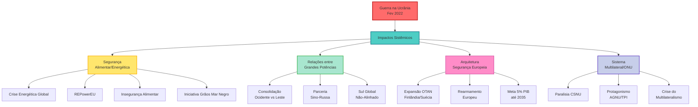

O sistema mostra sinais de adaptação incremental – fortalecimento da Assembleia Geral, uso expandido de tribunais internacionais, coalizões ad hoc para sanções – mas não a transformação fundamental necessária. A guerra expôs a inadequação de uma arquitetura de 1945 para desafios do século XXI, intensificando debates sobre "multilateralismo eficaz" sem produzir consenso para mudanças estruturais.

## Conclusão: a grande aceleração histórica

A Guerra na Ucrânia funcionou como um **acelerador histórico**, cristalizando tendências latentes e forçando realinhamentos que levariam décadas para se materializar em circunstâncias normais. O conflito não criou a rivalidade entre grandes potências, a crise do multilateralismo ou os dilemas de segurança europeia – mas comprimiu processos graduais em transformações abruptas e irreversíveis.

A consolidação de um sistema internacional genuinamente multipolar e competitivo emerge como legado estrutural mais significativo. A divisão Ocidente-Leste, o protagonismo autônomo do Sul Global e a militarização acelerada da Europa configuram uma nova geometria de poder que definirá as próximas décadas. O paradoxo central reside em que, enquanto a interdependência econômica e os desafios transnacionais demandam mais cooperação, a lógica de competição entre grandes potências torna tal cooperação crescentemente improvável.

Para o Brasil e a diplomacia brasileira, este cenário apresenta oportunidades e riscos sem precedentes. A política de autonomia estratégica e não-alinhamento ativo pode conferir influência desproporcional como mediador e bridge-builder, mas exigirá navegação sofisticada entre pressões crescentes por alinhamento. A crise do multilateralismo, arena tradicional de atuação brasileira, demandará criatividade institucional e coalizões inovadoras para preservar espaços de governança global.

A guerra demonstra que a história não acabou – apenas hibernava. Seu despertar abrupto em 2022 inaugurou era de incerteza estrutural, onde as certezas do pós-Guerra Fria evaporaram e um novo equilíbrio ainda busca sua forma. Compreender estas transformações sistêmicas constitui imperativo analítico fundamental para qualquer aspirante à carreira diplomática no século XXI.

> [!question]
> 
> ## Questões para autoavaliação (active recall)
> 
> **1. Analise criticamente como a Guerra na Ucrânia evidenciou tanto as vulnerabilidades quanto as capacidades adaptativas do sistema internacional contemporâneo. Em sua resposta, compare os mecanismos de resposta à crise energética (REPowerEU) com a paralisia do Conselho de Segurança da ONU, explicando o que essa divergência revela sobre a eficácia relativa de instituições regionais versus globais em contextos de competição entre grandes potências.**
> 
> **2. O conceito de "não-alinhamento ativo" do Sul Global representa continuidade ou ruptura com o Movimento Não-Alinhado da Guerra Fria? Desenvolva uma análise comparativa considerando: (a) as diferenças de poder econômico relativo; (b) a natureza da competição sistêmica atual versus bipolaridade ideológica; (c) as implicações para a inserção internacional brasileira e sua tradicional política de autonomia estratégica.**
> 
> **3. A meta de 5% do PIB em gastos militares até 2035 representa uma militarização insustentável da Europa ou uma correção necessária de décadas de subinvestimento em defesa? Em sua análise, considere: os trade-offs com gastos sociais e climáticos; a viabilidade da autonomia estratégica europeia versus dependência transatlântica; e as implicações sistêmicas de uma Europa remilitarizada para o equilíbrio global de poder.**

# Origem: _Expansão colonial e pensamento geográfico

---
title: Expansão colonial e pensamento geográfico
area: GEOGRAFIA
subarea: História da Geografia
tags:
  - cacd-2025
  - expansao-colonial-e-pensamento-geografico
  - geografia
  - historia-da-geografia
aliases:
  - 1.1 Expansão colonial e pensamento geográfico.
---
# Expansão Colonial e Pensamento Geográfico

## Introdução

A relação entre expansão colonial e pensamento geográfico constitui um dos pilares fundamentais para compreender o desenvolvimento da Geografia como ciência moderna. Esta conexão não é meramente coincidental, mas representa uma relação siamesa e indissociável entre o conhecimento geográfico e os interesses expansionistas das potências europeias, especialmente durante o século XIX.

O estudo desta temática revela como a Geografia, longe de ser uma ciência neutra, serviu como "pensamento indutor da expansão imperialista colonial", fornecendo o conhecimento sistemático necessário para a apropriação de novas terras e a exploração de recursos naturais em escala global.

## Origens Antigas da Geografia

### A Grécia Antiga como Berço da Geografia Ocidental

O estudo da geografia como ciência foi iniciado na Grécia Antiga, desenvolvendo-se juntamente com a Filosofia, a História e o Teatro. Esta proximidade cronológica não é casual, pois todas essas disciplinas emergiram da necessidade de compreender e sistematizar o conhecimento sobre o mundo conhecido.

Os primeiros pensadores a extrapolar o simples relato de fatos históricos, realizando inquéritos sistemáticos de terras e povos, foram figuras fundamentais como Heródoto e Estrabão, acompanhados por Tales de Mileto, Eratóstenes, Hiparto, Aristóteles e Ptolomeu. Estes pensadores estabeleceram as bases metodológicas que influenciariam o desenvolvimento posterior da disciplina.

### O Contexto Econômico da Geografia Antiga

Economicamente, foi a expansão comercial ateniense que possibilitou o conhecimento de diferentes culturas e territórios. Esta expansão comercial criou a necessidade prática de conhecimento geográfico sistemático, estabelecendo desde cedo a conexão entre interesses econômicos e desenvolvimento do saber geográfico.

É à sistematização deste novo conhecimento que se atribui o nascimento da geografia ocidental. Desta forma, o nascimento da geografia antiga está intrinsecamente atrelado aos interesses das cidades-estado gregas e de sua economia comercial imperialista.

### Desenvolvimento Paralelo com a História

Geografia e história desenvolveram-se paralelamente durante este período, não sendo possível diferenciar com precisão os limites entre as duas ciências. Entende-se, entretanto, que a geografia realizou a sistematização das percepções de diferentes lugares e culturas no plano do espaço, enquanto a história a fez no plano temporal.

Esta complementaridade estabeleceu um padrão que perduraria através dos séculos, com a Geografia fornecendo a dimensão espacial necessária para a compreensão dos processos históricos e econômicos.

## Transmissão e Preservação do Conhecimento Geográfico

### O Período Romano

Felizmente, o declínio da economia helênica não representou o desaparecimento de seu conhecimento acumulado, sendo então incorporado pelos romanos. O Império Romano, com suas necessidades administrativas e militares em um território vasto, encontrou no conhecimento geográfico grego uma ferramenta essencial para a gestão territorial.

### A Contribuição Árabe na Idade Média

Com o colapso do Império Romano, os grandes herdeiros da geografia grega foram os árabes. Durante a Idade Média, pensadores árabes absorveram e aprofundaram a geografia grega, fazendo-a chegar até os Estados modernos europeus.

Esta transmissão do conhecimento através do mundo árabe foi fundamental para que a tradição geográfica clássica não se perdesse durante o período medieval europeu. Os árabes não apenas preservaram, mas também aprofundaram o conhecimento geográfico grego, contribuindo com suas próprias observações e sistematizações.

## O Renascimento das Explorações

### As Grandes Navegações do Século XV

Ali, as grandes viagens de exploração reavivaram o desejo de bases teóricas mais sólidas e de informação mais detalhada. Já no século XV, viajantes como Bartolomeu Dias e Cristóvão Colombo redescobririam o interesse pela exploração, pela descrição geográfica e pelo mapeamento.

A confirmação do formato global da Terra veio em uma viagem de circunavegação realizada pelo navegador português Fernando Magalhães, permitindo uma maior precisão das medidas e observações. Este feito representou um marco na história da Geografia, fornecendo a comprovação empírica definitiva sobre a forma esférica da Terra.

### Avanços Cartográficos

O Planisfério de Cantino (1502) é considerado o primeiro mapa-múndi a representar a superfície terrestre em seu conjunto, apresentando os dois hemisférios lado a lado. Este documento cartográfico representa um marco na evolução da representação geográfica do mundo, sintetizando os conhecimentos acumulados pelas grandes navegações.

## Sistematização Teórica da Geografia

### Immanuel Kant: O Precursor Filosófico

No campo teórico, há de se destacar Immanuel Kant, que lecionou em Königsberg (capital da Prússia Oriental, hoje Kaliningrado) por quarenta anos o que posteriormente veio a se chamar Geografia Física.

Segundo seu pensamento, o conhecimento é dado pelos sentidos, sendo, portanto, um conhecimento empírico que advém da percepção de um "sentido interno" que revela o homem (antropologia pragmática) e um "sentido externo" que revela a natureza (geografia física).

Em seu curso, Kant objetivava apresentar aos alunos um "sumário da natureza", ou seja, um quadro geral do saber humano mostrando ser possível conhecer o mundo de uma maneira integrada e sistemática. Esse quadro geral, além de propiciar ao aluno uma base de conhecimentos empíricos necessários para os raciocínios e pesquisas científicos posteriores, também consistiria em um primeiro contato com o que seria uma propedêutica do conhecimento científico do mundo.

### O Positivismo e a Geografia

O positivismo foi de fundamental importância para a Geografia, pois sua sistematização ocorreu de acordo com os princípios positivistas, como o empirismo que deixou fortes influências na Geografia. Os principais autores foram Alexander von Humboldt, que usou o método do raciocínio através do empirismo e da observação; e Carl Ritter, que mostrou ao mundo o princípio da relação entre a superfície da terra e a natureza e dos seres humanos, era defensor constante do uso de todas as ciências para o estudo da geografia.

### Alexander von Humboldt e o Projeto Científico

Assim, o projeto científico que conduziu Humboldt à América espanhola foi por ele definido como uma "empresa idealizada com o objetivo de contribuir para o progresso das ciências físicas" ao mesmo tempo que considerava a publicação de seu trabalho podia oferecer interesse "para a história dos povos e o conhecimento da natureza".

A isenção do projeto de conhecimento ampliado e aprofundado da Terra, resguardado pelo caráter científico das expedições e pesquisas nas áreas coloniais, foi posta em xeque, contudo, quando esse autor denunciou o sofrimento humano causado pela escravidão no vale do Güines, próximo à Havana (Reino da Nova Espanha). Tal fato não só impediu a realização de expedições que Humboldt pretendia fazer posteriormente às possessões inglesas na Ásia, como, também, devido à pressão direta da burocracia prussiana, foi impedido de abordar questões humanas que considerava relevantes em sua viagem à Rússia.

## Geografia e Imperialismo do Século XIX

### A Relação Indissociável

Percebe-se que a geografia traduziu-se, desta forma, no pensamento indutor da expansão imperialista colonial do séc. XIX, estimulando o levantamento sistemático do mundo extra-europeu e identificando riquezas potenciais necessárias à evolução do capitalismo que se afirmava em sua fase imperialista através da expansão industrial que necessitava matérias-primas e novos mercados para seus produtos.

Atribuir-se-lhe meramente um idealizado caráter puramente científico seria um erro. Assim, a relação entre geografia e colonialismo – especificamente o do séc. XIX, quando adquiriu maior impulso a ciência geográfica – pode ser classificada como siamesa, indissociável.

### A Legitimação através da Aplicabilidade

A legitimação do antigo saber geográfico veio com sua aplicabilidade econômica em um contexto de expansão das potências europeias em novas áreas de influências. Desta aplicação decorreu o grande prestígio que a geografia obteve junto aos governantes da época.

### A Conferência Internacional de Geografia de 1876

Em 1876, o rei Leopoldo II da Bélgica convocou uma grande Conferência Internacional de Geografia com o intuito de compilar os conhecimentos ainda difusos e utilizá-los na colonização do continente africano, abrindo-o à exploração econômica da civilização europeia. Compareceram diplomatas, exploradores e sociedades geográficas de diversos países.

Com o concurso das sociedades de geografia empreender-se-á, assim, o avanço imperialista sobre a África, Ásia e Oceania, bem como a América Latina, esta já submetida à dominação colonial desde o século XVI.

### As Necessidades do Capitalismo Industrial

O colonialismo no século XIX, longe de se restringir ao entesouramento do ouro e da prata do período mercantilista de expansão colonial anterior, agora necessitava de fontes renovadas de recursos naturais e, portanto, de identificar novos caminhos e eventuais restrições para apoiar o projeto geopolítico de hegemonia financeira e industrial dos países da Europa Ocidental frente às novas forças econômicas que surgiam tanto na Rússia, como, secundariamente, na América do Norte.

## Desenvolvimentos Técnicos e Científicos

### Avanços na Cartografia e Observação

A cartografia geral e temática fazia grandes progressos, produzindo-se para a Europa, para os Estados Unidos e mesmo para a Índia, cartas em média e grande escala com notável riqueza de informações topográficas e geológicas. As observações meteorológicas e oceanográficas faziam-se cada vez mais regulares e precisas, as cartas respectivas passaram a ser publicadas. Enfim, a organização dos primeiros serviços de estatísticas regulares deve ser também levada em conta.

### Conhecimento Sistemático e Apropriação Territorial

O conhecimento sistemático da superfície terrestre que começava então a ser elaborado no âmbito da geografia e da cartografia não estava descolado do desenvolvimento de uma formação colonial que implicava invariavelmente a apropriação de novas terras.

Nas Américas, por exemplo, a expansão territorial, em linhas gerais, estava intrinsecamente assentada na disponibilidade de terras, possibilidade de avanço da fronteira econômica e demográfica, facilitada pelos caminhos naturais existentes permitir a enorme velocidade com que a mineração, a extração vegetal, os rebanhos e as frentes populacionais penetraram nas remotas extensões do continente.

## Conclusão

A análise da relação entre expansão colonial e pensamento geográfico revela que a Geografia moderna não emergiu como uma ciência neutra e desinteressada, mas como um instrumento fundamental para a expansão capitalista e imperialista do século XIX. Esta conexão histórica é essencial para compreender não apenas o desenvolvimento da disciplina geográfica, mas também as bases sobre as quais se construiu o sistema mundial moderno.

O conhecimento geográfico, desde suas origens na Grécia Antiga até sua sistematização no século XIX, sempre esteve intimamente ligado aos interesses econômicos e políticos das sociedades que o produziram. Esta constatação não diminui o valor científico da Geografia, mas nos permite compreender melhor seu papel histórico e suas potencialidades transformadoras.

Para o estudante do CACD, compreender esta dimensão histórica da Geografia é fundamental para uma análise crítica das relações internacionais contemporâneas e dos processos de globalização que ainda hoje moldam o sistema mundial.


# Origem: _A Geografia moderna e a questão nacional na Europa

---
title: A Geografia moderna e a questão nacional na Europa
area: GEOGRAFIA
subarea: História da Geografia
tags:
  - a-geografia-moderna-e-a-questao-nacional-na-europa
  - cacd-2025
  - geografia
  - historia-da-geografia
aliases:
  - 1.2 A Geografia moderna e a questão nacional na Europa.
---
# A Geografia Moderna e a Questão Nacional na Europa

## Introdução

A Geografia Moderna surge como uma expressão científica e acadêmica profundamente vinculada ao contexto geral de sua época, especificamente relacionada aos desenvolvimentos dos Estados nacionais modernos na Europa. Esta conexão não é meramente coincidental, mas representa uma relação orgânica entre a sistematização da Geografia como disciplina científica e os processos de consolidação nacional que marcaram o século XIX europeu.

O título deste tema, originado do edital do CACD, alude precisamente à relação entre os desenvolvimentos dos Estados nacionais modernos na Europa, que coincidiu com a sistematização da Geografia e em que a disciplina desempenhou papel ativo na construção das identidades nacionais e na legitimação dos projetos estatais.

## A Questão Nacional Europeia e o Contexto Germânico

### A Consolidação dos Estados Nacionais no Século XIX

Em meados do século XIX, a consolidação dos Estados nacionais europeus estava em um período de busca de legitimação, especialmente em países que passaram por um processo tardio de unificação, notadamente a Alemanha. Este período histórico foi marcado por profundas transformações políticas, sociais e territoriais que demandavam novas formas de conhecimento e legitimação.

A ideia de Nação permeou a mentalidade dos povos europeus daquele século, que viam na unificação de seu território e no nacionalismo fatores essenciais de identidade, superando a fragmentação feudal do período medieval. Esta transformação representou uma mudança paradigmática na organização política e social europeia.

### A Construção de Laços de Coesão Social

Isso implicava na busca pela construção de laços de coesão social que legitimassem a forma estatal, o que foi possível através da utilização de campos de conhecimento que pudessem contribuir com o sentido nacional. Neste cenário, o ensino de história e geografia foi pensado visando a história nacional e a identificação e reflexão acerca das especificidades geográficas do território ocupado.

Em outras palavras, foi estabelecido um ensino de história e geografia que ajudasse na consolidação da ideia de um Estado territorial unitário, uma instituição política legitimada pela sociedade. Esta função pedagógica e ideológica da Geografia tornou-se fundamental para os processos de nation-building do século XIX.

### O Caso Alemão: Paradigma da Geografia Moderna

No verbete relativo à História da Geografia, citamos que a gênese da Geografia como ciência institucionalizada se deu na Alemanha do século XIX. Para compreender isso, é necessário observarmos que os povos germânicos, que mais tarde se unificariam, guardavam um forte sentimento de identidade, ademais da intensa indefinição territorial.

A invasão napoleônica ressaltaria este sentimento, gerando uma reação nacionalista que valorizaria os valores da cultura germânica como elemento de união e resistência. Ou seja, para aqueles povos germânicos, os estudos geográficos cumpririam importantes funções ideológicas e políticas.

Esta experiência alemã tornou-se paradigmática para compreender como a Geografia moderna emergiu não apenas como disciplina científica, mas como instrumento de construção nacional e resistência cultural.

## Os Precursores e Fundadores da Geografia Moderna

### Immanuel Kant (1724-1804): O Precursor Filosófico

Dentre os pensadores do século XVIII que já haviam tratado das temáticas geográficas, vale destacar a obra do filósofo Immanuel Kant (1724-1804) que lecionou filosofia por mais de quarenta anos na Alemanha e que tinha em seu curso algumas cátedras do que mais tarde se denominaria 'geografia física', formando as bases filosóficas para o nascimento da Geografia como ciência nas décadas seguintes.

#### A Visão Kantiana da Geografia

Em suas aulas de geografia, Kant apresentava um ponto de vista de quem se interessa pelo mundo e deseja compreendê-lo, mesmo que por puro prazer intelectual. De fato, essa seria a derradeira função da Geografia, cujo abandono por geógrafos deixaria, no século XX, uma lacuna tal que sugeriria sua própria extinção.

Kant jamais consolidou em livro as anotações de suas aulas, cuja organização e eventual publicação é uma tarefa ainda em andamento pela editora da universidade de Cambridge. O objetivo maior de suas palestras era "civilizar os jovens estudantes para que se tornassem cidadãos do mundo".

#### Pioneirismo Acadêmico

Ao ser um dos primeiros professores da disciplina nas universidades alemãs e ao ultrapassar em sua abordagem a mera retransmissão de registros de viagens, Kant ajudou a caracterizar a Geografia como uma disciplina acadêmica. De fato, precisou de uma autorização especial do Ministério da Educação para lecionar uma matéria sobre a qual não existiam livros acadêmicos.

Esse foi o início de uma época áurea da Geografia, em que alguns dos maiores pensadores europeus se dedicariam à disciplina. O fim dessa era será o sintoma da sucessiva resolução de todos os enigmas fundadores da disciplina, ou da sua transferência a outras disciplinas, como a Geologia e a Sociologia.

### Alexander von Humboldt (1769-1859): O Explorador Científico

Naquele período atuou também o alemão Alexander von Humboldt, um dos maiores intelectuais de sua época e frequentemente mencionado como possivelmente o último ser humano a 'saber tudo o que se merece saber'. Humboldt, que tinha uma formação muito próxima da geologia e da botânica, não se limitou a compilação e análise de conhecimento geográfico, mas atuou também como explorador.

#### O Princípio da Causalidade

Segundo ele, não bastava para o geógrafo realizar, em suas viagens, apenas a descrição dos fenômenos que observava. Estabeleceu, desta forma, o Princípio da Causalidade, ressaltando que cabe ao geógrafo, além da descrição de determinado fenômeno, também a definição de sua causa.

Ou seja, seria papel do geógrafo definir, por exemplo, os motivos pelos quais determinada vegetação cresce em uma altitude, solo e temperatura e não em outras condições. Este princípio metodológico tornou-se fundamental para o desenvolvimento científico da Geografia.

#### A Obra Kosmos

Suas últimas décadas de vida foram consumidas na produção de sua obra magna, Kosmos, em que se condensaria a compreensão geral do mundo e da presença humana no planeta. Por vezes chamado 'o primeiro ambientalista', algumas de suas ideias se tornaram tão populares que são tomadas como óbvias, talvez um dos motivos que o tornaram desconhecido em nosso tempo, além da decadência completa do interesse intelectual pela Geografia.

### Carl Ritter (1779-1859): O Primeiro Geógrafo Acadêmico

O primeiro dos geógrafos acadêmicos foi o alemão Carl Ritter, expressão da dominação intelectual alemã que então se configurava na Europa e que se aceleraria após a formação do país, em 1871, continuando até a conclusão da Primeira Guerra Mundial.

#### Pioneirismo Universitário

Ritter foi o primeiro professor a ter uma cátedra de Geografia em uma Universidade, lecionando na Universidade de Berlim (hoje Humboldt University of Berlin) de 1825 até seu falecimento. Este marco institucional representa o momento de consolidação acadêmica da Geografia como disciplina universitária.

#### Contexto Científico do Século XIX

Em termos acadêmicos, no século XIX, o próprio contexto histórico apontava para uma separação das ciências. Até então, o conhecimento tinha uma dimensão de totalidade social e a mistura dos campos na análise de um determinado problema era ampla, não havendo a fragmentação e atomização que se veria nos séculos seguintes.

Neste sentido, o positivismo defendia a cientização das áreas de conhecimento, ou seja, a ideia de que as ciências humanas deveriam seguir os princípios científicos das ciências naturais.

#### Metodologia Ritteriana

Em termos de método, Ritter ressaltava que a Geografia não deveria partir dedutivamente de ideias gerais sobre a humanidade, porém indutivamente, desde a observação direta, levando cuidadosamente a conclusões sobre a ocupação humana no espaço geográfico. Essa perspectiva permaneceu válida até meados do século XX.

Estabeleceu ainda o Princípio da Analogia, que apontava que determinados fenômenos de uma localidade também aconteciam em outras áreas similares do planeta, ressaltando o fato de determinadas áreas possuírem elementos em comum que propiciam o desenvolvimento de elementos naturais específicos.

#### Engajamento Social

Tendo uma formação mais próxima da História e da Filosofia, utilizou sua influência para escrever contra a escravidão e, por meio de contatos frequentes com autoridades inglesas, ajudou a eliminar o tráfico de escravos através do Sahara, um grande feito da diplomacia do século XIX.

### A Síntese das Vertentes Geográficas

É interessante o fato de Humboldt ter seus estudos voltados para uma perspectiva mais ligada à geologia e botânica enquanto Ritter estava mais ligado à história e filosofia. Há, pois, nessa junção uma vertente geográfica mais próxima da natureza e uma mais humana.

A geografia, tradicionalmente vinculada mais ao aspecto natural, a partir daquele momento trabalharia justamente na intersecção entre natureza e sociedade, estabelecendo um dos características fundamentais da disciplina geográfica moderna.

### Friedrich Ratzel (1844-1904): A Continuidade Alemã

Outro geógrafo alemão, Friedrich Ratzel, continuou o trabalho seminal de Ritter. De 1876 a 1901, Ratzel publicou uma série de obras que inauguraram algumas das mais importantes sub-disciplinas da Geografia, incluindo a Geografia Urbana com sua obra "Profile of Cities and Cultures in North America" (1876).

## A Geografia como Saber Estratégico

### Superação da Fragmentação Feudal

A Geografia moderna emergiu como um saber estratégico fundamental para a superação da fragmentação feudal e a consolidação dos Estados nacionais europeus. Esta função estratégica não se limitava ao conhecimento acadêmico, mas estendia-se às necessidades práticas de administração territorial, defesa nacional e integração econômica.

### Função Pedagógica Nacional

O ensino de Geografia tornou-se instrumento fundamental para a construção da consciência nacional, fornecendo aos cidadãos o conhecimento sobre seu território, suas fronteiras, seus recursos e suas especificidades regionais. Esta dimensão pedagógica da Geografia foi especialmente importante nos processos de unificação nacional.

### Legitimação Científica do Estado

A Geografia forneceu legitimação científica para as reivindicações territoriais dos Estados nacionais, oferecendo argumentos baseados em critérios geográficos, étnicos e históricos para justificar fronteiras e políticas territoriais. Esta função legitimadora tornou-se especialmente relevante em contextos de disputa territorial.

## A Especificidade do Desenvolvimento Alemão

### Contexto Geopolítico

A Alemanha do século XIX apresentava características específicas que tornaram o desenvolvimento da Geografia particularmente relevante: indefinição territorial, fragmentação política, forte identidade cultural e pressões externas (especialmente a invasão napoleônica).

### Resistência Cultural e Identidade Nacional

A Geografia alemã desenvolveu-se como instrumento de resistência cultural e construção de identidade nacional, fornecendo os elementos científicos necessários para fundamentar a unidade alemã em bases territoriais e culturais sólidas.

### Influência Internacional

O modelo alemão de Geografia influenciou profundamente o desenvolvimento da disciplina em outros países europeus e nas Américas, estabelecendo padrões metodológicos e conceituais que perduraram por décadas.

## Conclusão

A Geografia moderna e a questão nacional na Europa representam um capítulo fundamental na história do pensamento geográfico, demonstrando como uma disciplina científica pode emergir e desenvolver-se em íntima conexão com as necessidades políticas e sociais de sua época.

O caso alemão, paradigmático neste processo, ilustra como a Geografia tornou-se não apenas uma ciência do espaço, mas um instrumento de construção nacional e resistência cultural. Esta experiência histórica oferece lições importantes para compreender o papel da Geografia nas sociedades contemporâneas e sua relevância para os processos de integração regional e construção de identidades coletivas.

Para o estudante do CACD, compreender esta dimensão histórica da Geografia é essencial para analisar criticamente os processos contemporâneos de construção nacional, integração regional e globalização, reconhecendo o papel do conhecimento geográfico na formulação de políticas territoriais e na diplomacia internacional.

A herança dos grandes geógrafos alemães do século XIX - Kant, Humboldt, Ritter e Ratzel - continua influenciando o pensamento geográfico contemporâneo, lembrando-nos que a Geografia é, simultaneamente, uma ciência rigorosa e um instrumento de compreensão e transformação do mundo.


# Origem: _As principais correntes teóricas da Geografia

---
title: As principais correntes teóricas da Geografia
area: GEOGRAFIA
subarea: História da Geografia
tags:
  - as-principais-correntes-teoricas-da-geografia
  - cacd-2025
  - geografia
  - historia-da-geografia
aliases:
  - 1.3 As principais correntes teóricas da Geografia.
---
# As Principais Correntes Teóricas da Geografia

## Introdução

O desenvolvimento da Geografia como ciência moderna foi marcado por intensos debates teóricos e metodológicos que deram origem a diferentes correntes de pensamento geográfico. Estas correntes não apenas refletem as transformações científicas de suas épocas, mas também expressam as tensões sociais, políticas e ideológicas dos contextos históricos em que emergiram.

Compreender as principais correntes teóricas da Geografia é fundamental para o estudante do CACD, pois estas correntes influenciaram profundamente não apenas o desenvolvimento da disciplina geográfica, mas também as formas de compreender e organizar o espaço, as relações internacionais e os processos de desenvolvimento territorial.

As correntes teóricas da Geografia podem ser organizadas em grandes períodos históricos, cada um caracterizado por paradigmas dominantes, métodos específicos e preocupações teóricas particulares. Esta evolução revela não apenas o amadurecimento científico da disciplina, mas também sua capacidade de responder aos desafios de cada época histórica.

## O Determinismo Geográfico

### Friedrich Ratzel (1844-1904): O Fundador do Determinismo

O determinismo geográfico encontra em Friedrich Ratzel seu principal expoente e sistematizador. Ratzel, geógrafo alemão que viveu durante o período de consolidação do Estado alemão, desenvolveu uma teoria que estabelecia uma relação causal direta entre o meio físico e o desenvolvimento das sociedades humanas.

Segundo Ratzel, a principal tarefa do geógrafo é compreender de que maneira o meio ambiente influencia os grupos humanos em cada zona da Terra, obrigando-os a adaptar-se às condições naturais específicas de cada região. Esta perspectiva colocava o meio geográfico como o fator determinante do desenvolvimento histórico e cultural das civilizações.

### Princípios Fundamentais do Determinismo

O determinismo geográfico baseia-se em alguns princípios fundamentais que orientaram sua aplicação teórica e prática:

Causalidade Ambiental: O meio físico (clima, relevo, hidrografia, solo) determina diretamente as características culturais, econômicas e políticas das sociedades humanas. Esta causalidade é vista como uma lei natural que opera de forma universal.

Adaptação Obrigatória: Os grupos humanos são obrigados a adaptar-se às condições ambientais, desenvolvendo formas específicas de organização social, econômica e política em resposta às demandas do meio natural.

Hierarquia Ambiental: Diferentes ambientes produzem diferentes níveis de desenvolvimento civilizacional, estabelecendo uma hierarquia implícita entre regiões e povos baseada nas condições naturais.

### Aplicações e Consequências do Determinismo

O determinismo geográfico teve profundas implicações práticas e ideológicas. Na prática científica, orientou pesquisas que buscavam estabelecer correlações diretas entre fatores ambientais e características sociais. No plano político, forneceu justificativas "científicas" para políticas coloniais e imperialistas, sugerindo que certas regiões e povos eram "naturalmente" superiores ou inferiores.

Esta corrente influenciou profundamente o desenvolvimento da Geografia Política e da Geopolítica, fornecendo argumentos para teorias sobre o poder dos Estados baseado em suas características territoriais e ambientais.

### Críticas ao Determinismo

O determinismo geográfico enfrentou críticas crescentes ao longo do século XX, sendo questionado tanto em seus fundamentos teóricos quanto em suas implicações ideológicas. As principais críticas incluem:

Reducionismo Explicativo: A redução da complexidade social a fatores ambientais ignora a capacidade humana de transformar e adaptar o meio às suas necessidades.

Determinismo Linear: A relação causal direta entre meio e sociedade não considera a mediação cultural, tecnológica e histórica nos processos de adaptação.

Implicações Ideológicas: O uso do determinismo para justificar hierarquias sociais e políticas coloniais revelou suas limitações éticas e científicas.

## O Possibilismo Geográfico

### Paul Vidal de La Blache: A Alternativa Francesa

Em contraposição ao determinismo alemão, desenvolveu-se na França, sob a liderança de Paul Vidal de La Blache, a corrente do possibilismo geográfico. Esta escola representou uma revolução metodológica e conceitual na Geografia, oferecendo uma alternativa ao determinismo que reconhecia a capacidade humana de escolha e transformação.

Se no determinismo de Friedrich Ratzel o meio físico determina a história e as civilizações, no possibilismo de Vidal de La Blache um mesmo meio oferece múltiplas possibilidades de desenvolvimento, cabendo aos grupos humanos escolher e desenvolver aquelas que melhor se adequam às suas necessidades e capacidades.

### Conceitos Fundamentais do Possibilismo

O possibilismo desenvolveu conceitos específicos que se tornaram centrais para a Geografia humana:

Gênero de Vida: Conceito central do possibilismo, refere-se aos modos de ser transmitidos de geração em geração através do hábito e da tradição. O gênero de vida representa a forma específica como cada grupo humano organiza sua relação com o meio, desenvolvendo técnicas, costumes e formas de organização social particulares.

Paisagem Cultural: A transformação da paisagem natural em paisagem cultural através da ação humana. Este conceito reconhece que as sociedades humanas não apenas se adaptam ao meio, mas o transformam ativamente, criando paisagens que refletem suas escolhas e capacidades.

Região-Paisagem: Unidade de análise que combina características naturais e humanas, reconhecendo a especificidade de cada região como resultado da interação entre possibilidades naturais e escolhas culturais.

### Metodologia Possibilista

O possibilismo desenvolveu uma metodologia específica baseada em alguns princípios fundamentais:

Método Indutivo: Baseado na observação direta da realidade, partindo de casos específicos para chegar a conclusões gerais sobre a ocupação humana do espaço geográfico.

Princípio da Analogia: Estabelecido por Carl Ritter e adotado pelo possibilismo, sugere que fenômenos similares ocorrem em áreas similares do planeta, permitindo comparações e generalizações controladas.

Análise Regional: Foco na compreensão das especificidades regionais, reconhecendo que cada região desenvolve características únicas resultantes da interação entre possibilidades naturais e escolhas humanas.

### Contribuições do Possibilismo

O possibilismo fez contribuições fundamentais para o desenvolvimento da Geografia:

Reconhecimento da Agência Humana: Ao contrário do determinismo, o possibilismo reconhece a capacidade humana de escolha e transformação, estabelecendo uma relação dialética entre sociedade e natureza.

Desenvolvimento da Geografia Regional: O possibilismo promoveu o desenvolvimento de estudos regionais detalhados, contribuindo para a compreensão da diversidade geográfica mundial.

Influência na Geografia Cultural: Os conceitos possibilistas influenciaram profundamente o desenvolvimento da Geografia Cultural, especialmente nos estudos sobre paisagem e identidade regional.

## A Geografia Quantitativa/Nova Geografia

### Contexto Histórico e Emergência

A Geografia Quantitativa, também conhecida como Nova Geografia, emergiu durante a Guerra Fria, em meados do século XX, principalmente na Inglaterra, Estados Unidos e Suécia. Esta corrente representou uma tentativa de modernização científica da Geografia, buscando aproximá-la dos padrões metodológicos das ciências naturais.

### Características Fundamentais

A Geografia Quantitativa caracterizou-se por algumas características distintivas:

*Métodos Quantitativos*: Uso intensivo de estatística, matemática e modelagem para análise dos fenômenos geográficos, buscando estabelecer leis e padrões universais.

*Neopositivismo*: Fundamentação filosófica baseada no neopositivismo, que defendia a neutralidade científica e a busca de leis universais através de métodos rigorosos.

*Visão Matemática do Mundo*: Subordinação da análise geográfica a uma visão matemática do mundo, privilegiando aspectos quantificáveis em detrimento de dimensões qualitativas.

*Negligência da Dimensão Temporal*: Foco em padrões espaciais estáticos, negligenciando a dimensão histórica e processual dos fenômenos geográficos.

### Limitações e Críticas

A Geografia Quantitativa enfrentou críticas crescentes que revelaram suas limitações:

Compromisso Ideológico: Apesar da pretensa neutralidade, a corrente quantitativa encobria o compromisso ideológico de justificar a expansão capitalista sem expressar a essência da realidade social.

Empirismo Exacerbado: Privilegiava a descrição quantitativa em detrimento da compreensão dos processos sociais e espaciais subjacentes.

Fragmentação do Conhecimento: A especialização quantitativa levou à fragmentação do conhecimento geográfico, perdendo a visão de totalidade que caracterizava a Geografia tradicional.

## A Geografia Crítica/Radical

### Origens e Contexto de Emergência

A Geografia Crítica ou Radical emergiu como uma corrente que se opõe à quantitativa, desenvolvendo-se em um contexto de agravamento das tensões sociais nos países centrais e movimentos por independência nos países subdesenvolvidos. Esta corrente representou uma revolução teórica e metodológica na Geografia.

### Influências Teóricas Fundamentais

A Geografia Crítica desenvolveu-se a partir de importantes influências teóricas:

Marxismo: Incorporação dos conceitos e métodos do materialismo histórico para análise dos processos espaciais, compreendendo o espaço como produto das relações sociais de produção.

Filosofia Crítica: Contatos importantes com filósofos como Henry Lefebvre, que colocou o espaço na análise marxista, e Louis Althusser, que contribuiu para a renovação do pensamento marxista.

Sociologia Urbana: Influência de urbanistas como Manuel Castells, que desenvolveu análises críticas dos processos de urbanização capitalista.

Economia Política: Diálogo com economistas como Charles Bettelheim, que contribuíram para a compreensão dos processos econômicos espacializados.

### Características da Geografia Crítica

A Geografia Crítica caracteriza-se por alguns elementos fundamentais:

Ruptura Paradigmática: Busca romper simultaneamente com a geografia tradicional e com a geografia teorético-quantitativa, propondo uma nova forma de compreender os fenômenos espaciais.

Análise dos Agentes Espaciais: Dá evidência à ação do Estado e dos demais agentes da organização espacial - proprietários fundiários, industriais, incorporadores imobiliários - compreendendo o espaço como produto de relações sociais.

Retomada da Síntese: Retoma as relações homem-natureza e a abordagem regional, mas sob uma perspectiva crítica que compreende estas relações no contexto das contradições sociais.

Resposta às Transformações Contemporâneas: Busca responder às profundas modificações na organização espacial decorrentes da intensa urbanização, industrialização e expansão do capital.

### Posicionamento Metodológico

A Geografia Crítica desenvolveu posicionamentos metodológicos específicos:

Crítica ao Empirismo: Opõe-se ao empirismo exacerbado da geografia tradicional, buscando compreender os processos subjacentes aos fenômenos observáveis.

Crítica ao Positivismo: Refuta a análise pautada no mundo das "aparências", decorrente da fundamentação positivista, buscando desvelar as contradições essenciais dos processos espaciais.

Crítica à Geografia Pragmática: Critica fortemente o conteúdo acrítico "alienante" da geografia pragmática, vinculado à legitimação do poder do Estado burguês.

### Objetivos Transformadores

A Geografia Crítica posiciona-se explicitamente em favor da transformação da realidade social:

Saber como Arma: Compreende o conhecimento científico como instrumento fundamental para o processo de transformação social, rejeitando a pretensa neutralidade científica.

Geografia Militante: Defende uma geografia militante, que lute por uma sociedade mais justa e sirva como instrumento de libertação humana.

Perspectiva Popular: Assume a perspectiva popular de transformação da ordem social, buscando uma geografia mais generosa organizada em função dos interesses dos homens, não do capital.

### Desenvolvimentos Contemporâneos

A Geografia Crítica desenvolveu-se em várias direções:

Geografia Radical Norte-Americana: Desenvolvimento nos Estados Unidos de uma vertente de "geógrafos socialmente engajados" que, embora não fossem necessariamente marxistas, criticavam a visão anterior da geografia.

Geografia Crítica Brasileira: No Brasil, a Geografia Crítica desenvolveu uma trajetória notável, desvendando processos que nutriram o debate político em delicado momento nacional.

Renovação Teórica: Incorporação de novos referenciais teóricos, incluindo contribuições da geografia feminista, pós-colonial e pós-estruturalista.

## A Influência Francesa: Geografia Ativa

### Contexto e Desenvolvimento

Uma das raízes da Geografia Crítica está na ala progressista da geografia regional francesa, que introduziu a análise da organização do espaço aos processos econômicos e sociais, inaugurando uma discussão mais política dos estudos geográficos e aproximando-se da história e da economia.

### "Geografia Ativa" (1966)

Na França, uma manifestação clara da renovação crítica encontra-se em "Geografia Ativa", obra de Pierre George, Yves Lacoste, Bernard Kayser e Raymond Guglielmo (1966), que marcou uma geração de geógrafos ao se opor à geografia aplicada então hegemônica.

### Propostas e Objetivos

A Geografia Ativa tinha como proposta elaborar uma análise regional que desvendasse as contradições do modo de produção capitalista, inaugurando uma discussão mais política dos estudos geográficos. Criticava principalmente a carência de informação objetiva, que permitisse traçar perspectivas que subsidiassem tomadas de decisões.

Ligada ao historicismo, seus autores consideravam a geografia como um prolongamento da história, mas com métodos próprios, deixando seu papel meramente contemplativo e assumindo um papel dinâmico, atuante, pelo que chamavam de "geografia ativa do futuro".

## Síntese Evolutiva das Correntes Teóricas

### Primeira Fase: Geografia Tradicional (Século XIX - Início XX)

Determinismo vs Possibilismo: Debate fundamental entre a escola alemã (Ratzel) e francesa (La Blache) sobre a relação sociedade-natureza.

Características Comuns: Empirismo, descrição regional, método indutivo, foco na relação homem-meio.

Limitações: Empirismo exacerbado, análise das "aparências", fragmentação do conhecimento.

### Segunda Fase: Geografia Quantitativa (Meados Século XX)

Revolução Metodológica: Introdução de métodos quantitativos e modelagem matemática.

Pretensa Neutralidade: Busca de cientificidade através da neutralidade e objetividade.

Limitações: Negligência da dimensão temporal, compromisso ideológico oculto, fragmentação do conhecimento.

### Terceira Fase: Geografia Crítica (Final Século XX)

Revolução Paradigmática: Ruptura com paradigmas anteriores, incorporação do marxismo.

Engajamento Social: Compromisso explícito com a transformação social.

Síntese Renovada: Retomada da síntese sob perspectiva crítica.

### Desenvolvimentos Contemporâneos

Pluralidade Teórica: Coexistência de múltiplas correntes e abordagens.

Novos Paradigmas: Geografia cultural, pós-colonial, feminista, pós-estruturalista.

Desafios Contemporâneos: Globalização, questões ambientais, tecnologias digitais.

## Relevância para o CACD

### Compreensão das Relações Internacionais

O conhecimento das correntes teóricas da Geografia é fundamental para compreender diferentes abordagens das relações internacionais:

Determinismo: Influenciou teorias geopolíticas clássicas sobre poder dos Estados.

Possibilismo: Contribuiu para compreensão da diversidade cultural e regional.

Geografia Crítica: Oferece instrumentos para análise crítica da globalização e do imperialismo.

### Análise de Políticas Territoriais

As correntes geográficas fornecem ferramentas conceituais para análise de políticas territoriais e desenvolvimento regional:

Planejamento Regional: Influência do possibilismo e geografia ativa.

Análise Crítica: Instrumentos da geografia crítica para compreender contradições do desenvolvimento.

Geopolítica: Contribuições do determinismo e correntes contemporâneas.

### Diplomacia e Território

Para o diplomata, compreender as correntes geográficas é essencial para:

Negociações Territoriais: Compreensão de diferentes concepções de território e fronteira.

Cooperação Regional: Instrumentos para análise de processos de integração.

Questões Ambientais: Abordagens para compreender relações sociedade-natureza.

## Conclusão

As principais correntes teóricas da Geografia representam não apenas diferentes formas de compreender o espaço geográfico, mas também diferentes visões de mundo e projetos de sociedade. Desde o determinismo do século XIX até a geografia crítica contemporânea, cada corrente reflete os desafios e contradições de sua época histórica.

Para o estudante do CACD, compreender esta evolução teórica é fundamental para desenvolver uma visão crítica e informada sobre os processos espaciais contemporâneos. As correntes geográficas oferecem instrumentos conceituais valiosos para análise das relações internacionais, políticas territoriais e processos de globalização.

A Geografia contemporânea caracteriza-se pela pluralidade teórica e metodológica, incorporando contribuições de diferentes correntes e desenvolvendo novos paradigmas para compreender os desafios do século XXI. Esta diversidade representa uma riqueza teórica que permite abordagens mais complexas e nuançadas dos fenômenos geográficos.

O legado das grandes correntes teóricas da Geografia - determinismo, possibilismo, geografia quantitativa e geografia crítica - continua influenciando o pensamento geográfico contemporâneo, lembrando-nos que a Geografia é, simultaneamente, uma ciência rigorosa e um instrumento de compreensão e transformação do mundo.

Para o futuro diplomata, esta compreensão histórica e teórica da Geografia oferece ferramentas essenciais para navegar na complexidade das relações internacionais contemporâneas, reconhecendo as dimensões espaciais dos processos políticos, econômicos e culturais que moldam o sistema mundial.


Élisée Reclus foi um geógrafo singular em seu tempo, pois aliou a produção científica a um forte engajamento político anarquista. Em sua monumental obra "Nova Geografia Universal", ele não apenas descreveu as paisagens do mundo, mas também criticou duramente os efeitos do colonialismo, da exploração capitalista e da destruição da natureza, sendo um precursor do pensamento socioambiental. 

# Origem: _Distribuição espacial da população (Brasil e mundo)

---
title: Distribuição espacial da população (Brasil e mundo)
area: GEOGRAFIA
subarea: A Geografia da população
tags:
  - a-geografia-da-populacao
  - cacd-2025
  - distribuicao-espacial-da-populacao
  - geografia
aliases:
  - 2.1 Distribuição espacial da população no Brasil e no mundo.
---
# A Distribuição Espacial da População: Padrões Globais e a Realidade Brasileira

## Distribuição da População no Mundo

**Distribuição desigual no globo:** A população humana não se espalha de forma homogênea pela superfície terrestre; há **concentrações** densas em certas áreas e **vazios demográficos** em outras. Fatores geográficos físicos (como relevo, clima, vegetação, disponibilidade de água) e fatores histórico-econômicos explicam por que algumas regiões são muito povoadas enquanto outras permanecem quase desabitadas.

> [!definition] **Áreas Ecúmenas vs. Anecúmenas**  
> Chamamos de **áreas ecúmenas** os espaços favoráveis à ocupação humana, habitáveis e efetivamente habitados de forma permanente. São regiões com condições naturais adequadas (clima ameno, água, solo fértil, relevo favorável, etc.) que facilitam a fixação humana. Por outro lado, os **vazios demográficos** – ou **áreas anecúmenas** – correspondem a regiões de difícil ocupação humana, seja por condições físicas inóspitas ou isolamento. Exemplos incluem **desertos áridos, zonas polares geladas, florestas equatoriais densas e altas cadeias montanhosas**, onde clima extremo, falta de água, solos pobres ou relevo acidentado dificultam ou impedem a fixação permanente de populações. Nesses locais, a densidade demográfica tende a ser baixíssima.

### Grandes Focos de Concentração Populacional Mundial

Apesar de enormes extensões pouco habitadas, há quatro **principais focos de alta densidade demográfica no planeta**, onde vivem grande parcelas da humanidade:

- **Ásia Oriental e Meridional:** É a maior concentração populacional do globo, abrigando **cerca de 50% da população mundial**. Engloba países populosíssimos como **China, Índia, Bangladesh, Paquistão, Japão, Coreia do Sul**, entre outros. Em regiões como o vale do Ganges na Índia ou em Bangladesh, a densidade ultrapassa **1000 hab/km²** em alguns pontos. A população se adensa especialmente nas **planícies fluviais férteis e litorais** (ex: vales dos rios Huang-Ho, Yangtzé, Ganges, Indo) e em áreas de clima tropical úmido favorecedor da rizicultura (cultivo do arroz). **Fatores explicativos:** as vantagens naturais (clima quente e chuvoso, solos aluviais férteis e relevo plano) permitiram altas produtividades agrícolas e sustento de grandes populações. Além disso, trata-se de berço de **civilizações antiquíssimas** (China Imperial, civilização do Vale do Indo, etc.) e de agricultura milenar, o que propiciou povoamento muito antigo e denso. A região vivenciou séculos de elevado crescimento natural e abriga hoje megacidades globais (Xangai, Tóquio, Mumbai etc.), além de recursos minerais e industrialização crescente, fatores que reforçam a atração populacional.
    
- **Europa Ocidental e Central:** Constitui um foco histórico de povoamento, concentrando cerca de **7% da população mundial** atualmente. Apresenta altas densidades especialmente no cinturão urbano-industrial que vai do Reino Unido e França, passando pelo Benelux e Alemanha, até o norte da Itália. Áreas densamente povoadas coincidem com **planícies férteis e vales de grandes rios navegáveis** (como o Reno, o Danúbio, o Tâmisa), que facilitaram agricultura e transportes. **Fatores explicativos:** o ambiente físico europeu é amplamente favorável – predomínio de **clima temperado**, sem extremos de temperatura e com chuvas regulares, relevo de altitudes modestas e planícies costeiras extensas. Esses fatores, somados a solos férteis e abundância de rios, sustentaram densos assentamentos agrícolas. Entretanto, é sobretudo a **herança histórico-econômica** que explica a grande população: a Europa Ocidental foi palco da **Revolução Agrícola e Industrial** pioneiras (séc. XVIII-XIX), tornando-se o primeiro grande polo de urbanização e industrialização do mundo. Assim, há séculos atrai migrantes e concentra atividades econômicas, infraestrutura de transportes, cidades populosas e altos níveis de desenvolvimento, mantendo elevada **oferta de empregos na indústria e serviços**, o que historicamente fixou e atraiu milhões de pessoas.
    
- **Nordeste dos Estados Unidos (EUA):** Na América do Norte, o principal núcleo demográfico se localiza no **corrente do nordeste dos EUA**, englobando a costa do Atlântico até a área dos Grandes Lagos. Essa faixa concentra cerca de **3% da população mundial** e inclui megalópoles como **Nova York, Boston, Filadélfia, Washington**, além de Chicago e outras grandes cidades próximas. É uma região altamente urbanizada e industrializada (famosa **Bos-Wash** na costa e o eixo manufatureiro dos Grandes Lagos). **Fatores explicativos:** as condições naturais aqui também são propícias – climas temperados úmidos, relevo relativamente plano, solos agrícolas férteis nas planícies costeiras e interiores – fatores que facilitaram uma agricultura mecanizada e sustentaram grandes populações. Ademais, houve **abundância de recursos minerais e energéticos** (carvão, ferro, petróleo) que impulsionaram a industrialização precoce da região. Historicamente, foi a primeira área da América do Norte colonizada e desenvolvida: desde o século XVII-XVIII ergueram-se ali cidades portuárias e, no século XIX, tornou-se o berço da industrialização norte-americana. A posição econômica dominante dos EUA fez dessa região um polo de **dinamismo econômico**, atraindo **massivas levas de imigrantes** internacionais durante os séculos XIX e XX. Assim, fatores históricos (colonização antiga, industrialização pioneira) somados aos naturais e à excelente infraestrutura de transportes resultaram em alta concentração populacional nos estados do Nordeste americano.
    
- **Demais focos relevantes:** Além dos quatro grandes núcleos acima, há outras áreas secundárias de elevada densidade, embora menores em tamanho populacional. Podem-se citar: o **Sudeste Asiático insular** (ilhas da Indonésia e Filipinas), partes do **Sul da Ásia Central** (ex.: vale do rio Ganges superior, planalto do Deccan na Índia), o **Vale do Rio Nilo** no Egito, a região do **Golfo da Guiné** na África Ocidental, o **litoral do Sudeste do Brasil** (São Paulo e Rio de Janeiro como mega-aglomerações), o **oeste dos EUA** (Califórnia, especialmente Los Angeles) e a região da **Cidade do México** na América Central. Apesar de menos extensos, esses focos regionais confirmam a lógica de fatores semelhantes (condições ambientais favoráveis localmente e desenvolvimento econômico urbano).
    

### Fatores Naturais e Histórico-Econômicos na Distribuição Global

**Condições Naturais como base da ocupação:** O meio físico exerce forte influência na atração ou repulsão de população. Em geral, as áreas mais densamente povoadas coincidem com regiões de **clima ameno** (temperado ou tropical úmido moderado), evitando extremos de frio ou calor que dificultam a vida. Zonas de clima polar, desértico árido ou mesmo tropical úmido extremo (propenso a doenças) são classicamente pouco povoadas. Da mesma forma, **disponibilidade de água doce** e **solos férteis** (como em planícies aluviais de rios) são atributos-chave: permitem agricultura produtiva e sustento de grandes populações. Regiões de solos pobres ou falta d'água tendem a permanecer vazias por não proverem meios de subsistência. O **relevo** também conta: áreas de **planícies ou baixos planaltos** são mais atrativas, facilitando agricultura, construção de cidades e infraestrutura, ao passo que **grandes altitudes e montanhas íngremes** afastam habitantes (dificuldades respiratórias, terrenos inacessíveis e curtos períodos de cultivo). Por isso, populações se concentram em **zonas costeiras baixas, vales e deltas fluviais, regiões vulcânicas de solos ricos**, etc., enquanto topos de montanhas, tundras geladas, florestas tropicais fechadas e desertos são notórios vazios demográficos do planeta.

**Processos Históricos e Econômicos:** Se os fatores físicos definem o _potencial_ de uma área ser habitada, os fatores humanos determinam em última instância _onde_ a população realmente se estabelece em grande número. Ao longo da história, regiões que abrigaram os **primeiros centros de civilização** (vales fluviais do Nilo, Tigre-Eufrates, Indo, Huang-Ho etc.) mantiveram continuidade de povoamento por milênios. Densos contingentes populacionais na Ásia Meridional e Oriental, por exemplo, remetem à **antiguidade agrícola** dessas áreas e às **sociedades complexas precoces**, que já há milhares de anos suportavam altas densidades demográficas. Já em tempos mais recentes (séculos XVIII-XX), ocorreu um salto na concentração populacional em torno de **regiões que lideraram a industrialização e a urbanização** mundial. Europa Ocidental e Nordeste dos EUA são casos emblemáticos: por terem sido pioneiros na Revolução Industrial e no desenvolvimento do capitalismo urbano-industrial, tornaram-se polos de atração migratória e de crescimento urbano, consolidando **megalópoles e cinturões urbanos-industriais** que persistem como focos populacionais até hoje. Esses locais concentram capitais, infraestrutura, empregos e serviços, retroalimentando sua demografia.

Assim, a distribuição populacional global atual pode ser vista como resultado da interação de **fatores naturais** (que delimitam as áreas ecúmenas propícias à vida) com **processos histórico-econômicos** (que, ao longo do tempo, efetivamente fixaram milhões de pessoas em certas regiões). Áreas de clima moderado e recursos abundantes foram palco do florescimento de sociedades agrícolas pioneiras e, mais tarde, da industrialização – e por isso acumulam populações massivas. Em contraste, regiões inóspitas (climas extremos, relevo hostil) permaneceram anecúmenas, a não ser por raros enclaves de ocupação associados a recursos específicos (mineração, por exemplo, em desertos ou zonas polares). Em suma, **onde o ambiente oferece meios de vida e onde a história promoveu desenvolvimento econômico, ali a Terra se povoou intensamente**; onde faltam essas condições conjugadas, prevalecem os vazios humanos.

## A Distribuição da População no Brasil

No caso brasileiro, a distribuição populacional é **marcadamente desigual** e reflete tanto condicionantes naturais como, sobretudo, um processo histórico de ocupação **litorâneo e concentrador**. Com território continental de mais de 8,5 milhões de km², o Brasil apresenta **vastas áreas praticamente despovoadas** contrastando com bolsões litorâneos superpovoados. Em particular, a característica mais notável é a **forte concentração demográfica na faixa costeira oriental**, especialmente no eixo do Sudeste, contraposta a enormes vazios demográficos no interior norte e centro-oeste (Amazônia e partes do Cerrado).

**Litoral adensado vs. interior vazio:** Segundo dados do **Censo Demográfico de 2022**, **54,8% da população brasileira reside até 150 km do litoral atlântico**, embora essa faixa litorânea represente parcela bem menor do território nacional. Em números absolutos, isso equivale a **111,3 milhões de pessoas vivendo próximas ao mar**. Já o **interior distante do litoral abriga apenas cerca de 40%** dos habitantes do país, mesmo ocupando a maior parte da área territorial. A disparidade é tamanha que o Brasil, apesar de enorme, tem mais da metade de seus habitantes concentrados numa estreita franja costeira. Historicamente, esse padrão vem se atenuando lentamente – em 2010, a parcela litorânea era ligeiramente maior (55,8%) –, porém a mudança é modesta. Ainda hoje, **estados litorâneos** como São Paulo, Rio de Janeiro, Bahia e Pernambuco figuram entre os mais populosos, enquanto **estados interioranos amazônicos** (Amazonas, Acre, Roraima) têm baixíssima densidade populacional.

> [!note] **Disparidades regionais – Sudeste denso, Amazônia vazia**  
> A distribuição irregular da população brasileira fica evidente ao comparar indicadores das macrorregiões. O **Sudeste** (São Paulo, Rio de Janeiro, Minas Gerais e Espírito Santo) é a região mais **populosa** (com cerca de 85 milhões de hab.) e também a mais **povoada** (maior densidade demográfica). Concentra sozinho por volta de **42%** da população do país, apesar de representar apenas ~10% do território. Nessa região, encontram-se os maiores centros urbanos e industriais – São Paulo (cidade e estado) abriga ~20% da população nacional, sendo o estado mais populoso, enquanto o Rio de Janeiro é o estado de maior densidade demográfica (próximo de **300 hab/km²** em média). Em contraste, o **Norte (Amazônia)** ocupa 45% do território brasileiro mas tem população rarefeita (aprox. 8% do total do país) e a **menor densidade** – vastas porções da floresta amazônica possuem densidade < 5 hab/km², e o estado de **Roraima** é o menos povoado, com menos de **1 hab/km²**. O **Centro-Oeste** (que inclui a porção brasileira do Pantanal e parte do Cerrado) também figura entre as regiões menos populosas (cerca de 7% da população). Essas diferenças extremas ilustram os “cheios” e “vazios” demográficos internos do Brasil: litoral e Sudeste superadensados, interior norte/centro praticamente vazios – uma distribuição resultante do processo histórico de colonização e desenvolvimento econômico do país, como veremos a seguir.

### Raízes Históricas da Concentração Litorânea e no Sudeste

A configuração atual da população brasileira é **herança direta de sua história geográfica**. Três grandes fases ou processos históricos foram determinantes para que a população se concentrasse no litoral (sobretudo no Sudeste) e não no interior:

1. **Colonização Litorânea de Exploração (Séculos XVI–XVIII):** O início da ocupação do Brasil pelos colonizadores europeus deu-se quase exclusivamente **ao longo do litoral** atlântico. A chegada portuguesa, a partir de 1500, foi feita por via marítima, e os primeiros núcleos permanentes – as vilas coloniais – estabeleceram-se na **zona costeira nordestina** (São Vicente, Salvador, Recife, etc.). A **economia colonial adotou um modelo agrícola-exportador**, focado em produtos tropicais (açúcar, tabaco, algodão, entre outros) destinados ao mercado externo, escoados por via marítima. Por isso, praticamente toda a infraestrutura e população coloniais ficaram voltadas para o Atlântico. **Engenhos de açúcar** proliferaram no Nordeste litorâneo (zona da Mata), utilizando portos como escoadouro. Essa lógica manteve o interior praticamente ignorado por séculos: “a primeira zona de povoamento criada pelos portugueses se iniciou a partir do litoral; o sistema produtivo localizou-se historicamente **próximo ao litoral** e, até meados do século XX, a exportação de produtos era somente por meio de navios”. Com efeito, **quase todas as capitais provinciais (atuais capitais estaduais) foram fundadas na costa**, dada a importância estratégica dos portos no período colonial. O interior do Brasil permaneceu escassamente ocupado até o século XVIII – limitando-se a algumas incursões de bandeirantes, missões religiosas e, notadamente, aos **sertões mineradores de Minas Gerais** na virada do século XVII para XVIII, quando descobertas de ouro e diamantes levaram um contingente de colonos para áreas interioranas. Mesmo essas “ilhas” de povoamento interno (centros mineradores como Vila Rica/Ouro Preto, Goiás, Cuiabá) acabaram se conectando ao litoral, pois a riqueza mineral era escoada por caminhos que levavam a portos (Rio de Janeiro, Salvador). Ao final do período colonial, a grande maioria da população (estimada em 4,5 milhões em 1822) concentrava-se **no litoral, em cidades, vilas, engenhos e fazendas próximas da costa**, com pouquíssima gente penetrando os sertões. Essa **herança colonial litorânea** lançou as bases da desigualdade espacial: nascia um país “de costas para o interior”.
    
2. **Ciclo do Café e Consolidação do Sudeste (Século XIX):** No decorrer do século XIX (já no período imperial e início da República), o eixo dinâmico da economia brasileira deslocou-se do Nordeste para o **Sudeste**, aprofundando a concentração populacional nessa parte do litoral. O motor dessa mudança foi a **cafeicultura**. Após a independência (1822) e especialmente a partir de 1850, o café tornou-se o principal produto de exportação do Brasil, com epicentro nas **províncias do Rio de Janeiro e, mais tarde, São Paulo** (vale do Paraíba, Oeste Paulista). A **economia do café atraiu investimentos, infraestrutura e imigrantes** para o Sudeste. **Milhares de imigrantes europeus** (italianos, espanhóis, alemães etc.) foram trazidos para suprir a mão de obra nas fazendas de café, após a abolição do tráfico de escravos. Construíram-se **ferrovias** ligando o interior paulista e mineiro aos portos de Santos e Rio de Janeiro, para escoar a produção. Cidades prosperaram ao longo dessas ferrovias e zonas cafeeiras – exemplos incluem Campinas, Ribeirão Preto, São Carlos e muitas outras no interior de São Paulo, assim como Londrina e Maringá no norte paranaense (já no início do século XX). O sucesso econômico do café enriqueceu a região Sudeste e **financiou melhorias urbanas** nas capitais (como a modernização do Rio de Janeiro no início do séc. XX) e a instalação de indústrias embrionárias. Ao final do século XIX, São Paulo e Rio já despontavam como as províncias mais populosas, ultrapassando o outrora dominante Nordeste. **Com o grande número de trabalhadores e o capital gerado pela cafeicultura, a Região Sudeste tornou-se rapidamente a área mais industrializada e de maior concentração populacional do país**. Em suma, o ciclo cafeeiro consolidou a **centralidade demográfica e econômica do Sudeste**, deslocando o “centro de gravidade” do país para essa região litorânea (até então, a Bahia fora a área mais populosa no início do século XIX, por exemplo).
    
3. **Industrialização Concentrada e Migrações (Século XX):** O século XX testemunhou a ampliação massiva da disparidade regional em favor do Centro-Sul litorâneo, em especial do eixo **Rio de Janeiro – São Paulo**, com reflexos diretos na distribuição populacional. A industrialização brasileira – iniciada timidamente no final do séc. XIX, mas acelerada a partir da década de 1930 (Era Vargas) e, sobretudo, do pós-1940 – ocorreu de forma **extremamente concentrada geograficamente**. **São Paulo** capitalizou seus lucros do café para investir em fábricas (textil, alimentícia, depois metalúrgica e automobilística) e, junto com o Rio de Janeiro (então capital federal), tornou-se o núcleo industrial do país. Nas décadas de 1950–1970, políticas de substituição de importações e investimento estatal em indústria pesada beneficiaram quase exclusivamente a região Sudeste (e em parte o Sul). Assim, enquanto surgiam parques industriais robustos em São Paulo (ABC Paulista, etc.), Rio de Janeiro, Belo Horizonte e Curitiba, outras partes do Brasil permaneciam agrárias e sem desenvolvimento industrial significativo. Essa **industrialização concentrada intensificou o êxodo rural e as migrações inter-regionais** em direção ao Sudeste: milhões de brasileiros deixaram o campo ou saíram de regiões pobres (sobretudo do Nordeste) para buscar trabalho nas metrópoles industriais do Sudeste. O resultado foi um **boom urbano no eixo Rio–São Paulo**, com crescimento explosivo das cidades (São Paulo passou de 2,3 milhões de hab. em 1950 para 8,5 milhões em 1980, por exemplo) alimentado por contínua imigração interna. Essa dinâmica migratória consolidou ainda mais a **superpopulação relativa do Sudeste**: nas décadas de 1970 e 1980, cerca de 43% de toda a população brasileira residia apenas nessa região de quatro estados. A **megalópole paulista-carioca** (conurbação das metrópoles SP e RJ via vale do Paraíba) tornou-se o coração demográfico do país. Enquanto isso, grandes porções do Norte e Centro-Oeste seguiam quase vazias ou com crescimento lento. Vale notar que outras iniciativas governamentais buscavam amenizar o desequilíbrio – como a transferência da capital para **Brasília (1960)**, projetada para estimular a interiorização – porém, até os anos 1970 o padrão histórico de concentração litorânea permaneceu praticamente intacto. Em síntese, o processo de industrialização e urbanização brasileira, diferentemente de outros países de grande território, foi **espacialmente desequilibrado**, acentuando a clássica dicotomia entre um Brasil litorâneo densamente povoado e um interior despovoado.
    

### Dinâmicas Recentes de Reorganização Espacial

A partir das últimas décadas do século XX, percebe-se no Brasil **algumas tendências de redistribuição** populacional. Estas dinamizam o quadro histórico, mas **sem revertê-lo completamente** – configuram antes uma atenuação da concentração do que uma verdadeira desconcentração total. Os principais movimentos recentes incluem:

- **Expansão da Fronteira Agrícola (década de 1970 em diante):** Nos anos 1970, o governo militar implementou políticas para **integrar e povoar o interior**, especialmente a Amazônia e o Cerrado, tanto por motivos econômicos (expansão agrícola) quanto estratégicos (soberania territorial). Grandes projetos estimularam a migração para essas regiões, como a construção de rodovias federais **Transamazônica, Cuiabá–Santarém, Belém–Brasília**, entre outras, que abriram acesso à Amazônia e Centro-Oeste. Paralelamente, programas de colonização agrícola e incentivos fiscais atraíram agricultores (muitos do Sul do país) para áreas antes florestadas ou de cerrado. Nas décadas seguintes, ocorreu a ocupação de novas frentes: soja e pecuária no **Centro-Oeste** (Mato Grosso, Goiás, oeste da Bahia), exploração madeireira e depois agricultura e pecuária na **Amazônia meridional** (norte de Mato Grosso, Rondônia, sul do Pará – o chamado “arco do desmatamento”). Cidades surgiram ou inflaram rapidamente nessas regiões – p. ex., **Sinop e Sorriso (MT)**, **Marabá (PA)**, **Ji-Paraná (RO)** – impulsionadas pelo agronegócio. O resultado foi um **crescimento populacional bem acima da média nacional** em estados interioranos: de 1970 a 2020, Mato Grosso passou de menos de 1 milhão para 3,5 milhões de habitantes; Rondônia de 0,5 para 1,8 milhão, etc. Ainda que esses números absolutos sejam modestos frente ao Sudeste, representam significativa **interiorização da população brasileira**. Estima-se que entre 2010 e 2022, regiões de fronteira agrícola no Centro-Oeste e Norte tenham ganhado centenas de milhares de novos moradores, mantendo cerca de **4,6% da população nacional vivendo na faixa fronteiriça do extremo oeste** (mesma proporção de 2010, porém em números absolutos maiores). Em suma, a ocupação da fronteira agropecuária levou gente a rincões antes vazios, criando novos polos rurais e urbanos no interior.
    
- **Crescimento de Cidades Médias do Interior:** Um fenômeno demográfico marcado nas últimas décadas é o **desempenho destacado das cidades médias** (entre 100 mil e 500 mil habitantes) fora das metrópoles tradicionais. Dados do Censo 2022 mostram que municípios desse porte cresceram proporcionalmente mais do que as grandes metrópoles e capitais nos últimos 12 anos. Exemplos incluem cidades interioranas como **Ribeirão Preto (SP)**, **Chapecó (SC)**, **Dourados (MS)**, **Mossoró (RN)**, **Marabá (PA)**, entre muitas outras, que atuam como polos regionais de desenvolvimento. Diversos fatores explicam essa tendência: (1) **Desconcentração industrial e do agronegócio** – algumas atividades econômicas têm se espalhado pelo interior (e.g., agroindústrias, polos de serviços educacionais e de saúde, refinarias, etc.), gerando empregos fora das capitais; (2) **Custo de vida e qualidade de vida** – com metrópoles saturadas, muitas famílias e empresas optam por cidades médias onde há boa infraestrutura porém com menos congestionamentos e menor custo imobiliário; (3) **Interiorização de serviços públicos e educação** – universidades federais e institutos implantados no interior atraem estudantes e fixam profissionais, contribuindo para o crescimento local. Especialistas destacam particularmente o **poder de atração do agronegócio**: cidades médias em regiões agrícolas prósperas tornam-se hubs de comércio, serviços e processamento, atraindo migrantes em busca de oportunidades. Esse aumento das cidades médias indica uma malha urbana brasileira mais **policêntrica**, com novos polos emergentes articulando o território. Vale lembrar que já a partir dos anos 1980 observou-se certa perda de ritmo de crescimento demográfico nas metrópoles maiores (São Paulo, Rio, Porto Alegre etc.), ao passo que cidades intermediárias continuaram crescendo – tendência agora confirmada pelo Censo 2022.
    
- **Interiorização moderada versus manutenção do padrão histórico:** Essas dinâmicas recentes levantam a questão: estaria o Brasil revertendo seu padrão secular de povoamento concentrado no litoral/Sudeste? **A resposta tende a ser: apenas em parte.** Há sinais de **desconcentração relativa**, mas não de dispersão generalizada. A **faixa litorânea ainda detém a maioria (mais da metade) da população** e os principais centros econômicos. O próprio Sudeste, apesar de ter reduzido ligeiramente sua participação percentual, continua sendo o núcleo demográfico e produtivo do país, e recebeu grande parte do incremento absoluto de população nas últimas décadas. As migrações internas de nordestinos para Sudeste e Sul persistem (embora em menor escala que no passado), evidenciando que as oportunidades econômicas ainda se concentram nas regiões tradicionais. Por outro lado, fenômenos como a expansão agrícola e o crescimento de cidades médias **atenuaram** os desequilíbrios: hoje existe uma rede urbana interiorana mais robusta e certas áreas antes vazias (no Mato Grosso, por exemplo) estão integradas e com densidades um pouco maiores. Iniciativas governamentais passadas deixaram legado – **Brasília**, por exemplo, é uma metrópole de 3 milhões no coração do país que ajudou a criar um eixo de povoamento no Centro-Oeste (eixo Goiânia–Anápolis–Brasília) onde antes havia vazio. Ainda assim, esse eixo interiorano novo **não se compara**, em tamanho populacional, ao eixo tradicional litorâneo (como a megalópole Rio–São Paulo ou o corredor urbano do Nordeste açucareiro). Portanto, podemos dizer que houve **interiorização, mas sem interiorizar-se totalmente**: o padrão histórico foi suavizado, não revertido. O Brasil do século XXI apresenta uma distribuição populacional menos concentrada que há 50 anos, porém **os traços fundamentais permanecem** – um país em que o litoral leste (do Rio Grande do Sul ao Rio Grande do Norte) reúne a maior parte do povo, enquanto vastos interiores (Amazônia, porções do sertão, do Pantanal, etc.) seguem com baixíssima densidade. Em suma, as recentes transformações espaciais representam **uma redistribuição parcial**, reduzindo discrepâncias regionais extremas, porém **o arcabouço histórico-geográfico construído desde a Colônia continua a ditar em grande medida onde vivem os brasileiros**.
    

---

**Referências:** Dados do **IBGE/Censo 2022** confirmam que 54,8% dos brasileiros residem no litoral até 150 km da costa (frente a 41% no interior e 4,6% na faixa de fronteira). Essa concentração tem origem na colonização de exploração litorânea portuguesa. Grandes focos populacionais mundiais (Ásia Meridional e Oriental, Europa Ocidental, Nordeste dos EUA) decorrem de condições naturais favoráveis e desenvolvimento histórico ali verificados. No Brasil, a primazia demográfica do Sudeste resultou do ciclo do café e da industrialização concentrada, que atraíram fluxos migratórios maciços. Movimentos de interiorização recentes vêm ocorrendo (expansão agrícola e crescimento de cidades médias), mas não alteraram o quadro geral de adensamento litorâneo.

## Questões para Autoavaliação

1. **Análise Crítica:** Explique por que a população brasileira se concentra majoritariamente na faixa litorânea e no Sudeste, relacionando esse padrão aos ciclos econômicos históricos desde a colonização até a industrialização. Quais fatores históricos consolidaram essa distribuição e de que maneira eles ainda influenciam a organização do território atualmente?
    
2. **Fatores Globais:** Compare as áreas ecúmenas e anecúmenas do globo, dando exemplos de regiões muito densamente povoadas e de regiões vazias. Quais são os principais fatores _naturais_ que permitem a existência de “formigueiros humanos” em algumas partes do mundo, e quais fatores _histórico-econômicos_ explicam por que essas áreas específicas (e não outras) se tornaram os grandes focos populacionais mundiais?
    
3. **Tendências Recentes:** Avalie em que medida as dinâmicas recentes no Brasil – como a migração para novas fronteiras agrícolas e o crescimento de cidades médias interioranas – representaram uma ruptura no padrão tradicional de distribuição populacional. Essas mudanças apontam para uma desconcentração significativa da população ou apenas para uma suavização do antigo padrão litoral? Justifique sua resposta com base em dados e exemplos.


## Introdução

A Geografia da População é um campo essencial para a compreensão das dinâmicas territoriais, sociais e econômicas que moldam o Brasil e o mundo contemporâneo. A análise da distribuição espacial da população, dos movimentos migratórios e da dinâmica demográfica revela padrões complexos, historicamente construídos e em constante transformação, que refletem e influenciam as condições de vida, o desenvolvimento regional e as desigualdades socioespaciais. Dominar esses conceitos é fundamental para interpretar criticamente os desafios e oportunidades do Brasil no cenário internacional e interno, articulando causas, consequências e inter-relações entre os fenômenos populacionais.

## 2.1 Distribuição Espacial da População no Brasil e no Mundo

A distribuição da população mundial é notoriamente desigual, resultado de uma interação multifacetada entre fatores históricos, naturais, econômicos e políticos. O conceito de áreas ecúmenas refere-se às regiões permanentemente habitadas, enquanto as áreas anecúmenas correspondem aos chamados vazios demográficos, onde a ocupação humana é rarefeita ou inexistente devido a condições ambientais adversas ou limitações históricas .

> [!definition] **Áreas Ecúmenas e Anecúmenas**
> - **Ecúmenas:** Regiões permanentemente habitadas, com densidade populacional significativa e infraestrutura consolidada.
> - **Anecúmenas:** Vazios demográficos, áreas com ocupação humana rarefeita ou inexistente devido a fatores naturais (clima extremo, relevo acidentado, solos inférteis, isolamento geográfico) ou históricos .

### Fatores Históricos, Naturais, Econômicos e Políticos

Historicamente, a ocupação humana concentrou-se em regiões de clima ameno, solos férteis, disponibilidade de água e acesso a rotas comerciais. Grandes civilizações floresceram em vales fluviais (Nilo, Ganges, Yangtzé), planícies costeiras e regiões de clima temperado. Em contrapartida, desertos (Saara, Atacama), áreas polares (Groenlândia, Sibéria), florestas densas (Amazônia, Congo) e altas montanhas (Himalaia, Andes) permanecem como áreas anecúmenas devido a limitações de temperatura, umidade, relevo e acesso .

O desenvolvimento econômico, especialmente a industrialização e a urbanização, reforçou a concentração populacional em áreas já favorecidas por fatores naturais. Políticas públicas, como a construção de capitais (Brasília, Abuja), incentivos à interiorização e projetos de colonização agrícola, também desempenharam papel decisivo na redistribuição populacional .

> [!note] **Exemplo Global**
> Cerca de 75% da população mundial vive em apenas 5% da superfície terrestre, concentrando-se em áreas ecúmenas, enquanto vastas extensões permanecem anecúmenas.

### Distribuição Espacial da População no Brasil

No Brasil, a distribuição populacional reflete tanto condicionantes naturais quanto processos históricos. O litoral brasileiro, especialmente o trecho entre o Nordeste e o Sul, concentra a maior parte da população devido à colonização portuguesa, à facilidade de acesso marítimo e à posterior industrialização. O Sudeste (São Paulo, Rio de Janeiro, Minas Gerais e Espírito Santo) e o Sul (Paraná, Santa Catarina e Rio Grande do Sul) apresentam as maiores densidades populacionais, impulsionadas pelo desenvolvimento industrial, infraestrutura e oferta de empregos .

A Amazônia e o Centro-Oeste representam os principais vazios demográficos do país. A ocupação da Amazônia é dificultada por fatores naturais (clima equatorial úmido, solos pobres, densa floresta) e pela ausência de infraestrutura. O Centro-Oeste, por sua vez, experimentou crescimento populacional mais recente, impulsionado pela expansão da fronteira agrícola (soja, pecuária) e pela construção de Brasília, mas ainda apresenta baixa densidade em comparação ao litoral .


```chart
type: bar
labels: ["Norte", "Centro-Oeste", "Brasil", "Nordeste", "Sul", "Sudeste", "Sergipe", "Alagoas", "São Paulo", "Rio de Janeiro", "Distrito Federal"]
series:
  - title: "Densidade Demográfica (hab/km²)"
    data: [2.66, 5.86, 23.8, 27.33, 38.38, 67.77, 94.3, 112.3, 166.2, 365.2, 444.7]
    backgroundColor: 
      - "#FF6384"
      - "#36A2EB"
      - "#FFCE56"
      - "#4BC0C0"
      - "#9966FF"
      - "#FF9F40"
      - "#FF6384"
      - "#36A2EB"
      - "#FFCE56"
      - "#4BC0C0"
      - "#9966FF"
```

> [!example] **Exemplo de Vazio Demográfico: Amazônia**
> A região amazônica, apesar de sua extensão, concentra menos de 10% da população brasileira, com densidades inferiores a 2 hab/km² em muitos municípios.

A urbanização acelerada, especialmente entre 1950 e 1980, foi impulsionada pelo êxodo rural e pela industrialização, resultando em metrópoles superpovoadas e periferias urbanas marcadas por desigualdades socioespaciais. O Centro-Oeste, impulsionado pela agropecuária e pela construção de Brasília, tornou-se o novo polo de atração migratória nas últimas décadas, mas ainda enfrenta desafios de infraestrutura e serviços.

> [!note] **Dado-chave**
> Mais da metade da população brasileira (54,8%, ou cerca de 111 milhões de pessoas) vive a até 150 km do litoral, que representa uma fração menor do território nacional.

### Padrões Globais de Concentração e Vazios Demográficos

No plano global, grandes focos populacionais se concentram em regiões como o Sudeste Asiático, o Vale do Nilo, a Europa Ocidental e partes da América do Norte. Esses padrões refletem, em geral, a combinação de fatores naturais, históricos, econômicos e políticos. Por exemplo, o delta do Nilo e as planícies do Ganges-Brahmaputra são densamente povoados devido à fertilidade e à irrigação natural, enquanto áreas como o Saara, a Sibéria e a Amazônia permanecem como grandes vazios demográficos .

```chart
type: bar
labels: ["Guangzhou-Shenzhen-Donguan", "Jakarta", "Tokyo", "Delhi", "Shanghai", "Dhaka", "Kolkata", "Manila", "Cairo", "Mumbai"]
series:
  - title: "População (milhões)"
    data: [43.8, 38.7, 34.1, 30.3, 27.8, 26.8, 26.7, 24.8, 24.5, 22.9]
    backgroundColor: ["#FF6384", "#36A2EB", "#FFCE56", "#4BC0C0", "#9966FF", "#FF9F40", "#FF6384", "#36A2EB", "#FFCE56", "#4BC0C0"]
options:
  scales:
    y:
      beginAtZero: true
      title:
        display: true
        text: "População em Milhões"
```

> [!important] **Resumo Analítico**
> A distribuição espacial da população é resultado de uma complexa interação entre fatores naturais (clima, relevo, recursos), históricos (colonização, rotas comerciais), econômicos (industrialização, agricultura) e políticos (políticas de ocupação, proteção ambiental). No Brasil, a concentração no litoral e os vazios demográficos do interior refletem tanto limitações ambientais quanto escolhas políticas e econômicas ao longo da história.

## 2.2 Grandes Movimentos Migratórios Internacionais e Intranacionais

A migração é um fenômeno central na geografia da população, envolvendo deslocamentos voluntários ou forçados, internos ou internacionais, temporários ou permanentes. Compreender suas tipologias e causas é fundamental para analisar as dinâmicas territoriais e os desafios contemporâneos.

### Conceitos Fundamentais e Tipologias Migratórias

> [!definition] **Migração, Emigração, Imigração, Refugiados e Deslocados Internos**
> - **Migração:** Deslocamento de pessoas de um local para outro, podendo ser interna (dentro do país) ou internacional (entre países), temporária ou permanente .
> - **Emigração:** Saída de pessoas de seu país ou região de origem para residir em outro.
> - **Imigração:** Entrada de pessoas em um país ou região diferente do seu de origem.
> - **Refugiados:** Indivíduos forçados a deixar seu país devido a perseguição, guerra, violência ou graves violações de direitos humanos, com direito à proteção internacional .
> - **Deslocados Internos:** Pessoas obrigadas a deixar suas casas, mas que permanecem dentro das fronteiras de seu próprio país, geralmente por conflitos, desastres naturais ou violência.

As tipologias migratórias incluem:

- **Espontânea (Voluntária):** Ocorre por vontade própria, geralmente motivada por fatores econômicos, sociais ou culturais, como busca por emprego, estudo ou melhores condições de vida .
- **Forçada:** Decorre de fatores externos que obrigam o deslocamento, como guerras, perseguições, desastres naturais ou violações de direitos humanos. Refugiados e deslocados internos são exemplos típicos .
- **Pendular:** Movimento regular e periódico entre dois locais, geralmente para trabalho ou estudo, sem mudança definitiva de residência. É comum em regiões metropolitanas, com trabalhadores que residem em cidades periféricas e se deslocam diariamente para o centro .
- **Sazonal (Transumância):** Deslocamento temporário em função de estações do ano ou ciclos produtivos, como trabalhadores rurais que migram para colheitas e retornam ao local de origem após o período de trabalho  .
- **Êxodo Rural:** Migração em massa da população rural para áreas urbanas, motivada por industrialização, mecanização agrícola e busca por melhores condições de vida .

> [!note] **Migração de Retorno**
> Fenômeno em que migrantes retornam à sua região ou país de origem após um período de residência em outro local, frequentemente associado a mudanças nas condições econômicas ou sociais tanto no local de origem quanto no de destino .

### Fluxos Migratórios Internacionais Contemporâneos: Sul-Norte e Sul-Sul

Os grandes movimentos migratórios internacionais do século XXI são marcados por fluxos Sul-Norte (de países em desenvolvimento para países desenvolvidos) e Sul-Sul (entre países em desenvolvimento). As principais causas incluem:

- **Econômicas:** Busca por melhores oportunidades de trabalho e renda, fuga da pobreza e do desemprego .
- **Políticas e Conflitos:** Guerras, perseguições políticas, étnicas ou religiosas, instabilidade institucional .
- **Ambientais:** Desastres naturais, mudanças climáticas, degradação ambiental.

Atualmente, estima-se que mais de 280 milhões de pessoas vivam fora de seus países de origem, representando cerca de 3,6% da população mundial  . Os principais destinos são Estados Unidos, Canadá, União Europeia, Austrália e Japão, que concentram mais de 60% dos imigrantes internacionais.

```chart
type: bar
labels: ["América do Norte (principalmente EUA)", "Europa (Espanha, Portugal, Itália, Reino Unido)", "América do Sul (principalmente Paraguai)", "Ásia (principalmente Japão)"]
series:
  - title: "Emigrantes Brasileiros (milhões)"
    data: [1.5, 1.0, 0.766, 0.32]
    backgroundColor: ["#1f77b4", "#ff7f0e", "#2ca02c", "#d62728"]
options:
  indexAxis: 'y'
  scales:
    x:
      beginAtZero: true
      title:
        display: true
        text: "Número de Emigrantes (milhões)"
```

> [!example] **Crise dos Refugiados Venezuelanos**
> Desde 2014, mais de 7 milhões de venezuelanos emigraram devido ao colapso econômico, hiperinflação e crise política, sendo a Colômbia, Estados Unidos, Espanha, Equador e Brasil os principais destinos .

As consequências desses fluxos são múltiplas: para os países de origem, há perda de força de trabalho qualificada (fuga de cérebros), remessas financeiras e, em alguns casos, alívio de pressões demográficas. Para os países de destino, os desafios incluem integração social, pressão sobre serviços públicos, xenofobia, mas também ganhos econômicos e demográficos, especialmente em sociedades envelhecidas.

> [!important] **Remessas: Impacto Econômico**
> Em 2023, as remessas para a América Latina e Caribe atingiram US$ 156 bilhões, quase o triplo de uma década atrás, sendo fundamentais para o sustento de milhões de famílias e para a estabilidade econômica de países como El Salvador, Honduras e Haiti.

```chart
type: bar
labels: ["Nicarágua", "Guatemala", "México", "Colômbia", "América Latina e Caribe (geral)"]
series:
  - title: "Crescimento das Remessas (%)"
    data: [45, 20, 15, 9, 9.3]
    backgroundColor: ["#e74c3c", "#e67e22", "#f39c12", "#27ae60", "#3498db"]
options:
  scales:
    y:
      beginAtZero: true
      title:
        display: true
        text: "Crescimento Percentual em 2022"
```

### Migrações Internas no Brasil

O Brasil apresenta uma rica história de movimentos migratórios internos, que moldaram sua urbanização, estrutura produtiva e distribuição populacional.

- **Êxodo Rural:** Entre 1950 e 1980, milhões de brasileiros migraram do campo para as cidades, impulsionando a urbanização e a formação de metrópoles. Esse processo foi motivado pela mecanização agrícola, concentração fundiária e industrialização urbana.
- **Migrações Inter-Regionais:** O fluxo Nordeste-Sudeste foi o mais expressivo, com nordestinos buscando melhores condições de vida nas cidades industriais do Sudeste (São Paulo, Rio de Janeiro). Posteriormente, fluxos de sulistas para o Centro-Oeste e Norte acompanharam a expansão da fronteira agrícola .
- **Migração de Retorno:** A partir dos anos 1980, com a estagnação econômica do Sudeste e o crescimento de polos regionais no Nordeste e Centro-Oeste, observou-se o retorno de migrantes às suas regiões de origem .
- **Migração Pendular:** O crescimento das regiões metropolitanas intensificou os movimentos pendulares, com trabalhadores residindo em cidades periféricas e se deslocando diariamente para os centros urbanos.

```chart
type: line
labels: ["1940", "1950", "1960", "1970", "1980"]
series:
  - title: "Taxa de Urbanização (%)"
    data: [26.3, 36.2, 45.1, 55.9, 70.0]
    borderColor: "#2ecc71"
    backgroundColor: "rgba(46, 204, 113, 0.1)"
    fill: true
    tension: 0.4
options:
  scales:
    y:
      beginAtZero: true
      max: 80
      title:
        display: true
        text: "Percentual da População Urbana"
```

> [!example] **Construção de Brasília**
> A transferência da capital para o interior, em 1960, atraiu milhares de migrantes de todo o país, especialmente do Nordeste, para a construção de Brasília e a ocupação do Centro-Oeste .

> [!note] **Migração de Retorno**
> Nas últimas décadas, políticas de desenvolvimento regional e programas sociais estimularam o retorno de migrantes ao Nordeste, invertendo parcialmente o fluxo histórico de saída.

### Migração, Refúgio e Deslocamento Forçado

O Brasil também se destaca como país receptor de migrantes internacionais e refugiados, especialmente nas últimas décadas. Entre 2010 e 2024, o país recebeu cerca de 2,3 milhões de migrantes, incluindo 146 mil refugiados reconhecidos, principalmente da Venezuela, Síria e República Democrática do Congo.

A legislação brasileira, notadamente a Lei nº 9.474/1997 (Estatuto dos Refugiados) e a Lei nº 13.445/2017 (Lei de Migração), garante direitos e proteção a migrantes e refugiados, alinhando-se aos princípios internacionais de não discriminação e não devolução (non-refoulement) .

> [!important] **Distinção Legal: Refugiado x Imigrante**
> Todo refugiado é um migrante, mas nem todo migrante é refugiado. O refugiado é forçado a se deslocar por risco à vida, enquanto o imigrante se desloca voluntariamente, podendo retornar ao país de origem .

### Migração e Mudanças Climáticas

O impacto das mudanças climáticas sobre os fluxos migratórios internos e internacionais tem se intensificado. Secas prolongadas, enchentes, desertificação e eventos extremos têm provocado deslocamentos forçados, especialmente em regiões vulneráveis como o semiárido nordestino e a Amazônia.

> [!important] **Projeções e Estudos Recentes**
> O Banco Mundial estima que até 2050, 17 milhões de pessoas na América Latina poderão ser deslocadas internamente por motivos climáticos, sendo o Brasil um dos países mais afetados.

```chart
type: bar
labels: ["América Latina e Caribe - Referência", "México e América Central - Referência", "México e América Central - Pessimista", "América Latina e Caribe - Pessimista"]
series:
  - title: "Migrantes Climáticos Internos Projetados (milhões)"
    data: [17.1, 1.4, 2.1, 3.9]
    backgroundColor: ["#3498db", "#2ecc71", "#e74c3c", "#c0392b"]
options:
  plugins:
    legend:
      display: false
  scales:
    y:
      beginAtZero: true
      title:
        display: true
        text: "Milhões de Migrantes"
```

## 2.3 Dinâmica Populacional e Indicadores da Qualidade de Vida das Populações

A dinâmica populacional refere-se às transformações quantitativas e qualitativas da população ao longo do tempo, influenciando e sendo influenciada pelos movimentos migratórios e pela distribuição espacial.

### Principais Conceitos e Indicadores Demográficos

- **Taxa de Natalidade:** Número de nascimentos por mil habitantes em determinado período.
- **Taxa de Mortalidade:** Número de óbitos por mil habitantes.
- **Taxa de Fecundidade:** Número médio de filhos por mulher em idade fértil.
- **Crescimento Vegetativo (Natural):** Diferença entre natalidade e mortalidade.
- **Transição Demográfica:** Modelo que descreve a passagem de altas taxas de natalidade e mortalidade para níveis baixos, geralmente associada ao desenvolvimento socioeconômico .

> [!definition] **Transição Demográfica**
> Processo pelo qual uma sociedade passa de um regime demográfico tradicional (altas taxas de natalidade e mortalidade) para um regime moderno (baixas taxas), com implicações profundas para a estrutura etária e as políticas públicas.

A estrutura etária da população é representada por pirâmides populacionais, que revelam o perfil demográfico de uma sociedade:

- **Pirâmide Jovem:** Base larga, predominância de crianças e jovens, típica de países em desenvolvimento.
- **Pirâmide Adulta:** Base e topo mais equilibrados, indicando transição demográfica.
- **Pirâmide Envelhecida:** Topo largo, predominância de idosos, comum em países desenvolvidos e em transição avançada.

No Brasil, observa-se um rápido envelhecimento populacional, com redução da taxa de fecundidade (abaixo de 1,8 filhos por mulher) e aumento da expectativa de vida (cerca de 76 anos em 2023). Isso implica desafios para a previdência, saúde pública e mercado de trabalho, mas também oportunidades de bônus demográfico, com maior proporção de população economicamente ativa .

> [!note] **Bônus Demográfico**
> Período em que a proporção de pessoas em idade ativa (15-64 anos) é maior que a de dependentes (crianças e idosos), favorecendo o crescimento econômico. No Brasil, esse bônus está se esgotando, e o envelhecimento populacional impõe novos desafios.

```chart
type: bar
labels: ["2010 (Real)", "2050 - Alta Mortalidade (Padrão Rússia)", "2050 - Mortalidade Constante", "2050 - Baixa Mortalidade (Padrão Japão)"]
series:
  - title: "População com 65+ anos (%)"
    data: [7.8, 20.2, 22.3, 26.3]
    backgroundColor: ["#95a5a6", "#e74c3c", "#f39c12", "#2ecc71"]
  - title: "População com 85+ anos (%)"
    data: [0, 2.2, 2.9, 4.5]
    backgroundColor: ["#7f8c8d", "#c0392b", "#d68910", "#27ae60"]
options:
  scales:
    y:
      beginAtZero: true
      title:
        display: true
        text: "Percentual da População"
```

### Indicadores de Qualidade de Vida

A avaliação da qualidade de vida e das desigualdades socioespaciais utiliza indicadores compostos e específicos:

- **Índice de Desenvolvimento Humano (IDH):** Mede desenvolvimento a partir de renda per capita, expectativa de vida e escolaridade. O Brasil apresenta IDH médio (0,786 em 2023), com grandes disparidades regionais [[IDH PNUD]].
- **Coeficiente de Gini:** Avalia a desigualdade de renda (0 = igualdade perfeita; 1 = desigualdade máxima). O Brasil tem um dos maiores coeficientes do mundo (em torno de 0,53), refletindo forte concentração de renda [[IDH PNUD]].
- **Expectativa de Vida ao Nascer:** Indica as condições de saúde e bem-estar; no Brasil, varia de 70 anos (regiões mais pobres) a 80 anos (regiões mais ricas).
- **Taxa de Mortalidade Infantil:** Número de óbitos de crianças menores de 1 ano por mil nascidos vivos; indicador sensível às condições de saúde, saneamento e acesso a serviços [[IDH PNUD]].
- **Taxa de Analfabetismo:** Percentual da população acima de 15 anos que não sabe ler e escrever; no Brasil, ainda supera 6%, com concentração nas regiões Norte e Nordeste [[IDH PNUD]].
```chart
type: bar
labels: ["Brasil", "Chile", "Argentina", "Uruguai", "Colômbia", "Peru"]
series:
  - title: "IDH 2023"
    data: [0.786, 0.878, 0.865, 0.862, 0.788, 0.794]
    backgroundColor: ["#3498db", "#2ecc71", "#e74c3c", "#f39c12", "#9b59b6", "#1abc9c"]
    yAxisID: 'y'
  - title: "Taxa de Crescimento Anual (%)"
    data: [0.43, 0.47, 0.15, 0.47, 0.29, 0.42]
    type: 'line'
    borderColor: "#e74c3c"
    backgroundColor: "rgba(231, 76, 60, 0.1)"
    yAxisID: 'y1'
options:
  scales:
    y:
      type: 'linear'
      display: true
      position: 'left'
      title:
        display: true
        text: 'IDH'
      min: 0.75
      max: 0.90
    y1:
      type: 'linear'
      display: true
      position: 'right'
      title:
        display: true
        text: 'Crescimento Anual (%)'
      grid:
        drawOnChartArea: false
```

## IDH na América Latina: Análise Comparativa (2023)

| País | IDH 2023 | Classificação | Crescimento Anual (%) | Tendência |
|------|----------|---------------|----------------------|-----------|
| **Chile** 🇨🇱 | **0.878** | Muito Alto | 0.47% | ↗️ Acelerado |
| Argentina 🇦🇷 | 0.865 | Muito Alto | 0.15% | → Estagnado |
| Uruguai 🇺🇾 | 0.862 | Muito Alto | 0.47% | ↗️ Acelerado |
| Peru 🇵🇪 | 0.794 | Alto | 0.42% | ↗️ Moderado |
| Colômbia 🇨🇴 | 0.788 | Alto | 0.29% | ↗️ Lento |
| **Brasil** 🇧🇷 | **0.786** | Alto | 0.43% | ↗️ Moderado |

### Visualização de Desempenho Relativo

| País      | Distância do Líder Regional | Visualização         |
| --------- | --------------------------- | -------------------- |
| Chile     | Líder (0.878)               | ████████████████████ |
| Argentina | -0.013                      | ███████████████████▌ |
| Uruguai   | -0.016                      | ███████████████████▌ |
| Peru      | -0.084                      | ██████████████████   |
| Colômbia  | -0.090                      | █████████████████▊   |
| Brasil    | -0.092                      | █████████████████▊   |

> [!important] **Desigualdades Regionais no Brasil**
> O Sudeste e o Sul concentram os melhores indicadores de qualidade de vida, enquanto o Norte e o Nordeste apresentam maiores desafios em saúde, educação e renda [[IDH PNUD]].

```chart
type: horizontalBar
labels: ["África do Sul", "Namíbia", "Zâmbia", "São Tomé e Príncipe", "República Centro-Africana", "Eswatini", "Moçambique", "Brasil"]
series:
  - title: "Coeficiente de Gini"
    data: [63.0, 59.1, 57.1, 56.3, 56.2, 54.6, 54.0, 53.9]
    backgroundColor: ["#8b0000", "#a52a2a", "#b22222", "#cd5c5c", "#dc143c", "#f08080", "#e74c3c", "#c0392b"]
options:
  scales:
    x:
      min: 50
      max: 65
      title:
        display: true
        text: "Coeficiente de Gini (maior = mais desigual)"
  plugins:
    datalabels:
      display: true
```

A análise desses indicadores revela que a distribuição, os movimentos e a estrutura da população estão profundamente interligados às condições de vida e ao desenvolvimento dos territórios. Migrações internas e internacionais, por exemplo, são tanto causa quanto consequência das desigualdades regionais e da busca por melhores oportunidades.

> [!note] **Desigualdades Demográficas e Espaciais**
> Os indicadores de qualidade de vida revelam profundas desigualdades regionais, raciais e de gênero no Brasil e na América Latina, com o Norte e Nordeste, populações negras, indígenas e mulheres sistematicamente em desvantagem.

## A Desigualdade Extrema do Brasil no Contexto Global

### Ranking Mundial de Desigualdade (Coeficiente de Gini)

| Posição | País | Gini | Comparação com Brasil | IDH |
|---------|------|------|----------------------|-----|
| 1º | África do Sul 🇿🇦 | **63.0** | ████████████████████████ | 0.713 |
| 2º | Namíbia 🇳🇦 | 59.1 | ██████████████████████ | 0.615 |
| 3º | Zâmbia 🇿🇲 | 57.1 | █████████████████████ | 0.565 |
| 4º | São Tomé e Príncipe 🇸🇹 | 56.3 | ████████████████████▋ | 0.618 |
| 5º | República Centro-Africana 🇨🇫 | 56.2 | ████████████████████▋ | 0.404 |
| 6º | Eswatini 🇸🇿 | 54.6 | ████████████████████ | 0.597 |
| 7º | Moçambique 🇲🇿 | 54.0 | ███████████████████▊ | 0.446 |
| **8º** | **Brasil** 🇧🇷 | **53.9** | ███████████████████▊ | **0.765** |

### O Paradoxo Brasileiro: Alto IDH com Extrema Desigualdade

| Indicador           | Brasil | Média dos 7 países mais desiguais | Diferença          |
| ------------------- | ------ | --------------------------------- | ------------------ |
| Coeficiente de Gini | 53.9   | 57.3                              | -3.4 pontos        |
| IDH                 | 0.765  | 0.563                             | +0.202 pontos      |
| Classificação IDH   | Alto   | Médio/Baixo                       | 2 categorias acima |
## Conclusão

A Geografia da População revela-se como um campo dinâmico e multifacetado, no qual a distribuição espacial, os movimentos migratórios e a dinâmica demográfica se entrelaçam para moldar as sociedades contemporâneas. No Brasil, os desafios de concentração populacional, migrações internas e internacionais, envelhecimento demográfico e desigualdades regionais exigem análise crítica e políticas inovadoras. A urbanização acelerada, a migração de retorno, o envelhecimento populacional e a crescente presença de migrantes internacionais impõem a necessidade de políticas integradas e sensíveis às múltiplas dimensões da questão populacional. No cenário internacional, a intensificação dos fluxos Sul-Norte e Sul-Sul, as crises de refugiados e o papel das remessas evidenciam a centralidade da migração nas dinâmicas globais, exigindo cooperação internacional e respostas inovadoras para promover o desenvolvimento humano e a inclusão. Para o diplomata, compreender esses fenômenos é fundamental para atuar na promoção do desenvolvimento, da justiça social e da integração internacional.

## Questões para Autoavaliação (Active Recall)

> [!question] 1. Explique a diferença entre migração espontânea e migração forçada, ilustrando com exemplos brasileiros e internacionais.
> [!question] 2. Analise como o êxodo rural e as migrações inter-regionais moldaram a urbanização e a distribuição populacional no Brasil ao longo do século XX.
> [!question] 3. Discuta as implicações do envelhecimento populacional para a estrutura etária e os desafios socioeconômicos do Brasil, relacionando com os conceitos de transição demográfica e bônus demográfico.

> [!note] **Recomenda-se complementar este material com leituras acadêmicas e dados atualizados do IBGE, ACNUR, PNUD e outras fontes oficiais para aprofundamento e atualização dos indicadores e exemplos.**


# Origem: _Os grandes movimentos migratórios

---
title: Os grandes movimentos migratórios
area: GEOGRAFIA
subarea: A Geografia da população
tags:
  - a-geografia-da-populacao
  - cacd-2025
  - geografia
  - os-grandes-movimentos-migratorios
aliases:
  - 2.2 Os grandes movimentos migratórios internacionais e intranacionais.
---
# 2.2 Os grandes movimentos migratórios internacionais e intranacionais

## Sumário

- **Conceitos e definições:** Apresenta definições-chave (migração, migração internacional/intranacional, emigração, imigração, forçada/voluntária, sazonal, remessas, diáspora, refugiado, apátrida, crises migratórias, mobilidade humana, migração climática, transformações demográficas).
    
- **Conceitos fundamentais de migração:** Aborda *fatores de atração/repulsão* (emprego, guerras, desigualdade, qualidade de vida etc. ), *tipos de migração* (rural‐urbana, pendular, transumância), e teorias contemporâneas ([[Teoria de Push-Pull de Lee|push-pull de Lee]], teoria dos sistemas mundiais e [[Teoria das Redes Migratórias de Massey|redes migratórias de Masse]], economia neoclássica e de família estendida, transnacionalismo, fenômenos de globalização) e impactos (mercado de trabalho global, redes sociais, desenvolvimento desigual).
    
- **Migrações internacionais:** Analisa causas recentes (conflitos armados, crises políticas, pobreza, desigualdade, desastres naturais e mudanças climáticas, oferta de empregos globalizada, migração digital/remota) e tipologias atuais (migração laboral formal/informal, refugiados e deslocados por guerra, migrantes ambientais, aposentados, “nômades digitais”, brain drain/gain, correntes de retorno e remessas). Discute tendências globais: **fluxos Sul–Sul** e intrarregionais (maioria dos 281 milhões de migrantes em 2020 se desloca entre países em desenvolvimento), migrações pós-COVID, impactos climáticos, diásporas atuais, securitização migratória, mobilidade humana. Aponta consequências (remessas aos países de origem, envelhecimento populacional nos destinos, tensão sociocultural, gap de habilidades) e exemplos recentes: crise síria, êxodo venezuelano, conflito ucraniano, rotas América Latina–EUA, África–Europa, e o **impacto no Brasil** (≈194 mil novos migrantes em 2024, em grande parte venezuelanos; cerca de 13,6 mil refugiados reconhecidos em 2024, majoritariamente venezuelanos; comunidade brasileira exterior ≈5 milhões).
    
- **Migrações intranacionais:** Explica deslocamentos dentro do país: causas econômicas (procura por emprego, industrialização, desigualdades regionais), sociais, políticas e ambientais (seca, enchentes, desertificação). Tipos principais: rural→urbano (êxodo rural), urbano→urbano, urbano→rural (contramovimento), *sazonal/transumância* (movimentação temporária por estações de trabalho). Tendências recentes incluem migrações ambientais internas, busca por melhor qualidade de vida no interior (apoiada por teletrabalho), envelhecimento (idosos mudando-se para cidades menores ou retorno à região natal) e pressões em megacidades. Consequências: sobrecarga urbana (habitação, infraestrutura), despovoamento do campo, mudanças demográficas regionais, reorganização do território (ex.: crescimento do Centro-Oeste brasileiro, desindustrialização de certas regiões). Exemplos: Brasil (movimentos Norte–Sul, Nordeste→Centro-Sul), China (migrantes rurais para cidades litorâneas e política de _hukou_), EUA (corrente recente para _Sun Belt_), países emergentes (urbanização acelerada, favelas).
    
- **Conexões interdisciplinares:** **Geografia:** análise espacial e territorial dos fluxos, fronteiras, redes e migrações climáticas. **Sociologia/Antropologia:** integração social, identidades culturais, comunidades imigrantes e xenofobia. **História:** heranças coloniais e fluxos migratórios históricos (migrações atlânticas, escravidão) moldam estruturas contemporâneas. **Economia:** papel no mercado de trabalho, balanço de pagamentos (remessas salariais), crescimento econômico, desigualdade. **Demografia:** alteração na estrutura etária (envelhecimento populacional, aumento de taxa de fecundidade nos países de origem), pirâmide etária (no Brasil, 10,9% ≥65 anos em 2022). **Estudos urbanos:** planejamento de cidades receptoras, habitação social, infraestrutura. **Relações Internacionais:** governança global (Pacto Global sobre Migração de 2018, Convenção de 1951 sobre refugiados), migração como política externa (cooperação com agências da ONU). **Ciências Ambientais:** impactos das mudanças climáticas sobre migrações (7,7 milhões de deslocados por desastres em 2023), adaptação e mitigação (mobilidade humana no Acordo de Paris). **Direito Internacional:** refúgio, apatridia (pessoas sem nacionalidade), direitos humanos dos migrantes. **Políticas Públicas:** políticas de imigração, integração socioeconômica, vistos de trabalho/remessa, repatriação, legislação nacional (ex.: Lei n°13.445/2017 do Brasil).
    
- **Pontos de Atenção para o CACD:** Temas centrais incluem o quadro de **deslocamento forçado global** (recorde de ≈120 milhões de pessoas deslocadas em 2024), ênfase em crises como Síria, Venezuela, Ucrânia, Sudão; **migração e desenvolvimento** (migração como componente da Agenda 2030: ODS 10.7 – migração segura e regular); debates sobre **segurança vs direitos humanos** (conceito de migrante vs refugiado), xenofobia e integração cultural, **impactos das migrações na identidade nacional**, e a **mobilidade humana** como fenômeno transversal. Questões discursivas possíveis: “Imigração e sustentabilidade econômica”, “Migração climática e segurança internacional”. Críticas contemporâneas: desmistificar ideias alarmistas (fluxos não crescem descontroladamente) e reconhecer benefícios mútuos. Autores/chamados importantes: Stephen Castles e Hein de Haas (estudos migratórios), Mauro Borges (diáspora e desenvolvimento), Philip Martin (política de migração), assim como relatórios da ONU, IOM, ACNUR, IBGE e OBMigra.
    
- **Material Complementar:** Bibliografia recomendada e fontes atualizadas, privilegiando ".gov.br" e organismos internacionais. Exemplos: **OIM/IOM – World Migration Report 2024** (capítulos sobre tendências globais); **ACNUR/UNHCR – Global Trends 2023** (relatório de deslocamentos forçados mundiais); **IOM Brasil** (Informes mensais do Observatório da Migração Internacional no Brasil); **OBMigra (MJSP/UnB)** – boletins estatísticos da migração no Brasil (número de vistos, residentes e refugiados); **IBGE** – publicações do Censo 2022 (dados demográficos, indicadores de migração interna); **Ministério das Relações Exteriores (Itamaraty)** – dados de comunidades brasileiras no exterior (≈5 milhões); **ONU Brasil / UN Migration Data Portal** – dados globais e regionais de migração; **Portal do Ministério da Justiça (MJSP)** – informes oficiais sobre migração no Brasil. Bibliografia: Livros de referência (p. ex. _The Age of Migration_ de Castles e Miller), artigos acadêmicos de revistas como _International Migration Review_ e _Revista Brasileira de Estudos de População_, documentos da **ONU (Pacto Migratório)**, **CEPAL e IPEA** (estudos latino-americanos), além de relatórios do **Banco Mundial** sobre migrações e remessas (por ex. _Migration and Development Brief 39_, que cita o crescimento das remessas mundiais). Fontes on-line: ACNUR Brasil, IOM Brasil, Portal do IBGE, OBMigra (MJSP), Migration Data Portal (IOM) e portais de ministérios brasileiros.
    

**Conceitos e definições:** _Migração_ é, em termos gerais, o deslocamento de pessoas de um lugar para outro na superfície terrestre. Inclui movimentos de curto prazo ou permanentes, internos ou internacionais. _Migração internacional_ refere-se à saída de um país e entrada em outro, subdividindo-se em **emigração** (saída do país de origem) e **imigração** (entrada no país de destino). _Migração intranacional_ ocorre dentro de um mesmo país (p. ex. êxodo rural ou mudanca inter-regional). Migração **voluntária** ocorre por escolha (melhores condições econômicas, estudo, reunificação familiar), enquanto **forçada** envolve coerção (guerras, perseguições, catástrofes). A **migração sazonal** é temporária e associada às estações do ano (como trabalhadores agrícolas em safras de verão). _Remessas_ são transferências financeiras enviadas por migrantes para seus países de origem, um componente vital de renda externa (estima-se US$ 669 bilhões recebidos por países em desenvolvimento em 2023). _Diáspora_ é a dispersão de um povo por migração forçada ou voluntária, mantendo vínculos culturais com a terra natal. _Refugiado_ é quem foge de seu país devido a “fundados temores de perseguição” (raça, religião, nacionalidade, grupo social ou opinião). _Apátrida_ não tem nacionalidade reconhecida por nenhum país. Uma **crise migratória** envolve deslocamentos em massa (conflitos, desastres, crises políticas) que sobrecarregam países-sede. O termo _mobilidade humana_ abrange todas as formas de deslocamento, incluindo migração voluntária e forçada (o foco da governança de migração global). _Migração climática_ refere-se a deslocamentos causados por eventos relacionados ao clima (secas, tempestades, elevação do nível do mar); observa-se que 75% dos deslocados vivem em países gravemente impactados pelas mudanças climáticas. **Transformações demográficas** associadas: muitas sociedades receptoras usam migração para amenizar o envelhecimento da população; no Brasil, por exemplo, pessoas ≥65 anos já são 10,9% da população (crescimento de +57% em 12 anos), e a base etária vem se estreitando.

## Conceitos Fundamentais de Migração

Os _fatores de repulsão_ (push) incluem pobreza extrema, guerras, violência, desastres naturais e instabilidade política. Os _fatores de atração_ (pull) compreendem oferta de empregos, oportunidades de renda, melhor qualidade de vida, estabilidade política e redes migratórias existentes. Esses fatores explicam fluxos como o êxodo do campo para a cidade (devido à mecanização rural) ou migração internacional para centros econômicos. As teorias migratórias relevantes incluem o modelo _push-pull_ de Lee (fatores socioeconômicos que motivam fluxos), a teoria dos _sistemas-mundo_ (fluxos moldados pela integração econômica global), os modelos econômicos neoclássicos e de mercado dual, a teoria das redes migratórias (cadeias sociais que facilitam movimentos contínuos), e as abordagens do _transnacionalismo_ (vínculos contínuos entre migrantes e origem). Estudos atuais apontam que, ao contrário do alarmismo, a proporção de migrantes internacionais na população mundial é relativamente estável (~3,6% em 2020 versus 2,6% em 1960); porém, em números absolutos há mais migrantes do que nunca devido ao crescimento populacional. As migrações contemporâneas influenciam fortemente a economia (remoção de mão de obra, remessas), a demografia (redução ou aumento populacional em regiões de origem/destino) e as sociedades (desafios de integração cultural, demandas políticas). Esses conceitos fundamentais se manifestam nas crises atuais de deslocamento, na mobilidade de profissionais qualificados (_brain drain/gain_) e nas cadeias migratórias ligadas a causas humanitárias e ambientais.

## Migrações Internacionais

Atualmente, a migração internacional é impulsionada por causas econômicas (desenvolvimento desigual, desemprego), conflitos armados (ex.: Síria, Afeganistão), crises políticas (ex.: Venezuela), violação de direitos e desastres naturais. O fenômeno do _trabalho remoto_ e das “bolsas digitais” abriu novas formas de mobilidade: trabalhadores estrangeiros podem morar em países de baixa renda enquanto empregadores em alta renda; vários países criaram vistos para _nômades digitais_. A tipologia contemporânea inclui migrantes econômicos (trabalho qualificado e não qualificado), refugiados e requerentes de asilo (proteção humanitária), deslocados ambientais (internos) e climáticos, migrantes sazonais, aposentados que migram para países de clima ameno (ex.: aposentados de países frios migrando para o Caribe), além de fluxos estudantis e religiosos. Destacam-se fenômenos como o **brain drain/gain**, em que países desenvolvidos recebem profissionais treinados de países em desenvolvimento.

As tendências atuais incluem movimentos **Sul–Sul** e intrarregionais (ex.: 1/3 da migração internacional em 2020 era entre países do Sul global), rotas pós-COVID (após breve queda em 2020, os fluxos migratórios se restabeleceram conforme economias recuperaram-se), migrações climáticas emergentes (por exemplo, deslocamentos causados por secas na África e ámpliação de áreas áridas), e diásporas estabelecidas (como a crescente diáspora asiática e africana). Observa-se ainda maior **securitização** da migração em alguns países (controle de fronteiras, discurso de “crise migratória”), contrastando com iniciativas de integração. Globalmente, estima-se que cerca de 281 milhões de pessoas viviam fora de seu país de nascimento em 2020. Destes, grande parte migra para outros países em desenvolvimento e para alguns centros tradicionais: os cinco países com maior número de refugiados registrados (UNHCR) são Afeganistão (6,4 mi), Síria (6,4 mi), Venezuela (6,1 mi), Ucrânia (6,0 mi) e Sudão (1,5 mi), totalizando ~73% dos refugiados mundiais. Em 2023, havia ~117,3 milhões de deslocados forçados globais (68,3 mi deslocados internos, 43,4 mi refugiados, 6,9 mi requerentes de asilo).

**Consequências** contemporâneas: 𝗿𝗲𝗺𝗲𝘀𝘀𝗮𝘀 – fonte de receitas críticas para muitos países em desenvolvimento (ex.: Índia e México recebem >US$50 bi/ano); **desenvolvimento vs fuga de cérebros** – países de origem perdem profissionais, enquanto destinos ganham, afetando déficits/recursos humanos; **população e mercado de trabalho** – imigrantes podem suprir demanda de trabalho local ou competir por vagas; **cultural e identitário** – enriquecimento cultural e xenofobia coexistem; **políticas públicas** – maior demanda por políticas de acolhida e integração; **segurança internacional** – tensões em áreas de conflito e debates sobre fronteiras.

**Exemplos atuais:**

- _Crise síria (2011–):_ mais de 6 mi refugiados e 7 mi deslocados internos, predominando para Turquia, Líbano e Europa.
    
- _Crise venezuelana:_ ~7 mi de venezuelanos deixaram o país; grande parte dirigiu-se a Colômbia, outros vizinhos, e ~300 mil ao Brasil. Em 2024, o Brasil registrou ~94,7 mil novos venezuelanos solicitando residência e 12.726 refugiados venezuelanos reconhecidos.
    
- _Guerra na Ucrânia (desde 2022):_ deslocou ~6 mi de pessoas internamente e ~6 mi para fora (principalmente UE).
    
- _Corredores migratórios atuais:_ América Central–EUA (fluxo de Centro-americanos), África Subsaariana–Europa, e Sudeste Asiático–Austrália.
    
- _Impacto no Brasil:_ Em 2024 foram contabilizados 194.331 novos migrantes (solicitação de visto/registro); além disso, a diáspora brasileira atingiu ~5 milhões de pessoas (principalmente EUA e Portugal). Ressalta-se o papel do Brasil como país receptor de refugiados (exemplo: mais de 12 mil refugiados venezuelanos reconhecidos em 2024).
    

## Migrações Intranacionais

As migrações internas envolvem deslocamentos dentro do território nacional. As **causas** incluem desigualdade regional (busca por emprego, modernização agrária), instabilidade local, grandes obras (hidrelétricas, estradas), e fatores ambientais (seca prolongada no semiárido, enchentes). Os **tipos** clássicos englobam: **êxodo rural** (campo→cidade), inverso (cidade→campo, como em algumas áreas rurais em desenvolvimento ou pela urbanização tardia), **migração inter-regional** (ex.: Nordeste→Sudeste do Brasil) e **intra-regional**. A **transumância** é migração sazonal laboral (trabalhadores temporários em safras).

Tendências recentes: **migração ambiental interna** (deslocamento de comunidades rurais afetadas por desastres naturais ou degradação ambiental, como moradores de áreas ribeirinhas em zonas alagáveis), **teletrabalho** (pós-COVID, permitiu que famílias deixem centros urbanos caros em busca de qualidade de vida no interior), e **movimento da terceira idade** (aposentados mudando-se para cidades menores ou litoral). No Brasil, observa-se migração para regiões do **Centro-Oeste** (empréstimos agrícolas e infraestrutura) e para **metrópoles**, enquanto certas áreas periféricas (nordeste interior) perdem população jovem. Em **China**, centenas de milhões migraram de vilarejos para cidades costeiras (programa _hukou_ dificultou legalização plena). Nos **EUA**, há migração para o Sun Belt (sul) e contramigrações de grandes cidades para subúrbios. Em países em desenvolvimento, o rápido crescimento urbano (megacidades) reflete esses fluxos. Consequências contemporâneas incluem expansão de favelas/subúrbios, demandas por serviços públicos urbanos, esvaziamento de zonas rurais (campo vulnerável), e mudanças no perfil populacional. O envelhecimento populacional intensifica-se em áreas sem migração jovem, afetando mercado de trabalho.

## Conexões Interdisciplinares

- **Geografia Humana:** análise espacial dos fluxos migratórios, mapas de origens/destinos, estudo de fronteiras e corredores migratórios (ex.: _campo~cidade_, ou rotas transcontinentais).
    
- **Sociologia e Antropologia:** processos de integração e exclusão social, formação de comunidades imigrantes, redes familiares (cadeias migratórias), identidade híbrida e multiculturalismo.
    
- **História:** contextos históricos de migrações (colonização, escravidão africana, migração europeia para Américas) influenciam atuais mapas demográficos e relações étnico-culturais.
    
- **Economia:** migração como resposta a diferenças salariais e de oportunidades; remessas como item de conta de transferência internacional (por ex., em países como Tajiquistão e Líbano, remessas equivalem a grande % do PIB); migração de mão de obra barata para setores especializados; “brain drain” e “brain gain” influenciam capital humano global.
    
- **Demografia:** migração altera estrutura etária (reduz grupo jovem nos locais de origem, rejuvenesce população em áreas receptoras) e volume populacional; contribui para “transição demográfica” desigual entre regiões. O **envelhecimento populacional** global (e.g. Brasil em curso) estimula a imigração de jovens trabalhadores.
    
- **Estudos Urbanos:** planejamento urbano face a afluxos migratórios (habitação, emprego, transporte) e política social para imigrantes urbanos.
    
- **Relações Internacionais:** migração como fator nas relações bilaterais/regional; acordos de livre circulação (ex.: MERCOSUL, União Europeia) e pactos internacionais (Pacto Global de Migração 2018); papel de organismos multilaterais (ACNUR, OIM).
    
- **Ciências Ambientais:** migrações induzidas por eventos climáticos extremos (furacões, secas) e degradação ambiental; adaptação comunitária; sustentabilidade (migração como estratégia adaptativa ou problema em decorrência do aquecimento global).
    
- **Direito Internacional e Direitos Humanos:** proteção de refugiados (Convenção de 1951 e Declaração de Cartagena), proibição de expulsão (_non-refoulement_), leis nacionais de migração (ex.: Lei brasileira n°13.445/2017), regimes jurídicos de visto e asilo; apatridia e esforços jurídicos contra ela.
    
- **Políticas Públicas:** políticas de imigração e repatriação (vistos, quotas), programas de integração e combate à xenofobia, cooperação internacional, gestão de fronteiras, programas de desenvolvimento em comunidades de origem, além de metas da Agenda 2030 (ODS – migração ordenada e segura no Objetivo 10).
    

## Pontos de Atenção para o CACD

- **Temas emergentes de relevância:** Mudanças climáticas como fator de deslocamento; crise de refugiados de longa duração; migração pós-pandemia (regimes de visto temporário e “bolsas digitais”); impacto tecnológico (_big data_ na gestão migratória).
    
- **Questões discursivas:** Pode-se explorar relações entre migração e desenvolvimento sustentável, argumentos sobre migração geradora de riqueza x narrativa de crise; proteção internacional (refúgio e direitos) versus controle de fronteiras; migrações e segurança regional (conflitos de fronteira).
    
- **Debates atuais:** Desafios de integração multicultural versus isolamento cultural; migração irregular e políticas de migração (como migrantes climáticos sem status jurídico claro); mobilidade humana em contextos de aging pop.
    
- **Análise crítica:** Questionar perspectivas alarmistas de “invasão migratória” – fato: apenas 3,6% da população mundial era migrante em 2020; reconhecer redes e fluxos regulares. Debater políticas de _securitização_ (uso de visto, barreiras) versus acordos humanitários.
    
- **Identidades e sustentabilidade:** Impacto na identidade nacional (traços culturais de imigrantes em sociedades receptoras); importância do _diálogo intercultural_; inclusão dos migrantes para atingimento dos ODS (em especial ODS 10.7 sobre migração ordenada).
    
- **Principais autores e referências:** Estudos de Castles & Miller (_Age of Migration_), Hein de Haas (migração e desenvolvimento), Douglas Massey (redes migratórias), Alejandro Portes (transnacionalismo), entre outros; para o contexto brasileiro, trabalhos de Humberto Michilles, Rubens Ricupero, Miriam Lifchitz; relatórios da ACNUR, OIM e dados do IBGE/OBMigra.
    

## Material Complementar

- **Leituras e relatórios:** _World Migration Report 2024_ (OIM) – panoramas globais; **UNHCR Global Trends 2023** – estatísticas de refugiados e deslocados; **Migration and Development Brief 39** (Banco Mundial, 2023) – dados de remessas; **Relatórios da IOM Brasil/OBMigra** – boletins estatísticos sobre fluxo migratório no Brasil.
    
- **Sites e bases de dados:** Portal **OBMigra/MJSP** (boletins mensais, Painel da Migração), **IBGE** (Censo Demográfico, Indicadores Sociais com dados de migração), **IOM Migration Data Portal** (dados globais de migração), **ACNUR Brasil** (informações sobre refugiados e convenções), **ONGs e think tanks** (Migration Policy Institute, CEPAL).
    
- **Fontes oficiais (.gov.br e ONU):** Ministério da Justiça (notícias sobre migração e asilo), Ministério das Relações Exteriores (dados de brasileiros no exterior), **Portal das Nações Unidas no Brasil** (relatórios sobre ODS e mobilidade humana), **Portal Brasil** e **portal do Ministério do Trabalho** (imigração laboral).
    
- **Artigos e livros acadêmicos:** Jornais especializados (Revista Brasileira de Estudos de População), obras clássicas e contemporâneas de demografia e geografia humana. Bibliografia essencial: Sergio Buarque de Holanda (_Raízes do Brasil_, contexto das migrações históricas), Mário de Andrade (sobre miscigenação cultural), além de publicações recentes de institutos como IPEA e BNDES.
    

Todas as informações acima integram um panorama atualizado e fundamentado dos fluxos migratórios atuais, enfatizando tendências contemporâneas e fornecendo subsídios teóricos e empíricos para análise aprofundada no contexto do CACD.

---
tema: Movimentos Migratórios Recentes (Complemento)

# Movimentos Migratórios Recentes (Complemento)

## Sumário

Esta nota complementar aprofunda a análise dos movimentos migratórios e tendências mais recentes, com foco nos dados de 2023 e tendências para 2024, destacando a escalada sem precedentes do **deslocamento forçado** em escala global. Complementando as informações sobre causas históricas e tipos de migração da nota original, a análise recente evidencia o papel crescente e interconectado de **conflitos**, **violência**, **violações de direitos humanos** e os **efeitos adversos das mudanças climáticas** como principais impulsionadores. Aprofunda-se a compreensão sobre a magnitude dos deslocamentos internacionais e, crucialmente, dos **deslocamentos internos** (dentro dos países), as complexidades dos fluxos (Sul-Sul, intrarregionais, irregulares, securitizados) e seus impactos multifacetados nos países de origem, trânsito e destino.

## Conceitos Relevantes (Complemento)

* **Mobilidade Humana**
    Termo mais amplo que abrange diversas formas de deslocamento de pessoas, incluindo migração voluntária (por trabalho, estudo, família) e deslocamento forçado (refugiados, solicitantes de asilo, deslocados internos), bem como movimentos pendulares ou sazonais. A análise recente foca no aumento de formas complexas de mobilidade, frequentemente misturando diferentes causas e status legal.

* **Crise Migratória**
    Situação caracterizada por um aumento súbito e/ou em larga escala de movimentos migratórios ou de deslocamento forçado, que gera desafios significativos para a capacidade de resposta dos países (de origem, trânsito ou destino) e das organizações internacionais, frequentemente associada a emergências humanitárias e políticas.

* **Migração Climática**
    Deslocamento de pessoas impulsionado, direta ou indiretamente, pelos efeitos das mudanças climáticas e desastres ambientais (eventos extremos como inundações, secas, furacões; ou mudanças graduais como desertificação, aumento do nível do mar). Embora seu status legal internacional ainda seja debatido, é um fator crescentemente reconhecido e preocupante de deslocamento.

* **Migração Intrarregional**
    Fluxos migratórios que ocorrem entre países localizados na mesma região geográfica (ex: entre países do Sahel, entre países da América Latina). Aumentaram significativamente nos últimos anos como parte da tendência mais ampla de migração Sul-Sul.

* **Migração Sul-Sul**
    Movimentos migratórios internacionais que ocorrem entre países geralmente classificados como "em desenvolvimento" ou no "Sul Global". Representam a maior parte da migração internacional total, embora muitas vezes menos visíveis e debatidos que os fluxos Sul-Norte.

* **Securitização da Migração**
    Processo pelo qual a migração é enquadrada e tratada discursiva e politicamente como uma ameaça à segurança nacional (fronteiras, controle estatal, identidade cultural, ordem pública), levando à adoção de políticas e práticas baseadas na segurança e controle, o que frequentemente restringe direitos e dificulta a proteção de migrantes e refugiados.

* **Trabalho Remoto e Migração**
    Tendência recente, acelerada pela tecnologia e, notavelmente, pela pandemia de COVID-19, onde profissionais podem realizar seu trabalho a partir de locais geograficamente distantes de seus empregadores ou mercados. Isso pode impulsionar novas formas de migração (busca por locais com menor custo de vida, melhor qualidade de vida, etc.), impactando padrões de migração interna e internacional.

* **Deslocamento Interno**
    Deslocamento de pessoas que ocorre *dentro* das fronteiras de seu próprio país, geralmente forçado por conflitos, violência generalizada, violações de direitos humanos ou desastres naturais. Os **deslocados internos (IDPs)** são um dos maiores grupos de pessoas em situação de deslocamento forçado no mundo.

* **Megacidades e Migração Interna**
    As megacidades (cidades com mais de 10 milhões de habitantes) continuam a ser grandes polos de atração para a migração interna em muitos países, exacerbando desafios de urbanização acelerada, segregação e pressão sobre a infraestrutura, mas também representando centros de dinamismo econômico e diversidade cultural.

## Aprofundamento da Análise: Movimentos Migratórios Recentes e Tendências Atuais

Dados recentes indicam uma escalada sem precedentes nos níveis globais de deslocamento, impulsionada por uma convergência de fatores complexos.

### Migrações Internacionais Recentes

* **Causas e Fluxos:**
    * Análise detalhada das principais crises migratórias recentes: O final de 2023 e o início de 2024 foram marcados por grandes crises de deslocamento forçado. A violência no *Sudão*, eclodida em abril de 2023, causou um dos maiores e mais rápidos deslocamentos recentes, com milhões fugindo internamente e para países vizinhos. O *conflito na Faixa de Gaza* resultou no deslocamento interno de grande parte da população. A guerra na Ucrânia continuou a gerar refugiados e deslocados. Conflitos em Mianmar, República Democrática do Congo, Somália, Síria e Haiti também persistiram, gerando novos fluxos.
    * Novos corredores migratórios e mudanças nos fluxos tradicionais: Crises específicas criam novos corredores (ex: Sudão para Chade/Egito/Sudão do Sul), Ucrânia para países europeus). Rotas já perigosas, como o Mediterrâneo Central, continuam ativas, com riscos elevados de morte e violência para migrantes e refugiados.
    * O impacto de conflitos armados, perseguições políticas e violações de direitos humanos: Conflitos e violência generalizada são, de longe, os principais impulsionadores do deslocamento forçado recente, respondendo por milhões de novos deslocados internos e refugiados em 2023.
    * Aprofundamento da análise das causas econômicas: Embora a migração forçada domine os fluxos recentes em volume, causas econômicas continuam relevantes na migração voluntária e nos fatores subjacentes à vulnerabilidade que levam ao deslocamento forçado (pobreza, falta de oportunidades). A globalização e a busca por trabalho, incluindo novas formas como o trabalho remoto, influenciam a mobilidade, criando oportunidades para alguns, mas também novas dinâmicas de desigualdade e vulnerabilidade.
    * O papel das mudanças climáticas e dos desastres ambientais como impulsionadores da migração: Os efeitos adversos das mudanças climáticas e desastres estão cada vez mais interligados com outros fatores de deslocamento, como conflito e pobreza. Em 2023, milhões foram deslocados internamente devido a desastres (ex: Somália, onde inundações e secas são recorrentes). Quase três quartos dos deslocados forçados vivem em países com alta exposição a riscos climáticos. A migração climática é um desafio crescente que exige atenção em políticas migratórias e de desenvolvimento.
    * Aumento da migração Sul-Sul e suas características: *A maior parte dos refugiados e outras pessoas em necessidade de proteção internacional (75%) é acolhida por países de baixa e média renda*. Muitos desses países são vizinhos aos países de origem. Isso sublinha a importância dos fluxos Sul-Sul e da migração intrarregional, que frequentemente impõem fardos significativos a países com recursos limitados.
    * A migração intrarregional e sua importância: Crises recentes demonstram a predominância dos deslocamentos dentro da própria região de origem. Sudaneses fogem para países vizinhos como Chade, Egito, Sudão do Sul. Venezuelanos buscaram refúgio principalmente em países da América Latina. Ucranianos fugiram para outros países europeus.

* **Impactos e Consequências:**
    * Aprofundamento da análise dos impactos da migração: Os impactos econômicos (recebimento de remessas, pressão sobre mercados de trabalho), sociais (integração, acesso a serviços), políticos (debates sobre controle de fronteiras, securitização) e culturais (diversidade, desafios de coesão) continuam proeminentes. Crises recentes exacerbam esses impactos, particularmente nos países de acolhimento com recursos limitados.
    * O papel das remessas e sua evolução: Remessas continuam a ser uma fonte vital de recursos para muitos países de origem, frequentemente superando a ajuda oficial ao desenvolvimento. A pandemia mostrou a resiliência desses fluxos, mas sua evolução futura pode ser influenciada por crises econômicas globais e políticas restritivas nos países de destino.
    * Desafios da integração e da diversidade, incluindo xenofobia e polarização: O aumento dos fluxos e a visibilidade das crises migratórias em um ambiente global polarizado têm levado ao crescimento da xenofobia e a debates acirrados sobre diversidade e integração em muitos países de destino. A securitização da migração contribui para essa polarização.
    * A "*securitização*" da migração e suas implicações para os direitos humanos: A tendência de enquadrar a migração como uma questão de segurança nacional leva a políticas mais restritivas, ao aumento do controle de fronteiras, à criminalização de migrantes e, em muitos casos, à violação de direitos humanos, especialmente de migrantes em situação irregular ou solicitantes de asilo. Isso cria uma tensão entre a soberania estatal e as obrigações de proteção internacional.
    * O impacto da migração nas transformações demográficas globais: A migração continua a ser um fator crucial na dinâmica populacional, contribuindo para o crescimento e o "rejuvenescimento" da população em muitos países de destino (especialmente no Norte Global, com baixas taxas de natalidade), enquanto altera as estruturas etárias e de gênero nos países de origem. Crianças representam uma proporção significativa (40%) de todas as pessoas deslocadas forçadamente.
    * A relação entre migração e desenvolvimento sustentável: A migração está intrinsecamente ligada a vários [[Objetivos de Desenvolvimento Sustentável (ODS)]], como a redução da pobreza (via remessas), o acesso a trabalho decente, a redução das desigualdades e a ação climática. A migração pode ser uma estratégia de adaptação a impactos do desenvolvimento insustentável ou da crise climática, mas também pode exacerbar desafios de desenvolvimento se não for bem gerida.

### Migrações Intranacionais Recentes

O deslocamento interno continua sendo a maior parcela do deslocamento forçado global, e a migração interna voluntária continua a reconfigurar países.

* **Causas e Fluxos:**
    * Análise detalhada do deslocamento interno em contextos de conflito, violência e desastres naturais: Em 2023, a maioria das pessoas deslocadas forçadamente (58%) permaneceu dentro das fronteiras de seu país. Conflitos (Sudão, Síria, RDC, Mianmar) e desastres (Somália) são os principais impulsionadores do deslocamento interno forçado recente, com milhões de novos deslocamentos registrados anualmente. O Sudão, em particular, registrou o maior número de deslocados internos em 2023.
    * O papel da migração interna no crescimento das megacidades: Migrações internas, especialmente de áreas rurais ou cidades menores para grandes centros urbanos, continuam sendo um motor fundamental do crescimento das megacidades na Ásia, África e América Latina.
    * A relação entre migração interna e desigualdade espacial e social: Migrações internas frequentemente exacerbam as desigualdades, concentrando populações vulneráveis em áreas urbanas informais (favelas) e esvaziando economicamente certas áreas rurais ou regionais.
    * O impacto da migração interna na dinâmica demográfica regional: A migração interna redistribui a população dentro de um país, levando ao crescimento demográfico em algumas regiões (geralmente urbanas ou economicamente dinâmicas) e ao declínio ou envelhecimento em outras (geralmente rurais ou em declínio econômico).
    * O papel do trabalho remoto e da tecnologia na migração interna: A pandemia de COVID-19 acelerou a adoção do trabalho remoto, o que pode potencialmente alterar os padrões de migração interna, permitindo que algumas pessoas se mudem de grandes centros urbanos para cidades menores ou áreas rurais (embora o impacto de longo prazo e a escala ainda estejam sendo avaliados).
* **Impactos e Consequências:**
    * Aprofundamento da análise dos impactos da migração interna nas áreas rurais e urbanas: Áreas urbanas enfrentam pressão sobre infraestrutura, serviços, moradia, mas ganham mão de obra e diversidade. Áreas rurais perdem população jovem e ativa, enfrentam desafios de desenvolvimento.
    * Desafios da urbanização acelerada e do crescimento das megacidades: A migração interna contribui para a rápida urbanização, impondo desafios significativos de planejamento, provisão de serviços, inclusão social e ambiental em megacidades e outras áreas urbanas em crescimento.
    * O papel da migração interna na gentrificação e na segregação urbana: Fluxos migratórios internos podem contribuir para a gentrificação em certas áreas urbanas (quando populações de maior renda se mudam para bairros antes acessíveis) e para a segregação (concentração de grupos de baixa renda ou minorias em áreas específicas).
    * A relação entre migração interna e desenvolvimento regional e nacional: A migração interna é tanto um sintoma do desenvolvimento desigual regional quanto um fator que o impulsiona. Pode levar ao dinamismo em certas regiões, mas também a desafios de desenvolvimento em outras.
    * As consequências ambientais da migração interna: O rápido crescimento urbano impulsionado pela migração interna pode levar a problemas ambientais como a expansão sobre áreas naturais, poluição, gestão de resíduos e pressão sobre recursos hídricos e energéticos.

## Principais Situações de Deslocamento em 2023:

- **Sudão:** Conflito eclodiu em abril de 2023, causando uma das maiores crises humanitárias e de deslocamento. Mais de 6 milhões de pessoas foram forçadas a fugir internamente, com mais 1,2 milhão fugindo para países vizinhos. O número total de sudaneses deslocados forçadamente ao final do ano era de 10,8 milhões. Milhares continuam a ser deslocados diariamente.

Based no resumo do relatório "UNHCR Global Report 2023 Executive Summary", seguem os principais pontos para complementar sua nota:

O relatório apresenta um panorama do deslocamento forçado e da apatridia em 2023, detalhando as atividades e resultados do ACNUR.

**Tendências Globais em 2023:**

- O número de pessoas deslocadas forçadamente em todo o mundo atingiu 117,3 milhões ao final de 2023. Esse número inclui refugiados sob o mandato do ACNUR e da UNRWA, solicitantes de asilo, deslocados internos (IDPs) e outras pessoas em necessidade de proteção internacional.
- Houve um aumento de 8% (8,8 milhões de pessoas) em comparação com o final de 2022, dando continuidade a uma série de aumentos anuais nos últimos 12 anos. As estimativas indicam que o número provavelmente excedeu 120 milhões até o final de abril de 2024.
- Uma em cada 69 pessoas globalmente foi deslocada forçadamente, quase o dobro da proporção de uma em cada 125 pessoas há uma década.
- Conflitos, violência, violações de direitos humanos e eventos que perturbam gravemente a ordem pública são as principais causas. A frequência, extensão, duração e intensidade dos conflitos estão intimamente correlacionadas com o número de pessoas forçadas a fugir a cada ano.
- Cerca de 27,2 milhões de pessoas foram forçadas a fugir em 2023, com uma em cada quatro fugindo para outro país.

**Populações e Local de Acolhimento:**

- O total de pessoas que o ACNUR protege e/ou assiste era de 122,6 milhões ao final de 2023.
- Pessoas deslocadas internamente (IDPs) representam a maior parte, com 68,3 milhões (dados do IDMC) ou 63,3 milhões (IDPs assistidos pelo ACNUR) ao final de 2023. O número de IDPs devido a conflitos cresceu acentuadamente em 5,8 milhões, atingindo 68,3 milhões.
- Refugiados sob o mandato do ACNUR totalizaram 31,6 milhões. Refugiados da Palestina sob o mandato da UNRWA eram 6 milhões. Solicitantes de asilo eram 6,9 milhões.
- Setenta e cinco por cento dos refugiados e outras pessoas em necessidade de proteção internacional foram acolhidos por países de baixa e média renda. Os Países Menos Desenvolvidos (Least Developed Countries) acolheram 21% do total.
- Sessenta e nove por cento dos refugiados e outras pessoas em necessidade de proteção internacional viviam em países vizinhos aos seus países de origem.
- Sudão (9,1 milhões), Síria (7,2 milhões), Colômbia (6,9 milhões), República Democrática do Congo (6,3 milhões) e Iêmen (4,5 milhões) relataram o maior número de pessoas deslocadas internamente ao final de 2023. O Sudão, em particular, registrou o maior número de IDPs já relatado.
- Ao final de 2023, quase três quartos das pessoas deslocadas forçadamente viviam em países com alta a extrema exposição a riscos relacionados ao clima. Quase metade vivia em países onde permaneciam expostas a conflitos e a esses mesmos riscos climáticos.

**Principais Situações de Deslocamento em 2023:**

- **Sudão:** Conflito eclodiu em abril de 2023, causando uma das maiores crises humanitárias e de deslocamento. Mais de 6 milhões de pessoas foram forçadas a fugir internamente, com mais 1,2 milhão fugindo para países vizinhos. O número total de sudaneses deslocados forçadamente ao final do ano era de 10,8 milhões. Milhares continuam a ser deslocados diariamente.
- **Estado da Palestina (Faixa de Gaza):** Estima-se que até 1,7 milhão de pessoas foram deslocadas internamente entre outubro e dezembro de 2023.
- **Mianmar:** Mais de 1,3 milhão de pessoas foram deslocadas internamente devido à escalada da violência. Ao final de 2023, 2,6 milhões de IDPs permaneciam no país.
- **Afeganistão:** Quase 10,9 milhões de afegãos permaneciam deslocados, quase todos internamente ou em países vizinhos.
- **Ucrânia:** O deslocamento continuou, embora a um ritmo mais lento que em 2022. Aproximadamente três quartos de milhão de pessoas foram recém-deslocadas internamente. O número de ucranianos deslocados internamente diminuiu para 3,7 milhões ao final de 2023, refletindo metodologias revisadas e retornos. O número de refugiados e solicitantes de asilo ucranianos aumentou para 6 milhões.

**Soluções Duradouras:**

- Em 2023, 6,1 milhões de pessoas deslocadas retornaram para suas áreas ou países de origem, incluindo 5,1 milhões de deslocados internos e mais de 1 milhão de refugiados.
- 158.700 refugiados foram reinstalados em 2023.
- 32.200 apátridas tiveram sua nacionalidade confirmada ou adquiriram cidadania.
- No entanto, as soluções duradouras ainda estão disponíveis para uma pequena fração dos necessitados.

**Apatridia:**

- Estima-se que 4,4 milhões de pessoas estavam apátridas ao final de 2023, mas o número real provavelmente é maior devido a dados incompletos.
- Cerca de um terço da população apátrida global também está deslocada. O maior grupo deslocado apátrida são os Rohingya.
- Em 2023, 32.150 pessoas apátridas adquiriram uma nacionalidade ou tiveram sua nacionalidade confirmada.

**Desafios:**

- Aumento das emergências forçando as pessoas a fugir.
- Conflitos antigos não resolvidos, levando a situações de refúgio prolongadas.
- Desinformação, desinformação e xenofobia.
- Financiamento insuficiente e cada vez mais condicional para as necessidades humanitárias.
- Necessidade de abordar as causas profundas do deslocamento forçado.

Este resumo fornece um panorama das principais tendências e desafios do deslocamento forçado global em 2023, com base nos dados e análises do relatório do ACNUR, que podem complementar sua nota de estudo sobre migrações recentes.


## Pontos de Atenção

*  A magnitude e o crescimento recente do **deslocamento forçado global** (internacional e interno). As **principais crises migratórias recentes** e seus impulsionadores (conflitos no Sudão, Ucrânia, RDC, etc.; Venezuela; Síria). A **interconexão entre conflito, mudanças climáticas e deslocamento**. A importância crescente da **migração Sul-Sul** e **intrarregional**. A **securitização da migração** e suas implicações para direitos humanos. Os desafios do **deslocamento interno** (volume, causas, impactos, especialmente em países em desenvolvimento). As **consequências multifacetadas** da migração para origem, destino e globalmente (econômicas - remessas, sociais, políticas, demográficas). A relação entre migração e **desenvolvimento sustentável**.
* **Possíveis questões discursivas e de estudo de caso:** Analisar as causas e consequências de uma crise migratória específica recente (ex: sudanesa, venezuelana), discutindo fatores push/pull, tipos de deslocamento (refugiados, IDPs), e impactos regionais. Discutir os desafios da governança da migração forçada no século XXI, considerando o papel de Estados, OIs e a questão da securitização. Analisar a relação entre mudanças climáticas e migração, debatendo o conceito de migrante climático e as respostas necessárias. Discutir os impactos da migração interna no Brasil ou em outro país em desenvolvimento, focando em desafios urbanos e desigualdades espaciais. Avaliar o papel das remessas para os países de origem.
* **Principais controvérsias e debates teóricos e empíricos:** Debate sobre a responsabilidade compartilhada no acolhimento de refugiados. A tensão entre soberania estatal e direitos humanos na gestão de fronteiras. A eficácia e as consequências da securitização da migração. O status legal e a proteção para migrantes ambientais. O impacto líquido da migração na economia dos países de destino (competição por empregos, salários vs. contribuição econômica).
* **Análise crítica das tendências atuais da migração** e suas implicações para a política externa, a economia e a sociedade: Ir além dos números para entender as narrativas políticas em torno da migração, as respostas estatais (muitas vezes restritivas) e as falhas na cooperação internacional.
* O papel das **políticas públicas** na gestão dos fluxos migratórios e na proteção dos direitos dos migrantes: Analisar diferentes abordagens (integração, controle, proteção) e desafios de implementação.
* O impacto da migração na **formação das identidades culturais e nacionais, considerando os debates contemporâneos sobre diversidade, multiculturalismo e xenofobia:** Como a migração influencia a coesão social e os debates sobre identidade nacional nos países de destino.
* A relação entre migração e **desenvolvimento sustentável, incluindo a migração climática e a gestão de recursos naturais:** Como a migração se encaixa (ou não) nas agendas de desenvolvimento e ambientais.
* Principais autores e referências bibliográficas: Autores clássicos e contemporâneos em geografia da população, estudos de migração, estudos de segurança, estudos urbanos. Relatórios de OIM e ACNUR.

## Material Complementar

* **Bibliografia essencial:**
    * Relatórios anuais "Global Trends" do ACNUR[cite: 605].
    * Relatórios da OIM (Organização Internacional para as Migrações) sobre migração global.
    * Obras sobre geografia da população e migrações em contextos contemporâneos.
    * Artigos e livros sobre estudos de segurança, securitização da migração.
    * Publicações sobre migração e mudanças climáticas.
    * Obras sobre história da migração internacional e no Brasil.
* **Links para sites relevantes:**
    * Organização Internacional para as Migrações (OIM): [https://www.iom.int/](https://www.iom.int/) (Principal organização intergovernamental na área de migração, dados, relatórios, programas)
    * Alto Comissariado das Nações Unidas para Refugiados (ACNUR): [https://www.acnur.org/](https://www.acnur.org/) (Principal agência para refugiados e deslocados forçados, dados, proteção legal, operações)
    * Instituto Brasileiro de Geografia e Estatística (IBGE): [https://www.ibge.gov.br/](https://www.ibge.gov.br/) (Dados sobre migração interna e externa do Brasil)
    * Ministério das Relações Exteriores do Brasil (Itamaraty): [https://www.gov.br/mre/pt-br](https://www.gov.br/mre/pt-br) (Informações sobre política migratória brasileira, refúgio, assistência consular)
    * Internal Displacement Monitoring Centre (IDMC): [https://www.internal-displacement.org/](https://www.internal-displacement.org/) (Foco em deslocados internos, dados globais [cite: 4, 19])
    * Global Migration Data Analysis Centre (GMDAC) da OIM: [https://gmdac.iom.int/](https://gmdac.iom.int/) (Análise de dados migratórios)
    * Bases de dados acadêmicas (JSTOR, Google Scholar, SciELO) para artigos sobre migrações (buscar termos como "migração recente", "deslocamento forçado", "migração Sul-Sul", "migração climática", "securitização migração").


# Origem: Teoria das Redes Migratórias de Massey

---
tema: Teoria das Redes Migratórias de Massey
área: Geografia
tags:
  - GeografiaUrbana
conexões: Migrações, Sociologia da Migração, Geografia Humana, Demografia, Globalização
aliases:
  - redes migratórias de Masse
subárea: Geografia Urbana
---
# Teoria das Redes Migratórias de Massey

## Sumário

A Teoria das Redes Migratórias, proeminente na obra de Douglas S. Massey e seus colaboradores, oferece uma perspectiva sociológica e geográfica para entender as causas e a perpetuação dos fluxos migratórios, complementando e, por vezes, desafiando modelos mais tradicionais como a teoria Push-Pull. A teoria argumenta que as **redes migratórias** – conjuntos de laços interpessoais que conectam migrantes, ex-migrantes e não-migrantes nas áreas de origem e destino – são cruciais para facilitar e manter os movimentos migratórios. Essas redes representam uma forma de **capital social** que reduz custos e riscos da migração. O processo de **acumulação causal** explica como a migração tende a se autoperpetuar ao longo do tempo, à medida que as redes se expandem e fortalecem. A teoria integra a análise de **macroestruturas** (fatores econômicos, políticos) com **microestruturas** (decisões individuais/familiares), destacando como as conexões sociais influenciam todas as etapas do processo migratório.

## Conceitos Principais

* **Redes Migratórias**
    Conjuntos de laços interpessoais que conectam migrantes, ex-migrantes e não-migrantes nas áreas de origem e destino, baseados em parentesco, amizade, e laços comunitários. São o conceito central da teoria, vistas como a principal força que impulsiona a migração para além de suas causas iniciais.

* **Capital Social**
    Recursos (informação, ajuda, apoio financeiro, acesso a emprego/moradia) acessíveis a indivíduos através de sua filiação a redes sociais. As redes migratórias fornecem capital social aos potenciais migrantes, reduzindo os custos materiais e psicológicos e os riscos da migração.

* **Acumulação Causal**
    O processo de "causalidade cumulativa" que explica como a migração, uma vez iniciada, tende a se autoperpetuar ao longo do tempo. Cada ato de migração cria e expande as redes migratórias, que, por sua vez, facilitam futuras migrações, alterando o contexto social e econômico tanto na origem quanto no destino de forma a tornar a migração mais provável para outros na comunidade.

* **Macroestruturas**
    Fatores estruturais em larga escala que influenciam a migração, como desigualdades econômicas entre países/regiões, políticas governamentais (leis de imigração, acordos comerciais), estruturas de mercado de trabalho globais, e relações de poder entre Estados. A teoria de Massey reconhece a importância dessas estruturas na iniciação da migração.

* **Microestruturas**
    Fatores e decisões em nível individual ou familiar que influenciam a migração, como cálculos racionais de custo-benefício, aspirações, percepção de risco, e estratégias familiares de alocação de trabalho e risco. A teoria mostra como essas microdecisões são moldadas e facilitadas pelas redes migratórias.

* **Perpetuação da Migração**
    A tendência da migração em continuar ao longo do tempo, mesmo que as condições econômicas ou políticas iniciais que a desencadearam mudem. A teoria das redes migratórias explica essa perpetuação principalmente através do crescimento e fortalecimento das redes e do processo de acumulação causal.

* **Capital Humano**
    Habilidades, conhecimentos e experiências que um indivíduo possui (ex: educação, treinamento, experiência de trabalho). O capital humano de um migrante afeta suas oportunidades no mercado de trabalho no destino e, combinado com o capital social, influencia sua capacidade de migrar e se integrar.

* **Capital Cultural**
    Conhecimento (implícito ou explícito) da cultura dominante no destino, incluindo linguagem, normas sociais, e valores. O capital cultural facilita a adaptação e a integração do migrante. As redes migratórias podem ser um veículo para a transmissão desse capital cultural.

* **Capital Econômico**
    Recursos financeiros e materiais (renda, poupança, propriedades). O capital econômico é necessário para cobrir os custos diretos da migração (viagem, taxas) e os custos de estabelecimento no destino. As redes migratórias podem fornecer acesso ao capital econômico (empréstimos, ajuda inicial) ou reduzir os custos necessários.

## Análise Detalhada da Teoria das Redes Migratórias de Massey

### Origens e Desenvolvimento da Teoria

A Teoria das Redes Migratórias surgiu como parte de um esforço mais amplo para desenvolver teorias migratórias que fossem além dos modelos simplificados (como a teoria Push-Pull em sua forma pura) e que pudessem explicar por que a migração continua mesmo quando os fatores push e pull iniciais diminuem.

* **Influências teóricas:** A teoria se baseia em diversas influências, incluindo:
    * A teoria do **capital social** (formulada por autores como Pierre Bourdieu e James Coleman), que enfatiza o valor dos laços sociais e das redes para o acesso a recursos.
    * A **Teoria dos Sistemas-Mundo** (Immanuel Wallerstein) e outras teorias estruturais, que reconhecem as desigualdades econômicas globais e as conexões históricas (colonialismo) como fatores subjacentes que criam as condições para a migração. No entanto, a teoria de redes foca mais nos mecanismos sociais que traduzem essas condições em movimentos reais.
* **O papel de Douglas S. Massey e seus colaboradores:** Douglas S. Massey, sociólogo e demógrafo americano, é a figura central na formulação e no desenvolvimento da teoria, frequentemente em colaboração com outros pesquisadores (como Jorge Durand e Joaquín Alarcón). Sua pesquisa empírica na comunidade mexicana de Jezú J. Galindo ("Altamira") e seus destinos nos EUA foi fundamental para a teoria.
* **Contexto empírico inicial (migração México-EUA):** A teoria foi desenvolvida primariamente a partir da análise aprofundada da migração entre o México e os Estados Unidos. Observou-se que a migração continuava e até crescia em certas comunidades mexicanas, mesmo quando as oportunidades de emprego nos EUA flutuavam ou as políticas de imigração se tornavam mais restritivas. Isso sugeriu que havia fatores *além* dos diferenciais salariais ou da simples atração por empregos nos EUA que impulsionavam a migração.
* **Expansão da teoria para outros fluxos migratórios:** Embora enraizada na experiência México-EUA, a teoria foi posteriormente aplicada (com adaptações e reconhecendo suas limitações) para analisar outros fluxos migratórios internacionais (ex: para a Europa, dentro da América Latina) e, em menor grau, migrações intranacionais.

### Conceitos Fundamentais

A teoria é construída em torno da ideia de que as conexões sociais são fundamentais para o processo migratório.

* **Redes Migratórias:** O conceito central.
    * **Definição e características:** Redes migratórias são laços interpessoais (parentesco, amizade, laços de vizinhança ou comunitários) que ligam pessoas na origem a pessoas no destino. Elas formam pontes sociais que conectam os migrantes potenciais aos ex-migrantes e migrantes atuais.
    * **Tipos de redes:** As redes podem ser formais (ex: associações de migrantes) ou, mais frequentemente, informais (familiares, de amigos, de conterrâneos). As redes familiares são especialmente importantes nas fases iniciais de um fluxo migratório, enquanto as redes comunitárias se tornam mais proeminentes à medida que o fluxo amadurece.
    * **O papel das redes na facilitação da migração:** As redes facilitam a migração ao reduzir seus custos e riscos. Elas fornecem informação sobre oportunidades de emprego, rotas de viagem, condições de vida, e como lidar com barreiras legais. Oferecem apoio direto (moradia temporária, ajuda financeira inicial) e apoio psicológico.

* **Capital Social:**
    * **Como as redes migratórias representam uma forma de capital social:** O acesso aos recursos (informação, ajuda, apoio) que as redes migratórias proporcionam aos indivíduos é visto como uma forma específica de capital social. Ter conexões em uma rede migratória é um recurso valioso para quem considera migrar.
    * **Benefícios do capital social para migrantes:** Reduz o custo monetário da migração (ajuda com viagem, moradia barata inicial), o custo de informação (informação acessível e confiável), e os custos psicológicos e de adaptação (apoio emocional, familiaridade no destino).
    * **Custos e riscos associados ao capital social:** As redes também podem ter desvantagens. Podem gerar obrigações (ter que ajudar futuros migrantes da rede), fofocas, ou ser ineficazes se a rede no destino for fraca ou sobrecarregada. A dependência excessiva da rede pode limitar a integração fora dela.

* **Acumulação Causal:**
    * **O processo de auto-perpetuação da migração:** Este conceito explica por que a migração continua mesmo se as condições iniciais de push e pull mudarem. Cada migração individual, ao adicionar uma nova conexão à rede (mais um ex-migrante no destino), reduz os custos e riscos para *outra* pessoa na origem, tornando a migração mais provável para ela. Isso cria um ciclo onde a migração se "retroalimenta".
    * **Como as redes criam as condições para novas migrações:** À medida que as redes se expandem e se tornam mais robustas, o custo e o risco da migração diminuem para a comunidade de origem, tornando-a acessível a segmentos cada vez maiores da população, incluindo aqueles com menos capital humano ou econômico.
    * **A relação entre macroestruturas e microestruturas:** A teoria de Massey busca integrar a análise de fatores estruturais em larga escala (macro) com as decisões individuais e familiares (micro). Ela argumenta que as macroestruturas (desigualdade global, demanda de trabalho) criam o contexto para a migração inicial, mas as redes migratórias (uma mesoestrutura) traduzem essas condições em decisões migratórias individuais (micro), e a acumulação causal (micro) reforça as redes (meso), que podem até influenciar certas macroestruturas locais (ex: remessas impactam a economia local na origem).

* **Macroestruturas:** (Reconhecidas como fatores subjacentes ou iniciais).
    * **Fatores estruturais que influenciam a migração:** Desigualdades salariais e de oportunidades entre países, guerras e instabilidade política, políticas governamentais (leis de imigração, acordos comerciais), globalização.
    * **Como as macroestruturas interagem com as redes:** As macroestruturas podem iniciar um fluxo migratório (ex: recrutamento de trabalhadores, guerra). As redes se formam e se expandem *dentro* desse contexto estrutural e, uma vez estabelecidas, podem manter o fluxo mesmo se as macrocondições iniciais mudarem. Políticas de imigração restritivas (macroestrutura) podem, paradoxalmente, fortalecer as redes irregulares ao tornar os canais legais mais difíceis, incentivando o uso de redes sociais para superar barreiras.

* **Microestruturas:** (A unidade de decisão final).
    * **Decisões individuais e familiares de migrar:** A teoria analisa a migração como uma decisão tomada por indivíduos ou famílias, buscando melhorar sua situação de vida.
    * **Como as microestruturas são influenciadas pelas redes:** As redes migratórias alteram o cálculo de custo-benefício e a percepção de risco para o indivíduo ou família, tornando a opção de migrar mais viável e atraente do que seria de outra forma. O indivíduo ou família pode decidir migrar *porque* possui conexões em uma rede, independentemente de fatores push/pull extremamente fortes.

### O Processo Migratório Segundo a Teoria de Massey

A teoria permite analisar as diferentes etapas da migração, destacando o papel das redes em cada uma delas.

* Decisão inicial de migrar: Influenciada por fatores push/pull (macro), mas a viabilidade e a percepção de risco são alteradas pelo acesso potencial a redes (micro influenciada por meso).
* Recrutamento e seleção de migrantes: As redes podem atuar como canais informais de recrutamento (alguém no destino informa sobre vagas). A seletividade (quem migra) é influenciada pelas redes (quem tem conexões) e pelas demandas no destino.
* Preparação da viagem: As redes fornecem informação sobre rotas (legais ou irregulares), como obter documentos, ou contatos para atravessar fronteiras.
* Acesso a recursos e informações: Redes fornecem dinheiro emprestado para a viagem, local para ficar ao chegar, informação sobre onde procurar trabalho, como se locomover, onde morar.
* Adaptação ao novo local: Redes oferecem apoio social e emocional, ajuda para encontrar os primeiros empregos (frequentemente na "economia étnica" da diáspora), e orientação sobre a cultura e as regras locais.
* Impacto das redes em cada etapa do processo: Em todas as fases, as redes reduzem custos, riscos e incertezas, tornando a migração um projeto mais gerenciável para o indivíduo.

### Implicações da Teoria

A Teoria das Redes Migratórias mudou a forma como os acadêmicos e, em certa medida, os formuladores de políticas entendem a migração.

* **Para a compreensão da migração:**
    * **Limitações das teorias que focam apenas em fatores de push-pull:** A teoria de Massey demonstra que a migração não é apenas uma resposta a fatores de push e pull; as redes migratórias são um fator *autônomo* que pode impulsionar a migração mesmo na ausência de desespero total na origem ou de riqueza extrema no destino.
    * **A importância das conexões sociais na migração:** A teoria estabelece firmemente o papel central das relações sociais e das redes no processo migratório, além das motivações puramente econômicas ou políticas individuais.
    * **O papel das redes na perpetuação da migração, mesmo quando as condições iniciais mudam:** É uma das principais contribuições da teoria: explicar por que os fluxos migratórios podem adquirir vida própria e continuar por gerações, mesmo se as condições de push e pull originais diminuírem ou se tornarem mais restritivas.

* **Para as políticas migratórias:**
    * **Ineficácia das políticas que ignoram o papel das redes:** Políticas migratórias que focam apenas no controle de fronteiras ou nos fatores push/pull (ex: tentando resolver todos os problemas na origem) são limitadas porque ignoram o poder das redes em superar barreiras e perpetuar o fluxo.
    * **Necessidade de considerar as redes na gestão dos fluxos migratórios:** Políticas mais eficazes precisam entender e, potencialmente, engajar-se com as redes migratórias (ex: programas de migração circular, programas de desenvolvimento que utilizem as remessas e o capital social das redes, políticas de integração no destino que trabalhem com comunidades migrantes).

### Críticas e Debates

Apesar de sua influência, a teoria de Massey também é debatida e criticada.

* **Críticas à ênfase excessiva nas redes:**
    * **Outros fatores que influenciam a migração:** Críticos argumentam que, embora importantes, as redes não são o único fator. Fatores econômicos e políticos estruturais (a demanda de trabalho no destino, crises na origem, guerras) e a agência individual (escolha pessoal, capacidade de correr riscos *fora* de uma rede) ainda são cruciais e podem ser subestimados pela teoria.
    * **A diversidade dos fluxos migratórios e a necessidade de outras teorias:** A teoria pode ser mais aplicável a certos tipos de migração (ex: migração México-EUA, migração em cadeia) do que a outros (ex: migrações de refugiados em massa súbitas, migração de alta qualificação, migração de idosos). Diferentes tipos de migração exigem diferentes teorias.
* **Críticas à generalização da teoria:**
    * **A teoria como modelo para fluxos migratórios específicos (México-EUA):** A teoria foi desenvolvida a partir de um contexto específico. Sua aplicabilidade a outros fluxos com diferentes histórias, estruturas sociais e políticas migratórias pode não ser universal sem adaptações significativas.
    * **Dificuldade em aplicar a teoria em todos os contextos migratórios:** Nem todos os migrantes se encaixam em fortes redes comunitárias ou familiares (ex: migrantes individuais, certos tipos de migrantes de alta qualificação).
* **Debates sobre a relação entre redes e agência:**
    * **Até que ponto as redes determinam as decisões dos migrantes?** Há um debate sobre o nível de determinismo da teoria. Embora as redes facilitem, a decisão final ainda é individual. A teoria deve equilibrar a influência das redes com a agência e a capacidade de escolha do indivíduo.
    * **O papel da escolha individual e da capacidade de ação:** É importante reconhecer que nem todos que têm acesso a redes migram, e nem todos que migram usam redes. A capacidade individual, a percepção subjetiva de risco e a vontade de migrar fora de uma rede (ou de construir novas redes) também são relevantes.

### Aplicações da Teoria

A teoria de Massey é amplamente utilizada para entender as dinâmicas migratórias contemporâneas.

* Estudos de caso de diferentes fluxos migratórios: Analisar fluxos específicos (ex: filipinos para o Oriente Médio, migrantes da África Subsaariana para a Europa, migrantes internos no Brasil) através das lentes da formação, expansão e papel das redes migratórias.
* Análise do impacto das políticas migratórias: Avaliar como as políticas (restritivas ou facilitadoras) interagem com as redes migratórias e como as redes podem contornar ou se adaptar a elas.
* Compreensão das diásporas e suas conexões com os países de origem: As redes migratórias são a base das diásporas, mantendo os laços entre migrantes dispersos e seus países de origem (via remessas, intercâmbio cultural e social).
* Planejamento urbano e políticas de integração: No destino, entender as redes migratórias é crucial para o planejamento urbano (padrões de assentamento) e políticas de integração social e econômica, pois muitas vezes os migrantes dependem inicialmente dessas redes para moradia e emprego.

## Conexões

* **Migrações:** A teoria é uma das principais explicações para as causas e a perpetuação dos movimentos migratórios internacionais e intranacionais.
* **Sociologia da Migração:** É uma teoria central dentro da sociologia da migração, enfatizando os fatores sociais (redes, capital social) no processo migratório.
* **Geografia Humana:** Relevante para a geografia da população e a geografia social, analisando como as relações sociais moldam os padrões espaciais da migração.
* **Demografia:** A teoria contribui para a demografia ao explicar os processos subjacentes aos fluxos migratórios que afetam a dinâmica populacional (nascimentos, mortes, migrações).
* **Antropologia:** Diálogo com a antropologia em seu foco nas relações sociais, parentesco e estruturas comunitárias que formam as redes.
* **Economia:** Embora foque no social, reconhece os fatores econômicos estruturais (macro) que iniciam a migração e como as redes reduzem os custos econômicos da migração (micro).
* **Planejamento Urbano:** A teoria é aplicada para entender os padrões de assentamento de imigrantes nas cidades e como as redes afetam o acesso à moradia e emprego.

## Pontos de Atenção

* **Tópicos de maior relevância para o CACD:** O conceito central de **Redes Migratórias** e seu papel na **facilitação** e **perpetuação** da migração. O conceito de **Capital Social** associado às redes e seus **benefícios** para os migrantes. O processo de **Acumulação Causal** (como a migração se retroalimenta). A relação entre **Macroestruturas, Microestruturas e Redes**. As **Implicações da Teoria para as Políticas Migratórias** (limitações de políticas que ignoram redes). As **Principais Críticas** à teoria (ênfase excessiva nas redes, falta de outros fatores). A teoria como complemento a outros modelos (ex: Push-Pull).
* **Possíveis questões discursivas e de estudo de caso:** Analisar um fluxo migratório contemporâneo (ex: para o Brasil, para a Europa) utilizando a Teoria das Redes Migratórias. Discutir como as redes migratórias podem explicar a perpetuação da migração, mesmo diante de políticas restritivas. Comparar a Teoria das Redes Migratórias com a Teoria de Push-Pull de Lee. Avaliar as contribuições e limitações da teoria para a formulação de políticas migratórias eficazes. Discutir o papel das diásporas e redes para os países de origem e destino.
* **Principais controvérsias e debates teóricos e empíricos:** O debate sobre a aplicabilidade da teoria a diferentes tipos de migração. A tensão entre o papel das redes (determinismo) e a agência individual (escolha). A dificuldade em quantificar e medir as redes migratórias e seu capital social.
* **Aplicações da teoria na análise de fluxos migratórios contemporâneos:** Usar o arcabouço para entender a migração irregular (como as redes facilitam), a migração de retorno, a formação de comunidades imigrantes em áreas específicas.
* **A relação entre redes migratórias e políticas migratórias:** Como as políticas podem tentar influenciar ou interagir com as redes (legalizando fluxos, facilitando reunificação familiar para fortalecer redes legais; ou aumentando barreiras que levam ao uso de redes irregulares).
* **O impacto das redes migratórias na integração dos imigrantes e na formação das diásporas:** Como as redes ajudam (ou limitam) a integração no destino e mantêm os laços com a origem.
* **Principais autores e referências bibliográficas:** Douglas S. Massey é o autor central. Outros autores que colaboraram com ele (ex: Jorge Durand).

## Material Complementar

* **Bibliografia essencial:**
    * Massey, Douglas S.; Arango, Joaquín; Hugo, Graeme; Kouaouci, Ali; Pellegrino, Adela; Taylor, J. Edward. "An Evaluation of International Migration Theory: The Case of Mexico-U.S. Migration". *Population and Development Review*, vol. 20, no. 4 (1994), pp. 699-751. (Artigo seminal que resume a teoria).
    * Massey, Douglas S.; Goldring, Luin; Durand, Jorge. "Continuities in Migration: An Analysis of Recent Trends in Mexican Migration to the United States". *Population Research and Policy Review*, vol. 18, no. 4 (1999), pp. 383-403. (Aplicação e refinamento da teoria).
    * Massey, Douglas S.; Durand, Jorge; Malone, Nolan J. *Beyond Smoke and Mirrors: Mexican Immigration in an Era of Economic Integration*. Russell Sage Foundation, 2002. (Livro importante que aplica a teoria ao caso México-EUA).
    * Livros e artigos sobre teorias da migração que incluam a teoria de redes (ex: de Stephen Castles, Hein de Haas, Diego Acosta Arcarazo).
    * Obras sobre Capital Social.
* **Links para sites relevantes:**
    * Bases de dados acadêmicas (JSTOR, Google Scholar, SciELO) para acesso a artigos de Douglas S. Massey e artigos sobre sua obra.
    * Sites de centros de pesquisa especializados em migrações (ex: PRIUM - Princeton University, ou centros na Universidade da Califórnia) onde Massey atuou.
    * Sites de organizações internacionais (OIM, ACNUR) que fornecem dados e análises que podem ser interpretados usando a teoria de redes.

# Origem: Teoria de Push-Pull de Lee

---
tema: Teoria de Push-Pull de Lee
área: Geografia
tags:
  - GeografiaUrbana
conexões: Migrações, Geografia da População, Sociologia da Migração, Demografia
aliases:
  - push-pull de Lee
  - Repulsão-Atração
subárea: Geografia Urbana
---
# Teoria de Push-Pull de Lee

## Sumário

A Teoria de Push-Pull (Repulsão-Atração), formulada por Everett S. Lee em seu artigo seminal de 1966, "A Theory of Migration", é um modelo clássico e influente para analisar as causas e o processo da migração, tanto internacional quanto intranacional. Lee propôs que a decisão de migrar e o volume e as características dos fluxos migratórios são influenciados por quatro conjuntos de fatores: os associados ao local de origem (push), os associados ao local de destino (pull), os fatores intervenientes (obstáculos e facilitadores) e os fatores pessoais do migrante. A teoria destaca que a migração é um processo **seletivo**, que há sempre uma **contracorrente migratória** e que o volume de migração está relacionado com a diversidade entre origem e destino e a superação dos fatores intervenientes. Apesar de suas simplificações e críticas, a teoria de Lee continua sendo um arcabouço conceitual fundamental para a compreensão das dinâmicas migratórias.

## Conceitos Principais

* **Teoria de Push-Pull de Lee**
    Modelo teórico proposto por Everett S. Lee para explicar a migração como resultado da interação entre fatores que repelem (push) pessoas do local de origem e fatores que as atraem (pull) para o local de destino, mediados por obstáculos e facilitadores (fatores intervenientes) e pela subjetividade individual (fatores pessoais).

* **Fatores de Push (Repulsão)**
    Condições ou características negativas percebidas no local de origem que "empurram" as pessoas para fora. Exemplos incluem desemprego, baixos salários, pobreza, perseguição, conflito, falta de serviços básicos, desastres ambientais, discriminação social.

* **Fatores de Pull (Atração)**
    Condições ou características positivas percebidas no local de destino que "atraem" as pessoas para lá. Exemplos incluem oportunidades de emprego, salários mais altos, melhores condições de vida, segurança, liberdade, serviços de qualidade, redes de apoio social.

* **Fatores Intervenientes**
    Obstáculos ou facilitadores geográficos, econômicos, sociais, políticos ou culturais que existem entre o local de origem e o local de destino e que afetam a decisão e a capacidade de migrar. Exemplos incluem distância, custos de transporte, barreiras legais à imigração, dificuldades linguísticas ou culturais, redes de comunicação, políticas migratórias.

* **Origem**
    O local geográfico de onde um migrante parte. As condições neste local, representadas pelos fatores de "push", são um dos componentes da decisão de migrar na teoria de Lee.

* **Destino**
    O local geográfico para onde um migrante se dirige. As condições neste local, representadas pelos fatores de "pull", são um dos componentes da decisão de migrar na teoria de Lee.

* **Migrante**
    A pessoa que realiza o deslocamento de um local para outro com a intenção de residir permanentemente ou temporariamente no novo local. Na teoria de Lee, os "fatores pessoais" do migrante influenciam sua percepção dos fatores push e pull e sua capacidade de superar os fatores intervenientes.

* **Migração Voluntária**
    Deslocamento que ocorre primariamente por escolha do indivíduo, motivado por fatores de atração (pull) ou pela busca de melhores oportunidades, embora fatores de repulsão possam estar presentes. A teoria de Lee foca predominantemente nesse tipo de migração, embora os fatores push possam ser coercitivos em casos extremos.

* **Migração Seletiva**
    O processo pelo qual determinados tipos de indivíduos, com certas características (idade, sexo, educação, habilidades), são mais propensos a migrar do que outros, dependendo da natureza dos fatores push e pull e dos fatores intervenientes. A migração não é um processo aleatório em relação às características da população.

* **Volume de Migração**
    O número total de pessoas que se deslocam de uma determinada origem para um ou mais destinos durante um período específico. Na teoria de Lee, o volume de migração está relacionado com a diversidade geográfica, os fatores nos locais de origem e destino e a superação dos fatores intervenientes.

* **Fluxo Migratório**
    O movimento predominante de pessoas de uma determinada origem para um determinado destino. É a corrente principal da migração entre dois pontos geográficos.

* **Contracorrente Migratória**
    O movimento de pessoas no sentido oposto ao do fluxo migratório principal, ou seja, de volta para a origem ou para outros destinos. A teoria de Lee postula que para todo fluxo migratório principal, há sempre uma contracorrente, embora de volume geralmente menor.

## Análise Detalhada da Teoria de Push-Pull de Lee

### Apresentação da Teoria de Lee

Everett S. Lee (1917-2007), sociólogo e demógrafo americano, em seu artigo "A Theory of Migration" (1966), expandiu e sistematizou ideias anteriores sobre os fatores que impulsionam a migração (notadamente de Ravenstein no século XIX). Sua teoria é um modelo conceitual que busca fornecer uma estrutura para analisar as causas da migração.

* Os quatro fatores principais que influenciam a decisão de migrar, conforme Lee: A decisão de um indivíduo migrar não é simples, mas resulta da ponderação de múltiplos fatores:
    * **Fatores associados ao local de origem:** As condições e características da área de onde a pessoa vem. Podem ser positivos (fatores que retêm) ou negativos (fatores que repelem - **push**).
    * **Fatores associados ao local de destino:** As condições e características da área para onde a pessoa pode ir. Podem ser positivos (fatores que atraem - **pull**) ou negativos (fatores que repelem potenciais migrantes).
    * **Fatores intervenientes:** Obstáculos ou facilitadores que o migrante encontra no caminho entre a origem e o destino.
    * **Fatores pessoais:** As características individuais do migrante (personalidade, nível de educação, experiência, percepção dos fatores push e pull, capacidade de correr riscos) e os eventos de sua vida que afetam sua decisão e capacidade de migrar.

* A migração como um processo seletivo: Lee postulou que a migração não afeta aleatoriamente a população, mas é seletiva. Certos tipos de pessoas são mais propensos a migrar do que outros, e os fatores push e pull e intervenientes influenciam qual tipo de pessoa migra.

* O volume de migração e sua relação com os fatores: A teoria também busca explicar o volume (quantidade) de migração entre dois pontos. O volume tende a ser maior quanto maior a diversidade entre origem e destino e quanto menores forem os fatores intervenientes.

* Fluxo e contracorrente migratória: Lee argumentou que para todo fluxo migratório principal (corrente), há sempre um movimento em sentido contrário (contracorrente), embora geralmente de menor volume.

### Fatores de Push (Repulsão)

São as "forças" que empurram as pessoas para fora de seu local de origem. Podem ser econômicas, sociais, políticas ou ambientais. Sua percepção é subjetiva e varia entre os indivíduos.

* Definição e exemplos de fatores de push: Condições negativas no local de origem que incentivam ou forçam a emigração.
    * Desemprego: Falta de oportunidades de trabalho.
    * Baixos salários: Condições de trabalho e remuneração insuficientes.
    * Pobreza: Dificuldades econômicas e falta de recursos básicos.
    * Perseguição política ou religiosa: Risco à vida ou liberdade devido a crenças ou afiliações.
    * Guerras ou conflitos: Insegurança, violência generalizada, risco físico.
    * Desastres naturais: Eventos extremos que destroem lares e meios de subsistência (terremotos, inundações, secas extremas).
    * Falta de serviços básicos: Acesso inadequado ou inexistente a educação, saúde, saneamento, etc.
    * Discriminação social: Exclusão ou tratamento injusto baseado em etnia, gênero, raça, status social.

* A importância relativa dos fatores de push na decisão de migrar: A força dos fatores de push pode variar de uma simples insatisfação (em migração voluntária) a uma coerção extrema (em migração forçada ou de refúgio). Fatores push muito fortes (guerra, fome) tendem a impulsionar fluxos migratórios maiores e menos seletivos (mais pessoas, de diferentes perfis).

### Fatores de Pull (Atração)

São as "forças" que puxam as pessoas para um determinado local de destino. Representam as oportunidades ou condições positivas percebidas em potencial destino.

* Definição e exemplos de fatores de pull: Condições ou oportunidades favoráveis no local de destino que atraem imigrantes.
    * Oportunidades de emprego: Disponibilidade de vagas e mercado de trabalho dinâmico.
    * Salários mais altos: Remuneração significativamente melhor que na origem.
    * Melhores condições de vida: Acesso a moradia de qualidade, segurança, lazer.
    * Liberdade política e religiosa: Ambiente de respeito a direitos e crenças.
    * Segurança e estabilidade: Ausência de conflitos, baixa criminalidade.
    * Serviços públicos de qualidade: Bom sistema de educação, saúde, transporte.
    * Redes de apoio social: Presença de familiares, amigos ou comunidade da mesma origem que podem ajudar na chegada e adaptação.

* A influência dos fatores de pull na escolha do destino da migração: Enquanto os fatores push explicam a decisão de *sair*, os fatores pull ajudam a explicar *para onde* ir. Os migrantes em potencial tendem a escolher destinos onde percebem que os fatores de atração superam os fatores de repulsão da origem, mediados pelos fatores intervenientes.

### Fatores Intervenientes

São os elementos que facilitam ou dificultam a jornada e o estabelecimento no destino. Sua importância cresce com a distância.

* Definição e exemplos de fatores intervenientes: Obstáculos ou facilitadores entre a origem e o destino.
    * Distância: Custo e dificuldade de viajar. A migração tende a diminuir com o aumento da distância (Lei da Distância de Ravenstein).
    * Custos de transporte: Preço de passagens, gastos com a viagem.
    * Barreiras legais à imigração: Leis restritivas, necessidade de vistos, cotas de entrada, políticas de controle de fronteira.
    * Dificuldades de adaptação cultural: Diferenças de idioma, costumes, normas sociais, risco de discriminação.
    * Disponibilidade de informações: Acesso a informações confiáveis sobre o destino e a rota (pode ser um facilitador ou um obstáculo se for desinformação).
    * Redes de comunicação: Facilidade de contato com familiares ou redes no destino.
    * Políticas migratórias: Leis e regulamentos dos países de trânsito e destino.
    * Barreiras físicas: Montanhas, desertos, oceanos, rios.

* Como os fatores intervenientes podem facilitar ou dificultar a migração: Barreiras legais e custos elevados dificultam a migração, enquanto redes sociais e acesso fácil à informação podem facilitá-la. A força desses fatores pode ser decisiva, mesmo que os fatores push e pull sejam fortes.

### Seletividade da Migração

A teoria de Lee postula que a migração não é um processo aleatório em relação às características da população.

* A migração como um processo seletivo: Os migrantes não são uma amostra representativa da população de origem. Certos grupos são mais propensos a migrar.
* Características dos migrantes: A seletividade é frequentemente observada em relação a características como:
    * Idade: Jovens adultos (20-40 anos) tendem a ser mais propensos a migrar.
    * Sexo: Pode variar dependendo da origem, destino e tipo de migração (ex: migração de trabalho em certos setores pode ser predominantemente masculina; migração para estudo ou reunião familiar pode ser mais equilibrada ou feminina).
    * Educação e Ocupação: Migrações podem ser seletivas para os mais educados e qualificados ("fuga de cérebros") ou para trabalhadores não qualificados, dependendo das oportunidades no destino.
    * Outras características: Risco (migrantes podem ser mais propensos a assumir riscos), estado civil, laços familiares, etc.

* Como os fatores de push e pull influenciam a seleção dos migrantes: Fatores de push muito negativos e generalizados (guerra, fome) tendem a gerar migrações menos seletivas (mais pessoas de diferentes perfis fogem). Fatores de pull muito específicos (demandas por certas qualificações) ou fatores intervenientes rigorosos (políticas de imigração restritivas, altos custos) tendem a gerar migrações mais seletivas (apenas aqueles que se encaixam nos requisitos ou que podem arcar com os custos migram).
* A importância da seletividade na análise dos impactos da migração: A seletividade afeta a composição da população na origem (perda de jovens ativos, qualificados) e no destino (ganho de mão de obra em certas faixas etárias/qualificações), influenciando a demografia, a economia e a estrutura social de ambos os locais.

### Volume de Migração

A teoria de Lee oferece proposições sobre o volume de pessoas que migram entre locais.

* Relação entre o volume de migração e os fatores de push e pull: O volume total de migração (V) tende a ser maior quanto mais diversos forem os locais de origem e destino em termos de suas características (maior o contraste entre push e pull). Um grande número de fatores push fortes na origem, combinado com fatores pull fortes no destino, tende a gerar um alto volume de migração.
* Impacto da distância e das barreiras na quantidade de migrantes: A distância e a força dos fatores intervenientes (barreiras) estão inversamente relacionadas ao volume de migração. Quanto maior a distância ou mais fortes as barreiras (custos, leis restritivas), menor tende a ser o volume de migração entre os dois pontos.
* Variações no volume de migração ao longo do tempo: Os volumes de migração flutuam ao longo do tempo, refletindo mudanças nos fatores push e pull (ex: crises econômicas, guerras) e nos fatores intervenientes (ex: mudanças nas políticas de imigração, avanços tecnológicos em transporte/comunicação).

### Fluxo e Contracorrente Migratória

Lee observou que a migração não é um movimento unidirecional.

* Definição de fluxo e contracorrente migratória: **Fluxo migratório** (ou corrente) é o movimento principal e mais numeroso de migrantes de um ponto A para um ponto B. **Contracorrente migratória** é o movimento de pessoas de B para A.
* Exemplos de fluxos e contracorrentes: Se há um fluxo significativo de migrantes de países do Sul Global para países do Norte Global (fluxo Sul-Norte), há também um movimento (geralmente menor) de pessoas retornando aos países de origem (contracorrente).
* Fatores que influenciam a intensidade das contracorrentes: As contracorrentes são compostas por migrantes que retornam à origem (voluntariamente ou forçadamente), pessoas que não tiveram sucesso no destino, migrantes temporários, ou mesmo pessoas do destino que se mudam para a origem (embora este último seja geralmente um volume muito pequeno no contexto da contracorrente). A força da contracorrente depende de fatores como as condições no destino (dificuldades de integração, desemprego), as condições na origem (recuperação econômica, segurança), políticas de retorno e o sucesso ou fracasso da própria migração principal.
* O papel das contracorrentes no reajuste das populações: As contracorrentes ajudam a ajustar a distribuição espacial da população, realocando pessoas que não se adaptaram ou não encontraram oportunidades no destino, ou que desejam retornar à sua origem por motivos pessoais ou econômicos.

### Aplicações da Teoria de Lee

A teoria de Push-Pull de Lee, apesar de suas limitações, continua sendo um ponto de partida útil para a análise de diversos contextos migratórios.

* Exemplos de aplicação da teoria em diferentes contextos migratórios (internacionais e intranacionais):
    * **Migração Rural-Urbana:** Aplica-se para analisar por que pessoas saem do campo (push: falta de terra, pobreza, seca) e vão para as cidades (pull: empregos, serviços, educação), mediado por custos de transporte e redes familiares (intervenientes).
    * **Migração Internacional:** Pode ser usada para analisar por que pessoas migram de países em desenvolvimento para países desenvolvidos (push: baixos salários, instabilidade; pull: altos salários, segurança), mediado por leis de imigração, custos de viagem e barreiras linguísticas.
    * **Migração de Refugiados:** Embora predominantemente forçada, os fatores de push (guerra, perseguição - muito fortes) e pull (segurança, asilo) e intervenientes (fronteiras fechadas, rotas perigosas) se aplicam para analisar os fluxos de refugiados.
* Estudos de caso específicos: A teoria pode ser usada para estruturar a análise das causas de fluxos migratórios específicos, como a emigração europeia no século XIX (push: pobreza, fome; pull: terra, oportunidades na América), a migração de trabalhadores turcos para a Alemanha pós-WWII (push: desemprego; pull: necessidade de trabalho na Alemanha) ou a migração venezuelana recente (push: crise econômica/política; pull: segurança, oportunidades em países vizinhos).
* Como a teoria ajuda a explicar os padrões e as tendências da migração: A teoria de Lee ajuda a identificar os principais fatores que impulsionam e moldam os movimentos migratórios, fornecendo um arcabouço simples para entender por que e para onde as pessoas migram e por que alguns grupos são mais propensos a migrar.

### Críticas e Limitações

Apesar de sua utilidade como ponto de partida conceitual, a teoria de Lee enfrenta críticas significativas.

* Principais críticas à teoria de Lee:
    * **Simplificação da complexidade da decisão de migrar:** A decisão de migrar é influenciada por uma vasta gama de fatores subjetivos, sociais, culturais e psicológicos que a teoria push-pull não captura em sua totalidade. Reduz a migração a uma simples ponderação de "prós e contras".
    * **Dificuldade em quantificar os fatores de push e pull:** É difícil atribuir pesos objetivos a fatores percebidos (ex: o quão "atraente" é a liberdade política?). A teoria é mais descritiva do que analítica em um sentido quantitativo rigoroso.
    * **Falta de consideração de fatores estruturais e históricos:** A teoria tende a focar na decisão individual ou nos fatores de locais específicos, negligenciando as estruturas de poder globais, as desigualdades históricas (colonialismo, desenvolvimento desigual) e os processos sistêmicos (capitalismo global, políticas de Estado-nação) que criam e moldam os fatores push e pull e os fatores intervenientes em larga escala.
    * **Ênfase excessiva na racionalidade individual:** A teoria assume que os migrantes agem de forma puramente racional na busca de maximizar sua utilidade, o que pode não ser o caso (decisões baseadas em informação incompleta, fatores emocionais, migrações forçadas não são primariamente racionais no sentido de escolha otimizada).
    * **Não diferencia adequadamente entre migração voluntária e forçada:** Embora os fatores push sejam mais fortes em migrações forçadas, a teoria trata a migração forçada essencialmente como uma migração voluntária com fatores push muito intensos, negligenciando as diferenças fundamentais no processo decisório, nos direitos e nas experiências.
    * **Visão limitada da agência:** Embora mencione fatores pessoais, a teoria pode subestimar a capacidade de agência dos migrantes em navegar e contestar as estruturas e fatores que os afetam.

* Contribuições e limitações da teoria para a compreensão da migração:
    * *Contribuições:* Forneceu um arcabouço simples e intuitivo para organizar a análise das causas da migração. Popularizou os termos push e pull, que são amplamente usados até hoje. Ajuda a identificar os principais drivers e obstáculos de forma clara.
    * *Limitações:* Suas simplificações não permitem uma análise profunda dos aspectos estruturais, políticos, históricos e subjetivos complexos da migração. Precisa ser complementada por outras teorias migratórias para uma compreensão mais completa.

## Conexões

* **Migrações:** A teoria de Lee é uma das teorias fundamentais para entender as causas das migrações internacionais e intranacionais.
* **Geografia da População:** Um modelo clássico utilizado para analisar a distribuição espacial e a dinâmica das populações, que são afetadas pelas migrações.
* **Sociologia da Migração:** Embora de origem demográfica/geográfica, a teoria é relevante para a sociologia da migração ao identificar fatores sociais (discriminação, redes) que influenciam a migração.
* **Demografia:** O trabalho de Lee está firmemente inserido na Demografia, sendo a migração um dos componentes cruciais da mudança populacional.
* **Economia:** Fatores econômicos (emprego, salários, pobreza) são centrais na teoria de Lee e nas análises econômicas da migração.
* **História:** A teoria pode ser aplicada para analisar as causas de movimentos migratórios históricos, embora as críticas sobre a falta de consideração de fatores históricos estruturais sejam relevantes.
* **Ciência Política:** Fatores políticos (perseguição, liberdade, políticas migratórias) são incluídos na teoria e relevantes para a ciência política que estuda a migração como fenômeno político.
* **Estudos Urbanos:** A teoria é aplicável para analisar a migração rural-urbana e o crescimento das cidades, temas centrais nos estudos urbanos.

## Pontos de Atenção

* **Tópicos de maior relevância para o CACD:** Os **quatro conjuntos de fatores** (origem, destino, intervenientes, pessoais) e sua interação. A **definição clara** e **exemplos** de **Fatores de Push** e **Fatores de Pull**. A importância dos **Fatores Intervenientes** (distância, custos, políticas, barreiras legais) em filtrar os fluxos. A **Seletividade da Migração** (quem migra, quais características são relevantes). O conceito de **Contracorrente Migratória**. As **Principais Críticas** à teoria (simplificação, falta de fatores estruturais/históricos, ênfase na racionalidade). A utilidade da teoria como um **ponto de partida conceitual**, apesar de suas limitações.
* **Possíveis questões discursivas e de estudo de caso:** Analisar as causas de um fluxo migratório específico contemporâneo (ex: migração venezuelana, migração para a Europa) utilizando a teoria de Push-Pull de Lee, mas também discutindo suas limitações para capturar a complexidade (fatores estruturais, forçados, redes). Discutir as contribuições e as críticas à teoria de Lee para a compreensão das migrações no século XXI. Comparar a teoria de Push-Pull com outras teorias migratórias (ex: teorias estruturais, teoria das redes).
* **Principais controvérsias e debates teóricos e empíricos:** O debate sobre o determinismo dos fatores vs. a agência humana na decisão de migrar. A capacidade da teoria de explicar migrações forçadas. A aplicabilidade da teoria em um mundo globalizado com redes e estruturas de poder complexas.
* **Aplicações da teoria na análise de fluxos migratórios contemporâneos:** Usar o modelo Push-Pull para identificar os principais fatores que levam às migrações atuais, mas sempre complementando com análises mais profundas.
* **Comparação da teoria de Lee com outras teorias migratórias:** Contrastar sua abordagem focada em fatores locais/individuais com teorias que enfatizam fatores estruturais (ex: desigualdade global, necessidade de mão de obra nos países desenvolvidos) ou o papel das redes sociais.
* **O papel da teoria na formulação de políticas migratórias:** Embora simplificada, a identificação de fatores push e pull é relevante para políticas que buscam gerenciar a migração (ex: investir em desenvolvimento na origem para reduzir push; controlar fronteiras para aumentar intervenientes).
* **Principais autores e referências bibliográficas:** Everett S. Lee é o autor central. Outros autores que discutem a teoria de Lee ou que propõem teorias migratórias alternativas também são relevantes.

## Material Complementar

* **Bibliografia essencial:**
    * Lee, Everett S. "A Theory of Migration". *Demography*, vol. 3, no. 1 (1966), pp. 47-57. (O artigo original é a referência fundamental).
    * Ravenstein, E.G. "The Laws of Migration". *Journal of the Statistical Society of London*, vol. 48, no. 2 (1885), pp. 167-235 e vol. 52, no. 2 (1889), pp. 241-305. (Trabalho anterior que influenciou Lee).
    * Livros sobre Geografia da População e Teorias Migratórias que discutam a teoria de Lee e suas críticas (ex: de Douglas Massey, Stephen Castles, Hein de Haas).
* **Links para sites relevantes:**
    * Organização Internacional para as Migrações (OIM): [https://www.iom.int/](https://www.iom.int/) (Fornece dados e análises de fluxos migratórios que podem ser analisados usando o arcabouço push-pull).
    * ACNUR (Alto Comissariado das Nações Unidas para Refugiados): [https://www.acnur.org/](https://www.acnur.org/) (Relatórios sobre deslocamento forçado, onde fatores push extremos são proeminentes).
    * Bases de dados acadêmicas (JSTOR, Google Scholar, SciELO) para encontrar o artigo original de Lee e artigos que o citam e criticam.

# Origem: _Dinâmica populacional e indicadores de qualidade de vida

---
title: Dinâmica populacional e indicadores de qualidade de vida
area: GEOGRAFIA
subarea: A Geografia da população
tags:
  - a-geografia-da-populacao
  - cacd-2025
  - dinamica-populacional-e-indicadores-de-qualidade-de-vida
  - geografia
aliases:
  - 2.3 Dinâmica populacional e indicadores da qualidade de vida das populações.
---
# Dinâmica Populacional e Indicadores de Qualidade de Vida: Uma Análise Demográfica e Social

## 1. Dinâmica Populacional

A dinâmica populacional refere-se aos **padrões de crescimento, estrutura etária e distribuição** de uma população ao longo do tempo, e envolve diversos **indicadores demográficos** fundamentais. Esses indicadores ajudam a entender como e por que uma população cresce, envelhece ou estabiliza, e quais implicações isso traz para o desenvolvimento socioeconômico de um país. Nesta seção, exploramos os principais conceitos demográficos e a **Teoria da Transição Demográfica**, relacionando-os à estrutura etária e a fenômenos como **bônus demográfico** e **envelhecimento populacional**, com destaque para o caso brasileiro.

### 1.1 Conceitos Fundamentais de Demografia

> [!definition] **Principais Indicadores Demográficos:**
> 
> - **Taxa de natalidade:** número de nascidos vivos por mil habitantes em um ano. Taxas elevadas de natalidade indicam muitas crianças nascendo, típicas de populações jovens.
>     
> - **Taxa de mortalidade:** número de óbitos por mil habitantes em um ano. Taxas altas refletem maior incidência de mortes (geralmente em populações expostas a condições sanitárias ou de saúde precárias).
>     
> - **Taxa de mortalidade infantil:** número de óbitos de crianças menores de 1 ano a cada mil nascidos vivos. É um indicador muito sensível da qualidade de vida: valores altos sugerem deficiências em saneamento e saúde básica.
>     
> - **Taxa de fecundidade:** número médio de filhos que uma mulher tem ao longo de sua vida fértil (15–49 anos). Taxas de fecundidade **altas** (próximas a 5 ou 6 filhos por mulher) são comuns em países de baixo desenvolvimento, enquanto **baixas** (próximas ou abaixo de 2) ocorrem em países desenvolvidos ou emergentes urbanizados.
>     
> - **Crescimento vegetativo (crescimento natural):** diferença entre a taxa de natalidade e a taxa de mortalidade de uma população. Se nascimentos superam mortes, há crescimento natural positivo; se mortes excedem nascimentos, o crescimento vegetativo é negativo (indica redução populacional). _Importante:_ o crescimento vegetativo **não** contabiliza migração – ele reflete apenas o componente natural do crescimento populacional.
>     

Esses conceitos básicos permitem avaliar a **dinâmica demográfica**. Por exemplo, uma queda significativa na mortalidade infantil ou um declínio na fecundidade altera o ritmo de crescimento populacional e também a **estrutura etária** (com menos crianças e, futuramente, população relativamente mais velha). A seguir, examinamos o principal modelo teórico que descreve essas mudanças: a **Teoria da Transição Demográfica**.

### 1.2 A Teoria da Transição Demográfica

A **Teoria da Transição Demográfica** é um modelo clássico em geografia populacional que explica como as taxas de natalidade e mortalidade evoluem à medida que uma sociedade se desenvolve socioeconomicamente. Formulada pelo demógrafo Frank Notestein em 1929, essa teoria propõe que todas as populações passam, em essência, por **quatro fases** distintas de evolução demográfica, desde um regime tradicional (pré-moderno) até um regime moderno de baixo crescimento. Em cada fase, ocorrem mudanças específicas nos índices demográficos:

_Gráfico ilustrando as **quatro fases da transição demográfica**. Observa-se a curva de **natalidade** (em vermelho) e de **mortalidade** (em azul) ao longo do tempo, bem como a taxa de **crescimento vegetativo** (tracejada). Na Fase 1, ambas as taxas são altas; na Fase 2, a mortalidade despenca enquanto a natalidade permanece alta (explosão demográfica); na Fase 3, a natalidade cai aceleradamente; e na Fase 4, natalidade e mortalidade se estabilizam em níveis baixos._

- **Fase 1 – Pré-transição demográfica:** caracteriza sociedades tradicionais. **Natalidade e mortalidade muito altas**, ambas acima de 40‰ (40 por mil), aproximadamente. As famílias têm muitos filhos, mas também enfrentam altas mortalidades (especialmente infantil) devido a condições sanitárias precárias, doenças e medicina rudimentar. O crescimento vegetativo é **baixo ou nulo** – muitos nascimentos, mas também muitas mortes cancelam o aumento populacional. Essa fase era comum mundialmente até o século XVIII e persiste atualmente apenas em alguns países de menor desenvolvimento (por exemplo, algumas nações da África Subsaariana). A população é majoritariamente **jovem**, mas a expectativa de vida é baixa.
    
- **Fase 2 – Explosão demográfica:** inicia-se quando ocorrem **melhorias nas condições de vida e na saúde pública**, levando a uma **queda acentuada na mortalidade**, enquanto a natalidade **permanece elevada**. Essa combinação – muitas crianças nascendo e menos pessoas morrendo – provoca um **surto de crescimento populacional** (daí o termo "explosão demográfica"). O avanço de vacinas, saneamento e atendimento médico reduz mortes por doenças infecciosas, aumentando a expectativa de vida. Porém, aspectos culturais e econômicos ainda mantêm as famílias numerosas, então a taxa de natalidade continua alta. O resultado é um **crescimento natural elevadíssimo** (chegando a 2% ou 3% ao ano em alguns casos). Os países desenvolvidos passaram por essa fase durante a Revolução Industrial (século XVIII e XIX), enquanto países emergentes como o Brasil vivenciaram sua explosão demográfica por volta de meados do século XX. Muitos países subdesenvolvidos atuais (como Níger, Congo, etc.) ainda se encontram nessa fase, exibindo as maiores taxas de crescimento do mundo.
    
- **Fase 3 – Desaceleração do crescimento:** nesta etapa, **a natalidade começa a cair rapidamente**, ao mesmo tempo em que a mortalidade continua baixa (porém já não cai tão rápido quanto antes). O resultado é que o crescimento populacional **ainda ocorre, porém em ritmo decrescente**. Diversos fatores sociais explicam a queda da natalidade: urbanização e alto custo de criar filhos na cidade, maior acesso a educação e emprego para as mulheres, difusão de métodos contraceptivos e planejamento familiar, e mudanças culturais (casamentos mais tardios, menores núcleos familiares). As famílias tendem a ter menos filhos voluntariamente. A população total continua crescendo, mas a **taxa de crescimento anual diminui** a cada década. Muitos países em desenvolvimento encontram-se nessa fase. **Exemplo:** O Brasil, desde cerca de 1980, entrou na fase 3, com a taxa de fecundidade despencando (de ~6 filhos por mulher nos anos 1960 para cerca de 2 nos anos 2000) e a taxa de crescimento anual caindo abaixo de 1% nas últimas décadas. Hoje, o país cresce apenas ~0,7% ao ano e já registra fecundidade em torno de **1,7 filho por mulher**, abaixo do nível de reposição populacional.
    
- **Fase 4 – Estabilização populacional:** é o estágio final clássico da transição demográfica. As taxas de natalidade e de mortalidade se igualam em patamares **baixos e estáveis**, próximos de 10‰ ou menos. Isso implica crescimento vegetativo **próximo de zero** – a população pode parar de crescer e se estabilizar em tamanho, ou crescer muito lentamente. Em alguns casos, a natalidade pode ficar **abaixo** da mortalidade, levando a **diminuição populacional** (quando não compensada por imigração). Muitos países desenvolvidos já alcançaram essa fase desde o final do século XX. Neles, a população possui **longa expectativa de vida** e **baixa natalidade**, resultando numa estrutura etária envelhecida (predominância de adultos e idosos em relação aos jovens). É comum referir-se a uma possível **Fase 5** pós-transicional para países onde a população efetivamente decresce – caso, por exemplo, do Japão ou de alguns países europeus atualmente, que enfrentam crescimento vegetativo negativo e buscam políticas de incentivo à natalidade.
    

> [!example] **Transição Demográfica no Brasil** 
> O Brasil iniciou sua transição demográfica em meados do século XX, **atrasado** em relação à Europa (por isso se diz que passamos por uma "industrialização tardia"). Até ~1940 vivia-se a fase 1 (população majoritariamente rural, altas taxas de natalidade e mortalidade). Entre 1940 e 1980, o país passou pela fase 2, seu período de **explosão demográfica** – a população saltou de 41 milhões (1940) para 70 milhões (1960) e 119 milhões (1980), com taxas de crescimento anuais superiores a 3%. A mortalidade despencou nesse período (graças a avanços na saúde pública), enquanto a natalidade ainda se manteve alta até os anos 1970. A partir dos anos 1980, adentramos a fase 3, marcada por **queda acelerada da fecundidade** (de 4,4 filhos/mulher em 1980 para 2,9 em 1990 e 1,75 em 2020) e crescimento bem mais lento. Dados recentes do IBGE indicam que o Brasil cresceu apenas ~0,7% ao ano entre 2010 e 2020. Com a fecundidade abaixo do nível de reposição e a convergência das taxas de natalidade e mortalidade, muitos demógrafos consideram que o Brasil **está ingressando na fase 4** da transição demográfica, ou seja, rumo à estabilização populacional nas próximas décadas.

A **principal consequência** de longo prazo da transição demográfica, ao seu final, é justamente a **estagnação do crescimento populacional**. Todavia, esse novo equilíbrio populacional vem acompanhado de um **envelhecimento da estrutura etária**: menos nascimentos significam proporção cada vez menor de jovens, enquanto a melhoria da sobrevivência aumenta a proporção de idosos. Esse fenômeno – o **envelhecimento populacional** – já é realidade concreta nos países desenvolvidos e começa a despontar em países emergentes como o Brasil. Veremos a seguir em mais detalhe tanto o impacto dessa mudança etária (envelhecimento) quanto uma fase oportuna que antecede o envelhecimento definitivo: o chamado **bônus demográfico**.

### 1.3 Estrutura Etária e Pirâmides Populacionais

A **estrutura etária** de uma população é a distribuição das pessoas nas diferentes faixas de idade, geralmente visualizada por meio de **pirâmides etárias** (ou pirâmides populacionais). A pirâmide etária é um gráfico de barras que representa a população masculina (à esquerda) e feminina (à direita), dividida por grupos de idade (das crianças na base aos idosos no topo). A **forma** dessa pirâmide fornece informações valiosas sobre o estágio demográfico e o nível de desenvolvimento de um país:

_Exemplos de **pirâmides etárias** do Brasil: à esquerda, pirâmide do Censo 2010; à direita, projeção para 2060. Notam-se mudanças significativas: em 2010, a **base larga** indica alta natalidade e grande proporção de jovens, enquanto em 2060 a base torna-se **estreita** (baixa natalidade) e o **topo alarga** (maior proporção de idosos), refletindo o processo de transição demográfica e envelhecimento._

- **Pirâmide jovem (base larga):** típica de países subdesenvolvidos ou em início de transição. Apresenta **base muito larga**, sinalizando altas taxas de natalidade e grande proporção de crianças e jovens na população. O **topo estreito** indica que poucos alcançam idades avançadas, devido à expectativa de vida reduzida e mortalidade ainda alta. Essa forma triangular revela **população crescente e predominantemente jovem**, porém geralmente associada a problemas de infraestrutura: necessidade de muitos investimentos em creches, escolas e emprego futuro para absorver essa juventude. Exemplos: Niger, Mali, República Centro-Africana (pirâmides extremamente jovens), mas historicamente o Brasil também tinha perfil jovem até meados do século XX.
    
- **Pirâmide em transição (ou pirâmide adulta):** corresponde a países emergentes em meio da transição demográfica. A base ainda é relativamente larga (indicando nascimentos significativos), porém **já mostra tendência de estreitamento** – ou seja, as novas gerações são menores que as anteriores, devido à queda na fecundidade. O **corpo da pirâmide é volumoso**, indicando grande contingente de adultos em idade ativa (15–64 anos), resultado de altas natalidades passadas combinadas com aumento da expectativa de vida. O topo começa a alargar comparativamente, mostrando mais idosos sobrevivendo graças a melhorias nas condições de vida. Esse perfil geralmente reflete uma **população ainda crescendo, mas em desaceleração**, com melhora em indicadores de saúde e educação. O Brasil hoje se encaixa aqui: base não tão larga quanto antes (fecundidade em declínio) e topo se alargando gradualmente (mais idosos), configurando uma pirâmide “envelhecendo”, mas que ainda não chegou ao extremo dos países ricos.
    
- **Pirâmide envelhecida (base estreita):** encontrada em países desenvolvidos ou que completaram a transição. Tem **base estreita**, indicando baixíssimas taxas de natalidade (poucas crianças nascendo), e um **topo relativamente largo**, indicando grande proporção de idosos graças à elevada expectativa de vida e baixas mortalidades. Nesses países, observa-se **crescimento vegetativo muito baixo ou negativo**. A consequência socioeconômica é uma **população predominantemente idosa**, implicando desafios como **escassez de mão de obra jovem** e **aumento dos custos previdenciários e de saúde** para atender a terceira idade. Exemplos: Japão, Alemanha, Itália – todos com pirâmides invertidas (mais pessoas nas faixas altas de idade do que nas base jovem). O Brasil possivelmente terá pirâmide envelhecida por volta da metade do século XXI, caso as tendências atuais persistam.
    

Em suma, a pirâmide etária funciona como um “raio-X” demográfico, revelando o passado (taxas de natalidade e mortalidade de décadas anteriores) e projetando tendências futuras. Planejadores utilizam essas informações para orientar políticas públicas – por exemplo, pirâmides jovens demandam investimentos em educação básica e empregos; pirâmides envelhecidas demandam reforço em previdência social, saúde do idoso e estímulo à produtividade da força de trabalho.

### 1.4 O Bônus Demográfico

Um conceito-chave ligado à transição demográfica é o **bônus demográfico** (ou **dividendo demográfico**). Trata-se de um **período vantajoso na estrutura etária** de um país, que ocorre quando a proporção de população em idade **ativa** (aproximadamente 15 a 64 anos) atinge seu ponto **máximo** em relação à população dependente (crianças e idosos). Em outras palavras, é quando há **muitos adultos em idade produtiva** e relativamente **poucos dependentes** para sustentar. Esse fenômeno é resultado direto da transição: com a **queda da fecundidade** (menos nascimentos) e a **queda da mortalidade** (mais pessoas vivendo até a idade adulta), a população jovem reduz gradualmente, enquanto a adulta se mantém numerosa, antes que a população idosa cresça muito.

O bônus demográfico é frequentemente descrito como uma **“janela de oportunidade”** para o desenvolvimento. Durante essa fase, uma nação dispõe de **mão de obra abundante** e potencialmente produtiva, capaz de impulsionar o crescimento econômico e aumentar a renda per capita, **desde que haja investimentos adequados para aproveitá-la**. Governos que investem em educação de qualidade, capacitação profissional e geração de empregos podem converter esse excedente de trabalhadores em ganhos econômicos significativos. Foi o caso, por exemplo, de vários países do Leste Asiático (Coreia do Sul, Singapura, China) que, ao atravessarem seu bônus demográfico na segunda metade do século XX, **registraram crescimentos econômicos acelerados** e melhoria nos padrões de vida.

> [!important] **Bônus Demográfico: Potencial e Riscos.** 
> Aproveitar o dividendo demográfico **não é automático** – requer planejamento. Países que **maximizam** essa janela geralmente o fazem por meio de:
> 
> - **Investimento maciço em educação e saúde dos jovens**, para formar uma força de trabalho produtiva e inovadora.
>     
> - **Expansão do mercado de trabalho**, com políticas econômicas que gerem emprego suficiente para absorver a grande coorte de jovens adultos.
>     
> - **Reformas econômicas e previdenciárias** visando sustentabilidade no longo prazo (preparando-se para quando a população envelhecer).
>     
> - **Inclusão social e redução das desigualdades**, evitando que a grande população ativa fique subempregada ou excluída.
>     
> 
> Se essas condições não são atendidas, o bônus demográfico pode se tornar uma oportunidade perdida. Jovens desempregados ou subutilizados pressionam o sistema social ao invés de alavancar a economia. **Exemplo:** Organismos como o FMI e o Banco Mundial apontaram que o Brasil **não aproveitou plenamente seu bônus demográfico**, crescendo pouco na última década apesar da estrutura etária favorável, e alertam que reformas para elevar a produtividade e ajustar as contas públicas são necessárias.

**Situação do Brasil:** o Brasil viveu seu pico de bônus demográfico nas últimas décadas e está prestes a fechá-lo. Atualmente, mais de 2/3 da população brasileira está em idade de trabalhar (15–64 anos), um patamar historicamente alto. Porém, já se observa a redução do contingente jovem devido à baixa natalidade. Projeções indicam que **por volta de 2030** o Brasil alcançará o fim dessa janela: a partir de então, a proporção de idosos crescerá acentuadamente, aumentando a razão de dependência e diminuindo o peso relativo da força de trabalho. Em 2060, estima-se que **25% da população brasileira terá 60 anos ou mais**, superando a parcela de crianças (que será em torno de 14%). Isso mostra que o país se encaminha rapidamente para a fase de **pós-bônus demográfico**, enfrentando desafios de envelhecimento (ver próximo tópico).

Em resumo, o bônus demográfico oferece **vantagens temporárias**: enquanto dura, pode-se ter crescimento econômico mais fácil (há muitos contribuintes e poucos dependentes). Contudo, é um **fenômeno transitório** – dura algumas décadas – e depois cede lugar a uma população mais velha. **Aproveitar bem esse período** é crucial para elevar o patamar de desenvolvimento antes que os custos com idosos aumentem. Países que “envelhecem antes de enriquecer”, como vários da América Latina (incluindo o Brasil), sofrem para manter sistemas de previdência e saúde sem terem acumulado riqueza suficiente durante o bônus demográfico.

### 1.5 O Envelhecimento Populacional e Seus Desafios

**Envelhecimento populacional** é o processo pelo qual a proporção de **idosos** (habitualmente definidos como pessoas com 60 ou 65 anos ou mais) cresce continuamente em relação aos demais grupos etários. Esse fenômeno decorre da combinação de **baixas taxas de natalidade** (menos nascimentos, encolhendo a base da pirâmide) com **alta longevidade** (mais pessoas atingindo e permanecendo nas idades avançadas, alargando o topo da pirâmide). Quando as **taxas de natalidade se mantêm abaixo das taxas de mortalidade** por longos períodos, a população além de envelhecer pode **diminuir em tamanho absoluto**, como já ocorre em alguns países desenvolvidos. O envelhecimento populacional é considerado uma **conquista social** (reflete sucesso em reduzir mortalidades e melhorar a saúde), mas traz **desafios socioeconômicos consideráveis**:

- **Pressão sobre a previdência social:** Com mais idosos aposentados e relativamente menos trabalhadores ativos, os sistemas de **aposentadorias e pensões** ficam desequilibrados. As contribuições dos trabalhadores podem não ser suficientes para sustentar os benefícios dos aposentados, exigindo reformas (como aumento da idade de aposentadoria, mudanças no cálculo de benefícios ou maior tributação). No Brasil, por exemplo, já se discute que o rápido envelhecimento e a queda no número de nascimentos **demandarão novas reformas da Previdência** para garantir a sustentabilidade fiscal.
    
- **Aumento dos gastos com saúde:** Pessoas idosas requerem **mais cuidados de saúde**, tratamentos para doenças crônicas e assistência de longo prazo. Isso significa que governos terão de direcionar uma fatia crescente do orçamento para saúde pública e cuidados geriátricos. Sem planejamento, há risco de sobrecarga nos hospitais e falta de atendimento adequado. _Por outro lado, vale notar que o próprio fato de mais pessoas viverem muito é um indicador positivo de melhoria de vida e da medicina; o desafio está em como financiar e organizar os cuidados necessários._
    
- **Escassez de mão de obra e crescimento econômico mais lento:** Uma sociedade muito envelhecida pode enfrentar falta de trabalhadores jovens em idade produtiva, o que afeta a **produtividade** e capacidade de inovação da economia. Países como Japão e Itália já vivenciam dificuldades em manter a força de trabalho e recorrem a estratégias como robótica, aumento da participação de idosos ou mulheres no trabalho e imigração seletiva para compensar a falta de jovens. Para países emergentes, o risco é **envelhecer antes de desenvolver plenamente** a economia – isso pode restringir o crescimento futuro.
    
- **Mudanças no perfil de consumo e na estrutura familiar:** Com menos crianças e mais idosos, mudam as demandas da sociedade (mais produtos e serviços para terceira idade; menos necessidade de escolas, mais de casas de repouso, etc.). Há impactos culturais e nas políticas públicas: por exemplo, cidades precisam se tornar mais **acessíveis** (transporte, infraestrutura adaptada) e famílias podem enfrentar o desafio de cuidar de parentes idosos dependentes.
    

Nos **países desenvolvidos**, o envelhecimento populacional já é uma realidade consolidada, e muitos governantes têm adotado políticas para mitigar seus efeitos: estímulo à natalidade (licenças parentais, subsídios para filhos), incentivo à imigração de trabalhadores jovens, reformas previdenciárias, etc. Ainda assim, esses países lidam com problemas como **falta de mão de obra** e **altos custos de programas assistenciais aos idosos**.

Já em países como o **Brasil**, o envelhecimento populacional é uma **tendência recente porém acelerada**. Em 2010, apenas cerca de 7% dos brasileiros tinham 65+ anos; estima-se que em 2060 esse percentual ultrapassará 25%. Isso significa que, em poucas décadas, passaremos de uma sociedade relativamente jovem para uma sociedade madura/envelhecida. Observa-se que **a transição demográfica brasileira foi rápida** – nossa taxa de fecundidade despencou de mais de 6 para menos de 2 filhos por mulher em cerca de 50 anos. Consequentemente, **envelheceremos em um nível de renda médio**, inferior ao que países europeus possuíam quando envelheceram. Os desafios para o Brasil incluem: preparar o sistema de saúde (fortalecer a atenção básica e especializada para idosos), adequar a previdência (a Reforma de 2019 foi um passo, mas talvez insuficiente a longo prazo), e promover políticas de **envelhecimento ativo** – aproveitando a experiência dos idosos e mantendo-os saudáveis e participativos na sociedade pelo maior tempo possível.

> [!note] **Envelhecimento com Qualidade** 
> É importante destacar que o envelhecimento populacional em si reflete **progressos sociais** – maior expectativa de vida significa que mais pessoas estão sobrevivendo a doenças antes fatais e vivendo vidas longas. O foco dos formuladores de políticas deve ser _transformar esse triunfo em benefício_: ajustando as cidades, a economia e os sistemas de proteção social para uma estrutura etária diferente. Como aponta o relatório do PNUD, países com muitos idosos normalmente o são porque atingiram **alto desenvolvimento humano** (boa saúde, educação, renda). O Brasil, entretanto, ainda precisa melhorar a qualidade de vida de sua população idosa **antes** que ela se torne majoritária, reduzindo desigualdades de acesso a saúde e garantindo sustentabilidade econômica para que a terceira idade seja vivida com dignidade.

---

## 2. Indicadores de Qualidade de Vida

Após analisar a dinâmica populacional, é fundamental entender **como medir o desenvolvimento e a qualidade de vida** dessa população. Historicamente, o bem-estar de um país foi medido de forma muito simplista pelo seu desempenho econômico – especialmente pelo **Produto Interno Bruto (PIB) per capita**. No entanto, tornou-se consenso que **apenas o PIB per capita é insuficiente** para avaliar o grau de desenvolvimento ou o bem-estar da sociedade. Nesta seção, discutiremos a crítica ao PIB e apresentaremos indicadores mais abrangentes de qualidade de vida, com destaque para o **Índice de Desenvolvimento Humano (IDH)**, além de medidas de **desigualdade** e outros indicadores sociais relevantes (mortalidade infantil, alfabetização, etc.).

### 2.1 A Crítica ao PIB per capita como Medidor de Bem-Estar

O **PIB per capita** é calculado dividindo-se o PIB total de um país (soma de todos os bens e serviços produzidos) pela sua população. Embora seja um indicador útil da **renda média** da população, ele apresenta várias limitações como medida de bem-estar:

- **Não reflete a distribuição de renda:** O PIB per capita é uma média aritmética; por isso, pode mascarar desigualdades extremas. Um país pode ter PIB per capita alto, mas com grande parte da riqueza concentrada em uma minoria – a maioria da população não desfrutaria desse nível de renda. Em outras palavras, **não informa _quem_ se apropria da renda**. Por exemplo, o Brasil historicamente teve PIB per capita médio, porém com elevadas desigualdades (muito acima da média mundial), o que significa que grande parcela dos brasileiros vive com renda bem inferior à média indicada pelo PIB per capita.
    
- **Não captura dimensões sociais do desenvolvimento:** Um aumento de PIB per capita não garante melhoria nas condições de **saúde, educação, segurança ou meio ambiente** da população. Países produtores de petróleo, por exemplo, podem ter PIB per capita elevado, mas se esses recursos não se traduzem em serviços básicos de qualidade, a população pode ter baixo bem-estar. Até 1990, de fato, era comum classificar o desenvolvimento nacional apenas com base em indicadores econômicos (crescimento do PIB, renda per capita, nível de industrialização), **ignorando a qualidade de vida**. Esse enfoque reducionista foi amplamente criticado.
    
- **Não contabiliza trabalho não remunerado ou bem-estar subjetivo:** O PIB ignora contribuições como trabalho doméstico, cuidadores familiares, ou serviços ambientais, que impactam o bem-estar mas não entram no cálculo econômico. Além disso, não capta _qualidade_ de vida ou felicidade da população.
    

Devido a essas limitações, **medidas complementares foram desenvolvidas** para avaliar desenvolvimento de forma mais holística. O **IDH (Índice de Desenvolvimento Humano)** surgiu justamente como uma resposta a essa lacuna, incorporando indicadores sociais ao lado do econômico. Antes de apresentá-lo, é importante entender que o objetivo subjacente a esses novos indicadores é **medir desenvolvimento como expansão das oportunidades e capacidades humanas**, e não apenas como expansão da riqueza material.

### 2.2 Índice de Desenvolvimento Humano (IDH)

O **Índice de Desenvolvimento Humano (IDH)**, criado em 1990 pelo economista Mahbub ul Haq com o apoio conceitual de Amartya Sen, é hoje o principal indicador sintético de desenvolvimento amplamente usado no mundo. Ele parte de uma visão de que _desenvolvimento humano_ é “um processo de ampliação das escolhas das pessoas”, possibilitando que os indivíduos desenvolvam suas **capacidades** e alcancem vidas longas, saudáveis e produtivas. Assim, o IDH combina **três dimensões básicas** do desenvolvimento humano:

- **Saúde:** medida pela **expectativa de vida ao nascer**. Um país com expectativa de vida alta indica que sua população, em média, vive muitos anos – reflexo de boa nutrição, saneamento, cuidados médicos e ausência de violência generalizada. A saúde é fundamental porque só com vida longa e saudável as pessoas podem usufruir das outras oportunidades. _Exemplo:_ Em 2023, a expectativa de vida no Brasil foi estimada em cerca de **75,8 anos** (ligeira recuperação pós-pandemia).
    
- **Educação:** avaliada por dois indicadores: a **média de anos de estudo** (anos de escolaridade que o adulto médio, de 25 anos ou mais, completou) e os **anos esperados de escolaridade** (quantos anos de estudo uma criança que entra na escola hoje pode esperar atingir ao longo da vida escolar, supondo padrões atuais). Esses dois subindicadores capturam tanto o estoque educacional da população adulta quanto o fluxo futuro de educação das crianças. Educação é central ao desenvolvimento por expandir as habilidades, a produtividade e a participação cidadã dos indivíduos. _No Brasil:_ a média de anos de estudo passou de 5,3 (em 1990) para cerca de 8 anos (na última década), e os anos esperados de escolaridade rondam 15-16 anos atualmente – indicando que uma criança brasileira pode, teoricamente, concluir o ensino médio e ingressar no superior. Ainda assim, persistem problemas de qualidade e equidade na educação brasileira.
    
- **Renda:** medida pela **Renda Nacional Bruta (RNB) per capita** em paridade de poder de compra (PPP, em dólares internacionais). Esse componente representa o **padrão de vida material** e acesso a recursos. Utiliza-se a RNB per capita ajustada ao custo de vida para tornar comparável o poder de consumo entre países. Embora renda não seja tudo, ela permite acesso a bens, serviços e maior segurança econômica, então compõe o IDH como um dos pilares.
    

Cada dimensão é normalizada em um índice entre 0 e 1, e o IDH final é a **média geométrica** desses três índices (hoje em dia; originalmente era média aritmética). O resultado é um número entre 0 e 1 – quanto mais próximo de 1, maior o desenvolvimento humano. Com base nele, os países são classificados em faixas de desenvolvimento humano: IDH muito alto (>= 0,800), alto (0,700–0,799), médio (0,550–0,699) e baixo (< 0,550), segundo critérios do PNUD. Por exemplo, o **IDH do Brasil** em 2021 foi aproximadamente **0,754** (desenvolvimento humano alto), ocupando a 87ª posição global naquele ano. Países como Noruega, Suíça ou Irlanda apresentam IDH acima de 0,920, liderando o ranking mundial, enquanto nações de IDH baixo, como o Sudão do Sul ou Níger, têm índices em torno de 0,4.

> [!note] **IDH e a Abordagem de Capacidades** 
> O IDH foi concebido para **mudar o foco** da avaliação do progresso, **tirando a ênfase exclusiva do crescimento econômico para concentrá-la nas pessoas**. Ele se ancora na visão de Amartya Sen de que desenvolvimento diz respeito à expansão das _capacidades humanas_: isto é, aumentar as liberdades e possibilidades das pessoas de serem e fazerem aquilo que valorizam (por exemplo, **ser** saudáveis, educados, bem nutridos; **fazer** um trabalho digno, participar da vida política, etc.). Dessa forma, o IDH busca capturar, em três dimensões simples, alguns dos _meios essenciais_ para essas realizações (ter uma vida longa e saudável, ser instruído e ter recursos para um padrão de vida digno). **Importante:** o IDH não é um indicador perfeito ou completo – ele **não inclui** tudo (por exemplo, não mede diretamente desigualdade, meio ambiente, segurança, participação política, etc.). Porém, sua proposta é servir como _contraponto_ ao PIB per capita, oferecendo um retrato mais **humano** do desenvolvimento. Desde 1990, ele tem fomentado debates e políticas públicas voltadas não apenas ao crescimento econômico, mas também à melhoria de saúde e educação.

### 2.3 Índice de Gini – Desigualdade de Renda

Outro aspecto crucial da qualidade de vida em uma sociedade é **como a riqueza (ou renda) está distribuída** entre a população. Para medir a **desigualdade** econômica, o indicador mais consagrado é o **Índice de Gini** (ou coeficiente de Gini).

O índice de Gini é um número que varia de **0 a 1** (ou 0 a 100, em algumas escalas), onde **0 representa igualdade perfeita** (todos os indivíduos ou famílias têm exatamente a mesma renda) e **1 representa máxima desigualdade** (uma única pessoa detém toda a renda, e os demais nada). Na prática, o Gini é derivado da chamada _curva de Lorenz_, comparando a participação de renda acumulada por diferentes fatias da população. Valores mais próximos de 0 indicam distribuição mais igualitária; valores próximos de 1 indicam forte concentração de renda.

> Para ilustrar: um país com Gini 0,300 tem desigualdade moderada (padrão de muitos países europeus), enquanto outro com Gini 0,600 tem forte desigualdade (poucos ricos detêm grande parcela da renda, comum em alguns países latino-americanos). O Brasil, historicamente, apresentou **índices de Gini muito altos** – por exemplo, em meados dos anos 2000, o Gini brasileiro era em torno de **0,59**, colocando-o entre os países mais desiguais do mundo (só 7 nações registravam concentração de renda maior na época). Nas últimas décadas houve alguma melhora: o Gini do Brasil caiu para cerca de 0,53 em 2015 e ficou próximo de 0,51 em 2019, mas voltou a subir levemente na pandemia. Ainda assim, o país permanece com **desigualdade elevada** comparado a economias desenvolvidas (onde o Gini pós-redistribuição fiscal fica entre 0,25–0,35).

Por que o Gini é relevante para qualidade de vida? Porque altas desigualdades tendem a significar que segmentos expressivos da população **não têm acesso aos mesmos padrões de consumo, educação e serviços** que a média nacional sugeriria. Em sociedades muito desiguais, o crescimento econômico benefícia desproporcionalmente os estratos do topo, podendo conviver com bolsões de pobreza e privação. Assim, analistas de desenvolvimento consideram ideal avaliar não só indicadores médios (como PIB per capita, ou mesmo os subíndices do IDH), mas também a **distribuição** desses avanços. Nesse sentido, um país com IDH alto porém Gini alto terá uma parte da população com qualidade de vida comparável a países desenvolvidos e outra parte vivendo condições muito piores – evidenciando desafios internos de inclusão social.

### 2.4 Outros Indicadores Sociais de Qualidade de Vida

Além do IDH e do Gini, há **inúmeros indicadores sociais** que fornecem insights diretos sobre o bem-estar da população. Dentre eles, dois merecem destaque especial:

- **Taxa de mortalidade infantil:** já definida anteriormente, corresponde ao número de óbitos de crianças menores de um ano por mil nascidos vivos. É considerada por muitos especialistas como **um dos melhores termômetros da qualidade de vida e do desenvolvimento** de uma sociedade. Isso porque sintetiza fatores como nível de saneamento básico, acesso a serviços de saúde, nível educacional das mães, nutrição e condições socioeconômicas gerais. Países desenvolvidos alcançaram mortalidade infantil inferior a 5 por mil (ou seja, menos de 0,5% dos bebês morrem antes de 1 ano). Já países de baixo desenvolvimento ainda registram cifras acima de 50 por mil. _No caso do Brasil:_ a mortalidade infantil caiu drasticamente nas últimas décadas – era em torno de 60 por mil nos anos 1980, caiu para 30 nos anos 2000 e atualmente está em aproximadamente **13,8 óbitos por mil nascidos vivos**. Essa melhora reflete investimento em saneamento, vacinação, atenção pré-natal e educação materna. Porém, comparado a países de renda alta (onde esse número é <5), o valor brasileiro é considerado **alto isoladamente**. Ou seja, ainda há espaço para avanços, especialmente em regiões mais pobres do país onde o índice é maior que a média nacional.
    
- **Taxa de analfabetismo (ou alfabetização):** indica a porcentagem da população (geralmente acima de 15 anos) que **não sabe ler e escrever um bilhete simples**. A alfabetização é uma habilidade básica que empodera o indivíduo – sem ela, o acesso a empregos qualificados, informação, participação política e mesmo compreensão de direitos fica severamente limitado. Por isso, a taxa de analfabetismo é vista como um reflexo direto da qualidade e acessibilidade da educação em um país. _Situação mundial:_ países desenvolvidos praticamente erradicaram o analfabetismo (taxas inferiores a 1-2%). Muitos países em desenvolvimento na Ásia e América Latina baixaram o analfabetismo para menos de 10% nas últimas décadas. _No Brasil:_ houve grande progresso desde meados do século XX, quando mais da metade da população era analfabeta; hoje, a taxa de analfabetismo absoluto está em torno de **6%–7%** (o Censo 2022 indicou 7,0% da população de 15 anos ou mais analfabeta). Ainda assim, isso corresponde a cerca de **11 milhões de brasileiros** sem alfabetização básica. Além do analfabetismo absoluto, destaca-se o **analfabetismo funcional** – pessoas que até leem frases simples, mas não compreendem textos moderados – que atinge quase 30% dos brasileiros adultos, segundo pesquisas recentes. Altas taxas de analfabetismo (especialmente concentradas nas regiões mais pobres e na população idosa) revelam desigualdades educacionais históricas e são um obstáculo ao pleno desenvolvimento econômico e social do país.
    

Outros indicadores sociais importantes incluem a **esperança de vida ao nascer** (já abordada dentro do IDH – também um ótimo indicador de condições gerais de vida e saúde), a **taxa de pobreza** (percentual da população vivendo abaixo da linha da pobreza), indicadores de acesso a infraestrutura básica (como % de domicílios com água tratada, esgoto, eletricidade), **taxa de homicídios** e violência, entre muitos outros. Todos eles ajudam a compor um quadro mais completo da **qualidade de vida**. Por exemplo, saber que um país tem PIB per capita X é pouco informativo sem saber **como essa renda se traduz em bem-estar**: duas localidades com mesmo PIB per capita podem ter níveis de qualidade de vida distintos se uma possui baixa mortalidade infantil, alta escolaridade e boa distribuição de renda, enquanto a outra enfrenta mortalidade infantil elevada, analfabetismo e extrema desigualdade.

Em síntese, **avaliar o desenvolvimento** de forma estratégica – como exigido em exames como o CACD – requer olhar além dos agregados econômicos. É preciso integrar a análise demográfica (dinâmica populacional, estrutura etária) com os **indicadores de desenvolvimento humano e social**. A estrutura e o crescimento de uma população relacionam-se profundamente com seu nível de desenvolvimento: populações jovens e em rápida expansão trazem desafios distintos de populações envelhecidas e estáveis; da mesma forma, um alto PIB per capita perde significado se não vier acompanhado de bons indicadores sociais e distribuição equitativa. Por isso, políticas públicas e análises geográficas consideram tanto **processos demográficos** quanto **indicadores de qualidade de vida** para traçar um panorama fiel da realidade de um país e orientar seu planejamento.

---

## Questões para Autoavaliação

> [!question] **1. Como a Teoria da Transição Demográfica relaciona-se com o nível de desenvolvimento de um país?**  
> Descreva cada fase da transição demográfica e explique de que forma as mudanças nas taxas de natalidade e mortalidade refletem transformações econômicas e sociais. Dê exemplos de países ou períodos históricos para ilustrar as diferenças entre as fases e relacione-as à estrutura etária (pirâmides populacionais) característica de cada estágio.

> [!question] **2. O que é o bônus demográfico e por que ele é chamado de "janela de oportunidade"?**  
> Analise os potenciais benefícios que uma estrutura etária jovem-adulta traz para a economia de um país e discuta quais políticas são necessárias para aproveitar esse bônus. Em contraste, explique os desafios que emergem quando a população começa a envelhecer rapidamente (pós-bônus demográfico), especialmente no contexto do Brasil contemporâneo.

> [!question] **3. Por que o PIB per capita é considerado uma medida insuficiente de desenvolvimento? Que vantagens o IDH apresenta em relação a ele?**  
> Em sua resposta, aborde as limitações do PIB per capita e mostre como o IDH incorpora dimensões essenciais da qualidade de vida. Além disso, cite outros dois indicadores sociais (por exemplo, índice de Gini, mortalidade infantil, taxa de analfabetismo) e explique como eles complementam a análise do bem-estar de uma população.

# Dinâmica Populacional e Qualidade de Vida: Tendências Globais no Século XXI

## 1. Crises Migratórias Contemporâneas e Seus Impactos

Nas últimas décadas, o mundo testemunhou crises migratórias de escala sem precedentes. Conflitos armados, colapso econômico e mudanças climáticas forçaram milhões a deixarem suas casas, gerando impactos demográficos, sociais e políticos significativos. **O número de deslocados forçados globalmente ultrapassou 123 milhões de pessoas em 2024**, somando refugiados, deslocados internos e solicitantes de asilo. Isso equivale a **1 em cada 67 pessoas na Terra vivendo deslocada** – um recorde histórico preocupante. Em 2022, desastres naturais exacerbados pelas mudanças climáticas contribuíram para **32,6 milhões de novos deslocamentos em um único ano**, parte de um total de 376 milhões desde 2008. Projeções indicam que, no pior cenário, até 2050 até **1,2 bilhão de indivíduos** poderão ser deslocados por razões climáticas e outros choques ambientais.

> [!EXAMPLE] **Exemplo – Crise de Refugiados na Síria (2015)** 
> A guerra civil síria deflagrou um dos maiores êxodos recentes. **Cerca de 1,2 milhão de refugiados e migrantes solicitaram asilo na Europa em 2015**, expondo falhas nos sistemas europeus de acolhimento. Países fronteiriços, como Grécia e Itália, ficaram sobrecarregados, enquanto nações mais ricas relutaram em compartilhar responsabilidades. A chegada massiva de sírios, iraquianos e outros grupos suscitou debates polarizados e **alimentou o crescimento de partidos nacionalistas e anti-imigração**. Na Alemanha, por exemplo, apesar da política de portas abertas defendida por Angela Merkel (“**Wir schaffen das!**” – _Nós conseguiremos!_), a percepção de caos foi capitalizada pelo partido populista AfD, que tornou-se a maior oposição no parlamento em 2017. O episódio ilustra como crises migratórias podem **agravar a xenofobia e deslocar o discurso político em direção a pautas de segurança**, em detrimento de uma visão humanitária dos fluxos migratórios.

Crises similares ocorrem fora da Europa. **Na América Latina, o colapso socioeconômico da Venezuela provocou o maior movimento migratório da história regional**, com mais de **7 milhões de venezuelanos tendo deixado o país desde 2015**. Desse total, cerca de 6 milhões se estabeleceram em países vizinhos, impondo desafios a serviços públicos e mercados de trabalho locais. Embora a migração venezuelana represente uma carga inicial significativa (Colômbia, principal destino, gastou **0,5% do PIB em 2019** para assistência aos recém-chegados), estudos indicam que **a integração desses migrantes pode elevar o PIB dos anfitriões em até 4,5 pontos percentuais até 2030**, evidenciando um potencial benefício de longo prazo se políticas inclusivas forem adotadas.

Por sua vez, na África e Ásia, conflitos persistentes (como no Sudão, Síria, Afeganistão, Iêmen) e eventos climáticos extremos (secas no Sahel, inundações no Sul da Ásia) geram ondas contínuas de deslocamentos internos e internacionais. Países em desenvolvimento abrigam **73% dos refugiados do mundo**, muitas vezes em condições precárias. Essa concentração de deslocados em nações pobres **sobrecarrega comunidades locais** e pode **desestabilizar politicamente regiões inteiras**, acirrando disputas por recursos escassos e tensões étnicas. Em síntese, as migrações forçadas contemporâneas alteram a demografia (por exemplo, rejuvenescendo ou diversificando populações de países receptores), mas também trazem **desafios sociais** – integração cultural, pressão sobre saúde e educação – e **impactos políticos**, como o ressurgimento de nacionalismos e mudanças em políticas migratórias, frequentemente mais restritivas em resposta à opinião pública receosa.

## 2. Urbanização Global e Acesso à Moradia Digna

O século XXI consolidou a humanidade como uma espécie predominantemente urbana. **Desde 2008, mais da metade da população mundial vive em cidades**, proporção que continua a crescer (cerca de 55% em 2018, projetada para **68% até 2050**). Esse êxodo rural-migratório em direção aos centros urbanos ocorre em ritmo especialmente acelerado na Ásia e na África, que concentrarão quase 90% do incremento de 2,5 bilhões de urbanos nas próximas décadas. Como consequência, **megacidades** (aglomerações com mais de 10 milhões de habitantes) multiplicam-se: eram 33 em 2018 e estima-se que serão **43 megacidades em 2030**, muitas delas no Sul Global (Luanda, Dar es Salaam, Teerã, Ho Chi Minh City, etc.). As áreas metropolitanas se expandem rapidamente – **o número de cidades com mais de 1 milhão de habitantes passou de 371 em 2000 para 548 em 2018, devendo atingir 706 em 2030** –, frequentemente de forma desordenada e sem planejamento adequado.

Esse **crescimento urbano descontrolado** traz à tona o fenômeno da _favelização_ e dos **assentamentos informais**. Apesar de melhorias pontuais, cerca de **1 em cada 8 habitantes do planeta reside hoje em moradias inadequadas ou favelas**, segundo a ONU. Houve progresso relativo: em 2000, 31,2% da população urbana mundial vivia em condições inadequadas; em 2020 essa parcela caiu para 24,2%. Contudo, o aumento absoluto da população significa que **o contingente de moradores de assentamentos precários segue em torno de 1 bilhão de pessoas**, o que configura uma crise habitacional global persistente.

> [!INFO] **Definição – Moradia Inadequada** 
> De acordo com critérios da ONU, considera-se inadequada a habitação que apresente pelo menos uma das seguintes carências: **estrutura construtiva precária**, **acesso insuficiente a água potável e saneamento** ou **lotação excessiva (mais de 3 pessoas por cômodo)**. Residências com essas características geralmente indicam favelas ou assentamentos informais, onde a qualidade de vida é baixa devido a riscos à saúde, violência e falta de serviços básicos.

Regiões metropolitanas de países emergentes exemplificam bem esses desafios. A Grande São Paulo, por exemplo, com cerca de 21,8 milhões de habitantes em 2022 (quarta maior do mundo), enfrenta congestionamentos crônicos, poluição atmosférica elevada e déficit de moradias acessíveis – problemas comuns a outras megacidades como Lagos, Mumbai ou Cidade do México. A **expansão urbana horizontal** em periferias distantes, sem infraestrutura e transporte adequados, resulta em **cidades partidas**, onde bolsões de riqueza coexistem com extensas áreas de pobreza. Na África Subsaariana, estima-se que **59% da população urbana viva em assentamentos informais**, reflexo de urbanização mais rápida que a capacidade estatal de prover habitação e serviços.

Diante desse cenário, **políticas habitacionais e de planejamento urbano** ganham centralidade. Muitos países adotaram programas para ampliar o acesso à moradia digna – **ex:** o Brasil implementou o _Minha Casa, Minha Vida_, construindo moradias subsidiadas para populações de baixa renda; o Marrocos e a Tailândia obtiveram reconhecido sucesso em projetos de urbanização de favelas e regularização fundiária; e na Índia, o programa _Pradhan Mantri Awas Yojana_ visa construir milhões de casas populares. Em âmbito internacional, a Agenda Habitat III (Nova Agenda Urbana, ONU, 2016) enfatiza cidades inclusivas, resilientes e sustentáveis, alinhada ao **Objetivo de Desenvolvimento Sustentável (ODS) 11**, que propõe **“cidades e assentamentos humanos inclusivos, seguros, resilientes e sustentáveis”** – incluindo metas de requalificação de assentamentos precários. No entanto, **a implementação dessas políticas esbarra em limitações financeiras e institucionais**, sobretudo nos países em desenvolvimento. Sem intervenções robustas, a rápida urbanização continuará elevando o número absoluto de pessoas em condições habitacionais indignas, o que compromete diversos indicadores de qualidade de vida (saúde, segurança, acesso a educação e saneamento, etc.) nas metrópoles globais.

## 3. Combate à Fome, Desigualdade e Promoção da Inclusão Social

Desde o ano 2000, a erradicação da pobreza extrema e da fome ganhou prioridade nas agendas nacionais e internacionais, impulsionando iniciativas e acordos de cooperação sem precedentes. **A Agenda 2030 da ONU**, lançada em 2015, cristaliza esse compromisso coletivo por meio dos 17 ODS (_Objetivos de Desenvolvimento Sustentável_). Em seu preâmbulo, os países afirmam estar _“determinados a acabar com a pobreza e a fome, em todas as suas formas e dimensões, e a garantir que todos os seres humanos possam realizar seu potencial com dignidade e igualdade”_, além de _“combater as desigualdades dentro dos países e entre eles”_ até 2030. Os ODS 1 (Erradicação da Pobreza), 2 (Fome Zero) e 10 (Redução das Desigualdades) estabelecem metas ambiciosas, como **acabar com a fome** e **reduzir pela metade a proporção de pessoas na pobreza extrema** em todos os países. Esse esforço sucedeu os Objetivos de Desenvolvimento do Milênio (ODM 2000–2015), que já haviam obtido **progressos notáveis** – por exemplo, a proporção da população mundial subnutrida caiu de aproximadamente 15% em 2000 para 8-9% em meados da década de 2010, e a taxa de pobreza extrema global reduziu-se de 36% em 1990 para cerca de **12% em 2015**, superando as metas iniciais.

Entretanto, **desafios contemporâneos ameaçam reverter esses ganhos**. Crises econômicas, conflitos regionais e, mais recentemente, a pandemia de COVID-19 interromperam a trajetória de melhoria em vários indicadores. Após anos de declínio contínuo, a fome mundial voltou a crescer. Em 2023, **cerca de 733 milhões de pessoas enfrentavam subalimentação crônica**, o equivalente a 1 em cada 11 pessoas – patamar similar ao de 2008. Esse retrocesso coloca o mundo fora do ritmo necessário para alcançar o **ODS 2 (Fome Zero)**: o nível atual de insegurança alimentar global representa um atraso de 15 anos, retornando a proporções observadas na virada dos anos 2000. Em termos absolutos, há cerca de **150 milhões de famintos a mais do que em 2019**, reflexo dos impactos da pandemia, de guerras como o conflito na Ucrânia (que elevou preços de alimentos) e dos efeitos da mudança do clima sobre a produção agrícola. Projeções de agências da ONU apontam que, mantida a tendência, **quase 600 milhões de pessoas ainda estarão subnutridas em 2030**, nível semelhante ao de 2015 – evidenciando **estagnação no combate à fome** e o risco de fracasso da meta de erradicá-la.

> [!WARNING] **Alerta** 
> Relatórios recentes das Nações Unidas advertem que **o mundo não alcançará várias metas da Agenda 2030 no prazo** caso tendências atuais persistam. O recrudescimento da fome, o aumento da pobreza após a pandemia e a desigualdade persistente em muitas sociedades significam que o princípio de _“não deixar ninguém para trás”_ está sob ameaça. **Medidas urgentes e cooperativas** serão necessárias para recuperar o terreno perdido nos próximos anos.

No tocante à **desigualdade socioeconômica**, esta permanece elevada tanto _entre_ países (a renda per capita das nações mais ricas é dezenas de vezes maior que a dos países mais pobres) quanto _dentro_ deles. Ainda que a desigualdade de renda global tenha diminuído em termos relativos (principalmente devido à ascensão econômica de países populosos como China e Índia), em muitos países a concentração de renda aumentou nas últimas décadas. O **ODS 10** busca, entre outras metas, **empoderar os 40% mais pobres a crescerem acima da média nacional** e promover inclusão social universal até 2030. Há exemplos positivos de políticas nacionais que lograram mitigar desigualdades e promover inclusão:

- **Brasil:** implementou na década de 2000 programas de transferência de renda condicionada como o _Bolsa Família_, focados nos mais pobres. Estudos do IPEA mostram que em seus primeiros 15 anos o programa **reduziu a pobreza em 15% e a extrema pobreza em 25% entre beneficiários**, além de responder por cerca de **10% da queda do índice de Gini (desigualdade de renda) no país entre 2001 e 2015**. Com baixo custo fiscal (≈0,5% do PIB), o Bolsa Família tornou-se referência internacional de política social eficaz, inspirando iniciativas semelhantes em outros países em desenvolvimento.
    
- **China:** protagonizou a maior redução da pobreza extrema já registrada. Por meio de crescimento econômico acelerado e programas estatais nas áreas rurais, o país retirou **cerca de 748 milhões de pessoas da extrema pobreza entre 1990 e 2018**. Isso contribuiu para que a taxa global de pobreza caísse de 36% para 8,7% nesse período. Em 2020, o governo chinês declarou oficialmente a **erradicação da pobreza absoluta em seu território**. Embora questões metodológicas e de sustentabilidade sejam levantadas por analistas, o feito chinês – concentrado sobretudo após 2000 – elevou substancialmente indicadores de qualidade de vida (renda, educação, expectativa de vida) de uma população equivalente a quase um quinto da humanidade.
    
- **Outros exemplos:** programas de proteção social se expandiram globalmente. Na Índia, a Lei Nacional de Garantia de Emprego Rural (NREGA) oferece trabalho remunerado para milhões de famílias pobres, aumentando sua segurança alimentar. Países africanos como _Gana_ e _Quênia_ introduziram esquemas de transferências de renda para grupos vulneráveis (idosos, crianças) que ajudam a aliviar a pobreza extrema. Organismos internacionais lançaram iniciativas como a **“Década da Ação”** (2020-2030) para acelerar o cumprimento dos ODS, e fundos globais foram direcionados ao combate à fome (por exemplo, o Programa Mundial de Alimentos intensificou operações em regiões sob risco de fome aguda, como Iêmen e o Chifre da África).
    

Em síntese, **a luta contra a fome e a pobreza no século XXI mescla sucessos e retrocessos**. Milhões saíram da miséria graças a políticas inclusivas e cooperação internacional, refletindo-se em melhorias no IDH (Índice de Desenvolvimento Humano) de diversos países. Por outro lado, **novos desafios globais – crises econômicas cíclicas, choques climáticos, pandemias – ameaçam interromper esse progresso**, exigindo renovado compromisso político e inovação em políticas públicas (como ampliação de redes de proteção social, agricultura resiliente, distribuição mais equitativa de renda e riqueza) para garantir que o desenvolvimento humano continue avançando sem deixar populações vulneráveis para trás.

## 4. Envelhecimento Populacional e Transição Epidemiológica: Desafios à Saúde Pública e à Proteção Social

A população mundial está **envelhecendo rapidamente**, resultado da combinação de queda nas taxas de fertilidade e aumento da longevidade. Esse processo, antes restrito a países desenvolvidos, agora ocorre em todas as regiões. **Desde 2020, há mais pessoas com 60 anos ou mais do que crianças abaixo de 5 anos no mundo**, um marco histórico da estrutura etária global. A proporção de idosos cresce em ritmo exponencial: entre 2015 e 2050, a parcela da população mundial acima de 60 anos saltará de 12% para **22%**. Em números absolutos, significa passar de **1 bilhão de idosos em 2020 para 2,1 bilhões em 2050**. Importante notar que **80% desses idosos viverão em países de baixa e média renda** em 2050, o que desmonta o equívoco de que o envelhecimento é um “problema” exclusivo de nações ricas. Países como Brasil, China e Tailândia enfrentarão nas próximas décadas proporções de idosos semelhantes às europeias, porém com renda per capita muito menor para sustentá-los.

Os **impactos desse envelhecimento acelerado** manifestam-se em diversas frentes. Na economia e nos sistemas de previdência, o desafio é garantir a sustentabilidade com um contingente menor de trabalhadores em idade ativa para cada idoso. Atualmente, em regiões como a União Europeia, existem cerca de **3,4 pessoas em idade laboral para cada pessoa com 65+ anos**, mas projeta-se que essa razão **cairá para apenas 2 por aposentado em 2050**. **Mais de 35 países** (incluindo Japão, Coreia do Sul, Alemanha, Itália, entre outros) estarão próximos desse patamar crítico em 2050, implicando **maior carga sobre os contribuintes ativos para financiar pensões e cuidados de saúde**. Em muitos locais, a força de trabalho já se encontra estagnada ou em declínio, resultando em escassez de mão de obra e menor dinamismo econômico. **Reformas previdenciárias** tornam-se inevitáveis: diversos governos elevam gradualmente a idade de aposentadoria (p.ex., Reino Unido planeja 68 anos; França debateu 64 anos recentemente), ajustam fórmulas de benefício ou incentivam poupança complementar privada. Estudos do FMI indicam que, para manter níveis adequados de benefício, os indivíduos precisarão **trabalhar mais anos e poupar mais durante a vida ativa**, do contrário o aumento nos gastos públicos com pensões pode comprometer seriamente as finanças públicas nas próximas três décadas. Assim, longevidades maiores exigem não só celebração, mas planejamento: **“envelhecer com saúde e segurança financeira”** virou lema em políticas de proteção social contemporâneas.

Paralelamente, observa-se a **transição epidemiológica** – a mudança no perfil de doenças e causas de morte conforme as sociedades se desenvolvem e envelhecem. No século XX, muitos países conseguiram controle sobre doenças infecciosas e parasitárias (por meio de saneamento, vacinas e antibióticos), reduzindo drasticamente a mortalidade infantil e de jovens. Em seu lugar, **doenças crônicas não transmissíveis (DCNT)** emergiram como principais vilãs da saúde pública atual. **Mais de 74% de todas as mortes globais já são causadas por DCNTs** – enfermidades como cardiopatias, derrames, cânceres, doenças respiratórias crônicas e diabetes. Em 2021, por exemplo, as doenças cardiovasculares responderam por cerca de **19 milhões de óbitos** e os diferentes tipos de câncer somados por **10 milhões**, superando de longe qualquer causa infecciosa isolada. Esse quadro representa um giro drástico em poucas gerações: enfermidades que outrora acometiam minorias (ligadas ao envelhecimento ou a estilos de vida urbanos) tornaram-se onipresentes, inclusive em países em desenvolvimento.

> [!INFO] **Conceito – Transição Epidemiológica** 
> Processo de mudança no padrão predominante de **morbi-mortalidade** em uma população, tipicamente associado ao desenvolvimento socioeconômico. Durante a transição, **doenças infecciosas, carências nutricionais e problemas reprodutivos declinam**, ao mesmo tempo em que **aumentam as doenças crônicas não transmissíveis** e condições degenerativas ligadas à idade avançada. Hoje, essas DCNTs (cardiovasculares, câncer, diabetes, etc.) representam a maior parte das mortes no mundo, inclusive causando um volume significativo de óbitos prematuros (antes dos 70 anos) nos países em desenvolvimento.

Essa transição traz **novos desafios à saúde pública**. Primeiramente, **o custo do cuidado em saúde tende a subir**: tratar e manejar doenças crônicas por décadas (hipertensão, insuficiências cardíacas, neoplasias, demências) é dispendioso e requer sistemas de saúde robustos e orientados à atenção prolongada. Muitos países de renda média, como o Brasil, enfrentam uma dupla carga: **não erradicaram totalmente doenças infecciosas** (que ainda causam surtos de dengue, malária, tuberculose, etc.) e simultaneamente precisam lidar com **a epidemia de doenças crônicas** decorrentes de mudanças de estilo de vida (dieta inadequada, sedentarismo, poluição) e do próprio envelhecimento populacional. Essa **dupla carga epidemiológica** pressiona tanto a infraestrutura hospitalar (leitos, equipamentos caros para tratamento oncológico ou hemodiálise) quanto os orçamentos públicos, já que as DCNTs muitas vezes requerem medicação contínua e acompanhamento especializado. Ademais, **condições incapacitantes relacionadas à idade**, como Alzheimer e outras demências, estão em ascensão – estima-se que o número de pessoas com demência triplicará mundialmente até 2050 – demandando criação de redes de cuidados de longa duração, pessoal capacitado em geriatria e apoio sociofamiliar, sob pena de vermos idosos vivendo mais, porém em condições precárias.

Por fim, o envelhecimento populacional **afeta indicadores de qualidade de vida e desenvolvimento humano de forma complexa**. Por um lado, é fruto de conquistas civilizatórias – maior longevidade eleva o IDH (via expectativa de vida) e reflete sucesso no combate à mortalidade precoce. Por outro, **se os anos adicionais de vida são vividos com saúde debilitada e sem proteção social**, a qualidade de vida média pode estagnar ou até regredir. Indicadores como expectativa de vida saudável (HALE) tornam-se mais relevantes: o objetivo não é apenas viver mais, mas viver melhor. Sociedades que não se prepararem para esses desafios podem enfrentar **desigualdades intergeracionais** mais pronunciadas, com populações idosas vulneráveis (pobreza na terceira idade, isolamento, acesso insuficiente a cuidados) contrastando com gerações mais jovens. Em resumo, a transição demográfica e epidemiológica exige readequação das políticas públicas: investimentos em promoção da saúde ao longo da vida, prevenção de DCNTs (via combate ao tabagismo, alimentação saudável, etc.), reorganização dos sistemas de saúde para atenção primária forte e cuidados continuados, e **reforma nos sistemas de previdência e assistência** para garantir sustentabilidade e dignidade a populações crescentemente envelhecidas.

## Impactos nos Indicadores de Qualidade de Vida e Desenvolvimento Humano

As tendências discutidas acima têm profundas implicações nos indicadores de qualidade de vida e no desenvolvimento humano. As **crises migratórias** afetam tanto países de origem quanto de destino: nações emissoras vivenciam perda de capital humano e pressão sobre famílias separadas, o que pode reduzir indicadores educacionais e de renda (especialmente quando migram os mais qualificados ou ativos). Já os países receptores, se não conseguirem integrar adequadamente os migrantes, podem ver piora nos indicadores de **desigualdade, pobreza urbana e sobrecarga de serviços públicos** em curto prazo. Por outro lado, políticas bem-sucedidas de integração (como acesso ao mercado de trabalho e educação para refugiados) podem **impulsionar o desenvolvimento humano de longo prazo**, rejuvenescendo força de trabalho e enriquecendo diversidade cultural e econômica.

A **urbanização acelerada** tem efeitos ambivalentes. Cidades são centros de inovação, emprego e acesso a serviços especializados – daí porque populações urbanas tendem a pontuar melhor em indicadores de saúde e educação do que populações rurais, em média. Contudo, a **urbanização desordenada** compromete esses benefícios: o crescimento de favelas sem saneamento adequado reflete-se em **indicadores piores de saúde (maior incidência de doenças infecciosas, mortalidade infantil)** e segurança. As disparidades intramunicipais tornam-se marcantes: índices de desenvolvimento humano muito altos em bairros centrais podem coexistir com indicadores muito baixos em periferias precárias. A falta de **moradia digna e transporte acessível** afeta a produtividade econômica e qualidade de vida (horas perdidas em congestionamentos, exposição à poluição), influenciando métricas subjetivas de bem-estar.

No campo das **políticas de inclusão social**, os países que lograram reduzir drasticamente a pobreza e a fome (como ilustrado pelos casos do Leste e Sudeste Asiático e da América Latina nos anos 2000) viram reflexos positivos claros em seus indicadores de qualidade de vida: elevação da renda per capita, melhoria na nutrição infantil (redução da desnutrição crônica e da mortalidade infantil) e acesso ampliado à educação básica. Programas de transferência de renda e segurança alimentar **contribuíram para melhorar o IDH** de países como o Brasil (que saiu da faixa de desenvolvimento médio para alto entre 2000 e 2010) e para reduzir diferenças regionais historicamente arraigadas. Contudo, a **ressurgência da fome e o aumento recente da pobreza extrema** em certas regiões são alarmes de que conquistas podem ser perdidas. A **desigualdade elevada** tende a frear avanços em desenvolvimento humano: estudos mostram que sociedades desiguais, mesmo com crescimento econômico, enfrentam mais dificuldades em traduzir esse crescimento em ganhos generalizados nos indicadores sociais (escolaridade média, expectativa de vida, etc.). Assim, o combate à desigualdade é visto hoje não apenas como questão ética, mas como condição para um **desenvolvimento humano sustentável e equilibrado**.

Finalmente, o **envelhecimento populacional** impõe um redirecionamento nos parâmetros de desenvolvimento. Países com populações muito envelhecidas podem ver seu **IDH estagnar ou cair**, especialmente se a expectativa de vida saudável não acompanhar o aumento da longevidade total. A transição epidemiológica significa que a mortalidade por causas evitáveis (como diarreia ou malária) cede espaço a causas relacionadas a estilo de vida e idade, o que pode inicialmente **elevar a expectativa de vida** (pela redução de mortes precoces), mas traz o desafio de **melhorar a qualidade dessa longevidade**. Um ponto crítico é a **sustentabilidade dos sistemas de proteção social**: se não forem fortalecidos, podemos assistir ao aumento da pobreza entre idosos, o que piora indicadores de bem-estar nessa faixa etária e gera novas formas de exclusão. Por outro lado, sociedades que se adaptam – investindo em saúde preventiva, educação ao longo da vida, envelhecimento ativo – podem transformar a longevidade em um ativo, com idosos participando mais da vida econômica e social, e assim **manter ou até melhorar seus indicadores de desenvolvimento humano** apesar da mudança demográfica.

Em conclusão, as dinâmicas populacionais atuais – migração, urbanização, esforços de inclusão e envelhecimento – estão interligadas e condicionam mutuamente os resultados em qualidade de vida. Para enfrentar os **desafios do século XXI**, formuladores de políticas precisam considerar esses fenômenos de forma integrada: **planejamento urbano inclusivo**, **cooperação internacional para gestão de migrações e crises humanitárias**, **fortalecimento de redes de proteção social** e **reformas em saúde e previdência** são peças de uma estratégia abrangente para que o desenvolvimento humano não apenas se sustente, mas também se aprofunde em um mundo em rápida transformação.

## Perguntas de Autoavaliação

1. Como as atuais crises migratórias (por conflitos, clima ou pobreza) podem influenciar positiva e negativamente os indicadores de desenvolvimento humano tanto nos países de origem quanto nos de destino? Cite exemplos.
    
2. Por que o envelhecimento populacional combinado à transição epidemiológica representa um desafio para a sustentabilidade dos sistemas de saúde e previdenciário? Que tipos de reformas ou políticas podem mitigar esses efeitos?

# Origem: _A Geografia da população.

---
title: A Geografia da população.
area: GEOGRAFIA
subarea: A Geografia da população
aliases:
  - Geografia da população.
---

![[Geografia da População_ Distribuição Espacial, Migrações e Dinâmicas Demográficas-1.pdf]]


# Geografia da População: Distribuição Espacial, Migrações e Dinâmicas Demográficas

## Introdução

A Geografia da População é um campo essencial para a compreensão das dinâmicas territoriais, sociais e econômicas que moldam o Brasil e o mundo contemporâneo. A análise da distribuição espacial da população, dos movimentos migratórios e da dinâmica demográfica revela padrões complexos, historicamente construídos e em constante transformação, que refletem e influenciam as condições de vida, o desenvolvimento regional e as desigualdades socioespaciais. No contexto do Concurso de Admissão à Carreira de Diplomata (CACD), dominar esses conceitos é fundamental para interpretar criticamente os desafios e oportunidades do Brasil no cenário internacional e interno, articulando causas, consequências e inter-relações entre os fenômenos populacionais.

## 2.1 Distribuição Espacial da População no Brasil e no Mundo

A distribuição da população mundial é notoriamente desigual, resultado de uma interação multifacetada entre fatores históricos, naturais, econômicos e políticos. O conceito de áreas ecúmenas refere-se às regiões permanentemente habitadas, enquanto as áreas anecúmenas correspondem aos chamados vazios demográficos, onde a ocupação humana é rarefeita ou inexistente devido a condições ambientais adversas ou limitações históricas .

> [!definition] **Áreas Ecúmenas e Anecúmenas**
> - **Ecúmenas:** Regiões permanentemente habitadas, com densidade populacional significativa e infraestrutura consolidada.
> - **Anecúmenas:** Vazios demográficos, áreas com ocupação humana rarefeita ou inexistente devido a fatores naturais (clima extremo, relevo acidentado, solos inférteis, isolamento geográfico) ou históricos .

### Fatores Históricos, Naturais, Econômicos e Políticos

Historicamente, a ocupação humana concentrou-se em regiões de clima ameno, solos férteis, disponibilidade de água e acesso a rotas comerciais. Grandes civilizações floresceram em vales fluviais (Nilo, Ganges, Yangtzé), planícies costeiras e regiões de clima temperado. Em contrapartida, desertos (Saara, Atacama), áreas polares (Groenlândia, Sibéria), florestas densas (Amazônia, Congo) e altas montanhas (Himalaia, Andes) permanecem como áreas anecúmenas devido a limitações de temperatura, umidade, relevo e acesso .

O desenvolvimento econômico, especialmente a industrialização e a urbanização, reforçou a concentração populacional em áreas já favorecidas por fatores naturais. Políticas públicas, como a construção de capitais (Brasília, Abuja), incentivos à interiorização e projetos de colonização agrícola, também desempenharam papel decisivo na redistribuição populacional .

> [!note] **Exemplo Global**
> Cerca de 75% da população mundial vive em apenas 5% da superfície terrestre, concentrando-se em áreas ecúmenas, enquanto vastas extensões permanecem anecúmenas.

### Distribuição Espacial da População no Brasil

No Brasil, a distribuição populacional reflete tanto condicionantes naturais quanto processos históricos. O litoral brasileiro, especialmente o trecho entre o Nordeste e o Sul, concentra a maior parte da população devido à colonização portuguesa, à facilidade de acesso marítimo e à posterior industrialização. O Sudeste (São Paulo, Rio de Janeiro, Minas Gerais e Espírito Santo) e o Sul (Paraná, Santa Catarina e Rio Grande do Sul) apresentam as maiores densidades populacionais, impulsionadas pelo desenvolvimento industrial, infraestrutura e oferta de empregos .

A Amazônia e o Centro-Oeste representam os principais vazios demográficos do país. A ocupação da Amazônia é dificultada por fatores naturais (clima equatorial úmido, solos pobres, densa floresta) e pela ausência de infraestrutura. O Centro-Oeste, por sua vez, experimentou crescimento populacional mais recente, impulsionado pela expansão da fronteira agrícola (soja, pecuária) e pela construção de Brasília, mas ainda apresenta baixa densidade em comparação ao litoral .

```charts
{"id":"a/dc5ebd81-c085-4522-a00a-221da0cd2434","columns":["Region/State","Demographic Density (hab/km\u00b2)"],"data_table":[["Brazil Overall",23.8],["Southeast",67.77],["South",38.38],["Northeast",27.33],["Center-West",5.86],["North",2.66],["Federal District",444.7],["Rio de Janeiro",365.2],["S\u00e3o Paulo",166.2],["Alagoas",112.3],["Sergipe",94.3]],"provenance":{"1":"https://mundoeducacao.uol.com.br/geografia/densidade-demografica-brasil.htm"},"title":"Demographic Density Patterns in Brazil by Region and Selected States","description":"This chart shows the demographic density (inhabitants per square kilometer) across Brazil's regions and selected states, highlighting the high density in the Southeast and South regions, the coastal concentration, and the low density in the Amazon and Center-West regions.","chart_view":{"chart_type":"bar_chart","x":"Region/State","y":"Demographic Density (hab/km\u00b2)","hue":null}}
```

> [!example] **Exemplo de Vazio Demográfico: Amazônia**
> A região amazônica, apesar de sua extensão, concentra menos de 10% da população brasileira, com densidades inferiores a 2 hab/km² em muitos municípios.

A urbanização acelerada, especialmente entre 1950 e 1980, foi impulsionada pelo êxodo rural e pela industrialização, resultando em metrópoles superpovoadas e periferias urbanas marcadas por desigualdades socioespaciais. O Centro-Oeste, impulsionado pela agropecuária e pela construção de Brasília, tornou-se o novo polo de atração migratória nas últimas décadas, mas ainda enfrenta desafios de infraestrutura e serviços.

> [!note] **Dado-chave**
> Mais da metade da população brasileira (54,8%, ou cerca de 111 milhões de pessoas) vive a até 150 km do litoral, que representa uma fração menor do território nacional.

### Padrões Globais de Concentração e Vazios Demográficos

No plano global, grandes focos populacionais se concentram em regiões como o Sudeste Asiático, o Vale do Nilo, a Europa Ocidental e partes da América do Norte. Esses padrões refletem, em geral, a combinação de fatores naturais, históricos, econômicos e políticos. Por exemplo, o delta do Nilo e as planícies do Ganges-Brahmaputra são densamente povoados devido à fertilidade e à irrigação natural, enquanto áreas como o Saara, a Sibéria e a Amazônia permanecem como grandes vazios demográficos .

```charts
{"id":"a/247eb0b7-a4d2-4dd4-9785-3ecb480ff435","columns":["City Region","Population (millions)"],"data_table":[["Guangzhou-Shenzhen-Donguan",43.8],["Jakarta",38.7],["Tokyo",34.1],["Delhi",30.3],["Shanghai",27.8],["Dhaka",26.8],["Kolkata",26.7],["Manila",24.8],["Cairo",24.5],["Mumbai",22.9]],"provenance":{"1":"https://luminocity3d.org/WorldPopDen/"},"title":"World's Largest City Regions by Population in 2020","description":"This chart shows the largest continuous urban land use city regions globally by population in 2020, highlighting major population concentrations and urbanization patterns.","chart_view":{"chart_type":"bar_chart","x":"City Region","y":"Population (millions)","hue":null}}
```

> [!important] **Resumo Analítico**
> A distribuição espacial da população é resultado de uma complexa interação entre fatores naturais (clima, relevo, recursos), históricos (colonização, rotas comerciais), econômicos (industrialização, agricultura) e políticos (políticas de ocupação, proteção ambiental). No Brasil, a concentração no litoral e os vazios demográficos do interior refletem tanto limitações ambientais quanto escolhas políticas e econômicas ao longo da história.

## 2.2 Grandes Movimentos Migratórios Internacionais e Intranacionais

A migração é um fenômeno central na geografia da população, envolvendo deslocamentos voluntários ou forçados, internos ou internacionais, temporários ou permanentes. Compreender suas tipologias e causas é fundamental para analisar as dinâmicas territoriais e os desafios contemporâneos.

### Conceitos Fundamentais e Tipologias Migratórias

> [!definition] **Migração, Emigração, Imigração, Refugiados e Deslocados Internos**
> - **Migração:** Deslocamento de pessoas de um local para outro, podendo ser interna (dentro do país) ou internacional (entre países), temporária ou permanente .
> - **Emigração:** Saída de pessoas de seu país ou região de origem para residir em outro.
> - **Imigração:** Entrada de pessoas em um país ou região diferente do seu de origem.
> - **Refugiados:** Indivíduos forçados a deixar seu país devido a perseguição, guerra, violência ou graves violações de direitos humanos, com direito à proteção internacional .
> - **Deslocados Internos:** Pessoas obrigadas a deixar suas casas, mas que permanecem dentro das fronteiras de seu próprio país, geralmente por conflitos, desastres naturais ou violência.

As tipologias migratórias incluem:

- **Espontânea (Voluntária):** Ocorre por vontade própria, geralmente motivada por fatores econômicos, sociais ou culturais, como busca por emprego, estudo ou melhores condições de vida .
- **Forçada:** Decorre de fatores externos que obrigam o deslocamento, como guerras, perseguições, desastres naturais ou violações de direitos humanos. Refugiados e deslocados internos são exemplos típicos .
- **Pendular:** Movimento regular e periódico entre dois locais, geralmente para trabalho ou estudo, sem mudança definitiva de residência. É comum em regiões metropolitanas, com trabalhadores que residem em cidades periféricas e se deslocam diariamente para o centro .
- **Sazonal (Transumância):** Deslocamento temporário em função de estações do ano ou ciclos produtivos, como trabalhadores rurais que migram para colheitas e retornam ao local de origem após o período de trabalho  .
- **Êxodo Rural:** Migração em massa da população rural para áreas urbanas, motivada por industrialização, mecanização agrícola e busca por melhores condições de vida .

> [!note] **Migração de Retorno**
> Fenômeno em que migrantes retornam à sua região ou país de origem após um período de residência em outro local, frequentemente associado a mudanças nas condições econômicas ou sociais tanto no local de origem quanto no de destino .

### Fluxos Migratórios Internacionais Contemporâneos: Sul-Norte e Sul-Sul

Os grandes movimentos migratórios internacionais do século XXI são marcados por fluxos Sul-Norte (de países em desenvolvimento para países desenvolvidos) e Sul-Sul (entre países em desenvolvimento). As principais causas incluem:

- **Econômicas:** Busca por melhores oportunidades de trabalho e renda, fuga da pobreza e do desemprego .
- **Políticas e Conflitos:** Guerras, perseguições políticas, étnicas ou religiosas, instabilidade institucional .
- **Ambientais:** Desastres naturais, mudanças climáticas, degradação ambiental.

Atualmente, estima-se que mais de 280 milhões de pessoas vivam fora de seus países de origem, representando cerca de 3,6% da população mundial  . Os principais destinos são Estados Unidos, Canadá, União Europeia, Austrália e Japão, que concentram mais de 60% dos imigrantes internacionais.

```charts
{"id":"a/f5d96670-5abf-4239-ad29-57448204f6ad","columns":["Region","Estimated Number of Brazilian Emigrants (millions)","Migration Flow Type","Main Causes","Consequences for Origin Countries","Consequences for Destination Countries"],"data_table":[["North America (mainly USA)",1.5,"Sul-Norte","Economic","Economic benefits from remittances, loss of population, potential brain drain","Filling low-skilled labor market niches, often precarious jobs"],["Europe (Spain, Portugal, Italy, UK)",1.0,"Sul-Norte","Economic","Economic benefits from remittances, loss of population, potential brain drain","Filling low-skilled labor market niches, often precarious jobs"],["South America (mainly Paraguay)",0.766,"Sul-Sul","Economic","Economic benefits from remittances, loss of population, potential brain drain","Filling low-skilled labor market niches, often precarious jobs"],["Asia (mainly Japan)",0.32,"Sul-Norte","Economic","Economic benefits from remittances, loss of population, potential brain drain","Filling low-skilled labor market niches, often precarious jobs"]],"provenance":{"1":"https://www.scielo.br/j/ea/a/6JmxFzPTBpzgcQkV3dGh9CF/"},"title":"International Migration Flows from Brazil and Their Causes and Consequences","description":"This chart shows the estimated number of Brazilian emigrants in different regions as of 2008, illustrating Sul-Norte and Sul-Sul migration flows. It also summarizes the main causes of migration and the consequences for origin and destination countries.","chart_view":{"chart_type":"bar_chart","x":"Region","y":"Estimated Number of Brazilian Emigrants (millions)","hue":null}}
```

> [!example] **Crise dos Refugiados Venezuelanos**
> Desde 2014, mais de 7 milhões de venezuelanos emigraram devido ao colapso econômico, hiperinflação e crise política, sendo a Colômbia, Estados Unidos, Espanha, Equador e Brasil os principais destinos .

As consequências desses fluxos são múltiplas: para os países de origem, há perda de força de trabalho qualificada (fuga de cérebros), remessas financeiras e, em alguns casos, alívio de pressões demográficas. Para os países de destino, os desafios incluem integração social, pressão sobre serviços públicos, xenofobia, mas também ganhos econômicos e demográficos, especialmente em sociedades envelhecidas.

> [!important] **Remessas: Impacto Econômico**
> Em 2023, as remessas para a América Latina e Caribe atingiram US$ 156 bilhões, quase o triplo de uma década atrás, sendo fundamentais para o sustento de milhões de famílias e para a estabilidade econômica de países como El Salvador, Honduras e Haiti.

```charts
{"id":"a/b151677d-e605-4f4b-a49d-1bb97bfdd18d","columns":["Country","Remittance Growth (%)"],"data_table":[["Nicaragua",45],["Guatemala",20],["Mexico",15],["Colombia",9],["Latin America and Caribbean (overall)",9.3]],"provenance":{"1":"https://noticias.uol.com.br/ultimas-noticias/afp/2022/11/30/remessas-enviadas-para-america-latina-e-caribe-aumentaram-93-este-ano.htm"},"title":"Growth of Remittances to Latin American Countries in 2022","description":"This chart shows the percentage growth of remittances sent by migrants to selected Latin American countries in 2022. Remittances are a key economic consequence of migration, reflecting the financial support migrants provide to their origin countries. The data highlights the uneven growth of remittances across countries, indicating varying migration flow dynamics and economic impacts.","chart_view":{"chart_type":"bar_chart","x":"Country","y":"Remittance Growth (%)","hue":null}}
```

### Migrações Internas no Brasil

O Brasil apresenta uma rica história de movimentos migratórios internos, que moldaram sua urbanização, estrutura produtiva e distribuição populacional.

- **Êxodo Rural:** Entre 1950 e 1980, milhões de brasileiros migraram do campo para as cidades, impulsionando a urbanização e a formação de metrópoles. Esse processo foi motivado pela mecanização agrícola, concentração fundiária e industrialização urbana.
- **Migrações Inter-Regionais:** O fluxo Nordeste-Sudeste foi o mais expressivo, com nordestinos buscando melhores condições de vida nas cidades industriais do Sudeste (São Paulo, Rio de Janeiro). Posteriormente, fluxos de sulistas para o Centro-Oeste e Norte acompanharam a expansão da fronteira agrícola .
- **Migração de Retorno:** A partir dos anos 1980, com a estagnação econômica do Sudeste e o crescimento de polos regionais no Nordeste e Centro-Oeste, observou-se o retorno de migrantes às suas regiões de origem .
- **Migração Pendular:** O crescimento das regiões metropolitanas intensificou os movimentos pendulares, com trabalhadores residindo em cidades periféricas e se deslocando diariamente para os centros urbanos.

```charts
{"id":"a/ce7436b4-cdf4-4f1a-9ebe-557c6081d2ab","columns":["Year","Urbanization Rate (%)"],"data_table":[[1940,26.3],[1980,70]],"provenance":{"1":"https://plataforma.hexag.online/blog-noticias/exodo-rural-o-que-e-e-consequencias"},"title":"Urbanization Rate in Brazil (1940-1980)","description":"This chart shows the increase in Brazil's urbanization rate from 1940 to 1980, highlighting the impact of internal migration movements such as rural exodus and industrialization on urban growth and regional development.","chart_view":{"chart_type":"bar_chart","x":"Year","y":"Urbanization Rate (%)","hue":null}}
```

> [!example] **Construção de Brasília**
> A transferência da capital para o interior, em 1960, atraiu milhares de migrantes de todo o país, especialmente do Nordeste, para a construção de Brasília e a ocupação do Centro-Oeste .

> [!note] **Migração de Retorno**
> Nas últimas décadas, políticas de desenvolvimento regional e programas sociais estimularam o retorno de migrantes ao Nordeste, invertendo parcialmente o fluxo histórico de saída.

### Migração, Refúgio e Deslocamento Forçado

O Brasil também se destaca como país receptor de migrantes internacionais e refugiados, especialmente nas últimas décadas. Entre 2010 e 2024, o país recebeu cerca de 2,3 milhões de migrantes, incluindo 146 mil refugiados reconhecidos, principalmente da Venezuela, Síria e República Democrática do Congo.

A legislação brasileira, notadamente a Lei nº 9.474/1997 (Estatuto dos Refugiados) e a Lei nº 13.445/2017 (Lei de Migração), garante direitos e proteção a migrantes e refugiados, alinhando-se aos princípios internacionais de não discriminação e não devolução (non-refoulement) .

> [!important] **Distinção Legal: Refugiado x Imigrante**
> Todo refugiado é um migrante, mas nem todo migrante é refugiado. O refugiado é forçado a se deslocar por risco à vida, enquanto o imigrante se desloca voluntariamente, podendo retornar ao país de origem .

### Migração e Mudanças Climáticas

O impacto das mudanças climáticas sobre os fluxos migratórios internos e internacionais tem se intensificado. Secas prolongadas, enchentes, desertificação e eventos extremos têm provocado deslocamentos forçados, especialmente em regiões vulneráveis como o semiárido nordestino e a Amazônia.

> [!important] **Projeções e Estudos Recentes**
> O Banco Mundial estima que até 2050, 17 milhões de pessoas na América Latina poderão ser deslocadas internamente por motivos climáticos, sendo o Brasil um dos países mais afetados.

```charts
{"id":"a/100caeb0-3e3a-4250-a1c4-e5ba90a6b4d2","columns":["Region/Country","Scenario","Projected Internal Climate Migrants (millions)"],"data_table":[["Latin America and Caribbean","Reference Scenario",17.1],["Mexico and Central America","Reference Scenario",1.4],["Mexico and Central America","Pessimistic Scenario",2.1],["Latin America and Caribbean","Pessimistic Scenario",3.9]],"provenance":{"1":"https://www.frontiersin.org/journals/climate/articles/10.3389/fclim.2024.1412285/full"},"title":"Projected Internal Climate Migrants in Latin America and the Caribbean by 2050","description":"This chart shows the projected number of internal climate migrants in Latin America and the Caribbean by 2050 under different scenarios, highlighting the scale of migration driven by climate change in the region and key countries such as Mexico and Central America.","chart_view":{"chart_type":"bar_chart","x":"Region/Country","y":"Projected Internal Climate Migrants (millions)","hue":"Scenario"}}
```

## 2.3 Dinâmica Populacional e Indicadores da Qualidade de Vida das Populações

A dinâmica populacional refere-se às transformações quantitativas e qualitativas da população ao longo do tempo, influenciando e sendo influenciada pelos movimentos migratórios e pela distribuição espacial.

### Principais Conceitos e Indicadores Demográficos

- **Taxa de Natalidade:** Número de nascimentos por mil habitantes em determinado período.
- **Taxa de Mortalidade:** Número de óbitos por mil habitantes.
- **Taxa de Fecundidade:** Número médio de filhos por mulher em idade fértil.
- **Crescimento Vegetativo (Natural):** Diferença entre natalidade e mortalidade.
- **Transição Demográfica:** Modelo que descreve a passagem de altas taxas de natalidade e mortalidade para níveis baixos, geralmente associada ao desenvolvimento socioeconômico .

> [!definition] **Transição Demográfica**
> Processo pelo qual uma sociedade passa de um regime demográfico tradicional (altas taxas de natalidade e mortalidade) para um regime moderno (baixas taxas), com implicações profundas para a estrutura etária e as políticas públicas.

A estrutura etária da população é representada por pirâmides populacionais, que revelam o perfil demográfico de uma sociedade:

- **Pirâmide Jovem:** Base larga, predominância de crianças e jovens, típica de países em desenvolvimento.
- **Pirâmide Adulta:** Base e topo mais equilibrados, indicando transição demográfica.
- **Pirâmide Envelhecida:** Topo largo, predominância de idosos, comum em países desenvolvidos e em transição avançada.

No Brasil, observa-se um rápido envelhecimento populacional, com redução da taxa de fecundidade (abaixo de 1,8 filhos por mulher) e aumento da expectativa de vida (cerca de 76 anos em 2023). Isso implica desafios para a previdência, saúde pública e mercado de trabalho, mas também oportunidades de bônus demográfico, com maior proporção de população economicamente ativa .

> [!note] **Bônus Demográfico**
> Período em que a proporção de pessoas em idade ativa (15-64 anos) é maior que a de dependentes (crianças e idosos), favorecendo o crescimento econômico. No Brasil, esse bônus está se esgotando, e o envelhecimento populacional impõe novos desafios.

```charts
{"id":"a/60eba02d-fa03-41e4-b316-4c52d390110d","columns":["Year","Mortality Scenario","Population Aged 65+ (%)","Population Aged 85+ (%)"],"data_table":[[2010,"Actual",7.8,null],[2050,"High Mortality (Russia 2014 pattern)",20.2,2.2],[2050,"Constant Mortality",22.3,2.9],[2050,"Low Mortality (Japan 2010 pattern)",26.3,4.5]],"provenance":{"1":"https://www.scielo.br/j/cadsc/a/n47cRWkdWsqZFWvyjKnjH6q/?lang=pt"},"title":"Mortality Rates and Life Expectancy Changes in S\u00e3o Paulo, Brazil","description":"This chart shows the mortality rates and life expectancy changes in S\u00e3o Paulo, Brazil, highlighting the impact of different mortality scenarios on the elderly population projections from 2010 to 2050.","chart_view":{"chart_type":"bar_chart","x":"Mortality Scenario","y":"Population Aged 65+ (%)","hue":null}}
```

### Indicadores de Qualidade de Vida

A avaliação da qualidade de vida e das desigualdades socioespaciais utiliza indicadores compostos e específicos:

- **Índice de Desenvolvimento Humano (IDH):** Mede desenvolvimento a partir de renda per capita, expectativa de vida e escolaridade. O Brasil apresenta IDH médio (0,786 em 2023), com grandes disparidades regionais [[IDH PNUD]].
- **Coeficiente de Gini:** Avalia a desigualdade de renda (0 = igualdade perfeita; 1 = desigualdade máxima). O Brasil tem um dos maiores coeficientes do mundo (em torno de 0,53), refletindo forte concentração de renda [[IDH PNUD]].
- **Expectativa de Vida ao Nascer:** Indica as condições de saúde e bem-estar; no Brasil, varia de 70 anos (regiões mais pobres) a 80 anos (regiões mais ricas).
- **Taxa de Mortalidade Infantil:** Número de óbitos de crianças menores de 1 ano por mil nascidos vivos; indicador sensível às condições de saúde, saneamento e acesso a serviços [[IDH PNUD]].
- **Taxa de Analfabetismo:** Percentual da população acima de 15 anos que não sabe ler e escrever; no Brasil, ainda supera 6%, com concentração nas regiões Norte e Nordeste [[IDH PNUD]].

```charts
{"id":"a/8a1c6ef7-addb-430f-8c38-4164ff034075","columns":["Country","HDI","Annual Growth Rate (%)"],"data_table":[["Brazil",0.786,0.43],["Chile",0.878,0.47],["Argentina",0.865,0.15],["Uruguay",0.862,0.47],["Colombia",0.788,0.29],["Peru",0.794,0.42]],"provenance":{"1":"https://pt.wikipedia.org/wiki/Lista_de_pa\u00edses_por_\u00cdndice_de_Desenvolvimento_Humano"},"title":"HDI Comparison for Brazil and Selected Latin American Countries (2023)","description":"This chart compares the Human Development Index (HDI) values and annual growth rates for Brazil and selected Latin American countries in 2023, highlighting their quality of life indicators relevant to demographic dynamics.","chart_view":{"chart_type":"bar_chart","x":"Country","y":"HDI","hue":null}}
```

> [!important] **Desigualdades Regionais no Brasil**
> O Sudeste e o Sul concentram os melhores indicadores de qualidade de vida, enquanto o Norte e o Nordeste apresentam maiores desafios em saúde, educação e renda [[IDH PNUD]].

```charts
{"id":"a/840a51cb-fbc1-4779-bb79-5b40cf63a12f","columns":["Country/Indicator","Gini Coefficient","Human Development Index (IDH)"],"data_table":[["South Africa",63,null],["Namibia",59.1,null],["Zambia",57.1,null],["S\u00e3o Tom\u00e9 and Pr\u00edncipe",56.3,null],["Central African Republic",56.2,null],["Eswatini",54.6,null],["Mozambique",54,null],["Brazil",53.9,0.765]],"provenance":{"1":"https://noticias.uol.com.br/internacional/ultimas-noticias/2020/12/15/brasil-tem-a-8-pior-desigualdade-de-renda-e-supera-so-paises-africanos.htm"},"title":"Brazil's Quality of Life Indicators: Income Inequality and Human Development Index","description":"This chart shows Brazil's Gini coefficient compared to other countries with high income inequality, and Brazil's Human Development Index (IDH) compared to the highest and lowest globally. It highlights Brazil's position in terms of income inequality and human development, reflecting demographic and spatial inequalities.","chart_view":{"chart_type":"bar_chart","x":"Country/Indicator","y":"Gini Coefficient","hue":null}}
```

A análise desses indicadores revela que a distribuição, os movimentos e a estrutura da população estão profundamente interligados às condições de vida e ao desenvolvimento dos territórios. Migrações internas e internacionais, por exemplo, são tanto causa quanto consequência das desigualdades regionais e da busca por melhores oportunidades.

> [!note] **Desigualdades Demográficas e Espaciais**
> Os indicadores de qualidade de vida revelam profundas desigualdades regionais, raciais e de gênero no Brasil e na América Latina, com o Norte e Nordeste, populações negras, indígenas e mulheres sistematicamente em desvantagem.

## Conclusão

A Geografia da População revela-se como um campo dinâmico e multifacetado, no qual a distribuição espacial, os movimentos migratórios e a dinâmica demográfica se entrelaçam para moldar as sociedades contemporâneas. No Brasil, os desafios de concentração populacional, migrações internas e internacionais, envelhecimento demográfico e desigualdades regionais exigem análise crítica e políticas inovadoras. A urbanização acelerada, a migração de retorno, o envelhecimento populacional e a crescente presença de migrantes internacionais impõem a necessidade de políticas integradas e sensíveis às múltiplas dimensões da questão populacional. No cenário internacional, a intensificação dos fluxos Sul-Norte e Sul-Sul, as crises de refugiados e o papel das remessas evidenciam a centralidade da migração nas dinâmicas globais, exigindo cooperação internacional e respostas inovadoras para promover o desenvolvimento humano e a inclusão. Para o diplomata, compreender esses fenômenos é fundamental para atuar na promoção do desenvolvimento, da justiça social e da integração internacional.

## Questões para Autoavaliação (Active Recall)

> [!question] 1. Explique a diferença entre migração espontânea e migração forçada, ilustrando com exemplos brasileiros e internacionais.
> [!question] 2. Analise como o êxodo rural e as migrações inter-regionais moldaram a urbanização e a distribuição populacional no Brasil ao longo do século XX.
> [!question] 3. Discuta as implicações do envelhecimento populacional para a estrutura etária e os desafios socioeconômicos do Brasil, relacionando com os conceitos de transição demográfica e bônus demográfico.

> [!note] **Recomenda-se complementar este material com leituras acadêmicas e dados atualizados do IBGE, ACNUR, PNUD e outras fontes oficiais para aprofundamento e atualização dos indicadores e exemplos.**


# Origem: _Globalização e divisão internacional do trabalho

---
title: Globalização e divisão internacional do trabalho
area: GEOGRAFIA
subarea: Geografia econômica
tags:
  - cacd-2025
  - geografia
  - geografia-economica
  - globalizacao-e-divisao-internacional-do-trabalho
aliases:
  - 3.1 Globalização e divisão internacional do trabalho.
---
# Globalização e a Divisão Internacional do Trabalho

## 1. Introdução

A globalização, no contexto da ciência política, configura-se como um processo complexo e multifacetado que intensifica a interconexão entre nações e sociedades em escala mundial. Este fenômeno exerce um impacto significativo em diversas esferas da vida humana, abrangendo a economia, a política, a cultura e o meio ambiente. Sob a perspectiva das relações internacionais, a globalização é considerada uma força motriz do progresso, embora também apresente desafios consideráveis à soberania e às identidades locais. Compreender a dinâmica da globalização é fundamental para analisar o papel dos Estados no sistema internacional e a forma como se organiza a produção e o comércio em nível global, um conceito central na *Divisão Internacional do Trabalho (DIT)*. Esta nota de estudo visa fornecer um panorama abrangente e conciso sobre a globalização e a DIT.

## 2. O Conceito de Globalização

A globalização, sob a lente da ciência política, pode ser definida como um processo de crescente interligação e interdependência entre países e sociedades em todo o planeta. Este processo é caracterizado pela interação e integração de pessoas, empresas e governos de diferentes nações, sendo facilitado pelo comércio e investimento internacionais e ampliado pelo desenvolvimento e disseminação das tecnologias da informação. Historicamente, os primórdios da globalização podem ser rastreados até o período das Grandes Navegações, entre os séculos XV e XVII, um período marcado pela busca de novas rotas comerciais e pela exploração de territórios, estabelecendo as bases para um comércio que transcendia o continente europeu e se expandia para as Américas e a África. No entanto, foi a *Terceira Revolução Industrial*, também conhecida como *Revolução Técnico-Científico-Informacional*, que promoveu uma aceleração significativa desse processo no último século, através da evolução das tecnologias de transporte e comunicação, que efetivamente diminuíram as distâncias e fronteiras geográficas, contribuindo diretamente para o aumento e a velocidade das trocas comerciais entre os países.

Diversos fatores impulsionam a globalização, incluindo a busca incessante por vantagens competitivas nos mercados, a intensificação da circulação de capitais no mercado financeiro global, a crescente atuação de empresas transnacionais que operam em múltiplos países e a formação de blocos econômicos regionais. Adicionalmente, o cenário político internacional também desempenhou um papel crucial, com o fim da União Soviética e a emergência de um mundo multipolar, que abriram novas oportunidades para a expansão das relações econômicas e políticas em escala global. Uma característica fundamental da globalização é a crescente *desterritorialização das relações*, onde as interações entre indivíduos e instituições, sejam elas de natureza econômica, política ou cultural, tendem a se desvincular das contingências do espaço geográfico. Isso implica que as relações internacionais não estão mais estritamente limitadas pela proximidade física, mas são cada vez mais influenciadas por redes de comunicação e fluxos globais de informação, capital e pessoas.

## 3. As Dimensões da Globalização

A globalização é um fenômeno multifacetado que se manifesta em diversas dimensões, cada uma com suas características e implicações específicas.

### 3.1. Dimensão Econômica

A dimensão econômica da globalização é caracterizada pela expansão do comércio mundial, impulsionada pela busca por vantagens competitivas que levam a um aumento da concorrência entre os mercados em nível global. O mercado financeiro, composto por bancos e bolsas de valores, desempenha um papel crucial ao facilitar a ligação entre empresas e investidores, atraindo capital especulativo em escala internacional. As empresas transnacionais, formadas pela fusão de capital bancário e produção industrial, atuam em diversos países, buscando otimizar seus processos produtivos e alcançar novos mercados. A busca por mão de obra com custos mais baixos e o acesso a recursos naturais em países em desenvolvimento são fatores significativos que motivam a deslocalização da produção por essas empresas. Além disso, a formação de blocos econômicos, como o NAFTA (atual USMCA), o Mercosul e a União Europeia, representa uma estratégia de países para obter vantagens competitivas e ganhos econômicos através do estabelecimento de zonas de livre comércio, uniões aduaneiras e, em alguns casos, mercados comuns e políticas monetárias unificadas.

### 3.2. Dimensão Política

No âmbito político, a globalização se manifesta através da atuação de organizações internacionais como as Nações Unidas e a Organização Mundial do Comércio. Essas organizações são exemplos de como a globalização promoveu a cooperação multilateral em questões que transcendem as fronteiras nacionais, abrangendo temas como comércio, mudanças climáticas e direitos humanos. O fim da Guerra Fria contribuiu para o surgimento de um mundo multipolar, com mais de dois países exercendo influência internacional significativa. A expansão econômica nesse contexto gerou a necessidade de políticas reguladoras e instituições internacionais para facilitar o comércio e resolver conflitos, como o Acordo Geral de Tarifas e Comércio (GATT), que evoluiu para a [[Organização Mundial do Comércio (OMC)]], e grupos como o G-8 e o [[G-20]], que reúnem importantes potências econômicas para influenciar a economia mundial. Contudo, a globalização também levanta questões importantes na ciência política, incluindo a desigualdade econômica e o potencial impacto na soberania estatal, uma vez que decisões e normas são cada vez mais influenciadas por atores transnacionais e organizações internacionais. Alguns teóricos argumentam que a globalização pode levar à erosão da soberania nacional, enquanto outros acreditam que ela amplia e aperfeiçoa a cooperação entre Estados soberanos sem inviabilizar a independência das nações.

### 3.3. Dimensão Social

A globalização intensifica os fluxos migratórios, impulsionados pela busca de melhores oportunidades econômicas e pela crescente interconexão global. A tecnologia facilita a interconexão social e a disseminação de informações em tempo real, criando redes de interação que transcendem as fronteiras geográficas. No entanto, apesar da maior conectividade, a globalização não eliminou e, em alguns casos, pode ter exacerbado as desigualdades sociais, tanto entre países quanto dentro deles. A distribuição dos benefícios da globalização não é uniforme, e desafios como a pobreza e a exclusão social persistem em muitas partes do mundo.

### 3.4. Dimensão Cultural

Culturalmente, a globalização intensificou a troca de culturas entre diferentes países, impulsionada pelos avanços nas tecnologias de comunicação, especialmente a internet. A cultura, definida como o conjunto de conhecimentos, crenças, leis, moral, arte e costumes de uma sociedade, passa por um processo de interação e influência mútua em escala global. No entanto, essa troca cultural é frequentemente desigual, com potências econômicas exercendo maior influência cultural devido aos seus maiores recursos para produção e disseminação cultural, como a predominância de filmes, séries e músicas produzidas por países como os EUA. Esse fenômeno, onde a cultura se transforma em mercadoria padronizada, é conhecido como indústria cultural e levanta debates sobre a homogeneização cultural e a possível perda de culturas e identidades locais.

### 3.5. Dimensão Tecnológica

A dimensão tecnológica é um dos pilares da globalização, com os avanços nas tecnologias de comunicação (internet, telefonia móvel) e transporte (aviação, logística) atuando como facilitadores cruciais do processo. A Terceira Revolução Industrial, caracterizada pelo desenvolvimento da microeletrônica, da informática e das telecomunicações, representou um marco na aceleração da globalização, ao reduzir drasticamente os custos e o tempo das comunicações e do transporte em nível mundial. A tecnologia continua a ser um motor fundamental da globalização, impulsionando a inovação em diversas áreas e facilitando a interação e a integração em escala global.

## 4. A Divisão Internacional do Trabalho (DIT): Uma Perspectiva Histórica

A Divisão Internacional do Trabalho (DIT) refere-se à *especialização produtiva de países e regiões*, resultando em um aumento do comércio internacional. Essa especialização das funções econômicas reflete a consolidação da globalização e descreve a divisão da produção em escala global entre países desenvolvidos e em desenvolvimento (ou emergentes). Os países desenvolvidos geralmente exportam tecnologia, serviços, empresas e produtos industrializados, enquanto as matérias-primas são mais facilmente comercializadas na conjuntura atual. A DIT evoluiu ao longo do tempo, passando por diferentes fases intrinsecamente ligadas ao desenvolvimento do sistema capitalista.

### 4.1. A Primeira DIT (Colonialismo e Mercantilismo - séculos XV-XVIII)

A primeira fase da DIT emergiu no final do século XV, quando o capital estava principalmente envolvido na distribuição e circulação de bens entre as metrópoles (países colonizadores) e suas colônias. Diferentes regiões do mundo começaram a desenvolver papéis distintos, com cada uma se especializando no fornecimento de matérias-primas, metais preciosos e produtos manufaturados. As metrópoles exportavam manufaturas, e as colônias produziam e exportavam matérias-primas de volta para as metrópoles, em um sistema conhecido como Pacto Colonial. Os países europeus expandiram seu mercantilismo através da conquista de diversas terras, sujeitando diferentes partes do mundo a uma dinâmica de circulação e produção controlada pela Europa.4 Essa fase estabeleceu uma relação de dependência econômica entre as colônias e as metrópoles, com as primeiras servindo como fontes de recursos para sustentar o desenvolvimento das últimas.

### 4.2. A Segunda DIT (Revolução Industrial e Imperialismo - séculos XVIII-XIX)

A segunda fase da DIT surgiu com a consolidação do sistema capitalista no século XVIII e a intensa transformação no processo produtivo conhecida como Revolução Industrial. A DIT passou por mudanças devido ao novo modelo de produção adotado pelas fábricas com máquinas, que gradualmente substituíram a produção artesanal. O mundo se dividiu entre países especializados no fornecimento de matérias-primas e aqueles que utilizavam essas matérias para produzir bens industrializados. Os países fornecedores de matérias-primas foram associados ao subdesenvolvimento, enquanto os produtores de bens industrializados se tornaram líderes do sistema capitalista. A Inglaterra, liderando a Revolução Industrial, iniciou uma expansão em busca de matéria-prima e mercados consumidores, um movimento que despertou o interesse de outras potências europeias, levando à corrida imperialista e à exploração de recursos em áreas da África, Ásia e América.

### 4.3. A Nova DIT (Pós-Segunda Guerra Mundial e Globalização - século XX até o presente)

A Nova DIT começou no século XX, com o enfraquecimento da Inglaterra como potência hegemônica, situação agravada pelas duas guerras mundiais e pela crise de 1929. Após a Segunda Guerra Mundial, os Estados Unidos assumiram a posição de potência global. Essa nova fase do capitalismo, conhecida como Capitalismo Financeiro, trouxe modificações à DIT. Muitos países subdesenvolvidos começaram a receber financiamento de nações detentoras de capital, levando muitas empresas a espalhar filiais pelo mundo. Isso transformou países subdesenvolvidos em exportadores de produtos industrializados, alterando as relações comerciais predominantes e dando origem ao termo "Nova DIT". Após a destruição da Segunda Guerra Mundial, a economia global acelerou, com empresas de países industrializados crescendo e se expandindo globalmente, globalizando não apenas a produção, mas também o consumo. Durante esse período, os países subdesenvolvidos também passaram por seus processos de industrialização tardia, frequentemente através da abertura de seus mercados financeiros e da instalação de empresas multinacionais ou globais, principalmente de países desenvolvidos. Isso também levou a uma segmentação do mercado produtivo, com as multinacionais distribuindo seus processos de produção globalmente para buscar isenções fiscais e acesso a matérias-primas em países subdesenvolvidos, dando origem às indústrias "maquiladoras", que principalmente montavam componentes produzidos em várias partes do mundo.

## 5. A Nova DIT e as Cadeias Globais de Valor

A Nova DIT é marcada pela busca de áreas de investimento mais lucrativas, impulsionada pela superacumulação de capital nos países desenvolvidos e pela necessidade de exportar capital. Isso levou à generalização da internacionalização da economia, um produto da acumulação de capital e sua expansão além das fronteiras nacionais. As empresas multinacionais emergiram como a principal estratégia para a penetração de investimento estrangeiro nos *Novos Países Industrializados (NICs)*, representando uma nova forma de distribuição da produção em escala global. Essas empresas operam não apenas na produção, mas também em serviços, possuindo a flexibilidade para alavancar as condições únicas de cada país e maximizar a eficiência de suas atividades econômicas em nível global.

Os NICs são países que receberam estímulos através de investimentos estrangeiros para promover sua industrialização. A maioria dos NICs está localizada no Sudeste Asiático, incluindo Coreia do Sul, Taiwan, Hong Kong, Filipinas, Tailândia, Singapura, Índia e Malásia. Na América Latina, Brasil e México são frequentemente citados como os maiores NICs. Esses países geralmente representam as áreas mais desenvolvidas do Terceiro Mundo e compartilham características como grande população (e consequentemente um grande mercado consumidor efetivo ou potencial), um governo favorável ao capital estrangeiro, uma força de trabalho disciplinada e barata, abundância de recursos naturais, uma porção da produção destinada à exportação para países desenvolvidos e investimentos concentrados em indústrias de mão de obra intensiva que processam localmente produtos primários.

A formação e o impacto das cadeias globais de valor (CGVs) na DIT são significativos. A expansão do comércio de bens intermediários e a formação de CGVs são resultado de mudanças tecnológicas em *Tecnologias da Informação e Comunicação (TIC)* e da liberalização dos regimes de comércio e investimento. As empresas transnacionais buscam apropriar valor ao longo dessas cadeias, e os países em desenvolvimento integrados em CGVs frequentemente apresentam uma fração muito maior de valor adicionado estrangeiro em suas exportações industriais em comparação com o valor adicionado doméstico incorporado nas exportações de outros países. A participação em CGVs pode levar a uma "industrialização superficial" para países tecnologicamente atrasados, reforçando a dicotomia centro-periferia, onde o progresso técnico é apropriado de forma desigual, favorecendo proprietários de marcas globais e grandes varejistas.

## 6. O Brasil na Divisão Internacional do Trabalho

A inserção histórica do Brasil na DIT tem sido marcada pela sua atuação como exportador de matérias-primas. Desde o período colonial, o território e a sociedade brasileira estiveram engajados em atividades laborais amplamente impulsionadas por demandas externas. A formação socioespacial e a divisão territorial do trabalho no Brasil foram fortemente influenciadas por essa histórica especialização, com ciclos econômicos sucessivos baseados na produção de bens como açúcar, ouro, café, borracha e cacau destinados à exportação. Essa trajetória deixou marcas profundas na estrutura econômica e territorial do país.

O Brasil passou por um processo de industrialização tardia, com foco em setores específicos e com uma significativa dependência de capital estrangeiro. Na Nova DIT, o país se posiciona como exportador tanto de produtos industrializados quanto de commodities. No entanto, análises recentes apontam para um processo de desindustrialização nas últimas três décadas, com uma limitada transformação na estrutura produtiva e no padrão de comércio exterior brasileiro. Apesar de algumas transformações econômicas e sociais no século XX que colocaram o Brasil entre as maiores economias do mundo, essa modernização não se traduziu em melhorias significativas nas condições de vida para a maioria da população, devido a um processo de desenvolvimento historicamente excludente e concentrador, resultante da inserção passiva do país na DIT.

A inserção do Brasil na DIT ainda é caracterizada por uma subordinação a interesses externos, com políticas públicas frequentemente priorizando a produção para exportação em detrimento do mercado interno e das necessidades da população. A modernização e a transformação regional no Brasil muitas vezes estão ligadas a demandas externas, resultando na formação de "espaços derivados". Observa-se a concentração de atividades agrícolas modernas ou industriais de alta tecnologia voltadas para a exportação em "enclaves espaciais", enquanto o mercado interno e os recursos mobilizados para ele parecem residuais nas políticas estatais. Essa dinâmica leva a uma sobreposição de diferentes divisões do trabalho no território nacional, servindo tanto aos interesses do mercado internacional quanto às demandas locais.

## 7. Estudo de Caso: O Setor Têxtil e a DIT

O setor têxtil oferece um exemplo elucidativo da dinâmica da DIT e da posição dos países no cenário global. A China se destaca como o maior produtor mundial de têxteis, liderando significativamente à frente de outros países como Índia e Estados Unidos. Em 2018, o Brasil ocupava a 10ª posição entre os maiores produtores globais e, em 2020, alcançou a 14ª colocação como exportador, registrando um superávit comercial nesse ano. Interessantemente, observa-se um deslocamento da produção têxtil dentro do Brasil para a região Centro-Oeste, motivado pela busca de maior competitividade e pela proximidade da produção de algodão. No Nordeste, o Ceará se consolidou como o maior produtor têxtil em 2018, impulsionado por fatores como a tradição na produção de algodão, um parque industrial moderno e a oferta de incentivos fiscais. Após enfrentar uma recessão em 2018 e um impacto negativo da pandemia de COVID-19 em 2020, o setor têxtil no Brasil e no Nordeste demonstrou sinais de recuperação em 2021.

A tabela abaixo ilustra a produção e exportação de têxteis em bilhões de dólares americanos (US$) para alguns dos principais atores globais e regionais:

|   |   |   |
|---|---|---|
|**País/Região**|**Posição Global (Produção 2018)**|**Exportações (US$ Bilhões - 2020)**|
|China|1|119.9|
|Índia|2|21.9|
|Estados Unidos|3|22.6|
|Alemanha|4|25.1|
|Itália|5|28.9|
|Turquia|6|15.3|
|Coreia do Sul|7|12.6|
|Japão|8|8.7|
|Taiwan|9|10.6|
|Brasil|10|3.8|
|União Europeia|-|180.0|
|Nordeste (Brasil)|-|0.3|
|Ceará (Brasil)|-|0.1|


Este caso do setor têxtil demonstra a complexa interação da DIT, com países como a China dominando a produção global, enquanto o Brasil busca nichos de mercado e enfrenta desafios para manter a competitividade. A dinâmica regional dentro do Brasil, com o deslocamento da produção para o Centro-Oeste e a concentração no Ceará no Nordeste, também reflete a busca por vantagens comparativas em um contexto de competição global.

## 8. Implicações e Desafios da Globalização e da DIT

A globalização e a DIT trazem consigo uma série de implicações e desafios para os Estados e a sociedade internacional. No que tange à soberania dos Estados e à governança internacional, observa-se uma crescente atuação de organizações internacionais e a necessidade de cooperação multilateral para abordar questões que transcendem as fronteiras nacionais. No entanto, esse cenário também alimenta um debate sobre a possível erosão da soberania nacional frente a processos globais e atores transnacionais. A emergência da governança global representa uma tentativa de coordenação em nível supranacional para lidar com desafios como o comércio internacional, as mudanças climáticas e a segurança global.

No âmbito das desigualdades econômicas e sociais, a globalização e a DIT podem exacerbar as disparidades existentes entre países desenvolvidos e em desenvolvimento. A Nova DIT, com sua ênfase na deslocalização da produção e nas cadeias globais de valor, pode perpetuar a dependência dos países periféricos em relação aos países centrais. O conceito de "colonialismo digital" emerge como uma nova forma de dominação, onde países com tecnologia avançada exercem poder político e econômico, intensificando a divisão internacional do trabalho e explorando a mão de obra em países menos desenvolvidos através de novas tecnologias. Adicionalmente, o racismo estrutural e institucional desempenha um papel significativo na conformação da divisão internacional do trabalho e na exploração da mão de obra em escala global.

As condições de trabalho nos países em desenvolvimento são frequentemente afetadas pela dinâmica da globalização e da DIT. A busca por mão de obra barata em países em desenvolvimento é um fator de atração para empresas multinacionais, o que pode levar à precarização do trabalho e à perda de direitos trabalhistas, especialmente em novas formas de trabalho mediadas por plataformas digitais. Em muitos casos, trabalhadores em plataformas digitais enfrentam condições precárias, baixos salários e falta de acesso a direitos básicos, ilustrando os desafios de garantir condições de trabalho decentes em um contexto de crescente globalização e digitalização da economia.

## 9. Considerações Finais

A globalização e a Divisão Internacional do Trabalho são fenômenos complexos e interligados que moldam profundamente as relações internacionais e a economia mundial. A globalização, caracterizada pela crescente interconexão e interdependência entre países, manifesta-se em múltiplas dimensões – econômica, política, social, cultural e tecnológica – cada uma com suas próprias dinâmicas e consequências. A DIT, por sua vez, representa a organização da produção e do comércio em escala global, passando por diferentes fases históricas que refletem a evolução do sistema capitalista e as relações de poder entre as nações.

Para o Brasil, compreender a dinâmica da globalização e da DIT é crucial. Sua inserção histórica como exportador de matérias-primas deixou marcas duradouras em sua estrutura econômica e territorial. Embora o país tenha passado por um processo de industrialização, ainda enfrenta desafios para diversificar sua economia e reduzir sua dependência da exportação de commodities. A participação em cadeias globais de valor oferece oportunidades, mas também apresenta o risco de uma "industrialização superficial" e da perpetuação de desigualdades.

Os desafios da globalização e da DIT incluem questões relacionadas à soberania dos Estados, ao aumento das desigualdades econômicas e sociais e às condições de trabalho, especialmente nos países em desenvolvimento. O surgimento de novas formas de exploração, como o "colonialismo digital", e o papel do racismo estrutural na divisão do trabalho global exigem uma análise crítica e a busca por soluções que promovam um desenvolvimento mais equitativo e sustentável.


## 10. Fontes

- 1 Relações Exteriores. _Glossário: Globalização_. Disponível em: [https://relacoesexteriores.com.br/glossario/globalizacao/](https://relacoesexteriores.com.br/glossario/globalizacao/). Acesso em: 16 nov. 2024.
- 2 Politize!. _Globalização: o que é?_. 13 out. 2017. Disponível em: [https://www.politize.com.br/globalizacao-o-que-e/](https://www.politize.com.br/globalizacao-o-que-e/). Acesso em: 16 nov. 2024.
- 3 Universidade de Évora. _Introdução à Globalização_. p. 5, 8. Disponível em: [https://www.rdpc.uevora.pt/bitstream/10174/2468/1/Introdu%C3%A7%C3%A3o%20%C3%A0%20Globaliza%C3%A7%C3%A3o.pdf](https://www.rdpc.uevora.pt/bitstream/10174/2468/1/Introdu%C3%A7%C3%A3o%20%C3%A0%20Globaliza%C3%A7%C3%A3o.pdf). Acesso em: 16 nov. 2024.
- 4 Wikipédia. _Divisão internacional do trabalho_. 25 maio 2024. Disponível em: [https://pt.wikipedia.org/wiki/Divis%C3%A3o_internacional_do_trabalho](https://pt.wikipedia.org/wiki/Divis%C3%A3o_internacional_do_trabalho). Acesso em: 16 nov. 2024.
- 6 Brasil Escola. _Divisão Internacional do Trabalho (DIT): o que é?_. Disponível em: [https://brasilescola.uol.com.br/geografia/divisao-internacional-trabalho-dit.htm](https://brasilescola.uol.com.br/geografia/divisao-internacional-trabalho-dit.htm). Acesso em: 16 nov. 2024.
- 7 FIRKOW, Olga Lúcia C. de F. A NOVA DIVISÃO INTERNACIONAL DO TRABALHO E O SURGIMENTO DOS NIC's (NEWLV INDUSTRIALIZING COUNTRIES). _Revistas/UEL_, p. 1-2, jan./jun. 1992. Disponível em: [https://ojs.uel.br/revistas/uel/index.php/geografia/article/view/9901/8711](https://ojs.uel.br/revistas/uel/index.php/geografia/article/view/9901/8711). Acesso em: 16 nov. 2024.
- 5 Universidade Federal de Sergipe. _Aula 2: Divisão Internacional do Trabalho (DIT) e o Contexto Histórico_. Disponível em:(https://cesad.ufs.br/ORBI/public/uploadCatalago/15445716022012Geografia_Regional_dos_Paises_Perifericos_Aula_2.pdf). Acesso em: 16 nov. 2024.
- 4 Wikipédia. _Divisão internacional do trabalho_. 25 maio 2024. Disponível em: [https://pt.wikipedia.org/wiki/Divis%C3%A3o_internacional_do_trabalho](https://pt.wikipedia.org/wiki/Divis%C3%A3o_internacional_do_trabalho). Acesso em: 16 nov. 2024.
- 6 Brasil Escola. _Divisão Internacional do Trabalho (DIT): o que é?_. Disponível em: [https://brasilescola.uol.com.br/geografia/divisao-internacional-trabalho-dit.htm](https://brasilescola.uol.com.br/geografia/divisao-internacional-trabalho-dit.htm). Acesso em: 16 nov. 2024.
- 5 Universidade Federal de Sergipe. _Aula 2: Divisão Internacional do Trabalho (DIT) e o Contexto Histórico_. Disponível em:([https://cesad.ufs.br/ORBI/public/uploadCatalago/15445716022012Geografia_Regional_dos_Paises_Perifericos_Aula_2.pdf](https://cesad.ufs.br/ORBI/public/uploadCatalago/15445716022012Geografia_Regional_dos_Paises_Perifericos_Aula_2.pdf)). Acesso em: 16 nov. 2024.
- 8 TAVARES, Maria da Conceição; FIORI, José Luís. Poder e desenvolvimento. _Revista de Economia Política_, v. 39, nº 1 (154), p. 3-21, jan.-mar./2019. Disponível em:(https://www.scielo.br/j/rep/a/VRDCNpM4TrgfXGYcs5tMd3B/). Acesso em: 16 nov. 2024.
- 12 ANTUNES, Ricardo; BRAGA, Ruy. Indústria 4.0 e trabalho 0.4: colonialismo digital e a intensificação do trabalho. _Serviço Social & Sociedade_, nº 140, p. 38-59, set.-dez./2024. Disponível em: [https://www.scielo.br/j/sssoc/a/6jkstmF868g4JbQZZCqC8qG/](https://www.scielo.br/j/sssoc/a/6jkstmF868g4JbQZZCqC8qG/). Acesso em: 16 nov. 2024.
- 9 PEREIRA, Mirlei Fachini Vicente. A inserção subordinada do Brasil na divisão internacional do trabalho: consequências territoriais e perspectivas em tempos de globalização. _Scripta Nova_, v. XIV, nº 331, 2010. Disponível em:(https://www.scielo.br/j/sn/a/SHBvQFnZdz4qbnxdZpTFYDw/). Acesso em: 16 nov. 2024.
- 10 AREND, Marcelo. _A Industrialização do Brasil ante a nova divisão internacional do trabalho_. Texto para Discussão nº 2105. Brasília: Ipea, 2015. Disponível em: [https://repositorio.ipea.gov.br/handle/11058/4620](https://repositorio.ipea.gov.br/handle/11058/4620). Acesso em: 16 nov. 2024.
- 11 BANCO DO NORDESTE. _Setor têxtil – Produção, comércio internacional e perspectivas para Brasil, Nordeste, Ceará e Pernambuco em 2021_. Caderno Setorial nº 185. Fortaleza, 2021. Disponível em:([https://www.bnb.gov.br/s482-dspace/bitstream/123456789/954/3/2021_CDS_185.pdf](https://www.bnb.gov.br/s482-dspace/bitstream/123456789/954/3/2021_CDS_185.pdf)). Acesso em: 16 nov. 2024.
- DireitoNet. _Globalização e soberania_. Disponível em: [https://www.direitonet.com.br/artigos/exibir/3782/Globalizacao-e-soberania](https://www.direitonet.com.br/artigos/exibir/3782/Globalizacao-e-soberania). Acesso em: 16 nov. 2024.


---
## 3.2 Formação e estrutura dos blocos econômicos internacionais

---
tema: Formação e estrutura dos blocos econômicos internacionais
área: Geografia
data: 16/05/2025
status: em_análise
tags: 
conexões: Globalização, Economia Internacional, Relações Internacionais, Geografia Econômica, Geopolítica
subárea: Geografia Econômica
---

# 3.2 Formação e estrutura dos blocos econômicos internacionais

## Sumário

A integração econômica regional emergiu como resposta estratégica às transformações do capitalismo global, intensificando-se após a Segunda Guerra Mundial e expandindo-se significativamente com o fim da Guerra Fria. Os blocos econômicos surgiram através da convergência de fatores geográficos (proximidade territorial), econômicos (ampliação de mercados), políticos (fortalecimento geopolítico) e histórico-culturais (identidades compartilhadas). Seu desenvolvimento ocorre em estágios progressivos de integração: Zona de Preferência Tarifária, Área de Livre Comércio, União Aduaneira, Mercado Comum e União Econômica e Monetária. Cada nível implica diferentes graus de cessão de soberania nacional e articulação territorial. As estruturas institucionais variam desde arranjos intergovernamentais simples até complexas arquiteturas supranacionais com parlamentos, tribunais e bancos centrais. Exemplos emblemáticos incluem a União Europeia (modelo mais avançado), MERCOSUL (união aduaneira incompleta), USMCA na América do Norte, [[ASEAN - Associação de Nações do Sudeste Asiático|ASEAN]] no Sudeste Asiático e a recente AfCFTA na África. Este fenômeno representa simultaneamente a fragmentação e a rearticulação do espaço econômico global, reconfigurando fluxos comerciais, produtivos e migratórios através de novas geografias econômicas regionais.

## Conceitos Principais

* **Bloco Econômico**  
  Conjunto de países que estabelecem acordos formais para reduzir barreiras comerciais e coordenar políticas econômicas, criando um espaço geográfico integrado de fluxos preferenciais que redesenha a lógica territorial dos mercados.

* **Integração Econômica**  
  Processo gradual de eliminação de fronteiras econômicas entre países, gerando um espaço econômico ampliado que transcende os limites nacionais, com diferentes intensidades de convergência de políticas e fusão de mercados.

* **Área de Livre Comércio**  
  Primeiro estágio formal de integração, no qual os países-membros eliminam tarifas e restrições quantitativas entre si, mantendo políticas comerciais independentes frente a terceiros, estabelecendo um espaço de livre circulação de mercadorias.

* **União Aduaneira**  
  Nível que agrega à ALC a adoção de uma Tarifa Externa Comum (TEC), harmonizando a política comercial dos membros em relação ao exterior e criando um território aduaneiro único frente a terceiros países.

* **Mercado Comum**  
  Estágio que amplia a integração para além das mercadorias, permitindo a livre circulação dos fatores produtivos (trabalho e capital), possibilitando deslocamentos populacionais e investimentos transfronteiriços sem restrições significativas.

* **União Econômica e Monetária**  
  Forma avançada de integração que estabelece políticas macroeconômicas comuns e moeda única, exigindo forte coordenação econômica e cessão significativa de soberania, criando um espaço monetário integrado.

* **Globalização**  
  Processo de intensificação dos fluxos econômicos, culturais e políticos em escala planetária, que impulsionou o regionalismo como resposta adaptativa, gerando novas dinâmicas territoriais multi-escalares.

* **Regionalismo**  
  Estratégia geopolítica e econômica de articulação entre países geograficamente próximos ou com afinidades históricas, visando fortalecer posições negociadoras, proteger mercados regionais e promover desenvolvimento conjunto através da escala ampliada.

## Análise Detalhada da Formação e Estrutura dos Blocos Econômicos Internacionais

### Formação dos Blocos Econômicos Internacionais

* **Motivações Geoeconômicas e Geopolíticas:**
  * **Espaciais e Geográficas**: Proximidade territorial facilitando fluxos de mercadorias, pessoas e capital; complementaridade de recursos naturais; infraestruturas de conexão preexistentes.
  * **Econômicas**: Expansão de mercados consumidores; aproveitamento de economias de escala; atração de investimentos diretos estrangeiros; reorganização produtiva regional.
  * **Políticas**: Aumento do poder de barganha coletivo; estabilização regional; contrapeso a potências hegemônicas; consolidação de democracias.
  * **Histórico-culturais**: Identidade regional compartilhada; laços linguísticos comuns; passado colonial similar; trajetórias de desenvolvimento convergentes.

* **Evolução Histórica e Dimensão Espacial:**
  * **Precursores (1944-1957)**: Formação do *BENELUX (1944)* e da *Comunidade Europeia do Carvão e do Aço (CECA)* em 1951, estabelecendo as bases para a integração europeia. Neste período, a integração tinha caráter predominantemente setorial e limitado geograficamente.
  
  * **Primeira Onda (1957-1970)**: Consolidação da Comunidade Econômica Europeia (Tratado de Roma, 1957); surgimento da [[ALALC - Associação Latino-Americana de Livre Comércio|ALALC]] (1960), [[MCCA - Mercado Comum Centro-Americano|MCCA]] (1960) e [[UDEAC (União Aduaneira e Económica da África Central)|UDEAC]] (1964) - marcados pelo *regionalismo "fechado"* voltado à substituição de importações e desenvolvimento endógeno na América Latina e África.
  
  * **Segunda Onda (1980-1993)**: Reconfiguração com o NAFTA (1988-1994), MERCOSUL (1991) e aprofundamento da integração europeia (Ato Único Europeu, 1986). Este período caracterizou-se pelo "novo regionalismo" alinhado aos princípios neoliberais e abertura econômica.
  
  * **Intensificação Pós-Guerra Fria (1994-2000)**: Multiplicação de acordos após o fim do mundo bipolar; consolidação da Organização Mundial do Comércio (OMC, 1995); fortalecimento da ASEAN; criação da APEC - regionalismo como resposta aos desafios da globalização.
  
  * **Regionalismo do Século XXI (2001-presente)**: Formação de mega-acordos como RCEP (2020) na Ásia; fortalecimento do continentalismo africano com a AfCFTA (2018); crise e reformulação de blocos tradicionais (Brexit, USMCA substituindo o NAFTA) - regionalismo inserido em cadeias globais de valor.

* **Níveis de Integração Econômica e Territorial:**
  * **Zona de Preferência Tarifária**: Concessões parciais entre países, com redução (não eliminação) de tarifas para produtos selecionados. Ex.: Arranjos preferenciais entre países da ALADI.
  
  * **Área de Livre Comércio (ALC)**: Eliminação de barreiras tarifárias e não-tarifárias ao comércio interno, mantendo autonomia externa. A dimensão territorial é caracterizada pela livre circulação de mercadorias, mas com manutenção de controles fronteiriços para verificar origem.
    * Exemplos: USMCA na América do Norte, AfCFTA na África, EFTA na Europa, SAFTA na Ásia Meridional.
    * Característica geográfica principal: Formação de corredores comerciais regionais com pontos de fiscalização de regras de origem.
  
  * **União Aduaneira (UA)**: ALC com política comercial externa unificada (Tarifa Externa Comum). O espaço regional adquire uma "fronteira comercial" unificada perante terceiros.
    * Exemplos: MERCOSUL (incompleta), SACU (África Austral), União Aduaneira Eurasiana, União Aduaneira da África Oriental.
    * Característica geográfica principal: Fronteiras comerciais externas uniformizadas com eliminação das aduanas internas para mercadorias regionais.
  
  * **Mercado Comum (MC)**: UA com livre circulação de fatores produtivos (trabalho, capital), exigindo harmonizações normativas profundas. Representa integração espacial avançada com mobilidade transfronteiriça ampliada.
    * Exemplos: MERCOSUL (em estágio imperfeito), CEDEAO na África Ocidental, CCG no Golfo Pérsico.
    * Característica geográfica principal: Formação de um espaço integrado de produção com realocação produtiva e fluxos migratórios regionais intensificados.
  
  * **União Econômica e Monetária (UEM)**: Coordenação de políticas econômicas, fiscais e monetárias, incluindo moeda comum. Produz uma reorganização territorial profunda, com espaços produtivos especializados e hierárquicos.
    * Exemplo: Zona Euro na União Europeia, UEMOA na África Ocidental.
    * Característica geográfica principal: Uniformização monetária que elimina barreiras cambiais, intensificando a especialização regional e potencialmente acentuando desigualdades territoriais.

  * **União Política**: Integração completa, com alinhamento político-institucional. Representa a virtualização parcial das fronteiras nacionais.
    * Exemplos: Aspectos da União Europeia, embora ainda incompleta neste nível.
    * Característica geográfica principal: Reconfigurações territoriais profundas com mecanismos compensatórios para áreas menos desenvolvidas (fundos estruturais e de coesão).

### Estrutura dos Blocos Econômicos Internacionais

* **Arranjos Institucionais e sua Expressão Territorial:**
  * **Modelo Intergovernamental**: Decisões por consenso entre governos nacionais, preservando soberanias. Órgãos centrais têm poder limitado e baixa autonomia.
    * Exemplos: NAFTA/USMCA, ASEAN, APEC.
    * Implicação geográfica: Integração leve com manutenção das estruturas nacionais predominantes.
  
  * **Modelo Supranacional**: Instituições com poder delegado pelos Estados, atuando além dos governos nacionais. Decisões podem vincular os Estados-membros mesmo contra sua vontade individual.
    * Exemplo: União Europeia (Comissão Europeia, Tribunal de Justiça da UE, Banco Central Europeu).
    * Implicação geográfica: Profunda reorganização espacial com políticas territoriais ativas (desenvolvimento regional, coesão).
  
  * **Modelo Híbrido**: Combinação de elementos intergovernamentais e supranacionais.
    * Exemplo: MERCOSUL (inicialmente intergovernamental, com elementos supranacionais crescentes).
    * Implicação geográfica: Assimetrias persistentes com harmonização limitada de políticas espaciais.

* **Órgãos e Estruturas de Governança Regional:**
  * **Órgãos Decisórios**: Conferências de chefes de Estado, conselhos ministeriais, comitês técnicos. Estabelecem as principais políticas de integração.
  
  * **Órgãos Executivos**: Comissões, secretariados, agências especializadas. Implementam as decisões e monitoram avanços.
    * Exemplo comparativo: Comissão Europeia (poder propositivo e executivo forte) versus Secretaria do MERCOSUL (principalmente administrativa).
  
  * **Órgãos Legislativos/Consultivos**: Parlamentos regionais, fóruns consultivos. Representam cidadãos e grupos de interesse.
    * Exemplo: Parlamento Europeu (codecisão legislativa) versus Parlasul (consultivo).
  
  * **Órgãos Judiciários**: Tribunais regionais, cortes arbitrais. Resolvem disputas e interpretam normas comuns.
    * Exemplo: Tribunal de Justiça da União Europeia (jurisdição ampla) versus Tribunal Permanente de Revisão do MERCOSUL (atuação limitada).
  
  * **Instituições Financeiras**: Bancos de desenvolvimento, fundos estruturais. Financiam projetos de integração e desenvolvimento.
    * Exemplos: Banco Europeu de Investimento, Banco Interamericano de Desenvolvimento, Fundo para a Convergência Estrutural do MERCOSUL (FOCEM).

* **Processos Decisórios e Territorialidade:**
  * **Unanimidade**: Exige concordância de todos os membros, preservando soberanias nacionais mas dificultando avanços.
    * Exemplos: ASEAN, aspectos da União Europeia (política externa).
  
  * **Maioria Qualificada**: Decisões aprovadas com percentual predefinido de votos, permitindo maior agilidade.
    * Exemplo: Conselho da UE em várias matérias (55% dos Estados representando 65% da população).
  
  * **Consenso**: Ausência de oposição formal, sem necessariamente haver votação.
    * Exemplos: APEC, MERCOSUL.
  
  * **Ponderação por Peso Econômico/Demográfico**: Votos proporcionais ao tamanho ou contribuição econômica.
    * Exemplo: BCE e FMI (não são blocos regionais, mas ilustram este mecanismo).

* **Dimensão Territorial das Relações Externas:**
  * **Acordos Bloco-Bloco**: Negociações entre blocos, criando espaços de integração inter-regional.
    * Exemplo: Acordo Mercosul-União Europeia, UE-ASEAN.
  
  * **Acordos Bloco-País**: Relacionamento entre blocos e economias individuais.
    * Exemplos: UE-Japão, MERCOSUL-Israel.
  
  * **Geometria Variável**: Diferentes níveis de engajamento conforme o tema ou país.
    * Exemplo: "Europa a várias velocidades" (Zona Euro, Espaço Schengen).
  
  * **Regionalismo Aberto versus Fechado**: Orientação para integração com economia global ou desenvolvimento endógeno.
    * Exemplos: ASEAN (aberto) versus antigo modelo MERCOSUL dos anos 1990 (relativamente fechado).

### Exemplos Relevantes e Suas Dimensões Geográficas

* **União Europeia (UE):**
  * **Evolução Territorial**: Da CECA com 6 países (1951) à UE-27 atual, passando por sete ondas de expansão e pela saída do Reino Unido (Brexit).
  * **Organização Espacial**: Estruturada em níveis NUTS (Nomenclatura de Unidades Territoriais Estatísticas) para harmonizar estatísticas e políticas regionais.
  * **Assimetrias Regionais**: Desequilíbrio persistente entre "centro" (eixo Londres-Paris-Milão-Munique) e "periferias" (Mediterrâneo Sul, Europa Oriental).
  * **Políticas Territoriais**: Fundos Estruturais e de Coesão (aproximadamente 1/3 do orçamento da UE); Política Agrícola Comum; Redes Transeuropeias de Transporte.
  * **Desafios Contemporâneos**: Pressão migratória nas fronteiras externas; tensões centro-periferia exacerbadas por crises econômicas; fragmentação pós-Brexit.

* **MERCOSUL (Mercado Comum do Sul):**
  * **Configuração Territorial**: Bloco com quatro membros plenos (Brasil, Argentina, Uruguai e Paraguai), um suspenso (Venezuela), e Estados associados (Chile, Bolívia, Peru, Colômbia, Equador, Guiana, Suriname).
  * **Assimetrias Estruturais**: Forte predominância econômica e demográfica do Brasil (75% do PIB e 71% da população); tensão entre gigantismo brasileiro e reivindicações dos sócios menores.
  * **Integração Física**: Iniciativa para a Integração da Infraestrutura Regional Sul-Americana (IIRSA); corredores bioceânicos; integração energética (Itaipu, gasoduto Brasil-Bolívia).
  * **Zonas de Fronteira**: Desenvolvimento de "cidades-gêmeas" e regiões transfronteiriças integradas (Rivera-Santana do Livramento, Foz do Iguaçu-Ciudad del Este).
  * **Desafios Geoeconômicos**: Orientações comerciais divergentes dos membros; conexões logísticas insuficientes; baixa complementaridade produtiva.

* **USMCA (Acordo Estados Unidos-México-Canadá):**
  * **Reconfiguração do NAFTA**: Mantém a estrutura territorial da integração norte-americana com ajustes nas regras de origem automobilística (aumento do conteúdo regional para 75%).
  * **Reorganização Produtiva**: Intensificação da especialização territorial com México absorvendo manufaturas intensivas em trabalho; EUA concentrando serviços avançados e P&D; Canadá com recursos naturais e indústrias pesadas.
  * **Fronteira EUA-México**: Fenômeno das "maquiladoras" (zonas de processamento industrial) na faixa fronteiriça mexicana; intensa migração laboral; controle fronteiriço rigoroso contrastando com livre fluxo de mercadorias.
  * **Conectividade Continental**: Corredores de transporte norte-sul; integração energética (oleodutos, gasodutos, redes elétricas).
  * **Desafios Geopolíticos**: Assimetrias de poder; questões migratórias; externalização da fronteira sul dos EUA para o México (política de "terceiro país seguro").

* **ASEAN (Associação de Nações do Sudeste Asiático):**
  * **Evolução e Composição**: Criada em 1967 para contenção do comunismo, evoluiu para bloco econômico com 10 membros que abrangem arquipélagos e porções continentais do Sudeste Asiático.
  * **Modelo ASEAN**: "ASEAN Way" privilegiando não-interferência, consenso e informalidade; pragmatismo nas relações econômicas com o exterior.
  * **Corredores de Desenvolvimento**: Grande Região do Mekong; Triângulo de Crescimento Indonésia-Malásia-Singapura; Brunei-Indonésia-Malásia-Filipinas (BIMP-EAGA).
  * **Inserção nas Cadeias Globais**: Hub logístico e produtivo global com especialização em diferentes segmentos das cadeias de valor asiáticas.
  * **Geopolítica Regional**: Equilíbrio entre China e EUA; disputas territoriais no Mar da China Meridional; mediação em conflitos internos (Myanmar).

* **AfCFTA (Área de Livre Comércio Continental Africana):**
  * **Abrangência Territorial**: Acordo assinado por 54 dos 55 países africanos (exceto Eritreia), criando potencialmente o maior bloco econômico do mundo em número de países.
  * **Objetivos Espaciais**: Superação da fragmentação colonial com criação de um mercado continental integrado; promoção da industrialização e diversificação produtiva regional.
  * **Desafios Infraestruturais**: Conectividade física limitada; herança de redes de transporte coloniais extrativas; necessidade de inversões massivas em corredores de desenvolvimento intra-africanos.
  * **Sobreposição com Blocos Sub-regionais**: Articulação com as Comunidades Econômicas Regionais existentes (SADC, ECOWAS, EAC, COMESA).
  * **Potencial Transformador**: Possibilidade de reorientação dos fluxos comerciais africanos de Norte-Sul (ex-metrópoles) para Sul-Sul (intra-africanos).

* **Outros Exemplos Regionais com Dinâmicas Territoriais Próprias:**
  * **Comunidade Andina**: Integração em região de montanha com desafios logísticos específicos; complementaridade ecológica vertical; projetos de interconexão entre vertentes oceânicas.
  * **CARICOM**: Integração de pequenos Estados insulares caribenhos; coordenação de políticas para vulnerabilidades comuns (desastres naturais, mudança climática).
  * **Conselho de Cooperação do Golfo**: Integração entre petroestados do Golfo Pérsico; projetos de infraestrutura transfronteiriços; coordenação de políticas energéticas.
  * **União Econômica Eurasiana**: Reintegração parcial do espaço pós-soviético sob liderança russa; corredores eurasiáticos; articulação com a Iniciativa Cinturão e Rota chinesa.

## Conexões

* **Globalização e Regionalização**  
  Os blocos econômicos representam simultaneamente uma resposta à globalização (proteção) e um mecanismo de inserção nela (plataforma), gerando uma dialética entre abertura global e integração regional. A organização do espaço econômico mundial evolui de um mosaico de economias nacionais para um sistema de regiões integradas interconectadas, formando o que alguns autores chamam de "triadização" (América do Norte, Europa, Leste Asiático).

* **Economia Internacional**  
  Os blocos redefinem vantagens comparativas e competitivas em escala regional, promovendo especialização produtiva e novas geografias econômicas. Fenômenos como desvio e criação de comércio alteram os padrões de fluxos mercantis globais, enquanto a harmonização normativa facilita a expansão de redes empresariais transnacionais dentro dos espaços integrados.

* **Relações Internacionais**  
  A integração regional modifica as relações de poder no sistema internacional, com blocos atuando como atores coletivos em negociações multilaterais. Emerge uma governança multi-escalar onde a escala regional se consolida como mediadora entre o nacional e o global, criando novas geografias políticas que desafiam o modelo westfaliano clássico.

* **Direito Internacional**  
  Os blocos desenvolvem ordenamentos jurídicos próprios que se sobrepõem aos sistemas nacionais e ao direito internacional clássico, gerando regimes jurídicos regionais com diferentes graus de vinculação e eficácia. A experiência europeia de supranacionalidade jurídica influencia, com adaptações, outros modelos regionais.

* **Geografia Econômica**  
  A integração econômica regional reconfigura os padrões de localização industrial, cadeias de suprimentos, mercados de trabalho e hierarquias urbanas. Emergem novas centralidades e periferias regionais, formando geografias produtivas transfronteiriças articuladas em corredores de desenvolvimento e clusters regionais.

## Pontos de Atenção

* **Evolução do Regionalismo na Ordem Internacional**
  * Transição do "velho regionalismo" (protecionista, fechado) para o "novo regionalismo" (aberto, inserido na globalização) e atualmente para o "regionalismo do século XXI" (focado em cadeias de valor e regulação profunda).
  * Papel dos blocos como building blocks ou stumbling blocks para o multilateralismo comercial.
  * Relevância das teorias de integração (neofuncionalismo, intergovernamentalismo, construtivismo) na análise da evolução dos blocos.

* **Mensuração e Metodologias de Análise**
  * Indicadores de integração: comércio intra-regional, convergência macroeconômica, complementaridade produtiva.
  * Técnicas de análise espacial aplicadas à integração regional: mapeamento de clusters transfronteiriços, análises gravitacionais de fluxos comerciais, modelagem de acessibilidade regional.

* **Debates Contemporâneos para o CACD**
  * Tensão entre multilateralismo e regionalismo no sistema comercial internacional.
  * Impactos da fragmentação das cadeias produtivas sobre os modelos tradicionais de integração.
  * Ascensão dos acordos "OMC-plus" e "OMC-extra" incorporando temas como propriedade intelectual, meio ambiente, trabalho e investimentos.
  * Crise das instituições supranacionais vs. "renacionalização" de agendas econômicas (Brexit, protecionismo).
  * Abordagens geoeconômicas contemporâneas: conectividade, resiliência, sustentabilidade nas integrações regionais.

* **Desafios Estruturais da Integração**
  * Assimetrias entre países: mecanismos compensatórios como fundos estruturais da UE e FOCEM do MERCOSUL.
  * Tensões entre aprofundamento (mais integração) e alargamento (mais membros).
  * Impactos territoriais diferenciados: regiões ganhadoras e perdedoras dentro de cada bloco.
  * Déficit democrático nas estruturas de governança regional e resistências nacionais.

* **Estudo de Casos e Análises Comparativas**
  * UE como laboratório de integração avançada; lições aplicáveis a outros contextos.
  * Fracassos e limitações de processos integrativos: ALCA, CAN, CEI.
  * Importância dos megablocos contemporâneos: RCEP, TPP/CPTPP, potencial AfCFTA.

* **Estratégias para Provas do CACD**
  * Para questões objetivas: memorizar cronologia de formação dos blocos, número de membros e características institucionais.
  * Para questões discursivas: analisar criticamente os modelos de integração, comparando resultados em diferentes contextos geográficos e político-econômicos.
  * Para redação: construir argumentos sobre a relação entre integração regional, desenvolvimento territorial e inserção internacional.

* **Brasil e Blocos Econômicos**
  * Posição estratégica do Brasil no MERCOSUL e sua influência na arquitetura institucional do bloco.
  * Negociações extrarregionais: acordo MERCOSUL-UE e suas implicações para a geografia econômica brasileira.
  * Debate sobre flexibilização do MERCOSUL vs. aprofundamento da integração.

## Material Complementar

* **Bibliografia Essencial**
  * BALASSA, Bela. *Teoria da Integração Econômica*. Lisboa: Livraria Clássica, 1961. (Obra clássica sobre os estágios de integração econômica)
  * HURRELL, Andrew. "Teorias e Conceitos: O Regionalismo Contemporâneo". In: *Regionalismo na América Latina e no Sudeste Asiático*. FUNAG, 2018.
  * MEDEIROS, Eduardo J. "A Geografia Econômica da União Europeia: Coesão, Convergência e Desigualdades". In: *O Espaço e a Economia: Novos Caminhos, Novas Tensões*. EDUSP, 2019.
  * PRAZERES, Tatiana. *Sistema Multilateral de Comércio e Processos de Integração Regional: Complementaridade e Antagonismo*. UnB, 2008.
  * SANTANDER, Sebastian. *Regionalism and Regional Integration in Latin America: Concepts, Dynamics and Evaluation*. ECPR Press, 2017.

* **Links e Fontes Governamentais Relevantes**
  * União Europeia (site oficial): https://europa.eu
  * MERCOSUL (site oficial): https://www.mercosur.int
  * Ministério das Relações Exteriores do Brasil - Página sobre blocos econômicos: https://www.gov.br/mre/pt-br/assuntos/negociacoes-comerciais/
  * Comissão Econômica para América Latina e Caribe (CEPAL) - Integração Regional: https://www.cepal.org/pt-br/temas/integracion-regional
  * Área de Livre Comércio Continental Africana: https://afcfta.au.int/en

> **Dica para o CACD**: Desenvolva visão crítica sobre os modelos de integração, compreendendo que não existe "fórmula única". Diferentes contextos regionais demandam diferentes arquiteturas institucionais, e o "sucesso" de um processo integrativo deve ser medido não apenas por indicadores econômicos, mas também por sua capacidade de gerar desenvolvimento territorial equilibrado e fortalecer a posição geoeconômica coletiva de seus membros no sistema internacional.


# Origem: _Formação e estrutura dos blocos econômicos

---
title: Formação e estrutura dos blocos econômicos
area: GEOGRAFIA
subarea: Geografia econômica
tags:
  - cacd-2025
  - formacao-e-estrutura-dos-blocos-economicos
  - geografia
  - geografia-economica
aliases:
  - 3.2 Formação e estrutura dos blocos econômicos internacionais.
---
# 3.2 Formação e estrutura dos blocos econômicos internacionais

## Sumário

A integração econômica regional emergiu como resposta estratégica às transformações do capitalismo global, intensificando-se após a Segunda Guerra Mundial e expandindo-se significativamente com o fim da Guerra Fria. Os blocos econômicos surgiram através da convergência de fatores geográficos (proximidade territorial), econômicos (ampliação de mercados), políticos (fortalecimento geopolítico) e histórico-culturais (identidades compartilhadas). Seu desenvolvimento ocorre em estágios progressivos de integração: Zona de Preferência Tarifária, Área de Livre Comércio, União Aduaneira, Mercado Comum e União Econômica e Monetária. Cada nível implica diferentes graus de cessão de soberania nacional e articulação territorial. As estruturas institucionais variam desde arranjos intergovernamentais simples até complexas arquiteturas supranacionais com parlamentos, tribunais e bancos centrais. Exemplos emblemáticos incluem a União Europeia (modelo mais avançado), MERCOSUL (união aduaneira incompleta), USMCA na América do Norte, [[ASEAN - Associação de Nações do Sudeste Asiático|ASEAN]] no Sudeste Asiático e a recente AfCFTA na África. Este fenômeno representa simultaneamente a fragmentação e a rearticulação do espaço econômico global, reconfigurando fluxos comerciais, produtivos e migratórios através de novas geografias econômicas regionais.

## Conceitos Principais

* **Bloco Econômico**  
  Conjunto de países que estabelecem acordos formais para reduzir barreiras comerciais e coordenar políticas econômicas, criando um espaço geográfico integrado de fluxos preferenciais que redesenha a lógica territorial dos mercados.

* **Integração Econômica**  
  Processo gradual de eliminação de fronteiras econômicas entre países, gerando um espaço econômico ampliado que transcende os limites nacionais, com diferentes intensidades de convergência de políticas e fusão de mercados.

* **Área de Livre Comércio**  
  Primeiro estágio formal de integração, no qual os países-membros eliminam tarifas e restrições quantitativas entre si, mantendo políticas comerciais independentes frente a terceiros, estabelecendo um espaço de livre circulação de mercadorias.

* **União Aduaneira**  
  Nível que agrega à ALC a adoção de uma Tarifa Externa Comum (TEC), harmonizando a política comercial dos membros em relação ao exterior e criando um território aduaneiro único frente a terceiros países.

* **Mercado Comum**  
  Estágio que amplia a integração para além das mercadorias, permitindo a livre circulação dos fatores produtivos (trabalho e capital), possibilitando deslocamentos populacionais e investimentos transfronteiriços sem restrições significativas.

* **União Econômica e Monetária**  
  Forma avançada de integração que estabelece políticas macroeconômicas comuns e moeda única, exigindo forte coordenação econômica e cessão significativa de soberania, criando um espaço monetário integrado.

* **Globalização**  
  Processo de intensificação dos fluxos econômicos, culturais e políticos em escala planetária, que impulsionou o regionalismo como resposta adaptativa, gerando novas dinâmicas territoriais multi-escalares.

* **Regionalismo**  
  Estratégia geopolítica e econômica de articulação entre países geograficamente próximos ou com afinidades históricas, visando fortalecer posições negociadoras, proteger mercados regionais e promover desenvolvimento conjunto através da escala ampliada.

## Análise Detalhada da Formação e Estrutura dos Blocos Econômicos Internacionais

### Formação dos Blocos Econômicos Internacionais

* **Motivações Geoeconômicas e Geopolíticas:**
  * **Espaciais e Geográficas**: Proximidade territorial facilitando fluxos de mercadorias, pessoas e capital; complementaridade de recursos naturais; infraestruturas de conexão preexistentes.
  * **Econômicas**: Expansão de mercados consumidores; aproveitamento de economias de escala; atração de investimentos diretos estrangeiros; reorganização produtiva regional.
  * **Políticas**: Aumento do poder de barganha coletivo; estabilização regional; contrapeso a potências hegemônicas; consolidação de democracias.
  * **Histórico-culturais**: Identidade regional compartilhada; laços linguísticos comuns; passado colonial similar; trajetórias de desenvolvimento convergentes.

* **Evolução Histórica e Dimensão Espacial:**
  * **Precursores (1944-1957)**: Formação do *BENELUX (1944)* e da *Comunidade Europeia do Carvão e do Aço (CECA)* em 1951, estabelecendo as bases para a integração europeia. Neste período, a integração tinha caráter predominantemente setorial e limitado geograficamente.
  
  * **Primeira Onda (1957-1970)**: Consolidação da Comunidade Econômica Europeia (Tratado de Roma, 1957); surgimento da [[ALALC - Associação Latino-Americana de Livre Comércio|ALALC]] (1960), [[MCCA - Mercado Comum Centro-Americano|MCCA]] (1960) e [[UDEAC (União Aduaneira e Económica da África Central)|UDEAC]] (1964) - marcados pelo *regionalismo "fechado"* voltado à substituição de importações e desenvolvimento endógeno na América Latina e África.
  
  * **Segunda Onda (1980-1993)**: Reconfiguração com o NAFTA (1988-1994), MERCOSUL (1991) e aprofundamento da integração europeia (Ato Único Europeu, 1986). Este período caracterizou-se pelo "novo regionalismo" alinhado aos princípios neoliberais e abertura econômica.
  
  * **Intensificação Pós-Guerra Fria (1994-2000)**: Multiplicação de acordos após o fim do mundo bipolar; consolidação da Organização Mundial do Comércio (OMC, 1995); fortalecimento da ASEAN; criação da APEC - regionalismo como resposta aos desafios da globalização.
  
  * **Regionalismo do Século XXI (2001-presente)**: Formação de mega-acordos como RCEP (2020) na Ásia; fortalecimento do continentalismo africano com a AfCFTA (2018); crise e reformulação de blocos tradicionais (Brexit, USMCA substituindo o NAFTA) - regionalismo inserido em cadeias globais de valor.

* **Níveis de Integração Econômica e Territorial:**
  * **Zona de Preferência Tarifária**: Concessões parciais entre países, com redução (não eliminação) de tarifas para produtos selecionados. Ex.: Arranjos preferenciais entre países da ALADI.
  
  * **Área de Livre Comércio (ALC)**: Eliminação de barreiras tarifárias e não-tarifárias ao comércio interno, mantendo autonomia externa. A dimensão territorial é caracterizada pela livre circulação de mercadorias, mas com manutenção de controles fronteiriços para verificar origem.
    * Exemplos: USMCA na América do Norte, AfCFTA na África, EFTA na Europa, SAFTA na Ásia Meridional.
    * Característica geográfica principal: Formação de corredores comerciais regionais com pontos de fiscalização de regras de origem.
  
  * **União Aduaneira (UA)**: ALC com política comercial externa unificada (Tarifa Externa Comum). O espaço regional adquire uma "fronteira comercial" unificada perante terceiros.
    * Exemplos: MERCOSUL (incompleta), SACU (África Austral), União Aduaneira Eurasiana, União Aduaneira da África Oriental.
    * Característica geográfica principal: Fronteiras comerciais externas uniformizadas com eliminação das aduanas internas para mercadorias regionais.
  
  * **Mercado Comum (MC)**: UA com livre circulação de fatores produtivos (trabalho, capital), exigindo harmonizações normativas profundas. Representa integração espacial avançada com mobilidade transfronteiriça ampliada.
    * Exemplos: MERCOSUL (em estágio imperfeito), CEDEAO na África Ocidental, CCG no Golfo Pérsico.
    * Característica geográfica principal: Formação de um espaço integrado de produção com realocação produtiva e fluxos migratórios regionais intensificados.
  
  * **União Econômica e Monetária (UEM)**: Coordenação de políticas econômicas, fiscais e monetárias, incluindo moeda comum. Produz uma reorganização territorial profunda, com espaços produtivos especializados e hierárquicos.
    * Exemplo: Zona Euro na União Europeia, UEMOA na África Ocidental.
    * Característica geográfica principal: Uniformização monetária que elimina barreiras cambiais, intensificando a especialização regional e potencialmente acentuando desigualdades territoriais.

  * **União Política**: Integração completa, com alinhamento político-institucional. Representa a virtualização parcial das fronteiras nacionais.
    * Exemplos: Aspectos da União Europeia, embora ainda incompleta neste nível.
    * Característica geográfica principal: Reconfigurações territoriais profundas com mecanismos compensatórios para áreas menos desenvolvidas (fundos estruturais e de coesão).

### Estrutura dos Blocos Econômicos Internacionais

* **Arranjos Institucionais e sua Expressão Territorial:**
  * **Modelo Intergovernamental**: Decisões por consenso entre governos nacionais, preservando soberanias. Órgãos centrais têm poder limitado e baixa autonomia.
    * Exemplos: NAFTA/USMCA, ASEAN, APEC.
    * Implicação geográfica: Integração leve com manutenção das estruturas nacionais predominantes.
  
  * **Modelo Supranacional**: Instituições com poder delegado pelos Estados, atuando além dos governos nacionais. Decisões podem vincular os Estados-membros mesmo contra sua vontade individual.
    * Exemplo: União Europeia (Comissão Europeia, Tribunal de Justiça da UE, Banco Central Europeu).
    * Implicação geográfica: Profunda reorganização espacial com políticas territoriais ativas (desenvolvimento regional, coesão).
  
  * **Modelo Híbrido**: Combinação de elementos intergovernamentais e supranacionais.
    * Exemplo: MERCOSUL (inicialmente intergovernamental, com elementos supranacionais crescentes).
    * Implicação geográfica: Assimetrias persistentes com harmonização limitada de políticas espaciais.

* **Órgãos e Estruturas de Governança Regional:**
  * **Órgãos Decisórios**: Conferências de chefes de Estado, conselhos ministeriais, comitês técnicos. Estabelecem as principais políticas de integração.
  
  * **Órgãos Executivos**: Comissões, secretariados, agências especializadas. Implementam as decisões e monitoram avanços.
    * Exemplo comparativo: Comissão Europeia (poder propositivo e executivo forte) versus Secretaria do MERCOSUL (principalmente administrativa).
  
  * **Órgãos Legislativos/Consultivos**: Parlamentos regionais, fóruns consultivos. Representam cidadãos e grupos de interesse.
    * Exemplo: Parlamento Europeu (codecisão legislativa) versus Parlasul (consultivo).
  
  * **Órgãos Judiciários**: Tribunais regionais, cortes arbitrais. Resolvem disputas e interpretam normas comuns.
    * Exemplo: Tribunal de Justiça da União Europeia (jurisdição ampla) versus Tribunal Permanente de Revisão do MERCOSUL (atuação limitada).
  
  * **Instituições Financeiras**: Bancos de desenvolvimento, fundos estruturais. Financiam projetos de integração e desenvolvimento.
    * Exemplos: Banco Europeu de Investimento, Banco Interamericano de Desenvolvimento, Fundo para a Convergência Estrutural do MERCOSUL (FOCEM).

* **Processos Decisórios e Territorialidade:**
  * **Unanimidade**: Exige concordância de todos os membros, preservando soberanias nacionais mas dificultando avanços.
    * Exemplos: ASEAN, aspectos da União Europeia (política externa).
  
  * **Maioria Qualificada**: Decisões aprovadas com percentual predefinido de votos, permitindo maior agilidade.
    * Exemplo: Conselho da UE em várias matérias (55% dos Estados representando 65% da população).
  
  * **Consenso**: Ausência de oposição formal, sem necessariamente haver votação.
    * Exemplos: APEC, MERCOSUL.
  
  * **Ponderação por Peso Econômico/Demográfico**: Votos proporcionais ao tamanho ou contribuição econômica.
    * Exemplo: BCE e FMI (não são blocos regionais, mas ilustram este mecanismo).

* **Dimensão Territorial das Relações Externas:**
  * **Acordos Bloco-Bloco**: Negociações entre blocos, criando espaços de integração inter-regional.
    * Exemplo: Acordo Mercosul-União Europeia, UE-ASEAN.
  
  * **Acordos Bloco-País**: Relacionamento entre blocos e economias individuais.
    * Exemplos: UE-Japão, MERCOSUL-Israel.
  
  * **Geometria Variável**: Diferentes níveis de engajamento conforme o tema ou país.
    * Exemplo: "Europa a várias velocidades" (Zona Euro, Espaço Schengen).
  
  * **Regionalismo Aberto versus Fechado**: Orientação para integração com economia global ou desenvolvimento endógeno.
    * Exemplos: ASEAN (aberto) versus antigo modelo MERCOSUL dos anos 1990 (relativamente fechado).

### Exemplos Relevantes e Suas Dimensões Geográficas

* **União Europeia (UE):**
  * **Evolução Territorial**: Da CECA com 6 países (1951) à UE-27 atual, passando por sete ondas de expansão e pela saída do Reino Unido (Brexit).
  * **Organização Espacial**: Estruturada em níveis NUTS (Nomenclatura de Unidades Territoriais Estatísticas) para harmonizar estatísticas e políticas regionais.
  * **Assimetrias Regionais**: Desequilíbrio persistente entre "centro" (eixo Londres-Paris-Milão-Munique) e "periferias" (Mediterrâneo Sul, Europa Oriental).
  * **Políticas Territoriais**: Fundos Estruturais e de Coesão (aproximadamente 1/3 do orçamento da UE); Política Agrícola Comum; Redes Transeuropeias de Transporte.
  * **Desafios Contemporâneos**: Pressão migratória nas fronteiras externas; tensões centro-periferia exacerbadas por crises econômicas; fragmentação pós-Brexit.

* **MERCOSUL (Mercado Comum do Sul):**
  * **Configuração Territorial**: Bloco com quatro membros plenos (Brasil, Argentina, Uruguai e Paraguai), um suspenso (Venezuela), e Estados associados (Chile, Bolívia, Peru, Colômbia, Equador, Guiana, Suriname).
  * **Assimetrias Estruturais**: Forte predominância econômica e demográfica do Brasil (75% do PIB e 71% da população); tensão entre gigantismo brasileiro e reivindicações dos sócios menores.
  * **Integração Física**: Iniciativa para a Integração da Infraestrutura Regional Sul-Americana (IIRSA); corredores bioceânicos; integração energética (Itaipu, gasoduto Brasil-Bolívia).
  * **Zonas de Fronteira**: Desenvolvimento de "cidades-gêmeas" e regiões transfronteiriças integradas (Rivera-Santana do Livramento, Foz do Iguaçu-Ciudad del Este).
  * **Desafios Geoeconômicos**: Orientações comerciais divergentes dos membros; conexões logísticas insuficientes; baixa complementaridade produtiva.

* **USMCA (Acordo Estados Unidos-México-Canadá):**
  * **Reconfiguração do NAFTA**: Mantém a estrutura territorial da integração norte-americana com ajustes nas regras de origem automobilística (aumento do conteúdo regional para 75%).
  * **Reorganização Produtiva**: Intensificação da especialização territorial com México absorvendo manufaturas intensivas em trabalho; EUA concentrando serviços avançados e P&D; Canadá com recursos naturais e indústrias pesadas.
  * **Fronteira EUA-México**: Fenômeno das "maquiladoras" (zonas de processamento industrial) na faixa fronteiriça mexicana; intensa migração laboral; controle fronteiriço rigoroso contrastando com livre fluxo de mercadorias.
  * **Conectividade Continental**: Corredores de transporte norte-sul; integração energética (oleodutos, gasodutos, redes elétricas).
  * **Desafios Geopolíticos**: Assimetrias de poder; questões migratórias; externalização da fronteira sul dos EUA para o México (política de "terceiro país seguro").

* **ASEAN (Associação de Nações do Sudeste Asiático):**
  * **Evolução e Composição**: Criada em 1967 para contenção do comunismo, evoluiu para bloco econômico com 10 membros que abrangem arquipélagos e porções continentais do Sudeste Asiático.
  * **Modelo ASEAN**: "ASEAN Way" privilegiando não-interferência, consenso e informalidade; pragmatismo nas relações econômicas com o exterior.
  * **Corredores de Desenvolvimento**: Grande Região do Mekong; Triângulo de Crescimento Indonésia-Malásia-Singapura; Brunei-Indonésia-Malásia-Filipinas (BIMP-EAGA).
  * **Inserção nas Cadeias Globais**: Hub logístico e produtivo global com especialização em diferentes segmentos das cadeias de valor asiáticas.
  * **Geopolítica Regional**: Equilíbrio entre China e EUA; disputas territoriais no Mar da China Meridional; mediação em conflitos internos (Myanmar).

* **AfCFTA (Área de Livre Comércio Continental Africana):**
  * **Abrangência Territorial**: Acordo assinado por 54 dos 55 países africanos (exceto Eritreia), criando potencialmente o maior bloco econômico do mundo em número de países.
  * **Objetivos Espaciais**: Superação da fragmentação colonial com criação de um mercado continental integrado; promoção da industrialização e diversificação produtiva regional.
  * **Desafios Infraestruturais**: Conectividade física limitada; herança de redes de transporte coloniais extrativas; necessidade de inversões massivas em corredores de desenvolvimento intra-africanos.
  * **Sobreposição com Blocos Sub-regionais**: Articulação com as Comunidades Econômicas Regionais existentes (SADC, ECOWAS, EAC, COMESA).
  * **Potencial Transformador**: Possibilidade de reorientação dos fluxos comerciais africanos de Norte-Sul (ex-metrópoles) para Sul-Sul (intra-africanos).

* **Outros Exemplos Regionais com Dinâmicas Territoriais Próprias:**
  * **Comunidade Andina**: Integração em região de montanha com desafios logísticos específicos; complementaridade ecológica vertical; projetos de interconexão entre vertentes oceânicas.
  * **CARICOM**: Integração de pequenos Estados insulares caribenhos; coordenação de políticas para vulnerabilidades comuns (desastres naturais, mudança climática).
  * **Conselho de Cooperação do Golfo**: Integração entre petroestados do Golfo Pérsico; projetos de infraestrutura transfronteiriços; coordenação de políticas energéticas.
  * **União Econômica Eurasiana**: Reintegração parcial do espaço pós-soviético sob liderança russa; corredores eurasiáticos; articulação com a Iniciativa Cinturão e Rota chinesa.

## Conexões

* **Globalização e Regionalização**  
  Os blocos econômicos representam simultaneamente uma resposta à globalização (proteção) e um mecanismo de inserção nela (plataforma), gerando uma dialética entre abertura global e integração regional. A organização do espaço econômico mundial evolui de um mosaico de economias nacionais para um sistema de regiões integradas interconectadas, formando o que alguns autores chamam de "triadização" (América do Norte, Europa, Leste Asiático).

* **Economia Internacional**  
  Os blocos redefinem vantagens comparativas e competitivas em escala regional, promovendo especialização produtiva e novas geografias econômicas. Fenômenos como desvio e criação de comércio alteram os padrões de fluxos mercantis globais, enquanto a harmonização normativa facilita a expansão de redes empresariais transnacionais dentro dos espaços integrados.

* **Relações Internacionais**  
  A integração regional modifica as relações de poder no sistema internacional, com blocos atuando como atores coletivos em negociações multilaterais. Emerge uma governança multi-escalar onde a escala regional se consolida como mediadora entre o nacional e o global, criando novas geografias políticas que desafiam o modelo westfaliano clássico.

* **Direito Internacional**  
  Os blocos desenvolvem ordenamentos jurídicos próprios que se sobrepõem aos sistemas nacionais e ao direito internacional clássico, gerando regimes jurídicos regionais com diferentes graus de vinculação e eficácia. A experiência europeia de supranacionalidade jurídica influencia, com adaptações, outros modelos regionais.

* **Geografia Econômica**  
  A integração econômica regional reconfigura os padrões de localização industrial, cadeias de suprimentos, mercados de trabalho e hierarquias urbanas. Emergem novas centralidades e periferias regionais, formando geografias produtivas transfronteiriças articuladas em corredores de desenvolvimento e clusters regionais.

## Pontos de Atenção

* **Evolução do Regionalismo na Ordem Internacional**
  * Transição do "velho regionalismo" (protecionista, fechado) para o "novo regionalismo" (aberto, inserido na globalização) e atualmente para o "regionalismo do século XXI" (focado em cadeias de valor e regulação profunda).
  * Papel dos blocos como building blocks ou stumbling blocks para o multilateralismo comercial.
  * Relevância das teorias de integração (neofuncionalismo, intergovernamentalismo, construtivismo) na análise da evolução dos blocos.

* **Mensuração e Metodologias de Análise**
  * Indicadores de integração: comércio intra-regional, convergência macroeconômica, complementaridade produtiva.
  * Técnicas de análise espacial aplicadas à integração regional: mapeamento de clusters transfronteiriços, análises gravitacionais de fluxos comerciais, modelagem de acessibilidade regional.

* **Debates Contemporâneos para o CACD**
  * Tensão entre multilateralismo e regionalismo no sistema comercial internacional.
  * Impactos da fragmentação das cadeias produtivas sobre os modelos tradicionais de integração.
  * Ascensão dos acordos "OMC-plus" e "OMC-extra" incorporando temas como propriedade intelectual, meio ambiente, trabalho e investimentos.
  * Crise das instituições supranacionais vs. "renacionalização" de agendas econômicas (Brexit, protecionismo).
  * Abordagens geoeconômicas contemporâneas: conectividade, resiliência, sustentabilidade nas integrações regionais.

* **Desafios Estruturais da Integração**
  * Assimetrias entre países: mecanismos compensatórios como fundos estruturais da UE e FOCEM do MERCOSUL.
  * Tensões entre aprofundamento (mais integração) e alargamento (mais membros).
  * Impactos territoriais diferenciados: regiões ganhadoras e perdedoras dentro de cada bloco.
  * Déficit democrático nas estruturas de governança regional e resistências nacionais.

* **Estudo de Casos e Análises Comparativas**
  * UE como laboratório de integração avançada; lições aplicáveis a outros contextos.
  * Fracassos e limitações de processos integrativos: ALCA, CAN, CEI.
  * Importância dos megablocos contemporâneos: RCEP, TPP/CPTPP, potencial AfCFTA.

* **Estratégias para Provas do CACD**
  * Para questões objetivas: memorizar cronologia de formação dos blocos, número de membros e características institucionais.
  * Para questões discursivas: analisar criticamente os modelos de integração, comparando resultados em diferentes contextos geográficos e político-econômicos.
  * Para redação: construir argumentos sobre a relação entre integração regional, desenvolvimento territorial e inserção internacional.

* **Brasil e Blocos Econômicos**
  * Posição estratégica do Brasil no MERCOSUL e sua influência na arquitetura institucional do bloco.
  * Negociações extrarregionais: acordo MERCOSUL-UE e suas implicações para a geografia econômica brasileira.
  * Debate sobre flexibilização do MERCOSUL vs. aprofundamento da integração.

## Material Complementar

* **Bibliografia Essencial**
  * BALASSA, Bela. *Teoria da Integração Econômica*. Lisboa: Livraria Clássica, 1961. (Obra clássica sobre os estágios de integração econômica)
  * HURRELL, Andrew. "Teorias e Conceitos: O Regionalismo Contemporâneo". In: *Regionalismo na América Latina e no Sudeste Asiático*. FUNAG, 2018.
  * MEDEIROS, Eduardo J. "A Geografia Econômica da União Europeia: Coesão, Convergência e Desigualdades". In: *O Espaço e a Economia: Novos Caminhos, Novas Tensões*. EDUSP, 2019.
  * PRAZERES, Tatiana. *Sistema Multilateral de Comércio e Processos de Integração Regional: Complementaridade e Antagonismo*. UnB, 2008.
  * SANTANDER, Sebastian. *Regionalism and Regional Integration in Latin America: Concepts, Dynamics and Evaluation*. ECPR Press, 2017.

* **Links e Fontes Governamentais Relevantes**
  * União Europeia (site oficial): https://europa.eu
  * MERCOSUL (site oficial): https://www.mercosur.int
  * Ministério das Relações Exteriores do Brasil - Página sobre blocos econômicos: https://www.gov.br/mre/pt-br/assuntos/negociacoes-comerciais/
  * Comissão Econômica para América Latina e Caribe (CEPAL) - Integração Regional: https://www.cepal.org/pt-br/temas/integracion-regional
  * Área de Livre Comércio Continental Africana: https://afcfta.au.int/en

> **Dica para o CACD**: Desenvolva visão crítica sobre os modelos de integração, compreendendo que não existe "fórmula única". Diferentes contextos regionais demandam diferentes arquiteturas institucionais, e o "sucesso" de um processo integrativo deve ser medido não apenas por indicadores econômicos, mas também por sua capacidade de gerar desenvolvimento territorial equilibrado e fortalecer a posição geoeconômica coletiva de seus membros no sistema internacional.


# Origem: _Energia, logística e reordenamento territorial pós-fordista

---
title: Energia, logística e reordenamento territorial pós-fordista
area: GEOGRAFIA
subarea: Geografia econômica
tags:
  - cacd-2025
  - energia-logistica-e-reordenamento-territorial-pos-fordista
  - geografia
  - geografia-economica
aliases:
  - 3.3 Energia, logística e reordenamento territorial pós-fordista.
---
# Energia, Logística e Território na Era Pós-Fordista: A Nova Geografia da Economia Global

## I. A Grande Transformação: Do Paradigma Fordista à Acumulação Flexível

A estrutura da economia global contemporânea e sua expressão geográfica são o resultado de uma profunda transformação nos modos de produção e acumulação de capital, ocorrida a partir da década de 1970. A transição de um modelo rígido e concentrado, o fordismo, para um sistema flexível e disperso, o pós-fordismo, redefiniu as relações entre capital, trabalho, tecnologia e território. Compreender essa mudança paradigmática é o ponto de partida essencial para decifrar a complexa teia de interdependências que molda o mundo atual.

### A. A Lógica Espacial do Fordismo: Rigidez e Concentração

O fordismo, modelo de produção industrial que dominou grande parte do século XX, foi concebido por Henry Ford e caracterizava-se pela produção em massa de bens padronizados.1 Sua base técnica era a linha de montagem automatizada, com uma esteira rolante que ditava o ritmo do trabalho.2 Os operários realizavam tarefas altamente especializadas e repetitivas, enquanto a empresa buscava uma forte integração vertical, controlando todas as etapas do processo produtivo, desde a extração de matérias-primas e fabricação de componentes até a montagem e venda do produto final.3 O objetivo era maximizar a produtividade e alcançar economias de escala, o que resultava no barateamento dos produtos e na criação de um mercado de consumo em massa.2

> [!definition]
> 
> Integração Vertical: Modelo de organização em que uma empresa controla múltiplas etapas de sua cadeia de produção e distribuição. No fordismo, isso significava possuir desde as minas de ferro e as plantações de borracha até as concessionárias de automóveis.

A expressão espacial dessa lógica produtiva era a **concentração geográfica**. O fordismo gerou imensos complexos e distritos industriais, como o "Cinturão da Ferrugem" (_Rust Belt_) no nordeste dos Estados Unidos, onde capital, tecnologia e uma vasta força de trabalho se aglomeravam em torno de gigantescas plantas fabris.1 A palavra-chave para entender o fordismo, tanto em sua organização interna quanto em sua geografia, é **rigidez**. O sistema era rígido nos investimentos de capital, na organização do trabalho, na padronização dos produtos e na sua localização geográfica. Essa rigidez, que foi a fonte de seu sucesso por décadas, tornou-se sua principal vulnerabilidade.

### B. A Crise da Rigidez e a Transição Pós-Fordista

A partir do final da década de 1960 e, de forma acentuada, nos anos 1970, o modelo fordista entrou em uma crise estrutural profunda.4 Diversos fatores contribuíram para esse colapso:

- **Saturação dos Mercados:** Os mercados de massa para bens padronizados começaram a se saturar nos países desenvolvidos.4
    
- **Aumento dos Custos:** Os custos de produção aumentaram, em parte devido aos ganhos salariais e direitos trabalhistas conquistados pela força de trabalho organizada no contexto do Estado de Bem-Estar Social (_Welfare State_).5
    
- **Choques do Petróleo (1973 e 1979):** A elevação drástica dos preços da energia desestabilizou o sistema, que era intensivo em energia e transporte, e expôs sua vulnerabilidade.4
    
- **Competitividade Global:** A ascensão de novas potências industriais, como o Japão e a Alemanha, aumentou a competição internacional, desafiando a hegemonia das indústrias fordistas tradicionais.4
    

O geógrafo David Harvey analisou essa crise como uma crise de **"superacumulação"** e **"rigidez"**.6 Os enormes investimentos de capital fixo em sistemas de produção em massa eram inflexíveis e não conseguiam se adaptar às novas demandas por diversificação, à volatilidade dos mercados e à necessidade de rápida inovação.7

A resposta do capitalismo a essa crise foi uma reestruturação fundamental, que Harvey conceituou como a transição para um regime de **"acumulação flexível"**.6 Este novo regime buscava restaurar a lucratividade e o controle do capital por meio da flexibilidade em todas as esferas: nos processos de trabalho, nos mercados de trabalho, nos produtos e nos padrões de consumo.7 A flexibilidade tornou-se a nova palavra de ordem, em oposição direta à rigidez fordista. Essa transição não foi apenas uma mudança técnica, mas uma profunda transformação política e social, que incluiu o enfraquecimento dos sindicatos e a precarização das relações de trabalho, com a disseminação de contratos temporários e da terceirização, como forma de reduzir custos fixos e aumentar a capacidade de ajuste do capital.6

### C. O Modelo Toyotista como Arquétipo da Flexibilidade

O exemplo mais emblemático e influente do novo paradigma pós-fordista é o Sistema Toyota de Produção, ou **Toyotismo**, desenvolvido no Japão a partir da década de 1950 e disseminado globalmente após a crise dos anos 1970.2 Nascido das limitações geográficas e de recursos do Japão pós-guerra, o toyotismo ofereceu o conjunto de ferramentas práticas para a implementação da acumulação flexível.2 Seus princípios centrais representam a antítese do fordismo:

- **_Just-in-Time_ (JIT):** Talvez a inovação mais radical, o JIT inverte a lógica fordista. Em vez de produzir em massa para criar um estoque (_just-in-case_), a produção é "puxada" pela demanda real do consumidor.2 Os componentes e produtos são fabricados e entregues "bem na hora" de serem utilizados ou vendidos, eliminando a necessidade de grandes e custosos estoques.8
    
- **Flexibilidade e Customização:** A produção é organizada em lotes menores e diversificados, permitindo a customização dos produtos para atender a nichos de mercado específicos, em vez de um único modelo padronizado para todos.4
    
- **Terceirização (_Outsourcing_):** Em contraste com a integração vertical fordista, o toyotismo baseia-se em uma vasta rede de fornecedores terceirizados e subcontratados, que são responsáveis pela produção de componentes específicos.4 Isso reduz os custos fixos da empresa-líder e aumenta sua flexibilidade.
    
- **Controle de Qualidade Total (TQC):** A qualidade deixa de ser uma inspeção no final da linha e passa a ser responsabilidade de todos, em todas as etapas. Os trabalhadores são organizados em equipes multifuncionais (_teamwork_) e incentivados a identificar e resolver problemas continuamente (usando técnicas como _Poka-Yoke_ para prevenção de erros e _Kanban_ para controle de fluxo).11
    

O toyotismo, portanto, não foi apenas um novo método de gestão fabril. Ele forneceu o "software" organizacional que permitiu ao capital se tornar geograficamente móvel e flexível, buscando as condições mais vantajosas de custo e regulação em escala global.

|Dimensão|Fordismo|Pós-Fordismo / Toyotismo|
|---|---|---|
|**Escala de Produção**|Produção em massa contínua|Produção em lotes variáveis e flexíveis|
|**Variedade do Produto**|Padronizado, homogêneo|Diversificado, customizado|
|**Estratégia de Estoque**|Grandes estoques ("Just-in-case")|Estoques mínimos ou zero ("Just-in-time")|
|**Organização do Trabalho**|Tarefas individuais, especializadas e rígidas|Equipes multifuncionais, polivalentes e flexíveis|
|**Relação com Fornecedores**|Integração vertical|Terceirização, redes de fornecedores (_outsourcing_)|
|**Controle de Qualidade**|Inspeção no final do processo|Integrado a todas as etapas (TQC)|
|**Geografia Dominante**|Concentração em grandes distritos industriais|Dispersão em Cadeias Globais de Valor|

## II. A Reconfiguração do Espaço Global: Território e Produção na Era Pós-Fordista

A transição para a acumulação flexível não alterou apenas o chão da fábrica; ela redesenhou o mapa econômico do mundo. A capacidade de fragmentar o processo produtivo e coordená-lo à distância deu origem a uma nova geografia da produção, caracterizada pela dispersão funcional e pela interconexão em rede.

### A. A Fragmentação Produtiva e as Cadeias Globais de Valor (CGV)

A consequência espacial mais direta do pós-fordismo foi a **fragmentação geográfica do processo produtivo**.8 Se no fordismo todas as etapas da produção de um carro ocorriam em um mesmo complexo industrial, no novo modelo, as diferentes etapas – design, pesquisa e desenvolvimento (P&D), fabricação de componentes, montagem final, marketing e distribuição – podem ser, e frequentemente são, realizadas em diferentes países por diferentes empresas.17

Essa nova organização espacial é conhecida como **Cadeias Globais de Valor (CGV)**.17 Uma CGV compreende o conjunto completo de atividades necessárias para levar um produto desde sua concepção até o consumidor final, quando essas atividades estão distribuídas internacionalmente.17 Cada etapa agrega valor ao produto, e a cadeia é tipicamente coordenada por uma empresa-líder, que detém a marca e controla as fases de maior valor agregado (como P&D e marketing), enquanto terceiriza as etapas de menor valor (como a montagem) para empresas em outros países.17

> [!example]
> 
> A produção do iPhone da Apple é um exemplo clássico de uma CGV. O design e o software são desenvolvidos nos EUA (um tecnopolo). Componentes de alta tecnologia, como processadores e telas, são fabricados por empresas especializadas em países como Taiwan, Coreia do Sul e Alemanha. A montagem final, uma etapa intensiva em mão de obra, é majoritariamente realizada na China, em Zonas de Processamento de Exportação.19 A Apple, como empresa-líder, não fabrica a maioria dos componentes físicos, mas governa toda a cadeia, capturando a maior parte do valor gerado.

As CGVs representam, portanto, a materialização da nova Divisão Internacional do Trabalho (DIT), que não se baseia mais na simples troca de produtos primários por manufaturados, mas na especialização funcional dos países em diferentes etapas da produção de um mesmo bem.17

### B. A Nova Geografia Industrial: Declínio e Ascensão

A ascensão das CGVs provocou um reordenamento territorial em escala global, marcado pelo declínio de antigas regiões industriais fordistas, que se tornaram obsoletas devido à sua rigidez, e pela emergência de novos espaços produtivos, dinâmicos e especializados.5 Essa nova geografia industrial é altamente seletiva e hierarquizada, criando dois tipos principais de novos espaços:

- **Tecnopolos:** São aglomerações geográficas de empresas de alta tecnologia, instituições de pesquisa e universidades de ponta, que funcionam como os "cérebros" da economia global.21 Nesses locais, concentra-se a inovação, a pesquisa e o desenvolvimento (P&D), o design e as funções de comando e controle das CGVs. O
    
    **Vale do Silício** na Califórnia é o arquétipo, abrigando gigantes como Google e Apple, mas outros exemplos notáveis incluem a **Rota 128** em Boston, **Cambridge** no Reino Unido, **Tsukuba** no Japão, **Bangalore** na Índia, e diversos centros de inovação em **Israel** e na **China**.21 Os tecnopolos são os nós centrais e de maior valor agregado na rede da economia global.
    
- **Zonas de Processamento de Exportação (ZPEs):** São áreas geograficamente delimitadas, geralmente em países em desenvolvimento, que oferecem incentivos fiscais, cambiais e regulatórios especiais para atrair investimentos estrangeiros voltados para a produção de bens para exportação.25 As ZPEs funcionam como "plataformas de exportação", projetadas para inserir a mão de obra e os recursos locais em um segmento específico de uma CGV, tipicamente em etapas de montagem e manufatura de menor valor agregado.20 Elas são um instrumento fundamental da nova DIT, permitindo que o capital global explore vantagens comparativas de custo de mão de obra e regulação flexível.20
    

Essa nova geografia é, portanto, uma geografia de redes hierárquicas, não um "mundo plano". Ela conecta os centros de comando e inovação (tecnopolos) com as plataformas de produção (ZPEs), criando um sistema global integrado, porém profundamente desigual.

A proliferação das ZPEs revela uma dimensão geopolítica crucial da era pós-fordista. Elas não são meros arranjos econômicos, mas sim **"espaços de exceção"** políticos e jurídicos.20 Para atrair o capital móvel e flexível, os Estados-nação criam deliberadamente enclaves territoriais onde as leis trabalhistas, ambientais e tributárias nacionais são suspensas ou flexibilizadas.20 Esse ato demonstra uma transformação fundamental no papel do Estado: de um ator direto na economia (como no modelo desenvolvimentista associado ao fordismo) para um agente que atua para criar e regular espaços territoriais atraentes para a acumulação de capital global. A criação de uma ZPE é, em essência, uma cessão calculada de soberania sobre uma porção do território em troca da promessa de integração na economia mundial, um traço característico da governança neoliberal.

## III. Os Habilitadores da Dispersão: A Revolução Logística e Informacional

A dispersão geográfica da produção em escala planetária, descrita anteriormente, seria tecnicamente impossível sem duas revoluções tecnológicas que ocorreram em paralelo à transição para a acumulação flexível. Uma revolucionou o movimento físico das mercadorias, e a outra, o fluxo de informação para coordenar esse movimento.

### A. O Contêiner: A Revolução Silenciosa da Logística Física

Antes da década de 1960, o transporte de carga era um processo caótico, caro e extremamente demorado. Mercadorias eram manuseadas individualmente em sacos, barris e caixotes, e o tempo de um navio no porto para carga e descarga era frequentemente maior que o tempo da viagem em si.28 A invenção do

**contêiner intermodal** pelo empresário americano Malcom McLean, em 1956, mudou radicalmente esse cenário.28

> [!important]
> 
> A Padronização como Chave: A verdadeira genialidade da revolução do contêiner não foi a caixa de metal em si, mas sua padronização global, estabelecida pela International Organization for Standardization (ISO). A existência de tamanhos padrão (principalmente 20 e 40 pés) permitiu que o mesmo contêiner fosse transferido de forma mecanizada e eficiente entre diferentes modais de transporte – navio, trem e caminhão – sem a necessidade de manusear a carga em seu interior.30

Essa inovação teve consequências transformadoras:

- **Redução Drástica de Custos:** Os custos de transporte e logística despencaram. McLean estimou uma redução inicial de até 25%.31 O manuseio mecanizado reduziu a necessidade de mão de obra nos portos e o tempo de permanência dos navios, aumentando a eficiência.28
    
- **Aumento da Velocidade e Confiabilidade:** O tempo de carga e descarga foi reduzido de dias para horas. A padronização tornou o transporte mais previsível e confiável.30
    
- **Segurança:** O contêiner selado protegeu a carga contra roubos e danos, reduzindo perdas.30
    

O contêiner foi o habilitador físico da globalização produtiva. Ele "encolheu" o planeta em termos econômicos, tornando o custo do transporte um fator secundário na decisão de onde produzir. Foi essa revolução que tornou fisicamente viável e economicamente racional fabricar componentes em um continente para montá-los em outro.30

### B. A Internet: A Revolução da Logística Informacional

A dispersão da produção e o sistema _just-in-time_ criaram um desafio de coordenação de uma complexidade sem precedentes. Gerenciar uma rede global de centenas de fornecedores, com estoques mínimos e prazos apertados, exigia uma revolução na comunicação e no processamento de informações. Essa revolução foi proporcionada pelas **Tecnologias da Informação e Comunicação (TICs)**, notadamente a internet, a fibra ótica e os sistemas de software associados.17

Se o contêiner foi o sistema circulatório da economia global, a internet tornou-se seu **sistema nervoso**. As TICs viabilizaram a gestão em tempo real de cadeias de suprimentos complexas e geograficamente dispersas das seguintes formas:

- **Visibilidade e Rastreamento em Tempo Real:** Tecnologias como a Internet das Coisas (IoT) permitem que sensores em contêineres e navios forneçam informações precisas e atualizadas sobre a localização e a condição das mercadorias em trânsito.34
    
- **Gestão Integrada da Cadeia de Suprimentos (SCM):** Softwares de _Supply Chain Management_ (SCM) e _Enterprise Resource Planning_ (ERP) permitem que a empresa-líder se conecte em tempo real com toda a sua rede de fornecedores. É possível compartilhar instantaneamente informações sobre níveis de estoque, previsões de demanda, ordens de compra e cronogramas de produção.33
    
- **Viabilização do _Just-in-Time_:** A gestão JIT depende fundamentalmente da troca rápida e precisa de informações. A TI permite a implementação de sistemas como a Reposição Contínua (_Continuous Replenishment_), onde os dados de venda no varejo são transmitidos instantaneamente ao fornecedor, que pode então programar a produção e o reabastecimento de forma sincronizada, sem a necessidade de o varejista fazer um pedido formal.33
    

A interação entre o contêiner e a internet é um exemplo clássico de simbiose tecnológica, onde o impacto combinado das duas inovações é exponencialmente maior do que a soma de suas partes. O contêiner tornou a dispersão física _possível_ e _barata_. A internet tornou a dispersão gerencialmente _viável_ e _eficiente_. Uma empresa em Cupertino pode saber exatamente onde está um contêiner no Oceano Pacífico e quando ele chegará a uma fábrica em Shenzhen, enquanto ajusta em tempo real a produção de um fornecedor em Taiwan com base nas vendas do dia anterior na Europa. Essa combinação de logística física e informacional é o motor tecnológico que sustenta a arquitetura produtiva da acumulação flexível.

## IV. A Matriz Energética do Sistema Global: Dependências e Transições Geopolíticas

Toda a vasta e complexa estrutura de produção e logística pós-fordista depende de um insumo fundamental: energia. A matriz energética que alimenta as fábricas, os navios, os aviões e os caminhões não é neutra; ela cria suas próprias geografias, dependências e vulnerabilidades geopolíticas, que estão, elas mesmas, em processo de profunda transformação.

### A. A Geopolítica do Petróleo na Era das GVCs

O sistema logístico global que sustenta as CGVs é, em sua esmagadora maioria, movido a **combustíveis fósseis**, com destaque para o petróleo e seus derivados.38 O setor de transportes é responsável por aproximadamente dois terços do consumo global de petróleo, com o transporte rodoviário respondendo por metade desse consumo.39 Navios porta-contêineres, aviões de carga e caminhões são a base física do comércio mundial e funcionam, quase exclusivamente, com base em combustíveis fósseis.

Essa massiva dependência do petróleo cria profundas **vulnerabilidades geopolíticas** para a economia globalizada.40 A estabilidade das cadeias de suprimentos torna-se refém da estabilidade dos mercados de energia. Isso se manifesta de duas formas principais:

1. **Vulnerabilidade a Choques de Preço e Oferta:** Conflitos em grandes regiões produtoras de petróleo (como o Oriente Médio) ou decisões políticas de cartéis como a OPEP+ podem gerar volatilidade nos preços e interrupções na oferta, com efeitos em cascata sobre os custos de transporte e produção em todo o mundo.42
    
2. **Vulnerabilidade das Rotas de Transporte:** Tanto os navios petroleiros quanto os navios porta-contêineres dependem de um número limitado de **pontos de estrangulamento** (_chokepoints_) marítimos, como o Estreito de Ormuz, o Estreito de Malaca e os Canais de Suez e do Panamá. A interrupção do tráfego nessas passagens estratégicas, seja por conflitos, acidentes ou instabilidade política, pode paralisar uma parcela significativa do comércio e do fluxo de energia global.42
    

Não é por acaso que, em uma pesquisa recente da SAP, a **agitação geopolítica global** foi citada como o principal risco para as cadeias de suprimentos em 2022, superando a escassez de matérias-primas.40 A geopolítica da energia e a geopolítica das cadeias de valor estão, portanto, intrinsecamente ligadas.

### B. A Transição Energética e a Nova Geografia do Poder

A crescente urgência da crise climática e os avanços tecnológicos estão impulsionando uma transição para uma matriz energética de baixo carbono, baseada em fontes renováveis como a solar e a eólica. Essa transição não elimina a dimensão geopolítica da energia; pelo contrário, ela a **reconfigura**, criando uma nova geografia de recursos, novas dependências e novos centros de poder.

- **A Nova Geografia da Geração de Energia:** Diferente dos combustíveis fósseis, concentrados em poucas bacias geológicas, os recursos eólico e solar são mais distribuídos, mas também geograficamente específicos. Isso cria uma nova geografia da produção de energia. No Brasil, por exemplo, a **Região Nordeste** possui um potencial eólico e solar excepcional, com ventos fortes e constantes e alta irradiação solar, tornando-se o principal polo de geração de energia renovável do país.45 Essa nova realidade gera oportunidades de desenvolvimento regional, mas também cria o desafio de construir uma infraestrutura de transmissão robusta para levar essa energia dos centros de geração (Nordeste) para os grandes centros de consumo (Sudeste e Sul).49
    
- **A Nova Geopolítica dos Minerais Críticos:** A transição energética substitui a dependência de um conjunto de recursos (petróleo, gás, carvão) por outro: os **minerais críticos**. Lítio, cobalto, níquel, cobre e elementos de terras raras são insumos essenciais para a fabricação de baterias, painéis solares e turbinas eólicas.51 A geografia da extração e, principalmente, do processamento desses minerais é altamente concentrada. A República Democrática do Congo, por exemplo, domina a mineração de cobalto, enquanto a
    
    **China detém uma posição hegemônica no processamento e refino** da maioria desses minerais críticos.51
    

Essa nova configuração está redesenhando o mapa geopolítico. O poder e a influência se deslocam de atores tradicionais como a Arábia Saudita para países com grandes reservas minerais (como Chile, Austrália, RDC) e, de forma ainda mais decisiva, para a China, que controla o elo estratégico do processamento. A Agência Internacional de Energia Renovável (IRENA) alerta que essa concentração cria novos riscos de interrupção das cadeias de suprimentos, decorrentes de nacionalismo de recursos, restrições à exportação ou instabilidade política nos países produtores e processadores.51

A transição energética, portanto, expõe uma contradição fundamental: a busca por um sistema energético descentralizado e ambientalmente sustentável está, no momento, dependente de cadeias de suprimentos de materiais que são altamente centralizadas, geopoliticamente sensíveis e, muitas vezes, associadas a significativos impactos socioambientais em suas áreas de extração, um fenômeno por vezes classificado como "neoextrativismo".53

|Dimensão|Era dos Combustíveis Fósseis|Era da Transição Energética|
|---|---|---|
|**Recursos-Chave**|Petróleo, Gás Natural, Carvão|Lítio, Cobalto, Níquel, Terras Raras, Cobre, Silício|
|**Geografia da Extração**|Concentrada (Ex: Oriente Médio, Rússia)|Concentrada (Ex: Chile, RDC, Austrália, China)|
|**Geografia do Processamento**|Relativamente dispersa|Altamente concentrada (Hegemonia da China)|
|**Pontos de Estrangulamento**|Estreitos marítimos (Ormuz, Malaca), Oleodutos|Minas, Portos de exportação mineral, Refinarias|
|**Atores-Chave (Estados)**|OPEP+, EUA, Rússia|China, Chile, RDC, Austrália, Indonésia|
|**Natureza da Dependência**|Dependência do **fluxo** contínuo de combustível|Dependência do **estoque** de tecnologia e materiais para construir a infraestrutura|

## V. Síntese Sistêmica e Conclusões Estratégicas

A análise da economia global contemporânea revela um sistema intrinsecamente conectado, no qual quatro pilares – **modo de produção, organização territorial, logística e matriz energética** – se inter-relacionam e se reforçam mutuamente. A tentativa de compreender qualquer um desses elementos de forma isolada resulta em uma visão parcial e inadequada da realidade.

A transição do **fordismo** para a **acumulação flexível** não foi uma mera mudança de técnica gerencial, mas uma resposta do capital à crise de rigidez e lucratividade dos anos 1970. O novo paradigma, baseado na flexibilidade, na customização e na eliminação de desperdícios, demandou uma nova organização do espaço. A rigidez da concentração industrial fordista deu lugar à dispersão geográfica da produção.

Essa nova **organização territorial**, materializada nas **Cadeias Globais de Valor (CGVs)**, tornou-se a espinha dorsal da economia mundial. Ela permitiu que o capital explorasse vantagens comparativas em escala planetária, criando uma nova geografia industrial hierárquica, com tecnopolos de alta tecnologia em uma ponta e Zonas de Processamento de Exportação na outra.

Contudo, essa dispersão produtiva só se tornou tecnicamente viável graças a uma dupla **revolução logística**. A padronização do **contêiner** barateou e agilizou o transporte físico de mercadorias, enquanto a **internet** e as TICs forneceram o sistema nervoso informacional para coordenar em tempo real as complexas redes de produção _just-in-time_. O contêiner ofereceu a viabilidade física; a internet, a viabilidade gerencial.

Finalmente, todo esse edifício globalizado de produção e logística repousa sobre uma **matriz energética** específica. A era pós-fordista foi, e em grande medida ainda é, a era do **petróleo**. A dependência do sistema de transporte global dos combustíveis fósseis cria vulnerabilidades geopolíticas críticas, ligando a segurança das cadeias de suprimentos à estabilidade de regiões produtoras e rotas de transporte estratégicas. A atual **transição energética**, embora necessária, não elimina essa dimensão geopolítica. Ela a reconfigura, deslocando o foco da competição do petróleo para os minerais críticos e criando novos centros de poder e novas linhas de dependência, com a China emergindo como um ator central.

Para um ator como o Brasil, compreender essa dinâmica sistêmica é crucial. O país se insere nesse sistema de forma complexa: como detentor de um parque industrial que busca se modernizar, como um território com vasto potencial para a nova geografia da energia renovável e como um importante repositório de alguns dos minerais críticos para a transição. Navegar os desafios e aproveitar as oportunidades da nova geografia da economia global exige uma compreensão profunda das forças que a moldaram e continuam a transformá-la.

## VI. Questões para Autoavaliação (Active Recall)

> [!question]
> 
> Questão 1: Explique de que forma a crise de rigidez do fordismo e a ascensão da acumulação flexível criaram a demanda por uma revolução logística. Como o contêiner e a internet responderam, de forma simbiótica, a essa demanda, viabilizando a formação das Cadeias Globais de Valor?

> [!question]
> 
> Questão 2: Analise a afirmação: "A transição energética não elimina a geopolítica da energia, apenas a reconfigura". Discuta, contrastando as vulnerabilidades e os centros de poder da era do petróleo com a emergente geopolítica dos minerais críticos e da geografia da geração renovável.

> [!question]
> 
> Questão 3: Discorra sobre o papel do Estado na nova geografia econômica pós-fordista, analisando a função dos tecnopolos e, especialmente, das Zonas de Processamento de Exportação (ZPEs) como "espaços de exceção" que mediam a relação entre o capital global e o território nacional.


# Origem: _Disparidades regionais e planejamento no Brasil

---
title: Disparidades regionais e planejamento no Brasil
area: GEOGRAFIA
subarea: Geografia econômica
tags:
  - cacd-2025
  - disparidades-regionais-e-planejamento-no-brasil
  - geografia
  - geografia-economica
aliases:
  - 3.4 Disparidades regionais e planejamento no Brasil.
---
# Disparidades Regionais e Planejamento no Brasil: Uma Análise Histórica e Geográfica

## Introdução: A Questão Regional como Desafio Estrutural do Brasil

A profunda desigualdade entre as regiões do Brasil não constitui um traço natural ou incidental de sua geografia, mas sim uma característica estrutural, historicamente construída e ativamente reproduzida ao longo de séculos de formação socioespacial. A persistência de assimetrias abissais, a despeito de sucessivas e, por vezes, ambiciosas políticas estatais de intervenção, revela a força de dependências de trajetória (path dependencies) e de conflitos político-econômicos que definem o projeto nacional brasileiro. O problema transcende a mera disparidade em métricas econômicas, como o Produto Interno Bruto (PIB) per capita, para abarcar diferenças profundas em indicadores sociais, como o Índice de Desenvolvimento Humano (IDH), na dotação de infraestrutura e no acesso a serviços públicos essenciais, configurando a existência de múltiplos "Brasis" dentro de um único território nacional.

Nesse contexto, o debate intelectual e político em torno da "Questão Regional" emerge como uma discussão sobre a própria natureza do desenvolvimento brasileiro, suas contradições internas e o papel do Estado na organização e na produção do espaço. A análise das políticas de planejamento regional, portanto, funciona como um verdadeiro teste de tornassol para a capacidade e a vontade política do Estado brasileiro em cada período histórico. Os sucessos e, mais frequentemente, os fracassos dessas políticas não são meramente técnicos; eles refletem o modelo de desenvolvimento hegemônico de cada era — do agroexportador ao desenvolvimentista e, posteriormente, ao neoliberal — e a capacidade das elites regionais de moldar, capturar ou subverter os projetos de nação. A forma como o Estado respondeu — e responde — à questão regional é um espelho de suas próprias prioridades, revelando se o objetivo é a integração nacional equilibrada ou a manutenção de uma estrutura de poder que perpetua a desigualdade.

## A Gênese Histórica da Desigualdade: A Construção de um Território Fragmentado

### O Modelo Colonial e a Economia de "Arquipélago": Ilhas de Riqueza, Oceano de Estagnação

A matriz da desigualdade regional brasileira foi moldada durante o período colonial, cujo modelo econômico, fundamentado no latifúndio, na mão de obra escravizada e na monocultura voltada para a exportação (o sistema de plantation), estabeleceu uma lógica espacial de profunda fragmentação.1 O território foi organizado não como uma unidade integrada, mas como uma série de "ilhas" ou um "arquipélago" econômico, onde cada núcleo produtivo se conectava de forma mais robusta à metrópole europeia do que aos seus vizinhos na colônia.

O ciclo do açúcar, concentrado no litoral do Nordeste, exemplifica essa dinâmica. Ele gerou uma próspera elite agrária e uma estrutura urbana litorânea, mas falhou em criar encadeamentos produtivos dinâmicos que se irradiassem para o interior.3 O sertão nordestino permaneceu como uma vasta área de economia de subsistência ou de pecuária extensiva, cuja função era meramente acessória à economia açucareira, fornecendo carne e animais de tração, sem constituir um polo de acumulação próprio. Posteriormente, o ciclo do ouro, no século XVIII, deslocou o centro de gravidade econômico para o interior, na capitania de Minas Gerais. Contudo, essa economia mineradora operou como um enclave extrativista: a riqueza fluía diretamente para Portugal ou para os portos do Sudeste, que serviam de entreposto, sem fomentar um desenvolvimento regional amplo e autossustentado.

Essa estrutura de "ilhas" especializadas e voltadas para fora inibiu ativamente a formação de um mercado interno unificado, um pré-requisito para o desenvolvimento nacional equilibrado. Embora existissem fluxos comerciais entre as regiões, eles eram secundários e subordinados à lógica primário-exportadora. É importante notar a nuance trazida por autores como Ruy Moreira, que argumenta contra uma visão de isolamento absoluto, propondo o conceito de uma "fragmentação articulada". Segundo essa perspectiva, havia uma interação mínima entre as "ilhas", gerenciada pela Coroa Portuguesa, necessária para garantir a viabilidade do empreendimento colonial como um todo e manter a unidade territorial.

A consequência mais duradoura do modelo de arquipélago foi a criação de uma dependência de trajetória de orientação externa. As atividades mais lucrativas e, portanto, mais atrativas para o capital, eram invariavelmente aquelas ligadas aos mercados internacionais. Essa lógica desincentivou cronicamente os investimentos em infraestrutura de integração interna, solidificando um padrão de desenvolvimento que olhava "para fora" em detrimento da coesão "para dentro". Esse padrão histórico de fragmentação e extraversão se tornaria um obstáculo fundamental, cujos efeitos seriam sentidos por séculos, moldando as tentativas e os fracassos subsequentes de construir uma nação verdadeiramente integrada.

### O Ciclo do Café: A Consolidação da Hegemonia Econômica e Política do Sudeste

Se o período colonial estabeleceu as bases da fragmentação, foi o ciclo do café, ao longo do século XIX e início do XX, o fator decisivo para cimentar a hegemonia do Sudeste, notadamente de São Paulo, como o núcleo econômico, político e demográfico do Brasil. Diferentemente dos ciclos anteriores, a economia cafeeira promoveu uma concentração sem precedentes de capital, infraestrutura moderna e uma força de trabalho assalariada, criando as condições que tornariam a industrialização subsequente quase que um destino exclusivo da região.

A acumulação de capital foi o primeiro pilar dessa hegemonia. Os lucros extraordinários da exportação de café não foram apenas remetidos ao exterior ou gastos em consumo de luxo; eles foram reinvestidos na própria economia cafeeira e, crucialmente, em novos setores. Surgiu uma "burguesia do café" com capacidade de investimento em bancos, comércio e, posteriormente, na indústria.

O segundo pilar foi a infraestrutura. Uma densa malha ferroviária foi construída no interior paulista, mas seu traçado revela sua finalidade: não era integrar o Brasil, mas conectar de forma eficiente as áreas de produção cafeeira ao Porto de Santos, consolidando um corredor de exportação de alta performance.15 Essa infraestrutura, financiada pelo capital do café, gerou economias de escala e vantagens logísticas que nenhuma outra região possuía.

O terceiro e talvez mais transformador pilar foi a mudança nas relações de trabalho. A transição da mão de obra escravizada para o trabalho assalariado de imigrantes europeus, especialmente italianos, após a abolição da escravatura em 1888, criou um mercado de trabalho mais dinâmico e um nascente mercado consumidor no Sudeste. Essa massa de trabalhadores e consumidores seria fundamental para a viabilidade da produção industrial em larga escala.

Finalmente, a hegemonia econômica se traduziu em poder político. Os "barões do café" dominaram a política nacional durante a República Velha (1889-1930), em um arranjo conhecido como "República do Café com Leite", direcionando as políticas de Estado, como a cambial e a de crédito, para beneficiar os interesses do complexo cafeeiro.

Este processo gerou um poderoso ciclo de retroalimentação positiva, ou "causalidade circular cumulativa", exclusivamente no Sudeste. O capital do café financiou ferrovias, que facilitaram a expansão do café e atraíram mão de obra imigrante. Essa mão de obra formou um mercado consumidor que, por sua vez, tornou a região o único local viável para a instalação das primeiras indústrias. Esse círculo virtuoso no Sudeste foi a contraface de um círculo vicioso de estagnação e transferência de renda nas demais regiões, especialmente no Nordeste, que via sua população migrar para o sul em busca de oportunidades. A concentração de todos os pré-requisitos para a modernização capitalista em uma única região não foi um acidente, mas o resultado direto da trajetória histórica impulsionada pelo café.

### A Industrialização por Substituição de Importações (ISI): Aprofundando o Fosso Regional

O processo de Industrialização por Substituição de Importações (ISI), que marcou a economia brasileira principalmente entre as décadas de 1930 e 1980, foi o motor da transformação do Brasil em uma economia urbano-industrial. Contudo, esse processo ocorreu de forma massivamente concentrada no espaço geográfico, aproveitando e, ao mesmo tempo, aprofundando as vantagens herdadas pelo Sudeste do ciclo cafeeiro.6 A ISI, em vez de corrigir, exacerbou o fosso regional, consolidando a estrutura de um centro dinâmico e uma periferia estagnada.

A tese clássica de Wilson Cano, em sua obra _Raízes da Concentração Industrial em São Paulo_, é fundamental para compreender esse fenômeno. Cano demonstrou que a indústria não se instalou no Sudeste por acaso, mas porque era a única região que possuía as "economias de aglomeração" necessárias: um mercado consumidor com poder de compra, uma rede de transportes e energia, um sistema financeiro robusto, mão de obra qualificada e um tecido empresarial preexistente.19 As políticas de industrialização, portanto, não criaram a concentração, mas a reforçaram, pois era economicamente racional para as empresas se localizarem onde esses fatores já estavam presentes.21

A primeira fase da ISI, denominada por alguns autores como "industrialização restringida" (pré-1956), evidencia essa dependência. O avanço industrial dependia da capacidade de importar bens de capital (máquinas e equipamentos), e essa capacidade, por sua vez, dependia das divisas geradas pelo setor exportador, ou seja, pelo café.22 Isso atrelava ainda mais o destino da indústria nacional à saúde da economia cafeeira do Sudeste.

Na fase seguinte, marcada pelo desenvolvimentismo de governos como o de Getúlio Vargas e Juscelino Kubitschek (JK), o Estado assumiu um papel protagonista, investindo diretamente na criação de indústrias de base (siderurgia, petróleo) e atraindo capital estrangeiro para setores de bens de consumo duráveis (como o automobilístico).17 No entanto, por razões de eficiência logística e proximidade com os mercados, esses novos e dinâmicos setores industriais também se instalaram majoritariamente no Sudeste, especialmente no eixo Rio-São Paulo.22 O resultado foi um processo de "causalidade circular cumulativa" que se intensificou: mais indústrias atraíam mais infraestrutura e mão de obra, o que por sua vez atraía mais indústrias. Em 1960, o estado de São Paulo já concentrava 56% de toda a produção industrial brasileira.19

Essa dinâmica consolidou o que Celso Furtado e outros pensadores da CEPAL diagnosticaram como uma estrutura de **colonialismo interno**. O Sudeste industrializado passou a funcionar como uma "metrópole" nacional, e o restante do país, como sua "colônia".25 As regiões periféricas, como o Nordeste, foram integradas à economia nacional de forma subordinada: forneciam um fluxo constante de mão de obra barata para as fábricas e a construção civil do Sudeste (através da migração), matérias-primas e, fundamentalmente, um mercado cativo para os produtos manufaturados no centro dinâmico do país. Essa estrutura de dependência interna, na qual o centro acumula capital e capacidade tecnológica à custa da transferência de excedentes da periferia, tornou-se a nova e moderna face da desigualdade regional brasileira no século XX.

## O Estado em Ação: As Políticas de Planejamento Regional

Diante da crescente evidência das disparidades, o Estado brasileiro, a partir de meados do século XX, passou a formular e implementar políticas explícitas de planejamento regional. Essas intervenções, contudo, variaram drasticamente em sua filosofia, instrumentos e resultados, refletindo as transformações do próprio Estado e do modelo de desenvolvimento nacional.

### O Paradigma Desenvolvimentista e a Era das Superintendências (1950-1980)

Este período foi marcado pela crença na capacidade do Estado de planejar e induzir o desenvolvimento, superando as falhas de mercado. A criação de agências de desenvolvimento regional, as "superintendências", foi a principal expressão dessa visão.

#### A SUDENE: O Grande Marco do Planejamento Regional

A criação da Superintendência do Desenvolvimento do Nordeste (SUDENE) pela Lei nº 3.692, de 15 de dezembro de 1959, representa um divisor de águas na história do planejamento brasileiro.26 Foi a primeira tentativa de abordar a "Questão Nordestina" não como um problema climático, mas como um desafio de desenvolvimento econômico, com base em um diagnóstico estrutural e com um plano abrangente de ação.27

> [!important]
> 
> A Revolução Furtadiana: O Diagnóstico Estrutural
> 
> A base intelectual da SUDENE foi a obra do economista Celso Furtado. Sua contribuição revolucionária foi romper com a visão tradicional que atribuía o atraso do Nordeste exclusivamente à seca. Furtado argumentou que a seca era um fator agravante, mas não a causa fundamental do problema. O verdadeiro mal era o subdesenvolvimento estrutural.25 Em seu diagnóstico, o Nordeste funcionava como uma "colônia interna" do Centro-Sul industrializado, transferindo renda através de mecanismos de mercado desiguais. A região estava presa em um equilíbrio de baixo nível, exportando mão de obra e importando produtos manufaturados caros. A solução, portanto, não poderia ser meramente paliativa (construção de açudes), mas deveria ser transformadora: um programa de industrialização planejada para criar um polo de acumulação autônomo na região, quebrando a dependência histórica.25

Os instrumentos da SUDENE refletiam esse objetivo. O principal deles eram os incentivos fiscais, notabilizados pelo Artigo 34/18, que permitia a empresas de todo o Brasil abaterem parte de seu imposto de renda devido, desde que aplicassem esses recursos em projetos industriais ou agrícolas aprovados pela SUDENE no Nordeste.26 O objetivo era claro: usar o poder tributário do Estado para canalizar o capital privado do Centro-Sul para a industrialização da periferia.

Os resultados da SUDENE são ambíguos e objeto de intenso debate. Por um lado, avaliações mais recentes, focadas em períodos mais recentes de sua atuação, indicam que os incentivos fiscais tiveram impactos positivos mensuráveis, como um aumento médio de 9,8% na geração de empregos formais nas empresas beneficiadas entre 2011 e 2019 e alguma contribuição para a convergência econômica.26 Por outro lado, a crítica histórica aponta para um fracasso em atingir seus objetivos estruturais mais ambiciosos. O projeto original de Furtado, que incluía uma reforma agrária como pilar essencial para a criação de um mercado de massas regional, foi politicamente neutralizado, especialmente após o golpe militar de 1964.32 A SUDENE foi descaracterizada e transformada em uma agência burocrática, focada na administração de incentivos que, muitas vezes, beneficiavam grandes conglomerados do Sul que instalavam "fábricas-enclave" no Nordeste, com poucos vínculos com a economia local.33

A crítica mais contundente, no entanto, foi a de que a SUDENE foi capturada pelas oligarquias regionais, dando origem ao fenômeno da "indústria da seca". Recursos públicos destinados ao desenvolvimento foram desviados para fins de clientelismo e enriquecimento privado, por meio de projetos superdimensionados ou fraudulentos, reforçando exatamente as estruturas de poder que Furtado pretendia desmantelar.32 O fracasso da SUDENE em mitigar os efeitos da grande seca de 1979-1984, recorrendo aos mesmos métodos paliativos de "frentes de trabalho" que beneficiavam os grandes proprietários, foi visto como a prova cabal de seu desvio de rota.32

A trajetória da SUDENE encapsula o dilema do desenvolvimentismo brasileiro: a existência de um plano tecnicamente sofisticado para a transformação estrutural colidindo com uma realidade política e social refratária a mudanças fundamentais. O Estado demonstrou ter a capacidade intelectual para diagnosticar o problema e criar os instrumentos de política, mas não teve o poder ou a vontade política para implementar seus elementos mais cruciais e disruptivos, como a reforma agrária. O resultado foi uma "modernização conservadora": foram construídas fábricas, mas as estruturas subjacentes de desigualdade e controle oligárquico não apenas permaneceram, como foram, em certos casos, fortalecidas pela cooptação da própria política de desenvolvimento.

#### A SUDAM e a Ocupação da Amazônia: O Projeto Geopolítico Militar

Enquanto a SUDENE nasceu de uma preocupação desenvolvimentista com viés social, o planejamento para a Amazônia durante o regime militar (1964-1985) teve uma motivação distinta e primordialmente geopolítica. A atuação do Estado na região, por meio da Superintendência do Desenvolvimento da Amazônia (SUDAM) e do Plano de Integração Nacional (PIN), foi guiada pela doutrina de Segurança Nacional, sob o lema "Integrar para não Entregar".36

A SUDAM, criada em 1966 em substituição à SPVEA, tinha como função gerenciar os incentivos fiscais do Fundo de Investimentos da Amazônia (FINAM) e coordenar a ação federal para atrair grandes projetos agropecuários e de mineração.38 A estratégia de ocupação, no entanto, foi materializada principalmente por meio de grandes obras de infraestrutura, de caráter "faraônico", como as rodovias Transamazônica (BR-230) e Cuiabá-Santarém (BR-163).36

Essas rodovias eram o pilar do Plano de Integração Nacional (PIN), lançado em 1970. O PIN tinha o duplo objetivo de resolver tensões sociais e ocupar o território: pretendia-se deslocar "homens sem terra" (majoritariamente nordestinos afetados pela seca) para uma suposta "terra sem homens" (a Amazônia, vista como um vazio demográfico), ao mesmo tempo em que se garantia a soberania sobre as fronteiras e se facilitava o acesso aos vastos recursos naturais da região.36

As consequências desse modelo foram dramáticas e duradouras. A abertura de estradas e a concessão de incentivos a grandes projetos promoveram um ciclo de desmatamento em larga escala, grilagem de terras e violentos conflitos fundiários. A premissa de uma "terra sem homens" ignorou a presença de centenas de povos indígenas e comunidades tradicionais. A construção da Transamazônica, por exemplo, cortou o território de dezenas de grupos indígenas, muitos deles isolados, resultando em massacres, epidemias e desestruturação social, em um processo que muitos analistas classificam como etnocida.40 O modelo militar para a Amazônia estabeleceu, assim, um padrão de "desenvolvimento" predatório, baseado na extração de recursos em larga escala com altíssimos custos socioambientais, cujas cicatrizes no tecido social e ecológico da região permanecem abertas.

### A Transição na Nova República: Dos Polos aos Eixos de Integração

Os anos 1990 marcaram uma virada paradigmática no planejamento regional brasileiro. Impulsionada pelo contexto de redemocratização, abertura econômica e adesão aos preceitos neoliberais, a lógica de planejamento abandonou o modelo desenvolvimentista de criação de **"polos"** de desenvolvimento industrial para adotar a estratégia de implementação de **"Eixos Nacionais de Integração e Desenvolvimento (ENIDs)"**.43

Essa nova abordagem foi formalizada no Plano Plurianual (PPA) 1996-1999, durante o governo de Fernando Henrique Cardoso, no âmbito do programa "Brasil em Ação".43 A filosofia por trás dos ENIDs era fundamentalmente diferente daquela dos polos. O foco deslocou-se da

**produção** (instalar indústrias para diversificar a economia de uma região) para a **circulação** (criar corredores logísticos eficientes para escoar a produção de áreas já consolidadas).43 Os eixos eram, em essência, corredores de transporte multimodais (rodovias, ferrovias, hidrovias) projetados para conectar as grandes áreas produtoras de commodities agrícolas e minerais aos portos, visando aumentar a competitividade dos produtos brasileiros no mercado global.44

Essa mudança reflete a profunda transformação do papel do Estado na economia. O Estado desenvolvimentista, que atuava como investidor direto e indutor da industrialização, deu lugar a um Estado regulador e facilitador, cuja principal função era criar um ambiente de negócios favorável ao capital privado.43 A prioridade nacional passou a ser a inserção competitiva na economia globalizada, e o planejamento territorial foi reorientado para servir a esse objetivo. Os ENIDs são, portanto, a expressão geográfica dessa nova orientação: em vez de tentar corrigir os desequilíbrios internos, o planejamento passou a focar em fortalecer as conexões externas das regiões já integradas à economia global.

### O Planejamento no Século XXI: Os Programas de Aceleração do Crescimento (PAC)

A partir de 2007, com o lançamento do primeiro Programa de Aceleração do Crescimento (PAC), o Brasil assistiu a um retorno do investimento estatal em larga escala, especialmente em infraestrutura. No entanto, apesar do discurso oficial que o apresentava como um instrumento para promover o desenvolvimento em todo o território nacional, análises críticas, notadamente do Instituto de Pesquisa Econômica Aplicada (IPEA), concluíram que o PAC falhou em se constituir como uma política de desenvolvimento regional eficaz, muitas vezes **reforçando as desigualdades espaciais existentes** em vez de mitigá-las.45

A principal crítica era que o PAC funcionava como uma carteira de projetos setoriais (energia, logística, social e urbano) com pouca ou nenhuma articulação territorial estratégica. O território era tratado como um "mero local de investimento", e não como o objeto de uma política de desenvolvimento integrada.45

A distribuição dos recursos evidencia essa falha. Embora o programa abrangesse todas as macrorregiões, os investimentos foram maciçamente concentrados nas áreas já mais desenvolvidas. Como demonstra a tabela abaixo, a alocação de recursos do PAC 1 e do PAC 2 seguiu de perto a distribuição do PIB nacional, beneficiando desproporcionalmente o Sudeste.45

|Região|% Investimento PAC 1|% Investimento PAC 2|% PIB Nacional (c. 2010)|
|---|---|---|---|
|Sudeste|54%|47%|55.4%|
|Nordeste|19%|21%|13.5%|
|Sul|12%|12%|16.5%|
|Norte|7%|10%|5.3%|
|Centro-Oeste|7%|10%|9.3%|
|Fonte: Elaborado a partir de dados do IPEA 45 e IBGE.|||||

A tabela ilustra que, em vez de uma política compensatória que direcionasse recursos para as regiões mais carentes, o PAC tendeu a investir onde a atividade econômica já era mais intensa. Muitos de seus projetos emblemáticos, como a Ferrovia Norte-Sul e a Ferrovia Transnordestina, seguiram a lógica dos "eixos" dos anos 1990, focando na melhoria da logística para a exportação de commodities, o que reforça o modelo primário-exportador e tem impacto limitado na diversificação das economias regionais.47 Estudos de impacto regional, como os realizados para Minas Gerais, indicaram que, embora os investimentos do PAC pudessem gerar crescimento econômico, eles tendiam a aumentar a desigualdade entre as microrregiões do estado no longo prazo.49 Conclui-se, portanto, que o PAC, apesar de seu vulto, não representou uma ruptura com a lógica de planejamento anterior e teve uma eficácia limitada, ou mesmo negativa, na redução das disparidades regionais brasileiras.50

## Desafios Estruturais e Novas Dinâmicas Territoriais

A persistência das desigualdades regionais é alimentada por desafios estruturais e por novas dinâmicas territoriais que continuam a moldar a geografia econômica do Brasil de forma assimétrica.

### A "Guerra Fiscal": O Federalismo como Obstáculo ao Planejamento Integrado

A chamada "guerra fiscal" é um dos fenômenos mais emblemáticos da desarticulação do planejamento nacional. Trata-se de uma competição predatória entre os estados (e também municípios) para atrair investimentos privados, utilizando como principal arma a concessão de incentivos fiscais, sobretudo relacionados ao Imposto sobre Circulação de Mercadorias e Serviços (ICMS).52 Este processo representa a falência de um projeto de desenvolvimento coordenado e é uma consequência direta do arranjo federativo brasileiro pós-1988, que combinou uma ampla descentralização da competência tributária com um vácuo de poder regulatório por parte da União.52

A guerra fiscal intensificou-se nos anos 1990, impulsionada por um tripé de fatores: a autonomia que a Constituição de 1988 concedeu aos estados sobre o ICMS; a retração do governo federal de seu papel histórico como coordenador de políticas regionais; e uma nova onda de investimento direto estrangeiro, especialmente no setor automobilístico, que os governos estaduais passaram a disputar ferozmente.52

As consequências dessa competição são perversas para o país como um todo. Ela gera uma "corrida para o fundo do poço" (_race to the bottom_), na qual os estados abrem mão de receitas fiscais essenciais para financiar serviços públicos, em troca de investimentos que, muitas vezes, teriam se instalado no país de qualquer forma.56 O resultado é uma alocação ineficiente de capital, ditada mais pela capacidade de um estado em oferecer subsídios do que por vantagens econômicas reais. Para a federação, o processo é um jogo de soma zero ou até negativa, pois não cria novos investimentos em escala nacional, apenas os desloca, ao mesmo tempo em que corrói a base tributária coletiva e mina qualquer tentativa de uma política industrial e regional coerente.53 A guerra fiscal é a manifestação, em nível subnacional, do paradigma neoliberal de desenvolvimento: na ausência de um poder central coordenador, os estados são levados a competir entre si como empresas em um mercado, uma lógica que é a antítese do planejamento integrado e cooperativo.

### MATOPIBA: A Nova Fronteira Agrícola e seus Conflitos Socioambientais

A mais recente e dinâmica fronteira de expansão do agronegócio no Brasil é a região conhecida como MATOPIBA, um acrônimo para as áreas de Cerrado nos estados do Maranhão, Tocantins, Piauí e Bahia.57 Essa região personifica as profundas contradições do modelo de desenvolvimento brasileiro contemporâneo: de um lado, um crescimento produtivo espetacular, baseado em alta tecnologia e voltado para a exportação de commodities (soja, milho, algodão); de outro, a geração de intensos e violentos conflitos socioambientais.58

A expansão no MATOPIBA é impulsionada por grandes corporações e capital financeiro, nacional e internacional, que transformam vastas áreas do Cerrado em lavouras altamente mecanizadas e produtivas.58 Esse avanço, no entanto, ocorre sobre um território historicamente ocupado por comunidades tradicionais, posseiros, geraizeiros e povos indígenas, gerando um rastro de impactos negativos. Entre eles, destacam-se o desmatamento acelerado do Cerrado, a contaminação do solo e da água por agrotóxicos, a pressão sobre os recursos hídricos e, principalmente, a "grilagem" de terras e a expulsão violenta de comunidades de seus territórios tradicionais.61 Relatórios de organizações como a Comissão Pastoral da Terra (CPT) apontam um aumento exponencial dos conflitos por terra na região, com ameaças, assassinatos e desterritorialização forçada.63

A dinâmica do MATOPIBA pode ser interpretada como uma reencarnação, em moldes do século XXI, do modelo colonial de "arquipélago". Trata-se de uma "ilha" de modernidade agrícola, hiperprodutiva e tecnologicamente avançada, plenamente integrada às cadeias globais de commodities. Contudo, assim como seus predecessores coloniais, este é um enclave orientado para o exterior, com frágeis vínculos positivos com o tecido social e ambiental local. Ele gera riqueza concentrada e externaliza seus custos sociais e ecológicos, aprofundando a desigualdade e a violência no campo. A tabela a seguir sintetiza essa natureza dialética:

|Eixo de Análise|Tese (Visão do Agronegócio)|Antítese (Impactos Socioambientais)|
|---|---|---|
|**Uso da Terra**|Modernização e incorporação de terras "improdutivas" à produção de alta tecnologia.58|Grilagem, concentração fundiária e expulsão violenta de comunidades tradicionais e posseiros.63|
|**Economia**|Geração de divisas, aumento da produção nacional de grãos e inserção competitiva no mercado global.57|Modelo de enclave, dependente de capital externo, com baixa geração de empregos locais e pouca agregação de valor.60|
|**Sociedade**|Criação de polos de desenvolvimento e modernização em áreas remotas, com atração de serviços e infraestrutura.65|Aumento da violência no campo, desestruturação de modos de vida tradicionais, insegurança alimentar e aprofundamento da pobreza.62|
|**Meio Ambiente**|Uso de tecnologias para aumento da produtividade e práticas de manejo (plantio direto, agricultura de precisão).58|Desmatamento em larga escala do Cerrado, contaminação de solos e rios por agrotóxicos, e esgotamento de recursos hídricos.61|
|Fonte: Elaborado a partir de.57||||

O MATOPIBA demonstra a poderosa resiliência do padrão histórico brasileiro de um desenvolvimento fragmentado, extrativista e socialmente excludente, evidenciando que, mesmo com novas tecnologias e em um novo século, os desafios estruturais da questão regional permanecem.

## Conclusão e Síntese Estratégica para o CACD

A geografia da desigualdade no Brasil é o mapa de sua história. Longe de ser um dado natural, ela é o resultado de um longo e contínuo processo de construção socioespacial, no qual períodos de desenvolvimento concentrado e orientado pelo mercado foram pontuados por intervenções estatais que, apesar de suas ambições, raramente conseguiram reverter — e por vezes acabaram por reforçar — as estruturas fundamentais da disparidade.

A análise histórica revela uma notável dependência de trajetória. O modelo colonial de "arquipélago", com suas ilhas econômicas voltadas para a metrópole, estabeleceu um padrão de fragmentação e orientação externa que foi aprofundado, e não superado, pelos ciclos econômicos subsequentes. O ciclo do café consolidou a hegemonia do Sudeste, criando um ciclo virtuoso de acumulação de capital, infraestrutura e modernização que o tornou o único lócus viável para a industrialização concentrada do século XX. Este processo, por sua vez, relegou as demais regiões a uma condição de "colonialismo interno", fornecedoras de mão de obra e mercado para o centro dinâmico.

O Estado interveio, mas seu papel foi ambíguo. A criação da SUDENE, sob a inspiração intelectual de Celso Furtado, representou o ápice da tentativa de um planejamento regional estrutural, que visava atacar as causas do subdesenvolvimento. Seu fracasso relativo, marcado pela captura política e pelo surgimento da "indústria da seca", ilustra o embate perene entre a racionalidade técnica do planejamento e a resistência das estruturas de poder oligárquicas. A mudança de paradigma nos anos 1990, de "polos" para "eixos", e a lógica dos PACs no século XXI, demonstraram uma reorientação do planejamento, que abdicou de promover o equilíbrio interno em favor de facilitar a inserção competitiva de enclaves produtivos na economia global.

Desafios contemporâneos como a "guerra fiscal" e a expansão conflituosa da fronteira agrícola no MATOPIBA não são anomalias, mas a continuação dessa história por outros meios. A primeira representa a desintegração do planejamento federativo; a segunda, a reedição do modelo de enclave em uma roupagem de alta tecnologia. Para o candidato ao CACD, a compreensão dessa complexa interação entre história, geografia e política é crucial. Dominar os conceitos-chave — Arquipélago Econômico, diagnóstico de Furtado, Polos vs. Eixos, Guerra Fiscal, as contradições do MATOPIBA — e a capacidade de conectá-los em uma narrativa analítica coerente são ferramentas indispensáveis para uma análise profunda de um dos mais persistentes e definidores desafios estruturais do Brasil.

## Questões para Autoavaliação (Active Recall)

> [!question]
> 
> Questão 1: Compare e contraste a lógica subjacente à criação da SUDENE (1959) com a dos Eixos Nacionais de Integração e Desenvolvimento (ENIDs) dos anos 1990. Como a mudança de "polos" para "eixos" reflete uma transformação mais ampla no modelo de desenvolvimento brasileiro e no papel do Estado?

> [!question]
> 
> Questão 2: Celso Furtado diagnosticou o subdesenvolvimento do Nordeste como um problema estrutural de "colonialismo interno". Analise criticamente de que forma a expansão da fronteira agrícola no MATOPIBA pode ser interpretada como uma reedição, em moldes contemporâneos, desse mesmo fenômeno.

> [!question]
> 
> Questão 3: Discorra sobre o fracasso do planejamento regional no Brasil em superar as disparidades históricas. Em sua análise, relacione a inércia da concentração herdada do ciclo do café e da ISI com as limitações e desvios de políticas-chave como as da SUDENE e dos PACs, e com o efeito desagregador da "guerra fiscal".


# Origem: _Distribuição geográfica da agricultura e pecuária

---
title: Distribuição geográfica da agricultura e pecuária
area: GEOGRAFIA
subarea: Geografia Agrária
tags:
  - cacd-2025
  - distribuicao-geografica-da-agricultura-e-pecuaria
  - geografia
  - geografia-agraria
aliases:
  - 4.1 Distribuição geográfica da agricultura e pecuária mundiais.
---
# Geografia Agrária Mundial: Uma Análise Detalhada

## Introdução: A Essência e o Alcance da Geografia Agrária Mundial

A geografia agrária, enquanto campo de estudo, dedica-se à análise dos padrões e processos espaciais relacionados à agricultura. Seu objetivo primordial é examinar a distribuição de culturas, os sistemas de produção agrícola e o uso da terra, além de investigar as complexas interações entre a agricultura e o meio ambiente. Como um ramo especializado da geografia humana, a geografia agrária concentra-se nas localizações, nas motivações e nos métodos das práticas agrícolas, bem como em seu impacto nas paisagens. Diversos estudiosos definem a geografia agrária como o estudo da variação regional na agricultura e dos fatores que a influenciam, abrangendo tanto a descrição dessas variações espaciais quanto a tentativa de compreendê-las. O campo se preocupa fundamentalmente com as variações espaciais, a distribuição e a localização das atividades agrícolas na superfície terrestre, bem como com os fatores que as determinam.

Ao longo do tempo, o escopo da geografia agrária expandiu-se consideravelmente. Inicialmente centrado na produção de culturas, o campo passou a incorporar tópicos cruciais como conservação, irrigação, mecanização e agricultura sustentável. Os principais temas de investigação incluem os padrões e processos espaciais das atividades agrícolas, o uso da terra para fins agrícolas e suas mudanças ao longo do tempo, as intrincadas relações entre a agricultura e o ambiente natural, os fatores sociais, econômicos e políticos que moldam as práticas agrícolas, e as paisagens rurais e urbanas influenciadas pela agricultura. Adicionalmente, a geografia agrária se dedica a examinar as variações na atividade agrícola dentro dos principais biomas, a delimitação de regiões agrícolas, o estudo da agricultura como um sistema complexo e a classificação dos diversos sistemas agrícolas existentes.

A relevância da geografia agrária para a compreensão da organização do espaço mundial é inegável. Ela se ocupa das variações espaciais, da distribuição e da localização das atividades agrícolas na superfície da Terra e dos fatores responsáveis por elas. A disciplina é intrinsecamente ligada à inter-relação e aos efeitos dos fatores físicos e socioeconômicos nas empresas e operações agrícolas espaciais.6 Os Padrões Agrícolas Globais referem-se à distribuição e organização espacial das práticas agrícolas em todo o mundo, sendo influenciados por elementos como clima, cultura, economia e tecnologia. Esses padrões revelam a diversidade dos sistemas agrícolas, incluindo a agricultura de subsistência e a comercial, e evidenciam como a geografia afeta os tipos de culturas cultivadas e a forma como os alimentos são produzidos em diferentes regiões. A organização espacial da agricultura, portanto, descreve a maneira como as diferentes práticas agrícolas estão distribuídas pela superfície do planeta.9 Compreender a geografia agrária é fundamental para entender como as sociedades humanas organizam o uso da terra para atender às necessidades básicas de alimentos e fibras, e como essa organização varia globalmente devido a uma complexa interação de fatores.

## Sistemas Agrícolas no Mundo: Uma Análise Detalhada

A *agricultura de subsistência* caracteriza-se pela produção de culturas para o consumo próprio, e não para o mercado. Os agricultores que a praticam produzem apenas o suficiente para atender às suas necessidades e de suas famílias, sem a possibilidade de obter renda através da venda. Este sistema é marcado pela agricultura em pequena escala, baixa produtividade e dependência de métodos tradicionais de cultivo. Tipicamente, envolve pequenos lotes de terra e utiliza técnicas agrícolas tradicionais em vez da agricultura industrial. É um sistema comum em países menos desenvolvidos, sendo praticado em regiões úmidas e tropicais (agricultura de subsistência intensiva) e em regiões áridas (pastoreio nômade). Embora crucial para a sobrevivência de muitas famílias, a agricultura de subsistência frequentemente enfrenta desafios relacionados à baixa produtividade e à vulnerabilidade a choques ambientais. Sua prevalência em países menos desenvolvidos sublinha a ligação entre os sistemas agrícolas e o desenvolvimento socioeconômico.

Em contraste, a *agricultura intensiva* é voltada para a maximização da produtividade, com *baixa taxa de pousio* e *alto uso de insumos como água, fertilizantes, pesticidas e automação*. Representa uma prática agrícola em *grande escala*, focada em maximizar a produção de culturas através de *forte mecanização* e uso de insumos químicos. Caracteriza-se por altos níveis de insumos e produção por unidade de área agrícola. Frequentemente, envolve o plantio de múltiplas culturas por ano, a redução dos períodos de pousio e o uso de cultivares melhoradas. É um sistema comum em países desenvolvidos, sendo encontrado em áreas com solo fértil, frequentemente próximo a centros urbanos (como na horticultura comercial). A agricultura intensiva tem sido fundamental para aumentar a produção de alimentos para uma população global crescente, mas sua dependência de altos insumos levanta preocupações sobre a sustentabilidade ambiental.

A *agricultura extensiva*, por sua vez, utiliza grandes áreas de terra com baixos níveis de insumos e produção por unidade de área. É um sistema de produção agrícola que emprega *poucos insumos de mão de obra*, fertilizantes e capital em relação à área de terra cultivada. Ocorre mais comumente na *criação de ovinos e bovinos em áreas com baixa produtividade agrícola*, sendo encontrada em seções de média latitude da maioria dos continentes e em regiões desérticas. É comum em áreas com grandes extensões de terras agrícolas e baixa densidade populacional. Este sistema é adequado para regiões com terra abundante e recursos limitados, mas sua menor produtividade por unidade de área pode apresentar desafios para atender à demanda de alimentos em regiões densamente povoadas.

A *agricultura orgânica* distingue-se por evitar pesticidas sintéticos, fertilizantes e organismos geneticamente modificados (OGMs). Prioriza métodos naturais como a rotação de culturas, o uso de composto e o controle biológico de pragas. Enfatiza a manutenção e a melhoria da fertilidade do solo, da estrutura do solo e da biodiversidade, promovendo um estilo de vida sustentável e autossuficiente. É uma prática crescente em países desenvolvidos, com um mercado em expansão mundialmente. Em 2017, a área global de agricultura orgânica atingiu 69,8 milhões de hectares, com a Oceania detendo a maior parte dessa área. A agricultura orgânica representa um movimento crescente em direção a práticas agrícolas mais sustentáveis e ecologicamente corretas, impulsionado pela demanda dos consumidores e pelas preocupações com os impactos da agricultura convencional.

Além desses sistemas principais, existem outros modelos agrícolas significativos. A **agricultura de plantação** envolve a produção em grande escala de culturas de rendimento como café, chá, cacau, cana-de-açúcar e borracha, frequentemente em climas tropicais e subtropicais. Caracteriza-se pela *monocultura*, a*lto investimento de capital* e práticas intensivas em mão de obra. A **agricultura mista** combina o cultivo de culturas e a criação de gado na mesma propriedade, sendo comum no meio-oeste e oeste dos Estados Unidos e em partes da Europa. O **pastoreio nômade** ou agricultura nômade consiste na realocação do gado em busca de pastagens e água adequadas, sendo praticado em regiões áridas e semiáridas. A **agricultura arável** dedica-se exclusivamente ao cultivo de culturas, frequentemente anuais como vegetais, grãos e leguminosas. A **horticultura** é o cultivo intensivo de frutas, vegetais, flores e plantas ornamentais. A **agricultura vertical** envolve o cultivo de culturas em camadas empilhadas verticalmente, frequentemente em ambientes internos controlados. A **agricultura regenerativa** foca na melhoria da saúde do solo, da biodiversidade e dos serviços ecossistêmicos. A **agricultura urbana** ocorre dentro dos limites das cidades. A **agricultura de precisão** utiliza tecnologia para otimizar o uso de recursos e melhorar o rendimento das culturas. A **aquicultura** é o cultivo de espécies aquáticas. A **agrofloresta** integra árvores e arbustos em sistemas de produção agrícola e pecuária. A **pecuária intensiva** ou agricultura de fábrica envolve a criação intensiva de gado, particularmente aves e bovinos, em instalações confinadas. A **agricultura coletiva** é organizada com base na propriedade comunal e na divisão da produção. A **pecuária leiteira** dedica-se à criação de animais para a produção de leite e derivados. A **cultura de grãos** é o cultivo em grande escala de grãos como trigo, arroz, milho e painço. A **criação extensiva de gado** ocorre em grandes áreas de terra para a produção de carne. A **horticultura comercial** (truck farming) envolve o cultivo comercial de flores, frutas e vegetais, geralmente perto de centros urbanos. A **silvopastoril** combina árvores com pastagens e produção pecuária. A diversidade dos sistemas agrícolas reflete a adaptação das sociedades humanas a uma ampla gama de condições ambientais, estruturas econômicas e práticas culturais. O surgimento de novos sistemas como a agricultura vertical e a agricultura de precisão aponta para a inovação no enfrentamento dos futuros desafios da segurança alimentar e da sustentabilidade.

|   |   |   |   |   |   |   |   |
|---|---|---|---|---|---|---|---|
|**Sistema Agrícola**|**Propósito Primário**|**Escala de Operação**|**Principais Insumos**|**Produtos Típicos**|**Distribuição Geográfica Comum**|**Principais Vantagens**|**Principais Desvantagens**|
|Agricultura de Subsistência|Consumo Próprio|Pequena|Mão de Obra Tradicional|Culturas Alimentares, Gado|Países Menos Desenvolvidos, Regiões Tropicais e Áridas|Autossuficiência Alimentar Familiar, Preservação de Métodos Tradicionais|Baixa Produtividade, Vulnerabilidade a Choques Ambientais, Limitado Potencial de Renda|
|Agricultura Intensiva|Comercial|Grande|Capital, Tecnologia, Químicos|Culturas de Alto Rendimento|Países Desenvolvidos, Áreas com Solo Fértil Próximo a Centros Urbanos|Alta Produtividade por Área, Eficiência na Produção em Massa|Impacto Ambiental (Poluição, Degradação do Solo), Alto Custo de Insumos e Tecnologia|
|Agricultura Extensiva|Comercial/Subsistência|Grande|Terra, Baixo Capital e Mão de Obra|Gado, Grãos|Regiões com Grandes Áreas de Terra e Baixa Densidade Populacional|Baixo Custo de Produção por Área, Adequado para Regiões com Recursos Limitados|Baixa Produtividade por Área, Dependência de Condições Naturais, Menor Rentabilidade por Hectare|
|Agricultura Orgânica|Comercial/Subsistência|Variável|Métodos Naturais, Mão de Obra|Culturas e Produtos Naturais|Países Desenvolvidos, Crescente em Várias Regiões|Ambientalmente Sustentável, Produtos Perceived como Mais Saudáveis, Biodiversidade|Menor Rendimento em Comparação com a Agricultura Intensiva, Maior Custo de Produção|

## Os Determinantes da Agricultura Global: Fatores Naturais e Humanos

Diversos fatores, tanto naturais quanto humanos, exercem influência significativa sobre os tipos de agricultura praticados em diferentes regiões do planeta.

Entre os fatores naturais, o **clima** desempenha um papel primordial. A temperatura determina a duração da estação de crescimento e o tipo de vegetação que pode prosperar. Cada cultura possui uma faixa de temperatura ideal para o seu desenvolvimento. A precipitação, principal fonte de água doce para as plantas, afeta diretamente a produção agrícola. A luz solar fornece a energia necessária para a fotossíntese e influencia a distribuição das culturas. As estações de crescimento estão se tornando mais longas em muitas regiões devido às mudanças climáticas, com impactos tanto positivos quanto negativos. Em climas tropicais, o crescimento pode ocorrer durante todo o ano, e a propagação por estacas é comum. Climas temperados apresentam estações distintas, adequadas para uma produção agrícola diversificada. Climas áridos exigem culturas resistentes à seca e irrigação eficiente no uso da água. Climas polares, com frio extremo e curtas estações de crescimento, demandam técnicas especializadas como o uso de estufas. O clima, portanto, é um determinante fundamental do que pode ser cultivado em cada local, influenciando a distribuição dos sistemas agrícolas e a produtividade de diferentes regiões. As mudanças climáticas já estão alterando esses padrões e apresentando novos desafios para os agricultores em todo o mundo.

O **relevo** e a **hidrografia** também são fatores cruciais. Declives acentuados tendem a favorecer a pecuária extensiva. O terraceamento é utilizado em áreas montanhosas para superar as limitações de inclinação. A disponibilidade de água de rios, lagos e aquíferos é essencial para a irrigação. Os padrões de drenagem superficial influenciam a adequação da terra para a agricultura. A topografia e os recursos hídricos, assim, moldam significativamente o uso da terra para fins agrícolas e os tipos de agricultura viáveis em diferentes ambientes.

O **solo** é outro fator natural determinante. A agricultura depende da profundidade, da pedregosidade, da textura, da capacidade de retenção de água, do pH e do teor mineral dos solos. As pradarias são conhecidas por seus solos férteis, adequados para a agricultura. As condições do solo, incluindo fertilidade e tipo, desempenham um papel crucial na determinação das práticas agrícolas. A qualidade do solo é um elemento fundamental da produtividade agrícola, influenciando os tipos de culturas que podem ser cultivadas e a necessidade de práticas de manejo do solo.

Os fatores humanos também exercem uma influência profunda na geografia agrária mundial. A **tecnologia** e a **infraestrutura** são elementos transformadores. O investimento em tecnologia pode viabilizar diferentes formas de agricultura em áreas anteriormente inadequadas. A Revolução Verde transformou a agricultura em certas partes do mundo através da inovação tecnológica. Melhorias na irrigação, na mecanização e nos organismos geneticamente modificados (OGMs) permitem o aumento da produção e economias de escala. A infraestrutura de transporte (estradas, portos, mercados) influencia a organização espacial da agricultura. Os avanços tecnológicos e o desenvolvimento da infraestrutura aumentaram drasticamente a produtividade agrícola e expandiram o alcance geográfico da agricultura comercial.

As **políticas agrícolas** implementadas pelos governos desempenham um papel significativo na moldagem das práticas agrícolas. A intervenção estatal, as regulamentações de mercado e a demanda influenciam as decisões dos agricultores. As políticas governamentais podem alterar os incentivos econômicos para o cultivo de certas culturas. Programas de retirada de terras, como o Programa de Reserva de Conservação (CRP), afetam diretamente o uso da terra. A política agrícola, em geral, tem impacto tanto no uso da terra quanto no meio ambiente. As políticas governamentais, portanto, desempenham um papel crucial na definição das práticas agrícolas, influenciando o uso da terra, os níveis de produção e os resultados ambientais.

Os **aspectos culturais e econômicos** também são determinantes importantes. A posse da terra (quem detém a propriedade) é um fator crítico no que é cultivado e por quê. As preferências e tradições culturais moldam os padrões agrícolas, influenciando os tipos de culturas cultivadas e as técnicas agrícolas utilizadas. As condições econômicas influenciam as práticas agrícolas. A urbanização está levando a mudanças nos padrões agrícolas à medida que as cidades se expandem para áreas rurais. O aumento da demanda global por produtos, impulsionado pela globalização, resultou em um aumento da agricultura comercial. As normas culturais, as forças econômicas e as mudanças sociais, como a urbanização, influenciam significativamente as práticas agrícolas e a organização espacial da produção de alimentos.

## A Dinâmica da Produção e Distribuição Global de Alimentos

A produção e a distribuição global de alimentos são processos complexos e dinâmicos, moldados por uma variedade de fatores geográficos, ambientais, econômicos e políticos.

A identificação dos principais produtores de culturas específicas é essencial para compreender as cadeias de abastecimento alimentar globais e potenciais vulnerabilidades. Embora os fragmentos de pesquisa fornecidos não detalhem essa informação, dados de organizações como a FAO revelam que países como China, Índia e Estados Unidos frequentemente lideram a produção de culturas básicas como arroz, trigo e milho. Da mesma forma, Brasil, Estados Unidos e União Europeia são importantes produtores de carne e produtos pecuários.

Os padrões de consumo de alimentos variam significativamente entre as regiões, sendo influenciados por fatores culturais, status econômico e disponibilidade. Em países em desenvolvimento, a dieta tende a ser mais focada em culturas básicas como arroz, milho e mandioca, enquanto em países desenvolvidos há um maior consumo de carne, laticínios, frutas e vegetais. As preferências culturais desempenham um papel crucial, com dietas tradicionais moldando os hábitos alimentares regionais. Os fatores econômicos também são determinantes, pois a renda influencia a capacidade de adquirir uma dieta mais diversificada.

As rotas de comércio internacional são vitais para a distribuição de commodities agrícolas em todo o mundo. Regiões com excedente de produção exportam alimentos para regiões com déficit. O exemplo das batatas fritas ilustra a crescente complexidade das cadeias de commodities, envolvendo produtores, processadores, distribuidores e varejistas em uma rede global interconectada. O comércio internacional é crucial para levar alimentos de regiões produtoras para aquelas que não conseguem suprir sua demanda, mas também cria dependências e vulnerabilidades dentro do sistema alimentar global. A crescente complexidade das cadeias de commodities envolve múltiplos atores e etapas, agregando valor, mas também potencialmente aumentando os riscos.

## Desafios e Perspectivas da Agricultura no Século XXI

A agricultura mundial enfrenta uma série de desafios complexos e interligados no século XXI, que exigem atenção e soluções inovadoras.

A **segurança alimentar**, definida como o acesso de todas as pessoas, em todos os momentos, a alimentos suficientes, seguros e nutritivos para atender às suas necessidades dietéticas e preferências alimentares para uma vida ativa e saudável, é um desafio persistente. Garantir a segurança alimentar global para uma população crescente requer aumentos sustentáveis na produção de alimentos, distribuição equitativa e resiliência a choques como mudanças climáticas e crises econômicas.

A **sustentabilidade ambiental** tornou-se uma preocupação central na agricultura. As práticas agrícolas podem ter impactos significativos no meio ambiente, incluindo desmatamento, erosão do solo, poluição da água e emissões de gases de efeito estufa. A promoção de práticas agrícolas sustentáveis, como a agricultura orgânica, a agricultura regenerativa e a agricultura de precisão 24, é essencial para minimizar esses impactos e garantir a viabilidade a longo prazo da produção de alimentos.

O **uso de recursos naturais** na agricultura, incluindo terra, água e energia, precisa ser gerenciado de forma eficiente e responsável. A escassez de água, a degradação do solo e a intensidade energética da agricultura moderna são questões críticas que precisam ser abordadas para garantir a sustentabilidade da produção agrícola e minimizar a degradação ambiental.

Os **impactos das mudanças climáticas** representam uma ameaça significativa para a agricultura global.8 Alterações na temperatura e nos padrões de precipitação, eventos climáticos extremos e a propagação de pragas e doenças afetam a produção agrícola. Estratégias de adaptação e mitigação são essenciais para aumentar a resiliência do setor agrícola.

As **desigualdades no acesso à terra e aos alimentos** são outra questão crítica. Disparidades na posse da terra, no acesso a recursos e na segurança alimentar entre diferentes regiões e populações exacerbam a insegurança alimentar e dificultam o desenvolvimento sustentável em muitas partes do mundo. Abordar essas desigualdades é fundamental para alcançar sistemas alimentares equitativos e justos.

## Geografia Agrária Regional: Um Panorama Comparativo

A geografia agrária apresenta variações significativas em diferentes continentes e países, refletindo a interação de fatores naturais, históricos, econômicos e culturais.

Na **América Latina**, a agricultura caracteriza-se por uma coexistência de agricultura comercial em grande escala, voltada para a exportação, e agricultura de subsistência. Questões como o desmatamento para a expansão agrícola, a desigualdade na distribuição de terras e a vulnerabilidade aos mercados globais de commodities são desafios importantes. A agricultura latino-americana é marcada por essa estrutura dual, com implicações para a sustentabilidade ambiental e a equidade social.

A **África** apresenta uma diversidade de sistemas agrícolas, desde a agricultura de subsistência tradicional até uma agricultura comercial emergente. Desafios como a variabilidade climática, a degradação do solo, o acesso limitado a tecnologia e infraestrutura e a segurança alimentar são proeminentes. A agricultura orgânica está ganhando importância no continente. A agricultura africana enfrenta desafios significativos para equilibrar práticas tradicionais com a necessidade de aumentar a produtividade e a resiliência às mudanças climáticas.

A **Ásia** é dominada pela agricultura de subsistência intensiva, particularmente o cultivo de arroz, em regiões densamente povoadas. A agricultura comercial também é significativa, incluindo a agricultura de plantação de culturas como chá, borracha e óleo de palma. A *Revolução Verde* teve um impacto considerável no aumento dos rendimentos agrícolas na região. A agricultura asiática caracteriza-se pela alta intensidade de mão de obra e por um papel crucial na segurança alimentar global, com transformações históricas como a Revolução Verde deixando um impacto duradouro.

Na **Europa**, observa-se uma combinação de agricultura comercial e mista, com forte ênfase nas políticas agrícolas e na sustentabilidade. A *Política Agrícola Comum (PAC)* da União Europeia influencia significativamente as práticas agrícolas e o uso da terra. A agricultura orgânica tem uma presença substancial no continente. A agricultura europeia é fortemente influenciada por estruturas políticas destinadas a apoiar os agricultores, garantir a segurança alimentar e promover a sustentabilidade ambiental.

A **América do Norte** é caracterizada pela agricultura comercial em grande escala e altamente mecanizada, particularmente o cultivo de grãos, a pecuária extensiva e a produção de culturas especializadas. É um importante produtor e exportador de commodities agrícolas. A agricultura orgânica está em crescimento, particularmente em regiões como a Costa do Pacífico e a Nova Inglaterra. A agricultura norte-americana é um importante ator global, impulsionado pela inovação tecnológica e pelas forças de mercado, com crescente atenção às práticas orgânicas e sustentáveis.

|   |   |   |   |   |
|---|---|---|---|---|
|**Região**|**Sistemas Agrícolas Dominantes**|**Principais Culturas/Gado**|**Principais Características**|**Principais Desafios**|
|América Latina|Agricultura Comercial (Exportação), Agricultura de Subsistência|Soja, Milho, Cana-de-Açúcar, Café, Gado|Dualidade Produtiva, Grandes Propriedades, Importância da Exportação|Desmatamento, Desigualdade Fundiária, Vulnerabilidade a Mercados Globais|
|África|Agricultura de Subsistência, Agricultura Comercial Emergente|Milho, Mandioca, Inhame, Feijão, Gado|Diversidade de Sistemas, Pequenas Propriedades Predominantes, Crescente Interesse em Agricultura Orgânica|Variabilidade Climática, Degradação do Solo, Acesso Limitado a Tecnologia e Infraestrutura, Segurança Alimentar|
|Ásia|Agricultura de Subsistência Intensiva, Agricultura Comercial, Agricultura de Plantação|Arroz, Trigo, Milho, Chá, Borracha, Óleo de Palma|Alta Intensidade de Mão de Obra, Importância do Arroz, Impacto da Revolução Verde, Significativa Agricultura de Plantação|Pressão Populacional sobre a Terra, Sustentabilidade da Agricultura Intensiva, Vulnerabilidade a Desastres Naturais|
|Europa|Agricultura Comercial, Agricultura Mista|Trigo, Cevada, Milho, Beterraba Açucareira, Laticínios, Suínos|Forte Influência da Política Agrícola Comum, Ênfase em Sustentabilidade, Presença Significativa da Agricultura Orgânica|Pressão para Reduzir Impactos Ambientais, Competitividade no Mercado Global, Envelhecimento da População Rural|
|América do Norte|Agricultura Comercial em Grande Escala e Altamente Mecanizada, Agricultura de Precisão|Milho, Soja, Trigo, Algodão, Gado de Corte, Aves, Laticínios, Frutas e Vegetais Especializados|Alta Produtividade, Forte Investimento em Tecnologia, Importante Produtor e Exportador Global, Crescente Interesse em Agricultura Orgânica e Sustentável|Pressão para Reduzir Impactos Ambientais, Dependência de Combustíveis Fósseis, Consolidação de Propriedades e Perda de Pequenos Agricultores|

## A Trajetória da Agricultura: Uma Perspectiva Histórica

A evolução da geografia agrária acompanha a própria história da agricultura, desde suas origens até as práticas modernas. O desenvolvimento da agricultura marcou um ponto de inflexão na história humana, levando ao estabelecimento de sociedades sedentárias e ao surgimento das civilizações. A domesticação de plantas e animais ocorreu em diversos focos ao redor do mundo. As primeiras sociedades agrícolas se desenvolveram em regiões como a Mesopotâmia, o Vale do Nilo, a Mesoamérica e o Vale do Indo. As origens da agricultura foram geograficamente diversas e transformaram fundamentalmente as sociedades humanas e sua relação com o meio ambiente.

A *Revolução Agrícola Britânica no século XVIII* resultou em aumentos significativos na produtividade através de inovações nas técnicas e tecnologias agrícolas. A *Segunda Revolução Agrícola no século XIX*, ligada à Revolução Industrial, aprimorou ainda mais a produtividade e levou ao desenvolvimento da agricultura comercial. O colonialismo desempenhou um papel na disseminação global da agricultura de plantação e na troca de culturas. As revoluções agrícolas têm sido motores chave da mudança socioeconômica, possibilitando o crescimento populacional, a urbanização e o desenvolvimento de economias modernas.

O século XX testemunhou rápidos avanços na tecnologia agrícola, incluindo a mecanização, o desenvolvimento de fertilizantes e pesticidas sintéticos e o melhoramento genético de plantas. A Revolução Verde em meados do século XX aumentou significativamente a produção de alimentos em muitos países em desenvolvimento. Surgiram a agricultura industrial e os sistemas alimentares globalizados. A agricultura moderna, caracterizada por sua dependência da tecnologia e das práticas industriais, alcançou níveis sem precedentes de produção de alimentos, mas também enfrenta desafios relacionados à sustentabilidade ambiental e à equidade social.

## Geografia Agrária e o Futuro do Espaço Rural: Planejamento e Políticas

A geografia agrária oferece _insights_ valiosos para o planejamento do uso da terra, o desenvolvimento rural e a gestão de recursos. Compreender a distribuição espacial das atividades agrícolas e seus fatores de influência é crucial para um planejamento territorial eficaz. Uma perspectiva geográfica é essencial para a tomada de decisões informadas no planejamento do uso da terra e no desenvolvimento sustentável das áreas rurais.

A geografia agrária pode informar o desenvolvimento de políticas relacionadas à segurança alimentar, à conservação ambiental e aos meios de subsistência rurais. Entender a dinâmica espacial da agricultura é crucial para a concepção de intervenções políticas eficazes e direcionadas. A formulação de políticas baseadas em evidências no setor agrícola requer uma sólida compreensão das dimensões geográficas da produção agrícola e seus impactos.

As políticas precisam equilibrar as demandas da produção de alimentos com a necessidade de conservação ambiental e uso sustentável da terra. Garantir a segurança alimentar para as futuras gerações exige abordagens integradas que considerem a sustentabilidade a longo prazo dos sistemas agrícolas. As futuras políticas agrícolas devem adotar uma perspectiva holística, integrando preocupações sobre o uso da terra, a sustentabilidade ambiental e a segurança alimentar para garantir um sistema alimentar resiliente e equitativo.

## Conclusão

A geografia agrária mundial revela um panorama complexo e multifacetado, onde a interação entre fatores naturais e humanos molda a produção e a distribuição de alimentos em escala global. A diversidade dos sistemas agrícolas, desde a subsistência até a produção industrial de alta tecnologia, reflete a capacidade de adaptação das sociedades humanas a diferentes contextos ambientais e socioeconômicos. No entanto, o setor agrícola enfrenta desafios significativos no século XXI, incluindo a necessidade de garantir a segurança alimentar para uma população crescente de forma sustentável, mitigando os impactos ambientais e adaptando-se às mudanças climáticas.

A análise detalhada das variações regionais demonstra que cada continente e país apresenta características agrícolas únicas, com seus próprios desafios e oportunidades. Compreender esses padrões regionais é fundamental para o desenvolvimento de políticas públicas eficazes e para o planejamento territorial sustentável. A trajetória histórica da agricultura, desde suas origens até a era moderna, ilustra a influência das revoluções agrícolas e dos avanços tecnológicos na transformação do setor.

Em última análise, a geografia agrária desempenha um papel crucial no planejamento do futuro do espaço rural. Ao fornecer _insights_ sobre a distribuição espacial das atividades agrícolas, os fatores que as influenciam e os desafios que o setor enfrenta, a disciplina contribui para a formulação de políticas públicas que visam o uso sustentável da terra, a conservação ambiental e a promoção da segurança alimentar em um mundo em constante mudança.


# Origem: _Estruturação e funcionamento do agronegócio

---
title: Estruturação e funcionamento do agronegócio
area: GEOGRAFIA
subarea: Geografia Agrária
tags:
  - cacd-2025
  - estruturacao-e-funcionamento-do-agronegocio
  - geografia
  - geografia-agraria
aliases:
  - 4.2 Estruturação e funcionamento do agronegócio no Brasil e no mundo.
---
# O Agronegócio no Brasil e no Mundo: Estrutura, Dinâmicas e Desafios Socioambientais

## I. O Complexo Agroindustrial: Conceito, Estrutura e Poder Corporativo

### 1.1. Definição Sistêmica: Para Além da Fazenda

A compreensão do agronegócio moderno exige uma superação da visão tradicional que o enquadrava meramente como "agricultura", uma atividade restrita ao setor primário da economia. A evolução analítica conduziu ao conceito de **Complexo Agroindustrial (CAI)**, uma unidade de análise que capta a profunda e indissociável integração entre a agricultura e a indústria, impulsionada pela modernização tecnológica pós-Revolução Verde.1 O CAI, também referido pelo termo norte-americano _agribusiness_, é definido como um sistema integrado que articula um conjunto de atividades econômicas ao longo de toda a cadeia produtiva.3

Este sistema abrange desde a fabricação e o fornecimento de insumos (montante), passando pelas operações produtivas na unidade agrícola, até as etapas de armazenamento, processamento, logística e distribuição dos produtos ao consumidor final (jusante).4 Dessa forma, o conceito transcende a clássica divisão setorial da economia, revelando uma crescente interdependência funcional e econômica entre o campo e a cidade, onde a produção agropecuária se torna um elo em uma complexa teia de relações industriais, comerciais e de serviços.3

> [!definition] Complexo Agroindustrial (CAI)
> 
> O CAI pode ser definido como a soma das operações de produção e distribuição de suprimentos agrícolas, as operações de produção nas unidades rurais, e o armazenamento, processamento e distribuição dos produtos agrícolas e dos itens produzidos a partir deles.4 Ele representa a materialização da integração do agronegócio, conectando o campo à indústria e ao mercado consumidor de forma sistêmica.

### 1.2. A Estrutura da Cadeia Produtiva: A Lógica "Antes, Dentro e Depois da Porteira"

A estrutura do Complexo Agroindustrial é didaticamente organizada em três segmentos interdependentes, que ilustram o fluxo de produção e agregação de valor.

- **A Montante ("Antes da porteira"):** Este é o segmento que fornece a base industrial e tecnológica para a produção agropecuária moderna. Ele engloba todas as indústrias e serviços que antecedem a atividade na fazenda, como a fabricação de máquinas e equipamentos (tratores, colheitadeiras), a produção de insumos químicos e biológicos (fertilizantes, agrotóxicos, sementes melhoradas e transgênicas) e a oferta de serviços especializados, como pesquisa, assistência técnica e financiamento.6
    
- **A Produção ("Dentro da porteira"):** Corresponde à atividade agropecuária propriamente dita, realizada na unidade produtiva rural. Envolve todas as etapas de gestão e manejo, desde o preparo do solo e o plantio (ou criação) até a colheita (ou abate), incluindo a manutenção de máquinas e o primeiro armazenamento dos produtos.6
    
- **A Jusante ("Depois da porteira"):** Este segmento abrange todas as atividades posteriores à produção primária, responsáveis pela agregação de valor e pelo escoamento da produção até o consumidor. Inclui a **agroindústria**, que processa e transforma a matéria-prima (frigoríficos, usinas de açúcar e etanol, indústrias de laticínios, esmagadoras de soja); a **logística**, que envolve armazenamento em silos, transporte (rodoviário, ferroviário, hidroviário) e operações portuárias; e a **comercialização e distribuição**, realizada por _tradings_, atacadistas e varejistas que conectam a produção aos mercados doméstico e internacional.9
    

### 1.3. A Arquitetura do Poder Global: Oligopólios e o Domínio das Corporações Transnacionais (TNCs)

Uma característica estrutural do agronegócio global é a altíssima concentração de mercado em seus principais segmentos, um fenômeno que confere um poder desproporcional a um pequeno número de corporações transnacionais (TNCs) e limita a autonomia do produtor rural.11

- **Domínio nos Insumos:** O setor de insumos é marcadamente oligopolizado. No mercado global de sementes, por exemplo, apenas três conglomerados — **Monsanto (hoje parte da Bayer), DuPont (hoje Corteva) e Syngenta (adquirida pela ChemChina)** — controlam mais de 53% do mercado.13 Essa estrutura se repete nos mercados de agrotóxicos, onde seis empresas dominam 76% do setor, e de fertilizantes.13
    
- **Controle na Comercialização e Processamento:** O elo "depois da porteira" também é dominado por gigantes. O comércio mundial de grãos é historicamente controlado por um grupo conhecido como "ABCD" (**Archer Daniels Midland, Bunge, Cargill e Louis Dreyfus**), que hoje conta com a presença de novos atores, como a chinesa **COFCO**.14 Juntas, essas empresas controlam entre 70% e 90% do comércio global de grãos.14 No Brasil, o segmento de processamento é liderado por empresas de grande porte e com forte presença internacional, como **JBS** e **Marfrig** (proteína animal) e **Raízen** (bioenergia), que figuram entre as maiores empresas do agronegócio no país com faturamentos que ultrapassam centenas de bilhões de reais.16
    

Essa estrutura de poder gera uma dinâmica de compressão sobre o produtor rural. O agricultor se encontra em uma posição vulnerável, pois é forçado a adquirir insumos de um mercado oligopolizado, com poucos vendedores e alto poder de precificação, e a vender sua produção para um mercado oligopsonizado, com poucos e poderosos compradores que ditam os preços de aquisição.19 O resultado é que a maior parte do valor gerado na cadeia produtiva é capturada pelos elos industrial ("antes da porteira") e de processamento/comercialização ("depois da porteira"), enquanto o produtor "dentro da porteira" arca com os riscos climáticos e de mercado, mas retém uma parcela menor dos lucros.

## II. O Agronegócio no Brasil: Motor Econômico e Vetor de Desigualdades

### 2.1. A Importância Macroeconômica: A Âncora da Economia Brasileira

O agronegócio consolidou-se como um pilar fundamental da economia brasileira, exercendo um papel estabilizador e sendo o principal motor de crescimento em diversos períodos. Sua relevância é expressa por indicadores macroeconômicos robustos.

- **Participação no PIB:** O setor responde por uma fatia expressiva do Produto Interno Bruto (PIB) do Brasil. Segundo cálculos do Centro de Estudos Avançados em Economia Aplicada (Cepea/Esalq/USP) em parceria com a Confederação da Agricultura e Pecuária do Brasil (CNA), a participação do agronegócio no PIB nacional foi de 23,2% em 2024, alcançando um valor de R$ 2,72 trilhões.20 Historicamente, essa participação tem oscilado entre 22% e 27%.22
    
- **Balança Comercial:** O agronegócio é o principal responsável pelos sucessivos superávits da balança comercial brasileira, gerando divisas que são cruciais para a estabilidade macroeconômica do país. O saldo positivo do setor agropecuário mais do que compensa o déficit comercial dos demais setores da economia.21 Em 2024, as exportações do agronegócio atingiram US$ 164,4 bilhões, representando 48,8% do total exportado pelo Brasil.23
    
- **Geração de Emprego:** O setor é um dos maiores empregadores do país. Dados da PNAD Contínua (IBGE), analisados pela CNA/Cepea, indicam que a população ocupada no agronegócio atingiu um recorde de 28,6 milhões de pessoas no segundo trimestre de 2024, o que correspondia a 26,5% de todas as ocupações no Brasil naquele período.25
    

> [!important] **Dados Econômicos Recentes**
> 
> - **PIB do Agro (2024):** R$ 2,72 trilhões (23,2% do PIB nacional).20
>     
> - **Exportações do Agro (2024):** US$ 164,4 bilhões (48,8% do total brasileiro).23
>     
> - **Saldo Comercial do Agro (2024):** US$ 121,6 bilhões.26
>     
> - **Emprego no Agro (2º Trimestre 2024):** 28,6 milhões de pessoas (26,5% do total de ocupados).25
>     

**Tabela 1: Indicadores Econômicos do Agronegócio Brasileiro (2022-2024)**

|Ano|Participação no PIB (%)|Valor das Exportações (US$ bilhões)|Saldo da Balança Comercial do Agro (US$ bilhões)|Pessoal Ocupado (milhões, média anual)|
|---|---|---|---|---|
|2022|24,8% 22|159,1|142,0|28,1|
|2023|24,0% 27|166,6|148,6|28,3 28|
|2024|23,2% 20|164,4 24|121,6 26|28,2 29|

Fontes: Cepea/CNA, IPEA, MAPA, IBGE (PNAD-C).

Nota: Dados de exportação e saldo para 2022 e 2023 são consolidados. Dados de 2024 são baseados em projeções e dados parciais. Pessoal ocupado refere-se à média anual ou ao último dado consolidado do ano.

### 2.2. O Dualismo Estrutural da Agricultura Brasileira: Dois "Brasis" no Campo

A estrutura agrária brasileira é marcada por um profundo **dualismo**, caracterizado pela coexistência de dois modelos produtivos distintos que disputam recursos, políticas públicas e narrativas.30

- **O Agronegócio de Exportação (Patronal):** Este modelo é definido por grandes propriedades rurais, uso intensivo de capital e tecnologia (maquinário, insumos modernos) e foco na produção em larga escala de _commodities_ para o mercado global, como soja, milho, algodão, cana-de-açúcar e carne.32 Sua lógica é a da máxima produtividade e inserção nas cadeias globais de valor.34
    
- **A Agricultura Familiar:** Em contraste, este modelo se caracteriza por pequenas propriedades (legalmente definidas como tendo até 4 módulos fiscais), uso predominante de mão de obra familiar e produção diversificada (policultura).35 Sua principal função social e econômica é o abastecimento do mercado interno. A agricultura familiar é responsável por cerca de 70% do feijão, 87% da mandioca e 60% do leite consumidos no Brasil, sendo a base econômica de 90% dos municípios com até 20 mil habitantes.37
    

**Tabela 2: Comparativo Estrutural: Agronegócio Patronal vs. Agricultura Familiar (Censo Agro 2017)**

|Categoria|Agronegócio Patronal|Agricultura Familiar|
|---|---|---|
|Nº de Estabelecimentos|15,6%|84,4%|
|Área Ocupada|76,0%|24,0%|
|Pessoal Ocupado|25,6%|74,4%|
|Valor Bruto da Produção|66,8%|33,2%|

Fonte: IBGE - Censo Agropecuário 2017, adaptado de Aquino, Gazolla & Schneider (2018).30

A análise crítica desse dualismo, no entanto, revela que a simples oposição entre os dois modelos é insuficiente. A narrativa polarizada frequentemente mascara a profunda heterogeneidade existente dentro da própria agricultura familiar.39 Um vasto contingente de agricultores familiares, especialmente no Norte e Nordeste, vive em condições de pobreza, enquanto um grupo minoritário, mais capitalizado e concentrado no Sul e Sudeste, consegue acessar o crédito do Pronaf (Programa Nacional de Fortalecimento da Agricultura Familiar) e se integrar de forma subordinada às cadeias do agronegócio.30 Essa dinâmica perpetua e aprofunda as desigualdades não apenas entre os dois modelos, mas também dentro do próprio segmento familiar.

### 2.3. A Dimensão Espacial: A Expansão da Fronteira Agrícola

A geografia do agronegócio brasileiro é marcada por um contínuo processo de expansão territorial, conhecido como avanço da fronteira agrícola.

- **A "Revolução do Cerrado":** A partir da década de 1970, o bioma Cerrado, até então considerado impróprio para a agricultura devido à acidez e pobreza de seus solos, foi transformado no coração do agronegócio brasileiro. Esse processo, chamado de "Revolução do Cerrado", foi resultado da combinação de políticas governamentais de ocupação do Centro-Oeste, oferta de crédito e, fundamentalmente, do desenvolvimento de um pacote tecnológico pela Embrapa, que viabilizou o cultivo em larga escala na região.42
    
- **MATOPIBA: A Nova Fronteira:** Mais recentemente, a fronteira agrícola avançou para a região denominada **MATOPIBA**, um acrônimo para as áreas de Cerrado nos estados do **Ma**ranhão, **To**cantins, **Pi**auí e **Ba**hia.46 Esta região se consolidou como a mais dinâmica do agronegócio nacional, impulsionada pelo baixo custo relativo das terras, pela topografia plana favorável à mecanização e por investimentos em infraestrutura logística.46 A produção de grãos na região cresce exponencialmente, com a soja atingindo 18,5 milhões de toneladas na safra 2022/23 47 e com projeções de alcançar 48 milhões de toneladas na próxima década.48
    

### 2.4. O Papel Central da Ciência e Tecnologia: O Caso da Embrapa

O sucesso e a expansão do agronegócio brasileiro não seriam possíveis sem o papel estratégico da ciência e tecnologia, personificado na atuação da **Empresa Brasileira de Pesquisa Agropecuária (Embrapa)**. Criada em 1973, a Embrapa foi a principal responsável por gerar as inovações que permitiram a adaptação da agricultura a um ambiente tropical, um feito que a revista _The Economist_ chamou de "o milagre do Cerrado".44

> [!note] **Inovações-chave da Embrapa para o Cerrado**
> 
> - **Soja Tropical:** Desenvolvimento, por meio de melhoramento genético, de variedades de soja adaptadas aos solos ácidos e ao fotoperíodo do Cerrado, quebrando a barreira latitudinal que restringia a cultura a climas temperados.49
>     
> - **Manejo de Solos:** Criação de tecnologias para a correção da acidez dos solos (calagem) e para a sua fertilização, tornando-os produtivos.51
>     
> - **Fixação Biológica de Nitrogênio (FBN):** Uma das mais importantes contribuições, a FBN utiliza bactérias (rizóbios) em inoculantes que capturam o nitrogênio da atmosfera e o disponibilizam para a planta da soja. Essa tecnologia permite que o Brasil economize bilhões de dólares anualmente em fertilizantes nitrogenados, conferindo uma vantagem competitiva crucial.44
>     
> - **Sistemas Integrados (ILPF):** Desenvolvimento e difusão de sistemas de Integração Lavoura-Pecuária-Floresta, que otimizam o uso da terra, diversificam a produção e ajudam a recuperar pastagens degradadas, promovendo uma agricultura de baixo carbono.53
>     

## III. As Contradições Socioambientais do Modelo Agroexportador Brasileiro (Análise Crítica)

Apesar de sua pujança econômica, o modelo de agronegócio hegemônico no Brasil gera profundas e graves contradições sociais e ambientais, que questionam sua sustentabilidade a longo prazo.

### 3.1. A Relação Estrutural com o Desmatamento

A expansão da agropecuária é, historicamente e atualmente, o principal vetor de conversão de vegetação nativa no Brasil.55 A lógica da monocultura em larga escala para _commodities_ demanda vastas áreas homogêneas, tratando os ecossistemas naturais como um obstáculo a ser removido. A remoção da vegetação não é, portanto, um mero efeito colateral, mas um pré-requisito funcional do modelo expansionista.

- **Evidências no Cerrado e na Amazônia:**
    
    - **Cerrado:** O bioma, conhecido como "berço das águas" do Brasil, já perdeu mais da metade de sua cobertura vegetal original para dar lugar, principalmente, a pastagens e lavouras de soja.57 Em 2023, o desmatamento no Cerrado (1,1 milhão de hectares) superou o da Amazônia, e a região do MATOPIBA foi responsável por 74% dessa destruição.59
        
    - **Amazônia:** A pecuária extensiva e, em seguida, o cultivo de soja são os principais motores do desmatamento na floresta.60 Entre 1985 e 2023, a área ocupada pela agropecuária no bioma amazônico cresceu 417%.61 Dados de monitoramento por satélite (INPE e Imazon) consistentemente apontam a expansão da fronteira agropecuária como a principal causa da derrubada da floresta.62
        

**Tabela 3: Desmatamento e Expansão da Agropecuária no Cerrado e Amazônia**

|Bioma|Área Desmatada (2023, km²)|Principal Vetor de Pressão|Destaque em Fronteiras Agrícolas|
|---|---|---|---|
|**Cerrado**|11.011 59|Soja, Milho, Algodão e Pecuária|74% do desmatamento do bioma ocorreu na região do MATOPIBA.59|
|**Amazônia**|4.600 (aprox.)*|Pecuária e Soja|Mato Grosso lidera a devastação, seguido por Pará e Roraima.62|

Fontes: INPE (PRODES), Imazon (SAD), MapBiomas.

Nota: Dados de desmatamento podem variar ligeiramente entre as fontes. O valor para a Amazônia é uma estimativa baseada na queda de 62% reportada para 2023 sobre o ano anterior.

### 3.2. Impactos Ambientais Sistêmicos

Além do desmatamento, o modelo produtivo gera outras externalidades negativas severas.

- **Uso Intensivo de Agrotóxicos:** O Brasil figura entre os maiores consumidores de agrotóxicos do mundo.64 Em 2023, as vendas de ingredientes ativos de produtos químicos e bioquímicos totalizaram 755.489 toneladas.65 O modelo de monocultura, associado ao clima tropical, cria um ambiente favorável à proliferação de pragas e doenças, gerando um ciclo vicioso de dependência de defensivos químicos, com graves riscos de contaminação do solo, da água e da saúde humana.64
    
- **Consumo e Contaminação de Recursos Hídricos:** A agricultura é o setor que mais consome água no Brasil, respondendo por mais de 50% da demanda total, majoritariamente para irrigação.66 O consumo total (agricultura de sequeiro e irrigada) é estimado em cerca de 10.000 metros cúbicos por segundo.68 A expansão da agricultura irrigada, especialmente em regiões como o Cerrado, exerce uma pressão crescente sobre rios e aquíferos, gerando conflitos pelo uso da água e ameaçando a segurança hídrica.69 Adicionalmente, o escoamento de agrotóxicos e fertilizantes contamina corpos d'água superficiais e subterrâneos.71
    
- **Degradação do Solo:** A remoção da cobertura vegetal, o revolvimento constante do solo e o uso de maquinário pesado em monoculturas levam à compactação, à erosão e à perda de matéria orgânica e nutrientes, comprometendo a sustentabilidade do solo a longo prazo.72
    

### 3.3. A Intensificação dos Conflitos Sociais e a Concentração de Riqueza

O avanço do agronegócio não ocorre em um vácuo social, mas sim sobre territórios ocupados, gerando violência e aprofundando desigualdades históricas.

- **Conflitos por Terra:** Existe uma correlação direta e documentada entre a expansão da fronteira agrícola e a escalada da violência no campo. Dados da Comissão Pastoral da Terra (CPT) revelam um cenário alarmante:
    
    - As regiões de avanço do agronegócio, como o **MATOPIBA** e a **AMACRO** (sul do Amazonas, Acre e Rondônia), são os epicentros dos conflitos por terra, água e dos assassinatos no Brasil.73
        
    - Em 2024, foram registrados 2.185 conflitos agrários, com os fazendeiros apontados como os principais agentes de violência, seguidos por empresários e grileiros.75
        
    - As principais vítimas são **povos indígenas, comunidades quilombolas, posseiros e pequenos agricultores**, que enfrentam grilagem, expulsões violentas, pistolagem, destruição de suas roças e contaminação por agrotóxicos pulverizados por aviões.75
        
- **Concentração de Terras e Renda:** O modelo agroexportador não apenas se beneficia da estrutura fundiária concentrada do Brasil, mas a reforça. Dados do Censo Agropecuário de 2017 (IBGE) são eloquentes: os estabelecimentos com **menos de 10 hectares**, que representam quase metade (47%) de todas as propriedades rurais, ocupam apenas **2,3% da área** total. Em contrapartida, os estabelecimentos com **mais de 1.000 hectares**, que correspondem a menos de 1% do total de propriedades, controlam **47,6% de toda a área agrícola** do país, evidenciando um aumento da concentração em relação ao Censo de 2006.79
    

**Tabela 4: Conflitos no Campo em Fronteiras Agrícolas (Dados Parciais 1º Sem. 2024)**

|Região de Fronteira|Nº de Conflitos (Terra)|Principais Vítimas|Principais Causadores de Violência|Formas de Violência Crescentes (vs. 2023)|
|---|---|---|---|---|
|**MATOPIBA**|Aumento registrado|Posseiros, Indígenas, Quilombolas|Fazendeiros, Grileiros, Empresários|Ameaça de expulsão (+150%), Ameaça de despejo (+60%) 75|
|**Amazônia Legal**|Aumento registrado|Indígenas, Posseiros, Ribeirinhos|Fazendeiros, Empresários, Governo|Intimidação, Criminalização, Contaminação por agrotóxicos 75|

Fonte: Comissão Pastoral da Terra (CPT).73

## IV. O Agronegócio no Cenário Mundial: Comércio, Disputas e Novas Exigências

### 4.1. Panorama dos Atores Globais

O Brasil se insere em um mercado agrícola global altamente competitivo e concentrado.

- **Principais Produtores e Exportadores:** A produção mundial de alimentos é liderada por gigantes como China, Estados Unidos, Índia e Brasil.82 Em termos de exportações, a Organização Mundial do Comércio (OMC) aponta a União Europeia (considerada como um bloco), os EUA e o Brasil como os três maiores players globais.84 O Brasil tem consistentemente ampliado sua participação no comércio mundial de produtos agrícolas, saltando de 2,8% em 2000 para 6,4% em 2020.84
    
- **Principais Destinos do Agro Brasileiro:** A China consolidou-se como o principal parceiro comercial do agronegócio brasileiro, absorvendo entre 30% e 36% do valor total exportado pelo setor. É seguida pela União Europeia, com cerca de 13-14%, e pelos Estados Unidos, com 6-7%.21
    

### 4.2. A Guerra dos Subsídios e o Comércio Internacional

Uma das principais fontes de tensão no comércio agrícola global é a prática de subsídios por parte dos países desenvolvidos, um tema central e controverso nas negociações da OMC.

- **O Legado da Rodada de Doha:** Lançada em 2001, a Rodada de Doha da OMC tinha como um de seus pilares a reforma do comércio agrícola, com a redução de subsídios domésticos e de exportação que distorcem a concorrência.88 No entanto, a rodada fracassou em seus objetivos principais e entrou em um impasse duradouro, em grande medida pela recusa dos EUA e da União Europeia em promover cortes significativos em suas políticas de apoio à agricultura, que protegem seus produtores da concorrência internacional.88
    
- **Impacto dos Subsídios da UE e dos EUA:** As políticas agrícolas desses blocos, como a **Política Agrícola Comum (PAC)** da UE e a **Farm Bill** dos EUA, injetam bilhões de dólares no setor, gerando graves distorções.90 Essas políticas deprimem artificialmente os preços internacionais das _commodities_, prejudicando diretamente a competitividade de países produtores eficientes e de baixo custo, como o Brasil.90 Os subsídios norte-americanos, em particular, são direcionados a produtos que competem diretamente com a pauta exportadora brasileira (soja, milho, algodão), estimulando uma superprodução que resulta em perdas de receita de bilhões de dólares para o Brasil.90 Essa dinâmica revela uma assimetria no sistema multilateral de comércio, onde países desenvolvidos pregam o livre-comércio em setores nos quais são competitivos, ao mesmo tempo que mantêm um forte protecionismo na agricultura.
    

### 4.3. A Geopolítica da Sustentabilidade: Novas Fronteiras da Competitividade

Nos últimos anos, a sustentabilidade emergiu como um fator central na geopolítica do comércio agrícola, reconfigurando as regras de acesso a mercados.

- **Pressões Internacionais Crescentes:** Consumidores, investidores e governos, especialmente na Europa, demandam cada vez mais que os produtos agrícolas sejam livres de desmatamento, violações de direitos humanos e com baixo impacto ambiental.92 Essa pressão se materializa em exigências concretas de **rastreabilidade**, ou seja, a capacidade de monitorar o produto desde a fazenda de origem até o consumidor final.94
    
- **Sustentabilidade como Barreira e Oportunidade:** A falta de um sistema de rastreabilidade robusto e transparente está se tornando uma barreira não-tarifária, com potencial para excluir produtos brasileiros de mercados de alto valor.96 O exemplo mais emblemático é a **nova legislação antidesmatamento da União Europeia**, que proibirá a importação de _commodities_ como soja, carne, café e cacau provenientes de áreas desmatadas após dezembro de 2020.
    
- **Posicionamento do Brasil:** Diante desse cenário, o Brasil busca se posicionar como uma potência agroambiental, destacando suas vantagens comparativas, como o Código Florestal, e a adoção de práticas de baixo carbono, como a ILPF e o uso de bioinsumos.99 O governo e o setor privado têm investido no desenvolvimento de plataformas de certificação e rastreabilidade, como a "AgroBrasil+Sustentável", para atender a essas novas exigências e tentar transformar o que é uma vulnerabilidade (a exposição das contradições socioambientais) em uma oportunidade estratégica de diferenciação e agregação de valor no mercado global.
    

## V. Conclusão Analítica e Questões para Reflexão

O agronegócio brasileiro se revela um fenômeno paradoxal. É, inegavelmente, um gigante econômico, pilar da balança comercial e vetor de modernização tecnológica, cujo sucesso se deve a uma combinação de vantagens naturais, empreendedorismo privado e, crucialmente, um forte e contínuo apoio do Estado, especialmente por meio da pesquisa e inovação da Embrapa. Contudo, esse crescimento se assenta sobre uma base de profundas contradições: a convivência entre a tecnologia de ponta e um arcaísmo social refletido na extrema concentração de terras e na violência endêmica no campo; a geração de superávits comerciais à custa de déficits ambientais, como o desmatamento e a degradação de solos e águas; e a projeção de um discurso de sustentabilidade que frequentemente colide com a realidade de um modelo expansionista e predatório.

O principal desafio para o futuro do Brasil reside na capacidade de conciliar o imperativo econômico do agronegócio com a urgência da sustentabilidade social e ambiental. Em um cenário global cada vez mais competitivo e regulado por normas socioambientais, a manutenção do _status quo_ — baseado na simples expansão horizontal da fronteira agrícola — torna-se insustentável tanto ecológica quanto comercialmente. A transição para um modelo que intensifique a produção em áreas já abertas, que valorize a biodiversidade, que promova a inclusão social e que consiga comprovar sua sustentabilidade de forma transparente e rastreável não é mais uma opção, mas uma condição para a legitimidade e a competitividade do agronegócio brasileiro no século XXI.

> [!question] **Questões para Autoavaliação (Active Recall)**
> 
> 1. Analise criticamente a afirmação de que o agronegócio brasileiro é o "motor da economia", considerando não apenas seus benefícios macroeconômicos, mas também suas externalidades socioambientais e a estrutura de concentração de renda e poder que o caracteriza.
>     
> 2. Discorra sobre o papel do Estado brasileiro no desenvolvimento do agronegócio, contrastando a narrativa de sucesso do setor privado com o papel fundamental de instituições como a Embrapa e de políticas públicas de crédito e colonização. Como essa atuação estatal moldou as características atuais do setor?
>     
> 3. Avalie o impacto dos subsídios agrícolas concedidos por EUA e UE sobre o agronegócio brasileiro e discuta como a crescente agenda de sustentabilidade e rastreabilidade está reconfigurando o cenário do comércio agrícola internacional, apresentando tanto riscos (barreiras não-tarifárias) quanto oportunidades para o Brasil.
>


# Origem: _Estrutura fundiária, uso da terra e relações de produção no campo

---
title: Estrutura fundiária, uso da terra e relações de produção no campo
area: GEOGRAFIA
subarea: Geografia Agrária
tags:
  - cacd-2025
  - estrutura-fundiaria-uso-da-terra-e-relacoes-de-producao-no-campo
  - geografia
  - geografia-agraria
aliases:
  - 4.3 Estrutura fundiária, uso da terra e relações de produção no campo brasileiro.
---
# Estrutura Fundiária, Uso da Terra e Relações de Produção no Campo Brasileiro: Uma Análise Histórica e Contemporânea

## A Gênese da Concentração Fundiária: Herança Histórica e Consolidação

A questão agrária no Brasil contemporâneo não pode ser compreendida sem uma análise aprofundada de suas raízes históricas. A estrutura fundiária, caracterizada por uma extrema concentração de terras, é um fenômeno de longa duração, cujas bases foram lançadas no período colonial e consolidadas por decisões políticas estratégicas no século XIX. Essa herança não é um mero resquício do passado, mas um elemento estruturante que continua a moldar o espaço rural, as relações sociais e os conflitos que marcam o país até hoje.

### As Raízes Coloniais: O Sistema de Sesmarias como Matriz do Latifúndio

A origem da concentração de terras no Brasil remonta ao sistema de sesmarias, implementado pela Coroa Portuguesa em 1534, em conjunto com as capitanias hereditárias. O objetivo declarado era promover a ocupação e o cultivo de terras virgens, garantindo o povoamento e a viabilidade econômica da colônia. No entanto, o mecanismo de distribuição de sesmarias — a concessão de vastas extensões de terra a particulares, os sesmeiros — funcionou, desde o início, como o principal instrumento de formação do latifúndio.

As doações não eram universais; privilegiavam aqueles que demonstravam possuir os meios financeiros para explorar economicamente as terras, como a capacidade de fundar engenhos de açúcar.5 Essa lógica inerentemente excludente favoreceu uma pequena elite de colonos, militares e nobres, estabelecendo o que Cirne Lima chamou de "o espírito do latifúndio". A posse da terra tornou-se sinônimo de poder político e prestígio social, vinculada a um modelo de produção agroexportador, baseado na monocultura e na mão de obra escrava, que demandava grandes propriedades para ser lucrativo.

Embora os sesmeiros tivessem a obrigação de cultivar as terras e pagar tributos, o controle da Coroa era frouxo, e muitas propriedades permaneceram improdutivas ou foram arrendadas ilegalmente, aprofundando a concentração e a subutilização do solo. O sistema de sesmarias foi formalmente extinto em 1822, com a Independência do Brasil, criando um vácuo jurídico que perdurou por quase três décadas e que seria resolvido de forma decisiva em 1850.

### O Marco Decisivo: A Lei de Terras de 1850 e a Mercantilização da Terra

A Lei nº 601, de 18 de setembro de 1850, conhecida como Lei de Terras, representa o marco jurídico fundamental na consolidação da estrutura fundiária concentradora do Brasil. Seu dispositivo central transformou radicalmente o regime de acesso à terra: a partir de então, as terras devolutas (públicas) não poderiam mais ser adquiridas por ocupação (posse), mas somente através da compra.9 Essa medida transformou a terra, antes um recurso acessível (ainda que de forma desigual), em uma mercadoria, cujo acesso passou a ser mediado pelo capital.

A promulgação da Lei de Terras não foi um ato isolado. Ocorreu apenas duas semanas após a Lei Eusébio de Queirós, que proibiu o tráfico transatlântico de escravos. A conexão entre as duas leis é crucial para entender a lógica da elite agrária da época. Diante da iminência do fim da escravidão e da consequente ameaça de uma crise de mão de obra para a crescente economia cafeeira, a Lei de Terras foi uma medida preventiva e estratégica. Ao dificultar o acesso à propriedade, a elite garantia que a massa de ex-escravizados e imigrantes europeus pobres não se tornaria pequenos proprietários autônomos. Em vez disso, seriam forçados a vender sua força de trabalho nos latifúndios, assegurando um exército de mão de obra barata e abundante.

Esse processo foi denominado pelo sociólogo José de Souza Martins como o "cativeiro da terra".10 A lógica era clara: se o trabalho se tornaria livre, a terra deveria ser aprisionada. A lei previa uma anistia para os posseiros que já ocupavam terras, mas as taxas e os custos burocráticos para a regularização eram, na prática, inacessíveis para os pequenos agricultores, beneficiando quase que exclusivamente os grandes latifundiários, que puderam legitimar suas imensas posses, muitas delas adquiridas ilegalmente. Assim, a Lei de Terras não apenas perpetuou, mas legalizou e consolidou a estrutura latifundiária herdada do período colonial, moldando um caminho de modernização econômica conservadora, que alterava as relações de produção sem tocar na estrutura de poder e na desigualdade social.

### O Legado Estrutural: O Complexo Latifúndio-Minifúndio e o Gini da Terra

O resultado direto desse processo histórico é a configuração do que a geografia agrária denomina "complexo latifúndio-minifúndio": a coexistência de um número muito grande de pequenas propriedades (minifúndios), que juntas ocupam uma porção ínfima do território agrícola, e um número reduzido de grandes propriedades (latifúndios), que controlam a maior parte das terras. Essa estrutura não é apenas uma fotografia estática, mas uma relação dinâmica de desigualdade que se reproduz continuamente.

Os dados contemporâneos confirmam a resiliência e a gravidade dessa concentração:

- **Dados de Concentração:** De acordo com o Instituto Brasileiro de Geografia e Estatística (IBGE) e análises da Oxfam Brasil, menos de 1% dos estabelecimentos rurais detêm cerca de 47,5% de toda a área agrícola do país. Em contrapartida, as propriedades com menos de 10 hectares, que representam mais de 47% do total de estabelecimentos, ocupam menos de 2,3% da área rural.
    
- **Índice de Gini da Terra:** O Índice de Gini, que mede a desigualdade na distribuição de um recurso (onde 0 é igualdade perfeita e 1 é desigualdade máxima), é um indicador alarmante. Segundo o Censo Agropecuário de 2017, o Gini da terra no Brasil era de 0,867, um dos mais altos do mundo e superior aos censos anteriores, indicando uma persistência ou até mesmo um agravamento da concentração. As maiores taxas de concentração são encontradas justamente nas regiões de expansão do agronegócio, como o Centro-Oeste e a fronteira do MATOPIBA.
    

Essa estrutura fundiária secularmente concentrada não é apenas um problema de distribuição, mas um fator que obstaculiza o desenvolvimento social. Estudos demonstram uma forte correlação negativa entre a desigualdade na posse da terra e indicadores de desenvolvimento humano, como esperança de vida, e uma correlação positiva com taxas de mortalidade infantil.21 A persistência do latifúndio também gerou um padrão de desenvolvimento agrícola baseado na expansão extensiva sobre novas fronteiras, em detrimento do investimento em tecnologia e na conservação dos recursos naturais, perpetuando um ciclo de desmatamento e degradação ambiental.

## O Dualismo do Espaço Agrário: Modelos de Uso da Terra em Tensão

A estrutura fundiária historicamente concentrada é o alicerce sobre o qual se ergue um modelo de uso da terra marcadamente dual no Brasil. De um lado, um agronegócio altamente capitalizado, tecnificado e voltado para o mercado global; de outro, uma agricultura familiar resiliente, responsável pela segurança alimentar da nação. Esses dois modelos não coexistem pacificamente; operam em lógicas distintas e frequentemente antagônicas, disputando terra, recursos e políticas públicas.

### O Agronegócio: O Modelo Capital-Intensivo e a Inserção Global

O agronegócio brasileiro é caracterizado pela produção em larga escala, organizada em latifúndios e focada na monocultura de _commodities_ agrícolas como soja, milho, cana-de-açúcar e algodão, além da pecuária extensiva.22 Sua principal vocação é a exportação, sendo um dos pilares da balança comercial do país.24

Este modelo é intensivo em capital e tecnologia. A produção depende massivamente de maquinário moderno, insumos químicos (fertilizantes e agrotóxicos), sementes geneticamente modificadas e técnicas de agricultura de precisão. A Empresa Brasileira de Pesquisa Agropecuária (Embrapa) desempenhou um papel fundamental nesse processo, desenvolvendo tecnologias que permitiram a adaptação de culturas como a soja às condições do Cerrado, viabilizando a expansão da fronteira agrícola.

Espacialmente, o agronegócio consolidou-se primeiramente no Centro-Sul do país e expandiu-se vigorosamente para o Centro-Oeste. A mais recente e dinâmica fronteira de expansão é a região conhecida como **MATOPIBA**, um acrônimo para as áreas de Cerrado dos estados do Maranhão, Tocantins, Piauí e Bahia. Abrangendo cerca de 73 milhões de hectares, essa região tem se tornado um polo global de produção de grãos e fibras, atraindo grandes investimentos nacionais e internacionais devido à topografia plana e ao custo da terra, historicamente mais baixo. A expansão no MATOPIBA ocorre frequentemente sobre áreas de vegetação nativa ou de pastagens de baixa produtividade, transformando a paisagem e gerando profundos impactos socioambientais.

### A Agricultura Familiar: A Base da Segurança Alimentar e da Resistência Social

Em profundo contraste com o modelo do agronegócio, a agricultura familiar é definida por pequenas propriedades, uso intensivo de mão de obra da própria família e, frequentemente, pela prática da policultura, que consiste no cultivo diversificado de várias espécies na mesma área.31 A Lei nº 11.326, de 2006, estabelece os critérios legais para sua definição, que incluem o tamanho da propriedade (não superior a 4 módulos fiscais), a predominância do trabalho e da renda familiar e a gestão direta do estabelecimento pela família.

Apesar de ocupar uma fração minoritária das terras agricultáveis do país (cerca de 23% da área total), a agricultura familiar possui uma importância estratégica desproporcional para a sociedade brasileira, sendo a principal responsável pela segurança alimentar da nação.

- **Produção para o Mercado Interno:** Estima-se que mais de 70% dos alimentos que chegam à mesa dos brasileiros sejam provenientes da agricultura familiar. Dados específicos revelam seu protagonismo na produção de itens essenciais da dieta nacional: 87% da mandioca, 70% do feijão, 58% do leite, 50% das aves, 48% do café e da banana.
    
- **Importância Socioeconômica:** O setor é um motor de desenvolvimento local e regional, sendo a base econômica de 90% dos municípios brasileiros com até 20 mil habitantes. Além disso, é o maior empregador do campo, sendo responsável por mais de 10 milhões de postos de trabalho, o que corresponde a 67% de toda a mão de obra ocupada na agropecuária. O conjunto da produção da agricultura familiar brasileira, se fosse um país, o colocaria como o oitavo maior produtor de alimentos do mundo.
    

A relação entre esses dois modelos é marcada por uma tensão estrutural. A expansão do agronegócio, com sua demanda por grandes extensões contínuas de terra e uso intensivo de recursos como a água, exerce uma pressão avassaladora sobre a agricultura familiar e as comunidades tradicionais. Esse avanço provoca o aumento do preço da terra, a contaminação de solos e águas por agrotóxicos, o desmatamento e, em última instância, a expulsão de pequenos produtores do campo, alimentando os conflitos agrários. Portanto, o dualismo não representa uma coexistência pacífica, mas sim uma relação de subordinação e disputa, na qual o crescimento de um modelo frequentemente se dá em detrimento do outro.

|Tabela 1: O Dualismo da Agricultura Brasileira: Agronegócio vs. Agricultura Familiar|
|---|
|**Característica**|
|**Estrutura Fundiária**|
|**Foco da Produção**|
|**Modelo Produtivo**|
|**Uso de Capital e Tecnologia**|
|**Mão de Obra**|
|**Contribuição Econômica**|
|**Localização Principal**|

## Relações de Produção e a Eclosão dos Conflitos Sociais

A estrutura fundiária concentrada e o modelo de uso da terra dualista determinam as relações de trabalho e são a causa fundamental dos intensos conflitos sociais que marcam o campo brasileiro. A transição do trabalho escravo para o trabalho livre não representou uma democratização das relações sociais, mas sim uma reconfiguração das formas de exploração, que evoluíram para um assalariamento precário e alimentaram a luta por terra e por território.

### Da Escravidão ao Assalariamento Precário: A Evolução das Relações de Trabalho

Com a crise do sistema escravista, os grandes proprietários de terra, especialmente os cafeicultores paulistas, buscaram novas formas de recrutar e controlar a força de trabalho. Antes da consolidação do trabalho assalariado, emergiram relações de produção intermediárias, como a **parceria** e o **colonato**.

No sistema de parceria, o imigrante (parceiro) dividia os lucros da produção com o fazendeiro, mas era frequentemente explorado através de dívidas contraídas para custear sua viagem e instalação, o que gerou revoltas e levou ao fracasso do modelo.39 Como alternativa, surgiu o **colonato**, que se tornou a principal forma de trabalho na cafeicultura paulista entre o final do século XIX e meados do século XX.40 Nesse sistema, a família de imigrantes (colonos) recebia uma remuneração mista: um pagamento fixo anual pelo cuidado de um número determinado de pés de café, um pagamento variável pela colheita e o direito de cultivar uma pequena parcela de terra para sua subsistência (policultura) e criar pequenos animais.40 Embora representasse um avanço em relação à escravidão, o colonato mantinha o trabalhador atrelado à fazenda e sob o controle do proprietário.

A partir da década de 1960, com a modernização da agricultura, a mecanização e a mudança no perfil produtivo (com a ascensão da cana-de-açúcar e da laranja em São Paulo), o sistema de colonato entrou em declínio.42 Ele foi gradualmente substituído pelo trabalho assalariado, mas de uma forma extremamente precarizada. Surgiu a figura do trabalhador temporário, conhecido como **"boia-fria"**, um proletário rural sem terra e sem vínculo empregatício estável, contratado apenas para os períodos de plantio e colheita.45 A forma mais extrema dessa precarização é a persistência do **trabalho análogo à escravidão**, uma realidade ainda presente no campo brasileiro, especialmente em áreas de fronteira agrícola, como documentado anualmente pela Comissão Pastoral da Terra (CPT).

### A Luta pela Terra no Brasil Contemporâneo: Eixos Centrais de Conflito

A violência e a tensão no campo são a expressão mais aguda da questão agrária não resolvida. Os conflitos contemporâneos se organizam em torno de dois eixos principais: a luta pela reforma agrária e a disputa por territórios de povos e comunidades tradicionais.

#### A Reforma Agrária e o Protagonismo dos Movimentos Sociais (MST)

A demanda por uma distribuição mais justa da terra no Brasil encontra amparo legal no **Estatuto da Terra (Lei nº 4.504/1964)** e, principalmente, na **Constituição Federal de 1988**. O Estatuto foi pioneiro ao introduzir o conceito da **função social da propriedade**, determinando que a terra não é um bem absoluto, mas deve cumprir um papel social. A Constituição de 1988 elevou esse conceito a princípio fundamental (Art. 186), estabelecendo que uma propriedade rural só cumpre sua função social se atender, simultaneamente, a quatro requisitos: I) aproveitamento racional e adequado; II) utilização adequada dos recursos naturais e preservação do meio ambiente; III) observância das disposições que regulam as relações de trabalho; e IV) exploração que favoreça o bem-estar dos proprietários e dos trabalhadores.

O latifúndio que não cumpre essa função social é classificado como improdutivo e, portanto, passível de desapropriação por interesse social para fins de reforma agrária. É nesse arcabouço legal que se baseia a luta dos movimentos sociais do campo. O **Movimento dos Trabalhadores Rurais Sem Terra (MST)**, fundado em 1984, tornou-se o principal ator social a pressionar o Estado pelo cumprimento desse dispositivo constitucional. Sua principal tática de luta é a **ocupação de latifúndios improdutivos**. Longe de ser uma simples invasão, a ocupação é um ato político que visa denunciar o descumprimento da função social da terra e forçar o Instituto Nacional de Colonização e Reforma Agrária (INCRA) a vistoriar a área e iniciar o processo de desapropriação. A luta do MST é, portanto, uma resposta direta à falha histórica do Estado brasileiro em democratizar o acesso à terra.

#### A Disputa por Territórios Tradicionais: Indígenas e Quilombolas

O segundo grande eixo de conflito envolve a colisão direta entre a expansão do agronegócio e os direitos territoriais de povos indígenas e comunidades quilombolas, garantidos pela Constituição de 1988. O avanço da soja, da pecuária, da mineração e de grandes projetos de infraestrutura sobre a Amazônia e o Cerrado (especialmente na fronteira do MATOPIBA) invade, desmata e gera violência nos territórios tradicionalmente ocupados por esses povos.

A Constituição de 1988 representou um marco ao reconhecer os direitos originários dos povos indígenas sobre as terras que tradicionalmente ocupam (Art. 231) e o direito de propriedade das comunidades remanescentes de quilombos (ADCT, Art. 68). A demarcação desses territórios é uma obrigação do Estado, a ser executada pela **Fundação Nacional dos Povos Indígenas (Funai)** e pelo **INCRA**, em conjunto com a **Fundação Cultural Palmares**. No entanto, esses processos são extremamente lentos e sofrem forte oposição política e econômica da bancada ruralista e de outros interesses ligados ao agronegócio.

Essa disputa não é meramente por um recurso econômico, mas por modelos de mundo distintos. Para o agronegócio, a terra é uma _commodity_, um fator de produção a ser explorado para o lucro.68 Para os povos indígenas e quilombolas, a terra é _território_, um espaço vital para sua reprodução física, social, cultural e espiritual.

A **Comissão Pastoral da Terra (CPT)** é a principal fonte de dados sobre a violência decorrente desses conflitos. Em seu relatório de 2023, a CPT registrou o maior número de conflitos no campo desde o início da série histórica em 1985: um total de **2.203 ocorrências**, envolvendo quase 1 milhão de pessoas.46 A categoria com maior número de casos foi a de conflitos por terra (1.724), seguida por trabalho escravo rural (251) e conflitos por água (225). Os estados da Bahia, Pará e Maranhão, que compõem o coração do MATOPIBA, lideram os registros, e os povos indígenas, quilombolas e sem-terra são as principais vítimas.

## Síntese Analítica e Conclusões Estratégicas para o CACD

A análise da questão agrária brasileira revela uma poderosa e resiliente cadeia causal que conecta decisões históricas a dinâmicas contemporâneas. A estrutura fundiária, marcada por uma profunda e persistente concentração, não é um acidente histórico, mas o resultado de um projeto político deliberado, cuja gênese se encontra no sistema de sesmarias e cuja consolidação se deu com a Lei de Terras de 1850. Este ato legislativo, estrategicamente articulado com o fim do tráfico negreiro, foi fundamental para transformar a terra em mercadoria e, ao mesmo tempo, em um mecanismo de controle da força de trabalho, garantindo a subordinação de ex-escravizados e imigrantes pobres à elite agrária.

Essa estrutura fundiária é o elemento central que explica as duas faces do campo brasileiro atual. De um lado, o agronegócio, um modelo de produção capital-intensivo, voltado para a exportação de _commodities_ e concentrado espacialmente no Centro-Oeste e na fronteira agrícola do MATOPIBA. De outro, a agricultura familiar, que, apesar de ocupar uma fração minoritária das terras, é a base da segurança alimentar do país e um pilar socioeconômico para milhões de brasileiros. O dualismo entre esses modelos não é de coexistência, mas de tensão e conflito, onde a expansão do primeiro frequentemente se dá às custas da expropriação e precarização do segundo.

Finalmente, essa arquitetura socioeconômica se manifesta nos intensos conflitos sociais que definem o espaço rural. A luta pela reforma agrária, protagonizada por movimentos como o MST, é uma demanda pelo cumprimento da função social da propriedade, um princípio constitucional que desafia a legitimidade do latifúndio improdutivo. Simultaneamente, a disputa por territórios tradicionais coloca em rota de colisão a lógica expansionista e mercantil do agronegócio contra os direitos constitucionais e os modos de vida de povos indígenas e comunidades quilombolas.

Para o candidato ao CACD, a compreensão dessa interconexão é estratégica. Mais do que memorizar dados isolados, é fundamental ser capaz de articular como o regime de sesmarias do século XVI e uma lei de 1850 são determinantes para entender um relatório de violência no campo da CPT de 2023, a pauta de exportações do agronegócio e a importância da agricultura familiar para a segurança alimentar. Dominar essa análise histórica, estrutural e crítica é essencial para decifrar uma das mais complexas e definidoras questões da formação social e econômica do Brasil.

## Questões para Autoavaliação (Active Recall)

> [!question] Questão 1
> 
> Discorra sobre o papel da Lei de Terras de 1850 como um marco na consolidação da estrutura fundiária brasileira. Analise sua relação com o fim do tráfico de escravos e suas consequências de longo prazo para o acesso à terra por populações de baixa renda.

> [!question] Questão 2
> 
> Compare e contraste os modelos do agronegócio e da agricultura familiar no Brasil, abordando suas respectivas características, importância econômica e dinâmica espacial. Analise em que medida esses modelos se encontram em uma relação de tensão e conflito.

> [!question] Questão 3
> 
> Analise os principais eixos de conflito no campo brasileiro contemporâneo, explicando como a luta pela reforma agrária (protagonizada pelo MST) e a disputa por territórios tradicionais (indígenas e quilombolas) são respostas diretas à herança histórica da concentração de terras e à expansão do agronegócio. Fundamente sua resposta nos preceitos constitucionais da "função social da propriedade" e dos direitos territoriais.


# As Relações Estado-Território: A Construção e o Controle do Espaço Político no Brasil

## Introdução: O Território como Palco e Produto de Conflitos

A compreensão do Brasil contemporâneo, com seus complexos desafios de desenvolvimento, segurança e inserção internacional, exige uma análise aprofundada da relação fundamental que o constitui: a interação dinâmica e conflituosa entre o Estado e o Território. Longe de ser um mero receptáculo passivo de ações ou um dado natural delimitado por fronteiras jurídicas, o território se revela como uma construção social ativa, um produto e, simultaneamente, uma condição indispensável para o exercício e a disputa do poder. Ele é o palco onde as estratégias dos mais diversos atores se materializam, mas é também o próprio resultado dessas ações, um palimpsesto de lógicas, interesses e temporalidades sobrepostas.

Este relatório se afasta da visão estática do território como mapa para abordá-lo como um campo de disputas em constante transformação. Para tanto, a análise será fundamentada em dois pilares teóricos cruciais da Geografia Política e da Geografia Crítica. O primeiro é a contribuição do geógrafo norte-americano Robert Sack, que, com seu conceito de **territorialidade**, desconstrói a noção de território como algo inato para revelá-lo como uma sofisticada estratégia espacial de poder, uma tecnologia social empregada por múltiplos atores para controlar pessoas e recursos.1 O segundo pilar, de importância central para a análise do caso brasileiro, é o arcabouço teórico de Milton Santos. O geógrafo brasileiro oferece ferramentas conceituais indispensáveis para decifrar as complexidades do espaço na era da globalização, como a noção de **"território usado"** – o espaço geográfico vivo, produto da fusão entre a materialidade e a ação social 3 – e a dialética entre as **verticalidades**, vetores do poder global, e as **horizontalidades**, o espaço do cotidiano local.4

Ao articular essas perspectivas teóricas com a realidade brasileira, este estudo examinará os processos contínuos de territorialização, desterritorialização e reterritorialização (T-D-R) que moldam o país. Serão analisados os instrumentos históricos e contemporâneos que o Estado brasileiro utiliza para construir e controlar seu espaço político, desde grandes obras de infraestrutura e agências de planejamento regional até o sofisticado aparato legal e os modernos sistemas de vigilância. Por fim, a análise se voltará para os desafios prementes que contestam a soberania estatal, como a governança criminal exercida por facções transnacionais, os intensos conflitos socioambientais e as pressões da governança global sobre os recursos naturais. A compreensão do território como um processo dinâmico e conflituoso é, portanto, uma chave mestra para que o futuro diplomata possa analisar com rigor e profundidade a inserção do Brasil no mundo, seus desafios de segurança, desenvolvimento e soberania.

## Fundamentos Teóricos da Geografia do Poder

Para decifrar a complexa relação entre o Estado e o território no Brasil, é imperativo, primeiramente, estabelecer as bases conceituais que informam a análise. A Geografia Política e a Geografia Crítica oferecem ferramentas teóricas poderosas que transcendem a visão do território como um simples contêiner de fenômenos, revelando-o como um elemento ativo e central nas relações de poder. As contribuições de Robert Sack e Milton Santos são particularmente esclarecedoras, pois, embora partam de tradições distintas, convergem na desnaturalização do conceito de território, transformando-o de um "dado" em uma "estratégia" e de um "palco" em um "ator" social.

### A Estratégia Espacial do Poder: A Territorialidade em Robert Sack

Robert Sack revolucionou o estudo da Geografia Política ao deslocar o foco do território como objeto para a **territorialidade** como ação. Em sua obra seminal, _Human Territoriality: Its Theory and History_, ele oferece uma definição precisa e poderosa que se tornou canônica.

> [!definition] Territorialidade segundo Robert Sack
> 
> A territorialidade é "a tentativa de um indivíduo ou grupo de afetar, influenciar ou controlar pessoas, fenômenos e relacionamentos, delimitando e afirmando o controle sobre uma área geográfica. Esta área será chamada de território".1

A importância dessa conceituação reside em sua capacidade de desnaturalizar o território. Sack argumenta enfaticamente que a territorialidade humana não é um instinto biológico ou uma manifestação de agressividade inata, como defendiam algumas correntes etológicas.2 Pelo contrário, ela é uma **estratégia espacial**, uma **tecnologia social** sofisticada e consciente que pode ser "ligada e desligada" de acordo com as circunstâncias e os objetivos de um determinado ator.2 A territorialidade é, em sua essência, uma expressão geográfica primária do poder social, o meio pelo qual espaço e sociedade se inter-relacionam de forma intencional.5

A teoria de Sack detalha os componentes essenciais dessa estratégia de poder. Para que a territorialidade seja efetiva, ela depende de três elementos interdependentes 6:

1. **Classificação por área:** A primeira etapa é a classificação do espaço, a definição de que uma determinada área é diferente das outras e servirá a um propósito específico.
    
2. **Comunicação de limites:** O limite da área controlada deve ser comunicado. Isso pode ocorrer por meios tangíveis, como muros, cercas e placas 7, ou por meios simbólicos e legais, como marcos de fronteira, mapas oficiais e tratados.
    
3. **Imposição (Enforcement):** Finalmente, o controle sobre a área e seus limites deve ser imposto. A violação das fronteiras estabelecidas deve acarretar consequências para o transgressor, que podem variar desde a simples advertência até a remoção física ou a supressão.2
    

Embora o Estado-nação moderno, com suas fronteiras bem definidas e seu monopólio da violência, seja a manifestação mais visível e poderosa da territorialidade no mundo contemporâneo 7, Sack enfatiza que essa estratégia opera em múltiplas escalas. Ela está presente desde os microespaços do lar (um quarto declarado "proibido" para as crianças) até os grandes espaços supranacionais, como a área Schengen na Europa.2 Da mesma forma, os atores que empregam a territorialidade não são apenas estatais, mas qualquer indivíduo ou grupo com a capacidade de produzir e impor uma estratégia de controle espacial.

### O Espaço Vivido e Conflituoso: O "Território Usado" de Milton Santos

Se Sack nos fornece a gramática da estratégia de poder espacial, Milton Santos nos oferece a chave para ler o texto complexo e contraditório que essa estratégia escreve sobre a realidade brasileira. Para Santos, o conceito de território, se puramente abstrato, nada significa para a análise geográfica. O que de fato interessa é o **"território usado"**.3

> [!definition] Território Usado segundo Milton Santos
> 
> O "território usado" é o espaço geográfico em sua totalidade, compreendido como um conjunto indissociável, um híbrido formado pela configuração territorial (o sistema de objetos, as materialidades, as infraestruturas, a herança do passado) e pela dinâmica social (o sistema de ações, as relações sociais, econômicas, políticas e culturais que o animam e o transformam incessantemente).9 É o chão onde todas as ações, forças, conflitos e solidariedades se encontram e ganham visibilidade.3

Ao focar no _uso_, Santos desloca a análise da forma para o conteúdo, do continente para o processo histórico de sua apropriação pelos homens.8 O "território usado" não é um palco passivo, mas um ator que condiciona e é condicionado pela ação social. É uma instância da sociedade, assim como a economia ou a cultura.11

A partir dessa premissa, Santos elabora uma distinção fundamental para entender o mundo globalizado. Ele contrapõe o **"espaço banal"** – o território de todos, abrigo de todas as pessoas, empresas e instituições, sinônimo do território nacional – ao **"território como recurso"**.11 Este último é o território das grandes corporações, um espaço seletivo, organizado por uma lógica externa e global, que enxerga porções do espaço nacional apenas como fonte de insumos ou como parte de uma cadeia produtiva transnacional. O Estado brasileiro, em sua atuação histórica, frequentemente se torna o agente que facilita a transformação do "espaço banal" em "território como recurso", gerando profundas desigualdades socioespaciais.8

A convergência crítica entre Sack e Santos oferece um poderoso arcabouço analítico. A geografia clássica tendia a ver o território como um contêiner físico-político, o mapa estático do Brasil. Sack rompe com essa visão ao focar na _ação intencional_ de controlar o espaço, a "territorialidade", tornando o território um produto de uma estratégia de poder aplicável a múltiplos atores. Milton Santos avança ainda mais: o território não é apenas o _resultado_ da ação, ele é a _fusão_ da ação com a materialidade. O uso do território por diferentes atores – uma corporação de mineração, uma comunidade indígena, o Estado com seus projetos de infraestrutura – cria, na prática, diferentes "territórios usados" que se sobrepõem e entram em conflito no mesmo espaço físico. Para a análise diplomática, isso significa que a questão da soberania não pode se limitar a uma visão estática das fronteiras. É preciso perguntar: "Quem está territorializando este espaço? Com que estratégia (Sack)? E qual 'território usado' (Santos) está sendo produzido ou destruído neste processo?".

| **Tabela 1: Quadro Comparativo das Concepções de Território (Sack e Santos)** |                                                                                                                           |
| ----------------------------------------------------------------------------- | ------------------------------------------------------------------------------------------------------------------------- |
| **Critério**                                                                  | **Robert Sack**                                                                                                           |
| **Autor**                                                                     | Robert Sack                                                                                                               |
| **Conceito-Chave**                                                            | Territorialidade                                                                                                          |
| **Definição Central**                                                         | Uma estratégia espacial intencional para controlar pessoas e fenômenos por meio do controle de uma área.                  |
| **Natureza do Território**                                                    | Produto de uma estratégia de poder; uma "tecnologia social".                                                              |
| **Foco da Análise**                                                           | A intencionalidade e os mecanismos de controle (classificação, comunicação de limites, imposição).                        |
| **Aplicação no Brasil (Exemplo)**                                             | A construção do SISFRON como uma estratégia de territorialidade estatal para impor o controle sobre a faixa de fronteira. |

## A Reconfiguração do Território Brasileiro na Globalização

A globalização não é um processo abstrato que ocorre "acima" dos territórios; ela se materializa _no_ território, reconfigurando-o de maneira profunda e desigual. Milton Santos oferece um conjunto de conceitos poderosos para analisar como o espaço geográfico brasileiro foi transformado no período recente, tornando-se, ele mesmo, um agente ativo na nova divisão internacional do trabalho e do poder.

### O Meio Técnico-Científico-Informacional (MTCI) no Brasil

Para compreender o espaço contemporâneo, Milton Santos propõe uma periodização baseada na evolução da técnica. O estágio atual, que sucede o meio natural (onde a natureza ditava o ritmo da vida) e o meio técnico (marcado pela Revolução Industrial e pela mecanização), é o **Meio Técnico-Científico-Informacional (MTCI)**.

> [!note] O que é o MTCI?
> 
> O MTCI é o espaço geográfico característico do período pós-1970, produto da Terceira Revolução Industrial (ou Revolução Técnico-Científica-Informacional). Ele é definido pela fusão indissolúvel entre técnica, ciência e informação, que se tornam as forças motrizes da produção e organização do espaço.18 A ciência e a informação passam a ser insumos diretos da produção, e o território se torna cada vez mais artificializado, dotado de objetos tecnológicos e redes que permitem a circulação instantânea de dados, capital e ordens.17

No Brasil, a implantação do MTCI é marcada por uma profunda seletividade espacial. O território nacional não é uniformemente dotado dessa nova densidade técnica e informacional. Pelo contrário, o MTCI se instala de forma pontual e em rede, criando verdadeiros "arquipélagos" de modernidade. Esses "pontos de luz" — como os centros financeiros de São Paulo, os polos tecnológicos de Campinas e São José dos Campos, os laboratórios da Embrapa, os corredores logísticos do agronegócio e os complexos portuários modernizados — coexistem com vastas "áreas de sombra", regiões que permanecem à margem desses fluxos, com baixa densidade técnica e informacional.17

Essa geografia desigual não é um subproduto acidental, mas uma característica intrínseca da lógica do MTCI, que serve prioritariamente aos interesses dos atores hegemônicos do capitalismo global.17 A consequência é a acentuação das disparidades regionais, não mais explicadas apenas pela ausência de indústrias, mas pela exclusão ou inclusão subordinada nas redes globais de informação e inovação.

### A Tensão Dialética: Horizontalidades e Verticalidades

Para capturar a tensão que o MTCI introduz no espaço vivido, Milton Santos desenvolveu os conceitos dialéticos de horizontalidades e verticalidades.

> [!important] **Horizontalidades e Verticalidades**
> 
> - **Verticalidades** são conjuntos de pontos dispersos no território, ligados funcionalmente por redes que asseguram a circulação de fluxos (capital, informação, ordens, mercadorias) associados à racionalidade hegemônica e global. São vetores do capital e do poder global que se instalam em lugares específicos, mas cuja lógica é externa e comandada de longe.4
>     
> - **Horizontalidades** são o domínio da contiguidade, do espaço contínuo, da vizinhança e do cotidiano. É o espaço da coexistência, onde todos os atores, objetos e ações se encontram. É o lugar da vida, da cultura local, da política local e das interações face a face.4
>     

A dinâmica central do território na globalização é a tensão entre esses dois vetores. As verticalidades, que são a expressão espacial do "território como recurso", penetram e desestruturam as horizontalidades, que representam o "espaço banal".4 O Estado brasileiro, em muitas de suas políticas de desenvolvimento, atua como um facilitador da instalação dessas verticalidades, muitas vezes em detrimento da coesão social e da sustentabilidade das horizontalidades.

**Exemplos práticos dessa dinâmica no Brasil são abundantes:**

- **Agronegócio:** Um complexo agroindustrial de soja no Mato Grosso é um ponto da verticalidade global das commodities. Ele está conectado via satélite às bolsas de Chicago e Xangai, recebe insumos de corporações multinacionais e escoa sua produção por meio de corredores de exportação (rodovias, ferrovias, portos) que são, eles mesmos, eixos da verticalidade. Essa lógica reorganiza violentamente a horizontalidade ao redor: expulsa pequenos produtores, contamina rios com agrotóxicos, altera o mercado de trabalho e subordina a vida local à dinâmica do mercado global.
    
- **Turismo Internacional:** Um grande resort "all-inclusive" instalado em uma praia do Nordeste é uma verticalidade. Ele opera com capital estrangeiro, é comercializado em plataformas globais e impõe um padrão de serviço internacional. Sua presença transforma a horizontalidade de uma vila de pescadores, privatizando o acesso à praia, inflacionando o custo de vida, modificando a cultura local e transformando os moradores em mão de obra precarizada.4
    

O MTCI é, fundamentalmente, a infraestrutura material e imaterial que permite a existência e a eficácia das verticalidades. São as redes de fibra óptica, os sistemas de satélites, a logística computadorizada e os fluxos financeiros digitais que permitem que pontos distantes no território funcionem sob uma lógica unificada e em tempo real, superando o atrito da distância.17 Portanto, a política de desenvolvimento brasileira, ao buscar atrair investimentos estrangeiros, é, na prática, uma política de gestão da instalação de verticalidades e de expansão seletiva do MTCI. Isso gera, por natureza, um desenvolvimento desigual, pois as horizontalidades que não se integram a essa lógica global são frequentemente desestruturadas ou deixadas para trás. A questão diplomática que emerge é: como o Brasil pode negociar os termos de inserção dessas verticalidades para mitigar seus efeitos desintegradores sobre as horizontalidades e promover um desenvolvimento mais justo e endógeno?

## A Dinâmica Contínua do Controle Espacial: T-D-R

O controle do Estado sobre o território não é um fato consumado e estático. É um processo contínuo de construção, contestação e reconstrução, que pode ser compreendido analiticamente através do ciclo dialético de **Territorialização, Desterritorialização e Reterritorialização (T-D-R)**. Este arcabouço teórico, desenvolvido por geógrafos como Rogério Haesbaert, permite analisar como o poder se inscreve, se apaga e se reescreve no espaço.21

### O Ciclo de Territorialização, Desterritorialização e Reterritorialização (T-D-R)

A dinâmica T-D-R descreve um movimento incessante de produção e transformação dos territórios:

- **Territorialização:** É o processo de apropriação, demarcação e controle de uma porção do espaço por um determinado ator social (um Estado, uma empresa, um movimento social). Envolve a imposição de limites, normas e um sentido específico àquele espaço, transformando-o em território.21 A fundação de Brasília, por exemplo, foi um ato de territorialização do Estado brasileiro sobre o Centro-Oeste.
    
- **Desterritorialização:** É o processo de perda ou enfraquecimento dos laços de controle, poder e identidade sobre um território. Pode ser concreto e material (a perda de soberania sobre uma área) ou simbólico (a perda de referências culturais).23 A globalização é frequentemente citada como uma poderosa força de desterritorialização, ao enfraquecer o controle exclusivo do Estado sobre os fluxos que cruzam suas fronteiras.25
    
- **Reterritorialização:** É o movimento de resposta à desterritorialização, no qual novos territórios, novas formas de controle e novos laços identitários são construídos. A reterritorialização não é um simples retorno ao estado anterior, mas a criação de algo novo, muitas vezes em novas bases materiais e simbólicas.21
    

É crucial entender que esses processos são interligados e simultâneos. Como argumenta Haesbaert, a ideia de uma "desterritorialização" absoluta é um mito. O que ocorre no mundo contemporâneo é uma complexa sobreposição de processos, uma **multiterritorialidade**, onde a perda de um tipo de território é acompanhada pela construção de outro.26

### Forças de Desterritorialização no Brasil Contemporâneo

O Estado brasileiro enfrenta hoje múltiplas forças que promovem a desterritorialização de sua autoridade soberana:

- **Globalização Econômica:** A lógica das empresas transnacionais, que organizam suas cadeias de produção em escala global, e a volatilidade dos fluxos de capital financeiro, que podem entrar e sair do país com enorme rapidez, diminuem a capacidade do Estado de regular a economia dentro de suas fronteiras. As decisões de investimento e desinvestimento que afetam milhões de brasileiros são tomadas em centros de poder distantes, seguindo uma racionalidade que transcende o território nacional.
    
- **Atores Transnacionais:** Atores não estatais com agendas globais atuam dentro do território brasileiro, desafiando o monopólio estatal. ONGs internacionais promovem pautas ambientais ou de direitos humanos que podem entrar em conflito com as políticas governamentais. De forma muito mais aguda, o **crime organizado transnacional** (como o PCC e o Comando Vermelho) estabelece seus próprios territórios, com corredores para o tráfico de drogas e armas, zonas de controle em periferias urbanas e áreas de exploração de economias ilegais (garimpo, desmatamento), impondo uma ordem paralela e promovendo uma desterritorialização direta da autoridade do Estado.
    
- **Ciberespaço:** A ascensão das redes digitais globais criou um novo domínio de interação social, econômica e política. Embora fisicamente dependente de infraestruturas localizadas no território, o ciberespaço, em sua dinâmica de fluxos de informação, desafia as noções tradicionais de jurisdição e controle territorial, exigindo do Estado novas formas de atuação.
    

### Estratégias de Reterritorialização do Estado Brasileiro

O Estado não é um ator passivo diante desses desafios. Ele responde ativamente, desenvolvendo novas e sofisticadas estratégias de reterritorialização para reafirmar sua soberania e seu controle.

- **Securitização e Vigilância:** Em resposta à porosidade das fronteiras e à ameaça do crime organizado, o Estado se reterritorializa através da tecnologia e da força. Projetos como o **SIVAM/SIPAM** na Amazônia e, mais recentemente, o **SISFRON** em toda a faixa de fronteira, representam um esforço maciço de criar uma soberania digital, um "muro virtual" de radares, sensores e satélites para monitorar e controlar o território de forma mais eficaz.14 A militarização de certas áreas e a realização de operações periódicas, como a Operação Ágata, são outras manifestações dessa estratégia.
    
- **Regulação e Legislação:** O Estado busca se reterritorializar no domínio digital por meio de marcos legais como o Marco Civil da Internet, que tenta estabelecer princípios, garantias, direitos e deveres para o uso da internet no Brasil, afirmando a jurisdição nacional sobre dados e atividades online. Da mesma forma, leis de ordenamento territorial, como o Zoneamento Ecológico-Econômico (ZEE), são tentativas de reafirmar o poder de planejamento e regulação do Estado sobre o uso do solo.
    
- **Infraestrutura Estratégica:** A contínua construção de grandes obras de infraestrutura (portos, hidrelétricas, ferrovias) não deve ser vista apenas como um ato de desenvolvimento econômico. É também uma estratégia geopolítica de reterritorialização, que visa consolidar a presença estatal em áreas consideradas estratégicas, direcionar os fluxos econômicos de acordo com os interesses nacionais e projetar o poder do Brasil em seu entorno regional.
    

A dinâmica T-D-R revela que a soberania no século XXI não é uma posse estática a ser defendida, mas uma _capacidade dinâmica de se reterritorializar_. O processo de desterritorialização causado pela globalização ou pelo crime não significa um enfraquecimento linear e inevitável do Estado. Pelo contrário, ele provoca o Estado a inovar e a desenvolver novas formas de controle, muitas vezes mais tecnológicas e abrangentes. O narcotráfico, por exemplo, cria suas rotas transfronteiriças, desterritorializando o controle estatal.31 O Estado responde com o SISFRON, uma reterritorialização de alta tecnologia.14 Essa ação, por sua vez, pode levar o crime a buscar novas rotas, iniciando um novo ciclo de disputas pelo controle do território. A análise da força do Estado brasileiro, portanto, deve focar em sua capacidade de adaptação, inovação e resiliência em suas estratégias territoriais.

## A Práxis Territorial do Estado Brasileiro: Instrumentos de Construção e Controle

O Estado brasileiro, ao longo de sua história, empregou um vasto e diversificado conjunto de instrumentos para exercer sua territorialidade, ou seja, para moldar, integrar e controlar seu imenso espaço geográfico. Esses instrumentos, que vão desde o concreto armado de rodovias e hidrelétricas até a letra da lei e os sinais de radar, revelam as diferentes lógicas e projetos de poder que disputaram a hegemonia em cada período histórico. A análise desses mecanismos em ação – a práxis territorial – expõe as contradições inerentes à formação do território nacional.

### Vetores de Poder: Infraestrutura de Integração

As grandes obras de infraestrutura, especialmente as realizadas durante o regime militar (1964-1985), foram concebidas e executadas não apenas como projetos de engenharia, mas como poderosos instrumentos geopolíticos. Inspirados por uma doutrina de segurança nacional que via a Amazônia e o Centro-Oeste como "vazios demográficos" a serem ocupados para garantir a soberania e evitar a cobiça internacional, os governos militares lançaram programas ambiciosos de integração física.

A **Rodovia Transamazônica (BR-230)** é o exemplo paradigmático. Mais do que uma via de transporte, ela foi um projeto ideológico de "levar homens sem terra para uma terra sem homens", visando integrar a Amazônia ao restante do país, facilitar a exploração de seus recursos e estabelecer uma presença estatal efetiva.34 De forma semelhante, a construção de **grandes usinas hidrelétricas**, como Tucuruí no Pará e, mais recentemente, Belo Monte e as usinas do Rio Madeira (Jirau e Santo Antônio), foram justificadas pela necessidade de fornecer energia para o desenvolvimento industrial do país, mas também serviram para consolidar o controle estatal sobre bacias hidrográficas estratégicas e induzir polos de desenvolvimento na região.

Esses projetos materializaram a imposição de uma "verticalidade" estatal sobre as "horizontalidades" amazônicas. As consequências socioambientais foram, e continuam sendo, profundas: desmatamento em larga escala ao longo dos eixos rodoviários, deslocamento forçado de milhares de famílias de populações indígenas e ribeirinhas, inundação de vastas áreas de floresta, conflitos fundiários violentos e a alteração irreversível de ecossistemas complexos.

### O Planejamento Regional e a Gestão das Desigualdades

Em paralelo aos projetos de infraestrutura, o Estado brasileiro criou instituições de planejamento regional com o objetivo declarado de reduzir as profundas desigualdades territoriais do país. A **Superintendência do Desenvolvimento do Nordeste (SUDENE)**, criada em 1959 sob a inspiração de Celso Furtado, e a **Superintendência do Desenvolvimento da Amazônia (SUDAM)**, criada em 1966, foram tentativas pioneiras de pensar e agir sobre o território de forma planejada.

A missão original da SUDENE, por exemplo, era ambiciosa: combater os efeitos da seca, promover a industrialização, reformar a estrutura agrária e modernizar a economia nordestina. No entanto, especialmente após o golpe de 1964, a lógica dessas agências foi subvertida. O planejamento, que em sua concepção original tinha uma dimensão de reforma social, foi substituído por uma abordagem tecnocrática e autoritária, focada em grandes projetos e na concessão de incentivos fiscais que, muitas vezes, beneficiaram as elites políticas e econômicas locais e o capital de outras regiões, sem resolver os problemas estruturais. Ao longo das décadas, tanto a SUDENE quanto a SUDAM se envolveram em graves escândalos de corrupção, perdendo legitimidade e eficácia, o que levou à sua extinção em 2001. Posteriormente, foram recriadas em um novo formato, mas o legado de sua atuação controversa continua a marcar a geografia econômica e política do Nordeste e da Amazônia.

### O Arcabouço Legal como Ferramenta de Ordenamento

O poder do Estado também se exerce por meio da lei, que define as regras de acesso, uso e posse da terra, funcionando como um poderoso instrumento de territorialização.

- **A Matriz Fundiária (Lei de Terras de 1850):** A Lei nº 601, de 1850, é o marco jurídico fundamental da estrutura fundiária brasileira. Ao proibir a aquisição de terras devolutas por qualquer outro título que não fosse a compra, ela efetivamente transformou a terra em mercadoria. Promulgada no mesmo ano da Lei Eusébio de Queirós, que proibiu o tráfico de escravos, a Lei de Terras teve um objetivo estratégico claro: impedir que os futuros imigrantes e os ex-escravizados tivessem acesso à propriedade da terra, garantindo assim uma farta oferta de mão de obra para os latifúndios cafeeiros em expansão. O resultado foi a consolidação de uma estrutura agrária extremamente concentrada, que está na raiz de muitos dos conflitos sociais e da desigualdade que persistem no campo brasileiro até hoje.
    
- **A Governança Urbana (Estatuto da Cidade):** Em contraposição à lógica privatista da Lei de Terras, a Lei nº 10.257, de 2001, conhecida como **Estatuto da Cidade**, representa uma tentativa de reterritorialização jurídica dos espaços urbanos. Regulamentando os artigos 182 e 183 da Constituição de 1988, o Estatuto estabelece o princípio da **função social da cidade e da propriedade urbana**. Isso significa que o direito de propriedade não é absoluto, mas está subordinado ao bem-estar coletivo, à segurança e ao equilíbrio ambiental. A lei fornece aos municípios um conjunto de instrumentos para combater a especulação imobiliária e promover um desenvolvimento urbano mais justo, como o Plano Diretor obrigatório, o IPTU progressivo no tempo para imóveis ociosos e as Zonas Especiais de Interesse Social (ZEIS).
    
- **O Ordenamento Ambiental (ZEE):** O **Zoneamento Ecológico-Econômico (ZEE)**, regulamentado pelo Decreto nº 4.297/2002, é um instrumento de planejamento que visa organizar o território de forma vinculante para agentes públicos e privados. Com base em diagnósticos detalhados das potencialidades e vulnerabilidades de cada região, o ZEE estabelece zonas com diretrizes específicas de uso e ocupação, definindo atividades permitidas, restritas ou proibidas. Ele funciona como uma ferramenta estatal para mediar o conflito inerente entre a expansão das atividades econômicas e a necessidade de conservação da biodiversidade e dos serviços ecossistêmicos, buscando viabilizar o desenvolvimento sustentável.
    

### Os Olhos do Estado: Vigilância e Defesa da Soberania

No período contemporâneo, a territorialidade do Estado se manifesta de forma cada vez mais tecnológica. Para controlar um território continental e defender suas fronteiras porosas, o Brasil investiu em complexos sistemas de vigilância.

- **SIVAM/SIPAM:** O **Sistema de Proteção da Amazônia (SIPAM)**, cujo braço de vigilância é o **SIVAM**, é um programa governamental concebido para integrar informações de múltiplos sensores (radares fixos e aéreos, satélites, estações meteorológicas) e gerar conhecimento estratégico para a ação do Estado na Amazônia Legal.60 Seus objetivos são amplos: defesa da soberania, controle do tráfego aéreo, combate a ilícitos (narcotráfico, garimpo ilegal), monitoramento ambiental (desmatamento, queimadas) e apoio a operações de defesa civil.63 O SIVAM é a materialização do Meio Técnico-Científico-Informacional a serviço do poder estatal.
    
- **SISFRON:** O **Sistema Integrado de Monitoramento de Fronteiras (SISFRON)** é o projeto estratégico mais ambicioso do Exército Brasileiro para a reterritorialização de sua faixa de fronteira de quase 17.000 km. Trata-se de um sistema de C4IVR (Comando, Controle, Comunicações, Computação, Inteligência, Vigilância e Reconhecimento) que integra sensores optrônicos, radares, sistemas de comunicação e veículos aéreos não tripulados para criar um "muro virtual" de alta tecnologia. Seu objetivo é fortalecer a presença do Estado, aumentar a capacidade de dissuasão e de pronta resposta, e viabilizar a atuação integrada das Forças Armadas com outros órgãos de segurança e fiscalização no combate aos crimes transfronteiriços.
    

A análise desses instrumentos revela uma contradição fundamental na práxis territorial do Estado brasileiro. Por um lado, o Estado promove políticas e projetos (grandes obras, incentivos ao agronegócio) que operam sob a lógica do "território como recurso", gerando concentração de riqueza, exclusão social e degradação ambiental. Por outro lado, o mesmo Estado cria marcos legais (Estatuto da Cidade, ZEE) e sistemas de controle (SIPAM) que se baseiam em princípios de função social e sustentabilidade, tentando regular e limitar a lógica puramente econômica. Essa contradição não é um erro, mas o reflexo, no território, da luta entre diferentes projetos e interesses que disputam o controle do aparelho de Estado e de suas políticas.

## Desafios Contemporâneos à Territorialidade Estatal

Apesar do sofisticado aparato de controle que o Estado brasileiro desenvolveu, sua soberania e sua capacidade de exercer a territorialidade de forma hegemônica são constantemente desafiadas por uma série de forças complexas e multifacetadas. Esses desafios, que se manifestam de forma aguda no século XXI, colocam em xeque o monopólio estatal sobre o território e exigem respostas cada vez mais adaptativas e inovadoras. O território brasileiro, hoje, é melhor compreendido como um campo de "multiterritorialidade conflitiva", onde diferentes lógicas de poder se sobrepõem e se chocam.

### Soberania Contestada: Crime Organizado e Governança Híbrida na Amazônia

O desafio mais direto à soberania estatal provém da atuação do crime organizado transnacional, especialmente na vasta e porosa fronteira amazônica. A região, caracterizada pela imensa extensão territorial, baixa densidade demográfica e presença estatal rarefeita, tornou-se um corredor estratégico para o narcotráfico e um centro de diversas economias ilícitas, como o garimpo e a extração ilegal de madeira e animais silvestres.31

Facções criminosas brasileiras, notadamente o **Primeiro Comando da Capital (PCC)** e o **Comando Vermelho (CV)**, expandiram suas operações para a região, travando disputas violentas pelo controle das rotas fluviais e terrestres que conectam o Brasil aos países produtores de cocaína, como Colômbia, Peru e Bolívia. Essa atuação, no entanto, transcende o mero uso do território como passagem. Em muitas áreas, essas facções estabelecem o que os analistas chamam de **governança criminal** ou **governança híbrida**. Elas impõem suas próprias leis, regulam atividades econômicas (lícitas e ilícitas), resolvem disputas e cooptam ou eliminam lideranças locais, suplantando ou coexistindo precariamente com a autoridade formal do Estado. Esse fenômeno representa a forma mais aguda de desterritorialização do poder estatal, criando enclaves onde a soberania brasileira é, na prática, contestada ou nula.

### Conflitos Socioambientais: A Disputa pela Definição do Território

Outro campo de intensa disputa pela territorialidade se dá nos conflitos socioambientais que se espalham por todo o país, com especial intensidade na Amazônia e no Cerrado. De acordo com mapeamentos como o da Fiocruz, esses conflitos opõem, de um lado, a lógica do capital expressa em grandes projetos de mineração, agronegócio, construção de hidrelétricas e especulação imobiliária, e, de outro, povos indígenas, comunidades quilombolas, ribeirinhos, pescadores artesanais e agricultores familiares.

É crucial compreender que esses não são meros conflitos por "recursos naturais". São, em sua essência, disputas sobre **diferentes projetos de território**. A lógica do "território como recurso", que vê a terra e a natureza como meros insumos para a acumulação de capital, choca-se frontalmente com a lógica do "território como abrigo" ou **"território-vida"** das comunidades tradicionais.16 Para essas populações, o território é o espaço fundamental para sua reprodução física, social, cultural e espiritual. É a base de sua identidade e de seu modo de vida. A expansão da fronteira agrícola ou da mineração, portanto, não significa apenas a perda de acesso a recursos, mas a destruição de seu próprio território, em um processo violento de desterritorialização. O Estado, nesse cenário, assume um papel ambíguo: ao mesmo tempo que possui o dever constitucional de proteger os territórios dessas comunidades, muitas vezes atua como o principal agente licenciador e incentivador dos grandes projetos que as ameaçam.

### A Pressão Externa: Governança Global e a Soberania sobre Recursos Naturais

Um terceiro vetor de desafio à territorialidade estatal vem da arena internacional. A crescente importância da agenda ambiental global e a percepção dos grandes biomas brasileiros, como a Amazônia, como patrimônios cruciais para o equilíbrio climático do planeta, geram tensões complexas com o princípio da soberania nacional.35 Atores internacionais – outros Estados, organizações intergovernamentais, ONGs globais e corporações multinacionais – exercem pressão para que o Brasil adote determinadas políticas de conservação e uso sustentável de seus recursos, o que pode ser interpretado internamente como uma limitação à sua autonomia decisória.

Essa tensão é visível em regimes multilaterais como a **Convenção sobre a Diversidade Biológica (CDB)**. Por um lado, a convenção foi uma vitória para países megadiversos como o Brasil, ao afirmar o princípio da soberania dos Estados sobre seus recursos genéticos, contrapondo-se a teses que os definiam como "patrimônio comum da humanidade". Por outro lado, o mesmo tratado estabelece mecanismos de cooperação internacional, acesso a recursos e repartição de benefícios que criam um regime complexo onde a soberania é, na prática, constantemente negociada e sua implementação depende de regras globais. O desafio para a diplomacia brasileira é participar construtivamente da governança ambiental global, reconhecendo a interdependência ecológica, sem abdicar do controle estratégico sobre seu território e seu patrimônio natural, que são fundamentais para o seu projeto de desenvolvimento nacional.

Esses desafios demonstram que o Estado brasileiro não opera em um vácuo de poder. No mesmo espaço físico da fronteira amazônica, por exemplo, coexistem e se chocam a territorialidade legal-formal do Estado (imposta via SISFRON), a territorialidade em rede do crime organizado, a territorialidade ancestral dos povos indígenas, a territorialidade econômica do capital global (em projetos de mineração) e a territorialidade normativa da governança ambiental global. A tarefa da defesa e da diplomacia do Brasil no século XXI é, portanto, gerir essa "multiterritorialidade conflitiva", navegando em um campo de poder fragmentado para afirmar os interesses nacionais.

## Conclusão: O Território em Disputa e o Futuro da Diplomacia

A análise aprofundada da relação entre Estado e Território no Brasil, fundamentada nas perspectivas teóricas de Robert Sack e Milton Santos, demonstra de forma inequívoca que o espaço político brasileiro é um palimpsesto de territorialidades em constante construção, desconstrução e disputa. O território transcende sua definição cartográfica para se revelar como o produto dinâmico e o condicionante essencial das relações de poder. O poder do Estado, longe de ser absoluto e homogêneo, é continuamente negociado, desafiado e redefinido por uma miríade de atores, que operam em múltiplas escalas e com lógicas por vezes antagônicas.

A territorialidade, como estratégia de controle, é empregada pelo Estado através de um arsenal de instrumentos que vão desde a força bruta da infraestrutura e da vigilância militarizada até a sutileza do arcabouço legal. Projetos como a Transamazônica, a SUDENE, a Lei de Terras, o Estatuto da Cidade, o ZEE, o SIVAM e o SISFRON não são meras políticas públicas; são atos de produção e ordenamento do território que refletem os projetos hegemônicos de cada época, com suas contradições e consequências duradouras.

Contudo, na era da globalização, caracterizada pelo Meio Técnico-Científico-Informacional, a soberania estatal é desafiada por novas e poderosas forças. As verticalidades do capital global reconfiguram a economia e acentuam desigualdades, a governança criminal do narcotráfico impõe ordens paralelas em áreas de fronteira, os conflitos socioambientais expõem a disputa por diferentes "territórios-vida", e a governança ambiental global introduz uma complexa camada de negociação sobre o uso dos recursos naturais.

Para a diplomacia brasileira do século XXI, essa compreensão processual e multi-escalar do território é mais do que um exercício acadêmico; é um requisito estratégico fundamental. As grandes questões da agenda internacional – acordos comerciais, cooperação em segurança, política ambiental, direitos humanos, atração de investimentos – estão intrinsecamente ligadas a essas disputas territoriais internas. A capacidade de um diplomata de analisar como uma negociação externa impactará a complexa teia de verticalidades e horizontalidades no território nacional, ou como os conflitos internos pela terra e pela soberania reverberam na imagem e nos interesses do Brasil no exterior, torna-se um ativo indispensável. O futuro da inserção soberana e próspera do Brasil no mundo dependerá, em grande medida, da habilidade do Estado e de seus representantes em navegar e gerir a multiterritorialidade conflitiva que define seu próprio espaço.

---

> [!question] **Questões para Autoavaliação (Active Recall)**
> 
> 1. Utilizando os conceitos de **verticalidades** e **horizontalidades** de Milton Santos, analise como a expansão da fronteira agrícola do agronegócio no Centro-Oeste e na Amazônia Legal reconfigura o território e gera tensões com as comunidades locais e o meio ambiente.
>     
> 2. Explique o ciclo de **Territorialização-Desterritorialização-Reterritorialização (T-D-R)** aplicando-o ao desafio do crime organizado transnacional na faixa de fronteira brasileira. Como projetos como o **SISFRON** representam uma estratégia de reterritorialização do Estado?
>     
> 3. Compare e contraste a lógica territorial subjacente à **Lei de Terras de 1850** com a do **Estatuto da Cidade (2001)**. De que forma o segundo pode ser visto como uma tentativa de reverter ou mitigar os legados históricos do primeiro no espaço urbano brasileiro?
>


# Origem: Produção Agrícola Brasileira no Último Quinquênio (2020-2025)

# Análise Aprofundada da Produção Agrícola Brasileira no Último Quinquênio (2020-2025): Tensão entre Agronegócio de Commodities e Produção de Alimentos Internos e Seus Impactos na Inflação

## Resumo Executivo

O Brasil, reconhecido globalmente como uma potência agrícola, demonstrou um crescimento robusto na produção de grãos e proteínas animais no quinquênio de 2020 a 2025. Este período foi marcado por safras recordes de commodities como soja e milho, que impulsionaram as exportações e consolidaram a liderança do país no cenário agropecuário mundial. Contudo, essa expansão do agronegócio, predominantemente voltado para o mercado externo, gerou uma tensão crescente com a produção de alimentos essenciais para o consumo interno, como arroz, feijão, carnes e leite.

A análise revela que, embora a produção total de grãos tenha atingido volumes históricos, a alocação de terras e recursos favoreceu as commodities de exportação em detrimento das culturas básicas. Fatores climáticos adversos, como secas e enchentes, exacerbaram as perdas em safras de alimentos internos, enquanto a valorização do dólar e a demanda externa aquecida incentivaram ainda mais as exportações. Essa dinâmica resultou em uma oferta interna mais restrita para certos produtos, elevando seus preços no mercado doméstico.

A inflação de alimentos emergiu como um desafio persistente, com os preços dos itens alimentícios contribuindo significativamente para o Índice de Preços ao Consumidor Amplo (IPCA). O modelo agrícola exportador, as falhas estruturais na cadeia de produção (logística e armazenagem), e a vulnerabilidade a choques de oferta (climáticos e cambiais) foram identificados como fatores inflacionários estruturais. Consequentemente, as famílias brasileiras, especialmente as de baixa renda, tiveram uma parcela crescente de seu orçamento comprometida com a alimentação, evidenciando uma acentuada vulnerabilidade do consumidor.

Para mitigar esses impactos e garantir a segurança alimentar, o relatório sugere a necessidade de reavaliar o modelo de uso da terra, fortalecer a produção de alimentos básicos para o mercado interno, investir em infraestrutura logística e armazenagem, e considerar mecanismos de intervenção que equilibrem os incentivos à exportação com as necessidades domésticas.

## 1. Panorama da Produção Agrícola Brasileira (2020-2025)

O período de 2020 a 2025 consolidou o Brasil como um dos principais atores no cenário agrícola global, com um notável crescimento na produção de grãos e commodities. Este quinquênio foi caracterizado por safras expressivas, apesar dos desafios impostos por condições climáticas e dinâmicas de mercado.

### 1.1. Crescimento Geral da Safra de Grãos e Commodities (Soja, Milho)

O Brasil alcançou um marco histórico ao se tornar o líder mundial nas exportações de commodities do agronegócio, superando os Estados Unidos. As exportações atingiram US$ 137,7 bilhões, superando em US$ 14,4 bilhões o total exportado pelos norte-americanos no setor no ano passado (2024). Essa liderança é atribuída, em grande parte, às safras recordes de grãos e à guerra comercial entre EUA e China, que impulsionou o Brasil como principal fornecedor de produtos agropecuários para os chineses.

O país se destaca como o maior exportador global de soja e mantém uma posição estratégica no comércio com a China. Mesmo com uma redução inicial nas exportações de soja e milho no início do ano, o Brasil projeta expandir sua presença global, especialmente com a abertura de novos mercados no Oriente Médio e Sudeste Asiático. Em janeiro de 2025, as exportações do agronegócio brasileiro totalizaram US$ 11 bilhões, o segundo maior valor da série histórica para o período, com a abertura de 24 novos mercados. Esse aumento é também impulsionado pela alta nas cotações de produtos como café, celulose, carnes, suco de laranja e cacau.

As projeções para 2025 indicam uma safra recorde de soja em território nacional, com o Brasil consolidando sua posição como um dos principais exportadores de produtos essenciais como soja, milho, café, açúcar e algodão. A competitividade da produção brasileira é reforçada por uma taxa de câmbio favorável, que beneficia o produtor rural. Em 2024, as exportações do agronegócio atingiram US$ 164,4 bilhões, representando 49% do total das exportações do país, evidenciando a resiliência do setor mesmo diante da retração dos preços internacionais de algumas commodities. A redução nas vendas do complexo soja e cereais foi compensada pelo aumento das exportações de carnes (+11,4%), complexo sucroalcooleiro (+13,3%), produtos florestais (+21,2%) e café (+52,6%).

### 1.2. Impacto de Fatores Climáticos na Produção

Apesar do crescimento geral, a produção agrícola brasileira no quinquênio 2020-2025 foi significativamente afetada por fatores climáticos adversos. A safra de grãos 2023/24, por exemplo, sofreu fortes impactos de condições climáticas desfavoráveis nas principais regiões produtoras do país. A Companhia Nacional de Abastecimento (Conab) reportou uma quebra de 6% em relação à estimativa inicial, resultando em um volume colhido de aproximadamente 298 milhões de toneladas, um recuo de cerca de 7% em comparação com o recorde do ciclo 2022/23 (320 milhões de toneladas).

A queda na produtividade das lavouras, apesar do aumento da área cultivada em 1,6% na safra 2023/24, foi atribuída principalmente à demora na regularização das chuvas no início da janela de plantio, o que atrasou a semeadura da soja, e às baixas precipitações durante parte do ciclo das lavouras no Centro-Oeste, Matopiba, São Paulo e Paraná, afetando sobretudo o milho segunda safra e a soja. A soja foi uma das culturas mais prejudicadas pela escassez de chuvas, com uma queda de 4,7% no volume colhido em relação ao ciclo anterior, totalizando 147,38 milhões de toneladas na safra 2023/24. O consultor Vlamir Brandalizze observou que os produtores de soja não tiveram lucro nessa safra, devido ao clima e aos baixos preços no primeiro semestre.

Para 2025, as projeções são mais otimistas, com a Conab e o IBGE estimando um crescimento entre 8% e 10% na safra agrícola, impulsionado pela recuperação da safra de soja e por condições climáticas favoráveis na maior parte do Brasil, apesar de um atraso inicial no plantio que foi recuperado. No Paraná, por exemplo, a expectativa é de uma safra recorde de 45 milhões de toneladas de grãos, com a soja respondendo por cerca de 50% desse total. No entanto, a instabilidade climática permanece como uma das maiores preocupações para os produtores.

### 1.3. Produção Total de Grãos (2020-2025)

A produção total de cereais, leguminosas e oleaginosas no Brasil tem apresentado variações significativas ao longo do quinquênio.

- **2020:** A produção brasileira de soja em 2020 foi recorde na série histórica do IBGE, aproximando-se dos 130 milhões de toneladas, apesar das perdas no Rio Grande do Sul devido à estiagem. A produção de milho foi estimada em 86,7 milhões de toneladas, e a de arroz em 11,5 milhões de toneladas.8 A produção total de grãos em 2020 foi de 256,8 milhões de toneladas, um aumento de 1,9% em relação a 2020.
    
- **2021:** A safra de grãos 2021/22 foi estimada pela Conab em 269,3 milhões de toneladas, um aumento de 5,4% (13,8 milhões de toneladas) em relação à safra 2020/21. No entanto, essa estimativa representou uma redução de 6,7% em relação à previsão inicial, devido a condições climáticas adversas. A produção de leite em 2021 diminuiu cerca de 0,39% em relação ao ano anterior, totalizando 35,30 bilhões de litros.
    
- **2022:** A safra de grãos alcançou 262,8 milhões de toneladas, um crescimento de 3,8% em relação a 2021 (253,2 milhões de toneladas). O abate de bovinos voltou a crescer em 2022, totalizando 29,80 milhões de cabeças, e o abate de suínos atingiu um novo recorde de 56,15 milhões de cabeças. A produção de ovos de galinha também foi recorde, com 4,06 bilhões de dúzias.12 Contudo, a aquisição de leite cru acumulou uma queda de 5,0% em relação a 2021, a segunda redução consecutiva após o recorde de 2020.
    
- **2023:** A Conab estimou a produção de grãos em 312,5 milhões de toneladas para o ciclo 2022/23, um acréscimo de 15% em comparação com 2021/22. O IBGE, por sua vez, previu uma safra de 299,7 milhões de toneladas para 2023, um avanço de 36 milhões de toneladas.14 A produção de soja em 2023 foi estimada em 164,3 milhões de toneladas, e a de milho em 127,3 milhões de toneladas. A produção de feijão teve um aumento de 7,7%.
    
- **2024:** A safra de grãos 2023/24 foi de cerca de 298 milhões de toneladas, uma quebra de 6% em relação ao esperado e um recuo de 7% em comparação com o recorde de 2022/23. A produção de arroz deve somar 10,5 milhões de toneladas, 2,3% maior que a de 2023.16 A produção de feijão para 2024 foi projetada em 3,1 milhões de toneladas, alta de 3,8% em relação a 2023. Em 2024, o abate de bovinos atingiu 39,27 milhões de cabeças, frangos 6,46 bilhões e suínos 57,86 milhões, todos recordes históricos. A aquisição de leite cru foi de 25,38 bilhões de litros, um aumento de 3,1% sobre 2023.
    
- **2025 (Projeções):** A estimativa de produção de cereais, leguminosas e oleaginosas para 2025 deve totalizar 327,6 milhões de toneladas, 11,9% maior que a obtida em 2024. A produção de soja é projetada em 164,3 milhões de toneladas, e a de milho em 127,3 milhões de toneladas. A produção de arroz (em casca) foi estimada em 12,3 milhões de toneladas. A produção de carnes bovina, suína e de aves deverá atingir 31,57 milhões de toneladas, mantendo-se próximo ao patamar recorde de 2024.20 A carne suína deve alcançar um novo recorde de 5,56 milhões de toneladas (+4,4% sobre 2024), e a carne de frango, 15,48 milhões de toneladas (+1,5% sobre 2024).20 A produção de leite no primeiro trimestre de 2025 iniciou com crescimento de 4,1% na captação formal em relação ao mesmo período de 2024.
    

## 2. Produção de Alimentos para o Mercado Interno

A produção de alimentos essenciais para o mercado interno brasileiro, como arroz, feijão, carnes e leite, apresenta dinâmicas complexas, influenciadas tanto por fatores internos quanto externos, e frequentemente em tensão com a expansão das commodities de exportação.

### 2.1. Arroz

O arroz é um alimento básico na dieta brasileira, e sua produção é altamente concentrada no Rio Grande do Sul, responsável por 70% da produção nacional. Essa concentração geográfica torna a oferta interna vulnerável a eventos climáticos regionais.

As enchentes no Rio Grande do Sul em 2024 tiveram um impacto significativo na produção e escoamento do arroz. Embora cerca de 80% da safra já tivesse sido colhida e estivesse segura, a principal dificuldade se concentrou na logística para retirar o arroz do estado e distribuí-lo para os centros consumidores, devido ao bloqueio de estradas e rodovias. Além disso, houve perdas de arroz já armazenado que foi alagado.

A previsão inicial para a safra de 2024 era de 7,4 milhões de toneladas, mas esse cálculo foi feito antes das chuvas. A LCA Consultores previu que o preço do arroz subiria 4% em 2024, em contraste com a variação anterior próxima da estabilidade. Isso implicou que o subgrupo de cereais, leguminosas e oleaginosas teria uma alta de 1% no ano. O mercado brasileiro de arroz é relativamente ajustado, com a produção nacional próxima do consumo doméstico anual de cerca de 10 milhões de toneladas.

Em resposta à potencial escassez e alta de preços, o governo anunciou a importação de até 1 milhão de toneladas de arroz, com um início de 200 mil toneladas de arroz descascado e empacotado, a ser conduzida pela Conab. O objetivo foi evitar especulações sobre o preço e impedir o aumento para o consumidor, direcionando o arroz importado para mercados de bairros periféricos das grandes cidades, sem prejudicar os agricultores nacionais.

Para 2025, a produção de arroz (em casca) foi estimada em 12,3 milhões de toneladas. O aumento dos preços do arroz em 2024, que se mantiveram relativamente elevados, deve estimular os produtores a ampliar as áreas de plantio e investir mais nas lavouras em 2025, com as chuvas na região Sul garantindo água suficiente para irrigação.

### 2.2. Feijão

A produção de feijão no Brasil tem enfrentado desafios significativos, principalmente devido à competição por terra com commodities mais rentáveis e à vulnerabilidade climática. A área cultivada com feijão segunda safra em 2024/25 foi projetada para uma redução de 5,11%, passando de 1,53 milhão para 1,45 milhão de hectares. As maiores quedas são esperadas na região Sul, com destaque para o Rio Grande do Sul (-40,2%) e Paraná (-17,8%), afetando diretamente a produção. Em contrapartida, o Centro-Oeste deve expandir sua área em 6,8% e sua produção em 14,2%.

Apesar da redução da área plantada, a produtividade média nacional pode crescer 2,16%, limitando a queda na produção total, estimada em 1,497 milhão de toneladas (-3,07%). No entanto, a segunda safra de feijão 2024/25 enfrentará desafios estruturais e produtivos devido a fatores econômicos, climáticos e de mercado. A estiagem prevista nos próximos meses preocupa, especialmente no Sul e em partes do Centro-Oeste, onde o déficit hídrico já compromete lavouras no Paraná e Minas Gerais. Em contraste, chuvas mais intensas no Centro-Oeste e Sudeste impulsionaram a produtividade, amenizando perdas.

Além dos desafios produtivos, o setor enfrenta dificuldades comerciais, com demanda interna fraca e exportações desaquecidas devido aos preços internacionais mais baixos. A retração na produção nacional pode sustentar os preços domésticos, especialmente se a demanda se recuperar, mas as flutuações cambiais e os estoques disponíveis serão fatores-chave na dinâmica do mercado.

A produção de feijão para 2024 foi estimada em 3,1 milhões de toneladas, uma alta de 3,8% em relação a 2023, com a expectativa de que essa produção atenda ao consumo interno de 2024, sem pressão nos preços ao consumidor. No entanto, a longo prazo, as projeções do Ministério da Agricultura indicam que o feijão deve continuar perdendo espaço, com a maior redução estimada de área na próxima década, atrás apenas do arroz.

### 2.3. Carnes: Bovina, Suína e Aves

A produção de carnes no Brasil tem se mantido em patamares recordes, mas com dinâmicas distintas entre as proteínas e influências significativas da demanda externa e dos custos de produção.

A produção total de carnes bovina, suína e de aves deverá atingir 31,57 milhões de toneladas em 2025, mantendo-se próxima ao patamar recorde de 31,58 milhões de toneladas atingido em 2024. Esse resultado é impulsionado principalmente pelo incremento na produção de carne suína e de aves.

- **Carne Suína:** A produção de carne suína deve atingir um novo recorde em 2025, chegando a 5,56 milhões de toneladas, um aumento de 4,4% em relação a 2024. Esse crescimento é impulsionado pela maior diversificação de cortes para o mercado interno e pela ampliação de novos mercados internacionais. As exportações devem crescer 9,7%, para cerca de 1,45 milhão de toneladas. A China, que em 2020 era o principal destino (51%), agora representa apenas 16% dos embarques, enquanto as Filipinas se tornaram um destino crescente (20%).20 Apesar do aumento das exportações, a disponibilidade interna de carne suína também deve crescer 2,6%, atingindo 4,13 milhões de toneladas.
    
- **Carne de Frango:** A produção de carne de frango também é projetada para um novo recorde em 2025, cerca de 15,48 milhões de toneladas, um aumento de 1,5% em relação a 2024. A disponibilidade interna deve aumentar 2,2%, para 10,33 milhões de toneladas, enquanto as exportações devem se manter em torno de 5,13 milhões de toneladas. Um caso de gripe aviária em uma granja comercial no Rio Grande do Sul impactou negativamente as vendas externas no mês passado, mas o Ministério da Agricultura ativou um plano de contingência para conter o surto e normalizar os embarques.
    
- **Carne Bovina:** Para a carne bovina, espera-se uma redução na produção em 2025, indicando uma inversão do ciclo pecuário, com retenção de matrizes e menos fêmeas abatidas. Apesar da queda, 10,52 milhões de toneladas ainda devem ser produzidas, o segundo maior volume histórico. A disponibilidade interna deve diminuir para 6,58 milhões de toneladas, enquanto as exportações, valorizadas no mercado internacional, devem continuar crescendo, podendo atingir 4 milhões de toneladas. A China permanece como o maior consumidor (41%), e a demanda norte-americana por carne bovina brasileira aumentou de 8% em 2024 para 13% em 2025.
    

Os custos de produção, especialmente da ração (milho e soja), são um fator crítico. A mistura concentrada (milho 70%, farelo de soja 30%) teve uma elevação de 51,4% em relação à média de 2018-2020, atingindo US$ 0,34 por kg em maio. A desvalorização do Real agrava o problema, pois milho e soja são commodities cotadas em dólar. A alta desses insumos, impulsionada por fatores climáticos e estoques globais baixos, pressiona as margens de lucro dos produtores e encarece os preços ao consumidor. A suinocultura, por exemplo, enfrenta dificuldades para repassar os custos devido à grande oferta no mercado interno, resultando em prejuízos para os produtores. A demanda externa aquecida por carne bovina também contribui para manter os preços altos no mercado interno.

### 2.4. Leite

O mercado de leite no Brasil iniciou 2025 com aumento da produção e demanda relativamente firme. A captação formal de leite no quarto trimestre de 2024 totalizou 6,75 bilhões de litros, um crescimento de 4,1% em relação ao mesmo período de 2023 e 7,3% em relação ao trimestre anterior. Esse aumento foi impulsionado por condições climáticas mais favoráveis no final do ano e preços ao produtor ainda remuneradores. A captação formal de leite no Brasil teve alta de 4,3% na média diária frente a 2024, segundo dados preliminares do IBGE.

No entanto, o crescimento da oferta pode pressionar os preços para baixo nos próximos meses, dependendo do comportamento da demanda e da competitividade dos produtos importados. Em janeiro de 2025, o preço do leite pago ao produtor já seguia trajetória de queda em diversos estados, reflexo da sazonalidade de maior oferta.

Similarmente à produção de carnes, os custos dos insumos, especialmente milho e farelo de soja para ração, impactam diretamente o custo de produção do leite. A mistura concentrada (milho e farelo de soja) teve um aumento de 51,4% em relação à média de 2018-2020. Em junho, o Índice de Custo de Produção de Leite (ICPLeite/Embrapa) registrou uma alta de 39% nos últimos 12 meses, com o concentrado subindo 68%. A falta de chuva no Centro-Sul do país comprometeu a produção do milho safrinha, agravando a situação.

A queda no preço do milho em meados de 2025, impulsionada por uma colheita robusta da segunda safra e estabilidade cambial, gerou um alívio momentâneo para o setor leiteiro, reduzindo o custo de produção. O farelo de soja e a torta de algodão também apresentaram preços historicamente baixos, contribuindo para uma ração mais acessível. Contudo, a equipe da JPA alerta para uma possível virada no mercado se as exportações brasileiras de milho ganharem força, o que poderia elevar os preços novamente devido à demanda internacional e a estoques globais apertados.

As enchentes no Rio Grande do Sul em 2024 também tiveram efeitos previstos no complexo de proteínas, incluindo leite.

## 3. Tensão entre Agronegócio de Commodities para Exportação e Produção para o Mercado Interno

A estrutura do agronegócio brasileiro, fortemente orientada para a exportação de commodities, gera uma tensão intrínseca com a produção de alimentos básicos para o consumo doméstico. Essa dinâmica é um fator crucial na compreensão das flutuações de preços e da segurança alimentar no país.

### 3.1. Competição pelo Uso da Terra (Soja vs. Feijão)

A competição por terra entre culturas de exportação e alimentos básicos é uma das manifestações mais diretas dessa tensão. O caso do feijão é emblemático: áreas historicamente dedicadas ao cultivo do grão têm sido convertidas para a produção de soja, que oferece maior rentabilidade e segurança devido ao seu mercado internacionalizado e negociação de contratos futuros. Em Capão Bonito (SP), por exemplo, a área plantada de feijão encolheu de 15 mil para cerca de 3 mil hectares nas últimas duas décadas.

Dados da Conab indicam que, entre as safras de 1976/77 e 2020/21, a área plantada de feijão no Brasil diminuiu 35%, enquanto a área de soja cresceu mais de 5 vezes (460%). Os ganhos de produtividade do feijão não compensaram essa redução de área, mantendo a produção estagnada apesar do crescimento populacional. Essa competição não se restringe apenas ao uso da terra, mas também à alocação de recursos e investimentos, com o Pronaf, programa de incentivo à agricultura familiar, destinando cerca de 40% do crédito à soja entre 2017 e 2018, concentrando 74% do custeio agrícola em apenas três produtos: soja, milho e café.

A consequência direta dessa dinâmica é o encarecimento do prato feito no Brasil e a vulnerabilidade da oferta interna a qualquer alteração de safra ou adversidade climática. A falta de estoques reguladores públicos de feijão, com o país tendo "zero de estoque" desde 2017, intensifica a dependência de importações e a exposição a choques de preços internacionais. As projeções oficiais do Ministério da Agricultura para 2020/21 a 2030/31 indicam que o feijão e o arroz continuarão perdendo espaço em termos de área cultivada. Essa situação levanta a questão de como uma potência agrícola como o Brasil pode enfrentar escassez de oferta para seu mercado interno.

### 3.2. Custos de Insumos e Demanda Externa

Os custos dos insumos agrícolas, especialmente milho e soja, que são a base da ração animal, exercem uma pressão significativa sobre os preços das carnes e do leite no mercado interno. A elevação internacional do custo do alimento concentrado para rebanhos leiteiros, por exemplo, foi de 51,4% em maio de 2025 em relação à média de 2018-2020.29 A desvalorização cambial acentua esse problema, pois milho e soja são commodities cotadas em dólar.

A alta dos custos de produção, que inclui também mão de obra, logística e fertilizantes, afeta diretamente a rentabilidade dos produtores e, consequentemente, a oferta e os preços dos produtos finais. Por exemplo, o custo de produção na suinocultura independente aumentou 20,0% no primeiro trimestre de 2025, com a ração representando mais de 70% do custo operacional.

Paralelamente, a demanda externa aquecida por carnes brasileiras contribui para manter os preços elevados no mercado interno. As exportações de carne bovina in natura, por exemplo, seguiram aquecidas, contribuindo para a alta dos preços domésticos. De janeiro a setembro de 2024, o volume total embarcado cresceu 30% em relação ao mesmo período de 2023. Em 2025, a demanda externa por carne bovina brasileira se mostrou intensa, com faturamento de US$ 7,2 bilhões no primeiro semestre, um aumento de 27% sobre 2024. Essa forte demanda internacional, combinada com a valorização da carne brasileira no mercado global, incentiva os produtores a priorizar as exportações, o que pode restringir a oferta para o consumo doméstico e pressionar os preços para cima.

A diversificação dos mercados de exportação, como a redução da dependência da China para carne suína e o aumento das vendas para as Filipinas, também reflete uma estratégia de maximização de lucros que pode ter repercussões na disponibilidade e preço dos produtos no Brasil.

### 3.3. Papel das Políticas Governamentais e Dinâmicas de Mercado

As políticas governamentais e as dinâmicas de mercado desempenham um papel crucial na gestão da tensão entre a produção para exportação e para o mercado interno. A persistência da inflação de alimentos no Brasil reflete falhas no modelo agrícola exportador e no despreparo para lidar com desafios como a crise climática.

A desvalorização cambial acentuada, como a observada em 2024, encarece as importações de fertilizantes e commodities cotadas no exterior (milho, soja), ao mesmo tempo em que estimula as exportações. O professor José Giacomo Baccarin aponta a falta de lógica na racionalidade dos empresários em vender para o exterior por um valor mais alto e para o mercado interno por um valor menor, especialmente quando os preços globais de alimentos subiram 72% em termos reais neste século.

A competição por área com produtos comercializados internacionalmente, como a soja, leva à menor produção de alimentos básicos como arroz, feijão, frutas e verduras. Isso cria uma situação de escassez de oferta para o mercado interno, mesmo com o Brasil sendo uma grande potência agrícola.

Decisões governamentais com efeitos de curto prazo, como o aumento das importações para baixar preços, podem prejudicar pequenos produtores em safras subsequentes, levando à sua falência e à redução da oferta doméstica no futuro. Há uma crítica à "falta de visão" na ausência de políticas que protejam o produtor nacional e garantam a recuperação dos custos.

As falhas estruturais na cadeia produtiva, como a dependência do transporte rodoviário e a subutilização de modais fluviais e ferroviários, aumentam significativamente o preço final dos alimentos. A falta de estoques reguladores estratégicos também deixa o país vulnerável a aumentos de preços, sejam eles externos ou internos. O governo planeja aumentar investimentos em estoques reguladores de grãos para combater a inflação persistente, reconhecendo sua importância para proteger o país de problemas de safra relacionados ao clima.

Sugere-se também uma intervenção estatal mais direta nos preços, como a aplicação de um imposto de exportação durante períodos de pico de preços, para evitar que os aumentos de preços internacionais sejam repassados ao mercado doméstico. Além disso, direcionar a política agrícola para produtos sem grande participação internacional poderia tornar sua produção mais competitiva.38 A necessidade de fortalecer a produção agrícola para o mercado interno, com maior apoio à agricultura familiar e ampliação de assistências técnicas, é fundamental para combater a fome e a inflação de alimentos.

## 4. Conexão Direta com a Inflação

A análise da produção agrícola brasileira no último quinquênio revela uma conexão direta e complexa com os índices de inflação, especialmente no que tange aos alimentos.

### 4.1. Tendências da Inflação de Alimentos (IPCA e IPAB)

A inflação dos alimentos tem sido um dos maiores desafios econômicos para as famílias brasileiras nos últimos anos, mantendo um protagonismo mesmo com a desaceleração do Índice Nacional de Preços ao Consumidor Amplo (IPCA). Em abril de 2025, o IPCA variou 0,43%, e no acumulado em 12 meses, atingiu 5,53%, superando o teto da meta.40 O grupo de Alimentação e Bebidas (IPAB) exerceu o maior impacto no índice geral (0,18 p.p., equivalente a 41,8% do IPCA), com as maiores contribuições vindo de batata-inglesa, tomate e café moído.

Desde o início de 2020, pouco antes da pandemia, a alimentação no domicílio acumulou alta de 55,87%, bem acima dos 33,46% da inflação média brasileira medida pelo IPCA no mesmo período. Isso demonstra que os preços dos alimentos aumentaram significativamente mais do que a inflação geral.

O estudo das flutuações de preços de alimentos no Brasil revela que, desde 2007, os alimentos têm se tornado relativamente mais caros que outros bens de consumo, caracterizando a chamada inflação de alimentos. O período de 2007 a 2025 pode ser dividido em três fases: 2007-2019, 2020-2022 (coincidindo com a pandemia de COVID-19) e 2023 em diante. Durante a pandemia (2020-2022), o IPAB cresceu 13,1% anualmente, enquanto o IPCA cresceu 7,2% anualmente. A volatilidade do IPAB é consistentemente maior que a do IPCA, indicando que os preços dos alimentos são mais suscetíveis a flutuações.

Para 2025, economistas projetam uma redução na inflação de alimentos, passando de aproximadamente 8% em 2024 para cerca de 6%. Essa perspectiva otimista é impulsionada por uma safra recorde de grãos prevista para o primeiro trimestre de 2025 e pela recente desvalorização do dólar frente ao real. A abundância na produção de grãos, incluindo soja e milho, tem o potencial de reduzir os custos de produção de alimentos processados, aumentar a oferta no mercado interno e, consequentemente, pressionar os preços para baixo.

### 4.2. Fatores Estruturais da Inflação

A inflação de alimentos no Brasil não é apenas um fenômeno conjuntural, mas reflete falhas estruturais no modelo agrícola exportador. A desvalorização cambial, que encarece as importações de fertilizantes e commodities cotadas em dólar (milho e soja), ao mesmo tempo em que estimula as exportações, cria uma pressão inflacionária. Essa dinâmica leva a uma situação em que, mesmo sendo um grande exportador, o Brasil pode ter escassez de oferta para seu mercado interno, especialmente em produtos básicos que competem por área com as commodities de exportação.

A persistência inflacionária ocorre mesmo em um contexto de desaceleração econômica global e manutenção da taxa Selic em patamar elevado, o que demonstra a sensibilidade do IPCA a choques de oferta, com destaque para os climáticos e sazonais. A falta de chuva, geadas e outros eventos climáticos extremos comprometem a produção, elevando os custos e os preços.

As falhas na cadeia produtiva, como a logística e a armazenagem, também são fatores estruturais. A dependência do transporte rodoviário, muitas vezes em estradas não pavimentadas, aumenta significativamente o custo final dos alimentos. A subutilização de modais como o fluvial e o ferroviário, que poderiam ser mais eficientes, contribui para essa ineficiência logística.

Outro ponto crítico é a gestão de estoques. A recomendação da FAO de ter pelo menos três meses de estoque de produtos básicos não é seguida no Brasil para o feijão, que tem "zero de estoque" desde 2017. A ausência de estoques reguladores públicos eficazes impede que o governo intervenha para estabilizar os preços em momentos de escassez. A falta de visão em políticas de curto prazo, como a importação massiva que pode descapitalizar pequenos produtores, também agrava a situação a longo prazo, reduzindo a oferta doméstica futura.

### 4.3. Vulnerabilidade do Consumidor Brasileiro

A inflação dos alimentos tem um impacto direto e desproporcional na renda das famílias brasileiras, especialmente as de baixa renda. Em 2018, os gastos com alimentos representavam 18,44% da renda das famílias de baixa renda; em 2025, esse número subiu para 22,61%.41 Essa diferença significativa reflete o aumento constante nos preços dos produtos alimentícios. Mesmo para lares com renda mais alta, o gasto com alimentação também aumentou, demonstrando que nenhuma faixa de renda está imune aos efeitos dessa alta contínua.

A pesquisa do economista André Braz, da FGV, revela que desde o início de 2020, os preços dos alimentos aumentaram 55,87%, enquanto a inflação média foi de 33,46%. Isso significa que, mesmo com a previsão de uma inflação de alimentos de 3,91% em 2025 (abaixo da inflação média de 5,03%), qualquer aumento nos preços desses produtos terá um impacto maior no bolso do consumidor devido ao aumento acumulado nos últimos anos.

A demanda por produtos essenciais, como alimentos, é inelástica, ou seja, pouco sensível ao aumento dos preços. Isso limita a eficácia da política monetária do Banco Central, pois o aumento das taxas de juros, sua principal ferramenta, tem um efeito reduzido sobre os preços dos alimentos, que são bens de primeira necessidade.

As causas das flutuações nos preços internacionais de alimentos, que se refletem no Brasil, incluem a elevação contínua da demanda em grandes países emergentes, a destinação de grãos básicos (milho e soja) para agrocombustíveis, a elevação dos preços do petróleo (impactando custos de produção e transporte), os efeitos de fatores climáticos extremos (secas e enchentes), a especulação financeira com commodities alimentares e os baixos níveis de estoque global. A valorização/depreciação do dólar americano, moeda na qual as commodities alimentares são denominadas, também é um fator crucial.

A vulnerabilidade do consumidor brasileiro é agravada pela perda do poder de compra da população, que se reflete na queda do varejo e atacado de produtos como o leite. A situação de insegurança alimentar no Brasil se intensificou, com 33,1 milhões de pessoas enfrentando a fome em 2022, um aumento significativo em relação a 2020. A inflação de alimentos, ao comprometer uma parcela maior da renda, especialmente das famílias mais pobres, contribui diretamente para o agravamento desse cenário.

## 5. Conclusões e Recomendações

A análise aprofundada da produção agrícola brasileira no quinquênio 2020-2025 revela um paradoxo fundamental: a consolidação do país como líder global em exportações de commodities agrícolas coexiste com uma persistente inflação de alimentos no mercado interno e uma crescente vulnerabilidade do consumidor. Essa dicotomia é o resultado de uma interação complexa entre o modelo de agronegócio exportador, a alocação de recursos e terras, os impactos climáticos e as falhas estruturais na cadeia de abastecimento.

O crescimento robusto da produção de soja e milho para exportação, embora benéfico para a balança comercial, tem gerado uma competição direta por terras e recursos com culturas essenciais para a alimentação doméstica, como arroz e feijão. Essa competição, aliada à falta de incentivos e investimentos adequados na agricultura familiar e em culturas básicas, resulta em uma oferta interna mais restrita e, consequentemente, em preços mais elevados para o consumidor.

Os custos de insumos, especialmente milho e farelo de soja para ração animal, são um fator inflacionário significativo para carnes e leite, cujos preços são ainda mais pressionados pela forte demanda externa e pela desvalorização cambial. Eventos climáticos extremos, como as enchentes no Rio Grande do Sul, exacerbam essa vulnerabilidade, afetando a produção e o escoamento de produtos básicos como o arroz.

A inflação de alimentos, que tem superado a inflação geral, impacta desproporcionalmente as famílias de baixa renda, comprometendo uma parcela crescente de seu orçamento e aprofundando o quadro de insegurança alimentar. A ineficácia das ferramentas monetárias para conter essa inflação, dada a inelasticidade da demanda por alimentos essenciais, sublinha a necessidade de intervenções estruturais e políticas públicas mais direcionadas.

Diante desse cenário, as seguintes recomendações são propostas para reequilibrar o modelo agrícola brasileiro e fortalecer a segurança alimentar e nutricional da população:

1. **Reorientação da Política de Uso da Terra e Incentivos:** Implementar políticas que incentivem a produção de alimentos básicos para o mercado interno. Isso inclui a revisão de programas de crédito e subsídios para garantir que a agricultura familiar e as culturas essenciais recebam o apoio necessário para competir com as commodities de exportação.
    
2. **Fortalecimento dos Estoques Reguladores:** Reconstruir e manter estoques públicos estratégicos de alimentos básicos (arroz, feijão, milho) para atuar como amortecedores de preços em momentos de escassez e volatilidade, protegendo o consumidor e o produtor.
    
3. **Investimento em Infraestrutura e Logística:** Modernizar e diversificar a infraestrutura de transporte e armazenagem, explorando plenamente os modais ferroviário e fluvial. Isso reduziria os custos logísticos, que atualmente encarecem significativamente o preço final dos alimentos.
    
4. **Pesquisa e Desenvolvimento para Alimentos Básicos:** Priorizar a pesquisa agrícola em variedades de culturas básicas mais resistentes a eventos climáticos extremos e pragas, aumentando a produtividade e a resiliência da produção interna.
    
5. **Mecanismos de Intervenção de Mercado:** Avaliar a implementação de mecanismos de intervenção, como impostos de exportação temporários para commodities em períodos de preços internacionais muito elevados, a fim de garantir o abastecimento e a estabilidade dos preços no mercado doméstico.
    
6. **Transparência e Monitoramento da Cadeia de Valor:** Criar observatórios de preços e custos ao longo da cadeia agroalimentar para identificar gargalos, monitorar margens de lucro e garantir que reduções de custos ou benefícios fiscais sejam repassados ao consumidor.
    
7. **Apoio à Agricultura Familiar e Canais de Comercialização Direta:** Ampliar o apoio à agricultura familiar, incluindo assistência técnica e extensão rural, e fomentar canais de comercialização direta entre produtores e consumidores, reduzindo intermediários e melhorando a renda do agricultor e o acesso a alimentos frescos e mais baratos.
    

A superação do paradoxo brasileiro exige uma visão estratégica que concilie a vocação exportadora do agronegócio com a imperativa necessidade de garantir alimentos acessíveis e abundantes para todos os cidadãos, promovendo um desenvolvimento agrícola mais equitativo e sustentável.

# Origem: _Processo de urbanização e formação de redes de cidades

---
title: Processo de urbanização e formação de redes de cidades
area: GEOGRAFIA
subarea: Geografia Urbana
tags:
  - cacd-2025
  - geografia
  - geografia-urbana
  - processo-de-urbanizacao-e-formacao-de-redes-de-cidades
aliases:
  - 5.1 Processo de urbanização e formação de redes de cidades.
---
# Geografia Urbana: Processos de Urbanização, Dinâmicas Metropolitanas e o Papel das Cidades no Brasil e no Mundo

A organização do espaço urbano reflete processos históricos, econômicos e sociais em múltiplas escalas. Nesta nota de estudo, examinamos **processos de urbanização**, a formação de **redes de cidades**, fenômenos de **conurbação e metropolização**, o surgimento de **cidades globais**, as **dinâmicas intraurbanas** das metrópoles brasileiras (segregação socioespacial, periferização, mobilidade, etc.) e o **papel das cidades médias** no desenvolvimento regional. Os tópicos são abordados com foco analítico, integrando conceitos fundamentais, dados atualizados (incluindo o Censo 2022 do IBGE) e exemplos concretos no Brasil e no mundo.

## Processo de Urbanização e Formação de Redes de Cidades

> [!definition] **Urbanização**: processo de **crescimento da população urbana** em relação à rural, associado à expansão das cidades e à difusão de modos de vida urbanos. Envolve migrações campo-cidade, transformação econômica (industrialização/serviços) e mudanças sociais. **Não se resume** a aumento populacional absoluto, mas à **reorganização do espaço** com predomínio das cidades. A urbanização mundial intensificou-se a partir da Revolução Industrial e, no século XX, tornou-se global: hoje mais da **metade da população mundial vive em áreas urbanas** (em 2020, ~56%). Regiões como a **América Latina** alcançaram urbanização acima de 80%, superando proporcionalmente os países desenvolvidos, enquanto partes da África e Ásia ainda têm maioria rural, mas com rápida tendência de urbanização.

Historicamente, o Brasil passou de um país rural a **majoritariamente urbano em poucas décadas**. Em 1940, cerca de 31% dos brasileiros viviam em cidades; em 1970 já eram 56%, e em 2022 atingiu **87,4% da população em áreas urbanas** [agenciadenoticias.ibge.gov.br](https://agenciadenoticias.ibge.gov.br/en/agencia-news.html?ano=0&mes=11&start=20#:~:text=areas%20November%2014%2C%202024%20According,lived%20in%20urban%20areas%2C%20whereas). Esse salto ocorreu sobretudo entre 1950-1980, impulsionado pela industrialização e êxodo rural. Milhões migraram em direção às metrópoles (especialmente no Sudeste), em busca de trabalho e melhores condições de vida. O resultado foi um **crescimento urbano acelerado e concentrado**, muitas vezes desordenado, gerando metrópoles inchadas e periferias extensas. A geógrafa Ana Fani destaca que, no Brasil, o crescimento urbano recente **se dá principalmente nas periferias metropolitanas**, e **num ritmo muito maior do que nos países centrais do capitalismo**, aprofundando contrastes entre áreas globais integradas e imensas periferias marginalizadas.

Paralelamente ao crescimento das cidades, estrutura-se a **rede urbana** – isto é, o conjunto hierarquizado de centros urbanos interligados por **fluxos de pessoas, mercadorias, capitais e informações**. Numa rede urbana, **cidades menores conectam-se a centros maiores até convergirem em metrópoles**, organizando-se numa hierarquia funcional [ibge.gov.br](https://www.ibge.gov.br/apps/regic/pdf/03_rede_urbana.htm#:~:text=A%20rede%20urbana%20brasileira%20se,as%20Cidades%20n%C3%A3o%20sejam%2C%20a). Essas conexões formam **regiões de influência**, onde cidades maiores polarizam serviços avançados (universidades, alta complexidade médica, sedes corporativas) e cidades menores atuam como mercados regionais e núcleos de distribuição de bens.

> [!definition] **Rede Urbana**: conjunto de centros urbanos **articulados funcionalmente** no território, refletindo o desenvolvimento econômico, político e cultural de um país. Nessa rede, as cidades organizam a **circulação de mercadorias, pessoas e informações**, estabelecendo relações de dependência e complementaridade. Cada cidade ocupa um **lugar na hierarquia urbana** (desde metrópoles nacionais até centros locais), determinado pela oferta de bens/serviços e pela influência sobre seu entorno.

No contexto brasileiro, a rede urbana foi historicamente **concentrada e desigual**. Até meados do século XX, poucas cidades concentravam a maioria das funções econômicas (fenômeno da **macrocefalia urbana**). Por exemplo, **Rio de Janeiro e São Paulo** despontaram como metrópoles nacionais, assumindo funções que em outros países seriam distribuídas entre várias cidades. Isso comprometeu a articulação funcional da rede: uma metrópole dominante acabava por **centralizar atividades de níveis inferiores**, enfraquecendo centros regionais. A partir dos anos 1980, porém, observa-se certa **desconcentração**: o crescimento industrial e de serviços alcançou cidades interioranas (especialmente no Sudeste e Centro-Oeste), fortalecendo **cidades médias** e **centros regionais** em detrimento das capitais. Hoje a rede urbana brasileira é mais complexa e integrada, com **importantes cidades não-metropolitanas ganhando dinamismo**[Dropbox](https://www.dropbox.com/search?path=%2F&query=geografia.docx). Estudos do IBGE (Regiões de Influência das Cidades – REGIC) identificam **15 metrópoles principais** como nós da rede nacional. Em escala regional, há diferenças marcantes: a rede é **densa no Sudeste, Sul e litoral nordestino**, com muitas cidades próximas e interligadas, enquanto é **esparsa no interior do Nordeste e Centro-Oeste** e **muito dispersa na Amazônia**, onde poucos centros isolados polarizam vastos territórios. Por exemplo, no estado de São Paulo (rede bem estruturada), predominam **fluxos curtos** entre cidades próximas; já no Amazonas, Manaus exerce enorme centralidade e as viagens para acesso a serviços são **longuíssimas** (deslocamentos médios de ~295 km!). Em síntese, a formação da rede urbana brasileira acompanhou o processo de urbanização acelerada, primeiro concentrando e depois interiorizando o desenvolvimento urbano.

_Diagrama: Esquema simplificado da hierarquia urbana (centros locais subordinados a centros regionais, que por sua vez se subordinam a metrópoles maiores)._

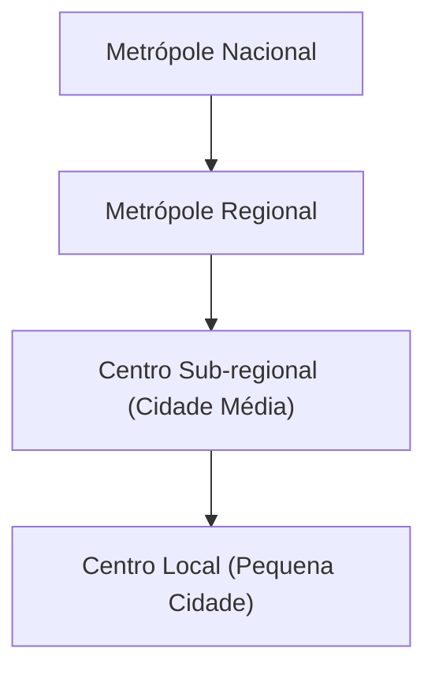

## Conurbação, Metropolização e Cidades-Mundiais

> [!definition] **Conurbação**: fenômeno em que **duas ou mais cidades contíguas crescem até formar um contínuo urbano** único. O processo de expansão faz desaparecer os limites físicos entre municípios vizinhos, integrando-os em uma só mancha urbana. Apesar da continuidade espacial, cada cidade pode manter autonomia político-administrativa – o que gera uma dicotomia entre o espaço urbano unificado e as divisões municipais. Várias conurbações interligadas podem formar uma **megalópole**, como a gigantesca faixa urbana japonesa de **Tóquio a Fukuoka** ou a megalópole do **Nordeste dos EUA (Bos-Washington)**.

No Brasil, há exemplos clássicos de conurbação: a **Região Metropolitana de São Paulo** inclui 39 municípios integrados, onde São Paulo “encontra” cidades como Guarulhos, ABC Paulista (Santo André, São Bernardo, São Caetano) e Osasco, formando uma imensa mancha urbana contínua. No **Rio de Janeiro**, a mancha urbana da capital conecta-se a municípios vizinhos (Niterói, Duque de Caxias, São Gonçalo, etc.). Outros casos incluem **Belo Horizonte-Contagem-Betim (MG)**, **Recife–Olinda–Jaboatão (PE)** e **Porto Alegre–Canoas–Novo Hamburgo (RS)**. Em geral, a conurbação ocorre quando o crescimento populacional e físico da cidade extrapola seus limites originais, incorporando antigas áreas rurais e cidades-dormitório periféricas. Esse fenômeno esteve ligado à rápida urbanização brasileira de meados do século XX, marcada por expansão horizontal sem equivalente planejamento territorial.

> [!definition] **Região Metropolitana**: instituição administrativa que **agrupa municípios vizinhos integrados socioeconomicamente** (geralmente por conurbação) para planejamento conjunto. A criação de regiões metropolitanas no Brasil iniciou-se em 1973 (São Paulo, RJ, Belo Horizonte etc.), visando coordenar políticas públicas (uso do solo, transporte, saneamento) em aglomerações urbanas multi-municipais. Embora relacionadas, **RM e conurbação não são sinônimos** – pode haver metrópole institucional sem mancha urbana contínua estrita, e vice-versa.

> [!definition] **Metropolização**: processo pelo qual **grandes cidades tornam-se metrópoles**, concentrando população e atividades a nível regional ou nacional. Implica a formação de **metrópoles** (centros urbanos com alta centralidade, influenciando vastas áreas) e a **concentração urbana** em regiões metropolitanas. Nas décadas de 1960-1980, o Brasil vivenciou intensa metropolização: parcela crescente da população fixou-se em áreas metropolitanas, notadamente São Paulo, Rio de Janeiro, Belo Horizonte, Porto Alegre, Recife e Salvador. Em 1970, cerca de **1 em cada 3 brasileiros já residia nas nove principais metrópoles** do país. Esse movimento foi alimentado pela industrialização concentrada no Sudeste e pelo êxodo rural. A metropolização gerou polos dinâmicos de desenvolvimento, mas também **macrocefalia urbana**, com recursos e investimentos fortemente centrados nas capitais estaduais. A partir dos anos 1990, observa-se certa **desmetropolização relativa** – ou seja, taxas de crescimento menores nas metrópoles tradicionais e maior crescimento em cidades médias do interior – porém as regiões metropolitanas continuam desempenhando papel dominante na economia.

Enquanto metropolização refere-se à concentração interna em grandes cidades, a noção de **cidades mundiais** (ou **cidades globais**) conecta a hierarquia urbana à escala internacional.

> [!definition] **Cidade Global**: grande metrópole que atua como **centro de influência internacional** nos âmbitos econômico, financeiro, tecnológico e cultural. Essas cidades estão **no topo da hierarquia urbana** mundial, articulando redes globais de comércio e informação. Caracterizam-se por abrigar sedes de corporações transnacionais, mercados financeiros (bolsas de valores), serviços especializados (bancos de investimento, consultorias, mídia internacional), infraestrutura de transporte global (aeroportos internacionais de grande porte, hubs logísticos) e intensa conectividade. O termo foi popularizado por **Saskia Sassen (1991)** ao analisar Nova York, Londres e Tóquio – cidades cuja influência se estende muito além de seu país de origem. Uma **cidade global** difere de uma **megacidade**: esta última refere-se apenas ao tamanho populacional excepcional (>10 milhões de habitantes), enquanto a condição de global implica função estratégica na economia-mundo. Por exemplo, **Mumbai** e **Cidade do México** são megacidades populosas, mas **Nova York** e **Londres** são cidades globais pela concentração de comando econômico.

No Brasil, **São Paulo** é usualmente classificada como cidade global emergente – figura em rankings como o GaWC no nível “Alpha” (a mais alta categoria regional) devido ao seu peso financeiro e cosmopolita. São Paulo concentra a Bolsa B3, sedes de multinacionais latino-americanas, e é um hub aéreo internacional, integrando-se aos fluxos globalizados. **Rio de Janeiro**, embora economicamente secundário no cenário global, tem relevo internacional pelo turismo, indústria do petróleo e atividades culturais, podendo ser considerado uma metrópole mundial de porte médio. Em âmbito latino-americano, São Paulo e **Cidade do México** despontam como principais cidades globais, seguidas por **Buenos Aires**, **Santiago** e **Bogotá** em importância continental. A presença de cidades globais indica o grau de integração de um país na economia internacional; contudo, também evidencia contrastes internos – são “ilhas de modernidade” muitas vezes cercadas por desigualdades locais.

> [!example] **Exemplos de Cidades Globais:** _Nova York (EUA)_ – centro financeiro global (Wall Street), sede da ONU; _Londres (Reino Unido)_ – hub financeiro e de serviços, cidade mais conectada da Europa; _Tóquio (Japão)_ – maior economia urbana do mundo, líder em tecnologia; _Paris (França)_ – influência cultural e sede de empresas globais; _Hong Kong & Singapura_ – nós de comércio/finanças na Ásia; _São Paulo (Brasil)_ – maior cidade do hemisfério sul, polo financeiro e de negócios na América Latina.

## Dinâmica Intraurbana das Metrópoles Brasileiras

O rápido crescimento metropolitano no Brasil foi acompanhado de **transformações profundas no espaço intraurbano**, geralmente marcadas por **segregação socioespacial**, expansão periférica e desafios de planejamento. As metrópoles brasileiras exibem uma divisão nítida entre áreas centrais privilegiadas e periferias carentes – uma herança das formas desiguais de urbanização.

> [!definition] **Segregação Socioespacial**: padrão de organização urbana em que **grupos sociais distintos ocupam diferentes partes da cidade**, de forma desigual. Decorre de fatores econômicos (disparidade de renda), históricos (herança de segregação racial/sociaal) e das dinâmicas imobiliárias. Na prática, manifesta-se na **concentração de elites em bairros bem infraestruturados**, muitas vezes centrais ou em enclaves exclusivos, enquanto as populações de baixa renda ficam relegadas a **periferias distantes**, favelas ou loteamentos precários com menor acesso a serviços. Essa segregação aprofunda desigualdades de acesso ao emprego, educação, saúde e segurança, criando “cidades partidas”.

Nas grandes cidades do Brasil, especialmente São Paulo e Rio de Janeiro, a expansão urbana ocorreu via **periferização**: as camadas populares, sem conseguir arcar com o custo da terra urbana formal, ocuparam maciçamente as bordas das cidades ou áreas ambientalmente frágeis (morros, várzeas). Bairros inteiros surgiram sem planejamento, resultando em moradias informais (**favelas**, loteamentos clandestinos) desprovidos inicialmente de infraestrutura básica. Segundo o Censo 2022, existem mais de **12 mil favelas no país, abrigando 16,4 milhões de pessoas (8,1% da população)** – um aumento significativo em relação a 2010 (11,4 milhões, 6,0%). Esse crescimento das favelas indica a persistência do déficit habitacional urbano e da segregação: **34,7% da população do Amazonas** reside em assentamentos precários, assim como 24,4% no Amapá e 18,8% no Pará (percentuais alarmantes concentrados na periferia de Manaus e Belém). Nas metrópoles do Sudeste, favelas emblemáticas como **Rocinha (Rio)** com ~72 mil moradores e **Paraisópolis (São Paulo)** com ~58 mil evidenciam bolsões de pobreza inseridos no tecido urbano formal. Enquanto isso, no Distrito Federal, a comunidade do **Sol Nascente (periferia de Brasília)** já soma 70 mil habitantes, ilustrando que até mesmo a capital planejada apresenta periferias vulneráveis.

Do ponto de vista morfológico, as metrópoles brasileiras combinam **áreas centrais densas**, com arranha-céus e comércio/serviços intensivos, e **periferias extensas**, de ocupação horizontal e menor densidade (embora algumas periferias apresentem adensamento populacional elevado, porém em habitações precárias). Processos como a **verticalização** (construção de prédios altos) transformaram o skyline de cidades como São Paulo, mas de forma seletiva: a verticalização tende a se concentrar em zonas valorizadas (eixos centrais e bairros nobres), enquanto áreas periféricas mantêm perfil de moradia unifamiliar ou conjuntos habitacionais de baixa altura. A **especulação imobiliária** atua elevando os preços dos terrenos nas áreas bem localizadas, empurrando os mais pobres para regiões cada vez mais distantes ou ambientalmente impróprias. Esse fenômeno alimenta a **espiral de periferização**: conforme infraestruturas (avenidas, transporte) alcançam a fronteira urbana, o preço da terra sobe e grupos de maior renda ocupam novas áreas, expulsando pobres para a próxima fronteira. Assim se reproduz a segregação no espaço metropolitano.

A dinâmica intraurbana também envolve **padronização e diferenciação funcional** das áreas da cidade. Tradicionalmente, o **centro** desempenhava funções comerciais, financeiras e administrativas, concentrando empregos e equipamentos culturais, enquanto as **periferias** cumpriam função residencial (especialmente de baixa renda). Com o tempo, surgiram **novos sub-centros** e eixos de expansão econômica: por exemplo, em São Paulo, a Avenida Paulista e, mais recentemente, a região da Berrini/Faria Lima tornaram-se centros financeiros modernos fora do centro histórico; no Rio de Janeiro, a Barra da Tijuca emergiu como “novo centro” de negócios e moradia de elite distante do centro tradicional. Esses **eixos de crescimento heterogêneo** podem reduzir a monocentralidade da cidade, mas também criam **enclaves** socioeconômicos (cada subcentro cercado de áreas segmentadas por classe social).

> [!note] **Agentes e a Produção do Espaço Urbano:** A configuração urbana é resultado da interação de diversos **agentes sociais**:
> 
> - **Estado:** atua via políticas públicas, planos diretores e obras de infraestrutura. No Brasil, o Estado tem papel central histórico (e.g. remoções de favelas no passado, investimentos como o **PAC Urbanização de Favelas** na década de 2000, ou o programa **Minha Casa Minha Vida** de habitação popular). A implementação do **Estatuto da Cidade (Lei 10.257/2001)** forneceu ferramentas para combater a especulação (como IPTU progressivo, usucapião especial urbano, ZEIS), mas sua aplicação efetiva varia conforme a vontade política local.
>     
> - **Iniciativa Privada:** o **setor imobiliário e empresarial** direciona investimentos conforme a rentabilidade, tendendo a concentrá-los em áreas valorizadas. Incorporadoras constroem condomínios fechados e shopping centers voltados às elites, muitas vezes promovendo a segregação (ex.: **Alphaville**, comunidades muradas nos subúrbios nobres). Indústrias e negócios buscam locais com acesso logístico e mão de obra, podendo deslocar eixos econômicos (como fábricas saindo do centro para periferias ou cidades vizinhas). A especulação fundiária frequentemente antecipa obras públicas – compra terrenos baratos na periferia apostando em sua valorização futura com a expansão urbana.
>     
> - **Sociedade Civil e Movimentos Sociais:** exercem pressão por **direito à cidade** – conceito que engloba acesso equitativo à moradia, transporte, saneamento e participação nas decisões urbanas. Movimentos como o **MTST (Movimento dos Trabalhadores Sem-Teto)** organizam ocupações de terrenos ociosos para moradia popular, cobrando políticas habitacionais. Associações de moradores em favelas lutam por urbanização e regularização fundiária. Mobilizações por mobilidade, como o **Movimento Passe Livre**, pautaram melhorias no transporte público (e estiveram na origem dos protestos de junho de 2013 contra tarifas). Esses atores sociais, embora menos poderosos que o Estado ou o mercado, influenciam rumos do planejamento urbano e denunciam exclusões, resultando em conquistas como operações urbanas consorciadas com habitação social, ou travando despejos arbitrários.
>     

Um dos maiores desafios intraurbanos é a **mobilidade urbana**. A segregação residencial leva a **longos deslocamentos pendulares** (casa-trabalho) dos moradores das periferias até os centros de emprego. Em São Paulo, por exemplo, muitos trabalhadores enfrentam **viagens diárias de 2 a 3 horas** em cada sentido. Estudos indicam que alguns paulistanos chegam a passar **2,4 horas por dia em congestionamentos**, somando quase um mês por ano perdido no trânsito. O alto uso do automóvel particular (40% dos paulistanos possuem carro) em combinação com a falta de uma rede de transporte de massa abrangente resulta em engarrafamentos crônicos – a cidade já registrou picos de **180 km de vias congestionadas simultaneamente** em horário de pico. Situação similar ocorre em metrópoles como Rio de Janeiro, Belo Horizonte e Recife, onde o transporte público insuficiente e de baixa qualidade leva quem pode a optar pelo carro ou moto, agravando o tráfego.

Nos últimos anos, algumas iniciativas de transporte coletivo surtiram efeito positivo: **Curitiba** pioneiramente implementou um **BRT (Bus Rapid Transit)** integrado nos anos 1970, servindo de modelo mundial; **São Paulo** expandiu sua rede de metrô e trens metropolitanos (CPTM) e implementou corredores de ônibus; **Rio de Janeiro** construiu linhas de BRT e VLT para Olimpíada 2016. Contudo, a oferta ainda não acompanha a demanda. A falta de integração metropolitana também pesa – por exemplo, sistemas de transporte raramente são planejados a nível de toda a região metropolitana, resultando em descontinuidade nas ligações intermunicipais. Melhorar a mobilidade exige investimento maciço em transporte público de alta capacidade (metrôs, trens, corredores BRT) e políticas de desestímulo ao uso do carro (pedágios urbanos, restrição a estacionamentos), além de um planejamento urbano que **aproxime moradia e emprego** no espaço, reduzindo distâncias.

Outro problema crítico é a **violência urbana**. Cidades brasileiras sofreram, entre os anos 1980-2010, altas taxas de criminalidade, em especial homicídios, muitas vezes concentrados em **áreas periféricas com menor presença do Estado**. Fatores como desigualdade, desemprego e narcotráfico contribuíram para tornar regiões metropolitanas do Nordeste e Sudeste palcos de violência endêmica. Por exemplo, metrópoles como **Fortaleza, Recife, Salvador e Rio de Janeiro** figuraram em rankings de cidades mais violentas do mundo na última década. Políticas de segurança oscilaram entre ações repressivas (ocupações policiais de favelas, UPPs no Rio) e preventivas (projetos sociais, policiamento comunitário), com resultados mistos. A violência agrava a **fragmentação urbana**, gerando enclaves fortificados (condomínios fechados, shopping centers com segurança privada) e afastando investimentos de áreas degradadas.

Por fim, os **desafios de infraestrutura urbana** permanecem grandes. O saneamento básico é um ponto nevrálgico: apesar de avanços, ainda em 2022 apenas **62,5% da população residia em domicílios com coleta de esgoto via rede pública**. Considerando soluções como fossas sépticas, 75,7% tinham algum esgotamento adequado – ou seja, **um em cada quatro brasileiros carece de saneamento básico pleno**. A disparidade regional é enorme: municípios ricos do Sudeste têm cobertura próxima de 100%, ao passo que vastas áreas do Norte e Nordeste estão abaixo de 50%. Água tratada e coleta de lixo também mostram lacunas, embora mais universais (91% dos domicílios têm coleta de lixo regular). A insuficiência de saneamento resulta em rios urbanos poluídos (ex.: rios Tietê e Pinheiros em SP, quase mortos em trechos), proliferação de doenças (dengue, leptospirose) e impactos ambientais severos.

Adicionalmente, o crescimento desordenado leva à ocupação de **áreas de risco** – encostas sujeitas a deslizamentos, margens de córregos propensas a enchentes. Tragédias recorrentes, como deslizamentos em encostas urbanas de **Petrópolis (RJ)** e **encostas de Salvador**, ou enchentes em periferias de **São Paulo**, evidenciam a necessidade de integrar conhecimento de **Geografia Física** ao planejamento urbano. A impermeabilização excessiva do solo urbano intensifica enchentes e ilhas de calor; a supressão de vegetação e ocupação de morros aumenta o risco de desastres. Nessa interface urbano-ambiental, estratégias de ordenamento territorial tornam-se vitais: criação de parques lineares em fundos de vale, zoneamento que proteja encostas e mananciais, programas de habitação que retiram moradias de áreas de perigo, etc., são medidas que aliam geografia física e urbana para uma cidade mais resiliente.

Em síntese, as metrópoles brasileiras apresentam uma **dinâmica intraurbana complexa**, marcada por contrastes socioespaciais e problemas estruturais. Políticas integradas – envolvendo Estado, iniciativa privada e comunidade – são fundamentais para enfrentar **a desigualdade urbana**, garantindo cidades mais inclusivas, mobilidade sustentável e qualidade de vida. O conceito de **“direito à cidade”** resume essa visão: o urbano deve ser usufruído por todos os cidadãos, não apenas por aqueles com maior poder aquisitivo.

## O Papel das Cidades Médias na Modernização e Desenvolvimento do Brasil

Para além das metrópoles, as **cidades médias** desempenham papel estratégico na rede urbana e no desenvolvimento regional brasileiro.

> [!definition] **Cidade Média**: conceito variável, geralmente refere-se a cidades de **porte intermediário** entre metrópoles e pequenas cidades. Um critério demográfico comumente adotado no Brasil é considerar **população entre 100 mil e 500 mil habitantes** [repositorio.ipea.gov.br](https://repositorio.ipea.gov.br/bitstream/11058/12597/21/BRUA_30_Artigo_16_rede_urbana.pdf#:~:text=O%20trabalho%20definiu%20como%20crit%C3%A9rio,9), embora haja exceções e evoluções conceituais (alguns estudos incluem cidades até ~1 milhão como “médias” se não são capitais de grande influência). Mais que o número populacional, importa a **função regional**: cidades médias atuam como **centros sub-regionais**, provendo serviços (educação superior, hospitais, comércio especializado) e polos industriais/agroindustriais que irradiam desenvolvimento.

A partir da década de 1970, observou-se no Brasil uma **interiorização do desenvolvimento**, com muitas cidades médias crescendo acima da média nacional. Esse dinamismo teve diferentes motores: desconcentração industrial (fábricas buscando cidades menores com incentivos fiscais e menos custos), expansão do agronegócio em novas fronteiras agrícolas, investimentos em infraestrutura (rodovias, hidrelétricas) que criaram **novos eixos urbanos** no interior, e políticas públicas regionais. Como resultado, regiões antes dominadas por uma metrópole passaram a contar com **rede de centros médios mais equilibrada**. Por exemplo, no **interior de São Paulo**, cidades como **Campinas, São José dos Campos, Ribeirão Preto, Bauru, Sorocaba e São José do Rio Preto** se consolidaram como polos universitários e industriais, reduzindo a primazia da capital paulista no estado. No **Sul**, que historicamente já tinha colonização policêntrica, cidades médias (Joinville, Londrina, Caxias do Sul, Maringá, etc.) puxaram o crescimento ao lado das capitais, tornando a rede urbana menos concentrada. No **Centro-Oeste**, o avanço da fronteira agrícola (soja, algodão, pecuária) impulsionou cidades como **Uberlândia (MG)**, **Rondonópolis (MT)**, **Luís Eduardo Magalhães (BA)** e **Sinop (MT)**, que se tornaram hubs de agronegócio e logística. Até no Nordeste, onde a estrutura urbana era altamente concentrada nas capitais litorâneas, destacam-se hoje cidades médias emergentes: **Petrolina (PE)** no sertão do São Francisco, **Juazeiro do Norte (CE)** no Cariri, **Feira de Santana (BA)** no interior baiano, **Parnaíba (PI)** no litoral piauiense, entre outras.

> [!example] **Exemplo – Petrolina/Juazeiro:** A cidade de _Petrolina_, em Pernambuco (população ~360 mil na RM Petrolina-Juazeiro), ilustra o papel transformador de uma cidade média. Localizada no sertão semiárido, às margens do Rio São Francisco, Petrolina era historicamente pequena e isolada. A partir dos anos 1980, projetos de **irrigação e infraestrutura** (como a Barragem de Sobradinho e canais de irrigação) viabilizaram a fruticultura irrigada de exportação. Petrolina e sua vizinha baiana _Juazeiro_ tornaram-se **produtoras de frutas (uva, manga)** para o mercado externo, atraindo investimentos, empregando milhares de trabalhadores e dinamizando a economia regional. Hoje, Petrolina conta com universidade, aeroporto internacional de cargas e um IDH bem acima da média de sua região, funcionando como **polo de desenvolvimento** em pleno semiárido. Esse caso exemplifica como uma cidade média, com apoio de planejamento territorial e uso racional de recursos hídricos (geografia física aplicada), pode **modernizar** uma região antes estagnada e **reduzir as disparidades regionais**.

As cidades médias contribuem para a **desconcentração econômica** do Brasil. Elas **desempenham funções de ligação** entre o nível local e nacional: por exemplo, uma cidade média pode escoar produção agropecuária local para mercados maiores, sediar escolas técnicas que formam mão de obra para indústrias regionais, ou oferecer serviços de saúde de média complexidade evitando que pacientes tenham que viajar à metrópole. Isso melhora a **interiorização do bem-estar**, fixando população qualificada no interior e atenuando migrações massivas para as metrópoles. De fato, a migração interna brasileira nas últimas décadas mostra crescimento populacional significativo em certos médios polos no Centro-Oeste e Sudeste interiorano, atraindo migrantes em busca de melhor qualidade de vida que não conseguiriam nas já saturadas metrópoles costeiras.

Do ponto de vista da **modernização**, muitas cidades médias funcionam como **laboratórios de inovação urbana**. Por terem porte intermediário, conseguem implementar soluções com mais agilidade do que megacidades burocratizadas, e ainda assim em escala suficiente para serem relevantes. Há exemplos de cidades médias com ótimos indicadores de gestão: _Maringá (PR)_ destaca-se em planejamento urbano e áreas verdes; _Ji-Paraná (RO)_ inovou em logística intermodal no Norte; _Campinas (SP)_ tornou-se referência em tecnologia e pesquisa (com universidades e empresas de alta tecnologia), sendo peça-chave no desenvolvimento científico nacional. Além disso, essas cidades muitas vezes conseguem combinar **desenvolvimento econômico com qualidade de vida** superior à das metrópoles – menos tempo perdido em trânsito, menor criminalidade, custo de vida mais baixo – o que atrai investimentos e moradores, num ciclo virtuoso.

Entretanto, há desafios associados. Algumas cidades médias passam por **crescimento acelerado sem estrutura suficiente**, começando a enfrentar problemas típicos de metrópoles: trânsito carregado, surgimento de favelas, poluição local e demanda por serviços públicos complexos. O planejamento é crucial para que essas cidades **cresçam de forma sustentável**, evitando repetir os erros das metrópoles. Programas de **desenvolvimento urbano equilibrado** têm sido pensados: por exemplo, a criação de **zonas industriais** e **distritos logísticos** para gerar emprego local; investimentos em educação superior descentralizada (campi universitários em cidades médias, como a UNESP em diversos municípios paulistas ou a UFBA em Barreiras/BA); e fortalecimento de arranjos regionais (consórcios intermunicipais) para resolver problemas comuns (lixo, saneamento, saúde).

Em suma, o fortalecimento das cidades médias no Brasil é fundamental para uma **rede urbana policêntrica e inclusiva**. Essas cidades atuam como **eixos de modernização** espalhados pelo território, diminuindo a pressão sobre os grandes centros e promovendo um desenvolvimento mais balanceado entre regiões. Para o planejamento nacional, investir em cidades médias – em infraestrutura, capacitação e governança local – significa **impulsionar o desenvolvimento regional**, reduzir desigualdades espaciais e criar alternativas à concentração excessiva. Na preparação para o CACD, vale lembrar que esse tema pode ser cobrado sob a perspectiva de políticas públicas: por exemplo, avaliar o impacto de programas de incentivo a desconcentração industrial ou discutir o papel das cidades médias na integração nacional (e até na integração sul-americana, via eixos transfronteiriços).

---

**Autoavaliação (Questões para Active Recall):**

1. **Urbanização e Rede Urbana:** Explique o conceito de _rede urbana_ e descreva como o processo de urbanização brasileira contribuiu para conformar a atual hierarquia de cidades no país. Quais diferenças marcantes existem na estrutura urbana das regiões Sudeste/Sul em comparação com Norte/Nordeste?
    
2. **Conceitos Urbanos:** Qual a diferença entre _conurbação_ e _metropolização_? E entre uma _megacidade_ e uma _cidade global_? Exemplifique cada caso com cidades brasileiras ou mundiais.
    
3. **Desafios Metropolitanos:** Quais são os principais problemas socioespaciais enfrentados pelas metrópoles brasileiras contemporâneas (por exemplo, São Paulo e Rio de Janeiro) e como diferentes agentes (Estado, mercado, sociedade civil) influenciam essas dinâmicas intraurbanas? Cite medidas ou políticas que poderiam mitigar esses problemas.[agenciadenoticias.ibge.gov.br](https://agenciadenoticias.ibge.gov.br/agencia-sala-de-imprensa/2013-agencia-de-noticias/releases/13558-asi-ibge-mostra-a-nova-dinamica-da-rede-urbana-brasileira#:~:text=rede%20urbana%20brasileira%3A%20densa%20no,e%20bem%20dispersa%20no%20Norte)[agenciadenoticias.ibge.gov.br](https://agenciadenoticias.ibge.gov.br/en/agencia-news/2184-news-agency/news/41813-2022-census-16-4-million-persons-in-brazil-lived-in-favelas-and-urban-communities#:~:text=,AM%29%2C%20with%2055%2C821%20residents)

# Origem: _Conurbação, metropolização e cidades-mundiais

---
title: Conurbação, metropolização e cidades-mundiais
area: GEOGRAFIA
subarea: Geografia Urbana
tags:
  - cacd-2025
  - conurbacao-metropolizacao-e-cidades-mundiais
  - geografia
  - geografia-urbana
aliases:
  - 5.2 Conurbação, metropolização e cidades-mundiais.
---
# Da Conurbação às Cidades Globais: A Dinâmica da Metropolização no Brasil e no Mundo

## I. Introdução: A Complexidade da Urbanização na Era da Globalização

A urbanização contemporânea não é um processo monolítico, mas um fenômeno multiescalar que se manifesta de formas distintas, desde a expansão física do tecido urbano até a formação de nós de comando na economia global. Para o futuro diplomata, compreender essas escalas e os conceitos que as definem é fundamental para analisar as dinâmicas de poder, economia e desenvolvimento no século XXI. O espaço urbano tornou-se a arena onde se desenrolam os principais processos sociais, econômicos e políticos da atualidade, e a sua organização reflete e condiciona as relações de poder em níveis local, nacional e internacional.

Esta nota de estudo oferece uma análise aprofundada e comparativa de três conceitos-chave que estruturam a compreensão da geografia urbana moderna: conurbação, metropolização e cidade global. O objetivo é dissecar cada fenômeno, fundamentando a análise em teorias clássicas, como as de Saskia Sassen, e em perspectivas críticas, como as de Milton Santos. Ao aplicar esses conceitos à realidade brasileira, busca-se não apenas ilustrar os processos, mas também posicionar o Brasil na complexa e hierárquica rede urbana global.

## II. A Dimensão Física da Expansão Urbana: A Conurbação

### 2.1. Definição Conceitual: O Encontro das Manchas Urbanas

A conurbação representa a dimensão mais visível e tangível do crescimento urbano. Conceitualmente, é um processo eminentemente **físico** e **morfológico** que ocorre quando a expansão contínua da mancha urbana de duas ou mais cidades vizinhas leva à sua junção física, formando um tecido urbano integrado e contínuo.1 Neste processo, os limites político-administrativos entre os municípios perdem sua clareza no terreno, tornando-se geograficamente indistintos.3 Frequentemente, uma única avenida, rua ou rio passa a ser a única separação formal entre duas municipalidades que, na prática, constituem uma única aglomeração urbana.

Este fenômeno é a manifestação territorial do crescimento urbano acelerado, sendo uma característica típica de regiões altamente urbanizadas e industrializadas, onde a dinâmica econômica e demográfica impulsiona as cidades para além de suas fronteiras originais. É, portanto, a expressão espacial da expansão demográfica e econômica concentrada.

### 2.2. A Conurbação como Processo Socioespacial no Brasil

No Brasil, a conurbação é a base territorial sobre a qual se assentam as grandes aglomerações e regiões metropolitanas. Exemplos clássicos são abundantes e ilustram a intensidade do processo no país: a contiguidade urbana entre a capital paulista e os municípios do ABC (Santo André, São Bernardo do Campo e São Caetano do Sul) ou a fusão da malha urbana do Rio de Janeiro com os municípios da Baixada Fluminense, como Duque de Caxias e Nova Iguaçu.

Contudo, a conurbação não é um processo geográfico neutro; ela é um poderoso vetor de produção e reforço da segregação socioespacial. A dinâmica do mercado imobiliário e a concentração de empregos e serviços na cidade-núcleo geram uma forte pressão sobre o custo de vida, especialmente o da moradia. Como resultado, a população de menor renda é sistematicamente expulsa das áreas centrais e mais bem equipadas, sendo compelida a buscar residência nas periferias distantes ou nos municípios vizinhos, onde o custo de vida é mais baixo.5 Este movimento dá origem às chamadas "cidades-dormitório", caracterizadas por uma intensa dependência funcional em relação à cidade principal e por longos e desgastantes movimentos pendulares diários de seus trabalhadores.

Dessa forma, o processo físico da conurbação materializa no território as desigualdades da estrutura social. Ele não apenas reflete, mas ativamente produz um espaço urbano hierarquizado e segregado. A continuidade do tecido urbano mascara uma profunda fragmentação social e funcional. É justamente essa complexidade, marcada pela interdependência entre municípios e pela necessidade de gerir problemas comuns que extrapolam as fronteiras administrativas (como transporte, saneamento e segurança), que cria a demanda por políticas públicas integradas e estabelece um elo causal direto com o desafio da metropolização.

## III. Metropolização: A Concentração de Poder e Funções em Escala Regional e Nacional

### 3.1. Para Além do Físico: O Conceito de Metrópole

Se a conurbação descreve a _forma_ física da expansão urbana, a metropolização descreve a _função_ e a _influência_ que uma cidade exerce. O processo de metropolização refere-se à formação de metrópoles, que são definidas não apenas pelo seu tamanho ou pela existência de conurbação, mas fundamentalmente pela **concentração de funções e poder**. Uma metrópole é um polo urbano que centraliza poder econômico e político, sedia grandes empresas, oferece serviços altamente especializados (saúde, educação, finanças), possui infraestrutura complexa e centros de pesquisa e cultura, exercendo uma forte influência e polarização sobre uma vasta área ao seu redor — sua região metropolitana e, por vezes, sobre todo o território nacional.

A relação entre os dois conceitos é hierárquica e causal. A metropolização, como processo de concentração funcional, é a força motriz que atrai capital, investimentos, empresas e, crucialmente, um grande contingente populacional, alimentado historicamente pelo êxodo rural e por migrações inter-regionais. Esse intenso crescimento demográfico e econômico impulsiona a expansão física da mancha urbana, que, por sua vez, resulta na conurbação com os municípios vizinhos. Portanto, a metropolização (o processo funcional) pode ser entendida como a _causa_, enquanto a conurbação (o processo físico) é um de seus _efeitos_ mais visíveis, sua manifestação espacial. Compreender essa distinção é vital para não confundir o sintoma (a expansão física) com o fenômeno central (a concentração de poder e recursos).

### 3.2. A Gênese das Regiões Metropolitanas (RMs) no Brasil: Um Projeto de Estado

A institucionalização das Regiões Metropolitanas (RMs) no Brasil é um capítulo fundamental da história do planejamento urbano e regional do país, refletindo diferentes momentos políticos e visões sobre o papel do Estado.

#### 3.2.1. O Marco de 1973: A Lei Complementar nº 14 e a Estratégia do Regime Militar

As primeiras regiões metropolitanas do Brasil não surgiram de forma espontânea, mas foram criadas por uma decisão centralizada do governo federal. Através da **Lei Complementar nº 14, de 8 de junho de 1973**, o regime militar instituiu formalmente as oito primeiras RMs: São Paulo, Belo Horizonte, Porto Alegre, Recife, Salvador, Curitiba, Belém e Fortaleza. A RM do Rio de Janeiro foi criada no ano seguinte, em 1974, após a fusão dos estados da Guanabara e do Rio de Janeiro.

Essa criação não foi um ato meramente administrativo, mas parte integrante de uma estratégia de desenvolvimento nacional e de planejamento territorial autoritário. O objetivo era reconhecer a existência de fato dessas grandes aglomerações urbanas, que já concentravam população, atividade econômica e exerciam forte polarização, e criar estruturas de gestão capazes de lidar com os "problemas de interesse comum" decorrentes da rápida e desordenada urbanização, como transporte e saneamento. A institucionalização das RMs visava, assim, a ordenar o crescimento e a integrar o planejamento em escala supramunicipal, sob a coordenação do poder central.

#### 3.2.2. A Reconfiguração Pós-1988 e o Estatuto da Metrópole

A **Constituição Federal de 1988** promoveu uma mudança drástica nesse arranjo. Em linha com o processo de redemocratização e descentralização, a Carta Magna transferiu aos estados a prerrogativa de instituir, por meio de lei complementar, regiões metropolitanas, aglomerações urbanas e microrregiões.

Essa mudança, embora democrática, abriu espaço para uma proliferação de novas RMs, muitas vezes criadas com base em critérios mais políticos do que técnicos, desvinculadas de uma real integração funcional metropolitana. Esse fenômeno, conhecido como "metropolização institucional", gerou a existência de "RMs sem metrópoles", ou seja, arranjos institucionais que não correspondem a uma realidade socioeconômica de polarização e complexidade.16 O caso de Santa Catarina, que possui um número elevado de RMs criadas com base em um critério de 6% da população estadual, é um exemplo emblemático dessa tendência.

Diante do caos institucional e da ineficácia da gestão em muitas dessas áreas, foi promulgado o **Estatuto da Metrópole (Lei nº 13.089/2015)**. Essa legislação representa uma tentativa de reorganizar o sistema, estabelecendo diretrizes nacionais para o planejamento e a governança interfederativa. O Estatuto exige que cada RM elabore um **Plano de Desenvolvimento Urbano Integrado (PDUI)**, instrumento que deve definir e planejar as **Funções Públicas de Interesse Comum (FPICs)**, como transporte, saneamento básico e uso do solo.

### 3.3. Desafios da Governança Metropolitana no Brasil

A gestão das metrópoles brasileiras é marcada por desafios estruturais profundos, que refletem as contradições do nosso pacto federativo e a complexidade dos problemas urbanos.

Um dos principais entraves reside na tensão entre a **definição legal (a RM) e a realidade funcional (a metrópole)**. Como visto, a descentralização pós-1988 levou a uma banalização do instrumento da RM, com muitos arranjos sendo criados por conveniência política, sem a substância funcional que justificaria uma gestão integrada. Para a análise geográfica e diplomática, é crucial saber distinguir uma RM como a de São Paulo, que é de fato uma metrópole de alcance global, de uma RM que existe apenas no papel. As primeiras nove RMs criadas nos anos 1970, por exemplo, ainda concentram mais de 70% de toda a população metropolitana do país, evidenciando a disparidade de escala e complexidade.

Adicionalmente, a governança metropolitana no Brasil enfrenta o que pode ser chamado de **paradoxo do federalismo**. A mesma Constituição de 1988 que deu aos estados o poder de criar RMs também elevou os municípios à condição de entes federados plenos, com ampla autonomia política, administrativa e legislativa sobre seu território. Isso cria uma tensão estrutural: os problemas metropolitanos (transporte, saneamento, resíduos sólidos) são, por natureza, supramunicipais e exigem soluções coordenadas. No entanto, a gestão desses temas depende da cooperação voluntária de prefeitos autônomos, cujos incentivos políticos estão frequentemente alinhados com os interesses de curto prazo de seu próprio município, e não com o bem-estar da região como um todo. A dificuldade crônica em integrar os sistemas de bilhetagem do transporte público intermunicipal na Grande São Paulo é um exemplo prático dessa falha de coordenação, onde a fragmentação política impede uma solução eficiente para milhões de cidadãos. O Estatuto da Metrópole oferece as ferramentas para superar esse impasse, mas sua efetiva implementação depende da superação de barreiras políticas, da construção de arranjos de governança robustos e, fundamentalmente, de fontes de financiamento adequadas, um desafio constante em um cenário de crise fiscal dos estados.

## IV. As Cidades Globais: Nós Estratégicos na Economia-Mundo

No topo da hierarquia urbana contemporânea encontram-se as cidades globais, conceito que representa a expressão máxima da metropolização em uma escala planetária. A compreensão desse fenômeno é indissociável da obra da socióloga Saskia Sassen, que revolucionou os estudos urbanos ao propor uma nova forma de interpretar o papel das grandes cidades na era da globalização.

### 4.1. A Tese da Cidade Global de Saskia Sassen: Uma Análise Aprofundada

#### 4.1.1. A Função como Critério Definitivo: Para Além do Tamanho

A contribuição mais seminal de Sassen foi redefinir o que torna uma cidade "mundial" ou "global". Para ela, o critério decisivo não é o tamanho de sua população, sua extensão territorial ou mesmo seu poderio industrial, mas sim sua **função estratégica** na organização e comando da economia mundial. As cidades globais são os **pontos de comando e controle** da economia globalizada.22 São os locais estratégicos onde as condições para a operação do sistema econômico global são ativamente produzidas, gerenciadas e financiadas.

Essa função centralizadora emerge de um paradoxo fundamental da globalização: à medida que a produção industrial e as operações de rotina das empresas se dispersam geograficamente pelo mundo em busca de menores custos, aumenta a necessidade de uma **centralização crescente das funções de gestão, controle, finanças e serviços especializados** de alto nível para coordenar essa rede dispersa. As cidades globais são os locais onde essa centralização de comando ocorre.

#### 4.1.2. O Motor da Economia Global: A Produção de Serviços Avançados (Advanced Producer Services - APS)

A função de comando e controle não é abstrata; ela se materializa na concentração de um tipo específico de atividade econômica: os **serviços avançados ao produtor** (em inglês, _Advanced Producer Services_ - APS). Este setor inclui finanças, seguros, direito empresarial, contabilidade, consultoria de gestão, publicidade e marketing. Essas empresas de conhecimento intensivo formam um complexo de serviços sofisticados e interligados que são indispensáveis para as operações das corporações transnacionais. A cidade global é, em essência, uma **plataforma de produção para esses serviços**, que são o "software" que permite o funcionamento do "hardware" da economia global. Não se trata de competir em todos os setores, mas de se especializar. Cidades como São Paulo ou Chicago, com um histórico de serviços para a indústria pesada, oferecem um tipo de expertise diferente de Nova York ou Londres, criando uma divisão de trabalho na rede global.

#### 4.1.3. O Papel do Estado e a "Desnacionalização Parcial" do Território

Um dos pontos mais sofisticados e cruciais da teoria de Sassen é sua análise sobre o papel do Estado-nação. Longe de ser uma vítima passiva da globalização, o Estado é um ator central na formação das cidades globais. Ele desempenha um papel indispensável ao criar o arcabouço jurídico e regulatório necessário para as transações econômicas globais, como a garantia de contratos, direitos de propriedade e a livre circulação de capitais. O Estado, nas palavras de Sassen, ativamente "regulamenta a desregulamentar", ou seja, usa seu poder soberano para criar exceções e regimes favoráveis ao capital internacional.

Este processo leva ao que Sassen denomina de **"desnacionalização incipiente e parcial"** do território da cidade global.20 Isso não significa uma perda de soberania no sentido tradicional, mas sim uma _reconfiguração_ da autoridade do Estado. O Estado soberanamente escolhe alinhar o quadro institucional de uma porção de seu território — a cidade global — mais com as demandas dos circuitos globais do que com as necessidades do restante do território nacional. Cria-se, assim, um espaço híbrido, um enclave que é simultaneamente nacional em sua localização e jurisdição, mas transnacional em sua lógica de funcionamento e em suas lealdades econômicas. Para um diplomata, compreender essa nuance é fundamental para entender como o poder do Estado se manifesta e se transforma na era da globalização.

### 4.2. A Perspectiva Crítica de Milton Santos: A Globalização como Perversidade

Enquanto Sassen oferece uma análise primariamente funcionalista de como o sistema opera, o geógrafo brasileiro Milton Santos oferece uma perspectiva crítica indispensável sobre as _consequências_ desse sistema. Santos conceitua o período histórico atual como o **Meio Técnico-Científico-Informacional (MTCI)**. Este conceito descreve o espaço geográfico transformado pela união indissociável entre ciência, tecnologia e informação, que cria o substrato material e imaterial (redes de telecomunicações, fluxos de dados, logística avançada) que permite a fluidez, a instantaneidade e a seletividade da economia globalizada.

Com base nesse conceito, Santos desenvolve uma crítica contundente à globalização hegemônica. Em sua obra "Por uma Outra Globalização", ele a descreve a partir de três lentes: a "globalização como fábula" (o discurso dominante que a apresenta como benéfica para todos), a "globalização como perversidade" (a realidade de um processo que aprofunda as desigualdades, concentra riqueza, gera exclusão e beneficia um pequeno número de atores e lugares) e a "globalização como possibilidade" (a utopia de um mundo mais solidário e humano).

A análise mais completa e estratégica não deve opor Sassen e Santos, mas sim articulá-los. Sassen nos fornece a _anatomia_ da cidade global: ela explica _o que é e como funciona_ um centro de comando como São Paulo, detalhando seu motor (os APS) e suas conexões. Milton Santos, por sua vez, nos fornece a _fisiopatologia_: ele analisa criticamente _as consequências e as contradições_ dessa função para a sociedade e o espaço brasileiros, especialmente no que tange à desigualdade. O MTCI de Santos é a infraestrutura que viabiliza a rede de cidades globais de Sassen. A concentração de poder e riqueza nessas cidades é um dos principais mecanismos da "perversidade" que Santos denuncia.

### 4.3. A Rede Urbana Mundial e sua Hierarquia: A Classificação GaWC

A teoria das cidades globais encontra sua validação empírica mais influente nos trabalhos do **Globalization and World Cities Research Network (GaWC)**, um think tank baseado na Universidade de Loughborough, no Reino Unido.

#### 4.3.1. Metodologia e Critérios da Rede GaWC

A metodologia da GaWC é uma aplicação direta da tese de Sassen. Em vez de usar dados como população ou PIB, a GaWC mede a **conectividade** de uma cidade, ou seja, seu grau de integração na rede global. Essa conectividade é calculada com base na análise da rede de escritórios das principais empresas globais de **Advanced Producer Services (APS)**. A presença e a importância dos escritórios de firmas de contabilidade, publicidade, finanças e direito em uma cidade determinam sua pontuação e, consequentemente, sua posição na hierarquia mundial. O ranking classifica as cidades em níveis Alpha, Beta e Gamma, com subdivisões (+, -), refletindo diferentes graus de integração.

#### 4.3.2. A Inserção do Brasil na Hierarquia Global

O ranking da GaWC é uma ferramenta analítica poderosa para compreender a inserção do Brasil na economia global. Ele não apenas valida empiricamente a teoria, mas revela a clara hierarquia funcional do sistema urbano brasileiro em sua conexão com o mundo.

A classificação de 2024, por exemplo, posiciona **São Paulo** na categoria **Alpha**, o que confirma seu status como a principal cidade global do Brasil e da América do Sul.38 Essa posição reflete sua função como o nó de comando e controle indiscutível do país, concentrando a principal bolsa de valores da América Latina (B3), as sedes das maiores corporações nacionais e transnacionais, e o mais sofisticado complexo de serviços avançados que conectam a economia brasileira aos circuitos globais.

O **Rio de Janeiro**, por sua vez, é classificado como **Beta-**. Essa posição indica um papel importante na rede global, mas claramente secundário em relação a São Paulo no que tange ao comando econômico-financeiro. O Rio mantém funções globais significativas, especialmente nos setores de cultura, turismo e energia, mas o núcleo estratégico da economia brasileira está sediado em São Paulo. Outras metrópoles brasileiras, como Brasília, Curitiba, Recife, Salvador e Porto Alegre, aparecem em categorias inferiores, como "Sufficiency", indicando que, embora sejam centros nacionais ou regionais importantes, sua integração funcional na economia global através dos APS é mais limitada.

A tabela a seguir apresenta um extrato da classificação GaWC de 2024, destacando a posição das cidades brasileiras no topo da hierarquia.

Tabela 1: Classificação GaWC de Cidades Globais (2024) - Níveis Selecionados

Fonte: Globalization and World Cities Research Network (GaWC), 2024.

Metodologia: Classificação baseada na conectividade global das cidades, medida através da rede de escritórios de 175 empresas de Serviços Avançados ao Produtor (APS) em 802 cidades.

|Categoria|Cidades Selecionadas|
|---|---|
|**Alpha ++**|London, New York|
|**Alpha +**|Beijing, Dubai, Hong Kong, Paris, Shanghai, Singapore, Sydney, Tokyo|
|**Alpha**|Amsterdam, Bangkok, Chicago, Frankfurt, Istanbul, Jakarta, Los Angeles, Madrid, Mexico City, Mumbai, **São Paulo**, Seoul, Warsaw...|
|**Alpha -**|Berlin, Boston, Buenos Aires, Johannesburg, Lisbon, Melbourne, Santiago, Washington, D.C., Zurich...|
|**Beta +**|Athens, Atlanta, Auckland, Barcelona, Bogotá, Miami, Rome...|
|**Beta**|Abu Dhabi, Cairo, Copenhagen, Geneva, Manila, Nairobi...|
|**Beta -**|Belgrade, Casablanca, Lagos, **Rio de Janeiro**, Vancouver...|

## V. Análise Comparativa e Conclusão: Da Mancha Física à Função Global

A compreensão das dinâmicas urbanas contemporâneas exige a distinção clara e a articulação precisa dos conceitos de conurbação, metropolização e cidade global. Eles não são sinônimos, mas representam diferentes escalas e dimensões de um mesmo processo macro de concentração de pessoas, atividades e poder.

### 5.1. Diferenciando os Conceitos: Uma Síntese Estratégica para o CACD

- **Conurbação:** É um processo **físico-morfológico**. Refere-se à _forma_ da cidade e descreve a junção de manchas urbanas de municípios vizinhos. É a dimensão mais concreta e visível da expansão urbana.
    
- **Metropolização:** É um processo **funcional de escala regional/nacional**. Refere-se à _influência e poder_ da cidade. Descreve a concentração de funções econômicas, políticas e sociais que permite a uma cidade-núcleo polarizar uma vasta região. A conurbação é um de seus resultados espaciais mais comuns.
    
- **Cidade Global:** É um conceito **funcional de escala global**. Refere-se ao _papel_ da cidade na economia-mundo. É a expressão máxima da metropolização, na qual a função primordial da cidade é servir como um nó de comando e controle para a economia globalizada, principalmente através da produção e exportação de serviços avançados ao produtor (APS).
    

### 5.2. A Relação de Escala e Complexidade

Existe uma progressão lógica e uma hierarquia de escala e complexidade entre os três conceitos. A **conurbação** pode criar uma vasta aglomeração física. Quando essa aglomeração desenvolve uma alta concentração de funções e poder, tornando-se um centro que polariza seu entorno, ela se transforma em uma **metrópole**. Finalmente, quando essa metrópole adquire funções de comando e controle que são cruciais para a operação da economia global, ela se insere na rede de **cidades globais**.

Essa relação é hierárquica: nem toda área conurbada é uma metrópole (pode ser apenas um aglomerado de cidades de pequeno e médio porte). Nem toda metrópole é uma cidade global (pode ter grande importância nacional, mas pouca função na rede global). Contudo, toda cidade global é, por definição, também uma metrópole (e, na vasta maioria dos casos, uma área extensamente conurbada).

### 5.3. Implicações para o Brasil: Desafios e Oportunidades na Rede Urbana Global

O Brasil exibe em seu território todos esses fenômenos de forma exemplar. O país possui extensas áreas conurbadas, metrópoles consolidadas que enfrentam graves desafios de governança interfederativa e uma cidade global proeminente, São Paulo, que ancora o país na economia mundial. No entanto, como a perspectiva crítica de Milton Santos nos alerta, essa inserção ocorre de forma profundamente desigual e contraditória, exacerbando as disparidades sociais e territoriais internas.

Para a política externa brasileira, entender essa dinâmica urbana complexa é crucial. A projeção internacional do país, a atração de investimentos de qualidade, a promoção da cooperação descentralizada (paradiplomacia) e a busca por soluções para os grandes desafios globais — como as mudanças climáticas e a desigualdade — passam, inevitavelmente, pela gestão inteligente e justa de suas cidades e metrópoles.

## VI. Questões para Autoavaliação (Active Recall)

> [!question]
> 
> Questão 1: Diferencie, em uma perspectiva conceitual e aplicada à realidade brasileira, os processos de conurbação e metropolização. De que forma a estrutura federativa brasileira, estabelecida pela Constituição de 1988, impacta a governança das regiões metropolitanas?

> [!question]
> 
> Questão 2: Com base na teoria de Saskia Sassen, explique por que uma cidade global é definida por sua função e não por seu tamanho. Detalhe o papel dos "serviços avançados ao produtor" (APS) e o conceito de "desnacionalização parcial". Como a perspectiva crítica de Milton Santos sobre o "meio técnico-científico-informacional" e a "globalização como perversidade" pode ser utilizada para analisar o papel de São Paulo como cidade global?

> [!question]
> 
> Questão 3: Analise a inserção das cidades brasileiras na hierarquia urbana mundial, utilizando a classificação da rede GaWC. Discuta as posições de São Paulo e Rio de Janeiro, relacionando-as com suas respectivas funções econômicas e históricas no contexto nacional e global.

# Da Conurbação às Cidades Globais: A Dinâmica da Metropolização no Brasil e no Mundo

## Introdução: A Reconfiguração do Espaço na Era da Globalização

A urbanização representa o processo demográfico e espacial mais transformador do último século. No século XXI, a compreensão da dinâmica das cidades transcendeu o campo da geografia para se tornar uma questão central para a economia, a política e as relações internacionais. As cidades são as arenas onde a globalização se materializa, onde a competitividade econômica é forjada e onde as contradições e desigualdades sociais se manifestam de forma mais aguda. Elas são os nós de uma rede complexa que define os fluxos de capital, informação e poder em escala planetária.

Para um futuro diplomata, decifrar a hierarquia urbana global é, em essência, decifrar a geografia do poder contemporâneo. A capacidade de uma nação de atrair investimentos, sediar eventos de magnitude internacional, e projetar sua influência cultural e política — o chamado _soft power_ — está intrinsecamente ligada à função e ao status de suas principais cidades. Internamente, a gestão dos desafios metropolitanos, como mobilidade, segurança, saneamento e moradia, não é apenas um problema administrativo, mas um reflexo da capacidade estatal e um fator determinante para o desenvolvimento sustentável, pauta central na diplomacia do século XXI.

Este documento propõe uma jornada analítica que parte do nível mais fundamental da aglomeração urbana e ascende progressivamente à complexidade da rede global de cidades. A estrutura foi desenhada para construir um arcabouço de conhecimento sólido e multifacetado:

- Iniciaremos com a **conurbação**, o fenômeno da fusão física que cria a mancha urbana contínua, a base material sobre a qual se erguem as grandes aglomerações.
    
- Avançaremos para a **metropolização**, o processo funcional que estabelece polos de influência e comando em escala regional e nacional, organizando o território ao seu redor.
    
- Culminaremos na análise das **cidades globais**, os nós de comando e controle da economia mundial. Nesta seção, aprofundaremos as teorias seminais de Saskia Sassen, que redefiniram a compreensão do papel das cidades na globalização, e as contraporemos com a perspectiva crítica do geógrafo brasileiro Milton Santos.
    
- Ao longo de todo o percurso, o foco recairá sobre a realidade brasileira, examinando seus processos históricos, seus desafios contemporâneos de governança metropolitana 9 e a inserção de suas cidades na hierarquia urbana global.
    

## Seção 1: Fundamentos da Concentração Urbana: Conurbação e Metropolização

### 1.1. Conurbação: A Gênese da Mancha Urbana Contínua

A conurbação é o fenômeno geográfico que ocorre quando o crescimento horizontal de duas ou mais cidades, impulsionado por uma urbanização acelerada, faz com que suas malhas urbanas se encontrem e se fundam, formando uma área urbana fisicamente contínua. Este processo, típico de regiões de alta densidade demográfica, resulta na obliteração dos limites político-administrativos visíveis entre os municípios; frequentemente, uma única rua ou avenida serve como a única divisória, tornando difícil perceber onde um município termina e o outro começa. A força motriz por trás desse fenômeno é, em geral, a combinação de processos de industrialização e êxodo rural, que concentram a população em centros urbanos específicos e expandem suas periferias.

Essa fusão física gera dinâmicas socioeconômicas complexas e uma profunda interdependência funcional. Uma característica central é a formação de uma hierarquia entre as cidades conurbadas, com um centro urbano principal (a futura metrópole) polarizando os municípios vizinhos, que se tornam funcionalmente subordinados. Essa relação hierárquica manifesta-se em dois fenômenos interligados. O primeiro são os **movimentos pendulares**, que consistem nos deslocamentos diários massivos de população entre o município de residência e o de trabalho ou estudo.14 O segundo é a consolidação das chamadas **"cidades-dormitório"**, municípios periféricos que servem primariamente como área residencial para os trabalhadores do polo principal. Essa dinâmica é impulsionada pela segregação socioespacial, uma vez que o custo de vida, especialmente o imobiliário, tende a ser significativamente menor nessas cidades vizinhas, forçando a população de menor renda a residir longe dos centros de emprego e serviços.

No Brasil, o exemplo mais emblemático de conurbação é a Região Metropolitana de São Paulo (RMSP). A capital paulista expandiu-se de tal forma que sua mancha urbana se fundiu com a de 38 outros municípios, formando um aglomerado urbano coeso. A área do "ABC Paulista", composta por Santo André, São Bernardo do Campo e São Caetano do Sul, é um caso clássico de conurbação industrial que se integrou à mancha urbana da capital. Imagens de satélite da RMSP revelam com clareza uma área urbanizada contínua que ignora completamente as fronteiras municipais, evidenciando a força do processo geográfico sobre a divisão administrativa.16 Em escala global, as áreas metropolitanas de Tóquio, Londres e a região que engloba Nova Iorque, Nova Jersey e Connecticut são exemplos notórios de conurbações que formam algumas das mais dinâmicas e populosas regiões do planeta.

### 1.2. Metropolização: A Consolidação de Polos de Poder e Influência

Se a conurbação descreve o processo físico de fusão espacial, a metropolização refere-se ao processo funcional e hierárquico de concentração de poder. A metropolização é definida como a crescente concentração de população, atividades econômicas, poder político, inovações tecnológicas e influência cultural em uma cidade principal — a metrópole. Esta cidade passa a exercer uma forte polarização sobre uma vasta área ao seu redor, que se torna sua área de influência. A metrópole funciona como um polo que atrai e organiza fluxos de pessoas, capitais, mercadorias e informações, estabelecendo-se no topo de uma hierarquia urbana regional ou nacional.

O processo de metropolização no Brasil possui características distintas, marcadas por seu desenvolvimento histórico. Foi um processo tardio, que se intensificou a partir da segunda metade do século XX, acelerado e extremamente concentrador. As principais forças motrizes foram a industrialização por substituição de importações, que concentrou o capital e a produção em poucos centros, e a modernização conservadora do campo, que liberou um enorme contingente de mão de obra através do êxodo rural. Essa dinâmica ocorreu de forma geograficamente desigual, privilegiando a região Sudeste, que viu São Paulo e Rio de Janeiro emergirem como as primeiras e mais importantes metrópoles do país, refletindo a concentração econômica e industrial que marcou a história nacional.

Para lidar com a complexidade das áreas conurbadas que se formavam ao redor das metrópoles, o Estado brasileiro, a partir da década de 1970, durante o regime militar, institucionalizou as Regiões Metropolitanas (RMs). Essas estruturas foram concebidas para planejar e gerir de forma integrada os problemas comuns aos municípios conurbados. Atualmente, o Instituto Brasileiro de Geografia e Estatística (IBGE) reconhece dezenas de RMs, que, somadas, concentram mais de 40% da população brasileira e uma parcela ainda maior do Produto Interno Bruto (PIB) nacional.

### 1.3. A Governança Metropolitana no Brasil: Um Desafio Estrutural

Apesar da importância demográfica e econômica das metrópoles, a sua gestão no Brasil é marcada por uma crise profunda e estrutural. Estudos do Instituto de Pesquisa Econômica Aplicada (IPEA) diagnosticam um cenário de **fragmentação da gestão** e de **relativo abandono da questão metropolitana na agenda política nacional**. A Constituição Federal de 1988, ao mesmo tempo que previu a criação de RMs pelos estados, fortaleceu a autonomia municipal. O resultado foi um arranjo em que cada município age de forma isolada, defendendo seus próprios interesses, o que torna extremamente difícil, senão impossível, a implementação de políticas públicas integradas para questões que são, por natureza, metropolitanas, como transporte público, saneamento básico, gestão de resíduos sólidos, uso do solo e desenvolvimento econômico.

Historicamente, o Brasil já teve um arranjo institucional mais centralizado para o planejamento urbano. Durante o regime militar (1964-1985), a questão metropolitana era vista como estratégica para o projeto de desenvolvimento nacional. Órgãos como o Banco Nacional da Habitação (BNH) e o Serviço Federal de Habitação e Urbanismo (SERFHAU) financiavam e apoiavam tecnicamente planos diretores e grandes obras de infraestrutura nas metrópoles. Com a redemocratização e a nova ordem constitucional de 1988, essa agenda de planejamento metropolitano centralizado perdeu força, e as estruturas foram desmontadas, criando um vácuo institucional que persiste até hoje.

O país vive, portanto, um paradoxo gritante: a crescente e inegável importância socioeconômica das metrópoles coexiste com a extrema fragilidade de seus mecanismos de governança e financiamento. Essa crise de governança metropolitana no Brasil revela-se, assim, não como um mero problema de gestão ou falta de cooperação, mas como uma **falha estrutural profunda, decorrente da dissonância entre a realidade geográfica-funcional e a arquitetura político-administrativa**. A lógica do processo de conurbação e metropolização cria um espaço funcionalmente integrado, com um mercado de trabalho unificado e fluxos diários intensos que ignoram fronteiras. Contudo, a estrutura de poder permanece rigidamente fragmentada em autonomias municipais. A ausência de uma política nacional robusta para a questão metropolitana 9 e de arranjos institucionais com poder e recursos para atuar na escala metropolitana impede a superação dessa dissonância. A consequência de terceira ordem dessa falha estrutural é a perpetuação e o aprofundamento da desigualdade socioespacial. A falta de planejamento integrado resulta na contínua expulsão das populações mais pobres para periferias cada vez mais distantes e mal servidas por infraestrutura e serviços, as "cidades-dormitório", que arcam com os maiores custos de tempo e dinheiro para acessar as oportunidades concentradas no centro da metrópole. A metrópole brasileira torna-se, assim, um espaço fisicamente integrado, mas social e economicamente fraturado, um dos desafios mais prementes para o Estado brasileiro no século XXI.

## Seção 2: O Ápice da Hierarquia Urbana: As Cidades Globais como Centros Nervosos da Economia Mundial

### 2.1. A Arquitetura Conceitual de Saskia Sassen

A socióloga Saskia Sassen, em sua obra seminal "A Cidade Global" (1991), promoveu uma revolução na forma de compreender as grandes cidades na era da globalização. Sua contribuição fundamental foi deslocar o foco de análise de indicadores quantitativos, como o tamanho da população (megacidade), para a **função estratégica** que uma cidade desempenha na articulação da economia global. Para Sassen, uma cidade global não é definida por sua demografia, mas por seu papel como um local estratégico para o funcionamento do capitalismo globalizado.

O insight central de sua teoria é que as cidades globais devem ser entendidas como **"locais de produção"** altamente especializados. O que elas produzem não são bens manufaturados, mas as **capacidades para a operação, gestão e controle da economia global**. A dispersão geográfica da produção industrial, uma marca da globalização, paradoxalmente, exigiu uma centralização de funções de comando e serviços especializados. As cidades globais são as "fábricas" onde esses serviços são produzidos, testados e vendidos. O "produto" chave são os chamados **serviços especializados avançados** (_advanced producer services_), que incluem o complexo de atividades financeiras, jurídicas, contábeis, de consultoria, publicidade, marketing e design. É em uma cidade global como São Paulo, por exemplo, que uma corporação mineradora transnacional encontrará a assessoria jurídica e financeira especializada necessária para viabilizar suas operações na América do Sul.

A partir dessa base produtiva, as cidades globais exercem suas **funções de comando e controle** sobre a economia mundial. Elas concentram as sedes de corporações transnacionais, as principais instituições financeiras, os mercados de capitais (bolsas de valores) e as agências reguladoras, de onde as decisões estratégicas que afetam a produção e o investimento em todo o planeta são tomadas, gerenciadas e planejadas.

A ascensão dessa rede transnacional de cidades globais, segundo Sassen, cria uma nova geografia da centralidade e da marginalidade. Primeiramente, ela gera uma **articulação em rede**, na qual as cidades globais estão mais intensamente conectadas entre si (por exemplo, através de fluxos financeiros e de informação entre Nova Iorque, Londres e Tóquio) do que com muitas cidades de seus próprios territórios nacionais. Em segundo lugar, essa intensa conexão global pode levar a uma **desconexão parcial do _hinterland_**, ou seja, do seu entorno regional e nacional. A economia de uma cidade global pode prosperar em sintonia com os ciclos econômicos globais, enquanto sua região imediata estagna ou decai, aprofundando as desigualdades internas e criando enclaves de riqueza e modernidade em meio a áreas de pobreza.

### 2.2. A Rede Urbana Global em Evidência: A Classificação GaWC

A Globalization and World Cities Research Network (GaWC), um _think tank_ sediado na Universidade de Loughborough, no Reino Unido, operacionalizou empiricamente o conceito de cidade global.11 A metodologia do GaWC é inovadora, pois não se baseia em indicadores tradicionais como população ou PIB. Em vez disso, mede a **conectividade** de uma cidade dentro da rede corporativa global.30 Isso é feito através da análise da presença, do tamanho e da função dos escritórios das principais empresas globais que prestam os "serviços especializados avançados" definidos por Sassen — contabilidade, publicidade, serviços bancários/financeiros e direito — em centenas de cidades ao redor do mundo. O resultado é um retrato da importância de cada cidade como um "nó" que possibilita o funcionamento da globalização corporativa.

Com base nessa análise de conectividade, o GaWC classifica as cidades em uma hierarquia de integração na economia mundial, que é atualizada periodicamente. Os principais níveis são 30:

- **Alfa (Alpha):** Cidades cruciais e mais integradas na economia global. Este nível é subdividido em Alfa++, Alfa+, Alfa e Alfa-, para denotar diferentes graus de importância.
    
- **Beta:** Cidades importantes que funcionam como instrumentos vitais para conectar suas respectivas regiões ou estados à economia mundial. Subdivididas em Beta+, Beta e Beta-.
    
- **Gama (Gamma):** Cidades que conectam economias menores à rede global ou que possuem funções globais importantes, mas não necessariamente no setor de serviços corporativos avançados. Subdivididas em Gama+, Gama e Gama-.
    
- **Suficiência (Sufficiency):** Cidades que, embora não sejam consideradas cidades globais no sentido estrito, possuem um nível de serviços que lhes confere autonomia, não sendo excessivamente dependentes de outros centros.
    

A classificação de 2024 oferece um panorama atualizado dessa hierarquia, posicionando o Brasil e suas cidades no cenário global.

### Tabela 1: Classificação GaWC das Principais Cidades Globais (2024)

| Categoria   | Cidades de Destaque Global                                                | Cidades na América Latina                                    |
| :---------- | :------------------------------------------------------------------------ | :----------------------------------------------------------- |
| **Alfa ++** | Londres, Nova Iorque                                                      | -                                                            |
| **Alfa +** | Pequim, Dubai, Hong Kong, Paris, Xangai, Singapura, Sydney, Tóquio        | -                                                            |
| **Alfa** | Milão, Toronto, Frankfurt, Chicago, São Paulo, Cidade do México, Madri    | São Paulo, Cidade do México                                  |
| **Alfa -** | Zurique, Buenos Aires, Santiago, Estocolmo, Washington DC, Joanesburgo    | Buenos Aires, Santiago                                       |
| **Beta +** | Bogotá, Roma, Budapeste, Miami, Dallas                                    | Bogotá, Lima                                                 |
| **Beta** | Brisbane, Cairo, Copenhague, Manila, Nairóbi                              | -                                                            |
| **Beta -** | Rio de Janeiro, Vancouver, Lyon, Helsinque, Caracas, Montevidéu           | Rio de Janeiro, Caracas, Montevidéu                          |
| **Gama +** | Cidade do Cabo, Porto, Austin, Roterdã                                    | Cidade da Guatemala, Santo Domingo                           |
| **Suficiência** | Recife, Salvador, Campinas, Puebla, Orlando, Porto Alegre                | Recife, Salvador, Campinas, Puebla, Porto Alegre             |

*Fonte: Elaborado com base nos dados da GaWC 2024.*

A análise da posição do Brasil nesta rede revela dinâmicas importantes. **São Paulo**, classificada como uma cidade **Alfa**, consolida-se como o principal portal de entrada para a economia global na América do Sul. Seu status a coloca como um centro de comando e produção de serviços indispensável para a região, no mesmo patamar de outras metrópoles de grande influência como a Cidade do México e Madri. Por outro lado, o **Rio de Janeiro**, classificado como **Beta-**, demonstra uma conectividade global significativa, mas em um patamar claramente inferior ao de São Paulo. Sua posição, que representa um rebaixamento em relação a classificações anteriores (era Beta em 2022), sugere um papel mais especializado ou uma perda de centralidade nas redes corporativas globais. A presença de cidades como Recife, Salvador e Campinas na categoria "Suficiência" indica a existência de polos regionais com certa autonomia, mas cuja inserção na rede de comando global ainda é limitada.

A classificação GaWC funciona, na prática, como um **"raio-x" da geografia do poder corporativo global**. Ela não mede a qualidade de vida ou a cultura, mas sim onde o capital global "pensa", se organiza e toma decisões. A análise desses dados revela a alta concentração da inserção internacional do Brasil em um único e poderoso nó: São Paulo. Essa dependência estrutural da economia brasileira em relação a São Paulo para sua articulação com os fluxos globais de investimento e comando representa uma vulnerabilidade estratégica. Para a política externa e de desenvolvimento do Brasil, isso acarreta implicações de terceira ordem. Primeiramente, qualquer instabilidade significativa — seja econômica, política ou social — na metrópole paulista tem um impacto desproporcional na imagem, na credibilidade e na economia do país como um todo. Em segundo lugar, uma estratégia de desenvolvimento nacional e de inserção internacional que busque maior resiliência e equilíbrio deveria, necessariamente, incluir políticas ativas para elevar a conectividade global de outros polos urbanos, como o Rio de Janeiro, Recife ou Campinas. Isso implicaria em uma ação coordenada, inclusive da diplomacia econômica, para atrair sedes regionais, centros de pesquisa e escritórios de serviços avançados para essas cidades, diversificando os portais do Brasil para a economia mundial.

## Seção 3: Uma Leitura Crítica da Metropolização Brasileira: A Perspectiva de Milton Santos

### 3.1. O "Meio Técnico-Científico-Informacional" e a "Globalização como Perversidade"

O geógrafo brasileiro Milton Santos oferece uma perspectiva crítica e profundamente original para analisar a urbanização e a globalização, especialmente a partir da realidade dos países do Sul Global. Ele argumenta que o mundo ingressou em um novo período histórico-geográfico, que ele denomina **Meio Técnico-Científico-Informacional (MTCI)**. Este conceito vai além da simples constatação da existência de mais tecnologia. O MTCI descreve um novo substrato espacial onde ciência, tecnologia (especialmente as de informação) e o próprio espaço geográfico se fundem de maneira indissociável, tornando-se o motor da vida social e econômica. Nesse meio, a natureza é cada vez mais artificializada e o território é dotado de uma densidade técnica e informacional sem precedentes. As metrópoles contemporâneas são a expressão máxima e mais complexa do MTCI.

A partir dessa base conceitual, Santos desenvolve uma crítica contundente à globalização. Ele distingue a "globalização como fábula" — a narrativa hegemônica que a apresenta como um processo inevitável e benéfico de integração que levaria à prosperidade para todos — da "globalização como perversidade" — a realidade concreta vivida pela maior parte da humanidade.38 Essa globalização real, segundo ele, impõe uma racionalidade única, instrumental e corporativa, orientada pelos interesses do capital financeiro e das grandes empresas transnacionais. Ele chama essa imposição de "pensamento único". Este processo utiliza o potencial do MTCI não para unir a humanidade, mas para se impor sobre os territórios de forma seletiva e hierárquica, aprofundando as desigualdades e gerando novas formas de exclusão.

### 3.2. Verticalidades e Horizontalidades: A Fragmentação da Metrópole Brasileira

Para analisar empiricamente como essa "globalização perversa" se manifesta no espaço, Milton Santos desenvolve um par de conceitos analíticos de grande potência: **verticalidades** e **horizontalidades**. Esses conceitos descrevem a cisão do espaço geográfico contemporâneo.

As **verticalidades** são os vetores da racionalidade global e hegemônica. Elas consistem em um conjunto de pontos no território — sedes de grandes empresas, bancos, bolsas de valores, aeroportos internacionais, hotéis de luxo, infraestruturas de telecomunicações de ponta — que estão articulados em rede para servir aos interesses dos atores hegemônicos. Esses pontos formam um "espaço de fluxos" que opera em uma lógica global, em um tempo rápido, universal e corporativo. As decisões que regem a vida nesses espaços são estranhas ao lugar, tomadas a partir de centros de poder distantes, e seus funcionamentos são regulados por normas e interesses transnacionais.

As **horizontalidades**, em contrapartida, representam o espaço da vida cotidiana, do contíguo, da vizinhança. É o "espaço de todos", o território onde a maioria da população nasce, vive, trabalha, ama e se relaciona. É o espaço da coexistência, da cultura local, das trocas diárias, mas também da carência, da luta pela sobrevivência e da resistência. Santos também se refere a ele como o "espaço banal", o espaço de todas as ações e de todas as possibilidades.

A metrópole brasileira é o palco por excelência onde a tensão e o conflito entre as verticalidades e as horizontalidades se tornam mais explícitos e dramáticos. Em um estudo de caso implícito de metrópoles como São Paulo ou Rio de Janeiro, podemos identificar claramente esses dois mundos. Áreas como a Avenida Faria Lima em São Paulo ou a região revitalizada do Porto Maravilha no Rio de Janeiro são exemplos perfeitos de **verticalidades**: são enclaves de modernidade global, hiperconectados em rede, que operam na lógica do capital financeiro internacional e exibem a face mais visível do MTCI.

Simultaneamente, a vasta extensão das periferias, favelas e loteamentos precários dessas mesmas metrópoles representa a **horizontalidade**: o espaço do cidadão comum, marcado pela precariedade crônica dos serviços públicos (transporte, saneamento, saúde, segurança), pela informalidade econômica e pela luta diária pela sobrevivência. A análise de Santos é crucial porque demonstra que esses dois mundos não são apenas separados ou desconectados; eles são as duas faces da mesma moeda, dialeticamente interligados. A lógica que rege as verticalidades — a acumulação de riqueza, a especulação imobiliária, a busca por eficiência corporativa global — produz ativamente a precariedade e a fragmentação das horizontalidades, por meio de processos como a expulsão da população pobre para áreas distantes e a drenagem de investimentos públicos para os enclaves modernizados. Trata-se da manifestação espacial da "urbanização desigual", um conceito que Santos já desenvolvia em obras anteriores.

A teoria de Milton Santos oferece, portanto, uma **lente de diagnóstico social para a geografia da metrópole brasileira**, que transforma a análise de um aparente problema de planejamento urbano em uma profunda questão de soberania nacional e justiça social. Onde o senso comum ou uma análise técnica poderiam ver a desigualdade metropolitana como um "problema" a ser resolvido com políticas públicas paliativas, Santos revela que essa fragmentação não é um subproduto acidental ou uma falha do sistema. Pelo contrário, é o _resultado lógico e inerente_ da forma como o modelo hegemônico de globalização se instala no território. As "verticalidades" não existem _apesar_ das "horizontalidades"; elas existem, em grande medida, _às custas_ delas. A modernização de certos pontos do território não "transborda" necessariamente para o resto do espaço; ao contrário, ela pode drenar recursos, talentos e atenção política, aprofundando a fratura social. Para um diplomata, essa perspectiva é de fundamental importância. Ela permite desenvolver uma crítica robusta a modelos de desenvolvimento importados que prometem modernização através da criação de "enclaves" (como zonas de processamento de exportação ou distritos financeiros desregulados), mostrando que eles podem agravar a desintegração nacional. Fornece, assim, uma base teórica sólida para defender, em fóruns internacionais, "uma outra globalização", mais humana e justa, argumentando que o verdadeiro desenvolvimento nacional requer o fortalecimento das "horizontalidades" — o espaço do cidadão, da economia local e da solidariedade.

## Seção 4: Síntese Analítica e Comparativa para o CACD

### 4.1. Desvendando os Conceitos: Um Quadro Comparativo

Para consolidar o conhecimento e facilitar sua aplicação em provas discursivas, é fundamental sistematizar as definições e as diferenças cruciais entre os três conceitos-chave abordados neste estudo. O quadro a seguir apresenta uma comparação direta, destacando os critérios que os distinguem.

### Tabela 2: Quadro Comparativo de Conceitos Urbanos

| Critério | Conurbação | Metrópole | Cidade Global |
| :--- | :--- | :--- | :--- |
| **Escala Principal** | Físico-espacial (local/regional) | Funcional (regional/nacional) | Funcional (global/transnacional) |
| **Fator Determinante** | Crescimento urbano horizontal e fusão de malhas urbanas.³ | Concentração de população, poder econômico e funções centrais que polarizam uma região.⁶ | Concentração de serviços especializados avançados e alta conectividade na rede corporativa mundial.⁷ |
| **Função Principal** | Formação de uma mancha urbana contínua e de um mercado de trabalho integrado, com intensos fluxos pendulares.¹² | Polarização e organização do território nacional e/ou regional, servindo como centro de comando para uma área de influência.¹⁸ | Comando, controle e prestação de serviços para a economia globalizada, funcionando como um nó estratégico na rede mundial.¹¹ |
| **Relação com o Entorno** | Interdependência funcional e hierarquia entre municípios vizinhos (relação centro-periferia, cidades-dormitório).⁴ | Influência e domínio sobre uma vasta área de polarização (seu *hinterland*), para a qual serve como referência econômica e cultural.⁶ | Intensa articulação em rede com outras cidades globais; potencial desconexão funcional e econômica de seu *hinterland* nacional.²⁹ |
| **Teóricos de Referência** | Patrick Geddes (conceito original) | Geógrafos da teoria da rede urbana (no Brasil, estudos do IBGE)²¹ | Saskia Sassen, John Friedmann, Peter Hall² |

### 4.2. A Trajetória Evolutiva da Concentração Urbana

Os três fenômenos analisados — conurbação, metropolização e cidade global — podem ser compreendidos como estágios em uma trajetória de complexidade crescente da organização espacial. Há uma progressão lógica que pode ser traçada: a **conurbação** cria a base física e demográfica, a grande aglomeração de pessoas e edificações. Sobre essa base material, o processo de **metropolização** desenvolve a centralidade funcional, concentrando poder e influência em escala nacional. Finalmente, uma metrópole que desenvolve funções altamente especializadas e se conecta de forma intensa e estratégica às redes internacionais pode ascender ao status de **cidade global**, tornando-se um nó de comando na economia mundial.

Contudo, é crucial ressaltar que este não é um caminho inevitável ou determinístico. Nem toda área conurbada se transforma em uma metrópole funcionalmente dominante, e a grande maioria das metrópoles do mundo não se tornará uma cidade global. A ascensão na hierarquia urbana depende de uma complexa combinação de fatores históricos, econômicos, políticos e geográficos específicos de cada cidade e país. A existência de dezenas de Regiões Metropolitanas institucionalizadas no Brasil, muitas das quais não possuem sequer um nível de "Suficiência" na classificação GaWC, ilustra perfeitamente que a metropolização em escala nacional não garante a inserção na rede de comando global.

### 4.3. Sassen e Santos: Diálogos e Dissonâncias

Uma análise sofisticada não deve tratar as teorias de Saskia Sassen e Milton Santos como mutuamente exclusivas, mas sim como lentes de análise complementares que, juntas, oferecem uma visão mais completa e crítica da realidade urbana contemporânea.

A perspectiva de **Saskia Sassen** pode ser vista como a **lente funcional-econômica**. Ela explica _COMO_ a rede global de cidades funciona. Sua teoria nos fornece a anatomia do sistema: os nós (as cidades), as artérias (os fluxos de capital e informação) e o tecido conjuntivo que une tudo (os serviços especializados avançados). A análise de Sassen é indispensável para compreender a lógica da competitividade, a geografia do poder corporativo e as condições para a inserção de uma cidade na economia mundial.

Por outro lado, a perspectiva de **Milton Santos** funciona como a **lente crítico-social**. Ele explica _QUAIS AS CONSEQUÊNCIAS_ desse sistema no território, especialmente no Sul Global. Sua teoria nos fornece o diagnóstico social da globalização: a fratura do espaço entre os fluxos globais (as verticalidades) e o espaço vivido pela maioria (as horizontalidades), revelando a "perversidade" de um modelo de integração que, ao mesmo tempo que conecta pontos seletos, desintegra o tecido social e aprofunda a exclusão.

A combinação dessas duas teorias fornece um **framework dialético para a formulação da política externa brasileira**. Tal abordagem permite ao país navegar a necessidade pragmática de inserção competitiva na economia global sem, contudo, abandonar uma agenda de desenvolvimento soberano e socialmente justo. Historicamente, a política externa brasileira enfrenta o duplo desafio de promover o desenvolvimento econômico (que exige inserção global) e combater as profundas desigualdades internas (que exige justiça social). Uma abordagem puramente "sassiana" poderia levar a políticas que focam exclusivamente em tornar São Paulo mais competitiva para o capital global, ignorando os efeitos colaterais de aprofundamento da desigualdade no resto do país. Inversamente, uma abordagem puramente "santista" poderia levar a um discurso anti-globalização isolacionista, ignorando a necessidade pragmática de se conectar à economia mundial para gerar riqueza e oportunidades.

A síntese dialética permite uma postura diplomática muito mais sofisticada e robusta. O Brasil pode, por exemplo, utilizar a análise de Sassen para argumentar sobre a necessidade de atrair investimentos e fortalecer a conectividade de suas cidades. Ao mesmo tempo, pode utilizar a crítica de Santos para defender, em fóruns como o G20, os BRICS ou a OMC, que as regras do comércio e do investimento global (o sistema que Sassen descreve) devem ser reformadas para incluir salvaguardas que protejam e fortaleçam as economias locais e os direitos sociais (as "horizontalidades" de Santos). Isso transforma uma análise acadêmica em uma poderosa ferramenta diplomática, capaz de articular o interesse nacional de forma complexa e coerente no cenário mundial.

## Conclusão: A Questão Urbana como Fronteira do Desenvolvimento e da Diplomacia no Século XXI

Este estudo percorreu uma trajetória analítica desde as formas mais elementares de aglomeração urbana até os mais complexos nós da economia global. Vimos como a expansão física das cidades (conurbação) cria aglomerados de difícil gestão, cuja governança (metropolização) se torna um desafio central para a capacidade do Estado. No topo dessa complexa hierarquia, as cidades globais emergem como os centros nervosos da economia mundial, operando através de uma rede transnacional de comando, controle e serviços especializados, redefinindo a geografia do poder.

O Brasil, neste cenário, encontra-se em uma encruzilhada estratégica. Por um lado, possui um ativo inegável: uma cidade global de categoria Alfa (São Paulo), que funciona como sua principal plataforma de inserção na economia mundial. Por outro lado, o país enfrenta uma crise crônica de governança em suas metrópoles, marcada pela fragmentação e pela ausência de planejamento integrado, e sofre com uma inserção internacional excessivamente concentrada em um único polo, o que gera vulnerabilidades. O desafio para o país é, portanto, duplo:

1. **Internamente:** Superar a fragmentação da gestão metropolitana para construir cidades mais justas, eficientes, sustentáveis e resilientes. Isso exige um novo pacto federativo e a recolocação da questão urbana no centro da agenda de desenvolvimento nacional.
    
2. **Externamente:** Alavancar a posição estratégica de São Paulo e, simultaneamente, trabalhar para diversificar os pontos de conexão do país com a rede global, promovendo a internacionalização de outros centros urbanos. Tal estratégia é fundamental para fomentar um desenvolvimento regionalmente mais equilibrado e para construir uma soberania nacional mais resiliente.
    

Para a atuação do diplomata, a geografia urbana deixou de ser um tema periférico para se tornar uma dimensão central da política mundial. O diplomata do século XXI deve ser um analista do espaço do poder, e hoje, grande parte desse poder é articulado a partir das cidades. Compreender a rede de cidades globais é vital para a formulação de estratégias eficazes de atração de investimentos, promoção comercial, cooperação tecnológica e projeção cultural. Mais profundamente, defender um modelo de desenvolvimento que não reproduza a fratura social entre as "verticalidades" globais e as "horizontalidades" locais é defender o interesse nacional em sua forma mais ampla e lutar por uma ordem global mais equitativa. A cidade, hoje mais do que nunca, é uma das principais arenas da política mundial e um campo decisivo para o futuro do Brasil.

# Origem: _Dinâmica intraurbana das metrópoles brasileiras

---
title: Dinâmica intraurbana das metrópoles brasileiras
area: GEOGRAFIA
subarea: Geografia Urbana
tags:
  - cacd-2025
  - dinamica-intraurbana-das-metropoles-brasileiras
  - geografia
  - geografia-urbana
aliases:
  - 5.3 Dinâmica intraurbana das metrópoles brasileiras.
---
# A Dinâmica Intraurbana das Metrópoles Brasileiras: Uma Análise à Luz do Censo 2022 e Dados Atuais

## Tendências Recentes de Crescimento Urbano (Censo 2022)

As **dinâmicas demográficas recentes** das metrópoles brasileiras revelam um quadro complexo, evidenciando mudanças no padrão tradicional de crescimento urbano. Segundo o Censo Demográfico de 2022, o Brasil atingiu 203,1 milhões de habitantes, com **grau de urbanização de 87,4%** (frente a 84,4% em 2010). **Cidades de porte médio (100 a 500 mil hab.) cresceram proporcionalmente mais** do que muitas capitais, contribuindo com cerca de 36% do incremento populacional total entre 2010-2022. Em contraste, as 15 principais metrópoles (São Paulo, Rio de Janeiro, Brasília, etc.) contribuíram com cerca de um quarto do crescimento populacional do país – sinal de uma relativa **desconcentração demográfica**. Contudo, essa **“desmetropolização”** vem sendo muitas vezes interpretada de forma simplista. De fato, **algumas capitais estagnaram ou perderam população** (casos notáveis: Salvador -9,6%, Recife -3,2%, Belo Horizonte -2,5%, Rio de Janeiro -1,7% entre 2010-2022), indicando que **núcleos metropolitanos saturados** podem estar sofrendo êxodo relativo. **Salvador**, por exemplo, perdeu 257 mil habitantes (-9,6%) no período – a maior retração dentre as capitais. Pela primeira vez na história censitária, grandes municípios em região metropolitana apresentaram decréscimo populacional, fenômeno que reflete o esgotamento do território urbano central e a busca por alternativas residenciais fora das sedes tradicionais.

> [!example] **Dado do Censo 2022:** As 15 principais metrópoles brasileiras somam 70,3 milhões de habitantes (34,7% da população nacional), dos quais **39 milhões vivem na cidade-núcleo e 31,3 milhões nas cidades periféricas** dessas regiões. Essa distribuição reflete o processo de **dispersão metropolitana** – isto é, o crescimento mais acelerado dos municípios do entorno em comparação ao município central. Por exemplo, na Região Metropolitana de Belo Horizonte, apenas **45% da população metropolitana residia na capital em 2022**, enquanto esse percentual era de 75% em 1970, ilustrando cinco décadas de suburbanização e desconcentração demográfica.

**Nem todas as metrópoles “perderam dinamismo”**, contudo. Algumas **continuam crescendo acima da média nacional** (0,52% a.a. na última década): **Brasília (+1,16% a.a.)**, **Florianópolis (+2,47% a.a.)**, **Goiânia (+1,49% a.a.)** e **Manaus (+1,14% a.a.)** lideraram em ritmo de crescimento. Tais números sinalizam que _nem todas as pessoas estão abandonando as grandes cidades em massa_, como algumas análises iniciais sugeriram. **A contribuição das metrópoles para o crescimento populacional absoluto ainda é significativa** e seu peso econômico permanece enorme – esses 15 espaços concentram cerca de **45% do PIB brasileiro**. Em suma, os dados do Censo 2022 revelam **tendências espaciais nuançadas**: ao mesmo tempo em que confirmam uma **interiorização parcial do crescimento** (forte expansão de cidades médias e das periferias metropolitanas), **refutam a ideia de “esvaziamento” generalizado das metrópoles**, as quais demonstram resiliência e continuam a desempenhar papel central como polos de emprego, inovação e serviços especializados.

## Segregação Socioespacial e Organização Intraurbana

A **estrutura socioespacial interna** das metrópoles brasileiras é marcada por acentuada desigualdade e padrões históricos de segregação, embora com novas configurações emergindo. Tradicionalmente, vigora o **modelo centro-periferia**: áreas centrais e bairros bem localizados concentram população de maior renda e melhor infraestrutura, enquanto as **periferias urbanas abrigam as classes de menor renda**, frequentemente em loteamentos precários ou ocupações informais com infraestrutura deficiente. Esse padrão, típico da urbanização brasileira no século XX, permanece reconhecível, mas tem se **reconfigurado** em face de processos recentes – como a valorização diferenciada de certos eixos urbanos, a expansão de **enclaves fechados** e mesmo casos de **gentrificação** de áreas antes degradadas.

### Centro vs. Periferia: Continuidade e Reconfigurações

A **segregação residencial** por renda **persiste de forma contundente**. Indicadores contemporâneos mostram que a **disparidade socioespacial dentro das metrópoles até se acentuou**. Por exemplo, a Região Metropolitana do Recife é hoje a **segunda mais desigual do país em termos de renda** (Gini elevado) e apresenta a **menor renda média dos 40% mais pobres entre as metrópoles nordestinas**. Esse hiato socioeconômico se traduz geograficamente: **bairros centrais ou nobres** tendem a concentrar melhor infraestrutura e serviços, enquanto **vastas áreas periféricas** carecem do básico. Mesmo _dentro de uma mesma cidade_, a desigualdade se expressa no território. Em Recife, apenas 8% da área metropolitana corresponde ao município central, mas ali se encontrava **34,7% de toda a população sem acesso à rede de esgoto da RMR** (2021). Isso significa que **mais da metade (55%) dos moradores da cidade do Recife não dispunham de coleta de esgoto** em 2021 – um dado alarmante, que ilustra a **infraestrutura concentrada em poucos distritos** privilegiados e grandes bolsões urbanos desassistidos até mesmo no núcleo urbano. Não por acaso, cerca de **25% dos domicílios recifenses não têm destino adequado para esgoto** segundo o Censo 2022. Essa disparidade infraestrutural reflete **décadas de políticas urbanas excludentes**, que privilegiaram áreas já bem dotadas (muitas vezes onde vive a elite) e negligenciaram os bairros populares e periféricos. Em outras metrópoles, constatações semelhantes emergem: no Rio de Janeiro, a zona sul e áreas centrais possuem elevados indicadores de desenvolvimento humano, enquanto partes da zona oeste e da Baixada Fluminense (periferia metropolitana) enfrentam déficits de saneamento, saúde e educação.

Apesar disso, **novas configurações espaciais** vêm surgindo: algumas **periferias antigas tornaram-se áreas de classe média emergente**, incorporadas parcial ou completamente ao tecido formal; paralelamente, **setores antes centrais** sofrem degradação e empobrecimento relativos (processo de _periferização interna_). O espaço intraurbano das metrópoles brasileiras tornou-se **mais complexo e fragmentado**, indo além de um simples anel concêntrico em torno de um centro rico. Hoje coexistem **favelas e loteamentos populares próximos a bairros de alta renda**, **enclaves de riqueza em zonas periféricas** e **novos subcentros urbanos**. A urbanista Raquel Rolnik descreve São Paulo como uma “**metrópole em arquipélago**”: pedaços desconectados onde grupos sociais distintos vivem em universos próximos porém isolados.

### Periferização, Favelização e Expansão das Margens Urbanas

A **expansão contínua das periferias** é um traço marcante desde a segunda metade do século XX e segue vigente. As regiões metropolitanas se espalharam em extensas manchas urbanas que transbordam os limites municipais originais, levando a urbanização a antigas áreas rurais. Esse crescimento periférico, em grande parte, ocorreu de forma **espontânea ou precária**, resultando em **assentamentos informais** (favelas, loteamentos clandestinos ou irregulares) e bairros periféricos com estrutura urbana incompleta.

> [!example] **Dado do Censo 2022:** Houve um **salto expressivo na população morando em favelas** na última década. Em 2010, o IBGE contabilizava **11,4 milhões de habitantes em aglomerados subnormais (favelas)**, cerca de 6,0% da população. Já em 2022, esse número subiu para **16,4 milhões de pessoas vivendo em favelas**, equivalentes a **8,1% dos brasileiros**. O número de assentamentos precários identificados praticamente dobrou, de 6.329 para 12.348 em todo o país. Esse aumento revela a **intensificação da precariedade habitacional urbana**, reflexo da **insuficiência de políticas habitacionais de interesse social** e do elevado custo de moradia formal nas cidades. Para muitos brasileiros de baixa renda, a única alternativa tem sido estabelecer-se em áreas informais, ampliando o fenômeno da **favelização**.

A distribuição das favelas pelo território nacional ilustra dimensões distintas do problema. No Sudeste concentram-se 43% da população favelada do país (particular destaque para **Rio de Janeiro e São Paulo**, que juntos abrigam milhões em centenas de comunidades). O Nordeste responde por 28% dessa população, incluindo grandes comunidades em **Fortaleza, Salvador e Recife**. Já a Região **Norte apresenta a situação mais aguda proporcionalmente**: em estados como **Amazonas, Pará e Amapá**, entre **18% e 35%** da população estadual vive em favelas – dado impulsionado por cidades como **Manaus e Belém**, onde um terço ou mais dos habitantes estão em assentamentos precários nas periferias urbanas e áreas ribeirinhas. Essas regiões combinam rápido crescimento urbano com pobreza e ausência histórica do Estado na provisão de habitação formal, resultando em **vastas áreas de ocupação espontânea**.

A **periferização** traz desafios crônicos. As novas periferias frequentemente surgem antes que cheguem serviços públicos: ruas sem pavimentação, falta de saneamento adequado (em muitas favelas, o esgoto corre a céu aberto ou usa soluções impróprias, agravando problemas ambientais e de saúde), transporte público insuficiente, escassez de escolas e postos de saúde. _Um exemplo claro_ é a já citada periferia de Recife, onde **quase metade da população metropolitana não tem coleta de esgoto**, resultando em cenas cotidianas de esgoto a céu aberto nos bairros pobres. Esse cenário não apenas compromete a qualidade de vida, mas **reforça o ciclo de exclusão**: a população periférica arca com maiores custos de deslocamento, ambientes insalubres e menor acesso a oportunidades, reproduzindo desigualdades.

Importante notar que, embora se fale em “êxodo” de certas metrópoles, o que se observa de fato é **dispersão intra-metropolitana**. As populações não necessariamente abandonam a região metropolitana, mas redistribuem-se dentro dela: **municípios do entorno ou bairros periféricos recebem o crescimento que o núcleo já não comporta**. Essa dispersão tem implicado o surgimento de **novas centralidades periféricas** – subcentros urbanos com shopping centers, polos industriais ou comerciais fora do centro tradicional – e a **espraiamento do tecido urbano** em baixa densidade. Estudos sobre Belo Horizonte destacam a _“crescente dispersão do tecido urbano” e o “impulso de novas centralidades”_ decorrentes da expansão para fora da capital, estimulada pela especulação imobiliária e pelo mercado de terras. Processo similar ocorre em São Paulo (com polos como Alphaville/Barueri, ou a macrometrópole expandindo pelo interior paulista) e no Rio de Janeiro (por exemplo, o crescimento de bairros como Santa Cruz ou cidades periféricas da Baixada). Assim, a periferização atual não se resume a bairros-dormitório pobres: inclui **cidades médias integradas às metrópoles**, _bairros autossuficientes_ e **conurbações** que formam contínuos urbanos polinucleados.

### Gentrificação e Revalorização de Áreas Centrais

Concomitantemente à expansão periférica, assiste-se também a processos de **revalorização de áreas centrais** em algumas metrópoles – fenômeno da **gentrificação**. Gentrificação é a “enobrecimento” de certas áreas urbanas antes degradadas ou de perfil popular: investimentos imobiliários e melhorias urbanísticas atraem moradores de renda mais alta, elevam o custo de vida e **acabam expulsando a população original de menor renda** (que não consegue arcar com aluguéis e serviços encarecidos). No Brasil, casos de gentrificação documentados envolvem, por exemplo:

- **São Paulo (Centro Expandido)**: Bairros centrais paulistanos têm solo urbano disputadíssimo. Mesmo com muitos prédios ociosos, a especulação imobiliária eleva preços e **empurra moradores pobres para áreas distantes**. Projetos de renovação do centro, como a revitalização do eixo da Av. São João e programas habitacionais no centro, buscam repovoar a área central com habitação mista; mas há tensões claras. Um caso simbólico é a disputa em torno do **Teatro Oficina (Bixiga)**, pressionado por um grande empreendimento imobiliário privado que pretende erguer torres no local. Essa disputa ilustra o embate entre a **preservação do patrimônio cultural/popular** e os interesses do mercado imobiliário em áreas centrais valorizadas.
    
- **Rio de Janeiro (Porto Maravilha e Centro)**: A região portuária do Rio passou por um ambicioso projeto de “revitalização” (Projeto Porto Maravilha) em preparação aos megaeventos (Copa 2014, Olimpíadas 2016). Antigos armazéns e moradias precárias deram lugar a museus, boulevards e condomínios modernos, numa tentativa de “higienizar” e atrair investimentos à zona portuária. **Críticas** apontam que esse processo ocorreu _“sob forte pressão”_ dos eventos e **resultou na remoção de moradores pobres e descaracterização sociocultural da área**, aprofundando a desigualdade urbana. Além disso, observa-se no Rio um fenômeno peculiar de **“gentrificação periférica”** – mesmo algumas favelas vêm passando por valorização e mudança de perfil. Por exemplo, comunidades em localizações privilegiadas (como Vidigal, Babilônia e Santa Marta, com vistas panorâmicas) atraíram empreendimentos turísticos e moradores de classe média, elevando custos locais e, paradoxalmente, **expulsando alguns dos próprios moradores favelados**. Essa “turistificação” e interesse de mercado em certas favelas cria uma dinâmica nova de segregação: os pobres podendo ser deslocados até mesmo dentro de espaços historicamente marginalizados.
    
- **Brasília (Plano Piloto vs. Cidades Satélites)**: A capital federal sempre teve um planejamento segregador – o Plano Piloto com setores bem equipados e baixa densidade, e a população trabalhadora remetida a cidades-satélites distantes. **60 anos depois**, a tendência continua: **vastas áreas vazias no Plano Piloto coexistem com alta densidade nas periferias**. A gentrificação em Brasília ocorre quando, por exemplo, áreas centrais originalmente destinadas a classes média e baixa (como a Asa Norte nos anos 1980) veem os preços de imóveis dispararem, selecionando grupos de renda mais alta e _empurrando_ outros para lugares como Ceilândia, Samambaia, etc. Pesquisadores ressaltam que **não falta solo urbano em Brasília, mas as relações fundiárias e de propriedade mantêm os pobres afastados das áreas nobres**, reproduzindo a segregação inicial do plano. Em suma, o caso de Brasília demonstra como _o Estado planejou uma cidade modernista que já nasceu segregada_ – e as décadas seguintes só cristalizaram essa forma gentrificada de ocupação do espaço.
    

Em todos esses casos, a gentrificação levanta o dilema entre **renovar a cidade** e **preservar o direito à moradia acessível**. Sem políticas mitigadoras (como **zonas de interesse social, aluguel social, cotas de habitação popular em áreas valorizadas**), a revalorização tende a resultar na _exclusão dos vulneráveis_ e na **perpetuação da lógica centro-periferia**, ainda que deslocada geograficamente. Trata-se de um desafio de planejamento urbano: equilibrar investimentos e inclusão social para evitar que a _busca por “qualidade urbana” para alguns agrave a desigualdade para muitos_.

### “Enclaves” e Condomínios Fechados: Cidade Fragmentada

Paralelo ao êxodo dos pobres das áreas nobres, ocorreu nas últimas décadas a **busca dos ricos (e setores médios) por enclaves protegidos** – fenômeno dos **condomínios fechados** e loteamentos murados. Inspirados inicialmente em “subúrbios fechados” norte-americanos, esses condomínios proliferaram no Brasil desde os anos 1990 como resposta à criminalidade urbana e ao desejo de exclusividade. **Espaços residenciais murados multiplicam-se pelo Brasil**, tanto nas metrópoles quanto em cidades médias, **segmentando o espaço urbano e segregando socialmente**. Esses empreendimentos – que podem variar de luxuosos condomínios horizontais (com casas e áreas de lazer privativas) a torres cercadas – criam verdadeiras “cidades privadas” intramuros, com serviços próprios, segurança privada e acesso controlado.

Estudos destacam que essa proliferação de condomínios **reduz as ruas a meras vias de passagem**, minando a vida pública e o convívio urbano. Os muros altos e guaritas separam fisicamente classes sociais e expressam a **“arquitetura do medo”**: a forma urbana moldada pela insegurança, com grades, câmeras, cercas elétricas por toda parte. Nas metrópoles brasileiras, é notório o exemplo de **São Paulo**, onde bairros inteiros (como Alphaville, Barra da Tijuca no Rio, ou condomínios em áreas periféricas de Goiânia, Brasília, etc.) se configuram como enclaves relativamente autônomos. Inicialmente um fenômeno restrito a elites, hoje **condomínios fechados se disseminam também para a classe média** nas periferias – inclusive via programas públicos: no interior paulista, pesquisas mostram que conjuntos do programa Minha Casa Minha Vida acabam gradualmente se fechando com muros e portões, em busca de segurança. O resultado é a cidade fragmentada em células sociais estanques.

Maria Encarnação Sposito, geógrafa, resume: os **condomínios de diferentes faixas de renda** estão configurando “_várias cidades em uma só_, já que seus moradores raramente se encontram”. Assim, intensifica-se a separação socioespacial descrita por Milton Santos nos anos 1980 – _agora levada ao extremo pela ausência de espaços de convívio interclasses_. Até mesmo equipamentos públicos antes integradores (como praças, calçadas, parques) tornaram-se escassos ou excluídos do dia a dia de certas populações. Nas áreas centrais degradadas sobram os grupos de menor renda; nas áreas privilegiadas fechadas, vivem os afluentes atrás de muros. Em síntese, a proliferação de **“cidades muradas”** evidencia a **fragmentação urbana e a privatização parcial do espaço**: segurança e infraestrutura viram mercadorias acessíveis a quem pode pagar, enquanto a maioria fica com a cidade “aberta” porém carente. Esse processo reforça a sensação de alheamento mútuo entre classes e erosão da ideia de cidade como espaço de todos.

## Desafios Estruturais da Vida Metropolitana

As tendências e processos acima delineados trazem consigo **desafios profundos para a qualidade de vida nas metrópoles brasileiras**. A seguir, destacam-se alguns dos principais **problemas metropolitanos** atuais – em grande medida inter-relacionados com a segregação socioespacial – e ilustrados por dados recentes.

### Mobilidade Urbana: Distâncias e Ineficiências

A **mobilidade urbana** nas metrópoles do Brasil atravessa uma crise, sobretudo para os moradores das periferias. O crescimento disperso aumentou as distâncias casa-trabalho, enquanto o **transporte público não acompanhou a expansão urbana**. Consequência: **tempos de deslocamento elevados e desiguais**. Estudos da PNAD e levantamentos recentes mostram que **grande parte dos trabalhadores gasta mais de 1 hora por deslocamento**. Segundo dados do aplicativo Moovit (2023), a Região Metropolitana do **Rio de Janeiro tem o maior tempo médio de deslocamento casa-trabalho do país: cerca de 58 minutos por viagem (só a ida)**. Considerando ida e volta, isso aproxima-se de _2 horas diárias em trânsito_. **São Paulo** e outras metrópoles também apresentam médias acima de 45-50 minutos por trecho. Em contraste, regiões metropolitanas menores como Porto Alegre registram tempos médios próximos a 48 minutos – ainda assim quase **uma hora por deslocamento**, o que não é trivial.

> Um dado ainda mais alarmante: no Grande Rio, **11% dos usuários de transporte público gastam 2 horas ou mais em cada viagem de casa ao destino (trabalho, estudo etc.)**. Ou seja, essa parcela chega a perder **quatro horas diárias apenas em locomoção**, configurando jornadas exaustivas e pouco tempo para outras atividades. Em São Paulo, pesquisas similares indicam que quase **20% dos trabalhadores levam mais de 1h30 por deslocamento**, sobretudo os de menor renda que moram longe dos empregos.

As **causas** desses longos deslocamentos são conhecidas: expansão urbana sem planejamento de transportes; concentração de empregos em áreas centrais opostas à residência dos trabalhadores; insuficiência de sistemas de transporte de massa eficientes. A infraestrutura de mobilidade não acompanhou a mancha urbana: linhas de metrô e trens metropolitanos são poucas e limitadas (São Paulo e Rio, as duas maiores, ainda têm malhas aquém da demanda; outras metrópoles muitas vezes nem possuem metrô ou sistema integrado abrangente). Assim, milhões dependem de **ônibus lotados, trens superlotados ou múltiplas baldeações**. O estudo Moovit mostra que, no Rio, **50% dos passageiros precisam fazer duas ou mais baldeações** em seus trajetos – a taxa mais alta entre 50 metrópoles globais analisadas. Além disso, **tempos de espera elevados** e imprevisibilidade agravam a experiência: um passageiro na RM do Rio espera em média 16 minutos pelo transporte; na RM de Recife, a espera média chega a 20 minutos (a pior entre as brasileiras pesquisadas). Esses números traduzem a crise do transporte público: frota e oferta insuficientes, e planejamento pouco integrado.

O **resultado social** é perverso: quem mora nas pontas distantes – tipicamente os mais pobres – arca com o fardo diário de deslocamentos demorados e estressantes, frequentemente em condições desconfortáveis. A _pobreza de tempo_ reduz oportunidade de estudo, lazer, convívio familiar e até de inserção em melhores empregos. Some-se a isso o custo financeiro: embora subsídios existam, o gasto com transporte pode representar parcela significativa da renda dos trabalhadores de baixa renda, que muitas vezes precisam pegar mais de uma condução paga. Não à toa, **questões de mobilidade são queixas centrais na vida metropolitana**, e desafios como reduzir o tempo de deslocamento, integrar modais (p.ex. expandir linhas de trem/metrô, corredores de ônibus BRT, ciclovias) e promover uso misto do solo (aproximando moradia e emprego) estão na pauta de políticas públicas urbanas. Hoje, iniciativas como **Tarifa Zero** em alguns municípios, investimentos em BRT/metrô e bilhete único metropolitano buscam mitigar esse drama – mas a escala do problema exige investimentos maciços e coordenação metropolitana, algo que ainda engatinha em muitas regiões.

### Acesso Desigual a Serviços e Infraestrutura

Conforme já indicado, a **distribuição de serviços urbanos essenciais é extremamente desigual no território metropolitano**. Saneamento básico, saúde, educação, áreas verdes, equipamentos culturais – virtualmente todo indicador de infraestrutura revela um **gradiente centro–periferia** ou ricos vs. pobres. Essa desigualdade aprofunda a segregação e perpetua a exclusão social.

**Saneamento Básico**: É talvez o indicador mais gritante. Nacionalmente, o Censo 2022 apontou que apenas **62,5% da população vive em domicílios atendidos por rede geral de esgoto**, ou seja, quase 4 em cada 10 brasileiros ainda não têm coleta adequada. Nas metrópoles, a média tende a ser mais alta, mas as **diferenças intrametropolitanas são enormes**. Já vimos o caso de Recife (55% da cidade sem esgoto coletado). Em **Salvador**, embora a capital tenha boa cobertura de água e esgoto em áreas formais, na RMS há municípios com baixíssima coleta. **Belém** e Manaus, grandes metrópoles da Amazônia, historicamente têm índices baixos de esgotamento sanitário; muitas áreas urbanas utilizam fossas rudimentares ou despejam esgoto in natura nos rios, refletindo negligência estrutural. Essa carência de saneamento se correlaciona com alta incidência de doenças (diarreias, verminoses, arboviroses, etc.) e com mortalidade infantil elevada em bolsões pobres, representando literalmente uma questão de vida ou morte.

**Saúde e Educação**: Grandes cidades costumam concentrar hospitais de excelência e universidades – mas **nem todos têm acesso equânime a eles**. A distribuição de **unidades de saúde** de alta complexidade privilegia centros urbanos. Moradores da periferia frequentemente precisam deslocar-se longas distâncias para atendimento especializado. Filas em hospitais públicos são maiores nas áreas com população mais vulnerável, evidenciando recursos insuficientes localmente. Na educação, embora praticamente todo bairro tenha escolas de ensino fundamental, a **qualidade do ensino público** e a oferta de vagas no ensino médio variam. Muitas periferias carecem de escolas técnicas ou de ensino médio integral, forçando jovens a longos deslocamentos ou ao abandono escolar. Além disso, **creches e pré-escolas** – serviços cruciais para primeira infância – são escassas em áreas carentes, dificultando que mães trabalhem.

**Equipamentos urbanos e oportunidades**: A localização de parques, centros culturais, áreas esportivas geralmente favorece as regiões centrais/nobres. As periferias costumam ter menor quantidade de espaços de lazer de qualidade, menos bibliotecas, menos teatros ou cinemas. Isso reforça a exclusão cultural e limita horizontes para a juventude periférica. Um exemplo é São Paulo: a maioria absoluta dos museus, cinemas e teatros está na região central ou bairros de classe média; subúrbios densos nas zonas sul e leste têm poucas opções, deixando milhões com acesso restrito a bens culturais.

Essa **desigualdade de infraestrutura** não é acidental, mas resultado de um modelo histórico de desenvolvimento urbano que atendeu preferencialmente os interesses dos grupos influentes e deixou _a maioria “à margem”_. Por décadas, investimento público se concentrou em áreas de maior retorno político-econômico, reforçando a lógica da cidade dual. No Recife, como colocado, _“localidades relativamente privilegiadas concentraram maiores investimentos, enquanto áreas carentes foram sistematicamente negligenciadas”_. Ou seja, onde já havia vantagem, investiu-se mais (retroalimentando a vantagem); onde havia déficit, demorou-se a agir. O resultado está à vista: regiões metropolitanas fracturadas, com **ilhas de excelência** e **vastos desertos de serviços**. Essa realidade desafia os gestores a implementar políticas redistributivas – por exemplo, ampliar redes de saneamento e transporte até as bordas, construir hospitais e campi universitários em periferias, incentivar fixação de profissionais nessas áreas. Sem isso, a promessa do _“direito à cidade”_ permanece incompleta para grande parte da população metropolitana.

### Violência Urbana e “Geografia do Medo”

A **violência urbana** é talvez o desafio mais sensível, pois impacta diretamente a segurança e a percepção de bem-estar dos habitantes. Infelizmente, as metrópoles brasileiras se destacam por altos índices de criminalidade violenta, embora haja variações regionais. Segundo o **Atlas da Violência 2021**, o Brasil registrou **45.503 homicídios em 2021 (taxa de 21,7 por 100 mil habitantes)** – número que, apesar de um declínio recente em relação a picos anteriores, ainda é alarmante. Importante salientar o **recorte racial**: cerca de **77% das vítimas de homicídio no país são pessoas negras**, evidenciando que a violência letal atinge desproporcionalmente a população negra, majoritariamente residente nas periferias urbanas e regiões socioeconomicamente vulneráveis.

Nas metrópoles, a **geografia da violência** é altamente desigual. **Bairros pobres e periferias concentram a maior parte dos homicídios e crimes violentos**, enquanto áreas de elite usufruem de relativa segurança (reforçada, muitas vezes, por segurança privada e policiamento especializado). Por exemplo, em São Paulo, distritos periféricos como Jardim Ângela ou Brasilândia já registraram taxas de homicídio dezenas de vezes superiores às de distritos centrais como Pinheiros ou Moema. No Rio de Janeiro, a maioria dos confrontos armados e mortes violentas ocorre em favelas da Zona Norte/Oeste e nos municípios da Baixada Fluminense, contrastando com a Zona Sul turística e abastada, que apresenta índices bem menores de homicídio.

> [!example] **Exemplo de concentração metropolitana:** Em 2008, a Região Metropolitana da **Grande Vitória (ES)** tinha uma taxa de **80 homicídios por 100 mil hab.**, sendo responsável por **66% de todos os homicídios do estado do Espírito Santo** naquele ano. Ou seja, dois terços das mortes violentas do estado aconteciam na capital e entorno imediato. Esse dado ilustra a tendência de _concentração da violência nas áreas metropolitanas_ – muitas vezes nos subúrbios pobres dessas regiões. A pergunta colocada pelo pesquisador Pablo Lira foi: _o que torna esse território urbano um espaço de tão alta criminalidade?_ As respostas passam por entender os processos urbanos de Vitória: crescimento rápido, migração, desigualdade, tráfico de drogas, ausência de oportunidades para jovens e segregação socioespacial.

Os fatores estruturais por trás da violência metropolitana estão ligados à própria **exclusão social e urbana**. Periferias com infraestrutura precária, baixa presença do Estado (em serviços e policiamento) e poucas chances de ascensão constituem um caldo para a proliferação do crime (seja na forma de tráfico de drogas, milícias ou gangues locais). A desigualdade extrema – ver bairros vizinhos com realidades opostas – também alimenta tensões. Adicionalmente, políticas de segurança muitas vezes adotaram abordagens repressivas focalizadas nas favelas, elevando a letalidade policial e conflagrações nessas áreas, sem, contudo, resolver as causas profundas.

A **geografia do medo** resultante impõe limitações à vida urbana. Moradores de áreas conflagradas convivem com tiroteios, precisam recolher-se mais cedo (encurtando o uso da cidade), sofrem com estigmas (endereços de “origem” periférica podem dificultar emprego, por exemplo). Enquanto isso, moradores de áreas ricas, embora menos afetados diretamente, também alimentam medo difuso, reforçando demandas por segurança privada e espaços fechados – o que retroalimenta a segregação (caso dos condomínios fechados já discutidos).

Há ainda o fenômeno da **interiorização da violência** nos últimos anos – algumas cidades médias do interior (especialmente Norte/Nordeste) atingiram taxas de homicídio altíssimas, por vezes superando capitais. O Atlas da Violência listou municípios do interior do Ceará, Pará, Bahia entre os mais violentos do país. Contudo, isso não significa que as metrópoles estejam “pacificadas”; antes, indica que o crime se espalhou territorialmente com rotas de tráfico e migrações. Grandes cidades ainda concentram, em números absolutos, a maior quantidade de crimes e exibem problemas específicos como **roubos, congestionamentos violentos, milícias (no caso do Rio)**, etc.

**Enfrentar a violência urbana** requer políticas integradas: desde **urbanização de favelas** (melhorar ambientes urbanos para torná-los menos propícios ao crime), **policiamento comunitário e inteligência** (em vez de operações apenas repressivas), até **ações sociais** (educação, emprego para jovens, controle de armas). A problemática da violência reflete, no fundo, muitas das demais questões aqui tratadas: segregação, pobreza, falta de serviços – é quase um _“sintoma” máximo da injustiça urbana_. Portanto, reduzir a violência passa necessariamente por diminuir desigualdades e integrar a cidade.

## Agentes Produtores do Espaço Urbano: Estado, Mercado e Movimentos Sociais

A configuração atual das metrópoles brasileiras não é obra do acaso, mas resultado da interação (e disputa) entre diferentes **agentes produtores do espaço urbano**: **o Estado**, **o mercado imobiliário** e **a sociedade (movimentos sociais urbanos)**. Cada qual, a seu modo, influencia os rumos da urbanização – seja construindo habitações e infraestruturas, seja regulando o uso do solo, seja resistindo e reivindicando mudanças.

**O Estado** – em seus vários níveis (União, estados, municípios) – desempenha duplo papel: ora **planejador e investidor público**, ora **regulador/mediador de interesses**. No Brasil, o Estado historicamente _faltou_ em provisão habitacional para os mais pobres e em controle adequado do crescimento urbano, o que facilitou a expansão desordenada e especulativa. Entretanto, também houve intervenções positivas importantes. Por exemplo, o **Programa Minha Casa Minha Vida (MCMV)** (2009-2018) representou o maior esforço habitacional das últimas décadas: cerca de **R$ 300 bilhões investidos, beneficiando 10,5 milhões de pessoas até 2016**, com centenas de milhares de moradias construídas, especialmente na periferia das metrópoles. Esse programa estatal trouxe moradia formal a muitos que antes só teriam a informalidade. Porém, também enfrentou críticas – como ter focado em terrenos afastados (reforçando a periferização) e padrão construtivo muitas vezes precário. **Políticas de transporte, saneamento e outras infraestruturas** igualmente moldam a cidade: quando o governo constrói uma grande via, expande metrô ou instala uma estação, valoriza áreas e direciona o crescimento. Nos anos 1970, a construção de vias expressas (como as marginais em SP, Av. Brasil no Rio) induziu expansões horizontais e novas centralidades. Recentemente, programas como o PAC (Programa de Aceleração do Crescimento) investiram em urbanização de favelas e saneamento em regiões metropolitanas, com impactos localizados.

**O Mercado Imobiliário** é um ator-chave que, buscando lucro, direciona onde e como se constrói na metrópole. Incorporadoras, loteadores, construtoras e proprietários de terra definem em grande medida o desenho urbano – seja **verticalizando áreas valorizadas** (prédios de luxo em bairros centrais, muitas vezes substituindo casas antigas), seja **abrindo novos loteamentos em terras periféricas** (expansão horizontal). A lógica mercantil tende a **seguir a demanda solvente**, ou seja, construir para quem pode pagar. Isso produz **excessos de oferta de alto padrão em certas áreas e carência de moradia popular**. Um exemplo é o centro de São Paulo: _“um dos solos mais disputados, onde pessoas pobres são pressionadas a sair apesar de haver prédios vazios”_ – síntese da especulação imobiliária mantendo imóveis ociosos esperando valorização, em vez de destiná-los à habitação social. O mercado também influencia políticas: incorporadoras fazem lobby por flexibilização de zoneamento, por investimentos públicos que valorizem seus terrenos, etc. Um caso notório envolve o projeto mencionado do Teatro Oficina no Bixiga, e inúmeros outros onde **grandes empresários pressionam por suas visões de cidade**, às vezes em detrimento de comunidades locais. Nos anos 2000, o boom imobiliário brasileiro intensificou a produção de condomínios fechados e shopping centers, criando _novos polos privados de urbanização_ e muitas vezes contornando o planejamento público. Com frequência, o poder público acabou **refém da lógica privada** – estendeu infraestrutura (vias, energia, água) para atender empreendimentos lucrativos longe do centro, ao passo que deixava vazios urbanos centrais sem uso social.

**Os Movimentos Sociais e a Sociedade Civil Organizada** atuam como força contestadora e propositiva na produção do espaço. Desde a década de 1970, movimentos urbanos se articulam em torno do **direito à moradia e à cidade**. Na ditadura, pastorais de favelas e associações de bairro lutaram por água, luz e regularização de loteamentos. Nos anos 1980, o **Movimento Nacional de Luta por Moradia (MNLM)** e outros, integrados no **Fórum Nacional da Reforma Urbana**, influenciaram a Constituição de 1988 para incluir a _função social da propriedade_ e bases do Estatuto da Cidade (lei de 2001 que fornece ferramentas de gestão democrática e combate à especulação). Os movimentos – como o **MTST (Movimento dos Trabalhadores Sem-Teto)**, a **União dos Movimentos de Moradia** e grupos locais – realizam _ocupações de prédios ociosos no centro_, marchas e pressão por políticas habitacionais. Graças a essas lutas, conquistaram programas como o **MCMV Entidades** (onde associações gerem construções habitacionais) e leis de _regularização fundiária_. Contudo, a tensão permanece: estudos indicam que mesmo com investimentos habitacionais recordes (como no MCMV), **os conflitos por moradia não diminuíram – pelo contrário, aumentaram em alguns casos**. Isso porque a demanda não atendida é enorme e as políticas muitas vezes não alcançam os mais pobres (0 a 3 salários mínimos) de forma suficiente. Os movimentos denunciam que o discurso do “direito à cidade” muitas vezes **colide com os interesses mercantis da produção imobiliária**, resultando em baixa oferta de moradia popular e remoções persistentes. Exemplos recentes incluem protestos contra despejos de ocupações em centros urbanos (como a ocupação **Povo Sem Medo** em São Bernardo do Campo, 2017, ou ocupações em prédios abandonados no centro de SP que sofreram incêndios e despejos).

Em síntese, o **Estado e o Mercado frequentemente se alinham em prioridades que não contemplam plenamente a inclusão social**, e os **movimentos sociais emergem para reivindicar essa inclusão e justiça espacial**. Há casos emblemáticos de conquistas sociais – por exemplo, a resistência de comunidades que impediram remoções (Vila Autódromo no Rio, embora parcialmente removida, deixou um legado de luta; Ocupação UFMG em BH resultou em projetos habitacionais). Também o controle social de planos diretores municipais, através de conselhos e conferências, é fruto da mobilização da sociedade civil urbana.

> [!important] **Interação e Disputa:** A produção do espaço metropolitano é, portanto, um **campo de disputa constante**. _Políticas públicas urbanas_ podem empoderar um agente ou outro. Por exemplo, a outorga onerosa do direito de construir ou zonas especiais de interesse social (ZEIS) são ferramentas para controlar o mercado e favorecer habitação social – dependendo de como (e se) são aplicadas, podem equilibrar as forças. No entanto, se o Estado é omisso ou parcial, prevalece a lógica do capital imobiliário, **aprofundando a segregação**. A atuação vigilante dos movimentos sociais busca exatamente **democratizar a cidade**, seja via pressão política, seja via ações diretas (ocupações, mutirões de autoconstrução, etc.). Essa tensão dialética entre Estado, mercado e sociedade define os rumos das metrópoles brasileiras – _se serão cidades mais justas e inclusivas ou continuarão reféns das desigualdades históricas_.

## Considerações Finais

A análise da dinâmica intraurbana das metrópoles brasileiras, à luz do Censo 2022 e de dados recentes, revela um **cenário de mudanças em curso, mas também de permanências estruturais**. Por um lado, observa-se certa _desconcentração populacional_, com **crescimento relativo de cidades médias e periferias metropolitanas superando o das capitais tradicionais**, apontando para novas regionalizações e reforço de arranjos urbanos policêntricos. **Fenômenos como dispersão metropolitana, interiorização do desenvolvimento e expansão de enclaves urbanos** têm redesenhado o mapa humano do Brasil urbano. Por outro lado, **problemas clássicos da urbanização brasileira persistem** ou se agravam: a **segregação socioespacial** ainda é eixo organizador das cidades, manifestada na distância física e simbólica entre os bairros ricos e pobres; a **desigualdade no acesso a infraestrutura, serviços e direitos urbanos** continua a condenar parcelas da população a viver à margem da cidade plena; os **desafios de mobilidade, moradia e segurança** seguem exigindo soluções estruturantes.

Os dados do Censo 2022 ajudaram a **matizar visões simplistas** – não estamos diante do “fim das metrópoles”, mas de sua _reconfiguração_. As grandes regiões metropolitanas mantêm centralidade econômica e demográfica, embora precisem se reinventar diante de novos padrões migratórios e demográficos (crescimento mais lento, envelhecimento populacional, etc.). Ao mesmo tempo, a expansão de favelas e a intensificação da pobreza urbana flagradas pelo Censo expõem o custo social de anos de políticas insuficientes: milhões sem moradia adequada, o que demanda urgência na pauta habitacional.

Para candidatos e estudiosos (como no contexto do CACD – Concurso de Admissão à Carreira Diplomática, onde entender a realidade brasileira em profundidade é crucial), fica a lição de que **geografia urbana não pode ser apenas teoria**: é imprescindível conectar conceitos como _metropolização, segregação, centro-periferia, gentrificação_ aos **dados empíricos atuais**. Só assim é possível compreender plenamente a dinâmica viva de nossas metrópoles e pensar políticas públicas eficazes. Preparar-se estrategicamente para debates sobre urbanização no Brasil exige essa visão abrangente: entender tendências demográficas, reconhecer as novas fronteiras da desigualdade urbana, e articular o papel dos diversos agentes na produção do espaço.

Em suma, as metrópoles brasileiras permanecem espaços de oportunidades e contradições: concentram riqueza, inovação e diversidade cultural, ao mesmo tempo em que abrigam profundas disparidades e desafios. O **futuro dessas metrópoles** – mais sustentável e inclusivo, ou mais fragmentado e excludente – **será determinado pelas escolhas políticas e sociais do presente**. Reduzir desigualdades intraurbanas, garantir direitos básicos a toda população urbana (moradia digna, saneamento, mobilidade, segurança) e gerir o território metropolitano de forma integrada e democrática são tarefas inadiáveis para que nossas cidades cumpram seu potencial de promover desenvolvimento com justiça social.

## Questões para Autoavaliação

1. **Desmetropolização vs. Dispersão Metropolitana:** Com base nos dados do Censo 2022, explique se as metrópoles brasileiras estão de fato “perdendo” população para outras cidades. Como diferenciar o fenômeno de desmetropolização (crescimento de cidades médias em detrimento das metrópoles) da dispersão interna nas regiões metropolitanas? Cite exemplos de capitais que perderam população e discuta as possíveis causas desse esvaziamento relativo.
    
2. **Segregação Socioespacial e Dados Atuais:** Relacione o modelo clássico centro-periferia de segregação urbana com evidências empíricas recentes (Censo 2022, PNAD). Por que podemos afirmar que a segregação persiste nas metrópoles brasileiras? Utilize indicadores de infraestrutura (como saneamento, tempo de deslocamento, incidência de favelas ou violência) para ilustrar as disparidades intraurbanas entre áreas privilegiadas e periferias.
    
3. **Agentes e Produção do Espaço Urbano:** Analise o papel do Estado, do mercado imobiliário e dos movimentos sociais na conformação das metrópoles brasileiras contemporâneas. Como a atuação (ou omissão) de cada um desses agentes contribuiu para a expansão periférica precária e para respostas como os condomínios fechados ou as ocupações por moradia? Em sua resposta, mencione políticas públicas relevantes (por exemplo, Estatuto da Cidade, Minha Casa Minha Vida), a influência da especulação imobiliária e a importância dos movimentos de luta por moradia na busca por uma cidade mais inclusiva.


# Origem: _O papel das cidades médias na modernização do Brasil

---
title: O papel das cidades médias na modernização do Brasil
area: GEOGRAFIA
subarea: Geografia Urbana
tags:
  - cacd-2025
  - geografia
  - geografia-urbana
  - o-papel-das-cidades-medias-na-modernizacao-do-brasil
aliases:
  - 5.4 O papel das cidades médias na modernização do Brasil.
---
# O Papel das Cidades Médias na Modernização e Reorganização do Território Brasileiro

## Conceito e Importância das Cidades Médias

> [!definition] **Definição de Cidade Média**  
> _Critério populacional:_ Em estudos demográficos brasileiros, considera-se geralmente cidade média aquela com população municipal entre **100 mil e 500 mil habitantes**.  
> _Critério funcional:_ Mais importante que o porte populacional é o **papel funcional** dessas cidades. Cidades médias atuam como **centros regionais** que polarizam microrregiões, oferecendo bens e serviços especializados e articulando fluxos na rede urbana nacional, embora sem a complexidade e o grau de comando de uma metrópole. Mesmo municípios com menos de 100 mil habitantes podem exercer funções de centro urbano secundário em certos contextos regionais. Em classificações do IBGE (Regiões de Influência das Cidades), muitas cidades médias enquadram-se como **“capitais regionais”** de nível intermediário ou **centros sub-regionais**, demonstrando sua influência além do âmbito local.

### Desconcentração Espacial e Interiorização do Desenvolvimento

A ascensão das cidades médias no Brasil contemporâneo insere-se em um processo de **relativa desconcentração espacial** da população e da atividade econômica antes concentradas nas grandes metrópoles. A partir das décadas finais do século XX, observou-se uma interiorização do crescimento urbano: taxas populacionais de muitas cidades médias **superaram as das metrópoles** tradicionais, enquanto algumas regiões metropolitanas passaram a registrar migração líquida negativa ou desaceleração em seu crescimento. **Dados de 2000-2007** mostram que as cidades médias brasileiras, em conjunto, cresceram demograficamente a mais de **2% ao ano**, ritmo bem superior ao das cidades grandes (>500 mil hab., ~1,43% a.a.) e das pequenas (<100 mil hab., ~1,15% a.a.). No mesmo período, essas médias cidades também lideraram o crescimento econômico: seu PIB municipal aumentou em média **5,3% a.a.** (entre 2002-2006), muito acima das grandes metrópoles (2,4% a.a.). Como resultado, ganharam peso na economia nacional – a ponto de serem responsáveis por cerca de **40% do incremento do PIB brasileiro** no período.

Essa dinâmica reflete uma **desmetropolização relativa**: enquanto os grandes centros como Rio de Janeiro e São Paulo perderam participação relativa, novas centralidades emergiram. Por exemplo, a participação conjunta de RJ e SP na indústria nacional caiu de cerca de **72% do valor da produção industrial em 1970 para 54,7% em 2000**, evidenciando a difusão industrial para fora dos eixos metropolitanos tradicionais. Ao final dos anos 1990, apenas **20 das 101 maiores aglomerações industriais do país estavam em capitais estaduais**, comprovando a **interiorização** da produção. Nesse processo, diversas cidades médias tornaram-se polos industriais regionais, atraindo fábricas e investimentos produtivos que antes se concentravam nas metrópoles. Além da indústria, houve um espalhamento de serviços e investimentos para o interior, impulsionado tanto por **políticas governamentais de desenvolvimento regional** (especialmente nos anos 1970, como o Programa de Cidades de Porte Médio do II PND) quanto por **deseconomias de aglomeração** nas metrópoles (custos elevados de solo urbano, congestionamentos, poluição, violência etc.). A melhoria da infraestrutura de transportes e telecomunicações e os incentivos fiscais locais também foram fatores-chave que **atraíram empresas para cidades do interior**, onde os custos (sobretudo de mão de obra e terrenos) eram menores. Em suma, as cidades médias passam a ser entendidas como elementos estratégicos de um padrão urbano mais **policêntrico**, contribuindo para desconcentrar população e atividades econômicas e integrar novas áreas ao processo de modernização do território.

## As Funções das Cidades Médias na Modernização

No contexto do **meio técnico-científico-informacional** (conforme Milton Santos) e da economia globalizada, as cidades médias brasileiras exercem **papéis multifacetados** na modernização e reorganização socioespacial do país. Destacam-se três grandes funções dessas cidades no Brasil contemporâneo:

### 1. Nós do Agronegócio Moderno

Em muitas regiões, sobretudo no **Centro-Oeste e no MATOPIBA**, cidades médias tornaram-se verdadeiros **nós do agronegócio** – servindo de **centros de comando, serviços e logística** para as cadeias agrícolas modernas. A expansão acelerada da fronteira agrícola (soja, milho, algodão, carnes etc.), apoiada em tecnologia e capital intensivo, levou à **proliferação de cidades médias dinâmicas** que concentram desde revendas de máquinas, insumos e assistência técnica até sedes de cooperativas e tradings exportadoras. Essas cidades funcionam como **“capitais” regionais do agronegócio**, articulando o escoamento da produção e provendo serviços especializados aos produtores rurais de sua hinterlândia.

Um exemplo emblemático é o **Mato Grosso**, cujas cidades no interior cresceram vertiginosamente atreladas ao complexo da soja. **Sinop**, situada na nova fronteira agrícola amazônica, viu sua população saltar de 113 mil (2010) para quase 200 mil habitantes em 2022 (alta de 73%), impulsionada pela lavoura mecanizada de grãos – o município destaca-se como um dos maiores produtores de soja do país, com cerca de 80 milhões de toneladas exportadas anualmente. Já **Sorriso (MT)** é considerada a **“capital nacional do agronegócio”**, maior produtora de soja do Brasil (cerca de 3% da safra nacional) e com faturamento agropecuário acima de R$ 5 bilhões; sua população cresceu ~67% em apenas 12 anos, passando de 66 mil para 110 mil habitantes. No **MATOPIBA**, a história se repete: cidades recém-emancipadas como **Luís Eduardo Magalhães (BA)** emergiram desde os anos 2000 como prósperos polos agrícolas. LEM, originalmente um povoado rural, transformou-se na **“capital do MATOPIBA”**, atraindo grandes produtores de soja, milho e algodão – e viu sua população fixar cerca de **108 mil moradores** (dos quais 47 mil ingressaram apenas de 2010 a 2022) graças ao boom do agronegócio na região. Esse dinamismo demográfico evidencia a intensa **interiorização da população brasileira movida pelo agronegócio**: entre 2010 e 2022, enquanto o Brasil crescia 0,52% ao ano, o Centro-Oeste (principal celeiro agrícola) crescia **1,23% ao ano**, mais do que o dobro da média nacional – refletindo a atração migratória exercida por essas economias rurais florescentes.

Nas cidades médias agropecuárias, consolidou-se uma estrutura urbana voltada ao campo moderno. Essas cidades concentram **serviços financeiros, comércio atacadista de commodities, leilões de gado, assistência técnica agrícola e infraestrutura de armazenamento e transporte** (silos, armazéns, terminais rodoferroviários) em escala muito superior ao que sua antiga posição no urbano-regional sugeriria. Em Rondonópolis (MT), por exemplo, instalou-se um importante **entroncamento logístico** com terminal ferroviário que escoa grãos do cerrado até portos distantes, reforçando o papel da cidade como hub regional do agronegócio. Ademais, empresas de biotecnologia, fábricas de óleo vegetal, frigoríficos e outras indústrias ligadas à cadeia agroindustrial tendem a se instalar nesses polos, agregando valor localmente. Dessa forma, ao mesmo tempo em que **modernizam o espaço agrícola**, incorporando-o às redes produtivas globais, essas cidades médias também **modernizam a si próprias**, com rápido crescimento urbano, melhoria de renda média e demanda por serviços urbanos qualificados – embora, como veremos, nem sempre com planejamento adequado.

### 2. Polos Regionais de Serviços e Conhecimento

Outra função crucial das cidades médias é a de **polo regional de serviços, comércio e conhecimento**, servindo de **centro articulador** para territórios mais amplos ao seu redor. Cidades médias geralmente dispõem de um **setor terciário diversificado e de maior complexidade** que atrai habitantes de dezenas de municípios vizinhos em busca de educação, saúde, compras e burocracia. Assim, atuam como **mercados regionais** e nós de circulação de informações, contribuindo para a **modernização difusa** do território.

No campo educacional, muitas cidades médias tornaram-se **cidades universitárias**. A expansão das universidades públicas federais e estaduais no interior (sobretudo a partir dos anos 2000), bem como a proliferação de faculdades privadas, alçou diversas cidades médias à condição de **centros de ensino superior e pesquisa**. Por exemplo, cidades como **Santa Maria (RS)**, **Londrina (PR)**, **Campina Grande (PB)** ou **Uberlândia (MG)** sediam universidades tradicionais que formam mão de obra qualificada e fomentam inovação em áreas antes restritas às capitais. Essas instituições atraem milhares de estudantes de fora, estimulando a economia local (imobiliária, serviços, cultura) e fortalecendo a posição da cidade na hierarquia urbana. A presença de universidades, institutos federais e centros de P&D insere as cidades médias nas redes do conhecimento, impulsionando atividades de alto valor agregado – elemento chave da **modernização do território** na era informacional.

No âmbito da **saúde e serviços especializados**, cidades médias costumam abrigar os melhores **hospitais regionais, clínicas especializadas e centros médicos de referência** fora das metrópoles. Consequentemente, pacientes de cidades menores circunvizinhas convergem para essas cidades em busca de atendimentos de média e alta complexidade (cirurgias, tratamento de câncer, UTI neonatal, etc.). Assim, uma cidade média com um bom hospital ou centro médico acaba modernizando as condições de vida regionais, reduzindo a dependência exclusiva das capitais. Similarmente, essas cidades concentram **serviços públicos e privados**: agências bancárias de nível avançado, repartições governamentais (delegacias regionais, fóruns, gerências de órgãos federais), shopping centers e comércio varejista variado (inclusive franquias e redes nacionais). Pequenos produtores e empresários rurais vêm à cidade polo para resolver negócios, acessar crédito, comercializar produção e consumir bens antes inexistentes localmente.

Essa **centralidade de serviços** confere às cidades médias um papel de **eixo organizador do espaço regional**. Elas articulam as economias locais em escalas maiores, difundem **inovações tecnológicas e comportamentais** (modos de consumo urbanos, uso de internet, bancarização, etc.) e, muitas vezes, se tornam **símbolos de ascensão socioeconômica** para a população interiorana. Não por acaso, é nessas cidades que se instalam emissoras de TV regionais, jornais de grande circulação local e eventos culturais ou feiras agropecuárias de porte – difundindo informação e cultura. Em síntese, como **polos de serviços e conhecimento**, as cidades médias exercem função modernizadora, integrando regiões antes marginalizadas à economia nacional e elevando o patamar de bem-estar e acesso a serviços da população interiorana.

### 3. Vetores da Desconcentração Industrial

As cidades médias também figuram como **vetores da desconcentração industrial** brasileira, atraindo fábricas e parques industriais que outrora se concentravam nas metrópoles litorâneas. Desde o último quarto do século XX, a indústria nacional passou por um “**novo mapa**”, espalhando unidades produtivas em direção ao interior em busca de vantagens locacionais. As **deseconomias de aglomeração nos grandes centros** – terrenos caros, salários mais altos, congestionamentos logísticos, conflitos ambientais – estimularam empresas a relocarem plantas industriais para cidades médias ou pequenas, onde poderiam operar com custos menores e ainda assim usufruir de infraestrutura satisfatória.

Políticas públicas regionais reforçaram essa tendência: incentivos fiscais estaduais (a chamada “guerra fiscal”) e incentivos federais como os da SUDENE e SUDAM direcionaram investimentos para novas áreas. Cidades médias estratégicas, situadas em entroncamentos rodoviários ou próximas a fontes de matérias-primas e mercados consumidores emergentes, passaram a sediar **distritos industriais** diversificados. Por exemplo, no interior paulista, cidades como **São José dos Campos, Piracicaba ou Jundiaí** receberam fábricas de alta tecnologia (automóveis, aeronáutica, equipamentos) aproveitando a proximidade de centros de pesquisa e das rodovias nacionais – sem os empecilhos da capital. No Sul, polos médios como **Joinville (SC)** e **Caxias do Sul (RS)** alavancaram estruturas industriais robustas (metal-mecânica, eletrodomésticos, automotiva) beneficiando-se de mão de obra qualificada local e forte tradição empreendedora regional. Mesmo no Nordeste e Centro-Oeste, onde a base industrial era incipiente, houve casos de implantação industrial em cidades não-metropolitanas (v.g., **Goiana (PE)** com a fábrica de Jeeps, **Catalão (GO)** com indústria automotiva, ou **Três Lagoas (MS)** com fábricas de celulose aproveitando florestas de eucalipto).

Esses exemplos ilustram como as cidades médias serviram – e ainda servem – como **válvulas de escape** ao excessivo centralismo industrial. Com a expansão da malha rodoviária e da logística moderna, muitos desses centros interioranos conseguem escoar sua produção de maneira eficiente aos portos e principais mercados, tornando viável a localização industrial fora das metrópoles. Assim, o Brasil alcançou, em certa medida, um **maior equilíbrio regional** na distribuição da indústria: entre 1970 e 2000, a participação de Rio+São Paulo na indústria nacional caiu de ~72% para ~55% da produção, graças à emergência de novos polos fabris pelo país. O **Sul do Brasil** diversificou significativamente sua base industrial nesse processo (de alimentos e têxteis a automóveis), e mesmo o **Centro-Oeste dobrou sua participação industrial** (ainda que partindo de patamar baixo). Importante notar que a desconcentração se deu mais em indústrias tradicionais e intensivas em mão de obra (têxtil, vestuário, calçados) – que migraram para lugares de menor custo, como Ceará, Santa Catarina – enquanto setores de alta tecnologia e maior valor (veículos, eletrônicos) ainda tendem a permanecer próximos ao eixo centro-sul, embora em cidades médias dessas regiões.

Em suma, as cidades médias, como vetores industriais, **modernizam o território** ao levar a atividade manufatureira a regiões interioranas, promovendo a criação de empregos urbanos fora das metrópoles e reduzindo disparidades regionais. Elas passaram a compor uma rede de **novas centralidades produtivas** interligadas – das quais dependem as cadeias logísticas e produtivas nacionais. No entanto, o rápido crescimento econômico dessas cidades trouxe consigo novos desafios de planejamento urbano e sustentabilidade, conforme discutiremos a seguir.

## Desafios e Contradições do Crescimento das Cidades Médias

.Apesar de todos os aspectos positivos, o **crescimento acelerado e muitas vezes desordenado** das cidades médias brasileiras gera **desafios e contradições** consideráveis. Em diversos casos, essas cidades passaram por uma **“metropolização”**, ou seja, passaram a apresentar características urbanas antes associadas apenas às metrópoles – inclusive seus **problemas estruturais**. O fenômeno da metropolização de cidades médias envolve a crescente complexidade do seu espaço urbano (verticalização, diversificação funcional, redes infraestruturais integradas), mas também implica que cidades de porte médio **acabam enfrentando problemas típicos das grandes metrópoles** brasileiras. Vale lembrar que muitas dessas cidades tinham, até poucas décadas atrás, estrutura urbana e administrativa de centro de pequeno porte; subitamente, viram-se alçadas a polos regionais com centenas de milhares de habitantes, sem que suas **infraestruturas, planejamento e governança** tivessem acompanhado à mesma velocidade.

Entre os principais **desafios urbanos** que emergem nas cidades médias em ascensão, destacam-se:

- **Segregação socioespacial:** O boom econômico frequentemente valoriza determinadas áreas da cidade, levando à formação de **bairros nobres, condomínios fechados e shopping centers**, enquanto populações de menor renda ficam relegadas a periferias com infraestrutura precária. A rápida migração para esses centros cria bolsões de ocupação irregular (favelas ou loteamentos clandestinos) se o poder público não prover habitação adequada. O resultado é um **padrão de segregação** semelhante ao das metrópoles, com acentuadas disparidades intraurbanas.
    
- **Déficit de infraestrutura urbana:** Cidades que dobraram de população em pouco tempo sofrem com redes de água, esgoto, energia e saneamento insuficientes. Sistemas antigos entram em colapso frente à nova demanda. É comum, por exemplo, faltarem **estações de tratamento de esgoto** para cobrir toda a mancha urbana, resultando em poluição hídrica; ou redes de drenagem incapazes de evitar enchentes em áreas recém-urbanizadas. Equipamentos públicos – escolas, hospitais, transporte público – ficam saturados se não forem ampliados proporcionalmente ao crescimento populacional.
    
- **Mobilidade e trânsito:** O aumento exponencial de veículos particulares e a expansão espacial da cidade levam a **trânsito caótico e problemas de mobilidade**, algo antes restrito às capitais. Muitas cidades médias não planejaram um sistema de transporte coletivo robusto ou um desenho viário para grandes volumes de tráfego, ocasionando congestionamentos em avenidas principais e dificuldade de acesso das populações periféricas aos centros. O fenômeno das **migrações pendulares** regionais (moradores de cidades vizinhas que trabalham/estudam na cidade polo) também pressiona o trânsito e o transporte dessas cidades.
    
- **Questões ambientais urbanas:** A rápida urbanização, sem planejamento ambiental, produz **impactos ecológicos** como redução de áreas verdes, urbanização sobre mananciais, aumento da poluição do ar e das águas, e fenômenos de **ilha de calor urbana** devido à verticalização e à escassez de arborização. Cidades médias industrializadas enfrentam ainda riscos de poluição industrial local. A fiscalização ambiental nem sempre acompanha o ritmo das novas atividades, gerando **degradação** do entorno (por exemplo, desmatamento no entorno urbano em cidades do agronegócio).
    
- **Segurança pública:** O crescimento desordenado e as desigualdades emergentes contribuem para a **elevação de índices de criminalidade** que antes eram baixos. Cidades médias que eram tranquilas passaram a lidar com problemas de violência urbana, tráfico de drogas e outros delitos em escala maior, exigindo um aparato de segurança e políticas sociais mais efetivas.
    

Esses problemas evidenciam a **contradição central** do crescimento das cidades médias: ao mesmo tempo em que elas **desconcentram e interiorizam o desenvolvimento** – reduzindo macrocefalias urbanas e levando progresso a novas áreas –, elas também **replicam as mazelas urbanas** em menor escala. Em parte, isso é consequência de um processo de urbanização extremamente rápido, nem sempre acompanhado por planejamento urbano e investimentos públicos suficientes. Conforme observado por Rodolfo F. Alves Pena, _“ao se urbanizar rapidamente, [as cidades médias] nem sempre conseguem absorver o aumento exponencial de habitantes, veículos, casas etc.”_, o que resulta na ocorrência de **problemas já existentes nas grandes metrópoles**. A “metropolização prematura” de certas cidades médias pode ser vista como um processo de desenvolvimento urbano **incompleto ou desequilibrado**, onde a modernização econômica supera a modernização institucional e social local.

Do ponto de vista da gestão territorial, isso impõe um desafio significativo: é preciso **planejar e governar** as cidades médias com a mesma diligência destinada às metrópoles. Medidas de planejamento urbano (planos diretores atualizados, controle de uso do solo, investimentos em habitação social, mobilidade urbana sustentável, proteção ambiental) tornam-se urgentes para essas cidades, sob pena de comprometerem sua qualidade de vida futura. O conceito de **“desenvolvimento urbano sustentável”** ganha relevância aqui – ou seja, modernizar o espaço urbano regional **sem reproduzir integralmente os problemas das grandes cidades**. Algumas cidades médias já buscam soluções inovadoras, como criação de áreas industriais planejadas afastadas do centro urbano, implantação de vias estruturais e anéis viários para diluir o tráfego, programas de inclusão social nas periferias e consórcios intermunicipais para gestão de serviços regionais.

Em síntese, as cidades médias brasileiras despontam no século XXI como **protagonistas da reorganização territorial**: ao mesmo tempo polos de crescimento econômico e demográfico, difusoras de modernidade para o interior e, paradoxalmente, novas fronteiras de problemas urbanos. Seu papel estratégico é inegável – fortalecem a rede urbana nacional de forma policêntrica e conectam regiões inteiras aos fluxos globais de produção e consumo. Entretanto, o **verdadeiro sucesso** das cidades médias na modernização do território brasileiro dependerá de como elas lidarão com suas **contradições internas**. Se conseguirem equacionar crescimento com planejamento, inclusão e sustentabilidade, consolidar-se-ão como **vetores duradouros de desenvolvimento regional equilibrado**. Do contrário, correm o risco de reproduzir, em novo formato, as desigualdades e disfunções que o Brasil historicamente enfrentou em suas metrópoles tradicionais.

> [!question] **Questões para Autoavaliação**
> 
> 1. **Desconcentração e Rede Urbana:** Explique como o crescimento das cidades médias se relaciona com a desconcentração espacial da população e da economia no Brasil. Em que medida esse fenômeno alterou a hierarquia urbana nacional desde o final do século XX?
>     
> 2. **Agronegócio e Cidades Médias:** Analise o papel do agronegócio na dinamização de cidades médias do Centro-Oeste e do MATOPIBA. Quais transformações econômicas e sociais o agronegócio moderno trouxe a esses centros urbanos e quais impactos regionais podem ser observados?
>     
> 3. **Desafios Urbanos Emergentes:** Quais problemas urbanos típicos de metrópoles têm se manifestado nas cidades médias brasileiras em virtude de seu rápido crescimento? Discuta ao menos três desses desafios e sugira medidas de planejamento que poderiam mitigar tais problemas, garantindo um desenvolvimento urbano mais equilibrado.
>


# Origem: _Teorias geopolíticas e poder mundial

---
title: Teorias geopolíticas e poder mundial
area: GEOGRAFIA
subarea: Geografia política
tags:
  - cacd-2025
  - geografia
  - geografia-politica
  - teorias-geopoliticas-e-poder-mundial
aliases:
  - 6.1 Teorias geopolíticas e poder mundial.
---
# Teorias Geopolíticas e a Disputa pelo Poder Mundial: Do Espaço Físico ao Discurso


Este estudo examina a evolução do pensamento geopolítico, desde as **teorias clássicas** centradas no espaço físico até as **abordagens críticas contemporâneas** focadas no discurso e nas construções de poder. Busca-se compreender como diferentes escolas teóricas interpretaram a disputa pelo poder mundial ao longo do tempo – da importância estratégica de territórios e recursos materiais às narrativas e ideologias que moldam a política global. A nota enfatiza comparações entre autores e escolas, ilustra aplicações práticas (históricas e atuais) e incorpora autores relevantes já cobrados em provas do CACD, priorizando precisão e profundidade analítica em vez de mera rapidez nas respostas.

## Geopolítica Clássica: conceito e principais teses

> [!definition] **Geopolítica vs. Geografia Política**  
> A **Geografia Política** pode ser entendida como o estudo das relações entre território e Estado – posições, fronteiras, distribuição espacial do poder –, enquanto a **Geopolítica** formula teorias e _estratégias_ voltadas à obtenção de poder sobre determinados territórios. Em outras palavras, a geografia política descreve e analisa a organização político-espacial, ao passo que a geopolítica (especialmente em seu sentido clássico) é a geografia política **aplicada pelo Estado** na busca de projeção de poder.

No final do século XIX e primeira metade do XX, pensadores desenvolveram teorias **geopolíticas clássicas** que buscavam relacionar as características geográficas dos Estados com seu poder e seu comportamento internacional. Autores como Friedrich Ratzel, Alfred Thayer Mahan, Halford Mackinder e Nicholas Spykman estão entre os expoentes dessa escola. De maneira geral, a geopolítica clássica atribuía aos fatores geográficos (localização, território, recursos naturais, acesso ao mar etc.) um papel determinante na disputa pelo poder mundial. Conceitos como **“espaço vital”** (Ratzel) e as noções de regiões-chave como **Heartland** e **Rimland** (Mackinder e Spykman) ou do **poder marítimo** (Mahan) influenciaram profundamente estratégias de grandes potências na virada do século XX.

Apesar de seu impacto, vale notar que a geopolítica clássica posteriormente enfrentou críticas pelo seu **determinismo geográfico** e por ter sido usada para legitimar projetos expansionistas e imperialistas – como no caso extremo da Alemanha nazista, que apropriou ideias geopolíticas para justificar conquistas territoriais. A seguir, resumimos as principais teses clássicas:

- **Alfred Thayer Mahan (1840–1914)** – Almirante e historiador naval norte-americano, autor de _The Influence of Sea Power upon History_ (1890). Mahan argumentou que o domínio dos mares é condição fundamental para a projeção do poder mundial. Para ele, **“a chave para a hegemonia mundial estaria no controle das rotas marinhas”**, garantindo comércio marítimo seguro e mobilidade naval. Uma marinha forte e bases navais estrategicamente localizadas seriam essenciais para uma nação alcançar status de potência global. Suas teses influenciaram diretamente políticas navais dos EUA (que, por exemplo, financiaram a construção do Canal do Panamá no início do séc. XX para conectar os oceanos Atlântico e Pacífico) e de outras potências marítimas como o Reino Unido e o Japão. A ideia de Mahan – de que quem **controla os mares controla o destino das guerras e do comércio** – teve reflexos de longo prazo, sendo visível ainda hoje na importância das rotas marítimas globais e no conceito de “choke points” estratégicos (estreitos de Ormuz, Malaca, Suez etc.) para a segurança energética e comercial.
    
- **Halford Mackinder (1861–1947)** – Geógrafo britânico, célebre por sua **Teoria do Heartland**. Em 1904, na conferência _The Geographical Pivot of History_, Mackinder sugeriu que a enorme massa continental da Eurásia – que ele chamava de **Ilha Mundial** (World Island) englobando Europa, Ásia e África – continha o “pivô geográfico” do poder global. O centro desse pivô seria o Heartland eurasiático (em termos simplificados, a região da Sibéria/Cáucaso, aproximadamente o território controlado pelo Império Russo/URSS). Sua famosa máxima dizia: _“Quem controla a Europa Oriental comanda o Heartland; quem comanda o Heartland comanda a Ilha Mundial (Eurásia + África); quem comanda a Ilha Mundial comanda o mundo.”_. Nesta visão, o poder terrestre continental suplantaria o poder marítimo na era pós-“Descobrimentos”. Mackinder via com preocupação a possibilidade de uma potência terrestre eurasiática unificada (ex.: uma aliança entre Alemanha e Rússia) ameaçar o domínio britânico. Por isso, advogava que a Grã-Bretanha (potência marítima) adotasse estratégias para **conter potenciais hegemonias continentais**. De fato, essa ideia anteviu dinâmicas do século XX: seu conceito influenciou a estratégia britânica e, mais tarde, a dos EUA, de impedir que a União Soviética (a grande potência do Heartland) expandisse seu controle sobre a “Ilha Mundial”. Até hoje, a teoria de Mackinder é referência para análises da importância geoestratégica da Eurásia – por exemplo, nas disputas de influência sobre a Europa Oriental, Ásia Central ou mesmo na estratégia chinesa de infraestrutura transcontinental (Nova Rota da Seda).
    
- **Nicholas Spykman (1893–1943)** – Professor de Relações Internacionais de origem holandesa radicado nos EUA, Spykman revisitou as ideias de Mackinder durante a Segunda Guerra Mundial. Em obras como _America’s Strategy in World Politics_ (1942) e _The Geography of the Peace_ (1944), ele discordou que o interior eurasiático (Heartland) fosse a chave do poder. Em vez disso, propôs a teoria do **Rimland**, termo que designa a “borda” da massa continental eurasiática – as regiões costeiras da Europa, Oriente Médio, Sul e Sudeste da Ásia e Extremo Oriente. Para Spykman, o Rimland, por ser a zona de contato entre o poder terrestre e marítimo, dotada de alta população, recursos e acesso ao mar, era **a região decisiva para o poder mundial**. Ele sintetizou essa tese afirmando: _“Quem controla o Rimland domina a Eurásia; quem domina a Eurásia controla os destinos do mundo.”_. As implicações práticas foram claras: **conter qualquer potência que tentasse dominar o Rimland**. Suas ideias influenciaram profundamente a estratégia dos EUA na Guerra Fria – a **Doutrina da Contenção** buscou firmar alianças e presença exatamente ao longo do Rimland para circundar a URSS. Em essência, Mackinder e Spykman divergiam sobre **onde** residia o “ponto chave” geográfico: o primeiro apontava o coração da Eurásia; o segundo, seu anel periférico litorâneo.
    

> [!note] **Determinismo e crítica às bases clássicas**  
> As teorias clássicas acima compartilham pressupostos hoje considerados limitantes. Primeiro, tendem a um **determinismo geográfico**: pressupõem que posição e recursos geográficos definem em grande medida o destino das potências, subestimando fatores políticos, ideológicos e tecnológicos. Segundo, adotam uma visão **orgânica/expansionista do Estado**, concebendo Estados como organismos que precisam crescer e controlar mais espaço (e.g. conceito de _Lebensraum_ de Ratzel) – ideia que serviu muitas vezes para **justificar imperialismo** e projeções de poder agressivas. Por fim, focam quase exclusivamente no Estado territorial como ator, ignorando agentes não estatais e dinâmicas transnacionais. Essas limitações metodológicas e éticas acabaram levando a geopolítica clássica a ser duramente questionada após a Segunda Guerra Mundial, especialmente devido à associação da “Geopolítica” com o expansionismo nazi-fascista. No pós-guerra, a disciplina caiu em descrédito em círculos anglo-saxões, chegando a ser chamada de _“ciência maldita”_. Essa lacuna perdurou até a geopolítica ressurgir décadas depois sob novas abordagens, como veremos adiante.

## Geopolítica na Guerra Fria: poder global entre terra e mar

Com o início da Guerra Fria (c. 1947), muitas das ideias da geopolítica clássica ganharam aplicação prática na competição **EUA vs. URSS**. A rivalidade _bipolar_ entre uma potência marítima-capitalista e uma potência continental-comunista foi frequentemente analisada à luz de Mackinder e Spykman. Estratégias de ambos os lados refletiam a preocupação em **controlar regiões-chave** do globo para evitar que o adversário alcançasse supremacia global.

No Ocidente, os formuladores de política dos EUA adotaram a **contenção** (_containment_) do expansionismo soviético como grande estratégia – concepção delineada pelo diplomata George Kennan em 1947. Explicitamente ou não, essa doutrina incorporou a lógica geopolítica de Spykman: era essencial evitar que a URSS (centrada no Heartland eurasiático) conseguisse dominar o Rimland circundante. Assim, Washington estabeleceu um cordão de alianças militares e parcerias econômicas ao longo da periferia euroasiática, do Atlântico ao Pacífico. A própria formação da **OTAN** (1949) na Europa Ocidental e de pactos na Ásia (p.ex. OTASE/SEATO) foi coerente com essa visão. **Mackinder**, por sua vez, chegou a ser citado em documentos estratégicos americanos – seu aforismo do Heartland servia para ressaltar a centralidade do controle da Eurásia na ordem mundial, algo que a expansão soviética poderia ameaçar. Em suma, a **União Soviética passou a ser vista como a potência do Heartland** a ser contida pela aliança das potências do Rimland.

Do lado soviético, embora não se fale em geopolítica abertamente (o termo carregava suspeição ideológica), a estratégia também refletia preocupações territoriais clássicas: a busca por **“esferas de influência”** na Eurásia (Europa Leste, Ásia Central) para garantir profundidade estratégica – ecoando a noção de _cinturão de segurança_ terrestre. A URSS apoiou a criação de regimes aliados em sua periferia imediata e buscou acesso a mares quentes (Mediterrâneo, Índico) que historicamente lhe faltavam – um objetivo geopolítico czarista antigo.

> [!note] **Principais dinâmicas geopolíticas da Guerra Fria**
> 
> - **Doutrina da Contenção:** formulada por George Kennan (artigo “X”, 1947), visava impedir a expansão soviética por meio de alianças militares (OTAN, SEATO etc.) e apoio a regimes anticomunistas, posicionando forças nas áreas estratégicas do **Rimland** conforme a teoria de Spykman.
>     
> - **Teoria do Dominó:** concepção popularizada pelo presidente Eisenhower em 1954, postulava que, se um país caísse sob influência comunista, seus vizinhos cairiam em sequência como peças de dominó. Esse argumento serviu para **justificar intervenções** dos EUA em regiões como Sudeste Asiático (guerra do Vietnã) e mesmo na América Latina, sob a alegação de evitar um efeito cascata pró-URSS.
>     
> - **Equilíbrio do Terror:** com o advento das armas nucleares, a lógica geopolítica clássica foi transformada pela estratégia da **dissuasão nuclear**. A capacidade de destruição mútua assegurada (MAD) entre EUA e URSS impôs um “equilíbrio do terror” que desencorajou confrontos diretos – a disputa de poder passou a ocorrer de forma indireta, via ameaça atômica e corrida armamentista. O controle de silos de mísseis, submarinos nucleares (união de poder marítimo e destruição estratégica) e o alcance balístico global redefiniram o mapa do poder: pontos remotos tornaram-se estratégicos para bases de lançamento, e o _espaço_ (corrida espacial/satélites) entrou na equação geopolítica.
>     
> - **Disputa por Esferas de Influência:** incapazes de confrontar-se diretamente, EUA e URSS travaram guerras por procuração no chamado _Terceiro Mundo_. A lógica geopolítica manifestou-se no apoio a aliados em regiões periféricas – por exemplo, Oriente Médio, África e América Latina – para **expandir ou conter zonas de influência**. Golpes, revoluções e contrarrevoluções eram vistos sob o prisma do tabuleiro global: cada país que “virava” para um lado alterava o equilíbrio regional. A rivalidade ideológica assim se “espacializou” em conflitos locais ligados por uma lógica global (Coreia, Angola, Afeganistão, etc.).
>     

Em síntese, a Guerra Fria representou uma aplicação prática das teorias geopolíticas: o mundo foi imaginado como um **grande tabuleiro**, no qual controlar certos “espaços” – territórios, corredores, alianças regionais – significava manter ou desafiar o poder global. A ideia de **cercar o Heartland** guiou políticas ocidentais, enquanto a URSS buscou brechas marítimas e aliadas continentais para romper seu isolamento. Essa era bipolar terminou no início da década de 1990, dando lugar a novas interpretações sobre o mapa do poder, como veremos a seguir.

## Abordagens Contemporâneas e Críticas (Pós-Guerra Fria)

Com o colapso da URSS em 1991 e o fim da bipolaridade, emergiram teorias que tentaram explicar a nova ordem mundial. Ao mesmo tempo, a disciplina de geopolítica passou por uma renovação crítica, questionando os pressupostos das velhas escolas. Abaixo, examinamos algumas abordagens marcantes no pós-Guerra Fria: as teses do “Fim da História” e do “Choque de Civilizações”, a chamada Geopolítica Crítica, e novas agendas geopolíticas que deslocam o foco para além do território físico tradicional.

> [!definition] **“Fim da História” – Francis Fukuyama**  
> Conceito proposto em 1989 por Francis **Fukuyama**. Ele sugeriu que o colapso do comunismo marcava o **triunfo final da democracia liberal e do capitalismo** como modelo político-econômico, indicando “o fim da história” no sentido de fim das grandes disputas ideológicas que impulsionaram os conflitos até então. Em seu ensaio e livro subsequente, Fukuyama argumenta que, após a Guerra Fria, não haveria alternativa viável ao liberalismo ocidental, e a história da luta entre sistemas chegaria ao termo com a convergência global nesse modelo.

> [!note] **Críticas ao “Fim da História”**  
> A visão de Fukuyama foi amplamente criticada. Observou-se que ele subestimou outras fontes de conflito – **culturais, nacionais, religiosas** – que continuaram ou até se intensificaram após 1991. A década de 1990 e 2000 logo testemunhou guerras étnicas (Bálcãs, Ruanda), ressurgimento do nacionalismo e a ascensão de potências não ocidentais (notadamente a China) que desafiam o modelo liberal-democrático. Em resumo, a “história” não terminou: novos atritos e disputas de poder ideológico/civilizacional mostraram que o mundo pós-Guerra Fria seria mais complexo do que uma simples convergência liberal.

> [!definition] **“Choque de Civilizações” – Samuel Huntington**  
> Tese formulada em 1993 por Samuel **Huntington**. Em contraste com Fukuyama, Huntington argumentou que os principais conflitos no mundo pós-Guerra Fria decorreriam de choques **culturais e civilizacionais**, não mais de ideologias ou disputas econômicas. Ele identificou grandes _civilizações_ (Ocidental, Islâmica, Chinesa, Hindu, etc.) e predisse que as fault lines entre essas esferas culturais seriam os novos limites de conflito – por exemplo, o conflito entre o “Ocidente” e o “Islã” ganharia proeminência. A tese ganhou notoriedade sobretudo após os atentados de 11 de setembro de 2001, quando muitos passaram a enquadrar a luta contra o terrorismo em termos de conflito civilizacional.

> [!note] **Críticas ao “Choque de Civilizações”**  
> Críticos apontam que a ideia de blocos civilizacionais homogêneos é **simplificadora e essencialista**. Ela ignora divisões internas a essas supostas civilizações (por exemplo, conflitos entre países islâmicos, ou entre Ocidente – EUA x Europa – em certas questões). Também alertam que a tese pode se tornar uma _profecia autorrealizável_: ao difundir a narrativa de um embate inevitável de civilizações, líderes podem adotar políticas de confronto que agravam tensões (por exemplo, invasões do Ocidente no Oriente Médio justificadas por uma mentalidade de choque cultural). Em suma, embora influente no debate, o modelo de Huntington foi acusado de **reforçar estereótipos** e de negligenciar fatores econômicos e políticos que também explicam os conflitos contemporâneos.

### Geopolítica Crítica: do espaço ao discurso

A partir dos anos 1970-80, ganhou força uma perspectiva acadêmica conhecida como **Geopolítica Crítica**. Diferente da geopolítica clássica – que via o poder como função de realidades objetivas do espaço físico –, a geopolítica crítica foca em **como construímos narrativas sobre o espaço e com que propósitos de poder**. Autores como John Agnew, Gearóid Ó Tuathail (Gerard Toal), Simon Dalby, além do francês Yves Lacoste, inseriram no debate a ideia de que mapas, conceitos e teorias geopolíticas não são neutros, mas instrumentos de poder.

> [!definition] **Geopolítica Crítica**  
> Abordagem que _desconstrói_ as narrativas geopolíticas tradicionais, expondo-as como **discursos de poder**. Em vez de aceitar termos como “Heartland”, “Mundo Livre” ou “Eixo do Mal” como categorias objetivas, a geopolítica crítica pergunta _quem_ os define e _com que intenção_. Ela analisa como representações espaciais (mapas, discursos, imagens) são produzidas para **legitimar interesses políticos**. Por exemplo, rotular um país de “rogue state” ou uma região de “quintal” de outra potência são construções retóricas que servem a agendas de política externa. A geopolítica crítica revela, assim, a dimensão ideológica por trás do conhecimento geográfico: o espaço é também construído pela percepção e pela linguagem.

Nessa ótica, as teorias clássicas não são descartadas apenas por seu determinismo geográfico, mas por carregarem visões normativas disfarçadas de ciência. **“A geografia serve, antes de tudo, para fazer a guerra”**, escreveu Yves Lacoste em 1976, apontando que tradicionalmente o saber geográfico foi usado para fins estratégicos militares e de dominação. A tarefa da geopolítica crítica é, portanto, questionar e _desnaturalizar_ conceitos tidos como evidentes. Ao invés de perguntar “como a geografia determina a política?”, pergunta **“como discursos políticos determinam o que entendemos por geografia?”**. Essa abordagem expandiu o campo da geopolítica para temas como identidade nacional, cultura e até artefatos populares – investigando, por exemplo, como filmes, mídia e livros didáticos disseminam determinadas visões de mundo (um _mapa mental_ de aliados e inimigos). Em resumo, a geopolítica crítica desloca o foco **do espaço físico para o espaço discursivo**, entendendo que controlar narrativas pode ser tão importante quanto controlar território.

### Novas agendas geopolíticas no século XXI

Além da dimensão crítica, o pós-Guerra Fria trouxe **novos eixos temáticos** para a análise geopolítica. Num mundo globalizado e tecnologicamente integrado, surgiram agendas que vão além da tradicional disputa territorial por terra e mar. Entre as mais relevantes – inclusive cobradas em provas recentes – destacam-se:

- **Geoeconomia:** o uso de **instrumentos econômicos** como ferramentas de poder geopolítico. Nos anos 1990, o estrategista Edward Luttwak cunhou o termo ao notar que, com o declínio da ameaça militar direta entre grandes potências, a competição se deslocava para o campo econômico (comércio, tecnologia, financiamento) como “gramática” dos conflitos. Em sentido amplo, geoeconomia abrange desde **sanções comerciais, guerras tarifárias, investimentos estrangeiros estratégicos, até disputas tecnológicas** por indústrias-chave. Um exemplo é a iniciativa chinesa “Belt and Road” (Nova Rota da Seda), que através de investimentos em infraestrutura expande a influência chinesa na Eurásia. Autores como Blackwill e Harris definem geoeconomia como _“o emprego de capital, fundos soberanos e outras ferramentas econômicas para alcançar objetivos estratégicos que antes seriam obtidos por coerção militar”_. Em suma, projeta-se poder “com o talão de cheques” em vez de com tanques – fenômeno visível na ascensão econômica da China e no uso de sanções pelos EUA.
    
- **Geopolítica dos recursos naturais:** a competição por **recursos estratégicos** – petróleo, gás natural, água doce, minerais raros (como lítio, terras-raras) – tornou-se central nas relações internacionais contemporâneas. Disputas territoriais muitas vezes escondem a busca por fontes de energia e matérias-primas. Áreas ricas em recursos ganham importância geopolítica desproporcional: por exemplo, o **Ártico**, com o derretimento do gelo, atrai potências em razão de suas reservas de hidrocarbonetos e novas rotas marítimas; na **África**, grandes potências e potências emergentes competem por acesso a minerais estratégicos e terras cultiváveis. Essa agenda conecta geografia física (distribuição de recursos) com economia política e segurança: quem controla recursos chave pode coagir ou suprir outros Estados. A “diplomacia do petróleo” e a “corrida pelo lítio” (usado em baterias) ilustram bem essa dimensão.
    
- **Cibergeopolítica:** refere-se à disputa pelo domínio do **espaço digital e informacional**. No século XXI, a infraestrutura da internet, satélites de comunicação, redes de dados e tecnologias como o **5G** tornaram-se novas “fronteiras” estratégicas. Países competem pelo controle de dados (vide casos de espionagem cibernética e vigilância em massa), pela liderança em tecnologias críticas (inteligência artificial, semicondutores) e até por capacidade de **guerra cibernética** – ataques hackers capazes de paralisar infraestruturas inimigas. A cibergeopolítica também engloba a batalha de narrativas nas redes sociais e meios digitais, incluindo campanhas de desinformação capazes de influenciar eleições ou dividir sociedades rivais. A máxima de que “quem controlar o ciberespaço controlará grande parte da economia e da segurança global” traduz a importância deste novo domínio, onde atores estatais e não estatais (hackers, big techs) interagem.
    
- **Geopolítica do clima (ambiental):** as **mudanças climáticas** e questões ambientais emergiram como fatores geopolíticos de peso. Crises ecológicas podem gerar instabilidade – por exemplo, **migrações climáticas** em massa de áreas afetadas por secas, elevação do nível do mar ou desastres naturais intensificados. Disputas por recursos escassos agravados pelo clima (água, terras férteis) já deflagram conflitos locais que potencialmente envolvem potências (o conflito em Darfur, por exemplo, teve componente de disputa por água e pasto). Além disso, a transição para energia limpa tem sua geopolítica: países ricos em minerais necessários para tecnologias verdes (cobalto, lítio) ganham destaque, enquanto nações petroleiras encaram desafios estratégicos. Grandes emissores como EUA, China e União Europeia duelam por liderança na governança climática, e há quem fale em **“securitização” do clima**, tratando-o como tema de segurança internacional. Assim, a pauta ambiental deixou de ser marginal e integra o cálculo geopolítico – seja nos acordos globais (Acordo de Paris), seja em projeções militares (forças armadas planejando respostas a desastres). A geopolítica do clima ressalta a interdependência: ameaças difusas como o aquecimento global testam os mecanismos de cooperação global, ao mesmo tempo que podem acirrar rivalidades (ex.: disputa por novas rotas no Ártico livre de gelo).
    

> [!info] **Observação – Outras frentes emergentes** 
> Outras _novas geopolíticas_ merecem menção breve. A **geopolítica da saúde global**, por exemplo, ganhou atenção com a pandemia de COVID-19, evidenciando desigualdades no acesso a vacinas e insumos médicos, e mostrando que mesmo vírus podem reordenar prioridades de poder. Da mesma forma, fala-se em geopolítica do espaço (satélites, exploração de Lua/Marte) e em geopolítica tecnológica (corrida pelo domínio de padrões e infraestrutura como redes 5G já citadas). Tais frentes extrapolam a geografia tradicional, mas mantêm a lógica de competição por _posições vantajosas_ – seja em órbita, no laboratório ou no mercado.

## Conclusão: do espaço físico ao discurso – e a relevância para o CACD

A trajetória das teorias geopolíticas reflete a ampliação do conceito de poder mundial. Sai-se de um determinismo territorial rígido (próprio da geopolítica clássica) para uma compreensão mais complexa, em que **espaço e poder também se constroem simbolicamente**. O “discurso” – as ideias, narrativas e representações – passou a ser visto tanto como consequência quanto como instrumento na disputa geopolítica. Hoje, uma análise completa de geopolítica considera **tanto quem controla territórios, bases e rotas** quanto **quem controla narrativas, alianças e agendas**.

Para o estudante de diplomacia (CACD), é crucial dominar esse leque de autores e conceitos. A banca examinadora valoriza a capacidade de **articular teoria e prática**, ou seja, explicar eventos históricos e desafios atuais à luz das teorias, mas também criticar as teorias à luz dos fatos. Como vimos, Mackinder e Mahan oferecem lentes úteis, porém parciais, para entender o mundo – por isso confrontá-las com novas realidades (tecnológicas, ambientais, transnacionais) é exercício esperado.

> [!tip] **Dicas para a prova (CACD):** 
> Demonstre familiaridade com os principais teóricos clássicos (Mahan, Mackinder, Spykman, Ratzel etc.) e suas teses, **comparando suas visões** sempre que possível. Seja capaz também de discutir **criticamente** a atualidade dessas teorias – por exemplo, perguntar-se em que medida a ascensão da China ou a era digital confirmam ou desafiam tais ideias. Conecte teorias geopolíticas a **eventos históricos** (imperialismo, Guerras Mundiais, Guerra Fria) **e contemporâneos** (disputas no Mar do Sul da China, iniciativa Belt and Road, conflitos no Oriente Médio, mudanças climáticas). Não esqueça de relacionar a geopolítica com a atuação do **Brasil**: por exemplo, como conceitos de projeção de poder se aplicam à política externa brasileira (Atlântico Sul, Amazônia, integração sul-americana) ou como pensadores nacionais (ex: Golbery do Couto e Silva) adaptaram essas ideias ao contexto do Brasil. Essa abordagem integrada mostrará domínio de conteúdo e capacidade analítica superior.

---

> [!question] **Para Refletir e Revisar**
> 
> 1. Compare as visões de **Mackinder** e **Mahan** sobre os fundamentos do poder mundial (terra vs. mar). Qual delas parece mais relevante para analisar a geopolítica do século XXI, e por quê?
>     
> 2. De que forma a **Geopolítica Crítica** desafia as premissas e conclusões das teorias geopolíticas clássicas? Dê exemplos de discursos ou conceitos reavaliados criticamente.
>     
> 3. A ascensão de **novas potências emergentes** (como a China) e o surgimento de **novos domínios de competição** (ciberespaço, espaço extra-atmosférico) requerem uma atualização das teorias geopolíticas tradicionais? Como esses fatores se encaixam (ou não) nas teorias de Mahan, Mackinder e Spykman?
>


# Origem: _Temas clássicos (fronteiras, apropriação do espaço)

---
title: Temas clássicos (fronteiras, apropriação do espaço)
area: GEOGRAFIA
subarea: Geografia política
tags:
  - cacd-2025
  - geografia
  - geografia-politica
  - temas-classicos
aliases:
  - "Temas clássicos da geografia política: as fronteiras e as formas de apropriação política do espaço."
---
# Temas Clássicos da Geografia Política: Fronteiras e Território no Pensamento de Autores de Referência

## Introdução: A Centralidade do Território e das Fronteiras na Análise Geopolítica

O território e sua delimitação, a fronteira, constituem os pilares gêmeos sobre os quais se ergue a estrutura do Estado moderno. Desde a Paz de Vestfália em 1648, que inaugurou um sistema internacional fundamentado na soberania estatal e na integridade territorial, a relação entre o poder político e o espaço geográfico tornou-se o cerne da ordem mundial.1 É nesse contexto que a Geografia Política emerge como disciplina científica, dedicada a decifrar a complexa interação entre a política, a sociedade e o território.2 Para o aspirante à carreira diplomática, compreender as fundações teóricas deste campo não é um mero exercício acadêmico; é a aquisição de uma "gramática" analítica indispensável para interpretar as ações dos Estados, a natureza dos conflitos e a lógica subjacente às disputas por poder e influência no cenário global.

O objetivo desta nota de estudo é, portanto, realizar uma imersão profunda e analítica nos conceitos de território e fronteira, a partir das contribuições seminais de seus mais importantes formuladores. Inicia-se com Friedrich Ratzel, o "pai" da Geografia Política, cuja visão organicista do Estado e o conceito de _Lebensraum_ (Espaço Vital) moldaram a geopolítica do final do século XIX e início do século XX. Em seguida, a análise avança para a ruptura crítica promovida por Robert Sack e Claude Raffestin, que desnaturalizaram o território, revelando-o como uma estratégia espacial e uma construção social, produto de relações de poder. Por fim, examina-se a contribuição metodológica de Richard Hartshorne, que ofereceu uma classificação sistemática das fronteiras, transformando-as de meras linhas em objetos de análise funcional. O propósito final é construir um repertório teórico robusto, uma caixa de ferramentas conceituais que permita ao futuro diplomata ir além da descrição dos fatos e alcançar uma compreensão crítica das dinâmicas territoriais que continuam a definir a política internacional.3

## A Fundação da Geografia Política e a Concepção Organicista do Estado: Friedrich Ratzel (1844-1904)

### O Contexto Histórico e Intelectual: Darwinismo, Imperialismo e a Nação Alemã

Para compreender a obra de Friedrich Ratzel, é imperativo situá-lo em seu tempo e espaço: a Alemanha da segunda metade do século XIX. Este era um período de transformações vertiginosas, marcado pela recente e tardia Unificação Alemã (1871), sob a égide da Prússia de Otto von Bismarck, pela intensificação da Segunda Revolução Industrial e por uma acirrada competição entre as potências europeias por colônias e mercados.1 A Alemanha, como uma potência industrial emergente, mas recém-chegada à corrida imperialista, buscava legitimar suas ambições e encontrar seu "lugar ao sol".5 Ratzel, como intelectual profundamente engajado no projeto nacional alemão, forneceu uma base teórica e "científica" para essas aspirações.

O motor intelectual de seu pensamento foi a transposição das ideias de Charles Darwin, expressas em _A Origem das Espécies_ (1859), para o campo das relações sociais e estatais. Esse movimento, conhecido como Darwinismo Social, aplicava conceitos biológicos como "luta pela sobrevivência", "seleção natural" e "adaptação" às sociedades humanas e aos Estados.1 Ratzel via o Estado não como uma entidade jurídica abstrata, mas como um organismo vivo, sujeito às mesmas leis naturais que regem as espécies.6 Nessa perspectiva, a competição entre os Estados pela posse do espaço era vista como uma manifestação da luta pela existência. Essa concepção ofereceu uma poderosa justificativa para o imperialismo europeu, que passou a ser enquadrado não como um ato de conquista e dominação, mas como um processo natural e inevitável, no qual as civilizações "superiores" e mais "aptas" (_Kulturvölker_, ou povos de cultura) se expandiam sobre as "inferiores" (_Naturvölker_, ou povos da natureza).6 A expansão territorial deixava de ser uma questão de escolha política para se tornar uma fatalidade biológica.

### O Estado como Organismo Vivo

A metáfora central e fundadora da Geografia Política de Ratzel é a do Estado como um organismo vivo. Em sua obra seminal, _Politische Geographie_ (1897), ele argumenta que o Estado é uma entidade indissociavelmente ligada ao solo (_Boden_), do qual extrai sua força e sustento.8 Assim como um ser vivo, o Estado nasce, cresce, atinge a maturidade, pode estagnar e, eventualmente, declinar e morrer. A saúde e a vitalidade desse "organismo" são diretamente proporcionais à extensão e à qualidade do território que ele controla.7

Essa visão organicista implica que o Estado é, por natureza, dinâmico. A estagnação territorial é um sintoma de doença ou decadência. Ratzel define o Estado como uma sociedade que se organiza politicamente para construir, defender e, crucialmente, **expandir** seu território.5 A perda de território, por outro lado, não é apenas uma derrota estratégica; é uma amputação, um sinal inequívoco de declínio que prenuncia a morte do organismo estatal.7 Essa simbiose entre povo (_Volk_) e solo (_Boden_) cria uma lógica na qual a política externa e a estratégia militar se tornam funções biológicas a serviço da sobrevivência e do crescimento do Estado. A política, nesse quadro, é naturalizada, e a expansão territorial transforma-se em um imperativo existencial.

### O Conceito de _Lebensraum_ (Espaço Vital)

Decorrente diretamente da concepção organicista, o conceito de _Lebensraum_ é a contribuição mais famosa e controversa de Ratzel. Traduzido literalmente como "espaço para viver", o termo vai muito além de uma simples necessidade de área. Para Ratzel, _Lebensraum_ representa a quantidade e, fundamentalmente, a qualidade do território (com seus recursos, localização e potencialidades) que um povo necessita para garantir não apenas sua subsistência material, mas também o pleno desenvolvimento de sua cultura e civilização.1 É a área geográfica indispensável para que o "organismo-Estado" possa realizar seu potencial histórico.1

Em sua obra de 1901, _Sobre as Leis da Expansão Territorial do Estado_, Ratzel sistematizou essa ideia em sete "leis" que pretendiam descrever cientificamente o processo de crescimento estatal 7:

1. A extensão dos Estados cresce com sua cultura.
    
2. O crescimento dos Estados é precedido por outros sintomas de desenvolvimento, como o florescimento de ideias, da produção e do comércio.
    
3. O crescimento dos Estados se dá pela anexação e absorção de unidades políticas menores.
    
4. A fronteira é o órgão periférico do Estado, e sua posição reflete a força e o crescimento do organismo.
    
5. Em seu crescimento, o Estado tende a englobar as porções politicamente valiosas do território (costas, bacias hidrográficas, planícies ricas em recursos).
    
6. O primeiro impulso para a expansão territorial de um Estado "primitivo" vem de fora, de uma civilização superior.
    
7. A tendência geral de anexação territorial se transmite de Estado para Estado, aumentando em intensidade.
    

Essa estrutura teórica enquadrava a expansão como uma condição _sine qua non_ para a sobrevivência e o exercício do poder em um sistema internacional anárquico e competitivo.1 É crucial, no entanto, distinguir o conceito original de Ratzel de sua posterior e brutal distorção pelo regime nazista. Enquanto Ratzel formulou o _Lebensraum_ como uma teoria sobre o crescimento do Estado em um contexto imperialista, o Nazismo o sequestrou e o radicalizou, fundindo-o com uma ideologia racial virulenta para justificar a guerra de aniquilação, a limpeza étnica e o genocídio na Europa Oriental.6 Embora exista uma linha de influência, acadêmicos contemporâneos ressaltam a importância de não projetar anacronicamente a brutalidade nazista sobre a intenção acadêmica original de Ratzel, que, apesar de determinista e etnocêntrica, operava dentro dos paradigmas intelectuais de seu tempo.10

### A Visão sobre Fronteiras: O Órgão Periférico do Estado

Coerente com sua visão organicista, Ratzel rejeitava a ideia da fronteira como uma linha estática, jurídica e permanente. Para ele, a fronteira era a "pele" ou o "órgão periférico" do Estado.7 Como tal, ela era um indicador dinâmico e sensível da saúde e da força do organismo estatal. Uma fronteira em expansão sinalizava um Estado vigoroso e em crescimento. Uma fronteira estagnada ou em retração indicava um Estado fraco, em declínio.

Nessa perspectiva, as fronteiras não são fins em si mesmas, mas manifestações temporárias de um equilíbrio de poder. Elas refletem o ponto até onde a força de um Estado consegue se projetar e se impor sobre seus vizinhos. A fronteira é, portanto, uma zona de contato e de atrito, o epicentro da luta pelo espaço. Essa visão dinâmica contrasta frontalmente com o ideal vestfaliano de fronteiras fixas e mutuamente reconhecidas, apresentando-as como inerentemente instáveis e sujeitas a constantes renegociações pela força. Para Ratzel, a história política era, em grande medida, a história da luta pelas fronteiras.

## A Sofisticação do Conceito de Territorialidade: A Superação do Determinismo

O pensamento de Ratzel, com seu forte viés determinista e biológico, dominou a Geografia Política em suas primeiras décadas. No entanto, ao longo do século XX, uma profunda revisão crítica começou a tomar forma, buscando superar a naturalização da política e compreender o território não como um dado da natureza, mas como um produto da ação humana. Dois pensadores foram centrais nesse movimento de sofisticação conceitual: o geógrafo americano Robert Sack e o geógrafo suíço Claude Raffestin.

### Robert Sack (1930-2014) e a Territorialidade como Estratégia Humana

A contribuição fundamental de Robert Sack, especialmente em sua obra _Human Territoriality: Its theory and history_ (1986), foi a de romper decisivamente com a noção de territorialidade como um instinto biológico, análogo ao comportamento animal. Sack redefine a territorialidade como uma **estratégia espacial intencional e conscientemente empregada por seres humanos**.11 Essa mudança de paradigma é crucial: a territorialidade deixa de ser uma fatalidade da natureza para se tornar uma ferramenta da política e da sociedade.

> [!definition] Territorialidade Humana (Robert Sack)
> 
> A territorialidade é "a tentativa de um indivíduo ou grupo de afetar, influenciar ou controlar pessoas, fenômenos e relações, através da delimitação e da afirmação de controle sobre uma área geográfica. Essa área será chamada de território".13

A definição de Sack desvenda a territorialidade como uma tecnologia de poder. Ele a decompõe em três componentes operacionais que formam a base de qualquer estratégia territorial 13:

1. **Classificação do Espaço:** O primeiro passo é a delimitação de uma área, a criação de uma distinção entre "dentro" e "fora". É um ato cognitivo que define o que será controlado.
    
2. **Comunicação dos Limites:** Uma vez definida, a fronteira precisa ser comunicada. Isso pode ocorrer por meios físicos (muros, cercas, marcos) ou simbólicos (leis, mapas, sinais, normas sociais). O objetivo é tornar o limite conhecido e reconhecível por todos os atores relevantes.
    
3. **Controle do Acesso e do Comportamento:** Este é o componente final e mais explícito do poder. A estratégia territorial busca regular quem pode entrar, sair, permanecer e o que pode ser feito dentro da área delimitada.
    

Ao conceber a territorialidade como uma estratégia, Sack a remove do campo do determinismo e a insere no campo da agência humana. Não é o meio que determina o homem, mas são os homens (e grupos) que utilizam o espaço de forma estratégica para alcançar seus objetivos, sejam eles políticos, econômicos ou sociais.

### Claude Raffestin (1936-) e a Produção Social do Território

Claude Raffestin, em sua obra seminal _Por uma Geografia do Poder_ (1980), aprofunda a crítica ao determinismo e ao positivismo, propondo uma visão radicalmente social e política do território. Sua contribuição parte de uma distinção conceitual fundamental: a diferença entre **espaço** e **território**.14

- **O Espaço:** Para Raffestin, o espaço é a "prisão original", a matéria-prima, a extensão física preexistente e indiferenciada. É o palco sobre o qual a ação humana se desenrolará, mas, em si, não possui significado social ou político.14
    
- **O Território:** O território, por outro lado, é uma **produção social**. Ele nasce no momento em que um ator (seja um indivíduo, um grupo, uma empresa ou o Estado) se apropria do espaço e projeta sobre ele trabalho, energia e informação para realizar um projeto. Esse ato de apropriação e transformação é o que Raffestin chama de **territorialização**.14
    

Crucialmente, para Raffestin, toda territorialização é um ato de poder. Fortemente influenciado pelo pensamento de Michel Foucault, ele concebe o poder não como um atributo concentrado no topo do Estado (uma crítica direta a Ratzel), mas como uma rede de relações difusas que perpassa toda a sociedade.9 O poder não é algo que se _possui_, mas algo que se _exerce_ em múltiplas escalas, desde as relações interpessoais até a grande estratégia estatal. Portanto, ao ser produto de relações de poder, o território é, por definição, uma construção política. Toda geografia humana é, para Raffestin, uma geografia política.9

### Análise Comparativa: O Diálogo Crítico entre Ratzel, Sack e Raffestin

A transição de Ratzel para Sack e Raffestin representa uma das mais importantes viradas de paradigma na história do pensamento geográfico. É a passagem de uma visão naturalista e determinista para uma visão social, construtivista e crítica. Ratzel _naturaliza_ o território e a política, apresentando a expansão estatal como uma lei da natureza. Sack e Raffestin, em contrapartida, _socializam_ e _politicizam_ o território, revelando-o como um artefato, um produto e um instrumento das lutas por poder.

A questão fundamental muda radicalmente. Ratzel perguntava: "De que território um Estado necessita para sobreviver e crescer?". Sack e Raffestin perguntam: "Como, por quem e com que finalidade este território está sendo produzido e controlado?". A primeira pergunta aceita o território como um dado; a segunda o descontrói como um processo. Para o analista de relações internacionais e para o diplomata, essa segunda abordagem é infinitamente mais poderosa, pois permite investigar as intenções, estratégias e relações de força que se escondem por trás de qualquer mapa ou reivindicação territorial. A tabela a seguir sintetiza as diferenças fundamentais entre essas três concepções.

|**Categoria Analítica**|**Friedrich Ratzel**|**Robert Sack**|**Claude Raffestin**|
|---|---|---|---|
|**Conceito Central**|Espaço Vital (_Lebensraum_)|Territorialidade (Territoriality)|Geografia do Poder|
|**Natureza do Território**|Um organismo biológico; um dado natural indissociável do Estado (_Boden_).|Uma área controlada; um instrumento para uma estratégia espacial.|Uma construção social; espaço investido de trabalho e relações de poder.|
|**Visão sobre a Fronteira**|Órgão periférico dinâmico; indicador da força e saúde do Estado.|Ferramenta de comunicação e controle de acesso; parte da estratégia.|Limite que materializa uma relação de poder específica no espaço.|
|**Locus do Poder**|Centralizado no Estado-Nação, visto como o principal ator.|Exercido por qualquer indivíduo ou grupo que emprega a estratégia territorial.|Difuso em toda a sociedade; relacional e microfísico (influência de Foucault).|

A grande contribuição de Sack e Raffestin foi, portanto, fornecer as ferramentas analíticas para dissecar o poder em sua dimensão espacial. Ao demonstrar que o território é uma estratégia e uma construção, eles abriram a possibilidade de analisar uma gama muito mais ampla de fenômenos, como as disputas por recursos por parte de atores não estatais, as reivindicações de terras por povos indígenas, o controle de espaços urbanos por diferentes grupos sociais e as novas formas de controle territorial na era digital. Eles nos ensinaram a ler o mapa não como um reflexo da realidade, mas como um texto escrito pelas relações de poder.

## As Fronteiras como Objeto de Análise Sistemática: Richard Hartshorne (1899-1992)

Enquanto Ratzel via as fronteiras como manifestações do poder estatal e Sack e Raffestin as viam como ferramentas de estratégias de controle, o geógrafo americano Richard Hartshorne abordou a questão por um ângulo diferente: o da classificação metodológica. Preocupado em conferir maior rigor científico à Geografia Política e afastá-la das formulações prescritivas e ideologicamente carregadas da _Geopolitik_ alemã, Hartshorne buscou criar um sistema para analisar as fronteiras de forma mais objetiva e sistemática.15

### O Esforço de Sistematização e a Abordagem Funcional

A principal contribuição de Hartshorne, apresentada em um influente artigo de 1936, foi sua **classificação genética (ou funcional) das fronteiras**. O termo "genética" aqui não tem conotação biológica, mas se refere à **gênese** da fronteira, ou seja, à sua origem e evolução em relação à paisagem humana e cultural sobre a qual foi traçada.15 A questão central de Hartshorne é temporal e relacional: a linha de fronteira foi estabelecida antes, durante ou depois da ocupação humana significativa e do desenvolvimento da paisagem cultural da região?.19

Essa abordagem funcional representou um avanço significativo, pois se afastou do debate vago e muitas vezes politizado sobre "fronteiras naturais" (um conceito que Hartshorne criticava por sua imprecisão).16 Em vez de perguntar se uma fronteira é "natural" ou "artificial", ele propôs analisar como ela _funciona_ em relação às realidades geográficas e humanas que ela divide ou atravessa.

### A Classificação Genética das Fronteiras: Uma Ferramenta Analítica

Hartshorne propôs quatro categorias principais que se tornaram ferramentas clássicas na análise de fronteiras em todo o mundo. Cada tipo descreve uma relação diferente entre a linha política e a paisagem cultural.

> [!note] **A Classificação Genética das Fronteiras de Hartshorne**
> 
> - **Fronteiras Antecedentes:** São aquelas traçadas em uma região antes que ela fosse significativamente povoada ou que a paisagem cultural atual se desenvolvesse. Muitas vezes, essas fronteiras seguem feições físicas, como rios ou montanhas, mas o elemento definidor é sua preexistência em relação ao padrão de assentamento humano.
>     
>     - **Exemplo:** A fronteira entre os Estados Unidos e o Canadá, em grande parte definida ao longo do paralelo 49°N. Essa linha foi negociada e traçada no mapa antes que a vasta região do oeste fosse densamente ocupada por colonos.20 Outro exemplo é a fronteira entre Malásia e Indonésia na ilha de Bornéu.
>         
> - **Fronteiras Subsequentes:** São fronteiras que evoluíram junto com a paisagem cultural, sendo estabelecidas após a ocupação da área. Frequentemente, elas são traçadas para refletir as divisões já existentes entre diferentes grupos culturais, como linguísticos, religiosos ou étnicos.
>     
>     - **Exemplo:** Muitas das fronteiras na Europa que foram ajustadas após a Primeira Guerra Mundial, com base no princípio da autodeterminação dos povos, buscando alinhar os limites do Estado com os limites da nação. A fronteira entre o Vietnã e a China é outro exemplo, refletindo uma longa história de interação e separação cultural.
>         
> - **Fronteiras Superpostas (ou Superimpostas):** São aquelas impostas a uma paisagem cultural já existente por uma potência externa, desconsiderando completamente as divisões sociais, étnicas ou econômicas preexistentes. São fronteiras que cortam nações étnicas em duas ou mais partes ou que forçam grupos rivais a coexistir dentro do mesmo Estado.
>     
>     - **Exemplo Canônico:** A Partilha da África na Conferência de Berlim (1884-1885) é o exemplo mais dramático. As potências europeias traçaram linhas retas no mapa da África, criando fronteiras que dividiram arbitrariamente centenas de grupos culturais e políticos.17 As consequências dessa superposição, como conflitos étnicos e instabilidade política, são sentidas até hoje em todo o continente.23
>         
> - **Fronteiras Relíquias (ou Relictas):** São fronteiras que deixaram de existir como linhas de demarcação política, mas cujas marcas e influências ainda são visíveis na paisagem, na cultura, na economia ou na arquitetura.
>     
>     - **Exemplo:** O Muro de Berlim. Embora tenha sido demolido em 1989, as diferenças no desenvolvimento urbano, na arquitetura e até mesmo nos padrões de votação entre o leste e o oeste da cidade ainda constituem uma "fronteira relíquia" na paisagem de Berlim.19 A antiga fronteira entre o Vietnã do Norte e o Vietnã do Sul é outro exemplo.
>         

A classificação de Hartshorne não é apenas um exercício de categorização, mas uma ferramenta de diagnóstico. O tipo genético de uma fronteira oferece pistas importantes sobre sua estabilidade e sobre a natureza dos potenciais conflitos que podem surgir em torno dela. Fronteiras superpostas, por exemplo, são inerentemente mais propensas a gerar tensões separatistas e irredentistas do que fronteiras subsequentes que refletem divisões culturais. Ao fornecer uma linguagem sistemática para descrever a origem e a função das fronteiras, Hartshorne equipou os geógrafos e analistas políticos com um método poderoso para compreender uma das mais importantes fontes de conflito internacional.

## Relevância Estratégica para o Concurso de Admissão à Carreira de Diplomata (CACD)

O domínio das teorias clássicas da Geografia Política não é um fim em si mesmo para o candidato ao CACD, mas um meio para desenvolver um repertório analítico sofisticado e aplicável aos desafios da diplomacia contemporânea. Compreender Ratzel, Sack, Raffestin e Hartshorne significa adquirir a capacidade de decodificar as lógicas territoriais que motivam os Estados e outros atores internacionais.

### Construindo o Repertório Analítico do Diplomata

A familiaridade com esses autores permite ao diplomata transcender a mera descrição dos eventos geopolíticos e alcançar uma análise de suas causas profundas. Em vez de apenas registrar que "o país X invadiu o país Y", o candidato preparado pode analisar a ação à luz de diferentes lógicas: "O país X age segundo uma lógica neorratzeliana, buscando expandir seu 'espaço vital' ou criar uma 'zona de amortecimento' para garantir sua segurança e o acesso a recursos estratégicos".6 Ou ainda: "A ação do país X pode ser entendida como uma 'estratégia territorial', nos termos de Sack, para controlar fluxos comerciais e afirmar sua hegemonia regional".

Essa capacidade de enquadrar os eventos em modelos teóricos é o que distingue a análise superficial da análise estratégica. Ela permite compreender as motivações históricas e ideológicas dos Estados, identificar as raízes estruturais dos conflitos e avaliar a validade das reivindicações territoriais com base em critérios intelectuais sólidos.2 Em suma, essas teorias fornecem a "gramática" do poder no espaço, uma linguagem essencial para a práxis diplomática.3

### Aplicação Prática dos Conceitos em Cenários Contemporâneos

A utilidade dessas teorias clássicas se revela de forma contundente quando aplicadas a questões geopolíticas atuais.

- **Usando Ratzel:** Embora o determinismo biológico tenha sido superado, a lógica do "espaço vital" e da necessidade de esferas de influência para garantir a segurança do "organismo" estatal continua a ecoar na política externa de grandes potências. A política externa da Rússia em relação à Ucrânia e a outros países de seu "estrangeiro próximo" pode ser interpretada como uma tentativa de reconstruir uma zona de amortecimento, uma manifestação moderna de uma preocupação ratzeliana com a segurança das fronteiras e a profundidade estratégica.26 Da mesma forma, a assertividade da China em seu entorno marítimo e terrestre pode ser vista como a busca por um _Lebensraum_ econômico e estratégico, necessário para sustentar seu crescimento.
    
- **Usando Sack e Raffestin:** Os conceitos de territorialidade como estratégia (Sack) e de produção social do território (Raffestin) são ferramentas perfeitas para analisar disputas contemporâneas por soberania e recursos. A construção de ilhas artificiais pela China no Mar do Sul da China é um exemplo paradigmático de **territorialização**: a projeção de trabalho, energia e informação (pistas de pouso, instalações militares, declarações legais) sobre um espaço marítimo para transformá-lo em território controlado. É uma estratégia espacial deliberada para controlar rotas de navegação e recursos energéticos. De modo similar, a crescente disputa pela exploração dos recursos do Ártico, envolvendo múltiplos atores estatais e corporativos, é uma luta pela "produção" de um novo território econômico e estratégico.
    
- **Usando Hartshorne:** A classificação genética de Hartshorne é uma ferramenta diagnóstica indispensável para analisar conflitos fronteiriços ativos. A natureza intratável do conflito israelo-palestino está ligada a uma fronteira que é, simultaneamente, subsequente (refletindo divisões culturais) e superposta (imposta sobre a população palestina). A Linha de Controle que divide a Caxemira entre Índia e Paquistão é uma fronteira subsequente que falhou em acomodar as complexidades étnicas e religiosas, gerando instabilidade crônica. Analisar a **gênese** dessas fronteiras, usando o arcabouço de Hartshorne, ajuda a explicar por que elas são focos persistentes de tensão e violência.
    

## Conclusão: Da Teoria Clássica à Práxis Diplomática

A jornada através do pensamento dos fundadores da Geografia Política revela uma notável evolução intelectual. Partimos do determinismo biológico de Friedrich Ratzel, que via o Estado como um organismo em luta por um "espaço vital", e avançamos para a sofisticação crítica de Robert Sack e Claude Raffestin, que desvendaram o território como uma estratégia espacial e uma construção social, produto de relações de poder difusas. Finalmente, chegamos à clareza metodológica de Richard Hartshorne, que nos forneceu um sistema rigoroso para classificar e analisar as fronteiras, o elemento que dá forma concreta ao território estatal.

Para o futuro diplomata, o valor deste percurso não reside na memorização de datas e conceitos, mas na internalização das ferramentas analíticas que cada um desses autores oferece. As teorias podem ser "clássicas", mas as questões que elas abordam — a luta por espaço, a necessidade de segurança, o controle de recursos, a definição de identidade através do território — são perenes e centrais para a política internacional do século XXI. O mundo muda, novas tecnologias alteram a forma como o poder é exercido no espaço, mas a lógica fundamental da territorialidade permanece. Compreender Ratzel é entender a retórica histórica do expansionismo. Dominar Sack e Raffestin é saber como desconstruir as estratégias de poder por trás de qualquer mapa. Aplicar Hartshorne é ser capaz de diagnosticar a origem e a natureza de um conflito fronteiriço. Juntos, eles formam o alicerce intelectual sobre o qual se pode construir uma análise geopolítica lúcida, crítica e, acima de tudo, útil para a defesa dos interesses do Estado brasileiro no complexo tabuleiro mundial.

---

> [!question] **Questões para Autoavaliação (Active Recall)**
> 
> 1. Compare e contraste a visão de fronteira em Friedrich Ratzel e Richard Hartshorne. Como a abordagem de Hartshorne representa uma evolução metodológica e analítica em relação à de Ratzel, e como um diplomata poderia usar ambas as perspectivas para analisar a política externa de um Estado expansionista?
>     
> 2. Utilizando os conceitos de "territorialidade" de Robert Sack e "produção do território" de Claude Raffestin, analise a disputa pela soberania no Mar do Sul da China. Demonstre como a construção de ilhas artificiais e a declaração de zonas de exclusão são estratégias para "territorializar" um espaço marítimo.
>     
> 3. A Partilha da África é o exemplo clássico de fronteiras superpostas. Discuta, com base na classificação de Hartshorne, como a natureza "superposta" dessas fronteiras contribuiu para a instabilidade política e os conflitos étnicos no continente africano no período pós-colonial. Forneça exemplos concretos.
>


# Origem: _Relações Estado e território

---
title: Relações Estado e território
area: GEOGRAFIA
subarea: Geografia política
tags:
  - cacd-2025
  - geografia
  - geografia-politica
  - relacoes-estado-e-territorio
aliases:
  - 6.3 Relações Estado e território
  - Relações Estado e território.
---
# As Relações Estado-Território: A Construção e o Controle do Espaço Político no Brasil

## Introdução: O Território como Palco e Produto de Conflitos

A compreensão do Brasil contemporâneo, com seus complexos desafios de desenvolvimento, segurança e inserção internacional, exige uma análise aprofundada da relação fundamental que o constitui: a interação dinâmica e conflituosa entre o Estado e o Território. Longe de ser um mero receptáculo passivo de ações ou um dado natural delimitado por fronteiras jurídicas, o território se revela como uma construção social ativa, um produto e, simultaneamente, uma condição indispensável para o exercício e a disputa do poder. Ele é o palco onde as estratégias dos mais diversos atores se materializam, mas é também o próprio resultado dessas ações, um palimpsesto de lógicas, interesses e temporalidades sobrepostas.

Este relatório se afasta da visão estática do território como mapa para abordá-lo como um campo de disputas em constante transformação. Para tanto, a análise será fundamentada em dois pilares teóricos cruciais da Geografia Política e da Geografia Crítica. O primeiro é a contribuição do geógrafo norte-americano Robert Sack, que, com seu conceito de **territorialidade**, desconstrói a noção de território como algo inato para revelá-lo como uma sofisticada estratégia espacial de poder, uma tecnologia social empregada por múltiplos atores para controlar pessoas e recursos.1 O segundo pilar, de importância central para a análise do caso brasileiro, é o arcabouço teórico de Milton Santos. O geógrafo brasileiro oferece ferramentas conceituais indispensáveis para decifrar as complexidades do espaço na era da globalização, como a noção de **"território usado"** – o espaço geográfico vivo, produto da fusão entre a materialidade e a ação social 3 – e a dialética entre as **verticalidades**, vetores do poder global, e as **horizontalidades**, o espaço do cotidiano local.4

Ao articular essas perspectivas teóricas com a realidade brasileira, este estudo examinará os processos contínuos de territorialização, desterritorialização e reterritorialização (T-D-R) que moldam o país. Serão analisados os instrumentos históricos e contemporâneos que o Estado brasileiro utiliza para construir e controlar seu espaço político, desde grandes obras de infraestrutura e agências de planejamento regional até o sofisticado aparato legal e os modernos sistemas de vigilância. Por fim, a análise se voltará para os desafios prementes que contestam a soberania estatal, como a governança criminal exercida por facções transnacionais, os intensos conflitos socioambientais e as pressões da governança global sobre os recursos naturais. A compreensão do território como um processo dinâmico e conflituoso é, portanto, uma chave mestra para que o futuro diplomata possa analisar com rigor e profundidade a inserção do Brasil no mundo, seus desafios de segurança, desenvolvimento e soberania.

## Fundamentos Teóricos da Geografia do Poder

Para decifrar a complexa relação entre o Estado e o território no Brasil, é imperativo, primeiramente, estabelecer as bases conceituais que informam a análise. A Geografia Política e a Geografia Crítica oferecem ferramentas teóricas poderosas que transcendem a visão do território como um simples contêiner de fenômenos, revelando-o como um elemento ativo e central nas relações de poder. As contribuições de Robert Sack e Milton Santos são particularmente esclarecedoras, pois, embora partam de tradições distintas, convergem na desnaturalização do conceito de território, transformando-o de um "dado" em uma "estratégia" e de um "palco" em um "ator" social.

### A Estratégia Espacial do Poder: A Territorialidade em Robert Sack

Robert Sack revolucionou o estudo da Geografia Política ao deslocar o foco do território como objeto para a **territorialidade** como ação. Em sua obra seminal, _Human Territoriality: Its Theory and History_, ele oferece uma definição precisa e poderosa que se tornou canônica.

> [!definition] Territorialidade segundo Robert Sack
> 
> A territorialidade é "a tentativa de um indivíduo ou grupo de afetar, influenciar ou controlar pessoas, fenômenos e relacionamentos, delimitando e afirmando o controle sobre uma área geográfica. Esta área será chamada de território".1

A importância dessa conceituação reside em sua capacidade de desnaturalizar o território. Sack argumenta enfaticamente que a territorialidade humana não é um instinto biológico ou uma manifestação de agressividade inata, como defendiam algumas correntes etológicas.2 Pelo contrário, ela é uma **estratégia espacial**, uma **tecnologia social** sofisticada e consciente que pode ser "ligada e desligada" de acordo com as circunstâncias e os objetivos de um determinado ator.2 A territorialidade é, em sua essência, uma expressão geográfica primária do poder social, o meio pelo qual espaço e sociedade se inter-relacionam de forma intencional.5

A teoria de Sack detalha os componentes essenciais dessa estratégia de poder. Para que a territorialidade seja efetiva, ela depende de três elementos interdependentes 6:

1. **Classificação por área:** A primeira etapa é a classificação do espaço, a definição de que uma determinada área é diferente das outras e servirá a um propósito específico.
    
2. **Comunicação de limites:** O limite da área controlada deve ser comunicado. Isso pode ocorrer por meios tangíveis, como muros, cercas e placas 7, ou por meios simbólicos e legais, como marcos de fronteira, mapas oficiais e tratados.
    
3. **Imposição (Enforcement):** Finalmente, o controle sobre a área e seus limites deve ser imposto. A violação das fronteiras estabelecidas deve acarretar consequências para o transgressor, que podem variar desde a simples advertência até a remoção física ou a supressão.2
    

Embora o Estado-nação moderno, com suas fronteiras bem definidas e seu monopólio da violência, seja a manifestação mais visível e poderosa da territorialidade no mundo contemporâneo 7, Sack enfatiza que essa estratégia opera em múltiplas escalas. Ela está presente desde os microespaços do lar (um quarto declarado "proibido" para as crianças) até os grandes espaços supranacionais, como a área Schengen na Europa.2 Da mesma forma, os atores que empregam a territorialidade não são apenas estatais, mas qualquer indivíduo ou grupo com a capacidade de produzir e impor uma estratégia de controle espacial.

### O Espaço Vivido e Conflituoso: O "Território Usado" de Milton Santos

Se Sack nos fornece a gramática da estratégia de poder espacial, Milton Santos nos oferece a chave para ler o texto complexo e contraditório que essa estratégia escreve sobre a realidade brasileira. Para Santos, o conceito de território, se puramente abstrato, nada significa para a análise geográfica. O que de fato interessa é o **"território usado"**.3

> [!definition] Território Usado segundo Milton Santos
> 
> O "território usado" é o espaço geográfico em sua totalidade, compreendido como um conjunto indissociável, um híbrido formado pela configuração territorial (o sistema de objetos, as materialidades, as infraestruturas, a herança do passado) e pela dinâmica social (o sistema de ações, as relações sociais, econômicas, políticas e culturais que o animam e o transformam incessantemente).9 É o chão onde todas as ações, forças, conflitos e solidariedades se encontram e ganham visibilidade.3

Ao focar no _uso_, Santos desloca a análise da forma para o conteúdo, do continente para o processo histórico de sua apropriação pelos homens.8 O "território usado" não é um palco passivo, mas um ator que condiciona e é condicionado pela ação social. É uma instância da sociedade, assim como a economia ou a cultura.11

A partir dessa premissa, Santos elabora uma distinção fundamental para entender o mundo globalizado. Ele contrapõe o **"espaço banal"** – o território de todos, abrigo de todas as pessoas, empresas e instituições, sinônimo do território nacional – ao **"território como recurso"**.11 Este último é o território das grandes corporações, um espaço seletivo, organizado por uma lógica externa e global, que enxerga porções do espaço nacional apenas como fonte de insumos ou como parte de uma cadeia produtiva transnacional. O Estado brasileiro, em sua atuação histórica, frequentemente se torna o agente que facilita a transformação do "espaço banal" em "território como recurso", gerando profundas desigualdades socioespaciais.8

A convergência crítica entre Sack e Santos oferece um poderoso arcabouço analítico. A geografia clássica tendia a ver o território como um contêiner físico-político, o mapa estático do Brasil. Sack rompe com essa visão ao focar na _ação intencional_ de controlar o espaço, a "territorialidade", tornando o território um produto de uma estratégia de poder aplicável a múltiplos atores. Milton Santos avança ainda mais: o território não é apenas o _resultado_ da ação, ele é a _fusão_ da ação com a materialidade. O uso do território por diferentes atores – uma corporação de mineração, uma comunidade indígena, o Estado com seus projetos de infraestrutura – cria, na prática, diferentes "territórios usados" que se sobrepõem e entram em conflito no mesmo espaço físico. Para a análise diplomática, isso significa que a questão da soberania não pode se limitar a uma visão estática das fronteiras. É preciso perguntar: "Quem está territorializando este espaço? Com que estratégia (Sack)? E qual 'território usado' (Santos) está sendo produzido ou destruído neste processo?".

| **Tabela 1: Quadro Comparativo das Concepções de Território (Sack e Santos)** |                                                                                                                           |
| ----------------------------------------------------------------------------- | ------------------------------------------------------------------------------------------------------------------------- |
| **Critério**                                                                  | **Robert Sack**                                                                                                           |
| **Autor**                                                                     | Robert Sack                                                                                                               |
| **Conceito-Chave**                                                            | Territorialidade                                                                                                          |
| **Definição Central**                                                         | Uma estratégia espacial intencional para controlar pessoas e fenômenos por meio do controle de uma área.                  |
| **Natureza do Território**                                                    | Produto de uma estratégia de poder; uma "tecnologia social".                                                              |
| **Foco da Análise**                                                           | A intencionalidade e os mecanismos de controle (classificação, comunicação de limites, imposição).                        |
| **Aplicação no Brasil (Exemplo)**                                             | A construção do SISFRON como uma estratégia de territorialidade estatal para impor o controle sobre a faixa de fronteira. |

## A Reconfiguração do Território Brasileiro na Globalização

A globalização não é um processo abstrato que ocorre "acima" dos territórios; ela se materializa _no_ território, reconfigurando-o de maneira profunda e desigual. Milton Santos oferece um conjunto de conceitos poderosos para analisar como o espaço geográfico brasileiro foi transformado no período recente, tornando-se, ele mesmo, um agente ativo na nova divisão internacional do trabalho e do poder.

### O Meio Técnico-Científico-Informacional (MTCI) no Brasil

Para compreender o espaço contemporâneo, Milton Santos propõe uma periodização baseada na evolução da técnica. O estágio atual, que sucede o meio natural (onde a natureza ditava o ritmo da vida) e o meio técnico (marcado pela Revolução Industrial e pela mecanização), é o **Meio Técnico-Científico-Informacional (MTCI)**.

> [!note] O que é o MTCI?
> 
> O MTCI é o espaço geográfico característico do período pós-1970, produto da Terceira Revolução Industrial (ou Revolução Técnico-Científica-Informacional). Ele é definido pela fusão indissolúvel entre técnica, ciência e informação, que se tornam as forças motrizes da produção e organização do espaço.18 A ciência e a informação passam a ser insumos diretos da produção, e o território se torna cada vez mais artificializado, dotado de objetos tecnológicos e redes que permitem a circulação instantânea de dados, capital e ordens.17

No Brasil, a implantação do MTCI é marcada por uma profunda seletividade espacial. O território nacional não é uniformemente dotado dessa nova densidade técnica e informacional. Pelo contrário, o MTCI se instala de forma pontual e em rede, criando verdadeiros "arquipélagos" de modernidade. Esses "pontos de luz" — como os centros financeiros de São Paulo, os polos tecnológicos de Campinas e São José dos Campos, os laboratórios da Embrapa, os corredores logísticos do agronegócio e os complexos portuários modernizados — coexistem com vastas "áreas de sombra", regiões que permanecem à margem desses fluxos, com baixa densidade técnica e informacional.17

Essa geografia desigual não é um subproduto acidental, mas uma característica intrínseca da lógica do MTCI, que serve prioritariamente aos interesses dos atores hegemônicos do capitalismo global.17 A consequência é a acentuação das disparidades regionais, não mais explicadas apenas pela ausência de indústrias, mas pela exclusão ou inclusão subordinada nas redes globais de informação e inovação.

### A Tensão Dialética: Horizontalidades e Verticalidades

Para capturar a tensão que o MTCI introduz no espaço vivido, Milton Santos desenvolveu os conceitos dialéticos de horizontalidades e verticalidades.

> [!important] **Horizontalidades e Verticalidades**
> 
> - **Verticalidades** são conjuntos de pontos dispersos no território, ligados funcionalmente por redes que asseguram a circulação de fluxos (capital, informação, ordens, mercadorias) associados à racionalidade hegemônica e global. São vetores do capital e do poder global que se instalam em lugares específicos, mas cuja lógica é externa e comandada de longe.4
>     
> - **Horizontalidades** são o domínio da contiguidade, do espaço contínuo, da vizinhança e do cotidiano. É o espaço da coexistência, onde todos os atores, objetos e ações se encontram. É o lugar da vida, da cultura local, da política local e das interações face a face.4
>     

A dinâmica central do território na globalização é a tensão entre esses dois vetores. As verticalidades, que são a expressão espacial do "território como recurso", penetram e desestruturam as horizontalidades, que representam o "espaço banal".4 O Estado brasileiro, em muitas de suas políticas de desenvolvimento, atua como um facilitador da instalação dessas verticalidades, muitas vezes em detrimento da coesão social e da sustentabilidade das horizontalidades.

**Exemplos práticos dessa dinâmica no Brasil são abundantes:**

- **Agronegócio:** Um complexo agroindustrial de soja no Mato Grosso é um ponto da verticalidade global das commodities. Ele está conectado via satélite às bolsas de Chicago e Xangai, recebe insumos de corporações multinacionais e escoa sua produção por meio de corredores de exportação (rodovias, ferrovias, portos) que são, eles mesmos, eixos da verticalidade. Essa lógica reorganiza violentamente a horizontalidade ao redor: expulsa pequenos produtores, contamina rios com agrotóxicos, altera o mercado de trabalho e subordina a vida local à dinâmica do mercado global.
    
- **Turismo Internacional:** Um grande resort "all-inclusive" instalado em uma praia do Nordeste é uma verticalidade. Ele opera com capital estrangeiro, é comercializado em plataformas globais e impõe um padrão de serviço internacional. Sua presença transforma a horizontalidade de uma vila de pescadores, privatizando o acesso à praia, inflacionando o custo de vida, modificando a cultura local e transformando os moradores em mão de obra precarizada.4
    

O MTCI é, fundamentalmente, a infraestrutura material e imaterial que permite a existência e a eficácia das verticalidades. São as redes de fibra óptica, os sistemas de satélites, a logística computadorizada e os fluxos financeiros digitais que permitem que pontos distantes no território funcionem sob uma lógica unificada e em tempo real, superando o atrito da distância.17 Portanto, a política de desenvolvimento brasileira, ao buscar atrair investimentos estrangeiros, é, na prática, uma política de gestão da instalação de verticalidades e de expansão seletiva do MTCI. Isso gera, por natureza, um desenvolvimento desigual, pois as horizontalidades que não se integram a essa lógica global são frequentemente desestruturadas ou deixadas para trás. A questão diplomática que emerge é: como o Brasil pode negociar os termos de inserção dessas verticalidades para mitigar seus efeitos desintegradores sobre as horizontalidades e promover um desenvolvimento mais justo e endógeno?

## A Dinâmica Contínua do Controle Espacial: T-D-R

O controle do Estado sobre o território não é um fato consumado e estático. É um processo contínuo de construção, contestação e reconstrução, que pode ser compreendido analiticamente através do ciclo dialético de **Territorialização, Desterritorialização e Reterritorialização (T-D-R)**. Este arcabouço teórico, desenvolvido por geógrafos como Rogério Haesbaert, permite analisar como o poder se inscreve, se apaga e se reescreve no espaço.21

### O Ciclo de Territorialização, Desterritorialização e Reterritorialização (T-D-R)

A dinâmica T-D-R descreve um movimento incessante de produção e transformação dos territórios:

- **Territorialização:** É o processo de apropriação, demarcação e controle de uma porção do espaço por um determinado ator social (um Estado, uma empresa, um movimento social). Envolve a imposição de limites, normas e um sentido específico àquele espaço, transformando-o em território.21 A fundação de Brasília, por exemplo, foi um ato de territorialização do Estado brasileiro sobre o Centro-Oeste.
    
- **Desterritorialização:** É o processo de perda ou enfraquecimento dos laços de controle, poder e identidade sobre um território. Pode ser concreto e material (a perda de soberania sobre uma área) ou simbólico (a perda de referências culturais).23 A globalização é frequentemente citada como uma poderosa força de desterritorialização, ao enfraquecer o controle exclusivo do Estado sobre os fluxos que cruzam suas fronteiras.25
    
- **Reterritorialização:** É o movimento de resposta à desterritorialização, no qual novos territórios, novas formas de controle e novos laços identitários são construídos. A reterritorialização não é um simples retorno ao estado anterior, mas a criação de algo novo, muitas vezes em novas bases materiais e simbólicas.21
    

É crucial entender que esses processos são interligados e simultâneos. Como argumenta Haesbaert, a ideia de uma "desterritorialização" absoluta é um mito. O que ocorre no mundo contemporâneo é uma complexa sobreposição de processos, uma **multiterritorialidade**, onde a perda de um tipo de território é acompanhada pela construção de outro.26

### Forças de Desterritorialização no Brasil Contemporâneo

O Estado brasileiro enfrenta hoje múltiplas forças que promovem a desterritorialização de sua autoridade soberana:

- **Globalização Econômica:** A lógica das empresas transnacionais, que organizam suas cadeias de produção em escala global, e a volatilidade dos fluxos de capital financeiro, que podem entrar e sair do país com enorme rapidez, diminuem a capacidade do Estado de regular a economia dentro de suas fronteiras. As decisões de investimento e desinvestimento que afetam milhões de brasileiros são tomadas em centros de poder distantes, seguindo uma racionalidade que transcende o território nacional.
    
- **Atores Transnacionais:** Atores não estatais com agendas globais atuam dentro do território brasileiro, desafiando o monopólio estatal. ONGs internacionais promovem pautas ambientais ou de direitos humanos que podem entrar em conflito com as políticas governamentais. De forma muito mais aguda, o **crime organizado transnacional** (como o PCC e o Comando Vermelho) estabelece seus próprios territórios, com corredores para o tráfico de drogas e armas, zonas de controle em periferias urbanas e áreas de exploração de economias ilegais (garimpo, desmatamento), impondo uma ordem paralela e promovendo uma desterritorialização direta da autoridade do Estado.
    
- **Ciberespaço:** A ascensão das redes digitais globais criou um novo domínio de interação social, econômica e política. Embora fisicamente dependente de infraestruturas localizadas no território, o ciberespaço, em sua dinâmica de fluxos de informação, desafia as noções tradicionais de jurisdição e controle territorial, exigindo do Estado novas formas de atuação.
    

### Estratégias de Reterritorialização do Estado Brasileiro

O Estado não é um ator passivo diante desses desafios. Ele responde ativamente, desenvolvendo novas e sofisticadas estratégias de reterritorialização para reafirmar sua soberania e seu controle.

- **Securitização e Vigilância:** Em resposta à porosidade das fronteiras e à ameaça do crime organizado, o Estado se reterritorializa através da tecnologia e da força. Projetos como o **SIVAM/SIPAM** na Amazônia e, mais recentemente, o **SISFRON** em toda a faixa de fronteira, representam um esforço maciço de criar uma soberania digital, um "muro virtual" de radares, sensores e satélites para monitorar e controlar o território de forma mais eficaz.14 A militarização de certas áreas e a realização de operações periódicas, como a Operação Ágata, são outras manifestações dessa estratégia.
    
- **Regulação e Legislação:** O Estado busca se reterritorializar no domínio digital por meio de marcos legais como o Marco Civil da Internet, que tenta estabelecer princípios, garantias, direitos e deveres para o uso da internet no Brasil, afirmando a jurisdição nacional sobre dados e atividades online. Da mesma forma, leis de ordenamento territorial, como o Zoneamento Ecológico-Econômico (ZEE), são tentativas de reafirmar o poder de planejamento e regulação do Estado sobre o uso do solo.
    
- **Infraestrutura Estratégica:** A contínua construção de grandes obras de infraestrutura (portos, hidrelétricas, ferrovias) não deve ser vista apenas como um ato de desenvolvimento econômico. É também uma estratégia geopolítica de reterritorialização, que visa consolidar a presença estatal em áreas consideradas estratégicas, direcionar os fluxos econômicos de acordo com os interesses nacionais e projetar o poder do Brasil em seu entorno regional.
    

A dinâmica T-D-R revela que a soberania no século XXI não é uma posse estática a ser defendida, mas uma _capacidade dinâmica de se reterritorializar_. O processo de desterritorialização causado pela globalização ou pelo crime não significa um enfraquecimento linear e inevitável do Estado. Pelo contrário, ele provoca o Estado a inovar e a desenvolver novas formas de controle, muitas vezes mais tecnológicas e abrangentes. O narcotráfico, por exemplo, cria suas rotas transfronteiriças, desterritorializando o controle estatal.31 O Estado responde com o SISFRON, uma reterritorialização de alta tecnologia.14 Essa ação, por sua vez, pode levar o crime a buscar novas rotas, iniciando um novo ciclo de disputas pelo controle do território. A análise da força do Estado brasileiro, portanto, deve focar em sua capacidade de adaptação, inovação e resiliência em suas estratégias territoriais.

## A Práxis Territorial do Estado Brasileiro: Instrumentos de Construção e Controle

O Estado brasileiro, ao longo de sua história, empregou um vasto e diversificado conjunto de instrumentos para exercer sua territorialidade, ou seja, para moldar, integrar e controlar seu imenso espaço geográfico. Esses instrumentos, que vão desde o concreto armado de rodovias e hidrelétricas até a letra da lei e os sinais de radar, revelam as diferentes lógicas e projetos de poder que disputaram a hegemonia em cada período histórico. A análise desses mecanismos em ação – a práxis territorial – expõe as contradições inerentes à formação do território nacional.

### Vetores de Poder: Infraestrutura de Integração

As grandes obras de infraestrutura, especialmente as realizadas durante o regime militar (1964-1985), foram concebidas e executadas não apenas como projetos de engenharia, mas como poderosos instrumentos geopolíticos. Inspirados por uma doutrina de segurança nacional que via a Amazônia e o Centro-Oeste como "vazios demográficos" a serem ocupados para garantir a soberania e evitar a cobiça internacional, os governos militares lançaram programas ambiciosos de integração física.

A **Rodovia Transamazônica (BR-230)** é o exemplo paradigmático. Mais do que uma via de transporte, ela foi um projeto ideológico de "levar homens sem terra para uma terra sem homens", visando integrar a Amazônia ao restante do país, facilitar a exploração de seus recursos e estabelecer uma presença estatal efetiva.34 De forma semelhante, a construção de **grandes usinas hidrelétricas**, como Tucuruí no Pará e, mais recentemente, Belo Monte e as usinas do Rio Madeira (Jirau e Santo Antônio), foram justificadas pela necessidade de fornecer energia para o desenvolvimento industrial do país, mas também serviram para consolidar o controle estatal sobre bacias hidrográficas estratégicas e induzir polos de desenvolvimento na região.

Esses projetos materializaram a imposição de uma "verticalidade" estatal sobre as "horizontalidades" amazônicas. As consequências socioambientais foram, e continuam sendo, profundas: desmatamento em larga escala ao longo dos eixos rodoviários, deslocamento forçado de milhares de famílias de populações indígenas e ribeirinhas, inundação de vastas áreas de floresta, conflitos fundiários violentos e a alteração irreversível de ecossistemas complexos.

### O Planejamento Regional e a Gestão das Desigualdades

Em paralelo aos projetos de infraestrutura, o Estado brasileiro criou instituições de planejamento regional com o objetivo declarado de reduzir as profundas desigualdades territoriais do país. A **Superintendência do Desenvolvimento do Nordeste (SUDENE)**, criada em 1959 sob a inspiração de Celso Furtado, e a **Superintendência do Desenvolvimento da Amazônia (SUDAM)**, criada em 1966, foram tentativas pioneiras de pensar e agir sobre o território de forma planejada.

A missão original da SUDENE, por exemplo, era ambiciosa: combater os efeitos da seca, promover a industrialização, reformar a estrutura agrária e modernizar a economia nordestina. No entanto, especialmente após o golpe de 1964, a lógica dessas agências foi subvertida. O planejamento, que em sua concepção original tinha uma dimensão de reforma social, foi substituído por uma abordagem tecnocrática e autoritária, focada em grandes projetos e na concessão de incentivos fiscais que, muitas vezes, beneficiaram as elites políticas e econômicas locais e o capital de outras regiões, sem resolver os problemas estruturais. Ao longo das décadas, tanto a SUDENE quanto a SUDAM se envolveram em graves escândalos de corrupção, perdendo legitimidade e eficácia, o que levou à sua extinção em 2001. Posteriormente, foram recriadas em um novo formato, mas o legado de sua atuação controversa continua a marcar a geografia econômica e política do Nordeste e da Amazônia.

### O Arcabouço Legal como Ferramenta de Ordenamento

O poder do Estado também se exerce por meio da lei, que define as regras de acesso, uso e posse da terra, funcionando como um poderoso instrumento de territorialização.

- **A Matriz Fundiária (Lei de Terras de 1850):** A Lei nº 601, de 1850, é o marco jurídico fundamental da estrutura fundiária brasileira. Ao proibir a aquisição de terras devolutas por qualquer outro título que não fosse a compra, ela efetivamente transformou a terra em mercadoria. Promulgada no mesmo ano da Lei Eusébio de Queirós, que proibiu o tráfico de escravos, a Lei de Terras teve um objetivo estratégico claro: impedir que os futuros imigrantes e os ex-escravizados tivessem acesso à propriedade da terra, garantindo assim uma farta oferta de mão de obra para os latifúndios cafeeiros em expansão. O resultado foi a consolidação de uma estrutura agrária extremamente concentrada, que está na raiz de muitos dos conflitos sociais e da desigualdade que persistem no campo brasileiro até hoje.
    
- **A Governança Urbana (Estatuto da Cidade):** Em contraposição à lógica privatista da Lei de Terras, a Lei nº 10.257, de 2001, conhecida como **Estatuto da Cidade**, representa uma tentativa de reterritorialização jurídica dos espaços urbanos. Regulamentando os artigos 182 e 183 da Constituição de 1988, o Estatuto estabelece o princípio da **função social da cidade e da propriedade urbana**. Isso significa que o direito de propriedade não é absoluto, mas está subordinado ao bem-estar coletivo, à segurança e ao equilíbrio ambiental. A lei fornece aos municípios um conjunto de instrumentos para combater a especulação imobiliária e promover um desenvolvimento urbano mais justo, como o Plano Diretor obrigatório, o IPTU progressivo no tempo para imóveis ociosos e as Zonas Especiais de Interesse Social (ZEIS).
    
- **O Ordenamento Ambiental (ZEE):** O **Zoneamento Ecológico-Econômico (ZEE)**, regulamentado pelo Decreto nº 4.297/2002, é um instrumento de planejamento que visa organizar o território de forma vinculante para agentes públicos e privados. Com base em diagnósticos detalhados das potencialidades e vulnerabilidades de cada região, o ZEE estabelece zonas com diretrizes específicas de uso e ocupação, definindo atividades permitidas, restritas ou proibidas. Ele funciona como uma ferramenta estatal para mediar o conflito inerente entre a expansão das atividades econômicas e a necessidade de conservação da biodiversidade e dos serviços ecossistêmicos, buscando viabilizar o desenvolvimento sustentável.
    

### Os Olhos do Estado: Vigilância e Defesa da Soberania

No período contemporâneo, a territorialidade do Estado se manifesta de forma cada vez mais tecnológica. Para controlar um território continental e defender suas fronteiras porosas, o Brasil investiu em complexos sistemas de vigilância.

- **SIVAM/SIPAM:** O **Sistema de Proteção da Amazônia (SIPAM)**, cujo braço de vigilância é o **SIVAM**, é um programa governamental concebido para integrar informações de múltiplos sensores (radares fixos e aéreos, satélites, estações meteorológicas) e gerar conhecimento estratégico para a ação do Estado na Amazônia Legal.60 Seus objetivos são amplos: defesa da soberania, controle do tráfego aéreo, combate a ilícitos (narcotráfico, garimpo ilegal), monitoramento ambiental (desmatamento, queimadas) e apoio a operações de defesa civil.63 O SIVAM é a materialização do Meio Técnico-Científico-Informacional a serviço do poder estatal.
    
- **SISFRON:** O **Sistema Integrado de Monitoramento de Fronteiras (SISFRON)** é o projeto estratégico mais ambicioso do Exército Brasileiro para a reterritorialização de sua faixa de fronteira de quase 17.000 km. Trata-se de um sistema de C4IVR (Comando, Controle, Comunicações, Computação, Inteligência, Vigilância e Reconhecimento) que integra sensores optrônicos, radares, sistemas de comunicação e veículos aéreos não tripulados para criar um "muro virtual" de alta tecnologia. Seu objetivo é fortalecer a presença do Estado, aumentar a capacidade de dissuasão e de pronta resposta, e viabilizar a atuação integrada das Forças Armadas com outros órgãos de segurança e fiscalização no combate aos crimes transfronteiriços.
    

A análise desses instrumentos revela uma contradição fundamental na práxis territorial do Estado brasileiro. Por um lado, o Estado promove políticas e projetos (grandes obras, incentivos ao agronegócio) que operam sob a lógica do "território como recurso", gerando concentração de riqueza, exclusão social e degradação ambiental. Por outro lado, o mesmo Estado cria marcos legais (Estatuto da Cidade, ZEE) e sistemas de controle (SIPAM) que se baseiam em princípios de função social e sustentabilidade, tentando regular e limitar a lógica puramente econômica. Essa contradição não é um erro, mas o reflexo, no território, da luta entre diferentes projetos e interesses que disputam o controle do aparelho de Estado e de suas políticas.

## Desafios Contemporâneos à Territorialidade Estatal

Apesar do sofisticado aparato de controle que o Estado brasileiro desenvolveu, sua soberania e sua capacidade de exercer a territorialidade de forma hegemônica são constantemente desafiadas por uma série de forças complexas e multifacetadas. Esses desafios, que se manifestam de forma aguda no século XXI, colocam em xeque o monopólio estatal sobre o território e exigem respostas cada vez mais adaptativas e inovadoras. O território brasileiro, hoje, é melhor compreendido como um campo de "multiterritorialidade conflitiva", onde diferentes lógicas de poder se sobrepõem e se chocam.

### Soberania Contestada: Crime Organizado e Governança Híbrida na Amazônia

O desafio mais direto à soberania estatal provém da atuação do crime organizado transnacional, especialmente na vasta e porosa fronteira amazônica. A região, caracterizada pela imensa extensão territorial, baixa densidade demográfica e presença estatal rarefeita, tornou-se um corredor estratégico para o narcotráfico e um centro de diversas economias ilícitas, como o garimpo e a extração ilegal de madeira e animais silvestres.31

Facções criminosas brasileiras, notadamente o **Primeiro Comando da Capital (PCC)** e o **Comando Vermelho (CV)**, expandiram suas operações para a região, travando disputas violentas pelo controle das rotas fluviais e terrestres que conectam o Brasil aos países produtores de cocaína, como Colômbia, Peru e Bolívia. Essa atuação, no entanto, transcende o mero uso do território como passagem. Em muitas áreas, essas facções estabelecem o que os analistas chamam de **governança criminal** ou **governança híbrida**. Elas impõem suas próprias leis, regulam atividades econômicas (lícitas e ilícitas), resolvem disputas e cooptam ou eliminam lideranças locais, suplantando ou coexistindo precariamente com a autoridade formal do Estado. Esse fenômeno representa a forma mais aguda de desterritorialização do poder estatal, criando enclaves onde a soberania brasileira é, na prática, contestada ou nula.

### Conflitos Socioambientais: A Disputa pela Definição do Território

Outro campo de intensa disputa pela territorialidade se dá nos conflitos socioambientais que se espalham por todo o país, com especial intensidade na Amazônia e no Cerrado. De acordo com mapeamentos como o da Fiocruz, esses conflitos opõem, de um lado, a lógica do capital expressa em grandes projetos de mineração, agronegócio, construção de hidrelétricas e especulação imobiliária, e, de outro, povos indígenas, comunidades quilombolas, ribeirinhos, pescadores artesanais e agricultores familiares.

É crucial compreender que esses não são meros conflitos por "recursos naturais". São, em sua essência, disputas sobre **diferentes projetos de território**. A lógica do "território como recurso", que vê a terra e a natureza como meros insumos para a acumulação de capital, choca-se frontalmente com a lógica do "território como abrigo" ou **"território-vida"** das comunidades tradicionais.16 Para essas populações, o território é o espaço fundamental para sua reprodução física, social, cultural e espiritual. É a base de sua identidade e de seu modo de vida. A expansão da fronteira agrícola ou da mineração, portanto, não significa apenas a perda de acesso a recursos, mas a destruição de seu próprio território, em um processo violento de desterritorialização. O Estado, nesse cenário, assume um papel ambíguo: ao mesmo tempo que possui o dever constitucional de proteger os territórios dessas comunidades, muitas vezes atua como o principal agente licenciador e incentivador dos grandes projetos que as ameaçam.

### A Pressão Externa: Governança Global e a Soberania sobre Recursos Naturais

Um terceiro vetor de desafio à territorialidade estatal vem da arena internacional. A crescente importância da agenda ambiental global e a percepção dos grandes biomas brasileiros, como a Amazônia, como patrimônios cruciais para o equilíbrio climático do planeta, geram tensões complexas com o princípio da soberania nacional.35 Atores internacionais – outros Estados, organizações intergovernamentais, ONGs globais e corporações multinacionais – exercem pressão para que o Brasil adote determinadas políticas de conservação e uso sustentável de seus recursos, o que pode ser interpretado internamente como uma limitação à sua autonomia decisória.

Essa tensão é visível em regimes multilaterais como a **Convenção sobre a Diversidade Biológica (CDB)**. Por um lado, a convenção foi uma vitória para países megadiversos como o Brasil, ao afirmar o princípio da soberania dos Estados sobre seus recursos genéticos, contrapondo-se a teses que os definiam como "patrimônio comum da humanidade". Por outro lado, o mesmo tratado estabelece mecanismos de cooperação internacional, acesso a recursos e repartição de benefícios que criam um regime complexo onde a soberania é, na prática, constantemente negociada e sua implementação depende de regras globais. O desafio para a diplomacia brasileira é participar construtivamente da governança ambiental global, reconhecendo a interdependência ecológica, sem abdicar do controle estratégico sobre seu território e seu patrimônio natural, que são fundamentais para o seu projeto de desenvolvimento nacional.

Esses desafios demonstram que o Estado brasileiro não opera em um vácuo de poder. No mesmo espaço físico da fronteira amazônica, por exemplo, coexistem e se chocam a territorialidade legal-formal do Estado (imposta via SISFRON), a territorialidade em rede do crime organizado, a territorialidade ancestral dos povos indígenas, a territorialidade econômica do capital global (em projetos de mineração) e a territorialidade normativa da governança ambiental global. A tarefa da defesa e da diplomacia do Brasil no século XXI é, portanto, gerir essa "multiterritorialidade conflitiva", navegando em um campo de poder fragmentado para afirmar os interesses nacionais.

## Conclusão: O Território em Disputa e o Futuro da Diplomacia

A análise aprofundada da relação entre Estado e Território no Brasil, fundamentada nas perspectivas teóricas de Robert Sack e Milton Santos, demonstra de forma inequívoca que o espaço político brasileiro é um palimpsesto de territorialidades em constante construção, desconstrução e disputa. O território transcende sua definição cartográfica para se revelar como o produto dinâmico e o condicionante essencial das relações de poder. O poder do Estado, longe de ser absoluto e homogêneo, é continuamente negociado, desafiado e redefinido por uma miríade de atores, que operam em múltiplas escalas e com lógicas por vezes antagônicas.

A territorialidade, como estratégia de controle, é empregada pelo Estado através de um arsenal de instrumentos que vão desde a força bruta da infraestrutura e da vigilância militarizada até a sutileza do arcabouço legal. Projetos como a Transamazônica, a SUDENE, a Lei de Terras, o Estatuto da Cidade, o ZEE, o SIVAM e o SISFRON não são meras políticas públicas; são atos de produção e ordenamento do território que refletem os projetos hegemônicos de cada época, com suas contradições e consequências duradouras.

Contudo, na era da globalização, caracterizada pelo Meio Técnico-Científico-Informacional, a soberania estatal é desafiada por novas e poderosas forças. As verticalidades do capital global reconfiguram a economia e acentuam desigualdades, a governança criminal do narcotráfico impõe ordens paralelas em áreas de fronteira, os conflitos socioambientais expõem a disputa por diferentes "territórios-vida", e a governança ambiental global introduz uma complexa camada de negociação sobre o uso dos recursos naturais.

Para a diplomacia brasileira do século XXI, essa compreensão processual e multi-escalar do território é mais do que um exercício acadêmico; é um requisito estratégico fundamental. As grandes questões da agenda internacional – acordos comerciais, cooperação em segurança, política ambiental, direitos humanos, atração de investimentos – estão intrinsecamente ligadas a essas disputas territoriais internas. A capacidade de um diplomata de analisar como uma negociação externa impactará a complexa teia de verticalidades e horizontalidades no território nacional, ou como os conflitos internos pela terra e pela soberania reverberam na imagem e nos interesses do Brasil no exterior, torna-se um ativo indispensável. O futuro da inserção soberana e próspera do Brasil no mundo dependerá, em grande medida, da habilidade do Estado e de seus representantes em navegar e gerir a multiterritorialidade conflitiva que define seu próprio espaço.

---

> [!question] **Questões para Autoavaliação (Active Recall)**
> 
> 1. Utilizando os conceitos de **verticalidades** e **horizontalidades** de Milton Santos, analise como a expansão da fronteira agrícola do agronegócio no Centro-Oeste e na Amazônia Legal reconfigura o território e gera tensões com as comunidades locais e o meio ambiente.
>     
> 2. Explique o ciclo de **Territorialização-Desterritorialização-Reterritorialização (T-D-R)** aplicando-o ao desafio do crime organizado transnacional na faixa de fronteira brasileira. Como projetos como o **SISFRON** representam uma estratégia de reterritorialização do Estado?
>     
> 3. Compare e contraste a lógica territorial subjacente à **Lei de Terras de 1850** com a do **Estatuto da Cidade (2001)**. De que forma o segundo pode ser visto como uma tentativa de reverter ou mitigar os legados históricos do primeiro no espaço urbano brasileiro?
>


# Origem: _O meio ambiente nas relações internacionais

---
title: O meio ambiente nas relações internacionais
area: GEOGRAFIA
subarea: Geografia e gestão ambiental
tags:
  - cacd-2025
  - geografia
  - geografia-e-gestao-ambiental
  - o-meio-ambiente-nas-relacoes-internacionais
aliases:
  - "7.1 O meio ambiente nas relações internacionais: questões conceituais e institucionais."
---
# Nota de Estudo: 7.1 O Meio Ambiente nas Relações Internacionais: Questões Conceituais e Institucionais

## Introdução

A questão ambiental transcendeu as fronteiras nacionais para se tornar um dos eixos centrais das relações internacionais contemporâneas. A crescente percepção da interdependência ecológica, dos limites biofísicos do planeta e dos impactos globais de problemas como as mudanças climáticas e a perda de biodiversidade impulsionou a criação de um complexo arcabouço de normas, instituições e regimes de cooperação internacional. Compreender as dimensões conceituais, a evolução histórica, os desafios atuais e o papel do Brasil nesse cenário é fundamental para a formação do diplomata e, consequentemente, para o Concurso de Admissão à Carreira de Diplomata (CACD).

Esta nota de estudo aborda o tema "7.1 O Meio Ambiente nas Relações Internacionais: Questões Conceituais e Institucionais" do Edital do CACD, seguindo a estrutura solicitada. Serão definidos os conceitos essenciais, analisada a trajetória histórica da agenda ambiental global, discutidas as questões conceituais chave, detalhados os regimes de mudanças climáticas e biodiversidade, examinadas a poluição transfronteiriça e a gestão de recursos naturais, descrito o arcabouço institucional internacional e analisada a posição específica do Brasil. Ademais, serão estabelecidas conexões interdisciplinares, identificados pontos de atenção para o concurso e compilado material complementar. A análise priorizará a perspectiva brasileira e os debates atuais, mantendo um estilo acadêmico e analítico.

## (1) Definições Conceituais Essenciais

A compreensão da temática ambiental nas relações internacionais requer clareza sobre seus conceitos fundamentais.

- Meio Ambiente:
    
    Este conceito vai além da ideia de natureza intocada, englobando a complexa teia de interações entre os sistemas naturais (físicos, químicos, biológicos) e as atividades humanas que os moldam e são por eles moldadas. Inclui, portanto, tanto os elementos naturais quanto os artificiais, bem como os fatores socioculturais que influenciam essa relação.1 No âmbito do Direito Internacional, a proteção ambiental evoluiu de uma abordagem fragmentada, focada na proteção de espécies ou recursos específicos, para uma visão mais holística e sistêmica, que reconhece a interconexão dos ecossistemas e a necessidade inescapável de cooperação para além das fronteiras nacionais.1 Essa definição abrangente implica que a gestão ambiental nas Relações Internacionais não se limita a questões estritamente ecológicas ("verdes"), mas permeia dimensões econômicas, sociais, culturais e até mesmo de segurança. Problemas como a urbanização descontrolada, padrões insustentáveis de produção e consumo, desigualdade social e conflitos por recursos tornam-se, assim, intrinsecamente ligados à agenda ambiental internacional, demandando abordagens intersetoriais e uma diplomacia ambiental multifacetada.
    
- Desenvolvimento Sustentável:
    
    Popularizado pelo Relatório Brundtland ("Nosso Futuro Comum") de 1987, é definido como "o desenvolvimento que satisfaz as necessidades presentes, sem comprometer a capacidade das gerações futuras de suprir suas próprias necessidades". Este conceito busca a integração harmônica e equilibrada das dimensões ambiental, social e econômica. A União Europeia, por exemplo, adota formalmente o desenvolvimento sustentável como um objetivo transversal em suas políticas. O desenvolvimento sustentável emerge como uma tentativa de superar a dicotomia histórica entre crescimento econômico e proteção ambiental. Contudo, a própria definição de "necessidades" (presentes e futuras) é politicamente carregada e culturalmente variável, tornando sua operacionalização um campo de constante debate e tensão nas negociações internacionais, especialmente no diálogo Norte-Sul. A busca pelo equilíbrio entre as três dimensões frequentemente esbarra em interesses econômicos consolidados, levantando questões sobre a distribuição de custos e benefícios da transição para modelos mais sustentáveis.
    
- Mudanças Climáticas:
    
    Referem-se a alterações de longo prazo nos padrões de temperatura e clima da Terra. Embora variações climáticas naturais ocorram, desde meados do século XX, as atividades humanas, principalmente a queima de combustíveis fósseis e o desmatamento, tornaram-se o principal motor dessas mudanças, através da emissão de gases de efeito estufa (GEE). O Painel Intergovernamental sobre Mudanças Climáticas (IPCC), órgão científico da ONU, fornece avaliações regulares sobre as causas, impactos, riscos e opções de resposta às mudanças climáticas, subsidiando as negociações internacionais. A questão climática transcendeu o debate científico para se tornar um dos eixos centrais da geopolítica e da economia global. As conclusões do IPCC sobre a responsabilidade humana têm implicações diretas nas negociações sobre responsabilidades históricas e futuras, gerando disputas distributivas (quem paga pela transição energética?), de segurança (migrações climáticas, instabilidade) e comerciais (taxas de carbono na fronteira), tornando o clima um campo complexo de competição e cooperação internacional.
    
- Biodiversidade:
    
    Conforme definido pela [[CDB - Convenção sobre Diversidade Biológica]], adotada na Rio-92, a biodiversidade ou diversidade biológica é a "variabilidade de organismos vivos de todas as origens, compreendendo, dentre outros, os ecossistemas terrestres, marinhos e outros ecossistemas aquáticos e os complexos ecológicos de que fazem parte; compreendendo ainda a diversidade dentro de espécies, entre espécies e de ecossistemas". A biodiversidade não é apenas um patrimônio natural com valor intrínseco, mas também um recurso estratégico fundamental para a segurança alimentar, a saúde humana (fonte de medicamentos) e a biotecnologia. Além disso, é crucial para a resiliência dos ecossistemas e a regulação de serviços ambientais essenciais (como polinização e controle de cheias), tornando sua conservação e uso sustentável temas de intensa negociação internacional, interligados com comércio, propriedade intelectual (acesso a recursos genéticos e repartição de benefícios) e desenvolvimento.10
    
- Poluição Transfronteiriça:
    
    Refere-se à poluição cujos efeitos físicos se originam total ou parcialmente numa área sob jurisdição nacional de um Estado e se manifestam em áreas sob a jurisdição de outro(s) Estado(s).12 Exemplos clássicos incluem a chuva ácida resultante da emissão de dióxido de enxofre e óxidos de nitrogênio, a poluição de cursos d'água internacionais e o transporte atmosférico de poluentes persistentes. Por sua natureza, exige cooperação internacional para seu monitoramento e controle.12 Historicamente, a poluição transfronteiriça foi um dos primeiros motores para o desenvolvimento do direito e da cooperação ambiental internacional, estabelecendo precedentes importantes (como o caso da Fundição Trail) sobre a responsabilidade do Estado em não causar danos ambientais a outros Estados e a necessidade de mecanismos multilaterais para lidar com problemas que ignoram fronteiras políticas.
    
- Recursos Naturais:
    
    São os elementos ou componentes da natureza que são úteis ou essenciais para as atividades humanas, incluindo recursos renováveis (como água doce, florestas, solo fértil, biomassa) e não renováveis (como minerais, combustíveis fósseis). A gestão sustentável desses recursos é crucial, pois sua superexploração representa uma grave ameaça ambiental e pode levar ao esgotamento. O acesso, a gestão e o comércio de recursos naturais são frequentemente fontes de cooperação, mas também de tensões e conflitos nas relações internacionais. A geopolítica dos recursos naturais está em constante evolução, atualmente marcada pela transição energética e pela crescente demanda por minerais críticos (lítio, cobalto, terras raras), o que gera novas dinâmicas de poder, dependências e potenciais focos de instabilidade, exigindo novas abordagens de governança global e regional.
    
- Agenda 2030:
    
    Adotada pela Assembleia Geral da ONU em 2015, a Agenda 2030 para o Desenvolvimento Sustentável é um plano de ação global que estabelece 17 [[Objetivos de Desenvolvimento Sustentável (ODS)]] e 169 metas a serem alcançadas até 2030. Visa *erradicar a pobreza*, *proteger o planeta*, *promover os direitos humanos*, *alcançar a igualdade de gênero* e *assegurar a paz e a prosperidade para todos*, *integrando as dimensões econômica*, *social e ambiental do desenvolvimento sustentável de forma indivisível*. Sua implementação é um esforço conjunto de governos, sociedade civil, setor privado e outros atores. No Brasil, diversos órgãos e entidades monitoram e promovem a Agenda 2030, como o IPEA, o IBGE e o Grupo de Trabalho da Sociedade Civil para a Agenda 2030. A Agenda 2030 representa a mais ambiciosa tentativa de unificar as agendas de desenvolvimento e meio ambiente, mas sua implementação enfrenta desafios significativos de financiamento, monitoramento, coordenação e vontade política em um cenário internacional complexo.
    
- Acordo de Paris:
    
    Tratado internacional juridicamente vinculante sobre mudanças climáticas, adotado na COP21 em Paris (2015), no âmbito da [[UNFCCC - Convenção-Quadro das Nações Unidas sobre Mudança do Clima]]. Seu objetivo central é limitar o aquecimento global a bem abaixo de 2°C acima dos níveis pré-industriais, e envidar esforços para limitar o aumento da temperatura a 1,5°C. Funciona com base em _Contribuições Nacionalmente Determinadas (NDCs)_, que representam os esforços de cada país para reduzir emissões e se adaptar aos impactos climáticos. O Acordo estabelece ciclos de revisão de ambição (a cada 5 anos), um quadro de transparência e regras para financiamento climático, adaptação e perdas e danos. O Acordo de Paris marcou uma mudança de abordagem na governança climática, de um sistema "top-down" (como Quioto, com metas impostas aos desenvolvidos) para um =="bottom-up" (com NDCs definidas nacionalmente)==, garantindo participação universal, mas gerando debates sobre a suficiência da ambição coletiva e a efetividade do regime para cumprir suas metas de temperatura.19
    
- Convenções Ambientais Internacionais (Acordos Multilaterais Ambientais - AMAs):
    
    São tratados internacionais celebrados entre múltiplos Estados com o objetivo de regular atividades humanas e promover a cooperação para solucionar problemas ambientais específicos de alcance global ou regional.22 Exemplos notórios incluem as três Convenções do Rio (Clima - [[UNFCCC - Convenção-Quadro das Nações Unidas sobre Mudança do Clima|UNFCCC]], Biodiversidade - [[CDB - Convenção sobre Diversidade Biológica|CDB]], Desertificação - [[UNCCD - Convenção das Nações Unidas de Combate à Desertificação e Mitigação dos Efeitos da Seca|UNCCD]]), a Convenção de Viena e o Protocolo de Montreal (Camada de Ozônio), as Convenções de Basileia, Roterdã e Estocolmo (Químicos e Resíduos Perigosos), a CITES (Comércio de Espécies Ameaçadas), a Convenção de Ramsar (Zonas Úmidas), entre muitas outras. A proliferação desses acordos desde os anos 1970 criou um regime complexo e fragmentado de governança ambiental, com cada convenção possuindo seus próprios objetivos, órgãos e regras, o que gera desafios de coordenação e implementação sinérgica.
    
- Organizações Ambientais Internacionais:
    
    São entidades que atuam na esfera internacional para promover a proteção ambiental e o desenvolvimento sustentável. Podem ser intergovernamentais (OIGs), criadas por tratados entre Estados, ou não governamentais (ONGs), formadas por atores da sociedade civil. A principal OIG ambiental no sistema ONU é o Programa das Nações Unidas para o Meio Ambiente ([[PNUMA - Programa das Nações Unidas para o Meio Ambiente]]), criado após a Conferência de Estocolmo. Outras OIGs com mandatos ambientais relevantes incluem a FAO, UNESCO, OMI, e os secretariados das diversas AMAs. ONGs internacionais como WWF, Greenpeace, IUCN, entre outras, também desempenham papéis importantes em advocacy, monitoramento e implementação. O cenário institucional é, portanto, policêntrico, com o PNUMA tendo um papel catalisador e normativo importante, mas com poder e recursos limitados, alimentando debates sobre a necessidade de uma estrutura de governança ambiental global mais forte e centralizada.
    

## (2) Evolução Histórica da Questão Ambiental nas Relações Internacionais

A preocupação com o meio ambiente na arena internacional não é um fenômeno recente, mas sua centralidade e abordagem evoluíram significativamente ao longo do tempo.

- **Primeiras Preocupações (Pré-1972):** Antes da década de 1970, as questões ambientais eram tratadas de forma pontual e setorial no direito e na diplomacia internacional. O foco recaía sobre a gestão de recursos naturais compartilhados (como rios internacionais ou pesqueiros), a conservação de espécies específicas consideradas úteis economicamente (como aves ou baleias) ou a prevenção de formas específicas de poluição (como derramamentos de óleo no mar). Faltava uma visão integrada do "meio ambiente" como um sistema complexo e globalmente interconectado. As iniciativas refletiam principalmente preocupações econômicas ou a necessidade de resolver disputas de vizinhança, sem uma consciência ecológica global consolidada.26
    
- **Conferência de Estocolmo (1972):** A Conferência das Nações Unidas sobre o Meio Ambiente Humano, realizada em Estocolmo, Suécia, é amplamente reconhecida como o marco fundador da governança ambiental global. Pela primeira vez, a questão ambiental foi colocada no centro da agenda política internacional, reunindo a maioria dos países do mundo para discutir os desafios da degradação ambiental. A Conferência resultou na adoção da Declaração de Estocolmo, que estabeleceu princípios fundamentais, incluindo o direito humano a um meio ambiente de qualidade e a responsabilidade dos Estados de não causar danos ambientais além de suas fronteiras (Princípio 21). Também aprovou um Plano de Ação e recomendou a criação do Programa das Nações Unidas para o Meio Ambiente (PNUMA). Estocolmo, no entanto, também expôs a profunda clivagem entre países desenvolvidos (Norte) e em desenvolvimento (Sul). Enquanto o Norte expressava preocupações com a poluição industrial e os limites ao crescimento, o Sul, incluindo o Brasil em uma posição de destaque na época, defendia o direito ao desenvolvimento e via com desconfiança as pautas ambientais, temendo que fossem usadas para restringir sua industrialização ou impor novas formas de dependência.
    
- **Relatório Brundtland e o Conceito de Desenvolvimento Sustentável (1987):** Buscando superar a polarização Norte-Sul evidenciada em Estocolmo, a Comissão Mundial sobre Meio Ambiente e Desenvolvimento, liderada pela então primeira-ministra da Noruega, Gro Harlem Brundtland, publicou o relatório "*Nosso Futuro Comum*". Este documento introduziu e popularizou o conceito de "desenvolvimento sustentável", definido como aquele que atende às necessidades do presente sem comprometer a capacidade das gerações futuras de atenderem às suas próprias necessidades. Ao propor a integração das dimensões ambiental, econômica e social 5, o relatório forneceu um novo paradigma que buscava conciliar crescimento econômico, equidade social e proteção ambiental, tornando-se a base conceitual para as negociações ambientais subsequentes.
    
- **Rio-92 (CNUMAD):** Vinte anos após Estocolmo, a Conferência das Nações Unidas sobre Meio Ambiente e Desenvolvimento (CNUMAD), realizada no Rio de Janeiro, consolidou o desenvolvimento sustentável como o principal referencial da agenda ambiental global. A Rio-92 ocorreu em um contexto de otimismo multilateral após o fim da Guerra Fria e produziu resultados expressivos: a Declaração do Rio sobre Meio Ambiente e Desenvolvimento, que reafirmou e expandiu os princípios de Estocolmo, incluindo o crucial Princípio 7 sobre as "responsabilidades comuns, porém diferenciadas" (CBDR); a Agenda 21, um ambicioso plano de ação para o desenvolvimento sustentável no século XXI; a Declaração de Princípios sobre Florestas; e a abertura para assinatura das três grandes convenções ambientais globais: a Convenção-Quadro das Nações Unidas sobre Mudança do Clima (UNFCCC), a Convenção sobre Diversidade Biológica (CDB) e a Convenção das Nações Unidas de Combate à Desertificação (UNCCD).30 A Rio-92 estabeleceu a arquitetura institucional e normativa que, em grande parte, ainda rege a governança ambiental global, embora muitas das promessas de financiamento e transferência de tecnologia contidas na Agenda 21 não tenham se materializado plenamente.
    
- **Agenda 2030/ODS (2015):** Em 2015, a Assembleia Geral da ONU adotou a Agenda 2030 para o Desenvolvimento Sustentável, com seus 17 Objetivos de Desenvolvimento Sustentável (ODS) e 169 metas.16 Substituindo os Objetivos de Desenvolvimento do Milênio (ODM), os ODS representam um quadro universal, integrado e indivisível, aplicável a todos os países. Eles buscam erradicar a pobreza, combater a desigualdade, promover a prosperidade, proteger o meio ambiente e fomentar a paz e a justiça. A Agenda 2030 reflete uma compreensão mais sofisticada da interdependência entre as dimensões econômica, social e ambiental, incorporando explicitamente metas ambientais cruciais (ODS 13 - Ação Climática, ODS 14 - Vida na Água, ODS 15 - Vida Terrestre) ao lado de objetivos sociais e econômicos. Contudo, sua implementação ocorre em um período de crescentes tensões geopolíticas e desafios ao multilateralismo, o que pode comprometer o alcance de suas ambiciosas metas.
    
- **Outros Marcos Importantes:** A trajetória da governança ambiental internacional é marcada por outros eventos e acordos significativos. A *Cúpula Mundial sobre Desenvolvimento Sustentável (Rio+10)* em Joanesburgo (2002) buscou revitalizar a implementação da Agenda 21. A *Conferência da ONU sobre Desenvolvimento Sustentável (Rio+20)* em 2012 resultou no documento "O Futuro que Queremos", que lançou o processo para a definição dos ODS. No regime climático, o *Protocolo de Quioto (1997)* foi o primeiro a estabelecer metas vinculantes de redução de emissões para países desenvolvidos, sucedido pelo *Acordo de Paris (2015)*, que trouxe uma abordagem universal baseada em NDCs. No âmbito da biodiversidade, destacam-se o Protocolo de Cartagena sobre Biossegurança (2000) e o Protocolo de Nagoya sobre Acesso e Repartição de Benefícios (2010). A criação do Fundo Global para o Meio Ambiente (GEF) em 1991 também foi um passo importante para o financiamento ambiental. Essa evolução demonstra um processo contínuo, embora não linear, de construção de regimes internacionais para lidar com problemas ambientais cada vez mais complexos e interconectados.
    

## (3) Questões Conceituais Chave

A governança ambiental internacional é permeada por debates conceituais e princípios normativos que moldam as negociações e a implementação de políticas.

- **Meio Ambiente como Bem Comum Global (Global Commons):** Este conceito refere-se a recursos ou domínios que estão fora da jurisdição exclusiva de qualquer Estado e cujo uso ou degradação por um afeta a todos. Exemplos clássicos incluem o alto-mar, a atmosfera, a Antártica e o espaço sideral. A gestão desses bens comuns exige cooperação internacional e regimes específicos para evitar a superexploração ou degradação, fenômeno conhecido como a "Tragédia dos Comuns". A aplicação deste conceito a questões como o clima (atmosfera como bem comum) ou a biodiversidade (patrimônio comum da humanidade?) é politicamente sensível. Embora a atmosfera seja fisicamente um bem comum, regular as emissões de GEE impacta diretamente atividades econômicas dentro das fronteiras nacionais. Da mesma forma, grande parte da biodiversidade reside em territórios soberanos. Invocar o status de "bem comum global" pode ser interpretado por alguns Estados, especialmente do Sul Global, como uma tentativa de limitar sua soberania sobre recursos naturais e impor agendas externas, gerando resistência e dificultando a cooperação.
    
- **Dimensões da Sustentabilidade:** O conceito de desenvolvimento sustentável repousa sobre a integração necessária e o equilíbrio entre três dimensões fundamentais: **ambiental** (manutenção da integridade dos ecossistemas, conservação de recursos, prevenção da poluição), **social** (equidade, justiça social, redução da pobreza, respeito aos direitos humanos, participação cidadã) e **econômica** (crescimento eficiente, prosperidade, distribuição de renda, emprego).5 Essas dimensões são interdependentes e devem ser consideradas de forma conjunta. No entanto, apesar do discurso que prega a igualdade entre os três pilares, a prática política e econômica frequentemente revela uma hierarquia implícita, onde a dimensão econômica tende a prevalecer sobre as considerações sociais e ambientais. Isso leva a desafios como o "greenwashing" (marketing ambiental enganoso) e a adoção de modelos de sustentabilidade "fraca" (que permitem a substituição de capital natural por capital feito pelo homem) em detrimento de uma sustentabilidade "forte" (que exige a manutenção de estoques críticos de capital natural). Alcançar um equilíbrio real entre as três dimensões continua sendo um desafio central para a implementação efetiva do desenvolvimento sustentável.
    
- **Justiça Ambiental e Equidade Intergeracional:** A **Justiça Ambiental** foca na distribuição equitativa dos ônus e benefícios ambientais entre diferentes grupos sociais, étnico-raciais e econômicos dentro de uma sociedade e entre nações. Ela combate o fenômeno do "racismo ambiental", onde comunidades marginalizadas e minorias são desproporcionalmente expostas a riscos ambientais (poluição, resíduos tóxicos) e têm menos acesso a recursos e serviços ambientais de qualidade. A **Equidade Intergeracional**, por sua vez, é um princípio ético central na definição de desenvolvimento sustentável, que postula a responsabilidade da geração presente de legar às gerações futuras um planeta com recursos e condições ambientais que lhes permitam satisfazer suas próprias necessidades. A incorporação dessas noções nas relações internacionais politiza a agenda ambiental, conectando-a a debates sobre direitos humanos, desigualdade (Norte-Sul, ricos-pobres), responsabilidade histórica por danos ambientais (como as emissões de GEE) e a necessidade de mecanismos de compensação ou reparação (como o fundo de Perdas e Danos no regime climático).
    
- **Princípio da Precaução:** Consagrado no Princípio 15 da Declaração do Rio, este princípio orienta a tomada de decisão em face da incerteza científica. Ele estabelece que, quando houver ameaça de danos sérios ou irreversíveis ao meio ambiente, a falta de certeza científica absoluta não deve ser usada como justificativa para adiar a adoção de medidas eficazes e economicamente viáveis para prevenir a degradação ambiental. Em certas interpretações, implica uma inversão do ônus da prova: quem propõe uma atividade potencialmente danosa deve demonstrar que ela é segura. Este princípio é particularmente relevante para a gestão de riscos associados a novas tecnologias (como organismos geneticamente modificados - OGMs, ou nanotecnologia) e substâncias químicas. Contudo, sua aplicação é controversa, especialmente no contexto do comércio internacional, onde medidas baseadas na precaução podem ser vistas por alguns países como barreiras comerciais disfarçadas ou entraves à inovação tecnológica.
    
- **Princípio do Poluidor-Pagador:** Este princípio estabelece que os custos associados à prevenção, controle e reparação da poluição devem ser arcados por quem a causa. Seu objetivo é internalizar as externalidades ambientais negativas, ou seja, fazer com que os custos ambientais sejam refletidos nos preços dos bens e serviços, incentivando a redução da poluição na fonte. Originado no âmbito da OCDE e incorporado no Princípio 16 da Declaração do Rio, sua aplicação no direito interno é relativamente consolidada em muitos países (através de taxas, multas, responsabilidade civil por dano ambiental). No entanto, sua transposição para o nível internacional é complexa, especialmente para problemas globais como as mudanças climáticas ou a perda de biodiversidade. Dificuldades em identificar poluidores específicos (poluição difusa), atribuir responsabilidade por danos históricos e estabelecer mecanismos eficazes de compensação transfronteiriça limitam sua aplicação direta, embora inspire mecanismos como fundos de compensação ou taxas sobre emissões.
    
- **Relação entre Meio Ambiente e Desenvolvimento:** Este é, talvez, o debate mais persistente e central na governança ambiental global desde Estocolmo 1972. A percepção inicial de um conflito inerente entre desenvolvimento econômico e proteção ambiental ("crescimento versus meio ambiente") evoluiu para a busca de sinergias e integração através do paradigma do desenvolvimento sustentável. No entanto, a tensão fundamental persiste nas negociações internacionais. Países em desenvolvimento, embora reconheçam a importância da proteção ambiental, continuam a priorizar a erradicação da pobreza e o crescimento econômico, demandando que os países desenvolvidos assumam a liderança na mitigação (devido à sua responsabilidade histórica) e forneçam apoio financeiro e tecnológico para uma transição justa. Países desenvolvidos, por sua vez, pressionam por maior ambição ambiental de todos os países, incluindo as grandes economias emergentes. Essa dinâmica Norte-Sul, refletindo diferentes prioridades, capacidades e visões sobre responsabilidade, continua a moldar os debates sobre clima, biodiversidade, financiamento e comércio.
    

## (4) Detalhes sobre Mudanças Climáticas

As mudanças climáticas representam um dos maiores desafios globais do século XXI, com um regime internacional complexo dedicado a enfrentá-las.

- **Causas e Consequências:** A causa predominante do aquecimento global observado desde meados do século XX é a emissão de gases de efeito estufa (GEE) resultante de atividades humanas, principalmente a queima de combustíveis fósseis (carvão, petróleo, gás) para energia, indústria e transporte, além do desmatamento (que libera carbono armazenado nas florestas e reduz a capacidade de absorção da atmosfera) e de certas práticas agrícolas e industriais. As consequências já são visíveis e generalizadas, incluindo o aumento das temperaturas médias globais e oceânicas, a maior frequência e intensidade de eventos climáticos extremos (ondas de calor, secas, chuvas intensas, inundações, ciclones tropicais), o derretimento de geleiras e calotas polares, a elevação do nível do mar, a acidificação dos oceanos e impactos severos sobre ecossistemas, biodiversidade, segurança alimentar e hídrica, saúde humana e infraestrutura.8 Crucialmente, esses impactos são distribuídos de forma desigual, afetando de maneira desproporcional as populações e os países mais pobres e vulneráveis, que menos contribuíram para o problema, intensificando as questões de justiça climática.
    
- **O Papel do IPCC:** O Painel Intergovernamental sobre Mudanças Climáticas (IPCC) é o órgão científico estabelecido pela Organização Meteorológica Mundial (OMM) e pelo PNUMA em 1988 para fornecer aos formuladores de políticas avaliações científicas regulares sobre as mudanças climáticas. O IPCC não conduz pesquisa própria, mas sintetiza o conhecimento científico, técnico e socioeconômico mais avançado e relevante, produzido mundialmente, através de um rigoroso processo de revisão por pares e aprovação governamental. Seus Relatórios de Avaliação (ARs), publicados a cada 6-7 anos (o mais recente é o AR6, concluído em 2023), e Relatórios Especiais (sobre temas como 1,5°C, oceanos, uso da terra) constituem a base científica consensual para as negociações no âmbito da UNFCCC. O trabalho do IPCC foi reconhecido com o Prêmio Nobel da Paz em 2007. Embora seus relatórios busquem neutralidade política, suas conclusões sobre a urgência da ação, as causas antropogênicas e os cenários futuros inevitavelmente se tornam objeto de intenso debate político e influenciam diretamente as negociações internacionais.
    
- **CQNUMC (UNFCCC):** A Convenção-Quadro das Nações Unidas sobre Mudança do Clima (UNFCCC, na sigla em inglês) foi adotada durante a Rio-92 e entrou em vigor em 1994. É o tratado guarda-chuva que estabelece a arquitetura básica para a cooperação internacional no combate às mudanças climáticas. Seu objetivo último (Artigo 2) é "*a estabilização das concentrações de gases de efeito estufa na atmosfera num nível que impeça uma interferência antrópica perigosa no sistema climático*". A Convenção estabelece princípios norteadores importantes, como o das "*responsabilidades comuns, porém diferenciadas e respectivas capacidades" (CBDR-RC*), que reconhece as diferentes contribuições históricas e capacidades atuais dos países, o princípio da precaução e a necessidade de promover o desenvolvimento sustentável. Ela criou a *Conferência das Partes (COP) como órgão decisório supremo*, que se reúne anualmente, além de órgãos subsidiários para aconselhamento científico e técnico (SBSTA) e para implementação (SBI). A UNFCCC, por ser uma "convenção-quadro", não estabeleceu metas vinculantes de redução de emissões, deixando isso para protocolos ou acordos posteriores (como Quioto e Paris).
    
- **Protocolo de Quioto (1997):** Adotado na COP3 em Quioto, Japão, foi o primeiro instrumento juridicamente vinculante sob a UNFCCC a estabelecer metas quantificadas de limitação ou redução de emissões de GEE para os países desenvolvidos (listados no Anexo I da Convenção). Funcionou em dois períodos de compromisso (2008-2012 e 2013-2020). Introduziu mecanismos inovadores de flexibilização para ajudar os países a cumprirem suas metas de forma custo-efetiva: o *Comércio Internacional de Emissões*, a Implementação Conjunta (entre países do Anexo I) e o *Mecanismo de Desenvolvimento Limpo* (MDL, permitindo que países do Anexo I investissem em projetos de redução de emissões em países em desenvolvimento). O Protocolo representou um passo importante na operacionalização do princípio CBDR, mas sua eficácia foi comprometida pela *não ratificação dos Estados Unidos* (maior emissor à época) e pela ausência de metas para países em desenvolvimento, que passaram a responder por uma parcela crescente das emissões globais.
    
- **Acordo de Paris (2015):** Adotado na COP21, representa a atual espinha dorsal do regime climático global. É um *acordo universal* (aplicável a todas as Partes da UNFCCC) e *juridicamente vinculante*, com ==o objetivo de longo prazo de manter o aumento da temperatura média global bem abaixo de 2°C em relação aos níveis pré-industriais e perseguir esforços para limitar esse aumento a 1,5°C==. Diferentemente de Quioto, o Acordo de Paris adota uma abordagem "bottom-up", na qual cada país estabelece sua própria *Contribuição Nacionalmente Determinada (NDC)*, que deve ser comunicada e atualizada a cada cinco anos, com progressiva ambição (mecanismo de " храповик"). O Acordo também estabelece metas globais para adaptação, fluxos financeiros consistentes com um desenvolvimento de baixo carbono e resiliente ao clima, e um quadro aprimorado de transparência para monitorar o progresso. O Artigo 6 do Acordo prevê mecanismos de cooperação baseados em mercado, sucedâneos dos mecanismos de Quioto. Embora universal, a natureza juridicamente vinculante aplica-se mais ao processo (apresentar NDCs, reportar progressos) do que ao resultado (atingir as metas da NDC), dependendo da pressão política e da implementação nacional para sua efetividade.
    
- **Negociações Internacionais (COPs):** As COPs anuais da UNFCCC (e as Reuniões das Partes dos Protocolos/Acordos, CMP/CMA) são o centro nevrálgico das negociações climáticas globais. Nelas, os países tomam decisões sobre a implementação da Convenção e seus instrumentos, negociam novas regras (como o "Livro de Regras" do Acordo de Paris), revisam o progresso e buscam aumentar a ambição coletiva. As COPs são eventos complexos, envolvendo não apenas negociações formais entre delegações governamentais (frequentemente organizadas em blocos de negociação como G77+China, UE, Grupo Guarda-Chuva, [[BASIC]], AILAC, Países Menos Desenvolvidos - LDCs, Pequenos Estados Insulares em Desenvolvimento - SIDS), mas também uma vasta gama de eventos paralelos, participação da sociedade civil, lobby de interesses e intensa cobertura midiática. O processo decisório geralmente opera por consenso, o que torna as negociações lentas e sujeitas a vetos ou bloqueios.
    
- **Posição do Brasil:** O Brasil tem sido historicamente um ator importante e influente nas negociações climáticas. Foi anfitrião da Rio-92 30 e teve papel ativo na formulação de conceitos como o MDL no Protocolo de Quioto e na defesa do princípio "Common But Differentiated Responsibilities" (CBDR). Sua posição é complexa, pois é um país em desenvolvimento com grandes emissões (principalmente por desmatamento e agropecuária), mas também com uma matriz energética relativamente limpa e detentor da maior floresta tropical do mundo. O Brasil tradicionalmente atua em coordenação com o G77+China e, mais especificamente, com o grupo BASIC (Brasil, África do Sul, Índia e China). Sua NDC sob o Acordo de Paris inclui metas de redução de emissões absolutas e compromissos relacionados ao fim do desmatamento ilegal e à restauração florestal. No entanto, a política climática brasileira passou por períodos de instabilidade, com aumento do desmatamento nos últimos anos, o que afetou sua credibilidade internacional. O atual governo busca retomar o protagonismo, fortalecendo políticas de combate ao desmatamento e propondo sediar a COP30 em Belém (Pará) em 2025 19, com foco na bioeconomia amazônica e no financiamento para florestas. A capacidade do Brasil de cumprir suas metas de NDC e liderar pelo exemplo, especialmente no controle do desmatamento, é crucial para sua posição nas negociações futuras.
    

## (5) Detalhes sobre Biodiversidade

A diversidade biológica é um pilar essencial para a vida no planeta, mas enfrenta ameaças crescentes, motivando a criação de um regime internacional para sua proteção.

- **Importância:** A biodiversidade, em seus três níveis (genes, espécies e ecossistemas), é fundamental para a manutenção dos processos ecológicos que sustentam a vida, incluindo a regulação do clima, a polinização de culturas agrícolas, a purificação da água e do ar, a ciclagem de nutrientes e a proteção contra desastres naturais. Ela fornece recursos essenciais para a humanidade, como alimentos, medicamentos, fibras e materiais de construção. Além disso, a biodiversidade possui valor intrínseco, cultural, estético e recreativo. A perda de biodiversidade compromete não apenas o meio ambiente, mas também o desenvolvimento econômico, a saúde humana e a segurança global, pois reduz a resiliência dos sistemas naturais e sociais a choques como as mudanças climáticas ou pandemias.
    
- **Causas da Perda:** A perda acelerada de biodiversidade nas últimas décadas é impulsionada por um conjunto de fatores interligados, sendo os principais vetores diretos, segundo a Plataforma Intergovernamental sobre Biodiversidade e Serviços Ecossistêmicos (IPBES): (i) mudanças no uso da terra e do mar (principalmente conversão de habitats naturais para agricultura, pecuária, urbanização e infraestrutura); (ii) exploração direta de organismos (caça, pesca, extração madeireira insustentáveis); (iii) mudanças climáticas (que alteram a distribuição das espécies e o funcionamento dos ecossistemas); (iv) poluição (agrotóxicos, plásticos, efluentes); e (v) espécies exóticas invasoras (que competem com espécies nativas). Esses vetores diretos são, por sua vez, impulsionados por vetores indiretos relacionados a padrões demográficos, econômicos, tecnológicos, socioculturais e de governança, como modelos de produção e consumo insustentáveis e comércio global.
    
- **Convenção sobre Diversidade Biológica (CDB):** Adotada na Rio-92 30, a CDB é o principal tratado internacional dedicado à biodiversidade. Seus três objetivos são: (1) a conservação da diversidade biológica; (2) o uso sustentável de seus componentes; e (3) a repartição justa e equitativa dos benefícios derivados da utilização dos recursos genéticos.10 A Convenção reconhece a soberania dos Estados sobre seus recursos biológicos, mas também afirma que a conservação da biodiversidade é uma "preocupação comum da humanidade". Ela opera através de Conferências das Partes (COPs), que adotam planos estratégicos decenais com metas globais (como as Metas de Aichi 2011-2020 e, mais recentemente, o Quadro Global de Biodiversidade de Kunming-Montreal 2022-2030). A implementação da CDB enfrenta desafios significativos, incluindo a falta de financiamento adequado, dificuldades na integração da biodiversidade em políticas setoriais (mainstreaming) e o monitoramento do progresso.
    
- **Protocolo de Nagoya:** Adotado na COP10 da CDB em Nagoya, Japão (2010), este protocolo operacionaliza o terceiro objetivo da Convenção, estabelecendo um quadro jurídico internacional para o *Acesso a Recursos Genéticos e a Repartição Justa e Equitativa dos Benefícios Derivados de sua Utilização* (ABS, na sigla em inglês). Ele exige que o acesso a recursos genéticos (e conhecimentos tradicionais associados) seja baseado no *Consentimento Prévio Informado (PIC)* do país provedor (e das comunidades indígenas ou locais, quando aplicável) e em *Termos Mutuamente Acordados (MAT)* que prevejam a repartição dos benefícios (monetários e não monetários) decorrentes de seu uso. O Protocolo visa criar maior segurança jurídica e transparência, combater a biopirataria e gerar incentivos para a conservação e o uso sustentável da biodiversidade. Sua implementação efetiva, no entanto, depende da criação de legislação e capacidade institucional nos países membros e da cooperação entre usuários e provedores ao longo das cadeias de valor.
    
- **Conservação e Uso Sustentável:** As estratégias para alcançar os dois primeiros objetivos da CDB 10 são diversas. A **conservação** envolve medidas _in situ_ (proteção de ecossistemas e habitats naturais, como a criação e gestão eficaz de áreas protegidas – parques, reservas) e _ex situ_ (conservação de espécies fora de seu habitat natural, como em bancos de germoplasma, jardins botânicos, zoológicos). O **uso sustentável** busca utilizar os componentes da biodiversidade de forma a não comprometer sua viabilidade a longo prazo, integrando a conservação com atividades econômicas como agricultura, pesca, silvicultura e turismo sustentáveis. O Quadro Global de Biodiversidade de Kunming-Montreal (GBF), adotado em 2022, estabelece metas ambiciosas para 2030, incluindo a meta de conservar e manejar efetivamente pelo menos 30% das áreas terrestres, de águas interiores, costeiras e marinhas (Meta 3, ou "30x30"), além de metas para restauração de ecossistemas, redução de ameaças (poluição, espécies invasoras) e aumento de financiamento. Um debate central nessas estratégias reside na tensão entre abordagens de conservação mais restritivas ("preservacionistas") e aquelas que buscam integrar o uso sustentável e a participação de comunidades locais e povos indígenas ("conservacionistas"), reconhecendo seus direitos e conhecimentos tradicionais.
    

## (6) Análise da Poluição Transfronteiriça

A poluição que cruza fronteiras nacionais representa um desafio clássico para a cooperação internacional e o direito ambiental.

- **Tipos (Ar, Água, Resíduos):** A poluição transfronteiriça pode manifestar-se de diversas formas. A **poluição atmosférica transfronteiriça** ocorre quando poluentes emitidos em um país são transportados pelo vento para outros países, causando problemas como a chuva ácida (causada por SO2 e NOx), a deposição de metais pesados, o aumento do ozônio troposférico (prejudicial à saúde e vegetação) e o transporte de poluentes orgânicos persistentes (POPs) que se bioacumulam em ecossistemas distantes, como o Ártico. A **poluição hídrica transfronteiriça** afeta rios, lagos e aquíferos compartilhados por dois ou mais países, resultante de descargas de efluentes industriais, esgoto doméstico não tratado, escoamento agrícola (com agrotóxicos e fertilizantes) ou acidentes. A poluição marinha também tem componentes transfronteiriços, como a poluição por óleo de navios ou fontes terrestres que atingem águas de outros Estados. O **movimento transfronteiriço de resíduos**, especialmente os perigosos, tornou-se uma preocupação significativa, com tentativas de exportar lixo tóxico de países desenvolvidos para países em desenvolvimento com regulamentações mais fracas, levando à adoção da Convenção de Basileia. O lixo marinho, em particular os plásticos, também é um problema transfronteiriço crescente. A natureza específica do poluente e sua via de transporte (ar, água, comércio) determinam a escala geográfica do problema e o tipo de cooperação necessária para seu controle.12
    
- **Impactos:** Os impactos da poluição transfronteiriça são variados e podem ser severos.12 Incluem danos a ecossistemas (acidificação de lagos e solos, morte de florestas, eutrofização de corpos d'água, contaminação de cadeias alimentares), prejuízos à saúde humana (doenças respiratórias devido à poluição do ar, doenças transmitidas pela água contaminada, efeitos tóxicos de produtos químicos), perdas econômicas (redução da produtividade agrícola e pesqueira, danos a edifícios e monumentos pela chuva ácida, custos de tratamento de água e remediação de áreas contaminadas) e tensões diplomáticas entre os Estados envolvidos. Frequentemente, os impactos são sentidos de forma mais aguda por países ou comunidades a jusante ou na direção do vento, que podem ter menor capacidade técnica ou financeira para lidar com a poluição originada em outro lugar, levantando questões de equidade e justiça ambiental em nível internacional.
    
- **Cooperação Internacional para Controle:** Dada a natureza transfronteiriça do problema, a cooperação internacional é essencial. Isso levou ao desenvolvimento de diversos regimes e instrumentos:
    
    - **Princípios de Direito Internacional:** O princípio de não causar dano significativo a outros Estados (cristalizado no Princípio 21 de Estocolmo e Princípio 2 do Rio) é a base jurídica fundamental. Outros princípios relevantes incluem o dever de cooperar, notificar e consultar sobre atividades com potencial impacto transfronteiriço.
    - **Acordos Multilaterais Específicos:** Diversas convenções foram negociadas para lidar com tipos específicos de poluição transfronteiriça, como a Convenção sobre Poluição Atmosférica Transfronteiriça a Longa Distância (CLRTAP, 1979), principalmente na Europa, com protocolos subsequentes para controlar emissões de SO2, NOx, metais pesados e POPs; a Convenção de Viena e o Protocolo de Montreal (1985/1987) para a camada de ozônio; a Convenção de Basileia (1989) sobre o Controle de Movimentos Transfronteiriços de Resíduos Perigosos e seu Depósito; as Convenções de Roterdã (PIC, 1998) e Estocolmo (POPs, 2001) sobre produtos químicos perigosos. Atualmente, negocia-se um tratado global sobre poluição plástica.
    - **Acordos Regionais e Bilaterais:** Acordos específicos para a gestão de bacias hidrográficas compartilhadas (ex: Comissões do Reno, Danúbio, Mekong, Bacia do Prata) são comuns e essenciais. Acordos bilaterais também podem tratar de poluição atmosférica ou outros problemas específicos entre países vizinhos.
    - **Avaliação de Impacto Ambiental Transfronteiriço:** A Convenção de Espoo (1991) estabelece procedimentos para que países notifiquem e consultem uns aos outros sobre projetos que possam ter impactos ambientais significativos além de suas fronteiras.
    - **Papel de Organizações:** O PNUMA desempenha um papel importante na catalisação de acordos, monitoramento e avaliação científica. Organizações regionais (como a Comissão Econômica para a Europa da ONU - UNECE, no caso da CLRTAP) também são relevantes. A cooperação internacional tem obtido sucesso em alguns casos, como na redução da chuva ácida na Europa e na eliminação de substâncias que destroem a camada de ozônio. No entanto, desafios persistem na implementação e fiscalização dos acordos existentes e na abordagem de novos poluentes emergentes.12

## (7) Gestão de Recursos Naturais

A forma como os recursos naturais são gerenciados, comercializados e disputados é um tema central nas relações internacionais, com implicações diretas para a sustentabilidade e a segurança.

- **Gestão Sustentável (Água, Florestas, Minerais):** A governança de recursos naturais chave requer abordagens específicas e complexas:
    
    - **Água Doce:** Sendo um recurso essencial e muitas vezes compartilhado, a gestão de bacias hidrográficas transfronteiriças é crucial. O direito internacional consuetudinário e convenções (como a Convenção da ONU sobre Cursos d'Água de 1997, ainda com poucas ratificações) estabelecem princípios como o uso equitativo e razoável, a obrigação de não causar dano significativo e o dever de cooperar. Acordos regionais e de bacias específicas (como os do Nilo, Jordão, Mekong, Prata) buscam operacionalizar essa cooperação, mas enfrentam desafios crescentes devido à escassez hídrica, aumento da demanda e impactos das mudanças climáticas.
    - **Florestas:** Embora a maior parte das florestas esteja sob soberania nacional, elas fornecem serviços ecossistêmicos globais (regulação climática, biodiversidade). A governança internacional é fragmentada. A Declaração de Princípios sobre Florestas da Rio-92 31 é não vinculante. O Fórum das Nações Unidas sobre Florestas (UNFF) promove o diálogo, mas tem poder limitado. Iniciativas como REDD+ (Redução de Emissões por Desmatamento e Degradação Florestal) buscam criar incentivos financeiros para a conservação em países em desenvolvimento, no âmbito do regime climático. A certificação florestal voluntária (como o FSC) e legislações de devida diligência em países consumidores (como a da UE contra desmatamento importado) são outras ferramentas importantes, mas controversas.14
    - **Minerais:** A gestão de recursos minerais 14 está ganhando relevância geopolítica com a transição energética, que aumenta a demanda por minerais críticos (lítio, cobalto, níquel, terras raras). A governança internacional ainda é incipiente. A Autoridade Internacional dos Fundos Marinhos (ISA) regula a exploração mineral em águas internacionais, mas enfrenta debates acirrados sobre a mineração em águas profundas. Iniciativas como a EITI buscam promover a transparência na gestão das receitas do setor extrativo para combater a corrupção. Preocupações com os impactos socioambientais da mineração terrestre e os direitos das comunidades afetadas são crescentes. A gestão sustentável desses recursos exige abordagens que combinem desenvolvimento econômico, responsabilidade social e proteção ambiental, operando em múltiplos níveis (global, nacional, local).14
- **Comércio e Recursos Naturais:** O comércio internacional é um vetor fundamental na exploração e uso de recursos naturais.15 As regras da Organização Mundial do Comércio (OMC) se aplicam, buscando liberalizar o comércio, mas o Artigo XX do GATT permite exceções para medidas necessárias à conservação de recursos naturais esgotáveis ou à proteção da vida e saúde humana, animal ou vegetal, desde que não sejam aplicadas de forma arbitrária ou discriminatória. Essa interface comércio-ambiente é fonte de tensões. Acordos ambientais como a CITES regulam diretamente o comércio de espécies ameaçadas. Debates sobre "dumping ambiental" (países que ganham vantagem competitiva por terem padrões ambientais frouxos) e a legitimidade de medidas unilaterais baseadas em processos produtivos (como taxas de carbono na fronteira ou restrições a produtos ligados ao desmatamento) são frequentes. Há uma pressão crescente por cadeias de suprimento mais sustentáveis, transparentes e rastreáveis, impulsionada por consumidores, investidores e regulações em países importadores.
    
- **Conflitos por Recursos Naturais:** A disputa por acesso e controle de recursos naturais escassos ou estrategicamente importantes tem sido uma fonte recorrente de tensões e conflitos ao longo da história.14 Conflitos por água em bacias compartilhadas, disputas por terras férteis (fenômeno do _land grabbing_), guerras por petróleo e gás, e conflitos internos alimentados pela exploração de minerais (como os "diamantes de sangue" ou o coltan na República Democrática do Congo) são exemplos dessa dinâmica. As mudanças climáticas, ao exacerbarem a escassez de água e a degradação de terras, podem intensificar esses conflitos no futuro. A teoria da "maldição dos recursos" sugere que a abundância de recursos naturais, paradoxalmente, pode estar associada a baixo crescimento econômico, instabilidade política e conflitos, especialmente em países com instituições fracas e falta de transparência na gestão das receitas. Evitar que a riqueza natural se transforme em fonte de conflito exige governança forte, gestão transparente e equitativa, diversificação econômica e cooperação regional e internacional.14
    

## (8) Arcabouço Institucional Internacional

A governança ambiental global é sustentada por uma complexa rede de instituições, acordos e normas.

- **Organizações da ONU (PNUMA):** O sistema das Nações Unidas é central para a governança ambiental. O **Programa das Nações Unidas para o Meio Ambiente (PNUMA)**, criado em 1972 após a Conferência de Estocolmo e sediado em Nairóbi, é a principal entidade da ONU dedicada ao meio ambiente. Suas funções incluem monitorar o estado do meio ambiente global, fornecer informações científicas (muitas vezes em colaboração com outros órgãos como o IPCC), catalisar a negociação de acordos ambientais, promover a cooperação internacional e apoiar os países na implementação de políticas ambientais. No entanto, o PNUMA é um "programa" e não uma "agência especializada" da ONU, o que reflete seu orçamento e poder normativo relativamente limitados em comparação com outras entidades como a OMS ou a FAO. Outras agências e órgãos da ONU desempenham papéis cruciais em áreas específicas: a **FAO** (Organização das Nações Unidas para Alimentação e Agricultura) em agricultura, florestas e pesca; a **OMM** (Organização Meteorológica Mundial) em clima e meteorologia; a **UNESCO** em ciência, educação e patrimônio mundial; a **OMI** (Organização Marítima Internacional) em poluição marinha por navios; o **PNUD** (Programa das Nações Unidas para o Desenvolvimento) na integração do meio ambiente em projetos de desenvolvimento; a **Comissão de Desenvolvimento Sustentável (CDS)**, criada após a Rio-92 (embora substituída pelo Fórum Político de Alto Nível sobre Desenvolvimento Sustentável - HLPF - após a Rio+20), acompanhou a implementação da Agenda 21. Essa multiplicidade de atores dentro da ONU, embora permita especialização, também gera desafios de coordenação e coerência, alimentando o debate sobre a necessidade de uma Organização Mundial do Meio Ambiente mais forte e centralizada.
    
- **Acordos Multilaterais Ambientais (AMAs):** Constituem a espinha dorsal do direito internacional ambiental. São tratados negociados e adotados por um grande número de Estados para regular atividades humanas e promover a cooperação em face de problemas ambientais específicos que transcendem fronteiras. Existem centenas de AMAs, cobrindo uma vasta gama de temas:
    
    - **Mudanças Climáticas:** [[UNFCCC - Convenção-Quadro das Nações Unidas sobre Mudança do Clima|UNFCCC]] (1992), Protocolo de Quioto (1997), Acordo de Paris (2015).
    - **Biodiversidade:** CDB (1992), Protocolo de Cartagena sobre Biossegurança (2000), Protocolo de Nagoya sobre ABS (2010), CITES (1973), Convenção sobre Espécies Migratórias (CMS, 1979), Convenção de Ramsar sobre Zonas Úmidas (1971), Convenção do Patrimônio Mundial (1972 - com componentes naturais).
    - **Químicos e Resíduos:** Convenção de Basileia (1989), Convenção de Roterdã (PIC, 1998), Convenção de Estocolmo (POPs, 2001), Convenção de Minamata sobre Mercúrio (2013).
    - **Camada de Ozônio:** Convenção de Viena (1985), Protocolo de Montreal (1987).
    - **Mares e Oceanos:** Convenção das Nações Unidas sobre o Direito do Mar (UNCLOS, 1982 - com partes ambientais), Convenção MARPOL (poluição por navios), Convenções sobre Derramamentos de Óleo, Acordo sobre Estoques Pesqueiros (1995).
    - **Poluição Atmosférica Regional:** CLRTAP (1979).
    - **Desertificação:** UNCCD (1994). Cada AMA geralmente estabelece seus próprios órgãos (Conferência das Partes - COP, ou Reunião das Partes - MOP), um secretariado para apoiar sua implementação, e órgãos subsidiários técnicos e científicos. A proliferação e fragmentação dos AMAs criam desafios de coordenação, implementação e busca por sinergias entre os diferentes regimes.
- **Organizações Não Governamentais (ONGs):** Atores da sociedade civil desempenham um papel cada vez mais importante na governança ambiental global. ONGs ambientais internacionais (como WWF, Greenpeace, Conservation International, Friends of the Earth, IUCN - União Internacional para a Conservação da Natureza), redes de ONGs (como a Climate Action Network - CAN) e ONGs nacionais atuam em diversas frentes:
    
    - **Advocacy e Conscientização:** Mobilizam a opinião pública e pressionam governos e empresas.
    - **Monitoramento:** Fiscalizam o cumprimento de acordos e políticas ambientais.
    - **Expertise:** Fornecem conhecimento técnico e científico para as negociações e a formulação de políticas.
    - **Participação:** Atuam como observadoras em negociações internacionais, influenciando o debate.
    - **Implementação:** Executam projetos de conservação e desenvolvimento sustentável no terreno. A influência das ONGs aumentou a transparência e a participação na governança ambiental, mas sua legitimidade, representatividade (especialmente a divisão Norte-Sul) e relação com os Estados são, por vezes, objeto de debate.
- **Papel do Direito Internacional Ambiental (DIA):** O DIA é o ramo do direito internacional público que lida com a proteção do meio ambiente. Suas fontes principais são os tratados (AMAs), o costume internacional (normas que surgem da prática reiterada dos Estados aceita como direito, como a obrigação de não causar dano transfronteiriço significativo) e os princípios gerais do direito. Princípios específicos do DIA incluem a prevenção, a precaução, o poluidor-pagador, as responsabilidades comuns porém diferenciadas (CBDR), a avaliação de impacto ambiental, o acesso à informação, a participação pública e o acesso à justiça em matéria ambiental (Princípio 10 do Rio). O DIA evoluiu rapidamente desde Estocolmo 1972, mas ainda enfrenta desafios significativos em termos de fragmentação normativa, implementação nacional e mecanismos de enforcement (garantia de cumprimento), dependendo fortemente da vontade política dos Estados e da cooperação internacional.
    

## (9) O Brasil e as Questões Ambientais Internacionais

O Brasil, por suas características geográficas, biológicas e econômicas, desempenha um papel singular e complexo na agenda ambiental internacional.

- **Posição em Negociações (Clima, Biodiversidade, etc.):** Historicamente, o Brasil adotou uma postura de liderança entre os países em desenvolvimento, buscando conciliar seus interesses nacionais com a participação ativa na construção de regimes ambientais multilaterais. Foi protagonista na Rio-92 e defendeu consistentemente o princípio das Responsabilidades Comuns Porém Diferenciadas (CBDR), argumentando que os países desenvolvidos têm maior responsabilidade histórica pela degradação ambiental e maior capacidade de agir, devendo, portanto, liderar os esforços de mitigação e prover financiamento e tecnologia aos países em desenvolvimento. No regime climático, o Brasil propôs mecanismos inovadores (como o Fundo Amazônia e a diferenciação baseada em responsabilidade histórica) e participa ativamente de coalizões como o G77+China e o BASIC (Brasil, África do Sul, Índia e China). Em biodiversidade, como país megadiverso, defende a soberania sobre seus recursos genéticos e a repartição justa e equitativa dos benefícios (ABS), tendo papel chave nas negociações da CDB e do Protocolo de Nagoya. No entanto, a posição brasileira tem oscilado. Períodos de forte engajamento e propostas ambiciosas alternaram-se com fases de maior defensividade ou mesmo de retrocesso e negacionismo, especialmente em governos recentes que questionaram o multilateralismo e flexibilizaram políticas ambientais internas. Atualmente, observa-se um esforço de retomada do protagonismo, simbolizado pela candidatura a sediar a COP30 em Belém, com foco na Amazônia e na busca por financiamento internacional para o desenvolvimento sustentável. A capacidade do Brasil de influenciar as negociações depende crucialmente da coerência entre seu discurso externo e sua performance ambiental doméstica.
    
- **Relação entre Política Ambiental Interna e Externa:** Existe uma interconexão profunda e inescapável entre as políticas ambientais adotadas internamente e a posição do Brasil no cenário internacional. A legislação ambiental brasileira (como o Código Florestal, o Sistema Nacional de Unidades de Conservação - SNUC, a Política Nacional sobre Mudança do Clima - PNMC, a Lei da Biodiversidade que implementa Nagoya) e a capacidade de seus órgãos executores (como IBAMA, ICMBio, MMA) de implementá-la efetivamente determinam a habilidade do país em cumprir seus compromissos internacionais (metas da NDC sob o Acordo de Paris, metas do GBF sob a CDB). O controle (ou a falta de controle) do desmatamento na Amazônia, por exemplo, tem impacto direto na imagem internacional do Brasil, em sua capacidade de negociação e no acesso a mercados e financiamentos. Por outro lado, os compromissos assumidos em fóruns internacionais podem induzir mudanças e fortalecer a agenda ambiental interna, servindo como argumento para defensores de políticas mais robustas. Pressões de mercados internacionais por commodities produzidas de forma sustentável (sem desmatamento, com respeito a direitos) também são um fator crescente de influência sobre as políticas e práticas internas. A politização da agenda ambiental no Brasil, com forte influência de setores como o agronegócio e a mineração, frequentemente cria tensões entre os objetivos declarados na política externa e a realidade da implementação doméstica, gerando inconsistências e limitando a margem de manobra da diplomacia brasileira.
    
- **Papel na Promoção do Desenvolvimento Sustentável:** O Brasil busca projetar-se como um proponente de um modelo de desenvolvimento sustentável que consiga integrar crescimento econômico, inclusão social e proteção ambiental. Enfatiza a necessidade de erradicar a pobreza e reduzir as profundas desigualdades sociais como pré-condição para a sustentabilidade. No plano internacional, defende que a transição para uma economia de baixo carbono deve ser justa e levar em conta as diferentes capacidades e responsabilidades dos países, demandando financiamento e transferência de tecnologia do Norte para o Sul. O Brasil utiliza a Cooperação Sul-Sul (CSS) como um instrumento importante de sua política externa para compartilhar suas experiências e tecnologias adaptadas às realidades de outros países em desenvolvimento, em áreas como agricultura tropical sustentável, biocombustíveis, programas de transferência de renda (como o Bolsa Família) e monitoramento florestal. O país possui ativos significativos para liderar nessa agenda: megadiversidade, vasta extensão territorial, matriz energética com alta participação de renováveis, tecnologia agrícola avançada e um corpo diplomático experiente. No entanto, para consolidar esse papel de liderança, o Brasil precisa enfrentar seus próprios desafios internos, como o controle efetivo do desmatamento, a redução das desigualdades regionais e sociais, o fortalecimento da capacidade institucional e a garantia da participação de povos indígenas e comunidades locais na gestão ambiental.
    
- **Desafios e Oportunidades:** O Brasil enfrenta **desafios** complexos na interface entre desenvolvimento e meio ambiente. Conciliar a expansão do agronegócio (setor vital para a economia) com a conservação da biodiversidade e a redução do desmatamento (especialmente na Amazônia e no Cerrado) é um desafio central. A implementação eficaz da legislação ambiental e o combate a crimes ambientais (desmatamento ilegal, garimpo ilegal, grilagem de terras) exigem capacidade institucional e vontade política. Garantir financiamento de longo prazo para a agenda de desenvolvimento sustentável, tanto de fontes domésticas quanto internacionais, é outro obstáculo. A polarização política interna em torno da agenda ambiental dificulta a construção de consensos. No plano externo, o Brasil enfrenta pressões crescentes por maior responsabilidade ambiental e potenciais barreiras comerciais associadas a critérios de sustentabilidade. Por outro lado, surgem **oportunidades** estratégicas. A bioeconomia, baseada no uso sustentável da biodiversidade amazônica, pode gerar novas cadeias de valor, emprego e inovação. O potencial para energias renováveis (solar, eólica, biomassa, hidrogênio verde) posiciona o Brasil favoravelmente na transição energética global. O protagonismo na agenda climática, com a realização da COP30 em Belém, pode atrair investimentos verdes e fortalecer a imagem do país. A cooperação Sul-Sul em temas de sustentabilidade pode reforçar laços políticos e econômicos com outros países em desenvolvimento. A forma como o Brasil navegará esses desafios e aproveitará essas oportunidades definirá seu lugar no mundo no século XXI.
    

## (10) Conexões Interdisciplinares

A temática do meio ambiente nas relações internacionais é inerentemente interdisciplinar, dialogando com diversos campos do conhecimento essenciais para a formação do diplomata.

- **Geografia Humana:** Analisa as complexas interações entre sociedade e natureza, a distribuição espacial dos problemas e soluções ambientais, os processos de urbanização e seus impactos, as migrações (incluindo as climáticas), os diferentes sistemas de uso da terra e seus conflitos (agronegócio vs. comunidades tradicionais), e a geopolítica dos recursos e dos biomas.
- **Geografia Física:** Fornece a base para a compreensão dos sistemas naturais: climatologia (mecanismos das mudanças climáticas 8), geomorfologia (processos de erosão, desertificação, riscos de deslizamentos), hidrografia (funcionamento de bacias hidrográficas, gestão de recursos hídricos 14), biogeografia (distribuição de ecossistemas e espécies, hotspots de biodiversidade 10) e pedologia (tipos de solo, degradação, aptidão agrícola).
- **Ecologia:** Estuda as interações entre os organismos vivos e seu ambiente, o funcionamento dos ecossistemas, os ciclos de matéria e energia (ciclos biogeoquímicos do carbono, nitrogênio, etc.), as relações entre espécies, a dinâmica de populações e comunidades, e os princípios científicos da conservação da biodiversidade.10
- **Economia:** Aborda a questão ambiental sob diversas óticas: economia ambiental (valoração de serviços ecossistêmicos, análise custo-benefício de políticas ambientais, instrumentos econômicos como taxas e mercados de permissões), economia ecológica (reconhecimento dos limites biofísicos do planeta, crítica ao crescimento ilimitado), economia dos recursos naturais (gestão ótima de recursos renováveis e não renováveis 14), comércio internacional (impactos ambientais do comércio, barreiras comerciais ambientais), economia do desenvolvimento (relação entre pobreza, desigualdade e degradação ambiental, financiamento do desenvolvimento sustentável) e finanças verdes (investimentos sustentáveis, títulos verdes).
- **Direito Internacional Público:** Fornece o quadro normativo e institucional para a cooperação ambiental. Estuda as fontes do direito (tratados 22, costume, princípios gerais), os sujeitos (Estados, OIGs), os princípios fundamentais das relações internacionais (soberania, não intervenção, igualdade, solução pacífica de controvérsias 69, prevalência dos direitos humanos, autodeterminação dos povos 45), a responsabilidade internacional dos Estados, o direito do mar, e o próprio Direito Internacional Ambiental (DIA) 1 com seus princípios específicos (prevenção, precaução, poluidor-pagador, CBDR).
- **Organizações Internacionais:** Analisa o papel, a estrutura, o funcionamento e a eficácia de organizações como a ONU e suas agências (PNUMA, IPCC, secretariados da UNFCCC e CDB), o Banco Mundial, a OMC e organizações regionais na formação e implementação de regimes ambientais.
- **Relações Internacionais:** Oferece as lentes teóricas para analisar a política ambiental global: Realismo (ênfase em Estados, poder, segurança e conflitos por recursos), Liberalismo/Neoliberalismo Institucional (foco na cooperação, instituições, regimes internacionais e ganhos mútuos), Construtivismo (papel das ideias, normas, identidades e discursos na definição de problemas e soluções ambientais), Teoria Crítica (questões de poder, desigualdade, justiça ambiental e críticas à globalização). Estuda temas como governança global, segurança ambiental (como as mudanças climáticas se tornam ameaça à segurança), economia política internacional (interação entre poder político e econômico na arena ambiental) e análise de política externa (como a brasileira).

A natureza intrinsecamente complexa e multifacetada dos desafios ambientais globais, como as mudanças climáticas ou a perda de biodiversidade, que envolvem dimensões científicas, econômicas, sociais, éticas e políticas, torna indispensável a adoção de abordagens interdisciplinares. A análise desses problemas e a busca por soluções eficazes exigem o diálogo e a integração de conhecimentos provenientes de todas essas áreas, fazendo do meio ambiente um campo particularmente rico para a aplicação e o teste de diferentes teorias e conceitos das Relações Internacionais e disciplinas correlatas.

## (11) Pontos de Atenção para o CACD

Para uma preparação eficaz para o CACD, alguns pontos merecem atenção especial dentro do tema do meio ambiente nas relações internacionais.

- **Tópicos Relevantes:** É fundamental dominar a **evolução histórica** da agenda ambiental internacional, desde as primeiras preocupações setoriais até os marcos de Estocolmo 28, Rio-92, Joanesburgo (Rio+10), Rio+20 e a atual configuração sob a Agenda 2030 e o Acordo de Paris. Os **princípios do Direito Internacional Ambiental** são cruciais, especialmente a tensão entre soberania e a obrigação de não causar dano transfronteiriço, o princípio das Responsabilidades Comuns Porém Diferenciadas (CBDR), o princípio da precaução 34 e o princípio do poluidor-pagador.36 O **regime de mudanças climáticas** exige conhecimento detalhado da UNFCCC 21, do Protocolo de Quioto e, principalmente, do Acordo de Paris (NDCs, financiamento, adaptação, perdas e danos, Artigo 6 sobre mercados de carbono). O **regime de biodiversidade** (CDB 10, Protocolo de Nagoya, Quadro Global de Kunming-Montreal, Acesso e Repartição de Benefícios - ABS) também é central. A **relação entre meio ambiente e desenvolvimento** 38, incluindo os debates sobre desenvolvimento sustentável, economia verde e visões críticas como o decrescimento, é um tema transversal importante. O **papel e a posição do Brasil** devem ser analisados em profundidade, considerando seu histórico, os desafios atuais (Amazônia, agronegócio vs. conservação) e as perspectivas futuras (COP30). Temas emergentes como a **transição energética**, a geopolítica dos **minerais críticos**, a **poluição plástica** e a **segurança climática** (clima como multiplicador de ameaças) também ganham relevância.
    
- **Possíveis Questões Discursivas:** O candidato deve estar preparado para analisar criticamente a evolução de princípios como o CBDR; comparar instrumentos como Quioto e Paris; discutir os desafios de implementação da Agenda 2030 no Brasil; detalhar a posição brasileira em negociações específicas (ABS, metas de biodiversidade); correlacionar a política ambiental interna com a credibilidade externa do país; analisar o papel estratégico da Amazônia na política externa; discutir a interface comércio-meio ambiente sob a ótica brasileira; e avaliar propostas de reforma institucional, como a criação de uma Organização Mundial do Meio Ambiente.
    
- **Controvérsias e Análise Crítica:** É esperado que o candidato vá além da descrição, engajando-se em análises críticas. Questionar a **eficácia** dos regimes ambientais existentes (são suficientes para evitar catástrofes climáticas ou perda massiva de biodiversidade?). Debater a **justiça climática**, a alocação de responsabilidades históricas e futuras, e a adequação dos mecanismos de financiamento e compensação. Analisar a tensão entre **soberania nacional** e a necessidade de ação coletiva para proteger **bens comuns globais**. Avaliar criticamente o discurso da sustentabilidade, identificando potenciais casos de **"greenwashing"** e a dificuldade em equilibrar as três dimensões. Considerar o **impacto de atores não estatais** (empresas transnacionais, ONGs) na definição de agendas e na implementação de políticas. Incorporar **visões críticas do Sul Global**, que por vezes interpretam a agenda ambiental como uma nova forma de colonialismo ou imposição de restrições ao desenvolvimento.
    
- **Papel do Brasil na Governança Ambiental:** Analisar as diferentes fases da política externa ambiental brasileira (protagonismo na Rio-92, ativismo no início dos anos 2000, retração em períodos recentes, tentativa de retomada com a COP30). Identificar os interesses nacionais permanentes (desenvolvimento, soberania sobre a Amazônia) e os conjunturais (busca por financiamento, pressões de mercado). Avaliar a capacidade real de influência do Brasil em diferentes fóruns (ONU, G20, BRICS) e coalizões (G77+China, BASIC). Discutir o potencial e os limites da liderança brasileira, incluindo o uso do "soft power" ambiental.
    
- **Desafios da Cooperação Internacional:** Reconhecer os obstáculos à cooperação eficaz: a **fragmentação institucional** (muitos acordos e organizações 22); as dificuldades persistentes em mobilizar **financiamento** adequado e garantir **transferência de tecnologia** para países em desenvolvimento; os desafios em assegurar o **cumprimento** (compliance e enforcement) das obrigações assumidas pelos Estados; o impacto negativo da ascensão de **nacionalismos** e de **tensões geopolíticas** sobre o multilateralismo ambiental; e a possibilidade de **captura** dos processos de negociação por interesses econômicos específicos através de lobby.
    
- **Autores e Referências Chave:** Além dos documentos oficiais (Relatórios IPCC, Relatório Brundtland, Declarações de Estocolmo e Rio, textos das Convenções e Acordos), é importante conhecer autores relevantes. **No Brasil:** Eduardo Viola, Kathryn Hochstetler (sobre PEB climática e ambiental), Samuel Pinheiro Guimarães (visão crítica sobre desenvolvimento e PEB), Celso Lafer (direitos humanos e PEB), Shiguenoli Miyamoto, Tullo Vigevani (sobre PEB), Leila da Costa Ferreira, Wagner Costa Ribeiro (geografia política ambiental), Juliana Santilli (biodiversidade e ABS). **Internacionalmente:** Robert Keohane (teoria de regimes), Peter Haas (comunidades epistêmicas), Oran Young, Elinor Ostrom (governança de bens comuns), John Dryzek (discurso ambiental), Andrew Hurrell (sociedade internacional e Sul Global), teóricos de RI aplicados ao ambiente. **No Direito:** Antônio Augusto Cançado Trindade (direitos humanos e meio ambiente), Flávia Piovesan (direitos humanos), Alexandre Kiss, Dinah Shelton, Patricia Birnie, Alan Boyle, Philippe Sands (manuais de DIA).
    

## (12) Material Complementar

Para aprofundar os estudos sobre o tema, recomenda-se a consulta às seguintes fontes:

**Bibliografia Essencial (Sugestões Iniciais):**

- VIOLA, Eduardo; BUARQUE, Bruna. "Brasil: protagonista ou espectador da governança climática global?". _Revista Brasileira de Política Internacional_, 2018.
- HOCHSTETLER, Kathryn; VIOLA, Eduardo. _Brazil and the Politics of Climate Change: Beyond the Global Norm_. Routledge, 2018.
- MIYAMOTO, Shiguenoli. _O Estudo de Política Externa do Brasil_. In: LESSA, A. C.; OLIVEIRA, H. A. (Orgs.). Relações Internacionais do Brasil: Temas e Agendas. Vol. 1. Saraiva Educação, 2013.
- LAFER, Celso. _A Reconstrução dos Direitos Humanos: Um Diálogo com o Pensamento de Hannah Arendt_. Companhia das Letras, 1988. (E outros textos do autor sobre PEB, multilateralismo e direitos humanos).
- GUIMARÃES, Samuel Pinheiro (Org.). _Desafios do Direito Internacional Contemporâneo_. FUNAG, 2006.87
- VIGEVANI, Tullo; CEPALUNI, Gabriel. _A Política Externa Brasileira: A Busca da Autonomia, de Sarney a Lula_. Editora Unesp, 2011.
- MAZZUOLI, Valério de Oliveira. _Curso de Direito Internacional Público_. Forense. (Edição mais recente). 36
- ACCIOLY, Hildebrando; SILVA, G. E. do Nascimento e; CASELLA, Paulo Borba. _Manual de Direito Internacional Público_. Saraiva Educação. (Edição mais recente).
- BIRNIE, Patricia; BOYLE, Alan; REDGWELL, Catherine. _International Law and the Environment_. Oxford University Press. (Edição mais recente).
- SANDS, Philippe; PEEL, Jacqueline. _Principles of International Environmental Law_. Cambridge University Press. (Edição mais recente).

**Links para Sites Relevantes (Priorizando `.gov.br`):**

- **Ministério do Meio Ambiente e Mudança do Clima (MMA):** [https://www.gov.br/mma/pt-br](https://www.gov.br/mma/pt-br) 11
- **Ministério das Relações Exteriores (MRE/Itamaraty):** [https://www.gov.br/mre/pt-br](https://www.gov.br/mre/pt-br) 94
    - _Portal Consular:_ [https://www.gov.br/mre/pt-br/assuntos/portal-consular](https://www.gov.br/mre/pt-br/assuntos/portal-consular) 103
    - _Agência Brasileira de Cooperação (ABC):_ [https://www.gov.br/abc/pt-br](https://www.gov.br/abc/pt-br) 104
- **Fundação Alexandre de Gusmão (FUNAG):** [https://funag.gov.br/](https://funag.gov.br/) 12
- **Instituto de Pesquisa Econômica Aplicada (IPEA):** [https://www.ipea.gov.br/](https://www.ipea.gov.br/) 18
- **Ministério da Ciência, Tecnologia e Inovação (MCTI):** [https://www.gov.br/mcti/pt-br](https://www.gov.br/mcti/pt-br) 8
- **Planalto (Presidência da República):** [https://www.gov.br/planalto/pt-br](https://www.gov.br/planalto/pt-br) 19
- **Congresso Nacional:** [https://www.congressonacional.leg.br/](https://www.congressonacional.leg.br/) 134
- **IBGE (ODS Brasil):** [https://odsbrasil.gov.br/](https://odsbrasil.gov.br/) 18
- **Nações Unidas (ONU) - Brasil:** [https://brasil.un.org/pt-br](https://brasil.un.org/pt-br) 18
- **PNUMA (UNEP) - Português:** [https://www.unep.org/pt-br](https://www.unep.org/pt-br) 24
- **UNFCCC (Mudanças Climáticas):** [https://unfccc.int/](https://unfccc.int/) 19
- **CDB (Biodiversidade):** [https://www.cbd.int/](https://www.cbd.int/) 10
- **IPCC (Painel Climático):** [https://www.ipcc.ch/](https://www.ipcc.ch/) 8

**Tabela: Principais Acordos Multilaterais Ambientais (AMAs) e o Brasil**

|   |   |   |   |   |   |
|---|---|---|---|---|---|
|**AMA (Sigla)**|**Ano Adoção**|**Objetivo Principal**|**Status do Brasil (Ratificação/Adesão)**|**Posições/Interesses Chave do Brasil**|**Link (Exemplo)**|
|Convenção-Quadro sobre Mudança do Clima (UNFCCC)|1992|Estabilizar concentrações de GEE para evitar interferência antrópica perigosa no sistema climático.|Ratificada (1994)|Defesa do CBDR-RC; busca por financiamento e tecnologia; NDCs ambiciosas (com variações); combate ao desmatamento.|[MMA](https://antigo.mma.gov.br/clima/convencao-das-nacoes-unidas.html)|
|Protocolo de Quioto|1997|Metas vinculantes de redução de GEE para países desenvolvidos (Anexo I).|Ratificado (2002)|Participação ativa no MDL; defesa da diferenciação entre países desenvolvidos e em desenvolvimento.|-|
|Acordo de Paris|2015|Limitar aquecimento global bem abaixo de 2°C (esforços para 1,5°C); NDCs; adaptação; financiamento; transparência.|Ratificado (2016)|NDC com metas absolutas; importância do Art. 6 (mercados); necessidade de financiamento; proposta COP30.19|(https://www.gov.br/mcti/pt-br/acompanhe-o-mcti/sirene/publicacoes/acordo-de-paris-e-ndc) 20|
|Convenção sobre Diversidade Biológica (CDB)|1992|Conservação da biodiversidade; uso sustentável; repartição justa e equitativa de benefícios (ABS).|Ratificada (1994)|País megadiverso; defesa da soberania sobre recursos genéticos; implementação do ABS; metas ambiciosas de conservação (GBF).|[MMA](https://www.gov.br/mma/pt-br/assuntos/biodiversidade-e-biomas/biodiversidade1/convencao-sobre-diversidade-biologica) 11|
|Protocolo de Cartagena (Biossegurança)|2000|Movimento transfronteiriço seguro de organismos vivos modificados (OVMs).|Ratificado (2003)|Implementação via Lei de Biossegurança; equilíbrio entre precaução e desenvolvimento da biotecnologia.|-|
|Protocolo de Nagoya (ABS)|2010|Implementação do acesso a recursos genéticos e repartição de benefícios.|Ratificado (2020)|Implementação via Lei da Biodiversidade (Lei 13.123/2015); combate à biopirataria; valorização do conhecimento tradicional associado.|[MMA](https://www.gov.br/mma/pt-br/assuntos/biodiversidade-e-biomas/recursos-geneticos/protocolo-de-nagoia)|
|Convenção de Viena / Protocolo de Montreal|1985/1987|Proteção da camada de ozônio (eliminação de substâncias como CFCs).|Ratificados (1990)|Cumprimento das metas de eliminação; participação no Fundo Multilateral.|[MMA](https://antigo.mma.gov.br/ozonio.html)|
|Convenção de Basileia|1989|Controle de movimentos transfronteiriços de resíduos perigosos.|Ratificada (1992)|Controle de importação/exportação de resíduos; prevenção do tráfico ilegal.22|(https://www.gov.br/ibama/pt-br/assuntos/emissoes-e-residuos/convencao-de-basileia)|
|Convenção de Estocolmo (POPs)|2001|Eliminar ou restringir poluentes orgânicos persistentes.|Ratificada (2004)|Implementação de planos nacionais para eliminação/redução de POPs.22|[MMA](https://antigo.mma.gov.br/seguranca-quimica/convencao-de-estocolmo.html)|
|Convenção de Minamata (Mercúrio)|2013|Proteger a saúde humana e o meio ambiente das emissões de mercúrio.|Ratificada (2017)|Controle do uso de mercúrio (especialmente em garimpo); redução de emissões.|[MMA](https://www.gov.br/mma/pt-br/assuntos/agenda-ambiental-urbana/seguranca-quimica/convencao-de-minamata-sobre-mercurio)|
|Convenção de Combate à Desertificação (UNCCD)|1994|Combater a desertificação e mitigar os efeitos da seca.|Ratificada (1997)|Ações no Semiárido brasileiro; busca por financiamento e cooperação técnica.|[MMA](https://www.gov.br/mma/pt-br/assuntos/noticias/mma-participa-da-cop-15-da-convencao-das-nacoes-unidas-de-combate-a-desertificacao-unccd)|

## (13) Garantia de Conformidade com a Estrutura Solicitada

Esta nota de estudo foi elaborada seguindo rigorosamente a estrutura de 13 pontos definida na solicitação original. A linguagem utilizada é o português brasileiro, com um estilo formal e acadêmico apropriado para a preparação para o CACD. Procurou-se incluir exemplos concretos e priorizar a análise da posição brasileira e dos debates contemporâneos em cada seção. Os insights derivados da análise do material de pesquisa foram integrados ao texto para aprofundar a compreensão dos temas. A Tabela de AMAs foi incluída conforme sugerido. O texto busca oferecer a profundidade e a abrangência necessárias para uma nota de estudo de nível avançado.

## Conclusão

A questão ambiental consolidou-se como um tema incontornável e estruturante das relações internacionais no século XXI. Sua evolução histórica demonstra uma crescente complexidade, partindo de preocupações localizadas para abranger desafios sistêmicos como as mudanças climáticas e a perda de biodiversidade, culminando na busca por um paradigma de desenvolvimento sustentável que integre as dimensões ambiental, social e econômica.

O arcabouço conceitual e institucional construído ao longo das últimas décadas é vasto, porém fragmentado. Princípios como a soberania estatal, a não intervenção, a precaução, o poluidor-pagador e as responsabilidades comuns porém diferenciadas são constantemente debatidos e reinterpretados à luz das assimetrias de poder e dos interesses divergentes entre os Estados. Organismos como o PNUMA e os múltiplos Acordos Multilaterais Ambientais formam a base da governança global, mas enfrentam desafios de coordenação, financiamento e efetividade.

Para o Brasil, país megadiverso e ator relevante no cenário internacional, a agenda ambiental apresenta desafios e oportunidades singulares. Sua política externa ambiental tem oscilado entre o protagonismo e a defensividade, refletindo as complexas interações entre interesses nacionais, pressões internacionais e a política doméstica, especialmente no que tange à gestão da Amazônia e do agronegócio. A capacidade do Brasil de exercer liderança e colher os benefícios de uma transição para a sustentabilidade depende fundamentalmente da coerência entre seu discurso multilateral e suas ações internas.

Para o candidato ao CACD, a compreensão aprofundada das questões conceituais, da evolução histórica, dos regimes específicos (clima, biodiversidade), do arcabouço institucional e, crucialmente, da posição e dos desafios do Brasil é indispensável. A natureza interdisciplinar do tema exige a conexão com a geografia, a economia, o direito e as teorias de relações internacionais, sempre com um olhar crítico sobre as dinâmicas de poder e os debates contemporâneos que moldam a governança ambiental global.


# Origem: _Macrodivisão natural do espaço brasileiro (biomas, domínios)

---
title: Macrodivisão natural do espaço brasileiro (biomas, domínios)
area: GEOGRAFIA
subarea: Geografia e gestão ambiental
tags:
  - cacd-2025
  - geografia
  - geografia-e-gestao-ambiental
  - macrodivisao-natural-do-espaco-brasileiro
aliases:
  - "7.2 Macrodivisão natural do espaço brasileiro: biomas, domínios e ecossistemas."
---
# Macrodivisão Natural do Espaço Brasileiro: Biomas, Domínios Morfoclimáticos e Ecossistemas – Uma Análise Integrada

> [!abstract] Síntese
> A regionalização do espaço natural brasileiro é essencial para compreender a diversidade de paisagens, recursos e desafios ambientais do país, utilizando conceitos como biomas (IBGE), domínios morfoclimáticos (Aziz Ab'Sáber) e ecossistemas. Os seis grandes biomas continentais do Brasil – Amazônia, Cerrado, Mata Atlântica, Caatinga, Pampa e Pantanal – são definidos por características de clima, vegetação e biodiversidade. Os domínios morfoclimáticos, como o Amazônico e o dos Cerrados, integram relevo, clima e vegetação em grandes unidades territoriais. Ecossistemas, por sua vez, abrangem interações entre elementos bióticos e abióticos em diferentes escalas. As faixas de transição, ou ecótonos, entre essas unidades são zonas de alta complexidade ecológica e biodiversidade, fundamentais para a gestão ambiental e o planejamento territorial.

## Compreendendo as Macrodivisões Naturais

> [!question] Questão-Chave: Quais são os principais critérios e conceitos utilizados para compartimentar o diversificado espaço natural brasileiro?

### Definições Essenciais

> [!definition] Bioma (Conceito IBGE)
> Unidade biológica ou espaço geográfico cujas características específicas são definidas pelo macroclima, fitofisionomia, solo e altitude, entre outros critérios. Abrange um conjunto de vida vegetal e animal, constituído pelo agrupamento de tipos de vegetação contíguos e identificáveis em escala regional, com condições geoclimáticas similares e história compartilhada de mudanças, resultando em uma diversidade biológica própria.

> [!definition] Domínio Morfoclimático (Conceito de Aziz Ab'Sáber)
> Conjunto espacial de certa ordem de grandeza territorial (centenas de milhares a milhões de km²) onde haja um esquema coerente de feições de relevo, tipos de solo, formas de vegetação e condições climático-hidrológicas. Enfatiza a interação dinâmica entre esses elementos e a existência de um "núcleo" característico e "faixas de transição".

> [!definition] Ecossistema
> Sistema onde os componentes vivos (bióticos) e não vivos (abióticos) de um ambiente interagem, formando um sistema funcional e interdependente. Pode ocorrer em diversas escalas, desde uma pequena lagoa até um grande bioma.

### Relação e Distinção entre os Conceitos

> [!note] Bioma vs. Domínio vs. Ecossistema
> Os conceitos de bioma, domínio morfoclimático e ecossistema se complementam, mas possuem enfoques distintos. Biomas, conforme a classificação do IBGE, priorizam a vegetação e a biodiversidade em escala regional, com ênfase no macroclima e fitofisionomias. Domínios morfoclimáticos, propostos por Aziz Ab'Sáber, integram relevo, clima, solos e vegetação, destacando processos geomorfológicos e faixas de transição. Ecossistemas, por outro lado, focam nas interações entre elementos bióticos e abióticos, podendo se aplicar a escalas menores dentro de biomas ou domínios. Enquanto biomas e domínios são usados para macrodivisões territoriais, ecossistemas permitem análises mais específicas de funcionamento ambiental.

## Os Seis Grandes Biomas Continentais do Brasil

### Amazônia

> [!note] Localização e Extensão Territorial
> Abrange cerca de 49% do território brasileiro, ocupando a região Norte e partes do Centro-Oeste e Nordeste, com aproximadamente 4,2 milhões de km², sendo o maior bioma do Brasil e a maior floresta tropical do mundo.

> [!important] Características Centrais: Clima, Relevo, Solos e Hidrografia Predominantes
> Clima equatorial úmido, com altas temperaturas e pluviosidade (média de 2.000 mm/ano). Relevo predominantemente de planícies e depressões. Solos pobres em nutrientes, mas ricos em matéria orgânica devido à decomposição rápida. Hidrografia dominada pela bacia do rio Amazonas, a maior do mundo em volume de água.

> [!example] Fitofisionomias Marcantes
> Floresta Ombrófila Densa (floresta alta e densa), Floresta Ombrófila Aberta, Campinaranas (vegetação arbustiva em solos arenosos) e Igapós (florestas inundadas sazonalmente).

> [!example] Biodiversidade: Fauna e Flora Representativas
> Fauna inclui onça-pintada, boto-cor-de-rosa, arara-azul e piranha. Flora destaca-se por espécies como açaí, castanheira-do-pará e seringueira, com altíssima diversidade de árvores e epífitas.

> [!warning] Principais Vetores de Pressão e Desafios de Conservação
> Desmatamento para agropecuária, mineração ilegal, queimadas, grilagem de terras e infraestrutura (estradas e hidrelétricas) ameaçam o bioma. A perda de floresta impacta o ciclo hidrológico global e a regulação climática.

> [!tip] Relevância para o CACD: Conhecer as particularidades e os problemas ambientais de cada bioma é crucial.

### Cerrado

> [!note] Localização e Extensão Territorial
> Ocupa cerca de 22% do território brasileiro (2 milhões de km²), predominante no Centro-Oeste, com extensões no Nordeste, Sudeste e Norte.

> [!important] Características Centrais: Clima, Relevo, Solos e Hidrografia Predominantes
> Clima tropical sazonal, com duas estações bem definidas (seca e chuvosa). Relevo de planaltos e chapadões. Solos ácidos e pobres (latossolos), mas com alta capacidade de drenagem. Hidrografia estratégica, sendo berço de importantes bacias (São Francisco, Tocantins-Araguaia, Paraguai).

> [!example] Fitofisionomias Marcantes
> Cerradão (floresta densa), Campo Cerrado (arbustos esparsos), Campo Limpo (gramíneas) e Veredas (oásis com buritis em áreas úmidas).

> [!example] Biodiversidade: Fauna e Flora Representativas
> Fauna inclui lobo-guará, tamanduá-bandeira e ema. Flora com espécies adaptadas à seca, como pequi, baru e jatobá.

> [!warning] Principais Vetores de Pressão e Desafios de Conservação
> Expansão agropecuária (soja e pecuária), queimadas frequentes e fragmentação de habitats. É o bioma mais ameaçado, com mais de 50% de sua área original convertida.

> [!tip] Relevância para o CACD: Conhecer as particularidades e os problemas ambientais de cada bioma é crucial.

### Mata Atlântica

> [!note] Localização e Extensão Territorial
> Cobre cerca de 13% do território brasileiro (1,1 milhão de km² originalmente), ao longo da costa leste, do Rio Grande do Norte ao Rio Grande do Sul.

> [!important] Características Centrais: Clima, Relevo, Solos e Hidrografia Predominantes
> Clima tropical úmido na costa e subtropical no sul. Relevo variado, com serras e escarpas (Serra do Mar, Serra da Mantiqueira). Solos diversificados, mas muitas vezes erodidos. Hidrografia com rios curtos e de alta energia devido ao relevo.

> [!example] Fitofisionomias Marcantes
> Floresta Ombrófila Densa, Floresta Estacional Semidecidual (perde folhas na seca) e Floresta de Araucária (no sul).

> [!example] Biodiversidade: Fauna e Flora Representativas
> Fauna com mico-leão-dourado, bugio e jacutinga. Flora inclui pau-brasil, jequitibá e orquídeas, com alta endemia.

> [!warning] Principais Vetores de Pressão e Desafios de Conservação
> Urbanização, agricultura e desmatamento histórico reduziram o bioma a cerca de 12% de sua área original. Fragmentação e espécies invasoras são grandes ameaças.

> [!tip] Relevância para o CACD: Conhecer as particularidades e os problemas ambientais de cada bioma é crucial.

### Caatinga

> [!note] Localização e Extensão Territorial
> Abrange cerca de 11% do território (850 mil km²), predominante no Nordeste, na região semiárida.

> [!important] Características Centrais: Clima, Relevo, Solos e Hidrografia Predominantes
> Clima semiárido, com chuvas escassas e irregulares (média de 300-800 mm/ano). Relevo de depressões e planaltos. Solos rasos e pedregosos, mas férteis em algumas áreas. Hidrografia intermitente, com rios sazonais (ex.: São Francisco como exceção perene).

> [!example] Fitofisionomias Marcantes
> Vegetação xerófila (adaptada à seca), com arbustos espinhosos, cactáceas e árvores de pequeno porte como mandacaru e juazeiro.

> [!example] Biodiversidade: Fauna e Flora Representativas
> Fauna inclui preá, tatu-peba e asa-branca. Flora com umbu, mandacaru e xique-xique, adaptadas à escassez hídrica.

> [!warning] Principais Vetores de Pressão e Desafios de Conservação
> Desertificação, uso insustentável para pecuária e corte de madeira para lenha. Apenas 8% do bioma está protegido em unidades de conservação.

> [!tip] Relevância para o CACD: Conhecer as particularidades e os problemas ambientais de cada bioma é crucial.

### Pampa

> [!note] Localização e Extensão Territorial
> Ocupa cerca de 2% do território (176 mil km²), restrito ao sul do Rio Grande do Sul.

> [!important] Características Centrais: Clima, Relevo, Solos e Hidrografia Predominantes
> Clima subtropical, com as quatro estações definidas e geadas no inverno. Relevo de coxilhas (colinas suaves). Solos férteis, ideais para agricultura. Hidrografia ligada à bacia do rio Uruguai e Lagoa dos Patos.

> [!example] Fitofisionomias Marcantes
> Campos naturais (gramíneas) com arbustos esparsos e matas de galeria ao longo dos rios.

> [!example] Biodiversidade: Fauna e Flora Representativas
> Fauna com capivara, veado-campeiro e quero-quero. Flora dominada por gramíneas e algumas árvores como pitangueira.

> [!warning] Principais Vetores de Pressão e Desafios de Conservação
> Conversão para agricultura (soja e arroz) e pecuária intensiva, além de introdução de espécies exóticas como o pinus, que alteram o ecossistema.

> [!tip] Relevância para o CACD: Conhecer as particularidades e os problemas ambientais de cada bioma é crucial.

### Pantanal

> [!note] Localização e Extensão Territorial
> Cobre cerca de 1,8% do território (150 mil km²), no Centro-Oeste (Mato Grosso e Mato Grosso do Sul), com extensões em países vizinhos.

> [!important] Características Centrais: Clima, Relevo, Solos e Hidrografia Predominantes
> Clima tropical continental, com inundações sazonais. Relevo de planície aluvial. Solos alagadiços e ricos em sedimentos. Hidrografia dominada pelo rio Paraguai e seus afluentes, formando a maior planície inundável do mundo.

> [!example] Fitofisionomias Marcantes
> Vegetação variada, com campos inundáveis, matas ciliares, cerradão e florestas sazonalmente alagadas.

> [!example] Biodiversidade: Fauna e Flora Representativas
> Fauna rica, com tuiuiú (ave-símbolo), jacaré-do-pantanal e sucuri. Flora inclui aguapés e vitórias-régias.

> [!warning] Principais Vetores de Pressão e Desafios de Conservação
> Pecuária extensiva, queimadas, assoreamento de rios e projetos de hidrovias ameaçam o equilíbrio hídrico e a biodiversidade.

> [!tip] Relevância para o CACD: Conhecer as particularidades e os problemas ambientais de cada bioma é crucial.

## Os Domínios Morfoclimáticos e as Faixas de Transição

> [!question] Questão-Chave: Como a proposta de Aziz Ab'Sáber contribui para uma visão integrada da paisagem natural brasileira?

### Domínio Amazônico

> [!note] Características Morfoclimáticas Integradas
> Dominado por clima equatorial úmido, relevo de planícies e depressões, solos pobres com alta decomposição orgânica, vegetação de floresta densa e hidrografia exuberante (bacia Amazônica).

> [!important] Área Nuclear e Processos Geomorfológicos Dominantes
> Núcleo centrado na vasta planície amazônica, com processos de sedimentação e erosão fluvial moldando a paisagem.

### Domínio dos Cerrados

> [!note] Características Morfoclimáticas Integradas
> Clima tropical sazonal, relevo de planaltos e chapadões, solos ácidos e drenáveis, vegetação savânica e hidrografia estratégica (berço de grandes bacias hidrográficas).

> [!important] Área Nuclear e Processos Geomorfológicos Dominantes
> Núcleo nos planaltos centrais, com processos de intemperismo químico e formação de chapadões.

### Domínio dos Mares de Morros

> [!note] Características Morfoclimáticas Integradas
> Clima tropical úmido, relevo de serras e colinas (Serra do Mar, Mantiqueira), solos erodidos, vegetação de Mata Atlântica e hidrografia de rios curtos e encachoeirados.

> [!important] Área Nuclear e Processos Geomorfológicos Dominantes
> Núcleo nas serras costeiras, com processos de erosão e movimentos tectônicos históricos.

### Domínio das Caatingas

> [!note] Características Morfoclimáticas Integradas
> Clima semiárido, relevo de depressões e planaltos, solos pedregosos, vegetação xerófila e hidrografia intermitente.

> [!important] Área Nuclear e Processos Geomorfológicos Dominantes
> Núcleo no sertão nordestino, com processos de desertificação e erosão hídrica sazonal.

### Domínio das Araucárias

> [!note] Características Morfoclimáticas Integradas
> Clima subtropical, relevo de planaltos basálticos, solos férteis (terra roxa), vegetação de Floresta de Araucária e hidrografia ligada à bacia do Paraná.

> [!important] Área Nuclear e Processos Geomorfológicos Dominantes
> Núcleo no planalto meridional, com processos de vulcanismo antigo e erosão.

### Domínio das Pradarias

> [!note] Características Morfoclimáticas Integradas
> Clima subtropical, relevo de coxilhas, solos férteis, vegetação campestre (Pampa) e hidrografia ligada ao rio Uruguai.

> [!important] Área Nuclear e Processos Geomorfológicos Dominantes
> Núcleo no sul gaúcho, com processos de sedimentação e formação de colinas suaves.

### As Faixas de Transição (Ecótonos)

> [!definition] Faixas de Transição (Ecótonos)
> Zonas de contato entre diferentes domínios morfoclimáticos, caracterizadas pela interpenetração de espécies e processos, resultando em paisagens complexas e muitas vezes de alta biodiversidade. Exemplos: Mata dos Cocais (entre Amazônia, Cerrado e Caatinga), Agreste (entre Zona da Mata e Sertão/Caatinga).

> [!example] Mata dos Cocais: Uma Faixa de Transição Emblemática
> Localizada entre os domínios Amazônico, dos Cerrados e das Caatingas, no Meio-Norte brasileiro, é marcada pela presença de palmeiras como babaçu e carnaúba, com vegetação mista que reflete características dos três domínios. É uma zona de alta importância econômica (extrativismo) e ecológica, mas sofre com desmatamento.

## Ecossistemas Costeiros e Outras Formações

> [!note] Além dos grandes biomas e domínios, o Brasil possui uma rica diversidade de ecossistemas específicos.

> [!definition] Manguezal
> Ecossistema costeiro de transição entre ambientes terrestre e marinho, caracterizado por solos salinos e alagados, vegetação adaptada (mangue-vermelho, mangue-branco) e alta produtividade biológica. Presente em estuários e deltas, como no litoral do Amapá e Maranhão.

> [!definition] Restinga
> Formação vegetal costeira sobre solos arenosos, com arbustos, herbáceas e árvores baixas adaptadas à salinidade e ventos. Ocorre em faixas litorâneas, como no Rio de Janeiro e Espírito Santo, sendo essencial para a proteção contra erosão costeira.

> [!definition] Campos de Altitude
> Ecossistemas de montanha, acima de 1.500 m, com vegetação herbácea e arbustiva, adaptada a climas frios e ventos fortes. Encontrados na Serra da Mantiqueira e Serra do Mar, com alta endemia.

> [!note] Ecossistemas Aquáticos
> Incluem recifes de coral (como os da costa nordestina, ex.: Abrolhos), grandes rios (Amazonas, São Francisco) e planícies de inundação (Pantanal), com funções ecológicas cruciais para a biodiversidade e regulação hídrica.

## Visualizando as Inter-relações Naturais

> [!example] Relação entre Conceitos (Mermaid)
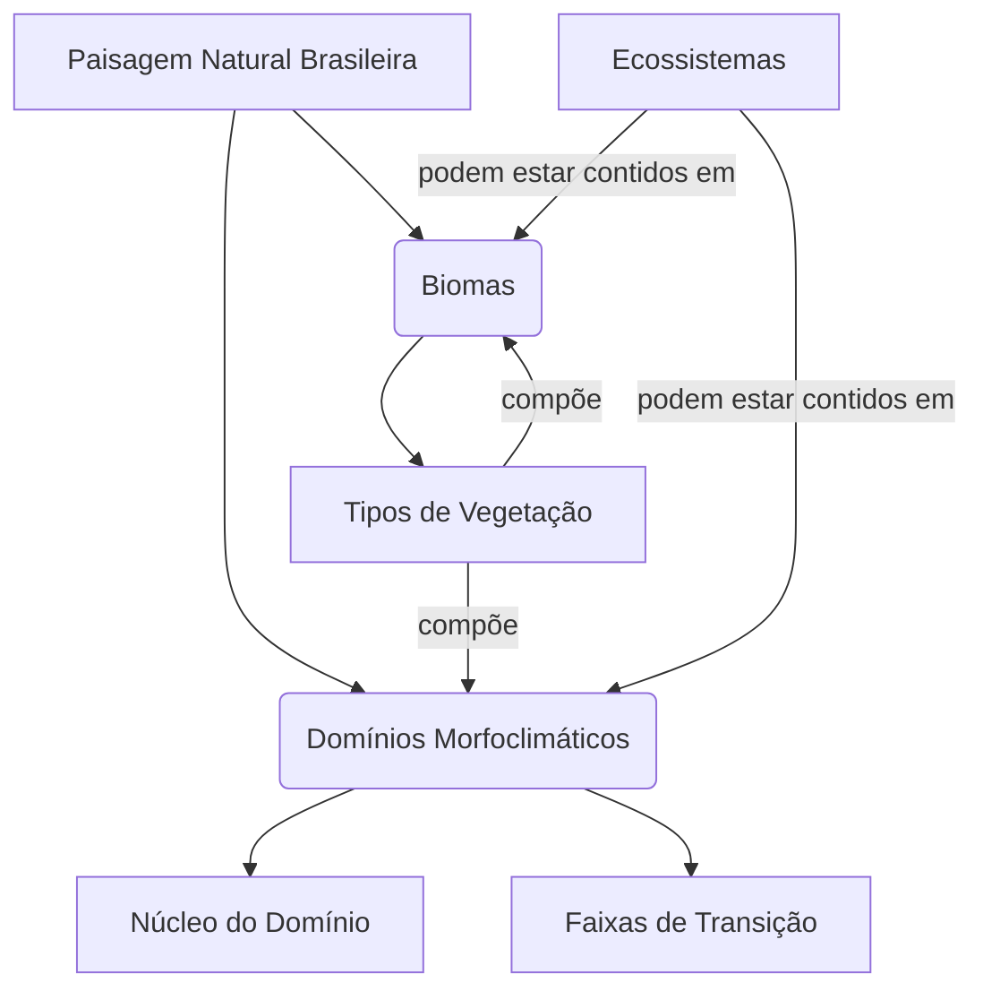

> [!example] Componentes de um Domínio Morfoclimático (Mermaid - Domínio dos Cerrados)
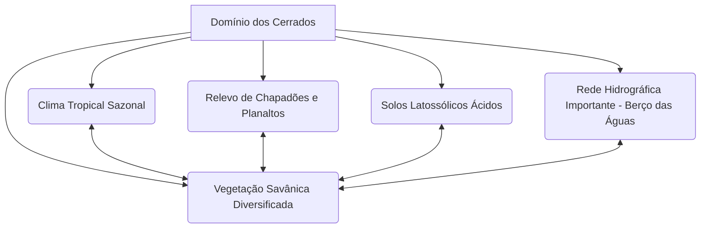

## Por que Estudar a Macrodivisão Natural do Brasil?

> [!important] Relevância da Compartimentação Natural
> - **Planejamento Territorial e Ambiental**: Permite a formulação de políticas adaptadas às especificidades de cada região.
> - **Gestão de Recursos Naturais**: Identifica áreas prioritárias para conservação e uso sustentável.
> - **Potencialidades e Vulnerabilidades Socioeconômicas**: Orienta atividades econômicas como agricultura e turismo.
> - **Políticas Públicas**: Fundamenta zoneamentos ecológico-econômicos e criação de unidades de conservação.
> - **Identidade Nacional**: Reforça a compreensão da diversidade paisagística como parte do patrimônio cultural brasileiro.

## Conexões e Implicações Ampliadas

> [!info] Interconexões Relevantes para o CACD
> - **Legislação Ambiental**: A definição de biomas é crucial para a aplicação do Código Florestal (Reserva Legal), e os domínios/ecossistemas guiam a criação de Unidades de Conservação (SNUC).
> - **Política Agrícola e Uso da Terra**: A expansão das fronteiras agrícolas ocorre de forma diferenciada nos diversos biomas/domínios, gerando conflitos e impactos específicos.
> - **Mudanças Climáticas Globais**: Cada bioma/domínio possui vulnerabilidades distintas e contribui de forma diferente para as emissões/sequestro de carbono.
> - **Recursos Naturais Estratégicos**: A distribuição de água, minérios e potencial energético está intrinsecamente ligada à macrodivisão natural.
> - **Questões Socioambientais**: A relação de povos indígenas, quilombolas e comunidades tradicionais com seus territórios e os recursos naturais dos biomas onde vivem.
> - **Política Externa e Cooperação Internacional**: A conservação de biomas como a Amazônia e o Pantanal tem forte dimensão internacional.

## Questões para Revisão e Análise Crítica

> [!question] Para Refletir e Revisar
> 1. "Compare as abordagens de classificação do espaço natural brasileiro propostas pelo IBGE (Biomas) e por Aziz Ab'Sáber (Domínios Morfoclimáticos), destacando suas semelhanças, diferenças e complementaridades."
> 2. "Escolha dois biomas brasileiros contrastantes (e.g., Amazônia e Caatinga) e analise como suas características morfoclimáticas e fitofisionômicas condicionam os principais desafios para sua conservação e uso sustentável."
> 3. "Discuta a importância das faixas de transição (ecótonos) na paisagem brasileira, utilizando um exemplo para ilustrar sua relevância ecológica e os desafios para sua gestão."
> 4. "De que forma o conhecimento da macrodivisão natural do Brasil é fundamental para a formulação de políticas públicas eficazes nas áreas de meio ambiente, agricultura e desenvolvimento regional?"

## Dicas para o CACD

> [!tip] Ao abordar este tema na prova:
> É essencial não apenas memorizar os nomes dos biomas e domínios, mas compreender os critérios de cada classificação, as características distintivas de cada unidade (clima, relevo, vegetação, solos, hidrografia), sua localização no mapa do Brasil, os principais vetores de transformação e os desafios ambientais associados. Conecte este conhecimento com temas de política ambiental, desenvolvimento e a posição do Brasil no cenário internacional.


# Origem: _Política e gestão ambiental no Brasil

---
title: Política e gestão ambiental no Brasil
area: GEOGRAFIA
subarea: Geografia e gestão ambiental
tags:
  - cacd-2025
  - geografia
  - geografia-e-gestao-ambiental
  - politica-e-gestao-ambiental-no-brasil
aliases:
  - 7.3 Política e gestão ambiental no Brasil.
---
# Política e Gestão Ambiental no Brasil: Evolução, Arcabouço Legal-Institucional, Instrumentos e Desafios Contemporâneos

> [!abstract] Síntese
> A política ambiental brasileira evoluiu de uma perspectiva meramente exploratória colonial para um complexo sistema regulatório consolidado pela Constituição Federal de 1988. O marco fundamental foi a Política Nacional do Meio Ambiente (Lei 6.938/1981), que estabeleceu o SISNAMA como estrutura de gestão integrada. O artigo 225 da CF/88 consagrou o direito ao meio ambiente ecologicamente equilibrado como direito fundamental. Apesar dos avanços legais e institucionais significativos, o Brasil enfrenta desafios críticos na implementação efetiva das políticas ambientais, incluindo o desmatamento persistente, conflitos socioambientais e a necessidade de equilibrar desenvolvimento econômico com conservação ambiental.

## Breve Histórico da Política Ambiental Brasileira

> [!question] Questão-Chave: Como se deu a construção histórica do arcabouço de proteção ambiental no Brasil?

A trajetória da política ambiental brasileira reflete a evolução da própria relação da sociedade com o meio ambiente, partindo de uma visão puramente exploratória para uma perspectiva de desenvolvimento sustentável .

### Período Colonial e Primeiras Regulamentações (1500-1930)

O próprio nome "Brasil" deriva da exploração do pau-brasil, evidenciando a **visão mercantilista** que marcou os primeiros séculos de ocupação do território . Durante este período, identificam-se quatro posturas principais em relação à natureza:

- **Elogio retórico** ao meio natural, paradoxalmente conivente com a devastação
- **Exaltação da ação humana** em dimensão abstrata, ignorando consequências destrutivas
- **Crítica à destruição** com proposta de modernização urbano-industrial
- **Crítica à destruição** com modelo alternativo de desenvolvimento nacional

### Era Vargas e Centralização Administrativa (1930-1971)

> [!note] Marco Inicial: Código Florestal de 1965
> O primeiro Código Florestal brasileiro (Decreto 23.793/1934) foi substituído pela Lei 4.771/1965, estabelecendo as primeiras normas sistemáticas de proteção florestal, incluindo conceitos como Áreas de Preservação Permanente (APP) e Reserva Legal.

A partir de 1930, com a **centralização administrativa** do governo Vargas, inicia-se a construção de um repertório regulamentador sistemático . Este período caracteriza-se pela:

- Criação de órgãos específicos para gestão de recursos naturais
- Estabelecimento de penalizações para infrações ambientais
- Início da regulamentação setorial (águas, florestas, fauna)

### Período Desenvolvimentista e Intervenção Estatal (1972-1987)

> [!note] Divisor de Águas: Política Nacional do Meio Ambiente (Lei 6.938/1981)
> A PNMA representa o marco fundamental da política ambiental brasileira moderna, criando o SISNAMA e estabelecendo princípios, objetivos e instrumentos que permanecem vigentes até hoje.

Este período marca o **auge do estado intervencionista** em matéria ambiental , influenciado por:

- **Conferência de Estocolmo (1972)**: Pressão internacional para políticas ambientais
- **Criação da SEMA** (Secretaria Especial do Meio Ambiente) em 1973
- **Promulgação da PNMA** em 1981, estabelecendo as bases do sistema atual

### Redemocratização e Constitucionalização (1988-presente)

> [!important] Consagração Constitucional: Artigo 225 da CF/88
> A Constituição Federal de 1988 elevou o meio ambiente à categoria de direito fundamental, estabelecendo que "todos têm direito ao meio ambiente ecologicamente equilibrado, bem de uso comum do povo e essencial à sadia qualidade de vida".

> [!note] Impacto Internacional: Rio-92 e a internalização de compromissos
> A Conferência das Nações Unidas sobre Meio Ambiente e Desenvolvimento (Rio-92) consolidou o Brasil como protagonista nas discussões ambientais globais e impulsionou a criação de novas políticas e instituições ambientais.

O período pós-1988 caracteriza-se por :

- **Democratização** e **descentralização** dos processos decisórios
- Emergência do conceito de **desenvolvimento sustentável**
- Multiplicação de leis ambientais específicas
- Fortalecimento da participação social
- Criação do Ministério do Meio Ambiente (1992)
- Estabelecimento do SNUC (2000) e novo Código Florestal (2012)

## Bases Legais e Institucionais da Política Ambiental

### Constituição Federal de 1988

> [!important] Artigo 225 da CF/88: O Direito ao Meio Ambiente Ecologicamente Equilibrado
> O artigo 225 estabelece que o meio ambiente é **bem de uso comum do povo**, impondo ao Poder Público e à coletividade o **dever de defendê-lo e preservá-lo** para as presentes e futuras gerações.

Os principais elementos do Art. 225 incluem:

- **Direito fundamental difuso**: pertence a todos indistintamente
- **Princípio da equidade intergeracional**: preservação para futuras gerações
- **Responsabilidade compartilhada**: Estado e sociedade
- **Instrumentos específicos**: EIA/RIMA, espaços protegidos, controle de atividades perigosas

### Política Nacional do Meio Ambiente (PNMA - Lei 6.938/81)

> [!definition] Política Nacional do Meio Ambiente (PNMA)
> A PNMA constitui o marco regulatório fundamental da gestão ambiental brasileira, estabelecendo conceitos, princípios, objetivos, instrumentos e a estrutura institucional do SISNAMA.

**Objetivos principais da PNMA:**
- Compatibilização do desenvolvimento econômico-social com a preservação ambiental
- Definição de áreas prioritárias de ação governamental
- Estabelecimento de critérios e padrões de qualidade ambiental
- Desenvolvimento de pesquisas e tecnologias nacionais
- Difusão de tecnologias de manejo do meio ambiente
- Formação de consciência pública sobre preservação ambiental

**Princípios fundamentais:**
- **Poluidor-pagador**: responsabilização pelos danos causados
- **Usuário-pagador**: pagamento pelo uso de recursos naturais
- **Prevenção**: prioridade para medidas preventivas
- **Precaução**: ação antecipada diante de riscos
- **Participação**: envolvimento da sociedade nas decisões
- **Informação**: transparência e acesso a dados ambientais

### Sistema Nacional do Meio Ambiente (SISNAMA)

> [!definition] SISNAMA: A Estrutura de Gestão Ambiental
> O SISNAMA constitui a estrutura organizacional da gestão ambiental brasileira, integrando órgãos e entidades da União, Estados, Distrito Federal e Municípios responsáveis pela proteção e melhoria da qualidade ambiental.

**Estrutura do SISNAMA:**

- **Órgão Superior**: Conselho de Governo - assessora o Presidente da República na formulação de políticas e diretrizes
- **Órgão Consultivo e Deliberativo**: CONAMA (Conselho Nacional do Meio Ambiente) - estabelece normas e padrões ambientais
- **Órgão Central**: Ministério do Meio Ambiente e Mudança do Clima - coordena e supervisiona a política nacional
- **Órgãos Executores**: 
  - **IBAMA**: execução e fiscalização em nível federal
  - **ICMBio**: gestão das unidades de conservação federais
- **Órgãos Seccionais**: órgãos estaduais de meio ambiente
- **Órgãos Locais**: órgãos municipais de meio ambiente

> [!example] Diagrama da Estrutura do SISNAMA (Mermaid)
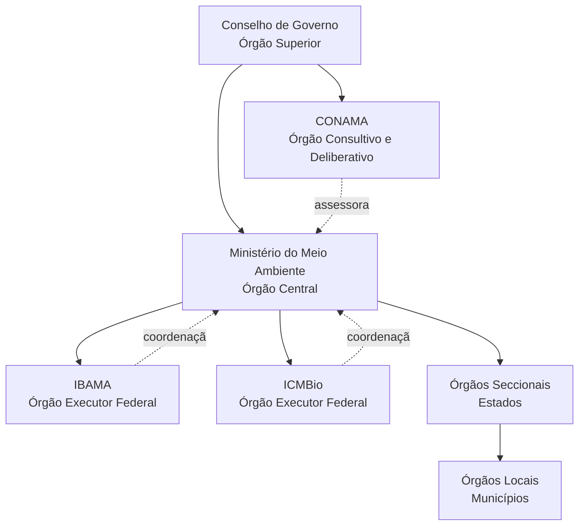

### Outras Leis e Sistemas Relevantes

> [!definition] SNUC - Sistema Nacional de Unidades de Conservação (Lei 9.985/2000)
> O SNUC estabelece critérios e normas para criação, implantação e gestão das unidades de conservação, divididas em dois grupos: **Proteção Integral** (uso indireto) e **Uso Sustentável** (uso direto compatível com conservação).

**Categorias de Unidades de Conservação:**
- **Proteção Integral**: Estação Ecológica, Reserva Biológica, Parque Nacional, Monumento Natural, Refúgio de Vida Silvestre
- **Uso Sustentável**: APA, ARIE, Floresta Nacional, Reserva Extrativista, Reserva de Fauna, RDS, RPPN

> [!note] Novo Código Florestal (Lei 12.651/2012)
> O novo Código Florestal estabelece normas gerais sobre proteção da vegetação, áreas de preservação permanente e reserva legal, além de criar instrumentos como o **CAR** (Cadastro Ambiental Rural) e o **PRA** (Programa de Regularização Ambiental).

**Principais instrumentos do Código Florestal:**
- **APP (Área de Preservação Permanente)**: margens de rios, topos de morros, encostas
- **Reserva Legal**: percentual mínimo de vegetação nativa na propriedade rural
- **CAR**: registro eletrônico obrigatório para imóveis rurais
- **PRA**: regularização de passivos ambientais

**Outras legislações fundamentais:**

- **Lei de Crimes Ambientais (Lei 9.605/98)**: tipifica crimes ambientais e estabelece sanções penais e administrativas
- **Política Nacional de Recursos Hídricos (Lei 9.433/97)**: gestão integrada e descentralizada dos recursos hídricos
- **Política Nacional de Resíduos Sólidos (Lei 12.305/2010)**: gestão integrada de resíduos e responsabilidade compartilhada
- **Lei da Mata Atlântica (Lei 11.428/2006)**: proteção específica do bioma
- **Política Nacional sobre Mudança do Clima (Lei 12.187/2009)**: metas e instrumentos para mitigação e adaptação

## Principais Instrumentos de Implementação

> [!question] Questão-Chave: Quais são as ferramentas utilizadas para efetivar a política ambiental no Brasil e como funcionam?

Os instrumentos da PNMA, estabelecidos no Art. 9º da Lei 6.938/81, constituem as ferramentas operacionais para implementação da política ambiental:

### 1. Estabelecimento de Padrões de Qualidade Ambiental

> [!definition] Padrões de Qualidade Ambiental
> Limites máximos de poluentes ou perturbações permitidos no ambiente, estabelecidos com base em critérios científicos para proteção da saúde humana e dos ecossistemas.

> [!example] Aplicação Prática dos Padrões de Qualidade
> - **Resolução CONAMA 491/2018**: padrões de qualidade do ar
> - **Resolução CONAMA 357/2005**: classificação e padrões para corpos d'água
> - **Resolução CONAMA 420/2009**: critérios para qualidade do solo

### 2. Zoneamento Ambiental (ZEE)

> [!definition] Zoneamento Ecológico-Econômico (ZEE)
> Instrumento de organização territorial que estabelece medidas e padrões de proteção ambiental para assegurar a qualidade ambiental e o desenvolvimento sustentável.

> [!example] Aplicação Prática do ZEE
> - Definição de zonas com diferentes graus de proteção e uso
> - Orientação para políticas públicas e investimentos
> - Base para licenciamento ambiental
> - Exemplos: ZEE da Amazônia Legal, ZEE costeiro

### 3. Avaliação de Impactos Ambientais (AIA)

> [!definition] Avaliação de Impacto Ambiental (AIA)
> Conjunto de procedimentos técnicos e administrativos para identificar, prever e valorar os impactos ambientais de projetos, planos e programas, incluindo o EIA (Estudo de Impacto Ambiental) e RIMA (Relatório de Impacto Ambiental).

> [!example] Aplicação Prática da AIA
> - **EIA/RIMA obrigatório** para: rodovias, ferrovias, portos, aeroportos, oleodutos, linhas de transmissão, barragens, aterros sanitários, complexos industriais
> - **Conteúdo mínimo**: diagnóstico ambiental, análise de impactos, medidas mitigadoras, programas de monitoramento
> - **Participação pública**: audiências públicas obrigatórias

### 4. Licenciamento Ambiental

> [!definition] Licenciamento Ambiental
> Procedimento administrativo pelo qual o órgão ambiental autoriza a localização, instalação, ampliação e operação de empreendimentos utilizadores de recursos ambientais ou potencialmente poluidores.

**Tipos de Licenças:**
- **LP (Licença Prévia)**: fase de planejamento, aprova localização e concepção
- **LI (Licença de Instalação)**: autoriza instalação conforme projeto aprovado
- **LO (Licença de Operação)**: autoriza operação após verificação do cumprimento das condicionantes

> [!example] Fluxograma Simplificado do Licenciamento Ambiental
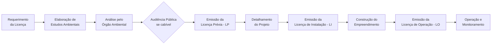

### 5. Criação de Espaços Territoriais Especialmente Protegidos

> [!definition] Espaços Territoriais Especialmente Protegidos
> Áreas geográficas públicas ou privadas dotadas de atributos ambientais relevantes, legalmente instituídas pelo Poder Público, com objetivos e limites definidos, sob regime especial de administração.

> [!example] Aplicação Prática - Unidades de Conservação
> - **Federal**: 334 UCs federais cobrindo 791.000 km²
> - **Estadual e Municipal**: centenas de UCs adicionais
> - **Outras áreas**: APPs, Reserva Legal, Terras Indígenas, Territórios Quilombolas

### 6. Sistema Nacional de Informações sobre o Meio Ambiente (SINIMA)

> [!definition] SINIMA
> Sistema integrado de informações ambientais para subsidiar a tomada de decisão e a participação social na gestão ambiental.

> [!example] Aplicação Prática do SINIMA
> - Portal de dados ambientais integrados
> - Relatórios de qualidade ambiental
> - Indicadores ambientais nacionais
> - Base para políticas públicas

### 7. Cadastro Técnico Federal (CTF)

> [!definition] Cadastro Técnico Federal
> Registro obrigatório de pessoas físicas ou jurídicas que exercem atividades potencialmente poluidoras ou utilizadoras de recursos ambientais.

> [!example] Aplicação Prática do CTF
> - **CTF/APP**: atividades potencialmente poluidoras
> - **CTF/AIDA**: atividades de defesa ambiental
> - Base para cobrança da TCFA (Taxa de Controle e Fiscalização Ambiental)
> - Controle e fiscalização de atividades

### 8. Instrumentos Econômicos

> [!definition] Instrumentos Econômicos
> Mecanismos que utilizam sinais de mercado para induzir comportamentos ambientalmente adequados.

> [!example] Aplicação Prática de Instrumentos Econômicos
> - **ICMS Ecológico**: repasse diferenciado aos municípios com áreas protegidas
> - **Pagamento por Serviços Ambientais (PSA)**: remuneração por conservação
> - **Compensação Ambiental**: recursos de empreendimentos para UCs
> - **Cobrança pelo uso da água**: implementada em várias bacias

### 9. Penalidades

> [!definition] Penalidades Ambientais
> Sanções administrativas aplicadas por infrações à legislação ambiental, podendo incluir advertência, multa, embargo, suspensão, demolição e restritivas de direitos.

> [!example] Aplicação Prática das Penalidades
> - **Multas**: de R$ 50 a R$ 50 milhões (Lei 9.605/98)
> - **Embargo**: paralisação de obras ou atividades
> - **Apreensão**: produtos e instrumentos da infração
> - **Suspensão**: de vendas, licenças ou atividades

## Grandes Desafios da Gestão Ambiental Brasileira

### Desmatamento e Degradação dos Biomas

> [!warning] Desafio Crítico: Desmatamento na Amazônia e Cerrado
> O desmatamento continua sendo o principal desafio ambiental brasileiro, com a Amazônia perdendo cerca de 13.235 km² em 2020-2021 e o Cerrado enfrentando conversão acelerada para agropecuária.

**Fatores agravantes:**
- **Grilagem de terras** e especulação fundiária
- **Pecuária extensiva** e expansão da fronteira agrícola
- **Exploração ilegal de madeira**
- **Garimpo ilegal** em terras indígenas
- **Queimadas** descontroladas

### Implementação e Fiscalização Deficientes

> [!warning] Desafio Crítico: Capacidade Institucional Limitada
> A efetividade da política ambiental é comprometida por recursos humanos e financeiros insuficientes, resultando em baixa capacidade de fiscalização e controle.

**Problemas estruturais:**
- **Déficit de pessoal**: IBAMA e ICMBio com quadros reduzidos
- **Orçamento insuficiente**: cortes recorrentes no orçamento ambiental
- **Morosidade**: processos de licenciamento e fiscalização lentos
- **Corrupção**: casos de corrupção em órgãos ambientais
- **Judicialização**: excesso de disputas judiciais

### Conflitos Socioambientais

> [!warning] Desafio Crítico: Conflitos Fundiários e Sociais
> A sobreposição de interesses sobre o território gera conflitos envolvendo povos indígenas, comunidades tradicionais, agricultores, mineradores e o poder público.

**Principais conflitos:**
- **Terras indígenas**: invasões e pressões econômicas
- **Unidades de conservação**: populações residentes e entorno
- **Grandes projetos**: hidrelétricas, mineração, infraestrutura
- **Água**: disputas por recursos hídricos escassos
- **Reforma agrária**: assentamentos em áreas ambientalmente sensíveis

### Financiamento Inadequado

> [!warning] Desafio Crítico: Recursos Financeiros Insuficientes
> O subfinanciamento crônico da área ambiental compromete a implementação de políticas e a manutenção de estruturas de gestão.

**Questões financeiras:**
- **Orçamento federal**: menos de 0,5% do orçamento da União
- **Fundos ambientais**: Fundo Nacional do Meio Ambiente subutilizado
- **Fundo Amazônia**: paralisações e questionamentos
- **Compensação ambiental**: aplicação inadequada de recursos
- **Investimento privado**: baixo engajamento do setor privado

### Governança Fragmentada

> [!warning] Desafio Crítico: Desarticulação Institucional
> A multiplicidade de órgãos e níveis de governo envolvidos na gestão ambiental gera sobreposições, lacunas e conflitos de competência.

**Problemas de governança:**
- **Federalismo ambiental**: conflitos de competência entre União, Estados e Municípios
- **Setorialização**: falta de integração entre políticas setoriais
- **Participação social**: conselhos esvaziados ou pouco efetivos
- **Transparência**: dificuldade de acesso a informações
- **Accountability**: baixa responsabilização por resultados

### Pressões Econômicas

> [!warning] Desafio Crítico: Dilema Desenvolvimento vs. Conservação
> A pressão por crescimento econômico frequentemente se sobrepõe às considerações ambientais, gerando retrocessos normativos e institucionais.

**Tensões recorrentes:**
- **Agronegócio**: pressão por flexibilização ambiental
- **Mineração**: lobby por acesso a áreas protegidas
- **Infraestrutura**: grandes obras com impactos significativos
- **Energia**: conflitos entre matriz energética e conservação
- **Flexibilização normativa**: tentativas de enfraquecimento da legislação

### Mudanças Climáticas

> [!warning] Desafio Crítico: Impactos e Adaptação Climática
> O Brasil é simultaneamente grande emissor (principalmente por desmatamento) e vulnerável aos impactos das mudanças climáticas.

**Desafios climáticos:**
- **Mitigação**: redução de emissões por desmatamento e energia
- **Adaptação**: preparação para eventos extremos
- **NDC**: cumprimento dos compromissos internacionais
- **Financiamento climático**: acesso a recursos internacionais
- **Transição energética**: manutenção da matriz limpa

### Poluição e Saneamento

> [!warning] Desafio Crítico: Déficit de Saneamento e Gestão de Resíduos
> Apesar dos avanços legais, o Brasil ainda enfrenta graves problemas de saneamento básico e gestão de resíduos sólidos.

**Problemas persistentes:**
- **Esgoto**: 45% da população sem coleta adequada
- **Resíduos sólidos**: lixões ainda presentes em muitos municípios
- **Poluição hídrica**: rios urbanos altamente poluídos
- **Logística reversa**: implementação lenta e parcial
- **Educação ambiental**: baixa conscientização da população

## O Papel da Sociedade na Gestão Ambiental

> [!note] Importância da Participação Social
> A Constituição Federal e a legislação ambiental brasileira estabelecem múltiplos mecanismos de participação social, reconhecendo que a proteção ambiental é dever não apenas do Estado, mas de toda a coletividade.

### Mecanismos de Participação

**Conselhos de Meio Ambiente:**
- **CONAMA**: participação de entidades da sociedade civil
- **Conselhos estaduais e municipais**: representação local
- **Comitês de Bacia Hidrográfica**: gestão participativa da água
- **Conselhos de Unidades de Conservação**: gestão compartilhada

**Instrumentos de Participação Direta:**
- **Audiências públicas**: obrigatórias no licenciamento
- **Consultas públicas**: elaboração de normas e políticas
- **Ação civil pública**: instrumento judicial de defesa ambiental
- **Ação popular**: qualquer cidadão pode propor

### Atores Sociais Relevantes

**Ministério Público:**
- Titular da ação civil pública ambiental
- Fiscalização do cumprimento da legislação
- Termos de Ajustamento de Conduta (TAC)
- Inquéritos civis e recomendações

**Organizações Não-Governamentais:**
- Advocacy e pressão política
- Projetos de conservação
- Educação ambiental
- Monitoramento independente

**Movimentos Sociais:**
- Movimento dos Atingidos por Barragens (MAB)
- Movimento dos Trabalhadores Rurais Sem Terra (MST)
- Organizações indígenas e quilombolas
- Redes de agricultura familiar e agroecologia

**Academia e Pesquisa:**
- Produção de conhecimento científico
- Subsídios técnicos para políticas
- Formação de recursos humanos
- Inovação tecnológica

## Conexões e Implicações Ampliadas

> [!info] Interconexões Relevantes para o CACD
> A política ambiental brasileira não pode ser compreendida isoladamente, mas sim em suas múltiplas conexões com outras áreas do conhecimento e da atuação estatal.

### Direito Internacional Ambiental

**Principais Tratados e Convenções:**
- **Convenção sobre Diversidade Biológica (CDB)**: Protocolo de Nagoya, metas de Aichi
- **Convenção-Quadro sobre Mudança do Clima (UNFCCC)**: Acordo de Paris, NDCs brasileiras
- **Convenção de Ramsar**: proteção de zonas úmidas
- **CITES**: comércio internacional de espécies ameaçadas
- **Convenção de Basileia**: movimentos transfronteiriços de resíduos

**Responsabilidade Internacional:**
- Princípio das responsabilidades comuns mas diferenciadas
- Soberania sobre recursos naturais vs. patrimônio comum da humanidade
- Mecanismos de compliance e sanções
- Arbitragem ambiental internacional

### Economia Ambiental

**Instrumentos Econômicos:**
- **Valoração de serviços ecossistêmicos**: metodologias e aplicações
- **Mercados de carbono**: potencial brasileiro no mercado global
- **Pagamento por Serviços Ambientais (PSA)**: experiências e desafios
- **Economia circular**: oportunidades e barreiras
- **Finanças verdes**: green bonds, fundos sustentáveis

**Desenvolvimento Sustentável:**
- Agenda 2030 e ODS no Brasil
- Economia verde e transição justa
- Bioeconomia na Amazônia
- Ecoturismo e desenvolvimento local

### Geopolítica Ambiental

**Amazônia como Ativo Estratégico:**
- Pressões internacionais e soberania nacional
- Cooperação amazônica (OTCA)
- Fundo Amazônia e cooperação internacional
- Biopirataria e acesso a recursos genéticos
- Segurança ambiental e defesa nacional

**Cooperação Transfronteiriça:**
- Gestão de bacias hidrográficas compartilhadas
- Áreas protegidas transfronteiriças
- Combate ao tráfico de fauna e flora
- Integração regional e meio ambiente

### Política Externa Brasileira

**Diplomacia Ambiental:**
- Liderança histórica em foros ambientais
- Rio-92, Rio+10, Rio+20
- G20 e questões ambientais
- BRICS e cooperação ambiental
- Negociações climáticas (COPs)

**Cooperação Sul-Sul:**
- Transferência de tecnologia ambiental
- Capacitação técnica
- Projetos trilaterais
- Experiências em agricultura tropical

### Direitos Humanos e Meio Ambiente

**Direitos Ambientais como Direitos Humanos:**
- Direito ao meio ambiente saudável
- Justiça ambiental e equidade
- Refugiados e migrantes climáticos
- Direitos de povos indígenas e comunidades tradicionais

**Defensores Ambientais:**
- Proteção de ativistas ambientais
- Acordo de Escazú (não ratificado pelo Brasil)
- Violência no campo e conflitos ambientais
- Responsabilidade empresarial

## Questões para Revisão e Análise Crítica

> [!question] Para Refletir e Revisar

1. **"Analise criticamente a eficácia dos principais instrumentos da Política Nacional do Meio Ambiente na contenção do desmatamento ilegal na Amazônia, considerando os desafios de implementação e as limitações institucionais do SISNAMA."**

2. **"Discuta os principais avanços e retrocessos na política ambiental brasileira desde a Constituição de 1988, avaliando como as mudanças políticas e econôm


# Origem: PPCDAm - Plano de Ação para Prevenção e Controle do Desmatamento na Amazônia Legal

---
title: Plano de Ação para Prevenção e Controle do Desmatamento na Amazônia Legal (PPCDAm)
area: GEOGRAFIA
subarea: Geografia e gestão ambiental
tags:
  - cacd-2025
  - geografia
  - geografia-e-gestao-ambiental
  - politica-e-gestao-ambiental-no-brasil
  - amazônia-legal
aliases:
  - PPCDAm
  - Plano de Ação para Prevenção e Controle do Desmatamento na Amazônia Legal
conexões: Amazônia, Desmatamento, Política Ambiental, Desenvolvimento Sustentável, Direito Ambiental, MonitoramentoAmbiental, FiscalizacaoAmbiental, OrdenamentoTerritorial, RegularizacaoFundiaria, ZEE, PSA
---
# Plano de Ação para Prevenção e Controle do Desmatamento na Amazônia Legal (PPCDAm)

## Sumário

O **Plano de Ação para Prevenção e Controle do Desmatamento na Amazônia Legal (PPCDAm)** é uma política de Estado brasileira, lançada em *2004*, com o objetivo central de reduzir drasticamente o **desmatamento** na região da **Amazônia Legal**. O Plano foi estruturado em três eixos principais: **Ordenamento Territorial**, **Monitoramento e Controle**, e **Fomento a Atividades Sustentáveis**. Sua implementação coincidiu com uma significativa queda nas taxas de desmatamento na primeira fase (2004-2015), tornando-se uma referência internacional em **política ambiental**. No entanto, o **desmatamento** voltou a crescer em períodos subsequentes, evidenciando os desafios persistentes, como as pressões econômicas (agropecuária, mineração ilegal, exploração madeireira predatória), o crime organizado, a grilagem de terras e as dificuldades de **fiscalização** e **ordenamento territorial**. O PPCDAm busca conciliar a **conservação ambiental** com o **desenvolvimento sustentável** na região, fortalecendo a governança, a **regularização fundiária**, o **monitoramento** por satélite e o apoio a **atividades econômicas de baixo impacto**. Sua importância transcende a esfera nacional, impactando a imagem do Brasil no **cenário internacional**, seus compromissos climáticos e os debates sobre a governança global da **Amazônia**. O Plano tem sido reativado e adaptado para enfrentar o desafio contínuo de combater o **desmatamento ilegal** e promover uma economia florestal sustentável.

## Conceitos Principais

* **Plano de Ação para Prevenção e Controle do Desmatamento na Amazônia Legal (PPCDAm)**
    Política pública de caráter interministerial e interfederativo do governo brasileiro, lançada em 2004, com o objetivo de articular ações e estratégias para reduzir e controlar o desmatamento na Amazônia Legal, promovendo simultaneamente o desenvolvimento sustentável na região.

* **Amazônia Legal**
    Uma divisão político-administrativa do Brasil que engloba a totalidade dos estados do Acre, Amapá, Amazonas, Mato Grosso, Pará, Rondônia, Roraima e Tocantins, e parte do estado do Maranhão. Corresponde a cerca de 59% do território brasileiro e abriga a maior parte da Floresta Amazônica brasileira, além de outros biomas.

* **Desmatamento**
    O processo de remoção da vegetação nativa de uma área, geralmente para dar lugar a outras atividades humanas, como agropecuária, mineração, construção de infraestrutura ou expansão urbana. É um dos principais fatores que contribuem para a perda de biodiversidade, a alteração do clima e a degradação ambiental.

* **Política Ambiental**
    O conjunto de princípios, objetivos, instrumentos e ações adotadas pelo Estado e pela sociedade para proteger, conservar e recuperar o meio ambiente, bem como para promover o uso sustentável dos recursos naturais. O PPCDAm é um exemplo de política ambiental brasileira focada em um bioma específico.

* **Desenvolvimento Sustentável**
    Este conceito foi abordado na nota sobre Corporación Andina de Fomento (CAF).

* **Monitoramento Ambiental**
    A coleta sistemática e análise de dados sobre o estado e as mudanças no meio ambiente. No contexto do PPCDAm, o **monitoramento** por satélite (sistemas DETER e PRODES do INPE) desempenha um papel crucial na detecção e quantificação do desmatamento.

* **Fiscalização Ambiental**
    A ação do poder público para verificar o cumprimento da legislação ambiental e aplicar as sanções cabíveis em caso de infrações. No PPCDAm, a **fiscalização**, realizada por órgãos como o IBAMA e ICMBio, é essencial para coibir o desmatamento ilegal e outras atividades predatórias.

* **Ordenamento Territorial**
    O processo de planejamento e gestão do uso do espaço geográfico, buscando conciliar as atividades humanas com a conservação dos recursos naturais e a proteção do meio ambiente. No PPCDAm, envolve a definição e implementação de zonas de uso (unidades de conservação, terras indígenas, áreas de proteção permanente) e a **regularização fundiária**.

* **Regularização Fundiária**
    O processo administrativo e jurídico que busca legalizar a posse e a propriedade da terra, especialmente em áreas onde há conflitos de uso, ocupação irregular ou ausência de títulos de propriedade. É fundamental para o **ordenamento territorial** e para o combate à grilagem de terras na Amazônia.

* **Zoneamento Ecológico-Econômico (ZEE)**
    Um instrumento de planejamento territorial que divide uma determinada área em zonas, com base em suas características ecológicas e potencialidades econômicas, estabelecendo diretrizes e restrições para o uso do solo e dos recursos naturais em cada zona. É uma ferramenta importante para o **ordenamento territorial** na Amazônia Legal.

* **Pagamentos por Serviços Ambientais (PSA)**
    Mecanismos econômicos que buscam remunerar proprietários de terra ou comunidades pela manutenção ou recuperação de ecossistemas que prestam serviços ambientais (como conservação da biodiversidade, proteção de recursos hídricos, sequestro de carbono). É um instrumento de **fomento a atividades sustentáveis** previsto no PPCDAm.

## Análise Detalhada do Plano de Ação para Prevenção e Controle do Desmatamento na Amazônia Legal (PPCDAm)

### Origens e Contexto

O PPCDAm surge em um momento crítico para a **Amazônia** e para a imagem do Brasil.

* A crescente preocupação com o desmatamento na Amazônia: No início dos anos 2000, as taxas de **desmatamento** na **Amazônia Legal** voltaram a ser elevadas, gerando grande preocupação no Brasil e no exterior.
* Pressão nacional e internacional por ações efetivas: Houve uma forte pressão da sociedade civil brasileira, de organizações ambientalistas internacionais, de governos estrangeiros e de organismos multilaterais para que o governo brasileiro tomasse medidas eficazes para controlar o desmatamento.
* Desenvolvimento de políticas ambientais no Brasil: O PPCDAm se insere em um contexto de fortalecimento da **política ambiental** brasileira após a Constituição de 1988, com a criação de novas leis (como a Lei de Crimes Ambientais) e o aprimoramento de órgãos de **fiscalização** e **monitoramento**.
* A criação do PPCDAm em 2004: O Plano foi lançado em 2004, no primeiro governo Lula, com o objetivo de articular as ações de diferentes ministérios e órgãos governamentais, bem como da sociedade civil, para enfrentar o problema do **desmatamento** de forma integrada e estratégica.
* Os diferentes governos e suas abordagens em relação ao PPCDAm: O PPCDAm teve diferentes fases de implementação e priorização ao longo dos governos seguintes. Houve um período de grande sucesso na redução do desmatamento nos primeiros anos, seguido por um aumento gradual e, mais recentemente, esforços renovados para sua implementação e adaptação.

### Objetivos do PPCDAm

Os objetivos do Plano são claros e refletem a necessidade de uma abordagem multifacetada.

* Reduzir o desmatamento ilegal na Amazônia Legal: Este é o objetivo quantitativo principal do PPCDAm, com metas estabelecidas para a redução das taxas anuais de **desmatamento**.
* Promover o desenvolvimento sustentável na região: O Plano reconhece que o combate ao desmatamento deve estar associado à promoção de alternativas econômicas viáveis e socialmente justas para as populações que vivem na **Amazônia**.
* Conciliar a conservação ambiental com as atividades econômicas: Busca-se encontrar um equilíbrio entre a proteção da floresta e a promoção de atividades econômicas que gerem renda e desenvolvimento sem destruir o meio ambiente.
* Fortalecer a governança ambiental: O PPCDAm visa aprimorar a capacidade do Estado em planejar, **monitorar**, **fiscalizar** e controlar o uso do solo e dos recursos naturais na **Amazônia Legal**, bem como promover a participação social na gestão ambiental.

### Eixos de Atuação

O PPCDAm foi estruturado em três eixos interconectados para enfrentar o **desmatamento**.

* **Ordenamento Territorial:**
    * Regularização fundiária e titulação de terras: A insegurança jurídica e a ausência de titulação são fatores que contribuem para a grilagem de terras e o **desmatamento ilegal**. A **regularização fundiária** busca resolver esses problemas.
    * Criação e gestão de unidades de conservação: As unidades de conservação são áreas protegidas por lei, essenciais para a manutenção da biodiversidade e o controle do **desmatamento**. O PPCDAm apoiou a criação e a implementação de novas unidades.
    * Demarcação de terras indígenas e quilombolas: O reconhecimento e a proteção dos territórios tradicionais são fundamentais para a conservação da floresta, pois essas áreas geralmente apresentam baixas taxas de **desmatamento**.
    * *Zoneamento Ecológico-Econômico (ZEE)*: O **ZEE** é um instrumento para o **ordenamento territorial** que busca definir as potencialidades e limitações de uso do solo em diferentes áreas da Amazônia Legal, orientando as atividades econômicas e a conservação.
* **Monitoramento e Controle:**
    * *Sistema de Detecção do Desmatamento em Tempo Real (DETER)*: Sistema do INPE que detecta e alerta sobre áreas de **desmatamento** e degradação florestal em tempo quase real, orientando as ações de **fiscalização** em campo.
    * Sistema PRODES de monitoramento por satélite: Sistema do INPE que calcula anualmente a taxa consolidada de **desmatamento** por corte raso na Amazônia Legal, fornecendo dados históricos e a base para as metas de redução.
    * Fiscalização ambiental e aplicação da lei: Ações de **fiscalização** em campo realizadas pelo IBAMA, ICMBio, Polícia Federal e órgãos estaduais, com o objetivo de identificar e punir os responsáveis pelo **desmatamento ilegal** e outras infrações ambientais.
    * Combate ao crime ambiental: Ações coordenadas para desarticular redes criminosas envolvidas em **desmatamento ilegal**, exploração madeireira predatória, grilagem de terras e outras atividades ilícitas na **Amazônia**.
* **Fomento a Atividades Sustentáveis:**
    * *Apoio à agricultura familiar e à produção orgânica*: Incentivo a modelos de produção agrícola de baixo impacto que não dependam do **desmatamento**, como sistemas agroflorestais e a produção orgânica.
    * *Pagamentos por Serviços Ambientais (PSA)*: Mecanismos para remunerar proprietários rurais ou comunidades pela conservação da floresta e pela manutenção de serviços ambientais.
    * *Incentivo ao ecoturismo e à bioeconomia*: Promoção de atividades econômicas baseadas no uso sustentável dos recursos da biodiversidade, como o ecoturismo, a extração de produtos florestais não madeireiros (castanha, açaí) e o desenvolvimento de bioindústrias.
    * *Desenvolvimento de cadeias produtivas sustentáveis*: Apoio à organização de cadeias produtivas que agreguem valor a produtos da sociobiodiversidade amazônica, gerando renda e incentivando a floresta em pé.

### Resultados e Avaliação

O PPCDAm obteve resultados expressivos em seu primeiro ciclo.

* Redução do desmatamento na Amazônia nos primeiros anos do PPCDAm: Após o lançamento do Plano em 2004, houve uma queda acentuada e sustentada nas taxas de **desmatamento** até 2012, atingindo o menor patamar histórico em 2012. Essa redução foi amplamente atribuída à implementação das ações do PPCDAm, especialmente no eixo de **Monitoramento e Controle**.
* Análise das diferentes fases do plano e seus resultados: O PPCDAm teve diferentes fases (com metas e estratégias revisadas), e seus resultados variaram ao longo do tempo. Após 2012, as taxas de **desmatamento** começaram a apresentar flutuações e, a partir de 2015, houve uma tendência de alta, intensificada nos anos seguintes. Recentemente, com a reativação e o fortalecimento do Plano, as taxas de desmatamento voltaram a apresentar tendência de queda.
* Fatores que contribuíram para o sucesso e para o insucesso em diferentes períodos: O sucesso inicial foi associado à forte vontade política, ao aprimoramento do **monitoramento** e da **fiscalização**, à criação de unidades de conservação e à pressão do mercado (moratória da soja, acordos da carne). O aumento do **desmatamento** em períodos posteriores foi relacionado ao enfraquecimento da governança ambiental, à redução da **fiscalização**, ao desmonte de órgãos ambientais, ao avanço de frentes de **desmatamento** e ao crime organizado.
* Críticas e debates sobre a metodologia de avaliação: Existem debates sobre a metodologia de cálculo do **desmatamento** (PRODES), sobre a inclusão da degradação florestal e sobre a atribuição dos resultados exclusivamente às ações do PPCDAm, sem considerar outros fatores (como crises econômicas que podem reduzir a pressão sobre a floresta).

### Desafios e Obstáculos

O combate ao **desmatamento** na **Amazônia** enfrenta desafios complexos e interligados.

* Pressões econômicas sobre a floresta (agropecuária, mineração, exploração madeireira): A expansão da fronteira agropecuária, a mineração (legal e ilegal) e a exploração madeireira (seletiva e ilegal) são os principais vetores do **desmatamento** e representam fortes interesses econômicos que resistem à **fiscalização** e ao **ordenamento territorial**.
* Crime organizado e grilagem de terras: O **desmatamento ilegal** está frequentemente associado a redes criminosas que atuam na apropriação ilegal de terras (grilagem), exploração de recursos naturais e lavagem de dinheiro. O combate a essas atividades criminosas é um desafio complexo.
* Falta de recursos e capacidade institucional para fiscalização: Os órgãos de **fiscalização ambiental** (IBAMA, ICMBio, órgãos estaduais) frequentemente enfrentam limitações de pessoal, orçamento e infraestrutura para cobrir uma área vasta como a **Amazônia Legal**.
* Conflitos sociais e fundiários: A disputa pela terra na **Amazônia** gera conflitos entre diferentes atores (povos indígenas, comunidades tradicionais, posseiros, grileiros, fazendeiros, empresas), dificultando a **regularização fundiária** e o **ordenamento territorial**.
* Mudanças climáticas e seus impactos na Amazônia: As mudanças climáticas podem aumentar a frequência e a intensidade de eventos extremos (secas, incêndios) na Amazônia, tornando a floresta mais vulnerável ao **desmatamento** e à degradação.
* Desafios políticos e divergências de visão sobre o desenvolvimento da região: Existem visões divergentes sobre o modelo de desenvolvimento para a Amazônia, com tensões entre aqueles que defendem a conservação integral e aqueles que priorizam a exploração econômica intensiva, o que impacta a implementação de políticas como o PPCDAm.

### O PPCDAm no Cenário Internacional

O PPCDAm tem grande relevância para a inserção internacional do Brasil e para a agenda ambiental global.

* O papel do PPCDAm na política ambiental brasileira: O PPCDAm se tornou um dos principais instrumentos da **política ambiental** brasileira para a **Amazônia**, articulando ações de diferentes setores e esferas de governo.
* Reconhecimento e críticas internacionais ao plano: Nos períodos de sucesso na redução do **desmatamento**, o PPCDAm foi amplamente reconhecido e elogiado internacionalmente. Nos períodos de aumento do desmatamento, o Brasil recebeu fortes críticas da comunidade internacional, impactando sua imagem e suas relações diplomáticas.
* Relação com acordos e compromissos internacionais (Acordo de Paris, etc.): O combate ao desmatamento na Amazônia é crucial para o cumprimento das metas brasileiras de redução de emissões de gases de efeito estufa no âmbito do **Acordo de Paris** e de outros compromissos internacionais relacionados à biodiversidade e ao clima. O PPCDAm é visto como um instrumento fundamental para alcançar essas metas.
* O PPCDAm como exemplo ou contraexemplo para outras regiões: O PPCDAm serviu como inspiração para o desenvolvimento de planos de controle do desmatamento em outros biomas brasileiros (Cerrado, Caatinga) e em outros países com florestas tropicais. No entanto, o aumento do desmatamento em certos períodos também foi usado como contraexemplo dos desafios em implementar políticas ambientais eficazes.
* Impacto do desmatamento na imagem internacional do Brasil: A forma como o Brasil lida com o desmatamento na Amazônia tem um impacto direto e significativo em sua imagem internacional, afetando suas relações comerciais, diplomáticas e sua capacidade de atrair investimentos e participar de iniciativas globais.

### Perspectivas Futuras

O PPCDAm continua sendo relevante para o futuro da **Amazônia** e do Brasil.

* Novas metas e estratégias para o PPCDAm: O Plano tem sido revisado e adaptado para estabelecer novas metas de redução do **desmatamento** e incorporar novas estratégias e ferramentas, como o uso mais intensivo de tecnologia, a rastreabilidade de cadeias produtivas e o apoio a bioeconomias.
* Integração com outras políticas públicas: A efetividade do PPCDAm depende de sua articulação com outras políticas públicas, como as de **regularização fundiária**, **ordenamento territorial**, segurança pública, **desenvolvimento rural** e bioeconomia.
* O papel da tecnologia e da inovação: O uso de sensoriamento remoto avançado, inteligência artificial, drones e outras tecnologias é cada vez mais importante para o **monitoramento**, a **fiscalização** e o combate ao crime ambiental. A inovação em cadeias produtivas sustentáveis é crucial para o **fomento a atividades sustentáveis**.
* A importância da participação da sociedade civil e das comunidades locais: A participação ativa das populações locais, povos indígenas, comunidades tradicionais, organizações da sociedade civil e do setor privado engajado em práticas sustentáveis é fundamental para a implementação bem-sucedida do PPCDAm.
* Desafios e oportunidades no contexto das mudanças climáticas: O PPCDAm tem um papel estratégico na resposta brasileira às mudanças climáticas, tanto na redução de emissões (evitando o desmatamento) quanto na adaptação aos impactos climáticos na Amazônia.

## Conexões

* **Amazônia:** O PPCDAm é a principal política de combate ao **desmatamento** na **Amazônia Legal**.
* **Desmatamento:** O PPCDAm é focado na prevenção e controle do **desmatamento**, um dos maiores desafios ambientais do Brasil.
* **Política Ambiental:** O PPCDAm é um exemplo central de **Política Ambiental** no Brasil, com abordagem multisetorial e territorial.
* **Desenvolvimento Sustentável:** O PPCDAm busca conciliar a conservação ambiental com o **Desenvolvimento Sustentável** na Amazônia.
* **Direito Ambiental:** O PPCDAm se baseia e busca garantir o cumprimento do **Direito Ambiental** brasileiro, incluindo o Código Florestal e as leis de unidades de conservação e terras indígenas.
* **Geografia:** A **Geografia** da **Amazônia Legal** (extensão territorial, diversidade de paisagens, acessibilidade) molda os desafios e as estratégias do PPCDAm.
* **Economia:** As pressões econômicas sobre a floresta e a busca por **atividades sustentáveis** são centrais na análise do PPCDAm.
* **Relações Internacionais:** O PPCDAm e o **desmatamento** na **Amazônia** têm grande impacto nas **Relações Internacionais** do Brasil e em sua participação em acordos ambientais globais.

## Pontos de Atenção

* **Tópicos de maior relevância para o CACD:** A **Criação do PPCDAm (2004)** e seu caráter interministerial. Os **Três Eixos Principais** (*Ordenamento Territorial*, *Monitoramento e Controle*, *Fomento a Atividades Sustentáveis*) e as ações em cada um deles (ZEE, Regularização Fundiária, Unidades de Conservação, DETER, PRODES, Fiscalização, PSA, Bioeconomia). Os **Resultados na Redução do Desmatamento** na primeira fase (2004-2012) e a posterior tendência de aumento, e os resultados mais recentes com a reativação do Plano. Os **Principais Fatores de Sucesso e Fracasso/Desafios** (vontade política, **fiscalização**, crime organizado, grilagem, assimetrias regionais). O **PPCDAm e os compromissos internacionais** (*Acordo de Paris*). O **PPCDAm e a imagem internacional do Brasil**. A **Amazônia Legal** como área de abrangência.
* **Possíveis questões discursivas e de estudo de caso:** Analisar a estrutura, os objetivos e os eixos de atuação do Plano de Ação para Prevenção e Controle do Desmatamento na Amazônia Legal (PPCDAm). Discutir os resultados do PPCDAm na redução do desmatamento, considerando as diferentes fases de implementação e os fatores que influenciaram seu sucesso e insucesso. Avaliar os desafios e obstáculos para a implementação plena do PPCDAm e o combate ao **desmatamento ilegal** na Amazônia Legal. Discorrer sobre a importância do PPCDAm para a **política ambiental** brasileira e para a inserção do Brasil no **cenário internacional** em temas ambientais e climáticos. Estudo de caso sobre a implementação do PPCDAm em um estado ou município da Amazônia Legal, ou sobre um dos eixos do Plano (ex: **monitoramento** por satélite, **regularização fundiária**).
* **Principais controvérsias e debates teóricos e práticos:** A efetividade da **fiscalização** e do combate ao crime organizado. A conciliação entre **desenvolvimento econômico** e conservação ambiental. A implementação do **ZEE** e da **regularização fundiária**. A articulação entre o PPCDAm e outras políticas públicas. O papel dos diferentes atores (governo, setor privado, sociedade civil, comunidades locais) na implementação do Plano.
* **Análise crítica do PPCDAm e sua eficácia:** Avaliar em que medida o PPCDAm tem sido eficaz em atingir seus objetivos e quais são suas principais limitações.
* **O papel do PPCDAm no contexto do desenvolvimento sustentável e das mudanças climáticas:** Entender como o Plano se insere nas agendas globais e nacionais de **desenvolvimento sustentável** e combate às mudanças climáticas.
* **As relações entre política ambiental, economia e sociedade na Amazônia:** Analisar a complexa interação entre esses fatores na dinâmica do **desmatamento** e na implementação de políticas como o PPCDAm.
* **Principais autores e referências bibliográficas:** Autores que estudam o **desmatamento** na Amazônia, **política ambiental** no Brasil, **governança ambiental**, **monitoramento ambiental**, **regularização fundiária**, **desenvolvimento sustentável**, bioeconomia, crime ambiental. Pesquisadores de instituições como INPE, IPAM, Imazon, ONGs ambientalistas e universidades.

## Material Complementar

* **Bibliografia essencial:**
    * Planos de Ação do PPCDAm (diferentes fases - I, II, III, IV) - disponíveis no site do Ministério do Meio Ambiente.
    * Relatórios anuais do PRODES e alertas de **desmatamento** do DETER (INPE).
    * Publicações do Ministério do Meio Ambiente e Mudança do Clima sobre políticas de combate ao **desmatamento**.
    * Artigos acadêmicos e livros sobre o **desmatamento** na Amazônia, suas causas e consequências, e as políticas públicas de controle.
    * Análises de organizações da sociedade civil (ONGs) que atuam na Amazônia e monitoram o desmatamento.
* **Links para sites relevantes:**
    * Ministério do Meio Ambiente e Mudança do Clima (MMA): [https://www.gov.br/mma/pt-br](https://www.gov.br/mma/pt-br) (Informações sobre o PPCDAm, políticas de combate ao desmatamento e dados ambientais).
    * Instituto Nacional de Pesquisas Espaciais (INPE): [https://www.inpe.br/](https://www.inpe.br/) (Sistemas PRODES e DETER de **monitoramento** do **desmatamento**).
    * Instituto Brasileiro do Meio Ambiente e dos Recursos Naturais Renováveis (IBAMA): [https://www.gov.br/ibama/pt-br](https://www.gov.br/ibama/pt-br) (Informações sobre **fiscalização ambiental**).
    * Instituto Chico Mendes de Conservação da Biodiversidade (ICMBio): [https://www.gov.br/icmbio/pt-br](https://www.gov.br/icmbio/pt-br) (Informações sobre unidades de conservação).
    * Instituto de Pesquisa Ambiental da Amazônia (IPAM): [https://ipam.org.br/](https://ipam.org.br/) (Pesquisas e análises sobre a Amazônia, desmatamento e políticas ambientais).
    * Imazon: [https://imazon.org.br/](https://imazon.org.br/) (Monitoramento florestal e estudos sobre a Amazônia).

# Origem: Política Nacional do Meio Ambiente (PNMA) e Sistema Nacional do Meio Ambiente (SISNAMA)

---
title: Política Nacional do Meio Ambiente (PNMA) e Sistema Nacional do Meio Ambiente (SISNAMA)
area: GEOGRAFIA
subarea: Geografia e gestão ambiental
tags:
  - cacd-2025
  - geografia
  - geografia-e-gestao-ambiental
  - politica-e-gestao-ambiental-no-brasil
  - amazônia-legal
aliases:
  - PPCDAm
  - Plano de Ação para Prevenção e Controle do Desmatamento na Amazônia Legal
conexões: Amazônia, Desmatamento, Política Ambiental, Desenvolvimento Sustentável, Direito Ambiental, MonitoramentoAmbiental, FiscalizacaoAmbiental, OrdenamentoTerritorial, RegularizacaoFundiaria, ZEE, PSA
---
# Política Nacional do Meio Ambiente (PNMA) e Sistema Nacional do Meio Ambiente (SISNAMA)

## Sumário

A **Política Nacional do Meio Ambiente (PNMA)**, instituída pela Lei nº 6.938/81, é o principal marco legal para a proteção e gestão ambiental no Brasil. Ela estabelece os objetivos, princípios e instrumentos para a preservação, melhoria e recuperação da qualidade ambiental, articulando desenvolvimento econômico e proteção ecológica. Para sua execução, a PNMA criou o **Sistema Nacional do Meio Ambiente (SISNAMA)**, uma estrutura organizacional que congrega órgãos e entidades da União, Estados e Municípios com responsabilidades ambientais. O **SISNAMA** funciona de forma articulada para implementar os instrumentos da PNMA, como o **licenciamento ambiental**, a avaliação de impacto ambiental e a fiscalização. Apesar de serem a base da gestão ambiental brasileira, a PNMA e o **SISNAMA** enfrentam desafios contínuos em sua eficácia e fiscalização, especialmente diante de problemas como o desmatamento e as mudanças climáticas.

## Conceitos Principais

* **Política Nacional do Meio Ambiente (PNMA)**
    O principal conjunto de diretrizes, objetivos e instrumentos estabelecido pela Lei nº 6.938/81 para a proteção e gestão do meio ambiente no Brasil com ênfase em instrumentos como licenciamento, zoneamento e avaliação de impactos. 

* **Sistema Nacional do Meio Ambiente (SISNAMA)**
    A estrutura organizacional e institucional que congrega os órgãos e entidades da União, Estados e Municípios responsáveis pela execução e pelo controle da Política Nacional do Meio Ambiente (PNMA) no Brasil.  É uma estrutura federativa composta por MMA, Ibama, ICMBio, órgãos estaduais (ex: CETESB) e municipais, responsável pela implementação da PNMA. 

* **Meio Ambiente**
    Este conceito foi abordado na nota sobre O meio ambiente nas relações internacionais.

* **Gestão Ambiental**
    O conjunto de atividades administrativas e operacionais que visam à proteção, conservação e recuperação do meio ambiente, bem como ao uso sustentável dos recursos naturais. A **Gestão Ambiental** no Brasil é orientada pela PNMA e implementada pelo SISNAMA.

* **Desenvolvimento Sustentável**
    Este conceito foi abordado na nota sobre Corporación Andina de Fomento (CAF).

* **Licenciamento Ambiental Federal (LAF)**
    Um dos instrumentos da Política Nacional do Meio Ambiente, consistindo em um procedimento administrativo pelo qual o órgão ambiental competente autoriza a localização, instalação, ampliação e operação de empreendimentos e atividades utilizadoras de recursos ambientais ou consideradas efetiva ou potencialmente poluidoras ou capazes, sob qualquer forma, de causar degradação ambiental. Processo que autorizou 295 projetos de petróleo/gás e 155 hidrelétricas entre 2023-2024, com aumento de 10% na tramitação.  

* **Estudo de Impacto Ambiental (EIA)**
    Um dos estudos ambientais exigidos no processo de Licenciamento Ambiental para empreendimentos de significativo potencial de impacto ambiental. Consiste em um estudo técnico e científico que avalia as consequências ambientais de um projeto.

* **Relatório de Impacto Ambiental (RIMA)**
    O documento que apresenta as conclusões do Estudo de Impacto Ambiental (EIA) em linguagem acessível ao público, para fins de consulta e participação social no processo de Licenciamento Ambiental.

* **Unidades de Conservação**
    Este conceito foi abordado na nota sobre Plano de Ação para Prevenção e Controle do Desmatamento na Amazônia Legal (PPCDAm).

- **Novo PPCDAm (2023-2027)**: Plano que prevê contratação de 1.600 fiscais via concurso e destinação de 29,5 milhões de hectares de florestas públicas até 2027.  

## Análise Detalhada da PNMA e do SISNAMA

### Base Legal Recente  
- **Decreto 11.075/2022**: Institui *Sistema Nacional de Redução de Emissões*, regulamentando mercado de carbono com créditos para vegetação nativa (280 milhões de hectares) e solo.  
- **Lei 14.876/2024**: Exclui silvicultura comercial de atividades poluidoras, simplificando licenciamento para plantio de eucalipto e pinus.  
- **Resolução CONAMA 02/2024**: Prioriza fortalecimento do SISNAMA com metas de capacitação e integração de bancos de dados ambientais.  

### Política Nacional do Meio Ambiente (PNMA)

A PNMA é o pilar da legislação ambiental brasileira.

* Fundamentos Legais:
    * **Artigo 225 da Constituição Federal**: Consagrou o direito a um meio ambiente ecologicamente equilibrado como bem de uso comum do povo e essencial à sadia qualidade de vida, impondo ao poder público e à coletividade o dever de defendê-lo e preservá-lo.
    * **Lei nº 6.938/81 (Lei da PNMA)** e suas alterações: Estabeleceu a Política Nacional do Meio Ambiente, seus objetivos, princípios, instrumentos e o SISNAMA. Foi alterada ao longo do tempo.
    * Outras leis e normas relevantes: A PNMA se relaciona com outras leis ambientais brasileiras (ex: Lei de Crimes Ambientais, Código Florestal, Lei do SNUC - Sistema Nacional de Unidades de Conservação) e normas infralegais (resoluções do CONAMA).
* Objetivos: A PNMA busca garantir a qualidade ambiental para a vida humana e o desenvolvimento.
    * Preservação, melhoria e recuperação da qualidade ambiental.
    * Condições ao desenvolvimento socioeconômico.
    * Uso adequado dos recursos ambientais.
    * Difusão de tecnologias e informações ambientais.
    * Preservação e restauração de processos ecológicos essenciais.
* Princípios: Guiam a ação da PNMA.
    * Ação governamental na manutenção do equilíbrio ecológico.
    * Racionalização do uso do solo, subsolo, água e ar.
    * Planejamento e controle do uso dos recursos ambientais.
    * Proteção dos ecossistemas, com a preservação de áreas representativas.
    * Controle das atividades potencial ou efetivamente poluidoras.
    * Vigilância da qualidade ambiental.
    * Responsabilidade poluidor-pagador: Quem polui é responsável pelos custos da reparação ou prevenção.
    * Prevenção: Prioridade na prevenção de danos ambientais.
    * Informação ambiental: Acesso público a dados e informações sobre o meio ambiente.
    * Educação ambiental: Promoção da conscientização sobre o meio ambiente.
* Instrumentos: Ferramentas para implementar a PNMA.
    * Padrões de qualidade ambiental: Limites máximos permitidos para a concentração de poluentes (ar, água).
    * Zoneamento ambiental: Definição de áreas com diferentes restrições de uso, como o Zoneamento Ecológico-Econômico (ZEE).
    * Avaliação de Impacto Ambiental (AIA): Procedimento para prever os impactos de projetos.
    * Licenciamento ambiental: Autorização para atividades com impacto ambiental.
    * Incentivos econômicos: Mecanismos como subsídios ou linhas de crédito para atividades de baixo impacto.
    * Sanções: Penalidades (multas, interdições) para quem descumpre as normas ambientais.
    * Sistema Nacional de Informações sobre o Meio Ambiente (SINIMA): Sistema para coletar, processar e divulgar dados ambientais.

### Sistema Nacional do Meio Ambiente (SISNAMA)

O SISNAMA é a estrutura organizacional da gestão ambiental no Brasil.

* Estrutura: O SISNAMA é hierárquico e descentralizado.
    * Órgão Superior: Conselho de Governo (define a política nacional).
    * Órgão Consultivo e Deliberativo: Conselho Nacional do Meio Ambiente (CONAMA): Órgão colegiado com representação do governo, setor produtivo e sociedade civil. Estabelece normas e critérios ambientais (resoluções).
    * Órgão Central: Ministério do Meio Ambiente (MMA): Formula e coordena a PNMA.
    * Órgãos Executores: IBAMA (fiscalização e controle ambiental em nível federal) e ICMBio (gestão das Unidades de Conservação federais).
    * Órgãos Seccionais: Órgãos estaduais de meio ambiente (secretarias, fundações). Implementam a PNMA em seus territórios e realizam licenciamento e fiscalização.
    * Órgãos Locais: Órgãos ou secretarias municipais de meio ambiente. Atuam em nível local, com competências definidas.
    * Fundações: O outline menciona FBDS, mas o foco do SISNAMA são os órgãos públicos.
* Funcionamento: A articulação entre os diferentes níveis de governo e órgãos é essencial.
    * Competências e atribuições de cada órgão: Definidas pela Lei da PNMA e outras normas, com diferentes responsabilidades em fiscalização, licenciamento e gestão.
    * Relações entre os órgãos: A lei prevê cooperação e coordenação, mas a prática enfrenta desafios de superposição ou lacunas de atuação.
    * Processo de licenciamento ambiental: É um dos principais processos do SISNAMA, envolvendo a análise técnica e a decisão dos órgãos competentes em diferentes níveis (federal, estadual ou municipal, dependendo do porte e localização do empreendimento).
    * Processo de fiscalização e aplicação de sanções: Realizado pelos órgãos executores (IBAMA, ICMBio, órgãos estaduais e municipais) para verificar o cumprimento das normas e aplicar as sanções previstas na legislação (ex: Lei de Crimes Ambientais).

### Conexões com Políticas Públicas  

1. **PPCDAm 5ª Fase**: Alinha PNMA com meta de desmatamento zero até 2030 via:  
   - Uso de IA no monitoramento  
   - 6 novos aviões para fiscalização  
1. **Lei 14.119/2021**: Institui Pagamento por Serviços Ambientais (PSA), vinculando 0,5% do PIB nacional para projetos de conservação.  
2. **Agenda Nacional do Meio Ambiente 2024/2025**: Prioriza integração de dados climáticos no licenciamento e capacitação de 2.000 técnicos municipais.  


### Instrumentos da Gestão Ambiental

Os instrumentos da PNMA são as ferramentas para a ação.

* Licenciamento Ambiental: Conforme definido em Conceitos Principais. Procedimento administrativo para autorizar atividades com impacto.
    * Etapas do licenciamento (Licença Prévia, Licença de Instalação, Licença de Operação): O processo geralmente segue essas etapas para avaliar a viabilidade, autorizar a instalação e a operação de um empreendimento, com condicionantes em cada fase.
    * Estudos ambientais (EIA/RIMA): São os principais estudos exigidos para projetos de significativo impacto, fornecendo a base técnica para a decisão de Licenciamento Ambiental.
    * Condicionantes e medidas mitigatórias: O órgão licenciador estabelece condições para a realização do empreendimento, incluindo medidas para evitar, reduzir ou compensar os impactos ambientais.
* **Zoneamento Ecológico-Econômico (ZEE)**: Conforme definido em Conceitos Principais e abordado na nota sobre PPCDAm. Instrumento de planejamento que divide o território em zonas com diferentes aptidões e restrições de uso.
    * Metodologia e objetivos: Utiliza dados biofísicos, socioeconômicos e institucionais para orientar o planejamento territorial e o uso sustentável dos recursos.
    * Aplicações no planejamento territorial: Utilizado para definir áreas prioritárias para conservação, produção sustentável, e atividades econômicas.
* **Avaliação de Impacto Ambiental (AIA)**: Conforme definido em Conceitos Principais e abordado na nota sobre PPCDAm. Procedimento mais amplo que engloba os estudos (EIA/RIMA) e o processo de análise e decisão.
    * Metodologia e importância: Busca identificar, prever e avaliar os impactos de projetos antes de sua implementação.
    * Participação pública: A PNMA e as normas do CONAMA preveem a realização de audiências públicas para apresentar o RIMA e colher opiniões da sociedade.
* **Unidades de Conservação**: Conforme definido em Conceitos Principais e abordado nas notas sobre PPCDAm e Meio Ambiente nas RI. Áreas protegidas por lei para conservação da natureza (SNUC).
    * Tipos de Unidades de Conservação (UCs): Incluem UCs de Proteção Integral (ex: Parques Nacionais, Reservas Biológicas) e UCs de Uso Sustentável (ex: Florestas Nacionais, Reservas Extrativistas), com diferentes objetivos e regras de uso.
    * Gestão e importância: Gerenciadas por órgãos do SISNAMA (ICMBio em nível federal), são fundamentais para a conservação da biodiversidade e dos recursos naturais.
* Instrumentos Econômicos: Mecanismos que utilizam incentivos de mercado para a gestão ambiental.
    * Impostos ecológicos: Tributos sobre atividades poluidoras para internalizar custos ambientais.
    * Subsídios: Pagamentos ou incentivos para atividades ambientalmente benéficas.
    * Pagamentos por Serviços Ambientais (PSA): Conforme definido em Conceitos Principais e abordado na nota sobre PPCDAm. Mecanismos que remuneram pela manutenção de serviços ecossistêmicos.

### Desafios e Perspectivas

A PNMA e o SISNAMA enfrentam desafios para garantir sua eficácia na prática.

* Eficácia da PNMA e do SISNAMA: Avaliação sobre o quão eficazes são o sistema e a política em proteger o meio ambiente e garantir o uso sustentável dos recursos em todo o território nacional.
    * Avaliação dos resultados alcançados: Apesar dos avanços na legislação e na estrutura institucional, problemas como o desmatamento, a poluição e a degradação ambiental persistem em muitas regiões.
    * Desafios na implementação e fiscalização: Dificuldades na fiscalização (falta de recursos humanos e financeiros), na aplicação de sanções, na integração entre os diferentes níveis do SISNAMA e na resistência a cumprir as normas.
* Desmatamento, queimadas e outros crimes ambientais: O controle dessas atividades ilegais continua sendo um dos maiores desafios para o SISNAMA e a PNMA, especialmente em biomas como a Amazônia e o Cerrado. A atuação coordenada entre IBAMA, ICMBio, Polícia Federal e órgãos estaduais é crucial.
* Mudanças climáticas e adaptação: As mudanças climáticas representam um desafio crescente, exigindo que a PNMA e o SISNAMA incorporem estratégias de adaptação e mitigação em suas ações, como o Zoneamento Ecológico-Econômico que pode considerar a vulnerabilidade climática.
* Desenvolvimento sustentável e economia verde: Promover um modelo de desenvolvimento que seja compatível com a proteção ambiental, incentivando a economia verde e o uso sustentável dos recursos, é um objetivo e um desafio.
* O papel da sociedade civil e do setor privado: A participação e a colaboração da sociedade civil (ONGs, academia, comunidades) e do setor privado (conformidade ambiental, investimentos verdes) são essenciais para a efetividade da PNMA e do SISNAMA.
* O futuro da política ambiental no Brasil: Debates sobre a necessidade de fortalecer o SISNAMA, aprimorar a legislação, garantir recursos para fiscalização e promover uma governança ambiental mais eficaz e participativa para enfrentar os desafios ambientais do século XXI.

## Conexões

* Constituição Federal: A PNMA e o SISNAMA são fundamentados no Artigo 225 da Constituição Federal, que estabelece os direitos e deveres relacionados ao meio ambiente.
* Direito Ambiental: A PNMA é a lei basilar do Direito Ambiental brasileiro, estabelecendo seus princípios e instrumentos.
* Gestão Ambiental: A PNMA e o SISNAMA fornecem o arcabouço legal e institucional para a Gestão Ambiental no Brasil.
* Políticas Públicas: A PNMA e as ações do SISNAMA são exemplos de Políticas Públicas voltadas para a proteção e gestão do meio ambiente.
* Geografia: O Zoneamento Ambiental e o Zoneamento Ecológico-Econômico (ZEE) são instrumentos da PNMA e do SISNAMA que utilizam conhecimentos da Geografia para o planejamento territorial.
* Ecologia: Os princípios e objetivos da PNMA, como a proteção de ecossistemas e a conservação da biodiversidade, baseiam-se em conhecimentos da Ecologia.
* Economia: A PNMA e o SISNAMA abordam a relação entre Economia e meio ambiente, incluindo instrumentos econômicos e a busca pelo desenvolvimento sustentável.

## Pontos de Atenção

* Tópicos de maior relevância para o CACD: A Lei nº 6.938/81 e o Artigo 225 da CF/88 como fundamentos legais. Os Objetivos e Princípios da PNMA (Poluidor-pagador, Prevenção). Os Instrumentos da PNMA (Padrões de qualidade, Zoneamento, AIA, Licenciamento, Incentivos, Sanções, SINIMA). A Estrutura do SISNAMA (Órgãos: CONAMA, MMA, IBAMA, ICMBio, órgãos estaduais/municipais) e suas competências. O Processo de Licenciamento Ambiental (etapas, EIA/RIMA). Os Desafios (Eficácia da fiscalização, Desmatamento, Crimes ambientais, Implementação do SISNAMA, Mudanças climáticas). A relação entre a PNMA/SISNAMA e o Desenvolvimento Sustentável.
* Possíveis questões discursivas e de estudo de caso: Analisar a Política Nacional do Meio Ambiente (PNMA) e seus principais objetivos e princípios, destacando sua importância para a proteção ambiental no Brasil. Discutir a estrutura e o funcionamento do Sistema Nacional do Meio Ambiente (SISNAMA), analisando o papel de seus diferentes órgãos na implementação da PNMA. Avaliar a importância do Licenciamento Ambiental e da Avaliação de Impacto Ambiental (AIA) como instrumentos da PNMA e do SISNAMA, discutindo seus objetivos e etapas. Discorrer sobre os desafios enfrentados pela PNMA e pelo SISNAMA para garantir a eficácia da gestão ambiental no Brasil, com ênfase no controle do desmatamento e na fiscalização. Estudo de caso sobre um instrumento específico da PNMA (ex: Zoneamento Ecológico-Econômico - ZEE, Pagamentos por Serviços Ambientais - PSA) ou sobre a atuação de um órgão do SISNAMA (ex: IBAMA, CONAMA) em uma questão específica.
* Principais controvérsias e debates teóricos e práticos: A efetividade da fiscalização e aplicação de sanções. A politização dos órgãos ambientais (ex: CONAMA). A harmonização da legislação e atuação entre os diferentes níveis do SISNAMA. A adequação dos instrumentos da PNMA aos desafios ambientais atuais (mudanças climáticas, desmatamento em larga escala). A relação entre desenvolvimento econômico e Licenciamento Ambiental (simplificação vs. rigor).
* Análise crítica da PNMA e do SISNAMA: Avaliar os sucessos e limitações do sistema legal e institucional brasileiro de meio ambiente.
* O papel do Estado, da sociedade civil e do setor privado na gestão ambiental: Entender como os diferentes atores interagem na implementação da PNMA.
* Desafios e oportunidades para a política ambiental no Brasil: Considerar os obstáculos remanescentes e as perspectivas de aprimoramento.
* Principais autores e referências bibliográficas: Especialistas em Direito Ambiental brasileiro, Gestão Ambiental, Políticas Públicas, Sociologia Ambiental, Economia Ambiental.

## Material Complementar

* Bibliografia essencial:
    * Lei nº 6.938/81 (Lei da Política Nacional do Meio Ambiente).
    * Constituição Federal de 1988 (Artigo 225).
    * Resoluções relevantes do CONAMA.
    * Livros e artigos acadêmicos sobre Direito Ambiental brasileiro, Gestão Ambiental e Políticas Públicas ambientais.
    * Obras que analisam o funcionamento do SISNAMA e a aplicação dos instrumentos da PNMA.
* Links para sites relevantes:
    * Ministério do Meio Ambiente e Mudança do Clima (MMA): https://www.gov.br/mma/pt-br (Informações sobre a PNMA, SISNAMA, órgãos e legislação).
    * Conselho Nacional do Meio Ambiente (CONAMA): https://www.gov.br/mma/pt-br/composicao-2/conama (Informações sobre o CONAMA e suas resoluções).
    * Instituto Brasileiro do Meio Ambiente e dos Recursos Naturais Renováveis (IBAMA): https://www.gov.br/ibama/pt-br (Informações sobre fiscalização, licenciamento e outras atividades).
    * Instituto Chico Mendes de Conservação da Biodiversidade (ICMBio): https://www.gov.br/icmbio/pt-br (Informações sobre Unidades de Conservação).
    * Sites de órgãos ambientais estaduais e municipais.
    * Portais de Direito Ambiental e estudos ambientais.

# Origem: Geopolítica da Transição Energética

---
title: Geopolítica da Transição Energética
area: GEOGRAFIA
subarea: Geografia política
tags:
  - cacd-2025
  - geografia
---
# A Geopolítica da Transição Energética: A Competição por Minerais Críticos, Tecnologias Limpas e o Papel do Brasil

## Introdução: A Dupla Transição e a Nova Arena do Poder Global

A transição energética, impulsionada pela urgência climática e pela inovação tecnológica, transcende a mera substituição de fontes de energia. Ela representa uma "dupla transição" — energética e geopolítica — que está fundamentalmente reconfigurando as bases do poder internacional no século XXI. Este processo marca o declínio gradual da era dos combustíveis fósseis, que moldou a geopolítica por mais de um século, e a ascensão de uma nova ordem, na qual a influência e a segurança nacional são cada vez mais determinadas pelo controle sobre minerais críticos, o domínio de tecnologias de energia limpa e a resiliência das cadeias de suprimentos associadas. Longe de ser um processo cooperativo e harmonioso, essa mudança constitui a principal arena da competição geopolítica e geoeconômica contemporânea, criando novas hierarquias de poder, vulnerabilidades estratégicas e oportunidades para os Estados.

Esta nota de estudo oferece uma análise aprofundada desse fenômeno, estruturada em três eixos centrais. Primeiramente, examina-se a nova geografia do poder, analisando o declínio estratégico dos petro-estados e a emergência da geopolítica dos minerais críticos, com destaque para o domínio avassalador da China no processamento desses insumos. Em segundo lugar, a análise se aprofunda na "guerra tecnológica verde" entre os Estados Unidos e a China, o epicentro da rivalidade pela hegemonia no século XXI, onde políticas industriais como o _Inflation Reduction Act_ (IRA) americano e os subsídios estatais chineses são empregadas como armas geoeconômicas. Por fim, a nota se debruça sobre a posição estratégica do Brasil nesse novo tabuleiro global, avaliando suas vantagens comparativas singulares, como a matriz elétrica renovável e a riqueza mineral, ao mesmo tempo em que alerta para o risco existencial da "reprimarização verde" — a perpetuação de um modelo de inserção internacional baseado na exportação de commodities de baixo valor agregado.

## Parte I: A Nova Geografia do Poder: Da Era Fóssil à Era dos Minerais

A mudança da matriz energética global provoca um rearranjo tectônico no mapa do poder. A centralidade geopolítica, antes concentrada nas reservas de petróleo e gás, desloca-se para novas geografias e recursos, erodindo a influência de atores tradicionais e elevando a importância de outros.

### O Ocaso dos Petro-Estados e a Reconfiguração Estratégica

A transição para uma economia de baixo carbono representa uma ameaça existencial para os petro-estados, cujas economias, estabilidade política interna e projeção de poder externo estão intrinsecamente ligadas às receitas da exportação de hidrocarbonetos. A perspectiva de um pico e subsequente declínio na demanda global por petróleo compromete ativos financeiros estimados em trilhões de dólares e corrói a base fiscal que sustenta esses regimes.

Contudo, a resposta a este desafio não é uniforme. A capacidade de adaptação está criando uma profunda divergência estratégica dentro do próprio grupo de petro-estados. De um lado, nações com vastas reservas de capital, governança centralizada e menor pressão demográfica, como as monarquias do Golfo, estão utilizando as receitas remanescentes do petróleo para financiar proativamente sua própria saída da era fóssil. De outro, petro-estados com maior instabilidade política, menor capacidade de investimento e desafios sociais mais complexos enfrentam um risco agudo de colapso econômico e desordem.

Exemplo 1: Arábia Saudita e a "Visão 2030"

O plano "Visão 2030", liderado pelo príncipe herdeiro Mohammed bin Salman, é o exemplo mais ambicioso dessa reorientação estratégica. Trata-se de um esforço monumental para diversificar a economia saudita para além do petróleo, com investimentos maciços em setores como turismo, logística, mineração, entretenimento e tecnologia. O plano visa transformar o reino em um hub de investimento global, utilizando seu gigantesco Fundo de Investimento Público (PIF) para financiar megaprojetos futuristas, como a cidade de NEOM, e atrair capital estrangeiro para novas indústrias, incluindo energias renováveis e a produção de veículos elétricos.

Exemplo 2: Emirados Árabes Unidos (EAU)

Os EAU representam um modelo de diversificação já em estágio avançado, tendo conseguido reduzir a participação do petróleo em seu PIB para apenas 25%. A estratégia emirática, consolidada em planos como a "Visão 2030" de Abu Dhabi e a "Visão 2040" de Dubai, focou em transformar o país em um centro global de finanças, logística (com companhias aéreas como a Emirates e portos de classe mundial), tecnologia e turismo de luxo. Os EAU investem pesadamente em energia renovável, como no projeto Masdar City, e utilizam um ambiente de negócios favorável para atrair investimento estrangeiro direto para setores não-petrolíferos, consolidando sua posição como um polo de estabilidade e modernidade na região.

Outros petro-estados, com menos recursos, buscam estratégias alternativas para manter relevância, como apostar na monetização de suas reservas de gás natural como um "combustível de transição" ou investir no desenvolvimento de hidrogênio azul (produzido a partir do gás com tecnologia de captura de carbono). Essa reconfiguração sugere que a geopolítica do Oriente Médio no futuro será moldada não apenas pela menor importância do petróleo, mas pela ascensão de potências como Arábia Saudita e EAU como centros de investimento e tecnologia, contrastando com a potencial instabilidade de vizinhos menos adaptáveis.

### A Ascensão da Geopolítica dos Minerais Críticos

A transição para tecnologias de energia limpa é um processo massivamente intensivo em materiais.15 Um carro elétrico, por exemplo, requer seis vezes mais insumos minerais do que um veículo convencional.16 Consequentemente, um conjunto de minerais anteriormente de nicho tornou-se "crítico" devido à sua importância econômica fundamental e ao elevado risco geopolítico associado ao seu fornecimento. O controle sobre esses recursos é hoje um pilar da segurança nacional e da competitividade industrial.

> [!definition]
> 
> Minerais Críticos: São elementos ou compostos minerais essenciais para setores estratégicos da economia (como energia, defesa e alta tecnologia) e cuja cadeia de suprimentos é vulnerável a interrupções, seja por concentração geográfica da produção, instabilidade política nos países produtores ou domínio de mercado por poucos atores. Exemplos incluem lítio, cobalto, níquel, grafite e os Elementos de Terras Raras (ETR).

A geografia do poder está, portanto, sendo redesenhada. Ela se desloca das vastas reservas de petróleo do Oriente Médio para depósitos minerais concentrados em um número limitado de países, criando um novo mapa de dependências e vulnerabilidades.

- **Lítio:** Essencial para baterias, suas reservas estão concentradas no chamado "Triângulo do Lítio" da América do Sul (Argentina, Bolívia e Chile), que detém cerca de 60% dos recursos globais conhecidos, com produção significativa também na Austrália e na China.
    
- **Cobalto:** Componente crucial para a estabilidade das baterias, sua produção é dominada pela República Democrática do Congo (RDC), responsável por aproximadamente 70% da oferta mundial, uma região marcada por profunda instabilidade política e graves questões éticas relacionadas ao trabalho.
    
- **Elementos de Terras Raras (ETR):** Grupo de 17 elementos indispensáveis para os ímãs de alta performance usados em motores de veículos elétricos e turbinas eólicas. A extração e, mais importante, o processamento são esmagadoramente dominados pela China.
    

O controle sobre o fornecimento desses minerais confere aos países produtores e, principalmente, processadores um poder de barganha e uma alavanca geopolítica análogos aos que os membros da OPEP exerceram no auge da era do petróleo.

### O Domínio Estratégico da China na Cadeia de Valor Mineral

A posição mais formidável na nova geopolítica dos minerais não pertence a quem apenas extrai, mas a quem refina e processa. Nesse quesito, a China construiu um domínio estratégico que representa a maior vulnerabilidade para o Ocidente. A principal vantagem de Pequim não reside na mineração em seu território, mas em seu quase monopólio no _midstream_ da cadeia de valor — as etapas de refino e processamento que transformam o minério bruto em materiais de alta pureza prontos para uso industrial.

A escala desse domínio é um gargalo estrutural para a transição energética global, como demonstram os dados de 2024:

|Mineral|Participação da China no Refino Global|Fonte|
|---|---|---|
|**Lítio**|~67%|20|
|**Cobalto**|~70%|20|
|**Grafite (grau de bateria)**|Quase 100%|20|
|**Terras Raras (magnéticas)**|~90%|20|
|**Níquel**|>40%|20|
|**Cobre**|~45%|20|

Este controle não é um acaso de mercado, mas o resultado de uma estratégia estatal deliberada, de longo prazo e multifacetada. Pequim mobilizou seu aparato financeiro, investindo cerca de US$ 57 bilhões entre 2000 e 2021 para assegurar o controle de jazidas e plantas de processamento no exterior, especialmente em países em desenvolvimento na África e América Latina. Mais de 75% desses investimentos foram estruturados por meio de aquisições e _joint ventures_ que garantem participação acionária e controle operacional a empresas chinesas em países como a RDC (cobalto), a Indonésia (níquel) e a Argentina (lítio).

Adicionalmente, a China não hesita em usar seu domínio como arma geoeconômica. A imposição de controles de exportação sobre minerais como gálio, germânio e grafite serve como um lembrete contundente de sua capacidade de interromper cadeias de suprimentos globais, punir rivais e reforçar a dependência estratégica do resto do mundo.

A natureza dessa dependência é mais profunda e complexa do que uma simples dependência de matérias-primas. Enquanto a dependência na extração (_upstream_) pode, em tese, ser mitigada com a abertura de novas minas em outras geografias, superar a dependência no processamento (_midstream_) é um desafio de outra ordem. As etapas de refino são tecnologicamente complexas, de alto impacto ambiental e operam com margens de lucro relativamente baixas, o que as torna pouco atrativas para o capital privado ocidental, historicamente avesso a tais riscos. Construir novas refinarias no Ocidente enfrenta barreiras formidáveis: custos proibitivos, regulamentação ambiental estrita e oposição local (o fenômeno "NIMBY" - _Not In My Backyard_). Crucialmente, a China possui a capacidade de inundar o mercado com produtos de baixo custo, tornando qualquer projeto concorrente economicamente inviável antes mesmo de seu início. Portanto, a vulnerabilidade ocidental não pode ser resolvida apenas com dinheiro ou diversificação de fontes de minério; ela exige uma política industrial massiva, coordenada e de longo prazo para reconstruir capacidades industriais que foram negligenciadas por décadas, um tipo de ação que as economias de mercado têm dificuldade em executar em comparação com o modelo de comando e controle chinês.

## Parte II: A "Guerra Tecnológica Verde": A Arena da Competição EUA-China

A rivalidade estratégica entre os Estados Unidos e a China encontrou seu campo de batalha decisivo na corrida pela liderança nas tecnologias que irão alimentar a economia do século XXI. Esta não é apenas uma competição comercial, mas uma disputa pela supremacia tecnológica, industrial e, em última instância, geopolítica.

### A Disputa pela Supremacia em Tecnologias Limpas

O epicentro da competição geoeconômica contemporânea está na liderança da produção, inovação e exportação das três principais tecnologias da transição energética: painéis solares, baterias para veículos elétricos (EVs) e os próprios veículos elétricos. Neste campo, a China estabeleceu uma vantagem formidável, resultado de mais de uma década de planejamento estatal e investimento direcionado. Pequim não é apenas o maior produtor em volume, mas também um líder em inovação, detendo quase um terço de todas as patentes de energia renovável do mundo. Seus produtos, como os VEs, são frequentemente mais baratos e tecnologicamente avançados que os concorrentes ocidentais, um reflexo do controle chinês sobre toda a cadeia de valor, desde o refino dos minerais até a montagem final.

Snippet de código

```mermaid
graph TD
    subgraph "Cadeia de Suprimentos da Economia Verde"
        A --> B{Refino e Processamento};
        B --> C[Produção de Componentes Ativos<br>(Cátodos, Ânodos, Ímãs)];
        C --> D;
        D --> E[Mercado Global<br><br><i>Competição: China vs. EUA/UE</i>];
    end

    style B fill:#f9f,stroke:#333,stroke-width:2px
    style C fill:#f9f,stroke:#333,stroke-width:2px

    subgraph " "
        note1(Domínio Estratégico da China<br>Controle de >70-90% do mercado)
    end

    B -- Vínculo de Domínio --> note1
    C -- Vínculo de Domínio --> note1
```

### Políticas Industriais como Armas Geoeconômicas

Reconhecendo a ameaça estratégica representada pelo domínio chinês, os Estados Unidos responderam com a mais significativa peça de política industrial em décadas: o _Inflation Reduction Act_ (IRA) de 2022. O IRA e o modelo de subsídios da China, embora ambos visem impulsionar a indústria verde, operam com lógicas fundamentalmente distintas, refletindo seus respectivos sistemas políticos e objetivos geoeconômicos.

> [!important]
> 
> A competição EUA-China no setor verde está forçando uma redefinição do papel do Estado na economia, mesmo nas democracias liberais. O modelo neoliberal, que preconizava a primazia do mercado e a não-intervenção, mostrou-se inadequado para uma competição estratégica com um poder estatal como a China. O IRA e as políticas europeias análogas representam um rompimento com essa ortodoxia, marcando o retorno da política industrial como ferramenta central da grande estratégia. A questão não é mais se o Estado deve intervir, mas como e com que eficácia.

A tabela a seguir compara as duas abordagens:

| Característica            | **Inflation Reduction Act (IRA) - EUA**                                                                                                                                                                                                                                                          | **Modelo de Subsídios - China**                                                                                                                                                                                                                                 |
| ------------------------- | ------------------------------------------------------------------------------------------------------------------------------------------------------------------------------------------------------------------------------------------------------------------------------------------------ | --------------------------------------------------------------------------------------------------------------------------------------------------------------------------------------------------------------------------------------------------------------- |
| **Instrumento Principal** | Créditos fiscais (ITC/PTC) para produtores, subsídios diretos para consumidores, e empréstimos e garantias governamentais para projetos estratégicos.                                                                                                                                            | Empréstimos de baixo custo de bancos estatais, isenções fiscais, subsídios diretos à produção, financiamento massivo de P&D e infraestrutura, e compras governamentais.                                                                                         |
| **Lógica Estratégica**    | **Atração de mercado e _friend-shoring_**. Utiliza incentivos fiscais para estimular o setor privado a construir uma cadeia de suprimentos doméstica ou em países politicamente alinhados, com o objetivo explícito de excluir a China.                                                          | **Comando e controle estatal**. O Estado direciona recursos de forma centralizada para setores considerados estratégicos, com o objetivo de construir domínio de mercado global, alcançar economias de escala e maximizar a capacidade de exportação.           |
| **Condicionalidades**     | Fortes requisitos de conteúdo local ("Made in America"), exigências de salários prevalecentes e programas de aprendizagem para que as empresas possam acessar o valor máximo dos créditos fiscais.                                                                                               | As condicionalidades são menos transparentes e focadas no cumprimento de metas de produção e liderança de mercado, muitas vezes em detrimento de padrões ambientais ou trabalhistas mais rigorosos.                                                             |
| **Objetivo Geoeconômico** | **Reduzir a dependência estratégica da China** e construir um bloco tecnológico-industrial ocidental resiliente e autossuficiente, realocando as cadeias de valor para dentro das fronteiras americanas ou para países aliados.                                                                  | **Consolidar a centralidade da China** na economia verde global, tornando-a indispensável e utilizando essa dependência como uma poderosa alavanca de poder geopolítico e econômico.                                                                            |
| **Impacto nos Aliados**   | Gera atrito comercial significativo (especialmente com a União Europeia), que vê a lei como protecionista e discriminatória. Força os aliados a escolherem entre perder investimentos para os EUA ou lançar seus próprios pacotes de subsídios, gerando uma "corrida armamentista" de subsídios. | Pressiona as indústrias dos países aliados por meio de uma concorrência de preços agressiva, alimentada pelo excesso de capacidade produtiva chinesa, o que frequentemente leva a acusações de dumping e à imposição de tarifas retaliatórias pela UE e outros. |

### Respostas do Ocidente e a Busca por Resiliência

A promulgação do IRA provocou uma reação imediata e forte dos aliados europeus. A União Europeia, em particular, criticou os requisitos de conteúdo local da lei como sendo protecionistas e violadores das regras da Organização Mundial do Comércio (OMC). Temendo uma fuga de investimentos e a desindustrialização do continente, a UE respondeu com suas próprias iniciativas, como o _Green Deal Industrial Plan_ e o _Critical Raw Materials Act_, que visam simplificar regulações, acelerar licenciamentos e fornecer financiamento para projetos verdes na Europa, numa tentativa de competir com os subsídios americanos.

Apesar do atrito, EUA e UE reconhecem a necessidade de coordenação para enfrentar o desafio comum representado pela China. Fóruns como o _US-EU Trade and Technology Council (TTC)_ foram criados para tentar alinhar estratégias, especialmente no que tange à segurança das cadeias de suprimentos de minerais críticos e semicondutores.

No entanto, a realidade do mercado impõe desafios severos aos esforços ocidentais. A capacidade da China de produzir em massa e a preços baixos continua a sufocar a concorrência. Empresas de mineração ocidentais, de níquel na Nova Caledônia a lítio na Austrália e a única mina de cobalto nos EUA, foram forçadas a suspender operações ou adiar projetos, citando a impossibilidade de competir com a enxurrada de oferta barata, em grande parte produzida por empresas chinesas ou com financiamento chinês na Indonésia e na RDC. Isso demonstra a dificuldade de recriar, em um ambiente de mercado, cadeias de valor que a China construiu com décadas de planejamento estatal estratégico.

## Parte III: O Brasil no Tabuleiro Geopolítico da Energia Verde: Oportunidades e Desafios

O Brasil se apresenta neste novo cenário geopolítico com uma combinação única de ativos e vulnerabilidades. Sua posição estratégica será definida pela capacidade de alavancar suas vantagens comparativas para promover um desenvolvimento industrial sustentável, evitando a armadilha de aprofundar seu padrão histórico de inserção subalterna na economia global.

### O Brasil como Potência das Energias Renováveis

O país parte de uma posição privilegiada na transição energética. Possui uma das matrizes elétricas mais limpas do mundo, com mais de 80% de sua geração proveniente de fontes renováveis, principalmente hidrelétrica, mas com crescente participação de eólica e solar. Além disso, detém um potencial gigantesco e ainda largamente inexplorado para a expansão dessas fontes, especialmente a solar no Nordeste e a eólica _onshore_ e _offshore_, e uma liderança consolidada e de longa data na produção de biocombustíveis, como o etanol. Essa base confere ao Brasil credenciais robustas para se posicionar como uma "potência verde" no cenário internacional.

### A Riqueza Mineral e o Dilema Estratégico

Além do potencial energético, o subsolo brasileiro abriga reservas significativas de muitos dos minerais críticos para a transição, incluindo grandes depósitos de níquel e grafita, reservas relevantes de lítio, e as maiores reservas mundiais de nióbio, além de um potencial ainda pouco explorado em terras raras.2 O governo brasileiro reconhece essa janela de oportunidade histórica, tendo lançado programas como a Política Pró-Minerais Estratégicos para incentivar o setor.

Contudo, a capacidade de transformar esse potencial geológico em poder geoeconômico é limitada por desafios estruturais crônicos. O conhecimento geológico do território nacional ainda é incompleto, o processo de licenciamento ambiental é notoriamente lento, custoso e incerto, e há uma carência de instrumentos de financiamento adequados para projetos de mineração de longo prazo e alto risco. A ausência de uma estratégia nacional coesa e de longo prazo, que integre a política mineral à política industrial, é uma crítica recorrente de especialistas e do setor produtivo.

### O Risco da "Reprimarização Verde"

Este é o principal e mais perigoso risco estratégico para o Brasil no século XXI. O conceito de "reprimarização verde" descreve um cenário paradoxal no qual o país, apesar de sua contribuição para a descarbonização global, aprofunda sua condição de economia primário-exportadora. Nesse modelo, o Brasil se especializaria na exportação de "commodities verdes" — minerais críticos em estado bruto, energia limpa como um insumo básico (via cabos de transmissão), e hidrogênio verde sem processamento local — para alimentar as cadeias industriais de alto valor agregado localizadas na China, Europa e América do Norte.

Este caminho, embora possa gerar crescimento econômico e receitas de exportação no curto prazo, replica o padrão histórico de inserção dependente que marcou a economia brasileira. Análises econômicas demonstram que, na ausência de políticas industriais ativas e robustas, a exploração intensiva de recursos naturais tende a reforçar a especialização regressiva e a acelerar a desindustrialização, fenômeno já documentado no Brasil nas últimas décadas. O Brasil corre o risco concreto de se tornar um mero fornecedor de insumos para as indústrias de baterias, veículos elétricos e magnetos permanentes de outros países, abdicando de desenvolver suas próprias capacidades nesses setores estratégicos. A disputa entre o caminho da "reprimarização verde" e o da "reindustrialização verde" é, portanto, o dilema central que definirá o futuro do desenvolvimento e da política externa do Brasil.

### Hidrogênio Verde: A Fronteira da Oportunidade Estratégica

O hidrogênio verde (H2V) — produzido pela eletrólise da água usando eletricidade de fontes renováveis — emerge como a maior oportunidade para o Brasil transcender o dilema da reprimarização. Graças à sua matriz elétrica limpa, abundante e de baixo custo, o Brasil está posicionado como um dos locais mais competitivos do mundo para a produção de H2V em larga escala.40 O H2V é visto como um vetor energético chave para descarbonizar setores de difícil abatimento, como a siderurgia, a indústria química, o transporte marítimo e a aviação.

Reconhecendo este potencial, o governo brasileiro instituiu o Programa Nacional do Hidrogênio (PNH2), que visa criar as bases para o desenvolvimento de um mercado robusto, com eixos de trabalho focados na elaboração de um marco regulatório, no desenvolvimento de rotas tecnológicas e no planejamento energético de longo prazo. Dezenas de projetos e memorandos de entendimento já estão em andamento, com investimentos significativos planejados, especialmente nos complexos portuários do Nordeste (como Pecém e Suape) e do Sudeste (como Açu).

No entanto, a concretização dessa promessa depende da superação de desafios formidáveis. É crucial estabelecer um marco regulatório claro e estável para dar segurança aos investidores, atrair os vultosos investimentos necessários para a infraestrutura de produção (eletrolisadores), transporte e armazenamento, e continuar a reduzir os custos de produção para tornar o H2V brasileiro competitivo no mercado global. O hidrogênio verde pode ser o campo de prova decisivo onde o Brasil demonstrará se consegue, desta vez, usar sua riqueza natural como alavanca para a sofisticação industrial e a autonomia estratégica.

## Conclusão: Navegando a Transição – Imperativos Estratégicos para a Política Externa Brasileira

A transição energética consolidou-se como a força estruturante mais poderosa da geopolítica contemporânea. Ela está desmantelando a velha ordem baseada em combustíveis fósseis e erguendo uma nova arquitetura de poder, fundamentada no controle de minerais estratégicos e no domínio de tecnologias limpas. A competição EUA-China, travada com armas geoeconômicas como políticas industriais e controles de exportação, define as regras e os contornos desta nova era.

Nesse cenário complexo e competitivo, o Brasil se encontra em uma encruzilhada histórica. Dotado de ativos valiosos — uma matriz energética invejável, vasto potencial renovável e riqueza mineral —, o país tem a oportunidade de se projetar como um ator central na economia verde. Contudo, paira sobre ele o risco iminente da "reprimarização verde", que o condenaria a repetir seu papel histórico de fornecedor de matérias-primas, aprofundando a dependência e a vulnerabilidade.

Para navegar com sucesso nesta transição e se afirmar como um sujeito, e não apenas um objeto, da nova ordem energética, a política externa brasileira deve ser guiada por imperativos estratégicos claros e assertivos:

1. **Diplomacia da Agregação de Valor:** A política externa deve atuar ativamente para ir além da mera exportação de minério bruto. Isso implica utilizar o poder de barganha conferido por seus recursos para atrair investimentos que garantam a instalação de etapas de refino e processamento mineral no território nacional. O objetivo deve ser a formação de parcerias tecnológicas para desenvolver localmente as cadeias produtivas de componentes de maior valor, como cátodos para baterias e magnetos de terras raras.
    
2. **Liderança na Diplomacia do Hidrogênio:** O Brasil deve aspirar a liderar a construção da governança global do nascente mercado de hidrogênio verde. Isso envolve atuar proativamente em fóruns internacionais para estabelecer padrões, normas e sistemas de certificação que valorizem os atributos de sustentabilidade da produção brasileira, garantindo acesso privilegiado a mercados-chave como o europeu.
    
3. **Navegação Estratégica na Rivalidade das Grandes Potências:** A política externa brasileira deve manter sua tradição de autonomia e pragmatismo, evitando alinhamentos automáticos na disputa entre EUA e China. A competição sino-americana deve ser vista como uma oportunidade para extrair os melhores termos possíveis em negociações de investimento e transferência de tecnologia, maximizando os benefícios para o projeto de desenvolvimento nacional.
    
4. **Integração Regional como Plataforma de Projeção:** O Brasil deve se posicionar como um hub industrial verde para a América do Sul. Em vez de competir com seus vizinhos por investimentos extrativistas, deve propor a integração de cadeias de valor regionais. Um exemplo seria articular uma parceria com os países do "Triângulo do Lítio" para processar o mineral na região, utilizando a energia limpa brasileira, e desenvolver uma indústria sul-americana de baterias.
    

A transição energética não é uma fatalidade, mas um campo de disputas e escolhas. O caminho que o Brasil tomará dependerá de sua capacidade de formular e implementar uma estratégia nacional coesa, na qual a política externa seja um instrumento indispensável para transformar potencial em prosperidade e riqueza natural em poder.

## Questões para Autoavaliação (Active Recall)

> [!question]
> 
> Questão 1: De que maneira o Inflation Reduction Act (IRA) dos EUA representa tanto uma aceleração da transição energética quanto uma arma geoeconômica? Analise seus mecanismos e suas implicações para a relação dos EUA com a China e com seus aliados europeus.

> [!question]
> 
> Questão 2: Discorra sobre o conceito de "reprimarização verde" e analise criticamente os riscos e as oportunidades para o Brasil no contexto da geopolítica dos minerais críticos. Como a política externa brasileira pode atuar para mitigar esses riscos e maximizar as oportunidades?

> [!question]
> 
> Questão 3: Compare e contraste as estratégias de adaptação à transição energética de um petro-estado do Golfo (ex: Arábia Saudita) com a estratégia de domínio da cadeia de valor de minerais críticos pela China. Quais são as diferentes lógicas de poder em jogo?

# Origem: _Demanda do Consumidor (Preferências, Equilíbrio, Curva, Elasticidade)

---
title: Demanda do Consumidor (Preferências, Equilíbrio, Curva, Elasticidade)
area: ECONOMIA
subarea: Microeconomia
tags:
  - cacd-2025
  - demanda-do-consumidor
  - economia
  - microeconomia
aliases:
  - 1.1 Demanda do Consumidor.
---
# Demanda do Consumidor 

## Fundamentos da teoria da demanda

### Conceitos basilares

A teoria da demanda do consumidor repousa sobre quatro pilares fundamentais que moldam todas as análises subsequentes. **A utilidade representa a satisfação obtida pelo consumo**, enquanto a **utilidade marginal mede a satisfação adicional de cada unidade consumida**. A *Lei da Utilidade Marginal Decrescente* estabelece que essa satisfação adicional diminui progressivamente - o primeiro café da manhã traz mais prazer que o quinto.

A restrição orçamentária impõe o limite físico das escolhas: com renda finita e preços positivos, nem tudo é possível. O consumidor racional maximiza utilidade sujeito a essa restrição, gerando comportamentos previsíveis que políticas públicas podem antecipar e influenciar.

### Preferências do consumidor

As preferências seguem axiomas específicos que garantem escolhas consistentes. **Completude** significa que o consumidor sempre pode comparar cestas de bens, preferindo uma à outra ou permanecendo indiferente. **Transitividade** assegura lógica nas escolhas: se prefere A a B e B a C, então prefere A a C.

A **não-saciedade** assume que mais é sempre melhor, enquanto a **convexidade** indica preferência por variedade - combinações balanceadas superam especializações extremas. Esses axiomas permitem representar preferências através de curvas de indiferença bem-comportadas, facilitando análises gráficas e matemáticas.

## Curva de demanda e deslocamentos

### Construção da curva de demanda

A curva de demanda individual deriva da otimização constante do consumidor. Para cada preço possível, mostra a quantidade demandada que maximiza utilidade dada a renda e outros preços. **Sua inclinação negativa reflete a Lei da Demanda**: preços menores ampliam possibilidades de consumo, aumentando a quantidade demandada.

Graficamente, cada ponto representa um equilíbrio onde a taxa marginal de substituição entre bens iguala a razão de preços. Matematicamente, deriva-se das condições de primeira ordem da maximização da utilidade, conectando teoria abstrata a comportamentos observáveis.

### Movimentos versus deslocamentos

**Mudanças no preço do próprio bem geram movimentos ao longo da curva** - quantidade varia mantendo a relação demanda constante. **Mudanças em fatores externos deslocam toda a curva**, alterando as quantidades demandadas para todos os preços possíveis.

Fatores de deslocamento incluem variações na renda, preços de bens relacionados, preferências, expectativas e demografia. Um aumento salarial desloca a demanda por bens normais para a direita, enquanto mudanças climáticas podem deslocar permanentemente preferências por certos produtos.

## Lei da demanda e suas exceções

### Fundamentos da lei da demanda

A Lei da Demanda estabelece *relação inversa entre preço e quantidade demandada*, fundamentada na **utilidade marginal decrescente**. Quando preços sobem, o consumidor perde utilidade marginal relativa do bem, realocando gastos para alternativas mais atrativas.

Esta lei sustenta análises de política econômica, previsões de mercado e negociações comerciais. Governos contam com ela ao projetar efeitos de impostos, enquanto diplomatas a aplicam em acordos tarifários, antecipando respostas de parceiros comerciais.

### Exceções notáveis à lei

Duas exceções principais desafiam a universalidade da Lei da Demanda, cada uma revelando aspectos distintos do comportamento humano e da realidade econômica.

#### Bens de Giffen

**Bens de Giffen representam produtos inferiores essenciais onde aumentos de preço elevam a demanda**. Três condições simultâneas criam esse paradoxo: o bem deve ser inferior (consumo cai com aumento da renda), ocupar parcela significativa do orçamento, e ter poucos substitutos próximos.

O exemplo clássico ocorreu durante a Grande Fome Irlandesa (1845-1852). Quando preços da batata dispararam, famílias pobres compraram mais batatas, não menos. O aumento reduziu tanto o poder de compra que abandonaram carnes e outros alimentos caros, concentrando gastos na batata - único alimento acessível restante.

Matematicamente, isso ocorre quando o **efeito renda negativo supera o efeito substituição**. Para bens normais, ambos os efeitos reduzem consumo quando preços sobem. Para bens de Giffen, o efeito renda atua na direção oposta com intensidade suficiente para inverter o resultado total.

#### Bens de Veblen

**Bens de Veblen são produtos de luxo onde preços elevados aumentam a demanda devido ao prestígio social**. Diferem fundamentalmente dos bens de Giffen: enquanto estes afetam consumidores pobres e decorrem de restrições orçamentárias extremas, aqueles afetam consumidores ricos e decorrem de considerações psicológicas e sociais.

Exemplos incluem relógios Rolex, bolsas Hermès, vinhos raros e carros de luxo. **O preço alto não reduz a atratividade - ele a aumenta**, sinalizando exclusividade e status. Consumidores pagam pela distinção social, não apenas pela função do produto.

Este fenômeno conecta economia com sociologia e psicologia, revelando que nem toda demanda deriva de necessidades materiais diretas. Para diplomatas, compreender essa dinâmica é crucial ao analisar mercados de bens culturais e de luxo no comércio internacional.

## Fatores determinantes da demanda

### Fatores econômicos primários

**Renda do consumidor** é o determinante mais direto da capacidade de demanda. Aumentos de renda deslocam demanda por bens normais para a direita, enquanto reduzem demanda por bens inferiores. A elasticidade-renda da demanda mede essa sensibilidade, classificando bens como necessários (baixa elasticidade) ou de luxo (alta elasticidade).

**Preços de bens relacionados** afetam a demanda através de relações de substituição e complementaridade. Quando preços de substitutos sobem, a demanda pelo bem aumenta - consumidores migram para alternativas mais baratas. Quando preços de complementares sobem, a demanda pelo bem cai - o conjunto torna-se menos atrativo.

### Fatores não-econômicos

**Preferências e gostos** moldam a disposição a pagar, refletindo cultura, educação e experiências pessoais. Mudanças nas preferências podem ser graduais (evolução geracional) ou súbitas (modas, crises), impactando permanentemente padrões de consumo.

**Expectativas sobre o futuro** influenciam decisões presentes. Antecipação de aumentos de preços acelera compras, enquanto expectativas de redução as adia. Similarmente, expectativas sobre renda futura afetam gastos correntes, especialmente em bens duráveis.

**Demografia** determina composição e tamanho dos mercados. Envelhecimento populacional altera demanda por serviços de saúde, enquanto mudanças na composição familiar impactam demanda por habitação e educação.

## Efeitos substituição e renda: Slutsky e Hicks

Esta seção representa o coração analítico da teoria da demanda, fornecendo ferramentas para decompor e compreender como consumidores respondem a mudanças de preços.

### Decomposição fundamental

Quando o preço de um bem muda, o consumidor ajusta seu comportamento através de **dois canais simultâneos, mas conceitualmente distintos**. O *efeito substituição* captura a resposta à mudança nos preços relativos, mantendo o poder de compra constante. O *efeito renda* captura a resposta à mudança no poder de compra, mantendo preços relativos constantes.

**Compreender essa decomposição é essencial** porque os dois efeitos podem atuar em direções opostas, especialmente para bens inferiores. A análise permite prever não apenas a direção da resposta do consumidor, mas também sua magnitude relativa.

### Método de Slutsky

A **decomposição de Slutsky** compensa o consumidor para que possa comprar exatamente a mesma cesta de bens da situação inicial. Esta compensação mantém o "poder de compra nominal" constante.

A **equação de Slutsky** formaliza matematicamente essa decomposição:

```
∂X₁/∂P₁ = ∂X₁ʰ/∂P₁ - (∂X₁/∂m) × X₁
```

Onde:

- **∂X₁/∂P₁** = efeito total da mudança de preço
- **∂X₁ʰ/∂P₁** = efeito substituição (sempre negativo)
- **(∂X₁/∂m) × X₁** = efeito renda

**Interpretação prática**: Se o preço do café aumenta 10%, Slutsky pergunta: "Quanto você mudaria seu consumo se eu lhe desse dinheiro suficiente para continuar comprando exatamente a mesma quantidade de café e outros bens que comprava antes?"

### Método de Hicks

A **decomposição de Hicks** compensa o consumidor para manter o mesmo nível de utilidade (bem-estar) da situação inicial. Esta compensação preserva o "poder de compra real".

**Geometricamente**, o método de Hicks tangencia a curva de indiferença original, enquanto Slutsky permite que o consumidor alcance uma nova curva de indiferença, desde que a cesta original permaneça acessível.

**Diferenças práticas**:

- **Slutsky**: Compensação baseada na cesta de bens observada
- **Hicks**: Compensação baseada no nível de utilidade
- **Magnitude**: Efeito substituição de Slutsky > Efeito substituição de Hicks

### Análise gráfica

No gráfico de duas dimensões, uma redução no preço do bem X rotaciona a restrição orçamentária para a direita. O **efeito total** move o consumidor do ponto inicial para o novo equilíbrio.

Para **decomposição de Slutsky**:

1. Trace uma linha paralela à nova restrição orçamentária passando pela cesta inicial
2. O movimento para esta linha intermediária = efeito substituição
3. O movimento da linha intermediária ao novo equilíbrio = efeito renda

Para **decomposição de Hicks**:

1. Trace uma linha paralela à nova restrição orçamentária tangenciando a curva de indiferença original
2. O movimento para esta tangência = efeito substituição
3. O movimento da tangência ao novo equilíbrio = efeito renda

### Aplicações em política econômica

Essas decomposições são fundamentais para **análise de bem-estar** e **design de políticas públicas**. Permitem quantificar exatamente quanto cada componente contribui para mudanças no comportamento do consumidor.

**Exemplo diplomático**: Ao negociar reduções tarifárias, diplomatas podem prever que o efeito substituição sempre favorecerá produtos domésticos mais baratos, mas o efeito renda pode favorecer importações se estas forem bens superiores. A magnitude relativa determina o impacto líquido no comércio bilateral.

**Aplicação em subsídios**: Subsídios a alimentos básicos têm grandes efeitos renda (ajudam famílias pobres) mas pequenos efeitos substituição (poucos substitutos). Subsídios a bens com muitos substitutos têm grandes efeitos substituição mas pequenos efeitos renda.

## Paradoxos da demanda em detalhe

### Bens de Giffen: análise aprofundada

A existência de bens de Giffen requer **três condições simultâneas rigorosas**. Primeiro, o bem *deve ser inferior* - seu consumo deve diminuir quando a renda aumenta. Segundo, *deve representar parcela substancial do orçamento familiar*. Terceiro, *deve ter poucos substitutos próximos disponíveis*.

**Mecanismo econômico**: Quando o preço sobe, o efeito substituição reduz o consumo (movimento padrão). Porém, o efeito renda é tão forte que domina completamente: a família se torna tão mais pobre que corta gastos em todos os outros bens, concentrando recursos no bem de Giffen por falta de alternativas.

**Evidência empírica moderna**: Estudos recentes identificaram comportamento de Giffen em arroz na província de Hunan, China, e em trigo em Gansu, China. Famílias extremamente pobres aumentaram consumo desses grãos quando preços subiram, confirmando a relevância contemporânea do conceito.

**Relevância para política pública**: Subsídios a alimentos básicos em países em desenvolvimento devem considerar essa possibilidade. Remover subsídios pode gerar efeitos contraintuitivos se as famílias beneficiárias estiverem em situação de Giffen.

### Bens de Veblen: dinâmica social

**Consumo conspícuo** distingue bens de Veblen de todos os outros. O consumidor não busca apenas a funcionalidade do produto, mas principalmente a sinalização social que ele proporciona. O preço alto não é um obstáculo - é parte integral do atrativo do bem.

**Teoria econômica subjacente**: A função utilidade inclui não apenas os atributos físicos do bem, mas também sua capacidade de comunicar status social. Preços mais altos podem aumentar essa capacidade de sinalização, gerando curvas de demanda com inclinação positiva em certos trechos.

**Diferenciação crítica**: Enquanto bens de Giffen afetam consumidores em situação de pobreza extrema e decorrem de restrições orçamentárias severas, bens de Veblen afetam consumidores abastados e decorrem de motivações psicológicas e sociais.

**Aplicações em comércio internacional**: Mercados de luxo seguem dinâmicas diferentes dos mercados convencionais. Políticas que reduzem preços (reduções tarifárias, subsídios à exportação) podem paradoxalmente reduzir demanda se eliminarem o apelo de exclusividade.

## Elasticidades da demanda

### Elasticidade-preço da demanda

A **elasticidade-preço da demanda** mede a sensibilidade percentual da quantidade demandada a mudanças percentuais no preço:

```
εₚ = (% mudança na quantidade demandada) / (% mudança no preço)
```

**Classificação por magnitude**:

- **Perfeitamente inelástica** (ε = 0): Insulina para diabéticos
- **Inelástica** (0 < |ε| < 1): Gasolina, sal, medicamentos essenciais
- **Elasticidade unitária** (|ε| = 1): Ponto de máxima receita
- **Elástica** (|ε| > 1): Bens de luxo, produtos com muitos substitutos
- **Perfeitamente elástica** (ε = ∞): Concorrência perfeita

**Determinantes fundamentais**:

- **Disponibilidade de substitutos**: Mais substitutos = maior elasticidade
- **Necessidade versus luxo**: Necessidades são menos elásticas
- **Proporção da renda**: Bens que consomem maior parcela da renda são mais elásticos
- **Horizonte temporal**: Longo prazo permite mais ajustes = maior elasticidade

**Implicações para receita total**: Quando demanda é inelástica, aumentos de preços elevam receita total. Quando elástica, aumentos de preços reduzem receita total. O ponto de elasticidade unitária maximiza receita.

### Elasticidade-renda da demanda

A **elasticidade-renda** mede como a demanda responde a variações na renda:

```
εᵣ = (% mudança na quantidade demandada) / (% mudança na renda)
```

**Classificação de bens**:

- **Bens normais** (εᵣ > 0): Demanda aumenta com renda
    - **Necessários** (0 < εᵣ < 1): Alimentos, moradia básica
    - **De luxo** (εᵣ > 1): Joias, carros importados, viagens
- **Bens inferiores** (εᵣ < 0): Transporte público, alimentos de baixa qualidade

**Aplicações em desenvolvimento econômico**: Países em desenvolvimento com renda crescente apresentam mudanças estruturais na demanda. Elasticidades-renda elevadas para educação e saúde explicam expansão desses setores em economias emergentes.

**Relevância diplomática**: Acordos comerciais devem considerar que países com diferentes níveis de renda têm padrões distintos de demanda. Bens que são luxo em países pobres podem ser necessidades em países ricos.

### Elasticidade-preço cruzada

A **elasticidade cruzada** mede como a demanda de um bem responde a mudanças no preço de outro bem:

```
εᶜ = (% mudança na quantidade demandada de X) / (% mudança no preço de Y)
```

**Interpretação**:

- **Bens substitutos** (εᶜ > 0): Café e chá, iOS e Android
- **Bens complementares** (εᶜ < 0): Carros e combustível, impressoras e cartuchos
- **Bens independentes** (εᶜ = 0): Sapatos e sorvete

**Aplicações setoriais**: Empresas usam elasticidades cruzadas para definir estratégias de precificação, considerando reações da concorrência. Governos as utilizam para prever efeitos de políticas tributárias sobre setores correlacionados.

**Dimensão internacional**: Elasticidades cruzadas entre produtos domésticos e importados determinam efeitos de políticas comerciais. Alta substitutibilidade implica que tarifas sobre importações beneficiam significativamente produtores domésticos.

## Conexões conceituais integradas

### Efeitos e elasticidades

**Bens com alta elasticidade-preço** *apresentam efeito substituição dominante* - consumidores facilmente migram para alternativas quando preços mudam. **Bens com baixa elasticidade-preço** *apresentam efeito renda mais relevante* - mudanças de preço impactam principalmente o poder de compra.

Para **bens de Giffen**, a elasticidade-preço é positiva porque o efeito renda negativo supera o efeito substituição. Para **bens normais**, ambos os efeitos reforçam-se mutuamente, garantindo elasticidade-preço negativa.

### Elasticidades e classificação de bens

**Bens normais necessários** combinam baixa elasticidade-renda com baixa elasticidade-preço - são essenciais e têm poucos substitutos. **Bens de luxo** apresentam alta elasticidade-renda e geralmente alta elasticidade-preço - são sensíveis tanto a mudanças de renda quanto de preços relativos.

**Bens inferiores** têm elasticidade-renda negativa, mas elasticidade-preço pode variar - desde muito baixa (poucos substitutos) até positiva (caso Giffen).

### Implicações para política econômica

**Tributação eficiente** concentra impostos em bens com baixa elasticidade-preço, minimizando distorções. **Políticas redistributivas** beneficiam-se de entender elasticidades-renda para prever como transferências afetarão padrões de consumo.

**Acordos comerciais** devem considerar que a liberalização beneficia mais setores com alta elasticidade de substituição entre produtos domésticos e importados.

## Questões e padrões do CACD

### Análise das provas recentes

Com base na pesquisa realizada, o CACD demonstra **preferência por questões integradas** que combinam conceitos de demanda do consumidor com outros tópicos microeconômicos. **Elasticidades** aparecem frequentemente, tanto na primeira fase (questões objetivas) quanto na terceira fase (dissertativas).

**Padrões identificados** incluem:

- **Primeira fase**: Conceitos teóricos fundamentais, interpretação de elasticidades, classificação de bens
- **Terceira fase**: Análise aplicada de políticas, conexões com macroeconomia e comércio internacional
- **Tendência crescente**: Maior ênfase em microeconomia e menos em macroeconomia

### Temas prioritários para estudo

**Elasticidades** representam o tópico mais recorrente, especialmente:

- Cálculo e interpretação de elasticidade-preço da demanda
- Classificação de bens pela elasticidade-renda
- Análise de bens substitutos e complementares via elasticidade cruzada

**Efeitos renda e substituição** aparecem em questões mais avançadas, frequentemente conectados a:

- Análise de bem-estar social
- Efeitos de políticas tributárias
- Impactos de mudanças no comércio internacional

**Aplicações práticas** são valorizadas, especialmente:

- Políticas de subsídio e tributação
- Análise de acordos comerciais
- Efeitos distributivos de políticas econômicas

### Estratégias de preparação

**Domínio conceitual sólido** é essencial - questões do CACD testam compreensão profunda, não apenas memorização de fórmulas. **Prática com gráficos** é crucial, especialmente para decomposições de Slutsky e Hicks.

**Integração com outros tópicos** é fundamental - demanda do consumidor raramente aparece isolada. Conexões com teoria da firma, estruturas de mercado e macroeconomia são frequentes.

**Aplicações em política econômica** devem ser praticadas extensivamente - o CACD valoriza candidatos que conectam teoria abstrata com questões práticas relevantes para diplomatas.

## Aplicações diplomáticas

### Comércio internacional

**Negociações tarifárias** beneficiam-se da análise de elasticidades para prever efeitos de mudanças comerciais. Produtos com alta elasticidade de substituição entre origem doméstica e importada são mais sensíveis a políticas comerciais.

**Acordos preferenciais** devem considerar que efeitos de criação e desvio de comércio dependem fundamentalmente das elasticidades de demanda dos consumidores em cada país membro.

### Cooperação para desenvolvimento

**Programas de ajuda humanitária** devem evitar distribuir bens que possam estar em situação de Giffen - aumentos de preços locais poderiam gerar comportamentos contraintuitivos nas populações beneficiárias.

**Políticas de transferência** são mais eficazes quando consideram elasticidades-renda dos diferentes bens - transferências monetárias têm efeitos distintos de transferências em espécie.

### Análise política internacional

**Sanções econômicas** são mais eficazes quando direcionadas a bens com baixa elasticidade-preço no país alvo - a população não consegue facilmente substituir ou reduzir consumo.

**Diplomacia cultural** pode aproveitar dinâmicas de bens de Veblen - produtos culturais de prestígio podem ter demanda crescente com preços mais elevados.

---

**Revisão sugerida**: Teoria da Utilidade, Curvas de Indiferença, Microeconomia Matemática

**Aplicação prática**: Resolva exercícios de decomposição Slutsky-Hicks e calcule elasticidades para produtos brasileiros relevantes ao comércio exterior.


# Origem: _Oferta do Produtor (Fatores, Função, Elasticidade)

---
title: Oferta do Produtor (Fatores, Função, Elasticidade)
area: ECONOMIA
subarea: Microeconomia
tags:
  - cacd-2025
  - economia
  - microeconomia
  - oferta-do-produtor
aliases:
  - 1.2 Oferta do Produtor.
---
# Teoria da Oferta do Produtor: Fatores, Função de Produção e Elasticidade

## Introdução

A teoria da oferta do produtor constitui um dos pilares fundamentais da microeconomia, explicando como as empresas tomam decisões de produção e como essas decisões se traduzem em curvas de oferta no mercado. **Esta teoria estabelece a relação técnica entre os fatores de produção e o produto final, sendo essencial para compreender o comportamento das empresas e a formação de preços na economia**. Para o diplomata brasileiro, dominar esses conceitos é crucial para analisar políticas econômicas, negociações comerciais e o desenvolvimento econômico nacional.

A compreensão da teoria da oferta envolve três componentes interconectados: os fatores de produção que constituem os insumos básicos, a função de produção que determina as relações técnicas entre insumos e produtos, e a elasticidade-preço da oferta que mede a sensibilidade dos produtores às variações de preços. **A Lei dos Rendimentos Decrescentes emerge como conceito central, explicando por que as curvas de custo marginal e oferta têm formato ascendente no curto prazo**.

## Fatores de Produção

### Definição e classificação dos insumos básicos

Os fatores de produção representam os insumos necessários para a geração de bens e serviços na economia. A teoria econômica tradicionalmente identifica três fatores primários, complementados por um quarto fator organizacional.

**Terra (Recursos Naturais)**: Engloba não apenas a terra física, mas todos os recursos naturais utilizados na produção. Inclui água, minerais, petróleo, gás natural, florestas, energia eólica e localizações geográficas. **No contexto brasileiro, este fator possui relevância especial dado o extenso território, rica biodiversidade e abundantes recursos minerais**. A terra caracteriza-se por oferta geralmente fixa, imobilidade geográfica e capacidade de gerar renda através da escassez natural.

**Trabalho (Capital Humano)**: Compreende todo esforço humano aplicado à produção, abrangendo tanto contribuições físicas quanto intelectuais. Inclui habilidades técnicas, conhecimento especializado, capacidades gerenciais e todas as formas de capital humano. O trabalho transforma matérias-primas em produtos acabados através da aplicação de conhecimento, habilidades e esforço. Distingue-se por oferta variável, mobilidade entre setores, possibilidade de aprimoramento através de educação e treinamento, sendo remunerado através de salários.

**Capital (Bens de Produção)**: Abrange todos os ativos produzidos pelo homem utilizados na produção de outros bens. Inclui maquinário, equipamentos, edificações, ferramentas, tecnologia e infraestrutura. O capital também engloba capital financeiro (recursos disponíveis para investimento). **Este fator aumenta a produtividade do trabalho ao fornecer ferramentas e tecnologia que ampliam a capacidade produtiva**. Caracteriza-se pela possibilidade de acumulação ao longo do tempo, sujeição à depreciação, mobilidade geográfica e geração de retornos através de juros ou lucros.

> [!important] Capacidade Empresarial A capacidade empresarial constitui o fator organizacional que combina os demais fatores de produção. Envolve inovação, assunção de riscos, tomada de decisões e identificação de oportunidades. Os empresários criam valor ao combinar fatores de formas inovadoras, introduzir inovações tecnológicas e assumir incertezas do mercado. São remunerados através do lucro e constituem o motor da mudança e crescimento econômico.

## Função de Produção

### Conceito fundamental

A função de produção representa a **relação técnica que demonstra a quantidade máxima de produto obtível a partir de uma dada combinação de fatores de produção, considerando o estado atual da tecnologia**. Matematicamente, expressa-se como Q = f(K, L), onde Q representa o produto, K o capital e L o trabalho. Esta função incorpora eficiência técnica e tecnologia disponível, constituindo a base para análise das decisões produtivas das empresas.

### Distinção entre curto e longo prazo

A diferenciação temporal na análise econômica estabelece fundamentos cruciais para compreender o comportamento produtivo.

**Curto Prazo**: Período em que **pelo menos um fator de produção permanece fixo, geralmente o capital**. Esta restrição cria limitações na flexibilidade produtiva e sujeita a produção à Lei dos Rendimentos Decrescentes. No curto prazo, as empresas ajustam apenas fatores variáveis (normalmente trabalho) para alterar a produção. As decisões focam na otimização do uso de fatores variáveis dado o estoque fixo de capital.

**Longo Prazo**: Período em que **todos os fatores de produção podem ser ajustados e modificados**. Não existem fatores fixos, conferindo flexibilidade completa na combinação de insumos. As empresas podem alterar escala de produção, tecnologia e todos os fatores simultaneamente. Esta situação permite alcançar escalas ótimas de produção e está sujeita aos efeitos de retornos de escala.

### Conceitos de produção no curto prazo

**Produto Total (PT)**: Representa a quantidade total de produto gerada por uma determinada quantidade de fator variável (normalmente trabalho) mantendo fixos os demais fatores. **Inicialmente cresce a taxas crescentes devido à especialização, posteriormente cresce a taxas decrescentes devido aos rendimentos decrescentes, eventualmente atinge um máximo e pode declinar**. O produto total reflete a capacidade produtiva total da empresa em cada nível de emprego do fator variável.

**Produto Médio (PM)**: Calcula-se dividindo o produto total pela quantidade de fator variável utilizada (PM = PT/L). **Mede a produtividade por unidade de insumo, indicando a eficiência na utilização do fator variável**. A curva de produto médio possui formato de U invertido, inicialmente crescente e posteriormente decrescente. Este conceito é fundamental para avaliar a eficiência produtiva e determinar níveis ótimos de utilização de fatores.

**Produto Marginal (PMg)**: Representa o **produto adicional obtido pelo emprego de uma unidade adicional do fator variável** (PMg = ΔPT/ΔL). Mede a contribuição da última unidade do fator variável para o produto total. **A curva de produto marginal intersecta a curva de produto médio em seu ponto máximo**. Quando PMg > PM, o produto médio está crescendo; quando PMg < PM, o produto médio está decrescendo.

> [!note] Relações Fundamentais
> 
> - Quando PMg > PM: Produto médio está crescendo
> - Quando PMg < PM: Produto médio está decrescendo
> - Quando PMg = PM: Produto médio atinge seu máximo
> - A curva PMg situa-se acima da curva PM quando PM cresce, e abaixo quando PM decresce

```chart
type: line
labels: [0, 1, 2, 3, 4, 5, 6, 7, 8, 9, 10]
series:
  - title: Produto Total (PT)
    data: [0, 10, 25, 45, 60, 70, 75, 75, 70, 60, 45]
  - title: Produto Médio (PM)
    data: [0, 10, 12.5, 15, 15, 14, 12.5, 10.7, 8.75, 6.67, 4.5]
  - title: Produto Marginal (PMg)
    data: [10, 15, 20, 15, 10, 5, 0, -5, -10, -15, -20]
tension: 0.2
width: 80%
labelColors: false
fill: false
beginAtZero: false
bestFit: false
bestFitTitle: 
bestFitNumber: 0
```

## Lei dos Rendimentos Decrescentes

### Conceito central da teoria da produção

A **Lei dos Rendimentos Decrescentes estabelece que, no curto prazo, quando um fator variável é adicionado a fatores fixos, o produto marginal do fator variável eventualmente decrescerá**. Esta lei constitui o fundamento teórico central que explica o formato das curvas de custo e oferta no curto prazo.

### Lógica econômica da lei

**Fase de Especialização**: Inicialmente, adicionar trabalhadores permite divisão do trabalho e especialização, aumentando o produto marginal. Os trabalhadores podem se concentrar em tarefas específicas, melhorando a eficiência produtiva geral.

**Fase de Saturação**: Eventualmente, os fatores fixos (capital e terra) tornam-se limitações restritivas, causando interferência mútua entre trabalhadores. **O espaço físico limitado e o equipamento fixo impedem que trabalhadores adicionais sejam totalmente produtivos**.

**Restrições Físicas**: Fatores fixos criam gargalos que impedem o pleno aproveitamento da produtividade de trabalhadores adicionais. A capacidade limitada dos equipamentos e instalações restringe a contribuição marginal de novos trabalhadores.

```chart
type: line
labels: [1, 2, 3, 4, 5, 6, 7, 8]
series:
  - title: Produto Marginal
    data: [8, 15, 20, 18, 12, 6, 2, -3]
  - title: Produto Médio
    data: [8, 11.5, 14.3, 15.25, 14.6, 13, 11.4, 9.6]
tension: 0.2
width: 80%
labelColors: true
fill: false
beginAtZero: false
annotations:
  - x: 2.5
    text: "Fase I: Especialização (PMg > PM)"
  - x: 5.5
    text: "Fase II: Rendimentos Decrescentes (PMg < PM)"
  - x: 7.5
    text: "Fase III: Produto Marginal Negativo"
```

### Relação fundamental com curvas de custo marginal

**Relação Inversa**: Quando o produto marginal diminui, o custo marginal aumenta. Esta relação matemática expressa-se como CM = W/PMg, onde W representa o salário e PMg o produto marginal do trabalho.

**Implicação para Custos**: **Rendimentos decrescentes levam a custos marginais crescentes de produção**. À medida que mais unidades são produzidas no curto prazo, cada unidade adicional torna-se mais cara devido à menor produtividade marginal.

**Formato da Curva de Custo**: Os rendimentos decrescentes explicam o formato ascendente das curvas de custo marginal no curto prazo, fundamental para compreender o comportamento da oferta.

```chart
type: line
labels: [1, 2, 3, 4, 5, 6, 7, 8]
series:
  - title: Produto Marginal (PMg)
    data: [15, 20, 18, 12, 8, 5, 3, 1]
  - title: Custo Marginal (CM)
    data: [6.67, 5, 5.56, 8.33, 12.5, 20, 33.33, 100]
tension: 0.2
width: 80%
labelColors: true
fill: false
beginAtZero: false
```

### Conexão com a curva de oferta de curto prazo

**Curva de Oferta Ascendente**: **A Lei dos Rendimentos Decrescentes constitui a principal razão para o formato ascendente da curva de custo marginal e, consequentemente, da curva de oferta da empresa no curto prazo**.

**Comportamento do Produtor**: As empresas requerem preços mais elevados para compensar custos marginais crescentes resultantes dos rendimentos decrescentes. **Produzir quantidades maiores torna-se progressivamente mais caro, exigindo preços mais altos para manter a rentabilidade**.

**Oferta de Mercado**: As curvas de oferta individuais das empresas agregam-se para formar a curva de oferta de mercado ascendente. Esta agregação preserva a característica ascendente derivada dos rendimentos decrescentes em cada empresa.

> [!important] Importância Central A Lei dos Rendimentos Decrescentes é o **conceito central** que conecta a teoria da produção com a teoria dos custos e a determinação da oferta. Sem esta lei, não seria possível explicar por que as curvas de oferta são ascendentes no curto prazo, tornando-se fundamental para toda a análise microeconômica.

```chart
type: line
labels: [0, 1, 2, 3, 4, 5, 6, 7, 8]
series:
  - title: Custo Marginal = Curva de Oferta
    data: [0, 5, 8, 12, 17, 24, 33, 45, 60]
  - title: Custo Médio Variável
    data: [0, 8, 7, 8, 10, 13, 17, 22, 28]
tension: 0.2
width: 80%
labelColors: true
fill: false
beginAtZero: true
annotations:
  - x: 2
    text: "Ponto de Fechamento (P = CVM mínimo)"
```

## Retornos de escala no longo prazo

### Conceito e análise

No longo prazo, quando todos os fatores podem ser ajustados, a análise foca nos **retornos de escala**, que descrevem o que acontece com a produção quando todos os fatores variam na mesma proporção.

**Retornos Crescentes de Escala**: Situação em que a produção aumenta mais que proporcionalmente ao aumento dos insumos. Se os insumos aumentam por fator 'm', a produção aumenta por mais que 'm'. **Causas incluem indivisibilidade técnica, economias de especialização e vantagens dimensionais**. Exemplo: duplicar todos os insumos resulta em mais que o dobro da produção.

**Retornos Constantes de Escala**: Situação em que a produção aumenta proporcionalmente ao aumento dos insumos. Se os insumos aumentam por fator 'm', a produção aumenta exatamente por 'm'. Caracteriza-se pela replicação do processo produtivo em escala maior sem alteração na eficiência relativa.

**Retornos Decrescentes de Escala**: Situação em que a produção aumenta menos que proporcionalmente ao aumento dos insumos. Se os insumos aumentam por fator 'm', a produção aumenta por menos que 'm'. **Causas incluem deseconomias gerenciais, problemas de coordenação e ineficiências burocráticas**. Exemplo: duplicar todos os insumos resulta em menos que o dobro da produção.

### Relação com custos de longo prazo

Os retornos de escala determinam o formato da curva de custo médio de longo prazo:

- **Retornos Crescentes** → Custos médios de longo prazo decrescentes (economias de escala)
- **Retornos Constantes** → Custos médios de longo prazo constantes
- **Retornos Decrescentes** → Custos médios de longo prazo crescentes (deseconomias de escala)

```chart
type: line
labels: [1, 2, 3, 4, 5, 6, 7, 8]
series:
  - title: Retornos Crescentes
    data: [10, 25, 45, 70, 100, 135, 175, 220]
  - title: Retornos Constantes
    data: [10, 20, 30, 40, 50, 60, 70, 80]
  - title: Retornos Decrescentes
    data: [10, 18, 24, 28, 30, 30, 28, 24]
tension: 0.2
width: 80%
labelColors: true
fill: false
beginAtZero: true
```

## Elasticidade-Preço da Oferta

### Conceito fundamental

A **elasticidade-preço da oferta mede a sensibilidade ou capacidade de resposta da quantidade ofertada de um bem a variações em seu preço**. Quantifica o grau de reação dos produtores às mudanças de preços, constituindo ferramenta essencial para análise de políticas econômicas e funcionamento de mercados.

**Fórmula**: EPO = (Variação Percentual na Quantidade Ofertada) / (Variação Percentual no Preço)

### Interpretação dos tipos de elasticidade

**Oferta Perfeitamente Elástica (EPO = ∞)**: Curva de oferta horizontal indicando resposta infinita a mudanças de preço. Os ofertantes estão dispostos a ofertar qualquer quantidade ao preço vigente, mas nenhuma quantidade a preços menores.

**Oferta Perfeitamente Inelástica (EPO = 0)**: Curva de oferta vertical indicando ausência de resposta a mudanças de preço. A quantidade ofertada permanece fixa independentemente do preço. **Típica de bens com oferta completamente rígida no curto prazo**.

**Oferta Unitariamente Elástica (EPO = 1)**: Resposta proporcional a mudanças de preço. A variação percentual na quantidade ofertada iguala a variação percentual no preço.

**Oferta Elástica (EPO > 1)**: Quantidade ofertada responde mais que proporcionalmente a mudanças de preço. **Curva de oferta relativamente plana, indicando alta sensibilidade dos produtores a variações de preço**.

**Oferta Inelástica (EPO < 1)**: Quantidade ofertada responde menos que proporcionalmente a mudanças de preço. **Curva de oferta relativamente íngreme, indicando baixa sensibilidade dos produtores a variações de preço**.

```chart
type: line
labels: [1, 2, 3, 4, 5, 6, 7, 8, 9, 10]
series:
  - title: Perfeitamente Inelástica (EPO = 0)
    data: [5, 5, 5, 5, 5, 5, 5, 5, 5, 5]
  - title: Inelástica (EPO < 1)
    data: [1, 2, 3, 4, 5, 6, 7, 8, 9, 10]
  - title: Unitária (EPO = 1)
    data: [1, 2, 3, 4, 5, 6, 7, 8, 9, 10]
  - title: Elástica (EPO > 1)
    data: [1, 1.5, 2.5, 4, 6, 8.5, 11.5, 15, 19, 24]
  - title: Perfeitamente Elástica (EPO = ∞)
    data: [5, 5, 5, 5, 5, 5, 5, 5, 5, 5]
tension: 0.1
width: 80%
labelColors: true
fill: false
```
### Determinantes da elasticidade-preço da oferta

**Horizonte Temporal**: **Fator mais importante na determinação da elasticidade da oferta**. No curto prazo, a oferta tende a ser mais inelástica devido a fatores fixos que limitam a capacidade de ajuste. No longo prazo, a oferta torna-se mais elástica pois todos os fatores podem ser ajustados, permitindo maior flexibilidade na resposta a preços.

**Flexibilidade no Uso de Insumos**: Maior disponibilidade e flexibilidade de insumos resulta em oferta mais elástica. **Quando os produtores podem facilmente substituir insumos ou alterar processos produtivos, respondem mais rapidamente a mudanças de preços**. Escassez ou especificidade de insumos torna a oferta mais inelástica.

**Disponibilidade de Capacidade Ociosa**: Empresas com capacidade ociosa podem aumentar produção rapidamente sem aumentos significativos de custos, tornando a oferta mais elástica. **Operação próxima à capacidade máxima torna a oferta inelástica devido a limitações físicas**.

**Custos de Produção**: Estrutura de custos influencia significativamente a elasticidade. **Custos marginais baixos e constantes resultam em oferta elástica, enquanto custos marginais altos e crescentes resultam em oferta inelástica**.

**Tecnologia e Inovação**: Tecnologia avançada e flexível permite ajustes rápidos na produção, aumentando a elasticidade da oferta. Processos produtivos rígidos ou tecnologia obsoleta limitam a capacidade de resposta.

**Capacidade de Armazenamento**: Bens com facilidade de armazenamento apresentam oferta mais elástica, pois produtores podem ajustar o momento de venda conforme variações de preço. **Bens perecíveis tendem a ter oferta mais inelástica**.

**Substitutos na Produção**: Disponibilidade de bens substitutos na produção aumenta a elasticidade da oferta. **Produtores podem facilmente alternar entre diferentes produtos conforme mudanças de preços relativos**.

> [!note] Aplicação Prática no Contexto Brasileiro A elasticidade-preço da oferta possui relevância especial para a economia brasileira, grande produtor de commodities agrícolas e minerais. A oferta de soja, por exemplo, é relativamente inelástica no curto prazo devido ao ciclo produtivo, mas mais elástica no longo prazo quando produtores podem ajustar áreas plantadas e investir em tecnologia.

## Síntese das relações conceituais

A teoria da oferta do produtor estabelece conexões fundamentais entre produção, custos e comportamento de mercado. **Os rendimentos decrescentes na produção traduzem-se diretamente em custos marginais crescentes, que por sua vez criam curvas de oferta ascendentes**. Esta sequência lógica - produção → custos → oferta - constitui o núcleo da análise microeconômica.

A distinção temporal entre curto e longo prazo permeia toda a análise: restrições de curto prazo limitam flexibilidade e criam inelasticidade, enquanto ajustes de longo prazo permitem otimização e maior elasticidade. **Os efeitos de escala de longo prazo determinam a estrutura ideal da indústria e o tamanho ótimo das empresas**.

A elasticidade-preço da oferta sintetiza todos esses fatores, medindo como restrições produtivas, custos e horizontes temporais combinam-se para determinar a responsividade dos produtores. **Compreender esses conceitos é essencial para analisar políticas econômicas, desde tributação até subsídios, e para entender como mercados respondem a choques econômicos**.

## Conclusão

A teoria da oferta do produtor fornece ferramentas analíticas essenciais para compreender o funcionamento dos mercados e a tomada de decisões empresariais. **A Lei dos Rendimentos Decrescentes emerge como conceito central, conectando a teoria da produção com a formação de preços e explicando o comportamento ascendente das curvas de oferta no curto prazo**. Esta compreensão teórica é fundamental para diplomatas brasileiros que precisam analisar políticas econômicas, negociar acordos comerciais e compreender o desenvolvimento econômico nacional.

A integração entre fatores de produção, função de produção e elasticidade da oferta revela como decisões microeconômicas individuais agregam-se em padrões macroeconômicos. **O domínio desses conceitos permite analisar desde a competitividade de setores específicos da economia brasileira até os efeitos de políticas governamentais sobre a oferta agregada**. Para o futuro diplomata, esta base teórica sólida constitui ferramenta indispensável para compreender e influenciar o cenário econômico nacional e internacional.

---

## Questões de Autoavaliação

### Questão 1

Analise a relação entre a Lei dos Rendimentos Decrescentes e o formato da curva de oferta de curto prazo de uma empresa. Explique por que esta lei é considerada fundamental para compreender o comportamento da oferta no curto prazo e como ela se conecta com a teoria dos custos de produção. (Desenvolva sua resposta em 60-90 linhas)

### Questão 2

Compare e contraste os conceitos de retornos de escala (longo prazo) com a Lei dos Rendimentos Decrescentes (curto prazo). Explique como esses dois conceitos se relacionam com diferentes horizontes temporais na análise econômica e quais são suas implicações para a estrutura de custos das empresas. Forneça exemplos práticos de setores da economia brasileira onde cada conceito seria mais relevante.

### Questão 3

Analise os determinantes da elasticidade-preço da oferta, explicando como cada fator influencia a capacidade de resposta dos produtores a mudanças de preços. Utilize exemplos de produtos brasileiros (como commodities agrícolas, produtos industriais e serviços) para ilustrar situações de oferta elástica e inelástica, justificando suas escolhas com base nos determinantes estudados.


# Origem: Microeconomia – Nota de Estudo Avançado

---
title: "Microeconomia - completa"
area: ECONOMIA
subarea: Microeconomia
tags:
  - cacd-2025
  - economia
  - microeconomia
  - oferta-do-produtor
---
# Microeconomia – Nota de Estudo Avançado 

## Introdução à Microeconomia

A **Microeconomia** é o ramo da economia que estuda o comportamento de agentes individuais – consumidores, empresas, trabalhadores – e a forma como interagem em mercados. Seu foco central é **como alocar recursos escassos** diante de necessidades e desejos ilimitados. Essa condição de **escassez** implica que escolher **uma alternativa** normalmente envolve **abrir mão de outra**, conceito conhecido como **trade-off**. Decisões econômicas, portanto, exigem avaliar custos e benefícios de escolhas mutuamente excludentes. O **custo de oportunidade** de algo é o valor da melhor alternativa renunciada para obtê-lo – uma ideia fundamental que permeia toda a microeconomia.

> [!definition] **Escassez** 
> Em economia, **escassez** significa que os recursos disponíveis (terra, trabalho, capital, tempo) são limitados, enquanto os desejos ou necessidades de consumo são virtualmente ilimitados. Diante da escassez, cada escolha implica um **trade-off**, ou seja, sacrificar uma alternativa para realizar outra.

>[!quote] _“O custo de alguma coisa é aquilo de que você desiste para obtê-la.”_ – Gregory Mankiw. (Este princípio resume a ideia de **custo de oportunidade**, ou seja, o verdadeiro custo de uma decisão inclui o valor da melhor alternativa que precisou ser abandonada para realizá-la.)

A microeconomia analisa **como** os agentes tomam decisões e **como** essas decisões interagem nos mercados. Por exemplo, consumidores maximizam satisfação dadas suas restrições (como renda e preços), enquanto as firmas produzem visando maximizar lucros dados seus custos de produção. Essas escolhas individuais se coordenam via **preços de mercado**, que ajustam oferta e demanda. Um dos insights fundamentais, destacado já por Alfred Marshall no fim do século XIX, é que preços e quantidades são determinados simultaneamente pelos **dois lados do mercado** – demanda e oferta – atuando juntos em equilíbrio. Em outras palavras, nem apenas a utilidade dos consumidores (lado da demanda) nem apenas os custos de produção (lado da oferta) isoladamente explicam o valor de um bem, mas sim a interação de ambos. Marshall ilustrou essa ideia com sua famosa metáfora da **tesoura**:

>[!quote] _“Seria tão razoável discutir se a lâmina superior ou a inferior de uma tesoura é a responsável por cortar o papel, quanto discutir se o valor é determinado pela demanda ou pela oferta.”_ – Alfred Marshall.

Em suma, a introdução à microeconomia estabelece os conceitos básicos de **escassez**, **trade-offs**, **incentivos** e **custo de oportunidade**, preparando o terreno para teorias mais formais do comportamento do consumidor, da firma e da determinação de preços nos mercados.

**Exemplo ilustrativo – Fronteira de Possibilidades de Produção:** Uma forma simples de visualizar trade-offs é através da **Fronteira de Possibilidades de Produção (FPP)**. A FPP mostra as combinações máximas de dois bens que uma economia (ou empresa) pode produzir usando todos os recursos disponíveis de forma eficiente. Pontos sobre a fronteira implicam eficiência (não há recursos ociosos); pontos abaixo, ineficiência; pontos acima são inatingíveis dados os recursos atuais. O formato normalmente **côncavo** da FPP reflete custos de oportunidade crescentes – para produzir quantidades adicionais de um bem, sacrifica-se quantidades cada vez maiores do outro bem.

```chart
type: line
labels: [0,20,40,60,80,100]
series:
  - title: "Fronteira de Possibilidades de Produção"
    data: [100,98,92,80,60,0]
xTitle: "Quantidade do Bem A"
yTitle: "Quantidade do Bem B"
```

No gráfico acima, cada ponto na curva (FPP) representa uma escolha de produção entre dois bens (A e B). Movendo-se ao longo da fronteira, aumentar a produção do Bem A implica reduzir a do Bem B – evidenciando o trade-off e o custo de oportunidade (a quantidade do Bem B sacrificada). A inclinação da FPP em um ponto dado corresponde exatamente a esse custo de oportunidade marginal entre os dois bens.

**Exercícios – Introdução:**

1. (Dissertativa) Explique com suas palavras por que a existência de **escassez** obriga indivíduos e sociedades a fazerem **escolhas**. Como o conceito de **custo de oportunidade** auxilia na decisão entre alternativas?
    
2. (Múltipla escolha) Qual das situações abaixo **não** representa um **trade-off** econômico?  
    a. Um estudante decide usar seu tempo livre para estudar em vez de trabalhar.  
    b. Uma fábrica pode produzir carros ou caminhões com seus insumos disponíveis.  
    c. O governo imprime moeda para pagar dívidas, causando inflação.  
    d. Uma pessoa recebe um aumento salarial e decide gastar mais em lazer.
    

## Teoria do Consumidor

A teoria do consumidor procura compreender **como os indivíduos decidem o que consumir** dado seu orçamento limitado. Parte-se do pressuposto básico – exposto por Hal Varian e outros economistas – de que **“os consumidores escolhem a melhor cesta de bens que podem adquirir”** com sua renda disponível. Para dar conteúdo a essa ideia, é necessário definir o que significa _melhor cesta_ (as preferências do consumidor) e o que significa _poder adquirir_ (a restrição orçamentária).

- **Preferências e utilidade:** Supõe-se que cada consumidor possui preferências bem definidas sobre diferentes cestas de consumo. Podemos representá-las por meio de uma **função utilidade** $U(x,y,...)$ que atribui um número (nível de satisfação) a cada cesta de bens $(x,y,...)$. A utilidade permite ordenar as cestas do mais preferido para o menos preferido. Importante notar que, para a teoria básica, a utilidade é tratada como um conceito **ordinal** – interessa apenas a ordenação das preferências, não a intensidade absoluta da satisfação. Assim, se $U(A) > U(B)$, a cesta A é preferida à B, mas não é possível dizer _quanto_ a mais A é preferida. Os consumidores são assumidos racionais no sentido de que suas preferências são completas (podem comparar quaisquer cestas) e transitivas (consistentes na ordenação).
    
- **Curvas de indiferença:** Uma forma de visualizar preferências é através de **curvas de indiferença**. Cada curva de indiferença conecta todas as combinações de bens que proporcionam **o mesmo nível de utilidade** ao consumidor. Por exemplo, a curva de indiferença $U=100$ mostraria todas as cestas diferentes de dois bens que rendem utilidade exatamente 100. As propriedades típicas das curvas de indiferença incluem: (1) são decrescentes (se o consumidor tem **mais de um bem**, precisa ter menos do outro para permanecer igualmente satisfeito), (2) são convexas em relação à origem (prefere combinações balanceadas a extremos, refletindo uma **taxa marginal de substituição decrescente** entre os bens) e (3) curvas mais afastadas da origem indicam níveis de utilidade maiores (cestas preferidas).
    
- **Restrição orçamentária:** As escolhas do consumidor são limitadas por sua renda ($M$) e pelos preços dos bens. A **restrição orçamentária** para dois bens pode ser expressa como $P_X \cdot X + P_Y \cdot Y \le M$, onde $P_X$ e $P_Y$ são os preços dos bens $X$ e $Y$. O conjunto de consumo viável é composto pelas cestas $(X,Y)$ que o consumidor **pode pagar** com sua renda. Graficamente, a restrição orçamentária é uma **linha reta** no plano de bens: se todo o orçamento fosse gasto em $X$, poderia comprar $M/P_X$ unidades; se tudo fosse gasto em $Y$, poderia comprar $M/P_Y$ unidades. Esses são os interceptos da linha, e a inclinação da reta orçamentária é $-P_X/P_Y$, representando o trade-off de mercado entre $X$ e $Y$ (quanto de $Y$ deve-se renunciar para obter uma unidade extra de $X$, dado os preços).
    
- **Escolha ótima do consumidor:** Dadas preferências (curvas de indiferença) e restrição orçamentária, o consumidor racional escolherá a cesta de maior utilidade que caiba em seu orçamento – graficamente, a curva de indiferença **mais alta possível** que ainda toca a região orçamentária. Na situação típica (interior), a solução ótima ocorre no ponto em que uma curva de indiferença é **tangente** à linha de orçamento. Nesse ponto, a inclinação da curva de indiferença (Taxa Marginal de Substituição, ou $TMS$) é igual à inclinação da restrição orçamentária (razão de preços). Ou seja, no ótimo **$TMS = \frac{P_X}{P_Y}$**: a taxa à qual o consumidor está disposto a trocar $Y$ por $X$ (sacrifício subjetivo) coincide com a taxa à qual o mercado permite essa troca (custo objetivo). Se houvesse qualquer discrepância – por exemplo, o $TMS$ fosse maior que $P_X/P_Y$ – o consumidor poderia realocar gastos para aumentar sua satisfação total.
    

**Gráfico – Equilíbrio do Consumidor:** A figura abaixo ilustra uma situação de equilíbrio do consumidor com dois bens ($X$ e $Y$). A curva de indiferença apresentada reflete um nível de utilidade específico, e a linha orçamentária representa todas as combinações que o consumidor pode comprar com sua renda. O ponto de tangência entre elas indica a **cesta ótima**.

```chart
type: line
labels: [0,10,15,20,25,30,35,40]
series:
  - title: "Curva de Indiferença (U constante)"
    data: [null,40.0,26.67,20.0,16.0,13.33,11.43,10.0]
  - title: "Linha Orçamentária"
    data: [40,30,25,20,15,10,5,0]
xTitle: "Quantidade do Bem X"
yTitle: "Quantidade do Bem Y"
```

No gráfico, a **Linha Orçamentária** vai do ponto $(0,40)$ (toda renda gasta em $Y$) até $(40,0)$ (toda renda gasta em $X$), assumindo, por exemplo, renda $M=40$ e preços $P_X=P_Y=1$. A **Curva de Indiferença** mostrada é convexa e decrescente, representando todas as combinações de $X$ e $Y$ que dão ao consumidor um certo nível de utilidade (neste caso, o nível é tal que a tangência ocorre exatamente em $X=20, Y=20$). Observe que no ponto **$(20,20)$** as inclinações das duas curvas coincidem – é o equilíbrio do consumidor. Em quantidades menores de $X$ (mais $Y$), a inclinação da curva de indiferença era maior que a da restrição (TMS > $P_X/P_Y$), indicando que o consumidor valorizaria muito obter mais $X$ em troca de $Y$ e, de fato, poderia melhorar seu bem-estar deslocando-se nesse sentido. Em quantidades maiores de $X$ (menos $Y$) do que o ótimo, ocorre o oposto (TMS < razão de preços), e o consumidor preferiria trocar parte de $X$ por mais $Y$. Assim, somente no ponto de tangência não há incentivo para realocar o consumo – é a cesta _ótima_ dentro do orçamento.

**Demanda individual e de mercado:** A teoria do consumidor permite derivar a **curva de demanda** de um indivíduo para cada bem. Variando o preço de um bem $P_X$ e recalculando a escolha ótima (mantendo preferências, renda e outros preços constantes), obtemos diferentes quantidades consumidas de $X$ – essa relação $P_X \times Q_X$ é a **demanda individual** por $X$. A curva de demanda normalmente é **decrescente**: um preço menor leva a quantidade demandada maior (assumindo bens “normais”). Isso ocorre por dois efeitos combinados: (1) **efeito substituição** – com $X$ mais barato em relação a $Y$, o consumidor tende a substituir $Y$ por $X$; (2) **efeito renda** – a queda do preço de $X$ libera poder de compra (a restrição orçamentária se desloca para fora), permitindo alcançar curvas de indiferença mais altas. Para bens normais, ambos os efeitos aumentam $Q_X$. (Para bens **inferiores**, o efeito renda atua no sentido oposto ao de substituição; e em casos extremos de bens **Giffen**, um forte efeito renda negativo pode fazer a quantidade demandada **cair** quando o preço cai, violando a lei da demanda – embora esses casos sejam raros e teóricos.)

A **demanda de mercado** por um bem é simplesmente a soma horizontal das demandas individuais de todos os consumidores. Ela também tende a ser decrescente em função do preço, refletindo as preferências agregadas da sociedade. Autores como _Alfred Marshall_ desenvolveram a análise de excedentes (consumidor e produtor) a partir das curvas de demanda e oferta de mercado, tema que veremos adiante na seção de equilíbrio e bem-estar.

> [!note] **Demanda Marshalliana vs Hicksiana (avançado)** 
> Em nível avançado, distingue-se a demanda _Marshalliana_ (ordinária), derivada mantendo renda nominal fixa, da demanda _Hicksiana_ (compensada), derivada mantendo utilidade constante (ou seja, compensando variações de preço com ajuste de renda para permanecer na mesma indiferença). Essas distinções permitem definir conceitos como **efeito renda** e **efeito substituição** de forma precisa e introduzir medidas de variação de bem-estar (variação compensatória e equivalente). Embora relevantes em microeconomia avançada, para o entendimento fundamental da demanda basta a noção ordinária (Marshalliana) em que redução de preço normalmente eleva a quantidade consumida.

**Exercícios – Teoria do Consumidor:**

1. (Dissertativa) Defina **utilidade** e **curva de indiferença**. Explique por que as curvas de indiferença típicas são convexas em relação à origem. O que a convexidade indica sobre as preferências do consumidor?
    
2. (Múltipla escolha) Suponha que, para certo consumidor, **ambos** os bens $X$ e $Y$ sejam bens **normais**. Se o preço de $X$ diminuir (mantidas renda e preço de $Y$ constantes), podemos esperar que:  
    a. A quantidade demandada de $X$ aumente, e a demanda de $Y$ permaneça igual.  
    b. A quantidade demandada de $X$ aumente, e a de $Y$ **também** aumente.  
    c. A quantidade demandada de $X$ aumente, e a de $Y$ **diminua**.  
    d. A quantidade consumida de ambos os bens diminua (pois a renda real do consumidor caiu).
    
3. (Dissertativa) Explique o significado de **TMS (Taxa Marginal de Substituição)** entre dois bens. Como o TMS se relaciona com os preços na condição de ótimo do consumidor? Por que, no ponto de equilíbrio, o TMS é igual à razão entre os preços dos bens?
    

## Oferta e Demanda – Lei dos Mercados

A **oferta e demanda** são os componentes fundamentais que regem os mercados na microeconomia. A **Lei da Demanda** estabelece que, **ceteris paribus**, quanto **menor o preço** de um bem, **maior a quantidade** que os consumidores desejam comprar (demanda aumenta); inversamente, preços mais altos reduzem a quantidade demandada. Já a **Lei da Oferta** diz que, em geral, **preços mais altos** levam os produtores a ofertarem **maiores quantidades** do bem no mercado, enquanto preços baixos desestimulam a oferta. Essas leis refletem comportamento típico de consumidores (utilidade marginal decrescente) e produtores (custos marginais crescentes), respectivamente.

**Curvas de demanda e oferta:** Podemos representar graficamente essas relações por meio de curvas em um plano Preço (vertical) vs. Quantidade (horizontal). A **curva de demanda** $D(p)$ tem inclinação negativa, enquanto a **curva de oferta** $S(p)$ normalmente tem inclinação positiva. O ponto em que as duas curvas se interceptam determina o **equilíbrio de mercado** – isto é, o **preço de equilíbrio** $P^_$ e a **quantidade de equilíbrio** $Q^_$, tais que a quantidade que os consumidores desejam comprar ao preço $P^_$ é exatamente igual à quantidade que as firmas desejam vender a $P^_$. Em $P^*$ não há excesso de demanda (escassez) nem excesso de oferta (estoques sobrando): o mercado _limpa_.

```chart
type: line
labels: [0,1,2,3,4,5,6,7,8,9,10]
series:
  - title: "Demanda"
    data: [10,9,8,7,6,5,4,3,2,1,0]
  - title: "Oferta"
    data: [0,1,2,3,4,5,6,7,8,9,10]
xTitle: "Quantidade"
yTitle: "Pre\u00e7o"
beginAtZero: true
```

No gráfico acima, a interseção da **curva de demanda** (decrescente) com a **curva de oferta** (crescente) ocorre no ponto **$(Q^_=5,\ P^_=5)$**. Esse é o **equilíbrio competitivo** desse mercado simples – ao preço de 5 (unidades monetárias), os consumidores desejam comprar 5 unidades, e os ofertantes desejam vender 5 unidades. Se o preço de mercado estivesse **acima** de 5 (por exemplo 7), a oferta seria maior que a demanda, gerando **excedente** de produto (estoque não vendido); os vendedores tenderiam a reduzir o preço para desovar estoques, empurrando o mercado de volta ao equilíbrio. Se o preço estivesse **abaixo** (por exemplo 3), a quantidade demandada excederia a ofertada – haveria **escassez** –, levando compradores a competir e oferecer preços maiores, novamente pressionando o preço para cima em direção a $P^*$. Essa dinâmica incentiva que, ao longo do tempo, o preço converge para o nível de equilíbrio em mercados competitivos, desde que não haja intervenções.

> [!definition] **Equilíbrio de mercado** 
> Situação em que, a um dado preço, a **quantidade demandada** é igual à **quantidade ofertada**. Nesse preço de equilíbrio, não há tendência a variações, pois não existem forças de excesso de demanda ou oferta empurrando o preço para cima ou para baixo. Em equilíbrio competitivo, todos os agentes que desejam transacionar ao preço vigente conseguem fazê-lo – o mercado “limpa”, sem sobras ou faltas involuntárias.

**Deslocamentos (shifts) das curvas:** É crucial distinguir movimentos **ao longo** das curvas (causados pelo próprio preço do bem) de deslocamentos das curvas em si (causados por mudanças em outros fatores). Por exemplo, um **aumento na renda** dos consumidores (para um bem normal) desloca **toda** a curva de demanda para a direita (demanda cresce em todos os preços). Da mesma forma, uma inovação tecnológica que **reduz os custos de produção** desloca a **curva de oferta** para a direita (oferta maior a cada preço). Esses deslocamentos alteram o equilíbrio: p.ex., demanda maior eleva o preço e quantidade de equilíbrio; oferta maior reduz o preço de equilíbrio e aumenta a quantidade, e assim por diante. Analisar _comparativamente_ diferentes equilíbrios (antes e depois de choques) – o chamado **estática comparativa** – permite entender como fatores exógenos influenciam os mercados.

**Elasticidade-preço e sensibilidade:** Embora a direção das mudanças seja prevista pelas leis de oferta e demanda, a **magnitude** das respostas depende da **elasticidade** das curvas (tema da próxima seção). Por exemplo, diante de um aumento da demanda, se a oferta for muito inelástica (pouco responsiva), o efeito será um grande aumento de preço e pequeno aumento na quantidade. Já se a oferta for elástica (produtores ajustam quantidade facilmente), o aumento na quantidade será maior e o preço subirá menos.

Como mencionado, Alfred Marshall enfatizou que tanto a demanda quanto a oferta são necessárias para se entender a determinação de preços. Seu famoso exemplo comparava a demanda e oferta às duas lâminas de uma tesoura, trabalhando juntas. Assim, o preço de equilíbrio **$P^*$** é o ponto em que a avaliação marginal dos consumidores (refletida na demanda) iguala o custo marginal de produzir aquela unidade (refletido na oferta). Esse conceito de equilíbrio parcial, introduzido por Marshall, permanece um pilar da microeconomia para analisar mercados individuais.

**Interferências no equilíbrio:** Governos muitas vezes implementam políticas que afetam o equilíbrio de mercado, como **controles de preço**. Dois exemplos clássicos:

- **Preço-teto (controle de preços máximos):** É um limite legal abaixo do preço de equilíbrio (por exemplo, um teto para preço de alimentos básicos). Se fixado abaixo de $P^*$, resulta em **excesso de demanda** (escassez) – a quantidade demandada excede a ofertada ao preço controlado. Essa escassez pode levar a racionamento, filas ou mercados paralelos. Um exemplo é o controle de aluguéis, que visa proteger inquilinos, mas pode gerar falta de moradias no mercado formal.
    
- **Preço-piso (controle de preços mínimos):** É um limite acima do equilíbrio (por exemplo, salário mínimo no mercado de trabalho, ou preço mínimo agrícola). Se acima de $P^*$, provoca **excesso de oferta** – quantidade ofertada excede a demanda – resultando em desemprego (no caso de salário mínimo muito alto) ou estoques excedentes (no caso de produtos agrícolas que o governo às vezes compra para sustentar o preço).
    

No geral, tais intervenções criam **desequilíbrios persistentes** e geralmente uma **perda de eficiência** (analisada na seção de bem-estar).

> [!note] **Oferta e demanda agregadas (macroeconomia)** 
> Em contextos macroeconômicos, usamos termos “oferta agregada” e “demanda agregada” para nos referir ao nível geral de produção e demanda em toda a economia (associados a nível de preços global). Não confundir com as curvas de oferta e demanda microeconômicas de um mercado específico. Embora conceitualmente relacionados (ambos representam equilíbrios de mercado), os determinantes de oferta/demanda agregadas incluem fatores macro (política monetária, expectativas, etc.) e extrapolam o escopo da microeconomia parcial.

**Exercícios – Oferta e Demanda:**

1. (Múltipla escolha) Considere o mercado de gasolina. Se o preço internacional do petróleo **cair significativamente**, é esperado que no mercado doméstico de gasolina (supondo livre mercado):  
    a. A curva de oferta de gasolina se desloque para a direita, reduzindo o preço de equilíbrio.  
    b. A curva de demanda por gasolina se desloque para a direita, aumentando a quantidade de equilíbrio.  
    c. O preço de equilíbrio da gasolina suba, pois produtores reduzirão a oferta.  
    d. A quantidade de equilíbrio diminua, pois consumidores comprarão menos gasolina quando está mais barata.
    
2. (Dissertativa) Explique o que ocorre quando se fixa um **preço-teto** abaixo do preço de equilíbrio de mercado. Use um diagrama de oferta e demanda para apoiar sua resposta, identificando as consequências em termos de excesso de demanda e formas de racionamento que podem surgir.
    

## Elasticidades

**Elasticidade** é uma medida da **sensibilidade** da quantidade demandada ou ofertada às variações de preços, rendas ou outros fatores. A elasticidade mais comum é a **elasticidade-preço da demanda**, definida como a _variação percentual na quantidade demandada dividida pela variação percentual no preço_. Formalmente:

Ed=%ΔQd%ΔPE_{d} = \frac{\%\Delta Q_d}{\%\Delta P}

Esse coeficiente adimensional indica quão fortemente a quantidade $Q_d$ reage a mudanças em $P$. Por convenção, usa-se o valor absoluto (pois a variação em $Q_d$ é inversa à do preço pela lei da demanda).

- Se $E_d > 1$, diz-se que a demanda é **elástica** (a quantidade varia proporcionalmente mais que o preço – consumidores são muito responsivos às variações de preço).
    
- Se $E_d < 1$, a demanda é **inelástica** (quantidade varia proporcionalmente menos – consumidores relativamente insensíveis ao preço).
    
- Se $E_d = 1$, temos elasticidade **unitária** (variações percentuais iguais em preço e quantidade).
    
- Dois casos limite: demanda **perfeitamente inelástica** ($E_d = 0$, curva vertical – quantidade fixa independentemente do preço) e demanda **perfeitamente elástica** ($E_d \to \infty$, curva horizontal – ao menor aumento de preço, a quantidade cai a zero).
    

Vários fatores determinam a elasticidade da demanda: disponibilidade de **substitutos próximos** (mais substitutos, demanda mais elástica), se o bem é **necessidade ou supérfluo** (necessidades tendem a inelásticas), a **definição do mercado** (quanto mais específico o bem, mais elástico – ex: demanda por _marca X_ de refrigerante é mais elástica que por refrigerante genérico), a **proporção do gasto** com o bem no orçamento (bens que consomem grande parcela da renda tendem a ter demanda mais elástica) e o **horizonte de tempo** (no longo prazo, consumidores ajustam comportamento e demandas costumam ficar mais elásticas do que no curto prazo).

[!definition] **Elasticidades importantes:**

- _Elasticidade-preço da demanda ($E_d$):_ percentual $\Delta Q_d$ / percentual $\Delta P$. Indica a resposta da quantidade demandada à variação do próprio preço.
    
- _Elasticidade-preço da oferta:_ definida similarmente, $%\Delta Q_s / %\Delta P$. Mede a resposta da quantidade ofertada à mudança de preço. Depende da flexibilidade produtiva (capacidade de aumentar produção) e do horizonte de tempo (oferta é mais elástica no longo prazo quando fatores podem ser ajustados).
    
- _Elasticidade-renda da demanda:_ $%\Delta Q_d / %\Delta Renda$. Indica se um bem é **normal** ($E_r > 0$, demanda cresce com renda) ou **inferior** ($E_r < 0$, demanda cai quando a renda aumenta). Bens de luxo costumam ter $E_r > 1$, enquanto bens de primeira necessidade tendem a $E_r < 1$.
    
- _Elasticidade cruzada da demanda:_ $%\Delta Q_{d_bem_A} / %\Delta P_{bem_B}$. Se for positiva, os bens A e B são **substitutos** (ex: margarina e manteiga); se negativa, são **complementares** (ex: carros e combustível); se próxima de zero, os bens são independentes.
    

**Elasticidade e receita total:** Um uso prático da elasticidade da demanda é analisar o efeito de variações de preço na **receita total** (preço $\times$ quantidade) dos vendedores. Se a demanda é **elástica** ($E_d > 1$), uma redução de preço aumenta a receita total (pois o aumento percentual nas vendas supera a queda percentual do preço). Por outro lado, se a demanda é **inelástica** ($E_d < 1$), uma redução de preço diminui a receita (a quantidade vendida sobe pouco em relação à queda de preço). No caso unitário ($E_d = 1$), variações pequenas de preço não alteram a receita total. Esse conceito é importante, por exemplo, para governos ao definirem impostos (se desejam maximizar arrecadação, preferem tributar bens de demanda inelástica) e para empresas avaliarem políticas de preço.

**Exemplo numérico:** Suponha que uma companhia de transporte urbano considere aumentar o preço da passagem para elevar sua arrecadação. Se a demanda de passageiros for inelástica (digamos $E_d = 0.5$), isso significa que um aumento de 10% no preço gera apenas ~5% de queda na quantidade de passageiros – a receita (preço $\times$ quantidade) sobe. Contudo, se a demanda fosse elástica ($E_d = 1.5$), um aumento de 10% no preço causaria queda de ~15% no número de passageiros, reduzindo a receita total. Assim, conhecer a elasticidade é crucial para decisões de preço.

Vale notar que a **elasticidade não é constante ao longo da curva linear** – por exemplo, numa demanda linear simples, $E_d$ varia de valores altos (elástica) em preços altos/quantidades baixas, passando por unitária no ponto médio, até valores baixos (inelástica) em preços baixos/quantidades altas.

**Elasticidade da oferta:** De modo análogo, a oferta tem sua elasticidade, que depende principalmente da capacidade de ajuste dos produtores. Por exemplo, num horizonte curto, uma indústria pode ter dificuldade de expandir produção (oferta pouco elástica). No longo prazo, com possibilidade de investir em capital e contratar mais insumos, a oferta geralmente se torna mais elástica. Há casos de oferta perfeitamente inelástica no curto prazo – e.g., ingressos de um show (quantidade fixa) – e casos de oferta perfeitamente elástica – e.g., empresas em concorrência perfeita tomadoras de preço podem ofertar qualquer quantidade a um preço fixado de mercado (no modelo teórico, curva horizontal ao preço de mercado).

**Aplicações:** Elasticidades são aplicadas para prever impactos de políticas. Por exemplo, a **incidência de um imposto** – quem arca com o ônus, se consumidores ou produtores – depende das elasticidades relativas de oferta e demanda. O lado menos elástico do mercado suportará a maior parte do imposto (pois tem menor capacidade de resposta/escapatória). Também, nas relações internacionais, elasticidades importação/exportação influenciam resultados de desvalorizações cambiais (condição Marshall-Lerner). Em suma, elasticidade é um conceito versátil que quantifica _como_ e _quanto_ variáveis econômicas reagem a choques, enriquecendo muito as análises para além do simples sentido das variações.

**Exercícios – Elasticidades:**

1. (Dissertativa) Defina **elasticidade-preço da demanda** e explique a diferença entre demanda elástica, inelástica e unitária. Como a elasticidade está relacionada com a **receita total**? Dê um exemplo de bem com demanda elástica e outro com demanda inelástica, justificando.
    
2. (Múltipla escolha) Suponha que o preço de um bem X aumente 5% e, como resultado, a quantidade demandada caia 15%. Podemos afirmar que:  
    a. A demanda de X é inelástica e a receita total dos vendedores aumentará.  
    b. A demanda de X é elástica e a receita total dos vendedores diminuirá.  
    c. A elasticidade-preço da demanda de X é 0,33 (inelástica).  
    d. X é um bem inferior.
    
3. (Dissertativa) Explique por que a elasticidade da oferta de quartos de hotel pode ser baixa no curto prazo, mas bem mais alta no longo prazo. Quais fatores limitam o ajuste imediato da oferta e o que permite maior elasticidade conforme o horizonte de tempo se alonga?
    

## Teoria da Firma e Custos de Produção

Enquanto os consumidores maximizam utilidade sujeita a restrições orçamentárias, **as firmas maximizam lucros** sujeitas a seus custos de produção e às condições de mercado. O **lucro econômico** é a diferença entre a receita total (preço vezes quantidade vendida) e o custo total de oportunidade de todos os insumos utilizados (incluindo custos explícitos e implícitos). A condição de máximo lucro geralmente envolve decisões de **quanto produzir** (no curto prazo) e **se deve entrar ou sair do mercado** (no longo prazo).

Para entender as decisões da firma, precisamos analisar sua **tecnologia de produção** e os **custos** associados:

- **Função de produção:** Relaciona a quantidade produzida ($Q$) com as quantidades de insumos utilizados (trabalho $L$, capital $K$, etc.). Por exemplo, $Q = F(L,K)$ resume a tecnologia da firma. No **curto prazo**, define-se um fator fixo (digamos $K$ fixo) e outros variáveis ($L$ variável). **Retornos marginais decrescentes** costumam ocorrer: inicialmente, aumentar o insumo de trabalho eleva a produção de forma crescente (ganhos de especialização), mas além de certo ponto, acréscimos adicionais de trabalho geram incrementos cada vez menores no output (devido à sobreutilização do fator fixo). A **Produtividade Marginal** de um insumo é a variação na produção resultante de uma unidade adicional daquele insumo (mantendo os demais constantes). A hipótese de produtividade marginal decrescente implica que essa contribuição marginal tende a cair conforme mais unidades do insumo são empregadas (ceteris paribus).
    
- **Custos de produção:** Podem ser divididos em **custos fixos** (independentes do nível de produção, como aluguel, custo de máquinas já instaladas) e **custos variáveis** (que aumentam com o nível de produção, como matérias-primas, mão de obra variável). No curto prazo, os custos fixos são “afundados” – devem ser pagos mesmo se a produção for zero. No longo prazo, todos os custos podem se tornar variáveis (a firma pode ajustar todos os fatores).
    

> [!definition] **Tipos de custos:**
 **Custo Fixo (CF):** Despesa que independe da quantidade produzida ($Q$). Ex.: aluguel da fábrica, amortização de máquinas. É incorrido mesmo com $Q=0$.
**Custo Variável (CV):** Despesa que varia conforme o nível de produção. Ex.: insumos, salários de operários (se ajustáveis ao nível de output). Para $Q=0$, $CV=0$.
**Custo Total (CT):** Soma do custo fixo e variável para produzir $Q$: $CT(Q) = CF + CV(Q)$.
**Custo Médio (CM):** Custo total por unidade produzida: $CM = \frac{CT}{Q}$. Pode-se decompor em custo fixo médio ($CFM = CF/Q$) e custo variável médio ($CVM = CV/Q$). Em geral, $CFM$ diminui à medida que $Q$ cresce (diluindo o fixo).
**Custo Marginal (CMg):** O aumento no custo total para produzir **uma unidade adicional**: $CMg = \frac{\Delta CT}{\Delta Q}$. Equivale, aproximadamente, ao custo dos insumos adicionais necessários para expandir a produção de $Q$ para $Q+1$. O comportamento típico do $CMg$ decorre dos retornos marginais decrescentes: costuma **cair inicialmente** (ganhos de escala crescentes) e depois **subir acentuadamente** quando a capacidade instalada fica sobrecarregada.
 **Curvas de custo no curto prazo:** Uma firma típica apresenta uma curva de **Custo Médio Total (CMT)** em formato de “U”: para baixos níveis de produção, o CMT é elevado (pois os custos fixos são divididos por poucos unidades, e a produtividade dos fatores ainda cresce); conforme $Q$ aumenta, o CMT tende a **cair** (espalhamento do custo fixo e ganhos iniciais de eficiência) até atingir um **mínimo**; depois, eventualmente, $CMT$ volta a **subir** (efeitos de sobrecarga dos fatores fixos, produtividade marginal decrescente elevando custos). O **Custo Marginal (CMg)** geralmente corta a curva de custo médio exatamente em seu ponto mínimo. Para quantidades menores que o ótimo, $CMg < CM$ (o custo marginal de produzir mais é menor que o custo médio, puxando o médio para baixo); após o ponto ótimo, $CMg > CM$ (custo marginal acima do médio, puxando-o para cima). O **Custo Variável Médio (CVM)** também tem formato de U semelhante e fica abaixo do CMT (a diferença $CMT - CVM$ é o custo fixo médio).
**Curvas de custo no longo prazo:** No longo prazo, a firma pode ajustar todos os insumos, de modo que não há custos fixos irreversíveis – pode-se escolher a escala ótima de produção para cada nível de output. A **curva de Custo Médio de Longo Prazo (CMLP)** envolve o envoltório das curvas de curto prazo (representa o menor custo por unidade para cada nível de produção, escolhendo livremente a escala). Frequentemente, o CMLP também é em U ou **alongado/achatado**: para baixos níveis de produção, pode haver **economias de escala** (o custo médio de longo prazo cai conforme $Q$ aumenta, possivelmente devido a especialização, eficiência técnica, etc.); além de certo ponto, podem surgir **deseconomias de escala** (o CMLP volta a subir com $Q$, possivelmente devido a dificuldades gerenciais, saturação de fatores). Se a curva de longo prazo for horizontal em algum trecho, indica **retornos constantes de escala** (custo médio constante conforme expande a escala).
    

Abaixo, um gráfico típico de curvas de custo **no curto prazo**:

```chart
type: line
labels: [2,3,4,5,6,7,8,9,10,11,12,13,14,15,16,17,18,19,20]
series:
  - title: "Custo M\u00e9dio Total (CMT)"
    data: [28.0,20.17,16.5,14.5,13.33,12.64,12.25,12.06,12.0,12.05,12.17,12.35,12.57,12.83,13.12,13.44,13.78,14.13,14.5]
  - title: "Custo Marginal (CMg)"
    data: [4,5,6,7,8,9,10,11,12,13,14,15,16,17,18,19,20,21,22]
xTitle: "Quantidade (Q)"
yTitle: "Custo por unidade"
beginAtZero: true
```

No exemplo acima, o **Custo Médio Total** (CMT) cai rapidamente de 28 para cerca de 12 conforme a produção aumenta de 2 para 10 unidades (efeito da diluição do custo fixo e ganhos de eficiência iniciais). O ponto de mínimo do CMT ocorre próximo de $Q=10$ (no valor mínimo $\approx 12$). A partir daí, o CMT volta a subir lentamente (atingindo ~14.5 em $Q=20$), indicando deseconomias em níveis altos de produção na planta atual. A curva de **Custo Marginal (CMg)** começa abaixo do CMT para pequenas quantidades (CMg = 4 quando CMT=28, em $Q=2$) e vai aumentando conforme a produção cresce (devido à produtividade marginal decrescente do fator variável). Ela cruza a CMT exatamente em $Q \approx 10$ – para produção menor que 10, o CMg está abaixo do médio (puxando-o para baixo), para produção maior, o CMg fica acima do médio (puxando-o para cima). Essa intersecção indica o nível de produção de **menor custo médio**.

Para a firma maximizar lucro, ela compara o preço de venda com seus custos: no **curto prazo**, a condição de equilíbrio (em mercados competitivos) será produzir até o ponto onde **$P = CMg$** (desde que $P$ cubra pelo menos os custos variáveis). No longo prazo, o equilíbrio requer também que o preço cubra todos os custos (incluindo fixos) – caso contrário, a firma sairia do mercado.

>[!note] **Maximização de lucro e seleção natural (Alchian)** 
>Armen Alchian (1950) argumentou que, mesmo que nem todos os empresários sejam perfeitamente racionais ou informados para _intencionalmente_ maximizar lucros, no longo prazo os mercados tendem a apresentar **comportamento como se** as firmas maximizassem lucro. Isso porque firmas que persistentemente não cobrem seus custos tendem a falir ou ser expulsas pela concorrência, enquanto as mais eficientes sobrevivem. Ou seja, há um processo análogo à seleção natural: as empresas com lucros maiores (com melhores estratégias ou tecnologias) se mantêm e expandem, ao passo que as ineficientes desaparecem. Assim, a hipótese de maximização de lucro pode ser vista menos como uma suposição psicológica sobre empresários e mais como um **resultado evolutivo** dos mercados competitivos.

**Decisões de curto e longo prazos:** No **curto prazo**, dada uma estrutura de custos fixos, uma firma continuará operando desde que a receita cubra pelo menos os custos variáveis. Se o preço de mercado $P$ cai abaixo do **Custo Variável Médio (CVM)** mínimo, a firma minimiza seu prejuízo **suspendendo a produção** (fecha temporariamente), pois a receita não cobre nem os custos variáveis – nesse caso, é melhor produzir zero e arcar apenas com o custo fixo do que produzir e ter prejuízo adicional. Isso é chamado **condição de fechamento** no curto prazo: $P < CVM_{min}$. Já no **longo prazo**, todos os custos devem ser cobertos; se o preço ficar abaixo do **Custo Total Médio** mínimo, a firma terá prejuízo mesmo no melhor cenário e optará por **sair do mercado** permanentemente. No equilíbrio de longo prazo de um mercado competitivo, o preço se ajusta de forma que as firmas ativas operam sem lucro econômico (lucro zero, cobrindo exatamente todos os custos, incluindo retorno normal do capital).

**Economias de escala e escopo:** Uma firma pode experimentar **economias de escala** quando aumentar a escala de produção (todos insumos proporcionalmente) reduz o custo médio de longo prazo – por exemplo, devido a eficiência produtiva, divisão de trabalho, etc. **Deseconomias de escala** ocorrem quando expandir demais a escala eleva o custo médio (problemas gerenciais, gargalos). Há também **economias de escopo**, quando produzir **conjuntamente** dois ou mais produtos sai mais barato do que produzi-los separadamente (aproveitamento de insumos compartilhados, como um subproduto útil). Esses conceitos ajudam a explicar por que certas indústrias tendem a ter poucas firmas grandes (fortes economias de escala levando a concentrações maiores) e por que empresas diversificam portfólios de produtos.

**Exercícios – Firma e Custos:**

1. (Dissertativa) Explique a diferença entre **custos fixos** e **custos variáveis**, dando exemplos. Por que, no curto prazo, uma firma pode continuar operando mesmo com prejuízo contábil, desde que o preço de venda esteja acima de certo nível crítico relacionado aos custos?
    
2. (Múltipla escolha) Uma empresa apresenta os seguintes custos: custo fixo mensal de $1000; custo variável médio mínimo de $5 por unidade, atingido quando produz 200 unidades; o custo total médio mínimo é $8 por unidade, em 300 unidades. Sobre essa firma, é **correto** afirmar que:  
    a. No curto prazo, se o preço for $6, a empresa deve continuar produzindo, embora tenha prejuízo contábil.  
    b. No longo prazo, se o preço permanecer em $6, a empresa continuará operando normalmente, pois cobre o custo variável.  
    c. Se o preço subir para $9, a empresa terá lucro econômico positivo no longo prazo, atraindo novas firmas ao mercado.  
    d. $5 é o preço de fechamento de longo prazo dessa firma.
    
3. (Dissertativa) Uma firma enfrenta **economias de escala** para baixos níveis de produção e **deseconomias de escala** em níveis altos. Descreva como seriam as curvas de custo médio de longo prazo para essa firma e quais fatores podem explicar economias e deseconomias de escala.
    

## Estruturas de Mercado

A forma como as firmas interagem e competem varia conforme a **estrutura de mercado**. Os economistas clássicos e neoclássicos identificaram quatro modelos principais: **Concorrência Perfeita**, **Monopólio**, **Oligopólio** e **Concorrência Monopolística**. Cada estrutura tem características próprias quanto ao número de participantes, tipo de produto, existência de barreiras à entrada, poder de precificação das firmas e resultados em termos de eficiência e bem-estar. Abaixo resumimos os traços principais de cada estrutura:

|Característica|**Concorrência Perfeita**|**Monopólio**|**Oligopólio**|**Concorrência Monopolística**|
|---|---|---|---|---|
|**Número de firmas**|Muitas (atomizadas)|Uma única firma|Poucas firmas|Muitas firmas|
|**Tipo de produto**|Homogêneo (idêntico)|Único, sem substitutos próximos|Homogêneo ou diferenciado|Diferenciado (variedades)|
|**Poder de preço**|Nenhum – **tomadora de preço** (aceita $P^*$)|Alto – **fazedora de preço** (escolhe $P$ que maximiza lucro)|Interdependência estratégica; poder moderado (dependente de ações rivais)|Algum poder – cada firma é **fazedora de preço** na sua variedade, mas limit. pela concorrência de marcas substitutas|
|**Barreiras à entrada**|Nenhuma significativa|Elevadas (legais, tecnológicas ou de escala)|Moderadas a altas (economias de escala, acesso a tecnologia, cartelização)|Baixas (livre entrada de novas empresas e imitações)|
|**Demanda enfrentada**|Horizontal (perfeitamente elástica ao preço de mercado)|Descendente (toda demanda do mercado; ao reduzir $P$ vende mais)|Descendente, mas dependente de reação das rivais|Descendente (cada marca tem sua demanda própria)|
|**Maximização de lucro**|Produz onde $P = CMg$ (pois $P$ = receita marginal = CMg no ótimo)|Produz onde $RM = CMg$, estabelece preço acima do CMg|Equilíbrio de Nash em estratégias de preço/quantidade (Cournot, Bertrand, etc.)|Semelhante a monopólio no curto prazo; no longo prazo, lucro zero com $P = CMT$ > CMg|
|**Lucro econômico (LP)**|Zero (no longo prazo; lucro normal apenas)|Positivo **(lucros extraordinários)** podem persistir (pois não há entrada livre)|Possivelmente positivo se não houver comportamento competitivo acirrado; tendência a lucros positivos se barreiras sustentarem colusão ou inércia competitiva|Zero no longo prazo (entrada de novas empresas elimina lucros, mas persiste monopólio local de marca)|
|**Eficiência alocativa**|Alta – $P = CMg$, atinge eficiência de Pareto (exceto falhas ext.)|Baixa – $P > CMg$, quantidade menor que a ótima; gera perda de bem-estar (DWL)|Intermediária – depende do grau de competição; pode haver ineficiência se cartelização|Baixa – $P > CMg$ e produção não minimiza custo médio (excesso de capacidade), mas oferece variedade aos consumidores|
|**Exemplos típicos**|Produtos agrícolas, commodities, bolsas de valores|Empresa de água encanada local; patente farmacêutica (monopólio legal)|Indústria automobilística, mercados de óleo e gás, telecomunicações (em alguns países)|Restaurantes, marcas de roupa, produtos diferenciados (cosméticos, eletrônicos)|

### Concorrência Perfeita

É a estrutura de mercado idealizada com **maior grau de competição**. As condições clássicas para concorrência perfeita são:

- **Muitas empresas e muitos consumidores**, nenhum com participação suficientemente grande para influenciar o preço individualmente (cada um é “tomador de preço”).
    
- **Produto homogêneo**: as unidades do bem são indistinguíveis independentemente de quem produz – resultando em uma única curva de oferta e demanda de mercado.
    
- **Informação perfeita**: todos agentes conhecem os preços e características do produto, sem custos de transação significativos.
    
- **Livre entrada e saída**: não há barreiras que impeçam novas empresas de entrarem no mercado em busca de lucro, nem obstáculos para saírem se houver prejuízo.
    

Nessas condições, o **preço de mercado** se forma pelo equilíbrio entre oferta e demanda total. Cada firma individual enfrenta uma **demanda perfeitamente elástica** ao preço de mercado $P^_$ – pode vender qualquer quantidade ao preço vigente, mas nada acima dele (pois os compradores têm muitas outras opções idênticas) e não teria por que vender abaixo (poderia vender tudo a $P^_$). Assim, a receita marginal da firma é igual ao preço de mercado ($RM = P$).

A decisão ótima da firma competitiva é produzir a quantidade em que seu **custo marginal** iguala o preço ($CMg = P$). Isso determina sua oferta individual. No curto prazo, pode haver lucros econômicos positivos se o preço estiver acima do custo total médio; porém, esses lucros atraem **entrada de novas firmas** no longo prazo, deslocando a oferta de mercado para a direita até o preço cair ao nível de custo mínimo. O equilíbrio de longo prazo, portanto, ocorre com as firmas operando no tamanho de escala eficiente (menor custo médio) e lucro econômico zero (apenas remuneração normal do capital). Se o preço estiver abaixo do custo total médio, ocorre prejuízo e **saída de empresas** até que a oferta contraia e o preço suba ao ponto de equilíbrio sustentável. Esse mecanismo de entrada e saída leva a uma situação de eficiência: no longo prazo, $P = CMT_{min} = CMg$, de modo que os consumidores pagam um preço igual ao custo marginal de produzir a última unidade (eficiência alocativa) e as firmas produzem no mínimo do custo médio (eficiência produtiva).

Em concorrência perfeita, o **excedente total** (consumidor + produtor) é maximizado – é o benchmark de eficiência econômica. Qualquer desvio no preço ou quantidade reduziria o bem-estar total (como veremos em equilíbrio e bem-estar). Por isso, muitas análises de políticas públicas consideram o caso competitivo como referência ideal.

> [!definition] **Tomador de preços** 
> Uma firma (ou consumidor) é tomadora de preços quando não exerce influência perceptível sobre o preço de mercado – ele é dado externamente. Em concorrência perfeita, todas as firmas são tomadoras de preço. Uma firma individual ajusta sua produção de forma que $CMg = P^_$; se tentar cobrar mais, não venderá (dada a concorrência); se cobrar menos, não faz sentido, pois pode vender tudo a $P^_$. Assim, o mercado impõe o preço e as firmas ajustam quantidades.

Na prática, poucos mercados se aproximam totalmente da concorrência perfeita, mas muitos mercados agrícolas e de commodities apresentam alta concorrência e produtos padronizados (trigo, milho, café, minerais), tendendo a funcionar de forma semelhante ao modelo.

**Curva de oferta de mercado:** Em concorrência perfeita, a oferta de mercado é a soma das ofertas individuais das firmas, que por sua vez correspondem ao trecho do **CMg** de cada firma que está acima do custo variável médio. Se o preço cai abaixo de $CVM_{min}$ de uma firma, ela interrompe produção (no curto prazo). Isso traça a curva de oferta agregada como uma curva crescente, refletindo custos marginais crescentes entre diferentes empresas (as mais eficientes produzem primeiro, etc.). No longo prazo, a curva de oferta pode ser horizontal se as condições de custo não se alteram com a entrada (caso de indústria de custo constante), ou inclinada se houver economia ou deseconomia de escala em nível setorial.

**Exercícios – Concorrência Perfeita:**

1. (Múltipla escolha) Uma firma em concorrência perfeita maximiza seu lucro produzindo até o ponto em que:  
    a. Preço = Custo Fixo Médio.  
    b. Receita Marginal = Custo Marginal.  
    c. Custo Marginal = Custo Médio.  
    d. Preço = Custo Total Médio.
    
2. (Dissertativa) Explique por que, em concorrência perfeita de longo prazo, o lucro econômico tende a zero. O que aconteceria se as empresas do setor estivessem obtendo lucro positivo? E se estivessem incorrendo em prejuízo?
    

### Monopólio

No extremo oposto da concorrência perfeita está o **monopólio**, onde **existe apenas um vendedor** no mercado de determinado bem ou serviço, sem substitutos próximos. Essa firma monopolista **detém todo o poder de mercado**: ela é uma **formadora de preço** (price-maker), podendo escolher o preço ou a quantidade produzida (equivalentemente, já que a demanda do mercado vincula $P$ e $Q$). As razões para a existência de monopólios incluem:

- **Barreiras legais**: patentes, direitos autorais, concessões governamentais (por exemplo, uma companhia de eletricidade com concessão exclusiva).
    
- **Controle de recurso-chave**: se uma firma controla a totalidade (ou grande parte) de um insumo essencial (ex.: De Beers e diamantes historicamente).
    
- **Monopólio natural**: quando, devido a economias de escala muito fortes, uma única empresa consegue atender todo o mercado a um custo menor do que várias competidoras o fariam. Isso ocorre frequentemente com utilidades públicas (redes de água, energia, ferrovias) onde duplicar a infraestrutura seria ineficiente. Nesses casos, ter múltiplas firmas eleva demais o custo médio – a escala eficiente praticamente abrange todo o mercado.
    

A característica principal do monopólio é que a **curva de demanda do mercado é também a curva de demanda enfrentada pela firma** (pois ela _é_ o mercado). Para vender mais unidades, o monopolista precisa **reduzir o preço** – logo, sua **receita marginal (RM)** é menor que o preço: cada unidade adicional vendida barateia não só aquela unidade, mas também todas as anteriores (se cobra preço único para todos os clientes). Por isso, $RM$ cai mais rapidamente que o preço. Em um monopólio simples sobre um bem linear, se a demanda é linear $P(Q) = a - bQ$, então a receita marginal é $RM(Q) = a - 2bQ$ – mesma interseção no eixo preço, mas declive duas vezes maior.

O **equilíbrio monopolista** se dá quando a firma escolhe a quantidade $Q_m$ onde **$RM = CMg$**; então define o **preço monopolista $P_m$** que os consumidores estão dispostos a pagar por essa quantidade (na curva de demanda). Tipicamente, isso resulta em $P_m > CMg$ no equilíbrio e $Q_m$ menor do que o $Q_{cp}$ que ocorreria sob concorrência perfeita (onde $P = CMg$). Essa restrição de oferta para elevar preço beneficia o monopolista (lucro maior) às custas do consumidor e gera uma **perda de eficiência**: há consumidores que estariam dispostos a pagar um preço acima do custo marginal para obter o bem, mas não conseguem por causa da restrição na quantidade vendida (isso gera uma **perda seca** de bem-estar, ou **deadweight loss**, que veremos depois).

No gráfico a seguir, ilustra-se um monopólio com demanda linear, sua curva de receita marginal e um custo marginal constante para simplificar:

```chart
type: line
labels: [0,1,2,3,4,5,6,7,8,9,10]
series:
  - title: "Demanda (D)"
    data: [10,9,8,7,6,5,4,3,2,1,0]
  - title: "Receita Marginal (RM)"
    data: [10,8,6,4,2,0,-2,-4,-6,-8,-10]
  - title: "Custo Marginal (CMg)"
    data: [2,2,2,2,2,2,2,2,2,2,2]
xTitle: "Quantidade (Q)"
yTitle: "Pre\u00e7o / Custo"
beginAtZero: true
```

No exemplo, a demanda $P = 10 - Q$ (intercepta preço 10, intercepta quantidade 10). A receita marginal $RM = 10 - 2Q$ intercepta a quantidade em 5 (é zero nesse ponto) e torna-se negativa além disso. O custo marginal foi considerado constante em $2$ (linha horizontal). Para maximizar o lucro, o monopolista produz onde $RM = CMg$: aqui ocorre em **$Q_m = 4$** (pois $RM(4) = 10 - 2*4 = 2$, igual ao $CMg=2$). A essa quantidade, o monopolista cobra o **preço $P_m$ dado pela demanda em $Q=4$**, que é $P(4) = 6$. Comparativamente, num mercado competitivo, o equilíbrio se daria onde $Oferta = Demanda$; se considerássemos a oferta igual ao CMg ($P=2$), a quantidade seria **$Q_{cp} = 8$** (pois demanda $10-Q$ igual a 2 implica $Q=8$). Ou seja, o monopólio produz metade da quantidade do caso competitivo e cobra três vezes o preço do custo marginal. A área de **lucro** do monopolista seria o retângulo aproximadamente (6 - 4) * 4 = 8 (diferença entre preço e custo vezes quantidade), enquanto a **perda de bem-estar** resultante são os potenciais negócios não realizados nas unidades entre $Q=4$ e $Q=8$ que tinham valor para consumidores maior que o custo de produzi-las (o triângulo entre a demanda e o CMg de Q=4 a 8).

> [!definition] **Markup monopolista** 
> É comum expressar o poder de mercado de um monopolista pelo seu **markup** sobre o custo marginal. Em equilíbrio, a condição $RM = CMg$ pode ser escrita como $P \left(1 - \frac{1}{E_d}\right) = CMg$, onde $E_d$ é a elasticidade-preço da demanda do mercado no ponto de operação (lembrando que para um monopolista $RM = P \left(1 - \frac{1}{|E_d|}\right)$). Rearranjando: $\frac{P - CMg}{P} = \frac{1}{|E_d|}$. Essa expressão é conhecida como **índice de Lerner**, uma medida de poder de monopólio: quanto menor a elasticidade da demanda, mais o monopolista consegue elevar $P$ sobre o $CMg$. Em concorrência perfeita, $P=CMg$ e o índice de Lerner é zero (nenhum poder de mercado). Em monopólio, o índice é positivo, refletindo o grau de markup.

**Discriminação de preços:** Um monopolista, se puder, tentará extrair ao máximo o excedente dos consumidores. **Discriminar preços** significa cobrar preços diferentes de diferentes consumidores (ou grupos) de acordo com sua disposição a pagar. Existem graus de discriminação:

- **1º grau (perfeita):** cobrar a cada comprador exatamente o máximo que ele aceitaria pagar por cada unidade (o monopolista se apropria de todo excedente do consumidor). Teoricamente, o monopolista produziria até onde $P = CMg$ nesse caso (eficiente), mas todos os ganhos ficariam com ele. Na prática, é difícil implementar totalmente, mas barganhas individuais ou leilões se aproximam.
    
- **2º grau:** preços variam conforme a quantidade comprada (por exemplo, descontos para compras em volume, cupons, etc.), de forma a segmentar consumidores com diferentes intensidades de demanda.
    
- **3º grau:** preços diferentes para segmentos de mercado distintos, identificáveis por alguma característica (ex: descontos para estudantes ou idosos, preços diferenciados por região geográfica). O monopolista aloca menos quantidade ao segmento com demanda mais inelástica e cobra preço maior ali, e vice-versa.
    

A discriminação de preços pode aumentar tanto o lucro do monopolista quanto a quantidade total produzida (reduzindo a perda de peso morto) em relação ao monopólio simples de preço único – algumas trocas que antes não ocorriam podem ocorrer a preços diferenciados.

**Monopólio e inovação:** Um argumento clássico (associado a Joseph Schumpeter) é que a perspectiva de lucros monopolistas funciona como incentivo à inovação. Empresas investem em P&D para desenvolver produtos novos ou processos mais eficientes visando obter **poder de mercado** temporário (via patentes ou vantagem competitiva). Assim, embora monopólios tenham ineficiências estáticas, poderiam trazer benefícios dinâmicos em termos de progresso tecnológico. É um trade-off considerado em políticas de propriedade intelectual: conceder um monopólio temporário (patente) para estimular inovação, balanceando isso com difusão tecnológica futura.

**Políticas frente ao monopólio:** Por causa das ineficiências e transferência de excedente para produtores, governos implementam **políticas antitruste** (leis de concorrência) para prevenir a formação de monopólios e cartéis e **regular** monopólios naturais. Em monopólios naturais, a regulação pode impor preços próximos do custo marginal ou permitir apenas lucro normal (por exemplo, através de price caps ou taxas de retorno reguladas). Porém, regular é complexo, pois precisa equilibrar a viabilidade da empresa e os incentivos a investir versus proteção do consumidor.

**Exercícios – Monopólio:**

1. (Múltipla escolha) Diferentemente de uma firma competitiva, uma firma monopolista:  
    a. Pode escolher qualquer preço, independentemente da demanda do mercado.  
    b. Produz onde $P = CMg$ para maximizar seus lucros.  
    c. Tem receita marginal abaixo do preço e maximiza lucro onde $RM = CMg$.  
    d. Sempre obtém lucro econômico positivo, mesmo no longo prazo, porque não enfrenta concorrência.
    
2. (Dissertativa) Utilize um diagrama de demanda, receita marginal e custo marginal para explicar como um monopolista determina seu nível de produção e preço. Indique no gráfico a área de lucro do monopolista e a área de **perda de peso morto** gerada pelo monopólio (comparando com o excedente total sob concorrência).
    
3. (Dissertativa) Cite dois exemplos de monopólio natural e explique por que nesses casos pode ser mais eficiente ter apenas uma empresa atendendo o mercado. Quais são as formas pelas quais o governo pode controlar o comportamento de um monopólio natural em prol do bem-estar público?
    

### Oligopólio

O **oligopólio** caracteriza mercados em que **poucas empresas** dominam a oferta de um determinado bem ou serviço. Como existem poucos competidores, cada firma **tem poder de mercado**, mas ao mesmo tempo suas decisões estratégicas (de preço, quantidade, investimento) são **interdependentes** – cada uma deve considerar as reações prováveis das rivais. Esse aspecto estratégico diferencia o oligopólio: ele é o campo típico de aplicação da **teoria dos jogos** na economia.

Características comuns de oligopólios:

- **Concentração elevada:** poucas empresas respondem por grande parcela da produção (e frequentemente há barreiras moderadas/altas dificultando entrada de novos concorrentes, como altas necessidades de capital, tecnologias complexas, economias de escala consideráveis).
    
- **Produtos podem ser homogêneos ou diferenciados:** Por exemplo, oligopólio de commodities (aço, alumínio) oferece produto homogêneo, ao passo que oligopólio automotivo ou de smartphones envolve produtos diferenciados por marca e características.
    
- **Comportamento estratégico:** Cada firma ao definir seu preço/output considera como seus rivais podem ajustar os deles. Isso leva a múltiplos possíveis equilíbrios e cenários de competição.
    

**Modelos clássicos de oligopólio:**

- _Cournot (1838):_ As empresas competem em **quantidades** simultaneamente. Cada firma escolhe sua produção assumindo que a da rival é fixa (não será alterada). O equilíbrio de Nash resultante (equilíbrio de Cournot) determina quantidades e um preço de mercado conforme a demanda residual. Em duopólio (2 firmas) com custos simétricos, o equilíbrio de Cournot cai entre a situação de concorrência perfeita e monopólio: quantidade total maior que a monopolista, mas menor que a concorrente; preço entre $P_{cp}$ e $P_{m}$. À medida que se aumenta o número de empresas no modelo Cournot, o resultado se aproxima do competitivo.
    
- _Bertrand (1883):_ As empresas competem em **preços** simultaneamente (com capacidade produtiva suficiente). Nesse modelo, paradoxalmente, se os produtos são homogêneos e as empresas têm custos iguais, o equilíbrio de Nash é com preço igual ao custo marginal – ou seja, **competição em preço pode levar ao resultado competitivo** mesmo com poucas empresas (é a chamada “paradoxo de Bertrand”, pois dois competidores já bastam para eliminar margem, assumindo capacidade para atender demanda). Entretanto, se os produtos forem diferenciados (Bertrand com diferenciação), o preço de equilíbrio fica acima do custo marginal.
    
- _Stackelberg (1934):_ Considera competição em quantidade com movimentos sequenciais – há um **líder** que escolhe primeiro sua produção, e um seguidor que reage. O líder antecipa a reação do seguidor (que se comporta como Cournot) e escolhe a quantidade que maximiza seu lucro dado isso. O líder acaba produzindo mais e obtendo lucro maior que o seguidor. Esse modelo mostra a vantagem de mover primeiro (comprometimento) em certas situações estratégicas.
    
- _Cartel/Colusão:_ As empresas oligopolistas podem **cooperar explicitamente** (ilegal na maioria dos países) ou tacitamente para agir como um **monopólio conjunto**, restringindo produção para elevar preços e dividir os lucros. Um cartel estável maximiza o lucro conjunto produzindo $Q_{m}$ total e repartindo entre as firmas segundo algum acordo. No entanto, cartéis sofrem incentivo à trapaça (cada firma individual teria motivo para expandir secretamente sua produção e vender mais a preço mais alto enquanto as demais seguram produção). Esse dilema lembra o **“dilema do prisioneiro”**: a colusão é melhor para o grupo, mas trair (expandir produção além do combinado) é tentador para cada participante individualmente. Por isso, muitos cartéis desmoronam sem algum mecanismo enforcement forte. Exemplos: a OPEP, que tenta coordenar oferta de petróleo; cartéis de licitações etc.
    

Devido a essas diversas possibilidades, não há um único resultado para oligopólios – o **equilíbrio** pode variar de quase competitivo (se a rivalidade for intensa, tipo guerra de preços) a quase monopolista (se a colusão prevalecer). Em muitos mercados oligopolizados, observa-se uma _estabilidade de preços_ relativa, possivelmente explicada pelo modelo de **demanda quebrada (kinked demand)**: as firmas percebem que se aumentarem preço, os rivais não seguirão (perdendo vendas de forma elástica), mas se reduzirem preço, os rivais acompanham (o ganho de quantidade é pequeno). Isso levaria a um preço _sticky_ onde pequenas variações não são vantajosas – entretanto, esse modelo é mais descritivo do que um resultado de otimização, servindo para explicar rigidez de preços em certos mercados.

**Exemplos**: mercados de aviação comercial (poucas companhias aéreas dominantes), indústria de cimento, automobilística, refrigerantes (Coca vs Pepsi), entre outros, geralmente funcionam como oligopólios. As empresas nesses mercados por vezes competem agressivamente (ex.: reduções de preço temporárias, campanhas de marketing) e em outros momentos buscam evitar concorrência de preços, focando em diferenciação e publicidade para conquistar mercado.

>[!note] **Concentração de mercado** 
>Economistas usam indicadores como o **Índice Herfindahl-Hirschman (HHI)** para medir o grau de concentração e inferir estrutura de mercado. O HHI é a soma dos quadrados das participações de mercado (%) de cada firma. Num monopólio puro, HHI = 100^2 = 10.000 (máximo); em concorrência perfeita (muitas firmas pequenas), o HHI tende a zero. Em oligopólios, o HHI é alto, mas não máximo. Por exemplo, um duopólio equilibrado (50%-50%) tem HHI = $50^2 + 50^2 = 5.000$. Autoridades antitruste monitoram o HHI em fusões: um HHI acima de ~2.500 já indica alta concentração e fusões nesse contexto sofrem escrutínio pois podem reduzir concorrência.

**Exercícios – Oligopólio:**

1. (Múltipla escolha) Em um duopólio de Cournot (competição em quantidades), se aumentar o número de empresas para 3, 4, ... e assim por diante, espera-se que:  
    a. A quantidade total de equilíbrio diminua e o preço aumente, aproximando-se do monopólio.  
    b. A quantidade total de equilíbrio aumente e o preço caia, aproximando-se do nível de concorrência perfeita.  
    c. Os lucros de cada empresa aumentem, pois há mais concorrentes para dividir o mercado.  
    d. O resultado permaneça inalterado, já que a entrada de novas firmas não afeta o equilíbrio de Cournot.
    
2. (Dissertativa) Explique por que acordos de **cartel** em oligopólios são inerentemente instáveis. Qual é o incentivo individual de cada empresa participante do cartel e como isso se relaciona ao dilema do prisioneiro na teoria dos jogos?
    
3. (Dissertativa) Dê um exemplo real de mercado oligopolista e descreva evidências de comportamento estratégico entre as firmas (por exemplo, guerras de preço, segmentação de mercado, lançamento de produtos para competir com rivais, etc.). Como os consumidores podem ser afetados por essa dinâmica oligopolista?
    

### Concorrência Monopolística

A **concorrência monopolística** é uma estrutura que combina elementos de concorrência e monopólio. Há **muitas empresas** atuando (como na concorrência perfeita), porém cada uma oferece um produto **diferenciado** – seja por marca, qualidade, características, localização –, o que lhe dá **algum poder de mercado** sobre seu grupo de consumidores fiéis (semelhante a um mini-monopólio de sua variedade). Entretanto, como existem **produtos substitutos próximos** (outras marcas), o poder de mercado é limitado.

Características:

- **Muitas firmas**: não tão atomístico quanto concorrência perfeita, mas suficientes para que cada uma não se preocupe estrategicamente com reações de rivais específicas (diferente de oligopólio). A interação é mais difusa.
    
- **Livre entrada e saída**: não há barreiras significativas; novas empresas podem entrar lançando suas próprias versões diferenciadas do produto.
    
- **Produto diferenciado**: cada firma se esforça para tornar seu produto único aos olhos dos consumidores – por meio de design, branding, qualidade, funcionalidades. Isso cria fidelidade de certo público e torna a **demanda da firma inclinada para baixo** (pode aumentar vendas reduzindo preço, mas também pode ter margem acima do custo marginal sem perder todos clientes, pois alguns preferem sua marca).
    
- **Poder de mercado limitado**: Apesar de cada firma ser “monopolista” de seu produto, a presença de muitos substitutos próximos torna a demanda relativamente elástica. Se uma firma colocar preço muito acima das concorrentes, perderá grande parcela de clientes para as alternativas.
    

No **curto prazo**, a firma em concorrência monopolística se comporta similar a um monopolista: escolhe quantidade onde $RM = CMg$ e cobra um preço acima do custo marginal. Pode obter lucro econômico positivo se sua demanda for forte (por exemplo, um restaurante popular consegue cobrar mais que o custo das refeições e lotar mesas, obtendo lucros).

Porém, no **longo prazo**, a livre entrada faz com que lucros atraiam **novos entrantes**: surgem novas marcas, novas lojas, novos produtos competidores. Isso desloca a **demanda da firma incumbente para a esquerda** (os consumidores têm mais opções, a cota de mercado de cada firma existente tende a cair). A entrada continua até que os lucros econômicos sejam eliminados – isto é, até a curva de demanda tangenciar a curva de custo total médio da firma no ponto ótimo. Nesse equilíbrio de longo prazo:

- Cada firma ainda tem poder de mercado para cobrar $P > CMg$ (porque a demanda enfrenta é decrescente), mas $P$ se ajusta para ficar **igual ao Custo Total Médio** (como em concorrência perfeita, lucro econômico zero). Ou seja, $P = CMT$ > $CMg$ no equilíbrio.
    
- O resultado é que as firmas operam com **capacidade ociosa**: a quantidade produzida de equilíbrio não é aquela que minimiza seu custo médio (diferente da perf. conc.). As firmas poderiam, teoricamente, produzir mais a um custo médio menor, mas não o fazem porque seria necessário reduzir o preço, e isso não seria lucrativo dado o mercado disponível. Esse fenômeno é chamado de **excesso de capacidade** no longo prazo da concorrência monopolística – cada firma produz em uma escala menor do que a de custo mínimo.
    

Embora haja essa ineficiência (excesso de capacidade e markup $P>CMg$ implicando leve perda de eficiência alocativa), a concorrência monopolística traz um **benefício de variedade**: os consumidores valorizam ter muitas opções diferenciadas (sabores, estilos, localizações), e essa diversidade de produtos é justamente o que causa a escala não ótima de cada um. Há um trade-off entre **variedade e custo**: mais variedade significa menor escala média de cada firma e custos médios um pouco maiores, mas os consumidores podem encontrar produtos mais próximos de suas preferências. Em geral, enquanto a ineficiência da concorrência monopolística existe, ela é considerada um “custo” relativamente pequeno perto dos ganhos de diversidade, e tipicamente não se justifica intervenção antitruste nesses mercados, ao contrário de monopólios ou cartéis.

**Exemplos**: a maioria dos mercados de varejo e serviços nas cidades é de concorrência monopolística – restaurantes, hotéis, lojas de roupa, salões de beleza, confeitarias, todos competindo com produtos diferenciados. Marcas de produtos de consumo (pasta de dente, cervejas, celulares) também operam assim: muitas marcas, diferenças de características e marketing criando nichos, com fácil entrada de novas marcas (embora em alguns casos a publicidade e fidelidade atuem como leve barreira).

Vale notar que o modelo de concorrência monopolística foi formalizado independentemente por **Edward Chamberlin** e **Joan Robinson** em 1933. Joan Robinson, em especial, analisou como a existência de muitas firmas com produtos diferenciados implica que cada uma enfrenta uma curva de demanda própria inclinada e tem poder de monopólio sobre seu produto, mas que a livre entrada elimina seus lucros – apresentando o conceito de **excesso de capacidade** como ineficiência característica. Ela também introduziu o conceito de **monopsônio** (poder de mercado do lado do comprador, por exemplo, um empregador único no mercado de trabalho local), mas isso é outra faceta de poder de mercado.

> [!note] **Paul Krugman e a concorrência monopolística** 
> Paul Krugman, laureado com o Nobel em 2008, aplicou o modelo de concorrência monopolística para explicar padrões de comércio internacional (Nova Teoria do Comércio). Ele mostrou que mesmo países similares podem se beneficiar do comércio por causa de **economias de escala internas** e preferência por variedade: cada país pode especializar-se em algumas variedades de produto (por exemplo, diferentes marcas de automóveis) e trocar com outros, resultando em maior diversidade disponível e custos menores devido à produção em larga escala de cada variedade. Esse insight combina concorrência monopolística (variedade e poder de mercado de marcas) com ganhos de escala, explicando o comércio intraindústria observado entre países desenvolvidos. É um exemplo de como a teoria da concorrência monopolística tem aplicações além do mercado doméstico – no caso, entender fluxos comerciais e localização de indústrias (Krugman estendeu também à Economia Geográfica).

**Exercícios – Concorrência Monopolística:**

1. (Múltipla escolha) No equilíbrio de longo prazo de um mercado em concorrência monopolística, espera-se que:  
    a. As firmas produzam no mínimo do seu custo médio, tal como em concorrência perfeita.  
    b. O preço seja igual ao custo marginal, mas acima do custo médio.  
    c. O preço seja superior ao custo marginal, e igual ao custo médio total de cada firma.  
    d. Haja lucros econômicos positivos, porque cada firma detém poder de monopólio sobre seu produto.
    
2. (Dissertativa) Compare a situação de equilíbrio de uma firma em concorrência monopolística no **curto prazo** versus no **longo prazo**. Desenhe gráficos separados mostrando (i) curto prazo com lucro econômico positivo, e (ii) longo prazo após entrada de rivais, indicando a diferença na posição da curva de demanda da firma e o resultado em termos de preço, quantidade e lucro.
    
3. (Dissertativa) Explique o conceito de **excesso de capacidade** na concorrência monopolística. Por que os consumidores podem ainda assim apreciar esse tipo de mercado? Dê exemplos de setores onde existe grande variedade de marcas e produtos, e discuta se essa diversidade traz benefícios que compensam a possível ineficiência produtiva.
    

## Falhas de Mercado

Os modelos de equilíbrio competitivo demonstram que, sob certas condições, os mercados alocam recursos eficientemente (maximizando o bem-estar social). Entretanto, na realidade, diversas situações levam a **falhas de mercado**, onde a busca individual pelo interesse próprio **não** resulta em otimização coletiva. As principais falhas de mercado clássicas são: **externalidades**, **bens públicos** (e recursos comuns) e **informação assimétrica**. Nessas situações, a intervenção do governo ou soluções institucionais podem potencialmente melhorar a eficiência.

### Externalidades

**Externalidades** ocorrem quando as ações de consumo ou produção de um agente afetam direta e **involuntariamente** o bem-estar de terceiros, e esses efeitos **não são mediadas por preços de mercado**. Ou seja, há custos ou benefícios extras que não são levados em conta pelo agente que os causa.

- **Externalidade negativa:** impõe um **custo** a outros. Exemplo clássico: **poluição** ambiental de uma fábrica prejudica a saúde da população local ou contamina recursos, sem que esses prejuízos sejam pagos pela empresa (custo externo). Outro exemplo: congestionamento de trânsito – cada motorista adiciona atraso aos demais sem pagar por isso. Nesses casos, o mercado tende a produzir **mais** do que seria socialmente ótimo (a firma ou indivíduo poluidor decide com base em seu custo privado, ignorando parte do custo total que recai sobre a sociedade). O resultado é uma quantidade **excessiva** da atividade (ex.: poluição excessiva, tráfego em excesso) e bem-estar reduzido.
    
- **Externalidade positiva:** confere um **benefício** a terceiros. Exemplo: a educação de um indivíduo não só beneficia ele mesmo (salário futuro), mas também gera benefícios sociais (cidadãos mais engajados, inovação, menores taxas de criminalidade). Vacinação é outro exemplo – ao se vacinar, além de se proteger, o indivíduo reduz a probabilidade de transmissão para outros (imunidade de rebanho). Aqui, o mercado tende a produzir **menos** do que o nível socialmente ótimo, pois o indivíduo considera apenas seu benefício privado, não todo o ganho social. O resultado são atividades benéficas subofertadas do ponto de vista coletivo.
    

>[!definition] **Externalidade** 
>Quando **terceiros** são afetados (positiva ou negativamente) por uma transação alheia, e tais efeitos não são refletidos nos preços. Assim, existe um **custo social** ou **benefício social** adicional ao custo/benefício privado. Se $CMC$ é o custo marginal privado de produção e $CMC_{social}$ é o custo marginal para a sociedade, numa externalidade negativa $CMC_{social} = CMC + \text{custo externo}$; numa externalidade positiva, o **benefício marginal social** = benefício privado + benefício externo.

**Soluções para externalidades:**

- **Intervenção governamental:** Um meio é **taxar atividades com externalidades negativas** (Imposto Pigouviano), de forma que a empresa internalize o custo externo. Por exemplo, um imposto por unidade poluída igual ao dano marginal faria a firma reduzir produção até onde $CMC_{social} = \text{Benefício marginal social}$. Pigou propôs isso no início do século XX. No caso de externalidades positivas, o governo pode **subsidiar** a atividade (ex.: subsidiar educação, vacinas) para incentivar até o nível socialmente ótimo.
    
- **Regulamentação direta (comando e controle):** Impor limites ou padrões, como quantidade máxima de poluente emitido, ou exigir tecnologia antipoluição. Essa abordagem atinge o objetivo, mas pode ser menos eficiente se não considera diferenças de custo entre agentes para reduzir a externalidade.
    
- **Soluções de mercado e direitos de propriedade:** O _Teorema de Coase_ (Ronald Coase, 1960) argumenta que, se direitos de propriedade estiverem bem definidos e os custos de transação forem baixos, as partes privadas podem negociar acordos eficientes _por si só_, independentemente de quem detém o direito inicial. Por exemplo, moradores afetados pela poluição poderiam pagar a fábrica para poluir menos, ou a fábrica pagar aos moradores para aceitar certo nível de poluição – o resultado poderia ser eficiente desde que as partes possam negociar livremente. Em essência, o mercado “acha” a solução se pudermos atribuir direitos claros (direito de poluir vs direito a não ser poluído) e deixar que as partes transacionem. No mundo real, entretanto, custos de transação, problemas de coordenação (muitos afetados dispersos) e informação imperfeita dificultam essas barganhas, então Coase funciona melhor em casos simples. Ainda assim, inspirou mecanismos como **cap-and-trade** para poluição (o governo define um direito de emitir poluentes – cap – e permite que empresas negociem entre si esses direitos; assim, quem reduz mais poluição pode vender créditos, alocando redução onde é mais barato fazê-lo).
    
- **Atribuição de responsabilidade legal:** Legislação que torna o agente causador responsável financeiramente pelos danos (por exemplo, pagar indenizações, reflorestar áreas desmatadas). Isso também força internalizar custo.
    

**Exemplos adicionais:** Externalidades negativas incluem além de poluição: ruídos, antibióticos (uso excessivo cria bactérias resistentes, afetando outros), pesca predatória (depleta recursos comuns – ver recursos comuns abaixo). Positivas: controle de pragas por um agricultor beneficia vizinhos, embelezamento de propriedades vizinhas, inovações tecnológicas (conhecimento se espalha além do inventor – _spillovers_ tecnológicos).

### Bens Públicos e Recursos Comuns

Essa categoria relaciona-se à **não-exclusão** e **não-rivalidade** no consumo de certos bens, o que faz os mercados falharem em fornecê-los adequadamente.

- **Bem público puro:** É aquele que é **não-excludível** (não é possível ou é muito custoso impedir alguém de usar, uma vez produzido) e **não-rival** (o consumo por um indivíduo não diminui a disponibilidade para outros). Exemplos clássicos: defesa nacional, iluminação de ruas, ar limpo, um farol na costa. Se fornecido, todos se beneficiam, independentemente de pagar ou não – isso gera o problema do **carona** (_free rider_): indivíduos têm incentivo a não pagar e esperar que outros paguem, pois não podem ser excluídos do benefício. Assim, se dependesse do mercado privado, tais bens tenderiam a não ser produzidos ou subproduzidos, já que ninguém voluntariamente pagaria o bastante (cada um querendo ser carona). Por isso, bens públicos costumam ser fornecidos pelo governo, financiados por impostos compulsórios.
    
- **Recurso comum (bem comum):** É **não-excludível**, porém **rival**. Ou seja, todos podem acessar, mas o uso de um usuário reduz a disponibilidade para outros. Exemplos: peixes no oceano aberto, pastagem de uso comum, água de lençol freático, florestas sem dono definido, ar puro (a capacidade de absorver poluição é limitada). Aqui o problema é a **sobre-utilização** – conhecido como a **tragédia dos comuns** (Garrett Hardin): quando cada um age em interesse próprio, tende a explorar o máximo possível do recurso, levando à exaustão ou degradação do bem (pois o custo da extração é compartilhado por todos, mas o benefício individual fica com quem extrai). Não havendo propriedade definida ou coordenação, o recurso comum é consumido além do ótimo sustentável. Soluções envolvem estabelecer direitos de propriedade ou gestão coletiva: por exemplo, cotas de pesca reguladas, privatização de terras, criação de reservas ambientais, ou acordos comunitários (Elinor Ostrom documentou casos de comunidades gerindo recursos comuns com regras informais eficazes).
    

Entre os dois extremos, existem **bens club** (ou bens de monopólio natural): **excludíveis porém não-rivais** (até certo ponto). Ex: TV a cabo, algum serviço online (muitos podem usar sem congestionamento, mas a empresa pode excluir não pagantes). Esses podem ser fornecidos pelo mercado (via assinatura), embora como o custo marginal de um usuário extra é baixo, muitas vezes há tendência de monopólio natural.

[!definition] **Classificação de bens:** Podemos classificar bens e recursos pelas características de **exclusividade** (possibilidade de restringir uso somente a pagantes) e **rivalidade** (se o uso por um impede/diminui o uso por outro). Temos então:

- _Bens privados:_ Excludíveis e rivais (a maioria dos bens comuns de mercado, de alimentos a roupas e carros).
    
- _Bens públicos:_ Não-excludíveis e não-rivais.
    
- _Recursos comuns:_ Não-excludíveis mas rivais.
    
- _Bens de clube:_ Excludíveis mas não-rivais (pelo menos até certo ponto de saturação).
    

Exemplo de tabela:

||**Excludível?** SIM|**Excludível?** NÃO|
|---|---|---|
|**Rival?** **SIM**|**Bem privado:** ex: comida, roupas, automóvel (quem paga consome, e não sobra para outros)|**Recurso comum:** ex: peixes no mar, florestas abertas (todos podem usar, mas recursos se esgotam)|
|**Rival?** **NÃO**|**Bem de clube:** ex: TV por assinatura, estrada pedagiada sem congestionamento (pode-se excluir não pagantes, mas um usuário a mais não impede outros)|**Bem público:** ex: farol, ar puro, segurança nacional (todos desfrutam, e uso de um não afeta o de outro)|

**Políticas:** Para bens públicos, governos costumam fornecer diretamente (e.g., defesa, iluminação pública) ou financiar provisão por terceiros. A análise de **demanda por bem público** soma as disposições a pagar verticalmente (já que todos consomem a mesma quantidade do bem, pergunta-se quanto cada um pagaria por uma unidade adicional). O nível ótimo é quando o **benefício marginal social agregado** iguala o custo marginal de fornecer o bem. Já para recursos comuns, políticas incluem licenciamento, cotas, criação de direitos de propriedade (privatização ou comunitarização) ou impostos do tipo Pigou para moderar o uso (ex: pedágio urbano para “preço” no uso de via pública congestionada – tornando parcialmente excludível pelo preço).

**Exercícios – Falhas de Mercado:**

1. (Múltipla escolha) Qual das situações abaixo representa uma **externalidade positiva**?  
    a. Uma fábrica de cimento lança poluentes no ar, aumentando casos de asma na vizinhança.  
    b. Um apicultor cria abelhas ao lado de um pomar, aumentando a polinização das flores.  
    c. Um vizinho toca bateria alta durante a noite, perturbando o sono dos demais moradores.  
    d. Um indivíduo consome peixes em excesso de um lago comum, reduzindo o estoque para outros pescadores.
    
2. (Dissertativa) Explique por que **defesa nacional** é considerada um **bem público**. Aborde as características de não-exclusão e não-rivalidade e descreva o que ocorreria se esse bem fosse deixado inteiramente para a iniciativa privada fornecer.
    
3. (Dissertativa) Defina o “problema do carona” (_free rider_) e dê um exemplo concreto. Como governos ou comunidades podem superar esse problema para garantir a provisão adequada de um bem público ou quase-público?
    

## Equilíbrio de Mercado e Bem-Estar

Nesta seção, examinamos como medir o bem-estar gerado em mercados e como diferentes alocações podem ser comparadas em termos de eficiência econômica e equidade.

**Excedente do consumidor e do produtor:** Em um mercado, uma forma de quantificar os benefícios é através dos conceitos de **excedente**:

- O **excedente do consumidor** é a diferença entre o quanto os consumidores estariam dispostos a pagar (valor marginal que atribuem às unidades) e o quanto de fato pagam no mercado. Graficamente, é a área **abaixo da curva de demanda e acima do preço de mercado**, até a quantidade consumida. Representa o “ganho” dos consumidores por poderem comprar ao preço de equilíbrio em vez de pagar suas disposições máximas individuais.
    
- O **excedente do produtor** é a diferença entre o preço que os produtores recebem e o custo marginal (ou disposição a vender) para aquelas unidades. Graficamente, é a área **acima da curva de oferta (custo marginal) e abaixo do preço**, até a quantidade produzida. Equivale ao lucro bruto das empresas (receita menos custos variáveis, antes de custos fixos; se interpretarmos custos fixos já pagos como irrecuperáveis no curto prazo, excedente do produtor inclui a remuneração desses).
    

No equilíbrio competitivo (sem falhas), a soma **excedente total** = excedente do consumidor + excedente do produtor é **maximizada**. Qualquer quantidade menor que a de equilíbrio significaria algum valor para consumidores > custo marginal sem realização (perda de bem-estar), e qualquer quantidade maior significaria produzir unidades cujo custo excede o valor para consumidores (desperdício).

> [!definition] **Ótimo de Pareto** 
> Uma alocação de recursos é **eficiente no sentido de Pareto** se não é possível realocar recursos para **melhorar** a situação de pelo menos um indivíduo **sem piorar** a de outro. O equilíbrio competitivo em um mercado (sem falhas) atende a essa condição – é Pareto-eficiente: não há troca possível ou re-arranjo de produção que aumente o bem-estar de alguém sem reduzir de outro, pois já maximiza o excedente total.

O **Primeiro Teorema do Bem-Estar** formaliza que, sob certas condições (concorrência perfeita, ausência de externalidades, informação simétrica, etc.), o equilíbrio competitivo é Pareto-eficiente. Esse é um resultado notável, atribuído a economistas como Arrow e Debreu, que matematicamente demonstraram as condições em 1951. Em outras palavras, a “mão invisível” dos preços leva a uma alocação eficiente.

> [!note] **Primeiro Teorema do Bem-Estar** 
> _Quando todos os agentes são racionais e tomadores de preço, e os mercados são completos (incluindo todos bens relevantes) e competitivos, o equilíbrio resultante maximiza a eficiência de Pareto._ Ou seja, os mercados livres, nessas condições ideais, alocam recursos de forma que ninguém possa ser melhorado sem alguém piorar. Porém, se as premissas não são atendidas (presença de falhas de mercado), o resultado pode não ser eficiente – deixando espaço para intervenções corretivas.

**Perda de peso morto:** Quando uma intervenção ou distorção impede o mercado de chegar ao equilíbrio eficiente, ocorre uma **perda de bem-estar** – usualmente representada pelo triângulo de **deadweight loss** (DWL) entre a quantidade transacionada e a quantidade ótima. Exemplos:

- Um **imposto** por unidade (sobre vendas ou produção) elevará o preço pago pelos consumidores e reduzirá o preço recebido pelos produtores, diminuindo a quantidade negociada em relação ao equilíbrio sem imposto. Parte do excedente do consumidor e produtor é transferida para o governo (como receita de impostos), mas há uma parte que simplesmente **se perde** – as unidades que deixaram de ser transacionadas apesar de seu valor social superar o custo social (até o ponto de equilíbrio original). Essa é a perda de peso morto do imposto – um custo de ineficiência. A magnitude depende das elasticidades (mercados mais elásticos sofrem maior DWL com impostos, porque a redução de quantidade é maior). Note que impostos podem ser justificados por necessidades de arrecadação ou equidade, mas do ponto de vista de eficiência pura geram DWL (exceto impostos sobre coisas com oferta/demanda totalmente inelástica, que não distorcem quantidade).
    
- **Preço máximo (teto):** Se vinculativo (abaixo do equilíbrio), causa escassez – a quantidade efetivamente trocada é menor que a eficiente (porque oferta é insuficiente). Isso cria um DWL, além de transferir parte do excedente do produtor para consumidores (os que conseguem comprar a preço menor ganham, mas outros ficam sem o bem). Também leva a mecanismos não-preço de racionamento, possivelmente ineficientes (filas, sorteios, favorecimentos).
    
- **Preço mínimo (piso):** Se acima do equilíbrio, gera excedente de oferta – produtores não conseguem vender tudo. Quantidade vendida é menor que a de equilíbrio (limitada pela demanda). Há DWL similar. Por exemplo, um salário mínimo muito acima do salário de equilíbrio pode causar desemprego (excedente de oferta de trabalho), perdendo algumas contratações mutuamente benéficas.
    
- **Monopólio:** Como vimos, um monopólio restringe a quantidade para elevar preço, resultando também em uma quantidade menor que a eficiente. Os consumidores perdem excedente; parte vira lucro do monopolista (transferência), mas outra parte é perda seca de eficiência (unidades nunca produzidas/vendidas que teriam valor > custo).
    

Em resumo, sempre que $Q$ se desvia do $Q_{socialmente ótimo}$ onde benefício marginal = custo marginal social, há uma perda de eficiência representada pelo triângulo entre essas curvas do $Q$ real até $Q_{ótimo}$. A área desse triângulo quantifica a perda de excedente total devido à distorção.

**Equidade vs Eficiência:** Uma alocação eficiente de Pareto não implica necessariamente que seja **justa** ou desejável em termos distributivos. Por exemplo, um equilíbrio competitivo pode concentrar renda em alguns e deixar outros com muito pouco, mas ainda assim não haver maneira de realocar sem perda de eficiência. A sociedade muitas vezes está disposta a sacrificar um pouco de eficiência para ganhar em **equidade** (justiça distributiva). Políticas redistributivas (como impostos progressivos e transferências, subsídios direcionados, salário mínimo) visam melhorar a equidade, mas podem introduzir distorções (ineficiências). O **Segundo Teorema do Bem-Estar** afirma que, sob certas condições, qualquer alocação Pareto-eficiente (inclusive uma desejada distribuição de bem-estar) pode ser alcançada por algum equilíbrio competitivo, desde que se redistribuam adequadamente as dotações iniciais de recursos (por exemplo, via transferências lump-sum). Em termos práticos, isso sugere separar políticas de eficiência e de equidade: primeiro maximizar o “bolo” e depois redistribuir. Contudo, na prática, transferências não distorcivas (lump-sum) são difíceis, então muitas políticas envolvem trade-offs reais entre equidade e eficiência.

**Mercados e Bem-estar Social:** Além do excedente econômico, bem-estar inclui possivelmente fatores não capturados pelos mercados (externalidades, direitos, etc.). Mas dentro do arcabouço microeconômico tradicional, maximizar a soma de excedentes (ponderados igualmente) é critério de eficiência. Economistas também usam critérios como **Óptimo de Pareto** (já definido) e **Kaldor-Hicks** (uma mudança é desejável se os ganhos de uns poderiam em tese compensar as perdas de outros e ainda sobrar – mesmo que não haja compensação efetiva; é um critério menos estrito que Pareto). Ferramentas como **Curvas de utilidade social** ou **Box de Edgeworth** (especialmente para troca e equilíbrio geral) permitem avaliar distribuição e eficiência simultaneamente.

Vale lembrar que microeconomia avançada também aborda **Equilíbrio Geral**: considerando múltiplos mercados interligados simultaneamente (seguindo os trabalhos de Walras, Arrow-Debreu). O equilíbrio geral existe sob certas condições (teorema de existência) e os teoremas do bem-estar se aplicam a ele. Para estudo de CACD, é importante compreender qualitativamente que os mercados se interconectam (uma mudança em um pode afetar outros via renda, insumos, substituição) e que o equilíbrio geral amplia a análise de eficiência (envolvendo, por exemplo, trocas em uma economia de Robinson Crusoé e sexta de Edgeworth, ou produção em vários setores). Entretanto, para propósitos práticos, a análise parcial (um mercado de cada vez) muitas vezes é suficiente para intuições de bem-estar.

**Exercícios – Equilíbrio e Bem-Estar:**

1. (Múltipla escolha) Suponha um mercado competitivo em equilíbrio. Se for imposto um **tributo por unidade** sobre as vendas desse bem (ceteris paribus), podemos afirmar que:  
    a. A quantidade transacionada aumentará e o preço líquido recebido pelos produtores aumentará.  
    b. O excedente do consumidor e do produtor irão ambos diminuir, e haverá uma perda de peso morto a menos que a demanda ou oferta seja perfeitamente inelástica.  
    c. A receita de impostos do governo será igual exatamente à perda de peso morto imposta pela tributação.  
    d. Os produtores conseguem repassar 100% do imposto ao preço pago pelos consumidores, não importando as elasticidades.
    
2. (Dissertativa) Defina o conceito de **Ótimo (ou Eficiência) de Pareto**. Por que nem todas as situações eficientes em Pareto são necessariamente justas ou desejáveis do ponto de vista social? Ilustre com um exemplo simples onde uma alocação eficiente pode ser considerada injusta.
    
3. (Dissertativa) Considere que o governo deseja reduzir o consumo de um bem que gera externalidades negativas, por exemplo, cigarros. Ele estuda duas políticas: (i) impor um **imposto** significativo por maço; ou (ii) implementar uma **campanha educacional** massiva sobre os malefícios do fumo (que reduziria a demanda por cigarros). Discuta os **efeitos de bem-estar** de cada política: quem ganha ou perde excedente (consumidores, produtores, governo), e se há perda de peso morto ou correção de falha de mercado em cada caso. Qual política você avaliaria como mais eficiente e por quê?


🏭 **1. Estrutura Geral da Teoria da Firma**

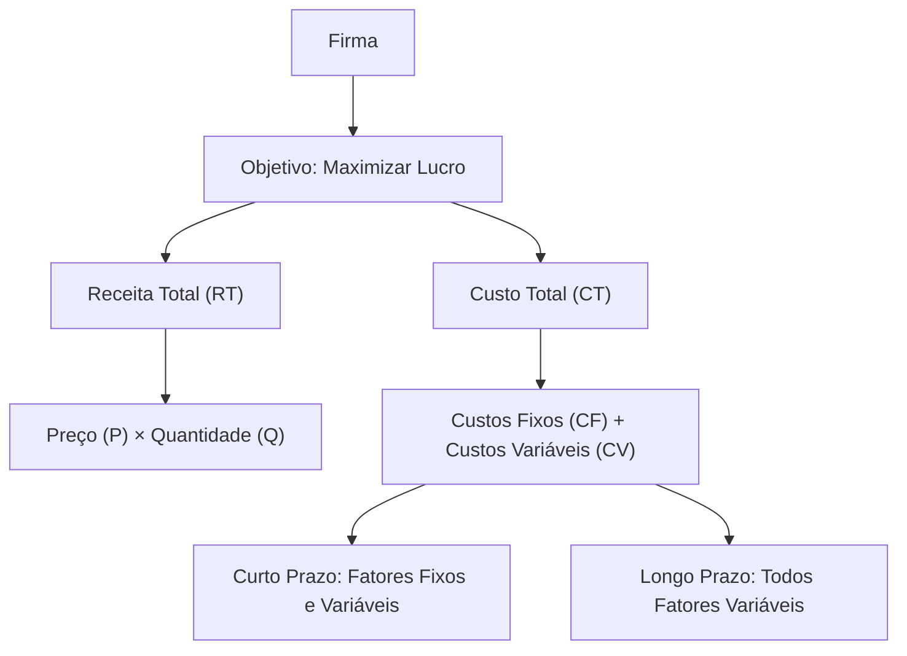


📈 **2. Relações entre tipos de custos**
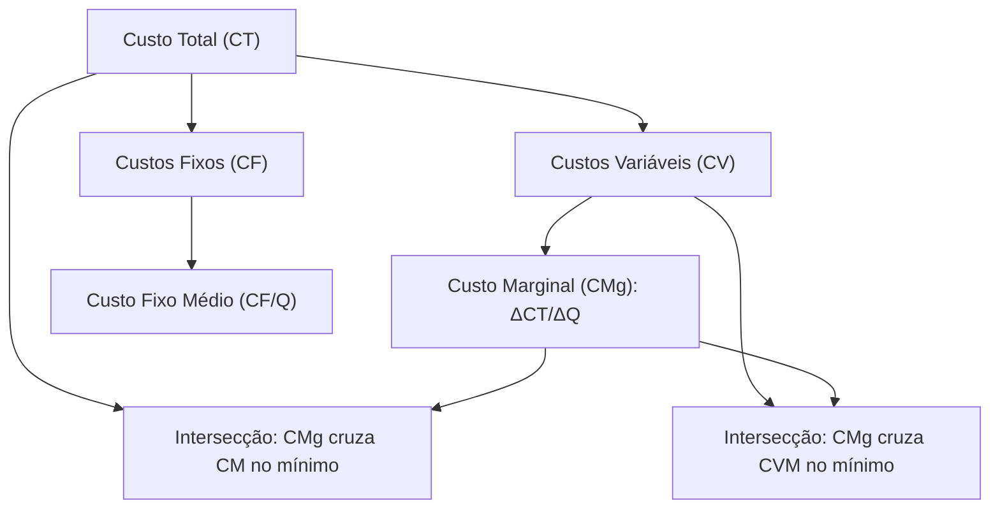


📊 **3. Processo Decisório da Firma no Curto e Longo Prazo**

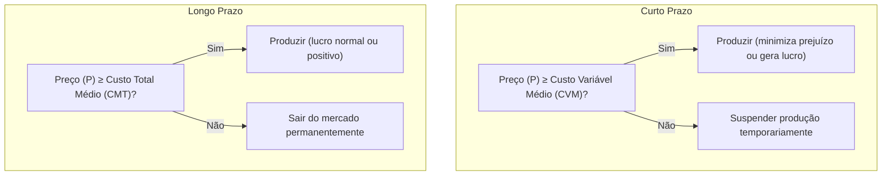


🔄 **4. Decisão de Produção em Diferentes Estruturas de Mercado**

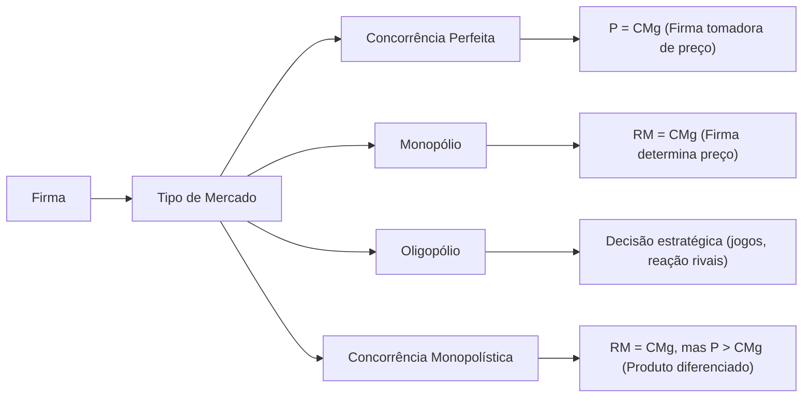


⚖️ **5. Decisão de Produção e Maximização do Lucro**

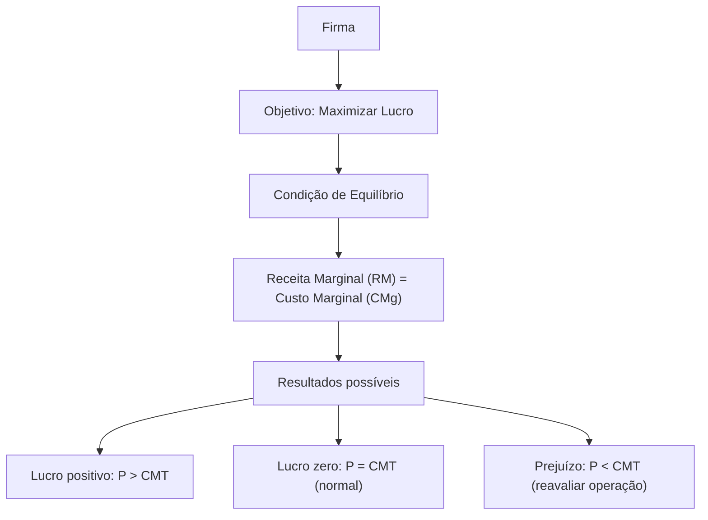


🏭 **1. Estruturas Gerais do Oligopólio**

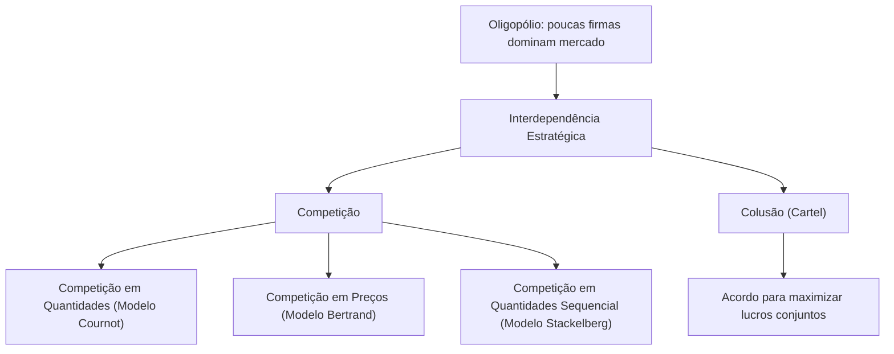


📉 **3. Modelo de Bertrand**

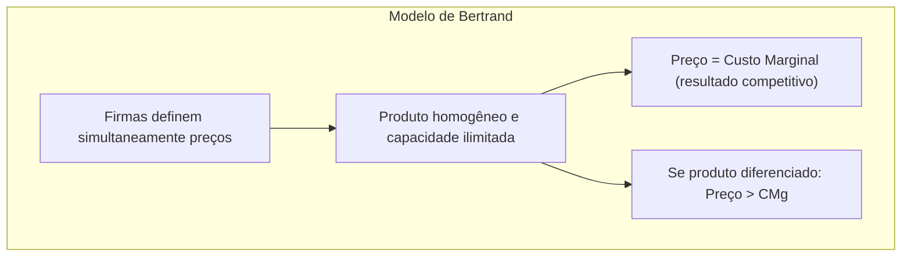

📊 **4. Modelo de Stackelberg**


🔗 **5. Colusão e Cartéis**


🔄 **6. Comparativo dos Modelos de Oligopólio**
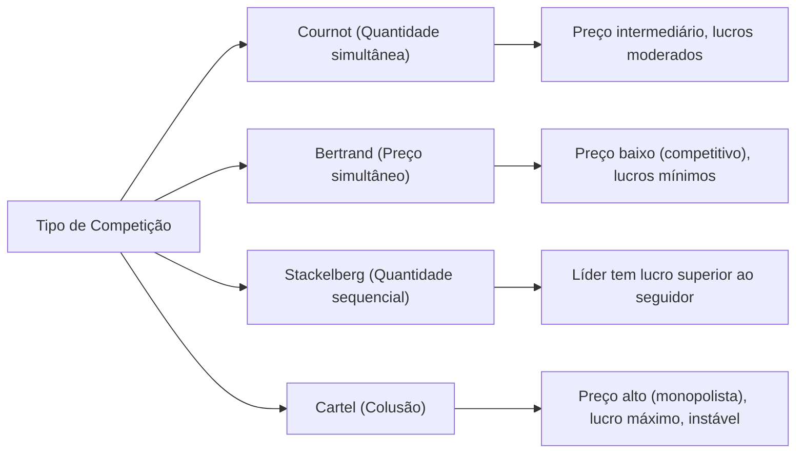


# Origem: _Tipos de Mercados e de bens (Concorrência, Monopólio, Bens Públicos, etc.)

---
title: Tipos de Mercados e de bens (Concorrência, Monopólio, Bens Públicos, etc.)
area: ECONOMIA
subarea: Microeconomia
tags:
  - cacd-2025
  - economia
  - microeconomia
  - tipos-de-mercados-e-de-bens
aliases:
  - 1.3 Tipos de Mercados e de bens.
---
# Estruturas de Mercado, Tipos de Bens e Falhas de Mercado

## Introdução

As estruturas de mercado representam diferentes formas de organização econômica que determinam como preços são formados e recursos são alocados. **A compreensão das falhas de mercado é fundamental para justificar intervenções governamentais** e políticas públicas, tema central na formação diplomática. Este material analisa as principais estruturas competitivas, classifica bens econômicos e examina quando mercados falham em produzir resultados eficientes.

> [!info] Relevância para o CACD A análise de estruturas de mercado e falhas é essencial para compreender políticas econômicas nacionais e negociações comerciais internacionais, áreas centrais da atividade diplomática.

## Estruturas de Mercado e Determinação de Preços

### Concorrência perfeita

A concorrência perfeita representa o modelo teórico de máxima eficiência econômica. **As empresas são "tomadoras de preço"** porque individualmente não possuem poder para influenciar o preço de mercado, devendo aceitar o preço determinado pela interação entre oferta e demanda agregadas.

**Características fundamentais:**

- **Grande número de compradores e vendedores:** Nenhum agente individual possui participação significativa no mercado
- **Produtos homogêneos:** Bens perfeitamente substitutos, sem diferenciação
- **Informação perfeita:** Todos os agentes conhecem preços, qualidade e condições de mercado
- **Livre entrada e saída:** Ausência de barreiras econômicas, tecnológicas ou regulatórias

**Exemplos brasileiros:**

- Mercados de commodities agrícolas (soja, milho, café)
- Feiras livres de hortifrúti
- Mercado de câmbio

> [!note] Equilíbrio em Concorrência Perfeita **Preço = Custo Marginal** - A empresa maximiza lucro produzindo onde a receita marginal (igual ao preço) iguala o custo marginal.

### Monopólio

No monopólio, uma única empresa controla completamente a oferta de um produto sem substitutos próximos. **O poder de monopólio permite fixar preços acima do custo marginal**, resultando em perda de bem-estar social (peso morto).

**Características principais:**

- **Único vendedor no mercado**
- **Produto sem substitutos próximos**
- **Barreiras significativas à entrada:** Podem ser econômicas (altos custos de entrada), tecnológicas (patentes), regulatórias (licenças) ou estratégicas

**Exemplos brasileiros:**

- Petrobras (exploração de petróleo em águas profundas)
- B3 (intermediação no mercado de capitais)
- Correios (serviços postais básicos)
- Empresas regionais de saneamento

> [!warning] Ineficiência do Monopólio **Preço > Custo Marginal** - O monopolista restringe produção para maximizar lucros, gerando preços mais altos e quantidades menores que na concorrência perfeita.

### Oligopólio

O oligopólio caracteriza-se pela **interdependência estratégica entre empresas**. As decisões de preço, quantidade e investimento de uma empresa afetam diretamente os resultados das concorrentes, criando comportamento estratégico complexo.

**Características centrais:**

- **Poucas empresas dominam o mercado**
- **Produtos homogêneos ou diferenciados**
- **Barreiras significativas à entrada**
- **Possibilidade de formação de cartéis** (acordos explícitos ou tácitos sobre preços)

**Exemplos brasileiros:**

- Setor bancário: Itaú, Bradesco, Banco do Brasil, Caixa
- Telecomunicações: Vivo, Claro, TIM
- Aviação civil: GOL, LATAM, Azul
- Cervejeiro: Ambev (dominante), Heineken, Petrópolis

> [!info] Determinação de Equilíbrio em Oligopólio A **complexidade na determinação do equilíbrio** resulta da interdependência estratégica. Empresas devem antecipar reações dos concorrentes, utilizando conceitos da teoria dos jogos.

### Concorrência monopolística

Estrutura intermediária que combina elementos competitivos com poder monopolístico limitado. Empresas possuem **algum controle sobre preços devido à diferenciação de produtos**.

**Características distintivas:**

- **Muitos vendedores**
- **Produtos diferenciados mas substitutos próximos**
- **Entrada relativamente livre**
- **Poder de mercado limitado**

**Exemplos brasileiros:**

- Restaurantes e lanchonetes
- Salões de beleza
- Postos de gasolina
- Farmácias locais

## Tipos de Bens e Classificação Econômica

A classificação de bens baseia-se em dois critérios fundamentais que determinam como mercados funcionam e quando falham.

### Critérios de classificação

**Rivalidade no consumo:** Característica de bens cujo **consumo por uma pessoa reduz ou impede o consumo por outra**. Um sanduíche é rival porque se uma pessoa o consome, outra não pode consumir o mesmo sanduíche.

**Excludabilidade:** **Possibilidade técnica e economicamente viável de impedir que pessoas não-pagantes consumam o bem**. Geralmente operacionalizada através do sistema de preços ou controle físico de acesso.

### Matriz de classificação de bens

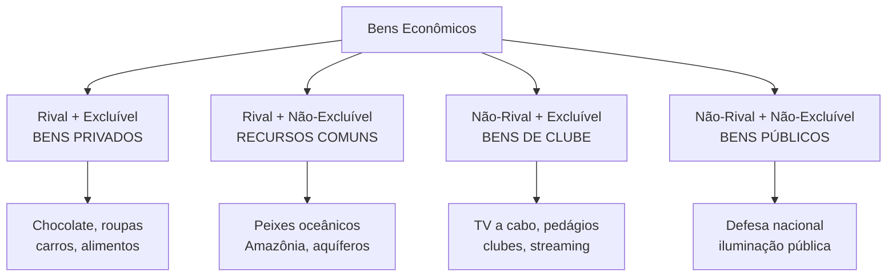

### Bens privados

**Rival e excluível** - Representam o caso padrão onde mercados funcionam eficientemente. O mecanismo de preços aloca recursos adequadamente porque consumidores pagam pelos benefícios recebidos.

**Exemplos:** Alimentos, roupas, automóveis, eletrônicos

### Bens públicos puros

**Não-rival e não-excluível** - Geram o **problema do carona (free-rider)**, principal falha de mercado associada. Uma vez provido, todos se beneficiam independentemente de contribuição, incentivando comportamento oportunista.

**Exemplos brasileiros:**

- Defesa nacional
- Segurança pública
- Iluminação pública
- Fogos de artifício do Réveillon de Copacabana

> [!warning] Problema do Carona Indivíduos têm incentivo para **consumir sem pagar**, pois não podem ser excluídos do benefício. Resulta em **subfinanciamento privado** de bens públicos, justificando provisão governamental.

### Recursos comuns

**Rival mas não-excluível** - Geram a **Tragédia dos Comuns**. Cada usuário tem incentivo individual para usar intensivamente o recurso, mas uso coletivo excessivo pode causar esgotamento.

**Exemplos brasileiros:**

- Pesca oceânica (sobrepesca no litoral)
- Desmatamento da Amazônia
- Aquífero Guarani
- Pastos comunais

> [!danger] Tragédia dos Comuns **Superexploração de recursos** ocorre porque benefícios do uso são apropriados individualmente, mas custos do esgotamento são socializados. Solução requer regulação ou definição de direitos de propriedade.

### Bens de clube (monopólios naturais)

**Não-rival mas excluível** - Uma vez produzidos, **custo marginal de atender consumidores adicionais é zero ou muito baixo**. Geram ineficiência quando preço é cobrado acima do custo marginal.

**Exemplos brasileiros:**

- TV a cabo e streaming
- Estradas pedagiadas
- Clubes recreativos
- Software

## Externalidades como Falha de Mercado

**Externalidades são impactos (custos ou benefícios) das ações de um agente sobre o bem-estar de outros que não participam diretamente dessa ação**. Representam divergência entre custos/benefícios privados e sociais.

### Externalidades negativas

Quando **custo marginal social > custo marginal privado**. O mercado produz quantidade excessiva porque agentes não internalizam todos os custos de sua atividade.

**Exemplos brasileiros:**

- Poluição industrial (caso histórico de Cubatão-SP)
- Desmatamento da Amazônia
- Poluição atmosférica em São Paulo
- Contaminação do Rio Doce (desastre de Mariana)

### Externalidades positivas

Quando **benefício marginal social > benefício marginal privado**. O mercado produz quantidade insuficiente porque agentes não capturam todos os benefícios sociais.

**Exemplos brasileiros:**

- Educação (benefícios além dos individuais)
- Vacinação (imunidade coletiva)
- Pesquisa e desenvolvimento
- Preservação ambiental

> [!info] Soluções para Externalidades **Taxas pigouvianas** (internalização de custos externos), **subsídios** (para externalidades positivas), **regulamentação direta** ou **definição de direitos de propriedade** (Teorema de Coase).

## Síntese das falhas de mercado

As três principais falhas analisadas - **problema do carona em bens públicos, tragédia dos comuns em recursos compartilhados, e externalidades em atividades com efeitos externos** - compartilham característica comum: **mercados falham quando direitos de propriedade são mal definidos ou inexistentes**.

Para bens públicos, ninguém pode ser "dono" do benefício; para recursos comuns, propriedade é coletiva e mal regulada; para externalidades, não há mercado para "direitos de poluir" ou "direitos ao ambiente limpo". **Intervenção governamental se justifica para corrigir essas ineficiências**, através de regulação, tributação, subsídios ou provisão direta.

A análise dessas estruturas e falhas é fundamental para diplomatas compreenderem políticas econômicas nacionais e negociações comerciais internacionais, especialmente em áreas como comércio, meio ambiente e regulação de setores estratégicos.

---

## Questões para Autoavaliação

1. **Compare os mecanismos de determinação de preços na concorrência perfeita versus monopólio. Por que o monopólio gera ineficiência alocativa?**
    
2. **Analise um recurso natural brasileiro (como a Amazônia) usando os conceitos de rivalidade, excludabilidade e tragédia dos comuns. Que soluções de política pública poderiam mitigar os problemas identificados?**
    
3. **Explique por que a vacinação gera externalidades positivas e o problema do carona simultaneamente. Como políticas públicas de saúde podem abordar ambos os aspectos?**


# Origem: 1.1.1 Preferências.

---
title: "Preferências."
area: ECONOMIA
subarea: Microeconomia
tags:
  - cacd-2025
  - economia
  - microeconomia
  - tipos-de-mercados-e-de-bens
aliases:
  - Preferências.
---
# Teoria do Consumidor: As Preferências, as Curvas de Indiferença e a Taxa Marginal de Substituição

## Introdução: O Problema da Escolha do Consumidor

A microeconomia neoclássica estuda como agentes econômicos (famílias, firmas) tomam decisões em um ambiente de escassez. A Teoria do Consumidor, pilar dessa análise, busca modelar o processo de escolha do indivíduo. Para entender como um consumidor escolhe a melhor cesta de bens e serviços que pode adquirir, dadas suas restrições orçamentárias, o primeiro passo é compreender e modelar suas **preferências**.

O modelo parte de uma premissa fundamental: os consumidores são **racionais**. A racionalidade, neste contexto, não é um julgamento de valor, mas sim uma suposição de que as escolhas dos indivíduos são consistentes e logicamente coerentes. Essa consistência é formalizada através de um conjunto de axiomas sobre as preferências.

---

## 1. Os Axiomas das Preferências: A Base do Comportamento Racional

Para que possamos construir um modelo robusto da escolha do consumidor, assumimos que suas preferências obedecem a certas regras lógicas, conhecidas como axiomas. São eles que garantem que o consumidor pode, de fato, fazer uma escolha ótima.

### 1.1. Axiomas Fundamentais

Estes três axiomas são a base mínima necessária para a existência de uma escolha racional.

> [!definition] Axioma 1: Completude (ou Comparabilidade)
> 
> Dadas quaisquer duas cestas de consumo, A e B, o consumidor é sempre capaz de compará-las e expressar uma preferência. Apenas uma das três seguintes relações é possível:
> 
> 1. A é preferível a B (AsuccB);
>     
> 2. B é preferível a A (BsuccA); ou
>     
> 3. O consumidor é indiferente entre A e B (AsimB).
>     
> 
> **Implicação Estratégica:** Este axioma elimina a possibilidade de o consumidor ficar paralisado por indecisão. Ele garante que, para qualquer par de opções, uma decisão (mesmo que seja de indiferença) pode ser tomada. Sem ele, a função de utilidade que representa as preferências não poderia ser construída.

> [!definition] Axioma 2: Reflexividade
> 
> Qualquer cesta de bens A é pelo menos tão boa quanto ela mesma (AsucceqA).
> 
> **Implicação Estratégica:** Este é um axioma puramente técnico e de consistência lógica. Ele assegura que as cestas são comparáveis consigo mesmas, o que é trivial, mas necessário para a formalização matemática completa do modelo de preferências.

> [!definition] Axioma 3: Transitividade
> 
> Dadas três cestas de consumo, A, B e C, se o consumidor prefere a cesta A à cesta B (AsuccB) e prefere a cesta B à cesta C (BsuccC), então ele necessariamente prefere a cesta A à cesta C (AsuccC).
> 
> **Implicação Estratégica:** A transitividade é o principal pilar da racionalidade no modelo. Ela garante a consistência interna das escolhas. Se as preferências não fossem transitivas, o consumidor poderia ser levado a escolhas cíclicas (preferir A a B, B a C, mas C a A), tornando impossível a identificação de uma cesta "ótima". Veremos que a transitividade é a razão pela qual as curvas de indiferença não podem se cruzar.

### 1.2. Propriedades Adicionais (Usualmente Assumidas)

Para que as preferências sejam "bem-comportadas" (_well-behaved_) e gerem curvas de indiferença com as propriedades que observamos nos manuais, adicionamos duas outras suposições sobre o comportamento do consumidor.

> [!note] Propriedade 4: Monotonicidade (ou "Mais é Melhor")
> 
> Assume-se que todos os bens são desejáveis (goods). Portanto, o consumidor sempre prefere ter mais de um bem a ter menos, mantendo a quantidade dos outros bens constante. Uma cesta com mais de pelo menos um bem, e não menos dos outros, será sempre estritamente preferida.
> 
> **Implicação Estratégica:** Esta propriedade garante que o consumidor sempre buscará consumir mais, o que está na base do problema econômico da escassez. Graficamente, a monotonicidade é a razão pela qual as **curvas de indiferença são negativamente inclinadas**. Se fossem positivamente inclinadas, significaria que o consumidor é indiferente entre uma cesta com menos de tudo e outra com mais de tudo, violando a ideia de que "mais é melhor".

> [!note] Propriedade 5: Convexidade (Estrita)
> 
> O consumidor prefere cestas de consumo diversificadas ("médias") a cestas especializadas ("extremas"). Formalmente, se o consumidor é indiferente entre as cestas A e B, então qualquer cesta C que seja uma combinação linear convexa de A e B (ex: uma média ponderada) será pelo menos tão boa (e geralmente estritamente preferida) quanto A e B.
> 
> **Implicação Estratégica:** A convexidade reflete uma preferência por variedade. É a propriedade mais importante para garantir a existência de um ponto de equilíbrio único e bem definido na teoria do consumidor. Graficamente, ela implica que as **curvas de indiferença são convexas em relação à origem**. Como veremos, isso leva diretamente a uma **Taxa Marginal de Substituição decrescente**.

---

## 2. As Curvas de Indiferença: A Representação Gráfica das Preferências

Com base nos axiomas, podemos agora visualizar as preferências de um consumidor.

> [!definition] Curva de Indiferença
> 
> Uma curva de indiferença é o lugar geométrico (o conjunto de pontos) que representa todas as cestas de consumo de bens que proporcionam ao consumidor o mesmo nível de satisfação (ou utilidade). O consumidor é, por definição, indiferente a qualquer cesta sobre a mesma curva.

Um conjunto de curvas de indiferença para um mesmo consumidor é chamado de **mapa de indiferença**.

### Propriedades das Curvas de Indiferença Bem-Comportadas

As cinco propriedades/axiomas das preferências determinam diretamente as quatro propriedades fundamentais das curvas de indiferença:

1. **Curvas de Indiferença são Negativamente Inclinadas:**
    
    - **Derivação:** Consequência direta da **Monotonicidade**. Para que o consumidor permaneça no mesmo nível de satisfação ao ganhar uma unidade do bem X, ele precisa abrir mão de alguma quantidade do bem Y. Se a curva fosse positivamente inclinada, mover-se ao longo dela para cima e para a direita resultaria em uma cesta com mais de ambos os bens, que deveria ser estritamente preferida (pela Monotonicidade), contradizendo a definição da curva de indiferença.
        
2. **Curvas de Indiferença Mais Altas (mais à direita) Representam Maior Satisfação:**
    
    - **Derivação:** Também é consequência da **Monotonicidade**. Qualquer cesta em uma curva mais alta contém mais de pelo menos um dos bens em comparação com uma cesta em uma curva mais baixa. Portanto, representa um nível de utilidade superior.
        
3. **Curvas de Indiferença Não se Cruzam:**
    
    - **Derivação:** Consequência direta da **Transitividade** e da **Monotonicidade**.
        
        - Suponha que duas curvas, U1 e U2, se cruzem no ponto A.
            
        - Seja B um ponto em U1 e C um ponto em U2.
            
        - Como A e B estão em U1, então AsimB.
            
        - Como A e C estão em U2, então AsimC.
            
        - Pela **Transitividade**, se BsimA e AsimC, então BsimC.
            
        - Contudo, o ponto C (na curva U2) está acima e à direita do ponto B (na curva U1), contendo mais de ambos os bens. Pela **Monotonicidade**, CsuccB.
            
        - Temos uma contradição: as preferências indicam ao mesmo tempo que BsimC e CsuccB. Isso é logicamente impossível. Portanto, as curvas de indiferença não podem se cruzar.
            

    > [!important] A impossibilidade do cruzamento das curvas de indiferença é a principal implicação gráfica do axioma da transitividade.
    
4. **Curvas de Indiferença são Convexas em Relação à Origem:**
    
    - **Derivação:** Consequência direta da suposição de **Convexidade** das preferências. Uma linha reta que une dois pontos quaisquer em uma curva de indiferença passará por cestas (as "médias") que estão em curvas de indiferença mais altas. Isso significa que as cestas diversificadas são preferidas às extremas.
        


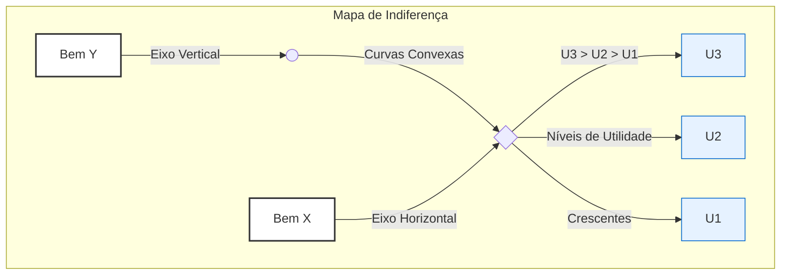

_Interpretação do Diagrama: Um mapa de indiferença típico, com curvas convexas (U1, U2, U3). Qualquer ponto na curva U2 é preferível a qualquer ponto em U1. Todas as curvas são negativamente inclinadas e não se cruzam._

![[Pasted image 20250628153633.png]]

---

## 3. A Taxa Marginal de Substituição (TMS)

A inclinação da curva de indiferença em um determinado ponto tem um significado econômico fundamental.

> [!definition] Taxa Marginal de Substituição (TMS)
> 
> A Taxa Marginal de Substituição do bem Y pelo bem X (TMS_Y,X) mede a taxa à qual um consumidor está disposto a voluntariamente desistir do bem Y para obter uma unidade adicional do bem X, mantendo-se no mesmo nível de satisfação (na mesma curva de indiferença). É a medida da valoração subjetiva de um bem em termos do outro.
> 
> TMSY,X​=−ΔXΔY​
> 
> Graficamente, a TMS em um ponto é o **valor absoluto da inclinação da curva de indiferença** naquele ponto.


### TMS Decrescente

A consequência mais importante da **convexidade** das preferências é a **TMS Decrescente**.

> [!important] A Lei da Taxa Marginal de Substituição Decrescente
> 
> À medida que um consumidor se move ao longo de uma curva de indiferença, aumentando o consumo do bem X e diminuindo o do bem Y, a TMS (o valor absoluto da inclinação) diminui.
> 
> **Análise:**
> 
> - **Quando o consumidor tem muito Y e pouco X:** Ele está disposto a abrir mão de uma quantidade relativamente grande de Y para obter uma unidade de X. O bem X é subjetivamente muito valioso para ele, pois é escasso em sua cesta. A TMS é alta.
>     
> - **Quando o consumidor tem pouco Y e muito X:** Agora, ele possui muito X e o bem Y se tornou relativamente escasso. Ele só aceitará abrir mão de uma pequena quantidade de Y para obter mais uma unidade de X. A TMS é baixa.
>     
> 
> **Relação com a Convexidade:** É precisamente a forma convexa ("abaulada" para a origem) que faz com que a inclinação da curva se torne cada vez mais "plana" à medida que nos movemos para a direita, demonstrando a queda na TMS.

---

## 4. Casos Especiais de Preferências

A análise da forma das curvas de indiferença para bens que não seguem a regra da convexidade é um tópico clássico em provas.

### Substitutos Perfeitos

- **Definição:** Dois bens são substitutos perfeitos se o consumidor está disposto a substituí-los um pelo outro a uma **taxa constante**. A TMS é constante.
    
- **Exemplo Clássico:** Manteiga e margarina; canetas azuis e pretas (para um consumidor que não se importa com a cor).
    
- **Forma da Curva de Indiferença:** **Linhas retas** com inclinação negativa. A inclinação (e, portanto, a TMS) é constante ao longo de toda a curva.
    

![[Pasted image 20250628153827.png]]

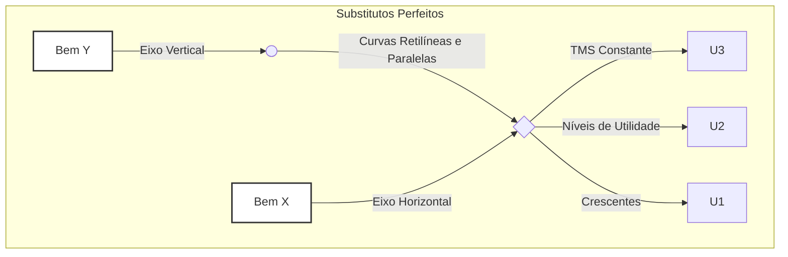

### Complementares Perfeitos

- **Definição:** Dois bens são complementares perfeitos se são consumidos juntos em proporções fixas. O consumidor não obtém satisfação adicional ao consumir mais de um bem sem consumir mais do outro na proporção correta.
    
- **Exemplo Clássico:** Pé direito e pé esquerdo de um sapato; café e açúcar (para alguém que só toma café com uma quantidade fixa de açúcar).
    
- **Forma da Curva de Indiferença:** **Formato de "L"**. O vértice do "L" ocorre no ponto onde os bens são consumidos na proporção desejada. Adicionar mais de um bem, sem adicionar do outro, não aumenta a utilidade (move o consumidor para um ponto na parte horizontal ou vertical da curva, mas não para uma curva mais alta).
    

![[Pasted image 20250628153939.png]]

```mermaid
graph TD
    subgraph Complementares Perfeitos
        direction LR
        A[Bem Y] -- Eixo Vertical --> B(( ))
        B -- Curvas em "L" --> D{ }
        C[Bem X] -- Eixo Horizontal --> D
        D -- Proporção Fixa --> E[U3]
        D -- Níveis de Utilidade --> F[U2]
        D -- Crescentes --> G[U1]
    end

    style A fill:#fff,stroke:#333,stroke-width:2px
    style C fill:#fff,stroke:#333,stroke-width:2px
```

---

## Questões para Autoavaliação (Active Recall)

> [!question] Questão 1
> 
> Explique, utilizando os axiomas da teoria do consumidor, por que duas curvas de indiferença de um mesmo mapa de indiferença não podem se cruzar. Qual axioma seria violado e por quê?

> [!question] Questão 2
> 
> O que significa uma Taxa Marginal de Substituição (TMS) decrescente e qual propriedade das preferências do consumidor é responsável por essa característica? Descreva o comportamento do consumidor que essa propriedade representa.

> [!question] Questão 3
> 
> Um consumidor afirma que, para ele, suco de laranja e suco de tangerina são indiferentes, e ele sempre está disposto a trocar um copo de um pelo outro na proporção de 1 para 1. Como seria o mapa de indiferença desse consumidor para esses dois bens? Qual é o valor da sua TMS?.


# Origem: A Curva de Oferta da Firma em Concorrência Perfeita

---
title: Curva de Oferta da Firma em Concorrência Perfeita
area: ECONOMIA
subarea: Microeconomia
tags:
  - cacd-2025
  - economia
  - microeconomia
  - oferta-do-produtor
aliases:
  - A Curva de Oferta da Firma em Concorrência Perfeita
---
[Firm Short‑Run Supply Curve & Shutdown Rule (YouTube)](https://www.youtube.com/watch?v=xEK8VX7FOq4&utm_source=chatgpt.com)

---

# A Curva de Oferta da Firma em Concorrência Perfeita

## 1. Tomadora de Preços: P = RMg

- Em concorrência perfeita, cada firma enfrenta uma **demanda horizontal**, pois é incapaz de influenciar o preço de mercado.
    
- Isso significa que **Preço = Receita Marginal = Receita Média (P = RMg = RM)** — cada unidade produzida gera exatamente esse preço como receita.
    

## 2. Regra de Maximização de Lucro: P = CMg

- A condição clássica para maximização de lucro (ou mínima perda) é quando **Receita Marginal = Custo Marginal**.
    
- Em concorrência perfeita: **Preço = Custo Marginal (P = CMg)** .
    

## 3. Curva de Oferta da Firma: CMg acima do mínimo do AVC

- A **curva de oferta no curto prazo** é exatamente:
    
    - o **segmento da curva de Custo Marginal acima do mínimo da curva de Custo Variável Médio (AVC)**.
        
    - Se o preço estiver **abaixo do mínimo do AVC**, produzir representa prejuízo maior do que fechar; logo, a firma opta por **não produzir** (Q = 0).
        

### 🛑 Regra de parada (shutdown rule):

- Se **P ≥ AVC_mínimo**: produza onde **P = CMg**.
    
- Se **P < AVC_mínimo**: melhor fechar e arcar apenas com custos fixos.
    

## 4. Por que esse trecho da CMg é a oferta?

1. A firma observa o preço de mercado.
    
2. Compara com o AVC mínimo:
    
    - Se for menor, **encessa a produção**.
        
    - Se for igual ou maior, determina Q tal que **P = CMg**.
        
3. Esse Q é a quantidade ofertada — e, à medida que o preço sobe, a firma produz mais, seguindo a curva de CMg acima do AVC.
    

## 5. Formato da Curva: crescente

- A curva de **Custo Marginal é ascendente** devido à **lei dos rendimentos decrescentes**, que faz os custos por unidade adicional aumentar conforme expande-se a produção.
    
- Assim, a curva de oferta é **positivamente inclinada**: preços mais altos remuneram custos marginais crescentes.
    

---

### 🧾 Resumo passo a passo

|Etapa|Lógica|
|---|---|
|**1. Tomador de preços**|Preço = RMg|
|**2. Max. Lucro**|Produção onde P = CMg|
|**3. Verificar AVC**|Se P ≥ AVC_mínimo ⟶ produza; caso contrário ⟶ Q = 0|
|**4. Oferta**|Q = quantidade onde P = CMg (acima de AVC_mínimo)|
|**5. Forma da curva**|Positivamente inclinada pelo custo marginal crescente|

---

## 📝 Pontos essenciais para prova

- A firma **não escolhe o preço**, apenas a quantidade.
    
- Em equilíbrio de curto prazo:
    
    - **Se P ≥ AVC mínimo** → firma produz e “compensa parte dos custos fixos”.
        
    - **Se P < AVC mínimo** → firma fecha temporariamente; só arca com custos fixos.
        
- A curva de oferta da firma = **Custo Marginal acima do ponto mínimo do AVC**.
    

---

## Conclusão

A curva de oferta da firma em concorrência perfeita é derivada diretamente de seu **custo marginal**, a partir do ponto em que cobre seus **custos variáveis mínimos**. O modelo combina lógica de preço-tomador (P = RMg), maximização de lucro (P = CMg), e decisão de produção condicionada ao **shutdown rule** (comparação com AVC), resultando em uma curva de oferta ascendente — fiel representação da racionalidade microeconômica no curto prazo.

# Origem: Função de Produção Cobb-Douglas

Aqui está uma explicação clara e detalhada sobre a **Função de Produção Cobb-Douglas**, seu significado econômico, interpretação e como se relaciona à Teoria da Firma:

---

## 📌 **O que é a Função de Produção Cobb-Douglas?**

A **função Cobb-Douglas** é uma forma matemática muito utilizada em economia para representar a relação entre os fatores de produção (geralmente **capital KK** e **trabalho LL**) e o produto final (produção total, $Q$). Sua forma geral é dada por:

$Q=A⋅K^α⋅L^ β$

Onde:

- $Q$: produção total da firma.
    
- $K$: capital utilizado.
    
- $L$: trabalho utilizado.
    
- $A$: tecnologia ou eficiência total dos fatores (Produtividade Total dos Fatores, PTF).
    
- $α$: elasticidade-produto do capital.
    
- $β$: elasticidade-produto do trabalho.
    

---

## 📊 **Interpretação econômica da Cobb-Douglas**

- Os parâmetros α\alpha e β\beta indicam a **contribuição relativa** do capital e do trabalho para a produção total.
    
    - Por exemplo, se α=0.3 = 0.3 e β=0.7, significa que o trabalho tem maior peso na geração do produto que o capital.
        
- A soma α+β\alpha + \beta indica os **retornos de escala** da função:
    
    - Se α+β=1, há **retornos constantes de escala**: dobrar ambos os fatores dobra a produção exatamente.
        
    - Se α+β>1, há **retornos crescentes de escala**: dobrar ambos os fatores aumenta a produção em mais que o dobro.
        
    - Se α+β<1, há **retornos decrescentes de escala**: dobrar ambos os fatores aumenta a produção em menos que o dobro.
        

---

## 📈 **Relação com a Teoria da Firma**

Na **Teoria da Firma**, o objetivo da firma é maximizar lucros, o que depende diretamente da função de produção e dos custos dos fatores. A função Cobb-Douglas é frequentemente utilizada por ser simples, realista e capaz de capturar características essenciais da produção:

1. **Elasticidade e Produtividade Marginal:**
    
    - Permite calcular claramente as produtividades marginais dos fatores de produção (quanto aumenta QQ ao adicionar mais uma unidade de KK ou LL).
        
    - As produtividades marginais decrescem conforme o fator aumenta, um princípio econômico essencial (**Lei dos rendimentos marginais decrescentes**).
        
2. **Tomada de decisão da firma:**
    
    - A firma utiliza a Cobb-Douglas para decidir quanto contratar de cada fator produtivo, buscando minimizar custos dado o nível desejado de produção.
        
    - Também é usada para determinar o nível ótimo de produção para maximizar lucros, considerando preços dos fatores e preço do produto no mercado.
        

---

## 🖥️ **Exemplo prático (numérico):**

Considere a função Cobb-Douglas:

$Q=10⋅K^0.5⋅L^0.5$

Suponha que a empresa tenha:

- Capital (K) = 4 unidades.
    
- Trabalho (L) = 9 unidades.
    

A produção total será:

$Q=10⋅(4)^0,5⋅(9)^0,5=10⋅2⋅3=60$

Neste exemplo, α=0,5 e β=0,5, indicando:

- Retornos constantes de escala, pois 0,5+0,5=1.
    
- Cada fator contribui igualmente para a produção.
    

---

## 🔗 **Visualização (Mermaid):**

Uma visualização simples e clara da aplicação Cobb-Douglas na decisão da firma pode ser:

```mermaid
flowchart TD
Firma["Firma busca maximizar lucro"] --> Decisão["Quanto produzir?"]
Decisão --> Cobb["Função Cobb-Douglas: Q = A·K^α·L^β"]
Cobb --> Produtividade["Determinar Produtividade Marginal"]
Produtividade --> Lucro["Escolher níveis ótimos de Capital e Trabalho"]
Lucro --> Resultado["Maximização dos Lucros"]
```

---

## 💡 **Resumindo:**

A função Cobb-Douglas é essencial para entender como empresas combinam insumos produtivos (capital e trabalho) para produzir bens e serviços. É uma peça-chave da Teoria da Firma, pois permite análises concretas sobre produtividade, custos e decisões ótimas de produção.

# Origem: Isoquantas e fronteira de possibilidades de produção

# Isoquantas e fronteira de possibilidades de produção: fundamentos e interconexões na teoria microeconômica

A compreensão das **isoquantas** e da **fronteira de possibilidades de produção (FPP)** constitui um dos pilares fundamentais da teoria microeconômica moderna. Estes conceitos, desenvolvidos ao longo do século XX, fornecem ferramentas analíticas essenciais para compreender como firmas tomam decisões produtivas e como economias alocam recursos escassos entre usos alternativos. Para o candidato à carreira diplomática, dominar estes instrumentos é crucial para analisar políticas econômicas, entender dinâmicas de comércio internacional e avaliar estratégias de desenvolvimento.

## Isoquantas: geometria da produção eficiente

### Fundamentos conceituais e matemáticos

Uma isoquanta representa o conjunto de todas as *combinações de insumos que produzem a mesma quantidade de produto*. Matematicamente, para uma função de produção Q = f(K,L), uma isoquanta é definida pela equação implícita **Q₀ = f(K,L) = constante**, onde K representa capital e L trabalho. O conceito foi desenvolvido independentemente por Philip Wicksteed (1894) e Léon Walras (1874-1877), sendo posteriormente popularizado por Ragnar Frisch, que cunhou o termo "isoquanta" em 1928-29.

As propriedades matemáticas fundamentais das isoquantas derivam diretamente dos pressupostos sobre a tecnologia de produção. **A inclinação negativa** resulta da necessidade de manter o produto constante: quando o diferencial total dQ = (∂f/∂K)dK + (∂f/∂L)dL = 0, obtemos $dK/dL = -(∂f/∂L)/(∂f/∂K) < 0$, assumindo produtos marginais positivos. **A convexidade em relação à origem** reflete a lei dos rendimentos marginais decrescentes - à medida que substituímos capital por trabalho ao longo da isoquanta, torna-se progressivamente mais difícil essa substituição, resultando em uma taxa marginal de substituição técnica (TMST) decrescente.

### Taxa marginal de substituição técnica e tipos de isoquantas

A **TMST = PMgL/PMgK** representa quantas unidades de capital podem ser substituídas por uma unidade adicional de trabalho mantendo a produção constante. Para uma função Cobb-Douglas $Q = AK^α L^β$, a TMST = (β/α)(K/L), revelando como a substituibilidade entre fatores depende tanto dos parâmetros tecnológicos quanto das proporções correntes de uso dos fatores.

Os tipos principais de isoquantas refletem diferentes possibilidades tecnológicas. **Substitutos perfeitos** ($Q = aK + bL$) geram isoquantas lineares com TMST constante, indicando que os fatores podem ser trocados em proporção fixa sem afetar a eficiência. **Complementares perfeitos** ($Q = min{aK, bL}$) produzem isoquantas em formato L, onde a substituição é impossível - exemplificado pela relação entre máquinas e operadores especializados. A **função Cobb-Douglas**, com elasticidade de substituição unitária, representa o caso intermediário mais utilizado, enquanto a **função CES** (Constant Elasticity of Substitution) generaliza essas possibilidades através do parâmetro ρ.

## Fronteira de possibilidades de produção: escolhas sociais sob escassez

### Construção e significado econômico

A FPP ilustra todas as combinações possíveis de produção de dois bens que uma economia pode alcançar com recursos limitados e tecnologia fixa, quando todos os fatores são utilizados plena e eficientemente. Sua construção matemática parte das funções de produção setoriais $X = Fx(Kx, Lx) e Y = Fy(Ky, Ly)$, sujeitas às restrições de recursos $Kx + Ky = K̄ e Lx + Ly = L̄$.

A derivação mais elegante da FPP ocorre através da **caixa de Edgeworth para produção**. Os pontos de tangência entre isoquantas dos diferentes setores formam a curva de contrato, representando todas as alocações Pareto-eficientes de fatores entre os setores. A FPP emerge quando mapeamos essa curva de contrato do espaço de insumos para o espaço de produtos, revelando as possibilidades produtivas agregadas da economia.

### Custos de oportunidade e formas da fronteira

O conceito central associado à FPP é o **custo de oportunidade**, medido pela *taxa marginal de transformação* ($TMT = -dY/dX$). Esta taxa indica quantas unidades do bem Y devem ser sacrificadas para produzir uma unidade adicional do bem X. Economicamente, $TMT = MCx/MCy$, relacionando os custos marginais de produção dos dois bens.

A forma da FPP depende crucialmente das características tecnológicas. Uma **FPP linear** surge quando há custos de oportunidade constantes, típico de tecnologias com substitutos perfeitos na produção ou setores com intensidades fatoriais idênticas. A **FPP côncava**, caso mais comum, reflete custos de oportunidade crescentes devido à lei dos rendimentos decrescentes e à heterogeneidade dos recursos - à medida que especializamos a produção em um bem, utilizamos recursos cada vez menos adequados para sua produção.

## O diálogo profundo entre isoquantas e FPP

### Da eficiência técnica à eficiência alocativa

A conexão fundamental entre isoquantas e FPP manifesta-se através de dois níveis distintos, mas interconectados de eficiência. **Eficiência técnica**, analisada através das isoquantas, garante que cada firma produz no mínimo custo possível para dado nível de produto - matematicamente, onde $TMST = w/r$ (razão dos preços dos fatores). **Eficiência alocativa**, representada por pontos sobre a FPP, assegura que a economia produz a combinação "correta" de bens que maximiza o bem-estar social - onde TMT = TMS (taxa marginal de substituição dos consumidores).

O **Primeiro Teorema do Bem-Estar** estabelece que todo equilíbrio competitivo alcança simultaneamente ambos os tipos de eficiência, situando a economia sobre as isoquantas relevantes e no ponto da FPP onde $TMT = TMS = Px/Py$. Esta unificação teórica demonstra como decisões descentralizadas ao nível das firmas (isoquantas) agregam-se para gerar resultados socialmente eficientes (FPP).

### Tecnologia, rendimentos de escala e forma da fronteira

O progresso tecnológico afeta distintamente isoquantas e FPP. **Inovações Hicks-neutras** deslocam todas as isoquantas proporcionalmente em direção à origem, expandindo a FPP uniformemente e mantendo sua forma. **Progresso técnico enviesado** - poupador de capital ou trabalho - altera diferentemente as isoquantas, podendo mudar a curvatura da FPP e criar novas vantagens comparativas.

Os rendimentos de escala ao nível das firmas determinam crucialmente a forma da FPP agregada. **Rendimentos constantes** em ambos os setores, com tecnologias similares, geram FPP linear com especialização completa ótima. **Rendimentos decrescentes**, o caso padrão, produzem FPP côncava com custos de oportunidade crescentes, justificando diversificação produtiva. A análise moderna de Dalal (2006) demonstrou que condições menos restritivas que as tradicionalmente assumidas são suficientes para garantir concavidade da FPP.

## Aplicações práticas e relevância contemporânea

### Comércio internacional e vantagem comparativa

A teoria da vantagem comparativa encontra na FPP sua expressão mais clara. Países com diferentes FPPs (refletindo tecnologias ou dotações de fatores distintas) beneficiam-se mutuamente do comércio ao especializar-se onde possuem menor custo de oportunidade. O modelo Heckscher-Ohlin estende essa análise incorporando diferentes intensidades fatoriais entre setores, explicando padrões de comércio através das dotações relativas de fatores.

Exemplos contemporâneos abundam: a transformação dos Tigres Asiáticos de economias agrícolas para industriais e depois para serviços avançados ilustra como investimentos em educação e tecnologia podem deslocar dinamicamente a FPP. A experiência chinesa pós-1978 demonstra ganhos dramáticos de eficiência alocativa quando economias planificadas adotam mecanismos de mercado.

### Decisões empresariais e políticas públicas

Ao nível microeconômico, a análise de isoquantas orienta decisões cruciais de investimento. A indústria automobilística global enfrenta constantemente o trade-off entre automação (capital-intensiva) e produção tradicional (trabalho-intensiva), com a escolha ótima dependendo dos preços relativos dos fatores em cada localização. Mudanças tecnológicas, como inteligência artificial e robótica, estão redefinindo as isoquantas em múltiplos setores.

Para políticas públicas, a FPP explicita trade-offs fundamentais. O dilema "canhões versus manteiga" transcende contextos bélicos - governos contemporâneos enfrentam escolhas entre investimento em infraestrutura versus programas sociais, saúde versus educação, consumo presente versus investimento para crescimento futuro. A análise rigorosa desses trade-offs usando o instrumental da FPP melhora significativamente a qualidade das decisões políticas.

### Desafios analíticos e extensões modernas

A agregação de comportamentos microeconômicos (isoquantas) em resultados macroeconômicos (FPP) enfrenta desafios conceituais significativos. O **Teorema de Sonenschein-Mantel-Debreu** alerta que comportamentos individuais racionais não garantem automaticamente comportamento agregado bem-comportado. Heterogeneidade de produtos, qualidade variável de fatores e mudança tecnológica desigual complicam a análise agregada.

Extensões contemporâneas incorporam múltiplas dimensões anteriormente negligenciadas. A **economia ambiental** expande a análise incluindo "capital natural" como fator de produção e qualidade ambiental como output. Modelos de **economia circular** redefinem a própria noção de fronteira produtiva. A **economia digital** desafia conceitos tradicionais com bens de custo marginal zero e externalidades de rede.

## Síntese e implicações para análise econômica avançada

Isoquantas e FPP, longe de serem meros exercícios acadêmicos, fornecem lentes analíticas indispensáveis para compreender questões econômicas fundamentais. **Isoquantas** revelam a estrutura profunda das possibilidades tecnológicas, orientando decisões de produção eficiente ao nível das firmas. A **FPP** agrega essas possibilidades microeconômicas em escolhas sociais, explicitando trade-offs inevitáveis sob escassez.

A unidade conceitual subjacente - otimização sujeita a restrições - permeia ambos os níveis de análise. Esta estrutura comum facilita a integração de insights micro e macroeconômicos, essencial para análise de políticas sofisticadas. Para o futuro diplomata, dominar estes conceitos permite avaliar rigorosamente propostas de política econômica, negociar acordos comerciais com compreensão profunda dos fundamentos econômicos, e contribuir efetivamente para estratégias de desenvolvimento nacional.

As direções futuras de pesquisa prometem enriquecer ainda mais estes frameworks. Modelos dinâmicos incorporando incerteza, insights da economia comportamental relaxando racionalidade perfeita, e aplicações de big data para estimação de funções de produção complexas expandirão o poder analítico destes conceitos fundamentais. A crescente importância de sustentabilidade ambiental e economia digital garantirá que isoquantas e FPP, adequadamente generalizadas, permanecerão centrais para análise econômica nas próximas décadas.

# Origem: _Contabilidade Nacional (Renda, Produto, Agregados)

---
title: Contabilidade Nacional (Renda, Produto, Agregados)
area: ECONOMIA
subarea: Macroeconomia
tags:
  - cacd-2025
  - contabilidade-nacional
  - economia
  - macroeconomia
aliases:
  - Contabilidade Nacional.
---
# Contabilidade Nacional (Contas Nacionais)

A **Contabilidade Nacional** é o sistema de registro da atividade econômica agregada de um país em um período. Ela quantifica a produção, a distribuição e o uso da renda na economia. No Brasil, as Contas Nacionais são apuradas pelo **IBGE** seguindo padrões internacionais, conforme o _System of National Accounts (SNA)_ da ONU (Organização das Nações Unidas) e diretrizes do FMI. A seguir, apresentamos os conceitos centrais de produto e renda, principais identidades macroeconômicas e exemplos ilustrativos, com formatação adequada para estudo em Obsidian.

## Conceitos Centrais: Produto e Renda

> [!definition] **Produto Interno Bruto (PIB):** É o **valor de mercado de todos os bens e serviços finais produzidos em um território** (país ou região) **em determinado período**). Ou seja, soma-se o valor da produção **final** (excluindo bens intermediários para evitar dupla contagem) realizada dentro das fronteiras do país em um ano (ou trimestre, etc.). O PIB pode ser medido em valores **nominais** (a preços correntes do próprio período) ou em valores **reais** (ajustados pela inflação a preços constantes de um ano-base). O PIB **nominal** reflete os preços correntes, podendo variar com a inflação, enquanto o PIB **real** é corrigido pela variação de preços, refletindo apenas o crescimento em quantidade (volume). Para converter PIB nominal em PIB real, utiliza-se o **deflator do PIB**, um índice de preços implícito dado por: $_Deflator do PIB = (PIB Nominal / PIB Real) × 100$. Esse deflator mede a variação geral de preços na economia, permitindo distinguir crescimento real de variações puramente monetárias.

**Três óticas de cálculo do PIB:** Apesar de seu cálculo envolver grande volume de dados, conceitualmente o PIB pode ser obtido por três abordagens equivalentes – **Produto**, **Renda** e **Despesa** –, que correspondem a três perspectivas do **mesmo valor agregado total**:

- **Ótica da Produção (ou do Valor Adicionado):** soma o **valor adicionado** em cada setor produtivo. Equivale ao valor bruto da produção menos o consumo intermediário, adicionando **impostos sobre produtos líquidos de subsídios**. Em termos simples: $PIB = Valor Bruto da Produção – Insumos (bens intermediários) + Impostos sobre produtos$. 
	- Essa ótica foca no **lado da oferta**: quanto cada setor/empresa agrega de novo valor.
    
- **Ótica da Renda:** soma todas as **remunerações aos fatores de produção** geradas no processo produtivo. Inclui salários, juros, aluguéis, lucros e tributos ligados à produção. Em resumo: 
	- $PIB = Salários + Lucros + Juros + Aluguéis + Impostos indiretos – Subsídios.$ 
	Essa abordagem evidencia **quem recebe** a renda gerada na economia (trabalhadores, empresários, governo etc.).
    
- **Ótica da Despesa (Demanda Agregada):** soma o **gasto em bens e serviços finais** pelos diferentes agentes. Segue a identidade clássica:
    
    $PIB=C+I+G+(X−M)$,
    
    onde **C** é o consumo das famílias, **I** é o investimento (formação bruta de capital fixo + variação de estoques), **G** são os gastos do governo e **(X – M)** é o saldo líquido de exportações (exportações menos importações). Essa é a visão pelo **lado da demanda**: o PIB é igual à soma do consumo interno privado, investimentos, gastos governamentais e demanda externa líquida. Note que importações entram com sinal negativo porque representam gasto que não gera produção interna.
    

As três óticas resultam, **por construção contábil**, no **mesmo valor de PIB**. Toda produção gera renda equivalente e é destinada a alguém (despesa). Assim, **Produto = Renda = Despesa** para a economia como um todo, garantindo a coerência das contas nacionais. Essa identidade fundamental não implica que todo produto seja consumido imediatamente, mas sim que a produção agregada encontra correspondência em rendas geradas e em despesas efetivas (incluindo investimento e variação de estoques).

> [!note] **PIB Nominal vs. Real:** O **PIB nominal** é medido a preços correntes do período de referência, podendo inflar-se apenas devido à alta de preços. Já o **PIB real** mede o volume produzido em termos de um ano-base, expurgando os efeitos da inflação. Por exemplo, se o PIB nominal cresceu 30% em valor de um ano para outro, mas os preços também subiram cerca de 30%, então o PIB real mostrará **estagnação** (0% de crescimento real) – todo o aumento nominal se deveu à inflação, não a mais produção. Para calcular o PIB real utiliza-se o _deflator do PIB_, que indica a variação média de preços dos bens e serviços do PIB. O deflator é definido como a razão entre PIB nominal e PIB real, multiplicada por 100. Uma variação de, digamos, +10% no deflator do PIB indica que os preços gerais da economia subiram 10% naquele ano (inflação implícita do PIB). Esse indicador é crucial para análises de crescimento econômico em termos **reais**, descontando a inflação.

### Produto Nacional Bruto (PNB) e Renda Líquida do Exterior (RLEE)

> [!definition] **Produto Nacional Bruto (PNB):** É o **valor de mercado de bens e serviços finais produzidos por fatores de produção pertencentes aos **residentes** do país**, independentemente do local onde ocorre a produção. Difere do PIB (que é territorial) por incluir a produção realizada por nacionais no exterior e excluir a produção doméstica enviada como renda a não residentes. Em fórmula:

> $PNB=PIB+Renda Líquida Enviada ao Exterior (RLEE)$,

> onde a **Renda Líquida Enviada ao Exterior** é a diferença entre a renda enviada a fatores estrangeiros que atuam no país e a renda recebida do exterior por fatores nacionais. Em notação: $RLEE = Renda recebida do exterior – Renda enviada ao exterior$.

> Uma RLEE **negativa** indica que o país enviou mais renda a fatores externos (lucros de multinacionais, juros/remessas para investidores estrangeiros, pagamento a trabalhadores estrangeiros, etc.) do que recebeu; nesse caso o **PNB fica menor que o PIB**. Já uma RLEE positiva significa que entram mais rendimentos do que saem, fazendo o **PNB exceder o PIB**. Em economias avançadas, costuma-se observar $PNB ≥ PIB$ (pois geralmente possuem muitos investimentos no exterior gerando ingressos), enquanto economias receptoras de capital externo frequentemente têm $PIB > PNB$ devido à remessa de lucros e dividendos a estrangeiros.

> [!definition] **Produto Nacional Líquido (PNL):** Corresponde ao **produto nacional disponível após repor a depreciação do capital**. Calcula-se subtraindo do PNB o **Consumo de Capital Fixo** (depreciação do estoque de capital fixo). Assim,

> $PNL=PNB−Depreciacão$ .

> O PNL dá uma ideia do **produto efetivamente novo** gerado pelos residentes, descontando o desgaste de máquinas, equipamentos e estruturas durante o período. É menos divulgado que o PIB, mas conceitualmente importante para medir **crescimento sustentável** (pois uma parte do PIB bruto serve apenas para manter o capital existente).

> [!definition] **Renda Nacional (RN):** É a **soma de todas as remunerações recebidas pelos fatores de produção de propriedade de residentes** do país. Em outras palavras, corresponde à renda total **a custo de fatores** recebida pelos residentes. A RN está intimamente ligada ao PNL: partindo do PNL (que ainda está a preços de mercado), deve-se ajustar pelos **impostos indiretos e subsídios** para chegar à renda efetivamente recebida pelos fatores. Em fórmula:

> $Renda Nacional=PNL−Impostos Indiretos+Subsídios$ .


> Esse ajuste retira da produção líquida o que não vai para os fatores (impostos indiretos) e adiciona pagamentos do governo que aumentam a renda disponível dos produtores (subsídios). O resultado é equivalente à soma de salários, juros, aluguéis e lucros recebidos por trabalhadores, proprietários de capital e governo (na forma de impostos diretos) nacionais, pelo desempenho de suas atividades produtivas. **RN** é portanto próxima do conceito de **PIB a custo de fatores**, ajustada para incluir também o saldo de rendas com o exterior (torna-se nacional) e excluída a depreciação (torna-se líquida).

> [!definition] **Renda Pessoal (RP) e Renda Pessoal Disponível (RPD):** A **Renda Pessoal** representa a parcela da renda nacional que **efetivamente chega às famílias e empresas não financeiras** para uso próprio. Parte da RN é retida por empresas ou governo antes de chegar às pessoas. De forma simplificada, pode-se calcular:

>$Renda Pessoal=Renda Nacional−Lucros retidos das empresas−Impostos indiretos empresariais−Outras receitas correntes do governo+Transferências recebidas$.

> Ou seja, subtrai-se da RN os lucros não distribuídos (que ficam nas próprias empresas), os impostos indiretos pagos pelas empresas e eventuais outras rendas que foram para o governo, e adicionam-se as **transferências** governamentais e de outras fontes para as pessoas (por exemplo, benefícios previdenciários, assistenciais, subsídios às famílias ou instituições privadas). **Renda Pessoal Disponível**, por sua vez, é a porção da renda pessoal que resta **após o pagamento dos impostos diretos** (como IRPF e contribuições sociais) e acrescentando as transferências governamentais ou outras recebidas pelas famílias. Em suma:

> $Renda Pessoal Disponível=Renda Pessoal−Impostos diretos+Transferências recebidas$ .

> A Renda Pessoal Disponível indica **quanto as famílias têm para consumir ou poupar** em um dado período. É um indicador importante para análise de consumo das famílias e capacidade de poupança do setor privado. Por exemplo, quando se fala em _renda disponível per capita_, refere-se a essa medida dividida pela população, dando ideia do potencial de consumo médio por pessoa.

> [!example] **Exemplos Práticos:** No caso do **Brasil**, normalmente o PNB é **ligeiramente menor** que o PIB, pois o país apresenta **Renda Líquida enviada ao exterior negativa** – envia-se mais rendas a fatores estrangeiros (lucros de multinacionais, juros a investidores externos, etc.) do que se recebe do exterior. Em **2019**, por exemplo, o PIB brasileiro foi cerca de R$ 7,26 trilhões enquanto o PNB ficou em torno de R$ 7,15 trilhões, refletindo essa saída líquida de recursos ao exterior. Por outro lado, **países desenvolvidos** muitas vezes têm **PNB maior** que o PIB, já que recebem mais rendas do exterior do que enviam. Economias com forte presença de multinacionais estrangeiras, como a **Irlanda**, apresentam **PIB muito superior ao PNB** – na Irlanda, o PIB chega a ser ~20% maior que o PNB –, devido ao volume de lucros remetidos por empresas estrangeiras operando no país. Já em países que dependem de **remessas de trabalhadores emigrantes**, verifica-se o oposto: o PNB supera o PIB. No **Nepal**, por exemplo, as remessas de trabalhadores no exterior atingiram **26,6% do PIB** em 2023, indicando que uma parcela significativa da renda nacional é auferida fora do território – o que eleva o PNB bem acima do PIB doméstico. Esses casos ilustram a diferença conceitual entre produto **interno** (produção no território) e produto **nacional** (produção pelos nacionais), evidenciando como fluxos internacionais de renda podem alterar a medida de riqueza de um país.

## Identidades Macroeconômicas Fundamentais

A contabilidade nacional obedece a identidades (igualdades contábeis) que sempre se verificam ex-post, relacionando os agregados definidos acima. Duas das identidades fundamentais em macroeconomia são:

- **Identidade da Despesa (Ótica do Gasto):** Esta é a própria fórmula do PIB pela ótica da despesa agregada:
    
    $Y=C+I+G+(X−M)$,
    
    onde $Y$ representa o PIB (renda agregada). Essa identidade simplesmente **define** que o valor total da produção $Y$ é igual à soma do consumo privado (**C**), investimento doméstico (**I**), gastos do governo (**G**) e exportações líquidas (**X – M**). Ela sempre se verifica por construção das Contas Nacionais, assegurando que toda a produção encontre um destino (demanda interna ou externa, incluindo variação de estoques). Se rearranjarmos essa identidade, isolando $Y−C−G$ no primeiro membro, obtemos outra visão: $Y−C−G=I+(X−M)$. Note que $Y−C−G$ é justamente a **poupança nacional** (renda total menos consumo privado menos consumo público), mostrando que **a poupança total de uma economia é igual à soma do investimento interno com o saldo em conta-corrente externo ($X – M$)**.
    
- **Identidade Poupaça–Investimento (economia aberta):** Numa **economia fechada** (sem setor externo), a **poupança nacional (S)** sempre iguala o investimento interno (I), ou seja, _S = I_. Numa **economia aberta**, parte da poupança pode financiar gastos de outros países (quando há superávit externo) ou parte do investimento pode ser financiada por poupança externa (déficit externo). Assim, a identidade amplia-se para:
    
    $S=I+(X−M)$.
    
    Aqui, $S−I=X−M$ expressa que o **excedente de poupança doméstica** é enviado ao exterior na forma de exportações líquidas (país credor), enquanto um $X−M$ negativo indica **necessidade de poupança externa** (entrada de capital estrangeiro para cobrir $I>SI>S$). Incluindo o **governo** nessa análise, podemos decompor SS em **poupança privada** e **poupança pública**. Seja $Sp$ a poupança do setor privado e $Sg$ a poupança do governo (que é _T – G_, a diferença entre tributos e gastos públicos), e decompomos também II em privado e público. A identidade completa passa a ser:
    
    $Sp−Ip+Sg−Ig=X−M$,
    
    que equivale, após rearranjos, a
    
    $Sp=Ip+(G−T)+(X−M)$.
    
    Isso significa que a **poupança do setor privado** financia três usos possíveis: (1) o **investimento privado doméstico** $Ip$; (2) o **déficit do governo** $(G−T)$ caso os gastos públicos excedam a arrecadação (absorvendo poupança, ou se for superávit provendo poupança); e (3) o **empréstimo líquido ao exterior** $(X−M)$ se a economia tiver superávit externo (ou recebe financiamento externo se $X−M$ for negativo). Em outras palavras, quando o governo gasta mais do que arrecada, ele absorve parte da poupança disponível; quando o país importa mais do que exporta, ele utiliza poupança externa para fechar a conta. Essa identidade salienta o **trade-off** na utilização da poupança nacional: financiar investimento interno, financiar gastos do governo ou financiar outros países (via superávit externo). Por exemplo, um déficit público maior (G−T(G−T elevado) geralmente precisa ser compensado por menor investimento privado ou maior entrada de recursos externos, mantendo a igualdade $S = I + (G - T) + (X - M)$.
    

## Perguntas de Autoavaliação

> [!question] **1.** Quais são as **três óticas de cálculo do PIB**? Explique brevemente cada uma e por que, em termos de Contas Nacionais, elas resultam no mesmo valor de PIB.

> [!question] **2.** Qual a **diferença entre PIB e PNB**? Em que situações (ou tipos de países) o PNB tende a ser **maior** que o PIB, e quando ocorre o contrário?

> [!question] **3.** O que é o **deflator do PIB** e **como ele é calculado**? Explique seu uso na distinção entre PIB nominal e PIB real.

# Sistema de Contas Nacionais: Conceitos Fundamentais e Estrutura

## Conceitos Fundamentais

## Definição e Objetivos do Sistema de Contas Nacionais

O Sistema de Contas Nacionais (SCN) constitui um conjunto padronizado de recomendações internacionalmente acordadas sobre como compilar as medidas de atividade econômica, de acordo com rígidas convenções contábeis baseadas em princípios econômicos. O SCN apresenta informações sobre a geração, distribuição e uso da renda no país, incluindo dados sobre a acumulação de ativos não financeiros, patrimônio financeiro e sobre as relações entre a economia nacional e o resto do mundo.

O objetivo fundamental do Sistema de Contas Nacionais é fornecer um quadro contábil que permite que os dados econômicos sejam compilados e apresentados em formato projetado para fins de análise econômica, tomada de decisões e formulação de políticas. As contas fornecem um registro completo e detalhado de atividades econômicas complexas que ocorrem em uma economia, e da interação entre os diferentes agentes econômicos.

A contabilidade social tem como objetivo apresentar uma visão da economia de um país ou região em termos quantitativos, constituindo um excelente instrumento de sistematização das estatísticas econômicas e de orientação na formulação da política econômica. O esquema contábil do SCN tem sua lógica centrada na ideia de reproduzir os fenômenos essenciais da vida econômica de um país: produção de bens e serviços; geração, alocação e distribuição da renda; consumo e acumulação.

## Metodologia Internacional do SNA (System of National Accounts)

O Sistema de Contas Nacionais da ONU consiste em um padrão internacional de recomendações para a compilação de medidas de atividade econômica. O SNA é o conjunto padronizado de recomendações internacionalmente acordadas sobre como compilar medidas de atividade econômica, definindo conceitos, classificações e regras contábeis que compõem o padrão internacionalmente definido.

As recomendações são expressas em termos de um conjunto de conceitos, definições, classificações e regras contábeis que compõem o padrão internacionalmente definido para medir itens como o Produto Interno Bruto (PIB), o indicador mais frequentemente citado de desempenho econômico. A estrutura do SCN oferece contas que são abrangentes, consistentes e integradas.

O manual SNA 2008 foi desenvolvido sob responsabilidade conjunta de organismos internacionais, incluindo a Comissão das Comunidades Europeias, Fundo Monetário Internacional, Organização para a Cooperação Econômica e o Desenvolvimento, Nações Unidas e Banco Mundial. A compilação de um SCN é orientada por um conjunto de normas contábeis, princípios econômicos e convenções, definidas através de discussões em fóruns internacionais.

## Evolução Histórica do SCN Brasileiro

As origens dos sistemas de contas nacionais remontam a um informe de 1947 do Subcomitê de Estatísticas da Renda Nacional, do Comitê de Especialistas em Estatística da Liga das Nações, liderado por Richard Stone. Em 1953, a Organização das Nações Unidas publicou o primeiro manual com recomendações para a compilação de sistemas de contas nacionais.

No Brasil, o Sistema de Contas Nacionais foi criado em 1952, seguindo diretrizes da Organização das Nações Unidas. A Fundação Getúlio Vargas implementou a contabilidade nacional desde 1948, calculando o PIB de 1947 a 1989 através do Sistema de Contas Nacionais Consolidadas. Tratava-se de um sistema simplificado, com um conjunto de contas mais agregado, que sofria revisões a cada Censo Econômico.

A Fundação Getúlio Vargas e o Instituto Brasileiro de Geografia e Estatística disputaram a primazia do cálculo e divulgação dos dados por mais de quatro décadas. O processo de instauração, consolidação e emprego de metodologias esteve longe de uma estabilidade que permitisse dados consistentes à interpretação da economia brasileira.

A maior mudança na metodologia de construção das Contas Nacionais do Brasil ocorreu em 1997, quando o IBGE adotou a 3ª Versão do Manual de Contas Nacionais da ONU, realizando uma alteração profunda no Sistema. Esta mudança não afetou apenas a base de dados, mas a própria estrutura do sistema, que foi ampliada, estabelecendo o Sistema de Contas Nacionais do Brasil na forma como vigora atualmente.

## Papel do IBGE na Compilação das Contas Nacionais

O IBGE assumiu o cálculo das contas nacionais em dezembro de 1986, função desempenhada pela Fundação Getúlio Vargas desde 1947. O Instituto adotou essa estrutura desde dezembro de 1997, quando publicou a primeira revisão do SCN com a introdução das recomendações internacionais de 1993.

O IBGE tem como responsabilidade a produção do Sistema de Contas Nacionais do país através da Coordenação de Contas Nacionais da Diretoria de Pesquisas. Os trabalhos de cálculo de um sistema de contas nacionais no IBGE estão divididos em duas grandes áreas: a estimação de uma TRU a preços correntes e constantes do ano anterior e a estimação da CEI.

Anualmente, as TRU são calculadas a preços correntes e a preços constantes do ano anterior e a CEI a preços correntes. O processo final de síntese do SCN é realizado com o confronto dos resultados obtidos na compilação das TRU e da CEI buscando identificar e ajustar as incoerências.

## Estrutura do SCN

## Tabelas de Recursos e Usos (TRU)

As Tabelas de Recursos e Usos constituem um dos dois núcleos básicos do Sistema de Contas Nacionais, sendo construídas a partir de um corte na economia considerando atividades econômicas e produtos. As TRU são constituídas pelas tabelas de recursos de bens e serviços, composta por três quadrantes, e de usos de bens e serviços, subdividida em quatro quadrantes.

O principal objetivo das tabelas de recursos e usos é a análise dos fluxos de bens e serviços e dos aspectos básicos do processo de produção - estrutura de insumos e estrutura de produção de produtos por atividade – e a geração da renda. As TRU representam as operações de produção, importação e usos (intermediário e final) realizadas pelas atividades econômicas - fluxos.

A tabela de recursos de bens e serviços discrimina a origem dos produtos em nacional e importado, apresentando o valor da oferta (produção mais importação) a preços de consumidor e a preços básicos. A tabela de usos de bens e serviços apresenta o equilíbrio entre oferta e demanda a preços de consumidor, assim como o consumo intermediário das atividades econômicas detalhado por produto.

As TRU mostram as relações de produção entre as atividades e a renda gerada no processo produtivo, apresentando como saldo o valor adicionado bruto a preços básicos por atividade econômica e, consequentemente, o Produto Interno Bruto do país. Nas linhas da TRU, veem-se os produtos; nas colunas, as atividades econômicas.

## Contas Econômicas Integradas (CEI)

As Contas Econômicas Integradas constituem o núcleo central de um SCN, pois é por setor institucional que se pode explicitar todo o processo de geração, distribuição e acumulação da renda - fluxos e estoques. A visão de conjunto da economia é fornecida pelas CEI onde, numa única tabela, são dispostas, em colunas, as contas dos setores institucionais, do resto do mundo e de bens e serviços.

As CEI reúnem distintos dados do Sistema de Contas Nacionais com objetivo de unificar essas informações por setores institucionais (por exemplo, Famílias, Governo, Empresas), colocando todas essas informações econômicas num mesmo lugar. As CEI descrevem, para cada setor institucional da economia, os fenômenos de produção, consumo, acumulação e patrimônio e suas inter-relações no período considerado.

A CEI é publicada em três grandes conjuntos de contas: contas correntes, contas de acumulação e contas de patrimônio. As contas correntes são compostas pela conta de produção, que mede o PIB, e pelas contas de renda, que medem a renda nacional, a renda nacional disponível e poupança.

## Setores Institucionais

O Sistema de Contas Nacionais foi desenvolvido para representar a economia de uma determinada região de maneira simples e organizada, estabelecendo classificações específicas que permitem ordenar as operações econômicas. A classificação por setor institucional é um enfoque para apresentar o processo de produção onde as unidades são definidas de acordo com seu comportamento, função e objetivos econômicos.

As unidades institucionais são unidades econômicas que têm capacidade, por direito próprio, de possuir ativos, contrair passivos e realizar atividades econômicas e transações com outras unidades. Dentre suas características estão a autonomia de decisão e a posse de unidade patrimonial.

São definidos cinco setores institucionais mutuamente exclusivos: empresas não financeiras, empresas financeiras, governo geral, instituições sem fins de lucro a serviço das famílias e famílias. À classificação dos setores institucionais se agrega um conjunto de contas, denominadas resto do mundo, que descrevem os fluxos entre unidades institucionais residentes e não residentes.

O setor institucional governo geral é constituído por unidades que têm como função principal produzir serviços não mercantis destinados à coletividade e/ou efetuar operações de repartição de renda e de patrimônio. As empresas não financeiras são aquelas cuja principal atividade é a produção de bens e serviços não financeiros de mercado. As empresas financeiras são todas as unidades institucionais residentes que se dedicam principalmente a prestar serviços financeiros.

## Unidades e Atividades Econômicas

A classificação por atividade econômica estrutura as Tabelas de Recursos e Usos, sendo chamada "classificação funcional" porque representa o processo de produção e os fluxos de bens e serviços produzidos na economia. Nesta classificação, as unidades são definidas de acordo com seu perfil tecnológico, estritamente unidades produtivas.

Para a produção das TRUs é necessário a construção das relações técnico-econômicas do processo produtivo, onde o objeto de investigação é a unidade de produção. O agrupamento dessas unidades de produção (empresas ou unidades locais), classificadas pela homogeneidade no processo produtivo, define as atividades econômicas.

As atividades representam o conjunto de agentes do processo de produção que agregam unidades produtivas com estruturas relativamente homogêneas de consumo e produção. As unidades produtivas podem ser uma empresa ou unidade local onde, por definição, se realiza uma única atividade.

Os produtos representam o conjunto de bens e serviços, sendo a classificação de bens e serviços em grupos de produtos derivada diretamente da classificação de atividades. Esta classificação procura manter a homogeneidade de cada grupamento no que diz respeito à origem (atividade produtora e procedência, nacional ou importada) e ao destino (tipo de consumidor e/ou usos específicos).
## Referências

[15](https://repositorio.ipea.gov.br/bitstream/11058/13345/5/PPE_v53_n1_Artigo4_estimacao_de_matrizes.pdf) Repositório IPEA. Estimação de matrizes insumo-produto anuais para o Brasil no sistema de contas nacionais: referência 2010. Disponível em: [https://repositorio.ipea.gov.br/bitstream/11058/13345/5/PPE_v53_n1_Artigo4_estimacao_de_matrizes.pdf](https://repositorio.ipea.gov.br/bitstream/11058/13345/5/PPE_v53_n1_Artigo4_estimacao_de_matrizes.pdf)

[7](https://www.periodicos.unimontes.br/index.php/economiaepoliticaspublicas/article/view/4939) Revista Economia e Políticas Públicas. Para uma história das contas nacionais no Brasil: origens. Disponível em: [https://www.periodicos.unimontes.br/index.php/economiaepoliticaspublicas/article/view/4939](https://www.periodicos.unimontes.br/index.php/economiaepoliticaspublicas/article/view/4939)

[16](https://www.periodicos.unimontes.br/index.php/economiaepoliticaspublicas/article/view/7764) Revista Economia e Políticas Públicas. A implantação das contas nacionais no Brasil: Uma réplica ao artigo "Para uma história das contas nacionais no Brasil". Disponível em: [https://www.periodicos.unimontes.br/index.php/economiaepoliticaspublicas/article/view/7764](https://www.periodicos.unimontes.br/index.php/economiaepoliticaspublicas/article/view/7764)

[17](http://periodicos.uff.br/revistaeconomica/article/view/34998/20252) Revista Econômica UFF. O Sistema de Contas Nacionais: evolução histórica e implantação no Brasil. Disponível em: [http://periodicos.uff.br/revistaeconomica/article/view/34998/20252](http://periodicos.uff.br/revistaeconomica/article/view/34998/20252)

[2](https://www.ibge.gov.br/estatisticas/economicas/servicos/9052-sistema-de-contas-nacionais-brasil.html) IBGE. SCN - Sistema de Contas Nacionais. Disponível em: [https://www.ibge.gov.br/estatisticas/economicas/servicos/9052-sistema-de-contas-nacionais-brasil.html](https://www.ibge.gov.br/estatisticas/economicas/servicos/9052-sistema-de-contas-nacionais-brasil.html)

[18](https://en.wikipedia.org/wiki/System_of_National_Accounts) Wikipedia. System of National Accounts. Disponível em: [https://en.wikipedia.org/wiki/System_of_National_Accounts](https://en.wikipedia.org/wiki/System_of_National_Accounts)

[6](https://ftp.ibge.gov.br/Contas_Nacionais/Contas_Nacionais_Trimestrais/Metodologia_da_Pesquisa/Series_Relatorios_Metodologicos_2a_edicao.pdf) IBGE. Metodologia da Pesquisa - Contas Nacionais Trimestrais. Disponível em: [https://ftp.ibge.gov.br/Contas_Nacionais/Contas_Nacionais_Trimestrais/Metodologia_da_Pesquisa/Series_Relatorios_Metodologicos_2a_edicao.pdf](https://ftp.ibge.gov.br/Contas_Nacionais/Contas_Nacionais_Trimestrais/Metodologia_da_Pesquisa/Series_Relatorios_Metodologicos_2a_edicao.pdf)

[3](https://periodicos.fgv.br/rbe/article/viewFile/1824/2679) FGV. O Sistema de Contas Nacionais. Disponível em: [https://periodicos.fgv.br/rbe/article/viewFile/1824/2679](https://periodicos.fgv.br/rbe/article/viewFile/1824/2679)

[5](https://unstats.un.org/unsd/nationalaccount/sna.asp) UN Statistics Division. The System of National Accounts (SNA). Disponível em: [https://unstats.un.org/unsd/nationalaccount/sna.asp](https://unstats.un.org/unsd/nationalaccount/sna.asp)

[1](https://ftp.ibge.gov.br/Contas_Nacionais/Sistema_de_Contas_Nacionais/Notas_Metodologicas_2010/02_estrutura_scn.pdf) IBGE. Estrutura do Sistema de Contas Nacionais. Disponível em: [https://ftp.ibge.gov.br/Contas_Nacionais/Sistema_de_Contas_Nacionais/Notas_Metodologicas_2010/02_estrutura_scn.pdf](https://ftp.ibge.gov.br/Contas_Nacionais/Sistema_de_Contas_Nacionais/Notas_Metodologicas_2010/02_estrutura_scn.pdf)

[12](https://lacam.unifesspa.edu.br/ultimasnoticias/145-contas-econ%C3%B4micas-integradas-%C3%A9-uma-frente-de-pesquisa-do-lacam.html) UNIFESSPA. Contas Econômicas Integradas é uma frente de pesquisa do LACAM. Disponível em: [https://lacam.unifesspa.edu.br/ultimasnoticias/145-contas-econ%C3%B4micas-integradas-%C3%A9-uma-frente-de-pesquisa-do-lacam.html](https://lacam.unifesspa.edu.br/ultimasnoticias/145-contas-econ%C3%B4micas-integradas-%C3%A9-uma-frente-de-pesquisa-do-lacam.html)

[14](https://ftp.ibge.gov.br/Contas_Nacionais/Sistema_de_Contas_Nacionais/Notas_Metodologicas_2010/04_setores_institucionais.pdf) IBGE. Setores Institucionais. Disponível em: [https://ftp.ibge.gov.br/Contas_Nacionais/Sistema_de_Contas_Nacionais/Notas_Metodologicas_2010/04_setores_institucionais.pdf](https://ftp.ibge.gov.br/Contas_Nacionais/Sistema_de_Contas_Nacionais/Notas_Metodologicas_2010/04_setores_institucionais.pdf)

[11](https://fjp.mg.gov.br/wp-content/uploads/2020/07/5.8_Estat%C3%ADstica-Informa%C3%A7%C3%B5es-28.pdf) FJP. Tabela de Recursos e Usos e Matriz Insumo-Produto de Minas Gerais. Disponível em: [https://fjp.mg.gov.br/wp-content/uploads/2020/07/5.8_Estat%C3%ADstica-Informa%C3%A7%C3%B5es-28.pdf](https://fjp.mg.gov.br/wp-content/uploads/2020/07/5.8_Estat%C3%ADstica-Informa%C3%A7%C3%B5es-28.pdf)

[13](https://www.qconcursos.com/questoes-de-concursos/questoes/a1dcee8e0f6) QConcursos. As contas econômicas integradas (CEI) descrevem, para cada setor institucional. Disponível em: [https://www.qconcursos.com/questoes-de-concursos/questoes/a1dcee8e0f6](https://www.qconcursos.com/questoes-de-concursos/questoes/a1dcee8e0f6)

[4](https://pt.wikipedia.org/wiki/Contabilidade_social) Wikipedia. Contabilidade social. Disponível em: [https://pt.wikipedia.org/wiki/Contabilidade_social](https://pt.wikipedia.org/wiki/Contabilidade_social)

[8](https://agenciadenoticias.ibge.gov.br/agencia-sala-de-imprensa/2013-agencia-de-noticias/releases/13265-asi-maior-mudanca-na-metodologia-de-construcao-das-contas-nacionais-do-brasil-ocorreu-em-1997) IBGE. Maior mudança na metodologia de construção das Contas Nacionais do Brasil ocorreu em 1997. Disponível em: [https://agenciadenoticias.ibge.gov.br/agencia-sala-de-imprensa/2013-agencia-de-noticias/releases/13265-asi-maior-mudanca-na-metodologia-de-construcao-das-contas-nacionais-do-brasil-ocorreu-em-1997](https://agenciadenoticias.ibge.gov.br/agencia-sala-de-imprensa/2013-agencia-de-noticias/releases/13265-asi-maior-mudanca-na-metodologia-de-construcao-das-contas-nacionais-do-brasil-ocorreu-em-1997)

[9](https://www.ipea.gov.br/acaosocial/article926d.html?id_article=388) IPEA. Terceiro Setor - Pesquisa Ação Social das Empresas. Disponível em: [https://www.ipea.gov.br/acaosocial/article926d.html?id_article=388](https://www.ipea.gov.br/acaosocial/article926d.html?id_article=388)

[10](https://memoria.ibge.gov.br/images/memoria/linha-do-tempo/LinhaDoTempoSemImagem.pdf) IBGE. Linha do tempo - síntese da História do IBGE (1936-2016). Disponível em: [https://memoria.ibge.gov.br/images/memoria/linha-do-tempo/LinhaDoTempoSemImagem.pdf](https://memoria.ibge.gov.br/images/memoria/linha-do-tempo/LinhaDoTempoSemImagem.pdf)


## Fontes Consultadas

- **IBGE** – _Sistema de Contas Nacionais – Brasil_ (metodologia e dados agregados) – **ibge.gov.br/estatisticas/economicas/contas-nacionais.html**[ibge.gov.br](https://www.ibge.gov.br/estatisticas/economicas/servicos/9052-sistema-de-contas-nacionais-brasil.html#:~:text=ressaltar%2C%20s%C3%A3o%20apresentadas%20segundo%20uma%C2%A0classifica%C3%A7%C3%A3o,pr%C3%A1ticas%2C%C2%A0conforme%20preconizam%20as%20recomenda%C3%A7%C3%B5es%20internacionais)
    
- **ONU (SNA 2008)** – _System of National Accounts 2008_ (manual internacional de Contas Nacionais) – **unstats.un.org/unsd/nationalaccount/docs/sna2008.pdf**
    
- **FMI (World Economic Outlook)** – Publicação com dados macroeconômicos e definições padronizadas – **imf.org/en/Publications/WEO**


# Origem: 2.1.2 Teorias clássica e keynesiana de determinação da renda.

---
title: Teorias clássica e keynesiana de determinação da renda.
area: ECONOMIA
subarea: Macroeconomia
tags:
  - cacd-2025
  - contabilidade-nacional
  - economia
  - macroeconomia
aliases:
  - Teorias clássica e keynesiana de determinação da renda.
---
# A Determinação da Renda Nacional: O Debate entre as Teorias Clássica e Keynesiana

## Introdução: Duas Visões de Mundo em Conflito

O debate sobre a determinação da renda e do produto nacional constitui a espinha dorsal da macroeconomia moderna. Longe de ser uma mera disputa técnica, a controvérsia entre as escolas de pensamento clássica e keynesiana representa um profundo conflito de visões de mundo sobre a natureza fundamental das economias capitalistas. De um lado, a visão clássica, que dominou o pensamento econômico até a década de 1930, retrata um sistema harmonioso, autorregulável, que tende naturalmente ao equilíbrio de pleno emprego, guiado pela "mão invisível" do mercado.1 De outro, a revolução iniciada por John Maynard Keynes apresenta uma economia inerentemente instável, sujeita a falhas de coordenação e capaz de permanecer em equilíbrios com desemprego massivo e persistente.2

 As premissas e conclusões de cada escola não apenas informam modelos teóricos, mas fundamentam as políticas econômicas adotadas por nações e organismos internacionais para lidar com recessões, desemprego, inflação e crises financeiras. O debate clássico-keynesiano é, portanto, a chave para analisar criticamente as respostas a eventos como a Grande Depressão, a crise financeira de 2008 e a pandemia de COVID-19, temas recorrentes e de alta relevância para a política externa e a governança econômica global.4 Esta nota de estudo oferece uma análise aprofundada e comparativa dessas duas escolas, focando nos seus pilares teóricos e implicações práticas.

## Seção 1: A Visão Clássica: A Oferta Cria sua Própria Demanda

### 1.1. Contexto e Pressupostos: O Mundo Harmonioso do _Laissez-Faire_

A teoria macroeconômica clássica floresceu em um período, anterior à Grande Depressão de 1929, de grande otimismo quanto à capacidade dos mercados de se autorregularem.1 Sua estrutura lógica repousa sobre um conjunto de pressupostos que, em conjunto, pintam o quadro de uma economia eficiente e estável, na qual a intervenção governamental é, na melhor das hipóteses, desnecessária e, na pior, prejudicial.

O pressuposto mais fundamental é a **plena flexibilidade de preços e salários**.8 Para os clássicos, todos os mercados, incluindo o mercado de trabalho, se ajustam rapidamente a qualquer desequilíbrio através de mudanças nos preços relativos. Se, por exemplo, houvesse um excesso de oferta de mão de obra (desemprego), o preço do trabalho — o salário real (

W/P) — cairia. Essa queda tornaria a contratação mais atraente para as empresas e, ao mesmo tempo, desincentivaria alguns trabalhadores a oferecerem seus serviços, levando o mercado de trabalho de volta ao equilíbrio.8

Essa crença na flexibilidade dos preços leva diretamente à conclusão de que a economia tende automaticamente ao **pleno emprego** dos seus fatores de produção. Qualquer desemprego que pudesse existir seria de natureza temporária e autolimitada. Os clássicos admitiam a existência de desemprego **friccional** (trabalhadores em transição entre empregos) ou **voluntário** (indivíduos que se recusam a trabalhar pelo salário de equilíbrio do mercado), mas rejeitavam categoricamente a possibilidade de desemprego **involuntário** persistente.8 A lógica é inescapável: se os mercados são livres e os preços flexíveis, não pode haver um excesso de oferta duradouro de qualquer bem, inclusive do trabalho. A persistência do desemprego, nesse arcabouço, só poderia ser explicada por "imperfeições" ou "rigidezes" impostas externamente ao mercado, como a atuação de sindicatos ou a fixação de salários mínimos pelo governo. A implicação política é direta e poderosa: a melhor política é a de _laissez-faire_, ou seja, a não intervenção estatal, para permitir que o mecanismo de preços funcione sem entraves.12

### 1.2. O Pilar Central – A Lei de Say: "A Oferta Cria sua Própria Demanda"

O pilar que sustenta toda a estrutura clássica é a chamada Lei de Say, formulada pelo economista francês Jean-Baptiste Say. Frequentemente resumida na máxima "a oferta cria sua própria demanda" 14, essa lei é muito mais do que um simples slogan; é uma teoria sobre a lógica da produção e do consumo em uma economia de mercado.

A análise detalhada da Lei de Say revela que o ato de produzir bens e serviços (a oferta) gera, simultaneamente, uma renda na forma de salários, lucros, juros e aluguéis, cujo valor é exatamente igual ao valor da produção.16 Essa renda é então utilizada pelos seus detentores para adquirir a produção gerada (a demanda). Dessa forma, a produção financia o seu próprio consumo, tornando logicamente impossível uma crise geral de superprodução ou uma insuficiência de demanda agregada.14 Say admitia a possibilidade de crises setoriais — a produção excessiva de sapatos, por exemplo, poderia coexistir com a produção insuficiente de chapéus —, mas estas seriam resolvidas por ajustes nos preços relativos, que sinalizariam aos produtores a necessidade de realocar recursos dos setores com excesso de oferta para os com excesso de demanda.

Um ponto crucial na lógica de Say é o tratamento da poupança. E se os indivíduos não gastarem toda a sua renda, mas decidirem poupar uma parte? Para os clássicos, isso não representa um problema. A poupança não é vista como uma "fuga" do fluxo de renda, mas simplesmente como uma forma de gasto diferido. Toda a poupança seria canalizada para o investimento através do mercado de fundos emprestáveis. A taxa de juros atuaria como o preço que equilibra a oferta de poupança e a demanda por investimento. Se a poupança aumentasse, a taxa de juros cairia, tornando o crédito mais barato e estimulando um aumento equivalente no investimento das empresas. Assim, cada dólar poupado se transformaria em um dólar investido, garantindo que a demanda agregada sempre igualasse a oferta agregada.10

Essa visão depende de duas premissas comportamentais implícitas que Keynes viria a atacar frontalmente. Primeiro, assume-se que a motivação primária para produzir é obter outros bens e serviços, não acumular moeda.16 Segundo, o dinheiro é visto como um mero "véu", um intermediário neutro que facilita as trocas, mas que não é desejado por si só como uma reserva de valor.10 O entesouramento (reter moeda em vez de gastá-la ou poupá-la) é considerado irracional, pois implicaria abrir mão dos juros que poderiam ser ganhos.

### 1.3. A Determinação da Renda: O Lado da Oferta

Decorre da Lei de Say e do pressuposto de pleno emprego que, no modelo clássico, o nível de equilíbrio da renda e do produto nacional (Y) é determinado **exclusivamente por fatores do lado da oferta**.8 A demanda agregada é passiva e se ajusta para absorver o que quer que a economia seja capaz de produzir.

A capacidade produtiva da economia é descrita pela **função de produção agregada**: Y=f(K,N,T), onde o produto (Y) depende do estoque de capital físico (K), da quantidade de mão de obra empregada (N) e do nível de desenvolvimento tecnológico (T).13

A cadeia causal clássica para a determinação da renda é a seguinte:

1. O mercado de trabalho, através do mecanismo de salários flexíveis, determina o nível de emprego de pleno emprego (Npe​).8
    
2. Dado o estoque de capital e a tecnologia existentes, esse nível de emprego de pleno emprego é inserido na função de produção para determinar o produto de pleno emprego (Ype​), também conhecido como produto potencial.13
    
3. Este nível de produto (Ype​) é fixo no curto prazo, pois o capital, o trabalho e a tecnologia não mudam rapidamente. A curva de oferta agregada, portanto, é vertical nesse nível de produto.
    
4. A Lei de Say garante que a demanda agregada será sempre suficiente para comprar essa produção de pleno emprego.
    

### 1.4. A Dicotomia Clássica e a Neutralidade da Moeda

A separação entre os determinantes do produto e o papel da moeda é formalizada no conceito da **Dicotomia Clássica**. Esta teoria postula uma divisão estrita entre o lado **real** da economia (variáveis como produto, emprego, salário real, taxa de juros real) e o lado **monetário** ou **nominal** (nível de preços, salário nominal, taxa de juros nominal).19 As variáveis reais são determinadas por fatores reais (produtividade, dotação de fatores), enquanto as variáveis nominais são determinadas pela quantidade de moeda em circulação.

O mecanismo que conecta a moeda aos preços é a **Teoria Quantitativa da Moeda (TQM)**, expressa pela equação de trocas: MV=PY.20 Nessa equação,

M é a oferta de moeda, V é a velocidade de circulação da moeda (a frequência com que uma unidade monetária troca de mãos), P é o nível geral de preços, e Y é o produto real. Os clássicos assumiam que a velocidade (V) é constante ou estável, determinada por fatores institucionais, e que o produto (Y) está fixo no nível de pleno emprego (Ype​) pelos fatores de oferta. Com V e Y fixos, a equação implica uma relação direta e proporcional entre a oferta de moeda (M) e o nível de preços (P).10

A consequência direta é a **neutralidade da moeda**: alterações na quantidade de moeda são "neutras" em relação ao lado real da economia. Dobrar a oferta monetária, por exemplo, simplesmente dobraria todos os preços e salários nominais, sem alterar o produto, o emprego ou qualquer outra variável real.19 A política monetária, portanto, seria uma ferramenta incapaz de influenciar a atividade econômica real, servindo apenas para determinar o nível de inflação.

### 1.5. Implicações de Política Econômica: A Defesa da Não Intervenção

As conclusões de política econômica do modelo clássico são diretas e inequívocas:

- **Política Fiscal:** É ineficaz para aumentar o produto. Um aumento nos gastos do governo (G), por exemplo, competiria com o setor privado por um volume fixo de recursos. Isso elevaria a taxa de juros, desestimulando o investimento privado em um montante equivalente ao aumento dos gastos públicos. Esse fenômeno é conhecido como **efeito deslocamento** (_crowding out_) total. A composição da demanda mudaria, mas seu nível total (e, portanto, o produto) permaneceria o mesmo.13
    
- **Política Monetária:** É ineficaz para estimular o produto e o emprego, devido à neutralidade da moeda. Seu único efeito seria sobre o nível de preços.23
    

A prescrição política lógica e consistente que emerge do arcabouço clássico é a de _laissez-faire_. O papel do Estado deveria se limitar a garantir o funcionamento dos mercados livres, proteger os direitos de propriedade e manter a estabilidade monetária (ou seja, evitar variações bruscas na oferta de moeda). Qualquer tentativa de gerenciar ativamente a demanda agregada seria fútil e potencialmente prejudicial, pois introduziria distorções no sistema de preços que impede os ajustes automáticos e eficientes do mercado.12

## Seção 2: A Revolução Keynesiana: A Demanda Determina a Renda

### 2.1. Contexto Histórico: A Grande Depressão e o Colapso da Ortodoxia

A Grande Depressão da década de 1930 foi o evento cataclísmico que abalou os alicerces da ortodoxia clássica. A profundidade da recessão, a queda vertiginosa da produção e, acima de tudo, a persistência de taxas de desemprego em massa por mais de uma década representaram uma anomalia que o modelo clássico simplesmente não conseguia explicar.7 O desemprego atingiu níveis superiores a 25% em países como os Estados Unidos, e essa situação perdurou por anos, desafiando frontalmente a noção de um retorno rápido e automático ao pleno emprego.7

O fracasso da teoria clássica não foi apenas descritivo, mas também prescritivo. O remédio clássico para o desemprego — a redução dos salários nominais — foi aplicado, mas em vez de curar a doença, pareceu agravá-la. A queda dos salários reduziu a renda e o poder de compra dos trabalhadores, deprimindo ainda mais o consumo e a demanda agregada, em um ciclo vicioso.24 A realidade teimava em não se conformar com a teoria. Foi nesse vácuo intelectual, criado pela incapacidade da ortodoxia de explicar e resolver a maior crise econômica da história, que John Maynard Keynes publicou sua obra seminal, "A Teoria Geral do Emprego, do Juro e da Moeda" em 1936, propondo uma revolução no pensamento econômico.26

### 2.2. O Pilar Oposto – O Princípio da Demanda Efetiva

No coração da revolução keynesiana está a inversão completa da lógica da Lei de Say. Keynes substituiu-a pelo **Princípio da Demanda Efetiva**, que postula que não é a oferta que cria a demanda, mas sim a demanda que determina o nível de oferta (produção) e, consequentemente, o nível de emprego.26

A cadeia causal keynesiana opera na direção oposta à clássica:

1. Os empresários formam **expectativas** sobre o nível futuro de demanda por seus produtos.
    
2. Com base nessas expectativas de vendas e lucros, eles tomam suas decisões de **investimento** e de **produção**.
    
3. O nível de produção decidido pelas empresas determina a quantidade de trabalhadores que elas irão contratar, estabelecendo assim o **nível de emprego** da economia.
    

O ponto de **demanda efetiva** é o nível de produto em que as expectativas de receita dos empresários se igualam exatamente aos custos de produção (incluindo o lucro normal) necessários para gerar aquele produto. É um ponto de equilíbrio, pois não há incentivo para os empresários produzirem mais ou menos. A grande ruptura de Keynes com o pensamento clássico está na sua afirmação de que este ponto de equilíbrio **não corresponde necessariamente ao pleno emprego**.3 A economia poderia perfeitamente se estabilizar em um "equilíbrio com desemprego", onde a demanda agregada esperada é muito baixa para justificar a contratação de toda a força de trabalho disponível.

### 2.3. Novos Pressupostos para um Mundo Imperfeito: Rigidez e Desemprego Involuntário

Para construir seu modelo, Keynes partiu de observações mais realistas sobre o funcionamento das economias modernas, abandonando os pressupostos idealizados dos clássicos.

Um pressuposto central é a **rigidez (_stickiness_) de preços e salários nominais no curto prazo**.30 Keynes observou que, na prática, os salários e muitos preços não se ajustam instantaneamente para baixo em resposta a uma queda na demanda. Isso pode ocorrer devido a contratos de trabalho, custos de remarcação de preços (os chamados _menu costs_), ou simplesmente por convenções sociais e a resistência dos trabalhadores a cortes nominais em seus vencimentos.4

Essa rigidez, combinada com a possibilidade de demanda agregada insuficiente, abre a porta para o conceito mais radical de Keynes: o **equilíbrio com desemprego involuntário**. Diferentemente dos clássicos, Keynes definiu o desemprego involuntário como a situação em que existem pessoas dispostas e capazes de trabalhar pelos salários vigentes, mas que não encontram emprego porque a demanda por produtos e, consequentemente, por trabalho, é insuficiente.33 Para Keynes, esta não era uma situação transitória, mas um possível estado de equilíbrio estável da economia.

É crucial, no entanto, entender uma nuance fundamental para uma análise de nível exigido pelo CACD. Embora a rigidez salarial seja uma característica importante do modelo keynesiano, ela não é a _causa fundamental_ do desemprego. A causa raiz é a **insuficiência da demanda efetiva**. Keynes argumentou que o desemprego poderia persistir mesmo que os salários fossem perfeitamente flexíveis. Uma queda geral nos salários, ao reduzir a renda dos trabalhadores, poderia diminuir o consumo. Mais importante, ao criar uma expectativa de que os preços continuariam a cair (deflação), poderia levar as empresas a adiar investimentos e os consumidores a adiar compras, deprimindo ainda mais a demanda agregada. Nesse cenário, a flexibilidade salarial, o remédio clássico, poderia agravar a doença.32 A rigidez salarial, portanto, é mais uma descrição de como as economias funcionam no curto prazo do que a explicação causal definitiva para o desemprego.

### 2.4. O Papel da Incerteza e dos "Espíritos Animais" na Instabilidade do Investimento

Para explicar por que a demanda agregada poderia ser cronicamente insuficiente, Keynes focou no componente mais volátil do gasto: o investimento privado. Ele introduziu uma distinção crucial entre **risco** e **incerteza**. Risco refere-se a situações em que os resultados futuros são desconhecidos, mas suas probabilidades podem ser calculadas (como em um jogo de roleta). Incerteza, por outro lado, descreve situações em que o futuro é fundamentalmente incognoscível, não havendo base para o cálculo de probabilidades.36 Keynes argumentou que as decisões de investimento de longo prazo — construir uma fábrica, lançar um novo produto — são tomadas em um ambiente de incerteza radical.

Como, então, os empresários tomam essas decisões? Se o cálculo racional é impossível, as decisões de investimento dependem de fatores psicológicos: ondas de otimismo e pessimismo que Keynes batizou de **_animal spirits_** (espíritos animais).38 Este termo descreve um "impulso espontâneo para a ação", uma confiança intuitiva que leva os empresários a investir apesar da incerteza sobre o futuro.41

Como esses "espíritos animais" são, por natureza, instáveis e sujeitos a mudanças súbitas e violentas — influenciados por notícias, psicologia de massas e confiança geral no sistema —, o investimento privado torna-se o motor da instabilidade econômica, o principal responsável pelas flutuações dos ciclos de negócios.37 Uma onda de pessimismo pode levar a uma queda drástica no investimento, reduzindo a demanda agregada e mergulhando a economia na recessão. Este conceito, central em Keynes, foi revitalizado por economistas como George Akerlof e Robert Shiller para explicar a crise financeira de 2008, demonstrando sua contínua relevância.43

### 2.5. Implicações de Política Econômica: A Defesa da Intervenção Ativa

A conclusão lógica do diagnóstico keynesiano é que, deixada por conta própria, uma economia de mercado não possui um mecanismo de autocorreção confiável e é propensa a crises de demanda e desemprego. A instabilidade do investimento privado exige uma força estabilizadora externa. Para Keynes, essa força é o **Estado**.

A teoria keynesiana fornece a justificativa intelectual para a **intervenção governamental ativa** na economia, com o objetivo de gerenciar a demanda agregada.40 A ferramenta principal para essa tarefa é a **política fiscal**. Em períodos de recessão, quando o gasto privado (consumo e investimento) é insuficiente, o governo deve intervir para preencher essa lacuna, aumentando seus próprios gastos (G) em obras públicas, por exemplo, ou cortando impostos (T) para estimular o consumo e o investimento privados. Essas políticas expansionistas visam injetar demanda na economia, quebrar o ciclo de pessimismo e levar a economia de volta a um nível mais próximo do pleno emprego.27 Essa foi a base teórica para políticas como o _New Deal_ nos Estados Unidos durante a Grande Depressão.48

## Seção 3: A Síntese Gráfica: O Modelo de Oferta e Demanda Agregadas (OA-DA)

O modelo de Oferta Agregada (OA) e Demanda Agregada (DA) é uma ferramenta pedagógica poderosa para visualizar e contrastar as visões clássica e keynesiana. Embora seja uma simplificação, ele captura a essência do debate sobre a determinação do produto e do nível de preços.50

### 3.1. Visualizando o Debate: As Formas da Curva de Oferta Agregada

A principal diferença entre as duas escolas no modelo OA-DA reside na forma da curva de Oferta Agregada.

- **O Caso Clássico:** A visão clássica é representada por uma **curva de Oferta Agregada (OA) perfeitamente vertical** no nível de produto de pleno emprego (Ype​).12 A verticalidade da curva ilustra a ideia central de que o produto é determinado unicamente por fatores de oferta (capital, trabalho, tecnologia) e é, portanto, independente do nível geral de preços. As empresas oferecerão essa quantidade fixa de produto, não importa qual seja o nível de preços, pois a flexibilidade dos salários nominais garante que o salário real e a lucratividade permaneçam constantes.
    
- **O Caso Keynesiano:** A visão keynesiana de curto prazo é representada por uma **curva de Oferta Agregada (OA) horizontal ou positivamente inclinada**.50
    
    - No **caso keynesiano extremo**, a curva OA é **horizontal**. Isso representa uma situação de depressão profunda, com grande capacidade ociosa e desemprego. As empresas podem aumentar a produção para atender a um aumento da demanda sem precisar elevar os preços, pois há recursos abundantes e os salários nominais são rígidos.
        
    - No **caso keynesiano geral (curto prazo)**, a curva OA é **positivamente inclinada**. À medida que a produção aumenta, alguns gargalos começam a surgir e os custos podem começar a subir, exigindo preços mais altos para justificar a expansão da oferta. No entanto, a curva só se torna vertical quando a economia atinge o pleno emprego.
        

### 3.2. Análise Comparativa do Impacto de Políticas de Demanda

O modelo OA-DA permite analisar claramente por que as duas escolas chegam a conclusões tão diferentes sobre a eficácia das políticas de estímulo à demanda. Consideremos uma política fiscal expansionista, como um aumento dos gastos do governo (G), que desloca a curva de Demanda Agregada (DA) para a direita.

- **Impacto no Modelo Clássico:** Com uma curva OA vertical, o deslocamento da DA para a direita move o equilíbrio de um ponto a outro sobre a mesma linha vertical. O resultado é um **aumento do nível geral de preços** (de P1​ para P2​), mas **nenhuma alteração no nível de produto**, que permanece fixo em Ype​. A política de demanda é, portanto, **puramente inflacionária** e ineficaz para combater o desemprego.50
    
- **Impacto no Modelo Keynesiano:** Com uma curva OA horizontal ou inclinada, o mesmo deslocamento da DA para a direita leva a um novo equilíbrio com um **aumento significativo do produto real** (de Y1​ para Y2​). O efeito sobre o nível de preços é pequeno ou nulo (no caso da curva horizontal). A política de demanda é, neste caso, **altamente eficaz para aumentar o produto e reduzir o desemprego**.47
    

### 3.3. Tabela Comparativa: Teoria Clássica vs. Teoria Keynesiana

A tabela a seguir resume as diferenças fundamentais entre as duas escolas, servindo como uma ferramenta de revisão estratégica para o CACD.

|Critério de Comparação|Teoria Clássica|Teoria Keynesiana|
|---|---|---|
|**Princípio Central**|Lei de Say (A oferta cria sua própria demanda)|Princípio da Demanda Efetiva (A demanda determina a renda)|
|**Determinação da Renda**|Lado da Oferta (Capital, Trabalho, Tecnologia)|Lado da Demanda (Consumo, Investimento, Gastos do Gov.)|
|**Flexibilidade de Preços/Salários**|Totalmente flexíveis|Rígidos ou "pegajosos" (_sticky_) no curto prazo|
|**Estado de Equilíbrio**|Sempre no Pleno Emprego|Pode ocorrer equilíbrio com desemprego involuntário|
|**Causa do Desemprego**|Friccional ou Voluntário (causado por rigidezes institucionais)|Insuficiência de Demanda Agregada|
|**Papel da Moeda**|Neutra (afeta apenas preços) - Função de Meio de Troca|Não-Neutra no curto prazo (afeta juros e renda) - Função de Reserva de Valor|
|**Causa das Flutuações**|Choques exógenos no lado da oferta (e.g., tecnologia)|Instabilidade do investimento privado ("espíritos animais")|
|**Eficácia da Política Fiscal**|Ineficaz (gera _crowding out_ total)|Eficaz para gerenciar a demanda e combater o desemprego|
|**Eficácia da Política Monetária**|Ineficaz para variáveis reais (só causa inflação)|Eficaz, mas pode ser limitada (e.g., armadilha da liquidez)|
|**Foco Temporal**|Longo Prazo|Curto Prazo ("No longo prazo, estaremos todos mortos")|
|**Prescrição de Política**|_Laissez-faire_, não intervenção|Intervenção estatal ativa para estabilizar a economia|

## Seção 4: Conclusão: A Relevância Duradoura do Debate

O embate entre as teorias clássica e keynesiana transcende o tempo e a academia. Ele representa o dilema central da política macroeconômica: deve-se confiar na capacidade de autocorreção dos mercados ou é necessária uma gestão ativa por parte do Estado para garantir a estabilidade e a prosperidade? A visão clássica oferece um modelo de elegância e otimismo, onde a liberdade de mercado conduz a resultados eficientes. A visão keynesiana apresenta um quadro mais cauteloso, reconhecendo as falhas inerentes a um sistema complexo movido por expectativas e incerteza, e defendendo um papel pragmático para a política pública.

O legado desse debate é visível nas respostas políticas às grandes crises econômicas contemporâneas. A crise financeira global de 2008 e a recessão causada pela pandemia de COVID-19 reacenderam vigorosamente a discussão. Argumentos por políticas de austeridade fiscal para restaurar a "confiança" dos mercados ecoam a lógica clássica, enquanto os massivos pacotes de estímulo fiscal e monetário implementados por governos ao redor do mundo são uma aplicação direta da receita keynesiana para combater uma queda drástica na demanda agregada.48 Para um futuro diplomata, compreender a profundidade teórica e as implicações práticas desse debate não é apenas um exercício acadêmico; é uma ferramenta essencial para analisar, interpretar e navegar as complexas correntes da economia global.

## Seção 5: Questões para Autoavaliação (Active Recall)

> [!question] Questão 1
> 
> Contraste a "Lei de Say" e o "Princípio da Demanda Efetiva" como os pilares opostos das teorias clássica e keynesiana. Explique como cada princípio leva a conclusões radicalmente diferentes sobre a possibilidade de crises de superprodução e a necessidade de intervenção estatal.

> [!question] Questão 2
> 
> Explique o conceito de "desemprego involuntário" de Keynes. Por que, segundo a teoria clássica, tal fenômeno não poderia existir de forma persistente? Analise o papel da flexibilidade (ou rigidez) dos salários nominais na argumentação de cada escola.

> [!question] Questão 3
> 
> Utilizando o modelo de Oferta e Demanda Agregadas (OA-DA), demonstre e explique os efeitos de uma política fiscal expansionista (aumento dos gastos do governo) sobre o produto e o nível de preços no "caso clássico" (curva de oferta vertical) e no "caso keynesiano" (curva de oferta horizontal/inclinada). Relacione os resultados gráficos com os pressupostos fundamentais de cada teoria.

# Origem: _Contas externas (Balanço de Pagamentos, Liquidez, Solvência)

---
title: Contas externas (Balanço de Pagamentos, Liquidez, Solvência)
area: ECONOMIA
subarea: Macroeconomia
tags:
  - cacd-2025
  - contas-externas
  - economia
  - macroeconomia
aliases:
  - Contas externas.
---
# Contas Externas e Balanço de Pagamentos: Estrutura, Análise e Indicadores de Vulnerabilidade

## I. Introdução ao Balanço de Pagamentos: O Espelho Econômico de uma Nação

O Balanço de Pagamentos (BP) constitui a mais abrangente ferramenta contábil para a análise das relações econômicas de um país com o resto do mundo. Ele não é um mero exercício de escrituração, mas sim a narrativa quantitativa da interação de uma economia com o exterior, refletindo todas as suas transações comerciais, financeiras e de renda.

> [!definition] Definição: Balanço de Pagamentos
> 
> O Balanço de Pagamentos é o registro estatístico sistemático que resume todas as transações econômicas realizadas entre os residentes de uma economia e os não-residentes durante um período específico, geralmente um trimestre ou um ano. Seu propósito analítico é fundamental para a formulação de políticas monetária, fiscal e cambial, além de servir como um instrumento indispensável para a avaliação de risco-país por parte de investidores, agências de rating e organismos internacionais como o Fundo Monetário Internacional (FMI).

A estrutura do BP baseia-se no princípio contábil das partidas dobradas, segundo o qual toda transação internacional possui duas faces de igual valor, mas de natureza oposta: um crédito (que representa uma entrada de divisas ou uma redução de passivos/aumento de ativos) e um débito (que representa uma saída de divisas ou um aumento de passivos/redução de ativos). Por exemplo, a exportação de um bem (um crédito na balança comercial) gera um direito de recebimento para o exportador, que se materializa como uma entrada de moeda estrangeira ou um aumento de seus ativos no exterior (um débito na conta financeira).

Decorrente desse princípio, a soma de todos os créditos e débitos no Balanço de Pagamentos é, por definição, igual a zero. A identidade fundamental do BP pode ser expressa como:

Saldo da Conta Corrente+Saldo da Conta de Capital+Saldo da Conta Financeira+Erros e Omisso˜es=0

É crucial distinguir este "equilíbrio contábil" de um "equilíbrio econômico". O fato de o balanço ser numericamente zero não implica que a posição externa do país seja sustentável. A verdadeira análise reside em compreender _como_ esse zero é alcançado, ou seja, quais contas apresentam superávits e quais apresentam déficits para se compensarem mutuamente. Um país pode "equilibrar" suas contas financiando um consumo excessivo de importados com a queima de suas poupanças (reservas internacionais), um caminho que, embora contabilisticamente equilibrado, é economicamente insustentável.

## II. A Estrutura do Balanço de Pagamentos (FMI BPM6)

A metodologia padrão para a compilação do BP é o Manual de Balanço de Pagamentos e Posição de Investimento Internacional, 6ª edição (BPM6), do FMI. Ele organiza as transações em três contas principais: a Conta de Transações Correntes, a Conta de Capital e a Conta Financeira.

Snippet de código

```Snippet de código
graph TD
    subgraph Balanço de Pagamentos (Estrutura BPM6)
        direction LR
        subgraph "Grupo A: Contas Correntes & de Capital"
            direction TB
            A
            B[<b>Conta de Capital</b>]
        end
        subgraph "Grupo B: Conta Financeira"
            direction TB
            C[<b>Conta Financeira</b>]
        end
        subgraph "Itens de Balanço"
            direction TB
            D[Erros e Omissões]
            E
        end
        A -- Saldo reflete a relação Poupança-Investimento --> C
        B -- Fluxos específicos --> C
        C -- Financia o saldo de A+B --> E
        D -- Ajuste estatístico --> E
    end
```

### A. Conta de Transações Correntes: O Vínculo com a Economia Real e a Renda Nacional

Esta conta registra o intercâmbio de bens, serviços e rendas de um país com o resto do mundo. Seu saldo é um dos indicadores macroeconômicos mais importantes, pois revela se o país é um poupador líquido (superávit) ou um tomador líquido de recursos (déficit) em relação ao exterior. É composta por quatro subcontas:

1. **Balança Comercial (Bens):** Registra as exportações (crédito) e importações (débito) de mercadorias. Os valores são apurados na base "Free on Board" (FOB), o que significa que o preço da mercadoria é medido na fronteira do país exportador, excluindo os custos de frete e seguro internacionais, que são registrados na balança de serviços.
    
2. **Balança de Serviços:** Registra a compra e venda de serviços. Suas principais categorias incluem:
    
    - **Transportes:** Fretes de mercadorias e passagens em meios de transporte internacionais.
        
    - **Viagens:** Conjunto de bens e serviços adquiridos por viajantes (turistas, estudantes, pacientes em tratamento médico, viajantes a negócios) fora de seu território de residência. Gastos de estrangeiros no país são um crédito; gastos de residentes no exterior são um débito.
        
    - **Seguros e Previdência:** Pagamento de prêmios e recebimento de indenizações de seguradoras não-residentes.
        
    - **Uso de Propriedade Intelectual:** Royalties e taxas de licença pelo uso de patentes, marcas registradas, direitos autorais e franquias.
        
    - **Serviços de Telecomunicação, Computação e Informação.**
        
3. **Renda Primária:** Reflete a remuneração dos fatores de produção (trabalho e capital) empregados no exterior ou por não-residentes na economia doméstica.
    
    - **Renda do Trabalho:** Salários e outras remunerações pagas a trabalhadores não-residentes (e.g., trabalhadores fronteiriços ou sazonais) e recebidas por residentes que trabalham temporariamente no exterior.
        
    - **Renda de Investimento:** É o componente mais expressivo desta conta. Registra os rendimentos do capital. Os débitos incluem juros da dívida externa pagos pelo governo ou por empresas, e lucros e dividendos remetidos por filiais de multinacionais no país para suas matrizes. Os créditos incluem juros e dividendos recebidos por residentes que possuem ativos financeiros no exterior.
        
4. **Renda Secundária:** Registra as transferências unilaterais correntes, ou seja, transações que não possuem uma contrapartida econômica direta (um _quid pro quo_). O exemplo mais comum são as remessas pessoais de trabalhadores emigrados para suas famílias no país de origem (crédito). Inclui também doações e ajuda internacional governamental (débito, se o país é doador).
    

> [!note] A Conta Corrente como Espelho da Poupança Nacional
> 
> A análise da conta corrente transcende a mera contabilidade de fluxos comerciais. Ela está intrinsecamente ligada à estrutura da economia doméstica através da identidade macroeconômica fundamental:
> 
> S−I=CC
> 
> Onde S é a Poupança Nacional (pública e privada), I é o Investimento Doméstico e CC é o saldo em Transações Correntes. Um déficit em transações correntes (CC<0) implica matematicamente que o Investimento doméstico é maior que a Poupança nacional (I>S). Nesse caso, o país está investindo mais do que consegue financiar com seus próprios recursos, necessitando "importar" a poupança do resto do mundo para fechar essa lacuna. Esta perspectiva desloca o debate de uma visão puramente comercial para uma análise sobre a adequação da poupança interna frente às necessidades de investimento, que é uma questão estrutural muito mais profunda.

### B. Conta de Capital e Financeira: O Registro das Transações de Ativos

Este grupo de contas registra as transações que envolvem a transferência de propriedade de ativos e passivos entre residentes e não-residentes.

1. **Conta de Capital:** De escopo significativamente menor no BPM6, esta conta registra principalmente:
    
    - **Transferências de capital:** Como o perdão de dívidas por parte de credores externos ou transferências de patrimônio de migrantes.
        
    - **Aquisição/Alienação de ativos não-financeiros não-produzidos:** Transações envolvendo ativos como patentes, marcas registradas, franquias e terras para uso de embaixadas.
        
2. Conta Financeira: Análise Detalhada dos Fluxos de Capital
    
    Esta é a contrapartida da conta corrente, mostrando como o déficit ou superávit corrente é financiado. Ela registra a compra e venda de ativos e passivos financeiros.
    
    > [!important] Convenção de Sinal na Conta Financeira (BPM6)
    > 
    > A convenção de sinal pode ser contraintuitiva. Um aumento nos ativos externos de um residente (e.g., comprar uma ação em Nova York) ou uma redução nos passivos externos (e.g., pagar um empréstimo a um banco estrangeiro) representa uma saída de capital e é registrado com sinal negativo. Por outro lado, um aumento nos passivos externos (e.g., um estrangeiro compra um título do governo brasileiro) ou uma redução nos ativos externos (e.g., um residente vende sua ação em Nova York) representa uma entrada de capital e é registrado com sinal positivo.
    
    Os principais componentes da Conta Financeira são:
    
    - **Investimento Direto (ID):** Considerado o fluxo de capital de maior qualidade, caracteriza-se pelo interesse do investidor em obter uma influência duradoura na gestão da empresa investida. O critério internacionalmente aceito é a aquisição de 10% ou mais do poder de voto ou do capital ordinário da empresa. Ele se subdivide em participação no capital (compra/venda de ações para controle) e operações intercompanhia (empréstimos e créditos entre a matriz e suas filiais). O ID é visto como "capital de longo prazo" ou _sticky money_, pois é menos suscetível a reversões súbitas em momentos de crise, refletindo um compromisso de longo prazo com a economia receptora.
        
    - **Investimento em Carteira (ou de Portfólio):** Refere-se a transações com títulos de dívida (como _bonds_) e de participação no capital (ações) que _não_ se qualificam como investimento direto. Sua característica principal é a alta liquidez e, consequentemente, alta volatilidade. É frequentemente chamado de _hot money_ por sua capacidade de entrar e sair rapidamente do país em resposta a mudanças nos diferenciais de taxas de juros, na percepção de risco ou no "sentimento" do mercado global.
        
    - **Derivativos Financeiros:** Registra as transações líquidas com contratos financeiros cujo valor deriva de um ativo ou indicador subjacente (e.g., opções e futuros de câmbio ou juros).
        
    - **Outros Investimentos:** Categoria residual que abarca todas as transações financeiras não incluídas nas anteriores. Seus componentes mais importantes são:
        
        - **Empréstimos e Financiamentos:** Concedidos por bancos, governos ou organismos multilaterais (como FMI e Banco Mundial).
            
        - **Créditos Comerciais:** Financiamentos de curto prazo diretamente ligados a operações de importação e exportação.
            
        - **Moeda e Depósitos:** Transações envolvendo depósitos bancários entre residentes e não-residentes.
            
    
    A análise da Conta Financeira deve ir além da mera identificação dos fluxos. É fundamental avaliar a sustentabilidade do padrão de financiamento externo. Um país que apresenta déficits correntes crônicos financiados predominantemente por endividamento de curto prazo (em "Outros Investimentos") ou por capital volátil ("Investimento em Carteira") está acumulando vulnerabilidades. A composição da conta financeira, portanto, serve como um poderoso indicador antecedente de crises de balanço de pagamentos.
    

### C. O Fechamento do Balanço: Erros e Omissões e Ativos de Reserva

1. **Erros e Omissões:** Esta é uma linha de ajuste residual que garante que a soma de todas as contas do BP seja zero. Sua existência deriva de imperfeições na coleta de dados, discrepâncias temporais no registro de transações e transações não declaradas. Embora seja uma necessidade contábil, um valor consistentemente grande e com sinal definido em "Erros e Omissões" possui relevância analítica. Um valor persistentemente negativo, por exemplo, pode ser um forte indício de **fuga de capitais não registrada**, sinalizando desconfiança na economia ou instabilidade política.
    
2. **Ativos de Reserva (Reservas Internacionais):** São os ativos externos que estão sob controle direto da autoridade monetária (o Banco Central) e que se encontram prontamente disponíveis para financiar desequilíbrios no balanço de pagamentos, intervir no mercado de câmbio para defender a moeda nacional ou servir como um colchão de segurança contra choques externos. Sua composição inclui ouro monetário, Direitos Especiais de Saque (DES) do FMI, a posição de reserva do país no FMI e, principalmente, moedas estrangeiras conversíveis (dólares, euros, etc.), geralmente investidas em títulos de alta liquidez e baixo risco (como os _Treasuries_ dos EUA). A variação nos ativos de reserva é o resultado líquido de todas as outras transações do BP. Um resultado global positivo (soma das contas corrente, de capital, financeira e erros/omissões) leva a um acúmulo de reservas; um resultado negativo leva a uma perda.
    

## III. A Lógica Econômica dos Déficits e Superávits

O saldo em transações correntes é a medida mais observada do desempenho externo de um país.

- **Déficit em Transações Correntes (CC<0):** Significa que o país, como um todo, está gastando mais no exterior (com importações, serviços, pagamento de juros e lucros) do que está recebendo (com exportações e recebimento de rendas). Isso implica que o país é um **tomador líquido de poupança externa** e está absorvendo mais bens e serviços do que sua produção doméstica. Para pagar por esse excesso de gastos, ele precisa se financiar no exterior.
    
- **Superávit em Transações Correntes (CC>0):** Significa que o país está recebendo mais do exterior do que gasta. Ele é um **fornecedor líquido de poupança para o resto do mundo**, produzindo mais do que absorve internamente. O excedente de divisas pode ser usado para acumular ativos no exterior ou pagar dívidas.
    

A identidade do balanço de pagamentos demonstra como o equilíbrio contábil é sempre alcançado. Um déficit em transações correntes deve ser matematicamente compensado por uma combinação de:

1. **Uma entrada líquida de capitais na conta financeira:** O país vende seus ativos (ações, títulos) para não-residentes ou toma empréstimos, resultando em um saldo positivo na conta financeira.
    
2. **Uma redução das reservas internacionais:** Se a entrada de capital privado não for suficiente para cobrir o déficit, o Banco Central deve intervir, vendendo suas divisas (ativos de reserva) para fechar a lacuna.
    

Por exemplo, se o Brasil registra um déficit em transações correntes de US$ 50 bilhões em um ano, esse "buraco" precisa ser financiado. Isso pode ocorrer por meio de uma entrada líquida de US$ 50 bilhões na conta financeira (e.g., US$ 40 bilhões em Investimento Direto e US$ 10 bilhões em Investimento em Carteira). Nesse caso, o nível de reservas internacionais permaneceria inalterado. Contudo, se a entrada líquida na conta financeira fosse de apenas US$ 30 bilhões, o Banco Central teria que vender US$ 20 bilhões de suas reservas para cobrir a diferença.

## IV. Análise de Vulnerabilidade Externa: Ferramentas e Indicadores

Os indicadores de vulnerabilidade externa são ferramentas de diagnóstico utilizadas para avaliar a resiliência de um país a choques, como uma crise financeira global, uma queda abrupta nos preços de suas commodities de exportação ou uma reversão súbita dos fluxos de capital (um _sudden stop_). Eles são divididos em indicadores de liquidez (curto prazo) e de solvência (longo prazo).

### A. Indicadores de Liquidez Externa (Capacidade de Curto Prazo)

Estes indicadores buscam responder à pergunta: "O país tem recursos para honrar seus compromissos imediatos?".

1. **Reservas Internacionais / Importações:**
    
    - **Fórmula:** Total de Ativos de Reserva / Valor médio mensal das importações de bens e serviços.
        
    - **Interpretação:** Mede para quantos meses de importações as reservas do país são suficientes. Um _benchmark_ tradicional, embora hoje considerado simplista, sugere que um nível de **3 meses** é o mínimo desejável. Um valor abaixo disso pode ser um sinal de alerta.
        
2. **Reservas Internacionais / Dívida Externa de Curto Prazo (Regra Guidotti-Greenspan):**
    
    - **Fórmula:** Total de Ativos de Reserva / Dívida Externa com vencimento em até um ano.
        
    - **Interpretação e Lógica:** Este indicador, conhecido como Regra Guidotti-Greenspan, emergiu como uma lição das crises financeiras do México (1994) e da Ásia (1997-98). Nesses episódios, países que possuíam reservas aparentemente adequadas pelo critério de meses de importação entraram em colapso porque, diante de uma crise de confiança, não conseguiram rolar suas dívidas de curto prazo. A regra postula que um país deve manter um estoque de reservas internacionais suficiente para cobrir **pelo menos 100%** de suas obrigações externas que vencem no prazo de um ano. A lógica é que, em um cenário de pânico (_sudden stop_), todo o capital de curto prazo pode tentar fugir simultaneamente, e o país precisa ter liquidez em moeda forte para cobrir essa saída sem declarar uma moratória. É hoje um dos mais importantes indicadores de resiliência macroprudencial.
        

### B. Indicadores de Solvência Externa (Capacidade de Longo Prazo)

Estes indicadores avaliam se a trajetória da dívida externa do país é sustentável no longo prazo.

1. **Dívida Externa Total / PIB:**
    
    - **Fórmula:** Estoque Total da Dívida Externa / Produto Interno Bruto (PIB) nominal.
        
    - **Interpretação:** Mede o peso da dívida externa em relação à capacidade total de geração de renda da economia. Não há um limiar universalmente aceito, mas níveis persistentemente acima de 60% para economias emergentes são frequentemente associados a um aumento do risco de insolvência.
        
2. **Dívida Externa Total / Exportações:**
    
    - **Fórmula:** Estoque Total da Dívida Externa / Receitas anuais de exportação de bens e serviços.
        
    - **Interpretação:** Este indicador é, em muitos casos, mais crítico que a relação Dívida/PIB. A razão para isso reside no **problema do descasamento de moedas**: o PIB é gerado majoritariamente em moeda local, mas a dívida externa é denominada e deve ser paga em moeda estrangeira. As exportações são a principal fonte de geração de divisas da economia. Portanto, este rácio mede diretamente a capacidade do país de gerar a moeda forte necessária para honrar seu endividamento externo. Um valor acima de 200-250% é geralmente considerado perigoso.
        
3. **Serviço da Dívida / Exportações:**
    
    - **Fórmula:** (Amortizações do principal + Pagamentos de Juros do ano) / Receitas anuais de exportação.
        
    - **Interpretação:** Mede a pressão de caixa de curto prazo imposta pela dívida. Ele indica qual porcentagem das receitas de exportação de um ano está comprometida com o pagamento do serviço da dívida (principal e juros). Níveis consistentemente acima de 20-25% sinalizam uma elevada vulnerabilidade, pois deixam pouca margem de manobra para financiar importações essenciais ou para absorver choques externos negativos (como uma queda nos preços das exportações).
        

### Tabela-Resumo de Indicadores de Vulnerabilidade

|Indicador|Fórmula|O que Mede|Tipo|Benchmark de Referência|
|---|---|---|---|---|
|Reservas / Importações|RI / Média Mensal de Importações|Capacidade de pagar por importações|Liquidez|> 3 meses|
|Regra Guidotti-Greenspan|RI / Dívida Externa de Curto Prazo|Capacidade de resistir a _sudden stops_|Liquidez|> 100%|
|Dívida Externa / PIB|Dívida Externa Total / PIB|Peso da dívida sobre a economia|Solvência|Varia (cautela > 60%)|
|Dívida Externa / Exportações|Dívida Externa Total / Exportações|Capacidade de gerar divisas para pagar|Solvência|Varia (cautela > 200%)|
|Serviço da Dívida / Exportações|(Juros+Amortizações) / Exportações|Pressão de caixa da dívida|Solvência/Liquidez|Varia (cautela > 20%)|

## V. Questões para Autoavaliação (Active Recall)

> [!question] Questão 1
> 
> Um país apresenta um déficit em transações correntes crescente, mas seu nível de reservas internacionais permanece estável. Com base na estrutura do Balanço de Pagamentos, descreva detalhadamente os fluxos na Conta Financeira que poderiam explicar essa situação. Discorra sobre a diferença, em termos de vulnerabilidade externa, se esse financiamento for predominantemente via Investimento Direto versus Investimento em Carteira.

> [!question] Questão 2
> 
> Explique a lógica por trás da Regra Guidotti-Greenspan. Por que o indicador tradicional de "meses de importação" se mostrou insuficiente para prever as crises financeiras do final do século XX, e como a Regra Guidotti-Greenspan aborda essa deficiência?

> [!question] Questão 3
> 
> Analise a seguinte afirmação: "Um superávit em transações correntes é sempre um sinal de uma economia saudável e competitiva". Discuta a validade dessa afirmação, considerando a identidade macroeconômica S−I=CC e possíveis cenários econômicos que podem levar a um superávit (e.g., recessão com queda abrupta do investimento).


# Origem: 2.2.4 Indicadores de Solvência Externa.

---
title: Indicadores de Solvência Externa.  
area: ECONOMIA
subarea: Macroeconomia
tags:
  - cacd-2025
  - contas-externas
  - economia
  - macroeconomia
aliases:
  - Indicadores de Solvência Externa.  
  - 2.2.4 Indicadores de Solvência Externa. 
---
# Indicadores de Solvência Externa

## Introdução

Os indicadores de solvência externa constituem ferramentas fundamentais para a análise da capacidade de um país honrar seus compromissos financeiros internacionais no longo prazo. Diferentemente dos indicadores de liquidez, que avaliam a capacidade de pagamento no curto prazo, os indicadores de solvência externa focam na sustentabilidade da posição externa de um país ao longo do tempo, considerando sua estrutura econômica, fluxo de receitas externas e endividamento. A análise desses indicadores é essencial para investidores, agências de classificação de risco, organismos multilaterais e formuladores de política econômica, pois permite identificar vulnerabilidades e antecipar possíveis crises no balanço de pagamentos.

## Conceito e Importância

A solvência externa refere-se à capacidade de um país cumprir integralmente suas obrigações financeiras com o resto do mundo no longo prazo. Esta capacidade depende fundamentalmente da relação entre o estoque de passivos externos e a capacidade de geração de divisas da economia. Um país é considerado solvente quando consegue honrar seus compromissos externos sem necessidade de ajustes drásticos em sua política econômica ou reestruturação de dívidas.

> [!important] **Solvência vs. Liquidez Externa**  
> Enquanto a solvência externa avalia a capacidade de pagamento no longo prazo, a liquidez externa refere-se à disponibilidade imediata de recursos para honrar compromissos de curto prazo. Um país pode enfrentar problemas de liquidez mesmo sendo solvente, caso não disponha de reservas suficientes para cobrir obrigações imediatas.

A importância dos indicadores de solvência externa reside em sua capacidade de:

1. Sinalizar potenciais desequilíbrios externos antes que se transformem em crises
    
2. Orientar decisões de política econômica relacionadas à gestão da dívida externa e do balanço de pagamentos
    
3. Influenciar a percepção de risco dos investidores internacionais e, consequentemente, o custo de captação externa
    
4. Servir como parâmetro para avaliações de agências de rating e organismos multilaterais como o FMI
    

## Principais Indicadores de Solvência Externa

## 1. Dívida Externa/PIB

Este indicador relaciona o estoque total da dívida externa (pública e privada) com o tamanho da economia, medido pelo Produto Interno Bruto. Quanto maior esta relação, maior o peso do endividamento externo sobre a capacidade produtiva do país.

> [!definition] **Interpretação**  
> Uma relação dívida externa/PIB elevada indica que o país comprometeu uma parcela significativa de sua capacidade de geração de riqueza com obrigações externas. Valores acima de 50% do PIB costumam acender alertas, embora o nível crítico varie conforme o perfil da economia.

Historicamente, países com relação dívida externa/PIB muito elevada tendem a enfrentar dificuldades para manter o serviço da dívida em períodos de choques externos ou desaceleração econômica.

## 2. Dívida Externa/Exportações

Este indicador mede a relação entre o estoque da dívida externa e o fluxo anual de exportações de bens e serviços. Ele é considerado um dos mais relevantes indicadores de solvência externa, pois relaciona diretamente o endividamento com a principal fonte de geração de divisas.

> [!note] **Parâmetro de Referência**  
> Segundo padrões internacionais, uma relação dívida externa/exportações superior a 200% indica potencial vulnerabilidade externa. Para países emergentes, o FMI frequentemente recomenda manter este indicador abaixo de 150%.

A importância deste indicador deriva do fato de que as exportações representam a fonte primária de divisas para o pagamento de compromissos externos, independentemente da taxa de câmbio ou de políticas de controle de capitais.

## 3. Serviço da Dívida Externa/Exportações

Este indicador mede a proporção das receitas de exportação comprometida com o pagamento de juros e amortizações da dívida externa em determinado período. Ele reflete o peso imediato das obrigações externas sobre a capacidade de geração de divisas do país.

> [!example] **Referência Histórica**  
> O Acordo de Londres de 1953 sobre a dívida de guerra da Alemanha estabeleceu um limite de 5% para a relação entre o serviço da dívida externa e as receitas de exportação, visando não comprometer a recuperação econômica do país. Atualmente, muitos países em desenvolvimento gastam mais de 6,3% de suas receitas de exportação com o serviço da dívida pública externa.

Um valor elevado para este indicador sugere que o país pode enfrentar dificuldades para cumprir seus compromissos externos sem recorrer a novo endividamento ou redução de reservas internacionais.

## 4. Passivo Externo Líquido/PIB

O Passivo Externo Líquido (PEL) representa a diferença entre o total de passivos externos (investimentos estrangeiros diretos, investimentos em carteira e outros investimentos) e o total de ativos externos do país (incluindo reservas internacionais). A relação PEL/PIB indica o grau de exposição da economia a choques externos e à volatilidade dos fluxos de capital.

> [!important] **Composição do PEL**  
> A análise do PEL deve considerar não apenas seu montante, mas também sua composição. Um PEL composto majoritariamente por investimentos diretos tende a ser menos volátil que um dominado por investimentos em carteira ou dívida de curto prazo.

O crescimento acelerado do PEL em relação ao PIB pode sinalizar um processo insustentável de acumulação de passivos externos, mesmo quando os indicadores tradicionais de dívida externa parecem confortáveis.

## 5. Passivo Externo Líquido/Exportações

Este indicador relaciona o Passivo Externo Líquido com o fluxo anual de exportações, oferecendo uma medida da capacidade do país de gerar divisas suficientes para cobrir seus compromissos externos líquidos. É considerado um indicador mais abrangente que a relação dívida externa/exportações, pois incorpora todas as formas de passivos externos.

> [!definition] **Interpretação Ampliada**  
> O IEDI (Instituto de Estudos para o Desenvolvimento Industrial) utiliza este indicador como uma das principais métricas de solvência externa, considerando que valores acima de 4 (ou 400%) indicam elevada vulnerabilidade externa.

A análise deste indicador deve considerar a tendência de longo prazo e não apenas seu valor pontual, pois movimentos bruscos nos preços de ativos podem afetar temporariamente o valor do PEL sem alterar fundamentalmente a posição externa do país.

## 6. Reservas Internacionais/Dívida Externa

Este indicador mede a proporção da dívida externa que poderia ser coberta imediatamente pelas reservas internacionais do país. Embora seja frequentemente classificado como indicador de liquidez, também oferece insights sobre a solvência externa de longo prazo.

> [!note] **Critério Greenspan-Guidotti**  
> O critério Greenspan-Guidotti sugere que as reservas internacionais devem cobrir 100% da dívida externa de curto prazo (com vencimento em até 12 meses). Uma versão ampliada deste critério soma à dívida de curto prazo o déficit em transações correntes para melhor captar a potencial demanda por divisas em momentos de dificuldade.

O Banco Central do Brasil e o FMI utilizam variações deste indicador em suas análises de vulnerabilidade externa, com o FMI incluindo as operações intercompanhias no cálculo da dívida externa de curto prazo.

## 7. Reservas Internacionais/Meses de Importação

Este indicador mede por quanto tempo as reservas internacionais poderiam financiar as importações do país caso cessassem todas as entradas de divisas. Tradicionalmente, considera-se adequado um nível de reservas equivalente a pelo menos três meses de importações.

> [!example] **Caso Brasileiro**  
> No Brasil, o nível de reservas em 2024 era equivalente a aproximadamente 12,4 meses de importações, mantendo-se acima de 12 meses desde 2009, com exceção de um breve intervalo entre agosto de 2022 e setembro de 2023.

Este indicador é particularmente relevante para economias com baixa diversificação de exportações ou alta dependência de importações essenciais, como alimentos, medicamentos e insumos industriais.

## 8. Indicador ARA (Assessing Reserve Adequacy) do FMI

O FMI desenvolveu uma metodologia própria para avaliar a adequação das reservas internacionais, conhecida como ARA (Assessing Reserve Adequacy). Este indicador combina diferentes métricas de vulnerabilidade externa, ponderadas de acordo com o perfil da economia.

> [!definition] **Composição do ARA**  
> O nível mínimo adequado de reservas segundo a metodologia ARA é calculado pela soma de 5% das exportações anuais, 30% da dívida externa de curto prazo, 15% do saldo de outras obrigações externas e 5% dos meios de pagamento ampliados. O FMI considera adequados níveis efetivos de reservas entre 100% e 150% desse valor.

Em 2019, segundo previsão do FMI, a relação entre o nível de reservas no Brasil e o mínimo apropriado segundo a metodologia ARA era de aproximadamente 166%, indicando um excedente de reservas entre US$ 36 bilhões e US$ 150 bilhões.

## Análise Integrada e Interpretação

A avaliação da solvência externa de um país requer a análise conjunta de múltiplos indicadores, considerando suas interrelações e tendências ao longo do tempo. Nenhum indicador isolado é capaz de capturar todas as dimensões da vulnerabilidade externa.

## Fatores que Influenciam a Interpretação dos Indicadores

1. **Composição da dívida externa**: dívidas de curto prazo ou com taxas flutuantes representam maior risco que dívidas de longo prazo com taxas fixas
    
2. **Moeda de denominação**: passivos denominados em moeda estrangeira implicam maior vulnerabilidade a choques cambiais que passivos em moeda nacional
    
3. **Perfil dos credores**: financiamento via organismos multilaterais tende a ser mais estável que via mercados privados
    
4. **Estrutura produtiva e exportadora**: economias com pauta exportadora diversificada e de alto valor agregado tendem a ser menos vulneráveis
    
5. **Regime cambial e controles de capital**: afetam a capacidade de ajuste do balanço de pagamentos frente a choques externos
    

## Simulações e Projeções

A análise de solvência externa frequentemente incorpora simulações de trajetórias futuras para o saldo em transações correntes e o passivo externo líquido, baseadas em hipóteses sobre variáveis como taxas de crescimento das exportações e importações, taxas de remuneração dos ativos e passivos externos e crescimento real do PIB.

> [!important] **Análise Dinâmica**  
> Tal análise permite identificar quais seriam as combinações plausíveis dessas variáveis que garantiriam a solvência externa do país no longo prazo, sendo a sustentabilidade do passivo externo líquido o critério fundamental[5](https://repositorio.ipea.gov.br/bitstream/11058/7244/1/cc32-nt_reavaliando_a_vulnerabilidade.pdf)[19](http://www.ipea.gov.br/cartadeconjuntura/index.php/2016/08/reavaliando-a-vulnerabilidade-externa-da-economia-brasileira-indicadores-e-simulacoes/).

## Indicadores de Solvência Externa no Brasil

A análise dos indicadores de solvência externa do Brasil revela uma evolução significativa nas últimas décadas, com períodos de maior e menor vulnerabilidade.

## Evolução Histórica

O Brasil enfrentou graves crises de solvência externa nas décadas de 1980 e 1990, quando o serviço da dívida chegou a consumir mais de 60% das receitas de exportação. A partir dos anos 2000, houve melhora significativa nos indicadores, impulsionada pelo crescimento das exportações e pela acumulação de reservas internacionais.

> [!note] **Mudança Estrutural**  
> Uma mudança estrutural importante foi a transição do Brasil de devedor líquido para credor líquido em moeda estrangeira a partir de 2006, o que alterou a resposta da economia a choques cambiais. Desde então, depreciações cambiais geram redução da dívida líquida do setor público, ao contrário do que ocorria anteriormente[25](https://blogdoibre.fgv.br/posts/reservas-internacionais-e-divida-publica-contextualizando-o-debate).

## Situação Atual

Atualmente, o Brasil encontra-se em uma situação relativamente confortável em termos de solvência externa, especialmente devido ao elevado volume de reservas internacionais e ao perfil mais favorável do financiamento externo. No entanto, persistem desafios relacionados ao baixo dinamismo das exportações de bens manufaturados e à dependência de fluxos de capital para financiar déficits em transações correntes.

> [!example] **Indicadores Recentes**  
> Em 2024, as reservas internacionais do Brasil representavam 15,14% do PIB, uma leve diminuição em relação ao valor registrado no final de 2023 (16,20% do PIB)[21](https://www.bcb.gov.br/content/publicacoes/relgestaoreservas/GESTAORESERVAS202503-relatorio_anual_reservas_internacionais_2025.pdf). A razão entre o volume de reservas internacionais e a dívida líquida diminuiu de 26,81% em 2023 para 24,62% ao final de 2024[21](https://www.bcb.gov.br/content/publicacoes/relgestaoreservas/GESTAORESERVAS202503-relatorio_anual_reservas_internacionais_2025.pdf).

## Questões para Autoavaliação

> [!question] **Questão 1: Comparação Conceitual**  
> Compare e contraste os conceitos de solvência externa e liquidez externa, explicando como seus respectivos indicadores se complementam na análise da vulnerabilidade externa de um país. Por que é possível que um país enfrente problemas de liquidez mesmo sendo solvente no longo prazo?

> [!question] **Questão 2: Análise de Indicadores**  
> Analise criticamente a relevância dos indicadores "Dívida Externa/Exportações" e "Passivo Externo Líquido/Exportações" para a avaliação da solvência externa. Quais são as vantagens e limitações de cada um desses indicadores? Em que circunstâncias um pode ser mais relevante que o outro?

> [!question] **Questão 3: Políticas Econômicas**  
> Um país em desenvolvimento apresenta deterioração em seus indicadores de solvência externa, com aumento da relação dívida externa/PIB e do serviço da dívida/exportações. Quais políticas econômicas poderiam ser implementadas para melhorar esses indicadores no médio e longo prazo? Discuta os potenciais trade-offs envolvidos em cada alternativa de política.


# Origem: 2.2.3 Indicadores de Liquidez Externa.

---
title: Indicadores de Liquidez Externa.  
area: ECONOMIA
subarea: Macroeconomia
tags:
  - cacd-2025
  - contas-externas
  - economia
  - macroeconomia
aliases:
  - Indicadores de Liquidez Externa.  
  - 2.2.3 Indicadores de Liquidez Externa.  
---
# Indicadores de Liquidez Externa

## O conceito fundamental de liquidez externa

A liquidez externa representa a capacidade de um país de honrar suas obrigações em moeda estrangeira e resistir a choques externos sem perturbações severas no balanço de pagamentos. Este conceito fundamental para a estabilidade macroeconômica ganhou importância crescente após as sucessivas crises financeiras das últimas décadas, tornando-se elemento central na análise de vulnerabilidade externa das economias.

Para um analista, compreender a liquidez externa significa dominar um dos principais determinantes da margem de manobra da política econômica nacional. **Países com sólida posição de liquidez externa desfrutam de maior autonomia para implementar políticas contracíclicas**, reduzem sua vulnerabilidade a humores do mercado internacional e conseguem financiar suas necessidades externas em condições mais favoráveis. A experiência brasileira, marcada por crises cambiais recorrentes até o início dos anos 2000 e pela subsequente acumulação de reservas robustas, ilustra dramaticamente como a liquidez externa pode transformar a inserção internacional de um país.

A importância da liquidez externa transcende questões puramente econômicas. **A capacidade de um país resistir a pressões externas sem recorrer a ajustes recessivos ou assistência internacional condicional representa um elemento crucial de soberania econômica**. Neste contexto, as reservas internacionais funcionam como o principal instrumento de defesa, compreendendo moedas conversíveis, ouro monetário, Direitos Especiais de Saque (DES) e posição de reserva no FMI. Esta composição diversificada permite que autoridades monetárias intervenham em mercados cambiais, forneçam liquidez em momentos de stress e sinalizem solidez aos investidores internacionais.

## Anatomia dos indicadores de liquidez externa

### A razão reservas sobre importações perdeu relevância mas mantém valor didático

O indicador mais tradicional, a razão entre reservas internacionais e importações anuais, nasceu em um mundo de menor mobilidade de capitais, quando o principal risco externo era a incapacidade de pagar por importações essenciais. **A métrica indica quantos meses de importações o país conseguiria financiar utilizando apenas suas reservas**, calculada multiplicando-se o quociente entre reservas e importações anuais por doze.

Embora o benchmark clássico de três meses de importações tenha perdido relevância em economias financeiramente integradas, o indicador mantém utilidade para países com controles de capital ou mercados financeiros pouco desenvolvidos. Para economias emergentes abertas, valores entre três e seis meses são considerados adequados, reconhecendo tanto a necessidade de cobrir importações quanto outros drenos potenciais do balanço de pagamentos. A principal limitação desta métrica reside em ignorar vulnerabilidades do setor financeiro e a volatilidade dos fluxos de capital, características definidoras do sistema financeiro internacional contemporâneo.

### O critério Guidotti-Greenspan revolucionou a análise de adequação de reservas

Proposto independentemente por Pablo Guidotti e Alan Greenspan nos anos 1990, este critério estabelece que **as reservas internacionais devem cobrir integralmente a dívida externa de curto prazo** (vencimento residual inferior a um ano). A lógica é elegante: em cenário de interrupção completa do acesso a mercados internacionais, o país deveria conseguir honrar todas as obrigações vincendas nos próximos doze meses sem necessitar de novo financiamento externo.

A experiência das crises emergentes validou empiricamente este critério. Países com razão Guidotti-Greenspan inferior a 1,0 mostraram-se sistematicamente mais vulneráveis a ataques especulativos e sudden stops. **Na região Ásia-Pacífico, a média atual de 1,9 reflete o aprendizado traumático da crise de 1997-98**, quando países aparentemente sólidos descobriram tardiamente a insuficiência de suas reservas frente aos vencimentos concentrados de dívida corporativa em moeda estrangeira.

### A cobertura da base monetária protege contra fugas de capital doméstico

A razão entre reservas e agregado monetário amplo (M2) captura uma vulnerabilidade distinta: a possibilidade de residentes converterem ativos domésticos em moeda estrangeira durante crises de confiança. **O benchmark tradicional de 20% do M2 reconhece que, historicamente, parcela significativa da base monetária pode buscar refúgio em ativos externos durante episódios de stress**.

Este indicador assume particular relevância em economias com histórico inflacionário, onde a memória de desvalorizações abruptas pode provocar corridas contra a moeda doméstica. Países com sistemas bancários dolarizados ou com controles de capital fracos tendem a necessitar de coberturas mais elevadas. A métrica possui limitações importantes: pode superestimar necessidades em economias com alta taxa de poupança doméstica e subestimar vulnerabilidades em países com déficits externos crônicos.

### A métrica ARA do FMI busca integração metodológica

Desenvolvida após a crise financeira global, a métrica ARA (Assessing Reserve Adequacy) do FMI representa a tentativa mais sofisticada de criar um indicador sintético de adequação de reservas. **A fórmula pondera quatro fontes potenciais de pressão sobre o balanço de pagamentos**: dívida de curto prazo (30%), outros passivos externos (15-20%), base monetária (5-10%) e exportações (5-10%), com pesos diferenciados para regimes cambiais fixos e flexíveis.

Para regimes flexíveis, a fórmula completa é: ARA = 0,3 × Dívida Curto Prazo + 0,15 × Outros Passivos + 0,05 × M2 + 0,05 × Exportações. Reservas entre 100% e 150% da métrica ARA são consideradas adequadas, reconhecendo tanto os custos de manter reservas excessivas quanto os riscos de cobertura insuficiente. **A metodologia permite ajustes para características específicas**: economias dependentes de commodities podem necessitar buffers adicionais, enquanto países com controles de capital efetivos podem operar com margens menores.

## As contribuições teóricas que moldaram nossa compreensão

### Paul Krugman estabeleceu os fundamentos analíticos

O modelo seminal de Krugman (1979) revolucionou a compreensão de crises cambiais ao demonstrar como **inconsistências entre política fiscal expansiva e regime de câmbio fixo levam inevitavelmente ao colapso**. O insight fundamental reside no timing: ataques especulativos ocorrem antes do esgotamento completo das reservas, quando o "shadow price" da moeda (taxa que prevaleceria após o colapso) iguala a taxa oficial.

Esta primeira geração de modelos estabeleceu a importância crucial da consistência entre políticas domésticas e regime cambial. Para a análise de liquidez externa, a contribuição de Krugman demonstra como déficits fiscais persistentes financiados por expansão monetária drenam gradualmente as reservas internacionais, criando vulnerabilidade crescente a ataques especulativos. **O modelo explica elegantemente crises como a argentina dos anos 1980**, mas mostrou-se insuficiente para compreender colapsos de regimes aparentemente sustentáveis, como o Sistema Monetário Europeu em 1992.

### Maurice Obstfeld introduziu o papel das expectativas autorrealizáveis

A segunda geração de modelos, desenvolvida por Obstfeld a partir de 1986, demonstrou que **crises podem emergir mesmo com fundamentos sólidos se as expectativas do mercado se coordenarem pessimisticamente**. O conceito de múltiplos equilíbrios revolucionou a análise: um regime cambial viável pode tornar-se insustentável simplesmente porque o mercado acredita que o será.

O mecanismo opera através do trade-off enfrentado por governos entre manter a paridade cambial (com custos em termos de desemprego e recessão) e abandoná-la (com custos inflacionários e de credibilidade). **Quando especuladores atacam a moeda, elevam as taxas de juros necessárias para defendê-la, aumentando o custo social da manutenção do regime**. Se este custo superar os benefícios percebidos, o governo racionalmente abandona a paridade, validando as expectativas dos especuladores.

Esta abordagem explica crises em países com fundamentos razoáveis mas vulnerabilidades políticas ou sociais. Para a análise de liquidez externa, os modelos de segunda geração destacam que **reservas abundantes podem ser insuficientes se o compromisso político com sua utilização não for crível** ou se os custos sociais da defesa cambial forem percebidos como excessivos.

### Carmen Reinhart e Kenneth Rogoff documentaram padrões históricos universais

A monumental obra "This Time Is Different" (2009) de Reinhart e Rogoff transformou o debate ao demonstrar, através de análise de oito séculos de dados, que **crises financeiras exibem padrões recorrentes notavelmente similares across time and space**. A "síndrome do this time is different" – a crença recorrente de que circunstâncias atuais são únicas e imunes a problemas passados – emerge como explicação central para a repetição de erros.

Para liquidez externa, suas contribuições são múltiplas. Primeiro, estabeleceram o conceito de "debt intolerance": **países com histórico de defaults enfrentam thresholds de endividamento muito mais baixos** que economias com reputação sólida. Segundo, documentaram que crises de dívida externa duram em média 6-7 anos, com recuperação do acesso a mercados sendo processo lento e gradual. Terceiro, demonstraram empiricamente que acumulação rápida de dívida externa constitui o mais robusto preditor de crises futuras.

### Guillermo Calvo conceitualizou os sudden stops

O conceito de "sudden stops" desenvolvido por Calvo captura fenômeno central das crises modernas: **reversões abruptas e massivas dos fluxos de capital que forçam ajustes dramáticos no balanço de pagamentos**. Diferentemente de modelos anteriores focados em ataques especulativos contra moedas, Calvo enfatizou como interrupções no financiamento externo podem devastar economias independentemente da sustentabilidade dos fundamentos.

A análise de Calvo destaca três vulnerabilidades críticas. Primeira, "liability dollarization": quando dívidas denominadas em moeda estrangeira interagem com desvalorizações para criar espirais deflacionárias através de efeitos de balanço. Segunda, mercados de crédito imperfeitos amplificam choques externos através de racionamento creditício. Terceira, **economias pequenas e abertas podem sofrer sudden stops triggered por eventos completamente exógenos**, como mudanças na política monetária de países centrais ou contágio de crises em outros mercados emergentes.

## Lições das grandes crises de liquidez externa

### A crise mexicana de 1994-95 inaugurou a era moderna

A "Crise Tequila" estabeleceu o template das crises financeiras modernas. **México mantinha indicadores macroeconômicos aparentemente sólidos mas acumulava vulnerabilidades ocultas**: déficit em conta corrente crescente financiado por capital volátil, dívida pública crescentemente dolarizada através dos Tesobonos, e reservas internacionais insuficientes para cobrir obrigações de curto prazo.

O colapso, triggered por fatores políticos (assassinato de Colosio) e externos (alta de juros americanos), resultou em desvalorização de 50% e contração do PIB de 6%. **A resposta internacional – pacote de US$ 50 bilhões liderado pelos EUA – estabeleceu precedente de resgates massivos** mas também evidenciou os perigos da dependência de hot money. Para análise de liquidez externa, a crise mexicana demonstrou definitivamente a insuficiência do indicador tradicional de reservas/importações e a importância crítica da composição do financiamento externo.

### A crise asiática de 1997-98 transformou o paradigma

A crise asiática chocou pela velocidade e severidade, atingindo economias consideradas modelos de desenvolvimento. **Tailândia, Indonésia e Coreia do Sul compartilhavam vulnerabilidades comuns apesar de fundamentos macroeconômicos diversos**: endividamento externo corporativo elevado e não-hedgeado, sistemas bancários frágeis com empréstimos relacionados, e regimes cambiais quasi-fixos que incentivavam tomada excessiva de risco cambial.

As desvalorizações foram dramáticas: 88% na Coreia, 520% na Indonésia. Os programas do FMI, totalizando mais de US$ 100 bilhões, **incluíram condicionalidades severas que aprofundaram inicialmente as recessões**, gerando debate duradouro sobre resposta apropriada a crises. A experiência asiática levou à acumulação massiva de reservas na região – de aproximadamente 10% do PIB nos anos 1990 para quase 30% atualmente – refletindo preferência por "auto-seguro" sobre dependência de assistência internacional condicional.

### A crise argentina de 2001 demonstrou limites de regimes rígidos

O colapso do currency board argentino após uma década de aparente sucesso oferece lições únicas sobre **incompatibilidade entre regimes cambiais ultra-rígidos e choques externos persistentes**. A paridade peso-dólar, estabelecida em 1991 para combater hiperinflação, inicialmente trouxe estabilidade mas progressivamente gerou perda de competitividade, especialmente após desvalorização do real brasileiro em 1999.

O desenrolar da crise foi particularmente traumático: quatro anos de recessão precederam o colapso, o "corralito" congelou depósitos bancários, e o default de US$ 95 bilhões permanece entre os maiores da história. **A experiência argentina demonstra que mesmo reservas substanciais podem ser insuficientes quando o regime cambial é percebido como fundamentalmente insustentável** e quando ajustes fiscais necessários são politicamente inviáveis.

### As crises recentes confirmam vulnerabilidades persistentes

Episódios recentes como as pressões sobre a lira turca (2018-presente) e as recorrentes dificuldades argentinas demonstram que **vulnerabilidades clássicas persistem apesar de décadas de aprendizado**. Turquia combina déficit em conta corrente estrutural, dependência de financiamento externo de curto prazo, e dívida corporativa não-hedgeada em moeda estrangeira – receita clássica para crises. Argentina alterna períodos de acesso a mercados com episódios de stress, refletindo o conceito de "debt intolerance" de Reinhart-Rogoff.

A experiência recente também revela novos elementos: papel das políticas não-convencionais de bancos centrais desenvolvidos em determinar fluxos para emergentes, importância crescente de considerações geopolíticas, e impacto de mudanças tecnológicas como criptomoedas. **A pandemia de COVID-19 demonstrou tanto a importância de reservas adequadas quanto os limites de abordagens puramente nacionais**, com países necessitando acesso a linhas de swap e facilidades multilaterais apesar de posições aparentemente sólidas.

## A operacionalização dos indicadores na análise de risco

### Agências de rating desenvolveram metodologias multidimensionais

As três grandes agências (S&P, Moody's, Fitch) incorporam indicadores de liquidez externa como componentes críticos mas não exclusivos de suas avaliações. **S&P enfatiza particularmente métricas fiscais e sua interação com vulnerabilidades externas**, Moody's privilegia fatores institucionais que afetam capacidade de resposta a crises, enquanto Fitch adota abordagem mais balanceada entre indicadores quantitativos e qualitativos.

Todas reconhecem que níveis absolutos importam menos que trajetórias e contexto. **Deterioração rápida de indicadores, mesmo partindo de níveis confortáveis, frequentemente triggers downgrades**, enquanto melhorias graduais podem não resultar em upgrades imediatos. Fatores qualitativos como qualidade institucional, histórico de políticas, e acesso a fontes alternativas de liquidez (swaps, facilidades regionais) recebem ponderação crescente.

### Sistemas de early warning evoluíram significativamente

O FMI desenvolveu sofisticado Early Warning Exercise (EWE) que combina modelos quantitativos com judgment qualitativo. **Indicadores como crescimento excessivo do crédito, desvios da taxa real de câmbio de tendências históricas, e deterioração de termos de troca demonstraram poder preditivo robusto** com lead time de 12-18 meses. Modelos de Markov-switching permitem identificação endógena de mudanças de regime, capturando não-linearidades características de crises financeiras.

Instituições privadas desenvolveram modelos proprietários que frequentemente superam indicadores públicos em capacidade preditiva. Machine learning e big data permitem incorporação de variáveis não-tradicionais como sentimento de mídia social, fluxos de dados de alta frequência, e indicadores de conectividade financeira. **A fronteira atual explora como integrar sinais quantitativos com inteligência qualitativa sobre desenvolvimentos políticos e sociais**.

### A gestão prática requer abordagem holística

Bancos centrais e tesouros nacionais operacionalizam análise de liquidez externa através de frameworks integrados que combinam múltiplos indicadores, stress testing regular, e monitoramento contínuo de condições de mercado. **Brasil exemplifica boas práticas**: além de manter reservas em torno de 130% da métrica ARA, desenvolveu conjunto sofisticado de instrumentos (swaps cambiais, repos, linhas de liquidez) que permitem resposta calibrada a diferentes cenários de stress.

A experiência demonstra importância de comunicação clara sobre objetivos e estratégias. **Mercados valorizam não apenas níveis adequados de reservas mas também clareza sobre condições de uso e compromisso crível com estabilidade financeira**. Transparência excessiva sobre táticas específicas pode ser contraproducente, mas framework geral deve ser bem compreendido por participantes de mercado.

## As interconexões conceituais fundamentais

### Liquidez externa interage dinamicamente com toda a macroeconomia

A relação entre liquidez externa e balanço de pagamentos é bidirecional e complexa. **Déficits persistentes em conta corrente erodem gradualmente a posição de liquidez**, mas reservas adequadas permitem suavização intertemporal que pode ser optimal para economias em desenvolvimento. A composição do financiamento importa tanto quanto magnitude: déficits financiados por investimento direto estrangeiro são mais sustentáveis que aqueles dependentes de fluxos de portfólio ou dívida de curto prazo.

A conta capital e financeira determina criticamente a dinâmica de liquidez. **Sudden stops – reversões abruptas superiores a dois desvios-padrão da média histórica – representam o cenário mais temido**, forçando ajustes dramáticos através de compressão de importações, desvalorização abrupta, ou ambos. Reservas adequadas não eliminam possibilidade de sudden stops mas reduzem dramaticamente sua probabilidade e severidade.

### Política cambial e liquidez externa são indissociáveis

O trilemma clássico de política monetária – impossibilidade de manter simultaneamente câmbio fixo, política monetária autônoma e mobilidade de capital – **estabelece trade-offs fundamentais que determinam necessidades de liquidez externa**. Regimes fixos ou quasi-fixos requerem reservas substancialmente maiores, não apenas para intervenção direta mas para sinalizar compromisso crível com a paridade.

Regimes flexíveis reduzem mas não eliminam necessidade de reservas adequadas. **Flutuação suja permanece norma entre emergentes**, com bancos centrais intervindo para reduzir volatilidade excessiva, prevenir overshooting, ou defender níveis considerados fundamentais para estabilidade financeira. A credibilidade do regime – construída através de histórico consistente – afeta profundamente a relação entre reservas e estabilidade.

### Sustentabilidade da dívida externa depende crucialmente de liquidez adequada

Indicadores tradicionais de sustentabilidade como dívida/PIB ou dívida/exportações capturam apenas parcialmente vulnerabilidades. **Perfil de vencimentos, composição por moeda, e disponibilidade de instrumentos de hedge importam tanto quanto níveis agregados**. Países com mesmos níveis de endividamento podem enfrentar riscos dramaticamente diferentes dependendo destes fatores microestruturais.

Liquidez externa adequada melhora sustentabilidade através de múltiplos canais. Diretamente, permite refinanciamento ordeiro de vencimentos mesmo durante períodos de stress de mercado. Indiretamente, **reduz prêmios de risco, melhora termos de financiamento, e cria espaço para políticas contracíclicas que sustentam capacidade de pagamento**. O conceito de "debt intolerance" de Reinhart-Rogoff demonstra como histórico importa: países com defaults prévios enfrentam thresholds de sustentabilidade significativamente mais restritivos.

## O panorama institucional e sua evolução

### Instituições multilaterais refinam constantemente suas abordagens

O FMI permanece como árbitro central de metodologias, mas suas abordagens evoluíram dramaticamente. **A métrica ARA representa apenas a mais recente iteração de esforços para criar indicadores comprehensivos**, sucedendo frameworks anteriores que se mostraram inadequados durante crises sucessivas. Críticas acadêmicas apontam limitações persistentes: dificuldade em distinguir países claramente vulneráveis daqueles com reservas adequadas, tratamento problemático do componente M2, e negligência de fatores geopolíticos crescentemente importantes.

O Banco Mundial complementa análise de liquidez com foco em sustentabilidade de longo prazo através do Debt Sustainability Framework. **Classificação de capacidade de endividamento (forte, média, fraca) incorpora qualidade institucional e políticas**, reconhecendo que países com mesmos indicadores quantitativos podem ter capacidades dramaticamente diferentes de gestão de vulnerabilidades. Stress tests específicos para riscos climáticos e desastres naturais representam inovação importante para pequenos estados insulares e economias vulneráveis a mudanças climáticas.

### O Bank for International Settlements monitora dimensão global

O BIS ocupa posição única no monitoramento de liquidez global, definida como "facilidade de financiamento nos mercados financeiros internacionais". **Seus Global Liquidity Indicators rastreiam crédito em moedas principais (USD, EUR, JPY) para não-residentes**, capturando dimensão crucial frequentemente negligenciada por análises focadas em países individuais. Com crédito internacional representando 38% do PIB global, estas métricas revelam vulnerabilidades sistêmicas que análises nacionais podem subestimar.

A evolução recente mostra mudança estrutural importante: crescimento impulsionado por emissão de títulos rather than empréstimos bancários tradicionais. **Esta "marketização" do financiamento internacional cria novas vulnerabilidades**, incluindo maior pro-ciclicalidade, potencial para sell-offs abruptos, e transmissão mais rápida de choques através de preços de mercado. Bancos centrais de economias avançadas reconhecem crescentemente que suas políticas afetam liquidez global com impactos desproporcionales em emergentes.

### Brasil exemplifica evolução de devedor problemático a credor externo líquido

A transformação brasileira oferece case study único de construção gradual de solidez externa. **De crises recorrentes até 1999, Brasil construiu position entre as mais sólidas entre grandes emergentes**, com reservas atualmente em torno de US$ 350 bilhões (130% da métrica ARA) e posição externa líquida positiva. Esta transformação não foi linear: incluiu períodos de acumulação acelerada, uso durante a crise de 2008, e refinamento contínuo de instrumentos e estratégias.

O Banco Central do Brasil desenvolveu framework sofisticado que vai além de simples acumulação de reservas. **Instrumentos incluem swaps cambiais (que fornecem hedge sem usar reservas diretamente), repos em dólares, e durante a pandemia, acesso a linha de swap com Federal Reserve**. A experiência de 2008 – quando Brasil utilizou reservas agressivamente incluindo através de empréstimos a exportadores – estabeleceu credibilidade sobre disposição de usar buffers acumulados quando necessário.

A gestão operacional também evoluiu significativamente. Revisão completa dos processos incluiu diversificação para novos instrumentos (corporate bonds, MBS, títulos chineses), desenvolvimento de sistemas proprietários, e achieving straight-through processing superior a 99%. **Esta modernização operacional, frequentemente negligenciada em análises acadêmicas, prova-se crucial para implementação efetiva de políticas durante períodos de stress** quando velocidade e precisão de execução podem determinar sucesso ou fracasso de intervenções.

## Perspectivas futuras e desafios emergentes

### Mudanças estruturais desafiam frameworks estabelecidos

O sistema financeiro internacional atravessa transformações que podem tornar obsoletas métricas tradicionais de liquidez externa. **Crescente digitalização inclui não apenas criptomoedas mas também moedas digitais de bancos centrais (CBDCs)**, cujas implicações para fluxos de capital e necessidades de reservas permanecem incertas. Possibilidade de substituição currency mais fácil e rápida pode aumentar volatilidade e necessidades de buffers, ou alternativamente criar novos mecanismos de estabilização.

Fragmentação geopolítica representa outro desafio fundamental. **Movimento de "desdolarização" parcial, sanctions financeiras como instrumento de política externa, e emergência de sistemas de pagamento alternativos questionam premissas básicas** sobre fungibilidade de reservas e acesso universal a liquidez internacional. Bancos centrais respondem diversificando reservas geograficamente e por instrumento, mas trade-offs entre segurança, liquidez e retorno tornam-se mais complexos.

Mudanças climáticas emergem como fonte adicional de vulnerabilidade externa. **Eventos climáticos extremos podem trigger sudden stops, destruir capacidade exportadora, ou gerar necessidades fiscais extraordinárias**, todas com implicações para liquidez externa. Desenvolvimento de instrumentos como catastrophe bonds e climate swaps representa tentativa de criar novos buffers, mas adequação destes mecanismos permanece não-testada em crises sistêmicas.

### Implicações para política econômica permanecem profundas

A experiência acumulada estabelece princípios claros para gestão prudente de liquidez externa. **Primeiro, múltiplos indicadores devem ser monitorados simultaneamente**, reconhecendo que diferentes métricas capturam vulnerabilidades distintas. Segundo, contexto específico do país – estrutura econômica, qualidade institucional, histórico – deve informar calibragem de targets. Terceiro, liquidez adequada representa necessidade but not suficiência: deve ser combinada com políticas macro prudentes e frameworks institucionais robustos.

Para economias emergentes, trade-off entre custo de manter reservas e benefícios de insurance permanece central. **Evidência sugere assimetria importante: custos de reservas inadequadas durante crises excedem vastamente custos de carregamento durante períodos normais**. Isto justifica o que alguns observadores caracterizam como "excesso" de reservas em muitos emergentes, melhor compreendido como prêmio de seguro racional em mundo de tail risks elevados.

Coordenação internacional assume importância crescente. **Experiência pandêmica demonstrou valor de mecanismos multilaterais como alocação de SDRs e linhas de swap entre bancos centrais**, mas também revelou limitações de arquitetura atual. Propostas para reforma incluem facilitades de liquidez precautória mais acessíveis, rede expandida de swaps, e possível substituto multilateral para acumulação unilateral de reservas. Progresso permanece lento, refletindo tensões entre soberania nacional e benefícios de coordenação.

## Conclusão: A centralidade persistente da liquidez externa

A análise comprehensiva dos indicadores de liquidez externa revela sua centralidade persistente para estabilidade macroeconômica e autonomia de política econômica. **Décadas de crises e recuperações estabeleceram tanto a importância crucial de buffers adequados quanto a complexidade de sua correta calibragem**. De métricas simples como reservas sobre importações a frameworks sofisticados como a métrica ARA, a evolução dos indicadores reflete aprendizado doloroso mas essencial sobre vulnerabilidades do sistema financeiro internacional.

Para profissionais da diplomacia brasileira, domínio deste instrumental transcende interesse acadêmico. **Liquidez externa adequada expande dramaticamente o espaço de manobra para política externa**, permitindo resistência a pressões, financiamento de iniciativas estratégicas, e projeção de estabilidade que fortalece soft power. A transformação brasileira de serial defaulter a detentor de reservas robustas ilustra como solidez financeira externa pode reposicionar fundamentalmente um país no sistema internacional.

Olhando adiante, desafios emergentes – digitalização financeira, fragmentação geopolítica, mudanças climáticas – requererão adaptação contínua de frameworks e métricas. **Mas a lição fundamental permanece: em mundo de mobilidade de capital e volatilidade endêmica, liquidez externa adequada representa não luxo mas necessidade fundamental** para países que aspiram a desenvolvimento sustentável e inserção internacional soberana. O domínio técnico destes conceitos, combinado com compreensão de suas implicações políticas e estratégicas, constitui competência essencial para a diplomacia econômica do século XXI.

# Origem: _Economia do Setor Público e Política Fiscal

---
title: Economia do Setor Público e Política Fiscal
area: ECONOMIA
subarea: Macroeconomia
tags:
  - cacd-2025
  - economia
  - economia-do-setor-publico-e-politica-fiscal
  - macroeconomia
aliases:
  - Economia do Setor Público e Política Fiscal.
---
# 2.3 Economia do Setor Público e Política Fiscal

## Sumário

Esta nota de estudo aborda os fundamentos da Economia do Setor Público e da Política Fiscal, temas essenciais para a compreensão da atuação do Estado na economia. Analisaremos as funções do governo, a estrutura de seus gastos e receitas, o processo orçamentário e os conceitos de equilíbrio, déficit e superávit fiscal. Discutiremos também a dinâmica do endividamento público, a importância da responsabilidade fiscal, a teoria da Equivalência Ricardiana e os efeitos da política fiscal sobre as principais variáveis macroeconômicas, como consumo, investimento, poupança e a interação com a política monetária. O foco será nos conceitos teóricos e em sua aplicação, com exemplos relevantes para o contexto brasileiro.

## Conceitos Principais

- **Setor Público:** Refere-se ao conjunto de entidades governamentais em todos os níveis (federal, estadual e municipal) e empresas estatais que desempenham funções econômicas, como a provisão de bens e serviços públicos, regulação de mercados, redistribuição de renda e estabilização macroeconômica. Sua atuação visa corrigir falhas de mercado, promover o bem-estar social e alcançar objetivos de política econômica.
    
- **Política Fiscal:** É o conjunto de instrumentos que o governo utiliza para gerenciar suas receitas e despesas, com o objetivo de influenciar a atividade econômica agregada. Os principais instrumentos incluem a tributação (impostos, taxas, contribuições), os gastos públicos (consumo, investimento, transferências) e a gestão da dívida pública. A política fiscal pode ser expansionista (aumentando gastos ou reduzindo impostos para estimular a economia) ou contracionista (reduzindo gastos ou aumentando impostos para conter a inflação ou reduzir o déficit).
    
- **Gastos Públicos:** São todas as despesas realizadas pelo governo para financiar suas atividades e prover bens e serviços à sociedade. Incluem gastos correntes (como salários de funcionários, custeio da máquina pública, juros da dívida) e gastos de capital (investimentos em infraestrutura, equipamentos, etc.). A composição e o nível dos gastos públicos têm impacto direto na demanda agregada, na alocação de recursos e na distribuição de renda.
    
- **Receitas Públicas:** São os recursos arrecadados pelo governo para financiar seus gastos. A principal fonte de receita são os tributos (impostos, taxas e contribuições sociais). Outras fontes incluem receitas patrimoniais (aluguéis, dividendos de estatais), receitas de serviços e transferências recebidas de outros entes. A estrutura tributária (tipos de impostos, alíquotas) afeta a eficiência econômica e a equidade distributiva.
    
- **Orçamento Público:** É o instrumento legal que estima as receitas e fixa as despesas do governo para um determinado período (geralmente um ano). No Brasil, o ciclo orçamentário envolve o Plano Plurianual (PPA), a Lei de Diretrizes Orçamentárias (LDO) e a Lei Orçamentária Anual (LOA). O orçamento reflete as prioridades políticas do governo e serve como ferramenta de planejamento, gestão e controle das finanças públicas.
    
- **Equilíbrio Orçamentário:** Ocorre quando as receitas do governo são iguais às suas despesas em um determinado período. Na prática, busca-se o equilíbrio ou superávit primário (receitas menos despesas, excluindo juros da dívida) como indicador de sustentabilidade fiscal. O equilíbrio nominal (incluindo juros) é mais difícil de alcançar em países com dívida elevada. A busca pelo equilíbrio visa evitar o crescimento excessivo da dívida pública.
    
- **Superávit Público:** Situação em que as receitas do governo excedem suas despesas em um determinado período. Pode ser primário (receitas maiores que despesas não financeiras) ou nominal (receitas maiores que despesas totais, incluindo juros). Um superávit primário indica que o governo está gerando recursos para pagar juros da dívida ou reduzir o endividamento. Superávits consistentes contribuem para a sustentabilidade fiscal e podem abrir espaço para redução de impostos ou aumento de investimentos futuros.
    
- **Déficit Público:** Situação em que as despesas do governo superam suas receitas em um determinado período. Pode ser primário (despesas não financeiras maiores que receitas) ou nominal (despesas totais maiores que receitas). Déficits persistentes levam ao aumento da dívida pública. O financiamento do déficit pode ocorrer por emissão de moeda (gerando inflação), emissão de títulos da dívida ou endividamento externo.
    
- **Dívida Pública:** É o estoque total de obrigações financeiras do governo, acumulado ao longo do tempo para financiar déficits passados. Pode ser interna (devida a credores nacionais) ou externa (devida a credores estrangeiros). A gestão da dívida pública é crucial para a estabilidade macroeconômica, pois níveis elevados de endividamento podem levar a crises fiscais, aumento das taxas de juros e redução do crescimento econômico. A relação Dívida/PIB é um indicador chave de sustentabilidade fiscal.
    
- **Abordagem Ricardiana (Equivalência Ricardiana):** Teoria macroeconômica, associada a David Ricardo e desenvolvida por Robert Barro, que postula que o financiamento dos gastos do governo por meio de dívida ou por impostos é equivalente em seus efeitos sobre a economia real. A ideia central é que os agentes econômicos racionais antecipam que a dívida emitida hoje terá que ser paga com impostos futuros, ajustando sua poupança privada para compensar a despoupança do governo. Assim, uma redução de impostos financiada por dívida não aumentaria o consumo, pois as famílias poupariam o valor para pagar os impostos futuros.
    
- **Responsabilidade Fiscal:** Refere-se a um conjunto de regras, normas e práticas que visam garantir a gestão prudente e sustentável das finanças públicas. No Brasil, a Lei de Responsabilidade Fiscal (LRF - Lei Complementar nº 101/2000) estabelece limites para gastos (especialmente com pessoal), endividamento e metas de resultado fiscal para todos os entes da federação, além de regras de transparência e controle. O objetivo é garantir o equilíbrio das contas públicas e a sustentabilidade da dívida no longo prazo.
    
- **Consumo:** Componente da demanda agregada que representa os gastos das famílias e do governo em bens e serviços finais. O consumo das famílias é influenciado pela renda disponível, riqueza, taxas de juros, expectativas e crédito. O consumo do governo refere-se aos gastos correntes para a manutenção da máquina pública e prestação de serviços.
    
- **Investimento:** Componente da demanda agregada que representa os gastos em bens de capital (máquinas, equipamentos, construção) que aumentam a capacidade produtiva futura da economia. O investimento privado é influenciado pela taxa de juros, expectativas de lucro, confiança empresarial e condições de crédito. O investimento público refere-se aos gastos do governo em infraestrutura e bens de capital.
    
- **Poupança:** Parcela da renda que não é consumida. A poupança nacional é a soma da poupança privada (famílias e empresas) e da poupança pública (governo). Em uma economia fechada, a poupança nacional deve ser igual ao investimento. Em uma economia aberta, o investimento pode ser financiado pela poupança interna ou pela poupança externa (déficit em conta corrente). A poupança pública é a diferença entre as receitas e os gastos correntes do governo (Superávit Corrente).
    

## Análise Detalhada da Economia do Setor Público e Política Fiscal

### 2.3.1 Gastos e Receitas do Governo

A análise das finanças públicas começa pela compreensão de como o governo arrecada recursos e como os utiliza.

- **Gastos do Governo:**
    
    - **Classificação:** Os gastos públicos podem ser classificados de diversas formas. Uma classificação comum é entre:
        
        - _Gastos Correntes:_ Despesas que não contribuem diretamente para a formação ou aquisição de um bem de capital. Incluem:
            
            - _Pessoal e Encargos Sociais:_ Salários, aposentadorias e pensões de servidores públicos.
                
            - _Juros e Encargos da Dívida:_ Pagamento de juros da dívida pública interna e externa.
                
            - _Outras Despesas Correntes:_ Custeio da máquina administrativa (material de consumo, serviços de terceiros), transferências correntes (subsídios, subvenções, benefícios sociais como Bolsa Família, seguro-desemprego, benefícios previdenciários do RGPS).
                
        - _Gastos de Capital:_ Despesas que contribuem para a formação ou aquisição de um bem de capital, aumentando a riqueza física do país. Incluem:
            
            - _Investimentos:_ Obras públicas (estradas, portos, escolas, hospitais), aquisição de equipamentos e instalações, participação no capital de empresas.
                
            - _Inversões Financeiras:_ Aquisição de imóveis ou bens de capital já em utilização, aquisição de títulos representativos do capital de empresas já constituídas.
                
            - _Transferências de Capital:_ Transferências a outros entes ou entidades destinadas a investimentos ou amortização de dívidas.
                
    - **Gastos Obrigatórios vs. Discricionários:** Outra classificação importante distingue:
        
        - _Gastos Obrigatórios:_ Despesas cuja execução é determinada por lei ou pela Constituição, sobre as quais o governo tem pouca ou nenhuma margem de manobra no curto prazo. Exemplos incluem benefícios previdenciários, gastos com pessoal ativo e inativo, pagamento de juros, transferências constitucionais para estados e municípios, e gastos mínimos em saúde e educação. No Brasil, representam a maior parte do orçamento.
            
        - _Gastos Discricionários:_ Despesas sobre as quais o governo tem maior flexibilidade para decidir o montante e a alocação a cada ano. Incluem a maior parte dos investimentos e algumas despesas de custeio. São os gastos mais afetados por cortes em momentos de ajuste fiscal.
            
    - **Principais Áreas de Gasto no Brasil:** Historicamente, os maiores componentes do gasto público federal no Brasil são a Previdência Social (RGPS e regimes próprios), gastos com pessoal, transferências para estados e municípios, e juros da dívida. Gastos com saúde e educação também são significativos, em parte devido às vinculações constitucionais. O investimento público tem representado uma parcela relativamente pequena do gasto total nas últimas décadas.
        
- **Receitas do Governo:**
    
    - **Classificação:** As receitas públicas também podem ser classificadas de diversas formas. A principal distinção é entre:
        
        - _Receitas Correntes:_ Recursos que aumentam o patrimônio líquido do Estado e não provêm da alienação de bens ou contração de dívidas. São a principal fonte de financiamento dos gastos correntes. Incluem:
            
            - _Receita Tributária:_ Arrecadação de impostos (sobre renda, consumo, propriedade, comércio exterior), taxas (cobradas pela prestação de serviços públicos específicos) e contribuições de melhoria (decorrentes de obras públicas).
                
            - _Receita de Contribuições:_ Principalmente as contribuições sociais destinadas ao financiamento da seguridade social (Previdência, Saúde e Assistência), como INSS, PIS/PASEP, COFINS, CSLL.
                
            - _Receita Patrimonial:_ Rendas provenientes do patrimônio do Estado (aluguéis, dividendos de estatais, juros de aplicações financeiras).
                
            - _Receita Agropecuária, Industrial e de Serviços:_ Rendas de atividades produtivas do Estado.
                
            - _Transferências Correntes:_ Recursos recebidos de outros entes da federação ou de organismos internacionais sem contrapartida direta.
                
            - _Outras Receitas Correntes:_ Multas, juros de mora, etc.
                
        - _Receitas de Capital:_ Recursos que alteram o patrimônio do Estado, geralmente provenientes da alienação de bens ou da contração de dívidas. São usadas para financiar gastos de capital ou amortizar dívidas. Incluem:
            
            - _Operações de Crédito:_ Emissão de títulos da dívida pública.
                
            - _Alienação de Bens:_ Venda de ativos do Estado (privatizações, venda de imóveis).
                
            - _Amortização de Empréstimos Concedidos._
                
            - _Transferências de Capital:_ Recursos recebidos para financiar investimentos.
                
    - **Impostos Diretos vs. Indiretos:**
        
        - _Impostos Diretos:_ Incidem sobre a renda e o patrimônio (ex: Imposto de Renda - IR, Imposto sobre Propriedade Territorial Rural - ITR, Imposto sobre Propriedade de Veículos Automotores - IPVA, Imposto Predial e Territorial Urbano - IPTU). Tendem a ser mais progressivos (quem ganha mais, paga proporcionalmente mais).
            
        - _Impostos Indiretos:_ Incidem sobre o consumo de bens e serviços (ex: Imposto sobre Produtos Industrializados - IPI, Imposto sobre Circulação de Mercadorias e Serviços - ICMS, Imposto sobre Serviços - ISS, PIS/COFINS). Tendem a ser mais regressivos (pesam proporcionalmente mais sobre a renda dos mais pobres). A estrutura tributária brasileira é marcada por uma alta participação dos impostos indiretos.
            
    - **Estrutura da Receita no Brasil:** A maior parte da receita do governo federal provém de impostos sobre bens e serviços (IPI, PIS/COFINS) e sobre a renda (IRPF, IRPJ, CSLL), além das contribuições previdenciárias.
        
- **Análise da Estrutura Fiscal Brasileira:** O Brasil possui uma carga tributária elevada para padrões de países em desenvolvimento, mas a estrutura é considerada complexa, regressiva (alta incidência sobre consumo) e com muitos gastos obrigatórios e indexados, o que confere pouca flexibilidade à política fiscal. A rigidez orçamentária e a alta participação de gastos obrigatórios (especialmente previdência e pessoal) dificultam ajustes fiscais e a realocação de recursos para investimentos. A reforma tributária (simplificação e mudança da base de incidência) e a reforma administrativa (controle de gastos com pessoal) são temas recorrentes no debate sobre a melhoria da gestão fiscal no país.
    

### 2.3.2 Política Orçamentária e Equilíbrio Orçamentário

O orçamento público é a peça central da gestão fiscal, refletindo as escolhas do governo e buscando o equilíbrio entre receitas e despesas.

- **Orçamento Público:**
    
    - **Definição:** É a lei que contém a estimativa das receitas e a fixação das despesas do governo para o exercício financeiro seguinte. É um instrumento de planejamento (define prioridades), gestão (autoriza a execução das despesas) e controle (permite a fiscalização pelo Legislativo e órgãos de controle).
        
    - **Tipos de Orçamento:**
        
        - _Orçamento Tradicional ou Clássico:_ Peça meramente contábil, focada no controle dos gastos, sem vinculação explícita com planejamento ou resultados.
            
        - _Orçamento de Desempenho:_ Busca relacionar os gastos com o desempenho e os resultados alcançados pelos programas governamentais.
            
        - _Orçamento-Programa:_ Vincula o orçamento ao planejamento de médio e longo prazo, estruturando as despesas por programas, projetos e atividades, com objetivos e metas definidos. É o modelo adotado no Brasil.
            
    - **Ciclo Orçamentário no Brasil:** A Constituição de 1988 estabeleceu um sistema integrado de planejamento e orçamento:
        
        - _Plano Plurianual (PPA):_ Define diretrizes, objetivos e metas da administração pública para um período de quatro anos, orientando os orçamentos anuais.
            
        - _Lei de Diretrizes Orçamentárias (LDO):_ Estabelece as metas e prioridades para o ano seguinte, orienta a elaboração da LOA, dispõe sobre alterações na legislação tributária e define a política de aplicação das agências financeiras de fomento. Inclui metas fiscais (resultado primário e nominal) e limites para despesas.
            
        - _Lei Orçamentária Anual (LOA):_ Estima as receitas e fixa as despesas para o exercício financeiro, detalhando os programas e ações governamentais. Contém o Orçamento Fiscal, o Orçamento da Seguridade Social e o Orçamento de Investimento das Empresas Estatais.
            
    - **Processo de Elaboração e Aprovação:** O Poder Executivo elabora as propostas do PPA, LDO e LOA e as envia ao Congresso Nacional, que as discute, emenda e aprova. O processo envolve a Comissão Mista de Orçamento (CMO) e os plenários da Câmara e do Senado. Após aprovação, a lei é sancionada pelo Presidente da República.
        
    - **Princípios Orçamentários:** A elaboração e execução do orçamento devem seguir princípios como unidade, universalidade, anualidade, exclusividade, orçamento bruto, equilíbrio, especificação, publicidade e legalidade.
        
- **Equilíbrio Orçamentário:**
    
    - **Conceito:** Idealmente, o orçamento deve prever receitas suficientes para cobrir todas as despesas. A busca pelo equilíbrio visa garantir a sustentabilidade das finanças públicas.
        
    - **Resultados Fiscais:** A avaliação do equilíbrio se dá através dos resultados fiscais:
        
        - _Resultado Primário:_ Diferença entre as receitas primárias (não financeiras, principalmente tributos e contribuições) e as despesas primárias (não financeiras, como custeio, pessoal, transferências e investimentos). Um superávit primário indica que o governo gera recursos suficientes para pagar ao menos parte dos juros da dívida. É o principal indicador de esforço fiscal e sustentabilidade da dívida.
            
        - _Resultado Nominal (ou Resultado Total):_ Diferença entre as receitas totais e as despesas totais, incluindo as despesas financeiras (juros da dívida). Um déficit nominal representa o aumento da dívida pública no período (Necessidade de Financiamento do Setor Público - NFSP).
            
    - **Metas Fiscais:** A LDO estabelece metas anuais para o resultado primário do setor público consolidado (União, Estados, Municípios e Estatais). O cumprimento dessas metas é fundamental para a credibilidade da política fiscal. Regras fiscais, como o Teto de Gastos (EC 95/2016, agora substituído pelo Novo Arcabouço Fiscal - Lei Complementar 200/2023), buscam limitar o crescimento das despesas para garantir o equilíbrio de longo prazo.
        
- **Política Orçamentária:**
    
    - **Orçamento como Instrumento:** O orçamento não é apenas uma peça contábil, mas o principal instrumento de implementação da política fiscal. As decisões sobre quais impostos cobrar, quanto gastar e onde alocar os recursos (saúde, educação, infraestrutura, defesa, etc.) refletem as prioridades políticas e têm impactos macroeconômicos e distributivos.
        
    - **Restrições Orçamentárias:** A gestão orçamentária enfrenta diversas restrições:
        
        - _Restrição Orçamentária do Governo:_ O governo não pode gastar indefinidamente mais do que arrecada. Déficits precisam ser financiados, gerando dívida que precisará ser paga no futuro.
            
        - _Rigidez Orçamentária:_ No Brasil, a alta proporção de despesas obrigatórias (previdência, pessoal, vinculações constitucionais) e a indexação de muitos gastos limitam a capacidade do governo de ajustar o orçamento no curto prazo e de realocar recursos para áreas prioritárias ou investimentos.
            
        - _Regras Fiscais:_ Leis como a LRF e o Novo Arcabouço Fiscal impõem limites e metas que restringem a discricionariedade na política orçamentária.
            

### 2.3.3 Conceitos de Superávit e Déficit Público

O resultado orçamentário, seja superavitário ou deficitário, tem implicações importantes para a economia.

- **Superávit Público:**
    
    - **Definição:** Ocorre quando as receitas do governo superam suas despesas.
        
        - _Superávit Primário:_ Receitas primárias > Despesas primárias. Indica capacidade de pagar juros e/ou reduzir a dívida.
            
        - _Superávit Nominal:_ Receitas totais > Despesas totais (incluindo juros). Indica redução do estoque da dívida pública.
            
    - **Efeitos Econômicos:**
        
        - _Redução da Dívida Pública:_ Permite ao governo reduzir seu endividamento, diminuindo a pressão sobre as taxas de juros futuras e aumentando a confiança dos credores.
            
        - _Aumento da Poupança Pública:_ Um superávit contribui para a poupança nacional, o que pode liberar recursos para o investimento privado (reduzindo o efeito _crowding-out_).
            
        - _Contração da Demanda Agregada (curto prazo):_ Se o superávit for obtido por aumento de impostos ou corte de gastos, pode ter um efeito contracionista sobre a atividade econômica no curto prazo.
            
        - _Melhora da Credibilidade:_ Superávits consistentes sinalizam responsabilidade fiscal, melhorando a percepção de risco do país e podendo reduzir o custo de financiamento do governo.
            
- **Déficit Público:**
    
    - **Definição:** Ocorre quando as despesas do governo superam suas receitas.
        
        - _Déficit Primário:_ Despesas primárias > Receitas primárias. Indica que o governo não gera receita suficiente sequer para cobrir seus gastos não financeiros, necessitando se endividar para pagar parte desses gastos e a totalidade dos juros. Sinaliza insustentabilidade fiscal se persistente.
            
        - _Déficit Nominal:_ Despesas totais > Receitas totais. Representa a Necessidade de Financiamento do Setor Público (NFSP) e mede o aumento da dívida pública no período.
            
    - **Financiamento do Déficit:** O governo precisa financiar seus déficits. As principais formas são:
        
        - _Emissão de Moeda (Senhoriagem):_ O Banco Central "imprime dinheiro" para emprestar ao Tesouro. É uma forma altamente inflacionária de financiamento, proibida ou fortemente restringida na maioria dos países hoje (inclusive no Brasil pela LRF, exceto em condições muito específicas).
            
        - _Emissão de Títulos da Dívida Pública:_ O governo vende títulos no mercado financeiro para captar recursos, prometendo pagar juros aos compradores. É a forma mais comum de financiamento hoje. Aumenta o estoque da dívida pública.
            
        - _Endividamento Externo:_ Captação de empréstimos ou emissão de títulos no mercado internacional. Aumenta a dívida externa e expõe o país a riscos cambiais.
            
        - _Venda de Ativos (Privatizações):_ Embora tecnicamente uma receita de capital, a venda de ativos pode ser usada para cobrir déficits ou reduzir a dívida.
            
    - **Consequências do Déficit:**
        
        - _Aumento da Dívida Pública:_ Déficits nominais persistentes levam a um crescimento do estoque da dívida pública. Se a dívida crescer mais rápido que o PIB, a relação Dívida/PIB aumenta, sinalizando risco fiscal.
            
        - _Pressão Inflacionária:_ Se financiado por emissão de moeda, gera inflação. Mesmo se financiado por dívida, déficits elevados podem aumentar a demanda agregada e gerar pressões inflacionárias, ou levar o Banco Central a manter juros mais altos para conter a inflação e garantir o financiamento da dívida.
            
        - _Aumento das Taxas de Juros:_ Para atrair compradores para seus títulos, o governo pode precisar oferecer taxas de juros mais altas, especialmente se a percepção de risco fiscal aumentar. Juros mais altos encarecem o crédito para toda a economia e podem desestimular o investimento privado (_crowding-out_).
            
        - _Risco de Crise Fiscal:_ Déficits primários persistentes e uma trajetória explosiva da dívida podem levar a uma perda de confiança dos credores, dificuldade de financiamento, fuga de capitais e uma crise fiscal aguda.
            
- **Análise do Superávit e Déficit no Brasil:** O Brasil teve um histórico de déficits nominais elevados, que contribuíram para a hiperinflação até o Plano Real. Após o Real, houve um esforço para gerar superávits primários, especialmente entre 1999 e 2013, visando estabilizar e reduzir a relação Dívida/PIB. A partir de 2014, o país voltou a registrar déficits primários expressivos, levando a um rápido aumento da dívida pública. A busca pela retomada de resultados primários positivos e a contenção do déficit nominal são desafios centrais da política fiscal brasileira atual, refletidos na implementação de regras fiscais como o Teto de Gastos e o Novo Arcabouço Fiscal.
    

### 2.3.4 Abordagem Ricardiana da Dívida Pública

A Equivalência Ricardiana, ou Teorema de Ricardo-Barro, oferece uma perspectiva teórica controversa sobre os efeitos da política fiscal.

- **Equivalência Ricardiana:**
    
    - **Hipótese Central:** Sob certas condições, a escolha do governo entre financiar seus gastos com impostos hoje ou com dívida (que implica impostos futuros) é irrelevante para o nível de consumo agregado e para a taxa de juros real da economia.
        
    - **Argumento:** Agentes econômicos (famílias) são racionais, possuem expectativas racionais e altruísmo intergeracional (preocupam-se com o bem-estar de seus descendentes). Ao observar que o governo reduziu impostos hoje e emitiu dívida, eles antecipam que seus descendentes (ou eles mesmos no futuro) terão que pagar impostos mais altos para quitar essa dívida. Portanto, em vez de aumentar seu consumo com a renda extra da redução de impostos, eles pouparão integralmente esse valor para poder pagar os impostos futuros. A poupança privada aumenta exatamente na mesma medida em que a poupança pública diminui (devido ao déficit gerado pela redução de impostos), mantendo a poupança nacional e a taxa de juros inalteradas.
        
    - **Implicações para a Política Fiscal:** Se a Equivalência Ricardiana for válida, a política fiscal baseada em alterações na forma de financiamento (impostos vs. dívida) seria ineficaz para estimular a demanda agregada. Uma política de corte de impostos financiada por dívida não aumentaria o consumo. A única forma de a política fiscal afetar a demanda seria através de mudanças nos gastos do governo.
        
- **Críticas à Equivalência Ricardiana:** A teoria baseia-se em hipóteses muito restritivas, que são frequentemente questionadas:
    
    - _Horizonte Infinito/Altruísmo Intergeracional:_ Nem todas as famílias se preocupam com o bem-estar de gerações futuras distantes ou vivem o suficiente para internalizar os impostos futuros.
        
    - _Racionalidade e Expectativas Perfeitas:_ Agentes podem não ser perfeitamente racionais ou podem não ter informação completa sobre os planos fiscais futuros do governo.
        
    - _Restrições de Liquidez:_ Muitas famílias enfrentam restrições de liquidez e gostariam de consumir mais, mas não podem tomar empréstimos facilmente. Para essas famílias, uma redução de impostos hoje, mesmo que temporária, levaria a um aumento do consumo.
        
    - _Mercados de Capitais Imperfeitos:_ As taxas de juros para o governo tomar emprestado podem ser diferentes das taxas que as famílias enfrentam.
        
    - _Impostos Distorcivos:_ A teoria assume impostos de montante fixo (_lump-sum_), que não afetam as decisões de trabalho e poupança. Impostos sobre renda ou consumo, que são a realidade, geram distorções que a teoria não captura.
        
    - _Incerteza:_ Há incerteza sobre quem pagará os impostos futuros e quando.
        
- **Evidências Empíricas:** A maioria dos estudos empíricos tende a rejeitar a validade estrita da Equivalência Ricardiana. Evidências sugerem que cortes de impostos financiados por dívida geralmente levam a um aumento no consumo, embora talvez não na proporção total prevista pelos modelos keynesianos tradicionais. Isso indica que, embora alguns agentes possam ter comportamento ricardiano, outros (especialmente os com restrição de liquidez) reagem ao aumento da renda disponível. Portanto, a política fiscal via impostos e dívida parece ter, sim, efeitos sobre a demanda agregada, ainda que a magnitude desses efeitos seja objeto de debate.
    

### 2.3.5 Endividamento e Responsabilidade Fiscal

A gestão da dívida pública e a adoção de regras de responsabilidade fiscal são cruciais para a estabilidade macroeconômica.

- **Endividamento Público:**
    
    - **Causas:** O endividamento público surge da necessidade de financiar déficits orçamentários nominais acumulados ao longo do tempo. Esses déficits podem ser causados por fatores como:
        
        - _Políticas Fiscais Expansionistas:_ Aumento de gastos ou redução de impostos para estimular a economia.
            
        - _Crises Econômicas:_ Queda na arrecadação e aumento de gastos sociais (seguro-desemprego) durante recessões.
            
        - _Guerras ou Desastres Naturais:_ Aumento abrupto de gastos emergenciais.
            
        - _Problemas Estruturais:_ Rigidez de gastos (previdência, pessoal), ineficiência na arrecadação, juros elevados sobre a dívida existente.
            
        - _Resgates Financeiros:_ Apoio a bancos ou empresas em dificuldades.
            
    - **Consequências:** Níveis elevados e crescentes de dívida pública podem gerar:
        
        - _Aumento do Custo de Financiamento:_ Maior percepção de risco leva a taxas de juros mais altas exigidas pelos credores.
            
        - _Efeito Crowding-Out:_ Juros altos podem desestimular o investimento privado.
            
        - _Pressão Inflacionária:_ Risco de monetização da dívida ou pressão sobre a política monetária.
            
        - _Vulnerabilidade Externa:_ Alta dívida externa aumenta a exposição a choques cambiais e crises de confiança.
            
        - _Restrição à Política Fiscal:_ Dívida alta limita a capacidade do governo de usar a política fiscal para estabilização ou investimento.
            
        - _Risco de Crise Fiscal/Default:_ Em casos extremos, pode levar à incapacidade de pagamento da dívida.
            
    - **Tipos de Dívida Pública:**
        
        - _Dívida Interna:_ Contraída junto a credores residentes no país (bancos, fundos de pensão, pessoas físicas), geralmente denominada em moeda local.
            
        - _Dívida Externa:_ Contraída junto a credores não residentes (governos estrangeiros, organismos internacionais, investidores privados estrangeiros), geralmente denominada em moeda estrangeira.
            
    - **Indicadores de Endividamento:** O principal indicador é a **Relação Dívida Bruta do Governo Geral (DBGG) / PIB**. Outros indicadores incluem a Dívida Líquida do Setor Público (DLSP) / PIB (que desconta ativos do governo), o perfil da dívida (prazos, indexadores, composição entre interna/externa). A trajetória da relação Dívida/PIB é crucial: uma trajetória ascendente indica insustentabilidade.
        
- **Responsabilidade Fiscal:**
    
    - **Conceito:** Conjunto de leis, regras e instituições que visam garantir a gestão fiscal prudente, o controle do endividamento e a transparência das contas públicas.
        
    - **Lei de Responsabilidade Fiscal (LRF - LC 101/2000) no Brasil:** É o principal marco legal da responsabilidade fiscal no país. Seus objetivos são a prevenção de riscos e a correção de desvios capazes de afetar o equilíbrio das contas públicas. Principais instrumentos:
        
        - _Metas Fiscais:_ Estabelecimento de metas de resultado primário e nominal na LDO.
            
        - _Limites para Despesas:_ Principalmente limites para despesas com pessoal para União, Estados e Municípios.
            
        - _Limites para Endividamento:_ Limites para a dívida consolidada e operações de crédito.
            
        - _Regra de Ouro:_ Proibição de operações de crédito (endividamento) em montante superior às despesas de capital (investimentos), exceto se autorizado por crédito suplementar ou especial com finalidade precisa e aprovado por maioria absoluta no Legislativo.
            
        - _Transparência:_ Exigência de publicação de relatórios periódicos sobre a execução orçamentária e gestão fiscal (RREO, RGF).
            
        - _Controle e Penalidades:_ Previsão de mecanismos de controle e sanções para gestores e entes que descumprirem a lei.
            
    - **Outras Regras Fiscais no Brasil:**
        
        - _Teto de Gastos (EC 95/2016):_ Limitava o crescimento da despesa primária da União à inflação do ano anterior (vigorou até 2023).
            
        - _Novo Arcabouço Fiscal (LC 200/2023):_ Substituiu o Teto de Gastos. Limita o crescimento da despesa primária a 70% do crescimento da receita primária (com limites mínimo de 0,6% e máximo de 2,5% de crescimento real da despesa). Vincula o crescimento dos gastos ao cumprimento de metas de resultado primário.
            
    - **Importância:** A responsabilidade fiscal é fundamental para garantir a sustentabilidade da dívida pública, manter a confiança dos agentes econômicos, reduzir o custo de financiamento do governo, criar um ambiente macroeconômico estável e preservar a capacidade do Estado de prover bens e serviços essenciais no longo prazo.
        

### 2.3.6 Papel do Governo

A visão sobre o tamanho e as funções adequadas do governo na economia é um tema central e controverso na teoria econômica e no debate político.

- **Visões sobre o Papel do Governo:**
    
    - _Visão Clássica/Liberal:_ Defende um Estado mínimo, focado na garantia dos direitos de propriedade, segurança, justiça e defesa. Acredita que o mercado, através da "mão invisível", é o mecanismo mais eficiente para alocar recursos. A intervenção estatal deve ser limitada, pois gera distorções e ineficiências.
        
    - _Visão Keynesiana:_ Argumenta que o mercado pode falhar em garantir o pleno emprego e a estabilidade econômica. Defende um papel ativo do governo na estabilização macroeconômica, utilizando a política fiscal (gastos e impostos) para gerenciar a demanda agregada e suavizar os ciclos econômicos.
        
    - _Visão Desenvolvimentista:_ Enfatiza o papel do Estado na promoção do desenvolvimento econômico, especialmente em países em desenvolvimento, através de políticas industriais, investimentos em infraestrutura, educação e tecnologia, e proteção de setores estratégicos.
        
    - _Visão Social-Democrata/Estado de Bem-Estar:_ Defende um papel amplo do Estado na provisão de serviços sociais universais (saúde, educação, previdência), na redistribuição de renda e na redução das desigualdades, buscando conciliar eficiência econômica com justiça social.
        
    - _Visão Neoliberal:_ Retoma ideias liberais clássicas, defendendo a redução do tamanho do Estado, privatizações, desregulamentação e disciplina fiscal rigorosa, argumentando que isso aumenta a eficiência econômica e o crescimento.
        
- **Funções Econômicas do Governo (Musgrave):** Richard Musgrave identificou três funções econômicas principais do governo:
    
    - _Função Alocativa:_ Corrigir falhas de mercado, como a existência de bens públicos (que o mercado privado não forneceria eficientemente, ex: defesa nacional, iluminação pública), externalidades (custos ou benefícios que afetam terceiros não envolvidos na transação, ex: poluição - negativa, vacinação - positiva), poder de mercado (monopólios, oligopólios) e informação assimétrica. O governo atua através da provisão direta de bens, regulação ou tributação/subsídios.
        
    - _Função Distributiva:_ Promover uma distribuição de renda e riqueza considerada mais justa pela sociedade. Instrumentos incluem impostos progressivos (quem ganha mais, paga mais), transferências de renda (benefícios sociais, seguro-desemprego) e gastos sociais direcionados aos mais pobres (saúde e educação públicas).
        
    - _Função Estabilizadora:_ Utilizar as políticas macroeconômicas (fiscal e monetária) para suavizar as flutuações do ciclo econômico, buscando manter o pleno emprego, a estabilidade de preços (controle da inflação) e o equilíbrio externo.
        
- **Governo e Crescimento Econômico:** O papel do governo no crescimento é debatido. Alguns argumentam que um Estado menor e menos intervencionista libera recursos para o setor privado e aumenta a eficiência, impulsionando o crescimento. Outros defendem que investimentos públicos em infraestrutura, educação, saúde e C&T são essenciais para aumentar a produtividade e o crescimento de longo prazo, especialmente em países em desenvolvimento. A qualidade das instituições (segurança jurídica, combate à corrupção, estabilidade política) também é considerada um fator crucial para o crescimento, e o governo tem um papel central em garanti-la.
    

### 2.3.7 Objetivos e Instrumentos de Política Fiscal

A política fiscal é utilizada para alcançar múltiplos objetivos macroeconômicos e sociais, através de diferentes instrumentos.

- **Objetivos da Política Fiscal:**
    
    - **Estabilização Macroeconômica:** Principal objetivo no curto prazo. Usar gastos e impostos para influenciar a demanda agregada, combatendo recessões (política expansionista) ou pressões inflacionárias (política contracionista).
        
    - **Alocação de Recursos:** Direcionar recursos para a provisão de bens e serviços públicos (educação, saúde, infraestrutura, defesa) e corrigir falhas de mercado (subsídios para atividades com externalidades positivas, impostos sobre atividades com externalidades negativas).
        
    - **Distribuição de Renda:** Utilizar impostos progressivos e transferências sociais para reduzir a desigualdade de renda e riqueza.
        
    - **Crescimento Econômico (Longo Prazo):** Influenciar a taxa de crescimento potencial da economia através de investimentos públicos em infraestrutura e capital humano, incentivos fiscais para investimento privado e P&D, e manutenção da estabilidade macroeconômica e da sustentabilidade fiscal.
        
- **Instrumentos da Política Fiscal:**
    
    - **Gastos do Governo:**
        
        - _Gastos Correntes (Consumo do Governo):_ Aumento/redução de gastos com pessoal ou custeio afeta diretamente a demanda agregada.
            
        - _Investimento Público:_ Gastos em infraestrutura (estradas, portos, energia) aumentam a demanda no curto prazo e a capacidade produtiva no longo prazo.
            
    - **Tributação:**
        
        - _Impostos, Taxas, Contribuições:_ Alterações nas alíquotas ou na base de cálculo afetam a renda disponível das famílias e os custos das empresas, influenciando consumo e investimento. Impostos podem ser usados para desestimular certas atividades (impostos sobre cigarro, bebidas, emissões de carbono) ou incentivar outras (isenções fiscais).
            
    - **Transferências:**
        
        - _Subsídios:_ Pagamentos a empresas ou setores para reduzir custos ou preços.
            
        - _Benefícios Sociais:_ Transferências de renda para famílias (aposentadorias, pensões, Bolsa Família, seguro-desemprego) afetam diretamente o consumo dos beneficiários.
            
    - **Dívida Pública:** A forma como o governo financia seus déficits (dívida interna/externa, prazos, indexadores) e gerencia o estoque da dívida também é um instrumento fiscal, afetando taxas de juros, expectativas e a sustentabilidade das contas públicas.
        
- **Política Fiscal Expansionista e Contracionista:**
    
    - **Expansionista (ou Estimulativa):** Visa aumentar a demanda agregada e estimular a atividade econômica, geralmente em períodos de recessão ou baixo crescimento. Instrumentos: aumento dos gastos públicos (consumo ou investimento), redução de impostos, aumento de transferências. Efeito colateral: tende a gerar déficit público e aumentar a dívida.
        
    - Contracionista (ou Restritiva): Visa reduzir a demanda agregada para conter pressões inflacionárias ou reduzir o déficit fiscal. Instrumentos: redução dos gastos públicos, aumento de impostos, redução de transferências. Efeito colateral: pode desacelerar a atividade econômica no curto prazo.
        
        A escolha entre política expansionista ou contracionista depende do estado do ciclo econômico, do nível de inflação e da situação fiscal do país (nível da dívida, capacidade de financiamento). A eficácia da política fiscal também depende de fatores como a credibilidade do governo, as expectativas dos agentes e a interação com a política monetária.
        

### 2.3.8 Efeitos Fiscais sobre a Política Monetária

As políticas fiscal e monetária estão interligadas e suas interações são cruciais para a condução da política macroeconômica.

- **Interação entre Política Fiscal e Monetária:**
    
    - A política fiscal (decisões sobre gastos, impostos e dívida) afeta a demanda agregada, a inflação e as taxas de juros, que são variáveis chave para a política monetária (conduzida pelo Banco Central, focada no controle da inflação através da taxa de juros básica - Selic no Brasil).
        
    - Por outro lado, a política monetária (nível da taxa Selic) afeta o custo de financiamento da dívida pública e pode influenciar as decisões fiscais.
        
    - Uma coordenação adequada entre as duas políticas é essencial para alcançar os objetivos macroeconômicos de forma eficaz. Uma política fiscal expansionista (aumento de gastos/déficit) pode gerar pressões inflacionárias, forçando o Banco Central a adotar uma política monetária mais contracionista (juros mais altos) para cumprir sua meta de inflação. Essa combinação (fiscal expansionista + monetária contracionista) pode ser prejudicial ao crescimento. Idealmente, as políticas devem ser coordenadas para evitar conflitos e potencializar seus efeitos positivos.
        
- **Efeitos da Política Fiscal sobre a Taxa de Juros e a Oferta de Moeda:**
    
    - _Taxa de Juros:_ Uma política fiscal expansionista financiada por dívida aumenta a demanda por fundos emprestáveis no mercado, pressionando as taxas de juros para cima (exceto se a Equivalência Ricardiana for válida). Além disso, se o aumento do déficit gerar preocupações sobre a sustentabilidade fiscal, o prêmio de risco exigido pelos credores pode aumentar, elevando ainda mais os juros da dívida pública e, por contágio, os juros da economia. Uma política fiscal contracionista (superávit primário) tende a ter o efeito oposto, reduzindo a pressão sobre os juros.
        
    - _Oferta de Moeda:_ Se o déficit fiscal for financiado por emissão de moeda pelo Banco Central (monetização da dívida), isso leva a um aumento direto da base monetária e da oferta de moeda, gerando inflação. Como mencionado, essa prática é geralmente proibida ou limitada hoje.
        
- **Dominância Fiscal:**
    
    - Situação em que a política fiscal (necessidade de financiar déficits elevados ou rolar uma dívida pública grande e crescente) impõe restrições severas à condução da política monetária, impedindo o Banco Central de perseguir seu objetivo principal (controle da inflação) de forma independente.
        
    - Pode ocorrer quando a dívida pública é tão alta que um aumento da taxa de juros pelo Banco Central (para conter a inflação) levaria a um aumento tão grande nos gastos com juros e no déficit nominal que poderia comprometer a solvência do governo e gerar expectativas de inflação ainda maiores (ou até de monetização futura da dívida). Nesse cenário, o Banco Central pode ser forçado a manter os juros baixos para não agravar a situação fiscal, mesmo que isso signifique perder o controle da inflação. A dominância fiscal representa uma perda de credibilidade da política monetária e um risco grave para a estabilidade macroeconômica. Evitar a dominância fiscal é um dos principais objetivos da responsabilidade fiscal.
        
- **Sustentabilidade da Dívida e Política Monetária:**
    
    - A sustentabilidade da dívida pública (garantia de que o governo será capaz de honrar seus compromissos no futuro) é crucial para a eficácia da política monetária. Se a dívida é percebida como insustentável, as expectativas de inflação podem se desancorar, tornando mais difícil para o Banco Central controlar a inflação apenas com a taxa de juros.
        
    - Uma política fiscal crível, que sinalize um compromisso com a sustentabilidade da dívida (geração de superávits primários suficientes para estabilizar ou reduzir a relação Dívida/PIB), facilita o trabalho da política monetária, permitindo que o Banco Central alcance a meta de inflação com taxas de juros mais baixas. A falta de credibilidade fiscal, ao contrário, exige juros mais altos para compensar o risco fiscal e controlar as expectativas, prejudicando o crescimento.
        

### 2.3.9 Consumo, Investimento, Poupança e Gasto do Governo

Estes são os componentes da demanda agregada em uma economia fechada (Y = C + I + G) ou aberta (Y = C + I + G + X - M), e são influenciados pela política fiscal.

- **Consumo (C):**
    
    - _Determinantes:_ Principalmente a **renda disponível** (renda após impostos e transferências). A **propensão marginal a consumir (PMC)** indica quanto do aumento da renda é destinado ao consumo. Outros fatores incluem a **riqueza** das famílias, as **taxas de juros** (afetam o custo do crédito ao consumo e o retorno da poupança), as **expectativas** sobre a renda futura e a inflação, e a disponibilidade de **crédito**.
        
    - _Tipos:_ **Consumo das Famílias** (gastos em bens duráveis, não duráveis e serviços) e **Consumo do Governo** (gastos correntes do governo, como salários e custeio, que entram diretamente na demanda agregada).
        
    - _Política Fiscal:_ A política fiscal afeta o consumo principalmente via **impostos** (que reduzem a renda disponível) e **transferências** (que aumentam a renda disponível). Cortes de impostos ou aumento de benefícios sociais tendem a aumentar o consumo.
        
- **Investimento (I):**
    
    - _Determinantes:_ A **taxa de juros real** (custo do capital), as **expectativas de lucro futuro** (ligadas à confiança empresarial e às perspectivas de crescimento da demanda), o **custo de instalação** de novo capital, a **tecnologia** e a **política governamental** (incentivos fiscais, investimento público).
        
    - _Tipos:_ **Investimento Privado** (realizado por empresas) e **Investimento Público** (realizado pelo governo em infraestrutura).
        
    - _Política Fiscal:_ A política fiscal afeta o investimento através de:
        
        - _Impostos sobre o lucro ou sobre o capital:_ Reduzem o retorno esperado do investimento.
            
        - _Incentivos fiscais:_ Podem estimular o investimento em setores específicos ou em P&D.
            
        - _Investimento Público:_ Pode complementar o investimento privado (criando infraestrutura que aumenta a produtividade privada) ou competir com ele por recursos (efeito _crowding-out_).
            
        - _Taxa de Juros:_ Déficits fiscais elevados podem aumentar a taxa de juros, desestimulando o investimento privado (efeito _crowding-out_).
            
- **Poupança (S):**
    
    - _Definição:_ Renda não consumida (S = Y - C - G em economia fechada).
        
    - _Tipos:_
        
        - **Poupança Privada (Sp):** Poupança das famílias e empresas (Sp = Y - T - C, onde T são impostos líquidos de transferências).
            
        - **Poupança Pública (Sg):** Poupança do governo (Sg = T - G). Corresponde ao superávit orçamentário (ou déficit, se negativa).
            
        - **Poupança Nacional (S):** Soma da poupança privada e pública (S = Sp + Sg = Y - C - G).
            
    - **Relação Poupança-Investimento:** Em uma economia fechada, a poupança nacional deve ser igual ao investimento (S = I). Em uma economia aberta, o investimento pode ser financiado pela poupança nacional ou pela poupança externa (S + S_externa = I, onde S_externa é o déficit em conta corrente, ou seja, importações líquidas de capital).
        
    - _Política Fiscal:_ A política fiscal afeta diretamente a **poupança pública** (Sg = T - G). Um aumento do déficit público (G > T) reduz a poupança pública. A política fiscal também pode afetar a **poupança privada** indiretamente, via alterações na renda disponível ou na taxa de juros. A Equivalência Ricardiana sugere que um aumento do déficit público seria totalmente compensado por um aumento da poupança privada, mantendo a poupança nacional constante. Evidências empíricas sugerem que essa compensação é apenas parcial.
        
- **Gasto do Governo (G):**
    
    - **Impacto na Demanda Agregada:** O gasto do governo (tanto consumo quanto investimento público) é um componente direto da demanda agregada. Um aumento nos gastos do governo (ΔG) eleva diretamente a demanda.
        
    - **Multiplicador dos Gastos (Keynesiano):** O efeito inicial do aumento dos gastos do governo sobre a renda e o produto pode ser amplificado através do efeito multiplicador. O aumento inicial de G gera renda para alguém, que consome uma parte (PMC) dessa renda extra, gerando mais renda para outros, e assim por diante. O multiplicador é dado por 1 / (1 - PMC). Quanto maior a PMC, maior o multiplicador. Esse efeito é mais forte quando há recursos ociosos na economia (recessão).
        
    - **Efeito Crowding-Out (Deslocamento):** O aumento dos gastos do governo, se financiado por dívida, pode elevar as taxas de juros. Juros mais altos podem reduzir o investimento privado e, em menor medida, o consumo sensível a juros. Esse efeito negativo sobre o investimento privado é chamado de _crowding-out_ e pode reduzir o impacto expansionista inicial do aumento dos gastos públicos. A magnitude do _crowding-out_ depende da sensibilidade do investimento à taxa de juros e da forma como a política monetária reage ao estímulo fiscal.
        

## Conexões

A Economia do Setor Público e a Política Fiscal estão intrinsecamente conectadas a diversas outras áreas da Economia e do Direito:

- **Macroeconomia:** A política fiscal é um dos principais instrumentos da política macroeconômica, utilizada para influenciar a demanda agregada, o nível de produto, o emprego, a inflação e as contas externas. Conceitos como PIB, inflação, desemprego, taxas de juros, consumo, investimento e poupança são centrais para a análise fiscal.
    
- **Microeconomia:** A análise dos efeitos de impostos e subsídios sobre mercados específicos, a eficiência na provisão de bens públicos, a teoria da escolha pública (como decisões políticas são tomadas) e a análise de custo-benefício de projetos públicos são aplicações de princípios microeconômicos.
    
- **Política Monetária:** Há uma forte interação entre política fiscal e monetária, especialmente no que diz respeito à inflação, taxas de juros, financiamento da dívida e o conceito de dominância fiscal.
    
- **Contabilidade Nacional:** As contas nacionais fornecem a estrutura para medir as variáveis macroeconômicas (PIB, consumo, investimento, gastos do governo) e calcular os resultados fiscais (déficit/superávit primário e nominal) e a dívida pública.
    
- **Finanças Públicas / Direito Financeiro:** Campo que estuda em detalhe a gestão das finanças do Estado, incluindo o processo orçamentário (PPA, LDO, LOA), a legislação tributária, as regras fiscais (LRF, Arcabouço Fiscal), o controle das contas públicas e a gestão da dívida.
    

## Pontos de Atenção (Foco CACD)

Para a preparação para o CACD, é crucial focar nos seguintes aspectos:

- **Tópicos Relevantes:**
    
    - Conceitos de **déficit e superávit primário e nominal** e suas implicações para a **dívida pública**.
        
    - **Sustentabilidade da dívida pública** (dinâmica Dívida/PIB).
        
    - **Lei de Responsabilidade Fiscal (LRF)** e **Novo Arcabouço Fiscal** no Brasil: objetivos, regras e limites.
        
    - **Instrumentos da política fiscal** (gastos, impostos, transferências) e seus efeitos sobre a demanda agregada (política expansionista vs. contracionista).
        
    - **Efeito multiplicador** dos gastos e impostos.
        
    - **Efeito _crowding-out_**.
        
    - **Interação entre política fiscal e monetária** (coordenação, dominância fiscal).
        
    - **Equivalência Ricardiana:** Entender a lógica, as hipóteses e as críticas.
        
    - **Estrutura tributária e de gastos no Brasil:** Principais características, desafios (regressividade, rigidez orçamentária).
        
    - **Funções do governo** na economia (alocativa, distributiva, estabilizadora).
        
- **Possíveis Questões Discursivas:**
    
    - Analisar os desafios da política fiscal no Brasil contemporâneo, considerando a rigidez orçamentária e a necessidade de ajuste fiscal.
        
    - Discutir a interação entre política fiscal e monetária no Brasil, abordando o conceito de dominância fiscal.
        
    - Avaliar a validade da Equivalência Ricardiana e suas implicações para a condução da política fiscal.
        
    - Comparar os efeitos macroeconômicos de uma política fiscal expansionista via aumento de gastos versus via corte de impostos.
        
    - Discutir o papel da Lei de Responsabilidade Fiscal e do Novo Arcabouço Fiscal na busca pela sustentabilidade da dívida pública brasileira.
        
- **Controvérsias e Debates:**
    
    - **Tamanho ótimo do Estado:** Debate entre visões que defendem Estado mínimo versus Estado mais interventor/provedor de bem-estar.
        
    - **Austeridade vs. Estímulo:** Controvérsia sobre qual a melhor resposta fiscal a crises econômicas (cortar gastos para reduzir dívida ou aumentar gastos para estimular a demanda).
        
    - **Reforma Tributária no Brasil:** Debate sobre a simplificação do sistema, a redução da regressividade (tributar mais renda/patrimônio e menos consumo) e a carga tributária ideal.
        
    - **Qualidade do Gasto Público:** Discussão sobre a eficiência e a efetividade dos gastos do governo no Brasil.
        
    - **Limites do Endividamento:** Qual o nível sustentável da dívida pública?
        
- **Análise Crítica da Política Fiscal Brasileira:**
    
    - Avaliar os resultados das regras fiscais implementadas (Metas de Primário, Teto de Gastos, Novo Arcabouço).
        
    - Analisar o impacto da política fiscal sobre a desigualdade de renda no Brasil.
        
    - Discutir a relação entre a política fiscal e o baixo investimento público em infraestrutura.
        
    - Avaliar a sustentabilidade de longo prazo da Previdência Social e seu impacto fiscal.
        
- **Autores e Referências:**
    
    - **Manuais de Macroeconomia:** Blanchard; Mankiw; Dornbusch, Fischer & Startz; Sachs & Larrain.
        
    - **Manuais de Economia do Setor Público/Finanças Públicas:** Stiglitz; Musgrave & Musgrave; Rosen & Gayer.
        
    - **Autores Brasileiros (Finanças Públicas/Macro):** Fábio Giambiagi, Mansueto Almeida, Affonso Celso Pastore, José Roberto Afonso, Marcos Mendes, Samuel Pessôa, Nelson Barbosa, Fernando Rezende.
        
    - **Teóricos Chave:** Keynes (política fiscal ativa), Ricardo/Barro (Equivalência Ricardiana), Musgrave (funções do governo).
        

## Material Complementar

- **Bibliografia Essencial:**
    
    - BLANCHARD, Olivier. _Macroeconomia_. Prentice Hall (ou edição mais recente). (Capítulos sobre política fiscal, dívida pública, interação com política monetária).
        
    - MANKIW, N. Gregory. _Macroeconomia_. LTC (ou edição mais recente). (Capítulos sobre demanda agregada, política fiscal, dívida pública, Equivalência Ricardiana).
        
    - GIAMBIAGI, Fábio; ALÉM, Ana Cláudia. _Finanças Públicas: Teoria e Prática no Brasil_. Campus Elsevier (ou edição mais recente). (Referência fundamental sobre finanças públicas brasileiras).
        
    - BRASIL. _Lei Complementar nº 101, de 4 de maio de 2000 (Lei de Responsabilidade Fiscal)_.
        
    - BRASIL. _Lei Complementar nº 200, de 30 de agosto de 2023 (Novo Regime Fiscal Sustentável)_.
        
    - Artigos e Textos para Discussão do IPEA, Tesouro Nacional e Banco Central sobre política fiscal e dívida pública no Brasil.
        
- **Links para Sites Relevantes:**
    
    - **Tesouro Nacional (Ministério da Fazenda):** [https://www.tesourotransparente.gov.br/](https://www.tesourotransparente.gov.br/) (Dados sobre resultado fiscal, dívida pública, relatórios).
        
    - **Banco Central do Brasil (BCB):** [https://www.bcb.gov.br/](https://www.bcb.gov.br/) (Estatísticas fiscais do setor público, Relatório de Inflação, Atas do Copom).
        
    - **Instituto de Pesquisa Econômica Aplicada (IPEA):** [https://www.ipea.gov.br/](https://www.ipea.gov.br/) (Estudos, Textos para Discussão, Boletins sobre conjuntura e finanças públicas).
        
    - **Ministério do Planejamento e Orçamento (MPO):** [https://www.gov.br/planejamento/pt-br](https://www.gov.br/planejamento/pt-br) (Informações sobre PPA, LDO, LOA).
        
    - **Secretaria da Receita Federal (RFB):** [https://www.gov.br/receitafederal/pt-br](https://www.gov.br/receitafederal/pt-br) (Dados sobre arrecadação tributária).
        
    - **Instituição Fiscal Independente (IFI/Senado):** [https://www12.senado.leg.br/ifi](https://www12.senado.leg.br/ifi) (Relatórios de acompanhamento fiscal).


# Origem: Abordagem Ricardiana da Dívida Pública.

---
title: Abordagem Ricardiana da Dívida Pública. 
area: ECONOMIA
subarea: Macroeconomia
tags:
  - cacd-2025
  - economia
  - economia-do-setor-publico-e-politica-fiscal
  - macroeconomia
aliases:
  - 2.3.4 Abordagem Ricardiana da Dívida Pública.  
---
# A Equivalência Ricardiana: Uma Análise Crítica da Abordagem da Dívida Pública

> [!definition] **Equivalência Ricardiana:** Proposição teórica em macroeconomia (também chamada Teorema Ricardo-Barro) que afirma que, sob certas condições, o financiamento dos gastos do governo via dívida pública **equivale** ao financiamento via impostos presentes, de modo que déficits e dívida do governo **não afetam** a atividade econômica agregada. Em essência, para o setor privado uma dívida pública representa apenas um **imposto futuro** que será cobrado, não gerando efeito líquido sobre a riqueza ou o consumo atual.

## A Proposição Central da Equivalência Ricardiana

A tese fundamental da equivalência ricardiana sustenta que a forma como o governo financia seus gastos (por tributação imediata ou por emissão de dívida) não altera o resultado econômico agregado no presente. Se o governo opta por emitir **dívida pública** ao invés de aumentar **impostos** hoje, isso apenas **postergará** a cobrança de impostos para o futuro, uma vez que essa dívida eventualmente terá de ser paga com tributos futuros. Em outras palavras, há um _trade-off_ intertemporal: pagar tributos **hoje** ou pagar (com juros) **amanhã**.

Segundo essa perspectiva, dado um nível fixo de despesa pública, a substituição de impostos por dívida **não teria efeito** sobre variáveis como a **demanda agregada** ou a **taxa de juros** da economia. A razão é que, ao emitir dívida, o governo apenas adia a tributação; os agentes privados, entendendo que enfrentarão impostos mais altos no futuro para quitar essa dívida, ajustariam seu comportamento de modo a neutralizar o impacto do déficit. Assim, a dívida pública **não aumentaria a riqueza líquida** do setor privado nem estimularia gastos adicionais. Qualquer aumento no déficit público seria compensado por mudanças equivalentes no comportamento privado, tornando o financiamento por dívida **equivalente** ao financiamento por impostos em termos de efeito econômico final.

Para ilustrar, **David Ricardo** já no século XIX apresentou o raciocínio básico: se o governo financia uma despesa extra via déficit (cobrando impostos no futuro em vez de agora), os indivíduos percebem que a folga tributária atual é temporária e será seguida de impostos mais altos adiante. Portanto, eles **não aumentam seu consumo** com a renda disponível adicional; ao contrário, **poupam** esse benefício presente para conseguir pagar os impostos futuros quando estes chegarem. Essa poupança privada adicional **compensa exatamente** o gasto extra do governo, de forma que a **demanda agregada permanece inalterada**. Em termos simples: uma redução de impostos hoje financiada por dívida resulta em aumento equivalente da poupança privada, anulando o estímulo ao consumo.

Robert J. **Barro**, em 1974, formalizou essa especulação ricardiana em um modelo teórico rigoroso, no célebre artigo _"Are Government Bonds Net Wealth?"_ (J. Political Economy). Barro demonstrou condições sob as quais a emissão de títulos da dívida pública não é percebida pelos agentes como riqueza real, pois implica apenas obrigações futuras. Sua conclusão foi contundente: _para um dado nível de gasto público_, trocar impostos por dívida **não altera** riqueza percebida, consumo, demanda ou taxa de juros da economia. Tentativas do governo de impulsionar a demanda agregada via política fiscal (por exemplo, via cortes de impostos financiados por endividamento) estariam, nessas condições, **condenadas ao fracasso**. Essa ideia contrasta diretamente com a visão **keynesiana**, segundo a qual um corte de impostos elevaria a renda disponível e o consumo, gerando efeito multiplicador positivo sobre a demanda e o produto. Na equivalência ricardiana, ao contrário, o efeito multiplicador seria zero, pois o aumento do consumo privado é anulado pelo aumento simultâneo da poupança privada.

## A Lógica do Agente Racional e Prospectivo

Um ponto central da teoria é a hipótese de comportamento do **consumidor racional e prospectivo** (com visão de longo prazo). Nessa lógica, os indivíduos incorporam em suas decisões atuais a expectativa de impostos futuros decorrentes da dívida emitida hoje. Quando o governo realiza um corte de impostos financiado por dívida (ou seja, aumenta o déficit público), o **consumidor racional** não interpreta esse alívio tributário como ganho permanente de renda, mas sim como um **empréstimo temporário** do governo, que terá de ser devolvido posteriormente via tributação. Portanto, em vez de elevar seu consumo presente, ele ajusta seu orçamento intertemporal:

- **Poupança Precautória:** O contribuinte aumenta sua **poupança privada** no montante do alívio fiscal atual, reservando recursos para pagar os impostos mais altos no futuro. Em outras palavras, ele guarda hoje o que sabe que será cobrado depois, adquirindo os títulos da dívida pública emitidos pelo governo.
    
- **Consumo Mantido:** Como consequência, o **consumo presente permanece praticamente inalterado**, já que o acréscimo de renda disponível (devido ao imposto menor agora) é **inteiramente poupado** em antecipação à carga tributária futura. O padrão de consumo ao longo do tempo é suavizado com base na renda permanente esperada, não na renda corrente momentaneamente maior.
    
- **Riqueza Líquida Inalterada:** Os títulos públicos recebidos (ou adquiridos) pelo setor privado não são vistos como riqueza líquida adicional, mas sim como **passivos futuros** equivalentes ao valor presente dos impostos que os quitariam. Assim, a riqueza efetiva das famílias não aumenta com a emissão da dívida; elas reconhecem o passivo implícito atrelado a esses títulos.
    

Dessa forma, o **efeito líquido** do déficit sobre a economia seria nulo: o aumento da **dívida pública** eleva a poupança privada na mesma proporção, de modo que não há variação no consumo agregado, na demanda ou na taxa de juros de equilíbrio. O governo, em essência, está apenas redistribuindo recursos no tempo (cobrando menos agora e mais depois), e os agentes, sendo racionais e olhando à frente, **neutralizam** esse remanejamento temporal.

Vale destacar que essa lógica depende crucialmente da capacidade dos agentes de **antecipar corretamente** as ações futuras do governo. Os consumidores devem compreender que o déficit atual implica maior tributação futura e agem de acordo com essa antecipação (um caso de **expectativas racionais** no contexto fiscal). Quando tal comportamento prospectivo prevalece, a política fiscal que altera a **composição temporal** de impostos e dívida não consegue “enganar” o setor privado nem induzir expansão de consumo. Para o consumidor otimizador, o que importa é a **renda permanente** ao longo da vida (ajustada pelos impostos ao longo do tempo), de modo que **mudar a época da tributação** (sem alterar gastos públicos) não altera sua decisão de consumo de longo prazo.

**Exemplo ilustrativo:** imagine que o governo decida conceder um **alívio fiscal** de $100 aos contribuintes este ano, financiando esse corte de impostos com endividamento (dívida que terá de ser paga com juros daqui a, digamos, 10 anos). Um indivíduo racional, ao receber esse extra de $100, não o vê como ganho líquido. Ele sabe que no futuro haverá um imposto adicional aproximadamente equivalente a $100 (mais juros) para quitar a dívida. Portanto, ele opta por **guardar os $100** agora – por exemplo, comprando um título do governo – para resgatar no futuro e arcar com o imposto quando este vier. Seu consumo presente não aumenta, apesar da renda disponível temporariamente maior. Em resultado, os $100 que o governo colocou na economia via redução de imposto **voltam** na forma de poupança (compra de títulos), financiando o déficit. A demanda agregada não se altera, e a economia não recebe estímulo líquido. Essa história resume a essência do argumento ricardiano: **dívida hoje = imposto amanhã**, logo os agentes agem hoje como se já estivessem pagando esse imposto futuro.

## As Premissas Cruciais do Modelo (Análise Crítica)

Para que o teorema da equivalência ricardiana seja rigorosamente válido, é necessário assumir um conjunto de premissas bastante **fortes e restritivas**. A validade da proposição depende de os agentes e a economia satisfazerem condições ideais que, na prática, são difícilmente encontradas simultaneamente. A seguir, examinamos em detalhe as premissas centrais do modelo – e porque cada uma delas é alvo de críticas quanto à sua realismo.

### Racionalidade e Visão de Longo Prazo dos Agentes

A primeira premissa fundamental é que os agentes são **perfeitamente racionais e prospectivos**, com horizonte intertemporal de planejamento de longo prazo (essencialmente, ao longo de toda a vida – e além, como veremos adiante). Os consumidores são capazes de **antecipar** com exatidão os custos futuros associados à dívida pública emitida hoje e incorporá-los em suas decisões atuais de poupança e consumo. Em outras palavras, supõe-se que indivíduos formem **expectativas racionais** sobre a política fiscal: ao observar um aumento do déficit, eles **preveem** o aumento de impostos no futuro necessário para sanear essa dívida e imediatamente ajustam seu comportamento.

Essa hipótese implica um nível de **racionalidade econômica extrema**, por vezes chamado de “super-racionalidade”. Os agentes precisam compreender a dinâmica da dívida governamental e ter conhecimento (ou convicção) de que o governo não fornecerá um “alívio gratuito”, mas sim cobrará mais tributos adiante. Devem, ainda, calcular o valor presente dos passivos futuros e sentir-se responsáveis por eles. Trata-se de um processo cognitivo complexo: requer estimar a trajetória futura de gastos públicos, impostos, juros da dívida e crescimento da economia, para avaliar corretamente o impacto intertemporal. Qualquer falha de informação ou compreensão pode comprometer essa perfeita antecipação. **Martin Feldstein (1976)** já argumentava que a complexidade dessas antecipações torna duvidosa a relevância empírica do teorema – afinal, espera-se que famílias comuns façam cálculos atuariais de longo prazo envolvendo múltiplas gerações, algo pouco plausível.

Críticas comuns a essa premissa apontam que muitos indivíduos são **míopes** ou não totalmente racionais em suas finanças pessoais. Em vez de planificarem otimamente toda a vida, podem dar peso desproporcional ao presente (preferência por consumo imediato) ou subestimar obrigações futuras. Além disso, a **incerteza** inerente dificulta decisões perfeitamente racionais: os agentes não sabem ao certo quando, como e sobre quem recairão os impostos futuros para pagar a dívida. Essa incerteza sobre a incidência futura de tributos é um fator realista que não figura no modelo simplificado e que tende a **quebrar** a equivalência.

Outro aspecto é que a premissa assume um público amplamente informado e atento à política fiscal. Se uma parcela significativa de consumidores **não estiver ciente** do nível de déficit público ou não entender suas implicações (o que não é incomum), eles podem **não ajustar** seu consumo adequadamente. Estudos teóricos indicam que, se ao menos alguns agentes forem desinformados ou não reagirem racionalmente, a equivalência ricardiana pode deixar de valer, pois nem todos “capitalizariam” totalmente os impostos futuros esperados.

Resumindo, exigir racionalidade e previsão perfeitas dos agentes é uma hipótese forte. No mundo real, limitadas por informação incompleta, capacidade cognitiva e horizontes de planejamento menores, as pessoas podem **falhar em internalizar** plenamente a carga futura representada pela dívida. Com isso, um déficit público pode sim levar a algum aumento de consumo privado (contrariando a equivalência), se os indivíduos percebem o alívio fiscal presente mas **não** levam integralmente em conta os custos futuros.

### Mercados de Crédito Perfeitos (Ausência de Restrições de Liquidez)

A segunda premissa crucial é a existência de **mercados financeiros completos e perfeitos**, nos quais os agentes podem **tomar emprestado e emprestar livremente** à mesma taxa de juros para todos, incluindo para o governo. Isso significa que **não há restrições de liquidez**: qualquer indivíduo que deseje antecipar consumo futuro pode pegar empréstimos, e qualquer um que tenha renda extra agora pode facilmente aplicá-la (poupar) em ativos financeiros, remunerados à taxa de mercado, inclusive comprando títulos da dívida pública. Supõe-se, portanto, que os consumidores enfrentam condições ideais para **realocar recursos no tempo** – não há fricções, limites de crédito, diferenças de taxa ou riscos que impeçam alguém de equilibrar consumo presente e futuro de acordo com sua preferência intertemporal.

Essa condição é importante para a equivalência ricardiana porque garante que, se um agente desejar **poupar** o corte de impostos atual para pagar impostos futuros, ele consiga fazê-lo integralmente e de forma remunerada. Em contrapartida, se hoje os impostos fossem mais altos (e a pessoa quisesse manter consumo estável), ela poderia **pegar emprestado** contra seus rendimentos futuros para não precisar reduzir o consumo – e essa dívida privada seria paga quando os impostos caíssem no futuro. Em suma, mercados perfeitos permitem que a **poupança e o endividamento privados contrabalancem** variações na política fiscal, sustentando a equivalência.

No mundo real, porém, essa premissa raramente se verifica plenamente. Muitos consumidores enfrentam **restrições de liquidez** ou de crédito: não conseguem pegar empréstimos livremente (especialmente os de menor renda, que têm acesso limitado a crédito ou pagam juros muito mais altos que o governo) e, portanto, não podem adiantar consumo futuro quando necessário. Igualmente, podem existir custos e dificuldades para poupar – nem todos têm acesso fácil a aplicações financeiras sofisticadas, ou confiança para investir em títulos públicos. Consequentemente, se o governo reduz impostos hoje, **nem todos os agentes conseguirão simplesmente poupar** esse valor para o futuro.

Um caso emblemático é o de famílias **pobres ou com restrição orçamentária**, que consomem toda (ou quase toda) sua renda disponível e gostariam até de consumir mais (se pudessem se endividar). Para esses agentes _liquidity-constrained_, um corte de impostos agora representa renda adicional **que eles efetivamente consumirão**, pois supre necessidades correntes que antes ficavam insatisfeitas. Eles **não têm a opção** de poupar plenamente o alívio fiscal, pois já operavam no limite de consumo. Assim, sua resposta a um déficit pode ser elevar o consumo presente, rompendo a equivalência. Estudos indicam que se os indivíduos mais afetados pela falta de crédito são de baixa renda (logo, sua parcela no imposto futuro associado à dívida é pequena), eles não sentirão tanto a obrigação futura e, portanto, o corte de impostos **aumentará seu consumo**, invalidando o resultado ricardiano para essa parcela da população.

Além disso, imperfeições financeiras como **diferenças nas taxas de juros** (por exemplo, o governo consegue se financiar a juros menores do que os indivíduos pagam em empréstimos pessoais) podem introduzir distorções. Mesmo um agente racional que quisesse poupar o montante exato para cobrir tributos futuros pode não conseguir fazê-lo de forma perfeita se a taxa de retorno de sua poupança privada for inferior à taxa de juros da dívida pública. Essas fricções implicam que o equilíbrio de poupança e dívida do setor privado **não acompanhará um a um** o movimento do déficit público, permitindo efeitos reais da política fiscal.

Em resumo, a premissa de mercados de crédito perfeitos é uma idealização forte. **Restrições de liquidez, crédito caro ou inacessível e outras falhas financeiras** fazem com que, na prática, **nem todos os agentes consigam neutralizar** as variações na tributação temporal. Assim, cortes de impostos financiados por dívida tendem a **estimular consumo** de agentes credit constrained (que antes não podiam tomar emprestado e passam a consumir o alívio imediato), enfraquecendo ou eliminando a equivalência ricardiana na economia como um todo.

### Altruísmo Intergeracional e Horizontes Infinitos

Uma terceira premissa — talvez a mais notável na formulação de Barro — é o **altruísmo intergeracional** dos agentes, levando-os a atuar como se fizessem parte de **famílias dinásticas com horizonte infinito**. Em outras palavras, assume-se que os indivíduos se preocupam com o bem-estar de seus descendentes a ponto de **deixar heranças** planejadas que vinculem o consumo de diferentes gerações. Graças a esse altruísmo, mesmo que cada indivíduo tenha vida finita, a família (linhagem) se comporta como se fosse **imortal**, estendendo suas considerações de orçamento além de sua própria morte. Assim, quando o governo emite dívida hoje, o indivíduo da geração atual sabe que, se ele não pagar plenamente essa dívida em vida, **seus filhos ou netos** terão de pagá-la via impostos futuros. Como ele **se importa** com os filhos quase tanto quanto consigo mesmo, ele **ajusta suas decisões** para compensar também os impactos além de seu próprio horizonte de vida.

No modelo de Barro (1974), essa suposição é crucial: ela evita o problema apontado em modelos de gerações sobrepostas (OLG) tradicionais, como o de Diamond (1965), em que indivíduos têm horizonte finito e **não** se preocupam com gerações futuras. Nesses modelos OLG sem heranças, uma parte da dívida pública recai em gerações _ainda não nascidas_ no momento do endividamento, de modo que a geração atual pode consumir mais e **deixar o fardo** para os descendentes pagarem. Isso tornaria os títulos do governo **riqueza líquida** para a geração presente, reduzindo a poupança agregada e invalidando a equivalência ricardiana. De fato, por muito tempo esse raciocínio levou os economistas a crerem que déficits **sempre** estimulavam o consumo presente às custas do futuro, até Barro mostrar sob que condições esse resultado poderia ser revertido.

Barro argumentou que, se os **pais** considerarem os impostos futuros que recairão sobre seus filhos como se fossem _sua própria obrigação_, então o **legado intergeracional ativo** conecta as gerações de forma a neutralizar o efeito da dívida. Em termos práticos: diante de um déficit atual, os pais poderiam **deixar uma herança maior** aos filhos, suficiente para cobrir os impostos extras que esses filhos terão de pagar no futuro devido à dívida. Desse modo, a primeira geração (atual) não aumenta seu consumo, preferindo poupar/transferir recursos aos filhos; a geração seguinte recebe a herança e com ela arca com a dívida sem precisar contrair menos consumo do que teria se os impostos já tivessem sido pagos anteriormente. Comportando-se assim, a família estendida garante que a **carga da dívida seja internalizada**: para a família como um todo, a dívida não representa riqueza nova, apenas um deslocamento de obrigação entre as gerações, o qual elas mutuamente compensam via transferências privadas. Em suma, a existência de um motivo de herança suficientemente forte “cola” as gerações em uma corrente intertemporal, produzindo efetivamente um horizonte infinito equivalente ao do governo.

Evidentemente, essa premissa levanta vários questionamentos. Ela requer que os indivíduos **sejam altruístas em grau elevado** e de forma bastante racional: deixar de consumir algo hoje para legar recursos aos filhos para um evento fiscal futuro. No mundo real, nem todos os pais agem assim. Muitos consumidores **não planejam deixar herança** significativa (podem inclusive planejar consumir sua poupança até o fim da vida, ou ter preferências de gastar com si próprios na velhice). Aqueles que de fato se importam com os filhos podem não calcular de forma precisa o impacto dos déficits nos impostos futuros dos descendentes, ou assumir (por incerteza ou otimismo) que as coisas serão resolvidas de outra forma. Há ainda uma parcela da população sem filhos ou herdeiros diretos; para estes, a hipótese de preocupação intergeracional não se aplica – sua maximização de utilidade termina na própria vida, logo **não internalizam** tributos para além dela.

Mesmo entre famílias com herdeiros, a existência de **transferências intergeracionais operantes** é debatida. Evidências empíricas sugerem que a propensão a deixar herança varia conforme a riqueza: famílias de alta renda geralmente deixam patrimônio significativo (por altruísmo ou motivos dinásticos), mas famílias de baixa renda raramente o fazem – consomem praticamente tudo que ganham. Modelos como os de **Smetters (1999)** e **Mankiw (2000)** consideram uma população heterogênea, em que apenas uma parcela dos indivíduos se comporta de modo “ricardiano” (poupando para as próximas gerações), enquanto outros consomem toda sua renda ao longo da vida. Nesses modelos híbridos, a equivalência ricardiana deixa de valer plenamente: cortes de impostos geram **efeitos significativos na demanda**, pois os “gastadores” imediatamente consomem a renda extra, já que **não planejam legar** nada para pagar dívidas futuras. Isso está de acordo com a intuição de que, se uma fração dos agentes não é altruísta em relação aos descendentes, a dívida pública passa a ser parcialmente percebida como riqueza líquida para a geração atual.

Em suma, a premissa de altruísmo intergeracional é uma hipótese **bastante restritiva** e possivelmente irrealista em nível generalizado. Basta que **alguns agentes tenham horizonte finito e comportem-se de forma egoísta (não deixando herança)** para que a equivalência ricardiana comece a falhar. Na ausência de preocupação direta com os filhos ou se essa preocupação for incompleta, a emissão de dívida beneficia a geração presente às custas de futuras, e assim pode **afetar o consumo e a acumulação de capital** (reduzindo a poupança nacional, como enfatizado por autores como **Modigliani**). Portanto, a forte condição de “famílias dinásticas infinitas” dificilmente se verifica plenamente, limitando a aplicabilidade do teorema no mundo real.

### Impostos Não-Distorcivos (Lump-Sum)

A quarta premissa-chave é que a estrutura tributária utilizada nos ajustes fiscais seja **não-distorciva**, ou seja, que os impostos sejam do tipo **lump-sum** (um valor fixo independente das decisões econômicas dos agentes). Impostos lump-sum não afetam incentivos marginais de trabalhar, investir ou consumir – por exemplo, uma taxa fixa per capita que cada cidadão deve pagar, independentemente de sua renda ou comportamento. No modelo ricardiano, assume-se implicitamente (ou explicitamente, em algumas formulações) que os impostos presentes ou futuros são dessa natureza não-distorciva. Essa suposição é importante para que a _troca temporal_ entre impostos agora ou depois **não gere alterações nas decisões** dos agentes além daquelas relacionadas à renda disponível.

Na prática, porém, os sistemas tributários reais se baseiam predominantemente em impostos **distorsivos** – por exemplo, imposto de renda, contribuição sobre salários, imposto sobre consumo (IVA/ICMS), tributação de lucro etc. Tais tributos **afetam o comportamento**: um imposto de renda alto pode desestimular trabalho ou esforço adicional; um imposto sobre consumo altera a decisão de poupar vs. consumir; encargos sobre salários podem reduzir oferta de trabalho, e assim por diante. Nessa realidade, a **distribuição temporal** dos impostos importa, pois **muda incentivos intertemporais** dos agentes. Se o governo opta por postergar impostos (financiando-se via dívida hoje), normalmente isso significa **impostos futuros mais altos** sobre renda ou consumo. Agentes racionais antecipando isso podem reagir de formas que **não ocorreriam sob impostos lump-sum**: por exemplo, sabendo que no futuro as alíquotas de imposto de renda serão maiores, um trabalhador pode decidir **trabalhar mais agora** (quando a tributação está menor) e trabalhar menos no futuro, alterando assim a alocação de esforço ao longo do tempo. Similarmente, consumidores podem preferir **consumir agora** (enquanto impostos sobre consumo são baixos) e planejar consumir menos no futuro quando estarão mais altos. Esses ajustes de comportamento significam que a política fiscal de adiar impostos **afeta as escolhas intertemporais** de trabalho e consumo, invalidando a equivalência estrita.

O próprio Barro, em trabalhos posteriores, reconheceu que a natureza distorciva dos impostos do mundo real é uma das limitações mais significativas ao teorema. Em 1996, ele enfatizou que déficits (que mudam o timing dos impostos) geralmente **importam** porque, se os tributos recaem sobre renda do trabalho, consumo etc., as pessoas respondem deslocando quando trabalhar ou consumir para aproveitar períodos de tributação menor. Assim, “_variar o momento antecipado desses tributos altera a alocação intertemporal do esforço de trabalho e do consumo_”. Essa conclusão leva à recomendação de que **governos devem suavizar alíquotas** ao longo do tempo (tax smoothing) para minimizar distorções – mas isso já reconhece implicitamente que, diferentemente do cenário de impostos lump-sum, a equivalência não se sustenta quando a tributação interfere nas decisões.

Outra consequência de impostos não-lump-sum é a possível **redistribuição de carga tributária entre grupos** de agentes de forma não uniforme. Por exemplo, um déficit hoje pode implicar futuros aumentos de impostos progressivos sobre renda. Mesmo que o valor presente agregado dos impostos seja o mesmo, a **distribuição** pode recair mais fortemente sobre alguns grupos (por exemplo, trabalhadores futuros de alta renda) do que sobre outros. Agentes atuais que esperam não estar nesse grupo altamente tributado podem não se sentir obrigados a poupar totalmente o alívio atual – eles podem acreditar que conseguirão **evitar** parte do imposto futuro (por aposentadoria, planejamento tributário, mobilidade etc.). Nesse caso, a resposta em poupança/consumo não seria uniforme entre todos, abrindo brecha para efeitos líquidos expansionistas do déficit.

Em resumo, a hipótese de **impostos lump-sum** é claramente uma abstração teórica. No mundo real, onde _todos_ os impostos significativos criam alguma distorção, a equivalência ricardiana fica seriamente comprometida. O _timing_ da tributação afeta decisões e bem-estar, e portanto financiar gastos via dívida ou imposto hoje **não será neutro**: a dívida altera quem paga e quando paga, modificando incentivos e possivelmente o nível de atividade econômica. Trata-se, portanto, de outra premissa altamente restritiva e dificilmente atendida nas economias modernas.

> [!note] **Premissas restritivas:** As quatro condições acima (racionalidade prospectiva plena, mercados de crédito perfeitos, altruísmo intergeracional e impostos não-distorcivos) demonstram quão **estrito** é o conjunto de hipóteses necessário para a equivalência ricardiana se sustentar. Críticos argumentam que esses pressupostos são pouco realistas, de modo que o teorema serve mais como um **referencial teórico** de como _seria_ a economia sob condições ideais, do que uma descrição fiel do mundo real. A seguir, examinamos as implicações teóricas dessa proposição e em que medida ela se verifica (ou não) empiricamente.

## Implicações para a Política Fiscal

Se todas as premissas anteriores se mantiverem, a principal implicação da equivalência ricardiana é que a **política fiscal torna-se neutra** em termos de demanda agregada, quando se trata apenas de escolher entre financiamento via impostos ou via dívida. Em particular, políticas governamentais que consistam em **trocar dívida por impostos** – por exemplo, cortar tributos hoje e cobrir a diferença emitindo títulos públicos – **não terão efeito estimulativo** sobre o consumo ou o PIB. Nessa visão, os consumidores ajustam seu comportamento de modo a exatamente compensar a ação do governo: um déficit orçamentário é acompanhado de igual aumento da poupança privada, de forma que a **despesa agregada da economia permanece inalterada**.

Isso significa que medidas clássicas de estímulo keynesiano, como **reduções de impostos para aumentar a renda disponível das famílias**, seriam ineficazes se financiadas por endividamento público. As famílias não usam a renda extra para consumir mais, e sim para poupar visando pagar impostos futuros. Do mesmo modo, **aumento de gasto público financiado por dívida** não “multiplicaria” a demanda, pois os agentes entenderiam que aquele gasto extra hoje implica impostos maiores amanhã – reagindo, portanto, com maior poupança preventiva e possivelmente reduzindo consumo privado em montante semelhante ao aumento de gasto governamental (embora, estritamente falando, o teorema original aborda apenas mudanças na forma de financiamento dado um nível de gasto; variações no **nível de G** podem ter efeitos se alterarem a utilidade dos agentes, conforme observado por Buchanan e pelo próprio Barro).

Outra implicação é que a política fiscal deixaria de ter impacto sobre variáveis como a **taxa de juros real**, a **poupança nacional** e a **acumulação de capital privado**. Sob equivalência ricardiana, um déficit do governo não provoca pressão adicional por recursos financeiros, porque o setor privado provê poupança exatamente igual ao necessário para financiar o aumento da dívida. Assim, **não ocorre o "crowding out"** do investimento privado: a taxa de juros permanece praticamente a mesma que estaria caso o orçamento fosse equilibrado. O estoque de capital da economia não é reduzido por causa do déficit, pois a redução da poupança pública é compensada pelo aumento da poupança privada, mantendo inalterado o total de investimento disponível. Em termos externos, déficits não levariam a mais endividamento externo ou desequilíbrios em conta-corrente, já que a poupança doméstica supre a necessidade de financiamento do governo.

Para formuladores de política, essas conclusões – se válidas – impõem forte cautela: **endividar-se para estimular a economia seria inútil**. Apenas a composição do financiamento muda, sem efeito real. A única forma de política fiscal ter efeito seria via mudanças efetivas no **nível de gastos públicos** (a provisão de bens públicos ou investimentos governamentais), ou através de políticas que violem as premissas (por exemplo, transferências a consumidores liquidez-constrained, que de fato elevam consumo). Em resumo, na visão ricardiana pura, **políticas orçamentárias expansionistas baseadas em déficit não elevam a demanda** – logo, não são instrumentos eficazes para combate a recessões ou aquecimento da economia. Essa é uma conclusão diametralmente oposta à tradição keynesiana, que recomenda déficits em épocas de contração para estimular a atividade. O teorema de Ricardo-Barro sugere que tal estímulo seria neutralizado pelo setor privado, deixando toda a carga da estabilização econômica para a **política monetária** ou para mudanças de gastos (e não de impostos).

É importante ressaltar que essa implicação de neutralidade fiscal tem sido objeto de intenso debate e investigação empírica. Se válida, ela justificaria preocupações menores com déficits de curto prazo (já que não afetariam a economia) e reforçaria a ideia de que o importante é a **sustentabilidade intertemporal** das contas públicas, não o _mix_ temporal de financiamento. Além disso, essa perspectiva dá suporte à proposição de **equivalência entre impostos e dívida** em termos de impacto econômico: políticos não poderiam iludir os cidadãos trocando impostos visíveis hoje por endividamento “invisível”, pois os cidadãos (racionais) já descontariam o truque, ajustando seu comportamento.

Por outro lado, se as premissas falharem, a política fiscal **recupera seu poder** de influenciar a economia. Por isso, o interesse dos economistas em testar empiricamente a equivalência ricardiana: se evidências mostrassem que ela prevalece, governos deveriam focar em outras alavancas que não a gestão da dívida para manejar a demanda; caso contrário, déficits e ajustes fiscais teriam sim efeitos que precisam ser considerados (seja estimulando a atividade, seja gerando _crowding out_ e outras repercussões).

## A Equivalência Ricardiana no Mundo Real

Na prática, o teorema da equivalência ricardiana **raramente se verifica em sua plenitude**. A proposição depende de condições bastante rígidas – racionalidade perfeita, mercados completos, horizonte intergeracional infinito, impostos não-distorcivos – que, conforme discutido, dificilmente encontram paralelo completo no mundo real. Quando examinamos situações concretas, percebemos que mesmo pequenos desvios dessas premissas podem introduzir efeitos significativos da política fiscal sobre a economia. Assim, déficits públicos tendem sim a ter impacto, ainda que possivelmente **atenuado** em comparação com o que modelos keynesianos simples preveem.

As razões para a não confirmação empírica completa da equivalência ricardiana estão diretamente ligadas à violação de suas premissas:

- **Horizontes de vida finitos e altruísmo limitado:** Nem todos os indivíduos se comportam como dinastias infinitas. Muitas pessoas se preocupam prioritariamente com seu próprio bem-estar e, no máximo, com legar algo imediato aos filhos, mas não a ponto de internalizar totalmente impostos que serão pagos por gerações distantes. A morte impõe um horizonte natural que quebra a cadeia intergeracional. Se os agentes não consideram integralmente os impactos além de sua vida, a dívida pública passa a representar, ao menos em parte, **riqueza líquida** para a geração atual (pois ela não espera arcar com toda a conta). Este ponto foi reconhecido inclusive por Barro: a _finitude da vida_ é a primeira objeção teórica que ele lista como limite à equivalência. Em contextos onde a população está envelhecendo ou a taxa de crescimento demográfico é baixa, pode haver ainda menos incentivo para a geração atual se sacrificar em prol de gerações futuras. Consequentemente, déficits podem elevar a demanda atual às custas do investimento e da renda futura (conforme salientado por autores como Modigliani, em contraste à visão de Barro).
    
- **Imperfeições nos mercados de crédito:** Restrições de liquidez e crédito não são apenas hipotéticas – são realidade para muitos agentes, especialmente famílias de menor renda ou países emergentes com mercados financeiros menos desenvolvidos. Como vimos, se uma parcela da população não consegue poupar ou pegar emprestado livremente, a reação prevista pela equivalência ricardiana se enfraquece. Esses indivíduos **consomem segundo sua renda corrente**, não segundo a renda permanente, por necessidade ou limitação. Evidências empíricas (como estudos baseados na decomposição do consumo entre consumidores ricardianos vs. _rule-of-thumb_) mostram que uma fração significativa das famílias age de forma **não ricardiana**, gastando ganhos temporários de renda em vez de guardá-los. Assim, cortes de imposto financiados por dívida frequentemente levam a pelo menos **algum aumento no consumo agregado**, indicando violação parcial da equivalência. Em economias em desenvolvimento, onde restrições de crédito são mais severas, a expectativa é de que a equivalência ricardiana tenha aderência ainda menor.
    
- **Impostos distorcivos e distribuição de carga tributária:** Os sistemas tributários reais introduzem distorções e desigualdades intertemporais. Por exemplo, se o governo adia impostos, isso pode significar que as gerações futuras enfrentarão não apenas uma carga maior, mas possivelmente impostos sobre bases distintas (trabalho, consumo) que influenciam as decisões. Como discutido, a mera antecipação de impostos distorcivos futuros pode alterar comportamento presente de trabalho e consumo, gerando efeitos antes mesmo de os impostos subirem de fato. Além disso, a percepção de quem **efetivamente pagará** a dívida pública importa: se agentes atuais acreditam que parte da dívida pode ser inflacionada (monetizada) ou mutualizada entre muitos futuros contribuintes, eles podem não sentir necessidade de poupar exatamente dólar por dólar do alívio atual. E se houver a esperança de algum ajuste fiscal via corte de gastos futuros em vez de impostos, ou de perdão de dívida, isso também reduziria a propensão a compensar o déficit com poupança. Em síntese, a presença de impostos distorcivos e a incerteza sobre a política fiscal futura tendem a fazer com que **o setor privado não ajuste perfeitamente** seu consumo conforme o predito pela equivalência.
    
- **Crescimento econômico e sustentabilidade da dívida:** Uma ressalva interessante levantada por Feldstein (1976) é que, em um ambiente de economia **em crescimento** (população ou produtividade crescentes), a dívida pública pode crescer indefinidamente sem que seja totalmente paga, desde que a taxa de crescimento _g_ exceda a taxa de juros _r_ da dívida. Nessa situação (g > r), cada geração precisa pagar apenas os juros da dívida, e mesmo estes podem ser rolados continuamente sem explosão da dívida/PIB. Isso implica que nenhuma geração específica arcará com o _principal_ da dívida – o governo eternamente refinancia. Se os agentes perceberem esse cenário, a geração atual que recebe um corte de impostos financiado por dívida **não espera ter que pagar integralmente no futuro**, pois o crescimento da economia “diluirá” a dívida. Como resultado, mesmo agentes altruístas podem se sentir efetivamente mais ricos e consumir mais hoje, rompendo a equivalência. O próprio Barro reconheceu que não pode “rigorosamente descartar” o caso r < g em que a emissão de dívida **aumentaria** a riqueza líquida e a demanda agregada. Essa condição especial (que alguns países desenvolvidos experimentaram em certos períodos, e que gerou debates recentes sobre sustentabilidade da dívida pública com juros baixos) ressalta que a equivalência ricardiana não é universal: depende também do contexto macroeconômico e da política de gestão da dívida.
    

Diante de tudo isso, a maioria das evidências empíricas aponta que a equivalência ricardiana, **embora teoricamente elegante**, não se confirma integralmente. Estudos econométricos ao redor do mundo testaram suas implicações – por exemplo, checando se consumo privado de fato não responde a variações em déficits ou transferências governamentais. Os resultados geralmente **rejeitam** a neutralidade completa: frequentemente encontra-se que aumentos no déficit (ou na dívida) estão associados a alguma redução na poupança privada, mas raramente na proporção de 1-para-1 que o teorema exigiria. Por exemplo, pesquisa de **Feldstein (1982)** sobre o efeito da seguridade social nos EUA concluiu que a renda garantida pelo governo a aposentados reduziu a poupança privada – evidência contrária à equivalência estrita, que prevê compensação via heranças. Estudos para o **Brasil** e outros países emergentes também tendem a encontrar que a equivalência ricardiana é **violada**, especialmente devido à presença de consumidores com restrição de liquidez e à instabilidade/inesperabilidade da política fiscal, embora alguns períodos ou metodologias apontem efeitos parciais (por exemplo, certas metodologias de renda permanente sugerem que agentes antecipam em parte os impostos futuros, mas não totalmente).

Importa notar, porém, que mesmo que a equivalência ricardiana pura não se realize, ela tem um papel importante como **baliza teórica**. Primeiro, ela reforça a ideia de que **dívida pública não é um presente gratuito**: cedo ou tarde, alguém paga a conta. Isso serve como lembrete aos formuladores de política de que **endividar-se é adiar impostos**, e que os agentes podem reagir a esse fato de formas que mitigam os resultados esperados de políticas fiscal expansivas. Segundo, a teoria estimulou um enorme debate acadêmico, levando economistas a investigar **quando e quanto** a política fiscal funciona. As objeções formais ao teorema (listadas por Barro em 1989 como principais limitações: horizontes finitos, imperfeições de crédito, incerteza fiscal e impostos distorcivos) delinearam condições nas quais se espera que a política de déficits tenha impacto – orientando tanto pesquisas empíricas quanto a formulação de modelos macroeconômicos mais realistas.

> [!important] **Valor como Referência Teórica:** Apesar de suas premissas heroicas e de não se verificar plenamente no mundo real, a equivalência ricardiana permanece um **referencial teórico fundamental** em macroeconomia. Ela funciona como um **experimento mental** que explicita o papel das expectativas e das restrições orçamentárias intertemporais: se os agentes fossem totalmente racionais e olhando adiante, a dívida do governo seria apenas um **imposto diferido**, sem criar ilusão de riqueza. Esse resultado extremo serve de _benchmark_ para avaliar políticas fiscais – qualquer desvio observado na realidade indica a presença de fricções (miopia, restrições de crédito, etc.) que merecem atenção. Assim, o teorema de Ricardo-Barro, mesmo não sendo uma descrição literal do comportamento geral, é valioso por lembrar que **não há almoço grátis** em política fiscal: aumentos de dívida implicam custos futuros e, pelo menos em parte, os agentes econômicos irão responder a isso. Entender seus limites ajuda a calibrar melhor as expectativas sobre o que déficits públicos podem (ou não) alcançar em termos de estímulo econômico.

## Questões para Autoavaliação

> [!question] **1. Quais são as premissas necessárias para a validade do teorema da equivalência ricardiana? Explique brevemente cada premissa e discuta por que elas são consideradas restritivas ou irrealistas no contexto de uma economia real.**

> [!question] **2. Por que, de acordo com a equivalência ricardiana, um corte de impostos financiado por dívida pública não aumenta o consumo agregado nem a demanda? Descreva a lógica do comportamento do agente racional nesse caso e cite pelo menos dois fatores do mundo real que podem fazer com que essa lógica falhe.**

> [!question] **3. Se a equivalência ricardiana raramente se confirma integralmente na prática, qual é a utilidade desse conceito para a análise de política fiscal e das contas públicas? Como ele pode orientar o pensamento de formuladores de política, mesmo quando suas premissas não se verificam plenamente?**

# Teorema de Barro-Ricardo (Equivalência Ricardiana)

A Equivalência Ricardiana representa uma das proposições mais controversas da macroeconomia moderna, estabelecendo que, sob certas condições restritivas, o financiamento governamental via dívida é equivalente ao financiamento via tributação. Esta teoria desafia fundamentalmente a eficácia da política fiscal keynesiana e tornou-se central nos debates sobre sustentabilidade fiscal, especialmente relevante para economias emergentes como o Brasil.

## Proposição central e fundamentos teóricos

A essência da Equivalência Ricardiana reside na **neutralidade intertemporal da política fiscal**. Quando o governo reduz impostos hoje financiando-se via endividamento, agentes racionais reconhecem que esta redução tributária será compensada por aumentos futuros de impostos necessários para honrar a dívida contraída. Consequentemente, os consumidores poupam integralmente a redução tributária, antecipando as obrigações fiscais futuras.

O **modelo matemático básico** pode ser expresso através da restrição orçamentária intertemporal do governo: ∑(t=0 to ∞) Gt/(1+r)^t = ∑(t=0 to ∞) Tt/(1+r)^t, onde G representa gastos governamentais, T os tributos, e r a taxa real de juros. Esta restrição assegura que o valor presente de todos os gastos governamentais iguala o valor presente de todas as receitas tributárias.

A **lógica comportamental** fundamenta-se na hipótese de que famílias otimizam seu consumo considerando não apenas a renda corrente, mas toda a renda permanente ao longo de sua existência (e da existência de seus descendentes). Quando enfrentam uma redução tributária financiada por dívida pública, **agentes prospectivos racionais** compreendem que o valor presente de sua carga tributária total permanece inalterado, levando-os a poupar integralmente a redução de impostos para custear os tributos futuros mais elevados.

## Pressupostos restritivos e análise crítica

### Racionalidade perfeita e capacidade de previsão

O teorema exige que **todos os agentes possuam expectativas racionais perfeitas** sobre políticas fiscais futuras e sejam capazes de realizar cálculos sofisticados de valor presente. Na prática, evidências comportamentais demonstram que a maioria dos indivíduos possui **informação limitada sobre níveis de endividamento público** e capacidade computacional restrita para avaliar implicações fiscais intertemporais.

Estudos empíricos revelam que indivíduos frequentemente exibem **viés de foco no presente** e **miopia comportamental**, concentrando-se em benefícios imediatos em detrimento do planejamento financeiro de longo prazo. A pesquisa de B. Douglas Bernheim (1987) argumenta que "evidências comportamentais pesam fortemente contra a visão ricardiana", destacando a fragilidade extrema do pressuposto de racionalidade perfeita.

### Mercados de capital perfeitos

A teoria assume que **indivíduos podem emprestar e tomar emprestado livremente** à mesma taxa de juros do governo, sem restrições de crédito. Este pressuposto é sistematicamente violado na realidade, onde significativas parcelas da população enfrentam **restrições de liquidez**, particularmente em economias emergentes com sistemas financeiros menos desenvolvidos.

No Brasil, a **alta concentração bancária** (cinco bancos controlam 80% do crédito comercial) e os **spreads persistentemente elevados** entre taxas de política monetária e taxas de empréstimo limitam severamente a capacidade de suavização do consumo. Estas imperfeições de mercado invalidam o pressuposto fundamental de arbitragem perfeita necessário para a equivalência.

### Altruísmo intergeracional e horizontes infinitos

O teorema requer que indivíduos se importem com o bem-estar de gerações futuras tanto quanto com o próprio, planejando com **horizontes temporais infinitos**. O modelo de Blanchard (1985) demonstra que horizontes finitos realísticos produzem "aumentos significativos nas taxas de juros reais e grandes efeitos permanentes de crowding-out da dívida governamental".

Evidências empíricas mostram que indivíduos exibem **desconexão intergeracional** e que políticas fiscais frequentemente não se traduzem em planejamento financeiro intrafamiliar, enfraquecendo os ajustes comportamentais esperados. A **falta de motivos de herança operativos** para amplas parcelas da população quebra os vínculos intergeracionais necessários para a teoria.

### Tributação não-distorciva (lump-sum)

A teoria assume que **todos os tributos são de montante fixo**, não afetando incentivos econômicos para trabalhar, poupar ou investir. Na realidade, a maioria dos sistemas tributários é progressiva e distorciva, afetando significativamente o comportamento econômico. A pesquisa de Andrew Abel demonstra "a falha da Equivalência Ricardiana sob tributação progressiva da riqueza".

Sistemas tributários reais criam **diferentes taxas marginais** através de níveis de renda, quebrando a equivalência e gerando efeitos redistributivos que não são capturados pelo modelo básico.

## Evidências empíricas e falhas práticas

### Restrições de liquidez como fonte primária de violação

Estudos consistentemente identificam **consumidores com restrições de liquidez** como fonte primária de desvio da equivalência ricardiana. Pesquisas mostram que a poupança privada aumenta apenas 20-50 centavos para cada dólar adicional de endividamento governamental, sugerindo equivalência parcial, não completa.

Durante a era Reagan (1981-1986), quando déficits governamentais americanos foram historicamente grandes, a **razão consumo-PIB aumentou** em vez de diminuir, contrariando diretamente as previsões ricardianas. Análises de Carroll, Poterba e Summers encontraram que "aumentos nos déficits governamentais são seguidos por diminuições na poupança privada", refutando a equivalência.

### Evidências de experimentos naturais

Estudos sobre **transferências fiscais e cheques-estímulo** consistentemente encontram que famílias aumentam o consumo, contrariando previsões ricardianas. Durante a pandemia de COVID-19, taxas de consumo de 20-40% dos estímulos fiscais contradizem a equivalência plena, embora sugiram efeitos ricardianos parciais.

**Experimentos laboratoriais** controlados encontram aproximadamente 62% dos participantes comportando-se inconsistentemente com proposições ricardianas, mesmo quando pressupostos são artificialmente satisfeitos.

## Implicações para eficácia da política fiscal

### Quando a política fiscal torna-se inefetiva

Sob **equivalência ricardiana perfeita**, política fiscal torna-se completamente inefetiva para estabilização econômica. Aumentos nos gastos governamentais são completamente compensados por reduções no consumo privado, resultando em **multiplicadores fiscais zero**. O timing dos déficits torna-se irrelevante, e preocupações com sustentabilidade da dívida são reduzidas.

### Condições para efetividade política fiscal

A política fiscal permanece efetiva quando pressupostos ricardianos são violados:

**Restrições de liquidez**: Muitos indivíduos, especialmente em mercados emergentes, não conseguem emprestar livremente para suavizar consumo. **Imperfeições do mercado de crédito** fazem com que taxas de juros variem entre segmentos de consumidores, impedindo arbitragem perfeita.

**Horizontes finitos**: Sem altruísmo intergeracional perfeito, gerações atuais podem não internalizar completamente cargas tributárias futuras. **Incerteza e assimetrias informacionais** sobre políticas fiscais futuras quebram equivalência.

**Agentes heterogêneos**: Diferentes propensões marginais a consumir entre grupos de renda criam efeitos multiplicadores fiscais. Programas de transferência social como Bolsa Família demonstram **altos multiplicadores fiscais** entre populações-alvo, contradizendo previsões ricardianas.

## Falhas na aplicação ao mundo real

### Contexto brasileiro e mercados emergentes

No Brasil, **fatores institucionais específicos** afetam a validade da Equivalência Ricardiana. O sistema bancário altamente concentrado e taxas de juros reais persistentemente elevadas criam restrições de crédito para muitos consumidores. A **instabilidade institucional** e reversões frequentes de políticas quebram pressupostos sobre políticas futuras previsíveis.

**Desigualdade de renda** significa que famílias de alta renda exibem comportamento mais ricardiano, enquanto famílias com restrições mostram respostas de consumo mais altas a transferências fiscais. Esta heterogeneidade invalida o modelo de agente representativo.

### Coordenação entre política fiscal e monetária

A experiência brasileira demonstra **dificuldades em manter mix consistente de políticas** entre diferentes autoridades. Quando política fiscal é não-ricardiana, a determinação do nível de preços desloca-se das autoridades monetárias para as fiscais, conforme a Teoria Fiscal do Nível de Preços.

A **autonomia operacional do Banco Central** (alcançada em 2021) visa reduzir preocupações com dominância fiscal, fortalecendo a transmissão da política monetária. Aumentos agressivos da taxa Selic (2021-2022) de 2% para 13,75% demonstraram compromisso com estabilidade de preços mesmo diante de pressões fiscais.

## Debates contemporâneos e relevância para política econômica

### Resposta fiscal ao COVID-19

A **resposta fiscal global à pandemia** (mais de 5 trilhões de dólares nos EUA) foi muito maior que precedentes históricos. Padrões mistos de consumo dos cheques-estímulo sugerem efeitos ricardianos parciais, com gastos significativos apesar de comportamento de poupança.

**Restrições no espaço fiscal** em mercados emergentes (estímulos de 2,4% do PIB versus taxas mais altas em economias avançadas) limitaram opções de política, destacando constraints específicos destes países.

### Investimento em infraestrutura e multiplicadores

**Multiplicadores de infraestrutura** frequentemente ficam abaixo de 1 no curto prazo devido a atrasos de implementação e efeitos substituição. Contudo, **benefícios substantivos de longo prazo** emergem após 2-5 anos, particularmente em mercados emergentes com lacunas de infraestrutura.

**Canais de produtividade** fazem com que infraestrutura de qualidade eleve potencial de crescimento de longo prazo além de efeitos de demanda, justificando custos fiscais de curto prazo através de ganhos de produtividade.

### Multiplicadores dependentes do estado econômico

Evidências mostram que **multiplicadores fiscais são significativamente maiores durante recessões** (2-3) do que durante expansões (próximo de zero). Transferências sociais e gastos em infraestrutura apresentam multiplicadores mais altos que cortes tributários amplos.

**Consolidação fiscal prematura** pode ser contraproducente durante recessões econômicas, ilustrando a importância do timing na política fiscal.

## Implicações estratégicas para concursos CACD

### Análise crítica para provas

Candidatos devem demonstrar **compreensão tanto dos fundamentos teóricos quanto das limitações práticas** da Equivalência Ricardiana. A teoria serve como benchmark importante para entender efeitos da política fiscal, mas suas premissas restritivas limitam aplicabilidade empírica.

**Síntese dialética** é crucial: reconhecer elegância teórica enquanto identifica sistematicamente onde pressupostos falham na prática. Isto demonstra sofisticação analítica valorizada em exames diplomáticos.

### Contexto de política econômica brasileira

Compreender como **características específicas do Brasil** (concentração bancária, desigualdade, instabilidade institucional) afetam transmissão da política fiscal. Reconhecer que efetividade varia entre instrumentos, timing e populações-alvo.

**Sequenciamento de reformas** é fundamental: reformas estruturais devem preceder expansões fiscais para maximizar efetividade. **Perspectiva de longo prazo**: investimentos em infraestrutura justificam custos fiscais de curto prazo através de ganhos de produtividade.

## Conclusão

A Equivalência Ricardiana permanece **teoricamente elegante mas empiricamente limitada**. Embora forneça insights valiosos sobre condições sob as quais política fiscal pode ser inefetiva, evidências consistentemente mostram desvios de suas previsões devido a restrições de liquidez, horizontes finitos, imperfeições de mercado e fatores comportamentais.

Para formuladores de política brasileiros, a teoria destaca a importância de **qualidade institucional, desenvolvimento de mercados e condições econômicas** na determinação da efetividade fiscal. Políticas devem considerar heterogeneidade de agentes, reconhecendo que efetividade varia significativamente entre tempo, instrumentos e populações-alvo.

**A compreensão nuançada** da Equivalência Ricardiana - incluindo tanto contribuições teóricas quanto limitações práticas - é essencial para análise sofisticada de política macroeconômica e representa conhecimento fundamental para carreiras diplomáticas que requerem expertise em economia internacional e política econômica comparada.

# Origem: Crises Fiscais na Era Moderna

---
title: Crises Fiscais na Era Moderna
area: ECONOMIA
subarea: Macroeconomia
tags:
  - cacd-2025
  - economia
  - economia-do-setor-publico-e-politica-fiscal
  - macroeconomia
aliases:
  - Crises Fiscais na Era Moderna
---

# Crises Fiscais na Era Moderna: Uma Análise das Perspectivas de Autores de Referência

## Introdução: O que é uma Crise Fiscal?

Uma **crise fiscal** ocorre quando o Estado se torna incapaz de financiar seus gastos correntes e/ou de honrar o serviço de sua dívida pública. Em outras palavras, o governo enfrenta dificuldade em rolar sua dívida ou pagar juros sem incorrer em inadimplência ou recorrer a medidas extraordinárias. É importante distinguir entre problemas de **liquidez** – quando falta caixa a curto prazo, mas os fundamentos de solvência permanecem – e problemas de **solvência** – quando a trajetória da dívida é insustentável no longo prazo, indicando que o Estado não conseguirá pagar suas obrigações nem mesmo no futuro próximo. Em crises de liquidez, intervenções pontuais (como empréstimos-ponte ou apoio de um credor de última instância) podem resolver o impasse. Já em crises de solvência, geralmente são necessárias reestruturações de dívida ou fortes ajustes fiscais.

As crises fiscais modernas normalmente manifestam-se em contextos de **endividamento público elevado**, perda de confiança de credores e, não raro, combinam-se com crises cambiais ou bancárias. Na era contemporânea, os países passaram por vários episódios marcantes – do default da Rússia em 1998 à crise da dívida na Zona do Euro pós-2010 – que reacenderam debates teóricos sobre causas, consequências e soluções adequadas para crises fiscais. A seguir, analisamos as perspectivas de diferentes economistas e escolas de pensamento de referência sobre esse tema, focando em suas teses centrais, evidências apresentadas e implicações de política econômica.

> [!note] **Liquidez vs. Solvência em Crises Fiscais**  
> _Liquidez:_ falta de recursos de curto prazo para pagar obrigações imediatas, mesmo que a solvência de longo prazo esteja mantida. Pode ser remediada com crédito emergencial.  
> _Solvência:_ trajetória insustentável da dívida no longo prazo (dívida crescendo mais rápido que a capacidade de pagamento). Exige reestruturação ou ajuste estrutural, pois o problema não se resolve apenas com empréstimos temporários.

## Perspectivas de Autores e Escolas de Pensamento

### Carmen Reinhart & Kenneth Rogoff – Perspectiva Histórico-Empírica

**Tese Central:** Reinhart e Rogoff, em estudos históricos abrangendo vários séculos, argumentam que existem _“tetos” de endividamento_ a partir dos quais os riscos de crise fiscal e baixo crescimento econômico aumentam significativamente. Em especial, eles destacaram que, historicamente, quando a dívida pública de um país ultrapassa cerca de **90% do PIB**, observa-se uma forte desaceleração do crescimento econômico e maior probabilidade de crises. Essa conclusão, apresentada em seu influente estudo _“Growth in a Time of Debt”_ (2010), sugeria que dívidas acima desse limiar frequentemente atuam como um freio permanente sobre o crescimento econômico, servindo de argumento para políticas de austeridade em economias altamente endividadas.

Para sustentar sua tese, Reinhart & Rogoff coletaram evidências históricas extensas, incluindo frequentes episódios de default soberano. Em sua obra _“This Time is Different”_, eles mostram que a história financeira é marcada por **ciclos recorrentes de expansão e colapso do crédito**, seguidos por default da dívida soberana ou reestruturações. De acordo com os autores, **a dívida pública tende a seguir um ciclo prolongado de boom e bust**: períodos de rápido endividamento (_boom_) são frequentemente sucedidos por crises (_bust_) que envolvem calotes ou reestruturações. O _“busto”_ caracteriza-se por elevada incidência de crises da dívida, com o endividamento crescendo até mesmo após o default (devido à contração do PIB e acúmulo de atrasados). Em muitos casos, a dívida excessiva acaba sendo eliminada não por pagamento integral, mas sim por **default em série ou inflação elevada** – esta última vista como uma forma “indireta” de calote, comum no século XX após o abandono do padrão-ouro.

Reinhart & Rogoff enfatizam a **recorrência histórica dos calotes soberanos** (_serial default_), inclusive em países desenvolvidos, argumentando que grandes acumulações de dívida quase sempre terminam de forma traumática para credores. Essa perspectiva histórico-empírica levou-os a alertar para os riscos de se ultrapassar certos níveis de endividamento. Suas pesquisas influenciaram o debate político no pós-2008, dando respaldo acadêmico a programas de austeridade em diversos países ao sugerir que reduzir a dívida abaixo de limiares críticos (como 90% do PIB) seria necessário para restaurar crescimento e evitar crises.

_Implicações de Política:_ A recomendação implícita na obra de Reinhart & Rogoff é de prudência fiscal nos períodos de bonança – evitando que a dívida ultrapasse os supostos limiares de risco – e de ajuste fiscal relativamente rápido quando a dívida já está alta, para reconquistar a confiança dos credores. Sua análise apoia programas de austeridade em economias endividadas, embora **reconheçam que uma consolidação fiscal muito abrupta pode agravar a recessão no curto prazo**. Vale notar que a tese dos “90%” gerou intenso debate acadêmico: outros pesquisadores identificaram problemas de metodologia nos cálculos originais e questionaram se há de fato um limiar universal de dívida que freia o crescimento. Reinhart & Rogoff responderam refinando a análise, mas o consenso sobre um número mágico (90%) permanece inconclusivo. Ainda assim, a visão de que _“dívida pública alta é perigosa”_ continua influente, especialmente entre formuladores de política que temem os impactos de crises fiscais.

### Olivier Blanchard – Perspectiva Macroeconômica Nuançada (r < g)

**Tese Central:** Olivier Blanchard propõe uma visão mais _nuançada_ da sustentabilidade fiscal, enfatizando a importância da relação entre a taxa de juros que o governo paga na dívida (**r**) e a taxa de crescimento da economia (**g**). Sua tese, destacada no influente discurso presidencial na AEA em 2019, é que se **r < g** de forma persistente – isto é, se a economia cresce mais rápido do que os juros da dívida – então a carga da dívida pública tende a se reduzir com o tempo mesmo sem superávits primários, dando aos governos um _espaço fiscal_ maior do que se supunha. Nessa situação, a dívida pode ser rolada com baixo custo e até declinar em proporção do PIB, questionando a urgência de austeridade agressiva em ambientes de juros baixos.

Blanchard fornece evidências históricas de que, em muitos países avançados, **taxas de juros seguras** (de títulos públicos) frequentemente ficaram abaixo das taxas de crescimento econômico – não sendo uma condição rara, mas quase uma normalidade histórica. Isso implica que governos podem emitir dívida adicional (rolar dívida antiga com juros menores) sem aumentar proporcionalmente o fardo dessa dívida, pois o denominador (PIB) cresce mais rápido. Ele argumenta que, _quando r < g_, **os custos fiscais da dívida pública são baixos ou até negativos**, já que a razão dívida/PIB pode cair mesmo com déficits primários modestos. Assim, níveis de dívida considerados altos podem ser sustentáveis por longos períodos, desde que a dinâmica r–g permaneça favorável.

No entanto, Blanchard não advoga um endividamento irrestrito. Ele ressalva que **mesmo com juros baixos existem riscos**, como o de mudanças abruptas na percepção dos investidores. Um perigo citado é o de _“múltiplos equilíbrios”_: se os investidores passarem a acreditar que a dívida é arriscada, podem exigir prêmios de risco maiores, elevando **r** e potencialmente invertendo a dinâmica (r > g), o que tornaria a dívida efetivamente mais arriscada num círculo vicioso. Ou seja, confiança e expectativas importam. Além disso, Blanchard aponta que emitir dívida tem outros custos: pode reduzir a acumulação de capital privado (se bem que menos do que se imaginava, dada a baixa taxa segura) e envolve questões de bem-estar intergeracional.

_Implicações de Política:_ A principal implicação da análise de Blanchard é **reavaliar o ritmo e a necessidade de consolidação fiscal em ambientes de juros baixos**. Quando um país se financia a juros menores que sua taxa de crescimento, políticas fiscais expansionistas (ou pelo menos menos contracionistas) podem ser mantidas com relativo conforto, focando-se em estimular o crescimento e o emprego sem pânico imediato sobre a dívida. Isso contrastou com a ortodoxia pós-2008 que pregava ajustes rápidos. Blanchard sugere que os formuladores de política devem prestar mais atenção à relação r–g na avaliação da sustentabilidade da dívida, e menos em supostos limiares arbitrários de dívida. **Austeridade prematura pode ser desnecessária ou até nociva** num contexto de juros estruturais baixos. Sua perspectiva influenciou instituições como o FMI a adotarem posição mais flexível em relação a dívidas elevadas de países avançados, enfatizando que se os juros permanecerem baixos, o “espaço fiscal” é maior e a urgência de cortes drásticos é menor do que se pensava.

### Alberto Alesina & Silvia Ardagna – _Austeridade Expansionista_?

**Tese Central:** Alesina e Ardagna são conhecidos pela tese controversa da **“austeridade expansionista”**, que propõe que, ao contrário do preceito keynesiano tradicional, ajustes fiscais _podem estimular_ a economia em certas circunstâncias. Em particular, suas pesquisas (com base em dados de países da OCDE das últimas décadas) sugerem que planos de consolidação fiscal baseados predominantemente em **cortes de gastos públicos**, e não em aumentos de impostos, tendem a ter efeitos recessivos menores e podem até ser acompanhados de aceleração do crescimento econômico no curto prazo. A lógica por trás dessa tese é a **confiança**: cortes de gastos sinalizariam ao mercado que o governo está pondo as contas em ordem, levando a expectativas mais otimistas de investidores e consumidores – a famosa _“fada da confiança”_ – que elevariam o investimento privado e o consumo a ponto de compensar a contração fiscal.

Evidências citadas por Alesina, Ardagna e colaboradores incluem episódios em que **economias cresceram logo após ajustes fiscais severos**. Eles identificaram casos (como Dinamarca e Irlanda nos anos 1980, Canadá e Suécia nos 1990, e mais recentemente Irlanda e Reino Unido no pós-2009) em que pacotes de austeridade baseados majoritariamente em cortes de despesas foram seguidos de rápida recuperação econômica. Segundo seus estudos, um plano de austeridade composto por cortes equivalentes a 1% do PIB tende, em média, a produzir queda de apenas ~0,5 p.p. no crescimento (e efeito temporário, dissipando-se em ~2 anos). Em alguns casos, especialmente se implementados em fases de crescimento ou acompanhados por políticas monetárias acomodatícias, tais planos mostraram-se praticamente neutros ou _expansionistas_, com o PIB retomando alta logo após o ajuste. Em contraste, ajustes via aumento de impostos foram associados a recessões profundas e prolongadas (quedas de PIB bem maiores e persistentes).

A explicação proposta é que **cortes de gastos sinalizam menor carga futura de impostos e menor interferência do Estado**, encorajando a iniciativa privada. Empresas, antecipando um ambiente de estabilidade fiscal e menores impostos adiante, aumentariam investimentos; famílias, menos temerosas de tributos futuros, manteriam ou ampliariam consumo. Além disso, Alesina destaca que _a composição do ajuste importa_: reduzir transferências e gastos correntes tende a doer menos no crescimento do que elevar tributos, porque evita contrair tanto a renda disponível e preserva incentivos. Observou-se também aumento de investimento privado e **melhora da confiança empresarial** durante ou logo após ajustes baseados em despesa – o oposto ocorrendo em ajustes baseados em impostos.

_Implicações de Política:_ A tese da austeridade expansionista, se válida, encoraja governos endividados a optarem preferencialmente por **cortes de gastos** para equilibrar o orçamento, ao invés de aumentos tributários, e até sugere que esse ajuste fiscal pode não ser tão contracionista quanto se supõe – podendo restaurar rápido o crescimento via confiança. Políticas derivadas dessa visão incluem cortes profundos em gastos públicos (inclusive em programas sociais) com o argumento de que o setor privado preencherá a lacuna gerada na demanda. Essa perspectiva exerceu forte influência no debate europeu por volta de 2010-2012, quando várias autoridades citaram estudos de Alesina para justificar programas de austeridade mesmo em economias deprimidas. **Controvérsia:** Muitos economistas contestam essa tese, apontando que casos de _“expansão via contração”_ costumam envolver fatores auxiliares (desvalorizações cambiais que impulsionam exportações, quedas de juros ou booms externos) – ou seja, a austeridade em si não seria a causa primária do crescimento. O próprio FMI não corroborou totalmente os resultados de Alesina: estudos do Fundo sugeriram que a maioria dos ajustes fiscais contrai sim o PIB, e que os episódios de sucesso de cortes de gastos estavam correlacionados a condições monetárias favoráveis e outros estímulos. Ainda assim, o trabalho de Alesina & Ardagna mantém relevância no debate, tendo levado muitos governos a desenharem consolidações _fiscalmente “amigáveis ao crescimento”_ (isto é, focadas em despesa) na esperança de minimizar seus custos econômicos.

> [!definition] **“Austeridade Expansionista”**  
> Conceito segundo o qual um ajuste fiscal (especialmente via cortes de gastos) pode **elevar a confiança** dos agentes econômicos e, paradoxalmente, _estimular_ o crescimento. Esse fenômeno – também chamado de _“expansão fiscal contração”_ – teria ocorrido em alguns países onde, após cortes orçamentários severos, verificou-se aumento quase imediato do PIB e do investimento privado. Críticos denominam a suposta fonte desse crescimento de _“fada da confiança”_, aludindo ao caráter parcialmente **psicológico** do mecanismo (confiança dos investidores).

### Thomas Piketty – Perspectiva da Desigualdade e do Capital no Longo Prazo

**Tese Central:** Piketty, ao analisar a dinâmica de longo prazo do capital e da distribuição de riqueza, oferece uma visão diferenciada das crises fiscais, enfocando **desigualdade e sustentabilidade da dívida**. Sua tese parte da condição histórica em muitas economias maduras de que a taxa de retorno do capital (**r**) tende a superar a taxa de crescimento econômico (**g**) por longos períodos – _r > g_. Essa desigualdade (destacada em _“O Capital no Século XXI”_) favorece a concentração de riqueza nas mãos do topo da distribuição e implica que, sem intervenções, o capital privado cresce mais rapidamente que a renda nacional. Em termos de finanças públicas, **r > g** também significa que, se governos tiverem que pagar juros maiores que o crescimento, o fardo real da dívida pode aumentar continuamente, tornando-a insustentável sem geração de excedentes primários significativos. Em suma, Piketty vê uma conexão entre a _dinâmica da desigualdade_ e os desafios da dívida pública: sociedades muito desiguais politicamente costumam resistir a impostos suficientes sobre ricos, levando governos a se endividar; mas se o custo da dívida (r) excede o crescimento (g), a dívida pública pode “explodir” ou exigir ajustes dolorosos.

Historicamente, Piketty mostra que **grandes acúmulos de dívida pública foram resolvidos apenas por medidas extraordinárias**. Ele analisa os casos dos pós-guerras: após a Segunda Guerra Mundial, por exemplo, muitas economias desenvolvidas viram suas dívidas públicas gigantescas (frequentemente acima de 100% do PIB) _despencarem_ em poucos anos. As formas como isso ocorreu, segundo Piketty, foram: **inflação elevada**, que diminuiu o valor real das dívidas (na França e Reino Unido pós-1945, a inflação corroeu a dívida a níveis historicamente baixos); **calotes ou reestruturações explícitas** (como no caso da França pós-Revolução de 1789, onde houve um _default_ maciço via hiperinflação dos assignats, reduzindo a dívida herdada do Antigo Regime para cerca de 20% do PIB); ou, alternativamente, **tributação excepcional sobre capital/riqueza**, transferindo recursos dos mais ricos para o Estado. Piketty defende esta última opção como a mais justa e eficaz: um imposto progressivo sobre grandes fortunas poderia, ao mesmo tempo, diminuir a desigualdade _e_ reduzir rapidamente a dívida pública. Ele chega a caracterizar um imposto global sobre o capital como a solução ideal (ainda que utópica) para evitar tanto calotes desordenados quanto décadas de austeridade.

Do ponto de vista de política fiscal, Piketty critica a ênfase exclusiva em austeridade para reduzir dívidas altas. Para ele, **ajustes fiscais convencionais tendem a agravar a desigualdade e sufocar o crescimento**, tornando a própria redução da dívida mais difícil. Se os ricos continuam obtendo retornos elevados (r) enquanto a economia patina (baixo g), a carga dos ajustes cai desproporcionalmente sobre trabalhadores e classes médias, o que ele considera social e politicamente inviável a longo prazo. Em vez disso, Piketty propõe soluções mais estruturais: inflação moderada controlada pode ser aceitável como “imposto inflacionário” sobre rentistas em situações extremas, e sobretaxas sobre riqueza ou heranças podem contribuir para _“socializar”_ o custo dos ajustes de maneira equitativa.

_Implicações de Política:_ No contexto de crises fiscais, a perspectiva de Piketty sugere que **soluções heterodoxas muitas vezes serão necessárias** quando a dívida atinge níveis historicamente recordes, ao invés de se contar apenas com superávits primários gerados por austeridade. Grandes dívidas já foram eliminadas no passado através de **combinações de inflação e impostos progressivos**, sem as quais talvez levassem gerações para serem pagas. Em seu trabalho, Piketty chega a argumentar que políticas como aquelas aplicadas no pós-guerra – controle de capitais, tributação fortemente progressiva, tolerância a inflação moderada – foram cruciais para reduzir dívidas e ao mesmo tempo diminuir a desigualdade, lançando as bases para o crescimento do pós-guerra. Aplicado aos debates atuais, isso significa que insistir somente em corte de gastos e reformas estruturais regressivas (cortes em aposentadorias, etc.) pode não apenas ser injusto, mas também ineficaz economicamente. **Redistribuição e reestruturação** fazem parte do menu de opções de Piketty para lidar com crises fiscais. Sua perspectiva une questões de sustentabilidade fiscal às de justiça social, lembrando que o endividamento público e privado são duas faces de uma mesma moeda distributiva.

### Barry Eichengreen – Perspectiva da Economia Política Internacional (_Original Sin_)

**Tese Central:** Eichengreen, examinando crises em economias emergentes, destaca o papel da chamada **“pecado original”** – expressão cunhada por ele e colaboradores (Hausmann e Panizza) para descrever a incapacidade de muitos países emergentes de emitir dívida externa na sua **própria moeda**. Em outras palavras, a maioria dos países em desenvolvimento é forçada a contrair empréstimos em moedas fortes (dólar, euro, iene), pois investidores internacionais não aceitam papéis denominados na moeda local, especialmente para prazos longos. Esse fenômeno cria uma vulnerabilidade intrínseca: um _mismatch_ de moeda entre ativos e passivos do país.

A implicação crítica do _pecado original_ é que uma crise cambial facilmente se converte em **crise fiscal**. Se a moeda local sofre uma forte depreciação (por fuga de capitais ou choque externo), o valor em moeda doméstica da dívida externa _dispara_. Mesmo países que aparentavam solvência sob câmbio estável podem subitamente ver sua dívida explodir para níveis impagáveis por causa da desvalorização. Eichengreen cita vários episódios – p. ex., a crise asiática de 1997-98, ou crises latino-americanas – em que governos inicialmente sólidos tiveram que resgatar bancos ou pagar dívidas dolarizadas após depreciações, incorrendo em insolvência soberana. **Resumindo:** a impossibilidade de se financiar em sua própria moeda é um _pecado original_ que condena países emergentes a estarem sempre expostos ao risco de default decorrente de choques cambiais.

Além disso, ele observa que esses países muitas vezes **não têm um credor de última instância internacional** disposto a prover liquidez em moeda forte quando necessário – ao contrário de economias avançadas que emitem em sua moeda e podem contar com seus bancos centrais. Assim, emergentes se veem obrigados a acumular grandes reservas cambiais (auto-seguro) ou aceitar programas do FMI com condicionalidades (geralmente austeridade) quando enfrentam choques, o que em ambos os casos carrega custos econômicos.

Eichengreen também discute como superar o _pecado original_: ele defende reformas financeiras globais, e no nível doméstico, desenvolvimento de mercados locais de capitais para atrair investidores externos a emitir em moeda local. Mas reconhece que fatores fora do controle do país – como o domínio de algumas moedas internacionais e preferências dos investidores por ativos “seguros” – mantêm essa restrição para a maioria. Seu ceticismo com soluções fáceis leva à conclusão de que emergentes devem **manter dívida externa moderada e procurar alongar prazos em moeda local** sempre que possível, bem como evitar déficits externos excessivos.

_Implicações de Política:_ A perspectiva de Eichengreen adverte os formuladores de política econômica em países emergentes que **endividar-se em moeda estrangeira é perigosamente enganador** – pode parecer barato em tempos normais (juros menores do que em moeda local), mas traz risco de quebra em cenários adversos. Políticas responsáveis deveriam, assim, incluir limites prudenciais à exposição cambial do setor público (e até do privado, que muitas vezes acaba “socializado” na crise). Além disso, sua análise reforça a importância de **taxas de câmbio flexíveis e reservas internacionais abundantes**: com um câmbio flutuante, ajustes cambiais graduais ocorrem ao longo do tempo (em vez de correções abruptas), e reservas internacionais podem dar liquidez para amortecer temporariamente a demanda por moeda forte em crises, evitando a espiral de desvalorização e default. Quando discute crises passadas, Eichengreen mostra que a _“intolerância à dívida”_ (conceito relacionado, de Reinhart, Rogoff e Savastano) faz com que emergentes entrem em crise com dívidas externas em percentuais do PIB bem menores do que países ricos, precisamente por esse fator de moeda. Assim, **austeridade preventiva** (manter dívida mais baixa) e gestão cuidadosa da composição da dívida são, para ele, chaves para emergentes evitarem crises fiscais.

> [!definition] **“Pecado Original”** (Original Sin)  
> No contexto econômico, refere-se à situação em que um país _não consegue emitir dívida_ externa de longo prazo em sua própria moeda, tendo de recorrer a moedas estrangeiras (dólar, euro etc.). A consequência é a vulnerabilidade cambial: em caso de forte desvalorização da moeda local, o peso da dívida externa cresce enormemente, frequentemente precipitando crises fiscais e defaults. Apenas algumas economias grandes e confiáveis (EUA, Zona do Euro, Japão, Reino Unido, Suíça) escapam desse destino; quase todos os demais países sofreram do “pecado original” ao longo da história recente.

### Paul Krugman – Perspectiva Keynesiana Contemporânea

**Tese Central:** Krugman, um proeminente economista de linha keynesiana, sustenta que **políticas de austeridade em momentos de recessão profunda ou demanda deprimida são contraproducentes e autodestrutivas**. A base teórica de sua posição é o princípio keynesiano de insuficiência de demanda agregada somado à noção de _armadilha da liquidez_: quando taxas de juros estão próximas a zero e a economia opera com grande capacidade ociosa, cortes de gastos públicos ou aumentos de impostos tendem apenas a contrair ainda mais a economia, **agravando a recessão e podendo até piorar os indicadores fiscais** que se pretendia melhorar. Krugman cita frequentemente a _paradoxo da austeridade_: se o PIB cai acentuadamente devido ao corte de gastos, a razão dívida/PIB pode **subir** em vez de cair, pois o denominador (PIB) encolhe mais rapidamente do que o ajuste no numerador (dívida).

Ele apoia suas teses com referências históricas: por exemplo, atribui à austeridade fiscal prematura o aprofundamento da Grande Depressão nos anos 1930 (sob Hoover nos EUA) e analisa o caso do Reino Unido e Zona do Euro após 2010, quando políticas de corte de gastos coincidiram com quedas do PIB, aumento do desemprego e **elevação das dívidas públicas relativas**. De fato, no rescaldo da crise de 2008-09, vários países europeus implementaram austeridade e viram suas economias contrair, o que levou a dívida/PIB a piorar (ex.: Espanha, Portugal, Grécia inicialmente). Krugman cunhou termos como _“confidence fairy”_ (fada da confiança) para ironizar a ideia de que investidores privados magicamente compensariam a retirada do gasto público – segundo ele, evidências empíricas mostravam o contrário: a contração fiscal reduziu a confiança e a demanda efetiva, ampliando a depressão.

Na visão krugmaniana, **multiplicadores fiscais são altos em recessões severas**, ou seja, cada dólar a menos de gasto público reduz o PIB em mais de um dólar (especialmente se a política monetária não pode compensar porque já está no limite mínimo de juros). Assim, um ajuste fiscal “bem-intencionado” pode sair pela culatra, derrubando receitas públicas ainda mais (devido ao PIB menor) e piorando a dívida no curto prazo. Krugman reforça essa lógica com modelos de demanda e com observações do período pós-2008: economias que resistiram à pressão por austeridade (como os EUA pós-2010, que adotaram estímulos prolongados) tiveram recuperação mais rápida, enquanto as que cortaram cedo (Reino Unido, Zona do Euro) sofreram _double-dip_ recessions ou recuperações anêmicas.

_Implicações de Política:_ A recomendação de Krugman é clara: **em épocas de recessão ou crise financeira, os governos devem _gastar mais_, não menos**. A política fiscal expansionista – mesmo que aumente temporariamente o déficit – é vista como remédio necessário para reativar o crescimento e reduzir o desemprego. Isso, por sua vez, restabeleceria a arrecadação e melhoraria a sustentabilidade fiscal no médio prazo, em contraste com a austeridade prematura que prolonga a crise e enfraquece ainda mais as contas públicas. Ele frequentemente cita Keynes: _“the boom, not the slump, is the right time for austerity at the Treasury”_ – ou seja, **austeridade deve ficar para tempos de prosperidade**, quando a economia está forte e pode absorver o ajuste, não durante a contração.

No debate prático, Krugman defendeu medidas como pacotes de estímulo maiores em 2009-2010, investimento público em infraestrutura, extensão de seguros-desemprego e até tolerância a déficits mais altos enquanto a taxa de juros permanece baixa. Em crises de dívida soberana (por exemplo, Grécia 2010), advogou que a prioridade deveria ser restaurar o crescimento, possivelmente via alívio da dívida (reestruturação) e estímulo, pois **“você não consegue extrair sangue de uma pedra”** – sem crescimento, a dívida não é paga de qualquer maneira. Seu ponto de vista ganhou força à medida que o FMI e outros reconheceram que haviam subestimado o impacto negativo da austeridade (multiplicadores maiores que o previsto). Em síntese, Krugman representa o lado do debate fiscal que privilegia **estímulo fiscal em recessões**, mesmo com dívida alta, confiando que isso é necessário para evitar depressões e que, a longo prazo, uma economia saudável torna a dívida manejável.

### Joseph Stiglitz – Crítica às Políticas de Austeridade e Custos Sociais

**Tese Central:** Stiglitz apresenta uma crítica contundente à ênfase exagerada em austeridade fiscal imposta especialmente em crises nas economias emergentes e na Europa. Ele argumenta que insistir em ajustes duros durante ou logo após crises financeiras **sufoca o crescimento, eleva o desemprego e aprofunda desigualdades**, minando as bases de uma recuperação sustentada. Com base em análises de episódios como a crise do Leste Asiático (1997-98) e a crise da Zona do Euro pós-2010, Stiglitz afirma que os programas de austeridade prescritos – frequentemente sob influência do FMI ou de credores internacionais – produziram **custos econômicos e sociais desnecessariamente altos**, tornando as recessões mais longas e dolorosas do que precisariam ser.

Durante a crise asiática, por exemplo, Stiglitz (então economista-chefe do Banco Mundial) criticou o FMI por exigir cortes orçamentários e altas de juros em países como Tailândia, Indonésia e Coreia do Sul. Ele temia (corretamente, segundo muitos) que tais medidas _pró-cíclicas_ agravariam a contração econômica em vez de restaurar confiança – de fato, aquelas economias mergulharam em recessões profundas, e Stiglitz atribui parte da culpa à terapia de austeridade que reduziu demanda interna num momento crítico. De modo similar, na crise do euro, ele aponta que países como Grécia, Portugal e Espanha foram forçados a reduções fiscais draconianas que despedaçaram seus sistemas produtivos e **aumentaram a relação dívida/PIB ao contrair o PIB**. Stiglitz ressalta que _mesmo o FMI posteriormente reconheceu o erro_ de ter subestimado os multiplicadores fiscais (ou seja, o estrago da austeridade foi maior que o previsto).

Outro aspecto central da visão de Stiglitz é a **ênfase na distribuição e no capital humano**: programas de austeridade usualmente implicam cortes em áreas como educação, saúde, investimentos públicos e rede de proteção social. Isso, segundo ele, causa danos de longo prazo à economia – por exemplo, mão de obra menos qualificada, infraestrutura deficiente – e agrava a desigualdade. Ele alerta para efeitos de _histerese_: desemprego elevado prolongado degrada habilidades e reduz a produtividade futura da força de trabalho. Assim, do ponto de vista de sustentabilidade a longo prazo, a austeridade pode ser “barato que sai caro” – economiza-se no orçamento hoje, mas sacrifica-se crescimento futuro e, paradoxalmente, a base fiscal de amanhã (menor PIB, menor arrecadação).

Em lugar da austeridade cega, Stiglitz defende abordagens alternativas centradas no **estímulo ao crescimento e em reformas estruturais progressivas**. Isso inclui: políticas fiscais expansionistas bem direcionadas (gasto em investimento, transferência a quem tem maior propensão a consumir), reformas institucionais para melhorar a arrecadação sem contrair a economia (por ex., combater evasão fiscal e tributar mais o topo), e – crucialmente – **reestruturação da dívida insustentável**. Stiglitz advoga que, quando a dívida de um país é claramente impagável, insistir em cobrar integralmente (via superávits primários enormes) é inútil e nocivo. Melhor é admitir a realidade e proceder a um perdão parcial ou alongamento substantivo, liberando espaço para que o país cresça novamente. Ele elogia casos onde isso ocorreu (por exemplo, a moratória da Argentina em 2001 seguida de reestruturação significativa) que permitiram retomada do crescimento.

_Implicações de Política:_ A perspectiva de Stiglitz para crises fiscais pode ser resumida em **“crescimento primeiro, ajuste depois”**. Ele sugere que a restauração da saúde fiscal de um país passa invariavelmente pela retomada do crescimento econômico, já que somente com PIB em expansão as receitas se recuperam e a razão dívida/PIB se estabiliza. Portanto, condicionalidades internacionais e planos de ajuste deveriam ser calibrados para _não matar o paciente_. No caso europeu, Stiglitz defendeu políticas menos ortodoxas: maior papel do BCE (Banco Central Europeu) como garantidor de dívida, metas de déficit menos rígidas para permitir recuperação, e investimento europeu coordenado (um _New Deal_ continental). Ele também realça a importância de considerar o **custo humano**: políticas públicas devem minimizar impactos sobre os mais vulneráveis – por isso, ele seria a favor de alongar prazos para ajuste fiscal de modo a preservar gastos sociais críticos. A mensagem central é que **austeridade não pode ser um fim em si**, especialmente em crises; deve ser apenas um meio, usado com parcimônia e timing correto (durante expansão), e complementado por medidas de alívio de dívida se necessário. Caso contrário, corre-se o risco de um círculo vicioso: austeridade causa recessão, que piora dívida, que leva a mais austeridade. Stiglitz clama por quebrar esse círculo via foco em crescimento e cooperação internacional mais compassiva.

### Stephanie Kelton – Teoria Monetária Moderna (TMM) e a Visão Heterodoxa

**Tese Central:** Stephanie Kelton, expoente da **Teoria Monetária Moderna (TMM)**, apresenta uma abordagem heterodoxa que desafia frontalmente as noções tradicionais de restrição orçamentária para governos com moeda soberana. A TMM argumenta que um país que emite sua própria moeda **fiduciária** (que flutua livremente e não tem conversibilidade fixa em metal ou outra moeda) _não enfrenta restrições financeiras de solvência_ da mesma forma que uma família, empresa ou mesmo um país sem moeda própria. Kelton afirma que tais governos **“podem criar e gastar dinheiro na sua própria moeda à vontade, sem risco de inadimplência”**, desde que haja recursos reais disponíveis na economia. Em outras palavras, _não há como um emissor de moeda “quebrar” involuntariamente em sua própria moeda_, pois ele sempre pode emitir o necessário para pagar compromissos denominados nela. O verdadeiro limite, segundo a TMM, é a **inflação**: se o governo gastar além do que a economia pode produzir (isto é, além do pleno emprego dos recursos), então os preços subirão. Portanto, _o controle da inflação_ – e não atingir um determinado nível de dívida ou déficit – deve ser o foco da política fiscal de países monetariamente soberanos.

Kelton desmistifica vários conceitos: por exemplo, o “déficit público” de um país soberano é visto como o **superávit do setor privado** – em termos contábeis, se o governo gasta mais do que arrecada, esse dinheiro em excesso é exatamente a riqueza financeira líquida que o setor privado doméstico acumula. Logo, longe de ser sempre um mal, o déficit pode ser um mecanismo normal para sustentar a demanda agregada e a poupança privada. Ela também enfatiza que títulos do governo (dívida pública) não são uma necessidade para financiar gastos, mas sim uma **opção de política**: governos na TMM emitem títulos principalmente para **regular a taxa de juros** (absorvendo liquidez para manter a taxa desejada) e oferecer um ativo seguro ao mercado, _não_ porque precisem daquela captação para gastar. Assim, um país como os EUA, Reino Unido, Brasil (com moeda própria e dívida na moeda local) não “precisa” pegar emprestado seu próprio dinheiro – ele emite conforme necessário.

Implicações diretas dessa visão: países com moeda própria **podem – e devem, segundo Kelton – usar os déficits públicos de forma agressiva como ferramenta de estabilização macroeconômica**, visando o pleno emprego. Se houver desemprego, significa que o governo _pode gastar mais_ (ou tributar menos) até que a capacidade ociosa seja absorvida, sem receio de falência. A TMM propõe inclusive uma política chamada _“garantia de emprego”_ pelo governo: ofertar um emprego a salário fixo para todos os que quiserem trabalhar, funcionando como um mecanismo anticílico e estabilizador automático. Quanto à dívida pública, Kelton e colegas minimizam sua relevância em países soberanos: servindo a dívida na própria moeda, o governo pode sempre rolar ou monetizar essa dívida. Preocupar-se com indicadores como dívida/PIB seria secundário em comparação com indicadores reais (desemprego, inflação, crescimento). De fato, Kelton chama o receio de altas dívidas de _“mito do déficit”_, argumentando que gerações futuras não estarão sobrecarregadas pela dívida, pois herdarão também os ativos (títulos são riqueza privada) e a infraestrutura construída com aqueles gastos deficitários.

_Implicações de Política:_ A abordagem TMM revolucionaria a gestão de crises fiscais de economias com moeda própria. Em uma recessão, em vez de austeridade para “acalmar mercados”, o governo deveria **atuar como gastador em última instância**, financiando diretamente a recuperação. A Kelton enfatiza que a **disciplina necessária é a disciplina inflacionária**, e não fiscal no sentido convencional. Assim, se a inflação estiver baixa (como costuma em crises), há espaço para estímulo sem medo. Em casos de necessidade de consolidar finanças, a TMM preferiria medidas de controle de inflação (p. ex., aumento de impostos _apenas quando_ for preciso reduzir demanda para frear preços) em vez de cortes por preocupação com solvência. Naturalmente, essa visão atrai críticas: opositores temem que apagar a restrição orçamentária leve a gastança sem freios e acelere a inflação ou desvalorize a moeda. Kelton responde que há _mal-entendidos_: a TMM não diz que **qualquer gasto é infinito e sem custo** – diz que o limite é real (inflacionário), e que governos devem calibrar gastos de acordo com essa margem disponível.

No contexto de crises de dívida em países emergentes, a TMM seria aplicável somente na parcela da dívida em moeda local. Para emergentes com dívida externa, a recomendação implícita seria: **busquem “desdolarizar” sua dívida**, para recuperar a soberania monetária plena. Ademais, a TMM sugere que bancos centrais e tesouros trabalhem em sintonia (já que, no fundo, o BC pode sustentar os títulos do Tesouro). Um exemplo prático: no auge da pandemia de 2020, bancos centrais compraram quantidades enormes de dívida governamental (QE), financiando déficits recordes sem explosão inflacionária imediata – um caso que Kelton citou como validação de que _o dinheiro pode ser criado quando necessário_. Em resumo, a perspectiva de Kelton redefine crises fiscais não como crise de “falta de dinheiro”, mas potencialmente como crises de má gestão de recursos e de inflação. Para países com moeda própria, **calotes domésticos não precisam ocorrer** (sempre se pode emitir moeda para pagar); já a inflação é o dragão a ser domado, via tributação e controle de demanda no momento oportuno.

## O Debate Central: Austeridade vs. Estímulo em Crises Fiscais

As visões acima delineiam um **debate fundamental** em economia: diante de uma crise fiscal (ou risco iminente), o governo deve priorizar **austeridade ou estímulo?** Simplificando, de um lado estão os que enfatizam restauração da confiança dos credores via disciplina fiscal imediata; de outro, os que defendem reativar o crescimento econômico e até aliviar dívidas como pré-condição para saneamento fiscal duradouro.

- **Argumentos a favor da Austeridade Imediata:** Economistas como Reinhart & Rogoff e Alberto Alesina (respaldados por alguns formuladores do FMI e da UE na década passada) advogam que, quando a dívida pública atinge níveis elevados, **sinalizar compromisso com ajuste é crucial** para evitar uma perda de confiança catastrófica. Eles temem que, sem austeridade, os credores demandem prêmios de risco altos ou simplesmente parem de refinanciar a dívida, precipitando uma crise aguda de financiamento. Por isso, recomendam cortar gastos (preferencialmente) e/ou aumentar tributos para **reduzir deficits rapidamente**, mesmo que haja custo recessivo no curto prazo. A perspectiva dos _“austerianos”_ também se ancora na ideia de **multiplicadores fiscais baixos ou até negativos** em certas situações: acreditam que o setor privado compensará parte da contração do gasto público (via confiança, juros menores, menos expectativa de impostos futuros). Na interpretação mais otimista (Alesina/Ardagna), um ajuste bem desenhado pode até ser _expansionista_, pois a **credibilidade fiscal conquistada gera um boom de investimento privado** que anula o efeito contrativo da austeridade. Esse argumento foi visto na Zona do Euro pós-2010: líderes alegavam que cortar déficits restabeleceria a estabilidade e, assim, o crescimento retomaria espontaneamente. Outra razão pró-austeridade é evitar o acúmulo exponencial de dívida – sob a ótica de Reinhart & Rogoff, deixar a dívida ultrapassar certos patamares (como ~90% do PIB) arrisca aprisionar o país num período prolongado de baixo crescimento e vulnerabilidade a crises. Portanto, defensores desse lado priorizam **metas de dívida/PIB decrescentes**, argumentando que o sacrifício de curto prazo vale a pena para retomar um caminho sustentável e evitar algo pior (um default desordenado ou crise inflacionária, por exemplo). Em suma, para o campo austeridade, **a consolidação fiscal é condição para recuperar a confiança e a saúde econômica** – lembrando o ditado “arrumar a casa” para que a economia volte a prosperar.
    
- **Argumentos a favor do Estímulo e da Flexibilidade:** Do outro lado, economistas keynesianos como Krugman e Stiglitz, bem como vozes heterodoxas como Kelton, sustentam que **cortes fiscais num momento de fraqueza econômica fazem mais mal do que bem**. Eles argumentam que a prioridade deve ser restaurar o crescimento, pois somente ele garantirá a arrecadação e a capacidade de pagar dívidas. Krugman ressalta que em recessões severas os **multiplicadores fiscais são elevados** – ou seja, austeridade tende a _mergulhar ainda mais a economia na contração_, inclusive piorando a relação dívida/PIB. De fato, a experiência europeia pós-2010 forneceu evidências: países que impuseram austeridade drástica viram suas dívidas em % do PIB aumentar, não diminuir, dado o colapso do denominador (PIB). Esses economistas também contestam a existência de “fadas da confiança”: se o setor privado já está pessimista e contraindo gastos, esperar que ele espontaneamente invista durante uma retração do gasto público é considerado irreal. Pelo contrário, Stiglitz e outros apontam que **a austeridade frequentemente abala a confiança** – mas dos consumidores e empresários domésticos, que enfrentam um mercado em queda e incerteza maior, e não necessariamente reduz prêmios de risco se a perspectiva de crescimento do país piora. Além disso, enfatizam os **impactos sociais**: desemprego em massa, perda de capital humano e coesão social, que podem ter consequências econômicas permanentes (histerese). Assim, para esse grupo, insistir em superávits fiscais em meio à recessão é _dar um tiro no pé_. A política alternativa seria o **estímulo fiscal ou, pelo menos, a não-austeridade**: permitir que déficits aumentem temporariamente e usar o orçamento para sustentar a demanda agregada, impedindo espirais depressivas. Uma citação famosa de Keynes (defendida por Krugman) resume: _“o momento certo para austeridade é durante o boom, não durante a recessão”_.
    
    Outro ponto nesse lado do debate é a defesa de **reestruturação de dívida quando necessária**. Stiglitz argumenta que certos níveis de endividamento não são realistas de pagar e sujeitar um país a anos de contração para tentar pagá-los acaba pior para todos – por isso, credores e devedores deveriam negociar perdões parciais ou alongamentos, inserindo o custo da crise nos cálculos (como ocorreu com a dívida alemã em 1953, por exemplo). Essa é uma divergência marcante: os pro-austeridade tendem a rejeitar default, buscando pagamento integral via ajuste; os pro-estímulo frequentemente aceitam reestruturações como parte da solução para retornar à sustentabilidade. Por fim, teóricos da TMM como Kelton ampliam o argumento contra austeridade ao afirmar que, **para países com moeda soberana, a restrição de solvência é autoimposta** – eles podem e devem emitir moeda para financiar déficits até o pleno emprego, administrando o risco inflacionário posteriormente. Sob essa lente, políticas de austeridade em economias com moeda própria seriam totalmente equivocadas, fruto de _mitos_ (como a falsa analogia entre Estado e família) e não de necessidade econômica real.
    
- **Reavaliações e Consensos Emergentes:** O debate austeridade vs. estímulo teve ápice acalorado no início dos anos 2010, mas desde então houve certa convergência em alguns pontos. Uma admissão importante veio do FMI em 2012-2013: estudos internos (Blanchard & Leigh) constataram que **os multiplicadores fiscais durante a crise europeia foram subestimados**, isto é, a contração causada pelos cortes foi bem maior do que os modelos previam. Isso levou o FMI a suavizar sua prescrição de austeridade para vários países (por exemplo, dando prazos maiores para ajustes e reconhecendo que consolidar muito rápido pode ser contraproducente). Alguns formuladores passaram a adotar o termo “_growth-friendly fiscal consolidation_” – privilegiando cortes de gastos menos prejudiciais ao crescimento e evitando aumentos de impostos ou cortes de investimento público. Ainda assim, a divisão não desapareceu: países credores e instituições como a Comissão Europeia relutaram em abandonar regras rígidas (vide o Tratado Fiscal europeu), enquanto a literatura econômica passou a distinguir contextos: acredita-se hoje que **austeridade em plena recessão (com juros na ZLB) é altamente danosa**, ao passo que ajustes em tempos normais ou boom podem ter efeitos menos severos ou até positivos em confiança. Em outras palavras, há um consenso de timing: **não fazer ajuste no fundo do poço da economia**, mas sim postergá-lo até sinais de recuperação (o próprio FMI adotou esse conselho para Grécia e Portugal depois de 2013).
    

Na prática, vários casos evidenciam a importância do contexto: a **Zona do Euro** após 2010 virou um laboratório. Países como Grécia e Portugal, submetidos a pacotes severos, sofreram enormes quedas do PIB e demoraram a estabilizar a dívida (que inicialmente subiu). A Irlanda, que combinou austeridade com forte ajuste no setor bancário e migração, recuperou-se um pouco mais rápido – por fatores específicos, não apenas pelo ajuste em si. Fora da Europa, o caso dos **EUA pós-2008** ilustra a estratégia oposta: após um grande estímulo inicial em 2009, houve hesitação e alguma austeridade (cortes automáticos em 2013), o que muitos economistas acreditam ter retardado a recuperação; apenas com a mudança de política em 2020 (fortes estímulos fiscais monetizados pelo Fed) viu-se um crescimento rápido com queda do desemprego, validando a visão keynesiana de resposta a crises.

Em síntese, **o debate austeridade vs. estímulo não é absoluto, mas condicionado às circunstâncias**: se a economia está em recessão, a posição keynesiana ganhou peso – focar em estímulo/recuperação e ajustar depois; se a economia está perto do pleno emprego e enfrenta juros em alta, a disciplina fiscal volta à cena para evitar sobreaquecimento e manter a dívida sob controle (como discutido em 2022-2023 quando a inflação subiu globalmente). A lição central para crises fiscais é que o _sequenciamento_ importa: consolidar cedo demais pode falhar, consolidar tarde demais pode inviabilizar (pela política ou pelos mercados). Encontrar o ponto ótimo requer julgar a confiança dos credores versus a saúde da economia real. Em última instância, as provas do CACD valorizam entender os **argumentos de ambos os lados** e saber contextualizar – por exemplo, reconhecer que em _crises de demanda_ a austeridade é altamente questionável, enquanto em _crises de credibilidade com inflação_ (como algumas latino-americanas históricas) o ajuste pode ser inevitável. O debate continua evoluindo, mas a tendência pós-Covid foi uma maior tolerância a déficits temporários e uso da política fiscal como instrumento anticíclico, algo impensável no auge da austeridade europeia pré-2015.

> [!important] **Multiplicadores Fiscais e o Erro de Previsão do FMI:**  
> Em 2012, o FMI reconheceu que suas projeções subestimaram gravemente o impacto contracionista da austeridade na Europa. Estudos mostraram que o multiplicador fiscal (efeito de 1 unidade de corte de gasto sobre o PIB) era **bem maior que 1** naquele contexto – ou seja, cada €1 cortado do orçamento reduziu o PIB em mais de €1, elevando até a dívida/PIB. Essa revisão levou a uma correção de rumo: políticas fiscais passaram a levar mais em conta o ciclo econômico, evitando apertos simultâneos em vários países e permitindo ajustamentos mais graduais para não sufocar a recuperação.

## Perguntas para Autoavaliação

1. **Compare as visões de Reinhart & Rogoff e de Olivier Blanchard sobre dívida pública elevada.** Quais os riscos destacados por Reinhart & Rogoff ao se ultrapassar certos níveis de dívida em relação ao PIB? E por que Blanchard argumenta que, com juros baixos, esses riscos podem ser menores do que se imagina? Como cada perspectiva informaria a decisão de adotar (ou não) austeridade imediata em uma economia altamente endividada?
    
2. **Explique o conceito de “austeridade expansionista” de Alesina & Ardagna e apresente as principais críticas feitas a essa tese por economistas de orientação keynesiana.** Em quais condições teóricas a austeridade poderia ser expansionista? Quais evidências contrárias foram observadas em crises reais (por exemplo, na Europa pós-2010) e o que dizem estudos posteriores do FMI sobre o efeito dos cortes de gastos nesses casos?
    
3. **Segundo a Teoria Monetária Moderna (Stephanie Kelton), por que um país com moeda soberana “não enfrenta restrições de solvência típicas”?** Quais são os limites reais ao gasto público de acordo com a TMM e como isso difere da visão convencional? Ilustre sua resposta considerando como a TMM orientaria a resposta a uma crise fiscal em comparação com a abordagem tradicional do FMI.

# Origem: 2.3.2 Política orçamentária e equilíbrio orçamentário.

---
title: Política orçamentária e equilíbrio orçamentário.  
area: ECONOMIA
subarea: Macroeconomia
tags:
  - cacd-2025
  - economia
  - economia-do-setor-publico-e-politica-fiscal
  - macroeconomia
aliases:
  - Política orçamentária e equilíbrio orçamentário.  
---
# Política Orçamentária, Resultados Fiscais e a Sustentabilidade da Dívida Pública: Uma Análise Estratégica para o CACD

## Introdução

A política fiscal, ou política orçamentária, constitui um dos mais poderosos instrumentos de que o Estado dispõe para a gestão da economia. Ela abrange o conjunto de decisões governamentais sobre a arrecadação de receitas, majoritariamente por meio de tributos, e a alocação de despesas públicas, com o fito de alcançar objetivos macroeconômicos fundamentais como a estabilidade de preços, o crescimento econômico sustentado, o pleno emprego e a equidade social.1 A forma como um governo gerencia suas contas públicas reverbera por toda a sociedade, influenciando desde o custo do crédito para famílias e empresas até a capacidade estatal de prover serviços essenciais como saúde, educação e segurança.

Para a carreira diplomática, a compreensão aprofundada da política fiscal transcende a análise econômica doméstica. A saúde fiscal de uma nação é um pilar de sua credibilidade e de sua projeção no cenário internacional. Um Estado com contas públicas equilibradas e uma trajetória de dívida sustentável sinaliza estabilidade e capacidade de honrar compromissos, o que se traduz em menor percepção de risco soberano, acesso a capital internacional a custos mais baixos e maior autonomia na condução de sua política externa. Inversamente, crises fiscais podem minar a soberania, forçar o recurso a organismos financeiros internacionais e limitar a margem de manobra diplomática. O debate sobre a gestão da dívida pública, portanto, é indissociável da discussão sobre a capacidade do Estado de se afirmar como um ator relevante e confiável no sistema internacional.

Esta nota de estudo foi elaborada com o objetivo estratégico de fornecer ao candidato ao Concurso de Admissão à Carreira de Diplomata (CACD) uma análise exaustiva e analítica da política fiscal brasileira. A estrutura foi desenhada para construir o conhecimento de forma sistemática e lógica. Inicia-se pela explanação dos conceitos fundamentais da política orçamentária e seus componentes. Em seguida, adentra-se no cerne da análise fiscal: a decodificação dos diferentes conceitos de resultado orçamentário, com foco na distinção crucial entre os resultados primário e nominal. A partir daí, examina-se a dinâmica da dívida pública, explicando como os déficits são financiados e quais fatores determinam a sustentabilidade do endividamento. Por fim, a nota oferece uma análise crítica da trajetória institucional das regras fiscais no Brasil, desde a pioneira Lei de Responsabilidade Fiscal (LRF) até o Novo Arcabouço Fiscal, passando pelo controverso Teto de Gastos, desvendando a lógica, os impactos e os debates que moldaram a governança fiscal do país nas últimas décadas.

## I. A Política Orçamentária e Seus Componentes

### 1.1. Conceito e Funções da Política Fiscal

A política orçamentária, em sua essência, é o ramo da política econômica que utiliza o orçamento público – a previsão das receitas e a fixação das despesas – como principal ferramenta de intervenção.1 Suas decisões moldam a interação econômica entre o Estado e a sociedade, e sua condução reflete as prioridades políticas e os desafios econômicos de um governo. A teoria clássica das finanças públicas, consolidada por autores como Richard Musgrave, atribui ao orçamento três funções primordiais que se inter-relacionam para formar a base da atividade financeira do Estado:

1. **Função Alocativa:** O Estado atua para corrigir falhas de mercado, provendo bens e serviços que o setor privado não ofertaria de maneira eficiente ou em quantidade suficiente. Isso inclui os "bens públicos puros", como defesa nacional e segurança pública, caracterizados pela não rivalidade e não excludência, e os "bens meritórios", como educação e saúde, cujo consumo o Estado incentiva por gerarem externalidades positivas para toda a sociedade. A alocação de recursos para infraestrutura (estradas, portos, saneamento) também se enquadra nesta função, sendo vital para a produtividade e o crescimento de longo prazo.
    
2. **Função Distributiva:** O Estado utiliza a política fiscal para alterar a distribuição de renda e riqueza que resulta do funcionamento do mercado, buscando um padrão considerado socialmente mais justo. Os principais instrumentos para essa função são, do lado da receita, a tributação progressiva (onde alíquotas mais altas incidem sobre rendas e patrimônios maiores) e, do lado da despesa, os gastos sociais direcionados, como programas de transferência de renda (a exemplo do Bolsa Família no Brasil), aposentadorias e pensões, e o acesso universal a serviços públicos de qualidade.1
    
3. **Função Estabilizadora:** Esta é a função macroeconômica por excelência. Por meio da manipulação das receitas e despesas agregadas, o governo busca suavizar os ciclos econômicos, combatendo a inflação em períodos de superaquecimento da demanda e estimulando a atividade econômica para reduzir o desemprego durante recessões.1 Uma política fiscal expansionista (aumento de gastos ou redução de impostos) visa a elevar a demanda agregada, enquanto uma política contracionista (redução de gastos ou aumento de impostos) busca o oposto.
    

### 1.2. A Arquitetura do Orçamento Público Brasileiro

No Brasil, a política orçamentária é a materialização das políticas públicas setoriais.2 O processo orçamentário é regido por uma arquitetura jurídica robusta, definida na Constituição de 1988, que visa a integrar planejamento e orçamento. Três instrumentos legais hierarquicamente articulados formam a espinha dorsal desse sistema:

- **Plano Plurianual (PPA):** É o instrumento de planejamento estratégico de médio prazo do governo. Elaborado no primeiro ano de mandato presidencial, tem vigência de quatro anos, estendendo-se até o final do primeiro ano do mandato seguinte. O PPA estabelece, de forma regionalizada, as diretrizes, objetivos e metas da administração pública para as despesas de capital e outras delas decorrentes, e para os programas de duração continuada.
    
- **Lei de Diretrizes Orçamentárias (LDO):** Funciona como a ponte entre o planejamento estratégico do PPA e o orçamento anual. Aprovada anualmente pelo Congresso Nacional, a LDO define as metas e prioridades para o exercício financeiro seguinte, orienta a elaboração da lei orçamentária, dispõe sobre alterações na legislação tributária e estabelece a política de aplicação das agências financeiras oficiais de fomento. Crucialmente, é na LDO que se definem as metas para o resultado fiscal (primário e nominal) e os parâmetros para a execução orçamentária.
    
- **Lei Orçamentária Anual (LOA):** É o orçamento propriamente dito. Trata-se de uma lei de iniciativa do Poder Executivo, aprovada pelo Legislativo, que estima as receitas e autoriza a realização das despesas da União para o período de um ano. A LOA detalha "quanto" será gasto, "em que" área (saúde, educação, etc.) e "para que" (qual programa ou ação). Ela se divide em três peças: o Orçamento Fiscal, referente aos Poderes da União; o Orçamento da Seguridade Social, que abrange as políticas de saúde, previdência e assistência social; e o Orçamento de Investimento das Empresas Estatais.
    

### 1.3. Estrutura das Receitas e Despesas do Governo Central

Para uma análise fiscal precisa, é imperativo compreender a composição das contas do governo. As receitas e despesas são classificadas como primárias (não financeiras) ou financeiras.

- **Receitas Primárias:** São os ingressos de recursos que não provêm de operações de crédito e que o governo utiliza para financiar suas atividades. As principais categorias são:
    
    - **Receitas Tributárias:** Compreendem os impostos (como Imposto de Renda - IR, Imposto sobre Produtos Industrializados - IPI, Imposto de Importação - II) e as taxas.
        
    - **Contribuições Sociais:** Representam a maior parcela da arrecadação federal e são vinculadas ao financiamento da Seguridade Social. Incluem a Contribuição para o Financiamento da Seguridade Social (COFINS), a Contribuição Social sobre o Lucro Líquido (CSLL), o PIS/PASEP e as contribuições previdenciárias ao Regime Geral de Previdência Social (RGPS) e ao regime dos servidores.
        
    - **Outras Receitas Primárias:** Englobam receitas de concessões, dividendos pagos por empresas estatais, royalties (como os do petróleo), entre outras.
        
- **Despesas Primárias:** São os gastos não financeiros do governo, que não incluem o pagamento de juros ou a amortização da dívida pública. A distinção mais relevante para a análise da sustentabilidade fiscal é entre despesas obrigatórias e discricionárias 8:
    
    - **Despesas Obrigatórias:** São aquelas cuja execução é imposta ao governo por determinação constitucional ou legal. O gestor público não tem liberdade para decidir se irá ou não realizá-las. Exemplos incluem os benefícios previdenciários (aposentadorias e pensões do RGPS), despesas com pessoal ativo e inativo, abono salarial, seguro-desemprego e as transferências constitucionais de receitas para estados e municípios.
        
    - **Despesas Discricionárias:** São os gastos sobre os quais o governo possui poder de decisão quanto à sua execução e ao seu montante. É nesta categoria que se encontram os investimentos públicos (obras de infraestrutura, construção de hospitais e escolas) e as despesas de custeio da máquina administrativa (manutenção, material de consumo, serviços de terceiros).
        

A crescente participação das despesas obrigatórias no orçamento brasileiro representa um dos maiores desafios estruturais para a gestão fiscal. Essa dinâmica, impulsionada por fatores como o envelhecimento da população, que pressiona os gastos com previdência, e a indexação de muitos benefícios ao salário mínimo, resulta em uma acentuada "rigidez fiscal". Com uma parcela cada vez maior do orçamento comprometida com gastos que crescem de forma automática, a margem de manobra do governo se reduz drasticamente. Em cenários de crise que exigem ajuste fiscal, a impossibilidade política e jurídica de cortar despesas obrigatórias no curto prazo faz com que o ônus do ajuste recaia quase que integralmente sobre as despesas discricionárias.8 O resultado é a compressão severa do investimento público, o que compromete a capacidade do Estado de prover infraestrutura e serviços, prejudicando o potencial de crescimento de longo prazo da economia. Este ciclo vicioso – baixo investimento levando a baixo crescimento, que por sua vez dificulta a gestão da dívida – foi um dos principais argumentos para a instituição de regras fiscais mais rígidas, como o Teto de Gastos.

## II. Os Resultados Fiscais: Decodificando a Saúde das Contas Públicas

A avaliação da política fiscal de um país requer o uso de indicadores que sintetizem a situação de suas contas. No Brasil e internacionalmente, dois conceitos de resultado orçamentário são centrais: o resultado primário e o resultado nominal. A distinção entre eles é fundamental para diagnosticar a saúde fiscal e compreender a dinâmica da dívida pública.

### 2.1. O Resultado Primário: O Termômetro do Esforço Fiscal

> [!definition]
> 
> O Resultado Primário é a diferença entre as receitas não financeiras (primárias) e as despesas não financeiras (primárias) do setor público. Ele exclui deliberadamente de seu cálculo todas as receitas e despesas relacionadas a juros da dívida pública.11 Um resultado positivo (
> 
> Receitas>Despesas) é denominado **superávit primário**, enquanto um resultado negativo (Despesas>Receitas) é um **déficit primário**.

A importância analítica do resultado primário reside no fato de ele ser considerado o melhor indicador do **esforço fiscal** realizado pelo governo em um determinado período.13 Ao isolar os efeitos dos juros – que são, em grande medida, uma herança de déficits passados (o estoque da dívida) e da política monetária corrente (a taxa de juros) –, o resultado primário mede a contribuição da política orçamentária do ano corrente para a variação do endividamento público.

Um superávit primário significa que o governo arrecadou o suficiente para cobrir todos os seus gastos operacionais e de investimento, e ainda gerou uma "poupança" que pode ser usada para pagar os juros e/ou amortizar o principal da dívida pública. Por essa razão, desde a implementação do Plano Real e, especialmente, com a Lei de Responsabilidade Fiscal e os acordos com o Fundo Monetário Internacional (FMI) no final da década de 1990, a obtenção de superávits primários tornou-se o principal objetivo e a principal âncora da política fiscal brasileira.13 A metodologia de cálculo mais comum para o resultado primário é a "acima da linha", que consiste na apuração direta dos fluxos de receitas e despesas primárias, realizada pela Secretaria do Tesouro Nacional (STN).

### 2.2. O Resultado Nominal: A Variação Efetiva da Dívida

> [!definition]
> 
> O Resultado Nominal é o indicador mais abrangente da situação fiscal. Ele corresponde ao resultado primário subtraído do total de juros nominais apropriados sobre a dívida pública no período.11 Um resultado nominal negativo (déficit nominal) é conceitualmente sinônimo de **Necessidade de Financiamento do Setor Público (NFSP)**.

A NFSP representa o montante de novos recursos que o setor público consolidado (União, estados, municípios e estatais não financeiras) precisa tomar emprestado da economia (setor privado, setor financeiro, resto do mundo) para cobrir a totalidade de seus dispêndios, incluindo o serviço da dívida.20 Em termos práticos, o resultado nominal (ou NFSP) mede a variação total do estoque da dívida líquida do setor público em um período. Se o governo registra um déficit nominal de R$ 100 bilhões em um ano, sua dívida líquida aumentará exatamente por esse valor.

A metodologia de cálculo do resultado nominal é tipicamente a "abaixo da linha", realizada pelo Banco Central do Brasil (BCB). Em vez de somar receitas e despesas, essa metodologia apura a variação do estoque da dívida líquida entre o início e o fim de um período, fazendo os ajustes necessários para expurgar efeitos que não decorrem do desequilíbrio orçamentário (como privatizações ou variações cambiais sobre a dívida externa).10

### 2.3. A Relação Crucial: Primário, Nominal e Juros

A interconexão entre os dois conceitos é expressa pela equação fundamental da análise fiscal:

$Resultado Nominal=Resultado Primário−Juros Nominais$


Esta identidade revela a dinâmica central das contas públicas. Um país pode realizar um esforço fiscal significativo, mas a evolução de sua dívida dependerá crucialmente do peso da conta de juros.

> [!example]
> 
> Análise de Cenário: O Dilema Brasileiro
> 
> Considere um cenário hipotético, mas representativo da realidade brasileira em muitos períodos. O governo, por meio de aumento de impostos e cortes de despesas, consegue gerar um **superávit primário** de 2% do PIB. Este resultado demonstra um forte compromisso com a disciplina fiscal.
> 
> No entanto, o país possui um elevado estoque de dívida pública acumulada de anos anteriores. Suponha que a taxa de juros nominal média sobre essa dívida, influenciada por uma política monetária restritiva do Banco Central para combater a inflação, resulte em uma despesa com **juros nominais** de 5% do PIB.
> 
> Aplicando a equação:
> 
> $ \text{Resultado Nominal} = 2% \text{ do PIB} - 5% \text{ do PIB} = -3% \text{ do PIB} $
> 
> O resultado é um **déficit nominal** de 3% do PIB. Isso significa que, apesar do esforço fiscal para gerar um superávit primário, a dívida pública total crescerá 3% do PIB naquele ano. O superávit foi insuficiente para cobrir toda a conta de juros.11

Este exemplo ilustra uma tensão fundamental na condução da política econômica brasileira. A distinção entre os resultados não é meramente contábil; ela espelha um conflito de atribuições e objetivos entre as autoridades fiscal (Ministério da Fazenda/Planejamento) e monetária (Banco Central). O governo federal é diretamente responsável pela geração do resultado primário, que se tornou sua principal meta e demonstração de "dever de casa" fiscal. Contudo, o resultado nominal, que determina a trajetória da dívida, é fortemente impactado pela taxa de juros Selic, definida pelo BCB em sua missão de controlar a inflação.

Uma política fiscal frouxa (déficit ou baixo superávit primário) pressiona a demanda e a inflação, forçando o Banco Central a manter os juros elevados, o que aumenta a conta de juros e o déficit nominal. Por outro lado, uma política monetária muito apertada, com juros reais elevados, pode tornar a tarefa de estabilização da dívida hercúlea, mesmo com superávits primários robustos, além de poder desacelerar a economia e a arrecadação. Essa interdependência complexa é central para entender a lógica por trás das grandes reformas e regras fiscais, como o Teto de Gastos, que foram propostas, em parte, como uma forma de promover um ajuste fiscal estrutural que permitisse ao Banco Central sustentar taxas de juros mais baixas de forma permanente.

## III. A Dinâmica da Dívida Pública e Sua Sustentabilidade

Quando um governo incorre em um déficit nominal (NFSP), ele gasta mais do que arrecada, e essa diferença precisa ser financiada. A principal forma de financiamento é a emissão de novos títulos da dívida pública, que são vendidos a investidores no mercado financeiro.12 A gestão dessa dívida e a garantia de sua sustentabilidade no longo prazo são, talvez, os maiores desafios da política macroeconômica.

### 3.1. O Financiamento do Déficit e a Composição da Dívida

A Dívida Pública Federal (DPF) no Brasil é majoritariamente mobiliária (composta por títulos) e interna (denominada em reais e detida por agentes domésticos). Sua composição por tipo de indexador é um fator estratégico, pois determina a vulnerabilidade das contas públicas a diferentes choques econômicos:

- **Títulos Pós-fixados (Letras Financeiras do Tesouro - LFTs):** Sua remuneração é atrelada à taxa Selic, a taxa básica de juros da economia. Uma maior concentração em LFTs protege o Tesouro do risco de inflação (pois não paga prêmios de risco elevados), mas expõe o custo da dívida diretamente às decisões de política monetária. Em períodos de alta de juros, o serviço da dívida aumenta rapidamente.
    
- **Títulos Prefixados (Letras do Tesouro Nacional - LTNs; Notas do Tesouro Nacional, Série F - NTN-Fs):** Pagam uma taxa de juros fixa, definida no momento da emissão. A demanda por esses títulos reflete a credibilidade do Banco Central no controle da inflação futura. Se os investidores esperam inflação alta, exigirão taxas prefixadas maiores, elevando o custo de rolagem da dívida.
    
- **Títulos Indexados à Inflação (Notas do Tesouro Nacional, Série B - NTN-Bs):** Sua remuneração é composta por uma taxa de juros real mais a variação de um índice de preços, geralmente o IPCA. Esses títulos protegem o poder de compra dos investidores e são muito demandados, mas podem elevar o custo da dívida em períodos de surtos inflacionários.26
    
- **Títulos Cambiais:** Indexados à variação da taxa de câmbio, sua participação na dívida interna foi drasticamente reduzida após as crises do final dos anos 1990, como forma de mitigar a vulnerabilidade a choques externos.
    

Um objetivo estratégico permanente do Tesouro Nacional é o **alongamento do prazo médio da dívida**. Uma dívida com vencimentos mais longos reduz o risco de rolagem – o risco de o governo não conseguir refinanciar os títulos que vencem em um determinado momento, especialmente durante uma crise de confiança. No entanto, para que os investidores aceitem emprestar recursos por prazos mais longos, é necessária uma elevada credibilidade fiscal e uma percepção de estabilidade macroeconômica de longo prazo.

### 3.2. A Dinâmica da Relação Dívida/PIB

O indicador mais importante para avaliar a solvência de um país não é o valor absoluto de sua dívida, mas sim a sua relação com o Produto Interno Bruto (Dívida/PIB). Esse rácio contextualiza o endividamento em relação à capacidade da economia de gerar renda para servi-lo. A evolução desse rácio é governada por uma equação dinâmica fundamental, que pode ser expressa de forma simplificada como:

Δd=(r−g)⋅d−s

Onde:

- $\Delta d$ é a variação da relação Dívida/PIB.
- $d$ é a relação Dívida/PIB do período anterior.
- $r$ é a taxa de juros real implícita da dívida.
- $g$ é a taxa de crescimento real do PIB.
- $s$ é o superávit primário como proporção do PIB.

A análise dos componentes dessa equação revela os fatores-chave para a sustentabilidade da dívida:

- **Superávit Primário (s):** É o componente que está sob controle mais direto da política fiscal. Um superávit primário (s>0) atua diretamente para reduzir a relação Dívida/PIB. Um déficit primário (s<0) a aumenta.
    
- **Diferencial (r−g):** Este termo é conhecido como o "efeito bola de neve" (_snowball effect_). Se a taxa de juros real paga sobre a dívida (r) for superior à taxa de crescimento da economia (g), a relação Dívida/PIB tenderá a crescer por sua própria dinâmica, mesmo que o resultado primário seja zero. Para estabilizar a dívida, o governo precisaria gerar um superávit primário grande o suficiente para compensar esse efeito. Inversamente, se g>r, a dívida tende a se diluir com o tempo, o que torna o ajuste fiscal menos custoso. A história fiscal brasileira é marcada por longos períodos em que r>g, devido a uma combinação de juros reais elevados e baixo crescimento econômico, tornando o controle da dívida um desafio persistente.
    

### 3.3. Condições para a Sustentabilidade da Dívida

> [!note]
> 
> Uma dívida pública é considerada sustentável quando o governo é capaz de cumprir todas as suas obrigações de pagamento, presentes e futuras, sem a necessidade de uma revisão drástica da política fiscal (aumentos de impostos ou cortes de gastos politicamente inviáveis), sem recorrer ao default (calote) ou à monetização excessiva da dívida (impressão de dinheiro que gera hiperinflação).

A condição teórica para a sustentabilidade é que o valor presente de todos os superávits primários futuros esperados seja igual ou superior ao estoque atual da dívida líquida.32 Isso implica que os agentes econômicos devem acreditar que o governo será capaz e estará disposto a gerar os resultados fiscais necessários no futuro.

É importante distinguir **sustentabilidade** de **solvência**. Um governo que emite dívida em sua própria moeda soberana, como o Brasil, é tecnicamente sempre solvente, pois pode, no limite, ordenar que seu banco central crie moeda para pagar os credores. No entanto, essa não é uma solução viável, pois levaria a uma explosão inflacionária, desvalorização da moeda e colapso econômico. A sustentabilidade, portanto, é um conceito mais restritivo e economicamente relevante, que se refere à capacidade de manter a estabilidade macroeconômica enquanto se honra a dívida.

Apesar dos desafios, a dívida pública brasileira possui fatores de resiliência. A maior parte é denominada em moeda local e detida por investidores domésticos (bancos, fundos de pensão, pessoas físicas), o que a torna menos vulnerável a crises cambiais. Além disso, o país mantém um nível significativo de reservas internacionais, que funcionam como um seguro contra choques externos.

A análise da dinâmica da dívida revela que a sustentabilidade fiscal não é um problema que pode ser resolvido apenas com "cortes de gastos". É um desafio complexo que reside na intersecção de três áreas de política: a **política fiscal**, que controla o superávit primário (s); a **política monetária**, que influencia fortemente a taxa de juros real (r); e a **agenda de crescimento econômico**, que determina a taxa de crescimento do PIB (g). Uma abordagem puramente focada em maximizar s por meio de austeridade, especialmente com cortes em investimentos, pode ser contraproducente se deprimir o crescimento (g), piorando o diferencial (r−g) e anulando parte do esforço fiscal.34 Uma estratégia de estabilização bem-sucedida exige, portanto, uma coordenação macroeconômica crível, que combine um arcabouço fiscal responsável, uma política monetária que ancore a inflação a juros reais moderados e reformas estruturais que elevem o potencial de crescimento da economia.

## IV. As Regras Fiscais no Brasil: Uma Análise Crítica da Trajetória Institucional

Para garantir a disciplina fiscal e a sustentabilidade da dívida, diversos países adotam "regras fiscais" – restrições duradouras sobre a política orçamentária, definidas por meio de indicadores numéricos. O Brasil tem uma rica e conturbada história na adoção desses mecanismos, refletindo os desafios de sua economia política. A trajetória evoluiu de regras procedimentais para um teto rígido de gastos e, mais recentemente, para um arcabouço complexo que tenta equilibrar disciplina e flexibilidade.

### 4.1. A Lei de Responsabilidade Fiscal (LRF) - O Marco da Prudência Fiscal

Promulgada em 2000 como Lei Complementar nº 101, a LRF representou um divisor de águas na gestão pública brasileira. Surgiu como resposta à instabilidade fiscal crônica e aos desmandos administrativos que marcaram os entes subnacionais (estados e municípios) nas décadas anteriores.35 Seu objetivo principal foi estabelecer um código de conduta para os administradores públicos em todas as esferas de governo, impondo uma cultura de planejamento, controle, transparência e responsabilidade.

Os pilares da LRF são:

1. **Planejamento e Metas Fiscais:** A lei fortaleceu o papel da LDO como o principal instrumento de planejamento fiscal, tornando obrigatória a definição de metas anuais para receitas, despesas, resultados nominal e primário, e montante da dívida pública.
    
2. **Controle da Despesa com Pessoal:** Talvez seu mecanismo mais conhecido, a LRF estabeleceu limites rígidos para os gastos com pessoal (ativos e inativos) como percentual da Receita Corrente Líquida (RCL), com valores específicos para a União, estados e municípios, e para cada um dos Poderes (ver Tabela 1).
    
3. **Controle do Endividamento:** A lei estabeleceu balizas para o endividamento dos entes públicos e proibiu operações de crédito entre um ente e seu respectivo banco central, além de impor restrições a operações de antecipação de receita orçamentária (ARO).
    
4. **Transparência e Mecanismos Corretivos:** A LRF introduziu a obrigatoriedade de publicação de relatórios periódicos de gestão fiscal e de execução orçamentária, de ampla divulgação.38 Além disso, criou "gatilhos" e sanções institucionais (como a suspensão de transferências voluntárias e a proibição de contratar operações de crédito) e pessoais (improbidade administrativa) para os gestores que descumprirem os limites.
    

A LRF foi fundamental para induzir um ajuste fiscal nos estados e municípios e para aumentar a transparência das contas públicas. Contudo, mostrou-se insuficiente para conter a dinâmica de crescimento do gasto primário agregado da União, que continuou a se expandir nas décadas seguintes, e sua aplicação enfrentou desafios em municípios com baixa capacidade técnica e administrativa.

---

**Tabela 1: Limites de Despesa com Pessoal da Lei de Responsabilidade Fiscal (% da Receita Corrente Líquida - RCL)**

|Ente da Federação|Limite Global|Poder Executivo|Poder Legislativo (incl. TC)|Poder Judiciário|Ministério Público|
|---|---|---|---|---|---|
|**União**|50%|40,9%|2,5%|6,0%|0,6%|
|**Estados**|60%|49,0%|3,0%|6,0%|2,0%|
|**Municípios**|60%|54,0%|6,0%|-|-|
|Fonte: Lei Complementar nº 101/2000.37 Nota: O limite do Executivo da União inclui 3% para compensações ao DF e ex-Territórios.|||||||

---

### 4.2. O Teto de Gastos (EC 95) - A Âncora da Austeridade

Diante da grave crise fiscal e recessão de 2014-2016, que levou a déficits primários recordes e a uma explosão da dívida pública, o governo buscou uma solução drástica para reancorar as expectativas e sinalizar um compromisso inequívoco com o ajuste fiscal. A resposta foi a Emenda Constitucional nº 95, de 2016, conhecida como "Teto de Gastos".17

- **Lógica e Mecanismo:** A lógica do Teto era simples e brutal: quebrar a tendência de crescimento real das despesas primárias. A regra estabelecia que, por 20 anos, o gasto primário do governo federal em um ano seria igual ao do ano anterior, corrigido apenas pela inflação acumulada (IPCA). O objetivo era forçar o gasto público a diminuir como proporção do PIB ao longo do tempo, à medida que a economia voltasse a crescer, gerando superávits primários crescentes e garantindo a queda da dívida.
    
- **Análise Crítica:** O Teto de Gastos é uma das regras fiscais mais controversas e estudadas do mundo.
    
    - **Sucessos Iniciais:** A regra foi bem-sucedida em seu objetivo inicial de ancorar as expectativas. A percepção de um controle fiscal futuro mais rígido contribuiu para a queda das expectativas de inflação e dos juros de longo prazo, permitindo que o Banco Central promovesse um ciclo de redução da taxa Selic, o que, por si só, ajudou no ajuste fiscal ao diminuir a despesa nominal com juros.
        
    - **Efeitos Adversos e Insustentabilidade:** Com o tempo, suas deficiências estruturais tornaram-se evidentes. Como as despesas obrigatórias (especialmente com Previdência) continuaram a crescer em termos reais por força da demografia e de regras de indexação, elas foram "espremendo" as despesas discricionárias dentro do limite fixo do Teto. O resultado foi uma compressão histórica do investimento público e do custeio da máquina administrativa, ameaçando a capacidade do Estado de funcionar e de promover o crescimento. A regra foi amplamente criticada por seu impacto negativo no financiamento de áreas sociais como saúde e educação, com estudos apontando para a associação entre os cortes e a piora de indicadores sociais, como a mortalidade infantil. Sua rigidez excessiva também se mostrou um problema, exigindo a decretação de "orçamentos de guerra" e outras exceções para lidar com crises como a pandemia de COVID-19, o que minou sua credibilidade. Ao final, o Teto tornou-se politicamente e economicamente insustentável, sendo rompido sucessivamente até sua revogação formal.
        

### 4.3. O Novo Arcabouço Fiscal (RFS) - A Busca por um Novo Equilíbrio

Em 2023, para substituir o Teto de Gastos, foi instituído o Regime Fiscal Sustentável (RFS), por meio da Lei Complementar nº 200, popularmente conhecido como "Novo Arcabouço Fiscal". A proposta buscou corrigir as falhas do Teto, reintroduzindo alguma flexibilidade e atrelando o crescimento da despesa à performance da economia, sem abandonar o objetivo de sustentabilidade da dívida.

- **Lógica e Mecanismo:** O RFS é significativamente mais complexo que o Teto. Ele se baseia em uma **dupla âncora**: uma meta para o resultado primário e um limite para o crescimento da despesa.
    
    - **Regra de Crescimento da Despesa:** O crescimento real da despesa primária a cada ano é limitado a **70% do crescimento real da receita primária** do governo nos 12 meses anteriores.
        
    - **Banda para a Despesa:** Esse crescimento, no entanto, está contido dentro de uma banda, com um crescimento real mínimo (piso) de **0,6%** e um máximo (teto) de **2,5%** ao ano.53 A banda tem uma função anticíclica: o piso evita o colapso dos serviços públicos em anos de queda de receita, e o teto impede um crescimento explosivo dos gastos em anos de boom econômico, forçando a geração de poupança.
        
    - **Meta de Resultado Primário e Gatilhos:** A LDO estabelece uma meta para o resultado primário, com uma banda de tolerância de 0,25% do PIB para cima ou para baixo. Se o governo descumprir o piso da meta de resultado, "gatilhos" são acionados: no ano seguinte, o crescimento da despesa cai para **50%** do crescimento da receita, e outras vedações (como reajustes salariais e concursos) podem ser impostas.
        
- **Análise Crítica:** O RFS tenta ser um meio-termo entre a rigidez do Teto e a ausência de regras.
    
    - **Pontos Positivos:** É mais flexível e permite a recuperação do investimento público e dos gastos sociais, condicionada ao desempenho da economia. O mecanismo anticíclico é teoricamente superior à regra pró-cíclica implícita no Teto.
        
    - **Desafios e Críticas:** Sua principal vulnerabilidade é a **forte dependência do crescimento da receita**. Analistas de instituições como o IBRE/FGV apontam que as metas de resultado primário associadas ao arcabouço são ambiciosas e dificilmente serão cumpridas sem um aumento significativo e politicamente custoso da carga tributária. Sua complexidade também é uma desvantagem em relação à simplicidade do Teto, podendo dificultar o monitoramento e a comunicação. O arcabouço também torna o **conflito distributivo** pelo orçamento mais explícito e agudo, pois o espaço para gastar em uma área depende diretamente da capacidade do governo de arrecadar mais, intensificando a disputa política por fontes de receita e por fatias do orçamento.
        

A evolução das regras fiscais no Brasil pode ser vista como um pêndulo, refletindo a disputa na economia política entre visões mais "fiscalistas" ou "austeras" e visões mais "desenvolvimentistas". A LRF estabeleceu as bases procedimentais da responsabilidade. O Teto de Gastos representou o auge da abordagem de austeridade, priorizando a credibilidade por meio de uma âncora rígida. O RFS é uma reação aos custos sociais e econômicos do Teto, tentando reintroduzir a capacidade de o Estado fazer política fiscal, mas criando novas dependências e complexidades. Essa trajetória ilustra a busca contínua por uma regra fiscal "ideal" – crível, mas flexível; disciplinadora, mas que não sufoque o crescimento –, um dos desafios centrais e perenes da macroeconomia brasileira.

---

**Tabela 2: Comparativo das Principais Regras Fiscais Brasileiras**

|Característica|Lei de Responsabilidade Fiscal (LRF)|Teto de Gastos (EC 95)|Novo Arcabouço Fiscal (RFS)|
|---|---|---|---|
|**Âncora Principal**|Limites para despesa de pessoal e dívida; metas fiscais na LDO.|Limite para o crescimento real da despesa primária total (zero).|Dupla: Limite para crescimento da despesa real E meta de resultado primário.|
|**Flexibilidade**|Média. Focada em limites específicos, não no gasto total.|Muito baixa. Regra rígida de crescimento zero, insensível ao ciclo econômico.|Alta. Crescimento do gasto atrelado à receita, com bandas e cláusulas de escape.|
|**Mecanismo de Controle**|Sanções institucionais e pessoais em caso de descumprimento dos limites.|Vedações automáticas (reajustes, concursos) em caso de descumprimento do teto.|Gatilhos que reduzem o crescimento do gasto (de 70% para 50% da receita) e impõem vedações em caso de descumprimento da meta de resultado.|
|**Crítica Central**|Insuficiente para conter o crescimento do gasto primário agregado da União.|Rigidez excessiva, compressão do investimento, custo social elevado, pró-cíclica.|Complexidade, alta dependência do crescimento da receita, risco de otimismo nas projeções.|
|Fonte: Elaboração própria com base em.37|||||

---

## Conclusão: Desafios Estruturais e Perspectivas para a Política Fiscal Brasileira

A análise da política orçamentária, dos resultados fiscais e da sustentabilidade da dívida no Brasil revela um campo de tensões permanentes e dilemas complexos. A trajetória institucional, marcada pela sucessão de diferentes regimes fiscais, evidencia a busca incessante por um equilíbrio entre a necessidade de disciplina para garantir a estabilidade macroeconômica e a demanda por um Estado capaz de promover o crescimento e reduzir as profundas desigualdades sociais. A política fiscal brasileira está no epicentro do conflito distributivo, onde as escolhas sobre tributar e gastar definem os rumos do desenvolvimento nacional e a credibilidade do país no cenário internacional.

Para além do debate sobre a regra fiscal do momento, a sustentabilidade das contas públicas no Brasil enfrenta desafios estruturais de longo prazo que continuarão a pautar a agenda econômica nas próximas décadas:

- **Transição Demográfica:** O envelhecimento acelerado da população brasileira impõe uma pressão crescente e inexorável sobre as despesas da Previdência Social e do sistema de saúde. Sem reformas contínuas que adaptem os sistemas de proteção social a essa nova realidade demográfica, os gastos obrigatórios continuarão a comprimir o espaço para outras despesas essenciais, como investimento e educação, tornando qualquer arcabouço fiscal vulnerável no longo prazo.
    
- **Passivos Contingentes e Judicialização:** As contas públicas estão expostas a riscos significativos decorrentes de "esqueletos" – obrigações que não estão na dívida registrada, mas que podem se materializar subitamente, como resultado de decisões judiciais desfavoráveis à União (precatórios, disputas tributárias) ou da necessidade de socorrer empresas estatais e governos subnacionais.63 A crescente judicialização da política fiscal, onde o Judiciário é chamado a arbitrar disputas orçamentárias, introduz um elemento de imprevisibilidade e pode minar a autoridade das regras fiscais estabelecidas democraticamente.
    
- **Federalismo Fiscal e a "Guerra Fiscal":** A estrutura federativa brasileira gera seus próprios desafios. A competição tributária entre os estados para atrair investimentos, conhecida como "guerra fiscal", resulta em renúncias de receita que corroem a base de arrecadação do ICMS, principal tributo estadual. Essa prática gera distorções alocativas e agrava as desigualdades regionais, além de criar passivos e fragilizar a situação fiscal dos próprios estados.68 O Regime de Recuperação Fiscal (RRF), criado para socorrer estados em grave desequilíbrio, é um sintoma dessa tensão federativa, mas também gera debates sobre risco moral, onde a expectativa de resgate futuro pode incentivar a indisciplina fiscal.
    
- **Risco Fiscal Climático:** Um desafio emergente, mas de magnitude potencialmente vasta, é o impacto das mudanças climáticas sobre as finanças públicas. Os riscos físicos (eventos climáticos extremos que demandam gastos com reconstrução e assistência) e os riscos de transição (mudanças na estrutura econômica decorrentes da descarbonização que afetam a arrecadação) representarão um passivo crescente para o Estado brasileiro, exigindo a incorporação dessa dimensão na análise de risco e no planejamento orçamentário.
    

Em última análise, a experiência brasileira demonstra que não existe uma regra fiscal perfeita ou uma solução puramente técnica para o desafio da sustentabilidade. Um arcabouço fiscal robusto para o Brasil precisa combinar credibilidade, para ancorar expectativas e permitir juros baixos, com flexibilidade, para absorver choques e viabilizar investimentos estratégicos. Alcançar esse equilíbrio depende menos da sofisticação da regra em si e mais da capacidade das instituições políticas de construir um consenso social mínimo sobre as prioridades de gasto, a estrutura da tributação e a distribuição dos custos e benefícios do ajuste fiscal. O futuro da política fiscal brasileira e, em grande medida, do próprio desenvolvimento do país, residirá na qualidade desse processo político.

## Questões para Autoavaliação (Active Recall)

> [!question]
> 
> Questão 1: Discorra sobre a importância analítica da distinção entre os resultados primário e nominal para a avaliação da política fiscal de um país. Utilize o caso brasileiro para exemplificar como um país pode gerar superávits primários e, ainda assim, observar um aumento de sua dívida pública.

> [!question]
> 
> Questão 2: Analise criticamente a evolução das regras fiscais no Brasil, comparando a lógica, os objetivos e os resultados da Lei de Responsabilidade Fiscal (LRF), do Teto de Gastos (EC 95) e do Novo Arcabouço Fiscal (RFS). De que forma essa trajetória reflete os dilemas estruturais da economia política brasileira?

> [!question]
> 
> Questão 3: A sustentabilidade da dívida pública depende da interação entre o resultado primário, a taxa de juros e o crescimento do PIB. Explique a dinâmica da relação Dívida/PIB e discuta os principais desafios de longo prazo para a sustentabilidade fiscal no Brasil, para além do debate sobre a regra fiscal corrente.

# Origem: _O modelo IS-LM-BP

---
title: O modelo IS-LM-BP
area: ECONOMIA
subarea: Macroeconomia
tags:
  - cacd-2025
  - economia
  - macroeconomia
  - o-modelo-is-lm-bp
aliases:
  - O modelo IS-LM-BP.
---
# 2.4 O modelo IS-LM-BP

## Sumário

O **modelo IS-LM-BP**, também conhecido como **modelo Mundell-Fleming**, é uma extensão do **modelo IS-LM** para economias abertas. Ele analisa o equilíbrio simultâneo em três mercados: o **mercado de bens** (*Curva IS*), o **mercado monetário** (*Curva LM*) e o **Balanço de Pagamentos** (*Curva BP*). O modelo é uma ferramenta fundamental para analisar os efeitos de políticas **fiscal** e **monetária** em uma *economia aberta*, levando em consideração a **taxa de juros**, a **renda** e a **taxa de câmbio**, e crucialmente, o grau de **mobilidade de capitais** e o **regime cambial** (fixo ou flutuante). O **modelo IS-LM-BP** permite entender como a eficácia das políticas **fiscal** e **monetária** é afetada pela abertura da economia e pela forma como a **taxa de câmbio** é determinada. Apesar de suas **limitações** e suposições simplificadoras, o modelo continua sendo um ponto de partida essencial na **macroeconomia** internacional para a análise da interação entre políticas domésticas e o setor externo.

## Conceitos Principais

* **Modelo IS-LM**
    Um modelo macroeconômico desenvolvido por John Hicks (a partir da teoria keynesiana) que analisa o equilíbrio simultâneo no **mercado de bens e serviços** (Curva IS) e no **mercado monetário** (Curva LM) em uma economia **fechada**, determinando a **taxa de juros** e a **renda** de equilíbrio.

* **Modelo IS-LM-BP**
    Uma extensão do **modelo IS-LM** para economias **abertas**. Inclui a **Curva BP**, que representa o equilíbrio no **Balanço de Pagamentos**. Analisa o equilíbrio simultâneo nos mercados de bens, monetário e de **Balanço de Pagamentos**, determinando a **taxa de juros**, a **renda** e a **taxa de câmbio** de equilíbrio, levando em conta a **mobilidade de capitais** e o **regime cambial**.

* **Curva IS**
    Representa o conjunto de combinações de **taxa de juros** ($i$) e **renda** ($Y$) que garantem o **equilíbrio no mercado de bens** e serviços. É derivada da igualdade entre a poupança (S) e o investimento (I), e na economia aberta, inclui exportações (X) e importações (M): $Y = C(Y-T) + I(i) + G + X(Y^*, \epsilon) - M(Y, \epsilon)$, onde C é consumo, T impostos, G gastos do governo, $Y^*$ renda externa e $\epsilon$ **taxa de câmbio** real. Tem inclinação negativa, pois uma menor **taxa de juros** estimula o investimento e, portanto, a **renda** de equilíbrio.

* **Curva LM**
    Representa o conjunto de combinações de **taxa de juros** ($i$) e **renda** ($Y$) que garantem o **equilíbrio no mercado monetário**. É derivada da igualdade entre a oferta real de moeda ($M/P$) e a demanda por moeda ($L(Y, i)$), onde $M$ é a oferta de moeda, $P$ o nível de preços, $Y$ a **renda** (relacionada à demanda por transação) e $i$ a **taxa de juros** (relacionada ao custo de oportunidade de manter moeda). Tem inclinação positiva, pois uma maior **renda** aumenta a demanda por moeda, exigindo uma maior **taxa de juros** para equilibrar o mercado monetário.

* **Curva BP**
    Representa o conjunto de combinações de **taxa de juros** ($i$) e **renda** ($Y$) que garantem o **equilíbrio no Balanço de Pagamentos** (BP). O **Balanço de Pagamentos** está em equilíbrio quando o saldo da conta corrente (transações de bens e serviços, transferências) mais o saldo da conta de capital e financeira (fluxos de investimento) é zero, ou seja, a variação nas reservas internacionais é nula. $BP = CC(Y, \epsilon) + CK(i, i^*) = 0$, onde CC é a conta corrente e CK a conta de capital/financeira, $i^*$ é a **taxa de juros** externa e $\epsilon$ **taxa de câmbio** real. A inclinação da Curva BP depende do grau de **mobilidade de capitais**.

* **Equilíbrio no Mercado de Bens**
    Uma condição onde a produção total de bens e serviços (renda, $Y$) é igual à demanda agregada (consumo + investimento + gastos do governo + exportações - importações). Gráficamente, é representado por qualquer ponto na **Curva IS**.

* **Equilíbrio no Mercado Monetário**
    Uma condição onde a oferta real de moeda é igual à demanda por moeda para transação e especulação. Gráficamente, é representado por qualquer ponto na **Curva LM**.

* **Equilíbrio no Balanço de Pagamentos**
    Uma condição onde o saldo total das transações de um país com o resto do mundo (saldo da conta corrente + saldo da conta de capital e financeira) é igual a zero, ou seja, não há superávit nem déficit no **Balanço de Pagamentos** e as reservas internacionais não se alteram (excluindo intervenção cambial para manter o equilíbrio). Gráficamente, é representado por qualquer ponto na **Curva BP**.

* **Taxa de Juros**
    O preço do dinheiro, representando o custo de tomar empr emprestado ou a remuneração por emprestar. É uma variável chave no **modelo IS-LM-BP**, influenciando o investimento (Curva IS), a demanda por moeda (Curva LM) e os fluxos de capital (Curva BP).

* **Renda**
    O total de bens e serviços produzidos em uma economia em um determinado período, equivalente ao produto interno bruto (PIB) e ao total de rendimentos gerados. É a principal variável de resultado no **modelo IS-LM-BP**, representando o nível de atividade econômica.

* **Taxa de Câmbio**
    O preço da moeda de um país em relação à moeda de outro país. É uma variável crucial no **modelo IS-LM-BP** em economia aberta, influenciando as exportações e importações (conta corrente) e os fluxos de capital (em alguns modelos). Pode ser fixa (determinada pelo governo) ou flutuante (determinada pelo mercado).

* **Mobilidade de Capitais**
    A facilidade com que os capitais financeiros (investimentos, empréstimos) podem se mover entre países em resposta a diferenças nas **taxas de juros** ou outras oportunidades de investimento. A **mobilidade de capitais** (perfeita, imperfeita ou zero) é um fator determinante na inclinação da **Curva BP** e na eficácia das políticas **fiscal** e **monetária** no **modelo IS-LM-BP**.

* **Regimes Cambiais**
    O sistema pelo qual um país administra sua **taxa de câmbio** em relação a outras moedas. Os principais **regimes cambiais** são o **câmbio fixo** (a autoridade monetária intervém para manter a **taxa de câmbio** em um nível predeterminado) e o **câmbio flutuante** (a **taxa de câmbio** é determinada pelas forças de mercado, sem intervenção significativa da autoridade monetária). O **regime cambial** é crucial para analisar os efeitos das políticas **fiscal** e **monetária** no **modelo IS-LM-BP**.

* **Política Fiscal**
    A utilização dos gastos do governo (G) e da tributação (T) para influenciar a **renda** e a atividade econômica. É uma das principais ferramentas de política macroeconômica analisadas no **modelo IS-LM-BP**.

* **Política Monetária**
    A utilização do controle sobre a oferta de moeda (M) e as **taxas de juros** pela autoridade monetária (Banco Central) para influenciar a **renda**, a inflação e a atividade econômica. É uma das principais ferramentas de política macroeconômica analisadas no **modelo IS-LM-BP**.

## Análise Detalhada do Modelo IS-LM-BP

### O Modelo IS-LM em Economia Fechada (Revisão)

O **modelo IS-LM** serve como base para a análise em economia aberta.

* **Curva IS:**
    * Equação e derivação: Deriva da condição de que o investimento planejado ($I$) deve ser igual à poupança planejada ($S$) mais o superávit orçamentário do governo ($T-G$). Na economia fechada, a demanda agregada (DA) é $C(Y-T) + I(i) + G$. O **equilíbrio no mercado de bens** ocorre quando $Y = DA$. A **Curva IS** mostra a relação inversa entre $i$ e $Y$.
    * Variáveis que a afetam: Mudanças nos gastos do governo ($G$), nos impostos ($T$), no investimento autônomo (componente do investimento que não depende da **taxa de juros**), na confiança dos consumidores/empresas, etc., deslocam a **Curva IS**.
    * Inclinação e deslocamentos: A **Curva IS** tem inclinação negativa. Uma política **fiscal** expansionista (aumento de $G$, redução de $T$) desloca a **Curva IS** para a direita. Uma política **fiscal** contracionista desloca-a para a esquerda.
* **Curva LM:**
    * Equação e derivação: Deriva do **equilíbrio no mercado monetário**, onde a oferta de moeda real ($M/P$) é igual à demanda por moeda ($L(Y, i)$).
    * Variáveis que a afetam: Mudanças na oferta de moeda ($M$) pelo Banco Central, no nível de preços ($P$), nas expectativas sobre inflação ou nas preferências por liquidez deslocam a **Curva LM**.
    * Inclinação e deslocamentos: A **Curva LM** tem inclinação positiva. Uma política **monetária** expansionista (aumento de $M$) desloca a **Curva LM** para a direita. Uma política **monetária** contracionista desloca-a para a esquerda.
* **Equilíbrio:**
    * Determinação da taxa de juros e da renda de equilíbrio: O **equilíbrio** na economia fechada ocorre na interseção das **Curvas IS** e **LM**, onde há **equilíbrio** simultâneo nos mercados de bens e monetário, determinando a **taxa de juros** ($i^*$) e a **renda** ($Y^*$) de **equilíbrio**.
    * Efeitos da política fiscal e monetária: No **modelo IS-LM** fechado, a política **fiscal** expansionista desloca a IS para a direita, aumentando a **renda** e a **taxa de juros** ("crowding out"). A política **monetária** expansionista desloca a LM para a direita, aumentando a **renda** e reduzindo a **taxa de juros**.

### Abertura da Economia: A Curva BP

A inclusão do setor externo e a consideração do **Balanço de Pagamentos** são essenciais em economia aberta.

* **Balanço de Pagamentos (BP):**
    * *Conta corrente e conta de capital e financeira*: O **Balanço de Pagamentos** registra todas as transações econômicas entre os residentes de um país e o resto do mundo. A conta corrente inclui transações de bens (balança comercial), serviços, renda e transferências. A conta de capital e financeira registra os fluxos de investimento e empréstimos (entrada e saída de capitais).
    * Determinantes das exportações, importações e fluxos de capital: As exportações dependem da **renda externa** e da **taxa de câmbio**. As importações dependem da **renda doméstica** e da **taxa de câmbio**. Os fluxos de capital (conta de capital e financeira) dependem principalmente da diferença entre a **taxa de juros doméstica ($i$)** e a **taxa de juros externa ($i^*$)**, ajustada pelo risco e expectativas de **taxa de câmbio**.
* **Curva BP:**
    * Equação e derivação: A **Curva BP** representa a condição de **equilíbrio no Balanço de Pagamentos**, onde $BP = CC(Y, \epsilon) + CK(i, i^*) = 0$. Para um dado nível de **taxa de câmbio** e **taxa de juros externa**, a **Curva BP** mostra as combinações de ==taxa de juros doméstica== e **renda** que mantêm o **Balanço de Pagamentos** em **equilíbrio**.
    * Variáveis que a afetam: Mudanças na **taxa de câmbio** ($\epsilon$), na **taxa de juros externa ($i^*$)**, em transferências internacionais ou em choques que afetam a conta corrente ou de capital deslocam a **Curva BP**. Uma desvalorização cambial desloca a BP para a direita (melhora a conta corrente). Um aumento na **taxa de juros** externa desloca a BP para a esquerda (piora a conta de capital).
    * Inclinação e mobilidade de capitais: A inclinação da **Curva BP** depende crucialmente do grau de **mobilidade de capitais**.
        * **Mobilidade de capitais** perfeita: Pequenas diferenças nas **taxas de juros** levam a fluxos de capital infinitos. A **Curva BP** é horizontal, em $i = i^*$.
        * **Mobilidade de capitais** imperfeita: Fluxos de capital respondem a diferenças nas **taxas de juros**, mas não de forma infinita. A **Curva BP** tem inclinação positiva (maior $Y$ implica maior déficit na conta corrente, que deve ser compensado por um maior superávit na conta de capital, o que requer uma maior **taxa de juros** doméstica $i$). Quanto maior a **mobilidade de capitais**, mais plana é a **Curva BP**.
        * **Mobilidade de capitais** zero: Não há fluxos de capital respondendo a diferenças de juros. O **Balanço de Pagamentos** é determinado apenas pela conta corrente. A **Curva BP** é vertical em um nível de **renda** onde a conta corrente está em **equilíbrio** (exportações = importações).

### O Modelo IS-LM-BP

A interação dos três mercados determina o **equilíbrio** na economia aberta.

* **Equilíbrio simultâneo:** O **equilíbrio** na economia aberta ocorre na interseção das três curvas (IS, LM, BP), onde há **equilíbrio** simultâneo nos mercados de bens, monetário e de **Balanço de Pagamentos**. O modelo determina a **taxa de juros**, a **renda** e a **taxa de câmbio** de **equilíbrio** (embora a **taxa de câmbio** seja endógena ou exógena dependendo do **regime cambial**).
* **Regimes Cambiais:** O impacto das políticas **fiscal** e **monetária** depende fundamentalmente do **regime cambial** e da **mobilidade de capitais**.
    * **Câmbio fixo:** O governo (Banco Central) se compromete a manter a **taxa de câmbio** em um nível predeterminado, intervindo no mercado de câmbio (comprando ou vendendo moeda estrangeira e, consequentemente, *alterando as reservas internacionais e a oferta de moeda doméstica*).
        * Funcionamento do modelo: Sob **câmbio fixo**, o **equilíbrio** deve ocorrer na **Curva BP**. Se o **Balanço de Pagamentos** está em *superávit (acima da BP)*, há pressão de apreciação cambial, e o Banco Central compra moeda estrangeira, aumentando as reservas e a oferta de moeda (deslocando a LM para a direita). Se está em *déficit (abaixo da BP)*, há pressão de depreciação, o Banco Central vende moeda estrangeira, reduzindo reservas e oferta de moeda (deslocando a LM para a esquerda). A **política monetária** é endógena, sendo determinada pela necessidade de manter a **taxa de câmbio** fixa.
        * *Efeitos da política fiscal*: Uma ==política fiscal expansionista== (IS para a direita) tende a aumentar a **renda** e a **taxa de juros**, gerando um superávit no **Balanço de Pagamentos** (acima da BP). Sob **câmbio fixo**, o Banco Central é forçado a intervir, comprando moeda estrangeira e aumentando a oferta de moeda (LM para a direita), o que aumenta ainda mais a **renda**.
        * Efeitos da política monetária: Uma política **monetária** expansionista (LM para a direita) tende a reduzir a **taxa de juros** e aumentar a **renda**, gerando um déficit no **Balanço de Pagamentos** (abaixo da BP). Sob **câmbio fixo**, o Banco Central é forçado a intervir, vendendo moeda estrangeira e reduzindo a oferta de moeda (LM para a esquerda), revertendo o impulso inicial.
        * Mobilidade de capitais e eficácia das políticas: Sob **câmbio fixo** e **mobilidade de capitais** perfeita, a política **fiscal** é altamente eficaz (o aumento da **renda** leva a um superávit na conta corrente, e a diferença de juros atrai fluxos de capital infinitos, forçando intervenção do BC e expansão monetária). A política **monetária** é completamente ineficaz (qualquer tentativa de expandir a oferta de moeda é anulada pela necessidade de defender a **taxa de câmbio** fixa). Sob **mobilidade de capitais** imperfeita ou zero, a política **fiscal** é menos eficaz e a **política monetária** tem algum impacto, mas ainda limitado pela necessidade de defender a **taxa de câmbio**.
    * **Câmbio flutuante:** A **taxa de câmbio** é determinada pelo mercado, ajustando-se para manter o **Balanço de Pagamentos** em **equilíbrio** sem intervenção significativa do Banco Central. A **política monetária** é exógena.
        * Funcionamento do modelo: Sob **câmbio flutuante**, o **equilíbrio** ocorre na interseção das **Curvas IS** e **LM**. A **Curva BP** mostra as combinações de $i$ e $Y$ consistentes com o **equilíbrio no Balanço de Pagamentos** para um dado **nível** de **taxa de câmbio**. Se a interseção IS-LM não está sobre a BP, a **taxa de câmbio** se ajusta (valoriza ou desvaloriza) deslocando a **Curva IS** (via exportações/importações) e a **Curva BP** (via conta corrente e, em alguns modelos, conta de capital) até que as três curvas se intersectem. No modelo básico, a **taxa de câmbio** ajusta a BP para a interseção IS-LM.
        * Efeitos da política fiscal: Uma política **fiscal** expansionista (IS para a direita) tende a aumentar a **renda** e a **taxa de juros**, gerando um superávit no **Balanço de Pagamentos** (acima da BP). Sob **câmbio flutuante**, isso causa uma **valorização cambial**, o que piora a conta corrente (reduz exportações, aumenta importações), deslocando a IS de volta para a esquerda.
        * Efeitos da política monetária: Uma política **monetária** expansionista (LM para a direita) tende a reduzir a **taxa de juros** e aumentar a **renda**, gerando um déficit no **Balanço de Pagamentos** (abaixo da BP). Sob **câmbio flutuante**, isso causa uma **depreciação cambial**, o que melhora a conta corrente (aumenta exportações, reduz importações), deslocando a IS para a direita e aumentando ainda mais a **renda**.
        * Mobilidade de capitais e eficácia das políticas: Sob **câmbio flutuante** e **mobilidade de capitais** perfeita, a política **fiscal** é completamente ineficaz (o impulso fiscal é totalmente anulado pela **valorização cambial**). A política **monetária** é altamente eficaz (a tentativa de reduzir juros gera saída de capital, **depreciação cambial** e estímulo via exportações líquidas). Sob **mobilidade de capitais** imperfeita ou zero, a política **fiscal** é mais eficaz e a **política monetária** tem algum impacto, mas limitado pela resposta dos fluxos de capital e da conta corrente.
    * **Casos Especiais:**
        * Armadilha da liquidez: Situação (no **mercado monetário**) onde a **taxa de juros** está muito baixa, e a demanda por moeda é infinitamente elástica. A **Curva LM** é horizontal. Nesse caso, a política **monetária** é ineficaz para reduzir a **taxa de juros** e estimular a economia.
        * Caso clássico: Situação (no **mercado monetário**) onde a demanda por moeda não depende da **taxa de juros**, apenas da **renda**. A **Curva LM** é vertical. Nesse caso, a política **fiscal** pode aumentar a **taxa de juros** e causar "crowding out" total do investimento.


#### 1 Perfect capital mobility

##### 1.1 Fixed exchange rate

[](https://policonomics.com/wp-content/uploads/2016/02/IS-LM-BP-Perfect-mobility-Fixed-exchange-rate-Monetary-policy.jpg)

An *expansionary monetary policy* will shift the LM curve to LM’, which makes the equilibrium go from point E0 to E1. However, since we are below the BP curve, we know the economy has a *balance of payments deficit*. Since exchange rates are fixed,  is required: the government will purchase domestic currency and sell foreign currency, which will drop the money supply and therefore shift the LM’ curve to its original position (which makes the equilibrium go to E2). ==Monetary policy has therefore no effect under these circumstances.==

[](https://policonomics.com/wp-content/uploads/2016/02/IS-LM-BP-Perfect-mobility-Fixed-exchange-rate-Fiscal-policy.jpg)

An *expansionary fiscal* policy will shift the IS curve to IS’, moving the equilibrium form point E0 to point E1. Since the economy has now a balance of payments surplus, and because the exchange rate is fixed, government will intervene in the exact opposite way: *they’ll purchase foreign currency and sell domestic currency*. This will increase the money supply, shifting the LM curve to the right. The final equilibrium is reached at point E2 where, at the same interest rate, production has increased greatly: fiscal policy works perfectly under these circumstances.

##### 1.2 Flexible exchange rate

[](https://policonomics.com/wp-content/uploads/2016/02/IS-LM-BP-Perfect-mobility-Flexible-exchange-rate-Monetary-policy.jpg)

An *expansionary monetary policy* will shift the LM curve to LM’, which makes the equilibrium go from point E0 to E1. However, since now exchange rates are flexible, we have a different situation: the balance of payments deficit will depreciate the domestic currency. This will increase net exports (since foreigners can now buy more of our products with the same amount of money), which will shift the IS curve to the right (to IS’). The final equilibrium is reached at point E2 where, at the same interest rate, production has increased greatly: ==monetary policy works perfectly under these circumstances==.

[](https://policonomics.com/wp-content/uploads/2016/02/IS-LM-BP-Perfect-mobility-Flexible-exchange-rate-Fiscal-policy.jpg)

An *expansionary fiscal policy* will shift the IS curve to IS’, moving the equilibrium from point E0 to point E1. The economy will therefore have a balance of payments surplus, which in this case of *flexible exchange rate* will appreciate the domestic currency. This will decrease net exports, since we are able to import more goods and services with less money, while foreigners will import less of our products because of our appreciated domestic currency. This drop in net exports will shift the IS’ curve back to its original position. Since now the final equilibrium E2 corresponds to the initial equilibrium, we know ==fiscal policy is no good in this case==.

It is easy to see why Mundell devised what is known as the ==impossible trinity==. In a few words, no economy can have the following three: perfect capital mobility, fixed exchange rates and an independent and efficient monetary policy. Under the perfect capital mobility assumption, and in order to have an efficient monetary policy, exchange rates must be flexible. Or have fixed exchange rates but assume that monetary policy won’t be efficient.

#### 2 Imperfect capital mobility

##### 2.1 Fixed exchange rate

[](https://policonomics.com/wp-content/uploads/2016/02/IS-LM-BP-Imperfect-mobility-Fixed-exchange-rate-Monetary-policy.jpg)

Here we have the exact same situation as before: an *expansionary monetary policy* will shift the LM curve to LM’, which makes the equilibrium go from point E0 to E1. However, since we are below the BP curve, we know the economy has a balance of payments deficit. Since *exchange rates are fixed*, the government will purchase domestic currency and sell foreign currency, which will drop the money supply and therefore shift the LM’ curve to its original position (which makes the equilibrium go to E2). *Monetary policy has again no effect, no matter how great or small capital mobility is*.

[](https://policonomics.com/wp-content/uploads/2016/02/IS-LM-BP-Imperfect-mobility-Fixed-exchange-rate-Fiscal-policy.jpg)

An *expansionary fiscal policy* will shift the IS curve to IS’, moving the equilibrium from point E0 to point E1. Now, depending on capital mobility, we’ll either have a balance of payments surplus (high capital mobility, BP+ curve) or a balance of payments deficit (small capital mobility, BP- curve). Since *exchange rates are fixed*, government will need to intervene: its acquisitions and disposals of both domestic and foreign currency will shift the LM curve to either LM’ or to LM* (you can review what happens above: a balance of payments surplus is the same scenario as in a fiscal policy with perfect capital mobility and fixed exchange rates, while the balance of payments deficit corresponds to the monetary policy scenario). Under these circumstances, fiscal policy is completely efficient. It’s actually the more efficient the higher capital mobility is.

##### 2.2 Flexible exchange rate

[](https://policonomics.com/wp-content/uploads/2016/02/IS-LM-BP-Imperfect-mobility-Flexible-exchange-rate-Monetary-policy.jpg)

An expansionary monetary policy will shift the LM curve to LM’, which makes the equilibrium go from point E0 to E1. However, since now exchange rates are flexible, the balance of payments deficit will depreciate the domestic currency. This will increase net exports, shifting the IS curve to IS’. Also, since domestic assets are less expensive, the BP curve will shift to the right (to either BP’+ or BP’-). Therefore, with high capital mobility, final equilibrium will be at point E2. Monetary policy works well under these assumptions. It’s actually the more efficient the higher capital mobility is.

[](https://policonomics.com/wp-content/uploads/2016/02/IS-LM-BP-Imperfect-mobility-Flexible-exchange-rate-Fiscal-policy.jpg)

An expansionary fiscal policy will shift the IS curve to IS’, moving the equilibrium from point E0 to point E1. Now, depending on capital mobility, we’ll either have a balance of payments surplus (high capital mobility, BP+ curve) or a balance of payments deficit (small capital mobility, BP- curve). In the case of a balance of payments surplus, and considering flexible exchange rates, there will be an appreciation of the domestic currency. This will decrease net exports, which will shift the IS’ curve to the left. Also, since domestic assets are more expensive, the BP+ curve will shift to the left. The final equilibrium will therefore be at point E2. If there is a balance of payments deficit (the case for the BP- curve), the result will be the same one as in the monetary policy case (being E2* the final equilibrium). In this scenario, fiscal policy will be more efficient the smaller capital mobility is.


### Aplicações e Limitações

O **modelo IS-LM-BP** tem sido amplamente utilizado, mas com ressalvas.

* **Aplicações:**
    * Análise dos efeitos de políticas macroeconômicas em economia aberta: O modelo permite comparar o impacto de estímulos **fiscal** e **monetário** sob diferentes **regimes cambiais** e níveis de **mobilidade de capitais**.
    * Compreensão da dinâmica da balança de pagamentos: Ajuda a entender como as variáveis internas (**renda**, **taxa de juros**) e externas (**taxa de câmbio**, **taxa de juros** externa) afetam os componentes do **Balanço de Pagamentos**.
    * Estudo dos regimes cambiais: O modelo ilustra por que certos **regimes cambiais** podem ser mais adequados em determinadas circunstâncias ou sob certos choques.
* **Limitações:**
    * Suposições simplificadoras: O modelo faz várias suposições simplificadoras (preços fixos no curto prazo, expectativas estáticas, ausência de incerteza) que podem não refletir a complexidade do mundo real.
    * Visão estática: O modelo é essencialmente estático, analisando o **equilíbrio** em um dado momento, sem fornecer uma análise dinâmica completa dos ajustes ao longo do tempo.
    * Desconsideração de expectativas e outros fatores: Não incorpora explicitamente o papel das expectativas (sobre inflação, **taxa de câmbio**, políticas futuras) ou de outros fatores relevantes (como o papel do setor financeiro, choques de oferta).

## Conexões

* **Macroeconomia:** O **modelo IS-LM-BP** é uma ferramenta fundamental na **Macroeconomia**, especialmente para a análise de economias abertas.
* **Política Fiscal:** O modelo permite analisar a eficácia da **Política Fiscal** em diferentes cenários de economia aberta.
* **Política Monetária:** O modelo permite analisar a eficácia da **Política Monetária** em diferentes cenários de economia aberta.
* **Economia Internacional:** O modelo é uma ferramenta central na **Economia Internacional**, abordando temas como **taxa de câmbio**, **Balanço de Pagamentos**, **mobilidade de capitais** e coordenação de políticas.
* **Balanço de Pagamentos:** A **Curva BP** representa o **equilíbrio** no **Balanço de Pagamentos**, um componente essencial da economia aberta.
* **Regimes Cambiais:** O **regime cambial** (fixo ou flutuante) é um fator crucial que determina o funcionamento e os resultados do **modelo IS-LM-BP**.

## Pontos de Atenção

* **Tópicos de maior relevância para o CACD:** O **Modelo IS-LM-BP** como extensão do IS-LM para economia aberta. A **Derivação e Inclinação das Curvas IS, LM e BP**. O **Equilíbrio Simultâneo**. O **Papel Crucial da Mobilidade de Capitais** (perfeita, imperfeita, zero) na inclinação da Curva BP e na eficácia das políticas. Os **Efeitos da Política Fiscal e Monetária sob Câmbio Fixo** (fiscal eficaz, monetária ineficaz com perfeita **mobilidade de capitais**) e **Câmbio Flutuante** (fiscal ineficaz, monetária eficaz com perfeita **mobilidade de capitais**). O entendimento da **Intuição** por trás dos resultados em cada regime/mobilidade (por que a política é eficaz ou ineficaz). As **Aplicações** e **Limitações** do modelo. A relação entre o modelo e o debate sobre a escolha do **regime cambial**.
* **Possíveis questões discursivas e de estudo de caso:** Analisar o **modelo IS-LM-BP** como ferramenta para a análise macroeconômica em economia aberta. Discutir os efeitos da política **fiscal** e **monetária** no **modelo IS-LM-BP** sob diferentes **regimes cambiais** (fixo e flutuante) e graus de **mobilidade de capitais**. Avaliar as **aplicações** e **limitações** do **modelo IS-LM-BP** para a compreensão da dinâmica de economias abertas e a análise de políticas macroeconômicas. Estudo de caso aplicando o modelo para analisar um choque específico (ex: aumento dos gastos do governo, choque na demanda externa, aumento da **taxa de juros** externa) sob um determinado **regime cambial** e nível de **mobilidade de capitais**.
* **Principais controvérsias e debates teóricos e práticos:** As suposições simplificadoras do modelo em relação ao mundo real. Sua utilidade em cenários de alta inflação, expectativas voláteis ou crises financeiras. A relevância da **mobilidade de capitais** perfeita no contexto atual. As críticas de outras escolas de pensamento macroeconômico ao modelo.
* **Análise crítica do modelo IS-LM-BP e suas aplicações:** Pesar sua utilidade como ferramenta analítica contra suas simplificações.
* **O papel da mobilidade de capitais e dos regimes cambiais:** Entender como esses dois fatores determinam significativamente os resultados macroeconômicos em economia aberta.
* **A eficácia da política fiscal e monetária em economia aberta:** Compreender por que as políticas internas têm efeitos diferentes dependendo do ambiente externo.
* **Principais autores e referências bibliográficas:** Olivier Blanchard (Macroeconomia). N. Gregory Mankiw (Macroeconomia). Rudiger Dornbusch e Stanley Fischer (Macroeconomia). Paul Krugman e Maurice Obstfeld (Economia Internacional). Robert Mundell e Marcus Fleming (autores originais do modelo).

## Material Complementar

* **Bibliografia essencial:**
    * Capítulos sobre o **modelo IS-LM-BP** (ou **Mundell-Fleming**) em livros de **Macroeconomia** intermediária (Blanchard, Mankiw, Dornbusch & Fischer) e **Economia Internacional** (Krugman & Obstfeld).
    * Artigos clássicos de Robert Mundell e Marcus Fleming sobre o modelo.
    * Artigos e materiais de estudo que aplicam o modelo a casos específicos ou discutem suas extensões e limitações.
* **Links para sites relevantes:**
    * Banco Central do Brasil: [https://www.bcb.gov.br/](https://www.bcb.gov.br/) (Informações sobre **política monetária**, **taxa de juros**, **taxa de câmbio** e **Balanço de Pagamentos** no Brasil).
    * Ministério da Fazenda do Brasil: [https://www.gov.br/fazenda/pt-br](https://www.gov.br/fazenda/pt-br) (Informações sobre **política fiscal** no Brasil).
    * Fundo Monetário Internacional (FMI): [https://www.imf.org/](https://www.imf.org/) (Publicações e análises sobre **macroeconomia**, **regimes cambiais** e **Balanço de Pagamentos** em nível global).
    * Banco Mundial: [https://www.bancomundial.org/pt/](https://www.bancomundial.org/pt/) (Dados e análises sobre **macroeconomia** e **desenvolvimento**).


# O Modelo IS-LM-BP (Mundell-Fleming): Política Macroeconômica em uma Economia Aberta

## Visão Geral do Modelo

O modelo **IS-LM-BP**, também conhecido como modelo **Mundell-Fleming**, estende o tradicional modelo IS-LM para uma **economia aberta**. Nele, adiciona-se a curva **BP (Balanço de Pagamentos)** às curvas **IS** (equilíbrio do mercado de bens) e **LM** (equilíbrio do mercado monetário). Esse modelo é a principal ferramenta para analisar como políticas fiscal e monetária operam em uma **pequena economia aberta** – ou seja, uma economia integrada aos mercados mundiais, com livre comércio e fluxos de capital. A grande contribuição do modelo Mundell-Fleming é mostrar que a eficácia dessas políticas **depende do regime cambial (taxa de câmbio fixa ou flutuante)** e do **grau de mobilidade de capitais**. Em especial, evidencia-se o chamado **“Trilema” da macroeconomia aberta**: a impossibilidade de ter simultaneamente câmbio fixo, mobilidade irrestrita de capitais e política monetária independente (ver seção sobre o Trilema).

## Componentes do Modelo IS-LM-BP

### Curva IS (Investment-Savings) – Equilíbrio no mercado de bens

A curva **IS** representa as combinações de renda (Y) e taxa de juros (i) que equilibram o **mercado de bens e serviços** (igualando demanda agregada e produto). Ela deriva da condição:

Y=C(Y−T)+I(Y,i)+G+NX(e,Y,… ), Y = C(Y - T) + I(Y,i) + G + NX(e,Y,\dots) ,

onde o produto (Y) é dado pela soma do consumo, investimento, gasto do governo (G) e exportações líquidas (NX). Um **aumento na taxa de juros** encarece o crédito e tende a **reduzir o investimento privado**, contraindo a demanda e o produto de equilíbrio. Por isso, a IS é **decrescente**: juros mais altos implicam menor renda de equilíbrio (relação inversa entre _i_ e _Y_). Além disso, em uma economia aberta, a taxa de câmbio também desloca a IS: por exemplo, uma **depreciação cambial** (aumento de _e_, valor da moeda estrangeira) barateia as exportações do país, elevando NX e deslocando a IS para a direita (maior demanda agregada). Já uma **apreciação** da moeda doméstica reduz NX e desloca a IS para a esquerda.

### Curva LM (Liquidez-Moeda) – Equilíbrio no mercado monetário

A curva **LM** representa as combinações de renda (Y) e juros (i) que equilibram o **mercado de moeda**, dado um certo nível de oferta monetária. A condição de equilíbrio é dada por

M/P=L(i,Y), M/P = L(i, Y) ,

onde a oferta de moeda real (M/P) iguala a demanda por liquidez _L_, função decrescente da taxa de juros (preferência pela liquidez) e crescente do nível de renda (transações). Conforme **a renda aumenta**, a demanda por moeda cresce; se a oferta monetária é fixa, **os juros sobem** para restabelecer o equilíbrio, já que juros mais altos desestimulam a demanda por moeda. Portanto, a LM tem **inclinação positiva**: níveis maiores de Y associam-se a juros de equilíbrio mais altos, tudo o mais constante. Movimentos da curva LM ocorrem principalmente por variações na **oferta monetária**: uma expansão da oferta de moeda desloca a LM para a direita (juros menores a cada nível de renda), ao passo que uma contração monetária a desloca para a esquerda.

### Curva BP (Balance of Payments) – Equilíbrio no balanço de pagamentos

A curva **BP** representa as combinações de juros (i) e renda (Y) para as quais o **balanço de pagamentos** está em equilíbrio (saldo zero) – isto é, a conta corrente (NX, essencialmente) se iguala à conta de capitais (fluxos de capital financeiro). Numa pequena economia aberta, o equilíbrio externo requer que entradas e saídas de capital compensem eventuais déficits ou superávits comerciais.

- **Inclinação da BP e Mobilidade de Capitais:** Em geral, a BP tende a ter **inclinação positiva** no plano (Y, i). Isso porque um aumento da renda _Y_ eleva as importações e piora o saldo em transações correntes, tendendo a gerar déficit externo; para que o BP permaneça equilibrado, é necessário compensar esse déficit com entrada de capitais estimulada por **juros domésticos mais altos**. Contudo, **o grau de mobilidade de capitais afeta a inclinação da BP**:
    
    - Com **baixa mobilidade** (grande fricção ou controles de capital), mesmo aumentos de juros internos atraem pouco capital estrangeiro – assim, a BP é **fortemente inclinada (próxima da vertical)**, pois é preciso um grande aumento de juros para equilibrar um déficit gerado por maior renda.
        
    - Com **mobilidade alta**, entradas de capital respondem mais facilmente a diferenças de juros, então a BP se torna **mais plana** (menos inclinada).
        
    - No caso extremo de **mobilidade perfeita de capitais**, assume-se que qualquer diferença mesmo pequena entre a taxa de juros doméstica e a internacional provoca fluxos de capital praticamente infinitos. Assim, os agentes podem arbitrar livremente entre ativos domésticos e estrangeiros sem restrições. Nessa situação, a curva BP é **horizontal** ao nível da taxa de juros mundial (_i = i_).*. Em outras palavras, com mobilidade perfeita, o país enfrenta uma taxa de juros _exógena_ dada pelo mercado internacional – se os juros domésticos tentam ficar acima ou abaixo do patamar externo, fluxos de capital de entrada ou saída ocorrerão até restaurar a igualdade (considerando expectativa de câmbio constante).
        

> [!note] **BP e equilíbrio externo: posições acima ou abaixo da curva**  
> Pontos _acima_ da curva BP correspondem a **superávit** no balanço de pagamentos (excedente externo), pois para um dado nível de renda, a taxa de juros doméstica é alta o suficiente para atrair capital e mais do que compensar eventuais déficits comerciais. Pontos _abaixo_ da BP significam **déficit** no balanço de pagamentos, pois ou a renda está alta (importações elevadas) ou os juros domésticos baixos causam saída líquida de capital – de todo modo, há pressão negativa nas reservas internacionais.

## Eficácia das Políticas Macroeconômicas: Análise Comparativa (Mundell-Fleming)

Agora, entramos no **ponto central**: como o modelo IS-LM-BP explica a eficácia (ou não) das políticas fiscal e monetária expansionistas sob diferentes regimes cambiais, assumindo **mobilidade perfeita de capitais**. A seguir, analisamos detalhadamente o impacto de um aumento de gasto público (**política fiscal expansionista**) e de uma expansão da oferta de moeda (**política monetária expansionista**) em dois cenários opostos: primeiro com **câmbio fixo** e depois com **câmbio flutuante**. Em cada caso, destacamos o mecanismo de transmissão e o resultado final sobre o nível de renda.

### 1. Regime de Câmbio Fixo (Mobilidade Perfeita de Capitais)

Sob um sistema de **taxa de câmbio fixada** (pelo Banco Central) e livre mobilidade de capitais, a autoridade monetária se compromete a comprar ou vender reservas internacionais para manter a cotação da moeda dentro de um valor alvo. Isso significa que a **base monetária interna torna-se endógena**: o Banco Central perde controle autônomo da oferta de moeda, pois precisa ajustá-la para sustentar o câmbio fixo sempre que houver fluxos de capital ou desequilíbrios externos. Vejamos como isso afeta cada política:

#### Política Fiscal Expansionista (Gasto Público sob câmbio fixo)

Considere uma **política fiscal expansionista** – por exemplo, um aumento dos gastos do governo (∆G > 0) – em um regime de câmbio fixo. Os passos e efeitos são os seguintes:

1. **Deslocamento da IS para a direita:** O aumento de G eleva a demanda agregada, causando, a princípio, um aumento do produto de equilíbrio. A curva IS se desloca para a direita, indicando um novo equilíbrio de curto prazo com renda maior.
    
2. **Pressão altista sobre os juros domésticos:** No instante inicial, a oferta de moeda é a mesma e a renda está mais alta, o que gera excesso de demanda por moeda. Assim, há pressão para **aumento da taxa de juros doméstica** (_i_) a fim de reequilibrar o mercado monetário.
    
3. **Entrada de capitais (fluxo de capital estrangeiro):** Como a mobilidade de capitais é perfeita, quaisquer juros domésticos acima da taxa de juros externa (_i_ > _i_*) atraem **fortes entradas de capital** estrangeiro em busca de retorno maior. Investidores internacionais passam a demandar ativos domésticos, convertendo moeda estrangeira em moeda local para investir no país.
    
4. **Pressão para apreciação cambial:** O influxo de capitais aumenta a demanda pela moeda doméstica no mercado de câmbio, colocando pressão para que a **taxa de câmbio se aprecie** (moeda local tende a valorizar). Sob câmbio _estritamente fixo_, entretanto, o Banco Central **não permite** que essa apreciação ocorra.
    
5. **Intervenção do Banco Central – compra de divisas e expansão monetária:** Para segurar a taxa de câmbio no nível fixo, o Banco Central intervém: ele **compra as moedas estrangeiras** que estão entrando (oriundas do influxo de capitais) e, em troca, **emite moeda doméstica** (expansão da base monetária). Na prática, as reservas internacionais sobem e a **oferta de moeda interna aumenta** automaticamente. Essa expansão monetária desloca a curva **LM para a direita**.
    
6. **Juros retornam ao nível internacional:** Com o aumento da oferta de moeda, a pressão altista sobre os juros é aliviada. A LM continua se expandindo até que a taxa de juros doméstica **retorne ao patamar da taxa internacional** (_i = i_*). Nesse ponto, o incentivo para entrada adicional de capital cessa, pois não há mais diferencial de juros a explorar.
    
7. **Novo equilíbrio com renda maior:** O equilíbrio final da economia se dá onde a nova IS (mais à direita) cruza a nova LM (mais à direita), **no mesmo nível de juros original**. A renda de equilíbrio, porém, agora é **mais alta** do que antes da política fiscal. Em outras palavras, a expansão fiscal resultou em um aumento permanente do nível de renda, **totalmente financiado por influxos de capital e expansão monetária** para manter o câmbio fixo. Importante: o Balanço de Pagamentos como um todo volta a ficar equilibrado no novo ponto (o superávit inicial na conta de capitais foi compensado pela acumulação de reservas).
    

> [!important] **Conclusão – Fiscal sob câmbio fixo:** Com mobilidade perfeita de capitais e câmbio fixo, **a política fiscal expansionista é altamente eficaz em elevar a renda**. A intervenção do Banco Central (emitindo moeda para comprar reservas) impede que os juros subam, evitando o _crowding out_ do investimento doméstico. Assim, o estímulo fiscal não é neutralizado – ao contrário, ele se **sustenta integralmente**, com o país absorvendo recursos externos para financiar a expansão. O resultado é um **forte aumento do produto**, enquanto a taxa de juros permanece atrelada à taxa internacional e o câmbio não se altera.

#### Política Monetária Expansionista (Oferta de Moeda sob câmbio fixo)

Agora, vejamos uma **política monetária expansionista** sob câmbio fixo – por exemplo, o Banco Central aumenta a oferta de moeda (∆M > 0 via open market). A sequência de eventos esperada é:

1. **Deslocamento da LM para a direita:** A expansão monetária diretamente **reduz a taxa de juros doméstica** no curto prazo, pois há excesso de oferta de moeda no mercado monetário. A LM desloca-se para a direita, indicando novos equilíbrios possíveis com juros mais baixos para cada nível de renda. Inicialmente, isso provoca um aumento da renda e queda de _i_.
    
2. **Fuga de capitais (saída líquida):** Imediatamente, entretanto, a taxa de juros doméstica inferior à taxa externa (_i_ < _i_*) torna os ativos domésticos menos atraentes. Devido à mobilidade perfeita, ocorre **saída massiva de capitais**: investidores retiram recursos do país em busca de maior retorno lá fora.
    
3. **Pressão para desvalorização cambial:** A saída de capitais significa que investidores estão vendendo moeda doméstica para comprar moeda estrangeira. Isso cria pressão para que a **taxa de câmbio se desvalorize** (a moeda local tende a depreciar frente à estrangeira). Como o regime é fixo, o Banco Central não pode permitir que a cotação suba além do nível fixo.
    
4. **Intervenção do Banco Central – venda de reservas e contração monetária:** Para sustentar o câmbio, o Banco Central intervém vendendo suas **reservas internacionais** (moeda estrangeira) em troca de moeda doméstica. Ao recomprar a moeda local, ele efetivamente **contrai a base monetária interna**, retirando liquidez do sistema. Consequentemente, a **LM se desloca de volta para a esquerda**, desfazendo a expansão inicial.
    
5. **Juros retornam ao nível internacional:** A fuga de capitais e a ação do BC continuam até que a taxa de juros doméstica volte a se igualar à taxa internacional (_i = i_*). Nesse ponto, cessam os incentivos para saída adicional de capital, pois o diferencial de juros foi eliminado.
    
6. **Equilíbrio retorna ao ponto original:** O resultado final é que a economia retorna ao **mesmo nível de renda e juros iniciais**. A expansão monetária foi completamente **neutralizada** pela perda de reservas e pela contração monetária subsequente necessária para manter o câmbio fixo. O balanço de pagamentos, que inicialmente apresentava déficit (devido à saída de capital), é equilibrado pela redução equivalente nas reservas internacionais do BC.
    

> [!warning] **Conclusão – Monetária sob câmbio fixo:** Com mobilidade de capitais perfeita e câmbio fixo, **a política monetária expansionista é totalmente ineficaz em alterar a renda**. Qualquer tentativa de baixar os juros domésticos esbarra em saídas de capital e pressões cambiais que forçam o Banco Central a reverter a expansão de moeda. Em última instância, a autoridade monetária perde completamente sua autonomia: a oferta de moeda fica refém da necessidade de manter o câmbio, tornando impossível usar a política monetária para estimular a economia. Este cenário ilustra porque um país **não pode sustentar câmbio fixo e, ao mesmo tempo, ter uma política monetária independente** – um ponto central do Trilema (ver adiante).

_(Mermaid)_ **Fluxo resumido – Câmbio Fixo, Mobilidade Perfeita:**

mermaid

mermaid

```mermaid
flowchart TD
    subgraph fiscal ["Expansão Fiscal (G↑)"]
        F1[Gasto público aumenta] --> F2[Demanda agregada ↑ IS →]
        F2 --> F3[Juros domésticos ↑ pressão]
        F3 --> F4[Entrada de capitais K_in ↑]
        F4 --> F5[Pressão para apreciação do câmbio]
        F5 --> F6[BC compra reservas, emite moeda LM →]
        F6 --> F7[Juros retornam a i*; Y ↑↑ novo equilíbrio]
        F7 --> F8[Renda aumenta: política fiscal eficaz]
    end
    subgraph monetaria ["Expansão Monetária (M↑)"]
        M1[Oferta de moeda ↑ LM →] --> M2[Juros domésticos ↓]
        M2 --> M3[Saída de capitais K_out ↑]
        M3 --> M4[Pressão para desvalorização do câmbio]
        M4 --> M5[BC vende reservas, contrai moeda LM ←]
        M5 --> M6[Juros retornam a i*; Y retorna]
        M6 --> M7[Renda inalterada: política monetária ineficaz]
    end
```

### 2. Regime de Câmbio Flutuante (Mobilidade Perfeita de Capitais)

No regime de **câmbio flutuante**, o valor da moeda é determinado livremente pelo mercado, sem promessa de intervenção contínua do Banco Central para mantê-lo fixo. Assim, a oferta monetária interna pode ser controlada pela autoridade monetária independentemente, já que não há obrigação de intervir no mercado cambial. Entretanto, as flutuações da taxa de câmbio passam a desempenhar um papel crucial nos ajustes do balanço de pagamentos. Sob mobilidade perfeita de capitais, assumimos novamente que a taxa de juros doméstica tende a igualar a externa no equilíbrio de médio prazo (embora, no ajustamento, _i_ possa se mover temporariamente). Analisemos as políticas:

#### Política Fiscal Expansionista (Gasto Público sob câmbio flutuante)

Examinemos um **estímulo fiscal** (aumento de G) em câmbio flutuante:

1. **Deslocamento da IS para a direita:** Tal como no caso anterior, o aumento do gasto público eleva a demanda agregada e desloca a IS para a direita. Inicialmente, isso pressiona para cima tanto a renda quanto a taxa de juros doméstica, pois há maior demanda por moeda dado o nível fixo inicial de oferta monetária.
    
2. **Pressão altista nos juros e superávit externo temporário:** No primeiro momento, os juros domésticos tendem a subir acima da taxa internacional, já que a LM não se mexeu. Essa alta de juros provoca um **superávit no balanço de pagamentos** temporário: há entrada de capital atraída pelo diferencial de juros, e simultaneamente a renda mais alta piora a balança comercial (mais importações). No balanço geral, assumindo mobilidade perfeita, prevalece o efeito financeiro de entrada de capitais, criando um superávit BP momentâneo.
    
3. **Apreciação cambial pela livre flutuação:** Diferentemente do câmbio fixo, aqui o Banco Central **não intervém** para segurar o câmbio. Assim, o influxo de capitais e o superávit externo resultante fazem a moeda doméstica **apreciar-se** no mercado (queda na taxa _e_, valor da moeda estrangeira). A apreciação ocorre até eliminar o diferencial de juros: conforme a moeda valoriza, investidores externos passam a encarar risco cambial de perda (espera-se depreciação futura), o que diminui o ganho líquido de arbitrar os juros, estancando o fluxo de capitais. Em equilíbrio de curto prazo, a taxa de juros doméstica pode até permanecer igual à internacional (_i = i_*), com o ajuste ocorrendo majoritariamente via câmbio.
    
4. **Queda nas exportações líquidas (NX):** A **apreciação cambial** torna os bens domésticos mais caros para o resto do mundo e barateia os bens estrangeiros internamente. Isso provoca uma **redução das exportações líquidas**: as importações aumentam e as exportações caem, contraindo o componente NX da demanda agregada.
    
5. **Deslocamento da IS para a esquerda (efeito externo):** Com a queda de NX, a curva IS recua para a esquerda, pois a demanda agregada diminui. Na prática, o ganho inicial de demanda pública (G) está sendo **anulado pelo declínio da demanda externa líquida**. Esse é o efeito de _crowding out_ via setor externo: o estímulo fiscal é “expelido” pela deterioração da balança comercial, induzida pela apreciação da moeda.
    
6. **Novo equilíbrio com renda inicial (ou muito próxima):** O ajuste prossegue até que o balanço de pagamentos volte ao equilíbrio. Isso tipicamente ocorre quando a IS retorna à posição original, indicando que o nível de renda de equilíbrio voltou essencialmente ao patamar inicial _Y₀_. No novo equilíbrio _E₂_, a composição da demanda mudou (G maior, NX menor), mas o **nível de renda é praticamente o mesmo de antes da política fiscal**. Ou seja, houve **deslocamento completo**: a expansão fiscal não conseguiu elevar sustentadamente o produto.
    

> [!warning] **Conclusão – Fiscal sob câmbio flutuante:** Em um regime de câmbio flutuante com perfeita mobilidade de capitais, **a política fiscal expansionista é ineficaz em alterar o nível de renda**. O aumento dos gastos do governo é totalmente **neutralizado pela queda das exportações líquidas**, resultante da apreciação cambial. Em outras palavras, sob taxa de câmbio flexível, o setor externo realiza um _crowding out_ que extingue o efeito do estímulo fiscal. Assim, o produto permanece no longo prazo inalterado em relação ao nível original, apesar do impulso fiscal. Esse resultado contrasta fortemente com o caso de câmbio fixo – destacando como a flexibilidade cambial esvazia a eficácia da política fiscal expansionista.

#### Política Monetária Expansionista (Oferta de Moeda sob câmbio flutuante)

Por fim, consideremos uma **expansão monetária** (aumento de M) sob câmbio flutuante:

1. **Deslocamento da LM para a direita:** O Banco Central aumenta a oferta de moeda, deslocando a LM para a direita. Imediatamente, a taxa de juros doméstica cai (excesso de liquidez) e a renda começa a se expandir devido ao custo mais baixo do crédito e maior gasto sensível a juros.
    
2. **Déficit externo temporário:** Com os juros domésticos agora abaixo do nível internacional, ocorre um **déficit no balanço de pagamentos** no curto prazo – há **saída de capitais** (investidores domésticos buscam melhor retorno fora, e estrangeiros retiram recursos) e, simultaneamente, a renda em alta piora a balança comercial (mais importações). Sob perfeita mobilidade, a saída de capitais predomina, gerando pressão cambial.
    
3. **Depreciação cambial pela livre flutuação:** Sem intervenção do BC, o mercado cambial reage ao déficit externo – a moeda doméstica **se deprecia** (alta de _e_, a taxa de câmbio). A depreciação continua até restabelecer a atratividade de investir no país: conforme a moeda se desvaloriza, os ativos domésticos ficam “baratos” para estrangeiros e o potencial ganho com uma futura apreciação esperada compensa o diferencial de juros, brecando a fuga líquida de capitais.
    
4. **Aumento das exportações líquidas (NX):** A **depreciação do câmbio** torna os produtos domésticos mais competitivos internacionalmente e encarece as importações. O resultado é um **aumento nas exportações líquidas**: as exportações crescem e as importações caem, elevando o componente NX da demanda agregada.
    
5. **Deslocamento da IS para a direita (estímulo externo):** O incremento de NX desloca adicionalmente a curva IS para a direita. Agora, além do estímulo direto via política monetária (juros baixos incentivando consumo/investimento interno), a economia recebe um **estímulo indireto** via setor externo: a demanda externa líquida cresce devido ao câmbio desvalorizado.
    
6. **Novo equilíbrio com renda mais alta:** O processo de ajustamento cessa quando o balanço de pagamentos se equilibra novamente – isto é, o superávit na balança comercial passa a compensar totalmente a saída líquida de juros (serviços do capital). No novo equilíbrio, a taxa de juros doméstica tende de volta à taxa externa de longo prazo (podendo retornar a _i_*), e a renda de equilíbrio do país se eleva significativamente em relação ao nível inicial _Y₀_. Ou seja, a economia atinge um **patamar de renda maior (Y₁ > Y₀)** de forma sustentada. A política monetária expansionista, amplificada pela desvalorização cambial e pelo aumento de exportações, conseguiu elevar o produto.
    

> [!important] **Conclusão – Monetária sob câmbio flutuante:** Sob câmbio flutuante com alta mobilidade de capitais, **a política monetária expansionista é extremamente eficaz para expandir a renda**. A queda de juros domésticos provoca uma depreciação do câmbio que **reforça o estímulo** através de exportações líquidas mais altas. Nesse contexto, não há uma autoridade monetária obrigada a contrair a base monetária (como no câmbio fixo); ao contrário, o Banco Central permite a desvalorização da moeda, colhendo os benefícios de um setor externo mais dinâmico. O resultado é que a expansão monetária produz um aumento robusto do produto doméstico – de fato, no modelo Mundell-Fleming **a política monetária “funciona melhor” sob câmbio flutuante**, enquanto a política fiscal é que se torna inócua.

_(Mermaid)_ **Fluxo resumido – Câmbio Flutuante, Mobilidade Perfeita:**

```mermaid
flowchart TD
    subgraph Expansão Fiscal (G↑)
        F1[Gasto público ↑ (IS →)] --> F2[Juros domésticos ↑]
        F2 --> F3[Entrada de capitais (K_in ↑)]
        F3 --> F4[**Apreciação cambial** (flutuante)]
        F4 --> F5[NX ↓ (exportações caem, importações ↑)]
        F5 --> F6[IS ← (demanda cai via setor externo)]
        F6 --> F7{{**Renda volta ao inicial**: estímulo fiscal anulado}}
    end
    subgraph Expansão Monetária (M↑)
        M1[Oferta de moeda ↑ (LM →)] --> M2[Juros domésticos ↓]
        M2 --> M3[Saída de capitais (K_out ↑)]
        M3 --> M4[**Depreciação cambial** (flutuante)]
        M4 --> M5[NX ↑ (exportações ↑, importações caem)]
        M5 --> M6[IS → (demanda adicional externa)]
        M6 --> M7{{**Renda aumenta**: estímulo monetário amplificado}}
    end
```

## O "Trilema da Política Econômica" (Trindade Impossível)

O **trilema de Mundell-Fleming**, também conhecido como a “**trindade impossível**”, é a conclusão poderosa extraída dessas análises. Ele postula que um país **não pode ter, simultaneamente, as três coisas**: **câmbio fixo**, **livre mobilidade de capitais** e **política monetária autônoma**. Em outras palavras, dos três objetivos de política econômica internacional – (1) estabilidade cambial, (2) livre fluxo de capitais e (3) capacidade de usar os juros/taxa de câmbio para estabilização interna –, só é possível atingir **dois** ao mesmo tempo, sempre à custa do terceiro. O modelo IS-LM-BP ilustra claramente essas restrições:

- Um país que adota **câmbio fixo e permite mobilidade irrestrita de capitais** (como analisado no cenário 1) terá de abrir mão de controlar sua política monetária. De fato, vimos que, com câmbio fixo, a taxa de juros doméstica fica ancorada à taxa internacional – o Banco Central é obrigado a ajustar a oferta de moeda para manter o câmbio, tornando a **política monetária ineficaz** como instrumento doméstico. Esse era o caso, por exemplo, dos países atrelados ao **padrão-ouro** ou de experiências de câmbio fixo como a Argentina nos anos 1990: a inflação e a atividade interna só podiam ser administradas via política fiscal, já que a monetária estava subordinada à defesa do câmbio.
    
- Um país que prioriza **mobilidade de capitais e autonomia da política monetária** precisa permitir que a taxa de câmbio seja **flutuante**. Esse é o caso de economias com meta de inflação (política monetária independente) e finanças abertas: elas aceitam a volatilidade cambial em nome de poder usar os juros para controlar a inflação ou estimular a economia. Conforme vimos, com câmbio flutuante a política monetária se torna poderosa para influenciar a demanda agregada, mas, por outro lado, a **política fiscal perde força** porque o ajuste cambial tende a anular seus efeitos.
    
- Por fim, a terceira configuração possível seria **câmbio fixo com política monetária autônoma**, o que só é viável se o país impor **controles sobre os fluxos de capital** (baixíssima mobilidade). Nesse caso, analizado por Mundell-Fleming como “mobilidade imperfeita”, o Banco Central consegue manejar a oferta de moeda sem fugir do câmbio fixo porque os capitais não respondem livremente às diferenças de juros. Contudo, essa situação tem limites no mundo moderno integrado – e geralmente traz ineficiências ou custos elevados de isolamento financeiro.
    

> [!important] **Resumo do Trilema:** _É impossível segurar todas as pontas: sob livre mobilidade de capitais, ou o país fixa o câmbio e perde a política monetária, ou mantém a autonomia monetária deixando o câmbio flutuar. Alternativamente, para fixar o câmbio e ainda ter controle monetário, seria preciso fechar ou restringir o mercado de capitais. Esse é o “trilema” da economia aberta – só podemos escolher **2 dos 3** objetivos simultaneamente._

Em síntese, o modelo IS-LM-BP de Mundell-Fleming evidencia que a eficácia das políticas macroeconômicas depende crucialmente do regime cambial e do grau de integração financeira internacional. **Políticas fiscais funcionam melhor sob câmbio fixo**, enquanto **políticas monetárias funcionam melhor sob câmbio flutuante**, dado o livre movimento de capitais. Essa constatação esclarece decisões de política econômica observadas historicamente e orienta a escolha de regimes cambiais conforme as prioridades de cada país.

## Questões para Autoavaliação

1. **Câmbio Fixo e Política Monetária:** Suponha que um país com câmbio fixo e mobilidade perfeita de capitais reduza sua taxa de juros doméstica via expansão monetária. Descreva passo a passo, segundo o modelo Mundell-Fleming, o que acontecerá com o balanço de pagamentos, as reservas internacionais e o nível de renda desse país. Por que a tentativa de estímulo monetário fracassa?
    
2. **Crowding Out via Setor Externo:** No contexto de câmbio flutuante e alta mobilidade de capitais, explique por que um aumento dos gastos públicos não consegue elevar a renda de equilíbrio. Como a taxa de câmbio reage e qual é o papel das exportações líquidas nesse resultado?
    
3. **Trindade Impossível:** O que diz o “trilema” da política econômica em economia aberta? Apresente um exemplo histórico ou hipotético que ilustre a dificuldade de conciliar câmbio fixo, livre fluxo de capitais e autonomia monetária, relacionando com as conclusões do modelo IS-LM-BP.

# Origem: _Teoria e Política monetária

---
title: Teoria e Política monetária
area: ECONOMIA
subarea: Macroeconomia
tags:
  - cacd-2025
  - economia
  - macroeconomia
  - teoria-e-politica-monetaria
aliases:
  - 2.5 Teoria e Política monetária.
---
# 2.5 Teoria e Política monetária

## Sumário

A Teoria e Política Monetária constitui um campo central da Macroeconomia, dedicado ao estudo da moeda, suas funções, e os mecanismos pelos quais a autoridade monetária (tipicamente o Banco Central) influencia a oferta de moeda e as taxas de juros para alcançar objetivos macroeconômicos. Esta nota de estudo abordará os conceitos fundamentais da moeda, a dinâmica da oferta e demanda por moeda, a natureza e os tipos de inflação, e as diversas ferramentas, objetivos e regimes da política monetária, com especial atenção ao contexto brasileiro e sua relevância para o Concurso de Admissão à Carreira de Diplomata (CACD). Serão exploradas as principais teorias, como a Teoria Quantitativa da Moeda e a Teoria da Preferência pela Liquidez de Keynes, bem como os canais de transmissão da política monetária e os debates contemporâneos sobre sua eficácia e limitações, incluindo a discussão sobre políticas monetárias não convencionais. Este sumário estabelece o escopo da nota, alinhando-se com a profundidade esperada para um candidato ao CACD, introduzindo os pilares da teoria e da política monetária e sinalizando a abrangência do material.

## Conceitos Principais

- Moeda
    
    A moeda é um ativo financeiro singular que desempenha um papel crucial nas economias modernas, servindo como um meio de troca geralmente aceito na aquisição de bens e serviços, uma unidade de conta para registrar e comparar valores econômicos, e uma reserva de valor que permite a transferência de poder de compra ao longo do tempo.1 No sistema econômico brasileiro, o Banco Central do Brasil (BCB) detém o monopólio da emissão da moeda nacional, o Real.3 O dinheiro em espécie emitido pelo BCB possui o que se denomina poder liberatório, ou seja, a capacidade intrínseca de quitar quaisquer obrigações financeiras equivalentes ao seu valor de face.4 A evolução histórica da moeda, desde formas primitivas de moeda-mercadoria até a predominante moeda fiduciária contemporânea, reflete uma crescente abstração e uma maior dependência da confiança depositada nas instituições emissoras e na estabilidade do sistema econômico como um todo. A própria definição de moeda transcende o dinheiro físico, englobando outros ativos que possuem alta liquidez. A confiança, especialmente no caso da moeda fiduciária que não possui valor intrínseco, é um pilar fundamental; sua erosão, como ocorre em períodos de hiperinflação, pode levar ao colapso das funções essenciais da moeda, comprometendo a eficiência das trocas e a estabilidade econômica.2
    
- Funções da Moeda
    
    As funções clássicas da moeda – meio de troca, unidade de conta e reserva de valor – são interdependentes e vitais para o funcionamento eficiente de uma economia.
    
    Meio de troca: Esta é a função primordial da moeda, eliminando a necessidade da complexa "dupla coincidência de desejos" que caracteriza as economias de escambo. A aceitação geral da moeda como intermediária nas transações reduz drasticamente os custos de transação.1
    
    Unidade de conta (ou medida de valor): A moeda fornece um padrão comum para expressar os preços de todos os bens, serviços e ativos, simplificando as comparações de valor e os cálculos econômicos.1
    
    Reserva de valor: A moeda permite que o poder de compra seja armazenado e transferido do presente para o futuro.1 A eficácia desta função é crucial e diretamente afetada pela estabilidade do nível de preços. A inflação elevada, por exemplo, corrói o valor real da moeda, diminuindo sua atratividade como forma de manter riqueza.5
    
    A interconexão dessas funções é evidente: uma inflação descontrolada prejudica a função de reserva de valor, o que, por sua vez, pode levar à rejeição da moeda como meio de troca e dificultar seu uso como unidade de conta, um fenômeno observado em processos hiperinflacionários.
    
- Oferta de Moeda
    
    A oferta de moeda representa a quantidade total de moeda e ativos com alta liquidez disponíveis em uma economia em um dado momento. Ela é composta não apenas pelo papel moeda em poder do público (PMPP) e pelos depósitos à vista nos bancos comerciais (que juntos formam o agregado M1), mas também por um espectro de outros ativos financeiros com diferentes graus de liquidez. Estes são classificados em agregados monetários mais amplos, como M2, M3 e M4, cada um incorporando ativos progressivamente menos líquidos.6 O Banco Central, como autoridade monetária, desempenha um papel central na determinação e no controle da oferta de moeda, utilizando para isso seus diversos instrumentos de política monetária.7 O controle da oferta de moeda é um dos principais mecanismos pelos quais o Banco Central busca influenciar a atividade econômica e, crucialmente, a taxa de inflação. No entanto, a própria definição e mensuração da "moeda" que é mais relevante para a condução da política monetária podem se tornar complexas devido à constante inovação financeira e ao surgimento de novos instrumentos e substitutos da moeda tradicional.
    
- Demanda por Moeda
    
    A demanda por moeda refere-se à quantidade de riqueza que os agentes econômicos – indivíduos, famílias e empresas – desejam reter na forma de moeda líquida, em detrimento de outros ativos que poderiam oferecer rendimentos, como títulos ou ações. John Maynard Keynes, em sua Teoria da Preferência pela Liquidez, identificou três motivos principais para essa demanda: o motivo transação (necessidade de moeda para pagamentos do dia a dia), o motivo precaução (reserva para imprevistos) e o motivo especulação (reter moeda na expectativa de melhores oportunidades de investimento futuro ou para evitar perdas em outros ativos).9 A intensidade da demanda por moeda é influenciada por diversos fatores, notadamente o nível de renda da economia (maior renda geralmente implica maior demanda para transações e precaução), as taxas de juros (que representam o custo de oportunidade de reter moeda) e as expectativas dos agentes sobre o futuro da economia, incluindo a inflação e as próprias taxas de juros.10 A instabilidade da demanda por moeda, especialmente em cenários de elevada incerteza econômica ou altas e voláteis taxas de inflação, pode impor desafios significativos à condução da política monetária, dificultando a capacidade do Banco Central de prever os impactos de suas ações.
    
- Inflação
    
    A inflação é caracterizada como um aumento contínuo e generalizado do nível de preços dos bens e serviços em uma economia durante um determinado período, resultando na diminuição do poder de compra da moeda.5 É um fenômeno que vai além de aumentos isolados de preços de produtos específicos, refletindo uma perda de valor da unidade monetária. A mensuração da inflação é realizada por meio de índices de preços, que acompanham a variação média dos preços de uma cesta de consumo representativa. No Brasil, o principal índice utilizado como referência para o sistema de metas de inflação é o Índice Nacional de Preços ao Consumidor Amplo (IPCA), calculado pelo IBGE.13 A inflação não é um fenômeno puramente monetário; suas causas podem ser diversas, incluindo pressões de demanda, aumentos de custos, fatores inerciais e a influência das expectativas dos agentes econômicos. Seus efeitos são sentidos de forma desigual pela sociedade, prejudicando de maneira mais intensa as famílias de baixa renda, que possuem menor capacidade de proteger seu poder de compra contra a elevação dos preços.5
    
- Tipos de Inflação
    
    A inflação pode ser classificada de acordo com suas causas predominantes. A inflação de demanda ocorre quando há um excesso de procura por bens e serviços em relação à capacidade de oferta da economia, pressionando os preços para cima.14 Por outro lado, a inflação de custos (ou de oferta) origina-se de um aumento nos custos de produção – como salários, matérias-primas, energia ou o impacto de uma desvalorização cambial sobre insumos importados – que são repassados aos preços finais pelos produtores.14 A inflação inercial é um tipo particular, caracterizado pela persistência da inflação passada, que se propaga para o presente através de mecanismos de indexação (reajustes automáticos de preços e salários baseados na inflação anterior) e pela formação de expectativas adaptativas.17 Este tipo de inflação foi um componente significativo da alta inflação brasileira em décadas passadas. A inflação estrutural está associada a desequilíbrios e rigidezes na própria estrutura produtiva de uma economia, como gargalos em setores chave, problemas de infraestrutura ou concentração de mercado que permite poder de preço.17 Finalmente, a inflação de expectativas ocorre quando os agentes econômicos antecipam aumentos futuros de preços e ajustam seus comportamentos (remarcando preços, negociando salários mais altos) de forma a validar essas próprias expectativas, criando um ciclo autossustentado.11 A identificação correta do tipo predominante de inflação é crucial para a formulação de políticas de combate eficazes, sendo que, na prática, os processos inflacionários frequentemente resultam de uma combinação complexa desses diferentes fatores.
    
- Taxa de Juros
    
    A taxa de juros pode ser entendida como o "preço do dinheiro" no tempo; é o custo que se paga por um empréstimo ou a remuneração que se recebe por uma poupança ou aplicação financeira. No contexto da política monetária brasileira, a taxa de juros básica da economia é a Taxa Selic (Sistema Especial de Liquidação e de Custódia), cuja meta é definida periodicamente pelo Comitê de Política Monetária (Copom) do Banco Central do Brasil.22 A Taxa Selic serve como principal instrumento para o BCB influenciar as condições de liquidez da economia e, consequentemente, buscar o controle da inflação, alinhando-a às metas estabelecidas. É fundamental distinguir a taxa de juros nominal da taxa de juros real; esta última, que desconta a inflação esperada da taxa nominal, é a que efetivamente influencia as decisões de consumo, poupança e investimento dos agentes econômicos. O Banco Central, ao definir a Selic, busca, em última instância, impactar a taxa de juros real da economia.
    
- Política Monetária
    
    A política monetária compreende o conjunto de ações e medidas adotadas pela autoridade monetária de um país, tipicamente o Banco Central, com o propósito de controlar a oferta de moeda e as taxas de juros.14 Os objetivos primordiais da política monetária geralmente incluem a busca pela estabilidade de preços (controle da inflação), a promoção do pleno emprego e o fomento ao crescimento econômico sustentável. Para atingir esses objetivos, os Bancos Centrais dispõem de diversos instrumentos, sendo os mais comuns a taxa de juros básica (como a Selic no Brasil), o recolhimento compulsório (percentual dos depósitos bancários que deve ser mantido junto ao BC) e as operações de mercado aberto (compra e venda de títulos públicos). A eficácia da política monetária está intrinsecamente ligada à credibilidade da instituição que a conduz, à estabilidade das expectativas dos agentes econômicos e, crucialmente, à ausência de dominância fiscal – situação em que a política fiscal expansionista e insustentável impede que a política monetária atinja seus objetivos de controle inflacionário.
    
- Banco Central
    
    O Banco Central é a instituição pública, dotada de autonomia em muitos países, que detém a responsabilidade primordial pela condução da política monetária, pela emissão da moeda nacional, pela supervisão e regulamentação do sistema financeiro e pela manutenção da estabilidade financeira e do poder de compra da moeda. No Brasil, essa entidade é o Banco Central do Brasil (BCB). Um dos temas centrais no debate contemporâneo sobre a governança monetária é a independência do Banco Central. Esta independência, que visa proteger as decisões de política monetária de pressões políticas conjunturais e de ciclos eleitorais, é considerada fundamental para aumentar a credibilidade das ações do Banco Central no combate à inflação e na ancoragem das expectativas dos agentes econômicos.3 A autonomia formal do BCB foi estabelecida pela Lei Complementar 179/2021, buscando alinhar o Brasil às melhores práticas internacionais nessa área.
    

## Análise Detalhada da Teoria e Política Monetária

### 2.5.1 Funções da Moeda

A moeda, em suas diversas formas, é uma instituição social fundamental que evoluiu para facilitar as interações econômicas. Suas três funções clássicas – meio de troca, unidade de conta e reserva de valor – são intrinsecamente ligadas e essenciais para a operação eficiente das economias modernas.

- **Meio de troca:**
    
    - A principal função da moeda é servir como um intermediário universalmente aceito nas trocas de bens e serviços.1 Esta função supera a principal limitação do escambo, que é a necessidade de uma "dupla coincidência de desejos" – ou seja, cada parte na transação deve desejar exatamente o que a outra oferece. A **aceitação geral** da moeda por todos os participantes da economia é, portanto, a sua característica definidora como meio de troca.
    - Ao facilitar as transações, a moeda promove a especialização produtiva e a divisão do trabalho, pois os indivíduos podem se concentrar em produzir aquilo em que são mais eficientes e, em seguida, trocar sua produção por outros bens e serviços de que necessitam. Isso leva a uma **redução dos custos de transação**, incluindo o tempo e o esforço que seriam gastos na busca por trocas diretas compatíveis. A confiança na estabilidade do valor da moeda é crucial para que ela continue sendo amplamente aceita. Se a inflação corrói rapidamente o poder de compra da moeda, os agentes econômicos podem hesitar em aceitá-la, buscando alternativas mais estáveis, o que pode levar à dolarização informal da economia ou ao ressurgimento de formas de escambo, prejudicando a eficiência econômica geral.
- **Unidade de conta:**
    
    - A moeda funciona como um padrão comum para medir e expressar o valor de todos os bens, serviços, dívidas e ativos em uma economia. Os preços são cotados em unidades monetárias (como o Real no Brasil), permitindo uma **medida de valor** padronizada.
    - Isso simplifica enormemente a **comparação de preços** entre diferentes mercadorias e serviços, tornando as decisões de consumo e investimento mais informadas. Além disso, facilita a escrituração contábil, o cálculo de lucros e perdas, e o planejamento financeiro para empresas e governos. Sem uma unidade de conta comum, a complexidade das relações de troca seria imensa, pois o preço de cada bem teria que ser expresso em termos de todos os outros bens. Em períodos de inflação muito alta e instável, a função da moeda como unidade de conta é severamente prejudicada. Os preços podem mudar tão rapidamente que perdem seu conteúdo informativo, dificultando a tomada de decisões econômicas racionais e a formação de contratos.
- **Reserva de valor:**
    
    - A moeda permite que os indivíduos e empresas transfiram poder de compra do presente para o futuro, ou seja, ela tem a **capacidade de transferir poder de compra para o futuro**.1 Ao reter moeda, os agentes econômicos podem poupar para realizar consumo ou investimento em um momento posterior.
    - Diversos ativos podem servir como reserva de valor, como imóveis, obras de arte, ouro ou títulos financeiros. No entanto, a moeda geralmente se distingue por sua alta liquidez, ou seja, a facilidade com que pode ser convertida em meio de troca sem perda significativa de valor.
    - O **impacto da inflação** sobre esta função é direto e adverso.5 A inflação representa a perda do poder de compra da moeda ao longo do tempo. Se a taxa de inflação é alta, o valor real da moeda mantida como reserva diminui rapidamente, tornando-a uma forma ineficiente de conservar riqueza. Em situações extremas de hiperinflação, a moeda pode perder completamente sua função de reserva de valor, levando os agentes a buscar refúgio em ativos reais ou moedas estrangeiras consideradas mais estáveis. Essa "fuga da moeda" pode, por sua vez, realimentar o processo inflacionário.

### 2.5.2 Criação e Distribuição de Moeda

A criação e distribuição de moeda são processos centrais para o funcionamento da economia, envolvendo o Banco Central, os bancos comerciais e o público em geral. A compreensão desses mecanismos é fundamental para entender como a política monetária opera.

- **Moeda fiduciária vs. moeda mercadoria:**
    
    - Historicamente, diversas mercadorias com valor intrínseco, como ouro, prata, sal ou gado, foram utilizadas como **moeda mercadoria**. Seu valor como meio de troca estava diretamente ligado ao seu valor como bem de consumo ou uso.1 A dificuldade de transporte, divisibilidade e padronização dessas moedas levou à sua gradual substituição.
    - As moedas modernas são predominantemente **moeda fiduciária**. Esta não possui valor intrínseco relevante (o valor do papel ou metal de que é feita é muito inferior ao seu valor de face). Seu valor e aceitação como meio de troca derivam da "fidúcia" (confiança) que os agentes econômicos depositam na autoridade emissora – geralmente o Banco Central – e na garantia legal de sua aceitação (curso forçado). A estabilidade do valor da moeda fiduciária depende crucialmente da credibilidade da política monetária e da saúde fiscal do governo. No Brasil, o Real é um exemplo de moeda fiduciária, emitida com exclusividade pelo Banco Central do Brasil. A transição para a moeda fiduciária simplificou a gestão da oferta monetária, mas também aumentou a responsabilidade das autoridades monetárias em manter seu valor.
- **Base monetária e multiplicador monetário:**
    
    - A **Base Monetária (B)**, também conhecida como M0 ou passivo monetário das autoridades monetárias, é o agregado monetário sobre o qual o Banco Central tem controle mais direto. Ela é composta pelo Papel Moeda em Poder do Público (PMPP) – notas e moedas metálicas fora dos bancos – e pelas reservas bancárias, que são os depósitos compulsórios e voluntários (encaixes) dos bancos comerciais junto ao Banco Central.6 A base monetária é considerada "moeda de alta potência" (_high-powered money_) porque serve de lastro para a expansão da oferta de moeda pelos bancos comerciais.
    - O **Multiplicador Monetário (ou Bancário)** é o mecanismo pelo qual o sistema bancário comercial expande a oferta de moeda (principalmente M1, que inclui depósitos à vista) para um múltiplo da base monetária inicial.6 Quando um banco recebe um depósito, ele mantém uma fração como reserva (determinada pela taxa de compulsório e por suas próprias decisões de liquidez) e empresta o restante. Esse empréstimo gera um novo depósito em outro banco (ou no mesmo), que por sua vez retém uma fração e empresta o restante, e assim sucessivamente. O tamanho do multiplicador é inversamente relacionado à taxa de retenção de reservas (soma da taxa de compulsório e da taxa de encaixe voluntário dos bancos) e à preferência do público por reter papel moeda em vez de depósitos. Uma fórmula simplificada é m=1/(c+r(1−c)), onde c é a preferência do público por moeda em espécie e r é a taxa de reservas dos bancos. A relação fundamental é que a Oferta de Moeda (por exemplo, M1) é igual ao produto do multiplicador monetário pela Base Monetária (M1=m×B). Assim, o Banco Central, ao controlar a base monetária e a taxa de compulsório, influencia indiretamente a oferta total de moeda na economia.
- **O papel dos bancos comerciais:**
    
    - Os bancos comerciais são cruciais no processo de criação de moeda escritural (depósitos à vista) através da intermediação financeira e da concessão de empréstimos.1 Ao aceitarem depósitos e concederem crédito, eles não apenas transferem recursos de poupadores para investidores, mas também expandem a quantidade de meios de pagamento na economia, conforme explicado pelo mecanismo do multiplicador monetário.
    - A capacidade dos bancos comerciais de criar moeda depende de sua liquidez, das regulamentações impostas pelo Banco Central (como os depósitos compulsórios) e das condições gerais da economia que afetam a demanda por crédito e o risco de inadimplência. A saúde e a estabilidade do sistema bancário são, portanto, vitais para a eficácia da política monetária e para o financiamento da atividade econômica. Crises bancárias podem levar a uma contração abrupta do crédito e da oferta de moeda, com sérias consequências recessivas. Por isso, a supervisão prudencial do sistema financeiro é uma das funções essenciais do Banco Central.
- **Instrumentos de criação de moeda (pelo Banco Central):**
    
    - O Banco Central dispõe de instrumentos para influenciar diretamente a base monetária e, indiretamente, a oferta de moeda. Os principais são:
        - **Operações de Mercado Aberto (Open Market):** Compra e venda de títulos públicos federais pelo Banco Central no mercado secundário. Quando o BCB compra títulos, ele injeta liquidez no sistema bancário, aumentando as reservas dos bancos e, consequentemente, a base monetária. Quando vende títulos, retira liquidez, reduzindo as reservas bancárias e a base monetária. Este é o instrumento mais flexível e frequentemente utilizado para o controle diário da liquidez e para sinalizar a taxa de juros básica.
        - **Operações de Redesconto:** São empréstimos de liquidez concedidos pelo Banco Central aos bancos comerciais, geralmente para cobrir necessidades de caixa de curto prazo ou para atuar como emprestador de última instância em momentos de crise de liquidez no sistema.23 A taxa de juros cobrada nessas operações (taxa de redesconto) e as condições de acesso influenciam o custo de captação dos bancos e sua disposição para expandir o crédito.
        - **Variações nas Reservas Internacionais:** A compra de moeda estrangeira pelo Banco Central (para acumular reservas internacionais) implica a emissão de moeda nacional para pagar por essas divisas, expandindo a base monetária. A venda de reservas tem o efeito oposto, contraindo a base monetária. Essas operações são frequentemente ligadas à política cambial.
        - **Emissão Direta de Moeda (Financiamento ao Tesouro):** Historicamente, o financiamento direto dos déficits do governo pelo Banco Central através da emissão de moeda foi uma fonte de expansão da base monetária. Contudo, em economias modernas com Bancos Centrais independentes ou autônomos, essa prática é severamente restringida ou proibida para evitar a monetização da dívida pública e pressões inflacionárias descontroladas, garantindo a disciplina fiscal e a credibilidade da política monetária. No Brasil, a Lei de Responsabilidade Fiscal e a própria Constituição impõem limites a esse tipo de financiamento.

### 2.5.3 Oferta da Moeda e Mecanismos de Controle

A gestão da oferta de moeda é uma das principais responsabilidades do Banco Central, visando a estabilidade econômica. Para isso, utiliza-se a definição de diferentes agregados monetários e um conjunto de instrumentos de controle.

- Definição e medidas da oferta de moeda (M0, M1, M2, M3, M4 no contexto brasileiro):
    
    A oferta de moeda representa o estoque total de ativos financeiros que podem ser utilizados como meio de pagamento ou que possuem alta liquidez, sendo facilmente conversíveis em meios de pagamento. Devido à variedade de ativos com diferentes graus de liquidez, os Bancos Centrais definem diferentes agregados monetários para medir a oferta de moeda.6 No Brasil, o Banco Central do Brasil (BCB) utiliza os seguintes agregados principais:
    
    - **M0 (Base Monetária):** É o agregado mais restrito e sob controle mais direto do BCB. Compreende o Papel Moeda Emitido (PME) pelas autoridades monetárias mais as reservas bancárias (depósitos compulsórios e voluntários dos bancos comerciais no BCB). É o passivo monetário do Banco Central.
    - **M1:** Inclui o Papel Moeda em Poder do Público (PMPP) – que é o PME menos o caixa dos bancos – e os depósitos à vista (contas correntes) nos bancos comerciais. M1 representa os meios de pagamento de liquidez imediata, ou seja, aqueles que podem ser usados diretamente para transações.
    - **M2:** Engloba o M1 mais os depósitos especiais remunerados, os depósitos de poupança e os títulos emitidos por instituições depositárias (como Certificados de Depósito Bancário - CDBs).6 Estes ativos são considerados "quase-moeda" por sua alta liquidez.
    - **M3:** Abrange o M2 mais as cotas de fundos de renda fixa e as operações compromissadas lastreadas em títulos federais registradas no Sistema Especial de Liquidação e de Custódia (Selic).
    - **M4:** É o agregado mais amplo, incluindo o M3 mais os títulos públicos federais, estaduais e municipais que estão em poder do público (excluindo a carteira do próprio Banco Central).6 A escolha de qual agregado monetário monitorar ou tentar controlar é uma decisão estratégica da política monetária. No Brasil, com a adoção do regime de metas de inflação em 1999, o foco principal da política monetária deslocou-se do controle direto dos agregados monetários para o gerenciamento da taxa de juros básica (Taxa Selic) como instrumento principal para atingir a meta de inflação. Contudo, o acompanhamento dos agregados monetários continua relevante como indicador da liquidez da economia e de potenciais pressões inflacionárias.
    
    **Tabela: Agregados Monetários no Brasil**
    

|   |   |   |   |
|---|---|---|---|
|**Agregado**|**Componentes Principais**|**Grau de Liquidez**|**Relevância para Análise Monetária**|
|M0|Papel Moeda Emitido + Reservas Bancárias|Altíssimo|Controlado diretamente pelo BCB; base para o multiplicador monetário.|
|M1|PMPP + Depósitos à Vista|Muito Alto|Meios de pagamento de liquidez imediata; tradicionalmente o conceito mais restrito de moeda.|
|M2|M1 + Depósitos de Poupança + Títulos Privados (CDBs, etc.)|Alto|Inclui "quase-moedas" com alta liquidez; reflete uma medida mais ampla de poupança líquida.|
|M3|M2 + Cotas de Fundos de Renda Fixa + Operações Compromissadas com Títulos Federais|Médio|Inclui ativos financeiros com menor liquidez, mas ainda relevantes para a dinâmica financeira.|
|M4|M3 + Títulos Públicos Federais, Estaduais e Municipais (em poder do público não financeiro)|Baixo|Agregado mais amplo, refletindo a riqueza financeira líquida total da economia, incluindo a dívida pública interna.|

```
*Fonte: Elaborado com base em.[6, 44, 46]*
```

- Fatores que determinam a oferta de moeda:
    
    A oferta de moeda em uma economia é resultado da interação de diversos fatores:
    
    - **Ações do Banco Central:** Este é o principal determinante. O BCB controla a base monetária (M0) através de suas operações e define a taxa de recolhimento compulsório, que afeta diretamente o multiplicador bancário.
    - **Comportamento dos bancos comerciais:** A decisão dos bancos sobre o nível de reservas voluntárias (além das compulsórias) que desejam manter e sua disposição em conceder empréstimos (influenciada pela percepção de risco e rentabilidade) afetam o multiplicador monetário e a criação de moeda escritural.
    - **Preferência do público por liquidez:** A proporção da moeda que o público decide manter em espécie (PMPP) versus depósitos bancários (que podem ser multiplicados) influencia o valor do multiplicador monetário. Uma maior preferência por papel moeda reduz o multiplicador.
    - **Fluxos de capitais internacionais:** Entradas e saídas de capital estrangeiro podem impactar as reservas internacionais do país. Se o Banco Central intervém no mercado de câmbio para comprar ou vender divisas, isso afeta diretamente a base monetária (a compra de dólares, por exemplo, injeta Reais na economia). A oferta de moeda, portanto, não é um elemento totalmente exógeno e controlado unicamente pelo Banco Central; ela possui um componente endógeno significativo, que responde às decisões e ao comportamento dos bancos comerciais e do público não bancário.
- Instrumentos de controle da oferta de moeda:
    
    O Banco Central dispõe de um arsenal de instrumentos para influenciar a oferta de moeda e as condições de liquidez da economia. Os principais são:
    
    - **Taxa de juros (Taxa Selic no Brasil):** No regime de metas de inflação, a taxa Selic é o principal instrumento. O BCB, através do Copom, estabelece a meta para a Selic. Embora a Selic seja uma taxa de juros, e não um controle direto da quantidade de moeda, sua alteração influencia o custo do crédito, as decisões de poupança e investimento, a demanda por moeda e, por fim, a inflação e a atividade econômica.
    - **Recolhimento compulsório (ou reservas obrigatórias):** É a parcela dos depósitos captados pelos bancos comerciais que eles são obrigados a manter depositada no Banco Central, sem poder emprestar. Um aumento na alíquota do compulsório reduz a quantidade de recursos que os bancos têm disponível para empréstimos, diminuindo o multiplicador monetário e contraindo a oferta de moeda. Uma redução tem o efeito oposto, expandindo a capacidade de criação de moeda pelos bancos.
    - **Operações de mercado aberto (Open Market):** Consistem na compra e venda de títulos públicos federais pelo Banco Central no mercado secundário.27 Quando o BCB compra títulos, injeta liquidez no sistema financeiro (aumenta a base monetária). Quando vende títulos, retira liquidez (diminui a base monetária). Essas operações são o instrumento mais ágil e utilizado para o controle diário da liquidez e para manter a taxa de juros de curto prazo (Selic) em linha com a meta definida pelo Copom.
    - **Redesconto:** São linhas de crédito que o Banco Central oferece aos bancos comerciais para suprir necessidades de liquidez de curto prazo ou em situações de crise (atuando como emprestador de última instância). A taxa de juros cobrada nessas operações (taxa de redesconto) e as condições de acesso (prazos, garantias exigidas) influenciam o custo para os bancos obterem esses recursos emergenciais e, por consequência, sua política de crédito.
    - **Outros instrumentos:** O BCB pode também utilizar a **regulamentação e o controle seletivo do crédito**, estabelecendo regras específicas para determinadas modalidades de crédito (ex: crédito imobiliário, crédito rural), como limites de financiamento, prazos máximos, ou exigências de garantias, com o objetivo de direcionar o crédito para setores prioritários ou conter a expansão excessiva em outros. A **persuasão moral**, embora menos formal, envolve o Banco Central utilizando sua influência e comunicação para orientar o comportamento das instituições financeiras. Os instrumentos de política monetária possuem diferentes características em termos de agilidade, precisão e alcance de seus impactos. A escolha e a combinação desses instrumentos dependem do diagnóstico do Banco Central sobre a conjuntura econômica e os objetivos a serem alcançados.
    
    **Tabela: Principais Instrumentos de Política Monetária e Seus Efeitos**
    

|   |   |   |   |   |
|---|---|---|---|---|
|**Instrumento**|**Ação do Banco Central**|**Efeito sobre a Liquidez/Oferta de Moeda**|**Efeito sobre a Taxa de Juros de Mercado**|**Principal Objetivo no Contexto Brasileiro**|
|**Taxa Selic (Meta)**|Aumento da meta Selic|Indireto (via outros instrumentos)|Aumento|Sinalizar postura contracionista, controlar a inflação.|
||Redução da meta Selic|Indireto (via outros instrumentos)|Redução|Sinalizar postura expansionista, estimular a atividade (com inflação controlada).|
|**Recolh. Compulsório**|Aumento da alíquota|Redução|Aumento (potencial)|Contração forte da liquidez, redução da capacidade de empréstimo dos bancos.|
||Redução da alíquota|Aumento|Redução (potencial)|Expansão da liquidez, aumento da capacidade de empréstimo dos bancos.|
|**Open Market**|Venda de títulos públicos|Redução|Aumento|Enxugar liquidez, manter Selic na meta (se estiver abaixo).|
||Compra de títulos públicos|Aumento|Redução|Injetar liquidez, manter Selic na meta (se estiver acima).|
|**Redesconto**|Aumento da taxa de redesconto / Restringir acesso|Redução (potencial)|Aumento (potencial do custo marginal)|Desestimular bancos a recorrerem ao BC, sinalizar restrição de liquidez.|
||Redução da taxa de redesconto / Facilitar acesso|Aumento (potencial)|Redução (potencial do custo marginal)|Prover liquidez ao sistema, especialmente em momentos de necessidade ou para estimular o crédito.|

```
*Fonte: Elaborado com base em.[22, 23, 27, 28, 38, 40, 41, 43, 48, 49]*
```

- **O papel do Banco Central (do Brasil):**
    - O Banco Central do Brasil (BCB) é a autoridade monetária do país, investida da responsabilidade de formular e executar a política monetária, com o objetivo primordial de assegurar a estabilidade do poder de compra da moeda nacional.3 Suas funções são amplas e incluem a emissão de moeda, a atuação como banqueiro do governo e como banco dos bancos (inclusive como emprestador de última instância), a execução da política cambial e a supervisão de todo o Sistema Financeiro Nacional (SFN) para garantir sua solidez e eficiência.
    - Desde a implementação do regime de metas para a inflação em 1999, o BCB utiliza seus instrumentos, com destaque para a Taxa Selic, para conduzir a inflação em direção à meta estabelecida pelo Conselho Monetário Nacional (CMN). A autonomia operacional do BCB, formalizada pela Lei Complementar nº 179/2021, representa um marco institucional importante, pois visa proteger as decisões de política monetária de influências políticas conjunturais, fortalecendo a credibilidade da instituição e a eficácia de suas ações no combate à inflação. A credibilidade do Banco Central é um ativo intangível de extrema importância; quanto maior a confiança dos agentes econômicos na determinação e capacidade do BCB em cumprir suas metas, mais eficaz tende a ser a política monetária, especialmente na ancoragem das expectativas inflacionárias, o que pode reduzir os custos sociais do controle da inflação.

### 2.5.4 Procura da Moeda

A decisão dos agentes econômicos de manter parte de sua riqueza na forma de moeda, que geralmente não rende juros ou oferece rendimentos baixos em comparação com outros ativos, é explicada pela teoria da demanda por moeda. Esta teoria, fundamentalmente desenvolvida por John Maynard Keynes, explora os motivos que levam à retenção de liquidez.

- Motivos para demandar moeda (Keynes):
    
    Keynes, em sua obra "Teoria Geral do Emprego, do Juro e da Moeda", identificou três motivos principais que levam indivíduos e empresas a demandar (reter) moeda:
    
    - **Transação:** Este é o motivo mais direto e refere-se à necessidade de moeda para realizar as transações cotidianas, como a compra de bens e serviços e o pagamento de contas. A quantidade de moeda demandada para transações está positivamente relacionada ao nível de renda nominal da economia: quanto maior a renda (e, portanto, o volume de transações), maior a necessidade de moeda para realizá-las. Fatores institucionais, como a frequência com que os salários são pagos e os hábitos de consumo, também influenciam essa parcela da demanda por moeda.
    - **Precaução:** Este motivo surge da incerteza inerente ao futuro. Os agentes econômicos retêm moeda como uma forma de se precaver contra despesas inesperadas (como uma emergência médica ou um reparo urgente) ou para aproveitar oportunidades de compra vantajosas que possam surgir subitamente. A demanda por precaução também tende a ser positivamente relacionada ao nível de renda, mas é acentuadamente influenciada pelo grau de incerteza percebido na economia. Em períodos de maior instabilidade econômica ou política, a demanda por moeda por motivo de precaução tende a aumentar.
    - **Especulação:** Este motivo é o mais distintivo da teoria keynesiana e relaciona-se com a função da moeda como reserva de valor, em comparação com outros ativos financeiros, como os títulos. Os agentes especulam sobre a direção futura da taxa de juros. Se esperam que a taxa de juros suba (o que implica uma queda no preço dos títulos existentes, dada a relação inversa entre preço de títulos e taxa de juros), eles preferirão reter moeda em vez de títulos, para evitar perdas de capital e poder comprar títulos a preços mais baixos posteriormente. Assim, a demanda especulativa por moeda é inversamente relacionada à taxa de juros corrente: quanto menor a taxa de juros, maior a expectativa de que ela suba, e maior a demanda por moeda para especulação. Keynes também introduziu o conceito de "motivo finança", relacionado à demanda por moeda para realizar investimentos planejados, mas este é muitas vezes agrupado com o motivo transação. Os motivos para demandar moeda não são estanques e podem interagir. Por exemplo, um aumento na incerteza (motivo precaução) pode levar os agentes a reavaliar suas posições especulativas, buscando maior liquidez.
- Fatores que afetam a demanda por moeda:
    
    A quantidade de moeda que os agentes desejam reter é influenciada por um conjunto de variáveis econômicas e psicológicas:
    
    - **Renda (Y):** Um aumento na renda nominal da economia geralmente leva a um aumento na demanda por moeda, pois impulsiona a necessidade de moeda para transações e, possivelmente, para precaução.
    - **Taxa de juros (i):** A taxa de juros representa o custo de oportunidade de reter moeda (que não rende juros ou rende muito pouco) em vez de aplicá-la em ativos que oferecem uma remuneração, como títulos. Portanto, existe uma relação inversa entre a taxa de juros e a demanda por moeda, especialmente a parcela destinada à especulação. Taxas de juros mais altas tornam mais custoso reter moeda ociosa.
    - **Nível geral de preços (P):** Um aumento no nível geral de preços (inflação) aumenta a quantidade nominal de moeda necessária para realizar o mesmo volume de transações reais. Assim, a demanda nominal por moeda tende a aumentar com o nível de preços. A demanda por encaixes reais (M/P) é o que os modelos teóricos geralmente consideram.
    - **Expectativas:** As expectativas dos agentes econômicos sobre a trajetória futura da inflação, das taxas de juros e da estabilidade econômica geral são um fator crucial, especialmente para a demanda especulativa por moeda. Se há expectativa de inflação alta, a tendência é reduzir a retenção de moeda, que perde valor.
    - **Inovação Financeira e Instituições:** O desenvolvimento de novos instrumentos financeiros (como cartões de crédito, transferências eletrônicas, fundos de investimento de alta liquidez) e a eficiência das instituições financeiras podem alterar a forma e a intensidade da demanda por moeda.10 Por exemplo, a maior facilidade de acesso a crédito pode reduzir a necessidade de manter saldos de precaução elevados. A existência de substitutos próximos da moeda com baixo risco e alta liquidez também pode afetar a demanda por M1. A função de demanda por moeda é um componente essencial para a análise do equilíbrio no mercado monetário e para a compreensão dos canais de transmissão da política monetária. Se essa função for instável ou seus parâmetros (como a sensibilidade da demanda por moeda à taxa de juros) mudarem frequentemente, a capacidade do Banco Central de prever os impactos de suas ações sobre a economia pode ser comprometida.
- Teoria da Preferência pela Liquidez (Keynes):
    
    Esta teoria é o pilar da análise keynesiana da demanda por moeda e do papel da taxa de juros na economia.9 Keynes argumentou que a taxa de juros não é determinada pela poupança e investimento (como na teoria clássica), mas sim pela intersecção da oferta de moeda (controlada pela autoridade monetária) e da demanda por moeda (preferência pela liquidez dos agentes).
    
    - A ênfase na **incerteza** e nas **expectativas** é central para a demanda especulativa. Os agentes formam expectativas sobre o futuro da taxa de juros. Se a taxa de juros atual estiver muito baixa, muitos especuladores podem esperar que ela suba (e os preços dos títulos caiam). Nesse cenário, eles preferirão manter sua riqueza na forma líquida (moeda) a investir em títulos que podem se desvalorizar.
    - Keynes introduziu o conceito de **"armadilha da liquidez"** (_liquidity trap_): uma situação em que a taxa de juros está tão baixa que a preferência pela liquidez se torna virtualmente absoluta.10 Qualquer aumento na oferta de moeda pelo Banco Central seria totalmente absorvido pelos agentes na forma de encaixes ociosos, sem provocar uma queda adicional na taxa de juros e, portanto, sem estimular o investimento e a demanda agregada. Nesta situação, a política monetária convencional (via manipulação da taxa de juros) torna-se ineficaz. A armadilha da liquidez é um argumento keynesiano clássico para justificar o uso da política fiscal (aumento dos gastos públicos ou redução de impostos) como o principal instrumento para combater recessões profundas, quando a política monetária perde sua tração.

### 2.5.5 Tipos de Inflação

A inflação, definida como um aumento contínuo e generalizado do nível de preços que resulta na diminuição do poder de compra da moeda 5, é um dos principais desafios macroeconômicos. Sua medição é realizada por meio de índices de preços, como o IPCA no Brasil, que reflete a variação de uma cesta de consumo representativa.13 Compreender os diferentes tipos de inflação é crucial para a formulação de políticas de estabilização eficazes.

- **Definição e medição da inflação:**
    
    - A inflação não se refere a aumentos esporádicos ou isolados nos preços de alguns bens, mas sim a um processo sustentado de elevação do nível médio de todos os precios na economia. Essa elevação contínua implica uma perda progressiva do valor real da moeda, afetando as decisões de consumo, poupança e investimento.
    - A mensuração da inflação é realizada através da construção de índices de preços. Estes índices acompanham a evolução do custo de uma cesta de bens e serviços consumida por um grupo específico da população ao longo do tempo. No Brasil, o Índice Nacional de Preços ao Consumidor Amplo (IPCA), calculado pelo Instituto Brasileiro de Geografia e Estatística (IBGE), é o índice oficial utilizado pelo sistema de metas de inflação.13 Outros índices importantes incluem o Índice Nacional de Preços ao Consumidor (INPC), que foca nas famílias de menor renda, e o Índice Geral de Preços - Mercado (IGP-M), calculado pela Fundação Getulio Vargas (FGV), que tem maior ponderação de preços no atacado e é sensível a variações cambiais. A escolha do índice de referência é importante, pois diferentes metodologias e cestas podem apresentar resultados distintos, influenciando a percepção sobre o processo inflacionário e as decisões de política.
- **Tipos de inflação:**
    
    - **Demanda:** Este tipo de inflação ocorre quando a demanda agregada por bens e serviços na economia supera a capacidade produtiva (oferta agregada) disponível, especialmente quando a economia opera próxima ao pleno emprego dos fatores de produção.11 O "aquecimento" da demanda pode ser causado por diversos fatores, como aumento dos gastos do governo, expansão do crédito ao consumidor, aumento dos investimentos privados ou um boom nas exportações. A lógica é que "muito dinheiro está correndo atrás de poucos bens", levando a uma pressão ascendente sobre os preços. O combate à inflação de demanda tipicamente envolve políticas monetárias contracionistas (elevação da taxa de juros para reduzir a liquidez e o crédito) e/ou políticas fiscais restritivas (corte de gastos públicos ou aumento de impostos).
    - **Custos (ou de Oferta):** A inflação de custos é desencadeada por um aumento autônomo nos custos de produção, que são subsequentemente repassados pelos produtores aos preços finais dos bens e serviços. As principais fontes de choques de custos incluem: aumentos salariais descolados dos ganhos de produtividade; elevação dos preços de matérias-primas e insumos energéticos essenciais (como petróleo); desvalorização da taxa de câmbio, que encarece os componentes e bens de capital importados; aumento de impostos indiretos (como ICMS ou IPI); ou quebras de safra agrícola que reduzem a oferta de alimentos. Uma característica da inflação de custos é que ela pode levar à estagflação – um cenário de inflação persistente combinada com estagnação econômica ou recessão – pois o aumento dos custos tende a reduzir a lucratividade das empresas e, consequentemente, a oferta agregada.
    - **Inercial:** A inflação inercial é um fenômeno particularmente relevante para economias com histórico de inflação elevada e persistente, como foi o caso do Brasil nas décadas de 1970, 1980 e início dos anos 1990. Ela se caracteriza pela perpetuação da inflação passada no presente, mesmo na ausência de choques de demanda ou de custos significativos. Isso ocorre devido à internalização da inflação passada nas expectativas dos agentes econômicos e à existência de mecanismos de indexação formal (contratos reajustados automaticamente pela inflação passada) ou informal (práticas de reajuste de preços e salários baseadas na inflação observada). A indexação cria uma "memória inflacionária" que torna a inflação resistente a políticas de estabilização convencionais, pois os agentes continuam a reajustar seus preços e salários com base no que ocorreu no passado, gerando um ciclo vicioso. A quebra da inflação inercial geralmente requer medidas mais drásticas, como reformas monetárias, planos de estabilização abrangentes que envolvam desindexação e, crucialmente, a ancoragem das expectativas em um novo regime de baixa inflação.
    - **Hiperinflação:** Representa um estágio extremo e descontrolado de inflação, classicamente definido por Phillip Cagan como um período em que a taxa de inflação mensal excede 50%.18 A hiperinflação é caracterizada pela rápida e contínua aceleração dos preços, levando a uma perda quase total das funções da moeda, especialmente como reserva de valor e unidade de conta. Os agentes econômicos tentam se livrar da moeda nacional o mais rápido possível ("fuga da moeda"), buscando refúgio em ativos reais ou moedas estrangeiras estáveis (processo de dolarização). A hiperinflação desorganiza profundamente o sistema produtivo, destrói a poupança, causa enormes distorções nos preços relativos e tem custos sociais devastadores, empobrecendo grande parte da população. Suas causas estão frequentemente associadas a déficits fiscais crônicos e elevados, financiados predominantemente pela emissão de moeda pelo Banco Central, e a uma completa perda de credibilidade na capacidade do governo de controlar a situação econômica. O Brasil vivenciou períodos de inflação muito alta que se aproximaram da hiperinflação antes da implementação do Plano Real em 1994. Na prática, os processos inflacionários raramente são de um único tipo. Frequentemente, são o resultado de uma combinação de fatores de demanda, custos, inércia e expectativas. A experiência brasileira é um exemplo claro dessa complexidade, onde diferentes tipos de inflação coexistiram e se retroalimentaram em diversos momentos históricos.
- Efeitos da inflação sobre a economia:
    
    A inflação, especialmente quando é alta, instável e imprevisível, gera uma série de efeitos negativos sobre a economia e o bem-estar da população:
    
    - **Redução do poder de compra:** Este é o efeito mais direto e sentido pela população. A inflação corrói o valor real da moeda, diminuindo a quantidade de bens e serviços que pode ser adquirida com uma mesma quantia de dinheiro. Esse impacto é particularmente severo para as famílias de baixa renda e para aqueles com rendimentos fixos (como aposentados e assalariados com baixo poder de barganha), que têm menor capacidade de se proteger da alta dos preços.
    - **Distorção de preços relativos:** Em um ambiente inflacionário, nem todos os preços sobem na mesma proporção ou ao mesmo tempo. Isso causa distorções nos preços relativos dos bens e serviços, dificultando a sinalização correta do mercado sobre escassez e abundância. Decisões de investimento e alocação de recursos tornam-se menos eficientes, pois os agentes têm dificuldade em distinguir variações de preços relativos de variações no nível geral de preços.
    - **Incerteza e desestímulo ao investimento:** A inflação alta e volátil aumenta a incerteza sobre o futuro da economia, incluindo os custos de produção, a demanda futura e a rentabilidade dos projetos. Essa incerteza desestimula o investimento de longo prazo, pois torna mais arriscado o cálculo do retorno esperado. As empresas podem adiar decisões de investimento ou optar por aplicações financeiras de curto prazo para se proteger da inflação.
    - **Redistribuição regressiva de renda e riqueza:** A inflação pode ter efeitos distributivos perversos. Frequentemente, ela transfere renda de credores para devedores (se a inflação for maior que a esperada e as taxas de juros não a compensarem totalmente) e de grupos sociais com menor poder de barganha para reajustar suas rendas (como assalariados e informais) para aqueles com maior poder de fixar preços ou com rendimentos indexados.
    - **Impacto nas contas públicas:** A inflação afeta as finanças do governo de maneiras complexas. Por um lado, pode aumentar a arrecadação nominal de impostos. Por outro, também eleva os custos dos gastos públicos. O chamado "imposto inflacionário" ocorre quando o governo financia seus déficits através da emissão de moeda, o que gera inflação e reduz o valor real dos saldos monetários detidos pelo público – uma forma de tributação implícita e regressiva.
    - **Fuga de capitais e dolarização:** Em cenários de inflação muito elevada e persistente, pode ocorrer uma fuga de capitais, à medida que os investidores buscam proteger seu patrimônio em moedas ou ativos estrangeiros considerados mais estáveis. Internamente, pode haver um processo de "dolarização" informal da economia, onde uma moeda estrangeira forte passa a ser utilizada como unidade de conta, meio de troca e reserva de valor, em detrimento da moeda nacional.
    - **Custos de "menu" e custos de "sola de sapato":** São custos transacionais associados à inflação. Os "custos de menu" referem-se aos custos que as empresas incorrem ao terem que remarcar seus preços com frequência. Os "custos de sola de sapato" representam o tempo e o esforço despendidos pelos indivíduos e empresas para minimizar a retenção de moeda que está perdendo valor rapidamente, por exemplo, realizando mais saques bancários ou buscando aplicações financeiras de curtíssimo prazo. A inflação, portanto, não é apenas um problema econômico, mas também social e político, justificando a ênfase dada pela maioria dos Bancos Centrais à manutenção da estabilidade de preços como um objetivo prioritário da política econômica.

### 2.5.6 Moeda e Preços no Longo Prazo

A relação entre a quantidade de moeda em circulação e o nível geral de preços é um dos temas mais fundamentais e duradouros da teoria econômica, com implicações diretas para a condução da política monetária. A Teoria Quantitativa da Moeda (TQM) e o conceito de neutralidade da moeda são centrais para essa discussão.

- **Teoria Quantitativa da Moeda (TQM):**
    
    - A TQM, em sua forma mais básica, estabelece uma relação de proporcionalidade entre a quantidade de moeda (M) e o nível geral de preços (P), assumindo que outros fatores permaneçam constantes. Suas origens remontam a pensadores clássicos, mas foi formalizada e popularizada por economistas como Irving Fisher e os teóricos da Escola de Cambridge (Alfred Marshall, A.C. Pigou) no início do século XX.1
    - **Equação das trocas (Irving Fisher):** A formulação mais conhecida é a equação de trocas: MV=PY. Nesta equação, M representa o estoque de moeda na economia; V é a velocidade-renda da moeda (o número médio de vezes que uma unidade de moeda é utilizada para comprar bens e serviços finais que compõem o Produto Interno Bruto - PIB - em um determinado período); P é o nível geral de preços (um índice de preços como o deflator do PIB ou o IPCA); e Y é o produto real da economia (PIB real).1 Esta equação é, em si, uma identidade contábil, ou seja, é verdadeira por definição. Ela se transforma em uma teoria sobre a determinação do nível de preços quando se introduzem hipóteses sobre o comportamento de V e Y. A TQM clássica assume que, no longo prazo, V é relativamente estável, determinada por fatores institucionais e tecnológicos que mudam lentamente, e Y tende ao nível de pleno emprego, determinado por fatores reais da oferta (como tecnologia, estoque de capital e oferta de trabalho). Sob essas hipóteses, variações na quantidade de moeda (M) causariam variações proporcionais e diretas no nível de preços (P).
    - **Equação de Cambridge (Abordagem da Demanda por Moeda):** Uma formulação alternativa, desenvolvida por economistas da Universidade de Cambridge, foca na demanda por moeda. A equação é Md​=kPY, onde Md​ é a quantidade de moeda que os agentes desejam reter, e k é a proporção da renda nominal (PY) que eles escolhem manter na forma de encaixes monetários líquidos.60 Em equilíbrio, a oferta de moeda (Ms​) iguala a demanda (Md​), então Ms​=kPY. O fator k é o inverso da velocidade da moeda (k=1/V) e reflete a preferência pela liquidez dos agentes. Se k e Y (no pleno emprego) são estáveis no longo prazo, novamente, variações em Ms​ levam a variações proporcionais em P.
    - **Relação entre moeda, produção e preços:** A implicação central da TQM é que, no longo prazo, se a velocidade da moeda é constante e a economia opera em seu nível de produto potencial (pleno emprego), um aumento na oferta de moeda resultará primariamente em um aumento proporcional no nível de preços, sem afetar o produto real.
    - **Validade e limitações:** A TQM oferece uma explicação plausível para fenômenos inflacionários de longo prazo e, especialmente, para episódios de hiperinflação, onde a expansão descontrolada da oferta monetária é um fator causal evidente. Historicamente, existe uma correlação positiva entre o crescimento da quantidade de moeda e a inflação em longos períodos. Contudo, no curto prazo, a validade da TQM é mais questionada. A velocidade da moeda (V) pode não ser estável, flutuando em resposta a mudanças nas taxas de juros, inovações no sistema financeiro e alterações nas expectativas dos agentes econômicos. Além disso, o produto real (Y) pode desviar-se do pleno emprego devido a ciclos econômicos. Críticos, especialmente da tradição keynesiana, argumentam que a causalidade pode, em certas circunstâncias, ir dos preços para a moeda, ou que a política monetária tem efeitos reais sobre o produto e o emprego, pelo menos no curto prazo, devido a rigidezes de preços e salários. A TQM, ao focar na relação de longo prazo, fornece a base teórica para a ideia de que o controle da oferta de moeda é crucial para a estabilidade de preços, mas sua aplicação como guia para a política monetária de curto prazo é complexa.
- **Neutralidade da moeda:**
    
    - O conceito de neutralidade da moeda é uma das principais implicações da Teoria Quantitativa da Moeda clássica. Ele postula que, no longo prazo, alterações na quantidade de moeda em circulação afetam apenas as variáveis nominais da economia (como o nível geral de preços, os salários nominais e a taxa de juros nominal), não tendo impacto sobre as variáveis reais (como o produto real, o nível de emprego, o consumo real e a taxa de juros real).1
    - A lógica subjacente é que, no longo prazo, a capacidade produtiva de uma economia é determinada por fatores reais, como a disponibilidade de capital e trabalho, o nível tecnológico e a eficiência das instituições. A moeda, nesse contexto, é vista como um "véu" que facilita as trocas, mas não altera fundamentalmente as relações de produção e consumo reais. Um aumento na quantidade de moeda, por exemplo, levaria a um aumento proporcional em todos os preços e salários nominais, deixando os preços relativos e os salários reais inalterados.
    - Existe também o conceito de **superneutralidade da moeda**, uma proposição ainda mais forte, que sugere que não apenas o nível da oferta de moeda, mas também a _taxa de crescimento_ da oferta de moeda não afeta as variáveis reais no longo prazo.
    - A neutralidade da moeda é um ponto de divergência fundamental entre as escolas de pensamento econômico. Enquanto economistas clássicos e monetaristas tendem a aceitar a neutralidade da moeda no longo prazo (e, para alguns monetaristas, até mesmo no curto prazo, sob certas condições de expectativas racionais), os economistas keynesianos argumentam que a moeda pode ter efeitos reais significativos, especialmente no curto prazo. Isso ocorreria devido à existência de rigidezes nominais (preços e salários que não se ajustam instantaneamente), informações imperfeitas e ao papel crucial das expectativas na determinação do comportamento dos agentes econômicos. Se a moeda não é neutra no curto prazo, a política monetária pode ser utilizada para estabilizar o produto e o emprego, além de controlar a inflação. O reconhecimento da não neutralidade no curto prazo justifica a atuação dos Bancos Centrais na tentativa de suavizar os ciclos econômicos.3

### 2.5.7 Teoria Quantitativa da Moeda (aprofundamento)

A Teoria Quantitativa da Moeda (TQM) é um dos pilares da teoria monetária, buscando explicar a relação entre a quantidade de moeda e o nível de preços. Suas formulações e implicações têm sido objeto de intenso debate e desenvolvimento ao longo da história do pensamento econômico.

- **Formalização matemática:**
    
    - A expressão mais difundida da TQM é a **Equação de Trocas de Irving Fisher**: MV=PY.1 Nesta equação, M representa o estoque nominal de moeda em circulação; V é a velocidade-renda da moeda, que mede o número médio de vezes que uma unidade monetária é utilizada para financiar transações de bens e serviços finais (componentes do PIB) em um dado período; P é o índice do nível geral de preços; e Y é o produto real da economia (PIB real). Esta equação, em sua forma original, é uma identidade contábil, ou seja, é verdadeira por definição, pois PY representa o valor nominal do produto (PIB nominal), e MV representa o total de gastos nominais na economia. Para que se torne uma teoria explicativa da inflação, são necessárias hipóteses adicionais sobre o comportamento de V e Y.
    - Uma formulação alternativa, conhecida como **Abordagem de Cambridge** (ou equação dos encaixes monetários), desenvolvida por economistas como Alfred Marshall e A.C. Pigou, foca na demanda por moeda: Md​=kPY.60 Aqui, Md​ é a quantidade de moeda que os agentes econômicos desejam reter (demandar), e k é a proporção da renda nominal (PY) que eles escolhem manter na forma de encaixes líquidos. O parâmetro k é o inverso da velocidade da moeda (k=1/V) e reflete a conveniência e a preferência pela liquidez. Em equilíbrio, a oferta de moeda (Ms​) deve ser igual à demanda por moeda (Md​), resultando em Ms​=kPY.
    - Ambas as formulações, sob certas condições, levam a conclusões semelhantes. Se V (na equação de Fisher) ou k (na equação de Cambridge) forem considerados estáveis ou previsíveis, e se Y for determinado por fatores reais de oferta e estiver no nível de pleno emprego no longo prazo, então um aumento na oferta de moeda (Ms​) levará a um aumento proporcional no nível de preços (P). Em termos de taxas de variação, a equação de Fisher pode ser escrita como: %ΔM+%ΔV=%ΔP+%ΔY. Se %ΔV=0 (velocidade constante) e %ΔY=gY​ (taxa de crescimento do produto real exógena), então a taxa de inflação (%ΔP=π) será dada por π=%ΔM−gY​. Se o produto real também for constante no longo prazo (gY​=0), então π=%ΔM.
- **Pressupostos e críticas:**
    
    - Os **pressupostos fundamentais** da TQM em sua versão clássica são:
        1. **Estabilidade da velocidade da moeda (V) ou de k:** Acredita-se que V (ou k) é determinada por fatores institucionais (como sistemas de pagamento, frequência de recebimentos) e hábitos da população, que mudam apenas lentamente ao longo do tempo.
        2. **Produto real (Y) determinado no pleno emprego (no longo prazo):** A produção da economia seria fixada no seu nível potencial, dependendo da dotação de fatores (capital, trabalho) e da tecnologia, e não seria afetada por variações na quantidade de moeda.
        3. **Causalidade de M para P:** A oferta de moeda (M) é considerada uma variável exógena, controlada pela autoridade monetária, e suas variações causam mudanças no nível de preços (P).
    - As **críticas** a esses pressupostos são numerosas e levaram a refinamentos e teorias alternativas:
        1. **Instabilidade de V (ou k):** John Maynard Keynes foi um dos principais críticos da suposição de uma velocidade da moeda estável.10 Ele argumentou que a demanda por moeda (e, portanto, k ou V) não depende apenas da renda, mas também da taxa de juros (especialmente o motivo especulação). Se a taxa de juros afeta a demanda por moeda, V não será constante se os juros variarem. Inovações financeiras, como o surgimento de novos ativos líquidos e meios de pagamento eletrônicos, também podem alterar a velocidade da moeda de forma imprevisível.
        2. **Produto abaixo do pleno emprego:** No curto prazo, e mesmo em períodos mais longos, a economia pode operar com desemprego de fatores. Nesse caso, um aumento na oferta de moeda poderia estimular a demanda agregada e levar a um aumento tanto do produto real (Y) quanto do nível de preços (P), e não apenas de P.
        3. **Endogeneidade da oferta de moeda:** Alguns economistas, particularmente da escola pós-keynesiana, argumentam que a oferta de moeda não é totalmente controlada pelo Banco Central de forma exógena. Em um sistema com crédito bancário, a oferta de moeda pode se expandir endogenamente em resposta à demanda por crédito por parte das empresas e consumidores, tornando a causalidade mais complexa.
        4. **Simplificação excessiva:** A TQM, em suas formas mais simples, tende a ignorar o papel dos mercados de crédito, a formação de expectativas dos agentes econômicos, a estrutura de mercado, os conflitos distributivos e outros fatores que podem influenciar o processo inflacionário. As críticas à TQM, especialmente as de inspiração keynesiana, foram fundamentais para o desenvolvimento da macroeconomia moderna, levando à criação de modelos como o IS-LM e, posteriormente, os modelos Novo-Clássicos e Novo-Keynesianos, que incorporam de forma mais sofisticada o papel das expectativas, das rigidezes nominais e dos efeitos da política monetária sobre as variáveis reais no curto prazo.
- **Relevância para a política monetária:**
    
    - Apesar das críticas e limitações, a TQM mantém sua relevância em certos contextos. Ela oferece uma explicação poderosa para a **inflação de longo prazo** e é particularmente útil para entender episódios de **alta inflação e hiperinflação**, onde o crescimento descontrolado da oferta de moeda é, invariavelmente, um fator causal proeminente.18 A experiência histórica de diversos países, incluindo o Brasil, corrobora a ideia de que uma expansão monetária excessiva e persistente leva à aceleração inflacionária.
    - A TQM serve como um **alerta fundamental para os Bancos Centrais** sobre os riscos inerentes a uma política monetária frouxa e à monetização de déficits fiscais. A disciplina monetária é vista como uma condição necessária, embora não sempre suficiente, para a estabilidade de preços.
    - No passado, alguns Bancos Centrais adotaram **metas para o crescimento de agregados monetários** como estratégia de política monetária, uma abordagem diretamente inspirada pela TQM. Contudo, a instabilidade empírica da demanda por moeda (e, portanto, da velocidade V) tornou essa estratégia menos popular, levando muitos países a adotarem regimes de metas de inflação, onde a taxa de juros, e não um agregado monetário, é o principal instrumento.
    - O corolário da TQM, a **neutralidade da moeda no longo prazo** 60, continua sendo um conceito basilar no debate sobre os objetivos e os limites da política monetária. Se a moeda é neutra no longo prazo, a política monetária não pode afetar de forma sustentada o crescimento real da economia, devendo focar-se na estabilidade de preços. Embora a política monetária moderna raramente se baseie de forma simplista na TQM para a tomada de decisões de curto prazo, os seus princípios subjacentes ainda informam a compreensão de que a estabilidade de preços sustentada requer uma gestão monetária prudente e o controle da expansão excessiva da liquidez.

### 2.6 Política Monetária

A política monetária é uma das principais ferramentas da política econômica, consistindo no conjunto de ações e decisões tomadas pela autoridade monetária – tipicamente o Banco Central – para controlar a oferta de moeda, a disponibilidade de crédito e as taxas de juros, com o objetivo de alcançar as metas macroeconômicas estabelecidas para a economia.

- **Papel do Banco Central (do Brasil):**
    
    - **Objetivos e funções:**
        - O Banco Central do Brasil (BCB), conforme a Lei Complementar nº 179/2021, tem por **objetivo fundamental assegurar a estabilidade de preços**. Sem prejuízo de seu objetivo fundamental, o BCB também tem por objetivos zelar pela estabilidade e pela eficiência do sistema financeiro, suavizar as flutuações do nível de atividade econômica e fomentar o pleno emprego.3
        - Para cumprir sua missão, o BCB desempenha diversas **funções essenciais**: é o **emissor** exclusivo da moeda nacional (o Real); atua como **banqueiro do governo**, gerenciando as contas do Tesouro Nacional e administrando a dívida pública federal interna e externa (embora com restrições ao financiamento direto); funciona como **banco dos bancos**, provendo liquidez ao sistema bancário através de operações de redesconto e atuando como emprestador de última instância; é o principal **supervisor do Sistema Financeiro Nacional (SFN)**, regulando e fiscalizando as instituições financeiras para garantir sua solidez e o cumprimento das normas; e, crucialmente, é o **executor da política monetária e da política cambial** (esta última em coordenação com as diretrizes do governo).3
    - **Independência:**
        - A **independência (ou autonomia) do Banco Central** é um arranjo institucional que visa conferir à autoridade monetária liberdade para tomar suas decisões de política monetária com base em critérios técnicos e focada em seus objetivos estatutários (principalmente a estabilidade de preços), protegendo-a de interferências políticas conjunturais ou eleitoreiras.3
        - No Brasil, a **Lei Complementar nº 179, de 24 de fevereiro de 2021**, estabeleceu a autonomia formal do Banco Central do Brasil. Essa lei define mandatos fixos para o Presidente e os Diretores do BCB, não coincidentes com o mandato do Presidente da República, e estabelece critérios técnicos para sua nomeação e demissão.
        - A justificativa teórica e empírica para a independência do BC reside na ideia de que ela aumenta a **credibilidade** da política monetária. Um Banco Central independente e crível tem maior capacidade de ancorar as expectativas de inflação dos agentes econômicos, tornando o controle inflacionário mais eficaz e com menores custos em termos de volatilidade do produto e do emprego. A independência reduz o chamado "viés inflacionário" (_inflation bias_), que pode surgir quando a política monetária é usada para fins políticos de curto prazo (como estimular a economia antes de eleições) em detrimento da estabilidade de preços de longo prazo. A autonomia do BCB é um avanço institucional importante, alinhado com as melhores práticas internacionais, mas seus efeitos de longo prazo sobre a performance macroeconômica brasileira continuam sendo objeto de análise e debate.
- Objetivos da política monetária:
    
    Os objetivos da política monetária podem variar entre os países e ao longo do tempo, mas geralmente incluem:
    
    - **Estabilidade de preços:** Este é amplamente considerado o objetivo primordial da política monetária na maioria das economias contemporâneas, incluindo o Brasil, que adota o regime de metas para a inflação.3 Uma inflação baixa, estável e previsível é vista como fundamental para a eficiência da alocação de recursos, para a proteção do poder de compra da moeda (especialmente dos mais pobres) e para a redução da incerteza, o que favorece o investimento e o crescimento sustentável.
    - **Pleno emprego:** Embora frequentemente subordinado ao objetivo de estabilidade de preços, a política monetária pode contribuir para a manutenção de um alto nível de emprego ao suavizar as flutuações cíclicas da atividade econômica e ao manter o produto agregado próximo do seu potencial.3
    - **Crescimento econômico:** Um ambiente de estabilidade macroeconômica, com inflação controlada e taxas de juros em níveis adequados, é propício ao investimento produtivo, à inovação e ao consumo, elementos essenciais para o crescimento econômico de longo prazo.
    - **Estabilidade financeira:** O Banco Central também tem a responsabilidade de zelar pela solidez, eficiência e integridade do sistema financeiro.3 A política monetária interage com a política macroprudencial para prevenir crises financeiras, que podem ter custos severos para a economia real e comprometer a eficácia da própria política monetária.
    - **Outros objetivos:** Em determinadas conjunturas, a política monetária pode ser utilizada para influenciar a taxa de câmbio (por exemplo, para controlar pressões inflacionárias de origem cambial ou para manter a competitividade externa) ou para responder a choques econômicos externos. Existe um debate contínuo na teoria e na prática sobre a hierarquia e a eventual existência de _trade-offs_ (conflitos) entre esses objetivos. Por exemplo, uma política monetária muito restritiva para combater a inflação rapidamente pode ter custos em termos de redução do crescimento e aumento do desemprego no curto prazo. A forma como o Banco Central pondera esses diferentes objetivos (seu "mandato") e a necessidade de coordenação com outras políticas econômicas, especialmente a política fiscal, são cruciais para os resultados macroeconômicos.
- Instrumentos da política monetária (revisão e aprofundamento):
    
    Conforme já detalhado na seção 2.5.3, os principais instrumentos clássicos da política monetária incluem:
    
    - **Taxa de juros básica (no Brasil, a Taxa Selic):** É a principal ferramenta no regime de metas de inflação. O Comitê de Política Monetária (Copom) do BCB define a meta para a Selic, que influencia todas as demais taxas de juros da economia.22 As decisões do Copom são baseadas em uma avaliação prospectiva da inflação em relação à meta, considerando o balanço de riscos e o cenário macroeconômico.
    - **Recolhimentos compulsórios:** São as parcelas dos depósitos que os bancos comerciais são obrigados a manter junto ao Banco Central.27 Alterações nas alíquotas de compulsório afetam diretamente a liquidez dos bancos e sua capacidade de multiplicar crédito, sendo um instrumento de impacto mais amplo e menos frequente.
    - **Operações de mercado aberto (Open Market Operations):** Consistem na compra e venda de títulos públicos federais pelo BCB no mercado secundário.27 São o principal instrumento para o ajuste fino da liquidez bancária no dia a dia e para assegurar que a taxa Selic efetiva (taxa DI) permaneça próxima da meta estabelecida pelo Copom.
    - **Operações de Redesconto e Assistência de Liquidez:** São empréstimos concedidos pelo BCB às instituições financeiras para atender a necessidades de liquidez de curto prazo ou para atuar como "emprestador de última instância" em momentos de estresse financeiro.23 As condições dessas operações (taxas, prazos, garantias) sinalizam a postura do BCB em relação à liquidez do sistema.
    - **Outros instrumentos:** Incluem a **regulamentação do crédito**, onde o BCB pode impor condições específicas para certas modalidades de empréstimo, e a **persuasão moral**, através da qual o BCB busca influenciar o comportamento dos bancos por meio de recomendações e diálogo. A comunicação transparente das decisões e das razões por trás do uso dos instrumentos é fundamental para a credibilidade e eficácia da política monetária.
- Regimes de política monetária:
    
    Um regime de política monetária define o arcabouço institucional e as regras que guiam as decisões da autoridade monetária. Os principais regimes são:
    
    - **Metas de inflação (_Inflation Targeting_):** Adotado pelo Brasil desde junho de 1999.3 Neste regime, o Conselho Monetário Nacional (CMN) estabelece uma meta numérica explícita para a inflação (medida pelo IPCA) e um intervalo de tolerância para um horizonte de tempo definido. O Banco Central tem a responsabilidade e a autonomia operacional para utilizar os instrumentos de política monetária (principalmente a taxa Selic) para fazer a inflação convergir para essa meta. A transparência (comunicação das decisões e análises do Copom) e a prestação de contas (_accountability_, como a carta aberta em caso de descumprimento da meta) são pilares deste regime, visando ancorar as expectativas inflacionárias dos agentes.
    - **Metas de taxa de câmbio (_Exchange Rate Targeting_):** O Banco Central se compromete a manter a taxa de câmbio nominal em relação a uma moeda estrangeira de referência (ou uma cesta de moedas) em um nível fixo ou dentro de uma banda predeterminada.5 Neste regime, a política monetária perde autonomia, pois deve ser direcionada para defender a meta cambial, muitas vezes em detrimento de objetivos domésticos como o controle da inflação ou o estímulo ao crescimento. Foi utilizado no Brasil no início do Plano Real (âncora cambial).
    - **Metas de agregados monetários (_Monetary Targeting_):** O Banco Central estabelece metas para a taxa de crescimento de um ou mais agregados monetários (como M1 ou M2), baseando-se na Teoria Quantitativa da Moeda, que postula uma relação estável entre a quantidade de moeda e o nível de preços no longo prazo.71 Esta abordagem foi popular em alguns países desenvolvidos nas décadas de 1970 e 1980, mas perdeu proeminência devido à crescente instabilidade da demanda por moeda (e, portanto, da velocidade da moeda), que dificultou o controle efetivo da inflação através do controle dos agregados.
    - **Outros regimes:** Incluem regimes mais **discricionários**, onde o Banco Central não se compromete com uma regra explícita, mas toma decisões com base em uma avaliação mais ampla de múltiplos indicadores e objetivos. Recentemente, tem havido discussões acadêmicas sobre regimes alternativos, como o de **metas para o PIB Nominal (_Nominal GDP Targeting_)**, onde o objetivo seria estabilizar a taxa de crescimento do PIB nominal. O regime de metas de inflação é atualmente o mais difundido entre os Bancos Centrais de economias emergentes e desenvolvidas, devido à sua capacidade de prover um arcabouço claro, transparente e crível para a condução da política monetária focada na estabilidade de preços. No entanto, sua implementação e eficácia podem ser desafiadas por choques de oferta significativos, pela necessidade de coordenação robusta com a política fiscal e pela complexidade da ancoragem das expectativas em ambientes de alta incerteza.
    
    **Tabela: Comparativo dos Regimes de Política Monetária**
    

|   |   |   |   |   |   |
|---|---|---|---|---|---|
|**Regime**|**Âncora Nominal Principal**|**Instrumento Principal**|**Vantagens**|**Desvantagens/Desafios**|**Exemplo de País/Período**|
|**Metas de Inflação**|Taxa de Inflação (IPCA)|Taxa de Juros Básica (Selic)|Transparência, credibilidade, ancoragem de expectativas, foco claro na estabilidade de preços.|Dificuldade com choques de oferta, defasagens na transmissão, necessidade de coordenação fiscal.|Brasil (desde 1999), Reino Unido, Canadá, Chile.|
|**Metas Cambiais**|Taxa de Câmbio Nominal|Intervenções cambiais, Taxa de Juros (subordinada)|Estabilização cambial, controle da inflação de importados (em economias pequenas e abertas).|Perda de autonomia da política monetária, vulnerabilidade a ataques especulativos, necessidade de reservas elevadas.|Argentina (conversibilidade nos anos 90), Brasil (início do Plano Real).|
|**Metas de Agregados Monetários**|Crescimento de Agregado (M1, M2)|Controle da Base Monetária (via open market, compulsório)|Simplicidade teórica (TQM), controle direto sobre uma variável nominal.|Instabilidade da demanda por moeda (velocidade V), dificuldade de controle preciso do agregado-alvo.|Alemanha (Bundesbank, pré-euro), EUA (anos 70/80, parcialmente).|

```
*Fonte: Elaborado com base em.[3, 5, 7, 47, 65, 68, 69, 70, 71, 72, 73, 74]*
```

- **Transmissão da política monetária:**
    
    - Os mecanismos de transmissão da política monetária descrevem os diversos canais pelos quais as decisões da autoridade monetária (por exemplo, uma alteração na taxa de juros básica) se propagam pela economia, afetando variáveis macroeconômicas como a demanda agregada, o produto, o emprego e, finalmente, o nível geral de preços.22 Esses canais são complexos, interagem entre si e operam com defasagens de tempo que podem ser longas, variáveis e incertas. Os principais canais identificados na literatura são:
        - **Canal da taxa de juros:** Uma alteração na taxa de juros básica pelo Banco Central (ex: Selic) influencia as taxas de juros de curto e longo prazo praticadas no mercado (taxas de empréstimos bancários, financiamentos, remuneração de aplicações financeiras). Mudanças nessas taxas afetam o custo do capital para as empresas e o custo do crédito para os consumidores, impactando suas decisões de investimento e consumo e, consequentemente, a demanda agregada.
        - **Canal do crédito:** Este canal foca não apenas no custo, mas também na disponibilidade de crédito. Uma política monetária contracionista (aumento de juros) pode levar os bancos a se tornarem mais seletivos na concessão de empréstimos (devido ao aumento do risco de inadimplência ou à redução de sua própria liquidez), restringindo o volume de crédito disponível mesmo para tomadores dispostos a pagar taxas mais altas. Isso afeta o investimento e o consumo.
        - **Canal da taxa de câmbio:** Em economias abertas, a política monetária afeta a taxa de câmbio. Um aumento na taxa de juros doméstica, por exemplo, pode atrair capital estrangeiro em busca de maior rentabilidade, levando à apreciação da moeda nacional. Uma moeda nacional mais forte torna as importações mais baratas (o que pode ajudar a reduzir a inflação de bens comercializáveis) e as exportações mais caras (o que pode reduzir a demanda externa por produtos nacionais). O efeito líquido sobre a demanda agregada e a inflação depende da magnitude desses efeitos e da estrutura da economia.23
        - **Canal do preço dos ativos (ou da riqueza):** Alterações na política monetária podem influenciar os preços de diversos ativos financeiros e reais, como ações, títulos e imóveis. Por exemplo, uma queda nas taxas de juros pode tornar os títulos de renda fixa menos atraentes e levar a um aumento nos preços das ações. O aumento do valor da riqueza dos indivíduos (efeito riqueza) pode estimular o consumo. Para as empresas, um aumento no valor de suas ações pode facilitar a captação de recursos para investimento.
        - **Canal das expectativas:** Este é um canal cada vez mais reconhecido como crucial. As ações e, fundamentalmente, a comunicação do Banco Central sobre sua estratégia e perspectivas futuras moldam as expectativas dos agentes econômicos (empresas, consumidores, investidores) em relação à inflação futura, ao crescimento econômico e às próprias taxas de juros. Se o Banco Central consegue ancorar as expectativas de inflação em torno da meta, isso facilita o controle efetivo da inflação, pois os agentes tendem a incorporar essa expectativa em suas decisões de formação de preços e salários. A compreensão desses canais de transmissão é vital para que o Banco Central possa calibrar adequadamente seus instrumentos e antecipar os efeitos de suas políticas. A eficácia de cada canal pode variar dependendo das características estruturais da economia, do regime de política monetária adotado e do estado da conjuntura econômica.
- **Efetividade e limitações da política monetária:**
    
    - A **efetividade** da política monetária em alcançar seus objetivos, principalmente a estabilidade de preços, é um tema central de debate. Em geral, considera-se que a política monetária é mais eficaz no controle da inflação de demanda e na ancoragem das expectativas inflacionárias, especialmente quando conduzida por um Banco Central independente e com alta credibilidade.
    - Contudo, a política monetária enfrenta diversas **limitações**:
        - **Choques de oferta e inflação de custos:** A política monetária tem dificuldade em combater diretamente a inflação causada por choques de oferta (como uma alta abrupta nos preços do petróleo) ou por pressões de custos estruturais. Nesses casos, uma política monetária muito restritiva para conter a inflação pode levar a uma recessão severa sem resolver as causas primárias do aumento de preços.16
        - **Defasagens (lags) na transmissão:** As decisões de política monetária levam tempo para impactar plenamente a economia real e os preços. Essas defasagens podem ser longas (muitos meses ou até trimestres) e seu tamanho pode variar ao longo do tempo, dificultando a calibragem precisa dos instrumentos.47
        - **Armadilha da liquidez:** Em situações de taxas de juros nominais muito próximas de zero, a política monetária convencional de redução de juros perde sua eficácia, pois os agentes podem preferir reter moeda a investir em ativos com retorno ínfimo (conforme discutido na Teoria da Preferência pela Liquidez de Keynes).
        - **Dominância fiscal:** Se a política fiscal do governo é percebida como insustentável, com déficits elevados e crescente endividamento público, isso pode minar a credibilidade da política monetária e sua capacidade de controlar a inflação.79 O mercado pode temer que o governo recorra à monetização da dívida (financiamento do déficit via emissão de moeda pelo Banco Central), o que geraria inflação independentemente das ações do BC.
        - **Incerteza e instabilidade das relações macroeconômicas:** A economia é um sistema complexo e dinâmico. Mudanças estruturais, choques inesperados e a própria evolução do comportamento dos agentes podem alterar as relações entre as variáveis macroeconômicas, tornando mais difícil para o Banco Central prever os efeitos de suas políticas.
        - **Globalização financeira:** Em um mundo com alta mobilidade de capitais, a capacidade de um Banco Central de conduzir uma política monetária totalmente autônoma pode ser reduzida, pois as taxas de juros domésticas e a taxa de câmbio são influenciadas pelos fluxos financeiros globais. A política monetária, portanto, não deve ser vista como uma solução isolada para todos os problemas macroeconômicos. Seu sucesso frequentemente depende de um conjunto de condições institucionais favoráveis, da coordenação com outras políticas (especialmente a fiscal e a cambial) e da natureza dos desafios econômicos enfrentados.
- **Política monetária não convencional (PMNC):**
    
    - A política monetária não convencional refere-se a um conjunto de instrumentos e estratégias adotados por Bancos Centrais quando as ferramentas tradicionais da política monetária, principalmente o manejo da taxa de juros de curto prazo, se mostram insuficientes ou ineficazes para alcançar os objetivos desejados. Essas situações ocorrem tipicamente durante crises financeiras severas, períodos de deflação ou quando as taxas de juros nominais atingem seu limite inferior próximo de zero (_zero lower bound_ - ZLB), caracterizando a "armadilha da liquidez".47
    - **Principais exemplos de PMNC:**
        - **Quantitative Easing (QE) ou Flexibilização Quantitativa:** Consiste na compra em larga escala de ativos financeiros de longo prazo (como títulos públicos ou privados) pelo Banco Central, com o objetivo de injetar liquidez diretamente no sistema financeiro, reduzir as taxas de juros de longo prazo, aliviar as condições de crédito e sinalizar o compromisso do BC com uma política monetária acomodatícia.54 Foi amplamente utilizado por Bancos Centrais de países desenvolvidos após a crise financeira global de 2008 e durante a pandemia de COVID-19.
        - **Forward Guidance (Prescrição Futura ou Orientação Futura):** Envolve a comunicação explícita do Banco Central sobre suas intenções futuras em relação à trajetória da política monetária, especialmente da taxa de juros básica.54 O objetivo é influenciar as expectativas dos agentes econômicos sobre as taxas de juros futuras, reduzindo a incerteza e ancorando as taxas de juros de prazos mais longos. O _forward guidance_ pode ser condicionado ao tempo (ex: "manteremos os juros baixos até o final do ano X") ou a indicadores econômicos (ex: "manteremos os juros baixos até que a inflação atinja Y% ou o desemprego caia para Z%"). O Banco Central do Brasil utilizou o _forward guidance_ como instrumento durante a pandemia de COVID-19, entre agosto de 2020 e março de 2021, sinalizando a intenção de não elevar a taxa Selic enquanto certas condições fiscais e inflacionárias fossem mantidas.54
        - **Taxas de Juros Negativas (NIRP - Negative Interest Rate Policy):** Alguns Bancos Centrais (como o Banco Central Europeu, o Banco do Japão e o Banco Nacional Suíço) experimentaram a aplicação de taxas de juros negativas sobre as reservas que os bancos comerciais mantêm depositadas no Banco Central. O objetivo é desincentivar os bancos a manterem reservas ociosas e estimulá-los a conceder mais crédito à economia.
        - **Controle da Curva de Juros (_Yield Curve Control_ - YCC):** O Banco Central se compromete a comprar ou vender títulos públicos em quantidades necessárias para manter as taxas de juros de determinados vencimentos (ex: títulos de 10 anos) em um nível específico ou dentro de uma banda.
    - **Aplicabilidade e Uso no Brasil:** O Brasil, historicamente, enfrentou desafios de inflação alta, o que tornou o cenário de taxas de juros próximas a zero menos comum do que em economias desenvolvidas. No entanto, durante a crise da COVID-19, com a Selic atingindo seu mínimo histórico de 2% ao ano, o BCB recorreu ao _forward guidance_.54 A discussão sobre a aplicabilidade de outras PMNCs no Brasil é complexa e depende das condições macroeconômicas específicas, da credibilidade da política fiscal e dos potenciais efeitos colaterais desses instrumentos. Estudos do IPEA e do próprio BCB analisam as experiências internacionais e os potenciais canais de transmissão e riscos associados às PMNCs no contexto brasileiro.54 As PMNCs geralmente envolvem riscos e incertezas maiores do que as políticas convencionais, e sua eficácia e consequências de longo prazo ainda são objeto de debate entre os economistas.

## Conexões

A Teoria e Política Monetária possui interfaces cruciais com diversas áreas da economia e da política econômica, sendo impossível analisá-la de forma isolada.

- **Macroeconomia:** A política monetária é um dos principais instrumentos da política macroeconômica, juntamente com a política fiscal e a política cambial. Ela afeta e é afetada por variáveis macroeconômicas chave como produto, emprego, inflação, taxa de juros e taxa de câmbio. Modelos macroeconômicos (como IS-LM, OA-DA, modelos novo-keynesianos) são utilizados para analisar os efeitos da política monetária.
- **Inflação:** O controle da inflação é o objetivo primordial da política monetária na maioria dos países atualmente, incluindo o Brasil.3 A teoria monetária busca entender as causas da inflação (demanda, custos, inercial, expectativas) para orientar as ações de combate a ela.
- **Sistema Financeiro:** O sistema financeiro (bancos, mercados de capitais, etc.) é o canal através do qual a política monetária é transmitida para a economia real.3 A saúde e a eficiência do sistema financeiro são cruciais para a eficácia da política monetária. O Banco Central também tem a função de supervisionar e regular o sistema financeiro.
- **Política Fiscal:** Existe uma interdependência crítica entre política monetária e política fiscal.79 Uma política fiscal expansionista e insustentável pode gerar pressões inflacionárias e minar a capacidade do Banco Central de controlar a inflação (dominância fiscal). A coordenação entre as duas políticas é essencial para a estabilidade macroeconômica. A dívida pública e seu financiamento também têm implicações diretas para a política monetária.85
- **Economia Internacional:** Em economias abertas, a política monetária afeta e é afetada pelos fluxos de capitais internacionais, pela taxa de câmbio e pelas condições econômicas globais. Decisões de política monetária em grandes economias (como o Federal Reserve dos EUA) podem ter repercussões significativas em países emergentes como o Brasil. A gestão das reservas internacionais e a política cambial estão intimamente ligadas à política monetária.


![[transmissao_politica_monetaria.png]]


## Pontos de Atenção

Para o Concurso de Admissão à Carreira de Diplomata (CACD), alguns tópicos dentro de Teoria e Política Monetária merecem atenção especial, dada sua complexidade teórica e relevância prática para a economia brasileira e o cenário internacional.

- **Tópicos de maior relevância para o CACD:**
    
    - **Regime de Metas de Inflação:** Compreensão detalhada de seu funcionamento no Brasil, o papel do Copom, a definição da meta pelo CMN, os instrumentos utilizados (principalmente a Selic) e os mecanismos de _accountability_.3
    - **Instrumentos de Política Monetária:** Funcionamento das operações de mercado aberto, recolhimento compulsório e redesconto, e como o BCB os utiliza.23
    - **Mecanismos de Transmissão da Política Monetária:** Entender os canais de juros, crédito, câmbio e expectativas, e suas defasagens.23
    - **Teoria Quantitativa da Moeda e Neutralidade da Moeda:** Seus pressupostos, críticas e relevância para o longo prazo.7
    - **Demanda por Moeda e Preferência pela Liquidez de Keynes:** Motivos para demandar moeda e o conceito de armadilha da liquidez.9
    - **Tipos de Inflação:** Especialmente a distinção entre inflação de demanda e de custos, e o conceito de inflação inercial e sua importância histórica no Brasil.16
    - **Independência/Autonomia do Banco Central:** Argumentos a favor e contra, e a experiência brasileira recente.3
    - **Coordenação entre Política Monetária e Fiscal:** O problema da dominância fiscal e seus impactos.79
- **Possíveis questões discursivas e de estudo de caso:**
    
    - Análise da eficácia da política monetária brasileira em diferentes conjunturas econômicas (ex: períodos de alta inflação, crises internacionais, pandemia).
    - Comparação do regime de metas de inflação com outros regimes monetários (metas cambiais, metas monetárias), discutindo vantagens e desvantagens para o Brasil.
    - Discussão sobre os desafios da política monetária em um cenário de juros baixos (próximos ao _zero lower bound_) e a relevância de políticas não convencionais.
    - Análise do impacto da autonomia do Banco Central do Brasil sobre a condução da política monetária e os resultados macroeconômicos.
    - Estudo de caso sobre a resposta da política monetária brasileira a um choque de oferta específico (ex: choque de preços de commodities) versus um choque de demanda.
    - O papel das expectativas na inflação e como a política monetária busca ancorá-las.
- **Principais controvérsias e debates teóricos e aplicados:**
    
    - **Eficácia da política monetária vs. política fiscal:** Qual instrumento é mais eficaz para estabilizar a economia em diferentes cenários?.89
    - **Custos da desinflação:** Qual o _trade-off_ entre reduzir a inflação e o nível de atividade econômica/emprego no curto prazo (Curva de Phillips)?
    - **Regras vs. Discrição na política monetária:** É preferível que o Banco Central siga regras fixas ou tenha flexibilidade para tomar decisões discricionárias?
    - **O nível ótimo de inflação:** Qual a taxa de inflação ideal para uma economia? Existe um nível a partir do qual a inflação se torna mais prejudicial?
    - **Impactos distributivos da política monetária:** Como as decisões de política monetária afetam diferentes grupos de renda?
    - **Limites da política monetária não convencional:** Quais os riscos e os efeitos de longo prazo de instrumentos como o _quantitative easing_?.80
- **Aplicações da teoria monetária na formulação de políticas econômicas:**
    
    - A Teoria Quantitativa da Moeda, apesar de suas limitações, alerta para os riscos inflacionários da emissão monetária excessiva, fundamentando a necessidade de disciplina monetária para a estabilidade de preços no longo prazo.60
    - A Teoria da Preferência pela Liquidez de Keynes justifica a intervenção do Banco Central para gerenciar as taxas de juros e influenciar a demanda agregada, especialmente em situações onde a economia opera abaixo do pleno emprego.10
    - O entendimento dos diferentes tipos de inflação (demanda, custos, inercial) é crucial para diagnosticar corretamente as pressões inflacionárias e escolher os instrumentos de política mais adequados.16 Por exemplo, a inflação de custos dificilmente é combatida apenas com aperto monetário sem gerar recessão.
    - O conceito de expectativas racionais (escola Novo-Clássica) e expectativas adaptativas influencia como os Bancos Centrais comunicam suas políticas e buscam construir credibilidade para ancorar as expectativas de inflação.
- **O papel do Banco Central e seus desafios:**
    
    - Manter a estabilidade de preços em um ambiente de choques frequentes (domésticos e internacionais) e incerteza.3
    - Coordenar a política monetária com a política fiscal para evitar conflitos e garantir a sustentabilidade macroeconômica.79
    - Comunicar-se de forma clara e transparente com o público e os mercados para gerenciar as expectativas.
    - Adaptar-se às inovações financeiras (como criptomoedas e fintechs) e seus potenciais impactos sobre o sistema monetário e financeiro.
    - Lidar com os desafios impostos pela globalização financeira, que pode aumentar a volatilidade dos fluxos de capital e reduzir a autonomia da política monetária.
    - No caso do Brasil, superar o histórico de alta inflação e consolidar a credibilidade do regime de metas e da autonomia do BCB.
- **Relação entre política monetária e outras políticas econômicas:**
    
    - **Política Fiscal:** Essencial. Déficits fiscais persistentes financiados por dívida podem pressionar as taxas de juros e a inflação, ou levar à dominância fiscal, onde a política monetária se torna refém da necessidade de financiar o governo.79 Superávits fiscais ou uma trajetória crível de endividamento podem dar mais espaço para a política monetária atuar.
    - **Política Cambial:** Em regimes de câmbio flutuante, a taxa de câmbio é mais um canal de transmissão da política monetária. Em regimes de câmbio fixo, a política monetária fica subordinada à manutenção da paridade cambial. Intervenções no mercado de câmbio pelo BCB afetam a liquidez e podem ter implicações monetárias.
    - **Política de Rendas:** Políticas que afetam diretamente a formação de salários e preços (ex: salário mínimo, controle de preços) podem interagir com a política monetária, facilitando ou dificultando o controle da inflação. A indexação de rendas à inflação passada foi um grande desafio para a política monetária brasileira.
- **Principais autores e referências bibliográficas:**
    
    - **Clássicos:** Irving Fisher (Teoria Quantitativa da Moeda), John Maynard Keynes (Teoria da Preferência pela Liquidez, Teoria Geral).
    - **Monetaristas:** Milton Friedman (defesa da TQM e regras monetárias).
    - **Novos Clássicos:** Robert Lucas Jr. (expectativas racionais).
    - **Novos Keynesianos:** N. Gregory Mankiw, Olivier Blanchard (fundamentos microeconômicos para rigidezes nominais).
    - **Brasileiros (com foco em política monetária e inflação brasileira):** Fernando Cardim de Carvalho 91, Luiz Gonzaga Belluzzo 94, André Lara Resende 96, Francisco Lopes 98, Affonso Celso Pastore, Pedro Malan, Persio Arida, Edmar Bacha.
    - _Manuais de Macroeconomia frequentemente recomendados para o CACD:_
        - Mankiw, N. G. _Macroeconomics_. (Capítulos sobre moeda, inflação, política monetária).1
        - Blanchard, O. _Macroeconomics_. (Capítulos relevantes).45
        - Vasconcellos, M. A. S. de; Gremaud, A. P. _Fundamentos de Economia_. (Capítulos sobre moeda e política monetária).2
    - _Documentos do Banco Central do Brasil:_ Relatórios de Inflação, Atas do Copom, Notas e Manuais Metodológicos (ex: Manual de Estatísticas Monetárias e de Crédito - MECIR).20
    - _Publicações do IPEA e FGV:_ Artigos e textos para discussão sobre política monetária brasileira.22

## Material Complementar

- **Bibliografia essencial (livros e artigos acadêmicos sobre teoria e política monetária):**
    
    - **Livros de Macroeconomia (Manuais Internacionais):**
        - Mankiw, N. Gregory. _Macroeconomics_. Worth Publishers. (Capítulos relevantes sobre sistema monetário, inflação, política monetária).1
        - Blanchard, Olivier. _Macroeconomics_. Pearson Education. (Capítulos relevantes sobre mercado monetário, expectativas, inflação e política monetária).105
    - **Livros de Economia Brasileira / Política Monetária no Brasil:**
        - Carvalho, Fernando J. Cardim de; et al. _Economia Monetária e Financeira: Teoria e Política_. Editora Campus/Elsevier..91
        - Franco, Gustavo H. B. _O Plano Real e Outros Ensaios_. Editora Francisco Alves. (Para entender o contexto da estabilização e a mudança de regime monetário no Brasil).
        - Giambiagi, Fabio; et al. _Economia Brasileira Contemporânea_. Editora Campus/Elsevier. (Contém capítulos sobre política monetária e inflação no Brasil).
    - **Artigos Acadêmicos (Clássicos e sobre o Brasil):**
        - Keynes, John Maynard. _A Teoria Geral do Emprego, do Juro e da Moeda_. (Capítulos sobre preferência pela liquidez).
        - Friedman, Milton. "The Role of Monetary Policy." _American Economic Review_, 1968. (Visão monetarista).
        - Artigos de autores brasileiros como André Lara Resende 96, Persio Arida, Affonso Celso Pastore, sobre os desafios da política monetária e inflação no Brasil (muitos disponíveis em periódicos acadêmicos como Revista Brasileira de Economia, Revista de Economia Política, ou como working papers de instituições como IPEA, FGV, PUC-Rio).
        - Estudos e Textos para Discussão do IPEA sobre política monetária e inflação.22
- **Links para sites relevantes (Banco Central, instituições financeiras, etc.). Priorizar fontes.gov.br.:**
    
    - **Banco Central do Brasil (BCB):** Principal fonte de informação sobre política monetária, inflação, taxas de juros, agregados monetários e estabilidade financeira no Brasil.
        - Página Principal: [https://www.bcb.gov.br](https://www.bcb.gov.br) 29
        - Controle da Inflação (explicações sobre o regime de metas, Selic, transmissão da política monetária): [https://www.bcb.gov.br/controleinflacao](https://www.bcb.gov.br/controleinflacao) 5
        - Relatório de Inflação (publicação trimestral com análises e projeções): [https://www.bcb.gov.br/publicacoes/relatorioinflacao](https://www.bcb.gov.br/publicacoes/relatorioinflacao) (Ex: Relatório de Março de 2025 47)
        - Atas do Copom (detalham as decisões sobre a Taxa Selic): [https://www.bcb.gov.br/publicacoes/atasdocopom](https://www.bcb.gov.br/publicacoes/atasdocopom)
        - Estatísticas Monetárias e de Crédito (incluindo agregados monetários): [https://www.bcb.gov.br/estatisticas/estatisticasmonetariascredito](https://www.bcb.gov.br/estatisticas/estatisticasmonetariascredito) 152
        - Notas Metodológicas sobre Estatísticas Monetárias: [https://www.bcb.gov.br/estatisticas/notas_metodologicas_estatisticas_monetarias_credito](https://www.bcb.gov.br/estatisticas/notas_metodologicas_estatisticas_monetarias_credito) 117
        - Glossário do BCB (para termos técnicos): [https://www.bcb.gov.br/htms/mecir/glosP.asp](https://www.bcb.gov.br/htms/mecir/glosP.asp) 86
    - **Instituto de Pesquisa Econômica Aplicada (IPEA):** Publica estudos e artigos sobre a economia brasileira, incluindo política monetária.
        - Página Principal: [https://www.ipea.gov.br](https://www.ipea.gov.br)
        - Carta de Conjuntura (análises conjunturais, incluindo política monetária): [https://www.ipea.gov.br/cartadeconjuntura/](https://www.ipea.gov.br/cartadeconjuntura/) 22
    - **Fundação Getulio Vargas (FGV IBRE):** Produz pesquisas e índices de preços relevantes.
        - Página Principal: [https://portal.fgv.br/ibre](https://portal.fgv.br/ibre)
    - **Tesouro Nacional:** Informações sobre a dívida pública, que tem forte relação com a política monetária.
        - Página Principal: [https://www.tesourotransparente.gov.br](https://www.tesourotransparente.gov.br)
        - Caderno de Finanças Públicas (explicações sobre instrumentos): 40
    - **Instituto Brasileiro de Geografia e Estatística (IBGE):** Responsável pelo cálculo do IPCA e INPC.
        - Página Principal: [https://www.ibge.gov.br](https://www.ibge.gov.br)
        - IPCA: [https://www.ibge.gov.br/estatisticas/economicas/precos-e-custos/9256-indice-nacional-de-precos-ao-consumidor-amplo.html](https://www.ibge.gov.br/estatisticas/economicas/precos-e-custos/9256-indice-nacional-de-precos-ao-consumidor-amplo.html) 13
        - Explica Inflação: [https://www.ibge.gov.br/explica/inflacao.php](https://www.ibge.gov.br/explica/inflacao.php) 56
    - **Conselho Monetário Nacional (CMN) via Ministério da Fazenda:** Define as diretrizes da política monetária e a meta de inflação.
        - Informações sobre o CMN: [https://www.gov.br/fazenda/pt-br/assuntos/cmn](https://www.gov.br/fazenda/pt-br/assuntos/cmn) 153


# Origem: 2.5.1 Funções da moeda.

---
title: Funções da Moeda
area: ECONOMIA
subarea: Macroeconomia
tags:
  - cacd-2025
  - economia
  - macroeconomia
  - teoria-e-politica-monetaria
aliases:
  - Funções da moeda.
---
# 2.5.1 Funções da Moeda

## Introdução

As funções da moeda constituem um dos pilares fundamentais da teoria monetária e representam tema recorrente no Concurso de Admissão à Carreira Diplomática (CACD). A compreensão profunda dessas funções é essencial não apenas para o domínio teórico da economia monetária, mas também para a análise de questões práticas relacionadas ao sistema monetário internacional, tema cada vez mais relevante no contexto diplomático contemporâneo.

A moeda, como instituição econômica e social, evoluiu ao longo da história humana para desempenhar três funções fundamentais que a distinguem de outros ativos: meio de troca, unidade de conta e reserva de valor. Essas funções, identificadas e sistematizadas por economistas clássicos como William Stanley Jevons e posteriormente desenvolvidas por autores como Irving Fisher e Milton Friedman, formam a base conceitual para compreender tanto o funcionamento dos sistemas monetários domésticos quanto as complexidades do sistema monetário internacional.

## Desenvolvimento Histórico das Funções da Moeda

### Origens Teóricas

O estudo sistemático das funções da moeda remonta aos economistas clássicos do século XIX. William Stanley Jevons, em sua obra "Money and the Mechanism of Exchange" (1875), foi um dos primeiros a identificar claramente as três funções fundamentais da moeda. Posteriormente, Carl Menger, em "Principles of Economics" (1871), contribuiu significativamente para a compreensão da evolução da moeda como instituição social, argumentando que a moeda surge espontaneamente como resultado da busca por maior eficiência nas trocas.

A contribuição de Irving Fisher, particularmente em "The Purchasing Power of Money" (1911), foi fundamental para formalizar matematicamente a relação entre a quantidade de moeda e seu papel na economia através da famosa equação quantitativa MV = PT. Fisher enfatizou que a moeda é, antes de tudo, um meio de troca, mas reconheceu a importância das outras funções para o funcionamento eficiente do sistema econômico.

### Evolução Conceitual no Século XX

Milton Friedman, em suas contribuições à teoria monetária, especialmente em "A Monetary History of the United States" (1963) e "Free to Choose" (1980), aprofundou a análise das funções da moeda no contexto da política monetária moderna. Friedman argumentou que a estabilidade das funções da moeda é crucial para a eficácia da política monetária e que distorções nessas funções podem levar a instabilidades macroeconômicas significativas.

John Maynard Keynes, em "A Teoria Geral do Emprego, do Juro e da Moeda" (1936), introduziu uma perspectiva inovadora ao enfatizar a função da moeda como reserva de valor e sua relação com a preferência pela liquidez. Keynes argumentou que a demanda por moeda não se limita às necessidades transacionais, mas inclui também motivos especulativos e de precaução, ampliando significativamente a compreensão das funções monetárias.

## As Três Funções Fundamentais da Moeda

### 1. Meio de Troca (Medium of Exchange)

A função de meio de troca é considerada por muitos economistas como a mais fundamental das funções da moeda. Esta função resolve o problema fundamental do escambo conhecido como "dupla coincidência de desejos", identificado por Jevons. No sistema de escambo, para que uma troca ocorra, é necessário que cada parte possua exatamente o que a outra deseja, uma condição extremamente restritiva que limita severamente a eficiência das trocas.

A moeda, ao servir como meio de troca universalmente aceito, elimina essa restrição e permite que as trocas sejam realizadas de forma indireta. Um indivíduo pode vender seus bens ou serviços por moeda e posteriormente usar essa moeda para adquirir os bens ou serviços que deseja, mesmo que o vendedor original não tenha interesse nos bens que o comprador possui.

#### Características Necessárias para a Função de Meio de Troca

Para que um ativo funcione eficientemente como meio de troca, deve possuir certas características essenciais:

**Aceitabilidade Geral**: O ativo deve ser amplamente aceito pela sociedade como forma de pagamento. Esta aceitabilidade pode derivar de decreto governamental (moeda fiduciária) ou de consenso social (como historicamente ocorreu com metais preciosos).

**Divisibilidade**: A moeda deve ser divisível em unidades menores para facilitar transações de diferentes valores. Esta característica é crucial para permitir trocas precisas e eficientes.

**Portabilidade**: O meio de troca deve ser facilmente transportável, permitindo que seja usado em diferentes locais e contextos. Esta característica foi fundamental na evolução da moeda de commodities físicas para formas mais abstratas.

**Durabilidade**: A moeda deve manter suas características físicas ao longo do tempo, resistindo ao desgaste normal do uso. Esta propriedade garante que o meio de troca mantenha sua funcionalidade ao longo de múltiplas transações.

**Uniformidade**: Unidades idênticas da moeda devem ter o mesmo valor, garantindo que não haja ambiguidade sobre o valor sendo trocado.

#### Evolução Histórica dos Meios de Troca

A evolução dos meios de troca reflete a busca contínua por maior eficiência nas transações. Historicamente, diversos bens serviram como meio de troca, incluindo gado, sal, conchas, metais preciosos e, eventualmente, papel-moeda e moedas digitais.

Os metais preciosos, particularmente ouro e prata, dominaram como meio de troca durante séculos devido às suas características favoráveis: durabilidade, divisibilidade, portabilidade e aceitabilidade geral. O padrão-ouro, que vigorou internacionalmente até o século XX, exemplifica a importância da função de meio de troca no sistema monetário internacional.

A transição para moedas fiduciárias no século XX representou uma mudança fundamental na natureza do meio de troca. Diferentemente das moedas-commodity, as moedas fiduciárias derivam seu valor não de propriedades físicas intrínsecas, mas da confiança na autoridade emissora e na estabilidade do sistema econômico subjacente.

### 2. Unidade de Conta (Unit of Account)

A função de unidade de conta refere-se ao papel da moeda como padrão comum para expressar preços e valores na economia. Esta função é fundamental para o funcionamento eficiente dos mercados, pois permite comparações diretas entre diferentes bens e serviços, facilitando decisões econômicas racionais.

#### Importância da Função de Unidade de Conta

Sem uma unidade de conta comum, a comparação de valores seria extremamente complexa. Em uma economia com n bens, seria necessário conhecer n(n-1)/2 preços relativos para realizar comparações completas. Com uma unidade de conta comum, apenas n preços são necessários, reduzindo drasticamente a complexidade informacional.

A função de unidade de conta também facilita:

**Contabilidade e Registro**: Permite o registro sistemático de transações, ativos e passivos em uma base comum, essencial para a contabilidade empresarial e nacional.

**Planejamento Econômico**: Facilita o planejamento de longo prazo ao fornecer uma base estável para projeções e comparações intertemporais.

**Contratos e Obrigações**: Permite a especificação clara de obrigações futuras em termos monetários, facilitando o desenvolvimento de mercados de crédito e instrumentos financeiros complexos.

#### Estabilidade da Unidade de Conta

A eficácia da moeda como unidade de conta depende crucialmente de sua estabilidade de valor ao longo do tempo. Inflação alta e volátil pode comprometer seriamente esta função, levando a distorções nos preços relativos e dificultando decisões econômicas eficientes.

Milton Friedman argumentou que a estabilidade da unidade de conta é uma das principais justificativas para políticas monetárias focadas no controle da inflação. Quando a unidade de conta é instável, os agentes econômicos podem recorrer a unidades de conta alternativas, como moedas estrangeiras ou índices de preços, fenômeno conhecido como "dolarização" em economias com alta inflação.

### 3. Reserva de Valor (Store of Value)

A função de reserva de valor refere-se à capacidade da moeda de manter poder de compra ao longo do tempo, permitindo que os agentes econômicos transfiram recursos do presente para o futuro. Esta função é crucial para o planejamento econômico intertemporal e para a acumulação de riqueza.

#### Características da Reserva de Valor

Para funcionar efetivamente como reserva de valor, a moeda deve:

**Manter Poder de Compra**: O valor real da moeda deve permanecer relativamente estável ao longo do tempo, protegendo contra a erosão inflacionária.

**Liquidez**: A moeda deve poder ser facilmente convertida em outros ativos ou usada para transações quando necessário.

**Baixo Custo de Armazenamento**: O custo de manter a moeda deve ser mínimo, incluindo custos de armazenamento físico, segurança e oportunidade.

#### Limitações da Moeda como Reserva de Valor

É importante notar que a moeda não é necessariamente a melhor reserva de valor disponível. Em períodos de inflação alta, outros ativos como imóveis, ações ou commodities podem oferecer melhor proteção contra a erosão do poder de compra. John Maynard Keynes reconheceu esta limitação em sua análise da preferência pela liquidez, argumentando que a escolha entre manter moeda ou outros ativos depende das expectativas sobre taxas de juros futuras e da incerteza econômica.

#### Teoria da Preferência pela Liquidez de Keynes

Keynes revolucionou a compreensão da função de reserva de valor ao introduzir a teoria da preferência pela liquidez. Segundo esta teoria, a demanda por moeda como reserva de valor é influenciada por três motivos principais:

**Motivo Transação**: Demanda por moeda para facilitar transações correntes.

**Motivo Precaução**: Demanda por moeda como proteção contra incertezas futuras.

**Motivo Especulação**: Demanda por moeda baseada em expectativas sobre movimentos futuros das taxas de juros e preços de outros ativos.

Esta análise ampliou significativamente a compreensão da demanda por moeda, mostrando que ela não se limita às necessidades transacionais, mas inclui também considerações sobre portfólio e gestão de riscos.

## Interrelação entre as Funções

As três funções da moeda não são independentes, mas estão intimamente interrelacionadas. A eficácia de uma função frequentemente depende do desempenho das outras, criando um sistema integrado que deve funcionar harmoniosamente para que a moeda seja efetiva.

### Complementaridade das Funções

A função de meio de troca depende da aceitabilidade geral da moeda, que por sua vez é influenciada pela confiança em sua estabilidade como unidade de conta e reserva de valor. Se uma moeda perde credibilidade como reserva de valor devido à inflação alta, sua aceitabilidade como meio de troca pode ser comprometida.

Similarmente, a função de unidade de conta é mais efetiva quando a moeda também serve como meio de troca amplamente aceito. Uma unidade de conta que não é usada em transações reais tem utilidade limitada para comparações de preços e planejamento econômico.

### Conflitos Potenciais entre Funções

Em certas circunstâncias, pode haver tensões entre as diferentes funções da moeda. Por exemplo, políticas monetárias expansionistas podem facilitar a função de meio de troca ao aumentar a liquidez, mas podem comprometer a função de reserva de valor ao gerar pressões inflacionárias.

Durante períodos de alta inflação, diferentes ativos podem especializar-se em diferentes funções. Uma moeda estrangeira estável pode servir como unidade de conta e reserva de valor, enquanto a moeda doméstica continua sendo usada como meio de troca devido a regulamentações ou custos de transação.

## Aplicações no Contexto Internacional

### Moedas de Reserva Internacional

No sistema monetário internacional, certas moedas desempenham as três funções em escala global, sendo conhecidas como moedas de reserva internacional. O dólar americano, o euro, o iene japonês e, mais recentemente, o yuan chinês, servem essas funções em diferentes graus.

#### Características das Moedas de Reserva

Para que uma moeda funcione efetivamente como reserva internacional, deve possuir:

**Estabilidade Macroeconômica**: O país emissor deve demonstrar estabilidade política e econômica de longo prazo.

**Mercados Financeiros Desenvolvidos**: Devem existir mercados líquidos e profundos para instrumentos denominados na moeda.

**Conversibilidade**: A moeda deve ser livremente conversível e não sujeita a controles de capital restritivos.

**Rede de Efeitos**: O uso amplo da moeda cria incentivos para seu uso adicional, criando um círculo virtuoso de adoção.

### Desafios Contemporâneos

O sistema monetário internacional contemporâneo enfrenta diversos desafios relacionados às funções da moeda:

**Fragmentação Monetária**: O desenvolvimento de moedas digitais de bancos centrais (CBDCs) e criptomoedas pode levar à fragmentação do sistema monetário, com diferentes ativos especializando-se em diferentes funções.

**Desdolarização**: Alguns países e blocos econômicos, incluindo os BRICS, têm buscado reduzir a dependência do dólar americano, desenvolvendo sistemas de pagamento alternativos e promovendo o uso de moedas locais no comércio bilateral.

**Instabilidade Cambial**: A volatilidade das taxas de câmbio pode comprometer a eficácia das moedas nacionais em suas funções tradicionais, levando à adoção de moedas estrangeiras ou ativos alternativos.

## Tendências e Perspectivas 

### Análise de Questões Recentes

A análise das questões do CACD dos últimos anos revela padrões importantes na abordagem das funções da moeda:

**CACD 2024**: A questão 59, item 3, abordou especificamente as funções da moeda no contexto internacional, enfatizando a relação entre confiança e uso em reservas oficiais. Esta questão demonstra a importância crescente de compreender as funções da moeda no contexto do sistema monetário internacional.

**Contextualização Atual**: As questões têm sido consistentemente contextualizadas com temas contemporâneos, como o papel dos BRICS, discussões sobre desdolarização e o desenvolvimento de sistemas de pagamento alternativos.

**Integração Teórico-Prática**: O exame tem exigido não apenas conhecimento teórico das funções da moeda, mas também capacidade de aplicar esses conceitos a situações práticas do sistema monetário internacional.

### Temas Prováveis para 2025

Com base na análise de tendências e desenvolvimentos recentes, os seguintes temas relacionados às funções da moeda são prováveis para o CACD 2025:

**Moedas Digitais de Bancos Centrais (CBDCs)**: O desenvolvimento de CBDCs por diversos bancos centrais levanta questões sobre como essas novas formas de moeda desempenharão as funções tradicionais e seu impacto no sistema monetário internacional.

**Criptomoedas e Stablecoins**: O crescimento das criptomoedas e stablecoins desafia as concepções tradicionais das funções da moeda, particularmente no contexto de pagamentos internacionais e reserva de valor.

**Sistemas de Pagamento Alternativos**: O desenvolvimento de sistemas como o PIX no Brasil, o sistema SWIFT alternativo da China e outras iniciativas de pagamento digital podem ser abordados no contexto das funções da moeda.

**Fragmentação Monetária Global**: A possível fragmentação do sistema monetário internacional em blocos regionais ou temáticos pode ser explorada através da lente das funções da moeda.

## Estratégias de Estudo e Preparação

### Domínio Conceitual

Para uma preparação efetiva, é essencial:

**Compreensão Profunda**: Não se limitar à memorização das três funções, mas compreender profundamente suas interrelações e implicações práticas.

**Contextualização Histórica**: Compreender a evolução histórica das funções da moeda e como diferentes formas de moeda desempenharam essas funções ao longo do tempo.

**Aplicação Prática**: Ser capaz de aplicar os conceitos teóricos a situações práticas do sistema monetário contemporâneo.

### Conexões Interdisciplinares

O estudo das funções da moeda deve ser integrado com outros tópicos relevantes:

**Política Monetária**: Compreender como as políticas dos bancos centrais afetam o desempenho das diferentes funções da moeda.

**Sistema Monetário Internacional**: Analisar como as funções da moeda operam no contexto internacional e como diferentes moedas competem nessas funções.

**História Econômica**: Estudar casos históricos de sucesso e fracasso no desempenho das funções da moeda.

### Análise de Questões

A prática com questões anteriores deve focar em:

**Identificação de Padrões**: Reconhecer como as funções da moeda são tipicamente abordadas nas questões do CACD.

**Contextualização**: Praticar a aplicação dos conceitos a contextos específicos, particularmente relacionados à diplomacia e relações internacionais.

**Integração**: Desenvolver a capacidade de integrar o conhecimento sobre funções da moeda com outros tópicos de economia e relações internacionais.

---

## Referências

[1] Jevons, W. S. (1875). *Money and the Mechanism of Exchange*. London: Macmillan.

[2] Menger, C. (1871). *Principles of Economics*. Vienna: Wilhelm Braumüller.

[3] Fisher, I. (1911). *The Purchasing Power of Money*. New York: Macmillan.

[4] Friedman, M., & Schwartz, A. J. (1963). *A Monetary History of the United States, 1867-1960*. Princeton: Princeton University Press.

[5] Friedman, M., & Friedman, R. (1980). *Free to Choose*. New York: Harcourt Brace Jovanovich.

[6] Keynes, J. M. (1936). *The General Theory of Employment, Interest and Money*. London: Macmillan.

[7] Mankiw, N. G. (2019). *Macroeconomics* (9th ed.). New York: Worth Publishers.

[8] Fórum ClippingCACD. (2024). Questão 59 item 3 - CACD 2024. Disponível em: https://forum.clippingcacd.com.br/t/questao-59-item-3-economia-1a-fase-cacd-2024

---


# Origem: 2.5.2 Criação e distribuição de moeda.

---
title: Funções da Moeda
area: ECONOMIA
subarea: Macroeconomia
tags:
  - cacd-2025
  - economia
  - macroeconomia
  - teoria-e-politica-monetaria
aliases:
  - Criação e distribuição de moeda.
---
# 2.5.2 Criação e Distribuição de Moeda

## Introdução

A criação e distribuição de moeda constituem processos fundamentais para o funcionamento de qualquer sistema econômico moderno. Estes mecanismos determinam não apenas a quantidade de moeda em circulação, mas também sua distribuição através da economia, influenciando diretamente variáveis macroeconômicas como inflação, crescimento econômico e estabilidade financeira. Para o diplomata brasileiro, compreender esses processos é essencial, especialmente considerando o papel crescente das discussões sobre soberania monetária, sistemas de pagamento internacionais e coordenação de políticas monetárias no cenário diplomático contemporâneo.

O estudo da criação e distribuição de moeda evoluiu significativamente desde os trabalhos pioneiros de economistas como Irving Fisher e Milton Friedman até as contribuições contemporâneas que incorporam as complexidades dos sistemas bancários modernos, instrumentos financeiros sofisticados e tecnologias emergentes como as moedas digitais de bancos centrais (CBDCs). Esta evolução reflete não apenas avanços teóricos, mas também transformações práticas nos sistemas monetários e financeiros globais.

## Fundamentos Teóricos da Criação Monetária

### Evolução Histórica dos Conceitos

A compreensão moderna da criação monetária tem suas raízes nos trabalhos dos economistas clássicos, mas foi significativamente refinada ao longo do século XX. Adam Smith, em "A Riqueza das Nações" (1776), já reconhecia o papel dos bancos na criação de crédito, embora sua análise fosse limitada pelo contexto do padrão-ouro da época.

David Ricardo, em "Principles of Political Economy and Taxation" (1817), desenvolveu uma compreensão mais sofisticada do papel dos bancos centrais na criação monetária, argumentando que a emissão de papel-moeda deveria ser cuidadosamente controlada para manter a estabilidade de preços. Suas ideias influenciaram profundamente o desenvolvimento da teoria monetária clássica e continuam relevantes para debates contemporâneos sobre política monetária.

### Contribuições de Irving Fisher

Irving Fisher, em "The Purchasing Power of Money" (1911), formalizou matematicamente a relação entre criação monetária e nível de preços através da equação quantitativa MV = PT. Fisher argumentou que, mantendo-se constantes a velocidade de circulação (V) e o volume de transações (T), aumentos na quantidade de moeda (M) resultariam em aumentos proporcionais no nível de preços (P).

A contribuição de Fisher foi fundamental para estabelecer uma base científica para a análise da criação monetária, fornecendo um framework teórico que permitiu análises mais rigorosas dos efeitos da política monetária. Sua obra influenciou gerações de economistas e continua sendo referência fundamental para compreender os mecanismos de transmissão da política monetária.

### A Revolução Keynesiana

John Maynard Keynes, em "A Teoria Geral do Emprego, do Juro e da Moeda" (1936), revolucionou a compreensão da criação monetária ao introduzir conceitos como preferência pela liquidez e a importância das expectativas na demanda por moeda. Keynes argumentou que a criação monetária não afeta apenas o nível de preços, mas também variáveis reais como emprego e produção, especialmente no curto prazo.

A análise keynesiana destacou a importância dos canais de transmissão da política monetária, mostrando como a criação de moeda pelo banco central afeta as taxas de juros, que por sua vez influenciam decisões de investimento e consumo. Esta perspectiva ampliou significativamente a compreensão dos efeitos econômicos da criação monetária e forneceu justificativas teóricas para o uso ativo da política monetária como instrumento de estabilização macroeconômica.

### Contribuições Monetaristas

Milton Friedman e Anna Schwartz, em "A Monetary History of the United States" (1963), forneceram evidências empíricas extensas sobre a importância da criação monetária para a estabilidade macroeconômica. Sua análise histórica demonstrou que variações na taxa de crescimento da oferta monetária estavam fortemente correlacionadas com flutuações econômicas, incluindo recessões e períodos inflacionários.

Friedman argumentou que a criação monetária deveria seguir uma regra simples e previsível, crescendo a uma taxa constante compatível com o crescimento de longo prazo da economia. Esta "regra de Friedman" influenciou profundamente o desenvolvimento de frameworks de política monetária baseados em regras e contribuiu para o desenvolvimento do regime de metas de inflação adotado por muitos bancos centrais contemporâneos.

## Mecanismos de Criação Monetária

### Criação Monetária pelo Banco Central

O banco central possui o monopólio legal da criação de moeda de alto poder (base monetária), que inclui papel-moeda em circulação e reservas bancárias. Esta capacidade única confere ao banco central um papel central no sistema monetário e financeiro, permitindo-lhe influenciar a quantidade total de moeda na economia através de diversos instrumentos.

#### Operações de Mercado Aberto

As operações de mercado aberto constituem o principal instrumento de criação monetária na maioria dos sistemas monetários modernos. Através da compra e venda de títulos públicos no mercado secundário, o banco central pode aumentar ou diminuir a quantidade de reservas bancárias, influenciando assim a capacidade do sistema bancário de criar crédito.

Quando o banco central compra títulos públicos, paga por eles criando reservas bancárias ex nihilo, aumentando a base monetária. Conversamente, quando vende títulos, retira reservas do sistema bancário, reduzindo a base monetária. Este mecanismo permite ao banco central exercer controle preciso sobre as condições monetárias, ajustando a liquidez do sistema financeiro conforme necessário para atingir seus objetivos de política monetária.

#### Facilidades de Redesconto

As facilidades de redesconto permitem aos bancos comerciais obter liquidez diretamente do banco central, geralmente mediante o oferecimento de garantias adequadas. A taxa de redesconto, controlada pelo banco central, influencia o custo de obtenção de liquidez pelos bancos e, consequentemente, suas decisões de empréstimo.

Este instrumento é particularmente importante durante períodos de estresse financeiro, quando pode funcionar como emprestador de última instância, fornecendo liquidez necessária para manter a estabilidade do sistema bancário. A disponibilidade e o custo das facilidades de redesconto influenciam diretamente a disposição dos bancos de expandir o crédito e, portanto, a criação de moeda bancária.

#### Depósitos Compulsórios

Os depósitos compulsórios constituem um instrumento direto de controle da criação monetária, exigindo que os bancos mantenham uma fração de seus depósitos como reservas junto ao banco central. Alterações nas alíquotas de depósitos compulsórios afetam diretamente a capacidade dos bancos de criar crédito, influenciando o multiplicador monetário.

No Brasil, o Banco Central utiliza ativamente os depósitos compulsórios como instrumento de política monetária, ajustando as alíquotas conforme necessário para influenciar as condições de liquidez do sistema bancário. Este instrumento é particularmente útil em economias emergentes, onde outros instrumentos de política monetária podem ser menos efetivos devido ao desenvolvimento limitado dos mercados financeiros.

### Criação Monetária pelo Sistema Bancário

O sistema bancário comercial desempenha um papel crucial na criação monetária através do processo de criação de crédito. Quando um banco concede um empréstimo, cria simultaneamente um depósito na conta do mutuário, aumentando assim a quantidade de moeda em circulação. Este processo, conhecido como criação monetária endógena, multiplica os efeitos das ações do banco central sobre a oferta monetária total.

#### O Multiplicador Monetário

O multiplicador monetário representa a relação entre a base monetária controlada pelo banco central e a oferta monetária total na economia. Este multiplicador depende de fatores como a alíquota de depósitos compulsórios, a preferência do público por moeda em espécie versus depósitos bancários, e a disposição dos bancos de manter reservas excedentes.

Matematicamente, o multiplicador monetário simples pode ser expresso como:

$m = 1 / (r + c(1-r))$

Onde:
- m = multiplicador monetário
- r = alíquota de depósitos compulsórios
- c = razão moeda/depósitos preferida pelo público

Esta formulação, embora simplificada, ilustra como mudanças nas políticas do banco central (através de r) ou no comportamento do público e dos bancos (através de c) podem afetar significativamente a quantidade total de moeda na economia.

#### Limitações do Modelo do Multiplicador

É importante reconhecer que o modelo tradicional do multiplicador monetário tem limitações significativas na explicação da criação monetária em sistemas financeiros modernos. A realidade é que os bancos não são meros intermediários passivos, mas criadores ativos de crédito e moeda, respondendo a oportunidades de negócios e condições de mercado.

Economistas pós-keynesianos como Basil Moore e Steve Keen argumentaram que a criação monetária é fundamentalmente endógena, determinada pela demanda por crédito e pela disposição dos bancos de emprestar, com o banco central acomodando passivamente essas necessidades através do fornecimento de reservas. Esta perspectiva, conhecida como "teoria do dinheiro endógeno", desafia a visão tradicional de que o banco central controla diretamente a oferta monetária.

### Inovações Financeiras e Criação Monetária

O desenvolvimento de inovações financeiras tem complicado significativamente a análise da criação monetária. Instrumentos como derivativos, securitização, e shadow banking criam formas de liquidez que podem funcionar como substitutos próximos da moeda tradicional, afetando a eficácia dos instrumentos tradicionais de política monetária.

#### Shadow Banking

O sistema de shadow banking, que inclui fundos do mercado monetário, veículos de investimento estruturado, e outros intermediários financeiros não-bancários, pode criar formas de liquidez que funcionam como moeda para muitos propósitos práticos. Este desenvolvimento desafia as definições tradicionais de moeda e complica a tarefa dos bancos centrais de controlar as condições monetárias.

A crise financeira de 2008 destacou a importância do shadow banking na criação de liquidez e na transmissão de choques financeiros. A contração súbita da liquidez criada por este sistema contribuiu significativamente para a severidade da crise, demonstrando a necessidade de uma compreensão mais ampla dos mecanismos de criação monetária.

#### Moedas Digitais e Criptomoedas

O desenvolvimento de criptomoedas como Bitcoin e Ethereum, bem como stablecoins como Tether e USD Coin, representa uma nova fronteira na criação monetária. Estas moedas digitais são criadas através de algoritmos computacionais ou backing por ativos tradicionais, operando fora do sistema bancário tradicional.

Embora o volume de criptomoedas ainda seja relativamente pequeno comparado aos agregados monetários tradicionais, seu crescimento levanta questões importantes sobre o futuro da criação monetária e o papel dos bancos centrais. Alguns países, como El Salvador, já adotaram Bitcoin como moeda legal, enquanto outros estão desenvolvendo suas próprias moedas digitais de banco central (CBDCs).

## Distribuição de Moeda na Economia

### Canais de Distribuição

A distribuição de moeda recém-criada através da economia ocorre através de diversos canais, cada um com características e implicações distributivas distintas. A compreensão desses canais é crucial para analisar os efeitos da política monetária sobre diferentes setores e grupos sociais.

#### Canal Bancário

O canal bancário é tradicionalmente o principal mecanismo de distribuição de moeda nova na economia. Quando o banco central injeta liquidez no sistema bancário, esta liquidez é distribuída através de empréstimos a empresas e indivíduos. A distribuição através deste canal depende das políticas de crédito dos bancos, que podem variar conforme o ciclo econômico e a percepção de risco.

Durante períodos de expansão econômica, os bancos tendem a ser mais liberais em suas políticas de crédito, facilitando a distribuição de liquidez para uma ampla gama de mutuários. Conversamente, durante recessões ou períodos de incerteza, os bancos podem restringir o crédito, limitando a distribuição de moeda nova mesmo quando o banco central está injetando liquidez no sistema.

#### Canal Fiscal

O canal fiscal refere-se à distribuição de moeda através de gastos governamentais financiados por criação monetária. Este mecanismo, embora menos comum em economias desenvolvidas devido a preocupações com independência do banco central, ainda é relevante em muitos países emergentes e em situações excepcionais como crises econômicas severas.

Durante a pandemia de COVID-19, muitos países utilizaram o canal fiscal de forma mais intensa, com bancos centrais comprando títulos públicos para financiar programas de estímulo fiscal. Esta coordenação entre política fiscal e monetária, embora controversa, demonstrou a importância do canal fiscal como mecanismo de distribuição monetária em circunstâncias excepcionais.

#### Canais de Mercado Financeiro

Os mercados financeiros constituem canais importantes de distribuição monetária, especialmente através de operações de mercado aberto e programas de compra de ativos. Quando o banco central compra títulos públicos ou corporativos, injeta liquidez diretamente nos mercados financeiros, afetando preços de ativos e condições de financiamento.

Este canal pode ter efeitos distributivos significativos, beneficiando desproporcionalmente detentores de ativos financeiros. A política de quantitative easing implementada por bancos centrais após a crise de 2008 exemplifica como a distribuição monetária através de mercados financeiros pode afetar a distribuição de riqueza na sociedade.

### Efeitos Distributivos da Criação Monetária

A criação e distribuição de moeda têm efeitos distributivos importantes que são frequentemente subestimados na análise de política monetária. Estes efeitos podem afetar diferentes grupos sociais de maneiras distintas, influenciando a distribuição de renda e riqueza na sociedade.

#### Efeito Cantillon

O efeito Cantillon, nomeado em homenagem ao economista irlandês Richard Cantillon (1680-1734), refere-se ao fato de que a criação de moeda nova não afeta todos os preços simultaneamente, mas se propaga gradualmente através da economia. Os primeiros receptores da moeda nova se beneficiam de poder de compra adicional antes que os preços se ajustem, enquanto os últimos a receber a moeda enfrentam preços já inflacionados.

Este efeito tem implicações distributivas significativas, pois determina quem se beneficia e quem é prejudicado pela criação monetária. Em sistemas onde a moeda nova é distribuída principalmente através do sistema bancário, empresas e indivíduos com melhor acesso ao crédito tendem a se beneficiar mais do que aqueles com acesso limitado ao sistema financeiro.

#### Impactos sobre Diferentes Classes de Ativos

A criação monetária afeta diferentes classes de ativos de maneiras distintas, influenciando a distribuição de riqueza entre detentores de diferentes tipos de ativos. Ativos reais como imóveis e commodities tendem a se beneficiar da criação monetária, pois servem como hedge contra inflação. Conversely, detentores de ativos financeiros nominais podem ser prejudicados se a criação monetária gerar inflação.

A política de quantitative easing implementada após a crise de 2008 ilustra esses efeitos distributivos. A compra massiva de títulos pelos bancos centrais inflacionou preços de ativos financeiros, beneficiando principalmente detentores de ações e títulos, enquanto teve efeitos limitados sobre salários e renda do trabalho.

## Sistemas Monetários Contemporâneos

### Regimes de Política Monetária

Os sistemas monetários contemporâneos operam sob diferentes regimes de política monetária, cada um com características distintas em termos de criação e distribuição de moeda. A escolha do regime afeta fundamentalmente como a moeda é criada e distribuída na economia.

#### Regime de Metas de Inflação

O regime de metas de inflação, adotado por muitos bancos centrais desde os anos 1990, foca na estabilidade de preços como objetivo primário da política monetária. Sob este regime, a criação monetária é ajustada conforme necessário para manter a inflação próxima à meta estabelecida, geralmente em torno de 2% ao ano em países desenvolvidos.

O Brasil adotou o regime de metas de inflação em 1999, após a crise cambial que levou ao abandono do regime de câmbio fixo. Desde então, o Banco Central do Brasil tem utilizado a taxa Selic como principal instrumento para controlar a criação monetária e manter a inflação próxima à meta estabelecida pelo Conselho Monetário Nacional.

#### Regimes de Câmbio Fixo

Em regimes de câmbio fixo, a criação monetária é subordinada ao objetivo de manter a paridade cambial. O banco central deve estar disposto a comprar ou vender moeda estrangeira conforme necessário para manter a taxa de câmbio, o que pode resultar em criação ou destruição monetária endógena.

Este regime pode limitar significativamente a autonomia da política monetária, especialmente em economias pequenas e abertas. A experiência brasileira com o Plano Real entre 1994 e 1999 ilustra tanto os benefícios (estabilização da inflação) quanto os custos (vulnerabilidade a crises cambiais) deste tipo de regime.

#### Regimes de Currency Board

O currency board representa uma forma extrema de regime de câmbio fixo, onde a criação monetária é completamente subordinada à manutenção de reservas em moeda estrangeira. Sob este regime, cada unidade de moeda doméstica deve ser lastreada por reservas equivalentes em moeda estrangeira, eliminando a discricionariedade na criação monetária.

Argentina implementou um currency board entre 1991 e 2001, vinculando o peso argentino ao dólar americano. Embora inicialmente bem-sucedido em estabilizar a inflação, o regime eventualmente colapsou devido a pressões econômicas e políticas, demonstrando as limitações deste tipo de arranjo monetário.

### Coordenação Internacional

A criação e distribuição de moeda em economias abertas é influenciada por considerações de coordenação internacional. Políticas monetárias de grandes economias podem ter spillovers significativos para outros países, criando necessidades de coordenação ou resposta política.

#### Spillovers de Política Monetária

As políticas monetárias de grandes economias, especialmente dos Estados Unidos, têm efeitos significativos sobre outros países através de canais como fluxos de capital, taxas de câmbio e preços de commodities. Quando o Federal Reserve implementa políticas expansionistas, pode gerar influxos de capital para economias emergentes, criando pressões inflacionárias e apreciação cambial.

Estes spillovers complicam a gestão da política monetária em economias menores, que devem considerar não apenas condições domésticas, mas também desenvolvimentos na economia global. O conceito de "guerra cambial" reflete preocupações de que países possam usar políticas monetárias expansionistas para obter vantagens competitivas através da depreciação de suas moedas.

#### Acordos de Swap Cambial

Os acordos de swap cambial entre bancos centrais representam uma forma de coordenação internacional na criação e distribuição de liquidez. Estes acordos permitem que bancos centrais forneçam liquidez em moedas estrangeiras durante períodos de estresse financeiro, facilitando o funcionamento dos mercados financeiros globais.

O Federal Reserve estabeleceu linhas de swap com diversos bancos centrais após a crise de 2008, fornecendo liquidez em dólares para aliviar pressões nos mercados de financiamento em dólar. Estes acordos demonstram a importância da coordenação internacional na gestão da liquidez global e na manutenção da estabilidade financeira.

## Desenvolvimentos Tecnológicos e Futuro da Criação Monetária

### Moedas Digitais de Bancos Centrais (CBDCs)

As moedas digitais de bancos centrais representam uma inovação potencialmente transformadora na criação e distribuição de moeda. CBDCs são versões digitais das moedas nacionais, emitidas e controladas diretamente pelos bancos centrais, que podem oferecer novas possibilidades para a implementação de política monetária.

#### Características e Vantagens das CBDCs

As CBDCs podem oferecer diversas vantagens sobre as formas tradicionais de moeda:

**Controle Direto**: Permitem aos bancos centrais exercer controle mais direto sobre a criação e distribuição de moeda, potencialmente aumentando a eficácia da política monetária.

**Inclusão Financeira**: Podem facilitar o acesso a serviços financeiros básicos para populações não bancarizadas, distribuindo moeda diretamente sem necessidade de intermediação bancária.

**Transparência**: Podem fornecer dados em tempo real sobre fluxos monetários, melhorando a capacidade dos bancos centrais de monitorar e ajustar a política monetária.

**Eficiência**: Podem reduzir custos de transação e aumentar a velocidade de pagamentos, especialmente para transações internacionais.

#### Desafios e Riscos

A implementação de CBDCs também apresenta desafios significativos:

**Desintermediação Bancária**: CBDCs podem reduzir o papel dos bancos comerciais na criação de crédito e distribuição de moeda, potencialmente afetando a estabilidade do sistema bancário.

**Privacidade**: CBDCs podem permitir monitoramento governamental extensivo de transações privadas, levantando preocupações sobre privacidade e liberdades civis.

**Estabilidade Financeira**: A disponibilidade de CBDCs pode facilitar corridas bancárias digitais, onde depositantes podem rapidamente converter depósitos bancários em moeda do banco central.

**Complexidade Técnica**: A implementação de CBDCs requer infraestrutura tecnológica sofisticada e segura, apresentando desafios técnicos e de segurança cibernética.

### Experiências Internacionais com CBDCs

Diversos países estão explorando ou implementando CBDCs, fornecendo insights valiosos sobre os desafios e oportunidades desta tecnologia.

#### China - Yuan Digital (DCEP)

A China está na vanguarda do desenvolvimento de CBDCs com seu yuan digital (Digital Currency Electronic Payment - DCEP). O projeto, iniciado em 2014, já passou por extensos testes piloto em várias cidades chinesas e representa a implementação mais avançada de CBDC por uma grande economia.

O yuan digital é projetado para substituir gradualmente o dinheiro físico em circulação, mantendo o sistema bancário de dois níveis onde bancos comerciais continuam distribuindo a moeda digital para usuários finais. Esta abordagem busca preservar o papel dos bancos na intermediação financeira enquanto oferece ao Banco Popular da China maior controle sobre a política monetária.

#### Bahamas - Sand Dollar

As Bahamas foram o primeiro país a lançar oficialmente uma CBDC nacional com o Sand Dollar em 2020. O projeto foi motivado principalmente por considerações de inclusão financeira, buscando fornecer acesso a serviços financeiros básicos para populações em ilhas remotas onde a infraestrutura bancária tradicional é limitada.

A experiência das Bahamas fornece insights valiosos sobre os desafios práticos de implementação de CBDCs, incluindo questões de adoção pelos usuários, integração com sistemas de pagamento existentes, e gestão de riscos operacionais.

#### União Europeia - Euro Digital

O Banco Central Europeu está explorando ativamente o desenvolvimento de um euro digital, com estudos e consultas públicas em andamento. O projeto enfrenta desafios únicos devido à natureza multinacional da zona do euro e à necessidade de coordenação entre diferentes sistemas financeiros nacionais.

O euro digital é concebido como complemento, não substituto, do dinheiro físico, buscando preservar a privacidade dos usuários enquanto oferece os benefícios da tecnologia digital. O projeto ilustra a complexidade de implementar CBDCs em sistemas monetários multinacionais.

## Implicações para a Diplomacia Econômica

### Soberania Monetária

A criação e distribuição de moeda estão intimamente ligadas à soberania monetária, um conceito cada vez mais importante na diplomacia econômica contemporânea. A capacidade de controlar a criação monetária é vista como fundamental para a autonomia política e econômica nacional.

#### Desdolarização

Diversos países, incluindo membros dos BRICS, têm buscado reduzir sua dependência do dólar americano através de iniciativas de desdolarização. Estas iniciativas incluem o desenvolvimento de sistemas de pagamento alternativos, promoção do uso de moedas locais no comércio bilateral, e criação de mecanismos de financiamento em moedas não-dólar.

O desenvolvimento do sistema de pagamentos SPFS pela Rússia, do CIPS pela China, e discussões sobre uma moeda comum dos BRICS refletem preocupações sobre a dependência excessiva do sistema monetário internacional dominado pelo dólar. Estas iniciativas têm implicações significativas para a criação e distribuição de liquidez internacional.

#### Sistemas de Pagamento Soberanos

O desenvolvimento de sistemas de pagamento nacionais representa uma forma de exercer soberania monetária na era digital. O PIX brasileiro, lançado em 2020, exemplifica como países podem desenvolver infraestruturas de pagamento eficientes e soberanas que reduzem a dependência de sistemas internacionais.

Estes sistemas não apenas facilitam a distribuição de moeda doméstica, mas também podem servir como plataformas para futuras inovações como CBDCs. A experiência brasileira com o PIX demonstra como inovações em sistemas de pagamento podem transformar rapidamente a distribuição monetária na economia.

### Coordenação Monetária Internacional

A crescente integração financeira global cria necessidades de coordenação na criação e distribuição de moeda entre diferentes países. Esta coordenação pode ocorrer através de mecanismos formais como acordos de swap cambial ou informais como consultas entre bancos centrais.

#### G20 e Coordenação de Políticas

O G20 tem servido como fórum importante para coordenação de políticas monetárias, especialmente durante crises financeiras globais. Durante a crise de 2008 e a pandemia de COVID-19, o G20 facilitou coordenação entre bancos centrais para evitar beggar-thy-neighbor policies e promover estabilidade financeira global.

A presidência brasileira do G20 em 2024 incluiu discussões sobre sistemas de pagamento internacionais, CBDCs, e inclusão financeira, demonstrando a importância crescente destes temas na agenda diplomática internacional.

#### BRICS e Cooperação Monetária

Os países BRICS têm explorado diversas formas de cooperação monetária, incluindo o desenvolvimento de mecanismos de pagamento alternativos e discussões sobre uma possível moeda comum. Embora ainda em estágios iniciais, estas iniciativas refletem aspirações de maior autonomia monetária e redução da dependência de sistemas dominados por países desenvolvidos.

O Novo Banco de Desenvolvimento dos BRICS e o Arranjo Contingente de Reservas representam passos concretos na direção de maior cooperação monetária e financeira entre economias emergentes. Estas instituições podem eventualmente desempenhar papéis importantes na criação e distribuição de liquidez internacional alternativa.

## Tendências e Perspectivas para o CACD 2025

### Análise de Questões Recentes

A análise das questões do CACD dos últimos anos revela tendências importantes na abordagem da criação e distribuição de moeda:

**Contextualização Internacional**: As questões têm consistentemente contextualizado conceitos de criação monetária dentro de discussões sobre sistema monetário internacional, soberania monetária, e coordenação de políticas.

**Integração com Temas Contemporâneos**: Temas como CBDCs, sistemas de pagamento digitais, e desdolarização têm aparecido com frequência crescente, refletindo sua importância no cenário econômico global.

**Foco em Mecanismos Práticos**: As questões têm exigido compreensão não apenas dos conceitos teóricos, mas também dos mecanismos práticos através dos quais a política monetária é implementada.

### Temas Prováveis para 2025

Com base na análise de tendências e desenvolvimentos recentes, os seguintes temas relacionados à criação e distribuição de moeda são prováveis para o CACD 2025:

**CBDCs e Transformação Digital**: O desenvolvimento acelerado de CBDCs por diversos países, incluindo o Brasil, torna este tema altamente provável para questões futuras.

**Sistemas de Pagamento Internacionais**: Discussões sobre sistemas alternativos ao SWIFT e desenvolvimento de infraestruturas de pagamento soberanas são temas crescentemente relevantes.

**Coordenação Monetária Internacional**: A necessidade de coordenação entre bancos centrais em um mundo multipolar pode ser explorada através de questões sobre acordos de swap, cooperação regional, e gestão de spillovers.

**Sustentabilidade e Política Monetária**: A crescente importância de considerações ambientais na política monetária, incluindo green quantitative easing e financiamento sustentável, pode aparecer em questões futuras.

## Estratégias de Estudo e Preparação

### Domínio Conceitual

Para uma preparação efetiva, é essencial:

**Compreensão dos Mecanismos**: Dominar não apenas os conceitos teóricos, mas também os mecanismos práticos através dos quais a moeda é criada e distribuída.

**Análise Institucional**: Compreender o papel de diferentes instituições (banco central, bancos comerciais, mercados financeiros) na criação e distribuição monetária.

**Perspectiva Internacional**: Desenvolver compreensão dos aspectos internacionais da criação monetária, incluindo spillovers, coordenação, e sistemas alternativos.

### Conexões Interdisciplinares

O estudo da criação e distribuição de moeda deve ser integrado com:

**Política Monetária**: Compreender como diferentes instrumentos de política afetam a criação e distribuição de moeda.

**Sistema Financeiro**: Analisar o papel do sistema bancário e mercados financeiros na multiplicação e distribuição de liquidez.

**Economia Internacional**: Estudar as implicações internacionais da criação monetária, incluindo efeitos sobre câmbio, fluxos de capital, e estabilidade global.

**Tecnologia e Inovação**: Acompanhar desenvolvimentos em tecnologia financeira, incluindo CBDCs, blockchain, e sistemas de pagamento digitais.

### Análise de Casos Práticos

A preparação deve incluir análise de casos práticos relevantes:

**Experiências Históricas**: Estudar casos históricos de criação monetária excessiva (hiperinflações) e suas consequências.

**Políticas Contemporâneas**: Analisar políticas monetárias recentes, incluindo quantitative easing, forward guidance, e negative interest rates.

**Inovações Tecnológicas**: Examinar experiências com CBDCs, sistemas de pagamento digitais, e outras inovações financeiras.

**Coordenação Internacional**: Estudar casos de coordenação monetária internacional, incluindo acordos de swap e resposta a crises globais.

---

## Referências

[1] Smith, A. (1776). *An Inquiry into the Nature and Causes of the Wealth of Nations*. London: W. Strahan and T. Cadell.

[2] Ricardo, D. (1817). *On the Principles of Political Economy and Taxation*. London: John Murray.

[3] Fisher, I. (1911). *The Purchasing Power of Money*. New York: Macmillan.

[4] Keynes, J. M. (1936). *The General Theory of Employment, Interest and Money*. London: Macmillan.

[5] Friedman, M., & Schwartz, A. J. (1963). *A Monetary History of the United States, 1867-1960*. Princeton: Princeton University Press.

[6] Moore, B. J. (1988). *Horizontalists and Verticalists: The Macroeconomics of Credit Money*. Cambridge: Cambridge University Press.

[7] Keen, S. (2011). *Debunking Economics: The Naked Emperor Dethroned?* London: Zed Books.

[8] Banco Central do Brasil. (2021). *Relatório de Economia Bancária*. Brasília: BCB.

[9] Bank for International Settlements. (2021). *Central Bank Digital Currencies: System Design and Interoperability*. Basel: BIS.

[10] International Monetary Fund. (2021). *The Rise of Digital Money*. Washington: IMF.

---


# Origem: 2.5.3 Oferta da moeda e mecanismos de controle.

---
title: Oferta da moeda e mecanismos de controle.  
area: ECONOMIA
subarea: Macroeconomia
tags:
  - cacd-2025
  - economia
  - macroeconomia
  - teoria-e-politica-monetaria
aliases:
  - Oferta da moeda e mecanismos de controle.  
---
# 2.5.3 Oferta da Moeda e Mecanismos de Controle

## Introdução

A oferta da moeda e seus mecanismos de controle constituem elementos centrais da política monetária moderna e representam temas fundamentais para a compreensão do funcionamento das economias contemporâneas. Para o diplomata brasileiro, dominar esses conceitos é essencial não apenas para compreender as dinâmicas econômicas domésticas, mas também para navegar as complexidades das relações econômicas internacionais, onde questões monetárias desempenham papel crescentemente importante.

O controle da oferta monetária evoluiu significativamente desde os primórdios da teoria monetária, refletindo tanto avanços teóricos quanto transformações práticas nos sistemas financeiros globais. Desde as contribuições pioneiras de economistas como Irving Fisher e Milton Friedman até os desenvolvimentos contemporâneos que incorporam inovações tecnológicas e novos instrumentos de política, a compreensão dos mecanismos de controle monetário continua sendo fundamental para a formulação e implementação de políticas econômicas eficazes.

A experiência brasileira oferece perspectivas particularmente ricas sobre esses temas, tendo o país experimentado diversos regimes monetários e enfrentado desafios únicos relacionados ao controle da oferta monetária, incluindo períodos de hiperinflação, estabilização monetária, e adaptação a choques externos. Esta experiência nacional, combinada com desenvolvimentos internacionais, fornece um laboratório valioso para compreender tanto os sucessos quanto as limitações dos diferentes mecanismos de controle monetário.

## Fundamentos Teóricos da Oferta Monetária

### Evolução Conceitual

A compreensão moderna da oferta monetária tem suas raízes nos trabalhos dos economistas clássicos, mas foi significativamente refinada ao longo dos séculos XIX e XX. David Hume, em seus ensaios econômicos do século XVIII, já reconhecia a importância da quantidade de moeda para o nível de preços, estabelecendo fundamentos para o que posteriormente se tornaria a teoria quantitativa da moeda.

Adam Smith, em "A Riqueza das Nações" (1776), forneceu insights importantes sobre o papel dos bancos na expansão da oferta monetária através da criação de crédito. Smith reconheceu que os bancos poderiam aumentar a quantidade efetiva de moeda na economia através da emissão de notas bancárias lastreadas apenas parcialmente em reservas metálicas, antecipando desenvolvimentos posteriores na teoria bancária.

### Contribuições da Escola Clássica

David Ricardo, em "Principles of Political Economy and Taxation" (1817), desenvolveu uma análise mais sistemática da oferta monetária, argumentando que a quantidade de moeda em circulação deveria ser cuidadosamente controlada para manter a estabilidade de preços. Ricardo foi um dos primeiros a reconhecer a importância da credibilidade e das regras na gestão monetária, ideias que continuam relevantes na política monetária contemporânea.

John Stuart Mill, em "Principles of Political Economy" (1848), aprofundou a análise ricardiana, introduzindo conceitos importantes sobre a velocidade de circulação da moeda e sua relação com a demanda por saldos monetários. Mill reconheceu que a oferta monetária efetiva dependia não apenas da quantidade física de moeda, mas também da frequência com que era utilizada em transações.

### A Revolução Fisheriana

Irving Fisher revolucionou a análise da oferta monetária com sua formulação matemática da teoria quantitativa da moeda em "The Purchasing Power of Money" (1911). A equação de Fisher, MV = PT, forneceu um framework rigoroso para analisar a relação entre oferta monetária (M), velocidade de circulação (V), nível de preços (P), e volume de transações (T).

Fisher argumentou que, no longo prazo, a velocidade de circulação e o volume de transações eram relativamente estáveis, implicando uma relação direta entre mudanças na oferta monetária e mudanças no nível de preços. Esta análise forneceu justificativas teóricas para políticas monetárias focadas no controle da quantidade de moeda como meio de manter a estabilidade de preços.

### Desenvolvimentos Keynesianos

John Maynard Keynes, em "A Teoria Geral do Emprego, do Juro e da Moeda" (1936), desafiou aspectos fundamentais da teoria quantitativa clássica, argumentando que a demanda por moeda era mais complexa e variável do que supunham os economistas clássicos. Keynes introduziu o conceito de preferência pela liquidez, mostrando que a demanda por moeda dependia não apenas de necessidades transacionais, mas também de motivos especulativos e de precaução.

A análise keynesiana teve implicações importantes para a compreensão da oferta monetária, sugerindo que mudanças na quantidade de moeda poderiam ter efeitos variáveis sobre preços e atividade econômica, dependendo das condições econômicas e das expectativas dos agentes. Esta perspectiva complicou significativamente a tarefa de controlar a oferta monetária e seus efeitos econômicos.

### Contribuições Monetaristas

Milton Friedman e a escola monetarista, especialmente através de "A Monetary History of the United States" (1963), forneceram evidências empíricas extensas sobre a importância da oferta monetária para a estabilidade macroeconômica. Friedman argumentou que variações na taxa de crescimento da oferta monetária eram a principal causa de flutuações econômicas, incluindo recessões e períodos inflacionários.

A contribuição monetarista foi fundamental para reestabelecer a importância do controle da oferta monetária na política econômica, após décadas de dominância keynesiana. Friedman propôs que a oferta monetária deveria crescer a uma taxa constante e previsível, compatível com o crescimento de longo prazo da economia, minimizando a discricionariedade na política monetária.

## Definições e Medidas da Oferta Monetária

### Agregados Monetários

A medição da oferta monetária requer definições precisas dos diferentes tipos de ativos que funcionam como moeda na economia. Os bancos centrais modernos utilizam uma hierarquia de agregados monetários, cada um incluindo diferentes categorias de ativos com base em sua liquidez e função monetária.

#### M0 - Base Monetária

A base monetária (M0) representa a forma mais restrita de oferta monetária, incluindo apenas moeda em circulação (papel-moeda e moedas metálicas) e reservas bancárias mantidas junto ao banco central. Este agregado representa o passivo direto do banco central e constitui a base sobre a qual o sistema bancário pode criar moeda adicional através do processo de multiplicação monetária.

A base monetária é o agregado sobre o qual o banco central exerce controle mais direto, podendo influenciá-la através de operações de mercado aberto, facilidades de redesconto, e outros instrumentos de política monetária. No Brasil, o Banco Central monitora cuidadosamente a evolução da base monetária como indicador das condições de liquidez do sistema financeiro.

#### M1 - Moeda em Sentido Estrito

O agregado M1 inclui a base monetária mais depósitos à vista em bancos comerciais. Este agregado representa os ativos mais líquidos da economia, que podem ser utilizados imediatamente para transações sem custos significativos de conversão. M1 é frequentemente considerado a medida mais próxima do conceito teórico de moeda como meio de troca.

A evolução de M1 reflete tanto as ações do banco central quanto o comportamento do sistema bancário e do público. Mudanças na preferência do público entre moeda em espécie e depósitos bancários, bem como alterações nas políticas de crédito dos bancos, podem afetar significativamente a evolução deste agregado.

#### M2 - Moeda em Sentido Amplo

M2 expande M1 para incluir depósitos de poupança e outros depósitos de curto prazo que, embora não sejam imediatamente utilizáveis para transações, podem ser rapidamente convertidos em meios de pagamento. Este agregado reflete uma concepção mais ampla de moeda que inclui ativos que servem principalmente como reserva de valor, mas mantêm alta liquidez.

No contexto brasileiro, M2 inclui depósitos de poupança, depósitos a prazo, e quotas de fundos de investimento de curto prazo. A evolução deste agregado é influenciada por fatores como taxas de juros, expectativas inflacionárias, e preferências de portfólio dos agentes econômicos.

#### M3 e M4 - Agregados Mais Amplos

Os agregados M3 e M4 incluem instrumentos financeiros progressivamente menos líquidos, como depósitos a prazo de longo prazo, títulos públicos, e outros ativos financeiros que podem servir como substitutos próximos da moeda. Estes agregados refletem uma concepção ainda mais ampla de liquidez na economia.

A relevância destes agregados mais amplos tem sido debatida entre economistas e formuladores de política. Enquanto alguns argumentam que capturam melhor a liquidez total disponível na economia, outros sustentam que incluem ativos que não funcionam efetivamente como moeda para a maioria dos propósitos práticos.

### Desafios na Medição

A medição precisa da oferta monetária enfrenta diversos desafios conceituais e práticos que se tornaram mais complexos com o desenvolvimento de inovações financeiras e tecnológicas.

#### Inovações Financeiras

O desenvolvimento de novos instrumentos financeiros tem complicado significativamente a definição e medição da oferta monetária. Instrumentos como fundos do mercado monetário, contas de investimento com características de depósito, e cartões de crédito com limites pré-aprovados podem funcionar como substitutos próximos da moeda tradicional.

Estas inovações levantam questões fundamentais sobre quais ativos devem ser incluídos nos agregados monetários e como ponderar sua importância relativa. A experiência americana com fundos do mercado monetário nos anos 1980 e 1990 ilustra como inovações financeiras podem tornar obsoletas definições tradicionais de oferta monetária.

#### Globalização Financeira

A crescente integração dos mercados financeiros globais criou novos desafios para a medição da oferta monetária em economias abertas. Depósitos em moeda estrangeira, instrumentos financeiros internacionais, e fluxos de capital transfronteiriços podem afetar a liquidez doméstica de maneiras que não são capturadas pelos agregados monetários tradicionais.

No Brasil, a dolarização parcial da economia durante os anos 1980 e 1990 ilustrou esses desafios, com significativas quantidades de dólares americanos circulando paralelamente à moeda nacional. Esta experiência destacou a importância de considerar ativos em moeda estrangeira na análise da liquidez total da economia.

#### Moedas Digitais e Criptomoedas

O desenvolvimento de criptomoedas como Bitcoin e Ethereum, bem como stablecoins como Tether e USD Coin, representa um novo desafio para a medição da oferta monetária. Embora ainda representem uma fração pequena da liquidez total, estas moedas digitais podem funcionar como meios de pagamento e reservas de valor para certas transações.

A questão de se e como incluir criptomoedas nos agregados monetários permanece em aberto, com diferentes bancos centrais adotando abordagens distintas. A volatilidade das criptomoedas e sua aceitação limitada como meio de pagamento sugerem que, por enquanto, seu impacto sobre a oferta monetária tradicional é limitado, mas esta situação pode mudar rapidamente.

## Instrumentos de Controle da Oferta Monetária

### Operações de Mercado Aberto

As operações de mercado aberto constituem o principal instrumento de controle da oferta monetária na maioria dos sistemas monetários modernos. Através da compra e venda de títulos públicos no mercado secundário, o banco central pode influenciar diretamente a quantidade de reservas bancárias e, consequentemente, a capacidade do sistema bancário de criar crédito.

#### Mecanismo de Funcionamento

Quando o banco central compra títulos públicos no mercado aberto, paga por eles criando reservas bancárias, aumentando assim a base monetária. Este aumento nas reservas permite aos bancos expandir seus empréstimos, multiplicando o efeito inicial através do processo de criação de crédito bancário. Conversamente, quando o banco central vende títulos, retira reservas do sistema, reduzindo a capacidade de criação de crédito.

A eficácia das operações de mercado aberto depende da existência de mercados secundários líquidos e bem desenvolvidos para títulos públicos. No Brasil, o desenvolvimento do mercado de títulos públicos federais foi fundamental para permitir ao Banco Central utilizar efetivamente este instrumento de política monetária.

#### Vantagens das Operações de Mercado Aberto

As operações de mercado aberto oferecem diversas vantagens como instrumento de política monetária:

**Flexibilidade**: Podem ser implementadas rapidamente e em qualquer magnitude, permitindo ajustes finos nas condições de liquidez.

**Reversibilidade**: Podem ser facilmente revertidas se as condições econômicas mudarem, oferecendo flexibilidade na implementação da política monetária.

**Precisão**: Permitem controle preciso sobre a quantidade de liquidez injetada ou retirada do sistema financeiro.

**Transparência**: São facilmente observáveis pelo mercado, facilitando a comunicação da política monetária.

#### Limitações e Desafios

Apesar de suas vantagens, as operações de mercado aberto também enfrentam limitações:

**Dependência do Mercado**: Requerem mercados secundários líquidos e bem funcionais, que podem não existir em economias menos desenvolvidas.

**Efeitos Distributivos**: Podem ter efeitos distributivos significativos, beneficiando detentores de títulos públicos em detrimento de outros grupos.

**Limites de Eficácia**: Em situações de crise financeira severa, podem ser insuficientes para restaurar o funcionamento normal dos mercados de crédito.

### Taxa de Redesconto

A taxa de redesconto representa o custo pelo qual os bancos comerciais podem obter liquidez diretamente do banco central, geralmente mediante o oferecimento de garantias adequadas. Este instrumento permite ao banco central influenciar o custo marginal de obtenção de liquidez pelos bancos, afetando suas decisões de empréstimo e, consequentemente, a oferta monetária.

#### Evolução Histórica

Historicamente, a taxa de redesconto foi um dos principais instrumentos de política monetária, especialmente antes do desenvolvimento de mercados de títulos públicos líquidos. O Federal Reserve americano, criado em 1913, utilizou inicialmente a taxa de redesconto como seu principal instrumento de política, refletindo a importância deste mecanismo nos sistemas bancários da época.

No Brasil, as facilidades de redesconto desempenharam papel importante durante períodos de instabilidade financeira, funcionando como emprestador de última instância para bancos em dificuldades. A experiência brasileira ilustra tanto o potencial quanto os riscos associados ao uso extensivo deste instrumento.

#### Mecanismo de Transmissão

A taxa de redesconto afeta a oferta monetária através de diversos canais:

**Custo de Liquidez**: Influencia diretamente o custo marginal de obtenção de liquidez pelos bancos, afetando suas decisões de empréstimo.

**Sinalização**: Serve como sinal das intenções de política monetária do banco central, influenciando expectativas de mercado.

**Disponibilidade de Liquidez**: A disponibilidade das facilidades de redesconto pode afetar a disposição dos bancos de assumir riscos e expandir o crédito.

#### Desafios Contemporâneos

O uso da taxa de redesconto como instrumento de política monetária enfrenta diversos desafios no contexto contemporâneo:

**Estigma**: Bancos podem ser relutantes em utilizar facilidades de redesconto devido ao estigma associado, limitando a eficácia do instrumento.

**Arbitragem**: Em mercados financeiros desenvolvidos, bancos podem ter acesso a fontes alternativas de liquidez, reduzindo a importância da taxa de redesconto.

**Risco Moral**: O acesso fácil à liquidez do banco central pode incentivar comportamentos de risco excessivo pelos bancos.

### Depósitos Compulsórios

Os depósitos compulsórios constituem um instrumento direto de controle da oferta monetária, exigindo que os bancos mantenham uma fração de seus depósitos como reservas junto ao banco central. Este instrumento afeta diretamente o multiplicador monetário, influenciando a capacidade do sistema bancário de criar crédito.

#### Funcionamento dos Depósitos Compulsórios

O mecanismo dos depósitos compulsórios é relativamente simples: o banco central estabelece uma alíquota que determina a fração dos depósitos bancários que deve ser mantida como reserva. Aumentos na alíquota reduzem a capacidade dos bancos de emprestar, contraindo a oferta monetária, enquanto reduções têm o efeito oposto.

Matematicamente, o efeito dos depósitos compulsórios sobre o multiplicador monetário pode ser expresso como:

$m = 1 / (r + c(1-r))$

Onde:
- m = multiplicador monetário
- r = alíquota de depósitos compulsórios
- c = razão moeda/depósitos preferida pelo público

Esta formulação mostra como mudanças na alíquota de compulsórios (r) afetam diretamente a capacidade de multiplicação monetária do sistema bancário.

#### Experiência Brasileira

O Brasil tem utilizado extensivamente os depósitos compulsórios como instrumento de política monetária, especialmente durante períodos de alta volatilidade econômica. Durante os anos 1980 e 1990, alíquotas de compulsórios extremamente altas foram utilizadas para controlar a expansão monetária em contextos de alta inflação.

A experiência brasileira ilustra tanto a eficácia quanto os custos dos depósitos compulsórios como instrumento de política. Embora eficazes no controle da oferta monetária, alíquotas altas podem impor custos significativos sobre o sistema bancário, reduzindo a eficiência da intermediação financeira.

#### Vantagens e Desvantagens

Os depósitos compulsórios oferecem certas vantagens como instrumento de política monetária:

**Controle Direto**: Permitem controle direto sobre o multiplicador monetário, oferecendo precisão na implementação da política.

**Eficácia em Crises**: Podem ser particularmente eficazes durante crises financeiras, quando outros instrumentos podem perder eficácia.

**Simplicidade**: São relativamente simples de implementar e monitorar, não requerendo mercados financeiros sofisticados.

No entanto, também apresentam desvantagens significativas:

**Custos de Eficiência**: Podem impor custos significativos sobre o sistema bancário, reduzindo a eficiência da intermediação financeira.

**Distorções**: Podem criar distorções na alocação de recursos, favorecendo instituições não sujeitas aos compulsórios.

**Rigidez**: São menos flexíveis que outros instrumentos, dificultando ajustes finos na política monetária.

### Instrumentos Não-Convencionais

A crise financeira de 2008 e seus desdobramentos levaram ao desenvolvimento de instrumentos não-convencionais de política monetária, expandindo significativamente o arsenal disponível aos bancos centrais para controlar a oferta monetária e as condições financeiras.

#### Quantitative Easing (QE)

O quantitative easing representa uma extensão das operações de mercado aberto tradicionais, envolvendo a compra de grandes volumes de títulos de longo prazo para injetar liquidez no sistema financeiro quando as taxas de juros de curto prazo já estão próximas de zero.

O Federal Reserve americano implementou múltiplas rodadas de QE após a crise de 2008, comprando trilhões de dólares em títulos do Tesouro e mortgage-backed securities. Estas operações tiveram efeitos significativos sobre a oferta monetária e as condições financeiras, embora seus efeitos sobre a economia real permaneçam objeto de debate.

#### Forward Guidance

O forward guidance envolve comunicação explícita sobre as intenções futuras de política monetária, buscando influenciar expectativas de mercado e condições financeiras de longo prazo. Este instrumento reconhece que a política monetária opera não apenas através de ações presentes, mas também através de expectativas sobre ações futuras.

O Banco Central Europeu e o Bank of Japan têm utilizado extensivamente forward guidance, fornecendo orientações sobre a trajetória futura das taxas de juros e outras medidas de política. A eficácia deste instrumento depende crucialmente da credibilidade do banco central e da clareza de sua comunicação.

#### Taxas de Juros Negativas

Alguns bancos centrais, incluindo o Banco Central Europeu, o Bank of Japan, e bancos centrais de países nórdicos, implementaram taxas de juros negativas, cobrando dos bancos por manter reservas excedentes. Esta política busca incentivar os bancos a emprestar em vez de manter liquidez ociosa.

As taxas de juros negativas representam um desenvolvimento radical na política monetária, desafiando conceitos tradicionais sobre o funcionamento dos mercados financeiros. Seus efeitos de longo prazo sobre o sistema financeiro e a economia real ainda estão sendo estudados.

## Transmissão da Política Monetária

### Canais de Transmissão

A eficácia do controle da oferta monetária depende dos mecanismos através dos quais mudanças na política monetária se transmitem para a economia real. A literatura econômica identifica diversos canais de transmissão, cada um com características e importância relativa distintas.

#### Canal das Taxas de Juros

O canal das taxas de juros representa o mecanismo tradicional de transmissão da política monetária. Mudanças na oferta monetária afetam as taxas de juros de curto prazo, que por sua vez influenciam taxas de longo prazo, decisões de investimento e consumo, e, finalmente, atividade econômica e preços.

Este canal opera através da seguinte cadeia causal:
Política Monetária → Taxas de Curto Prazo → Taxas de Longo Prazo → Custo de Capital → Investimento e Consumo → Demanda Agregada → Preços e Produto

A eficácia deste canal depende de fatores como o desenvolvimento dos mercados financeiros, a estrutura de financiamento da economia, e a sensibilidade dos agentes econômicos às mudanças nas taxas de juros.

#### Canal do Crédito

O canal do crédito reconhece que mudanças na oferta monetária podem afetar a disponibilidade de crédito independentemente de seus efeitos sobre as taxas de juros. Este canal é particularmente importante para empresas pequenas e médias que dependem de financiamento bancário e têm acesso limitado a mercados de capitais.

O canal do crédito opera através de dois subcanais:

**Canal do Balanço Bancário**: Mudanças na política monetária afetam a capacidade dos bancos de emprestar através de seus efeitos sobre o capital bancário e a percepção de risco.

**Canal do Balanço das Empresas**: Mudanças na política monetária afetam o valor dos ativos e a capacidade de endividamento das empresas, influenciando suas decisões de investimento.

#### Canal do Câmbio

Em economias abertas, mudanças na oferta monetária podem afetar a taxa de câmbio, que por sua vez influencia a competitividade externa, o comércio internacional, e a inflação através de preços de bens importados.

Este canal é particularmente importante para economias emergentes, onde flutuações cambiais podem ter efeitos significativos sobre a inflação e a atividade econômica. A experiência brasileira ilustra a importância deste canal, especialmente durante períodos de alta volatilidade cambial.

#### Canal dos Preços de Ativos

Mudanças na oferta monetária podem afetar preços de ativos como ações e imóveis, influenciando a riqueza dos agentes econômicos e suas decisões de consumo e investimento. Este canal ganhou importância crescente com o desenvolvimento dos mercados financeiros e o aumento da participação de ativos financeiros na riqueza das famílias.

O canal dos preços de ativos opera através do efeito riqueza: aumentos nos preços de ativos aumentam a riqueza percebida dos detentores desses ativos, incentivando maior consumo e investimento.

### Fatores que Afetam a Transmissão

A eficácia dos diferentes canais de transmissão varia conforme características estruturais da economia e condições conjunturais específicas.

#### Estrutura do Sistema Financeiro

A estrutura do sistema financeiro afeta significativamente a transmissão da política monetária. Economias com sistemas bancários dominantes podem experimentar transmissão mais forte através do canal do crédito, enquanto economias com mercados de capitais desenvolvidos podem ser mais sensíveis ao canal das taxas de juros.

No Brasil, a predominância do financiamento bancário para empresas pequenas e médias torna o canal do crédito particularmente importante, enquanto o desenvolvimento crescente do mercado de capitais tem aumentado a importância do canal dos preços de ativos.

#### Grau de Abertura da Economia

Economias mais abertas tendem a experimentar transmissão mais forte através do canal do câmbio, enquanto economias mais fechadas dependem mais dos canais domésticos. O grau de integração financeira internacional também afeta a autonomia da política monetária doméstica.

#### Credibilidade da Política Monetária

A credibilidade do banco central afeta fundamentalmente a eficácia da transmissão monetária. Bancos centrais com alta credibilidade podem influenciar expectativas mais efetivamente, potencializando os efeitos de suas ações sobre a economia.

A experiência brasileira com o Plano Real ilustra a importância da credibilidade: o sucesso inicial do plano dependeu crucialmente da capacidade de ancorar expectativas inflacionárias através de políticas monetárias críveis.

## Desafios Contemporâneos no Controle da Oferta Monetária

### Globalização Financeira

A crescente integração dos mercados financeiros globais criou novos desafios para o controle da oferta monetária em economias abertas. Fluxos de capital internacionais podem afetar significativamente as condições monetárias domésticas, limitando a autonomia da política monetária nacional.

#### Trilema da Política Monetária

O trilema da política monetária, formulado por Robert Mundell, estabelece que um país não pode simultaneamente manter câmbio fixo, política monetária independente, e livre mobilidade de capitais. Esta restrição fundamental força escolhas difíceis sobre o regime de política monetária em economias abertas.

O Brasil experimentou este trilema durante a crise de 1999, quando a manutenção do regime de câmbio semi-fixo se tornou insustentável diante de pressões especulativas, levando à adoção do câmbio flexível e do regime de metas de inflação.

#### Spillovers Internacionais

Políticas monetárias de grandes economias podem ter spillovers significativos para outros países, complicando o controle da oferta monetária doméstica. O quantitative easing implementado pelos bancos centrais de países desenvolvidos após 2008 gerou influxos massivos de capital para economias emergentes, criando pressões inflacionárias e de apreciação cambial.

Estes spillovers requerem coordenação internacional ou desenvolvimento de instrumentos de política capazes de mitigar seus efeitos. O Brasil utilizou diversos instrumentos, incluindo controles de capital e intervenções cambiais, para lidar com estes desafios.

### Inovações Tecnológicas

O desenvolvimento de novas tecnologias financeiras está transformando fundamentalmente a natureza da moeda e os mecanismos de sua criação e controle.

#### Moedas Digitais de Bancos Centrais (CBDCs)

As CBDCs representam uma inovação potencialmente transformadora que pode alterar fundamentalmente os mecanismos de controle da oferta monetária. Ao permitir que o banco central forneça moeda digital diretamente ao público, as CBDCs podem reduzir o papel dos bancos comerciais na criação monetária.

O desenvolvimento de CBDCs levanta questões fundamentais sobre o futuro do sistema bancário e os mecanismos de transmissão da política monetária. Se amplamente adotadas, as CBDCs podem permitir formas mais diretas de controle monetário, mas também podem criar novos riscos para a estabilidade financeira.

#### Criptomoedas e Stablecoins

O crescimento das criptomoedas e stablecoins desafia os monopólios nacionais sobre a criação monetária. Embora ainda representem uma fração pequena da oferta monetária total, estas moedas digitais podem crescer rapidamente e afetar a eficácia dos instrumentos tradicionais de política monetária.

A regulamentação das criptomoedas e stablecoins tornou-se uma prioridade para bancos centrais e reguladores financeiros, buscando preservar a eficácia da política monetária enquanto permitem inovação tecnológica.

#### Sistemas de Pagamento Digitais

O desenvolvimento de sistemas de pagamento digitais como o PIX brasileiro está transformando a velocidade e eficiência das transações monetárias. Estas inovações podem afetar a velocidade de circulação da moeda e, consequentemente, a relação entre oferta monetária e atividade econômica.

### Mudanças Estruturais na Economia

Transformações estruturais na economia global estão criando novos desafios para o controle da oferta monetária.

#### Envelhecimento Populacional

O envelhecimento populacional em muitos países desenvolvidos está afetando a demanda por diferentes tipos de ativos financeiros e a eficácia dos canais de transmissão da política monetária. Populações mais velhas tendem a preferir ativos mais seguros e podem ser menos sensíveis a mudanças nas taxas de juros.

#### Mudanças Tecnológicas

Avanços tecnológicos estão afetando a estrutura da economia e a sensibilidade a políticas monetárias. A digitalização pode reduzir custos de transação e afetar a demanda por moeda, enquanto a automação pode alterar a relação entre política monetária e emprego.

#### Desigualdade de Renda

O aumento da desigualdade de renda em muitos países pode afetar a transmissão da política monetária, pois diferentes grupos de renda têm sensibilidades distintas a mudanças nas condições monetárias. Famílias de alta renda, que detêm mais ativos financeiros, podem ser mais sensíveis a mudanças nos preços de ativos, enquanto famílias de baixa renda podem ser mais afetadas por mudanças nas condições de crédito.

## Experiência Internacional Comparada

### Estados Unidos

O Federal Reserve americano desenvolveu um dos sistemas mais sofisticados de controle da oferta monetária, utilizando principalmente operações de mercado aberto para implementar a política monetária. A experiência americana com quantitative easing após 2008 forneceu insights valiosos sobre os efeitos e limitações dos instrumentos não-convencionais.

#### Evolução do Framework

O framework de política monetária americano evoluiu significativamente desde a criação do Federal Reserve em 1913. Inicialmente focado na taxa de redesconto, o sistema gradualmente migrou para operações de mercado aberto como instrumento principal, refletindo o desenvolvimento dos mercados de títulos públicos.

A experiência americana com diferentes regimes monetários, incluindo o padrão-ouro, o sistema de Bretton Woods, e o regime de metas de inflação implícitas, oferece lições valiosas sobre os desafios e oportunidades do controle monetário.

#### Inovações Recentes

O Federal Reserve tem sido pioneiro no desenvolvimento de instrumentos não-convencionais, incluindo quantitative easing, forward guidance, e yield curve control. Estas inovações expandiram significativamente o arsenal de política monetária e influenciaram práticas de outros bancos centrais.

### União Europeia

O Banco Central Europeu enfrenta desafios únicos no controle da oferta monetária devido à natureza multinacional da zona do euro. A necessidade de coordenar políticas entre diferentes países com estruturas econômicas distintas complica significativamente a implementação da política monetária.

#### Desafios da União Monetária

A experiência europeia ilustra os desafios de implementar política monetária única em uma região economicamente heterogênea. Diferenças nas estruturas financeiras, níveis de desenvolvimento, e condições econômicas entre países membros podem resultar em efeitos assimétricos da política monetária.

A crise da dívida soberana europeia de 2010-2012 destacou estes desafios, mostrando como problemas fiscais em alguns países podem afetar a transmissão da política monetária em toda a união.

#### Instrumentos Específicos

O BCE desenvolveu instrumentos específicos para lidar com os desafios da união monetária, incluindo o Securities Markets Programme (SMP), o Outright Monetary Transactions (OMT), e o Asset Purchase Programme (APP). Estes instrumentos buscam garantir transmissão uniforme da política monetária através da zona do euro.

### Japão

O Japão oferece uma experiência única com deflação persistente e taxas de juros próximas de zero por períodos prolongados. O Bank of Japan foi pioneiro no uso de instrumentos não-convencionais, incluindo quantitative easing e taxas de juros negativas.

#### Lições da Experiência Japonesa

A experiência japonesa demonstra tanto as possibilidades quanto as limitações da política monetária em contextos de deflação persistente. Apesar de políticas monetárias extremamente expansionistas, o Japão lutou para gerar inflação sustentada e crescimento econômico robusto.

Esta experiência influenciou significativamente o pensamento sobre política monetária, destacando a importância de expectativas, credibilidade, e coordenação com outras políticas econômicas.

### China

A China representa um caso único de controle da oferta monetária em uma economia de grande escala em transição. O Banco Popular da China utiliza uma combinação de instrumentos tradicionais e específicos para controlar a oferta monetária em um contexto de rápida transformação econômica.

#### Instrumentos Específicos

O sistema chinês utiliza instrumentos como quotas de crédito, orientação administrativa, e controles de capital para complementar instrumentos tradicionais de política monetária. Esta abordagem reflete tanto as características específicas da economia chinesa quanto a filosofia de política econômica do país.

#### Desenvolvimento do Yuan Digital

A China está na vanguarda do desenvolvimento de CBDCs com seu yuan digital, oferecendo insights valiosos sobre as implicações desta tecnologia para o controle da oferta monetária. O projeto chinês pode influenciar significativamente o desenvolvimento de CBDCs em outros países.

## Tendências e Perspectivas para o CACD 2025

### Análise de Questões Recentes

A análise das questões do CACD dos últimos anos revela padrões importantes na abordagem da oferta monetária e seus mecanismos de controle:

**Integração Internacional**: As questões têm consistentemente integrado aspectos domésticos e internacionais do controle monetário, refletindo a crescente importância da coordenação internacional.

**Inovações Tecnológicas**: Temas relacionados a CBDCs, sistemas de pagamento digitais, e criptomoedas têm aparecido com frequência crescente.

**Instrumentos Não-Convencionais**: As questões têm explorado instrumentos não-convencionais de política monetária, refletindo sua crescente importância após a crise de 2008.

**Contexto Brasileiro**: As questões frequentemente utilizam a experiência brasileira como contexto, exigindo conhecimento específico sobre o sistema monetário nacional.

### Temas Prováveis para 2025

Com base na análise de tendências e desenvolvimentos recentes, os seguintes temas são prováveis para o CACD 2025:

**CBDCs e Transformação Digital**: O desenvolvimento acelerado de CBDCs por diversos países torna este tema altamente provável.

**Coordenação Monetária Internacional**: A necessidade crescente de coordenação entre bancos centrais em um mundo multipolar.

**Instrumentos de Política Verde**: A integração de considerações ambientais na política monetária, incluindo green quantitative easing.

**Fragmentação Monetária Global**: Os desafios para o controle monetário em um sistema internacional fragmentado.

**Estabilidade Financeira**: A relação entre controle monetário e estabilidade do sistema financeiro.

### Estratégias de Estudo

Para uma preparação efetiva, recomenda-se:

**Domínio Conceitual**: Compreensão profunda dos mecanismos de controle monetário e suas interrelações.

**Análise Institucional**: Conhecimento detalhado das instituições e instrumentos específicos do sistema brasileiro.

**Perspectiva Comparada**: Compreensão das experiências internacionais e suas lições para o Brasil.

**Acompanhamento de Desenvolvimentos**: Monitoramento de inovações tecnológicas e mudanças regulatórias.

**Integração Interdisciplinar**: Conexão com temas de relações internacionais, direito, e tecnologia.

---

## Referências

[1] Hume, D. (1752). *Political Discourses*. Edinburgh: A. Kincaid and A. Donaldson.

[2] Smith, A. (1776). *An Inquiry into the Nature and Causes of the Wealth of Nations*. London: W. Strahan and T. Cadell.

[3] Ricardo, D. (1817). *On the Principles of Political Economy and Taxation*. London: John Murray.

[4] Mill, J. S. (1848). *Principles of Political Economy*. London: John W. Parker.

[5] Fisher, I. (1911). *The Purchasing Power of Money*. New York: Macmillan.

[6] Keynes, J. M. (1936). *The General Theory of Employment, Interest and Money*. London: Macmillan.

[7] Friedman, M., & Schwartz, A. J. (1963). *A Monetary History of the United States, 1867-1960*. Princeton: Princeton University Press.

[8] Mishkin, F. S. (2018). *The Economics of Money, Banking, and Financial Markets* (12th ed.). Boston: Pearson.

[9] Banco Central do Brasil. (2021). *Relatório de Política Monetária*. Brasília: BCB.

[10] Bank for International Settlements. (2021). *Central Bank Digital Currencies: Foundational Principles and Core Features*. Basel: BIS.

---


# Origem: 2.5.4 Procura da moeda.

---
title: Procura da moeda.   
area: ECONOMIA
subarea: Macroeconomia
tags:
  - cacd-2025
  - economia
  - macroeconomia
  - teoria-e-politica-monetaria
aliases:
  - Procura da moeda.  
---
# 2.5.4 Procura da Moeda

## Introdução

A procura ou demanda por moeda constitui um dos pilares fundamentais da teoria monetária moderna e representa tema central para a compreensão dos mecanismos de transmissão da política monetária. Para o diplomata brasileiro, dominar este conceito é essencial não apenas para compreender as dinâmicas econômicas domésticas, mas também para navegar as complexidades das relações monetárias internacionais, onde questões sobre demanda por diferentes moedas desempenham papel crescentemente importante no sistema monetário global.

A teoria da demanda por moeda evoluiu significativamente desde os trabalhos pioneiros dos economistas clássicos até as contribuições contemporâneas que incorporam inovações financeiras, tecnológicas e comportamentais. Esta evolução reflete não apenas avanços teóricos, mas também transformações práticas nos sistemas monetários e financeiros, incluindo o desenvolvimento de novos instrumentos financeiros, a globalização dos mercados, e o surgimento de moedas digitais.

A experiência brasileira oferece perspectivas particularmente ricas sobre a demanda por moeda, tendo o país experimentado períodos de alta inflação que alteraram dramaticamente os padrões de demanda monetária, processos de estabilização que restauraram a confiança na moeda nacional, e adaptações a choques externos que afetaram a preferência entre moeda doméstica e estrangeira. Esta experiência nacional, combinada com desenvolvimentos teóricos internacionais, fornece um laboratório valioso para compreender os determinantes e a dinâmica da demanda por moeda.

## Fundamentos Teóricos da Demanda por Moeda

### Abordagem Clássica

A teoria clássica da demanda por moeda, desenvolvida por economistas como Irving Fisher e Alfred Marshall, focava principalmente na função da moeda como meio de troca. Segundo esta abordagem, a demanda por moeda era determinada principalmente pelo volume de transações que os agentes econômicos precisavam realizar.

Irving Fisher, em "The Purchasing Power of Money" (1911), formalizou esta perspectiva através da equação quantitativa $MV = PT$, onde a demanda por moeda (M) era vista como função estável do volume de transações (T) e inversamente relacionada à velocidade de circulação (V). Fisher argumentou que a velocidade de circulação era relativamente estável no curto prazo, determinada por fatores institucionais como frequência de pagamentos e hábitos de pagamento.

Alfred Marshall e outros economistas da Escola de Cambridge desenvolveram uma abordagem ligeiramente diferente, enfatizando a demanda por saldos monetários reais. A equação de Cambridge, $M = kPY$, onde k representa a fração da renda nominal que os agentes desejam manter em forma de moeda, ofereceu uma perspectiva mais flexível sobre a demanda monetária, reconhecendo que k poderia variar conforme mudanças nas preferências e condições econômicas.

### A Revolução Keynesiana

John Maynard Keynes revolucionou a teoria da demanda por moeda em "A Teoria Geral do Emprego, do Juro e da Moeda" (1936), introduzindo o conceito de preferência pela liquidez. Keynes argumentou que a demanda por moeda não se limitava às necessidades transacionais, mas incluía também motivos especulativos e de precaução.

#### Os Três Motivos Keynesianos

Keynes identificou três motivos principais para a demanda por moeda:

**Motivo Transação**: Demanda por moeda para facilitar transações correntes de bens e serviços. Este motivo corresponde aproximadamente à visão clássica, sendo determinado principalmente pelo nível de renda e pelo padrão de pagamentos da economia.

**Motivo Precaução**: Demanda por moeda como proteção contra incertezas futuras e emergências imprevistas. Este motivo reconhece que os agentes econômicos enfrentam incerteza sobre suas necessidades futuras de liquidez e mantêm saldos monetários como seguro contra essa incerteza.

**Motivo Especulação**: Demanda por moeda baseada em expectativas sobre movimentos futuros das taxas de juros e preços de outros ativos. Este motivo foi a contribuição mais inovadora de Keynes, reconhecendo que a moeda pode ser demandada como ativo de investimento alternativo a títulos e outros ativos financeiros.

#### Teoria da Preferência pela Liquidez

A teoria da preferência pela liquidez de Keynes estabeleceu que a demanda por moeda é função decrescente da taxa de juros. Quando as taxas de juros são altas, o custo de oportunidade de manter moeda é elevado, reduzindo a demanda por saldos monetários. Conversamente, quando as taxas são baixas, o custo de oportunidade é menor, aumentando a demanda por moeda.

Esta relação inversa entre demanda por moeda e taxa de juros teve implicações profundas para a teoria monetária, sugerindo que a política monetária poderia afetar a economia real através de seus efeitos sobre as taxas de juros e a demanda por moeda. A análise keynesiana também introduziu a possibilidade de "armadilha da liquidez", situação em que a demanda por moeda se torna perfeitamente elástica em relação à taxa de juros, limitando a eficácia da política monetária.

### Desenvolvimentos Pós-Keynesianos

#### Contribuições de Tobin

James Tobin, em "Liquidity Preference as Behavior Towards Risk" (1958), refinhou a análise keynesiana aplicando a teoria moderna de portfólio à demanda por moeda. Tobin argumentou que a escolha entre moeda e outros ativos deveria ser analisada como problema de otimização de portfólio, considerando tanto retorno esperado quanto risco.

A contribuição de Tobin foi fundamental para integrar a teoria da demanda por moeda com a teoria financeira moderna, mostrando como considerações de risco e diversificação afetam a demanda por diferentes ativos, incluindo moeda. Esta perspectiva ajudou a explicar por que agentes racionais poderiam manter moeda mesmo quando outros ativos oferecem retornos superiores.

#### Teoria do Portfólio

O desenvolvimento da teoria moderna de portfólio por Harry Markowitz e outros influenciou significativamente a análise da demanda por moeda. Esta abordagem reconhece que a moeda é apenas um dos muitos ativos disponíveis aos investidores, e sua demanda deve ser analisada no contexto de decisões mais amplas de alocação de portfólio.

A teoria do portfólio sugere que a demanda por moeda depende não apenas de seu retorno (geralmente zero ou baixo) e risco (geralmente baixo), mas também de sua correlação com outros ativos e seu papel na diversificação do portfólio. Esta perspectiva é particularmente relevante para compreender a demanda por diferentes moedas no contexto internacional.

### Abordagem Monetarista

Milton Friedman, em "The Quantity Theory of Money: A Restatement" (1956), ofereceu uma reformulação moderna da teoria quantitativa que incorporava insights keynesianos enquanto mantinha ênfase na estabilidade da demanda por moeda.

#### Função de Demanda de Friedman

Friedman propôs que a demanda por moeda deveria ser analisada como demanda por qualquer outro bem durável, dependendo de fatores como:

- Renda permanente dos agentes
- Retorno esperado de ativos alternativos
- Preferências dos agentes
- Fatores institucionais

A inovação de Friedman foi enfatizar a renda permanente em vez da renda corrente como determinante principal da demanda por moeda. Esta perspectiva sugeriu que a demanda por moeda seria mais estável do que implicado pela análise keynesiana, pois a renda permanente varia menos que a renda corrente.

#### Estabilidade da Demanda por Moeda

Friedman argumentou que a função de demanda por moeda era estável e previsível, contrariando visões keynesianas que enfatizavam sua instabilidade. Esta estabilidade era fundamental para a prescrição monetarista de que a política monetária deveria focar no controle da oferta monetária em vez de tentar ajustar continuamente as condições econômicas.

A evidência empírica sobre a estabilidade da demanda por moeda tem sido mista, com períodos de aparente estabilidade alternando com episódios de instabilidade significativa. Esta variabilidade tem importantes implicações para a condução da política monetária e a escolha de regimes monetários.

## Determinantes da Demanda por Moeda

### Renda e Riqueza

A renda constitui um dos determinantes mais importantes da demanda por moeda, refletindo principalmente o motivo transação identificado por Keynes. Agentes com maior renda tendem a realizar mais transações e, portanto, demandar mais saldos monetários para facilitar essas transações.

#### Elasticidade-Renda da Demanda por Moeda

A elasticidade-renda da demanda por moeda mede a sensibilidade da demanda monetária a mudanças na renda. Evidências empíricas sugerem que esta elasticidade é tipicamente positiva e próxima da unidade, indicando que a demanda por moeda cresce aproximadamente na mesma proporção que a renda.

No entanto, a elasticidade-renda pode variar conforme o nível de desenvolvimento econômico e a sofisticação do sistema financeiro. Em economias menos desenvolvidas, onde o acesso a instrumentos financeiros alternativos é limitado, a elasticidade-renda pode ser superior à unidade. Em economias desenvolvidas, com sistemas financeiros sofisticados, pode ser inferior à unidade devido à disponibilidade de substitutos próximos da moeda.

#### Renda Permanente vs. Renda Corrente

A distinção entre renda permanente e corrente, enfatizada por Friedman, tem implicações importantes para a análise da demanda por moeda. Se os agentes baseiam suas decisões de demanda monetária na renda permanente, a demanda por moeda será menos volátil que se baseada na renda corrente.

Esta distinção é particularmente relevante para economias sujeitas a choques temporários de renda, como flutuações nos preços de commodities. No Brasil, variações nos preços de commodities podem afetar significativamente a renda corrente, mas ter efeitos menores sobre a renda permanente e, consequentemente, sobre a demanda por moeda.

### Taxa de Juros

A taxa de juros representa o custo de oportunidade de manter moeda em vez de ativos que rendem juros. Aumentos na taxa de juros aumentam este custo de oportunidade, reduzindo a demanda por moeda, enquanto reduções têm o efeito oposto.

#### Diferentes Taxas de Juros

A demanda por moeda pode ser afetada por diferentes taxas de juros:

**Taxa de Juros de Curto Prazo**: Afeta principalmente a demanda especulativa por moeda, influenciando a escolha entre moeda e títulos de curto prazo.

**Taxa de Juros de Longo Prazo**: Influencia decisões de portfólio de longo prazo e pode afetar a demanda por moeda como reserva de valor.

**Taxa de Juros Real vs. Nominal**: Em períodos de inflação significativa, a taxa de juros real pode ser mais relevante para decisões de demanda monetária que a taxa nominal.

#### Elasticidade-Juros da Demanda por Moeda

A elasticidade-juros da demanda por moeda mede a sensibilidade da demanda monetária a mudanças nas taxas de juros. Esta elasticidade é tipicamente negativa, mas sua magnitude varia conforme condições econômicas e características institucionais.

Durante períodos de alta inflação, a elasticidade-juros pode ser particularmente alta, pois os agentes são mais sensíveis ao custo de oportunidade de manter moeda. A experiência brasileira durante os anos 1980 e início dos 1990 ilustra esta sensibilidade, com mudanças nas taxas de juros gerando variações dramáticas na demanda por moeda.

### Expectativas Inflacionárias

As expectativas inflacionárias afetam significativamente a demanda por moeda, pois a inflação reduz o poder de compra dos saldos monetários ao longo do tempo. Quando os agentes esperam inflação alta, tendem a reduzir sua demanda por moeda, preferindo ativos que oferecem proteção contra a erosão inflacionária.

#### Mecanismos de Transmissão

As expectativas inflacionárias afetam a demanda por moeda através de diversos mecanismos:

**Custo de Oportunidade**: Inflação esperada aumenta o custo de oportunidade de manter moeda, mesmo quando as taxas de juros nominais permanecem constantes.

**Incerteza**: Alta inflação geralmente está associada a maior volatilidade de preços, aumentando a incerteza e afetando as decisões de portfólio.

**Substituição de Moedas**: Em casos extremos, expectativas de inflação muito alta podem levar à substituição da moeda doméstica por moedas estrangeiras ou outros ativos.

#### Experiência Brasileira

A experiência brasileira com hiperinflação oferece insights valiosos sobre os efeitos das expectativas inflacionárias na demanda por moeda. Durante os anos 1980 e início dos 1990, expectativas de inflação alta levaram a reduções dramáticas na demanda por moeda, com agentes buscando rapidamente converter saldos monetários em ativos reais ou moeda estrangeira.

O sucesso do Plano Real em estabilizar expectativas inflacionárias resultou em aumento significativo na demanda por moeda, demonstrando a importância da credibilidade da política monetária para a estabilidade da demanda monetária.

### Desenvolvimento Financeiro

O grau de desenvolvimento do sistema financeiro afeta significativamente a demanda por moeda através da disponibilidade de substitutos próximos e da eficiência dos mecanismos de pagamento.

#### Substitutos da Moeda

Em sistemas financeiros desenvolvidos, diversos instrumentos podem funcionar como substitutos próximos da moeda:

**Depósitos de Poupança**: Oferecem liquidez relativamente alta com algum retorno, reduzindo a demanda por moeda stricto sensu.

**Fundos do Mercado Monetário**: Permitem acesso rápido a recursos com retornos superiores aos da moeda tradicional.

**Cartões de Crédito**: Reduzem a necessidade de manter saldos monetários para transações, afetando principalmente o motivo transação.

**Sistemas de Pagamento Eletrônico**: Aumentam a eficiência das transações, potencialmente reduzindo a demanda por moeda física.

#### Inovações Financeiras

O desenvolvimento de inovações financeiras pode afetar dramaticamente a demanda por moeda. A introdução de novos instrumentos de pagamento, como cartões de débito e sistemas de pagamento móvel, pode reduzir a demanda por moeda física, enquanto o desenvolvimento de novos ativos financeiros pode afetar a demanda por saldos monetários em geral.

No Brasil, a introdução do PIX em 2020 representou uma inovação significativa que afetou os padrões de demanda por moeda, facilitando transações eletrônicas e reduzindo a necessidade de manter moeda física para muitas transações.

### Fatores Institucionais

Características institucionais da economia afetam significativamente a demanda por moeda através de seus efeitos sobre custos de transação, disponibilidade de alternativas, e confiança no sistema monetário.

#### Frequência de Pagamentos

A frequência com que salários e outras rendas são pagos afeta a demanda por moeda. Economias onde os pagamentos são mais frequentes tendem a ter menor demanda por saldos monetários, pois os agentes precisam manter menos moeda entre pagamentos.

#### Desenvolvimento Institucional

A qualidade das instituições financeiras e regulatórias afeta a confiança no sistema monetário e, consequentemente, a demanda por moeda. Instituições fracas podem levar à preferência por ativos alternativos, incluindo moedas estrangeiras ou ativos reais.

#### Regulamentação Financeira

Regulamentações que limitam o acesso a instrumentos financeiros alternativos podem aumentar artificialmente a demanda por moeda. Conversamente, liberalização financeira pode reduzir esta demanda ao aumentar a disponibilidade de substitutos.

## Modelos Teóricos da Demanda por Moeda

### Modelo de Baumol-Tobin

O modelo de Baumol-Tobin, desenvolvido independentemente por William Baumol (1952) e James Tobin (1956), oferece uma análise microeconômica rigorosa da demanda transacional por moeda. Este modelo trata a decisão de manter moeda como problema de gestão de inventário, onde os agentes devem equilibrar os custos de manter moeda (juros perdidos) com os custos de converter outros ativos em moeda (custos de transação).

#### Estrutura do Modelo

O modelo assume que um agente recebe renda Y no início de cada período e a gasta uniformemente ao longo do período. O agente pode manter esta renda em moeda (que não rende juros) ou em títulos (que rendem taxa de juros r). Converter títulos em moeda envolve custo fixo de transação b.

A demanda ótima por moeda no modelo de Baumol-Tobin é:

M* = √(bY/2r)

Esta formulação mostra que a demanda por moeda:
- Aumenta com a raiz quadrada da renda (elasticidade-renda de 0,5)
- Diminui com a raiz quadrada da taxa de juros (elasticidade-juros de -0,5)
- Aumenta com a raiz quadrada dos custos de transação

#### Implicações do Modelo

O modelo de Baumol-Tobin tem várias implicações importantes:

**Economias de Escala**: A elasticidade-renda menor que a unidade implica economias de escala na demanda por moeda, sugerindo que agentes com maior renda mantêm proporcionalmente menos moeda.

**Importância dos Custos de Transação**: O modelo destaca a importância dos custos de transação para a demanda por moeda, sugerindo que inovações que reduzem estes custos podem afetar significativamente a demanda monetária.

**Sensibilidade à Taxa de Juros**: O modelo prevê que a demanda por moeda é sensível à taxa de juros, fornecendo justificativa teórica para este canal de transmissão da política monetária.

#### Limitações e Extensões

O modelo de Baumol-Tobin, embora elegante, tem limitações importantes:

**Certeza**: O modelo assume certeza sobre fluxos de renda e gastos, ignorando motivos de precaução.

**Sincronização**: Assume sincronização perfeita entre recebimentos e gastos, o que pode não refletir a realidade.

**Custos de Transação Fixos**: Assume custos de transação fixos, enquanto na realidade podem variar com o valor da transação.

Extensões do modelo têm abordado algumas dessas limitações, incorporando incerteza, custos de transação variáveis, e múltiplos ativos.

### Modelo de Demanda por Moeda de Friedman

Milton Friedman propôs uma abordagem alternativa que trata a moeda como bem durável e aplica a teoria padrão da demanda do consumidor. Segundo Friedman, a demanda por moeda deveria ser analisada como demanda por qualquer outro bem, dependendo de preços relativos, renda, e preferências.

#### Função de Demanda de Friedman

Friedman especificou a função de demanda por moeda como:

$M/P = f(Yp, rm - rb, rb - re, re - rp, π, u)$

Onde:
- M/P = demanda por saldos monetários reais
- Yp = renda permanente
- rm, rb, re, rp = retornos da moeda, títulos, ações, e bens físicos
- π = taxa de inflação esperada
- u = outras variáveis (preferências, fatores institucionais)

#### Características Distintivas

A abordagem de Friedman tinha várias características distintivas:

**Renda Permanente**: Ênfase na renda permanente em vez da renda corrente como determinante principal.

**Múltiplos Ativos**: Consideração de múltiplos ativos alternativos, não apenas títulos.

**Estabilidade**: Argumento de que a função de demanda por moeda é estável e previsível.

**Substituição**: Reconhecimento de que diferentes ativos podem ser substitutos da moeda em diferentes graus.

### Modelos de Otimização Dinâmica

Desenvolvimentos mais recentes na teoria da demanda por moeda utilizam técnicas de otimização dinâmica para analisar decisões intertemporais de demanda monetária.

#### Modelo de Cash-in-Advance

O modelo de cash-in-advance, desenvolvido por Robert Lucas e outros, assume que certas transações requerem moeda, criando demanda transacional mesmo em modelos de equilíbrio geral dinâmico.

#### Modelos de Busca

Modelos de busca analisam a demanda por moeda no contexto de fricções de busca nos mercados. Estes modelos mostram como custos de busca e matching podem criar demanda por moeda como meio de facilitar trocas.

#### Modelos de Gerações Sobrepostas

Modelos de gerações sobrepostas incorporam considerações demográficas e de ciclo de vida na análise da demanda por moeda, mostrando como diferentes grupos etários podem ter padrões distintos de demanda monetária.

## Evidências Empíricas

### Estudos Clássicos

A literatura empírica sobre demanda por moeda é extensa e tem produzido resultados variados conforme período, país, e metodologia utilizada.

#### Estudos de Goldfeld

Stephen Goldfeld conduziu estudos influentes sobre a demanda por moeda nos Estados Unidos durante os anos 1970, encontrando evidências de instabilidade na função de demanda que desafiaram prescrições monetaristas.

#### Literatura Internacional

Estudos internacionais têm encontrado padrões variados de demanda por moeda, refletindo diferenças em estruturas econômicas, desenvolvimento financeiro, e estabilidade macroeconômica.

### Evidências para o Brasil

A literatura sobre demanda por moeda no Brasil é particularmente rica devido às experiências únicas do país com inflação alta e estabilização monetária.

#### Período de Alta Inflação

Durante os anos 1980 e início dos 1990, estudos encontraram evidências de instabilidade significativa na demanda por moeda, com elasticidades variando dramaticamente conforme mudanças no ambiente inflacionário.

#### Pós-Plano Real

Após a estabilização monetária com o Plano Real, estudos encontraram maior estabilidade na demanda por moeda, embora ainda com sensibilidade significativa a mudanças nas taxas de juros e expectativas inflacionárias.

### Metodologias Econométricas

#### Cointegração

Técnicas de cointegração têm sido amplamente utilizadas para analisar relações de longo prazo entre demanda por moeda e seus determinantes.

#### Modelos de Correção de Erro

Modelos de correção de erro permitem análise simultânea de dinâmicas de curto e longo prazo na demanda por moeda.

#### Modelos de Mudança de Regime

Modelos que permitem mudanças estruturais têm sido úteis para analisar períodos de instabilidade na demanda por moeda.

## Demanda por Moeda em Economias Abertas

### Substituição de Moedas

Em economias abertas, agentes podem escolher entre moeda doméstica e estrangeira, criando possibilidades de substituição de moedas que complicam a análise da demanda monetária.

#### Dolarização

A dolarização, processo pelo qual agentes adotam moeda estrangeira (tipicamente dólar americano) para algumas ou todas as funções da moeda, representa forma extrema de substituição monetária.

#### Determinantes da Substituição

A substituição de moedas é influenciada por fatores como:
- Estabilidade relativa das moedas
- Custos de transação
- Regulamentações governamentais
- Rede de efeitos e externalidades

### Modelos de Portfólio Internacional

Em economias abertas, a demanda por moeda deve ser analisada no contexto de decisões mais amplas de portfólio internacional, considerando múltiplas moedas e ativos.

#### Teoria da Paridade de Juros

A teoria da paridade de juros sugere que diferenças nas taxas de juros entre países devem ser compensadas por mudanças esperadas nas taxas de câmbio, afetando a demanda relativa por diferentes moedas.

#### Prêmio de Risco

Diferenças persistentes entre retornos de ativos em diferentes moedas podem refletir prêmios de risco que afetam a demanda por cada moeda.

### Experiência Internacional

#### Países em Desenvolvimento

Países em desenvolvimento frequentemente experimentam maior volatilidade na demanda por moeda devido a instabilidade macroeconômica e sistemas financeiros menos desenvolvidos.

#### Economias em Transição

Economias em transição oferecem laboratórios naturais para estudar mudanças na demanda por moeda durante transformações estruturais.

## Implicações para a Política Monetária

### Estabilidade da Demanda por Moeda

A estabilidade da função de demanda por moeda tem implicações cruciais para a condução da política monetária. Se a demanda é estável e previsível, o controle da oferta monetária pode ser instrumento eficaz de política. Se é instável, outros instrumentos podem ser necessários.

#### Regras vs. Discricionariedade

A estabilidade da demanda por moeda é central ao debate entre regras e discricionariedade na política monetária. Demanda estável favorece regras simples, enquanto instabilidade pode justificar maior discricionariedade.

#### Escolha de Agregados Monetários

A estabilidade relativa da demanda por diferentes agregados monetários afeta a escolha de qual agregado utilizar como alvo ou indicador de política.

### Transmissão da Política Monetária

A compreensão da demanda por moeda é fundamental para analisar os mecanismos de transmissão da política monetária.

#### Canal das Taxas de Juros

O canal das taxas de juros opera através dos efeitos das mudanças nas taxas sobre a demanda por moeda e, consequentemente, sobre gastos e investimentos.

#### Canal do Crédito

O canal do crédito pode ser afetado pela demanda por moeda se mudanças nesta demanda afetarem a disponibilidade de fundos para empréstimos bancários.

### Inovações Financeiras

Inovações financeiras que afetam a demanda por moeda podem alterar a eficácia dos instrumentos tradicionais de política monetária, requerendo adaptações nas estratégias de política.

#### Moedas Digitais

O desenvolvimento de moedas digitais, incluindo CBDCs e criptomoedas, pode afetar dramaticamente a demanda por moeda tradicional e os mecanismos de transmissão da política monetária.

#### Sistemas de Pagamento

Inovações em sistemas de pagamento podem reduzir a demanda por moeda física e afetar a velocidade de circulação, com implicações para a política monetária.

## Tendências e Perspectivas para o CACD 2025

### Análise de Questões Recentes

A análise das questões do CACD dos últimos anos sobre demanda por moeda revela padrões importantes:

**Integração Teórica**: As questões têm exigido compreensão integrada de diferentes abordagens teóricas, desde clássicas até contemporâneas.

**Aplicação Prática**: Ênfase na aplicação de conceitos teóricos a situações práticas, especialmente no contexto brasileiro e internacional.

**Inovações Tecnológicas**: Crescente importância de temas relacionados a inovações financeiras e tecnológicas que afetam a demanda por moeda.

### Temas Prováveis para 2025

Com base na análise de tendências, os seguintes temas são prováveis:

**Moedas Digitais e Demanda por Moeda**: Efeitos das CBDCs e criptomoedas sobre padrões tradicionais de demanda monetária.

**Demanda por Moeda em Economias Digitais**: Como a digitalização da economia afeta os motivos tradicionais para demanda por moeda.

**Substituição Internacional de Moedas**: Tendências de desdolarização e seus efeitos sobre a demanda por diferentes moedas.

**Política Monetária e Demanda por Moeda**: Como mudanças na condução da política monetária afetam a estabilidade da demanda por moeda.

### Estratégias de Estudo

Para preparação efetiva, recomenda-se:

**Domínio Teórico**: Compreensão profunda das diferentes abordagens teóricas e suas implicações.

**Análise Empírica**: Familiaridade com evidências empíricas, especialmente para o Brasil.

**Aplicações Práticas**: Capacidade de aplicar conceitos teóricos a situações práticas e contemporâneas.

**Integração Interdisciplinar**: Conexão com temas de política monetária, finanças internacionais, e inovação tecnológica.

---

## Referências

[1] Fisher, I. (1911). *The Purchasing Power of Money*. New York: Macmillan.

[2] Marshall, A. (1923). *Money, Credit and Commerce*. London: Macmillan.

[3] Keynes, J. M. (1936). *The General Theory of Employment, Interest and Money*. London: Macmillan.

[4] Baumol, W. J. (1952). The Transactions Demand for Cash: An Inventory Theoretic Approach. *Quarterly Journal of Economics*, 66(4), 545-556.

[5] Tobin, J. (1956). The Interest-Elasticity of Transactions Demand for Cash. *Review of Economics and Statistics*, 38(3), 241-247.

[6] Tobin, J. (1958). Liquidity Preference as Behavior Towards Risk. *Review of Economic Studies*, 25(2), 65-86.

[7] Friedman, M. (1956). The Quantity Theory of Money: A Restatement. In M. Friedman (Ed.), *Studies in the Quantity Theory of Money*. Chicago: University of Chicago Press.

[8] Goldfeld, S. M. (1976). The Case of the Missing Money. *Brookings Papers on Economic Activity*, 1976(3), 683-730.

[9] Banco Central do Brasil. (2021). *Relatório de Política Monetária*. Brasília: BCB.

[10] Mishkin, F. S. (2018). *The Economics of Money, Banking, and Financial Markets* (12th ed.). Boston: Pearson.

---


# Origem: 2.5.5 Tipos de Inflação.

---
title: Procura da moeda.   
area: ECONOMIA
subarea: Macroeconomia
tags:
  - cacd-2025
  - economia
  - macroeconomia
  - teoria-e-politica-monetaria
aliases:
  - Tipos de Inflação.  
---
# 2.5.5 Tipos de Inflação

## Introdução

Os tipos de inflação constituem tema fundamental na teoria monetária e representam conhecimento essencial para diplomatas brasileiros, especialmente considerando a rica experiência nacional com diferentes manifestações inflacionárias e os desafios contemporâneos relacionados ao controle de preços em economias globalizadas. A compreensão profunda dos diversos tipos de inflação é crucial não apenas para análises econômicas domésticas, mas também para negociações internacionais, coordenação de políticas macroeconômicas, e avaliação de riscos em investimentos e comércio internacional.

A classificação dos tipos de inflação evoluiu significativamente desde os trabalhos pioneiros de economistas como Irving Fisher e John Maynard Keynes até as contribuições contemporâneas que incorporam complexidades de economias modernas, incluindo globalização, inovações tecnológicas, e interdependências financeiras internacionais. Esta evolução reflete não apenas avanços teóricos, mas também a necessidade prática de compreender e combater diferentes manifestações inflacionárias que requerem estratégias de política distintas.

A experiência brasileira oferece um laboratório excepcional para o estudo dos tipos de inflação, tendo o país experimentado praticamente todas as formas conhecidas de pressões inflacionárias: desde inflação de demanda durante períodos de crescimento acelerado, passando por inflação de custos durante choques de preços de commodities, até inflação inercial durante os anos de alta inflação crônica. Esta experiência nacional, combinada com desenvolvimentos teóricos internacionais, fornece perspectivas únicas sobre as causas, manifestações, e tratamentos de diferentes tipos de inflação.

## Fundamentos Teóricos da Classificação Inflacionária

### Evolução Histórica dos Conceitos

A compreensão moderna dos tipos de inflação tem suas raízes nos trabalhos dos economistas clássicos, mas foi significativamente refinada ao longo dos séculos XIX e XX. David Hume, em seus ensaios econômicos do século XVIII, já distinguia entre aumentos de preços causados por expansão monetária e aqueles resultantes de mudanças na oferta de bens, estabelecendo fundamentos para classificações posteriores.

Irving Fisher, em "The Purchasing Power of Money" (1911), forneceu uma das primeiras análises sistemáticas das causas da inflação, distinguindo entre fatores monetários e reais. Fisher enfatizou que, embora mudanças na quantidade de moeda fossem a causa principal da inflação no longo prazo, fatores como mudanças na velocidade de circulação e no volume de transações poderiam gerar pressões inflacionárias no curto prazo.

### Contribuições Keynesianas

John Maynard Keynes revolucionou a análise inflacionária em "A Teoria Geral do Emprego, do Juro e da Moeda" (1936) e trabalhos posteriores, introduzindo conceitos que se tornaram fundamentais para a classificação moderna dos tipos de inflação. Keynes distinguiu entre inflação verdadeira, que ocorre quando a economia opera em pleno emprego, e aumentos de preços que acompanham expansões da produção em condições de desemprego.

A análise keynesiana também introduziu a importância das expectativas na dinâmica inflacionária, reconhecendo que expectativas de inflação futura podem se tornar auto-realizáveis através de ajustes antecipados de preços e salários. Esta perspectiva foi fundamental para o desenvolvimento posterior de conceitos como inflação inercial e o papel das expectativas na persistência inflacionária.

### Desenvolvimentos Pós-Keynesianos

A escola pós-keynesiana, incluindo economistas como Joan Robinson e Nicholas Kaldor, desenvolveu análises mais sofisticadas dos tipos de inflação, enfatizando fatores estruturais e distributivos. Estes economistas argumentaram que a inflação frequentemente reflete conflitos distributivos entre diferentes grupos sociais, com cada grupo tentando manter ou aumentar sua participação na renda nacional através de aumentos de preços ou salários.

Esta perspectiva foi particularmente influente na América Latina, onde economistas como Celso Furtado e Raúl Prebisch desenvolveram teorias sobre inflação estrutural que enfatizavam rigidezes e desequilíbrios estruturais como causas fundamentais de pressões inflacionárias persistentes.

### Contribuições Monetaristas

Milton Friedman e a escola monetarista ofereceram uma perspectiva alternativa, argumentando que "inflação é sempre e em toda parte um fenômeno monetário". Embora reconhecessem que fatores não-monetários poderiam causar mudanças temporárias no nível de preços, os monetaristas sustentavam que apenas expansão monetária sustentada poderia gerar inflação persistente.

A contribuição monetarista foi fundamental para reestabelecer a importância dos fatores monetários na análise inflacionária, após décadas de dominância keynesiana que enfatizava fatores reais. No entanto, a experiência com choques de oferta nos anos 1970 demonstrou limitações da perspectiva monetarista pura, levando ao desenvolvimento de sínteses que incorporam tanto fatores monetários quanto reais.

## Classificação por Causas Fundamentais

### Inflação de Demanda

A inflação de demanda ocorre quando a demanda agregada excede a capacidade produtiva da economia, gerando pressões para aumentos generalizados de preços. Este tipo de inflação é tipicamente associado a períodos de crescimento econômico acelerado, políticas fiscais expansionistas, ou condições monetárias excessivamente frouxas.

#### Mecanismos de Transmissão

A inflação de demanda opera através de diversos mecanismos:

**Excesso de Demanda Agregada**: Quando gastos totais (consumo, investimento, gastos governamentais, exportações líquidas) excedem a capacidade produtiva da economia, empresas respondem aumentando preços em vez de expandir produção.

**Pressões no Mercado de Trabalho**: Excesso de demanda por trabalho leva a aumentos salariais que se transmitem para preços através de custos de produção mais altos.

**Pressões em Mercados de Insumos**: Demanda excessiva por matérias-primas e insumos intermediários gera aumentos de preços que se propagam através da cadeia produtiva.

**Efeitos de Expectativas**: Expectativas de inflação futura podem acelerar ajustes de preços, amplificando pressões inflacionárias iniciais.

#### Características Distintivas

A inflação de demanda apresenta características específicas que a distinguem de outros tipos:

**Correlação com Atividade Econômica**: Está positivamente correlacionada com indicadores de atividade econômica como PIB, emprego, e utilização da capacidade produtiva.

**Resposta a Políticas Restritivas**: Responde relativamente bem a políticas monetárias e fiscais restritivas que reduzem a demanda agregada.

**Distribuição Setorial**: Tende a afetar mais intensamente setores com maior elasticidade-preço da demanda e menor capacidade de expansão rápida da oferta.

**Dinâmica Temporal**: Pode acelerar rapidamente se não controlada, mas também pode ser revertida relativamente rápido através de políticas apropriadas.

#### Experiência Brasileira

O Brasil experimentou episódios significativos de inflação de demanda, particularmente durante o "milagre econômico" dos anos 1968-1973, quando crescimento acelerado do PIB (média de 11% ao ano) gerou pressões inflacionárias crescentes. Durante este período, políticas expansionistas combinadas com crescimento da demanda interna criaram condições clássicas de inflação de demanda.

Mais recentemente, o período 2004-2008 apresentou características de inflação de demanda, com crescimento econômico robusto, expansão do crédito, e programas sociais gerando pressões sobre preços de bens e serviços, especialmente no setor de serviços onde a oferta é menos elástica.

### Inflação de Custos (Cost-Push)

A inflação de custos resulta de aumentos nos custos de produção que são repassados para preços finais, independentemente das condições de demanda. Este tipo de inflação pode ocorrer mesmo em períodos de recessão ou baixo crescimento econômico, criando o fenômeno conhecido como estagflação.

#### Fontes de Pressões de Custos

As pressões de custos podem originar-se de diversas fontes:

**Choques de Preços de Commodities**: Aumentos nos preços de petróleo, alimentos, e outras commodities essenciais afetam custos de produção em múltiplos setores.

**Aumentos Salariais**: Reajustes salariais acima da produtividade, seja por pressões sindicais ou políticas governamentais, elevam custos de mão-de-obra.

**Desvalorizações Cambiais**: Depreciação da moeda nacional aumenta custos de insumos importados, gerando pressões inflacionárias.

**Mudanças Regulatórias**: Novas regulamentações ambientais, trabalhistas, ou tributárias podem aumentar custos de produção.

**Choques de Oferta**: Eventos climáticos, conflitos, ou outras disruções que reduzem a oferta de bens essenciais.

#### Características da Inflação de Custos

A inflação de custos apresenta características específicas:

**Independência da Demanda**: Pode ocorrer mesmo quando a demanda agregada é fraca ou em declínio.

**Resistência a Políticas Restritivas**: Políticas monetárias restritivas podem ser ineficazes ou até contraproducentes, pois podem agravar a recessão sem reduzir significativamente a inflação.

**Propagação Setorial**: Tende a se propagar através de cadeias produtivas, com setores a montante afetando setores a jusante.

**Persistência**: Pode ser mais persistente que inflação de demanda, especialmente se os choques de custos forem permanentes.

#### Experiência Internacional e Brasileira

Os choques do petróleo de 1973 e 1979 forneceram exemplos clássicos de inflação de custos em escala global. No Brasil, estes choques foram particularmente severos devido à alta dependência de petróleo importado, contribuindo para aceleração inflacionária nos anos 1970 e início dos 1980.

Mais recentemente, o Brasil experimentou pressões de custos durante 2002-2003, quando a depreciação cambial significativa (de cerca de R$ 2,30 para R$ 3,50 por dólar) gerou pressões inflacionárias através de custos de insumos importados, mesmo em contexto de baixo crescimento econômico.

### Inflação Estrutural

A inflação estrutural resulta de rigidezes e desequilíbrios estruturais na economia que impedem ajustes eficientes de preços relativos, gerando tendência inflacionária persistente. Este conceito foi desenvolvido principalmente por economistas latino-americanos para explicar a inflação crônica em economias em desenvolvimento.

#### Fontes de Rigidezes Estruturais

As rigidezes estruturais podem manifestar-se em diversos aspectos:

**Setor Agrícola**: Baixa elasticidade da oferta agrícola devido a fatores como estrutura fundiária inadequada, tecnologia atrasada, e infraestrutura deficiente.

**Setor Externo**: Dependência excessiva de exportações de commodities e importações de bens manufaturados, criando vulnerabilidade a choques externos.

**Sistema Financeiro**: Desenvolvimento inadequado do sistema financeiro que impede alocação eficiente de recursos e amplifica choques.

**Infraestrutura**: Deficiências em infraestrutura de transporte, energia, e comunicações que aumentam custos de produção e distribuição.

**Mercado de Trabalho**: Rigidezes no mercado de trabalho que impedem ajustes eficientes de salários e emprego.

**Concentração Industrial**: Estruturas oligopolísticas que permitem markup pricing e reduzem pressões competitivas sobre preços.

#### Mecanismos de Propagação

A inflação estrutural opera através de mecanismos específicos:

**Desequilíbrios Setoriais**: Crescimento desigual entre setores gera pressões inflacionárias quando setores em expansão enfrentam gargalos de oferta.

**Conflito Distributivo**: Diferentes grupos sociais tentam manter ou aumentar sua participação na renda através de aumentos de preços ou salários.

**Indexação**: Mecanismos formais ou informais de indexação propagam e perpetuam pressões inflacionárias.

**Expectativas Adaptativas**: Experiência passada com inflação gera expectativas de inflação futura que se tornam auto-realizáveis.

#### Experiência Latino-Americana

A teoria da inflação estrutural foi desenvolvida principalmente para explicar a experiência latino-americana com inflação crônica. No Brasil, esta abordagem foi influente durante os anos 1950 e 1960, quando economistas como Celso Furtado argumentaram que a inflação brasileira resultava principalmente de desequilíbrios estruturais em vez de excesso de demanda.

A experiência brasileira com inflação estrutural incluiu elementos como:
- Gargalos na produção agrícola que geravam pressões sobre preços de alimentos
- Dependência de importações que criava vulnerabilidade a choques cambiais
- Concentração industrial que facilitava aumentos de preços
- Sistema financeiro inadequado que amplificava instabilidades

### Inflação Inercial

A inflação inercial caracteriza-se pela persistência de taxas inflacionárias elevadas mesmo na ausência de choques de demanda ou oferta, resultando de mecanismos de indexação e expectativas adaptativas que perpetuam a inflação passada. Este conceito foi desenvolvido principalmente por economistas brasileiros para explicar a persistência da inflação alta durante os anos 1980.

#### Mecanismos de Inércia Inflacionária

A inércia inflacionária opera através de diversos mecanismos:

**Indexação Formal**: Contratos, salários, e preços são formalmente indexados à inflação passada, garantindo que aumentos de preços sejam automaticamente propagados.

**Indexação Informal**: Mesmo na ausência de indexação formal, agentes econômicos ajustam preços baseados na inflação passada como forma de manter poder de compra.

**Expectativas Adaptativas**: Expectativas de inflação futura são formadas com base na experiência passada, criando profecias auto-realizáveis.

**Conflito Distributivo**: Diferentes grupos tentam manter sua participação na renda real através de reajustes baseados na inflação passada.

**Rigidezes Nominais**: Custos de menu e outras rigidezes fazem com que ajustes de preços sejam escalonados, perpetuando a inflação.

#### Características da Inflação Inercial

A inflação inercial apresenta características distintivas:

**Persistência**: Mantém-se em níveis elevados por períodos prolongados, mesmo na ausência de choques.

**Resistência a Políticas Convencionais**: Políticas monetárias e fiscais restritivas podem ser ineficazes para reduzi-la rapidamente.

**Sincronização**: Reajustes de preços e salários tendem a ser sincronizados, amplificando pressões inflacionárias.

**Memória Inflacionária**: A economia desenvolve "memória" da inflação passada que influencia comportamentos futuros.

#### Experiência Brasileira com Inflação Inercial

O Brasil desenvolveu a mais sofisticada experiência mundial com inflação inercial durante os anos 1980 e início dos 1990. Características específicas incluíram:

**Indexação Generalizada**: Praticamente todos os preços, salários, e contratos eram indexados à inflação passada através de diversos índices.

**Tablitas**: Sistemas de correção monetária que garantiam reajustes automáticos baseados na inflação.

**Conflito Distributivo**: Diferentes grupos sociais competiam através de mecanismos de indexação para manter participação na renda.

**Expectativas Adaptativas**: Décadas de inflação alta criaram expectativas profundamente enraizadas de inflação futura.

A experiência brasileira demonstrou que inflação inercial requer tratamentos específicos, como choques heterodoxos que quebrem simultaneamente contratos indexados e expectativas, em vez de políticas graduais que podem ser ineficazes.

### Inflação Monetária

A inflação monetária resulta diretamente de expansão excessiva da oferta monetária em relação ao crescimento da produção, conforme previsto pela teoria quantitativa da moeda. Este tipo de inflação é tipicamente associado a políticas monetárias expansionistas, financiamento monetário de déficits fiscais, ou perda de controle sobre a criação monetária.

#### Mecanismos de Transmissão

A inflação monetária opera através de mecanismos bem estabelecidos:

**Efeito Quantidade**: Aumento na quantidade de moeda, mantendo-se constantes outros fatores, leva a aumentos proporcionais no nível de preços.

**Efeito Liquidez**: Excesso de liquidez reduz taxas de juros, estimulando gastos e investimentos que pressionam preços.

**Efeito Expectativas**: Expansão monetária visível pode gerar expectativas de inflação futura que aceleram ajustes de preços.

**Efeito Câmbio**: Em economias abertas, expansão monetária pode depreciar a moeda, gerando inflação através de preços de importados.

#### Condições para Inflação Monetária

A inflação monetária é mais provável sob certas condições:

**Pleno Emprego**: Quando a economia opera próxima ao pleno emprego, expansão monetária tem maior probabilidade de gerar inflação em vez de crescimento real.

**Expectativas Racionais**: Agentes que antecipam efeitos inflacionários de políticas monetárias podem acelerar ajustes de preços.

**Velocidade de Circulação Estável**: A relação entre moeda e preços é mais previsível quando a velocidade de circulação é estável.

**Ausência de Rigidezes**: Preços flexíveis facilitam transmissão rápida de expansão monetária para inflação.

#### Experiência Histórica

Exemplos históricos clássicos de inflação monetária incluem:

**Hiperinflações**: Alemanha (1923), Hungria (1946), Zimbabwe (2000s) experimentaram hiperinflações causadas por expansão monetária descontrolada.

**Financiamento Monetário**: Muitos países em desenvolvimento experimentaram inflação monetária devido ao financiamento monetário de déficits fiscais.

**Políticas Expansionistas**: Períodos de políticas monetárias excessivamente expansionistas em países desenvolvidos também geraram inflação monetária.

No Brasil, elementos de inflação monetária foram evidentes durante vários períodos, especialmente quando o Banco Central financiava déficits fiscais através de emissão monetária, contribuindo para aceleração inflacionária.

## Classificação por Intensidade

### Inflação Rastejante (Creeping Inflation)

A inflação rastejante caracteriza-se por aumentos de preços baixos e relativamente estáveis, tipicamente entre 1% e 3% ao ano. Este tipo de inflação é geralmente considerado normal e até benéfico para economias saudáveis, sinalizando crescimento econômico moderado e flexibilidade de preços.

#### Características da Inflação Rastejante

**Previsibilidade**: Taxas baixas e estáveis facilitam planejamento econômico de longo prazo.

**Flexibilidade**: Permite ajustes graduais de preços relativos sem grandes distorções.

**Compatibilidade com Crescimento**: Não interfere significativamente com decisões de investimento e consumo.

**Facilidade de Controle**: Pode ser facilmente controlada através de políticas monetárias convencionais.

#### Benefícios Potenciais

Inflação rastejante pode ter benefícios econômicos:

**Lubrificação de Mercados**: Facilita ajustes de preços relativos e salários reais.

**Incentivo ao Investimento**: Desencoraja entesouramento e incentiva investimentos produtivos.

**Flexibilidade Monetária**: Permite que bancos centrais respondam a choques sem enfrentar deflação.

**Redução de Dívidas**: Facilita ajuste de dívidas nominais através de erosão inflacionária moderada.

### Inflação Moderada

A inflação moderada envolve aumentos de preços entre aproximadamente 3% e 10% ao ano. Embora ainda manejável, este nível de inflação pode começar a gerar distorções econômicas e requer atenção política mais cuidadosa.

#### Características e Desafios

**Distorções Crescentes**: Pode começar a afetar decisões de investimento e planejamento de longo prazo.

**Pressões Distributivas**: Diferentes grupos podem ser afetados desigualmente, gerando tensões sociais.

**Complexidade de Controle**: Requer políticas mais ativas e pode ser mais difícil de controlar que inflação rastejante.

**Risco de Aceleração**: Pode acelerar se não controlada adequadamente, evoluindo para inflação alta.

### Inflação Alta

A inflação alta, tipicamente acima de 10% ao ano, gera distorções econômicas significativas e requer ação política urgente. Este nível de inflação pode comprometer seriamente o funcionamento eficiente da economia.

#### Efeitos Econômicos

**Distorções de Preços Relativos**: Dificulta sinalização eficiente de escassez relativa através do sistema de preços.

**Redução de Investimentos**: Incerteza sobre preços futuros desencoraja investimentos de longo prazo.

**Redistribuição Arbitrária**: Transfere renda de credores para devedores e de grupos com menor poder de barganha para aqueles com maior poder.

**Custos de Menu**: Aumenta custos de mudança frequente de preços e renegociação de contratos.

### Hiperinflação

A hiperinflação representa o extremo da escala inflacionária, tipicamente definida como inflação superior a 50% ao mês. Este fenômeno pode destruir completamente o sistema monetário e causar colapso econômico.

#### Características da Hiperinflação

**Aceleração Exponencial**: Taxas de inflação crescem exponencialmente, podendo atingir milhares ou milhões de por cento ao ano.

**Colapso Monetário**: A moeda nacional perde suas funções básicas, sendo substituída por moedas estrangeiras ou escambo.

**Distorções Extremas**: O sistema de preços deixa de funcionar eficientemente, causando má alocação massiva de recursos.

**Instabilidade Social**: Pode gerar instabilidade política e social severa.

#### Experiências Históricas

Exemplos notáveis de hiperinflação incluem:

**Alemanha (1923)**: Inflação atingiu trilhões de por cento, destruindo a moeda alemã.

**Hungria (1946)**: Registrou a maior hiperinflação da história, com preços dobrando a cada 15 horas.

**Zimbabwe (2000s)**: Hiperinflação atingiu bilhões de por cento, levando ao abandono da moeda nacional.

**Brasil (1989-1990)**: Embora não tecnicamente hiperinflação, o Brasil experimentou inflação extremamente alta que se aproximou de níveis hiperinflacionários.

## Classificação por Setores Afetados

### Inflação de Bens

A inflação de bens refere-se a aumentos de preços concentrados em bens físicos, incluindo alimentos, energia, bens duráveis, e outros produtos tangíveis. Este tipo de inflação pode ter causas específicas relacionadas a choques de oferta, mudanças na demanda por bens específicos, ou fatores sazonais.

#### Características Específicas

**Volatilidade**: Preços de bens, especialmente commodities, tendem a ser mais voláteis que preços de serviços.

**Sazonalidade**: Muitos bens, particularmente alimentos, apresentam padrões sazonais de preços.

**Sensibilidade a Choques**: Mais sensível a choques de oferta, condições climáticas, e eventos geopolíticos.

**Transmissão Internacional**: Preços de bens comercializáveis são mais influenciados por fatores internacionais.

### Inflação de Serviços

A inflação de serviços concentra-se em aumentos de preços de serviços como educação, saúde, transporte, e serviços financeiros. Este tipo de inflação tende a ser mais persistente e menos volátil que inflação de bens.

#### Características Distintivas

**Persistência**: Preços de serviços tendem a ser mais rígidos e persistentes que preços de bens.

**Intensidade de Mão-de-Obra**: Serviços são tipicamente mais intensivos em mão-de-obra, tornando-os sensíveis a custos salariais.

**Menor Comerciabilidade**: Muitos serviços não são comercializáveis internacionalmente, sendo menos afetados por fatores externos.

**Qualidade Variável**: Mudanças na qualidade dos serviços podem complicar medição de inflação.

### Inflação de Ativos

A inflação de ativos refere-se a aumentos sustentados nos preços de ativos como imóveis, ações, e outros instrumentos financeiros. Embora não incluída em índices de preços ao consumidor tradicionais, pode ter efeitos econômicos significativos.

#### Características e Implicações

**Efeitos Riqueza**: Pode afetar consumo através de efeitos riqueza sobre detentores de ativos.

**Estabilidade Financeira**: Bolhas de preços de ativos podem ameaçar estabilidade financeira.

**Distribuição de Renda**: Pode afetar distribuição de renda entre detentores e não-detentores de ativos.

**Política Monetária**: Levanta questões sobre se bancos centrais devem responder a inflação de ativos.

## Classificação por Expectativas

### Inflação Antecipada

A inflação antecipada refere-se a aumentos de preços que são previstos e incorporados nas expectativas dos agentes econômicos. Quando a inflação é totalmente antecipada, seus efeitos distributivos são minimizados, pois contratos podem ser ajustados antecipadamente.

#### Características da Inflação Antecipada

**Incorporação em Contratos**: Expectativas de inflação são incorporadas em salários, juros, e outros contratos.

**Menores Distorções**: Causa menos distorções econômicas que inflação não-antecipada.

**Custos de Menu**: Ainda impõe custos de menu e outros custos de transação.

**Facilita Planejamento**: Permite melhor planejamento econômico de longo prazo.

### Inflação Não-Antecipada

A inflação não-antecipada ocorre quando aumentos de preços não são previstos pelos agentes econômicos, gerando efeitos redistributivos e distorções mais significativas.

#### Efeitos da Inflação Não-Antecipada

**Redistribuição**: Transfere renda de credores para devedores e de grupos com contratos nominais fixos.

**Distorções de Investimento**: Pode distorcer decisões de investimento baseadas em sinais de preços incorretos.

**Incerteza**: Aumenta incerteza econômica, desestimulando investimentos de longo prazo.

**Custos de Ajuste**: Impõe custos de ajuste sobre agentes que devem renegociar contratos.

## Medição e Índices de Inflação

### Índices de Preços ao Consumidor

Os índices de preços ao consumidor (IPC) são as medidas mais comuns de inflação, refletindo mudanças no custo de vida de famílias típicas.

#### IPCA - Índice Nacional de Preços ao Consumidor Amplo

No Brasil, o IPCA é o índice oficial de inflação, utilizado pelo sistema de metas de inflação. Características incluem:

**Cobertura Geográfica**: Abrange 11 regiões metropolitanas e municípios.

**População de Referência**: Famílias com renda de 1 a 40 salários mínimos.

**Cesta de Consumo**: Baseada na Pesquisa de Orçamentos Familiares (POF).

**Metodologia**: Utiliza média geométrica ponderada de índices regionais.

#### Outros Índices Brasileiros

**INPC**: Foca em famílias de menor renda (1 a 5 salários mínimos).

**IGP-M**: Inclui preços no atacado, construção civil, e consumidor.

**IPA**: Índice de Preços no Atacado, focado em preços de produtores.

### Índices Internacionais

#### Estados Unidos

**CPI**: Consumer Price Index, principal medida de inflação.

**Core CPI**: Exclui alimentos e energia para capturar tendências subjacentes.

**PCE**: Personal Consumption Expenditures, preferido pelo Federal Reserve.

#### União Europeia

**HICP**: Harmonised Index of Consumer Prices, usado pelo BCE.

**Core HICP**: Versão que exclui componentes voláteis.

### Desafios na Medição

#### Viés de Substituição

Índices tradicionais podem superestimar inflação ao não capturar adequadamente substituição entre produtos quando preços relativos mudam.

#### Mudanças de Qualidade

Melhorias na qualidade de produtos podem ser confundidas com inflação se não adequadamente ajustadas.

#### Novos Produtos

Introdução de novos produtos pode não ser rapidamente incorporada em índices tradicionais.

#### Economia Digital

Digitalização da economia cria desafios para medição tradicional de preços e qualidade.

## Consequências Econômicas dos Diferentes Tipos de Inflação

### Efeitos Distributivos

Diferentes tipos de inflação têm efeitos distributivos distintos sobre diferentes grupos sociais.

#### Credores vs. Devedores

**Inflação Antecipada**: Efeitos distributivos são minimizados se incorporada em contratos.

**Inflação Não-Antecipada**: Beneficia devedores às custas de credores através de erosão do valor real das dívidas.

#### Grupos de Renda

**Inflação de Alimentos**: Afeta desproporcionalmente famílias de baixa renda que gastam maior proporção da renda em alimentos.

**Inflação de Ativos**: Beneficia detentores de ativos, potencialmente aumentando desigualdade.

### Efeitos sobre Crescimento Econômico

#### Inflação Baixa e Estável

Pode facilitar crescimento econômico através de:
- Flexibilidade de preços relativos
- Incentivos ao investimento
- Redução de custos de transação

#### Inflação Alta e Volátil

Prejudica crescimento através de:
- Incerteza sobre preços futuros
- Distorções de investimento
- Custos de proteção contra inflação

### Efeitos sobre Competitividade Internacional

#### Inflação Relativa

Inflação doméstica superior à internacional pode prejudicar competitividade através de:
- Apreciação real da moeda
- Perda de market share em exportações
- Aumento de importações

#### Inflação Setorial

Inflação concentrada em setores específicos pode afetar competitividade setorial de forma diferenciada.

## Políticas Anti-Inflacionárias por Tipo

### Políticas para Inflação de Demanda

#### Política Monetária Restritiva

**Aumento de Juros**: Reduz investimento e consumo, diminuindo demanda agregada.

**Redução da Oferta Monetária**: Contrai liquidez disponível na economia.

**Operações de Mercado Aberto**: Venda de títulos públicos para retirar liquidez.

#### Política Fiscal Restritiva

**Redução de Gastos**: Diminui demanda agregada diretamente.

**Aumento de Impostos**: Reduz renda disponível e consumo privado.

**Superávit Fiscal**: Retira demanda líquida da economia.

### Políticas para Inflação de Custos

#### Políticas de Oferta

**Investimento em Infraestrutura**: Reduz custos de transporte e logística.

**Políticas de Produtividade**: Aumenta eficiência produtiva, reduzindo custos unitários.

**Desregulamentação**: Remove barreiras que aumentam custos de produção.

#### Políticas Cambiais

**Apreciação Cambial**: Reduz custos de insumos importados.

**Hedging Cambial**: Protege empresas contra volatilidade cambial.

### Políticas para Inflação Inercial

#### Choques Heterodoxos

**Congelamento de Preços**: Quebra temporariamente mecanismos de indexação.

**Reforma Monetária**: Cria nova moeda sem memória inflacionária.

**Desindexação**: Remove mecanismos formais de indexação.

#### Políticas de Expectativas

**Comunicação**: Sinaliza compromisso com estabilidade de preços.

**Credibilidade**: Constrói reputação anti-inflacionária.

**Âncoras Nominais**: Estabelece metas claras para expectativas.

### Políticas para Inflação Estrutural

#### Reformas Estruturais

**Reforma Agrária**: Melhora eficiência na produção de alimentos.

**Investimento em Infraestrutura**: Remove gargalos estruturais.

**Reforma do Sistema Financeiro**: Melhora alocação de recursos.

#### Políticas de Desenvolvimento

**Diversificação Econômica**: Reduz dependência de setores específicos.

**Desenvolvimento Tecnológico**: Aumenta produtividade geral da economia.

**Integração Internacional**: Aproveita vantagens comparativas.

## Experiência Brasileira: Casos Históricos

### Período 1950-1964: Inflação Estrutural

Durante este período, o Brasil experimentou inflação crescente que muitos economistas atribuíram a fatores estruturais:

#### Características do Período

**Industrialização**: Processo de substituição de importações gerou desequilíbrios setoriais.

**Gargalos de Oferta**: Infraestrutura inadequada criou custos crescentes.

**Conflito Distributivo**: Diferentes grupos competiam por participação na renda através de aumentos de preços e salários.

**Financiamento Inflacionário**: Déficits públicos eram financiados através de emissão monetária.

#### Políticas Adotadas

**Plano de Metas**: Investimentos em infraestrutura para remover gargalos.

**Políticas Salariais**: Tentativas de controlar reajustes salariais.

**Controles de Preços**: Controles seletivos em setores específicos.

### Período 1964-1973: Controle Gradualista

O regime militar adotou políticas gradualistas para controlar a inflação:

#### Estratégias Utilizadas

**Política Salarial**: Controle rigoroso de reajustes salariais.

**Política Monetária**: Controle da expansão monetária.

**Indexação Controlada**: Introdução de correção monetária para títulos públicos.

**Reformas Estruturais**: Reforma financeira e tributária.

#### Resultados

A inflação foi reduzida de cerca de 90% em 1964 para aproximadamente 15% no início dos anos 1970, mas às custas de recessão inicial e compressão salarial.

### Período 1973-1985: Aceleração Inflacionária

Os choques do petróleo e políticas expansionistas levaram à aceleração inflacionária:

#### Fatores Contribuintes

**Choques Externos**: Aumentos nos preços do petróleo.

**Políticas Expansionistas**: II PND e outros programas de investimento.

**Indexação Crescente**: Expansão de mecanismos de indexação.

**Crise da Dívida**: Crise da dívida externa nos anos 1980.

#### Evolução da Inflação

A inflação acelerou de cerca de 15% em 1973 para mais de 200% em 1985, caracterizando-se crescentemente como inflação inercial.

### Período 1985-1994: Planos de Estabilização

Múltiplas tentativas de estabilização foram implementadas:

#### Plano Cruzado (1986)

**Estratégia**: Congelamento de preços e salários, reforma monetária.

**Resultados**: Sucesso inicial seguido de ressurgimento inflacionário.

**Lições**: Demonstrou importância de políticas fiscais consistentes.

#### Outros Planos

**Plano Bresser (1987)**: Congelamento temporário com menor sucesso.

**Plano Verão (1989)**: Tentativa de choque heterodoxo com fracasso rápido.

**Planos Collor (1990-1991)**: Confisco de ativos financeiros e controles de preços.

#### Características Comuns

Todos os planos enfrentaram problemas similares:
- Inconsistência fiscal
- Resistência de grupos organizados
- Falta de credibilidade
- Ressurgimento da indexação

### Plano Real (1994): Estabilização Bem-Sucedida

O Plano Real conseguiu estabilizar a economia através de estratégia inovadora:

#### Estratégia do Plano Real

**Fase 1 - Ajuste Fiscal**: Criação do Fundo Social de Emergência.

**Fase 2 - URV**: Introdução de unidade de conta indexada.

**Fase 3 - Nova Moeda**: Lançamento do Real com paridade cambial.

#### Fatores de Sucesso

**Gradualismo**: Implementação em fases permitiu ajustes.

**Âncora Cambial**: Paridade com dólar forneceu âncora nominal.

**Consenso Político**: Amplo apoio político facilitou implementação.

**Credibilidade**: Equipe econômica com alta credibilidade.

#### Resultados

A inflação foi reduzida de mais de 2000% em 1994 para menos de 10% em 1995, mantendo-se controlada desde então.

## Tendências Contemporâneas e Desafios Futuros

### Globalização e Inflação

A crescente integração econômica global tem afetado significativamente a dinâmica inflacionária:

#### Efeitos Desinflacionários

**Competição Internacional**: Aumenta pressões competitivas sobre preços.

**Cadeias Globais de Valor**: Permite aproveitamento de custos menores globalmente.

**Arbitragem de Preços**: Facilita arbitragem internacional de preços.

#### Novos Desafios

**Sincronização Internacional**: Choques globais podem afetar múltiplos países simultaneamente.

**Volatilidade de Commodities**: Preços de commodities mais voláteis afetam inflação global.

**Spillovers Monetários**: Políticas monetárias de grandes economias afetam outros países.

### Tecnologia e Inflação

Avanços tecnológicos estão transformando a dinâmica inflacionária:

#### Efeitos Desinflacionários

**Aumento de Produtividade**: Tecnologia aumenta produtividade, reduzindo custos.

**Novos Modelos de Negócio**: Economia digital pode reduzir custos de transação.

**Transparência de Preços**: Internet facilita comparação de preços.

#### Novos Desafios

**Medição de Qualidade**: Melhorias tecnológicas complicam medição de inflação.

**Novos Produtos**: Produtos digitais desafiam índices tradicionais.

**Disrupção Setorial**: Tecnologia pode causar mudanças rápidas em preços relativos.

### Mudanças Demográficas

Envelhecimento populacional e outras mudanças demográficas afetam inflação:

#### Efeitos sobre Demanda

**Mudança na Composição de Gastos**: Populações mais velhas gastam diferentemente.

**Pressões sobre Serviços**: Maior demanda por serviços de saúde e cuidados.

#### Efeitos sobre Oferta

**Redução da Força de Trabalho**: Pode gerar pressões salariais.

**Mudanças de Produtividade**: Envelhecimento pode afetar produtividade.

### Mudanças Climáticas

Mudanças climáticas emergem como novo fator inflacionário:

#### Efeitos Diretos

**Choques de Oferta**: Eventos climáticos extremos afetam produção agrícola.

**Custos de Energia**: Transição energética pode afetar custos de energia.

#### Efeitos Indiretos

**Políticas Ambientais**: Regulamentações ambientais podem aumentar custos.

**Investimentos Verdes**: Necessidade de investimentos pode afetar preços.

## Tendências e Perspectivas para o CACD 2025

### Análise de Questões Recentes

A análise das questões do CACD sobre tipos de inflação revela padrões importantes:

**Contextualização Brasileira**: Questões frequentemente utilizam experiência brasileira como contexto.

**Integração Internacional**: Crescente ênfase em aspectos internacionais da inflação.

**Inovações Conceituais**: Incorporação de desenvolvimentos teóricos recentes.

**Aplicação Prática**: Foco em aplicação de conceitos a situações práticas.

### Temas Prováveis para 2025

Com base em tendências atuais, temas prováveis incluem:

**Inflação Global vs. Local**: Tensões entre fatores globais e domésticos na determinação da inflação.

**Tecnologia e Medição de Inflação**: Desafios da economia digital para medição tradicional.

**Mudanças Climáticas e Inflação**: Novos tipos de choques inflacionários relacionados ao clima.

**Política Monetária e Tipos de Inflação**: Como diferentes tipos de inflação requerem respostas políticas distintas.

**Expectativas e Comunicação**: Papel crescente da comunicação de bancos centrais na gestão de expectativas.

### Estratégias de Estudo

Para preparação efetiva, recomenda-se:

**Domínio Conceitual**: Compreensão profunda das diferentes classificações e suas interrelações.

**Experiência Brasileira**: Conhecimento detalhado da experiência histórica brasileira.

**Perspectiva Comparada**: Compreensão de experiências internacionais relevantes.

**Desenvolvimentos Contemporâneos**: Acompanhamento de tendências atuais e emergentes.

**Integração Política**: Conexão entre tipos de inflação e políticas apropriadas.

---

## Referências

[1] Fisher, I. (1911). *The Purchasing Power of Money*. New York: Macmillan.

[2] Keynes, J. M. (1936). *The General Theory of Employment, Interest and Money*. London: Macmillan.

[3] Friedman, M. (1963). *Inflation: Causes and Consequences*. New York: Asia Publishing House.

[4] Furtado, C. (1959). *Formação Econômica do Brasil*. Rio de Janeiro: Fundo de Cultura.

[5] Prebisch, R. (1950). *The Economic Development of Latin America and its Principal Problems*. New York: United Nations.

[6] Lopes, F. L. (1986). *O Choque Heterodoxo: Combate à Inflação e Reforma Monetária*. Rio de Janeiro: Campus.

[7] Franco, G. H. B. (2005). *A Moeda e a Lei: Uma História Monetária Brasileira*. Rio de Janeiro: Jorge Zahar.

[8] Bacha, E. L. (1998). *O Plano Real: Uma Avaliação*. In: M. Mercadante (Ed.), *O Brasil Pós-Real*. Campinas: UNICAMP.

[9] Banco Central do Brasil. (2021). *Relatório de Inflação*. Brasília: BCB.

[10] International Monetary Fund. (2021). *World Economic Outlook: Managing Divergent Recoveries*. Washington: IMF.

---


